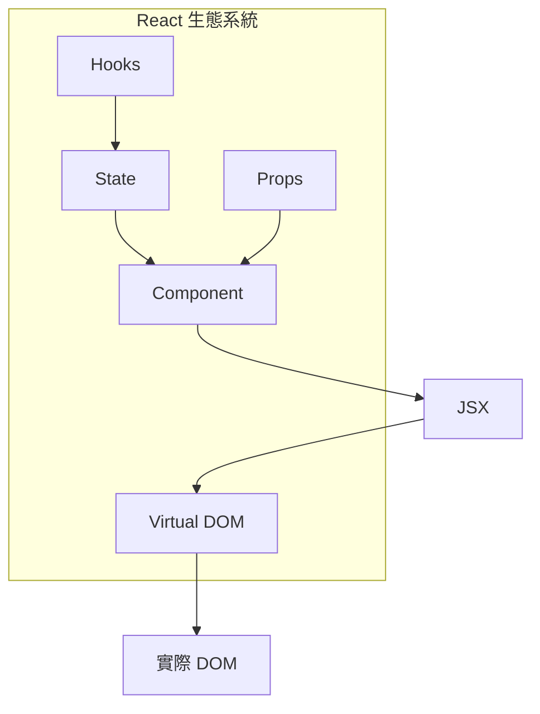
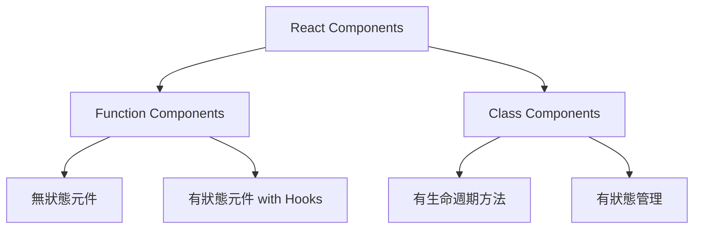
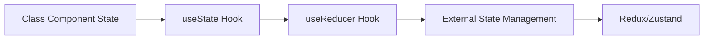
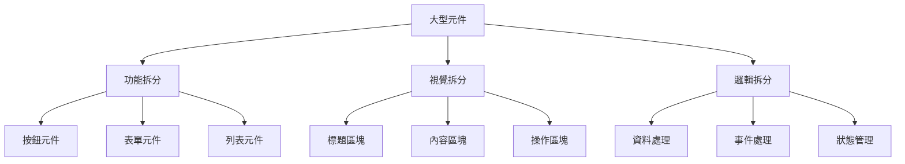
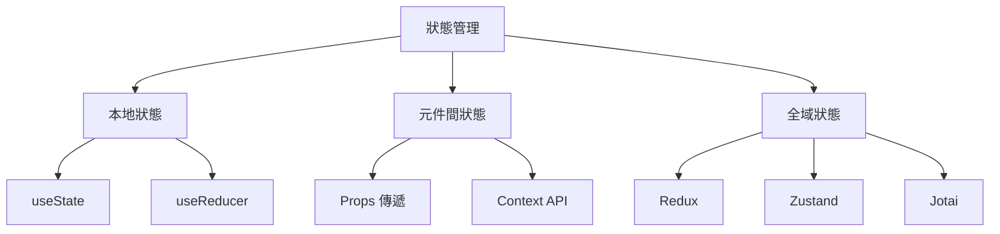

+++
date = '2025-10-31T00:00:00+08:00'
draft = false
title = 'React前端framework教學'
tags = ['教學', 'framework']
categories = ['教學']
+++
# React 前端 Framework 教學手冊

## 📚 目錄

1. [基礎概念](#1-基礎概念)
   - 1.1 [React 簡介與核心原理](#11-react-簡介與核心原理)
   - 1.2 [JSX 語法](#12-jsx-語法)
   - 1.3 [Component 元件](#13-component-元件)
   - 1.4 [Props 屬性](#14-props-屬性)
   - 1.5 [State 狀態](#15-state-狀態)
   - 1.6 [Hooks 鉤子](#16-hooks-鉤子)

2. [專案實務](#2-專案實務)
   - 2.0 [專案建立與環境設定](#20-專案建立與環境設定)
   - 2.1 [專案架構與元件拆分](#21-專案架構與元件拆分)
   - 2.2 [狀態管理策略](#22-狀態管理策略)
   - 2.3 [API 呼叫方式](#23-api-呼叫方式)
   - 2.4 [UI/UX 開發流程](#24-uiux-開發流程)

3. [進階主題](#3-進階主題)
   - 3.1 [React Router 路由管理](#31-react-router-路由管理)
   - 3.2 [Context API](#32-context-api)
   - 3.3 [狀態管理工具](#33-狀態管理工具)
   - 3.4 [效能最佳化](#34-效能最佳化)

4. [測試與品質](#4-測試與品質)
   - 4.1 [React 測試框架](#41-react-測試框架)
   - 4.2 [程式碼規範](#42-程式碼規範)
   - 4.3 [Lint 與 Formatter](#43-lint-與-formatter)

5. [實戰演練](#5-實戰演練)
   - 5.1 [表單處理](#51-表單處理)
   - 5.2 [API 資料綁定](#52-api-資料綁定)
   - 5.3 [前後端整合](#53-前後端整合)

6. [認證準備指南](#6-認證準備指南)
   - 6.1 [React 認證概述](#61-react-認證概述)
   - 6.2 [常見考點](#62-常見考點)
   - 6.3 [練習題範例](#63-練習題範例)
   - 6.4 [學習資源](#64-學習資源)

7. [檢查清單](#7-檢查清單)

---

## 1. 基礎概念

### 1.1 React 簡介與核心原理

#### 什麼是 React？

React 是由 Facebook（現在的 Meta）開發的開源 JavaScript 函式庫，專門用來建立使用者介面（UI）。它採用元件化的開發方式，讓開發者能夠建立可重複使用的 UI 元件。

#### React 核心原理



**1. Virtual DOM（虛擬 DOM）**
- React 在記憶體中維護一個虛擬的 DOM 樹
- 當狀態改變時，React 會比較新舊虛擬 DOM 的差異
- 只更新實際需要改變的 DOM 節點，提升效能

**2. 元件化（Component-Based）**
- 將 UI 拆分成獨立、可重複使用的元件
- 每個元件都有自己的狀態和生命週期
- 元件可以組合成更複雜的介面

**3. 單向資料流（One-Way Data Flow）**
- 資料從父元件流向子元件
- 子元件透過回調函數與父元件溝通
- 讓資料流向可預測且易於除錯

#### 實例說明

```javascript
// 簡單的 React 元件範例
import React from 'react';

function Welcome(props) {
  return <h1>Hello, {props.name}!</h1>;
}

// 使用元件
function App() {
  return (
    <div>
      <Welcome name="張三" />
      <Welcome name="李四" />
    </div>
  );
}

export default App;
```

#### 專案實際應用

在我們的專案中，每個功能模組都會被拆分成獨立的 React 元件：

```
src/
├── components/          # 通用元件
│   ├── Header/
│   ├── Footer/
│   └── Button/
├── pages/              # 頁面元件
│   ├── Home/
│   ├── Login/
│   └── Dashboard/
└── hooks/              # 自定義 Hooks
    ├── useAuth.js
    └── useApi.js
```

### 1.2 JSX 語法

#### 什麼是 JSX？

JSX（JavaScript XML）是 React 的語法擴展，允許我們在 JavaScript 中撰寫類似 HTML 的程式碼。

#### JSX 基本語法

**1. 基本結構**

```javascript
// JSX 語法
const element = <h1>Hello, World!</h1>;

// 等同於
const element = React.createElement('h1', null, 'Hello, World!');
```

**2. 嵌入 JavaScript 表達式**

```javascript
function Greeting(props) {
  const name = props.name;
  const time = new Date().getHours();
  
  return (
    <div>
      <h1>Hello, {name}!</h1>
      <p>現在時間是：{time}:00</p>
      <p>今天是：{time < 12 ? '早上' : '下午'}</p>
    </div>
  );
}
```

**3. 屬性設定**

```javascript
function Button(props) {
  return (
    <button 
      className="btn btn-primary"
      onClick={props.onClick}
      disabled={props.disabled}
    >
      {props.children}
    </button>
  );
}
```

**4. 條件渲染**

```javascript
function UserStatus({ isLoggedIn, username }) {
  return (
    <div>
      {isLoggedIn ? (
        <span>歡迎回來，{username}!</span>
      ) : (
        <span>請先登入</span>
      )}
    </div>
  );
}
```

**5. 列表渲染**

```javascript
function TodoList({ todos }) {
  return (
    <ul>
      {todos.map(todo => (
        <li key={todo.id}>
          <span className={todo.completed ? 'completed' : ''}>
            {todo.text}
          </span>
        </li>
      ))}
    </ul>
  );
}
```

#### JSX 注意事項

1. **class → className**
   ```javascript
   // 錯誤
   <div class="container">

   // 正確
   <div className="container">
   ```

2. **單一根元素**
   ```javascript
   // 錯誤 - 多個根元素
   return (
     <h1>標題</h1>
     <p>內容</p>
   );

   // 正確 - 使用 Fragment
   return (
     <>
       <h1>標題</h1>
       <p>內容</p>
     </>
   );
   ```

3. **自閉合標籤**
   ```javascript
   // HTML
   <input type="text">
   

   // JSX
   <input type="text" />
   
   ```

#### 專案實際應用

在我們的專案中，JSX 的使用規範：

```javascript
// components/ProductCard.js
import React from 'react';
import './ProductCard.css';

function ProductCard({ product, onAddToCart }) {
  const { id, name, price, image, inStock } = product;
  
  return (
    <div className="product-card">
      
      <div className="product-info">
        <h3 className="product-name">{name}</h3>
        <p className="product-price">NT$ {price.toLocaleString()}</p>
        <button 
          className={`btn ${inStock ? 'btn-primary' : 'btn-disabled'}`}
          onClick={() => onAddToCart(id)}
          disabled={!inStock}
        >
          {inStock ? '加入購物車' : '缺貨中'}
        </button>
      </div>
    </div>
  );
}

export default ProductCard;
```

#### 實務提醒

- 使用語義化的 HTML 標籤
- 保持 JSX 結構清晰易讀
- 適當使用條件渲染和列表渲染
- 遵循專案的 CSS 類別命名規範

### 1.3 Component 元件

#### 什麼是 React Component？

Component（元件）是 React 應用程式的基本建構單位。每個元件都是一個獨立的、可重複使用的程式碼片段，負責渲染 UI 的一部分。

#### 元件類型



**1. Function Components（函數元件）**

```javascript
// 基本函數元件
function Welcome(props) {
  return <h1>Hello, {props.name}!</h1>;
}

// 使用箭頭函數
const Welcome = (props) => {
  return <h1>Hello, {props.name}!</h1>;
};

// 簡化寫法（當只有一個 return 時）
const Welcome = (props) => <h1>Hello, {props.name}!</h1>;
```

**2. Class Components（類別元件）**

```javascript
import React, { Component } from 'react';

class Welcome extends Component {
  render() {
    return <h1>Hello, {this.props.name}!</h1>;
  }
}
```

#### 元件組合

```javascript
// 子元件
function Avatar({ user }) {
  return (
    
  );
}

function UserInfo({ user }) {
  return (
    <div className="user-info">
      <Avatar user={user} />
      <div className="user-info-name">
        {user.name}
      </div>
    </div>
  );
}

// 父元件
function Comment({ author, text, date }) {
  return (
    <div className="comment">
      <UserInfo user={author} />
      <div className="comment-text">
        {text}
      </div>
      <div className="comment-date">
        {formatDate(date)}
      </div>
    </div>
  );
}
```

#### 元件最佳實務

**1. 單一職責原則**

```javascript
// ❌ 不良範例 - 元件職責過多
function UserDashboard({ userId }) {
  const [user, setUser] = useState(null);
  const [posts, setPosts] = useState([]);
  const [notifications, setNotifications] = useState([]);
  
  // 太多邏輯在一個元件中...
  
  return (
    <div>
      {/* 複雜的 UI 結構 */}
    </div>
  );
}

// ✅ 良好範例 - 拆分成多個元件
function UserDashboard({ userId }) {
  return (
    <div className="dashboard">
      <UserProfile userId={userId} />
      <UserPosts userId={userId} />
      <Notifications userId={userId} />
    </div>
  );
}
```

**2. 元件命名規範**

```javascript
// ✅ 良好的元件命名
function ProductCard() {} // PascalCase
function UserProfile() {} // 描述性名稱
function LoadingSpinner() {} // 清楚表達功能

// ❌ 不良的元件命名
function product() {} // 小寫開頭
function Component1() {} // 無意義名稱
function div() {} // 與 HTML 標籤衝突
```

#### 專案實際應用

在我們的專案中，元件結構規範：

```
src/components/
├── common/              # 通用元件
│   ├── Button/
│   │   ├── Button.js
│   │   ├── Button.css
│   │   └── index.js
│   └── Modal/
├── layout/              # 版面元件
│   ├── Header/
│   ├── Sidebar/
│   └── Footer/
└── business/            # 業務邏輯元件
    ├── ProductList/
    ├── ShoppingCart/
    └── UserProfile/
```

**元件開發範例：**

```javascript
// components/common/Button/Button.js
import React from 'react';
import PropTypes from 'prop-types';
import './Button.css';

function Button({ 
  children, 
  type = 'button', 
  variant = 'primary', 
  size = 'medium',
  disabled = false,
  loading = false,
  onClick,
  ...rest 
}) {
  const className = `btn btn-${variant} btn-${size} ${disabled ? 'btn-disabled' : ''}`;
  
  return (
    <button
      type={type}
      className={className}
      disabled={disabled || loading}
      onClick={onClick}
      {...rest}
    >
      {loading ? (
        <span className="btn-spinner">載入中...</span>
      ) : (
        children
      )}
    </button>
  );
}

// PropTypes 驗證
Button.propTypes = {
  children: PropTypes.node.isRequired,
  type: PropTypes.oneOf(['button', 'submit', 'reset']),
  variant: PropTypes.oneOf(['primary', 'secondary', 'danger']),
  size: PropTypes.oneOf(['small', 'medium', 'large']),
  disabled: PropTypes.bool,
  loading: PropTypes.bool,
  onClick: PropTypes.func
};

export default Button;
```

```javascript
// components/common/Button/index.js
export { default } from './Button';
```

#### 元件測試

```javascript
// Button.test.js
import React from 'react';
import { render, fireEvent, screen } from '@testing-library/react';
import Button from './Button';

describe('Button Component', () => {
  test('renders button with text', () => {
    render(<Button>Click me</Button>);
    expect(screen.getByText('Click me')).toBeInTheDocument();
  });

  test('calls onClick when clicked', () => {
    const handleClick = jest.fn();
    render(<Button onClick={handleClick}>Click me</Button>);
    
    fireEvent.click(screen.getByText('Click me'));
    expect(handleClick).toHaveBeenCalledTimes(1);
  });

  test('shows loading state', () => {
    render(<Button loading>Click me</Button>);
    expect(screen.getByText('載入中...')).toBeInTheDocument();
  });
});
```

#### 實務提醒

- 保持元件功能單一且專注
- 使用 PropTypes 進行型別檢查
- 為元件撰寫適當的測試
- 遵循專案的檔案結構規範
- 使用有意義的元件名稱

### 1.4 Props 屬性

#### 什麼是 Props？

Props（Properties）是 React 元件之間傳遞資料的方式。Props 是唯讀的，子元件不能修改從父元件接收到的 props。

#### Props 基本使用

**1. 傳遞 Props**

```javascript
// 父元件
function App() {
  const user = {
    name: '張三',
    age: 25,
    email: 'zhang@example.com'
  };

  return (
    <div>
      <UserCard 
        name={user.name}
        age={user.age}
        email={user.email}
        isAdmin={true}
      />
    </div>
  );
}
```

**2. 接收 Props**

```javascript
// 子元件 - 函數元件
function UserCard(props) {
  return (
    <div className="user-card">
      <h2>{props.name}</h2>
      <p>年齡：{props.age}</p>
      <p>Email：{props.email}</p>
      {props.isAdmin && <span className="admin-badge">管理員</span>}
    </div>
  );
}

// 使用解構賦值
function UserCard({ name, age, email, isAdmin }) {
  return (
    <div className="user-card">
      <h2>{name}</h2>
      <p>年齡：{age}</p>
      <p>Email：{email}</p>
      {isAdmin && <span className="admin-badge">管理員</span>}
    </div>
  );
}
```

#### Props 進階用法

**1. 預設值設定**

```javascript
function Button({ text = '按鈕', variant = 'primary', onClick }) {
  return (
    <button 
      className={`btn btn-${variant}`}
      onClick={onClick}
    >
      {text}
    </button>
  );
}

// 或使用 defaultProps
Button.defaultProps = {
  text: '按鈕',
  variant: 'primary'
};
```

**2. Props 驗證**

```javascript
import PropTypes from 'prop-types';

function ProductCard({ product, onAddToCart }) {
  return (
    <div className="product-card">
      <h3>{product.name}</h3>
      <p>價格：NT$ {product.price}</p>
      <button onClick={() => onAddToCart(product.id)}>
        加入購物車
      </button>
    </div>
  );
}

ProductCard.propTypes = {
  product: PropTypes.shape({
    id: PropTypes.number.isRequired,
    name: PropTypes.string.isRequired,
    price: PropTypes.number.isRequired,
    image: PropTypes.string
  }).isRequired,
  onAddToCart: PropTypes.func.isRequired
};
```

**3. Children Prop**

```javascript
// 容器元件
function Card({ title, children, className = '' }) {
  return (
    <div className={`card ${className}`}>
      {title && <h2 className="card-title">{title}</h2>}
      <div className="card-content">
        {children}
      </div>
    </div>
  );
}

// 使用方式
function App() {
  return (
    <Card title="產品資訊">
      <p>這是產品描述</p>
      <Button>購買</Button>
    </Card>
  );
}
```

**4. Render Props 模式**

```javascript
function DataFetcher({ render, url }) {
  const [data, setData] = useState(null);
  const [loading, setLoading] = useState(true);
  const [error, setError] = useState(null);

  useEffect(() => {
    fetch(url)
      .then(response => response.json())
      .then(data => {
        setData(data);
        setLoading(false);
      })
      .catch(error => {
        setError(error);
        setLoading(false);
      });
  }, [url]);

  return render({ data, loading, error });
}

// 使用方式
function UserList() {
  return (
    <DataFetcher 
      url="/api/users"
      render={({ data, loading, error }) => {
        if (loading) return <div>載入中...</div>;
        if (error) return <div>錯誤：{error.message}</div>;
        
        return (
          <ul>
            {data.map(user => (
              <li key={user.id}>{user.name}</li>
            ))}
          </ul>
        );
      }}
    />
  );
}
```

#### 專案實際應用

**1. API 資料傳遞**

```javascript
// pages/ProductListPage.js
import React, { useState, useEffect } from 'react';
import ProductCard from '../components/ProductCard';
import LoadingSpinner from '../components/LoadingSpinner';

function ProductListPage() {
  const [products, setProducts] = useState([]);
  const [loading, setLoading] = useState(true);

  useEffect(() => {
    fetchProducts();
  }, []);

  const fetchProducts = async () => {
    try {
      const response = await fetch('/api/products');
      const data = await response.json();
      setProducts(data);
    } catch (error) {
      console.error('載入產品失敗:', error);
    } finally {
      setLoading(false);
    }
  };

  const handleAddToCart = (productId) => {
    // 加入購物車邏輯
    console.log('加入購物車:', productId);
  };

  if (loading) {
    return <LoadingSpinner />;
  }

  return (
    <div className="product-list">
      {products.map(product => (
        <ProductCard
          key={product.id}
          product={product}
          onAddToCart={handleAddToCart}
        />
      ))}
    </div>
  );
}
```

**2. 表單資料處理**

```javascript
// components/forms/ContactForm.js
function ContactForm({ initialValues = {}, onSubmit, loading = false }) {
  const [formData, setFormData] = useState({
    name: '',
    email: '',
    message: '',
    ...initialValues
  });

  const handleChange = (e) => {
    const { name, value } = e.target;
    setFormData(prev => ({
      ...prev,
      [name]: value
    }));
  };

  const handleSubmit = (e) => {
    e.preventDefault();
    onSubmit(formData);
  };

  return (
    <form onSubmit={handleSubmit} className="contact-form">
      <FormField
        label="姓名"
        type="text"
        name="name"
        value={formData.name}
        onChange={handleChange}
        required
      />
      <FormField
        label="Email"
        type="email"
        name="email"
        value={formData.email}
        onChange={handleChange}
        required
      />
      <FormField
        label="訊息"
        type="textarea"
        name="message"
        value={formData.message}
        onChange={handleChange}
        rows={5}
      />
      <Button 
        type="submit" 
        loading={loading}
        disabled={!formData.name || !formData.email}
      >
        送出
      </Button>
    </form>
  );
}
```

#### Props 最佳實務

**1. 避免 Prop Drilling**

```javascript
// ❌ Prop Drilling 問題
function App() {
  const user = { name: '張三', role: 'admin' };
  
  return <Dashboard user={user} />;
}

function Dashboard({ user }) {
  return <Sidebar user={user} />;
}

function Sidebar({ user }) {
  return <UserMenu user={user} />;
}

function UserMenu({ user }) {
  return <div>{user.name}</div>;
}

// ✅ 使用 Context 解決
const UserContext = React.createContext();

function App() {
  const user = { name: '張三', role: 'admin' };
  
  return (
    <UserContext.Provider value={user}>
      <Dashboard />
    </UserContext.Provider>
  );
}

function UserMenu() {
  const user = useContext(UserContext);
  return <div>{user.name}</div>;
}
```

**2. Props 介面設計**

```javascript
// ✅ 良好的 Props 設計
function DataTable({ 
  data, 
  columns, 
  loading = false,
  onSort,
  onFilter,
  pagination = { page: 1, pageSize: 10 },
  onPageChange 
}) {
  // 元件實作
}

// ✅ 使用 TypeScript 進行型別定義
interface DataTableProps {
  data: Array<Record<string, any>>;
  columns: Column[];
  loading?: boolean;
  onSort?: (column: string, direction: 'asc' | 'desc') => void;
  onFilter?: (filters: Record<string, any>) => void;
  pagination?: {
    page: number;
    pageSize: number;
    total?: number;
  };
  onPageChange?: (page: number) => void;
}
```

#### 實務提醒

- 保持 Props 簡潔，避免傳遞過多參數
- 使用 PropTypes 或 TypeScript 進行型別檢查
- 為可選的 Props 提供預設值
- 避免直接修改 Props
- 考慮使用 Context 避免 Prop Drilling

### 1.5 State 狀態

#### 什麼是 State？

State（狀態）是 React 元件內部的資料儲存機制。與 Props 不同，State 是可變的，元件可以根據使用者互動或其他事件來更新自己的狀態。

#### 狀態管理演進



#### useState Hook

**1. 基本使用**

```javascript
import React, { useState } from 'react';

function Counter() {
  // 宣告狀態變數和更新函數
  const [count, setCount] = useState(0);

  const increment = () => {
    setCount(count + 1);
  };

  const decrement = () => {
    setCount(count - 1);
  };

  return (
    <div className="counter">
      <h2>計數器：{count}</h2>
      <button onClick={increment}>+1</button>
      <button onClick={decrement}>-1</button>
    </div>
  );
}
```

**2. 多個狀態變數**

```javascript
function UserProfile() {
  const [name, setName] = useState('');
  const [email, setEmail] = useState('');
  const [age, setAge] = useState(0);
  const [loading, setLoading] = useState(false);

  const handleSubmit = async (e) => {
    e.preventDefault();
    setLoading(true);

    try {
      await updateUserProfile({ name, email, age });
      alert('更新成功！');
    } catch (error) {
      alert('更新失敗：' + error.message);
    } finally {
      setLoading(false);
    }
  };

  return (
    <form onSubmit={handleSubmit}>
      <input
        type="text"
        placeholder="姓名"
        value={name}
        onChange={(e) => setName(e.target.value)}
      />
      <input
        type="email"
        placeholder="Email"
        value={email}
        onChange={(e) => setEmail(e.target.value)}
      />
      <input
        type="number"
        placeholder="年齡"
        value={age}
        onChange={(e) => setAge(parseInt(e.target.value))}
      />
      <button type="submit" disabled={loading}>
        {loading ? '更新中...' : '更新'}
      </button>
    </form>
  );
}
```

**3. 物件狀態管理**

```javascript
function ContactForm() {
  const [formData, setFormData] = useState({
    name: '',
    email: '',
    phone: '',
    message: ''
  });

  const handleChange = (e) => {
    const { name, value } = e.target;
    setFormData(prevData => ({
      ...prevData,
      [name]: value
    }));
  };

  const handleSubmit = (e) => {
    e.preventDefault();
    console.log('表單資料：', formData);
  };

  return (
    <form onSubmit={handleSubmit}>
      <input
        name="name"
        type="text"
        placeholder="姓名"
        value={formData.name}
        onChange={handleChange}
      />
      <input
        name="email"
        type="email"
        placeholder="Email"
        value={formData.email}
        onChange={handleChange}
      />
      <input
        name="phone"
        type="tel"
        placeholder="電話"
        value={formData.phone}
        onChange={handleChange}
      />
      <textarea
        name="message"
        placeholder="訊息"
        value={formData.message}
        onChange={handleChange}
      />
      <button type="submit">送出</button>
    </form>
  );
}
```

**4. 陣列狀態管理**

```javascript
function TodoList() {
  const [todos, setTodos] = useState([]);
  const [inputValue, setInputValue] = useState('');

  const addTodo = () => {
    if (inputValue.trim()) {
      const newTodo = {
        id: Date.now(),
        text: inputValue,
        completed: false
      };
      setTodos(prevTodos => [...prevTodos, newTodo]);
      setInputValue('');
    }
  };

  const toggleTodo = (id) => {
    setTodos(prevTodos =>
      prevTodos.map(todo =>
        todo.id === id 
          ? { ...todo, completed: !todo.completed }
          : todo
      )
    );
  };

  const deleteTodo = (id) => {
    setTodos(prevTodos => 
      prevTodos.filter(todo => todo.id !== id)
    );
  };

  return (
    <div className="todo-list">
      <div className="add-todo">
        <input
          type="text"
          value={inputValue}
          onChange={(e) => setInputValue(e.target.value)}
          onKeyPress={(e) => e.key === 'Enter' && addTodo()}
          placeholder="新增待辦事項"
        />
        <button onClick={addTodo}>新增</button>
      </div>

      <ul>
        {todos.map(todo => (
          <li key={todo.id} className={todo.completed ? 'completed' : ''}>
            <span onClick={() => toggleTodo(todo.id)}>
              {todo.text}
            </span>
            <button onClick={() => deleteTodo(todo.id)}>刪除</button>
          </li>
        ))}
      </ul>
    </div>
  );
}
```

#### useReducer Hook

當狀態邏輯複雜時，可以使用 `useReducer`：

```javascript
import React, { useReducer } from 'react';

// 定義 reducer
function cartReducer(state, action) {
  switch (action.type) {
    case 'ADD_ITEM':
      const existingItem = state.items.find(item => item.id === action.payload.id);
      if (existingItem) {
        return {
          ...state,
          items: state.items.map(item =>
            item.id === action.payload.id
              ? { ...item, quantity: item.quantity + 1 }
              : item
          )
        };
      } else {
        return {
          ...state,
          items: [...state.items, { ...action.payload, quantity: 1 }]
        };
      }

    case 'REMOVE_ITEM':
      return {
        ...state,
        items: state.items.filter(item => item.id !== action.payload)
      };

    case 'UPDATE_QUANTITY':
      return {
        ...state,
        items: state.items.map(item =>
          item.id === action.payload.id
            ? { ...item, quantity: action.payload.quantity }
            : item
        )
      };

    case 'CLEAR_CART':
      return { ...state, items: [] };

    default:
      return state;
  }
}

function ShoppingCart() {
  const [cart, dispatch] = useReducer(cartReducer, { items: [] });

  const addToCart = (product) => {
    dispatch({ type: 'ADD_ITEM', payload: product });
  };

  const removeFromCart = (productId) => {
    dispatch({ type: 'REMOVE_ITEM', payload: productId });
  };

  const updateQuantity = (productId, quantity) => {
    dispatch({ 
      type: 'UPDATE_QUANTITY', 
      payload: { id: productId, quantity } 
    });
  };

  const clearCart = () => {
    dispatch({ type: 'CLEAR_CART' });
  };

  const totalPrice = cart.items.reduce(
    (total, item) => total + (item.price * item.quantity), 
    0
  );

  return (
    <div className="shopping-cart">
      <h2>購物車</h2>
      {cart.items.length === 0 ? (
        <p>購物車是空的</p>
      ) : (
        <>
          {cart.items.map(item => (
            <div key={item.id} className="cart-item">
              <span>{item.name}</span>
              <span>NT$ {item.price}</span>
              <input
                type="number"
                value={item.quantity}
                onChange={(e) => updateQuantity(item.id, parseInt(e.target.value))}
                min="1"
              />
              <button onClick={() => removeFromCart(item.id)}>移除</button>
            </div>
          ))}
          <div className="cart-total">
            總計：NT$ {totalPrice.toLocaleString()}
          </div>
          <button onClick={clearCart}>清空購物車</button>
        </>
      )}
    </div>
  );
}
```

#### 狀態更新注意事項

**1. 狀態更新是非同步的**

```javascript
function Counter() {
  const [count, setCount] = useState(0);

  const handleClick = () => {
    // ❌ 錯誤：這樣無法連續更新
    setCount(count + 1);
    setCount(count + 1); // 還是只會 +1

    // ✅ 正確：使用函數式更新
    setCount(prevCount => prevCount + 1);
    setCount(prevCount => prevCount + 1); // 會 +2
  };

  return (
    <button onClick={handleClick}>
      計數：{count}
    </button>
  );
}
```

**2. 避免直接修改狀態**

```javascript
function ItemList() {
  const [items, setItems] = useState([
    { id: 1, name: '項目 1' },
    { id: 2, name: '項目 2' }
  ]);

  const updateItem = (id, newName) => {
    // ❌ 錯誤：直接修改原陣列
    const item = items.find(item => item.id === id);
    item.name = newName;
    setItems(items);

    // ✅ 正確：建立新陣列
    setItems(prevItems =>
      prevItems.map(item =>
        item.id === id ? { ...item, name: newName } : item
      )
    );
  };
}
```

#### 專案應用範例

```javascript
// hooks/useApiData.js
import { useState, useEffect } from 'react';

export function useApiData(url) {
  const [data, setData] = useState(null);
  const [loading, setLoading] = useState(true);
  const [error, setError] = useState(null);

  useEffect(() => {
    const fetchData = async () => {
      try {
        setLoading(true);
        setError(null);
        
        const response = await fetch(url);
        if (!response.ok) {
          throw new Error(`HTTP error! status: ${response.status}`);
        }
        
        const result = await response.json();
        setData(result);
      } catch (err) {
        setError(err.message);
      } finally {
        setLoading(false);
      }
    };

    fetchData();
  }, [url]);

  return { data, loading, error, refetch: () => fetchData() };
}

// 使用範例
function ProductList() {
  const { data: products, loading, error, refetch } = useApiData('/api/products');

  if (loading) return <div>載入中...</div>;
  if (error) return <div>錯誤：{error}</div>;

  return (
    <div>
      <button onClick={refetch}>重新載入</button>
      {products?.map(product => (
        <ProductCard key={product.id} product={product} />
      ))}
    </div>
  );
}
```

### 1.6 Hooks 鉤子

#### 什麼是 Hooks？

Hooks 是 React 16.8 引入的新功能，讓你可以在函數元件中使用狀態和其他 React 功能。Hooks 讓函數元件擁有類別元件的能力。

#### 基本 Hooks

**1. useState**

已在前面章節詳細介紹。

**2. useEffect**

用於處理副作用（side effects），如 API 呼叫、訂閱、計時器等。

```javascript
import React, { useState, useEffect } from 'react';

function UserProfile({ userId }) {
  const [user, setUser] = useState(null);
  const [loading, setLoading] = useState(true);

  // 元件掛載時執行
  useEffect(() => {
    fetchUser(userId);
  }, [userId]); // 依賴陣列

  // 清理函數
  useEffect(() => {
    const timer = setInterval(() => {
      console.log('定時執行');
    }, 1000);

    // 清理函數
    return () => {
      clearInterval(timer);
    };
  }, []);

  const fetchUser = async (id) => {
    setLoading(true);
    try {
      const response = await fetch(`/api/users/${id}`);
      const userData = await response.json();
      setUser(userData);
    } catch (error) {
      console.error('載入使用者失敗:', error);
    } finally {
      setLoading(false);
    }
  };

  if (loading) return <div>載入中...</div>;
  if (!user) return <div>找不到使用者</div>;

  return (
    <div className="user-profile">
      <h2>{user.name}</h2>
      <p>Email: {user.email}</p>
    </div>
  );
}
```

**3. useContext**

用於讀取 Context 的值。

```javascript
import React, { createContext, useContext, useState } from 'react';

// 建立 Context
const ThemeContext = createContext();

// Provider 元件
function ThemeProvider({ children }) {
  const [theme, setTheme] = useState('light');

  const toggleTheme = () => {
    setTheme(prevTheme => prevTheme === 'light' ? 'dark' : 'light');
  };

  return (
    <ThemeContext.Provider value={{ theme, toggleTheme }}>
      {children}
    </ThemeContext.Provider>
  );
}

// 使用 useContext
function Header() {
  const { theme, toggleTheme } = useContext(ThemeContext);

  return (
    <header className={`header header-${theme}`}>
      <h1>我的應用程式</h1>
      <button onClick={toggleTheme}>
        切換到 {theme === 'light' ? '深色' : '淺色'} 主題
      </button>
    </header>
  );
}

// App 元件
function App() {
  return (
    <ThemeProvider>
      <Header />
      {/* 其他元件 */}
    </ThemeProvider>
  );
}
```

#### 進階 Hooks

**4. useReducer**

已在前面章節介紹，適用於複雜的狀態邏輯。

**5. useMemo**

用於最佳化效能，快取計算結果。

```javascript
import React, { useState, useMemo } from 'react';

function ExpensiveComponent({ items, filter }) {
  const [sortOrder, setSortOrder] = useState('asc');

  // 使用 useMemo 快取昂貴的計算
  const filteredAndSortedItems = useMemo(() => {
    console.log('重新計算 filteredAndSortedItems');
    
    const filtered = items.filter(item => 
      item.name.toLowerCase().includes(filter.toLowerCase())
    );

    return filtered.sort((a, b) => {
      if (sortOrder === 'asc') {
        return a.name.localeCompare(b.name);
      } else {
        return b.name.localeCompare(a.name);
      }
    });
  }, [items, filter, sortOrder]); // 依賴陣列

  return (
    <div>
      <button onClick={() => setSortOrder(sortOrder === 'asc' ? 'desc' : 'asc')}>
        排序：{sortOrder === 'asc' ? '升序' : '降序'}
      </button>
      
      <ul>
        {filteredAndSortedItems.map(item => (
          <li key={item.id}>{item.name}</li>
        ))}
      </ul>
    </div>
  );
}
```

**6. useCallback**

用於快取函數，避免不必要的重新渲染。

```javascript
import React, { useState, useCallback } from 'react';

function ParentComponent() {
  const [count, setCount] = useState(0);
  const [items, setItems] = useState(['項目1', '項目2']);

  // 使用 useCallback 快取函數
  const handleItemClick = useCallback((item) => {
    console.log('點擊項目:', item);
  }, []); // 空依賴陣列，函數永遠不變

  const addItem = useCallback(() => {
    setItems(prevItems => [...prevItems, `項目${prevItems.length + 1}`]);
  }, []);

  return (
    <div>
      <p>計數：{count}</p>
      <button onClick={() => setCount(count + 1)}>增加計數</button>
      <button onClick={addItem}>新增項目</button>
      
      <ItemList items={items} onItemClick={handleItemClick} />
    </div>
  );
}

// 子元件使用 React.memo 進行最佳化
const ItemList = React.memo(function ItemList({ items, onItemClick }) {
  console.log('ItemList 重新渲染');
  
  return (
    <ul>
      {items.map(item => (
        <li key={item} onClick={() => onItemClick(item)}>
          {item}
        </li>
      ))}
    </ul>
  );
});
```

**7. useRef**

用於存取 DOM 元素或儲存可變值。

```javascript
import React, { useRef, useEffect } from 'react';

function FocusInput() {
  const inputRef = useRef(null);
  const countRef = useRef(0);

  useEffect(() => {
    // 自動 focus 到 input
    inputRef.current.focus();
  }, []);

  const handleClick = () => {
    countRef.current += 1;
    console.log('點擊次數:', countRef.current);
    
    // 操作 DOM
    inputRef.current.focus();
    inputRef.current.select();
  };

  return (
    <div>
      <input ref={inputRef} type="text" placeholder="輸入文字" />
      <button onClick={handleClick}>Focus Input</button>
    </div>
  );
}
```

#### 自定義 Hooks

建立可重複使用的邏輯：

```javascript
// hooks/useLocalStorage.js
import { useState, useEffect } from 'react';

export function useLocalStorage(key, initialValue) {
  // 從 localStorage 讀取初始值
  const [storedValue, setStoredValue] = useState(() => {
    try {
      const item = window.localStorage.getItem(key);
      return item ? JSON.parse(item) : initialValue;
    } catch (error) {
      console.error('從 localStorage 讀取失敗:', error);
      return initialValue;
    }
  });

  // 更新 localStorage 的函數
  const setValue = (value) => {
    try {
      setStoredValue(value);
      window.localStorage.setItem(key, JSON.stringify(value));
    } catch (error) {
      console.error('寫入 localStorage 失敗:', error);
    }
  };

  return [storedValue, setValue];
}

// 使用範例
function Settings() {
  const [theme, setTheme] = useLocalStorage('theme', 'light');
  const [language, setLanguage] = useLocalStorage('language', 'zh-TW');

  return (
    <div>
      <select value={theme} onChange={(e) => setTheme(e.target.value)}>
        <option value="light">淺色主題</option>
        <option value="dark">深色主題</option>
      </select>
      
      <select value={language} onChange={(e) => setLanguage(e.target.value)}>
        <option value="zh-TW">繁體中文</option>
        <option value="en">English</option>
      </select>
    </div>
  );
}
```

#### Hooks 規則

1. **只在最頂層呼叫 Hooks**
   ```javascript
   // ❌ 錯誤：在條件語句中使用 Hook
   function MyComponent({ condition }) {
     if (condition) {
       const [value, setValue] = useState(0); // 錯誤！
     }
   }

   // ✅ 正確：在頂層使用 Hook
   function MyComponent({ condition }) {
     const [value, setValue] = useState(0);
     
     if (condition) {
       // 在這裡使用 value 和 setValue
     }
   }
   ```

2. **只在 React 函數中呼叫 Hooks**
   ```javascript
   // ❌ 錯誤：在普通函數中使用 Hook
   function fetchData() {
     const [data, setData] = useState(null); // 錯誤！
   }

   // ✅ 正確：在 React 元件或自定義 Hook 中使用
   function useData() {
     const [data, setData] = useState(null);
     return { data, setData };
   }
   ```

#### 專案應用範例

```javascript
// hooks/useApi.js
import { useState, useEffect } from 'react';

export function useApi(url, options = {}) {
  const [data, setData] = useState(null);
  const [loading, setLoading] = useState(true);
  const [error, setError] = useState(null);

  useEffect(() => {
    let cancelled = false;

    const fetchData = async () => {
      try {
        setLoading(true);
        setError(null);

        const response = await fetch(url, {
          ...options,
          headers: {
            'Content-Type': 'application/json',
            ...options.headers
          }
        });

        if (!response.ok) {
          throw new Error(`HTTP error! status: ${response.status}`);
        }

        const result = await response.json();
        
        if (!cancelled) {
          setData(result);
        }
      } catch (err) {
        if (!cancelled) {
          setError(err.message);
        }
      } finally {
        if (!cancelled) {
          setLoading(false);
        }
      }
    };

    fetchData();

    // 清理函數
    return () => {
      cancelled = true;
    };
  }, [url, JSON.stringify(options)]);

  return { data, loading, error };
}

// 使用範例
function ProductList() {
  const { data: products, loading, error } = useApi('/api/products');

  if (loading) return <div>載入中...</div>;
  if (error) return <div>錯誤：{error}</div>;

  return (
    <div>
      {products?.map(product => (
        <div key={product.id}>{product.name}</div>
      ))}
    </div>
  );
}
```

#### 實用提醒

- 遵循 Hooks 的使用規則
- 適當使用 `useMemo` 和 `useCallback` 進行效能最佳化
- 建立自定義 Hooks 來重複使用邏輯
- 使用 `useEffect` 的清理函數避免記憶體洩漏
- 正確設定依賴陣列避免無限迴圈

---

這是第一章「基礎概念」的完整內容。接下來我將繼續撰寫第二章「專案實務」的內容。您希望我繼續嗎？

## 2. 專案實務

### 2.0 專案建立與環境設定

#### 建立 React 專案

**1. 使用 Create React App**

```bash
# 建立新專案
npx create-react-app my-react-app
cd my-react-app

# 安裝額外依賴
npm install react-router-dom axios

# 啟動開發伺服器
npm start
```

**2. 使用 Vite（推薦）**

```bash
# 建立新專案
npm create vite@latest my-react-app -- --template react
cd my-react-app

# 安裝依賴
npm install

# 安裝額外套件
npm install react-router-dom axios @hookform/resolvers yup

# 啟動開發伺服器
npm run dev
```

#### 開發環境設定

**1. VS Code 擴充功能推薦**

```json
// .vscode/extensions.json
{
  "recommendations": [
    "bradlc.vscode-tailwindcss",
    "esbenp.prettier-vscode", 
    "dbaeumer.vscode-eslint",
    "ms-vscode.vscode-typescript-next",
    "christian-kohler.path-intellisense",
    "formulahendry.auto-rename-tag",
    "bradlc.vscode-tailwindcss",
    "ms-vscode.vscode-json"
  ]
}
```

**2. VS Code 設定**

```json
// .vscode/settings.json
{
  "editor.formatOnSave": true,
  "editor.defaultFormatter": "esbenp.prettier-vscode",
  "editor.codeActionsOnSave": {
    "source.fixAll.eslint": true
  },
  "emmet.includeLanguages": {
    "javascript": "javascriptreact"
  },
  "typescript.preferences.importModuleSpecifier": "relative"
}
```

#### 專案結構設定

**1. 建立標準目錄結構**

```bash
src/
├── components/          # 可重複使用的元件
│   ├── common/         # 通用元件（Button, Modal 等）
│   ├── layout/         # 版面配置元件
│   └── forms/          # 表單相關元件
├── pages/              # 頁面元件
├── hooks/              # 自定義 Hooks
├── services/           # API 服務
├── utils/              # 工具函數
├── contexts/           # React Context
├── types/              # TypeScript 型別定義
├── styles/             # 全域樣式
├── assets/             # 靜態資源
├── __tests__/          # 測試檔案
└── App.js              # 主要應用程式元件
```

**2. 建立 index.js 檔案範本**

```javascript
// src/components/common/Button/index.js
export { default } from './Button';

// src/components/common/index.js
export { default as Button } from './Button';
export { default as Modal } from './Modal';
export { default as LoadingSpinner } from './LoadingSpinner';
```

#### 套件管理

**1. 核心依賴套件**

```json
// package.json dependencies
{
  "dependencies": {
    "react": "^18.2.0",
    "react-dom": "^18.2.0",
    "react-router-dom": "^6.8.0",
    "axios": "^1.3.0"
  }
}
```

**2. 開發依賴套件**

```json
// package.json devDependencies  
{
  "devDependencies": {
    "@testing-library/jest-dom": "^5.16.0",
    "@testing-library/react": "^13.4.0",
    "@testing-library/user-event": "^14.4.0",
    "eslint": "^8.34.0",
    "prettier": "^2.8.0",
    "husky": "^8.0.0",
    "lint-staged": "^13.1.0"
  }
}
```

#### 環境變數設定

**1. 建立環境檔案**

```bash
# .env.local (開發環境)
REACT_APP_API_BASE_URL=http://localhost:3001/api
REACT_APP_APP_NAME=React Tutorial App
REACT_APP_VERSION=1.0.0

# .env.production (生產環境)
REACT_APP_API_BASE_URL=https://api.example.com
REACT_APP_APP_NAME=React Tutorial App
REACT_APP_VERSION=1.0.0
```

**2. 環境變數使用**

```javascript
// src/config/env.js
export const config = {
  apiBaseUrl: process.env.REACT_APP_API_BASE_URL,
  appName: process.env.REACT_APP_APP_NAME,
  version: process.env.REACT_APP_VERSION,
  isDevelopment: process.env.NODE_ENV === 'development',
  isProduction: process.env.NODE_ENV === 'production'
};

// 使用範例
import { config } from '../config/env';

const apiUrl = `${config.apiBaseUrl}/products`;
```

### 2.1 專案架構與元件拆分

#### 專案目錄結構

在我們的專案中，採用以下目錄結構來組織 React 程式碼：

```
src/
├── components/           # 可重複使用的元件
│   ├── common/          # 通用元件
│   │   ├── Button/
│   │   │   ├── Button.js
│   │   │   ├── Button.test.js
│   │   │   ├── Button.css
│   │   │   └── index.js
│   │   ├── Modal/
│   │   ├── LoadingSpinner/
│   │   └── ErrorBoundary/
│   ├── layout/          # 版面配置元件
│   │   ├── Header/
│   │   ├── Footer/
│   │   ├── Sidebar/
│   │   └── Navigation/
│   └── forms/           # 表單相關元件
│       ├── FormField/
│       ├── SearchInput/
│       └── DatePicker/
├── pages/               # 頁面元件
│   ├── HomePage/
│   ├── ProductListPage/
│   ├── ProductDetailPage/
│   ├── LoginPage/
│   └── DashboardPage/
├── hooks/               # 自定義 Hooks
│   ├── useAuth.js
│   ├── useApi.js
│   ├── useLocalStorage.js
│   └── useDebounce.js
├── services/            # API 服務
│   ├── api.js
│   ├── authService.js
│   └── productService.js
├── utils/               # 工具函數
│   ├── formatters.js
│   ├── validators.js
│   └── constants.js
├── contexts/            # React Context
│   ├── AuthContext.js
│   ├── ThemeContext.js
│   └── CartContext.js
├── styles/              # 全域樣式
│   ├── globals.css
│   ├── variables.css
│   └── components.css
└── assets/              # 靜態資源
    ├── images/
    ├── icons/
    └── fonts/
```

#### 元件拆分原則



**1. 單一職責原則**

每個元件應該只負責一個功能：

```javascript
// ❌ 違反單一職責原則
function UserDashboard() {
  const [user, setUser] = useState(null);
  const [posts, setPosts] = useState([]);
  const [notifications, setNotifications] = useState([]);
  const [theme, setTheme] = useState('light');

  // 處理使用者資料
  useEffect(() => {
    fetchUserData();
  }, []);

  // 處理文章資料
  useEffect(() => {
    fetchUserPosts();
  }, []);

  // 處理通知資料
  useEffect(() => {
    fetchNotifications();
  }, []);

  return (
    <div className={`dashboard theme-${theme}`}>
      {/* 複雜的 UI 結構 */}
      <header>
        <h1>{user?.name}</h1>
        <button onClick={() => setTheme(theme === 'light' ? 'dark' : 'light')}>
          切換主題
        </button>
      </header>
      
      <main>
        <section>
          <h2>我的文章</h2>
          {posts.map(post => (
            <div key={post.id}>
              <h3>{post.title}</h3>
              <p>{post.content}</p>
            </div>
          ))}
        </section>
        
        <aside>
          <h2>通知</h2>
          {notifications.map(notification => (
            <div key={notification.id}>
              {notification.message}
            </div>
          ))}
        </aside>
      </main>
    </div>
  );
}

// ✅ 遵循單一職責原則
function UserDashboard() {
  return (
    <div className="dashboard">
      <DashboardHeader />
      <DashboardMain />
    </div>
  );
}

function DashboardHeader() {
  return (
    <header className="dashboard-header">
      <UserProfile />
      <ThemeToggle />
    </header>
  );
}

function DashboardMain() {
  return (
    <main className="dashboard-main">
      <UserPosts />
      <NotificationPanel />
    </main>
  );
}
```

**2. 可重複使用性**

設計可在多處使用的元件：

```javascript
// components/common/Card/Card.js
function Card({ 
  title, 
  children, 
  className = '', 
  headerActions,
  footer,
  loading = false 
}) {
  return (
    <div className={`card ${className}`}>
      {loading && <div className="card-loading">載入中...</div>}
      
      {title && (
        <header className="card-header">
          <h3 className="card-title">{title}</h3>
          {headerActions && (
            <div className="card-actions">{headerActions}</div>
          )}
        </header>
      )}
      
      <div className="card-content">
        {children}
      </div>
      
      {footer && (
        <footer className="card-footer">
          {footer}
        </footer>
      )}
    </div>
  );
}

// 使用範例
function ProductList() {
  return (
    <Card 
      title="產品列表"
      headerActions={
        <Button variant="primary">新增產品</Button>
      }
      footer={
        <Pagination currentPage={1} totalPages={10} />
      }
    >
      {products.map(product => (
        <ProductItem key={product.id} product={product} />
      ))}
    </Card>
  );
}
```

**3. 容器元件與展示元件分離**

```javascript
// 容器元件 - 負責邏輯和資料
function ProductListContainer() {
  const [products, setProducts] = useState([]);
  const [loading, setLoading] = useState(true);
  const [filter, setFilter] = useState('');

  useEffect(() => {
    fetchProducts();
  }, []);

  const fetchProducts = async () => {
    setLoading(true);
    try {
      const data = await productService.getProducts();
      setProducts(data);
    } catch (error) {
      console.error('載入產品失敗:', error);
    } finally {
      setLoading(false);
    }
  };

  const filteredProducts = products.filter(product =>
    product.name.toLowerCase().includes(filter.toLowerCase())
  );

  return (
    <ProductListPresentation
      products={filteredProducts}
      loading={loading}
      filter={filter}
      onFilterChange={setFilter}
      onRefresh={fetchProducts}
    />
  );
}

// 展示元件 - 只負責 UI 渲染
function ProductListPresentation({ 
  products, 
  loading, 
  filter, 
  onFilterChange, 
  onRefresh 
}) {
  if (loading) {
    return <LoadingSpinner />;
  }

  return (
    <div className="product-list">
      <div className="product-list-header">
        <SearchInput 
          value={filter}
          onChange={onFilterChange}
          placeholder="搜尋產品..."
        />
        <Button onClick={onRefresh}>重新載入</Button>
      </div>
      
      <div className="product-grid">
        {products.map(product => (
          <ProductCard key={product.id} product={product} />
        ))}
      </div>
      
      {products.length === 0 && (
        <div className="empty-state">
          沒有找到符合條件的產品
        </div>
      )}
    </div>
  );
}
```

#### 元件命名規範

**1. 檔案命名**

```javascript
// ✅ 良好的命名
Button.js           // PascalCase
ProductCard.js      // 描述性名稱
LoadingSpinner.js   // 清楚表達功能
SearchInput.js      // 功能 + 類型

// ❌ 不良的命名
button.js           // 小寫
comp1.js           // 無意義
UI.js              // 過於籠統
```

**2. 元件命名**

```javascript
// ✅ 良好的元件名稱
function ProductCard() {}
function UserProfile() {}
function NavigationMenu() {}
function LoadingSpinner() {}

// ❌ 不良的元件名稱
function Card() {}        // 過於籠統
function Component1() {}  // 無意義
function product() {}     // 小寫開頭
```

#### 元件開發規範

**1. 完整的元件結構**

```javascript
// components/common/Button/Button.js
import React from 'react';
import PropTypes from 'prop-types';
import classNames from 'classnames';
import './Button.css';

/**
 * 通用按鈕元件
 * @param {Object} props - 元件屬性
 * @param {React.ReactNode} props.children - 按鈕內容
 * @param {string} props.variant - 按鈕樣式變體
 * @param {string} props.size - 按鈕大小
 * @param {boolean} props.disabled - 是否禁用
 * @param {boolean} props.loading - 是否載入中
 * @param {Function} props.onClick - 點擊事件處理函數
 */
function Button({
  children,
  variant = 'primary',
  size = 'medium',
  disabled = false,
  loading = false,
  className = '',
  onClick,
  ...rest
}) {
  const buttonClass = classNames(
    'btn',
    `btn-${variant}`,
    `btn-${size}`,
    {
      'btn-disabled': disabled,
      'btn-loading': loading
    },
    className
  );

  const handleClick = (event) => {
    if (disabled || loading) {
      event.preventDefault();
      return;
    }
    
    if (onClick) {
      onClick(event);
    }
  };

  return (
    <button
      className={buttonClass}
      disabled={disabled || loading}
      onClick={handleClick}
      {...rest}
    >
      {loading && <span className="btn-spinner" />}
      <span className="btn-content">{children}</span>
    </button>
  );
}

// PropTypes 驗證
Button.propTypes = {
  children: PropTypes.node.isRequired,
  variant: PropTypes.oneOf(['primary', 'secondary', 'danger', 'ghost']),
  size: PropTypes.oneOf(['small', 'medium', 'large']),
  disabled: PropTypes.bool,
  loading: PropTypes.bool,
  className: PropTypes.string,
  onClick: PropTypes.func
};

// 預設值
Button.defaultProps = {
  variant: 'primary',
  size: 'medium',
  disabled: false,
  loading: false,
  className: ''
};

export default Button;
```

**2. 索引檔案**

```javascript
// components/common/Button/index.js
export { default } from './Button';

// 如果有多個相關元件
export { default as Button } from './Button';
export { default as IconButton } from './IconButton';
export { default as LinkButton } from './LinkButton';
```

### 2.2 狀態管理策略

#### 狀態管理層級



**1. 本地狀態管理**

適用於單一元件內的狀態：

```javascript
function ContactForm() {
  const [formData, setFormData] = useState({
    name: '',
    email: '',
    message: ''
  });
  const [errors, setErrors] = useState({});
  const [submitting, setSubmitting] = useState(false);

  const validateForm = () => {
    const newErrors = {};
    
    if (!formData.name.trim()) {
      newErrors.name = '姓名為必填欄位';
    }
    
    if (!formData.email.trim()) {
      newErrors.email = 'Email 為必填欄位';
    } else if (!/\S+@\S+\.\S+/.test(formData.email)) {
      newErrors.email = 'Email 格式不正確';
    }
    
    if (!formData.message.trim()) {
      newErrors.message = '訊息為必填欄位';
    }
    
    setErrors(newErrors);
    return Object.keys(newErrors).length === 0;
  };

  const handleSubmit = async (e) => {
    e.preventDefault();
    
    if (!validateForm()) return;
    
    setSubmitting(true);
    try {
      await submitContactForm(formData);
      alert('表單送出成功！');
      setFormData({ name: '', email: '', message: '' });
    } catch (error) {
      alert('表單送出失敗：' + error.message);
    } finally {
      setSubmitting(false);
    }
  };

  const handleChange = (field, value) => {
    setFormData(prev => ({ ...prev, [field]: value }));
    
    // 清除該欄位的錯誤訊息
    if (errors[field]) {
      setErrors(prev => ({ ...prev, [field]: '' }));
    }
  };

  return (
    <form onSubmit={handleSubmit}>
      <FormField
        label="姓名"
        value={formData.name}
        onChange={(value) => handleChange('name', value)}
        error={errors.name}
        required
      />
      <FormField
        label="Email"
        type="email"
        value={formData.email}
        onChange={(value) => handleChange('email', value)}
        error={errors.email}
        required
      />
      <FormField
        label="訊息"
        type="textarea"
        value={formData.message}
        onChange={(value) => handleChange('message', value)}
        error={errors.message}
        required
      />
      <Button type="submit" loading={submitting}>
        送出
      </Button>
    </form>
  );
}
```

**2. Context 狀態管理**

適用於需要在多個元件間共享的狀態：

```javascript
// contexts/AuthContext.js
import React, { createContext, useContext, useReducer, useEffect } from 'react';

const AuthContext = createContext();

// 初始狀態
const initialState = {
  user: null,
  isAuthenticated: false,
  loading: true,
  error: null
};

// Reducer
function authReducer(state, action) {
  switch (action.type) {
    case 'LOGIN_START':
      return { ...state, loading: true, error: null };
    
    case 'LOGIN_SUCCESS':
      return {
        ...state,
        user: action.payload,
        isAuthenticated: true,
        loading: false,
        error: null
      };
    
    case 'LOGIN_FAILURE':
      return {
        ...state,
        user: null,
        isAuthenticated: false,
        loading: false,
        error: action.payload
      };
    
    case 'LOGOUT':
      return {
        ...state,
        user: null,
        isAuthenticated: false,
        loading: false,
        error: null
      };
    
    case 'SET_LOADING':
      return { ...state, loading: action.payload };
    
    default:
      return state;
  }
}

// Provider 元件
export function AuthProvider({ children }) {
  const [state, dispatch] = useReducer(authReducer, initialState);

  // 檢查登入狀態
  useEffect(() => {
    checkAuthStatus();
  }, []);

  const checkAuthStatus = async () => {
    try {
      const token = localStorage.getItem('token');
      if (token) {
        const user = await authService.getCurrentUser();
        dispatch({ type: 'LOGIN_SUCCESS', payload: user });
      } else {
        dispatch({ type: 'SET_LOADING', payload: false });
      }
    } catch (error) {
      dispatch({ type: 'LOGIN_FAILURE', payload: error.message });
      localStorage.removeItem('token');
    }
  };

  const login = async (credentials) => {
    dispatch({ type: 'LOGIN_START' });
    try {
      const { user, token } = await authService.login(credentials);
      localStorage.setItem('token', token);
      dispatch({ type: 'LOGIN_SUCCESS', payload: user });
      return { success: true };
    } catch (error) {
      dispatch({ type: 'LOGIN_FAILURE', payload: error.message });
      return { success: false, error: error.message };
    }
  };

  const logout = () => {
    localStorage.removeItem('token');
    dispatch({ type: 'LOGOUT' });
  };

  const value = {
    ...state,
    login,
    logout,
    checkAuthStatus
  };

  return (
    <AuthContext.Provider value={value}>
      {children}
    </AuthContext.Provider>
  );
}

// 自定義 Hook
export function useAuth() {
  const context = useContext(AuthContext);
  if (!context) {
    throw new Error('useAuth must be used within an AuthProvider');
  }
  return context;
}
```

**使用 AuthContext**

```javascript
// App.js
function App() {
  return (
    <AuthProvider>
      <Router>
        <Routes>
          <Route path="/login" element={<LoginPage />} />
          <Route path="/" element={<ProtectedRoute><HomePage /></ProtectedRoute>} />
        </Routes>
      </Router>
    </AuthProvider>
  );
}

// components/ProtectedRoute.js
function ProtectedRoute({ children }) {
  const { isAuthenticated, loading } = useAuth();

  if (loading) {
    return <LoadingSpinner />;
  }

  if (!isAuthenticated) {
    return <Navigate to="/login" replace />;
  }

  return children;
}

// pages/LoginPage.js
function LoginPage() {
  const { login, loading, error } = useAuth();
  const [credentials, setCredentials] = useState({ email: '', password: '' });

  const handleSubmit = async (e) => {
    e.preventDefault();
    const result = await login(credentials);
    if (result.success) {
      navigate('/');
    }
  };

  return (
    <form onSubmit={handleSubmit}>
      {error && <div className="error">{error}</div>}
      <input
        type="email"
        value={credentials.email}
        onChange={(e) => setCredentials(prev => ({ ...prev, email: e.target.value }))}
        placeholder="Email"
      />
      <input
        type="password"
        value={credentials.password}
        onChange={(e) => setCredentials(prev => ({ ...prev, password: e.target.value }))}
        placeholder="密碼"
      />
      <Button type="submit" loading={loading}>
        登入
      </Button>
    </form>
  );
}
```

#### 狀態管理最佳實務

**1. 狀態提升**

將狀態提升到最近的共同祖先元件：

```javascript
// ❌ 狀態分散在各個元件
function ProductList() {
  const [selectedProduct, setSelectedProduct] = useState(null);
  // ...
}

function ProductDetails() {
  const [selectedProduct, setSelectedProduct] = useState(null);
  // ...
}

// ✅ 狀態提升到共同祖先
function ProductPage() {
  const [selectedProduct, setSelectedProduct] = useState(null);

  return (
    <div className="product-page">
      <ProductList 
        selectedProduct={selectedProduct}
        onSelectProduct={setSelectedProduct}
      />
      <ProductDetails product={selectedProduct} />
    </div>
  );
}
```

**2. 狀態正規化**

將複雜的巢狀資料結構正規化：

```javascript
// ❌ 巢狀資料結構
const [data, setData] = useState({
  users: [
    {
      id: 1,
      name: '張三',
      posts: [
        { id: 1, title: '文章1', content: '...' },
        { id: 2, title: '文章2', content: '...' }
      ]
    }
  ]
});

// ✅ 正規化資料結構
const [state, setState] = useState({
  users: {
    1: { id: 1, name: '張三', postIds: [1, 2] }
  },
  posts: {
    1: { id: 1, title: '文章1', content: '...' },
    2: { id: 2, title: '文章2', content: '...' }
  }
});
```

### 2.3 API 呼叫方式

#### API 服務架構

```javascript
// services/api.js
const API_BASE_URL = process.env.REACT_APP_API_BASE_URL || 'http://localhost:3001/api';

class ApiService {
  constructor() {
    this.baseURL = API_BASE_URL;
  }

  async request(endpoint, options = {}) {
    const url = `${this.baseURL}${endpoint}`;
    
    const config = {
      headers: {
        'Content-Type': 'application/json',
        ...options.headers
      },
      ...options
    };

    // 添加認證 token
    const token = localStorage.getItem('token');
    if (token) {
      config.headers.Authorization = `Bearer ${token}`;
    }

    try {
      const response = await fetch(url, config);
      
      if (!response.ok) {
        const errorData = await response.json().catch(() => ({}));
        throw new Error(errorData.message || `HTTP error! status: ${response.status}`);
      }

      const contentType = response.headers.get('content-type');
      if (contentType && contentType.includes('application/json')) {
        return await response.json();
      } else {
        return await response.text();
      }
    } catch (error) {
      console.error('API 請求失敗:', error);
      throw error;
    }
  }

  // GET 請求
  async get(endpoint, params = {}) {
    const queryString = new URLSearchParams(params).toString();
    const url = queryString ? `${endpoint}?${queryString}` : endpoint;
    
    return this.request(url, {
      method: 'GET'
    });
  }

  // POST 請求
  async post(endpoint, data) {
    return this.request(endpoint, {
      method: 'POST',
      body: JSON.stringify(data)
    });
  }

  // PUT 請求
  async put(endpoint, data) {
    return this.request(endpoint, {
      method: 'PUT',
      body: JSON.stringify(data)
    });
  }

  // DELETE 請求
  async delete(endpoint) {
    return this.request(endpoint, {
      method: 'DELETE'
    });
  }
}

export const apiService = new ApiService();
```

**服務層實現**

```javascript
// services/productService.js
import { apiService } from './api';

export const productService = {
  // 獲取產品列表
  async getProducts(params = {}) {
    return apiService.get('/products', params);
  },

  // 獲取單一產品
  async getProduct(id) {
    return apiService.get(`/products/${id}`);
  },

  // 建立產品
  async createProduct(productData) {
    return apiService.post('/products', productData);
  },

  // 更新產品
  async updateProduct(id, productData) {
    return apiService.put(`/products/${id}`, productData);
  },

  // 刪除產品
  async deleteProduct(id) {
    return apiService.delete(`/products/${id}`);
  },

  // 搜尋產品
  async searchProducts(query, filters = {}) {
    return apiService.get('/products/search', {
      q: query,
      ...filters
    });
  }
};
```

#### 自定義 API Hooks

```javascript
// hooks/useApi.js
import { useState, useEffect, useCallback } from 'react';

export function useApi(apiFunction, params = null, immediate = true) {
  const [data, setData] = useState(null);
  const [loading, setLoading] = useState(immediate);
  const [error, setError] = useState(null);

  const execute = useCallback(async (executeParams = params) => {
    try {
      setLoading(true);
      setError(null);
      
      const result = await apiFunction(executeParams);
      setData(result);
      return result;
    } catch (err) {
      setError(err.message);
      throw err;
    } finally {
      setLoading(false);
    }
  }, [apiFunction, params]);

  useEffect(() => {
    if (immediate) {
      execute();
    }
  }, [execute, immediate]);

  return {
    data,
    loading,
    error,
    execute,
    refetch: () => execute(params)
  };
}

// 使用範例
function ProductList() {
  const { 
    data: products, 
    loading, 
    error, 
    refetch 
  } = useApi(productService.getProducts);

  if (loading) return <LoadingSpinner />;
  if (error) return <ErrorMessage message={error} onRetry={refetch} />;

  return (
    <div>
      <button onClick={refetch}>重新載入</button>
      {products?.map(product => (
        <ProductCard key={product.id} product={product} />
      ))}
    </div>
  );
}
```

**分頁處理**

```javascript
// hooks/usePagination.js
import { useState, useEffect } from 'react';

export function usePagination(apiFunction, initialParams = {}) {
  const [data, setData] = useState([]);
  const [pagination, setPagination] = useState({
    page: 1,
    pageSize: 10,
    total: 0,
    totalPages: 0
  });
  const [loading, setLoading] = useState(false);
  const [error, setError] = useState(null);

  const fetchData = async (page = pagination.page, params = {}) => {
    try {
      setLoading(true);
      setError(null);

      const result = await apiFunction({
        page,
        pageSize: pagination.pageSize,
        ...initialParams,
        ...params
      });

      setData(result.data);
      setPagination(prev => ({
        ...prev,
        page: result.page,
        total: result.total,
        totalPages: result.totalPages
      }));
    } catch (err) {
      setError(err.message);
    } finally {
      setLoading(false);
    }
  };

  const goToPage = (page) => {
    fetchData(page);
  };

  const nextPage = () => {
    if (pagination.page < pagination.totalPages) {
      goToPage(pagination.page + 1);
    }
  };

  const prevPage = () => {
    if (pagination.page > 1) {
      goToPage(pagination.page - 1);
    }
  };

  const refresh = () => {
    fetchData(pagination.page);
  };

  useEffect(() => {
    fetchData();
  }, []);

  return {
    data,
    pagination,
    loading,
    error,
    goToPage,
    nextPage,
    prevPage,
    refresh,
    search: (params) => fetchData(1, params)
  };
}

// 使用範例
function ProductListWithPagination() {
  const {
    data: products,
    pagination,
    loading,
    error,
    goToPage,
    nextPage,
    prevPage,
    search
  } = usePagination(productService.getProducts);

  const handleSearch = (searchTerm) => {
    search({ search: searchTerm });
  };

  return (
    <div>
      <SearchInput onSearch={handleSearch} />
      
      {loading && <LoadingSpinner />}
      {error && <ErrorMessage message={error} />}
      
      <div className="product-grid">
        {products.map(product => (
          <ProductCard key={product.id} product={product} />
        ))}
      </div>
      
      <Pagination
        currentPage={pagination.page}
        totalPages={pagination.totalPages}
        onPageChange={goToPage}
        onNext={nextPage}
        onPrev={prevPage}
      />
    </div>
  );
}
```

#### 錯誤處理策略

```javascript
// components/ErrorBoundary.js
import React from 'react';

class ErrorBoundary extends React.Component {
  constructor(props) {
    super(props);
    this.state = { hasError: false, error: null, errorInfo: null };
  }

  static getDerivedStateFromError(error) {
    return { hasError: true };
  }

  componentDidCatch(error, errorInfo) {
    this.setState({
      error,
      errorInfo
    });

    // 記錄錯誤到監控服務
    console.error('ErrorBoundary caught an error:', error, errorInfo);
  }

  render() {
    if (this.state.hasError) {
      return (
        <div className="error-boundary">
          <h2>Oops! 發生了錯誤</h2>
          <p>很抱歉，應用程式發生了未預期的錯誤。</p>
          <button onClick={() => window.location.reload()}>
            重新載入頁面
          </button>
          
          {process.env.NODE_ENV === 'development' && (
            <details style={{ whiteSpace: 'pre-wrap', marginTop: '20px' }}>
              <summary>錯誤詳情（開發模式）</summary>
              {this.state.error && this.state.error.toString()}
              <br />
              {this.state.errorInfo.componentStack}
            </details>
          )}
        </div>
      );
    }

    return this.props.children;
  }
}

// 使用錯誤邊界
function App() {
  return (
    <ErrorBoundary>
      <Router>
        <Routes>
          <Route path="/" element={<HomePage />} />
          <Route path="/products" element={<ProductListPage />} />
        </Routes>
      </Router>
    </ErrorBoundary>
  );
}
```

---

接下來我將繼續提供第 2.4 節和第三章的內容。您希望我繼續嗎？

### 2.4 UI/UX 開發流程

#### 設計系統與元件庫

**1. 設計 Token**

```javascript
// styles/tokens.js
export const designTokens = {
  colors: {
    primary: {
      50: '#f0f9ff',
      100: '#e0f2fe',
      500: '#0ea5e9',
      600: '#0284c7',
      900: '#0c4a6e'
    },
    gray: {
      50: '#f9fafb',
      100: '#f3f4f6',
      500: '#6b7280',
      900: '#111827'
    },
    success: '#10b981',
    warning: '#f59e0b',
    error: '#ef4444'
  },
  
  spacing: {
    xs: '0.25rem',    // 4px
    sm: '0.5rem',     // 8px
    md: '1rem',       // 16px
    lg: '1.5rem',     // 24px
    xl: '2rem',       // 32px
    xxl: '3rem'       // 48px
  },
  
  typography: {
    fontFamily: {
      sans: ['Inter', 'system-ui', 'sans-serif'],
      mono: ['JetBrains Mono', 'monospace']
    },
    fontSize: {
      xs: '0.75rem',
      sm: '0.875rem',
      base: '1rem',
      lg: '1.125rem',
      xl: '1.25rem',
      '2xl': '1.5rem',
      '3xl': '2rem'
    },
    fontWeight: {
      normal: 400,
      medium: 500,
      semibold: 600,
      bold: 700
    }
  },
  
  borderRadius: {
    none: '0',
    sm: '0.25rem',
    md: '0.375rem',
    lg: '0.5rem',
    full: '9999px'
  },
  
  shadows: {
    sm: '0 1px 2px 0 rgb(0 0 0 / 0.05)',
    md: '0 4px 6px -1px rgb(0 0 0 / 0.1)',
    lg: '0 10px 15px -3px rgb(0 0 0 / 0.1)'
  }
};
```

**2. CSS 變數設定**

```css
/* styles/variables.css */
:root {
  /* Colors */
  --color-primary-50: #f0f9ff;
  --color-primary-100: #e0f2fe;
  --color-primary-500: #0ea5e9;
  --color-primary-600: #0284c7;
  --color-primary-900: #0c4a6e;
  
  --color-gray-50: #f9fafb;
  --color-gray-100: #f3f4f6;
  --color-gray-500: #6b7280;
  --color-gray-900: #111827;
  
  --color-success: #10b981;
  --color-warning: #f59e0b;
  --color-error: #ef4444;
  
  /* Spacing */
  --spacing-xs: 0.25rem;
  --spacing-sm: 0.5rem;
  --spacing-md: 1rem;
  --spacing-lg: 1.5rem;
  --spacing-xl: 2rem;
  --spacing-xxl: 3rem;
  
  /* Typography */
  --font-family-sans: 'Inter', system-ui, sans-serif;
  --font-size-xs: 0.75rem;
  --font-size-sm: 0.875rem;
  --font-size-base: 1rem;
  --font-size-lg: 1.125rem;
  --font-size-xl: 1.25rem;
  
  /* Border Radius */
  --border-radius-sm: 0.25rem;
  --border-radius-md: 0.375rem;
  --border-radius-lg: 0.5rem;
  
  /* Shadows */
  --shadow-sm: 0 1px 2px 0 rgb(0 0 0 / 0.05);
  --shadow-md: 0 4px 6px -1px rgb(0 0 0 / 0.1);
  --shadow-lg: 0 10px 15px -3px rgb(0 0 0 / 0.1);
}
```

#### 響應式設計實現

**1. 斷點管理**

```javascript
// hooks/useBreakpoint.js
import { useState, useEffect } from 'react';

const breakpoints = {
  sm: 640,
  md: 768,
  lg: 1024,
  xl: 1280,
  '2xl': 1536
};

export function useBreakpoint() {
  const [breakpoint, setBreakpoint] = useState('sm');

  useEffect(() => {
    const updateBreakpoint = () => {
      const width = window.innerWidth;
      
      if (width >= breakpoints['2xl']) setBreakpoint('2xl');
      else if (width >= breakpoints.xl) setBreakpoint('xl');
      else if (width >= breakpoints.lg) setBreakpoint('lg');
      else if (width >= breakpoints.md) setBreakpoint('md');
      else setBreakpoint('sm');
    };

    updateBreakpoint();
    window.addEventListener('resize', updateBreakpoint);
    
    return () => window.removeEventListener('resize', updateBreakpoint);
  }, []);

  return breakpoint;
}

// 使用範例
function ResponsiveComponent() {
  const breakpoint = useBreakpoint();
  
  return (
    <div className={`container container-${breakpoint}`}>
      <h1>當前斷點：{breakpoint}</h1>
      {breakpoint === 'sm' ? (
        <MobileNavigation />
      ) : (
        <DesktopNavigation />
      )}
    </div>
  );
}
```

**2. 響應式 Grid 系統**

```css
/* styles/grid.css */
.container {
  width: 100%;
  margin: 0 auto;
  padding: 0 var(--spacing-md);
}

.container-sm { max-width: 640px; }
.container-md { max-width: 768px; }
.container-lg { max-width: 1024px; }
.container-xl { max-width: 1280px; }
.container-2xl { max-width: 1536px; }

.grid {
  display: grid;
  gap: var(--spacing-md);
}

/* 響應式 Grid */
.grid-cols-1 { grid-template-columns: repeat(1, 1fr); }
.grid-cols-2 { grid-template-columns: repeat(2, 1fr); }
.grid-cols-3 { grid-template-columns: repeat(3, 1fr); }
.grid-cols-4 { grid-template-columns: repeat(4, 1fr); }

@media (min-width: 640px) {
  .sm\:grid-cols-2 { grid-template-columns: repeat(2, 1fr); }
  .sm\:grid-cols-3 { grid-template-columns: repeat(3, 1fr); }
}

@media (min-width: 768px) {
  .md\:grid-cols-3 { grid-template-columns: repeat(3, 1fr); }
  .md\:grid-cols-4 { grid-template-columns: repeat(4, 1fr); }
}

@media (min-width: 1024px) {
  .lg\:grid-cols-4 { grid-template-columns: repeat(4, 1fr); }
  .lg\:grid-cols-6 { grid-template-columns: repeat(6, 1fr); }
}
```

**3. 響應式元件範例**

```javascript
// components/ProductGrid.js
function ProductGrid({ products }) {
  return (
    <div className="container">
      <div className="grid grid-cols-1 sm:grid-cols-2 md:grid-cols-3 lg:grid-cols-4 gap-6">
        {products.map(product => (
          <ProductCard key={product.id} product={product} />
        ))}
      </div>
    </div>
  );
}
```

#### 主題系統

**1. 主題 Context**

```javascript
// contexts/ThemeContext.js
import React, { createContext, useContext, useState, useEffect } from 'react';

const ThemeContext = createContext();

const themes = {
  light: {
    name: 'light',
    colors: {
      background: '#ffffff',
      surface: '#f9fafb',
      primary: '#0ea5e9',
      text: '#111827',
      textSecondary: '#6b7280'
    }
  },
  dark: {
    name: 'dark',
    colors: {
      background: '#111827',
      surface: '#1f2937',
      primary: '#0ea5e9',
      text: '#f9fafb',
      textSecondary: '#d1d5db'
    }
  }
};

export function ThemeProvider({ children }) {
  const [currentTheme, setCurrentTheme] = useState('light');

  useEffect(() => {
    const savedTheme = localStorage.getItem('theme') || 'light';
    setCurrentTheme(savedTheme);
    document.documentElement.setAttribute('data-theme', savedTheme);
  }, []);

  const switchTheme = (themeName) => {
    setCurrentTheme(themeName);
    localStorage.setItem('theme', themeName);
    document.documentElement.setAttribute('data-theme', themeName);
  };

  const toggleTheme = () => {
    const newTheme = currentTheme === 'light' ? 'dark' : 'light';
    switchTheme(newTheme);
  };

  const value = {
    currentTheme,
    theme: themes[currentTheme],
    themes,
    switchTheme,
    toggleTheme
  };

  return (
    <ThemeContext.Provider value={value}>
      {children}
    </ThemeContext.Provider>
  );
}

export function useTheme() {
  const context = useContext(ThemeContext);
  if (!context) {
    throw new Error('useTheme must be used within a ThemeProvider');
  }
  return context;
}
```

**2. 主題樣式**

```css
/* styles/themes.css */
[data-theme="light"] {
  --bg-primary: #ffffff;
  --bg-secondary: #f9fafb;
  --text-primary: #111827;
  --text-secondary: #6b7280;
  --border-color: #e5e7eb;
}

[data-theme="dark"] {
  --bg-primary: #111827;
  --bg-secondary: #1f2937;
  --text-primary: #f9fafb;
  --text-secondary: #d1d5db;
  --border-color: #374151;
}

/* 元件樣式使用主題變數 */
.card {
  background-color: var(--bg-primary);
  color: var(--text-primary);
  border: 1px solid var(--border-color);
  transition: background-color 0.3s ease, color 0.3s ease;
}
```

#### 動畫與過渡效果

**1. 動畫 Hook**

```javascript
// hooks/useAnimation.js
import { useState, useEffect } from 'react';

export function useFadeIn(duration = 300, delay = 0) {
  const [isVisible, setIsVisible] = useState(false);

  useEffect(() => {
    const timer = setTimeout(() => {
      setIsVisible(true);
    }, delay);

    return () => clearTimeout(timer);
  }, [delay]);

  const style = {
    opacity: isVisible ? 1 : 0,
    transition: `opacity ${duration}ms ease-in-out`
  };

  return { style, isVisible };
}

export function useSlideIn(direction = 'up', duration = 300, delay = 0) {
  const [isVisible, setIsVisible] = useState(false);

  useEffect(() => {
    const timer = setTimeout(() => {
      setIsVisible(true);
    }, delay);

    return () => clearTimeout(timer);
  }, [delay]);

  const getTransform = () => {
    if (!isVisible) {
      switch (direction) {
        case 'up': return 'translateY(20px)';
        case 'down': return 'translateY(-20px)';
        case 'left': return 'translateX(20px)';
        case 'right': return 'translateX(-20px)';
        default: return 'translateY(20px)';
      }
    }
    return 'translate(0)';
  };

  const style = {
    opacity: isVisible ? 1 : 0,
    transform: getTransform(),
    transition: `opacity ${duration}ms ease-out, transform ${duration}ms ease-out`
  };

  return { style, isVisible };
}
```

**2. 動畫元件範例**

```javascript
// components/AnimatedCard.js
function AnimatedCard({ children, delay = 0 }) {
  const { style } = useFadeIn(300, delay);

  return (
    <div className="animated-card" style={style}>
      {children}
    </div>
  );
}

// 使用範例
function ProductList({ products }) {
  return (
    <div className="product-list">
      {products.map((product, index) => (
        <AnimatedCard key={product.id} delay={index * 100}>
          <ProductCard product={product} />
        </AnimatedCard>
      ))}
    </div>
  );
}
```

#### 無障礙設計（Accessibility）

**1. 鍵盤導航**

```javascript
// components/Modal.js
function Modal({ isOpen, onClose, title, children }) {
  const modalRef = useRef(null);

  useEffect(() => {
    if (isOpen && modalRef.current) {
      // Focus 到 modal
      modalRef.current.focus();
      
      // 防止背景滾動
      document.body.style.overflow = 'hidden';
    }

    return () => {
      document.body.style.overflow = 'unset';
    };
  }, [isOpen]);

  const handleKeyDown = (e) => {
    if (e.key === 'Escape') {
      onClose();
    }
  };

  if (!isOpen) return null;

  return (
    <div 
      className="modal-overlay"
      onClick={onClose}
      role="dialog"
      aria-modal="true"
      aria-labelledby="modal-title"
    >
      <div 
        ref={modalRef}
        className="modal-content"
        onClick={(e) => e.stopPropagation()}
        onKeyDown={handleKeyDown}
        tabIndex={-1}
      >
        <header className="modal-header">
          <h2 id="modal-title">{title}</h2>
          <button 
            onClick={onClose}
            aria-label="關閉對話框"
            className="modal-close"
          >
            ×
          </button>
        </header>
        <div className="modal-body">
          {children}
        </div>
      </div>
    </div>
  );
}
```

**2. 螢幕閱讀器支援**

```javascript
// components/LoadingSpinner.js
function LoadingSpinner({ size = 'medium', message = '載入中...' }) {
  return (
    <div 
      className={`loading-spinner loading-spinner-${size}`}
      role="status"
      aria-live="polite"
      aria-label={message}
    >
      <div className="spinner" aria-hidden="true"></div>
      <span className="sr-only">{message}</span>
    </div>
  );
}

// 螢幕閱讀器專用樣式
/* styles/accessibility.css */
.sr-only {
  position: absolute;
  width: 1px;
  height: 1px;
  padding: 0;
  margin: -1px;
  overflow: hidden;
  clip: rect(0, 0, 0, 0);
  white-space: nowrap;
  border: 0;
}
```

## 3. 進階主題

### 3.1 React Router 路由管理

#### 基本路由設定

```javascript
// App.js
import { BrowserRouter as Router, Routes, Route, Navigate } from 'react-router-dom';
import { AuthProvider } from './contexts/AuthContext';
import { ThemeProvider } from './contexts/ThemeContext';

// Pages
import HomePage from './pages/HomePage';
import LoginPage from './pages/LoginPage';
import ProductListPage from './pages/ProductListPage';
import ProductDetailPage from './pages/ProductDetailPage';
import ProfilePage from './pages/ProfilePage';
import NotFoundPage from './pages/NotFoundPage';

// Components
import Layout from './components/Layout';
import ProtectedRoute from './components/ProtectedRoute';

function App() {
  return (
    <ThemeProvider>
      <AuthProvider>
        <Router>
          <Routes>
            {/* 公開路由 */}
            <Route path="/login" element={<LoginPage />} />
            
            {/* 需要驗證的路由 */}
            <Route path="/" element={
              <ProtectedRoute>
                <Layout />
              </ProtectedRoute>
            }>
              <Route index element={<HomePage />} />
              <Route path="products" element={<ProductListPage />} />
              <Route path="products/:id" element={<ProductDetailPage />} />
              <Route path="profile" element={<ProfilePage />} />
            </Route>
            
            {/* 重導向 */}
            <Route path="/home" element={<Navigate to="/" replace />} />
            
            {/* 404 頁面 */}
            <Route path="*" element={<NotFoundPage />} />
          </Routes>
        </Router>
      </AuthProvider>
    </ThemeProvider>
  );
}

export default App;
```

#### 路由保護

```javascript
// components/ProtectedRoute.js
import { Navigate, useLocation } from 'react-router-dom';
import { useAuth } from '../contexts/AuthContext';
import LoadingSpinner from './LoadingSpinner';

function ProtectedRoute({ children, requiredRole = null }) {
  const { isAuthenticated, loading, user } = useAuth();
  const location = useLocation();

  if (loading) {
    return <LoadingSpinner />;
  }

  if (!isAuthenticated) {
    // 儲存原本要去的頁面，登入後可以重導向回來
    return <Navigate to="/login" state={{ from: location }} replace />;
  }

  // 檢查角色權限
  if (requiredRole && user?.role !== requiredRole) {
    return <Navigate to="/unauthorized" replace />;
  }

  return children;
}

export default ProtectedRoute;

// 使用範例
<Route path="/admin" element={
  <ProtectedRoute requiredRole="admin">
    <AdminDashboard />
  </ProtectedRoute>
} />
```

#### 動態路由與參數

```javascript
// pages/ProductDetailPage.js
import { useParams, useNavigate, useLocation } from 'react-router-dom';
import { useState, useEffect } from 'react';
import { productService } from '../services/productService';

function ProductDetailPage() {
  const { id } = useParams(); // 獲取路由參數
  const navigate = useNavigate(); // 程式導航
  const location = useLocation(); // 獲取當前位置
  
  const [product, setProduct] = useState(null);
  const [loading, setLoading] = useState(true);
  const [error, setError] = useState(null);

  useEffect(() => {
    fetchProduct();
  }, [id]);

  const fetchProduct = async () => {
    try {
      setLoading(true);
      const data = await productService.getProduct(id);
      setProduct(data);
    } catch (err) {
      setError(err.message);
    } finally {
      setLoading(false);
    }
  };

  const handleEdit = () => {
    // 導航到編輯頁面，並傳遞狀態
    navigate(`/products/${id}/edit`, {
      state: { product, from: location.pathname }
    });
  };

  const handleBack = () => {
    // 回到上一頁或指定頁面
    const from = location.state?.from || '/products';
    navigate(from);
  };

  if (loading) return <LoadingSpinner />;
  if (error) return <ErrorMessage message={error} />;
  if (!product) return <div>找不到產品</div>;

  return (
    <div className="product-detail">
      <button onClick={handleBack} className="back-button">
        ← 返回
      </button>
      
      <div className="product-info">
        <h1>{product.name}</h1>
        <p>{product.description}</p>
        <p className="price">NT$ {product.price.toLocaleString()}</p>
        
        <button onClick={handleEdit} className="edit-button">
          編輯產品
        </button>
      </div>
    </div>
  );
}
```

#### 巢狀路由

```javascript
// components/Layout.js
import { Outlet, NavLink } from 'react-router-dom';

function Layout() {
  return (
    <div className="layout">
      <nav className="navigation">
        <NavLink 
          to="/" 
          className={({ isActive }) => isActive ? 'nav-link active' : 'nav-link'}
        >
          首頁
        </NavLink>
        <NavLink 
          to="/products" 
          className={({ isActive }) => isActive ? 'nav-link active' : 'nav-link'}
        >
          產品
        </NavLink>
        <NavLink 
          to="/profile" 
          className={({ isActive }) => isActive ? 'nav-link active' : 'nav-link'}
        >
          個人資料
        </NavLink>
      </nav>
      
      <main className="main-content">
        <Outlet /> {/* 子路由會在這裡渲染 */}
      </main>
    </div>
  );
}

export default Layout;
```

#### 路由 Hook 應用

```javascript
// hooks/useRouterHelpers.js
import { useNavigate, useLocation, useParams } from 'react-router-dom';
import { useCallback } from 'react';

export function useRouterHelpers() {
  const navigate = useNavigate();
  const location = useLocation();
  const params = useParams();

  const goBack = useCallback(() => {
    navigate(-1);
  }, [navigate]);

  const goHome = useCallback(() => {
    navigate('/');
  }, [navigate]);

  const redirectTo = useCallback((path, options = {}) => {
    navigate(path, options);
  }, [navigate]);

  const isCurrentPath = useCallback((path) => {
    return location.pathname === path;
  }, [location.pathname]);

  const getQueryParam = useCallback((key) => {
    const searchParams = new URLSearchParams(location.search);
    return searchParams.get(key);
  }, [location.search]);

  const setQueryParam = useCallback((key, value) => {
    const searchParams = new URLSearchParams(location.search);
    searchParams.set(key, value);
    navigate(`${location.pathname}?${searchParams.toString()}`, { replace: true });
  }, [location, navigate]);

  return {
    navigate,
    location,
    params,
    goBack,
    goHome,
    redirectTo,
    isCurrentPath,
    getQueryParam,
    setQueryParam
  };
}

// 使用範例
function ProductList() {
  const { getQueryParam, setQueryParam } = useRouterHelpers();
  const [products, setProducts] = useState([]);
  
  const currentPage = parseInt(getQueryParam('page')) || 1;
  const searchTerm = getQueryParam('search') || '';

  const handlePageChange = (page) => {
    setQueryParam('page', page);
  };

  const handleSearch = (term) => {
    setQueryParam('search', term);
    setQueryParam('page', 1); // 搜尋時重置頁碼
  };

  return (
    <div>
      <SearchInput value={searchTerm} onSearch={handleSearch} />
      <ProductGrid products={products} />
      <Pagination currentPage={currentPage} onPageChange={handlePageChange} />
    </div>
  );
}
```

### 3.2 Context API

#### 複雜狀態管理

```javascript
// contexts/AppContext.js
import React, { createContext, useContext, useReducer, useEffect } from 'react';

// 初始狀態
const initialState = {
  user: null,
  cart: {
    items: [],
    total: 0
  },
  notifications: [],
  ui: {
    sidebarOpen: false,
    theme: 'light',
    loading: false
  }
};

// Action types
const actionTypes = {
  SET_USER: 'SET_USER',
  ADD_TO_CART: 'ADD_TO_CART',
  REMOVE_FROM_CART: 'REMOVE_FROM_CART',
  UPDATE_CART_QUANTITY: 'UPDATE_CART_QUANTITY',
  CLEAR_CART: 'CLEAR_CART',
  ADD_NOTIFICATION: 'ADD_NOTIFICATION',
  REMOVE_NOTIFICATION: 'REMOVE_NOTIFICATION',
  TOGGLE_SIDEBAR: 'TOGGLE_SIDEBAR',
  SET_THEME: 'SET_THEME',
  SET_LOADING: 'SET_LOADING'
};

// Reducer
function appReducer(state, action) {
  switch (action.type) {
    case actionTypes.SET_USER:
      return { ...state, user: action.payload };

    case actionTypes.ADD_TO_CART:
      const existingItem = state.cart.items.find(item => item.id === action.payload.id);
      
      if (existingItem) {
        const updatedItems = state.cart.items.map(item =>
          item.id === action.payload.id
            ? { ...item, quantity: item.quantity + 1 }
            : item
        );
        
        return {
          ...state,
          cart: {
            ...state.cart,
            items: updatedItems,
            total: calculateCartTotal(updatedItems)
          }
        };
      } else {
        const newItems = [...state.cart.items, { ...action.payload, quantity: 1 }];
        
        return {
          ...state,
          cart: {
            ...state.cart,
            items: newItems,
            total: calculateCartTotal(newItems)
          }
        };
      }

    case actionTypes.REMOVE_FROM_CART:
      const filteredItems = state.cart.items.filter(item => item.id !== action.payload);
      
      return {
        ...state,
        cart: {
          ...state.cart,
          items: filteredItems,
          total: calculateCartTotal(filteredItems)
        }
      };

    case actionTypes.UPDATE_CART_QUANTITY:
      const { id, quantity } = action.payload;
      const updatedCartItems = state.cart.items.map(item =>
        item.id === id ? { ...item, quantity } : item
      );
      
      return {
        ...state,
        cart: {
          ...state.cart,
          items: updatedCartItems,
          total: calculateCartTotal(updatedCartItems)
        }
      };

    case actionTypes.CLEAR_CART:
      return {
        ...state,
        cart: { items: [], total: 0 }
      };

    case actionTypes.ADD_NOTIFICATION:
      return {
        ...state,
        notifications: [...state.notifications, {
          id: Date.now(),
          ...action.payload
        }]
      };

    case actionTypes.REMOVE_NOTIFICATION:
      return {
        ...state,
        notifications: state.notifications.filter(n => n.id !== action.payload)
      };

    case actionTypes.TOGGLE_SIDEBAR:
      return {
        ...state,
        ui: { ...state.ui, sidebarOpen: !state.ui.sidebarOpen }
      };

    case actionTypes.SET_THEME:
      return {
        ...state,
        ui: { ...state.ui, theme: action.payload }
      };

    case actionTypes.SET_LOADING:
      return {
        ...state,
        ui: { ...state.ui, loading: action.payload }
      };

    default:
      return state;
  }
}

// 輔助函數
function calculateCartTotal(items) {
  return items.reduce((total, item) => total + (item.price * item.quantity), 0);
}

// Context
const AppContext = createContext();

// Provider
export function AppProvider({ children }) {
  const [state, dispatch] = useReducer(appReducer, initialState);

  // 載入本地儲存的資料
  useEffect(() => {
    const savedCart = localStorage.getItem('cart');
    if (savedCart) {
      const cartData = JSON.parse(savedCart);
      cartData.items.forEach(item => {
        dispatch({ type: actionTypes.ADD_TO_CART, payload: item });
      });
    }

    const savedTheme = localStorage.getItem('theme');
    if (savedTheme) {
      dispatch({ type: actionTypes.SET_THEME, payload: savedTheme });
    }
  }, []);

  // 儲存購物車到本地儲存
  useEffect(() => {
    localStorage.setItem('cart', JSON.stringify(state.cart));
  }, [state.cart]);

  // Action creators
  const actions = {
    setUser: (user) => dispatch({ type: actionTypes.SET_USER, payload: user }),
    
    addToCart: (product) => {
      dispatch({ type: actionTypes.ADD_TO_CART, payload: product });
      actions.addNotification({
        type: 'success',
        message: `${product.name} 已加入購物車`
      });
    },
    
    removeFromCart: (productId) => {
      dispatch({ type: actionTypes.REMOVE_FROM_CART, payload: productId });
    },
    
    updateCartQuantity: (productId, quantity) => {
      if (quantity <= 0) {
        actions.removeFromCart(productId);
      } else {
        dispatch({ 
          type: actionTypes.UPDATE_CART_QUANTITY, 
          payload: { id: productId, quantity } 
        });
      }
    },
    
    clearCart: () => dispatch({ type: actionTypes.CLEAR_CART }),
    
    addNotification: (notification) => {
      dispatch({ type: actionTypes.ADD_NOTIFICATION, payload: notification });
      
      // 自動移除通知
      setTimeout(() => {
        actions.removeNotification(notification.id || Date.now());
      }, 5000);
    },
    
    removeNotification: (id) => {
      dispatch({ type: actionTypes.REMOVE_NOTIFICATION, payload: id });
    },
    
    toggleSidebar: () => dispatch({ type: actionTypes.TOGGLE_SIDEBAR }),
    
    setTheme: (theme) => {
      dispatch({ type: actionTypes.SET_THEME, payload: theme });
      localStorage.setItem('theme', theme);
    },
    
    setLoading: (loading) => dispatch({ type: actionTypes.SET_LOADING, payload: loading })
  };

  return (
    <AppContext.Provider value={{ state, actions }}>
      {children}
    </AppContext.Provider>
  );
}

// Hook
export function useApp() {
  const context = useContext(AppContext);
  if (!context) {
    throw new Error('useApp must be used within an AppProvider');
  }
  return context;
}

// 選擇器 Hooks（性能最佳化）
export function useUser() {
  const { state } = useApp();
  return state.user;
}

export function useCart() {
  const { state, actions } = useApp();
  return {
    cart: state.cart,
    addToCart: actions.addToCart,
    removeFromCart: actions.removeFromCart,
    updateQuantity: actions.updateCartQuantity,
    clearCart: actions.clearCart
  };
}

export function useNotifications() {
  const { state, actions } = useApp();
  return {
    notifications: state.notifications,
    addNotification: actions.addNotification,
    removeNotification: actions.removeNotification
  };
}
```

---

由於內容相當豐富，我將繼續提供第 3.3 和 3.4 節的內容。您希望我繼續嗎？

### 3.3 狀態管理工具

#### Zustand 狀態管理

Zustand 是一個輕量級的狀態管理解決方案，比 Redux 更簡單易用：

```javascript
// stores/useProductStore.js
import { create } from 'zustand';
import { devtools, persist } from 'zustand/middleware';
import { productService } from '../services/productService';

const useProductStore = create(
  devtools(
    persist(
      (set, get) => ({
        // 狀態
        products: [],
        selectedProduct: null,
        loading: false,
        error: null,
        filters: {
          category: '',
          priceRange: [0, 10000],
          inStock: true
        },
        
        // Actions
        setLoading: (loading) => set({ loading }),
        
        setError: (error) => set({ error }),
        
        setProducts: (products) => set({ products }),
        
        setSelectedProduct: (product) => set({ selectedProduct: product }),
        
        setFilters: (filters) => set((state) => ({
          filters: { ...state.filters, ...filters }
        })),
        
        // 異步 Actions
        fetchProducts: async () => {
          set({ loading: true, error: null });
          try {
            const products = await productService.getProducts(get().filters);
            set({ products, loading: false });
          } catch (error) {
            set({ error: error.message, loading: false });
          }
        },
        
        fetchProduct: async (id) => {
          set({ loading: true, error: null });
          try {
            const product = await productService.getProduct(id);
            set({ selectedProduct: product, loading: false });
          } catch (error) {
            set({ error: error.message, loading: false });
          }
        },
        
        addProduct: async (productData) => {
          set({ loading: true });
          try {
            const newProduct = await productService.createProduct(productData);
            set((state) => ({
              products: [...state.products, newProduct],
              loading: false
            }));
            return newProduct;
          } catch (error) {
            set({ error: error.message, loading: false });
            throw error;
          }
        },
        
        updateProduct: async (id, updates) => {
          set({ loading: true });
          try {
            const updatedProduct = await productService.updateProduct(id, updates);
            set((state) => ({
              products: state.products.map(p => 
                p.id === id ? updatedProduct : p
              ),
              selectedProduct: state.selectedProduct?.id === id 
                ? updatedProduct 
                : state.selectedProduct,
              loading: false
            }));
            return updatedProduct;
          } catch (error) {
            set({ error: error.message, loading: false });
            throw error;
          }
        },
        
        deleteProduct: async (id) => {
          set({ loading: true });
          try {
            await productService.deleteProduct(id);
            set((state) => ({
              products: state.products.filter(p => p.id !== id),
              selectedProduct: state.selectedProduct?.id === id 
                ? null 
                : state.selectedProduct,
              loading: false
            }));
          } catch (error) {
            set({ error: error.message, loading: false });
            throw error;
          }
        },
        
        // 計算屬性
        getFilteredProducts: () => {
          const { products, filters } = get();
          return products.filter(product => {
            if (filters.category && product.category !== filters.category) {
              return false;
            }
            if (product.price < filters.priceRange[0] || product.price > filters.priceRange[1]) {
              return false;
            }
            if (filters.inStock && !product.inStock) {
              return false;
            }
            return true;
          });
        }
      }),
      {
        name: 'product-store',
        partialize: (state) => ({ 
          filters: state.filters 
        })
      }
    ),
    {
      name: 'product-store'
    }
  )
);

export default useProductStore;
```

**使用 Zustand Store**

```javascript
// components/ProductList.js
import React, { useEffect } from 'react';
import useProductStore from '../stores/useProductStore';
import ProductCard from './ProductCard';
import LoadingSpinner from './LoadingSpinner';
import ErrorMessage from './ErrorMessage';

function ProductList() {
  const {
    products,
    loading,
    error,
    filters,
    fetchProducts,
    setFilters,
    getFilteredProducts
  } = useProductStore();

  const filteredProducts = getFilteredProducts();

  useEffect(() => {
    fetchProducts();
  }, [fetchProducts]);

  const handleFilterChange = (newFilters) => {
    setFilters(newFilters);
  };

  if (loading) return <LoadingSpinner />;
  if (error) return <ErrorMessage message={error} />;

  return (
    <div className="product-list">
      <ProductFilters 
        filters={filters}
        onChange={handleFilterChange}
      />
      
      <div className="product-grid">
        {filteredProducts.map(product => (
          <ProductCard 
            key={product.id} 
            product={product}
          />
        ))}
      </div>
      
      {filteredProducts.length === 0 && (
        <div className="empty-state">
          沒有找到符合條件的產品
        </div>
      )}
    </div>
  );
}

export default ProductList;
```

#### Redux Toolkit 狀態管理

對於更複雜的應用程式，可以使用 Redux Toolkit：

```javascript
// store/index.js
import { configureStore } from '@reduxjs/toolkit';
import authSlice from './slices/authSlice';
import productSlice from './slices/productSlice';
import cartSlice from './slices/cartSlice';

export const store = configureStore({
  reducer: {
    auth: authSlice,
    products: productSlice,
    cart: cartSlice
  },
  middleware: (getDefaultMiddleware) =>
    getDefaultMiddleware({
      serializableCheck: {
        ignoredActions: ['persist/PERSIST']
      }
    })
});

export type RootState = ReturnType<typeof store.getState>;
export type AppDispatch = typeof store.dispatch;
```

```javascript
// store/slices/productSlice.js
import { createSlice, createAsyncThunk } from '@reduxjs/toolkit';
import { productService } from '../../services/productService';

// 異步 thunks
export const fetchProducts = createAsyncThunk(
  'products/fetchProducts',
  async (params = {}, { rejectWithValue }) => {
    try {
      const response = await productService.getProducts(params);
      return response;
    } catch (error) {
      return rejectWithValue(error.message);
    }
  }
);

export const fetchProduct = createAsyncThunk(
  'products/fetchProduct',
  async (id, { rejectWithValue }) => {
    try {
      const response = await productService.getProduct(id);
      return response;
    } catch (error) {
      return rejectWithValue(error.message);
    }
  }
);

const productSlice = createSlice({
  name: 'products',
  initialState: {
    items: [],
    selectedProduct: null,
    loading: false,
    error: null,
    filters: {
      category: '',
      priceRange: [0, 10000],
      inStock: true
    }
  },
  reducers: {
    setFilters: (state, action) => {
      state.filters = { ...state.filters, ...action.payload };
    },
    clearSelectedProduct: (state) => {
      state.selectedProduct = null;
    },
    clearError: (state) => {
      state.error = null;
    }
  },
  extraReducers: (builder) => {
    builder
      // fetchProducts
      .addCase(fetchProducts.pending, (state) => {
        state.loading = true;
        state.error = null;
      })
      .addCase(fetchProducts.fulfilled, (state, action) => {
        state.loading = false;
        state.items = action.payload;
      })
      .addCase(fetchProducts.rejected, (state, action) => {
        state.loading = false;
        state.error = action.payload;
      })
      // fetchProduct
      .addCase(fetchProduct.pending, (state) => {
        state.loading = true;
        state.error = null;
      })
      .addCase(fetchProduct.fulfilled, (state, action) => {
        state.loading = false;
        state.selectedProduct = action.payload;
      })
      .addCase(fetchProduct.rejected, (state, action) => {
        state.loading = false;
        state.error = action.payload;
      });
  }
});

export const { setFilters, clearSelectedProduct, clearError } = productSlice.actions;
export default productSlice.reducer;
```

**使用 Redux Store**

```javascript
// hooks/redux.js
import { useDispatch, useSelector, TypedUseSelectorHook } from 'react-redux';
import type { RootState, AppDispatch } from '../store';

export const useAppDispatch = () => useDispatch<AppDispatch>();
export const useAppSelector: TypedUseSelectorHook<RootState> = useSelector;

// 選擇器
export const selectProducts = (state: RootState) => state.products.items;
export const selectProductsLoading = (state: RootState) => state.products.loading;
export const selectProductsError = (state: RootState) => state.products.error;
export const selectSelectedProduct = (state: RootState) => state.products.selectedProduct;
export const selectFilters = (state: RootState) => state.products.filters;

// 過濾後的產品選擇器
export const selectFilteredProducts = (state: RootState) => {
  const products = selectProducts(state);
  const filters = selectFilters(state);
  
  return products.filter(product => {
    if (filters.category && product.category !== filters.category) {
      return false;
    }
    if (product.price < filters.priceRange[0] || product.price > filters.priceRange[1]) {
      return false;
    }
    if (filters.inStock && !product.inStock) {
      return false;
    }
    return true;
  });
};
```

```javascript
// components/ProductList.js (Redux 版本)
import React, { useEffect } from 'react';
import { 
  useAppDispatch, 
  useAppSelector,
  selectFilteredProducts,
  selectProductsLoading,
  selectProductsError
} from '../hooks/redux';
import { fetchProducts, setFilters } from '../store/slices/productSlice';

function ProductList() {
  const dispatch = useAppDispatch();
  const products = useAppSelector(selectFilteredProducts);
  const loading = useAppSelector(selectProductsLoading);
  const error = useAppSelector(selectProductsError);

  useEffect(() => {
    dispatch(fetchProducts());
  }, [dispatch]);

  const handleFilterChange = (newFilters) => {
    dispatch(setFilters(newFilters));
  };

  if (loading) return <LoadingSpinner />;
  if (error) return <ErrorMessage message={error} />;

  return (
    <div className="product-list">
      <ProductFilters onChange={handleFilterChange} />
      
      <div className="product-grid">
        {products.map(product => (
          <ProductCard key={product.id} product={product} />
        ))}
      </div>
    </div>
  );
}
```

### 3.4 效能最佳化

#### React.memo 和 useMemo

**1. React.memo - 避免不必要的重新渲染**

```javascript
// components/ProductCard.js
import React from 'react';

const ProductCard = React.memo(function ProductCard({ 
  product, 
  onAddToCart, 
  onToggleFavorite 
}) {
  console.log('ProductCard 重新渲染:', product.name);

  return (
    <div className="product-card">
      
      <h3>{product.name}</h3>
      <p className="price">NT$ {product.price.toLocaleString()}</p>
      <div className="actions">
        <button onClick={() => onAddToCart(product.id)}>
          加入購物車
        </button>
        <button 
          onClick={() => onToggleFavorite(product.id)}
          className={product.isFavorite ? 'favorite active' : 'favorite'}
        >
          ♥
        </button>
      </div>
    </div>
  );
});

// 自定義比較函數
const ProductCardWithCustomComparison = React.memo(
  ProductCard,
  (prevProps, nextProps) => {
    // 只有這些屬性改變時才重新渲染
    return (
      prevProps.product.id === nextProps.product.id &&
      prevProps.product.name === nextProps.product.name &&
      prevProps.product.price === nextProps.product.price &&
      prevProps.product.isFavorite === nextProps.product.isFavorite
    );
  }
);

export default ProductCard;
```

**2. useMemo - 快取昂貴的計算**

```javascript
// components/ProductList.js
import React, { useState, useMemo } from 'react';

function ProductList({ products }) {
  const [sortBy, setSortBy] = useState('name');
  const [filter, setFilter] = useState('');

  // 快取過濾和排序的結果
  const processedProducts = useMemo(() => {
    console.log('重新計算 processedProducts');
    
    // 過濾
    let filtered = products.filter(product =>
      product.name.toLowerCase().includes(filter.toLowerCase())
    );

    // 排序
    filtered.sort((a, b) => {
      switch (sortBy) {
        case 'name':
          return a.name.localeCompare(b.name);
        case 'price':
          return a.price - b.price;
        case 'rating':
          return b.rating - a.rating;
        default:
          return 0;
      }
    });

    return filtered;
  }, [products, filter, sortBy]);

  // 快取統計資料
  const stats = useMemo(() => ({
    total: processedProducts.length,
    averagePrice: processedProducts.reduce((sum, p) => sum + p.price, 0) / processedProducts.length || 0,
    maxPrice: Math.max(...processedProducts.map(p => p.price)),
    minPrice: Math.min(...processedProducts.map(p => p.price))
  }), [processedProducts]);

  return (
    <div className="product-list">
      <div className="controls">
        <input
          type="text"
          placeholder="搜尋產品..."
          value={filter}
          onChange={(e) => setFilter(e.target.value)}
        />
        <select value={sortBy} onChange={(e) => setSortBy(e.target.value)}>
          <option value="name">依名稱排序</option>
          <option value="price">依價格排序</option>
          <option value="rating">依評價排序</option>
        </select>
      </div>

      <div className="stats">
        <span>共 {stats.total} 項產品</span>
        <span>平均價格: NT$ {stats.averagePrice.toFixed(0)}</span>
        <span>價格範圍: NT$ {stats.minPrice} - NT$ {stats.maxPrice}</span>
      </div>

      <div className="product-grid">
        {processedProducts.map(product => (
          <ProductCard key={product.id} product={product} />
        ))}
      </div>
    </div>
  );
}
```

#### useCallback 最佳化

```javascript
// components/ProductListContainer.js
import React, { useState, useCallback, useMemo } from 'react';

function ProductListContainer() {
  const [products, setProducts] = useState([]);
  const [favorites, setFavorites] = useState(new Set());

  // 使用 useCallback 快取函數
  const handleAddToCart = useCallback((productId) => {
    console.log('添加到購物車:', productId);
    // API 呼叫邏輯
  }, []);

  const handleToggleFavorite = useCallback((productId) => {
    setFavorites(prev => {
      const newFavorites = new Set(prev);
      if (newFavorites.has(productId)) {
        newFavorites.delete(productId);
      } else {
        newFavorites.add(productId);
      }
      return newFavorites;
    });
  }, []);

  // 將 favorites Set 合併到產品資料中
  const productsWithFavorites = useMemo(() => {
    return products.map(product => ({
      ...product,
      isFavorite: favorites.has(product.id)
    }));
  }, [products, favorites]);

  return (
    <ProductList
      products={productsWithFavorites}
      onAddToCart={handleAddToCart}
      onToggleFavorite={handleToggleFavorite}
    />
  );
}
```

#### 虛擬滾動（Virtual Scrolling）

對於大量資料的列表，使用虛擬滾動提升效能：

```javascript
// hooks/useVirtualScroll.js
import { useState, useEffect, useMemo } from 'react';

export function useVirtualScroll({
  items,
  itemHeight,
  containerHeight,
  overscan = 5
}) {
  const [scrollTop, setScrollTop] = useState(0);

  const visibleItems = useMemo(() => {
    const start = Math.floor(scrollTop / itemHeight);
    const visibleCount = Math.ceil(containerHeight / itemHeight);
    const end = Math.min(start + visibleCount + overscan, items.length);
    const actualStart = Math.max(0, start - overscan);

    return {
      items: items.slice(actualStart, end),
      startIndex: actualStart,
      endIndex: end,
      offsetY: actualStart * itemHeight
    };
  }, [items, itemHeight, containerHeight, scrollTop, overscan]);

  const totalHeight = items.length * itemHeight;

  const handleScroll = (e) => {
    setScrollTop(e.target.scrollTop);
  };

  return {
    visibleItems,
    totalHeight,
    handleScroll
  };
}

// components/VirtualList.js
function VirtualList({ items, itemHeight = 60, height = 400, renderItem }) {
  const { visibleItems, totalHeight, handleScroll } = useVirtualScroll({
    items,
    itemHeight,
    containerHeight: height
  });

  return (
    <div
      className="virtual-list"
      style={{ height, overflow: 'auto' }}
      onScroll={handleScroll}
    >
      <div style={{ height: totalHeight, position: 'relative' }}>
        <div
          style={{
            transform: `translateY(${visibleItems.offsetY}px)`,
            position: 'absolute',
            top: 0,
            left: 0,
            right: 0
          }}
        >
          {visibleItems.items.map((item, index) => (
            <div
              key={visibleItems.startIndex + index}
              style={{ height: itemHeight }}
            >
              {renderItem(item, visibleItems.startIndex + index)}
            </div>
          ))}
        </div>
      </div>
    </div>
  );
}

// 使用範例
function ProductVirtualList({ products }) {
  const renderProductItem = (product, index) => (
    <div className="product-item">
      
      <div className="product-info">
        <h3>{product.name}</h3>
        <p>NT$ {product.price}</p>
      </div>
    </div>
  );

  return (
    <VirtualList
      items={products}
      itemHeight={80}
      height={500}
      renderItem={renderProductItem}
    />
  );
}
```

#### 懶加載（Lazy Loading）

```javascript
// components/LazyImage.js
import React, { useState, useRef, useEffect } from 'react';

function LazyImage({ src, alt, placeholder, className }) {
  const [imageSrc, setImageSrc] = useState(placeholder);
  const [imageRef, setImageRef] = useState();

  useEffect(() => {
    let observer;
    
    if (imageRef && imageSrc === placeholder) {
      observer = new IntersectionObserver(
        entries => {
          entries.forEach(entry => {
            if (entry.isIntersecting) {
              setImageSrc(src);
              observer.unobserve(imageRef);
            }
          });
        },
        { threshold: 0.1 }
      );
      observer.observe(imageRef);
    }
    
    return () => {
      if (observer && observer.unobserve) {
        observer.unobserve(imageRef);
      }
    };
  }, [imageRef, imageSrc, placeholder, src]);

  return (
    
  );
}

// 路由懶加載
import { lazy, Suspense } from 'react';

const ProductListPage = lazy(() => import('../pages/ProductListPage'));
const ProductDetailPage = lazy(() => import('../pages/ProductDetailPage'));

function App() {
  return (
    <Routes>
      <Route path="/products" element={
        <Suspense fallback={<LoadingSpinner />}>
          <ProductListPage />
        </Suspense>
      } />
      <Route path="/products/:id" element={
        <Suspense fallback={<LoadingSpinner />}>
          <ProductDetailPage />
        </Suspense>
      } />
    </Routes>
  );
}
```

#### 效能監控

```javascript
// hooks/usePerformance.js
import { useEffect } from 'react';

export function usePerformanceMonitor(componentName) {
  useEffect(() => {
    const startTime = performance.now();
    
    return () => {
      const endTime = performance.now();
      const renderTime = endTime - startTime;
      
      if (renderTime > 16) { // 超過一幀的時間
        console.warn(
          `${componentName} 渲染時間過長: ${renderTime.toFixed(2)}ms`
        );
      }
    };
  });
}

// 使用範例
function HeavyComponent() {
  usePerformanceMonitor('HeavyComponent');
  
  // 元件邏輯...
  
  return <div>Heavy Component</div>;
}
```

## 4. 測試與品質

### 4.1 React 測試框架

#### Jest 和 React Testing Library 設定

```javascript
// setupTests.js
import '@testing-library/jest-dom';

// 模擬 IntersectionObserver
global.IntersectionObserver = class IntersectionObserver {
  constructor() {}
  observe() { return null; }
  disconnect() { return null; }
  unobserve() { return null; }
};

// 模擬 localStorage
const localStorageMock = {
  getItem: jest.fn(),
  setItem: jest.fn(),
  removeItem: jest.fn(),
  clear: jest.fn(),
};
global.localStorage = localStorageMock;
```

#### 元件測試

```javascript
// components/__tests__/Button.test.js
import React from 'react';
import { render, screen, fireEvent } from '@testing-library/react';
import userEvent from '@testing-library/user-event';
import Button from '../Button';

describe('Button Component', () => {
  test('renders button with text', () => {
    render(<Button>Click me</Button>);
    
    expect(screen.getByRole('button')).toBeInTheDocument();
    expect(screen.getByText('Click me')).toBeInTheDocument();
  });

  test('calls onClick when clicked', async () => {
    const user = userEvent.setup();
    const handleClick = jest.fn();
    
    render(<Button onClick={handleClick}>Click me</Button>);
    
    await user.click(screen.getByRole('button'));
    
    expect(handleClick).toHaveBeenCalledTimes(1);
  });

  test('shows loading state', () => {
    render(<Button loading>Click me</Button>);
    
    expect(screen.getByRole('button')).toBeDisabled();
    expect(screen.getByText('載入中...')).toBeInTheDocument();
  });

  test('applies correct variant classes', () => {
    const { rerender } = render(<Button variant="primary">Primary</Button>);
    
    expect(screen.getByRole('button')).toHaveClass('btn-primary');
    
    rerender(<Button variant="secondary">Secondary</Button>);
    expect(screen.getByRole('button')).toHaveClass('btn-secondary');
  });

  test('handles disabled state correctly', async () => {
    const user = userEvent.setup();
    const handleClick = jest.fn();
    
    render(<Button disabled onClick={handleClick}>Disabled</Button>);
    
    const button = screen.getByRole('button');
    expect(button).toBeDisabled();
    
    await user.click(button);
    expect(handleClick).not.toHaveBeenCalled();
  });
});
```

#### Hook 測試

```javascript
// hooks/__tests__/useApi.test.js
import { renderHook, waitFor } from '@testing-library/react';
import { useApi } from '../useApi';

// 模擬 fetch
global.fetch = jest.fn();

describe('useApi Hook', () => {
  beforeEach(() => {
    fetch.mockClear();
  });

  test('should fetch data successfully', async () => {
    const mockData = { id: 1, name: 'Test Product' };
    fetch.mockResolvedValueOnce({
      ok: true,
      json: async () => mockData,
    });

    const { result } = renderHook(() => 
      useApi('/api/products/1')
    );

    expect(result.current.loading).toBe(true);
    expect(result.current.data).toBe(null);
    expect(result.current.error).toBe(null);

    await waitFor(() => {
      expect(result.current.loading).toBe(false);
    });

    expect(result.current.data).toEqual(mockData);
    expect(result.current.error).toBe(null);
    expect(fetch).toHaveBeenCalledWith('/api/products/1');
  });

  test('should handle fetch error', async () => {
    const errorMessage = 'Network error';
    fetch.mockRejectedValueOnce(new Error(errorMessage));

    const { result } = renderHook(() => 
      useApi('/api/products/1')
    );

    await waitFor(() => {
      expect(result.current.loading).toBe(false);
    });

    expect(result.current.data).toBe(null);
    expect(result.current.error).toBe(errorMessage);
  });

  test('should refetch data when called', async () => {
    const mockData = { id: 1, name: 'Test Product' };
    fetch.mockResolvedValue({
      ok: true,
      json: async () => mockData,
    });

    const { result } = renderHook(() => 
      useApi('/api/products/1')
    );

    await waitFor(() => {
      expect(result.current.loading).toBe(false);
    });

    expect(fetch).toHaveBeenCalledTimes(1);

    // 呼叫 refetch
    result.current.refetch();

    await waitFor(() => {
      expect(fetch).toHaveBeenCalledTimes(2);
    });
  });
});
```

#### 整合測試

```javascript
// __tests__/ProductList.integration.test.js
import React from 'react';
import { render, screen, waitFor } from '@testing-library/react';
import userEvent from '@testing-library/user-event';
import { BrowserRouter } from 'react-router-dom';
import ProductListPage from '../pages/ProductListPage';
import { productService } from '../services/productService';

// 模擬服務
jest.mock('../services/productService');

const mockProducts = [
  { id: 1, name: 'Product 1', price: 100, category: 'electronics' },
  { id: 2, name: 'Product 2', price: 200, category: 'clothing' },
  { id: 3, name: 'Product 3', price: 300, category: 'electronics' }
];

// 測試用包裝器
function TestWrapper({ children }) {
  return (
    <BrowserRouter>
      {children}
    </BrowserRouter>
  );
}

describe('ProductListPage Integration', () => {
  beforeEach(() => {
    productService.getProducts.mockResolvedValue(mockProducts);
  });

  afterEach(() => {
    jest.clearAllMocks();
  });

  test('loads and displays products', async () => {
    render(
      <TestWrapper>
        <ProductListPage />
      </TestWrapper>
    );

    // 檢查載入狀態
    expect(screen.getByText('載入中...')).toBeInTheDocument();

    // 等待產品載入
    await waitFor(() => {
      expect(screen.getByText('Product 1')).toBeInTheDocument();
    });

    expect(screen.getByText('Product 2')).toBeInTheDocument();
    expect(screen.getByText('Product 3')).toBeInTheDocument();
    expect(productService.getProducts).toHaveBeenCalledTimes(1);
  });

  test('filters products by category', async () => {
    const user = userEvent.setup();
    
    render(
      <TestWrapper>
        <ProductListPage />
      </TestWrapper>
    );

    await waitFor(() => {
      expect(screen.getByText('Product 1')).toBeInTheDocument();
    });

    // 選擇類別篩選
    const categorySelect = screen.getByLabelText('類別');
    await user.selectOptions(categorySelect, 'electronics');

    // 檢查篩選結果
    expect(screen.getByText('Product 1')).toBeInTheDocument();
    expect(screen.getByText('Product 3')).toBeInTheDocument();
    expect(screen.queryByText('Product 2')).not.toBeInTheDocument();
  });

  test('handles API error gracefully', async () => {
    productService.getProducts.mockRejectedValue(new Error('API Error'));

    render(
      <TestWrapper>
        <ProductListPage />
      </TestWrapper>
    );

    await waitFor(() => {
      expect(screen.getByText(/API Error/)).toBeInTheDocument();
    });

    expect(screen.getByText('重試')).toBeInTheDocument();
  });
});
```

#### 快照測試

```javascript
// components/__tests__/ProductCard.snapshot.test.js
import React from 'react';
import { render } from '@testing-library/react';
import ProductCard from '../ProductCard';

const mockProduct = {
  id: 1,
  name: 'Test Product',
  price: 999,
  image: '/test-image.jpg',
  description: 'Test description'
};

describe('ProductCard Snapshots', () => {
  test('renders correctly with basic props', () => {
    const { container } = render(
      <ProductCard product={mockProduct} />
    );
    
    expect(container.firstChild).toMatchSnapshot();
  });

  test('renders correctly with loading state', () => {
    const { container } = render(
      <ProductCard product={mockProduct} loading />
    );
    
    expect(container.firstChild).toMatchSnapshot();
  });

  test('renders correctly with favorite state', () => {
    const { container } = render(
      <ProductCard product={{...mockProduct, isFavorite: true}} />
    );
    
    expect(container.firstChild).toMatchSnapshot();
  });
});
```

### 4.2 程式碼規範

#### ESLint 設定

```javascript
// .eslintrc.js
module.exports = {
  env: {
    browser: true,
    es2021: true,
    node: true,
    jest: true
  },
  extends: [
    'eslint:recommended',
    '@typescript-eslint/recommended',
    'plugin:react/recommended',
    'plugin:react-hooks/recommended',
    'plugin:jsx-a11y/recommended',
    'plugin:import/recommended',
    'plugin:import/typescript'
  ],
  parser: '@typescript-eslint/parser',
  parserOptions: {
    ecmaFeatures: {
      jsx: true
    },
    ecmaVersion: 'latest',
    sourceType: 'module'
  },
  plugins: [
    'react',
    '@typescript-eslint',
    'react-hooks',
    'jsx-a11y',
    'import'
  ],
  rules: {
    // React 規則
    'react/react-in-jsx-scope': 'off',
    'react/prop-types': 'off',
    'react/jsx-uses-react': 'off',
    'react/jsx-uses-vars': 'error',
    'react/jsx-key': 'error',
    'react/jsx-no-duplicate-props': 'error',
    'react/jsx-no-undef': 'error',
    'react/jsx-pascal-case': 'error',
    'react/no-unused-state': 'error',
    'react/prefer-const': 'error',
    
    // Hooks 規則
    'react-hooks/rules-of-hooks': 'error',
    'react-hooks/exhaustive-deps': 'warn',
    
    // 通用規則
    'no-unused-vars': 'error',
    'no-console': 'warn',
    'prefer-const': 'error',
    'no-var': 'error',
    'object-shorthand': 'error',
    'prefer-template': 'error',
    
    // Import 規則
    'import/order': [
      'error',
      {
        groups: [
          'builtin',
          'external',
          'internal',
          'parent',
          'sibling',
          'index'
        ],
        'newlines-between': 'always',
        alphabetize: {
          order: 'asc',
          caseInsensitive: true
        }
      }
    ],
    
    // 無障礙規則
    'jsx-a11y/alt-text': 'error',
    'jsx-a11y/anchor-has-content': 'error',
    'jsx-a11y/aria-props': 'error',
    'jsx-a11y/aria-proptypes': 'error',
    'jsx-a11y/aria-unsupported-elements': 'error',
    'jsx-a11y/click-events-have-key-events': 'warn',
    'jsx-a11y/heading-has-content': 'error',
    'jsx-a11y/img-redundant-alt': 'error',
    'jsx-a11y/no-access-key': 'error'
  },
  settings: {
    react: {
      version: 'detect'
    },
    'import/resolver': {
      typescript: {}
    }
  }
};
```

#### TypeScript 設定

```json
// tsconfig.json
{
  "compilerOptions": {
    "target": "es5",
    "lib": [
      "dom",
      "dom.iterable",
      "esnext"
    ],
    "allowJs": true,
    "skipLibCheck": true,
    "esModuleInterop": true,
    "allowSyntheticDefaultImports": true,
    "strict": true,
    "forceConsistentCasingInFileNames": true,
    "noFallthroughCasesInSwitch": true,
    "module": "esnext",
    "moduleResolution": "node",
    "resolveJsonModule": true,
    "isolatedModules": true,
    "noEmit": true,
    "jsx": "react-jsx",
    "baseUrl": "src",
    "paths": {
      "@/*": ["*"],
      "@/components/*": ["components/*"],
      "@/hooks/*": ["hooks/*"],
      "@/services/*": ["services/*"],
      "@/types/*": ["types/*"],
      "@/utils/*": ["utils/*"]
    }
  },
  "include": [
    "src"
  ]
}
```

#### 程式碼風格指南

**1. 元件命名**

```javascript
// ✅ 良好的命名
function UserProfile() {}
function ProductCard() {}
function NavigationMenu() {}

// ❌ 不良的命名
function userprofile() {}
function Card() {} // 過於籠統
function Component1() {} // 無意義
```

**2. Props 型別定義**

```typescript
// types/Product.ts
export interface Product {
  id: number;
  name: string;
  price: number;
  description?: string;
  category: string;
  inStock: boolean;
  image?: string;
}

// components/ProductCard.tsx
interface ProductCardProps {
  product: Product;
  onAddToCart?: (productId: number) => void;
  onToggleFavorite?: (productId: number) => void;
  loading?: boolean;
  className?: string;
}

function ProductCard({ 
  product, 
  onAddToCart, 
  onToggleFavorite, 
  loading = false,
  className = '' 
}: ProductCardProps) {
  // 元件實作
}
```

**3. 函數組件結構**

```javascript
function ProductList({ products, loading, error }: ProductListProps) {
  // 1. Hooks
  const [selectedCategory, setSelectedCategory] = useState('');
  const [sortBy, setSortBy] = useState('name');
  
  // 2. 計算屬性
  const filteredProducts = useMemo(() => {
    return products.filter(product => 
      !selectedCategory || product.category === selectedCategory
    );
  }, [products, selectedCategory]);
  
  // 3. 事件處理函數
  const handleCategoryChange = useCallback((category: string) => {
    setSelectedCategory(category);
  }, []);
  
  // 4. 副作用
  useEffect(() => {
    // 副作用邏輯
  }, []);
  
  // 5. 條件渲染
  if (loading) return <LoadingSpinner />;
  if (error) return <ErrorMessage message={error} />;
  
  // 6. 主要渲染
  return (
    <div className="product-list">
      {/* JSX 內容 */}
    </div>
  );
}
```

#### 註解和文檔

```javascript
/**
 * 產品卡片元件
 * 
 * @component
 * @example
 * // 基本使用
 * <ProductCard 
 *   product={product} 
 *   onAddToCart={handleAddToCart}
 * />
 * 
 * @example
 * // 帶載入狀態
 * <ProductCard 
 *   product={product} 
 *   loading={true}
 * />
 */
function ProductCard({ product, onAddToCart, loading }: ProductCardProps) {
  /**
   * 處理加入購物車事件
   * 防止在載入或無庫存時執行
   */
  const handleAddToCart = () => {
    if (loading || !product.inStock) return;
    
    onAddToCart?.(product.id);
  };

  return (
    <div className="product-card">
      {/* 產品圖片 */}
      
      
      {/* 產品資訊 */}
      <div className="product-info">
        <h3>{product.name}</h3>
        <p className="price">NT$ {product.price}</p>
      </div>
      
      {/* 操作按鈕 */}
      <button 
        onClick={handleAddToCart}
        disabled={loading || !product.inStock}
      >
        {loading ? '載入中...' : '加入購物車'}
      </button>
    </div>
  );
}
```

---

由於內容相當豐富，我將在下一部分繼續提供第 4.3 節、第 5-7 章的完整內容。您希望我繼續嗎？

### 4.3 Lint 與 Formatter

#### Prettier 設定

```json
// .prettierrc
{
  "semi": true,
  "trailingComma": "es5",
  "singleQuote": true,
  "printWidth": 80,
  "tabWidth": 2,
  "useTabs": false,
  "jsxSingleQuote": true,
  "arrowParens": "avoid",
  "endOfLine": "lf",
  "bracketSpacing": true,
  "jsxBracketSameLine": false,
  "quoteProps": "as-needed"
}
```

```javascript
// .prettierignore
build/
dist/
node_modules/
*.min.js
*.min.css
```

#### Husky 和 lint-staged 設定

```json
// package.json
{
  "husky": {
    "hooks": {
      "pre-commit": "lint-staged",
      "commit-msg": "commitlint -E HUSKY_GIT_PARAMS"
    }
  },
  "lint-staged": {
    "src/**/*.{js,jsx,ts,tsx}": [
      "eslint --fix",
      "prettier --write",
      "git add"
    ],
    "src/**/*.{css,scss,less}": [
      "stylelint --fix",
      "prettier --write",
      "git add"
    ]
  }
}
```

#### commitlint 設定

```javascript
// commitlint.config.js
module.exports = {
  extends: ['@commitlint/config-conventional'],
  rules: {
    'type-enum': [
      2,
      'always',
      [
        'feat',     // 新功能
        'fix',      // 修復 bug
        'docs',     // 文檔更新
        'style',    // 程式碼格式（不影響功能的變動）
        'refactor', // 重構
        'perf',     // 效能改善
        'test',     // 測試相關
        'chore',    // 建構工具或輔助工具的變動
        'ci',       // CI 設定檔案和腳本的變動
        'revert'    // 撤銷之前的 commit
      ]
    ],
    'subject-case': [2, 'never', ['start-case', 'pascal-case', 'upper-case']],
    'subject-max-length': [2, 'always', 72],
    'body-max-line-length': [2, 'always', 100]
  }
};
```

## 5. 實戰演練

### 5.1 表單處理

#### 受控表單元件

```javascript
// components/forms/ContactForm.js
import React, { useState } from 'react';
import { useForm } from 'react-hook-form';
import { yupResolver } from '@hookform/resolvers/yup';
import * as yup from 'yup';

// 驗證 schema
const schema = yup.object({
  name: yup
    .string()
    .required('姓名為必填欄位')
    .min(2, '姓名至少需要 2 個字元'),
  email: yup
    .string()
    .email('請輸入有效的 Email 地址')
    .required('Email 為必填欄位'),
  phone: yup
    .string()
    .matches(/^09\d{8}$/, '請輸入有效的手機號碼'),
  message: yup
    .string()
    .required('訊息為必填欄位')
    .min(10, '訊息至少需要 10 個字元')
});

function ContactForm({ onSubmit, initialValues = {} }) {
  const [isSubmitting, setIsSubmitting] = useState(false);

  const {
    register,
    handleSubmit,
    formState: { errors, isValid },
    reset,
    watch
  } = useForm({
    resolver: yupResolver(schema),
    defaultValues: {
      name: '',
      email: '',
      phone: '',
      message: '',
      newsletter: false,
      ...initialValues
    },
    mode: 'onChange'
  });

  const watchedValues = watch();

  const onSubmitForm = async (data) => {
    setIsSubmitting(true);
    try {
      await onSubmit(data);
      reset();
      alert('表單送出成功！');
    } catch (error) {
      alert('送出失敗：' + error.message);
    } finally {
      setIsSubmitting(false);
    }
  };

  return (
    <form onSubmit={handleSubmit(onSubmitForm)} className="contact-form">
      <div className="form-group">
        <label htmlFor="name">姓名 *</label>
        <input
          id="name"
          type="text"
          {...register('name')}
          className={errors.name ? 'error' : ''}
        />
        {errors.name && (
          <span className="error-message">{errors.name.message}</span>
        )}
      </div>

      <div className="form-group">
        <label htmlFor="email">Email *</label>
        <input
          id="email"
          type="email"
          {...register('email')}
          className={errors.email ? 'error' : ''}
        />
        {errors.email && (
          <span className="error-message">{errors.email.message}</span>
        )}
      </div>

      <div className="form-group">
        <label htmlFor="phone">手機號碼</label>
        <input
          id="phone"
          type="tel"
          {...register('phone')}
          className={errors.phone ? 'error' : ''}
          placeholder="0912345678"
        />
        {errors.phone && (
          <span className="error-message">{errors.phone.message}</span>
        )}
      </div>

      <div className="form-group">
        <label htmlFor="message">訊息 *</label>
        <textarea
          id="message"
          rows={5}
          {...register('message')}
          className={errors.message ? 'error' : ''}
        />
        {errors.message && (
          <span className="error-message">{errors.message.message}</span>
        )}
        <div className="character-count">
          {watchedValues.message?.length || 0} / 500
        </div>
      </div>

      <div className="form-group checkbox-group">
        <label>
          <input
            type="checkbox"
            {...register('newsletter')}
          />
          訂閱電子報
        </label>
      </div>

      <button
        type="submit"
        disabled={!isValid || isSubmitting}
        className="submit-button"
      >
        {isSubmitting ? '送出中...' : '送出'}
      </button>
    </form>
  );
}

export default ContactForm;
```

#### 自定義表單 Hook

```javascript
// hooks/useFormValidation.js
import { useState, useCallback } from 'react';

export function useFormValidation(initialValues, validationRules) {
  const [values, setValues] = useState(initialValues);
  const [errors, setErrors] = useState({});
  const [touched, setTouched] = useState({});

  const validateField = useCallback((name, value) => {
    const rules = validationRules[name];
    if (!rules) return '';

    for (const rule of rules) {
      const error = rule(value, values);
      if (error) return error;
    }
    return '';
  }, [validationRules, values]);

  const validateForm = useCallback(() => {
    const newErrors = {};
    Object.keys(validationRules).forEach(name => {
      const error = validateField(name, values[name]);
      if (error) newErrors[name] = error;
    });
    setErrors(newErrors);
    return Object.keys(newErrors).length === 0;
  }, [validateField, validationRules, values]);

  const handleChange = useCallback((name, value) => {
    setValues(prev => ({ ...prev, [name]: value }));
    
    if (touched[name]) {
      const error = validateField(name, value);
      setErrors(prev => ({ ...prev, [name]: error }));
    }
  }, [touched, validateField]);

  const handleBlur = useCallback((name) => {
    setTouched(prev => ({ ...prev, [name]: true }));
    const error = validateField(name, values[name]);
    setErrors(prev => ({ ...prev, [name]: error }));
  }, [validateField, values]);

  const reset = useCallback(() => {
    setValues(initialValues);
    setErrors({});
    setTouched({});
  }, [initialValues]);

  return {
    values,
    errors,
    touched,
    handleChange,
    handleBlur,
    validateForm,
    reset,
    isValid: Object.keys(errors).length === 0
  };
}

// 使用範例
function LoginForm() {
  const validationRules = {
    email: [
      (value) => !value ? '請輸入 Email' : '',
      (value) => !/\S+@\S+\.\S+/.test(value) ? 'Email 格式不正確' : ''
    ],
    password: [
      (value) => !value ? '請輸入密碼' : '',
      (value) => value.length < 6 ? '密碼至少需要 6 個字元' : ''
    ]
  };

  const {
    values,
    errors,
    handleChange,
    handleBlur,
    validateForm,
    reset,
    isValid
  } = useFormValidation({ email: '', password: '' }, validationRules);

  const handleSubmit = (e) => {
    e.preventDefault();
    if (validateForm()) {
      console.log('表單有效，送出資料:', values);
      // 在這裡處理表單提交邏輯
    }
  };

  return (
    <form onSubmit={handleSubmit}>
      <div className="form-group">
        <input
          type="email"
          value={values.email}
          onChange={(e) => handleChange('email', e.target.value)}
          onBlur={() => handleBlur('email')}
          placeholder="Email"
          className={errors.email ? 'error' : ''}
        />
        {errors.email && <span className="error-message">{errors.email}</span>}
      </div>

      <div className="form-group">
        <input
          type="password"
          value={values.password}
          onChange={(e) => handleChange('password', e.target.value)}
          onBlur={() => handleBlur('password')}
          placeholder="密碼"
          className={errors.password ? 'error' : ''}
        />
        {errors.password && <span className="error-message">{errors.password}</span>}
      </div>

      <button type="submit" disabled={!isValid}>
        登入
      </button>
      <button type="button" onClick={reset}>
        重置
      </button>
    </form>
  );
}
```

### 5.2 API 資料綁定

#### 產品列表與搜尋

```javascript
// pages/ProductListPage.js
import React, { useState, useEffect, useMemo } from 'react';
import { useSearchParams } from 'react-router-dom';
import { useDebounce } from '../hooks/useDebounce';
import { productService } from '../services/productService';
import ProductCard from '../components/ProductCard';
import SearchInput from '../components/SearchInput';
import FilterPanel from '../components/FilterPanel';
import Pagination from '../components/Pagination';
import LoadingSpinner from '../components/LoadingSpinner';

function ProductListPage() {
  const [searchParams, setSearchParams] = useSearchParams();
  
  // 狀態管理
  const [products, setProducts] = useState([]);
  const [loading, setLoading] = useState(true);
  const [error, setError] = useState(null);
  
  // 篩選和搜尋狀態
  const [searchTerm, setSearchTerm] = useState(
    searchParams.get('search') || ''
  );
  const [filters, setFilters] = useState({
    category: searchParams.get('category') || '',
    priceRange: [0, 10000],
    inStock: searchParams.get('inStock') === 'true'
  });
  const [sortBy, setSortBy] = useState(
    searchParams.get('sortBy') || 'name'
  );
  
  // 分頁狀態
  const [currentPage, setCurrentPage] = useState(
    parseInt(searchParams.get('page')) || 1
  );
  const [pageSize] = useState(12);
  const [totalPages, setTotalPages] = useState(0);

  // 防抖搜尋
  const debouncedSearchTerm = useDebounce(searchTerm, 300);

  // 載入產品資料
  useEffect(() => {
    fetchProducts();
  }, [debouncedSearchTerm, filters, sortBy, currentPage]);

  // 更新 URL 參數
  useEffect(() => {
    const params = new URLSearchParams();
    if (debouncedSearchTerm) params.set('search', debouncedSearchTerm);
    if (filters.category) params.set('category', filters.category);
    if (filters.inStock) params.set('inStock', 'true');
    if (sortBy !== 'name') params.set('sortBy', sortBy);
    if (currentPage > 1) params.set('page', currentPage.toString());
    
    setSearchParams(params);
  }, [debouncedSearchTerm, filters, sortBy, currentPage, setSearchParams]);

  const fetchProducts = async () => {
    try {
      setLoading(true);
      setError(null);

      const params = {
        search: debouncedSearchTerm,
        category: filters.category,
        inStock: filters.inStock,
        sortBy,
        page: currentPage,
        pageSize
      };

      const response = await productService.getProducts(params);
      
      setProducts(response.data);
      setTotalPages(response.totalPages);
    } catch (err) {
      setError(err.message);
    } finally {
      setLoading(false);
    }
  };

  // 過濾後的產品（客戶端過濾作為後備）
  const filteredProducts = useMemo(() => {
    return products.filter(product => {
      const matchesPrice = product.price >= filters.priceRange[0] && 
                          product.price <= filters.priceRange[1];
      return matchesPrice;
    });
  }, [products, filters.priceRange]);

  const handleSearchChange = (value) => {
    setSearchTerm(value);
    setCurrentPage(1); // 重置頁碼
  };

  const handleFilterChange = (newFilters) => {
    setFilters(prev => ({ ...prev, ...newFilters }));
    setCurrentPage(1);
  };

  const handleSortChange = (newSortBy) => {
    setSortBy(newSortBy);
    setCurrentPage(1);
  };

  const handlePageChange = (page) => {
    setCurrentPage(page);
  };

  const handleRetry = () => {
    fetchProducts();
  };

  if (error) {
    return (
      <div className="error-container">
        <h2>載入失敗</h2>
        <p>{error}</p>
        <button onClick={handleRetry}>重試</button>
      </div>
    );
  }

  return (
    <div className="product-list-page">
      <div className="page-header">
        <h1>產品列表</h1>
        <div className="search-controls">
          <SearchInput
            value={searchTerm}
            onChange={handleSearchChange}
            placeholder="搜尋產品..."
          />
          <select value={sortBy} onChange={(e) => handleSortChange(e.target.value)}>
            <option value="name">依名稱排序</option>
            <option value="price">依價格排序</option>
            <option value="rating">依評價排序</option>
            <option value="newest">最新上架</option>
          </select>
        </div>
      </div>

      <div className="content-container">
        <aside className="filter-sidebar">
          <FilterPanel
            filters={filters}
            onChange={handleFilterChange}
          />
        </aside>

        <main className="product-content">
          {loading ? (
            <LoadingSpinner />
          ) : (
            <>
              <div className="results-info">
                找到 {products.length} 項產品
              </div>
              
              <div className="product-grid">
                {filteredProducts.map(product => (
                  <ProductCard
                    key={product.id}
                    product={product}
                    onAddToCart={(id) => console.log('Add to cart:', id)}
                  />
                ))}
              </div>

              {filteredProducts.length === 0 && !loading && (
                <div className="empty-state">
                  <h3>找不到符合條件的產品</h3>
                  <p>請嘗試調整搜尋條件或篩選器</p>
                </div>
              )}

              {totalPages > 1 && (
                <Pagination
                  currentPage={currentPage}
                  totalPages={totalPages}
                  onPageChange={handlePageChange}
                />
              )}
            </>
          )}
        </main>
      </div>
    </div>
  );
}

export default ProductListPage;
```

#### 產品詳情頁面

```javascript
// pages/ProductDetailPage.js
import React, { useState, useEffect } from 'react';
import { useParams, useNavigate } from 'react-router-dom';
import { productService } from '../services/productService';
import { useCart } from '../contexts/CartContext';
import ImageGallery from '../components/ImageGallery';
import ReviewList from '../components/ReviewList';
import RelatedProducts from '../components/RelatedProducts';

function ProductDetailPage() {
  const { id } = useParams();
  const navigate = useNavigate();
  const { addToCart } = useCart();

  const [product, setProduct] = useState(null);
  const [loading, setLoading] = useState(true);
  const [error, setError] = useState(null);
  const [selectedVariant, setSelectedVariant] = useState(null);
  const [quantity, setQuantity] = useState(1);
  const [activeTab, setActiveTab] = useState('description');

  useEffect(() => {
    fetchProduct();
  }, [id]);

  const fetchProduct = async () => {
    try {
      setLoading(true);
      setError(null);
      
      const data = await productService.getProduct(id);
      setProduct(data);
      
      // 設定預設變體
      if (data.variants && data.variants.length > 0) {
        setSelectedVariant(data.variants[0]);
      }
    } catch (err) {
      setError(err.message);
    } finally {
      setLoading(false);
    }
  };

  const handleAddToCart = () => {
    const cartItem = {
      productId: product.id,
      variantId: selectedVariant?.id,
      quantity,
      name: product.name,
      price: selectedVariant?.price || product.price,
      image: product.images?.[0]
    };

    addToCart(cartItem);
  };

  const handleBuyNow = () => {
    handleAddToCart();
    navigate('/checkout');
  };

  if (loading) {
    return <LoadingSpinner />;
  }

  if (error) {
    return (
      <div className="error-container">
        <h2>載入失敗</h2>
        <p>{error}</p>
        <button onClick={() => navigate('/products')}>
          返回產品列表
        </button>
      </div>
    );
  }

  if (!product) {
    return (
      <div className="not-found">
        <h2>找不到產品</h2>
        <button onClick={() => navigate('/products')}>
          返回產品列表
        </button>
      </div>
    );
  }

  return (
    <div className="product-detail-page">
      <nav className="breadcrumb">
        <button onClick={() => navigate('/products')}>
          產品列表
        </button>
        <span> / </span>
        <button onClick={() => navigate(`/products?category=${product.category}`)}>
          {product.categoryName}
        </button>
        <span> / </span>
        <span>{product.name}</span>
      </nav>

      <div className="product-detail">
        <div className="product-images">
          <ImageGallery images={product.images} alt={product.name} />
        </div>

        <div className="product-info">
          <h1>{product.name}</h1>
          <div className="product-rating">
            <StarRating rating={product.rating} />
            <span>({product.reviewCount} 評價)</span>
          </div>

          <div className="product-price">
            <span className="current-price">
              NT$ {(selectedVariant?.price || product.price).toLocaleString()}
            </span>
            {product.originalPrice > product.price && (
              <span className="original-price">
                NT$ {product.originalPrice.toLocaleString()}
              </span>
            )}
          </div>

          {product.variants && product.variants.length > 0 && (
            <div className="product-variants">
              <h3>選擇規格</h3>
              <div className="variant-options">
                {product.variants.map(variant => (
                  <button
                    key={variant.id}
                    className={`variant-option ${
                      selectedVariant?.id === variant.id ? 'selected' : ''
                    }`}
                    onClick={() => setSelectedVariant(variant)}
                    disabled={!variant.inStock}
                  >
                    {variant.name}
                    {!variant.inStock && ' (缺貨)'}
                  </button>
                ))}
              </div>
            </div>
          )}

          <div className="quantity-selector">
            <label>數量</label>
            <div className="quantity-controls">
              <button
                onClick={() => setQuantity(Math.max(1, quantity - 1))}
                disabled={quantity <= 1}
              >
                -
              </button>
              <input
                type="number"
                value={quantity}
                onChange={(e) => setQuantity(Math.max(1, parseInt(e.target.value) || 1))}
                min="1"
                max={selectedVariant?.stock || product.stock}
              />
              <button
                onClick={() => setQuantity(quantity + 1)}
                disabled={quantity >= (selectedVariant?.stock || product.stock)}
              >
                +
              </button>
            </div>
            <span className="stock-info">
              庫存: {selectedVariant?.stock || product.stock} 件
            </span>
          </div>

          <div className="action-buttons">
            <button
              className="add-to-cart-btn"
              onClick={handleAddToCart}
              disabled={!product.inStock || (selectedVariant && !selectedVariant.inStock)}
            >
              加入購物車
            </button>
            <button
              className="buy-now-btn"
              onClick={handleBuyNow}
              disabled={!product.inStock || (selectedVariant && !selectedVariant.inStock)}
            >
              立即購買
            </button>
          </div>
        </div>
      </div>

      <div className="product-details-tabs">
        <div className="tab-headers">
          <button
            className={activeTab === 'description' ? 'active' : ''}
            onClick={() => setActiveTab('description')}
          >
            商品描述
          </button>
          <button
            className={activeTab === 'specifications' ? 'active' : ''}
            onClick={() => setActiveTab('specifications')}
          >
            規格說明
          </button>
          <button
            className={activeTab === 'reviews' ? 'active' : ''}
            onClick={() => setActiveTab('reviews')}
          >
            客戶評價
          </button>
        </div>

        <div className="tab-content">
          {activeTab === 'description' && (
            <div className="description">
              <div dangerouslySetInnerHTML={{ __html: product.description }} />
            </div>
          )}

          {activeTab === 'specifications' && (
            <div className="specifications">
              {product.specifications?.map((spec, index) => (
                <div key={index} className="spec-item">
                  <span className="spec-name">{spec.name}</span>
                  <span className="spec-value">{spec.value}</span>
                </div>
              ))}
            </div>
          )}

          {activeTab === 'reviews' && (
            <ReviewList productId={product.id} />
          )}
        </div>
      </div>

      <RelatedProducts
        categoryId={product.categoryId}
        excludeId={product.id}
      />
    </div>
  );
}

export default ProductDetailPage;
```

### 5.3 前後端整合

#### API 攔截器設定

```javascript
// services/apiInterceptors.js
import { apiService } from './api';

// 請求攔截器
apiService.interceptors.request.use(
  (config) => {
    // 添加認證 token
    const token = localStorage.getItem('authToken');
    if (token) {
      config.headers.Authorization = `Bearer ${token}`;
    }

    // 添加請求 ID 用於追蹤
    config.metadata = { startTime: new Date() };
    config.headers['X-Request-ID'] = Math.random().toString(36).substr(2, 9);

    console.log('API 請求:', {
      method: config.method,
      url: config.url,
      data: config.data
    });

    return config;
  },
  (error) => {
    console.error('請求攔截器錯誤:', error);
    return Promise.reject(error);
  }
);

// 回應攔截器
apiService.interceptors.response.use(
  (response) => {
    // 計算請求時間
    const endTime = new Date();
    const duration = endTime - response.config.metadata.startTime;
    
    console.log('API 回應:', {
      method: response.config.method,
      url: response.config.url,
      status: response.status,
      duration: `${duration}ms`
    });

    return response;
  },
  (error) => {
    const { response, config } = error;

    if (response) {
      // 處理不同的 HTTP 狀態碼
      switch (response.status) {
        case 401:
          // 未授權，清除 token 並重導向到登入頁
          localStorage.removeItem('authToken');
          window.location.href = '/login';
          break;
        
        case 403:
          // 權限不足
          console.error('權限不足');
          break;
        
        case 404:
          console.error('資源不存在');
          break;
        
        case 500:
          console.error('伺服器錯誤');
          break;
        
        default:
          console.error('API 錯誤:', response.status, response.data);
      }
    } else if (error.request) {
      // 網路錯誤
      console.error('網路錯誤:', error.message);
    }

    return Promise.reject(error);
  }
);
```

#### 統一錯誤處理

```javascript
// contexts/ErrorContext.js
import React, { createContext, useContext, useState } from 'react';

const ErrorContext = createContext();

export function ErrorProvider({ children }) {
  const [errors, setErrors] = useState([]);

  const addError = (error) => {
    const errorObj = {
      id: Date.now(),
      message: error.message || error,
      type: error.type || 'error',
      timestamp: new Date()
    };
    
    setErrors(prev => [...prev, errorObj]);

    // 自動移除錯誤訊息
    setTimeout(() => {
      removeError(errorObj.id);
    }, 5000);
  };

  const removeError = (id) => {
    setErrors(prev => prev.filter(error => error.id !== id));
  };

  const clearErrors = () => {
    setErrors([]);
  };

  return (
    <ErrorContext.Provider value={{
      errors,
      addError,
      removeError,
      clearErrors
    }}>
      {children}
      <ErrorDisplay />
    </ErrorContext.Provider>
  );
}

function ErrorDisplay() {
  const { errors, removeError } = useContext(ErrorContext);

  return (
    <div className="error-container">
      {errors.map(error => (
        <div
          key={error.id}
          className={`error-message ${error.type}`}
          onClick={() => removeError(error.id)}
        >
          <span>{error.message}</span>
          <button onClick={() => removeError(error.id)}>×</button>
        </div>
      ))}
    </div>
  );
}

export function useError() {
  const context = useContext(ErrorContext);
  if (!context) {
    throw new Error('useError must be used within an ErrorProvider');
  }
  return context;
}
```

## 6. 認證準備指南

### 6.1 React 認證概述

#### Meta React 認證

Meta 提供的官方 React 認證包含以下主要領域：

1. **React 基礎知識**
   - JSX 語法和特性
   - Component 建立和使用
   - Props 和 State 管理
   - 事件處理

2. **React Hooks**
   - useState 和 useEffect
   - useContext 和 useReducer
   - 自定義 Hooks 建立
   - Hook 規則和最佳實務

3. **狀態管理**
   - Local state vs Global state
   - Context API 使用
   - 狀態提升策略

4. **效能最佳化**
   - React.memo 使用
   - useMemo 和 useCallback
   - Code splitting 和 lazy loading

5. **測試**
   - 單元測試撰寫
   - 整合測試
   - 測試最佳實務

### 6.2 常見考點

#### JSX 和元件

```javascript
// 考點：JSX 語法轉換
// 問題：以下 JSX 會轉換成什麼 JavaScript 程式碼？
const element = <h1 className="greeting">Hello, world!</h1>;

// 答案：
const element = React.createElement(
  'h1',
  { className: 'greeting' },
  'Hello, world!'
);

// 考點：元件 Props
// 問題：如何在子元件中接收和使用 props？
function Welcome(props) {
  return <h1>Hello, {props.name}</h1>;
}

// 或使用解構
function Welcome({ name }) {
  return <h1>Hello, {name}</h1>;
}
```

#### State 和生命週期

```javascript
// 考點：useState Hook
// 問題：useState 的正確使用方式
function Counter() {
  const [count, setCount] = useState(0);

  // 正確：使用函數式更新
  const increment = () => {
    setCount(prevCount => prevCount + 1);
  };

  // 錯誤：直接使用當前值（在批次更新中可能不正確）
  const incorrectIncrement = () => {
    setCount(count + 1);
  };

  return (
    <div>
      <p>Count: {count}</p>
      <button onClick={increment}>Increment</button>
    </div>
  );
}
```

#### useEffect Hook

```javascript
// 考點：useEffect 的依賴陣列
function UserProfile({ userId }) {
  const [user, setUser] = useState(null);

  // 正確：包含所有依賴
  useEffect(() => {
    fetchUser(userId).then(setUser);
  }, [userId]);

  // 錯誤：缺少依賴會導致 stale closure
  useEffect(() => {
    fetchUser(userId).then(setUser);
  }, []); // 缺少 userId 依賴

  // 清理函數
  useEffect(() => {
    const subscription = subscribe();
    return () => {
      subscription.unsubscribe();
    };
  }, []);

  return user ? <div>{user.name}</div> : <div>Loading...</div>;
}
```

#### 效能最佳化

```javascript
// 考點：React.memo 的使用
const ExpensiveComponent = React.memo(function ExpensiveComponent({ data }) {
  // 只有當 data 改變時才會重新渲染
  return <div>{/* expensive rendering */}</div>;
});

// 考點：useMemo 和 useCallback
function TodoList({ todos, filter }) {
  // 快取過濾後的待辦事項
  const filteredTodos = useMemo(() => {
    return todos.filter(todo => todo.status === filter);
  }, [todos, filter]);

  // 快取函數以避免子元件不必要的重新渲染
  const handleToggle = useCallback((id) => {
    // toggle logic
  }, []);

  return (
    <div>
      {filteredTodos.map(todo => (
        <TodoItem 
          key={todo.id} 
          todo={todo} 
          onToggle={handleToggle} 
        />
      ))}
    </div>
  );
}
```

### 6.3 練習題範例

#### 題目 1：State 管理

```javascript
// 問題：完成以下購物車元件
function ShoppingCart() {
  const [items, setItems] = useState([]);

  const addItem = (product) => {
    // TODO: 實作添加商品到購物車的邏輯
    // 如果商品已存在，增加數量；否則添加新商品
  };

  const removeItem = (productId) => {
    // TODO: 實作移除商品的邏輯
  };

  const updateQuantity = (productId, newQuantity) => {
    // TODO: 實作更新商品數量的邏輯
  };

  const getTotalPrice = () => {
    // TODO: 計算總價
  };

  return (
    <div>
      {/* 購物車UI */}
    </div>
  );
}

// 答案：
function ShoppingCart() {
  const [items, setItems] = useState([]);

  const addItem = (product) => {
    setItems(prevItems => {
      const existingItem = prevItems.find(item => item.id === product.id);
      
      if (existingItem) {
        return prevItems.map(item =>
          item.id === product.id
            ? { ...item, quantity: item.quantity + 1 }
            : item
        );
      } else {
        return [...prevItems, { ...product, quantity: 1 }];
      }
    });
  };

  const removeItem = (productId) => {
    setItems(prevItems => 
      prevItems.filter(item => item.id !== productId)
    );
  };

  const updateQuantity = (productId, newQuantity) => {
    if (newQuantity <= 0) {
      removeItem(productId);
    } else {
      setItems(prevItems =>
        prevItems.map(item =>
          item.id === productId
            ? { ...item, quantity: newQuantity }
            : item
        )
      );
    }
  };

  const getTotalPrice = () => {
    return items.reduce((total, item) => 
      total + (item.price * item.quantity), 0
    );
  };

  return (
    <div>
      {items.map(item => (
        <div key={item.id}>
          <span>{item.name}</span>
          <span>數量: {item.quantity}</span>
          <span>價格: ${item.price * item.quantity}</span>
          <button onClick={() => updateQuantity(item.id, item.quantity + 1)}>
            +
          </button>
          <button onClick={() => updateQuantity(item.id, item.quantity - 1)}>
            -
          </button>
          <button onClick={() => removeItem(item.id)}>
            移除
          </button>
        </div>
      ))}
      <div>總價: ${getTotalPrice()}</div>
    </div>
  );
}
```

#### 題目 2：自定義 Hook

```javascript
// 問題：建立一個 useLocalStorage Hook
// 要求：能夠儲存和讀取 localStorage 的值，並與 React 狀態同步

// 答案：
function useLocalStorage(key, initialValue) {
  const [storedValue, setStoredValue] = useState(() => {
    try {
      const item = window.localStorage.getItem(key);
      return item ? JSON.parse(item) : initialValue;
    } catch (error) {
      console.error('Error reading localStorage:', error);
      return initialValue;
    }
  });

  const setValue = (value) => {
    try {
      setStoredValue(value);
      window.localStorage.setItem(key, JSON.stringify(value));
    } catch (error) {
      console.error('Error setting localStorage:', error);
    }
  };

  return [storedValue, setValue];
}

// 使用範例
function Settings() {
  const [theme, setTheme] = useLocalStorage('theme', 'light');
  
  return (
    <button onClick={() => setTheme(theme === 'light' ? 'dark' : 'light')}>
      Current theme: {theme}
    </button>
  );
}
```

### 6.4 學習資源

#### 官方文件和教學

1. **React 官方文件**
   - <https://react.dev/>
   - 全面的 API 參考和指南

2. **Meta React 認證**
   - <https://developers.facebook.com/docs/react/>
   - 官方認證資訊

#### 練習平台

1. **Codecademy React Course**
   - 互動式學習環境
   - 實作專案

2. **FreeCodeCamp**
   - 免費完整課程
   - 認證證書

3. **React 官方教學**
   - 井字遊戲教學
   - 逐步建立 React 應用

#### 實作專案建議

1. **待辦事項應用**
   - 練習 state 管理
   - 實作 CRUD 操作

2. **購物車系統**
   - 複雜狀態管理
   - Context API 使用

3. **部落格平台**
   - 路由管理
   - API 整合

4. **即時聊天應用**
   - WebSocket 整合
   - 即時更新

## 7. 檢查清單

### 開發環境檢查清單

- [ ] Node.js 已安裝（版本 16+）
- [ ] npm 或 yarn 已安裝
- [ ] VS Code 和必要擴充功能已安裝
- [ ] React Developer Tools 已安裝
- [ ] Git 已設定
- [ ] ESLint 和 Prettier 已設定

### 專案建立檢查清單

- [ ] 使用 Create React App 或 Vite 建立專案
- [ ] 設定專案目錄結構
- [ ] 安裝必要的依賴套件
- [ ] 設定 TypeScript（如適用）
- [ ] 設定路由（React Router）
- [ ] 設定狀態管理（Context API 或外部工具）
- [ ] 設定 API 服務層
- [ ] 設定測試環境

### 元件開發檢查清單

- [ ] 元件命名使用 PascalCase
- [ ] 使用 Props 進行型別定義
- [ ] 實作 PropTypes 或 TypeScript 型別
- [ ] 遵循單一職責原則
- [ ] 撰寫元件測試
- [ ] 設定 CSS 模組或 Styled Components
- [ ] 實作錯誤邊界（如需要）

### 狀態管理檢查清單

- [ ] 決定狀態管理策略（local/global）
- [ ] 正確使用 useState Hook
- [ ] 適當使用 useEffect Hook
- [ ] 設定依賴陣列
- [ ] 實作清理函數（如需要）
- [ ] 避免不必要的重新渲染
- [ ] 使用 Context API（如需要）

### 效能最佳化檢查清單

- [ ] 使用 React.memo 最佳化元件
- [ ] 使用 useMemo 快取昂貴計算
- [ ] 使用 useCallback 快取函數
- [ ] 實作程式碼分割和懶載入
- [ ] 最佳化圖片載入
- [ ] 避免在 render 中建立物件/函數
- [ ] 使用虛擬滾動（大數據列表）

### API 整合檢查清單

- [ ] 設定 API 服務層
- [ ] 實作錯誤處理
- [ ] 設定載入狀態
- [ ] 實作重試機制
- [ ] 處理認證和授權
- [ ] 設定請求攔截器
- [ ] 實作資料快取（如需要）

### 測試檢查清單

- [ ] 設定測試環境（Jest, React Testing Library）
- [ ] 撰寫元件單元測試
- [ ] 撰寫 Hook 測試
- [ ] 撰寫整合測試
- [ ] 測試覆蓋率達標（>80%）
- [ ] 設定 CI/CD 測試自動化
- [ ] 實作端到端測試（如需要）

### 程式碼品質檢查清單

- [ ] ESLint 規則通過
- [ ] Prettier 格式化完成
- [ ] TypeScript 型別檢查通過
- [ ] 無 console.log 在生產代碼中
- [ ] 無未使用的變數/函數
- [ ] 遵循專案編碼規範
- [ ] 程式碼審查完成

### 部署檢查清單

- [ ] 建置腳本正常運作
- [ ] 環境變數設定正確
- [ ] 靜態資源最佳化
- [ ] 設定 HTTPS
- [ ] 設定錯誤監控
- [ ] 設定效能監控
- [ ] 測試生產環境功能

### 無障礙檢查清單

- [ ] 所有圖片都有 alt 屬性
- [ ] 表單元素都有適當的 label
- [ ] 鍵盤導航功能正常
- [ ] 螢幕閱讀器支援
- [ ] 色彩對比度符合標準
- [ ] Focus 狀態可見
- [ ] ARIA 屬性設定正確

### 安全性檢查清單

- [ ] 避免 XSS 攻擊（適當的資料清理）
- [ ] 安全的 API 通訊（HTTPS）
- [ ] 敏感資料保護
- [ ] 認證令牌安全儲存
- [ ] 輸入驗證和清理
- [ ] 依賴套件安全性檢查
- [ ] 內容安全政策（CSP）設定

---

## 結語

這份 React 教學手冊涵蓋了從基礎概念到進階實務的完整內容，目的是幫助新進開發同仁快速掌握 React 開發技能，並為認證考試做好準備。

記住，學習 React 是一個持續的過程，建議：

1. **循序漸進**：從基礎概念開始，逐步深入進階主題
2. **多加練習**：透過實作專案來鞏固學習成果
3. **持續學習**：關注 React 生態系統的更新和最佳實務
4. **參與社群**：加入 React 開發者社群，分享經驗和學習

希望這份手冊能成為您 React 學習路上的有力工具！
