+++
date = '2026-01-30T22:23:19+08:00'
draft = false
title = 'Spring Boot 4.x升版教學'
tags = ['教學', 'framework']
categories = ['教學']
+++
# Spring Boot 4.x升版教學

## 文件資訊
- **作者**: 技術團隊
- **版本**: 1.0
- **更新日期**: 2026-01-30
- **目標對象**: 新進開發同仁、Spring Boot 初學者、認證考試準備者
> **適用對象**：已具備 Spring Boot 2.x / 3.x 實務經驗的工程師  
> **目標**：快速理解 Spring Boot 4.x 變更重點、升版策略與實務調整方式  

## 目錄

- [第一章：Spring Boot 4.x 概覽](#第一章spring-boot-4x-概覽)
  - [1.1 升版背景與目的](#11-升版背景與目的)
  - [1.2 Spring Boot 4.x 的設計目標與核心理念](#12-spring-boot-4x-的設計目標與核心理念)
  - [1.3 與 Spring Boot 3.x 的定位差異](#13-與-spring-boot-3x-的定位差異)
  - [1.4 Spring 生態系版本對齊說明](#14-spring-生態系版本對齊說明)
  - [1.5 實務案例與注意事項](#15-實務案例與注意事項)
- [第二章：Spring Boot 3.x → 4.x 升版總覽](#第二章spring-boot-3x--4x-升版總覽)
  - [2.1 升版背景與目的](#21-升版背景與目的)
  - [2.2 官方升版策略說明](#22-官方升版策略說明)
  - [2.3 升版風險評估清單（Checklist）](#23-升版風險評估清單checklist)
  - [2.4 Breaking Changes 快速一覽](#24-breaking-changes-快速一覽)
  - [2.5 實務建議與最佳實踐](#25-實務建議與最佳實踐)
- [第三章：Java 與 JVM 版本要求變更](#第三章java-與-jvm-版本要求變更)
  - [3.1 升版背景與目的](#31-升版背景與目的)
  - [3.2 Spring Boot 4.x 支援的 Java 版本](#32-spring-boot-4x-支援的-java-版本)
  - [3.3 為何淘汰舊版 Java](#33-為何淘汰舊版-java)
  - [3.4 對企業系統的實際影響](#34-對企業系統的實際影響)
  - [3.5 認證考試常見 Java 升版觀念](#35-認證考試常見-java-升版觀念)
  - [3.6 實務案例與注意事項](#36-實務案例與注意事項)
- [第四章：Spring Framework 核心變更](#第四章spring-framework-核心變更)
  - [4.1 升版背景與目的](#41-升版背景與目的)
  - [4.2 Spring Framework 主要破壞性變更](#42-spring-framework-主要破壞性變更)
  - [4.3 Bean Lifecycle 與 Context 初始化差異](#43-bean-lifecycle-與-context-初始化差異)
  - [4.4 常見相容性問題與解法](#44-常見相容性問題與解法)
  - [4.5 實務建議與最佳實踐](#45-實務建議與最佳實踐)
  - [4.6 認證考試常考觀念](#46-認證考試常考觀念)
- [第五章：Spring Web / REST API 變更](#第五章spring-web--rest-api-變更)
  - [5.1 升版背景與目的](#51-升版背景與目的)
  - [5.2 Spring MVC / WebFlux 行為調整](#52-spring-mvc--webflux-行為調整)
  - [5.3 Request / Response 綁定與驗證差異](#53-request--response-綁定與驗證差異)
  - [5.4 錯誤處理（Exception Handling）最佳化建議](#54-錯誤處理exception-handling最佳化建議)
  - [5.5 WebFlux 相關變更](#55-webflux-相關變更)
  - [5.6 實務案例與注意事項](#56-實務案例與注意事項)
- [第六章：Spring Security 重大調整](#第六章spring-security-重大調整)
  - [6.1 升版背景與目的](#61-升版背景與目的)
  - [6.2 Security 預設行為變更](#62-security-預設行為變更)
  - [6.3 Authorization / Authentication 架構調整](#63-authorization--authentication-架構調整)
  - [6.4 舊版設定方式的淘汰與替代方案](#64-舊版設定方式的淘汰與替代方案)
  - [6.5 升版時最容易踩雷的 Security 問題](#65-升版時最容易踩雷的-security-問題)
  - [6.6 認證考試常考觀念](#66-認證考試常考觀念)
  - [6.7 實務案例與注意事項](#67-實務案例與注意事項)
- [第七章：Spring Data 與資料存取層](#第七章spring-data-與資料存取層)
  - [7.1 升版背景與目的](#71-升版背景與目的)
  - [7.2 JPA / JDBC / R2DBC 行為差異](#72-jpa--jdbc--r2dbc-行為差異)
  - [7.3 Repository API 是否有破壞性調整](#73-repository-api-是否有破壞性調整)
  - [7.4 交易管理（Transaction）注意事項](#74-交易管理transaction注意事項)
  - [7.5 實務案例與注意事項](#75-實務案例與注意事項)
- [第八章：設定檔與組態管理變更](#第八章設定檔與組態管理變更)
  - [8.1 升版背景與目的](#81-升版背景與目的)
  - [8.2 application.yml / properties 行為變化](#82-applicationyml--properties-行為變化)
  - [8.3 Auto Configuration 調整重點](#83-auto-configuration-調整重點)
  - [8.4 Cloud Native 設定建議](#84-cloud-native-設定建議)
  - [8.5 實務建議與最佳實踐](#85-實務建議與最佳實踐)
- [第九章：Observability 與 Monitoring](#第九章observability-與-monitoring)
  - [9.1 升版背景與目的](#91-升版背景與目的)
  - [9.2 Logging、Metrics、Tracing 新趨勢](#92-loggingmetricstracing-新趨勢)
  - [9.3 與 OpenTelemetry / Micrometer 的整合方向](#93-與-opentelemetry--micrometer-的整合方向)
  - [9.4 企業實務監控建議](#94-企業實務監控建議)
  - [9.5 實務案例與注意事項](#95-實務案例與注意事項)
- [第十章：測試與品質保證](#第十章測試與品質保證)
  - [10.1 升版背景與目的](#101-升版背景與目的)
  - [10.2 Spring Boot Test 行為變更](#102-spring-boot-test-行為變更)
  - [10.3 測試失敗常見原因](#103-測試失敗常見原因)
  - [10.4 升版時的測試策略](#104-升版時的測試策略)
  - [10.5 實務案例與注意事項](#105-實務案例與注意事項)
- [第十一章：企業升版實戰流程](#第十一章企業升版實戰流程)
  - [11.1 升版前準備事項](#111-升版前準備事項)
  - [11.2 PoC 與試點升級策略](#112-poc-與試點升級策略)
  - [11.3 Rollback 與風險控管](#113-rollback-與風險控管)
  - [11.4 CI/CD 升版建議流程](#114-cicd-升版建議流程)
  - [11.5 實務案例與注意事項](#115-實務案例與注意事項)
- [第十二章：認證考試重點整理](#第十二章認證考試重點整理)
  - [12.1 Spring Boot 4.x 相關考試重點](#121-spring-boot-4x-相關考試重點)
  - [12.2 常見陷阱題與觀念澄清](#122-常見陷阱題與觀念澄清)
  - [12.3 適合考前複習的章節整理](#123-適合考前複習的章節整理)
  - [12.4 模擬試題](#124-模擬試題)
- [附錄：升版檢查清單（Checklist）](#附錄升版檢查清單checklist)
  - [A. 升版前準備](#a-升版前準備)
  - [B. 程式碼修改](#b-程式碼修改)
  - [C. 部署上線](#c-部署上線)
  - [D. 快速參考](#d-快速參考)
- [版本歷程](#版本歷程)
- [參考資源](#參考資源)

---

## 第一章：Spring Boot 4.x 概覽

### 1.1 升版背景與目的

Spring Boot 4.x 代表 Spring 生態系的下一個重大里程碑，主要目標包括：

1. **擁抱現代 Java 特性**：全面利用 Java 21+ 的新功能（Virtual Threads、Pattern Matching、Record Patterns）
2. **雲原生優先**：強化 Kubernetes、GraalVM Native Image 支援
3. **簡化開發體驗**：減少樣板程式碼，提升開發效率
4. **效能與資源優化**：降低記憶體佔用，提升啟動速度

### 1.2 Spring Boot 4.x 的設計目標與核心理念

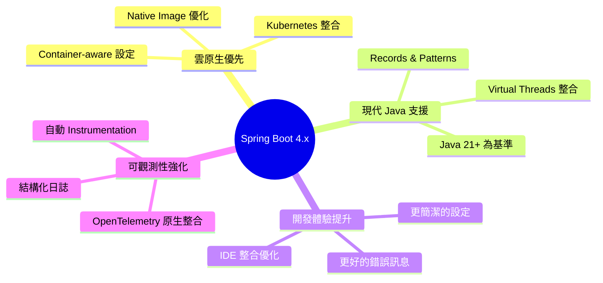

#### 核心設計理念

| 理念 | Spring Boot 3.x | Spring Boot 4.x |
|------|-----------------|-----------------|
| Java 版本 | Java 17+ | Java 21+（**Breaking Change**） |
| 預設執行緒模型 | Platform Threads | Virtual Threads（可選） |
| Native Image | 實驗性支援 | 生產就緒 |
| Observability | 需額外設定 | 預設啟用基礎監控 |
| 設定檔格式 | properties/yaml | 新增 TOML 支援 |

### 1.3 與 Spring Boot 3.x 的定位差異

#### Spring Boot 3.x 回顧

Spring Boot 3.x 的主要變更：
- 從 Java EE 遷移至 Jakarta EE 9+（`javax.*` → `jakarta.*`）
- 最低 Java 版本提升至 Java 17
- GraalVM Native Image 初步支援
- Observability 整合（Micrometer + Micrometer Tracing）

#### Spring Boot 4.x 定位

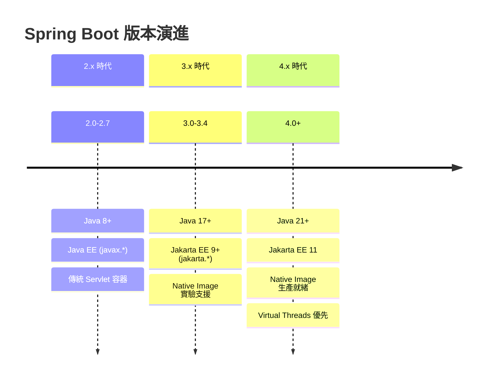

### 1.4 Spring 生態系版本對齊說明

Spring Boot 4.x 與相關元件的版本對應：

| 元件 | Spring Boot 3.x | Spring Boot 4.x |
|------|-----------------|-----------------|
| Spring Framework | 6.0.x - 6.1.x | 7.0.x |
| Spring Security | 6.0.x - 6.2.x | 7.0.x |
| Spring Data | 2023.0.x (Ullman) | 2025.0.x |
| Spring Cloud | 2023.0.x (Leyton) | 2025.0.x |
| Jakarta EE | 9 / 10 | 11 |
| Hibernate | 6.2.x - 6.4.x | 7.0.x |
| Tomcat | 10.1.x | 11.x |

> ⚠️ **重要提醒**：升版時需確保所有相依套件版本相容，否則會導致編譯或執行時期錯誤。

### 1.5 實務案例與注意事項

#### 企業系統評估要點

1. **評估專案 Java 版本**
   - 若目前使用 Java 17，需規劃 Java 21 升級
   - 確認 CI/CD 環境支援 Java 21

2. **盤點第三方相依**
   - 確認所有第三方函式庫支援 Jakarta EE 11
   - 特別注意 ORM、安全、訊息佇列相關套件

3. **評估 Native Image 需求**
   - 若有容器化部署需求，可評估是否採用 Native Image
   - 注意 Reflection 使用限制

---

## 第二章：Spring Boot 3.x → 4.x 升版總覽

### 2.1 升版背景與目的

從 3.x 升級至 4.x 是一次**重大版本升級**，涉及：
- Java 執行環境升級
- 核心框架 API 變更
- 相依套件大版本更新

### 2.2 官方升版策略說明

Spring 官方建議的升版策略：

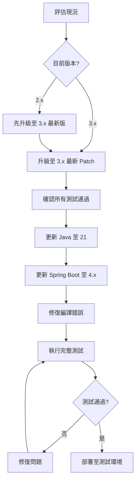

#### 升版路徑建議

| 起始版本 | 建議路徑 |
|----------|----------|
| 2.5.x 或更早 | 2.5.x → 2.7.x → 3.0.x → 3.4.x → 4.0.x |
| 2.7.x | 2.7.x → 3.0.x → 3.4.x → 4.0.x |
| 3.0.x - 3.3.x | 先升級至 3.4.x → 4.0.x |
| 3.4.x | 直接升級至 4.0.x |

> 💡 **最佳實踐**：每次只做一個大版本的升級，避免一次跳過多個版本。

### 2.3 升版風險評估清單（Checklist）

#### 升版前必須確認項目

```markdown
□ Java 版本
  □ 目前 Java 版本確認
  □ Java 21 JDK 已安裝
  □ CI/CD 環境已更新 Java 版本
  □ 容器基礎映像已更新

□ 相依套件評估
  □ 列出所有 Maven/Gradle 相依
  □ 確認各套件 Java 21 相容性
  □ 確認各套件 Jakarta EE 11 相容性
  □ 確認 Native Image 相容性（如適用）

□ 程式碼評估
  □ 使用 Spring Boot Migrator 掃描
  □ 盤點已棄用 API 使用情況
  □ 評估反射（Reflection）使用範圍
  □ 評估動態代理（Dynamic Proxy）使用情況

□ 測試覆蓋率
  □ 確認單元測試覆蓋率 > 70%
  □ 確認整合測試完整性
  □ 確認效能測試基準已建立

□ 環境準備
  □ 測試環境已準備
  □ Rollback 計畫已制定
  □ 監控告警已設定
```

### 2.4 Breaking Changes 快速一覽

以下為 Spring Boot 4.x 主要破壞性變更：

| 類別 | 變更項目 | 影響程度 | 調整方式 |
|------|----------|----------|----------|
| **必調整** | Java 最低版本 21 | 高 | 升級 JDK |
| **必調整** | Jakarta EE 11 | 高 | 更新 namespace |
| **必調整** | Spring Security 預設行為 | 中 | 調整設定 |
| **建議調整** | 移除已棄用 API | 中 | 重構程式碼 |
| **建議調整** | Virtual Threads 預設啟用 | 低 | 視需求調整 |
| **建議調整** | 新版 Observability 設定 | 低 | 更新設定檔 |

### 2.5 實務建議與最佳實踐

#### 升版時程規劃建議

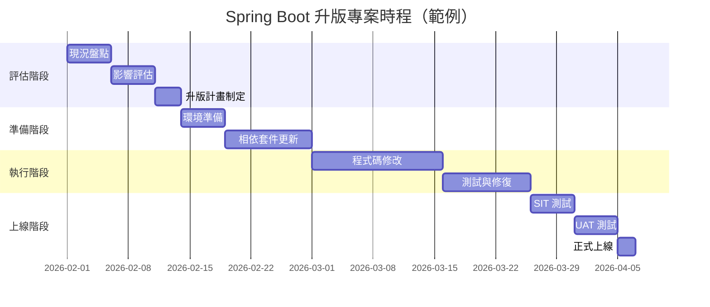

> ⚠️ **企業實務提醒**：
> 1. 大型專案建議預留 2-3 個月升版時程
> 2. 務必在非營業時段進行正式環境切換
> 3. 保留至少一週的觀察期

---

## 第三章：Java 與 JVM 版本要求變更

### 3.1 升版背景與目的

Spring Boot 4.x 將 Java 最低版本提升至 **Java 21**，這是為了：
- 利用 Virtual Threads 提升並發效能
- 使用 Pattern Matching、Record Patterns 等現代語法
- 獲得更好的效能與安全性更新

### 3.2 Spring Boot 4.x 支援的 Java 版本

| Java 版本 | 支援狀態 | 說明 |
|-----------|----------|------|
| Java 17 | ❌ 不支援 | 需升級 |
| Java 21 | ✅ 最低要求 | LTS 版本，建議使用 |
| Java 22 | ✅ 支援 | 非 LTS |
| Java 23 | ✅ 支援 | 非 LTS |
| Java 25 | ✅ 支援 | 下一個 LTS |

### 3.3 為何淘汰舊版 Java

#### Java 21 重要特性

```java
// 1. Virtual Threads (JEP 444) - 大幅提升並發效能
// 舊版寫法 - Platform Threads
ExecutorService executor = Executors.newFixedThreadPool(200);

// 新版寫法 - Virtual Threads
ExecutorService executor = Executors.newVirtualThreadPerTaskExecutor();
```

```java
// 2. Record Patterns (JEP 440) - 更簡潔的資料解構
// 舊版寫法
if (obj instanceof Point p) {
    int x = p.x();
    int y = p.y();
    // 使用 x, y
}

// 新版寫法
if (obj instanceof Point(int x, int y)) {
    // 直接使用 x, y
}
```

```java
// 3. Pattern Matching for switch (JEP 441)
// 舊版寫法
String result;
if (obj instanceof Integer i) {
    result = "整數: " + i;
} else if (obj instanceof String s) {
    result = "字串: " + s;
} else {
    result = "未知類型";
}

// 新版寫法
String result = switch (obj) {
    case Integer i -> "整數: " + i;
    case String s  -> "字串: " + s;
    default        -> "未知類型";
};
```

```java
// 4. Sequenced Collections (JEP 431)
// 新增有序集合介面
SequencedCollection<String> list = new ArrayList<>();
list.addFirst("first");
list.addLast("last");
String first = list.getFirst();
String last = list.getLast();
```

### 3.4 對企業系統的實際影響

#### 3.4.1 JDK 升級影響評估

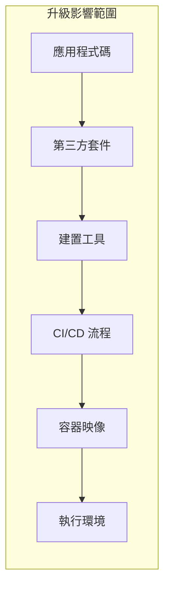

#### 3.4.2 常見相容性問題

| 問題類型 | 說明 | 解決方案 |
|----------|------|----------|
| 反射存取限制 | Java 17+ 強化模組封裝 | 使用 `--add-opens` 或修改程式碼 |
| 移除 API | `SecurityManager` 已棄用 | 移除相關程式碼 |
| 內部 API | `sun.*` 等內部 API 不可用 | 改用標準 API |
| GC 變更 | G1GC 行為調整 | 重新調校 GC 參數 |

#### 3.4.3 建置工具版本要求

```xml
<!-- Maven 需求 -->
<properties>
    <maven.compiler.source>21</maven.compiler.source>
    <maven.compiler.target>21</maven.compiler.target>
    <java.version>21</java.version>
</properties>

<!-- 確保使用新版 Maven Compiler Plugin -->
<plugin>
    <groupId>org.apache.maven.plugins</groupId>
    <artifactId>maven-compiler-plugin</artifactId>
    <version>3.12.1</version>
    <configuration>
        <release>21</release>
        <compilerArgs>
            <arg>--enable-preview</arg> <!-- 如需使用預覽功能 -->
        </compilerArgs>
    </configuration>
</plugin>
```

```groovy
// Gradle 設定
java {
    toolchain {
        languageVersion = JavaLanguageVersion.of(21)
    }
}

tasks.withType(JavaCompile).configureEach {
    options.release = 21
}
```

### 3.5 認證考試常見 Java 升版觀念

> 📝 **認證考試重點**

1. **Virtual Threads vs Platform Threads**
   - Virtual Threads 是輕量級執行緒，由 JVM 管理
   - 適合 I/O 密集型任務
   - 不適合 CPU 密集型任務
   - `Thread.startVirtualThread()` 或 `Thread.ofVirtual().start()`

2. **Record 的特性**
   - 自動生成 `equals()`, `hashCode()`, `toString()`
   - 不可變（Immutable）
   - 可實作介面，但不能繼承類別

3. **Sealed Classes**
   - 限制哪些類別可以繼承
   - 搭配 Pattern Matching 使用更強大

### 3.6 實務案例與注意事項

#### 案例：金融系統 Java 升級

**問題描述**：
某銀行核心系統使用 Java 17，需升級至 Java 21 以支援 Spring Boot 4.x

**升級步驟**：

1. **環境準備**
```bash
# 確認目前 Java 版本
java -version

# 安裝 Java 21（以 SDKMAN 為例）
sdk install java 21.0.2-tem
sdk use java 21.0.2-tem
```

2. **建置驗證**
```bash
# Maven 專案
mvn clean compile -Dmaven.compiler.source=21 -Dmaven.compiler.target=21

# Gradle 專案
./gradlew compileJava
```

3. **常見問題處理**
```bash
# 若遇到反射存取問題
# 在 JAVA_OPTS 中加入
--add-opens java.base/java.lang=ALL-UNNAMED
--add-opens java.base/java.util=ALL-UNNAMED
```

> ⚠️ **注意事項**：
> - 升級前務必備份環境設定
> - 建議使用 LTS 版本（Java 21）
> - 容器部署時確認基礎映像已更新

---

## 第四章：Spring Framework 核心變更

### 4.1 升版背景與目的

Spring Boot 4.x 基於 **Spring Framework 7.0**，帶來多項核心變更：
- 更嚴格的 Null Safety
- 改進的 Bean 生命週期管理
- 強化的設定處理機制

### 4.2 Spring Framework 主要破壞性變更

#### 4.2.1 移除的 API

| 移除項目 | 替代方案 |
|----------|----------|
| `@Autowired(required=false)` | 使用 `@Nullable` 或 `Optional<T>` |
| `SimpleAsyncTaskExecutor` | 使用 `VirtualThreadTaskExecutor` |
| `WebMvcConfigurerAdapter` | 實作 `WebMvcConfigurer` 介面 |
| `AsyncRestTemplate` | 使用 `WebClient` |

#### 4.2.2 行為變更

```java
// 【Breaking Change】@Autowired 建構子注入行為
// 舊版：單一建構子自動注入
// 新版：更嚴格的驗證，建議明確標註

// 舊版可省略 @Autowired
@Service
public class OrderService {
    private final OrderRepository repository;
    
    public OrderService(OrderRepository repository) {
        this.repository = repository;
    }
}

// 新版建議明確標註（特別是多建構子時）
@Service
public class OrderService {
    private final OrderRepository repository;
    
    @Autowired  // 建議明確標註
    public OrderService(OrderRepository repository) {
        this.repository = repository;
    }
}
```

### 4.3 Bean Lifecycle 與 Context 初始化差異

#### 4.3.1 Bean 生命週期變更

```mermaid
flowchart TD
    subgraph "Spring Boot 4.x Bean 生命週期"
        A[Bean 定義載入] --> B[實例化]
        B --> C[依賴注入]
        C --> D[Aware 介面回調]
        D --> E[BeanPostProcessor.postProcessBeforeInitialization]
        E --> F[@PostConstruct]
        F --> G[InitializingBean.afterPropertiesSet]
        G --> H[自定義 init-method]
        H --> I[BeanPostProcessor.postProcessAfterInitialization]
        I --> J[SmartInitializingSingleton.afterSingletonsInstantiated]
        J --> K[Bean 可用]
    end
```

#### 4.3.2 重要變更：Lazy Initialization 預設行為

```yaml
# Spring Boot 3.x - 預設為 eager initialization
spring:
  main:
    lazy-initialization: false

# Spring Boot 4.x - 可透過新設定調整
spring:
  main:
    lazy-initialization: false  # 預設值不變
    # 新增：指定 Bean 延遲載入模式
    lazy-initialization-filter: 
      include-patterns: 
        - "com.example.heavy.*"
      exclude-patterns:
        - "com.example.core.*"
```

### 4.4 常見相容性問題與解法

#### 4.4.1 Circular Dependency 處理

```java
// 【Breaking Change】循環依賴偵測更嚴格

// 問題程式碼 - 會導致啟動失敗
@Service
public class ServiceA {
    @Autowired
    private ServiceB serviceB;
}

@Service  
public class ServiceB {
    @Autowired
    private ServiceA serviceA;
}

// 解決方案 1：使用 @Lazy
@Service
public class ServiceA {
    @Autowired
    @Lazy
    private ServiceB serviceB;
}

// 解決方案 2：重構設計（推薦）
@Service
public class ServiceA {
    private final CommonService commonService;
    
    @Autowired
    public ServiceA(CommonService commonService) {
        this.commonService = commonService;
    }
}

// 解決方案 3：使用 ObjectProvider
@Service
public class ServiceA {
    private final ObjectProvider<ServiceB> serviceBProvider;
    
    @Autowired
    public ServiceA(ObjectProvider<ServiceB> serviceBProvider) {
        this.serviceBProvider = serviceBProvider;
    }
    
    public void doSomething() {
        ServiceB serviceB = serviceBProvider.getIfAvailable();
        // 使用 serviceB
    }
}
```

#### 4.4.2 Property Binding 變更

```java
// 【Breaking Change】設定檔綁定更嚴格

// 設定類別
@ConfigurationProperties(prefix = "app.datasource")
@Validated
public class DataSourceProperties {
    
    @NotBlank
    private String url;
    
    @NotBlank
    private String username;
    
    // Spring Boot 4.x 要求：
    // 1. 必須有 public getter/setter
    // 2. 或使用 Record
    
    // Getter and Setter
    public String getUrl() { return url; }
    public void setUrl(String url) { this.url = url; }
    
    public String getUsername() { return username; }
    public void setUsername(String username) { this.username = username; }
}

// Spring Boot 4.x 推薦：使用 Record
@ConfigurationProperties(prefix = "app.datasource")
public record DataSourceProperties(
    @NotBlank String url,
    @NotBlank String username,
    @DefaultValue("5") int connectionTimeout
) {}
```

### 4.5 實務建議與最佳實踐

#### 4.5.1 設計原則

1. **優先使用建構子注入**
```java
// ✅ 推薦
@Service
public class OrderService {
    private final OrderRepository repository;
    private final PaymentService paymentService;
    
    public OrderService(OrderRepository repository, 
                        PaymentService paymentService) {
        this.repository = repository;
        this.paymentService = paymentService;
    }
}

// ❌ 避免
@Service
public class OrderService {
    @Autowired
    private OrderRepository repository;
    
    @Autowired
    private PaymentService paymentService;
}
```

2. **使用 `@ConfigurationProperties` 取代 `@Value`**
```java
// ❌ 避免大量使用 @Value
@Service
public class NotificationService {
    @Value("${notification.email.host}")
    private String emailHost;
    
    @Value("${notification.email.port}")
    private int emailPort;
}

// ✅ 推薦使用 @ConfigurationProperties
@Service
public class NotificationService {
    private final NotificationProperties properties;
    
    public NotificationService(NotificationProperties properties) {
        this.properties = properties;
    }
}
```

### 4.6 認證考試常考觀念

> 📝 **認證考試重點**

1. **Bean Scope 理解**
   - `singleton`（預設）：整個應用程式生命週期只有一個實例
   - `prototype`：每次請求都產生新實例
   - `request`：每個 HTTP 請求一個實例
   - `session`：每個 HTTP Session 一個實例

2. **@Conditional 系列註解**
   - `@ConditionalOnProperty`
   - `@ConditionalOnClass`
   - `@ConditionalOnMissingBean`
   - `@ConditionalOnBean`

3. **AOP 代理機制**
   - JDK Dynamic Proxy（介面代理）
   - CGLIB（類別代理）
   - Spring Boot 4.x 預設使用 CGLIB

---

## 第五章：Spring Web / REST API 變更

### 5.1 升版背景與目的

Spring Boot 4.x 在 Web 層帶來以下改進：
- 更好的 Virtual Threads 整合
- 強化的錯誤處理機制
- 改進的請求/回應處理

### 5.2 Spring MVC / WebFlux 行為調整

#### 5.2.1 Virtual Threads 整合

```java
// Spring Boot 4.x - 預設可啟用 Virtual Threads 處理 HTTP 請求

// application.yml 設定
// spring:
//   threads:
//     virtual:
//       enabled: true

// 效果：每個 HTTP 請求由 Virtual Thread 處理
// 適合 I/O 密集型應用（資料庫查詢、外部 API 呼叫）
```

#### 5.2.2 Controller 方法簽章變更

```java
// 【Breaking Change】ResponseEntity 泛型要求更嚴格

// 舊版可省略泛型
@GetMapping("/users/{id}")
public ResponseEntity getUser(@PathVariable Long id) {
    return ResponseEntity.ok(userService.findById(id));
}

// 新版要求明確泛型
@GetMapping("/users/{id}")
public ResponseEntity<UserDto> getUser(@PathVariable Long id) {
    return ResponseEntity.ok(userService.findById(id));
}
```

### 5.3 Request / Response 綁定與驗證差異

#### 5.3.1 參數綁定增強

```java
// Spring Boot 4.x 新增功能：更靈活的參數綁定

// 1. Record 作為請求參數
public record SearchCriteria(
    String keyword,
    @DateTimeFormat(iso = DateTimeFormat.ISO.DATE) LocalDate startDate,
    @DateTimeFormat(iso = DateTimeFormat.ISO.DATE) LocalDate endDate,
    @RequestParam(defaultValue = "0") int page,
    @RequestParam(defaultValue = "20") int size
) {}

@GetMapping("/search")
public Page<Product> search(SearchCriteria criteria) {
    return productService.search(criteria);
}

// 2. 更嚴格的驗證
@PostMapping("/users")
public ResponseEntity<UserDto> createUser(
    @Valid @RequestBody CreateUserRequest request) {
    // 驗證失敗會自動回傳 400 Bad Request
    return ResponseEntity.ok(userService.create(request));
}
```

#### 5.3.2 驗證錯誤處理

```java
// Spring Boot 4.x 改進的驗證錯誤格式

// 新版預設錯誤回應格式
{
    "type": "https://example.com/problems/validation-error",
    "title": "Validation Error",
    "status": 400,
    "detail": "Request validation failed",
    "instance": "/api/users",
    "errors": [
        {
            "field": "email",
            "message": "must be a valid email address",
            "rejectedValue": "invalid-email"
        }
    ]
}

// 自定義驗證錯誤處理
@RestControllerAdvice
public class ValidationExceptionHandler {
    
    @ExceptionHandler(MethodArgumentNotValidException.class)
    public ProblemDetail handleValidationException(
            MethodArgumentNotValidException ex) {
        
        ProblemDetail problem = ProblemDetail
            .forStatusAndDetail(HttpStatus.BAD_REQUEST, "Validation failed");
        
        List<FieldError> fieldErrors = ex.getBindingResult()
            .getFieldErrors()
            .stream()
            .map(error -> new FieldError(
                error.getField(),
                error.getDefaultMessage(),
                error.getRejectedValue()
            ))
            .toList();
        
        problem.setProperty("errors", fieldErrors);
        return problem;
    }
    
    record FieldError(String field, String message, Object rejectedValue) {}
}
```

### 5.4 錯誤處理（Exception Handling）最佳化建議

#### 5.4.1 Problem Details 標準化

```java
// Spring Boot 4.x 全面採用 RFC 7807 Problem Details

// 啟用 Problem Details（Spring Boot 4.x 預設啟用）
// application.yml
// spring:
//   mvc:
//     problemdetails:
//       enabled: true

// 自定義業務例外
public class BusinessException extends RuntimeException {
    private final String errorCode;
    private final HttpStatus status;
    
    public BusinessException(String errorCode, String message, HttpStatus status) {
        super(message);
        this.errorCode = errorCode;
        this.status = status;
    }
    
    // Getters...
}

// 統一例外處理
@RestControllerAdvice
public class GlobalExceptionHandler {
    
    @ExceptionHandler(BusinessException.class)
    public ProblemDetail handleBusinessException(BusinessException ex) {
        ProblemDetail problem = ProblemDetail
            .forStatusAndDetail(ex.getStatus(), ex.getMessage());
        
        problem.setTitle("Business Error");
        problem.setType(URI.create("https://api.example.com/errors/" + ex.getErrorCode()));
        problem.setProperty("errorCode", ex.getErrorCode());
        problem.setProperty("timestamp", Instant.now());
        
        return problem;
    }
    
    @ExceptionHandler(Exception.class)
    public ProblemDetail handleGenericException(Exception ex) {
        ProblemDetail problem = ProblemDetail
            .forStatusAndDetail(HttpStatus.INTERNAL_SERVER_ERROR, 
                "An unexpected error occurred");
        
        problem.setTitle("Internal Server Error");
        // 生產環境不應暴露詳細錯誤訊息
        
        return problem;
    }
}
```

#### 5.4.2 錯誤處理流程

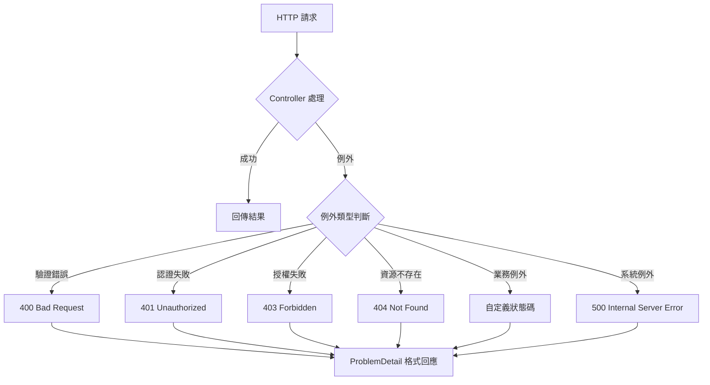

### 5.5 WebFlux 相關變更

```java
// Spring Boot 4.x WebFlux 改進

// 1. 更好的錯誤處理
@RestController
@RequestMapping("/api/reactive")
public class ReactiveController {
    
    @GetMapping("/users/{id}")
    public Mono<UserDto> getUser(@PathVariable Long id) {
        return userService.findById(id)
            .switchIfEmpty(Mono.error(new ResourceNotFoundException("User not found")));
    }
}

// 2. 改進的 ServerResponse Builder
@Bean
public RouterFunction<ServerResponse> userRoutes(UserHandler handler) {
    return RouterFunctions.route()
        .GET("/users/{id}", handler::getUser)
        .POST("/users", handler::createUser)
        .onError(ResourceNotFoundException.class, (ex, request) ->
            ServerResponse.status(HttpStatus.NOT_FOUND)
                .contentType(MediaType.APPLICATION_PROBLEM_JSON)
                .bodyValue(ProblemDetail.forStatusAndDetail(
                    HttpStatus.NOT_FOUND, ex.getMessage()))
        )
        .build();
}
```

### 5.6 實務案例與注意事項

#### REST API 設計最佳實踐

```java
// Spring Boot 4.x REST API 設計範例

@RestController
@RequestMapping("/api/v1/orders")
@Tag(name = "Order API", description = "訂單管理相關 API")
public class OrderController {
    
    private final OrderService orderService;
    
    public OrderController(OrderService orderService) {
        this.orderService = orderService;
    }
    
    @GetMapping
    @Operation(summary = "查詢訂單列表")
    public Page<OrderDto> listOrders(
            @ParameterObject OrderSearchCriteria criteria,
            @ParameterObject Pageable pageable) {
        return orderService.search(criteria, pageable);
    }
    
    @GetMapping("/{id}")
    @Operation(summary = "查詢單一訂單")
    public OrderDto getOrder(@PathVariable Long id) {
        return orderService.findById(id)
            .orElseThrow(() -> new ResourceNotFoundException("Order", id));
    }
    
    @PostMapping
    @ResponseStatus(HttpStatus.CREATED)
    @Operation(summary = "建立訂單")
    public OrderDto createOrder(@Valid @RequestBody CreateOrderRequest request) {
        return orderService.create(request);
    }
    
    @PutMapping("/{id}")
    @Operation(summary = "更新訂單")
    public OrderDto updateOrder(
            @PathVariable Long id,
            @Valid @RequestBody UpdateOrderRequest request) {
        return orderService.update(id, request);
    }
    
    @DeleteMapping("/{id}")
    @ResponseStatus(HttpStatus.NO_CONTENT)
    @Operation(summary = "刪除訂單")
    public void deleteOrder(@PathVariable Long id) {
        orderService.delete(id);
    }
}
```

> ⚠️ **注意事項**：
> 1. 使用 `@ParameterObject` 處理複合查詢參數
> 2. 適當使用 `@ResponseStatus` 標註回應狀態碼
> 3. 搭配 OpenAPI 註解提供完整 API 文件

---

## 第六章：Spring Security 重大調整

### 6.1 升版背景與目的

Spring Security 7.0（隨 Spring Boot 4.x 發布）帶來重大架構調整：
- 全面移除已棄用 API
- 更嚴格的預設安全設定
- 改進的 OAuth 2.0 / OIDC 支援

### 6.2 Security 預設行為變更

#### 6.2.1 重要預設值變更

| 項目 | Spring Security 6.x | Spring Security 7.x |
|------|---------------------|---------------------|
| CSRF | 預設啟用 | 預設啟用（行為微調） |
| Session Fixation | `migrateSession` | `changeSessionId` |
| Headers | 部分啟用 | 全面啟用 |
| 密碼加密 | BCrypt | BCrypt（強度提升） |
| Remember-Me | 可選 | 需明確啟用 |

#### 6.2.2 預設安全頭部

```java
// Spring Security 7.x 預設啟用的安全頭部
// X-Content-Type-Options: nosniff
// X-Frame-Options: DENY
// X-XSS-Protection: 0 (已棄用，改用 CSP)
// Strict-Transport-Security: max-age=31536000
// Content-Security-Policy: default-src 'self'

// 自定義安全頭部
@Bean
public SecurityFilterChain securityFilterChain(HttpSecurity http) throws Exception {
    return http
        .headers(headers -> headers
            .frameOptions(frame -> frame.sameOrigin())
            .contentSecurityPolicy(csp -> csp
                .policyDirectives("default-src 'self'; script-src 'self' 'unsafe-inline'")
            )
        )
        .build();
}
```

### 6.3 Authorization / Authentication 架構調整

#### 6.3.1 【Breaking Change】Lambda DSL 強制使用

```java
// ❌ 舊版寫法 - Spring Security 7.x 已移除
@Bean
public SecurityFilterChain filterChain(HttpSecurity http) throws Exception {
    http
        .authorizeRequests()
            .antMatchers("/public/**").permitAll()
            .antMatchers("/admin/**").hasRole("ADMIN")
            .anyRequest().authenticated()
        .and()
        .formLogin()
            .loginPage("/login")
            .permitAll()
        .and()
        .logout()
            .permitAll();
    return http.build();
}

// ✅ 新版寫法 - Lambda DSL（必須使用）
@Bean
public SecurityFilterChain filterChain(HttpSecurity http) throws Exception {
    return http
        .authorizeHttpRequests(auth -> auth
            .requestMatchers("/public/**").permitAll()
            .requestMatchers("/admin/**").hasRole("ADMIN")
            .anyRequest().authenticated()
        )
        .formLogin(form -> form
            .loginPage("/login")
            .permitAll()
        )
        .logout(logout -> logout
            .permitAll()
        )
        .build();
}
```

#### 6.3.2 Method Security 變更

```java
// Spring Security 7.x Method Security 設定

@Configuration
@EnableMethodSecurity  // 取代 @EnableGlobalMethodSecurity
public class MethodSecurityConfig {
    // 預設啟用 @PreAuthorize, @PostAuthorize
    // 若需 @Secured，需明確設定
}

// 使用範例
@Service
public class OrderService {
    
    @PreAuthorize("hasRole('USER')")
    public List<Order> findMyOrders() {
        // ...
    }
    
    @PreAuthorize("hasRole('ADMIN') or @orderSecurity.isOwner(#orderId)")
    public Order findById(Long orderId) {
        // ...
    }
    
    @PostAuthorize("returnObject.userId == authentication.principal.id")
    public Order findOrderForCurrentUser(Long orderId) {
        // ...
    }
}

// 自定義安全表達式
@Component("orderSecurity")
public class OrderSecurityExpressions {
    
    private final OrderRepository orderRepository;
    
    public OrderSecurityExpressions(OrderRepository orderRepository) {
        this.orderRepository = orderRepository;
    }
    
    public boolean isOwner(Long orderId) {
        Authentication auth = SecurityContextHolder.getContext().getAuthentication();
        return orderRepository.findById(orderId)
            .map(order -> order.getUserId().equals(getCurrentUserId(auth)))
            .orElse(false);
    }
    
    private Long getCurrentUserId(Authentication auth) {
        // 取得當前使用者 ID
        return ((CustomUserDetails) auth.getPrincipal()).getId();
    }
}
```

### 6.4 舊版設定方式的淘汰與替代方案

#### 6.4.1 已移除的類別與方法

| 已移除 | 替代方案 |
|--------|----------|
| `WebSecurityConfigurerAdapter` | 使用 `SecurityFilterChain` Bean |
| `@EnableGlobalMethodSecurity` | `@EnableMethodSecurity` |
| `antMatchers()` | `requestMatchers()` |
| `mvcMatchers()` | `requestMatchers()` |
| `authorizeRequests()` | `authorizeHttpRequests()` |
| `and()` 鏈式呼叫 | Lambda DSL |

#### 6.4.2 完整的 Security 設定範例

```java
@Configuration
@EnableWebSecurity
@EnableMethodSecurity
public class SecurityConfig {
    
    private final UserDetailsService userDetailsService;
    private final JwtAuthenticationFilter jwtAuthFilter;
    
    public SecurityConfig(UserDetailsService userDetailsService,
                          JwtAuthenticationFilter jwtAuthFilter) {
        this.userDetailsService = userDetailsService;
        this.jwtAuthFilter = jwtAuthFilter;
    }
    
    @Bean
    public SecurityFilterChain apiSecurityFilterChain(HttpSecurity http) throws Exception {
        return http
            .securityMatcher("/api/**")
            .csrf(csrf -> csrf.disable())  // API 通常停用 CSRF
            .sessionManagement(session -> session
                .sessionCreationPolicy(SessionCreationPolicy.STATELESS)
            )
            .authorizeHttpRequests(auth -> auth
                .requestMatchers("/api/public/**").permitAll()
                .requestMatchers("/api/admin/**").hasRole("ADMIN")
                .requestMatchers(HttpMethod.GET, "/api/products/**").permitAll()
                .anyRequest().authenticated()
            )
            .addFilterBefore(jwtAuthFilter, UsernamePasswordAuthenticationFilter.class)
            .exceptionHandling(ex -> ex
                .authenticationEntryPoint(new HttpStatusEntryPoint(HttpStatus.UNAUTHORIZED))
                .accessDeniedHandler((request, response, accessDeniedException) -> {
                    response.setStatus(HttpStatus.FORBIDDEN.value());
                    response.setContentType(MediaType.APPLICATION_JSON_VALUE);
                    response.getWriter().write("""
                        {"error": "Access Denied", "message": "您沒有權限存取此資源"}
                        """);
                })
            )
            .build();
    }
    
    @Bean
    public SecurityFilterChain webSecurityFilterChain(HttpSecurity http) throws Exception {
        return http
            .securityMatcher("/**")
            .authorizeHttpRequests(auth -> auth
                .requestMatchers("/", "/login", "/register", "/css/**", "/js/**").permitAll()
                .anyRequest().authenticated()
            )
            .formLogin(form -> form
                .loginPage("/login")
                .defaultSuccessUrl("/dashboard")
                .failureUrl("/login?error")
                .permitAll()
            )
            .logout(logout -> logout
                .logoutSuccessUrl("/login?logout")
                .invalidateHttpSession(true)
                .clearAuthentication(true)
                .deleteCookies("JSESSIONID")
            )
            .rememberMe(remember -> remember
                .key("uniqueAndSecretKey")
                .tokenValiditySeconds(86400 * 7)  // 7 天
            )
            .build();
    }
    
    @Bean
    public PasswordEncoder passwordEncoder() {
        return new BCryptPasswordEncoder(12);  // 強度提升至 12
    }
    
    @Bean
    public AuthenticationManager authenticationManager(
            AuthenticationConfiguration config) throws Exception {
        return config.getAuthenticationManager();
    }
}
```

### 6.5 升版時最容易踩雷的 Security 問題

#### 6.5.1 常見問題與解決方案

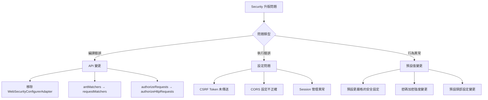

#### 6.5.2 CORS 設定注意事項

```java
// Spring Security 7.x CORS 設定
@Bean
public SecurityFilterChain filterChain(HttpSecurity http) throws Exception {
    return http
        .cors(cors -> cors.configurationSource(corsConfigurationSource()))
        // 其他設定...
        .build();
}

@Bean
public CorsConfigurationSource corsConfigurationSource() {
    CorsConfiguration config = new CorsConfiguration();
    config.setAllowedOrigins(List.of("https://example.com"));
    config.setAllowedMethods(List.of("GET", "POST", "PUT", "DELETE", "OPTIONS"));
    config.setAllowedHeaders(List.of("*"));
    config.setAllowCredentials(true);
    config.setMaxAge(3600L);
    
    UrlBasedCorsConfigurationSource source = new UrlBasedCorsConfigurationSource();
    source.registerCorsConfiguration("/api/**", config);
    return source;
}
```

### 6.6 認證考試常考觀念

> 📝 **認證考試重點**

1. **SecurityFilterChain 執行順序**
   - 多個 SecurityFilterChain 按 `@Order` 順序執行
   - 使用 `securityMatcher()` 限定適用範圍

2. **Authentication vs Authorization**
   - Authentication：驗證身分（你是誰）
   - Authorization：授權存取（你能做什麼）

3. **CSRF 防護原理**
   - 為什麼 REST API 可以停用 CSRF
   - Token-based 認證與 CSRF 的關係

### 6.7 實務案例與注意事項

#### OAuth 2.0 Resource Server 設定

```java
// Spring Boot 4.x OAuth 2.0 Resource Server
@Configuration
@EnableWebSecurity
public class OAuth2ResourceServerConfig {
    
    @Bean
    public SecurityFilterChain resourceServerFilterChain(HttpSecurity http) 
            throws Exception {
        return http
            .securityMatcher("/api/**")
            .authorizeHttpRequests(auth -> auth
                .requestMatchers("/api/public/**").permitAll()
                .anyRequest().authenticated()
            )
            .oauth2ResourceServer(oauth2 -> oauth2
                .jwt(jwt -> jwt
                    .jwtAuthenticationConverter(jwtAuthenticationConverter())
                )
            )
            .build();
    }
    
    @Bean
    public JwtAuthenticationConverter jwtAuthenticationConverter() {
        JwtGrantedAuthoritiesConverter converter = new JwtGrantedAuthoritiesConverter();
        converter.setAuthorityPrefix("ROLE_");
        converter.setAuthoritiesClaimName("roles");
        
        JwtAuthenticationConverter jwtConverter = new JwtAuthenticationConverter();
        jwtConverter.setJwtGrantedAuthoritiesConverter(converter);
        return jwtConverter;
    }
}
```

> ⚠️ **企業實務提醒**：
> 1. 升版前務必備份現有 Security 設定
> 2. 建立完整的安全測試案例
> 3. 注意 JWT Token 的有效期設定
> 4. 定期審視並更新安全設定

---

## 第七章：Spring Data 與資料存取層

### 7.1 升版背景與目的

Spring Data 2025.0.x（隨 Spring Boot 4.x 發布）帶來：
- Hibernate 7.0 整合
- 改進的 Repository 抽象層
- 更好的 Virtual Threads 支援

### 7.2 JPA / JDBC / R2DBC 行為差異

#### 7.2.1 Hibernate 7.0 重大變更

| 項目 | Hibernate 6.x | Hibernate 7.0 |
|------|---------------|---------------|
| Jakarta Persistence | 3.1 | 3.2 |
| 預設 ID 產生策略 | `AUTO` | 更智慧的自動選擇 |
| Lazy Loading | 預設延遲 | 更嚴格的延遲載入 |
| Query Cache | 可選 | 預設停用（效能考量） |

#### 7.2.2 Entity 定義變更

```java
// 【Breaking Change】Entity 定義更嚴格

// 舊版可省略的設定，新版建議明確標註
@Entity
@Table(name = "orders")
public class Order {
    
    @Id
    @GeneratedValue(strategy = GenerationType.IDENTITY)
    private Long id;
    
    @Column(name = "order_number", nullable = false, unique = true)
    private String orderNumber;
    
    @Column(name = "total_amount", precision = 19, scale = 4)
    private BigDecimal totalAmount;
    
    @Enumerated(EnumType.STRING)
    @Column(name = "status", length = 20)
    private OrderStatus status;
    
    @CreationTimestamp
    @Column(name = "created_at", updatable = false)
    private Instant createdAt;
    
    @UpdateTimestamp
    @Column(name = "updated_at")
    private Instant updatedAt;
    
    // 【Breaking Change】雙向關聯需要明確設定
    @OneToMany(mappedBy = "order", cascade = CascadeType.ALL, orphanRemoval = true)
    private List<OrderItem> items = new ArrayList<>();
    
    @ManyToOne(fetch = FetchType.LAZY)  // 明確指定 Lazy
    @JoinColumn(name = "customer_id", nullable = false)
    private Customer customer;
    
    // Constructors, Getters, Setters...
}
```

#### 7.2.3 Lazy Loading 注意事項

```java
// 【Breaking Change】更嚴格的 Lazy Loading 處理

// 問題：LazyInitializationException
@Service
@Transactional(readOnly = true)
public class OrderService {
    
    // ❌ 會拋出 LazyInitializationException
    public OrderDto findById(Long id) {
        Order order = orderRepository.findById(id).orElseThrow();
        // 離開 Transaction 後存取 Lazy 屬性會失敗
        return toDto(order);  // 若在 toDto 中存取 items，會失敗
    }
    
    // ✅ 解決方案 1：使用 @EntityGraph
    public OrderDto findByIdWithItems(Long id) {
        Order order = orderRepository.findWithItemsById(id).orElseThrow();
        return toDto(order);
    }
    
    // ✅ 解決方案 2：使用 Projection
    public OrderSummary findSummaryById(Long id) {
        return orderRepository.findSummaryById(id).orElseThrow();
    }
}

// Repository 設定
public interface OrderRepository extends JpaRepository<Order, Long> {
    
    // 使用 @EntityGraph 載入關聯
    @EntityGraph(attributePaths = {"items", "customer"})
    Optional<Order> findWithItemsById(Long id);
    
    // 使用 Projection
    @Query("""
        SELECT new com.example.dto.OrderSummary(
            o.id, o.orderNumber, o.totalAmount, c.name
        )
        FROM Order o
        JOIN o.customer c
        WHERE o.id = :id
        """)
    Optional<OrderSummary> findSummaryById(@Param("id") Long id);
}
```

### 7.3 Repository API 是否有破壞性調整

#### 7.3.1 新增的 Repository 方法

```java
// Spring Data 2025.0.x 新增方法

public interface JpaRepository<T, ID> extends ... {
    
    // 新增：更安全的刪除方法
    void deleteAllByIdInBatch(Iterable<ID> ids);
    
    // 新增：支援 Scroll API（大量資料處理）
    Window<T> findBy(Specification<T> spec, ScrollPosition position, 
                     int limit, Sort sort);
}

// 使用範例：大量資料處理
@Service
public class DataExportService {
    
    private final OrderRepository orderRepository;
    
    public void exportAllOrders(Consumer<Order> processor) {
        ScrollPosition position = ScrollPosition.offset();
        Window<Order> window;
        
        do {
            window = orderRepository.findBy(
                Specification.where(null),
                position,
                100,  // batch size
                Sort.by("id")
            );
            
            window.getContent().forEach(processor);
            position = window.positionAt(window.getContent().size());
            
        } while (window.hasNext());
    }
}
```

#### 7.3.2 Query Method 變更

```java
// 【Breaking Change】查詢方法命名更嚴格

public interface CustomerRepository extends JpaRepository<Customer, Long> {
    
    // ❌ 舊版允許的模糊命名，新版可能產生警告
    List<Customer> findByName(String name);
    
    // ✅ 新版建議：更明確的方法命名
    List<Customer> findAllByNameContaining(String name);
    
    Optional<Customer> findFirstByEmail(String email);
    
    // 新增支援：Streamable 回傳類型
    Streamable<Customer> findAllByStatus(CustomerStatus status);
    
    // 新增支援：Slice 取代 Page（效能更好）
    Slice<Customer> findByRegistrationDateAfter(LocalDate date, Pageable pageable);
}
```

### 7.4 交易管理（Transaction）注意事項

#### 7.4.1 Transaction 傳播行為

```java
// Spring Boot 4.x Transaction 最佳實踐

@Service
public class OrderTransactionService {
    
    private final OrderRepository orderRepository;
    private final PaymentService paymentService;
    private final NotificationService notificationService;
    
    // ✅ 明確標註 Transaction 屬性
    @Transactional(
        propagation = Propagation.REQUIRED,
        isolation = Isolation.READ_COMMITTED,
        timeout = 30,
        rollbackFor = Exception.class
    )
    public Order createOrder(CreateOrderRequest request) {
        Order order = new Order();
        // 設定訂單資料...
        order = orderRepository.save(order);
        
        // 呼叫其他服務
        paymentService.processPayment(order);
        
        return order;
    }
    
    // ✅ 非同步操作需要新的 Transaction
    @Transactional(propagation = Propagation.REQUIRES_NEW)
    public void sendNotification(Long orderId) {
        Order order = orderRepository.findById(orderId).orElseThrow();
        notificationService.send(order);
    }
    
    // ✅ 唯讀查詢優化
    @Transactional(readOnly = true)
    public List<Order> findOrders(OrderSearchCriteria criteria) {
        return orderRepository.findAll(criteria.toSpecification());
    }
}
```

#### 7.4.2 Virtual Threads 與 Transaction

```java
// 【注意】Virtual Threads 下的 Transaction 處理

@Configuration
public class AsyncConfig {
    
    @Bean
    public AsyncTaskExecutor applicationTaskExecutor() {
        // 使用 Virtual Threads
        return new TaskExecutorAdapter(
            Executors.newVirtualThreadPerTaskExecutor()
        );
    }
}

@Service
public class AsyncOrderService {
    
    private final PlatformTransactionManager transactionManager;
    private final OrderRepository orderRepository;
    
    // ❌ 避免：在 Virtual Thread 中使用長時間 Transaction
    @Async
    public void processOrdersAsync(List<Long> orderIds) {
        // 這樣會長時間佔用 DB Connection
        orderIds.forEach(this::processOrder);
    }
    
    // ✅ 推薦：小批次處理，控制 Transaction 範圍
    @Async
    public void processOrdersAsyncBatched(List<Long> orderIds) {
        Lists.partition(orderIds, 10).forEach(batch -> {
            TransactionTemplate template = new TransactionTemplate(transactionManager);
            template.execute(status -> {
                batch.forEach(this::processOrder);
                return null;
            });
        });
    }
}
```

### 7.5 實務案例與注意事項

#### N+1 問題處理

```java
// 常見的 N+1 問題與解決方案

// ❌ 問題程式碼：產生 N+1 查詢
@Service
@Transactional(readOnly = true)
public class ReportService {
    
    public List<OrderReportDto> generateReport() {
        List<Order> orders = orderRepository.findAll();
        return orders.stream()
            .map(order -> new OrderReportDto(
                order.getId(),
                order.getItems().size(),  // N+1！每個訂單都會查詢
                order.getCustomer().getName()  // N+1！
            ))
            .toList();
    }
}

// ✅ 解決方案：使用 @EntityGraph 或 JOIN FETCH
public interface OrderRepository extends JpaRepository<Order, Long> {
    
    @EntityGraph(attributePaths = {"items", "customer"})
    @Query("SELECT o FROM Order o")
    List<Order> findAllWithItemsAndCustomer();
    
    // 或使用 JPQL
    @Query("""
        SELECT DISTINCT o FROM Order o
        LEFT JOIN FETCH o.items
        LEFT JOIN FETCH o.customer
        """)
    List<Order> findAllFetchAll();
}
```

> 📝 **認證考試重點**
> 1. 理解 `@Transactional` 的各種屬性
> 2. JPA 關聯的 FetchType 選擇
> 3. N+1 問題的識別與解決
> 4. Optimistic Lock vs Pessimistic Lock

---

## 第八章：設定檔與組態管理變更

### 8.1 升版背景與目的

Spring Boot 4.x 在設定檔處理上的改進：
- 新增 TOML 格式支援
- 更嚴格的設定檔解析
- 改進的 Profile 處理機制

### 8.2 application.yml / properties 行為變化

#### 8.2.1 設定屬性變更

```yaml
# Spring Boot 4.x 設定變更對照

# 【Breaking Change】已移除或更名的設定
# 舊版：
spring:
  main:
    allow-bean-definition-overriding: true  # 預設 false，更嚴格

# 新版需明確啟用：
spring:
  main:
    allow-bean-definition-overriding: true

# 【Breaking Change】Server 設定調整
server:
  # 舊版
  # servlet:
  #   context-path: /api
  
  # 新版（架構調整）
  servlet:
    context-path: /api
    register-default-servlet: false  # 新增：預設 false
  
  # 新增：Virtual Threads 設定
  threads:
    virtual:
      enabled: true

# 【新增】Observability 設定
management:
  observations:
    enabled: true  # 預設啟用
  tracing:
    sampling:
      probability: 1.0
  otlp:
    tracing:
      endpoint: http://localhost:4318/v1/traces
```

#### 8.2.2 TOML 格式支援

```toml
# application.toml - Spring Boot 4.x 新增支援

[spring.application]
name = "my-application"

[spring.datasource]
url = "jdbc:postgresql://localhost:5432/mydb"
username = "app_user"
password = "${DB_PASSWORD}"
hikari.maximum-pool-size = 10
hikari.minimum-idle = 5

[server]
port = 8080
servlet.context-path = "/api"

[management.endpoints.web.exposure]
include = ["health", "info", "metrics", "prometheus"]

[logging.level]
root = "INFO"
"com.example" = "DEBUG"
"org.springframework.web" = "INFO"
```

### 8.3 Auto Configuration 調整重點

#### 8.3.1 Auto Configuration 變更

```java
// 【Breaking Change】Auto Configuration 條件變更

// 舊版：某些 Bean 會自動建立
// 新版：更嚴格的條件檢查

// 自定義 Auto Configuration
@AutoConfiguration
@ConditionalOnProperty(
    prefix = "app.feature",
    name = "enabled",
    havingValue = "true",
    matchIfMissing = false  // 新版預設 false
)
@ConditionalOnClass(FeatureService.class)
public class FeatureAutoConfiguration {
    
    @Bean
    @ConditionalOnMissingBean
    public FeatureService featureService(FeatureProperties properties) {
        return new DefaultFeatureService(properties);
    }
}

// 設定類別
@ConfigurationProperties(prefix = "app.feature")
@Validated
public record FeatureProperties(
    @NotBlank String apiKey,
    @Positive int timeout,
    @DefaultValue("3") int retryCount
) {}
```

#### 8.3.2 排除 Auto Configuration

```java
// Spring Boot 4.x 排除 Auto Configuration 的方式

@SpringBootApplication(exclude = {
    DataSourceAutoConfiguration.class,
    SecurityAutoConfiguration.class
})
public class MyApplication {
    public static void main(String[] args) {
        SpringApplication.run(MyApplication.class, args);
    }
}

// 或透過設定檔
// application.yml
spring:
  autoconfigure:
    exclude:
      - org.springframework.boot.autoconfigure.jdbc.DataSourceAutoConfiguration
      - org.springframework.boot.autoconfigure.security.servlet.SecurityAutoConfiguration
```

### 8.4 Cloud Native 設定建議

#### 8.4.1 設定檔分層架構

```mermaid
flowchart TD
    subgraph 設定優先順序（由低至高）
        A[application.yml] --> B[application-{profile}.yml]
        B --> C[環境變數]
        C --> D[命令列參數]
        D --> E[Spring Cloud Config]
    end
```

#### 8.4.2 Kubernetes 環境設定

```yaml
# application.yml - 基礎設定
spring:
  application:
    name: order-service
  config:
    import: optional:configserver:http://config-server:8888

---
# application-kubernetes.yml - K8s 專用設定
spring:
  config:
    activate:
      on-profile: kubernetes
  cloud:
    kubernetes:
      config:
        enabled: true
        sources:
          - name: order-service
            namespace: ${NAMESPACE:default}
      secrets:
        enabled: true
        sources:
          - name: order-service-secrets

management:
  endpoints:
    web:
      exposure:
        include: health,info,prometheus
  health:
    livenessState:
      enabled: true
    readinessState:
      enabled: true
  endpoint:
    health:
      probes:
        enabled: true
```

```yaml
# Kubernetes ConfigMap
apiVersion: v1
kind: ConfigMap
metadata:
  name: order-service
  namespace: default
data:
  application.yml: |
    spring:
      datasource:
        url: jdbc:postgresql://postgres:5432/orders
    server:
      port: 8080
```

### 8.5 實務建議與最佳實踐

#### 8.5.1 設定檔管理策略

```plaintext
src/main/resources/
├── application.yml              # 共用設定
├── application-local.yml        # 本機開發
├── application-dev.yml          # 開發環境
├── application-sit.yml          # SIT 環境
├── application-uat.yml          # UAT 環境
├── application-prod.yml         # 正式環境
└── application-test.yml         # 測試用
```

#### 8.5.2 敏感資訊處理

```yaml
# ❌ 避免：將敏感資訊寫在設定檔
spring:
  datasource:
    password: my-secret-password

# ✅ 推薦：使用環境變數
spring:
  datasource:
    password: ${DB_PASSWORD}

# ✅ 推薦：使用加密設定（搭配 Spring Cloud Config）
spring:
  datasource:
    password: '{cipher}AQBHOr...'

# ✅ 推薦：使用 Vault
spring:
  cloud:
    vault:
      host: vault.example.com
      port: 8200
      scheme: https
      authentication: KUBERNETES
      kubernetes:
        role: order-service
```

> ⚠️ **企業實務提醒**：
> 1. 絕對不要將密碼 commit 到版本控制
> 2. 使用 Kubernetes Secrets 或 Vault 管理敏感資訊
> 3. 定期輪換密碼與金鑰

---

## 第九章：Observability 與 Monitoring

### 9.1 升版背景與目的

Spring Boot 4.x 將 Observability 視為一級公民：
- OpenTelemetry 原生整合
- 結構化日誌預設啟用
- 改進的 Metrics 收集

### 9.2 Logging、Metrics、Tracing 新趨勢

#### 9.2.1 Observability 三大支柱

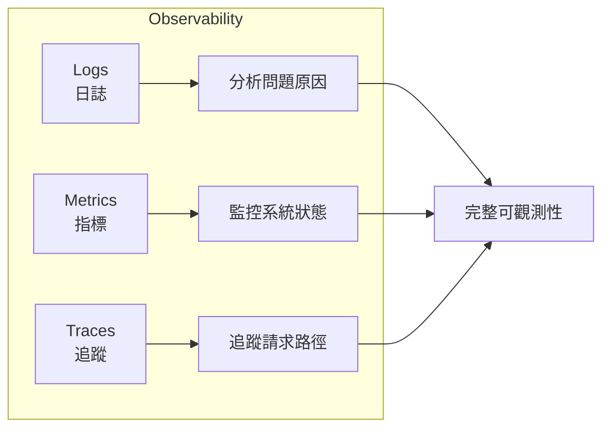

#### 9.2.2 結構化日誌

```java
// Spring Boot 4.x 結構化日誌

// application.yml 設定
logging:
  structured:
    format: json  # 新增：結構化日誌格式
  pattern:
    console: "%d{yyyy-MM-dd HH:mm:ss.SSS} %5p [%X{traceId},%X{spanId}] --- [%15.15t] %-40.40logger{39} : %m%n"

// 使用 SLF4J 結構化日誌
@Slf4j
@Service
public class OrderService {
    
    public Order createOrder(CreateOrderRequest request) {
        log.atInfo()
            .addKeyValue("orderId", order.getId())
            .addKeyValue("customerId", request.getCustomerId())
            .addKeyValue("amount", order.getTotalAmount())
            .log("Order created successfully");
        
        return order;
    }
    
    public void processPayment(Order order) {
        try {
            // 處理付款...
            log.atInfo()
                .addKeyValue("orderId", order.getId())
                .addKeyValue("paymentMethod", order.getPaymentMethod())
                .log("Payment processed");
        } catch (PaymentException e) {
            log.atError()
                .addKeyValue("orderId", order.getId())
                .addKeyValue("errorCode", e.getErrorCode())
                .setCause(e)
                .log("Payment failed");
            throw e;
        }
    }
}
```

輸出範例（JSON 格式）：
```json
{
    "timestamp": "2026-01-30T10:30:00.123Z",
    "level": "INFO",
    "logger": "com.example.OrderService",
    "message": "Order created successfully",
    "traceId": "abc123",
    "spanId": "def456",
    "orderId": 12345,
    "customerId": 67890,
    "amount": 1500.00
}
```

### 9.3 與 OpenTelemetry / Micrometer 的整合方向

#### 9.3.1 OpenTelemetry 整合設定

```xml
<!-- Maven 相依 -->
<dependency>
    <groupId>org.springframework.boot</groupId>
    <artifactId>spring-boot-starter-actuator</artifactId>
</dependency>
<dependency>
    <groupId>io.micrometer</groupId>
    <artifactId>micrometer-tracing-bridge-otel</artifactId>
</dependency>
<dependency>
    <groupId>io.opentelemetry</groupId>
    <artifactId>opentelemetry-exporter-otlp</artifactId>
</dependency>
```

```yaml
# application.yml
management:
  endpoints:
    web:
      exposure:
        include: health,info,metrics,prometheus
  
  # Metrics 設定
  metrics:
    distribution:
      percentiles-histogram:
        http.server.requests: true
    tags:
      application: ${spring.application.name}
      environment: ${ENVIRONMENT:local}
  
  # Tracing 設定
  tracing:
    enabled: true
    sampling:
      probability: 1.0  # 開發環境 100%，生產環境調整
    propagation:
      type: W3C
  
  # OTLP Exporter 設定
  otlp:
    tracing:
      endpoint: http://otel-collector:4318/v1/traces
    metrics:
      endpoint: http://otel-collector:4318/v1/metrics
```

#### 9.3.2 自定義 Metrics

```java
// 使用 Micrometer 建立自定義指標

@Component
public class OrderMetrics {
    
    private final Counter orderCreatedCounter;
    private final Timer orderProcessingTimer;
    private final AtomicInteger activeOrdersGauge;
    
    public OrderMetrics(MeterRegistry registry) {
        this.orderCreatedCounter = Counter.builder("orders.created.total")
            .description("Total number of orders created")
            .tag("application", "order-service")
            .register(registry);
        
        this.orderProcessingTimer = Timer.builder("orders.processing.duration")
            .description("Order processing duration")
            .publishPercentiles(0.5, 0.95, 0.99)
            .register(registry);
        
        this.activeOrdersGauge = registry.gauge("orders.active.count",
            new AtomicInteger(0));
    }
    
    public void recordOrderCreated(String orderType) {
        orderCreatedCounter.increment();
    }
    
    public <T> T recordOrderProcessing(Supplier<T> operation) {
        return orderProcessingTimer.record(operation);
    }
    
    public void updateActiveOrders(int count) {
        activeOrdersGauge.set(count);
    }
}

// 使用範例
@Service
public class OrderService {
    
    private final OrderMetrics metrics;
    
    public Order createOrder(CreateOrderRequest request) {
        return metrics.recordOrderProcessing(() -> {
            Order order = // 建立訂單...
            metrics.recordOrderCreated(order.getType());
            return order;
        });
    }
}
```

#### 9.3.3 分散式追蹤

```java
// 自定義 Span

@Service
public class PaymentService {
    
    private final Tracer tracer;
    private final PaymentGateway gateway;
    
    public PaymentService(Tracer tracer, PaymentGateway gateway) {
        this.tracer = tracer;
        this.gateway = gateway;
    }
    
    public PaymentResult processPayment(Order order) {
        Span span = tracer.nextSpan()
            .name("payment-processing")
            .tag("orderId", order.getId().toString())
            .tag("amount", order.getTotalAmount().toString())
            .start();
        
        try (Tracer.SpanInScope ws = tracer.withSpan(span)) {
            // 呼叫外部付款閘道
            PaymentResult result = gateway.process(order);
            
            span.tag("paymentId", result.getPaymentId());
            span.tag("status", result.getStatus().name());
            
            return result;
        } catch (Exception e) {
            span.error(e);
            throw e;
        } finally {
            span.end();
        }
    }
}
```

### 9.4 企業實務監控建議

#### 9.4.1 監控架構

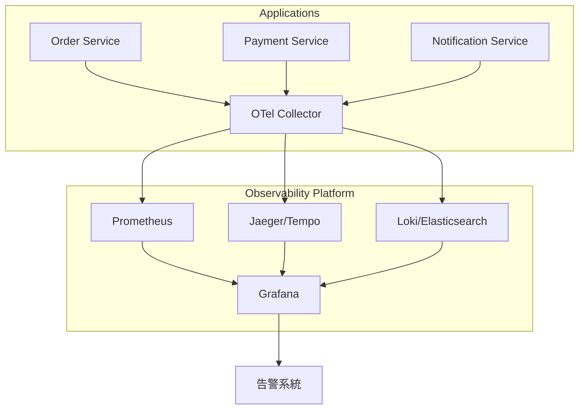

#### 9.4.2 關鍵指標（Golden Signals）

```yaml
# 建議監控的關鍵指標

# 1. Latency（延遲）
# - http_server_requests_seconds_bucket
# - P50, P95, P99 回應時間

# 2. Traffic（流量）
# - http_server_requests_seconds_count
# - 每秒請求數（RPS）

# 3. Errors（錯誤）
# - http_server_requests_seconds_count{status="5xx"}
# - 錯誤率

# 4. Saturation（飽和度）
# - jvm_memory_used_bytes
# - hikaricp_connections_active
# - 資源使用率
```

### 9.5 實務案例與注意事項

#### 健康檢查設定

```java
// 自定義健康檢查

@Component
public class DatabaseHealthIndicator implements HealthIndicator {
    
    private final DataSource dataSource;
    
    @Override
    public Health health() {
        try (Connection conn = dataSource.getConnection()) {
            if (conn.isValid(5)) {
                return Health.up()
                    .withDetail("database", "PostgreSQL")
                    .withDetail("connection", "valid")
                    .build();
            }
        } catch (SQLException e) {
            return Health.down()
                .withException(e)
                .build();
        }
        return Health.unknown().build();
    }
}

// 外部服務健康檢查
@Component
public class ExternalApiHealthIndicator implements HealthIndicator {
    
    private final RestClient restClient;
    
    @Override
    public Health health() {
        try {
            ResponseEntity<Void> response = restClient.get()
                .uri("/health")
                .retrieve()
                .toBodilessEntity();
            
            if (response.getStatusCode().is2xxSuccessful()) {
                return Health.up().build();
            }
            return Health.down()
                .withDetail("status", response.getStatusCode())
                .build();
        } catch (Exception e) {
            return Health.down().withException(e).build();
        }
    }
}
```

> ⚠️ **企業實務提醒**：
> 1. 生產環境 Tracing 取樣率建議 10-50%
> 2. 設定合理的指標保留期限
> 3. 建立有意義的告警規則，避免告警疲勞

---

## 第十章：測試與品質保證

### 10.1 升版背景與目的

Spring Boot 4.x 測試框架的改進：
- 更好的 TestContainers 整合
- 改進的 MockMvc 功能
- 新增 Virtual Threads 測試支援

### 10.2 Spring Boot Test 行為變更

#### 10.2.1 測試註解變更

```java
// 【Breaking Change】測試註解調整

// 舊版
@RunWith(SpringRunner.class)
@SpringBootTest

// 新版（JUnit 5 為標準）
@SpringBootTest
class MyApplicationTests {
    // JUnit 5 不需要 @RunWith
}

// 【新增】更細緻的測試切片
@WebMvcTest(OrderController.class)
@AutoConfigureMockMvc
@Import(SecurityConfig.class)  // 需要時才引入 Security
class OrderControllerTest {
    
    @Autowired
    private MockMvc mockMvc;
    
    @MockBean
    private OrderService orderService;
    
    @Test
    void shouldReturnOrder() throws Exception {
        // ...
    }
}
```

#### 10.2.2 MockMvc 改進

```java
// Spring Boot 4.x MockMvc 新功能

@WebMvcTest(OrderController.class)
class OrderControllerTest {
    
    @Autowired
    private MockMvc mockMvc;
    
    @Test
    void createOrder_shouldReturnCreated() throws Exception {
        CreateOrderRequest request = new CreateOrderRequest(
            "CUST001", 
            List.of(new OrderItem("PROD001", 2))
        );
        
        mockMvc.perform(post("/api/orders")
                .contentType(MediaType.APPLICATION_JSON)
                .content(objectMapper.writeValueAsString(request)))
            .andExpect(status().isCreated())
            .andExpect(jsonPath("$.orderId").exists())
            .andExpect(jsonPath("$.status").value("PENDING"))
            // 新增：更精確的 JSON 驗證
            .andExpect(jsonPath("$.items").isArray())
            .andExpect(jsonPath("$.items", hasSize(1)))
            // 新增：Response Header 驗證
            .andExpect(header().exists("Location"))
            .andExpect(header().string("Location", 
                containsString("/api/orders/")));
    }
    
    // 新增：WebTestClient 風格（即使是 MVC 也可用）
    @Autowired
    private WebTestClient webTestClient;
    
    @Test
    void getOrder_withWebTestClient() {
        webTestClient.get()
            .uri("/api/orders/{id}", 1L)
            .exchange()
            .expectStatus().isOk()
            .expectBody(OrderDto.class)
            .value(order -> {
                assertThat(order.getId()).isEqualTo(1L);
                assertThat(order.getStatus()).isEqualTo(OrderStatus.PENDING);
            });
    }
}
```

### 10.3 測試失敗常見原因

#### 10.3.1 升版後常見測試問題

| 問題 | 原因 | 解決方案 |
|------|------|----------|
| Security 測試失敗 | 預設安全設定變更 | 使用 `@WithMockUser` 或調整設定 |
| Bean 注入失敗 | 自動設定變更 | 確認 `@Import` 必要的設定 |
| JSON 序列化錯誤 | Jackson 設定變更 | 檢查日期格式等設定 |
| Transaction 問題 | Isolation 預設值變更 | 明確指定 Transaction 屬性 |

#### 10.3.2 測試修復範例

```java
// Security 測試修復

// ❌ 舊版測試可能失敗
@WebMvcTest(OrderController.class)
class OrderControllerTest {
    @Test
    void shouldReturnOrder() throws Exception {
        // 因為 Security 預設啟用，會回傳 401
    }
}

// ✅ 解決方案 1：停用 Security
@WebMvcTest(OrderController.class)
@AutoConfigureMockMvc(addFilters = false)
class OrderControllerTest {
    // ...
}

// ✅ 解決方案 2：模擬認證使用者
@WebMvcTest(OrderController.class)
class OrderControllerTest {
    
    @Test
    @WithMockUser(username = "testuser", roles = {"USER"})
    void shouldReturnOrder() throws Exception {
        // ...
    }
    
    @Test
    void adminEndpoint_withAdminRole() throws Exception {
        mockMvc.perform(get("/api/admin/orders")
                .with(user("admin").roles("ADMIN")))
            .andExpect(status().isOk());
    }
}

// ✅ 解決方案 3：使用 @TestConfiguration
@WebMvcTest(OrderController.class)
@Import(TestSecurityConfig.class)
class OrderControllerTest {
    // ...
}

@TestConfiguration
class TestSecurityConfig {
    @Bean
    public SecurityFilterChain testFilterChain(HttpSecurity http) throws Exception {
        return http
            .authorizeHttpRequests(auth -> auth.anyRequest().permitAll())
            .csrf(csrf -> csrf.disable())
            .build();
    }
}
```

### 10.4 升版時的測試策略

#### 10.4.1 測試金字塔

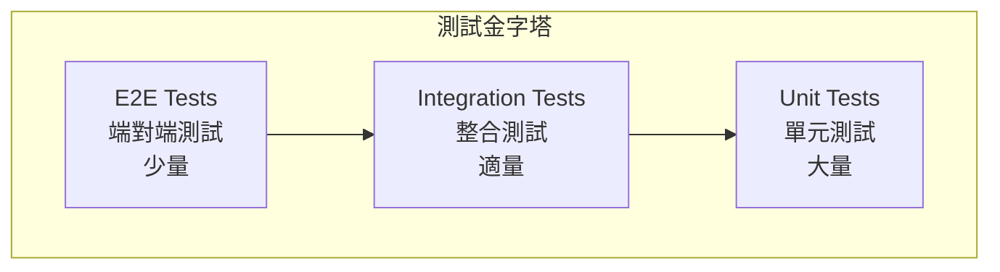

#### 10.4.2 升版測試策略

```java
// 1. 先確保所有測試在舊版通過
// mvn test

// 2. 升級後執行測試，記錄失敗項目
// mvn test -Dmaven.test.failure.ignore=true

// 3. 逐一修復失敗的測試

// 4. 新增針對新功能的測試

// 整合測試範例（使用 TestContainers）
@SpringBootTest
@Testcontainers
class OrderServiceIntegrationTest {
    
    @Container
    static PostgreSQLContainer<?> postgres = new PostgreSQLContainer<>("postgres:16")
        .withDatabaseName("testdb")
        .withUsername("test")
        .withPassword("test");
    
    @DynamicPropertySource
    static void configureProperties(DynamicPropertyRegistry registry) {
        registry.add("spring.datasource.url", postgres::getJdbcUrl);
        registry.add("spring.datasource.username", postgres::getUsername);
        registry.add("spring.datasource.password", postgres::getPassword);
    }
    
    @Autowired
    private OrderService orderService;
    
    @Test
    void createOrder_shouldPersistToDatabase() {
        CreateOrderRequest request = new CreateOrderRequest(/* ... */);
        
        Order order = orderService.createOrder(request);
        
        assertThat(order.getId()).isNotNull();
        assertThat(orderService.findById(order.getId())).isPresent();
    }
}
```

### 10.5 實務案例與注意事項

#### 契約測試（Contract Testing）

```java
// 使用 Spring Cloud Contract 進行契約測試

// 1. 定義契約（Groovy DSL）
// contracts/shouldReturnOrder.groovy
Contract.make {
    description "should return order by id"
    request {
        method GET()
        url "/api/orders/1"
        headers {
            contentType applicationJson()
        }
    }
    response {
        status OK()
        headers {
            contentType applicationJson()
        }
        body([
            id: 1,
            orderNumber: $(regex('[A-Z]{3}[0-9]{6}')),
            status: "PENDING",
            totalAmount: $(anyDouble())
        ])
    }
}

// 2. 產生測試基礎類別
@SpringBootTest(webEnvironment = SpringBootTest.WebEnvironment.MOCK)
@AutoConfigureMockMvc
abstract class ContractTestBase {
    
    @Autowired
    MockMvc mockMvc;
    
    @MockBean
    OrderService orderService;
    
    @BeforeEach
    void setup() {
        Order mockOrder = new Order(1L, "ABC123456", OrderStatus.PENDING, 
            new BigDecimal("100.00"));
        when(orderService.findById(1L)).thenReturn(Optional.of(mockOrder));
        
        RestAssuredMockMvc.mockMvc(mockMvc);
    }
}
```

> 📝 **認證考試重點**
> 1. `@SpringBootTest` vs `@WebMvcTest` 差異
> 2. `@MockBean` vs `@Mock` 使用時機
> 3. TestContainers 的應用場景
> 4. 測試切片（Test Slices）的種類與用途

---

## 第十一章：企業升版實戰流程

### 11.1 升版前準備事項

#### 11.1.1 升版評估矩陣

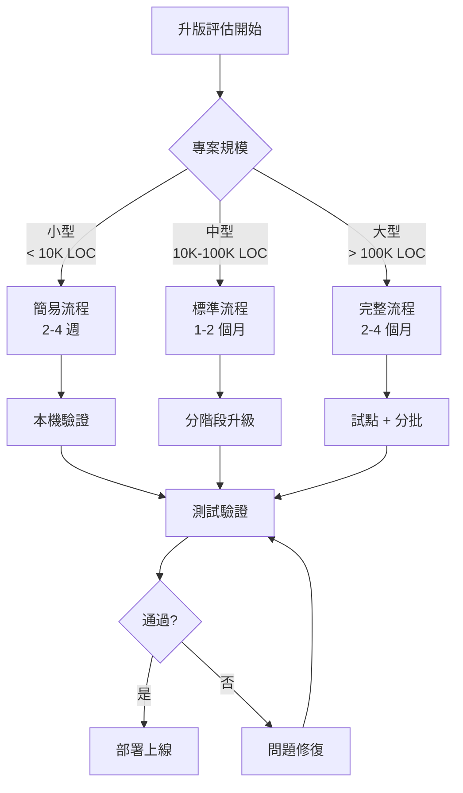

#### 11.1.2 升版前檢查清單

**升版前必要準備**

**環境準備**
- □ Java 21 JDK 已安裝並測試
- □ Maven/Gradle 版本符合要求
- □ CI/CD Pipeline 已更新 Java 版本
- □ 容器基礎映像已準備（如：eclipse-temurin:21-jre）
- □ 測試環境已備妥

**程式碼評估**
- □ 執行 Spring Boot Migrator 掃描
- □ 盤點已棄用 API 使用情況
- □ 列出所有第三方相依及其版本
- □ 確認各相依套件 Java 21 / Jakarta EE 11 相容性
- □ 評估 Reflection / Dynamic Proxy 使用範圍

**測試準備**
- □ 確認測試覆蓋率達標（建議 > 70%）
- □ 所有測試在現有版本通過
- □ 效能測試基準已建立
- □ 安全性測試基準已建立

**團隊準備**
- □ 團隊成員已完成 Spring Boot 4.x 培訓
- □ 升版計畫已獲得主管核准
- □ Rollback 計畫已制定並演練
- □ 值班與支援人員已安排

### 11.2 PoC 與試點升級策略

#### 11.2.1 PoC 階段

```java
// PoC 專案結構建議

// 1. 建立獨立的 PoC 分支
// git checkout -b feature/spring-boot-4-poc

// 2. 更新 pom.xml
<parent>
    <groupId>org.springframework.boot</groupId>
    <artifactId>spring-boot-starter-parent</artifactId>
    <version>4.0.0</version>
</parent>

<properties>
    <java.version>21</java.version>
</properties>

// 3. 執行編譯，記錄錯誤
// mvn clean compile 2>&1 | tee compile-errors.log

// 4. 逐一修復編譯錯誤

// 5. 執行測試
// mvn test 2>&1 | tee test-results.log

// 6. 產生升版影響報告
```

#### 11.2.2 試點服務選擇標準

| 標準 | 權重 | 說明 |
|------|------|------|
| 相依性少 | 高 | 減少連鎖升版風險 |
| 流量低 | 高 | 降低影響範圍 |
| 程式碼乾淨 | 中 | 減少修改工作量 |
| 測試完整 | 高 | 確保品質 |
| 團隊熟悉 | 中 | 加快修復速度 |

### 11.3 Rollback 與風險控管

#### 11.3.1 Rollback 策略

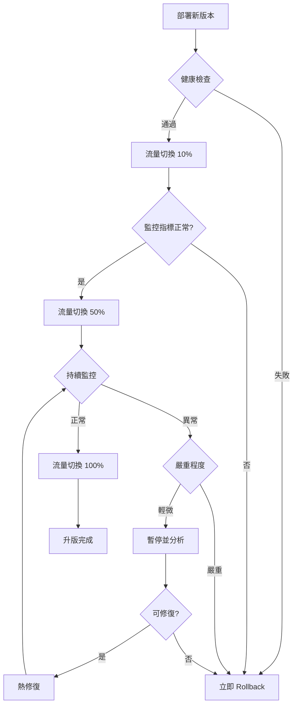

#### 11.3.2 Rollback 腳本範例

```bash
#!/bin/bash
# rollback.sh - Spring Boot 升版 Rollback 腳本

set -e

# 參數
APP_NAME=${1:-order-service}
PREVIOUS_VERSION=${2:-3.4.1}
NAMESPACE=${3:-production}

echo "=== 開始 Rollback: $APP_NAME 至版本 $PREVIOUS_VERSION ==="

# 1. 確認目前版本
CURRENT_VERSION=$(kubectl get deployment $APP_NAME -n $NAMESPACE \
    -o jsonpath='{.spec.template.spec.containers[0].image}' | cut -d: -f2)
echo "目前版本: $CURRENT_VERSION"

# 2. 執行 Rollback
kubectl set image deployment/$APP_NAME \
    $APP_NAME=$APP_NAME:$PREVIOUS_VERSION \
    -n $NAMESPACE

# 3. 等待 Rollback 完成
kubectl rollout status deployment/$APP_NAME -n $NAMESPACE --timeout=300s

# 4. 驗證
NEW_VERSION=$(kubectl get deployment $APP_NAME -n $NAMESPACE \
    -o jsonpath='{.spec.template.spec.containers[0].image}' | cut -d: -f2)
echo "Rollback 完成，目前版本: $NEW_VERSION"

# 5. 健康檢查
echo "執行健康檢查..."
sleep 30
HEALTH=$(kubectl exec -it deploy/$APP_NAME -n $NAMESPACE -- \
    curl -s localhost:8080/actuator/health | jq -r '.status')

if [ "$HEALTH" == "UP" ]; then
    echo "✅ Rollback 成功，服務健康"
else
    echo "❌ 警告：服務狀態異常，請立即檢查"
    exit 1
fi
```

### 11.4 CI/CD 升版建議流程

#### 11.4.1 Jenkins Pipeline 範例

```groovy
// Jenkinsfile - Spring Boot 升版 Pipeline

pipeline {
    agent any
    
    environment {
        JAVA_HOME = tool 'JDK21'
        MAVEN_HOME = tool 'Maven3.9'
        PATH = "${JAVA_HOME}/bin:${MAVEN_HOME}/bin:${PATH}"
    }
    
    stages {
        stage('Checkout') {
            steps {
                checkout scm
            }
        }
        
        stage('Build & Test') {
            steps {
                sh 'mvn clean verify'
            }
            post {
                always {
                    junit '**/target/surefire-reports/*.xml'
                    jacoco execPattern: '**/target/jacoco.exec'
                }
            }
        }
        
        stage('Security Scan') {
            steps {
                sh 'mvn dependency-check:check'
            }
        }
        
        stage('Build Image') {
            steps {
                sh '''
                    docker build -t ${IMAGE_NAME}:${BUILD_NUMBER} .
                    docker push ${IMAGE_NAME}:${BUILD_NUMBER}
                '''
            }
        }
        
        stage('Deploy to SIT') {
            steps {
                sh '''
                    kubectl set image deployment/${APP_NAME} \
                        ${APP_NAME}=${IMAGE_NAME}:${BUILD_NUMBER} \
                        -n sit
                '''
            }
        }
        
        stage('Integration Test') {
            steps {
                sh 'mvn verify -Pintegration-test'
            }
        }
        
        stage('Deploy to UAT') {
            when {
                branch 'release/*'
            }
            steps {
                input message: '確認部署至 UAT?'
                sh '''
                    kubectl set image deployment/${APP_NAME} \
                        ${APP_NAME}=${IMAGE_NAME}:${BUILD_NUMBER} \
                        -n uat
                '''
            }
        }
        
        stage('Deploy to Production') {
            when {
                branch 'main'
            }
            steps {
                input message: '確認部署至 Production?'
                sh '''
                    # Canary Deployment
                    kubectl set image deployment/${APP_NAME}-canary \
                        ${APP_NAME}=${IMAGE_NAME}:${BUILD_NUMBER} \
                        -n production
                '''
            }
        }
    }
    
    post {
        failure {
            slackSend channel: '#alerts',
                color: 'danger',
                message: "Build Failed: ${env.JOB_NAME} ${env.BUILD_NUMBER}"
        }
    }
}
```

### 11.5 實務案例與注意事項

#### 大型金融系統升版案例

**案例：某銀行核心交易系統升版**

**背景**
- 系統：核心交易處理系統
- 規模：50+ 微服務，200+ 萬行程式碼
- 現況：Spring Boot 3.2.x + Java 17

**升版策略**

*第一階段（1 個月）：評估與準備*
1. 完成所有服務的相依性分析
2. 建立升版影響矩陣
3. 完成團隊培訓
4. 準備測試環境

*第二階段（2 個月）：試點升級*
1. 選擇 3 個低風險服務進行試點
2. 完成程式碼修改與測試
3. 部署至 SIT/UAT 環境驗證
4. 產生升版 SOP

*第三階段（2 個月）：分批升級*
- 第 1 批：15 個周邊服務
- 第 2 批：20 個業務服務
- 第 3 批：15 個核心服務

*第四階段（1 個月）：收尾與優化*
1. 完成所有服務升版
2. 效能調校
3. 文件更新
4. 經驗總結

**關鍵成功因素**
1. 充分的測試覆蓋率（達 85%）
2. 完善的 Rollback 機制
3. 漸進式流量切換
4. 24/7 值班支援

---

## 第十二章：認證考試重點整理

### 12.1 Spring Boot 4.x 相關考試重點

#### 12.1.1 考試範圍概覽

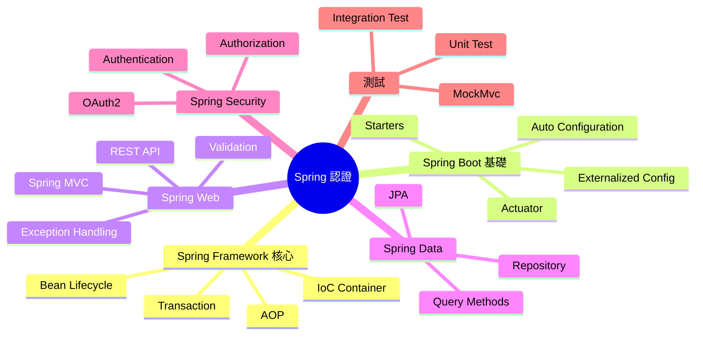

#### 12.1.2 版本升級相關考點

| 主題 | 重點 |
|------|------|
| Java 版本 | Java 21 新特性（Virtual Threads、Records） |
| 設定 | `@ConfigurationProperties` 使用方式 |
| Security | Lambda DSL、預設安全行為 |
| Data | Repository 查詢方法、Transaction 管理 |
| Test | 測試切片、TestContainers |

### 12.2 常見陷阱題與觀念澄清

#### 12.2.1 Bean 生命週期相關

```java
// 陷阱：Bean 初始化順序

@Component
public class MyBean {
    
    private final MyDependency dependency;
    
    // 問：以下哪個先執行？
    // A) 建構子
    // B) @Autowired setter
    // C) @PostConstruct
    // D) InitializingBean.afterPropertiesSet()
    
    public MyBean(MyDependency dependency) {
        this.dependency = dependency;
        System.out.println("1. Constructor");
    }
    
    @Autowired
    public void setOtherDependency(OtherDependency other) {
        System.out.println("2. Autowired setter");
    }
    
    @PostConstruct
    public void init() {
        System.out.println("3. PostConstruct");
    }
    
    // 若實作 InitializingBean
    // public void afterPropertiesSet() {
    //     System.out.println("4. afterPropertiesSet");
    // }
    
    // 答案：A → B → C → D
}
```

#### 12.2.2 @Transactional 相關

```java
// 陷阱：Transaction 傳播行為

@Service
public class OrderService {
    
    @Autowired
    private PaymentService paymentService;
    
    @Transactional
    public void createOrder() {
        // 問：以下呼叫是否在同一個 Transaction 中？
        paymentService.processPayment();  // REQUIRED
        paymentService.sendNotification(); // REQUIRES_NEW
    }
}

@Service
public class PaymentService {
    
    @Transactional(propagation = Propagation.REQUIRED)
    public void processPayment() {
        // 與 createOrder() 同一個 Transaction
    }
    
    @Transactional(propagation = Propagation.REQUIRES_NEW)
    public void sendNotification() {
        // 建立新的 Transaction
        // 若這裡失敗，不會影響 processPayment()
    }
}
```

#### 12.2.3 Security 相關

```java
// 陷阱：Security 設定順序

@Configuration
@EnableWebSecurity
public class SecurityConfig {
    
    // 問：以下設定，/api/public/** 能否匿名存取？
    @Bean
    public SecurityFilterChain filterChain(HttpSecurity http) throws Exception {
        return http
            .authorizeHttpRequests(auth -> auth
                .anyRequest().authenticated()  // ❌ 這行先執行
                .requestMatchers("/api/public/**").permitAll()
            )
            .build();
    }
    
    // 正確寫法：
    @Bean
    public SecurityFilterChain correctFilterChain(HttpSecurity http) throws Exception {
        return http
            .authorizeHttpRequests(auth -> auth
                .requestMatchers("/api/public/**").permitAll()  // ✅ 更具體的規則在前
                .anyRequest().authenticated()
            )
            .build();
    }
}
```

### 12.3 適合考前複習的章節整理

#### 複習優先順序

**考前一週複習計畫**

**Day 1-2：Spring Framework 核心**
- IoC Container 概念
- Bean Scope（singleton, prototype, request, session）
- Bean Lifecycle
- @Autowired, @Qualifier, @Primary

**Day 3：Spring Boot 設定**
- Auto Configuration 原理
- @ConfigurationProperties
- Profile 管理
- Externalized Configuration 優先順序

**Day 4：Spring Web**
- @RestController vs @Controller
- 請求映射（@RequestMapping, @GetMapping...）
- 參數綁定（@RequestParam, @PathVariable, @RequestBody）
- Exception Handling

**Day 5：Spring Data**
- Repository 介面層次
- 查詢方法命名規則
- @Query 使用
- Transaction 管理

**Day 6：Spring Security**
- Authentication vs Authorization
- SecurityFilterChain 設定
- Method Security
- OAuth2 / JWT 基本概念

**Day 7：測試 & 總複習**
- @SpringBootTest vs @WebMvcTest
- @MockBean vs @Mock
- TestContainers 概念
- 重點觀念總複習

### 12.4 模擬試題

```java
// 模擬試題 1
// 問：以下程式碼，當呼叫 service.process() 時，會輸出什麼？

@Service
public class MyService {
    
    @Autowired
    private MyService self;
    
    public void process() {
        System.out.println("1");
        self.innerProcess();
        System.out.println("3");
    }
    
    @Transactional
    public void innerProcess() {
        System.out.println("2");
    }
}

// A) 1, 2, 3（Transaction 生效）
// B) 1, 2, 3（Transaction 不生效）
// C) 編譯錯誤
// D) 執行時錯誤

// 答案：A
// 解釋：透過注入自己（self），可以讓 AOP 代理生效

// ---

// 模擬試題 2
// 問：Spring Boot 4.x 最低支援的 Java 版本是？

// A) Java 17
// B) Java 21
// C) Java 11
// D) Java 8

// 答案：B（Java 21）

// ---

// 模擬試題 3
// 問：以下哪個不是 Spring Security 7.x 的有效設定方式？

// A) 實作 WebSecurityConfigurerAdapter
// B) 定義 SecurityFilterChain Bean
// C) 使用 @EnableMethodSecurity
// D) 使用 Lambda DSL

// 答案：A（WebSecurityConfigurerAdapter 已在 Spring Security 7.x 中移除）
```

---

## 附錄：升版檢查清單（Checklist）

### A. 升版前準備

**環境準備 Checklist**

**Java 環境**
- [ ] Java 21 JDK 已安裝（建議 Eclipse Temurin 或 Oracle JDK）
- [ ] JAVA_HOME 環境變數已設定
- [ ] 確認 IDE 支援 Java 21（IntelliJ 2023.2+, Eclipse 2023-09+）
- [ ] CI/CD 環境 Java 版本已更新

**建置工具**
- [ ] Maven 3.9.x 或 Gradle 8.5+
- [ ] Maven Wrapper / Gradle Wrapper 已更新
- [ ] 本機建置成功

**容器環境**
- [ ] Docker 基礎映像已更新（eclipse-temurin:21-jre）
- [ ] Kubernetes 環境已準備
- [ ] Container Registry 權限已確認

**團隊準備**
- [ ] 團隊成員已完成培訓
- [ ] 升版計畫已審核
- [ ] 溝通管道已建立（Slack/Teams 頻道）

### B. 程式碼修改

**程式碼修改 Checklist**

**pom.xml / build.gradle**
- [ ] 更新 parent 版本至 Spring Boot 4.x
- [ ] 更新 java.version 至 21
- [ ] 更新所有 Spring 相關相依
- [ ] 移除已棄用的相依
- [ ] 確認第三方套件相容性

**Java 程式碼**
- [ ] 修復所有編譯錯誤
- [ ] 更新已棄用 API 呼叫
- [ ] javax.* → jakarta.* 命名空間更新
- [ ] Security 設定改用 Lambda DSL
- [ ] 檢查 Reflection 使用（若需 Native Image）

**設定檔**
- [ ] application.yml/properties 設定更新
- [ ] 移除已棄用的設定屬性
- [ ] 更新 logging 設定
- [ ] 更新 actuator endpoint 設定

**測試**
- [ ] 所有單元測試通過
- [ ] 所有整合測試通過
- [ ] 新增針對新功能的測試
- [ ] 效能測試基準已更新

### C. 部署上線

**部署上線 Checklist**

**SIT 環境**
- [ ] 部署成功
- [ ] 健康檢查通過
- [ ] 功能測試通過
- [ ] 效能測試通過
- [ ] 安全性測試通過

**UAT 環境**
- [ ] 部署成功
- [ ] 使用者驗收測試通過
- [ ] 效能符合預期
- [ ] 無重大問題

**正式環境**
- [ ] 部署計畫已確認
- [ ] Rollback 腳本已準備
- [ ] 監控告警已設定
- [ ] 值班人員已安排
- [ ] 部署時間已通知相關人員

**部署後**
- [ ] 健康檢查通過
- [ ] 關鍵功能驗證
- [ ] 效能指標正常
- [ ] 日誌無異常
- [ ] 監控指標正常
- [ ] 觀察期間無問題

### D. 快速參考

**常用指令快速參考**

**Maven 指令**
```bash
mvn clean compile                    # 編譯
mvn test                             # 執行測試
mvn verify                           # 完整驗證
mvn dependency:tree                  # 檢視相依樹
mvn versions:display-dependency-updates  # 檢查更新
```

**Gradle 指令**
```bash
./gradlew clean build               # 建置
./gradlew test                      # 執行測試
./gradlew dependencies              # 檢視相依
```

**Docker 指令**
```bash
docker build -t myapp:4.0 .         # 建置映像
docker run -p 8080:8080 myapp:4.0   # 執行容器
```

**Kubernetes 指令**
```bash
kubectl set image deployment/myapp myapp=myapp:4.0  # 更新映像
kubectl rollout status deployment/myapp             # 檢查部署狀態
kubectl rollout undo deployment/myapp               # Rollback
```

**常用診斷指令**
```bash
curl localhost:8080/actuator/health   # 健康檢查
curl localhost:8080/actuator/info     # 應用資訊
curl localhost:8080/actuator/metrics  # 指標
```

---

## 版本歷程

| 版本 | 日期 | 說明 |
|------|------|------|
| 1.0 | 2026-01-30 | 初版發布 |

---

## 參考資源

- [Spring Boot 官方文件](https://docs.spring.io/spring-boot/)
- [Spring Framework 官方文件](https://docs.spring.io/spring-framework/)
- [Spring Security 官方文件](https://docs.spring.io/spring-security/)
- [Spring Boot Migration Guide](https://github.com/spring-projects/spring-boot/wiki)
- [Java 21 Release Notes](https://openjdk.org/projects/jdk/21/)

---

> 📝 **文件維護說明**  
> 本教學手冊將隨 Spring Boot 版本更新而持續維護，  
> 如有任何問題或建議，請聯繫技術團隊。


