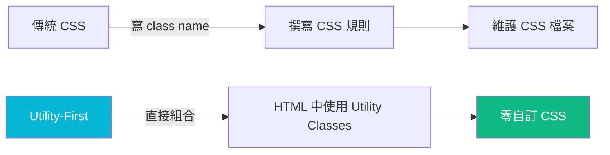
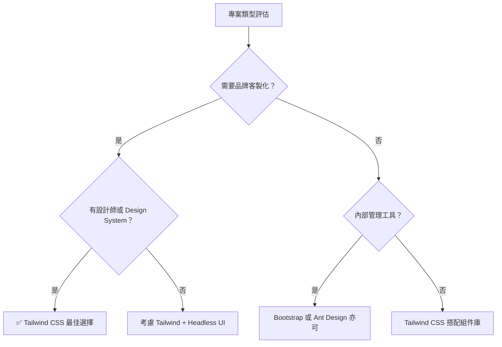
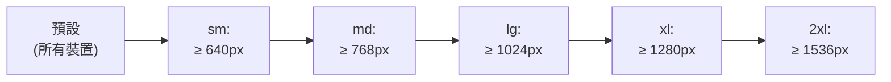
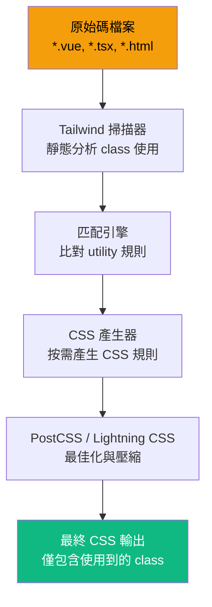
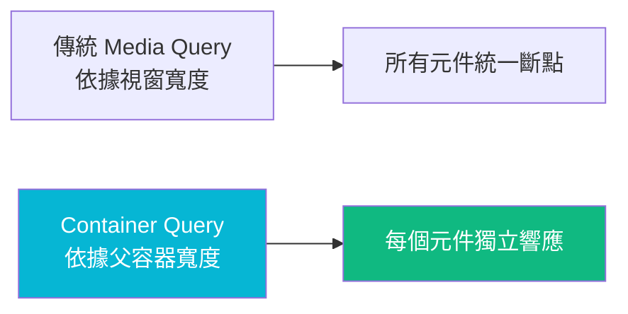
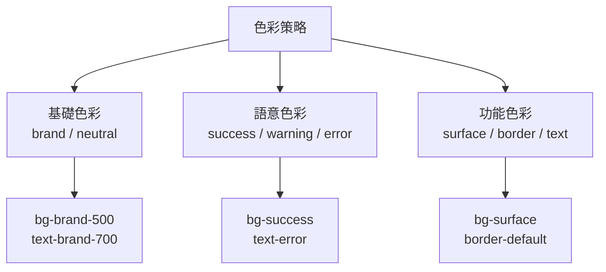
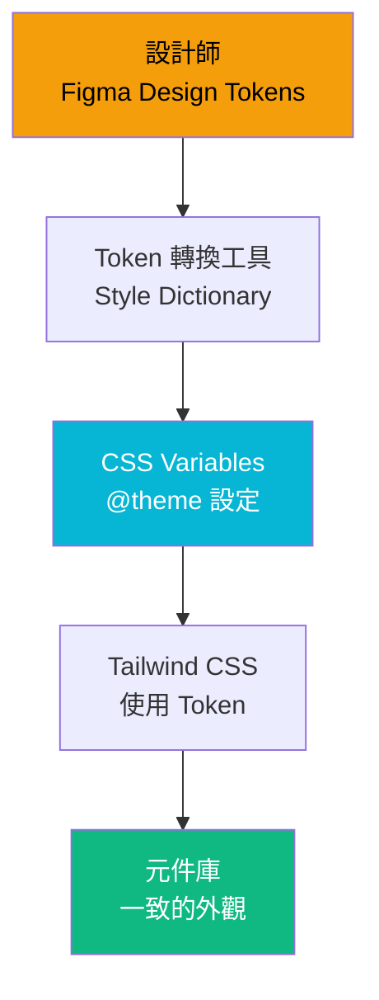
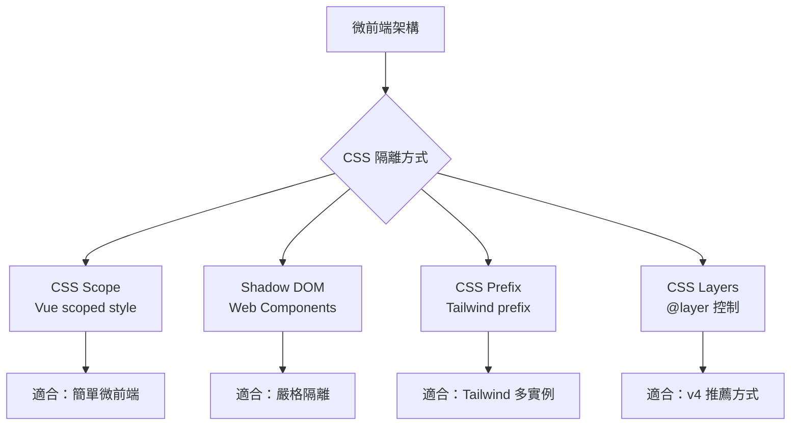
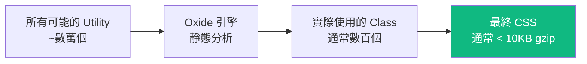
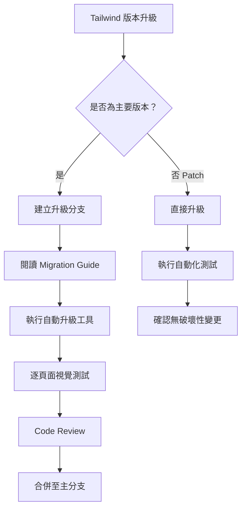

+++
date = '2026-02-14T11:43:54+08:00'
draft = false
title = 'Tailwind CSS教學手冊'
tags = ['教學', 'framework','Tailwind CSS']
categories = ['教學']
+++

# Tailwind CSS 教學手冊（企業級 Web Application 版本）

> **版本**：Tailwind CSS v4.x（2025 最新穩定版）  
> **適用對象**：具備前端基礎的開發工程師、架構師  
> **最後更新**：2025-07-14  

---

## 目錄

- [1. 為什麼選擇 Tailwind CSS](#1-為什麼選擇-tailwind-css)
  - [1.1 Utility-First 理念](#11-utility-first-理念)
  - [1.2 與傳統 CSS / SCSS 比較](#12-與傳統-css--scss-比較)
  - [1.3 與 Bootstrap 比較](#13-與-bootstrap-比較)
  - [1.4 優缺點分析](#14-優缺點分析)
  - [1.5 適合的專案類型](#15-適合的專案類型)
- [2. 安裝與專案初始化](#2-安裝與專案初始化)
  - [2.1 使用 Vite + Vue 3 安裝流程](#21-使用-vite--vue-3-安裝流程)
  - [2.2 使用 Vite + Angular 19 安裝流程](#22-使用-vite--angular-19-安裝流程)
  - [2.3 Tailwind CSS v4 設定方式](#23-tailwind-css-v4-設定方式)
  - [2.4 Content 掃描最佳實踐](#24-content-掃描最佳實踐)
  - [2.5 專案目錄結構建議](#25-專案目錄結構建議)
- [3. Tailwind 核心概念](#3-tailwind-核心概念)
  - [3.1 Utility Classes](#31-utility-classes)
  - [3.2 Responsive Design](#32-responsive-design)
  - [3.3 State Variants](#33-state-variants)
  - [3.4 Breakpoints](#34-breakpoints)
  - [3.5 Dark Mode](#35-dark-mode)
  - [3.6 Arbitrary Values](#36-arbitrary-values)
  - [3.7 Tailwind CSS v4 引擎原理](#37-tailwind-css-v4-引擎原理)
  - [3.8 Container Queries（容器查詢）](#38-container-queries容器查詢)
- [4. 設計系統（Design System）整合](#4-設計系統design-system整合)
  - [4.1 建立自訂 Theme](#41-建立自訂-theme)
  - [4.2 Colors 設計策略](#42-colors-設計策略)
  - [4.3 Spacing 規範](#43-spacing-規範)
  - [4.4 Typography 設計](#44-typography-設計)
  - [4.5 設計 Token 管理](#45-設計-token-管理)
  - [4.6 企業品牌色整合](#46-企業品牌色整合)
- [5. 元件開發最佳實踐](#5-元件開發最佳實踐)
  - [5.1 Button 設計範例](#51-button-設計範例)
  - [5.2 Card 設計範例](#52-card-設計範例)
  - [5.3 Form 設計範例](#53-form-設計範例)
  - [5.4 Layout 設計範例](#54-layout-設計範例)
  - [5.5 可維護性設計](#55-可維護性設計)
  - [5.6 如何避免 Class 爆炸](#56-如何避免-class-爆炸)
- [6. 大型專案架構設計建議](#6-大型專案架構設計建議)
  - [6.1 與微前端整合方式](#61-與微前端整合方式)
  - [6.2 Tailwind 與組件庫策略](#62-tailwind-與組件庫策略)
  - [6.3 可擴充性設計](#63-可擴充性設計)
  - [6.4 團隊協作規範](#64-團隊協作規範)
  - [6.5 命名規範建議](#65-命名規範建議)
- [7. 效能優化](#7-效能優化)
  - [7.1 Tailwind v4 自動 Tree-Shaking](#71-tailwind-v4-自動-tree-shaking)
  - [7.2 CSS 體積優化](#72-css-體積優化)
  - [7.3 CDN vs 本地建置比較](#73-cdn-vs-本地建置比較)
  - [7.4 Production Build 注意事項](#74-production-build-注意事項)
  - [7.5 效能監控與量測](#75-效能監控與量測)
- [8. 與 Vue 3 + TypeScript 整合實戰](#8-與-vue-3--typescript-整合實戰)
  - [8.1 動態 Class 綁定](#81-動態-class-綁定)
  - [8.2 Computed Class 管理](#82-computed-class-管理)
  - [8.3 條件式樣式設計](#83-條件式樣式設計)
  - [8.4 組件抽象化技巧](#84-組件抽象化技巧)
  - [8.5 Transition 與 Animation 實戰](#85-transition-與-animation-實戰)
  - [8.6 表單驗證樣式整合](#86-表單驗證樣式整合)
- [9. 常見錯誤與踩雷整理](#9-常見錯誤與踩雷整理)
  - [9.1 Class 過多問題](#91-class-過多問題)
  - [9.2 重複樣式問題](#92-重複樣式問題)
  - [9.3 無法維護的問題](#93-無法維護的問題)
  - [9.4 與第三方 UI Library 衝突](#94-與第三方-ui-library-衝突)
  - [9.5 Dark Mode 設計錯誤](#95-dark-mode-設計錯誤)
- [10. 企業級最佳實踐總結](#10-企業級最佳實踐總結)
  - [10.1 開發規範](#101-開發規範)
  - [10.2 Code Review 建議](#102-code-review-建議)
  - [10.3 專案模板設計建議](#103-專案模板設計建議)
  - [10.4 可長期維護策略](#104-可長期維護策略)
- [附錄 A：Tailwind CSS 企業開發檢查清單（Checklist）](#附錄-atailwind-css-企業開發檢查清單checklist)

---

## 1. 為什麼選擇 Tailwind CSS

### 1.1 Utility-First 理念

#### 什麼是 Utility-First？

Utility-First 是一種 CSS 設計方法論，核心理念是 **「用原子化的 CSS 類別直接在 HTML 中組合樣式，而非撰寫自訂 CSS」**。



#### 傳統方式 vs Utility-First

```html
<!-- ❌ 傳統 CSS 方式 -->
<div class="card">
  <h2 class="card-title">標題</h2>
  <p class="card-content">內容</p>
</div>

<style>
.card {
  background: white;
  border-radius: 8px;
  padding: 24px;
  box-shadow: 0 2px 4px rgba(0,0,0,0.1);
}
.card-title {
  font-size: 1.25rem;
  font-weight: 700;
  color: #1a1a1a;
}
.card-content {
  color: #666;
  margin-top: 8px;
}
</style>

<!-- ✅ Tailwind CSS Utility-First 方式 -->
<div class="bg-white rounded-lg p-6 shadow-md">
  <h2 class="text-xl font-bold text-gray-900">標題</h2>
  <p class="text-gray-500 mt-2">內容</p>
</div>
```

#### 為什麼 Utility-First 在企業專案中更優？

| 面向 | 傳統 CSS | Utility-First (Tailwind) |
|------|----------|--------------------------|
| CSS 檔案膨脹 | 隨專案增長不斷膨脹 | CSS 大小固定，且自動裁剪 |
| 命名負擔 | 需設計 BEM / SMACSS 等命名 | 不需命名，直接使用 utility |
| 跨元件一致性 | 靠團隊紀律維持 | 由 design token 統一控制 |
| 重構風險 | 修改 CSS 可能影響其他元件 | 樣式在 HTML 內，改動隔離 |
| 學習曲線 | 低（但維護成本高） | 中（但維護成本低） |

### 1.2 與傳統 CSS / SCSS 比較

| 項目 | 原生 CSS | SCSS/SASS | Tailwind CSS |
|------|----------|-----------|--------------|
| 編譯需求 | 無 | 需 Sass 編譯器 | 需 PostCSS / Tailwind CLI |
| 可組合性 | 低 | 中（mixin/extend） | 高（utility 組合） |
| 命名規範 | 依團隊 | BEM 等 | 不需自訂 class name |
| 檔案大小（Production） | 不可控 | 不可控 | 自動 tree-shaking，可控 |
| Design Token | 需自行管理 | 需自行管理 | 內建 theme 系統 |
| IDE 支援 | 基本 | 基本 | 極佳（IntelliSense） |
| 版本升級成本 | 低 | 中 | 低（v4 大幅簡化） |

⚠️ **注意事項**：Tailwind 並非要完全取代 CSS。在極少數場景（如複雜動畫、CSS Houdini），仍需使用原生 CSS。

### 1.3 與 Bootstrap 比較

| 項目 | Bootstrap 5 | Tailwind CSS v4 |
|------|-------------|-----------------|
| 設計理念 | Component-Based | Utility-First |
| 客製化程度 | 有限（Override 樣式） | 完全客製（theme 系統） |
| 預設 UI 元件 | 內建（Button, Card, Modal...） | 無預設元件，需自行組合 |
| CSS 體積 | ~160KB（壓縮後~23KB） | 按需產生，通常 < 10KB |
| JavaScript 依賴 | 需要（Popper.js 等） | 純 CSS，無 JS 依賴 |
| 設計一致性 | 網站看起來都一樣 | 完全自訂外觀 |
| 學習曲線 | 低 | 中 |
| 企業品牌一致性 | 困難（需大量 Override） | 容易（原生 theme 支援） |

✅ **建議**：若企業需要高度品牌一致性、自訂設計系統，選 Tailwind CSS；若快速原型、內部工具，Bootstrap 也是合理選擇。

### 1.4 優缺點分析

#### 優點

1. **開發速度快**：不用在 HTML 和 CSS 檔案間切換
2. **CSS 體積可控**：Production 自動 tree-shaking，僅保留使用到的 class
3. **設計一致性**：透過 theme 系統統一 spacing、color、typography
4. **無副作用**：Utility class 是原子化的，修改不會影響其他元件
5. **IDE 支援優秀**：Tailwind CSS IntelliSense 提供完整自動補全
6. **響應式設計簡單**：`sm:` / `md:` / `lg:` 前綴直覺且好用
7. **Dark Mode 原生支援**：`dark:` 前綴即可實現

#### 缺點

1. **HTML 可讀性降低**：大量 class 堆疊讓 HTML 看起來冗長
2. **學習曲線**：需記憶 class 名稱（IDE 可彌補）
3. **無預設元件**：需自行建構或搭配如 Headless UI、Radix UI
4. **團隊規範要求高**：需建立共識，否則 class 使用不一致
5. **偽元素/動畫支援**：複雜動畫仍需自訂 CSS

### 1.5 適合的專案類型



| 專案類型 | 推薦程度 | 說明 |
|----------|----------|------|
| 企業官網 / 品牌網站 | ⭐⭐⭐⭐⭐ | 完全客製設計，Tailwind 最適合 |
| SaaS 產品 | ⭐⭐⭐⭐⭐ | Design System + Tailwind 完美搭配 |
| 內部管理系統（ERP / CRM） | ⭐⭐⭐⭐ | 搭配 Headless UI 或 PrimeVue |
| 快速原型 / MVP | ⭐⭐⭐ | 速度上 Bootstrap 可能更快 |
| 行動 App（Hybrid） | ⭐⭐⭐⭐ | 搭配 Ionic / Capacitor |
| 微前端架構 | ⭐⭐⭐⭐ | 需注意 CSS 隔離（v4 改善） |

> ✅ **實務建議**：企業級 Web Application 建議使用 Tailwind CSS + Vue 3 Composition API + TypeScript，搭配 Headless UI 或 PrimeVue 建構元件庫。

---

## 2. 安裝與專案初始化

### 2.1 使用 Vite + Vue 3 安裝流程

#### 步驟 1：建立 Vue 3 專案

```bash
# 使用 create-vue 建立專案（推薦）
npm create vue@latest my-project

# 選項建議：
# ✔ TypeScript? Yes
# ✔ JSX Support? No
# ✔ Vue Router? Yes
# ✔ Pinia? Yes
# ✔ Vitest? Yes
# ✔ ESLint? Yes
# ✔ Prettier? Yes
```

#### 步驟 2：安裝 Tailwind CSS v4

```bash
cd my-project

# Tailwind CSS v4 安裝（使用 @tailwindcss/vite 插件）
npm install tailwindcss @tailwindcss/vite
```

#### 步驟 3：設定 Vite 插件

```typescript
// vite.config.ts
import { defineConfig } from 'vite'
import vue from '@vitejs/plugin-vue'
import tailwindcss from '@tailwindcss/vite'

export default defineConfig({
  plugins: [
    vue(),
    tailwindcss(),
  ],
})
```

#### 步驟 4：引入 Tailwind CSS

```css
/* src/assets/main.css */
@import "tailwindcss";
```

#### 步驟 5：驗證安裝

```vue
<!-- src/App.vue -->
<template>
  <div class="min-h-screen bg-gray-100 flex items-center justify-center">
    <h1 class="text-4xl font-bold text-blue-600">
      Tailwind CSS v4 安裝成功！
    </h1>
  </div>
</template>
```

```bash
npm run dev
```

> ⚠️ **注意**：Tailwind CSS v4 不再需要 `tailwind.config.js`、`postcss.config.js` 等設定檔。所有設定透過 CSS 的 `@theme` 指令完成。

### 2.2 使用 Vite + Angular 19 安裝流程

#### 步驟 1：建立 Angular 專案

```bash
# 建立 Angular 19 專案
ng new my-angular-project --style=css
cd my-angular-project
```

#### 步驟 2：安裝 Tailwind CSS v4

```bash
npm install tailwindcss @tailwindcss/postcss
```

#### 步驟 3：設定 PostCSS

```javascript
// postcss.config.js（Angular 使用 PostCSS 插件）
export default {
  plugins: {
    '@tailwindcss/postcss': {},
  },
}
```

#### 步驟 4：引入 Tailwind CSS

```css
/* src/styles.css */
@import "tailwindcss";
```

#### 步驟 5：驗證安裝

```typescript
// src/app/app.component.ts
import { Component } from '@angular/core';

@Component({
  selector: 'app-root',
  standalone: true,
  template: `
    <div class="min-h-screen bg-gray-100 flex items-center justify-center">
      <h1 class="text-4xl font-bold text-blue-600">
        Angular 19 + Tailwind CSS v4 啟動成功！
      </h1>
    </div>
  `,
})
export class AppComponent {}
```

### 2.3 Tailwind CSS v4 設定方式

Tailwind CSS v4 引入了 **CSS-First Configuration**，所有設定在 CSS 中完成：

```css
/* src/assets/main.css */
@import "tailwindcss";

/* 自訂 theme */
@theme {
  /* 色彩 */
  --color-brand-primary: #1e40af;
  --color-brand-secondary: #9333ea;
  --color-brand-accent: #f59e0b;

  /* 字型 */
  --font-sans: 'Inter', 'Noto Sans TC', sans-serif;
  --font-mono: 'JetBrains Mono', monospace;

  /* 間距 */
  --spacing-18: 4.5rem;
  --spacing-88: 22rem;

  /* 斷點 */
  --breakpoint-xs: 475px;
  --breakpoint-3xl: 1920px;

  /* 圓角 */
  --radius-button: 0.5rem;
  --radius-card: 0.75rem;
}
```

> ✅ **v4 vs v3 對照**：

| 項目 | v3（tailwind.config.js） | v4（CSS @theme） |
|------|--------------------------|-------------------|
| 設定檔位置 | `tailwind.config.js` | CSS 檔案內 `@theme` |
| PostCSS 設定 | `postcss.config.js` | Vite 插件自動處理 |
| 內容掃描 | `content: [...]` | 自動偵測（可用 `@source`） |
| 暗色模式 | `darkMode: 'class'` | 自動支援 `dark:` |
| Prefix | `prefix: 'tw-'` | `@import "tailwindcss" prefix(tw)` |

### 2.4 Content 掃描最佳實踐

Tailwind CSS v4 預設 **自動掃描** 專案目錄中的所有模板檔案，但你可以用 `@source` 控制掃描範圍：

```css
@import "tailwindcss";

/* 額外掃描路徑（如 monorepo 中的共享元件） */
@source "../shared-components/src/**/*.vue";
@source "../shared-components/src/**/*.ts";

/* 排除特定路徑 */
@source not "../node_modules";
```

⚠️ **企業級注意事項**：

1. **Monorepo 架構**：確保共享元件的路徑被納入掃描
2. **動態 class**：避免使用字串拼接產生 class name（Tailwind 無法靜態分析）

```typescript
// ❌ 錯誤：動態拼接 class（Tailwind 無法偵測）
const color = 'blue'
const className = `text-${color}-500`

// ✅ 正確：使用完整的 class name
const className = isActive ? 'text-blue-500' : 'text-gray-500'

// ✅ 正確：使用物件映射
const colorMap: Record<string, string> = {
  blue: 'text-blue-500',
  red: 'text-red-500',
  green: 'text-green-500',
}
const className = colorMap[color]
```

### 2.5 專案目錄結構建議

```plaintext
my-project/
├── src/
│   ├── assets/
│   │   ├── main.css              # Tailwind CSS 主入口 + @theme 設定
│   │   └── fonts/                # 自訂字型
│   ├── components/
│   │   ├── ui/                   # 基礎 UI 元件（Button, Input, Card）
│   │   │   ├── BaseButton.vue
│   │   │   ├── BaseCard.vue
│   │   │   ├── BaseInput.vue
│   │   │   └── index.ts
│   │   ├── layout/               # Layout 元件
│   │   │   ├── AppHeader.vue
│   │   │   ├── AppSidebar.vue
│   │   │   ├── AppFooter.vue
│   │   │   └── AppLayout.vue
│   │   └── common/               # 通用業務元件
│   │       ├── DataTable.vue
│   │       └── SearchBar.vue
│   ├── composables/              # Vue Composition API
│   │   ├── useBreakpoint.ts      # 斷點偵測
│   │   ├── useDarkMode.ts        # 暗色模式
│   │   └── useResponsive.ts      # 響應式工具
│   ├── styles/
│   │   ├── components.css        # @apply 萃取的元件樣式（最小化使用）
│   │   └── utilities.css         # 自訂 utility（極少使用）
│   ├── views/
│   ├── router/
│   ├── stores/
│   └── App.vue
├── vite.config.ts
├── tsconfig.json
└── package.json
```

> ✅ **實務建議**：
> - 將 `@theme` 設定集中在 `main.css`，避免分散
> - `@apply` 僅用於高度重複的元件（如 `.btn-primary`），不要濫用
> - 使用 Vue 元件封裝取代 `@apply`，維護性更好

---

## 3. Tailwind 核心概念

### 3.1 Utility Classes

#### 核心分類

Tailwind 的 Utility Classes 可分為以下幾大類：

| 分類 | 常用 Class 範例 | 說明 |
|------|-----------------|------|
| **Layout** | `flex`, `grid`, `block`, `hidden` | 排版模式 |
| **Spacing** | `p-4`, `m-2`, `mx-auto`, `gap-4` | 內外間距 |
| **Sizing** | `w-full`, `h-screen`, `max-w-lg` | 尺寸設定 |
| **Typography** | `text-lg`, `font-bold`, `leading-6` | 文字樣式 |
| **Color** | `text-blue-500`, `bg-gray-100` | 色彩 |
| **Border** | `border`, `rounded-lg`, `border-gray-200` | 邊框圓角 |
| **Shadow** | `shadow-md`, `shadow-lg` | 陰影 |
| **Transition** | `transition`, `duration-300`, `ease-in-out` | 動畫過渡 |

#### 常用佈局範例

```html
<!-- Flexbox 水平置中 -->
<div class="flex items-center justify-center min-h-screen">
  <div class="text-center">居中內容</div>
</div>

<!-- Grid 三欄佈局 -->
<div class="grid grid-cols-1 md:grid-cols-3 gap-6 p-6">
  <div class="bg-white rounded-lg p-4 shadow">欄位 1</div>
  <div class="bg-white rounded-lg p-4 shadow">欄位 2</div>
  <div class="bg-white rounded-lg p-4 shadow">欄位 3</div>
</div>

<!-- Sticky Header + Scrollable Content -->
<div class="flex flex-col h-screen">
  <header class="sticky top-0 bg-white shadow z-10 p-4">Header</header>
  <main class="flex-1 overflow-y-auto p-6">
    <!-- 可捲動內容 -->
  </main>
  <footer class="bg-gray-800 text-white p-4">Footer</footer>
</div>
```

### 3.2 Responsive Design

Tailwind 採用 **Mobile-First** 設計策略，所有響應式 class 都是「向上覆蓋」：



```html
<!-- 響應式範例：手機一欄、平板兩欄、桌面三欄 -->
<div class="grid grid-cols-1 sm:grid-cols-2 lg:grid-cols-3 gap-4">
  <div class="bg-white p-4 rounded shadow">Item 1</div>
  <div class="bg-white p-4 rounded shadow">Item 2</div>
  <div class="bg-white p-4 rounded shadow">Item 3</div>
</div>

<!-- 響應式文字大小 -->
<h1 class="text-2xl sm:text-3xl md:text-4xl lg:text-5xl font-bold">
  響應式標題
</h1>

<!-- 響應式顯示/隱藏 -->
<nav class="hidden md:flex">桌面版導覽</nav>
<button class="md:hidden">☰ 選單</button>
```

#### 自訂斷點

```css
/* main.css */
@import "tailwindcss";

@theme {
  --breakpoint-xs: 475px;
  --breakpoint-3xl: 1920px;
}
```

```html
<!-- 使用自訂斷點 -->
<div class="xs:text-sm 3xl:text-lg">自訂斷點文字</div>
```

### 3.3 State Variants

State Variants 讓你可以針對不同互動狀態套用樣式：

```html
<!-- Hover / Focus / Active -->
<button class="
  bg-blue-600
  hover:bg-blue-700
  focus:outline-none focus:ring-2 focus:ring-blue-500 focus:ring-offset-2
  active:bg-blue-800
  disabled:bg-gray-400 disabled:cursor-not-allowed
  transition duration-150
  text-white font-medium py-2 px-4 rounded-lg
">
  按鈕
</button>

<!-- Group Hover（父層 hover 影響子元素） -->
<div class="group p-4 bg-white rounded-lg shadow hover:shadow-lg transition">
  <h3 class="font-bold group-hover:text-blue-600 transition">標題</h3>
  <p class="text-gray-500 group-hover:text-gray-700 transition">描述</p>
  <span class="opacity-0 group-hover:opacity-100 transition">→</span>
</div>

<!-- Peer（同層元素狀態影響） -->
<label>
  <input type="checkbox" class="peer sr-only" />
  <span class="peer-checked:text-blue-600 peer-checked:font-bold">
    勾選我
  </span>
</label>

<!-- First / Last / Odd / Even -->
<ul>
  <li class="first:pt-0 last:pb-0 odd:bg-gray-50 even:bg-white py-2 px-4">
    列表項目
  </li>
</ul>
```

### 3.4 Breakpoints

#### 預設斷點表

| 前綴 | 最小寬度 | 對應裝置 |
|------|----------|----------|
| _(無前綴)_ | 0px | 手機（預設） |
| `sm:` | 640px | 大型手機 / 小平板 |
| `md:` | 768px | 平板 |
| `lg:` | 1024px | 筆電 |
| `xl:` | 1280px | 桌面螢幕 |
| `2xl:` | 1536px | 大型螢幕 |

#### 企業建議斷點規範

```css
@import "tailwindcss";

@theme {
  /* 企業標準斷點 */
  --breakpoint-mobile: 375px;
  --breakpoint-tablet: 768px;
  --breakpoint-laptop: 1024px;
  --breakpoint-desktop: 1280px;
  --breakpoint-wide: 1536px;
  --breakpoint-ultrawide: 1920px;
}
```

### 3.5 Dark Mode

Tailwind CSS v4 預設支援基於 `prefers-color-scheme` 的暗色模式：

```html
<!-- 暗色模式範例 -->
<div class="bg-white dark:bg-gray-900 text-gray-900 dark:text-gray-100">
  <h1 class="text-2xl font-bold">標題</h1>
  <p class="text-gray-600 dark:text-gray-400">這段文字會自動切換色彩</p>
</div>
```

#### 手動切換暗色模式（Class 策略）

若需要使用者手動切換，使用 `selector` 策略：

```css
/* main.css */
@import "tailwindcss";

@custom-variant dark (&:where(.dark, .dark *));
```

```typescript
// composables/useDarkMode.ts
import { ref, watchEffect } from 'vue'

export function useDarkMode() {
  const isDark = ref(false)

  // 從 localStorage 讀取
  const stored = localStorage.getItem('theme')
  if (stored) {
    isDark.value = stored === 'dark'
  } else {
    isDark.value = window.matchMedia('(prefers-color-scheme: dark)').matches
  }

  watchEffect(() => {
    const root = document.documentElement
    if (isDark.value) {
      root.classList.add('dark')
    } else {
      root.classList.remove('dark')
    }
    localStorage.setItem('theme', isDark.value ? 'dark' : 'light')
  })

  const toggle = () => {
    isDark.value = !isDark.value
  }

  return { isDark, toggle }
}
```

```vue
<!-- DarkModeToggle.vue -->
<script setup lang="ts">
import { useDarkMode } from '@/composables/useDarkMode'

const { isDark, toggle } = useDarkMode()
</script>

<template>
  <button
    @click="toggle"
    class="p-2 rounded-lg bg-gray-200 dark:bg-gray-700 transition"
    :aria-label="isDark ? '切換至亮色模式' : '切換至暗色模式'"
  >
    <span v-if="isDark">🌙</span>
    <span v-else>☀️</span>
  </button>
</template>
```

### 3.6 Arbitrary Values

當 Tailwind 預設的值不符合需求時，使用方括號語法：

```html
<!-- 任意值語法 -->
<div class="w-[337px] h-[calc(100vh-64px)] bg-[#1a2b3c]">
  自訂尺寸與顏色
</div>

<!-- 任意屬性 -->
<div class="[mask-type:luminance] [--scroll-offset:56px]">
  任意 CSS 屬性
</div>

<!-- 響應式 + 任意值 -->
<div class="top-[117px] lg:top-[196px]">
  響應式任意值
</div>
```

⚠️ **企業規範**：

- 任意值應 **盡量避免**，代表設計缺乏規範
- 若頻繁使用某個任意值，應將其納入 `@theme`
- Code Review 時，任意值超過 3 處應要求重構為 theme token

### 3.7 Tailwind CSS v4 引擎原理



#### v4 引擎重大改進

| 項目 | v3 | v4 |
|------|----|----|
| 引擎 | PostCSS Plugin | Rust-based (Oxide Engine) |
| 設定方式 | `tailwind.config.js` | CSS `@theme` 指令 |
| 建置速度 | 中等 | 提升 5-10 倍 |
| CSS 變數 | 部份支援 | 所有 token 自動產生 CSS 變數 |
| 瀏覽器相容 | 需要 prefix | 使用 `lightning.css` 自動處理 |
| 內容偵測 | 手動設定 `content` | 自動偵測 |

> ✅ **實務案例**：某企業專案從 v3 升級至 v4 後，建置時間從 1200ms 降至 150ms，CSS 體積減少 35%。

### 3.8 Container Queries（容器查詢）

Tailwind CSS v4 原生支援 **Container Queries**，讓元件可以根據 **父容器寬度** 而非視窗寬度來響應式調整樣式。這對於可重用元件和微前端架構極為重要。

#### 基本概念



#### 使用方式

```html
<!-- 步驟 1：在父容器加上 @container -->
<div class="@container">
  <!-- 步驟 2：子元素使用 @sm:, @md:, @lg: 等容器斷點 -->
  <div class="flex flex-col @md:flex-row @lg:grid @lg:grid-cols-3 gap-4">
    <div class="p-4 bg-white rounded-lg shadow">
      <h3 class="text-sm @md:text-base @lg:text-lg font-bold">標題</h3>
      <p class="text-xs @md:text-sm text-gray-600">描述文字</p>
    </div>
  </div>
</div>
```

#### 具名容器

```html
<!-- 具名容器：用於巢狀容器場景 -->
<div class="@container/sidebar">
  <nav class="@md/sidebar:flex @md/sidebar:flex-col hidden">
    側邊欄導覽
  </nav>
</div>

<div class="@container/main">
  <div class="grid grid-cols-1 @lg/main:grid-cols-2 gap-6">
    主要內容
  </div>
</div>
```

#### 容器查詢斷點

| 前綴 | 最小寬度 | 說明 |
|------|----------|------|
| `@xs:` | 20rem (320px) | 極小容器 |
| `@sm:` | 24rem (384px) | 小型容器 |
| `@md:` | 28rem (448px) | 中型容器 |
| `@lg:` | 32rem (512px) | 大型容器 |
| `@xl:` | 36rem (576px) | 特大容器 |
| `@2xl:` | 42rem (672px) | 超大容器 |

#### 實戰範例：自適應卡片元件

```vue
<script setup lang="ts">
interface Props {
  title: string
  description: string
  imageUrl: string
}

defineProps<Props>()
</script>

<template>
  <!-- 卡片在窄容器中垂直排列，寬容器中水平排列 -->
  <div class="@container">
    <article class="
      flex flex-col @sm:flex-row
      bg-white dark:bg-gray-800
      rounded-lg shadow-md overflow-hidden
    ">
      
      <div class="p-4 @md:p-6 flex-1">
        <h3 class="text-base @md:text-lg @lg:text-xl font-bold text-gray-900 dark:text-gray-100">
          {{ title }}
        </h3>
        <p class="mt-2 text-sm @md:text-base text-gray-600 dark:text-gray-400">
          {{ description }}
        </p>
      </div>
    </article>
  </div>
</template>
```

> ✅ **企業建議**：
> - **優先使用 Container Queries**：在可重用元件中，Container Query 比 Media Query 更好，因為元件不應假設自己被放在哪裡
> - **Dashboard 場景**：儀表板中的卡片、圖表元件非常適合用 Container Query
> - **搭配 CSS Grid**：`@container` + `grid` 可以打造真正自適應的佈局系統
> - **效能影響極低**：瀏覽器原生支援，不需額外 JavaScript

---

## 4. 設計系統（Design System）整合

### 4.1 建立自訂 Theme

企業級 Design System 的核心在於 **統一的設計 Token**，Tailwind v4 透過 `@theme` 完美整合：

```css
/* src/assets/main.css */
@import "tailwindcss";

@theme {
  /* ===== 色彩系統 ===== */
  --color-brand-50: #eff6ff;
  --color-brand-100: #dbeafe;
  --color-brand-200: #bfdbfe;
  --color-brand-300: #93c5fd;
  --color-brand-400: #60a5fa;
  --color-brand-500: #3b82f6;
  --color-brand-600: #2563eb;
  --color-brand-700: #1d4ed8;
  --color-brand-800: #1e40af;
  --color-brand-900: #1e3a8a;
  --color-brand-950: #172554;

  /* 語意色彩 */
  --color-success: #10b981;
  --color-warning: #f59e0b;
  --color-error: #ef4444;
  --color-info: #3b82f6;

  /* ===== 字型系統 ===== */
  --font-sans: 'Inter', 'Noto Sans TC', system-ui, sans-serif;
  --font-mono: 'JetBrains Mono', 'Fira Code', monospace;

  /* ===== 間距系統 ===== */
  --spacing-4\.5: 1.125rem;
  --spacing-18: 4.5rem;
  --spacing-88: 22rem;
  --spacing-128: 32rem;

  /* ===== 圓角 ===== */
  --radius-sm: 0.25rem;
  --radius-md: 0.375rem;
  --radius-lg: 0.5rem;
  --radius-xl: 0.75rem;
  --radius-2xl: 1rem;
  --radius-card: 0.75rem;
  --radius-button: 0.5rem;
  --radius-input: 0.375rem;

  /* ===== 陰影 ===== */
  --shadow-card: 0 1px 3px rgba(0, 0, 0, 0.1), 0 1px 2px rgba(0, 0, 0, 0.06);
  --shadow-dropdown: 0 10px 15px -3px rgba(0, 0, 0, 0.1);
  --shadow-modal: 0 25px 50px -12px rgba(0, 0, 0, 0.25);

  /* ===== 動畫 ===== */
  --animate-fade-in: fade-in 0.3s ease-out;
  --animate-slide-up: slide-up 0.3s ease-out;

  /* ===== 斷點 ===== */
  --breakpoint-xs: 475px;
  --breakpoint-3xl: 1920px;
}

@keyframes fade-in {
  from { opacity: 0; }
  to { opacity: 1; }
}

@keyframes slide-up {
  from { opacity: 0; transform: translateY(8px); }
  to { opacity: 1; transform: translateY(0); }
}
```

### 4.2 Colors 設計策略

#### 色彩命名原則



```css
@theme {
  /* 基礎品牌色（帶色階） */
  --color-brand-50: #f0f9ff;
  --color-brand-500: #0ea5e9;
  --color-brand-900: #0c4a6e;

  /* 中性色（用於文字、背景、邊框） */
  --color-neutral-50: #fafafa;
  --color-neutral-100: #f5f5f5;
  --color-neutral-200: #e5e5e5;
  --color-neutral-300: #d4d4d4;
  --color-neutral-500: #737373;
  --color-neutral-700: #404040;
  --color-neutral-900: #171717;

  /* 語意色彩（無色階，固定用途） */
  --color-success: #22c55e;
  --color-success-light: #dcfce7;
  --color-warning: #f59e0b;
  --color-warning-light: #fef3c7;
  --color-error: #ef4444;
  --color-error-light: #fee2e2;
  --color-info: #3b82f6;
  --color-info-light: #dbeafe;
}
```

#### 暗色模式色彩設計

```css
/* 使用 CSS 變數搭配 dark: 前綴 */
:root {
  --surface-primary: #ffffff;
  --surface-secondary: #f9fafb;
  --text-primary: #111827;
  --text-secondary: #6b7280;
  --border-default: #e5e7eb;
}

.dark {
  --surface-primary: #111827;
  --surface-secondary: #1f2937;
  --text-primary: #f9fafb;
  --text-secondary: #9ca3af;
  --border-default: #374151;
}
```

### 4.3 Spacing 規範

| Token 名稱 | 值 | 用途 |
|------------|------|------|
| `spacing-0` | 0 | 無間距 |
| `spacing-1` | 0.25rem (4px) | 最小間距 |
| `spacing-2` | 0.5rem (8px) | 緊密間距 |
| `spacing-3` | 0.75rem (12px) | 元素內間距 |
| `spacing-4` | 1rem (16px) | 標準間距 |
| `spacing-6` | 1.5rem (24px) | 區塊間距 |
| `spacing-8` | 2rem (32px) | 大區塊間距 |
| `spacing-12` | 3rem (48px) | 區段間距 |
| `spacing-16` | 4rem (64px) | 頁面區段間距 |

✅ **企業規範**：
- **一律使用 4px 為基數**（4、8、12、16、24、32、48、64）
- 避免使用任意值（如 `p-[13px]`），代表設計不規範
- 若設計稿使用非 4 倍數的間距，應與設計師溝通調整

### 4.4 Typography 設計

```css
@theme {
  /* 字型家族 */
  --font-sans: 'Inter', 'Noto Sans TC', system-ui, -apple-system, sans-serif;
  --font-mono: 'JetBrains Mono', 'Fira Code', monospace;
  --font-heading: 'Inter', 'Noto Sans TC', sans-serif;

  /* 字體大小 */
  --text-xs: 0.75rem;    /* 12px - 標籤、註解 */
  --text-sm: 0.875rem;   /* 14px - 次要文字 */
  --text-base: 1rem;     /* 16px - 內文 */
  --text-lg: 1.125rem;   /* 18px - 副標題 */
  --text-xl: 1.25rem;    /* 20px - 標題 */
  --text-2xl: 1.5rem;    /* 24px - 大標題 */
  --text-3xl: 1.875rem;  /* 30px - 頁面標題 */
  --text-4xl: 2.25rem;   /* 36px - Hero */
}
```

#### 文字排版範例

```html
<!-- 標準頁面標題區 -->
<div class="space-y-2">
  <h1 class="text-3xl font-bold text-gray-900 dark:text-white">
    頁面標題
  </h1>
  <p class="text-lg text-gray-500 dark:text-gray-400">
    頁面描述文字，說明此頁面的用途與功能。
  </p>
</div>

<!-- 表單標籤 -->
<label class="block text-sm font-medium text-gray-700 dark:text-gray-300 mb-1">
  欄位名稱
</label>
```

### 4.5 設計 Token 管理



#### 使用 Style Dictionary 管理 Token

```json
// tokens/color.json
{
  "color": {
    "brand": {
      "primary": { "value": "#1e40af" },
      "secondary": { "value": "#9333ea" }
    },
    "semantic": {
      "success": { "value": "#10b981" },
      "error": { "value": "#ef4444" }
    }
  }
}
```

```javascript
// style-dictionary.config.js
export default {
  source: ['tokens/**/*.json'],
  platforms: {
    css: {
      transformGroup: 'css',
      buildPath: 'src/assets/tokens/',
      files: [{
        destination: 'tokens.css',
        format: 'css/variables',
      }],
    },
  },
}
```

### 4.6 企業品牌色整合

```css
/* 企業品牌色完整定義範例 */
@theme {
  /* 主品牌色 */
  --color-primary: #003d79;
  --color-primary-light: #e6f0fa;
  --color-primary-dark: #002a55;
  --color-primary-hover: #004d99;

  /* 輔助品牌色 */
  --color-secondary: #00a3e0;
  --color-secondary-light: #e6f7fd;

  /* CTA 色彩 */
  --color-cta: #e5002b;
  --color-cta-hover: #cc0026;

  /* 功能色 */
  --color-link: #0066cc;
  --color-link-hover: #004d99;
  --color-link-visited: #551a8b;
}
```

> ✅ **實務建議**：
> - 品牌色應由設計團隊提供，工程團隊負責實作
> - 每個品牌色應有 `light`、`DEFAULT`、`dark`、`hover` 四個變體
> - 建議使用 [oklch](https://oklch.com/) 色彩空間確保色彩感知一致性

---

## 5. 元件開發最佳實踐

### 5.1 Button 設計範例

#### 基礎按鈕元件（Vue 3 + TypeScript）

```vue
<!-- components/ui/BaseButton.vue -->
<script setup lang="ts">
interface Props {
  variant?: 'primary' | 'secondary' | 'outline' | 'ghost' | 'danger'
  size?: 'sm' | 'md' | 'lg'
  disabled?: boolean
  loading?: boolean
  fullWidth?: boolean
}

const props = withDefaults(defineProps<Props>(), {
  variant: 'primary',
  size: 'md',
  disabled: false,
  loading: false,
  fullWidth: false,
})

const variantClasses: Record<string, string> = {
  primary:
    'bg-brand-600 text-white hover:bg-brand-700 focus:ring-brand-500 active:bg-brand-800',
  secondary:
    'bg-gray-100 text-gray-900 hover:bg-gray-200 focus:ring-gray-500 active:bg-gray-300',
  outline:
    'border border-brand-600 text-brand-600 hover:bg-brand-50 focus:ring-brand-500',
  ghost:
    'text-brand-600 hover:bg-brand-50 focus:ring-brand-500',
  danger:
    'bg-red-600 text-white hover:bg-red-700 focus:ring-red-500 active:bg-red-800',
}

const sizeClasses: Record<string, string> = {
  sm: 'text-sm px-3 py-1.5 rounded-md',
  md: 'text-sm px-4 py-2 rounded-lg',
  lg: 'text-base px-6 py-3 rounded-lg',
}
</script>

<template>
  <button
    :class="[
      'inline-flex items-center justify-center font-medium',
      'transition duration-150 ease-in-out',
      'focus:outline-none focus:ring-2 focus:ring-offset-2',
      'disabled:opacity-50 disabled:cursor-not-allowed',
      variantClasses[variant],
      sizeClasses[size],
      fullWidth ? 'w-full' : '',
    ]"
    :disabled="disabled || loading"
  >
    <!-- Loading Spinner -->
    <svg
      v-if="loading"
      class="animate-spin -ml-1 mr-2 h-4 w-4"
      xmlns="http://www.w3.org/2000/svg"
      fill="none"
      viewBox="0 0 24 24"
    >
      <circle class="opacity-25" cx="12" cy="12" r="10" stroke="currentColor" stroke-width="4" />
      <path class="opacity-75" fill="currentColor" d="M4 12a8 8 0 018-8V0C5.373 0 0 5.373 0 12h4z" />
    </svg>
    <slot />
  </button>
</template>
```

#### 使用方式

```vue
<template>
  <div class="flex gap-4 flex-wrap">
    <BaseButton>主要按鈕</BaseButton>
    <BaseButton variant="secondary">次要按鈕</BaseButton>
    <BaseButton variant="outline">外框按鈕</BaseButton>
    <BaseButton variant="ghost">幽靈按鈕</BaseButton>
    <BaseButton variant="danger">危險按鈕</BaseButton>
    <BaseButton size="sm">小型按鈕</BaseButton>
    <BaseButton size="lg">大型按鈕</BaseButton>
    <BaseButton loading>載入中</BaseButton>
    <BaseButton disabled>停用</BaseButton>
  </div>
</template>
```

### 5.2 Card 設計範例

```vue
<!-- components/ui/BaseCard.vue -->
<script setup lang="ts">
interface Props {
  variant?: 'default' | 'bordered' | 'elevated'
  padding?: 'none' | 'sm' | 'md' | 'lg'
  hoverable?: boolean
}

const props = withDefaults(defineProps<Props>(), {
  variant: 'default',
  padding: 'md',
  hoverable: false,
})

const variantClasses: Record<string, string> = {
  default: 'bg-white dark:bg-gray-800 shadow-card rounded-card',
  bordered: 'bg-white dark:bg-gray-800 border border-gray-200 dark:border-gray-700 rounded-card',
  elevated: 'bg-white dark:bg-gray-800 shadow-lg rounded-card',
}

const paddingClasses: Record<string, string> = {
  none: '',
  sm: 'p-4',
  md: 'p-6',
  lg: 'p-8',
}
</script>

<template>
  <div
    :class="[
      variantClasses[variant],
      paddingClasses[padding],
      hoverable ? 'hover:shadow-lg transition-shadow duration-200 cursor-pointer' : '',
    ]"
  >
    <div v-if="$slots.header" class="border-b border-gray-200 dark:border-gray-700 pb-4 mb-4">
      <slot name="header" />
    </div>
    <slot />
    <div v-if="$slots.footer" class="border-t border-gray-200 dark:border-gray-700 pt-4 mt-4">
      <slot name="footer" />
    </div>
  </div>
</template>
```

#### 使用方式

```vue
<template>
  <BaseCard variant="bordered" hoverable>
    <template #header>
      <h3 class="text-lg font-semibold text-gray-900 dark:text-white">
        卡片標題
      </h3>
    </template>

    <p class="text-gray-600 dark:text-gray-400">
      這是卡片的主要內容區域。
    </p>

    <template #footer>
      <div class="flex justify-end gap-2">
        <BaseButton variant="ghost" size="sm">取消</BaseButton>
        <BaseButton size="sm">確認</BaseButton>
      </div>
    </template>
  </BaseCard>
</template>
```

### 5.3 Form 設計範例

```vue
<!-- components/ui/BaseInput.vue -->
<script setup lang="ts">
interface Props {
  modelValue: string
  label?: string
  placeholder?: string
  type?: string
  error?: string
  required?: boolean
  disabled?: boolean
}

const props = withDefaults(defineProps<Props>(), {
  type: 'text',
  required: false,
  disabled: false,
})

const emit = defineEmits<{
  'update:modelValue': [value: string]
}>()
</script>

<template>
  <div class="space-y-1">
    <!-- Label -->
    <label
      v-if="label"
      class="block text-sm font-medium text-gray-700 dark:text-gray-300"
    >
      {{ label }}
      <span v-if="required" class="text-red-500 ml-0.5">*</span>
    </label>

    <!-- Input -->
    <input
      :type="type"
      :value="modelValue"
      :placeholder="placeholder"
      :disabled="disabled"
      :class="[
        'block w-full rounded-input border px-3 py-2 text-sm',
        'placeholder:text-gray-400',
        'transition duration-150',
        'focus:outline-none focus:ring-2 focus:ring-offset-0',
        'disabled:bg-gray-50 disabled:text-gray-500 disabled:cursor-not-allowed',
        error
          ? 'border-red-500 focus:border-red-500 focus:ring-red-200'
          : 'border-gray-300 dark:border-gray-600 focus:border-brand-500 focus:ring-brand-200',
        'dark:bg-gray-800 dark:text-white dark:placeholder:text-gray-500',
      ]"
      @input="emit('update:modelValue', ($event.target as HTMLInputElement).value)"
    />

    <!-- Error Message -->
    <p v-if="error" class="text-sm text-red-600 dark:text-red-400 flex items-center gap-1">
      <svg class="w-4 h-4" fill="currentColor" viewBox="0 0 20 20">
        <path
          fill-rule="evenodd"
          d="M18 10a8 8 0 11-16 0 8 8 0 0116 0zm-7 4a1 1 0 11-2 0 1 1 0 012 0zm-1-9a1 1 0 00-1 1v4a1 1 0 102 0V6a1 1 0 00-1-1z"
          clip-rule="evenodd"
        />
      </svg>
      {{ error }}
    </p>
  </div>
</template>
```

#### 完整表單範例

```vue
<!-- views/LoginForm.vue -->
<script setup lang="ts">
import { reactive, ref } from 'vue'
import BaseInput from '@/components/ui/BaseInput.vue'
import BaseButton from '@/components/ui/BaseButton.vue'
import BaseCard from '@/components/ui/BaseCard.vue'

const form = reactive({
  email: '',
  password: '',
})
const errors = reactive<Record<string, string>>({})
const loading = ref(false)

const handleSubmit = async () => {
  loading.value = true
  // 驗證與提交邏輯
  loading.value = false
}
</script>

<template>
  <div class="min-h-screen bg-gray-50 dark:bg-gray-900 flex items-center justify-center p-4">
    <BaseCard class="w-full max-w-md">
      <div class="text-center mb-8">
        <h1 class="text-2xl font-bold text-gray-900 dark:text-white">登入系統</h1>
        <p class="text-gray-500 dark:text-gray-400 mt-2">請輸入您的帳號與密碼</p>
      </div>

      <form @submit.prevent="handleSubmit" class="space-y-4">
        <BaseInput
          v-model="form.email"
          label="電子信箱"
          type="email"
          placeholder="your@email.com"
          :error="errors.email"
          required
        />

        <BaseInput
          v-model="form.password"
          label="密碼"
          type="password"
          placeholder="請輸入密碼"
          :error="errors.password"
          required
        />

        <div class="flex items-center justify-between">
          <label class="flex items-center gap-2 text-sm text-gray-600 dark:text-gray-400">
            <input
              type="checkbox"
              class="rounded border-gray-300 text-brand-600 focus:ring-brand-500"
            />
            記住我
          </label>
          <a href="#" class="text-sm text-brand-600 hover:text-brand-700">忘記密碼？</a>
        </div>

        <BaseButton type="submit" full-width :loading="loading">
          登入
        </BaseButton>
      </form>
    </BaseCard>
  </div>
</template>
```

### 5.4 Layout 設計範例

```vue
<!-- components/layout/AppLayout.vue -->
<script setup lang="ts">
import { ref } from 'vue'
import AppHeader from './AppHeader.vue'
import AppSidebar from './AppSidebar.vue'

const sidebarOpen = ref(false)
</script>

<template>
  <div class="min-h-screen bg-gray-50 dark:bg-gray-900">
    <!-- Mobile Sidebar Overlay -->
    <div
      v-if="sidebarOpen"
      class="fixed inset-0 z-40 bg-black/50 lg:hidden"
      @click="sidebarOpen = false"
    />

    <!-- Sidebar -->
    <aside
      :class="[
        'fixed top-0 left-0 z-50 h-screen w-64 bg-white dark:bg-gray-800',
        'border-r border-gray-200 dark:border-gray-700',
        'transform transition-transform duration-300 ease-in-out',
        'lg:translate-x-0 lg:static lg:z-auto',
        sidebarOpen ? 'translate-x-0' : '-translate-x-full',
      ]"
    >
      <AppSidebar />
    </aside>

    <!-- Main Content -->
    <div class="lg:ml-64 flex flex-col min-h-screen">
      <!-- Header -->
      <AppHeader @toggle-sidebar="sidebarOpen = !sidebarOpen" />

      <!-- Page Content -->
      <main class="flex-1 p-4 md:p-6 lg:p-8">
        <slot />
      </main>

      <!-- Footer -->
      <footer class="border-t border-gray-200 dark:border-gray-700 p-4 text-center text-sm text-gray-500">
        © 2026 企業名稱. All rights reserved.
      </footer>
    </div>
  </div>
</template>
```

### 5.5 可維護性設計

#### 原則 1：使用 Vue 元件封裝取代 @apply

```css
/* ❌ 不推薦：大量使用 @apply */
.btn-primary {
  @apply bg-blue-600 text-white px-4 py-2 rounded-lg hover:bg-blue-700
    focus:outline-none focus:ring-2 focus:ring-blue-500 focus:ring-offset-2
    transition duration-150 font-medium disabled:opacity-50;
}

/* ✅ @apply 僅用於極高頻重複、無法組件化的情況 */
/* 例如：全站連結樣式 */
.prose a {
  @apply text-brand-600 underline hover:text-brand-700 transition;
}
```

#### 原則 2：建立 Class 組合工具函式

```typescript
// utils/cn.ts - 使用 clsx + tailwind-merge
import { type ClassValue, clsx } from 'clsx'
import { twMerge } from 'tailwind-merge'

/**
 * 合併 Tailwind CSS class，自動處理衝突
 * @example cn('px-2 py-1', isActive && 'bg-blue-500', 'px-4') => 'py-1 px-4 bg-blue-500'
 */
export function cn(...inputs: ClassValue[]): string {
  return twMerge(clsx(inputs))
}
```

```bash
# 安裝依賴
npm install clsx tailwind-merge
```

```vue
<script setup lang="ts">
import { cn } from '@/utils/cn'

interface Props {
  class?: string
}

const props = defineProps<Props>()
</script>

<template>
  <div :class="cn('bg-white p-4 rounded-lg', props.class)">
    <slot />
  </div>
</template>
```

### 5.6 如何避免 Class 爆炸

#### 問題：HTML 中堆滿 class

```html
<!-- ❌ class 爆炸，不可讀 -->
<div class="flex items-center justify-between p-4 bg-white dark:bg-gray-800 rounded-lg shadow-md border border-gray-200 dark:border-gray-700 hover:shadow-lg transition-shadow duration-200 cursor-pointer mb-4 last:mb-0 group">
  ...
</div>
```

#### 解法 1：抽成 Vue 元件

```vue
<!-- ✅ 封裝為 ListItem 元件 -->
<ListItem hoverable>
  <!-- 內容 -->
</ListItem>
```

#### 解法 2：使用 `cn()` 工具組合

```typescript
const cardClasses = cn(
  // 基礎
  'flex items-center justify-between p-4',
  // 外觀
  'bg-white dark:bg-gray-800 rounded-lg shadow-md',
  // 邊框
  'border border-gray-200 dark:border-gray-700',
  // 互動
  'hover:shadow-lg transition-shadow duration-200 cursor-pointer',
  // 間距
  'mb-4 last:mb-0',
  // 群組
  'group',
)
```

#### 解法 3：抽離為常數物件

```typescript
// styles/componentStyles.ts
export const listItemStyles = {
  base: 'flex items-center justify-between p-4 rounded-lg',
  variants: {
    default: 'bg-white dark:bg-gray-800 border border-gray-200 dark:border-gray-700',
    elevated: 'bg-white dark:bg-gray-800 shadow-md',
  },
  interactive: 'hover:shadow-lg transition-shadow duration-200 cursor-pointer',
} as const
```

> ⚠️ **企業規範**：
> - 單一 HTML 元素的 class 數量建議不超過 **10-12 個**
> - 超過時，優先考慮封裝為 Vue 元件
> - 使用 `cn()` 函式讓 class 組合更容易閱讀
> - 禁止使用 `@apply` 來解決 class 過多問題（只是把問題轉移）

---

## 6. 大型專案架構設計建議

### 6.1 與微前端整合方式

#### CSS 隔離策略



#### 方法 1：Tailwind Prefix（推薦）

```css
/* 子應用 A 的 main.css */
@import "tailwindcss" prefix(app-a);

/* 使用時加上 prefix */
/* <div class="app-a:bg-white app-a:p-4"> */
```

#### 方法 2：CSS Layers 隔離

```css
/* 主應用 */
@layer base, shared, app-main;

/* 子應用 */
@layer base, shared, app-sub;
```

#### 方法 3：共享 Design Token

```css
/* shared/tokens.css - 所有微前端共享 */
:root {
  --brand-primary: #1e40af;
  --brand-secondary: #9333ea;
  --spacing-unit: 0.25rem;
  --font-base: 'Inter', sans-serif;
}
```

```css
/* 每個微前端的 main.css 引用共享 Token */
@import "tailwindcss";
@import "../../shared/tokens.css";

@theme {
  --color-brand-primary: var(--brand-primary);
  --color-brand-secondary: var(--brand-secondary);
}
```

### 6.2 Tailwind 與組件庫策略

| 策略 | 說明 | 適用場景 |
|------|------|----------|
| **自建元件庫** | 用 Tailwind 從零打造 | 有設計師、需高度客製 |
| **Headless UI** | 無樣式元件 + Tailwind | 需要 Accessibility |
| **PrimeVue + Tailwind** | 企業級元件 + Tailwind 客製 | 快速開發管理系統 |
| **Radix Vue + Tailwind** | 無樣式元件 + Tailwind | 追求極致客製 |
| **shadcn-vue** | 複製貼上的元件 + Tailwind | 靈活度最高 |

✅ **企業建議**：
- **新專案**：shadcn-vue 或 Radix Vue + Tailwind
- **管理系統**：PrimeVue + Tailwind（開發速度快）
- **品牌官網 / SaaS**：Headless UI + 自訂 Tailwind 元件

### 6.3 可擴充性設計

#### 元件庫分層架構

```plaintext
src/
├── components/
│   ├── primitives/          # 最基礎的原子元件
│   │   ├── PrimitiveButton.vue
│   │   ├── PrimitiveInput.vue
│   │   └── PrimitiveDialog.vue
│   ├── ui/                  # 帶樣式的 UI 元件（使用 primitives）
│   │   ├── Button.vue
│   │   ├── Input.vue
│   │   ├── Dialog.vue
│   │   └── DataTable.vue
│   ├── patterns/            # 複合元件（組合多個 UI 元件）
│   │   ├── SearchForm.vue
│   │   ├── UserCard.vue
│   │   └── FilterPanel.vue
│   └── templates/           # 頁面模板
│       ├── DashboardLayout.vue
│       ├── FormPageLayout.vue
│       └── ListPageLayout.vue
```

### 6.4 團隊協作規範

#### Prettier + Tailwind 排序插件

```bash
npm install -D prettier prettier-plugin-tailwindcss
```

```json
// .prettierrc
{
  "plugins": ["prettier-plugin-tailwindcss"],
  "tailwindFunctions": ["cn", "clsx", "twMerge"],
  "tailwindAttributes": ["class", "className"],
  "singleQuote": true,
  "semi": false,
  "trailingComma": "all"
}
```

#### ESLint 規則建議

```javascript
// eslint.config.js
export default [
  {
    rules: {
      // 禁止使用內聯 style（應使用 Tailwind class）
      'vue/no-static-inline-styles': 'error',
    },
  },
]
```

#### Code Review 規範

| 檢查項目 | 說明 |
|----------|------|
| 是否使用 Design Token | 不允許 hardcode 色彩、間距值 |
| 是否有 arbitrary value | 應盡量使用 theme 定義的值 |
| class 數量是否過多 | 超過 12 個考慮封裝元件 |
| 是否有 `@apply` 濫用 | 限制在全域樣式，元件內禁止 |
| Dark Mode 是否完整 | 所有色彩相關 class 需有 `dark:` |
| 響應式是否完整 | 至少覆蓋 mobile / tablet / desktop |
| Accessibility | 互動元素需有 focus 樣式 |

### 6.5 命名規範建議

#### Vue 元件命名

```plaintext
✅ 正確命名
BaseButton.vue     → 基礎 UI 元件
AppHeader.vue      → 應用級 Layout 元件
UserProfileCard.vue → 業務元件
TheNavigation.vue  → 唯一實例元件

❌ 錯誤命名
btn.vue            → 太短，不清楚
my-button.vue      → 不符合 PascalCase
```

#### CSS 自訂 Class 命名（極少使用）

```css
/* 若必須使用自訂 class，遵循 BEM-like 命名 */
.prose-content {}          /* Block */
.prose-content__heading {} /* Element */
.prose-content--compact {} /* Modifier */
```

---

## 7. 效能優化

### 7.1 Tailwind v4 自動 Tree-Shaking

Tailwind CSS v4 使用 **全新的 Oxide 引擎**，自動分析原始碼並僅產生使用到的 CSS 規則：



#### v4 自動處理項目

- ✅ 自動掃描所有原始碼檔案
- ✅ 自動 tree-shake 未使用的 CSS
- ✅ 自動加入 vendor prefix
- ✅ 自動壓縮與最佳化

> ⚠️ **注意**：v4 不再需要手動設定 `purge` 或 `content`，但動態拼接的 class name 仍然無法被偵測到。

### 7.2 CSS 體積優化

#### 策略 1：避免不必要的 @import

```css
/* ❌ 不推薦：引入整個第三方 CSS */
@import 'some-library/dist/styles.css';

/* ✅ 推薦：僅引入需要的部分 */
@import 'some-library/dist/components/button.css';
```

#### 策略 2：減少自訂 CSS

```css
/* ❌ 不推薦：大量自訂 CSS */
.custom-card {
  background-color: white;
  border-radius: 12px;
  padding: 24px;
  box-shadow: 0 2px 8px rgba(0, 0, 0, 0.1);
}

/* ✅ 推薦：使用 Tailwind utility */
/* <div class="bg-white rounded-xl p-6 shadow-md"> */
```

#### 策略 3：使用 CSS Layers 控制優先級

```css
@import "tailwindcss";

@layer components {
  /* 僅在此放置必要的元件樣式 */
  .prose :where(a) {
    @apply text-brand-600 underline;
  }
}
```

### 7.3 CDN vs 本地建置比較

| 項目 | CDN | 本地建置 |
|------|-----|----------|
| 適用場景 | 原型、Demo | 正式環境 |
| CSS 體積 | ~350KB（完整版） | 通常 < 10KB（tree-shaken） |
| 載入速度 | 慢（完整下載） | 快（僅需要的） |
| 自訂能力 | 無 `@theme` 支援 | 完全支援 |
| 快取效率 | 依賴 CDN 快取 | 可自行控制 |
| 版本控制 | 被動升級風險 | 主動控制版本 |

❌ **企業禁止使用 CDN 方式**。理由：
1. CSS 體積不可控（300KB+ vs 10KB）
2. 無法自訂 theme
3. 安全風險（供應鏈攻擊）
4. 穩定性風險（CDN 故障）

### 7.4 Production Build 注意事項

```typescript
// vite.config.ts - 生產環境設定
import { defineConfig } from 'vite'
import vue from '@vitejs/plugin-vue'
import tailwindcss from '@tailwindcss/vite'

export default defineConfig({
  plugins: [vue(), tailwindcss()],
  build: {
    // CSS 優化
    cssMinify: 'lightningcss',
    // 分割 CSS
    cssCodeSplit: true,
    // 資源大小警告閾值
    chunkSizeWarningLimit: 500,
    rollupOptions: {
      output: {
        // CSS 檔案命名（含 hash 便於快取）
        assetFileNames: (assetInfo) => {
          if (assetInfo.name?.endsWith('.css')) {
            return 'assets/css/[name]-[hash][extname]'
          }
          return 'assets/[name]-[hash][extname]'
        },
      },
    },
  },
})
```

#### 建置檢查清單

```bash
# 1. 建置
npm run build

# 2. 檢查 CSS 體積
ls -la dist/assets/css/

# 3. 分析 bundle（使用 rollup-plugin-visualizer）
npx vite-bundle-visualizer
```

### 7.5 效能監控與量測

```bash
# 使用 Lighthouse 檢查
npx lighthouse http://localhost:5173 --output=html --output-path=./lighthouse-report.html

# 重點關注指標：
# - FCP (First Contentful Paint) < 1.8s
# - LCP (Largest Contentful Paint) < 2.5s
# - CLS (Cumulative Layout Shift) < 0.1
# - TBT (Total Blocking Time) < 200ms
```

> ✅ **實務建議**：
> - 將 CSS 體積監控納入 CI/CD pipeline
> - 設定 CSS 體積上限警告（建議 < 50KB gzip）
> - 定期使用 `npx tailwindcss --help` 檢查版本更新

---

## 8. 與 Vue 3 + TypeScript 整合實戰

### 8.1 動態 Class 綁定

```vue
<script setup lang="ts">
import { ref, computed } from 'vue'
import { cn } from '@/utils/cn'

const isActive = ref(false)
const variant = ref<'success' | 'warning' | 'error'>('success')

// 方法 1：三元運算
const buttonClass = computed(() =>
  isActive.value ? 'bg-blue-600 text-white' : 'bg-gray-200 text-gray-700'
)

// 方法 2：物件語法
const statusClass = computed(() => ({
  'bg-green-100 text-green-800': variant.value === 'success',
  'bg-yellow-100 text-yellow-800': variant.value === 'warning',
  'bg-red-100 text-red-800': variant.value === 'error',
}))

// 方法 3：cn() 工具函式
const cardClass = computed(() =>
  cn(
    'rounded-lg p-4 transition',
    isActive.value && 'ring-2 ring-blue-500',
    variant.value === 'error' && 'border-red-500',
  )
)
</script>

<template>
  <!-- 方法 1 -->
  <button :class="['px-4 py-2 rounded', buttonClass]">
    切換狀態
  </button>

  <!-- 方法 2 -->
  <span :class="['inline-flex px-2 py-1 rounded-full text-sm font-medium', statusClass]">
    {{ variant }}
  </span>

  <!-- 方法 3 -->
  <div :class="cardClass">
    卡片內容
  </div>
</template>
```

### 8.2 Computed Class 管理

#### 建立型別安全的樣式管理

```typescript
// composables/useVariantClasses.ts
import { computed, type Ref } from 'vue'
import { cn } from '@/utils/cn'

type Variant = 'primary' | 'secondary' | 'success' | 'warning' | 'danger'
type Size = 'xs' | 'sm' | 'md' | 'lg' | 'xl'

const variantMap: Record<Variant, string> = {
  primary: 'bg-brand-600 text-white hover:bg-brand-700',
  secondary: 'bg-gray-100 text-gray-900 hover:bg-gray-200',
  success: 'bg-green-600 text-white hover:bg-green-700',
  warning: 'bg-yellow-500 text-white hover:bg-yellow-600',
  danger: 'bg-red-600 text-white hover:bg-red-700',
}

const sizeMap: Record<Size, string> = {
  xs: 'text-xs px-2 py-1',
  sm: 'text-sm px-3 py-1.5',
  md: 'text-sm px-4 py-2',
  lg: 'text-base px-5 py-2.5',
  xl: 'text-lg px-6 py-3',
}

export function useVariantClasses(
  variant: Ref<Variant>,
  size: Ref<Size>,
  extraClasses?: Ref<string>,
) {
  return computed(() =>
    cn(
      'inline-flex items-center justify-center font-medium rounded-lg',
      'transition duration-150 ease-in-out',
      'focus:outline-none focus:ring-2 focus:ring-offset-2',
      variantMap[variant.value],
      sizeMap[size.value],
      extraClasses?.value,
    )
  )
}
```

### 8.3 條件式樣式設計

```vue
<script setup lang="ts">
import { computed } from 'vue'
import { cn } from '@/utils/cn'

interface Props {
  status: 'draft' | 'pending' | 'approved' | 'rejected'
  isUrgent?: boolean
}

const props = defineProps<Props>()

const statusConfig = {
  draft: {
    bg: 'bg-gray-100 dark:bg-gray-800',
    text: 'text-gray-700 dark:text-gray-300',
    dot: 'bg-gray-400',
    label: '草稿',
  },
  pending: {
    bg: 'bg-yellow-50 dark:bg-yellow-900/20',
    text: 'text-yellow-700 dark:text-yellow-300',
    dot: 'bg-yellow-400',
    label: '審核中',
  },
  approved: {
    bg: 'bg-green-50 dark:bg-green-900/20',
    text: 'text-green-700 dark:text-green-300',
    dot: 'bg-green-400',
    label: '已核准',
  },
  rejected: {
    bg: 'bg-red-50 dark:bg-red-900/20',
    text: 'text-red-700 dark:text-red-300',
    dot: 'bg-red-400',
    label: '已拒絕',
  },
} as const

const config = computed(() => statusConfig[props.status])

const badgeClass = computed(() =>
  cn(
    'inline-flex items-center gap-1.5 px-2.5 py-1 rounded-full text-sm font-medium',
    config.value.bg,
    config.value.text,
    props.isUrgent && 'ring-2 ring-red-500 animate-pulse',
  )
)
</script>

<template>
  <span :class="badgeClass">
    <span :class="['w-2 h-2 rounded-full', config.dot]" />
    {{ config.label }}
  </span>
</template>
```

### 8.4 組件抽象化技巧

#### 建立 Composable：useBreakpoint

```typescript
// composables/useBreakpoint.ts
import { ref, onMounted, onUnmounted } from 'vue'

type Breakpoint = 'xs' | 'sm' | 'md' | 'lg' | 'xl' | '2xl'

const breakpoints: Record<Breakpoint, number> = {
  xs: 0,
  sm: 640,
  md: 768,
  lg: 1024,
  xl: 1280,
  '2xl': 1536,
}

export function useBreakpoint() {
  const current = ref<Breakpoint>('xs')
  const width = ref(0)

  const isMobile = ref(false)
  const isTablet = ref(false)
  const isDesktop = ref(false)

  const update = () => {
    width.value = window.innerWidth

    if (width.value >= breakpoints['2xl']) current.value = '2xl'
    else if (width.value >= breakpoints.xl) current.value = 'xl'
    else if (width.value >= breakpoints.lg) current.value = 'lg'
    else if (width.value >= breakpoints.md) current.value = 'md'
    else if (width.value >= breakpoints.sm) current.value = 'sm'
    else current.value = 'xs'

    isMobile.value = width.value < breakpoints.md
    isTablet.value = width.value >= breakpoints.md && width.value < breakpoints.lg
    isDesktop.value = width.value >= breakpoints.lg
  }

  onMounted(() => {
    update()
    window.addEventListener('resize', update, { passive: true })
  })

  onUnmounted(() => {
    window.removeEventListener('resize', update)
  })

  return { current, width, isMobile, isTablet, isDesktop }
}
```

#### 使用範例

```vue
<script setup lang="ts">
import { useBreakpoint } from '@/composables/useBreakpoint'

const { isMobile, isDesktop } = useBreakpoint()
</script>

<template>
  <!-- 根據斷點切換元件 -->
  <MobileNavigation v-if="isMobile" />
  <DesktopSidebar v-else />

  <!-- 根據斷點調整資料表顯示 -->
  <DataTable v-if="isDesktop" :data="items" />
  <CardList v-else :data="items" />
</template>
```

> ✅ **實務建議**：
> - 優先使用 CSS（Tailwind responsive class）處理響應式，效能最好
> - 僅在需要 **條件渲染不同元件** 時，才使用 JavaScript 斷點偵測
> - 使用 `{ passive: true }` 優化 resize 事件監聽效能

### 8.5 Transition 與 Animation 實戰

Tailwind CSS 提供完整的 transition 與 animation 工具類別，搭配 Vue 3 的 `<Transition>` 元件可實現流暢的動畫效果。

#### 基本 Transition 工具

```html
<!-- 平滑過渡效果 -->
<button class="
  bg-blue-600 text-white px-4 py-2 rounded-lg
  transition-all duration-300 ease-in-out
  hover:bg-blue-700 hover:shadow-lg hover:scale-105
  active:scale-95
">
  互動按鈕
</button>

<!-- 指定過渡屬性 -->
<div class="transition-colors duration-200">僅色彩過渡</div>
<div class="transition-transform duration-300">僅變形過渡</div>
<div class="transition-opacity duration-500">僅透明度過渡</div>
<div class="transition-shadow duration-200">僅陰影過渡</div>
```

#### Transition 工具類別速查

| 類別 | 說明 |
|------|------|
| `transition` | 過渡 color, background, border, shadow, transform, opacity |
| `transition-all` | 過渡所有屬性 |
| `transition-colors` | 僅過渡色彩相關屬性 |
| `transition-transform` | 僅過渡 transform |
| `transition-opacity` | 僅過渡 opacity |
| `transition-shadow` | 僅過渡 box-shadow |
| `transition-none` | 停用過渡 |
| `duration-75` ~ `duration-1000` | 過渡時間（毫秒） |
| `ease-linear` | 線性緩動 |
| `ease-in` | 加速緩動 |
| `ease-out` | 減速緩動 |
| `ease-in-out` | 加速後減速 |
| `delay-75` ~ `delay-1000` | 延遲時間 |

#### 內建 Animation 工具

```html
<!-- Tailwind 內建動畫 -->
<div class="animate-spin">旋轉效果（Loading）</div>
<div class="animate-ping">脈衝效果（通知提示）</div>
<div class="animate-pulse">呼吸效果（載入佔位）</div>
<div class="animate-bounce">彈跳效果（引導注意）</div>

<!-- 實用範例：Loading Spinner -->
<div class="flex items-center gap-2">
  <svg class="animate-spin h-5 w-5 text-blue-600" viewBox="0 0 24 24">
    <circle class="opacity-25" cx="12" cy="12" r="10" stroke="currentColor" stroke-width="4" fill="none" />
    <path class="opacity-75" fill="currentColor" d="M4 12a8 8 0 018-8V0C5.373 0 0 5.373 0 12h4z" />
  </svg>
  <span>載入中...</span>
</div>

<!-- 實用範例：Skeleton 載入佔位 -->
<div class="animate-pulse space-y-4">
  <div class="h-4 bg-gray-200 dark:bg-gray-700 rounded w-3/4"></div>
  <div class="h-4 bg-gray-200 dark:bg-gray-700 rounded w-1/2"></div>
  <div class="h-4 bg-gray-200 dark:bg-gray-700 rounded w-5/6"></div>
</div>
```

#### 自訂 Animation

```css
/* main.css - 定義自訂動畫 */
@import "tailwindcss";

@theme {
  --animate-fade-in: fade-in 0.5s ease-out;
  --animate-slide-up: slide-up 0.3s ease-out;
  --animate-slide-down: slide-down 0.3s ease-out;
  --animate-scale-in: scale-in 0.2s ease-out;
}

@keyframes fade-in {
  from { opacity: 0; }
  to { opacity: 1; }
}

@keyframes slide-up {
  from { transform: translateY(10px); opacity: 0; }
  to { transform: translateY(0); opacity: 1; }
}

@keyframes slide-down {
  from { transform: translateY(-10px); opacity: 0; }
  to { transform: translateY(0); opacity: 1; }
}

@keyframes scale-in {
  from { transform: scale(0.95); opacity: 0; }
  to { transform: scale(1); opacity: 1; }
}
```

```html
<!-- 使用自訂動畫 -->
<div class="animate-fade-in">淡入效果</div>
<div class="animate-slide-up">上滑進入</div>
```

#### 搭配 Vue 3 Transition 元件

```vue
<script setup lang="ts">
import { ref } from 'vue'

const isVisible = ref(false)
</script>

<template>
  <button @click="isVisible = !isVisible" class="px-4 py-2 bg-blue-600 text-white rounded-lg">
    切換顯示
  </button>

  <Transition
    enter-active-class="transition duration-300 ease-out"
    enter-from-class="opacity-0 -translate-y-2"
    enter-to-class="opacity-100 translate-y-0"
    leave-active-class="transition duration-200 ease-in"
    leave-from-class="opacity-100 translate-y-0"
    leave-to-class="opacity-0 -translate-y-2"
  >
    <div v-if="isVisible" class="mt-4 p-4 bg-white dark:bg-gray-800 rounded-lg shadow-lg">
      <p>動畫顯示的內容</p>
    </div>
  </Transition>

  <!-- TransitionGroup 用於列表 -->
  <TransitionGroup
    tag="ul"
    enter-active-class="transition duration-300 ease-out"
    enter-from-class="opacity-0 translate-x-4"
    enter-to-class="opacity-100 translate-x-0"
    leave-active-class="transition duration-200 ease-in"
    leave-from-class="opacity-100 translate-x-0"
    leave-to-class="opacity-0 -translate-x-4"
    move-class="transition duration-300 ease-in-out"
    class="space-y-2"
  >
    <li v-for="item in items" :key="item.id" class="p-3 bg-white rounded shadow">
      {{ item.name }}
    </li>
  </TransitionGroup>
</template>
```

> ✅ **企業建議**：
> - 過渡時間建議 **150ms ~ 300ms**，過長會讓使用者覺得遲鈍
> - 使用 `prefers-reduced-motion` 尊重使用者的無障礙偏好：`motion-reduce:transition-none`
> - 避免在大量 DOM 元素上使用 `transition-all`，可能影響效能
> - 自訂動畫統一定義在 `@theme` 中，確保全站一致

### 8.6 表單驗證樣式整合

在企業應用中，表單驗證的視覺反饋是使用者體驗的關鍵。以下展示如何用 Tailwind CSS 搭配 Vue 3 實現完整的表單驗證樣式。

#### 驗證狀態樣式設計

```typescript
// composables/useFormValidation.ts
import { ref, computed } from 'vue'

interface ValidationRule {
  validate: (value: string) => boolean
  message: string
}

interface FieldState {
  value: string
  touched: boolean
  errors: string[]
}

export function useFormField(rules: ValidationRule[] = []) {
  const field = ref<FieldState>({
    value: '',
    touched: false,
    errors: [],
  })

  const isValid = computed(() => field.value.touched && field.value.errors.length === 0)
  const isInvalid = computed(() => field.value.touched && field.value.errors.length > 0)

  const validate = () => {
    field.value.errors = rules
      .filter(rule => !rule.validate(field.value.value))
      .map(rule => rule.message)
  }

  const onBlur = () => {
    field.value.touched = true
    validate()
  }

  const onInput = (event: Event) => {
    field.value.value = (event.target as HTMLInputElement).value
    if (field.value.touched) validate()
  }

  return { field, isValid, isInvalid, onBlur, onInput }
}
```

#### 驗證輸入元件

```vue
<!-- components/ui/ValidatedInput.vue -->
<script setup lang="ts">
import { computed } from 'vue'
import { cn } from '@/utils/cn'

interface Props {
  label: string
  modelValue: string
  type?: string
  placeholder?: string
  errors?: string[]
  touched?: boolean
  required?: boolean
  helpText?: string
}

const props = withDefaults(defineProps<Props>(), {
  type: 'text',
  errors: () => [],
  touched: false,
  required: false,
})

const emit = defineEmits<{
  'update:modelValue': [value: string]
  blur: []
}>()

const isValid = computed(() => props.touched && props.errors.length === 0)
const isInvalid = computed(() => props.touched && props.errors.length > 0)

const inputClass = computed(() =>
  cn(
    // 基礎樣式
    'block w-full rounded-lg border px-3 py-2 text-sm',
    'transition duration-150 ease-in-out',
    'placeholder:text-gray-400 dark:placeholder:text-gray-500',
    'bg-white dark:bg-gray-900',
    // 預設狀態
    !props.touched && [
      'border-gray-300 dark:border-gray-600',
      'focus:border-brand-500 focus:ring-2 focus:ring-brand-500/20',
      'dark:focus:border-brand-400 dark:focus:ring-brand-400/20',
    ],
    // 驗證通過
    isValid.value && [
      'border-green-500 dark:border-green-400',
      'focus:border-green-500 focus:ring-2 focus:ring-green-500/20',
      'text-gray-900 dark:text-gray-100',
    ],
    // 驗證失敗
    isInvalid.value && [
      'border-red-500 dark:border-red-400',
      'focus:border-red-500 focus:ring-2 focus:ring-red-500/20',
      'text-gray-900 dark:text-gray-100',
    ],
  )
)
</script>

<template>
  <div class="space-y-1.5">
    <!-- Label -->
    <label class="block text-sm font-medium text-gray-700 dark:text-gray-300">
      {{ label }}
      <span v-if="required" class="text-red-500 ml-0.5">*</span>
    </label>

    <!-- Input 容器 -->
    <div class="relative">
      <input
        :type="type"
        :value="modelValue"
        :placeholder="placeholder"
        :class="inputClass"
        @input="emit('update:modelValue', ($event.target as HTMLInputElement).value)"
        @blur="emit('blur')"
      />
      <!-- 驗證圖示 -->
      <div class="absolute inset-y-0 right-0 flex items-center pr-3 pointer-events-none">
        <!-- 成功圖示 -->
        <svg v-if="isValid" class="h-5 w-5 text-green-500" fill="currentColor" viewBox="0 0 20 20">
          <path fill-rule="evenodd" d="M10 18a8 8 0 100-16 8 8 0 000 16zm3.707-9.293a1 1 0 00-1.414-1.414L9 10.586 7.707 9.293a1 1 0 00-1.414 1.414l2 2a1 1 0 001.414 0l4-4z" clip-rule="evenodd" />
        </svg>
        <!-- 錯誤圖示 -->
        <svg v-if="isInvalid" class="h-5 w-5 text-red-500" fill="currentColor" viewBox="0 0 20 20">
          <path fill-rule="evenodd" d="M18 10a8 8 0 11-16 0 8 8 0 0116 0zm-7 4a1 1 0 11-2 0 1 1 0 012 0zm-1-9a1 1 0 00-1 1v4a1 1 0 102 0V6a1 1 0 00-1-1z" clip-rule="evenodd" />
        </svg>
      </div>
    </div>

    <!-- 說明文字 -->
    <p v-if="helpText && !isInvalid" class="text-xs text-gray-500 dark:text-gray-400">
      {{ helpText }}
    </p>

    <!-- 錯誤訊息 -->
    <Transition
      enter-active-class="transition duration-200 ease-out"
      enter-from-class="opacity-0 -translate-y-1"
      enter-to-class="opacity-100 translate-y-0"
      leave-active-class="transition duration-150 ease-in"
      leave-from-class="opacity-100 translate-y-0"
      leave-to-class="opacity-0 -translate-y-1"
    >
      <div v-if="isInvalid" class="space-y-1">
        <p
          v-for="(error, index) in errors"
          :key="index"
          class="text-xs text-red-600 dark:text-red-400 flex items-center gap-1"
        >
          <span class="inline-block w-1 h-1 bg-red-500 rounded-full" />
          {{ error }}
        </p>
      </div>
    </Transition>
  </div>
</template>
```

#### 完整表單驗證範例

```vue
<!-- views/RegisterForm.vue -->
<script setup lang="ts">
import { reactive, computed } from 'vue'
import ValidatedInput from '@/components/ui/ValidatedInput.vue'
import { useFormField } from '@/composables/useFormValidation'

const email = useFormField([
  { validate: (v) => v.length > 0, message: '電子郵件為必填欄位' },
  { validate: (v) => /^[^\s@]+@[^\s@]+\.[^\s@]+$/.test(v), message: '請輸入有效的電子郵件格式' },
])

const password = useFormField([
  { validate: (v) => v.length >= 8, message: '密碼至少需要 8 個字元' },
  { validate: (v) => /[A-Z]/.test(v), message: '密碼需包含至少一個大寫字母' },
  { validate: (v) => /[0-9]/.test(v), message: '密碼需包含至少一個數字' },
])

const isFormValid = computed(() => email.isValid.value && password.isValid.value)

const handleSubmit = () => {
  if (!isFormValid.value) return
  // 提交表單邏輯
}
</script>

<template>
  <form @submit.prevent="handleSubmit" class="max-w-md mx-auto space-y-6 p-6">
    <h2 class="text-2xl font-bold text-gray-900 dark:text-gray-100">註冊帳號</h2>

    <ValidatedInput
      v-model="email.field.value.value"
      label="電子郵件"
      type="email"
      placeholder="you@example.com"
      :errors="email.field.value.errors"
      :touched="email.field.value.touched"
      :required="true"
      help-text="我們不會分享您的電子郵件"
      @blur="email.onBlur"
    />

    <ValidatedInput
      v-model="password.field.value.value"
      label="密碼"
      type="password"
      placeholder="至少 8 個字元"
      :errors="password.field.value.errors"
      :touched="password.field.value.touched"
      :required="true"
      @blur="password.onBlur"
    />

    <button
      type="submit"
      :disabled="!isFormValid"
      class="
        w-full px-4 py-2.5 rounded-lg font-medium text-white
        transition duration-200
        bg-brand-600 hover:bg-brand-700
        focus:outline-none focus:ring-2 focus:ring-brand-500 focus:ring-offset-2
        disabled:bg-gray-400 disabled:cursor-not-allowed
        dark:focus:ring-offset-gray-900
      "
    >
      註冊
    </button>
  </form>
</template>
```

> ✅ **企業建議**：
> - 驗證回饋應在 **blur 事件後觸發**，避免使用者輸入時被打斷
> - 錯誤訊息使用 **動畫過渡**，避免突然閃爍干擾使用者
> - 所有表單元件的驗證樣式必須統一（色彩、圓角、邊框寬度）
> - 結合 `aria-invalid` 和 `aria-describedby` 確保無障礙性
> - 考慮搭配 VeeValidate 或 FormKit 進行更複雜的表單管理

---

## 9. 常見錯誤與踩雷整理

### 9.1 Class 過多問題

#### ❌ 問題

```html
<!-- 一個元素上堆疊 20+ 個 class，完全無法閱讀 -->
<button class="inline-flex items-center justify-center whitespace-nowrap rounded-md text-sm font-medium ring-offset-background transition-colors focus-visible:outline-none focus-visible:ring-2 focus-visible:ring-ring focus-visible:ring-offset-2 disabled:pointer-events-none disabled:opacity-50 bg-primary text-primary-foreground hover:bg-primary/90 h-10 px-4 py-2">
  提交
</button>
```

#### ✅ 解法

```vue
<!-- 封裝為元件，對外只暴露語意化的 props -->
<BaseButton variant="primary" size="md">提交</BaseButton>
```

### 9.2 重複樣式問題

#### ❌ 問題

```html
<!-- 相同的 class 組合在多處重複出現 -->
<div class="bg-white dark:bg-gray-800 rounded-lg p-6 shadow-md border border-gray-200 dark:border-gray-700">
  卡片 1
</div>
<div class="bg-white dark:bg-gray-800 rounded-lg p-6 shadow-md border border-gray-200 dark:border-gray-700">
  卡片 2
</div>
<div class="bg-white dark:bg-gray-800 rounded-lg p-6 shadow-md border border-gray-200 dark:border-gray-700">
  卡片 3
</div>
```

#### ✅ 解法

```vue
<!-- 方法 1：v-for + 元件 -->
<BaseCard v-for="item in items" :key="item.id">
  {{ item.content }}
</BaseCard>

<!-- 方法 2：若不適合元件化，抽為常數 -->
<script setup>
const cardClass = 'bg-white dark:bg-gray-800 rounded-lg p-6 shadow-md border border-gray-200 dark:border-gray-700'
</script>
```

### 9.3 無法維護的問題

#### ❌ 問題：動態拼接 class

```typescript
// Tailwind 無法偵測到動態拼接的 class
const getColor = (level: number) => `text-${level > 5 ? 'red' : 'green'}-500`
const getBg = (type: string) => `bg-${type}-100`
```

#### ✅ 解法：使用完整 class name 映射

```typescript
const colorMap: Record<string, string> = {
  high: 'text-red-500',
  medium: 'text-yellow-500',
  low: 'text-green-500',
}

const bgMap: Record<string, string> = {
  info: 'bg-blue-100',
  warning: 'bg-yellow-100',
  error: 'bg-red-100',
}
```

### 9.4 與第三方 UI Library 衝突

#### ❌ 問題

```css
/* Tailwind 的 preflight（CSS reset）可能影響第三方元件樣式 */
/* 例如：按鈕失去預設樣式、表格邊框消失 */
```

#### ✅ 解法 1：使用 CSS Layers 控制優先級

```css
@import "tailwindcss";

/* 第三方樣式放在較低優先級的 layer */
@layer third-party {
  @import "primevue/resources/themes/lara-light-blue/theme.css";
}
```

#### ✅ 解法 2：Scoped 樣式隔離

```vue
<template>
  <div class="third-party-wrapper">
    <ThirdPartyComponent />
  </div>
</template>

<style scoped>
.third-party-wrapper :deep(.third-party-class) {
  /* 覆寫第三方樣式 */
}
</style>
```

#### ✅ 解法 3：停用 Preflight 針對特定區域

```css
@import "tailwindcss";

/* 在第三方元件容器中還原 preflight */
.legacy-area button,
.legacy-area input {
  all: revert;
}
```

### 9.5 Dark Mode 設計錯誤

#### ❌ 常見錯誤

```html
<!-- 錯誤 1：忘記加 dark: 變體 -->
<div class="bg-white text-gray-900">
  <p class="text-gray-600">這段文字在暗色模式下看不清楚</p>
</div>

<!-- 錯誤 2：只用色彩名而非語意 -->
<div class="bg-gray-900">
  <!-- 在亮色模式下這是深色背景，無法適配 -->
</div>

<!-- 錯誤 3：hardcode 色彩值 -->
<div class="bg-[#ffffff]">
  <!-- 任意值無法自動適配暗色模式 -->
</div>
```

#### ✅ 正確做法

```html
<!-- 正確 1：每個色彩 class 都加 dark: 變體 -->
<div class="bg-white dark:bg-gray-900 text-gray-900 dark:text-gray-100">
  <p class="text-gray-600 dark:text-gray-400">適配暗色模式</p>
</div>

<!-- 正確 2：使用語意化 CSS 變數 -->
<div class="bg-[var(--surface-primary)] text-[var(--text-primary)]">
  自動適配
</div>
```

#### Dark Mode 檢查清單

| 元素 | 需要 dark: 的屬性 |
|------|-------------------|
| 背景 | `bg-*` → `dark:bg-*` |
| 文字色 | `text-*` → `dark:text-*` |
| 邊框色 | `border-*` → `dark:border-*` |
| Ring | `ring-*` → `dark:ring-*` |
| 佔位符色 | `placeholder:text-*` → `dark:placeholder:text-*` |
| 分隔線 | `divide-*` → `dark:divide-*` |
| 陰影 | 通常不需（但特殊設計可能需要） |
| SVG 圖示 | `fill-*` / `stroke-*` → `dark:fill-*` / `dark:stroke-*` |

---

## 10. 企業級最佳實踐總結

### 10.1 開發規範

#### Tailwind CSS 企業開發規範文件

```markdown
# Tailwind CSS 開發規範 v1.0

## 1. 基本原則
- 所有樣式優先使用 Tailwind utility class
- 禁止使用 inline style（`style="..."`）
- @apply 僅用於全域樣式（如 prose 內容區）
- 自訂 class name 需遵循 BEM 命名

## 2. 色彩使用
- 必須使用 @theme 定義的 Design Token
- 禁止使用任意色彩值（如 bg-[#1a2b3c]）
- 所有色彩 class 必須有 dark: 變體

## 3. 間距使用
- 使用 4px 倍數的間距值
- 禁止使用非標準間距（如 p-[13px]）

## 4. 響應式設計
- 遵循 Mobile-First 策略
- 至少覆蓋 mobile（預設）/ tablet（md:）/ desktop（lg:）
- 使用統一的斷點定義

## 5. 元件封裝
- 重複 3 次以上的 class 組合應封裝為元件
- 單一元素 class 不超過 12 個
- 使用 cn() 函式管理複雜 class 組合

## 6. 效能
- 禁止使用 CDN 引入
- Production 建置必須 tree-shake
- CSS 檔案大小上限：50KB（gzip 前）
```

### 10.2 Code Review 建議

#### Code Review Checklist for Tailwind CSS

| # | 檢查項目 | 嚴重度 |
|---|----------|--------|
| 1 | 是否使用 Design Token（非任意值） | 🔴 高 |
| 2 | Dark Mode 是否完整覆蓋 | 🔴 高 |
| 3 | 響應式設計是否覆蓋 mobile/tablet/desktop | 🔴 高 |
| 4 | Accessibility：focus 狀態是否處理 | 🔴 高 |
| 5 | 是否有動態 class 拼接（無法 tree-shake） | 🟡 中 |
| 6 | Class 數量是否合理（<12） | 🟡 中 |
| 7 | 是否重複定義應被元件化的 class 組合 | 🟡 中 |
| 8 | 是否使用 `@apply` 替代元件化 | 🟡 中 |
| 9 | CSS 自訂屬性是否遵循命名規範 | 🟢 低 |
| 10 | Prettier Tailwind 排序是否正確 | 🟢 低 |

### 10.3 專案模板設計建議

```plaintext
enterprise-vue-tailwind-template/
├── .github/
│   ├── workflows/
│   │   ├── ci.yml               # CI Pipeline
│   │   └── visual-regression.yml # 視覺回歸測試
│   └── PULL_REQUEST_TEMPLATE.md
├── src/
│   ├── assets/
│   │   ├── main.css             # Tailwind + @theme
│   │   └── fonts/
│   ├── components/
│   │   ├── ui/                  # 基礎 UI 元件
│   │   ├── layout/              # Layout 元件
│   │   ├── patterns/            # 複合元件
│   │   └── index.ts
│   ├── composables/
│   │   ├── useBreakpoint.ts
│   │   ├── useDarkMode.ts
│   │   └── useToast.ts
│   ├── utils/
│   │   └── cn.ts                # Class 合併工具
│   ├── styles/
│   │   └── prose.css            # 全域樣式（最小化）
│   ├── views/
│   ├── router/
│   ├── stores/
│   ├── types/
│   └── App.vue
├── tests/
│   ├── unit/
│   └── visual/                  # 視覺回歸測試
├── .prettierrc                  # 含 Tailwind 插件
├── eslint.config.js
├── vite.config.ts
├── tsconfig.json
└── package.json
```

### 10.4 可長期維護策略

#### 版本升級策略



#### 技術債管理

| 技術債類型 | 處理方式 | 優先度 |
|-----------|---------|--------|
| 大量 `@apply` | 逐步重構為 Vue 元件 | 中 |
| 任意值氾濫 | 統一納入 @theme token | 高 |
| 缺少 dark mode | 排入 sprint 逐頁處理 | 中 |
| 缺少響應式 | 排入 sprint 逐頁處理 | 高 |
| CSS 體積過大 | 分析並移除未使用的自訂 CSS | 低 |

#### 監控指標

```typescript
// CI Pipeline 中加入 CSS 體積檢查
// .github/workflows/ci.yml
/*
- name: Check CSS size
  run: |
    CSS_SIZE=$(stat -c %s dist/assets/*.css | awk '{sum += $1} END {print sum}')
    MAX_SIZE=51200  # 50KB
    if [ $CSS_SIZE -gt $MAX_SIZE ]; then
      echo "❌ CSS size ($CSS_SIZE bytes) exceeds limit ($MAX_SIZE bytes)"
      exit 1
    fi
    echo "✅ CSS size: $CSS_SIZE bytes (limit: $MAX_SIZE bytes)"
*/
```

> ✅ **長期維護關鍵建議**：
> 1. **定期更新 Tailwind 版本**：每季度檢查一次
> 2. **維護 Design Token 文件**：與設計師同步
> 3. **建立元件 Storybook**：視覺化管理所有元件
> 4. **設定 CSS 體積報警**：在 CI 中自動檢查
> 5. **Code Review 文化**：將 Tailwind 規範納入 Review 流程

---

## 附錄 A：Tailwind CSS 企業開發檢查清單（Checklist）

### 🟢 專案初始化

- [ ] 使用 Tailwind CSS v4 最新穩定版
- [ ] 使用 `@tailwindcss/vite` 插件（非 PostCSS）
- [ ] 設定 `@theme` Design Token
- [ ] 安裝 `prettier-plugin-tailwindcss`
- [ ] 安裝 `clsx` + `tailwind-merge` 建立 `cn()` 工具
- [ ] 設定 ESLint 禁止 inline style
- [ ] 建立基礎 UI 元件（Button / Input / Card）
- [ ] 建立 Layout 元件（Header / Sidebar / Footer）

### 🟢 開發規範

- [ ] 所有色彩使用 Design Token（非 hardcode）
- [ ] 間距使用 4px 倍數
- [ ] 每個色彩 class 有 `dark:` 變體
- [ ] 響應式覆蓋 mobile / tablet / desktop
- [ ] 互動元素有 `focus:` 和 `hover:` 狀態
- [ ] 停用狀態使用 `disabled:` 前綴
- [ ] 單一元素 class 不超過 12 個
- [ ] 不使用動態 class 拼接
- [ ] `@apply` 僅用於全域樣式

### 🟢 效能

- [ ] Production 建置已啟用 tree-shaking
- [ ] CSS 體積 < 50KB（gzip 前）
- [ ] 不使用 CDN 引入 Tailwind
- [ ] Lighthouse Performance 分數 > 90
- [ ] 不存在未使用的自訂 CSS

### 🟢 可維護性

- [ ] Prettier Tailwind 排序已啟用
- [ ] 建立 Code Review Checklist
- [ ] 高重複元素已封裝為 Vue 元件
- [ ] `cn()` 工具函式已在專案中使用
- [ ] Design Token 文件與設計團隊同步

### 🟢 Accessibility（無障礙）

- [ ] 所有互動元素有 `focus-visible:` 樣式
- [ ] 顏色對比度符合 WCAG 2.1 AA 標準
- [ ] 按鈕有 `aria-label`（圖示按鈕）
- [ ] 表單元素有 `label` 關聯
- [ ] 鍵盤導航可正常使用
- [ ] `sr-only` 用於螢幕閱讀器專用文字

### 🟢 CI/CD

- [ ] CI Pipeline 中有 CSS 體積檢查
- [ ] ESLint / Prettier 檢查整合至 CI
- [ ] 視覺回歸測試已設定（建議）
- [ ] 建置產出物有 hash 命名（快取策略）

---

> 📖 **延伸閱讀**：
> - [Tailwind CSS 官方文件](https://tailwindcss.com/docs)
> - [Tailwind CSS v4 Upgrade Guide](https://tailwindcss.com/docs/upgrade-guide)
> - [Headless UI](https://headlessui.com/)
> - [shadcn-vue](https://www.shadcn-vue.com/)
> - [tailwind-merge](https://github.com/dcastil/tailwind-merge)
> - [prettier-plugin-tailwindcss](https://github.com/tailwindlabs/prettier-plugin-tailwindcss)

