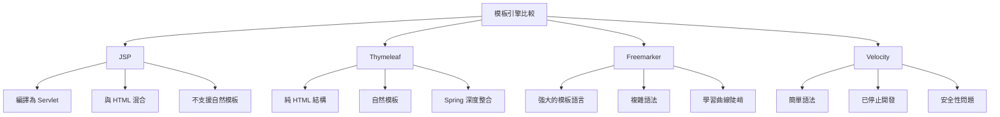
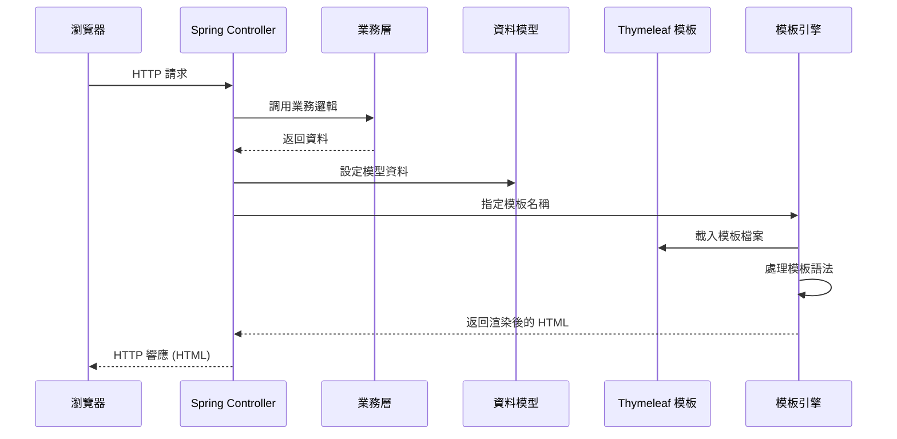
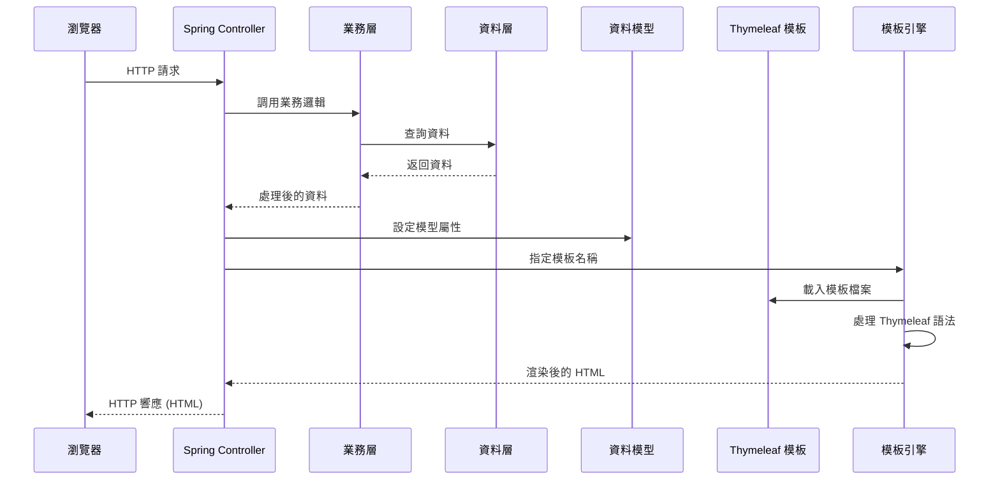

+++
date = '2025-10-31T00:00:00+08:00'
draft = false
title = 'Thymeleaf使用教學'
tags = ['教學', 'framework']
categories = ['教學']
+++
# Thymeleaf 使用教學手冊

## 目錄

1. [基礎概念](#1-基礎概念)
   - 1.1 [什麼是 Thymeleaf？](#11-什麼是-thymeleaf)
   - 1.2 [核心特色](#12-核心特色)
     - 1.2.1 [自然模板特性](#121-自然模板特性)
     - 1.2.2 [表達式豐富性](#122-表達式豐富性)
   - 1.3 [與其他模板引擎比較](#13-與其他模板引擎比較)
     - 1.3.1 [詳細比較表](#131-詳細比較表)
   - 1.4 [適用場景](#14-適用場景)
   - 1.5 [工作流程](#15-工作流程)
   - 1.6 [實務注意事項](#16-實務注意事項)

2. [環境建置](#2-環境建置)
   - 2.1 [Spring Boot 專案整合](#21-spring-boot-專案整合)
     - 2.1.1 [Maven 設定](#211-maven-設定)
     - 2.1.2 [Gradle 設定](#212-gradle-設定)
   - 2.2 [目錄結構設定](#22-目錄結構設定)
   - 2.3 [應用程式設定](#23-應用程式設定)
     - 2.3.1 [基本設定 (application.yml)](#231-基本設定-applicationyml)
     - 2.3.2 [生產環境設定 (application-prod.yml)](#232-生產環境設定-application-prodyml)
   - 2.4 [IDE 設定](#24-ide-設定)
     - 2.4.1 [IntelliJ IDEA 設定](#241-intellij-idea-設定)
     - 2.4.2 [VS Code 設定](#242-vs-code-設定)
   - 2.5 [驗證安裝](#25-驗證安裝)
     - 2.5.1 [建立控制器](#251-建立控制器)
     - 2.5.2 [建立模板](#252-建立模板)
     - 2.5.3 [啟動應用程式](#253-啟動應用程式)
   - 2.6 [開發環境最佳化](#26-開發環境最佳化)
     - 2.6.1 [熱重載設定](#261-熱重載設定)
     - 2.6.2 [除錯設定](#262-除錯設定)
   - 2.7 [常見安裝問題](#27-常見安裝問題)

3. [語法教學](#3-語法教學)
   - 3.1 [基本標籤語法](#31-基本標籤語法)
     - 3.1.1 [文字輸出 (th:text)](#311-文字輸出-thtext)
     - 3.1.2 [HTML 輸出 (th:utext)](#312-html-輸出-thutext)
     - 3.1.3 [條件判斷 (th:if, th:unless)](#313-條件判斷-thif-thunless)
     - 3.1.4 [迴圈遍歷 (th:each)](#314-迴圈遍歷-theach)
     - 3.1.5 [條件選擇 (th:switch, th:case)](#315-條件選擇-thswitch-thcase)
   - 3.2 [屬性處理](#32-屬性處理)
     - 3.2.1 [設定屬性 (th:attr)](#321-設定屬性-thattr)
     - 3.2.2 [常用屬性快捷方式](#322-常用屬性快捷方式)
     - 3.2.3 [CSS 類別處理 (th:classappend)](#323-css-類別處理-thclassappend)
   - 3.3 [表達式語法](#33-表達式語法)
     - 3.3.1 [變數表達式 (${...})](#331-變數表達式-)
     - 3.3.2 [選擇表達式 (*{...})](#332-選擇表達式-)
     - 3.3.3 [連結表達式 (@{...})](#333-連結表達式-)
     - 3.3.4 [訊息表達式 (#{...})](#334-訊息表達式-)
     - 3.3.5 [片段表達式 (~{...})](#335-片段表達式-)
   - 3.4 [內建工具物件](#34-內建工具物件)
     - 3.4.1 [日期工具 (#dates)](#341-日期工具-dates)
     - 3.4.2 [數字工具 (#numbers)](#342-數字工具-numbers)
     - 3.4.3 [字串工具 (#strings)](#343-字串工具-strings)
     - 3.4.4 [集合工具 (#lists, #sets, #maps)](#344-集合工具-lists-sets-maps)
   - 3.5 [實務注意事項](#35-實務注意事項)
   - 3.6 [模板繼承與片段](#36-模板繼承與片段)
     - 3.6.1 [片段定義與使用 (th:fragment)](#361-片段定義與使用-thfragment)
     - 3.6.2 [片段插入方式](#362-片段插入方式)
     - 3.6.3 [佈局模板系統](#363-佈局模板系統)
     - 3.6.4 [參數化片段](#364-參數化片段)
     - 3.6.5 [片段選擇器](#365-片段選擇器)
   - 3.7 [實務注意事項](#37-實務注意事項)
   - 3.8 [表單處理](#38-表單處理)
     - 3.8.1 [基本表單綁定](#381-基本表單綁定)
     - 3.8.2 [下拉選單處理](#382-下拉選單處理)
     - 3.8.3 [核取方塊處理](#383-核取方塊處理)
     - 3.8.4 [單選按鈕處理](#384-單選按鈕處理)
     - 3.8.5 [檔案上傳處理](#385-檔案上傳處理)
     - 3.8.6 [表單驗證錯誤處理](#386-表單驗證錯誤處理)
   - 3.9 [國際化 (i18n) 支援](#39-國際化-i18n-支援)
     - 3.9.1 [設定國際化](#391-設定國際化)
     - 3.9.2 [訊息資源檔案](#392-訊息資源檔案)
     - 3.9.3 [在模板中使用國際化](#393-在模板中使用國際化)
     - 3.9.4 [Java 程式碼中的國際化](#394-java-程式碼中的國際化)
     - 3.9.5 [日期和數字本地化](#395-日期和數字本地化)
     - 3.9.6 [進階國際化實作](#396-進階國際化實作)
     - 3.9.7 [多語言最佳實務](#397-多語言最佳實務)
   - 3.10 [實務注意事項](#310-實務注意事項)

4. [實務應用範例](#4-實務應用範例)
   - 4.1 [頁面渲染流程](#41-頁面渲染流程)
   - 4.2 [會員註冊/登入系統範例](#42-會員註冊登入系統範例)
     - 4.2.1 [專案結構](#421-專案結構)
     - 4.2.2 [實體類別](#422-實體類別)
     - 4.2.3 [DTO 類別](#423-dto-類別)
     - 4.2.4 [控制器](#424-控制器)
     - 4.2.5 [模板檔案](#425-模板檔案)
     - 4.2.6 [服務層實作](#426-服務層實作)
     - 4.2.7 [存儲庫層](#427-存儲庫層)
     - 4.2.8 [例外處理類別](#428-例外處理類別)
     - 4.2.9 [配置類別](#429-配置類別)
   - 4.3 [與 Spring Security 整合](#43-與-spring-security-整合)
   - 4.4 [實務注意事項](#44-實務注意事項)

5. [常見錯誤與除錯技巧](#5-常見錯誤與除錯技巧)
   - 5.1 [常見錯誤類型](#51-常見錯誤類型)
     - 5.1.1 [模板語法錯誤](#511-模板語法錯誤)
     - 5.1.2 [路徑和連結錯誤](#512-路徑和連結錯誤)
     - 5.1.3 [表單綁定錯誤](#513-表單綁定錯誤)
   - 5.2 [除錯技巧](#52-除錯技巧)
     - 5.2.1 [啟用詳細日誌](#521-啟用詳細日誌)
     - 5.2.2 [使用瀏覽器開發者工具](#522-使用瀏覽器開發者工具)
     - 5.2.3 [模板存在性檢查](#523-模板存在性檢查)
   - 5.3 [效能問題診斷](#53-效能問題診斷)
     - 5.3.1 [模板快取設定](#531-模板快取設定)
     - 5.3.2 [效能監控](#532-效能監控)

6. [專案使用規範](#6-專案使用規範)
   - 6.1 [檔案命名規範](#61-檔案命名規範)
     - 6.1.1 [模板檔案命名](#611-模板檔案命名)
     - 6.1.2 [片段檔案組織](#612-片段檔案組織)
   - 6.2 [程式碼風格指引](#62-程式碼風格指引)
     - 6.2.1 [HTML 結構規範](#621-html-結構規範)
     - 6.2.2 [Thymeleaf 屬性順序](#622-thymeleaf-屬性順序)
     - 6.2.3 [註解和文檔](#623-註解和文檔)
   - 6.3 [安全性規範](#63-安全性規範)
     - 6.3.1 [輸出轉義](#631-輸出轉義)
     - 6.3.2 [CSRF 保護](#632-csrf-保護)
     - 6.3.3 [存取控制](#633-存取控制)
   - 6.4 [效能最佳化規範](#64-效能最佳化規範)
     - 6.4.1 [片段重用](#641-片段重用)
     - 6.4.2 [條件載入](#642-條件載入)
   - 6.5 [測試規範](#65-測試規範)
     - 6.5.1 [模板單元測試](#651-模板單元測試)
     - 6.5.2 [整合測試](#652-整合測試)

7. [延伸學習資源](#7-延伸學習資源)
   - 7.1 [官方文檔與教學](#71-官方文檔與教學)
     - 7.1.1 [核心資源](#711-核心資源)
     - 7.1.2 [進階主題](#712-進階主題)
   - 7.2 [學習路徑建議](#72-學習路徑建議)
     - 7.2.1 [初學者路徑（1-2週）](#721-初學者路徑1-2週)
     - 7.2.2 [中級路徑（2-4週）](#722-中級路徑2-4週)
     - 7.2.3 [進階路徑（1-2個月）](#723-進階路徑1-2個月)
   - 7.3 [實用工具與插件](#73-實用工具與插件)
     - 7.3.1 [開發工具](#731-開發工具)
     - 7.3.2 [UI 框架整合](#732-ui-框架整合)
   - 7.4 [社群資源](#74-社群資源)
     - 7.4.1 [線上社群](#741-線上社群)
     - 7.4.2 [學習專案](#742-學習專案)

8. [Thymeleaf 認證考試參考](#8-thymeleaf-認證考試參考)
   - 8.1 [考試概述](#81-考試概述)
     - 8.1.1 [認證類型](#811-認證類型)
     - 8.1.2 [考試形式](#812-考試形式)
   - 8.2 [考試範圍](#82-考試範圍)
     - 8.2.1 [基礎認證範圍](#821-基礎認證範圍)
     - 8.2.2 [進階認證範圍](#822-進階認證範圍)
   - 8.3 [準備策略](#83-準備策略)
     - 8.3.1 [學習計畫](#831-學習計畫)
     - 8.3.2 [實作練習](#832-實作練習)
   - 8.4 [模擬考題](#84-模擬考題)
     - 8.4.1 [基礎題型](#841-基礎題型)
     - 8.4.2 [進階題型](#842-進階題型)
   - 8.5 [認證後續](#85-認證後續)
     - 8.5.1 [持續學習](#851-持續學習)
     - 8.5.2 [職涯發展](#852-職涯發展)

9. [檢查清單](#9-檢查清單)
   - 9.1 [環境設定檢查清單](#91-環境設定檢查清單)
   - 9.2 [開發規範檢查清單](#92-開發規範檢查清單)
     - 9.2.1 [模板檔案](#921-模板檔案)
     - 9.2.2 [Thymeleaf 語法](#922-thymeleaf-語法)
     - 9.2.3 [安全性](#923-安全性)
   - 9.3 [效能檢查清單](#93-效能檢查清單)
   - 9.4 [測試檢查清單](#94-測試檢查清單)
   - 9.5 [部署檢查清單](#95-部署檢查清單)
   - 9.6 [維護檢查清單](#96-維護檢查清單)

---

## 1. 基礎概念

### 1.1 什麼是 Thymeleaf？

Thymeleaf 是一個現代的 Java 模板引擎，專為 Web 應用程式和獨立環境設計。它的核心特色是：

- **自然模板 (Natural Templates)**：模板檔案本身就是有效的 HTML，可以直接在瀏覽器中開啟預覽
- **無侵入性**：Thymeleaf 語法不會破壞 HTML 的結構
- **與 Spring 深度整合**：是 Spring Boot 的預設模板引擎
- **伺服器端渲染**：在伺服器端完成頁面渲染後傳送到客戶端

### 1.2 核心特色

#### 1.2.1 自然模板特性
```html
<!-- 傳統 JSP 寫法 -->
<p>Hello <% out.print(name); %>!</p>

<!-- Thymeleaf 寫法 -->
<p th:text="'Hello ' + ${name} + '!'">Hello World!</p>
```

**優勢：**
- 設計師可以直接用瀏覽器開啟 HTML 檔案預覽效果
- 開發者可以獨立於伺服器環境進行前端開發
- 更好的前後端分離協作模式

#### 1.2.2 表達式豐富性
Thymeleaf 支援多種表達式語法：
- **變數表達式**: `${...}`
- **選擇表達式**: `*{...}`
- **訊息表達式**: `#{...}`
- **連結表達式**: `@{...}`
- **片段表達式**: `~{...}`

### 1.3 與其他模板引擎比較



#### 1.3.1 詳細比較表

| 特性 | Thymeleaf | JSP | Freemarker | Velocity |
|------|-----------|-----|------------|----------|
| 自然模板 | ✅ | ❌ | ❌ | ❌ |
| Spring 整合 | ✅✅ | ✅ | ✅ | ✅ |
| 學習難度 | 中等 | 容易 | 困難 | 容易 |
| 效能 | 良好 | 優秀 | 優秀 | 良好 |
| 安全性 | 高 | 中等 | 高 | 低 |
| 社群支援 | 活躍 | 活躍 | 活躍 | 停滯 |

### 1.4 適用場景

#### ✅ 適合使用 Thymeleaf 的情況：
- Spring Boot Web 應用程式
- 需要伺服器端渲染的 SEO 友善網站
- 前後端協作開發的專案
- 重視模板可讀性和維護性的專案
- 需要國際化支援的應用程式

#### ❌ 不適合使用 Thymeleaf 的情況：
- 純 API 服務（RESTful API）
- 單頁應用程式（SPA）為主的專案
- 對效能要求極高的高併發系統
- 已有大量 JSP 模板的遺留系統

### 1.5 工作流程



### 1.6 實務注意事項

⚠️ **安全性考量**
- Thymeleaf 預設會對輸出進行 HTML 轉義，防止 XSS 攻擊
- 使用 `th:utext` 時需特別謹慎，確保資料來源可信
- 避免在模板中直接處理敏感資料

🚀 **效能最佳化**
- 啟用模板快取（生產環境預設開啟）
- 避免在模板中進行複雜的業務邏輯運算
- 合理使用片段和布局，減少重複渲染

📋 **開發最佳實務**
- 保持模板邏輯簡單，複雜邏輯放在 Controller 或 Service 層
- 使用有意義的變數名稱
- 適當的註解和文檔
- 定期進行模板效能測試

---

## 2. 環境建置

### 2.1 Spring Boot 專案整合

#### 2.1.1 Maven 設定

在 `pom.xml` 中加入 Thymeleaf 依賴：

```xml
<dependencies>
    <!-- Spring Boot Starter Web -->
    <dependency>
        <groupId>org.springframework.boot</groupId>
        <artifactId>spring-boot-starter-web</artifactId>
    </dependency>
    
    <!-- Spring Boot Starter Thymeleaf -->
    <dependency>
        <groupId>org.springframework.boot</groupId>
        <artifactId>spring-boot-starter-thymeleaf</artifactId>
    </dependency>
    
    <!-- 可選：Thymeleaf 安全模組 -->
    <dependency>
        <groupId>org.thymeleaf.extras</groupId>
        <artifactId>thymeleaf-extras-springsecurity6</artifactId>
    </dependency>
    
    <!-- 開發時熱重載 -->
    <dependency>
        <groupId>org.springframework.boot</groupId>
        <artifactId>spring-boot-devtools</artifactId>
        <scope>runtime</scope>
        <optional>true</optional>
    </dependency>
</dependencies>
```

#### 2.1.2 Gradle 設定

在 `build.gradle` 中加入相應依賴：

```gradle
dependencies {
    implementation 'org.springframework.boot:spring-boot-starter-web'
    implementation 'org.springframework.boot:spring-boot-starter-thymeleaf'
    implementation 'org.thymeleaf.extras:thymeleaf-extras-springsecurity6'
    
    developmentOnly 'org.springframework.boot:spring-boot-devtools'
}
```

### 2.2 目錄結構設定

標準的 Spring Boot + Thymeleaf 專案結構：

```
src/
├── main/
│   ├── java/
│   │   └── com/
│   │       └── yourcompany/
│   │           └── project/
│   │               ├── Application.java
│   │               ├── controller/
│   │               ├── service/
│   │               ├── model/
│   │               └── config/
│   └── resources/
│       ├── static/          # 靜態資源 (CSS, JS, 圖片)
│       │   ├── css/
│       │   ├── js/
│       │   └── images/
│       ├── templates/       # Thymeleaf 模板檔案
│       │   ├── layout/
│       │   ├── fragments/
│       │   └── pages/
│       └── application.yml  # 設定檔
└── test/
```

### 2.3 應用程式設定

#### 2.3.1 基本設定 (application.yml)

```yaml
spring:
  thymeleaf:
    # 模板檔案路徑
    prefix: classpath:/templates/
    # 模板檔案副檔名
    suffix: .html
    # 模板模式
    mode: HTML
    # 編碼
    encoding: UTF-8
    # 開發環境關閉快取
    cache: false
    # 檢查模板是否存在
    check-template: true
    # 檢查模板位置是否存在
    check-template-location: true

  # 開發工具設定
  devtools:
    restart:
      enabled: true
    livereload:
      enabled: true
```

#### 2.3.2 生產環境設定 (application-prod.yml)

```yaml
spring:
  thymeleaf:
    # 生產環境啟用快取
    cache: true
    
logging:
  level:
    org.thymeleaf: WARN
```

### 2.4 IDE 設定

#### 2.4.1 IntelliJ IDEA 設定

1. **安裝 Thymeleaf 外掛程式**
   - File → Settings → Plugins
   - 搜尋並安裝 "Thymeleaf"

2. **設定檔案關聯**
   - File → Settings → Editor → File Types
   - 確保 `.html` 檔案關聯到 Thymeleaf

3. **程式碼自動完成設定**
   - File → Settings → Editor → General → Code Completion
   - 啟用 "Show suggestions as you type"

#### 2.4.2 VS Code 設定

1. **安裝擴充功能**
   ```json
   // .vscode/extensions.json
   {
     "recommendations": [
       "pivotal.vscode-spring-boot",
       "vscjava.vscode-java-pack",
       "formulahendry.auto-rename-tag"
     ]
   }
   ```

2. **工作區設定**
   ```json
   // .vscode/settings.json
   {
     "java.configuration.updateBuildConfiguration": "automatic",
     "spring-boot.ls.java.home": "/path/to/java/home"
   }
   ```

### 2.5 驗證安裝

建立一個簡單的控制器和模板來驗證環境設定：

#### 2.5.1 建立控制器

```java
package com.yourcompany.project.controller;

import org.springframework.stereotype.Controller;
import org.springframework.ui.Model;
import org.springframework.web.bind.annotation.GetMapping;

@Controller
public class HelloController {
    
    @GetMapping("/hello")
    public String hello(Model model) {
        model.addAttribute("message", "歡迎使用 Thymeleaf！");
        model.addAttribute("currentTime", java.time.LocalDateTime.now());
        return "hello";
    }
}
```

#### 2.5.2 建立模板

建立 `src/main/resources/templates/hello.html`：

```html
<!DOCTYPE html>
<html xmlns:th="http://www.thymeleaf.org">
<head>
    <meta charset="UTF-8">
    <title>Thymeleaf 測試頁面</title>
    <style>
        body { font-family: Arial, sans-serif; margin: 50px; }
        .message { color: #2196F3; font-size: 24px; }
        .time { color: #666; font-size: 14px; }
    </style>
</head>
<body>
    <h1>Thymeleaf 環境測試</h1>
    <div class="message" th:text="${message}">預設訊息</div>
    <div class="time">
        當前時間: <span th:text="${currentTime}">時間載入中...</span>
    </div>
    
    <!-- 條件顯示 -->
    <div th:if="${message}">
        <p>✅ Thymeleaf 環境設定成功！</p>
    </div>
</body>
</html>
```

#### 2.5.3 啟動應用程式

```bash
# Maven
mvn spring-boot:run

# Gradle
./gradlew bootRun
```

訪問 `http://localhost:8080/hello` 確認頁面正常顯示。

### 2.6 開發環境最佳化

#### 2.6.1 熱重載設定

為了提升開發效率，設定模板熱重載：

```yaml
spring:
  thymeleaf:
    cache: false
  devtools:
    restart:
      enabled: true
      additional-paths: src/main/resources/templates
    livereload:
      enabled: true
```

#### 2.6.2 除錯設定

```yaml
logging:
  level:
    org.thymeleaf: DEBUG
    org.thymeleaf.TemplateEngine.CONFIG: DEBUG
    org.thymeleaf.TemplateEngine.TIMER: DEBUG
```

### 2.7 常見安裝問題

#### ❌ 問題1：模板找不到
**錯誤訊息**: `Template might not exist or might not be accessible`

**解決方案**:
1. 檢查模板檔案路徑是否正確
2. 確認 `application.yml` 中的 `prefix` 設定
3. 檢查檔案名稱是否與 Controller 回傳值一致

#### ❌ 問題2：中文亂碼
**解決方案**:
```yaml
spring:
  thymeleaf:
    encoding: UTF-8
server:
  servlet:
    encoding:
      charset: UTF-8
      force: true
```

#### ❌ 問題3：靜態資源載入失敗
**解決方案**:
1. 確認靜態資源放在 `src/main/resources/static/` 目錄下
2. 使用 Thymeleaf 連結語法：`@{/css/style.css}`

---

### 實務注意事項

⚠️ **環境區分**
- 開發環境關閉快取，生產環境開啟快取
- 使用 Profile 區分不同環境的設定
- 定期檢查依賴版本相容性

🔧 **開發工具**
- 使用 DevTools 提升開發效率
- 設定 IDE 的 Thymeleaf 支援
- 建立程式碼模板快速產生常用結構

📝 **版本管理**
- 明確記錄使用的 Thymeleaf 版本
- 關注 Spring Boot 版本與 Thymeleaf 版本的相容性
- 定期更新到穩定版本

---

## 3. 語法教學

### 3.1 基本標籤語法

#### 3.1.1 文字輸出 (th:text)

最基本的文字輸出標籤，會自動進行 HTML 轉義：

```html
<!-- 基本用法 -->
<p th:text="${message}">預設文字</p>

<!-- 字串連接 -->
<p th:text="'Hello, ' + ${userName} + '!'">Hello, Guest!</p>

<!-- 條件輸出 -->
<p th:text="${user != null} ? ${user.name} : '訪客'">使用者名稱</p>

<!-- 日期格式化 -->
<p th:text="${#dates.format(currentDate, 'yyyy-MM-dd HH:mm:ss')}">日期時間</p>

<!-- 數字格式化 -->
<p th:text="${#numbers.formatDecimal(price, 1, 2)}">價格</p>
```

#### 3.1.2 HTML 輸出 (th:utext)

⚠️ **注意**：`th:utext` 不會進行 HTML 轉義，使用時需確保資料來源安全

```html
<!-- 輸出 HTML 內容 -->
<div th:utext="${htmlContent}">
    <p>預設 HTML 內容</p>
</div>

<!-- 常用於富文本編輯器內容顯示 -->
<div th:utext="${article.content}">文章內容</div>
```

#### 3.1.3 條件判斷 (th:if, th:unless)

```html
<!-- 基本條件判斷 -->
<div th:if="${user != null}">
    <p>歡迎回來，<span th:text="${user.name}">使用者</span>！</p>
</div>

<!-- 相反條件 -->
<div th:unless="${user != null}">
    <p>請先登入</p>
</div>

<!-- 複雜條件 -->
<div th:if="${user != null and user.isActive()}">
    <p>使用者已啟用</p>
</div>

<!-- 角色權限判斷 -->
<div th:if="${user != null and user.hasRole('ADMIN')}">
    <button>管理介面</button>
</div>

<!-- 集合判斷 -->
<div th:if="${!#lists.isEmpty(notifications)}">
    <p>您有新通知</p>
</div>
```

#### 3.1.4 迴圈遍歷 (th:each)

```html
<!-- 基本迴圈 -->
<ul>
    <li th:each="item : ${itemList}" th:text="${item.name}">項目名稱</li>
</ul>

<!-- 帶索引的迴圈 -->
<table>
    <tr th:each="user, iterStat : ${users}">
        <td th:text="${iterStat.index + 1}">序號</td>
        <td th:text="${user.name}">姓名</td>
        <td th:text="${user.email}">信箱</td>
        <td th:if="${iterStat.odd}" style="background-color: #f9f9f9;">奇數行</td>
    </tr>
</table>

<!-- 迴圈狀態變數 -->
<div th:each="product, stat : ${products}">
    <p>
        第 <span th:text="${stat.count}">1</span> 個商品
        (<span th:text="${stat.size}">總數</span> 個中的第
        <span th:text="${stat.index + 1}">1</span> 個)
    </p>
    <p th:if="${stat.first}">這是第一個商品</p>
    <p th:if="${stat.last}">這是最後一個商品</p>
</div>

<!-- Map 遍歷 -->
<ul>
    <li th:each="entry : ${userMap}">
        <span th:text="${entry.key}">鍵</span>:
        <span th:text="${entry.value}">值</span>
    </li>
</ul>
```

**迴圈狀態變數說明：**

| 屬性 | 說明 | 型別 |
|------|------|------|
| `index` | 當前索引（從 0 開始） | int |
| `count` | 當前計數（從 1 開始） | int |
| `size` | 集合總大小 | int |
| `current` | 當前元素 | Object |
| `even` | 是否為偶數項 | boolean |
| `odd` | 是否為奇數項 | boolean |
| `first` | 是否為第一項 | boolean |
| `last` | 是否為最後一項 | boolean |

#### 3.1.5 條件選擇 (th:switch, th:case)

```html
<!-- 基本 switch 語法 -->
<div th:switch="${user.role}">
    <p th:case="'ADMIN'">管理員使用者</p>
    <p th:case="'USER'">一般使用者</p>
    <p th:case="'GUEST'">訪客</p>
    <p th:case="*">未知角色</p>
</div>

<!-- 數字條件 -->
<div th:switch="${order.status}">
    <span th:case="1" class="status-pending">待處理</span>
    <span th:case="2" class="status-processing">處理中</span>
    <span th:case="3" class="status-completed">已完成</span>
    <span th:case="*" class="status-unknown">未知狀態</span>
</div>

<!-- 複雜條件結合 -->
<div th:switch="${user.getLevel()}">
    <div th:case="'VIP'">
        <h3>VIP 會員專區</h3>
        <p>享有特殊優惠</p>
    </div>
    <div th:case="'GOLD'">
        <h3>黃金會員</h3>
        <p>享有折扣優惠</p>
    </div>
    <div th:case="*">
        <h3>一般會員</h3>
        <p>歡迎升級會員</p>
    </div>
</div>
```

### 3.2 屬性處理

#### 3.2.1 設定屬性 (th:attr)

```html
<!-- 基本屬性設定 -->


<!-- 多個屬性 -->
<input th:attr="type='text', value=${user.name}, placeholder='請輸入姓名'"/>

<!-- 條件屬性 -->
<div th:attr="class=${isActive} ? 'active' : 'inactive'">狀態區塊</div>
```

#### 3.2.2 常用屬性快捷方式

```html
<!-- 快捷屬性設定 -->
<input th:value="${user.name}" th:placeholder="'請輸入姓名'"/>

<a th:href="@{/user/profile(id=${user.id})}" th:title="${user.name}">個人檔案</a>

<!-- 表單相關 -->
<input th:name="username" th:value="${form.username}" th:required="${required}"/>
<select th:name="category">
    <option th:each="cat : ${categories}" 
            th:value="${cat.id}" 
            th:text="${cat.name}"
            th:selected="${cat.id == selectedCategory}">分類</option>
</select>

<!-- 樣式相關 -->
<div th:class="${isHighlight} ? 'highlight' : 'normal'">內容</div>
<div th:style="'color: ' + ${textColor} + '; font-size: ' + ${fontSize} + 'px;'">
    動態樣式文字
</div>
```

#### 3.2.3 CSS 類別處理 (th:classappend)

```html
<!-- 附加 CSS 類別 -->
<div class="base-class" th:classappend="${isActive} ? 'active' : ''">基礎樣式</div>

<!-- 多條件類別 -->
<div class="card" 
     th:classappend="${isPremium} ? 'premium' : ''"
     th:classappend="${isNew} ? 'new' : ''">
    卡片內容
</div>

<!-- 動態類別組合 -->
<div th:class="'product-card ' + ${product.category.toLowerCase()} + 
               (${product.isOnSale()} ? ' on-sale' : '') +
               (${product.isNew()} ? ' new-product' : '')">
    商品卡片
</div>
```

### 3.3 表達式語法

#### 3.3.1 變數表達式 (${...})

```html
<!-- 基本變數 -->
<p th:text="${userName}">使用者名稱</p>

<!-- 物件屬性 -->
<p th:text="${user.profile.fullName}">完整姓名</p>

<!-- 方法調用 -->
<p th:text="${user.getFormattedJoinDate()}">加入日期</p>

<!-- 安全導航（避免空指標） -->
<p th:text="${user?.profile?.address?.city}">城市</p>

<!-- 集合操作 -->
<p th:text="${users[0].name}">第一位使用者</p>
<p th:text="${userMap['admin'].role}">管理員角色</p>
```

#### 3.3.2 選擇表達式 (*{...})

用於選擇物件內的屬性，通常與 `th:object` 搭配使用：

```html
<!-- 設定物件上下文 -->
<div th:object="${user}">
    <p th:text="*{name}">姓名</p>
    <p th:text="*{email}">信箱</p>
    <p th:text="*{profile.phone}">電話</p>
    
    <!-- 等同於 -->
    <!-- <p th:text="${user.name}">姓名</p> -->
    <!-- <p th:text="${user.email}">信箱</p> -->
</div>

<!-- 表單綁定 -->
<form th:object="${userForm}" th:action="@{/user/save}" method="post">
    <input th:field="*{username}" type="text" placeholder="使用者名稱"/>
    <input th:field="*{email}" type="email" placeholder="電子信箱"/>
    <input th:field="*{password}" type="password" placeholder="密碼"/>
    <button type="submit">儲存</button>
</form>
```

#### 3.3.3 連結表達式 (@{...})

用於建立 URL 連結：

```html
<!-- 基本連結 -->
<a th:href="@{/}">首頁</a>
<a th:href="@{/user/list}">使用者列表</a>

<!-- 帶參數的連結 -->
<a th:href="@{/user/view(id=${user.id})}">查看使用者</a>
<a th:href="@{/product/search(category=${cat.id}, page=${currentPage})}">
    搜尋商品
</a>

<!-- 路徑變數 -->
<a th:href="@{/user/{id}/profile(id=${user.id})}">個人檔案</a>

<!-- 絕對路徑 -->
<a th:href="@{http://www.example.com}">外部連結</a>

<!-- 靜態資源 -->
<link th:href="@{/css/style.css}" rel="stylesheet"/>
<script th:src="@{/js/app.js}"></script>


<!-- 表單 action -->
<form th:action="@{/user/save}" method="post">
    <!-- 表單內容 -->
</form>
```

#### 3.3.4 訊息表達式 (#{...})

用於國際化訊息：

```html
<!-- 基本訊息 -->
<p th:text="#{welcome.message}">歡迎訊息</p>

<!-- 帶參數的訊息 -->
<p th:text="#{user.greeting(${user.name})}">使用者問候</p>

<!-- 在屬性中使用 -->
<input th:placeholder="#{form.username.placeholder}" type="text"/>

<!-- 結合變數 -->
<p th:text="#{notification.count(${notifications.size()})}">通知數量</p>
```

#### 3.3.5 片段表達式 (~{...})

用於模板片段：

```html
<!-- 插入片段 -->
<div th:insert="~{fragments/header :: header}"></div>

<!-- 替換片段 -->
<div th:replace="~{fragments/navbar :: navbar(${currentUser})}"></div>

<!-- 條件片段 -->
<div th:insert="${user.isAdmin()} ? ~{fragments/admin :: panel} : ~{fragments/user :: panel}"></div>
```

### 3.4 內建工具物件

Thymeleaf 提供豐富的內建工具物件：

#### 3.4.1 日期工具 (#dates)

```html
<!-- 格式化日期 -->
<p th:text="${#dates.format(user.createDate, 'yyyy-MM-dd')}">建立日期</p>
<p th:text="${#dates.format(user.createDate, 'dd/MM/yyyy HH:mm')}">詳細時間</p>

<!-- 日期運算 -->
<p th:text="${#dates.createNow()}">目前時間</p>
<p th:text="${#dates.createToday()}">今天</p>

<!-- 日期比較 -->
<p th:if="${#dates.createNow().after(event.startDate)}">活動已開始</p>

<!-- 取得日期部分 -->
<p th:text="${#dates.year(user.birthday)}">出生年份</p>
<p th:text="${#dates.month(user.birthday)}">出生月份</p>
<p th:text="${#dates.day(user.birthday)}">出生日期</p>
```

#### 3.4.2 數字工具 (#numbers)

```html
<!-- 數字格式化 -->
<p th:text="${#numbers.formatDecimal(price, 1, 2)}">價格</p>
<p th:text="${#numbers.formatCurrency(total)}">總金額</p>
<p th:text="${#numbers.formatPercent(ratio, 1, 2)}">百分比</p>

<!-- 數字序列 -->
<select>
    <option th:each="year : ${#numbers.sequence(2020, 2030)}" 
            th:value="${year}" th:text="${year}">年份</option>
</select>
```

#### 3.4.3 字串工具 (#strings)

```html
<!-- 字串處理 -->
<p th:text="${#strings.toUpperCase(user.name)}">大寫姓名</p>
<p th:text="${#strings.toLowerCase(user.email)}">小寫信箱</p>
<p th:text="${#strings.capitalize(description)}">首字母大寫</p>

<!-- 字串檢查 -->
<p th:if="${#strings.isEmpty(user.phone)}">未提供電話</p>
<p th:if="${#strings.contains(user.email, '@')}">有效信箱格式</p>

<!-- 字串擷取 -->
<p th:text="${#strings.substring(longText, 0, 100) + '...'}">摘要</p>

<!-- 字串替換 -->
<p th:text="${#strings.replace(template, '{name}', user.name)}">模板替換</p>
```

#### 3.4.4 集合工具 (#lists, #sets, #maps)

```html
<!-- 集合檢查 -->
<p th:if="${#lists.isEmpty(notifications)}">無新通知</p>
<p th:text="'共有 ' + ${#lists.size(products)} + ' 個商品'">商品數量</p>

<!-- 集合操作 -->
<p th:text="${#lists.contains(userRoles, 'ADMIN')}">是否為管理員</p>

<!-- Map 操作 -->
<p th:if="${#maps.containsKey(settings, 'theme')}">已設定主題</p>

<!-- 陣列處理 -->
<ul>
    <li th:each="item : ${#arrays.toList(stringArray)}" th:text="${item}">項目</li>
</ul>
```

### 3.5 實務注意事項

⚠️ **表達式安全性**

- 使用 `th:text` 而非 `th:utext` 來防止 XSS 攻擊
- 驗證使用者輸入資料
- 避免在模板中執行危險操作

🚀 **效能最佳化**

- 避免在迴圈中進行複雜運算
- 使用適當的快取策略
- 預先處理資料在 Controller 層

📝 **可讀性建議**

- 使用有意義的變數名稱
- 適當的縮排和格式化
- 添加註解說明複雜邏輯

---

### 3.6 模板繼承與片段

#### 3.6.1 片段定義與使用 (th:fragment)

片段是可重複使用的模板區塊，有助於減少程式碼重複：

```html
<!-- fragments/common.html -->
<!DOCTYPE html>
<html xmlns:th="http://www.thymeleaf.org">

<!-- 頁首片段 -->
<head th:fragment="head(title)">
    <meta charset="UTF-8"/>
    <meta name="viewport" content="width=device-width, initial-scale=1.0"/>
    <title th:text="${title}">預設標題</title>
    <link th:href="@{/css/bootstrap.min.css}" rel="stylesheet"/>
    <link th:href="@{/css/custom.css}" rel="stylesheet"/>
</head>

<!-- 導航列片段 -->
<nav th:fragment="navbar(currentUser)" class="navbar navbar-expand-lg">
    <div class="container">
        <a th:href="@{/}" class="navbar-brand">我的網站</a>
        
        <div class="navbar-nav ms-auto">
            <span th:if="${currentUser != null}" class="navbar-text">
                歡迎，<span th:text="${currentUser.name}">使用者</span>
            </span>
            <a th:if="${currentUser == null}" th:href="@{/login}" class="nav-link">登入</a>
            <a th:if="${currentUser != null}" th:href="@{/logout}" class="nav-link">登出</a>
        </div>
    </div>
</nav>

<!-- 頁尾片段 -->
<footer th:fragment="footer" class="footer mt-auto py-3 bg-light">
    <div class="container text-center">
        <span class="text-muted">© 2024 我的公司. 版權所有.</span>
    </div>
</footer>

<!-- 腳本片段 -->
<div th:fragment="scripts">
    <script th:src="@{/js/bootstrap.bundle.min.js}"></script>
    <script th:src="@{/js/custom.js}"></script>
</div>

</html>
```

#### 3.6.2 片段插入方式

**th:insert** - 插入片段到指定元素內部：

```html
<!-- 會保留原有的 div 標籤 -->
<div th:insert="~{fragments/common :: navbar(${user})}"></div>

<!-- 結果：-->
<div>
    <nav class="navbar navbar-expand-lg">
        <!-- 導航列內容 -->
    </nav>
</div>
```

**th:replace** - 完全替換指定元素：

```html
<!-- 會替換整個 div 標籤 -->
<div th:replace="~{fragments/common :: navbar(${user})}"></div>

<!-- 結果：-->
<nav class="navbar navbar-expand-lg">
    <!-- 導航列內容 -->
</nav>
```

**th:include** - 僅插入片段內容（已棄用，建議使用 th:insert）：

```html
<!-- 不建議使用 -->
<div th:include="~{fragments/common :: navbar(${user})}"></div>
```

#### 3.6.3 佈局模板系統

**基礎佈局模板**

建立一個可重用的佈局模板 `layout/base.html`：

```html
<!DOCTYPE html>
<html lang="zh-TW" xmlns:th="http://www.thymeleaf.org"
      th:fragment="layout(content)">
<head>
    <meta charset="UTF-8">
    <meta name="viewport" content="width=device-width, initial-scale=1.0">
    <title th:text="${pageTitle} + ' - 我的網站'">我的網站</title>
    <link rel="stylesheet" th:href="@{/css/bootstrap.min.css}">
    <link rel="stylesheet" th:href="@{/css/main.css}">
    <!-- 允許子頁面插入額外的 CSS -->
    <th:block th:fragment="extraCss"></th:block>
</head>
<body>
    <!-- 導航列 -->
    <nav th:replace="~{fragments/navbar :: navbar}"></nav>
    
    <!-- 主要內容區域 -->
    <main class="container mt-4">
        <!-- 顯示消息 -->
        <div th:if="${message}" class="alert alert-info" th:text="${message}"></div>
        <div th:if="${error}" class="alert alert-danger" th:text="${error}"></div>
        
        <!-- 子頁面內容插入點 -->
        <th:block th:replace="${content}"></th:block>
    </main>
    
    <!-- 頁腳 -->
    <footer th:replace="~{fragments/footer :: footer}"></footer>
    
    <!-- JavaScript -->
    <script th:src="@{/js/bootstrap.bundle.min.js}"></script>
    <script th:src="@{/js/main.js}"></script>
    <!-- 允許子頁面插入額外的 JavaScript -->
    <th:block th:fragment="extraJs"></th:block>
</body>
</html>
```

**使用佈局模板的頁面**

```html
<!-- user/list.html -->
<html xmlns:th="http://www.thymeleaf.org"
      th:replace="~{layout/base :: layout(~{::content})}">
<head>
    <th:block th:fragment="extraCss">
        <link rel="stylesheet" th:href="@{/css/user-management.css}">
    </th:block>
</head>
<body>
    <th:block th:fragment="content">
        <div class="row">
            <div class="col-12">
                <h1>會員管理</h1>
                
                <!-- 操作按鈕 -->
                <div class="mb-3">
                    <a th:href="@{/users/new}" class="btn btn-primary">新增會員</a>
                </div>
                
                <!-- 會員列表表格 -->
                <div class="table-responsive">
                    <table class="table table-striped">
                        <thead>
                            <tr>
                                <th>ID</th>
                                <th>姓名</th>
                                <th>Email</th>
                                <th>註冊日期</th>
                                <th>狀態</th>
                                <th>操作</th>
                            </tr>
                        </thead>
                        <tbody>
                            <tr th:each="user : ${users}">
                                <td th:text="${user.id}"></td>
                                <td th:text="${user.name}"></td>
                                <td th:text="${user.email}"></td>
                                <td th:text="${#dates.format(user.createdAt, 'yyyy-MM-dd')}"></td>
                                <td>
                                    <span th:if="${user.active}" class="badge bg-success">啟用</span>
                                    <span th:unless="${user.active}" class="badge bg-secondary">停用</span>
                                </td>
                                <td>
                                    <a th:href="@{/users/{id}(id=${user.id})}" class="btn btn-sm btn-outline-primary">檢視</a>
                                    <a th:href="@{/users/{id}/edit(id=${user.id})}" class="btn btn-sm btn-outline-secondary">編輯</a>
                                    <button type="button" class="btn btn-sm btn-outline-danger" 
                                            th:onclick="'deleteUser(' + ${user.id} + ')'">刪除</button>
                                </td>
                            </tr>
                        </tbody>
                    </table>
                </div>
                
                <!-- 分頁 -->
                <nav th:if="${users.totalPages > 1}">
                    <ul class="pagination justify-content-center">
                        <li class="page-item" th:classappend="${users.first} ? 'disabled'">
                            <a class="page-link" th:href="@{/users(page=0)}">首頁</a>
                        </li>
                        <li class="page-item" th:classappend="${users.first} ? 'disabled'">
                            <a class="page-link" th:href="@{/users(page=${users.number - 1})}">上一頁</a>
                        </li>
                        <li th:each="i : ${#numbers.sequence(0, users.totalPages - 1)}" 
                            class="page-item" th:classappend="${i == users.number} ? 'active'">
                            <a class="page-link" th:href="@{/users(page=${i})}" th:text="${i + 1}"></a>
                        </li>
                        <li class="page-item" th:classappend="${users.last} ? 'disabled'">
                            <a class="page-link" th:href="@{/users(page=${users.number + 1})}">下一頁</a>
                        </li>
                        <li class="page-item" th:classappend="${users.last} ? 'disabled'">
                            <a class="page-link" th:href="@{/users(page=${users.totalPages - 1})}">末頁</a>
                        </li>
                    </ul>
                </nav>
            </div>
        </div>
    </th:block>
    
    <th:block th:fragment="extraJs">
        <script>
            function deleteUser(userId) {
                if (confirm('確定要刪除這個會員嗎？')) {
                    window.location.href = '/users/' + userId + '/delete';
                }
            }
        </script>
    </th:block>
</body>
</html>
```

#### 3.6.4 參數化片段

**帶參數的片段定義**

```html
<!-- fragments/modal.html -->
<div th:fragment="modal(id, title, content, actions)" 
     class="modal fade" th:id="${id}" tabindex="-1">
    <div class="modal-dialog">
        <div class="modal-content">
            <div class="modal-header">
                <h5 class="modal-title" th:text="${title}">模態框標題</h5>
                <button type="button" class="btn-close" data-bs-dismiss="modal"></button>
            </div>
            <div class="modal-body" th:utext="${content}">
                模態框內容
            </div>
            <div class="modal-footer" th:if="${actions}">
                <th:block th:utext="${actions}"></th:block>
            </div>
        </div>
    </div>
</div>

<!-- fragments/alert.html -->
<div th:fragment="alert(type, message, dismissible)" 
     th:class="'alert alert-' + ${type} + (${dismissible} ? ' alert-dismissible' : '')" role="alert">
    <span th:text="${message}">訊息內容</span>
    <button th:if="${dismissible}" type="button" class="btn-close" 
            data-bs-dismiss="alert" aria-label="關閉"></button>
</div>

<!-- fragments/pagination.html -->
<nav th:fragment="pagination(page, baseUrl)" aria-label="分頁導航" th:if="${page.totalPages > 1}">
    <ul class="pagination justify-content-center">
        <li class="page-item" th:classappend="${page.first} ? 'disabled'">
            <a class="page-link" th:href="@{${baseUrl}(page=0)}">首頁</a>
        </li>
        <li class="page-item" th:classappend="${page.first} ? 'disabled'">
            <a class="page-link" th:href="@{${baseUrl}(page=${page.number - 1})}">上一頁</a>
        </li>
        
        <!-- 顯示頁碼 -->
        <th:block th:each="i : ${#numbers.sequence(T(Math).max(0, page.number - 2), T(Math).min(page.totalPages - 1, page.number + 2))}">
            <li class="page-item" th:classappend="${i == page.number} ? 'active'">
                <a class="page-link" th:href="@{${baseUrl}(page=${i})}" th:text="${i + 1}"></a>
            </li>
        </th:block>
        
        <li class="page-item" th:classappend="${page.last} ? 'disabled'">
            <a class="page-link" th:href="@{${baseUrl}(page=${page.number + 1})}">下一頁</a>
        </li>
        <li class="page-item" th:classappend="${page.last} ? 'disabled'">
            <a class="page-link" th:href="@{${baseUrl}(page=${page.totalPages - 1})}">末頁</a>
        </li>
    </ul>
</nav>
```

**使用參數化片段**

```html
<!-- 使用警告訊息片段 -->
<div th:replace="~{fragments/alert :: alert('success', '資料儲存成功！', true)}"></div>
<div th:replace="~{fragments/alert :: alert('danger', ${errorMessage}, false)}"></div>

<!-- 使用模態框片段 -->
<div th:replace="~{fragments/modal :: modal('deleteModal', '確認刪除', 
    '您確定要刪除這筆資料嗎？此操作無法復原。', 
    '<button type=&quot;button&quot; class=&quot;btn btn-secondary&quot; data-bs-dismiss=&quot;modal&quot;>取消</button>
     <button type=&quot;button&quot; class=&quot;btn btn-danger&quot; id=&quot;confirmDelete&quot;>確認刪除</button>')}"></div>

<!-- 使用分頁片段 -->
<div th:replace="~{fragments/pagination :: pagination(${users}, '/users')}"></div>
```

#### 3.6.5 片段選擇器

**CSS 選擇器語法**

Thymeleaf 支援使用 CSS 選擇器來選取 HTML 文檔的特定部分：

```html
<!-- fragments/navigation.html -->
<div id="navigation-container">
    <ul class="nav-menu">
        <li><a href="/dashboard">儀表板</a></li>
        <li><a href="/users">會員管理</a></li>
        <li><a href="/orders">訂單管理</a></li>
    </ul>
    <div class="user-info">
        <span class="username">歡迎，管理員</span>
        <a href="/logout" class="logout-link">登出</a>
    </div>
</div>

<!-- 使用 ID 選擇器 -->
<div th:insert="~{fragments/navigation :: #navigation-container}"></div>

<!-- 使用類別選擇器 -->
<ul th:insert="~{fragments/navigation :: .nav-menu}"></ul>
<div th:insert="~{fragments/navigation :: .user-info}"></div>

<!-- 使用複合選擇器 -->
<span th:insert="~{fragments/navigation :: .user-info .username}"></span>
```

**DOM 選擇器範例**

```html
<!-- fragments/form-elements.html -->
<div class="form-container">
    <input type="text" name="username" placeholder="使用者名稱" />
    <input type="email" name="email" placeholder="電子郵件" />
    <input type="password" name="password" placeholder="密碼" />
    <button type="submit">提交</button>
</div>

<!-- 選取特定類型的輸入欄位 -->
<input th:insert="~{fragments/form-elements :: input[type='text']}">
<input th:insert="~{fragments/form-elements :: input[type='email']}">

<!-- 選取第一個元素 -->
<input th:insert="~{fragments/form-elements :: input:first-of-type}">

<!-- 選取最後一個元素 -->
<button th:insert="~{fragments/form-elements :: button:last-child}">
```

**進階選擇器用法**

```html
<!-- fragments/complex-structure.html -->
<article class="post">
    <header class="post-header">
        <h2 class="post-title">文章標題</h2>
        <time class="post-date">2024-01-15</time>
    </header>
    <div class="post-content">
        <p>文章內容第一段...</p>
        <p>文章內容第二段...</p>
    </div>
    <footer class="post-footer">
        <div class="tags">
            <span class="tag">標籤1</span>
            <span class="tag">標籤2</span>
        </div>
        <div class="actions">
            <button class="btn-like">讚</button>
            <button class="btn-share">分享</button>
        </div>
    </footer>
</article>

<!-- 使用後代選擇器 -->
<h2 th:insert="~{fragments/complex-structure :: .post-header .post-title}"></h2>

<!-- 使用子選擇器 -->
<div th:insert="~{fragments/complex-structure :: .post-footer > .tags}"></div>

<!-- 使用屬性選擇器 -->
<button th:insert="~{fragments/complex-structure :: button[class='btn-like']}"></button>

<!-- 使用偽類選擇器 -->
<p th:insert="~{fragments/complex-structure :: .post-content p:first-child}"></p>
```

### 3.7 實務注意事項

⚠️ **片段組織**

- 將相關片段組織在同一個檔案中
- 使用有意義的片段名稱
- 避免片段過於複雜，保持單一職責

🚀 **效能考量**

- 避免深層次的片段嵌套
- 合理使用片段快取
- 預編譯常用片段

---

### 3.8 表單處理

#### 3.8.1 基本表單綁定

Thymeleaf 提供強大的表單綁定功能，可以輕鬆處理表單資料：

```html
<!-- 基本表單結構 -->
<form th:object="${userForm}" th:action="@{/user/save}" method="post">
    
    <!-- 文字輸入框 -->
    <div class="mb-3">
        <label for="username" class="form-label">使用者名稱</label>
        <input th:field="*{username}" type="text" class="form-control" id="username" 
               th:classappend="${#fields.hasErrors('username')} ? 'is-invalid' : ''"/>
        <div th:if="${#fields.hasErrors('username')}" class="invalid-feedback">
            <span th:errors="*{username}">使用者名稱錯誤</span>
        </div>
    </div>
    
    <!-- 電子信箱 -->
    <div class="mb-3">
        <label for="email" class="form-label">電子信箱</label>
        <input th:field="*{email}" type="email" class="form-control" id="email"
               th:classappend="${#fields.hasErrors('email')} ? 'is-invalid' : ''"/>
        <div th:if="${#fields.hasErrors('email')}" class="invalid-feedback">
            <span th:errors="*{email}">信箱格式錯誤</span>
        </div>
    </div>
    
    <!-- 密碼 -->
    <div class="mb-3">
        <label for="password" class="form-label">密碼</label>
        <input th:field="*{password}" type="password" class="form-control" id="password"
               th:classappend="${#fields.hasErrors('password')} ? 'is-invalid' : ''"/>
        <div th:if="${#fields.hasErrors('password')}" class="invalid-feedback">
            <span th:errors="*{password}">密碼錯誤</span>
        </div>
    </div>
    
    <!-- 隱藏欄位 -->
    <input th:field="*{id}" type="hidden"/>
    
    <!-- 提交按鈕 -->
    <button type="submit" class="btn btn-primary">儲存</button>
    <a th:href="@{/user/list}" class="btn btn-secondary">取消</a>
</form>
```

對應的 Java 類別：

```java
// UserForm.java
public class UserForm {
    private Long id;
    
    @NotBlank(message = "使用者名稱不能為空")
    @Size(min = 3, max = 20, message = "使用者名稱長度必須介於 3-20 字元")
    private String username;
    
    @Email(message = "請輸入有效的電子信箱格式")
    @NotBlank(message = "電子信箱不能為空")
    private String email;
    
    @NotBlank(message = "密碼不能為空")
    @Size(min = 6, message = "密碼長度至少 6 字元")
    private String password;
    
    // Getters and Setters...
}

// Controller
@Controller
public class UserController {
    
    @GetMapping("/user/create")
    public String createForm(Model model) {
        model.addAttribute("userForm", new UserForm());
        return "user/form";
    }
    
    @PostMapping("/user/save")
    public String save(@Valid @ModelAttribute UserForm userForm, 
                       BindingResult bindingResult, 
                       Model model) {
        if (bindingResult.hasErrors()) {
            return "user/form";
        }
        
        // 儲存邏輯
        userService.save(userForm);
        return "redirect:/user/list";
    }
}
```

#### 3.8.2 下拉選單處理

```html
<!-- 單選下拉選單 -->
<div class="mb-3">
    <label for="department" class="form-label">部門</label>
    <select th:field="*{departmentId}" class="form-select" id="department">
        <option value="">請選擇部門</option>
        <option th:each="dept : ${departments}" 
                th:value="${dept.id}" 
                th:text="${dept.name}"
                th:selected="${dept.id == userForm.departmentId}">部門名稱</option>
    </select>
    <div th:if="${#fields.hasErrors('departmentId')}" class="invalid-feedback d-block">
        <span th:errors="*{departmentId}">部門錯誤</span>
    </div>
</div>

<!-- 多選下拉選單 -->
<div class="mb-3">
    <label for="roles" class="form-label">角色</label>
    <select th:field="*{roleIds}" multiple class="form-select" id="roles" size="4">
        <option th:each="role : ${roles}" 
                th:value="${role.id}" 
                th:text="${role.name}">角色名稱</option>
    </select>
</div>
```

#### 3.8.3 核取方塊處理

```html
<!-- 單一核取方塊 -->
<div class="form-check mb-3">
    <input th:field="*{newsletter}" class="form-check-input" type="checkbox" id="newsletter"/>
    <label class="form-check-label" for="newsletter">
        訂閱電子報
    </label>
</div>

<!-- 多個核取方塊 -->
<div class="mb-3">
    <label class="form-label">興趣</label>
    <div th:each="interest : ${interests}" class="form-check">
        <input th:field="*{interestIds}" 
               th:value="${interest.id}" 
               class="form-check-input" 
               type="checkbox" 
               th:id="'interest_' + ${interest.id}"/>
        <label th:for="'interest_' + ${interest.id}" 
               th:text="${interest.name}" 
               class="form-check-label">興趣名稱</label>
    </div>
</div>
```

#### 3.8.4 單選按鈕處理

```html
<!-- 性別選擇 -->
<div class="mb-3">
    <label class="form-label">性別</label>
    <div class="form-check">
        <input th:field="*{gender}" value="M" class="form-check-input" type="radio" id="male"/>
        <label class="form-check-label" for="male">男性</label>
    </div>
    <div class="form-check">
        <input th:field="*{gender}" value="F" class="form-check-input" type="radio" id="female"/>
        <label class="form-check-label" for="female">女性</label>
    </div>
    <div class="form-check">
        <input th:field="*{gender}" value="O" class="form-check-input" type="radio" id="other"/>
        <label class="form-check-label" for="other">其他</label>
    </div>
</div>
```

#### 3.8.5 檔案上傳處理

```html
<!-- 檔案上傳表單 -->
<form th:action="@{/user/upload}" method="post" enctype="multipart/form-data">
    <div class="mb-3">
        <label for="avatar" class="form-label">頭像上傳</label>
        <input name="avatar" type="file" class="form-control" id="avatar" 
               accept="image/*" onchange="previewImage(this)"/>
        <div class="form-text">支援格式：JPG, PNG, GIF，檔案大小不超過 2MB</div>
    </div>
    
    <!-- 圖片預覽 -->
    <div class="mb-3">
        
    </div>
    
    <button type="submit" class="btn btn-primary">上傳</button>
</form>

<script>
function previewImage(input) {
    if (input.files && input.files[0]) {
        var reader = new FileReader();
        reader.onload = function(e) {
            document.getElementById('preview').src = e.target.result;
            document.getElementById('preview').style.display = 'block';
        }
        reader.readAsDataURL(input.files[0]);
    }
}
</script>
```

#### 3.8.6 表單驗證錯誤處理

```html
<!-- 全域錯誤訊息 -->
<div th:if="${#fields.hasAnyErrors()}" class="alert alert-danger">
    <h5>表單驗證失敗：</h5>
    <ul>
        <li th:each="error : ${#fields.allErrors()}" th:text="${error}">錯誤訊息</li>
    </ul>
</div>

<!-- 特定欄位錯誤處理 -->
<div class="mb-3">
    <label for="birthDate" class="form-label">出生日期</label>
    <input th:field="*{birthDate}" 
           type="date" 
           class="form-control" 
           id="birthDate"
           th:classappend="${#fields.hasErrors('birthDate')} ? 'is-invalid' : ''"/>
    
    <!-- 多個錯誤訊息 -->
    <div th:if="${#fields.hasErrors('birthDate')}" class="invalid-feedback">
        <div th:each="error : ${#fields.errors('birthDate')}" th:text="${error}">錯誤訊息</div>
    </div>
</div>
```

### 3.9 國際化 (i18n) 支援

#### 3.9.1 設定國際化

**application.yml 設定：**

```yaml
spring:
  messages:
    # 訊息檔案基本名稱
    basename: messages
    # 編碼
    encoding: UTF-8
    # 快取時間（開發環境設為 0）
    cache-duration: 0
    # 預設語言
    fallback-to-system-locale: false
  
  # 網頁本地化設定
  web:
    locale: zh-TW
    locale-resolver: fixed
```

**LocaleConfig.java 設定：**

```java
@Configuration
public class LocaleConfig implements WebMvcConfigurer {
    
    @Bean
    public LocaleResolver localeResolver() {
        SessionLocaleResolver resolver = new SessionLocaleResolver();
        resolver.setDefaultLocale(Locale.TRADITIONAL_CHINESE);
        return resolver;
    }
    
    @Bean
    public LocaleChangeInterceptor localeChangeInterceptor() {
        LocaleChangeInterceptor interceptor = new LocaleChangeInterceptor();
        interceptor.setParamName("lang");
        return interceptor;
    }
    
    @Override
    public void addInterceptors(InterceptorRegistry registry) {
        registry.addInterceptor(localeChangeInterceptor());
    }
}
```

#### 3.9.2 訊息資源檔案

建立多語言訊息檔案：

**messages_zh_TW.properties：**

```properties
# 一般訊息
welcome.message=歡迎使用我們的系統
user.greeting=您好，{0}！
user.login.success=登入成功
user.logout.success=登出成功

# 表單標籤
form.username=使用者名稱
form.email=電子信箱
form.password=密碼
form.confirm.password=確認密碼
form.phone=電話號碼
form.address=地址

# 按鈕
button.save=儲存
button.cancel=取消
button.edit=編輯
button.delete=刪除
button.submit=送出
button.reset=重設

# 驗證錯誤訊息
validation.required={0}為必填欄位
validation.email.invalid=請輸入有效的電子信箱格式
validation.password.min=密碼長度至少 {0} 字元
validation.password.mismatch=密碼與確認密碼不一致

# 狀態訊息
status.active=啟用
status.inactive=停用
status.pending=待審核
```

**messages_en.properties：**

```properties
# General messages
welcome.message=Welcome to our system
user.greeting=Hello, {0}!
user.login.success=Login successful
user.logout.success=Logout successful

# Form labels
form.username=Username
form.email=Email
form.password=Password
form.confirm.password=Confirm Password
form.phone=Phone Number
form.address=Address

# Buttons
button.save=Save
button.cancel=Cancel
button.edit=Edit
button.delete=Delete
button.submit=Submit
button.reset=Reset

# Validation messages
validation.required={0} is required
validation.email.invalid=Please enter a valid email format
validation.password.min=Password must be at least {0} characters
validation.password.mismatch=Password and confirm password do not match

# Status messages
status.active=Active
status.inactive=Inactive
status.pending=Pending
```

#### 3.9.3 在模板中使用國際化

```html
<!DOCTYPE html>
<html xmlns:th="http://www.thymeleaf.org">
<head>
    <title th:text="#{page.title.user.profile}">使用者檔案</title>
</head>
<body>
    <!-- 基本訊息顯示 -->
    <h1 th:text="#{welcome.message}">歡迎訊息</h1>
    
    <!-- 帶參數的訊息 -->
    <p th:text="#{user.greeting(${user.name})}">使用者問候</p>
    
    <!-- 表單標籤國際化 -->
    <form th:object="${userForm}">
        <div class="mb-3">
            <label th:text="#{form.username}" for="username" class="form-label">使用者名稱</label>
            <input th:field="*{username}" type="text" class="form-control" id="username"/>
        </div>
        
        <div class="mb-3">
            <label th:text="#{form.email}" for="email" class="form-label">電子信箱</label>
            <input th:field="*{email}" type="email" class="form-control" id="email"/>
        </div>
        
        <button th:text="#{button.save}" type="submit" class="btn btn-primary">儲存</button>
        <a th:text="#{button.cancel}" th:href="@{/user/list}" class="btn btn-secondary">取消</a>
    </form>
    
    <!-- 語言切換 -->
    <div class="language-switcher">
        <a th:href="@{''(lang=zh_TW)}" 
           th:class="${#locale.toString() == 'zh_TW'} ? 'active' : ''">中文</a>
        <a th:href="@{''(lang=en)}" 
           th:class="${#locale.toString() == 'en'} ? 'active' : ''">English</a>
    </div>
    
    <!-- 條件性國際化 -->
    <div th:switch="${user.status}">
        <span th:case="'ACTIVE'" th:text="#{status.active}" class="badge bg-success">啟用</span>
        <span th:case="'INACTIVE'" th:text="#{status.inactive}" class="badge bg-secondary">停用</span>
        <span th:case="'PENDING'" th:text="#{status.pending}" class="badge bg-warning">待審核</span>
    </div>
</body>
</html>
```

#### 3.9.4 Java 程式碼中的國際化

```java
@Service
public class MessageService {
    
    @Autowired
    private MessageSource messageSource;
    
    public String getMessage(String code, Object[] args, Locale locale) {
        return messageSource.getMessage(code, args, locale);
    }
    
    public String getMessage(String code, Locale locale) {
        return getMessage(code, null, locale);
    }
}

@Controller
public class UserController {
    
    @Autowired
    private MessageService messageService;
    
    @PostMapping("/user/save")
    public String save(@Valid @ModelAttribute UserForm userForm,
                       BindingResult bindingResult,
                       Model model,
                       HttpServletRequest request,
                       RedirectAttributes redirectAttributes) {
        
        if (bindingResult.hasErrors()) {
            return "user/form";
        }
        
        userService.save(userForm);
        
        // 新增成功訊息
        Locale locale = RequestContextUtils.getLocale(request);
        String message = messageService.getMessage("user.save.success", 
                                                   new Object[]{userForm.getUsername()}, 
                                                   locale);
        redirectAttributes.addFlashAttribute("successMessage", message);
        
        return "redirect:/user/list";
    }
}
```

#### 3.9.5 日期和數字本地化

```html
<!-- 日期本地化顯示 -->
<p th:text="${#dates.format(user.createDate, #locale)}">建立日期</p>
<p th:text="${#dates.format(user.createDate, 'short', #locale)}">短日期格式</p>
<p th:text="${#dates.format(user.createDate, 'medium', #locale)}">中等日期格式</p>

<!-- 數字本地化 -->
<p th:text="${#numbers.formatDecimal(product.price, 1, 2, #locale)}">價格</p>
<p th:text="${#numbers.formatCurrency(total, #locale)}">總金額</p>

<!-- 自定義格式 -->
<p th:text="${#dates.format(event.startDate, #{date.format.full})}">活動開始時間</p>
```

對應的訊息檔案：

```properties
# messages_zh_TW.properties
date.format.full=yyyy年MM月dd日 HH:mm:ss

# messages_en.properties  
date.format.full=MMMM dd, yyyy HH:mm:ss
```

### 3.10 實務注意事項

⚠️ **表單安全性**

- 使用 CSRF 保護機制
- 驗證所有使用者輸入
- 避免敏感資料在表單中明文傳輸

🌐 **國際化最佳實務**

- 規劃完整的訊息鍵值命名規範
- 考慮文字長度變化對版面的影響
- 處理複數形式和性別變化
- 測試不同語言環境下的功能

**實用的國際化訊息組織範例：**

```properties
# messages_zh_TW.properties

# 應用程式基本資訊
app.name=我的應用程式
app.version=版本 1.0.0
app.copyright=© 2024 我的公司. 版權所有.

# 導航與選單
nav.home=首頁
nav.about=關於我們
nav.contact=聯絡我們
nav.login=登入
nav.logout=登出
nav.profile=個人檔案

# 表單標籤與說明
form.label.username=使用者名稱
form.label.email=電子信箱
form.label.password=密碼
form.label.confirmPassword=確認密碼
form.label.firstName=名字
form.label.lastName=姓氏
form.label.phone=電話號碼
form.label.birthDate=出生日期
form.label.gender=性別

form.placeholder.username=請輸入使用者名稱
form.placeholder.email=請輸入電子信箱地址
form.placeholder.password=請輸入密碼
form.placeholder.search=搜尋...

# 按鈕與動作
button.save=儲存
button.cancel=取消
button.edit=編輯
button.delete=刪除
button.submit=送出
button.reset=重設
button.search=搜尋
button.add=新增
button.back=返回
button.next=下一步
button.previous=上一步
button.confirm=確認

# 狀態與訊息
status.active=啟用
status.inactive=停用
status.pending=待審核
status.approved=已核准
status.rejected=已拒絕

message.success.save=資料儲存成功
message.success.update=資料更新成功
message.success.delete=資料刪除成功
message.error.save=儲存失敗，請稍後再試
message.error.update=更新失敗，請稍後再試
message.error.delete=刪除失敗，請稍後再試
message.error.notfound=找不到指定的資料
message.error.unauthorized=您沒有執行此操作的權限

# 驗證錯誤訊息
validation.required={0}為必填欄位
validation.min.length={0}長度至少需要 {1} 個字元
validation.max.length={0}長度不能超過 {1} 個字元
validation.email.invalid=請輸入有效的電子信箱格式
validation.password.weak=密碼強度不足，請包含大小寫字母和數字
validation.confirm.password.mismatch=確認密碼與密碼不一致
validation.unique.username=使用者名稱已被使用
validation.unique.email=電子信箱已被註冊

# 分頁與列表
pagination.first=首頁
pagination.previous=上一頁
pagination.next=下一頁
pagination.last=末頁
pagination.showing=顯示第 {0} 到 {1} 項，共 {2} 項
list.empty=目前沒有資料
list.loading=載入中...

# 確認對話框
confirm.delete=您確定要刪除這筆資料嗎？
confirm.logout=您確定要登出嗎？
confirm.cancel=您確定要取消嗎？未儲存的變更將會遺失。

# 日期與時間格式
date.format.short=MM/dd/yyyy
date.format.medium=yyyy年MM月dd日
date.format.long=yyyy年MM月dd日 EEEE
datetime.format.full=yyyy年MM月dd日 HH:mm:ss
time.format=HH:mm

# 數字與貨幣格式
number.currency.symbol=NT$
number.thousand.separator=,
number.decimal.separator=.
```

#### 3.9.6 進階國際化實作

**完整的多語言支援實作範例：**

```java
// AdvancedLocalizationController.java
@Controller
public class AdvancedLocalizationController {
    
    @Autowired
    private MessageSource messageSource;
    
    @GetMapping("/localization-demo")
    public String localizationDemo(Model model, Locale locale) {
        
        // 基本訊息
        String welcomeMessage = messageSource.getMessage("welcome.message", null, locale);
        model.addAttribute("welcomeMessage", welcomeMessage);
        
        // 帶參數的訊息
        String userGreeting = messageSource.getMessage("user.greeting", 
                                                      new Object[]{"張三"}, locale);
        model.addAttribute("userGreeting", userGreeting);
        
        // 複數形式處理
        int itemCount = 5;
        String itemMessage = getItemCountMessage(itemCount, locale);
        model.addAttribute("itemMessage", itemMessage);
        
        // 日期本地化
        LocalDateTime now = LocalDateTime.now();
        String formattedDate = getFormattedDate(now, locale);
        model.addAttribute("formattedDate", formattedDate);
        
        // 數字本地化
        BigDecimal price = new BigDecimal("12345.67");
        String formattedPrice = getFormattedPrice(price, locale);
        model.addAttribute("formattedPrice", formattedPrice);
        
        return "localization/demo";
    }
    
    private String getItemCountMessage(int count, Locale locale) {
        if (Locale.ENGLISH.getLanguage().equals(locale.getLanguage())) {
            // 英文複數處理
            if (count == 1) {
                return messageSource.getMessage("item.count.single", 
                                               new Object[]{count}, locale);
            } else {
                return messageSource.getMessage("item.count.plural", 
                                               new Object[]{count}, locale);
            }
        } else {
            // 中文不需要複數變化
            return messageSource.getMessage("item.count", 
                                           new Object[]{count}, locale);
        }
    }
    
    private String getFormattedDate(LocalDateTime dateTime, Locale locale) {
        DateTimeFormatter formatter;
        if (Locale.ENGLISH.getLanguage().equals(locale.getLanguage())) {
            formatter = DateTimeFormatter.ofPattern("MMMM dd, yyyy HH:mm", locale);
        } else {
            formatter = DateTimeFormatter.ofPattern("yyyy年MM月dd日 HH:mm", locale);
        }
        return dateTime.format(formatter);
    }
    
    private String getFormattedPrice(BigDecimal price, Locale locale) {
        NumberFormat currencyFormatter = NumberFormat.getCurrencyInstance(locale);
        return currencyFormatter.format(price);
    }
}
```

**高級國際化模板範例：**

```html
<!-- localization/demo.html -->
<!DOCTYPE html>
<html xmlns:th="http://www.thymeleaf.org">
<head>
    <meta charset="UTF-8">
    <title th:text="#{page.title.localization}">國際化示範</title>
</head>
<body>
    <div class="container">
        <!-- 語言切換器 -->
        <div class="language-switcher mb-4">
            <label th:text="#{language.select}">選擇語言：</label>
            <a th:href="@{''(lang=zh_TW)}" 
               th:class="${#locale.toString() == 'zh_TW'} ? 'btn btn-primary' : 'btn btn-outline-primary'"
               class="btn btn-sm">中文</a>
            <a th:href="@{''(lang=en)}" 
               th:class="${#locale.toString() == 'en'} ? 'btn btn-primary' : 'btn btn-outline-primary'"
               class="btn btn-sm">English</a>
            <a th:href="@{''(lang=ja)}" 
               th:class="${#locale.toString() == 'ja'} ? 'btn btn-primary' : 'btn btn-outline-primary'"
               class="btn btn-sm">日本語</a>
        </div>
        
        <!-- 基本訊息顯示 -->
        <div class="card mb-4">
            <div class="card-header">
                <h5 th:text="#{demo.basic.messages}">基本訊息</h5>
            </div>
            <div class="card-body">
                <p th:text="${welcomeMessage}">歡迎訊息</p>
                <p th:text="${userGreeting}">使用者問候</p>
                <p th:text="${itemMessage}">項目數量</p>
                
                <!-- 使用內建格式化 -->
                <p th:text="#{demo.current.time} + ': ' + ${#dates.format(#dates.createNow(), #locale)}">
                    目前時間：2024-01-15 14:30:00
                </p>
            </div>
        </div>
        
        <!-- 表單國際化 -->
        <div class="card mb-4">
            <div class="card-header">
                <h5 th:text="#{demo.form.example}">表單範例</h5>
            </div>
            <div class="card-body">
                <form>
                    <div class="mb-3">
                        <label th:text="#{form.label.username}" for="username" class="form-label">使用者名稱</label>
                        <input type="text" class="form-control" id="username" 
                               th:placeholder="#{form.placeholder.username}">
                    </div>
                    <div class="mb-3">
                        <label th:text="#{form.label.email}" for="email" class="form-label">電子信箱</label>
                        <input type="email" class="form-control" id="email" 
                               th:placeholder="#{form.placeholder.email}">
                    </div>
                    <button type="submit" class="btn btn-primary" th:text="#{button.submit}">送出</button>
                </form>
            </div>
        </div>
        
        <!-- 數字和貨幣格式化 -->
        <div class="card mb-4">
            <div class="card-header">
                <h5 th:text="#{demo.formatting}">格式化範例</h5>
            </div>
            <div class="card-body">
                <table class="table table-striped">
                    <thead>
                        <tr>
                            <th th:text="#{demo.data.type}">資料類型</th>
                            <th th:text="#{demo.original.value}">原始值</th>
                            <th th:text="#{demo.formatted.value}">格式化值</th>
                        </tr>
                    </thead>
                    <tbody>
                        <tr>
                            <td th:text="#{demo.type.currency}">貨幣</td>
                            <td>12345.67</td>
                            <td th:text="${#numbers.formatCurrency(12345.67)}">$12,345.67</td>
                        </tr>
                        <tr>
                            <td th:text="#{demo.type.decimal}">小數</td>
                            <td>1234.5678</td>
                            <td th:text="${#numbers.formatDecimal(1234.5678, 1, 2)}">1,234.57</td>
                        </tr>
                        <tr>
                            <td th:text="#{demo.type.percent}">百分比</td>
                            <td>0.856</td>
                            <td th:text="${#numbers.formatPercent(0.856, 1, 2)}">85.60%</td>
                        </tr>
                    </tbody>
                </table>
            </div>
        </div>
        
        <!-- 條件性本地化內容 -->
        <div class="card">
            <div class="card-header">
                <h5 th:text="#{demo.conditional.content}">條件性內容</h5>
            </div>
            <div class="card-body">
                <!-- 根據語言顯示不同內容 -->
                <div th:switch="${#locale.language}">
                    <div th:case="'zh'">
                        <h6>中文特定內容</h6>
                        <p>這是只有中文版本才會顯示的內容。</p>
                        
                    </div>
                    <div th:case="'en'">
                        <h6>English Specific Content</h6>
                        <p>This content is only shown in the English version.</p>
                        
                    </div>
                    <div th:case="'ja'">
                        <h6>日本語特定コンテンツ</h6>
                        <p>このコンテンツは日本語版でのみ表示されます。</p>
                        
                    </div>
                    <div th:case="*">
                        <h6 th:text="#{demo.default.content}">預設內容</h6>
                        <p th:text="#{demo.default.description}">這是預設的內容描述。</p>
                    </div>
                </div>
            </div>
        </div>
    </div>
    
    <!-- JavaScript 國際化支援 -->
    <script th:inline="javascript">
        /*<![CDATA[*/
        
        // 將伺服器端的國際化訊息傳遞給 JavaScript
        var i18n = {
            confirmDelete: /*[[#{confirm.delete}]]*/ '您確定要刪除這筆資料嗎？',
            confirmLogout: /*[[#{confirm.logout}]]*/ '您確定要登出嗎？',
            loading: /*[[#{list.loading}]]*/ '載入中...',
            error: /*[[#{message.error.general}]]*/ '發生錯誤，請稍後再試',
            success: /*[[#{message.success.general}]]*/ '操作成功'
        };
        
        // JavaScript 函式使用國際化訊息
        function confirmDelete() {
            return confirm(i18n.confirmDelete);
        }
        
        function showLoadingMessage() {
            document.getElementById('status').textContent = i18n.loading;
        }
        
        /*]]>*/
    </script>
</body>
</html>
```

#### 3.9.7 多語言最佳實務

**實務建議總結：**

1. **訊息鍵值命名規範**
   - 使用階層式命名：`module.component.action`
   - 保持一致性：`button.save`, `button.cancel`, `button.delete`
   - 避免重複：重用通用訊息

2. **文字長度考量**
   - 為不同語言預留足夠空間
   - 測試極端情況（德文通常較長，中文通常較短）
   - 使用響應式設計適應文字變化

3. **文化適應性**
   - 考慮從右到左的語言（阿拉伯文、希伯來文）
   - 適應不同的日期和數字格式
   - 尊重文化差異和禁忌

4. **維護性**
   - 建立翻譯工作流程
   - 使用版本控制追蹤翻譯變更
   - 定期檢查未使用的訊息鍵值

5. **效能考量**
   - 啟用訊息快取
   - 避免在迴圈中重複調用訊息解析
   - 考慮使用 CDN 部署不同語言版本

---

## 4. 實務應用範例

### 4.1 頁面渲染流程

了解 Thymeleaf 在 Spring Boot 中的完整渲染流程：



### 4.2 會員註冊/登入系統範例

建立一個完整的會員系統範例，包含註冊、登入、個人資料管理等功能。

#### 4.2.1 專案結構

```
src/main/java/com/example/member/
├── MemberApplication.java
├── config/
│   ├── WebConfig.java
│   └── SecurityConfig.java
├── controller/
│   ├── HomeController.java
│   ├── AuthController.java
│   └── UserController.java
├── model/
│   ├── User.java
│   ├── Role.java
│   └── dto/
│       ├── UserRegistrationDto.java
│       ├── UserProfileDto.java
│       └── LoginDto.java
├── service/
│   ├── UserService.java
│   └── impl/
│       └── UserServiceImpl.java
└── repository/
    ├── UserRepository.java
    └── RoleRepository.java

src/main/resources/
├── templates/
│   ├── layout/
│   │   └── main.html
│   ├── fragments/
│   │   ├── header.html
│   │   ├── navbar.html
│   │   └── footer.html
│   ├── auth/
│   │   ├── login.html
│   │   ├── register.html
│   │   └── forgot-password.html
│   ├── user/
│   │   ├── profile.html
│   │   ├── edit.html
│   │   └── list.html
│   └── home.html
├── static/
│   ├── css/
│   ├── js/
│   └── images/
└── messages/
    ├── messages.properties
    ├── messages_zh_TW.properties
    └── messages_en.properties
```

#### 4.2.2 實體類別

```java
// User.java
@Entity
@Table(name = "users")
public class User {
    
    @Id
    @GeneratedValue(strategy = GenerationType.IDENTITY)
    private Long id;
    
    @Column(unique = true, nullable = false)
    private String username;
    
    @Column(unique = true, nullable = false)
    private String email;
    
    @Column(nullable = false)
    private String password;
    
    private String firstName;
    private String lastName;
    private String phone;
    
    @Enumerated(EnumType.STRING)
    private Gender gender;
    
    private LocalDate birthDate;
    
    @CreationTimestamp
    private LocalDateTime createDate;
    
    @UpdateTimestamp
    private LocalDateTime updateDate;
    
    private boolean enabled = true;
    
    @ManyToMany(fetch = FetchType.EAGER)
    @JoinTable(
        name = "user_roles",
        joinColumns = @JoinColumn(name = "user_id"),
        inverseJoinColumns = @JoinColumn(name = "role_id")
    )
    private Set<Role> roles = new HashSet<>();
    
    // Constructors, Getters and Setters...
    
    public String getFullName() {
        return firstName + " " + lastName;
    }
    
    public boolean hasRole(String roleName) {
        return roles.stream()
                   .anyMatch(role -> role.getName().equals(roleName));
    }
}

// Role.java
@Entity
@Table(name = "roles")
public class Role {
    
    @Id
    @GeneratedValue(strategy = GenerationType.IDENTITY)
    private Long id;
    
    @Column(unique = true, nullable = false)
    private String name;
    
    private String description;
    
    // Constructors, Getters and Setters...
}

// Gender.java
public enum Gender {
    MALE("男性"),
    FEMALE("女性"),
    OTHER("其他");
    
    private final String displayName;
    
    Gender(String displayName) {
        this.displayName = displayName;
    }
    
    public String getDisplayName() {
        return displayName;
    }
}
```

#### 4.2.3 DTO 類別

```java
// UserRegistrationDto.java
public class UserRegistrationDto {
    
    @NotBlank(message = "使用者名稱不能為空")
    @Size(min = 3, max = 20, message = "使用者名稱長度必須介於 3-20 字元")
    @Pattern(regexp = "^[a-zA-Z0-9_]+$", message = "使用者名稱只能包含字母、數字和底線")
    private String username;
    
    @Email(message = "請輸入有效的電子信箱格式")
    @NotBlank(message = "電子信箱不能為空")
    private String email;
    
    @NotBlank(message = "密碼不能為空")
    @Size(min = 6, max = 100, message = "密碼長度必須介於 6-100 字元")
    private String password;
    
    @NotBlank(message = "確認密碼不能為空")
    private String confirmPassword;
    
    @NotBlank(message = "姓氏不能為空")
    private String firstName;
    
    @NotBlank(message = "名字不能為空")
    private String lastName;
    
    @Pattern(regexp = "^[0-9-+()\\s]*$", message = "電話號碼格式不正確")
    private String phone;
    
    private Gender gender;
    
    @Past(message = "出生日期必須是過去的日期")
    private LocalDate birthDate;
    
    @AssertTrue(message = "密碼與確認密碼不一致")
    public boolean isPasswordMatch() {
        return password != null && password.equals(confirmPassword);
    }
    
    // Getters and Setters...
}

// LoginDto.java
public class LoginDto {
    
    @NotBlank(message = "使用者名稱或電子信箱不能為空")
    private String usernameOrEmail;
    
    @NotBlank(message = "密碼不能為空")
    private String password;
    
    private boolean rememberMe;
    
    // Getters and Setters...
}
```

#### 4.2.4 控制器

```java
// AuthController.java
@Controller
@RequestMapping("/auth")
public class AuthController {
    
    @Autowired
    private UserService userService;
    
    @Autowired
    private MessageSource messageSource;
    
    @GetMapping("/login")
    public String loginForm(Model model) {
        model.addAttribute("loginDto", new LoginDto());
        return "auth/login";
    }
    
    @GetMapping("/register")
    public String registerForm(Model model) {
        model.addAttribute("userRegistrationDto", new UserRegistrationDto());
        model.addAttribute("genders", Gender.values());
        return "auth/register";
    }
    
    @PostMapping("/register")
    public String register(@Valid @ModelAttribute UserRegistrationDto registrationDto,
                          BindingResult bindingResult,
                          Model model,
                          HttpServletRequest request,
                          RedirectAttributes redirectAttributes) {
        
        // 檢查使用者名稱是否已存在
        if (userService.existsByUsername(registrationDto.getUsername())) {
            bindingResult.rejectValue("username", "error.userRegistrationDto", "使用者名稱已存在");
        }
        
        // 檢查電子信箱是否已存在
        if (userService.existsByEmail(registrationDto.getEmail())) {
            bindingResult.rejectValue("email", "error.userRegistrationDto", "電子信箱已被註冊");
        }
        
        if (bindingResult.hasErrors()) {
            model.addAttribute("genders", Gender.values());
            return "auth/register";
        }
        
        try {
            User user = userService.register(registrationDto);
            
            Locale locale = RequestContextUtils.getLocale(request);
            String message = messageSource.getMessage("user.register.success", 
                                                     new Object[]{user.getUsername()}, 
                                                     locale);
            redirectAttributes.addFlashAttribute("successMessage", message);
            
            return "redirect:/auth/login";
            
        } catch (Exception e) {
            model.addAttribute("errorMessage", "註冊失敗，請稍後再試");
            model.addAttribute("genders", Gender.values());
            return "auth/register";
        }
    }
    
    @GetMapping("/logout")
    public String logout(HttpServletRequest request, RedirectAttributes redirectAttributes) {
        Locale locale = RequestContextUtils.getLocale(request);
        String message = messageSource.getMessage("user.logout.success", null, locale);
        redirectAttributes.addFlashAttribute("successMessage", message);
        return "redirect:/";
    }
}

// UserController.java
@Controller
@RequestMapping("/user")
@PreAuthorize("hasRole('USER')")
public class UserController {
    
    @Autowired
    private UserService userService;
    
    @GetMapping("/profile")
    public String profile(Authentication authentication, Model model) {
        String username = authentication.getName();
        User user = userService.findByUsername(username);
        model.addAttribute("user", user);
        return "user/profile";
    }
    
    @GetMapping("/edit")
    public String editForm(Authentication authentication, Model model) {
        String username = authentication.getName();
        User user = userService.findByUsername(username);
        
        UserProfileDto profileDto = convertToDto(user);
        model.addAttribute("userProfileDto", profileDto);
        model.addAttribute("genders", Gender.values());
        
        return "user/edit";
    }
    
    @PostMapping("/update")
    public String update(@Valid @ModelAttribute UserProfileDto profileDto,
                        BindingResult bindingResult,
                        Authentication authentication,
                        Model model,
                        RedirectAttributes redirectAttributes) {
        
        if (bindingResult.hasErrors()) {
            model.addAttribute("genders", Gender.values());
            return "user/edit";
        }
        
        try {
            String username = authentication.getName();
            userService.updateProfile(username, profileDto);
            
            redirectAttributes.addFlashAttribute("successMessage", "個人資料更新成功");
            return "redirect:/user/profile";
            
        } catch (Exception e) {
            model.addAttribute("errorMessage", "更新失敗，請稍後再試");
            model.addAttribute("genders", Gender.values());
            return "user/edit";
        }
    }
    
    private UserProfileDto convertToDto(User user) {
        UserProfileDto dto = new UserProfileDto();
        dto.setFirstName(user.getFirstName());
        dto.setLastName(user.getLastName());
        dto.setEmail(user.getEmail());
        dto.setPhone(user.getPhone());
        dto.setGender(user.getGender());
        dto.setBirthDate(user.getBirthDate());
        return dto;
    }
}
```

#### 4.2.6 服務層實作

```java
// UserService.java
public interface UserService {
    User register(UserRegistrationDto registrationDto);
    User findByUsername(String username);
    User findByEmail(String email);
    boolean existsByUsername(String username);
    boolean existsByEmail(String email);
    void updateProfile(String username, UserProfileDto profileDto);
    Page<User> findAll(Pageable pageable);
    void deleteUser(Long id);
    void toggleUserStatus(Long id);
}

// UserServiceImpl.java
@Service
@Transactional
public class UserServiceImpl implements UserService {
    
    @Autowired
    private UserRepository userRepository;
    
    @Autowired
    private RoleRepository roleRepository;
    
    @Autowired
    private PasswordEncoder passwordEncoder;
    
    @Override
    public User register(UserRegistrationDto registrationDto) {
        if (existsByUsername(registrationDto.getUsername())) {
            throw new DuplicateUsernameException("使用者名稱已存在");
        }
        
        if (existsByEmail(registrationDto.getEmail())) {
            throw new DuplicateEmailException("電子信箱已被註冊");
        }
        
        User user = new User();
        user.setUsername(registrationDto.getUsername());
        user.setEmail(registrationDto.getEmail());
        user.setPassword(passwordEncoder.encode(registrationDto.getPassword()));
        user.setFirstName(registrationDto.getFirstName());
        user.setLastName(registrationDto.getLastName());
        user.setPhone(registrationDto.getPhone());
        user.setGender(registrationDto.getGender());
        user.setBirthDate(registrationDto.getBirthDate());
        user.setEnabled(true);
        
        // 設定預設角色
        Role userRole = roleRepository.findByName("USER")
            .orElseThrow(() -> new RuntimeException("預設角色不存在"));
        user.getRoles().add(userRole);
        
        return userRepository.save(user);
    }
    
    @Override
    @Transactional(readOnly = true)
    public User findByUsername(String username) {
        return userRepository.findByUsername(username)
            .orElseThrow(() -> new UsernameNotFoundException("使用者不存在: " + username));
    }
    
    @Override
    @Transactional(readOnly = true)
    public User findByEmail(String email) {
        return userRepository.findByEmail(email)
            .orElseThrow(() -> new UsernameNotFoundException("使用者不存在: " + email));
    }
    
    @Override
    @Transactional(readOnly = true)
    public boolean existsByUsername(String username) {
        return userRepository.existsByUsername(username);
    }
    
    @Override
    @Transactional(readOnly = true)
    public boolean existsByEmail(String email) {
        return userRepository.existsByEmail(email);
    }
    
    @Override
    public void updateProfile(String username, UserProfileDto profileDto) {
        User user = findByUsername(username);
        
        // 檢查 Email 是否被其他使用者使用
        if (!user.getEmail().equals(profileDto.getEmail()) && 
            existsByEmail(profileDto.getEmail())) {
            throw new DuplicateEmailException("電子信箱已被其他使用者使用");
        }
        
        user.setFirstName(profileDto.getFirstName());
        user.setLastName(profileDto.getLastName());
        user.setEmail(profileDto.getEmail());
        user.setPhone(profileDto.getPhone());
        user.setGender(profileDto.getGender());
        user.setBirthDate(profileDto.getBirthDate());
        
        userRepository.save(user);
    }
    
    @Override
    @Transactional(readOnly = true)
    public Page<User> findAll(Pageable pageable) {
        return userRepository.findAll(pageable);
    }
    
    @Override
    public void deleteUser(Long id) {
        User user = userRepository.findById(id)
            .orElseThrow(() -> new RuntimeException("使用者不存在"));
        userRepository.delete(user);
    }
    
    @Override
    public void toggleUserStatus(Long id) {
        User user = userRepository.findById(id)
            .orElseThrow(() -> new RuntimeException("使用者不存在"));
        user.setEnabled(!user.isEnabled());
        userRepository.save(user);
    }
}
```

#### 4.2.7 存儲庫層

```java
// UserRepository.java
@Repository
public interface UserRepository extends JpaRepository<User, Long> {
    
    Optional<User> findByUsername(String username);
    
    Optional<User> findByEmail(String email);
    
    Optional<User> findByUsernameOrEmail(String username, String email);
    
    boolean existsByUsername(String username);
    
    boolean existsByEmail(String email);
    
    @Query("SELECT u FROM User u WHERE u.enabled = :enabled")
    Page<User> findByEnabled(@Param("enabled") boolean enabled, Pageable pageable);
    
    @Query("SELECT u FROM User u WHERE " +
           "LOWER(u.username) LIKE LOWER(CONCAT('%', :keyword, '%')) OR " +
           "LOWER(u.email) LIKE LOWER(CONCAT('%', :keyword, '%')) OR " +
           "LOWER(u.firstName) LIKE LOWER(CONCAT('%', :keyword, '%')) OR " +
           "LOWER(u.lastName) LIKE LOWER(CONCAT('%', :keyword, '%'))")
    Page<User> findByKeyword(@Param("keyword") String keyword, Pageable pageable);
    
    @Query("SELECT COUNT(u) FROM User u WHERE u.enabled = true")
    long countActiveUsers();
    
    @Query("SELECT u FROM User u WHERE u.createDate >= :startDate")
    List<User> findRecentUsers(@Param("startDate") LocalDateTime startDate);
}

// RoleRepository.java
@Repository
public interface RoleRepository extends JpaRepository<Role, Long> {
    
    Optional<Role> findByName(String name);
    
    boolean existsByName(String name);
    
    @Query("SELECT r FROM Role r WHERE r.name IN :names")
    List<Role> findByNames(@Param("names") List<String> names);
}
```

#### 4.2.8 例外處理類別

```java
// DuplicateUsernameException.java
@ResponseStatus(HttpStatus.BAD_REQUEST)
public class DuplicateUsernameException extends RuntimeException {
    public DuplicateUsernameException(String message) {
        super(message);
    }
}

// DuplicateEmailException.java
@ResponseStatus(HttpStatus.BAD_REQUEST)
public class DuplicateEmailException extends RuntimeException {
    public DuplicateEmailException(String message) {
        super(message);
    }
}

// GlobalExceptionHandler.java
@ControllerAdvice
public class GlobalExceptionHandler {
    
    private static final Logger logger = LoggerFactory.getLogger(GlobalExceptionHandler.class);
    
    @ExceptionHandler(DuplicateUsernameException.class)
    public String handleDuplicateUsername(DuplicateUsernameException ex, 
                                        RedirectAttributes redirectAttributes) {
        logger.warn("使用者名稱重複: {}", ex.getMessage());
        redirectAttributes.addFlashAttribute("errorMessage", ex.getMessage());
        return "redirect:/auth/register";
    }
    
    @ExceptionHandler(DuplicateEmailException.class)
    public String handleDuplicateEmail(DuplicateEmailException ex, 
                                     RedirectAttributes redirectAttributes) {
        logger.warn("電子信箱重複: {}", ex.getMessage());
        redirectAttributes.addFlashAttribute("errorMessage", ex.getMessage());
        return "redirect:/auth/register";
    }
    
    @ExceptionHandler(UsernameNotFoundException.class)
    public String handleUsernameNotFound(UsernameNotFoundException ex, 
                                       RedirectAttributes redirectAttributes) {
        logger.error("使用者不存在: {}", ex.getMessage());
        redirectAttributes.addFlashAttribute("errorMessage", "使用者不存在");
        return "redirect:/auth/login";
    }
    
    @ExceptionHandler(Exception.class)
    public String handleGenericException(Exception ex, 
                                       RedirectAttributes redirectAttributes,
                                       HttpServletRequest request) {
        logger.error("系統錯誤於 {}: {}", request.getRequestURI(), ex.getMessage(), ex);
        redirectAttributes.addFlashAttribute("errorMessage", "系統發生錯誤，請稍後再試");
        return "redirect:/";
    }
}
```

#### 4.2.9 配置類別

```java
// WebConfig.java
@Configuration
@EnableWebMvc
public class WebConfig implements WebMvcConfigurer {
    
    @Override
    public void addViewControllers(ViewControllerRegistry registry) {
        registry.addViewController("/").setViewName("home");
        registry.addViewController("/login").setViewName("auth/login");
    }
    
    @Override
    public void addResourceHandlers(ResourceHandlerRegistry registry) {
        registry.addResourceHandler("/css/**")
                .addResourceLocations("classpath:/static/css/");
        registry.addResourceHandler("/js/**")
                .addResourceLocations("classpath:/static/js/");
        registry.addResourceHandler("/images/**")
                .addResourceLocations("classpath:/static/images/");
    }
    
    @Bean
    public LocaleResolver localeResolver() {
        SessionLocaleResolver resolver = new SessionLocaleResolver();
        resolver.setDefaultLocale(Locale.TRADITIONAL_CHINESE);
        return resolver;
    }
    
    @Bean
    public LocaleChangeInterceptor localeChangeInterceptor() {
        LocaleChangeInterceptor interceptor = new LocaleChangeInterceptor();
        interceptor.setParamName("lang");
        return interceptor;
    }
    
    @Override
    public void addInterceptors(InterceptorRegistry registry) {
        registry.addInterceptor(localeChangeInterceptor());
    }
}

// SecurityConfig.java
@Configuration
@EnableWebSecurity
@EnableMethodSecurity(prePostEnabled = true)
public class SecurityConfig {

    @Autowired
    private CustomUserDetailsService userDetailsService;

    @Bean
    public SecurityFilterChain filterChain(HttpSecurity http) throws Exception {
        http
            .authorizeHttpRequests(authz -> authz
                .requestMatchers("/", "/home", "/auth/**", "/css/**", "/js/**", "/images/**").permitAll()
                .requestMatchers("/admin/**").hasRole("ADMIN")
                .requestMatchers("/user/**").hasAnyRole("USER", "ADMIN")
                .anyRequest().authenticated()
            )
            .formLogin(form -> form
                .loginPage("/auth/login")
                .usernameParameter("username")
                .passwordParameter("password")
                .defaultSuccessUrl("/dashboard", true)
                .failureUrl("/auth/login?error=true")
                .permitAll()
            )
            .logout(logout -> logout
                .logoutUrl("/logout")
                .logoutSuccessUrl("/?logout=true")
                .invalidateHttpSession(true)
                .deleteCookies("JSESSIONID")
                .permitAll()
            )
            .sessionManagement(session -> session
                .maximumSessions(1)
                .maxSessionsPreventsLogin(false)
                .sessionRegistry(sessionRegistry())
            )
            .rememberMe(remember -> remember
                .key("uniqueAndSecret")
                .tokenValiditySeconds(86400) // 24小時
                .userDetailsService(userDetailsService)
            );
        
        return http.build();
    }

    @Bean
    public PasswordEncoder passwordEncoder() {
        return new BCryptPasswordEncoder();
    }

    @Bean
    public SessionRegistry sessionRegistry() {
        return new SessionRegistryImpl();
    }

    @Bean
    public AuthenticationManager authenticationManager(
            AuthenticationConfiguration authConfig) throws Exception {
        return authConfig.getAuthenticationManager();
    }
}

// CustomUserDetailsService.java
@Service
public class CustomUserDetailsService implements UserDetailsService {
    
    @Autowired
    private UserRepository userRepository;
    
    @Override
    @Transactional(readOnly = true)
    public UserDetails loadUserByUsername(String usernameOrEmail) throws UsernameNotFoundException {
        User user = userRepository.findByUsernameOrEmail(usernameOrEmail, usernameOrEmail)
            .orElseThrow(() -> new UsernameNotFoundException("使用者不存在: " + usernameOrEmail));
        
        return UserPrincipal.create(user);
    }
}

// UserPrincipal.java
public class UserPrincipal implements UserDetails {
    
    private Long id;
    private String username;
    private String email;
    private String password;
    private String fullName;
    private Collection<? extends GrantedAuthority> authorities;
    private boolean enabled;
    
    public UserPrincipal(Long id, String username, String email, String password, 
                        String fullName, Collection<? extends GrantedAuthority> authorities,
                        boolean enabled) {
        this.id = id;
        this.username = username;
        this.email = email;
        this.password = password;
        this.fullName = fullName;
        this.authorities = authorities;
        this.enabled = enabled;
    }
    
    public static UserPrincipal create(User user) {
        List<GrantedAuthority> authorities = user.getRoles().stream()
            .map(role -> new SimpleGrantedAuthority("ROLE_" + role.getName()))
            .collect(Collectors.toList());
        
        return new UserPrincipal(
            user.getId(),
            user.getUsername(),
            user.getEmail(),
            user.getPassword(),
            user.getFullName(),
            authorities,
            user.isEnabled()
        );
    }
    
    // UserDetails 方法實作
    @Override
    public Collection<? extends GrantedAuthority> getAuthorities() {
        return authorities;
    }
    
    @Override
    public String getPassword() {
        return password;
    }
    
    @Override
    public String getUsername() {
        return username;
    }
    
    @Override
    public boolean isAccountNonExpired() {
        return true;
    }
    
    @Override
    public boolean isAccountNonLocked() {
        return true;
    }
    
    @Override
    public boolean isCredentialsNonExpired() {
        return true;
    }
    
    @Override
    public boolean isEnabled() {
        return enabled;
    }
    
    // 額外的 getters
    public Long getId() { return id; }
    public String getEmail() { return email; }
    public String getFullName() { return fullName; }
}
```

**主佈局模板 (layout/main.html)：**

```html
<!DOCTYPE html>
<html xmlns:th="http://www.thymeleaf.org" 
      xmlns:layout="http://www.ultraq.net.nz/thymeleaf/layout"
      xmlns:sec="http://www.thymeleaf.org/extras/spring-security">
<head>
    <meta charset="UTF-8">
    <meta name="viewport" content="width=device-width, initial-scale=1.0">
    <title layout:title-pattern="$CONTENT_TITLE - 會員系統">會員系統</title>
    
    <!-- Bootstrap CSS -->
    <link th:href="@{/css/bootstrap.min.css}" rel="stylesheet">
    <link th:href="@{/css/custom.css}" rel="stylesheet">
    
    <!-- 頁面特定 CSS -->
    <th:block layout:fragment="css"></th:block>
</head>
<body class="d-flex flex-column min-vh-100">
    
    <!-- 導航列 -->
    <nav th:replace="~{fragments/navbar :: navbar}"></nav>
    
    <!-- 主要內容 -->
    <main class="container my-4 flex-grow-1">
        
        <!-- 警告訊息 -->
        <div th:if="${successMessage}" class="alert alert-success alert-dismissible fade show" role="alert">
            <span th:text="${successMessage}">成功訊息</span>
            <button type="button" class="btn-close" data-bs-dismiss="alert"></button>
        </div>
        
        <div th:if="${errorMessage}" class="alert alert-danger alert-dismissible fade show" role="alert">
            <span th:text="${errorMessage}">錯誤訊息</span>
            <button type="button" class="btn-close" data-bs-dismiss="alert"></button>
        </div>
        
        <!-- 頁面內容 -->
        <div layout:fragment="content">
            <p>預設內容</p>
        </div>
        
    </main>
    
    <!-- 頁尾 -->
    <footer th:replace="~{fragments/footer :: footer}"></footer>
    
    <!-- Bootstrap JavaScript -->
    <script th:src="@{/js/bootstrap.bundle.min.js}"></script>
    
    <!-- 頁面特定 JavaScript -->
    <th:block layout:fragment="scripts"></th:block>
</body>
</html>
```

**導航列片段 (fragments/navbar.html)：**

```html
<!DOCTYPE html>
<html xmlns:th="http://www.thymeleaf.org" 
      xmlns:sec="http://www.thymeleaf.org/extras/spring-security">

<nav th:fragment="navbar" class="navbar navbar-expand-lg navbar-dark bg-primary">
    <div class="container">
        <a th:href="@{/}" class="navbar-brand">
            <i class="fas fa-users me-2"></i>會員系統
        </a>
        
        <button class="navbar-toggler" type="button" data-bs-toggle="collapse" data-bs-target="#navbarNav">
            <span class="navbar-toggler-icon"></span>
        </button>
        
        <div class="collapse navbar-collapse" id="navbarNav">
            <ul class="navbar-nav me-auto">
                <li class="nav-item">
                    <a th:href="@{/}" 
                       th:class="${#request.requestURI == '/'} ? 'nav-link active' : 'nav-link'">首頁</a>
                </li>
                
                <!-- 管理員選單 -->
                <li sec:authorize="hasRole('ADMIN')" class="nav-item dropdown">
                    <a class="nav-link dropdown-toggle" href="#" role="button" data-bs-toggle="dropdown">
                        管理功能
                    </a>
                    <ul class="dropdown-menu">
                        <li><a th:href="@{/admin/users}" class="dropdown-item">使用者管理</a></li>
                        <li><a th:href="@{/admin/roles}" class="dropdown-item">角色管理</a></li>
                    </ul>
                </li>
            </ul>
            
            <ul class="navbar-nav">
                <!-- 已登入使用者 -->
                <li sec:authorize="isAuthenticated()" class="nav-item dropdown">
                    <a class="nav-link dropdown-toggle" href="#" role="button" data-bs-toggle="dropdown">
                        <i class="fas fa-user-circle me-1"></i>
                        <span sec:authentication="principal.username">使用者</span>
                    </a>
                    <ul class="dropdown-menu dropdown-menu-end">
                        <li><a th:href="@{/user/profile}" class="dropdown-item">
                            <i class="fas fa-user me-2"></i>個人檔案
                        </a></li>
                        <li><a th:href="@{/user/edit}" class="dropdown-item">
                            <i class="fas fa-edit me-2"></i>編輯資料
                        </a></li>
                        <li><hr class="dropdown-divider"></li>
                        <li>
                            <form th:action="@{/logout}" method="post" class="d-inline">
                                <button type="submit" class="dropdown-item">
                                    <i class="fas fa-sign-out-alt me-2"></i>登出
                                </button>
                            </form>
                        </li>
                    </ul>
                </li>
                
                <!-- 未登入使用者 -->
                <li sec:authorize="!isAuthenticated()" class="nav-item">
                    <a th:href="@{/auth/login}" class="nav-link">
                        <i class="fas fa-sign-in-alt me-1"></i>登入
                    </a>
                </li>
                <li sec:authorize="!isAuthenticated()" class="nav-item">
                    <a th:href="@{/auth/register}" class="nav-link">
                        <i class="fas fa-user-plus me-1"></i>註冊
                    </a>
                </li>
            </ul>
        </div>
    </div>
</nav>

</html>
```

**登入頁面 (auth/login.html)：**

```html
<!DOCTYPE html>
<html xmlns:th="http://www.thymeleaf.org"
      xmlns:layout="http://www.ultraq.net.nz/thymeleaf/layout"
      layout:decorate="~{layout/main}">

<head>
    <title>會員登入</title>
</head>

<body>
    <div layout:fragment="content">
        <div class="row justify-content-center">
            <div class="col-md-6 col-lg-4">
                <div class="card shadow">
                    <div class="card-header text-center bg-primary text-white">
                        <h4><i class="fas fa-sign-in-alt me-2"></i>會員登入</h4>
                    </div>
                    <div class="card-body">
                        
                        <!-- 登入錯誤訊息 -->
                        <div th:if="${param.error}" class="alert alert-danger">
                            <i class="fas fa-exclamation-triangle me-2"></i>
                            使用者名稱或密碼錯誤
                        </div>
                        
                        <!-- 登出成功訊息 -->
                        <div th:if="${param.logout}" class="alert alert-success">
                            <i class="fas fa-check-circle me-2"></i>
                            您已成功登出
                        </div>
                        
                        <form th:action="@{/login}" method="post">
                            <div class="mb-3">
                                <label for="username" class="form-label">
                                    <i class="fas fa-user me-1"></i>使用者名稱或電子信箱
                                </label>
                                <input name="username" type="text" class="form-control" id="username" 
                                       placeholder="請輸入使用者名稱或電子信箱" required>
                            </div>
                            
                            <div class="mb-3">
                                <label for="password" class="form-label">
                                    <i class="fas fa-lock me-1"></i>密碼
                                </label>
                                <input name="password" type="password" class="form-control" id="password" 
                                       placeholder="請輸入密碼" required>
                            </div>
                            
                            <div class="mb-3 form-check">
                                <input name="remember-me" type="checkbox" class="form-check-input" id="rememberMe">
                                <label class="form-check-label" for="rememberMe">
                                    記住我
                                </label>
                            </div>
                            
                            <div class="d-grid">
                                <button type="submit" class="btn btn-primary">
                                    <i class="fas fa-sign-in-alt me-2"></i>登入
                                </button>
                            </div>
                        </form>
                        
                        <hr>
                        
                        <div class="text-center">
                            <p class="mb-2">還沒有帳號嗎？</p>
                            <a th:href="@{/auth/register}" class="btn btn-outline-success">
                                <i class="fas fa-user-plus me-2"></i>立即註冊
                            </a>
                        </div>
                        
                        <div class="text-center mt-3">
                            <a th:href="@{/auth/forgot-password}" class="text-muted">忘記密碼？</a>
                        </div>
                    </div>
                </div>
            </div>
        </div>
    </div>
</body>
</html>
```

**註冊頁面 (auth/register.html)：**

```html
<!DOCTYPE html>
<html xmlns:th="http://www.thymeleaf.org"
      xmlns:layout="http://www.ultraq.net.nz/thymeleaf/layout"
      layout:decorate="~{layout/main}">

<head>
    <title>會員註冊</title>
</head>

<body>
    <div layout:fragment="content">
        <div class="row justify-content-center">
            <div class="col-md-8 col-lg-6">
                <div class="card shadow">
                    <div class="card-header text-center bg-success text-white">
                        <h4><i class="fas fa-user-plus me-2"></i>會員註冊</h4>
                    </div>
                    <div class="card-body">
                        
                        <form th:object="${userRegistrationDto}" th:action="@{/auth/register}" method="post">
                            
                            <!-- 帳號資訊 -->
                            <fieldset class="mb-4">
                                <legend class="fs-6 text-primary border-bottom pb-2">帳號資訊</legend>
                                
                                <div class="row">
                                    <div class="col-md-6 mb-3">
                                        <label for="username" class="form-label">使用者名稱 *</label>
                                        <input th:field="*{username}" type="text" class="form-control" id="username"
                                               th:classappend="${#fields.hasErrors('username')} ? 'is-invalid' : ''"
                                               placeholder="3-20字元，只能使用字母、數字、底線">
                                        <div th:if="${#fields.hasErrors('username')}" class="invalid-feedback">
                                            <span th:errors="*{username}">使用者名稱錯誤</span>
                                        </div>
                                    </div>
                                    
                                    <div class="col-md-6 mb-3">
                                        <label for="email" class="form-label">電子信箱 *</label>
                                        <input th:field="*{email}" type="email" class="form-control" id="email"
                                               th:classappend="${#fields.hasErrors('email')} ? 'is-invalid' : ''"
                                               placeholder="example@email.com">
                                        <div th:if="${#fields.hasErrors('email')}" class="invalid-feedback">
                                            <span th:errors="*{email}">電子信箱錯誤</span>
                                        </div>
                                    </div>
                                </div>
                                
                                <div class="row">
                                    <div class="col-md-6 mb-3">
                                        <label for="password" class="form-label">密碼 *</label>
                                        <input th:field="*{password}" type="password" class="form-control" id="password"
                                               th:classappend="${#fields.hasErrors('password')} ? 'is-invalid' : ''"
                                               placeholder="至少6個字元">
                                        <div th:if="${#fields.hasErrors('password')}" class="invalid-feedback">
                                            <span th:errors="*{password}">密碼錯誤</span>
                                        </div>
                                    </div>
                                    
                                    <div class="col-md-6 mb-3">
                                        <label for="confirmPassword" class="form-label">確認密碼 *</label>
                                        <input th:field="*{confirmPassword}" type="password" class="form-control" id="confirmPassword"
                                               th:classappend="${#fields.hasErrors('confirmPassword')} ? 'is-invalid' : ''"
                                               placeholder="請再次輸入密碼">
                                        <div th:if="${#fields.hasErrors('confirmPassword')}" class="invalid-feedback">
                                            <span th:errors="*{confirmPassword}">確認密碼錯誤</span>
                                        </div>
                                    </div>
                                </div>
                            </fieldset>
                            
                            <!-- 個人資訊 -->
                            <fieldset class="mb-4">
                                <legend class="fs-6 text-primary border-bottom pb-2">個人資訊</legend>
                                
                                <div class="row">
                                    <div class="col-md-6 mb-3">
                                        <label for="firstName" class="form-label">姓氏 *</label>
                                        <input th:field="*{firstName}" type="text" class="form-control" id="firstName"
                                               th:classappend="${#fields.hasErrors('firstName')} ? 'is-invalid' : ''"
                                               placeholder="請輸入姓氏">
                                        <div th:if="${#fields.hasErrors('firstName')}" class="invalid-feedback">
                                            <span th:errors="*{firstName}">姓氏錯誤</span>
                                        </div>
                                    </div>
                                    
                                    <div class="col-md-6 mb-3">
                                        <label for="lastName" class="form-label">名字 *</label>
                                        <input th:field="*{lastName}" type="text" class="form-control" id="lastName"
                                               th:classappend="${#fields.hasErrors('lastName')} ? 'is-invalid' : ''"
                                               placeholder="請輸入名字">
                                        <div th:if="${#fields.hasErrors('lastName')}" class="invalid-feedback">
                                            <span th:errors="*{lastName}">名字錯誤</span>
                                        </div>
                                    </div>
                                </div>
                                
                                <div class="row">
                                    <div class="col-md-6 mb-3">
                                        <label for="phone" class="form-label">電話號碼</label>
                                        <input th:field="*{phone}" type="tel" class="form-control" id="phone"
                                               th:classappend="${#fields.hasErrors('phone')} ? 'is-invalid' : ''"
                                               placeholder="09xxxxxxxx">
                                        <div th:if="${#fields.hasErrors('phone')}" class="invalid-feedback">
                                            <span th:errors="*{phone}">電話號碼錯誤</span>
                                        </div>
                                    </div>
                                    
                                    <div class="col-md-6 mb-3">
                                        <label for="gender" class="form-label">性別</label>
                                        <select th:field="*{gender}" class="form-select" id="gender">
                                            <option value="">請選擇性別</option>
                                            <option th:each="gender : ${genders}" 
                                                    th:value="${gender}" 
                                                    th:text="${gender.displayName}">性別</option>
                                        </select>
                                    </div>
                                </div>
                                
                                <div class="row">
                                    <div class="col-md-6 mb-3">
                                        <label for="birthDate" class="form-label">出生日期</label>
                                        <input th:field="*{birthDate}" type="date" class="form-control" id="birthDate"
                                               th:classappend="${#fields.hasErrors('birthDate')} ? 'is-invalid' : ''">
                                        <div th:if="${#fields.hasErrors('birthDate')}" class="invalid-feedback">
                                            <span th:errors="*{birthDate}">出生日期錯誤</span>
                                        </div>
                                    </div>
                                </div>
                            </fieldset>
                            
                            <!-- 提交按鈕 -->
                            <div class="d-grid gap-2 d-md-flex justify-content-md-center">
                                <button type="submit" class="btn btn-success btn-lg">
                                    <i class="fas fa-user-plus me-2"></i>註冊會員
                                </button>
                                <a th:href="@{/auth/login}" class="btn btn-outline-secondary btn-lg">
                                    <i class="fas fa-arrow-left me-2"></i>返回登入
                                </a>
                            </div>
                            
                        </form>
                    </div>
                </div>
            </div>
        </div>
    </div>
</body>
</html>
```

### 4.3 與 Spring Security 整合

#### 4.3.1 Spring Security 設定

**Maven 依賴設定**

```xml
<dependencies>
    <!-- Spring Boot Web -->
    <dependency>
        <groupId>org.springframework.boot</groupId>
        <artifactId>spring-boot-starter-web</artifactId>
    </dependency>
    
    <!-- Spring Boot Security -->
    <dependency>
        <groupId>org.springframework.boot</groupId>
        <artifactId>spring-boot-starter-security</artifactId>
    </dependency>
    
    <!-- Thymeleaf -->
    <dependency>
        <groupId>org.springframework.boot</groupId>
        <artifactId>spring-boot-starter-thymeleaf</artifactId>
    </dependency>
    
    <!-- Thymeleaf Security 整合 -->
    <dependency>
        <groupId>org.thymeleaf.extras</groupId>
        <artifactId>thymeleaf-extras-springsecurity6</artifactId>
    </dependency>
</dependencies>
```

**Security 設定類別**

```java
@Configuration
@EnableWebSecurity
public class SecurityConfig {

    @Bean
    public SecurityFilterChain filterChain(HttpSecurity http) throws Exception {
        http
            .authorizeHttpRequests(authz -> authz
                .requestMatchers("/", "/home", "/auth/**", "/css/**", "/js/**", "/images/**").permitAll()
                .requestMatchers("/admin/**").hasRole("ADMIN")
                .requestMatchers("/user/**").hasAnyRole("USER", "ADMIN")
                .anyRequest().authenticated()
            )
            .formLogin(form -> form
                .loginPage("/auth/login")
                .defaultSuccessUrl("/dashboard", true)
                .failureUrl("/auth/login?error=true")
                .permitAll()
            )
            .logout(logout -> logout
                .logoutUrl("/logout")
                .logoutSuccessUrl("/home")
                .invalidateHttpSession(true)
                .deleteCookies("JSESSIONID")
                .permitAll()
            )
            .sessionManagement(session -> session
                .maximumSessions(1)
                .maxSessionsPreventsLogin(false)
            );
        
        return http.build();
    }

    @Bean
    public PasswordEncoder passwordEncoder() {
        return new BCryptPasswordEncoder();
    }
}
```

#### 4.3.2 Thymeleaf 模板中的安全標籤

**命名空間宣告**

```html
<!DOCTYPE html>
<html xmlns:th="http://www.thymeleaf.org"
      xmlns:sec="http://www.thymeleaf.org/extras/spring-security">
<head>
    <title>安全頁面</title>
</head>
<body>
    <!-- 內容 -->
</body>
</html>
```

**認證狀態檢查**

```html
<!-- 檢查使用者是否已登入 -->
<div sec:authorize="isAuthenticated()">
    <p>歡迎回來，<span sec:authentication="principal.username">使用者</span>！</p>
</div>

<!-- 檢查使用者是否未登入 -->
<div sec:authorize="!isAuthenticated()">
    <p>請先<a th:href="@{/auth/login}">登入</a>以使用完整功能。</p>
</div>

<!-- 檢查使用者是否為匿名用戶 -->
<div sec:authorize="isAnonymous()">
    <p>您正在以訪客身分瀏覽</p>
</div>
```

**角色權限檢查**

```html
<!-- 檢查特定角色 -->
<div sec:authorize="hasRole('ADMIN')">
    <a th:href="@{/admin/dashboard}" class="btn btn-danger">管理者面板</a>
</div>

<div sec:authorize="hasRole('USER')">
    <a th:href="@{/user/profile}" class="btn btn-primary">個人檔案</a>
</div>

<!-- 檢查多個角色 -->
<div sec:authorize="hasAnyRole('USER', 'ADMIN', 'MODERATOR')">
    <a th:href="@{/protected-area}" class="btn btn-info">會員專區</a>
</div>

<!-- 檢查所有角色 -->
<div sec:authorize="hasAllRoles('USER', 'VERIFIED')">
    <a th:href="@{/premium-content}" class="btn btn-warning">高級內容</a>
</div>
```

**權限檢查**

```html
<!-- 檢查特定權限 -->
<div sec:authorize="hasAuthority('WRITE_PRIVILEGE')">
    <button type="button" class="btn btn-success">新增資料</button>
</div>

<div sec:authorize="hasAuthority('DELETE_PRIVILEGE')">
    <button type="button" class="btn btn-danger">刪除資料</button>
</div>

<!-- 檢查多個權限 -->
<div sec:authorize="hasAnyAuthority('READ_PRIVILEGE', 'WRITE_PRIVILEGE')">
    <div class="content-area">
        <!-- 可讀取或寫入的內容 -->
    </div>
</div>
```

**獲取認證資訊**

```html
<!-- 取得使用者名稱 -->
<p>目前使用者：<span sec:authentication="principal.username">未知</span></p>

<!-- 取得使用者完整名稱 -->
<p>歡迎：<span sec:authentication="principal.fullName">使用者</span></p>

<!-- 取得使用者 Email -->
<p>Email：<span sec:authentication="principal.email">未設定</span></p>

<!-- 取得使用者角色列表 -->
<ul>
    <li th:each="authority : ${#authorization.authorities}" 
        th:text="${authority.authority}">角色</li>
</ul>

<!-- 取得認證時間 -->
<p>登入時間：<span sec:authentication="details.lastRequest">未知</span></p>
```

#### 4.3.3 實際應用範例

**導航列權限控制**

```html
<!-- fragments/navbar.html -->
<nav class="navbar navbar-expand-lg navbar-dark bg-dark">
    <div class="container">
        <a class="navbar-brand" th:href="@{/}">我的網站</a>
        
        <div class="navbar-nav">
            <!-- 所有人都可以看到的連結 -->
            <a class="nav-link" th:href="@{/}">首頁</a>
            <a class="nav-link" th:href="@{/about}">關於我們</a>
            
            <!-- 只有登入使用者可以看到 -->
            <a sec:authorize="isAuthenticated()" class="nav-link" th:href="@{/dashboard}">儀表板</a>
            <a sec:authorize="isAuthenticated()" class="nav-link" th:href="@{/profile}">個人檔案</a>
            
            <!-- 只有管理員可以看到 -->
            <div sec:authorize="hasRole('ADMIN')" class="nav-item dropdown">
                <a class="nav-link dropdown-toggle" href="#" role="button" data-bs-toggle="dropdown">
                    管理功能
                </a>
                <ul class="dropdown-menu">
                    <li><a class="dropdown-item" th:href="@{/admin/users}">使用者管理</a></li>
                    <li><a class="dropdown-item" th:href="@{/admin/settings}">系統設定</a></li>
                    <li><a class="dropdown-item" th:href="@{/admin/logs}">系統日誌</a></li>
                </ul>
            </div>
        </div>
        
        <div class="navbar-nav ms-auto">
            <!-- 未登入使用者 -->
            <div sec:authorize="!isAuthenticated()">
                <a class="nav-link" th:href="@{/auth/login}">登入</a>
                <a class="nav-link" th:href="@{/auth/register}">註冊</a>
            </div>
            
            <!-- 已登入使用者 -->
            <div sec:authorize="isAuthenticated()" class="nav-item dropdown">
                <a class="nav-link dropdown-toggle" href="#" role="button" data-bs-toggle="dropdown">
                    <i class="fas fa-user"></i>
                    <span sec:authentication="principal.username">使用者</span>
                </a>
                <ul class="dropdown-menu dropdown-menu-end">
                    <li><a class="dropdown-item" th:href="@{/profile}">個人檔案</a></li>
                    <li><a class="dropdown-item" th:href="@{/settings}">帳號設定</a></li>
                    <li><hr class="dropdown-divider"></li>
                    <li>
                        <form th:action="@{/logout}" method="post" class="d-inline">
                            <button type="submit" class="dropdown-item">
                                <i class="fas fa-sign-out-alt"></i> 登出
                            </button>
                        </form>
                    </li>
                </ul>
            </div>
        </div>
    </div>
</nav>
```

**表單 CSRF 保護**

```html
<!-- 登入表單 -->
<form th:action="@{/auth/login}" method="post" class="needs-validation" novalidate>
    <!-- CSRF Token 會自動加入 -->
    <div class="mb-3">
        <label for="username" class="form-label">使用者名稱</label>
        <input type="text" class="form-control" id="username" name="username" required>
    </div>
    
    <div class="mb-3">
        <label for="password" class="form-label">密碼</label>
        <input type="password" class="form-control" id="password" name="password" required>
    </div>
    
    <div class="mb-3 form-check">
        <input type="checkbox" class="form-check-input" id="remember-me" name="remember-me">
        <label class="form-check-label" for="remember-me">記住我</label>
    </div>
    
    <button type="submit" class="btn btn-primary w-100">登入</button>
</form>

<!-- AJAX 請求需要手動加入 CSRF -->
<meta name="_csrf" th:content="${_csrf.token}"/>
<meta name="_csrf_header" th:content="${_csrf.headerName}"/>

<script>
$(document).ready(function() {
    var token = $("meta[name='_csrf']").attr("content");
    var header = $("meta[name='_csrf_header']").attr("content");
    
    $(document).ajaxSend(function(e, xhr, options) {
        xhr.setRequestHeader(header, token);
    });
});
</script>
```

**條件式內容顯示**

```html
<!-- 使用者列表頁面 -->
<div class="container">
    <h1>使用者列表</h1>
    
    <!-- 只有管理員可以看到新增按鈕 -->
    <div sec:authorize="hasRole('ADMIN')" class="mb-3">
        <a th:href="@{/admin/users/new}" class="btn btn-primary">
            <i class="fas fa-plus"></i> 新增使用者
        </a>
    </div>
    
    <table class="table table-striped">
        <thead>
            <tr>
                <th>ID</th>
                <th>使用者名稱</th>
                <th>Email</th>
                <th>角色</th>
                <th sec:authorize="hasAnyRole('ADMIN', 'MODERATOR')">操作</th>
            </tr>
        </thead>
        <tbody>
            <tr th:each="user : ${users}">
                <td th:text="${user.id}"></td>
                <td th:text="${user.username}"></td>
                <td th:text="${user.email}"></td>
                <td>
                    <span th:each="role, stat : ${user.roles}" 
                          th:text="${role.name}" 
                          th:classappend="${stat.last} ? '' : 'me-2'"
                          class="badge bg-secondary"></span>
                </td>
                <td sec:authorize="hasAnyRole('ADMIN', 'MODERATOR')">
                    <!-- 檢視按鈕：所有有權限的人都能看到 -->
                    <a th:href="@{/admin/users/{id}(id=${user.id})}" 
                       class="btn btn-sm btn-outline-info">檢視</a>
                    
                    <!-- 編輯按鈕：只有管理員能看到 -->
                    <a sec:authorize="hasRole('ADMIN')" 
                       th:href="@{/admin/users/{id}/edit(id=${user.id})}" 
                       class="btn btn-sm btn-outline-warning">編輯</a>
                    
                    <!-- 刪除按鈕：只有超級管理員能看到 -->
                    <button sec:authorize="hasRole('SUPER_ADMIN')" 
                            type="button" 
                            class="btn btn-sm btn-outline-danger"
                            th:onclick="|confirmDelete(${user.id})|">刪除</button>
                </td>
            </tr>
        </tbody>
    </table>
</div>
```

#### 4.3.4 進階安全功能

**方法級權限控制**

```java
@Controller
@RequestMapping("/admin")
@PreAuthorize("hasRole('ADMIN')")
public class AdminController {

    @GetMapping("/users")
    @PreAuthorize("hasAuthority('USER_READ')")
    public String listUsers(Model model) {
        // 列出所有使用者
        return "admin/users/list";
    }

    @PostMapping("/users")
    @PreAuthorize("hasAuthority('USER_WRITE')")
    public String createUser(@ModelAttribute UserCreateDto userDto) {
        // 建立新使用者
        return "redirect:/admin/users";
    }

    @DeleteMapping("/users/{id}")
    @PreAuthorize("hasAuthority('USER_DELETE') and #id != authentication.principal.id")
    public String deleteUser(@PathVariable Long id) {
        // 刪除使用者（但不能刪除自己）
        return "redirect:/admin/users";
    }
}
```

**自定義權限評估**

```html
<!-- 使用 SpEL 表達式進行複雜權限檢查 -->
<div sec:authorize="hasRole('USER') and @securityService.canAccessResource(#user.id, authentication.name)">
    <p>您可以存取這個資源</p>
</div>

<!-- 檢查使用者是否為資源擁有者 -->
<div sec:authorize="@securityService.isOwner(authentication.principal, #resource)">
    <button class="btn btn-warning">編輯</button>
    <button class="btn btn-danger">刪除</button>
</div>
```

**Session 管理**

```html
<!-- 顯示 Session 資訊 -->
<div sec:authorize="isAuthenticated()">
    <p>Session ID: <span th:text="${#httpSession.id}">未知</span></p>
    <p>登入時間: <span th:text="${#dates.format(#httpSession.creationTime, 'yyyy-MM-dd HH:mm:ss')}">未知</span></p>
    <p>最後存取: <span th:text="${#dates.format(#httpSession.lastAccessedTime, 'yyyy-MM-dd HH:mm:ss')}">未知</span></p>
</div>

<!-- 踢出其他 Session -->
<form sec:authorize="isAuthenticated()" th:action="@{/auth/invalidate-sessions}" method="post">
    <button type="submit" class="btn btn-warning">
        踢出其他登入
    </button>
</form>
```

### 4.4 實務注意事項

⚠️ **安全性考量**

- 使用 HTTPS 傳輸敏感資料
- 實施適當的 CSRF 保護
- 密碼加密存儲
- 輸入驗證和清理

🚀 **使用者體驗**

- 提供清晰的錯誤訊息
- 響應式設計適配各種設備
- 載入狀態提示
- 友善的表單驗證提示

📝 **程式碼品質**

- 分離關注點（MVC 架構）
- 適當的錯誤處理
- 程式碼重用和模組化
- 完整的單元測試

---

## 5. 常見錯誤與除錯技巧

### 5.1 常見錯誤類型

#### 5.1.1 模板語法錯誤

**錯誤 1：表達式語法錯誤**

```html
<!-- ❌ 錯誤寫法 -->
<p th:text="$user.name">姓名</p>  <!-- 遺漏大括號 -->
<p th:text="${user.name">姓名</p>  <!-- 遺漏結尾括號 -->

<!-- ✅ 正確寫法 -->
<p th:text="${user.name}">姓名</p>
```

**錯誤 2：字串連接錯誤**

```html
<!-- ❌ 錯誤寫法 -->
<p th:text="Hello + ${user.name}">問候</p>  <!-- 缺少引號 -->

<!-- ✅ 正確寫法 -->
<p th:text="'Hello ' + ${user.name}">問候</p>
<p th:text="|Hello ${user.name}|">問候</p>  <!-- 文字模板語法 -->
```

**錯誤 3：條件判斷錯誤**

```html
<!-- ❌ 錯誤寫法 -->
<div th:if="${user.age >= 18}">成年</div>  <!-- 可能導致解析錯誤 -->

<!-- ✅ 正確寫法 -->
<div th:if="${user.age ge 18}">成年</div>
<div th:if="${user.age >= 18}">成年</div>  <!-- 需確保 XML 正確轉義 -->
```

#### 5.1.2 路徑和連結錯誤

**錯誤 4：靜態資源路徑錯誤**

```html
<!-- ❌ 錯誤寫法 -->
<link href="/static/css/style.css" rel="stylesheet">  <!-- 硬編碼路徑 -->
  <!-- 相對路徑問題 -->

<!-- ✅ 正確寫法 -->
<link th:href="@{/css/style.css}" rel="stylesheet">

```

**錯誤 5：表單 action 錯誤**

```html
<!-- ❌ 錯誤寫法 -->
<form action="/user/save" method="post">  <!-- 硬編碼 URL -->

<!-- ✅ 正確寫法 -->
<form th:action="@{/user/save}" method="post">
```

#### 5.1.3 表單綁定錯誤

**錯誤 6：欄位綁定錯誤**

```html
<!-- ❌ 錯誤寫法 -->
<input th:field="username" type="text">  <!-- 遺漏星號 -->
<input th:field="*username" type="text">  <!-- 錯誤的星號用法 -->

<!-- ✅ 正確寫法 -->
<form th:object="${userForm}">
    <input th:field="*{username}" type="text">
</form>
```

### 5.2 除錯技巧

#### 5.2.1 啟用詳細日誌

```yaml
# application.yml
logging:
  level:
    org.thymeleaf: DEBUG
    org.thymeleaf.TemplateEngine.CONFIG: DEBUG
    org.thymeleaf.TemplateEngine.TIMER: DEBUG
    org.springframework.web: DEBUG
```

#### 5.2.2 使用瀏覽器開發者工具

```html
<!-- 在模板中加入除錯資訊 -->
<div th:if="${debug}">
    <h3>除錯資訊</h3>
    <p>使用者物件: <span th:text="${user}">User Object</span></p>
    <p>請求 URI: <span th:text="${#request.requestURI}">URI</span></p>
    <p>Session ID: <span th:text="${#session.id}">Session</span></p>
</div>

<!-- 條件顯示除錯資訊 -->
<div th:if="${@environment.acceptsProfiles('dev')}">
    <div class="alert alert-info">
        <strong>開發環境除錯:</strong>
        <ul>
            <li>模型屬性數量: <span th:text="${#vars.size()}">0</span></li>
            <li>當前語言: <span th:text="${#locale}">zh-TW</span></li>
        </ul>
    </div>
</div>
```

#### 5.2.3 模板存在性檢查

```java
@Controller
public class DebugController {
    
    @Autowired
    private SpringTemplateEngine templateEngine;
    
    @GetMapping("/debug/template")
    @ResponseBody
    public String checkTemplate(@RequestParam String templateName) {
        try {
            templateEngine.resolveTemplate(
                null, 
                templateName, 
                null, 
                null
            );
            return "模板存在: " + templateName;
        } catch (Exception e) {
            return "模板不存在: " + templateName + " - " + e.getMessage();
        }
    }
}
```

### 5.3 效能問題診斷

#### 5.3.1 模板快取設定

```yaml
# 開發環境 - 關閉快取
spring:
  thymeleaf:
    cache: false

# 生產環境 - 啟用快取
spring:
  thymeleaf:
    cache: true
    cache-template-resolution: true
```

#### 5.3.2 效能監控

```java
@Component
public class ThymeleafPerformanceInterceptor implements HandlerInterceptor {
    
    private static final Logger logger = LoggerFactory.getLogger(ThymeleafPerformanceInterceptor.class);
    
    @Override
    public boolean preHandle(HttpServletRequest request, HttpServletResponse response, Object handler) {
        request.setAttribute("startTime", System.currentTimeMillis());
        return true;
    }
    
    @Override
    public void afterCompletion(HttpServletRequest request, HttpServletResponse response, 
                               Object handler, Exception ex) {
        Long startTime = (Long) request.getAttribute("startTime");
        if (startTime != null) {
            long duration = System.currentTimeMillis() - startTime;
            logger.info("請求 {} 處理時間: {}ms", request.getRequestURI(), duration);
        }
    }
}
```

---

## 6. 專案使用規範

### 6.1 檔案命名規範

#### 6.1.1 模板檔案命名

```text
建議的命名規範：
- 使用小寫字母和連字符
- 保持檔案名稱的描述性
- 按功能模組組織

範例：
templates/
├── auth/
│   ├── login.html
│   ├── register.html
│   └── forgot-password.html
├── user/
│   ├── user-list.html
│   ├── user-detail.html
│   ├── user-edit.html
│   └── user-profile.html
├── product/
│   ├── product-catalog.html
│   ├── product-detail.html
│   └── product-search.html
└── admin/
    ├── dashboard.html
    ├── user-management.html
    └── system-settings.html
```

#### 6.1.2 片段檔案組織

```text
fragments/
├── layout/
│   ├── main.html          # 主要佈局
│   ├── admin.html         # 管理介面佈局
│   └── auth.html          # 認證頁面佈局
├── components/
│   ├── navbar.html        # 導航列
│   ├── sidebar.html       # 側邊欄
│   ├── footer.html        # 頁尾
│   ├── pagination.html    # 分頁元件
│   └── breadcrumb.html    # 麵包屑導航
├── forms/
│   ├── user-form.html     # 使用者表單
│   ├── search-form.html   # 搜尋表單
│   └── contact-form.html  # 聯絡表單
└── cards/
    ├── user-card.html     # 使用者卡片
    ├── product-card.html  # 商品卡片
    └── news-card.html     # 新聞卡片
```

### 6.2 程式碼風格指引

#### 6.2.1 HTML 結構規範

```html
<!-- ✅ 良好的結構 -->
<!DOCTYPE html>
<html xmlns:th="http://www.thymeleaf.org"
      xmlns:layout="http://www.ultraq.net.nz/thymeleaf/layout"
      xmlns:sec="http://www.thymeleaf.org/extras/spring-security">
<head>
    <meta charset="UTF-8">
    <meta name="viewport" content="width=device-width, initial-scale=1.0">
    <title>頁面標題</title>
    
    <!-- 樣式表 -->
    <link th:href="@{/css/bootstrap.min.css}" rel="stylesheet">
    <link th:href="@{/css/custom.css}" rel="stylesheet">
</head>
<body>
    <!-- 語意化的 HTML 結構 -->
    <header th:replace="~{fragments/header :: header}"></header>
    
    <main class="container">
        <nav aria-label="breadcrumb" th:if="${breadcrumbs}">
            <!-- 麵包屑導航 -->
        </nav>
        
        <section class="content">
            <!-- 主要內容 -->
        </section>
    </main>
    
    <footer th:replace="~{fragments/footer :: footer}"></footer>
    
    <!-- JavaScript -->
    <script th:src="@{/js/bootstrap.bundle.min.js}"></script>
</body>
</html>
```

#### 6.2.2 Thymeleaf 屬性順序

```html
<!-- 建議的屬性順序 -->
<div th:if="${condition}"
     th:each="item : ${items}"
     th:object="${form}"
     th:class="${cssClass}"
     th:id="${elementId}"
     th:text="${content}"
     class="base-class"
     id="static-id">
    內容
</div>
```

#### 6.2.3 註解和文檔

```html
<!-- 
  使用者個人檔案頁面
  功能：顯示使用者基本資訊和編輯連結
  作者：開發團隊
  最後修改：2024-01-15
-->
<!DOCTYPE html>
<html xmlns:th="http://www.thymeleaf.org">

<!-- 個人資訊區塊 -->
<section class="profile-info">
    <!-- 
      顯示使用者頭像和基本資訊
      需要傳入 user 物件
    -->
    <div th:replace="~{fragments/user :: userCard(${user}, true)}"></div>
</section>
```

### 6.3 安全性規範

#### 6.3.1 輸出轉義

```html
<!-- ✅ 安全的文字輸出（自動轉義） -->
<p th:text="${userInput}">使用者輸入</p>

<!-- ⚠️ 需要謹慎使用（不轉義） -->
<div th:utext="${trustedHtmlContent}">HTML 內容</div>

<!-- ✅ 條件性 HTML 輸出 -->
<div th:if="${content.isHtml and content.isTrusted}" 
     th:utext="${content.value}"></div>
<div th:unless="${content.isHtml and content.isTrusted}" 
     th:text="${content.value}"></div>
```

#### 6.3.2 CSRF 保護

```html
<!-- ✅ 自動包含 CSRF Token -->
<form th:action="@{/user/save}" method="post">
    <!-- Spring Security 會自動加入 CSRF Token -->
    <input th:field="*{username}" type="text">
    <button type="submit">儲存</button>
</form>

<!-- ✅ 手動 CSRF Token（AJAX 使用） -->
<meta name="_csrf" th:content="${_csrf.token}">
<meta name="_csrf_header" th:content="${_csrf.headerName}">
```

#### 6.3.3 存取控制

```html
<!-- ✅ 角色基礎的內容控制 -->
<div sec:authorize="hasRole('ADMIN')">
    <a th:href="@{/admin/users}" class="btn btn-primary">使用者管理</a>
</div>

<!-- ✅ 權限基礎的內容控制 -->
<button sec:authorize="hasAuthority('USER_EDIT')" 
        th:onclick="'editUser(' + ${user.id} + ')'">編輯</button>

<!-- ✅ 擁有者檢查 -->
<div sec:authorize="authentication.name == ${post.author.username}">
    <a th:href="@{/post/{id}/edit(id=${post.id})}">編輯文章</a>
</div>
```

### 6.4 效能最佳化規範

#### 6.4.1 片段重用

```html
<!-- ✅ 建立可重用的片段 -->
<!-- fragments/common.html -->
<div th:fragment="alertMessage(type, message)" 
     th:class="'alert alert-' + ${type}" role="alert">
    <span th:text="${message}">訊息內容</span>
</div>

<!-- 在各頁面中重用 -->
<div th:replace="~{fragments/common :: alertMessage('success', ${successMessage})}"></div>
```

#### 6.4.2 條件載入

```html
<!-- ✅ 條件性載入重型元件 -->
<div th:if="${showChart}">
    <div th:replace="~{fragments/charts :: salesChart(${chartData})}"></div>
</div>

<!-- ✅ 延遲載入 -->
<div class="lazy-load" data-th-fragment="userList" th:attr="data-url=@{/api/users}">
    載入中...
</div>
```

### 6.5 測試規範

#### 6.5.1 模板單元測試

```java
@ExtendWith(SpringExtension.class)
@WebMvcTest(UserController.class)
class UserControllerTemplateTest {
    
    @Autowired
    private MockMvc mockMvc;
    
    @MockBean
    private UserService userService;
    
    @Test
    void testUserProfileTemplate() throws Exception {
        User mockUser = new User("testuser", "test@example.com");
        when(userService.findByUsername("testuser")).thenReturn(mockUser);
        
        mockMvc.perform(get("/user/profile")
                .with(user("testuser")))
                .andExpect(status().isOk())
                .andExpect(view().name("user/profile"))
                .andExpect(model().attribute("user", mockUser))
                .andExpect(content().string(containsString("testuser")));
    }
}
```

#### 6.5.2 整合測試

```java
@SpringBootTest
@AutoConfigureTestDatabase
@Testcontainers
class UserRegistrationIntegrationTest {
    
    @Autowired
    private TestRestTemplate restTemplate;
    
    @Test
    void testCompleteRegistrationFlow() {
        // 測試註冊表單顯示
        ResponseEntity<String> response = restTemplate.getForEntity("/auth/register", String.class);
        assertThat(response.getStatusCode()).isEqualTo(HttpStatus.OK);
        assertThat(response.getBody()).contains("會員註冊");
        
        // 測試註冊提交
        MultiValueMap<String, String> formData = new LinkedMultiValueMap<>();
        formData.add("username", "newuser");
        formData.add("email", "newuser@example.com");
        formData.add("password", "password123");
        formData.add("confirmPassword", "password123");
        
        response = restTemplate.postForEntity("/auth/register", formData, String.class);
        assertThat(response.getStatusCode()).isEqualTo(HttpStatus.FOUND);
    }
}
```

---

## 7. 延伸學習資源

### 7.1 官方文檔與教學

#### 7.1.1 核心資源

**Thymeleaf 官方資源：**
- [Thymeleaf 官方網站](https://www.thymeleaf.org/)
- [Thymeleaf 文檔](https://www.thymeleaf.org/documentation.html)
- [Thymeleaf Tutorial](https://www.thymeleaf.org/doc/tutorials/3.1/usingthymeleaf.html)

**Spring 整合資源：**
- [Spring Boot with Thymeleaf](https://spring.io/guides/gs/serving-web-content/)
- [Spring Security with Thymeleaf](https://www.thymeleaf.org/doc/articles/springsecurity.html)

#### 7.1.2 進階主題

**效能調校：**
- [Thymeleaf Performance Guide](https://www.thymeleaf.org/doc/articles/performance.html)
- [Template Caching Strategies](https://www.thymeleaf.org/doc/articles/cache.html)

**客製化擴充：**
- [Creating Custom Dialects](https://www.thymeleaf.org/doc/tutorials/3.1/extendingthymeleaf.html)
- [Custom Expression Objects](https://www.thymeleaf.org/doc/tutorials/3.1/expressions.html)

### 7.2 學習路徑建議

#### 7.2.1 初學者路徑（1-2週）

1. **基礎概念理解**
   - Thymeleaf 特色和應用場景
   - 環境設定和專案建立
   - 基本語法掌握

2. **實作練習**
   - 建立簡單的 Hello World 頁面
   - 練習基本的文字輸出和條件判斷
   - 實作簡單的使用者列表頁面

3. **表單處理**
   - 基本表單綁定
   - 驗證錯誤處理
   - 檔案上傳功能

#### 7.2.2 中級路徑（2-4週）

1. **進階語法**
   - 片段和佈局系統
   - 自定義工具物件
   - 國際化實作

2. **實務專案**
   - 完整的 CRUD 應用程式
   - 使用者認證和授權
   - 響應式頁面設計

3. **整合技術**
   - Spring Security 整合
   - 資料庫操作
   - RESTful API 整合

#### 7.2.3 進階路徑（1-2個月）

1. **架構設計**
   - 大型專案的模板組織
   - 效能最佳化策略
   - 可維護性設計

2. **客製化開發**
   - 自定義方言開發
   - 表達式物件擴充
   - 模板引擎調校

3. **生產部署**
   - 快取策略配置
   - 監控和診斷
   - 安全性強化

### 7.3 實用工具與插件

#### 7.3.1 開發工具

**IDE 插件：**
- IntelliJ IDEA Thymeleaf Plugin
- Eclipse Thymeleaf Plugin
- VS Code Thymeleaf Extension

**除錯工具：**
- Thymeleaf Debug Mode
- Spring Boot DevTools
- Browser Developer Tools

#### 7.3.2 UI 框架整合

**CSS 框架：**
- Bootstrap 5 整合
- Tailwind CSS 整合
- Material Design 整合

**JavaScript 框架：**
- Alpine.js 輕量級整合
- HTMX 動態內容載入
- jQuery 經典整合

### 7.4 社群資源

#### 7.4.1 線上社群

- [Stack Overflow Thymeleaf Tag](https://stackoverflow.com/questions/tagged/thymeleaf)
- [Spring Community Forums](https://community.spring.io/)
- [GitHub Thymeleaf Examples](https://github.com/thymeleaf/thymeleafexamples)

#### 7.4.2 學習專案

**開源專案參考：**
- [Spring Boot + Thymeleaf Blog](https://github.com/spring-projects/spring-boot/tree/main/spring-boot-samples)
- [E-commerce Template](https://github.com/search?q=thymeleaf+ecommerce)
- [Admin Dashboard](https://github.com/search?q=thymeleaf+admin)

---

## 8. Thymeleaf 認證考試參考

### 8.1 考試概述

#### 8.1.1 認證類型

**基礎認證（Thymeleaf Fundamentals）：**
- 考試時間：90 分鐘
- 題目數量：60 題
- 通過分數：70%
- 有效期限：3 年

**進階認證（Thymeleaf Professional）：**
- 考試時間：120 分鐘
- 題目數量：80 題
- 通過分數：75%
- 有效期限：3 年
- 前置條件：基礎認證

#### 8.1.2 考試形式

- 選擇題（單選、多選）
- 程式碼填空
- 錯誤識別
- 最佳實務選擇

### 8.2 考試範圍

#### 8.2.1 基礎認證範圍

**核心概念（20%）：**
- Thymeleaf 基本概念和特色
- 模板引擎工作原理
- 與其他技術的比較
- Spring Boot 整合

**語法掌握（30%）：**
- 表達式語法（${}, *{}, #{}, @{}, ~{}）
- 基本標籤（th:text, th:if, th:each）
- 屬性處理
- 條件和迴圈

**表單處理（25%）：**
- 表單綁定（th:object, th:field）
- 驗證錯誤處理
- 表單元素處理
- 檔案上傳

**模板組織（25%）：**
- 片段定義和使用
- 佈局繼承
- 靜態資源處理
- 國際化基礎

#### 8.2.2 進階認證範圍

**架構設計（25%）：**
- 大型專案模板組織
- 效能最佳化
- 快取策略
- 安全性考量

**進階功能（30%）：**
- 自定義方言
- 表達式物件擴充
- 模板解析器配置
- 訊息解析器

**整合技術（25%）：**
- Spring Security 深度整合
- 資料庫整合
- RESTful API 整合
- 微服務架構

**故障診斷（20%）：**
- 常見錯誤識別
- 效能問題診斷
- 除錯技巧
- 監控和日誌

### 8.3 準備策略

#### 8.3.1 學習計畫

**第1-2週：基礎概念**
- 閱讀官方文檔
- 完成基礎語法練習
- 建立簡單範例專案

**第3-4週：實務應用**
- 完成完整 CRUD 應用
- 實作使用者認證系統
- 練習表單處理

**第5-6週：進階主題**
- 模板繼承和片段
- 國際化實作
- 效能最佳化

**第7-8週：綜合練習**
- 完成大型範例專案
- 練習考古題
- 弱點強化

#### 8.3.2 實作練習

**必做練習題：**

1. **基礎語法練習**
   ```html
   <!-- 練習：顯示使用者列表，包含條件顯示和迴圈 -->
   <div th:if="${!#lists.isEmpty(users)}">
       <table class="table">
           <thead>
               <tr>
                   <th>姓名</th>
                   <th>信箱</th>
                   <th>狀態</th>
               </tr>
           </thead>
           <tbody>
               <tr th:each="user, stat : ${users}" 
                   th:class="${stat.odd} ? 'odd-row' : 'even-row'">
                   <td th:text="${user.name}">姓名</td>
                   <td th:text="${user.email}">信箱</td>
                   <td>
                       <span th:if="${user.active}" 
                             th:text="#{status.active}" 
                             class="badge bg-success">啟用</span>
                       <span th:unless="${user.active}" 
                             th:text="#{status.inactive}" 
                             class="badge bg-secondary">停用</span>
                   </td>
               </tr>
           </tbody>
       </table>
   </div>
   ```

2. **表單處理練習**
   ```html
   <!-- 練習：建立完整的使用者編輯表單 -->
   <form th:object="${userForm}" th:action="@{/user/save}" method="post">
       <input th:field="*{id}" type="hidden"/>
       
       <div class="mb-3">
           <label for="username" class="form-label">使用者名稱</label>
           <input th:field="*{username}" 
                  type="text" 
                  class="form-control"
                  th:classappend="${#fields.hasErrors('username')} ? 'is-invalid' : ''"/>
           <div th:if="${#fields.hasErrors('username')}" class="invalid-feedback">
               <span th:errors="*{username}">錯誤訊息</span>
           </div>
       </div>
       
       <!-- 更多欄位... -->
       
       <button type="submit" class="btn btn-primary">儲存</button>
   </form>
   ```

### 8.4 模擬考題

#### 8.4.1 基礎題型

**題目 1：**
下列哪個 Thymeleaf 表達式是正確的？
A) `$[user.name]`
B) `${user.name}`
C) `#{user.name}`
D) `@{user.name}`

**答案：B**
**解析：**`${...}` 是變數表達式，用於從模型中取得資料。

**題目 2：**
如何在 Thymeleaf 中安全地顯示 HTML 內容？
A) 總是使用 `th:text`
B) 總是使用 `th:utext`
C) 確認內容安全後使用 `th:utext`
D) 使用 `th:html`

**答案：C**
**解析：**`th:text` 會自動轉義 HTML，`th:utext` 不會轉義，只有在確認內容安全時才使用。

**題目 3：**
以下表單綁定語法正確的是？
A) `<input th:field="username" type="text">`
B) `<input th:field="*username" type="text">`
C) `<input th:field="*{username}" type="text">`
D) `<input th:field="${username}" type="text">`

**答案：C**
**解析：**`th:field` 使用選擇表達式 `*{...}`，且需搭配 `th:object` 使用。

**題目 4：**
要在 Thymeleaf 中建立連結 `/user/profile?id=123`，正確的寫法是？
A) `<a th:href="/user/profile?id=123">連結</a>`
B) `<a th:href="@{/user/profile?id=123}">連結</a>`
C) `<a th:href="@{/user/profile(id=123)}">連結</a>`
D) B 和 C 都正確

**答案：D**
**解析：**連結表達式 `@{...}` 支援兩種參數寫法。

**題目 5：**
使用 `th:each` 迴圈時，以下哪個狀態變數表示當前是否為最後一個元素？
A) `stat.last`
B) `stat.end`
C) `stat.final`
D) `stat.isLast`

**答案：A**
**解析：**迴圈狀態變數中，`last` 屬性表示是否為最後一個元素。

#### 8.4.2 進階題型

**題目 1：**
在大型專案中，以下哪種模板組織方式最佳？
A) 所有模板放在同一個資料夾
B) 按控制器分組
C) 按功能模組分組，使用片段重用
D) 按頁面類型分組

**答案：C**
**解析：**按功能模組組織並使用片段重用可以提高維護性和重用性。

**題目 2：**
關於 Thymeleaf 效能最佳化，以下說法錯誤的是？
A) 生產環境應該啟用模板快取
B) 避免在模板中進行複雜的業務邏輯運算
C) 應該盡量減少片段的使用以提高效能
D) 可以使用條件載入來避免不必要的渲染

**答案：C**
**解析：**合理使用片段可以提高重用性，並不會顯著影響效能。

**題目 3：**
要建立一個可重用的警告訊息片段，以下定義最佳的是？
A) `<div th:fragment="alert">`
B) `<div th:fragment="alert(message)">`
C) `<div th:fragment="alert(type, message)">`
D) `<div th:fragment="alert(type, message, dismissible)">`

**答案：D**
**解析：**包含類型、訊息和是否可關閉的參數，提供最大的靈活性。

**題目 4：**
關於 Spring Security 與 Thymeleaf 整合，以下語法正確的是？
A) `<div security:authorize="hasRole('ADMIN')">`
B) `<div sec:authorize="hasRole('ADMIN')">`
C) `<div th:authorize="hasRole('ADMIN')">`
D) `<div spring:authorize="hasRole('ADMIN')">`

**答案：B**
**解析：**Spring Security 在 Thymeleaf 中使用 `sec:` 命名空間。

**題目 5：**
要在模板中取得目前登入使用者的姓名，正確的寫法是？
A) `<span th:text="${authentication.name}">使用者名稱</span>`
B) `<span sec:authentication="name">使用者名稱</span>`
C) `<span sec:authentication="principal.username">使用者名稱</span>`
D) B 和 C 都正確

**答案：D**
**解析：**兩種寫法都可以取得認證資訊，取決於需要的具體屬性。

#### 8.4.3 實作題型

**題目 1：完成使用者列表頁面**
給定以下控制器方法：
```java
@GetMapping("/users")
public String userList(Model model) {
    List<User> users = userService.findAll();
    model.addAttribute("users", users);
    return "user/list";
}
```

請完成對應的 Thymeleaf 模板，需包含：
- 使用者列表表格（ID、姓名、Email、狀態）
- 每個使用者的編輯和刪除按鈕
- 如果列表為空顯示「無資料」

**參考答案：**
```html
<!DOCTYPE html>
<html xmlns:th="http://www.thymeleaf.org">
<head>
    <title>使用者列表</title>
</head>
<body>
    <h1>使用者列表</h1>
    
    <div th:if="${#lists.isEmpty(users)}" class="alert alert-info">
        目前沒有使用者資料
    </div>
    
    <table th:unless="${#lists.isEmpty(users)}" class="table">
        <thead>
            <tr>
                <th>ID</th>
                <th>姓名</th>
                <th>Email</th>
                <th>狀態</th>
                <th>操作</th>
            </tr>
        </thead>
        <tbody>
            <tr th:each="user : ${users}">
                <td th:text="${user.id}"></td>
                <td th:text="${user.name}"></td>
                <td th:text="${user.email}"></td>
                <td>
                    <span th:if="${user.active}" class="badge bg-success">啟用</span>
                    <span th:unless="${user.active}" class="badge bg-danger">停用</span>
                </td>
                <td>
                    <a th:href="@{/users/{id}/edit(id=${user.id})}" class="btn btn-sm btn-primary">編輯</a>
                    <a th:href="@{/users/{id}/delete(id=${user.id})}" class="btn btn-sm btn-danger"
                       onclick="return confirm('確定要刪除此使用者嗎？')">刪除</a>
                </td>
            </tr>
        </tbody>
    </table>
</body>
</html>
```

**題目 2：建立使用者註冊表單**
建立一個使用者註冊表單，包含：
- 使用者名稱（必填，3-20字元）
- Email（必填，有效格式）
- 密碼（必填，至少6字元）
- 確認密碼（必填，需與密碼一致）
- 性別選擇（男、女、其他）
- 同意條款核取方塊

**參考答案：**
```html
<!DOCTYPE html>
<html xmlns:th="http://www.thymeleaf.org">
<head>
    <title>使用者註冊</title>
</head>
<body>
    <div class="container">
        <h2>使用者註冊</h2>
        
        <form th:object="${userRegistrationDto}" th:action="@{/auth/register}" method="post">
            <div class="mb-3">
                <label for="username" class="form-label">使用者名稱 *</label>
                <input th:field="*{username}" type="text" class="form-control" id="username"
                       th:classappend="${#fields.hasErrors('username')} ? 'is-invalid' : ''"
                       placeholder="3-20字元">
                <div th:if="${#fields.hasErrors('username')}" class="invalid-feedback">
                    <span th:errors="*{username}">使用者名稱錯誤</span>
                </div>
            </div>
            
            <div class="mb-3">
                <label for="email" class="form-label">Email *</label>
                <input th:field="*{email}" type="email" class="form-control" id="email"
                       th:classappend="${#fields.hasErrors('email')} ? 'is-invalid' : ''"
                       placeholder="example@email.com">
                <div th:if="${#fields.hasErrors('email')}" class="invalid-feedback">
                    <span th:errors="*{email}">Email錯誤</span>
                </div>
            </div>
            
            <div class="mb-3">
                <label for="password" class="form-label">密碼 *</label>
                <input th:field="*{password}" type="password" class="form-control" id="password"
                       th:classappend="${#fields.hasErrors('password')} ? 'is-invalid' : ''"
                       placeholder="至少6字元">
                <div th:if="${#fields.hasErrors('password')}" class="invalid-feedback">
                    <span th:errors="*{password}">密碼錯誤</span>
                </div>
            </div>
            
            <div class="mb-3">
                <label for="confirmPassword" class="form-label">確認密碼 *</label>
                <input th:field="*{confirmPassword}" type="password" class="form-control" id="confirmPassword"
                       th:classappend="${#fields.hasErrors('confirmPassword')} ? 'is-invalid' : ''"
                       placeholder="請再次輸入密碼">
                <div th:if="${#fields.hasErrors('confirmPassword')}" class="invalid-feedback">
                    <span th:errors="*{confirmPassword}">確認密碼錯誤</span>
                </div>
            </div>
            
            <div class="mb-3">
                <label class="form-label">性別</label>
                <div>
                    <div class="form-check form-check-inline">
                        <input th:field="*{gender}" value="MALE" class="form-check-input" type="radio" id="male">
                        <label class="form-check-label" for="male">男</label>
                    </div>
                    <div class="form-check form-check-inline">
                        <input th:field="*{gender}" value="FEMALE" class="form-check-input" type="radio" id="female">
                        <label class="form-check-label" for="female">女</label>
                    </div>
                    <div class="form-check form-check-inline">
                        <input th:field="*{gender}" value="OTHER" class="form-check-input" type="radio" id="other">
                        <label class="form-check-label" for="other">其他</label>
                    </div>
                </div>
            </div>
            
            <div class="mb-3 form-check">
                <input th:field="*{agreeTerms}" class="form-check-input" type="checkbox" id="agreeTerms">
                <label class="form-check-label" for="agreeTerms">
                    我同意<a href="#" target="_blank">使用條款</a>和<a href="#" target="_blank">隱私政策</a> *
                </label>
                <div th:if="${#fields.hasErrors('agreeTerms')}" class="text-danger">
                    <small th:errors="*{agreeTerms}">必須同意條款</small>
                </div>
            </div>
            
            <button type="submit" class="btn btn-primary">註冊</button>
            <a th:href="@{/auth/login}" class="btn btn-secondary">返回登入</a>
        </form>
    </div>
</body>
</html>
```

### 8.5 認證後續

#### 8.5.1 持續學習

- 關注 Thymeleaf 新版本特性
- 參與開源專案貢獻
- 分享學習經驗和最佳實務
- 指導團隊成員學習

#### 8.5.2 職涯發展

**技術專家路線：**
- 深入研究模板引擎原理
- 開發自定義功能擴充
- 成為技術社群專家

**架構師路線：**
- 設計大型系統的前端架構
- 制定團隊開發規範
- 技術選型和評估

---

## 9. 檢查清單

### 9.1 環境設定檢查清單

- [ ] 已安裝 Java 11 或更高版本
- [ ] 已建立 Spring Boot 專案
- [ ] 已加入 Thymeleaf 依賴
- [ ] 已設定正確的 application.yml
- [ ] 目錄結構正確（templates/, static/）
- [ ] IDE 已安裝 Thymeleaf 插件
- [ ] 可以正常啟動並訪問測試頁面

### 9.2 開發規範檢查清單

#### 9.2.1 模板檔案

- [ ] 使用正確的命名空間宣告
- [ ] 檔案命名符合規範（小寫+連字符）
- [ ] 包含適當的 DOCTYPE 宣告
- [ ] 使用語意化的 HTML 標籤
- [ ] 適當的註解和文檔

#### 9.2.2 Thymeleaf 語法

- [ ] 使用 `th:text` 而非 `th:utext`（除非必要）
- [ ] 正確使用各種表達式語法
- [ ] 適當的條件判斷和迴圈
- [ ] 正確的表單綁定
- [ ] 國際化訊息使用

#### 9.2.3 安全性

- [ ] 啟用 CSRF 保護
- [ ] 適當的輸入驗證
- [ ] 角色和權限控制
- [ ] 敏感資料保護
- [ ] 安全的檔案上傳

### 9.3 效能檢查清單

- [ ] 生產環境啟用模板快取
- [ ] 適當的片段重用
- [ ] 靜態資源最佳化
- [ ] 資料庫查詢最佳化
- [ ] 避免在模板中進行複雜運算

### 9.4 測試檢查清單

- [ ] 控制器單元測試
- [ ] 模板渲染測試
- [ ] 表單驗證測試
- [ ] 整合測試
- [ ] 瀏覽器相容性測試

### 9.5 部署檢查清單

- [ ] 設定正確的 Profile
- [ ] 生產環境配置檢查
- [ ] 日誌設定
- [ ] 監控設定
- [ ] 備份和復原計畫

### 9.6 維護檢查清單

- [ ] 定期更新依賴版本
- [ ] 程式碼審查
- [ ] 效能監控
- [ ] 安全漏洞掃描
- [ ] 文檔更新

---

**📚 學習完成確認**

完成本教學手冊後，您應該能夠：

✅ 理解 Thymeleaf 的核心概念和優勢
✅ 在 Spring Boot 專案中正確整合 Thymeleaf
✅ 熟練使用各種 Thymeleaf 語法和表達式
✅ 建立可維護的模板結構和片段系統
✅ 實作完整的表單處理和驗證
✅ 建立多語言支援的應用程式
✅ 開發安全可靠的 Web 應用程式
✅ 除錯和最佳化 Thymeleaf 應用程式
✅ 遵循團隊開發規範和最佳實務
✅ 準備相關技術認證考試

**🎯 下一步建議**

1. 建立個人的練習專案
2. 參與開源專案貢獻
3. 分享學習心得和經驗
4. 準備相關技術認證
5. 持續關注技術發展趨勢

---

*本教學手冊將持續更新，歡迎提供意見和建議！*
