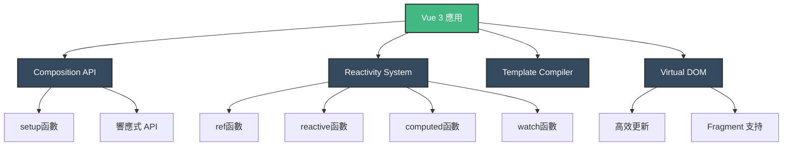
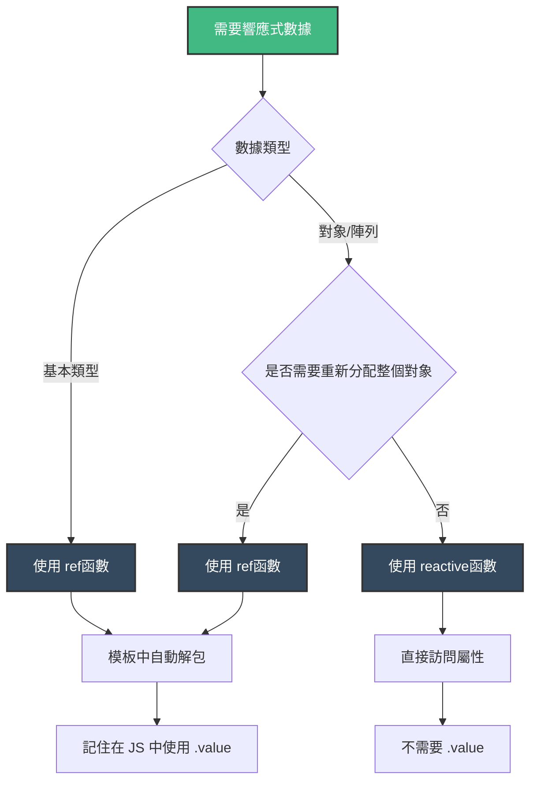
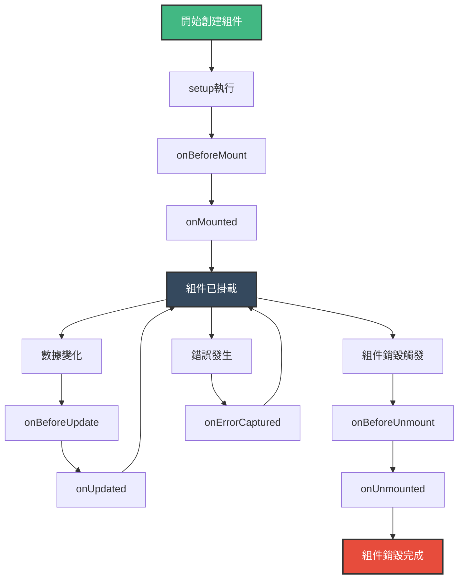

+++
date = '2025-10-31T00:00:00+08:00'
draft = false
title = 'Vue3 前端framework教學'
tags = ['教學', 'framework']
categories = ['教學']
+++
# Vue 3.x 前端 Framework 教學手冊

> 📘 **適用對象**：完全沒有學過 Vue 3 的新進開發同仁  
> 🎯 **學習目標**：循序漸進掌握 Vue 3.x 開發技能，並具備專案實戰能力  
> 🏆 **認證準備**：涵蓋 Vue 3 官方認證考試重點

---

## 📖 目錄

- [第一章：Vue 3 基礎入門](#第一章-vue-3-基礎入門)
  - [1.1 什麼是 Vue.js？](#11-什麼是-vuejs)
  - [1.2 開發環境建置](#12-開發環境建置)
  - [1.3 第一個 Vue 3 應用](#13-第一個-vue-3-應用)
  - [1.4 專案應用指引](#14-專案應用指引)
  - [1.5 認證考點提示](#15-認證考點提示)

- [第二章：Composition API 深入](#第二章-composition-api-深入)
  - [2.1 setup() 函數詳解](#21-setup-函數詳解)
  - [2.2 組合式函數 (Composables)](#22-組合式函數-composables)
  - [2.3 進階組合式函數範例](#23-進階組合式函數範例)
  - [2.4 專案應用指引](#24-專案應用指引)
  - [2.5 認證考點提示](#25-認證考點提示)

- [第三章：響應式系統](#第三章-響應式系統)
  - [3.1 ref() 與 reactive() 詳解](#31-ref-與-reactive-詳解)
  - [3.2 深度響應式與淺層響應式](#32-深度響應式與淺層響應式)
  - [3.3 computed() 計算屬性](#33-computed-計算屬性)
  - [3.4 watch() 與 watchEffect()](#34-watch-與-watcheffect)
  - [3.5 響應式工具函數](#35-響應式工具函數)
  - [3.6 專案應用指引](#36-專案應用指引)
  - [3.7 認證考點提示](#37-認證考點提示)

- [第四章：模板語法與指令](#第四章-模板語法與指令)
  - [4.1 插值語法](#41-插值語法)
  - [4.2 屬性綁定](#42-屬性綁定)
  - [4.3 條件渲染](#43-條件渲染)
  - [4.4 列表渲染](#44-列表渲染)
  - [4.5 事件處理](#45-事件處理)
  - [4.6 表單輸入綁定](#46-表單輸入綁定)
  - [4.7 專案應用指引](#47-專案應用指引)
  - [4.8 認證考點提示](#48-認證考點提示)

- [第五章：組件開發](#第五章-組件開發)
  - [5.1 組件基礎概念](#51-組件基礎概念)
  - [5.2 Props 深入](#52-props-深入)
  - [5.3 事件通訊](#53-事件通訊)
  - [5.4 插槽 (Slots)](#54-插槽-slots)
  - [5.5 動態組件](#55-動態組件)
  - [5.6 組件組合模式](#56-組件組合模式)
  - [5.7 專案應用指引](#57-專案應用指引)
  - [5.8 認證考點提示](#58-認證考點提示)

- [第六章：生命週期與事件處理](#第六章-生命週期與事件處理)
  - [6.1 生命週期概述](#61-生命週期概述)
  - [6.2 生命週期實際應用](#62-生命週期實際應用)
  - [6.3 進階事件處理](#63-進階事件處理)
  - [6.4 異步組件與 Suspense](#64-異步組件與-suspense)
  - [6.5 錯誤處理](#65-錯誤處理)
  - [6.6 專案應用指引](#66-專案應用指引)
  - [6.7 認證考點提示](#67-認證考點提示)

- [第七章：Vue Router 路由管理](#第七章-vue-router-路由管理)
  - [7.1 Vue Router 4 基礎](#71-vue-router-4-基礎)
  - [7.2 動態路由和參數](#72-動態路由和參數)
  - [7.3 嵌套路由](#73-嵌套路由)
  - [7.4 路由守衛](#74-路由守衛)
  - [7.5 程式化導航](#75-程式化導航)
  - [7.6 路由元信息與過渡效果](#76-路由元信息與過渡效果)
  - [7.7 路由懶載入與代碼分割](#77-路由懶載入與代碼分割)
  - [7.8 專案應用指引](#78-專案應用指引)
  - [7.9 認證考點提示](#79-認證考點提示)

- [第八章：Pinia 狀態管理](#第八章-pinia-狀態管理)
  - [8.1 Pinia 基礎概念](#81-pinia-基礎概念)
  - [8.2 Store 的使用](#82-store-的使用)
  - [8.3 進階 Store 模式](#83-進階-store-模式)
  - [8.4 Store 組合與插件](#84-store-組合與插件)
  - [8.5 持久化 Store](#85-持久化-store)
  - [8.6 測試 Store](#86-測試-store)
  - [8.7 專案應用指引](#87-專案應用指引)
  - [8.8 認證考點提示](#88-認證考點提示)

- [第九章：API 串接與 HTTP 請求](#第九章-api-串接與-http-請求)
  - [9.1 Axios 基礎配置](#91-axios-基礎配置)
  - [9.2 API 服務層設計](#92-api-服務層設計)
  - [9.3 組合式函數處理 API](#93-組合式函數處理-api)
  - [9.4 實際應用範例](#94-實際應用範例)
  - [9.5 錯誤處理與重試機制](#95-錯誤處理與重試機制)
  - [9.6 認證考點提示](#96-認證考點提示)

- [第十章：TypeScript 整合](#第十章-typescript-整合)
  - [10.1 Vue 3 + TypeScript 基礎配置](#101-vue-3--typescript-基礎配置)
  - [10.2 組件類型定義](#102-組件類型定義)
  - [10.3 認證考點提示](#103-認證考點提示)

- [第十一章：CSS 框架整合 Tailwind CSS](#第十一章-css-框架整合-tailwind-css)
  - [11.1 Tailwind CSS 安裝與配置](#111-tailwind-css-安裝與配置)
  - [11.2 實用樣式整合](#112-實用樣式整合)
  - [11.3 認證考點提示](#113-認證考點提示)

- [第十二章：測試與除錯](#第十二章-測試與除錯)
  - [12.1 單元測試基礎](#121-單元測試基礎)
  - [12.2 組件測試策略](#122-組件測試策略)
  - [12.3 認證考點提示](#123-認證考點提示)

- [第十三章：效能優化](#第十三章-效能優化)
  - [13.1 渲染效能優化](#131-渲染效能優化)
  - [13.2 打包優化策略](#132-打包優化策略)
  - [13.3 認證考點提示](#133-認證考點提示)

- [第十四章：專案架構與最佳實務](#第十四章-專案架構與最佳實務)
  - [14.1 專案結構設計](#141-專案結構設計)
  - [14.2 代碼規範與風格](#142-代碼規範與風格)
  - [14.3 認證考點提示](#143-認證考點提示)

- [第十五章：認證考試重點](#第十五章-認證考試重點)
  - [15.1 考試內容大綱](#151-考試內容大綱)
  - [15.2 考試準備策略](#152-考試準備策略)
  - [15.3 常見考題類型](#153-常見考題類型)
  - [15.4 認證考點提示](#154-認證考點提示)

- [附錄：學習資源與檢查清單](#附錄-學習資源與檢查清單)
  - [A.1 官方學習資源](#a1-官方學習資源)
  - [A.2 推薦學習路徑](#a2-推薦學習路徑)
  - [A.3 開發檢查清單](#a3-開發檢查清單)
  - [A.4 故障排除指南](#a4-故障排除指南)
  - [A.5 效能監控工具](#a5-效能監控工具)
  - [A.6 持續學習建議](#a6-持續學習建議)

---

## 第一章 Vue 3 基礎入門

### 1.1 什麼是 Vue.js？

Vue.js 是一個漸進式 JavaScript 框架，用於構建用戶界面。Vue 3 是其最新主要版本，帶來了更好的性能、更小的包體積和更強的 TypeScript 支持。

#### 📊 Vue 3 架構圖



#### Vue 3 核心特性

1. **Composition API**：更靈活的邏輯組合方式
2. **更好的性能**：重寫了虛擬 DOM，提升渲染效率
3. **Tree-shaking 支持**：打包時只包含使用的功能
4. **TypeScript 原生支持**：更好的類型推斷
5. **Fragment 支持**：組件可以有多個根節點

### 1.2 開發環境建置

#### 系統需求

- Node.js 16.0+
- npm 7.0+ 或 yarn 1.22+

#### 建立 Vue 3 專案

```bash
# 使用 create-vue (推薦)
npm create vue@latest my-vue-project

# 或使用 Vite
npm create vite@latest my-vue-project -- --template vue

# 進入專案目錄
cd my-vue-project

# 安裝依賴
npm install

# 啟動開發服務器
npm run dev
```

#### VS Code 推薦插件

```json
{
  "recommendations": [
    "Vue.volar",
    "Vue.vscode-typescript-vue-plugin",
    "bradlc.vscode-tailwindcss",
    "esbenp.prettier-vscode",
    "dbaeumer.vscode-eslint"
  ]
}
```

### 1.3 第一個 Vue 3 應用

#### 基本應用結構

```javascript
// main.js
import { createApp } from 'vue'
import App from './App.vue'

const app = createApp(App)
app.mount('#app')
```

```vue
<!-- App.vue -->
<template>
  <div id="app">
    <h1>{{ title }}</h1>
    <p>計數器：{{ count }}</p>
    <button @click="increment">增加</button>
  </div>
</template>

<script>
import { ref } from 'vue'

export default {
  name: 'App',
  setup() {
    // 響應式數據
    const title = ref('我的第一個 Vue 3 應用')
    const count = ref(0)
    
    // 方法
    const increment = () => {
      count.value++
    }
    
    // 返回模板可使用的數據和方法
    return {
      title,
      count,
      increment
    }
  }
}
</script>

<style>
#app {
  font-family: Arial, sans-serif;
  text-align: center;
  margin-top: 60px;
}

button {
  background-color: #42b883;
  color: white;
  padding: 10px 20px;
  border: none;
  border-radius: 4px;
  cursor: pointer;
}

button:hover {
  background-color: #369970;
}
</style>
```

### 1.4 專案應用指引

#### 檔案結構建議

```text
src/
├── components/          # 可重用組件
│   ├── common/         # 通用組件
│   └── features/       # 功能相關組件
├── views/              # 頁面組件
├── composables/        # 可組合函數
├── stores/             # Pinia 狀態管理
├── router/             # 路由配置
├── api/                # API 相關
├── utils/              # 工具函數
├── types/              # TypeScript 類型定義
└── assets/             # 靜態資源
```

#### 開發規範

1. **組件命名**：使用 PascalCase（如 `UserProfile.vue`）
2. **檔案命名**：與組件名稱一致
3. **變數命名**：使用 camelCase
4. **常數命名**：使用 UPPER_SNAKE_CASE

### 1.5 認證考點提示

> 🎯 **考試重點**
>
> - Vue 3 與 Vue 2 的主要差異
> - createApp() API 的使用
> - setup() 函數的作用和執行時機
> - ref() 和 reactive() 的區別

#### 第一章練習題

1. **基礎題**：Vue 3 相對於 Vue 2 有哪些主要改進？
2. **實作題**：建立一個簡單的待辦事項列表組件

---

## 第二章 Composition API 深入

### 2.1 setup() 函數詳解

setup() 是 Composition API 的入口點，在組件實例創建之前執行。

#### setup() 函數特性

```javascript
export default {
  props: ['title'],
  emits: ['update'],
  setup(props, context) {
    // props：父組件傳入的屬性
    console.log(props.title)
    
    // context：包含 attrs, slots, emit, expose
    const { attrs, slots, emit, expose } = context
    
    // 響應式數據
    const count = ref(0)
    
    // 計算屬性
    const doubleCount = computed(() => count.value * 2)
    
    // 方法
    const increment = () => {
      count.value++
      emit('update', count.value)
    }
    
    // 暴露給模板的內容
    return {
      count,
      doubleCount,
      increment
    }
  }
}
```

#### 使用 `<script setup>` 語法糖

```vue
<template>
  <div>
    <h2>{{ title }}</h2>
    <p>計數：{{ count }}</p>
    <p>雙倍：{{ doubleCount }}</p>
    <button @click="increment">增加</button>
  </div>
</template>

<script setup>
import { ref, computed } from 'vue'

// 定義 props
const props = defineProps({
  title: {
    type: String,
    default: '計數器'
  }
})

// 定義 emits
const emit = defineEmits(['update'])

// 響應式數據
const count = ref(0)

// 計算屬性
const doubleCount = computed(() => count.value * 2)

// 方法
const increment = () => {
  count.value++
  emit('update', count.value)
}
</script>
```

### 2.2 組合式函數 (Composables)

組合式函數是利用 Composition API 封裝和重用有狀態邏輯的函數。

#### 建立可重用的組合式函數

```javascript
// composables/useCounter.js
import { ref, computed } from 'vue'

export function useCounter(initialValue = 0) {
  const count = ref(initialValue)
  
  const doubleCount = computed(() => count.value * 2)
  
  const increment = () => count.value++
  const decrement = () => count.value--
  const reset = () => count.value = initialValue
  
  return {
    count,
    doubleCount,
    increment,
    decrement,
    reset
  }
}
```

#### 在組件中使用

```vue
<template>
  <div>
    <p>計數：{{ count }}</p>
    <p>雙倍：{{ doubleCount }}</p>
    <button @click="increment">+</button>
    <button @click="decrement">-</button>
    <button @click="reset">重置</button>
  </div>
</template>

<script setup>
import { useCounter } from '@/composables/useCounter'

const { count, doubleCount, increment, decrement, reset } = useCounter(10)
</script>
```

### 2.3 進階組合式函數範例

#### 表單處理組合式函數

```javascript
// composables/useForm.js
import { reactive, computed } from 'vue'

export function useForm(initialValues = {}) {
  const form = reactive({ ...initialValues })
  const errors = reactive({})
  
  const isValid = computed(() => 
    Object.keys(errors).length === 0
  )
  
  const validate = (rules) => {
    Object.keys(errors).forEach(key => delete errors[key])
    
    Object.keys(rules).forEach(field => {
      const rule = rules[field]
      const value = form[field]
      
      if (rule.required && (!value || value.trim() === '')) {
        errors[field] = `${field} 為必填欄位`
      } else if (rule.min && value.length < rule.min) {
        errors[field] = `${field} 最少需要 ${rule.min} 個字元`
      } else if (rule.pattern && !rule.pattern.test(value)) {
        errors[field] = rule.message || `${field} 格式不正確`
      }
    })
    
    return isValid.value
  }
  
  const reset = () => {
    Object.assign(form, initialValues)
    Object.keys(errors).forEach(key => delete errors[key])
  }
  
  return {
    form,
    errors,
    isValid,
    validate,
    reset
  }
}
```

#### 使用表單組合式函數

```vue
<template>
  <form @submit.prevent="handleSubmit">
    <div>
      <label>用戶名：</label>
      <input v-model="form.username" type="text" />
      <span v-if="errors.username" class="error">{{ errors.username }}</span>
    </div>
    
    <div>
      <label>電子郵件：</label>
      <input v-model="form.email" type="email" />
      <span v-if="errors.email" class="error">{{ errors.email }}</span>
    </div>
    
    <div>
      <label>密碼：</label>
      <input v-model="form.password" type="password" />
      <span v-if="errors.password" class="error">{{ errors.password }}</span>
    </div>
    
    <button type="submit" :disabled="!isValid">提交</button>
    <button type="button" @click="reset">重置</button>
  </form>
</template>

<script setup>
import { useForm } from '@/composables/useForm'

const { form, errors, isValid, validate, reset } = useForm({
  username: '',
  email: '',
  password: ''
})

const validationRules = {
  username: { required: true, min: 3 },
  email: { 
    required: true, 
    pattern: /^[^\s@]+@[^\s@]+\.[^\s@]+$/,
    message: '請輸入有效的電子郵件地址'
  },
  password: { required: true, min: 6 }
}

const handleSubmit = () => {
  if (validate(validationRules)) {
    console.log('表單提交:', form)
    // 執行提交邏輯
  }
}
</script>

<style scoped>
.error {
  color: red;
  font-size: 0.875rem;
}

input {
  width: 100%;
  padding: 8px;
  margin: 4px 0 16px 0;
  border: 1px solid #ddd;
  border-radius: 4px;
}

button {
  margin-right: 8px;
  padding: 8px 16px;
  border: none;
  border-radius: 4px;
  cursor: pointer;
}

button[type="submit"] {
  background-color: #007bff;
  color: white;
}

button[type="submit"]:disabled {
  background-color: #ccc;
  cursor: not-allowed;
}
</style>
```

### 2.4 專案應用指引

#### 組合式函數最佳實務

1. **命名慣例**：以 `use` 開頭（如 `useCounter`, `useAuth`）
2. **單一職責**：每個組合式函數只負責一個功能
3. **返回對象**：返回對象而非陣列，便於解構和命名
4. **類型安全**：使用 TypeScript 提供類型註解

#### 常見組合式函數模式

```javascript
// 資料獲取模式
export function useFetch(url) {
  const data = ref(null)
  const error = ref(null)
  const loading = ref(false)
  
  const fetchData = async () => {
    loading.value = true
    try {
      const response = await fetch(url)
      data.value = await response.json()
    } catch (err) {
      error.value = err
    } finally {
      loading.value = false
    }
  }
  
  // 自動執行或手動執行
  onMounted(fetchData)
  
  return { data, error, loading, refetch: fetchData }
}
```

### 2.5 認證考點提示

> 🎯 **考試重點**
>
> - setup() 函數的參數和返回值
> - `<script setup>` 語法糖的使用
> - 組合式函數的設計模式
> - defineProps() 和 defineEmits() 的使用

#### 第二章練習題

1. **概念題**：說明 Composition API 相對於 Options API 的優勢
2. **實作題**：建立一個 `useLocalStorage` 組合式函數，能夠自動同步數據到本地存儲

---

## 第三章 響應式系統

### 3.1 ref() 與 reactive() 詳解

Vue 3 的響應式系統是基於 Proxy 實現的，提供了更好的性能和更完整的語言特性支持。

#### ref() 基本用法

```javascript
import { ref } from 'vue'

// 基本數據類型
const count = ref(0)
const message = ref('Hello Vue 3')
const isVisible = ref(true)

// 對象類型
const user = ref({
  name: 'John',
  age: 30
})

// 陣列類型
const items = ref(['apple', 'banana', 'orange'])

// 訪問和修改值需要使用 .value
console.log(count.value) // 0
count.value = 10

// 在模板中會自動解包，不需要 .value
```

#### reactive() 基本用法

```javascript
import { reactive } from 'vue'

// 只能用於對象類型
const state = reactive({
  count: 0,
  user: {
    name: 'John',
    age: 30
  },
  items: ['apple', 'banana']
})

// 直接訪問屬性，不需要 .value
console.log(state.count) // 0
state.count = 10
state.user.name = 'Jane'
```

#### ref() vs reactive() 比較表

| 特性 | ref() | reactive() |
|------|-------|------------|
| 支持類型 | 任何類型 | 對象類型（Object、Array、Map、Set） |
| 訪問方式 | 需要 .value | 直接訪問屬性 |
| 模板中 | 自動解包 | 直接使用 |
| 類型推斷 | 更好的 TypeScript 支持 | 保持原對象結構 |
| 重新分配 | 可以重新分配整個值 | 不能重新分配根對象 |

### 3.2 深度響應式與淺層響應式

#### 深度響應式（預設行為）

```javascript
import { ref, reactive } from 'vue'

// ref 和 reactive 預設都是深度響應式
const nestedRef = ref({
  level1: {
    level2: {
      count: 0
    }
  }
})

const nestedReactive = reactive({
  level1: {
    level2: {
      count: 0
    }
  }
})

// 深層嵌套的屬性也是響應式的
nestedRef.value.level1.level2.count++ // 觸發更新
nestedReactive.level1.level2.count++ // 觸發更新
```

#### 淺層響應式

```javascript
import { shallowRef, shallowReactive } from 'vue'

// 只有根層級屬性是響應式的
const shallowState = shallowReactive({
  count: 0,
  nested: {
    value: 0 // 這個不是響應式的
  }
})

const shallowRefState = shallowRef({
  count: 0,
  nested: {
    value: 0
  }
})

// 這會觸發更新
shallowState.count++

// 這不會觸發更新
shallowState.nested.value++

// 但重新分配整個對象會觸發更新
shallowRefState.value = { count: 1, nested: { value: 1 } }
```

### 3.3 computed() 計算屬性

計算屬性是基於響應式依賴進行緩存的。

#### 唯讀計算屬性

```javascript
import { ref, computed } from 'vue'

const count = ref(1)
const plusOne = computed(() => count.value + 1)

console.log(plusOne.value) // 2

count.value++
console.log(plusOne.value) // 3

// 計算屬性是唯讀的
// plusOne.value++ // 警告！
```

#### 可寫計算屬性

```javascript
import { ref, computed } from 'vue'

const firstName = ref('John')
const lastName = ref('Doe')

const fullName = computed({
  get() {
    return firstName.value + ' ' + lastName.value
  },
  set(newValue) {
    [firstName.value, lastName.value] = newValue.split(' ')
  }
})

// 讀取
console.log(fullName.value) // "John Doe"

// 寫入
fullName.value = 'Jane Smith'
console.log(firstName.value) // "Jane"
console.log(lastName.value) // "Smith"
```

#### 計算屬性最佳實務

```vue
<template>
  <div>
    <h2>購物車 ({{ totalItems }} 件商品)</h2>
    <div v-for="item in cartItems" :key="item.id">
      {{ item.name }} - ${{ item.price }} x {{ item.quantity }}
    </div>
    <div class="total">
      總計：${{ totalPrice }}
    </div>
    <div class="discount" v-if="hasDiscount">
      折扣後：${{ discountedPrice }}
    </div>
  </div>
</template>

<script setup>
import { ref, computed } from 'vue'

const cartItems = ref([
  { id: 1, name: '商品A', price: 100, quantity: 2 },
  { id: 2, name: '商品B', price: 200, quantity: 1 },
  { id: 3, name: '商品C', price: 150, quantity: 3 }
])

const discountRate = ref(0.1) // 10% 折扣

// 計算總數量
const totalItems = computed(() => 
  cartItems.value.reduce((sum, item) => sum + item.quantity, 0)
)

// 計算總價格
const totalPrice = computed(() => 
  cartItems.value.reduce((sum, item) => sum + (item.price * item.quantity), 0)
)

// 是否有折扣
const hasDiscount = computed(() => totalPrice.value > 500)

// 折扣後價格
const discountedPrice = computed(() => 
  hasDiscount.value ? totalPrice.value * (1 - discountRate.value) : totalPrice.value
)
</script>
```

### 3.4 watch() 與 watchEffect()

#### watch() 監聽器

```javascript
import { ref, watch } from 'vue'

const count = ref(0)
const name = ref('John')

// 監聽單個 ref
watch(count, (newValue, oldValue) => {
  console.log(`count 從 ${oldValue} 變成 ${newValue}`)
})

// 監聽多個源
watch([count, name], ([newCount, newName], [oldCount, oldName]) => {
  console.log(`count: ${oldCount} -> ${newCount}`)
  console.log(`name: ${oldName} -> ${newName}`)
})

// 監聽響應式對象的屬性
const user = reactive({ name: 'John', age: 30 })

watch(
  () => user.name,
  (newName, oldName) => {
    console.log(`用戶名從 ${oldName} 變成 ${newName}`)
  }
)

// 深度監聽
watch(
  user,
  (newValue, oldValue) => {
    console.log('用戶對象發生變化')
  },
  { deep: true }
)

// 立即執行
watch(
  count,
  (newValue) => {
    console.log(`當前 count: ${newValue}`)
  },
  { immediate: true }
)
```

#### watchEffect() 自動依賴追蹤

```javascript
import { ref, watchEffect } from 'vue'

const count = ref(0)
const name = ref('John')

// 自動追蹤依賴
const stopWatcher = watchEffect(() => {
  console.log(`count: ${count.value}, name: ${name.value}`)
})

// 清理監聽器
// stopWatcher()

// 處理副作用清理
watchEffect((onInvalidate) => {
  const timer = setTimeout(() => {
    console.log('定時器執行')
  }, 1000)
  
  // 清理函數
  onInvalidate(() => {
    clearTimeout(timer)
  })
})
```

#### 實用監聽器範例

```javascript
// composables/useDebounce.js
import { ref, watch } from 'vue'

export function useDebounce(value, delay = 300) {
  const debouncedValue = ref(value.value)
  
  watch(
    value,
    (newValue) => {
      const timer = setTimeout(() => {
        debouncedValue.value = newValue
      }, delay)
      
      return () => clearTimeout(timer)
    },
    { immediate: true }
  )
  
  return debouncedValue
}

// 使用範例
const searchTerm = ref('')
const debouncedSearchTerm = useDebounce(searchTerm, 500)

watch(debouncedSearchTerm, (term) => {
  if (term) {
    // 執行搜索 API 調用
    performSearch(term)
  }
})
```

### 3.5 響應式工具函數

#### toRef() 和 toRefs()

```javascript
import { reactive, toRef, toRefs } from 'vue'

const user = reactive({
  name: 'John',
  age: 30,
  email: 'john@example.com'
})

// toRef - 為響應式對象的單個屬性創建 ref
const nameRef = toRef(user, 'name')
console.log(nameRef.value) // 'John'
nameRef.value = 'Jane'
console.log(user.name) // 'Jane'

// toRefs - 將響應式對象轉換為 ref 對象
const userRefs = toRefs(user)
const { name, age, email } = userRefs

// 在組件中使用
export default {
  setup() {
    const user = reactive({
      name: 'John',
      age: 30
    })
    
    // 直接返回會失去響應性
    // return { name: user.name, age: user.age } // ❌
    
    // 使用 toRefs 保持響應性
    return {
      ...toRefs(user) // ✅
    }
  }
}
```

#### unref() 和 isRef()

```javascript
import { ref, unref, isRef } from 'vue'

const count = ref(10)
const plainValue = 20

// unref - 返回值本身或 ref 的值
console.log(unref(count)) // 10
console.log(unref(plainValue)) // 20

// isRef - 檢查值是否為 ref
console.log(isRef(count)) // true
console.log(isRef(plainValue)) // false

// 實用函數範例
function normalizeValue(val) {
  return isRef(val) ? val.value : val
}

// 或者直接使用 unref
function normalizeValue(val) {
  return unref(val)
}
```

### 3.6 專案應用指引

#### 響應式數據選擇指南



#### 性能優化建議

1. **使用 shallowRef/shallowReactive** 處理大型不可變數據
2. **使用 computed** 快取昂貴的計算
3. **使用 watchEffect** 進行自動依賴追蹤
4. **適當使用 toRefs** 保持解構後的響應性

### 3.7 認證考點提示

> 🎯 **考試重點**
>
> - ref() 與 reactive() 的使用時機和差異
> - 計算屬性的緩存機制
> - watch() 與 watchEffect() 的區別
> - toRef() 和 toRefs() 的實際應用
> - 響應式數據的性能優化

#### 第三章練習題

1. **概念題**：解釋為什麼計算屬性比方法調用更有效率？
2. **實作題**：建立一個購物車組件，包含商品列表、總價計算和數量變更功能
3. **進階題**：實現一個 `useLocalStorage` 組合式函數，能夠自動同步響應式數據到本地存儲

---

## 第四章 模板語法與指令

### 4.1 插值語法

#### 文本插值

```vue
<template>
  <!-- 基本插值 -->
  <p>訊息：{{ message }}</p>
  
  <!-- JavaScript 表達式 -->
  <p>計算結果：{{ number + 1 }}</p>
  <p>反轉字串：{{ message.split('').reverse().join('') }}</p>
  <p>條件顯示：{{ isVisible ? '顯示' : '隱藏' }}</p>
  
  <!-- 呼叫函數 -->
  <p>格式化時間：{{ formatDate(new Date()) }}</p>
  
  <!-- 一次性插值 -->
  <p v-once>這個值只會渲染一次：{{ message }}</p>
  
  <!-- 原始 HTML -->
  <div v-html="rawHtml"></div>
</template>

<script setup>
import { ref } from 'vue'

const message = ref('Hello Vue 3')
const number = ref(42)
const isVisible = ref(true)
const rawHtml = ref('<span style="color: red">這是紅色文字</span>')

const formatDate = (date) => {
  return date.toLocaleDateString('zh-TW')
}
</script>
```

### 4.2 屬性綁定

#### v-bind 指令

```vue
<template>
  <!-- 屬性綁定 -->
  
  
  <!-- 簡寫語法 -->
  
  
  <!-- 布林屬性 -->
  <button :disabled="isButtonDisabled">按鈕</button>
  
  <!-- 動態屬性名 -->
  <a :[attributeName]="attributeValue">動態屬性</a>
  
  <!-- 綁定對象 -->
  <div v-bind="objectOfAttrs"></div>
  
  <!-- 類別綁定 -->
  <div :class="{ active: isActive, 'text-danger': hasError }"></div>
  <div :class="[activeClass, errorClass]"></div>
  <div :class="classObject"></div>
  
  <!-- 樣式綁定 -->
  <div :style="{ color: activeColor, fontSize: fontSize + 'px' }"></div>
  <div :style="[baseStyles, overridingStyles]"></div>
  <div :style="styleObject"></div>
</template>

<script setup>
import { ref, computed } from 'vue'

const imageSrc = ref('/images/logo.png')
const imageAlt = ref('Logo')
const isButtonDisabled = ref(false)
const attributeName = ref('href')
const attributeValue = ref('https://vue.js.org')

const objectOfAttrs = ref({
  id: 'my-element',
  class: 'container'
})

// 類別綁定
const isActive = ref(true)
const hasError = ref(false)
const activeClass = ref('active')
const errorClass = ref('text-danger')

const classObject = computed(() => ({
  active: isActive.value,
  'text-danger': hasError.value
}))

// 樣式綁定
const activeColor = ref('red')
const fontSize = ref(14)
const baseStyles = ref({ padding: '10px' })
const overridingStyles = ref({ margin: '5px' })

const styleObject = ref({
  color: 'blue',
  backgroundColor: '#f0f0f0'
})
</script>
```

### 4.3 條件渲染

#### v-if、v-else-if、v-else

```vue
<template>
  <div>
    <!-- 基本條件渲染 -->
    <h1 v-if="showTitle">標題</h1>
    
    <!-- 多重條件 -->
    <div v-if="type === 'A'">類型 A</div>
    <div v-else-if="type === 'B'">類型 B</div>
    <div v-else-if="type === 'C'">類型 C</div>
    <div v-else>其他類型</div>
    
    <!-- template 包裝元素 -->
    <template v-if="isLoggedIn">
      <h2>歡迎回來！</h2>
      <p>您有 {{ messageCount }} 則新訊息</p>
    </template>
    
    <!-- v-show（始終渲染，切換 CSS display） -->
    <div v-show="isVisible">使用 v-show 控制顯示</div>
    
    <!-- 條件渲染與列表渲染組合 -->
    <template v-for="user in users" :key="user.id">
      <div v-if="user.isActive">
        {{ user.name }} - 活躍用戶
      </div>
    </template>
  </div>
</template>

<script setup>
import { ref } from 'vue'

const showTitle = ref(true)
const type = ref('A')
const isLoggedIn = ref(true)
const messageCount = ref(5)
const isVisible = ref(true)
const users = ref([
  { id: 1, name: 'John', isActive: true },
  { id: 2, name: 'Jane', isActive: false },
  { id: 3, name: 'Bob', isActive: true }
])
</script>
```

#### v-if vs v-show 選擇指南

| 特性 | v-if | v-show |
|------|------|--------|
| 渲染方式 | 條件性渲染 | 始終渲染 |
| 切換成本 | 高（銷毀/重建） | 低（CSS 切換） |
| 初始渲染成本 | 低（條件為 false 時不渲染） | 高（始終渲染） |
| 適用場景 | 條件很少改變 | 頻繁切換 |

### 4.4 列表渲染

#### v-for 指令

```vue
<template>
  <div>
    <!-- 遍歷陣列 -->
    <ul>
      <li v-for="(item, index) in items" :key="item.id">
        {{ index }} - {{ item.name }}
      </li>
    </ul>
    
    <!-- 遍歷對象 -->
    <ul>
      <li v-for="(value, key, index) in userInfo" :key="key">
        {{ index }}. {{ key }}: {{ value }}
      </li>
    </ul>
    
    <!-- 遍歷數字 -->
    <span v-for="n in 10" :key="n">{{ n }}</span>
    
    <!-- 嵌套 v-for -->
    <div v-for="category in categories" :key="category.id">
      <h3>{{ category.name }}</h3>
      <ul>
        <li v-for="product in category.products" :key="product.id">
          {{ product.name }} - ${{ product.price }}
        </li>
      </ul>
    </div>
    
    <!-- 使用 template -->
    <template v-for="user in users" :key="user.id">
      <div>{{ user.name }}</div>
      <div>{{ user.email }}</div>
      <hr />
    </template>
  </div>
</template>

<script setup>
import { ref } from 'vue'

const items = ref([
  { id: 1, name: '蘋果' },
  { id: 2, name: '香蕉' },
  { id: 3, name: '橘子' }
])

const userInfo = ref({
  name: 'John Doe',
  email: 'john@example.com',
  age: 30
})

const categories = ref([
  {
    id: 1,
    name: '水果',
    products: [
      { id: 1, name: '蘋果', price: 100 },
      { id: 2, name: '香蕉', price: 80 }
    ]
  },
  {
    id: 2,
    name: '蔬菜',
    products: [
      { id: 3, name: '高麗菜', price: 50 },
      { id: 4, name: '胡蘿蔔', price: 60 }
    ]
  }
])

const users = ref([
  { id: 1, name: 'John', email: 'john@example.com' },
  { id: 2, name: 'Jane', email: 'jane@example.com' }
])
</script>
```

#### 陣列變更檢測

```javascript
import { ref } from 'vue'

const items = ref(['apple', 'banana', 'orange'])

// 變更方法（會觸發視圖更新）
items.value.push('grape')           // 添加
items.value.pop()                   // 刪除最後一個
items.value.shift()                 // 刪除第一個
items.value.unshift('kiwi')         // 添加到開頭
items.value.splice(1, 1, 'mango')   // 替換
items.value.sort()                  // 排序
items.value.reverse()               // 反轉

// 替換陣列
items.value = items.value.filter(item => item.length > 5)
items.value = items.value.concat(['watermelon'])
items.value = items.value.slice(1, 3)

// 使用索引設置項目（Vue 3 中會觸發更新）
items.value[0] = 'strawberry'       // ✅ 在 Vue 3 中有效

// 修改陣列長度
items.value.length = 2              // ✅ 在 Vue 3 中有效
```

### 4.5 事件處理

#### v-on 指令

```vue
<template>
  <div>
    <!-- 基本事件處理 -->
    <button v-on:click="handleClick">點擊我</button>
    
    <!-- 簡寫語法 -->
    <button @click="handleClick">點擊我</button>
    
    <!-- 內聯事件處理器 -->
    <button @click="count++">計數：{{ count }}</button>
    
    <!-- 傳遞參數 -->
    <button @click="greet('Hello')">打招呼</button>
    
    <!-- 訪問事件對象 -->
    <button @click="handleClickWithEvent">獲取事件</button>
    <button @click="handleWithEventAndParam('data', $event)">
      事件和參數
    </button>
    
    <!-- 事件修飾符 -->
    <form @submit.prevent="onSubmit">
      <input @keyup.enter="onEnter" />
      <button type="submit">提交</button>
    </form>
    
    <!-- 多個事件處理器 -->
    <button @click="one($event), two($event)">多個處理器</button>
    
    <!-- 鍵盤事件 -->
    <input
      @keyup.enter="onEnter"
      @keyup.tab="onTab"
      @keyup.delete="onDelete"
      @keyup.esc="onEsc"
      @keyup.space="onSpace"
      @keyup.up="onUp"
      @keyup.down="onDown"
      @keyup.left="onLeft"
      @keyup.right="onRight"
    />
    
    <!-- 系統修飾符 -->
    <input
      @keyup.ctrl.enter="onCtrlEnter"
      @click.ctrl="onCtrlClick"
      @click.shift="onShiftClick"
      @click.alt="onAltClick"
      @click.meta="onMetaClick"
    />
    
    <!-- 滑鼠修飾符 -->
    <button @click.left="onLeft">左鍵</button>
    <button @click.right="onRight">右鍵</button>
    <button @click.middle="onMiddle">中鍵</button>
  </div>
</template>

<script setup>
import { ref } from 'vue'

const count = ref(0)

const handleClick = () => {
  console.log('按鈕被點擊了')
}

const greet = (message) => {
  alert(message)
}

const handleClickWithEvent = (event) => {
  console.log('事件對象：', event)
  console.log('點擊位置：', event.clientX, event.clientY)
}

const handleWithEventAndParam = (data, event) => {
  console.log('數據：', data)
  console.log('事件：', event)
}

const onSubmit = () => {
  console.log('表單提交')
}

const onEnter = () => {
  console.log('按下 Enter 鍵')
}

const one = (event) => {
  console.log('處理器一')
}

const two = (event) => {
  console.log('處理器二')
}

// 鍵盤事件處理器
const onTab = () => console.log('Tab 鍵')
const onDelete = () => console.log('Delete 鍵')
const onEsc = () => console.log('Escape 鍵')
const onSpace = () => console.log('空格鍵')
const onUp = () => console.log('上箭頭')
const onDown = () => console.log('下箭頭')
const onLeft = () => console.log('左箭頭')
const onRight = () => console.log('右箭頭')

// 系統修飾符處理器
const onCtrlEnter = () => console.log('Ctrl + Enter')
const onCtrlClick = () => console.log('Ctrl + 點擊')
const onShiftClick = () => console.log('Shift + 點擊')
const onAltClick = () => console.log('Alt + 點擊')
const onMetaClick = () => console.log('Meta + 點擊')

// 滑鼠事件處理器
const onMiddle = () => console.log('中鍵點擊')
</script>
```

#### 事件修飾符完整列表

```vue
<template>
  <!-- 事件修飾符 -->
  <div>
    <!-- .stop - 阻止事件冒泡 -->
    <div @click="parentClick">
      <button @click.stop="childClick">阻止冒泡</button>
    </div>
    
    <!-- .prevent - 阻止默認行為 -->
    <a href="https://vue.js.org" @click.prevent="handleLink">
      阻止跳轉
    </a>
    
    <!-- .self - 只在 event.target 是元素本身時觸發 -->
    <div @click.self="onSelf">
      <p>只在點擊 div 本身時觸發，點擊 p 不會觸發</p>
    </div>
    
    <!-- .capture - 使用捕獲模式 -->
    <div @click.capture="onCapture">
      <button @click="onButton">捕獲模式</button>
    </div>
    
    <!-- .once - 只觸發一次 -->
    <button @click.once="onOnce">只能點擊一次</button>
    
    <!-- .passive - 告訴瀏覽器你不會調用 preventDefault() -->
    <div @scroll.passive="onScroll">滾動區域</div>
    
    <!-- 修飾符可以串聯 -->
    <a @click.stop.prevent="doThat">串聯修飾符</a>
  </div>
</template>

<script setup>
const parentClick = () => console.log('父元素點擊')
const childClick = () => console.log('子元素點擊')
const handleLink = () => console.log('連結被點擊但不跳轉')
const onSelf = () => console.log('點擊了 div 本身')
const onCapture = () => console.log('捕獲階段')
const onButton = () => console.log('按鈕點擊')
const onOnce = () => console.log('只會執行一次')
const onScroll = () => console.log('滾動事件')
const doThat = () => console.log('阻止冒泡和默認行為')
</script>
```

### 4.6 表單輸入綁定

#### v-model 雙向綁定

```vue
<template>
  <div>
    <!-- 文字輸入 -->
    <input v-model="message" placeholder="輸入訊息" />
    <p>訊息：{{ message }}</p>
    
    <!-- 多行文字 -->
    <textarea v-model="multilineMessage" rows="3"></textarea>
    <p>多行訊息：{{ multilineMessage }}</p>
    
    <!-- 複選框 -->
    <input type="checkbox" id="checkbox" v-model="checked" />
    <label for="checkbox">{{ checked }}</label>
    
    <!-- 多個複選框 -->
    <div>
      <input type="checkbox" id="jack" value="Jack" v-model="checkedNames" />
      <label for="jack">Jack</label>
      
      <input type="checkbox" id="john" value="John" v-model="checkedNames" />
      <label for="john">John</label>
      
      <input type="checkbox" id="mike" value="Mike" v-model="checkedNames" />
      <label for="mike">Mike</label>
    </div>
    <p>選中的名字：{{ checkedNames }}</p>
    
    <!-- 單選框 -->
    <div>
      <input type="radio" id="one" value="One" v-model="picked" />
      <label for="one">One</label>
      
      <input type="radio" id="two" value="Two" v-model="picked" />
      <label for="two">Two</label>
    </div>
    <p>選中：{{ picked }}</p>
    
    <!-- 選擇框 -->
    <select v-model="selected">
      <option disabled value="">請選擇</option>
      <option>A</option>
      <option>B</option>
      <option>C</option>
    </select>
    <p>選中：{{ selected }}</p>
    
    <!-- 多選選擇框 -->
    <select v-model="multiSelected" multiple>
      <option>A</option>
      <option>B</option>
      <option>C</option>
    </select>
    <p>多選結果：{{ multiSelected }}</p>
    
    <!-- 動態選項 -->
    <select v-model="dynamicSelected">
      <option
        v-for="option in options"
        :key="option.value"
        :value="option.value"
      >
        {{ option.text }}
      </option>
    </select>
    
    <!-- v-model 修飾符 -->
    <input v-model.lazy="lazyMessage" placeholder="失去焦點時更新" />
    <input v-model.number="age" type="number" placeholder="數字" />
    <input v-model.trim="trimmedMessage" placeholder="去除空白" />
  </div>
</template>

<script setup>
import { ref } from 'vue'

const message = ref('')
const multilineMessage = ref('')
const checked = ref(false)
const checkedNames = ref([])
const picked = ref('')
const selected = ref('')
const multiSelected = ref([])

const options = ref([
  { text: '選項 A', value: 'A' },
  { text: '選項 B', value: 'B' },
  { text: '選項 C', value: 'C' }
])

const dynamicSelected = ref('')
const lazyMessage = ref('')
const age = ref(0)
const trimmedMessage = ref('')
</script>
```

#### 自定義 v-model

```vue
<!-- CustomInput.vue -->
<template>
  <input
    :value="modelValue"
    @input="$emit('update:modelValue', $event.target.value)"
    :placeholder="placeholder"
  />
</template>

<script setup>
defineProps({
  modelValue: String,
  placeholder: String
})

defineEmits(['update:modelValue'])
</script>

<!-- 使用組件 -->
<template>
  <div>
    <CustomInput v-model="inputValue" placeholder="自定義輸入" />
    <p>值：{{ inputValue }}</p>
  </div>
</template>

<script setup>
import { ref } from 'vue'
import CustomInput from './CustomInput.vue'

const inputValue = ref('')
</script>
```

### 4.7 專案應用指引

#### 模板最佳實務

1. **保持模板簡潔**：複雜邏輯移到計算屬性或方法中
2. **使用語義化的事件處理器名稱**：`handleSubmit` 比 `onSubmit` 更清楚
3. **適當使用 key**：確保列表渲染的正確性
4. **避免在模板中進行複雜計算**：使用計算屬性

#### 常見陷阱

```vue
<!-- ❌ 避免在模板中進行複雜計算 -->
<template>
  <div>{{ items.filter(item => item.active).map(item => item.name).join(', ') }}</div>
</template>

<!-- ✅ 使用計算屬性 -->
<template>
  <div>{{ activeItemNames }}</div>
</template>

<script setup>
import { computed } from 'vue'

const activeItemNames = computed(() =>
  items.value
    .filter(item => item.active)
    .map(item => item.name)
    .join(', ')
)
</script>
```

### 4.8 認證考點提示

> 🎯 **考試重點**
>
> - v-if 與 v-show 的使用時機
> - v-for 中 key 的重要性
> - 事件修飾符的種類和用途
> - v-model 的原理和自定義實現
> - 模板語法的性能考量

#### 第四章練習題

1. **概念題**：說明 v-if 和 v-show 的渲染機制差異
2. **實作題**：建立一個待辦事項組件，包含新增、刪除、編輯和篩選功能
3. **進階題**：實現一個自定義的雙向綁定組件，支持驗證和格式化

---

## 第五章 組件開發

### 5.1 組件基礎概念

組件是 Vue 應用的基本構建塊。每個組件封裝了自己的模板、邏輯和樣式。

#### 組件定義與註冊

```vue
<!-- UserCard.vue -->
<template>
  <div class="user-card">
    
    <div class="user-info">
      <h3>{{ user.name }}</h3>
      <p>{{ user.email }}</p>
      <span class="role">{{ user.role }}</span>
    </div>
    <div class="actions">
      <button @click="$emit('edit', user)">編輯</button>
      <button @click="$emit('delete', user.id)">刪除</button>
    </div>
  </div>
</template>

<script setup>
// 定義 props
const props = defineProps({
  user: {
    type: Object,
    required: true,
    validator: (user) => {
      return user && user.name && user.email
    }
  }
})

// 定義 emits
const emit = defineEmits(['edit', 'delete'])
</script>

<style scoped>
.user-card {
  border: 1px solid #ddd;
  border-radius: 8px;
  padding: 16px;
  margin: 8px;
  display: flex;
  align-items: center;
  gap: 16px;
}

.avatar {
  width: 60px;
  height: 60px;
  border-radius: 50%;
  object-fit: cover;
}

.user-info {
  flex: 1;
}

.user-info h3 {
  margin: 0 0 8px 0;
  color: #333;
}

.user-info p {
  margin: 0 0 4px 0;
  color: #666;
}

.role {
  background: #e3f2fd;
  color: #1976d2;
  padding: 2px 8px;
  border-radius: 4px;
  font-size: 0.875rem;
}

.actions button {
  margin-left: 8px;
  padding: 6px 12px;
  border: none;
  border-radius: 4px;
  cursor: pointer;
}

.actions button:first-child {
  background: #4caf50;
  color: white;
}

.actions button:last-child {
  background: #f44336;
  color: white;
}
</style>
```

#### 使用組件

```vue
<!-- App.vue -->
<template>
  <div id="app">
    <h1>用戶管理</h1>
    <div class="user-list">
      <UserCard
        v-for="user in users"
        :key="user.id"
        :user="user"
        @edit="handleEdit"
        @delete="handleDelete"
      />
    </div>
  </div>
</template>

<script setup>
import { ref } from 'vue'
import UserCard from './components/UserCard.vue'

const users = ref([
  {
    id: 1,
    name: 'John Doe',
    email: 'john@example.com',
    role: '管理員',
    avatar: '/avatars/john.jpg'
  },
  {
    id: 2,
    name: 'Jane Smith',
    email: 'jane@example.com',
    role: '用戶',
    avatar: '/avatars/jane.jpg'
  }
])

const handleEdit = (user) => {
  console.log('編輯用戶:', user)
  // 實現編輯邏輯
}

const handleDelete = (userId) => {
  console.log('刪除用戶:', userId)
  users.value = users.value.filter(user => user.id !== userId)
}
</script>
</template>
```

### 5.2 Props 深入

#### Props 驗證

```vue
<script setup>
// 基本類型驗證
const props = defineProps({
  // 基本類型檢查
  propA: Number,
  // 多個可能的類型
  propB: [String, Number],
  // 必填的字串
  propC: {
    type: String,
    required: true
  },
  // 帶有預設值的數字
  propD: {
    type: Number,
    default: 100
  },
  // 帶有預設值的對象
  propE: {
    type: Object,
    default: () => ({ message: 'hello' })
  },
  // 自定義驗證函數
  propF: {
    validator: (value) => {
      return ['success', 'warning', 'danger'].includes(value)
    }
  },
  // 函數類型的默認值
  propG: {
    type: Function,
    default: () => () => 'default function'
  }
})
</script>
```

#### Props 最佳實務

```vue
<!-- ✅ 好的做法 -->
<script setup>
// 詳細的 prop 定義
const props = defineProps({
  title: {
    type: String,
    required: true
  },
  size: {
    type: String,
    default: 'medium',
    validator: (value) => ['small', 'medium', 'large'].includes(value)
  },
  items: {
    type: Array,
    default: () => []
  },
  config: {
    type: Object,
    default: () => ({
      showHeader: true,
      showFooter: false
    })
  }
})

// 使用 computed 處理 props
import { computed } from 'vue'

const sizeClass = computed(() => `btn-${props.size}`)
const hasItems = computed(() => props.items.length > 0)
</script>

<!-- ❌ 避免的做法 -->
<script setup>
// 太簡化的定義
const props = defineProps(['title', 'size', 'items'])

// 直接修改 props（會產生警告）
// props.title = 'new title' // ❌
</script>
```

### 5.3 事件通訊

#### 子組件向父組件通訊

```vue
<!-- ChildComponent.vue -->
<template>
  <div>
    <input v-model="inputValue" @keyup.enter="handleSubmit" />
    <button @click="handleSubmit">提交</button>
    <button @click="handleCancel">取消</button>
  </div>
</template>

<script setup>
import { ref } from 'vue'

const inputValue = ref('')

// 定義可觸發的事件
const emit = defineEmits({
  // 僅聲明事件
  submit: null,
  // 帶驗證的事件
  cancel: (reason) => {
    return typeof reason === 'string' && reason.length > 0
  },
  // 複雜事件驗證
  update: (payload) => {
    return payload && typeof payload.value === 'string'
  }
})

const handleSubmit = () => {
  if (inputValue.value.trim()) {
    emit('submit', {
      value: inputValue.value,
      timestamp: Date.now()
    })
    inputValue.value = ''
  }
}

const handleCancel = () => {
  emit('cancel', '用戶取消操作')
  inputValue.value = ''
}
</script>
```

#### 父組件處理事件

```vue
<!-- ParentComponent.vue -->
<template>
  <div>
    <h2>提交的數據：</h2>
    <ul>
      <li v-for="item in submittedItems" :key="item.timestamp">
        {{ item.value }} - {{ formatTime(item.timestamp) }}
      </li>
    </ul>
    
    <ChildComponent
      @submit="handleChildSubmit"
      @cancel="handleChildCancel"
    />
  </div>
</template>

<script setup>
import { ref } from 'vue'
import ChildComponent from './ChildComponent.vue'

const submittedItems = ref([])

const handleChildSubmit = (data) => {
  submittedItems.value.push(data)
  console.log('收到提交:', data)
}

const handleChildCancel = (reason) => {
  console.log('操作被取消:', reason)
}

const formatTime = (timestamp) => {
  return new Date(timestamp).toLocaleTimeString()
}
</script>
```

### 5.4 插槽 (Slots)

#### 基本插槽

```vue
<!-- BaseCard.vue -->
<template>
  <div class="card">
    <div class="card-header">
      <slot name="header">
        <h3>預設標題</h3>
      </slot>
    </div>
    
    <div class="card-body">
      <slot>
        <p>預設內容</p>
      </slot>
    </div>
    
    <div class="card-footer" v-if="$slots.footer">
      <slot name="footer"></slot>
    </div>
  </div>
</template>

<style scoped>
.card {
  border: 1px solid #ddd;
  border-radius: 8px;
  overflow: hidden;
}

.card-header {
  background: #f5f5f5;
  padding: 16px;
  border-bottom: 1px solid #ddd;
}

.card-body {
  padding: 16px;
}

.card-footer {
  background: #f5f5f5;
  padding: 16px;
  border-top: 1px solid #ddd;
}
</style>
```

#### 使用插槽

```vue
<template>
  <div>
    <!-- 基本使用 -->
    <BaseCard>
      <template #header>
        <h2>自定義標題</h2>
      </template>
      
      <p>這是卡片內容</p>
      <p>可以有多個元素</p>
      
      <template #footer>
        <button>確定</button>
        <button>取消</button>
      </template>
    </BaseCard>
    
    <!-- 只使用默認插槽 -->
    <BaseCard>
      <h4>簡單內容</h4>
      <p>只有主要內容</p>
    </BaseCard>
  </div>
</template>

<script setup>
import BaseCard from './components/BaseCard.vue'
</script>
```

#### 作用域插槽

```vue
<!-- DataList.vue -->
<template>
  <div class="data-list">
    <div
      v-for="(item, index) in items"
      :key="item.id"
      class="list-item"
    >
      <!-- 作用域插槽，將數據傳遞給父組件 -->
      <slot
        :item="item"
        :index="index"
        :isFirst="index === 0"
        :isLast="index === items.length - 1"
      >
        <!-- 預設內容 -->
        <div>{{ item.name }}</div>
      </slot>
    </div>
    
    <!-- 空狀態插槽 -->
    <div v-if="items.length === 0" class="empty-state">
      <slot name="empty">
        <p>沒有數據</p>
      </slot>
    </div>
  </div>
</template>

<script setup>
defineProps({
  items: {
    type: Array,
    default: () => []
  }
})
</script>
```

#### 使用作用域插槽

```vue
<template>
  <div>
    <h2>用戶列表</h2>
    <DataList :items="users">
      <template #default="{ item, index, isFirst }">
        <div class="user-item" :class="{ first: isFirst }">
          
          <div>
            <h4>{{ item.name }}</h4>
            <p>{{ item.email }}</p>
            <span class="index">第 {{ index + 1 }} 位</span>
          </div>
        </div>
      </template>
      
      <template #empty>
        <div class="custom-empty">
          <p>暫無用戶數據</p>
          <button @click="loadUsers">加載用戶</button>
        </div>
      </template>
    </DataList>
  </div>
</template>

<script setup>
import { ref } from 'vue'
import DataList from './components/DataList.vue'

const users = ref([
  {
    id: 1,
    name: 'John',
    email: 'john@example.com',
    avatar: '/avatars/john.jpg'
  }
])

const loadUsers = () => {
  // 加載用戶邏輯
}
</script>
```

### 5.5 動態組件

#### 基本動態組件

```vue
<template>
  <div>
    <div class="tab-buttons">
      <button
        v-for="tab in tabs"
        :key="tab.name"
        :class="{ active: currentTab === tab.name }"
        @click="currentTab = tab.name"
      >
        {{ tab.label }}
      </button>
    </div>
    
    <!-- 動態組件 -->
    <component
      :is="currentComponent"
      :data="componentData"
      @update="handleUpdate"
    />
  </div>
</template>

<script setup>
import { ref, computed } from 'vue'
import UserProfile from './components/UserProfile.vue'
import UserSettings from './components/UserSettings.vue'
import UserActivity from './components/UserActivity.vue'

const tabs = [
  { name: 'profile', label: '個人資料', component: UserProfile },
  { name: 'settings', label: '設定', component: UserSettings },
  { name: 'activity', label: '活動記錄', component: UserActivity }
]

const currentTab = ref('profile')

const currentComponent = computed(() => {
  return tabs.find(tab => tab.name === currentTab.value)?.component
})

const componentData = ref({
  userId: 123,
  // 傳遞給動態組件的數據
})

const handleUpdate = (data) => {
  console.log('組件更新:', data)
}
</script>

<style scoped>
.tab-buttons {
  margin-bottom: 20px;
}

.tab-buttons button {
  margin-right: 10px;
  padding: 8px 16px;
  border: 1px solid #ddd;
  background: white;
  cursor: pointer;
}

.tab-buttons button.active {
  background: #007bff;
  color: white;
  border-color: #007bff;
}
</style>
```

#### 使用 KeepAlive 緩存組件

```vue
<template>
  <div>
    <div class="tab-controls">
      <button
        v-for="tab in tabs"
        :key="tab"
        :class="{ active: activeTab === tab }"
        @click="activeTab = tab"
      >
        {{ tab }}
      </button>
    </div>
    
    <!-- 使用 KeepAlive 緩存組件狀態 -->
    <KeepAlive :include="cachedTabs">
      <component
        :is="activeTab"
        :key="activeTab"
      />
    </KeepAlive>
  </div>
</template>

<script setup>
import { ref } from 'vue'
import TabA from './TabA.vue'
import TabB from './TabB.vue'
import TabC from './TabC.vue'

// 註冊組件
const components = { TabA, TabB, TabC }

const tabs = ['TabA', 'TabB', 'TabC']
const activeTab = ref('TabA')

// 指定哪些組件需要緩存
const cachedTabs = ['TabA', 'TabB'] // TabC 不會被緩存
</script>
```

### 5.6 組件組合模式

#### Provide/Inject 模式

```vue
<!-- App.vue (祖先組件) -->
<template>
  <div>
    <UserDashboard />
  </div>
</template>

<script setup>
import { provide, ref } from 'vue'
import UserDashboard from './components/UserDashboard.vue'

// 提供用戶數據
const currentUser = ref({
  id: 1,
  name: 'John Doe',
  role: 'admin',
  preferences: {
    theme: 'dark',
    language: 'zh-TW'
  }
})

const updateUser = (userData) => {
  Object.assign(currentUser.value, userData)
}

// 提供數據和方法給後代組件
provide('currentUser', currentUser)
provide('updateUser', updateUser)

// 提供應用級別的配置
provide('appConfig', {
  apiUrl: 'https://api.example.com',
  version: '1.0.0'
})
</script>
```

```vue
<!-- UserProfile.vue (後代組件) -->
<template>
  <div class="user-profile">
    <h2>{{ user.name }}</h2>
    <p>角色：{{ user.role }}</p>
    <div class="preferences">
      <label>
        主題：
        <select v-model="selectedTheme" @change="updateTheme">
          <option value="light">淺色</option>
          <option value="dark">深色</option>
        </select>
      </label>
    </div>
  </div>
</template>

<script setup>
import { inject, ref, watch } from 'vue'

// 注入數據
const user = inject('currentUser')
const updateUser = inject('updateUser')
const appConfig = inject('appConfig')

const selectedTheme = ref(user.value.preferences.theme)

const updateTheme = () => {
  updateUser({
    preferences: {
      ...user.value.preferences,
      theme: selectedTheme.value
    }
  })
}

// 監聽用戶數據變化
watch(
  () => user.value.preferences.theme,
  (newTheme) => {
    selectedTheme.value = newTheme
  }
)
</script>
```

#### 組合式 API 組合模式

```javascript
// composables/useUser.js
import { ref, computed } from 'vue'

export function useUser() {
  const user = ref(null)
  const loading = ref(false)
  const error = ref(null)
  
  const isLoggedIn = computed(() => !!user.value)
  const userRole = computed(() => user.value?.role || 'guest')
  
  const login = async (credentials) => {
    loading.value = true
    error.value = null
    
    try {
      const response = await fetch('/api/login', {
        method: 'POST',
        headers: { 'Content-Type': 'application/json' },
        body: JSON.stringify(credentials)
      })
      
      if (!response.ok) throw new Error('登入失敗')
      
      user.value = await response.json()
    } catch (err) {
      error.value = err.message
    } finally {
      loading.value = false
    }
  }
  
  const logout = () => {
    user.value = null
    // 清理本地存儲等
  }
  
  const updateProfile = async (profileData) => {
    loading.value = true
    
    try {
      const response = await fetch('/api/profile', {
        method: 'PUT',
        headers: { 'Content-Type': 'application/json' },
        body: JSON.stringify(profileData)
      })
      
      if (!response.ok) throw new Error('更新失敗')
      
      user.value = { ...user.value, ...profileData }
    } catch (err) {
      error.value = err.message
    } finally {
      loading.value = false
    }
  }
  
  return {
    user,
    loading,
    error,
    isLoggedIn,
    userRole,
    login,
    logout,
    updateProfile
  }
}
```

```vue
<!-- LoginForm.vue -->
<template>
  <form @submit.prevent="handleLogin">
    <div v-if="error" class="error">{{ error }}</div>
    
    <input
      v-model="credentials.email"
      type="email"
      placeholder="電子郵件"
      required
    />
    
    <input
      v-model="credentials.password"
      type="password"
      placeholder="密碼"
      required
    />
    
    <button type="submit" :disabled="loading">
      {{ loading ? '登入中...' : '登入' }}
    </button>
  </form>
</template>

<script setup>
import { ref } from 'vue'
import { useUser } from '@/composables/useUser'

const { login, loading, error } = useUser()

const credentials = ref({
  email: '',
  password: ''
})

const handleLogin = async () => {
  await login(credentials.value)
}
</script>
```

### 5.7 專案應用指引

#### 組件設計原則

1. **單一職責**：每個組件只負責一個功能
2. **可重用性**：設計通用的組件接口
3. **組合大於繼承**：使用組合式 API 和插槽
4. **明確的 Props 契約**：詳細定義 Props 類型和驗證

#### 組件結構建議

```text
components/
├── common/              # 通用組件
│   ├── BaseButton.vue
│   ├── BaseInput.vue
│   └── BaseModal.vue
├── layout/              # 佈局組件
│   ├── AppHeader.vue
│   ├── AppSidebar.vue
│   └── AppFooter.vue
├── features/            # 功能組件
│   ├── user/
│   │   ├── UserCard.vue
│   │   ├── UserForm.vue
│   │   └── UserList.vue
│   └── product/
│       ├── ProductCard.vue
│       └── ProductList.vue
└── ui/                  # UI 組件
    ├── Button/
    │   ├── Button.vue
    │   ├── Button.test.js
    │   └── index.js
    └── Input/
        ├── Input.vue
        ├── Input.test.js
        └── index.js
```

### 5.8 認證考點提示

> 🎯 **考試重點**
>
> - Props 驗證和類型檢查
> - 事件通訊機制
> - 插槽的使用和作用域插槽
> - 動態組件和 KeepAlive
> - Provide/Inject 模式
> - 組件生命週期

#### 第五章練習題

1. **概念題**：說明 Props 向下，事件向上的數據流原則
2. **實作題**：建立一個可重用的數據表格組件，支持排序、篩選和分頁
3. **進階題**：實現一個表單建構器，能夠動態生成不同類型的表單欄位

---

## 第六章 生命週期與事件處理

### 6.1 生命週期概述

Vue 3 的生命週期鉤子在 Composition API 中有新的寫法，都以 `on` 開頭。

#### 生命週期流程圖



#### 生命週期鉤子對照表

| Options API | Composition API | 執行時機 |
|-------------|-----------------|----------|
| beforeCreate | setup() | 組件實例創建前 |
| created | setup() | 組件實例創建後 |
| beforeMount | onBeforeMount | 掛載前 |
| mounted | onMounted | 掛載後 |
| beforeUpdate | onBeforeUpdate | 更新前 |
| updated | onUpdated | 更新後 |
| beforeUnmount | onBeforeUnmount | 銷毀前 |
| unmounted | onUnmounted | 銷毀後 |
| errorCaptured | onErrorCaptured | 捕獲錯誤 |

### 6.2 生命週期實際應用

#### 基本生命週期使用

```vue
<template>
  <div>
    <h2>用戶資料</h2>
    <div v-if="loading">載入中...</div>
    <div v-else-if="error">錯誤：{{ error }}</div>
    <div v-else>
      <p>姓名：{{ userData.name }}</p>
      <p>電子郵件：{{ userData.email }}</p>
    </div>
    
    <div ref="chartContainer" class="chart"></div>
  </div>
</template>

<script setup>
import {
  ref,
  onMounted,
  onBeforeMount,
  onUpdated,
  onBeforeUnmount,
  onErrorCaptured
} from 'vue'
import { fetchUserData } from '@/api/user'
import Chart from 'chart.js/auto'

const userData = ref({})
const loading = ref(true)
const error = ref(null)
const chartContainer = ref(null)
let chartInstance = null

// 組件掛載前
onBeforeMount(() => {
  console.log('組件即將掛載，DOM尚未創建')
  // 可以進行一些初始化工作
})

// 組件掛載後
onMounted(async () => {
  console.log('組件已掛載，DOM已創建')
  
  try {
    // 獲取用戶數據
    userData.value = await fetchUserData()
    
    // 初始化圖表
    if (chartContainer.value) {
      chartInstance = new Chart(chartContainer.value, {
        type: 'line',
        data: {
          labels: ['一月', '二月', '三月', '四月', '五月'],
          datasets: [{
            label: '活動數據',
            data: [12, 19, 3, 5, 2],
            borderColor: 'rgb(75, 192, 192)',
            tension: 0.1
          }]
        }
      })
    }
    
    loading.value = false
  } catch (err) {
    error.value = err.message
    loading.value = false
  }
})

// 組件更新後
onUpdated(() => {
  console.log('組件已更新')
  // 可以在此處處理 DOM 更新後的邏輯
})

// 組件銷毀前
onBeforeUnmount(() => {
  console.log('組件即將銷毀')
  // 清理定時器、取消請求等
  if (chartInstance) {
    chartInstance.destroy()
  }
})

// 錯誤捕獲
onErrorCaptured((error, instance, info) => {
  console.error('捕獲到錯誤:', error)
  console.error('錯誤組件實例:', instance)
  console.error('錯誤信息:', info)
  
  // 可以將錯誤報告給監控服務
  // errorReportingService.report(error, instance, info)
  
  // 返回 false 阻止錯誤繼續傳播
  return false
})
</script>

<style scoped>
.chart {
  width: 400px;
  height: 200px;
  margin-top: 20px;
}
</style>
```

#### 生命週期最佳實務

1. **資料獲取**
```javascript
// ✅ 推薦：在 onMounted 中獲取資料
onMounted(async () => {
  try {
    const data = await api.fetchData()
    state.value = data
  } catch (error) {
    handleError(error)
  }
})

// ❌ 避免：在 setup 中直接獲取（會阻塞組件渲染）
const data = await api.fetchData() // 不推薦
```

2. **事件監聽器管理**
```javascript
onMounted(() => {
  const handleResize = () => {
    // 處理視窗大小變化
  }
  
  window.addEventListener('resize', handleResize)
  
  // 清理事件監聽器
  onBeforeUnmount(() => {
    window.removeEventListener('resize', handleResize)
  })
})
```

3. **定時器管理**
```javascript
let intervalId = null

onMounted(() => {
  intervalId = setInterval(() => {
    // 定期執行的任務
  }, 1000)
})

onBeforeUnmount(() => {
  if (intervalId) {
    clearInterval(intervalId)
  }
})
```
onBeforeMount(() => {
  console.log('組件即將掛載')
  // 可以在這裡做一些準備工作
})

// 組件掛載後
onMounted(async () => {
  console.log('組件已掛載')
  
  // 獲取用戶數據
  await fetchUserData()
  
  // 初始化圖表
  initChart()
  
  // 添加事件監聽器
  window.addEventListener('resize', handleResize)
})

// 組件更新後
onUpdated(() => {
  console.log('組件已更新')
  // 可以在這裡訪問更新後的 DOM
})

// 組件銷毀前
onBeforeUnmount(() => {
  console.log('組件即將銷毀')
  
  // 清理工作
  if (chartInstance) {
    chartInstance.destroy()
  }
  
  // 移除事件監聽器
  window.removeEventListener('resize', handleResize)
  
  // 清理定時器
  clearInterval(timer)
})

// 錯誤捕獲
onErrorCaptured((err, instance, info) => {
  console.error('捕獲到錯誤:', err, info)
  error.value = err.message
  return false // 阻止錯誤繼續傳播
})

// 方法定義
const fetchUserData = async () => {
  try {
    loading.value = true
    const response = await fetch('/api/user/profile')
    userData.value = await response.json()
  } catch (err) {
    error.value = err.message
  } finally {
    loading.value = false
  }
}

const initChart = () => {
  if (chartContainer.value) {
    // 初始化圖表庫（例如 Chart.js）
    chartInstance = new Chart(chartContainer.value, {
      type: 'line',
      data: {
        // 圖表數據
      }
    })
  }
}

const handleResize = () => {
  if (chartInstance) {
    chartInstance.resize()
  }
}

// 定時器示例
let timer = null
onMounted(() => {
  timer = setInterval(() => {
    console.log('定時執行')
  }, 5000)
})
</script>
```

#### 實際專案應用範例

```vue
<!-- DataTableComponent.vue -->
<template>
  <div class="data-table">
    <div class="table-controls">
      <input
        v-model="searchTerm"
        placeholder="搜尋..."
        @input="debouncedSearch"
      />
      <select v-model="pageSize" @change="resetPagination">
        <option value="10">10 條/頁</option>
        <option value="25">25 條/頁</option>
        <option value="50">50 條/頁</option>
      </select>
    </div>
    
    <table>
      <thead>
        <tr>
          <th
            v-for="column in columns"
            :key="column.key"
            @click="sortBy(column.key)"
            :class="{ sortable: column.sortable }"
          >
            {{ column.title }}
            <span v-if="sortColumn === column.key">
              {{ sortDirection === 'asc' ? '↑' : '↓' }}
            </span>
          </th>
        </tr>
      </thead>
      <tbody>
        <tr v-for="item in paginatedData" :key="item.id">
          <td v-for="column in columns" :key="column.key">
            {{ getColumnValue(item, column) }}
          </td>
        </tr>
      </tbody>
    </table>
    
    <div class="pagination">
      <button
        @click="currentPage--"
        :disabled="currentPage === 1"
      >
        上一頁
      </button>
      <span>{{ currentPage }} / {{ totalPages }}</span>
      <button
        @click="currentPage++"
        :disabled="currentPage === totalPages"
      >
        下一頁
      </button>
    </div>
  </div>
</template>

<script setup>
import {
  ref,
  computed,
  watch,
  onMounted,
  onBeforeUnmount
} from 'vue'

const props = defineProps({
  columns: {
    type: Array,
    required: true
  },
  dataSource: {
    type: Array,
    default: () => []
  },
  loadData: {
    type: Function,
    default: null
  }
})

// 響應式數據
const data = ref([])
const loading = ref(false)
const searchTerm = ref('')
const sortColumn = ref('')
const sortDirection = ref('asc')
const currentPage = ref(1)
const pageSize = ref(10)

// 計算屬性
const filteredData = computed(() => {
  if (!searchTerm.value) return data.value
  
  return data.value.filter(item =>
    Object.values(item).some(value =>
      String(value).toLowerCase().includes(searchTerm.value.toLowerCase())
    )
  )
})

const sortedData = computed(() => {
  if (!sortColumn.value) return filteredData.value
  
  return [...filteredData.value].sort((a, b) => {
    const aVal = a[sortColumn.value]
    const bVal = b[sortColumn.value]
    
    if (sortDirection.value === 'asc') {
      return aVal > bVal ? 1 : -1
    } else {
      return aVal < bVal ? 1 : -1
    }
  })
})

const paginatedData = computed(() => {
  const start = (currentPage.value - 1) * pageSize.value
  const end = start + pageSize.value
  return sortedData.value.slice(start, end)
})

const totalPages = computed(() => {
  return Math.ceil(sortedData.value.length / pageSize.value)
})

// 方法
const loadTableData = async () => {
  if (props.loadData) {
    loading.value = true
    try {
      data.value = await props.loadData()
    } catch (error) {
      console.error('載入數據失敗:', error)
    } finally {
      loading.value = false
    }
  } else {
    data.value = props.dataSource
  }
}

const sortBy = (column) => {
  if (sortColumn.value === column) {
    sortDirection.value = sortDirection.value === 'asc' ? 'desc' : 'asc'
  } else {
    sortColumn.value = column
    sortDirection.value = 'asc'
  }
}

const resetPagination = () => {
  currentPage.value = 1
}

const getColumnValue = (item, column) => {
  if (column.formatter) {
    return column.formatter(item[column.key], item)
  }
  return item[column.key]
}

// 防抖搜尋
let searchTimeout = null
const debouncedSearch = () => {
  clearTimeout(searchTimeout)
  searchTimeout = setTimeout(() => {
    resetPagination()
  }, 300)
}

// 生命週期
onMounted(() => {
  loadTableData()
})

onBeforeUnmount(() => {
  clearTimeout(searchTimeout)
})

// 監聽外部數據變化
watch(
  () => props.dataSource,
  () => {
    if (!props.loadData) {
      data.value = props.dataSource
    }
  },
  { deep: true }
)

// 監聽搜尋詞變化
watch(searchTerm, resetPagination)
</script>

<style scoped>
.data-table {
  width: 100%;
}

.table-controls {
  display: flex;
  justify-content: space-between;
  margin-bottom: 16px;
}

table {
  width: 100%;
  border-collapse: collapse;
}

th, td {
  padding: 12px;
  text-align: left;
  border-bottom: 1px solid #ddd;
}

th.sortable {
  cursor: pointer;
  user-select: none;
}

th.sortable:hover {
  background-color: #f5f5f5;
}

.pagination {
  display: flex;
  justify-content: center;
  align-items: center;
  gap: 16px;
  margin-top: 16px;
}

.pagination button:disabled {
  opacity: 0.5;
  cursor: not-allowed;
}
</style>
```

### 6.3 進階事件處理

#### 自定義事件系統

```javascript
// utils/eventBus.js
import { ref } from 'vue'

class EventBus {
  constructor() {
    this.events = {}
  }
  
  // 訂閱事件
  on(event, callback) {
    if (!this.events[event]) {
      this.events[event] = []
    }
    this.events[event].push(callback)
    
    // 返回取消訂閱函數
    return () => {
      this.off(event, callback)
    }
  }
  
  // 取消訂閱
  off(event, callback) {
    if (!this.events[event]) return
    
    const index = this.events[event].indexOf(callback)
    if (index > -1) {
      this.events[event].splice(index, 1)
    }
  }
  
  // 發送事件
  emit(event, data) {
    if (!this.events[event]) return
    
    this.events[event].forEach(callback => {
      try {
        callback(data)
      } catch (error) {
        console.error(`事件處理器錯誤 (${event}):`, error)
      }
    })
  }
  
  // 訂閱一次性事件
  once(event, callback) {
    const unsubscribe = this.on(event, (data) => {
      callback(data)
      unsubscribe()
    })
    return unsubscribe
  }
}

export const eventBus = new EventBus()

// 組合式函數
export function useEventBus() {
  const listeners = []
  
  const on = (event, callback) => {
    const unsubscribe = eventBus.on(event, callback)
    listeners.push(unsubscribe)
    return unsubscribe
  }
  
  const emit = (event, data) => {
    eventBus.emit(event, data)
  }
  
  const cleanup = () => {
    listeners.forEach(unsubscribe => unsubscribe())
    listeners.length = 0
  }
  
  return { on, emit, cleanup }
}
```

#### 使用事件總線

```vue
<!-- ComponentA.vue -->
<template>
  <div>
    <h3>組件 A</h3>
    <button @click="sendMessage">發送消息給組件 B</button>
    <div v-if="receivedMessage">
      收到來自組件 B 的消息：{{ receivedMessage }}
    </div>
  </div>
</template>

<script setup>
import { ref, onBeforeUnmount } from 'vue'
import { useEventBus } from '@/utils/eventBus'

const receivedMessage = ref('')
const { on, emit, cleanup } = useEventBus()

// 監聽來自組件 B 的消息
on('message-from-b', (data) => {
  receivedMessage.value = data.message
})

const sendMessage = () => {
  emit('message-from-a', {
    message: 'Hello from Component A!',
    timestamp: Date.now()
  })
}

// 清理事件監聽器
onBeforeUnmount(cleanup)
</script>
```

```vue
<!-- ComponentB.vue -->
<template>
  <div>
    <h3>組件 B</h3>
    <button @click="sendMessage">發送消息給組件 A</button>
    <div v-if="receivedMessage">
      收到來自組件 A 的消息：{{ receivedMessage }}
    </div>
  </div>
</template>

<script setup>
import { ref, onBeforeUnmount } from 'vue'
import { useEventBus } from '@/utils/eventBus'

const receivedMessage = ref('')
const { on, emit, cleanup } = useEventBus()

// 監聽來自組件 A 的消息
on('message-from-a', (data) => {
  receivedMessage.value = data.message
})

const sendMessage = () => {
  emit('message-from-b', {
    message: 'Hello from Component B!',
    timestamp: Date.now()
  })
}

onBeforeUnmount(cleanup)
</script>
```

### 6.4 異步組件與 Suspense

#### 異步組件定義

```javascript
import { defineAsyncComponent } from 'vue'

// 基本異步組件
const AsyncComponent = defineAsyncComponent(() =>
  import('./components/HeavyComponent.vue')
)

// 帶配置的異步組件
const AsyncComponentWithOptions = defineAsyncComponent({
  loader: () => import('./components/HeavyComponent.vue'),
  loadingComponent: LoadingComponent,
  errorComponent: ErrorComponent,
  delay: 200, // 顯示載入組件前的延遲時間
  timeout: 3000, // 超時時間
  suspensible: false, // 定義組件是否可掛起
  onError: (error, retry, fail, attempts) => {
    if (attempts <= 3) {
      retry()
    } else {
      fail()
    }
  }
})
```

#### 使用 Suspense

```vue
<!-- App.vue -->
<template>
  <div>
    <h1>我的應用</h1>
    
    <Suspense>
      <!-- 主要內容 -->
      <template #default>
        <AsyncDashboard />
      </template>
      
      <!-- 載入狀態 -->
      <template #fallback>
        <div class="loading">
          <div class="spinner"></div>
          <p>載入中...</p>
        </div>
      </template>
    </Suspense>
  </div>
</template>

<script setup>
import { defineAsyncComponent } from 'vue'

const AsyncDashboard = defineAsyncComponent(() =>
  import('./components/Dashboard.vue')
)
</script>

<style>
.loading {
  display: flex;
  flex-direction: column;
  align-items: center;
  padding: 40px;
}

.spinner {
  width: 40px;
  height: 40px;
  border: 4px solid #f3f3f3;
  border-top: 4px solid #3498db;
  border-radius: 50%;
  animation: spin 1s linear infinite;
}

@keyframes spin {
  0% { transform: rotate(0deg); }
  100% { transform: rotate(360deg); }
}
</style>
```

#### 異步數據獲取

```vue
<!-- Dashboard.vue -->
<template>
  <div class="dashboard">
    <div class="stats">
      <div class="stat-card" v-for="stat in stats" :key="stat.id">
        <h3>{{ stat.title }}</h3>
        <p class="value">{{ stat.value }}</p>
      </div>
    </div>
    
    <div class="charts">
      <ChartComponent :data="chartData" />
    </div>
    
    <div class="recent-activity">
      <h3>最近活動</h3>
      <ActivityList :activities="activities" />
    </div>
  </div>
</template>

<script setup>
import { ref } from 'vue'
import ChartComponent from './ChartComponent.vue'
import ActivityList from './ActivityList.vue'

// 異步數據獲取
const stats = ref([])
const chartData = ref(null)
const activities = ref([])

// 模擬 API 調用
const fetchStats = async () => {
  const response = await fetch('/api/stats')
  return response.json()
}

const fetchChartData = async () => {
  const response = await fetch('/api/chart-data')
  return response.json()
}

const fetchActivities = async () => {
  const response = await fetch('/api/activities')
  return response.json()
}

// 並行獲取數據
const [statsData, chartDataResult, activitiesData] = await Promise.all([
  fetchStats(),
  fetchChartData(),
  fetchActivities()
])

stats.value = statsData
chartData.value = chartDataResult
activities.value = activitiesData
</script>

<style scoped>
.dashboard {
  padding: 20px;
}

.stats {
  display: grid;
  grid-template-columns: repeat(auto-fit, minmax(200px, 1fr));
  gap: 16px;
  margin-bottom: 24px;
}

.stat-card {
  background: white;
  padding: 20px;
  border-radius: 8px;
  box-shadow: 0 2px 4px rgba(0,0,0,0.1);
}

.stat-card h3 {
  margin: 0 0 8px 0;
  color: #666;
  font-size: 0.875rem;
}

.value {
  font-size: 2rem;
  font-weight: bold;
  color: #333;
  margin: 0;
}
</style>
```

### 6.5 錯誤處理

#### 全局錯誤處理

```javascript
// main.js
import { createApp } from 'vue'
import App from './App.vue'

const app = createApp(App)

// 全局錯誤處理
app.config.errorHandler = (err, instance, info) => {
  console.error('全局錯誤:', err)
  console.error('組件實例:', instance)
  console.error('錯誤信息:', info)
  
  // 可以發送錯誤到監控服務
  // sendErrorToMonitoring(err, instance, info)
}

// 全局警告處理（開發環境）
if (process.env.NODE_ENV === 'development') {
  app.config.warnHandler = (msg, instance, trace) => {
    console.warn('Vue 警告:', msg)
    console.warn('組件追蹤:', trace)
  }
}

app.mount('#app')
```

#### 組件級錯誤邊界

```vue
<!-- ErrorBoundary.vue -->
<template>
  <div>
    <div v-if="hasError" class="error-boundary">
      <h2>出現錯誤</h2>
      <details>
        <summary>錯誤詳情</summary>
        <pre>{{ errorInfo }}</pre>
      </details>
      <button @click="retry">重試</button>
    </div>
    <slot v-else />
  </div>
</template>

<script setup>
import { ref, onErrorCaptured } from 'vue'

const hasError = ref(false)
const errorInfo = ref('')

// 捕獲子組件錯誤
onErrorCaptured((err, instance, info) => {
  hasError.value = true
  errorInfo.value = `
錯誤: ${err.message}
組件: ${instance?.$options.name || '未知'}
錯誤信息: ${info}
堆疊: ${err.stack}
  `
  
  console.error('ErrorBoundary 捕獲錯誤:', err)
  
  // 阻止錯誤繼續向上傳播
  return false
})

const retry = () => {
  hasError.value = false
  errorInfo.value = ''
}
</script>

<style scoped>
.error-boundary {
  border: 2px solid #ff6b6b;
  border-radius: 8px;
  padding: 20px;
  background-color: #ffe0e0;
  color: #d63031;
}

.error-boundary h2 {
  margin-top: 0;
}

.error-boundary pre {
  background: white;
  padding: 10px;
  border-radius: 4px;
  overflow-x: auto;
  font-size: 0.875rem;
}

.error-boundary button {
  background: #d63031;
  color: white;
  border: none;
  padding: 8px 16px;
  border-radius: 4px;
  cursor: pointer;
}
</style>
```

### 6.6 專案應用指引

#### 生命週期最佳實務

1. **資源清理**：在 `onBeforeUnmount` 中清理定時器、事件監聽器
2. **數據獲取**：在 `onMounted` 中獲取非關鍵數據
3. **DOM 操作**：在 `onMounted` 後進行 DOM 操作
4. **性能監控**：使用生命週期鉤子監控組件性能

#### 事件處理原則

1. **事件委託**：善用事件冒泡機制
2. **防抖和節流**：處理高頻事件
3. **內存洩漏防護**：及時移除事件監聽器
4. **錯誤邊界**：使用錯誤邊界保護應用穩定性

### 6.7 認證考點提示

> 🎯 **考試重點**
>
> - 生命週期鉤子的執行順序和時機
> - 異步組件和 Suspense 的使用
> - 錯誤處理機制
> - 事件系統和自定義事件
> - 資源清理和內存洩漏防護

#### 第六章練習題

1. **概念題**：說明 Vue 3 生命週期與 Vue 2 的主要差異
2. **實作題**：建立一個圖片懶加載組件，使用 Intersection Observer API
3. **進階題**：實現一個可重用的錯誤邊界組件，包含錯誤報告和重試機制

---

## 第七章 Vue Router 路由管理

### 7.1 Vue Router 4 基礎

Vue Router 4 是 Vue 3 的官方路由管理器，提供了聲明式路由、程式化導航、基於組件的路由配置等功能。

#### 安裝和基本配置

```bash
npm install vue-router@4
```

```javascript
// router/index.js
import { createRouter, createWebHistory } from 'vue-router'
import Home from '@/views/Home.vue'
import About from '@/views/About.vue'

const routes = [
  {
    path: '/',
    name: 'Home',
    component: Home
  },
  {
    path: '/about',
    name: 'About',
    component: About
  },
  {
    // 懶載入
    path: '/products',
    name: 'Products',
    component: () => import('@/views/Products.vue')
  }
]

const router = createRouter({
  history: createWebHistory(import.meta.env.BASE_URL),
  routes
})

export default router
```

### 7.2 動態路由和參數

#### 路由參數

```javascript
const routes = [
  // 基本動態路由
  {
    path: '/user/:id',
    name: 'User',
    component: () => import('@/views/User.vue'),
    props: true
  },
  
  // 多個參數
  {
    path: '/post/:category/:id',
    name: 'Post',
    component: () => import('@/views/Post.vue'),
    props: true
  },
  
  // 可選參數
  {
    path: '/product/:id/:variant?',
    name: 'Product',
    component: () => import('@/views/Product.vue'),
    props: true
  },
  
  // 404 頁面（必須放在最後）
  {
    path: '/:pathMatch(.*)*',
    name: 'NotFound',
    component: () => import('@/views/NotFound.vue')
  }
]
```

#### 在組件中訪問路由參數

```vue
<!-- views/User.vue -->
<template>
  <div>
    <h1>用戶資料</h1>
    <p>用戶 ID: {{ userId }}</p>
    <p>來源頁面: {{ fromPage }}</p>
  </div>
</template>

<script setup>
import { computed } from 'vue'
import { useRoute, useRouter } from 'vue-router'

const route = useRoute()
const router = useRouter()

// 使用 props 接收參數（推薦）
const props = defineProps({
  id: String
})

// 或直接從 route 取得參數
const userId = computed(() => route.params.id)

// 查詢參數
const fromPage = computed(() => route.query.from)

// 程式化導航
const goToProfile = () => {
  router.push({
    name: 'UserProfile',
    params: { id: userId.value }
  })
}
</script>
```

#### 查詢參數和 Hash

```javascript
// 導航到 /user/123?tab=profile&sort=name#section1
router.push({
  path: '/user/123',
  query: { tab: 'profile', sort: 'name' },
  hash: '#section1'
})

// 在組件中取得
const route = useRoute()
console.log(route.query.tab)    // 'profile'
console.log(route.query.sort)   // 'name'
console.log(route.hash)         // '#section1'
```

### 7.3 嵌套路由

#### 嵌套路由配置

```javascript
const routes = [
  {
    path: '/dashboard',
    component: () => import('@/views/Dashboard.vue'),
    children: [
      // 空路徑代表預設子路由
      { 
        path: '', 
        component: () => import('@/views/dashboard/Overview.vue') 
      },
      { 
        path: 'profile', 
        component: () => import('@/views/dashboard/Profile.vue') 
      },
      { 
        path: 'settings', 
        component: () => import('@/views/dashboard/Settings.vue') 
      },
      {
        path: 'users',
        component: () => import('@/views/dashboard/Users.vue'),
        children: [
          { path: '', component: () => import('@/views/dashboard/users/List.vue') },
          { path: 'create', component: () => import('@/views/dashboard/users/Create.vue') },
          { path: ':id/edit', component: () => import('@/views/dashboard/users/Edit.vue') }
        ]
      }
    ]
  }
]
```

#### 父組件模板

```vue
<!-- views/Dashboard.vue -->
<template>
  <div class="dashboard">
    <nav class="sidebar">
      <router-link to="/dashboard">總覽</router-link>
      <router-link to="/dashboard/profile">個人資料</router-link>
      <router-link to="/dashboard/settings">設定</router-link>
      <router-link to="/dashboard/users">用戶管理</router-link>
    </nav>
    
    <main class="content">
      <!-- 子路由的組件會渲染在這裡 -->
      <router-view />
    </main>
  </div>
</template>

<style scoped>
.dashboard {
  display: flex;
  height: 100vh;
}

.sidebar {
  width: 250px;
  background: #f5f5f5;
  padding: 20px;
}

.sidebar a {
  display: block;
  padding: 10px;
  text-decoration: none;
  border-radius: 4px;
}

.sidebar a.router-link-active {
  background: #007bff;
  color: white;
}

.content {
  flex: 1;
  padding: 20px;
}
</style>
```

### 7.4 路由守衛

#### 全局路由守衛

```javascript
// router/index.js
import { createRouter, createWebHistory } from 'vue-router'
import { useAuthStore } from '@/stores/auth'

const router = createRouter({
  history: createWebHistory(),
  routes
})

// 全局前置守衛
router.beforeEach(async (to, from, next) => {
  console.log('導航到:', to.path)
  
  const authStore = useAuthStore()
  
  // 檢查是否需要認證
  if (to.meta.requiresAuth && !authStore.isAuthenticated) {
    // 儲存原本要前往的路由
    next({ 
      name: 'Login', 
      query: { redirect: to.fullPath } 
    })
    return
  }
  
  // 檢查權限
  if (to.meta.requiredRole && !authStore.hasRole(to.meta.requiredRole)) {
    next({ name: 'Forbidden' })
    return
  }
  
  // 繼續導航
  next()
})

// 全局後置鉤子
router.afterEach((to, from) => {
  // 更新頁面標題
  document.title = to.meta.title || '預設標題'
  
  // 發送頁面瀏覽分析
  analytics.track('page_view', {
    page: to.path,
    title: to.meta.title
  })
})

export default router
```

#### 路由獨享守衛

```javascript
const routes = [
  {
    path: '/admin',
    component: () => import('@/views/Admin.vue'),
    beforeEnter: (to, from, next) => {
      const authStore = useAuthStore()
      
      if (!authStore.isAdmin) {
        next({ name: 'Home' })
        return
      }
      
      next()
    },
    meta: {
      title: '管理後台',
      requiresAuth: true,
      requiredRole: 'admin'
    }
  }
]
```

#### 組件內守衛

```vue
<script setup>
import { onBeforeRouteEnter, onBeforeRouteUpdate, onBeforeRouteLeave } from 'vue-router'

// 進入路由前
onBeforeRouteEnter((to, from, next) => {
  console.log('即將進入組件')
  
  // 可以進行數據預載入
  fetchData(to.params.id).then(() => {
    next()
  })
})

// 路由更新時（同一組件，參數變化）
onBeforeRouteUpdate((to, from, next) => {
  console.log('路由參數更新')
  
  // 更新數據
  fetchData(to.params.id)
  next()
})

// 離開路由前
onBeforeRouteLeave((to, from, next) => {
  // 檢查是否有未保存的變更
  if (hasUnsavedChanges.value) {
    const confirm = window.confirm('有未保存的變更，確定要離開嗎？')
    if (!confirm) {
      next(false) // 取消導航
      return
    }
  }
  
  next()
})
</script>
```

### 7.5 程式化導航

#### 基本導航方法

```javascript
import { useRouter } from 'vue-router'

const router = useRouter()

// 字符串路徑
router.push('/users/123')

// 對象描述
router.push({ path: '/users/123' })

// 命名路由
router.push({ name: 'User', params: { id: 123 } })

// 帶查詢參數
router.push({ path: '/users', query: { page: 2 } })

// 帶 hash
router.push({ path: '/users', hash: '#top' })

// 替換當前路由（不會留下歷史記錄）
router.replace({ name: 'Home' })

// 前進/後退
router.go(1)   // 前進一步
router.go(-1)  // 後退一步
router.back()  // 等同於 router.go(-1)
router.forward() // 等同於 router.go(1)
```

#### 導航錯誤處理

```javascript
const navigateToUser = async (userId) => {
  try {
    await router.push({ name: 'User', params: { id: userId } })
    console.log('導航成功')
  } catch (error) {
    if (error.type === 'aborted') {
      console.log('導航被取消')
    } else {
      console.error('導航失敗:', error)
    }
  }
}
```

### 7.6 路由元信息與過渡效果

#### 路由元信息

```javascript
const routes = [
  {
    path: '/dashboard',
    component: () => import('@/views/Dashboard.vue'),
    meta: {
      title: '儀表板',
      description: '系統儀表板頁面',
      requiresAuth: true,
      roles: ['admin', 'user'],
      breadcrumb: [
        { text: '首頁', to: '/' },
        { text: '儀表板', to: '/dashboard' }
      ],
      layout: 'admin'
    }
  }
]
```

#### 頁面過渡效果

```vue
<!-- App.vue -->
<template>
  <div id="app">
    <nav>
      <router-link to="/">首頁</router-link>
      <router-link to="/about">關於</router-link>
    </nav>
    
    <router-view v-slot="{ Component, route }">
      <transition :name="route.meta.transition || 'fade'" mode="out-in">
        <component :is="Component" :key="route.path" />
      </transition>
    </router-view>
  </div>
</template>

<style>
/* 淡入淡出過渡 */
.fade-enter-active, .fade-leave-active {
  transition: opacity 0.3s ease;
}
.fade-enter-from, .fade-leave-to {
  opacity: 0;
}

/* 滑動過渡 */
.slide-enter-active, .slide-leave-active {
  transition: transform 0.3s ease;
}
.slide-enter-from {
  transform: translateX(100%);
}
.slide-leave-to {
  transform: translateX(-100%);
}
</style>
```

### 7.7 路由懶載入與代碼分割

#### 組件懶載入

```javascript
// 基本懶載入
const routes = [
  {
    path: '/products',
    component: () => import('@/views/Products.vue')
  },
  
  // 使用魔法註解命名 chunk
  {
    path: '/admin',
    component: () => import(
      /* webpackChunkName: "admin" */ 
      '@/views/Admin.vue'
    )
  },
  
  // 條件懶載入
  {
    path: '/heavy-feature',
    component: () => {
      if (process.env.NODE_ENV === 'development') {
        return import('@/views/HeavyFeature.vue')
      } else {
        return import('@/views/HeavyFeatureProd.vue')
      }
    }
  }
]
```

#### 路由級別的代碼分割

```javascript
// 將相關路由組合到同一個 chunk
const UserRoutes = () => import(
  /* webpackChunkName: "user-routes" */
  '@/modules/user/routes'
)

const AdminRoutes = () => import(
  /* webpackChunkName: "admin-routes" */
  '@/modules/admin/routes'
)
```

### 7.8 專案應用指引

#### 路由設計最佳實務

1. **路由結構設計**
```javascript
// ✅ 清晰的階層結構
/dashboard
  /overview
  /users
    /
    /create
    /:id/edit
  /settings
    /profile
    /security

// ❌ 混亂的結構
/dashboard-overview
/user-list
/user-create
/edit-user/:id
```

2. **路由命名規範**
```javascript
// ✅ 一致的命名
const routes = [
  { path: '/users', name: 'UserList' },
  { path: '/users/create', name: 'UserCreate' },
  { path: '/users/:id', name: 'UserDetail' },
  { path: '/users/:id/edit', name: 'UserEdit' }
]
```

3. **權限控制最佳實務**
```javascript
// utils/auth.js
export const checkPermission = (route, user) => {
  if (route.meta.public) return true
  if (!user) return false
  if (route.meta.roles && !route.meta.roles.includes(user.role)) return false
  return true
}
```

### 7.9 認證考點提示

> 🎯 **考試重點**
>
> - **動態路由**：參數綁定、通配符使用
> - **嵌套路由**：父子組件關係、router-view 使用
> - **路由守衛**：執行順序、使用場景
> - **程式化導航**：push、replace、go 方法差異
> - **路由元信息**：meta 屬性的應用
> - **懶載入**：代碼分割、性能優化

#### 第七章練習題

1. **基礎題**：建立一個包含登入驗證的簡單路由系統
2. **進階題**：實現一個多級嵌套的管理後台路由
3. **專案題**：設計一個具有權限控制和頁面過渡效果的完整路由系統

---

## 第八章 Pinia 狀態管理

### 8.1 Pinia 基礎概念

Pinia 是 Vue 3 的官方狀態管理庫，提供了更簡潔的 API 和更好的 TypeScript 支持。相比 Vuex，Pinia 更輕量化且具有更好的開發體驗。

#### 安裝和配置

```bash
npm install pinia
```

```javascript
// main.js
import { createApp } from 'vue'
import { createPinia } from 'pinia'
import App from './App.vue'

const app = createApp(App)
const pinia = createPinia()

app.use(pinia)
app.mount('#app')
```

#### 基本 Store 定義

```javascript
// stores/counter.js
import { defineStore } from 'pinia'
import { ref, computed } from 'vue'

export const useCounterStore = defineStore('counter', () => {
  // state - 使用 ref 定義響應式狀態
  const count = ref(0)
  const history = ref([])
  
  // getters - 使用 computed 定義計算屬性
  const doubleCount = computed(() => count.value * 2)
  const isEven = computed(() => count.value % 2 === 0)
  const lastOperation = computed(() => 
    history.value[history.value.length - 1] || 'none'
  )
  
  // actions - 定義修改狀態的方法
  const increment = () => {
    count.value++
    history.value.push('increment')
  }
  
  const decrement = () => {
    count.value--
    history.value.push('decrement')
  }
  
  const reset = () => {
    count.value = 0
    history.value.push('reset')
  }
  
  const setCount = (value) => {
    count.value = value
    history.value.push(`set to ${value}`)
  }
  
  return {
    // state
    count,
    history,
    // getters
    doubleCount,
    isEven,
    lastOperation,
    // actions
    increment,
    decrement,
    reset,
    setCount
  }
})
```

### 8.2 Store 的使用

#### 在組件中使用 Store

```vue
<template>
  <div class="counter">
    <h2>計數器：{{ counter.count }}</h2>
    <p>雙倍值：{{ counter.doubleCount }}</p>
    <p>是否為偶數：{{ counter.isEven ? '是' : '否' }}</p>
    <p>最後操作：{{ counter.lastOperation }}</p>
    
    <div class="buttons">
      <button @click="counter.increment">增加</button>
      <button @click="counter.decrement">減少</button>
      <button @click="counter.reset">重置</button>
      <button @click="setSpecificValue">設為100</button>
    </div>
    
    <div class="history">
      <h3>操作歷史</h3>
      <ul>
        <li v-for="(op, index) in counter.history" :key="index">
          {{ op }}
        </li>
      </ul>
    </div>
  </div>
</template>

<script setup>
import { useCounterStore } from '@/stores/counter'

const counter = useCounterStore()

const setSpecificValue = () => {
  counter.setCount(100)
}
</script>
```

#### 解構 Store

```javascript
import { storeToRefs } from 'pinia'
import { useCounterStore } from '@/stores/counter'

const counter = useCounterStore()

// ✅ 正確：使用 storeToRefs 保持響應性
const { count, doubleCount } = storeToRefs(counter)
const { increment, decrement } = counter

// ❌ 錯誤：直接解構會失去響應性
// const { count, doubleCount } = counter
```

### 8.3 進階 Store 模式

#### 用戶認證 Store

```javascript
// stores/auth.js
import { defineStore } from 'pinia'
import { ref, computed } from 'vue'
import router from '@/router'
import { api } from '@/api'

export const useAuthStore = defineStore('auth', () => {
  // State
  const user = ref(null)
  const token = ref(localStorage.getItem('token'))
  const loading = ref(false)
  const error = ref(null)
  
  // Getters
  const isAuthenticated = computed(() => !!token.value && !!user.value)
  const isAdmin = computed(() => user.value?.role === 'admin')
  const hasRole = computed(() => (role) => user.value?.roles?.includes(role))
  
  // Actions
  const login = async (credentials) => {
    loading.value = true
    error.value = null
    
    try {
      const response = await api.post('/auth/login', credentials)
      
      token.value = response.data.token
      user.value = response.data.user
      
      // 儲存 token 到 localStorage
      localStorage.setItem('token', token.value)
      
      // 設置 API 預設 headers
      api.defaults.headers.common['Authorization'] = `Bearer ${token.value}`
      
      return response.data
    } catch (err) {
      error.value = err.response?.data?.message || '登入失敗'
      throw err
    } finally {
      loading.value = false
    }
  }
  
  const logout = async () => {
    try {
      await api.post('/auth/logout')
    } catch (err) {
      console.error('登出失敗:', err)
    } finally {
      // 清除本地狀態
      user.value = null
      token.value = null
      error.value = null
      
      // 清除 localStorage
      localStorage.removeItem('token')
      
      // 清除 API headers
      delete api.defaults.headers.common['Authorization']
      
      // 導向登入頁
      router.push('/login')
    }
  }
  
  const fetchUserProfile = async () => {
    if (!token.value) return
    
    loading.value = true
    
    try {
      const response = await api.get('/auth/profile')
      user.value = response.data
    } catch (err) {
      console.error('取得用戶資料失敗:', err)
      // 如果 token 失效，執行登出
      if (err.response?.status === 401) {
        await logout()
      }
    } finally {
      loading.value = false
    }
  }
  
  const updateProfile = async (profileData) => {
    loading.value = true
    error.value = null
    
    try {
      const response = await api.put('/auth/profile', profileData)
      user.value = { ...user.value, ...response.data }
      return response.data
    } catch (err) {
      error.value = err.response?.data?.message || '更新失敗'
      throw err
    } finally {
      loading.value = false
    }
  }
  
  // 初始化時檢查 token
  if (token.value) {
    api.defaults.headers.common['Authorization'] = `Bearer ${token.value}`
    fetchUserProfile()
  }
  
  return {
    // State
    user,
    token,
    loading,
    error,
    // Getters
    isAuthenticated,
    isAdmin,
    hasRole,
    // Actions
    login,
    logout,
    fetchUserProfile,
    updateProfile
  }
})
```

#### 購物車 Store

```javascript
// stores/cart.js
import { defineStore } from 'pinia'
import { ref, computed } from 'vue'

export const useCartStore = defineStore('cart', () => {
  // State
  const items = ref([])
  const isLoading = ref(false)
  
  // Getters
  const totalItems = computed(() => 
    items.value.reduce((sum, item) => sum + item.quantity, 0)
  )
  
  const totalPrice = computed(() =>
    items.value.reduce((sum, item) => sum + (item.price * item.quantity), 0)
  )
  
  const isEmpty = computed(() => items.value.length === 0)
  
  // Actions
  const addItem = (product) => {
    const existingItem = items.value.find(item => item.id === product.id)
    
    if (existingItem) {
      existingItem.quantity += 1
    } else {
      items.value.push({
        id: product.id,
        name: product.name,
        price: product.price,
        image: product.image,
        quantity: 1
      })
    }
  }
  
  const removeItem = (productId) => {
    const index = items.value.findIndex(item => item.id === productId)
    if (index > -1) {
      items.value.splice(index, 1)
    }
  }
  
  const updateQuantity = (productId, quantity) => {
    const item = items.value.find(item => item.id === productId)
    if (item) {
      if (quantity <= 0) {
        removeItem(productId)
      } else {
        item.quantity = quantity
      }
    }
  }
  
  const clear = () => {
    items.value = []
  }
  
  const checkout = async () => {
    isLoading.value = true
    
    try {
      const orderData = {
        items: items.value,
        total: totalPrice.value
      }
      
      const response = await api.post('/orders', orderData)
      
      // 清空購物車
      clear()
      
      return response.data
    } catch (error) {
      throw error
    } finally {
      isLoading.value = false
    }
  }
  
  return {
    // State
    items,
    isLoading,
    // Getters
    totalItems,
    totalPrice,
    isEmpty,
    // Actions
    addItem,
    removeItem,
    updateQuantity,
    clear,
    checkout
  }
})
```

### 8.4 Store 組合與插件

#### Store 之間的通信

```javascript
// stores/notifications.js
import { defineStore } from 'pinia'
import { ref } from 'vue'
import { useAuthStore } from './auth'

export const useNotificationStore = defineStore('notifications', () => {
  const notifications = ref([])
  
  const addNotification = (notification) => {
    const authStore = useAuthStore()
    
    // 只有登入用戶才能接收通知
    if (!authStore.isAuthenticated) return
    
    const id = Date.now()
    notifications.value.push({
      id,
      ...notification,
      timestamp: new Date(),
      read: false
    })
    
    // 自動移除通知
    if (notification.autoRemove !== false) {
      setTimeout(() => {
        removeNotification(id)
      }, notification.duration || 5000)
    }
  }
  
  const removeNotification = (id) => {
    const index = notifications.value.findIndex(n => n.id === id)
    if (index > -1) {
      notifications.value.splice(index, 1)
    }
  }
  
  return {
    notifications,
    addNotification,
    removeNotification
  }
})
```

#### Pinia 插件

```javascript
// plugins/piniaLogger.js
export function piniaLogger(context) {
  return {
    $log: (message) => {
      console.log(`[${context.store.$id}] ${message}`)
    }
  }
}

// main.js
import { createPinia } from 'pinia'
import { piniaLogger } from './plugins/piniaLogger'

const pinia = createPinia()
pinia.use(piniaLogger)
```

### 8.5 持久化 Store

#### 本地儲存插件

```javascript
// plugins/piniaPersist.js
export function piniaPersist(key) {
  return (context) => {
    const { store } = context
    
    // 從 localStorage 讀取儲存的狀態
    const stored = localStorage.getItem(key)
    if (stored) {
      store.$patch(JSON.parse(stored))
    }
    
    // 監聽狀態變化並儲存
    store.$subscribe((mutation, state) => {
      localStorage.setItem(key, JSON.stringify(state))
    })
  }
}

// 使用插件
const useUserPreferencesStore = defineStore('userPreferences', 
  () => {
    const theme = ref('light')
    const language = ref('zh-TW')
    
    return { theme, language }
  },
  {
    plugins: [piniaPersist('userPreferences')]
  }
)
```

### 8.6 測試 Store

#### 單元測試

```javascript
// tests/stores/counter.test.js
import { describe, it, expect, beforeEach } from 'vitest'
import { setActivePinia, createPinia } from 'pinia'
import { useCounterStore } from '@/stores/counter'

describe('Counter Store', () => {
  beforeEach(() => {
    setActivePinia(createPinia())
  })
  
  it('應該初始化為 0', () => {
    const counter = useCounterStore()
    expect(counter.count).toBe(0)
  })
  
  it('應該能夠增加計數', () => {
    const counter = useCounterStore()
    counter.increment()
    expect(counter.count).toBe(1)
    expect(counter.doubleCount).toBe(2)
  })
  
  it('應該能夠重置計數', () => {
    const counter = useCounterStore()
    counter.increment()
    counter.increment()
    counter.reset()
    expect(counter.count).toBe(0)
  })
})
```

### 8.7 專案應用指引

#### Store 設計原則

1. **單一職責**：每個 Store 只管理相關的狀態
2. **扁平化結構**：避免過度嵌套的狀態
3. **命名規範**：使用清晰的命名慣例

#### 最佳實務

```javascript
// ✅ 推薦：清晰的 Store 結構
export const useProductStore = defineStore('products', () => {
  // State
  const products = ref([])
  const currentProduct = ref(null)
  const loading = ref(false)
  const error = ref(null)
  
  // Getters
  const featuredProducts = computed(() => 
    products.value.filter(p => p.featured)
  )
  
  // Actions
  const fetchProducts = async () => {
    // 實現
  }
  
  return {
    products,
    currentProduct,
    loading,
    error,
    featuredProducts,
    fetchProducts
  }
})
```

### 8.8 認證考點提示

> 🎯 **考試重點**
>
> - **Pinia vs Vuex**：API 差異、使用場景
> - **Store 定義**：Composition API 風格的 Store
> - **狀態管理**：State、Getters、Actions 的正確使用
> - **響應性**：storeToRefs 的使用
> - **插件系統**：Pinia 插件開發
> - **測試**：Store 的單元測試

#### 第八章練習題

1. **基礎題**：建立一個Todo應用的 Store，包含增刪改查功能
2. **進階題**：實現一個具有緩存機制的 API Store
3. **專案題**：設計一個多模組的電商應用狀態管理系統

---

## 第九章 API 串接與 HTTP 請求

### 9.1 Axios 基礎配置

#### 安裝和基本設置

```bash
npm install axios
```

```javascript
// api/index.js
import axios from 'axios'

const api = axios.create({
  baseURL: process.env.VUE_APP_API_URL || 'http://localhost:3000/api',
  timeout: 10000,
  headers: {
    'Content-Type': 'application/json'
  }
})

// 請求攔截器
api.interceptors.request.use(
  (config) => {
    // 添加認證 token
    const token = localStorage.getItem('token')
    if (token) {
      config.headers.Authorization = `Bearer ${token}`
    }
    
    // 添加請求時間戳
    config.metadata = { startTime: new Date() }
    
    console.log('發送請求:', config.method?.toUpperCase(), config.url)
    return config
  },
  (error) => {
    console.error('請求設置失敗:', error)
    return Promise.reject(error)
  }
)

// 響應攔截器
api.interceptors.response.use(
  (response) => {
    // 計算請求時間
    const endTime = new Date()
    const duration = endTime - response.config.metadata.startTime
    console.log(`請求完成: ${response.config.url} (${duration}ms)`)
    
    return response
  },
  (error) => {
    console.error('響應錯誤:', error.response?.status, error.message)
    
    // 處理常見錯誤
    if (error.response?.status === 401) {
      // Token 過期，清除本地存儲並重導向登入頁
      localStorage.removeItem('token')
      window.location.href = '/login'
    }
    
    return Promise.reject(error)
  }
)

export default api
```

### 9.2 API 服務層設計

#### 用戶 API 服務

```javascript
// api/user.js
import api from './index'

export const userAPI = {
  // 獲取用戶列表
  getUsers: (params = {}) => {
    return api.get('/users', { params })
  },
  
  // 獲取單個用戶
  getUserById: (id) => {
    return api.get(`/users/${id}`)
  },
  
  // 創建用戶
  createUser: (userData) => {
    return api.post('/users', userData)
  },
  
  // 更新用戶
  updateUser: (id, userData) => {
    return api.put(`/users/${id}`, userData)
  },
  
  // 刪除用戶
  deleteUser: (id) => {
    return api.delete(`/users/${id}`)
  },
  
  // 上傳用戶頭像
  uploadAvatar: (id, file) => {
    const formData = new FormData()
    formData.append('avatar', file)
    
    return api.post(`/users/${id}/avatar`, formData, {
      headers: {
        'Content-Type': 'multipart/form-data'
      },
      onUploadProgress: (progressEvent) => {
        const percentage = Math.round(
          (progressEvent.loaded * 100) / progressEvent.total
        )
        console.log(`上傳進度: ${percentage}%`)
      }
    })
  }
}
```

### 9.3 組合式函數處理 API

#### 通用 API 處理 Hook

```javascript
// composables/useAPI.js
import { ref, reactive } from 'vue'

export function useAPI(apiFunction) {
  const data = ref(null)
  const loading = ref(false)
  const error = ref(null)
  
  const execute = async (...args) => {
    loading.value = true
    error.value = null
    
    try {
      const response = await apiFunction(...args)
      data.value = response.data
      return response.data
    } catch (err) {
      error.value = err.response?.data?.message || err.message
      throw err
    } finally {
      loading.value = false
    }
  }
  
  const reset = () => {
    data.value = null
    error.value = null
    loading.value = false
  }
  
  return {
    data,
    loading,
    error,
    execute,
    reset
  }
}
```

#### 分頁 API Hook

```javascript
// composables/usePagination.js
import { ref, computed, reactive } from 'vue'

export function usePagination(apiFunction, options = {}) {
  const {
    pageSize = 10,
    initialPage = 1
  } = options
  
  const currentPage = ref(initialPage)
  const total = ref(0)
  const data = ref([])
  const loading = ref(false)
  const error = ref(null)
  
  const params = reactive({
    page: currentPage,
    limit: pageSize,
    ...options.defaultParams
  })
  
  const totalPages = computed(() => Math.ceil(total.value / pageSize))
  const hasNextPage = computed(() => currentPage.value < totalPages.value)
  const hasPrevPage = computed(() => currentPage.value > 1)
  
  const fetchData = async (additionalParams = {}) => {
    loading.value = true
    error.value = null
    
    try {
      const response = await apiFunction({
        ...params,
        ...additionalParams
      })
      
      data.value = response.data.items || response.data
      total.value = response.data.total || response.data.length
      
      return response.data
    } catch (err) {
      error.value = err.response?.data?.message || err.message
      throw err
    } finally {
      loading.value = false
    }
  }
  
  const goToPage = (page) => {
    if (page >= 1 && page <= totalPages.value) {
      currentPage.value = page
      fetchData()
    }
  }
  
  const nextPage = () => {
    if (hasNextPage.value) {
      goToPage(currentPage.value + 1)
    }
  }
  
  const prevPage = () => {
    if (hasPrevPage.value) {
      goToPage(currentPage.value - 1)
    }
  }
  
  const refresh = () => {
    fetchData()
  }
  
  return {
    // 數據
    data,
    loading,
    error,
    // 分頁信息
    currentPage,
    totalPages,
    total,
    hasNextPage,
    hasPrevPage,
    // 方法
    fetchData,
    goToPage,
    nextPage,
    prevPage,
    refresh,
    // 參數
    params
  }
}
```

### 9.4 實際應用範例

#### 用戶管理組件

```vue
<template>
  <div class="user-management">
    <div class="header">
      <h2>用戶管理</h2>
      <button @click="showCreateModal = true" class="btn-primary">
        新增用戶
      </button>
    </div>
    
    <!-- 搜尋篩選 -->
    <div class="filters">
      <input
        v-model="searchTerm"
        @input="debouncedSearch"
        placeholder="搜尋用戶..."
        class="search-input"
      />
      <select v-model="statusFilter" @change="applyFilters">
        <option value="">所有狀態</option>
        <option value="active">啟用</option>
        <option value="inactive">停用</option>
      </select>
    </div>
    
    <!-- 用戶列表 -->
    <div v-if="users.loading" class="loading">載入中...</div>
    <div v-else-if="users.error" class="error">
      錯誤：{{ users.error }}
      <button @click="users.refresh()">重試</button>
    </div>
    <div v-else>
      <table class="user-table">
        <thead>
          <tr>
            <th>頭像</th>
            <th>姓名</th>
            <th>信箱</th>
            <th>狀態</th>
            <th>操作</th>
          </tr>
        </thead>
        <tbody>
          <tr v-for="user in users.data" :key="user.id">
            <td>
              
            </td>
            <td>{{ user.name }}</td>
            <td>{{ user.email }}</td>
            <td>
              <span :class="['status', user.status]">
                {{ user.status === 'active' ? '啟用' : '停用' }}
              </span>
            </td>
            <td>
              <button @click="editUser(user)" class="btn-secondary">
                編輯
              </button>
              <button @click="deleteUser(user)" class="btn-danger">
                刪除
              </button>
            </td>
          </tr>
        </tbody>
      </table>
      
      <!-- 分頁 -->
      <div class="pagination">
        <button 
          @click="users.prevPage()"
          :disabled="!users.hasPrevPage"
          class="btn-secondary"
        >
          上一頁
        </button>
        
        <span class="page-info">
          第 {{ users.currentPage }} 頁，共 {{ users.totalPages }} 頁
        </span>
        
        <button 
          @click="users.nextPage()"
          :disabled="!users.hasNextPage"
          class="btn-secondary"
        >
          下一頁
        </button>
      </div>
    </div>
    
    <!-- 創建/編輯模態框 -->
    <UserModal 
      v-model:show="showCreateModal"
      :user="editingUser"
      @save="handleSaveUser"
    />
  </div>
</template>

<script setup>
import { ref, onMounted } from 'vue'
import { usePagination } from '@/composables/usePagination'
import { useAPI } from '@/composables/useAPI'
import { userAPI } from '@/api/user'
import UserModal from '@/components/UserModal.vue'

// 用戶列表分頁
const users = usePagination(userAPI.getUsers, {
  pageSize: 10,
  defaultParams: {}
})

// 搜尋和篩選
const searchTerm = ref('')
const statusFilter = ref('')
const showCreateModal = ref(false)
const editingUser = ref(null)

// API 操作
const { execute: createUser } = useAPI(userAPI.createUser)
const { execute: updateUser } = useAPI(userAPI.updateUser)
const { execute: deleteUserAPI } = useAPI(userAPI.deleteUser)

// 防抖搜尋
let searchTimeout = null
const debouncedSearch = () => {
  clearTimeout(searchTimeout)
  searchTimeout = setTimeout(() => {
    applyFilters()
  }, 300)
}

// 應用篩選
const applyFilters = () => {
  users.params.search = searchTerm.value
  users.params.status = statusFilter.value
  users.goToPage(1) // 重置到第一頁
}

// 用戶操作
const editUser = (user) => {
  editingUser.value = { ...user }
  showCreateModal.value = true
}

const deleteUser = async (user) => {
  if (confirm(`確定要刪除用戶 ${user.name} 嗎？`)) {
    try {
      await deleteUserAPI(user.id)
      users.refresh()
    } catch (error) {
      alert('刪除失敗：' + error.message)
    }
  }
}

const handleSaveUser = async (userData) => {
  try {
    if (editingUser.value?.id) {
      await updateUser(editingUser.value.id, userData)
    } else {
      await createUser(userData)
    }
    
    showCreateModal.value = false
    editingUser.value = null
    users.refresh()
  } catch (error) {
    alert('保存失敗：' + error.message)
  }
}

// 初始化
onMounted(() => {
  users.fetchData()
})
</script>
```

### 9.5 錯誤處理與重試機制

#### 全局錯誤處理

```javascript
// utils/errorHandler.js
import { useNotificationStore } from '@/stores/notifications'

export class APIError extends Error {
  constructor(message, status, code) {
    super(message)
    this.name = 'APIError'
    this.status = status
    this.code = code
  }
}

export const handleAPIError = (error) => {
  const notifications = useNotificationStore()
  
  let message = '發生未知錯誤'
  
  if (error.response) {
    // 服務器響應錯誤
    const { status, data } = error.response
    
    switch (status) {
      case 400:
        message = data.message || '請求參數錯誤'
        break
      case 401:
        message = '未授權，請重新登入'
        break
      case 403:
        message = '沒有權限執行此操作'
        break
      case 404:
        message = '請求的資源不存在'
        break
      case 422:
        message = '數據驗證失敗'
        break
      case 500:
        message = '服務器內部錯誤'
        break
      default:
        message = data.message || `請求失敗 (${status})`
    }
  } else if (error.request) {
    // 網路錯誤
    message = '網路連接失敗，請檢查網路設置'
  } else {
    // 其他錯誤
    message = error.message
  }
  
  notifications.addNotification({
    type: 'error',
    title: '錯誤',
    message
  })
  
  return new APIError(message, error.response?.status, error.code)
}
```

### 9.6 認證考點提示

> 🎯 **考試重點**
>
> - **Axios 配置**：攔截器、基礎配置
> - **錯誤處理**：HTTP 狀態碼、網路錯誤
> - **組合式函數**：可重用的 API 邏輯
> - **文件上傳**：FormData、進度追蹤
> - **請求取消**：AbortController 使用

#### 第九章練習題

1. **基礎題**：建立一個完整的 CRUD API 服務
2. **進階題**：實現帶有重試機制的 API 請求
3. **專案題**：設計一個支援離線功能的 API 層

---
    'Content-Type': 'application/json'
  }
})

// 請求攔截器
api.interceptors.request.use(
  (config) => {
    const token = localStorage.getItem('token')
    if (token) {
      config.headers.Authorization = `Bearer ${token}`
    }
    return config
  },
  (error) => {
    return Promise.reject(error)
  }
)

// 響應攔截器
api.interceptors.response.use(
  (response) => response.data,
  (error) => {
    if (error.response?.status === 401) {
      // 處理未授權
      localStorage.removeItem('token')
      window.location.href = '/login'
    }
    return Promise.reject(error)
  }
)

export default api
```

### 9.2 API 組合式函數

```javascript
// composables/useApi.js
import { ref } from 'vue'
import api from '@/api'

export function useApi() {
  const loading = ref(false)
  const error = ref(null)
  
  const request = async (method, url, data = null) => {
    loading.value = true
    error.value = null
    
    try {
      const response = await api[method](url, data)
      return { data: response, error: null }
    } catch (err) {
      error.value = err.message
      return { data: null, error: err }
    } finally {
      loading.value = false
    }
  }
  
  return {
    loading,
    error,
    get: (url) => request('get', url),
    post: (url, data) => request('post', url, data),
    put: (url, data) => request('put', url, data),
    delete: (url) => request('delete', url)
  }
}
```

### 9.3 認證考點提示

> 🎯 **考試重點**
>
> - HTTP 請求的基本概念
> - Axios 攔截器的使用
> - 錯誤處理機制
> - 異步數據獲取模式

#### 第九章練習題

1. **概念題**：說明 HTTP 狀態碼的含義
2. **實作題**：建立一個統一的 API 管理系統
3. **進階題**：實現請求緩存和重試機制

---

## 第十章 TypeScript 整合

### 10.1 TypeScript 基礎配置

#### 安裝 TypeScript 支持

```bash
npm install -D typescript @vue/tsconfig
```

```json
// tsconfig.json
{
  "extends": "@vue/tsconfig/tsconfig.dom.json",
  "compilerOptions": {
    "baseUrl": ".",
    "paths": {
      "@/*": ["./src/*"]
    }
  },
  "include": ["src/**/*"],
  "exclude": ["node_modules"]
}
```

### 10.2 Vue 3 與 TypeScript

```vue
<!-- UserProfile.vue -->
<template>
  <div>
    <h2>{{ user.name }}</h2>
    <p>{{ user.email }}</p>
  </div>
</template>

<script setup lang="ts">
interface User {
  id: number
  name: string
  email: string
  role: 'admin' | 'user'
}

const props = defineProps<{
  user: User
  showActions?: boolean
}>()

const emit = defineEmits<{
  edit: [user: User]
  delete: [id: number]
}>()
</script>
```

### 10.3 認證考點提示

> 🎯 **考試重點**
>
> - TypeScript 基本語法
> - Vue 3 與 TypeScript 的整合
> - 類型定義和介面
> - 泛型的使用

#### 第十章練習題

1. **概念題**：說明 TypeScript 的優勢
2. **實作題**：為現有組件添加 TypeScript 支持
3. **進階題**：建立完整的類型定義系統

---

## 第十一章 CSS 框架整合 Tailwind CSS

### 11.1 Tailwind CSS 安裝

```bash
npm install -D tailwindcss postcss autoprefixer
npx tailwindcss init -p
```

```javascript
// tailwind.config.js
module.exports = {
  content: ['./src/**/*.{vue,js,ts}'],
  theme: {
    extend: {}
  },
  plugins: []
}
```

### 11.2 在 Vue 3 中使用 Tailwind

```vue
<template>
  <div class="max-w-md mx-auto bg-white rounded-xl shadow-md p-6">
    <h2 class="text-2xl font-bold text-gray-800 mb-4">用戶卡片</h2>
    <div class="flex items-center space-x-4">
      
      <div>
        <h3 class="text-lg font-medium">{{ user.name }}</h3>
        <p class="text-gray-600">{{ user.email }}</p>
      </div>
    </div>
  </div>
</template>
```

### 11.3 認證考點提示

> 🎯 **考試重點**
>
> - Tailwind CSS 工具類概念
> - 響應式設計
> - 自定義主題配置
> - 與 Vue 組件的整合

#### 第十一章練習題

1. **概念題**：說明工具類 CSS 的優缺點
2. **實作題**：建立響應式布局組件
3. **進階題**：創建自定義設計系統

---

## 第十二章 測試與除錯

### 12.1 Vue 3 測試基礎

#### 安裝測試依賴

```bash
npm install -D vitest @vue/test-utils jsdom
```

```javascript
// vite.config.js
import { defineConfig } from 'vite'
import vue from '@vitejs/plugin-vue'

export default defineConfig({
  plugins: [vue()],
  test: {
    environment: 'jsdom'
  }
})
```

### 12.2 組件測試

```javascript
// tests/Counter.test.js
import { describe, it, expect } from 'vitest'
import { mount } from '@vue/test-utils'
import Counter from '@/components/Counter.vue'

describe('Counter', () => {
  it('increments count when button is clicked', async () => {
    const wrapper = mount(Counter)
    
    expect(wrapper.text()).toContain('0')
    
    await wrapper.find('button').trigger('click')
    
    expect(wrapper.text()).toContain('1')
  })
})
```

### 12.3 認證考點提示

> 🎯 **考試重點**
>
> - 單元測試基本概念
> - Vue 組件測試方法
> - 測試覆蓋率
> - 除錯技巧

#### 第十二章練習題

1. **概念題**：說明測試金字塔概念
2. **實作題**：為組件編寫完整測試
3. **進階題**：建立自動化測試流程

---

## 第十三章 效能優化

### 13.1 Vue 3 效能優化策略

#### 組件懶載入

```javascript
// 路由懶載入
const routes = [
  {
    path: '/heavy',
    component: () => import('@/views/HeavyComponent.vue')
  }
]

// 組件懶載入
const HeavyComponent = defineAsyncComponent(() =>
  import('@/components/HeavyComponent.vue')
)
```

### 13.2 響應式優化

```vue
<script setup>
import { shallowRef, markRaw } from 'vue'

// 使用 shallowRef 處理大型不可變對象
const largeData = shallowRef(immutableLargeObject)

// 使用 markRaw 標記非響應式對象
const nonReactiveData = markRaw(someObject)
</script>
```

### 13.3 認證考點提示

> 🎯 **考試重點**
>
> - Virtual DOM 優化原理
> - 響應式系統優化
> - 組件懶載入
> - 代碼分割策略

#### 第十三章練習題

1. **概念題**：說明 Vue 3 性能提升的原理
2. **實作題**：優化大型列表渲染
3. **進階題**：建立性能監控系統

---

## 第十四章 專案架構與最佳實務

### 14.1 專案結構設計

```text
src/
├── components/          # 可重用組件
│   ├── common/         # 通用組件
│   ├── forms/          # 表單組件
│   └── ui/             # UI 組件
├── views/              # 頁面組件
├── layouts/            # 布局組件
├── composables/        # 組合式函數
├── stores/             # 狀態管理
├── router/             # 路由配置
├── api/                # API 相關
├── utils/              # 工具函數
├── types/              # TypeScript 類型
├── assets/             # 靜態資源
└── styles/             # 樣式文件
```

### 14.2 開發規範

#### 命名慣例

1. **組件命名**：使用 PascalCase
2. **文件命名**：與組件名稱一致
3. **變數命名**：使用 camelCase
4. **常數命名**：使用 UPPER_SNAKE_CASE

### 14.3 認證考點提示

> 🎯 **考試重點**
>
> - 專案架構設計原則
> - 代碼組織最佳實務
> - 開發工作流程
> - 部署策略

#### 第十四章練習題

1. **概念題**：說明良好架構的特徵
2. **實作題**：設計可擴展的專案結構
3. **進階題**：建立完整的開發規範

---

## 第十五章 認證考試重點

### 15.1 Vue 3 認證考試範圍

#### 核心概念 (30%)
- Composition API
- 響應式系統
- 組件基礎
- 模板語法

#### 進階功能 (40%)
- 路由管理
- 狀態管理
- 組件通信
- 生命週期

#### 實際應用 (30%)
- 專案架構
- 性能優化
- 測試策略
- 最佳實務

### 15.2 考試準備策略

1. **理論學習**：掌握核心概念
2. **實際練習**：動手建立專案
3. **模擬考試**：練習考試題型
4. **查漏補缺**：針對弱點加強

### 15.3 常見考題類型

#### 選擇題範例
```text
Q: Vue 3 中，以下哪個是正確的響應式數據定義？
A) const count = 0
B) const count = ref(0)
C) const count = reactive(0)
D) const count = computed(0)

答案：B
```

#### 程式碼題範例
```text
Q: 請實現一個計數器組件，包含增加、減少和重置功能。

要求：
1. 使用 Composition API
2. 包含輸入驗證
3. 支援自定義步長
```

### 15.4 認證考點提示

> 🎯 **重點總結**
>
> - 熟練掌握 Composition API
> - 理解響應式系統原理
> - 掌握組件設計模式
> - 了解路由和狀態管理
> - 具備實際專案開發經驗

---

## 附錄 學習資源與檢查清單

### A.1 官方學習資源

1. **Vue 3 官方文檔**：https://vuejs.org/
2. **Vue Router 文檔**：https://router.vuejs.org/
3. **Pinia 文檔**：https://pinia.vuejs.org/
4. **Vue 3 認證**：https://certificates.dev/vue

### A.2 推薦學習路徑

#### 初學者路徑 (4-6 週)
- 週 1-2：Vue 3 基礎和 Composition API
- 週 3-4：組件開發和路由管理
- 週 5-6：狀態管理和實際專案

#### 進階開發者路徑 (2-3 週)
- 週 1：深入 Composition API 和響應式系統
- 週 2：高級路由和狀態管理模式
- 週 3：性能優化和架構設計

### A.3 開發檢查清單

#### 專案初始化
- [ ] 建立 Vue 3 專案
- [ ] 配置 TypeScript
- [ ] 設置 ESLint 和 Prettier
- [ ] 配置路由和狀態管理
- [ ] 建立基本專案結構

#### 開發階段
- [ ] 組件設計符合單一職責原則
- [ ] 正確使用 Props 和 Emits
- [ ] 適當使用組合式函數
- [ ] 實現錯誤處理機制
- [ ] 編寫單元測試

#### 部署前檢查
- [ ] 代碼覆蓋率達標
- [ ] 性能指標符合要求
- [ ] 無安全漏洞
- [ ] 瀏覽器兼容性測試
- [ ] 響應式設計驗證

### A.4 故障排除指南

#### 常見問題

1. **響應式數據失效**
   - 檢查是否正確使用 ref() 或 reactive()
   - 確認是否正確解構響應式對象

2. **組件不更新**
   - 檢查 key 屬性是否正確設置
   - 確認響應式依賴是否正確建立

3. **路由導航失敗**
   - 檢查路由配置是否正確
   - 確認路由守衛邏輯

4. **狀態管理問題**
   - 檢查 Store 是否正確註冊
   - 確認 Actions 是否正確實現

### A.5 效能監控工具

1. **Vue Devtools**：組件檢查和狀態調試
2. **Lighthouse**：性能和SEO分析
3. **Bundle Analyzer**：打包大小分析
4. **Chrome DevTools**：性能分析

### A.6 持續學習建議

1. **關注社群**：加入 Vue.js 中文社群
2. **閱讀原始碼**：深入理解框架實現
3. **參與開源**：貢獻 Vue 生態專案
4. **分享經驗**：撰寫技術博客
5. **參加活動**：參與技術會議和工作坊

---

## 結語

這份 Vue 3.x 教學手冊涵蓋了從基礎到進階的所有重要概念，旨在幫助新進開發同仁快速上手 Vue 3 開發。記住，學習程式設計最重要的是實際動手練習。建議：

1. **按章節順序學習**：確保基礎紮實
2. **動手實作範例**：理論結合實際
3. **建立完整專案**：整合所學知識
4. **持續練習優化**：追求代碼品質
5. **參與團隊協作**：學習最佳實務

Vue 3 的強大在於其靈活性和易用性，配合本手冊的系統性學習，相信你能夠快速成為一名優秀的 Vue 3 開發者。

**祝你學習愉快！🚀**

---

*最後更新：2025年8月31日*
