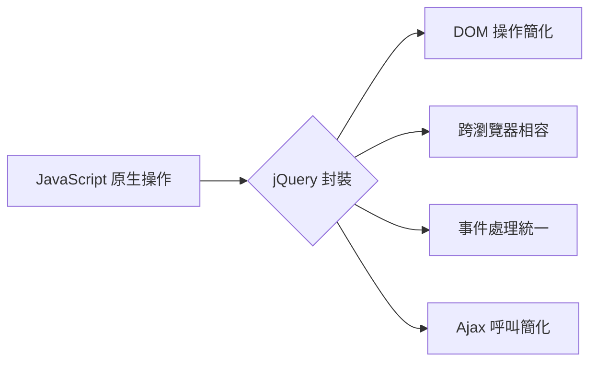
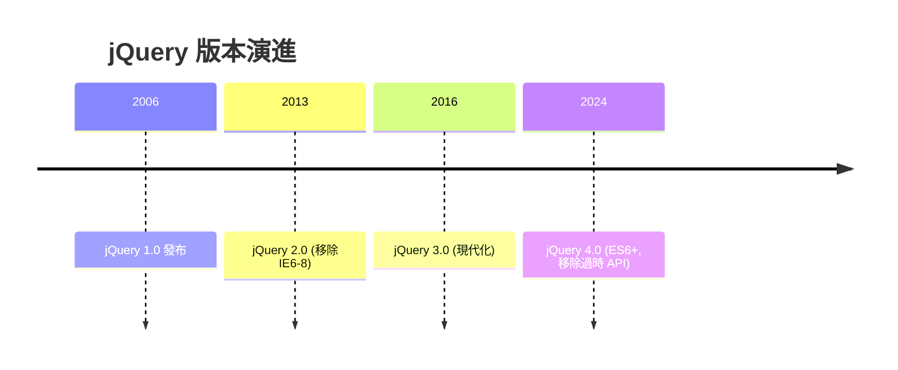
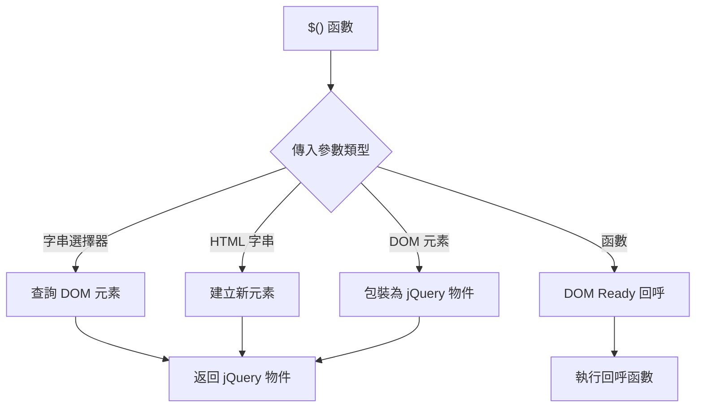
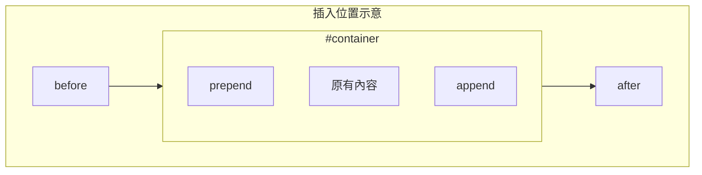
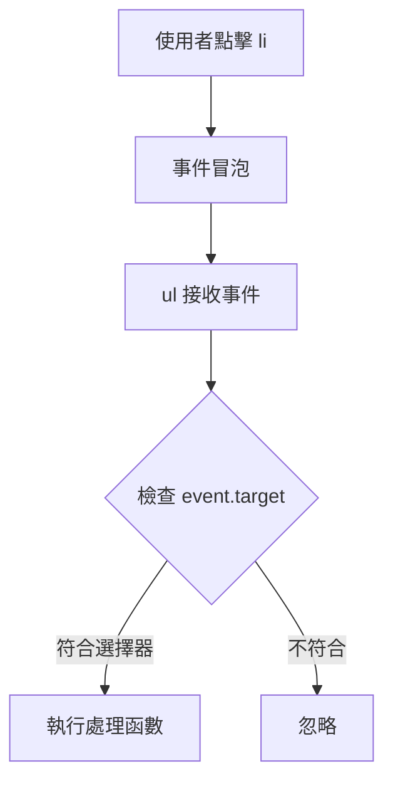
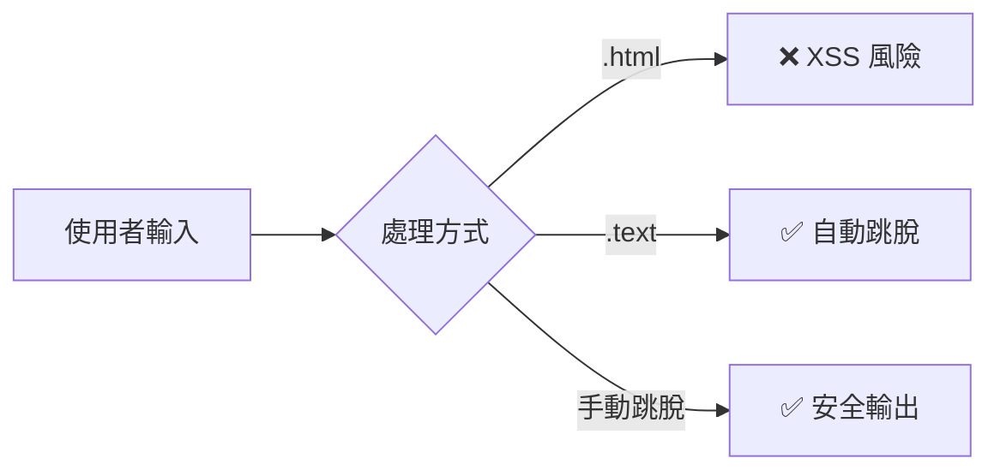
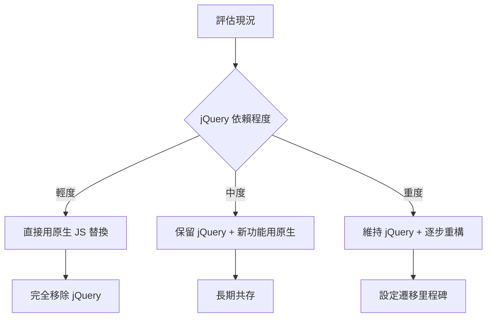

+++
date = '2026-02-04T19:12:57+08:00'
draft = false
title = 'JQuery教學手冊'
tags = ['教學', 'framework']
categories = ['教學']
+++
# jQuery 教學手冊

> **版本**：jQuery 4.0+  
> **適用對象**：具備 JavaScript 基礎的工程師  
> **文件性質**：企業內部技術文件  
> **最後更新**：2026 年 2 月

## 目錄

### 第一部分：基礎概念

1. [jQuery 簡介與定位](#1-jquery-簡介與定位)
   - [1.1 jQuery 的核心理念](#11-jquery-的核心理念)
   - [1.2 為何在現代系統中仍需要 jQuery](#12-為何在現代系統中仍需要-jquery)
   - [1.3 jQuery 與原生 JavaScript 的差異](#13-jquery-與原生-javascript-的差異)
   - [1.4 jQuery 4.0 重大變更](#14-jquery-40-重大變更)

2. [環境準備與版本建議](#2-環境準備與版本建議)
   - [2.1 jQuery 版本說明](#21-jquery-版本說明)
   - [2.2 CDN 安裝方式](#22-cdn-安裝方式)
   - [2.3 本地安裝方式](#23-本地安裝方式)
   - [2.4 專案目錄結構建議](#24-專案目錄結構建議)
   - [2.5 與 HTML5 / ES6 的搭配](#25-與-html5--es6-的搭配)
   - [2.6 瀏覽器相容性](#26-瀏覽器相容性)

3. [jQuery 核心語法與觀念](#3-jquery-核心語法與觀念)
   - [3.1 `$()` 選擇器原理](#31--選擇器原理)
   - [3.2 常用選擇器](#32-常用選擇器)
   - [3.3 Traversing（遍歷）](#33-traversing遍歷)
   - [3.4 Chaining 設計模式](#34-chaining-設計模式)
   - [3.5 jQuery Object vs DOM Object](#35-jquery-object-vs-dom-object)

### 第二部分：核心操作

4. [DOM 操作實戰](#4-dom-操作實戰)
   - [4.1 元素新增](#41-元素新增)
   - [4.2 元素刪除](#42-元素刪除)
   - [4.3 元素修改](#43-元素修改)
   - [4.4 屬性操作](#44-屬性操作)
   - [4.5 Class 操作](#45-class-操作)
   - [4.6 Style 操作](#46-style-操作)
   - [4.7 表單欄位處理](#47-表單欄位處理)
   - [4.8 動態畫面更新的最佳實務](#48-動態畫面更新的最佳實務)

5. [事件處理（Events）](#5-事件處理events)
   - [5.1 事件綁定方法](#51-事件綁定方法)
   - [5.2 事件解除](#52-事件解除)
   - [5.3 一次性事件](#53-一次性事件)
   - [5.4 Event Delegation（事件代理）](#54-event-delegation事件代理)
   - [5.5 常見事件類型](#55-常見事件類型)
   - [5.6 事件物件](#56-事件物件)
   - [5.7 效能陷阱與最佳實務](#57-效能陷阱與最佳實務)

6. [Ajax 與後端整合](#6-ajax-與後端整合)
   - [6.1 $.ajax 完整用法](#61-ajax-完整用法)
   - [6.2 Promise 風格（推薦）](#62-promise-風格推薦)
   - [6.3 簡便方法](#63-簡便方法)
   - [6.4 POST JSON 資料](#64-post-json-資料)
   - [6.5 RESTful API 整合](#65-restful-api-整合)
   - [6.6 錯誤處理](#66-錯誤處理)
   - [6.7 與 Spring Boot 整合範例](#67-與-spring-boot-整合範例)
   - [6.8 檔案上傳](#68-檔案上傳)

### 第三部分：進階主題

7. [模組化與程式碼結構建議](#7-模組化與程式碼結構建議)
   - [7.1 命名空間設計](#71-命名空間設計)
   - [7.2 模組模式（Module Pattern）](#72-模組模式module-pattern)
   - [7.3 檔案結構建議](#73-檔案結構建議)
   - [7.4 載入順序](#74-載入順序)
   - [7.5 使用 ES6 模組](#75-使用-es6-模組)

8. [效能與最佳實務（Best Practices）](#8-效能與最佳實務best-practices)
   - [8.1 Selector 快取](#81-selector-快取)
   - [8.2 減少 DOM 操作](#82-減少-dom-操作)
   - [8.3 事件綁定最佳化](#83-事件綁定最佳化)
   - [8.4 工具函數](#84-工具函數)
   - [8.5 常見 Anti-patterns](#85-常見-anti-patterns)
   - [8.6 效能檢測](#86-效能檢測)

9. [安全性注意事項](#9-安全性注意事項)
   - [9.1 XSS（跨站腳本攻擊）防護](#91-xss跨站腳本攻擊防護)
   - [9.2 安全的 HTML 建立](#92-安全的-html-建立)
   - [9.3 Ajax 安全](#93-ajax-安全)
   - [9.4 輸入驗證](#94-輸入驗證)
   - [9.5 安全檢查清單](#95-安全檢查清單)

### 第四部分：整合與實務

10. [與現代前端技術共存](#10-與現代前端技術共存)
    - [10.1 jQuery + Bootstrap 5](#101-jquery--bootstrap-5)
    - [10.2 jQuery + Tailwind CSS](#102-jquery--tailwind-css)
    - [10.3 jQuery 與 Vue 共存](#103-jquery-與-vue-共存)
    - [10.4 漸進式汰換策略](#104-漸進式汰換策略)

11. [常見問題與除錯技巧](#11-常見問題與除錯技巧)
    - [11.1 Debug 基本技巧](#111-debug-基本技巧)
    - [11.2 常見錯誤與解決方案](#112-常見錯誤與解決方案)
    - [11.3 DevTools 使用技巧](#113-devtools-使用技巧)
    - [11.4 常見陷阱總結](#114-常見陷阱總結)

12. [實務範例與範本](#12-實務範例與範本)
    - [12.1 CRUD 操作範例](#121-crud-操作範例)
    - [12.2 表單驗證範例](#122-表單驗證範例)
    - [12.3 DataTable 分頁範例](#123-datatable-分頁範例)
    - [12.4 通用工具函數](#124-通用工具函數)

### 第五部分：檢查與參考

13. [檢查清單（Checklist）](#13-檢查清單checklist)
    - [13.1 專案啟動檢查](#131-專案啟動檢查)
    - [13.2 程式碼撰寫檢查](#132-程式碼撰寫檢查)
    - [13.3 效能檢查](#133-效能檢查)
    - [13.4 安全檢查](#134-安全檢查)
    - [13.5 程式碼品質檢查](#135-程式碼品質檢查)
    - [13.6 上線前檢查](#136-上線前檢查)

### 附錄

14. [附錄](#14-附錄)
    - [A. 快速參考](#a-快速參考)
    - [B. 常見錯誤代碼](#b-常見錯誤代碼)
    - [C. 延伸資源](#c-延伸資源)

---

## 1. jQuery 簡介與定位

### 1.1 jQuery 的核心理念

jQuery 是一個快速、輕量級的 JavaScript 函式庫，其核心理念為：

> **"Write Less, Do More"**（寫得更少，做得更多）



**jQuery 4.0 的主要特點：**

| 特點 | 說明 |
|------|------|
| 輕量化 | 移除過時 API，核心更精簡 |
| 現代化 | 支援 ES6+ 語法，原生 Promise |
| 標準化 | 更貼近原生 JavaScript API |
| 安全性 | 強化 XSS 防護機制 |

### 1.2 為何在現代系統中仍需要 jQuery

儘管現代前端框架（React、Vue、Angular）已相當成熟，jQuery 在以下情境仍具價值：

**適合使用 jQuery 的情境：**

1. **既有系統維護**
   - 大量既有程式碼基於 jQuery
   - 重構成本過高
   - 系統穩定性優先

2. **傳統 Server-Side Rendering 專案**
   - Java/Spring MVC + JSP/Thymeleaf
   - .NET MVC + Razor
   - 不需要 SPA 架構

3. **快速原型開發**
   - 小型專案或 PoC
   - 簡單的 DOM 操作需求
   - 團隊熟悉度高

4. **與後端整合的管理後台**
   - 內部管理系統
   - 報表系統
   - CRUD 為主的應用

**不適合使用 jQuery 的情境：**

| 情境 | 建議替代方案 |
|------|-------------|
| 複雜的 SPA 應用 | React / Vue / Angular |
| 需要狀態管理 | Redux / Vuex / Pinia |
| 高度互動的 UI | 現代前端框架 |
| 新建大型專案 | 評估框架選型 |

### 1.3 jQuery 與原生 JavaScript 的差異

```javascript
// ✅ 原生 JavaScript (ES6+)
document.querySelectorAll('.item').forEach(el => {
    el.classList.add('active');
    el.addEventListener('click', handleClick);
});

// ✅ jQuery 寫法
$('.item').addClass('active').on('click', handleClick);
```

**主要差異對照表：**

| 操作 | 原生 JavaScript | jQuery |
|------|----------------|--------|
| 選取元素 | `document.querySelector()` | `$()` |
| 多元素操作 | 需要迴圈處理 | 內建批次處理 |
| 事件綁定 | `addEventListener()` | `.on()` |
| Ajax | `fetch()` | `$.ajax()` |
| 動畫 | CSS Transition / Web Animation API | `.animate()` |

### 1.4 jQuery 4.0 重大變更

⚠️ **注意事項**：從舊版升級至 jQuery 4.0 需注意以下變更

```javascript
// ❌ jQuery 3.x 已棄用，4.0 完全移除
$.isArray(arr);           // 使用 Array.isArray()
$.trim(str);              // 使用 str.trim()
$.parseJSON(str);         // 使用 JSON.parse()
$(document).ready(fn);    // 簡化為 $(fn)

// ❌ 已移除的方法
$('.item').bind();        // 使用 .on()
$('.item').unbind();      // 使用 .off()
$('.item').delegate();    // 使用 .on()
$('.item').live();        // 早已移除

// ✅ jQuery 4.0 正確寫法
Array.isArray(arr);
str.trim();
JSON.parse(str);
$(function() { /* ready */ });
```

---

## 2. 環境準備與版本建議

### 2.1 jQuery 版本說明



**版本選擇建議：**

| 版本 | 瀏覽器支援 | 建議使用情境 |
|------|-----------|-------------|
| 4.0+ | 現代瀏覽器 | 新專案首選 |
| 3.7.x | IE11+ | 需支援 IE11 |
| 1.12.x | IE6+ | 極舊系統維護（不建議） |

### 2.2 CDN 安裝方式

**推薦的 CDN 來源：**

```html
<!-- 官方 CDN -->
<script src="https://code.jquery.com/jquery-4.0.0.min.js"
        integrity="sha384-..." 
        crossorigin="anonymous"></script>

<!-- Google CDN -->
<script src="https://ajax.googleapis.com/ajax/libs/jquery/4.0.0/jquery.min.js"></script>

<!-- cdnjs -->
<script src="https://cdnjs.cloudflare.com/ajax/libs/jquery/4.0.0/jquery.min.js"></script>
```

✅ **建議**：永遠使用 `integrity` 屬性確保資源完整性

```html
<!-- 完整的安全引入方式 -->
<script src="https://code.jquery.com/jquery-4.0.0.min.js"
        integrity="sha384-xxxxx"
        crossorigin="anonymous"
        referrerpolicy="no-referrer"></script>
```

### 2.3 本地安裝方式

**使用 npm：**

```bash
# 安裝最新版
npm install jquery@latest

# 安裝特定版本
npm install jquery@4.0.0
```

**使用 yarn：**

```bash
yarn add jquery@4.0.0
```

**在模組化專案中使用：**

```javascript
// ES6 模組引入
import $ from 'jquery';

// 或全域掛載（不建議）
import jQuery from 'jquery';
window.$ = window.jQuery = jQuery;
```

### 2.4 專案目錄結構建議

```text
project/
├── src/
│   ├── main/
│   │   ├── resources/
│   │   │   └── static/
│   │   │       ├── js/
│   │   │       │   ├── vendor/
│   │   │       │   │   └── jquery-4.0.0.min.js
│   │   │       │   ├── modules/
│   │   │       │   │   ├── form-handler.js
│   │   │       │   │   └── data-table.js
│   │   │       │   └── app.js
│   │   │       └── css/
│   │   └── templates/
│   └── test/
└── pom.xml
```

### 2.5 與 HTML5 / ES6 的搭配

```html
<!DOCTYPE html>
<html lang="zh-TW">
<head>
    <meta charset="UTF-8">
    <meta name="viewport" content="width=device-width, initial-scale=1.0">
    <title>jQuery 4.0 專案</title>
    <!-- CSS 放 head -->
    <link rel="stylesheet" href="/css/style.css">
</head>
<body>
    <!-- 頁面內容 -->
    <div id="app"></div>
    
    <!-- JavaScript 放 body 結尾 -->
    <script src="/js/vendor/jquery-4.0.0.min.js"></script>
    <script src="/js/app.js" type="module"></script>
</body>
</html>
```

### 2.6 瀏覽器相容性

**jQuery 4.0 支援的瀏覽器：**

| 瀏覽器 | 最低版本 |
|--------|---------|
| Chrome | 最近兩個主要版本 |
| Firefox | 最近兩個主要版本 |
| Safari | 最近兩個主要版本 |
| Edge | 最近兩個主要版本 |
| IE | ❌ 不支援 |

⚠️ **注意事項**：若需支援 IE11，請使用 jQuery 3.x 版本

---

## 3. jQuery 核心語法與觀念

### 3.1 `$()` 選擇器原理

`$()` 是 jQuery 的核心函數，具有多種用途：

```javascript
// 1. 選取 DOM 元素
$('#myId');           // ID 選擇器
$('.myClass');        // Class 選擇器
$('div');             // 標籤選擇器
$('[data-id="123"]'); // 屬性選擇器

// 2. 建立新元素
$('<div>');
$('<div class="box">內容</div>');

// 3. DOM Ready 事件
$(function() {
    // DOM 載入完成後執行
});

// 4. 包裝原生 DOM 元素
$(document.getElementById('myId'));
```



### 3.2 常用選擇器

#### 3.2.1 基本選擇器

```javascript
// ID 選擇器（最快）
$('#userId')

// Class 選擇器
$('.user-name')

// 標籤選擇器
$('div')

// 組合選擇器
$('div.container')
$('#form input.required')

// 多重選擇器
$('#header, #footer, .sidebar')
```

#### 3.2.2 屬性選擇器

```javascript
// 精確匹配
$('[name="email"]')
$('[type="text"]')

// 包含
$('[class*="btn"]')

// 開頭
$('[id^="user-"]')

// 結尾
$('[href$=".pdf"]')

// Data 屬性
$('[data-status="active"]')
```

#### 3.2.3 層級選擇器

```javascript
// 後代選擇器（所有層級）
$('#container .item')

// 子代選擇器（直接子元素）
$('#container > .item')

// 相鄰兄弟
$('.current + .next')

// 所有後續兄弟
$('.current ~ .siblings')
```

#### 3.2.4 篩選選擇器

```javascript
// 位置篩選
$('tr:first')
$('tr:last')
$('tr:eq(2)')      // 索引 2（第三個）
$('tr:lt(3)')      // 索引小於 3
$('tr:gt(3)')      // 索引大於 3
$('tr:odd')        // 奇數索引
$('tr:even')       // 偶數索引

// 內容篩選
$('div:contains("文字")')
$('div:empty')
$('div:has(p)')

// 表單篩選
$(':input')        // 所有表單元素
$(':text')         // type="text"
$(':checkbox')
$(':checked')
$(':disabled')
$(':enabled')
```

### 3.3 Traversing（遍歷）

```javascript
const $item = $('.current-item');

// 父層
$item.parent()           // 直接父元素
$item.parents()          // 所有祖先
$item.parents('.list')   // 特定祖先
$item.closest('.list')   // 最近的符合祖先

// 子層
$item.children()         // 直接子元素
$item.children('.active')
$item.find('.nested')    // 所有後代

// 兄弟
$item.siblings()
$item.next()
$item.nextAll()
$item.prev()
$item.prevAll()

// 篩選
$items.first()
$items.last()
$items.eq(2)
$items.filter('.active')
$items.not('.disabled')
```

### 3.4 Chaining 設計模式

jQuery 方法大多會返回 jQuery 物件，允許鏈式呼叫：

```javascript
// ✅ 鏈式呼叫（推薦）
$('#user-form')
    .find('input')
    .addClass('form-control')
    .attr('autocomplete', 'off')
    .end()  // 返回上一層選擇
    .find('button')
    .prop('disabled', false);

// ❌ 非鏈式（冗餘）
const $form = $('#user-form');
const $inputs = $form.find('input');
$inputs.addClass('form-control');
$inputs.attr('autocomplete', 'off');
const $buttons = $form.find('button');
$buttons.prop('disabled', false);
```

### 3.5 jQuery Object vs DOM Object

```javascript
// jQuery 物件
const $element = $('#myDiv');
console.log($element);  // jQuery.fn.init [div#myDiv]

// 原生 DOM 物件
const element = document.getElementById('myDiv');
console.log(element);   // <div id="myDiv">...</div>

// 轉換：jQuery → DOM
const dom1 = $element[0];
const dom2 = $element.get(0);

// 轉換：DOM → jQuery
const $wrapped = $(element);

// 檢查是否為 jQuery 物件
if ($element instanceof jQuery) {
    console.log('是 jQuery 物件');
}

// 檢查是否選到元素
if ($element.length > 0) {
    console.log('找到元素');
}
```

⚠️ **常見錯誤**

```javascript
// ❌ 錯誤：混用 jQuery 和原生方法
$('#myDiv').getElementById('child');  // jQuery 沒有此方法

// ❌ 錯誤：未檢查元素是否存在
$('#notExist').addClass('active');  // 不會報錯，但沒作用

// ✅ 正確：先檢查
const $el = $('#maybeExist');
if ($el.length) {
    $el.addClass('active');
}
```

---

## 4. DOM 操作實戰

### 4.1 元素新增

```javascript
// 建立新元素
const $newDiv = $('<div>', {
    'class': 'alert alert-success',
    'id': 'message',
    'data-status': 'new',
    text: '操作成功！'
});

// 插入方式
$('#container').append($newDiv);     // 內部最後
$('#container').prepend($newDiv);    // 內部最前
$('#container').before($newDiv);     // 外部之前
$('#container').after($newDiv);      // 外部之後

// 反向插入（較少用）
$newDiv.appendTo('#container');
$newDiv.prependTo('#container');
$newDiv.insertBefore('#container');
$newDiv.insertAfter('#container');
```



### 4.2 元素刪除

```javascript
// 移除元素（包含事件和資料）
$('.item').remove();

// 移除元素（保留事件和資料，用於重新插入）
const $detached = $('.item').detach();
// 稍後重新插入
$('#newContainer').append($detached);

// 清空內容（保留元素本身）
$('#container').empty();
```

### 4.3 元素修改

```javascript
// 取得/設定 HTML 內容
const html = $('#content').html();
$('#content').html('<p>新內容</p>');

// 取得/設定純文字
const text = $('#content').text();
$('#content').text('純文字內容');  // 自動跳脫 HTML

// 取得/設定表單值
const value = $('#username').val();
$('#username').val('newValue');

// 替換元素
$('.old-class').replaceWith('<div class="new-class">替換內容</div>');

// 包裹元素
$('.item').wrap('<div class="wrapper"></div>');
$('.item').wrapAll('<div class="all-wrapper"></div>');
$('.item').wrapInner('<span class="inner"></span>');
```

### 4.4 屬性操作

```javascript
// attr：HTML 屬性（字串）
$('#link').attr('href');
$('#link').attr('href', 'https://example.com');
$('#link').attr({
    'href': 'https://example.com',
    'target': '_blank',
    'rel': 'noopener'
});
$('#link').removeAttr('target');

// prop：DOM 屬性（布林值、物件）
$('#checkbox').prop('checked');      // true/false
$('#checkbox').prop('checked', true);
$('#input').prop('disabled', true);

// data：自訂資料
$('#item').data('userId');           // 讀取 data-user-id
$('#item').data('userId', 123);      // 設定（存在記憶體，不改 DOM）
$('#item').data({ status: 'active', priority: 1 });
```

⚠️ **attr vs prop 重要區別**

```javascript
// ✅ 正確使用場景
$('#checkbox').prop('checked');     // 取得當前勾選狀態
$('#checkbox').attr('checked');     // 取得 HTML 原始值

$('#input').prop('disabled', true); // 控制啟用/禁用
$('#link').attr('href', url);       // 設定連結

// ❌ 常見錯誤
$('#checkbox').attr('checked', true);  // 不會正確更新狀態
```

### 4.5 Class 操作

```javascript
// 新增 Class
$('#btn').addClass('active');
$('#btn').addClass('btn btn-primary btn-lg');

// 移除 Class
$('#btn').removeClass('active');
$('#btn').removeClass('btn-primary btn-secondary');
$('#btn').removeClass();  // 移除全部

// 切換 Class
$('#btn').toggleClass('active');
$('#btn').toggleClass('active', shouldBeActive);  // 條件切換

// 檢查 Class
if ($('#btn').hasClass('active')) {
    // ...
}
```

### 4.6 Style 操作

```javascript
// 取得樣式
const width = $('#box').css('width');
const styles = $('#box').css(['width', 'height', 'color']);

// 設定樣式
$('#box').css('background-color', '#f00');
$('#box').css({
    'width': '100px',
    'height': '100px',
    'background-color': '#f00'
});

// 尺寸方法
$('#box').width();        // 內容寬度
$('#box').innerWidth();   // 含 padding
$('#box').outerWidth();   // 含 border
$('#box').outerWidth(true); // 含 margin

// 位置方法
$('#box').offset();       // 相對於 document { top, left }
$('#box').position();     // 相對於定位父元素
```

### 4.7 表單欄位處理

```javascript
// 取得表單序列化資料
const formData = $('#myForm').serialize();
// 結果: "name=John&email=john%40example.com"

const formArray = $('#myForm').serializeArray();
// 結果: [{ name: "name", value: "John" }, ...]

// 自訂序列化為物件
function serializeFormToObject($form) {
    const obj = {};
    $form.serializeArray().forEach(item => {
        if (obj[item.name]) {
            if (!Array.isArray(obj[item.name])) {
                obj[item.name] = [obj[item.name]];
            }
            obj[item.name].push(item.value);
        } else {
            obj[item.name] = item.value;
        }
    });
    return obj;
}

// 使用
const data = serializeFormToObject($('#myForm'));
```

### 4.8 動態畫面更新的最佳實務

```javascript
// ✅ 建議：使用 DocumentFragment 或一次性操作
function renderList(items) {
    const $list = $('#itemList');
    const $fragment = $(document.createDocumentFragment());
    
    items.forEach(item => {
        $fragment.append(
            $('<li>', { text: item.name, 'data-id': item.id })
        );
    });
    
    $list.empty().append($fragment);
}

// ✅ 建議：批次更新
function updateItems(items) {
    // 暫時隱藏，避免重繪
    const $container = $('#container').hide();
    
    items.forEach(item => {
        $container.find(`[data-id="${item.id}"]`)
            .text(item.name)
            .toggleClass('active', item.active);
    });
    
    $container.show();
}

// ❌ 避免：迴圈中逐一操作 DOM
items.forEach(item => {
    $('#list').append(`<li>${item.name}</li>`);  // 每次都觸發重繪
});
```

---

## 5. 事件處理（Events）

### 5.1 事件綁定方法

```javascript
// ✅ 推薦：使用 .on()
$('#btn').on('click', function(e) {
    console.log('clicked');
});

// 多事件綁定
$('#input').on('focus blur', function(e) {
    console.log(e.type);  // 'focus' 或 'blur'
});

// 事件物件分開處理
$('#input').on({
    focus: function() {
        $(this).addClass('focused');
    },
    blur: function() {
        $(this).removeClass('focused');
    }
});

// 傳遞額外資料
$('#btn').on('click', { userId: 123 }, function(e) {
    console.log(e.data.userId);  // 123
});
```

### 5.2 事件解除

```javascript
// 解除特定事件
$('#btn').off('click');

// 解除特定處理函數
function handleClick(e) {
    console.log('clicked');
}
$('#btn').on('click', handleClick);
$('#btn').off('click', handleClick);

// 解除命名空間事件
$('#btn').on('click.myModule', handler);
$('#btn').off('click.myModule');
$('#btn').off('.myModule');  // 解除該模組所有事件

// 解除所有事件
$('#btn').off();
```

### 5.3 一次性事件

```javascript
// 只執行一次後自動解除
$('#btn').one('click', function() {
    console.log('只會執行一次');
});

// 等同於
$('#btn').on('click', function handler(e) {
    console.log('只會執行一次');
    $(this).off('click', handler);
});
```

### 5.4 Event Delegation（事件代理）

**原理說明：**



```javascript
// ✅ 正確：事件代理
$('#list').on('click', 'li', function(e) {
    console.log($(this).text());
});

// ❌ 錯誤：直接綁定（對動態元素無效）
$('li').on('click', function(e) {
    console.log($(this).text());
});
```

**完整範例：**

```javascript
// HTML: <ul id="userList"></ul>

// 事件代理（動態元素也有效）
$('#userList').on('click', '.delete-btn', function(e) {
    e.preventDefault();
    const $row = $(this).closest('li');
    const userId = $row.data('userId');
    deleteUser(userId, $row);
});

// 動態新增元素
function addUser(user) {
    const $li = $('<li>', { 'data-user-id': user.id })
        .append($('<span>', { text: user.name }))
        .append($('<button>', { 
            class: 'delete-btn', 
            text: '刪除' 
        }));
    $('#userList').append($li);
}

// 新增的元素自動具有事件處理
addUser({ id: 1, name: 'John' });
```

### 5.5 常見事件類型

```javascript
// 滑鼠事件
$el.on('click', handler);
$el.on('dblclick', handler);
$el.on('mouseenter', handler);  // 不冒泡
$el.on('mouseleave', handler);  // 不冒泡
$el.on('mouseover', handler);   // 會冒泡
$el.on('mouseout', handler);    // 會冒泡

// 鍵盤事件
$el.on('keydown', handler);   // 按下
$el.on('keyup', handler);     // 放開
$el.on('keypress', handler);  // 已棄用

// 表單事件
$el.on('focus', handler);
$el.on('blur', handler);
$el.on('change', handler);
$el.on('input', handler);     // 即時輸入
$el.on('submit', handler);

// 視窗事件
$(window).on('resize', handler);
$(window).on('scroll', handler);
$(document).on('ready', handler);
```

### 5.6 事件物件

```javascript
$('#form').on('submit', function(e) {
    // 阻止預設行為
    e.preventDefault();
    
    // 停止冒泡
    e.stopPropagation();
    
    // 停止冒泡並阻止同元素其他處理函數
    e.stopImmediatePropagation();
    
    // 事件資訊
    console.log(e.type);        // 'submit'
    console.log(e.target);      // 觸發事件的元素（原生 DOM）
    console.log(e.currentTarget); // 綁定事件的元素
    console.log(this);          // 同 currentTarget
    
    // 鍵盤事件
    console.log(e.key);         // 'Enter', 'a', 'Escape' 等
    console.log(e.code);        // 'Enter', 'KeyA', 'Escape' 等
    console.log(e.ctrlKey);     // Ctrl 是否按下
    console.log(e.shiftKey);    // Shift 是否按下
    
    // 滑鼠事件
    console.log(e.pageX, e.pageY);     // 相對文件
    console.log(e.clientX, e.clientY); // 相對視窗
});
```

### 5.7 效能陷阱與最佳實務

```javascript
// ❌ 避免：在迴圈中綁定事件
$('.item').each(function() {
    $(this).on('click', handler);  // 每個元素都建立處理函數
});

// ✅ 改用事件代理
$('#container').on('click', '.item', handler);

// ❌ 避免：高頻事件不節流
$(window).on('scroll', function() {
    // 每次捲動都執行，效能差
    updatePosition();
});

// ✅ 使用 throttle/debounce
function throttle(fn, delay) {
    let lastCall = 0;
    return function(...args) {
        const now = Date.now();
        if (now - lastCall >= delay) {
            lastCall = now;
            fn.apply(this, args);
        }
    };
}

$(window).on('scroll', throttle(updatePosition, 100));

// ❌ 避免：不解除事件
function initComponent($el) {
    $el.on('click', handler);
}

// ✅ 提供清理方法
function initComponent($el) {
    $el.on('click.myComponent', handler);
    return {
        destroy: () => $el.off('.myComponent')
    };
}
```

---

## 6. Ajax 與後端整合

### 6.1 $.ajax 完整用法

```javascript
$.ajax({
    url: '/api/users',
    method: 'GET',  // 或 type: 'GET'
    data: { page: 1, size: 10 },
    dataType: 'json',
    contentType: 'application/json',
    headers: {
        'Authorization': 'Bearer ' + token,
        'X-Custom-Header': 'value'
    },
    timeout: 30000,
    beforeSend: function(xhr) {
        showLoading();
    },
    success: function(data, textStatus, xhr) {
        console.log(data);
    },
    error: function(xhr, textStatus, errorThrown) {
        console.error(textStatus, errorThrown);
    },
    complete: function(xhr, textStatus) {
        hideLoading();
    }
});
```

### 6.2 Promise 風格（推薦）

```javascript
// jQuery 4.0 回傳標準 Promise
$.ajax({
    url: '/api/users',
    method: 'GET'
})
.then(data => {
    console.log('成功:', data);
    return processData(data);
})
.then(processed => {
    renderList(processed);
})
.catch(error => {
    console.error('失敗:', error);
    showError(error.responseJSON?.message || '未知錯誤');
})
.finally(() => {
    hideLoading();
});

// 配合 async/await
async function fetchUsers() {
    try {
        showLoading();
        const users = await $.ajax({
            url: '/api/users',
            method: 'GET'
        });
        return users;
    } catch (error) {
        handleError(error);
        throw error;
    } finally {
        hideLoading();
    }
}
```

### 6.3 簡便方法

```javascript
// GET 請求
$.get('/api/users', { page: 1 })
    .then(data => console.log(data));

// POST 請求
$.post('/api/users', { name: 'John', email: 'john@example.com' })
    .then(data => console.log(data));

// 載入 HTML
$('#content').load('/partials/sidebar.html', function(response, status, xhr) {
    if (status === 'error') {
        $(this).html('載入失敗');
    }
});

// 取得 JSON
$.getJSON('/api/config.json')
    .then(config => console.log(config));
```

### 6.4 POST JSON 資料

```javascript
// ✅ 正確：發送 JSON
$.ajax({
    url: '/api/users',
    method: 'POST',
    contentType: 'application/json',  // 重要！
    data: JSON.stringify({
        name: 'John',
        email: 'john@example.com'
    }),
    dataType: 'json'
})
.then(response => {
    console.log('建立成功:', response);
});

// 封裝為可重用函數
function postJSON(url, data) {
    return $.ajax({
        url: url,
        method: 'POST',
        contentType: 'application/json',
        data: JSON.stringify(data),
        dataType: 'json'
    });
}

// 使用
postJSON('/api/users', { name: 'John' })
    .then(handleSuccess)
    .catch(handleError);
```

### 6.5 RESTful API 整合

```javascript
// API 服務模組
const UserAPI = {
    baseURL: '/api/users',
    
    // 取得列表
    getAll(params = {}) {
        return $.ajax({
            url: this.baseURL,
            method: 'GET',
            data: params
        });
    },
    
    // 取得單一
    getById(id) {
        return $.ajax({
            url: `${this.baseURL}/${id}`,
            method: 'GET'
        });
    },
    
    // 新增
    create(data) {
        return $.ajax({
            url: this.baseURL,
            method: 'POST',
            contentType: 'application/json',
            data: JSON.stringify(data)
        });
    },
    
    // 更新
    update(id, data) {
        return $.ajax({
            url: `${this.baseURL}/${id}`,
            method: 'PUT',
            contentType: 'application/json',
            data: JSON.stringify(data)
        });
    },
    
    // 部分更新
    patch(id, data) {
        return $.ajax({
            url: `${this.baseURL}/${id}`,
            method: 'PATCH',
            contentType: 'application/json',
            data: JSON.stringify(data)
        });
    },
    
    // 刪除
    delete(id) {
        return $.ajax({
            url: `${this.baseURL}/${id}`,
            method: 'DELETE'
        });
    }
};

// 使用範例
async function loadUserDetail(userId) {
    try {
        const user = await UserAPI.getById(userId);
        renderUserDetail(user);
    } catch (error) {
        showError('載入使用者失敗');
    }
}
```

### 6.6 錯誤處理

```javascript
// 全域錯誤處理
$(document).ajaxError(function(event, xhr, settings, error) {
    console.error('Ajax 錯誤:', settings.url, xhr.status);
    
    if (xhr.status === 401) {
        // 未授權，導向登入
        window.location.href = '/login';
    } else if (xhr.status === 403) {
        showError('權限不足');
    } else if (xhr.status === 500) {
        showError('伺服器錯誤，請稍後再試');
    }
});

// 個別請求錯誤處理
$.ajax({
    url: '/api/data',
    method: 'GET'
})
.catch(function(xhr, textStatus, errorThrown) {
    const response = xhr.responseJSON;
    
    switch (xhr.status) {
        case 400:
            // 驗證錯誤
            showValidationErrors(response.errors);
            break;
        case 404:
            showError('找不到資源');
            break;
        case 422:
            // 業務邏輯錯誤
            showError(response.message);
            break;
        default:
            showError('發生未預期的錯誤');
    }
});
```

### 6.7 與 Spring Boot 整合範例

**後端 Controller：**

```java
@RestController
@RequestMapping("/api/users")
public class UserController {
    
    @GetMapping
    public ResponseEntity<Page<UserDTO>> getUsers(
            @RequestParam(defaultValue = "0") int page,
            @RequestParam(defaultValue = "10") int size) {
        return ResponseEntity.ok(userService.findAll(page, size));
    }
    
    @PostMapping
    public ResponseEntity<UserDTO> createUser(@Valid @RequestBody UserDTO dto) {
        return ResponseEntity.status(HttpStatus.CREATED)
                .body(userService.create(dto));
    }
}
```

**前端 jQuery：**

```javascript
// 配合 Spring Boot 的分頁
async function loadUsers(page = 0, size = 10) {
    try {
        const response = await $.ajax({
            url: '/api/users',
            method: 'GET',
            data: { page, size }
        });
        
        renderUserTable(response.content);
        renderPagination(response);
    } catch (error) {
        handleError(error);
    }
}

// 處理 Spring Boot 驗證錯誤
function handleValidationError(xhr) {
    if (xhr.status === 400) {
        const errors = xhr.responseJSON.errors || [];
        errors.forEach(err => {
            const $field = $(`[name="${err.field}"]`);
            $field.addClass('is-invalid')
                  .siblings('.invalid-feedback')
                  .text(err.defaultMessage);
        });
    }
}

// 表單提交
$('#userForm').on('submit', async function(e) {
    e.preventDefault();
    
    // 清除舊錯誤
    $(this).find('.is-invalid').removeClass('is-invalid');
    
    const formData = serializeFormToObject($(this));
    
    try {
        const user = await $.ajax({
            url: '/api/users',
            method: 'POST',
            contentType: 'application/json',
            data: JSON.stringify(formData)
        });
        
        showSuccess('使用者建立成功');
        closeModal();
        refreshTable();
    } catch (xhr) {
        handleValidationError(xhr);
    }
});
```

### 6.8 檔案上傳

```javascript
// 使用 FormData
$('#uploadForm').on('submit', function(e) {
    e.preventDefault();
    
    const formData = new FormData(this);
    
    $.ajax({
        url: '/api/upload',
        method: 'POST',
        data: formData,
        processData: false,  // 重要！
        contentType: false,  // 重要！
        xhr: function() {
            const xhr = new XMLHttpRequest();
            xhr.upload.addEventListener('progress', function(e) {
                if (e.lengthComputable) {
                    const percent = (e.loaded / e.total) * 100;
                    updateProgress(percent);
                }
            });
            return xhr;
        }
    })
    .then(response => {
        showSuccess('上傳成功');
    })
    .catch(error => {
        showError('上傳失敗');
    });
});
```

---

## 7. 模組化與程式碼結構建議

### 7.1 命名空間設計

```javascript
// 建立全域命名空間
window.APP = window.APP || {};

// 子模組
APP.Utils = {};
APP.UI = {};
APP.API = {};

// 模組實作
APP.Utils = (function() {
    // 私有變數
    const _config = {
        dateFormat: 'YYYY-MM-DD'
    };
    
    // 私有方法
    function _formatDate(date) {
        // ...
    }
    
    // 公開 API
    return {
        formatDate: function(date) {
            return _formatDate(date);
        },
        formatCurrency: function(amount) {
            return new Intl.NumberFormat('zh-TW', {
                style: 'currency',
                currency: 'TWD'
            }).format(amount);
        }
    };
})();

// 使用
APP.Utils.formatCurrency(1000);  // "NT$1,000"
```

### 7.2 模組模式（Module Pattern）

```javascript
// 使用者管理模組
APP.UserModule = (function($) {
    'use strict';
    
    // 私有狀態
    let _users = [];
    let _$container = null;
    
    // 私有方法
    function _bindEvents() {
        _$container.on('click', '.btn-delete', _handleDelete);
        _$container.on('click', '.btn-edit', _handleEdit);
    }
    
    function _handleDelete(e) {
        e.preventDefault();
        const userId = $(this).closest('tr').data('userId');
        if (confirm('確定要刪除？')) {
            _deleteUser(userId);
        }
    }
    
    function _handleEdit(e) {
        e.preventDefault();
        const userId = $(this).closest('tr').data('userId');
        APP.UserModule.showEditModal(userId);
    }
    
    async function _deleteUser(id) {
        try {
            await APP.API.Users.delete(id);
            _removeFromList(id);
            APP.UI.showSuccess('刪除成功');
        } catch (error) {
            APP.UI.showError('刪除失敗');
        }
    }
    
    function _removeFromList(id) {
        _users = _users.filter(u => u.id !== id);
        _$container.find(`tr[data-user-id="${id}"]`).fadeOut(function() {
            $(this).remove();
        });
    }
    
    function _render() {
        const html = _users.map(user => `
            <tr data-user-id="${user.id}">
                <td>${APP.Utils.escapeHtml(user.name)}</td>
                <td>${APP.Utils.escapeHtml(user.email)}</td>
                <td>
                    <button class="btn btn-sm btn-edit">編輯</button>
                    <button class="btn btn-sm btn-delete">刪除</button>
                </td>
            </tr>
        `).join('');
        
        _$container.find('tbody').html(html);
    }
    
    // 公開 API
    return {
        init: function(containerSelector) {
            _$container = $(containerSelector);
            _bindEvents();
            this.loadUsers();
        },
        
        loadUsers: async function() {
            try {
                _users = await APP.API.Users.getAll();
                _render();
            } catch (error) {
                APP.UI.showError('載入使用者列表失敗');
            }
        },
        
        showEditModal: function(userId) {
            const user = _users.find(u => u.id === userId);
            if (user) {
                APP.UI.Modal.show('editUser', user);
            }
        },
        
        destroy: function() {
            _$container.off('.userModule');
            _$container = null;
            _users = [];
        }
    };
})(jQuery);

// 初始化
$(function() {
    APP.UserModule.init('#userTable');
});
```

### 7.3 檔案結構建議

```text
src/main/resources/static/
├── js/
│   ├── vendor/                    # 第三方函式庫
│   │   ├── jquery-4.0.0.min.js
│   │   └── bootstrap.bundle.min.js
│   │
│   ├── core/                      # 核心模組
│   │   ├── namespace.js           # 命名空間定義
│   │   ├── config.js              # 全域設定
│   │   └── utils.js               # 工具函數
│   │
│   ├── api/                       # API 模組
│   │   ├── base.js                # API 基礎設定
│   │   ├── users.js
│   │   └── products.js
│   │
│   ├── ui/                        # UI 元件
│   │   ├── modal.js
│   │   ├── toast.js
│   │   └── datatable.js
│   │
│   ├── modules/                   # 業務模組
│   │   ├── user-management.js
│   │   └── product-catalog.js
│   │
│   └── pages/                     # 頁面初始化
│       ├── user-list.js
│       └── product-detail.js
│
└── css/
    └── ...
```

### 7.4 載入順序

```html
<!-- 1. 第三方函式庫 -->
<script src="/js/vendor/jquery-4.0.0.min.js"></script>
<script src="/js/vendor/bootstrap.bundle.min.js"></script>

<!-- 2. 核心模組 -->
<script src="/js/core/namespace.js"></script>
<script src="/js/core/config.js"></script>
<script src="/js/core/utils.js"></script>

<!-- 3. API 模組 -->
<script src="/js/api/base.js"></script>
<script src="/js/api/users.js"></script>

<!-- 4. UI 元件 -->
<script src="/js/ui/modal.js"></script>
<script src="/js/ui/toast.js"></script>

<!-- 5. 業務模組 -->
<script src="/js/modules/user-management.js"></script>

<!-- 6. 頁面初始化（放最後） -->
<script src="/js/pages/user-list.js"></script>
```

### 7.5 使用 ES6 模組

```javascript
// js/modules/user-service.js
export class UserService {
    constructor(baseUrl = '/api/users') {
        this.baseUrl = baseUrl;
    }
    
    async getAll() {
        return $.ajax({
            url: this.baseUrl,
            method: 'GET'
        });
    }
    
    async create(data) {
        return $.ajax({
            url: this.baseUrl,
            method: 'POST',
            contentType: 'application/json',
            data: JSON.stringify(data)
        });
    }
}

// js/pages/user-list.js
import { UserService } from '../modules/user-service.js';

const userService = new UserService();

$(async function() {
    const users = await userService.getAll();
    renderUsers(users);
});
```

```html
<!-- HTML 使用 type="module" -->
<script type="module" src="/js/pages/user-list.js"></script>
```

---

## 8. 效能與最佳實務（Best Practices）

### 8.1 Selector 快取

```javascript
// ❌ 避免：重複查詢
function updateUI() {
    $('#userName').text(user.name);
    $('#userName').addClass('highlight');
    $('#userName').data('userId', user.id);
}

// ✅ 改進：快取選擇器
function updateUI() {
    const $userName = $('#userName');
    $userName.text(user.name)
             .addClass('highlight')
             .data('userId', user.id);
}

// ✅ 更好：模組級快取
const UI = (function() {
    let $userName = null;
    
    function init() {
        $userName = $('#userName');
    }
    
    function updateUserName(name) {
        $userName.text(name);
    }
    
    return { init, updateUserName };
})();
```

### 8.2 減少 DOM 操作

```javascript
// ❌ 避免：迴圈中操作 DOM
items.forEach(item => {
    $('#list').append(`<li>${item.name}</li>`);
});

// ✅ 改進：批次操作
const html = items.map(item => `<li>${item.name}</li>`).join('');
$('#list').append(html);

// ✅ 更好：使用 DocumentFragment
const fragment = document.createDocumentFragment();
items.forEach(item => {
    const li = document.createElement('li');
    li.textContent = item.name;
    fragment.appendChild(li);
});
$('#list').append(fragment);

// ✅ 整體替換（最快）
const $list = $('<ul>');
items.forEach(item => {
    $list.append($('<li>', { text: item.name }));
});
$('#listContainer').empty().append($list);
```

### 8.3 事件綁定最佳化

```javascript
// ❌ 避免：每個元素都綁定
$('.item').each(function() {
    $(this).on('click', handleClick);
});

// ✅ 改進：事件代理
$('#container').on('click', '.item', handleClick);

// ❌ 避免：匿名函數（無法解除）
$('#btn').on('click', function() {
    doSomething();
});

// ✅ 改進：具名函數
function handleButtonClick() {
    doSomething();
}
$('#btn').on('click', handleButtonClick);

// ❌ 避免：高頻事件不節流
$(window).on('scroll', updatePosition);
$(window).on('resize', recalculateLayout);

// ✅ 改進：節流/防抖
$(window).on('scroll', throttle(updatePosition, 100));
$(window).on('resize', debounce(recalculateLayout, 250));
```

### 8.4 工具函數

```javascript
// 節流（固定頻率執行）
function throttle(fn, delay) {
    let lastCall = 0;
    return function(...args) {
        const now = Date.now();
        if (now - lastCall >= delay) {
            lastCall = now;
            return fn.apply(this, args);
        }
    };
}

// 防抖（停止觸發後才執行）
function debounce(fn, delay) {
    let timeoutId = null;
    return function(...args) {
        clearTimeout(timeoutId);
        timeoutId = setTimeout(() => {
            fn.apply(this, args);
        }, delay);
    };
}

// 使用範例
const handleSearch = debounce(function(e) {
    const query = $(this).val();
    searchAPI(query);
}, 300);

$('#searchInput').on('input', handleSearch);
```

### 8.5 常見 Anti-patterns

```javascript
// ❌ Anti-pattern 1：在迴圈中使用 $.each 改變 DOM
$.each(data, function(i, item) {
    $('#table tbody').append('<tr>...</tr>');
});

// ❌ Anti-pattern 2：不必要的包裝
$($(this));  // 冗餘
$($('#myDiv'));  // 冗餘

// ❌ Anti-pattern 3：使用 CSS 選擇器取代 ID
$('div#myDiv');  // 多餘，直接用 $('#myDiv')
$('input.required');  // 如果有 ID 應優先用 ID

// ❌ Anti-pattern 4：全域選擇器
$('.item');  // 搜尋整個 DOM

// ✅ 改進：限制範圍
$('#container').find('.item');
$('.item', '#container');

// ❌ Anti-pattern 5：重複 DOM Ready
$(document).ready(fn1);
$(document).ready(fn2);
$(document).ready(fn3);

// ✅ 改進：統一入口
$(function() {
    fn1();
    fn2();
    fn3();
});
```

### 8.6 效能檢測

```javascript
// 執行時間測量
console.time('操作名稱');
// ... 執行操作
console.timeEnd('操作名稱');

// 效能分析
function measurePerformance(name, fn) {
    const start = performance.now();
    const result = fn();
    const end = performance.now();
    console.log(`${name}: ${(end - start).toFixed(2)}ms`);
    return result;
}

// 使用
measurePerformance('渲染列表', () => {
    renderLargeList(data);
});
```

---

## 9. 安全性注意事項

### 9.1 XSS（跨站腳本攻擊）防護



```javascript
// ❌ 危險：直接使用 .html()
const userInput = '<script>alert("XSS")</script>';
$('#output').html(userInput);  // 會執行惡意腳本

// ✅ 安全：使用 .text()
$('#output').text(userInput);  // 顯示為純文字

// ✅ 需要 HTML 結構時，手動跳脫
function escapeHtml(str) {
    const div = document.createElement('div');
    div.textContent = str;
    return div.innerHTML;
}

const safeHtml = `<span class="name">${escapeHtml(userName)}</span>`;
$('#output').html(safeHtml);

// ✅ jQuery 建立元素（安全）
$('<div>', {
    'class': 'user-name',
    text: userInput  // text 會自動跳脫
}).appendTo('#container');
```

### 9.2 安全的 HTML 建立

```javascript
// ❌ 危險：字串拼接
function renderUser(user) {
    return `<div class="user">
        <span class="name">${user.name}</span>
        <span class="bio">${user.bio}</span>
    </div>`;
}

// ✅ 安全：使用 jQuery 建立
function renderUser(user) {
    return $('<div>', { 'class': 'user' })
        .append($('<span>', { 'class': 'name', text: user.name }))
        .append($('<span>', { 'class': 'bio', text: user.bio }));
}

// ✅ 安全：模板 + 跳脫
function renderUser(user) {
    const template = `
        <div class="user">
            <span class="name">{{name}}</span>
            <span class="bio">{{bio}}</span>
        </div>
    `;
    return template
        .replace('{{name}}', escapeHtml(user.name))
        .replace('{{bio}}', escapeHtml(user.bio));
}
```

### 9.3 Ajax 安全

```javascript
// ✅ 使用 CSRF Token（Spring Security 整合）
$.ajaxSetup({
    beforeSend: function(xhr, settings) {
        if (!csrfSafeMethod(settings.type)) {
            const token = $('meta[name="_csrf"]').attr('content');
            const header = $('meta[name="_csrf_header"]').attr('content');
            xhr.setRequestHeader(header, token);
        }
    }
});

function csrfSafeMethod(method) {
    return /^(GET|HEAD|OPTIONS|TRACE)$/i.test(method);
}

// HTML 中放置 CSRF Token
// <meta name="_csrf" th:content="${_csrf.token}"/>
// <meta name="_csrf_header" th:content="${_csrf.headerName}"/>

// ✅ 驗證回應 Content-Type
$.ajax({
    url: '/api/data',
    method: 'GET',
    dataType: 'json',  // 強制預期 JSON
    success: function(data, textStatus, xhr) {
        const contentType = xhr.getResponseHeader('Content-Type');
        if (!contentType.includes('application/json')) {
            console.warn('非預期的 Content-Type');
            return;
        }
        processData(data);
    }
});
```

### 9.4 輸入驗證

```javascript
// ✅ 客戶端驗證（輔助，非安全措施）
function validateEmail(email) {
    const re = /^[^\s@]+@[^\s@]+\.[^\s@]+$/;
    return re.test(email);
}

function validateForm($form) {
    let isValid = true;
    
    $form.find('[required]').each(function() {
        const $field = $(this);
        const value = $field.val().trim();
        
        if (!value) {
            $field.addClass('is-invalid');
            isValid = false;
        } else {
            $field.removeClass('is-invalid');
        }
    });
    
    const email = $form.find('[type="email"]').val();
    if (email && !validateEmail(email)) {
        $form.find('[type="email"]').addClass('is-invalid');
        isValid = false;
    }
    
    return isValid;
}

// ⚠️ 重要：永遠在後端再次驗證！
```

### 9.5 安全檢查清單

| 檢查項目 | 說明 |
|---------|------|
| 使用 `.text()` 而非 `.html()` | 除非確定內容安全 |
| 跳脫使用者輸入 | 所有來自使用者的資料 |
| CSRF Token | POST/PUT/DELETE 請求 |
| Content Security Policy | 設定適當的 CSP |
| HTTPS | 生產環境強制使用 |
| 輸入驗證 | 前後端都要驗證 |
| 敏感資料 | 不要存在前端 |

---

## 10. 與現代前端技術共存

### 10.1 jQuery + Bootstrap 5

```javascript
// Bootstrap 5 使用原生 JavaScript，但可與 jQuery 共存
// Modal 操作
const modalEl = document.getElementById('myModal');
const modal = new bootstrap.Modal(modalEl);

// jQuery 輔助
$('#showModalBtn').on('click', function() {
    modal.show();
});

$('#myModal').on('shown.bs.modal', function() {
    $(this).find('input:first').focus();
});

// 表單驗證整合
$('#myForm').on('submit', function(e) {
    if (!this.checkValidity()) {
        e.preventDefault();
        e.stopPropagation();
    }
    $(this).addClass('was-validated');
});
```

### 10.2 jQuery + Tailwind CSS

```javascript
// Tailwind 是純 CSS，與 jQuery 無衝突
$('#toggleBtn').on('click', function() {
    $('#panel').toggleClass('hidden');
});

// 動態切換 Tailwind 類別
function setTheme(isDark) {
    $('html').toggleClass('dark', isDark);
}

// 動態新增元素
function addAlert(message, type = 'info') {
    const colors = {
        info: 'bg-blue-100 text-blue-800',
        success: 'bg-green-100 text-green-800',
        error: 'bg-red-100 text-red-800'
    };
    
    $('<div>', {
        'class': `p-4 rounded-lg ${colors[type]}`,
        text: message
    }).appendTo('#alerts');
}
```

### 10.3 jQuery 與 Vue 共存

⚠️ **注意事項**：不建議混用，僅限於漸進式遷移場景

```javascript
// Vue 管理的區域不要用 jQuery 操作
// ❌ 錯誤
$('#vueApp .item').on('click', handler);  // Vue 會覆蓋

// ✅ 正確：在 Vue 之外的區域使用 jQuery
// Vue 應用
const app = Vue.createApp({
    mounted() {
        // 通知 jQuery 區域
        $(document).trigger('vue:mounted');
    }
});

// jQuery 區域（非 Vue 管理）
$('#legacySection').on('click', '.btn', handler);

// 通訊
$(document).on('vue:mounted', function() {
    console.log('Vue 已掛載');
});
```

### 10.4 漸進式汰換策略



**汰換對照表：**

| jQuery | 原生 JavaScript |
|--------|----------------|
| `$(selector)` | `document.querySelectorAll(selector)` |
| `$.each(arr, fn)` | `arr.forEach(fn)` |
| `$(el).on('click', fn)` | `el.addEventListener('click', fn)` |
| `$(el).addClass('x')` | `el.classList.add('x')` |
| `$(el).attr('x')` | `el.getAttribute('x')` |
| `$(el).data('x')` | `el.dataset.x` |
| `$.ajax()` | `fetch()` |
| `$(el).show/hide()` | `el.style.display = ''/'none'` |

**原生替代範例：**

```javascript
// DOM Ready
// jQuery
$(function() { /* ... */ });

// 原生
document.addEventListener('DOMContentLoaded', function() { /* ... */ });

// 事件代理
// jQuery
$('#list').on('click', '.item', handler);

// 原生
document.getElementById('list').addEventListener('click', function(e) {
    if (e.target.matches('.item')) {
        handler.call(e.target, e);
    }
});

// Ajax
// jQuery
$.ajax({ url: '/api/data', method: 'GET' })
    .then(data => console.log(data));

// 原生
fetch('/api/data')
    .then(res => res.json())
    .then(data => console.log(data));
```

---

## 11. 常見問題與除錯技巧

### 11.1 Debug 基本技巧

```javascript
// 1. Console 輸出
console.log('變數值:', variable);
console.table(arrayOrObject);
console.dir($element[0]);
console.group('分組標題');
console.groupEnd();

// 2. 檢查 jQuery 版本
console.log('jQuery 版本:', $.fn.jquery);

// 3. 檢查元素是否存在
console.log('元素數量:', $('#myId').length);

// 4. 檢查事件綁定
// Chrome DevTools: Elements > Event Listeners
// 或使用 jQuery 內部方法（除錯用）
$._data($('#btn')[0], 'events');

// 5. 追蹤 Ajax 請求
$(document).ajaxSend(function(e, xhr, settings) {
    console.log('發送請求:', settings.url);
});
$(document).ajaxComplete(function(e, xhr, settings) {
    console.log('請求完成:', settings.url, xhr.status);
});
```

### 11.2 常見錯誤與解決方案

#### 錯誤 1：`$ is not defined`

```javascript
// 原因：jQuery 尚未載入
// 解決方案：

// 1. 確認載入順序
<script src="jquery.min.js"></script>
<script src="your-code.js"></script>  <!-- 必須在 jQuery 之後 -->

// 2. 檢查是否有 noConflict
if (typeof jQuery !== 'undefined') {
    $ = jQuery;
}

// 3. 使用 IIFE 確保 $
(function($) {
    // 這裡 $ 一定是 jQuery
    $('#myId').text('Hello');
})(jQuery);
```

#### 錯誤 2：事件沒有觸發

```javascript
// 原因 1：元素尚未存在
// ❌ 錯誤
$('.dynamic-item').on('click', handler);

// ✅ 正確：使用事件代理
$('#container').on('click', '.dynamic-item', handler);

// 原因 2：事件被阻止
$element.on('click', function(e) {
    console.log('事件是否被阻止:', e.isDefaultPrevented());
    console.log('是否停止冒泡:', e.isPropagationStopped());
});
```

#### 錯誤 3：Ajax 失敗但沒有錯誤訊息

```javascript
// 完整的錯誤處理
$.ajax({
    url: '/api/data',
    method: 'GET'
})
.fail(function(xhr, textStatus, errorThrown) {
    console.error('狀態碼:', xhr.status);
    console.error('狀態文字:', textStatus);
    console.error('錯誤訊息:', errorThrown);
    console.error('回應內容:', xhr.responseText);
    
    try {
        const response = JSON.parse(xhr.responseText);
        console.error('JSON 回應:', response);
    } catch (e) {
        console.error('非 JSON 回應');
    }
});
```

#### 錯誤 4：`.data()` 沒有更新

```javascript
// jQuery .data() 的特性
// 首次讀取會從 data-* 屬性取得，之後存在記憶體

// ❌ 可能的誤解
$('#el').attr('data-id', '999');
console.log($('#el').data('id'));  // 可能不是 '999'

// ✅ 正確：使用同一種方式
// 方式 1：都用 .data()
$('#el').data('id', 999);
console.log($('#el').data('id'));  // 999

// 方式 2：都用 .attr()
$('#el').attr('data-id', '999');
console.log($('#el').attr('data-id'));  // '999'
```

### 11.3 DevTools 使用技巧

```javascript
// 1. 在 Console 中測試選擇器
$('#myId')  // 直接輸入測試

// 2. 監聽元素變化
// Elements 面板 > 右鍵元素 > Break on > subtree modifications

// 3. 複製元素的選擇器
// Elements 面板 > 右鍵元素 > Copy > Copy selector

// 4. 檢查綁定的事件
// Elements 面板 > 選擇元素 > Event Listeners 標籤

// 5. Network 面板檢查 Ajax
// 篩選 XHR 類型
// 檢查 Request/Response Headers
// 檢查 Payload 和 Response

// 6. 效能分析
// Performance 面板 > Record > 執行操作 > Stop
// 分析 Scripting、Rendering 時間
```

### 11.4 常見陷阱總結

| 陷阱 | 說明 | 解決方案 |
|------|------|---------|
| 動態元素事件 | 直接綁定無效 | 使用事件代理 |
| `this` 指向 | 箭頭函數中 `this` 不是元素 | 使用一般函數 |
| `.data()` 快取 | 不會更新 DOM | 一致使用 `.data()` 或 `.attr()` |
| 非同步時序 | 資料尚未返回 | 使用 Promise/async-await |
| 選擇器效能 | 全域搜尋慢 | 限制搜尋範圍 |
| 記憶體洩漏 | 事件未解除 | 元件銷毀時清理 |

---

## 12. 實務範例與範本

### 12.1 CRUD 操作範例

```javascript
/**
 * 使用者管理模組
 * 完整的 CRUD 操作範例
 */
const UserCRUD = (function($) {
    'use strict';
    
    const API_BASE = '/api/users';
    let $table, $modal, $form;
    
    // 初始化
    function init() {
        $table = $('#userTable');
        $modal = $('#userModal');
        $form = $('#userForm');
        
        bindEvents();
        loadUsers();
    }
    
    // 綁定事件
    function bindEvents() {
        // 新增按鈕
        $('#btnAdd').on('click', showAddModal);
        
        // 表格事件代理
        $table.on('click', '.btn-edit', function() {
            const id = $(this).closest('tr').data('id');
            showEditModal(id);
        });
        
        $table.on('click', '.btn-delete', function() {
            const id = $(this).closest('tr').data('id');
            deleteUser(id);
        });
        
        // 表單提交
        $form.on('submit', handleSubmit);
    }
    
    // 載入使用者列表
    async function loadUsers() {
        try {
            showTableLoading();
            const users = await $.get(API_BASE);
            renderTable(users);
        } catch (error) {
            showError('載入失敗');
        }
    }
    
    // 渲染表格
    function renderTable(users) {
        const rows = users.map(user => `
            <tr data-id="${user.id}">
                <td>${escapeHtml(user.name)}</td>
                <td>${escapeHtml(user.email)}</td>
                <td>${formatDate(user.createdAt)}</td>
                <td>
                    <button class="btn btn-sm btn-primary btn-edit">編輯</button>
                    <button class="btn btn-sm btn-danger btn-delete">刪除</button>
                </td>
            </tr>
        `).join('');
        
        $table.find('tbody').html(rows);
    }
    
    // 顯示新增 Modal
    function showAddModal() {
        $form[0].reset();
        $form.removeData('userId');
        $modal.find('.modal-title').text('新增使用者');
        showModal();
    }
    
    // 顯示編輯 Modal
    async function showEditModal(id) {
        try {
            const user = await $.get(`${API_BASE}/${id}`);
            $form.data('userId', id);
            $form.find('[name="name"]').val(user.name);
            $form.find('[name="email"]').val(user.email);
            $modal.find('.modal-title').text('編輯使用者');
            showModal();
        } catch (error) {
            showError('載入使用者資料失敗');
        }
    }
    
    // 處理表單提交
    async function handleSubmit(e) {
        e.preventDefault();
        
        if (!validateForm($form)) {
            return;
        }
        
        const userId = $form.data('userId');
        const data = {
            name: $form.find('[name="name"]').val().trim(),
            email: $form.find('[name="email"]').val().trim()
        };
        
        try {
            showLoading();
            
            if (userId) {
                await $.ajax({
                    url: `${API_BASE}/${userId}`,
                    method: 'PUT',
                    contentType: 'application/json',
                    data: JSON.stringify(data)
                });
                showSuccess('更新成功');
            } else {
                await $.ajax({
                    url: API_BASE,
                    method: 'POST',
                    contentType: 'application/json',
                    data: JSON.stringify(data)
                });
                showSuccess('新增成功');
            }
            
            hideModal();
            loadUsers();
        } catch (error) {
            handleError(error);
        } finally {
            hideLoading();
        }
    }
    
    // 刪除使用者
    async function deleteUser(id) {
        if (!confirm('確定要刪除此使用者？')) {
            return;
        }
        
        try {
            await $.ajax({
                url: `${API_BASE}/${id}`,
                method: 'DELETE'
            });
            showSuccess('刪除成功');
            loadUsers();
        } catch (error) {
            showError('刪除失敗');
        }
    }
    
    // 工具函數
    function showModal() {
        const modal = new bootstrap.Modal($modal[0]);
        modal.show();
    }
    
    function hideModal() {
        bootstrap.Modal.getInstance($modal[0])?.hide();
    }
    
    function escapeHtml(str) {
        const div = document.createElement('div');
        div.textContent = str;
        return div.innerHTML;
    }
    
    function formatDate(dateStr) {
        return new Date(dateStr).toLocaleDateString('zh-TW');
    }
    
    function validateForm($form) {
        let isValid = true;
        $form.find('.is-invalid').removeClass('is-invalid');
        
        $form.find('[required]').each(function() {
            if (!$(this).val().trim()) {
                $(this).addClass('is-invalid');
                isValid = false;
            }
        });
        
        return isValid;
    }
    
    function handleError(xhr) {
        if (xhr.status === 400 && xhr.responseJSON?.errors) {
            xhr.responseJSON.errors.forEach(err => {
                $form.find(`[name="${err.field}"]`)
                    .addClass('is-invalid')
                    .siblings('.invalid-feedback')
                    .text(err.defaultMessage);
            });
        } else {
            showError(xhr.responseJSON?.message || '操作失敗');
        }
    }
    
    // UI 回饋（根據專案 UI 框架實作）
    function showLoading() { /* ... */ }
    function hideLoading() { /* ... */ }
    function showTableLoading() { /* ... */ }
    function showSuccess(msg) { console.log('Success:', msg); }
    function showError(msg) { console.error('Error:', msg); }
    
    return { init };
    
})(jQuery);

// 頁面初始化
$(function() {
    UserCRUD.init();
});
```

### 12.2 表單驗證範例

```javascript
/**
 * 表單驗證模組
 */
const FormValidator = (function($) {
    'use strict';
    
    const rules = {
        required: {
            test: value => value.trim().length > 0,
            message: '此欄位為必填'
        },
        email: {
            test: value => /^[^\s@]+@[^\s@]+\.[^\s@]+$/.test(value),
            message: '請輸入有效的 Email'
        },
        minLength: {
            test: (value, param) => value.length >= param,
            message: param => `長度至少 ${param} 字元`
        },
        maxLength: {
            test: (value, param) => value.length <= param,
            message: param => `長度不可超過 ${param} 字元`
        },
        pattern: {
            test: (value, param) => new RegExp(param).test(value),
            message: '格式不正確'
        },
        match: {
            test: (value, param, $form) => value === $form.find(param).val(),
            message: '兩次輸入不一致'
        }
    };
    
    function validate($form) {
        let isValid = true;
        
        // 清除舊錯誤
        $form.find('.is-invalid').removeClass('is-invalid');
        $form.find('.invalid-feedback').text('');
        
        $form.find('[data-validate]').each(function() {
            const $field = $(this);
            const value = $field.val();
            const validations = $field.data('validate').split('|');
            
            for (const validation of validations) {
                const [ruleName, param] = validation.split(':');
                const rule = rules[ruleName];
                
                if (!rule) continue;
                
                const passed = rule.test(value, param, $form);
                
                if (!passed) {
                    isValid = false;
                    $field.addClass('is-invalid');
                    
                    const message = typeof rule.message === 'function' 
                        ? rule.message(param) 
                        : rule.message;
                    
                    $field.siblings('.invalid-feedback').text(message);
                    break;  // 一個欄位顯示一個錯誤
                }
            }
        });
        
        return isValid;
    }
    
    function init($form) {
        // 即時驗證
        $form.on('blur', '[data-validate]', function() {
            const $field = $(this);
            const $tempForm = $('<form>').append($field.clone());
            validate($tempForm);
            
            if ($tempForm.find('.is-invalid').length) {
                $field.addClass('is-invalid');
                $field.siblings('.invalid-feedback')
                    .text($tempForm.find('.invalid-feedback').text());
            } else {
                $field.removeClass('is-invalid');
            }
        });
        
        // 提交驗證
        $form.on('submit', function(e) {
            if (!validate($(this))) {
                e.preventDefault();
                e.stopPropagation();
            }
        });
    }
    
    return { init, validate, addRule: (name, rule) => rules[name] = rule };
    
})(jQuery);

// 使用範例
// HTML:
// <input name="email" data-validate="required|email">
// <input name="password" data-validate="required|minLength:8">
// <input name="confirmPassword" data-validate="required|match:#password">

$(function() {
    FormValidator.init($('#registrationForm'));
});
```

### 12.3 DataTable 分頁範例

```javascript
/**
 * 分頁表格元件
 */
const PaginatedTable = (function($) {
    'use strict';
    
    function create(options) {
        const config = {
            container: options.container,
            apiUrl: options.apiUrl,
            columns: options.columns,
            pageSize: options.pageSize || 10,
            onRowClick: options.onRowClick || null
        };
        
        let currentPage = 0;
        let totalPages = 0;
        let $container = $(config.container);
        
        function init() {
            render();
            bindEvents();
            loadData(0);
        }
        
        function render() {
            $container.html(`
                <div class="table-responsive">
                    <table class="table table-striped">
                        <thead>
                            <tr>
                                ${config.columns.map(col => 
                                    `<th>${col.title}</th>`
                                ).join('')}
                            </tr>
                        </thead>
                        <tbody></tbody>
                    </table>
                </div>
                <nav>
                    <ul class="pagination justify-content-center"></ul>
                </nav>
            `);
        }
        
        function bindEvents() {
            $container.on('click', '.page-link', function(e) {
                e.preventDefault();
                const page = $(this).data('page');
                if (page !== undefined && page !== currentPage) {
                    loadData(page);
                }
            });
            
            if (config.onRowClick) {
                $container.on('click', 'tbody tr', function() {
                    const data = $(this).data('rowData');
                    config.onRowClick(data);
                });
            }
        }
        
        async function loadData(page) {
            try {
                $container.find('tbody').html(
                    '<tr><td colspan="100%" class="text-center">載入中...</td></tr>'
                );
                
                const response = await $.get(config.apiUrl, {
                    page: page,
                    size: config.pageSize
                });
                
                currentPage = response.number;
                totalPages = response.totalPages;
                
                renderRows(response.content);
                renderPagination();
            } catch (error) {
                $container.find('tbody').html(
                    '<tr><td colspan="100%" class="text-center text-danger">載入失敗</td></tr>'
                );
            }
        }
        
        function renderRows(data) {
            if (data.length === 0) {
                $container.find('tbody').html(
                    '<tr><td colspan="100%" class="text-center">無資料</td></tr>'
                );
                return;
            }
            
            const rows = data.map(item => {
                const cells = config.columns.map(col => {
                    const value = col.render 
                        ? col.render(item[col.field], item) 
                        : escapeHtml(item[col.field] ?? '');
                    return `<td>${value}</td>`;
                }).join('');
                
                return `<tr data-row-data='${JSON.stringify(item)}'>${cells}</tr>`;
            }).join('');
            
            $container.find('tbody').html(rows);
        }
        
        function renderPagination() {
            if (totalPages <= 1) {
                $container.find('.pagination').empty();
                return;
            }
            
            let html = `
                <li class="page-item ${currentPage === 0 ? 'disabled' : ''}">
                    <a class="page-link" href="#" data-page="${currentPage - 1}">上一頁</a>
                </li>
            `;
            
            for (let i = 0; i < totalPages; i++) {
                if (shouldShowPage(i)) {
                    html += `
                        <li class="page-item ${i === currentPage ? 'active' : ''}">
                            <a class="page-link" href="#" data-page="${i}">${i + 1}</a>
                        </li>
                    `;
                } else if (shouldShowEllipsis(i)) {
                    html += '<li class="page-item disabled"><span class="page-link">...</span></li>';
                }
            }
            
            html += `
                <li class="page-item ${currentPage === totalPages - 1 ? 'disabled' : ''}">
                    <a class="page-link" href="#" data-page="${currentPage + 1}">下一頁</a>
                </li>
            `;
            
            $container.find('.pagination').html(html);
        }
        
        function shouldShowPage(page) {
            return page === 0 || 
                   page === totalPages - 1 || 
                   Math.abs(page - currentPage) <= 2;
        }
        
        function shouldShowEllipsis(page) {
            return (page === 1 && currentPage > 3) ||
                   (page === totalPages - 2 && currentPage < totalPages - 4);
        }
        
        function escapeHtml(str) {
            if (str === null || str === undefined) return '';
            const div = document.createElement('div');
            div.textContent = String(str);
            return div.innerHTML;
        }
        
        function refresh() {
            loadData(currentPage);
        }
        
        init();
        
        return { refresh, loadData };
    }
    
    return { create };
    
})(jQuery);

// 使用範例
$(function() {
    const userTable = PaginatedTable.create({
        container: '#userTableContainer',
        apiUrl: '/api/users',
        pageSize: 10,
        columns: [
            { field: 'id', title: 'ID' },
            { field: 'name', title: '姓名' },
            { field: 'email', title: 'Email' },
            { 
                field: 'status', 
                title: '狀態',
                render: (value) => value === 'active' 
                    ? '<span class="badge bg-success">啟用</span>'
                    : '<span class="badge bg-secondary">停用</span>'
            },
            {
                field: 'createdAt',
                title: '建立時間',
                render: (value) => new Date(value).toLocaleDateString('zh-TW')
            }
        ],
        onRowClick: (data) => {
            console.log('點擊:', data);
        }
    });
});
```

### 12.4 通用工具函數

```javascript
/**
 * jQuery 專案通用工具模組
 */
const Utils = (function($) {
    'use strict';
    
    // HTML 跳脫
    function escapeHtml(str) {
        if (str === null || str === undefined) return '';
        const div = document.createElement('div');
        div.textContent = String(str);
        return div.innerHTML;
    }
    
    // 日期格式化
    function formatDate(dateStr, format = 'YYYY-MM-DD') {
        const date = new Date(dateStr);
        const year = date.getFullYear();
        const month = String(date.getMonth() + 1).padStart(2, '0');
        const day = String(date.getDate()).padStart(2, '0');
        const hours = String(date.getHours()).padStart(2, '0');
        const minutes = String(date.getMinutes()).padStart(2, '0');
        const seconds = String(date.getSeconds()).padStart(2, '0');
        
        return format
            .replace('YYYY', year)
            .replace('MM', month)
            .replace('DD', day)
            .replace('HH', hours)
            .replace('mm', minutes)
            .replace('ss', seconds);
    }
    
    // 金額格式化
    function formatCurrency(amount, currency = 'TWD') {
        return new Intl.NumberFormat('zh-TW', {
            style: 'currency',
            currency: currency,
            minimumFractionDigits: 0
        }).format(amount);
    }
    
    // 表單序列化為物件
    function serializeFormToObject($form) {
        const obj = {};
        $form.serializeArray().forEach(item => {
            if (obj.hasOwnProperty(item.name)) {
                if (!Array.isArray(obj[item.name])) {
                    obj[item.name] = [obj[item.name]];
                }
                obj[item.name].push(item.value);
            } else {
                obj[item.name] = item.value;
            }
        });
        return obj;
    }
    
    // 節流
    function throttle(fn, delay) {
        let lastCall = 0;
        return function(...args) {
            const now = Date.now();
            if (now - lastCall >= delay) {
                lastCall = now;
                return fn.apply(this, args);
            }
        };
    }
    
    // 防抖
    function debounce(fn, delay) {
        let timeoutId = null;
        return function(...args) {
            clearTimeout(timeoutId);
            timeoutId = setTimeout(() => fn.apply(this, args), delay);
        };
    }
    
    // 深拷貝
    function deepClone(obj) {
        return JSON.parse(JSON.stringify(obj));
    }
    
    // 取得 URL 參數
    function getUrlParam(name) {
        const params = new URLSearchParams(window.location.search);
        return params.get(name);
    }
    
    // 設定 Cookie
    function setCookie(name, value, days = 7) {
        const expires = new Date(Date.now() + days * 864e5).toUTCString();
        document.cookie = `${name}=${encodeURIComponent(value)}; expires=${expires}; path=/`;
    }
    
    // 取得 Cookie
    function getCookie(name) {
        const value = `; ${document.cookie}`;
        const parts = value.split(`; ${name}=`);
        if (parts.length === 2) {
            return decodeURIComponent(parts.pop().split(';').shift());
        }
        return null;
    }
    
    // 複製到剪貼簿
    async function copyToClipboard(text) {
        try {
            await navigator.clipboard.writeText(text);
            return true;
        } catch (err) {
            // 降級方案
            const textarea = document.createElement('textarea');
            textarea.value = text;
            textarea.style.position = 'fixed';
            textarea.style.opacity = '0';
            document.body.appendChild(textarea);
            textarea.select();
            const success = document.execCommand('copy');
            document.body.removeChild(textarea);
            return success;
        }
    }
    
    return {
        escapeHtml,
        formatDate,
        formatCurrency,
        serializeFormToObject,
        throttle,
        debounce,
        deepClone,
        getUrlParam,
        setCookie,
        getCookie,
        copyToClipboard
    };
    
})(jQuery);

// 掛載到全域（可選）
window.APP = window.APP || {};
window.APP.Utils = Utils;
```

---

## 13. 檢查清單（Checklist）

### 13.1 專案啟動檢查

- [ ] 確認 jQuery 版本（建議 4.0+）
- [ ] 設定 CDN 或本地安裝
- [ ] 加入 `integrity` 和 `crossorigin` 屬性
- [ ] 確認載入順序（jQuery → 外掛 → 自訂程式）
- [ ] 設定專案目錄結構
- [ ] 建立命名空間

### 13.2 程式碼撰寫檢查

- [ ] 使用 `$(function() { })` 包裝初始化程式碼
- [ ] 快取常用的 jQuery 選擇器
- [ ] 使用事件代理處理動態元素
- [ ] 避免在迴圈中操作 DOM
- [ ] 使用 `.text()` 而非 `.html()` 處理使用者輸入
- [ ] Ajax 使用 Promise 風格
- [ ] 高頻事件使用節流/防抖

### 13.3 效能檢查

- [ ] 選擇器範圍是否適當限縮
- [ ] 是否有不必要的重複查詢
- [ ] 批次 DOM 操作是否合併
- [ ] 事件綁定是否有重複
- [ ] 是否有記憶體洩漏（未解除的事件）

### 13.4 安全檢查

- [ ] 所有使用者輸入都經過跳脫
- [ ] Ajax 請求包含 CSRF Token
- [ ] 敏感資料不存在前端
- [ ] 使用 HTTPS
- [ ] 驗證 Ajax 回應的 Content-Type

### 13.5 程式碼品質檢查

- [ ] 遵循一致的命名規範
- [ ] 適當的註解說明
- [ ] 錯誤處理完整
- [ ] 提供清理/銷毀方法
- [ ] 模組化設計

### 13.6 上線前檢查

- [ ] 使用壓縮版本（.min.js）
- [ ] 移除 `console.log`
- [ ] 測試不同瀏覽器
- [ ] 檢查 Network 面板無錯誤請求
- [ ] 確認錯誤處理使用者友善

---

## 14. 附錄

### A. 快速參考

```javascript
// 選擇器
$('#id')                    // ID
$('.class')                 // Class
$('tag')                    // 標籤
$('[attr="value"]')         // 屬性
$('parent child')           // 後代
$('parent > child')         // 直接子代

// DOM 操作
$el.html(content)           // 取得/設定 HTML
$el.text(content)           // 取得/設定文字
$el.val(value)              // 取得/設定值
$el.attr(name, value)       // 取得/設定屬性
$el.prop(name, value)       // 取得/設定屬性（布林）
$el.data(key, value)        // 取得/設定資料

// Class 操作
$el.addClass('name')
$el.removeClass('name')
$el.toggleClass('name')
$el.hasClass('name')

// 事件
$el.on('event', handler)
$el.off('event', handler)
$el.one('event', handler)
$parent.on('event', 'selector', handler)  // 代理

// Ajax
$.ajax({ url, method, data, ... })
$.get(url, data)
$.post(url, data)

// 遍歷
$el.find(selector)
$el.closest(selector)
$el.parent()
$el.children()
$el.siblings()
$el.first()
$el.last()
$el.eq(index)

// 插入
$el.append(content)
$el.prepend(content)
$el.after(content)
$el.before(content)
$el.remove()
$el.empty()
```

### B. 常見錯誤代碼

| 錯誤訊息 | 可能原因 | 解決方案 |
|---------|---------|---------|
| `$ is not defined` | jQuery 未載入 | 確認載入順序 |
| `$(...).xxx is not a function` | 外掛未載入或版本不符 | 檢查外掛相依性 |
| `Cannot read property of undefined` | 元素不存在 | 檢查選擇器或時機 |
| Ajax 404 | URL 錯誤 | 確認 API 路徑 |
| Ajax 500 | 後端錯誤 | 檢查後端日誌 |

### C. 延伸資源

- [jQuery 官方文件](https://api.jquery.com/)
- [jQuery Learning Center](https://learn.jquery.com/)
- [You Might Not Need jQuery](https://youmightnotneedjquery.com/)
- [MDN Web Docs](https://developer.mozilla.org/)

---

> **文件版本**：1.0  
> **建立日期**：2026-02-04  
> **維護團隊**：前端開發組

