+++
date = '2026-05-15T21:10:11+08:00'
draft = false
title = 'Quarkus 3.x 教學手冊'
tags = ['教學', 'framework']
categories = ['教學']
+++

# Quarkus 3.x 教學手冊

| 項目 | 說明 |
|------|------|
| **文件名稱** | Quarkus 3.x 教學手冊 |
| **文件版本** | v1.0.0 |
| **Quarkus 版本** | 3.35.x（2026 年 5 月最新穩定版） |
| **最後更新日期** | 2026-05-15 |
| **撰寫角色** | 資深軟體架構師 / 資深 Java 雲原生開發工程師 / DevSecOps 架構師 / AI 架構師 |
| **目標對象** | Java 後端工程師、架構師、DevOps 工程師、技術主管 |
| **前置知識** | Java 17+、Maven 基礎、REST API 概念、Docker 基礎、Git 版本控制 |
| **適用場景** | 企業內訓教材、技術白皮書、架構設計參考、新人訓練、維運指引 |
| **授權方式** | 內部使用 |

---

## 前言

Quarkus 是由 Red Hat 發起、現歸屬 Commonhaus Foundation 的開源 Java 框架，專為 Kubernetes、Serverless 與雲原生環境量身打造。官方稱之為「超音速、亞原子的 Java」（Supersonic Subatomic Java），其核心目標是大幅降低 Java 應用的記憶體消耗、加速啟動時間，使 Java 成為容器化時代的首選語言。

Quarkus 3.x 系列在 Jakarta EE 10+ 規範基礎上，融合 MicroProfile、Vert.x、Hibernate 等成熟技術，透過獨特的「編譯期啟動優化」（Compile Time Boot）策略，將傳統在執行期才完成的依賴注入、配置解析與中繼資料處理，提前至建置階段完成。這使得應用程式在 JVM 模式下即可快速啟動，搭配 GraalVM Native Image 更可達到毫秒級啟動與極低記憶體消耗。

截至 2026 年 5 月，Quarkus 最新穩定版為 **3.35.3**。本手冊以此版本為基準，涵蓋從專案建立、核心開發、安全設計、測試策略、容器化部署、CI/CD 到企業級維運的完整知識體系。本文件經調研官方網站（quarkus.io）、官方指南（quarkus.io/guides）與相關技術文件後，重新整理、詮釋與組織而成，適合作為企業內部技術白皮書與團隊導入 Quarkus 的標準教材。

---

## 目錄

1. [Quarkus 3.x 概述](#1-quarkus-3x-概述)
   - 1.1 [Quarkus 是什麼](#11-quarkus-是什麼)
   - 1.2 [Quarkus 3.x 的定位](#12-quarkus-3x-的定位)
   - 1.3 [Quarkus 與傳統 Java Framework 的差異](#13-quarkus-與傳統-java-framework-的差異)
   - 1.4 [核心價值](#14-核心價值)
   - 1.5 [Quarkus 適用場景](#15-quarkus-適用場景)
   - 1.6 [Quarkus 不適用場景](#16-quarkus-不適用場景)
   - 1.7 [與 Spring Boot、Jakarta EE、Micronaut 的對照](#17-與-spring-bootjakarta-eemicronaut-的對照)
   - 1.8 [企業導入 Quarkus 的原因與風險](#18-企業導入-quarkus-的原因與風險)
   - 1.9 [實務注意事項](#19-實務注意事項)
2. [Quarkus 3.x 核心架構](#2-quarkus-3x-核心架構)
   - 2.1 [Build Time Optimization 與 Compile Time Boot](#21-build-time-optimization-與-compile-time-boot)
   - 2.2 [JVM Mode 與 Native Mode](#22-jvm-mode-與-native-mode)
   - 2.3 [Quarkus 平台與 Extension 生態](#23-quarkus-平台與-extension-生態)
   - 2.4 [Quarkus REST 與 RESTEasy Classic 的差異](#24-quarkus-rest-與-resteasy-classic-的差異)
   - 2.5 [CDI / ArC](#25-cdi--arc)
   - 2.6 [Vert.x Reactive Core](#26-vertx-reactive-core)
   - 2.7 [Hibernate ORM / Panache](#27-hibernate-orm--panache)
   - 2.8 [MicroProfile 整合](#28-microprofile-整合)
   - 2.9 [Configuration Model](#29-configuration-model)
   - 2.10 [管理介面與 Dev UI](#210-管理介面與-dev-ui)
   - 2.11 [Quarkus 核心架構圖](#211-quarkus-核心架構圖)
   - 2.12 [實務注意事項](#212-實務注意事項)
3. [團隊建立與角色分工](#3-團隊建立與角色分工)
   - 3.1 [導入 Quarkus 技術團隊的建議組成](#31-導入-quarkus-技術團隊的建議組成)
   - 3.2 [各團隊角色與職責](#32-各團隊角色與職責)
   - 3.3 [AI 協作角色](#33-ai-協作角色)
   - 3.4 [技能矩陣](#34-技能矩陣)
   - 3.5 [團隊學習路線圖](#35-團隊學習路線圖)
   - 3.6 [Code Review 與技術治理方式](#36-code-review-與技術治理方式)
   - 3.7 [實務注意事項](#37-實務注意事項)
4. [開發環境與工具鏈建置](#4-開發環境與工具鏈建置)
   - 4.1 [JDK 建議版本](#41-jdk-建議版本)
   - 4.2 [Windows 環境安裝](#42-windows-環境安裝)
   - 4.3 [Linux 環境安裝](#43-linux-環境安裝)
   - 4.4 [macOS 環境安裝](#44-macos-環境安裝)
   - 4.5 [Maven / Gradle](#45-maven--gradle)
   - 4.6 [Quarkus CLI](#46-quarkus-cli)
   - 4.7 [Quarkus CLI 與 Maven Plugin 的分工](#47-quarkus-cli-與-maven-plugin-的分工)
   - 4.8 [VS Code / IntelliJ IDEA](#48-vs-code--intellij-idea)
   - 4.9 [Docker / Podman](#49-docker--podman)
   - 4.10 [Kubernetes / OpenShift 基礎工具](#410-kubernetes--openshift-基礎工具)
   - 4.11 [常見安裝問題](#411-常見安裝問題)
   - 4.12 [實務注意事項](#412-實務注意事項)
5. [建立第一個 Quarkus 專案](#5-建立第一個-quarkus-專案)
   - 5.1 [使用 Quarkus CLI 建立專案](#51-使用-quarkus-cli-建立專案)
   - 5.2 [使用 Maven 建立專案](#52-使用-maven-建立專案)
   - 5.3 [專案目錄結構說明](#53-專案目錄結構說明)
   - 5.4 [啟動 Dev Mode](#54-啟動-dev-mode)
   - 5.5 [Dev Mode 與 Production Mode 的差異](#55-dev-mode-與-production-mode-的差異)
   - 5.6 [Live Coding 與 Hot Reload](#56-live-coding-與-hot-reload)
   - 5.7 [基本 REST Endpoint 與 JSON 回傳](#57-基本-rest-endpoint-與-json-回傳)
   - 5.8 [開發期常見操作](#58-開發期常見操作)
   - 5.9 [實務注意事項](#59-實務注意事項)
6. [Quarkus 核心開發模式](#6-quarkus-核心開發模式)
   - 6.1 [CDI / Injection](#61-cdi--injection)
   - 6.2 [Bean Scope](#62-bean-scope)
   - 6.3 [Config 注入](#63-config-注入)
   - 6.4 [Config Mapping](#64-config-mapping)
   - 6.5 [YAML 與 Properties 配置](#65-yaml-與-properties-配置)
   - 6.6 [Validation](#66-validation)
   - 6.7 [Exception Handling](#67-exception-handling)
   - 6.8 [Logging](#68-logging)
   - 6.9 [Lifecycle](#69-lifecycle)
   - 6.10 [Scheduler](#610-scheduler)
   - 6.11 [Qute 模板引擎](#611-qute-模板引擎)
   - 6.12 [實務注意事項](#612-實務注意事項)
7. [Web Application 開發實戰](#7-web-application-開發實戰)
   - 7.1 [Quarkus REST API 開發](#71-quarkus-rest-api-開發)
   - 7.2 [CRUD 範例](#72-crud-範例)
   - 7.3 [DTO / Entity 分離](#73-dto--entity-分離)
   - 7.4 [Pagination / Sorting / Filtering](#74-pagination--sorting--filtering)
   - 7.5 [OpenAPI / Swagger UI](#75-openapi--swagger-ui)
   - 7.6 [REST Client](#76-rest-client)
   - 7.7 [錯誤回應設計](#77-錯誤回應設計)
   - 7.8 [API Versioning 策略](#78-api-versioning-策略)
   - 7.9 [與前端框架整合方式](#79-與前端框架整合方式)
   - 7.10 [前後端分離專案建議結構](#710-前後端分離專案建議結構)
   - 7.11 [實務注意事項](#711-實務注意事項)
8. [資料存取與交易管理](#8-資料存取與交易管理)
   - 8.1 [Datasource 設定](#81-datasource-設定)
   - 8.2 [Hibernate ORM](#82-hibernate-orm)
   - 8.3 [Panache](#83-panache)
   - 8.4 [Reactive SQL Client](#84-reactive-sql-client)
   - 8.5 [Transaction 管理](#85-transaction-管理)
   - 8.6 [Flyway](#86-flyway)
   - 8.7 [Liquibase](#87-liquibase)
   - 8.8 [Redis](#88-redis)
   - 8.9 [MongoDB](#89-mongodb)
   - 8.10 [查詢最佳化](#810-查詢最佳化)
   - 8.11 [連線池與效能考量](#811-連線池與效能考量)
   - 8.12 [RDBMS 與 NoSQL 的使用時機](#812-rdbms-與-nosql-的使用時機)
   - 8.13 [實務注意事項](#813-實務注意事項)
9. [Reactive 與高併發設計](#9-reactive-與高併發設計)
   - 9.1 [Quarkus Reactive 架構](#91-quarkus-reactive-架構)
   - 9.2 [Imperative 與 Reactive 的差異](#92-imperative-與-reactive-的差異)
   - 9.3 [Mutiny 基礎](#93-mutiny-基礎)
   - 9.4 [Context Propagation](#94-context-propagation)
   - 9.5 [Virtual Threads 在 Quarkus 的使用方式](#95-virtual-threads-在-quarkus-的使用方式)
   - 9.6 [適用情境與不適用情境](#96-適用情境與不適用情境)
   - 9.7 [併發設計注意事項](#97-併發設計注意事項)
   - 9.8 [效能與可讀性的取捨](#98-效能與可讀性的取捨)
   - 9.9 [實務注意事項](#99-實務注意事項)
10. [Messaging 與整合](#10-messaging-與整合)
    - 10.1 [Kafka](#101-kafka)
    - 10.2 [AMQP](#102-amqp)
    - 10.3 [RabbitMQ](#103-rabbitmq)
    - 10.4 [Pulsar](#104-pulsar)
    - 10.5 [gRPC](#105-grpc)
    - 10.6 [Event-driven Architecture](#106-event-driven-architecture)
    - 10.7 [非同步處理模式](#107-非同步處理模式)
    - 10.8 [典型整合架構](#108-典型整合架構)
    - 10.9 [使用 Dev Services 的開發方式](#109-使用-dev-services-的開發方式)
    - 10.10 [企業整合案例](#1010-企業整合案例)
    - 10.11 [實務注意事項](#1011-實務注意事項)
11. [安全性設計](#11-安全性設計)
    - 11.1 [Quarkus Security Overview](#111-quarkus-security-overview)
    - 11.2 [Authentication 與 Authorization](#112-authentication-與-authorization)
    - 11.3 [Basic Auth](#113-basic-auth)
    - 11.4 [JWT RBAC](#114-jwt-rbac)
    - 11.5 [OAuth2](#115-oauth2)
    - 11.6 [OIDC](#116-oidc)
    - 11.7 [Keycloak 整合與企業 SSO 落地](#117-keycloak-整合與企業-sso-落地)
    - 11.8 [Multitenancy](#118-multitenancy)
    - 11.9 [CORS](#119-cors)
    - 11.10 [CSRF](#1110-csrf)
    - 11.11 [Secrets in Configuration](#1111-secrets-in-configuration)
    - 11.12 [Credentials Provider](#1112-credentials-provider)
    - 11.13 [安全測試](#1113-安全測試)
    - 11.14 [OWASP 風險與防護建議](#1114-owasp-風險與防護建議)
    - 11.15 [實務注意事項](#1115-實務注意事項)
12. [測試策略](#12-測試策略)
    - 12.1 [Unit Test](#121-unit-test)
    - 12.2 [Integration Test](#122-integration-test)
    - 12.3 [Quarkus Test（@QuarkusTest）](#123-quarkus-testquarkustest)
    - 12.4 [Dev Mode 與 Continuous Testing](#124-dev-mode-與-continuous-testing)
    - 12.5 [Native Test](#125-native-test)
    - 12.6 [Test Coverage](#126-test-coverage)
    - 12.7 [Testcontainers](#127-testcontainers)
    - 12.8 [Security Testing](#128-security-testing)
    - 12.9 [API Test](#129-api-test)
    - 12.10 [測試金字塔與團隊測試標準](#1210-測試金字塔與團隊測試標準)
    - 12.11 [實務注意事項](#1211-實務注意事項)
13. [Dev Services 與開發者體驗](#13-dev-services-與開發者體驗)
    - 13.1 [Dev Services Overview](#131-dev-services-overview)
    - 13.2 [Database Dev Services](#132-database-dev-services)
    - 13.3 [Kafka Dev Services](#133-kafka-dev-services)
    - 13.4 [Redis Dev Services](#134-redis-dev-services)
    - 13.5 [MongoDB Dev Services](#135-mongodb-dev-services)
    - 13.6 [OIDC Dev Services](#136-oidc-dev-services)
    - 13.7 [Compose Dev Services](#137-compose-dev-services)
    - 13.8 [Dev UI](#138-dev-ui)
    - 13.9 [Dev Assistant 與 Dev MCP](#139-dev-assistant-與-dev-mcp)
    - 13.10 [Dev Services 對企業開發流程的價值與限制](#1310-dev-services-對企業開發流程的價值與限制)
    - 13.11 [實務注意事項](#1311-實務注意事項)
14. [Observability 與營運可觀測性](#14-observability-與營運可觀測性)
    - 14.1 [Logging](#141-logging)
    - 14.2 [Centralized Logging](#142-centralized-logging)
    - 14.3 [Health Check](#143-health-check)
    - 14.4 [Micrometer](#144-micrometer)
    - 14.5 [OpenTelemetry](#145-opentelemetry)
    - 14.6 [Metrics](#146-metrics)
    - 14.7 [Tracing](#147-tracing)
    - 14.8 [管理介面](#148-管理介面)
    - 14.9 [Prometheus / Grafana 整合思路](#149-prometheus--grafana-整合思路)
    - 14.10 [OpenTelemetry、Micrometer、Health 在企業監控的整合方式](#1410-opentelemetrymicrometer-health-在企業監控的整合方式)
    - 14.11 [實務注意事項](#1411-實務注意事項)
15. [容器化、Kubernetes 與 OpenShift](#15-容器化kubernetes-與-openshift)
    - 15.1 [Container Images](#151-container-images)
    - 15.2 [Docker / Podman](#152-docker--podman)
    - 15.3 [JVM 映像與 Native 映像差異](#153-jvm-映像與-native-映像差異)
    - 15.4 [Kubernetes 部署](#154-kubernetes-部署)
    - 15.5 [OpenShift 部署](#155-openshift-部署)
    - 15.6 [ConfigMap / Secret 設計](#156-configmap--secret-設計)
    - 15.7 [Health Probe](#157-health-probe)
    - 15.8 [Rolling Update](#158-rolling-update)
    - 15.9 [Autoscaling](#159-autoscaling)
    - 15.10 [Quarkus 在 Kubernetes 與 OpenShift 的實戰取捨](#1510-quarkus-在-kubernetes-與-openshift-的實戰取捨)
    - 15.11 [雲原生部署最佳實務](#1511-雲原生部署最佳實務)
    - 15.12 [Dockerfile 與 Kubernetes YAML 部署範例](#1512-dockerfile-與-kubernetes-yaml-部署範例)
    - 15.13 [實務注意事項](#1513-實務注意事項)
16. [Native Image 與效能調校](#16-native-image-與效能調校)
    - 16.1 [GraalVM / Mandrel 概念](#161-graalvm--mandrel-概念)
    - 16.2 [Native Build 流程](#162-native-build-流程)
    - 16.3 [Native 的優勢與限制](#163-native-的優勢與限制)
    - 16.4 [JVM 與 Native 的選型比較](#164-jvm-與-native-的選型比較)
    - 16.5 [Native Image 何時值得使用，何時不值得](#165-native-image-何時值得使用何時不值得)
    - 16.6 [AOT Caching（Leyden）](#166-aot-cachingleyden)
    - 16.7 [Performance Measurement](#167-performance-measurement)
    - 16.8 [JFR](#168-jfr)
    - 16.9 [記憶體與啟動時間考量](#169-記憶體與啟動時間考量)
    - 16.10 [Native 常見踩坑](#1610-native-常見踩坑)
    - 16.11 [最佳化建議](#1611-最佳化建議)
    - 16.12 [實務注意事項](#1612-實務注意事項)
17. [CI/CD 與 DevSecOps](#17-cicd-與-devsecops)
    - 17.1 [Maven / Gradle Build Pipeline](#171-maven--gradle-build-pipeline)
    - 17.2 [GitHub Actions 範例](#172-github-actions-範例)
    - 17.3 [自動化測試](#173-自動化測試)
    - 17.4 [安全掃描](#174-安全掃描)
    - 17.5 [Dependency Scan](#175-dependency-scan)
    - 17.6 [SBOM 產出（CycloneDX）](#176-sbom-產出cyclonedx)
    - 17.7 [Container Scan](#177-container-scan)
    - 17.8 [Secret Scan](#178-secret-scan)
    - 17.9 [Release Flow](#179-release-flow)
    - 17.10 [環境分層：Dev / Test / Stage / Prod](#1710-環境分層dev--test--stage--prod)
    - 17.11 [企業上版流程與 Gate 設計](#1711-企業上版流程與-gate-設計)
    - 17.12 [實務注意事項](#1712-實務注意事項)
18. [系統上架、發布與後續維運](#18-系統上架發布與後續維運)
    - 18.1 [部署前檢查](#181-部署前檢查)
    - 18.2 [發版策略](#182-發版策略)
    - 18.3 [回滾策略](#183-回滾策略)
    - 18.4 [藍綠部署](#184-藍綠部署)
    - 18.5 [Canary Release](#185-canary-release)
    - 18.6 [Incident Handling](#186-incident-handling)
    - 18.7 [Log / Metrics / Trace 分析](#187-log--metrics--trace-分析)
    - 18.8 [容量規劃](#188-容量規劃)
    - 18.9 [SLA / SLO / Error Budget 建議](#189-sla--slo--error-budget-建議)
    - 18.10 [維運 Runbook](#1810-維運-runbook)
    - 18.11 [故障排除思路](#1811-故障排除思路)
    - 18.12 [實務注意事項](#1812-實務注意事項)
19. [升級與相容性管理](#19-升級與相容性管理)
    - 19.1 [Quarkus 版本升級策略](#191-quarkus-版本升級策略)
    - 19.2 [官方升級建議與更新流程](#192-官方升級建議與更新流程)
    - 19.3 [更新到最新版 Quarkus 的做法](#193-更新到最新版-quarkus-的做法)
    - 19.4 [Extension 相容性管理](#194-extension-相容性管理)
    - 19.5 [Java 版本升級注意事項](#195-java-版本升級注意事項)
    - 19.6 [從 RESTEasy Classic 遷移到 Quarkus REST](#196-從-resteasy-classic-遷移到-quarkus-rest)
    - 19.7 [Spring 相容層的使用邊界](#197-spring-相容層的使用邊界)
    - 19.8 [技術債管理方式](#198-技術債管理方式)
    - 19.9 [實務注意事項](#199-實務注意事項)
20. [從既有系統遷移到 Quarkus](#20-從既有系統遷移到-quarkus)
    - 20.1 [從 Spring Boot 遷移的評估方法](#201-從-spring-boot-遷移的評估方法)
    - 20.2 [適合先遷移哪些模組](#202-適合先遷移哪些模組)
    - 20.3 [相容層的使用策略](#203-相容層的使用策略)
    - 20.4 [資料庫、訊息佇列、Security 的遷移考量](#204-資料庫訊息佇列security-的遷移考量)
    - 20.5 [單體系統轉模組化或微服務的步驟](#205-單體系統轉模組化或微服務的步驟)
    - 20.6 [風險清單](#206-風險清單)
    - 20.7 [PoC 與逐步導入建議](#207-poc-與逐步導入建議)
    - 20.8 [實務注意事項](#208-實務注意事項)
21. [企業級最佳實務](#21-企業級最佳實務)
    - 21.1 [專案結構建議](#211-專案結構建議)
    - 21.2 [Clean Architecture / Hexagonal Architecture 如何應用](#212-clean-architecture--hexagonal-architecture-如何應用)
    - 21.3 [命名規範](#213-命名規範)
    - 21.4 [Config 分層策略](#214-config-分層策略)
    - 21.5 [安全、效能、可維運性基線](#215-安全效能可維運性基線)
    - 21.6 [Imperative vs Reactive vs Virtual Threads 選擇指南](#216-imperative-vs-reactive-vs-virtual-threads-選擇指南)
    - 21.7 [反模式清單](#217-反模式清單)
    - 21.8 [Extension 成熟度辨識與選用原則](#218-extension-成熟度辨識與選用原則)
    - 21.9 [技術治理](#219-技術治理)
    - 21.10 [實務注意事項](#2110-實務注意事項)
22. [實戰案例](#22-實戰案例)
    - 22.1 [案例一：企業 Web Application](#221-案例一企業-web-application)
    - 22.2 [案例二：事件驅動微服務](#222-案例二事件驅動微服務)
    - 22.3 [案例三：OIDC / JWT Secure API](#223-案例三oidc--jwt-secure-api)
    - 22.4 [實務注意事項](#224-實務注意事項)
23. [FAQ](#23-faq)
24. [Troubleshooting](#24-troubleshooting)
    - 24.1 [啟動失敗](#241-啟動失敗)
    - 24.2 [Port 衝突](#242-port-衝突)
    - 24.3 [Extension 衝突](#243-extension-衝突)
    - 24.4 [Native Build 失敗](#244-native-build-失敗)
    - 24.5 [OIDC 問題](#245-oidc-問題)
    - 24.6 [DB 連線問題](#246-db-連線問題)
    - 24.7 [Kubernetes Probe 問題](#247-kubernetes-probe-問題)
    - 24.8 [效能問題排查](#248-效能問題排查)
    - 24.9 [記憶體問題排查](#249-記憶體問題排查)
    - 24.10 [日誌排查技巧](#2410-日誌排查技巧)
    - 24.11 [實務注意事項](#2411-實務注意事項)
25. [附錄](#25-附錄)
    - 25.1 [Quarkus CLI 常用指令](#251-quarkus-cli-常用指令)
    - 25.2 [Maven / Gradle 常用指令](#252-maven--gradle-常用指令)
    - 25.3 [application.properties 範例](#253-applicationproperties-範例)
    - 25.4 [GitHub Actions CI/CD 範例](#254-github-actions-cicd-範例)
    - 25.5 [Dockerfile 範例](#255-dockerfile-範例)
    - 25.6 [Kubernetes YAML 範例](#256-kubernetes-yaml-範例)
    - 25.7 [Checklist](#257-checklist)
    - 25.8 [實務注意事項](#258-實務注意事項)

---

## 1. Quarkus 3.x 概述

### 1.1 Quarkus 是什麼

Quarkus 是一套為雲原生 Java 應用量身打造的全端框架，由 Red Hat 於 2019 年發起，並在 2024 年遷移至 Commonhaus Foundation 以確保廠商中立與社群永續發展。Quarkus 的核心設計理念是將 Java 從傳統的企業應用伺服器架構中解放出來，使其能夠在容器化、Kubernetes 與 Serverless 環境中高效運行。

Quarkus 整合了 Java 生態圈中最成熟的技術標準與程式庫：

- **Jakarta EE**（CDI、JAX-RS、JPA、Bean Validation 等）
- **MicroProfile**（Config、Health、Metrics、Fault Tolerance、OpenAPI 等）
- **Eclipse Vert.x**（非阻塞 I/O、事件驅動核心）
- **Hibernate ORM / Panache**（物件關聯映射與簡化資料存取）
- **SmallRye**（MicroProfile 規範的參考實作）

Quarkus 並非重新發明輪子，而是在既有標準之上，透過獨特的「編譯期啟動優化」（Compile Time Boot）技術，將框架的初始化開銷降至最低，讓 Java 應用在資源受限的容器環境中依然具備競爭力。

### 1.2 Quarkus 3.x 的定位

Quarkus 3.x 系列代表了框架的成熟穩定階段，其核心定位包含：

- **Jakarta EE 10+ 規範對齊**：從 `javax.*` 命名空間全面遷移至 `jakarta.*`，與最新 Jakarta EE 規範保持一致
- **Java 17+ 基準**：以 Java 17 LTS 為最低執行要求，完整支援 Java 21 LTS，基本相容 Java 25
- **Quarkus REST（原 RESTEasy Reactive）成為預設**：取代舊版 RESTEasy Classic，提供更高效能與更好的開發體驗
- **Virtual Threads 原生支援**：利用 Java 21+ 的虛擬執行緒，以命令式風格達到反應式效能
- **AI 應用支援**：新增 Quarkus for AI 功能，包含 LangChain4j 整合與 Agent MCP 支援
- **AOT Caching（Leyden）**：在 JDK 24+ 上支援預先快取技術，進一步加速 JVM 模式啟動

截至 2026 年 5 月，最新穩定版為 **Quarkus 3.35.3**。Quarkus 採用約每 4-6 週發布一個 Minor 版本的節奏，每個版本都包含功能增強、效能改進與安全修補。

### 1.3 Quarkus 與傳統 Java Framework 的差異

| 面向 | 傳統 Java Framework（如 Spring Boot） | Quarkus |
|------|----------------------------------------|---------|
| **啟動方式** | 執行期掃描、反射、動態代理 | 編譯期完成掃描與注入，執行期直接載入 |
| **啟動時間** | 數秒至數十秒 | JVM 模式約 0.5-2 秒，Native 約 10-50 毫秒 |
| **記憶體消耗** | 通常 200-500 MB 起跳 | JVM 約 50-150 MB，Native 約 10-50 MB |
| **Native Image** | 需額外工具與大量配置 | 一等公民支援，內建 Native Profile |
| **開發體驗** | 需重啟或 DevTools 熱重載 | Live Coding，修改即生效，無需重啟 |
| **Dev Services** | 需手動設定外部服務容器 | 自動啟動所需容器（DB、MQ、Cache 等） |
| **響應式支援** | WebFlux 作為獨立堆疊 | 統一架構，命令式與響應式無縫切換 |
| **容器適性** | 通用設計，可容器化 | 為容器而生，Container First |

### 1.4 核心價值

#### Developer Joy（開發者愉悅）

Quarkus 致力於打造令開發者愉悅的開發體驗：

- **零配置開發**：Dev Services 自動啟動資料庫、訊息佇列等外部服務容器，開發者無需手動安裝與設定
- **即時回饋**：Live Coding 功能讓程式碼修改在毫秒內生效，無需反覆重啟
- **統一配置**：單一 `application.properties` 或 `application.yaml` 管理所有配置
- **Dev UI**：瀏覽器內的整合開發面板，可查看配置、Extension 狀態、API 文件與診斷資訊
- **Continuous Testing**：Dev Mode 下自動執行相關測試，提供即時品質回饋

#### Performance（效能）

- 編譯期完成框架初始化，減少執行期開銷
- 低記憶體佔用（RSS），適合高密度容器部署
- JVM 模式已具備優異效能，Native 模式更可達到極致
- 支援 AOT Caching（Leyden，JDK 24+），JVM 模式啟動速度大幅提升

#### Kube-Native（Kubernetes 原生）

- 內建 Kubernetes Extension，自動產生部署 YAML
- 支援 Health Probe（Liveness、Readiness、Startup）
- 內建 ConfigMap 與 Secret 整合
- 支援 OpenShift 一鍵部署
- 快速啟動特性完美契合 Pod 水平擴展與 Scale-to-Zero

#### Container First（容器優先）

- 為 GraalVM Native Image 與 HotSpot JVM 雙引擎優化
- 提供多種 Dockerfile 模板（JVM、Native、Multi-stage）
- 支援 Jib、Docker、Podman 等多種容器建置方式
- 極低的容器映像大小

#### Reactive Core（響應式核心）

- 底層基於 Eclipse Vert.x 事件驅動架構
- 同時支援命令式（Imperative）與響應式（Reactive）程式設計
- Virtual Threads 提供第三選擇：命令式語法 + 響應式效能
- Mutiny 作為響應式程式設計的核心 API

#### Community and Standards（社群與標準）

- 遵循 Jakarta EE 與 MicroProfile 標準
- 豐富的 Extension 生態系（超過 600+ 個 Extension）
- 活躍的開源社群與 Commonhaus Foundation 治理
- 與 SmallRye、Hibernate、Vert.x、Netty 等成熟專案深度整合

### 1.5 Quarkus 適用場景

| 場景 | 說明 |
|------|------|
| **微服務架構** | 快速啟動、低記憶體，適合大量微服務實例 |
| **容器化應用** | Container First 設計，天生適合 Docker / Kubernetes |
| **Serverless / FaaS** | Native Image 毫秒級啟動，完美支援 Scale-to-Zero |
| **事件驅動系統** | 內建 Kafka、AMQP、Pulsar 等 Messaging 支援 |
| **RESTful API 服務** | Quarkus REST 提供高效能 REST 開發體驗 |
| **雲原生應用** | 內建 Kubernetes、OpenShift 整合與可觀測性支援 |
| **AI 應用後端** | Quarkus for AI 支援 LangChain4j、Agent MCP |
| **高併發 I/O 密集應用** | Vert.x 非阻塞核心 + Virtual Threads |

### 1.6 Quarkus 不適用場景

| 場景 | 原因 |
|------|------|
| **大量依賴反射的框架** | Native Image 對反射有限制，需額外配置 |
| **已深度綁定 Spring 生態且無遷移計畫** | 雖有 Spring 相容層，但完整度有限 |
| **桌面應用（Swing/JavaFX）** | Quarkus 專為伺服器端設計 |
| **極高相依性的單體巨石應用** | 遷移成本高，建議漸進式改造 |
| **團隊完全無雲原生經驗** | 學習曲線較陡，建議先培訓 |
| **需要大量動態類別載入** | Native Image 的靜態分析限制 |

### 1.7 與 Spring Boot、Jakarta EE、Micronaut 的對照

| 比較維度 | Quarkus 3.x | Spring Boot 3.x | Jakarta EE 12 | Micronaut 4.x |
|---------|-------------|-----------------|---------------|---------------|
| **核心定位** | 雲原生 Java | 通用企業開發 | 企業規範標準 | 雲原生微框架 |
| **啟動速度（JVM）** | ★★★★★ | ★★★ | ★★ | ★★★★ |
| **Native Image** | 一等公民 | 支援（Spring AOT） | 不直接支援 | 一等公民 |
| **記憶體效率** | ★★★★★ | ★★★ | ★★ | ★★★★ |
| **生態規模** | 大型（600+ Extensions） | 超大型 | 中型 | 中型 |
| **人才招募難度** | 中等 | 低 | 中等 | 較高 |
| **開發體驗** | Live Coding + Dev Services | DevTools + 手動配置 | IDE 整合為主 | 即時編譯 |
| **標準遵循** | Jakarta EE + MicroProfile | 自有規範 + 部分標準 | 完整 Jakarta EE | 自有規範 |
| **Reactive 支援** | 核心內建（Vert.x） | WebFlux（獨立堆疊） | 有限 | 核心內建（Netty） |
| **Virtual Threads** | 完整支援 | 完整支援 | 視實作而定 | 支援中 |
| **企業客戶基礎** | 成長中 | 最大 | 穩定 | 較小 |
| **治理組織** | Commonhaus Foundation | VMware/Broadcom | Eclipse Foundation | OCI |

### 1.8 企業導入 Quarkus 的原因與風險

#### 導入原因

1. **降低營運成本**：更低的記憶體消耗意味著更高的容器部署密度，直接節省雲端費用
2. **加速交付**：Live Coding 與 Dev Services 大幅縮短開發迴圈
3. **雲原生就緒**：無需額外整合即可部署至 Kubernetes / OpenShift
4. **標準導向**：基於 Jakarta EE 與 MicroProfile 標準，降低供應商鎖定風險
5. **技術現代化**：Virtual Threads、Reactive、AI 等現代特性的完整支援
6. **廠商中立**：遷移至 Commonhaus Foundation 後，不再單一依賴 Red Hat

#### 導入風險

| 風險 | 緩解策略 |
|------|----------|
| **團隊學習曲線** | 分階段培訓，先從小型內部專案試行 |
| **Spring 生態遷移成本** | 使用 Spring 相容層漸進遷移，而非一次全面改寫 |
| **Native Image 限制** | 非所有場景都需 Native，JVM 模式已足夠優秀 |
| **Extension 成熟度不一** | 優先選用 Stable 等級 Extension，Preview/Experimental 需評估 |
| **人才市場供給** | 有 Java / Jakarta EE 經驗的工程師可快速上手 |
| **版本更迭快速** | 建立定期升級流程，使用 `quarkus update` 工具輔助 |

### 1.9 實務注意事項

> **建議**：企業導入 Quarkus 前，應先完成技術 PoC（概念驗證），選擇一個中小型內部專案作為試點，驗證技術棧與團隊適配度。不建議直接在核心業務系統上進行首次嘗試。
>
> **注意**：Quarkus Extension 的成熟度分為 Stable、Preview 與 Experimental 三級。企業核心系統應優先採用 Stable 等級的 Extension，Preview 等級可用於非關鍵模組，Experimental 等級僅建議用於技術評估。

---

## 2. Quarkus 3.x 核心架構

### 2.1 Build Time Optimization 與 Compile Time Boot

Quarkus 最核心的技術創新在於「編譯期啟動」（Compile Time Boot）。傳統 Java 框架在應用啟動時需要完成大量初始化工作：掃描類別路徑、解析註解、建立代理物件、初始化依賴注入容器等。Quarkus 將這些工作提前至建置（Build）階段完成。

**傳統框架的啟動流程：**

```
應用啟動 → 掃描 Classpath → 解析註解 → 建立 Bean → 注入依賴 → 載入配置 → 就緒
            |<---------- 執行期處理，每次啟動都重複 ---------->|
```

**Quarkus 的啟動流程：**

```
Maven Build → 掃描 Classpath → 解析註解 → 產生 Bytecode → 產出最佳化應用
                |<---------- 建置期處理，只做一次 ---------->|

應用啟動 → 載入預處理結果 → 就緒
            |<-- 極快 -->|
```

這個機制帶來的具體效益：

- **消除反射開銷**：ArC（Quarkus 的 CDI 實作）在建置期產生注入程式碼，無需執行期反射
- **減少類別載入**：只載入實際使用的類別，未使用的依賴不會進入執行期
- **預計算配置**：配置解析與驗證在建置期完成
- **最佳化 Bytecode**：產生針對特定部署情境最佳化的程式碼

### 2.2 JVM Mode 與 Native Mode

Quarkus 支援兩種執行模式：

#### JVM Mode

- 使用標準 OpenJDK HotSpot JVM 執行
- 保留完整的 JIT（Just-In-Time）編譯能力
- 長時間運行後效能更佳（JIT 暖機效應）
- 適合長期運行的服務型應用
- 支援所有 Java 特性與函式庫
- 建議用於生產環境的首選模式

```bash
# 建置 JVM 模式
mvn package

# 執行
java -jar target/quarkus-app/quarkus-run.jar
```

#### Native Mode

- 使用 GraalVM 或 Mandrel 將 Java 應用編譯為原生可執行檔
- 毫秒級啟動時間（通常 10-50 ms）
- 極低記憶體消耗（通常 10-50 MB RSS）
- 適合 Serverless、Scale-to-Zero、短期任務
- 部分 Java 特性受限（反射、動態類別載入等需額外配置）

```bash
# 建置 Native Image（需要 GraalVM 或 Mandrel）
mvn package -Pnative

# 執行
./target/my-app-1.0.0-runner
```

#### 兩種模式的選擇指引

| 考量因素 | JVM Mode | Native Mode |
|---------|----------|-------------|
| 啟動速度 | 0.5-2 秒 | 10-50 毫秒 |
| 記憶體（RSS） | 50-150 MB | 10-50 MB |
| 峰值效能 | 更高（JIT 最佳化） | 稍低（AOT 編譯） |
| 建置時間 | 快（秒級） | 慢（分鐘級） |
| 除錯能力 | 完整 | 受限 |
| 函式庫相容 | 完全相容 | 需驗證 |
| 適用場景 | 長期運行服務 | Serverless / 極端資源限制 |

### 2.3 Quarkus 平台與 Extension 生態

Quarkus 採用 Extension 機制來整合第三方技術。每個 Extension 都針對 Quarkus 的 Build Time Optimization 進行了專門適配。

**Extension 分類：**

| 類別 | 代表 Extension | 說明 |
|------|---------------|------|
| **Web** | quarkus-rest, quarkus-rest-jackson | RESTful API 開發 |
| **資料存取** | quarkus-hibernate-orm-panache, quarkus-jdbc-postgresql | ORM 與資料庫 |
| **安全** | quarkus-oidc, quarkus-smallrye-jwt | 認證與授權 |
| **Messaging** | quarkus-messaging-kafka, quarkus-messaging-amqp | 訊息佇列 |
| **可觀測性** | quarkus-opentelemetry, quarkus-micrometer | 監控與追蹤 |
| **Reactive** | quarkus-mutiny, quarkus-reactive-routes | 響應式程式設計 |
| **Cloud** | quarkus-kubernetes, quarkus-openshift | 雲原生部署 |
| **AI** | quarkus-langchain4j | AI 應用開發 |
| **規則引擎** | quarkus-drools | 商業規則定義與執行（Drools） |
| **Spring 相容** | quarkus-spring-web, quarkus-spring-di | Spring API 相容層 |

**Extension 成熟度標籤：**

- **Stable**：生產就緒，API 穩定
- **Preview**：功能完整但 API 可能調整（如 Micrometer-to-OTel、Redis Cache）
- **Experimental**：早期階段，不建議生產使用（如 WebAuthn、Panache Next）

管理 Extension 的指令：

```bash
# 列出可用 Extension
quarkus extension list

# 新增 Extension
quarkus extension add quarkus-rest-jackson

# 移除 Extension
quarkus extension remove quarkus-rest-jackson

# 搜尋 Extension
quarkus extension list --search kafka
```

### 2.4 Quarkus REST 與 RESTEasy Classic 的差異

Quarkus 3.x 引入了 **Quarkus REST**（原名 RESTEasy Reactive）作為預設的 REST 框架，取代舊版的 **RESTEasy Classic**。這是一項重要的架構決策，影響效能與開發方式。

| 面向 | Quarkus REST（推薦） | RESTEasy Classic（舊版） |
|------|---------------------|-------------------------|
| **Extension 名稱** | `quarkus-rest` | `quarkus-resteasy` |
| **底層執行模型** | 基於 Vert.x 事件迴圈，非阻塞 | 傳統 Servlet，每請求一執行緒 |
| **阻塞式程式碼** | 支援（自動偵測 `@Blocking`） | 原生支援 |
| **Reactive 回傳** | 原生支援 `Uni<T>` / `Multi<T>` | 需額外設定 |
| **Virtual Threads** | 原生支援 `@RunOnVirtualThread` | 不支援 |
| **效能** | 更高吞吐量、更低延遲 | 中等 |
| **JSON 序列化** | `quarkus-rest-jackson` | `quarkus-resteasy-jackson` |
| **狀態** | 官方主線，新專案預設 | 維護模式，建議遷移 |

> **重要**：新專案一律使用 `quarkus-rest`。舊專案如使用 `quarkus-resteasy`，應規劃遷移至 `quarkus-rest`。官方提供 [遷移指南](https://quarkus.io/guides/rest-migration) 協助轉換。

### 2.5 CDI / ArC

ArC 是 Quarkus 的 CDI（Contexts and Dependency Injection）實作，與標準 CDI 規範相容，但經過深度最佳化：

- **建置期處理**：Bean 發現與注入程式碼在建置期生成，非執行期反射
- **移除未使用的 Bean**：自動偵測並移除未被參照的 Bean，減少記憶體佔用
- **簡化範圍管理**：支援 `@ApplicationScoped`、`@RequestScoped`、`@Singleton` 等標準 Scope

```java
@ApplicationScoped
public class GreetingService {

    public String greet(String name) {
        return "Hello, " + name;
    }
}

@Path("/greeting")
public class GreetingResource {

    @Inject
    GreetingService greetingService;

    @GET
    @Path("/{name}")
    @Produces(MediaType.TEXT_PLAIN)
    public String greet(@PathParam("name") String name) {
        return greetingService.greet(name);
    }
}
```

### 2.6 Vert.x Reactive Core

Quarkus 底層基於 Eclipse Vert.x，這意味著即使你撰寫的是傳統命令式程式碼，底層的網路 I/O 仍然是非阻塞的：

```
HTTP 請求 → Vert.x Event Loop → 路由至處理器
                                    ├─ Reactive Handler → 直接在 Event Loop 處理
                                    └─ Blocking Handler → 分派至 Worker Thread Pool
```

開發者可以選擇：

- **命令式風格**：傳統阻塞式程式碼，Quarkus 自動分派至 Worker Thread
- **響應式風格**：使用 Mutiny 的 `Uni<T>` / `Multi<T>`，在 Event Loop 上執行
- **Virtual Threads**：使用 `@RunOnVirtualThread`，命令式語法但不佔用平台執行緒

### 2.7 Hibernate ORM / Panache

Quarkus 對 Hibernate ORM 進行了深度整合與最佳化，並提供 **Panache** 作為簡化的資料存取層：

**Active Record 模式：**

```java
@Entity
public class Product extends PanacheEntity {
    public String name;
    public BigDecimal price;

    public static List<Product> findByName(String name) {
        return find("name", name).list();
    }
}

// 使用
Product product = new Product();
product.name = "Quarkus T-Shirt";
product.price = new BigDecimal("29.99");
product.persist();

List<Product> products = Product.findByName("Quarkus T-Shirt");
```

**Repository 模式：**

```java
@ApplicationScoped
public class ProductRepository implements PanacheRepository<Product> {

    public List<Product> findByName(String name) {
        return find("name", name).list();
    }
}
```

### 2.8 MicroProfile 整合

Quarkus 實作了多項 MicroProfile 規範（透過 SmallRye 實作）：

| MicroProfile 規範 | Quarkus Extension | 用途 |
|-------------------|-------------------|------|
| Config | quarkus-core（內建） | 統一配置管理 |
| Health | quarkus-smallrye-health | 健康檢查端點 |
| Metrics | quarkus-micrometer | 應用指標收集 |
| OpenAPI | quarkus-smallrye-openapi | API 文件生成 |
| JWT RBAC | quarkus-smallrye-jwt | JWT 認證與授權 |
| Fault Tolerance | quarkus-smallrye-fault-tolerance | 斷路器、重試、逾時 |
| REST Client | quarkus-rest-client | 類型安全的 REST 客戶端 |

### 2.9 Configuration Model

Quarkus 採用統一的配置模型，支援多種配置來源與環境區分：

```properties
# application.properties
quarkus.http.port=8080
quarkus.datasource.db-kind=postgresql
quarkus.datasource.jdbc.url=jdbc:postgresql://localhost:5432/mydb

# 環境特定配置（Profile）
%dev.quarkus.datasource.jdbc.url=jdbc:postgresql://localhost:5432/devdb
%test.quarkus.datasource.jdbc.url=jdbc:postgresql://localhost:5432/testdb
%prod.quarkus.datasource.jdbc.url=jdbc:postgresql://prod-db:5432/proddb
```

配置優先順序（由高到低）：

1. 系統屬性（`-Dkey=value`）
2. 環境變數（`QUARKUS_HTTP_PORT`）
3. `.env` 檔案
4. `application.properties` / `application.yaml`（Profile 特定）
5. `application.properties` / `application.yaml`（預設）
6. MicroProfile Config 預設值

### 2.10 管理介面與 Dev UI

Quarkus 提供獨立的管理介面（Management Interface），可將管理端點（Health、Metrics 等）與業務端點隔離：

```properties
# 啟用管理介面，預設 port 9000
quarkus.management.enabled=true
quarkus.management.port=9000
```

**Dev UI** 是 Quarkus 在 Dev Mode 下提供的互動式開發面板，預設路徑為 `http://localhost:8080/q/dev-ui`，提供：

- Extension 狀態與配置總覽
- 配置編輯器（即時修改配置）
- API 端點清單
- 資料庫管理（如連接的 Dev Services 資料庫）
- Kafka 訊息檢視
- Scheduler 任務管理
- Continuous Testing 控制面板

### 2.11 Quarkus 核心架構圖

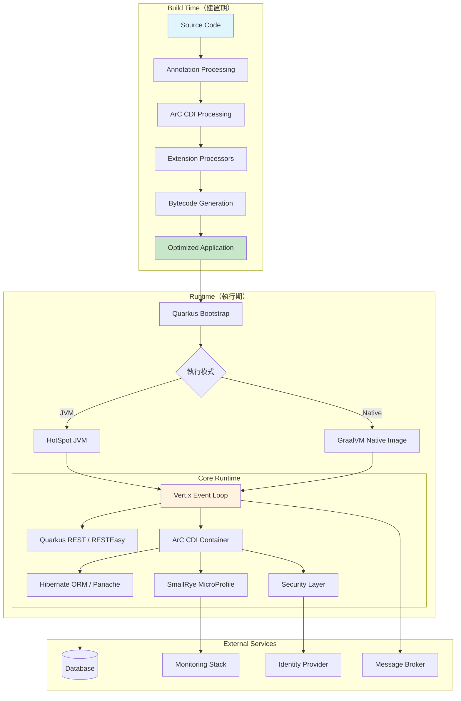

### 2.12 實務注意事項

> **建議**：理解 Build Time Optimization 是學習 Quarkus 的關鍵。許多在其他框架中可行的動態技巧（如執行期動態註冊 Bean、反射式配置載入）在 Quarkus 中需要改用編譯期擴展或配置宣告方式。
>
> **注意**：選擇 Extension 時務必確認其成熟度標籤。在生產環境中優先採用 Stable 標籤的 Extension。若需使用 Preview 或 Experimental Extension，需評估風險並準備降級方案。

---

## 3. 團隊建立與角色分工

### 3.1 導入 Quarkus 技術團隊的建議組成

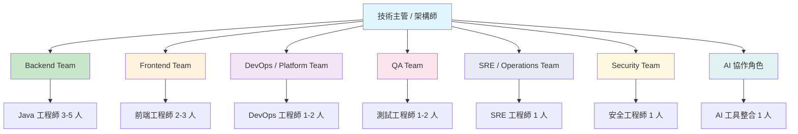

### 3.2 各團隊角色與職責

| 角色 | 主要職責 | 與 Quarkus 相關技能 |
|------|----------|-------------------|
| **Backend Team** | API 開發、業務邏輯、資料存取 | Quarkus REST、CDI、Panache、Messaging |
| **Frontend Team** | UI 開發、前端框架 | 與 Quarkus REST API 整合、OpenAPI 消費 |
| **DevOps / Platform Team** | CI/CD、容器化、K8s 管理 | Quarkus 容器建置、Kubernetes Extension、GitHub Actions |
| **QA Team** | 測試策略、自動化測試 | @QuarkusTest、Continuous Testing、Testcontainers |
| **SRE / Operations Team** | 系統可靠度、監控、維運 | Health Check、Micrometer、OpenTelemetry、管理介面 |
| **Security Team** | 安全設計、滲透測試、合規 | OIDC、JWT RBAC、Keycloak 整合、安全掃描 |

### 3.3 AI 協作角色

在現代開發團隊中，AI 工具已成為重要的協作夥伴：

| AI 工具 | 協作場景 |
|---------|---------|
| **GitHub Copilot** | 程式碼自動補全、Quarkus 樣板程式碼生成、單元測試生成 |
| **Claude / ChatGPT** | 架構設計討論、Code Review、技術文件撰寫 |
| **Quarkus Agent MCP** | 官方 MCP Server，讓 AI Agents 自動建立與管理 Quarkus 應用 |
| **Dev Assistant** | Quarkus Dev UI 內建 AI 助手，提供即時開發指引 |

> **注意**：AI 工具產生的程式碼必須經過 Code Review 與測試驗證，不可直接用於生產環境。

### 3.4 技能矩陣

| 技能領域 | 初階 | 中階 | 進階 |
|---------|------|------|------|
| **Java** | Java 17+ 語法、Lambda | Stream API、Generics | Virtual Threads、Records、Pattern Matching |
| **Quarkus 核心** | REST Endpoint、CDI、配置 | Panache、Messaging、Security | Extension 開發、Build Time 機制 |
| **雲原生** | Docker 基礎、容器概念 | Kubernetes 部署、Helm | Operator Pattern、Service Mesh |
| **可觀測性** | 日誌查看 | Health Check、Metrics | OpenTelemetry 分散式追蹤、告警 |
| **安全** | 基礎認證概念 | JWT、OAuth2 流程 | OIDC/Keycloak 整合、OWASP 防護 |
| **Reactive** | 基本概念 | Mutiny Uni/Multi | Context Propagation、效能調校 |

### 3.5 團隊學習路線圖

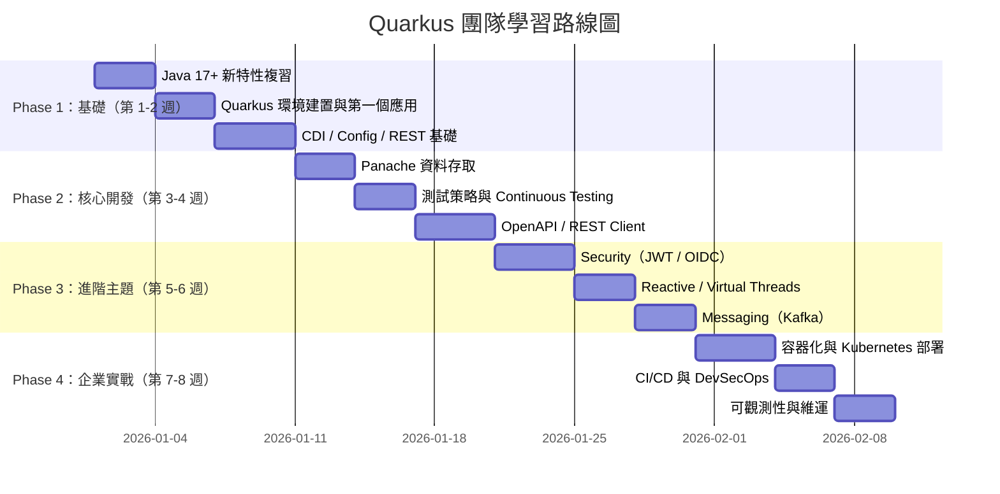

### 3.6 Code Review 與技術治理方式

**Code Review 檢查清單（Quarkus 特定）：**

1. ☐ 是否使用 `quarkus-rest` 而非 `quarkus-resteasy`
2. ☐ Bean Scope 是否正確（避免不必要的 `@Dependent`）
3. ☐ 配置是否使用 `@ConfigMapping` 而非散落的 `@ConfigProperty`
4. ☐ 是否有適當的錯誤處理（`@ServerExceptionMapper`）
5. ☐ 敏感資訊是否從程式碼中移除（使用配置或 Vault）
6. ☐ 是否有對應的測試（`@QuarkusTest` 或單元測試）
7. ☐ API 是否有 OpenAPI 文件註解
8. ☐ 日誌是否使用適當等級（避免在迴圈中使用 DEBUG）
9. ☐ 資料庫查詢是否有 N+1 問題
10. ☐ 是否正確處理 Transaction 邊界

**技術治理機制：**

- **架構決策紀錄（ADR）**：重大技術決策需撰寫 ADR 文件
- **Extension 白名單**：團隊統一管理允許使用的 Extension 清單
- **Parent POM 管理**：透過 Parent POM 統一依賴版本與建置設定
- **Checkstyle / SpotBugs**：自動化程式碼品質檢查
- **SonarQube Gate**：PR 合併前必須通過品質閘門

### 3.7 實務注意事項

> **建議**：初次導入 Quarkus 的團隊，建議指派 1-2 位資深工程師擔任「技術先鋒」（Tech Lead），先行深入學習後帶領團隊逐步上手。
>
> **注意**：團隊學習不應只關注 Quarkus 框架本身，雲原生相關技能（Docker、Kubernetes、可觀測性）同等重要。

---

## 4. 開發環境與工具鏈建置

### 4.1 JDK 建議版本

| JDK 版本 | 建議 | 說明 |
|---------|------|------|
| **Java 21 LTS** | ✅ 生產推薦 | 長期支援版本，Virtual Threads 正式版，Quarkus 完整支援 |
| **Java 17 LTS** | ✅ 最低要求 | Quarkus 3.x 最低支援版本 |
| **Java 25** | ⚠️ 評估中 | 最新版本，Quarkus 基本相容，建議等待官方完整驗證 |

**推薦 JDK 發行版：**

- **Eclipse Temurin**（Adoptium）：社群首選，開源免費
- **Amazon Corretto**：AWS 環境推薦
- **Red Hat Build of OpenJDK**：Red Hat 生態推薦
- **GraalVM CE / Mandrel**：需要 Native Image 時使用

### 4.2 Windows 環境安裝

```powershell
# 1. 安裝 JDK 21（使用 winget）
winget install EclipseAdoptium.Temurin.21.JDK

# 2. 安裝 Maven
winget install Apache.Maven

# 3. 安裝 Quarkus CLI（透過 JBang）
iex "& { $(iwr https://ps.jbang.dev) } trust add https://repo1.maven.org/maven2/io/quarkus/quarkus-cli/"
iex "& { $(iwr https://ps.jbang.dev) } app install --fresh --force quarkus@quarkusio"

# 4. 驗證安裝
java -version
mvn -version
quarkus version

# 5. 安裝 Docker Desktop
winget install Docker.DockerDesktop
```

### 4.3 Linux 環境安裝

```bash
# 1. 安裝 JDK 21（Ubuntu/Debian）
sudo apt update
sudo apt install -y temurin-21-jdk

# 或使用 SDKMAN!
curl -s "https://get.sdkman.io" | bash
source "$HOME/.sdkman/bin/sdkman-init.sh"
sdk install java 21.0.4-tem

# 2. 安裝 Maven
sdk install maven

# 3. 安裝 Quarkus CLI
## 方式一：JBang
curl -Ls https://sh.jbang.dev | bash -s - trust add https://repo1.maven.org/maven2/io/quarkus/quarkus-cli/
curl -Ls https://sh.jbang.dev | bash -s - app install --fresh --force quarkus@quarkusio

## 方式二：SDKMAN!
sdk install quarkus

# 4. 安裝 Docker
sudo apt install -y docker.io
sudo usermod -aG docker $USER

# 5. 驗證
java -version
mvn -version
quarkus version
docker --version
```

### 4.4 macOS 環境安裝

```bash
# 1. 使用 Homebrew 安裝
brew install --cask temurin@21
brew install maven

# 2. 安裝 Quarkus CLI
brew install quarkusio/tap/quarkus

# 3. 安裝 Docker Desktop
brew install --cask docker

# 4. 驗證
java -version
mvn -version
quarkus version
```

### 4.5 Maven / Gradle

Quarkus 主要支援 Maven 與 Gradle 兩種建置工具。**本手冊以 Maven 為主**，必要時補充 Gradle。

**Maven 最低版本要求**：3.9.x+

**基本 `pom.xml` 結構：**

```xml
<project>
    <modelVersion>4.0.0</modelVersion>
    <groupId>com.example</groupId>
    <artifactId>my-quarkus-app</artifactId>
    <version>1.0.0-SNAPSHOT</version>

    <properties>
        <compiler-plugin.version>3.14.1</compiler-plugin.version>
        <maven.compiler.release>21</maven.compiler.release>
        <project.build.sourceEncoding>UTF-8</project.build.sourceEncoding>
        <quarkus.platform.artifact-id>quarkus-bom</quarkus.platform.artifact-id>
        <quarkus.platform.group-id>io.quarkus.platform</quarkus.platform.group-id>
        <quarkus.platform.version>3.35.3</quarkus.platform.version>
        <surefire-plugin.version>3.5.2</surefire-plugin.version>
    </properties>

    <dependencyManagement>
        <dependencies>
            <dependency>
                <groupId>${quarkus.platform.group-id}</groupId>
                <artifactId>${quarkus.platform.artifact-id}</artifactId>
                <version>${quarkus.platform.version}</version>
                <type>pom</type>
                <scope>import</scope>
            </dependency>
        </dependencies>
    </dependencyManagement>

    <dependencies>
        <dependency>
            <groupId>io.quarkus</groupId>
            <artifactId>quarkus-rest</artifactId>
        </dependency>
        <dependency>
            <groupId>io.quarkus</groupId>
            <artifactId>quarkus-rest-jackson</artifactId>
        </dependency>
        <dependency>
            <groupId>io.quarkus</groupId>
            <artifactId>quarkus-arc</artifactId>
        </dependency>
        <!-- 測試 -->
        <dependency>
            <groupId>io.quarkus</groupId>
            <artifactId>quarkus-junit5</artifactId>
            <scope>test</scope>
        </dependency>
        <dependency>
            <groupId>io.rest-assured</groupId>
            <artifactId>rest-assured</artifactId>
            <scope>test</scope>
        </dependency>
    </dependencies>

    <build>
        <plugins>
            <plugin>
                <groupId>${quarkus.platform.group-id}</groupId>
                <artifactId>quarkus-maven-plugin</artifactId>
                <version>${quarkus.platform.version}</version>
                <extensions>true</extensions>
                <executions>
                    <execution>
                        <goals>
                            <goal>build</goal>
                            <goal>generate-code</goal>
                            <goal>generate-code-tests</goal>
                            <goal>native-image-agent</goal>
                        </goals>
                    </execution>
                </executions>
            </plugin>
            <plugin>
                <artifactId>maven-compiler-plugin</artifactId>
                <version>${compiler-plugin.version}</version>
                <configuration>
                    <parameters>true</parameters>
                </configuration>
            </plugin>
            <plugin>
                <artifactId>maven-surefire-plugin</artifactId>
                <version>${surefire-plugin.version}</version>
                <configuration>
                    <systemPropertyVariables>
                        <java.util.logging.manager>
                            org.jboss.logmanager.LogManager
                        </java.util.logging.manager>
                    </systemPropertyVariables>
                </configuration>
            </plugin>
        </plugins>
    </build>

    <profiles>
        <profile>
            <id>native</id>
            <activation>
                <property>
                    <name>native</name>
                </property>
            </activation>
            <properties>
                <quarkus.native.enabled>true</quarkus.native.enabled>
            </properties>
        </profile>
    </profiles>
</project>
```

### 4.6 Quarkus CLI

Quarkus CLI 是官方提供的命令列工具，簡化專案建立與管理：

```bash
# 安裝確認
quarkus version

# 建立新專案
quarkus create app com.example:my-app

# 啟動 Dev Mode
quarkus dev

# 管理 Extension
quarkus extension add quarkus-hibernate-orm-panache
quarkus extension list --installed

# 建置
quarkus build

# Native 建置
quarkus build --native

# 更新 Quarkus 版本
quarkus update
```

### 4.7 Quarkus CLI 與 Maven Plugin 的分工

| 操作 | Quarkus CLI | Maven Plugin |
|------|------------|--------------|
| **建立專案** | `quarkus create app` | `mvn io.quarkus:quarkus-maven-plugin:create` |
| **Dev Mode** | `quarkus dev` | `mvn quarkus:dev` |
| **建置** | `quarkus build` | `mvn package` |
| **Native 建置** | `quarkus build --native` | `mvn package -Pnative` |
| **新增 Extension** | `quarkus extension add` | `mvn quarkus:add-extension` |
| **版本升級** | `quarkus update` | `mvn quarkus:update` |
| **適用場景** | 日常開發、快速操作 | CI/CD Pipeline、精細控制 |

> **建議**：日常開發使用 Quarkus CLI 更便捷；CI/CD Pipeline 中使用 Maven Plugin（`mvn` 指令）更可靠且可重現。

### 4.8 VS Code / IntelliJ IDEA

**VS Code 推薦擴充套件：**

| 擴充套件 | 用途 |
|---------|------|
| Extension Pack for Java | Java 基礎開發支援 |
| Quarkus Tools | Quarkus 專案支援、配置自動補全 |
| Language Support for Java (Red Hat) | Java 語言服務 |
| Debugger for Java | Java 除錯器 |
| Maven for Java | Maven 整合 |
| YAML | YAML 語法支援 |

**IntelliJ IDEA 推薦：**

- IntelliJ IDEA Ultimate 或 Community Edition
- 安裝 Quarkus Tools 插件
- 安裝 JBang 插件

**Dev Mode 除錯：**

Quarkus Dev Mode 預設啟用遠端除錯，監聽 port 5005：

```json
// VS Code launch.json
{
    "version": "0.2.0",
    "configurations": [
        {
            "type": "java",
            "name": "Attach to Quarkus",
            "request": "attach",
            "hostName": "localhost",
            "port": 5005
        }
    ]
}
```

### 4.9 Docker / Podman

Quarkus 支援 Docker 與 Podman 作為容器執行引擎：

```bash
# Docker
docker --version

# Podman（替代方案）
podman --version

# Quarkus 配置使用 Podman
quarkus.native.container-runtime=podman
```

> **注意**：Dev Services 功能需要容器執行引擎。Windows 環境推薦 Docker Desktop；Linux 環境可選擇 Docker 或 Podman。

### 4.10 Kubernetes / OpenShift 基礎工具

```bash
# kubectl
kubectl version --client

# oc（OpenShift CLI）
oc version

# Helm（K8s 套件管理）
helm version

# kind（本機 K8s 測試叢集）
kind create cluster --name quarkus-dev
```

### 4.11 常見安裝問題

| 問題 | 原因 | 解決方式 |
|------|------|----------|
| `quarkus` 指令找不到 | PATH 未更新 | 重新開啟終端機，或手動加入 JBang 路徑 |
| Maven 建置失敗 `OutOfMemoryError` | Maven JVM 記憶體不足 | 設定 `MAVEN_OPTS=-Xmx2g` |
| Dev Services 啟動失敗 | Docker 未啟動 | 啟動 Docker Desktop 或 Docker daemon |
| Native Build 找不到 GraalVM | `GRAALVM_HOME` 未設定 | 設定環境變數或使用容器建置 |
| Windows 上 JBang 安裝失敗 | 執行政策限制 | `Set-ExecutionPolicy -Scope CurrentUser -ExecutionPolicy RemoteSigned` |

### 4.12 實務注意事項

> **建議**：團隊應統一 JDK 版本與 Maven 版本，透過 `.sdkmanrc` 或 `.tool-versions` 檔案管理。搭配 Maven Wrapper（`mvnw`）確保建置環境一致性。
>
> **注意**：Quarkus CLI 安裝後首次使用可能需要下載依賴，在網路受限環境中應預先配置 Maven Mirror。

---

## 5. 建立第一個 Quarkus 專案

### 5.1 使用 Quarkus CLI 建立專案

```bash
# 建立基本 REST 應用
quarkus create app com.example:my-first-app \
    --extension='rest,rest-jackson' \
    --java=21

# 進入專案目錄
cd my-first-app
```

**互動式建立：**

```bash
quarkus create app
# 依提示輸入 groupId、artifactId、版本、Extension 等
```

**指定更多選項：**

```bash
quarkus create app com.example:order-service \
    --extension='rest,rest-jackson,hibernate-orm-panache,jdbc-postgresql,smallrye-health,smallrye-openapi' \
    --java=21 \
    --wrapper
```

### 5.2 使用 Maven 建立專案

```bash
mvn io.quarkus.platform:quarkus-maven-plugin:3.35.3:create \
    -DprojectGroupId=com.example \
    -DprojectArtifactId=my-first-app \
    -Dextensions='rest,rest-jackson' \
    -DjavaVersion=21
```

### 5.3 專案目錄結構說明

```
my-first-app/
├── .mvn/                           # Maven Wrapper 設定
│   └── wrapper/
├── src/
│   ├── main/
│   │   ├── docker/                 # Dockerfile 模板
│   │   │   ├── Dockerfile.jvm      # JVM 模式映像
│   │   │   ├── Dockerfile.legacy-jar
│   │   │   ├── Dockerfile.native   # Native 模式映像
│   │   │   └── Dockerfile.native-micro
│   │   ├── java/
│   │   │   └── com/example/
│   │   │       └── GreetingResource.java  # REST Endpoint
│   │   └── resources/
│   │       ├── application.properties     # 應用配置
│   │       └── META-INF/
│   │           └── resources/
│   │               └── index.html         # 靜態首頁
│   └── test/
│       └── java/
│           └── com/example/
│               ├── GreetingResourceTest.java      # REST 測試
│               └── GreetingResourceIT.java         # Native 整合測試
├── mvnw                            # Maven Wrapper (Unix)
├── mvnw.cmd                        # Maven Wrapper (Windows)
├── pom.xml                         # Maven 配置
└── README.md
```

### 5.4 啟動 Dev Mode

```bash
# 使用 Quarkus CLI
quarkus dev

# 或使用 Maven
./mvnw quarkus:dev
```

啟動後的輸出：

```
__  ____  __  _____   ___  __ ____  ______
 --/ __ \/ / / / _ | / _ \/ //_/ / / / __/
 -/ /_/ / /_/ / __ |/ , _/ ,< / /_/ /\ \
--\___\_\____/_/ |_/_/|_/_/|_|\____/___/
2026-05-15 10:00:00,000 INFO  [io.quarkus] (Quarkus Main Thread)
    my-first-app 1.0.0-SNAPSHOT on JVM (powered by Quarkus 3.35.3)
    started in 1.234s. Listening on: http://localhost:8080

Tests paused
Press [e] to edit command line args (currently ''),
      [r] to resume testing,
      [o] Toggle test output,
      [h] for more options>
```

Dev Mode 下的快捷鍵：

| 按鍵 | 功能 |
|------|------|
| `r` | 啟動 / 恢復 Continuous Testing |
| `o` | 切換測試輸出顯示 |
| `h` | 顯示所有快捷鍵 |
| `s` | 強制重啟 |
| `i` | 切換 Instrumentation Based Reload |
| `q` | 退出 Dev Mode |

### 5.5 Dev Mode 與 Production Mode 的差異

| 面向 | Dev Mode | Production Mode |
|------|----------|-----------------|
| **啟動指令** | `quarkus dev` / `mvn quarkus:dev` | `java -jar quarkus-run.jar` |
| **Live Coding** | ✅ 程式碼修改即時生效 | ❌ 需重新建置部署 |
| **Dev Services** | ✅ 自動啟動外部服務容器 | ❌ 需手動配置外部服務 |
| **Dev UI** | ✅ 可存取（`/q/dev-ui`） | ❌ 不可用 |
| **Continuous Testing** | ✅ 自動執行測試 | ❌ 需手動觸發 |
| **除錯** | ✅ 預設啟用 Debug Port 5005 | 需手動啟用 |
| **效能** | 非最佳（含除錯開銷） | 完整最佳化 |
| **Quarkus Profile** | `dev` | `prod`（預設） |
| **配置前綴** | `%dev.` | `%prod.`（或無前綴） |

> **重要**：永遠不要在生產環境使用 Dev Mode。Dev Mode 包含除錯功能與開發者工具，存在安全風險。

### 5.6 Live Coding 與 Hot Reload

Live Coding 是 Quarkus 最具特色的開發體驗功能。在 Dev Mode 下，當你修改 Java 原始碼、配置檔或資源檔後，只需發送一個 HTTP 請求或重新整理瀏覽器，Quarkus 會自動：

1. 偵測檔案變更
2. 重新編譯修改的類別
3. 重新載入應用
4. 回應請求

整個過程通常在 1 秒以內完成，無需手動重啟。

### 5.7 基本 REST Endpoint 與 JSON 回傳

**純文字回傳：**

```java
package com.example;

import jakarta.ws.rs.GET;
import jakarta.ws.rs.Path;
import jakarta.ws.rs.Produces;
import jakarta.ws.rs.core.MediaType;

@Path("/hello")
public class GreetingResource {

    @GET
    @Produces(MediaType.TEXT_PLAIN)
    public String hello() {
        return "Hello from Quarkus";
    }
}
```

**JSON 回傳：**

```java
package com.example;

import jakarta.ws.rs.GET;
import jakarta.ws.rs.Path;
import jakarta.ws.rs.Produces;
import jakarta.ws.rs.core.MediaType;

@Path("/api/greeting")
public class GreetingResource {

    @GET
    @Produces(MediaType.APPLICATION_JSON)
    public Greeting hello() {
        return new Greeting("Hello", "Quarkus");
    }

    public record Greeting(String message, String from) {}
}
```

驗證：

```bash
# 純文字
curl http://localhost:8080/hello

# JSON
curl http://localhost:8080/api/greeting
# 回傳: {"message":"Hello","from":"Quarkus"}
```

### 5.8 開發期常見操作

```bash
# 新增依賴（Extension）
quarkus extension add quarkus-hibernate-orm-panache

# 檢視已安裝 Extension
quarkus extension list --installed

# 執行測試
./mvnw test

# 建置 Uber JAR
./mvnw package -Dquarkus.package.jar.type=uber-jar

# 建置 Native Image（使用容器，無需本機 GraalVM）
./mvnw package -Pnative -Dquarkus.native.container-build=true

# 檢視配置文件
cat src/main/resources/application.properties
```

### 5.9 實務注意事項

> **建議**：開發階段務必善用 Dev Mode 的 Live Coding 與 Continuous Testing 功能，這是 Quarkus 最大的生產力優勢。
>
> **注意**：首次啟動 Dev Mode 時，若專案依賴 Database 相關 Extension，Quarkus 會透過 Dev Services 自動啟動資料庫容器，需確保 Docker 已啟動。

---

## 6. Quarkus 核心開發模式

### 6.1 CDI / Injection

CDI（Contexts and Dependency Injection）是 Quarkus 的核心依賴注入機制：

```java
// 定義服務
@ApplicationScoped
public class OrderService {

    @Inject
    OrderRepository orderRepository;

    @Inject
    NotificationService notificationService;

    @Transactional
    public Order createOrder(CreateOrderRequest request) {
        Order order = new Order();
        order.customerId = request.customerId();
        order.totalAmount = request.totalAmount();
        order.status = OrderStatus.PENDING;
        orderRepository.persist(order);
        notificationService.sendOrderConfirmation(order);
        return order;
    }
}
```

**注入方式：**

```java
// 欄位注入（最常用）
@Inject
MyService service;

// 建構子注入（推薦，便於測試）
public class MyResource {
    private final MyService service;

    public MyResource(MyService service) {
        this.service = service;
    }
}

// 方法注入
@Inject
void setService(MyService service) {
    this.service = service;
}
```

### 6.2 Bean Scope

| Scope | 生命週期 | 適用場景 |
|-------|---------|---------|
| `@ApplicationScoped` | 應用生命週期，單例 | 服務層、Repository、共用元件 |
| `@RequestScoped` | 單次 HTTP 請求 | 請求相關的暫存資料 |
| `@SessionScoped` | HTTP Session | Web Session 管理（較少使用） |
| `@Dependent` | 跟隨注入點的生命週期 | 預設，每次注入建立新實例 |
| `@Singleton` | 應用生命週期，單例 | 類似 `@ApplicationScoped` 但無代理 |

> **建議**：優先使用 `@ApplicationScoped`。它透過代理物件實現懶載入，與 `@Singleton` 的差別在於 `@ApplicationScoped` 建立代理物件，支援攔截器和 Scope 上下文。

### 6.3 Config 注入

```java
@ApplicationScoped
public class MyService {

    // 單一屬性注入
    @ConfigProperty(name = "greeting.message")
    String message;

    // 帶預設值
    @ConfigProperty(name = "greeting.suffix", defaultValue = "!")
    String suffix;

    // Optional 屬性
    @ConfigProperty(name = "greeting.prefix")
    Optional<String> prefix;
}
```

```properties
# application.properties
greeting.message=Hello
greeting.suffix=!!!
```

### 6.4 Config Mapping

對於結構化配置，推薦使用 `@ConfigMapping`：

```java
@ConfigMapping(prefix = "app.order")
public interface OrderConfig {
    String defaultCurrency();
    int maxItems();
    Duration timeout();
    Optional<String> prefix();

    // 巢狀配置
    NotificationConfig notification();

    interface NotificationConfig {
        boolean enabled();
        String template();
    }
}
```

```properties
# application.properties
app.order.default-currency=TWD
app.order.max-items=100
app.order.timeout=30S
app.order.notification.enabled=true
app.order.notification.template=order-confirmation
```

```java
// 使用
@ApplicationScoped
public class OrderService {

    @Inject
    OrderConfig config;

    public void process() {
        String currency = config.defaultCurrency(); // "TWD"
        int max = config.maxItems();                 // 100
        boolean notify = config.notification().enabled(); // true
    }
}
```

### 6.5 YAML 與 Properties 配置

Quarkus 支援 `application.properties`（預設）與 `application.yaml`（需新增 Extension）：

```bash
# 新增 YAML 支援
quarkus extension add quarkus-config-yaml
```

```yaml
# application.yaml
quarkus:
  http:
    port: 8080
  datasource:
    db-kind: postgresql
    jdbc:
      url: jdbc:postgresql://localhost:5432/mydb

app:
  order:
    default-currency: TWD
    max-items: 100
    notification:
      enabled: true
```

**Profile 配置（YAML）：**

```yaml
# 預設配置
quarkus:
  http:
    port: 8080

# Dev Profile
"%dev":
  quarkus:
    http:
      port: 8081
    datasource:
      jdbc:
        url: jdbc:postgresql://localhost:5432/devdb

# Test Profile
"%test":
  quarkus:
    datasource:
      jdbc:
        url: jdbc:postgresql://localhost:5432/testdb
```

### 6.6 Validation

```java
// 新增 Extension
// quarkus extension add quarkus-hibernate-validator

@Path("/api/orders")
public class OrderResource {

    @POST
    @Consumes(MediaType.APPLICATION_JSON)
    @Produces(MediaType.APPLICATION_JSON)
    public Response createOrder(@Valid CreateOrderRequest request) {
        // 驗證自動完成，無效請求回傳 400
        return Response.status(Status.CREATED)
                .entity(orderService.create(request))
                .build();
    }
}

public record CreateOrderRequest(
    @NotBlank(message = "客戶 ID 不可為空")
    String customerId,

    @NotNull(message = "金額不可為空")
    @DecimalMin(value = "0.01", message = "金額必須大於 0")
    BigDecimal amount,

    @Size(min = 1, max = 100, message = "商品數量必須在 1-100 之間")
    List<@Valid OrderItem> items
) {}

public record OrderItem(
    @NotBlank String productId,
    @Min(1) int quantity
) {}
```

### 6.7 Exception Handling

Quarkus REST 提供 `@ServerExceptionMapper` 進行統一錯誤處理：

```java
@Path("/api")
public class ApiResource {

    // 處理特定例外
    @ServerExceptionMapper
    public Response handleNotFoundException(NotFoundException e) {
        return Response.status(Status.NOT_FOUND)
                .entity(new ErrorResponse("NOT_FOUND", e.getMessage()))
                .build();
    }

    // 處理驗證例外
    @ServerExceptionMapper
    public Response handleConstraintViolation(ConstraintViolationException e) {
        List<String> errors = e.getConstraintViolations().stream()
                .map(v -> v.getPropertyPath() + ": " + v.getMessage())
                .toList();
        return Response.status(Status.BAD_REQUEST)
                .entity(new ErrorResponse("VALIDATION_ERROR", errors))
                .build();
    }

    public record ErrorResponse(String code, Object details) {}
}
```

**全域錯誤處理器：**

```java
@Provider
public class GlobalExceptionMapper {

    private static final Logger LOG = Logger.getLogger(GlobalExceptionMapper.class);

    @ServerExceptionMapper
    public Response handleException(Exception e) {
        LOG.error("Unexpected error", e);
        return Response.status(Status.INTERNAL_SERVER_ERROR)
                .entity(new ErrorResponse("INTERNAL_ERROR", "系統內部錯誤，請聯繫管理員"))
                .build();
    }

    public record ErrorResponse(String code, String message) {}
}
```

### 6.8 Logging

Quarkus 使用 JBoss LogManager 作為日誌框架，支援 `java.util.logging`、SLF4J 與 JBoss Logging：

```java
import org.jboss.logging.Logger;

@ApplicationScoped
public class OrderService {

    private static final Logger LOG = Logger.getLogger(OrderService.class);

    public Order createOrder(CreateOrderRequest request) {
        LOG.infof("Creating order for customer: %s", request.customerId());
        // ...
        LOG.debugf("Order created: %s", order.id);
        return order;
    }
}
```

```properties
# application.properties

# 全域日誌等級
quarkus.log.level=INFO

# 特定套件日誌等級
quarkus.log.category."com.example".level=DEBUG
quarkus.log.category."org.hibernate.SQL".level=DEBUG

# 日誌格式
quarkus.log.console.format=%d{yyyy-MM-dd HH:mm:ss,SSS} %-5p [%c{3.}] (%t) %s%e%n

# JSON 格式日誌（適合容器化環境）
quarkus.log.console.json=true
```

### 6.9 Lifecycle

```java
@ApplicationScoped
public class AppLifecycle {

    private static final Logger LOG = Logger.getLogger(AppLifecycle.class);

    void onStart(@Observes StartupEvent ev) {
        LOG.info("應用程式啟動完成");
    }

    void onStop(@Observes ShutdownEvent ev) {
        LOG.info("應用程式正在關閉");
    }
}
```

### 6.10 Scheduler

```java
// 新增 Extension: quarkus-scheduler

@ApplicationScoped
public class ScheduledTasks {

    private static final Logger LOG = Logger.getLogger(ScheduledTasks.class);

    // 每 10 秒執行一次
    @Scheduled(every = "10s")
    void cleanupExpiredSessions() {
        LOG.info("清理過期 Session");
    }

    // 使用 Cron 表達式，每天凌晨 2 點
    @Scheduled(cron = "0 0 2 * * ?")
    void dailyReport() {
        LOG.info("生成每日報表");
    }

    // 可透過配置控制間隔
    @Scheduled(every = "{app.cleanup.interval}")
    void configurableTask() {
        LOG.info("可配置間隔的排程任務");
    }
}
```

```properties
app.cleanup.interval=30s
```

### 6.11 Qute 模板引擎

Qute 是 Quarkus 內建的模板引擎，主要用於伺服器端渲染（SSR）場景：

```java
// Extension: quarkus-rest-qute

@Path("/pages")
public class PageResource {

    @Inject
    Template hello; // 自動對應 src/main/resources/templates/hello.html

    @GET
    @Path("/{name}")
    @Produces(MediaType.TEXT_HTML)
    public TemplateInstance get(@PathParam("name") String name) {
        return hello.data("name", name);
    }
}
```

```html
<!-- src/main/resources/templates/hello.html -->
<!DOCTYPE html>
<html>
<head><title>Hello</title></head>
<body>
    <h1>Hello, {name}!</h1>
</body>
</html>
```

> **注意**：對於前後端分離的企業級 Web Application，Qute 的主要價值在於 Email 模板、PDF 生成等伺服器端渲染場景，而非前端 UI。前端 UI 建議使用 Vue、React 或 Angular 等前端框架。

### 6.12 實務注意事項

> **建議**：優先使用 `@ConfigMapping` 管理結構化配置，而非大量散落的 `@ConfigProperty`。這有助於配置的集中管理與類型安全。
>
> **注意**：Quarkus 的 CDI 實作（ArC）在建置期進行 Bean 發現，因此所有 Bean 必須在編譯時可見。動態註冊 Bean 需透過 `@BuildStep`（Extension 開發）或 CDI `@Produces` 方法。

---

## 7. Web Application 開發實戰

### 7.1 Quarkus REST API 開發

Quarkus REST（原 RESTEasy Reactive）是建構 RESTful API 的核心框架：

```java
@Path("/api/v1/products")
@Produces(MediaType.APPLICATION_JSON)
@Consumes(MediaType.APPLICATION_JSON)
public class ProductResource {

    @Inject
    ProductService productService;

    @GET
    public List<ProductDTO> listAll() {
        return productService.listAll();
    }

    @GET
    @Path("/{id}")
    public ProductDTO getById(@PathParam("id") Long id) {
        return productService.findById(id)
                .orElseThrow(() -> new NotFoundException("Product not found: " + id));
    }

    @POST
    public Response create(@Valid CreateProductRequest request) {
        ProductDTO created = productService.create(request);
        URI location = URI.create("/api/v1/products/" + created.id());
        return Response.created(location).entity(created).build();
    }

    @PUT
    @Path("/{id}")
    public ProductDTO update(@PathParam("id") Long id,
                             @Valid UpdateProductRequest request) {
        return productService.update(id, request);
    }

    @DELETE
    @Path("/{id}")
    public Response delete(@PathParam("id") Long id) {
        productService.delete(id);
        return Response.noContent().build();
    }
}
```

### 7.2 CRUD 範例

**Entity：**

```java
@Entity
@Table(name = "products")
public class Product extends PanacheEntity {

    @Column(nullable = false)
    public String name;

    @Column(length = 1000)
    public String description;

    @Column(nullable = false, precision = 10, scale = 2)
    public BigDecimal price;

    @Column(nullable = false)
    public String category;

    @Column(name = "created_at", nullable = false, updatable = false)
    public LocalDateTime createdAt;

    @Column(name = "updated_at")
    public LocalDateTime updatedAt;

    @PrePersist
    void onCreate() {
        createdAt = LocalDateTime.now();
        updatedAt = createdAt;
    }

    @PreUpdate
    void onUpdate() {
        updatedAt = LocalDateTime.now();
    }
}
```

**Service：**

```java
@ApplicationScoped
public class ProductService {

    @Inject
    ProductRepository repository;

    public List<ProductDTO> listAll() {
        return repository.listAll().stream()
                .map(this::toDTO)
                .toList();
    }

    public Optional<ProductDTO> findById(Long id) {
        return repository.findByIdOptional(id)
                .map(this::toDTO);
    }

    @Transactional
    public ProductDTO create(CreateProductRequest request) {
        Product product = new Product();
        product.name = request.name();
        product.description = request.description();
        product.price = request.price();
        product.category = request.category();
        repository.persist(product);
        return toDTO(product);
    }

    @Transactional
    public ProductDTO update(Long id, UpdateProductRequest request) {
        Product product = repository.findByIdOptional(id)
                .orElseThrow(() -> new NotFoundException("Product not found: " + id));
        product.name = request.name();
        product.description = request.description();
        product.price = request.price();
        product.category = request.category();
        return toDTO(product);
    }

    @Transactional
    public void delete(Long id) {
        repository.deleteById(id);
    }

    private ProductDTO toDTO(Product product) {
        return new ProductDTO(
            product.id, product.name, product.description,
            product.price, product.category,
            product.createdAt, product.updatedAt
        );
    }
}
```

**DTO：**

```java
public record ProductDTO(
    Long id,
    String name,
    String description,
    BigDecimal price,
    String category,
    LocalDateTime createdAt,
    LocalDateTime updatedAt
) {}

public record CreateProductRequest(
    @NotBlank String name,
    String description,
    @NotNull @DecimalMin("0.01") BigDecimal price,
    @NotBlank String category
) {}

public record UpdateProductRequest(
    @NotBlank String name,
    String description,
    @NotNull @DecimalMin("0.01") BigDecimal price,
    @NotBlank String category
) {}
```

### 7.3 DTO / Entity 分離

**為什麼要分離：**

- **安全性**：避免直接暴露資料庫結構
- **彈性**：API 回應格式可獨立於資料庫結構演進
- **控制**：精確控制哪些欄位對外暴露
- **版本化**：不同 API 版本可有不同 DTO

### 7.4 Pagination / Sorting / Filtering

```java
@GET
public PaginatedResponse<ProductDTO> listProducts(
        @QueryParam("page") @DefaultValue("0") int page,
        @QueryParam("size") @DefaultValue("20") int size,
        @QueryParam("sort") @DefaultValue("createdAt") String sort,
        @QueryParam("direction") @DefaultValue("desc") String direction,
        @QueryParam("category") String category,
        @QueryParam("search") String search) {

    PanacheQuery<Product> query;

    if (category != null && search != null) {
        query = Product.find("category = ?1 and name like ?2",
                Sort.by(sort).direction(
                    "asc".equalsIgnoreCase(direction) ? Direction.Ascending : Direction.Descending),
                category, "%" + search + "%");
    } else if (category != null) {
        query = Product.find("category", Sort.by(sort), category);
    } else {
        query = Product.findAll(Sort.by(sort));
    }

    List<ProductDTO> items = query.page(page, size).list().stream()
            .map(this::toDTO)
            .toList();

    return new PaginatedResponse<>(
        items,
        query.count(),
        page,
        size
    );
}

public record PaginatedResponse<T>(
    List<T> items,
    long totalCount,
    int page,
    int size
) {
    public int totalPages() {
        return (int) Math.ceil((double) totalCount / size);
    }
}
```

### 7.5 OpenAPI / Swagger UI

```bash
# 新增 Extension
quarkus extension add quarkus-smallrye-openapi
```

```java
@Path("/api/v1/products")
@Tag(name = "Product", description = "商品管理 API")
@Produces(MediaType.APPLICATION_JSON)
@Consumes(MediaType.APPLICATION_JSON)
public class ProductResource {

    @GET
    @Operation(summary = "取得商品列表", description = "支援分頁、排序與篩選")
    @APIResponse(responseCode = "200", description = "成功取得商品列表")
    public PaginatedResponse<ProductDTO> listProducts(
            @Parameter(description = "頁碼，從 0 開始") @QueryParam("page") @DefaultValue("0") int page,
            @Parameter(description = "每頁筆數") @QueryParam("size") @DefaultValue("20") int size) {
        // ...
    }

    @POST
    @Operation(summary = "建立商品")
    @APIResponse(responseCode = "201", description = "商品建立成功")
    @APIResponse(responseCode = "400", description = "請求資料驗證失敗")
    public Response create(@Valid CreateProductRequest request) {
        // ...
    }
}
```

```properties
# application.properties
quarkus.smallrye-openapi.info-title=Product Service API
quarkus.smallrye-openapi.info-version=1.0.0
quarkus.smallrye-openapi.info-description=商品管理服務 RESTful API

# Swagger UI（僅 dev/test 環境啟用）
quarkus.swagger-ui.always-include=false
%dev.quarkus.swagger-ui.always-include=true
```

存取路徑：
- OpenAPI 規格：`http://localhost:8080/q/openapi`
- Swagger UI：`http://localhost:8080/q/swagger-ui`

### 7.6 REST Client

```java
// Extension: quarkus-rest-client-jackson

@Path("/api")
@RegisterRestClient(configKey = "external-api")
public interface ExternalApiClient {

    @GET
    @Path("/users/{id}")
    UserDTO getUser(@PathParam("id") Long id);

    @POST
    @Path("/notifications")
    @Consumes(MediaType.APPLICATION_JSON)
    void sendNotification(NotificationRequest request);
}

// 使用
@ApplicationScoped
public class UserService {

    @RestClient
    ExternalApiClient apiClient;

    public UserDTO getExternalUser(Long id) {
        return apiClient.getUser(id);
    }
}
```

```properties
# application.properties
quarkus.rest-client.external-api.url=https://api.example.com
quarkus.rest-client.external-api.scope=jakarta.inject.Singleton
quarkus.rest-client.external-api.connect-timeout=5000
quarkus.rest-client.external-api.read-timeout=10000
```

### 7.7 錯誤回應設計

**統一錯誤回應格式：**

```java
public record ApiError(
    String code,
    String message,
    String path,
    LocalDateTime timestamp,
    List<FieldError> fieldErrors
) {
    public ApiError(String code, String message, String path) {
        this(code, message, path, LocalDateTime.now(), null);
    }

    public record FieldError(String field, String message) {}
}
```

### 7.8 API Versioning 策略

| 策略 | 範例 | 優點 | 缺點 |
|------|------|------|------|
| **URL Path**（推薦） | `/api/v1/products` | 清楚明確、易於路由 | URL 改變 |
| Header | `X-API-Version: 1` | URL 不變 | 不直觀、除錯困難 |
| Query Param | `?version=1` | 簡單 | 不夠正式 |
| Content Type | `Accept: application/vnd.api.v1+json` | RESTful | 複雜 |

### 7.9 與前端框架整合方式

在前後端分離架構中，Quarkus 作為後端 API 服務，前端可使用 Vue、React 或 Angular。若需即時通訊功能，可使用 `quarkus-websockets-next` Extension，提供 Annotation-based 的 WebSocket 開發體驗（官方有 Tutorial 與 Reference Guide）：

```properties
# CORS 設定（允許前端跨域存取）
quarkus.http.cors=true
quarkus.http.cors.origins=http://localhost:3000,http://localhost:5173
quarkus.http.cors.methods=GET,POST,PUT,DELETE,OPTIONS
quarkus.http.cors.headers=Content-Type,Authorization
quarkus.http.cors.exposed-headers=X-Total-Count
quarkus.http.cors.access-control-max-age=24H
```

### 7.10 前後端分離專案建議結構

```
project-root/
├── backend/                    # Quarkus 後端
│   ├── src/
│   ├── pom.xml
│   └── Dockerfile
├── frontend/                   # 前端框架（Vue/React/Angular）
│   ├── src/
│   ├── package.json
│   └── Dockerfile
├── docker-compose.yaml         # 本機開發環境
├── k8s/                        # Kubernetes 部署設定
│   ├── backend-deployment.yaml
│   └── frontend-deployment.yaml
└── README.md
```

### 7.11 實務注意事項

> **建議**：API 設計應遵循 RESTful 最佳實務：使用名詞而非動詞、正確使用 HTTP 方法與狀態碼、提供統一的錯誤回應格式。OpenAPI 規格應作為 API 契約，在前後端團隊間共享。
>
> **注意**：CORS 設定在生產環境中應嚴格限制允許的 Origins，不可使用 `*` 萬用字元。

---

## 8. 資料存取與交易管理

### 8.1 Datasource 設定

Quarkus 透過統一的 Datasource 配置模型管理資料庫連線：

```properties
# application.properties — PostgreSQL 範例
quarkus.datasource.db-kind=postgresql
quarkus.datasource.username=myuser
quarkus.datasource.password=mypassword
quarkus.datasource.jdbc.url=jdbc:postgresql://localhost:5432/mydb
quarkus.datasource.jdbc.max-size=20
quarkus.datasource.jdbc.min-size=5

# 多資料來源
quarkus.datasource."orders".db-kind=postgresql
quarkus.datasource."orders".jdbc.url=jdbc:postgresql://localhost:5432/ordersdb
quarkus.datasource."orders".username=orderuser
quarkus.datasource."orders".password=orderpass

# Hibernate ORM
quarkus.hibernate-orm.database.generation=validate
quarkus.hibernate-orm.log.sql=true

# Dev Profile — 使用 Dev Services，無需手動配置
%dev.quarkus.hibernate-orm.database.generation=drop-and-create
```

支援的資料庫：

| 資料庫 | Extension | db-kind |
|--------|-----------|---------|
| PostgreSQL | `quarkus-jdbc-postgresql` | `postgresql` |
| MySQL / MariaDB | `quarkus-jdbc-mysql` / `quarkus-jdbc-mariadb` | `mysql` / `mariadb` |
| Oracle | `quarkus-jdbc-oracle` | `oracle` |
| SQL Server | `quarkus-jdbc-mssql` | `mssql` |
| H2 | `quarkus-jdbc-h2` | `h2` |
| DB2 | `quarkus-jdbc-db2` | `db2` |

### 8.2 Hibernate ORM

Quarkus 對 Hibernate ORM 進行了深度整合，提供建置期最佳化：

```java
@Entity
@Table(name = "orders")
@NamedQuery(name = "Order.findByStatus",
            query = "FROM Order WHERE status = :status ORDER BY createdAt DESC")
public class Order {

    @Id
    @GeneratedValue(strategy = GenerationType.IDENTITY)
    public Long id;

    @Column(name = "customer_id", nullable = false)
    public String customerId;

    @Column(nullable = false, precision = 12, scale = 2)
    public BigDecimal totalAmount;

    @Enumerated(EnumType.STRING)
    @Column(nullable = false)
    public OrderStatus status;

    @OneToMany(mappedBy = "order", cascade = CascadeType.ALL, orphanRemoval = true)
    public List<OrderItem> items = new ArrayList<>();

    @Column(name = "created_at", nullable = false, updatable = false)
    public LocalDateTime createdAt;

    @Column(name = "updated_at")
    public LocalDateTime updatedAt;

    @PrePersist
    void onCreate() {
        createdAt = LocalDateTime.now();
        updatedAt = createdAt;
    }

    @PreUpdate
    void onUpdate() {
        updatedAt = LocalDateTime.now();
    }
}

@Entity
@Table(name = "order_items")
public class OrderItem {

    @Id
    @GeneratedValue(strategy = GenerationType.IDENTITY)
    public Long id;

    @ManyToOne(fetch = FetchType.LAZY)
    @JoinColumn(name = "order_id", nullable = false)
    public Order order;

    @Column(name = "product_id", nullable = false)
    public String productId;

    @Column(nullable = false)
    public int quantity;

    @Column(name = "unit_price", nullable = false, precision = 10, scale = 2)
    public BigDecimal unitPrice;
}

public enum OrderStatus {
    PENDING, CONFIRMED, SHIPPED, DELIVERED, CANCELLED
}
```

### 8.3 Panache

Panache 提供兩種資料存取模式：

#### Active Record 模式

```java
@Entity
public class Product extends PanacheEntity {

    public String name;
    public BigDecimal price;
    public String category;

    // 自訂查詢方法
    public static List<Product> findByCategory(String category) {
        return find("category", category).list();
    }

    public static List<Product> findExpensive(BigDecimal minPrice) {
        return find("price >= ?1 order by price desc", minPrice).list();
    }

    public static long countByCategory(String category) {
        return count("category", category);
    }

    public static PanacheQuery<Product> findByCategoryPaged(String category) {
        return find("category", category);
    }
}
```

#### Repository 模式（推薦用於企業應用）

```java
@ApplicationScoped
public class ProductRepository implements PanacheRepository<Product> {

    public List<Product> findByCategory(String category) {
        return find("category", category).list();
    }

    public Optional<Product> findByName(String name) {
        return find("name", name).firstResultOptional();
    }

    public List<Product> search(String keyword, Sort sort) {
        return find("name like ?1 or description like ?1",
                     sort, "%" + keyword + "%").list();
    }

    public PanacheQuery<Product> findAllPaged() {
        return findAll(Sort.by("createdAt").descending());
    }
}
```

### 8.4 Reactive SQL Client

對於高併發場景，可使用 Reactive SQL Client 取得非阻塞式資料存取：

```java
// Extension: quarkus-reactive-pg-client

@ApplicationScoped
public class ReactiveProductRepository {

    @Inject
    PgPool client;

    public Uni<List<Product>> findAll() {
        return client.query("SELECT id, name, price FROM products ORDER BY id")
                .execute()
                .onItem().transform(rowSet -> {
                    List<Product> products = new ArrayList<>();
                    for (Row row : rowSet) {
                        products.add(fromRow(row));
                    }
                    return products;
                });
    }

    public Uni<Product> findById(Long id) {
        return client.preparedQuery("SELECT id, name, price FROM products WHERE id = $1")
                .execute(Tuple.of(id))
                .onItem().transform(RowSet::iterator)
                .onItem().transform(iterator ->
                    iterator.hasNext() ? fromRow(iterator.next()) : null);
    }

    private Product fromRow(Row row) {
        Product p = new Product();
        p.id = row.getLong("id");
        p.name = row.getString("name");
        p.price = row.getBigDecimal("price");
        return p;
    }
}
```

### 8.5 Transaction 管理

```java
@ApplicationScoped
public class OrderService {

    @Inject
    OrderRepository orderRepository;

    @Inject
    InventoryService inventoryService;

    // 宣告式交易
    @Transactional
    public Order createOrder(CreateOrderRequest request) {
        Order order = new Order();
        order.customerId = request.customerId();
        order.status = OrderStatus.PENDING;

        for (var item : request.items()) {
            inventoryService.reserve(item.productId(), item.quantity());
            OrderItem orderItem = new OrderItem();
            orderItem.order = order;
            orderItem.productId = item.productId();
            orderItem.quantity = item.quantity();
            orderItem.unitPrice = item.unitPrice();
            order.items.add(orderItem);
        }

        order.totalAmount = order.items.stream()
                .map(i -> i.unitPrice.multiply(BigDecimal.valueOf(i.quantity)))
                .reduce(BigDecimal.ZERO, BigDecimal::add);

        orderRepository.persist(order);
        return order;
    }

    // 程式化交易控制
    @Inject
    UserTransaction userTransaction;

    public void manualTransactionExample() throws Exception {
        userTransaction.begin();
        try {
            // 業務邏輯
            userTransaction.commit();
        } catch (Exception e) {
            userTransaction.rollback();
            throw e;
        }
    }

    // 使用 QuarkusTransaction（簡化 API）
    public Order createOrderProgrammatic(CreateOrderRequest request) {
        return QuarkusTransaction.requiringNew().call(() -> {
            // 在新交易中執行
            Order order = new Order();
            // ...
            orderRepository.persist(order);
            return order;
        });
    }
}
```

### 8.6 Flyway

```bash
# Extension
quarkus extension add quarkus-flyway
```

```properties
# application.properties
quarkus.flyway.migrate-at-start=true
quarkus.flyway.locations=db/migration
quarkus.flyway.baseline-on-migrate=true
```

```sql
-- src/main/resources/db/migration/V1.0.0__create_products.sql
CREATE TABLE products (
    id BIGSERIAL PRIMARY KEY,
    name VARCHAR(255) NOT NULL,
    description TEXT,
    price DECIMAL(10, 2) NOT NULL,
    category VARCHAR(100) NOT NULL,
    created_at TIMESTAMP NOT NULL DEFAULT NOW(),
    updated_at TIMESTAMP
);

CREATE INDEX idx_products_category ON products(category);
```

```sql
-- src/main/resources/db/migration/V1.1.0__create_orders.sql
CREATE TABLE orders (
    id BIGSERIAL PRIMARY KEY,
    customer_id VARCHAR(100) NOT NULL,
    total_amount DECIMAL(12, 2) NOT NULL,
    status VARCHAR(20) NOT NULL,
    created_at TIMESTAMP NOT NULL DEFAULT NOW(),
    updated_at TIMESTAMP
);

CREATE TABLE order_items (
    id BIGSERIAL PRIMARY KEY,
    order_id BIGINT NOT NULL REFERENCES orders(id),
    product_id VARCHAR(100) NOT NULL,
    quantity INT NOT NULL,
    unit_price DECIMAL(10, 2) NOT NULL
);
```

### 8.7 Liquibase

```bash
quarkus extension add quarkus-liquibase
```

```properties
quarkus.liquibase.migrate-at-start=true
quarkus.liquibase.change-log=db/changelog/db.changelog-master.xml
```

```xml
<!-- src/main/resources/db/changelog/db.changelog-master.xml -->
<?xml version="1.0" encoding="UTF-8"?>
<databaseChangeLog
    xmlns="http://www.liquibase.org/xml/ns/dbchangelog"
    xmlns:xsi="http://www.w3.org/2001/XMLSchema-instance"
    xsi:schemaLocation="http://www.liquibase.org/xml/ns/dbchangelog
        http://www.liquibase.org/xml/ns/dbchangelog/dbchangelog-latest.xsd">

    <include file="db/changelog/changes/001-create-products.xml"/>
    <include file="db/changelog/changes/002-create-orders.xml"/>
</databaseChangeLog>
```

### 8.8 Redis

```bash
quarkus extension add quarkus-redis-client
```

```java
@ApplicationScoped
public class CacheService {

    @Inject
    RedisDataSource redis;

    public void cacheProduct(String key, String productJson) {
        redis.value(String.class).set(key, productJson);
    }

    public String getCachedProduct(String key) {
        return redis.value(String.class).get(key);
    }

    public void invalidate(String key) {
        redis.key().del(key);
    }
}
```

```properties
quarkus.redis.hosts=redis://localhost:6379
quarkus.redis.max-pool-size=10
```

### 8.9 MongoDB

```bash
quarkus extension add quarkus-mongodb-panache
```

```java
@MongoEntity(collection = "audit_logs")
public class AuditLog extends PanacheMongoEntity {

    public String action;
    public String userId;
    public String details;
    public Instant timestamp;

    public static List<AuditLog> findByUserId(String userId) {
        return find("userId", userId).list();
    }

    public static List<AuditLog> findRecent(int limit) {
        return find("order by timestamp desc").page(0, limit).list();
    }
}
```

```properties
quarkus.mongodb.connection-string=mongodb://localhost:27017
quarkus.mongodb.database=myapp
```

### 8.10 查詢最佳化

**避免 N+1 問題：**

```java
// ❌ N+1 問題
List<Order> orders = Order.listAll();
for (Order order : orders) {
    order.items.size(); // 每筆 Order 觸發一次查詢
}

// ✅ 使用 JOIN FETCH
List<Order> orders = Order.find(
    "SELECT o FROM Order o LEFT JOIN FETCH o.items"
).list();
```

**使用投影查詢：**

```java
// 只查詢需要的欄位
@RegisterForReflection
public record ProductSummary(Long id, String name, BigDecimal price) {}

List<ProductSummary> summaries = Product.find(
    "SELECT new com.example.ProductSummary(p.id, p.name, p.price) FROM Product p"
).project(ProductSummary.class).list();
```

### 8.11 連線池與效能考量

```properties
# Agroal 連線池設定
quarkus.datasource.jdbc.min-size=5
quarkus.datasource.jdbc.max-size=20
quarkus.datasource.jdbc.initial-size=5
quarkus.datasource.jdbc.acquisition-timeout=30S
quarkus.datasource.jdbc.idle-removal-interval=2M
quarkus.datasource.jdbc.max-lifetime=30M
quarkus.datasource.jdbc.leak-detection-interval=1M

# 啟用 SQL 日誌（僅開發環境）
%dev.quarkus.hibernate-orm.log.sql=true
%dev.quarkus.hibernate-orm.log.bind-parameters=true
```

### 8.12 RDBMS 與 NoSQL 的使用時機

| 場景 | 推薦 | 說明 |
|------|------|------|
| 交易性資料（訂單、帳務） | RDBMS（PostgreSQL） | 需要 ACID 保證 |
| 日誌 / 稽核紀錄 | MongoDB | 彈性 Schema、大量寫入 |
| 快取 / Session | Redis | 極快讀寫、TTL 支援 |
| 全文檢索 | Elasticsearch | 專為搜尋最佳化 |
| 關聯複雜的領域模型 | RDBMS | JOIN 查詢效能保證 |
| 半結構化資料 | MongoDB | JSON Document 模型 |

### 8.13 實務注意事項

> **建議**：生產環境務必使用 `quarkus.hibernate-orm.database.generation=validate` 或 `none`，並透過 Flyway / Liquibase 管理 Schema 變更。`drop-and-create` 僅限開發環境使用。
>
> **注意**：連線池大小需根據應用負載與資料庫連線上限進行調校。過大的連線池會消耗資料庫資源，過小則可能成為效能瓶頸。

---

## 9. Reactive 與高併發設計

### 9.1 Quarkus Reactive 架構

Quarkus 的底層基於 Eclipse Vert.x 事件驅動架構。即使開發者使用命令式程式碼，底層網路 I/O 仍由 Vert.x 的 Event Loop 非阻塞處理。

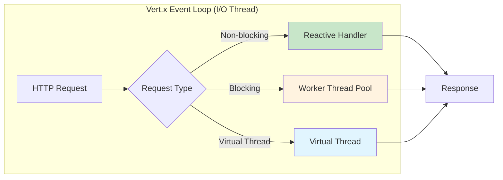

### 9.2 Imperative 與 Reactive 的差異

| 面向 | Imperative（命令式） | Reactive（響應式） |
|------|---------------------|-------------------|
| **程式風格** | 同步、阻塞 | 非同步、非阻塞 |
| **執行緒模型** | Worker Thread Pool | Event Loop |
| **適用場景** | CRUD、簡單業務邏輯 | 高併發 I/O、串流處理 |
| **學習曲線** | 低 | 較高 |
| **除錯難度** | 低 | 較高 |
| **Quarkus 預設** | `@Blocking`（Quarkus REST 自動偵測） | `Uni<T>` / `Multi<T>` 回傳值 |

```java
// 命令式（Imperative）— 在 Worker Thread 執行
@GET
@Path("/blocking")
public String blockingEndpoint() {
    // 同步呼叫，Quarkus 自動分派至 Worker Thread
    return someBlockingOperation();
}

// 響應式（Reactive）— 在 Event Loop 執行
@GET
@Path("/reactive")
public Uni<String> reactiveEndpoint() {
    return Uni.createFrom().item(() -> "Hello Reactive");
}
```

### 9.3 Mutiny 基礎

Mutiny 是 Quarkus 的響應式程式設計核心 API，提供兩種核心類型：

- **`Uni<T>`**：表示 0 或 1 個結果（類似 `CompletableFuture<T>`）
- **`Multi<T>`**：表示 0 到 N 個結果的串流（類似 `Flow.Publisher<T>`）

```java
// Uni 基本操作
@GET
@Path("/user/{id}")
public Uni<UserDTO> getUser(@PathParam("id") Long id) {
    return userRepository.findByIdReactive(id)
            .onItem().ifNotNull().transform(this::toDTO)
            .onItem().ifNull().failWith(() ->
                new NotFoundException("User not found: " + id));
}

// Uni 組合操作
@GET
@Path("/dashboard/{userId}")
public Uni<DashboardDTO> getDashboard(@PathParam("userId") Long userId) {
    Uni<User> userUni = userService.findById(userId);
    Uni<List<Order>> ordersUni = orderService.findByUserId(userId);
    Uni<AccountBalance> balanceUni = accountService.getBalance(userId);

    return Uni.combine().all()
            .unis(userUni, ordersUni, balanceUni)
            .with((user, orders, balance) ->
                new DashboardDTO(user, orders, balance));
}

// Multi 串流
@GET
@Path("/events")
@Produces(MediaType.SERVER_SENT_EVENTS)
@RestStreamElementType(MediaType.APPLICATION_JSON)
public Multi<Event> streamEvents() {
    return Multi.createFrom().ticks().every(Duration.ofSeconds(1))
            .onItem().transform(tick -> new Event("tick-" + tick, Instant.now()));
}
```

### 9.4 Context Propagation

在響應式程式碼中，某些上下文資訊（如 Security Context、Transaction Context）需要在不同執行緒之間傳播：

```bash
quarkus extension add quarkus-smallrye-context-propagation
```

```java
@ApplicationScoped
public class AsyncOrderService {

    @Inject
    ManagedExecutor managedExecutor;

    @Transactional
    public Uni<Order> processOrderAsync(Long orderId) {
        // Context Propagation 自動傳播 Transaction 與 Security Context
        return Uni.createFrom().item(() -> {
            Order order = Order.findById(orderId);
            order.status = OrderStatus.CONFIRMED;
            return order;
        }).runSubscriptionOn(managedExecutor);
    }
}
```

### 9.5 Virtual Threads 在 Quarkus 的使用方式

Java 21+ 的 Virtual Threads 提供第三種選擇：用命令式語法寫出接近響應式效能的程式碼。

```java
// Extension: 無需額外 Extension，Java 21+ 內建

@Path("/api/orders")
public class OrderResource {

    @GET
    @RunOnVirtualThread  // 在 Virtual Thread 上執行
    public List<OrderDTO> listOrders() {
        // 可以使用阻塞式 API，但不會佔用平台執行緒
        List<Order> orders = Order.listAll();
        return orders.stream().map(this::toDTO).toList();
    }
}
```

```properties
# 全域啟用 Virtual Threads（無需逐一標註 @RunOnVirtualThread）
quarkus.virtual-threads.enabled=true
```

### 9.6 適用情境與不適用情境

| 模式 | 適用 | 不適用 |
|------|------|--------|
| **Imperative** | 簡單 CRUD、低併發、CPU 密集型 | 高併發 I/O |
| **Reactive（Mutiny）** | 極高併發 I/O、串流處理、SSE | 簡單邏輯（過度工程） |
| **Virtual Threads** | 中高併發、希望命令式語法 | CPU 密集型、需精細控制執行緒 |

### 9.7 併發設計注意事項

1. **不要在 Event Loop 上執行阻塞操作**：這會導致整個 Event Loop 停滯
2. **Virtual Threads 不適合 CPU 密集型任務**：它們設計用於 I/O 等待，而非運算
3. **注意 `synchronized` 在 Virtual Threads 的行為**：`synchronized` 會 Pin Virtual Thread 到平台執行緒，應改用 `ReentrantLock`
4. **ThreadLocal 在 Virtual Threads 中的消耗**：大量 Virtual Threads 搭配 ThreadLocal 可能造成記憶體問題

### 9.8 效能與可讀性的取捨

| 策略 | 效能 | 可讀性 | 建議 |
|------|------|--------|------|
| 純 Imperative | ★★★ | ★★★★★ | 低併發場景優先選擇 |
| Virtual Threads | ★★★★ | ★★★★ | 中高併發場景的平衡選擇 |
| Reactive (Mutiny) | ★★★★★ | ★★★ | 極高併發或串流場景 |

### 9.9 實務注意事項

> **建議**：對大多數企業應用，Virtual Threads 是最佳的起始選擇——它保留了命令式程式碼的可讀性，同時獲得接近響應式的併發效能。只有在確認 Virtual Threads 無法滿足需求時，才考慮切換到 Mutiny Reactive 模式。
>
> **注意**：不要混合使用阻塞式 JDBC 驅動與 Event Loop。如果使用 Reactive SQL Client，整個呼叫鏈都應保持非阻塞。

---

## 10. Messaging 與整合

### 10.1 Kafka

```bash
quarkus extension add quarkus-messaging-kafka
```

**生產者：**

```java
@ApplicationScoped
public class OrderEventProducer {

    @Inject
    @Channel("order-events-out")
    Emitter<OrderEvent> emitter;

    public void sendOrderCreated(Order order) {
        OrderEvent event = new OrderEvent(
            order.id, "ORDER_CREATED", order.customerId, Instant.now()
        );
        emitter.send(Message.of(event)
            .withMetadata(Metadata.of(
                OutgoingKafkaRecordMetadata.<String>builder()
                    .withKey(order.id.toString())
                    .build()
            )));
    }
}
```

**消費者：**

```java
@ApplicationScoped
public class OrderEventConsumer {

    private static final Logger LOG = Logger.getLogger(OrderEventConsumer.class);

    @Incoming("order-events-in")
    public CompletionStage<Void> process(Message<OrderEvent> message) {
        OrderEvent event = message.getPayload();
        LOG.infof("Received order event: %s for order %d", event.type(), event.orderId());

        try {
            // 處理事件
            processEvent(event);
            return message.ack();
        } catch (Exception e) {
            LOG.error("Failed to process event", e);
            return message.nack(e);
        }
    }

    private void processEvent(OrderEvent event) {
        // 業務邏輯
    }
}
```

```properties
# application.properties
# 生產者
mp.messaging.outgoing.order-events-out.connector=smallrye-kafka
mp.messaging.outgoing.order-events-out.topic=order-events
mp.messaging.outgoing.order-events-out.value.serializer=io.quarkus.kafka.client.serialization.ObjectMapperSerializer

# 消費者
mp.messaging.incoming.order-events-in.connector=smallrye-kafka
mp.messaging.incoming.order-events-in.topic=order-events
mp.messaging.incoming.order-events-in.group.id=order-processor
mp.messaging.incoming.order-events-in.value.deserializer=com.example.OrderEventDeserializer
mp.messaging.incoming.order-events-in.auto.offset.reset=earliest
```

### 10.2 AMQP

```bash
quarkus extension add quarkus-messaging-amqp
```

```java
@ApplicationScoped
public class NotificationSender {

    @Inject
    @Channel("notifications")
    Emitter<NotificationMessage> emitter;

    public void send(String userId, String content) {
        emitter.send(new NotificationMessage(userId, content, Instant.now()));
    }
}

@ApplicationScoped
public class NotificationReceiver {

    @Incoming("notifications-in")
    public void receive(NotificationMessage message) {
        // 處理通知
    }
}
```

### 10.3 RabbitMQ

```bash
quarkus extension add quarkus-messaging-rabbitmq
```

```properties
# application.properties
rabbitmq-host=localhost
rabbitmq-port=5672
rabbitmq-username=guest
rabbitmq-password=guest

mp.messaging.outgoing.task-queue.connector=smallrye-rabbitmq
mp.messaging.outgoing.task-queue.exchange.name=tasks
mp.messaging.outgoing.task-queue.exchange.type=direct
```

### 10.4 Pulsar

```bash
quarkus extension add quarkus-messaging-pulsar
```

```properties
# application.properties
mp.messaging.outgoing.events-out.connector=smallrye-pulsar
mp.messaging.outgoing.events-out.serviceUrl=pulsar://localhost:6650
mp.messaging.outgoing.events-out.topic=events
```

### 10.5 gRPC

```bash
quarkus extension add quarkus-grpc
```

**Proto 定義：**

```protobuf
// src/main/proto/greeting.proto
syntax = "proto3";
package com.example;

option java_package = "com.example.grpc";

service GreetingService {
    rpc SayHello (HelloRequest) returns (HelloReply);
}

message HelloRequest {
    string name = 1;
}

message HelloReply {
    string message = 1;
}
```

**服務實作：**

```java
@GrpcService
public class GreetingGrpcService implements GreetingService {

    @Override
    public Uni<HelloReply> sayHello(HelloRequest request) {
        return Uni.createFrom().item(
            HelloReply.newBuilder()
                .setMessage("Hello, " + request.getName())
                .build()
        );
    }
}
```

### 10.6 Event-driven Architecture

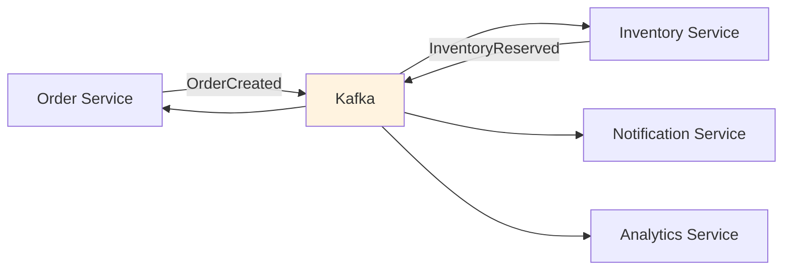

### 10.7 非同步處理模式

```java
// 使用 @Incoming 和 @Outgoing 建立處理管道
@ApplicationScoped
public class OrderPipeline {

    @Incoming("raw-orders")
    @Outgoing("validated-orders")
    public Order validateOrder(Order order) {
        if (order.totalAmount.compareTo(BigDecimal.ZERO) <= 0) {
            throw new IllegalArgumentException("Invalid order amount");
        }
        order.status = OrderStatus.VALIDATED;
        return order;
    }

    @Incoming("validated-orders")
    @Outgoing("enriched-orders")
    public Uni<Order> enrichOrder(Order order) {
        return customerService.getCustomer(order.customerId)
                .onItem().transform(customer -> {
                    order.customerName = customer.name();
                    return order;
                });
    }

    @Incoming("enriched-orders")
    public void processOrder(Order order) {
        // 最終處理
    }
}
```

### 10.8 典型整合架構

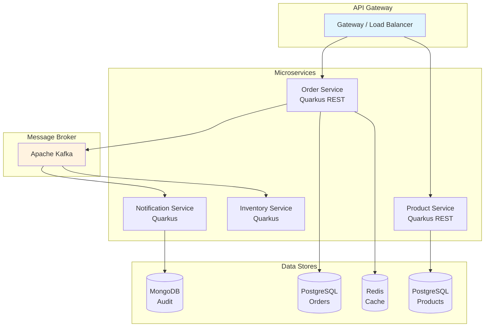

### 10.9 使用 Dev Services 的開發方式

Quarkus Dev Services 在 Dev Mode 下自動啟動 Kafka、RabbitMQ 等容器：

```properties
# 無需手動配置 Kafka 連線，Dev Services 自動處理
# %dev 環境下，只要有 quarkus-messaging-kafka Extension，
# Quarkus 就會自動啟動 Kafka 容器

# 自訂 Dev Services 設定（可選）
quarkus.kafka.devservices.port=9092
quarkus.kafka.devservices.topic-partitions.order-events=3
```

### 10.10 企業整合案例

| 整合場景 | 建議方案 | Quarkus Extension |
|---------|---------|-------------------|
| 訂單處理（高吞吐） | Kafka | `quarkus-messaging-kafka` |
| 工作佇列（任務分派） | RabbitMQ | `quarkus-messaging-rabbitmq` |
| 微服務間同步呼叫 | REST Client / gRPC | `quarkus-rest-client` / `quarkus-grpc` |
| 事件通知（低延遲） | AMQP | `quarkus-messaging-amqp` |
| 日誌串流 | Kafka | `quarkus-messaging-kafka` |
| IoT 資料收集 | Pulsar | `quarkus-messaging-pulsar` |

### 10.11 實務注意事項

> **建議**：微服務間的通訊優先考慮非同步 Messaging（Kafka / RabbitMQ），僅在需要同步回應時使用 REST Client / gRPC。非同步架構提供更好的解耦性與容錯能力。
>
> **注意**：消費者必須處理冪等性（Idempotency）。同一訊息可能被重複投遞，消費者應能安全地處理重複訊息而不產生副作用。

---

## 11. 安全性設計

### 11.1 Quarkus Security Overview

Quarkus Security 提供一個統一的安全框架，支援多種認證機制與授權策略：

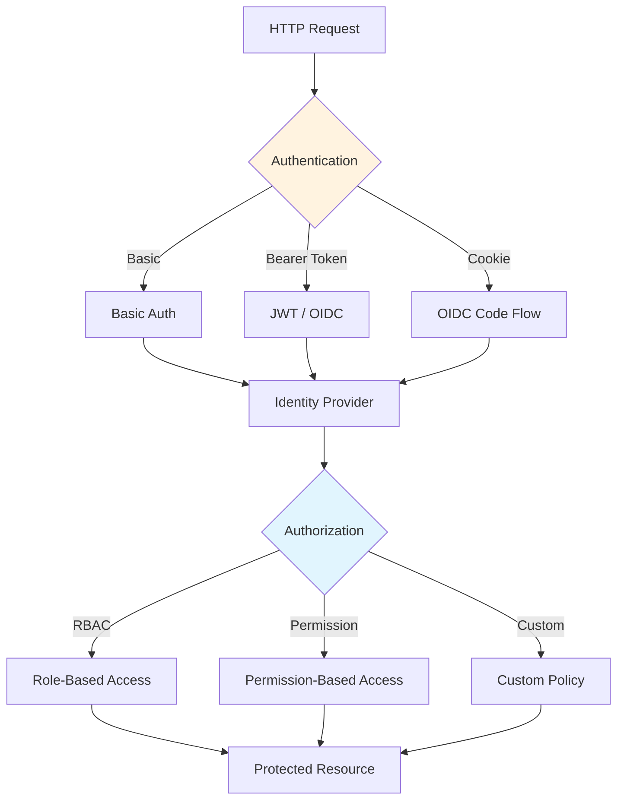

### 11.2 Authentication 與 Authorization

```java
// 基於角色的存取控制
@Path("/api/admin")
@RolesAllowed("admin")
public class AdminResource {

    @GET
    @Path("/users")
    public List<UserDTO> listUsers() {
        return userService.listAll();
    }

    @DELETE
    @Path("/users/{id}")
    @RolesAllowed("super-admin") // 更細粒度的角色限制
    public Response deleteUser(@PathParam("id") Long id) {
        userService.delete(id);
        return Response.noContent().build();
    }
}

// 取得安全上下文
@Path("/api/profile")
@Authenticated // 僅要求已認證，不限角色
public class ProfileResource {

    @Inject
    SecurityIdentity identity;

    @GET
    public ProfileDTO getProfile() {
        String username = identity.getPrincipal().getName();
        Set<String> roles = identity.getRoles();
        return new ProfileDTO(username, roles);
    }
}
```

### 11.3 Basic Auth

```bash
quarkus extension add quarkus-security-properties-file
```

```properties
# application.properties
quarkus.security.users.embedded.enabled=true
quarkus.security.users.embedded.plain-text=true
quarkus.security.users.embedded.users.admin=admin123
quarkus.security.users.embedded.roles.admin=admin,user
quarkus.security.users.embedded.users.user=user123
quarkus.security.users.embedded.roles.user=user
```

> **注意**：Properties File 方式僅建議用於開發與測試環境。生產環境應使用 JDBC、LDAP 或 OIDC。

### 11.4 JWT RBAC

```bash
quarkus extension add quarkus-smallrye-jwt
```

```properties
# application.properties
mp.jwt.verify.publickey.location=META-INF/resources/publicKey.pem
mp.jwt.verify.issuer=https://my-auth-server.example.com
smallrye.jwt.path.groups=groups
```

```java
@Path("/api/secured")
@Authenticated
public class SecuredResource {

    @Inject
    JsonWebToken jwt;

    @GET
    @Path("/info")
    public Response getTokenInfo() {
        return Response.ok(Map.of(
            "subject", jwt.getSubject(),
            "issuer", jwt.getIssuer(),
            "groups", jwt.getGroups(),
            "expiration", jwt.getExpirationTime()
        )).build();
    }

    @GET
    @Path("/admin")
    @RolesAllowed("admin")
    public String adminOnly() {
        return "Admin content for " + jwt.getName();
    }
}
```

### 11.5 OAuth2

```bash
quarkus extension add quarkus-oidc
```

```properties
# OAuth2 Bearer Token 驗證
quarkus.oidc.auth-server-url=https://auth.example.com/realms/my-realm
quarkus.oidc.client-id=my-api
quarkus.oidc.application-type=service
quarkus.oidc.token.issuer=https://auth.example.com/realms/my-realm
```

### 11.6 OIDC

```properties
# OIDC — Web Application（Authorization Code Flow）
quarkus.oidc.auth-server-url=https://auth.example.com/realms/my-realm
quarkus.oidc.client-id=my-web-app
quarkus.oidc.credentials.secret=my-client-secret
quarkus.oidc.application-type=web-app

# Token 配置
quarkus.oidc.token.principal-claim=preferred_username
quarkus.oidc.roles.role-claim-path=realm_access/roles

# Logout
quarkus.oidc.logout.path=/logout
quarkus.oidc.logout.post-logout-path=/
```

### 11.7 Keycloak 整合與企業 SSO 落地

```properties
# Keycloak 完整設定
quarkus.oidc.auth-server-url=https://keycloak.example.com/realms/enterprise
quarkus.oidc.client-id=order-service
quarkus.oidc.credentials.secret=${OIDC_CLIENT_SECRET}
quarkus.oidc.application-type=service
quarkus.oidc.token.issuer=https://keycloak.example.com/realms/enterprise

# Role Mapping
quarkus.oidc.roles.role-claim-path=realm_access/roles
quarkus.oidc.roles.source=accesstoken

# Token 驗證
quarkus.oidc.token.audience=order-service
```

**Dev Services for Keycloak（開發環境）：**

```properties
# Dev Mode 自動啟動 Keycloak 容器
%dev.quarkus.oidc.devservices.enabled=true
%dev.quarkus.oidc.devservices.realm-path=dev-realm.json
```

### 11.8 Multitenancy

```java
@ApplicationScoped
public class CustomTenantResolver implements TenantConfigResolver {

    @Override
    public Uni<OidcTenantConfig> resolve(RoutingContext context,
                                          OidcRequestContext<OidcTenantConfig> requestContext) {
        String tenantId = context.request().getHeader("X-Tenant-ID");

        if ("tenant-a".equals(tenantId)) {
            OidcTenantConfig config = new OidcTenantConfig();
            config.setTenantId("tenant-a");
            config.setAuthServerUrl("https://auth.tenant-a.example.com/realms/main");
            config.setClientId("my-app");
            return Uni.createFrom().item(config);
        }

        return Uni.createFrom().nullItem(); // 使用預設配置
    }
}
```

### 11.9 CORS

```properties
# application.properties
quarkus.http.cors=true
quarkus.http.cors.origins=https://app.example.com,https://admin.example.com
quarkus.http.cors.methods=GET,POST,PUT,DELETE,OPTIONS
quarkus.http.cors.headers=Content-Type,Authorization,X-Requested-With
quarkus.http.cors.exposed-headers=X-Total-Count,X-Request-Id
quarkus.http.cors.access-control-max-age=24H
quarkus.http.cors.access-control-allow-credentials=true
```

### 11.10 CSRF

```bash
quarkus extension add quarkus-csrf-reactive
```

```properties
quarkus.csrf-reactive.cookie-name=csrf-token
quarkus.csrf-reactive.form-field-name=_csrf
```

### 11.11 Secrets in Configuration

```properties
# 使用環境變數（推薦）
quarkus.datasource.password=${DB_PASSWORD}
quarkus.oidc.credentials.secret=${OIDC_SECRET}

# Kubernetes Secret
quarkus.kubernetes-config.secrets.enabled=true
quarkus.kubernetes-config.secrets=my-app-secrets
```

### 11.12 Credentials Provider

```java
// 自訂 Credentials Provider
@ApplicationScoped
@Unremovable
public class VaultCredentialsProvider implements CredentialsProvider {

    @Override
    public Map<String, String> getCredentials(String credentialsProviderName) {
        // 從 Vault 或其他安全儲存取得憑證
        return Map.of(
            "user", fetchFromVault("db-user"),
            "password", fetchFromVault("db-password")
        );
    }

    private String fetchFromVault(String key) {
        // 實作 Vault 呼叫
        return "";
    }
}
```

### 11.13 安全測試

```java
@QuarkusTest
public class SecuredResourceTest {

    @Test
    public void testUnauthenticated() {
        given()
            .when().get("/api/secured/info")
            .then().statusCode(401);
    }

    @Test
    @TestSecurity(user = "admin", roles = "admin")
    public void testAdminAccess() {
        given()
            .when().get("/api/secured/admin")
            .then().statusCode(200);
    }

    @Test
    @TestSecurity(user = "user", roles = "user")
    public void testUserCannotAccessAdmin() {
        given()
            .when().get("/api/secured/admin")
            .then().statusCode(403);
    }

    @Test
    @OidcSecurity(claims = {
        @Claim(key = "sub", value = "user123"),
        @Claim(key = "email", value = "user@example.com")
    })
    public void testWithOidcClaims() {
        // 使用模擬 OIDC Token 測試
    }
}
```

### 11.14 OWASP 風險與防護建議

| OWASP 風險 | Quarkus 防護方式 |
|-----------|-----------------|
| **A01: Broken Access Control** | `@RolesAllowed`、`@Authenticated`、HTTP Policy |
| **A02: Cryptographic Failures** | TLS Registry、Secrets in Config |
| **A03: Injection** | Panache 參數化查詢、Hibernate Validator |
| **A04: Insecure Design** | 安全架構審查、Threat Modeling |
| **A05: Security Misconfiguration** | Production Profile 檢查、Dev UI 僅限開發 |
| **A06: Vulnerable Components** | CycloneDX SBOM、Dependency Scan |
| **A07: AuthN/AuthZ Failures** | OIDC/JWT、Security Testing |
| **A08: Software and Data Integrity** | CI/CD Pipeline 簽章、Container Scan |
| **A09: Security Logging** | Structured Logging、Audit Trail |
| **A10: Server-Side Request Forgery** | REST Client URL 白名單、輸入驗證 |

### 11.15 實務注意事項

> **建議**：企業應用優先採用 OIDC + Keycloak 方案，它提供完整的 SSO、使用者管理與角色管理功能。JWT RBAC 適合無狀態的 API 服務。Basic Auth 僅用於開發與測試。
>
> **注意**：生產環境中務必禁用 Dev UI、Swagger UI 等開發工具。敏感配置（密碼、Secret）絕不可寫死在原始碼中。

---

## 12. 測試策略

### 12.1 Unit Test

```java
// 純單元測試，不啟動 Quarkus 容器
public class OrderServiceTest {

    @Test
    void shouldCalculateOrderTotal() {
        Order order = new Order();
        order.items = List.of(
            createItem("P1", 2, new BigDecimal("10.00")),
            createItem("P2", 1, new BigDecimal("25.50"))
        );

        BigDecimal total = order.calculateTotal();
        assertEquals(new BigDecimal("45.50"), total);
    }

    private OrderItem createItem(String productId, int qty, BigDecimal price) {
        OrderItem item = new OrderItem();
        item.productId = productId;
        item.quantity = qty;
        item.unitPrice = price;
        return item;
    }
}
```

### 12.2 Integration Test

```java
@QuarkusTest
@TestProfile(IntegrationTestProfile.class)
public class OrderResourceIT {

    @Test
    void shouldCreateOrder() {
        String requestBody = """
            {
                "customerId": "C001",
                "items": [
                    {"productId": "P001", "quantity": 2, "unitPrice": 29.99}
                ]
            }
            """;

        given()
            .contentType(ContentType.JSON)
            .body(requestBody)
        .when()
            .post("/api/v1/orders")
        .then()
            .statusCode(201)
            .body("customerId", equalTo("C001"))
            .body("status", equalTo("PENDING"))
            .header("Location", containsString("/api/v1/orders/"));
    }
}
```

### 12.3 Quarkus Test（@QuarkusTest）

```java
@QuarkusTest
public class ProductResourceTest {

    @Inject
    ProductRepository productRepository;

    @Test
    @Transactional
    void shouldListProducts() {
        // 準備測試資料
        Product product = new Product();
        product.name = "Test Product";
        product.price = new BigDecimal("9.99");
        product.category = "test";
        productRepository.persist(product);

        // 測試 API
        given()
        .when()
            .get("/api/v1/products")
        .then()
            .statusCode(200)
            .body("size()", greaterThan(0))
            .body("[0].name", equalTo("Test Product"));
    }

    @Test
    void shouldReturn404ForNonExistentProduct() {
        given()
        .when()
            .get("/api/v1/products/99999")
        .then()
            .statusCode(404);
    }
}
```

### 12.4 Dev Mode 與 Continuous Testing

在 Dev Mode 下，按 `r` 鍵啟動 Continuous Testing：

```
Press [r] to resume testing, [o] Toggle test output

Tests: 15 passed, 2 failed, 0 skipped
```

```properties
# 設定 Continuous Testing 行為
quarkus.test.continuous-testing=enabled
quarkus.test.display-test-output=true
quarkus.test.basic-console=false
```

### 12.5 Native Test

```java
@QuarkusIntegrationTest // 用於 Native Image 測試
public class ProductResourceNativeIT extends ProductResourceTest {
    // 繼承所有測試方法，在 Native Image 上執行
}
```

```bash
# 執行 Native Test
./mvnw verify -Pnative
```

### 12.6 Test Coverage

```xml
<!-- pom.xml — JaCoCo 設定 -->
<dependency>
    <groupId>io.quarkus</groupId>
    <artifactId>quarkus-jacoco</artifactId>
    <scope>test</scope>
</dependency>
```

```properties
quarkus.jacoco.report-location=target/jacoco-report
```

### 12.7 Testcontainers

```java
@QuarkusTest
@QuarkusTestResource(PostgresTestResource.class)
public class OrderRepositoryTest {
    // Testcontainers 自動啟動 PostgreSQL 容器
}

// 或使用 Dev Services（推薦，更簡潔）
// Quarkus 的 Dev Services 在測試時也會自動啟動容器
@QuarkusTest
public class OrderRepositoryTest {

    @Inject
    OrderRepository repository;

    @Test
    @Transactional
    void shouldPersistAndFind() {
        Order order = new Order();
        order.customerId = "C001";
        order.totalAmount = new BigDecimal("100.00");
        order.status = OrderStatus.PENDING;
        repository.persist(order);

        assertNotNull(order.id);

        Order found = repository.findById(order.id);
        assertEquals("C001", found.customerId);
    }
}
```

### 12.8 Security Testing

```java
@QuarkusTest
public class SecurityTest {

    @Test
    void shouldRejectUnauthenticatedRequest() {
        given()
        .when()
            .get("/api/admin/users")
        .then()
            .statusCode(401);
    }

    @Test
    @TestSecurity(user = "admin", roles = {"admin"})
    void shouldAllowAdminAccess() {
        given()
        .when()
            .get("/api/admin/users")
        .then()
            .statusCode(200);
    }

    @Test
    @TestSecurity(user = "user", roles = {"user"})
    void shouldForbidNonAdminAccess() {
        given()
        .when()
            .get("/api/admin/users")
        .then()
            .statusCode(403);
    }
}
```

### 12.9 API Test

```java
@QuarkusTest
public class ProductApiContractTest {

    @Test
    void shouldReturnValidJsonSchema() {
        given()
        .when()
            .get("/api/v1/products")
        .then()
            .statusCode(200)
            .contentType(ContentType.JSON)
            .body("$", instanceOf(List.class))
            .body("[0].id", notNullValue())
            .body("[0].name", notNullValue())
            .body("[0].price", notNullValue());
    }

    @Test
    void shouldValidateRequestBody() {
        given()
            .contentType(ContentType.JSON)
            .body("{}")
        .when()
            .post("/api/v1/products")
        .then()
            .statusCode(400);
    }
}
```

### 12.10 測試金字塔與團隊測試標準

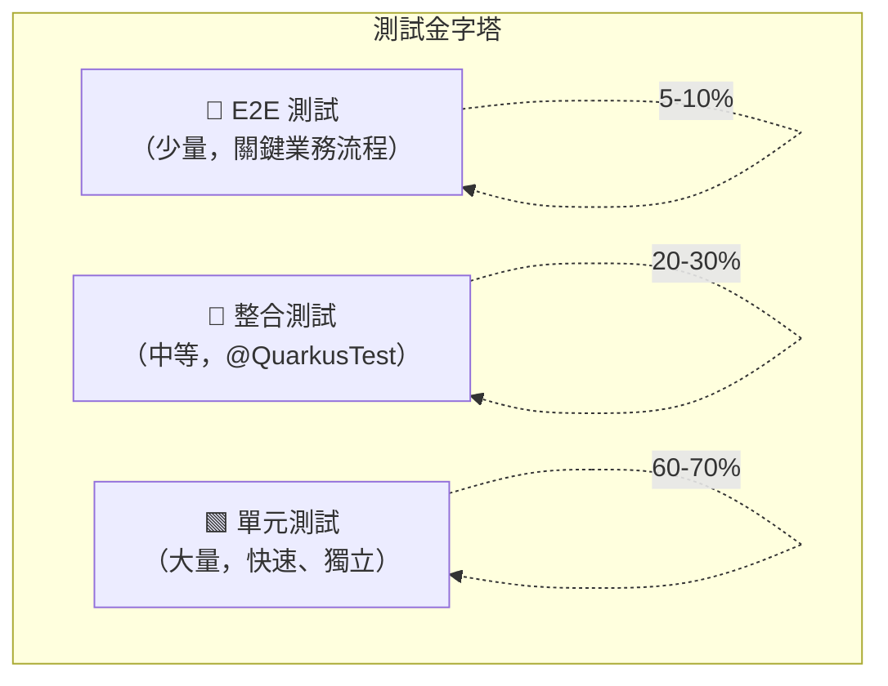

| 測試類型 | 工具 | 速度 | 覆蓋範圍 | 佔比 |
|---------|------|------|---------|------|
| **Unit Test** | JUnit 5 + Mockito | 極快 | 業務邏輯 | 60-70% |
| **Integration Test** | @QuarkusTest + REST Assured | 中等 | API + 資料存取 | 20-30% |
| **Native Test** | @QuarkusIntegrationTest | 慢 | Native Image 驗證 | 5% |
| **Security Test** | @TestSecurity | 中等 | AuthN/AuthZ | 包含在整合測試中 |
| **E2E Test** | Selenium / Playwright | 慢 | 端對端流程 | 5-10% |

### 12.11 實務注意事項

> **建議**：善用 Quarkus 的 Continuous Testing 功能，在開發過程中即時獲得測試回饋。搭配 Dev Services，整合測試無需手動管理外部服務容器。
>
> **注意**：`@QuarkusTest` 會啟動完整的 Quarkus 應用，測試速度較慢。純業務邏輯應使用不啟動容器的 Unit Test。

---

## 13. Dev Services 與開發者體驗

### 13.1 Dev Services Overview

Dev Services 是 Quarkus 最具特色的開發者體驗功能之一。當應用在 Dev Mode 或 Test 模式下啟動時，如果偵測到某些 Extension（如資料庫、Kafka、Redis）但未提供外部服務連線資訊，Quarkus 會自動透過 Testcontainers 啟動對應的容器服務。

**運作原理：**

```
Dev Mode 啟動
  → 偵測到 quarkus-jdbc-postgresql Extension
  → 未設定 quarkus.datasource.jdbc.url（在 %dev profile）
  → 自動啟動 PostgreSQL Testcontainer
  → 自動注入連線資訊
  → 應用正常啟動
```

**前置條件：**

- 本機已安裝並啟動 Docker 或 Podman
- 對應的 Quarkus Extension 已加入專案

### 13.2 Database Dev Services

支援的資料庫 Dev Services：

| 資料庫 | Extension | 預設映像 |
|--------|-----------|---------|
| PostgreSQL | `quarkus-jdbc-postgresql` | `postgres:latest` |
| MySQL | `quarkus-jdbc-mysql` | `mysql:latest` |
| MariaDB | `quarkus-jdbc-mariadb` | `mariadb:latest` |
| Oracle | `quarkus-jdbc-oracle` | `gvenzl/oracle-free:slim` |
| SQL Server | `quarkus-jdbc-mssql` | `mcr.microsoft.com/mssql/server` |
| H2 | `quarkus-jdbc-h2` | 嵌入式（無需容器） |
| MongoDB | `quarkus-mongodb-client` | `mongo:latest` |

```properties
# 自訂 Dev Services 設定（可選）
quarkus.datasource.devservices.port=5432
quarkus.datasource.devservices.image-name=postgres:16
quarkus.datasource.devservices.db-name=devdb
quarkus.datasource.devservices.init-script-path=init-dev.sql
```

### 13.3 Kafka Dev Services

```properties
# 自動啟動 Kafka 容器
quarkus.kafka.devservices.enabled=true
quarkus.kafka.devservices.port=9092
quarkus.kafka.devservices.topic-partitions.order-events=3
quarkus.kafka.devservices.topic-partitions.notification-events=1
```

### 13.4 Redis Dev Services

```properties
quarkus.redis.devservices.enabled=true
quarkus.redis.devservices.port=6379
quarkus.redis.devservices.image-name=redis:7
```

### 13.5 MongoDB Dev Services

```properties
quarkus.mongodb.devservices.enabled=true
quarkus.mongodb.devservices.port=27017
quarkus.mongodb.devservices.image-name=mongo:7
```

### 13.6 OIDC Dev Services

```properties
# 自動啟動 Keycloak 容器
quarkus.oidc.devservices.enabled=true
quarkus.oidc.devservices.realm-path=dev-realm.json
quarkus.oidc.devservices.port=8180

# Dev Services 會自動建立測試使用者
# alice / alice (roles: admin, user)
# bob / bob (roles: user)
```

### 13.7 Compose Dev Services

Quarkus 3.x 新增了 Compose Dev Services，允許使用 `docker-compose.yaml` 定義更複雜的開發環境：

```yaml
# .devservices/docker-compose.yaml
services:
  postgres:
    image: postgres:16
    environment:
      POSTGRES_DB: devdb
      POSTGRES_USER: dev
      POSTGRES_PASSWORD: dev
    ports:
      - "5432:5432"
  redis:
    image: redis:7
    ports:
      - "6379:6379"
  mailpit:
    image: axllent/mailpit
    ports:
      - "1025:1025"
      - "8025:8025"
```

### 13.8 Dev UI

Dev UI 是 Quarkus 在 Dev Mode 下提供的互動式 Web 開發面板：

- **存取路徑**：`http://localhost:8080/q/dev-ui`
- **功能概覽**：
  - Extension 列表與狀態
  - 配置編輯器（即時修改 `application.properties`）
  - REST API 端點瀏覽
  - Swagger UI 內嵌
  - 資料庫管理（連接的 Dev Services DB）
  - Kafka 訊息檢視
  - Scheduler 任務管理
  - Continuous Testing 控制面板
  - Build Information
  - Arc Bean 列表

> **注意**：Dev UI 僅在 Dev Mode 可用，生產環境自動禁用。不應嘗試在生產環境啟用。

### 13.9 Dev Assistant 與 Dev MCP

**Dev Assistant**（Quarkus 3.35+ 新功能）：

Dev UI 內建的 AI 助手，可直接在開發面板中詢問 Quarkus 相關問題、取得配置建議等。

**Dev MCP**（Model Context Protocol）：

Quarkus 提供 Dev MCP Server，讓外部 AI Agent（如 GitHub Copilot、Claude）透過 MCP 協議直接與 Quarkus Dev Mode 互動：

```properties
# 啟用 Dev MCP Server
quarkus.dev-mcp.enabled=true
```

**Agent MCP**：

Quarkus 官方提供的 MCP Server，讓 AI Agents 能夠自動建立、管理與操作 Quarkus 應用。

### 13.10 Dev Services 對企業開發流程的價值與限制

**價值：**

| 效益 | 說明 |
|------|------|
| **零配置啟動** | 新成員 clone 專案後直接 `quarkus dev`，無需手動安裝資料庫等服務 |
| **環境一致性** | 所有開發者使用相同版本的外部服務容器 |
| **加速開發迴圈** | 無需維護本機服務安裝 |
| **測試整合** | 測試時自動啟動容器，無需 Mock |

**限制：**

| 限制 | 說明 |
|------|------|
| **需要 Docker** | 必須安裝 Docker 或 Podman |
| **首次啟動慢** | 首次需下載容器映像 |
| **資源消耗** | 同時執行多個容器消耗記憶體 |
| **與生產環境差異** | Dev Services 使用預設設定，可能與生產環境不同 |
| **不適用於 CI/CD** | CI/CD 環境應使用明確配置的服務 |

### 13.11 實務注意事項

> **建議**：Dev Services 是 Quarkus 最大的開發者體驗優勢之一。新專案應充分利用 Dev Services，讓團隊成員能在最短時間內開始開發。
>
> **注意**：Dev Services 產生的容器在 Dev Mode 關閉後會自動清理。若需保留資料，可配置 `quarkus.datasource.devservices.reuse=true`（需搭配 Testcontainers reuse 功能）。

---

## 14. Observability 與營運可觀測性

### 14.1 Logging

```properties
# 全域日誌等級
quarkus.log.level=INFO

# 套件級日誌
quarkus.log.category."com.example".level=DEBUG
quarkus.log.category."org.hibernate.SQL".level=DEBUG

# 控制台格式
quarkus.log.console.format=%d{yyyy-MM-dd HH:mm:ss,SSS} %-5p [%c{3.}] (%t) %s%e%n

# JSON 結構化日誌（推薦生產環境）
quarkus.log.console.json=true
quarkus.log.console.json.additional-field."service".value=order-service
quarkus.log.console.json.additional-field."environment".value=${ENVIRONMENT:dev}
```

### 14.2 Centralized Logging

```properties
# 檔案日誌（搭配 Fluentd / Filebeat 收集）
quarkus.log.file.enable=true
quarkus.log.file.path=/var/log/app/application.log
quarkus.log.file.rotation.max-file-size=10M
quarkus.log.file.rotation.max-backup-index=5
quarkus.log.file.json=true
```

**集中式日誌架構：**

```
Application (JSON Log)
    → Fluentd / Filebeat / Vector
    → Elasticsearch / OpenSearch
    → Kibana / Grafana
```

### 14.3 Health Check

```bash
quarkus extension add quarkus-smallrye-health
```

```java
@Liveness
@ApplicationScoped
public class AppLivenessCheck implements HealthCheck {

    @Override
    public HealthCheckResponse call() {
        return HealthCheckResponse.up("Application is alive");
    }
}

@Readiness
@ApplicationScoped
public class DatabaseReadinessCheck implements HealthCheck {

    @Inject
    AgroalDataSource dataSource;

    @Override
    public HealthCheckResponse call() {
        try (Connection conn = dataSource.getConnection()) {
            conn.createStatement().execute("SELECT 1");
            return HealthCheckResponse.up("Database connection OK");
        } catch (Exception e) {
            return HealthCheckResponse.down("Database connection failed: " + e.getMessage());
        }
    }
}

@Startup
@ApplicationScoped
public class WarmupCheck implements HealthCheck {

    @Override
    public HealthCheckResponse call() {
        return HealthCheckResponse.up("Application warmed up");
    }
}
```

**Health Check 端點：**

| 端點 | 用途 |
|------|------|
| `/q/health` | 綜合健康狀態 |
| `/q/health/live` | Liveness（應用是否存活） |
| `/q/health/ready` | Readiness（應用是否就緒） |
| `/q/health/started` | Startup（應用是否完成啟動） |

### 14.4 Micrometer

```bash
quarkus extension add quarkus-micrometer-registry-prometheus
```

```java
@ApplicationScoped
public class OrderMetrics {

    @Inject
    MeterRegistry registry;

    private final AtomicLong activeOrders = new AtomicLong(0);

    @PostConstruct
    void init() {
        registry.gauge("orders.active", activeOrders);
    }

    public void orderCreated() {
        registry.counter("orders.created.total").increment();
        activeOrders.incrementAndGet();
    }

    public void orderCompleted(long processingTimeMs) {
        registry.counter("orders.completed.total").increment();
        activeOrders.decrementAndGet();
        registry.timer("orders.processing.time")
                .record(Duration.ofMillis(processingTimeMs));
    }
}
```

```properties
# Micrometer 設定
quarkus.micrometer.export.prometheus.enabled=true
quarkus.micrometer.binder.http-server.enabled=true
quarkus.micrometer.binder.jvm=true
quarkus.micrometer.binder.system=true
```

**Metrics 端點**：`/q/metrics`

> **提示**：Quarkus 提供 `quarkus-micrometer-opentelemetry` Extension（Preview），可將 Micrometer Metrics 透過 OTLP 協議匯出至 OpenTelemetry Collector，實現 Metrics、Traces、Logs 三大支柱統一匯出。

### 14.5 OpenTelemetry

```bash
quarkus extension add quarkus-opentelemetry
```

```properties
# OpenTelemetry 設定
quarkus.otel.exporter.otlp.endpoint=http://otel-collector:4317
quarkus.otel.exporter.otlp.protocol=grpc
quarkus.otel.service.name=order-service
quarkus.otel.resource.attributes=deployment.environment=production

# 取樣率
quarkus.otel.traces.sampler=parentbased_traceidratio
quarkus.otel.traces.sampler.arg=0.1
```

```java
@ApplicationScoped
public class OrderService {

    @Inject
    Tracer tracer;

    public Order processOrder(Long orderId) {
        Span span = tracer.spanBuilder("processOrder")
                .setAttribute("order.id", orderId)
                .startSpan();

        try (Scope scope = span.makeCurrent()) {
            Order order = findOrder(orderId);
            validateOrder(order);
            completeOrder(order);
            span.setAttribute("order.status", order.status.name());
            return order;
        } catch (Exception e) {
            span.setStatus(StatusCode.ERROR, e.getMessage());
            span.recordException(e);
            throw e;
        } finally {
            span.end();
        }
    }
}
```

### 14.6 Metrics

**常見自訂 Metrics：**

```java
// 計數器
@Counted(value = "api.requests", description = "API request count")
@Timed(value = "api.request.duration", description = "API request duration")
@GET
@Path("/products")
public List<ProductDTO> listProducts() {
    return productService.listAll();
}
```

### 14.7 Tracing

分散式追蹤自動涵蓋：

- HTTP 請求（入站與出站）
- REST Client 呼叫
- JDBC 查詢
- Kafka 訊息發送與接收
- gRPC 呼叫

```properties
# 追蹤設定
quarkus.otel.traces.enabled=true
quarkus.otel.logs.enabled=true
quarkus.otel.metrics.enabled=true
```

### 14.8 管理介面

```properties
# 將管理端點與業務端點隔離
quarkus.management.enabled=true
quarkus.management.port=9000

# 管理端點（Health、Metrics）透過 port 9000 存取
# 業務 API 透過 port 8080 存取
```

| 端點 | Port | 路徑 |
|------|------|------|
| 業務 API | 8080 | `/api/*` |
| Health | 9000 | `/q/health` |
| Metrics | 9000 | `/q/metrics` |
| OpenAPI | 8080 | `/q/openapi` |

### 14.9 Prometheus / Grafana 整合思路

```yaml
# prometheus.yml
scrape_configs:
  - job_name: 'quarkus-app'
    scrape_interval: 15s
    metrics_path: '/q/metrics'
    static_configs:
      - targets: ['app:9000']
    # 如果使用管理介面
    # 注意 port 改為管理介面的 port
```

**Grafana Dashboard 建議面板：**

| 面板 | 資料來源 | 說明 |
|------|---------|------|
| HTTP 請求速率 | Prometheus | 每秒請求數（RPS） |
| 回應時間分佈 | Prometheus | P50 / P95 / P99 延遲 |
| 錯誤率 | Prometheus | HTTP 4xx / 5xx 比率 |
| JVM 記憶體 | Prometheus | Heap / Non-Heap 使用量 |
| GC 頻率與暫停時間 | Prometheus | GC 次數與累計暫停時間 |
| 執行緒數 | Prometheus | 活躍執行緒與 Virtual Thread 數量 |
| 資料庫連線池 | Prometheus | 活躍 / 閒置 / 等待連線數 |

### 14.10 OpenTelemetry、Micrometer、Health 在企業監控的整合方式

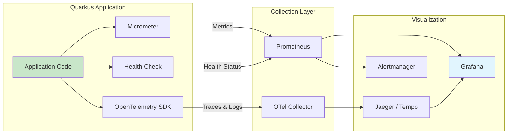

### 14.11 實務注意事項

> **建議**：生產環境務必啟用管理介面（`quarkus.management.enabled=true`），將 Health Check 與 Metrics 端點與業務端點隔離，避免暴露內部指標給外部使用者。
>
> **注意**：OpenTelemetry Tracing 的取樣率在高流量環境中需適當調低（如 10%），否則追蹤資料量可能過大。確保追蹤後端（Jaeger/Tempo）有足夠儲存容量。
>
> **提示**：開發階段可啟用 `quarkus-observability-devservices-lgtm` Extension，自動啟動 Grafana OTel LGTM 容器（內含 Loki + Grafana + Tempo + Mimir），一鍵建立完整可觀測性堆疊，無需手動配置外部基礎設施。

---

## 15. 容器化、Kubernetes 與 OpenShift

### 15.1 Container Images

Quarkus 提供多種容器映像建置方式：

```bash
# Extension: quarkus-container-image-docker
quarkus extension add quarkus-container-image-docker

# 或使用 Jib（無需 Docker daemon）
quarkus extension add quarkus-container-image-jib
```

```properties
# Container Image 設定
quarkus.container-image.build=true
quarkus.container-image.group=my-registry.example.com/my-team
quarkus.container-image.name=order-service
quarkus.container-image.tag=${quarkus.application.version}
quarkus.container-image.push=true
quarkus.container-image.registry=my-registry.example.com
```

### 15.2 Docker / Podman

Quarkus 專案預設產生多個 Dockerfile 模板：

**JVM 模式 Dockerfile（`src/main/docker/Dockerfile.jvm`）：**

```dockerfile
FROM registry.access.redhat.com/ubi8/openjdk-21:1.20

ENV LANGUAGE='en_US:en'

COPY --chown=185 target/quarkus-app/lib/ /deployments/lib/
COPY --chown=185 target/quarkus-app/*.jar /deployments/
COPY --chown=185 target/quarkus-app/app/ /deployments/app/
COPY --chown=185 target/quarkus-app/quarkus/ /deployments/quarkus/

EXPOSE 8080
USER 185
ENV JAVA_OPTS_APPEND="-Dquarkus.http.host=0.0.0.0 -Djava.util.logging.manager=org.jboss.logmanager.LogManager"
ENV JAVA_APP_JAR="/deployments/quarkus-run.jar"

ENTRYPOINT [ "/opt/jboss/container/java/run/run-java.sh" ]
```

**Native 模式 Dockerfile（`src/main/docker/Dockerfile.native-micro`）：**

```dockerfile
FROM quay.io/quarkus/quarkus-micro-image:2.0

WORKDIR /work/
RUN chown 1001 /work \
    && chmod "g+rwX" /work \
    && chown 1001:root /work
COPY --chown=1001:root target/*-runner /work/application

EXPOSE 8080
USER 1001

ENTRYPOINT ["./application", "-Dquarkus.http.host=0.0.0.0"]
```

**建置指令：**

```bash
# JVM 映像
./mvnw package
docker build -f src/main/docker/Dockerfile.jvm -t my-app:jvm .

# Native 映像（使用容器建置，無需本機 GraalVM）
./mvnw package -Pnative -Dquarkus.native.container-build=true
docker build -f src/main/docker/Dockerfile.native-micro -t my-app:native .
```

### 15.3 JVM 映像與 Native 映像差異

| 面向 | JVM 映像 | Native 映像 |
|------|---------|-------------|
| **映像大小** | ~200-400 MB | ~50-100 MB |
| **啟動時間** | 0.5-2 秒 | 10-50 毫秒 |
| **記憶體（RSS）** | 50-150 MB | 10-50 MB |
| **峰值效能** | 更高（JIT 最佳化） | 稍低 |
| **建置時間** | 快（秒級） | 慢（分鐘級） |
| **除錯** | 完整支援 | 受限 |
| **建置需求** | JDK | GraalVM / Mandrel |

### 15.4 Kubernetes 部署

```bash
quarkus extension add quarkus-kubernetes
```

```properties
# application.properties — Kubernetes 設定
quarkus.kubernetes.deploy=false
quarkus.kubernetes.namespace=my-namespace
quarkus.kubernetes.replicas=3

# 資源限制
quarkus.kubernetes.resources.requests.cpu=250m
quarkus.kubernetes.resources.requests.memory=256Mi
quarkus.kubernetes.resources.limits.cpu=1000m
quarkus.kubernetes.resources.limits.memory=512Mi

# Service 類型
quarkus.kubernetes.service-type=ClusterIP

# Labels
quarkus.kubernetes.labels."app.kubernetes.io/part-of"=order-system
quarkus.kubernetes.labels."app.kubernetes.io/managed-by"=quarkus

# 環境變數
quarkus.kubernetes.env.vars.ENVIRONMENT=production
quarkus.kubernetes.env.mapping.DB_PASSWORD.from-secret=db-credentials
quarkus.kubernetes.env.mapping.DB_PASSWORD.with-key=password
```

建置後自動產生 YAML：

```bash
./mvnw package
# 生成 target/kubernetes/kubernetes.yml
```

### 15.5 OpenShift 部署

```bash
quarkus extension add quarkus-openshift
```

```properties
quarkus.openshift.deploy=true
quarkus.openshift.route.expose=true
quarkus.openshift.route.tls.termination=edge
```

```bash
# 使用 oc CLI 部署
oc login https://api.cluster.example.com
./mvnw package -Dquarkus.openshift.deploy=true
```

### 15.6 ConfigMap / Secret 設計

```properties
# 從 ConfigMap 讀取配置
quarkus.kubernetes-config.config-maps=order-service-config
quarkus.kubernetes-config.enabled=true

# 從 Secret 讀取敏感配置
quarkus.kubernetes-config.secrets.enabled=true
quarkus.kubernetes-config.secrets=order-service-secrets
```

```yaml
# configmap.yaml
apiVersion: v1
kind: ConfigMap
metadata:
  name: order-service-config
data:
  application.properties: |
    quarkus.http.port=8080
    app.order.max-items=100
    app.order.default-currency=TWD
```

```yaml
# secret.yaml
apiVersion: v1
kind: Secret
metadata:
  name: order-service-secrets
type: Opaque
stringData:
  quarkus.datasource.password: "my-secure-password"
  quarkus.oidc.credentials.secret: "my-oidc-secret"
```

### 15.7 Health Probe

```properties
# Kubernetes Health Probe 自動配置
quarkus.kubernetes.liveness-probe.http-action-path=/q/health/live
quarkus.kubernetes.liveness-probe.initial-delay=5s
quarkus.kubernetes.liveness-probe.period=10s

quarkus.kubernetes.readiness-probe.http-action-path=/q/health/ready
quarkus.kubernetes.readiness-probe.initial-delay=10s
quarkus.kubernetes.readiness-probe.period=10s

quarkus.kubernetes.startup-probe.http-action-path=/q/health/started
quarkus.kubernetes.startup-probe.initial-delay=0s
quarkus.kubernetes.startup-probe.period=5s
quarkus.kubernetes.startup-probe.failure-threshold=10
```

### 15.8 Rolling Update

```properties
# Rolling Update 策略
quarkus.kubernetes.rolling-update.max-unavailable=25%
quarkus.kubernetes.rolling-update.max-surge=25%
```

### 15.9 Autoscaling

```yaml
# HPA — Horizontal Pod Autoscaler
apiVersion: autoscaling/v2
kind: HorizontalPodAutoscaler
metadata:
  name: order-service-hpa
spec:
  scaleTargetRef:
    apiVersion: apps/v1
    kind: Deployment
    name: order-service
  minReplicas: 2
  maxReplicas: 10
  metrics:
    - type: Resource
      resource:
        name: cpu
        target:
          type: Utilization
          averageUtilization: 70
    - type: Resource
      resource:
        name: memory
        target:
          type: Utilization
          averageUtilization: 80
```

### 15.10 Quarkus 在 Kubernetes 與 OpenShift 的實戰取捨

| 面向 | Kubernetes | OpenShift |
|------|-----------|-----------|
| **適用場景** | 通用雲原生部署 | Red Hat 企業環境 |
| **路由管理** | Ingress Controller | Route（內建） |
| **安全策略** | PSP / PSA | SCC（更嚴格） |
| **建置方式** | 外部 CI/CD 建置映像 | S2I / BuildConfig |
| **Quarkus 支援** | `quarkus-kubernetes` | `quarkus-openshift` |
| **學習成本** | 中等 | 較高 |

### 15.11 雲原生部署最佳實務

1. **使用非 root 使用者執行容器**：Quarkus 預設 Dockerfile 已遵循此原則
2. **設定資源 Requests 與 Limits**：避免 Pod 被驅逐或消耗過多資源
3. **配置適當的 Health Probe**：確保 Kubernetes 能正確判斷 Pod 狀態
4. **使用 ConfigMap / Secret 管理配置**：避免將配置打包進映像
5. **設計 Graceful Shutdown**：Quarkus 內建支援，確保請求處理完成後才關閉
6. **最小化映像大小**：使用 `distroless` 或 `micro` 基礎映像

### 15.12 Dockerfile 與 Kubernetes YAML 部署範例

**Multi-stage Dockerfile（推薦）：**

```dockerfile
# Stage 1: Build
FROM maven:3.9-eclipse-temurin-21 AS build
WORKDIR /app
COPY pom.xml .
RUN mvn dependency:go-offline -B
COPY src ./src
RUN mvn package -DskipTests -B

# Stage 2: Runtime
FROM registry.access.redhat.com/ubi8/openjdk-21-runtime:1.20
COPY --from=build --chown=185 /app/target/quarkus-app/ /deployments/
EXPOSE 8080
USER 185
ENTRYPOINT ["java", "-jar", "/deployments/quarkus-run.jar"]
```

**完整 Kubernetes Deployment：**

```yaml
apiVersion: apps/v1
kind: Deployment
metadata:
  name: order-service
  labels:
    app: order-service
spec:
  replicas: 3
  selector:
    matchLabels:
      app: order-service
  template:
    metadata:
      labels:
        app: order-service
    spec:
      containers:
        - name: order-service
          image: registry.example.com/order-service:1.0.0
          ports:
            - containerPort: 8080
              name: http
            - containerPort: 9000
              name: management
          env:
            - name: JAVA_OPTS_APPEND
              value: "-XX:MaxRAMPercentage=75.0"
          envFrom:
            - configMapRef:
                name: order-service-config
            - secretRef:
                name: order-service-secrets
          resources:
            requests:
              cpu: 250m
              memory: 256Mi
            limits:
              cpu: 1000m
              memory: 512Mi
          livenessProbe:
            httpGet:
              path: /q/health/live
              port: management
            initialDelaySeconds: 5
            periodSeconds: 10
          readinessProbe:
            httpGet:
              path: /q/health/ready
              port: management
            initialDelaySeconds: 10
            periodSeconds: 10
          startupProbe:
            httpGet:
              path: /q/health/started
              port: management
            periodSeconds: 5
            failureThreshold: 12
---
apiVersion: v1
kind: Service
metadata:
  name: order-service
spec:
  selector:
    app: order-service
  ports:
    - name: http
      port: 80
      targetPort: 8080
    - name: management
      port: 9000
      targetPort: 9000
```

### 15.13 實務注意事項

> **建議**：Quarkus 的快速啟動特性使其非常適合 Kubernetes HPA 場景，Pod 可在秒級完成啟動並接受流量。Native Image 更適合 Scale-to-Zero 場景。
>
> **注意**：容器中的 JVM 記憶體設定需使用百分比（`-XX:MaxRAMPercentage=75.0`）而非固定值，讓 JVM 依據容器 Memory Limit 自動調整。

---

## 16. Native Image 與效能調校

### 16.1 GraalVM / Mandrel 概念

- **GraalVM CE/EE**：Oracle 提供的高效能 JDK，包含 Native Image 工具
- **Mandrel**：Red Hat 維護的 GraalVM 下游發行版，專為 Quarkus Native Image 建置最佳化

```bash
# 安裝 Mandrel（推薦用於 Quarkus）
sdk install java 23.1.4.r21-mandrel

# 或使用容器建置（無需本機安裝）
./mvnw package -Pnative -Dquarkus.native.container-build=true
```

### 16.2 Native Build 流程

```bash
# 方式一：本機建置（需安裝 GraalVM/Mandrel）
export GRAALVM_HOME=/path/to/graalvm
./mvnw package -Pnative

# 方式二：容器建置（推薦，無需本機安裝）
./mvnw package -Pnative -Dquarkus.native.container-build=true

# 方式三：直接建置容器映像
./mvnw package -Pnative \
    -Dquarkus.native.container-build=true \
    -Dquarkus.container-image.build=true
```

**建置時間參考：**

| 專案規模 | JVM 建置 | Native 建置 |
|---------|---------|-------------|
| 小型（基礎 REST） | ~5 秒 | ~2-3 分鐘 |
| 中型（REST + DB + Security） | ~10 秒 | ~5-8 分鐘 |
| 大型（全功能微服務） | ~15 秒 | ~10-15 分鐘 |

### 16.3 Native 的優勢與限制

**優勢：**

- 毫秒級啟動（10-50 ms）
- 極低記憶體佔用（10-50 MB RSS）
- 無 JIT 暖機時間
- 更小的容器映像

**限制：**

- 建置時間長
- 不支援某些動態 Java 特性（需額外配置）
  - 反射（Reflection）需要在建置期宣告
  - 動態代理（Dynamic Proxy）需要在建置期宣告
  - 序列化（Serialization）需要在建置期宣告
- 峰值效能可能低於 JVM（無 JIT 最佳化）
- 除錯較困難
- 部分第三方程式庫不相容

### 16.4 JVM 與 Native 的選型比較

| 場景 | 推薦模式 | 理由 |
|------|---------|------|
| 長期運行的 API 服務 | JVM | JIT 暖機後效能更高 |
| Serverless / FaaS | Native | 冷啟動時間是關鍵 |
| Scale-to-Zero 場景 | Native | 需要極快的啟動速度 |
| 大量 Pod 高密度部署 | Native / JVM | 取決於是否需要降低記憶體成本 |
| 開發與除錯 | JVM | 除錯工具完整 |
| CI/CD 建置速度重要 | JVM | 建置速度快很多 |

### 16.5 Native Image 何時值得使用，何時不值得

**值得使用：**

- 啟動速度是關鍵需求（如 Serverless）
- 記憶體成本敏感（大量微服務實例）
- 容器映像大小受限

**不值得使用：**

- 應用長期運行且峰值效能重要
- 大量使用不相容的第三方程式庫
- 團隊缺乏 Native Image 除錯經驗
- CI/CD 建置速度是瓶頸

### 16.6 AOT Caching（Leyden）

Quarkus 3.35+ 支援 AOT Caching（基於 OpenJDK Project Leyden），在 JDK 24+ 上可用：

```properties
# 啟用 AOT Caching
quarkus.class-loading.aot-cache.enabled=true
```

AOT Caching 提供 JVM 模式下的加速啟動：

| 模式 | 啟動時間（參考） |
|------|----------------|
| 傳統 JVM | ~1.5 秒 |
| JVM + AOT Caching | ~0.5 秒 |
| Native | ~0.03 秒 |

> **注意**：AOT Caching 是 Preview 功能，需要 JDK 24+。它介於傳統 JVM 與 Native Image 之間，提供了一個中間選項。

### 16.7 Performance Measurement

```properties
# 啟動時間量測
quarkus.log.category."io.quarkus".level=INFO
# 啟動日誌會包含啟動時間
```

```bash
# 使用 wrk 進行 HTTP 效能測試
wrk -t12 -c400 -d30s http://localhost:8080/api/v1/products

# 使用 hey 進行 HTTP 效能測試
hey -n 10000 -c 100 http://localhost:8080/api/v1/products
```

### 16.8 JFR

```properties
# 啟用 JFR（JVM Flight Recorder）
quarkus.jfr.enabled=true
```

```bash
# 手動啟動 JFR
java -XX:StartFlightRecording=filename=recording.jfr,duration=60s \
     -jar target/quarkus-app/quarkus-run.jar

# 分析 JFR 記錄
jfr print --events jdk.CPULoad recording.jfr
```

### 16.9 記憶體與啟動時間考量

```properties
# JVM 記憶體調校
quarkus.native.additional-build-args=\
    -H:+PrintAnalysisCallTree,\
    --initialize-at-build-time=org.example.MyClass

# 容器記憶體設定
JAVA_OPTS_APPEND="-XX:MaxRAMPercentage=75.0 -XX:+UseG1GC -XX:MaxGCPauseMillis=200"
```

### 16.10 Native 常見踩坑

| 問題 | 原因 | 解決方式 |
|------|------|----------|
| `ClassNotFoundException` | 類別未被 Native Image 包含 | 添加 `@RegisterForReflection` |
| 序列化失敗 | 序列化類別未註冊 | 使用 `@RegisterForReflection(serialization = true)` |
| `UnsupportedFeatureError` | 使用了不支援的動態特性 | 改用靜態替代方案或添加 Native 配置 |
| 建置失敗 Out of Memory | Native 建置需大量記憶體 | 增加建置記憶體 `-Dquarkus.native.native-image-xmx=8g` |
| 第三方程式庫不相容 | 程式庫使用了動態特性 | 檢查 Quarkus Extension 替代方案 |

```java
// 需要反射的類別
@RegisterForReflection
public record OrderEvent(Long orderId, String type, String customerId, Instant timestamp) {}

// 需要序列化的類別
@RegisterForReflection(serialization = true)
public class LegacyDTO implements Serializable {
    // ...
}
```

### 16.11 最佳化建議

1. **選擇正確的 GC**：
   - JVM 模式：G1GC（預設，平衡吞吐量與延遲）
   - Native 模式：Serial GC（預設，適合低記憶體）或 G1GC（需額外配置）

2. **移除未使用的 Extension**：減少建置時間與映像大小

3. **使用 tree-shaking**：Quarkus 3.35+ 支援 JAR 依賴的 tree-shaking，自動移除未使用的類別

4. **優化 Docker 映像**：使用 multi-stage build 與 distroless 基礎映像

### 16.12 實務注意事項

> **建議**：大多數企業應用從 JVM 模式開始即可。只在明確需要極快啟動或極低記憶體時才考慮 Native Image。AOT Caching（Leyden）是一個很好的中間選項，值得在 JDK 24+ 環境中評估。
>
> **注意**：Native Image 建置在 CI/CD 環境中需要分配足夠記憶體（至少 4-8 GB）。建議將 Native 建置作為獨立的 CI/CD 步驟，而非每次提交都觸發。

---

## 17. CI/CD 與 DevSecOps

### 17.1 Maven / Gradle Build Pipeline

**Maven 建置生命週期在 CI 中的應用：**

```bash
# 完整建置流程
./mvnw clean verify

# 跳過測試（僅用於快速驗證編譯）
./mvnw clean package -DskipTests

# 含品質檢查的建置
./mvnw clean verify -Pquality-checks

# Native 建置
./mvnw clean package -Pnative -Dquarkus.native.container-build=true
```

**Maven Wrapper 確保環境一致：**

```bash
# 產生 Maven Wrapper
mvn wrapper:wrapper -Dmaven=3.9.9
```

### 17.2 GitHub Actions 範例

**完整 CI/CD Pipeline：**

```yaml
# .github/workflows/ci.yml
name: CI Pipeline

on:
  push:
    branches: [main, develop]
  pull_request:
    branches: [main]

env:
  JAVA_VERSION: '21'
  REGISTRY: ghcr.io
  IMAGE_NAME: ${{ github.repository }}

jobs:
  build-and-test:
    runs-on: ubuntu-latest
    services:
      postgres:
        image: postgres:16
        env:
          POSTGRES_DB: testdb
          POSTGRES_USER: test
          POSTGRES_PASSWORD: test
        ports:
          - 5432:5432
        options: >-
          --health-cmd pg_isready
          --health-interval 10s
          --health-timeout 5s
          --health-retries 5

    steps:
      - uses: actions/checkout@v4

      - name: Set up JDK
        uses: actions/setup-java@v4
        with:
          java-version: ${{ env.JAVA_VERSION }}
          distribution: temurin
          cache: maven

      - name: Build and Test
        run: ./mvnw clean verify -B
        env:
          QUARKUS_DATASOURCE_JDBC_URL: jdbc:postgresql://localhost:5432/testdb
          QUARKUS_DATASOURCE_USERNAME: test
          QUARKUS_DATASOURCE_PASSWORD: test

      - name: Upload Test Results
        if: always()
        uses: actions/upload-artifact@v4
        with:
          name: test-results
          path: target/surefire-reports/

      - name: Upload Coverage Report
        uses: actions/upload-artifact@v4
        with:
          name: coverage-report
          path: target/jacoco-report/

  security-scan:
    runs-on: ubuntu-latest
    needs: build-and-test
    steps:
      - uses: actions/checkout@v4

      - name: Set up JDK
        uses: actions/setup-java@v4
        with:
          java-version: ${{ env.JAVA_VERSION }}
          distribution: temurin
          cache: maven

      - name: OWASP Dependency Check
        run: ./mvnw org.owasp:dependency-check-maven:check -B

      - name: Generate SBOM
        run: ./mvnw org.cyclonedx:cyclonedx-maven-plugin:makeAggregateBom -B

      - name: Upload SBOM
        uses: actions/upload-artifact@v4
        with:
          name: sbom
          path: target/bom.json

  build-image:
    runs-on: ubuntu-latest
    needs: [build-and-test, security-scan]
    if: github.ref == 'refs/heads/main'
    permissions:
      contents: read
      packages: write

    steps:
      - uses: actions/checkout@v4

      - name: Set up JDK
        uses: actions/setup-java@v4
        with:
          java-version: ${{ env.JAVA_VERSION }}
          distribution: temurin
          cache: maven

      - name: Build Application
        run: ./mvnw package -DskipTests -B

      - name: Log in to Container Registry
        uses: docker/login-action@v3
        with:
          registry: ${{ env.REGISTRY }}
          username: ${{ github.actor }}
          password: ${{ secrets.GITHUB_TOKEN }}

      - name: Build and Push Image
        uses: docker/build-push-action@v6
        with:
          context: .
          file: src/main/docker/Dockerfile.jvm
          push: true
          tags: |
            ${{ env.REGISTRY }}/${{ env.IMAGE_NAME }}:${{ github.sha }}
            ${{ env.REGISTRY }}/${{ env.IMAGE_NAME }}:latest

      - name: Scan Container Image
        uses: aquasecurity/trivy-action@master
        with:
          image-ref: ${{ env.REGISTRY }}/${{ env.IMAGE_NAME }}:${{ github.sha }}
          format: 'sarif'
          output: 'trivy-results.sarif'
```

### 17.3 自動化測試

```yaml
# 在 CI 中分層測試
- name: Unit Tests
  run: ./mvnw test -pl :order-service -B

- name: Integration Tests
  run: ./mvnw verify -pl :order-service -Pit -B

- name: Native Tests (optional, on schedule)
  run: ./mvnw verify -Pnative -B
```

### 17.4 安全掃描

```xml
<!-- pom.xml — OWASP Dependency Check -->
<plugin>
    <groupId>org.owasp</groupId>
    <artifactId>dependency-check-maven</artifactId>
    <version>10.0.4</version>
    <configuration>
        <failBuildOnCVSS>7</failBuildOnCVSS>
        <suppressionFiles>
            <suppressionFile>owasp-suppressions.xml</suppressionFile>
        </suppressionFiles>
    </configuration>
</plugin>
```

### 17.5 Dependency Scan

```bash
# 使用 Quarkus CLI 檢查可更新的依賴
quarkus update --dry-run

# Maven Versions Plugin
./mvnw versions:display-dependency-updates
./mvnw versions:display-plugin-updates
```

### 17.6 SBOM 產出（CycloneDX）

```xml
<!-- pom.xml -->
<plugin>
    <groupId>org.cyclonedx</groupId>
    <artifactId>cyclonedx-maven-plugin</artifactId>
    <version>2.9.1</version>
    <executions>
        <execution>
            <phase>package</phase>
            <goals>
                <goal>makeAggregateBom</goal>
            </goals>
        </execution>
    </executions>
    <configuration>
        <projectType>application</projectType>
        <schemaVersion>1.6</schemaVersion>
        <outputFormat>json</outputFormat>
        <outputName>sbom</outputName>
    </configuration>
</plugin>
```

### 17.7 Container Scan

```yaml
# Trivy 容器掃描
- name: Container Scan
  uses: aquasecurity/trivy-action@master
  with:
    image-ref: my-registry/my-app:latest
    severity: 'CRITICAL,HIGH'
    exit-code: '1'
```

### 17.8 Secret Scan

```yaml
# GitLeaks Secret 掃描
- name: Secret Scan
  uses: gitleaks/gitleaks-action@v2
  env:
    GITHUB_TOKEN: ${{ secrets.GITHUB_TOKEN }}
```

### 17.9 Release Flow

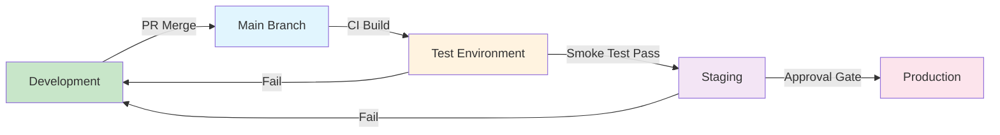

### 17.10 環境分層：Dev / Test / Stage / Prod

| 環境 | 用途 | Quarkus Profile | 配置來源 |
|------|------|-----------------|---------|
| **Dev** | 本機開發 | `dev` | `application.properties` + Dev Services |
| **Test** | 自動化測試 | `test` | `application.properties` + Testcontainers |
| **Staging** | 預生產驗證 | `staging`（自訂） | ConfigMap + Secret |
| **Production** | 正式環境 | `prod` | ConfigMap + Secret + Vault |

```properties
# 自訂 Profile
%staging.quarkus.datasource.jdbc.url=jdbc:postgresql://staging-db:5432/app
%staging.quarkus.log.level=INFO
```

### 17.11 企業上版流程與 Gate 設計

| Gate | 檢查項目 | 負責角色 |
|------|---------|---------|
| **G1: Code Review** | PR Review 通過、CI 建置成功 | 開發團隊 |
| **G2: Quality Gate** | 測試覆蓋率 ≥ 80%、無 Critical Bug | QA 團隊 |
| **G3: Security Gate** | OWASP 掃描通過、無 High CVE | 安全團隊 |
| **G4: Performance Gate** | 效能測試通過、無效能回退 | SRE 團隊 |
| **G5: Release Approval** | 上版申請核准 | 技術主管 |
| **G6: Post-Deploy Verify** | 上版後驗證、監控確認 | SRE + 開發 |

### 17.12 實務注意事項

> **建議**：CI/CD Pipeline 中的建置應使用 Maven Wrapper（`./mvnw`）確保環境一致性。所有依賴版本應鎖定在 `pom.xml` 中，避免建置結果不可預測。
>
> **注意**：Security Gate 中的依賴掃描（OWASP Dependency Check）可能產生誤報（False Positive），需維護 Suppression 清單。但不可因此跳過掃描或降低標準。

---

## 18. 系統上架、發布與後續維運

### 18.1 部署前檢查

**Pre-deployment Checklist：**

1. ☐ 所有測試通過（Unit + Integration + Security）
2. ☐ OWASP 依賴掃描無 Critical/High CVE
3. ☐ 容器映像掃描通過
4. ☐ SBOM 已產出並歸檔
5. ☐ 配置已更新（ConfigMap / Secret）
6. ☐ 資料庫 Migration 已準備（Flyway/Liquibase）
7. ☐ Health Check 端點已驗證
8. ☐ 回滾計畫已準備
9. ☐ 監控告警已設定
10. ☐ 上版核准已取得

### 18.2 發版策略

| 策略 | 風險 | 複雜度 | 適用場景 |
|------|------|--------|---------|
| **Rolling Update** | 中 | 低 | 一般更新，無破壞性變更 |
| **藍綠部署** | 低 | 中 | 重大版本更新 |
| **Canary Release** | 低 | 高 | 需漸進驗證的變更 |
| **Feature Flag** | 低 | 中 | 需動態控制功能開關 |

### 18.3 回滾策略

```bash
# Kubernetes Rolling Back
kubectl rollout undo deployment/order-service -n production

# 回滾到特定版本
kubectl rollout undo deployment/order-service --to-revision=3

# 查看部署歷史
kubectl rollout history deployment/order-service
```

**回滾決策流程：**

1. 偵測異常（告警觸發 / 手動發現）
2. 確認影響範圍
3. 決定回滾（5 分鐘內決策）
4. 執行回滾
5. 驗證回滾結果
6. 事後分析（Post-Mortem）

### 18.4 藍綠部署

```yaml
# blue-deployment.yaml
apiVersion: apps/v1
kind: Deployment
metadata:
  name: order-service-blue
  labels:
    app: order-service
    version: blue
spec:
  replicas: 3
  # ...

# green-deployment.yaml
apiVersion: apps/v1
kind: Deployment
metadata:
  name: order-service-green
  labels:
    app: order-service
    version: green
spec:
  replicas: 3
  # ...

# 切換 Service 指向
# service.yaml
apiVersion: v1
kind: Service
metadata:
  name: order-service
spec:
  selector:
    app: order-service
    version: green  # 切換至 green
```

### 18.5 Canary Release

```yaml
# 使用 Kubernetes 原生方式
# 90% 流量到穩定版，10% 到 Canary
apiVersion: apps/v1
kind: Deployment
metadata:
  name: order-service-stable
spec:
  replicas: 9  # 90%
  # ...

apiVersion: apps/v1
kind: Deployment
metadata:
  name: order-service-canary
spec:
  replicas: 1  # 10%
  # ...
```

### 18.6 Incident Handling

**事件嚴重度分級：**

| 等級 | 定義 | 回應時間 | 範例 |
|------|------|---------|------|
| **P1 Critical** | 核心服務完全不可用 | 15 分鐘 | 系統全面當機 |
| **P2 High** | 部分功能嚴重降級 | 30 分鐘 | 訂單處理失敗 |
| **P3 Medium** | 非核心功能異常 | 2 小時 | 報表產出延遲 |
| **P4 Low** | 輕微問題，不影響使用 | 24 小時 | UI 顯示異常 |

### 18.7 Log / Metrics / Trace 分析

**異常排查流程：**

```
1. 收到告警
   → 檢查 Metrics Dashboard（Grafana）
   → 確認影響指標（錯誤率、延遲、吞吐量）

2. 定位問題
   → 檢查 Traces（Jaeger/Tempo）找出慢請求
   → 追蹤特定 TraceID 的完整呼叫鏈

3. 深入分析
   → 檢查 Logs（Kibana/Grafana Loki）
   → 篩選特定時間段、服務、錯誤等級
   → 關聯 TraceID 找到相關日誌

4. 修復與驗證
   → 實施修復
   → 確認 Metrics 恢復正常
   → 撰寫 Post-Mortem
```

### 18.8 容量規劃

| 指標 | 計算方式 | 建議 |
|------|---------|------|
| **CPU** | 峰值 CPU × 1.5 + Buffer | 預留 30% Buffer |
| **記憶體** | 應用 RSS × Pod 數量 × 1.3 | JVM: 256-512Mi, Native: 64-128Mi |
| **Pod 數量** | 峰值 RPS ÷ 單 Pod 吞吐量 × 1.5 | 最少 2 個（HA） |
| **資料庫連線** | Pod 數 × 連線池大小 ≤ DB 最大連線 | 預留 20% |

### 18.9 SLA / SLO / Error Budget 建議

| 指標 | SLO 建議 | Error Budget（月） |
|------|---------|-------------------|
| **可用性** | 99.9% | 43 分鐘 |
| **API 延遲（P99）** | < 500ms | — |
| **錯誤率** | < 0.1% | — |
| **部署成功率** | > 99% | — |

### 18.10 維運 Runbook

**Runbook 範本：**

```markdown
## Service: Order Service
### 服務概述
- 負責訂單建立、查詢、狀態更新
- 依賴：PostgreSQL、Kafka、Keycloak

### 常見告警與處置
#### 告警：API 錯誤率 > 1%
1. 檢查 Grafana Dashboard → Order Service Panel
2. 查看近 10 分鐘日誌：kubectl logs -l app=order-service --tail=100
3. 檢查下游服務狀態（DB、Kafka）
4. 若 DB 異常：檢查連線池使用率
5. 若持續升高：考慮回滾最近部署

#### 告警：記憶體使用率 > 85%
1. 檢查 JVM Heap 使用率
2. 檢查是否有記憶體洩漏（Heap Dump）
3. 短期：增加 Pod 數量
4. 長期：分析記憶體使用模式

### 重要指令
- 查看 Pod 狀態：kubectl get pods -l app=order-service
- 查看日誌：kubectl logs -f deployment/order-service
- 手動擴展：kubectl scale deployment/order-service --replicas=5
- 回滾：kubectl rollout undo deployment/order-service
```

### 18.11 故障排除思路

1. **先看 Metrics 全局圖**：確認問題範圍（單一服務或全局）
2. **檢查 Health Check**：確認服務是否存活與就緒
3. **查看 Traces**：找出延遲或錯誤的具體位置
4. **分析 Logs**：取得詳細錯誤訊息
5. **檢查基礎設施**：K8s Node 狀態、網路、DNS
6. **關聯時間線**：對比部署時間、配置變更時間

### 18.12 實務注意事項

> **建議**：每個服務都應有對應的 Runbook，且 Runbook 需定期更新（至少每季度審查一次）。新人 On-call 前必須熟讀 Runbook 並完成模擬演練。
>
> **注意**：回滾決策需在 5 分鐘內做出。如果無法快速確定問題根因，應先回滾再分析，避免影響擴大。

---

## 19. 升級與相容性管理

### 19.1 Quarkus 版本升級策略

Quarkus 約每 4-6 週發布一個 Minor 版本。建議的升級策略：

| 升級類型 | 頻率 | 風險 | 說明 |
|---------|------|------|------|
| **Patch（3.35.x → 3.35.y）** | 即時跟進 | 低 | 安全修補與 Bug Fix |
| **Minor（3.34 → 3.35）** | 每 1-2 個版本跟進 | 中 | 功能新增，可能有 API 調整 |
| **Major（2.x → 3.x）** | 規劃專案 | 高 | 重大變更，需完整測試 |

### 19.2 官方升級建議與更新流程

1. **閱讀 Migration Guide**：每個版本的 [Release Notes](https://quarkus.io/blog/) 包含遷移指引
2. **使用 `quarkus update`**：官方工具自動處理大部分升級
3. **執行完整測試**：確認所有測試通過
4. **驗證 Extension 相容性**：確認使用的 Extension 支援新版本

### 19.3 更新到最新版 Quarkus 的做法

```bash
# 方式一：使用 Quarkus CLI（推薦）
quarkus update

# 方式二：使用 Maven Plugin
./mvnw quarkus:update

# 乾跑模式（僅顯示變更，不實際修改）
quarkus update --dry-run
```

**`quarkus update` 會自動處理：**

- 更新 `quarkus.platform.version`
- 更新已棄用的 Extension 名稱
- 調整配置屬性名稱（如有變更）
- 提示需要手動處理的變更

### 19.4 Extension 相容性管理

```properties
# 使用 Quarkus BOM 統一管理版本
<quarkus.platform.version>3.35.3</quarkus.platform.version>

# Extension 版本由 BOM 統一管理，無需個別指定版本
<dependency>
    <groupId>io.quarkus</groupId>
    <artifactId>quarkus-rest</artifactId>
    <!-- 版本由 BOM 管理 -->
</dependency>
```

**第三方 Extension 相容性：**

- 官方 Extension（`io.quarkus`）：與平台版本同步
- Quarkiverse Extension：需查看各 Extension 的相容性矩陣
- 第三方 Extension：需獨立驗證

### 19.5 Java 版本升級注意事項

| Java 版本 | Quarkus 支援 | 注意事項 |
|----------|-------------|---------|
| Java 17 | ✅ 完整支援 | 最低要求 |
| Java 21 | ✅ 完整支援 | Virtual Threads、Record Patterns |
| Java 24 | ✅ 支援 | AOT Caching（Leyden）可用 |
| Java 25 | ⚠️ 基本相容 | 建議等待官方完整驗證 |

### 19.6 從 RESTEasy Classic 遷移到 Quarkus REST

```xml
<!-- 步驟一：替換 Extension -->
<!-- 舊版 -->
<dependency>
    <groupId>io.quarkus</groupId>
    <artifactId>quarkus-resteasy</artifactId>
</dependency>
<dependency>
    <groupId>io.quarkus</groupId>
    <artifactId>quarkus-resteasy-jackson</artifactId>
</dependency>

<!-- 新版 -->
<dependency>
    <groupId>io.quarkus</groupId>
    <artifactId>quarkus-rest</artifactId>
</dependency>
<dependency>
    <groupId>io.quarkus</groupId>
    <artifactId>quarkus-rest-jackson</artifactId>
</dependency>
```

**步驟二：調整程式碼（大部分情況下無需修改）**

```java
// 大部分 JAX-RS 程式碼無需變更
// 但以下情況需注意：

// 1. 自訂 Filter / Interceptor
// 舊版：使用 JAX-RS ContainerRequestFilter
// 新版：使用 @ServerRequestFilter（更簡潔）
@ServerRequestFilter
public void filter(ContainerRequestContext context) {
    // ...
}

// 2. Exception Mapper
// 舊版：@Provider + ExceptionMapper<T>
// 新版：@ServerExceptionMapper（更簡潔）
@ServerExceptionMapper
public Response handleNotFound(NotFoundException e) {
    return Response.status(404).build();
}
```

### 19.7 Spring 相容層的使用邊界

Quarkus 提供部分 Spring API 相容層，便於 Spring 開發者過渡：

| 相容層 Extension | 覆蓋範圍 | 限制 |
|-----------------|---------|------|
| `quarkus-spring-di` | `@Autowired`, `@Component`, `@Service` | 不支援 `@Conditional*` |
| `quarkus-spring-web` | `@RestController`, `@GetMapping` | 不支援 Spring MVC 完整功能 |
| `quarkus-spring-data-jpa` | Spring Data JPA Repository | 不支援自訂 Repository 實作 |
| `quarkus-spring-security` | `@Secured`, `@PreAuthorize` | 不支援 Spring Security Filter Chain |
| `quarkus-spring-boot-properties` | `@ConfigurationProperties` | 部分支援 |

> **重要**：Spring 相容層是遷移過渡工具，不是長期方案。新專案應直接使用 Quarkus 原生 API。

### 19.8 技術債管理方式

| 類型 | 管理方式 | 工具 |
|------|---------|------|
| **依賴版本過舊** | 定期執行 `quarkus update` | Dependabot / Renovate |
| **已棄用的 API** | 每季度排查與替換 | IDE 警告 + SonarQube |
| **Extension 成熟度變更** | 追蹤官方公告 | Release Notes |
| **配置過時** | `quarkus update` 自動修正 | Quarkus CLI |

### 19.9 實務注意事項

> **建議**：建議每 2-3 個 Minor 版本進行一次升級。不要累積過多版本差距，否則升級風險與工作量會大幅增加。善用 `quarkus update --dry-run` 預覽變更。
>
> **注意**：升級後務必執行完整測試套件（含整合測試）。如果有 Native Image 建置，需驗證 Native 建置也能成功。

---

## 20. 從既有系統遷移到 Quarkus

### 20.1 從 Spring Boot 遷移的評估方法

**遷移評估矩陣：**

| 評估維度 | 低風險 | 中風險 | 高風險 |
|---------|--------|--------|--------|
| **Spring 功能使用** | 基本 DI + REST | Spring Data + Security | Spring Cloud + 深度整合 |
| **第三方程式庫** | 常見程式庫 | 部分特殊程式庫 | 大量反射式程式庫 |
| **團隊經驗** | 有 Java EE 經驗 | 純 Spring 經驗 | 僅 Spring Boot |
| **應用規模** | 小型 / 中型 | 中型 / 大型 | 巨石應用 |
| **測試覆蓋率** | > 80% | 50-80% | < 50% |

### 20.2 適合先遷移哪些模組

**優先遷移（低風險高效益）：**

1. 新建微服務（直接使用 Quarkus）
2. 簡單 CRUD API 服務
3. 無狀態的 REST 服務
4. 批次處理服務

**延後遷移（高風險）：**

1. 深度使用 Spring Cloud 的服務
2. 使用大量 Spring Boot Starter 的服務
3. 有複雜 Spring Security Filter Chain 的服務
4. 使用 Spring Batch 的服務

### 20.3 相容層的使用策略

```
Phase 1: 使用 Spring 相容層快速遷移
         → quarkus-spring-web
         → quarkus-spring-di
         → quarkus-spring-data-jpa

Phase 2: 逐步替換為 Quarkus 原生 API
         → @RestController → @Path
         → @Autowired → @Inject
         → Spring Data → Panache

Phase 3: 完全移除 Spring 相容層
         → 移除 quarkus-spring-* Extension
```

### 20.4 資料庫、訊息佇列、Security 的遷移考量

| 元件 | Spring Boot | Quarkus 對應 | 遷移難度 |
|------|------------|-------------|---------|
| **JPA** | Spring Data JPA | Hibernate Panache | 低 |
| **JDBC** | Spring JDBC | Agroal Datasource | 低 |
| **Kafka** | Spring Kafka | SmallRye Reactive Messaging | 中 |
| **RabbitMQ** | Spring AMQP | SmallRye Reactive Messaging | 中 |
| **Security（基礎）** | Spring Security | Quarkus Security | 中 |
| **Security（OIDC）** | Spring Security OAuth | quarkus-oidc | 中 |
| **Cache** | Spring Cache | quarkus-cache | 低 |
| **Scheduler** | @Scheduled | @Scheduled（Quarkus） | 低 |

### 20.5 單體系統轉模組化或微服務的步驟

```
Phase 1: 分析現有系統
    → 識別領域邊界（DDD Bounded Context）
    → 分析模組間耦合度
    → 識別資料庫相依性

Phase 2: 模組化重構（仍在單體內）
    → 建立清晰的模組介面
    → 消除模組間的直接資料庫存取
    → 引入事件驅動（Application Events）

Phase 3: 抽取微服務
    → 從耦合度最低的模組開始
    → 使用 Strangler Fig Pattern
    → 建立 API Gateway / BFF

Phase 4: 完成遷移
    → 監控與調優
    → 移除舊系統中已遷移的模組
    → 建立統一的可觀測性
```

### 20.6 風險清單

| 風險 | 可能性 | 影響 | 緩解措施 |
|------|--------|------|---------|
| Spring 相容層覆蓋不全 | 高 | 中 | 提前驗證使用到的 Spring 功能 |
| 第三方程式庫不相容 | 中 | 高 | 尋找替代方案或自行包裝 |
| 效能差異 | 低 | 中 | 進行效能基準測試 |
| 團隊學習成本 | 高 | 中 | 分階段培訓與實作 |
| 資料庫遷移複雜度 | 中 | 高 | 保持資料庫層不變，僅遷移應用層 |
| 配置遷移遺漏 | 高 | 中 | 建立配置對照表 |

### 20.7 PoC 與逐步導入建議

**PoC 建議：**

1. **選擇小型內部專案**：非核心業務，2-4 週可完成
2. **驗證關鍵技術棧**：REST API + DB + Security + Messaging
3. **評估開發體驗**：Dev Mode、Live Coding、Dev Services
4. **效能比對**：與原 Spring Boot 應用進行基準測試
5. **記錄問題與解法**：建立團隊知識庫

**逐步導入策略：**

```
月 1-2: PoC + 團隊培訓
月 3-4: 第一個非核心服務上線
月 5-6: 2-3 個服務完成遷移
月 7-8: 核心服務開始遷移
月 9-12: 完成主要服務遷移，建立標準化流程
```

### 20.8 實務注意事項

> **建議**：遷移不是一蹴可及的工程。建議採用 Strangler Fig Pattern，新功能用 Quarkus 開發，舊功能逐步遷移，而非全面改寫。
>
> **注意**：遷移過程中最大的風險通常不是技術問題，而是團隊的學習曲線與信心。充分的培訓與 PoC 驗證是成功的關鍵。

---

## 21. 企業級最佳實務

### 21.1 專案結構建議

**標準微服務專案結構：**

```
order-service/
├── pom.xml
├── src/
│   ├── main/
│   │   ├── java/com/example/order/
│   │   │   ├── OrderApplication.java          # (可選) 自訂啟動邏輯
│   │   │   ├── domain/                         # 領域層
│   │   │   │   ├── model/                      # Entity / Value Object
│   │   │   │   │   ├── Order.java
│   │   │   │   │   ├── OrderItem.java
│   │   │   │   │   └── OrderStatus.java
│   │   │   │   ├── service/                    # 領域服務
│   │   │   │   │   └── OrderDomainService.java
│   │   │   │   └── event/                      # 領域事件
│   │   │   │       └── OrderCreatedEvent.java
│   │   │   ├── application/                    # 應用層
│   │   │   │   ├── OrderService.java           # Use Case
│   │   │   │   ├── dto/                        # DTO
│   │   │   │   │   ├── CreateOrderRequest.java
│   │   │   │   │   └── OrderResponse.java
│   │   │   │   └── mapper/                     # 物件映射
│   │   │   │       └── OrderMapper.java
│   │   │   ├── infrastructure/                 # 基礎設施層
│   │   │   │   ├── persistence/                # 資料存取
│   │   │   │   │   └── OrderRepository.java
│   │   │   │   ├── messaging/                  # 訊息傳遞
│   │   │   │   │   └── OrderEventPublisher.java
│   │   │   │   └── external/                   # 外部服務
│   │   │   │       └── PaymentClient.java
│   │   │   └── web/                            # 表現層
│   │   │       ├── OrderResource.java          # REST 端點
│   │   │       └── OrderExceptionMapper.java   # 例外處理
│   │   └── resources/
│   │       ├── application.properties
│   │       ├── db/migration/                   # Flyway Migration
│   │       └── META-INF/resources/             # 靜態資源
│   └── test/
│       └── java/com/example/order/
│           ├── domain/
│           ├── application/
│           ├── infrastructure/
│           └── web/
└── src/main/docker/
    ├── Dockerfile.jvm
    └── Dockerfile.native-micro
```

### 21.2 Clean Architecture / Hexagonal Architecture 如何應用

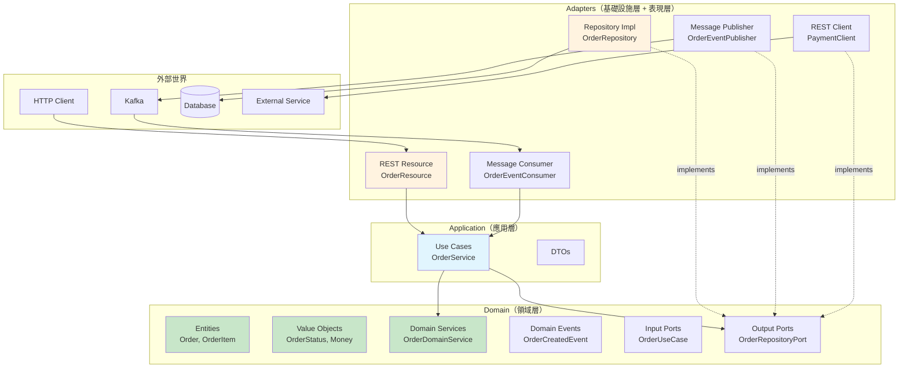

**Hexagonal Architecture Port 定義：**

```java
// Input Port（由應用層定義）
public interface CreateOrderUseCase {
    OrderResponse createOrder(CreateOrderRequest request);
}

// Output Port（由領域層定義）
public interface OrderRepositoryPort {
    Order save(Order order);
    Optional<Order> findById(Long id);
}

public interface OrderEventPort {
    void publishOrderCreated(OrderCreatedEvent event);
}

// Adapter（由基礎設施層實作）
@ApplicationScoped
public class OrderPanacheRepository implements OrderRepositoryPort {
    @Override
    public Order save(Order order) {
        order.persist();
        return order;
    }

    @Override
    public Optional<Order> findById(Long id) {
        return Order.findByIdOptional(id);
    }
}
```

### 21.3 命名規範

| 層級 | 類別 | 命名規範 | 範例 |
|------|------|---------|------|
| **REST** | Resource | `{Entity}Resource` | `OrderResource` |
| **Application** | Service | `{Entity}Service` | `OrderService` |
| **Application** | DTO | `{Action}{Entity}Request/Response` | `CreateOrderRequest` |
| **Domain** | Entity | `{Entity}` | `Order` |
| **Domain** | Value Object | `{Name}` | `Money`, `OrderStatus` |
| **Domain** | Event | `{Entity}{Action}Event` | `OrderCreatedEvent` |
| **Infrastructure** | Repository | `{Entity}Repository` | `OrderRepository` |
| **Infrastructure** | Client | `{Service}Client` | `PaymentClient` |

### 21.4 Config 分層策略

```
application.properties          ← 共用預設值
application-dev.properties      ← %dev Profile（Dev Services）
application-test.properties     ← %test Profile（Testcontainers）
application-staging.properties  ← %staging Profile（自訂）
application-prod.properties     ← %prod Profile（最小化，敏感值從外部注入）
```

**Config 優先順序（由高到低）：**

1. 系統環境變數（`QUARKUS_DATASOURCE_JDBC_URL`）
2. `.env` 檔案
3. `application-{profile}.properties`
4. `application.properties`
5. Extension 預設值

**敏感配置處理：**

```properties
# 生產環境敏感值從環境變數注入
quarkus.datasource.password=${DB_PASSWORD}
quarkus.oidc.credentials.secret=${OIDC_SECRET}

# 或從 Kubernetes Secret
quarkus.kubernetes-config.secrets.enabled=true
quarkus.kubernetes-config.secrets=order-service-secrets
```

### 21.5 安全、效能、可維運性基線

**安全基線：**

| 項目 | 標準 |
|------|------|
| 身份認證 | OIDC / JWT 強制啟用 |
| 授權 | RBAC 最小權限原則 |
| 傳輸安全 | TLS 1.2+ |
| 密碼 / Secret | 不可 Hardcode，使用 Vault / K8s Secret |
| 依賴掃描 | 每次建置執行 OWASP 掃描 |
| 容器安全 | 使用非 root 執行，Distroless 映像 |
| 日誌 | 不記錄敏感資訊（PII、Token） |

**效能基線：**

| 指標 | 目標 |
|------|------|
| API P99 延遲 | < 500ms |
| 啟動時間（JVM） | < 3 秒 |
| 啟動時間（Native） | < 100ms |
| 記憶體（JVM） | < 512MB |
| 記憶體（Native） | < 128MB |

**可維運性基線：**

| 項目 | 標準 |
|------|------|
| Health Check | 必須實作 Liveness + Readiness |
| Metrics | Prometheus 格式輸出 |
| Tracing | OpenTelemetry 啟用 |
| Logging | JSON 結構化日誌 |
| Runbook | 每個服務必備 |

### 21.6 Imperative vs Reactive vs Virtual Threads 選擇指南

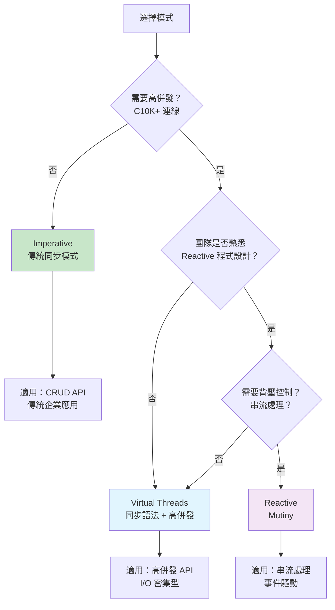

| 模式 | 優點 | 缺點 | 適用場景 |
|------|------|------|---------|
| **Imperative** | 簡單直覺、除錯容易 | 執行緒有限，高併發受限 | 一般 CRUD、內部 API |
| **Reactive（Mutiny）** | 非阻塞、背壓支援 | 學習曲線陡、除錯困難 | 串流處理、事件驅動 |
| **Virtual Threads** | 同步語法、高併發 | Java 21+ 才穩定 | 高併發 I/O 密集型 |

### 21.7 反模式清單

| 反模式 | 問題 | 正確做法 |
|--------|------|---------|
| **God Class** | 單一類別承擔過多責任 | 依 SRP 拆分 |
| **Hardcoded Config** | 配置寫死在程式碼中 | 使用 `@ConfigProperty` |
| **Ignoring Reactive Contract** | 在 Reactive Pipeline 中阻塞 | 使用 `@Blocking` 或 Virtual Threads |
| **Over-engineering** | 過度使用設計模式 | YAGNI 原則 |
| **Skipping Tests** | 跳過測試求快 | TDD 或至少 Unit + Integration |
| **Fat Entity** | Entity 包含業務邏輯與 DTO 混用 | 分離 Entity / DTO / Domain Object |
| **Catch-all Exception** | 捕獲 `Exception` 吞掉錯誤 | 精確捕獲與處理 |
| **N+1 Query** | 迴圈中發出資料庫查詢 | 使用 JOIN FETCH |
| **Missing Health Check** | 未實作 Health Check | 加入 Liveness + Readiness |
| **Secrets in Properties** | 密碼寫在 properties 檔 | 環境變數 / Vault / K8s Secret |

### 21.8 Extension 成熟度辨識與選用原則

Quarkus Extension 有以下成熟度等級：

| 等級 | 說明 | 企業可用性 |
|------|------|-----------|
| **Stable** | 正式 GA，API 穩定 | ✅ 建議使用 |
| **Preview** | 功能完整，API 可能調整 | ⚠️ 需評估 |
| **Experimental** | 早期開發，可能大幅變更 | ❌ 不建議用於生產 |
| **Deprecated** | 已棄用，將被移除 | ❌ 應遷移 |

**選用原則：**

1. 優先使用 Stable 等級的官方 Extension
2. Quarkiverse Extension 需檢查維護狀態與社群活躍度
3. 生產環境避免使用 Experimental Extension
4. 定期檢查使用中的 Extension 是否變更成熟度等級

### 21.9 技術治理

| 治理面向 | 做法 |
|---------|------|
| **框架版本** | 統一 Quarkus Platform 版本，集中管理 BOM |
| **Extension 白名單** | 團隊需評估後才可引入新 Extension |
| **架構決策** | 使用 ADR（Architecture Decision Record）記錄 |
| **程式碼品質** | SonarQube / Checkstyle 品質門檻 |
| **安全掃描** | 每次建置自動執行 OWASP + 容器掃描 |
| **效能基線** | 定期效能測試，設定回退門檻 |

### 21.10 實務注意事項

> **建議**：新團隊建議從 Imperative + Virtual Threads 開始，避免一開始就引入 Reactive 的複雜度。等團隊對 Quarkus 足夠熟悉後，再依需求評估是否引入 Mutiny。
>
> **注意**：Clean Architecture / Hexagonal Architecture 有額外的複雜度成本。小型專案可使用簡化版分層（Resource → Service → Repository），不必強制套用完整的 Port + Adapter 模式。

---

## 22. 實戰案例

### 22.1 案例一：企業 Web Application

**場景**：企業內部訂單管理系統，提供 RESTful API，使用 PostgreSQL 儲存資料。

**技術棧**：

- Quarkus REST + Jackson
- Hibernate ORM with Panache
- PostgreSQL
- Flyway
- Quarkus Security + OIDC（Keycloak）
- OpenTelemetry + Micrometer

**專案建立：**

```bash
quarkus create app com.example:order-service \
    --extension='rest,rest-jackson,hibernate-orm-panache,jdbc-postgresql,flyway,oidc,smallrye-health,micrometer-registry-prometheus,opentelemetry' \
    --java=21
```

**Entity：**

```java
@Entity
@Table(name = "orders")
public class Order extends PanacheEntity {

    @Column(name = "order_number", unique = true, nullable = false)
    public String orderNumber;

    @Column(name = "customer_id", nullable = false)
    public String customerId;

    @Enumerated(EnumType.STRING)
    @Column(nullable = false)
    public OrderStatus status = OrderStatus.PENDING;

    @Column(name = "total_amount", precision = 10, scale = 2)
    public BigDecimal totalAmount;

    @Column(name = "created_at")
    public Instant createdAt;

    @Column(name = "updated_at")
    public Instant updatedAt;

    @OneToMany(mappedBy = "order", cascade = CascadeType.ALL, orphanRemoval = true)
    public List<OrderItem> items = new ArrayList<>();

    @PrePersist
    void prePersist() {
        createdAt = Instant.now();
        updatedAt = createdAt;
        orderNumber = "ORD-" + UUID.randomUUID().toString().substring(0, 8).toUpperCase();
    }

    @PreUpdate
    void preUpdate() {
        updatedAt = Instant.now();
    }

    // Panache 自訂查詢
    public static List<Order> findByCustomer(String customerId) {
        return list("customerId", customerId);
    }

    public static List<Order> findByStatus(OrderStatus status) {
        return list("status", status);
    }
}
```

**Service：**

```java
@ApplicationScoped
public class OrderService {

    @Inject
    OrderMapper mapper;

    @Transactional
    public OrderResponse createOrder(CreateOrderRequest request) {
        Order order = mapper.toEntity(request);
        order.totalAmount = order.items.stream()
                .map(item -> item.unitPrice.multiply(BigDecimal.valueOf(item.quantity)))
                .reduce(BigDecimal.ZERO, BigDecimal::add);
        order.persist();
        return mapper.toResponse(order);
    }

    public OrderResponse getOrder(Long id) {
        Order order = Order.findByIdOptional(id)
                .orElseThrow(() -> new NotFoundException("Order not found: " + id));
        return mapper.toResponse(order);
    }

    public List<OrderResponse> getOrdersByCustomer(String customerId) {
        return Order.findByCustomer(customerId).stream()
                .map(mapper::toResponse)
                .toList();
    }

    @Transactional
    public OrderResponse cancelOrder(Long id) {
        Order order = Order.findByIdOptional(id)
                .orElseThrow(() -> new NotFoundException("Order not found: " + id));
        if (order.status != OrderStatus.PENDING) {
            throw new IllegalStateException("Only PENDING orders can be cancelled");
        }
        order.status = OrderStatus.CANCELLED;
        return mapper.toResponse(order);
    }
}
```

**Resource：**

```java
@Path("/api/v1/orders")
@Produces(MediaType.APPLICATION_JSON)
@Consumes(MediaType.APPLICATION_JSON)
@RolesAllowed("user")
public class OrderResource {

    @Inject
    OrderService orderService;

    @POST
    public Response createOrder(@Valid CreateOrderRequest request) {
        OrderResponse response = orderService.createOrder(request);
        return Response.status(Response.Status.CREATED)
                .entity(response)
                .build();
    }

    @GET
    @Path("/{id}")
    public OrderResponse getOrder(@PathParam("id") Long id) {
        return orderService.getOrder(id);
    }

    @GET
    @Path("/customer/{customerId}")
    public List<OrderResponse> getOrdersByCustomer(
            @PathParam("customerId") String customerId) {
        return orderService.getOrdersByCustomer(customerId);
    }

    @PUT
    @Path("/{id}/cancel")
    public OrderResponse cancelOrder(@PathParam("id") Long id) {
        return orderService.cancelOrder(id);
    }
}
```

**Flyway Migration：**

```sql
-- src/main/resources/db/migration/V1__create_orders.sql
CREATE TABLE orders (
    id          BIGSERIAL PRIMARY KEY,
    order_number VARCHAR(20) UNIQUE NOT NULL,
    customer_id  VARCHAR(50) NOT NULL,
    status       VARCHAR(20) NOT NULL DEFAULT 'PENDING',
    total_amount DECIMAL(10,2),
    created_at   TIMESTAMP WITH TIME ZONE,
    updated_at   TIMESTAMP WITH TIME ZONE
);

CREATE TABLE order_items (
    id          BIGSERIAL PRIMARY KEY,
    order_id    BIGINT REFERENCES orders(id),
    product_id  VARCHAR(50) NOT NULL,
    product_name VARCHAR(200),
    quantity    INT NOT NULL,
    unit_price  DECIMAL(10,2) NOT NULL
);

CREATE INDEX idx_orders_customer_id ON orders(customer_id);
CREATE INDEX idx_orders_status ON orders(status);
```

### 22.2 案例二：事件驅動微服務

**場景**：通知服務，透過 Kafka 接收訂單事件，發送 Email/SMS 通知。

**技術棧**：

- SmallRye Reactive Messaging（Kafka）
- Quarkus Mailer
- Panache（MongoDB）

```java
// 事件消費者
@ApplicationScoped
public class OrderEventConsumer {

    @Inject
    NotificationService notificationService;

    @Incoming("order-events")
    public CompletionStage<Void> processOrderEvent(Message<OrderEvent> message) {
        OrderEvent event = message.getPayload();

        return switch (event.type()) {
            case "ORDER_CREATED" -> notificationService
                    .sendOrderConfirmation(event)
                    .subscribeAsCompletionStage()
                    .thenCompose(v -> message.ack());
            case "ORDER_SHIPPED" -> notificationService
                    .sendShippingNotification(event)
                    .subscribeAsCompletionStage()
                    .thenCompose(v -> message.ack());
            case "ORDER_CANCELLED" -> notificationService
                    .sendCancellationNotification(event)
                    .subscribeAsCompletionStage()
                    .thenCompose(v -> message.ack());
            default -> {
                Log.warnf("Unknown event type: %s", event.type());
                yield message.ack();
            }
        };
    }
}

// 通知服務
@ApplicationScoped
public class NotificationService {

    @Inject
    Mailer mailer;

    @Inject
    NotificationRepository notificationRepo;

    public Uni<Void> sendOrderConfirmation(OrderEvent event) {
        return Uni.createFrom().item(event)
                .onItem().invoke(e -> {
                    Mail mail = Mail.withText(
                            e.customerEmail(),
                            "訂單確認 - " + e.orderNumber(),
                            String.format("您的訂單 %s 已成立，金額：%s",
                                    e.orderNumber(), e.totalAmount())
                    );
                    mailer.send(mail);
                })
                .onItem().invoke(e -> {
                    NotificationRecord record = new NotificationRecord();
                    record.orderId = e.orderId();
                    record.type = "ORDER_CONFIRMATION";
                    record.channel = "EMAIL";
                    record.sentAt = Instant.now();
                    record.persist();
                })
                .replaceWithVoid();
    }
}
```

```properties
# application.properties
mp.messaging.incoming.order-events.connector=smallrye-kafka
mp.messaging.incoming.order-events.topic=order-events
mp.messaging.incoming.order-events.group.id=notification-service
mp.messaging.incoming.order-events.value.deserializer=io.quarkus.kafka.client.serialization.ObjectMapperDeserializer
mp.messaging.incoming.order-events.failure-strategy=dead-letter-queue

quarkus.mailer.from=noreply@example.com
quarkus.mailer.host=smtp.example.com
quarkus.mailer.port=587
quarkus.mailer.start-tls=REQUIRED
quarkus.mailer.username=${SMTP_USERNAME}
quarkus.mailer.password=${SMTP_PASSWORD}
```

### 22.3 案例三：OIDC / JWT Secure API

**場景**：多租戶 API Gateway，使用 Keycloak 進行身份認證與授權。

```java
@Path("/api/v1/tenants")
@Authenticated
@Produces(MediaType.APPLICATION_JSON)
public class TenantResource {

    @Inject
    JsonWebToken jwt;

    @Inject
    SecurityIdentity identity;

    @Inject
    TenantService tenantService;

    @GET
    @Path("/profile")
    public TenantProfile getProfile() {
        String tenantId = jwt.getClaim("tenant_id");
        String email = jwt.getClaim("email");
        Set<String> roles = identity.getRoles();

        return new TenantProfile(tenantId, email, roles);
    }

    @GET
    @Path("/data")
    @RolesAllowed("tenant-admin")
    public List<TenantData> getTenantData() {
        String tenantId = jwt.getClaim("tenant_id");
        return tenantService.getDataByTenant(tenantId);
    }

    @POST
    @Path("/data")
    @RolesAllowed("tenant-admin")
    @Consumes(MediaType.APPLICATION_JSON)
    public Response createData(@Valid TenantDataRequest request) {
        String tenantId = jwt.getClaim("tenant_id");
        TenantData data = tenantService.createData(tenantId, request);
        return Response.status(Response.Status.CREATED).entity(data).build();
    }
}
```

**多租戶安全過濾器：**

```java
@ApplicationScoped
public class TenantSecurityFilter {

    @Inject
    JsonWebToken jwt;

    @ServerRequestFilter(priority = Priorities.AUTHORIZATION + 1)
    public void enforceTenantIsolation(ContainerRequestContext context) {
        String tenantId = jwt.getClaim("tenant_id");
        if (tenantId == null || tenantId.isBlank()) {
            context.abortWith(
                Response.status(Response.Status.FORBIDDEN)
                    .entity(Map.of("error", "Missing tenant_id claim"))
                    .build()
            );
            return;
        }
        // 將 tenantId 放入 Request Context 供下游使用
        context.setProperty("tenantId", tenantId);
    }
}
```

```properties
# OIDC 設定
quarkus.oidc.auth-server-url=https://keycloak.example.com/realms/my-realm
quarkus.oidc.client-id=my-api
quarkus.oidc.credentials.secret=${OIDC_SECRET}
quarkus.oidc.token.issuer=https://keycloak.example.com/realms/my-realm

# 多租戶設定
quarkus.oidc.token.customizer-name=tenant-token-customizer
```

### 22.4 實務注意事項

> **建議**：以上案例展示了 Quarkus 在不同場景下的典型應用方式。實際專案中應根據需求選擇合適的技術組合，不需要一次性導入所有功能。
>
> **注意**：事件驅動架構（案例二）中的錯誤處理至關重要。務必配置 Dead Letter Queue（DLQ）並建立對 DLQ 訊息的監控與重試機制。

---

## 23. FAQ

### 23.1 基礎問題

**Q1：Quarkus 和 Spring Boot 有什麼區別？**

Quarkus 在建置期完成大部分初始化工作（Build Time Optimization），因此啟動更快、記憶體更低。Spring Boot 則在執行期完成初始化。兩者都支援 CDI/DI、REST API、JPA 等功能。Quarkus 的優勢在於雲原生場景（容器化、Serverless）。

**Q2：Quarkus 是否適合大型企業專案？**

適合。Quarkus 基於 Jakarta EE 與 MicroProfile 標準，由 Red Hat（現 Commonhaus Foundation）維護，並獲得企業商業支援。許多金融機構與電信業者已在生產環境使用。

**Q3：是否必須使用 Native Image？**

不是。大多數企業應用使用 JVM 模式即可。Native Image 主要用於 Serverless、Scale-to-Zero、或需要極低記憶體的場景。

**Q4：Quarkus 支援哪些 Java 版本？**

Quarkus 3.x 最低要求 Java 17，建議使用 Java 21（LTS）以獲得 Virtual Threads 等功能。

**Q5：Dev Services 在企業環境中安全嗎？**

Dev Services 僅在 `dev` 和 `test` Profile 中啟用，生產環境自動禁用。它使用 Testcontainers 在本機啟動容器，不會影響外部環境。

### 23.2 開發問題

**Q6：如何在 Quarkus 中使用 Lombok？**

Quarkus 支援 Lombok，需在 `pom.xml` 中加入 Lombok 依賴與 `maven-compiler-plugin` 配置。但建議新專案使用 Java Record 替代 Lombok 的 `@Data`。

**Q7：如何在 IDE 中除錯 Quarkus 應用？**

Quarkus Dev Mode 預設開啟 Debug Port（5005）。在 VS Code 中配置 `launch.json` 連接到 `localhost:5005` 即可。

**Q8：Live Coding 不生效怎麼辦？**

確認是否在 Dev Mode（`quarkus dev`）下執行。檢查修改的檔案是否在 `src/main/java` 下。某些 CDI 相關變更可能需要重啟 Dev Mode。

**Q9：如何自訂 Jackson 序列化行為？**

```java
@Singleton
public class JacksonConfig implements ObjectMapperCustomizer {
    @Override
    public void customize(ObjectMapper objectMapper) {
        objectMapper.configure(SerializationFeature.WRITE_DATES_AS_TIMESTAMPS, false);
        objectMapper.setSerializationInclusion(JsonInclude.Include.NON_NULL);
    }
}
```

**Q10：如何處理跨域（CORS）？**

```properties
quarkus.http.cors=true
quarkus.http.cors.origins=https://frontend.example.com
quarkus.http.cors.methods=GET,POST,PUT,DELETE
quarkus.http.cors.headers=Content-Type,Authorization
```

### 23.3 架構問題

**Q11：Quarkus 如何支援多模組 Maven 專案？**

使用 Maven multi-module 結構，parent POM 引入 Quarkus BOM，各子模組依需要加入 Extension。需注意 CDI Bean Discovery 在多模組下需正確配置 `beans.xml` 或 `@IndexDependency`。

**Q12：如何在 Quarkus 中實作 API 版本管理？**

推薦使用 URL 路徑版本化：`/api/v1/orders`、`/api/v2/orders`。也可使用 Header 或 Content-Type 版本化，但路徑方式最直覺。

**Q13：Quarkus 支援 GraphQL 嗎？**

支援。使用 `quarkus-smallrye-graphql` Extension，基於 MicroProfile GraphQL 規範。

**Q14：如何實作分頁查詢？**

```java
@GET
public PaginatedResponse<OrderResponse> list(
        @QueryParam("page") @DefaultValue("0") int page,
        @QueryParam("size") @DefaultValue("20") int size) {
    PanacheQuery<Order> query = Order.findAll();
    query.page(Page.of(page, size));
    List<OrderResponse> items = query.list().stream()
            .map(mapper::toResponse).toList();
    return new PaginatedResponse<>(items, query.count(), page, size);
}
```

**Q15：Imperative 和 Reactive 可以混用嗎？**

可以。Quarkus 支援在同一個應用中混用 Imperative 和 Reactive 端點。使用 `@Blocking` 和 `@NonBlocking` 註解控制執行方式。

### 23.4 部署與維運問題

**Q16：Quarkus 的 Graceful Shutdown 如何運作？**

Quarkus 接收到 SIGTERM 後會停止接受新請求，等待進行中的請求完成（預設 30 秒），然後關閉應用。可透過 `quarkus.shutdown.timeout` 設定等待時間。

**Q17：如何在 Kubernetes 中傳遞配置？**

使用 ConfigMap 和 Secret，搭配 `quarkus-kubernetes-config` Extension 自動讀取。或使用環境變數（Quarkus 自動將 `QUARKUS_*` 環境變數映射為配置屬性）。

**Q18：Native Image 建置失敗怎麼辦？**

常見原因：反射未註冊（加 `@RegisterForReflection`）、記憶體不足（加 `-Dquarkus.native.native-image-xmx=8g`）、第三方程式庫不相容（檢查是否有 Quarkus Extension 替代）。

**Q19：如何監控 Quarkus 應用的記憶體使用？**

使用 Micrometer + Prometheus 收集 JVM Metrics，在 Grafana 中設定 Dashboard。Native Image 則透過 RSS 監控。

**Q20：如何實作零停機部署？**

使用 Kubernetes Rolling Update（預設策略）+ Health Probe。Quarkus 的快速啟動（特別是 Native）使 Rolling Update 非常平滑。

### 23.5 安全問題

**Q21：如何保護 Quarkus 管理端點？**

使用 `quarkus.management.enabled=true` 將管理端點隔離到獨立 Port，在 Kubernetes 中不對外暴露該 Port。

**Q22：如何實作 API Rate Limiting？**

Quarkus 本身不內建 Rate Limiting。建議在 API Gateway 層（如 Kong、Envoy）實作，或使用 `quarkus-bucket4j` 社群 Extension。

**Q23：如何安全地儲存和管理密碼？**

永遠不要在 `application.properties` 中寫入密碼。使用環境變數、Kubernetes Secret、或 HashiCorp Vault（`quarkus-vault` Extension）。

**Q24：OIDC Token 過期怎麼處理？**

前端應實作 Token Refresh 機制。後端使用 `quarkus-oidc` 會自動驗證 Token 過期並回傳 401 Unauthorized。

### 23.6 效能問題

**Q25：Quarkus 的效能比 Spring Boot 好嗎？**

啟動時間與記憶體使用通常優於 Spring Boot。穩定執行期的吞吐量與延遲，兩者差異不大（都基於 Netty/Vert.x）。Quarkus 的優勢主要在雲原生場景。

**Q26：如何最佳化 Quarkus 應用的效能？**

1. 使用 Virtual Threads 替代 Reactive（如果不需要背壓）
2. 最佳化資料庫查詢（避免 N+1）
3. 啟用 HTTP 壓縮（`quarkus.http.enable-compression=true`）
4. 移除未使用的 Extension
5. 適當設定連線池大小

**Q27：Virtual Threads 有什麼限制？**

Virtual Threads 在使用 `synchronized` 關鍵字時可能被 Pin 住（Pinning），導致 Carrier Thread 被佔用。建議改用 `ReentrantLock`。

### 23.7 整合問題

**Q28：Quarkus 可以與現有的 Spring Boot 服務共存嗎？**

可以。微服務架構中，不同服務可以使用不同框架。只要 API 介面（REST/gRPC/Kafka）一致即可。

**Q29：Quarkus 支援 WebSocket 嗎？**

支援。使用 `quarkus-websockets-next` Extension，提供 Annotation-based 的 WebSocket 開發體驗。

**Q30：如何與 Elasticsearch / OpenSearch 整合？**

使用 `quarkus-elasticsearch-rest-client` 或 `quarkus-hibernate-search-orm-elasticsearch` Extension。

### 23.8 實務注意事項

> **建議**：團隊內應建立自己的 FAQ 知識庫，隨著專案推進不斷擴充。以上問題涵蓋最常見的場景，實際專案中可能遇到更多特殊情境。

---

## 24. Troubleshooting

### 24.1 啟動失敗

| 症狀 | 可能原因 | 解決方式 |
|------|---------|---------|
| `Port 8080 already in use` | 其他程序佔用 Port | 更改 `quarkus.http.port` 或停止佔用程序 |
| `CDI definition error` | Bean 定義衝突 | 檢查是否有重複的 `@ApplicationScoped` Bean |
| `DataSource not configured` | 未設定資料庫連線 | 在 `application.properties` 設定或啟用 Dev Services |
| `Extension conflict` | Extension 版本衝突 | 使用 `quarkus.platform.version` 統一版本 |
| `ClassNotFoundException` | 缺少依賴 | 檢查 `pom.xml` 依賴是否完整 |

### 24.2 Port 衝突

```bash
# 檢查 Port 佔用（Windows）
netstat -ano | findstr :8080

# 檢查 Port 佔用（Linux/Mac）
lsof -i :8080

# 更換 Port
quarkus.http.port=8081
```

### 24.3 Extension 衝突

```bash
# 檢查 Extension 相容性
quarkus extension list

# 常見衝突：
# - quarkus-resteasy 與 quarkus-rest 不可並存
# - quarkus-hibernate-reactive 與 quarkus-hibernate-orm 需注意共存配置
```

**解決步驟：**

1. 確認所有 Extension 使用相同的 Quarkus Platform 版本
2. 檢查是否同時引入了衝突的 Extension（如 RESTEasy Classic 與 Quarkus REST）
3. 執行 `./mvnw quarkus:info` 查看 Extension 資訊

### 24.4 Native Build 失敗

| 錯誤 | 解決方式 |
|------|---------|
| `Out of Memory` | 增加 `-Dquarkus.native.native-image-xmx=8g` |
| `Unsupported features` | 檢查是否使用了 Native 不支援的功能，加上 `@RegisterForReflection` |
| `Missing resource` | 在 `application.properties` 中使用 `quarkus.native.resources.includes` |
| `Serialization error` | 使用 `@RegisterForReflection(serialization = true)` |
| `Build timeout` | 增加 CI/CD 步驟的超時時間 |

```bash
# 詳細 Native 建置日誌
./mvnw package -Pnative -Dquarkus.native.additional-build-args="--verbose"
```

### 24.5 OIDC 問題

| 症狀 | 可能原因 | 解決方式 |
|------|---------|---------|
| `401 Unauthorized` | Token 過期或無效 | 檢查 Token 過期時間與 Issuer |
| `403 Forbidden` | 缺少必要角色 | 檢查 Token 中的 roles claim |
| `OIDC server not available` | Keycloak 未啟動 | 檢查 `auth-server-url` 設定 |
| `Invalid token issuer` | Issuer 不匹配 | 確認 `quarkus.oidc.token.issuer` 設定 |

```properties
# OIDC 除錯日誌
quarkus.log.category."io.quarkus.oidc".level=DEBUG
```

### 24.6 DB 連線問題

| 症狀 | 可能原因 | 解決方式 |
|------|---------|---------|
| `Connection refused` | DB 未啟動 | 檢查 DB 狀態與連線資訊 |
| `Connection pool exhausted` | 連線池耗盡 | 增加 `quarkus.datasource.jdbc.max-size` |
| `Slow queries` | 缺少索引或 N+1 | 開啟 SQL 日誌分析查詢 |
| `Flyway migration failed` | Migration Script 錯誤 | 檢查 SQL 語法與版本號 |

```properties
# DB 除錯日誌
quarkus.log.category."org.hibernate.SQL".level=DEBUG
quarkus.log.category."org.hibernate.type.descriptor.sql".level=TRACE
quarkus.datasource.jdbc.detect-statement-leaks=true
```

### 24.7 Kubernetes Probe 問題

| 症狀 | 可能原因 | 解決方式 |
|------|---------|---------|
| Pod 持續重啟 | Liveness Probe 失敗 | 增加 `initialDelaySeconds` |
| Pod 不接收流量 | Readiness Probe 失敗 | 檢查下游服務連線 |
| Pod 卡在 Starting | Startup Probe 失敗 | 增加 `failureThreshold` |

```yaml
# 建議的 Probe 設定（JVM 模式）
startupProbe:
  httpGet:
    path: /q/health/started
    port: 9000
  periodSeconds: 5
  failureThreshold: 12     # 最多等 60 秒
livenessProbe:
  httpGet:
    path: /q/health/live
    port: 9000
  initialDelaySeconds: 5
  periodSeconds: 10
readinessProbe:
  httpGet:
    path: /q/health/ready
    port: 9000
  initialDelaySeconds: 10
  periodSeconds: 10
```

### 24.8 效能問題排查

```
1. 確認問題類型
   → 高延遲？高 CPU？高記憶體？

2. 檢查 Metrics
   → Grafana Dashboard
   → /q/metrics 端點

3. 分析 Traces
   → 找出慢的 Span
   → 確認瓶頸位置

4. 常見瓶頸
   → 資料庫查詢（開啟 SQL 日誌）
   → 外部 API 呼叫（設定 timeout）
   → 連線池不足（調整 pool size）
   → GC 壓力（分析 GC 日誌）

5. 工具
   → JFR（JVM Flight Recorder）
   → async-profiler
   → wrk / hey（HTTP 壓測）
```

### 24.9 記憶體問題排查

```bash
# 取得 Heap Dump
jcmd <pid> GC.heap_dump /tmp/heap.hprof

# 分析工具
# - Eclipse MAT (Memory Analyzer Tool)
# - VisualVM
# - IntelliJ Profiler

# 常見記憶體問題
# 1. 連線池未關閉 → 檢查 DataSource 設定
# 2. 快取未設上限 → 設定 Cache 最大條目數
# 3. 大量 String 累積 → 檢查日誌或字串操作
# 4. Thread Local 洩漏 → 使用 Virtual Threads 時需注意
```

### 24.10 日誌排查技巧

```properties
# 動態調整日誌等級（Dev Mode）
# 在 Dev UI → Configuration 中即時修改

# 依場景開啟日誌
# REST 請求
quarkus.log.category."io.quarkus.rest".level=DEBUG

# CDI
quarkus.log.category."io.quarkus.arc".level=DEBUG

# Hibernate
quarkus.log.category."org.hibernate".level=DEBUG

# OIDC
quarkus.log.category."io.quarkus.oidc".level=DEBUG

# Kafka
quarkus.log.category."io.smallrye.reactive.messaging".level=DEBUG
```

### 24.11 實務注意事項

> **建議**：建立團隊共享的 Troubleshooting 文件，記錄專案中遇到的問題與解法。每次解決問題後更新文件，避免重複踩坑。
>
> **注意**：生產環境不應長期開啟 DEBUG 日誌，僅在排查問題時臨時開啟。DEBUG 日誌會嚴重影響效能並產生大量儲存消耗。

---

## 25. 附錄

### 25.1 Quarkus CLI 常用指令

```bash
# 專案管理
quarkus create app com.example:my-app      # 建立新專案
quarkus create app --list                   # 列出可用範本
quarkus dev                                 # 啟動 Dev Mode
quarkus build                               # 建置專案
quarkus build --native                      # Native 建置

# Extension 管理
quarkus extension list                       # 列出可用 Extension
quarkus extension add rest                   # 加入 Extension
quarkus extension remove rest                # 移除 Extension
quarkus extension list --installed           # 列出已安裝 Extension

# 版本管理
quarkus update                               # 更新到最新版
quarkus update --dry-run                     # 預覽更新
quarkus version                              # 顯示版本

# 其他
quarkus info                                 # 顯示專案資訊
quarkus deploy                               # 部署到雲端
```

### 25.2 Maven / Gradle 常用指令

**Maven：**

```bash
# 建置
./mvnw clean compile                         # 編譯
./mvnw clean test                            # 執行測試
./mvnw clean package                         # 打包
./mvnw clean verify                          # 完整驗證
./mvnw clean package -DskipTests             # 跳過測試打包
./mvnw clean package -Pnative                # Native 打包

# Quarkus 專用
./mvnw quarkus:dev                           # Dev Mode
./mvnw quarkus:test                          # Continuous Testing
./mvnw quarkus:info                          # 專案資訊
./mvnw quarkus:update                        # 更新 Quarkus
./mvnw quarkus:add-extension -Dextensions="rest,hibernate-orm-panache"
./mvnw quarkus:remove-extension -Dextensions="rest"

# 品質
./mvnw org.owasp:dependency-check-maven:check       # 依賴掃描
./mvnw org.cyclonedx:cyclonedx-maven-plugin:makeAggregateBom  # SBOM
./mvnw versions:display-dependency-updates           # 檢查依賴更新
```

**Gradle：**

```bash
./gradlew build                               # 建置
./gradlew test                                # 測試
./gradlew quarkusDev                          # Dev Mode
./gradlew build -Dquarkus.native.enabled=true # Native 建置
```

### 25.3 application.properties 範例

```properties
# ===== 基本設定 =====
quarkus.application.name=order-service
quarkus.application.version=1.0.0

# ===== HTTP =====
quarkus.http.port=8080
quarkus.http.cors=true
quarkus.http.cors.origins=https://frontend.example.com
quarkus.http.enable-compression=true

# ===== 資料庫 =====
quarkus.datasource.db-kind=postgresql
quarkus.datasource.jdbc.url=jdbc:postgresql://localhost:5432/orderdb
quarkus.datasource.username=app_user
quarkus.datasource.password=${DB_PASSWORD}
quarkus.datasource.jdbc.max-size=20

# ===== JPA =====
quarkus.hibernate-orm.database.generation=none
quarkus.hibernate-orm.log.sql=false

# ===== Flyway =====
quarkus.flyway.migrate-at-start=true

# ===== OIDC =====
quarkus.oidc.auth-server-url=https://keycloak.example.com/realms/my-realm
quarkus.oidc.client-id=order-service
quarkus.oidc.credentials.secret=${OIDC_SECRET}

# ===== 日誌 =====
quarkus.log.level=INFO
quarkus.log.console.json=true
quarkus.log.category."com.example".level=DEBUG

# ===== Health =====
quarkus.smallrye-health.ui.enable=true

# ===== Metrics =====
quarkus.micrometer.export.prometheus.enabled=true

# ===== OpenTelemetry =====
quarkus.otel.exporter.otlp.endpoint=http://otel-collector:4317
quarkus.otel.service.name=order-service

# ===== 管理端點 =====
quarkus.management.enabled=true
quarkus.management.port=9000

# ===== Kubernetes =====
quarkus.kubernetes.namespace=production
quarkus.kubernetes.replicas=3
quarkus.kubernetes.resources.requests.cpu=250m
quarkus.kubernetes.resources.requests.memory=256Mi
quarkus.kubernetes.resources.limits.cpu=1000m
quarkus.kubernetes.resources.limits.memory=512Mi

# ===== Virtual Threads =====
quarkus.virtual-threads.enabled=true

# ===== Dev Profile =====
%dev.quarkus.log.level=DEBUG
%dev.quarkus.log.console.json=false
%dev.quarkus.hibernate-orm.log.sql=true
%dev.quarkus.live-reload.instrumentation=true

# ===== Test Profile =====
%test.quarkus.log.level=WARN
```

### 25.4 GitHub Actions CI/CD 範例

```yaml
# .github/workflows/ci-cd.yml
name: CI/CD Pipeline

on:
  push:
    branches: [main, develop]
  pull_request:
    branches: [main]

permissions:
  contents: read
  packages: write
  security-events: write

env:
  JAVA_VERSION: '21'
  REGISTRY: ghcr.io
  IMAGE_NAME: ${{ github.repository }}

jobs:
  # ========== 建置與測試 ==========
  build:
    runs-on: ubuntu-latest
    steps:
      - uses: actions/checkout@v4
      - uses: actions/setup-java@v4
        with:
          java-version: ${{ env.JAVA_VERSION }}
          distribution: temurin
          cache: maven
      - name: Build & Test
        run: ./mvnw clean verify -B
      - name: Upload Artifacts
        if: always()
        uses: actions/upload-artifact@v4
        with:
          name: build-artifacts
          path: |
            target/surefire-reports/
            target/quarkus-app/

  # ========== 安全掃描 ==========
  security:
    runs-on: ubuntu-latest
    needs: build
    steps:
      - uses: actions/checkout@v4
      - uses: actions/setup-java@v4
        with:
          java-version: ${{ env.JAVA_VERSION }}
          distribution: temurin
          cache: maven
      - name: OWASP Dependency Check
        run: ./mvnw org.owasp:dependency-check-maven:check -B
      - name: SBOM Generation
        run: ./mvnw org.cyclonedx:cyclonedx-maven-plugin:makeAggregateBom -B
      - name: Secret Scan
        uses: gitleaks/gitleaks-action@v2
        env:
          GITHUB_TOKEN: ${{ secrets.GITHUB_TOKEN }}

  # ========== 容器映像建置與推送 ==========
  publish:
    runs-on: ubuntu-latest
    needs: [build, security]
    if: github.ref == 'refs/heads/main'
    steps:
      - uses: actions/checkout@v4
      - uses: actions/setup-java@v4
        with:
          java-version: ${{ env.JAVA_VERSION }}
          distribution: temurin
          cache: maven
      - name: Build Package
        run: ./mvnw package -DskipTests -B
      - name: Login to Registry
        uses: docker/login-action@v3
        with:
          registry: ${{ env.REGISTRY }}
          username: ${{ github.actor }}
          password: ${{ secrets.GITHUB_TOKEN }}
      - name: Build & Push Image
        uses: docker/build-push-action@v6
        with:
          context: .
          file: src/main/docker/Dockerfile.jvm
          push: true
          tags: |
            ${{ env.REGISTRY }}/${{ env.IMAGE_NAME }}:${{ github.sha }}
            ${{ env.REGISTRY }}/${{ env.IMAGE_NAME }}:latest
```

### 25.5 Dockerfile 範例

**JVM 模式（輕量）：**

```dockerfile
FROM eclipse-temurin:21-jre-alpine
WORKDIR /app
COPY target/quarkus-app/ /app/
RUN addgroup -S appgroup && adduser -S appuser -G appgroup
USER appuser
EXPOSE 8080 9000
ENTRYPOINT ["java", \
    "-XX:MaxRAMPercentage=75.0", \
    "-XX:+UseG1GC", \
    "-jar", "/app/quarkus-run.jar"]
```

**Native 模式（最小）：**

```dockerfile
FROM quay.io/quarkus/quarkus-micro-image:2.0
WORKDIR /work/
COPY --chown=1001:root target/*-runner /work/application
RUN chmod 775 /work
USER 1001
EXPOSE 8080 9000
ENTRYPOINT ["./application", "-Dquarkus.http.host=0.0.0.0"]
```

### 25.6 Kubernetes YAML 範例

```yaml
# namespace.yaml
apiVersion: v1
kind: Namespace
metadata:
  name: order-system
---
# configmap.yaml
apiVersion: v1
kind: ConfigMap
metadata:
  name: order-service-config
  namespace: order-system
data:
  QUARKUS_HTTP_PORT: "8080"
  QUARKUS_LOG_LEVEL: "INFO"
  QUARKUS_LOG_CONSOLE_JSON: "true"
  QUARKUS_OTEL_EXPORTER_OTLP_ENDPOINT: "http://otel-collector:4317"
---
# secret.yaml
apiVersion: v1
kind: Secret
metadata:
  name: order-service-secrets
  namespace: order-system
type: Opaque
stringData:
  QUARKUS_DATASOURCE_PASSWORD: "change-me"
  QUARKUS_OIDC_CREDENTIALS_SECRET: "change-me"
---
# deployment.yaml
apiVersion: apps/v1
kind: Deployment
metadata:
  name: order-service
  namespace: order-system
  labels:
    app: order-service
    version: v1
spec:
  replicas: 3
  selector:
    matchLabels:
      app: order-service
  strategy:
    type: RollingUpdate
    rollingUpdate:
      maxUnavailable: 1
      maxSurge: 1
  template:
    metadata:
      labels:
        app: order-service
        version: v1
    spec:
      containers:
        - name: order-service
          image: ghcr.io/my-org/order-service:latest
          ports:
            - name: http
              containerPort: 8080
            - name: management
              containerPort: 9000
          envFrom:
            - configMapRef:
                name: order-service-config
            - secretRef:
                name: order-service-secrets
          resources:
            requests:
              cpu: 250m
              memory: 256Mi
            limits:
              cpu: 1000m
              memory: 512Mi
          livenessProbe:
            httpGet:
              path: /q/health/live
              port: management
            initialDelaySeconds: 5
            periodSeconds: 10
          readinessProbe:
            httpGet:
              path: /q/health/ready
              port: management
            initialDelaySeconds: 10
            periodSeconds: 10
          startupProbe:
            httpGet:
              path: /q/health/started
              port: management
            periodSeconds: 5
            failureThreshold: 12
---
# service.yaml
apiVersion: v1
kind: Service
metadata:
  name: order-service
  namespace: order-system
spec:
  selector:
    app: order-service
  ports:
    - name: http
      port: 80
      targetPort: 8080
    - name: management
      port: 9000
      targetPort: 9000
---
# hpa.yaml
apiVersion: autoscaling/v2
kind: HorizontalPodAutoscaler
metadata:
  name: order-service-hpa
  namespace: order-system
spec:
  scaleTargetRef:
    apiVersion: apps/v1
    kind: Deployment
    name: order-service
  minReplicas: 2
  maxReplicas: 10
  metrics:
    - type: Resource
      resource:
        name: cpu
        target:
          type: Utilization
          averageUtilization: 70
```

### 25.7 Checklist

#### 25.7.1 Quarkus 導入 Checklist

- [ ] 確認團隊 Java 版本（≥ 17，建議 21）
- [ ] 安裝 Quarkus CLI
- [ ] 確認 Docker / Podman 可用（Dev Services）
- [ ] 建立第一個 PoC 專案
- [ ] 驗證核心技術棧（REST + DB + Security）
- [ ] 建立 CI/CD Pipeline
- [ ] 建立程式碼規範與 Review 流程
- [ ] 建立監控基礎設施（Prometheus + Grafana）
- [ ] 完成團隊培訓
- [ ] 第一個非核心服務上線

#### 25.7.2 新人 Onboarding Checklist

- [ ] 安裝 JDK 21+
- [ ] 安裝 VS Code + Extension Pack for Java
- [ ] 安裝 Docker Desktop
- [ ] 安裝 Quarkus CLI
- [ ] Clone 專案並成功執行 `quarkus dev`
- [ ] 完成 Dev UI 功能巡覽
- [ ] 閱讀專案 README 與架構文件
- [ ] 完成第一個 Feature 開發（含測試）
- [ ] 完成第一次 Code Review
- [ ] 熟悉 CI/CD Pipeline

#### 25.7.3 架構審查 Checklist

- [ ] 專案結構是否符合分層架構
- [ ] Extension 選用是否適當（成熟度、必要性）
- [ ] 配置是否分層管理（dev / test / prod）
- [ ] 敏感配置是否從外部注入
- [ ] Health Check 是否完整實作
- [ ] 日誌是否結構化（JSON 格式）
- [ ] 是否有完整的測試覆蓋（Unit + Integration）
- [ ] API 是否有版本管理
- [ ] 是否有適當的例外處理策略
- [ ] 是否避免了常見反模式

#### 25.7.4 上版 Checklist

- [ ] 所有測試通過
- [ ] Security Scan 通過（OWASP + Container Scan）
- [ ] SBOM 已產出
- [ ] 配置已更新（ConfigMap / Secret）
- [ ] 資料庫 Migration 已準備
- [ ] 回滾計畫已準備
- [ ] 監控告警已確認
- [ ] 上版核准已取得
- [ ] 部署完成後驗證
- [ ] Post-deploy 監控確認（30 分鐘觀察期）

### 25.8 實務注意事項

> **建議**：將以上 Checklist 納入團隊的標準作業流程（SOP），並根據專案需求調整項目。Checklist 是確保品質的最簡單有效工具。
>
> **注意**：本手冊中的配置範例、程式碼範例與版本號以撰寫時（2026 年 5 月）為準，實際使用時請參照 [Quarkus 官方文件](https://quarkus.io/guides/) 取得最新資訊。


