+++
date = '2026-01-23T20:54:04+08:00'
draft = false
title = '微前端教學手冊'
tags = ['教學', 'framework']
categories = ['教學']
+++


# 微前端教學手冊

> **版本**：1.0  
> **最後更新**：2026 年 1 月  
> **適用對象**：資深工程師 / Tech Lead / Architect
> **最後更新**: 2026年1月23日  
> **適用於**: 微前端 
> **Created by**: Eric Cheng

# 微前端（Micro-Frontend）教學手冊

> **版本**：1.0  
> **適用對象**：資深前端/全端工程師、Tech Lead、架構師  
> **最後更新**：2026 年 1 月

---

## 目錄

1. [微前端的核心價值與真正要解決的問題](#1-微前端的核心價值與真正要解決的問題)
   - [1.1 什麼是微前端？](#11-什麼是微前端)
   - [1.2 微前端真正要解決的問題](#12-微前端真正要解決的問題)
   - [1.3 什麼情況「不該用微前端」](#13-什麼情況不該用微前端)
   - [1.4 微前端 vs 單體前端 vs Monorepo](#14-微前端-vs-單體前端-vs-monorepo)
   - [1.5 本章實務案例](#15-本章實務案例)

2. [微前端主流架構模式比較](#2-微前端主流架構模式比較)
   - [2.1 基座（Shell / Container）模式](#21-基座shell--container模式)
   - [2.2 Runtime Integration vs Build-time Integration](#22-runtime-integration-vs-build-time-integration)
   - [2.3 iframe / Web Components / Module Federation 比較](#23-iframe--web-components--module-federation-比較)
   - [2.4 主流框架方案比較](#24-主流框架方案比較)
   - [2.5 本章實務案例](#25-本章實務案例)

3. [Module Federation 深度解析](#3-module-federation-深度解析)
   - [3.1 基本運作原理（Host / Remote）](#31-基本運作原理host--remote)
   - [3.2 Shared Library 設計策略](#32-shared-library-設計策略)
   - [3.3 版本衝突與依賴治理](#33-版本衝突與依賴治理)
   - [3.4 Webpack vs Vite Module Federation](#34-webpack-vs-vite-module-federation)
   - [3.5 本章實務案例](#35-本章實務案例)

4. [路由與狀態管理設計](#4-路由與狀態管理設計)
   - [4.1 全域 Router vs 子應用 Router](#41-全域-router-vs-子應用-router)
   - [4.2 狀態共享邊界](#42-狀態共享邊界)
   - [4.3 Event Bus / Global Store 的使用準則](#43-event-bus--global-store-的使用準則)
   - [4.4 本章實務案例](#44-本章實務案例)

5. [隔離與安全性設計](#5-隔離與安全性設計)
   - [5.1 CSS 隔離策略](#51-css-隔離策略)
   - [5.2 JS 沙箱隔離策略](#52-js-沙箱隔離策略)
   - [5.3 微前端下的資安風險](#53-微前端下的資安風險)
   - [5.4 權限、Token、SSO 整合模式](#54-權限tokensso-整合模式)
   - [5.5 本章實務案例](#55-本章實務案例)

6. [CI/CD 與部署策略](#6-cicd-與部署策略)
   - [6.1 子應用獨立部署架構](#61-子應用獨立部署架構)
   - [6.2 版本相容性控管](#62-版本相容性控管)
   - [6.3 灰度發布與回滾策略](#63-灰度發布與回滾策略)
   - [6.4 本章實務案例](#64-本章實務案例)

7. [效能與可維運性](#7-效能與可維運性)
   - [7.1 首屏載入優化](#71-首屏載入優化)
   - [7.2 過度拆分的反效果](#72-過度拆分的反效果)
   - [7.3 Monitoring / Logging 建議](#73-monitoring--logging-建議)
   - [7.4 本章實務案例](#74-本章實務案例)

8. [AI 輔助微前端開發實務](#8-ai-輔助微前端開發實務)
   - [8.1 用 AI 產生子應用模板](#81-用-ai-產生子應用模板)
   - [8.2 用 AI Review 微前端架構設計](#82-用-ai-review-微前端架構設計)
   - [8.3 用 AI 協助 Dependency / 風險分析](#83-用-ai-協助-dependency--風險分析)
   - [8.4 本章實務案例](#84-本章實務案例)

9. [實戰經驗總結](#9-實戰經驗總結)
   - [9.1 成功導入的關鍵因素](#91-成功導入的關鍵因素)
   - [9.2 架構演進路線建議](#92-架構演進路線建議)
   - [9.3 技術選型決策表](#93-技術選型決策表)
   - [9.4 關鍵經驗教訓](#94-關鍵經驗教訓)

10. [企業導入微前端常見失敗原因](#10-企業導入微前端常見失敗原因)
    - [10.1 十大失敗原因清單](#101-十大失敗原因清單)
    - [10.2 失敗案例分析](#102-失敗案例分析)
    - [10.3 失敗預警信號](#103-失敗預警信號)

11. [檢查清單（Checklist）](#11-檢查清單checklist)
    - [11.1 導入前評估清單](#111-導入前評估清單)
    - [11.2 架構設計檢查清單](#112-架構設計檢查清單)
    - [11.3 子應用開發檢查清單](#113-子應用開發檢查清單)
    - [11.4 上線前檢查清單](#114-上線前檢查清單)

12. [附錄](#附錄)
    - [A. 推薦工具與資源](#a-推薦工具與資源)
    - [B. 參考文獻](#b-參考文獻)
    - [C. 術語表](#c-術語表)

---

## 1. 微前端的核心價值與真正要解決的問題

### 1.1 什麼是微前端？

微前端是一種將大型前端應用拆解為多個**獨立開發、獨立部署、獨立運行**的小型前端應用的架構模式。其核心理念源自後端的微服務架構，目標是解決單體前端應用在規模化開發時遇到的瓶頸。

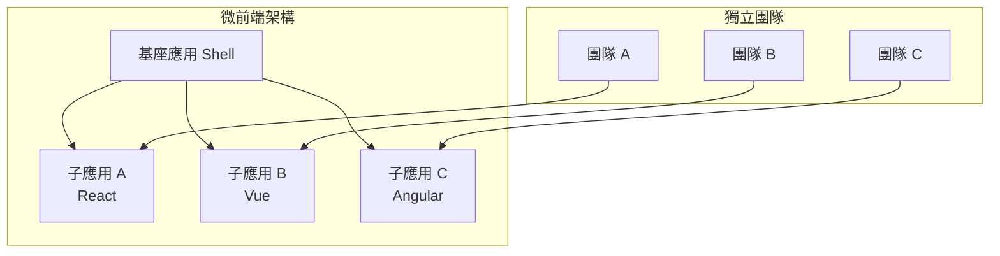

### 1.2 微前端真正要解決的問題

| 問題類型 | 單體前端的痛點 | 微前端的解決方案 |
|---------|--------------|----------------|
| **團隊協作** | 多團隊同時修改同一 codebase，衝突頻繁 | 各團隊獨立 repo，獨立部署 |
| **技術債務** | 舊系統難以逐步升級，需要大爆炸式重構 | 漸進式遷移，新舊系統並存 |
| **部署耦合** | 任何小改動都需要整體部署 | 子應用獨立部署，降低風險 |
| **技術棧鎖定** | 被迫統一技術棧，無法採用更適合的工具 | 各子應用可選擇最適合的技術 |
| **建置時間** | 專案越大，build 時間越長 | 各子應用獨立 build，平行執行 |

### 1.3 什麼情況「不該用微前端」

> ⚠️ **重要提醒**：微前端不是銀彈，錯誤導入會帶來比單體更大的複雜度。

#### 不適合微前端的情境

1. **團隊規模小於 3 個獨立團隊**
   - 微前端的架構成本需要足夠的團隊規模來攤提
   - 小團隊用 Monorepo + 模組化即可

2. **應用邏輯高度耦合**
   - 子應用之間需要頻繁、即時的資料交換
   - 無法清楚劃分業務邊界

3. **對首屏效能有極致要求**
   - 微前端必然帶來額外的 runtime overhead
   - 對效能敏感的 C 端產品需謹慎評估

4. **缺乏基礎設施支援**
   - 沒有成熟的 CI/CD 流程
   - 沒有統一的監控、日誌系統

5. **為了「新技術」而導入**
   - 「別人都在用」不是理由
   - 必須有明確的業務價值驅動

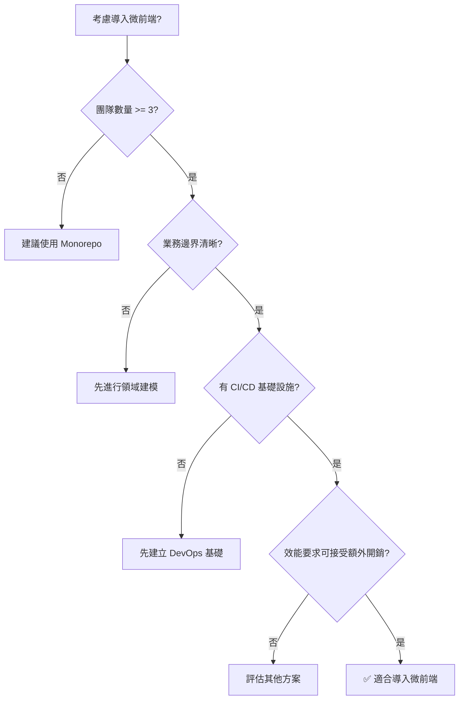

### 1.4 微前端 vs 單體前端 vs Monorepo

| 維度 | 單體前端 | Monorepo | 微前端 |
|-----|---------|----------|-------|
| **程式碼管理** | 單一 repo | 單一 repo，多 package | 多 repo 或 Monorepo |
| **部署單位** | 整體部署 | 可獨立部署（需額外設定） | 完全獨立部署 |
| **技術棧** | 統一 | 可不同但共享工具鏈 | 完全獨立 |
| **運行時隔離** | 無 | 無 | 有 |
| **團隊自治** | 低 | 中 | 高 |
| **架構複雜度** | 低 | 中 | 高 |
| **適用規模** | 小型 | 中型 | 大型 |

#### 選型決策樹

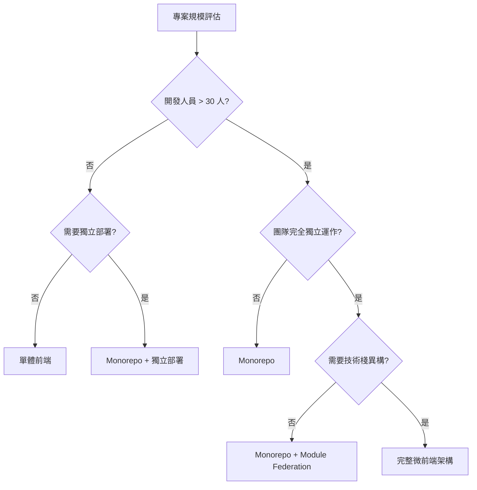

### 1.5 本章實務案例

**案例：某銀行網路銀行系統重構**

**背景**：
- 原系統為 10 年前的 jQuery + JSP 架構
- 約 200 個功能模組，50 萬行前端程式碼
- 5 個開發團隊，共 40 位前端工程師

**決策過程**：
1. 評估發現無法一次性重寫（風險太高）
2. 採用微前端實現「絞殺者模式」漸進遷移
3. 新功能用 Vue 3 開發為子應用
4. 舊功能逐步重構後替換

**結果**：
- 18 個月內完成 70% 功能遷移
- 新功能開發效率提升 40%
- 部署頻率從每月 1 次提升到每週 2 次

---

## 2. 微前端主流架構模式比較

### 2.1 基座（Shell / Container）模式

基座模式是微前端最常見的架構，由一個「主應用」負責：
- 應用載入與生命週期管理
- 全域路由協調
- 共享資源管理（認證、全域狀態）
- 子應用間通訊協調

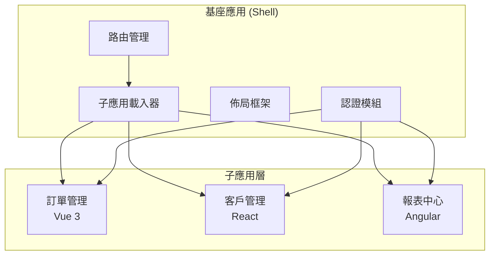

#### 基座的核心職責

```typescript
// 基座應用的核心介面設計
interface MicroAppShell {
  // 註冊子應用
  registerApp(config: AppConfig): void;
  
  // 啟動子應用
  mountApp(appName: string, container: HTMLElement): Promise<void>;
  
  // 卸載子應用
  unmountApp(appName: string): Promise<void>;
  
  // 子應用間通訊
  dispatch(event: string, payload: any): void;
  
  // 訂閱事件
  subscribe(event: string, handler: Function): Unsubscribe;
}

interface AppConfig {
  name: string;
  entry: string;  // 子應用入口 URL
  container: string;  // DOM 容器選擇器
  activeRule: string | ((location: Location) => boolean);
  props?: Record<string, any>;  // 傳遞給子應用的參數
}
```

### 2.2 Runtime Integration vs Build-time Integration

| 特性 | Build-time Integration | Runtime Integration |
|-----|----------------------|---------------------|
| **整合時機** | 打包時 | 運行時 |
| **獨立部署** | ❌ 需要重新打包基座 | ✅ 完全獨立 |
| **版本控制** | 在 package.json 中 | 在運行時動態載入 |
| **效能** | 較好（可 tree-shaking） | 有額外載入開銷 |
| **技術棧靈活度** | 低（需相容） | 高 |
| **代表方案** | npm package、Monorepo | Module Federation、qiankun |

#### Build-time Integration 範例

```json
// package.json - 將子應用作為 npm 套件引入
{
  "dependencies": {
    "@myorg/micro-app-order": "^1.2.0",
    "@myorg/micro-app-customer": "^2.1.0"
  }
}
```

```typescript
// 基座應用中直接 import
import { OrderModule } from '@myorg/micro-app-order';
import { CustomerModule } from '@myorg/micro-app-customer';
```

#### Runtime Integration 範例

```typescript
// 運行時動態載入子應用
const loadMicroApp = async (name: string, entry: string) => {
  // 1. 獲取子應用 manifest
  const manifest = await fetch(`${entry}/asset-manifest.json`).then(r => r.json());
  
  // 2. 動態載入 JS
  const script = document.createElement('script');
  script.src = `${entry}/${manifest['main.js']}`;
  
  // 3. 等待子應用掛載
  return new Promise((resolve) => {
    script.onload = () => {
      const app = window[`__MICRO_APP_${name}__`];
      resolve(app);
    };
    document.body.appendChild(script);
  });
};
```

### 2.3 iframe / Web Components / Module Federation 比較

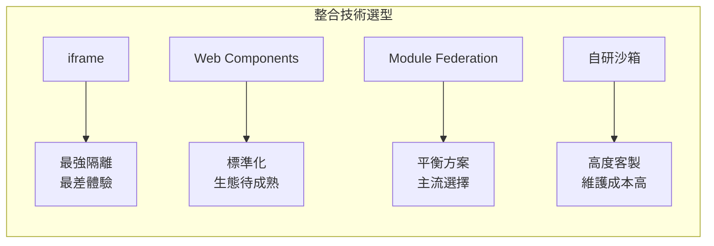

#### 詳細比較表

| 維度 | iframe | Web Components | Module Federation |
|-----|--------|---------------|-------------------|
| **JS 隔離** | ✅ 天然隔離 | ⚠️ 需額外處理 | ⚠️ 需額外處理 |
| **CSS 隔離** | ✅ 天然隔離 | ✅ Shadow DOM | ⚠️ 需命名空間/CSS Module |
| **通訊複雜度** | 高（postMessage） | 中（事件/屬性） | 低（直接引用） |
| **SEO** | ❌ 不友好 | ✅ 可支援 | ✅ 可支援 |
| **路由同步** | 困難 | 可行 | 容易 |
| **共享依賴** | ❌ 無法 | ⚠️ 有限 | ✅ 完整支援 |
| **效能開銷** | 高 | 低 | 中 |
| **瀏覽器支援** | ✅ 全部 | ⚠️ 需 polyfill | ✅ 現代瀏覽器 |

#### 選型建議

```typescript
// 決策函數範例
function selectIntegrationStrategy(requirements: Requirements): Strategy {
  // 1. 需要最強隔離（如：嵌入第三方內容）
  if (requirements.strictIsolation && requirements.thirdPartyContent) {
    return 'iframe';
  }
  
  // 2. 需要跨框架共用 UI 元件
  if (requirements.crossFrameworkComponents && !requirements.complexStateSharing) {
    return 'web-components';
  }
  
  // 3. 主流場景：同構或異構微前端
  if (requirements.independentDeployment && requirements.sharedDependencies) {
    return 'module-federation';
  }
  
  // 4. 對隔離有特殊需求
  if (requirements.customSandbox) {
    return 'qiankun-like-sandbox';
  }
  
  return 'module-federation';  // 預設推薦
}
```

### 2.4 主流框架方案比較

| 框架 | 核心特點 | 適用場景 | 學習曲線 |
|-----|---------|---------|---------|
| **qiankun** | 完整生命週期、沙箱隔離 | 企業級複雜應用 | 中 |
| **single-spa** | 輕量、框架無關 | 需要高度客製化 | 高 |
| **Module Federation** | Webpack 5 原生支援 | 需要依賴共享 | 中 |
| **micro-app** | Web Components 封裝 | 追求簡單易用 | 低 |
| **wujie** | iframe 增強方案 | 需要強隔離 | 低 |

### 2.5 本章實務案例

**案例：電商平台技術選型**

**需求分析**：
- 商品中心（React）、訂單系統（Vue）、會員系統（Angular）
- 需要共享設計系統元件
- 對 SEO 有要求（商品頁）
- 需要獨立部署

**選型決策**：
- **排除 iframe**：SEO 需求
- **排除純 Web Components**：狀態共享複雜
- **選擇 Module Federation**：平衡依賴共享與獨立部署

**架構設計**：
```
Shell (Webpack 5 + MF)
├── shared-design-system (Remote)
├── micro-product (Remote, React)
├── micro-order (Remote, Vue)
└── micro-member (Remote, Angular)
```

---

## 3. Module Federation 深度解析

### 3.1 基本運作原理（Host / Remote）

Module Federation 是 Webpack 5 引入的原生模組共享機制，核心概念：

- **Host（消費者）**：載入並使用其他應用暴露的模組
- **Remote（提供者）**：暴露模組供其他應用使用
- **Shared（共享）**：多個應用共用的依賴（如 React、Vue）

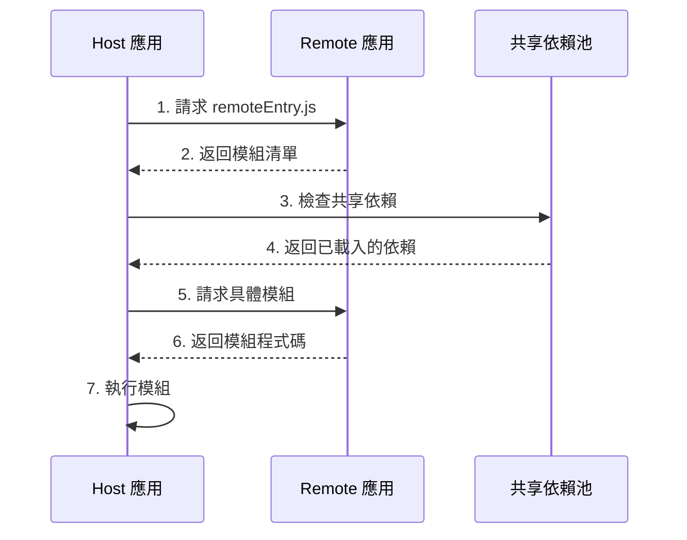

#### Host 配置範例

```javascript
// webpack.config.js (Host 應用)
const { ModuleFederationPlugin } = require('webpack').container;

module.exports = {
  plugins: [
    new ModuleFederationPlugin({
      name: 'shell',
      
      // 聲明要使用的遠端應用
      remotes: {
        orderApp: 'orderApp@http://localhost:3001/remoteEntry.js',
        customerApp: 'customerApp@http://localhost:3002/remoteEntry.js',
      },
      
      // 共享依賴配置
      shared: {
        react: { 
          singleton: true,  // 確保只有一個實例
          requiredVersion: '^18.0.0',
        },
        'react-dom': { 
          singleton: true,
          requiredVersion: '^18.0.0',
        },
      },
    }),
  ],
};
```

#### Remote 配置範例

```javascript
// webpack.config.js (Remote 應用)
const { ModuleFederationPlugin } = require('webpack').container;

module.exports = {
  plugins: [
    new ModuleFederationPlugin({
      name: 'orderApp',
      filename: 'remoteEntry.js',
      
      // 暴露模組
      exposes: {
        './OrderList': './src/components/OrderList',
        './OrderDetail': './src/pages/OrderDetail',
        './orderService': './src/services/orderService',
      },
      
      // 共享依賴
      shared: {
        react: { singleton: true, requiredVersion: '^18.0.0' },
        'react-dom': { singleton: true, requiredVersion: '^18.0.0' },
        'react-router-dom': { singleton: true },
      },
    }),
  ],
};
```

#### 使用 Remote 模組

```typescript
// Host 應用中使用 Remote 模組
// 方式 1：靜態導入（需要 TypeScript 類型聲明）
import OrderList from 'orderApp/OrderList';

// 方式 2：動態導入（推薦，支援錯誤處理）
const OrderList = React.lazy(() => import('orderApp/OrderList'));

// 方式 3：封裝載入邏輯
const loadRemoteModule = async (remoteName: string, moduleName: string) => {
  try {
    const container = window[remoteName];
    if (!container) {
      throw new Error(`Remote ${remoteName} not found`);
    }
    await container.init(__webpack_share_scopes__.default);
    const factory = await container.get(moduleName);
    return factory();
  } catch (error) {
    console.error(`Failed to load ${remoteName}/${moduleName}:`, error);
    throw error;
  }
};
```

### 3.2 Shared Library 設計策略

共享依賴的配置是 Module Federation 最複雜也最關鍵的部分。

#### 共享策略選項

```javascript
shared: {
  // 策略 1：簡單共享（自動推斷版本）
  'lodash': {},
  
  // 策略 2：單例模式（全域只有一個實例）
  'react': {
    singleton: true,
    strictVersion: true,  // 版本不符時報錯
    requiredVersion: '^18.0.0',
  },
  
  // 策略 3：即時載入（不使用懶載入）
  '@company/design-system': {
    eager: true,  // 打包進主 bundle
    singleton: true,
  },
  
  // 策略 4：版本範圍控制
  'axios': {
    singleton: true,
    requiredVersion: '>=0.21.0 <2.0.0',
  },
}
```

#### 共享依賴決策矩陣

| 依賴類型 | singleton | eager | strictVersion | 說明 |
|---------|-----------|-------|---------------|-----|
| React/Vue 核心 | ✅ | ❌ | ✅ | 必須單例，版本嚴格匹配 |
| 狀態管理（Redux/Pinia） | ✅ | ❌ | ⚠️ | 單例，版本可適度放寬 |
| UI 元件庫 | ✅ | ⚠️ | ⚠️ | 看是否需要快速載入 |
| 工具庫（lodash） | ❌ | ❌ | ❌ | 可多版本並存 |
| 公司內部共用庫 | ✅ | ✅ | ⚠️ | 建議即時載入 |

### 3.3 版本衝突與依賴治理

#### 常見版本衝突場景

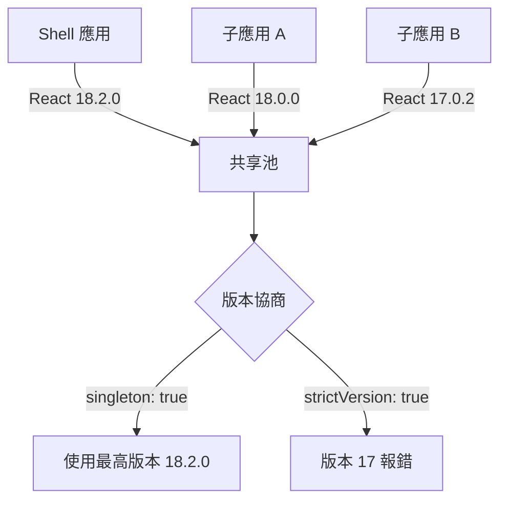

#### 版本衝突解決方案

```javascript
// 方案 1：版本對齊（推薦）
// 所有應用統一到相同版本
shared: {
  react: {
    singleton: true,
    strictVersion: true,
    requiredVersion: '18.2.0',  // 固定版本
  },
}

// 方案 2：版本範圍容忍
shared: {
  react: {
    singleton: true,
    requiredVersion: '^18.0.0',  // 允許 18.x
  },
}

// 方案 3：Fallback 機制
const loadReactSafely = async () => {
  try {
    return await import('react');
  } catch (e) {
    // 載入本地備份版本
    return await import('./fallback/react');
  }
};
```

#### 依賴版本治理工具

```typescript
// scripts/check-shared-versions.ts
// 用於 CI 檢查各子應用依賴版本一致性

import * as fs from 'fs';
import * as path from 'path';

interface DependencyReport {
  package: string;
  versions: Map<string, string[]>;  // version -> apps
}

function checkSharedVersions(apps: string[]): DependencyReport[] {
  const sharedPackages = ['react', 'react-dom', 'react-router-dom'];
  const reports: DependencyReport[] = [];
  
  for (const pkg of sharedPackages) {
    const versions = new Map<string, string[]>();
    
    for (const app of apps) {
      const pkgJson = JSON.parse(
        fs.readFileSync(path.join(app, 'package.json'), 'utf-8')
      );
      const version = pkgJson.dependencies?.[pkg] || pkgJson.devDependencies?.[pkg];
      
      if (version) {
        if (!versions.has(version)) {
          versions.set(version, []);
        }
        versions.get(version)!.push(app);
      }
    }
    
    if (versions.size > 1) {
      reports.push({ package: pkg, versions });
    }
  }
  
  return reports;
}
```

### 3.4 Webpack vs Vite Module Federation

| 特性 | Webpack 5 MF | Vite + vite-plugin-federation |
|-----|-------------|------------------------------|
| **成熟度** | 高（原生支援） | 中（社群插件） |
| **開發體驗** | HMR 支援 | 更快的 HMR |
| **生產建置** | 穩定 | 需注意相容性 |
| **配置複雜度** | 中等 | 較低 |
| **Shared 處理** | 完整 | 有限制 |
| **生態支援** | 豐富 | 成長中 |

#### Vite Federation 配置範例

```typescript
// vite.config.ts (Host)
import { defineConfig } from 'vite';
import federation from '@originjs/vite-plugin-federation';

export default defineConfig({
  plugins: [
    federation({
      name: 'shell',
      remotes: {
        orderApp: 'http://localhost:3001/assets/remoteEntry.js',
      },
      shared: ['vue', 'pinia'],
    }),
  ],
  build: {
    target: 'esnext',
    minify: false,
    cssCodeSplit: false,
  },
});
```

```typescript
// vite.config.ts (Remote)
import { defineConfig } from 'vite';
import federation from '@originjs/vite-plugin-federation';

export default defineConfig({
  plugins: [
    federation({
      name: 'orderApp',
      filename: 'remoteEntry.js',
      exposes: {
        './OrderList': './src/components/OrderList.vue',
      },
      shared: ['vue', 'pinia'],
    }),
  ],
  build: {
    target: 'esnext',
    minify: false,
  },
});
```

### 3.5 本章實務案例

**案例：金融交易系統的 MF 實作**

**挑戰**：
- 5 個子應用，3 種框架（React, Vue, Angular）
- 需要共享設計系統（200+ 元件）
- 對載入效能敏感

**解決方案**：

```javascript
// 設計系統作為獨立 Remote
// design-system/webpack.config.js
new ModuleFederationPlugin({
  name: 'designSystem',
  filename: 'remoteEntry.js',
  exposes: {
    './Button': './src/components/Button',
    './Table': './src/components/Table',
    './Form': './src/components/Form',
    // ... 200+ 元件
  },
  shared: {
    react: { singleton: true, eager: true },
    'styled-components': { singleton: true },
  },
})

// 使用預載入優化
// shell/src/bootstrap.ts
const preloadDesignSystem = () => {
  const link = document.createElement('link');
  link.rel = 'preload';
  link.as = 'script';
  link.href = 'https://cdn.example.com/design-system/remoteEntry.js';
  document.head.appendChild(link);
};
```

---

## 4. 路由與狀態管理設計

### 4.1 全域 Router vs 子應用 Router

微前端中的路由是最複雜的議題之一，需要處理「基座路由」與「子應用路由」的協調。

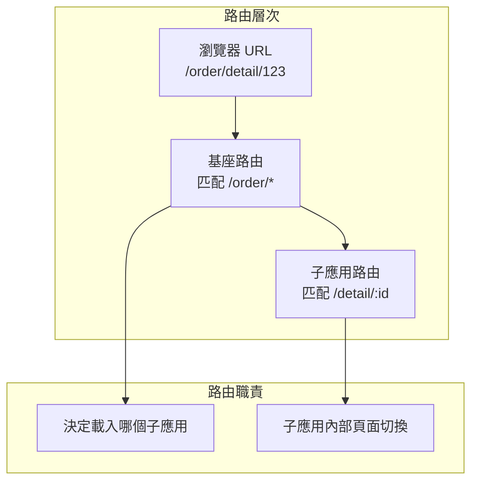

#### 路由架構模式

| 模式 | 說明 | 優點 | 缺點 |
|-----|-----|-----|-----|
| **基座接管** | 基座統一管理所有路由 | 路由邏輯集中 | 子應用失去自主性 |
| **子應用自治** | 基座只做 prefix 匹配 | 子應用完全獨立 | 路由可能衝突 |
| **混合模式** | 基座管理一級路由，子應用管理內部路由 | 平衡 | 需要良好的約定 |

#### 基座路由配置（以 Vue Router 為例）

```typescript
// shell/src/router/index.ts
import { createRouter, createWebHistory, RouteRecordRaw } from 'vue-router';
import { loadMicroApp } from '@/micro/loader';

const routes: RouteRecordRaw[] = [
  // 基座自有頁面
  { path: '/', component: () => import('@/views/Home.vue') },
  { path: '/login', component: () => import('@/views/Login.vue') },
  
  // 子應用路由 - 使用通配符
  {
    path: '/order/:pathMatch(.*)*',
    component: () => import('@/views/MicroAppContainer.vue'),
    meta: { microApp: 'orderApp' },
  },
  {
    path: '/customer/:pathMatch(.*)*',
    component: () => import('@/views/MicroAppContainer.vue'),
    meta: { microApp: 'customerApp' },
  },
];

const router = createRouter({
  history: createWebHistory(),
  routes,
});

// 路由守衛：載入對應的子應用
router.beforeEach(async (to, from, next) => {
  const microAppName = to.meta.microApp as string;
  
  if (microAppName) {
    await loadMicroApp(microAppName);
  }
  
  next();
});

export default router;
```

#### 子應用路由配置

```typescript
// order-app/src/router/index.ts
import { createRouter, createWebHistory, RouteRecordRaw } from 'vue-router';

const routes: RouteRecordRaw[] = [
  { path: '/', redirect: '/list' },
  { path: '/list', component: () => import('@/views/OrderList.vue') },
  { path: '/detail/:id', component: () => import('@/views/OrderDetail.vue') },
  { path: '/create', component: () => import('@/views/OrderCreate.vue') },
];

// 關鍵：根據運行環境決定 base path
const getBasePath = () => {
  // 獨立運行
  if (!window.__POWERED_BY_QIANKUN__) {
    return '/';
  }
  // 作為子應用運行
  return '/order';
};

const router = createRouter({
  history: createWebHistory(getBasePath()),
  routes,
});

export default router;
```

#### 路由同步機制

```typescript
// 基座與子應用路由同步
class RouterSync {
  private shellRouter: Router;
  private listeners: Map<string, Function> = new Map();
  
  constructor(shellRouter: Router) {
    this.shellRouter = shellRouter;
    this.setupPopstateListener();
  }
  
  // 監聽瀏覽器前進/後退
  private setupPopstateListener() {
    window.addEventListener('popstate', () => {
      this.notifyMicroApps();
    });
  }
  
  // 子應用路由變化時通知基座
  onMicroAppRouteChange(appName: string, path: string) {
    const fullPath = `/${appName}${path}`;
    
    // 避免重複觸發
    if (this.shellRouter.currentRoute.value.fullPath !== fullPath) {
      this.shellRouter.replace(fullPath);
    }
  }
  
  // 通知子應用路由變化
  private notifyMicroApps() {
    this.listeners.forEach((callback) => callback(window.location.pathname));
  }
  
  // 子應用註冊監聽
  registerMicroApp(appName: string, callback: Function) {
    this.listeners.set(appName, callback);
  }
}
```

### 4.2 狀態共享邊界

> ⚠️ **核心原則**：子應用之間應該盡可能減少直接的狀態共享，過度共享會導致緊耦合。

#### 狀態共享決策矩陣

| 狀態類型 | 是否共享 | 共享方式 | 說明 |
|---------|---------|---------|-----|
| 用戶認證資訊 | ✅ 是 | 基座下發 | Token、用戶資料 |
| 全域設定 | ✅ 是 | 基座下發 | 語言、主題、權限 |
| UI 狀態（Modal、Toast） | ✅ 是 | 事件通訊 | 避免多層彈窗 |
| 業務資料 | ⚠️ 謹慎 | API 或事件 | 避免直接共享 |
| 子應用內部狀態 | ❌ 否 | - | 完全隔離 |
| 快取資料 | ⚠️ 謹慎 | 共享快取層 | 需定義失效策略 |

#### 正確的狀態共享架構

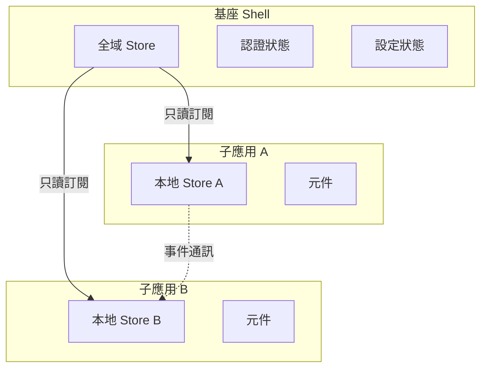

#### 基座全域狀態設計

```typescript
// shell/src/store/global.ts
import { reactive, readonly } from 'vue';

interface GlobalState {
  user: {
    id: string;
    name: string;
    roles: string[];
    token: string;
  } | null;
  config: {
    language: 'zh-TW' | 'en-US';
    theme: 'light' | 'dark';
    permissions: string[];
  };
  ui: {
    sidebarCollapsed: boolean;
    globalLoading: boolean;
  };
}

const state = reactive<GlobalState>({
  user: null,
  config: {
    language: 'zh-TW',
    theme: 'light',
    permissions: [],
  },
  ui: {
    sidebarCollapsed: false,
    globalLoading: false,
  },
});

// 只暴露只讀版本給子應用
export const globalState = readonly(state);

// 修改方法只在基座內部使用
export const globalActions = {
  setUser(user: GlobalState['user']) {
    state.user = user;
  },
  setLanguage(lang: GlobalState['config']['language']) {
    state.config.language = lang;
  },
  setTheme(theme: GlobalState['config']['theme']) {
    state.config.theme = theme;
  },
  setGlobalLoading(loading: boolean) {
    state.ui.globalLoading = loading;
  },
};

// 暴露給子應用的介面
export const microAppAPI = {
  getState: () => globalState,
  subscribe: (callback: (state: GlobalState) => void) => {
    // 實作狀態訂閱
  },
  requestPermission: async (permission: string) => {
    // 權限請求 API
  },
};
```

### 4.3 Event Bus / Global Store 的使用準則

#### Event Bus 設計

```typescript
// shared/src/eventBus.ts
type EventHandler = (...args: any[]) => void;

class MicroAppEventBus {
  private events: Map<string, Set<EventHandler>> = new Map();
  private eventHistory: Map<string, any[]> = new Map();  // 用於 replay
  
  // 發送事件
  emit(event: string, ...args: any[]) {
    console.log(`[EventBus] Emit: ${event}`, args);
    
    // 記錄歷史（可選）
    this.eventHistory.set(event, args);
    
    const handlers = this.events.get(event);
    if (handlers) {
      handlers.forEach(handler => {
        try {
          handler(...args);
        } catch (error) {
          console.error(`[EventBus] Handler error for ${event}:`, error);
        }
      });
    }
  }
  
  // 訂閱事件
  on(event: string, handler: EventHandler): () => void {
    if (!this.events.has(event)) {
      this.events.set(event, new Set());
    }
    this.events.get(event)!.add(handler);
    
    // 返回取消訂閱函數
    return () => this.off(event, handler);
  }
  
  // 一次性訂閱
  once(event: string, handler: EventHandler) {
    const wrappedHandler = (...args: any[]) => {
      handler(...args);
      this.off(event, wrappedHandler);
    };
    this.on(event, wrappedHandler);
  }
  
  // 取消訂閱
  off(event: string, handler: EventHandler) {
    const handlers = this.events.get(event);
    if (handlers) {
      handlers.delete(handler);
    }
  }
  
  // 獲取最後一次事件資料（用於子應用延遲載入後獲取）
  getLastEvent(event: string): any[] | undefined {
    return this.eventHistory.get(event);
  }
}

// 單例模式
export const eventBus = new MicroAppEventBus();

// 預定義事件類型（Type-safe）
export const MicroAppEvents = {
  // 用戶相關
  USER_LOGIN: 'user:login',
  USER_LOGOUT: 'user:logout',
  USER_PROFILE_UPDATED: 'user:profile-updated',
  
  // 導航相關
  NAVIGATE_TO: 'navigation:to',
  
  // 業務事件
  ORDER_CREATED: 'order:created',
  ORDER_UPDATED: 'order:updated',
  CUSTOMER_SELECTED: 'customer:selected',
  
  // UI 事件
  SHOW_GLOBAL_LOADING: 'ui:show-loading',
  HIDE_GLOBAL_LOADING: 'ui:hide-loading',
  SHOW_NOTIFICATION: 'ui:notification',
} as const;
```

#### 使用範例

```typescript
// 子應用 A：發送事件
import { eventBus, MicroAppEvents } from '@myorg/shared';

const createOrder = async (orderData: OrderData) => {
  const order = await orderService.create(orderData);
  
  // 通知其他子應用
  eventBus.emit(MicroAppEvents.ORDER_CREATED, {
    orderId: order.id,
    customerId: order.customerId,
    totalAmount: order.totalAmount,
  });
  
  return order;
};

// 子應用 B：接收事件
import { eventBus, MicroAppEvents } from '@myorg/shared';
import { onMounted, onUnmounted } from 'vue';

export function useOrderEvents() {
  let unsubscribe: (() => void) | null = null;
  
  onMounted(() => {
    unsubscribe = eventBus.on(MicroAppEvents.ORDER_CREATED, (payload) => {
      console.log('New order created:', payload);
      // 更新相關資料
      refreshCustomerOrders(payload.customerId);
    });
  });
  
  onUnmounted(() => {
    unsubscribe?.();
  });
}
```

#### Event Bus 使用守則

| 做法 | ✅ 正確 | ❌ 錯誤 |
|-----|--------|--------|
| 事件命名 | `order:created` | `data`, `update` |
| 事件資料 | 只傳 ID 或摘要 | 傳完整業務物件 |
| 訂閱管理 | 在 unmount 時取消 | 忘記取消訂閱 |
| 事件頻率 | 低頻業務事件 | 高頻 UI 更新 |
| 錯誤處理 | 捕獲處理器錯誤 | 讓錯誤冒泡 |

### 4.4 本章實務案例

**案例：CRM 系統的狀態管理設計**

**需求**：
- 客戶列表（子應用 A）選擇客戶後，訂單列表（子應用 B）需要聯動
- 需要避免過度耦合

**錯誤做法**：
```typescript
// ❌ 子應用 A 直接操作子應用 B 的 Store
import { orderStore } from 'orderApp/store';  // 跨應用直接引用
orderStore.setCustomerId(customerId);  // 直接操作
```

**正確做法**：
```typescript
// ✅ 通過事件解耦
// 子應用 A
eventBus.emit('customer:selected', { customerId: '123', customerName: 'ABC Corp' });

// 子應用 B
eventBus.on('customer:selected', ({ customerId }) => {
  // 自行決定如何處理
  localStore.setFilter({ customerId });
  fetchOrders({ customerId });
});
```

---

## 5. 隔離與安全性設計

### 5.1 CSS 隔離策略

CSS 污染是微前端中最常見的問題之一，子應用的樣式可能影響基座或其他子應用。

```mermaid
graph LR
    subgraph "CSS 污染風險"
        A[子應用 A<br/>.btn { color: red }] --> C[全域 CSS]
        B[子應用 B<br/>.btn { color: blue }] --> C
        C --> D[衝突！]
    end
```

#### 隔離方案比較

| 方案 | 隔離程度 | 實作難度 | 效能影響 | 相容性 |
|-----|---------|---------|---------|--------|
| CSS Modules | 中 | 低 | 無 | 優 |
| CSS-in-JS | 中 | 中 | 有 | 優 |
| BEM 命名空間 | 低 | 低 | 無 | 優 |
| Shadow DOM | 高 | 高 | 低 | 中 |
| 動態樣式前綴 | 高 | 中 | 低 | 優 |

#### CSS Modules 實作

```typescript
// 子應用使用 CSS Modules
// OrderList.module.css
.container {
  padding: 16px;
}

.button {
  background: #1890ff;
}

// OrderList.tsx
import styles from './OrderList.module.css';

export const OrderList = () => (
  <div className={styles.container}>
    <button className={styles.button}>Submit</button>
  </div>
);
```

#### 動態樣式前綴（推薦）

```typescript
// 使用 PostCSS 自動添加前綴
// postcss.config.js
module.exports = {
  plugins: [
    require('postcss-prefix-selector')({
      prefix: '[data-qiankun="orderApp"]',
      transform: (prefix, selector, prefixedSelector) => {
        if (selector.startsWith(':root')) {
          return selector;  // 不處理 :root
        }
        return prefixedSelector;
      },
    }),
  ],
};

// 輸出結果
// 原始: .btn { color: red; }
// 轉換後: [data-qiankun="orderApp"] .btn { color: red; }
```

#### Shadow DOM 隔離（qiankun）

```typescript
// qiankun 配置啟用 Shadow DOM
import { registerMicroApps, start } from 'qiankun';

registerMicroApps([
  {
    name: 'orderApp',
    entry: '//localhost:3001',
    container: '#subapp-container',
    activeRule: '/order',
    props: { /* ... */ },
  },
]);

start({
  sandbox: {
    strictStyleIsolation: true,  // 啟用 Shadow DOM
    // 或使用實驗性樣式隔離
    experimentalStyleIsolation: true,
  },
});
```

### 5.2 JS 沙箱隔離策略

JS 隔離需要防止子應用污染全域變數、覆寫原生方法等問題。

#### 常見 JS 污染場景

```typescript
// ❌ 子應用污染全域變數
window.myGlobalVar = 'polluted';
window.addEventListener('resize', handler);  // 未清理

// ❌ 覆寫原生方法
Array.prototype.customMethod = function() { /* ... */ };
```

#### 快照沙箱（Snapshot Sandbox）

```typescript
// 簡化版快照沙箱實作
class SnapshotSandbox {
  private windowSnapshot: Map<string, any> = new Map();
  private modifyPropsMap: Map<string, any> = new Map();
  
  activate() {
    // 記錄當前 window 快照
    for (const key in window) {
      this.windowSnapshot.set(key, (window as any)[key]);
    }
    
    // 恢復之前的修改
    this.modifyPropsMap.forEach((value, key) => {
      (window as any)[key] = value;
    });
  }
  
  deactivate() {
    // 記錄變更並恢復原始值
    for (const key in window) {
      if ((window as any)[key] !== this.windowSnapshot.get(key)) {
        this.modifyPropsMap.set(key, (window as any)[key]);
        (window as any)[key] = this.windowSnapshot.get(key);
      }
    }
  }
}
```

#### Proxy 沙箱（推薦）

```typescript
// 使用 Proxy 實現更精細的沙箱
class ProxySandbox {
  private proxy: Window;
  private running = false;
  private fakeWindow: Record<string, any> = {};
  
  constructor() {
    const _this = this;
    
    this.proxy = new Proxy(window, {
      get(target, key: string) {
        // 優先從 fakeWindow 獲取
        if (_this.fakeWindow.hasOwnProperty(key)) {
          return _this.fakeWindow[key];
        }
        
        // 特殊處理
        if (key === 'window' || key === 'self' || key === 'globalThis') {
          return _this.proxy;
        }
        
        const value = (target as any)[key];
        return typeof value === 'function' ? value.bind(target) : value;
      },
      
      set(target, key: string, value) {
        if (_this.running) {
          _this.fakeWindow[key] = value;
        }
        return true;
      },
      
      has(target, key) {
        return key in _this.fakeWindow || key in target;
      },
    });
  }
  
  activate() {
    this.running = true;
  }
  
  deactivate() {
    this.running = false;
  }
  
  getProxy() {
    return this.proxy;
  }
}

// 使用沙箱執行子應用程式碼
const sandbox = new ProxySandbox();
sandbox.activate();

// 在沙箱環境中執行
(function(window) {
  // 子應用程式碼在此執行
  // 所有對 window 的修改都被隔離
}.bind(sandbox.getProxy())(sandbox.getProxy()));
```

### 5.3 微前端下的資安風險

#### 風險矩陣

| 風險類型 | 風險等級 | 說明 | 緩解措施 |
|---------|---------|-----|---------|
| XSS 跨站腳本 | 高 | 子應用注入惡意腳本 | CSP、輸入驗證 |
| CSRF | 中 | 跨域請求偽造 | Token 驗證、SameSite Cookie |
| 資料洩漏 | 高 | 子應用間敏感資料洩漏 | 最小權限、資料脫敏 |
| 依賴劫持 | 中 | 惡意 npm 套件 | 依賴鎖定、安全掃描 |
| 點擊劫持 | 低 | iframe 點擊劫持 | X-Frame-Options |

#### Content Security Policy 配置

```html
<!-- 基座應用 CSP 配置 -->
<meta http-equiv="Content-Security-Policy" content="
  default-src 'self';
  script-src 'self' https://cdn.trusted-domain.com;
  style-src 'self' 'unsafe-inline';
  img-src 'self' data: https:;
  connect-src 'self' https://api.example.com;
  frame-src 'self' https://trusted-iframe.com;
">
```

```typescript
// Nginx 配置
server {
  location / {
    add_header Content-Security-Policy "
      default-src 'self';
      script-src 'self' https://cdn.example.com;
      style-src 'self' 'unsafe-inline';
    ";
    add_header X-Frame-Options "SAMEORIGIN";
    add_header X-Content-Type-Options "nosniff";
    add_header X-XSS-Protection "1; mode=block";
  }
}
```

### 5.4 權限、Token、SSO 整合模式

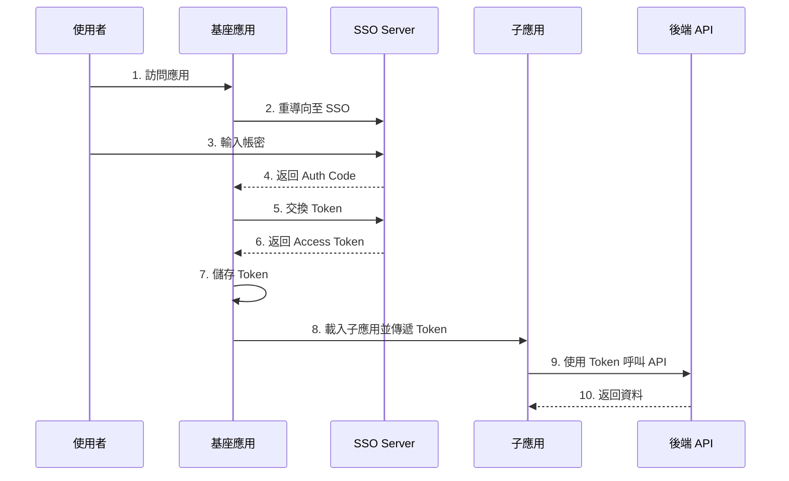

#### Token 傳遞策略

```typescript
// 方式 1：通過 props 傳遞（推薦）
registerMicroApps([
  {
    name: 'orderApp',
    entry: '//localhost:3001',
    container: '#container',
    activeRule: '/order',
    props: {
      getToken: () => authStore.getToken(),
      onTokenExpired: () => authStore.refreshToken(),
    },
  },
]);

// 子應用接收
export async function mount(props: MicroAppProps) {
  const { getToken, onTokenExpired } = props;
  
  // 設定 API 攔截器
  axios.interceptors.request.use((config) => {
    config.headers.Authorization = `Bearer ${getToken()}`;
    return config;
  });
  
  axios.interceptors.response.use(
    (response) => response,
    async (error) => {
      if (error.response?.status === 401) {
        await onTokenExpired();
        return axios(error.config);
      }
      throw error;
    }
  );
}
```

```typescript
// 方式 2：共享 Cookie（跨域需謹慎）
// 設定 Cookie 為相同主域名
document.cookie = `token=${token}; domain=.example.com; path=/; secure; samesite=strict`;

// 方式 3：LocalStorage + 同域（不推薦跨域）
localStorage.setItem('auth_token', token);
```

#### 權限控制整合

```typescript
// shell/src/permission.ts
interface Permission {
  code: string;
  name: string;
  microApp?: string;  // 關聯的子應用
}

class PermissionService {
  private permissions: Set<string> = new Set();
  
  async loadPermissions(userId: string) {
    const perms = await api.getUserPermissions(userId);
    this.permissions = new Set(perms.map(p => p.code));
  }
  
  hasPermission(code: string): boolean {
    return this.permissions.has(code);
  }
  
  // 檢查子應用訪問權限
  canAccessMicroApp(appName: string): boolean {
    const appPermissionMap: Record<string, string> = {
      orderApp: 'ORDER_MODULE_ACCESS',
      customerApp: 'CUSTOMER_MODULE_ACCESS',
      reportApp: 'REPORT_MODULE_ACCESS',
    };
    
    return this.hasPermission(appPermissionMap[appName]);
  }
  
  // 暴露給子應用的 API
  getPermissionsForMicroApp(appName: string): string[] {
    const prefix = appName.toUpperCase();
    return Array.from(this.permissions)
      .filter(p => p.startsWith(prefix));
  }
}

export const permissionService = new PermissionService();
```

### 5.5 本章實務案例

**案例：金融系統的安全隔離設計**

**需求**：
- 不同業務線的子應用需要完全隔離
- 敏感操作需要二次驗證
- 審計日誌完整記錄

**實作**：

```typescript
// 安全審計裝飾器
function auditLog(action: string) {
  return function (target: any, propertyKey: string, descriptor: PropertyDescriptor) {
    const originalMethod = descriptor.value;
    
    descriptor.value = async function (...args: any[]) {
      const startTime = Date.now();
      
      try {
        const result = await originalMethod.apply(this, args);
        
        // 記錄成功操作
        await logService.log({
          action,
          microApp: getCurrentMicroApp(),
          userId: authStore.getUserId(),
          params: args,
          result: 'success',
          duration: Date.now() - startTime,
        });
        
        return result;
      } catch (error) {
        // 記錄失敗操作
        await logService.log({
          action,
          microApp: getCurrentMicroApp(),
          userId: authStore.getUserId(),
          params: args,
          result: 'failure',
          error: error.message,
          duration: Date.now() - startTime,
        });
        
        throw error;
      }
    };
    
    return descriptor;
  };
}

// 使用範例
class OrderService {
  @auditLog('ORDER_CREATE')
  async createOrder(data: OrderData) {
    // 業務邏輯
  }
  
  @auditLog('ORDER_APPROVE')
  async approveOrder(orderId: string) {
    // 需要二次驗證
    await this.requestSecondaryAuth();
    // 業務邏輯
  }
}
```

---

## 6. CI/CD 與部署策略

### 6.1 子應用獨立部署架構

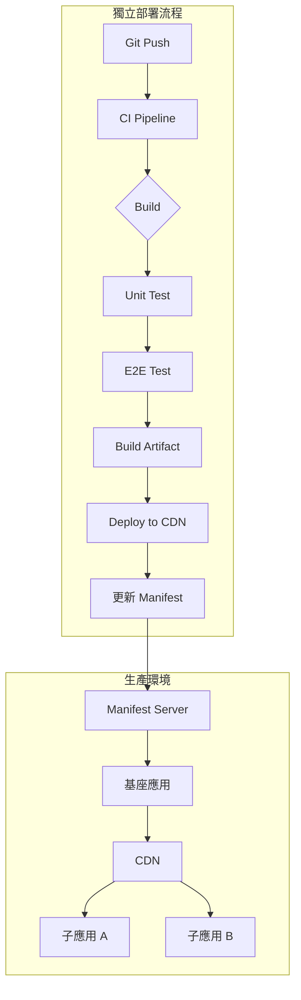

#### 部署架構設計

```typescript
// 子應用 manifest 配置
interface MicroAppManifest {
  name: string;
  version: string;
  entry: string;  // JS 入口
  styles: string[];  // CSS 檔案
  publicPath: string;
  activeRule: string;
  dependencies: {
    [key: string]: string;  // 共享依賴版本
  };
  deployedAt: string;
  gitCommit: string;
}

// manifest.json 範例
{
  "apps": {
    "orderApp": {
      "name": "orderApp",
      "version": "1.2.3",
      "entry": "https://cdn.example.com/order/1.2.3/remoteEntry.js",
      "styles": ["https://cdn.example.com/order/1.2.3/styles.css"],
      "publicPath": "https://cdn.example.com/order/1.2.3/",
      "activeRule": "/order",
      "dependencies": {
        "react": "18.2.0",
        "react-dom": "18.2.0"
      },
      "deployedAt": "2026-01-23T10:00:00Z",
      "gitCommit": "abc1234"
    }
  }
}
```

#### GitHub Actions CI/CD 範例

```yaml
# .github/workflows/deploy-micro-app.yml
name: Deploy Micro App

on:
  push:
    branches: [main]
    paths:
      - 'apps/order-app/**'

env:
  APP_NAME: orderApp
  CDN_BUCKET: micro-apps-cdn

jobs:
  build-and-deploy:
    runs-on: ubuntu-latest
    
    steps:
      - uses: actions/checkout@v4
      
      - name: Setup Node.js
        uses: actions/setup-node@v4
        with:
          node-version: '20'
          cache: 'npm'
      
      - name: Install dependencies
        run: npm ci
        working-directory: apps/order-app
      
      - name: Run tests
        run: npm test
        working-directory: apps/order-app
      
      - name: Build
        run: npm run build
        working-directory: apps/order-app
        env:
          PUBLIC_PATH: https://cdn.example.com/${{ env.APP_NAME }}/${{ github.sha }}/
      
      - name: Upload to CDN
        uses: aws-actions/configure-aws-credentials@v4
        with:
          aws-access-key-id: ${{ secrets.AWS_ACCESS_KEY_ID }}
          aws-secret-access-key: ${{ secrets.AWS_SECRET_ACCESS_KEY }}
          aws-region: ap-northeast-1
      
      - run: |
          aws s3 sync apps/order-app/dist \
            s3://${{ env.CDN_BUCKET }}/${{ env.APP_NAME }}/${{ github.sha }}/ \
            --cache-control "public, max-age=31536000"
      
      - name: Update Manifest
        run: |
          curl -X POST https://api.example.com/manifest/update \
            -H "Authorization: Bearer ${{ secrets.MANIFEST_API_KEY }}" \
            -H "Content-Type: application/json" \
            -d '{
              "app": "${{ env.APP_NAME }}",
              "version": "${{ github.sha }}",
              "entry": "https://cdn.example.com/${{ env.APP_NAME }}/${{ github.sha }}/remoteEntry.js"
            }'
```

### 6.2 版本相容性控管

#### 語義化版本策略

```typescript
// shared/version-check.ts
import semver from 'semver';

interface VersionCompatibility {
  shell: string;
  microApps: Record<string, string>;
  sharedLibraries: Record<string, string>;
}

const compatibilityMatrix: VersionCompatibility = {
  shell: '^2.0.0',
  microApps: {
    orderApp: '^1.0.0',
    customerApp: '^1.0.0',
  },
  sharedLibraries: {
    react: '18.x',
    '@company/design-system': '^3.0.0',
  },
};

function checkCompatibility(
  appName: string,
  appVersion: string,
  shellVersion: string
): { compatible: boolean; warnings: string[] } {
  const warnings: string[] = [];
  
  // 檢查 shell 版本相容性
  if (!semver.satisfies(shellVersion, compatibilityMatrix.shell)) {
    return {
      compatible: false,
      warnings: [`Shell version ${shellVersion} is not compatible`],
    };
  }
  
  // 檢查子應用版本
  const requiredVersion = compatibilityMatrix.microApps[appName];
  if (requiredVersion && !semver.satisfies(appVersion, requiredVersion)) {
    warnings.push(`${appName}@${appVersion} may have compatibility issues`);
  }
  
  return { compatible: true, warnings };
}
```

#### 相容性檢查 Hooks

```typescript
// shell/src/micro/compatibility.ts
export function createCompatibilityChecker() {
  return {
    beforeLoad: async (app: LoadableApp) => {
      const manifest = await fetchManifest(app.name);
      const shellVersion = process.env.SHELL_VERSION;
      
      const { compatible, warnings } = checkCompatibility(
        app.name,
        manifest.version,
        shellVersion
      );
      
      if (!compatible) {
        throw new Error(`Micro app ${app.name} is not compatible with current shell`);
      }
      
      warnings.forEach(w => console.warn(w));
      
      return true;
    },
  };
}
```

### 6.3 灰度發布與回滾策略

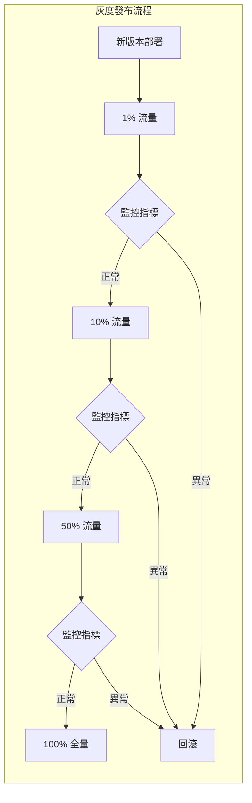

#### 灰度策略實作

```typescript
// manifest-server/src/canary.ts
interface CanaryConfig {
  app: string;
  oldVersion: string;
  newVersion: string;
  percentage: number;  // 0-100
  rules: CanaryRule[];
}

interface CanaryRule {
  type: 'user_id' | 'region' | 'random';
  value: string | number;
}

class CanaryService {
  private configs: Map<string, CanaryConfig> = new Map();
  
  // 判斷使用者應該使用哪個版本
  getVersionForUser(appName: string, context: UserContext): string {
    const config = this.configs.get(appName);
    
    if (!config) {
      return this.getStableVersion(appName);
    }
    
    // 規則判斷
    if (this.matchCanaryRules(config.rules, context)) {
      return config.newVersion;
    }
    
    // 隨機灰度
    const hash = this.hashUserId(context.userId);
    if (hash % 100 < config.percentage) {
      return config.newVersion;
    }
    
    return config.oldVersion;
  }
  
  private hashUserId(userId: string): number {
    let hash = 0;
    for (let i = 0; i < userId.length; i++) {
      hash = ((hash << 5) - hash) + userId.charCodeAt(i);
      hash = hash & hash;
    }
    return Math.abs(hash);
  }
  
  private matchCanaryRules(rules: CanaryRule[], context: UserContext): boolean {
    return rules.some(rule => {
      switch (rule.type) {
        case 'user_id':
          return context.userId === rule.value;
        case 'region':
          return context.region === rule.value;
        default:
          return false;
      }
    });
  }
}
```

#### 快速回滾機制

```typescript
// manifest-server/src/rollback.ts
class RollbackService {
  private versionHistory: Map<string, string[]> = new Map();
  
  // 記錄版本歷史
  recordDeployment(appName: string, version: string) {
    if (!this.versionHistory.has(appName)) {
      this.versionHistory.set(appName, []);
    }
    
    const history = this.versionHistory.get(appName)!;
    history.push(version);
    
    // 只保留最近 10 個版本
    if (history.length > 10) {
      history.shift();
    }
  }
  
  // 回滾到上一個版本
  async rollback(appName: string): Promise<string> {
    const history = this.versionHistory.get(appName);
    
    if (!history || history.length < 2) {
      throw new Error(`No previous version available for ${appName}`);
    }
    
    const previousVersion = history[history.length - 2];
    
    // 更新 manifest
    await this.updateManifest(appName, previousVersion);
    
    // 通知基座刷新
    await this.notifyShell(appName);
    
    // 記錄回滾事件
    await this.logRollback(appName, previousVersion);
    
    return previousVersion;
  }
  
  private async notifyShell(appName: string) {
    // 通過 WebSocket 或 Server-Sent Events 通知
    eventEmitter.emit('app:version-changed', { appName });
  }
}
```

### 6.4 本章實務案例

**案例：電商大促期間的部署策略**

**背景**：
- 雙 11 期間需要快速部署促銷功能
- 風險控制要求極高
- 需要秒級回滾能力

**解決方案**：

```typescript
// 部署流水線配置
const deploymentPipeline = {
  stages: [
    {
      name: 'canary',
      percentage: 1,
      duration: '30m',
      metrics: {
        errorRate: { threshold: 0.01, action: 'rollback' },
        p99Latency: { threshold: 500, action: 'alert' },
      },
    },
    {
      name: 'early-adopters',
      percentage: 10,
      duration: '2h',
      metrics: {
        errorRate: { threshold: 0.005, action: 'rollback' },
        conversionRate: { threshold: -0.05, action: 'alert' },  // 相對變化
      },
    },
    {
      name: 'full-rollout',
      percentage: 100,
      approval: 'manual',  // 需要人工確認
    },
  ],
  rollback: {
    automatic: true,
    timeToRollback: '30s',
    keepOldVersion: '24h',  // CDN 保留舊版本
  },
};
```

---

## 7. 效能與可維運性

### 7.1 首屏載入優化

微前端的首屏載入是效能的關鍵挑戰，需要載入基座 + 子應用 + 共享依賴。

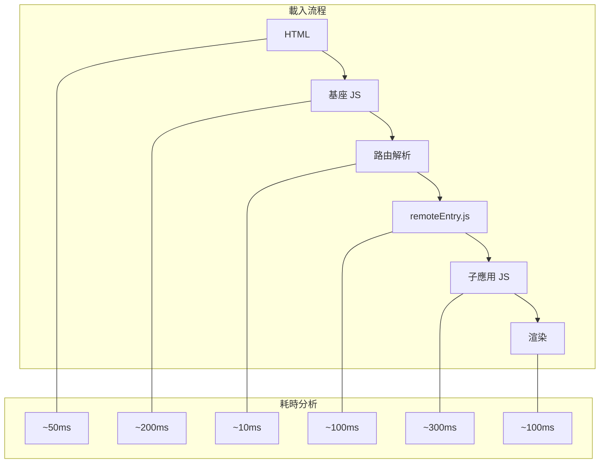

#### 優化策略總覽

| 策略 | 優化效果 | 實作複雜度 | 優先級 |
|-----|---------|-----------|-------|
| 預載入 remoteEntry | ★★★★ | 低 | P0 |
| 共享依賴外部化 | ★★★★★ | 中 | P0 |
| 路由級程式碼分割 | ★★★★ | 低 | P0 |
| Service Worker 快取 | ★★★ | 中 | P1 |
| 子應用預渲染 | ★★★ | 高 | P2 |
| HTTP/2 推送 | ★★ | 中 | P2 |

#### 預載入實作

```typescript
// shell/src/preload.ts
class PreloadManager {
  private preloadedApps: Set<string> = new Set();
  private preloadLinks: Map<string, HTMLLinkElement> = new Map();
  
  // 預載入子應用
  preload(appName: string, entry: string) {
    if (this.preloadedApps.has(appName)) return;
    
    // 預載入 remoteEntry.js
    const link = document.createElement('link');
    link.rel = 'preload';
    link.as = 'script';
    link.href = entry;
    link.crossOrigin = 'anonymous';
    document.head.appendChild(link);
    
    this.preloadLinks.set(appName, link);
    this.preloadedApps.add(appName);
  }
  
  // 預取子應用（低優先級）
  prefetch(appName: string, entry: string) {
    if (this.preloadedApps.has(appName)) return;
    
    const link = document.createElement('link');
    link.rel = 'prefetch';
    link.href = entry;
    document.head.appendChild(link);
    
    this.preloadLinks.set(appName, link);
    this.preloadedApps.add(appName);
  }
  
  // 根據路由預測預載入
  predictivePreload(currentRoute: string) {
    const predictions = this.getPredictedRoutes(currentRoute);
    
    predictions.forEach(({ appName, entry, probability }) => {
      if (probability > 0.7) {
        this.preload(appName, entry);
      } else if (probability > 0.3) {
        this.prefetch(appName, entry);
      }
    });
  }
  
  private getPredictedRoutes(currentRoute: string) {
    // 基於歷史資料或規則預測下一個可能訪問的路由
    const routeGraph: Record<string, { appName: string; entry: string; probability: number }[]> = {
      '/': [
        { appName: 'orderApp', entry: '/order/remoteEntry.js', probability: 0.6 },
        { appName: 'customerApp', entry: '/customer/remoteEntry.js', probability: 0.3 },
      ],
      '/order': [
        { appName: 'customerApp', entry: '/customer/remoteEntry.js', probability: 0.8 },
      ],
    };
    
    return routeGraph[currentRoute] || [];
  }
}

export const preloadManager = new PreloadManager();

// 在路由守衛中使用
router.afterEach((to) => {
  preloadManager.predictivePreload(to.path);
});
```

#### 共享依賴 CDN 外部化

```javascript
// webpack.config.js
module.exports = {
  externals: {
    react: 'React',
    'react-dom': 'ReactDOM',
    vue: 'Vue',
  },
  plugins: [
    new HtmlWebpackPlugin({
      template: './index.html',
      inject: true,
    }),
  ],
};

// index.html - 使用 CDN
<!DOCTYPE html>
<html>
<head>
  <!-- 預連接 CDN -->
  <link rel="preconnect" href="https://cdn.jsdelivr.net">
  
  <!-- 關鍵依賴使用 preload -->
  <link rel="preload" href="https://cdn.jsdelivr.net/npm/react@18/umd/react.production.min.js" as="script">
  <link rel="preload" href="https://cdn.jsdelivr.net/npm/react-dom@18/umd/react-dom.production.min.js" as="script">
</head>
<body>
  <div id="root"></div>
  
  <!-- 按順序載入 -->
  <script src="https://cdn.jsdelivr.net/npm/react@18/umd/react.production.min.js"></script>
  <script src="https://cdn.jsdelivr.net/npm/react-dom@18/umd/react-dom.production.min.js"></script>
</body>
</html>
```

#### Service Worker 快取策略

```typescript
// sw.ts - Service Worker
const CACHE_NAME = 'micro-frontend-v1';
const REMOTE_ENTRY_CACHE = 'remote-entries-v1';

// 快取策略
const cacheStrategies = {
  // 靜態資源：Cache First
  static: async (request: Request) => {
    const cached = await caches.match(request);
    if (cached) return cached;
    
    const response = await fetch(request);
    const cache = await caches.open(CACHE_NAME);
    cache.put(request, response.clone());
    return response;
  },
  
  // remoteEntry：Stale While Revalidate
  remoteEntry: async (request: Request) => {
    const cache = await caches.open(REMOTE_ENTRY_CACHE);
    const cached = await cache.match(request);
    
    const fetchPromise = fetch(request).then(response => {
      cache.put(request, response.clone());
      return response;
    });
    
    return cached || fetchPromise;
  },
  
  // API：Network First
  api: async (request: Request) => {
    try {
      const response = await fetch(request);
      return response;
    } catch (error) {
      const cached = await caches.match(request);
      if (cached) return cached;
      throw error;
    }
  },
};

self.addEventListener('fetch', (event: FetchEvent) => {
  const url = new URL(event.request.url);
  
  if (url.pathname.includes('remoteEntry.js')) {
    event.respondWith(cacheStrategies.remoteEntry(event.request));
  } else if (url.pathname.startsWith('/api/')) {
    event.respondWith(cacheStrategies.api(event.request));
  } else if (url.pathname.match(/\.(js|css|png|jpg|svg)$/)) {
    event.respondWith(cacheStrategies.static(event.request));
  }
});
```

### 7.2 過度拆分的反效果

> ⚠️ **警告**：微前端不是拆得越細越好，過度拆分會帶來嚴重問題。

#### 過度拆分的徵兆

| 徵兆 | 說明 | 影響 |
|-----|-----|-----|
| 子應用 < 3 個頁面 | 單個子應用太小 | 架構開銷 > 收益 |
| 頻繁跨應用通訊 | 每次操作都需要事件通訊 | 效能差、難維護 |
| 共享依賴爆炸 | 50+ 個共享套件 | 版本衝突、載入慢 |
| 部署頻率極低 | 子應用很少獨立部署 | 失去微前端意義 |
| 團隊邊界模糊 | 一個團隊維護 5+ 子應用 | 增加溝通成本 |

#### 合理拆分的指導原則

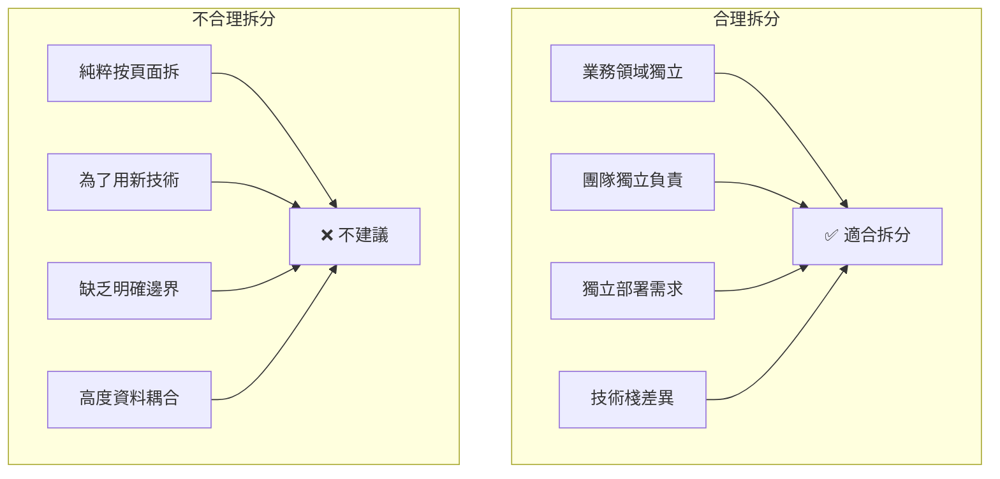

#### 拆分決策清單

```typescript
// 用於評估是否需要拆分為獨立子應用
interface SplitDecisionCriteria {
  // 必要條件（需全部滿足）
  required: {
    hasIndependentTeam: boolean;      // 有獨立團隊負責
    hasClearBoundary: boolean;        // 業務邊界清晰
    hasIndependentDeployNeed: boolean; // 需要獨立部署
  };
  
  // 加分項（滿足越多越適合）
  beneficial: {
    differentTechStack: boolean;      // 技術棧不同
    differentReleaseSchedule: boolean; // 發布週期不同
    lowCouplingWithOthers: boolean;   // 與其他模組低耦合
    largeCodebase: boolean;           // 程式碼量大（>50k 行）
    complexDomain: boolean;           // 領域複雜度高
  };
}

function shouldSplit(criteria: SplitDecisionCriteria): {
  decision: 'split' | 'no-split' | 'reconsider';
  reason: string;
} {
  const { required, beneficial } = criteria;
  
  // 必要條件不滿足 → 不拆分
  if (!required.hasIndependentTeam || !required.hasClearBoundary) {
    return {
      decision: 'no-split',
      reason: '缺乏獨立團隊或業務邊界不清晰',
    };
  }
  
  // 計算加分項
  const benefitScore = Object.values(beneficial).filter(Boolean).length;
  
  if (benefitScore >= 3 && required.hasIndependentDeployNeed) {
    return { decision: 'split', reason: '符合拆分條件' };
  }
  
  if (benefitScore >= 2) {
    return { decision: 'reconsider', reason: '可考慮先用 Monorepo 模組化' };
  }
  
  return { decision: 'no-split', reason: '拆分收益不明顯' };
}
```

### 7.3 Monitoring / Logging 建議

#### 監控架構

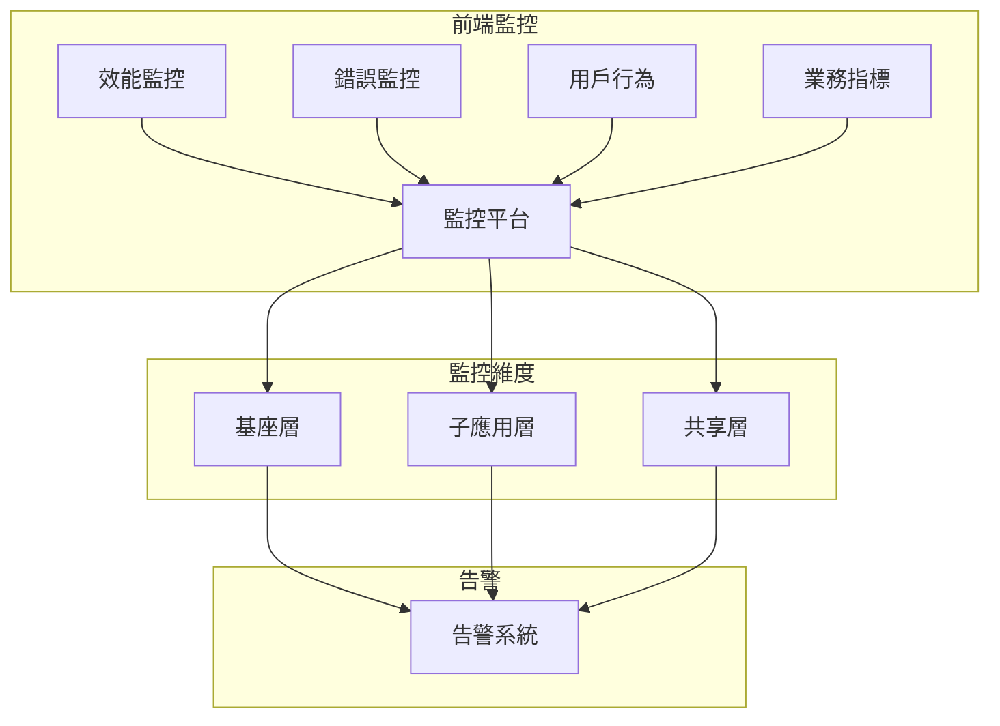

#### 統一日誌格式

```typescript
// shared/src/logger.ts
interface LogEntry {
  timestamp: string;
  level: 'debug' | 'info' | 'warn' | 'error';
  microApp: string;
  traceId: string;
  userId?: string;
  message: string;
  context?: Record<string, any>;
  stack?: string;
}

class MicroAppLogger {
  private appName: string;
  private traceId: string;
  
  constructor(appName: string) {
    this.appName = appName;
    this.traceId = this.getOrCreateTraceId();
  }
  
  private getOrCreateTraceId(): string {
    // 從基座獲取或生成新的 traceId
    return window.__SHELL_TRACE_ID__ || crypto.randomUUID();
  }
  
  private createEntry(
    level: LogEntry['level'],
    message: string,
    context?: Record<string, any>
  ): LogEntry {
    return {
      timestamp: new Date().toISOString(),
      level,
      microApp: this.appName,
      traceId: this.traceId,
      userId: this.getUserId(),
      message,
      context,
    };
  }
  
  info(message: string, context?: Record<string, any>) {
    const entry = this.createEntry('info', message, context);
    this.send(entry);
    console.log(`[${this.appName}]`, message, context);
  }
  
  error(message: string, error?: Error, context?: Record<string, any>) {
    const entry = this.createEntry('error', message, {
      ...context,
      errorMessage: error?.message,
      stack: error?.stack,
    });
    this.send(entry);
    console.error(`[${this.appName}]`, message, error);
  }
  
  private async send(entry: LogEntry) {
    // 批次發送到日誌服務
    await logBuffer.add(entry);
  }
  
  private getUserId(): string | undefined {
    return window.__SHELL_USER_ID__;
  }
}

// 使用範例
const logger = new MicroAppLogger('orderApp');
logger.info('Order created', { orderId: '123', amount: 1000 });
logger.error('Failed to submit order', error, { orderId: '123' });
```

#### 效能監控

```typescript
// shared/src/performance.ts
interface PerformanceMetrics {
  microApp: string;
  metrics: {
    // 載入時間
    loadTime: number;
    mountTime: number;
    firstContentfulPaint: number;
    largestContentfulPaint: number;
    
    // 運行時指標
    jsHeapSize: number;
    domNodes: number;
    
    // 自定義指標
    apiLatency: Record<string, number>;
  };
}

class PerformanceMonitor {
  private appName: string;
  private startTime: number = 0;
  
  constructor(appName: string) {
    this.appName = appName;
  }
  
  // 子應用載入開始
  markLoadStart() {
    this.startTime = performance.now();
    performance.mark(`${this.appName}-load-start`);
  }
  
  // 子應用掛載完成
  markMountComplete() {
    performance.mark(`${this.appName}-mount-complete`);
    
    const loadTime = performance.now() - this.startTime;
    
    performance.measure(
      `${this.appName}-load-time`,
      `${this.appName}-load-start`,
      `${this.appName}-mount-complete`
    );
    
    this.reportMetrics({
      loadTime,
      mountTime: loadTime,
    });
  }
  
  // 收集 Web Vitals
  collectWebVitals() {
    // 使用 web-vitals 庫
    import('web-vitals').then(({ onCLS, onFID, onLCP, onFCP, onTTFB }) => {
      onCLS((metric) => this.reportMetric('CLS', metric.value));
      onFID((metric) => this.reportMetric('FID', metric.value));
      onLCP((metric) => this.reportMetric('LCP', metric.value));
      onFCP((metric) => this.reportMetric('FCP', metric.value));
      onTTFB((metric) => this.reportMetric('TTFB', metric.value));
    });
  }
  
  private reportMetrics(metrics: Partial<PerformanceMetrics['metrics']>) {
    // 上報到監控平台
    navigator.sendBeacon('/api/metrics', JSON.stringify({
      microApp: this.appName,
      timestamp: Date.now(),
      metrics,
    }));
  }
  
  private reportMetric(name: string, value: number) {
    this.reportMetrics({ [name]: value } as any);
  }
}
```

#### 錯誤邊界與上報

```typescript
// React 錯誤邊界
class MicroAppErrorBoundary extends React.Component<
  { appName: string; fallback: React.ReactNode; children: React.ReactNode },
  { hasError: boolean; error?: Error }
> {
  state = { hasError: false, error: undefined };
  
  static getDerivedStateFromError(error: Error) {
    return { hasError: true, error };
  }
  
  componentDidCatch(error: Error, errorInfo: React.ErrorInfo) {
    // 上報錯誤
    errorReporter.report({
      microApp: this.props.appName,
      error: {
        message: error.message,
        stack: error.stack,
        componentStack: errorInfo.componentStack,
      },
      context: {
        url: window.location.href,
        userAgent: navigator.userAgent,
      },
    });
  }
  
  render() {
    if (this.state.hasError) {
      return this.props.fallback;
    }
    return this.props.children;
  }
}

// 全域錯誤捕獲
window.addEventListener('error', (event) => {
  errorReporter.report({
    microApp: getCurrentMicroApp() || 'shell',
    error: {
      message: event.message,
      filename: event.filename,
      lineno: event.lineno,
      colno: event.colno,
    },
  });
});

window.addEventListener('unhandledrejection', (event) => {
  errorReporter.report({
    microApp: getCurrentMicroApp() || 'shell',
    error: {
      message: event.reason?.message || String(event.reason),
      stack: event.reason?.stack,
    },
  });
});
```

### 7.4 本章實務案例

**案例：電商平台效能優化實戰**

**問題**：
- 首屏載入時間 > 5 秒
- 切換子應用卡頓明顯
- 用戶流失率高

**優化措施與效果**：

| 優化項 | 實作 | 效果 |
|-------|------|-----|
| 預載入 | 在首頁預載入高頻子應用 | -800ms |
| CDN 外部化 | React/Vue 走 CDN | -400ms |
| Service Worker | 快取 remoteEntry | -300ms（二次訪問） |
| 程式碼分割 | 路由級懶載入 | -500ms |
| 壓縮優化 | Brotli + Tree Shaking | -200ms |

**最終效果**：首屏時間從 5.2s 降至 2.1s

---

## 8. AI 輔助微前端開發實務

### 8.1 用 AI 產生子應用模板

#### Prompt 範例：生成子應用骨架

```markdown
## 角色
你是一位微前端架構專家，熟悉 Module Federation 和 qiankun。

## 任務
請為我生成一個 Vue 3 子應用的完整專案模板，需符合以下要求：

1. **技術棧**
   - Vue 3 + TypeScript + Vite
   - Pinia 狀態管理
   - Vue Router 4
   - Module Federation 配置

2. **微前端整合**
   - 可獨立運行，也可作為子應用載入
   - 與基座共享 Vue、Pinia
   - 生命週期函數（bootstrap, mount, unmount）
   - 接收基座傳遞的 props（token, eventBus）

3. **專案結構**
   請生成完整的目錄結構和關鍵檔案內容

4. **最佳實務**
   - CSS 使用 scoped 或 CSS Modules
   - 錯誤邊界處理
   - 效能監控 hook
```

#### AI 輔助生成的範例程式碼

```typescript
// src/main.ts - 子應用入口
import { createApp, App as VueApp } from 'vue';
import { createPinia } from 'pinia';
import { createRouter, createWebHistory } from 'vue-router';
import App from './App.vue';
import routes from './router';
import { setupGlobalProps } from './micro/props';

let app: VueApp | null = null;
let router: ReturnType<typeof createRouter> | null = null;
let pinia: ReturnType<typeof createPinia> | null = null;

// 獨立運行
if (!window.__POWERED_BY_QIANKUN__) {
  bootstrap().then(mount);
}

export async function bootstrap() {
  console.log('[orderApp] bootstrap');
  // 初始化工作
}

export async function mount(props: MicroAppProps = {}) {
  console.log('[orderApp] mount', props);
  
  const { container, getToken, eventBus } = props;
  
  // 創建路由
  router = createRouter({
    history: createWebHistory(
      window.__POWERED_BY_QIANKUN__ ? '/order' : '/'
    ),
    routes,
  });
  
  // 創建狀態管理
  pinia = createPinia();
  
  // 創建 Vue 應用
  app = createApp(App);
  app.use(router);
  app.use(pinia);
  
  // 設置全域屬性
  setupGlobalProps(app, { getToken, eventBus });
  
  // 掛載
  const mountElement = container
    ? container.querySelector('#app')
    : document.getElementById('app');
    
  app.mount(mountElement!);
}

export async function unmount() {
  console.log('[orderApp] unmount');
  
  app?.unmount();
  app = null;
  router = null;
  pinia = null;
}

export async function update(props: MicroAppProps) {
  console.log('[orderApp] update', props);
  // 處理 props 更新
}
```

### 8.2 用 AI Review 微前端架構設計

#### Prompt 範例：架構審查

```markdown
## 角色
你是一位資深微前端架構師，請審查以下架構設計。

## 當前架構
```
Shell (React 17)
├── shared-components (npm package)
├── micro-order (React 18)
├── micro-customer (Vue 3)
├── micro-report (Angular 15)
└── micro-settings (React 17)
```

## 需要你分析
1. 這個架構有什麼潛在問題？
2. React 17 和 18 並存會有什麼風險？
3. 共享組件用 npm package 是否合適？
4. 請給出改進建議

## 請用以下格式回覆
- 🔴 嚴重問題：...
- 🟡 潛在風險：...
- 🟢 優點：...
- 💡 改進建議：...
```

#### AI 審查回覆範例

```markdown
## 架構審查報告

### 🔴 嚴重問題
1. **React 版本衝突**
   - Shell (React 17) 與 micro-order (React 18) 版本不一致
   - Module Federation 的 singleton 配置可能導致運行時錯誤
   - 建議：統一升級到 React 18，或配置 strictVersion: false

2. **shared-components 用 npm package**
   - 更新組件需要所有子應用重新發布
   - 喪失 Module Federation 的獨立部署優勢
   - 建議：改為 Remote 模組，運行時載入

### 🟡 潛在風險
1. CSS 衝突未提及隔離方案
2. 缺乏統一的錯誤處理機制
3. Angular 15 即將 EOL，需規劃升級

### 🟢 優點
1. 技術棧多樣化符合微前端理念
2. 業務領域拆分看起來合理

### 💡 改進建議
1. 將 shared-components 改為 Module Federation Remote
2. 統一 React 版本到 18.x
3. 加入 CSS 隔離方案（建議 CSS Modules）
4. 建立跨應用錯誤邊界
```

### 8.3 用 AI 協助 Dependency / 風險分析

#### 自動化依賴分析腳本

```typescript
// scripts/analyze-deps.ts
import * as fs from 'fs';
import * as path from 'path';

interface DependencyAnalysis {
  app: string;
  dependencies: Record<string, string>;
  devDependencies: Record<string, string>;
}

interface ConflictReport {
  package: string;
  versions: { app: string; version: string }[];
  severity: 'critical' | 'warning' | 'info';
  suggestion: string;
}

async function analyzeDependencies(appsDir: string): Promise<ConflictReport[]> {
  const apps = fs.readdirSync(appsDir);
  const allDeps: DependencyAnalysis[] = [];
  
  // 收集所有依賴
  for (const app of apps) {
    const pkgPath = path.join(appsDir, app, 'package.json');
    if (fs.existsSync(pkgPath)) {
      const pkg = JSON.parse(fs.readFileSync(pkgPath, 'utf-8'));
      allDeps.push({
        app,
        dependencies: pkg.dependencies || {},
        devDependencies: pkg.devDependencies || {},
      });
    }
  }
  
  // 分析衝突
  const reports: ConflictReport[] = [];
  const criticalPackages = ['react', 'react-dom', 'vue', '@angular/core'];
  
  const packageVersions = new Map<string, { app: string; version: string }[]>();
  
  for (const { app, dependencies } of allDeps) {
    for (const [pkg, version] of Object.entries(dependencies)) {
      if (!packageVersions.has(pkg)) {
        packageVersions.set(pkg, []);
      }
      packageVersions.get(pkg)!.push({ app, version });
    }
  }
  
  // 生成報告
  for (const [pkg, versions] of packageVersions) {
    const uniqueVersions = [...new Set(versions.map(v => v.version))];
    
    if (uniqueVersions.length > 1) {
      const isCritical = criticalPackages.includes(pkg);
      
      reports.push({
        package: pkg,
        versions,
        severity: isCritical ? 'critical' : 'warning',
        suggestion: isCritical
          ? `統一 ${pkg} 版本，建議使用 ${uniqueVersions.sort().pop()}`
          : `建議統一 ${pkg} 版本以減少 bundle 大小`,
      });
    }
  }
  
  return reports;
}

// 生成 AI 可讀的報告
async function generateAIPrompt(reports: ConflictReport[]): Promise<string> {
  const critical = reports.filter(r => r.severity === 'critical');
  const warnings = reports.filter(r => r.severity === 'warning');
  
  return `
## 依賴衝突分析報告

### 嚴重衝突（需立即處理）
${critical.map(r => `
- **${r.package}**
  - 衝突版本：${r.versions.map(v => `${v.app}: ${v.version}`).join(', ')}
  - 建議：${r.suggestion}
`).join('')}

### 警告（建議處理）
${warnings.slice(0, 10).map(r => `
- **${r.package}**：${r.versions.length} 個不同版本
`).join('')}

請分析這些衝突可能導致的運行時問題，並提供解決方案。
  `;
}
```

### 8.4 本章實務案例

**案例：用 AI 加速微前端導入**

**背景**：
- 傳統單體應用需要遷移到微前端
- 團隊缺乏微前端經驗
- 時程緊迫（3 個月）

**AI 輔助流程**：

| 階段 | AI 輔助內容 | 節省時間 |
|-----|-----------|---------|
| 架構設計 | 生成架構方案並審查 | 2 週 → 3 天 |
| 模板生成 | 自動生成子應用骨架 | 1 週 → 1 天 |
| 依賴分析 | 自動化衝突檢測 | 3 天 → 2 小時 |
| Code Review | AI 輔助審查 MF 配置 | 持續節省 |
| 文件撰寫 | 自動生成架構文件 | 1 週 → 2 天 |

**總結**：AI 輔助使專案提前 3 週完成

---

## 9. 實戰經驗總結

### 9.1 成功導入的關鍵因素

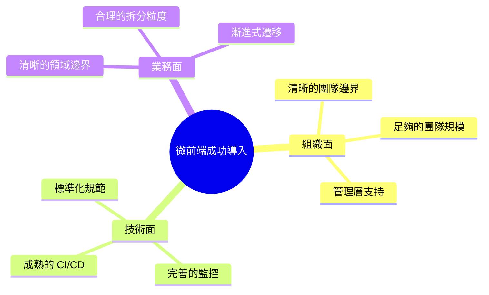

### 9.2 架構演進路線建議

| 階段 | 目標 | 關鍵動作 |
|-----|-----|---------|
| **Phase 1**<br/>基礎建設 | 建立微前端基礎框架 | 選型、POC、基座開發 |
| **Phase 2**<br/>試點導入 | 驗證可行性 | 1-2 個子應用上線 |
| **Phase 3**<br/>規模化 | 標準化複製 | 子應用模板、規範文件 |
| **Phase 4**<br/>優化治理 | 效能與穩定性 | 監控完善、自動化測試 |

### 9.3 技術選型決策表

| 場景 | 推薦方案 | 次選方案 | 不推薦 |
|-----|---------|---------|-------|
| 新建大型系統 | Module Federation | qiankun | iframe |
| 舊系統漸進遷移 | qiankun | single-spa | 大爆炸重寫 |
| 需要強隔離 | wujie（iframe 增強） | qiankun shadow | 無隔離方案 |
| React 同構系統 | Module Federation | 自研方案 | qiankun |
| 跨框架系統 | qiankun | Web Components | 強制統一框架 |

### 9.4 關鍵經驗教訓

#### ✅ 應該做的

1. **先做好領域建模**
   - 微前端是技術手段，不是目的
   - 業務邊界決定拆分方式

2. **統一基礎設施**
   - 統一日誌格式
   - 統一監控埋點
   - 統一錯誤處理

3. **建立規範文件**
   - 子應用開發規範
   - 部署流程規範
   - Code Review 檢查清單

4. **漸進式遷移**
   - 從低風險模組開始
   - 逐步擴大範圍
   - 保持回滾能力

#### ❌ 不應該做的

1. **追求過度解耦**
   - 不是所有模組都要獨立部署
   - 過度拆分會增加複雜度

2. **忽視效能問題**
   - 首屏載入是關鍵指標
   - 需要從架構層面考慮

3. **缺乏 E2E 測試**
   - 子應用間整合測試很重要
   - 不能只依賴單元測試

4. **沒有灰度發布機制**
   - 微前端更需要灰度能力
   - 快速回滾是必備功能

---

## 10. 企業導入微前端常見失敗原因

### 10.1 十大失敗原因清單

| 排名 | 失敗原因 | 發生頻率 | 影響程度 | 預防措施 |
|-----|---------|---------|---------|---------|
| 1 | 業務邊界不清晰就開始拆分 | ★★★★★ | 致命 | 先做領域建模 |
| 2 | 團隊規模不足硬要導入 | ★★★★☆ | 嚴重 | 評估團隊規模 |
| 3 | 缺乏統一的基礎設施 | ★★★★☆ | 嚴重 | 先建 CI/CD、監控 |
| 4 | 共享依賴版本管理混亂 | ★★★★☆ | 嚴重 | 統一版本策略 |
| 5 | 子應用間過度耦合 | ★★★☆☆ | 中等 | 限制通訊方式 |
| 6 | 忽視首屏效能優化 | ★★★☆☆ | 中等 | 效能預算機制 |
| 7 | 沒有完善的測試策略 | ★★★☆☆ | 中等 | E2E + 契約測試 |
| 8 | 文件與規範缺失 | ★★☆☆☆ | 輕微 | 建立規範文件 |
| 9 | 缺乏回滾與灰度機制 | ★★☆☆☆ | 中等 | 部署流水線完善 |
| 10 | 為了技術而技術 | ★★★★☆ | 嚴重 | 明確業務價值 |

### 10.2 失敗案例分析

#### 案例 1：過早拆分的代價

**背景**：
- 新創公司，10 人開發團隊
- 為了「架構先進」導入微前端
- 拆分成 8 個子應用

**問題**：
- 每次功能開發需要跨 3-4 個 repo
- 部署流程複雜，經常出錯
- 團隊花大量時間處理「架構問題」

**教訓**：
- 團隊規模不足時，微前端是負擔
- 應該先從 Monorepo 模組化開始

#### 案例 2：版本地獄

**背景**：
- 大型企業，5 個團隊各自維護子應用
- 沒有統一的依賴版本管理
- React 版本從 16 到 18 都有

**問題**：
- 某次更新後全站白屏
- 花了 3 天才找到是 React 版本衝突
- 緊急回滾造成業務損失

**教訓**：
- 核心依賴必須有嚴格的版本策略
- 需要有相容性測試機制

#### 案例 3：效能災難

**背景**：
- 電商 C 端網站
- 為了技術棧自由，導入微前端
- 首頁載入了 3 個子應用的 remoteEntry

**問題**：
- 首屏時間從 2 秒惡化到 7 秒
- 轉換率下降 30%
- 最終被迫回退到單體架構

**教訓**：
- C 端應用對效能敏感，微前端需謹慎
- 需要有效能預算和監控

### 10.3 失敗預警信號

當出現以下信號時，應該重新評估微前端策略：

```typescript
const warningSignals = {
  // 🔴 高風險信號
  critical: [
    '超過 50% 的開發時間花在「解決架構問題」',
    '部署失敗率超過 10%',
    '首屏載入時間超過 5 秒',
    '頻繁出現跨子應用的 Bug',
  ],
  
  // 🟡 中風險信號  
  warning: [
    '新人上手時間超過 2 週',
    '每次需求都需要改 3 個以上子應用',
    '共享依賴版本超過 3 種',
    'E2E 測試經常失敗',
  ],
  
  // 🟢 需關注信號
  attention: [
    '子應用間通訊事件超過 20 種',
    '基座程式碼持續膨脹',
    '文件跟不上架構變化',
  ],
};
```

---

## 11. 檢查清單（Checklist）

### 11.1 導入前評估清單

```markdown
## 📋 微前端導入前評估檢查清單

### 組織與團隊
- [ ] 團隊規模 >= 3 個獨立團隊
- [ ] 每個團隊有明確的業務領域負責
- [ ] 管理層理解並支持微前端的長期投入
- [ ] 有專人負責基礎設施維護

### 技術基礎
- [ ] 有成熟的 CI/CD 流程
- [ ] 有完善的監控和日誌系統
- [ ] 有自動化測試體系
- [ ] 團隊具備前端工程化經驗

### 業務需求
- [ ] 業務領域邊界清晰可拆分
- [ ] 有獨立部署的實際需求
- [ ] 對首屏效能的要求已評估
- [ ] 漸進式遷移路徑已規劃

### 風險評估
- [ ] 已評估過度拆分的風險
- [ ] 已評估版本衝突的風險
- [ ] 已評估效能下降的風險
- [ ] 有回滾和應急方案
```

### 11.2 架構設計檢查清單

```markdown
## 📋 微前端架構設計檢查清單

### 基座設計
- [ ] 路由管理方案確定
- [ ] 認證/授權整合方案確定
- [ ] 全域狀態管理方案確定
- [ ] 錯誤邊界處理方案確定
- [ ] 子應用載入器設計完成

### 子應用規範
- [ ] 生命週期函數規範（bootstrap/mount/unmount）
- [ ] 路由 base path 規範
- [ ] CSS 隔離方案（Module/BEM/Shadow DOM）
- [ ] JS 沙箱需求評估
- [ ] 打包輸出格式規範

### 共享機制
- [ ] 共享依賴清單確定
- [ ] 版本管理策略確定
- [ ] 共享組件載入方式確定
- [ ] 事件通訊規範確定

### 部署架構
- [ ] CDN 部署方案確定
- [ ] Manifest 管理方案確定
- [ ] 灰度發布策略確定
- [ ] 回滾機制確定
```

### 11.3 子應用開發檢查清單

```markdown
## 📋 子應用開發檢查清單

### 專案初始化
- [ ] 使用團隊標準模板建立專案
- [ ] 配置正確的 Module Federation 設定
- [ ] 實現標準生命週期函數
- [ ] 配置獨立運行模式

### 開發規範
- [ ] 使用 TypeScript 強型別
- [ ] CSS 使用 scoped 或 CSS Modules
- [ ] 遵循統一的程式碼風格
- [ ] 添加必要的 JSDoc 註解

### 整合測試
- [ ] 單元測試覆蓋率 >= 80%
- [ ] 與基座整合測試通過
- [ ] 與其他子應用共存測試通過
- [ ] 效能指標符合預算

### 部署前檢查
- [ ] 共享依賴版本與基座一致
- [ ] 打包產物大小合理（< 500KB gzip）
- [ ] 無 console.log 等除錯程式碼
- [ ] 錯誤監控已接入
```

### 11.4 上線前檢查清單

```markdown
## 📋 微前端上線前最終檢查清單

### 功能驗證
- [ ] 所有子應用功能正常
- [ ] 子應用切換流暢
- [ ] 路由同步正確
- [ ] 認證狀態正確傳遞
- [ ] 跨應用通訊正常

### 效能驗證
- [ ] 首屏載入時間 < 3 秒
- [ ] LCP < 2.5 秒
- [ ] FID < 100 毫秒
- [ ] CLS < 0.1
- [ ] 記憶體無明顯洩漏

### 穩定性驗證
- [ ] 錯誤監控已生效
- [ ] 日誌收集正常
- [ ] 灰度發布機制就緒
- [ ] 回滾流程已演練
- [ ] 應急聯絡人已確認

### 文件與培訓
- [ ] 架構文件已更新
- [ ] 操作手冊已完成
- [ ] 團隊培訓已完成
- [ ] FAQ 文件已準備
```

---

## 附錄

### A. 推薦工具與資源

| 類別 | 工具 | 說明 |
|-----|-----|-----|
| 框架 | qiankun | 螞蟻金服出品，功能完整 |
| 框架 | Module Federation | Webpack 5 原生支援 |
| 框架 | single-spa | 輕量、框架無關 |
| 監控 | Sentry | 錯誤監控 |
| 效能 | Web Vitals | Google 效能指標 |
| 測試 | Cypress | E2E 測試 |
| 測試 | Pact | 契約測試 |

### B. 參考文獻

1. [Micro Frontends - Martin Fowler](https://martinfowler.com/articles/micro-frontends.html)
2. [Module Federation 官方文件](https://webpack.js.org/concepts/module-federation/)
3. [qiankun 官方文件](https://qiankun.umijs.org/)
4. [single-spa 官方文件](https://single-spa.js.org/)

### C. 術語表

| 術語 | 說明 |
|-----|-----|
| Shell | 基座應用，負責載入和管理子應用 |
| Remote | Module Federation 中暴露模組的應用 |
| Host | Module Federation 中消費模組的應用 |
| Sandbox | 沙箱，用於隔離 JS 執行環境 |
| remoteEntry.js | Module Federation 的入口檔案 |

---

> **文件維護資訊**
> - 作者：微前端架構團隊
> - 版本：1.0
> - 最後更新：2026-01-23
> - 下次審閱：2026-07-01
