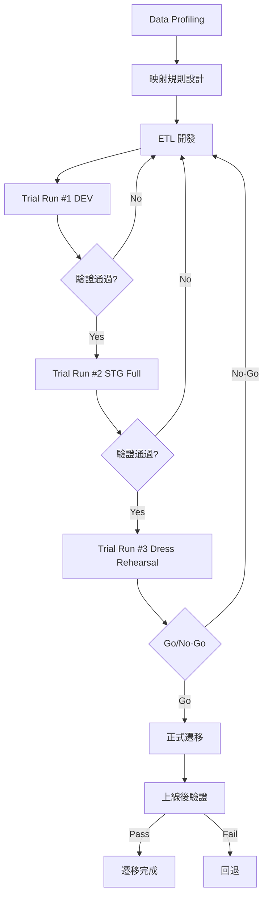

# 資料遷移計畫範本（Data Migration Plan Template）

> **適用標準**：ISO/IEC 25024（資料品質）、DAMA DMBOK 2.0（Data Management）  
> **適用階段**：部署上線階段（Deployment Phase）  
> **負責角色**：DBA、Data Engineer、SA、PM

---

## 📑 章節目錄

1. [文件資訊](#1-文件資訊)
2. [遷移概要](#2-遷移概要)
3. [來源與目標分析](#3-來源與目標分析)
4. [遷移策略](#4-遷移策略)
5. [資料映射規則](#5-資料映射規則)
6. [資料清洗與轉換規則](#6-資料清洗與轉換規則)
7. [驗證策略](#7-驗證策略)
8. [風險與應變](#8-風險與應變)
9. [時程與里程碑](#9-時程與里程碑)
10. [附錄](#10-附錄)

---

## 📝 範本

---

### 1. 文件資訊

| 項目 | 內容 |
|------|------|
| **文件名稱** | [系統名稱] 資料遷移計畫 |
| **文件編號** | [專案代碼]-DMP-[版本號]-[日期] |
| **版本** | v[X.Y] |
| **建立日期** | [YYYY-MM-DD] |
| **負責人** | [DBA / Data Engineer] |
| **審核者** | [SA / PM] |

---

### 2. 遷移概要

| 項目 | 內容 |
|------|------|
| 遷移類型 | [全量遷移 / 增量遷移 / 混合式] |
| 來源系統 | [舊系統名稱 + 版本] |
| 目標系統 | [新系統名稱 + 版本] |
| 遷移目的 | [系統升級 / 平台轉換 / 整併 / 雲遷移] |
| 資料量估計 | [N] GB / [N] 筆記錄 |
| 停機視窗 | [YYYY-MM-DD HH:mm ~ HH:mm] |
| 遷移方式 | [Big Bang / Phased / Parallel Run] |

---

### 3. 來源與目標分析

#### 3.1 來源系統

| 項目 | 內容 |
|------|------|
| 資料庫類型 | [RDBMS: SQL Server / Oracle / PostgreSQL / NoSQL] |
| 版本 | [ver] |
| Schema 數量 | [N] |
| Table 數量 | [N] |
| 總資料量 | [N] GB |
| 編碼 | [UTF-8 / Big5 / ...] |

#### 3.2 目標系統

| 項目 | 內容 |
|------|------|
| 資料庫類型 | [RDBMS / NoSQL / Data Lake] |
| 版本 | [ver] |
| Schema 設計 | [New / Modified / Same] |
| 字元編碼 | [UTF-8] |

#### 3.3 遷移範圍

| 資料分類 | 資料表 | 筆數(估) | 大小(估) | 優先級 | 備註 |
|---------|--------|---------|---------|--------|------|
| Master Data | [table list] | [N] | [N]MB | P1 | |
| Transaction Data | [table list] | [N] | [N]GB | P1 | |
| Historical Data | [table list] | [N] | [N]GB | P2 | |
| Config/Lookup | [table list] | [N] | [N]KB | P1 | |
| Attachments/BLOB | [storage] | [N] | [N]GB | P2 | |

#### 3.4 排除範圍

| 資料類型 | 排除原因 |
|---------|---------|
| [暫存資料/Log] | [無業務價值] |
| [超過 N 年的歷史資料] | [封存處理] |

---

### 4. 遷移策略

#### 4.1 遷移方式比較

| 方式 | 說明 | 優點 | 缺點 | 適用場景 |
|------|------|------|------|---------|
| Big Bang | 一次性全量搬遷 | 簡單明確 | 停機時間長 | 資料量小/可停機 |
| Phased | 分批搬遷 | 降低風險 | 需處理雙寫 | 資料可分割 |
| Parallel Run | 新舊並行 | 最安全 | 成本最高 | 核心業務系統 |

**選定策略**：[Big Bang / Phased / Parallel Run]

**選擇理由**：[說明]

#### 4.2 技術架構

| 層級 | 工具/技術 | 用途 |
|------|----------|------|
| Extract | [SSIS / Spark / Custom Script] | 資料抽取 |
| Transform | [Python / dbt / Stored Procedure] | 資料轉換 |
| Load | [Bulk Insert / COPY / Streaming] | 資料載入 |
| Orchestration | [Airflow / Azure Data Factory / Jenkins] | 排程控制 |
| Monitoring | [Logging / Dashboard] | 進度監控 |

#### 4.3 遷移順序

| 批次 | 資料表 | 依賴 | 優先級 | 方式 |
|------|--------|------|--------|------|
| Batch 1 | [Lookup tables / Config] | None | P1 | Full load |
| Batch 2 | [Master data] | Batch 1 | P1 | Full load |
| Batch 3 | [Transaction data] | Batch 2 | P1 | Incremental |
| Batch 4 | [Historical data] | Batch 2 | P2 | Full load |

---

### 5. 資料映射規則

#### 5.1 欄位映射

| # | 來源 Table.Column | 來源型態 | 目標 Table.Column | 目標型態 | 轉換規則 | 備註 |
|---|-------------------|---------|-------------------|---------|---------|------|
| 1 | [src_table.col] | [VARCHAR(50)] | [tgt_table.col] | [NVARCHAR(100)] | [Direct / Transform] | |
| 2 | [src_table.col] | [INT] | [tgt_table.col] | [BIGINT] | [Direct] | |
| 3 | [src_table.col1 + col2] | [VARCHAR] | [tgt_table.col] | [NVARCHAR] | [Concatenate] | |
| 4 | — (不存在) | — | [tgt_table.col] | [VARCHAR] | [Default value: 'N/A'] | 新增欄位 |

#### 5.2 代碼映射

| 來源代碼 | 來源值 | 目標代碼 | 目標值 | 備註 |
|---------|--------|---------|--------|------|
| [status_code] | [A/I/D] | [status] | [ACTIVE/INACTIVE/DELETED] | |
| [dept_code] | [001~999] | [department_id] | [UUID] | 需查對照表 |

---

### 6. 資料清洗與轉換規則

#### 6.1 清洗規則

| # | 規則 ID | 資料表 | 欄位 | 規則描述 | 處理方式 |
|---|---------|--------|------|---------|---------|
| 1 | CLN-001 | [table] | [col] | NULL 值處理 | [Default value / Skip / Flag] |
| 2 | CLN-002 | [table] | [col] | 重複資料處理 | [Keep latest / Merge / Flag] |
| 3 | CLN-003 | [table] | [col] | 格式不一致 | [Standardize to format X] |
| 4 | CLN-004 | [table] | [col] | 超出範圍值 | [Truncate / Flag / Reject] |
| 5 | CLN-005 | [table] | [col] | 孤立記錄（FK 失效） | [Skip with log / Create parent] |

#### 6.2 轉換規則

| # | 規則 ID | 說明 | 邏輯 |
|---|---------|------|------|
| 1 | TFM-001 | [欄位合併] | [col_a + ' ' + col_b → full_name] |
| 2 | TFM-002 | [日期格式轉換] | [YYYYMMDD → YYYY-MM-DD] |
| 3 | TFM-003 | [代碼轉換] | [對照 mapping_table] |
| 4 | TFM-004 | [加密欄位處理] | [解密後重新加密為 AES-256] |

---

### 7. 驗證策略

#### 7.1 驗證層級

| 層級 | 驗證方式 | 通過條件 | 負責人 |
|------|---------|---------|--------|
| L1: 筆數驗證 | Source count vs Target count | 差異 = 0（或 = 排除數） | Data Engineer |
| L2: 抽樣比對 | Random sample comparison | 100% 一致 | DBA |
| L3: 彙總驗證 | SUM / COUNT / AVG 比對 | 差異 < [tolerance]% | Data Engineer |
| L4: 業務規則驗證 | Business rule check | 全數通過 | BA/PO |
| L5: 應用層驗證 | End-to-end 功能測試 | Smoke Test Pass | QA |

#### 7.2 驗證查詢範例

| 驗證項目 | 查詢/方法 | 預期結果 |
|---------|----------|---------|
| 總筆數 | SELECT COUNT(*) FROM [table] | Source = Target ± [N] |
| 金額加總 | SELECT SUM(amount) FROM [table] | Source = Target |
| 抽樣比對 | 隨機抽 [N] 筆逐欄比對 | 100% match |
| NULL 檢查 | SELECT COUNT(*) WHERE [col] IS NULL | ≤ [N] |
| FK 完整性 | LEFT JOIN 找 orphan records | = 0 |

#### 7.3 驗證結果記錄

| 批次 | 資料表 | L1 結果 | L2 結果 | L3 結果 | 整體 | 備註 |
|------|--------|---------|---------|---------|------|------|
| Batch 1 | [table] | [✅/❌] | [✅/❌] | [✅/❌] | [PASS/FAIL] | |

---

### 8. 風險與應變

#### 8.1 風險識別

| # | 風險 | 影響 | 機率 | 等級 | 應變措施 |
|---|------|------|------|------|---------|
| 1 | 遷移時間超過停機視窗 | 業務中斷延長 | Medium | High | 分批遷移 + 預設 abort 時間點 |
| 2 | 資料品質問題超預期 | 遷移失敗 | Medium | High | Trial Run 提前發現 |
| 3 | 來源系統 Schema 不一致 | 映射失敗 | Low | Medium | Profile 完整性分析 |
| 4 | 目標系統效能不足 | 載入過慢 | Low | Medium | 壓力測試 + 批次調整 |

#### 8.2 回退計畫

| 觸發條件 | 回退步驟 | 負責人 | 預估時間 |
|---------|---------|--------|---------|
| 驗證失敗（L1 筆數不符） | [回退步驟] | [DBA] | [N] min |
| 遷移逾時 > [N] min | [abort + restore backup] | [DBA] | [N] min |
| 應用層驗證失敗 | [切回舊系統] | [DevOps] | [N] min |

---

### 9. 時程與里程碑

| 階段 | 工作項目 | 開始日 | 結束日 | 負責人 | 狀態 |
|------|---------|--------|--------|--------|------|
| 分析 | 來源系統 Data Profiling | [日期] | [日期] | [DE] | |
| 設計 | 映射規則制定 | [日期] | [日期] | [DE/BA] | |
| 開發 | ETL 腳本開發 | [日期] | [日期] | [DE] | |
| 測試 | Trial Run #1（DEV 環境） | [日期] | [日期] | [DE] | |
| 測試 | Trial Run #2（STG 環境，全量） | [日期] | [日期] | [DE/DBA] | |
| 測試 | Trial Run #3（STG，含驗證） | [日期] | [日期] | [全團隊] | |
| 上線 | 正式遷移 | [日期] | [日期] | [全團隊] | |
| 驗證 | 上線後驗證 | [日期] | [日期] | [BA/QA] | |

---

### 10. 附錄

#### 10.1 完整欄位映射表

[連結至完整 Excel/CSV 映射文件]

#### 10.2 ETL 腳本清單

| 腳本名稱 | 用途 | 版本庫位置 |
|---------|------|-----------|
| [script_name] | [Extract / Transform / Load] | [repo path] |

#### 10.3 Trial Run 結果記錄

| 次數 | 日期 | 環境 | 資料量 | 耗時 | 結果 | 問題 |
|------|------|------|--------|------|------|------|
| #1 | [日期] | DEV | [N]% sample | [N] min | [PASS/FAIL] | [issues] |
| #2 | [日期] | STG | 100% | [N] min | [PASS/FAIL] | [issues] |

---

## 📖 使用說明

### 遷移執行流程

### 關鍵原則

1. **至少 3 次 Trial Run**：正式遷移前必須完整演練
2. **資料品質先行**：先做 Data Profiling 找出品質問題
3. **驗證不可省略**：每層驗證都需通過才可往下
4. **保留原始資料**：遷移完成後保留來源資料至少 [N] 個月

---

## 💡 範例（以 HRMS 人力資源管理系統為例）

---

### 範例：遷移概要

| 項目 | 內容 |
|------|------|
| 來源 | Legacy HRMS (Oracle 11g) |
| 目標 | New HRMS (PostgreSQL 15 on Azure) |
| 遷移類型 | Big Bang（假日執行） |
| 資料量 | 85 GB / 1,200 萬筆員工交易記錄 |
| 停機視窗 | 2024-06-15 00:00 ~ 06:00 (6 hrs) |

### 範例：欄位映射

| 來源 (Oracle) | 目標 (PostgreSQL) | 轉換 |
|--------------|------------------|------|
| EMP.EMPNO (NUMBER(6)) | employee.id (UUID) | 新產生 UUID，建 mapping table |
| EMP.ENAME (VARCHAR2(50)) | employee.full_name (TEXT) | Direct |
| EMP.HIREDATE (DATE) | employee.hire_date (TIMESTAMPTZ) | 加入 timezone (+08:00) |
| EMP.SAL (NUMBER(8,2)) | employee.base_salary (DECIMAL(12,2)) | Direct |
| EMP.DEPTNO (NUMBER(2)) | employee.department_id (UUID) | 查 dept mapping table |

### 範例：驗證結果

| 驗證 | 來源 | 目標 | 差異 | 結果 |
|------|------|------|------|------|
| 員工總數 | 3,500 | 3,500 | 0 | ✅ |
| 薪資總額 | $175,000,000 | $175,000,000 | $0 | ✅ |
| 出勤記錄數 | 12,450,000 | 12,449,830 | -170 | ⚠️ 排除的無效記錄 |

---

> 📌 **審閱重點**  
> - 資料映射規則是否涵蓋所有欄位（含新增/廢除）？  
> - 清洗規則的「處理方式」是否明確（非僅標記問題）？  
> - 驗證策略是否包含業務層面的正確性驗證？  
> - Trial Run 是否涵蓋全量資料？  
> - 回退計畫的時間是否在停機視窗內？
