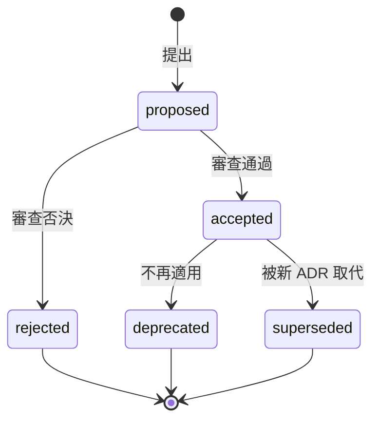

# 架構決策紀錄範本（Architecture Decision Record, ADR）

> **參照標準**：MADR 4.0.0（Markdown Architectural Decision Records）/ ISO/IEC/IEEE 42010:2022
>
> **文件用途**：記錄一個重要技術決策的背景、考慮過的選項、取捨與後果
>
> **適用階段**：系統設計階段（Design Phase）起，貫穿整個生命週期
>
> **範本版本**：v2.0（2026-10-06）｜對應《軟體開發標準程序教學手冊》v2.0 第 4.6 節

---

## 📋 章節目錄

1. [何時必須寫 ADR](#1-何時必須寫-adr)
2. [檔案命名與存放](#2-檔案命名與存放)
3. [ADR 主體（MADR 格式）](#3-adr-主體madr-格式)
4. [狀態與生命週期](#4-狀態與生命週期)
5. [審查與驗證](#5-審查與驗證)

---

## 1. 何時必須寫 ADR

### 📝 範本

| 情境 | 是否必須寫 ADR | 本案判定 |
|------|--------------|---------|
| 選用或更換框架、資料庫、訊息系統 | 必須 | {是／否} |
| 改變系統間的整合方式（同步改非同步、新增閘道） | 必須 | {是／否} |
| 偏離公司標準或《軟體開發標準程序教學手冊》 | 必須 | {是／否} |
| 難以反悔（回頭成本高）的決策 | 必須 | {是／否} |
| 只影響單一類別的實作細節 | 不需要 | {是／否} |

### 📖 使用說明

- ADR 是「決策的快照」，回答半年後有人問「為什麼當初這樣做？」
- 判斷原則：如果這個決策錯了，修正成本是否超過一個 Sprint？是 → 寫 ADR
- ADR 要短（一到兩頁），長篇設計放在 SDD，ADR 只記錄決策本身

### 💡 範例

| 情境 | 是否必須寫 ADR | 本案判定 |
|------|--------------|---------|
| 請假事件通知由同步 REST 改為 Kafka 事件 | 必須 | 是 → ADR-0007 |
| 請假服務的 DTO 改用 Java record | 不需要 | 否（屬《程式寫作指引》範圍） |

---

## 2. 檔案命名與存放

### 📝 範本

```text
docs/decisions/
├── 0001-{決策標題-kebab-case}.md
├── 0002-{決策標題}.md
└── README.md            # ADR 索引：編號、標題、狀態、日期
```

### 📖 使用說明

- ADR 與程式碼放在同一個 Repository，走同一個 PR 審查流程（Docs-as-Code）
- 編號遞增、不重用；標題用動詞開頭描述決策（例：「採用 Kafka 作為訂單事件骨幹」）
- 索引檔讓新人快速找到所有決策

### 💡 範例

```text
docs/decisions/
├── 0001-use-postgresql-as-primary-database.md
├── 0006-adopt-rfc9457-problem-details.md
├── 0007-use-kafka-for-leave-events.md
└── README.md
```

---

## 3. ADR 主體（MADR 格式）

### 📝 範本

```markdown
---
status: {proposed | accepted | rejected | deprecated | superseded by NNNN}
date: {YYYY-MM-DD}
decision-makers: {決策者姓名與角色}
consulted: {諮詢對象}
informed: {知會對象}
---

# {NNNN} {決策標題}

## Context and Problem Statement

{兩到三句描述背景與要解決的問題；可附事件編號、數據}

## Decision Drivers

* {驅動因素 1，例：下游故障不得影響主流程}
* {驅動因素 2，例：尖峰 N 筆/秒}

## Considered Options

* {選項 1}
* {選項 2}
* {選項 3（含「維持現狀」）}

## Decision Outcome

選擇「{選項}」，因為 {對照 Decision Drivers 說明理由}。

### Consequences

* Good：{正面影響}
* Bad：{負面影響與需要處理的新問題}

### Confirmation

{如何確認決策被正確實作，例：整合測試、ArchUnit 規則、上線後監控指標}

## Pros and Cons of the Options

### {選項 2}

* Good：{優點}
* Bad：{缺點}
```

### 📖 使用說明

- 必填段落：Context、Considered Options（至少兩個，含「維持現狀」）、Decision Outcome、Consequences
- **Bad 後果必須寫**：沒有缺點的決策通常代表分析不完整
- Confirmation 段落讓決策可驗證，例如用 ArchUnit 測試確保「訂單服務不得直接呼叫點數服務」
- 引用的效能數據、事件編號需可查證

### 💡 範例

```markdown
---
status: accepted
date: 2026-09-20
decision-makers: 架構師 林志明、Tech Lead 陳大文
consulted: DBA 王小美、資安 李小華
informed: HRMS 開發團隊
---

# 0007 請假事件改用 Kafka 通知下游

## Context and Problem Statement

請假核准後需通知薪資、出勤、Email 三個服務。目前以同步 REST 呼叫，
2026 Q3 薪資服務維護期間造成請假核准失敗 3 次（INC-20260712-002）。

## Decision Drivers

* 下游服務故障不得影響請假核准
* 事件需可重播 7 天，以便薪資重算
* 維運團隊已有 Kafka 叢集與維運經驗

## Considered Options

* Apache Kafka
* RabbitMQ
* 維持同步 REST + 重試

## Decision Outcome

選擇 Apache Kafka，因為它是唯一同時滿足「下游故障不影響核准」與「事件可重播 7 天」的選項，且不需新增維運技能。

### Consequences

* Good：下游故障不再影響核准；新服務可自行訂閱事件
* Bad：事件可能重複投遞，消費端必須冪等；需監控 consumer lag

### Confirmation

整合測試驗證「薪資服務停止時仍可核准請假」；上線後監控 consumer lag < 1,000。

## Pros and Cons of the Options

### RabbitMQ

* Good：團隊熟悉 AMQP 路由
* Bad：訊息消費後即刪除，不支援 7 天重播

### 維持同步 REST + 重試

* Good：不需新元件
* Bad：重試會延長核准回應時間，且下游長時間故障時仍會失敗
```

---

## 4. 狀態與生命週期

### 📝 範本



### 📖 使用說明

- ADR 一經 `accepted` 就**不修改內容**（錯字除外）；決策改變時新增一份 ADR，舊 ADR 的 `status` 改為 `superseded by NNNN`
- `rejected` 的 ADR 也要保留，避免同樣的提案反覆討論

### 💡 範例

| 編號 | 標題 | 狀態 | 日期 |
|------|------|------|------|
| 0003 | 請假通知使用同步 REST | superseded by 0007 | 2025-11-02 |
| 0007 | 請假事件改用 Kafka 通知下游 | accepted | 2026-09-20 |

---

## 5. 審查與驗證

> 本節供審查者使用，也用來檢查 AI 依本範本產出的 ADR 是否正確。

### 自動檢查

| 檢查項目 | 方法 |
|---------|------|
| 必填段落存在 | `grep -cE "^## (Considered Options\|Decision Outcome)\|^### Consequences" docs/decisions/*.md`（每份應為 3） |
| front matter 格式 | 以 YAML 解析器解析檔首 `---` 區塊，`status` 為允許值之一 |
| 文件格式 | `npx markdownlint-cli2 "docs/decisions/*.md"` |
| 狀態圖語法 | Mermaid 官方解析器 |

### 人工審查問題

1. Considered Options 是否至少兩個，且包含「維持現狀」？
2. Consequences 是否同時列出 Good 與 Bad？
3. 決策理由是否對應 Decision Drivers，而非「業界都這樣做」？
4. Confirmation 是否可執行（測試、監控指標），而不是「上線後觀察」？
5. 被取代的舊 ADR 是否已更新狀態？

### AI 常見錯誤

- 只列優點、不列缺點，或捏造「業界都採用」等無法驗證的理由。
- 編造效能數據或事件編號。
- 修改已 accepted 的 ADR 內容，而不是新增一份取代它。

---

> 📌 **範本使用注意事項**
>
> 1. 本範本採用 MADR 4.0.0 格式（段落名稱保留英文，方便與開源工具相容）
> 2. ADR 放在 `docs/decisions/`，與程式碼同一個 PR 審查
> 3. 搭配「SAD 範本」「SDD 範本」使用：SAD／SDD 描述架構全貌，ADR 記錄關鍵決策的理由
