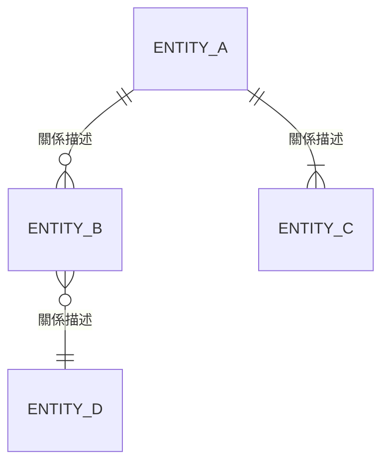
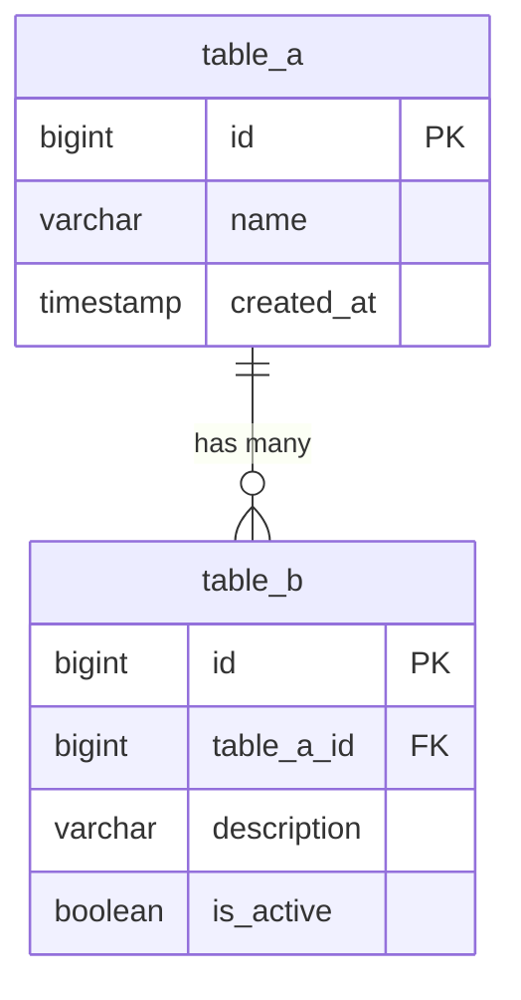
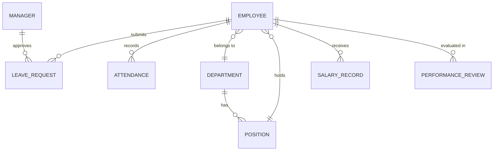
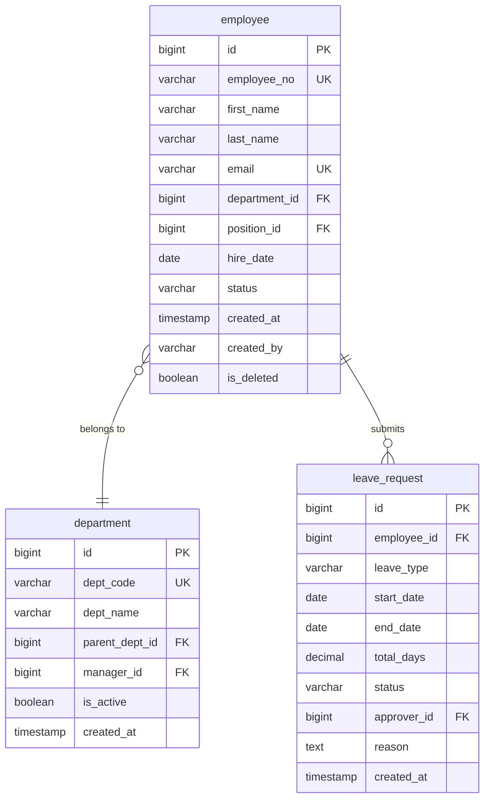

# 資料庫設計文件範本（Database Design Document Template）

> **適用標準**：ISO/IEC 11179（Metadata Registries）、DAMA DMBOK 2.0、ISO/IEC/IEEE 42010:2022  
> **適用階段**：系統設計階段（Design Phase）  
> **負責角色**：系統架構師（SA）、資料庫管理師（DBA）

---

## 📑 章節目錄

1. [文件資訊](#1-文件資訊)
2. [資料庫架構概觀](#2-資料庫架構概觀)
3. [實體關聯模型（ER Diagram）](#3-實體關聯模型er-diagram)
4. [資料表設計](#4-資料表設計)
5. [索引設計策略](#5-索引設計策略)
6. [資料關聯與完整性約束](#6-資料關聯與完整性約束)
7. [命名規範](#7-命名規範)
8. [資料治理與安全](#8-資料治理與安全)
9. [效能設計考量](#9-效能設計考量)
10. [資料遷移與版本控制](#10-資料遷移與版本控制)
11. [附錄](#11-附錄)

---

## 📝 範本

---

### 1. 文件資訊

| 項目 | 內容 |
|------|------|
| **文件名稱** | [系統名稱] 資料庫設計文件 |
| **文件編號** | [專案代碼]-DBD-[版本號] |
| **版本** | v[X.Y] |
| **建立日期** | [YYYY-MM-DD] |
| **最後更新** | [YYYY-MM-DD] |
| **撰寫者** | [SA/DBA 姓名] |
| **審核者** | [技術主管/架構師] |
| **核准者** | [專案經理] |

#### 版本歷程

| 版本 | 日期 | 修改人 | 修改內容 |
|------|------|--------|---------|
| v1.0 | [YYYY-MM-DD] | [姓名] | 初版發布 |

#### 關聯文件

| 文件名稱 | 文件編號 | 關係 |
|---------|---------|------|
| 系統架構文件（SAD） | [編號] | 上游輸入 |
| 功能需求文件（FRD） | [編號] | 需求來源 |
| API 規格文件 | [編號] | 介面對應 |

---

### 2. 資料庫架構概觀

#### 2.1 資料庫技術選型

| 項目 | 選擇 | 說明 |
|------|------|------|
| RDBMS | [PostgreSQL / SQL Server / MySQL] | [選型原因] |
| 版本 | [版本號] | |
| 部署模式 | [Single / Primary-Replica / Cluster] | [HA 需求] |
| 字元集 | [UTF-8 / UTF-16] | |
| 排序規則 | [Collation] | |

#### 2.2 資料庫實例配置

| 實例名稱 | 用途 | 主機 | 連接埠 | 備註 |
|---------|------|------|--------|------|
| [DB_MAIN] | 主要業務資料 | [hostname] | [port] | Primary |
| [DB_READ] | 讀取副本 | [hostname] | [port] | Read Replica |
| [DB_ARCHIVE] | 歷史資料歸檔 | [hostname] | [port] | Archive |

#### 2.3 Schema 架構

```
[Database]
├── schema: core        -- 核心業務資料表
├── schema: auth        -- 認證授權相關
├── schema: audit       -- 稽核軌跡
├── schema: staging     -- ETL 暫存區
└── schema: archive     -- 歷史歸檔
```

---

### 3. 實體關聯模型（ER Diagram）

#### 3.1 概念層 ERD（Conceptual ER Diagram）

> 呈現主要實體（Entity）之間的高階關係，不含欄位細節。



#### 3.2 邏輯層 ERD（Logical ER Diagram）

> 呈現所有實體、屬性與關係，對應正規化後的結構。



#### 3.3 物理層 ERD（Physical ER Diagram）

> 完整呈現資料型別、索引、約束等實作細節。（可使用 ERD 工具匯出，如 DBeaver、dbdiagram.io）

[附上物理 ERD 圖檔或連結]

---

### 4. 資料表設計

#### 4.1 資料表清單

| # | Schema | 資料表名稱 | 中文說明 | 預估資料量 | 成長率/月 |
|---|--------|-----------|---------|-----------|----------|
| 1 | core | [table_name] | [說明] | [N rows] | [% / month] |
| 2 | core | [table_name] | [說明] | [N rows] | [% / month] |

#### 4.2 資料表規格（逐表詳述）

##### Table: [schema].[table_name]

| 說明 | [中文功能描述] |
|------|------|
| 預估資料量 | [初始筆數] → [1年後預估] |
| 分區策略 | [None / Range / Hash / List] |
| 保留策略 | [永久 / N年後歸檔 / N年後刪除] |

| # | 欄位名稱 | 資料型別 | NULL | 預設值 | PK/FK/UK | 說明 |
|---|---------|---------|------|--------|---------|------|
| 1 | id | BIGINT | NOT NULL | GENERATED | PK | 主鍵（自動遞增） |
| 2 | [column] | [type(length)] | [NULL/NOT NULL] | [default] | [FK → table.col] | [說明] |
| 3 | created_at | TIMESTAMP WITH TZ | NOT NULL | CURRENT_TIMESTAMP | | 建立時間 |
| 4 | created_by | VARCHAR(100) | NOT NULL | | | 建立者 |
| 5 | updated_at | TIMESTAMP WITH TZ | NULL | | | 更新時間 |
| 6 | updated_by | VARCHAR(100) | NULL | | | 更新者 |
| 7 | is_deleted | BOOLEAN | NOT NULL | FALSE | | 軟刪除標記 |
| 8 | version | INTEGER | NOT NULL | 1 | | 樂觀鎖版本號 |

**Check Constraints：**

| 約束名稱 | 條件 | 說明 |
|---------|------|------|
| [ck_table_column] | [column] IN ('A', 'B', 'C') | [業務規則] |

---

### 5. 索引設計策略

#### 5.1 索引清單

| # | 資料表 | 索引名稱 | 索引類型 | 欄位 | 說明 |
|---|--------|---------|---------|------|------|
| 1 | [table] | [ix_table_col] | B-Tree | [col1, col2] | [查詢場景] |
| 2 | [table] | [ux_table_col] | Unique | [col1] | [唯一約束] |
| 3 | [table] | [ix_table_col_gin] | GIN | [jsonb_col] | [JSONB 搜尋] |

#### 5.2 索引設計原則

| 原則 | 說明 |
|------|------|
| 選擇性 | 索引欄位基數（Cardinality）應 > [閾值] |
| 覆蓋索引 | 高頻查詢使用 covering index 避免回表 |
| 複合索引順序 | 遵循最左前綴原則，等值條件在前、範圍在後 |
| 索引數量限制 | 單表索引不超過 [N] 個 |
| 定期維護 | 排程 REINDEX / REBUILD 頻率：[週期] |

---

### 6. 資料關聯與完整性約束

#### 6.1 外鍵關係

| 子表 | 子表欄位 | 父表 | 父表欄位 | ON DELETE | ON UPDATE |
|------|---------|------|---------|-----------|-----------|
| [child_table] | [fk_col] | [parent_table] | [pk_col] | [CASCADE/RESTRICT/SET NULL] | [CASCADE/NO ACTION] |

#### 6.2 完整性設計決策

| 決策項目 | 選擇 | 理由 |
|---------|------|------|
| 外鍵強制約束 | [是 / 應用層檢查] | [效能/彈性考量] |
| 軟刪除 vs 硬刪除 | [軟刪除] | [稽核/復原需求] |
| Cascade 策略 | [限定使用/禁止] | [資料安全] |

---

### 7. 命名規範

#### 7.1 物件命名規則

| 物件類型 | 命名格式 | 範例 |
|---------|---------|------|
| Schema | `snake_case` | `core`, `auth` |
| 資料表 | `snake_case`（單數名詞） | `employee`, `leave_request` |
| 欄位 | `snake_case` | `first_name`, `department_id` |
| 主鍵 | `id` | `id` |
| 外鍵 | `{referenced_table}_id` | `department_id` |
| 索引 | `ix_{table}_{column}` | `ix_employee_department_id` |
| 唯一索引 | `ux_{table}_{column}` | `ux_employee_employee_no` |
| Check 約束 | `ck_{table}_{column}` | `ck_employee_status` |
| Sequence | `seq_{table}` | `seq_employee` |
| View | `vw_{name}` | `vw_active_employee` |
| Stored Procedure | `sp_{action}_{object}` | `sp_calculate_salary` |
| Function | `fn_{name}` | `fn_get_work_days` |
| Trigger | `trg_{table}_{event}` | `trg_employee_audit` |

#### 7.2 稽核欄位標準

| 欄位名稱 | 型別 | 用途 |
|---------|------|------|
| `created_at` | TIMESTAMP WITH TIME ZONE | 記錄建立時間 |
| `created_by` | VARCHAR(100) | 建立者帳號 |
| `updated_at` | TIMESTAMP WITH TIME ZONE | 最後修改時間 |
| `updated_by` | VARCHAR(100) | 修改者帳號 |
| `is_deleted` | BOOLEAN DEFAULT FALSE | 軟刪除標記 |
| `deleted_at` | TIMESTAMP WITH TIME ZONE | 刪除時間 |
| `deleted_by` | VARCHAR(100) | 刪除者帳號 |
| `version` | INTEGER DEFAULT 1 | 樂觀鎖版本 |

---

### 8. 資料治理與安全

#### 8.1 資料分類分級

| 分類 | 等級 | 定義 | 處理原則 | 範例 |
|------|------|------|---------|------|
| 一般資料 | Level 1 | 公開或低敏感 | 標準存取控制 | 部門名稱 |
| 內部資料 | Level 2 | 限組織內部 | 角色授權 | 員工清單 |
| 機密資料 | Level 3 | 高度敏感 | 加密 + 稽核 | 薪資、績效 |
| 個資（PII） | Level 4 | 受法規保護 | 加密 + 遮罩 + 同意管理 | 身分證字號、地址 |

#### 8.2 加密策略

| 類型 | 適用場景 | 方法 | 備註 |
|------|---------|------|------|
| 靜態加密（At Rest） | 整個 DB / Tablespace | TDE（Transparent Data Encryption） | |
| 欄位加密 | PII / 機密欄位 | AES-256 + 應用層加解密 | 影響查詢 |
| 傳輸加密（In Transit） | Client ↔ DB | TLS 1.3 | 強制啟用 |
| 備份加密 | Backup files | AES-256 | |

#### 8.3 存取控制

| 角色 | Schema 權限 | 表權限 | 說明 |
|------|-----------|--------|------|
| app_readonly | core (USAGE) | SELECT | 唯讀服務帳號 |
| app_readwrite | core (USAGE) | SELECT, INSERT, UPDATE | 讀寫服務帳號 |
| dba_admin | ALL | ALL | DBA 管理帳號 |
| audit_reader | audit (USAGE) | SELECT | 稽核讀取 |

#### 8.4 資料保留策略

| 資料類型 | 保留期限 | 歸檔策略 | 法規依據 |
|---------|---------|---------|---------|
| [交易資料] | [N 年] | [移至 archive schema] | [法規名稱] |
| [日誌資料] | [N 個月] | [壓縮歸檔至 Object Storage] | [內部政策] |
| [個資] | [依同意書期限] | [匿名化/刪除] | [GDPR / 個資法] |

---

### 9. 效能設計考量

#### 9.1 分區策略（Partitioning）

| 資料表 | 分區方式 | 分區鍵 | 分區週期 | 說明 |
|--------|---------|--------|---------|------|
| [table] | RANGE | [date_column] | 月 | [資料量大，依日期查詢] |

#### 9.2 讀寫分離

| 操作類型 | 目標實例 | 說明 |
|---------|---------|------|
| 寫入（INSERT/UPDATE/DELETE） | Primary | |
| 即時查詢（OLTP） | Primary / Read Replica | Replica lag < [N]ms |
| 報表查詢（OLAP） | Read Replica / Analytics DB | |

#### 9.3 連接池配置

| 參數 | 值 | 說明 |
|------|------|------|
| 最小連接數 | [N] | |
| 最大連接數 | [N] | |
| 連接逾時 | [N]s | |
| 閒置逾時 | [N]s | |
| 連接池工具 | [PgBouncer / HikariCP] | |

---

### 10. 資料遷移與版本控制

#### 10.1 Schema 版本管理工具

| 項目 | 選擇 |
|------|------|
| Migration 工具 | [Flyway / Liquibase / EF Migrations] |
| 版本命名規則 | `V{版本號}__{描述}.sql` |
| 執行環境 | [CI/CD Pipeline 自動執行] |

#### 10.2 Migration 腳本規範

| 規則 | 說明 |
|------|------|
| 每個 migration 應可 rollback | 提供對應 undo script |
| 禁止修改已部署的 migration | 建立新 migration 修正 |
| 大資料表 DDL 變更 | 使用 online DDL / pt-osc |
| 資料填充（seed） | 與 DDL 分開管理 |

#### 10.3 環境同步策略

| 來源環境 | 目標環境 | 同步方式 | 頻率 |
|---------|---------|---------|------|
| Production | Staging | Migration scripts forward | 每次部署前 |
| Production | Dev | 結構同步 + 遮罩資料 | [週期] |

---

### 11. 附錄

#### 11.1 常用 SQL 範例

```sql
-- 建立資料表範例
CREATE TABLE [schema].[table_name] (
    id          BIGINT GENERATED ALWAYS AS IDENTITY PRIMARY KEY,
    [columns]   ...,
    created_at  TIMESTAMP WITH TIME ZONE NOT NULL DEFAULT CURRENT_TIMESTAMP,
    created_by  VARCHAR(100) NOT NULL,
    updated_at  TIMESTAMP WITH TIME ZONE,
    updated_by  VARCHAR(100),
    is_deleted  BOOLEAN NOT NULL DEFAULT FALSE,
    version     INTEGER NOT NULL DEFAULT 1
);

-- 建立索引範例
CREATE INDEX ix_[table]_[column] ON [schema].[table_name] ([column]);

-- 建立外鍵範例
ALTER TABLE [child_table]
ADD CONSTRAINT fk_[child]_[parent]
FOREIGN KEY ([column]) REFERENCES [parent_table](id)
ON DELETE RESTRICT ON UPDATE CASCADE;
```

#### 11.2 資料字典匯出格式

> 建議使用工具自動產出，並納入版本控制。

---

## 📖 使用說明

### 各章節填寫指引

| 章節 | 填寫時機 | 負責人 | 重點說明 |
|------|---------|--------|---------|
| §1 文件資訊 | 文件建立時 | SA | 確保版本追蹤 |
| §2 架構概觀 | 技術選型完成後 | SA/DBA | 說明 DB 選型決策理由 |
| §3 ER Diagram | 需求分析轉設計時 | SA | 先做概念層→邏輯層→物理層 |
| §4 資料表設計 | 詳細設計階段 | SA/DBA | 每張表獨立描述，含預估資料量 |
| §5 索引策略 | 配合查詢場景設計 | DBA | 需配合效能測試調整 |
| §6 關聯約束 | 詳細設計階段 | SA | 明確標示外鍵與完整性策略 |
| §7 命名規範 | 專案啟動時制定 | 架構團隊 | 全專案統一遵守 |
| §8 資料治理 | 設計階段 | SA/資安 | 配合資安需求與法規要求 |
| §9 效能設計 | 設計階段 | DBA | 依 NFR 的效能指標規劃 |
| §10 遷移管理 | 導入 CI/CD 時 | DBA/DevOps | 確保環境一致性 |

### ER 建模方法論

1. **概念層建模（Conceptual）**：識別核心業務實體與關係，不含欄位
2. **邏輯層建模（Logical）**：正規化至 3NF，定義所有屬性與資料型別
3. **物理層建模（Physical）**：加入索引、分區、反正規化等效能最佳化

### 正規化檢核

| 正規化 | 規則 | 何時可反正規化 |
|--------|------|--------------|
| 1NF | 消除重複群組，確保原子值 | — |
| 2NF | 消除部分相依 | — |
| 3NF | 消除遞移相依 | 高頻讀取 + 低頻更新場景 |
| BCNF | 消除所有非平凡相依 | 通常 3NF 即足夠 |

---

## 💡 範例（以 HRMS 人力資源管理系統為例）

---

### 範例：文件資訊

| 項目 | 內容 |
|------|------|
| **文件名稱** | HRMS 人力資源管理系統 資料庫設計文件 |
| **文件編號** | HRMS-DBD-v1.0 |
| **版本** | v1.0 |
| **建立日期** | 2026-03-15 |
| **最後更新** | 2026-05-10 |
| **撰寫者** | 陳柏翰（SA）、林志偉（DBA） |
| **審核者** | 王大明（技術主管） |

---

### 範例：概念層 ERD



---

### 範例：邏輯層 ERD（部分）



---

### 範例：資料表規格

##### Table: core.employee

| 說明 | HRMS 員工主檔 |
|------|------|
| 預估資料量 | 5,000 筆 → 8,000 筆（1年後） |
| 分區策略 | None（資料量未達分區閾值） |
| 保留策略 | 永久保留（離職員工軟刪除） |

| # | 欄位名稱 | 資料型別 | NULL | 預設值 | PK/FK/UK | 說明 |
|---|---------|---------|------|--------|---------|------|
| 1 | id | BIGINT | NOT NULL | GENERATED ALWAYS AS IDENTITY | PK | 主鍵 |
| 2 | employee_no | VARCHAR(20) | NOT NULL | | UK | 員工編號 |
| 3 | first_name | VARCHAR(50) | NOT NULL | | | 名 |
| 4 | last_name | VARCHAR(50) | NOT NULL | | | 姓 |
| 5 | email | VARCHAR(150) | NOT NULL | | UK | 公司信箱 |
| 6 | phone | VARCHAR(20) | NULL | | | 聯絡電話（加密） |
| 7 | id_number | VARCHAR(100) | NOT NULL | | | 身分證字號（AES-256 加密） |
| 8 | department_id | BIGINT | NOT NULL | | FK → department.id | 所屬部門 |
| 9 | position_id | BIGINT | NOT NULL | | FK → position.id | 職位 |
| 10 | hire_date | DATE | NOT NULL | | | 到職日 |
| 11 | resignation_date | DATE | NULL | | | 離職日 |
| 12 | status | VARCHAR(20) | NOT NULL | 'ACTIVE' | | ACTIVE/ON_LEAVE/RESIGNED |
| 13 | created_at | TIMESTAMPTZ | NOT NULL | CURRENT_TIMESTAMP | | 建立時間 |
| 14 | created_by | VARCHAR(100) | NOT NULL | | | 建立者 |
| 15 | updated_at | TIMESTAMPTZ | NULL | | | 更新時間 |
| 16 | updated_by | VARCHAR(100) | NULL | | | 更新者 |
| 17 | is_deleted | BOOLEAN | NOT NULL | FALSE | | 軟刪除 |
| 18 | version | INTEGER | NOT NULL | 1 | | 樂觀鎖 |

**Check Constraints：**

| 約束名稱 | 條件 | 說明 |
|---------|------|------|
| ck_employee_status | status IN ('ACTIVE', 'ON_LEAVE', 'RESIGNED') | 員工狀態列舉 |

---

### 範例：索引設計

| # | 資料表 | 索引名稱 | 索引類型 | 欄位 | 說明 |
|---|--------|---------|---------|------|------|
| 1 | employee | ux_employee_employee_no | Unique B-Tree | employee_no | 員工編號唯一 |
| 2 | employee | ux_employee_email | Unique B-Tree | email | 信箱唯一 |
| 3 | employee | ix_employee_department_id | B-Tree | department_id | 依部門查詢 |
| 4 | employee | ix_employee_status | B-Tree | status, is_deleted | 在職員工清單 |
| 5 | leave_request | ix_leave_request_employee_date | B-Tree | employee_id, start_date | 員工請假查詢 |
| 6 | leave_request | ix_leave_request_approver | B-Tree | approver_id, status | 主管待審核清單 |
| 7 | attendance | ix_attendance_employee_date | B-Tree | employee_id, check_date | 出勤記錄查詢 |

---

### 範例：資料治理（PII 欄位）

| 資料表.欄位 | 分類等級 | 加密方式 | 遮罩規則 | 備註 |
|------------|---------|---------|---------|------|
| employee.id_number | Level 4 (PII) | AES-256（應用層） | `A1234*****` | 個資法 |
| employee.phone | Level 3 | AES-256（應用層） | `0912-***-789` | |
| salary_record.amount | Level 3 | TDE + 欄位加密 | `***,***` | 僅薪資人員可見 |
| employee.email | Level 2 | — | — | 內部公開 |

---

### 範例：DDL 腳本

```sql
-- ====================================
-- HRMS Database Schema: core
-- Version: V1.0__initial_schema.sql
-- ====================================

CREATE SCHEMA IF NOT EXISTS core;

CREATE TABLE core.department (
    id              BIGINT GENERATED ALWAYS AS IDENTITY PRIMARY KEY,
    dept_code       VARCHAR(20)  NOT NULL UNIQUE,
    dept_name       VARCHAR(100) NOT NULL,
    parent_dept_id  BIGINT       REFERENCES core.department(id),
    manager_id      BIGINT,      -- FK added after employee table created
    is_active       BOOLEAN      NOT NULL DEFAULT TRUE,
    created_at      TIMESTAMPTZ  NOT NULL DEFAULT CURRENT_TIMESTAMP,
    created_by      VARCHAR(100) NOT NULL,
    updated_at      TIMESTAMPTZ,
    updated_by      VARCHAR(100),
    is_deleted      BOOLEAN      NOT NULL DEFAULT FALSE,
    version         INTEGER      NOT NULL DEFAULT 1
);

CREATE TABLE core.employee (
    id              BIGINT GENERATED ALWAYS AS IDENTITY PRIMARY KEY,
    employee_no     VARCHAR(20)  NOT NULL UNIQUE,
    first_name      VARCHAR(50)  NOT NULL,
    last_name       VARCHAR(50)  NOT NULL,
    email           VARCHAR(150) NOT NULL UNIQUE,
    phone           VARCHAR(100),             -- encrypted
    id_number       VARCHAR(100) NOT NULL,    -- encrypted
    department_id   BIGINT       NOT NULL REFERENCES core.department(id),
    position_id     BIGINT       NOT NULL,
    hire_date       DATE         NOT NULL,
    resignation_date DATE,
    status          VARCHAR(20)  NOT NULL DEFAULT 'ACTIVE'
                    CHECK (status IN ('ACTIVE', 'ON_LEAVE', 'RESIGNED')),
    created_at      TIMESTAMPTZ  NOT NULL DEFAULT CURRENT_TIMESTAMP,
    created_by      VARCHAR(100) NOT NULL,
    updated_at      TIMESTAMPTZ,
    updated_by      VARCHAR(100),
    is_deleted      BOOLEAN      NOT NULL DEFAULT FALSE,
    version         INTEGER      NOT NULL DEFAULT 1
);

-- 索引
CREATE INDEX ix_employee_department_id ON core.employee(department_id);
CREATE INDEX ix_employee_status ON core.employee(status, is_deleted);

-- 補建 department.manager_id FK
ALTER TABLE core.department
ADD CONSTRAINT fk_department_manager
FOREIGN KEY (manager_id) REFERENCES core.employee(id);

CREATE TABLE core.leave_request (
    id              BIGINT GENERATED ALWAYS AS IDENTITY PRIMARY KEY,
    employee_id     BIGINT       NOT NULL REFERENCES core.employee(id),
    leave_type      VARCHAR(30)  NOT NULL,
    start_date      DATE         NOT NULL,
    end_date        DATE         NOT NULL,
    total_days      DECIMAL(4,1) NOT NULL,
    status          VARCHAR(20)  NOT NULL DEFAULT 'PENDING'
                    CHECK (status IN ('PENDING', 'APPROVED', 'REJECTED', 'CANCELLED')),
    approver_id     BIGINT       REFERENCES core.employee(id),
    reason          TEXT,
    reject_reason   TEXT,
    created_at      TIMESTAMPTZ  NOT NULL DEFAULT CURRENT_TIMESTAMP,
    created_by      VARCHAR(100) NOT NULL,
    updated_at      TIMESTAMPTZ,
    updated_by      VARCHAR(100),
    is_deleted      BOOLEAN      NOT NULL DEFAULT FALSE,
    version         INTEGER      NOT NULL DEFAULT 1,
    CHECK (end_date >= start_date)
);

CREATE INDEX ix_leave_request_employee_date ON core.leave_request(employee_id, start_date);
CREATE INDEX ix_leave_request_approver ON core.leave_request(approver_id, status);
```

---

> 📌 **審閱重點**  
> - ER Diagram 是否完整反映 FRD 中的所有業務實體？  
> - 命名規範是否全專案一致？  
> - PII 欄位是否都有標示加密與遮罩策略？  
> - 索引是否覆蓋主要查詢場景（配合 EXPLAIN ANALYZE 驗證）？  
> - 分區與歸檔策略是否符合資料保留法規要求？
