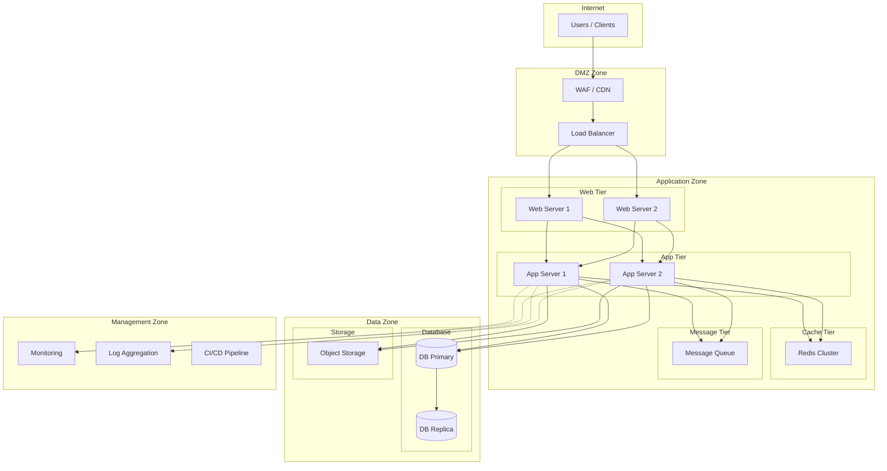
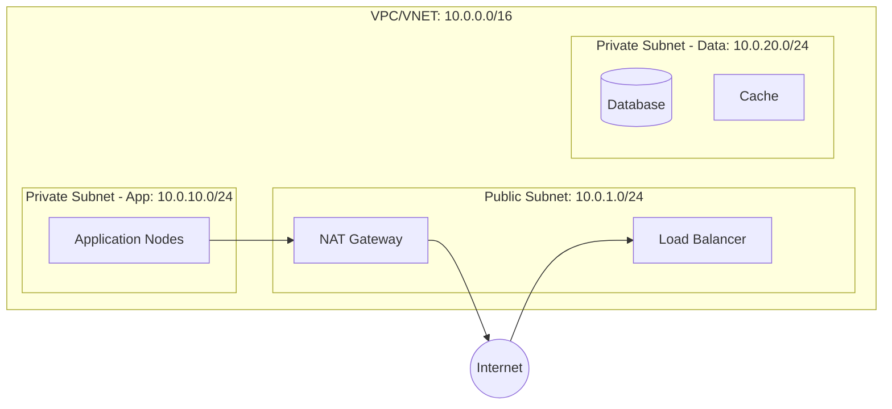
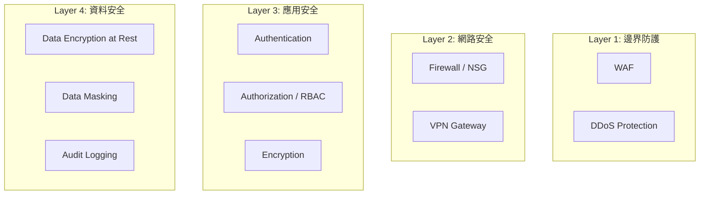
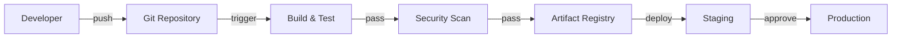
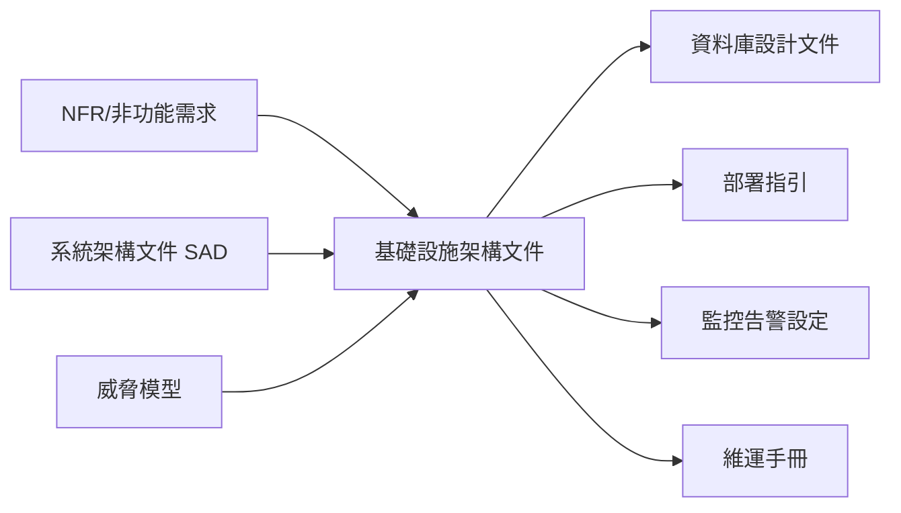
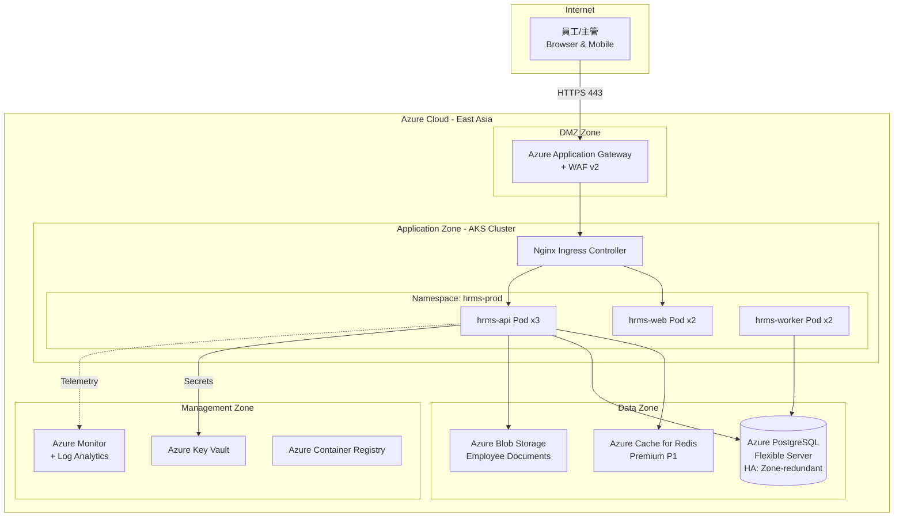

# 基礎設施架構設計文件範本（Infrastructure Architecture Document Template）

> **適用標準**：ISO/IEC/IEEE 42010:2022（架構描述）、TOGAF ADM、C4 Model、ISO/IEC 27001:2022（資安）  
> **適用階段**：系統設計階段（Design Phase）  
> **負責角色**：系統架構師（SA）、基礎設施工程師（Infra Engineer）、雲端架構師

---

## 📑 章節目錄

1. [文件資訊](#1-文件資訊)
2. [架構設計目標與約束](#2-架構設計目標與約束)
3. [系統架構總覽](#3-系統架構總覽)
4. [網路架構設計](#4-網路架構設計)
5. [運算資源配置](#5-運算資源配置)
6. [儲存與資料庫架構](#6-儲存與資料庫架構)
7. [高可用與災難復原設計](#7-高可用與災難復原設計)
8. [安全架構設計](#8-安全架構設計)
9. [監控與可觀測性架構](#9-監控與可觀測性架構)
10. [CI/CD 部署架構](#10-cicd-部署架構)
11. [容量規劃與擴展策略](#11-容量規劃與擴展策略)
12. [環境規劃](#12-環境規劃)
13. [附錄](#13-附錄)

---

## 📝 範本

---

### 1. 文件資訊

| 項目 | 內容 |
|------|------|
| **文件名稱** | [系統名稱] 基礎設施架構設計文件 |
| **文件編號** | [專案代碼]-IAD-[版本號] |
| **版本** | v[X.Y] |
| **建立日期** | [YYYY-MM-DD] |
| **最後更新** | [YYYY-MM-DD] |
| **撰寫者** | [架構師姓名] |
| **審核者** | [技術主管] |
| **核准者** | [專案經理 / CTO] |

#### 版本歷程

| 版本 | 日期 | 修改人 | 修改內容 |
|------|------|--------|---------|
| v1.0 | [YYYY-MM-DD] | [姓名] | 初版發布 |

#### 關聯文件

| 文件名稱 | 文件編號 | 關係 |
|---------|---------|------|
| 系統架構文件（SAD） | [編號] | 邏輯架構來源 |
| 非功能性需求規格 | [編號] | NFR 輸入 |
| 安全需求清單 | [編號] | 安全設計依據 |
| 資料庫設計文件 | [編號] | 資料層設計 |

---

### 2. 架構設計目標與約束

#### 2.1 設計目標

| 品質屬性 | 目標 | 衡量指標 |
|---------|------|---------|
| 可用性（Availability） | [目標 SLA %] | Uptime ≥ [N]% |
| 效能（Performance） | [回應時間目標] | P95 < [N]ms, TPS ≥ [N] |
| 延展性（Scalability） | [擴展能力] | 支援 [N] 並發用戶 |
| 安全性（Security） | [合規要求] | 符合 [法規/標準] |
| 可維護性（Maintainability） | [維護便利性] | MTTR < [N] min |
| 成本效益（Cost） | [預算限制] | 月費 < [N] USD |

#### 2.2 設計約束

| 約束類型 | 約束內容 | 來源 |
|---------|---------|------|
| 技術約束 | [指定雲端平台 / 技術堆疊] | [組織政策] |
| 法規約束 | [資料落地區域 / 合規要求] | [法規名稱] |
| 預算約束 | [月度/年度預算上限] | [專案預算] |
| 時程約束 | [上線日期限制] | [專案時程] |
| 組織約束 | [現有團隊技能 / 維運能量] | [人力限制] |

#### 2.3 架構決策記錄（ADR）

| ADR# | 決策標題 | 狀態 | 日期 |
|------|---------|------|------|
| ADR-001 | [選用 Kubernetes 作為容器編排平台] | Accepted | [YYYY-MM-DD] |
| ADR-002 | [採用 Multi-AZ 部署策略] | Accepted | [YYYY-MM-DD] |

**ADR 格式：**

```
## ADR-[NNN]: [決策標題]

### 狀態：[Proposed / Accepted / Deprecated / Superseded]

### 背景
[描述觸發此決策的問題或需求]

### 決策
[明確描述所做的架構決策]

### 替代方案
| 方案 | 優點 | 缺點 |
|------|------|------|
| 方案 A | ... | ... |
| 方案 B（chosen）| ... | ... |

### 後果
[此決策帶來的正面與負面影響]
```

---

### 3. 系統架構總覽

#### 3.1 部署拓撲圖



#### 3.2 區域劃分（Zone Design）

| Zone | 用途 | 安全等級 | 存取規則 |
|------|------|---------|---------|
| DMZ Zone | 對外接入層 | High | 僅允許 HTTPS(443) 入站 |
| Application Zone | 應用處理層 | Medium-High | 僅接受來自 DMZ 的流量 |
| Data Zone | 資料儲存層 | Critical | 僅接受來自 App Zone 的連線 |
| Management Zone | 監控管理層 | High | 限 VPN + 特定 IP 存取 |

#### 3.3 技術堆疊摘要

| 層級 | 技術選擇 | 版本 | 說明 |
|------|---------|------|------|
| 負載平衡 | [Nginx / ALB / F5] | [version] | |
| Web Server | [Nginx / Apache] | [version] | |
| Application Runtime | [JDK / .NET / Node.js] | [version] | |
| Container Runtime | [Docker / containerd] | [version] | |
| Orchestration | [Kubernetes / ECS] | [version] | |
| Cache | [Redis / Memcached] | [version] | |
| Message Queue | [RabbitMQ / Kafka] | [version] | |
| Database | [PostgreSQL / SQL Server] | [version] | |
| Object Storage | [S3 / Azure Blob / MinIO] | [version] | |
| Monitoring | [Prometheus + Grafana / Datadog] | [version] | |
| Logging | [ELK / Loki] | [version] | |

---

### 4. 網路架構設計

#### 4.1 網路拓撲



#### 4.2 IP 位址規劃

| 子網路名稱 | CIDR | 可用 IP 數 | 用途 | AZ |
|-----------|------|-----------|------|-----|
| public-subnet-1 | 10.0.1.0/24 | 251 | LB, NAT, Bastion | AZ-1 |
| public-subnet-2 | 10.0.2.0/24 | 251 | LB, NAT | AZ-2 |
| private-app-1 | 10.0.10.0/24 | 251 | Application | AZ-1 |
| private-app-2 | 10.0.11.0/24 | 251 | Application | AZ-2 |
| private-data-1 | 10.0.20.0/24 | 251 | Database, Cache | AZ-1 |
| private-data-2 | 10.0.21.0/24 | 251 | Database, Cache | AZ-2 |

#### 4.3 防火牆規則（Security Group / NSG）

| 規則名稱 | 來源 | 目標 | Port | Protocol | 動作 | 說明 |
|---------|------|------|------|----------|------|------|
| [rule_name] | [source CIDR/SG] | [target SG] | [port] | [TCP/UDP] | [Allow/Deny] | [說明] |

#### 4.4 DNS 設計

| 記錄類型 | 名稱 | 值 | TTL | 說明 |
|---------|------|------|-----|------|
| A / CNAME | [domain] | [IP/Target] | [seconds] | [用途] |

---

### 5. 運算資源配置

#### 5.1 伺服器/節點規格

| 角色 | 規格 | CPU | Memory | Disk | 數量 | OS |
|------|------|-----|--------|------|------|-----|
| Web Server | [instance type] | [N] vCPU | [N] GB | [N] GB [type] | [N] | [OS] |
| App Server | [instance type] | [N] vCPU | [N] GB | [N] GB [type] | [N] | [OS] |
| DB Server | [instance type] | [N] vCPU | [N] GB | [N] GB [type] | [N] | [OS] |

#### 5.2 容器資源配置（如適用）

| 服務名稱 | CPU Request | CPU Limit | Memory Request | Memory Limit | Replicas |
|---------|-------------|-----------|----------------|--------------|----------|
| [service] | [N]m | [N]m | [N]Mi | [N]Mi | [N] |

#### 5.3 Auto-Scaling 策略

| 資源 | 觸發指標 | Scale-Out 閾值 | Scale-In 閾值 | 最小/最大 | 冷卻時間 |
|------|---------|--------------|-------------|----------|---------|
| [App Pool] | CPU Usage | > [N]% | < [N]% | [min]-[max] | [N]s |
| [App Pool] | Request Count | > [N] req/s | < [N] req/s | [min]-[max] | [N]s |

---

### 6. 儲存與資料庫架構

#### 6.1 儲存規劃

| 儲存類型 | 用途 | 容量 | IOPS | 備份策略 | 加密 |
|---------|------|------|------|---------|------|
| Block Storage | DB Data | [N] GB | [N] | [策略] | [是/否] |
| Object Storage | 檔案附件 | [N] GB | N/A | [策略] | [是/否] |
| File Storage | 共享設定 | [N] GB | [N] | [策略] | [是/否] |

#### 6.2 資料庫部署架構

| 實例角色 | 部署位置 | 同步模式 | 用途 |
|---------|---------|---------|------|
| Primary | AZ-1 | — | 讀寫 |
| Sync Replica | AZ-2 | Synchronous | 高可用切換 |
| Async Replica | AZ-1 | Asynchronous | 讀取分流 |

#### 6.3 快取架構

| 快取類型 | 用途 | 容量 | 節點數 | 淘汰策略 |
|---------|------|------|--------|---------|
| [Redis Cluster] | Session / API Cache | [N] GB | [N] | [LRU / LFU] |

---

### 7. 高可用與災難復原設計

#### 7.1 高可用設計

| 元件 | HA 策略 | 跨 AZ | 故障切換時間 | 說明 |
|------|---------|--------|------------|------|
| Load Balancer | Active-Active | ✅ | 即時 | 健康檢查自動切換 |
| Application | N+1 Redundancy | ✅ | < [N]s | Rolling deployment |
| Database | Primary-Replica | ✅ | < [N]s | Auto failover |
| Cache | Cluster Mode | ✅ | < [N]s | Sentinel / Cluster |

#### 7.2 災難復原（DR）

| 項目 | 目標 | 設計 |
|------|------|------|
| RTO（Recovery Time Objective） | [N] 小時 | [DR 策略描述] |
| RPO（Recovery Point Objective） | [N] 分鐘 | [備份頻率描述] |
| DR 類型 | [Hot / Warm / Cold Standby] | |
| DR 站點 | [Region / DC 位置] | |

#### 7.3 備份策略

| 備份對象 | 備份方式 | 頻率 | 保留期 | 儲存位置 | 加密 |
|---------|---------|------|--------|---------|------|
| Database | Full + Incremental | Full: 每日 / Incr: 每小時 | [N] 天 | [位置] | AES-256 |
| File Storage | Snapshot | 每日 | [N] 天 | [位置] | AES-256 |
| Configuration | Git | 每次變更 | 永久 | Git Repository | — |

---

### 8. 安全架構設計

#### 8.1 安全分層



#### 8.2 憑證管理

| 憑證類型 | 管理方式 | 輪換頻率 | 工具 |
|---------|---------|---------|------|
| SSL/TLS 憑證 | [自動更新 / 手動] | [N 天] | [Let's Encrypt / ACM] |
| DB 密碼 | Secret Manager | [N 天] | [Vault / Key Vault] |
| API Key | Secret Manager | [N 天] | [Vault / Key Vault] |
| SSH Key | Key Management | [N 天] | [工具名稱] |

#### 8.3 合規檢核

| 合規項目 | 要求 | 實作方式 | 狀態 |
|---------|------|---------|------|
| [資料加密] | [法規條文] | [TDE + TLS] | [✅ / 🔲] |
| [存取控制] | [法規條文] | [RBAC + MFA] | [✅ / 🔲] |
| [稽核軌跡] | [法規條文] | [Audit Log 保留 N 年] | [✅ / 🔲] |

---

### 9. 監控與可觀測性架構

#### 9.1 監控層級

| 層級 | 監控對象 | 工具 | 關鍵指標 |
|------|---------|------|---------|
| Infrastructure | CPU, Memory, Disk, Network | [Prometheus / CloudWatch] | Utilization, Saturation |
| Platform | Container, Pod, Node | [Prometheus + kube-state-metrics] | Pod status, Resource usage |
| Application | API Latency, Error Rate, Throughput | [APM / OpenTelemetry] | RED metrics |
| Business | Transaction count, Revenue | [Custom metrics] | KPI |

#### 9.2 告警規則

| 告警名稱 | 條件 | 嚴重度 | 通知管道 | 回應 SLA |
|---------|------|--------|---------|---------|
| [alert_name] | [metric] [operator] [threshold] for [duration] | [Critical/Warning/Info] | [PagerDuty/Slack/Email] | [N] min |

#### 9.3 日誌架構

| 日誌類型 | 來源 | 收集方式 | 儲存 | 保留期 |
|---------|------|---------|------|--------|
| Application Log | App containers | [Fluentd / Filebeat] | [Elasticsearch / Loki] | [N] 天 |
| Access Log | Load Balancer | [Native export] | [S3 / Blob] | [N] 天 |
| Audit Log | All components | [Agent] | [SIEM / Dedicated store] | [N] 年 |

---

### 10. CI/CD 部署架構

#### 10.1 Pipeline 架構



#### 10.2 部署策略

| 環境 | 部署方式 | 說明 |
|------|---------|------|
| Development | Direct Deploy | 開發自動部署 |
| Staging | Blue-Green / Canary | 驗證環境 |
| Production | [Blue-Green / Rolling / Canary] | 需審核 |

#### 10.3 Infrastructure as Code

| 工具 | 管理範圍 | 儲存位置 |
|------|---------|---------|
| [Terraform / Pulumi] | Infrastructure provisioning | [repo path] |
| [Ansible / Chef] | Configuration management | [repo path] |
| [Helm / Kustomize] | K8s deployment | [repo path] |

---

### 11. 容量規劃與擴展策略

#### 11.1 當前容量需求

| 指標 | 日常負載 | 尖峰負載 | 設計容量 | 說明 |
|------|---------|---------|---------|------|
| 並發用戶數 | [N] | [N] | [N] | |
| TPS | [N] | [N] | [N] | 預留 [X]% buffer |
| 資料儲存量 | [N] GB | — | [N] GB/year growth | |
| 網路頻寬 | [N] Mbps | [N] Mbps | [N] Mbps | |

#### 11.2 擴展策略

| 元件 | 水平擴展 | 垂直擴展 | 擴展上限 | 觸發條件 |
|------|---------|---------|---------|---------|
| Web/App | ✅ Auto-scale | 🔲 | [N] nodes | CPU > [N]% |
| Database | ✅ Read Replica | ✅ Scale-up | [N] replicas | Connection > [N]% |
| Cache | ✅ Cluster sharding | ✅ | [N] nodes | Memory > [N]% |

#### 11.3 成本估算

| 資源類別 | 規格 | 數量 | 單價（月） | 小計（月） |
|---------|------|------|-----------|-----------|
| 運算 | [instance type] | [N] | [USD] | [USD] |
| 儲存 | [storage type] | [N GB] | [USD/GB] | [USD] |
| 網路 | [bandwidth] | [N GB] | [USD/GB] | [USD] |
| 其他 | [managed services] | — | — | [USD] |
| **合計** | | | | **[USD/月]** |

---

### 12. 環境規劃

#### 12.1 環境清單

| 環境名稱 | 用途 | 規模比例 | 資料來源 | 存取控制 |
|---------|------|---------|---------|---------|
| Development | 開發測試 | 1:4 (Production) | Mock / Seed data | 開發人員 |
| SIT | 系統整合測試 | 1:2 | 遮罩後的 Production 資料 | QA + Dev |
| UAT | 使用者驗收測試 | 1:2 | 遮罩後的 Production 資料 | QA + Business |
| Staging | 上線前驗證 | 1:1 | Production-like | DevOps + QA |
| Production | 正式環境 | 1:1 | Real data | Restricted |
| DR | 災難復原 | 1:1 | Replicated from Production | Emergency |

#### 12.2 環境差異對照

| 配置項目 | Dev | SIT | UAT | Staging | Production |
|---------|-----|-----|-----|---------|-----------|
| App Replicas | 1 | 2 | 2 | [N] | [N] |
| DB Size | [N]GB | [N]GB | [N]GB | [N]GB | [N]GB |
| SSL | Self-signed | Self-signed | Internal CA | Public CA | Public CA |
| Monitoring | Basic | Basic | Standard | Full | Full |
| Backup | None | Daily | Daily | Full | Full |

---

### 13. 附錄

#### 13.1 架構決策記錄（完整 ADR）

[在此列出所有 ADR 完整內容]

#### 13.2 第三方服務依賴

| 服務名稱 | 用途 | SLA | 備援方案 |
|---------|------|-----|---------|
| [Service] | [用途] | [SLA %] | [Fallback strategy] |

#### 13.3 授權與合約

| 軟體/服務 | 授權類型 | 到期日 | 負責人 |
|-----------|---------|--------|--------|
| [Software] | [License type] | [YYYY-MM-DD] | [Name] |

---

## 📖 使用說明

### 各章節填寫指引

| 章節 | 填寫時機 | 負責人 | 重點說明 |
|------|---------|--------|---------|
| §1 文件資訊 | 文件建立時 | SA | 確保版本追蹤與關聯文件連結 |
| §2 目標與約束 | 需求確認後 | SA | 從 NFR 導出量化目標，ADR 記錄關鍵決策 |
| §3 架構總覽 | 概念設計時 | SA | 先畫 Zone 分區，再填技術堆疊 |
| §4 網路架構 | 詳細設計時 | Infra/Network | IP 規劃需預留擴展空間 |
| §5 運算資源 | 容量規劃時 | SA/Infra | 依效能測試結果調整 |
| §6 儲存/DB | 配合 DB 設計 | DBA/Infra | 與資料庫設計文件互相引用 |
| §7 HA/DR | 詳細設計時 | SA | RTO/RPO 需與業務確認 |
| §8 安全架構 | 設計階段 | SA/資安 | 需配合威脅模型結果 |
| §9 監控 | 設計/部署前 | SRE/DevOps | 定義關鍵告警與 SLA |
| §10 CI/CD | 開發環境就緒時 | DevOps | IaC 管理所有環境 |
| §11 容量規劃 | 設計/上線前 | SA | 需含成本估算 |
| §12 環境規劃 | 專案啟動時 | DevOps/SA | 明確各環境差異 |

### 與其他文件的關係



### 審閱檢核清單

| # | 檢核項目 | 通過 |
|---|---------|------|
| 1 | 架構是否滿足所有 NFR 指標？ | 🔲 |
| 2 | 是否有單點故障（SPOF）？ | 🔲 |
| 3 | 安全分區是否符合最小權限原則？ | 🔲 |
| 4 | DR 策略是否滿足 RTO/RPO？ | 🔲 |
| 5 | Auto-scaling 是否覆蓋所有彈性需求？ | 🔲 |
| 6 | 成本估算是否在預算範圍？ | 🔲 |
| 7 | 所有元件是否都有監控與告警？ | 🔲 |
| 8 | 備份是否可定期演練還原？ | 🔲 |

---

## 💡 範例（以 HRMS 人力資源管理系統為例）

---

### 範例：設計目標

| 品質屬性 | 目標 | 衡量指標 |
|---------|------|---------|
| 可用性 | 99.9% SLA | 月度停機 < 43.8 分鐘 |
| 效能 | API 回應快速 | P95 < 200ms, P99 < 500ms |
| 延展性 | 支援業務成長 | 最多 5,000 並發用戶 |
| 安全性 | 個資保護 | 符合個資法、ISO 27001 |
| 可維護性 | 快速修復 | MTTR < 30 min |
| 成本 | 合理預算 | 月費 < USD 5,000 |

---

### 範例：部署拓撲



---

### 範例：網路規劃

| 子網路 | CIDR | 用途 | NSG |
|--------|------|------|-----|
| snet-agw | 10.1.1.0/24 | Application Gateway | nsg-agw (Allow 443 inbound) |
| snet-aks | 10.1.4.0/22 | AKS Node Pool | nsg-aks (Internal only) |
| snet-data | 10.1.8.0/24 | PostgreSQL, Redis | nsg-data (Allow from snet-aks only) |
| snet-mgmt | 10.1.12.0/24 | Bastion, DevOps Agent | nsg-mgmt (VPN only) |

---

### 範例：運算資源

| 角色 | Azure SKU | vCPU | Memory | 數量 | 月費(USD) |
|------|----------|------|--------|------|----------|
| AKS Node (System) | Standard_D2s_v5 | 2 | 8 GB | 2 | ~$140 |
| AKS Node (User) | Standard_D4s_v5 | 4 | 16 GB | 3 | ~$420 |
| PostgreSQL | GP_Standard_D4ds_v4 | 4 | 16 GB | 1 (HA pair) | ~$500 |
| Redis | Premium P1 | — | 6 GB | 1 | ~$200 |
| Blob Storage | Hot tier | — | 100 GB | — | ~$2 |
| **Total (estimated)** | | | | | **~$1,262/月** |

---

### 範例：高可用設計

| 元件 | HA 策略 | 跨 AZ | RTO | RPO |
|------|---------|--------|-----|-----|
| Application Gateway | Zone-redundant | ✅ | 即時 | 0 |
| AKS Cluster | Multi-AZ Node Pool | ✅ | < 60s (Pod reschedule) | 0 |
| PostgreSQL | Zone-redundant HA | ✅ | < 120s (auto failover) | ~0 (sync replication) |
| Redis | Zone-redundant | ✅ | < 30s | < 1s |
| Blob Storage | ZRS (Zone Redundant) | ✅ | 即時 | 0 |

**DR 策略：**
- 類型：Warm Standby（Southeast Asia region）
- RTO：4 小時
- RPO：1 小時（PostgreSQL Geo-Replication lag）
- 演練頻率：每季一次

---

### 範例：安全架構

| 安全層 | 措施 | 工具 |
|--------|------|------|
| 邊界防護 | WAF（OWASP Top 10 規則集） | Azure WAF v2 |
| DDoS 防護 | Network-level DDoS | Azure DDoS Protection |
| 網路分段 | Private subnet + NSG | Azure VNET + NSG |
| 身分驗證 | OAuth 2.0 + OIDC | Azure AD / Keycloak |
| 授權 | RBAC（HR Admin / Manager / Employee） | 應用層實作 |
| 資料加密(靜態) | TDE + 應用層 PII 加密 | PostgreSQL TDE + AES-256 |
| 資料加密(傳輸) | TLS 1.3 | 全程強制 |
| 密鑰管理 | 集中管理、自動輪換 | Azure Key Vault |
| 稽核日誌 | 全操作記錄 | Azure Monitor + Log Analytics |

---

### 範例：告警規則

| 告警名稱 | 條件 | 嚴重度 | 通知 | 回應 SLA |
|---------|------|--------|------|---------|
| API Error Rate High | 5xx rate > 5% for 5min | Critical | PagerDuty + Teams | 15 min |
| DB CPU High | CPU > 80% for 10min | Warning | Teams | 30 min |
| Pod CrashLoopBackOff | Restart count > 3 in 5min | Critical | PagerDuty | 15 min |
| Disk Usage High | Disk > 85% | Warning | Email + Teams | 4 hr |
| SSL Cert Expiry | < 14 days to expiry | Warning | Email | 7 days |
| Response Time Degraded | P95 > 500ms for 10min | Warning | Teams | 1 hr |

---

> 📌 **審閱重點**  
> - 架構圖是否反映實際部署拓撲，而非僅概念圖？  
> - 每個元件是否都有明確的 HA 與 DR 策略？  
> - 網路分段是否遵循最小權限原則（Zero Trust）？  
> - 成本估算是否含擴展後的預算？  
> - 所有敏感組態（密碼、金鑰）是否都使用 Secret Manager？
