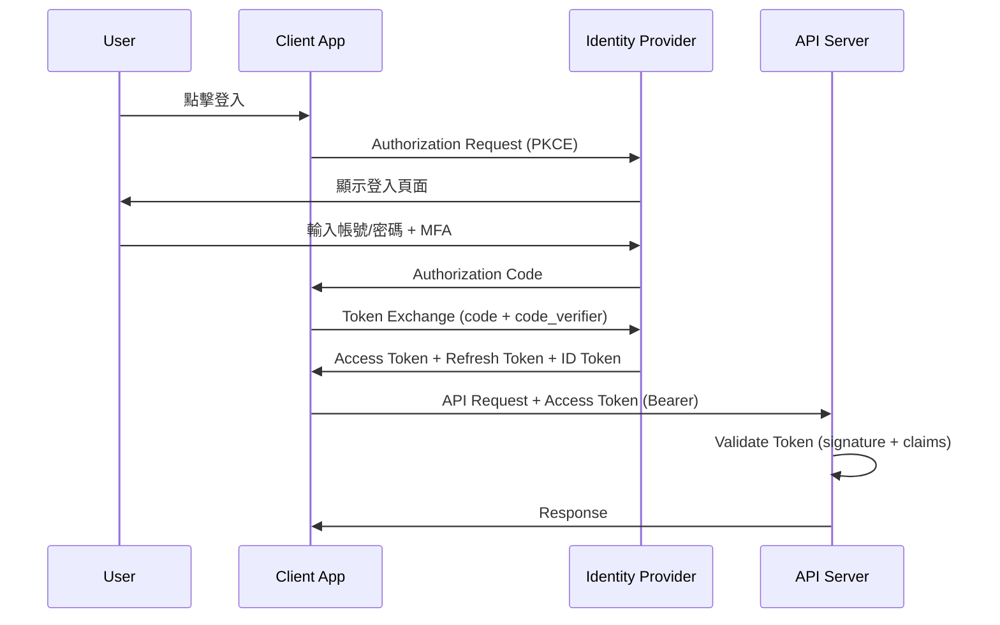

# 安全設計文件範本（Security Design Document Template）

> **適用標準**：OWASP SAMM 2.0、ISO/IEC 27034（應用安全）、NIST SP 800-53、ISO/IEC 27001:2022  
> **適用階段**：系統設計階段（Design Phase）  
> **負責角色**：資安架構師、系統架構師（SA）、AppSec 工程師

---

## 📑 章節目錄

1. [文件資訊](#1-文件資訊)
2. [安全設計目標](#2-安全設計目標)
3. [身分驗證設計（Authentication）](#3-身分驗證設計authentication)
4. [授權與存取控制（Authorization）](#4-授權與存取控制authorization)
5. [資料保護設計](#5-資料保護設計)
6. [API 安全設計](#6-api-安全設計)
7. [Session 管理](#7-session-管理)
8. [輸入驗證與輸出編碼](#8-輸入驗證與輸出編碼)
9. [日誌與稽核設計](#9-日誌與稽核設計)
10. [安全組態基線](#10-安全組態基線)
11. [安全測試策略](#11-安全測試策略)

---

## 📝 範本

---

### 1. 文件資訊

| 項目 | 內容 |
|------|------|
| **文件名稱** | [系統名稱] 安全設計文件 |
| **文件編號** | [專案代碼]-SDD-[版本號] |
| **版本** | v[X.Y] |
| **建立日期** | [YYYY-MM-DD] |
| **撰寫者** | [資安架構師] |
| **審核者** | [CISO / 資安團隊] |
| **資料分級** | [Confidential / Internal] |

#### 關聯文件

| 文件 | 關係 |
|------|------|
| 威脅模型（Threat Model） | 風險識別來源 |
| 安全需求清單 | 需求依據 |
| 系統架構文件（SAD） | 架構背景 |

---

### 2. 安全設計目標

#### 2.1 安全原則

| 原則 | 說明 | 實施方式 |
|------|------|---------|
| Defense in Depth | 多層防禦 | [每層防護機制] |
| Least Privilege | 最小權限 | [RBAC + 預設拒絕] |
| Fail Secure | 安全失敗 | [錯誤處理不暴露資訊] |
| Separation of Duties | 職責分離 | [設計/部署/維運分離] |
| Zero Trust | 零信任 | [每次存取都驗證] |

#### 2.2 合規需求

| 法規/標準 | 適用條款 | 設計對應 |
|-----------|---------|---------|
| [個資法 / GDPR] | [條款] | [§5 資料保護] |
| [ISO 27001] | [A.8 / A.9] | [§3, §4] |
| [OWASP Top 10] | [全部] | [§6, §8] |
| [PCI DSS] | [條款，如適用] | [§5] |

---

### 3. 身分驗證設計（Authentication）

#### 3.1 驗證機制

| 項目 | 設計 |
|------|------|
| 驗證協定 | [OAuth 2.0 + OIDC / SAML 2.0 / Custom] |
| IdP 選擇 | [Azure AD / Keycloak / Auth0 / 自建] |
| MFA 策略 | [強制 / 條件式 / 僅特權帳號] |
| MFA 方式 | [TOTP / SMS / Push / FIDO2] |
| 密碼政策 | [長度/複雜度/歷史/鎖定策略] |

#### 3.2 密碼儲存

| 項目 | 設計 |
|------|------|
| Hash 演算法 | [bcrypt / Argon2id / PBKDF2] |
| Cost Factor | [rounds / iterations] |
| Salt | [Per-user random salt] |

#### 3.3 Token 設計

| Token 類型 | 格式 | 有效期 | 儲存位置 | 備註 |
|-----------|------|--------|---------|------|
| Access Token | [JWT / Opaque] | [N min] | [Memory / HttpOnly Cookie] | |
| Refresh Token | [Opaque] | [N days] | [HttpOnly Secure Cookie] | 單次使用 |
| ID Token | [JWT] | [N min] | [Memory] | 不傳給後端 API |

#### 3.4 驗證流程圖



---

### 4. 授權與存取控制（Authorization）

#### 4.1 存取控制模型

| 項目 | 設計 |
|------|------|
| 模型 | [RBAC / ABAC / ReBAC / 混合] |
| 角色層級 | [平面 / 階層式] |
| 權限粒度 | [功能級 / 資料級 / 欄位級] |

#### 4.2 角色定義

| 角色 ID | 角色名稱 | 說明 | 預設權限 |
|---------|---------|------|---------|
| [ROLE_ID] | [名稱] | [角色描述] | [權限摘要] |

#### 4.3 權限矩陣

| 功能/資源 | [角色A] | [角色B] | [角色C] | [Admin] |
|-----------|---------|---------|---------|---------|
| [功能1] | R | CRUD | R | CRUD |
| [功能2] | — | R | CRUD | CRUD |
| [功能3] | RU (own) | RU (dept) | CRUD | CRUD |

#### 4.4 資料級權限

| 規則 | 描述 | 實施方式 |
|------|------|---------|
| Row-Level Security | [使用者只能看自己的資料] | [DB RLS / Application Filter] |
| Column-Level Security | [敏感欄位依角色遮罩] | [View / API 過濾] |
| 部門隔離 | [只能存取所屬部門資料] | [tenant_id / dept_id filter] |

---

### 5. 資料保護設計

#### 5.1 加密策略

| 場景 | 方法 | 演算法 | 金鑰管理 |
|------|------|--------|---------|
| 傳輸中（In Transit） | TLS | [TLS 1.3 / 1.2] | [憑證管理方式] |
| 靜態儲存（At Rest） | [TDE / Application-level] | [AES-256-GCM] | [KMS / Vault] |
| 欄位加密 | Application-level | [AES-256-GCM] | [KMS / Vault] |
| 備份加密 | File-level | [AES-256] | [KMS] |

#### 5.2 金鑰管理

| 項目 | 設計 |
|------|------|
| KMS 工具 | [AWS KMS / Azure Key Vault / HashiCorp Vault] |
| 金鑰輪換 | [每 N 天自動輪換] |
| 金鑰存取控制 | [IAM Policy / RBAC] |
| 金鑰備份 | [異地備份策略] |

#### 5.3 個資處理

| 個資欄位 | 蒐集目的 | 保留期限 | 匿名化方式 | 刪除策略 |
|---------|---------|---------|-----------|---------|
| [欄位] | [用途] | [N 年] | [Masking / Hashing / Tokenization] | [Hard delete / Crypto-shred] |

---

### 6. API 安全設計

#### 6.1 API 認證授權

| 項目 | 設計 |
|------|------|
| 認證方式 | [Bearer Token (JWT) / API Key / mTLS] |
| 授權檢查點 | [API Gateway / Application / Both] |
| Scope/Permission | [resource:action 格式] |

#### 6.2 API 防護

| 防護措施 | 設計 | 工具 |
|---------|------|------|
| Rate Limiting | [N requests / minute per user] | [API Gateway / Redis] |
| Request Size Limit | [N MB] | [Nginx / Gateway] |
| IP Whitelist（如適用） | [特定 API 限制來源 IP] | [WAF / NSG] |
| CORS | [Allowed origins 清單] | [Application config] |
| API Versioning | [URL path / Header] | [設計規範] |

#### 6.3 OWASP API Security Top 10 對策

| 風險 | 對策 |
|------|------|
| Broken Object Level Authorization | [每次存取驗證資源所有權] |
| Broken Authentication | [Token 正確驗證 + MFA] |
| Broken Object Property Level Authorization | [回應過濾敏感欄位] |
| Unrestricted Resource Consumption | [Rate limit + pagination] |
| Broken Function Level Authorization | [角色權限矩陣嚴格檢查] |
| Server Side Request Forgery | [禁止 URL 參數直接存取內部資源] |
| Security Misconfiguration | [安全組態基線檢核] |
| Lack of Protection from Automated Threats | [Bot detection + CAPTCHA] |

---

### 7. Session 管理

| 項目 | 設計 |
|------|------|
| Session 機制 | [Stateless (JWT) / Stateful (Server-side)] |
| Session 有效期 | [Idle: N min / Absolute: N hr] |
| Session 儲存 | [Redis / Database / Memory] |
| Cookie 設定 | HttpOnly, Secure, SameSite=Strict, Path=/ |
| 並行 Session | [允許 N 個裝置 / 新登入踢出舊 Session] |
| Session Fixation 防護 | [登入後重新產生 Session ID] |
| 登出機制 | [清除 Token + Server-side invalidation] |

---

### 8. 輸入驗證與輸出編碼

#### 8.1 輸入驗證策略

| 驗證層 | 位置 | 方式 |
|--------|------|------|
| Client-side | 前端 | UI 即時驗證（UX 用途，非安全邊界） |
| Server-side | API Controller | **必須**：Whitelist 驗證 + Schema validation |
| Database | DB Layer | 型別約束 + Check constraints |

#### 8.2 常見攻擊防護

| 攻擊類型 | 防護措施 |
|---------|---------|
| SQL Injection | Parameterized queries / ORM |
| XSS | Output encoding (context-aware) + CSP |
| CSRF | SameSite cookie + CSRF token (if needed) |
| Path Traversal | 白名單驗證路徑，禁止 `../` |
| XXE | 停用 external entity parsing |
| Deserialization | 不接受不信任的序列化資料 |

#### 8.3 Content Security Policy

```
Content-Security-Policy: 
  default-src 'self';
  script-src 'self' [trusted CDN];
  style-src 'self' 'unsafe-inline';
  img-src 'self' data: [image CDN];
  connect-src 'self' [API domain];
  frame-ancestors 'none';
  base-uri 'self';
  form-action 'self';
```

---

### 9. 日誌與稽核設計

#### 9.1 安全事件日誌

| 事件類型 | 記錄內容 | 儲存位置 | 保留期 |
|---------|---------|---------|--------|
| 登入成功/失敗 | UserID, IP, Timestamp, UserAgent | [SIEM / Log store] | [N 年] |
| 權限變更 | Who, What, When, Previous/New value | [Audit DB] | [N 年] |
| 資料存取 | UserID, Resource, Action, Timestamp | [Audit DB] | [N 年] |
| 敏感操作 | [詳細描述] | [Audit DB] | [N 年] |

#### 9.2 日誌安全

| 項目 | 設計 |
|------|------|
| 日誌不得包含 | 密碼、Token、PII 明碼、信用卡號 |
| 日誌完整性 | [HMAC / Append-only storage] |
| 日誌存取控制 | [僅 Security Team + Auditor 可存取] |
| 竄改偵測 | [Hash chain / WORM storage] |

---

### 10. 安全組態基線

#### 10.1 HTTP Security Headers

| Header | 值 | 說明 |
|--------|------|------|
| Strict-Transport-Security | max-age=31536000; includeSubDomains | HSTS |
| X-Content-Type-Options | nosniff | 防 MIME 嗅探 |
| X-Frame-Options | DENY | 防 Clickjacking |
| X-XSS-Protection | 0 | 由 CSP 取代 |
| Referrer-Policy | strict-origin-when-cross-origin | |
| Permissions-Policy | camera=(), microphone=() | 限制瀏覽器功能 |

#### 10.2 TLS 組態

| 項目 | 設計 |
|------|------|
| 最低版本 | TLS 1.2（建議 TLS 1.3） |
| 允許 Cipher Suites | [列出安全的 cipher suites] |
| 憑證類型 | [RSA 2048+ / ECDSA P-256+] |
| HSTS Preload | [是/否] |

---

### 11. 安全測試策略

| 測試類型 | 工具 | 頻率 | 負責人 |
|---------|------|------|--------|
| SAST | [SonarQube / Checkmarx / Semgrep] | 每次 CI build | Dev Team |
| DAST | [OWASP ZAP / Burp Suite] | 每個 Sprint | AppSec |
| SCA | [Snyk / Dependabot / OWASP Dep-Check] | 每次 CI build | Dev Team |
| Penetration Test | [外部廠商] | [每年/每版本] | AppSec |
| Security Review | Code Review + Design Review | 每個 PR + 每階段 | AppSec + Dev |

---

## 📖 使用說明

### 各章節填寫指引

| 章節 | 填寫時機 | 負責人 | 重點說明 |
|------|---------|--------|---------|
| §2 安全目標 | 專案啟動時 | 資安 | 對齊合規需求 |
| §3 身分驗證 | 設計初期 | SA/資安 | 從威脅模型導出需求 |
| §4 授權控制 | 配合功能設計 | SA | 權限矩陣需業務確認 |
| §5 資料保護 | 設計階段 | SA/DBA/資安 | PII 處理需法務確認 |
| §6 API 安全 | API 設計時 | SA/FE/BE | 配合 API Spec |
| §7-8 Session/驗證 | 詳細設計 | BE | 遵循 OWASP 建議 |
| §9 稽核 | 設計階段 | SA/資安 | 法規保留需求 |
| §10 組態基線 | 部署前 | DevOps/資安 | 定期掃描驗證 |
| §11 測試策略 | 開發啟動前 | 資安/QA | 整合至 CI/CD |

---

## 💡 範例（以 HRMS 人力資源管理系統為例）

---

### 範例：角色與權限矩陣

| 功能 | 員工 | 主管 | HR | 系統管理員 |
|------|------|------|-----|-----------|
| 查看個人資料 | R (own) | R (dept) | R (all) | R (all) |
| 編輯個人資料 | U (partial) | — | U (all) | U (all) |
| 申請請假 | CRU (own) | CRU (own) | CRUD (all) | CRUD (all) |
| 審核請假 | — | U (dept) | U (all) | U (all) |
| 查看薪資 | R (own) | — | R (all) | R (all) |
| 管理員工 | — | — | CRUD | CRUD |
| 系統設定 | — | — | — | CRUD |

### 範例：API 安全設計

| API Endpoint | 認證 | 授權 | Rate Limit | 備註 |
|-------------|------|------|-----------|------|
| POST /auth/login | Public | — | 5/min per IP | 防暴力破解 |
| GET /api/employees/{id} | Bearer JWT | own or dept_manager or HR | 100/min | Row-level check |
| POST /api/leave-requests | Bearer JWT | Employee role | 10/min | |
| PUT /api/leave-requests/{id}/approve | Bearer JWT | Manager of requestor | 30/min | 層級驗證 |
| GET /api/salary/{id} | Bearer JWT | own or HR | 20/min | 敏感資料加密回傳 |
| DELETE /api/employees/{id} | Bearer JWT | Admin only | 5/min | Soft delete + 稽核 |

### 範例：稽核日誌設計

```json
{
  "timestamp": "2026-04-10T08:30:15.123Z",
  "event_type": "DATA_ACCESS",
  "user_id": "EMP-001",
  "user_role": "HR",
  "action": "VIEW",
  "resource": "employee.salary",
  "resource_id": "EMP-042",
  "source_ip": "10.0.10.45",
  "user_agent": "Mozilla/5.0...",
  "result": "SUCCESS",
  "metadata": {
    "fields_accessed": ["base_salary", "bonus"],
    "reason": "Monthly payroll processing"
  }
}
```

---

> 📌 **審閱重點**  
> - 威脅模型中的每個威脅是否都有對應安全控制？  
> - 認證授權設計是否遵循 Zero Trust 原則？  
> - 所有 PII 欄位是否都有明確的保護措施？  
> - 安全測試是否已整合至 CI/CD Pipeline？  
> - HTTP Security Headers 是否完整設定？
