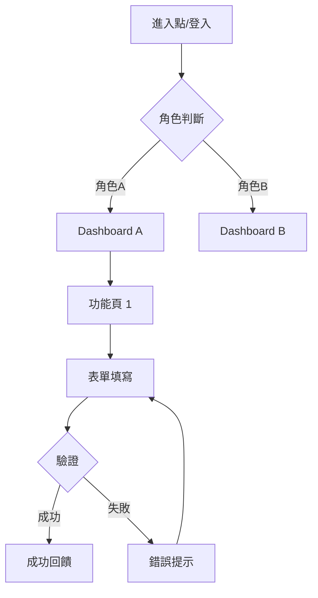

# UX/UI 畫面設計規格範本（UI Specification Template）

> **適用標準**：ISO 9241-210:2019（Human-centred Design）、WCAG 2.2（Web Content Accessibility Guidelines）  
> **適用階段**：系統設計階段（Design Phase）  
> **負責角色**：UX 設計師、UI 設計師、前端工程師

---

## 📑 章節目錄

1. [文件資訊](#1-文件資訊)
2. [設計原則與規範](#2-設計原則與規範)
3. [資訊架構（Information Architecture）](#3-資訊架構information-architecture)
4. [畫面流程（UI Flow）](#4-畫面流程ui-flow)
5. [畫面規格（Screen Specification）](#5-畫面規格screen-specification)
6. [元件規格（Component Specification）](#6-元件規格component-specification)
7. [響應式設計規格](#7-響應式設計規格)
8. [無障礙設計（Accessibility）](#8-無障礙設計accessibility)
9. [互動規格（Interaction Specification）](#9-互動規格interaction-specification)

---

## 📝 範本

---

### 1. 文件資訊

| 項目 | 內容 |
|------|------|
| **文件名稱** | [系統名稱] UI 設計規格書 |
| **文件編號** | [專案代碼]-UIS-[版本號] |
| **版本** | v[X.Y] |
| **建立日期** | [YYYY-MM-DD] |
| **最後更新** | [YYYY-MM-DD] |
| **撰寫者** | [UX/UI 設計師] |
| **審核者** | [Product Owner / Tech Lead] |

#### 設計工具與資源

| 項目 | 工具/位置 |
|------|---------|
| Design Tool | [Figma / Sketch / Adobe XD] |
| Design File URL | [連結] |
| Prototype URL | [互動原型連結] |
| Design System | [設計系統/元件庫名稱與連結] |
| Icon Library | [圖標庫名稱] |

---

### 2. 設計原則與規範

#### 2.1 設計原則

| 原則 | 說明 |
|------|------|
| [一致性] | [描述此專案的一致性準則] |
| [簡潔性] | [描述簡潔設計方針] |
| [可及性] | [無障礙設計目標] |
| [效率] | [使用者操作效率目標] |

#### 2.2 Design Token / 設計變數

| Token 名稱 | 值 | 用途 |
|-----------|------|------|
| color-primary | [#XXXXXX] | 主要品牌色 |
| color-secondary | [#XXXXXX] | 次要色 |
| color-error | [#XXXXXX] | 錯誤提示 |
| color-success | [#XXXXXX] | 成功提示 |
| font-family | [字型名稱] | 主要字型 |
| font-size-base | [N]px | 基準字級 |
| spacing-unit | [N]px | 間距基準單位 |
| border-radius | [N]px | 圓角 |

#### 2.3 排版規範（Typography）

| 層級 | 用途 | 字級 | 字重 | 行高 |
|------|------|------|------|------|
| H1 | 頁面標題 | [N]px | [Bold] | [N] |
| H2 | 區塊標題 | [N]px | [Semi-Bold] | [N] |
| H3 | 子區塊標題 | [N]px | [Medium] | [N] |
| Body | 內文 | [N]px | [Regular] | [N] |
| Caption | 說明文字 | [N]px | [Regular] | [N] |

---

### 3. 資訊架構（Information Architecture）

#### 3.1 導航結構（Sitemap）

```
[系統名稱]
├── 首頁 Dashboard
├── 模組 A
│   ├── 功能 A-1
│   ├── 功能 A-2
│   └── 功能 A-3
├── 模組 B
│   ├── 功能 B-1
│   └── 功能 B-2
├── 系統設定
│   ├── 個人設定
│   └── 管理設定（Admin only）
└── 說明 / Help
```

#### 3.2 角色與功能對應

| 角色 | 可見模組 | 可執行操作 |
|------|---------|-----------|
| [角色 A] | [模組清單] | [CRUD 權限] |
| [角色 B] | [模組清單] | [CRUD 權限] |

---

### 4. 畫面流程（UI Flow）



---

### 5. 畫面規格（Screen Specification）

#### Screen-[NNN]: [畫面名稱]

| 項目 | 內容 |
|------|------|
| **畫面 ID** | SCR-[NNN] |
| **畫面名稱** | [中英文名稱] |
| **URL Path** | [/path/to/page] |
| **對應 Use Case** | UC-[NNN] |
| **角色權限** | [可存取的角色] |
| **進入條件** | [如何到達此頁面] |

**畫面佈局（Layout）：**

```
┌─────────────────────────────────────────┐
│ [Header / Navigation Bar]                │
├───────────┬─────────────────────────────┤
│           │                             │
│ [Sidebar] │  [Main Content Area]        │
│           │                             │
│           │  ┌─────────────────────┐    │
│           │  │ [Component A]       │    │
│           │  └─────────────────────┘    │
│           │                             │
│           │  ┌─────────────────────┐    │
│           │  │ [Component B]       │    │
│           │  └─────────────────────┘    │
│           │                             │
├───────────┴─────────────────────────────┤
│ [Footer]                                 │
└─────────────────────────────────────────┘
```

**元素清單：**

| # | 元素 ID | 類型 | 標籤/內容 | 資料來源 | 驗證規則 | 備註 |
|---|--------|------|---------|---------|---------|------|
| 1 | [id] | [Input/Select/Button/Table/...] | [Label] | [API/Static] | [Required/Pattern/...] | |
| 2 | [id] | | | | | |

**狀態變化：**

| 狀態 | 條件 | 畫面呈現 |
|------|------|---------|
| 初始 | 頁面載入 | [描述] |
| 載入中 | API 呼叫中 | [Skeleton / Spinner] |
| 空狀態 | 無資料 | [Empty state 設計] |
| 錯誤 | API 失敗 | [Error message 設計] |

---

### 6. 元件規格（Component Specification）

#### Component: [元件名稱]

| 項目 | 內容 |
|------|------|
| 元件名稱 | [PascalCase 命名] |
| 用途 | [功能描述] |
| 使用頁面 | [SCR-001, SCR-003] |

**Props / 屬性：**

| 屬性名 | 類型 | 必填 | 預設值 | 說明 |
|--------|------|------|--------|------|
| [prop] | [string/number/boolean] | [Y/N] | [default] | [描述] |

**狀態（States）：**

| 狀態 | 說明 | 視覺呈現 |
|------|------|---------|
| Default | 預設狀態 | [描述/截圖連結] |
| Hover | 滑鼠懸停 | [描述] |
| Active/Pressed | 點擊中 | [描述] |
| Disabled | 不可用 | [描述] |
| Error | 驗證失敗 | [描述] |
| Loading | 載入中 | [描述] |

---

### 7. 響應式設計規格

#### 7.1 斷點定義（Breakpoints）

| 斷點名稱 | 範圍 | 適用裝置 | 佈局策略 |
|---------|------|---------|---------|
| Mobile | 0 – [N]px | 手機 | Single column |
| Tablet | [N] – [M]px | 平板 | [策略] |
| Desktop | [M]px + | 桌機 | Multi-column |

#### 7.2 各斷點佈局差異

| 元素 | Mobile | Tablet | Desktop |
|------|--------|--------|---------|
| Navigation | Hamburger menu | Collapsed sidebar | Full sidebar |
| Content grid | 1 column | 2 columns | 3 columns |
| Table | Card view | Scroll horizontal | Full table |

---

### 8. 無障礙設計（Accessibility）

#### 8.1 WCAG 合規等級

| 項目 | 目標 |
|------|------|
| 合規等級 | [WCAG 2.2 Level AA] |
| 對比度 | 文字 ≥ 4.5:1 / 大文字 ≥ 3:1 |
| 焦點指示 | 所有互動元素有可見 focus indicator |
| 鍵盤操作 | 所有功能可純鍵盤操作 |

#### 8.2 無障礙檢核清單

| # | 檢核項目 | 通過 |
|---|---------|------|
| 1 | 所有圖片有 alt text | 🔲 |
| 2 | 表單元素有 label 關聯 | 🔲 |
| 3 | 顏色非唯一傳達資訊手段 | 🔲 |
| 4 | 動態內容有 ARIA live region | 🔲 |
| 5 | 頁面有正確的 heading 層級 | 🔲 |

---

### 9. 互動規格（Interaction Specification）

| 互動 ID | 觸發元素 | 觸發事件 | 動作描述 | 動畫/過渡 | 時間 |
|---------|---------|---------|---------|----------|------|
| INT-001 | [元素] | [click/hover/scroll] | [發生什麼] | [fade/slide/none] | [N]ms |

---

## 📖 使用說明

### 各章節填寫指引

| 章節 | 填寫時機 | 負責人 | 重點說明 |
|------|---------|--------|---------|
| §2 設計規範 | 專案初期 | UX Lead | 統一 Design Token |
| §3 資訊架構 | 需求確認後 | UX | 與 Sitemap 一致 |
| §4 UI Flow | 配合 Use Case | UX | 涵蓋主要/替代路徑 |
| §5 畫面規格 | 詳細設計時 | UI | 每個畫面獨立描述 |
| §6 元件規格 | 元件開發前 | UI/FE | 可複用元件規格化 |
| §7 響應式設計 | 設計初期 | UI | 確保各斷點有方案 |
| §8 無障礙 | 全程 | UX/UI | WCAG 合規檢核 |

---

## 💡 範例（以 HRMS 人力資源管理系統為例）

---

### 範例：請假申請畫面規格

#### Screen-005: 請假申請表單

| 項目 | 內容 |
|------|------|
| **畫面 ID** | SCR-005 |
| **畫面名稱** | 請假申請（Leave Request Form） |
| **URL Path** | /leave/request/new |
| **對應 Use Case** | UC-001 申請請假 |
| **角色權限** | 員工、主管（代申請） |
| **進入條件** | 從 Dashboard 或假別餘額頁點選「申請請假」 |

**元素清單：**

| # | 元素 ID | 類型 | 標籤 | 資料來源 | 驗證規則 |
|---|--------|------|------|---------|---------|
| 1 | leave_type | Select | 假別 | GET /api/leave-types | Required |
| 2 | start_date | DatePicker | 開始日期 | — | Required, ≥ today |
| 3 | end_date | DatePicker | 結束日期 | — | Required, ≥ start_date |
| 4 | total_days | Display | 請假天數 | 自動計算 | — |
| 5 | reason | Textarea | 事由 | — | Required, max 500 chars |
| 6 | delegate_id | Select | 職務代理人 | GET /api/employees/same-dept | Required when > 0.5 day |
| 7 | attachment | FileUpload | 附件 | — | Optional, max 10MB |
| 8 | btn_submit | Button | 送出申請 | — | Disabled until valid |
| 9 | btn_draft | Button | 暫存草稿 | — | — |

**狀態變化：**

| 狀態 | 條件 | 畫面呈現 |
|------|------|---------|
| 初始 | 頁面載入 | 假別 Select 載入中 (skeleton)，其他欄位空白 |
| 餘額不足 | 天數 > 餘額 | total_days 紅字 + 警告訊息 |
| 送出中 | 點擊送出 | btn_submit 顯示 spinner，disabled |
| 成功 | API 回傳 201 | Toast「申請成功」+ 跳轉至假單列表 |
| 失敗 | API 回傳 4xx | 表單上方顯示紅色 Alert |

---

> 📌 **審閱重點**  
> - 每個畫面是否有明確的 Use Case 對應？  
> - 表單驗證規則是否完整（前端+後端一致）？  
> - 所有狀態（loading/empty/error）是否都有設計？  
> - 響應式斷點佈局是否有方案？  
> - 無障礙合規是否達標？
