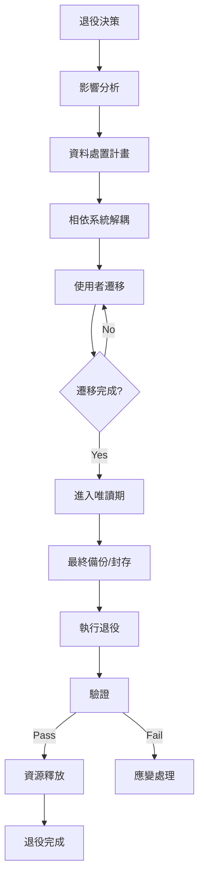

# 系統退役計畫範本（System Retirement Plan Template）

> **適用標準**：ISO/IEC/IEEE 15288:2023（System Life Cycle - Disposal Process）  
> **適用階段**：維運階段 — 退役處理（Operations — Retirement Phase）  
> **負責角色**：PM、SA、DBA、Infra、資安

---

## 📑 章節目錄

1. [文件資訊](#1-文件資訊)
2. [退役概要](#2-退役概要)
3. [影響分析](#3-影響分析)
4. [資料處置計畫](#4-資料處置計畫)
5. [基礎設施釋放計畫](#5-基礎設施釋放計畫)
6. [相依系統處理](#6-相依系統處理)
7. [溝通計畫](#7-溝通計畫)
8. [退役執行步驟](#8-退役執行步驟)
9. [驗證與確認](#9-驗證與確認)
10. [風險與應變](#10-風險與應變)
11. [附錄](#11-附錄)

---

## 📝 範本

---

### 1. 文件資訊

| 項目 | 內容 |
|------|------|
| **文件名稱** | [系統名稱] 退役計畫 |
| **文件編號** | [專案代碼]-RTP-[版本號]-[日期] |
| **版本** | v[X.Y] |
| **建立日期** | [YYYY-MM-DD] |
| **預計退役日** | [YYYY-MM-DD] |
| **負責人** | [PM / SA] |
| **審核者** | [IT Director / CISO] |

---

### 2. 退役概要

| 項目 | 內容 |
|------|------|
| 系統名稱 | [退役系統名稱] |
| 系統用途 | [一句話描述系統功能] |
| 上線日期 | [YYYY-MM-DD] |
| 服務年限 | [N] 年 |
| 退役原因 | [被取代 / 業務需求消失 / 技術不支援 / 成本效益] |
| 替代系統 | [新系統名稱] 或 [無] |
| 影響用戶數 | [N] 人 |
| 退役方式 | [立即下線 / 漸進退場 / 唯讀保留期] |

#### 2.1 退役判定準則

| 準則 | 說明 | 是否滿足 |
|------|------|---------|
| 替代系統已上線並穩定 | [新系統 GAP 已關閉] | [✅/❌] |
| 使用者已完成遷移 | [N]% 已切換至新系統 | [✅/❌] |
| 資料已完成遷移/封存 | [全量遷移完成] | [✅/❌] |
| 相依系統已解耦 | [所有介接已切換] | [✅/❌] |
| 法規保留要求已確認 | [保留年限/方式已確定] | [✅/❌] |

---

### 3. 影響分析

#### 3.1 利害關係人影響

| 利害關係人 | 影響描述 | 嚴重度 | 緩解措施 |
|-----------|---------|--------|---------|
| [內部使用者] | [無法再使用舊系統] | [Low] | [已遷移至新系統] |
| [外部合作夥伴] | [API 中斷] | [Medium] | [提前通知 + 新 API 對接] |
| [報表使用者] | [歷史報表查詢] | [Medium] | [資料封存 + 查詢介面] |

#### 3.2 功能影響盤點

| 功能模組 | 狀態 | 替代方案 | 備註 |
|---------|------|---------|------|
| [模組 A] | 已遷移至新系統 | [新系統模組 X] | |
| [模組 B] | 功能廢除 | 無 | [業務確認不再需要] |
| [模組 C] | 部分功能無替代 | [Manual process / 新建] | ⚠️ GAP |

#### 3.3 合規與法規要求

| 法規/政策 | 要求 | 資料保留期 | 處理方式 |
|-----------|------|-----------|---------|
| [個資法] | 個人資料銷毀或去識別化 | — | [銷毀/去識別化] |
| [商業法] | 財務交易記錄保留 | [N] 年 | [封存至 Archive] |
| [公司政策] | [內部規範] | [N] 年 | [方式] |

---

### 4. 資料處置計畫

#### 4.1 資料分類與處置

| 資料類別 | 資料表/儲存 | 筆數 | 大小 | 處置方式 | 備註 |
|---------|------------|------|------|---------|------|
| 已遷移資料 | [tables] | [N] | [N]GB | 驗證後刪除 | 遷移至新系統 |
| 法規保留資料 | [tables] | [N] | [N]GB | 封存至冷儲存 | 保留 [N] 年 |
| 個人資料 | [tables] | [N] | [N]GB | 去識別化/銷毀 | 依個資法 |
| 暫存/Log | [tables] | [N] | [N]GB | 直接刪除 | 無保留價值 |
| 附件/檔案 | [storage] | [N] | [N]GB | [遷移/封存/刪除] | |

#### 4.2 資料封存規格

| 項目 | 內容 |
|------|------|
| 封存格式 | [SQL dump / Parquet / CSV + Schema] |
| 封存位置 | [Cold Storage / Archive Vault] |
| 加密方式 | [AES-256 / 由保管庫管理] |
| 存取方式 | [申請制 / 限特定角色] |
| 保留期限 | [N] 年，到期後 [自動銷毀 / 覆審] |
| 驗證方式 | [Checksum / Restore test] |

#### 4.3 資料銷毀證明

| 銷毀項目 | 方式 | 執行日 | 執行人 | 驗證人 | 證明文件 |
|---------|------|--------|--------|--------|---------|
| [DB data] | [TRUNCATE + VACUUM / Secure erase] | [日期] | [DBA] | [資安] | [存證編號] |
| [File storage] | [Secure delete / Disk wipe] | [日期] | [Infra] | [資安] | [存證編號] |
| [Backup tapes] | [Degauss / Physical destruction] | [日期] | [Infra] | [資安] | [存證編號] |

---

### 5. 基礎設施釋放計畫

#### 5.1 資源盤點

| 資源類型 | 名稱/ID | 規格 | 月費 | 處置方式 | 預計釋放日 |
|---------|---------|------|------|---------|-----------|
| VM / 主機 | [hostname/ID] | [spec] | $[N] | [刪除/重新用途] | [日期] |
| Database | [instance name] | [spec] | $[N] | [刪除] | [日期] |
| Storage | [bucket/share] | [N]GB | $[N] | [資料移出後刪除] | [日期] |
| Load Balancer | [name] | — | $[N] | [刪除] | [日期] |
| DNS Record | [domain] | — | — | [刪除/轉向] | [日期] |
| SSL Certificate | [CN] | — | — | [不續約] | [到期日] |
| Monitoring | [Dashboard/Alert] | — | — | [刪除] | [日期] |

#### 5.2 成本節約估計

| 項目 | 月費 | 年費 | 備註 |
|------|------|------|------|
| 計算資源 | $[N] | $[N] | |
| 儲存 | $[N] | $[N] | |
| 授權 (License) | $[N] | $[N] | |
| 維護合約 | $[N] | $[N] | |
| **合計節省** | **$[N]** | **$[N]** | |

---

### 6. 相依系統處理

#### 6.1 上游系統（呼叫退役系統的系統）

| 來源系統 | 介接方式 | 呼叫頻率 | 處理方式 | 負責人 | 狀態 |
|---------|---------|---------|---------|--------|------|
| [System A] | REST API | [N] calls/day | 切換至新系統 API | [PM of A] | [✅/❌] |
| [System B] | DB Link | [N] queries/day | 移除 DB Link | [DBA] | [✅/❌] |

#### 6.2 下游系統（退役系統呼叫的系統）

| 目標系統 | 介接方式 | 影響 | 處理方式 | 狀態 |
|---------|---------|------|---------|------|
| [System C] | Event publish | [訂閱者需取消] | 通知訂閱者 | [✅/❌] |

#### 6.3 共用元件

| 元件 | 共用者 | 可否移除 | 處理方式 |
|------|--------|---------|---------|
| [Shared DB] | [系統列表] | [否] | [僅移除退役系統的 Schema] |
| [Message Queue] | [系統列表] | [是/否] | [移除 Topic / 保留] |

---

### 7. 溝通計畫

| 時間點 | 對象 | 內容 | 方式 | 負責人 |
|--------|------|------|------|--------|
| T - 90 天 | 所有使用者 | 退役預告 + 遷移指引 | Email + 公告 | PM |
| T - 60 天 | 相依系統負責人 | 技術切換時程 | 會議 | SA |
| T - 30 天 | 所有使用者 | 最後提醒 + 進入唯讀期 | Email + In-app | PM |
| T - 7 天 | 全體 | 最終通知 | Email + Teams | PM |
| T day | IT 團隊 | 執行退役 | War Room | RM |
| T + 1 天 | 全體 | 退役完成通知 | Email | PM |

---

### 8. 退役執行步驟

| # | 步驟 | 負責人 | 預估時間 | 前置條件 | 狀態 |
|---|------|--------|---------|---------|------|
| 1 | 切換至唯讀模式 | DevOps | [N] min | T-30d 通知完成 | |
| 2 | 最終資料備份 | DBA | [N] hr | 唯讀模式已啟用 | |
| 3 | 驗證最終備份完整性 | DBA | [N] hr | 備份完成 | |
| 4 | DNS 移除/轉向 | Infra | [N] min | | |
| 5 | 停止應用程式服務 | DevOps | [N] min | DNS 已處理 | |
| 6 | 移除相依系統連線設定 | SA/DevOps | [N] hr | 相依系統已切換 | |
| 7 | 資料封存（法規保留） | DBA | [N] hr | 備份驗證通過 | |
| 8 | 資料銷毀（非保留資料） | DBA/Infra | [N] hr | 封存完成 | |
| 9 | 基礎設施釋放 | Infra | [N] hr | 資料處置完成 | |
| 10 | 監控/告警移除 | SRE | [N] min | 服務已停止 | |
| 11 | 文件更新（架構圖/CMDB） | SA | [N] hr | 全部完成 | |
| 12 | 退役完成確認 | PM | — | 全部驗證通過 | |

---

### 9. 驗證與確認

#### 9.1 退役前驗證

| # | 驗證項目 | 方法 | 預期結果 | 狀態 |
|---|---------|------|---------|------|
| 1 | 新系統功能涵蓋率 | UAT 驗收 | 100% 功能可替代 | [✅/❌] |
| 2 | 資料遷移完整性 | Count + Sample 驗證 | 差異 = 0 | [✅/❌] |
| 3 | 相依系統已切換 | 連線測試 | 無對退役系統的呼叫 | [✅/❌] |
| 4 | 使用者已遷移 | 登入統計 | 活躍用戶 = 0 | [✅/❌] |

#### 9.2 退役後驗證

| # | 驗證項目 | 方法 | 預期結果 | 狀態 |
|---|---------|------|---------|------|
| 1 | 舊系統不可存取 | URL/IP 測試 | Connection refused / 404 | [✅/❌] |
| 2 | 新系統運作正常 | Smoke Test | 全數通過 | [✅/❌] |
| 3 | 封存資料可存取 | Restore 測試 | 資料完整可讀 | [✅/❌] |
| 4 | 無殘留資源 | CMDB / Cloud Console 檢查 | 資源已清除 | [✅/❌] |
| 5 | 成本已停止計費 | 帳單確認 | 下月帳單減少 | [✅/❌] |

---

### 10. 風險與應變

| # | 風險 | 影響 | 機率 | 應變措施 |
|---|------|------|------|---------|
| 1 | 使用者未完成遷移 | 業務中斷 | Medium | 延長唯讀期 + 人工協助 |
| 2 | 發現未識別的相依系統 | 相依系統異常 | Medium | 保留 DNS 轉向頁 30 天 |
| 3 | 法規保留期判定錯誤 | 合規風險 | Low | 法務覆審 + 寧可多保留 |
| 4 | 封存資料無法還原 | 資料遺失 | Low | 保留完整備份至驗證通過 |
| 5 | 退役後需要回溯查詢 | 業務查詢困難 | Medium | 建立簡易查詢介面 for 封存資料 |

---

### 11. 附錄

#### 11.1 系統架構圖（退役前）

[附上退役系統目前的架構圖，標示將移除的元件]

#### 11.2 簽核記錄

| 角色 | 姓名 | 簽核日 | 意見 |
|------|------|--------|------|
| PM | [姓名] | [日期] | |
| SA | [姓名] | [日期] | |
| CISO | [姓名] | [日期] | |
| IT Director | [姓名] | [日期] | |
| 業務負責人 | [姓名] | [日期] | |

---

## 📖 使用說明

### 退役流程總覽

### 關鍵原則

1. **先遷移、後退役**：確保所有使用者和資料都已安全遷移
2. **資料優先**：任何退役動作前，資料的保留/封存/銷毀必須先完成
3. **漸進式**：使用唯讀期作為緩衝，觀察是否有遺漏的使用者或系統
4. **可驗證**：每步都需要驗證，特別是資料完整性
5. **法規遵循**：資料保留與銷毀必須符合法規要求

---

## 💡 範例（以 HRMS 人力資源管理系統為例）

---

### 範例：退役 Legacy HRMS (Oracle)

| 項目 | 內容 |
|------|------|
| 退役系統 | Legacy HRMS v3.2 (Oracle 11g) |
| 服務年限 | 12 年（2012~2024） |
| 退役原因 | 新 HRMS (PostgreSQL on Azure) 已上線穩定運行 6 個月 |
| 替代系統 | New HRMS v2.0 |
| 影響用戶 | 3,500 人（全公司） |
| 退役方式 | 漸進式：唯讀 30 天 → 完全下線 |

### 範例：資料處置

| 資料 | 筆數 | 處置 | 保留期 |
|------|------|------|--------|
| 員工基本資料 | 5,000 | 已遷移至新系統 → 驗證後銷毀 | — |
| 薪資歷史(近5年) | 180,000 | 已遷移至新系統 | — |
| 薪資歷史(5年前) | 420,000 | 封存至 Azure Archive (加密) | 保留 10 年 |
| 出勤記錄(全部) | 12,000,000 | 已遷移 + 驗證 → 銷毀舊資料 | — |
| 系統 Log | 50,000,000 | 直接銷毀 | — |

### 範例：成本節省

| 項目 | 月費 | 年節省 |
|------|------|--------|
| Oracle License | $15,000 | $180,000 |
| 主機維護合約 | $3,000 | $36,000 |
| 儲存空間 | $2,000 | $24,000 |
| **合計** | **$20,000** | **$240,000** |

---

> 📌 **審閱重點**  
> - 所有相依系統是否都已識別並完成切換？  
> - 資料處置是否符合法規（個資法、商業法）？  
> - 使用者是否有足夠的遷移時間和支援？  
> - 封存資料是否可驗證還原？  
> - 退役後的成本節省是否有追蹤確認？
