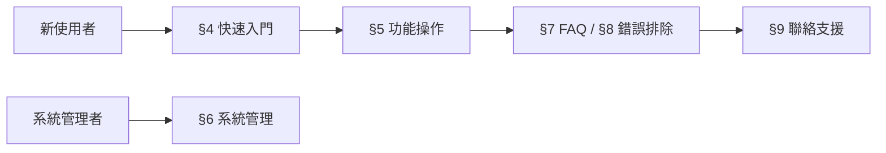

# 使用者手冊範本（User Manual Template）

> **適用標準**：ISO/IEC/IEEE 26514:2022（系統與軟體使用者文件設計）  
> **適用階段**：專案管理 — 交付階段  
> **負責角色**：Technical Writer、BA、PM

---

## 📑 章節目錄

1. [文件資訊](#1-文件資訊)
2. [前言](#2-前言)
3. [系統概述](#3-系統概述)
4. [快速入門](#4-快速入門)
5. [功能操作說明](#5-功能操作說明)
6. [系統管理功能](#6-系統管理功能)
7. [常見問題（FAQ）](#7-常見問題faq)
8. [錯誤訊息與排除](#8-錯誤訊息與排除)
9. [附錄](#9-附錄)

---

## 📝 範本

---

### 1. 文件資訊

| 項目 | 內容 |
|------|------|
| **文件名稱** | [系統名稱] 使用者手冊 |
| **文件編號** | [專案代碼]-UM-[版本號] |
| **版本** | v[X.Y] |
| **適用系統版本** | [系統版本號] |
| **建立日期** | [YYYY-MM-DD] |
| **最後更新** | [YYYY-MM-DD] |
| **作者** | [Technical Writer / BA] |
| **審核者** | [PM / PO] |

#### 版本歷程

| 版本 | 日期 | 修改內容 | 修改者 |
|------|------|---------|--------|
| v1.0 | [日期] | 初版 | [姓名] |
| v1.1 | [日期] | [修改說明] | [姓名] |

---

### 2. 前言

#### 2.1 文件目的

本手冊提供 [系統名稱] 的完整操作指引，協助使用者了解系統功能並正確使用各項功能。

#### 2.2 適用對象

| 角色 | 說明 | 建議閱讀章節 |
|------|------|-------------|
| [一般使用者] | [日常操作] | §3, §4, §5, §7 |
| [主管] | [審核/簽核/報表] | §3, §4, §5.X |
| [系統管理者] | [帳號/權限/設定管理] | §3, §6 |

#### 2.3 閱讀指引

| 圖示 | 含義 |
|------|------|
| 💡 | 操作提示 |
| ⚠️ | 注意事項 |
| ❌ | 禁止操作 |
| 📌 | 重要資訊 |

#### 2.4 系統需求

| 項目 | 最低需求 | 建議需求 |
|------|---------|---------|
| 瀏覽器 | [Chrome 90+ / Edge 90+ / Firefox 88+] | [Chrome 最新版] |
| 螢幕解析度 | [1280 x 720] | [1920 x 1080] |
| 網路 | [穩定的網路連線] | [10 Mbps+] |
| 其他 | [PDF 閱讀器（如需報表匯出）] | |

---

### 3. 系統概述

#### 3.1 系統簡介

[1~2 段文字描述系統的用途、核心價值、主要功能]

#### 3.2 系統架構（使用者視角）

```
[以簡圖呈現系統主要模組之間的關係]
┌────────────────────────────────────────────┐
│                [系統名稱]                    │
├──────────┬──────────┬──────────┬───────────┤
│ [模組 A]  │ [模組 B]  │ [模組 C]  │ [模組 D]   │
│ [功能描述] │ [功能描述] │ [功能描述] │ [功能描述]  │
└──────────┴──────────┴──────────┴───────────┘
```

#### 3.3 角色與權限概要

| 角色 | 可使用功能 | 說明 |
|------|-----------|------|
| [角色 A] | [功能列表] | [說明] |
| [角色 B] | [功能列表] | [說明] |
| [角色 C] | [功能列表] | [說明] |

---

### 4. 快速入門

#### 4.1 登入系統

**步驟：**

1. 開啟瀏覽器，輸入網址：`[系統 URL]`
2. 輸入帳號（[格式說明，如員工編號]）
3. 輸入密碼
4. 點選「登入」按鈕

> 💡 **提示**：首次登入需修改初始密碼

> ⚠️ **注意**：連續 [N] 次密碼錯誤將鎖定帳號 [N] 分鐘

**畫面截圖：**

[登入頁面截圖]

#### 4.2 首頁導覽

| 區域 | 說明 |
|------|------|
| [頂部導航列] | [主選單功能入口] |
| [左側選單] | [子功能選單] |
| [主要內容區] | [資料顯示/操作區域] |
| [個人設定] | [頭像/設定/登出] |

#### 4.3 基本操作慣例

| 操作 | 說明 |
|------|------|
| 新增 | 點選「+」或「新增」按鈕 |
| 編輯 | 點選該筆資料的「✏️ 編輯」圖示 |
| 刪除 | 點選「🗑️ 刪除」→ 確認對話框 |
| 搜尋 | 在搜尋列輸入關鍵字 → Enter |
| 匯出 | 點選「📥 匯出」→ 選擇格式 |

---

### 5. 功能操作說明

#### 5.1 [模組名稱]

##### 5.1.1 功能說明

[簡述此模組的用途]

##### 5.1.2 操作步驟

**前置條件**：[需要的權限/前置操作]

| 步驟 | 操作 | 說明 | 截圖 |
|------|------|------|------|
| 1 | [操作描述] | [補充說明] | [截圖編號] |
| 2 | [操作描述] | [補充說明] | [截圖編號] |
| 3 | [操作描述] | [補充說明] | [截圖編號] |

##### 5.1.3 欄位說明

| 欄位名稱 | 必填 | 格式/限制 | 說明 |
|---------|------|----------|------|
| [欄位 1] | ✅ | [格式] | [說明] |
| [欄位 2] | ❌ | [格式] | [說明] |
| [欄位 3] | ✅ | [下拉選單] | [說明] |

##### 5.1.4 注意事項

- ⚠️ [注意事項 1]
- ⚠️ [注意事項 2]
- ❌ [禁止操作]

---

#### 5.2 [模組名稱]

[重複 5.1 的結構...]

---

### 6. 系統管理功能

#### 6.1 帳號管理

| 操作 | 步驟 | 權限 |
|------|------|------|
| 新增帳號 | [步驟描述] | [系統管理者] |
| 停用帳號 | [步驟描述] | [系統管理者] |
| 重設密碼 | [步驟描述] | [系統管理者] |
| 調整權限 | [步驟描述] | [系統管理者] |

#### 6.2 系統設定

| 設定項目 | 說明 | 預設值 | 影響範圍 |
|---------|------|--------|---------|
| [設定 1] | [說明] | [預設] | [影響] |
| [設定 2] | [說明] | [預設] | [影響] |

#### 6.3 資料維護

| 作業 | 說明 | 頻率 | 操作方式 |
|------|------|------|---------|
| [作業 1] | [說明] | [每月/每季] | [步驟] |
| [作業 2] | [說明] | [需要時] | [步驟] |

---

### 7. 常見問題（FAQ）

#### Q1: [常見問題描述]？

**A**：[解答步驟]

---

#### Q2: [常見問題描述]？

**A**：[解答步驟]

---

#### Q3: [常見問題描述]？

**A**：[解答步驟]

---

### 8. 錯誤訊息與排除

| 錯誤代碼 | 錯誤訊息 | 原因 | 解決方式 |
|---------|---------|------|---------|
| [ERR-001] | [訊息文字] | [原因描述] | [使用者可自行處理的步驟] |
| [ERR-002] | [訊息文字] | [原因描述] | [步驟] |
| [ERR-003] | [訊息文字] | [原因描述] | [需聯繫 IT 支援] |

---

### 9. 附錄

#### 9.1 快捷鍵一覽

| 快捷鍵 | 功能 | 適用頁面 |
|--------|------|---------|
| [Ctrl+S] | [儲存] | [全域] |
| [Ctrl+N] | [新增] | [清單頁面] |
| [Esc] | [取消/關閉] | [對話框] |

#### 9.2 名詞對照表

| 系統術語 | 說明 | 英文 |
|---------|------|------|
| [術語 1] | [定義] | [English term] |
| [術語 2] | [定義] | [English term] |

#### 9.3 聯絡資訊

| 問題類型 | 聯絡方式 | 服務時間 |
|---------|---------|---------|
| 操作問題 | [Help Desk / 電話] | [工作日 09-18] |
| 帳號問題 | [IT 服務台] | [工作日 09-18] |
| 緊急問題 | [緊急連絡電話] | [24/7] |

---

## 📖 使用說明

### 撰寫原則（依 ISO/IEC/IEEE 26514:2022）

| 原則 | 說明 |
|------|------|
| **任務導向** | 以使用者要完成的「任務」為核心，非系統功能 |
| **一致性** | 統一用詞、格式、截圖風格 |
| **漸進式揭露** | 先提供概要 → 需要時再深入 |
| **可搜尋** | 善用標題、索引、交叉引用 |
| **無障礙** | 截圖附 alt text，色彩非唯一提示 |

### 章節對應使用者旅程



### 維護規範

| 項目 | 規範 |
|------|------|
| 更新時機 | 每次功能上線時同步更新 |
| 截圖管理 | 統一命名規則，存放於 [指定路徑] |
| 版本控制 | 與系統版本同步，Minor release 更新對應章節 |
| 審閱流程 | TW 撰寫 → BA 確認正確性 → PM 核准發布 |

---

## 💡 範例（以 HRMS 人力資源管理系統為例）

---

### 範例：快速入門 — 請假申請

#### 功能說明

員工可透過 HRMS 系統線上提出請假申請，經主管審核後完成請假流程。

#### 操作步驟

| 步驟 | 操作 | 說明 |
|------|------|------|
| 1 | 登入 HRMS → 左側選單 →「出缺勤」→「請假申請」 | |
| 2 | 點選「＋ 新增請假」 | 開啟申請表單 |
| 3 | 選擇「假別」 | 特休/病假/事假/... |
| 4 | 選擇「起迄日期」與「時段」 | 半天/全天 |
| 5 | 填寫「請假事由」 | 必填，至少 10 字 |
| 6 | 上傳附件（如需要） | 病假需附診斷證明 |
| 7 | 點選「送出申請」 | 系統自動送至直屬主管 |

> 💡 **提示**：請假餘額可在「假別餘額」頁面查詢

> ⚠️ **注意**：特休假需提前 3 天申請（緊急事假除外）

#### 欄位說明

| 欄位 | 必填 | 規則 | 說明 |
|------|------|------|------|
| 假別 | ✅ | 下拉選單 | 依公司規定的假別 |
| 起始日期 | ✅ | ≥ 今天 | 不可選過去日期 |
| 結束日期 | ✅ | ≥ 起始日期 | |
| 時段 | ✅ | 上午/下午/全天 | 半天假選上午或下午 |
| 事由 | ✅ | 10~200 字 | 說明請假原因 |
| 附件 | 病假必填 | PDF/JPG, ≤5MB | 診斷證明書 |

### 範例：錯誤訊息

| 代碼 | 訊息 | 解決方式 |
|------|------|---------|
| LV-001 | 「假別餘額不足」 | 確認剩餘假別天數，或改選其他假別 |
| LV-002 | 「已有重複的請假記錄」 | 檢查該日期是否已有請假申請 |
| LV-003 | 「代理人尚未設定」 | 至「個人設定」→「職務代理人」設定 |

---

> 📌 **審閱重點**  
> - 操作步驟是否以使用者任務為導向（非功能清單式）？  
> - 截圖是否與當前系統版本一致？  
> - 專業術語是否有解釋或對照表？  
> - FAQ 是否反映實際客服常見問題？  
> - 不同角色的使用者是否能快速找到對應章節？
