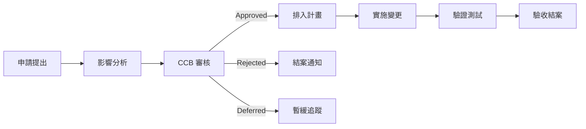

# 需求異動申請表範本（Change Request Template）

> **適用標準**：ISO/IEC/IEEE 15288:2023（系統生命週期）、ITIL 4 Change Management、CMMI  
> **適用階段**：需求分析階段 / 全生命週期（Requirements Phase / Cross-Phase）  
> **負責角色**：業務分析師（BA）、專案經理（PM）、變更管理委員會（CCB）

---

## 📑 章節目錄

1. [變更申請資訊](#1-變更申請資訊)
2. [變更描述](#2-變更描述)
3. [影響分析](#3-影響分析)
4. [變更方案](#4-變更方案)
5. [審核與決議](#5-審核與決議)
6. [實施追蹤](#6-實施追蹤)
7. [變更驗收](#7-變更驗收)

---

## 📝 範本

---

### 1. 變更申請資訊

| 項目 | 內容 |
|------|------|
| **變更編號** | CR-[YYYY]-[NNN] |
| **申請日期** | [YYYY-MM-DD] |
| **申請人** | [姓名 / 部門] |
| **專案名稱** | [專案名稱] |
| **變更類型** | [需求變更 / 設計變更 / 範圍變更 / 缺陷修正] |
| **優先級** | [Critical / High / Medium / Low] |
| **緊急程度** | [緊急 / 一般] |
| **目前狀態** | [Draft / Submitted / Under Review / Approved / Rejected / Implementing / Completed / Cancelled] |

---

### 2. 變更描述

#### 2.1 變更摘要

| 項目 | 內容 |
|------|------|
| 變更標題 | [一句話描述變更內容] |
| 變更原因 | [為什麼需要這個變更] |
| 業務背景 | [觸發變更的業務情境或事件] |

#### 2.2 現行需求（As-Is）

| 需求編號 | 需求描述 | 文件來源 |
|---------|---------|---------|
| [REQ-NNN] | [目前的需求描述] | [BRD/FRD §N.N] |

#### 2.3 變更後需求（To-Be）

| 需求編號 | 變更後描述 | 變更差異摘要 |
|---------|-----------|------------|
| [REQ-NNN] | [修改後的需求描述] | [新增/修改/刪除了什麼] |

#### 2.4 相關附件

| 附件名稱 | 說明 |
|---------|------|
| [附件1] | [UI 原型 / 流程圖 / 規格書片段] |

---

### 3. 影響分析

#### 3.1 影響範圍評估

| 影響面向 | 受影響項目 | 影響程度 | 說明 |
|---------|-----------|---------|------|
| 功能模組 | [受影響的模組清單] | [High/Medium/Low] | |
| 資料庫 | [Schema / Table 異動] | [High/Medium/Low] | |
| API 介面 | [受影響的 API] | [High/Medium/Low] | |
| UI 畫面 | [受影響的頁面] | [High/Medium/Low] | |
| 外部系統 | [受影響的介接系統] | [High/Medium/Low] | |
| 文件 | [需更新的文件] | [High/Medium/Low] | |
| 測試案例 | [需新增/修改的測試] | [High/Medium/Low] | |

#### 3.2 時程影響

| 項目 | 原定日期 | 變更後日期 | 延遲天數 |
|------|---------|-----------|---------|
| [里程碑1] | [YYYY-MM-DD] | [YYYY-MM-DD] | [N] days |
| 上線日期 | [YYYY-MM-DD] | [YYYY-MM-DD] | [N] days |

#### 3.3 成本影響

| 成本項目 | 追加工時（人天） | 追加費用 | 說明 |
|---------|---------------|---------|------|
| 開發 | [N] 人天 | [金額] | |
| 測試 | [N] 人天 | [金額] | |
| 設計 | [N] 人天 | [金額] | |
| 其他 | [N] 人天 | [金額] | |
| **合計** | **[N] 人天** | **[金額]** | |

#### 3.4 風險評估

| 風險 ID | 風險描述 | 發生機率 | 影響程度 | 緩解措施 |
|---------|---------|---------|---------|---------|
| R-1 | [風險描述] | [High/Med/Low] | [High/Med/Low] | [措施] |

---

### 4. 變更方案

#### 4.1 建議方案

| 項目 | 內容 |
|------|------|
| 方案說明 | [概述如何實施此變更] |
| 實施步驟 | 1. [步驟1] 2. [步驟2] 3. [步驟3] |
| 需要資源 | [人力/環境/工具] |
| 預計工期 | [N] 個工作天 |
| 測試範圍 | [需要回歸測試的範圍] |

#### 4.2 替代方案（如有）

| 方案 | 說明 | 工時 | 優點 | 缺點 |
|------|------|------|------|------|
| 方案 A | [說明] | [N] 天 | [優點] | [缺點] |
| 方案 B | [說明] | [N] 天 | [優點] | [缺點] |

---

### 5. 審核與決議

#### 5.1 審核記錄

| 審核者 | 角色 | 審核日期 | 決議 | 意見 |
|--------|------|---------|------|------|
| [姓名] | PM | [YYYY-MM-DD] | [Approve/Reject/Defer] | [意見] |
| [姓名] | Tech Lead | [YYYY-MM-DD] | [Approve/Reject/Defer] | [意見] |
| [姓名] | Business Owner | [YYYY-MM-DD] | [Approve/Reject/Defer] | [意見] |

#### 5.2 CCB 決議

| 項目 | 內容 |
|------|------|
| 會議日期 | [YYYY-MM-DD] |
| 最終決議 | [Approved / Rejected / Deferred / Need More Info] |
| 核准條件 | [附帶條件，如有] |
| 預計實施版本 | [Release / Sprint] |

---

### 6. 實施追蹤

#### 6.1 實施任務

| 任務 ID | 任務描述 | 負責人 | 預計完成 | 實際完成 | 狀態 |
|---------|---------|--------|---------|---------|------|
| T-1 | [修改設計文件] | [姓名] | [日期] | [日期] | [Done/In Progress/TODO] |
| T-2 | [修改程式碼] | [姓名] | [日期] | [日期] | [Done/In Progress/TODO] |
| T-3 | [更新測試案例] | [姓名] | [日期] | [日期] | [Done/In Progress/TODO] |
| T-4 | [執行回歸測試] | [姓名] | [日期] | [日期] | [Done/In Progress/TODO] |

#### 6.2 文件更新追蹤

| 文件名稱 | 更新內容 | 更新人 | 更新日期 | 狀態 |
|---------|---------|--------|---------|------|
| [BRD / FRD / SAD] | [章節 N.N] | [姓名] | [日期] | [Done/Pending] |

---

### 7. 變更驗收

| 項目 | 內容 |
|------|------|
| 驗收日期 | [YYYY-MM-DD] |
| 驗收人 | [申請人 / Business Owner] |
| 驗收結果 | [Pass / Fail / Conditional Pass] |
| 備註 | [驗收意見] |

---

## 📖 使用說明

### 變更管理流程

### 各章節填寫指引

| 章節 | 填寫時機 | 負責人 | 重點說明 |
|------|---------|--------|---------|
| §1 申請資訊 | 提出申請時 | 申請人 | 正確分類與設定優先級 |
| §2 變更描述 | 提出申請時 | 申請人/BA | As-Is / To-Be 需明確對比 |
| §3 影響分析 | 評估階段 | SA/PM | 需跨團隊協作評估 |
| §4 變更方案 | 評估階段 | SA/Tech Lead | 提供可行方案供 CCB 決策 |
| §5 審核決議 | CCB 會議後 | PM | 記錄完整決議與附帶條件 |
| §6 實施追蹤 | 實施期間 | PM | 追蹤每個任務進度 |
| §7 驗收 | 實施完成後 | 申請人/QA | 確認變更符合預期 |

### 優先級與緊急程度定義

| 優先級 | 定義 | SLA |
|--------|------|-----|
| Critical | 阻擋上線/嚴重業務影響 | 24 hr 內決議 |
| High | 重大功能缺失 | 3 工作天內決議 |
| Medium | 功能改善/優化 | 7 工作天內決議 |
| Low | 可延後的改善建議 | 下次 Sprint Planning 討論 |

---

## 💡 範例（以 HRMS 人力資源管理系統為例）

---

### 範例：變更申請

| 項目 | 內容 |
|------|------|
| **變更編號** | CR-2026-015 |
| **申請日期** | 2026-04-10 |
| **申請人** | 李美玲 / 人力資源部 |
| **專案名稱** | HRMS 人力資源管理系統 |
| **變更類型** | 需求變更 |
| **優先級** | High |
| **緊急程度** | 一般 |

### 範例：變更描述

**變更標題：** 新增「彈性工時」假別類型與計算邏輯

**變更原因：** 公司於 2026 Q3 實施彈性工時政策，需在請假模組新增對應假別

**現行需求（As-Is）：**

| 需求編號 | 需求描述 | 文件來源 |
|---------|---------|---------|
| REQ-045 | 系統支援特休、病假、事假、公假四種假別 | FRD §4.2 |

**變更後需求（To-Be）：**

| 需求編號 | 變更後描述 | 變更差異 |
|---------|-----------|---------|
| REQ-045 | 系統支援特休、病假、事假、公假、**彈性調休**五種假別 | 新增「彈性調休」假別 |
| REQ-045-1 (new) | 彈性調休以小時為單位，每月上限 8 小時 | 新增需求 |
| REQ-045-2 (new) | 彈性調休不需主管審核，僅需事前登記 | 新增需求 |

### 範例：影響分析

| 影響面向 | 受影響項目 | 影響程度 | 說明 |
|---------|-----------|---------|------|
| 功能模組 | 請假申請、假別管理、考勤報表 | High | 3 個模組需修改 |
| 資料庫 | leave_type table, leave_request table | Medium | 新增 enum 值、新增小時欄位 |
| API 介面 | POST /api/leave-requests, GET /api/leave-balance | Medium | 支援小時制計算 |
| UI 畫面 | 請假申請頁、餘額查詢頁 | Medium | 新增時間選擇器 |
| 測試案例 | TC-045~TC-052 | High | 需新增 8 個測試案例 |

**成本影響：**

| 成本項目 | 追加工時 | 說明 |
|---------|---------|------|
| 開發 | 5 人天 | 後端 3 天 + 前端 2 天 |
| 測試 | 3 人天 | 新增案例 + 回歸測試 |
| 設計 | 1 人天 | UI 調整 |
| **合計** | **9 人天** | |

---

> 📌 **審閱重點**  
> - 變更描述是否清楚區分 As-Is 與 To-Be？  
> - 影響分析是否涵蓋所有面向（功能/資料/介面/測試）？  
> - 成本與時程估算是否合理且經團隊確認？  
> - CCB 決議是否有明確記錄與簽核？
