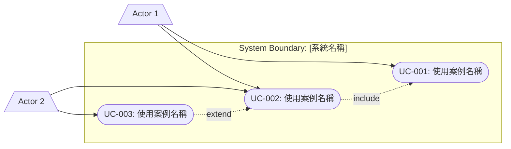
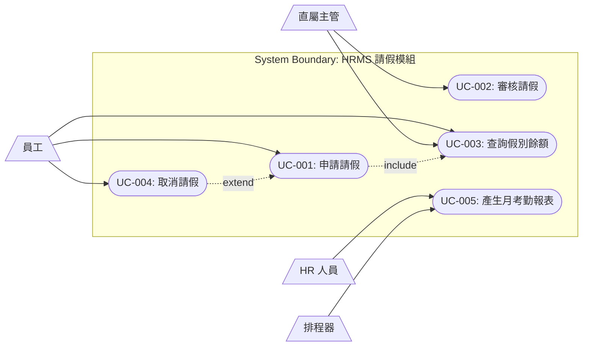

# 使用案例文件範本（Use Case Document Template）

> **適用標準**：ISO/IEC/IEEE 29148:2018、UML 2.5.1（Unified Modeling Language）  
> **適用階段**：需求分析階段（Requirements Phase）  
> **負責角色**：系統分析師（SA）、業務分析師（BA）

---

## 📑 章節目錄

1. [文件資訊](#1-文件資訊)
2. [系統範圍與參與者](#2-系統範圍與參與者)
3. [使用案例圖（Use Case Diagram）](#3-使用案例圖use-case-diagram)
4. [使用案例清單](#4-使用案例清單)
5. [使用案例規格（逐案詳述）](#5-使用案例規格逐案詳述)
6. [業務規則](#6-業務規則)
7. [非功能性需求對應](#7-非功能性需求對應)
8. [追溯矩陣](#8-追溯矩陣)

---

## 📝 範本

---

### 1. 文件資訊

| 項目 | 內容 |
|------|------|
| **文件名稱** | [系統名稱] 使用案例文件 |
| **文件編號** | [專案代碼]-UCD-[版本號] |
| **版本** | v[X.Y] |
| **建立日期** | [YYYY-MM-DD] |
| **最後更新** | [YYYY-MM-DD] |
| **撰寫者** | [BA/SA 姓名] |
| **審核者** | [技術主管 / 業務主管] |

#### 版本歷程

| 版本 | 日期 | 修改人 | 修改內容 |
|------|------|--------|---------|
| v1.0 | [YYYY-MM-DD] | [姓名] | 初版發布 |

---

### 2. 系統範圍與參與者

#### 2.1 系統邊界

| 項目 | 說明 |
|------|------|
| 系統名稱 | [系統全名] |
| 系統目的 | [一句話描述系統核心價值] |
| 系統範圍 | [包含/不包含的功能範疇] |

#### 2.2 參與者（Actors）清單

| 參與者 ID | 名稱 | 類型 | 說明 | 相關角色/系統 |
|-----------|------|------|------|-------------|
| ACT-001 | [名稱] | [人/系統/時間] | [簡述] | [實際角色] |
| ACT-002 | [名稱] | [人/系統/時間] | [簡述] | [實際角色] |

---

### 3. 使用案例圖（Use Case Diagram）

---

### 4. 使用案例清單

| UC ID | 使用案例名稱 | 主要參與者 | 優先級 | 複雜度 | 狀態 |
|-------|------------|-----------|--------|--------|------|
| UC-001 | [名稱] | [Actor] | [High/Medium/Low] | [High/Medium/Low] | [Draft/Review/Approved] |
| UC-002 | [名稱] | [Actor] | [High/Medium/Low] | [High/Medium/Low] | [Draft/Review/Approved] |

---

### 5. 使用案例規格（逐案詳述）

#### UC-[NNN]: [使用案例名稱]

| 項目 | 內容 |
|------|------|
| **Use Case ID** | UC-[NNN] |
| **名稱** | [使用案例名稱] |
| **簡述** | [一句話描述目的] |
| **主要參與者** | [Primary Actor] |
| **次要參與者** | [Secondary Actors，若無填 N/A] |
| **觸發條件** | [什麼事件啟動此使用案例] |
| **前置條件** | [執行前必須滿足的條件] |
| **後置條件（成功）** | [成功完成後系統/資料狀態] |
| **後置條件（失敗）** | [失敗時系統/資料狀態] |
| **優先級** | [High / Medium / Low] |
| **頻率** | [每日 N 次 / 每週 N 次] |

**主要流程（Main Flow）：**

| 步驟 | 參與者 | 動作描述 |
|------|--------|---------|
| 1 | [Actor] | [動作] |
| 2 | System | [系統回應] |
| 3 | [Actor] | [動作] |
| 4 | System | [系統回應] |

**替代流程（Alternative Flow）：**

| 替代流程 ID | 分支點 | 條件 | 步驟描述 |
|------------|--------|------|---------|
| AF-1 | Step [N] | [條件] | [替代步驟描述] |
| AF-2 | Step [N] | [條件] | [替代步驟描述] |

**例外流程（Exception Flow）：**

| 例外 ID | 分支點 | 條件 | 系統回應 |
|---------|--------|------|---------|
| EX-1 | Step [N] | [錯誤條件] | [錯誤處理描述] |
| EX-2 | Step [N] | [錯誤條件] | [錯誤處理描述] |

**業務規則：**

| 規則 ID | 說明 |
|---------|------|
| BR-[NNN] | [業務規則描述] |

**UI 原型參考：**

| 畫面 | 描述 | 連結 |
|------|------|------|
| [畫面名稱] | [簡述] | [Figma/Wireframe URL] |

---

### 6. 業務規則

| 規則 ID | 規則名稱 | 描述 | 適用 UC | 來源 |
|---------|---------|------|---------|------|
| BR-001 | [名稱] | [規則詳細描述] | UC-001, UC-003 | [法規/政策] |
| BR-002 | [名稱] | [規則詳細描述] | UC-002 | [業務部門] |

---

### 7. 非功能性需求對應

| UC ID | 效能要求 | 安全要求 | 可用性要求 |
|-------|---------|---------|-----------|
| UC-001 | [回應時間 < Ns] | [需認證/授權等級] | [可用性 %] |
| UC-002 | [TPS ≥ N] | [需加密] | [7×24] |

---

### 8. 追溯矩陣

| UC ID | BRD 需求 | FRD 功能 | 測試案例 | 設計元件 |
|-------|---------|---------|---------|---------|
| UC-001 | BRD-§3.1 | FR-001 | TC-001~003 | [Module A] |
| UC-002 | BRD-§3.2 | FR-004 | TC-004~006 | [Module B] |

---

## 📖 使用說明

### 各章節填寫指引

| 章節 | 填寫時機 | 負責人 | 重點說明 |
|------|---------|--------|---------|
| §1 文件資訊 | 文件建立時 | BA/SA | 確保版本追蹤 |
| §2 系統範圍 | 需求啟動會議後 | BA | 定義 In/Out Scope |
| §3 UC 圖 | 需求分析中期 | SA | 使用 UML 標準畫法 |
| §4 UC 清單 | 持續更新 | BA/SA | 含優先排序 |
| §5 UC 規格 | 逐案分析時 | BA/SA | 每個 UC 完整填寫 |
| §6 業務規則 | 配合 UC 分析 | BA | 統一管理，避免重複 |
| §7 NFR 對應 | 設計轉換前 | SA | 與 NFR 文件交叉引用 |
| §8 追溯矩陣 | 設計/測試階段補充 | SA/QA | 確保需求可追溯 |

### Use Case 撰寫原則

1. **一個 UC = 一個完整的使用者目標**（User Goal Level）
2. 主要流程描述「快樂路徑」（Happy Path）
3. 使用「主詞 + 動詞 + 受詞」格式撰寫步驟
4. 替代流程處理分支選擇，例外流程處理錯誤
5. 前/後置條件需可驗證

---

## 💡 範例（以 HRMS 人力資源管理系統為例）

---

### 範例：參與者清單

| 參與者 ID | 名稱 | 類型 | 說明 | 相關角色 |
|-----------|------|------|------|---------|
| ACT-001 | 員工 | 人 | 一般員工使用系統 | 全體正職員工 |
| ACT-002 | 直屬主管 | 人 | 審核部屬的請假/加班 | 部門主管、組長 |
| ACT-003 | HR 人員 | 人 | 管理人事資料與考勤 | 人資部同仁 |
| ACT-004 | 系統管理員 | 人 | 系統維護與設定 | IT 部門 |
| ACT-005 | 薪資系統 | 系統 | 外部薪資計算系統 | SAP HR Module |
| ACT-006 | 排程器 | 時間 | 定時觸發任務 | CRON/Scheduler |

---

### 範例：使用案例圖

---

### 範例：UC-001 申請請假

| 項目 | 內容 |
|------|------|
| **Use Case ID** | UC-001 |
| **名稱** | 申請請假 |
| **簡述** | 員工透過系統提交請假申請，經主管審核後生效 |
| **主要參與者** | 員工（ACT-001） |
| **次要參與者** | 直屬主管（ACT-002）、HR 系統 |
| **觸發條件** | 員工點選「申請請假」功能 |
| **前置條件** | 1. 員工已登入系統 2. 員工為在職狀態 |
| **後置條件（成功）** | 假單建立，狀態為「待審核」，主管收到通知 |
| **後置條件（失敗）** | 假單未建立，顯示失敗原因 |
| **優先級** | High |
| **頻率** | 每日約 50~100 次 |

**主要流程（Main Flow）：**

| 步驟 | 參與者 | 動作描述 |
|------|--------|---------|
| 1 | 員工 | 進入請假申請頁面 |
| 2 | System | 顯示假別清單與各假別剩餘天數 |
| 3 | 員工 | 選擇假別、輸入起迄日期、事由 |
| 4 | System | 計算請假天數（排除假日），驗證餘額是否足夠 |
| 5 | System | 顯示請假摘要（含代理人建議） |
| 6 | 員工 | 指定職務代理人，確認送出 |
| 7 | System | 建立假單（狀態：PENDING），發送通知給直屬主管 |
| 8 | System | 顯示「申請成功，等待主管審核」訊息 |

**替代流程（Alternative Flow）：**

| 替代流程 ID | 分支點 | 條件 | 步驟描述 |
|------------|--------|------|---------|
| AF-1 | Step 3 | 請假 ≤ 0.5 天 | 不需指定代理人，跳至 Step 7 |
| AF-2 | Step 6 | 員工選擇暫存 | 假單儲存為 DRAFT，不發通知 |

**例外流程（Exception Flow）：**

| 例外 ID | 分支點 | 條件 | 系統回應 |
|---------|--------|------|---------|
| EX-1 | Step 4 | 假別餘額不足 | 顯示「[假別]剩餘 N 天，不足」，阻止送出 |
| EX-2 | Step 4 | 起迄日期重疊已核准假單 | 顯示「日期與已核准假單衝突」 |
| EX-3 | Step 7 | 找不到直屬主管 | 通知 HR 人工指派審核人 |

**業務規則：**

| 規則 ID | 說明 |
|---------|------|
| BR-001 | 特休假需提前 3 個工作天申請（緊急狀況除外） |
| BR-002 | 病假超過 3 天需附診斷證明 |
| BR-003 | 請假天數計算排除國定假日與週末 |
| BR-004 | 同部門同日請假人數不得超過 30% |

---

> 📌 **審閱重點**  
> - 每個 Use Case 是否都對應到明確的使用者目標？  
> - 前/後置條件是否可驗證、可測試？  
> - 替代/例外流程是否涵蓋常見邊界情境？  
> - 追溯矩陣是否完整連結需求→設計→測試？
