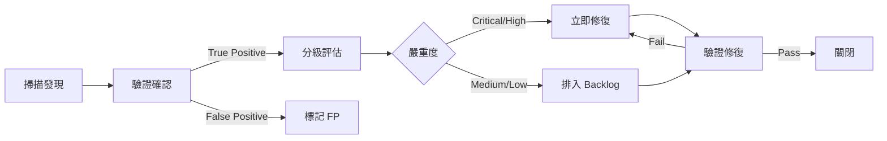

# 安全測試與弱點掃描報告範本（Security Scan Report Template）

> **適用標準**：OWASP Testing Guide v4.2、CVSS 3.1（Common Vulnerability Scoring System）、CWE  
> **適用階段**：測試驗證階段（Testing Phase）  
> **負責角色**：AppSec 工程師、資安測試人員、QA Lead

---

## 📑 章節目錄

1. [文件資訊](#1-文件資訊)
2. [測試摘要](#2-測試摘要)
3. [測試範圍與方法](#3-測試範圍與方法)
4. [弱點總覽](#4-弱點總覽)
5. [弱點詳細報告](#5-弱點詳細報告)
6. [合規檢核結果](#6-合規檢核結果)
7. [修復計畫](#7-修復計畫)
8. [結論與建議](#8-結論與建議)
9. [附錄](#9-附錄)

---

## 📝 範本

---

### 1. 文件資訊

| 項目 | 內容 |
|------|------|
| **文件名稱** | [系統名稱] 安全測試報告 |
| **文件編號** | [專案代碼]-STR-[版本號]-[日期] |
| **版本** | v[X.Y] |
| **測試日期** | [YYYY-MM-DD] ~ [YYYY-MM-DD] |
| **測試人員** | [AppSec 團隊 / 外部廠商] |
| **審核者** | [CISO / 資安主管] |
| **資料分級** | Confidential |

---

### 2. 測試摘要

| 項目 | 內容 |
|------|------|
| 測試類型 | [SAST / DAST / SCA / Penetration Test / 組合] |
| 受測版本 | [Application version / Commit hash] |
| 測試結果總評 | [✅ PASS / ⚠️ CONDITIONAL PASS / ❌ FAIL] |
| 上線決策 | [可上線 / 修復後可上線 / 不可上線] |

#### 弱點統計

| 嚴重度 | 數量 | 已修復 | 待修復 | 接受風險 |
|--------|------|--------|--------|---------|
| Critical | [N] | [N] | [N] | [N] |
| High | [N] | [N] | [N] | [N] |
| Medium | [N] | [N] | [N] | [N] |
| Low | [N] | [N] | [N] | [N] |
| Info | [N] | — | — | — |
| **Total** | **[N]** | **[N]** | **[N]** | **[N]** |

---

### 3. 測試範圍與方法

#### 3.1 測試範圍

| 項目 | 內容 |
|------|------|
| 目標系統 | [系統名稱 + URL/IP] |
| 測試範圍 | [In-scope modules / endpoints] |
| 排除範圍 | [Out-of-scope，如第三方元件] |
| 認證帳號 | [測試用帳號角色清單（不含密碼）] |

#### 3.2 測試方法

| 測試類型 | 工具 | 版本 | 說明 |
|---------|------|------|------|
| SAST（靜態分析） | [SonarQube / Checkmarx / Semgrep] | [ver] | 原始碼分析 |
| DAST（動態分析） | [OWASP ZAP / Burp Suite Pro] | [ver] | 執行期掃描 |
| SCA（套件分析） | [Snyk / OWASP Dependency-Check / Trivy] | [ver] | 第三方套件弱點 |
| 手動測試 | [Burp Suite / Custom scripts] | — | 邏輯弱點 |
| Container Scan | [Trivy / Aqua] | [ver] | 容器映像掃描 |

#### 3.3 測試依據

| 標準/指南 | 涵蓋項目 |
|-----------|---------|
| OWASP Top 10 (2021) | A01~A10 |
| OWASP API Security Top 10 (2023) | 全部 |
| OWASP ASVS v4.0.3 | [Level 1 / Level 2 / Level 3] |
| CWE Top 25 (2023) | 常見弱點 |

---

### 4. 弱點總覽

#### 4.1 依嚴重度分佈

| 嚴重度 | CVSS 分數範圍 | 修復 SLA | 數量 |
|--------|-------------|---------|------|
| Critical | 9.0 – 10.0 | 24 小時 | [N] |
| High | 7.0 – 8.9 | 7 天 | [N] |
| Medium | 4.0 – 6.9 | 30 天 | [N] |
| Low | 0.1 – 3.9 | 90 天 | [N] |
| Info | 0.0 | 視需要 | [N] |

#### 4.2 依類型分佈

| 弱點類型（CWE） | 數量 | 嚴重度分佈 |
|----------------|------|-----------|
| [CWE-XXX: 弱點名稱] | [N] | [C:N / H:N / M:N / L:N] |
| [CWE-XXX: 弱點名稱] | [N] | [C:N / H:N / M:N / L:N] |

#### 4.3 依 OWASP Top 10 分佈

| OWASP Category | 弱點數量 | 最高嚴重度 |
|----------------|---------|-----------|
| A01: Broken Access Control | [N] | [Critical/High/...] |
| A02: Cryptographic Failures | [N] | |
| A03: Injection | [N] | |
| A04: Insecure Design | [N] | |
| A05: Security Misconfiguration | [N] | |
| A06: Vulnerable Components | [N] | |
| A07: Auth Failures | [N] | |
| A08: Software & Data Integrity | [N] | |
| A09: Logging & Monitoring Failures | [N] | |
| A10: SSRF | [N] | |

---

### 5. 弱點詳細報告

#### VULN-[NNN]: [弱點標題]

| 項目 | 內容 |
|------|------|
| **弱點 ID** | VULN-[NNN] |
| **嚴重度** | [Critical / High / Medium / Low] |
| **CVSS 分數** | [N.N] |
| **CVSS Vector** | [CVSS:3.1/AV:N/AC:L/PR:N/UI:N/S:U/C:H/I:H/A:H] |
| **CWE** | CWE-[NNN]: [名稱] |
| **OWASP** | [A01 / A02 / ...] |
| **發現工具** | [SAST / DAST / Manual] |
| **受影響元件** | [模組/檔案/API endpoint] |
| **狀態** | [Open / Fixed / Accepted / False Positive] |

**描述：**

[詳細描述弱點的性質與成因]

**影響：**

[描述此弱點被利用後可能造成的危害]

**重現步驟：**

1. [步驟 1]
2. [步驟 2]
3. [步驟 3]

**證據：**

```
[Request/Response 片段或截圖參考]
```

**修復建議：**

[具體的修復方法與安全程式碼範例]

```code
// 修復前（不安全）
[insecure code snippet]

// 修復後（安全）
[secure code snippet]
```

**參考資源：**

- [相關 CVE / CWE / OWASP 頁面連結]

---

### 6. 合規檢核結果

#### 6.1 OWASP ASVS 合規

| ASVS Chapter | 檢核項數 | 通過 | 未通過 | N/A | 合規率 |
|-------------|---------|------|--------|-----|--------|
| V2: Authentication | [N] | [N] | [N] | [N] | [N]% |
| V3: Session Management | [N] | [N] | [N] | [N] | [N]% |
| V4: Access Control | [N] | [N] | [N] | [N] | [N]% |
| V5: Validation | [N] | [N] | [N] | [N] | [N]% |
| V6: Cryptography | [N] | [N] | [N] | [N] | [N]% |
| V7: Error Handling | [N] | [N] | [N] | [N] | [N]% |
| V8: Data Protection | [N] | [N] | [N] | [N] | [N]% |

---

### 7. 修復計畫

#### 7.1 修復優先順序

| # | 弱點 ID | 嚴重度 | 修復 SLA | 負責人 | 預計修復日 | 狀態 |
|---|---------|--------|---------|--------|-----------|------|
| 1 | VULN-001 | Critical | 24 hr | [姓名] | [日期] | [Open/Fixed] |
| 2 | VULN-002 | High | 7 days | [姓名] | [日期] | [Open/Fixed] |

#### 7.2 風險接受記錄

| 弱點 ID | 嚴重度 | 接受理由 | 補償控制 | 核准人 | 到期日 |
|---------|--------|---------|---------|--------|--------|
| [VULN-NNN] | [Med] | [理由] | [補償措施] | [CISO] | [日期] |

---

### 8. 結論與建議

| 項目 | 內容 |
|------|------|
| **上線決策** | [✅ 可上線 / ⚠️ 條件式上線 / ❌ 不可上線] |
| **條件** | [需修復 N 個 Critical/High 弱點後重測] |
| **長期建議** | [改善建議摘要] |
| **下次掃描建議** | [時機/範圍] |

---

### 9. 附錄

#### 9.1 工具掃描完整報告

| 工具 | 報告位置 |
|------|---------|
| [SAST report] | [path/URL] |
| [DAST report] | [path/URL] |
| [SCA report] | [path/URL] |

#### 9.2 測試環境細節

[補充測試環境配置細節]

---

## 📖 使用說明

### CVSS 嚴重度定義

| 嚴重度 | CVSS | 定義 | 修復 SLA |
|--------|------|------|---------|
| Critical | 9.0-10.0 | 可遠端利用、無需認證、影響核心資料 | 24 小時 |
| High | 7.0-8.9 | 需部分條件、影響機密或完整性 | 7 天 |
| Medium | 4.0-6.9 | 需較多條件或影響有限 | 30 天 |
| Low | 0.1-3.9 | 影響極小或需物理接觸 | 90 天 |

### 弱點管理流程



---

## 💡 範例（以 HRMS 人力資源管理系統為例）

---

### 範例：弱點報告

#### VULN-001: IDOR - 員工薪資資訊未授權存取

| 項目 | 內容 |
|------|------|
| **嚴重度** | High |
| **CVSS** | 7.5 (CVSS:3.1/AV:N/AC:L/PR:L/UI:N/S:U/C:H/I:N/A:N) |
| **CWE** | CWE-639: Authorization Bypass Through User-Controlled Key |
| **OWASP** | A01: Broken Access Control |
| **受影響 API** | GET /api/salary/{employeeId} |
| **狀態** | Fixed |

**描述：**  
一般員工角色可透過修改 URL 中的 employeeId 參數，存取其他員工的薪資資訊，API 未驗證當前用戶是否有權限存取目標員工資料。

**重現步驟：**
1. 以一般員工帳號 (EMP-001) 登入系統
2. 正常查詢自己的薪資 GET /api/salary/EMP-001 → 200 OK
3. 修改 URL 為 GET /api/salary/EMP-042 → 200 OK（應為 403）

**修復建議：**
```java
// 修復前
@GetMapping("/api/salary/{employeeId}")
public SalaryDto getSalary(@PathVariable String employeeId) {
    return salaryService.findByEmployeeId(employeeId);
}

// 修復後 - 加入權限檢查
@GetMapping("/api/salary/{employeeId}")
@PreAuthorize("hasRole('HR') or #employeeId == authentication.principal.employeeId")
public SalaryDto getSalary(@PathVariable String employeeId) {
    return salaryService.findByEmployeeId(employeeId);
}
```

---

#### VULN-002: 第三方套件高風險 CVE

| 項目 | 內容 |
|------|------|
| **嚴重度** | Critical |
| **CVE** | CVE-2024-XXXXX |
| **受影響套件** | log4j-core 2.14.1 |
| **修復版本** | ≥ 2.17.1 |
| **狀態** | Fixed |

---

> 📌 **審閱重點**  
> - 所有 Critical/High 弱點是否都有修復計畫或接受風險記錄？  
> - False Positive 是否有驗證依據？  
> - 修復建議是否具體可行（非僅描述問題）？  
> - SCA 掃描是否涵蓋所有直接與間接依賴？  
> - 合規結果是否滿足上線的最低門檻？
