# BDD 行為驅動開發使用教學手冊

## 📘 手冊說明

本手冊專為**系統分析師（SA）**、**業務分析師（BA）**、**開發人員**與**測試人員**設計,旨在協助團隊成員:

- 理解 BDD 的核心概念與價值
- 掌握 Gherkin 語法與規格撰寫
- 學會將業務需求轉換為可執行的行為規格
- 建立 BDD 協作開發流程
- 實踐 BDD 自動化測試

**適用對象**:
- 新進系統分析師
- 想導入 BDD 的開發團隊
- 需要強化需求溝通的專案經理
- 負責驗收測試的 QA 人員

**使用方式**:
1. 循序閱讀各章節,建立完整概念
2. 參考實務案例,模擬實際場景
3. 使用附錄的模板與檢查清單
4. 在專案中逐步導入與實踐

---

## 📑 目錄

### [第一章　認識 BDD:行為驅動開發的核心理念](#第一章認識-bdd行為驅動開發的核心理念)

- [1.1 什麼是 BDD](#11-什麼是-bdd)
- [1.2 BDD 與 TDD、ATDD 的差異](#12-bdd-與-tddatdd-的差異)
- [1.3 為什麼要導入 BDD](#13-為什麼要導入-bdd)
- [1.4 BDD 的價值與應用場景](#14-bdd-的價值與應用場景)
- [1.5 BDD 在軟體開發生命週期(SDLC)中的位置](#15-bdd-在軟體開發生命週期sdlc中的位置)

### [第二章　BDD 的三大支柱](#第二章bdd-的三大支柱)

- [2.1 Discovery(需求探索)](#21-discovery需求探索)
- [2.2 Formulation(範例定義)](#22-formulation範例定義)
- [2.3 Automation(自動化驗證)](#23-automation自動化驗證)

### [第三章　BDD 的核心語法:Gherkin](#第三章bdd-的核心語法gherkin)

- [3.1 Gherkin 語法結構與規則](#31-gherkin-語法結構與規則)
- [3.2 Feature、Scenario、Scenario Outline 進階應用](#32-featurescenarioscenario-outline-進階應用)
- [3.3 範例:從需求敘述轉為 Gherkin 規格](#33-範例從需求敘述轉為-gherkin-規格)
- [3.4 常見錯誤與最佳實務](#34-常見錯誤與最佳實務)

### [第四章　BDD 與系統分析的整合應用](#第四章bdd-與系統分析的整合應用)

- [4.1 如何將業務需求轉化為可執行行為](#41-如何將業務需求轉化為可執行行為)
- [4.2 與利害關係人共創範例(Example Mapping)](#42-與利害關係人共創範例example-mapping)
- [4.3 User Story 與 BDD 的結合方式](#43-user-story-與-bdd-的結合方式)
- [4.4 Acceptance Criteria(驗收準則)的撰寫指引](#44-acceptance-criteria驗收準則的撰寫指引)
- [4.5 從 BDD 到 Use Case 的對應關係](#45-從-bdd-到-use-case-的對應關係)

### [第五章　BDD 開發流程與角色分工](#第五章bdd-開發流程與角色分工)

- [5.1 BDD 工作流(Workflow)全貌](#51-bdd-工作流workflow全貌)
- [5.2 三方會談(Three Amigos:BA/SA、Dev、QA)](#52-三方會談three-amigosbasadevqa)
- [5.3 SA 在 BDD 流程中的責任與產出](#53-sa-在-bdd-流程中的責任與產出)
- [5.4 實務文件產出範例](#54-實務文件產出範例)
- [5.5 維護與版本控管實務](#55-維護與版本控管實務)

### [第六章　BDD 自動化測試實作](#第六章bdd-自動化測試實作)

- [6.1 常見 BDD 工具比較](#61-常見-bdd-工具比較)
- [6.2 環境安裝與專案結構](#62-環境安裝與專案結構)
- [6.3 Feature 與 Step Definitions 的關聯](#63-feature-與-step-definitions-的關聯)
- [6.4 CI/CD 整合實務](#64-cicd-整合實務)
- [6.5 測試報告與追蹤機制](#65-測試報告與追蹤機制)

### [第七章　BDD 實戰案例](#第七章bdd-實戰案例)

- [7.1 案例一:Web 登入驗證流程](#71-案例一web-登入驗證流程)
- [7.2 案例二:銀行轉帳業務流程](#72-案例二銀行轉帳業務流程)
- [7.3 案例三:批次系統業務規則驗證](#73-案例三批次系統業務規則驗證)
- [7.4 案例四:API 行為測試](#74-案例四api-行為測試)
- [7.5 案例回顧與行為重構](#75-案例回顧與行為重構)

### [第八章　導入策略與組織落地](#第八章導入策略與組織落地)

- [8.1 組織 BDD 成熟度評估](#81-組織-bdd-成熟度評估)
- [8.2 BDD 導入計畫範本](#82-bdd-導入計畫範本)
- [8.3 克服導入 BDD 的常見障礙](#83-克服導入-bdd-的常見障礙)
- [8.4 建立 BDD 協作文化](#84-建立-bdd-協作文化)
- [8.5 成功導入的關鍵因素](#85-成功導入的關鍵因素)

### [第九章　高階應用與延伸](#第九章高階應用與延伸)

- [9.1 AI 輔助 BDD 實踐](#91-ai-輔助-bdd-實踐)
- [9.2 BDD 與 Specification by Example (SBE) 整合](#92-bdd-與-specification-by-example-sbe-整合)
- [9.3 微服務架構下的 BDD 挑戰](#93-微服務架構下的-bdd-挑戰)
- [9.4 BDD 的未來趨勢](#94-bdd-的未來趨勢)

### [第十章　附錄](#第十章附錄)

- [10.1 Gherkin 語法速查表](#101-gherkin-語法速查表)
- [10.2 BDD 文件模板](#102-bdd-文件模板)
- [10.3 常見 BDD 工具與插件](#103-常見-bdd-工具與插件)
- [10.4 推薦學習資源](#104-推薦學習資源)
- [10.5 BDD 完整檢查清單](#105-bdd-完整檢查清單)

---

## 第一章　認識 BDD:行為驅動開發的核心理念

### 1.1 什麼是 BDD

**BDD (Behavior-Driven Development,行為驅動開發)** 是一種軟體開發方法論,強調:

1. **以業務價值為中心**:從使用者需求出發,而非技術實作
2. **使用自然語言描述**:讓非技術人員也能參與規格制定
3. **可執行的活文件**:規格同時是測試案例,確保文件與程式同步
4. **協作驅動**:促進業務、開發、測試三方的有效溝通

#### 核心概念

```mermaid
graph TB
    A[業務需求] --> B[範例對話]
    B --> C[Gherkin 規格]
    C --> D[自動化測試]
    D --> E[可執行文件]
    E --> F[持續驗證]
    F -.回饋.-> A
    
    style A fill:#e1f5ff
    style C fill:#fff4e1
    style E fill:#e7f5e1
```

**BDD 的核心理念**:
- **Shared Understanding**:建立團隊對需求的共同理解
- **Example-First**:透過具體範例說明抽象需求
- **Living Documentation**:文件隨程式碼演進而更新

#### BDD 的關鍵特徵

| 特徵 | 說明 | 效益 |
|------|------|------|
| **業務語言** | 使用領域術語,而非技術術語 | 降低溝通障礙 |
| **範例導向** | 用具體案例描述系統行為 | 減少需求誤解 |
| **協作定義** | 三方(BA/Dev/QA)共同制定規格 | 提早發現問題 |
| **可執行性** | 規格可直接轉為測試程式 | 確保需求落實 |
| **持續驗證** | 自動化測試持續驗證行為 | 快速發現退化 |

---

### 1.2 BDD 與 TDD、ATDD 的差異

#### 三種開發方法比較

```mermaid
graph LR
    subgraph TDD[測試驅動開發 TDD]
        T1[寫測試] --> T2[寫程式]
        T2 --> T3[重構]
        T3 --> T1
    end
    
    subgraph ATDD[驗收測試驅動開發 ATDD]
        A1[定義驗收準則] --> A2[寫測試]
        A2 --> A3[實作功能]
        A3 --> A4[執行驗收]
    end
    
    subgraph BDD[行為驅動開發 BDD]
        B1[探索範例] --> B2[定義規格]
        B2 --> B3[自動化驗證]
        B3 --> B4[實作功能]
        B4 --> B5[持續驗證]
    end
    
    style TDD fill:#ffe1e1
    style ATDD fill:#e1f5ff
    style BDD fill:#e7f5e1
```

#### 詳細對比

| 比較項目 | TDD | ATDD | BDD |
|---------|-----|------|-----|
| **關注層級** | 單元測試(方法層級) | 驗收測試(功能層級) | 行為規格(業務層級) |
| **驅動力** | 程式設計 | 驗收準則 | 業務價值 |
| **參與角色** | 開發人員 | BA、QA、Dev | BA、QA、Dev(三方協作) |
| **語言風格** | 技術語言(程式碼) | 半技術語言 | 自然語言(領域術語) |
| **測試範圍** | 內部邏輯 | 外部行為 | 業務行為 |
| **文件產出** | 測試程式碼 | 測試案例 | 可執行規格 |
| **工具代表** | JUnit, NUnit | FitNesse | Cucumber, SpecFlow |

#### 關係圖解

```mermaid
graph TD
    BDD[BDD 行為驅動開發]
    ATDD[ATDD 驗收測試驅動]
    TDD[TDD 測試驅動開發]
    
    BDD -->|包含| ATDD
    ATDD -->|引導| TDD
    
    BDD -.強調協作與溝通.-> Team[跨職能團隊]
    ATDD -.關注驗收準則.-> AC[Acceptance Criteria]
    TDD -.專注程式品質.-> Code[程式碼]
    
    style BDD fill:#e7f5e1
    style ATDD fill:#e1f5ff
    style TDD fill:#ffe1e1
```

#### 實務應用時機

**選擇 TDD**:
- 開發複雜演算法
- 重構既有程式碼
- 提升程式碼品質

**選擇 ATDD**:
- 明確的驗收標準
- 功能型需求驗證
- 契約式開發

**選擇 BDD**:
- 需求不明確,需要探索
- 跨職能團隊協作
- 重視業務溝通與文件
- 建立共享理解

---

### 1.3 為什麼要導入 BDD

#### 傳統開發的常見問題

```mermaid
graph TB
    subgraph Problems[傳統開發痛點]
        P1[需求理解落差] --> P2[開發偏離需求]
        P2 --> P3[測試與開發脫節]
        P3 --> P4[文件過時無用]
        P4 --> P5[返工成本高]
        P5 --> P6[專案延遲]
    end
    
    subgraph Solutions[BDD 解決方案]
        S1[範例協作] --> S2[共同理解]
        S2 --> S3[可執行規格]
        S3 --> S4[活文件]
        S4 --> S5[持續驗證]
        S5 --> S6[快速回饋]
    end
    
    P1 -.BDD解決.-> S1
    P2 -.BDD解決.-> S2
    P3 -.BDD解決.-> S3
    P4 -.BDD解決.-> S4
    
    style Problems fill:#ffe1e1
    style Solutions fill:#e7f5e1
```

#### BDD 帶來的具體效益

##### 1. 溝通效益

- ✅ 建立共通語言,減少認知落差
- ✅ 具體範例取代抽象描述
- ✅ 提早發現需求矛盾
- ✅ 降低變更成本

##### 2. 品質效益

- ✅ 需求即測試,確保功能正確性
- ✅ 自動化回歸測試,防止功能退化
- ✅ 可追溯性:需求→規格→測試→程式碼
- ✅ 持續驗證系統行為

##### 3. 協作效益

- ✅ 打破職能孤島(BA/Dev/QA)
- ✅ 促進知識共享
- ✅ 提升團隊信任度
- ✅ 加速決策過程

##### 4. 文件效益

- ✅ 活文件:與程式碼同步更新
- ✅ 可讀性高:非技術人員也能理解
- ✅ 可執行:驗證文件與系統一致性
- ✅ 範例豐富:降低學習成本

#### 投資報酬率(ROI)分析

```mermaid
graph LR
    subgraph Investment[投入成本]
        I1[學習成本]
        I2[協作時間]
        I3[工具導入]
    end
    
    subgraph Return[獲得回報]
        R1[減少返工]
        R2[提早發現問題]
        R3[降低維護成本]
        R4[提升交付速度]
        R5[改善客戶滿意度]
    end
    
    Investment --> Time[時間軸]
    Time --> Return
    
    style Investment fill:#ffe1e1
    style Return fill:#e7f5e1
```

**短期效益(1-3個月)**:
- 需求澄清效率提升
- 開發與測試協作改善
- 減少需求變更次數

**中期效益(3-6個月)**:
- 缺陷率降低 20-40%
- 測試自動化覆蓋率提升
- 交付週期縮短

**長期效益(6個月以上)**:
- 維護成本大幅降低
- 新人上手時間減少
- 技術債務減輕
- 團隊協作文化成熟

---

### 1.4 BDD 的價值與應用場景

#### BDD 的核心價值主張

```mermaid
graph TD
    A[BDD 核心價值] --> B[業務價值]
    A --> C[技術價值]
    A --> D[組織價值]
    A --> E[客戶價值]
    
    B --> B1[需求即測試]
    B --> B2[減少浪費]
    B --> B3[快速驗證]
    B --> B4[持續交付]
    
    C --> C1[活文件]
    C --> C2[測試自動化]
    C --> C3[重構信心]
    C --> C4[技術債管理]
    
    D --> D1[跨職能協作]
    D --> D2[知識共享]
    D --> D3[流程透明]
    D --> D4[持續改善]
    
    E --> E1[符合期望]
    E --> E2[快速回饋]
    E --> E3[品質保證]
    E --> E4[可預測性]
```

#### 適合導入 BDD 的場景

##### ✅ 高度適合

1. **業務規則複雜的系統**
   - 金融系統(交易、風控、計費)
   - 保險理賠流程
   - 電商促銷規則
   - 稅務計算系統

2. **需要頻繁變更的系統**
   - 政策法規驅動的系統
   - 市場快速變化的產品
   - A/B 測試頻繁的功能

3. **跨職能協作的專案**
   - 敏捷開發團隊
   - DevOps 環境
   - 多方利害關係人參與

4. **長期維護的系統**
   - 核心業務系統
   - 平台型產品
   - 需要高可靠性的系統

##### ⚠️ 需評估的場景

1. **技術導向專案**
   - 基礎設施開發
   - 框架/函式庫開發
   - 效能最佳化專案
   - 👉 建議:結合 TDD 使用

2. **原型開發/概念驗證**
   - POC 專案
   - 快速驗證想法
   - 👉 建議:待需求穩定後導入

3. **資源有限的小型專案**
   - 人力不足(<3人)
   - 時間極度緊迫
   - 👉 建議:使用簡化版 BDD

##### ❌ 不建議的場景

1. 一次性腳本或工具
2. 純視覺設計調整
3. 效能調校專案
4. 團隊完全抗拒改變

---

### 1.5 BDD 在軟體開發生命週期(SDLC)中的位置

#### BDD 在 SDLC 的整體架構

```mermaid
graph TB
    subgraph SDLC[軟體開發生命週期]
        direction TB
        
        subgraph Requirements[需求階段]
            R1[需求收集] --> R2[BDD Discovery]
            R2 --> R3[Example Mapping]
            R3 --> R4[User Story]
        end
        
        subgraph Design[設計階段]
            D1[BDD Formulation] --> D2[撰寫 Feature]
            D2 --> D3[定義 Scenarios]
            D3 --> D4[Acceptance Criteria]
        end
        
        subgraph Development[開發階段]
            Dev1[BDD Automation] --> Dev2[Step Definitions]
            Dev2 --> Dev3[TDD 實作]
            Dev3 --> Dev4[整合測試]
        end
        
        subgraph Testing[測試階段]
            T1[執行 BDD 測試] --> T2[驗收測試]
            T2 --> T3[迴歸測試]
            T3 --> T4[測試報告]
        end
        
        subgraph Deployment[部署階段]
            Dep1[CI/CD Pipeline] --> Dep2[自動化驗證]
            Dep2 --> Dep3[Production]
        end
        
        Requirements --> Design
        Design --> Development
        Development --> Testing
        Testing --> Deployment
        Deployment -.持續回饋.-> Requirements
    end
    
    style Requirements fill:#e1f5ff
    style Design fill:#fff4e1
    style Development fill:#e7f5e1
    style Testing fill:#ffe1e1
    style Deployment fill:#f0e1ff
```

#### 各階段 BDD 的角色與產出

##### 1. 需求階段(Requirements)

| 活動 | BDD 作法 | 參與角色 | 產出 |
|------|---------|---------|------|
| 需求收集 | Discovery Workshop | BA, Stakeholder | 需求清單 |
| 需求探索 | Example Mapping | BA, SA, Dev, QA | Example Map |
| 需求定義 | User Story + 範例 | BA, SA | User Stories |
| 驗收準則 | Given-When-Then | SA, QA | Acceptance Criteria |

**範例:需求階段產出**

```gherkin
# User Story
身為 銀行客戶
我想要 轉帳給其他帳戶
以便 快速完成付款

# Example Mapping 產出的範例
範例1: 正常轉帳
  Given 我的帳戶有 10,000 元
  When 我轉帳 5,000 元給朋友
  Then 我的帳戶應該剩下 5,000 元

範例2: 餘額不足
  Given 我的帳戶有 3,000 元
  When 我轉帳 5,000 元給朋友
  Then 應該顯示「餘額不足」錯誤
```

##### 2. 設計階段(Design)

| 活動 | BDD 作法 | 參與角色 | 產出 |
|------|---------|---------|------|
| 行為建模 | Feature 定義 | SA | Feature Files |
| 場景設計 | Scenario 撰寫 | SA, Dev | Scenarios |
| 規格細化 | Scenario Outline | SA | 資料驅動規格 |
| 驗證設計 | Three Amigos 會議 | BA, Dev, QA | 確認的規格 |

**範例:設計階段產出(Feature File)**

```gherkin
# features/transfer.feature
Feature: 銀行轉帳功能
  身為銀行客戶,我需要能夠將資金轉移到其他帳戶

  Background:
    Given 我已經登入網路銀行
    And 我的帳戶餘額為 10000 元

  Scenario: 成功轉帳
    When 我轉帳 3000 元到帳戶 "9876543210"
    Then 交易應該成功
    And 我的帳戶餘額應該是 7000 元
    And 對方帳戶應該增加 3000 元

  Scenario: 餘額不足時無法轉帳
    When 我轉帳 15000 元到帳戶 "9876543210"
    Then 應該看到錯誤訊息 "餘額不足"
    And 我的帳戶餘額應該仍是 10000 元
```

##### 3. 開發階段(Development)

| 活動 | BDD 作法 | 參與角色 | 產出 |
|------|---------|---------|------|
| 自動化準備 | Step Definitions | Dev | 測試程式碼 |
| TDD 開發 | Red-Green-Refactor | Dev | 功能程式碼 |
| 單元測試 | 傳統 TDD | Dev | Unit Tests |
| 整合測試 | BDD Scenarios | Dev, QA | Integration Tests |

**範例:開發階段產出(Step Definition)**

```python
# steps/transfer_steps.py
from behave import given, when, then

@given('我的帳戶餘額為 {amount:d} 元')
def step_impl(context, amount):
    context.account = BankAccount(balance=amount)

@when('我轉帳 {amount:d} 元到帳戶 "{target}"')
def step_impl(context, amount, target):
    context.result = context.account.transfer(amount, target)

@then('我的帳戶餘額應該是 {expected:d} 元')
def step_impl(context, expected):
    assert context.account.balance == expected
```

##### 4. 測試階段(Testing)

| 活動 | BDD 作法 | 參與角色 | 產出 |
|------|---------|---------|------|
| 驗收測試 | 執行 Feature Tests | QA | 測試結果 |
| 迴歸測試 | 自動化執行全部場景 | CI/CD | 測試報告 |
| 探索性測試 | 補充邊界案例 | QA | 新增 Scenarios |
| 缺陷追蹤 | Feature <-> Defect | QA, Dev | 缺陷報告 |

##### 5. 部署與維護階段(Deployment)

| 活動 | BDD 作法 | 參與角色 | 產出 |
|------|---------|---------|------|
| 持續整合 | CI Pipeline 執行 BDD | DevOps | Build Status |
| 部署驗證 | Smoke Test Scenarios | DevOps | Deployment Report |
| 監控告警 | 關鍵場景監控 | Ops | Monitoring Dashboard |
| 文件維護 | Feature Files 即文件 | All | Living Documentation |

---

#### BDD 與敏捷開發的整合

```mermaid
graph TB
    subgraph Sprint[Sprint 週期 - 2週]
        direction TB
        
        Day1[Day 1-2: Sprint Planning] --> Discovery
        Discovery[Discovery Workshop] --> Mapping
        Mapping[Example Mapping] --> Stories
        Stories[確認 User Stories]
        
        Stories --> Day3[Day 3-8: 開發迭代]
        Day3 --> Write[撰寫 Feature]
        Write --> Auto[自動化 Step]
        Auto --> TDD[TDD 開發]
        TDD --> Test[執行 BDD 測試]
        
        Test --> Day9[Day 9-10: 驗收與回顧]
        Day9 --> Review[Sprint Review]
        Review --> Retro[回顧會議]
        Retro --> Improve[改善 BDD 流程]
    end
    
    Improve -.下個 Sprint.-> Day1
    
    style Discovery fill:#e1f5ff
    style Write fill:#fff4e1
    style TDD fill:#e7f5e1
    style Review fill:#ffe1e1
```

---

### 📝 第一章總結與實務要點

#### 關鍵要點回顧

✅ **BDD 的本質**
- 協作開發方法,以業務行為為中心
- 使用自然語言建立共享理解
- 規格即測試,測試即文件

✅ **BDD vs TDD vs ATDD**
- TDD 關注程式邏輯,BDD 關注業務行為
- ATDD 是驗收測試,BDD 涵蓋整個協作流程
- 三者可以結合使用,互補不衝突

✅ **導入 BDD 的理由**
- 解決溝通落差與需求誤解
- 建立可執行的活文件
- 提升跨職能協作效率
- 降低長期維護成本

✅ **BDD 的應用時機**
- 業務規則複雜的系統
- 需要頻繁變更的專案
- 跨職能團隊協作
- 長期維護的核心系統

✅ **BDD 在 SDLC 中的角色**
- 需求階段:Discovery & Example Mapping
- 設計階段:Feature & Scenario 定義
- 開發階段:自動化實作 & TDD
- 測試階段:驗收與迴歸測試
- 部署階段:CI/CD 整合驗證

---

#### ⚠️ 新手常見誤區

| 誤區 | 正確認知 |
|------|---------|
| BDD 只是寫測試 | BDD 是協作方法,測試只是副產品 |
| BDD 會拖慢開發速度 | 短期投資,長期收益 |
| BDD 只適合大型專案 | 任何規模都可採用,可調整實踐深度 |
| Gherkin 就是 BDD | Gherkin 只是工具,協作才是核心 |
| 只有 QA 要寫 Feature | Feature 應由 BA/SA/Dev/QA 共同制定 |

---

#### 🎯 檢查清單:理解 BDD 基礎

在進入下一章前,請確認你已理解:

- [ ] 能用一句話說明什麼是 BDD
- [ ] 能解釋 BDD、TDD、ATDD 的差異與關聯
- [ ] 理解 BDD 的三大支柱(Discovery/Formulation/Automation)
- [ ] 知道 BDD 適合與不適合的應用場景
- [ ] 了解 BDD 在 SDLC 各階段的角色
- [ ] 認同 BDD 是協作方法,而非單純的測試技術

---

#### 💡 實務建議

**給新進 SA 的建議**:
1. 先理解「為什麼」,再學「怎麼做」
2. 從小範圍試點開始,累積成功經驗
3. 重視與業務人員、開發人員的溝通
4. 把 BDD 當作協作工具,而非負擔

**給團隊 Lead 的建議**:
1. 投資教育訓練,建立共識
2. 選擇適合的導入策略(詳見第八章)
3. 建立實踐社群,持續改善
4. 用數據衡量導入成效

---

#### 📚 延伸閱讀

- 📖 《BDD in Action》- John Ferguson Smart
- 📖 《The BDD Books - Discovery》- Gaspar Nagy & Seb Rose
- 📖 《Specification by Example》- Gojko Adzic
- 🔗 [Cucumber 官方文件](https://cucumber.io/docs/bdd/)
- 🔗 [BDD 實踐社群](https://bddcommunity.com/)

---

**下一章預告**:
我們將深入探討 **BDD 的三大支柱**:Discovery(需求探索)、Formulation(範例定義)、Automation(自動化驗證),這是實踐 BDD 的核心流程。

---

## 第二章　BDD 的三大支柱

BDD 的實踐建立在三個核心活動之上,這三個支柱構成了完整的 BDD 工作流程。理解並掌握這三個階段,是成功導入 BDD 的關鍵。

```mermaid
graph LR
    A[Discovery<br/>需求探索] --> B[Formulation<br/>範例定義]
    B --> C[Automation<br/>自動化驗證]
    C -.回饋.-> A
    
    A -->|產出| A1[共享理解]
    B -->|產出| B1[Feature Files]
    C -->|產出| C1[可執行規格]
    
    style A fill:#e1f5ff
    style B fill:#fff4e1
    style C fill:#e7f5e1
```

### 2.1 Discovery(需求探索)

#### 什麼是 Discovery

**Discovery** 是 BDD 的第一個支柱,也是最重要的協作活動。這個階段的目標是:

- 🎯 **建立共享理解**:確保所有人對需求有一致的認知
- 🎯 **發現未知的未知**:透過對話找出隱藏的假設與風險
- 🎯 **產生具體範例**:用真實案例說明抽象需求
- 🎯 **識別測試場景**:提早思考如何驗證需求

#### Discovery 的核心理念

```mermaid
graph TB
    Discovery[Discovery]
    
    Discovery --> A[協作對話]
    A --> A1[Three Amigos]
    A --> A2[利害關係人]
    A --> A3[領域專家]
    A --> A4[技術團隊]
    
    Discovery --> B[具體範例]
    B --> B1[正常流程]
    B --> B2[異常情況]
    B --> B3[邊界條件]
    B --> B4[業務規則]
    
    Discovery --> C[共享理解]
    C --> C1[消除歧義]
    C --> C2[統一語言]
    C --> C3[暴露假設]
    C --> C4[降低風險]
    
    Discovery --> D[及早發現]
    D --> D1[需求缺陷]
    D --> D2[技術限制]
    D --> D3[依賴關係]
    D --> D4[整合問題]
    
    style Discovery fill:#f9f,stroke:#333,stroke-width:4px
```

#### Discovery Workshop 實施步驟

**步驟 1:準備階段**

- 📋 選擇要探索的 User Story
- 📋 邀請相關人員(BA/SA、Dev、QA、領域專家)
- 📋 準備基本資料(User Story、已知需求)
- 📋 預留 30-60 分鐘會議時間

**步驟 2:Story 說明(5-10分鐘)**

業務分析師或產品負責人說明:
- 為什麼需要這個功能(業務價值)
- 誰會使用這個功能(使用者角色)
- 期望達成什麼目標(驗收準則概述)

**步驟 3:範例探索(20-40分鐘)**

透過提問與討論,產生具體範例:

```
核心提問清單:
1. 正常情況下會發生什麼?(Happy Path)
2. 什麼情況下會失敗?(異常處理)
3. 邊界在哪裡?(邊界條件)
4. 有哪些業務規則?(規則驗證)
5. 與其他系統的互動?(整合點)
6. 效能要求是什麼?(非功能需求)
7. 安全考量有哪些?(安全需求)
```

**步驟 4:Example Mapping(10-15分鐘)**

將討論的範例結構化(詳見 2.1.2)

**步驟 5:總結與行動項**

- ✅ 確認範例涵蓋主要場景
- ✅ 識別需要進一步澄清的問題
- ✅ 分配後續任務(撰寫 Feature、調查技術可行性)

#### Discovery Workshop 最佳實務

##### ✅ 做法建議

1. **限制會議時間**
   - 單個 Story 不超過 60 分鐘
   - 若無法在時間內完成,代表 Story 太大需拆分

2. **使用視覺化工具**
   - 白板或便利貼
   - 線上協作工具(Miro、Mural)
   - Example Mapping 格式

3. **專注於範例,而非細節**
   - 避免討論實作技術
   - 避免陷入 UI 設計細節
   - 保持在業務層級的對話

4. **記錄假設與問題**
   - 建立「假設清單」
   - 建立「待釐清問題清單」
   - 指派負責人追蹤

##### ❌ 應避免的錯誤

| 錯誤做法 | 問題 | 正確做法 |
|---------|------|---------|
| 只有 BA 說明,其他人聽 | 無法建立共享理解 | 鼓勵所有人提問與貢獻 |
| 討論技術實作細節 | 偏離業務需求焦點 | 將技術討論延後到設計階段 |
| 追求完美的規格 | 浪費時間,阻礙進度 | 先產出 80% 正確的範例 |
| 沒有具體範例,只有抽象描述 | 容易產生誤解 | 每個規則至少一個具體範例 |
| 會議後沒有產出 | 討論價值流失 | 立即記錄 Example Map 或照片 |

#### Discovery 的產出

**主要產出**:
1. **Example Map**:結構化的範例地圖
2. **共享理解**:團隊對需求的一致認知
3. **問題清單**:需要進一步釐清的項目
4. **範例清單**:具體的測試場景

**次要產出**:
- 識別出的技術風險
- 需要拆分的大型 Story
- 與其他 Story 的依賴關係

---

#### 2.1.1 Example Mapping 實務

**Example Mapping** 是 Discovery 階段最常使用的協作技巧,由 Matt Wynne 提出。

#### Example Mapping 的結構

```mermaid
graph TB
    subgraph ExampleMap[Example Map 結構]
        Story[📘 Story - 黃色卡<br/>使用者故事]
        
        Story --> Rule1[📗 Rule 1 - 藍色卡<br/>業務規則]
        Story --> Rule2[📗 Rule 2 - 藍色卡<br/>業務規則]
        Story --> Rule3[📗 Rule 3 - 藍色卡<br/>業務規則]
        
        Rule1 --> Ex1[📄 Example 1 - 綠色卡<br/>具體範例]
        Rule1 --> Ex2[📄 Example 2 - 綠色卡<br/>具體範例]
        
        Rule2 --> Ex3[📄 Example 3 - 綠色卡<br/>具體範例]
        Rule2 --> Ex4[📄 Example 4 - 綠色卡<br/>具體範例]
        
        Rule3 --> Ex5[📄 Example 5 - 綠色卡<br/>具體範例]
        
        Story --> Q1[❓ Question - 紅色卡<br/>待釐清問題]
        Story --> Q2[❓ Question - 紅色卡<br/>待釐清問題]
    end
    
    style Story fill:#fff9c4
    style Rule1 fill:#bbdefb
    style Rule2 fill:#bbdefb
    style Rule3 fill:#bbdefb
    style Ex1 fill:#c8e6c9
    style Ex2 fill:#c8e6c9
    style Ex3 fill:#c8e6c9
    style Ex4 fill:#c8e6c9
    style Ex5 fill:#c8e6c9
    style Q1 fill:#ffcdd2
    style Q2 fill:#ffcdd2
```

#### 四種卡片的使用說明

| 卡片類型 | 顏色 | 內容 | 範例 |
|---------|------|------|------|
| **Story** | 🟨 黃色 | User Story 敘述 | "身為客戶,我想要轉帳給朋友" |
| **Rule** | 🟦 藍色 | 業務規則或驗收準則 | "餘額必須足夠"、"每日限額 10 萬" |
| **Example** | 🟩 綠色 | 說明規則的具體範例 | "餘額 5000,轉帳 3000 → 成功" |
| **Question** | 🟥 紅色 | 需要釐清的問題或假設 | "是否需要雙重驗證?" |

#### Example Mapping 實戰演練

**情境:銀行轉帳功能**

```
🟨 [Story]
身為銀行客戶
我想要轉帳給其他帳戶
以便快速付款給朋友或商家

├─ 🟦 [Rule 1] 餘額必須足夠
│  ├─ 🟩 [Example] 餘額 10,000,轉帳 5,000 → 成功,剩 5,000
│  ├─ 🟩 [Example] 餘額 3,000,轉帳 5,000 → 失敗,顯示「餘額不足」
│  └─ 🟩 [Example] 餘額 5,000,轉帳 5,000 → 成功,剩 0
│
├─ 🟦 [Rule 2] 每日轉帳限額 10 萬元
│  ├─ 🟩 [Example] 當日已轉 8 萬,再轉 1 萬 → 成功(總計 9 萬)
│  ├─ 🟩 [Example] 當日已轉 9.5 萬,再轉 1 萬 → 失敗,顯示「超過每日限額」
│  └─ 🟥 [Question] 限額是否包含跨行轉帳?
│
├─ 🟦 [Rule 3] 收款帳號必須有效
│  ├─ 🟩 [Example] 輸入正確帳號 → 顯示戶名供確認
│  ├─ 🟩 [Example] 輸入錯誤帳號 → 顯示「查無此帳號」
│  └─ 🟥 [Question] 是否驗證收款銀行的營業狀態?
│
└─ 🟥 [Question] 轉帳失敗時是否發送通知?
```

#### Example Mapping 會議流程

##### 1. 開始(2分鐘)

- 在白板頂端放置黃色 Story 卡
- 說明會議目標:產生範例,建立共識

##### 2. 提取規則(10-15分鐘)

- 團隊討論並識別業務規則
- 每個規則寫在藍色卡片上
- 放在 Story 下方

##### 3. 產生範例(15-25分鐘)

- 針對每個規則,提出具體範例
- 每個範例寫在綠色卡片上
- 放在對應規則下方
- 試著涵蓋:正常、異常、邊界

##### 4. 記錄問題(持續進行)

- 遇到不確定或需釐清的問題
- 寫在紅色卡片上
- 不要陷入長時間討論,先記錄後續處理

##### 5. 結束與決策(5分鐘)

- 評估 Story 的就緒程度
- 判斷準則:

```text
✅ Ready for Development (可以開發)
- 有明確的業務規則
- 每個規則有具體範例
- 紅色卡片少於 3 張
- 團隊對需求有共識

⚠️ Need More Discovery (需要更多探索)
- 紅色卡片太多(>3張)
- 規則不明確或有衝突
- 範例難以產生

🔴 Too Big (Story 太大)
- 超過 8 個規則
- 會議超時仍無法完成
- 建議:拆分成多個小 Story
```

#### Example Mapping 的變化形式

**線上協作版本**

使用工具:Miro、Mural、FigJam

```
[Virtual Board Layout]

🟨 Story
┌────────────────────────────────────┐
│ 身為...我想要...以便...            │
└────────────────────────────────────┘

🟦 Rule 1          🟦 Rule 2          🟦 Rule 3
┌──────────────┐  ┌──────────────┐  ┌──────────────┐
│ 業務規則描述  │  │ 業務規則描述  │  │ 業務規則描述  │
└──────────────┘  └──────────────┘  └──────────────┘
       ↓                   ↓                   ↓
🟩 Example 1-1    🟩 Example 2-1    🟩 Example 3-1
🟩 Example 1-2    🟩 Example 2-2    
🟩 Example 1-3    

🟥 Questions
┌────────────────────────────────────┐
│ ? 問題 1                            │
│ ? 問題 2                            │
└────────────────────────────────────┘
```

---

### 2.2 Formulation(範例定義)

#### 什麼是 Formulation

**Formulation** 是將 Discovery 階段產生的範例,轉化為**結構化規格**的過程。這個階段使用 **Gherkin 語法**將範例寫成可執行的 Feature Files。

```mermaid
graph LR
    A[Example Map] --> B[Formulation 過程]
    B --> C[Feature File]
    
    B --> B1[選擇範例]
    B --> B2[結構化描述]
    B --> B3[使用 Gherkin]
    B --> B4[Review & Refine]
    
    style A fill:#c8e6c9
    style B fill:#fff4e1
    style C fill:#bbdefb
```

#### Formulation 的目標

1. **精確表達**:將範例轉換為明確的 Given-When-Then 格式
2. **可執行性**:規格可直接轉為自動化測試
3. **可讀性**:非技術人員也能理解
4. **可維護性**:易於更新與擴展

#### 從 Example Map 到 Feature File

**範例:從便利貼到 Gherkin**

**Step 1:Example Map 的綠色卡片**
```
🟩 餘額 10,000,轉帳 5,000 → 成功,剩 5,000
🟩 餘額 3,000,轉帳 5,000 → 失敗,顯示「餘額不足」
```

**Step 2:轉換為 Gherkin**
```gherkin
Scenario: 餘額足夠時成功轉帳
  Given 我的帳戶餘額為 10000 元
  When 我轉帳 5000 元給朋友
  Then 轉帳應該成功
  And 我的帳戶餘額應該是 5000 元

Scenario: 餘額不足時轉帳失敗
  Given 我的帳戶餘額為 3000 元
  When 我轉帳 5000 元給朋友
  Then 轉帳應該失敗
  And 應該顯示錯誤訊息 "餘額不足"
```

#### Feature File 的結構

```gherkin
# 功能描述(Feature)
Feature: 簡短標題
  作為 [角色]
  我想要 [功能]
  以便 [業務價值]

  # 背景(可選)
  Background: 共同的前置條件
    Given 預設狀態

  # 場景(Scenario)
  Scenario: 場景名稱
    Given 前置條件
    When 執行動作
    Then 預期結果
    
  # 場景大綱(資料驅動)
  Scenario Outline: 場景模板
    Given 帳戶餘額為 <餘額> 元
    When 轉帳 <金額> 元
    Then 結果應為 <結果>
    
    Examples:
      | 餘額  | 金額  | 結果 |
      | 10000 | 5000  | 成功 |
      | 3000  | 5000  | 失敗 |
```

#### Formulation 的實施步驟

**步驟 1:選擇範例優先順序**

```
優先級排序:
1. 🔴 核心正常流程(Happy Path)
2. 🟠 常見異常情況
3. 🟡 邊界條件
4. 🟢 特殊業務規則
5. 🔵 非功能需求驗證
```

**步驟 2:撰寫 Feature 描述**

- 使用 User Story 格式
- 說明功能的業務價值
- 保持簡潔(2-4 句話)

**步驟 3:撰寫 Scenario**

遵循 **Given-When-Then** 結構:
- **Given**(前提):系統的初始狀態
- **When**(當):使用者的操作
- **Then**(那麼):預期的結果

**步驟 4:Review 與精煉**

- 與團隊 Review,確保理解一致
- 檢查語言是否使用領域術語
- 確認可測試性

#### Formulation 最佳實務

##### ✅ 好的 Feature 特徵

```gherkin
# ✅ 好的範例:清楚、具體、可測試
Scenario: 首次購買享有新客折扣
  Given 我是新註冊的會員
  And 購物車有商品總價 1000 元
  When 我結帳時
  Then 應該自動套用 100 元新客折扣
  And 實際付款金額應該是 900 元
```

##### ❌ 不好的 Feature 特徵

```gherkin
# ❌ 不好的範例:模糊、無法測試
Scenario: 購買優惠
  Given 使用者
  When 買東西
  Then 有折扣

# 問題:
# - 什麼樣的使用者?
# - 買什麼東西?多少錢?
# - 什麼折扣?多少金額?
```

#### Formulation 的注意事項

##### 1. 使用業務語言,避免技術細節

```gherkin
# ❌ 技術導向
Given 資料庫有一筆 user_id=123 的記錄
When POST /api/transfer with {"amount":5000}
Then HTTP 200 and database updated

# ✅ 業務導向
Given 我的帳戶餘額為 10000 元
When 我轉帳 5000 元給朋友
Then 轉帳應該成功
And 我的帳戶餘額應該是 5000 元
```

##### 2. 一個 Scenario 驗證一個行為

```gherkin
# ❌ 太多行為混在一起
Scenario: 購物流程
  Given 我瀏覽商品
  When 我加入購物車
  And 我修改數量
  And 我輸入優惠碼
  And 我選擇付款方式
  And 我確認訂單
  Then 訂單成立
  # 問題:太長,難以維護

# ✅ 拆分為多個 Scenario
Scenario: 將商品加入購物車
Scenario: 修改購物車商品數量
Scenario: 套用優惠碼
Scenario: 確認訂單並付款
```

##### 3. 避免 UI 細節

```gherkin
# ❌ 過於關注 UI
Given 我點擊左上角的選單按鈕
When 我在第二個欄位輸入 "5000"
And 我點擊藍色的"確認"按鈕

# ✅ 關注業務行為
Given 我開啟轉帳功能
When 我輸入轉帳金額 5000 元
And 我確認轉帳
```

---

### 2.3 Automation(自動化驗證)

#### 什麼是 Automation

**Automation** 是 BDD 三大支柱的最後階段,將 Feature Files 轉換為**可執行的自動化測試**。

```mermaid
graph TB
    A[Feature File] --> B[自動化框架]
    B --> C[Step Definitions]
    C --> D[應用程式]
    D --> E[測試結果]
    
    B -->|解析| B1[Gherkin Parser]
    C -->|實作| C1[測試程式碼]
    D -->|執行| D1[真實系統]
    E -->|產出| E1[測試報告]
    
    style A fill:#bbdefb
    style C fill:#fff4e1
    style E fill:#c8e6c9
```

#### Automation 的核心概念

**關鍵元素**:

1. **Feature Files**:Gherkin 規格(人類可讀)
2. **Step Definitions**:連接規格與程式碼的橋樑
3. **Automation Framework**:執行引擎(如 Cucumber)
4. **Application Under Test**:待測系統
5. **Test Report**:執行結果報告

#### Step Definitions 的角色

**Step Definitions** 是將自然語言(Gherkin)轉換為程式碼的關鍵。

```gherkin
# Feature File (Gherkin)
Scenario: 成功轉帳
  Given 我的帳戶餘額為 10000 元
  When 我轉帳 5000 元給帳戶 "9876543210"
  Then 我的帳戶餘額應該是 5000 元
```

```python
# Step Definitions (Python + Behave)
from behave import given, when, then

@given('我的帳戶餘額為 {amount:d} 元')
def step_set_balance(context, amount):
    context.account = BankAccount()
    context.account.set_balance(amount)

@when('我轉帳 {amount:d} 元給帳戶 "{target}"')
def step_transfer(context, amount, target):
    context.result = context.account.transfer(amount, target)

@then('我的帳戶餘額應該是 {expected:d} 元')
def step_verify_balance(context, expected):
    assert context.account.get_balance() == expected
```

#### Automation 的實施層次

```mermaid
graph TB
    subgraph BDD_Layers[BDD 自動化分層]
        L1[Feature Layer<br/>業務規格層]
        L2[Step Definition Layer<br/>測試邏輯層]
        L3[Page Object / API Layer<br/>抽象介面層]
        L4[Application Layer<br/>應用程式層]
        
        L1 -->|Gherkin| L2
        L2 -->|測試程式碼| L3
        L3 -->|互動| L4
    end
    
    style L1 fill:#e1f5ff
    style L2 fill:#fff4e1
    style L3 fill:#e7f5e1
    style L4 fill:#ffe1e1
```

**各層職責**:

| 層次 | 內容 | 負責人 | 範例 |
|------|------|--------|------|
| Feature Layer | Gherkin 規格 | BA/SA/QA | `Given 我的帳戶餘額為 10000 元` |
| Step Definition | 連接邏輯 | Dev/QA | `@given('我的帳戶餘額為 {amount} 元')` |
| Abstraction Layer | 測試輔助 | Dev/QA | `BankAccountHelper.setBalance()` |
| Application Layer | 業務邏輯 | Dev | `BankAccount.transfer()` |

#### Automation 的實施步驟

**階段 1:環境設定**

1. 選擇 BDD 框架(Cucumber/SpecFlow/Behave)
2. 設定專案結構
3. 整合測試環境

**階段 2:實作 Step Definitions**

```python
# 基本模式
@given('前置條件')
def setup():
    # 準備測試資料
    # 設定系統狀態
    pass

@when('執行動作')
def action():
    # 執行測試操作
    # 記錄結果
    pass

@then('驗證結果')
def verify():
    # 斷言檢查
    # 比對預期與實際
    pass
```

**階段 3:執行與驗證**

```bash
# 執行 BDD 測試
behave features/

# 執行特定 Feature
behave features/transfer.feature

# 執行特定 Scenario
behave features/transfer.feature:10
```

**階段 4:產出報告**

```
功能: 銀行轉帳
  ✓ 餘額足夠時成功轉帳
  ✓ 餘額不足時轉帳失敗
  ✗ 超過每日限額時轉帳失敗
    Expected: "超過每日限額"
    Actual: "餘額不足"

2 scenarios passed, 1 failed, 0 skipped
15 steps passed, 1 failed, 3 skipped
```

#### Automation 最佳實務

##### ✅ 良好的 Step Definition

```python
# ✅ 可重用、參數化、清晰
@given('帳戶餘額為 {amount:d} 元')
def step_set_balance(context, amount):
    context.account.set_balance(amount)

@given('帳戶餘額為 {amount:d} 元且每日已轉 {daily_used:d} 元')
def step_set_balance_with_daily_limit(context, amount, daily_used):
    context.account.set_balance(amount)
    context.account.set_daily_transferred(daily_used)
```

##### ❌ 不良的 Step Definition

```python
# ❌ 硬編碼、不可重用
@given('帳戶有一萬元')
def step_impl(context):
    context.account.set_balance(10000)

@given('帳戶有五千元')
def step_impl(context):
    context.account.set_balance(5000)
# 問題:每個金額都要寫一個新的 step
```

#### Automation 的關鍵原則

##### 1. 保持 Step Definitions 簡潔

```python
# ✅ 好的:簡潔明瞭
@when('我轉帳 {amount:d} 元')
def step_impl(context, amount):
    context.result = context.account.transfer(amount)

# ❌ 不好的:包含太多邏輯
@when('我轉帳 {amount:d} 元')
def step_impl(context, amount):
    # 檢查餘額
    if context.account.balance < amount:
        context.result = False
    else:
        # 扣款
        context.account.balance -= amount
        # 記錄交易
        context.account.add_transaction(amount)
        # 發送通知
        send_notification()
    # 應該將這些邏輯放在應用程式層
```

##### 2. 使用 Page Object Pattern(Web UI 測試)

```python
# Page Object
class TransferPage:
    def input_amount(self, amount):
        self.driver.find_element(By.ID, "amount").send_keys(amount)
    
    def input_target_account(self, account):
        self.driver.find_element(By.ID, "target").send_keys(account)
    
    def click_submit(self):
        self.driver.find_element(By.ID, "submit").click()

# Step Definition
@when('我轉帳 {amount:d} 元給帳戶 "{target}"')
def step_impl(context, amount, target):
    page = TransferPage(context.driver)
    page.input_amount(amount)
    page.input_target_account(target)
    page.click_submit()
```

##### 3. 適當的抽象層次

```python
# ✅ Feature 層次:業務語言
Given 我是一般會員
When 我購買商品總價 1000 元
Then 我應該獲得 10 點紅利

# ✅ Step Definition 層次:測試邏輯
@given('我是一般會員')
def step_impl(context):
    context.user = create_user(membership='regular')

# ✅ Helper 層次:技術細節
def create_user(membership):
    return User.objects.create(
        username='test_user',
        membership_level=membership
    )
```

---

### 📝 第二章總結與實務要點

#### 關鍵要點回顧

✅ **BDD 三大支柱的關係**

```mermaid
graph LR
    D[Discovery<br/>建立共識] --> F[Formulation<br/>定義規格]
    F --> A[Automation<br/>自動驗證]
    A -.持續回饋.-> D
    
    style D fill:#e1f5ff
    style F fill:#fff4e1
    style A fill:#e7f5e1
```

✅ **Discovery:需求探索**
- 透過協作對話建立共享理解
- 使用 Example Mapping 結構化範例
- 識別業務規則與測試場景
- 產出:Example Map、範例清單、問題清單

✅ **Formulation:範例定義**
- 將範例轉換為 Gherkin 規格
- 撰寫 Feature Files
- 使用 Given-When-Then 格式
- 產出:可執行的規格文件

✅ **Automation:自動化驗證**
- 實作 Step Definitions
- 建立自動化測試
- 整合 CI/CD Pipeline
- 產出:可執行測試、測試報告

---

#### 🎯 檢查清單:掌握 BDD 三大支柱

**Discovery 階段**:
- [ ] 能組織並引導 Discovery Workshop
- [ ] 會使用 Example Mapping 技巧
- [ ] 能從對話中提取業務規則
- [ ] 知道如何識別與記錄問題

**Formulation 階段**:
- [ ] 能將範例轉換為 Gherkin 格式
- [ ] 理解 Feature/Scenario/Scenario Outline 的使用
- [ ] 會撰寫清晰的 Given-When-Then
- [ ] 能 Review 並精煉 Feature Files

**Automation 階段**:
- [ ] 理解 Step Definitions 的角色
- [ ] 知道自動化的分層架構
- [ ] 能實作基本的 Step Definitions
- [ ] 了解如何整合測試框架

---

#### ⚠️ 常見陷阱與解決方案

| 陷阱 | 後果 | 解決方案 |
|------|------|---------|
| 跳過 Discovery 直接寫 Feature | 需求理解偏差 | 先對話,後撰寫 |
| Example Map 沒有具體範例 | 規格模糊不清 | 每個規則至少一個範例 |
| Feature 寫得太技術化 | 業務人員無法理解 | 使用領域語言,避免技術細節 |
| Step Definition 包含業務邏輯 | 測試與程式耦合 | 邏輯放應用層,Step 只做連接 |
| 沒有持續維護 Feature Files | 文件與程式不一致 | Feature 視為產品程式碼維護 |

---

#### 💡 實務建議

**給 SA 的建議**:
1. Discovery 是最重要的階段,不要省略
2. Example Mapping 需要練習,從簡單 Story 開始
3. Feature File 是溝通工具,優先考慮可讀性
4. 與開發人員協作,確保 Feature 可自動化

**給 Dev 的建議**:
1. 積極參與 Discovery,提供技術觀點
2. Step Definitions 要保持簡潔與可重用
3. 建立良好的測試輔助層(Helper/Page Object)
4. 將 BDD 測試整合進 CI/CD

**給 QA 的建議**:
1. 在 Discovery 階段貢獻測試思維
2. 協助 Review Feature Files 的測試覆蓋度
3. 參與 Step Definitions 的實作
4. 監控測試執行結果,回饋問題

---

**下一章預告**:
我們將詳細介紹 **BDD 的核心語法:Gherkin**,包括完整的語法規則、常見模式與最佳實務,讓你能撰寫高品質的 Feature Files。

---

## 第三章　BDD 的核心語法:Gherkin

Gherkin 是 BDD 的標準語言,用於撰寫可執行規格。它簡單、結構化,且易於非技術人員理解,是連接業務與技術的橋樑。

### 3.1 Gherkin 語法結構與規則

#### 什麼是 Gherkin

**Gherkin** 是一種業務可讀的領域特定語言(DSL),具有以下特點:

- 📝 使用自然語言(支援多國語言)
- 📝 結構化格式(關鍵字 + 描述)
- 📝 易於理解(非程式設計師也能讀寫)
- 📝 可被機器解析(自動化框架可執行)

#### Gherkin 的設計理念

```mermaid
graph TB
    Gherkin[Gherkin]
    
    Gherkin --> A[可讀性]
    A --> A1[自然語言]
    A --> A2[結構清晰]
    A --> A3[非技術人員友善]
    
    Gherkin --> B[可執行性]
    B --> B1[機器可解析]
    B --> B2[自動化框架]
    B --> B3[CI/CD 整合]
    
    Gherkin --> C[協作性]
    C --> C1[共通語言]
    C --> C2[溝通橋樑]
    C --> C3[活文件]
    
    Gherkin --> D[表達力]
    D --> D1[範例驅動]
    D --> D2[資料驅動]
    D --> D3[情境完整]
    
    style Gherkin fill:#9cf,stroke:#333,stroke-width:4px
```

#### Gherkin 基本結構

```gherkin
# 功能 (Feature)
Feature: 功能標題
  功能說明
  可以是多行

  # 背景 (Background) - 可選
  Background: 共同前置條件
    Given 共同的設定
  
  # 場景 (Scenario)
  Scenario: 場景描述
    Given 前置條件
    And 更多前置條件
    When 執行操作
    And 更多操作
    Then 預期結果
    And 更多結果
    But 不應該發生的事
  
  # 場景大綱 (Scenario Outline)
  Scenario Outline: 場景模板
    Given <參數1>
    When <參數2>
    Then <參數3>
    
    Examples:
      | 參數1 | 參數2 | 參數3 |
      | 值1   | 值2   | 值3   |
```

#### Gherkin 關鍵字說明

**1. Feature (功能)**

定義一個功能或功能集合。

```gherkin
Feature: 使用者登入
  作為註冊會員
  我想要登入系統
  以便使用會員專屬功能
```

**結構**:
- 第一行:**Feature:** + 簡短標題
- 後續行:功能說明(可選,但建議加上)
- 通常使用 User Story 格式

**2. Background (背景)**

定義所有 Scenario 共同的前置條件,避免重複。

```gherkin
Feature: 轉帳功能

  Background: 使用者已登入
    Given 我已經登入網路銀行
    And 系統已連線正常
```

**使用時機**:
- ✅ 所有 Scenario 都需要相同的設定
- ✅ 減少 Scenario 的重複程式碼
- ❌ 避免在 Background 放太多邏輯

**3. Scenario (場景)**

描述一個具體的測試案例。

```gherkin
Scenario: 成功登入
  Given 我在登入頁面
  And 我有有效的帳號密碼
  When 我輸入正確的帳號密碼
  And 我點擊登入按鈕
  Then 我應該看到會員首頁
  And 頁面應該顯示我的名字
```

**命名建議**:
- 使用業務語言,避免技術術語
- 描述場景的目標或結果
- 簡潔但具描述性

**4. Given-When-Then (前提-當-那麼)**

BDD 的核心結構,描述測試的三個階段。

```mermaid
graph LR
    A[Given<br/>前置條件] --> B[When<br/>執行動作]
    B --> C[Then<br/>預期結果]
    
    A -.設定狀態.-> A1[準備測試資料<br/>設定系統狀態]
    B -.執行操作.-> B1[使用者行為<br/>系統事件]
    C -.驗證結果.-> C1[檢查輸出<br/>確認狀態改變]
    
    style A fill:#e1f5ff
    style B fill:#fff4e1
    style C fill:#c8e6c9
```

**Given(前提)**:
- 描述測試的起始狀態
- 設定測試資料
- 準備系統環境

```gherkin
Given 我的帳戶餘額為 10000 元
And 今天是 2025-01-15
And 系統匯率為 1 USD = 30 TWD
```

**When(當)**:
- 描述使用者的操作
- 觸發的系統事件
- 執行的業務邏輯

```gherkin
When 我轉帳 5000 元給朋友
And 我確認交易
```

**Then(那麼)**:
- 描述預期的結果
- 系統狀態的改變
- 使用者看到的輸出

```gherkin
Then 我的帳戶餘額應該是 5000 元
And 我應該收到轉帳成功通知
And 交易記錄應該顯示此筆轉帳
```

**5. And / But (和 / 但是)**

連接詞,讓 Scenario 更流暢易讀。

```gherkin
# And:增加相同類型的步驟
Given 我已登入
And 我在轉帳頁面
And 我的帳戶有 10000 元

# But:描述不應該發生的事
Then 轉帳應該成功
But 對方不應該收到簡訊通知
```

**等價關係**:
- **And** 在 Given 區塊 = **Given**
- **And** 在 When 區塊 = **When**
- **And** 在 Then 區塊 = **Then**
- **But** = **And**,只是語意不同

**6. Scenario Outline (場景大綱)**

資料驅動測試,用相同邏輯測試多組資料。

```gherkin
Scenario Outline: 轉帳金額驗證
  Given 我的帳戶餘額為 <餘額> 元
  When 我轉帳 <金額> 元
  Then 結果應該是 <結果>
  And 餘額應該是 <剩餘> 元
  
  Examples:
    | 餘額  | 金額  | 結果 | 剩餘 |
    | 10000 | 5000  | 成功 | 5000 |
    | 10000 | 10000 | 成功 | 0    |
    | 5000  | 10000 | 失敗 | 5000 |
    | 1000  | 999   | 成功 | 1    |
```

**使用時機**:
- ✅ 相同邏輯,不同資料
- ✅ 邊界值測試
- ✅ 等價類劃分測試

**7. Examples (範例資料表)**

為 Scenario Outline 提供測試資料。

```gherkin
Examples: 正常情況
  | 餘額  | 金額 | 結果 |
  | 10000 | 100  | 成功 |
  | 5000  | 200  | 成功 |

Examples: 異常情況
  | 餘額 | 金額  | 結果 |
  | 100  | 1000  | 失敗 |
  | 0    | 100   | 失敗 |
```

**可以有多個 Examples 區塊**,用於組織不同類型的測試資料。

---

#### Gherkin 語法規則

**1. 縮排規則**

```gherkin
Feature: 功能名稱         # 不縮排
  說明文字              # 縮排 2 空格(可選)
  
  Background:           # 縮排 2 空格
    Given 步驟          # 縮排 4 空格
    
  Scenario: 場景       # 縮排 2 空格
    Given 步驟          # 縮排 4 空格
    When 步驟           # 縮排 4 空格
    Then 步驟           # 縮排 4 空格
```

**注意**:縮排不影響執行,但影響可讀性。

**2. 註解**

```gherkin
# 這是註解,會被解析器忽略

Feature: 轉帳功能  # 行尾註解也可以

# Scenario: 這個場景被註解掉了
#   Given 步驟
#   When 步驟
```

**3. 多行文字 (Doc Strings)**

使用三引號包圍多行文字。

```gherkin
Scenario: 發送通知郵件
  When 系統發送郵件內容為:
    """
    親愛的客戶:
    
    您的轉帳已成功完成。
    金額:5000 元
    時間:2025-01-15 10:30
    
    感謝您的使用。
    """
  Then 郵件應該成功發送
```

**4. 資料表格 (Data Tables)**

在步驟中使用表格資料。

```gherkin
Scenario: 批次轉帳
  Given 我有以下轉帳清單:
    | 收款人   | 帳號       | 金額 |
    | 張三     | 1234567890 | 1000 |
    | 李四     | 0987654321 | 2000 |
    | 王五     | 5555555555 | 1500 |
  When 我執行批次轉帳
  Then 所有轉帳應該成功
```

**5. 標籤 (Tags)**

用於組織、篩選、執行特定場景。

```gherkin
@smoke @critical
Feature: 登入功能

@happy_path
Scenario: 正常登入

@error_handling @slow
Scenario: 密碼錯誤

@wip
Scenario: 開發中的功能
```

**常見標籤用途**:
- `@smoke`:煙霧測試
- `@regression`:回歸測試
- `@wip`:Work In Progress(開發中)
- `@skip`:跳過執行
- `@slow`:執行緩慢的測試
- `@critical`:關鍵功能

**執行特定標籤**:
```bash
# 只執行有 @smoke 標籤的場景
cucumber --tags @smoke

# 排除 @wip 標籤
cucumber --tags "not @wip"

# 組合條件
cucumber --tags "@smoke and not @slow"
```

---

### 📝 第三章第一部分總結

#### 本節重點

✅ **Gherkin 的核心元素**
- Feature:功能描述
- Background:共同前置條件
- Scenario:具體場景
- Given-When-Then:測試結構
- Scenario Outline + Examples:資料驅動

✅ **Gherkin 的輔助功能**
- And/But:連接詞
- 註解:說明文字
- Doc Strings:多行文字
- Data Tables:表格資料
- Tags:場景標記

✅ **Gherkin 的設計原則**
- 使用自然語言
- 結構化清晰
- 業務可讀
- 機器可執行

---

#### 🎯 快速參考

**基本 Scenario 模板**:
```gherkin
Scenario: [場景描述]
  Given [前置條件]
  When [執行動作]
  Then [預期結果]
```

**資料驅動模板**:
```gherkin
Scenario Outline: [場景描述]
  Given [前置條件] <參數>
  When [執行動作] <參數>
  Then [預期結果] <參數>
  
  Examples:
    | 參數 |
    | 值1  |
    | 值2  |
```

---

### 3.2 Feature、Scenario、Scenario Outline 進階應用

#### 3.2.1 Feature 的撰寫技巧

**Feature 的完整結構**

```gherkin
@feature_tag
Feature: 功能簡短標題
  作為 [使用者角色]
  我想要 [功能描述]
  以便 [達成的價值或目標]
  
  # 額外說明(可選)
  這個功能用於處理...
  相關業務規則包括...
  
  # 業務規則說明
  Business Rules:
  - 規則 1
  - 規則 2
  
  Background:
    # 共同前置條件
  
  Scenario: 場景 1
  Scenario: 場景 2
```

**Feature 命名最佳實務**

```gherkin
# ✅ 好的命名:簡潔、業務導向
Feature: 使用者登入
Feature: 銀行轉帳
Feature: 購物車結帳
Feature: 訂單退款處理

# ❌ 不好的命名:太技術、太長、不清楚
Feature: LoginController.login() 方法測試
Feature: 使用者可以透過輸入帳號密碼並點擊登入按鈕來登入系統
Feature: 測試
Feature: Feature1
```

**Feature 描述的三種風格**

**風格 1:User Story 格式(推薦)**

```gherkin
Feature: 線上退貨申請
  作為 已購買商品的客戶
  我想要 透過網站申請退貨
  以便 快速處理退款,無需電話聯繫客服
```

**風格 2:業務價值描述**

```gherkin
Feature: 即時庫存查詢
  提供客戶即時的商品庫存資訊,
  避免下單後才發現缺貨,
  提升客戶購物體驗與滿意度。
```

**風格 3:簡潔描述**

```gherkin
Feature: 密碼重設
  允許忘記密碼的使用者透過電子郵件重設密碼。
```

**Feature 的組織原則**

```mermaid
graph TB
    subgraph Organization[Feature 組織方式]
        A[按功能模組]
        B[按使用者角色]
        C[按業務流程]
        D[按系統層級]
    end
    
    A --> A1[features/login/]
    A --> A2[features/transfer/]
    A --> A3[features/checkout/]
    
    B --> B1[features/customer/]
    B --> B2[features/admin/]
    B --> B3[features/manager/]
    
    C --> C1[features/order_process/]
    C --> C2[features/payment_flow/]
    
    D --> D1[features/api/]
    D --> D2[features/ui/]
    D --> D3[features/batch/]
    
    style A fill:#e1f5ff
    style B fill:#fff4e1
    style C fill:#e7f5e1
    style D fill:#ffe1e1
```

---

#### 3.2.2 Scenario 的設計模式

**模式 1:單一職責 Scenario**

每個 Scenario 只驗證一個業務行為。

```gherkin
# ✅ 好的範例:職責單一
Scenario: 餘額足夠時轉帳成功
  Given 我的帳戶餘額為 10000 元
  When 我轉帳 5000 元給朋友
  Then 轉帳應該成功
  And 我的餘額應該是 5000 元

Scenario: 餘額不足時轉帳失敗
  Given 我的帳戶餘額為 3000 元
  When 我轉帳 5000 元給朋友
  Then 應該顯示「餘額不足」錯誤
  And 我的餘額應該仍是 3000 元

# ❌ 不好的範例:混合多個職責
Scenario: 轉帳測試
  Given 我的帳戶餘額為 10000 元
  When 我轉帳 5000 元
  Then 轉帳成功
  When 我再轉帳 6000 元
  Then 轉帳失敗
  When 我查詢餘額
  Then 餘額是 5000 元
```

**模式 2:Happy Path 優先**

先撰寫正常流程,再補充異常情況。

```gherkin
Feature: 商品下單

  # 1. 先寫 Happy Path
  @happy_path
  Scenario: 成功下單並付款
    Given 我已登入
    And 購物車有商品總價 1000 元
    When 我選擇信用卡付款並確認訂單
    Then 訂單應該建立成功
    And 我應該收到訂單確認郵件
  
  # 2. 再補充異常流程
  @error_handling
  Scenario: 未登入時無法下單
    Given 我未登入
    And 購物車有商品
    When 我嘗試下單
    Then 應該導向登入頁面
  
  @error_handling
  Scenario: 購物車為空時無法下單
    Given 我已登入
    And 購物車是空的
    When 我嘗試下單
    Then 應該顯示「購物車為空」錯誤
```

**模式 3:使用 Background 減少重複**

```gherkin
Feature: 會員點數查詢

  Background: 會員已登入
    Given 我以會員身分登入
    And 我在會員中心頁面
  
  Scenario: 查詢目前點數
    When 我查看點數餘額
    Then 應該顯示我的點數為 500 點
  
  Scenario: 查詢點數歷史記錄
    When 我查看點數歷史
    Then 應該顯示最近 10 筆點數異動記錄
  
  Scenario: 查詢點數即將到期資訊
    Given 我有 200 點將在 30 天內到期
    When 我查看點數到期提醒
    Then 應該顯示到期點數警告
```

**Background 使用原則**:

- ✅ 所有 Scenario 都需要的前置條件
- ✅ 幫助讀者理解場景上下文
- ❌ 避免在 Background 放太多步驟(建議 ≤ 5 步)
- ❌ 避免在 Background 放場景特定的設定

**模式 4:使用描述性的 Scenario 名稱**

```gherkin
# ✅ 好的命名:描述業務行為與結果
Scenario: 首次購買享有新客優惠
Scenario: 連續登入失敗三次後帳號鎖定
Scenario: VIP 會員免運費
Scenario: 超過退貨期限無法申請退貨

# ❌ 不好的命名:太簡略或太技術
Scenario: 測試 1
Scenario: 正常情況
Scenario: API 回傳 200
Scenario: 資料庫查詢成功
```

---

#### 3.2.3 Scenario Outline 的資料驅動技巧

**基本用法**

```gherkin
Scenario Outline: 驗證轉帳金額限制
  Given 我的帳戶餘額為 <餘額> 元
  When 我轉帳 <金額> 元
  Then 結果應為 <結果>
  And 餘額應為 <最終餘額> 元
  
  Examples:
    | 餘額  | 金額  | 結果 | 最終餘額 |
    | 10000 | 5000  | 成功 | 5000     |
    | 10000 | 10000 | 成功 | 0        |
    | 5000  | 10000 | 失敗 | 5000     |
```

**進階技巧 1:多個 Examples 區塊**

用於組織不同類型的測試資料。

```gherkin
Scenario Outline: 使用者註冊驗證
  Given 我在註冊頁面
  When 我輸入電子郵件 "<email>"
  Then 結果應為 "<結果>"
  
  Examples: 有效的電子郵件
    | email                  | 結果 |
    | user@example.com       | 成功 |
    | user.name@example.com  | 成功 |
    | user+tag@example.co.uk | 成功 |
  
  Examples: 無效的電子郵件
    | email           | 結果             |
    | invalid         | 格式錯誤         |
    | @example.com    | 格式錯誤         |
    | user@           | 格式錯誤         |
    | user @email.com | 格式錯誤         |
  
  Examples: 已註冊的電子郵件
    | email              | 結果         |
    | existing@email.com | 電子郵件已存在 |
```

**進階技巧 2:邊界值測試**

```gherkin
Scenario Outline: 轉帳金額邊界測試
  Given 我的帳戶餘額為 10000 元
  When 我轉帳 <金額> 元
  Then 結果應為 <結果>
  
  Examples: 邊界值分析
    | 金額  | 結果         | 說明           |
    | 0     | 失敗         | 最小值以下     |
    | 1     | 成功         | 最小有效值     |
    | 9999  | 成功         | 最大值以下     |
    | 10000 | 成功         | 最大有效值     |
    | 10001 | 失敗(餘額不足)| 最大值以上     |
    | 50001 | 失敗(超過限額)| 遠超過最大值   |
```

**進階技巧 3:組合測試**

```gherkin
Scenario Outline: 訂單折扣計算
  Given 我是 <會員等級> 會員
  And 購物車商品總價 <原價> 元
  And 使用優惠碼 "<優惠碼>"
  When 我結帳
  Then 折扣金額應為 <折扣> 元
  And 實付金額應為 <實付> 元
  
  Examples:
    | 會員等級 | 原價 | 優惠碼    | 折扣 | 實付 |
    | 一般     | 1000 | 無        | 0    | 1000 |
    | 一般     | 1000 | SAVE100   | 100  | 900  |
    | VIP      | 1000 | 無        | 100  | 900  |
    | VIP      | 1000 | SAVE100   | 200  | 800  |
    | VIP      | 5000 | VIP500    | 1000 | 4000 |
```

**進階技巧 4:使用表格參數**

```gherkin
Scenario: 批次建立使用者
  When 我批次建立以下使用者:
    | 姓名   | 電子郵件          | 角色   |
    | 張三   | zhang@email.com   | 管理員 |
    | 李四   | li@email.com      | 編輯   |
    | 王五   | wang@email.com    | 檢視者 |
  Then 應該成功建立 3 個使用者
  And 每個使用者應該收到歡迎郵件
```

**Scenario vs Scenario Outline 選擇指南**

```mermaid
graph TD
    Start{需要測試<br/>多組資料?}
    Start -->|是| Q1{資料邏輯<br/>相同?}
    Start -->|否| UseScenario[使用 Scenario]
    
    Q1 -->|是| Q2{資料組數<br/>>3組?}
    Q1 -->|否| UseScenario
    
    Q2 -->|是| UseOutline[使用 Scenario Outline]
    Q2 -->|否| Both[兩者皆可<br/>建議 Scenario<br/>可讀性較好]
    
    style UseScenario fill:#e7f5e1
    style UseOutline fill:#e1f5ff
    style Both fill:#fff4e1
```

---

### 3.3 範例:從需求敘述轉為 Gherkin 規格

#### 實戰演練:需求轉換流程

**原始需求敘述**

```
需求:會員購物折扣系統

系統需要根據會員等級提供不同的購物折扣:
- 一般會員:無折扣
- 銀卡會員:9折
- 金卡會員:85折
- 白金卡會員:8折

另外,如果訂單金額超過3000元,額外再享95折。
這個折扣是在會員折扣之後再計算的。

特殊情況:
- 折扣後金額不得低於100元
- 已使用優惠碼的訂單不再享有會員折扣
```

**Step 1:識別業務規則**

透過 Example Mapping 提取規則:

```
🟦 規則 1:會員等級折扣
🟦 規則 2:滿額優惠(>3000 元享 95 折)
🟦 規則 3:最低消費金額限制(≥100 元)
🟦 規則 4:優惠碼與會員折扣互斥
```

**Step 2:產生具體範例**

```
🟩 一般會員,訂單 1000 元 → 1000 元
🟩 銀卡會員,訂單 1000 元 → 900 元
🟩 金卡會員,訂單 2000 元 → 1700 元
🟩 金卡會員,訂單 4000 元 → 3230 元(4000×0.85×0.95)
🟩 白金卡會員,訂單 200 元 → 160 元
🟩 白金卡會員,訂單 120 元 → 100 元(最低限制)
🟩 使用優惠碼的訂單 → 不享會員折扣
```

**Step 3:撰寫 Feature File**

```gherkin
Feature: 會員購物折扣系統
  作為 電商系統
  我需要 根據會員等級計算折扣
  以便 提供會員專屬優惠並鼓勵消費
  
  Business Rules:
  - 會員等級折扣:一般(無)、銀卡(9折)、金卡(85折)、白金卡(8折)
  - 滿額優惠:訂單 >3000 元額外享 95 折
  - 最低消費:折扣後不得低於 100 元
  - 優惠碼與會員折扣互斥

  Background:
    Given 購物車有商品
    And 準備結帳

  @happy_path
  Scenario Outline: 根據會員等級計算折扣
    Given 我是 <會員等級> 會員
    And 訂單金額為 <原價> 元
    When 系統計算折扣
    Then 折扣後金額應為 <最終金額> 元
    
    Examples: 基本會員折扣
      | 會員等級 | 原價 | 最終金額 | 說明              |
      | 一般     | 1000 | 1000     | 無折扣            |
      | 銀卡     | 1000 | 900      | 9折               |
      | 金卡     | 2000 | 1700     | 85折              |
      | 白金卡   | 1000 | 800      | 8折               |

  @complex_discount
  Scenario Outline: 會員折扣加上滿額優惠
    Given 我是 <會員等級> 會員
    And 訂單金額為 <原價> 元
    When 系統計算折扣
    Then 會員折扣後為 <會員折扣後> 元
    And 再享滿額優惠為 <滿額優惠後> 元
    And 最終金額為 <最終金額> 元
    
    Examples: 滿額優惠計算
      | 會員等級 | 原價 | 會員折扣後 | 滿額優惠後 | 最終金額 |
      | 金卡     | 4000 | 3400       | 3230       | 3230     |
      | 白金卡   | 5000 | 4000       | 3800       | 3800     |
      | 銀卡     | 3500 | 3150       | 2993       | 2993     |

  @boundary
  Scenario: 折扣後金額不得低於最低消費
    Given 我是白金卡會員
    And 訂單金額為 120 元
    When 系統計算折扣
    Then 按會員等級應折扣為 96 元
    But 因最低消費限制,最終金額為 100 元
    And 應該顯示提示「已達最低消費金額」

  @business_rule
  Scenario: 使用優惠碼時不享會員折扣
    Given 我是金卡會員
    And 訂單金額為 2000 元
    And 我使用了優惠碼 "SPECIAL200"
    When 系統計算折扣
    Then 應該套用優惠碼折扣 200 元
    And 不應該套用會員折扣
    And 最終金額為 1800 元

  @error_handling
  Scenario: 嘗試同時使用優惠碼與會員折扣
    Given 我是金卡會員
    And 訂單金額為 2000 元
    And 我使用了優惠碼 "SAVE100"
    When 系統嘗試同時套用兩種折扣
    Then 應該顯示訊息「優惠碼與會員折扣僅能擇一使用」
    And 提示我選擇較優惠的方案
```

**Step 4:補充邊界與例外情況**

```gherkin
  @edge_cases
  Scenario Outline: 邊界值測試
    Given 我是金卡會員
    And 訂單金額為 <原價> 元
    When 系統計算折扣
    Then 最終金額為 <最終金額> 元
    
    Examples: 滿額優惠臨界點
      | 原價 | 最終金額 | 說明                    |
      | 2999 | 2549     | 未滿3000,無滿額優惠     |
      | 3000 | 2423     | 剛好3000,享滿額優惠     |
      | 3001 | 2423     | 超過3000,享滿額優惠     |
    
    Examples: 最低消費臨界點
      | 原價 | 最終金額 | 說明                    |
      | 117  | 100      | 折扣後<100,取最低消費   |
      | 118  | 100      | 折扣後=100,剛好最低消費 |
      | 119  | 101      | 折扣後>100,正常計算     |
```

---

### 3.4 常見錯誤與最佳實務

#### 常見錯誤類型

**錯誤 1:過於技術化**

```gherkin
# ❌ 錯誤:充滿技術細節
Scenario: 測試 API
  Given 資料庫有一筆 id=123 的 user 記錄
  When 發送 POST /api/transfer 
    And request body = {"from":123,"to":456,"amount":5000}
  Then HTTP status code = 200
  And response.data.balance = 5000

# ✅ 正確:使用業務語言
Scenario: 成功轉帳給朋友
  Given 我的帳戶餘額為 10000 元
  When 我轉帳 5000 元給朋友的帳戶
  Then 轉帳應該成功
  And 我的帳戶餘額應該是 5000 元
```

**錯誤 2:過度關注 UI 細節**

```gherkin
# ❌ 錯誤:綁定 UI 實作
Scenario: 登入系統
  Given 我打開瀏覽器訪問 http://example.com/login
  When 我在 id="username" 的輸入框輸入 "user123"
  And 我在第二個輸入框輸入密碼
  And 我點擊 class="btn-primary" 的藍色按鈕
  Then 應該跳轉到 /dashboard 頁面

# ✅ 正確:關注業務行為
Scenario: 成功登入系統
  Given 我在登入頁面
  When 我輸入有效的帳號密碼
  And 我點擊登入按鈕
  Then 應該進入會員首頁
  And 應該看到歡迎訊息
```

**錯誤 3:步驟太大,缺乏明確性**

```gherkin
# ❌ 錯誤:步驟太籠統
Scenario: 購物
  Given 使用者
  When 買東西
  Then 成功

# ✅ 正確:步驟明確具體
Scenario: 成功完成商品購買
  Given 我已登入為註冊會員
  And 購物車有 2 件商品,總價 1500 元
  When 我選擇信用卡付款
  And 我確認訂單
  Then 訂單應該建立成功
  And 我應該收到訂單編號
  And 應該收到訂單確認郵件
```

**錯誤 4:混合多個測試目的**

```gherkin
# ❌ 錯誤:一個 Scenario 測試太多東西
Scenario: 完整的購物流程
  Given 我註冊新帳號
  When 我登入
  And 我瀏覽商品
  And 我加入購物車
  And 我修改數量
  And 我使用優惠碼
  And 我結帳
  And 我付款
  And 我查詢訂單
  Then 一切正常

# ✅ 正確:拆分為多個 Scenario
Scenario: 新會員註冊
Scenario: 會員登入
Scenario: 將商品加入購物車
Scenario: 使用優惠碼結帳
Scenario: 查詢訂單狀態
```

**錯誤 5:Given-When-Then 順序錯誤**

```gherkin
# ❌ 錯誤:順序混亂
Scenario: 轉帳
  When 我轉帳 5000 元
  Then 轉帳成功
  Given 我的帳戶有 10000 元

# ✅ 正確:遵循正確順序
Scenario: 餘額足夠時轉帳成功
  Given 我的帳戶餘額為 10000 元
  When 我轉帳 5000 元給朋友
  Then 轉帳應該成功
  And 我的餘額應該是 5000 元
```

---

#### 最佳實務總結

##### ✅ DO:應該做的

1. **使用領域語言**
   - 用業務術語,不用技術術語
   - 讓非技術人員也能理解

2. **保持簡潔**
   - 每個 Scenario 5-10 步為宜
   - 超過則考慮拆分

3. **描述性命名**
   - Scenario 名稱說明預期行為
   - Feature 名稱簡短有意義

4. **一個 Scenario 一個目的**
   - 單一職責原則
   - 測試失敗時易於定位問題

5. **使用 Background 消除重複**
   - 共同前置條件放 Background
   - 保持 Scenario 簡潔

6. **適當使用 Scenario Outline**
   - 相同邏輯不同資料時使用
   - 用多個 Examples 組織資料

7. **加上標籤組織**
   - 使用 @smoke、@regression 等標籤
   - 方便篩選執行

##### ❌ DON'T:不應該做的

1. **避免技術實作細節**
   - 不提 API endpoint、SQL、HTML id

2. **避免 UI 綁定**
   - 不描述按鈕顏色、位置

3. **避免太長的 Scenario**
   - 超過 15 步考慮拆分

4. **避免模糊不清的描述**
   - 不用「應該正常」、「測試功能」

5. **避免重複的前置條件**
   - 用 Background 取代

6. **避免過度使用 Scenario Outline**
   - 資料差異大時,用多個 Scenario

---

### 📝 第三章總結與實務要點

#### 關鍵要點回顧

✅ **Gherkin 語法基礎**
- Feature/Scenario/Scenario Outline 結構
- Given-When-Then 三段式描述
- Background/Examples/Tags 輔助功能

✅ **進階應用技巧**
- Feature 的三種描述風格
- Scenario 的設計模式
- Scenario Outline 的資料驅動策略

✅ **需求轉換流程**
- 從需求敘述提取業務規則
- 使用 Example Mapping 產生範例
- 轉換為結構化 Gherkin 規格

✅ **常見錯誤與最佳實務**
- 避免技術化與 UI 綁定
- 保持簡潔與單一職責
- 使用領域語言與描述性命名

---

#### 🎯 檢查清單:撰寫高品質 Gherkin

**Feature 層級**:
- [ ] Feature 名稱簡潔且業務導向
- [ ] 包含 User Story 或業務價值說明
- [ ] 業務規則清楚列出(如適用)
- [ ] 使用適當的標籤組織

**Scenario 層級**:
- [ ] Scenario 名稱描述預期行為
- [ ] 遵循 Given-When-Then 結構
- [ ] 每個 Scenario 職責單一
- [ ] 步驟數量適中(5-10步)
- [ ] 使用業務語言,避免技術細節

**可讀性**:
- [ ] 非技術人員能理解
- [ ] 不涉及 UI 實作細節
- [ ] 不涉及技術架構細節
- [ ] 使用領域專用術語

**可維護性**:
- [ ] 使用 Background 消除重複
- [ ] 適當使用 Scenario Outline
- [ ] 標籤有助於測試組織
- [ ] 易於修改與擴展

---

#### 💡 Gherkin 撰寫黃金法則

**Rule 1:業務優先**
```
撰寫給業務人員看的規格,而非給程式設計師看的測試程式碼
```

**Rule 2:範例勝於描述**
```
用具體範例說明,勝過抽象的規則描述
```

**Rule 3:簡潔勝於完整**
```
80% 正確且易讀的規格,勝過 100% 完整但複雜的規格
```

**Rule 4:可執行的活文件**
```
Feature Files 不是文件,是可執行的規格
```

**Rule 5:持續改善**
```
隨著理解加深,不斷精煉與重構 Feature Files
```

---

#### 📚 Gherkin 範例模板庫

**模板 1:基本 Feature**
```gherkin
Feature: [功能名稱]
  作為 [角色]
  我想要 [功能]
  以便 [價值]

  Scenario: [正常情況]
    Given [前置條件]
    When [執行動作]
    Then [預期結果]
  
  Scenario: [異常情況]
    Given [前置條件]
    When [執行動作]
    Then [錯誤處理]
```

**模板 2:資料驅動 Feature**
```gherkin
Feature: [功能名稱]

  Scenario Outline: [場景描述]
    Given [前置] <參數1>
    When [動作] <參數2>
    Then [結果] <參數3>
    
    Examples:
      | 參數1 | 參數2 | 參數3 |
      | 值1   | 值2   | 值3   |
```

**模板 3:複雜業務流程**
```gherkin
Feature: [功能名稱]

  Background:
    Given [共同前置條件]
  
  @happy_path
  Scenario: [主要成功路徑]
  
  @alternative_path
  Scenario: [替代路徑]
  
  @error_handling
  Scenario: [錯誤處理]
  
  @boundary
  Scenario Outline: [邊界測試]
```

---

**下一章預告**:
我們將學習如何將 **BDD 整合到系統分析工作**中,包括從業務需求轉化為可執行行為、與利害關係人共創範例、User Story 與 BDD 的結合方式等實務技巧。

---

## 第四章　BDD 與系統分析的整合應用

系統分析師(SA)在 BDD 流程中扮演關鍵角色。本章將說明如何將 BDD 方法論整合到日常的系統分析工作中,從需求收集到規格定義的完整流程。

### 4.1 如何將業務需求轉化為可執行行為

#### 4.1.1 需求分析的傳統困境

```mermaid
graph TB
    subgraph Traditional[傳統需求分析問題]
        P1[需求文件冗長] --> P2[閱讀負擔重]
        P2 --> P3[理解不一致]
        P3 --> P4[實作偏離需求]
        P4 --> P5[測試與需求脫節]
        P5 --> P6[文件過時無用]
    end
    
    subgraph BDD_Solution[BDD 解決方案]
        S1[可執行範例] --> S2[易於理解]
        S2 --> S3[共享理解]
        S3 --> S4[實作符合規格]
        S4 --> S5[測試即規格]
        S5 --> S6[活文件]
    end
    
    Traditional -.BDD轉換.-> BDD_Solution
    
    style Traditional fill:#ffe1e1
    style BDD_Solution fill:#e7f5e1
```

#### 4.1.2 需求轉換的五個步驟

**Step 1:需求收集與理解**

傳統做法 vs BDD 做法:

```
傳統做法:
1. 收集使用者需求
2. 撰寫需求規格書(SRS)
3. 評審與簽核
4. 交付開發團隊

BDD 做法:
1. 收集使用者需求
2. 識別關鍵使用者故事
3. Discovery Workshop(協作探索)
4. 產出 Example Map 與 Feature Files
5. 持續協作與調整
```

**Step 2:識別行為與規則**

將需求拆解為可觀察的行為。

**原始需求範例**:
```
需求:系統應該支援使用者管理功能,
包括新增、修改、刪除使用者,
並且需要權限控管。
```

**行為識別**:
```mermaid
graph LR
    Req[使用者管理需求] --> B1[行為1:建立使用者]
    Req --> B2[行為2:修改使用者資訊]
    Req --> B3[行為3:刪除使用者]
    Req --> B4[行為4:權限驗證]
    
    B1 --> R1[規則:帳號唯一]
    B1 --> R2[規則:必填欄位]
    B4 --> R3[規則:僅管理員可操作]
    
    style Req fill:#e1f5ff
    style B1 fill:#fff4e1
    style B2 fill:#fff4e1
    style B3 fill:#fff4e1
    style B4 fill:#fff4e1
    style R1 fill:#c8e6c9
    style R2 fill:#c8e6c9
    style R3 fill:#c8e6c9
```

**Step 3:建立具體範例**

為每個行為與規則產生具體範例。

```
行為:建立使用者
規則:帳號必須唯一

範例:
✅ 當帳號不存在時,成功建立使用者
❌ 當帳號已存在時,顯示「帳號已存在」錯誤
❌ 當帳號格式不正確時,顯示「帳號格式錯誤」
```

**Step 4:撰寫 Feature Files**

將範例轉換為 Gherkin 規格。

```gherkin
Feature: 使用者管理 - 建立使用者
  作為 系統管理員
  我想要 建立新的使用者帳號
  以便 讓新員工可以使用系統

  Background:
    Given 我以管理員身分登入
    And 我在使用者管理頁面

  @happy_path
  Scenario: 成功建立新使用者
    When 我建立使用者,資料如下:
      | 帳號     | email@example.com |
      | 姓名     | 張三              |
      | 部門     | 資訊部            |
      | 角色     | 一般使用者        |
    Then 使用者應該建立成功
    And 系統應該發送歡迎郵件到 email@example.com
    And 使用者清單應該顯示新使用者

  @validation
  Scenario: 帳號已存在時無法建立
    Given 系統已有帳號 "existing@example.com"
    When 我嘗試建立帳號 "existing@example.com"
    Then 應該顯示錯誤訊息 "帳號已存在"
    And 使用者不應該被建立

  @validation
  Scenario Outline: 驗證必填欄位
    When 我建立使用者,但 <欄位> 為空
    Then 應該顯示錯誤訊息 "<錯誤訊息>"
    
    Examples:
      | 欄位 | 錯誤訊息           |
      | 帳號 | 帳號為必填欄位     |
      | 姓名 | 姓名為必填欄位     |
      | 部門 | 部門為必填欄位     |

  @authorization
  Scenario: 非管理員無法建立使用者
    Given 我以一般使用者身分登入
    When 我嘗試建立新使用者
    Then 應該顯示錯誤訊息 "權限不足"
    And 應該導向首頁
```

**Step 5:驗證與精煉**

與團隊 Review,確保:
- ✅ 涵蓋所有重要場景
- ✅ 業務人員能理解
- ✅ 開發人員可實作
- ✅ 測試人員可驗證

---

#### 4.1.3 不同類型需求的轉換策略

**類型 1:功能性需求**

```
原始需求:
使用者應該能夠重設忘記的密碼

轉換為 BDD:
Feature: 密碼重設
  Scenario: 透過電子郵件重設密碼
    Given 我忘記了密碼
    When 我在登入頁面點擊「忘記密碼」
    And 我輸入註冊的電子郵件
    Then 我應該收到密碼重設連結
    When 我點擊連結並輸入新密碼
    Then 密碼應該更新成功
    And 我應該能用新密碼登入
```

**類型 2:業務規則**

```
原始需求:
訂單金額超過 1000 元免運費,
未滿 1000 元運費 100 元

轉換為 BDD:
Feature: 運費計算規則
  Scenario Outline: 根據訂單金額計算運費
    Given 購物車商品總價為 <金額> 元
    When 系統計算運費
    Then 運費應為 <運費> 元
    And 訂單總金額應為 <總額> 元
    
    Examples:
      | 金額 | 運費 | 總額 |
      | 500  | 100  | 600  |
      | 999  | 100  | 1099 |
      | 1000 | 0    | 1000 |
      | 1500 | 0    | 1500 |
```

**類型 3:整合需求**

```
原始需求:
當訂單成立時,系統需要通知倉儲系統進行出貨

轉換為 BDD:
Feature: 訂單與倉儲系統整合
  Scenario: 訂單成立後通知倉儲系統
    Given 購物車有商品
    When 我完成訂單並付款成功
    Then 訂單狀態應為「待出貨」
    And 系統應該發送出貨通知到倉儲系統
    And 倉儲系統應該接收到以下資訊:
      | 訂單編號 | ORD-20250107-001 |
      | 收件人   | 張三             |
      | 收件地址 | 台北市...        |
      | 商品清單 | [商品明細]       |
```

**類型 4:非功能需求**

```
原始需求:
系統回應時間應在 2 秒內

轉換為 BDD:
Feature: 系統效能要求
  @performance
  Scenario: 查詢使用者清單的回應時間
    Given 資料庫有 10000 筆使用者資料
    When 我查詢使用者清單(第一頁,每頁50筆)
    Then 回應時間應少於 2 秒
    And 應該回傳 50 筆使用者資料
```

---

### 4.2 與利害關係人共創範例(Example Mapping)

#### 4.2.1 利害關係人的類型與角色

```mermaid
graph TB
    subgraph Stakeholders[利害關係人]
        A[業務負責人<br/>Product Owner]
        B[領域專家<br/>Domain Expert]
        C[使用者代表<br/>End User]
        D[系統分析師<br/>SA/BA]
        E[開發人員<br/>Developer]
        F[測試人員<br/>QA]
    end
    
    A -->|提供業務目標| Workshop
    B -->|提供專業知識| Workshop
    C -->|提供實際使用經驗| Workshop
    D -->|引導與記錄| Workshop[Example Mapping<br/>Workshop]
    E -->|提供技術觀點| Workshop
    F -->|提供測試思維| Workshop
    
    Workshop --> Output[產出:<br/>Example Map<br/>Feature Files<br/>共享理解]
    
    style Workshop fill:#fff4e1
    style Output fill:#e7f5e1
```

#### 4.2.2 Example Mapping Workshop 實施指南

**前置準備(Workshop 前 1-2 天)**

**SA 的準備工作**:
```
□ 選擇要探索的 User Story
□ 準備 Story 的背景資料
□ 預先識別可能的業務規則
□ 準備幾個初步範例
□ 預約會議室/線上會議
□ 準備工具(便利貼、白板 or Miro)
□ 發送會議邀請與前置資料
```

**會議邀請範本**:
```
會議:Example Mapping Workshop - [Story 名稱]
時間:60 分鐘
參與者:PO、領域專家、SA、Dev、QA

目標:
1. 理解 Story 的業務需求
2. 識別業務規則
3. 產生具體範例
4. 達成共識

請攜帶:
- 對此功能的任何問題
- 相關的業務知識與經驗

前置資料:[連結]
```

**Workshop 執行流程(60 分鐘)**

**Phase 1:Story 說明(5 分鐘)**

由 PO 或 BA 說明:
```
1. Story 背景:為什麼需要這個功能?
2. 使用者角色:誰會使用?
3. 業務價值:達成什麼目標?
4. 初步驗收準則
```

**Phase 2:規則提取(15 分鐘)**

SA 引導團隊討論:
```
引導問句:
- 「在什麼情況下會...?」
- 「有哪些限制或條件?」
- 「什麼時候會失敗?」
- 「是否有例外情況?」
- 「與其他功能的關聯?」

記錄方式:
- 每個規則寫在一張藍色卡片
- 簡潔描述,一句話為主
- 放在 Story 卡片下方
```

**Phase 3:範例產生(25 分鐘)**

針對每個規則產生範例:
```
範例產生技巧:
1. 先問「正常情況是什麼?」
2. 再問「什麼時候會出錯?」
3. 探索邊界「剛好」的情況
4. 考慮組合情境

記錄方式:
- 每個範例一張綠色卡片
- 寫明輸入與預期輸出
- 放在對應規則下方
```

**Phase 4:問題記錄(穿插進行)**

遇到不確定的事項:
```
記錄問題:
- 無法當場回答的問題
- 需要進一步調查的技術限制
- 需要決策層決定的事項
- 與其他團隊確認的整合點

記錄方式:
- 紅色卡片記錄問題
- 標註負責人
- 設定回覆期限
```

**Phase 5:總結與決策(10 分鐘)**

評估 Story 就緒程度:
```
評估準則:
✅ Ready:
   - 規則清楚(< 8 個)
   - 範例充足(每個規則至少 2 個)
   - 紅色卡片少(< 3 個)
   - 團隊理解一致

⚠️ Need Work:
   - 紅色卡片多(>= 3 個)
   - 規則模糊或衝突
   - 範例難以產生
   → 安排後續會議

🔴 Too Big:
   - 規則太多(> 8 個)
   - Workshop 時間不夠
   → 拆分為多個 Story
```

**Phase 6:行動項目(5 分鐘)**

分配後續工作:
```
SA 的工作:
□ 將 Example Map 轉為 Feature File
□ 整理會議記錄
□ 追蹤紅色卡片的問題解決

Dev 的工作:
□ 評估技術可行性
□ 提供實作時間估算

QA 的工作:
□ Review Feature File
□ 補充測試場景

PO 的工作:
□ 解決業務決策問題
□ 確認優先順序
```

---

#### 4.2.3 Example Mapping 實戰案例

**案例:電商促銷活動管理**

**原始 User Story**:
```
身為 行銷人員
我想要 建立限時促銷活動
以便 吸引客戶下單並提升營業額

驗收準則:
- 可設定促銷期間
- 可選擇適用商品
- 可設定折扣方式(百分比/固定金額)
```

**Workshop 產出的 Example Map**:

```
🟨 [Story] 建立限時促銷活動

├─ 🟦 [Rule 1] 促銷期間必須是未來時間
│  ├─ 🟩 開始時間=今天 23:00,結束=明天 23:59 → 成功
│  ├─ 🟩 開始時間=昨天,結束=明天 → 失敗「開始時間不可為過去」
│  └─ 🟥 [Q] 是否允許建立但暫不啟用的活動?
│
├─ 🟦 [Rule 2] 結束時間必須晚於開始時間
│  ├─ 🟩 開始=2025-01-10, 結束=2025-01-15 → 成功
│  ├─ 🟩 開始=2025-01-10 10:00, 結束=2025-01-10 09:00 → 失敗
│  └─ 🟩 開始=結束 → 失敗「結束時間必須晚於開始時間」
│
├─ 🟦 [Rule 3] 必須選擇至少一個商品
│  ├─ 🟩 選擇 3 個商品 → 成功
│  ├─ 🟩 選擇全部商品 → 成功
│  ├─ 🟩 未選擇商品 → 失敗「請選擇至少一個商品」
│  └─ 🟥 [Q] 是否支援選擇商品類別?
│
├─ 🟦 [Rule 4] 折扣方式:百分比(1-99%)或固定金額
│  ├─ 🟩 百分比 20% → 成功
│  ├─ 🟩 固定金額 100 元 → 成功
│  ├─ 🟩 百分比 0% → 失敗「折扣必須大於0」
│  ├─ 🟩 百分比 100% → 失敗「折扣不可為100%」
│  └─ 🟩 固定金額大於商品價格 → 警告「折扣金額不應超過商品價格」
│
├─ 🟦 [Rule 5] 同一商品不可有重疊的促銷活動
│  ├─ 🟩 商品 A 活動 1:1/1-1/10, 活動 2:1/11-1/20 → 成功
│  ├─ 🟩 商品 A 活動 1:1/1-1/10, 活動 2:1/5-1/15 → 失敗
│  └─ 🟥 [Q] 如果重疊,是否自動套用較優惠的活動?
│
└─ 🟥 [Q] 是否需要活動預覽功能?
```

**轉換為 Feature File**:

```gherkin
Feature: 電商促銷活動管理
  作為 行銷人員
  我想要 建立限時促銷活動
  以便 吸引客戶購買並提升營業額

  Background:
    Given 我以行銷人員身分登入
    And 我在促銷活動管理頁面

  @happy_path
  Scenario: 成功建立促銷活動
    When 我建立促銷活動,資訊如下:
      | 活動名稱 | 新年特惠         |
      | 開始時間 | 2025-01-10 00:00 |
      | 結束時間 | 2025-01-15 23:59 |
      | 適用商品 | 商品A, 商品B     |
      | 折扣方式 | 百分比 20%       |
    Then 活動應該建立成功
    And 活動狀態應為「待啟用」
    And 活動清單應顯示新活動

  @validation
  Scenario Outline: 驗證促銷期間
    When 我設定開始時間為 <開始時間>
    And 我設定結束時間為 <結束時間>
    Then 結果應為 <結果>
    
    Examples: 時間驗證
      | 開始時間         | 結束時間         | 結果                     |
      | 昨天             | 明天             | 失敗:開始時間不可為過去   |
      | 明天             | 今天             | 失敗:結束時間必須晚於開始 |
      | 今天 10:00       | 今天 10:00       | 失敗:結束時間必須晚於開始 |
      | 明天             | 後天             | 成功                     |

  @validation
  Scenario Outline: 驗證折扣設定
    Given 商品價格為 1000 元
    When 我設定折扣方式為 <折扣方式> <折扣值>
    Then 結果應為 <結果>
    And 折扣後價格應為 <折扣後價格> 元
    
    Examples: 折扣驗證
      | 折扣方式 | 折扣值 | 結果     | 折扣後價格 |
      | 百分比   | 20%    | 成功     | 800        |
      | 百分比   | 0%     | 失敗     | -          |
      | 百分比   | 100%   | 失敗     | -          |
      | 固定金額 | 100    | 成功     | 900        |
      | 固定金額 | 1000   | 警告     | 0          |
      | 固定金額 | 1500   | 警告     | -          |

  @business_rule
  Scenario: 同一商品不可有重疊促銷活動
    Given 商品A 已有促銷活動 "春節特惠" 期間為 2025-01-01 至 2025-01-10
    When 我建立新活動 "新年優惠" 期間為 2025-01-05 至 2025-01-15
    And 我選擇商品A
    Then 應該顯示錯誤訊息 "商品A 在此期間已有促銷活動"
    And 應該列出衝突的活動 "春節特惠"

  @edge_case
  Scenario: 促銷活動不可選擇已下架商品
    Given 商品B 已下架
    When 我建立促銷活動並選擇商品B
    Then 應該顯示警告 "商品B 已下架"
    And 應該詢問是否繼續
```

---

### 📝 第四章第一部分總結

#### 本節重點

✅ **需求轉換流程**
- 識別行為與規則
- 建立具體範例
- 撰寫 Feature Files
- 驗證與精煉

✅ **Example Mapping Workshop**
- 前置準備與會議邀請
- 60 分鐘標準流程
- 四種卡片的使用
- 就緒程度評估

✅ **實戰案例**
- 從 User Story 到 Example Map
- Example Map 到 Feature File
- 涵蓋驗證、邊界、業務規則

---

### 4.3 User Story 與 BDD 的結合方式

#### 4.3.1 User Story 的結構

標準 User Story 格式:

```
身為 [使用者角色]
我想要 [功能/目標]
以便 [獲得的價值/原因]

驗收準則:
- 準則 1
- 準則 2
- 準則 3
```

#### 4.3.2 從 User Story 到 BDD 的映射關係

```mermaid
graph LR
    A[User Story] --> B[Feature 描述]
    C[驗收準則] --> D[Scenario 場景]
    E[範例] --> F[Given-When-Then]
    
    B --> G[Feature File]
    D --> G
    F --> G
    
    style A fill:#e1f5ff
    style C fill:#fff4e1
    style E fill:#c8e6c9
    style G fill:#ffe1e1
```

**映射範例**:

**User Story**:
```
身為 網站訪客
我想要 註冊成為會員
以便 享有會員專屬優惠與服務

驗收準則:
- 必須提供有效的電子郵件
- 密碼至少 8 個字元
- 註冊成功後發送驗證郵件
- 重複的電子郵件無法註冊
```

**對應的 Feature File**:

```gherkin
Feature: 會員註冊
  身為 網站訪客
  我想要 註冊成為會員
  以便 享有會員專屬優惠與服務

  @happy_path
  Scenario: 成功註冊新會員
    Given 我在註冊頁面
    When 我輸入有效的註冊資訊:
      | 電子郵件 | newuser@example.com |
      | 密碼     | SecurePass123       |
      | 姓名     | 張三                |
    And 我同意服務條款
    And 我點擊註冊按鈕
    Then 註冊應該成功
    And 我應該收到驗證郵件到 newuser@example.com
    And 應該顯示訊息「請檢查您的電子郵件以驗證帳號」

  @validation
  Scenario Outline: 驗證電子郵件格式
    Given 我在註冊頁面
    When 我輸入電子郵件 "<email>"
    Then 驗證結果應為 "<結果>"
    
    Examples:
      | email                | 結果     |
      | valid@example.com    | 有效     |
      | invalid.email        | 格式錯誤 |
      | @example.com         | 格式錯誤 |
      | user@                | 格式錯誤 |

  @validation
  Scenario Outline: 驗證密碼強度
    Given 我在註冊頁面
    When 我輸入密碼 "<password>"
    Then 驗證結果應為 "<結果>"
    
    Examples:
      | password    | 結果                   |
      | Pass123     | 失敗:至少8個字元       |
      | Password    | 失敗:必須包含數字      |
      | 12345678    | 失敗:必須包含字母      |
      | Pass1234    | 成功                   |

  @business_rule
  Scenario: 重複電子郵件無法註冊
    Given 系統已有會員 "existing@example.com"
    When 我嘗試註冊帳號 "existing@example.com"
    Then 應該顯示錯誤訊息 "此電子郵件已被註冊"
    And 註冊不應該成功
```

#### 4.3.3 INVEST 原則在 BDD 中的應用

好的 User Story 遵循 **INVEST** 原則:

**I - Independent(獨立的)**

```gherkin
# ✅ 好:每個 Feature 獨立
Feature: 會員註冊
Feature: 會員登入
Feature: 密碼重設

# ❌ 不好:Feature 之間有依賴
Feature: 會員管理
  Scenario: 先註冊
  Scenario: 再登入
  Scenario: 然後修改資料
```

**N - Negotiable(可協商的)**

透過 Example Mapping 持續協商與調整範例。

```
在 Discovery Workshop 中:
- 業務:「註冊後應該立即登入」
- Dev:「需要先驗證電子郵件嗎?」
- SA:「讓我們加入這兩個場景」

產出:
  Scenario: 註冊後自動登入(未驗證狀態)
  Scenario: 驗證電子郵件後啟用完整功能
```

**V - Valuable(有價值的)**

Feature 描述應強調業務價值。

```gherkin
# ✅ 好:突顯價值
Feature: 快速結帳
  作為 回購客戶
  我想要 使用先前儲存的付款資訊
  以便 快速完成結帳,不必每次輸入

# ❌ 不好:只描述功能
Feature: 儲存信用卡資訊
  系統應該儲存信用卡
```

**E - Estimable(可估算的)**

透過具體範例,讓 Dev 能估算工作量。

```gherkin
Feature: 訂單取消
  
  # 清楚的範例讓估算更準確
  Scenario: 訂單成立30分鐘內可取消
  Scenario: 已出貨的訂單無法取消
  Scenario: 取消訂單後自動退款
  Scenario: VIP會員24小時內可取消
  
  # 從範例數量與複雜度可評估工作量
```

**S - Small(小的)**

大的 Story 應拆分為多個小 Feature。

```gherkin
# ❌ 太大
Feature: 完整的訂單管理系統

# ✅ 拆分為小 Feature
Feature: 建立訂單
Feature: 修改訂單
Feature: 取消訂單
Feature: 查詢訂單
Feature: 訂單狀態追蹤
```

**T - Testable(可測試的)**

Gherkin 本身就是可執行的測試規格。

```gherkin
# ✅ 可測試:明確的輸入與預期輸出
Scenario: 計算訂單折扣
  Given 購物車總價 1000 元
  And 使用優惠碼 "SAVE100"
  When 我結帳
  Then 折扣金額應為 100 元
  And 實付金額應為 900 元

# ❌ 難測試:模糊不清
Scenario: 優惠計算
  When 用戶結帳
  Then 應該有折扣
```

---

### 4.4 Acceptance Criteria(驗收準則)的撰寫指引

#### 4.4.1 傳統 AC vs BDD Style AC

**傳統驗收準則**:

```
訂單取消功能驗收準則:
1. 使用者可以取消訂單
2. 取消後應退款
3. 已出貨的訂單不能取消
4. 系統應記錄取消原因
```

**問題**:
- 模糊不清(「應該」、「可以」)
- 沒有具體情境
- 難以直接測試

**BDD Style 驗收準則**:

```gherkin
Feature: 訂單取消

  Scenario: 訂單成立後30分鐘內可取消並全額退款
    Given 我的訂單編號為 "ORD001"
    And 訂單金額為 1500 元
    And 訂單成立時間為 15 分鐘前
    When 我取消訂單並選擇原因「不想買了」
    Then 訂單狀態應變更為「已取消」
    And 應該全額退款 1500 元到原付款方式
    And 系統應記錄取消原因「不想買了」

  Scenario: 超過30分鐘後取消需扣除手續費
    Given 我的訂單成立於 2 小時前
    And 訂單金額為 1500 元
    When 我申請取消訂單
    Then 應該顯示「將扣除10%手續費」
    When 我確認取消
    Then 應退款 1350 元(扣除 150 元手續費)

  Scenario: 已出貨的訂單無法取消
    Given 我的訂單狀態為「已出貨」
    When 我嘗試取消訂單
    Then 應該顯示「訂單已出貨,無法取消」
    And 應該提示「您可以申請退貨」
```

**優點**:
- ✅ 具體明確的情境
- ✅ 可直接轉為測試
- ✅ 包含邊界條件與例外
- ✅ 易於理解與溝通

#### 4.4.2 撰寫 AC 的黃金法則

**Rule 1:使用 Given-When-Then 結構**

```gherkin
# ✅ 結構清晰
Given [前置條件]
When [使用者動作]
Then [預期結果]

# ❌ 結構混亂
「使用者應該可以...」
「系統應該...」
```

**Rule 2:一個 Scenario 驗證一個行為**

```gherkin
# ✅ 單一行為
Scenario: VIP會員享免運費
  Given 我是VIP會員
  When 我結帳
  Then 運費應為 0 元

# ❌ 多個行為混雜
Scenario: 會員權益
  Given 我是VIP會員
  Then 享免運費
  And 享9折
  And 獲得雙倍點數
  And 優先客服
  # 應拆分為4個 Scenario
```

**Rule 3:包含正常與異常情況**

```gherkin
Feature: 轉帳功能
  
  # 正常情況
  @happy_path
  Scenario: 餘額足夠時成功轉帳
  
  # 異常情況
  @error_handling
  Scenario: 餘額不足時轉帳失敗
  Scenario: 帳號不存在時轉帳失敗
  Scenario: 超過每日限額時轉帳失敗
  Scenario: 系統維護時無法轉帳
```

**Rule 4:明確的數據與期望**

```gherkin
# ✅ 明確具體
Given 我的帳戶餘額為 10000 元
When 我轉帳 5000 元
Then 我的餘額應該是 5000 元

# ❌ 模糊不清
Given 我的帳戶有錢
When 我轉帳一些錢
Then 餘額應該減少
```

**Rule 5:使用業務語言**

```gherkin
# ✅ 業務語言
Given 我是銀卡會員
When 購物滿 1000 元
Then 享有 9 折優惠

# ❌ 技術語言
Given user.membership_level = 'SILVER'
When cart.total >= 1000
Then apply_discount(0.9)
```

---

### 4.5 從 BDD 到 Use Case 的對應關係

#### 4.5.1 BDD 與 Use Case 的比較

```mermaid
graph TB
    subgraph UseCase[Use Case 方法]
        UC1[Use Case 文件]
        UC2[主要流程]
        UC3[替代流程]
        UC4[例外流程]
        UC5[前置/後置條件]
    end
    
    subgraph BDD[BDD 方法]
        B1[Feature File]
        B2[Happy Path Scenario]
        B3[Alternative Scenarios]
        B4[Error Scenarios]
        B5[Given / Then]
    end
    
    UC1 <--> B1
    UC2 <--> B2
    UC3 <--> B3
    UC4 <--> B4
    UC5 <--> B5
    
    style UseCase fill:#e1f5ff
    style BDD fill:#e7f5e1
```

**對比表**:

| 項目 | Use Case | BDD Feature |
|------|----------|-------------|
| **格式** | 自由格式文字 | 結構化 Gherkin |
| **可執行性** | 不可執行 | 可自動化執行 |
| **讀者** | 業務+技術人員 | 業務+技術人員 |
| **粒度** | 通常較粗 | 可粗可細 |
| **範例** | 可選 | 核心(範例驅動) |
| **維護** | 易過時 | 與程式碼同步 |

#### 4.5.2 Use Case 轉換為 Feature File

**Use Case 範例**:

```
Use Case: UC-001 會員登入

參與者:註冊會員

前置條件:
- 會員已完成註冊
- 會員未登入

主要流程:
1. 會員開啟登入頁面
2. 系統顯示登入表單
3. 會員輸入帳號密碼
4. 會員點擊登入按鈕
5. 系統驗證帳號密碼
6. 系統顯示會員首頁

替代流程 3a:密碼錯誤
3a1. 系統顯示「帳號或密碼錯誤」
3a2. 回到步驟 3

替代流程 3b:帳號不存在
3b1. 系統顯示「帳號不存在」
3b2. 回到步驟 3

替代流程 3c:帳號被鎖定
3c1. 系統顯示「帳號已被鎖定,請聯繫客服」
3c2. Use Case 結束

後置條件:
- 會員成功登入
- 系統記錄登入時間
```

**轉換為 Feature File**:

```gherkin
Feature: 會員登入
  作為 註冊會員
  我想要 登入網站
  以便 使用會員專屬功能

  Background:
    Given 我已完成註冊
    And 我目前未登入狀態
    And 我在登入頁面

  @happy_path @UC-001
  Scenario: 成功登入系統
    When 我輸入正確的帳號 "user@example.com"
    And 我輸入正確的密碼 "SecurePass123"
    And 我點擊登入按鈕
    Then 我應該成功登入
    And 應該導向會員首頁
    And 應該顯示歡迎訊息 "歡迎回來,張三"
    And 系統應該記錄登入時間

  @error_handling @UC-001-3a
  Scenario: 密碼錯誤無法登入
    Given 我的正確密碼是 "CorrectPass"
    When 我輸入帳號 "user@example.com"
    And 我輸入錯誤密碼 "WrongPass"
    And 我點擊登入按鈕
    Then 應該顯示錯誤訊息 "帳號或密碼錯誤"
    And 我應該仍在登入頁面
    And 密碼欄位應該被清空

  @error_handling @UC-001-3b
  Scenario: 不存在的帳號無法登入
    When 我輸入帳號 "nonexist@example.com"
    And 我輸入密碼 "AnyPassword"
    And 我點擊登入按鈕
    Then 應該顯示錯誤訊息 "帳號不存在"
    And 應該提供「立即註冊」連結

  @error_handling @UC-001-3c
  Scenario: 帳號鎖定時無法登入
    Given 我的帳號 "locked@example.com" 已被鎖定
    When 我嘗試登入
    Then 應該顯示錯誤訊息 "帳號已被鎖定,請聯繫客服"
    And 應該提供客服聯絡方式
    And 不應該允許繼續嘗試登入

  @security
  Scenario: 連續3次密碼錯誤後鎖定帳號
    Given 我的帳號是 "user@example.com"
    And 我已經輸入錯誤密碼 2 次
    When 我第3次輸入錯誤密碼
    Then 應該顯示「帳號已被鎖定,請 30 分鐘後再試」
    And 帳號狀態應變更為「暫時鎖定」
    And 應該發送通知郵件到 user@example.com
```

#### 4.5.3 整合 Use Case 與 BDD 的實務策略

**策略 1:Use Case 作為 Feature 的補充文件**

```
專案結構:
├─ docs/
│  └─ use-cases/
│     ├─ UC-001-會員登入.md
│     ├─ UC-002-商品搜尋.md
│     └─ UC-003-訂單結帳.md
│
├─ features/
│  ├─ login.feature          # 對應 UC-001
│  ├─ product_search.feature # 對應 UC-002
│  └─ checkout.feature       # 對應 UC-003
│
└─ README.md
   說明:Use Case 提供業務背景,
        Feature File 是可執行規格
```

**策略 2:使用標籤關聯 Use Case**

```gherkin
@UC-001 @login
Feature: 會員登入

  @UC-001-main @happy_path
  Scenario: 主要流程 - 成功登入

  @UC-001-3a @error_handling
  Scenario: 替代流程 3a - 密碼錯誤

  @UC-001-3b @error_handling
  Scenario: 替代流程 3b - 帳號不存在
```

**策略 3:Use Case 圖與 Feature Map**

```mermaid
graph TB
    Actor[會員]
    
    Actor --> UC1[UC-001<br/>會員登入]
    Actor --> UC2[UC-002<br/>商品搜尋]
    Actor --> UC3[UC-003<br/>加入購物車]
    Actor --> UC4[UC-004<br/>訂單結帳]
    
    UC1 --> F1[login.feature]
    UC2 --> F2[search.feature]
    UC3 --> F3[cart.feature]
    UC4 --> F4[checkout.feature]
    
    F1 --> S1[6 個 Scenarios]
    F2 --> S2[8 個 Scenarios]
    F3 --> S3[5 個 Scenarios]
    F4 --> S4[12 個 Scenarios]
    
    style Actor fill:#e1f5ff
    style UC1 fill:#fff4e1
    style UC2 fill:#fff4e1
    style UC3 fill:#fff4e1
    style UC4 fill:#fff4e1
    style F1 fill:#e7f5e1
    style F2 fill:#e7f5e1
    style F3 fill:#e7f5e1
    style F4 fill:#e7f5e1
```

---

### 📝 第四章總結與實務要點

#### 關鍵要點回顧

✅ **需求轉化流程**
- 識別行為與業務規則
- 建立具體範例
- 撰寫可執行規格
- 持續驗證與精煉

✅ **Example Mapping 實踐**
- 利害關係人協作
- 60分鐘標準流程
- 四色卡片組織法
- 就緒程度評估

✅ **User Story 整合**
- User Story 對應 Feature
- 驗收準則對應 Scenario
- INVEST 原則應用
- 拆分與組織策略

✅ **驗收準則撰寫**
- Given-When-Then 結構
- 明確具體的數據
- 正常與異常情況
- 業務語言表達

✅ **Use Case 對應**
- Use Case 與 Feature 的關係
- 主要/替代/例外流程映射
- 標籤關聯追蹤
- 互補使用策略

---

#### 🎯 檢查清單:SA 在 BDD 中的職責

**需求階段**:
- [ ] 組織並引導 Discovery Workshop
- [ ] 使用 Example Mapping 探索需求
- [ ] 識別業務規則與範例
- [ ] 記錄問題與假設

**分析階段**:
- [ ] 將 Example Map 轉為 Feature Files
- [ ] 撰寫清晰的 Given-When-Then
- [ ] 確保涵蓋正常、異常、邊界情況
- [ ] 使用業務語言,避免技術細節

**協作階段**:
- [ ] 與 BA/PO 確認業務邏輯
- [ ] 與 Dev 確認技術可行性
- [ ] 與 QA 確認測試覆蓋度
- [ ] 與 Stakeholder 溝通進度

**維護階段**:
- [ ] 隨需求變更更新 Feature Files
- [ ] 重構過於複雜的 Scenario
- [ ] 移除過時的測試場景
- [ ] 保持 Feature 與程式碼同步

---

#### 💡 SA 實務建議

**建議 1:從小處開始**
```
不要一開始就全面導入BDD
✅ 選擇 1-2 個簡單功能試點
✅ 累積經驗後逐步擴大
✅ 建立團隊信心與共識
```

**建議 2:重視協作而非工具**
```
BDD 的核心是協作,不是工具
✅ 先建立協作文化
✅ 工具是輔助,不是目的
✅ 紙筆也能做 Example Mapping
```

**建議 3:平衡細節與速度**
```
不要追求完美的規格
✅ 80% 正確優於 100% 完整
✅ 可以持續迭代改進
✅ 優先涵蓋核心場景
```

**建議 4:建立範本與指引**
```
標準化可提升效率
✅ 建立 Feature 範本
✅ 整理常用範例模式
✅ 分享最佳實務
```

---

**下一章預告**:
我們將深入探討 **BDD 開發流程與角色分工**,包括完整的 BDD 工作流、三方會談(Three Amigos)實踐、各角色的責任與產出,以及維護與版本控管實務。

---

## 第五章　BDD 開發流程與角色分工

本章將說明 BDD 在實際開發流程中的運作方式,各角色的職責分工,以及如何在團隊中建立有效的 BDD 協作機制。

### 5.1 BDD 工作流(Workflow)全貌

#### 5.1.1 完整的 BDD 生命週期

```mermaid
graph TB
    subgraph Discovery[Discovery 階段]
        D1[需求收集] --> D2[Example Mapping]
        D2 --> D3[識別規則與範例]
        D3 --> D4[產出 Example Map]
    end
    
    subgraph Formulation[Formulation 階段]
        F1[撰寫 Feature File] --> F2[Three Amigos Review]
        F2 --> F3[精煉規格]
        F3 --> F4[Feature 就緒]
    end
    
    subgraph Automation[Automation 階段]
        A1[實作 Step Definitions] --> A2[TDD 開發]
        A2 --> A3[執行 BDD 測試]
        A3 --> A4[功能完成]
    end
    
    subgraph Validation[驗證階段]
        V1[驗收測試] --> V2[回歸測試]
        V2 --> V3[產出報告]
        V3 --> V4[部署上線]
    end
    
    Discovery --> Formulation
    Formulation --> Automation
    Automation --> Validation
    Validation -.回饋.-> Discovery
    
    style Discovery fill:#e1f5ff
    style Formulation fill:#fff4e1
    style Automation fill:#e7f5e1
    style Validation fill:#ffe1e1
```

#### 5.1.2 敏捷 Sprint 中的 BDD 活動

**Sprint Planning(Sprint 規劃)**

```mermaid
gantt
    title 2週 Sprint 中的 BDD 活動
    dateFormat  YYYY-MM-DD
    section Sprint Planning
    選擇 User Stories           :2025-01-01, 1d
    Discovery Workshop          :2025-01-01, 1d
    撰寫 Feature Files          :2025-01-02, 1d
    
    section Development
    實作 Step Definitions       :2025-01-03, 2d
    TDD 開發功能                :2025-01-03, 5d
    執行 BDD 測試               :2025-01-05, 5d
    
    section Testing
    驗收測試                    :2025-01-08, 2d
    缺陷修復                    :2025-01-10, 2d
    
    section Review
    Sprint Review               :2025-01-12, 1d
    Sprint Retrospective        :2025-01-12, 1d
```

**詳細時程表**:

| 時間 | 活動 | 參與者 | 產出 |
|------|------|--------|------|
| **Day 1** | Sprint Planning + Discovery | 全員 | Sprint Backlog |
|  | Example Mapping Workshop | BA, SA, Dev, QA | Example Maps |
| **Day 2** | 撰寫 Feature Files | SA, QA | Feature Files |
|  | Three Amigos Review | BA, Dev, QA | 確認的規格 |
| **Day 3-7** | 開發 Sprint | Dev | 功能程式碼 |
|  | 實作 Step Definitions | Dev, QA | 自動化測試 |
|  | TDD 開發 | Dev | Unit Tests |
|  | 執行 BDD 測試 | Dev, QA | 測試結果 |
| **Day 8-10** | 驗收測試 | QA, BA | 測試報告 |
|  | 缺陷修復 | Dev | Bug Fixes |
| **Day 11-12** | Sprint Review | 全員 + Stakeholder | Demo |
|  | Sprint Retrospective | 全員 | 改善行動 |

---

### 5.2 三方會談(Three Amigos:BA/SA、Dev、QA)

#### 5.2.1 什麼是 Three Amigos

**Three Amigos** 是 BDD 的核心協作實踐,由三個不同角色代表組成:

```mermaid
graph TB
    subgraph ThreeAmigos[Three Amigos 會議]
        BA[業務分析師 BA/SA<br/>代表業務觀點]
        Dev[開發人員 Dev<br/>代表技術觀點]
        QA[測試人員 QA<br/>代表品質觀點]
        
        BA <--> Dev
        Dev <--> QA
        QA <--> BA
    end
    
    Input[Input:<br/>User Story<br/>業務需求] --> ThreeAmigos
    ThreeAmigos --> Output[Output:<br/>Example Map<br/>Feature Files<br/>共享理解]
    
    style BA fill:#e1f5ff
    style Dev fill:#fff4e1
    style QA fill:#e7f5e1
```

**為什麼需要三個角色?**

| 角色 | 關注點 | 典型提問 |
|------|--------|----------|
| **BA/SA** | 業務價值與正確性 | 「這符合業務需求嗎?」<br/>「使用者真正想要的是?」 |
| **Dev** | 技術可行性與實作 | 「這技術上可行嗎?」<br/>「需要多少時間?」<br/>「有什麼技術風險?」 |
| **QA** | 測試覆蓋度與品質 | 「邊界情況是?」<br/>「例外處理如何?」<br/>「如何驗證?」 |

**三方視角的互補**:

```mermaid
graph TB
    UserStory[User Story]
    
    UserStory --> BA[BA 視角]
    BA --> BA1[業務價值]
    BA --> BA2[使用者需求]
    BA --> BA3[業務規則]
    BA --> BA4[優先順序]
    
    UserStory --> Dev[Dev 視角]
    Dev --> Dev1[技術可行性]
    Dev --> Dev2[實作複雜度]
    Dev --> Dev3[技術依賴]
    Dev --> Dev4[效能考量]
    
    UserStory --> QA[QA 視角]
    QA --> QA1[測試場景]
    QA --> QA2[邊界條件]
    QA --> QA3[例外處理]
    QA --> QA4[驗證方式]
    
    style UserStory fill:#ff9,stroke:#333,stroke-width:4px
    style BA fill:#9f9,stroke:#333,stroke-width:2px
    style Dev fill:#99f,stroke:#333,stroke-width:2px
    style QA fill:#f99,stroke:#333,stroke-width:2px
```

#### 5.2.2 Three Amigos 會議實施

**會議類型與頻率**

| 會議類型 | 時機 | 時長 | 參與者 |
|---------|------|------|--------|
| **Discovery Session** | Story 進入開發前 | 30-60min | BA, SA, Dev, QA |
| **Specification Review** | Feature 撰寫後 | 15-30min | SA, Dev, QA |
| **Implementation Kick-off** | 開發開始前 | 15-30min | Dev, QA |
| **Ad-hoc Discussion** | 遇到問題時 | 隨時 | 相關人員 |

**標準 Three Amigos 會議流程**

**Phase 1:準備(會前 10 分鐘)**

```
□ SA 準備:
  - 列印或分享 User Story
  - 準備初步的 Example Map(如有)
  - 準備便利貼與白板

□ 參與者準備:
  - 閱讀 User Story
  - 思考可能的問題
```

**Phase 2:Story 說明(5 分鐘)**

```
BA/SA 說明:
1. Story 背景與業務價值
2. 主要使用者與使用情境
3. 已知的驗收準則
4. 業務優先級與期望
```

**Phase 3:提問與討論(20 分鐘)**

```
輪流提問:
→ BA 提問:澄清業務邏輯
   「如果使用者是 VIP,流程有差異嗎?」
   「這個折扣規則適用所有商品嗎?」

→ Dev 提問:技術可行性
   「需要整合其他系統嗎?」
   「預期的資料量級是?」
   「效能要求是?」

→ QA 提問:測試場景
   「邊界值是多少?」
   「同時發生會如何?」
   「失敗後如何回復?」
```

**Phase 4:建立 Example Map(20 分鐘)**

```
協作產出:
1. 識別業務規則(藍色卡片)
2. 為每個規則產生範例(綠色卡片)
3. 記錄問題與假設(紅色卡片)
4. 確保三方都理解與同意
```

**Phase 5:決策與行動(10 分鐘)**

```
決定:
□ Story 是否 Ready for Development
□ 需要進一步澄清的問題
□ 後續工作分配:
  - SA: 撰寫 Feature File
  - Dev: 評估技術方案
  - QA: 準備測試資料
□ 下次會議時間(如需要)
```

**Phase 6:會後跟進**

```
SA 工作:
□ 將 Example Map 拍照/數位化保存
□ 撰寫 Feature File
□ 分享給團隊 Review

Dev 工作:
□ 研究技術方案
□ 提供工作量估算

QA 工作:
□ Review Feature File
□ 準備測試環境與資料
```

#### 5.2.3 Three Amigos 實戰案例

**案例:會員點數兌換功能**

**User Story**:
```
身為 註冊會員
我想要 使用點數兌換商品
以便 獲得購物優惠

驗收準則:
- 100 點可兌換 10 元折扣
- 點數不足時無法兌換
- 兌換後點數立即扣除
```

**Three Amigos 對話記錄**:

```
BA:「這個功能主要是鼓勵會員累積點數,提升忠誠度」

SA:「我們先確認規則,100點換10元,那200點可以換20元嗎?」

BA:「對,按比例計算,但有個上限,單筆訂單最多用1000點」

QA:「如果我有1500點,訂單金額500元,會發生什麼?」

BA:「最多用1000點,換100元,所以實付400元,剩下500點」

Dev:「點數扣除的時機是?下單時?還是付款成功後?」

BA:「應該是付款成功後才扣,如果取消訂單要還回去」

QA:「那如果付款失敗呢?點數不扣?」

BA:「對,付款失敗或取消都不扣點數」

Dev:「這需要交易機制確保一致性,技術上需要...」

SA:「等等,我們先把這些規則記下來:
     規則1: 點數兌換比例 100:10
     規則2: 單筆訂單上限 1000 點
     規則3: 付款成功後才扣點
     規則4: 取消訂單退還點數」

QA:「邊界情況:如果訂單金額50元,但我用1000點呢?」

BA:「好問題!折扣不能超過訂單金額,所以50元訂單最多扣500點」

Dev:「效能考量:點數查詢和扣除需要即時嗎?可接受的延遲是?」

BA:「查詢要即時,扣除可以有幾秒延遲,但要給使用者回饋」

SA:「我記錄一個問題:點數有效期限嗎?」

BA:「有,點數1年後過期,這可能是另一個 Story」

QA:「並發問題:兩個訂單同時用點數會不會超扣?」

Dev:「需要鎖定機制,這是技術細節,我們可以處理」

SA:「好,我們現在有 4 個主要規則和 8 個範例,我會寫成 Feature」
```

**產出的 Example Map**:

```
🟨 [Story] 會員點數兌換商品

├─ 🟦 [Rule 1] 點數兌換比例 100:10(100點換10元)
│  ├─ 🟩 有 1000點,兌換 100元 → 成功,剩 0點
│  ├─ 🟩 有 500點,兌換 50元 → 成功,剩 0點
│  └─ 🟩 有 50點,嘗試兌換 → 失敗「點數不足」
│
├─ 🟦 [Rule 2] 單筆訂單點數使用上限 1000點
│  ├─ 🟩 有 1500點,訂單 500元,用 1000點 → 成功,折扣100元,剩500點
│  ├─ 🟩 有 800點,訂單 500元,用 800點 → 成功,折扣80元,剩0點
│  └─ 🟥 [Q] 如果會員等級不同,上限是否不同?
│
├─ 🟦 [Rule 3] 折扣不得超過訂單金額
│  ├─ 🟩 訂單 50元,有 1000點 → 只扣 500點(折扣50元),剩500點
│  └─ 🟩 訂單 10元,有 100點 → 只扣 100點(折扣10元),剩0點
│
├─ 🟦 [Rule 4] 付款成功後才扣點數
│  ├─ 🟩 下單用點 → 付款成功 → 點數扣除
│  ├─ 🟩 下單用點 → 付款失敗 → 點數不扣
│  └─ 🟩 下單用點 → 取消訂單 → 點數退還
│
└─ 🟥 [Q] 點數扣除的延遲可接受範圍?(已確認:幾秒內)
```

**撰寫的 Feature File**:

```gherkin
Feature: 會員點數兌換折扣
  作為 註冊會員
  我想要 使用累積的點數兌換折扣
  以便 節省購物費用

  Business Rules:
  - 兌換比例:100 點 = 10 元
  - 單筆訂單上限:1000 點
  - 折扣不得超過訂單金額
  - 付款成功後才扣除點數

  Background:
    Given 我已登入為註冊會員
    And 我在結帳頁面

  @happy_path
  Scenario: 成功使用點數兌換折扣
    Given 我的點數餘額為 1000 點
    And 購物車商品總價為 500 元
    When 我選擇使用 500 點兌換
    Then 應該折扣 50 元
    And 實付金額應為 450 元
    When 我完成付款
    Then 點數餘額應為 500 點

  @validation
  Scenario Outline: 點數兌換計算
    Given 我的點數餘額為 <點數> 點
    And 購物車商品總價為 <訂單金額> 元
    When 我選擇使用 <使用點數> 點兌換
    Then 結果應為 <結果>
    And 折扣金額應為 <折扣> 元
    And 實付金額應為 <實付> 元
    
    Examples:
      | 點數 | 訂單金額 | 使用點數 | 結果 | 折扣 | 實付 |
      | 1000 | 500      | 500      | 成功 | 50   | 450  |
      | 500  | 500      | 500      | 成功 | 50   | 450  |
      | 100  | 500      | 500      | 失敗 | 0    | 500  |

  @business_rule
  Scenario: 單筆訂單點數使用上限 1000 點
    Given 我的點數餘額為 1500 點
    And 購物車商品總價為 500 元
    When 我選擇使用 1500 點兌換
    Then 應該顯示提示「單筆訂單最多使用 1000 點」
    And 應該自動調整為 1000 點
    And 折扣金額應為 100 元

  @business_rule
  Scenario: 折扣金額不得超過訂單金額
    Given 我的點數餘額為 1000 點
    And 購物車商品總價為 50 元
    When 我選擇使用 1000 點兌換
    Then 應該顯示提示「折扣金額不可超過訂單金額」
    And 應該自動調整為 500 點
    And 折扣金額應為 50 元
    And 實付金額應為 0 元

  @payment_flow
  Scenario: 付款成功後扣除點數
    Given 我的點數餘額為 500 點
    And 我選擇使用 300 點兌換
    And 訂單金額為 400 元(折扣30元後實付370元)
    When 我完成信用卡付款並成功
    Then 點數應該扣除 300 點
    And 點數餘額應為 200 點
    And 我應該收到點數異動通知

  @payment_flow
  Scenario: 付款失敗時不扣點數
    Given 我的點數餘額為 500 點
    And 我選擇使用 300 點兌換
    When 我嘗試付款但失敗
    Then 點數不應該被扣除
    And 點數餘額應仍為 500 點
    And 應該顯示「付款失敗,點數未使用」

  @cancellation
  Scenario: 取消訂單時退還點數
    Given 我的訂單使用了 300 點兌換
    And 付款已成功,點數已扣除
    When 我在 30 分鐘內取消訂單
    Then 300 點應該退還到我的帳戶
    And 我應該收到點數退還通知
```

---

### 📝 第五章第一部分總結

#### 本節重點

✅ **BDD 工作流**
- Discovery → Formulation → Automation → Validation
- 在敏捷 Sprint 中的整合
- 各階段的活動與產出

✅ **Three Amigos 協作**
- 三個角色的視角與職責
- 標準會議流程(60分鐘)
- 實戰案例演練

✅ **從對話到規格**
- 透過對話建立共識
- Example Map 記錄討論
- 轉換為 Feature File

---

### 5.3 SA 在 BDD 流程中的責任與產出

#### 5.3.1 SA 的角色定位

系統分析師在 BDD 中扮演**橋樑**角色:

```mermaid
graph LR
    Business[業務需求<br/>Stakeholder/BA] --> SA[系統分析師 SA]
    SA --> Technical[技術實作<br/>Dev/QA]
    
    SA --> D1[需求探索]
    SA --> D2[規格撰寫]
    SA --> D3[協作引導]
    SA --> D4[品質把關]
    
    style SA fill:#fff4e1
    style Business fill:#e1f5ff
    style Technical fill:#e7f5e1
```

**SA 的核心職責**:

| 階段 | SA 職責 | 關鍵產出 |
|------|---------|----------|
| **Discovery** | 組織 Workshop<br/>引導討論<br/>記錄範例 | Example Map<br/>問題清單 |
| **Formulation** | 撰寫 Feature Files<br/>精煉規格<br/>組織 Review | Feature Files<br/>Scenario 規格 |
| **Automation** | 協助澄清規格<br/>Review Step Definitions | 規格說明文件 |
| **Validation** | 驗收測試<br/>缺陷確認<br/>文件更新 | 測試報告<br/>更新的規格 |

#### 5.3.2 SA 的工作流程

**每日工作流**:

```
Morning (09:00-12:00)
├─ 09:00-09:30  檢視昨日測試結果
├─ 09:30-10:30  參與 Daily Standup + 澄清問題
├─ 10:30-11:30  撰寫/精煉 Feature Files
└─ 11:30-12:00  Review 開發中的 Step Definitions

Afternoon (13:00-18:00)
├─ 13:00-14:00  Discovery Workshop(視需要)
├─ 14:00-15:00  Three Amigos 會議
├─ 15:00-17:00  撰寫文件/更新規格
└─ 17:00-18:00  驗收測試/缺陷追蹤
```

**每週工作流**:

```
Week Overview:
├─ Monday
│  ├─ Sprint Planning(如適用)
│  ├─ 選擇本週 Stories
│  └─ 安排 Discovery Workshops
│
├─ Tuesday-Thursday
│  ├─ Discovery Workshops
│  ├─ 撰寫 Feature Files
│  ├─ Three Amigos Reviews
│  └─ 支援開發團隊
│
└─ Friday
   ├─ 驗收測試
   ├─ 週報告整理
   └─ Sprint Review(如適用)
```

---

### 5.4 實務文件產出範例

#### 5.4.1 Feature File 標準模板

```gherkin
# features/[feature_name].feature
@[feature_tag] @[module]
Feature: [功能名稱]
  作為 [使用者角色]
  我想要 [功能描述]
  以便 [業務價值]
  
  # 業務規則說明(可選)
  Business Rules:
  - 規則 1
  - 規則 2
  
  # 相關文件(可選)
  References:
  - User Story: US-001
  - Use Case: UC-001
  - 業務文件: [連結]

  Background: [共同前置條件描述]
    Given [步驟 1]
    And [步驟 2]

  @happy_path @[priority]
  Scenario: [正常情況描述]
    Given [前置條件]
    When [執行動作]
    Then [預期結果]

  @validation @[tag]
  Scenario Outline: [驗證場景描述]
    Given [前置條件] <參數>
    When [動作] <參數>
    Then [結果] <參數>
    
    Examples: [資料描述]
      | 參數1 | 參數2 | 參數3 |
      | 值1   | 值2   | 值3   |

  @error_handling
  Scenario: [異常處理描述]
    Given [前置條件]
    When [觸發異常的動作]
    Then [錯誤處理結果]
```

#### 5.4.2 Example Map 文件範本

```markdown
# Example Map: [Story 名稱]

**日期**: 2025-01-15
**參與者**: BA(張三)、SA(李四)、Dev(王五)、QA(趙六)
**Story ID**: US-123

## User Story
```
身為 [角色]
我想要 [功能]
以便 [價值]
```

## 業務規則與範例

### 規則 1: [規則描述]
- ✅ 範例 1: [具體範例]
- ✅ 範例 2: [具體範例]
- ✅ 範例 3: [具體範例]

### 規則 2: [規則描述]
- ✅ 範例 1: [具體範例]
- ✅ 範例 2: [具體範例]

### 規則 3: [規則描述]
- ✅ 範例 1: [具體範例]

## 待釐清問題
1. ❓ [問題描述] - 負責人:[姓名] - 期限:[日期]
2. ❓ [問題描述] - 負責人:[姓名] - 期限:[日期]

## 技術考量
- [技術點 1]
- [技術點 2]

## 決議
- [ ] Story 狀態: Ready / Need Work / Too Big
- [ ] 後續行動:
  - SA: 撰寫 Feature File
  - Dev: 評估技術方案
  - QA: 準備測試資料

## 附件
- Example Map 照片: [連結]
- 相關文件: [連結]
```

#### 5.4.3 Three Amigos 會議記錄範本

```markdown
# Three Amigos 會議記錄

**Story**: US-123 - [Story 名稱]
**日期**: 2025-01-15 14:00-15:00
**參與者**: 
- BA: 張三
- SA: 李四
- Dev: 王五、劉七
- QA: 趙六

## 會議目標
Review Feature File 並確認實作方向

## 討論重點

### 1. 規則澄清
**問題**: [描述]
**討論**: [過程]
**結論**: [決議]

### 2. 技術可行性
**問題**: [描述]
**Dev 意見**: [說明]
**決議**: [方案]

### 3. 測試場景補充
**QA 建議**: [場景]
**決議**: 新增 Scenario: [名稱]

## 行動項目
- [ ] SA: 更新 Feature File - 期限: 2025-01-16
- [ ] Dev: 提供技術設計文件 - 期限: 2025-01-17
- [ ] QA: 準備測試資料 - 期限: 2025-01-18

## 更新的 Feature File
[連結或內嵌 Feature File]

## 下次會議
時間: [日期時間]
議題: [主題]
```

---

### 5.5 維護與版本控管實務

#### 5.5.1 Feature Files 的版本控管

**專案結構建議**:

```
project/
├── src/
│   └── [應用程式碼]
│
├── features/                    # Feature Files 目錄
│   ├── authentication/
│   │   ├── login.feature
│   │   ├── logout.feature
│   │   └── password_reset.feature
│   │
│   ├── user_management/
│   │   ├── create_user.feature
│   │   ├── update_user.feature
│   │   └── delete_user.feature
│   │
│   └── order_processing/
│       ├── create_order.feature
│       ├── cancel_order.feature
│       └── refund.feature
│
├── steps/                       # Step Definitions
│   ├── authentication_steps.py
│   ├── user_management_steps.py
│   └── order_steps.py
│
├── docs/
│   ├── example_maps/           # Example Map 記錄
│   └── meeting_notes/          # 會議記錄
│
└── README.md
```

**Git 工作流程**:

```bash
# 1. 為每個 Story 建立分支
git checkout -b feature/US-123-user-login

# 2. 撰寫 Feature File
# 編輯 features/authentication/login.feature

# 3. 提交 Feature File
git add features/authentication/login.feature
git commit -m "feat: 新增使用者登入 Feature File (US-123)"

# 4. 實作 Step Definitions
git add steps/authentication_steps.py
git commit -m "feat: 實作登入 Step Definitions (US-123)"

# 5. 實作功能程式碼
git add src/authentication/
git commit -m "feat: 實作使用者登入功能 (US-123)"

# 6. 推送並建立 Pull Request
git push origin feature/US-123-user-login
```

**Commit Message 規範**:

```
格式:
<type>(<scope>): <subject>

類型(type):
- feat: 新功能(Feature 或程式碼)
- fix: 修復錯誤
- docs: 文件更新(包含 Feature File)
- refactor: 重構(Feature 或程式碼)
- test: 測試相關
- chore: 雜項

範例:
feat(login): 新增使用者登入 Feature File (US-123)
feat(login): 實作登入 Step Definitions (US-123)
feat(login): 實作登入 API endpoint (US-123)
docs(login): 更新登入 Feature 說明 (US-123)
refactor(login): 重構登入 Scenario,拆分為多個小場景
fix(login): 修正密碼驗證邏輯的 Feature 描述
```

#### 5.5.2 Feature Files 維護原則

**原則 1:Feature Files 是產品程式碼**

```
✅ 應該做:
- 納入版本控管
- Code Review
- 自動化執行
- 持續維護更新

❌ 不應該:
- 當作一次性文件
- 允許過時不更新
- 與程式碼分開管理
```

**原則 2:隨需求變更同步更新**

```
需求變更流程:
1. BA 提出變更需求
2. 召開 Three Amigos 討論
3. 更新 Feature File
4. Review 並確認
5. 實作變更
6. 執行測試驗證
7. 提交變更(Feature + Code)
```

**原則 3:定期重構**

```
重構時機:
□ Scenario 太長(>15 步)
□ 重複的步驟過多
□ Feature 包含太多 Scenario(>15 個)
□ Background 過於複雜
□ 不再使用的舊場景

重構方法:
- 提取共用步驟到 Background
- 拆分大 Feature 為多個小 Feature
- 使用 Scenario Outline 合併相似場景
- 移除已廢棄的場景
- 更新過時的業務術語
```

**原則 4:標記狀態**

```gherkin
# 使用標籤標記狀態

@wip
Scenario: 開發中的功能
  # Work In Progress

@skip @bug-123
Scenario: 暫時跳過的測試
  # 等待 Bug-123 修復

@deprecated
Scenario: 即將移除的舊功能
  # 將在下個版本移除

@manual
Scenario: 手動測試場景
  # 暫時無法自動化

@slow
Scenario: 執行緩慢的測試
  # 僅在夜間執行
```

#### 5.5.3 Feature Files 的 Review 機制

**Review Checklist**:

```markdown
## Feature File Review Checklist

### 結構與格式
- [ ] Feature 描述清楚,包含業務價值
- [ ] 使用正確的 Gherkin 語法
- [ ] 縮排與格式一致
- [ ] 標籤使用恰當

### 內容品質
- [ ] 使用業務語言,避免技術細節
- [ ] 每個 Scenario 職責單一
- [ ] Given-When-Then 結構正確
- [ ] 步驟明確且可測試

### 覆蓋度
- [ ] 包含 Happy Path
- [ ] 包含主要異常情況
- [ ] 包含邊界條件
- [ ] 包含業務規則驗證

### 可維護性
- [ ] Background 使用恰當
- [ ] Scenario Outline 使用合理
- [ ] 沒有重複的場景
- [ ] 易於理解與修改

### 整合性
- [ ] 與 User Story 對應
- [ ] 標籤與專案規範一致
- [ ] 與現有 Feature 無衝突
- [ ] Step Definitions 可實作

### 商業邏輯
- [ ] 符合業務需求
- [ ] 驗收準則完整
- [ ] 與利害關係人達成共識
```

---

### 📝 第五章總結與實務要點

#### 關鍵要點回顧

✅ **BDD 完整工作流**
- Discovery → Formulation → Automation → Validation
- 在敏捷 Sprint 的整合
- 各階段活動與時程安排

✅ **Three Amigos 協作實踐**
- 三個角色的職責與視角
- 標準會議流程與技巧
- 實戰案例演練

✅ **SA 的責任與產出**
- 在 BDD 流程中的橋樑角色
- 每日/每週工作流程
- 關鍵文件產出

✅ **實務文件範本**
- Feature File 標準模板
- Example Map 記錄範本
- Three Amigos 會議記錄

✅ **維護與版本控管**
- Git 工作流程
- Feature Files 維護原則
- Review 機制與 Checklist

---

#### 🎯 檢查清單:建立 BDD 流程

**團隊層面**:
- [ ] 建立 Three Amigos 會議機制
- [ ] 定義 Discovery Workshop 流程
- [ ] 制定 Feature File 撰寫規範
- [ ] 建立 Review 機制
- [ ] 整合到 Sprint 流程

**工具層面**:
- [ ] 選擇 BDD 框架
- [ ] 設定版本控管
- [ ] 建立 CI/CD Pipeline
- [ ] 設定測試報告
- [ ] 準備協作工具

**文化層面**:
- [ ] 培訓團隊成員
- [ ] 建立協作文化
- [ ] 鼓勵主動溝通
- [ ] 持續改善流程
- [ ] 分享成功經驗

---

#### 💡 成功實施 BDD 的關鍵

**關鍵 1:協作優先於工具**
```
BDD 的核心是協作,不是自動化測試
✅ 重視 Discovery 與 Three Amigos
✅ 建立跨職能溝通文化
✅ 工具是輔助,不是目的
```

**關鍵 2:從小處開始**
```
不要一次導入所有流程
✅ 選擇 1-2 個團隊試點
✅ 選擇簡單功能練習
✅ 累積經驗後擴大
```

**關鍵 3:持續改善**
```
定期回顧與調整流程
✅ Sprint Retrospective 討論 BDD
✅ 收集團隊回饋
✅ 優化瓶頸環節
```

**關鍵 4:管理層支持**
```
爭取管理層的理解與支持
✅ 展示 BDD 的價值
✅ 提供數據證明效益
✅ 給予團隊學習時間
```

---

**下一章預告**:
我們將深入探討 **BDD 自動化測試實作**,包括常見 BDD 工具比較、環境安裝、Feature 與 Step Definitions 的關聯、CI/CD 整合,以及測試報告與追蹤機制。

---

## 第六章　BDD 自動化測試實作

本章將說明如何將 Feature Files 轉換為可執行的自動化測試,包括工具選擇、環境設定、實作技巧與 CI/CD 整合。

### 6.1 常見 BDD 工具比較

#### 6.1.1 主流 BDD 框架概覽

```mermaid
graph TB
    subgraph Ecosystem[BDD 工具生態系]
        Java[Java 生態]
        Python[Python 生態]
        DotNet[.NET 生態]
        JavaScript[JavaScript 生態]
        Ruby[Ruby 生態]
    end
    
    Java --> Cucumber_JVM[Cucumber-JVM<br/>JBehave<br/>Serenity BDD]
    Python --> Behave[Behave<br/>Pytest-BDD<br/>Lettuce]
    DotNet --> SpecFlow[SpecFlow<br/>LightBDD]
    JavaScript --> CucumberJS[Cucumber.js<br/>Jest-Cucumber]
    Ruby --> CucumberRuby[Cucumber Ruby]
    
    style Java fill:#e1f5ff
    style Python fill:#fff4e1
    style DotNet fill:#e7f5e1
    style JavaScript fill:#ffe1e1
    style Ruby fill:#f0e1ff
```

#### 6.1.2 工具詳細比較

| 框架 | 語言 | 成熟度 | 社群支持 | 學習曲線 | 推薦度 |
|------|------|--------|----------|----------|--------|
| **Cucumber** | Java/Ruby/JS | ⭐⭐⭐⭐⭐ | 非常活躍 | 中等 | ⭐⭐⭐⭐⭐ |
| **Behave** | Python | ⭐⭐⭐⭐ | 活躍 | 容易 | ⭐⭐⭐⭐⭐ |
| **SpecFlow** | .NET/C# | ⭐⭐⭐⭐⭐ | 活躍 | 中等 | ⭐⭐⭐⭐⭐ |
| **JBehave** | Java | ⭐⭐⭐⭐ | 穩定 | 較難 | ⭐⭐⭐ |
| **Serenity BDD** | Java | ⭐⭐⭐⭐ | 活躍 | 較難 | ⭐⭐⭐⭐ |
| **Pytest-BDD** | Python | ⭐⭐⭐ | 穩定 | 容易 | ⭐⭐⭐⭐ |

**選擇建議**:

```
選擇 Cucumber (Java/JS/Ruby):
✅ 需要最廣泛的社群支持
✅ 豐富的插件與整合
✅ 跨語言團隊
✅ 企業級專案

選擇 Behave (Python):
✅ Python 開發團隊
✅ 簡單易學
✅ 快速上手
✅ 與 Python 測試工具整合

選擇 SpecFlow (.NET/C#):
✅ .NET 開發團隊
✅ Visual Studio 整合
✅ 企業級 .NET 應用
✅ 需要與 Azure DevOps 整合

選擇 Serenity BDD (Java):
✅ 需要精美的測試報告
✅ 複雜的測試場景
✅ 多層次的測試架構
✅ 與 Jira 整合
```

---

### 6.2 環境安裝與專案結構

#### 6.2.1 Behave (Python) 環境設定

**安裝步驟**:

```bash
# 1. 建立專案目錄
mkdir bdd-demo
cd bdd-demo

# 2. 建立虛擬環境
python -m venv venv

# 3. 啟動虛擬環境
# Windows
venv\Scripts\activate
# Linux/Mac
source venv/bin/activate

# 4. 安裝 Behave
pip install behave

# 5. 安裝其他測試工具(可選)
pip install selenium          # Web UI 測試
pip install requests          # API 測試
pip install allure-behave     # 測試報告
pip install behave-html-formatter  # HTML 報告

# 6. 產生 requirements.txt
pip freeze > requirements.txt
```

**專案結構**:

```
bdd-demo/
├── features/
│   ├── login.feature
│   ├── search.feature
│   └── checkout.feature
│
├── features/steps/
│   ├── __init__.py
│   ├── login_steps.py
│   ├── search_steps.py
│   └── checkout_steps.py
│
├── features/environment.py    # 測試環境設定
│
├── features/pages/            # Page Object (Web UI)
│   ├── __init__.py
│   ├── base_page.py
│   ├── login_page.py
│   └── search_page.py
│
├── features/support/          # 輔助工具
│   ├── __init__.py
│   ├── config.py
│   ├── database.py
│   └── api_client.py
│
├── reports/                   # 測試報告目錄
├── venv/                      # 虛擬環境
├── requirements.txt
├── behave.ini                 # Behave 設定檔
└── README.md
```

**behave.ini 設定檔**:

```ini
[behave]
# 輸出格式
format = pretty
# 輸出顏色
color = true
# 顯示執行時間
show_timings = true
# 失敗時停止
stop = false
# 標籤表達式
#tags = @smoke and not @skip
# 報告輸出
junit = true
junit_directory = reports/junit
# 並行執行
#processes = 4
# 日誌級別
logging_level = INFO
```

#### 6.2.2 Cucumber (Java) 環境設定

**Maven 專案設定**:

```xml
<!-- pom.xml -->
<project>
    <properties>
        <cucumber.version>7.14.0</cucumber.version>
        <junit.version>5.10.0</junit.version>
    </properties>

    <dependencies>
        <!-- Cucumber Java -->
        <dependency>
            <groupId>io.cucumber</groupId>
            <artifactId>cucumber-java</artifactId>
            <version>${cucumber.version}</version>
        </dependency>

        <!-- Cucumber JUnit -->
        <dependency>
            <groupId>io.cucumber</groupId>
            <artifactId>cucumber-junit</artifactId>
            <version>${cucumber.version}</version>
            <scope>test</scope>
        </dependency>

        <!-- JUnit 5 -->
        <dependency>
            <groupId>org.junit.jupiter</groupId>
            <artifactId>junit-jupiter</artifactId>
            <version>${junit.version}</version>
            <scope>test</scope>
        </dependency>

        <!-- Selenium (Web UI 測試) -->
        <dependency>
            <groupId>org.seleniumhq.selenium</groupId>
            <artifactId>selenium-java</artifactId>
            <version>4.15.0</version>
        </dependency>

        <!-- REST Assured (API 測試) -->
        <dependency>
            <groupId>io.rest-assured</groupId>
            <artifactId>rest-assured</artifactId>
            <version>5.3.2</version>
        </dependency>
    </dependencies>
</project>
```

**專案結構**:

```
cucumber-demo/
├── src/
│   ├── main/
│   │   └── java/
│   │       └── com/example/app/
│   │           └── [應用程式碼]
│   │
│   └── test/
│       ├── java/
│       │   └── com/example/test/
│       │       ├── runners/
│       │       │   └── TestRunner.java
│       │       ├── steps/
│       │       │   ├── LoginSteps.java
│       │       │   ├── SearchSteps.java
│       │       │   └── Hooks.java
│       │       ├── pages/
│       │       │   ├── BasePage.java
│       │       │   └── LoginPage.java
│       │       └── utils/
│       │           └── TestContext.java
│       │
│       └── resources/
│           └── features/
│               ├── login.feature
│               └── search.feature
│
├── target/                    # 編譯輸出
│   └── cucumber-reports/     # 測試報告
├── pom.xml
└── README.md
```

**TestRunner.java**:

```java
package com.example.test.runners;

import org.junit.runner.RunWith;
import io.cucumber.junit.Cucumber;
import io.cucumber.junit.CucumberOptions;

@RunWith(Cucumber.class)
@CucumberOptions(
    features = "src/test/resources/features",
    glue = {"com.example.test.steps"},
    tags = "@smoke and not @skip",
    plugin = {
        "pretty",
        "html:target/cucumber-reports/cucumber.html",
        "json:target/cucumber-reports/cucumber.json",
        "junit:target/cucumber-reports/cucumber.xml"
    },
    monochrome = true
)
public class TestRunner {
}
```

---

### 6.3 Feature 與 Step Definitions 的關聯

#### 6.3.1 Step Definitions 實作原理

```mermaid
graph LR
    A[Feature File] -->|解析| B[Gherkin Parser]
    B -->|匹配| C[Step Definitions]
    C -->|執行| D[測試程式碼]
    D -->|互動| E[應用程式]
    E -->|回傳| F[測試結果]
    
    style A fill:#e1f5ff
    style C fill:#fff4e1
    style E fill:#e7f5e1
    style F fill:#ffe1e1
```

**運作流程**:

```
1. Gherkin Parser 讀取 Feature File
2. 解析每個 Step (Given/When/Then)
3. 根據正則表達式或註解匹配 Step Definition
4. 執行對應的測試程式碼
5. 收集執行結果
6. 產生測試報告
```

#### 6.3.2 Step Definitions 實作範例

**Feature File**:

```gherkin
# features/login.feature
Feature: 使用者登入

  Scenario: 成功登入
    Given 我在登入頁面
    When 我輸入帳號 "user@example.com"
    And 我輸入密碼 "SecurePass123"
    And 我點擊登入按鈕
    Then 我應該看到會員首頁
    And 頁面應該顯示 "歡迎回來"
```

**Step Definitions (Python/Behave)**:

```python
# features/steps/login_steps.py
from behave import given, when, then
from selenium import webdriver
from selenium.webdriver.common.by import By

@given('我在登入頁面')
def step_impl(context):
    context.driver = webdriver.Chrome()
    context.driver.get('https://example.com/login')

@when('我輸入帳號 "{username}"')
def step_impl(context, username):
    element = context.driver.find_element(By.ID, 'username')
    element.send_keys(username)

@when('我輸入密碼 "{password}"')
def step_impl(context, password):
    element = context.driver.find_element(By.ID, 'password')
    element.send_keys(password)

@when('我點擊登入按鈕')
def step_impl(context):
    button = context.driver.find_element(By.ID, 'login-btn')
    button.click()

@then('我應該看到會員首頁')
def step_impl(context):
    assert '/dashboard' in context.driver.current_url

@then('頁面應該顯示 "{text}"')
def step_impl(context, text):
    page_text = context.driver.find_element(By.TAG_NAME, 'body').text
    assert text in page_text
```

**Step Definitions (Java/Cucumber)**:

```java
// steps/LoginSteps.java
package com.example.test.steps;

import io.cucumber.java.en.Given;
import io.cucumber.java.en.When;
import io.cucumber.java.en.Then;
import org.openqa.selenium.WebDriver;
import org.openqa.selenium.By;
import org.openqa.selenium.WebElement;
import static org.junit.Assert.*;

public class LoginSteps {
    private WebDriver driver;
    
    @Given("我在登入頁面")
    public void i_am_on_login_page() {
        driver = new ChromeDriver();
        driver.get("https://example.com/login");
    }
    
    @When("我輸入帳號 {string}")
    public void i_enter_username(String username) {
        WebElement element = driver.findElement(By.id("username"));
        element.sendKeys(username);
    }
    
    @When("我輸入密碼 {string}")
    public void i_enter_password(String password) {
        WebElement element = driver.findElement(By.id("password"));
        element.sendKeys(password);
    }
    
    @When("我點擊登入按鈕")
    public void i_click_login_button() {
        WebElement button = driver.findElement(By.id("login-btn"));
        button.click();
    }
    
    @Then("我應該看到會員首頁")
    public void i_should_see_dashboard() {
        assertTrue(driver.getCurrentUrl().contains("/dashboard"));
    }
    
    @Then("頁面應該顯示 {string}")
    public void page_should_display(String text) {
        String pageText = driver.findElement(By.tagName("body")).getText();
        assertTrue(pageText.contains(text));
    }
}
```

#### 6.3.3 參數化 Step Definitions

**範例 1:簡單參數**

```gherkin
When 我轉帳 5000 元給朋友
```

```python
@when('我轉帳 {amount:d} 元給朋友')
def step_impl(context, amount):
    context.result = context.account.transfer(amount, 'friend')
```

**範例 2:多個參數**

```gherkin
When 我轉帳 5000 元給帳戶 "9876543210"
```

```python
@when('我轉帳 {amount:d} 元給帳戶 "{target}"')
def step_impl(context, amount, target):
    context.result = context.account.transfer(amount, target)
```

**範例 3:表格參數**

```gherkin
When 我建立使用者,資料如下:
  | 帳號     | test@example.com |
  | 姓名     | 張三             |
  | 部門     | 資訊部           |
```

```python
@when('我建立使用者,資料如下:')
def step_impl(context):
    data = {}
    for row in context.table:
        data[row[0]] = row[1]
    context.user = create_user(**data)
```

**範例 4:多行文字參數**

```gherkin
When 我發送郵件內容為:
  """
  親愛的客戶:
  
  您的訂單已確認。
  """
```

```python
@when('我發送郵件內容為:')
def step_impl(context):
    email_body = context.text
    send_email(body=email_body)
```

---

### 📝 第六章第一部分總結

#### 本節重點

✅ **BDD 工具選擇**
- 主流框架比較(Cucumber/Behave/SpecFlow)
- 根據技術棧選擇合適工具
- 工具的成熟度與社群支持

✅ **環境設定**
- Python/Behave 環境安裝
- Java/Cucumber 專案結構
- 設定檔與依賴管理

✅ **Step Definitions 實作**
- Feature 與 Step 的匹配機制
- 參數化 Step Definitions
- 表格與多行文字處理

---

**接下來**:我們將繼續探討 BDD 自動化與 CI/CD 整合、測試報告與追蹤機制,以及第七章的實戰案例。

---

### 6.4 CI/CD 整合實務

#### 6.4.1 將 BDD 測試整合到 CI Pipeline

```mermaid
graph LR
    A[Code Commit] --> B[CI Trigger]
    B --> C[環境準備]
    C --> D[執行 BDD 測試]
    D --> E{測試結果}
    E -->|Pass| F[部署到測試環境]
    E -->|Fail| G[通知團隊]
    F --> H[執行整合測試]
    H --> I[產生報告]
    
    style A fill:#e1f5ff
    style D fill:#fff4e1
    style E fill:#ffe1e1
    style F fill:#e7f5e1
```

**GitHub Actions 範例**:

```yaml
# .github/workflows/bdd-tests.yml
name: BDD Tests

on:
  push:
    branches: [ main, develop ]
  pull_request:
    branches: [ main, develop ]

jobs:
  bdd-tests:
    runs-on: ubuntu-latest
    
    steps:
    - name: Checkout code
      uses: actions/checkout@v3
    
    - name: Set up Python
      uses: actions/setup-python@v4
      with:
        python-version: '3.11'
    
    - name: Install dependencies
      run: |
        pip install -r requirements.txt
    
    - name: Run BDD tests
      run: |
        behave --tags=@smoke --format json -o reports/cucumber.json
      continue-on-error: true
    
    - name: Generate HTML report
      if: always()
      run: |
        behave --format html -o reports/report.html
    
    - name: Publish test results
      if: always()
      uses: actions/upload-artifact@v3
      with:
        name: bdd-test-reports
        path: reports/
    
    - name: Notify on failure
      if: failure()
      uses: 8398a7/action-slack@v3
      with:
        status: ${{ job.status }}
        text: 'BDD Tests Failed!'
        webhook_url: ${{ secrets.SLACK_WEBHOOK }}
```

**GitLab CI 範例**:

```yaml
# .gitlab-ci.yml
stages:
  - test
  - report

bdd_tests:
  stage: test
  image: python:3.11
  script:
    - pip install -r requirements.txt
    - behave --tags=@smoke --junit --junit-directory reports/
  artifacts:
    when: always
    paths:
      - reports/
    reports:
      junit: reports/*.xml
  only:
    - merge_requests
    - develop
    - main

generate_report:
  stage: report
  dependencies:
    - bdd_tests
  script:
    - behave --format html -o reports/report.html
  artifacts:
    paths:
      - reports/report.html
  when: always
```

**Jenkins Pipeline 範例**:

```groovy
// Jenkinsfile
pipeline {
    agent any
    
    stages {
        stage('Checkout') {
            steps {
                checkout scm
            }
        }
        
        stage('Setup Environment') {
            steps {
                sh '''
                    python -m venv venv
                    . venv/bin/activate
                    pip install -r requirements.txt
                '''
            }
        }
        
        stage('Run BDD Tests') {
            steps {
                sh '''
                    . venv/bin/activate
                    behave --tags=@smoke \
                           --format json -o reports/cucumber.json \
                           --junit --junit-directory reports/
                '''
            }
        }
        
        stage('Publish Results') {
            steps {
                junit 'reports/*.xml'
                publishHTML([
                    reportDir: 'reports',
                    reportFiles: 'report.html',
                    reportName: 'BDD Test Report'
                ])
            }
        }
    }
    
    post {
        failure {
            emailext(
                subject: "BDD Tests Failed: ${env.JOB_NAME}",
                body: "Build failed. Check console output.",
                to: "dev-team@example.com"
            )
        }
    }
}
```

#### 6.4.2 測試環境設定

**Environment.py (Behave)**:

```python
# features/environment.py
from selenium import webdriver
from selenium.webdriver.chrome.options import Options
import os

def before_all(context):
    """測試套件開始前執行"""
    context.config.setup_logging()
    context.base_url = os.getenv('BASE_URL', 'http://localhost:8000')
    context.api_url = os.getenv('API_URL', 'http://localhost:8000/api')

def before_scenario(context, scenario):
    """每個 Scenario 開始前執行"""
    # 設定瀏覽器
    chrome_options = Options()
    if os.getenv('HEADLESS', 'true') == 'true':
        chrome_options.add_argument('--headless')
    chrome_options.add_argument('--no-sandbox')
    chrome_options.add_argument('--disable-dev-shm-usage')
    
    context.driver = webdriver.Chrome(options=chrome_options)
    context.driver.implicitly_wait(10)
    context.driver.maximize_window()

def after_scenario(context, scenario):
    """每個 Scenario 結束後執行"""
    if hasattr(context, 'driver'):
        # 截圖(如果失敗)
        if scenario.status == 'failed':
            screenshot_name = f"reports/screenshots/{scenario.name}.png"
            context.driver.save_screenshot(screenshot_name)
            print(f"Screenshot saved: {screenshot_name}")
        
        context.driver.quit()

def after_all(context):
    """測試套件結束後執行"""
    # 清理測試資料
    pass
```

**Hooks.java (Cucumber)**:

```java
// steps/Hooks.java
package com.example.test.steps;

import io.cucumber.java.Before;
import io.cucumber.java.After;
import io.cucumber.java.Scenario;
import org.openqa.selenium.WebDriver;
import org.openqa.selenium.chrome.ChromeDriver;
import org.openqa.selenium.chrome.ChromeOptions;
import org.openqa.selenium.OutputType;
import org.openqa.selenium.TakesScreenshot;

public class Hooks {
    private WebDriver driver;
    
    @Before
    public void setUp() {
        ChromeOptions options = new ChromeOptions();
        if (System.getenv("HEADLESS").equals("true")) {
            options.addArguments("--headless");
        }
        options.addArguments("--no-sandbox");
        options.addArguments("--disable-dev-shm-usage");
        
        driver = new ChromeDriver(options);
        TestContext.setDriver(driver);
    }
    
    @After
    public void tearDown(Scenario scenario) {
        if (scenario.isFailed()) {
            // 截圖
            byte[] screenshot = ((TakesScreenshot) driver)
                .getScreenshotAs(OutputType.BYTES);
            scenario.attach(screenshot, "image/png", scenario.getName());
        }
        
        if (driver != null) {
            driver.quit();
        }
    }
}
```

---

### 6.5 測試報告與追蹤機制

#### 6.5.1 測試報告類型

**1. HTML 報告**

```bash
# Behave HTML 報告
behave --format html -o reports/report.html

# Allure 報告(更精美)
behave -f allure_behave.formatter:AllureFormatter \
       -o reports/allure-results
allure serve reports/allure-results
```

**2. JSON 報告**(供其他工具解析)

```bash
behave --format json -o reports/cucumber.json
```

**3. JUnit XML 報告**(Jenkins/CI 整合)

```bash
behave --junit --junit-directory reports/
```

#### 6.5.2 Allure 報告整合

**安裝與設定**:

```bash
# 安裝 Allure
pip install allure-behave

# 執行測試並產生 Allure 結果
behave -f allure_behave.formatter:AllureFormatter \
       -o reports/allure-results

# 產生並開啟 Allure 報告
allure serve reports/allure-results
```

**Allure 標註增強**:

```python
# features/steps/login_steps.py
import allure
from allure_commons.types import AttachmentType

@given('我在登入頁面')
@allure.step('開啟登入頁面')
def step_impl(context):
    context.driver.get(context.base_url + '/login')
    # 附加截圖
    allure.attach(
        context.driver.get_screenshot_as_png(),
        name='登入頁面',
        attachment_type=AttachmentType.PNG
    )

@then('我應該看到會員首頁')
@allure.step('驗證會員首頁顯示')
def step_impl(context):
    assert '/dashboard' in context.driver.current_url
    # 附加頁面 HTML
    allure.attach(
        context.driver.page_source,
        name='會員首頁 HTML',
        attachment_type=AttachmentType.HTML
    )
```

#### 6.5.3 與 JIRA/Azure DevOps 整合

**標籤映射**:

```gherkin
@JIRA-123 @priority-high
Feature: 使用者登入

  @JIRA-124 @smoke
  Scenario: 成功登入
    Given 我在登入頁面
    When 我輸入正確的帳密
    Then 我應該看到會員首頁
```

**自動更新 JIRA**:

```python
# features/environment.py
import requests

def after_scenario(context, scenario):
    """測試結束後更新 JIRA"""
    # 解析 JIRA Issue ID
    jira_tags = [tag for tag in scenario.tags if tag.startswith('JIRA-')]
    
    if jira_tags:
        jira_id = jira_tags[0].replace('JIRA-', '')
        status = 'Pass' if scenario.status == 'passed' else 'Fail'
        
        # 更新 JIRA
        update_jira_test_result(jira_id, status, scenario.name)

def update_jira_test_result(issue_id, status, test_name):
    """更新 JIRA 測試結果"""
    jira_api = os.getenv('JIRA_API_URL')
    auth = (os.getenv('JIRA_USER'), os.getenv('JIRA_TOKEN'))
    
    comment = f"BDD 測試結果: {status}\n測試: {test_name}"
    
    requests.post(
        f"{jira_api}/rest/api/2/issue/{issue_id}/comment",
        auth=auth,
        json={"body": comment}
    )
```

---

### 📝 第六章總結與實務要點

#### 關鍵要點回顧

✅ **BDD 工具選擇**
- 根據技術棧選擇合適框架
- Cucumber/Behave/SpecFlow 比較
- 工具成熟度與社群支持

✅ **環境設定**
- Python/Behave 專案結構
- Java/Cucumber Maven 設定
- 設定檔與依賴管理

✅ **Step Definitions 實作**
- Feature 與 Step 的匹配
- 參數化與表格處理
- Page Object 模式

✅ **CI/CD 整合**
- GitHub Actions/GitLab CI/Jenkins
- 環境設定與 Hooks
- 失敗通知機制

✅ **測試報告**
- HTML/JSON/JUnit 報告
- Allure 報告整合
- JIRA/Azure DevOps 整合

---

#### 🎯 檢查清單:建立 BDD 自動化

**專案設定**:
- [ ] 選擇並安裝 BDD 框架
- [ ] 建立專案結構
- [ ] 設定依賴與環境
- [ ] 撰寫第一個 Feature File
- [ ] 實作第一個 Step Definition

**測試實作**:
- [ ] 建立 Page Object(Web UI)
- [ ] 實作共用步驟
- [ ] 設定測試資料
- [ ] 撰寫 Hooks
- [ ] 本地執行測試

**CI/CD 整合**:
- [ ] 設定 CI Pipeline
- [ ] 配置測試環境
- [ ] 設定報告產生
- [ ] 設定失敗通知
- [ ] 整合專案管理工具

---

**下一章預告**:
我們將透過**實戰案例**,展示如何應用 BDD 於不同類型的系統,包括 Web 登入流程、銀行轉帳業務、批次系統、API 測試,以及案例回顧與行為重構技巧。

---

## 第七章　BDD 實戰案例

本章透過四個完整的實戰案例,展示 BDD 在不同領域的應用,從 Web UI、業務流程、批次系統到 API 測試。

### 7.1 案例一:Web 登入驗證流程

#### 7.1.1 需求描述

**業務需求**:
```
作為 電商網站的會員
我想要 登入系統
以便 存取個人化的服務
```

**業務規則**:
1. 帳號必須是有效的 Email 格式
2. 密碼至少 8 個字元
3. 連續登入失敗 5 次,帳號暫時鎖定 30 分鐘
4. 成功登入後,導向會員首頁
5. 記住我功能,Cookie 保留 30 天

#### 7.1.2 Discovery Workshop 產出

**Example Mapping**:

```
User Story: 使用者登入
├─ 規則 1: 帳號密碼正確
│  ├─ 範例: 正確帳密 → 成功登入
│  ├─ 範例: 勾選記住我 → 30天免登入
│  └─ 範例: 上次登入時間顯示
│
├─ 規則 2: 帳號密碼驗證
│  ├─ 範例: 帳號不存在 → 顯示錯誤
│  ├─ 範例: 密碼錯誤 → 顯示錯誤
│  ├─ 範例: 空白欄位 → 顯示提示
│  └─ 範例: Email 格式錯誤 → 顯示提示
│
├─ 規則 3: 帳號鎖定機制
│  ├─ 範例: 失敗 5 次 → 帳號鎖定
│  ├─ 範例: 鎖定期間登入 → 顯示鎖定訊息
│  └─ 範例: 30 分鐘後 → 自動解鎖
│
└─ 問題: 忘記密碼流程?(另開 Story)
```

#### 7.1.3 Feature File

```gherkin
@authentication @high-priority
Feature: 使用者登入
  作為 電商網站的會員
  我想要 登入系統
  以便 存取個人化的服務

  Background: 測試用戶存在
    Given 系統中存在以下使用者:
      | email              | password    | status  |
      | user@example.com   | Pass1234    | active  |
      | locked@example.com | Pass1234    | locked  |

  @smoke @happy-path
  Scenario: 使用正確帳密成功登入
    Given 我在登入頁面
    When 我輸入帳號 "user@example.com"
    And 我輸入密碼 "Pass1234"
    And 我點擊登入按鈕
    Then 我應該看到會員首頁
    And 頁面標題應該是 "我的帳戶"
    And 頁面應該顯示 "歡迎回來, user@example.com"

  @smoke
  Scenario: 勾選記住我功能
    Given 我在登入頁面
    When 我輸入帳號 "user@example.com"
    And 我輸入密碼 "Pass1234"
    And 我勾選 "記住我"
    And 我點擊登入按鈕
    Then 我應該看到會員首頁
    And 系統應該設定 Cookie "remember_me" 有效期為 30 天

  @validation
  Scenario Outline: 帳密驗證錯誤
    Given 我在登入頁面
    When 我輸入帳號 "<email>"
    And 我輸入密碼 "<password>"
    And 我點擊登入按鈕
    Then 我應該看到錯誤訊息 "<error_message>"
    And 我應該仍在登入頁面

    Examples: 無效的帳號密碼
      | email              | password | error_message          |
      | invalid@test.com   | Pass1234 | 帳號或密碼錯誤         |
      | user@example.com   | wrong    | 帳號或密碼錯誤         |
      |                    | Pass1234 | 請輸入電子郵件         |
      | user@example.com   |          | 請輸入密碼             |
      | not-an-email       | Pass1234 | 請輸入有效的電子郵件   |

  @security
  Scenario: 連續登入失敗導致帳號鎖定
    Given 我在登入頁面
    When 我使用錯誤密碼嘗試登入 5 次,帳號為 "user@example.com"
    Then 帳號 "user@example.com" 應該被鎖定
    When 我輸入帳號 "user@example.com"
    And 我輸入密碼 "Pass1234"
    And 我點擊登入按鈕
    Then 我應該看到錯誤訊息 "帳號已被鎖定,請 30 分鐘後再試或聯絡客服"

  @security
  Scenario: 鎖定的帳號無法登入
    Given 我在登入頁面
    When 我輸入帳號 "locked@example.com"
    And 我輸入密碼 "Pass1234"
    And 我點擊登入按鈕
    Then 我應該看到錯誤訊息 "帳號已被鎖定,請聯絡客服"
```

#### 7.1.4 Step Definitions 實作

```python
# features/steps/login_steps.py
from behave import given, when, then
from selenium.webdriver.common.by import By
from selenium.webdriver.support.ui import WebDriverWait
from selenium.webdriver.support import expected_conditions as EC
import time

@given('系統中存在以下使用者:')
def step_impl(context):
    """在資料庫中建立測試用戶"""
    for row in context.table:
        context.test_data.create_user(
            email=row['email'],
            password=row['password'],
            status=row['status']
        )

@given('我在登入頁面')
def step_impl(context):
    context.driver.get(context.base_url + '/login')
    # 等待頁面載入
    WebDriverWait(context.driver, 10).until(
        EC.presence_of_element_located((By.ID, 'email'))
    )

@when('我輸入帳號 "{email}"')
def step_impl(context, email):
    element = context.driver.find_element(By.ID, 'email')
    element.clear()
    element.send_keys(email)

@when('我輸入密碼 "{password}"')
def step_impl(context, password):
    element = context.driver.find_element(By.ID, 'password')
    element.clear()
    element.send_keys(password)

@when('我勾選 "{checkbox_name}"')
def step_impl(context, checkbox_name):
    checkbox = context.driver.find_element(By.ID, 'remember-me')
    if not checkbox.is_selected():
        checkbox.click()

@when('我點擊登入按鈕')
def step_impl(context):
    button = context.driver.find_element(By.ID, 'login-btn')
    button.click()
    # 等待頁面跳轉或錯誤訊息
    time.sleep(1)

@when('我使用錯誤密碼嘗試登入 {count:d} 次,帳號為 "{email}"')
def step_impl(context, count, email):
    for i in range(count):
        context.driver.get(context.base_url + '/login')
        context.driver.find_element(By.ID, 'email').send_keys(email)
        context.driver.find_element(By.ID, 'password').send_keys('WrongPass')
        context.driver.find_element(By.ID, 'login-btn').click()
        time.sleep(0.5)

@then('我應該看到會員首頁')
def step_impl(context):
    WebDriverWait(context.driver, 10).until(
        EC.url_contains('/dashboard')
    )
    assert '/dashboard' in context.driver.current_url

@then('頁面標題應該是 "{title}"')
def step_impl(context, title):
    h1 = context.driver.find_element(By.TAG_NAME, 'h1').text
    assert h1 == title, f"Expected '{title}', but got '{h1}'"

@then('頁面應該顯示 "{text}"')
def step_impl(context, text):
    page_text = context.driver.find_element(By.TAG_NAME, 'body').text
    assert text in page_text, f"Text '{text}' not found on page"

@then('系統應該設定 Cookie "{cookie_name}" 有效期為 {days:d} 天')
def step_impl(context, cookie_name, days):
    cookie = context.driver.get_cookie(cookie_name)
    assert cookie is not None, f"Cookie '{cookie_name}' not found"
    # 驗證 Cookie 有效期(簡化示範)
    assert 'expiry' in cookie

@then('我應該看到錯誤訊息 "{error_message}"')
def step_impl(context, error_message):
    error_element = WebDriverWait(context.driver, 5).until(
        EC.presence_of_element_located((By.CLASS_NAME, 'error-message'))
    )
    assert error_message in error_element.text

@then('我應該仍在登入頁面')
def step_impl(context):
    assert '/login' in context.driver.current_url

@then('帳號 "{email}" 應該被鎖定')
def step_impl(context, email):
    user = context.test_data.get_user(email)
    assert user['status'] == 'locked', f"User {email} is not locked"
```

#### 7.1.5 案例回顧

**學到什麼**:
- ✅ 使用 `Background` 準備測試資料
- ✅ 使用 `Scenario Outline` 測試多種驗證情況
- ✅ 使用標籤分類測試(`@smoke`, `@validation`, `@security`)
- ✅ Step Definitions 中使用 Page Object 模式(簡化版)
- ✅ 等待機制處理非同步載入

**改善建議**:
- 🔄 將 Page Object 模式完整化
- 🔄 提取共用步驟到 `common_steps.py`
- 🔄 增加截圖與日誌記錄
- 🔄 參數化測試環境(base_url)

---

### 7.2 案例二:銀行轉帳業務流程

#### 7.2.1 需求描述

**業務需求**:
```
作為 網路銀行使用者
我想要 轉帳給其他帳戶
以便 進行金融交易
```

**業務規則**:
1. 餘額必須足夠(含手續費)
2. 轉帳限額:單筆最高 50 萬,每日最高 100 萬
3. 轉帳手續費:同行免費,跨行每筆 15 元
4. 需要輸入交易密碼確認
5. 轉帳後發送簡訊通知

#### 7.2.2 Feature File

```gherkin
@banking @transfer @critical
Feature: 銀行轉帳功能
  作為 網路銀行使用者
  我想要 轉帳給其他帳戶
  以便 進行金融交易

  Business Rules:
  - 餘額必須足夠(含手續費)
  - 轉帳限額:單筆最高 50 萬,每日最高 100 萬
  - 轉帳手續費:同行免費,跨行每筆 15 元

  Background: 準備測試帳戶
    Given 系統中存在以下帳戶:
      | account_number | bank_code | balance  | daily_limit |
      | 1234567890     | 001       | 1000000  | 0           |
      | 9876543210     | 001       | 500000   | 0           |
      | 5555555555     | 002       | 0        | 0           |
    And 我已登入帳號 "1234567890"

  @smoke @happy-path
  Scenario: 同行轉帳成功
    Given 我在轉帳頁面
    When 我輸入收款帳號 "9876543210"
    And 我輸入轉帳金額 "10000"
    And 我輸入備註 "還款"
    And 我點擊下一步
    Then 我應該看到轉帳確認頁面
    And 確認頁面應顯示:
      | 項目     | 值           |
      | 收款人   | 9876543210   |
      | 金額     | 10,000       |
      | 手續費   | 0            |
      | 總金額   | 10,000       |
    When 我輸入交易密碼 "123456"
    And 我點擊確認轉帳
    Then 我應該看到 "轉帳成功" 訊息
    And 帳戶 "1234567890" 餘額應該是 "990000"
    And 帳戶 "9876543210" 餘額應該是 "510000"
    And 帳戶 "1234567890" 今日轉帳額度應該是 "10000"

  @happy-path
  Scenario: 跨行轉帳扣除手續費
    Given 我在轉帳頁面
    When 我輸入收款帳號 "5555555555"
    And 我輸入轉帳金額 "5000"
    And 我點擊下一步
    Then 確認頁面應顯示:
      | 項目     | 值           |
      | 收款人   | 5555555555   |
      | 金額     | 5,000        |
      | 手續費   | 15           |
      | 總金額   | 5,015        |
    When 我輸入交易密碼 "123456"
    And 我點擊確認轉帳
    Then 我應該看到 "轉帳成功" 訊息
    And 帳戶 "1234567890" 餘額應該是 "994985"
    And 帳戶 "5555555555" 餘額應該是 "5000"

  @validation @boundary
  Scenario Outline: 轉帳金額驗證
    Given 我在轉帳頁面
    And 帳戶 "1234567890" 餘額為 "<balance>"
    And 帳戶 "1234567890" 今日已轉帳 "<daily_used>"
    When 我輸入收款帳號 "<target>"
    And 我輸入轉帳金額 "<amount>"
    And 我點擊下一步
    Then 我應該看到錯誤訊息 "<error_message>"

    Examples: 無效的轉帳情況
      | balance | daily_used | target     | amount  | error_message          |
      | 10000   | 0          | 9876543210 | 20000   | 餘額不足               |
      | 1000000 | 0          | 9876543210 | 600000  | 超過單筆轉帳限額       |
      | 1000000 | 950000     | 9876543210 | 100000  | 超過每日轉帳限額       |
      | 1000000 | 0          | 5555555555 | 10000   | 餘額不足(含手續費15元) |
      | 1000000 | 0          | 9876543210 | 0       | 金額必須大於0          |
      | 1000000 | 0          | 9876543210 | -100    | 金額必須大於0          |

  @security
  Scenario: 交易密碼錯誤
    Given 我在轉帳頁面
    And 我已填寫轉帳資料並到達確認頁面
    When 我輸入交易密碼 "wrong-password"
    And 我點擊確認轉帳
    Then 我應該看到錯誤訊息 "交易密碼錯誤"
    And 帳戶餘額應保持不變

  @integration
  Scenario: 轉帳後發送簡訊通知
    Given 我在轉帳頁面
    When 我成功轉帳 "10000" 元給帳號 "9876543210"
    Then 系統應該發送簡訊給帳號 "1234567890" 的手機
    And 簡訊內容應包含:
      """
      您已成功轉帳 10,000 元至帳號 9876543210
      餘額: 990,000 元
      """
```

#### 7.2.3 Step Definitions 實作

```python
# features/steps/transfer_steps.py
from behave import given, when, then
from decimal import Decimal

@given('系統中存在以下帳戶:')
def step_impl(context):
    for row in context.table:
        context.bank_system.create_account(
            account_number=row['account_number'],
            bank_code=row['bank_code'],
            balance=Decimal(row['balance']),
            daily_limit=Decimal(row['daily_limit'])
        )

@given('我已登入帳號 "{account}"')
def step_impl(context, account):
    context.current_account = account
    context.bank_system.login(account)

@given('我在轉帳頁面')
def step_impl(context):
    context.transfer_page = context.bank_system.get_transfer_page()

@given('帳戶 "{account}" 餘額為 "{balance}"')
def step_impl(context, account, balance):
    context.bank_system.set_balance(account, Decimal(balance))

@given('帳戶 "{account}" 今日已轉帳 "{amount}"')
def step_impl(context, account, amount):
    context.bank_system.set_daily_used(account, Decimal(amount))

@when('我輸入收款帳號 "{account}"')
def step_impl(context, account):
    context.transfer_page.enter_target_account(account)

@when('我輸入轉帳金額 "{amount}"')
def step_impl(context, amount):
    context.transfer_page.enter_amount(amount)

@when('我輸入備註 "{note}"')
def step_impl(context, note):
    context.transfer_page.enter_note(note)

@when('我點擊下一步')
def step_impl(context):
    context.confirm_page = context.transfer_page.click_next()

@when('我輸入交易密碼 "{password}"')
def step_impl(context, password):
    context.confirm_page.enter_transaction_password(password)

@when('我點擊確認轉帳')
def step_impl(context):
    context.result_page = context.confirm_page.click_confirm()

@when('我成功轉帳 "{amount}" 元給帳號 "{target}"')
def step_impl(context, amount, target):
    context.transfer_page = context.bank_system.get_transfer_page()
    context.transfer_page.enter_target_account(target)
    context.transfer_page.enter_amount(amount)
    context.transfer_page.click_next()
    context.confirm_page.enter_transaction_password('123456')
    context.result_page = context.confirm_page.click_confirm()

@then('我應該看到轉帳確認頁面')
def step_impl(context):
    assert context.confirm_page is not None
    assert context.confirm_page.is_displayed()

@then('確認頁面應顯示:')
def step_impl(context):
    for row in context.table:
        field = row['項目']
        expected_value = row['值']
        actual_value = context.confirm_page.get_field_value(field)
        assert actual_value == expected_value, \
            f"{field}: expected '{expected_value}', got '{actual_value}'"

@then('我應該看到 "{message}" 訊息')
def step_impl(context, message):
    actual_message = context.result_page.get_message()
    assert message in actual_message

@then('帳戶 "{account}" 餘額應該是 "{expected_balance}"')
def step_impl(context, account, expected_balance):
    actual_balance = context.bank_system.get_balance(account)
    expected = Decimal(expected_balance)
    assert actual_balance == expected, \
        f"Account {account}: expected {expected}, got {actual_balance}"

@then('帳戶 "{account}" 今日轉帳額度應該是 "{expected_amount}"')
def step_impl(context, account, expected_amount):
    actual_amount = context.bank_system.get_daily_used(account)
    expected = Decimal(expected_amount)
    assert actual_amount == expected

@then('我應該看到錯誤訊息 "{error_message}"')
def step_impl(context, error_message):
    actual_error = context.transfer_page.get_error_message()
    assert error_message in actual_error

@then('帳戶餘額應保持不變')
def step_impl(context):
    # 驗證餘額未改變
    pass  # 實作餘額檢查邏輯

@then('系統應該發送簡訊給帳號 "{account}" 的手機')
def step_impl(context, account):
    sms_sent = context.bank_system.check_sms_sent(account)
    assert sms_sent, f"No SMS sent to account {account}"

@then('簡訊內容應包含:')
def step_impl(context):
    expected_content = context.text
    actual_content = context.bank_system.get_last_sms_content()
    # 簡化驗證
    assert "轉帳" in actual_content
```

---

### 📝 第七章第一部分總結

#### 本節重點

✅ **Web UI 測試案例**
- 登入驗證流程完整範例
- 使用 Background 準備測試資料
- Scenario Outline 測試多種情況
- Selenium WebDriver 整合

✅ **業務流程測試案例**
- 銀行轉帳複雜業務規則
- 手續費計算與限額檢查
- 交易密碼與安全驗證
- 多帳戶餘額變動追蹤

✅ **實作技巧**
- Page Object 模式
- 等待與同步處理
- 小數精度處理(Decimal)
- 測試資料管理

---

**接下來**:我們將繼續探討批次系統業務規則驗證、API 行為測試,以及案例回顧與行為重構技巧。

---

### 7.3 案例三:批次系統業務規則驗證

#### 7.3.1 需求描述

**業務需求**:
```
作為 系統管理員
我想要 執行每日帳務批次處理
以便 計算會員點數與等級
```

**業務規則**:
1. 每日凌晨 2:00 執行
2. 計算前一日所有交易的點數
3. 點數累積規則:消費100元=1點,生日當月雙倍
4. 會員等級升級:普卡(0-999點)、金卡(1000-4999點)、白金卡(5000點以上)
5. 處理失敗需記錄錯誤並發送告警

#### 7.3.2 Feature File

```gherkin
@batch @points-calculation @daily
Feature: 每日點數計算批次
  作為 系統管理員
  我想要 執行每日帳務批次處理
  以便 計算會員點數與等級

  Business Rules:
  - 計算前一日所有交易的點數
  - 點數累積:消費100元=1點,生日當月雙倍
  - 等級:普卡(0-999)、金卡(1000-4999)、白金卡(5000+)

  Background: 準備測試資料
    Given 今天是 "2025-01-15"
    And 系統中存在以下會員:
      | member_id | name | birthday   | current_points | level    |
      | M001      | 張三 | 1990-01-10 | 900            | regular  |
      | M002      | 李四 | 1985-05-20 | 1500           | gold     |
      | M003      | 王五 | 1992-01-05 | 4900           | gold     |

  @happy-path @smoke
  Scenario: 一般消費點數計算
    Given 會員 "M001" 昨日有以下交易:
      | transaction_id | amount | type     |
      | T001           | 15000  | purchase |
      | T002           | 5000   | purchase |
    When 執行每日點數計算批次
    Then 會員 "M001" 的點數應該增加 200
    And 會員 "M001" 的總點數應該是 1100
    And 會員 "M001" 的等級應該是 "gold"

  @business-rule
  Scenario: 生日當月雙倍點數
    Given 會員 "M003" 昨日有以下交易:
      | transaction_id | amount | type     |
      | T003           | 10000  | purchase |
    When 執行每日點數計算批次
    Then 會員 "M003" 的點數應該增加 200
    And 計算明細應該顯示 "生日當月雙倍"
    And 會員 "M003" 的總點數應該是 5100
    And 會員 "M003" 的等級應該從 "gold" 升級為 "platinum"

  @business-rule
  Scenario Outline: 會員等級升級規則
    Given 會員 "<member>" 昨日有以下交易:
      | transaction_id | amount     | type     |
      | T004           | <amount>   | purchase |
    When 執行每日點數計算批次
    Then 會員 "<member>" 的等級應該是 "<expected_level>"

    Examples: 等級變化
      | member | amount | expected_level |
      | M001   | 15000  | gold           |
      | M002   | 250000 | platinum       |
      | M003   | 15000  | platinum       |

  @validation @error-handling
  Scenario: 重複執行批次不重複計算點數
    Given 會員 "M001" 昨日有以下交易:
      | transaction_id | amount | type     |
      | T005           | 10000  | purchase |
    And 每日點數計算批次已執行過一次
    When 執行每日點數計算批次
    Then 批次應該顯示 "今日批次已執行,略過"
    And 會員 "M001" 的點數應該維持不變

  @error-handling
  Scenario: 批次執行錯誤告警
    Given 資料庫連線發生錯誤
    When 執行每日點數計算批次
    Then 批次應該失敗
    And 系統應該記錄錯誤日誌 "資料庫連線失敗"
    And 系統應該發送告警郵件給 "admin@example.com"

  @reporting
  Scenario: 批次執行報告
    Given 會員 "M001", "M002", "M003" 昨日都有交易
    When 執行每日點數計算批次
    Then 批次報告應該包含:
      | 項目           | 值 |
      | 處理會員數     | 3  |
      | 成功計算筆數   | 3  |
      | 失敗筆數       | 0  |
      | 等級升級人數   | 1  |
      | 執行時間       | <2秒 |
```

#### 7.3.3 Step Definitions 實作

```python
# features/steps/batch_steps.py
from behave import given, when, then
from datetime import datetime, timedelta
from decimal import Decimal

@given('今天是 "{date}"')
def step_impl(context, date):
    context.current_date = datetime.strptime(date, '%Y-%m-%d')
    context.batch_system.set_current_date(context.current_date)

@given('系統中存在以下會員:')
def step_impl(context):
    for row in context.table:
        context.batch_system.create_member(
            member_id=row['member_id'],
            name=row['name'],
            birthday=datetime.strptime(row['birthday'], '%Y-%m-%d'),
            current_points=int(row['current_points']),
            level=row['level']
        )

@given('會員 "{member_id}" 昨日有以下交易:')
def step_impl(context, member_id):
    yesterday = context.current_date - timedelta(days=1)
    for row in context.table:
        context.batch_system.create_transaction(
            transaction_id=row['transaction_id'],
            member_id=member_id,
            amount=Decimal(row['amount']),
            trans_type=row['type'],
            trans_date=yesterday
        )

@given('每日點數計算批次已執行過一次')
def step_impl(context):
    context.batch_system.run_daily_points_calculation()
    context.first_run_completed = True

@given('資料庫連線發生錯誤')
def step_impl(context):
    context.batch_system.simulate_db_error()

@when('執行每日點數計算批次')
def step_impl(context):
    context.batch_result = context.batch_system.run_daily_points_calculation()

@then('會員 "{member_id}" 的點數應該增加 {points:d}')
def step_impl(context, member_id, points):
    actual_increase = context.batch_system.get_points_increase(member_id)
    assert actual_increase == points, \
        f"Expected {points} points, but got {actual_increase}"

@then('會員 "{member_id}" 的總點數應該是 {total:d}')
def step_impl(context, member_id, total):
    actual_total = context.batch_system.get_member_points(member_id)
    assert actual_total == total, \
        f"Expected {total} total points, but got {actual_total}"

@then('會員 "{member_id}" 的等級應該是 "{level}"')
def step_impl(context, member_id, level):
    actual_level = context.batch_system.get_member_level(member_id)
    assert actual_level == level, \
        f"Expected level '{level}', but got '{actual_level}'"

@then('會員 "{member_id}" 的等級應該從 "{old_level}" 升級為 "{new_level}"')
def step_impl(context, member_id, old_level, new_level):
    upgrade_log = context.batch_system.get_upgrade_log(member_id)
    assert upgrade_log['from_level'] == old_level
    assert upgrade_log['to_level'] == new_level

@then('計算明細應該顯示 "{note}"')
def step_impl(context, note):
    details = context.batch_result.get_calculation_details()
    assert note in details

@then('批次應該顯示 "{message}"')
def step_impl(context, message):
    assert context.batch_result.message == message

@then('會員 "{member_id}" 的點數應該維持不變')
def step_impl(context, member_id):
    points_before = context.batch_system.get_member_points_before_batch(member_id)
    points_after = context.batch_system.get_member_points(member_id)
    assert points_before == points_after

@then('批次應該失敗')
def step_impl(context):
    assert context.batch_result.status == 'failed'

@then('系統應該記錄錯誤日誌 "{log_message}"')
def step_impl(context, log_message):
    error_logs = context.batch_system.get_error_logs()
    assert any(log_message in log for log in error_logs)

@then('系統應該發送告警郵件給 "{email}"')
def step_impl(context, email):
    sent_emails = context.batch_system.get_sent_emails()
    assert any(email in mail['to'] for mail in sent_emails)

@then('批次報告應該包含:')
def step_impl(context):
    report = context.batch_result.get_report()
    for row in context.table:
        field = row['項目']
        expected_value = row['值']
        actual_value = str(report[field])
        
        if '<' in expected_value:
            # 處理 "<2秒" 這種情況
            threshold = int(expected_value.replace('<', '').replace('秒', ''))
            actual_seconds = int(actual_value.replace('秒', ''))
            assert actual_seconds < threshold
        else:
            assert actual_value == expected_value
```

---

### 7.4 案例四:API 行為測試

#### 7.4.1 需求描述

**業務需求**:
```
作為 第三方應用開發者
我想要 透過 RESTful API 查詢與建立訂單
以便 整合我的應用系統
```

**API 規格**:
- `GET /api/orders/{order_id}` - 查詢訂單
- `POST /api/orders` - 建立訂單
- `PUT /api/orders/{order_id}/cancel` - 取消訂單
- 需要 Bearer Token 認證

#### 7.4.2 Feature File

```gherkin
@api @orders @rest
Feature: 訂單 API
  作為 第三方應用開發者
  我想要 透過 RESTful API 查詢與建立訂單
  以便 整合我的應用系統

  Background: API 認證
    Given 我有有效的 API Token
    And API Base URL 是 "https://api.example.com"

  @smoke @get
  Scenario: 查詢存在的訂單
    Given 系統中存在訂單 "ORD-001",資料如下:
      | customer_name | amount | status  |
      | 張三          | 15000  | pending |
    When 我發送 GET 請求到 "/api/orders/ORD-001"
    Then HTTP 狀態碼應該是 200
    And 回應 JSON 應該包含:
      """
      {
        "order_id": "ORD-001",
        "customer_name": "張三",
        "amount": 15000,
        "status": "pending"
      }
      """

  @validation @get
  Scenario: 查詢不存在的訂單
    When 我發送 GET 請求到 "/api/orders/INVALID"
    Then HTTP 狀態碼應該是 404
    And 回應 JSON 應該包含:
      """
      {
        "error": "Order not found",
        "message": "訂單 INVALID 不存在"
      }
      """

  @smoke @post
  Scenario: 成功建立訂單
    When 我發送 POST 請求到 "/api/orders",內容為:
      """
      {
        "customer_name": "李四",
        "items": [
          {"product_id": "P001", "quantity": 2, "price": 500},
          {"product_id": "P002", "quantity": 1, "price": 1000}
        ],
        "shipping_address": "台北市信義區"
      }
      """
    Then HTTP 狀態碼應該是 201
    And 回應應該包含 Header "Location"
    And 回應 JSON 的 "order_id" 應該不為空
    And 回應 JSON 的 "amount" 應該是 2000
    And 回應 JSON 的 "status" 應該是 "pending"

  @validation @post
  Scenario Outline: 建立訂單時的欄位驗證
    When 我發送 POST 請求到 "/api/orders",內容為:
      """
      <request_body>
      """
    Then HTTP 狀態碼應該是 <status_code>
    And 回應 JSON 的 "error" 應該是 "<error_message>"

    Examples: 無效的訂單資料
      | request_body                                          | status_code | error_message          |
      | {}                                                    | 400         | customer_name is required |
      | {"customer_name": ""}                                 | 400         | customer_name cannot be empty |
      | {"customer_name": "王五", "items": []}                | 400         | items cannot be empty  |
      | {"customer_name": "趙六", "items": [{"product_id": "P001", "quantity": 0}]} | 400 | quantity must be positive |

  @put @business-rule
  Scenario: 取消訂單
    Given 系統中存在訂單 "ORD-002",狀態為 "pending"
    When 我發送 PUT 請求到 "/api/orders/ORD-002/cancel"
    Then HTTP 狀態碼應該是 200
    And 回應 JSON 的 "status" 應該是 "cancelled"
    And 訂單 "ORD-002" 在資料庫中的狀態應該是 "cancelled"

  @validation @business-rule
  Scenario: 無法取消已完成的訂單
    Given 系統中存在訂單 "ORD-003",狀態為 "completed"
    When 我發送 PUT 請求到 "/api/orders/ORD-003/cancel"
    Then HTTP 狀態碼應該是 400
    And 回應 JSON 應該包含:
      """
      {
        "error": "Cannot cancel order",
        "message": "訂單已完成,無法取消"
      }
      """

  @security @authentication
  Scenario: 沒有 Token 無法存取 API
    Given 我沒有 API Token
    When 我發送 GET 請求到 "/api/orders/ORD-001"
    Then HTTP 狀態碼應該是 401
    And 回應 JSON 的 "error" 應該是 "Unauthorized"

  @security @authentication
  Scenario: 無效的 Token 無法存取 API
    Given 我有無效的 API Token
    When 我發送 GET 請求到 "/api/orders/ORD-001"
    Then HTTP 狀態碼應該是 401
    And 回應 JSON 的 "error" 應該是 "Invalid token"
```

#### 7.4.3 Step Definitions 實作

```python
# features/steps/api_steps.py
from behave import given, when, then
import requests
import json

@given('我有有效的 API Token')
def step_impl(context):
    context.api_token = "valid-test-token-12345"
    context.headers = {
        'Authorization': f'Bearer {context.api_token}',
        'Content-Type': 'application/json'
    }

@given('我沒有 API Token')
def step_impl(context):
    context.headers = {
        'Content-Type': 'application/json'
    }

@given('我有無效的 API Token')
def step_impl(context):
    context.headers = {
        'Authorization': 'Bearer invalid-token',
        'Content-Type': 'application/json'
    }

@given('API Base URL 是 "{base_url}"')
def step_impl(context, base_url):
    context.base_url = base_url

@given('系統中存在訂單 "{order_id}",資料如下:')
def step_impl(context, order_id):
    order_data = {}
    for row in context.table:
        for key, value in zip(row.headings, row.cells):
            order_data[key] = value
    
    context.api_system.create_order(order_id, order_data)

@given('系統中存在訂單 "{order_id}",狀態為 "{status}"')
def step_impl(context, order_id, status):
    context.api_system.create_order(order_id, {'status': status})

@when('我發送 GET 請求到 "{endpoint}"')
def step_impl(context, endpoint):
    url = context.base_url + endpoint
    context.response = requests.get(url, headers=context.headers)

@when('我發送 POST 請求到 "{endpoint}",內容為:')
def step_impl(context, endpoint):
    url = context.base_url + endpoint
    request_body = json.loads(context.text)
    context.response = requests.post(
        url,
        headers=context.headers,
        json=request_body
    )

@when('我發送 PUT 請求到 "{endpoint}"')
def step_impl(context, endpoint):
    url = context.base_url + endpoint
    context.response = requests.put(url, headers=context.headers)

@then('HTTP 狀態碼應該是 {status_code:d}')
def step_impl(context, status_code):
    assert context.response.status_code == status_code, \
        f"Expected {status_code}, got {context.response.status_code}"

@then('回應 JSON 應該包含:')
def step_impl(context):
    expected_json = json.loads(context.text)
    actual_json = context.response.json()
    
    for key, expected_value in expected_json.items():
        assert key in actual_json, f"Key '{key}' not found in response"
        assert actual_json[key] == expected_value, \
            f"{key}: expected '{expected_value}', got '{actual_json[key]}'"

@then('回應應該包含 Header "{header_name}"')
def step_impl(context, header_name):
    assert header_name in context.response.headers, \
        f"Header '{header_name}' not found"

@then('回應 JSON 的 "{field}" 應該不為空')
def step_impl(context, field):
    actual_json = context.response.json()
    assert field in actual_json
    assert actual_json[field] is not None
    assert actual_json[field] != ""

@then('回應 JSON 的 "{field}" 應該是 {value:d}')
def step_impl(context, field, value):
    actual_json = context.response.json()
    assert actual_json[field] == value

@then('回應 JSON 的 "{field}" 應該是 "{value}"')
def step_impl(context, field, value):
    actual_json = context.response.json()
    assert actual_json[field] == value

@then('訂單 "{order_id}" 在資料庫中的狀態應該是 "{status}"')
def step_impl(context, order_id, status):
    actual_status = context.api_system.get_order_status(order_id)
    assert actual_status == status
```

---

### 7.5 案例回顧與行為重構

#### 7.5.1 Feature Files 品質評估

**評估維度**:

```mermaid
graph TB
    Quality[Feature Quality]
    
    Quality --> A[可讀性]
    A --> A1[業務語言]
    A --> A2[清晰結構]
    A --> A3[適當註解]
    
    Quality --> B[可維護性]
    B --> B1[避免重複]
    B --> B2[適當抽象]
    B --> B3[版本控管]
    
    Quality --> C[完整性]
    C --> C1[Happy Path]
    C --> C2[異常情況]
    C --> C3[邊界條件]
    
    Quality --> D[可測試性]
    D --> D1[Step 可實作]
    D --> D2[獨立性]
    D --> D3[可重現性]
    
    style Quality fill:#f96,stroke:#333,stroke-width:4px
```

#### 7.5.2 常見重構模式

**模式 1:提取共用步驟到 Background**

❌ **重構前**:

```gherkin
Scenario: 查詢訂單
  Given 我已登入系統
  And 我在訂單列表頁面
  When 我輸入訂單編號 "ORD-001"
  Then 我應該看到訂單詳情

Scenario: 取消訂單
  Given 我已登入系統
  And 我在訂單列表頁面
  When 我點擊取消訂單 "ORD-001"
  Then 訂單應該被取消
```

✅ **重構後**:

```gherkin
Background:
  Given 我已登入系統
  And 我在訂單列表頁面

Scenario: 查詢訂單
  When 我輸入訂單編號 "ORD-001"
  Then 我應該看到訂單詳情

Scenario: 取消訂單
  When 我點擊取消訂單 "ORD-001"
  Then 訂單應該被取消
```

**模式 2:合併相似場景為 Scenario Outline**

❌ **重構前**:

```gherkin
Scenario: 轉帳金額為0
  When 我輸入轉帳金額 "0"
  Then 我應該看到錯誤訊息 "金額必須大於0"

Scenario: 轉帳金額為負數
  When 我輸入轉帳金額 "-100"
  Then 我應該看到錯誤訊息 "金額必須大於0"

Scenario: 轉帳金額超過限額
  When 我輸入轉帳金額 "1000000"
  Then 我應該看到錯誤訊息 "超過單筆轉帳限額"
```

✅ **重構後**:

```gherkin
Scenario Outline: 轉帳金額驗證
  When 我輸入轉帳金額 "<amount>"
  Then 我應該看到錯誤訊息 "<error>"

  Examples:
    | amount  | error            |
    | 0       | 金額必須大於0    |
    | -100    | 金額必須大於0    |
    | 1000000 | 超過單筆轉帳限額 |
```

**模式 3:拆分過大的 Feature**

❌ **重構前**:

```gherkin
Feature: 會員管理
  Scenario: 註冊會員
  Scenario: 會員登入
  Scenario: 修改會員資料
  Scenario: 會員點數累積
  Scenario: 會員等級升級
  Scenario: 會員優惠券發放
  ... (共 20 個 Scenarios)
```

✅ **重構後**:

```gherkin
# member_registration.feature
Feature: 會員註冊
  Scenario: 註冊會員

# member_authentication.feature
Feature: 會員認證
  Scenario: 會員登入
  Scenario: 會員登出

# member_profile.feature
Feature: 會員資料管理
  Scenario: 修改會員資料

# member_loyalty.feature
Feature: 會員忠誠度計畫
  Scenario: 會員點數累積
  Scenario: 會員等級升級
  Scenario: 會員優惠券發放
```

**模式 4:消除技術細節**

❌ **重構前**:

```gherkin
When 我在 "username" 欄位輸入 "user@example.com"
And 我在 "password" 欄位輸入 "Pass1234"
And 我點擊 id 為 "login-btn" 的按鈕
Then HTTP 回應碼應該是 200
And Session Cookie 應該包含 "user_id"
```

✅ **重構後**:

```gherkin
When 我輸入帳號 "user@example.com"
And 我輸入密碼 "Pass1234"
And 我點擊登入按鈕
Then 我應該成功登入
And 系統應該記住我的登入狀態
```

---

### 📝 第七章總結與最佳實務

#### 關鍵要點回顧

✅ **四類實戰案例**
- Web UI:登入驗證流程
- 業務流程:銀行轉帳
- 批次系統:點數計算
- API 測試:RESTful 訂單 API

✅ **測試設計原則**
- 業務語言優先
- 涵蓋 Happy Path + 異常情況
- 使用 Scenario Outline 提升效率
- Background 減少重複

✅ **實作技巧**
- Page Object 模式(Web UI)
- API 測試整合
- 批次執行驗證
- 參數化與資料驅動

✅ **重構模式**
- 提取共用步驟
- 合併相似場景
- 拆分大 Feature
- 消除技術細節

---

#### 🎯 檢查清單:撰寫高品質 Feature Files

**結構層面**:
- [ ] Feature 描述業務價值
- [ ] Background 包含共用前置條件
- [ ] Scenario 職責單一
- [ ] 標籤分類明確

**內容層面**:
- [ ] 使用業務語言
- [ ] 避免技術實作細節
- [ ] 步驟簡潔明確
- [ ] 參數化適當

**覆蓋度層面**:
- [ ] 包含 Happy Path
- [ ] 包含異常處理
- [ ] 包含邊界條件
- [ ] 包含業務規則驗證

**可維護性層面**:
- [ ] 避免重複場景
- [ ] 步驟可重用
- [ ] 易於理解與修改
- [ ] 註解說明充分

---

**下一章預告**:
我們將探討 **BDD 導入策略與組織落地**,包括評估組織成熟度、制定導入計畫、克服常見阻礙、建立協作文化,以及成功導入的關鍵因素。

---

## 第八章　導入策略與組織落地

本章說明如何在組織中成功導入 BDD,包括評估、規劃、執行與持續改善。

### 8.1 組織 BDD 成熟度評估

#### 8.1.1 成熟度模型

```mermaid
graph LR
    Level1[Level 1<br/>初始階段] --> Level2[Level 2<br/>探索階段]
    Level2 --> Level3[Level 3<br/>定義階段]
    Level3 --> Level4[Level 4<br/>管理階段]
    Level4 --> Level5[Level 5<br/>優化階段]
    
    style Level1 fill:#ffe1e1
    style Level2 fill:#fff4e1
    style Level3 fill:#fff9e1
    style Level4 fill:#e1f5ff
    style Level5 fill:#e7f5e1
```

**Level 1:初始階段**(Ad-hoc)
```
特徵:
- 沒有正式的需求規格流程
- 測試主要依賴手動執行
- 需求文件與程式碼脫節
- 缺乏跨職能協作

建議:
→ 從小團隊試點開始
→ 選擇簡單功能練習 BDD
→ 建立基本的 Three Amigos 會議
```

**Level 2:探索階段**(Repeatable)
```
特徵:
- 開始撰寫 Feature Files
- 部分功能有自動化測試
- 團隊成員學習 Gherkin 語法
- 偶爾舉行 Discovery Workshop

建議:
→ 建立 Feature File 撰寫規範
→ 培訓團隊成員 BDD 技能
→ 引入 BDD 工具(Cucumber/Behave)
```

**Level 3:定義階段**(Defined)
```
特徵:
- 正式的 BDD 流程與規範
- 大多數新功能使用 BDD
- Three Amigos 成為常規實踐
- 自動化測試覆蓋率提升

建議:
→ 整合 BDD 到 CI/CD Pipeline
→ 建立 Living Documentation
→ 定期 Review Feature Files 品質
```

**Level 4:管理階段**(Managed)
```
特徵:
- BDD 成為團隊標準實踐
- 測試報告與專案管理工具整合
- 量化追蹤 BDD 效益
- 跨團隊分享最佳實務

建議:
→ 優化 BDD 流程效率
→ 建立 Feature File 重構機制
→ 發展組織專屬的 BDD 模式庫
```

**Level 5:優化階段**(Optimizing)
```
特徵:
- 持續改善 BDD 實踐
- 主動預防缺陷
- BDD 與 DevOps 深度整合
- 創新實驗新的協作方式

建議:
→ AI 輔助 Feature File 生成
→ 探索 BDD 與 SDD 整合
→ 推廣到其他團隊/部門
```

#### 8.1.2 成熟度評估問卷

```markdown
## BDD 成熟度評估表

### 一、協作文化(20分)
1. [ ] BA/SA/Dev/QA 定期共同討論需求(5分)
2. [ ] 使用 Example Mapping 或類似技術(5分)
3. [ ] Three Amigos 會議已成為常規實踐(5分)
4. [ ] 團隊成員理解彼此的視角與關切(5分)

### 二、需求規格(20分)
1. [ ] 使用 Gherkin 語法撰寫規格(5分)
2. [ ] Feature Files 由 SA/BA 主導撰寫(5分)
3. [ ] 規格涵蓋 Happy Path 與異常情況(5分)
4. [ ] 規格與利害關係人達成共識(5分)

### 三、自動化測試(20分)
1. [ ] Feature Files 可自動化執行(5分)
2. [ ] 自動化測試覆蓋率 > 70%(5分)
3. [ ] 測試在 CI/CD Pipeline 中執行(5分)
4. [ ] 測試報告清晰易懂(5分)

### 四、流程與工具(20分)
1. [ ] 有明確的 BDD 工作流程(5分)
2. [ ] 使用 BDD 框架(Cucumber/Behave 等)(5分)
3. [ ] Feature Files 納入版本控管(5分)
4. [ ] 測試報告與專案管理工具整合(5分)

### 五、持續改善(20分)
1. [ ] 定期 Review Feature Files 品質(5分)
2. [ ] 有 Feature Files 重構機制(5分)
3. [ ] 追蹤並分析 BDD 效益(5分)
4. [ ] 團隊主動分享 BDD 經驗(5分)

---

**總分**: _____ / 100分

**成熟度等級**:
- 0-20分  → Level 1 (初始階段)
- 21-40分 → Level 2 (探索階段)
- 41-60分 → Level 3 (定義階段)
- 61-80分 → Level 4 (管理階段)
- 81-100分 → Level 5 (優化階段)
```

---

### 8.2 BDD 導入計畫範本

#### 8.2.1 導入階段規劃

```mermaid
gantt
    title BDD 導入時程(6個月計畫)
    dateFormat YYYY-MM-DD
    
    section 準備階段
    評估現狀與成熟度        :a1, 2025-01-01, 2w
    制定導入策略           :a2, after a1, 1w
    組建試點團隊           :a3, after a2, 1w
    
    section 學習階段
    BDD 基礎培訓          :b1, after a3, 1w
    Gherkin 撰寫工作坊    :b2, after b1, 1w
    工具與環境設定        :b3, after b2, 1w
    
    section 試點階段
    選擇試點專案          :c1, after b3, 1w
    撰寫第一批 Feature Files :c2, after c1, 2w
    實作自動化測試        :c3, after c2, 3w
    試點回顧與調整        :c4, after c3, 1w
    
    section 推廣階段
    建立規範與模板        :d1, after c4, 2w
    擴大到其他團隊        :d2, after d1, 4w
    整合到 CI/CD         :d3, after d2, 2w
    
    section 優化階段
    持續改善流程          :e1, after d3, 4w
    效益追蹤與分析        :e2, after d3, 4w
```

#### 8.2.2 導入計畫範本

```markdown
# BDD 導入計畫

## 一、專案概況

**專案名稱**: BDD 導入計畫
**負責人**: [姓名]
**期程**: 2025-01-01 ~ 2025-06-30 (6個月)
**目標**: 在[團隊/部門]成功導入 BDD 實踐

## 二、現狀分析

**當前挑戰**:
- 需求文件與實作常有落差
- 測試主要依賴手動執行
- 跨職能溝通不足
- 缺陷發現時間較晚

**BDD 成熟度**: Level 1 (初始階段)

## 三、導入目標

**短期目標**(3個月):
- [ ] 完成 BDD 基礎培訓
- [ ] 試點專案使用 BDD
- [ ] 建立 Three Amigos 會議機制
- [ ] 自動化測試覆蓋率 > 50%

**中期目標**(6個月):
- [ ] BDD 推廣到 2-3 個團隊
- [ ] 整合到 CI/CD Pipeline
- [ ] 自動化測試覆蓋率 > 70%
- [ ] 建立 BDD 規範與模板

**長期目標**(12個月):
- [ ] BDD 成為組織標準實踐
- [ ] 缺陷率降低 30%
- [ ] 需求變更時間縮短 40%
- [ ] 達到 Level 3 成熟度

## 四、導入策略

### 階段一:準備階段(第1-4週)

**活動**:
1. 組建 BDD 推動小組
2. 評估組織成熟度
3. 選擇試點團隊與專案
4. 制定培訓計畫

**產出**:
- BDD 成熟度評估報告
- 試點專案清單
- 培訓教材

**負責人**: [姓名]

### 階段二:學習階段(第5-7週)

**活動**:
1. BDD 基礎培訓(2天)
2. Gherkin 撰寫工作坊(1天)
3. Three Amigos 模擬演練(1天)
4. 工具環境設定

**產出**:
- 培訓完成證明
- 第一批 Feature Files
- 開發環境設定文件

**負責人**: [姓名]

### 階段三:試點階段(第8-15週)

**活動**:
1. 選擇 2-3 個簡單功能
2. 舉行 Discovery Workshop
3. 撰寫 Feature Files
4. 實作 Step Definitions
5. 執行自動化測試
6. 試點回顧會議

**產出**:
- 試點功能的完整 Feature Files
- 自動化測試程式碼
- 試點回顧報告

**負責人**: [姓名]

### 階段四:推廣階段(第16-23週)

**活動**:
1. 總結試點經驗
2. 建立 BDD 規範與模板
3. 擴大到其他團隊
4. 整合到 CI/CD Pipeline
5. 建立 Living Documentation

**產出**:
- BDD 實施規範
- Feature File 模板庫
- CI/CD 整合文件

**負責人**: [姓名]

### 階段五:優化階段(第24週起)

**活動**:
1. 收集回饋與改善
2. 追蹤效益指標
3. 定期 Review 與重構
4. 經驗分享與推廣

**產出**:
- 效益追蹤報告
- 最佳實務文件

**負責人**: [姓名]

## 五、資源需求

**人力**:
- BDD 教練:1人(外部顧問或內部專家)
- 試點團隊:8-10人(BA/SA/Dev/QA)
- 推動小組:3-5人

**工具**:
- BDD 框架:Behave/Cucumber(開源)
- CI/CD 工具:Jenkins/GitLab CI(既有)
- 協作工具:Miro/Mural(訂閱制)

**預算**:
- 外部培訓:$50,000
- 工具訂閱:$10,000
- 其他:$20,000
- **總計**:$80,000

## 六、風險管理

| 風險 | 可能性 | 影響 | 應對措施 |
|------|-------|------|----------|
| 團隊成員抗拒改變 | 中 | 高 | 充分溝通,展示價值,從小處開始 |
| 學習曲線陡峭 | 中 | 中 | 提供充足培訓,設立教練輔導 |
| 初期速度變慢 | 高 | 中 | 設定合理期望,持續改善流程 |
| 工具技術問題 | 低 | 中 | 選擇成熟工具,建立技術支援 |
| 管理層支持不足 | 低 | 高 | 定期報告進度,展示量化效益 |

## 七、成功指標

**流程指標**:
- Three Amigos 會議舉辦次數
- Feature Files 撰寫數量
- 自動化測試覆蓋率

**品質指標**:
- 缺陷率變化
- 缺陷發現階段分佈
- 需求變更次數

**效率指標**:
- 需求澄清時間
- 測試執行時間
- 上線後缺陷數

**團隊指標**:
- 團隊滿意度調查
- 跨職能協作評分

## 八、溝通計畫

**利害關係人**:
- 高階主管:月度報告
- 專案經理:雙週報告
- 團隊成員:每日 Standup
- 其他團隊:季度分享會

## 九、附錄

- [附錄A] BDD 成熟度評估結果
- [附錄B] 培訓教材大綱
- [附錄C] Feature File 範本
- [附錄D] 工具安裝指南
```

---

### 8.3 克服導入 BDD 的常見障礙

#### 8.3.1 典型障礙與解方

**障礙 1:"BDD 會拖慢開發速度"**

```
常見抱怨:
"撰寫 Feature Files 太花時間了"
"我們連程式都寫不完了,哪有時間寫規格"

根本原因:
- 誤解 BDD 的目的(不只是自動化測試)
- 初期學習曲線
- 流程尚未優化

解決方案:
✅ 溝通 BDD 長期效益(減少返工、降低缺陷)
✅ 從小處開始,累積經驗
✅ 提供充足培訓與輔導
✅ 優化流程,減少不必要的步驟
✅ 展示成功案例的時間節省

數據支持:
"初期可能慢 20%,但 3 個月後速度恢復,
 且缺陷率降低 40%,長期看反而更快"
```

**障礙 2:"開發人員不想寫測試"**

```
常見抱怨:
"寫測試不是 QA 的工作嗎?"
"我只負責寫程式碼"

根本原因:
- 角色職責不清
- 缺乏測試文化
- 沒有看到測試的價值

解決方案:
✅ 釐清 BDD 中各角色的責任
   - SA:撰寫 Feature Files
   - Dev:實作 Step Definitions 與功能
   - QA:補充測試場景,執行測試
✅ 強調 Step Definitions 是"可執行的規格"
✅ 建立測試先行文化
✅ 管理層支持與激勵機制

實踐技巧:
"Pair Programming:Dev 與 QA 一起實作測試"
"Code Review:檢查測試覆蓋度"
"CI/CD:測試不通過無法合併"
```

**障礙 3:"Business 太忙,沒時間參與"**

```
常見抱怨:
"BA 總是忙著開會,約不到時間"
"利害關係人不想參與技術討論"

根本原因:
- 誤以為 BDD 是技術活動
- 沒有展示參與的價值
- 會議效率低落

解決方案:
✅ 強調 Discovery 是避免做錯需求的關鍵
✅ 控制會議時間(Example Mapping 25分鐘)
✅ 提前準備,高效討論
✅ 展示減少返工的效益
✅ 管理層支持與優先級調整

溝通話術:
"花 30 分鐘討論,可以避免 2 週的返工"
"這不是技術討論,是確保我們做對的事情"
```

**障礙 4:"Feature Files 與程式碼不同步"**

```
常見問題:
"程式改了,但 Feature File 沒更新"
"Feature File 變成過時的文件"

根本原因:
- 沒有將 Feature Files 視為產品程式碼
- 缺乏自動化執行機制
- Review 流程未涵蓋 Feature Files

解決方案:
✅ 強制規定:程式碼與 Feature Files 一起修改
✅ CI/CD 執行 BDD 測試,失敗不能合併
✅ Code Review 包含 Feature Files
✅ 定期重構與更新
✅ 使用標籤標記過時場景(@deprecated)

流程改善:
PR Checklist:
□ 程式碼修改
□ Feature Files 更新
□ Step Definitions 更新
□ 測試通過
```

**障礙 5:"工具學習成本高"**

```
常見抱怨:
"Cucumber/Behave 太複雜了"
"環境設定就花了一整天"

根本原因:
- 缺乏培訓
- 文件不完整
- 工具選擇不當

解決方案:
✅ 提供完整的安裝與設定文件
✅ 準備開箱即用的專案模板
✅ 舉辦工作坊,實作演練
✅ 建立內部技術支援機制
✅ 選擇團隊熟悉技術棧的工具

實踐建議:
"建立 Starter Kit:包含範例專案、文件、教學影片"
"Pair Programming:資深成員帶領新手"
"內部 Q&A 平台:Stack Overflow for BDD"
```

---

### 📝 第八章第一部分總結

#### 本節重點

✅ **成熟度評估**
- 五級成熟度模型
- 評估問卷與指標
- 根據現狀制定策略

✅ **導入計畫**
- 六個月導入時程
- 五階段實施策略
- 資源需求與風險管理

✅ **常見障礙與解方**
- 速度變慢迷思
- 角色職責不清
- 業務參與不足
- 文件同步問題
- 工具學習成本

---

**接下來**:我們將繼續探討建立協作文化、成功導入的關鍵因素,以及第九章的高階應用與延伸。

---

### 8.4 建立 BDD 協作文化

#### 8.4.1 文化轉型的關鍵要素

```mermaid
graph TB
    Culture[BDD 協作文化]
    
    Culture --> A[共同語言]
    A --> A1[業務術語]
    A --> A2[Gherkin]
    A --> A3[範例溝通]
    
    Culture --> B[共同責任]
    B --> B1[共享品質目標]
    B --> B2[跨職能協作]
    B --> B3[集體擁有]
    
    Culture --> C[持續學習]
    C --> C1[回顧改善]
    C --> C2[經驗分享]
    C --> C3[開放反饋]
    
    Culture --> D[信任尊重]
    D --> D1[傾聽理解]
    D --> D2[互相支持]
    D --> D3[心理安全]
    
    style Culture fill:#9cf,stroke:#333,stroke-width:4px
```

**建立共同語言**:
```
行動項目:
✅ 建立業務術語詞彙表
✅ 統一 Gherkin 語法風格
✅ 使用具體範例溝通
✅ 避免技術行話

實踐:
每週術語 Review 會議
Feature Files 成為唯一真相來源
新進人員培訓時強調業務語言
```

**建立共同責任**:
```
傳統文化:
BA 寫需求 → Dev 寫程式 → QA 測試

BDD 文化:
所有人共同對品質負責
- BA/SA:需求正確性
- Dev:實作正確性
- QA:測試完整性
- 大家:最終產品品質

實踐:
Three Amigos 共同決策
Feature Files 所有人都能修改
團隊獎勵機制(非個人)
```

#### 8.4.2 管理層支持的重要性

**高階主管應該做什麼**:

```markdown
## 高階主管支持 Checklist

### 1. 理解並認同 BDD 價值
- [ ] 參加 BDD 簡報或工作坊
- [ ] 理解 BDD 不只是測試工具
- [ ] 認同協作優先於工具

### 2. 提供資源與授權
- [ ] 批准培訓預算
- [ ] 允許團隊嘗試新流程
- [ ] 給予學習時間(初期速度可能變慢)

### 3. 建立期望與獎勵
- [ ] 將 BDD 實踐納入績效評估
- [ ] 公開表揚 BDD 成功案例
- [ ] 鼓勵跨職能協作

### 4. 移除障礙
- [ ] 協調資源衝突
- [ ] 處理組織阻力
- [ ] 支持流程調整

### 5. 以身作則
- [ ] 參與重要的 Discovery Workshop
- [ ] 詢問團隊 Feature Files 狀況
- [ ] 關注 BDD 效益指標
```

---

### 8.5 成功導入的關鍵因素

#### 8.5.1 成功要素總結

**關鍵要素 1:從小處開始**
```
❌ 錯誤做法:
"我們要在所有專案導入 BDD!"
"下週開始全部功能都要寫 Feature Files!"

✅ 正確做法:
"選擇 1-2 個小團隊試點"
"從簡單功能開始,累積經驗"
"成功後再逐步擴大"

案例:
某銀行從一個 8 人的團隊開始試點,
用 3 個月時間在一個小功能上實踐 BDD,
成功後再推廣到其他 5 個團隊。
```

**關鍵要素 2:持續培訓與輔導**
```
培訓計畫:
□ 入門培訓(2天):BDD 基礎、Gherkin 語法
□ 實戰工作坊(1天):撰寫 Feature Files
□ 技術培訓(1天):工具與自動化
□ 進階工作坊(半天):重構與最佳實務

輔導機制:
- 指派 BDD Coach
- Pair Programming/Writing
- 定期 Office Hours
- 內部技術社群
```

**關鍵要素 3:度量與展示效益**
```
追蹤指標:

【品質指標】
- 缺陷率變化
- 缺陷發現階段(前移比例)
- 生產缺陷數量

【效率指標】
- 需求澄清時間
- 測試執行時間
- 需求變更次數與影響範圍

【協作指標】
- Three Amigos 會議頻率
- 跨職能溝通滿意度
- Feature Files 協作編輯次數

【技術指標】
- 自動化測試覆蓋率
- Feature Files 數量與品質
- CI/CD 執行時間

展示方式:
→ 月度儀表板
→ 季度回顧簡報
→ 成功案例分享
```

**關鍵要素 4:慶祝小成功**
```
里程碑慶祝:
✨ 第一個 Feature File 完成
✨ 第一個自動化測試通過
✨ 第一次成功的 Three Amigos 會議
✨ 試點專案完成
✨ 自動化覆蓋率達標

方式:
- 團隊聚餐
- 公開表揚
- 分享會
- 獎勵機制
```

---

### 📝 第八章總結與導入要點

#### 關鍵要點回顧

✅ **成熟度評估**
- 使用五級模型評估現狀
- 根據評估結果制定策略
- 設定階段性目標

✅ **導入計畫**
- 準備、學習、試點、推廣、優化五階段
- 6-12 個月時程規劃
- 明確資源與風險管理

✅ **克服障礙**
- 速度變慢:展示長期效益
- 角色抗拒:釐清責任,建立文化
- 業務參與:強調價值,高效會議
- 文件同步:CI/CD 強制,Review 流程
- 工具學習:充足培訓,技術支援

✅ **協作文化**
- 建立共同語言
- 共同責任制
- 持續學習與改善
- 管理層支持

✅ **成功關鍵**
- 從小處開始
- 持續培訓輔導
- 度量展示效益
- 慶祝小成功

---

**下一章預告**:
我們將探討 **BDD 高階應用與延伸**,包括 AI 輔助 Feature File 生成、BDD 與 Specification by Example 整合、微服務架構下的 BDD 挑戰,以及 BDD 的未來趨勢。

---

## 第九章　高階應用與延伸

本章探討 BDD 的進階主題,包括 AI 輔助、與其他方法論的整合,以及未來發展趨勢。

### 9.1 AI 輔助 BDD 實踐

#### 9.1.1 AI 在 BDD 中的應用場景

```mermaid
graph TB
    AI[AI 輔助 BDD]
    
    AI --> Gen[生成輔助]
    AI --> Review[審查輔助]
    AI --> Maintain[維護輔助]
    AI --> Test[測試輔助]
    
    Gen --> G1[需求轉 Feature Files]
    Gen --> G2[生成測試資料]
    Gen --> G3[生成 Step Definitions]
    
    Review --> R1[Feature Files 品質檢查]
    Review --> R2[建議改善點]
    Review --> R3[檢測重複場景]
    
    Maintain --> M1[自動更新過時場景]
    Maintain --> M2[重構建議]
    Maintain --> M3[標籤管理]
    
    Test --> T1[智慧測試選擇]
    Test --> T2[測試資料生成]
    Test --> T3[缺陷預測]
    
    style AI fill:#e1f5ff
    style Gen fill:#fff4e1
    style Review fill:#e7f5e1
    style Maintain fill:#ffe1e1
    style Test fill:#f0e1ff
```

#### 9.1.2 使用 AI 生成 Feature Files

**範例:使用 GitHub Copilot/ChatGPT**

**輸入(需求文件)**:
```
需求:會員點數兌換功能
- 會員可使用點數兌換商品
- 100 點 = 1 元折抵
- 單筆訂單最多折抵 30%
- 兌換後點數立即扣除
- 點數不足時顯示錯誤
```

**Prompt 範例**:
```
請根據以下需求,撰寫 BDD Feature File:

需求:會員點數兌換功能
- 會員可使用點數兌換商品
- 100 點 = 1 元折抵
- 單筆訂單最多折抵 30%
- 兌換後點數立即扣除
- 點數不足時顯示錯誤

請使用 Gherkin 語法,包含:
1. Feature 描述(含業務價值)
2. Background(如需要)
3. Happy Path Scenario
4. 異常情況 Scenarios
5. 邊界條件測試
6. 使用繁體中文
```

**AI 生成輸出**:
```gherkin
@loyalty @points-redemption
Feature: 會員點數兌換
  作為 會員
  我想要 使用點數兌換商品
  以便 節省購物支出

  Business Rules:
  - 100 點 = 1 元折抵
  - 單筆訂單最多折抵 30%
  - 兌換後點數立即扣除

  Background:
    Given 會員 "M001" 擁有 5000 點
    And 購物車中有商品,總金額為 1000 元

  @happy-path
  Scenario: 成功使用點數兌換
    When 會員選擇使用 3000 點兌換
    Then 訂單折抵金額應該是 30 元
    And 實付金額應該是 970 元
    And 會員點數餘額應該是 2000 點

  @business-rule
  Scenario: 折抵金額不超過訂單的 30%
    When 會員選擇使用 50000 點兌換
    Then 訂單最多折抵 300 元
    And 實際使用點數應該是 30000 點
    And 會員點數餘額應該是 0 點(不足則用完)

  @validation
  Scenario: 點數不足無法兌換
    Given 會員 "M001" 擁有 1000 點
    When 會員選擇使用 2000 點兌換
    Then 系統應該顯示錯誤訊息 "點數不足"
    And 點數餘額應保持 1000 點不變

  @boundary
  Scenario Outline: 邊界條件測試
    Given 會員擁有 <points> 點
    And 訂單金額為 <order_amount> 元
    When 會員選擇使用 <redeem_points> 點兌換
    Then 折抵金額應該是 <discount> 元
    And 實付金額應該是 <final_amount> 元

    Examples:
      | points | order_amount | redeem_points | discount | final_amount |
      | 10000  | 1000         | 30000         | 300      | 700          |
      | 100    | 1000         | 100           | 1        | 999          |
      | 0      | 1000         | 0             | 0        | 1000         |
```

**人工檢視與調整**:
```
AI 生成後,SA 應該:
✅ 檢查業務規則是否正確
✅ 補充 AI 未考慮到的場景
✅ 調整語言使其更符合團隊風格
✅ 與利害關係人確認
❌ 不要直接使用,必須 Review
```

#### 9.1.3 AI 輔助 Feature Files 品質檢查

**品質檢查 Prompt**:
```
請檢查以下 Feature File 的品質,並提供改善建議:

[貼上 Feature File 內容]

請檢查:
1. Gherkin 語法是否正確
2. 是否使用業務語言(避免技術細節)
3. Scenario 是否職責單一
4. 是否有重複的場景
5. 測試覆蓋度是否完整
6. 步驟是否清晰可測試
```

**AI 回應範例**:
```
品質檢查結果:

✅ 語法正確
✅ 使用業務語言

⚠️ 改善建議:

1. Scenario "檢查訂單狀態" 包含多個職責
   建議拆分為:
   - "查詢存在的訂單"
   - "查詢不存在的訂單"

2. 步驟 "我點擊 id 為 'submit-btn' 的按鈕"
   包含技術細節,建議改為:
   "我點擊提交按鈕"

3. 缺少異常處理場景:
   - 網路連線失敗
   - 伺服器錯誤(500)

4. Scenario Outline 可合併:
   "測試無效Email" 與 "測試Email格式"
   可使用 Scenario Outline 合併
```

---

### 9.2 BDD 與 Specification by Example (SBE) 整合

#### 9.2.1 SBE 概念回顧

**Specification by Example** (範例驅動規格):
```
核心概念:
使用具體範例(Examples)來描述與驗證系統行為

與 BDD 的關係:
BDD 是實踐 SBE 的一種方法
SBE 強調用範例溝通需求
BDD 提供具體的實踐框架(Three Amigos, Gherkin)
```

```mermaid
graph LR
    A[抽象需求] --> B[具體範例]
    B --> C[共同理解]
    C --> D[自動化驗證]
    D --> E[Living Documentation]
    
    style A fill:#ffe1e1
    style B fill:#fff4e1
    style C fill:#e1f5ff
    style D fill:#e7f5e1
    style E fill:#f0e1ff
```

#### 9.2.2 整合實踐:從範例到規格

**階段 1:收集關鍵範例**

```markdown
## User Story: 計算運費

**規則**: 訂單滿 1000 元免運費,未滿收 80 元運費

**關鍵範例**:
- 訂單 999 元 → 運費 80 元 → 總計 1079 元
- 訂單 1000 元 → 運費 0 元 → 總計 1000 元
- 訂單 1001 元 → 運費 0 元 → 總計 1001 元

**問題**:
- 1000 元是否包含運費前還是運費後?
  → 確認:運費前金額
- 偏遠地區是否不同?
  → 確認:另開 Story
```

**階段 2:範例轉化為 Feature File**

```gherkin
Feature: 計算運費

  Business Rule: 訂單滿 1000 元免運費,未滿收 80 元

  Scenario Outline: 根據訂單金額計算運費
    Given 訂單金額為 <order_amount> 元
    When 系統計算運費
    Then 運費應該是 <shipping_fee> 元
    And 訂單總計應該是 <total> 元

    Examples: 關鍵範例
      | order_amount | shipping_fee | total |
      | 999          | 80           | 1079  |
      | 1000         | 0            | 1000  |
      | 1001         | 0            | 1001  |
      | 500          | 80           | 580   |
      | 2000         | 0            | 2000  |
```

**階段 3:自動化驗證**

```python
@when('系統計算運費')
def step_impl(context):
    order_amount = context.order_amount
    context.shipping_fee = calculate_shipping_fee(order_amount)
    context.total = order_amount + context.shipping_fee

def calculate_shipping_fee(order_amount):
    FREE_SHIPPING_THRESHOLD = 1000
    SHIPPING_FEE = 80
    
    if order_amount >= FREE_SHIPPING_THRESHOLD:
        return 0
    else:
        return SHIPPING_FEE
```

---

### 9.3 微服務架構下的 BDD 挑戰

#### 9.3.1 微服務 BDD 的特殊考量

```mermaid
graph TB
    subgraph Frontend
        UI[Web UI]
    end
    
    subgraph Services
        Order[訂單服務]
        Payment[支付服務]
        Inventory[庫存服務]
        Notification[通知服務]
    end
    
    UI --> Order
    Order --> Payment
    Order --> Inventory
    Order --> Notification
    
    subgraph BDD Tests
        E2E[End-to-End BDD]
        Contract[契約測試]
        Component[元件 BDD]
    end
    
    E2E -.測試.-> UI
    Contract -.測試.-> Order
    Contract -.測試.-> Payment
    Component -.測試.-> Inventory
    
    style UI fill:#e1f5ff
    style Order fill:#fff4e1
    style E2E fill:#e7f5e1
```

**挑戰 1:測試層級選擇**

```
End-to-End BDD:
✅ 優點:測試真實使用者流程
❌ 缺點:慢、脆弱、難維護

Contract BDD:
✅ 優點:快速、穩定、獨立
❌ 缺點:無法測試整合流程

建議:
→ 金字塔策略:多數 Component/Contract,少數 E2E
→ 關鍵流程使用 E2E BDD
→ 服務間互動使用 Contract BDD
```

**挑戰 2:測試資料管理**

```
問題:
多個服務各有自己的資料庫
測試資料準備複雜

解決方案:
1. Test Data Builders
2. Shared Test Database
3. Service Virtualization
4. Database Seeding Scripts
```

**範例:Contract BDD**

```gherkin
@contract @payment-service
Feature: 支付服務契約
  
  Scenario: 訂單服務呼叫支付服務處理付款
    Given 支付服務已啟動
    And 支付服務期望收到以下請求:
      """
      POST /api/payments
      {
        "order_id": "ORD-001",
        "amount": 1000,
        "currency": "TWD"
      }
      """
    When 訂單服務發送付款請求
    Then 支付服務應該回應:
      """
      {
        "payment_id": "PAY-001",
        "status": "success"
      }
      """
    And HTTP 狀態碼應該是 200
```

---

### 9.4 BDD 的未來趨勢

#### 9.4.1 技術趨勢

**趨勢 1:AI 驅動的 BDD**
```
發展方向:
- AI 自動生成 Feature Files
- AI 建議測試場景
- AI 檢測規格品質
- AI 預測缺陷

影響:
SA 的角色將從"撰寫"轉為"審查與精煉"
更多時間花在業務理解而非文件撰寫
```

**趨勢 2:低代碼/無代碼 BDD 工具**
```
發展方向:
- 視覺化 Gherkin 編輯器
- 拖拉式 Step Definitions
- 自動生成測試程式碼

影響:
降低技術門檻
非技術人員也能參與自動化
```

**趨勢 3:Living Documentation 平台**
```
發展方向:
- Feature Files 即時預覽
- 與 Wiki/Confluence 整合
- 互動式文件
- 版本追蹤與比較

影響:
文件與程式碼真正同步
利害關係人直接查閱最新規格
```

#### 9.4.2 方法論趨勢

**趨勢 1:BDD + DevOps 深度整合**
```
Shift-Left Testing:
BDD 前移到需求階段
Discovery Workshop 成為必要流程

Continuous Everything:
- Continuous Discovery
- Continuous Formulation
- Continuous Automation
- Continuous Validation
```

**趨勢 2:BDD for AI/ML 系統**
```
挑戰:
AI/ML 系統行為不確定性高
傳統 BDD 難以描述機率性行為

新方法:
Given 訓練資料集包含 1000 筆客戶資料
When AI 模型預測客戶流失
Then 準確率應該 >= 85%
And 假陽性率應該 <= 10%
```

---

### 📝 第九章總結

#### 關鍵要點回顧

✅ **AI 輔助 BDD**
- AI 生成 Feature Files
- AI 品質檢查
- AI 測試資料生成
- 人工審查仍不可少

✅ **SBE 整合**
- 範例驅動規格
- 具體範例到 Feature Files
- 自動化驗證
- Living Documentation

✅ **微服務 BDD**
- 測試層級選擇
- Contract Testing
- 測試資料管理
- 服務虛擬化

✅ **未來趨勢**
- AI 驅動的 BDD
- 低代碼工具
- Living Documentation 平台
- BDD + DevOps 整合

---

**下一章預告**:
最後一章**附錄**將提供實用的 Gherkin 語法速查表、BDD 文件模板、常見工具清單、推薦學習資源,以及完整的 BDD 檢查清單,供團隊日常使用。

---

## 第十章　附錄

### 10.1 Gherkin 語法速查表

#### 10.1.1 核心關鍵字

| 關鍵字 | 用途 | 範例 |
|--------|------|------|
| `Feature:` | 定義功能 | `Feature: 使用者登入` |
| `Background:` | 共用前置條件 | `Background:` |
| `Scenario:` | 定義場景 | `Scenario: 成功登入` |
| `Scenario Outline:` | 參數化場景 | `Scenario Outline: 測試多種輸入` |
| `Examples:` | 提供測試資料 | `Examples:` |
| `Given` | 前置條件 | `Given 我在登入頁面` |
| `When` | 執行動作 | `When 我點擊登入按鈕` |
| `Then` | 預期結果 | `Then 我應該看到會員首頁` |
| `And` | 連接步驟 | `And 我輸入密碼` |
| `But` | 連接步驟(對比) | `But 我不應該看到錯誤` |
| `*` | 萬用步驟連接詞 | `* 我輸入帳號` |

#### 10.1.2 標籤(Tags)

```gherkin
# Feature 層級標籤
@authentication @high-priority
Feature: 使用者登入

  # Scenario 層級標籤
  @smoke @happy-path
  Scenario: 成功登入
  
  @validation @skip
  Scenario: 密碼錯誤
```

**常用標籤**:
- `@smoke` - 冒煙測試
- `@regression` - 迴歸測試
- `@wip` - 開發中
- `@skip` / `@ignore` - 跳過執行
- `@slow` - 執行緩慢的測試
- `@manual` - 手動測試
- `@bug-123` - 關聯 Bug ID

#### 10.1.3 資料表格(Data Tables)

**水平表格**:
```gherkin
Given 系統中存在以下使用者:
  | name | email            | role  |
  | 張三 | user1@test.com   | admin |
  | 李四 | user2@test.com   | user  |
```

**垂直表格**:
```gherkin
Given 我建立使用者,資料如下:
  | 姓名   | 張三           |
  | Email  | user@test.com  |
  | 角色   | admin          |
```

#### 10.1.4 多行文字(Doc Strings)

```gherkin
Given 我準備以下 JSON 資料:
  """
  {
    "name": "張三",
    "email": "user@test.com"
  }
  """

Then 系統應該回應:
  """
  註冊成功!
  
  歡迎加入我們的服務。
  """
```

---

### 10.2 BDD 文件模板

#### 10.2.1 Feature File 標準模板

```gherkin
# features/[module]/[feature_name].feature

@[module] @[priority]
Feature: [功能名稱]
  作為 [使用者角色]
  我想要 [功能描述]
  以便 [業務價值]
  
  # 業務規則說明(可選)
  Business Rules:
  - 規則 1
  - 規則 2
  
  # 相關文件(可選)
  References:
  - User Story: US-XXX
  - Use Case: UC-XXX
  - 業務文件: [連結]

  Background: [共同前置條件描述]
    Given [步驟 1]
    And [步驟 2]

  @smoke @happy-path
  Scenario: [正常情況描述]
    Given [前置條件]
    When [執行動作]
    Then [預期結果]
    And [額外驗證]

  @validation
  Scenario Outline: [驗證場景描述]
    Given [前置條件] "<參數>"
    When [動作] "<參數>"
    Then [結果] "<參數>"
    
    Examples: [資料描述]
      | 參數1 | 參數2 | 預期結果 |
      | 值1   | 值2   | 結果1    |
      | 值3   | 值4   | 結果2    |

  @error-handling
  Scenario: [異常處理描述]
    Given [前置條件]
    When [觸發異常的動作]
    Then [錯誤處理結果]
```

#### 10.2.2 Example Mapping 會議記錄模板

```markdown
# Example Mapping: [Story 名稱]

**日期**: YYYY-MM-DD
**參與者**: BA, SA, Dev, QA
**Story ID**: US-XXX
**估計時間**: 25 分鐘

## User Story
```
身為 [角色]
我想要 [功能]
以便 [價值]
```

## 業務規則與範例

### 📘 規則 1: [規則描述]
- ✅ 範例 1: [具體範例]
- ✅ 範例 2: [具體範例]
- ✅ 範例 3: [具體範例]

### 📘 規則 2: [規則描述]
- ✅ 範例 1: [具體範例]
- ✅ 範例 2: [具體範例]

## ❓ 待釐清問題
1. [問題描述] - 負責人:[姓名] - 期限:[日期]
2. [問題描述] - 負責人:[姓名] - 期限:[日期]

## 🛠 技術考量
- [技術點 1]
- [技術點 2]

## ✅ 決議
- [ ] Story 狀態: ☑ Ready / ⚠ Need Work / 📏 Too Big
- [ ] 後續行動:
  - SA: 撰寫 Feature File - 期限:[日期]
  - Dev: 評估技術方案 - 期限:[日期]
  - QA: 準備測試資料 - 期限:[日期]

## 📎 附件
- Example Map 照片: [連結]
- 相關文件: [連結]
```

---

### 10.3 常見 BDD 工具與插件

#### 10.3.1 BDD 框架

| 工具 | 語言 | 官網 | 特色 |
|------|------|------|------|
| **Cucumber** | Java/Ruby/JS | https://cucumber.io/ | 最流行,多語言支援 |
| **Behave** | Python | https://behave.readthedocs.io/ | Python 首選,簡單易用 |
| **SpecFlow** | .NET/C# | https://specflow.org/ | .NET 生態系最佳整合 |
| **JBehave** | Java | https://jbehave.org/ | 企業級 Java BDD 框架 |
| **Serenity BDD** | Java | https://serenity-bdd.info/ | 精美報告,多層架構 |
| **Pytest-BDD** | Python | https://pytest-bdd.readthedocs.io/ | 與 Pytest 整合 |
| **Cucumber.js** | JavaScript | https://github.com/cucumber/cucumber-js | Node.js BDD 框架 |

#### 10.3.2 IDE 插件

| IDE | 插件名稱 | 功能 |
|-----|----------|------|
| **VS Code** | Cucumber (Gherkin) Full Support | 語法高亮、自動完成、跳轉 |
| **VS Code** | Behave VSC | Behave 專用支援 |
| **IntelliJ IDEA** | Cucumber for Java | Gherkin 編輯、執行、導航 |
| **Visual Studio** | SpecFlow | SpecFlow 整合開發環境 |
| **PyCharm** | Gherkin | Gherkin 語法支援 |

#### 10.3.3 報告工具

| 工具 | 說明 | 官網 |
|------|------|------|
| **Allure** | 精美的測試報告框架 | https://allure.qatools.ru/ |
| **Cucumber Reports** | Cucumber 官方報告 | 內建 |
| **Extent Reports** | 互動式 HTML 報告 | https://www.extentreports.com/ |
| **ReportPortal** | 即時測試報告分析平台 | https://reportportal.io/ |

#### 10.3.4 協作工具

| 工具 | 用途 | 官網 |
|------|------|------|
| **Miro** | Example Mapping 線上白板 | https://miro.com/ |
| **Mural** | 視覺協作平台 | https://www.mural.co/ |
| **FigJam** | Figma 線上白板 | https://www.figma.com/figjam/ |
| **Cucumber Studio** | BDD 協作平台(付費) | https://cucumber.io/tools/cucumberstudio/ |

---

### 10.4 推薦學習資源

#### 10.4.1 書籍

**入門書籍**:
1. **《BDD in Action》** - John Ferguson Smart
   - 完整的 BDD 實踐指南
   - 包含大量實戰案例

2. **《Specification by Example》** - Gojko Adzic
   - SBE 經典著作
   - 展示如何用範例驅動開發

3. **《The Cucumber Book》** - Matt Wynne, Aslak Hellesøy
   - Cucumber 官方指南
   - 深入淺出的教學

**進階書籍**:
4. **《Discovery: Explore Behaviour Using Examples》** - Gáspár Nagy, Seb Rose
   - 專注於 Discovery 階段
   - 實用的協作技巧

5. **《Formulation: Documenting Behavior》** - Seb Rose, Gáspár Nagy
   - 如何撰寫優質規格
   - Feature Files 最佳實務

#### 10.4.2 線上課程

1. **Cucumber School** (免費)
   - https://school.cucumber.io/
   - 官方免費課程

2. **Test Automation University - BDD with Cucumber** (免費)
   - https://testautomationu.applitools.com/
   - 實戰導向課程

3. **Udemy - BDD 系列課程** (付費)
   - 多種語言實作課程

#### 10.4.3 社群與論壇

1. **Cucumber Community**
   - Slack: https://cucumber.io/community
   - 官方社群頻道

2. **BDD on Stack Overflow**
   - Tag: `[bdd]`, `[cucumber]`, `[gherkin]`

3. **GitHub Discussions**
   - 各 BDD 框架的 GitHub Discussions

---

### 10.5 BDD 完整檢查清單

#### 10.5.1 Discovery 階段檢查清單

```markdown
## Discovery Workshop Checklist

### 會前準備
- [ ] 確認 User Story 已撰寫
- [ ] 預約會議室(25分鐘)
- [ ] 準備便利貼與白板/線上工具
- [ ] 通知 Three Amigos 參與
- [ ] 準備 Acceptance Criteria

### 會議進行
- [ ] 快速回顧 User Story
- [ ] 識別業務規則(黃色便利貼)
- [ ] 每個規則提供具體範例(綠色便利貼)
- [ ] 記錄待釐清問題(紅色便利貼)
- [ ] 討論技術考量(藍色便利貼)
- [ ] 決定 Story 是否 Ready

### 會後行動
- [ ] 拍照記錄 Example Map
- [ ] 更新問題到專案管理工具
- [ ] 指派問題負責人與期限
- [ ] SA 撰寫 Feature File
```

#### 10.5.2 Formulation 階段檢查清單

```markdown
## Feature File 撰寫 Checklist

### Feature 層級
- [ ] Feature 描述清楚,包含"作為...我想要...以便..."
- [ ] Business Rules 明確列出
- [ ] References 連結到相關文件
- [ ] 標籤使用恰當(@module, @priority)

### Background
- [ ] 僅包含真正共用的前置條件
- [ ] 不超過 5 個步驟
- [ ] 避免包含驗證(Then)

### Scenario
- [ ] 標題描述清楚
- [ ] 職責單一
- [ ] 使用業務語言,避免技術細節
- [ ] Given-When-Then 結構正確
- [ ] 步驟數量合理(不超過 10 步)

### Scenario Outline
- [ ] Examples 有描述性名稱
- [ ] 參數名稱清楚
- [ ] 測試資料有代表性

### 覆蓋度
- [ ] 包含 Happy Path
- [ ] 包含主要異常情況
- [ ] 包含邊界條件
- [ ] 包含業務規則驗證

### 標籤
- [ ] @smoke:冒煙測試
- [ ] @happy-path:正常流程
- [ ] @validation:驗證場景
- [ ] @error-handling:異常處理
- [ ] 優先級標籤
```

#### 10.5.3 Automation 階段檢查清單

```markdown
## Step Definitions 實作 Checklist

### 程式碼品質
- [ ] 步驟匹配正確
- [ ] 參數提取正確
- [ ] 避免硬編碼
- [ ] 適當使用 Page Object 模式
- [ ] 錯誤訊息清楚

### 測試資料
- [ ] 測試資料準備完整
- [ ] 使用 Background/Hooks 準備環境
- [ ] 測試結束後清理資料
- [ ] 測試資料獨立,可重複執行

### 等待與同步
- [ ] 適當使用顯式等待
- [ ] 避免使用 sleep
- [ ] 處理非同步操作

### 可維護性
- [ ] 共用步驟提取到共用檔案
- [ ] 適當使用輔助函式
- [ ] 程式碼有適當註解
- [ ] 遵循團隊編碼規範
```

#### 10.5.4 CI/CD 整合檢查清單

```markdown
## CI/CD 整合 Checklist

### Pipeline 設定
- [ ] BDD 測試納入 CI Pipeline
- [ ] 測試失敗會阻止部署
- [ ] 並行執行測試(如適用)
- [ ] 設定合理的 timeout

### 環境設定
- [ ] Headless 模式(Web UI)
- [ ] 環境變數設定(URLs, Credentials)
- [ ] 測試資料庫設定
- [ ] Docker 容器化(如適用)

### 報告與通知
- [ ] 產生 HTML/JSON 報告
- [ ] 報告上傳到 Artifacts
- [ ] 失敗時發送通知(Email/Slack)
- [ ] 截圖附加到報告

### 測試選擇
- [ ] Commit: @smoke 測試
- [ ] PR: @smoke + @regression
- [ ] Nightly: 完整測試套件
- [ ] 使用標籤控制執行範圍
```

#### 10.5.5 維護階段檢查清單

```markdown
## Feature Files 維護 Checklist

### 定期 Review (每季)
- [ ] 檢查過時場景,標記 @deprecated
- [ ] 移除已廢棄功能的 Feature Files
- [ ] 更新業務術語
- [ ] 重構重複場景

### 品質檢查
- [ ] Gherkin 語法正確性
- [ ] 業務語言使用
- [ ] 場景職責單一
- [ ] 測試覆蓋度完整

### 文件同步
- [ ] Feature Files 與程式碼同步
- [ ] Feature Files 與 User Stories 對應
- [ ] 更新相關文件連結
- [ ] 版本控管提交訊息清楚

### 重構機會
- [ ] 提取 Background
- [ ] 合併為 Scenario Outline
- [ ] 拆分大 Feature
- [ ] 消除技術細節
```

---

### 📝 全書總結

#### 🎓 BDD 學習旅程回顧

**第一階段:理解 BDD**
- 第一章:認識 BDD 核心概念
- 第二章:理解 Discovery、Formulation、Automation 三大支柱
- 第三章:掌握 Gherkin 語法

**第二階段:實踐 BDD**
- 第四章:將 BDD 與系統分析工作整合
- 第五章:建立 BDD 開發流程與 Three Amigos 協作
- 第六章:實作自動化測試與 CI/CD 整合

**第三階段:精通 BDD**
- 第七章:透過實戰案例學習不同領域應用
- 第八章:成功導入 BDD 到組織
- 第九章:探索 AI 輔助與高階應用
- 第十章:實用資源與檢查清單

---

#### 🎯 BDD 成功的關鍵原則

**原則 1:協作優先於工具**
```
BDD 的核心是"對話",不是"測試"
工具和自動化是輔助,不是目的
投資在建立協作文化上
```

**原則 2:從具體範例出發**
```
用具體範例討論需求
避免抽象、模糊的描述
範例是共同理解的基礎
```

**原則 3:持續學習與改善**
```
BDD 是一個旅程,不是終點
定期回顧與調整流程
從錯誤中學習
慶祝小成功
```

**原則 4:適應團隊與專案**
```
沒有一體適用的 BDD
根據團隊與專案調整實踐
靈活應用,不拘泥於形式
關注價值,而非規則
```

---

#### 💡 給 SA 的建議

作為系統分析師,在 BDD 中扮演關鍵的橋樑角色:

**1. 成為業務與技術的翻譯者**
- 用業務語言描述需求
- 協助技術團隊理解業務價值
- 確保 Feature Files 清楚可執行

**2. 引導高效的協作**
- 主持 Discovery Workshop
- 組織 Three Amigos 會議
- 促進跨職能溝通

**3. 持續精煉規格**
- 撰寫清晰的 Feature Files
- Review 並重構過時場景
- 維護 Living Documentation

**4. 追求持續改善**
- 收集團隊回饋
- 優化 BDD 流程
- 分享成功經驗

---

#### 📚 下一步行動

**如果你是第一次接觸 BDD**:
1. 閱讀第 1-3 章,理解基礎概念
2. 嘗試撰寫第一個 Feature File
3. 找一個簡單功能練習 Example Mapping
4. 加入 BDD 社群,持續學習

**如果你想導入 BDD**:
1. 評估組織成熟度(第八章)
2. 選擇試點團隊與專案
3. 舉辦 BDD 培訓工作坊
4. 從小處開始,累積成功經驗

**如果你已經在實踐 BDD**:
1. Review 現有 Feature Files 品質
2. 建立 Feature Files 重構機制
3. 整合 AI 工具提升效率
4. 分享經驗,幫助其他團隊

---

#### 🙏 結語

BDD 不僅僅是一種開發方法,更是一種**協作文化**與**思維方式**。

它幫助我們:
- ✅ 用**範例**而非文件溝通
- ✅ 在**開發前**而非開發後測試
- ✅ 建立**跨職能**而非孤島式的團隊
- ✅ 交付**正確的產品**而非只是正確地開發

希望這本教學手冊能成為您 BDD 實踐旅程的良伴。

**祝您 BDD 實踐成功!** 🎉

---

## 附錄:快速參考卡

### Gherkin 語法一頁速查

```gherkin
# Feature File 結構
@tag1 @tag2
Feature: 功能名稱
  作為 [角色]
  我想要 [功能]
  以便 [價值]

  Background:
    Given 共用前置條件

  @scenario-tag
  Scenario: 場景名稱
    Given 前置條件
    When 執行動作
    Then 預期結果
    And 額外步驟
    But 對比步驟

  Scenario Outline: 參數化場景
    Given 我有 <param1>
    When 我執行 <param2>
    Then 結果是 <result>
    
    Examples:
      | param1 | param2 | result |
      | 值1    | 值2    | 結果1  |

  # 資料表格
  Given 資料如下:
    | 欄位1 | 欄位2 |
    | 值1   | 值2   |

  # 多行文字
  Given JSON 資料:
    """
    { "key": "value" }
    """
```

### Three Amigos 快速指南

```
會議時間: 25 分鐘
參與者: BA/SA, Dev, QA

流程:
1. Review User Story (2分鐘)
2. 識別業務規則 (5分鐘)
3. 提供具體範例 (10分鐘)
4. 記錄問題 (5分鐘)
5. 決定 Ready? (3分鐘)

產出:
- Example Map
- 問題清單
- Story 狀態
```

### Example Mapping 顏色指南

```
🟨 黃色 = 業務規則
🟩 綠色 = 具體範例
🟥 紅色 = 待釐清問題
🟦 藍色 = 技術考量
```

---

**《BDD行為驅動開發使用教學手冊》完**

**版本**: 1.0
**最後更新**: 2025-01-15
**作者**: [Eric Cheng]
**授權**: [   ]

---

## 感謝閱讀!

如有任何問題或建議,歡迎聯繫或到 GitHub 提 Issue。

持續學習,持續改善,祝 BDD 實踐順利! 🚀


