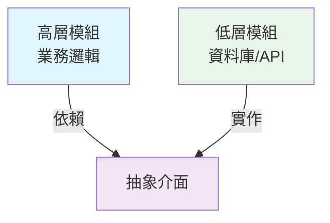
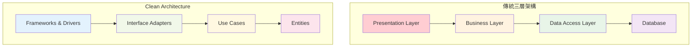
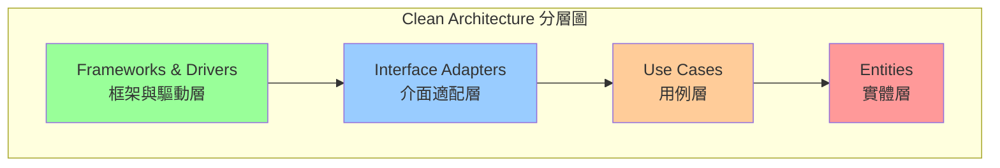
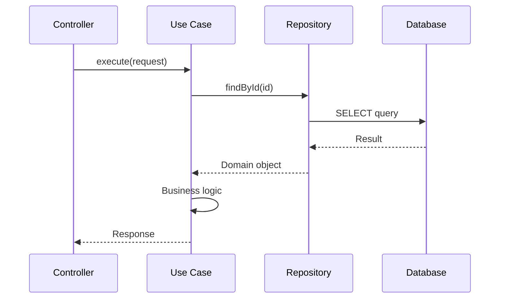
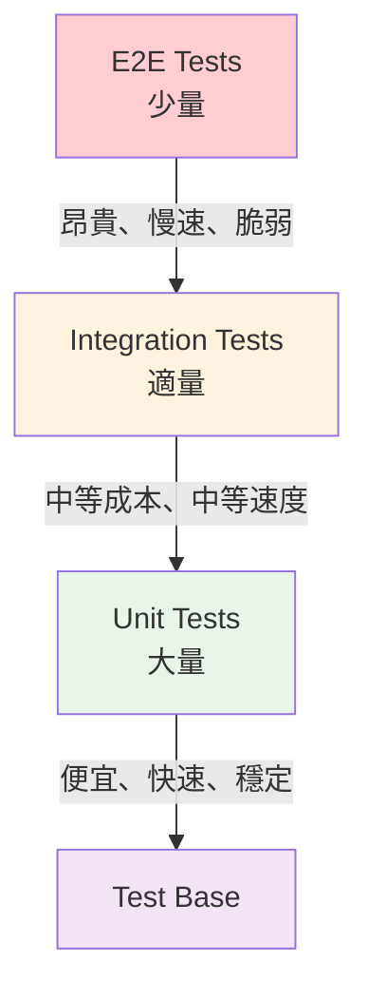
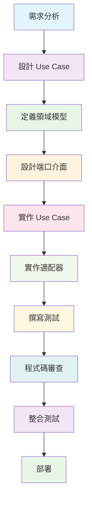
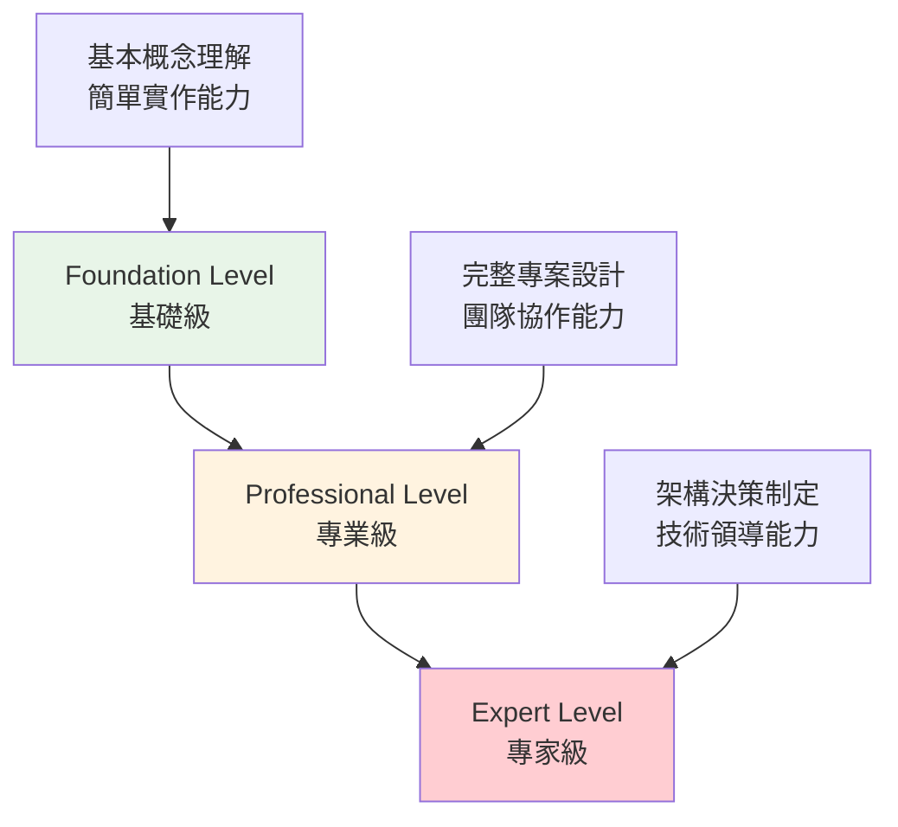
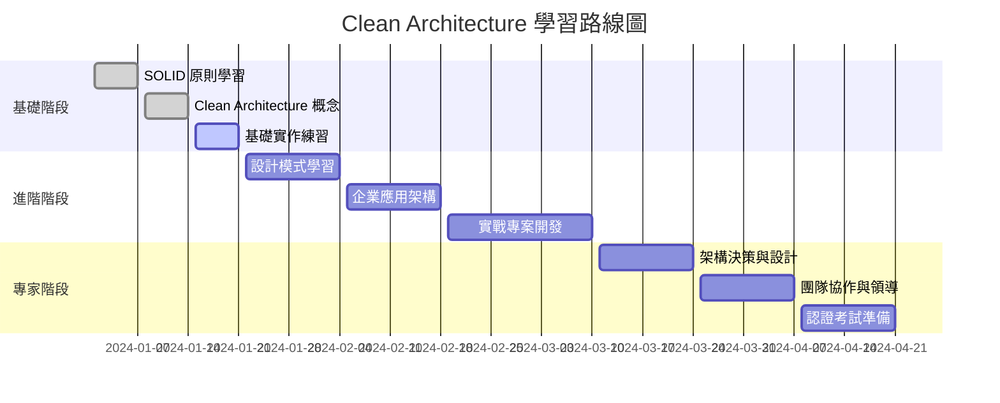
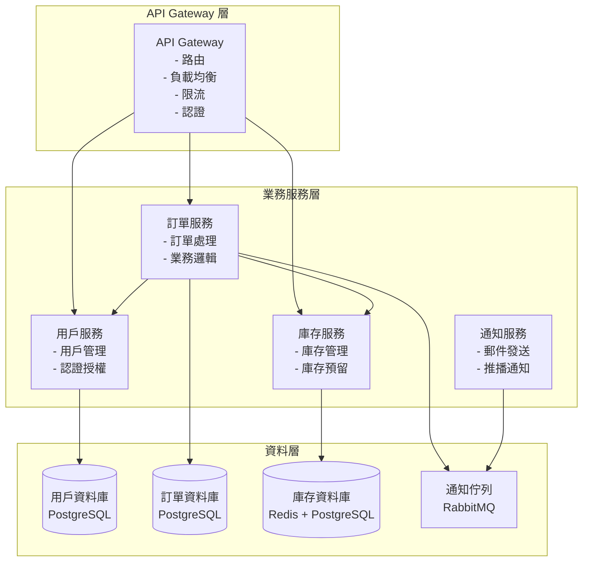

+++
date = '2025-10-31T00:00:00+08:00'
draft = false
title = 'Clean Architecture教學'
tags = ['教學', '分析與設計']
categories = ['教學']
+++
# Clean Architecture 教學手冊

## 📖 手冊說明

本教學手冊專為新進開發同仁設計，旨在幫助您：

- 理解 Clean Architecture 的核心概念與設計哲學
- 學會在專案中運用 Clean Architecture 進行開發
- 具備考取 Clean Architecture 認證的能力

## 📚 目錄

1. [基礎篇：Clean Architecture 核心概念](#1-基礎篇clean-architecture-核心概念)
   - [1.1 什麼是 Clean Architecture？](#11-什麼是-clean-architecture)
   - [1.2 核心原則](#12-核心原則)
   - [1.3 Clean Architecture vs 傳統架構](#13-clean-architecture-vs-傳統架構)
   - [1.4 常見誤解與迷思](#14-常見誤解與迷思)
   - [1.5 實務注意事項](#15-實務注意事項)

2. [架構篇：分層架構與職責](#2-架構篇分層架構與職責)
   - [2.1 Clean Architecture 總覽](#21-clean-architecture-總覽)
   - [2.2 第一層：Entities（實體層）](#22-第一層entities實體層)
   - [2.3 第二層：Use Cases（用例層）](#23-第二層use-cases用例層)
   - [2.4 第三層：Interface Adapters（介面適配層）](#24-第三層interface-adapters介面適配層)
   - [2.5 第四層：Frameworks & Drivers（框架與驅動層）](#25-第四層frameworks--drivers框架與驅動層)
   - [2.6 層間通信與依賴注入](#26-層間通信與依賴注入)
   - [2.7 實務注意事項](#27-實務注意事項)

3. [實作篇：專案範例實戰](#3-實作篇專案範例實戰)
   - [3.1 專案概述：會員管理系統](#31-專案概述會員管理系統)
   - [3.2 Domain 層實作](#32-domain-層實作)
   - [3.3 Use Case 層實作](#33-use-case-層實作)
   - [3.4 Interface Adapters 層實作](#34-interface-adapters-層實作)
   - [3.5 實務注意事項](#35-實務注意事項)

4. [專案應用篇：團隊開發規範](#4-專案應用篇團隊開發規範)
   - [4.1 專案目錄結構標準](#41-專案目錄結構標準)
   - [4.2 開發規範與最佳實務](#42-開發規範與最佳實務)
   - [4.3 新功能開發流程](#43-新功能開發流程)
   - [4.4 程式碼審查檢查清單](#44-程式碼審查檢查清單)
   - [4.5 常見問題與解決方案](#45-常見問題與解決方案)

5. [認證輔導篇：考試準備](#5-認證輔導篇考試準備)
   - [5.1 Clean Architecture 認證介紹](#51-clean-architecture-認證介紹)
   - [5.2 考試範圍與內容](#52-考試範圍與內容)
   - [5.3 推薦書單與學習資源](#53-推薦書單與學習資源)
   - [5.4 重點摘要與學習路線圖](#54-重點摘要與學習路線圖)
   - [5.5 模擬題與解答](#55-模擬題與解答)
   - [5.6 考試技巧與策略](#56-考試技巧與策略)

6. [總結與檢查清單](#6-總結與檢查清單)
   - [6.1 學習成果檢查清單](#61-學習成果檢查清單)
   - [6.2 持續改進建議](#62-持續改進建議)
   - [6.3 參考資源](#63-參考資源)

---

# 1. 基礎篇：Clean Architecture 核心概念

## 1.1 什麼是 Clean Architecture？

### 定義與目標
Clean Architecture 是由 Robert C. Martin（Uncle Bob）提出的軟體架構設計哲學，目標是創建：
- **獨立性**：不依賴於外部框架、UI、資料庫或其他外部代理
- **可測試性**：業務邏輯可以在沒有 UI、資料庫或 Web 伺服器的情況下進行測試
- **可維護性**：代碼結構清晰，易於理解和修改
- **可擴展性**：支援新功能的添加而不影響現有代碼

### 為什麼需要 Clean Architecture？

#### 傳統開發的痛點
```
❌ 常見問題：
- 業務邏輯與資料庫緊密耦合
- UI 變更需要修改業務邏輯
- 測試困難，需要完整環境
- 框架升級影響整個系統
- 新功能開發容易破壞現有功能
```

#### Clean Architecture 的解決方案
```
✅ Clean Architecture 優勢：
- 業務邏輯完全獨立
- 可以輕鬆替換 UI、資料庫、框架
- 單元測試覆蓋率高
- 框架升級影響最小
- 新功能開發風險可控
```

## 1.2 核心原則

### 1.2.1 依賴反轉原則（Dependency Inversion Principle）

**定義**：高層模組不應該依賴低層模組，兩者都應該依賴於抽象。



#### 傳統方式 vs Clean Architecture

**❌ 傳統方式（錯誤）**
```java
// 業務邏輯直接依賴具體實作
public class UserService {
    private MySQLUserRepository repository = new MySQLUserRepository();
    
    public User findUser(String id) {
        return repository.findById(id); // 緊密耦合
    }
}
```

**✅ Clean Architecture 方式（正確）**
```java
// 業務邏輯依賴抽象
public class UserService {
    private final UserRepository repository; // 依賴抽象
    
    public UserService(UserRepository repository) {
        this.repository = repository;
    }
    
    public User findUser(String id) {
        return repository.findById(id);
    }
}

// 抽象介面
public interface UserRepository {
    User findById(String id);
}

// 具體實作
public class MySQLUserRepository implements UserRepository {
    public User findById(String id) {
        // MySQL 實作邏輯
    }
}
```

### 1.2.2 單一職責原則（Single Responsibility Principle）

每個類別或模組只應該有一個變更的理由。

```java
// ❌ 違反單一職責原則
public class User {
    private String name;
    private String email;
    
    // 用戶數據
    public String getName() { return name; }
    public String getEmail() { return email; }
    
    // 數據驗證邏輯（不應該在這裡）
    public boolean isValidEmail() {
        return email.contains("@");
    }
    
    // 數據持久化邏輯（不應該在這裡）
    public void saveToDatabase() {
        // 保存邏輯
    }
}

// ✅ 符合單一職責原則
public class User {
    private String name;
    private String email;
    
    // 只負責用戶數據
    public String getName() { return name; }
    public String getEmail() { return email; }
}

public class UserValidator {
    // 只負責驗證邏輯
    public boolean isValidEmail(String email) {
        return email.contains("@");
    }
}

public class UserRepository {
    // 只負責數據持久化
    public void save(User user) {
        // 保存邏輯
    }
}
```

### 1.2.3 開放封閉原則（Open/Closed Principle）

軟體實體應該對擴展開放，對修改封閉。

```java
// ✅ 符合開放封閉原則的設計
public interface PaymentProcessor {
    void processPayment(double amount);
}

public class CreditCardProcessor implements PaymentProcessor {
    public void processPayment(double amount) {
        // 信用卡處理邏輯
    }
}

public class PayPalProcessor implements PaymentProcessor {
    public void processPayment(double amount) {
        // PayPal 處理邏輯
    }
}

// 新增支付方式時，不需要修改現有代碼
public class ApplePayProcessor implements PaymentProcessor {
    public void processPayment(double amount) {
        // Apple Pay 處理邏輯
    }
}
```

## 1.3 Clean Architecture vs 傳統架構

### 1.3.1 與三層架構的比較



| 特性 | 傳統三層架構 | Clean Architecture |
|------|-------------|-------------------|
| **依賴方向** | 自上而下 | 向內指向核心 |
| **測試難度** | 需要完整環境 | 可獨立測試核心邏輯 |
| **框架依賴** | 緊密耦合 | 框架在外層，可替換 |
| **業務邏輯位置** | 分散在各層 | 集中在 Use Cases 層 |
| **可維護性** | 中等 | 高 |

### 1.3.2 與 MVC 的比較

**MVC 架構問題**
```java
// ❌ 傳統 MVC Controller - 業務邏輯混雜
@Controller
public class UserController {
    @Autowired
    private UserRepository userRepository;
    
    @PostMapping("/users")
    public String createUser(@RequestParam String name, 
                           @RequestParam String email) {
        // 驗證邏輯混在 Controller 中
        if (name == null || name.isEmpty()) {
            return "error";
        }
        
        // 業務邏輯混在 Controller 中
        if (userRepository.existsByEmail(email)) {
            return "duplicate_email";
        }
        
        User user = new User(name, email);
        userRepository.save(user);
        return "success";
    }
}
```

**Clean Architecture 解決方案**
```java
// ✅ Clean Architecture Controller - 只負責協調
@Controller
public class UserController {
    private final CreateUserUseCase createUserUseCase;
    
    public UserController(CreateUserUseCase createUserUseCase) {
        this.createUserUseCase = createUserUseCase;
    }
    
    @PostMapping("/users")
    public ResponseEntity<String> createUser(@RequestBody CreateUserRequest request) {
        try {
            User user = createUserUseCase.execute(request.getName(), request.getEmail());
            return ResponseEntity.ok("User created successfully");
        } catch (DuplicateEmailException e) {
            return ResponseEntity.badRequest().body("Email already exists");
        } catch (InvalidInputException e) {
            return ResponseEntity.badRequest().body(e.getMessage());
        }
    }
}

// 業務邏輯在 Use Case 中
public class CreateUserUseCase {
    private final UserRepository userRepository;
    private final UserValidator userValidator;
    
    public User execute(String name, String email) {
        userValidator.validate(name, email);
        
        if (userRepository.existsByEmail(email)) {
            throw new DuplicateEmailException("Email already exists");
        }
        
        User user = new User(name, email);
        return userRepository.save(user);
    }
}
```

## 1.4 常見誤解與迷思

### 誤解 1：「Clean Architecture 過於複雜」

**❌ 錯誤認知**
```
Clean Architecture 增加了太多層級和接口，
讓簡單的功能變得複雜。
```

**✅ 正確理解**
```
複雜性是為了解決更大的問題：
- 短期可能增加代碼量
- 長期大幅降低維護成本
- 讓團隊協作更順暢
- 讓系統更穩定可靠
```

### 誤解 2：「所有項目都需要 Clean Architecture」

**❌ 錯誤認知**
```
任何項目都應該使用 Clean Architecture
```

**✅ 正確理解**
```
Clean Architecture 適用於：
✅ 中大型項目
✅ 長期維護的系統
✅ 多人協作的團隊
✅ 業務邏輯複雜的應用

不適用於：
❌ 簡單的 CRUD 應用
❌ 原型或演示項目
❌ 一次性腳本
```

### 誤解 3：「Clean Architecture 就是多加幾個接口」

**❌ 錯誤做法**
```java
// 只是機械式地加接口，沒有真正理解架構
public interface UserService {
    User findUser(String id);
}

public class UserServiceImpl implements UserService {
    @Autowired
    private UserRepository userRepository; // 還是依賴具體實作
    
    public User findUser(String id) {
        return userRepository.findById(id);
    }
}
```

**✅ 正確做法**
```java
// 真正實現依賴反轉和分層
public class FindUserUseCase {
    private final UserRepository userRepository; // 依賴抽象
    
    public FindUserUseCase(UserRepository userRepository) {
        this.userRepository = userRepository;
    }
    
    public User execute(String id) {
        // 業務規則驗證
        if (id == null || id.isEmpty()) {
            throw new InvalidUserIdException("User ID cannot be empty");
        }
        
        User user = userRepository.findById(id);
        if (user == null) {
            throw new UserNotFoundException("User not found: " + id);
        }
        
        return user;
    }
}
```

## 1.5 實務注意事項

### ⚠️ 實施建議

1. **循序漸進**
   - 從核心業務邏輯開始
   - 逐步重構現有代碼
   - 不要一次性大規模改動

2. **團隊共識**
   - 確保團隊成員理解架構原則
   - 建立代碼審查標準
   - 定期進行架構討論

3. **工具支援**
   - 使用依賴注入框架（如 Spring）
   - 建立自動化測試
   - 設置靜態代碼分析

### 🎯 檢查要點

- [ ] 業務邏輯是否獨立於框架？
- [ ] 是否可以在沒有資料庫的情況下測試核心邏輯？
- [ ] 外部依賴是否都通過接口注入？
- [ ] 每個類別是否只有一個職責？
- [ ] 依賴方向是否都指向內層？

---

**下一章預告**：在架構篇中，我們將深入探討 Clean Architecture 的四個層級，了解每層的具體職責和實作方式。

---

# 2. 架構篇：分層架構與職責

## 2.1 Clean Architecture 總覽

Clean Architecture 採用同心圓的分層設計，依賴關係由外向內，越內層越穩定，越外層越容易變化。



### 分層原則

1. **依賴方向**：只能由外層依賴內層，內層不能依賴外層
2. **穩定性**：越內層越穩定，變更頻率越低
3. **抽象程度**：越內層越抽象，越外層越具體
4. **業務價值**：越內層越接近業務核心

## 2.2 第一層：Entities（實體層）

### 2.2.1 職責與特性

**職責**：
- 封裝企業核心業務規則
- 定義最基本的業務邏輯
- 保持高度穩定，很少變更

**特性**：
- 純 POJO 類別
- 不依賴任何外部框架
- 包含業務規則驗證邏輯
- 可以在多個應用中重用

### 2.2.2 實體層實作範例

```java
// ✅ 正確的 Entity 設計
public class User {
    private final String id;
    private final String name;
    private final Email email;
    private final LocalDateTime createdAt;
    
    public User(String id, String name, String email) {
        this.id = validateId(id);
        this.name = validateName(name);
        this.email = new Email(email);
        this.createdAt = LocalDateTime.now();
    }
    
    // 業務規則：ID 不能為空且長度在 3-50 之間
    private String validateId(String id) {
        if (id == null || id.trim().isEmpty()) {
            throw new IllegalArgumentException("User ID cannot be empty");
        }
        if (id.length() < 3 || id.length() > 50) {
            throw new IllegalArgumentException("User ID must be between 3 and 50 characters");
        }
        return id.trim();
    }
    
    // 業務規則：姓名不能為空且長度不超過 100
    private String validateName(String name) {
        if (name == null || name.trim().isEmpty()) {
            throw new IllegalArgumentException("User name cannot be empty");
        }
        if (name.length() > 100) {
            throw new IllegalArgumentException("User name cannot exceed 100 characters");
        }
        return name.trim();
    }
    
    // 業務方法：檢查用戶是否為新用戶（註冊不到24小時）
    public boolean isNewUser() {
        return Duration.between(createdAt, LocalDateTime.now()).toHours() < 24;
    }
    
    // Getter 方法
    public String getId() { return id; }
    public String getName() { return name; }
    public Email getEmail() { return email; }
    public LocalDateTime getCreatedAt() { return createdAt; }
}

// 值物件範例
public class Email {
    private final String value;
    
    public Email(String email) {
        this.value = validateEmail(email);
    }
    
    private String validateEmail(String email) {
        if (email == null || email.trim().isEmpty()) {
            throw new IllegalArgumentException("Email cannot be empty");
        }
        
        String emailRegex = "^[A-Za-z0-9+_.-]+@[A-Za-z0-9.-]+\\.[A-Za-z]{2,}$";
        if (!email.matches(emailRegex)) {
            throw new IllegalArgumentException("Invalid email format");
        }
        
        return email.toLowerCase().trim();
    }
    
    public String getValue() { return value; }
    
    @Override
    public boolean equals(Object obj) {
        if (this == obj) return true;
        if (obj == null || getClass() != obj.getClass()) return false;
        Email email = (Email) obj;
        return Objects.equals(value, email.value);
    }
    
    @Override
    public int hashCode() {
        return Objects.hash(value);
    }
}
```

### 2.2.3 實體層設計原則

#### DO's（應該做的）

```java
// ✅ 封裝業務規則
public class Order {
    private final List<OrderItem> items;
    private final OrderStatus status;
    
    public void addItem(Product product, int quantity) {
        if (status != OrderStatus.DRAFT) {
            throw new IllegalStateException("Cannot modify confirmed order");
        }
        // 業務邏輯...
    }
    
    public BigDecimal calculateTotal() {
        return items.stream()
                   .map(OrderItem::getSubtotal)
                   .reduce(BigDecimal.ZERO, BigDecimal::add);
    }
}

// ✅ 使用值物件確保資料完整性
public class Money {
    private final BigDecimal amount;
    private final Currency currency;
    
    public Money(BigDecimal amount, Currency currency) {
        if (amount.compareTo(BigDecimal.ZERO) < 0) {
            throw new IllegalArgumentException("Amount cannot be negative");
        }
        this.amount = amount;
        this.currency = currency;
    }
}
```

#### DON'Ts（不應該做的）

```java
// ❌ 不要在 Entity 中包含基礎設施相關代碼
public class User {
    @Column(name = "user_name")  // ❌ 資料庫註解
    private String name;
    
    @JsonProperty("user_email")  // ❌ JSON 序列化註解
    private String email;
    
    public void sendEmail() {    // ❌ 基礎設施操作
        EmailService.send(email, "Welcome");
    }
}

// ❌ 不要讓 Entity 依賴外部服務
public class Order {
    public void process() {
        PaymentService paymentService = new PaymentService(); // ❌ 直接依賴
        paymentService.processPayment(this.getTotal());
    }
}
```

## 2.3 第二層：Use Cases（用例層）

### 2.3.1 職責與特性

**職責**：
- 實現應用特定的業務規則
- 協調實體之間的互動
- 定義系統的功能邊界
- 處理業務流程

**特性**：
- 包含應用邏輯，不包含技術細節
- 通過介面與外層通信
- 可獨立測試
- 代表系統的用例

### 2.3.2 用例層實作範例

```java
// Use Case 介面定義
public interface CreateUserUseCase {
    User execute(CreateUserRequest request);
}

// Use Case 實作
public class CreateUserUseCaseImpl implements CreateUserUseCase {
    private final UserRepository userRepository;
    private final EmailService emailService;
    private final UserValidator userValidator;
    
    public CreateUserUseCaseImpl(UserRepository userRepository, 
                                EmailService emailService,
                                UserValidator userValidator) {
        this.userRepository = userRepository;
        this.emailService = emailService;
        this.userValidator = userValidator;
    }
    
    @Override
    public User execute(CreateUserRequest request) {
        // 1. 輸入驗證
        userValidator.validateCreateUserRequest(request);
        
        // 2. 業務規則檢查
        if (userRepository.existsByEmail(request.getEmail())) {
            throw new DuplicateEmailException("Email already exists: " + request.getEmail());
        }
        
        // 3. 創建實體
        User user = new User(
            generateUserId(),
            request.getName(),
            request.getEmail()
        );
        
        // 4. 保存實體
        User savedUser = userRepository.save(user);
        
        // 5. 觸發後續動作
        emailService.sendWelcomeEmail(savedUser.getEmail());
        
        return savedUser;
    }
    
    private String generateUserId() {
        return "USR_" + UUID.randomUUID().toString().substring(0, 8).toUpperCase();
    }
}

// 請求 DTO
public class CreateUserRequest {
    private final String name;
    private final String email;
    
    public CreateUserRequest(String name, String email) {
        this.name = name;
        this.email = email;
    }
    
    public String getName() { return name; }
    public String getEmail() { return email; }
}

// 驗證器
public class UserValidator {
    public void validateCreateUserRequest(CreateUserRequest request) {
        if (request == null) {
            throw new InvalidInputException("Request cannot be null");
        }
        
        if (request.getName() == null || request.getName().trim().isEmpty()) {
            throw new InvalidInputException("Name is required");
        }
        
        if (request.getEmail() == null || request.getEmail().trim().isEmpty()) {
            throw new InvalidInputException("Email is required");
        }
    }
}
```

### 2.3.3 複雜用例範例

```java
// 複雜業務流程：處理訂單
public class ProcessOrderUseCase {
    private final OrderRepository orderRepository;
    private final ProductRepository productRepository;
    private final InventoryService inventoryService;
    private final PaymentService paymentService;
    private final NotificationService notificationService;
    
    public OrderResult execute(ProcessOrderRequest request) {
        // 1. 驗證訂單
        Order order = orderRepository.findById(request.getOrderId())
            .orElseThrow(() -> new OrderNotFoundException("Order not found"));
        
        if (order.getStatus() != OrderStatus.PENDING) {
            throw new InvalidOrderStateException("Order is not in pending state");
        }
        
        // 2. 檢查庫存
        for (OrderItem item : order.getItems()) {
            if (!inventoryService.isAvailable(item.getProductId(), item.getQuantity())) {
                throw new InsufficientInventoryException(
                    "Insufficient inventory for product: " + item.getProductId());
            }
        }
        
        // 3. 保留庫存
        try {
            for (OrderItem item : order.getItems()) {
                inventoryService.reserve(item.getProductId(), item.getQuantity());
            }
        } catch (Exception e) {
            // 回滾已保留的庫存
            rollbackInventoryReservation(order.getItems());
            throw new InventoryReservationException("Failed to reserve inventory", e);
        }
        
        // 4. 處理付款
        PaymentResult paymentResult;
        try {
            paymentResult = paymentService.processPayment(
                order.getCustomerId(),
                order.calculateTotal(),
                request.getPaymentMethod()
            );
        } catch (Exception e) {
            // 回滾庫存保留
            rollbackInventoryReservation(order.getItems());
            throw new PaymentProcessingException("Payment failed", e);
        }
        
        // 5. 更新訂單狀態
        order.markAsProcessed(paymentResult.getTransactionId());
        Order processedOrder = orderRepository.save(order);
        
        // 6. 發送通知
        notificationService.sendOrderConfirmation(processedOrder);
        
        return new OrderResult(processedOrder, paymentResult);
    }
    
    private void rollbackInventoryReservation(List<OrderItem> items) {
        for (OrderItem item : items) {
            try {
                inventoryService.release(item.getProductId(), item.getQuantity());
            } catch (Exception e) {
                // 記錄但不拋出異常，避免掩蓋原始錯誤
                logger.error("Failed to rollback inventory for product: {}", 
                           item.getProductId(), e);
            }
        }
    }
}
```

## 2.4 第三層：Interface Adapters（介面適配層）

### 2.4.1 職責與特性

**職責**：
- 轉換資料格式（內部 ↔ 外部）
- 實現介面契約
- 處理 HTTP 請求/回應
- 資料庫操作轉換

**特性**：
- 包含 Controllers、Presenters、Gateways
- 不包含業務邏輯
- 負責資料轉換和格式化
- 與外部世界的介面

### 2.4.2 Controller 實作範例

```java
// REST Controller
@RestController
@RequestMapping("/api/users")
public class UserController {
    private final CreateUserUseCase createUserUseCase;
    private final FindUserUseCase findUserUseCase;
    private final UserResponseMapper responseMapper;
    
    public UserController(CreateUserUseCase createUserUseCase,
                         FindUserUseCase findUserUseCase,
                         UserResponseMapper responseMapper) {
        this.createUserUseCase = createUserUseCase;
        this.findUserUseCase = findUserUseCase;
        this.responseMapper = responseMapper;
    }
    
    @PostMapping
    public ResponseEntity<UserResponse> createUser(@RequestBody @Valid CreateUserApiRequest apiRequest) {
        try {
            // 轉換 API 請求到 Use Case 請求
            CreateUserRequest useCaseRequest = new CreateUserRequest(
                apiRequest.getName(),
                apiRequest.getEmail()
            );
            
            // 執行 Use Case
            User user = createUserUseCase.execute(useCaseRequest);
            
            // 轉換結果到 API 回應
            UserResponse response = responseMapper.toResponse(user);
            
            return ResponseEntity.status(HttpStatus.CREATED).body(response);
            
        } catch (DuplicateEmailException e) {
            throw new BadRequestException("Email already exists");
        } catch (InvalidInputException e) {
            throw new BadRequestException(e.getMessage());
        }
    }
    
    @GetMapping("/{id}")
    public ResponseEntity<UserResponse> getUser(@PathVariable String id) {
        try {
            User user = findUserUseCase.execute(id);
            UserResponse response = responseMapper.toResponse(user);
            return ResponseEntity.ok(response);
        } catch (UserNotFoundException e) {
            throw new NotFoundException("User not found");
        }
    }
}

// API 請求 DTO
public class CreateUserApiRequest {
    @NotBlank(message = "Name is required")
    @Size(max = 100, message = "Name cannot exceed 100 characters")
    private String name;
    
    @NotBlank(message = "Email is required")
    @Email(message = "Invalid email format")
    private String email;
    
    // Getters and setters
    public String getName() { return name; }
    public void setName(String name) { this.name = name; }
    public String getEmail() { return email; }
    public void setEmail(String email) { this.email = email; }
}

// API 回應 DTO
public class UserResponse {
    private String id;
    private String name;
    private String email;
    private String createdAt;
    private boolean isNewUser;
    
    // Constructors, getters and setters
    public UserResponse(String id, String name, String email, String createdAt, boolean isNewUser) {
        this.id = id;
        this.name = name;
        this.email = email;
        this.createdAt = createdAt;
        this.isNewUser = isNewUser;
    }
    
    // Getters
    public String getId() { return id; }
    public String getName() { return name; }
    public String getEmail() { return email; }
    public String getCreatedAt() { return createdAt; }
    public boolean isNewUser() { return isNewUser; }
}
```

### 2.4.3 Repository 實作範例

```java
// Repository 介面（在 Use Case 層定義）
public interface UserRepository {
    User save(User user);
    Optional<User> findById(String id);
    boolean existsByEmail(String email);
    List<User> findAll();
    void deleteById(String id);
}

// Repository 實作（在 Interface Adapters 層）
@Repository
public class JpaUserRepository implements UserRepository {
    private final UserJpaRepository jpaRepository;
    private final UserEntityMapper entityMapper;
    
    public JpaUserRepository(UserJpaRepository jpaRepository, UserEntityMapper entityMapper) {
        this.jpaRepository = jpaRepository;
        this.entityMapper = entityMapper;
    }
    
    @Override
    public User save(User user) {
        UserEntity entity = entityMapper.toEntity(user);
        UserEntity savedEntity = jpaRepository.save(entity);
        return entityMapper.toDomain(savedEntity);
    }
    
    @Override
    public Optional<User> findById(String id) {
        return jpaRepository.findById(id)
                          .map(entityMapper::toDomain);
    }
    
    @Override
    public boolean existsByEmail(String email) {
        return jpaRepository.existsByEmail(email);
    }
    
    @Override
    public List<User> findAll() {
        return jpaRepository.findAll()
                          .stream()
                          .map(entityMapper::toDomain)
                          .collect(Collectors.toList());
    }
    
    @Override
    public void deleteById(String id) {
        jpaRepository.deleteById(id);
    }
}

// JPA Entity
@Entity
@Table(name = "users")
public class UserEntity {
    @Id
    private String id;
    
    @Column(name = "name", nullable = false, length = 100)
    private String name;
    
    @Column(name = "email", nullable = false, unique = true)
    private String email;
    
    @Column(name = "created_at", nullable = false)
    private LocalDateTime createdAt;
    
    // JPA 需要的默認構造函數
    protected UserEntity() {}
    
    public UserEntity(String id, String name, String email, LocalDateTime createdAt) {
        this.id = id;
        this.name = name;
        this.email = email;
        this.createdAt = createdAt;
    }
    
    // Getters and setters
    public String getId() { return id; }
    public void setId(String id) { this.id = id; }
    public String getName() { return name; }
    public void setName(String name) { this.name = name; }
    public String getEmail() { return email; }
    public void setEmail(String email) { this.email = email; }
    public LocalDateTime getCreatedAt() { return createdAt; }
    public void setCreatedAt(LocalDateTime createdAt) { this.createdAt = createdAt; }
}

// Entity Mapper
@Component
public class UserEntityMapper {
    public UserEntity toEntity(User user) {
        return new UserEntity(
            user.getId(),
            user.getName(),
            user.getEmail().getValue(),
            user.getCreatedAt()
        );
    }
    
    public User toDomain(UserEntity entity) {
        return new User(
            entity.getId(),
            entity.getName(),
            entity.getEmail()
        );
    }
}
```

## 2.5 第四層：Frameworks & Drivers（框架與驅動層）

### 2.5.1 職責與特性

**職責**：
- 提供具體的技術實現
- 包含框架配置
- 處理外部系統整合
- 應用程式入口點

**特性**：
- Spring Boot 配置
- 資料庫配置
- 外部 API 整合
- 最容易變化的層級

### 2.5.2 配置範例

```java
// Spring Boot 主類
@SpringBootApplication
public class UserManagementApplication {
    public static void main(String[] args) {
        SpringApplication.run(UserManagementApplication.class, args);
    }
}

// 依賴注入配置
@Configuration
public class UseCaseConfiguration {
    
    @Bean
    public CreateUserUseCase createUserUseCase(
            UserRepository userRepository,
            EmailService emailService,
            UserValidator userValidator) {
        return new CreateUserUseCaseImpl(userRepository, emailService, userValidator);
    }
    
    @Bean
    public FindUserUseCase findUserUseCase(UserRepository userRepository) {
        return new FindUserUseCaseImpl(userRepository);
    }
    
    @Bean
    public UserValidator userValidator() {
        return new UserValidator();
    }
}

// 外部服務配置
@Configuration
public class ExternalServiceConfiguration {
    
    @Bean
    public EmailService emailService(@Value("${email.smtp.host}") String smtpHost,
                                   @Value("${email.smtp.port}") int smtpPort) {
        return new SmtpEmailService(smtpHost, smtpPort);
    }
}

// 資料庫配置
@Configuration
@EnableJpaRepositories(basePackages = "com.tutorial.infrastructure.repository")
public class DatabaseConfiguration {
    
    @Bean
    @Primary
    @ConfigurationProperties("spring.datasource")
    public DataSource dataSource() {
        return DataSourceBuilder.create().build();
    }
}
```

## 2.6 層間通信與依賴注入

### 2.6.1 依賴注入流程



### 2.6.2 錯誤處理策略

```java
// 全域異常處理器
@ControllerAdvice
public class GlobalExceptionHandler {
    
    @ExceptionHandler(DuplicateEmailException.class)
    public ResponseEntity<ErrorResponse> handleDuplicateEmail(DuplicateEmailException e) {
        ErrorResponse error = new ErrorResponse(
            "DUPLICATE_EMAIL",
            e.getMessage(),
            HttpStatus.CONFLICT.value()
        );
        return ResponseEntity.status(HttpStatus.CONFLICT).body(error);
    }
    
    @ExceptionHandler(UserNotFoundException.class)
    public ResponseEntity<ErrorResponse> handleUserNotFound(UserNotFoundException e) {
        ErrorResponse error = new ErrorResponse(
            "USER_NOT_FOUND",
            e.getMessage(),
            HttpStatus.NOT_FOUND.value()
        );
        return ResponseEntity.status(HttpStatus.NOT_FOUND).body(error);
    }
    
    @ExceptionHandler(InvalidInputException.class)
    public ResponseEntity<ErrorResponse> handleInvalidInput(InvalidInputException e) {
        ErrorResponse error = new ErrorResponse(
            "INVALID_INPUT",
            e.getMessage(),
            HttpStatus.BAD_REQUEST.value()
        );
        return ResponseEntity.status(HttpStatus.BAD_REQUEST).body(error);
    }
}

public class ErrorResponse {
    private String code;
    private String message;
    private int status;
    private LocalDateTime timestamp;
    
    public ErrorResponse(String code, String message, int status) {
        this.code = code;
        this.message = message;
        this.status = status;
        this.timestamp = LocalDateTime.now();
    }
    
    // Getters
    public String getCode() { return code; }
    public String getMessage() { return message; }
    public int getStatus() { return status; }
    public LocalDateTime getTimestamp() { return timestamp; }
}
```

## 2.7 實務注意事項

### ⚠️ 常見錯誤

1. **跨層直接調用**

```java
// ❌ Controller 直接調用 Repository
@RestController
public class UserController {
    @Autowired
    private UserRepository userRepository; // 錯誤：跳過 Use Case 層
    
    @GetMapping("/users/{id}")
    public User getUser(@PathVariable String id) {
        return userRepository.findById(id).orElse(null);
    }
}
```

2. **在錯誤的層處理業務邏輯**

```java
// ❌ 在 Controller 中處理業務邏輯
@PostMapping("/users")
public ResponseEntity<User> createUser(@RequestBody CreateUserRequest request) {
    // 業務邏輯不應該在 Controller 中
    if (userRepository.existsByEmail(request.getEmail())) {
        throw new BadRequestException("Email exists");
    }
    
    User user = new User(request.getName(), request.getEmail());
    return ResponseEntity.ok(userRepository.save(user));
}
```

### 🎯 檢查清單

- [ ] Entity 是否包含純業務邏輯，無外部依賴？
- [ ] Use Case 是否只協調業務流程，不包含技術細節？
- [ ] Controller 是否只負責請求/回應轉換？
- [ ] Repository 是否只負責資料存取？
- [ ] 依賴方向是否正確（由外向內）？
- [ ] 每層是否可以獨立測試？

---

**下一章預告**：在實作篇中，我們將通過完整的會員管理系統範例，展示如何將 Clean Architecture 理論應用到實際專案中。

---

# 3. 實作篇：專案範例實戰

## 3.1 專案概述：會員管理系統

我們將建立一個完整的會員管理系統來展示 Clean Architecture 的實際應用。

### 3.1.1 功能需求

- **會員註冊**：新會員可以註冊帳號
- **會員登入**：已註冊會員可以登入系統
- **查詢會員資料**：可以查詢會員的基本資訊
- **更新會員資料**：會員可以更新自己的資訊

### 3.1.2 專案結構

```
src/
├── main/
│   └── java/
│       └── com/
│           └── tutorial/
│               └── membersystem/
│                   ├── domain/              # Entities 層
│                   │   ├── model/
│                   │   │   ├── Member.java
│                   │   │   └── Email.java
│                   │   └── exception/
│                   │       └── DomainException.java
│                   ├── usecase/             # Use Cases 層
│                   │   ├── port/
│                   │   │   ├── input/
│                   │   │   │   ├── RegisterMemberUseCase.java
│                   │   │   │   ├── LoginMemberUseCase.java
│                   │   │   │   └── FindMemberUseCase.java
│                   │   │   └── output/
│                   │   │       ├── MemberRepository.java
│                   │   │       └── PasswordEncoder.java
│                   │   ├── service/
│                   │   │   ├── RegisterMemberService.java
│                   │   │   ├── LoginMemberService.java
│                   │   │   └── FindMemberService.java
│                   │   └── dto/
│                   │       ├── RegisterMemberRequest.java
│                   │       └── LoginMemberRequest.java
│                   ├── adapter/             # Interface Adapters 層
│                   │   ├── input/
│                   │   │   └── web/
│                   │   │       ├── MemberController.java
│                   │   │       └── dto/
│                   │   │           ├── RegisterMemberApiRequest.java
│                   │   │           └── MemberResponse.java
│                   │   └── output/
│                   │       ├── persistence/
│                   │       │   ├── MemberJpaRepository.java
│                   │       │   ├── MemberRepositoryImpl.java
│                   │       │   └── entity/
│                   │       │       └── MemberEntity.java
│                   │       └── security/
│                   │           └── BCryptPasswordEncoder.java
│                   └── infrastructure/      # Frameworks & Drivers 層
│                       ├── config/
│                       │   ├── DatabaseConfig.java
│                       │   └── UseCaseConfig.java
│                       └── MemberSystemApplication.java
```

## 3.2 Domain 層實作

### 3.2.1 核心實體：Member

```java
package com.tutorial.membersystem.domain.model;

import java.time.LocalDateTime;
import java.util.Objects;

public class Member {
    private final String id;
    private final String username;
    private final Email email;
    private final String hashedPassword;
    private final LocalDateTime createdAt;
    private LocalDateTime lastLoginAt;
    private boolean active;
    
    // 建構函數 - 新會員註冊
    public Member(String id, String username, String email, String hashedPassword) {
        this.id = validateId(id);
        this.username = validateUsername(username);
        this.email = new Email(email);
        this.hashedPassword = validatePassword(hashedPassword);
        this.createdAt = LocalDateTime.now();
        this.active = true;
    }
    
    // 建構函數 - 從資料庫重建
    public Member(String id, String username, String email, String hashedPassword,
                 LocalDateTime createdAt, LocalDateTime lastLoginAt, boolean active) {
        this.id = id;
        this.username = username;
        this.email = new Email(email);
        this.hashedPassword = hashedPassword;
        this.createdAt = createdAt;
        this.lastLoginAt = lastLoginAt;
        this.active = active;
    }
    
    // 業務方法：會員登入
    public void login() {
        if (!active) {
            throw new MemberNotActiveException("Member account is not active");
        }
        this.lastLoginAt = LocalDateTime.now();
    }
    
    // 業務方法：停用帳號
    public void deactivate() {
        this.active = false;
    }
    
    // 業務方法：啟用帳號
    public void activate() {
        this.active = true;
    }
    
    // 業務方法：檢查是否為新會員（註冊不到7天）
    public boolean isNewMember() {
        return createdAt.isAfter(LocalDateTime.now().minusDays(7));
    }
    
    // 業務方法：檢查最近是否有登入（30天內）
    public boolean hasRecentLogin() {
        if (lastLoginAt == null) {
            return false;
        }
        return lastLoginAt.isAfter(LocalDateTime.now().minusDays(30));
    }
    
    // 驗證方法
    private String validateId(String id) {
        if (id == null || id.trim().isEmpty()) {
            throw new IllegalArgumentException("Member ID cannot be empty");
        }
        return id.trim();
    }
    
    private String validateUsername(String username) {
        if (username == null || username.trim().isEmpty()) {
            throw new IllegalArgumentException("Username cannot be empty");
        }
        if (username.length() < 3 || username.length() > 50) {
            throw new IllegalArgumentException("Username must be between 3 and 50 characters");
        }
        if (!username.matches("^[a-zA-Z0-9_]+$")) {
            throw new IllegalArgumentException("Username can only contain letters, numbers, and underscore");
        }
        return username.trim();
    }
    
    private String validatePassword(String hashedPassword) {
        if (hashedPassword == null || hashedPassword.trim().isEmpty()) {
            throw new IllegalArgumentException("Password cannot be empty");
        }
        return hashedPassword;
    }
    
    // Getters
    public String getId() { return id; }
    public String getUsername() { return username; }
    public Email getEmail() { return email; }
    public String getHashedPassword() { return hashedPassword; }
    public LocalDateTime getCreatedAt() { return createdAt; }
    public LocalDateTime getLastLoginAt() { return lastLoginAt; }
    public boolean isActive() { return active; }
    
    @Override
    public boolean equals(Object obj) {
        if (this == obj) return true;
        if (obj == null || getClass() != obj.getClass()) return false;
        Member member = (Member) obj;
        return Objects.equals(id, member.id);
    }
    
    @Override
    public int hashCode() {
        return Objects.hash(id);
    }
}
```

### 3.2.2 值物件：Email

```java
package com.tutorial.membersystem.domain.model;

import java.util.Objects;
import java.util.regex.Pattern;

public class Email {
    private static final Pattern EMAIL_PATTERN = Pattern.compile(
        "^[A-Za-z0-9._%+-]+@[A-Za-z0-9.-]+\\.[A-Za-z]{2,}$"
    );
    
    private final String value;
    
    public Email(String email) {
        this.value = validateEmail(email);
    }
    
    private String validateEmail(String email) {
        if (email == null || email.trim().isEmpty()) {
            throw new IllegalArgumentException("Email cannot be empty");
        }
        
        String cleanEmail = email.trim().toLowerCase();
        
        if (!EMAIL_PATTERN.matcher(cleanEmail).matches()) {
            throw new IllegalArgumentException("Invalid email format: " + email);
        }
        
        if (cleanEmail.length() > 254) {
            throw new IllegalArgumentException("Email too long");
        }
        
        return cleanEmail;
    }
    
    public String getValue() {
        return value;
    }
    
    @Override
    public boolean equals(Object obj) {
        if (this == obj) return true;
        if (obj == null || getClass() != obj.getClass()) return false;
        Email email = (Email) obj;
        return Objects.equals(value, email.value);
    }
    
    @Override
    public int hashCode() {
        return Objects.hash(value);
    }
    
    @Override
    public String toString() {
        return value;
    }
}
```

### 3.2.3 領域異常

```java
package com.tutorial.membersystem.domain.exception;

public class DomainException extends RuntimeException {
    public DomainException(String message) {
        super(message);
    }
    
    public DomainException(String message, Throwable cause) {
        super(message, cause);
    }
}

public class MemberNotActiveException extends DomainException {
    public MemberNotActiveException(String message) {
        super(message);
    }
}

public class DuplicateUsernameException extends DomainException {
    public DuplicateUsernameException(String message) {
        super(message);
    }
}

public class DuplicateEmailException extends DomainException {
    public DuplicateEmailException(String message) {
        super(message);
    }
}

public class MemberNotFoundException extends DomainException {
    public MemberNotFoundException(String message) {
        super(message);
    }
}

public class InvalidCredentialsException extends DomainException {
    public InvalidCredentialsException(String message) {
        super(message);
    }
}
```

## 3.3 Use Case 層實作

### 3.3.1 輸入端口定義

```java
package com.tutorial.membersystem.usecase.port.input;

import com.tutorial.membersystem.domain.model.Member;
import com.tutorial.membersystem.usecase.dto.RegisterMemberRequest;

public interface RegisterMemberUseCase {
    Member execute(RegisterMemberRequest request);
}

public interface LoginMemberUseCase {
    Member execute(String username, String password);
}

public interface FindMemberUseCase {
    Member executeById(String id);
    Member executeByUsername(String username);
    Member executeByEmail(String email);
}
```

### 3.3.2 輸出端口定義

```java
package com.tutorial.membersystem.usecase.port.output;

import com.tutorial.membersystem.domain.model.Member;
import java.util.Optional;

public interface MemberRepository {
    Member save(Member member);
    Optional<Member> findById(String id);
    Optional<Member> findByUsername(String username);
    Optional<Member> findByEmail(String email);
    boolean existsByUsername(String username);
    boolean existsByEmail(String email);
    void deleteById(String id);
}

public interface PasswordEncoder {
    String encode(String rawPassword);
    boolean matches(String rawPassword, String encodedPassword);
}
```

### 3.3.3 DTO 定義

```java
package com.tutorial.membersystem.usecase.dto;

public class RegisterMemberRequest {
    private final String username;
    private final String email;
    private final String password;
    
    public RegisterMemberRequest(String username, String email, String password) {
        this.username = username;
        this.email = email;
        this.password = password;
    }
    
    public String getUsername() { return username; }
    public String getEmail() { return email; }
    public String getPassword() { return password; }
}
```

### 3.3.4 Use Case 實作

```java
package com.tutorial.membersystem.usecase.service;

import com.tutorial.membersystem.domain.model.Member;
import com.tutorial.membersystem.domain.exception.*;
import com.tutorial.membersystem.usecase.port.input.RegisterMemberUseCase;
import com.tutorial.membersystem.usecase.port.output.MemberRepository;
import com.tutorial.membersystem.usecase.port.output.PasswordEncoder;
import com.tutorial.membersystem.usecase.dto.RegisterMemberRequest;
import java.util.UUID;

public class RegisterMemberService implements RegisterMemberUseCase {
    private final MemberRepository memberRepository;
    private final PasswordEncoder passwordEncoder;
    
    public RegisterMemberService(MemberRepository memberRepository, 
                               PasswordEncoder passwordEncoder) {
        this.memberRepository = memberRepository;
        this.passwordEncoder = passwordEncoder;
    }
    
    @Override
    public Member execute(RegisterMemberRequest request) {
        // 1. 驗證輸入
        validateRequest(request);
        
        // 2. 檢查用戶名是否已存在
        if (memberRepository.existsByUsername(request.getUsername())) {
            throw new DuplicateUsernameException(
                "Username already exists: " + request.getUsername());
        }
        
        // 3. 檢查 Email 是否已存在
        if (memberRepository.existsByEmail(request.getEmail())) {
            throw new DuplicateEmailException(
                "Email already exists: " + request.getEmail());
        }
        
        // 4. 加密密碼
        String hashedPassword = passwordEncoder.encode(request.getPassword());
        
        // 5. 建立會員實體
        String memberId = generateMemberId();
        Member member = new Member(
            memberId,
            request.getUsername(),
            request.getEmail(),
            hashedPassword
        );
        
        // 6. 儲存會員
        return memberRepository.save(member);
    }
    
    private void validateRequest(RegisterMemberRequest request) {
        if (request == null) {
            throw new IllegalArgumentException("Request cannot be null");
        }
        
        if (request.getUsername() == null || request.getUsername().trim().isEmpty()) {
            throw new IllegalArgumentException("Username is required");
        }
        
        if (request.getEmail() == null || request.getEmail().trim().isEmpty()) {
            throw new IllegalArgumentException("Email is required");
        }
        
        if (request.getPassword() == null || request.getPassword().isEmpty()) {
            throw new IllegalArgumentException("Password is required");
        }
        
        if (request.getPassword().length() < 8) {
            throw new IllegalArgumentException("Password must be at least 8 characters long");
        }
        
        if (request.getPassword().length() > 100) {
            throw new IllegalArgumentException("Password too long");
        }
    }
    
    private String generateMemberId() {
        return "MBR_" + UUID.randomUUID().toString().substring(0, 8).toUpperCase();
    }
}

// 登入 Use Case
public class LoginMemberService implements LoginMemberUseCase {
    private final MemberRepository memberRepository;
    private final PasswordEncoder passwordEncoder;
    
    public LoginMemberService(MemberRepository memberRepository, 
                            PasswordEncoder passwordEncoder) {
        this.memberRepository = memberRepository;
        this.passwordEncoder = passwordEncoder;
    }
    
    @Override
    public Member execute(String username, String password) {
        // 1. 驗證輸入
        if (username == null || username.trim().isEmpty()) {
            throw new IllegalArgumentException("Username is required");
        }
        
        if (password == null || password.isEmpty()) {
            throw new IllegalArgumentException("Password is required");
        }
        
        // 2. 查詢會員
        Member member = memberRepository.findByUsername(username)
            .orElseThrow(() -> new InvalidCredentialsException("Invalid username or password"));
        
        // 3. 驗證密碼
        if (!passwordEncoder.matches(password, member.getHashedPassword())) {
            throw new InvalidCredentialsException("Invalid username or password");
        }
        
        // 4. 執行登入業務邏輯
        member.login(); // 這會更新最後登入時間並檢查帳號狀態
        
        // 5. 儲存更新後的會員資料
        return memberRepository.save(member);
    }
}

// 查詢會員 Use Case
public class FindMemberService implements FindMemberUseCase {
    private final MemberRepository memberRepository;
    
    public FindMemberService(MemberRepository memberRepository) {
        this.memberRepository = memberRepository;
    }
    
    @Override
    public Member executeById(String id) {
        if (id == null || id.trim().isEmpty()) {
            throw new IllegalArgumentException("Member ID is required");
        }
        
        return memberRepository.findById(id)
            .orElseThrow(() -> new MemberNotFoundException("Member not found with ID: " + id));
    }
    
    @Override
    public Member executeByUsername(String username) {
        if (username == null || username.trim().isEmpty()) {
            throw new IllegalArgumentException("Username is required");
        }
        
        return memberRepository.findByUsername(username)
            .orElseThrow(() -> new MemberNotFoundException("Member not found with username: " + username));
    }
    
    @Override
    public Member executeByEmail(String email) {
        if (email == null || email.trim().isEmpty()) {
            throw new IllegalArgumentException("Email is required");
        }
        
        return memberRepository.findByEmail(email)
            .orElseThrow(() -> new MemberNotFoundException("Member not found with email: " + email));
    }
}
```

## 3.4 Interface Adapters 層實作

### 3.4.1 Web Controller

```java
package com.tutorial.membersystem.adapter.input.web;

import com.tutorial.membersystem.domain.model.Member;
import com.tutorial.membersystem.domain.exception.*;
import com.tutorial.membersystem.usecase.port.input.*;
import com.tutorial.membersystem.usecase.dto.RegisterMemberRequest;
import com.tutorial.membersystem.adapter.input.web.dto.*;
import org.springframework.http.HttpStatus;
import org.springframework.http.ResponseEntity;
import org.springframework.web.bind.annotation.*;
import javax.validation.Valid;

@RestController
@RequestMapping("/api/members")
public class MemberController {
    private final RegisterMemberUseCase registerMemberUseCase;
    private final LoginMemberUseCase loginMemberUseCase;
    private final FindMemberUseCase findMemberUseCase;
    private final MemberResponseMapper responseMapper;
    
    public MemberController(RegisterMemberUseCase registerMemberUseCase,
                          LoginMemberUseCase loginMemberUseCase,
                          FindMemberUseCase findMemberUseCase,
                          MemberResponseMapper responseMapper) {
        this.registerMemberUseCase = registerMemberUseCase;
        this.loginMemberUseCase = loginMemberUseCase;
        this.findMemberUseCase = findMemberUseCase;
        this.responseMapper = responseMapper;
    }
    
    @PostMapping("/register")
    public ResponseEntity<MemberResponse> register(@RequestBody @Valid RegisterMemberApiRequest apiRequest) {
        try {
            // 轉換 API 請求到 Use Case 請求
            RegisterMemberRequest useCaseRequest = new RegisterMemberRequest(
                apiRequest.getUsername(),
                apiRequest.getEmail(),
                apiRequest.getPassword()
            );
            
            // 執行 Use Case
            Member member = registerMemberUseCase.execute(useCaseRequest);
            
            // 轉換回應
            MemberResponse response = responseMapper.toResponse(member);
            
            return ResponseEntity.status(HttpStatus.CREATED).body(response);
            
        } catch (DuplicateUsernameException | DuplicateEmailException e) {
            throw new BadRequestException(e.getMessage());
        } catch (IllegalArgumentException e) {
            throw new BadRequestException(e.getMessage());
        }
    }
    
    @PostMapping("/login")
    public ResponseEntity<MemberResponse> login(@RequestBody @Valid LoginMemberApiRequest apiRequest) {
        try {
            Member member = loginMemberUseCase.execute(
                apiRequest.getUsername(),
                apiRequest.getPassword()
            );
            
            MemberResponse response = responseMapper.toResponse(member);
            return ResponseEntity.ok(response);
            
        } catch (InvalidCredentialsException | MemberNotActiveException e) {
            throw new UnauthorizedException(e.getMessage());
        }
    }
    
    @GetMapping("/{id}")
    public ResponseEntity<MemberResponse> getMember(@PathVariable String id) {
        try {
            Member member = findMemberUseCase.executeById(id);
            MemberResponse response = responseMapper.toResponse(member);
            return ResponseEntity.ok(response);
        } catch (MemberNotFoundException e) {
            throw new NotFoundException(e.getMessage());
        }
    }
    
    @GetMapping("/by-username/{username}")
    public ResponseEntity<MemberResponse> getMemberByUsername(@PathVariable String username) {
        try {
            Member member = findMemberUseCase.executeByUsername(username);
            MemberResponse response = responseMapper.toResponse(member);
            return ResponseEntity.ok(response);
        } catch (MemberNotFoundException e) {
            throw new NotFoundException(e.getMessage());
        }
    }
}
```

### 3.4.2 API DTO

```java
package com.tutorial.membersystem.adapter.input.web.dto;

import javax.validation.constraints.*;

public class RegisterMemberApiRequest {
    @NotBlank(message = "Username is required")
    @Size(min = 3, max = 50, message = "Username must be between 3 and 50 characters")
    @Pattern(regexp = "^[a-zA-Z0-9_]+$", message = "Username can only contain letters, numbers, and underscore")
    private String username;
    
    @NotBlank(message = "Email is required")
    @Email(message = "Invalid email format")
    private String email;
    
    @NotBlank(message = "Password is required")
    @Size(min = 8, max = 100, message = "Password must be between 8 and 100 characters")
    private String password;
    
    // Constructors
    public RegisterMemberApiRequest() {}
    
    public RegisterMemberApiRequest(String username, String email, String password) {
        this.username = username;
        this.email = email;
        this.password = password;
    }
    
    // Getters and Setters
    public String getUsername() { return username; }
    public void setUsername(String username) { this.username = username; }
    public String getEmail() { return email; }
    public void setEmail(String email) { this.email = email; }
    public String getPassword() { return password; }
    public void setPassword(String password) { this.password = password; }
}

public class LoginMemberApiRequest {
    @NotBlank(message = "Username is required")
    private String username;
    
    @NotBlank(message = "Password is required")
    private String password;
    
    // Constructors
    public LoginMemberApiRequest() {}
    
    public LoginMemberApiRequest(String username, String password) {
        this.username = username;
        this.password = password;
    }
    
    // Getters and Setters
    public String getUsername() { return username; }
    public void setUsername(String username) { this.username = username; }
    public String getPassword() { return password; }
    public void setPassword(String password) { this.password = password; }
}

public class MemberResponse {
    private String id;
    private String username;
    private String email;
    private String createdAt;
    private String lastLoginAt;
    private boolean active;
    private boolean newMember;
    private boolean hasRecentLogin;
    
    // Constructor
    public MemberResponse(String id, String username, String email, String createdAt,
                         String lastLoginAt, boolean active, boolean newMember, boolean hasRecentLogin) {
        this.id = id;
        this.username = username;
        this.email = email;
        this.createdAt = createdAt;
        this.lastLoginAt = lastLoginAt;
        this.active = active;
        this.newMember = newMember;
        this.hasRecentLogin = hasRecentLogin;
    }
    
    // Getters
    public String getId() { return id; }
    public String getUsername() { return username; }
    public String getEmail() { return email; }
    public String getCreatedAt() { return createdAt; }
    public String getLastLoginAt() { return lastLoginAt; }
    public boolean isActive() { return active; }
    public boolean isNewMember() { return newMember; }
    public boolean isHasRecentLogin() { return hasRecentLogin; }
}
```

### 3.4.3 回應映射器

```java
package com.tutorial.membersystem.adapter.input.web.dto;

import com.tutorial.membersystem.domain.model.Member;
import org.springframework.stereotype.Component;
import java.time.format.DateTimeFormatter;

@Component
public class MemberResponseMapper {
    private static final DateTimeFormatter FORMATTER = DateTimeFormatter.ofPattern("yyyy-MM-dd HH:mm:ss");
    
    public MemberResponse toResponse(Member member) {
        return new MemberResponse(
            member.getId(),
            member.getUsername(),
            member.getEmail().getValue(),
            member.getCreatedAt().format(FORMATTER),
            member.getLastLoginAt() != null ? member.getLastLoginAt().format(FORMATTER) : null,
            member.isActive(),
            member.isNewMember(),
            member.hasRecentLogin()
        );
    }
}
```

### 3.4.4 Repository 實作

```java
package com.tutorial.membersystem.adapter.output.persistence;

import com.tutorial.membersystem.domain.model.Member;
import com.tutorial.membersystem.usecase.port.output.MemberRepository;
import org.springframework.stereotype.Repository;
import java.util.Optional;

@Repository
public class MemberRepositoryImpl implements MemberRepository {
    private final MemberJpaRepository jpaRepository;
    private final MemberEntityMapper entityMapper;
    
    public MemberRepositoryImpl(MemberJpaRepository jpaRepository, MemberEntityMapper entityMapper) {
        this.jpaRepository = jpaRepository;
        this.entityMapper = entityMapper;
    }
    
    @Override
    public Member save(Member member) {
        MemberEntity entity = entityMapper.toEntity(member);
        MemberEntity savedEntity = jpaRepository.save(entity);
        return entityMapper.toDomain(savedEntity);
    }
    
    @Override
    public Optional<Member> findById(String id) {
        return jpaRepository.findById(id)
                          .map(entityMapper::toDomain);
    }
    
    @Override
    public Optional<Member> findByUsername(String username) {
        return jpaRepository.findByUsername(username)
                          .map(entityMapper::toDomain);
    }
    
    @Override
    public Optional<Member> findByEmail(String email) {
        return jpaRepository.findByEmail(email)
                          .map(entityMapper::toDomain);
    }
    
    @Override
    public boolean existsByUsername(String username) {
        return jpaRepository.existsByUsername(username);
    }
    
    @Override
    public boolean existsByEmail(String email) {
        return jpaRepository.existsByEmail(email);
    }
    
    @Override
    public void deleteById(String id) {
        jpaRepository.deleteById(id);
    }
}
```

## 3.5 實務注意事項

### ⚠️ 開發建議

1. **測試驅動開發**
   - 先寫測試，再寫實作
   - 每層都要有對應的測試
   - 使用 Mock 物件隔離依賴

2. **錯誤處理**
   - 在適當的層級處理異常
   - 不要讓技術細節洩漏到上層
   - 提供有意義的錯誤訊息

3. **效能考量**
   - 避免 N+1 查詢問題
   - 適當使用快取
   - 考慮分頁查詢

### 🎯 檢查清單

- [ ] Domain 層是否不依賴任何外部框架？
- [ ] Use Case 是否包含所有業務邏輯？
- [ ] Controller 是否只負責協調和轉換？
- [ ] Repository 是否正確實作領域介面？
- [ ] 是否有完整的單元測試覆蓋？
- [ ] 錯誤處理是否適當？

---

**下一章預告**：在專案應用篇中，我們將討論團隊開發規範、目錄結構標準，以及實際專案中的具體實施指引。

---

# 4. 專案應用篇：團隊開發規範

## 4.1 專案目錄結構標準

### 4.1.1 標準目錄結構

```text
src/
├── main/
│   ├── java/
│   │   └── com/
│   │       └── company/
│   │           └── projectname/
│   │               ├── domain/                    # 領域層（Entities）
│   │               │   ├── model/                 # 領域模型
│   │               │   │   ├── aggregate/         # 聚合根
│   │               │   │   ├── entity/            # 實體
│   │               │   │   └── valueobject/       # 值物件
│   │               │   ├── service/               # 領域服務
│   │               │   ├── event/                 # 領域事件
│   │               │   └── exception/             # 領域異常
│   │               ├── usecase/                   # 應用層（Use Cases）
│   │               │   ├── port/                  # 端口定義
│   │               │   │   ├── input/             # 輸入端口（Use Case 介面）
│   │               │   │   └── output/            # 輸出端口（Repository、Service 介面）
│   │               │   ├── service/               # Use Case 實作
│   │               │   ├── dto/                   # 資料傳輸物件
│   │               │   └── exception/             # 應用層異常
│   │               ├── adapter/                   # 適配器層（Interface Adapters）
│   │               │   ├── input/                 # 輸入適配器
│   │               │   │   ├── web/               # Web 控制器
│   │               │   │   │   ├── controller/    # REST 控制器
│   │               │   │   │   ├── dto/           # API DTO
│   │               │   │   │   └── mapper/        # 映射器
│   │               │   │   ├── graphql/           # GraphQL（如果需要）
│   │               │   │   └── messaging/         # 訊息處理（如果需要）
│   │               │   └── output/                # 輸出適配器
│   │               │       ├── persistence/       # 資料持久化
│   │               │       │   ├── repository/    # Repository 實作
│   │               │       │   ├── entity/        # JPA 實體
│   │               │       │   └── mapper/        # 實體映射器
│   │               │       ├── external/          # 外部服務整合
│   │               │       └── messaging/         # 訊息發送
│   │               └── infrastructure/            # 基礎設施層（Frameworks & Drivers）
│   │                   ├── config/                # 配置類
│   │                   ├── security/              # 安全配置
│   │                   ├── exception/             # 全域異常處理
│   │                   └── Application.java       # 應用程式入口
│   └── resources/
│       ├── application.yml                        # 主配置檔
│       ├── application-dev.yml                    # 開發環境配置
│       ├── application-prod.yml                   # 生產環境配置
│       └── db/
│           └── migration/                         # 資料庫遷移腳本
└── test/
    ├── java/
    │   └── com/
    │       └── company/
    │           └── projectname/
    │               ├── domain/                    # 領域層測試
    │               ├── usecase/                   # Use Case 測試
    │               ├── adapter/                   # 適配器測試
    │               └── integration/               # 整合測試
    └── resources/
        └── application-test.yml                   # 測試配置
```

### 4.1.2 命名規範

#### 套件命名規範

```java
// ✅ 正確的套件命名
com.company.projectname.domain.model.user          // 用戶領域模型
com.company.projectname.usecase.service.user       // 用戶相關 Use Case
com.company.projectname.adapter.input.web.user     // 用戶 Web 控制器
com.company.projectname.adapter.output.persistence.user // 用戶資料持久化

// ❌ 錯誤的套件命名
com.company.projectname.user.domain                // 過於扁平
com.company.projectname.UserController             // 混合層級概念
```

#### 類別命名規範

```java
// Domain 層
public class User {}                    // 領域實體
public class Email {}                   // 值物件
public class UserDomainService {}       // 領域服務
public class UserCreatedEvent {}        // 領域事件

// Use Case 層
public interface CreateUserUseCase {}   // Use Case 介面
public class CreateUserService {}       // Use Case 實作
public class CreateUserRequest {}       // 請求 DTO
public class CreateUserResponse {}      // 回應 DTO

// Adapter 層
public class UserController {}          // Web 控制器
public class UserApiRequest {}          // API 請求 DTO
public class UserApiResponse {}         // API 回應 DTO
public class UserRepositoryImpl {}      // Repository 實作
public class UserEntity {}              // JPA 實體
public class UserEntityMapper {}        // 實體映射器

// Infrastructure 層
public class DatabaseConfig {}          // 資料庫配置
public class SecurityConfig {}          // 安全配置
public class GlobalExceptionHandler {}  // 全域異常處理
```

## 4.2 開發規範與最佳實務

### 4.2.1 依賴注入規範

#### 建構函數注入（推薦）

```java
// ✅ 推薦：使用建構函數注入
@Service
public class CreateUserService implements CreateUserUseCase {
    private final UserRepository userRepository;
    private final PasswordEncoder passwordEncoder;
    private final EmailService emailService;
    
    // 建構函數注入確保依賴不可變
    public CreateUserService(UserRepository userRepository,
                           PasswordEncoder passwordEncoder,
                           EmailService emailService) {
        this.userRepository = userRepository;
        this.passwordEncoder = passwordEncoder;
        this.emailService = emailService;
    }
}

// ❌ 不推薦：欄位注入
@Service
public class CreateUserService implements CreateUserUseCase {
    @Autowired
    private UserRepository userRepository;  // 難以測試，依賴可變
    
    @Autowired
    private PasswordEncoder passwordEncoder;
}
```

#### 配置類別管理

```java
// ✅ 集中管理 Use Case 配置
@Configuration
public class UseCaseConfiguration {
    
    @Bean
    public CreateUserUseCase createUserUseCase(
            UserRepository userRepository,
            PasswordEncoder passwordEncoder,
            EmailService emailService) {
        return new CreateUserService(userRepository, passwordEncoder, emailService);
    }
    
    @Bean
    public FindUserUseCase findUserUseCase(UserRepository userRepository) {
        return new FindUserService(userRepository);
    }
    
    @Bean
    public UpdateUserUseCase updateUserUseCase(
            UserRepository userRepository,
            EmailService emailService) {
        return new UpdateUserService(userRepository, emailService);
    }
}
```

### 4.2.2 異常處理規範

#### 異常層級設計

```java
// 領域層異常
public abstract class DomainException extends RuntimeException {
    protected DomainException(String message) {
        super(message);
    }
    
    protected DomainException(String message, Throwable cause) {
        super(message, cause);
    }
}

public class BusinessRuleViolationException extends DomainException {
    public BusinessRuleViolationException(String message) {
        super(message);
    }
}

// 應用層異常
public abstract class ApplicationException extends RuntimeException {
    protected ApplicationException(String message) {
        super(message);
    }
    
    protected ApplicationException(String message, Throwable cause) {
        super(message, cause);
    }
}

public class ResourceNotFoundException extends ApplicationException {
    public ResourceNotFoundException(String message) {
        super(message);
    }
}

// 基礎設施層異常
public abstract class InfrastructureException extends RuntimeException {
    protected InfrastructureException(String message) {
        super(message);
    }
    
    protected InfrastructureException(String message, Throwable cause) {
        super(message, cause);
    }
}

public class DatabaseException extends InfrastructureException {
    public DatabaseException(String message, Throwable cause) {
        super(message, cause);
    }
}
```

#### 全域異常處理

```java
@ControllerAdvice
public class GlobalExceptionHandler {
    private static final Logger logger = LoggerFactory.getLogger(GlobalExceptionHandler.class);
    
    @ExceptionHandler(DomainException.class)
    public ResponseEntity<ErrorResponse> handleDomainException(DomainException e) {
        logger.warn("Domain exception: {}", e.getMessage());
        ErrorResponse error = ErrorResponse.builder()
            .code("DOMAIN_ERROR")
            .message(e.getMessage())
            .timestamp(LocalDateTime.now())
            .build();
        return ResponseEntity.badRequest().body(error);
    }
    
    @ExceptionHandler(ApplicationException.class)
    public ResponseEntity<ErrorResponse> handleApplicationException(ApplicationException e) {
        logger.warn("Application exception: {}", e.getMessage());
        
        if (e instanceof ResourceNotFoundException) {
            ErrorResponse error = ErrorResponse.builder()
                .code("RESOURCE_NOT_FOUND")
                .message(e.getMessage())
                .timestamp(LocalDateTime.now())
                .build();
            return ResponseEntity.status(HttpStatus.NOT_FOUND).body(error);
        }
        
        ErrorResponse error = ErrorResponse.builder()
            .code("APPLICATION_ERROR")
            .message(e.getMessage())
            .timestamp(LocalDateTime.now())
            .build();
        return ResponseEntity.badRequest().body(error);
    }
    
    @ExceptionHandler(InfrastructureException.class)
    public ResponseEntity<ErrorResponse> handleInfrastructureException(InfrastructureException e) {
        logger.error("Infrastructure exception: {}", e.getMessage(), e);
        ErrorResponse error = ErrorResponse.builder()
            .code("INTERNAL_ERROR")
            .message("An internal error occurred")
            .timestamp(LocalDateTime.now())
            .build();
        return ResponseEntity.status(HttpStatus.INTERNAL_SERVER_ERROR).body(error);
    }
    
    @ExceptionHandler(Exception.class)
    public ResponseEntity<ErrorResponse> handleGenericException(Exception e) {
        logger.error("Unexpected exception: {}", e.getMessage(), e);
        ErrorResponse error = ErrorResponse.builder()
            .code("UNEXPECTED_ERROR")
            .message("An unexpected error occurred")
            .timestamp(LocalDateTime.now())
            .build();
        return ResponseEntity.status(HttpStatus.INTERNAL_SERVER_ERROR).body(error);
    }
}

@Builder
public class ErrorResponse {
    private String code;
    private String message;
    private LocalDateTime timestamp;
    
    // Getters
    public String getCode() { return code; }
    public String getMessage() { return message; }
    public LocalDateTime getTimestamp() { return timestamp; }
}
```

### 4.2.3 測試策略與規範

#### 測試金字塔



#### 單元測試範例

```java
// Domain 層測試
@DisplayName("User 領域模型測試")
class UserTest {
    
    @Test
    @DisplayName("建立有效用戶時應該成功")
    void should_create_user_when_valid_data_provided() {
        // Given
        String id = "USER_001";
        String username = "testuser";
        String email = "test@example.com";
        String hashedPassword = "hashed_password";
        
        // When
        User user = new User(id, username, email, hashedPassword);
        
        // Then
        assertThat(user.getId()).isEqualTo(id);
        assertThat(user.getUsername()).isEqualTo(username);
        assertThat(user.getEmail().getValue()).isEqualTo(email);
        assertThat(user.isActive()).isTrue();
        assertThat(user.isNewMember()).isTrue();
    }
    
    @Test
    @DisplayName("用戶名為空時應該拋出異常")
    void should_throw_exception_when_username_is_empty() {
        // Given
        String id = "USER_001";
        String username = "";
        String email = "test@example.com";
        String hashedPassword = "hashed_password";
        
        // When & Then
        assertThatThrownBy(() -> new User(id, username, email, hashedPassword))
            .isInstanceOf(IllegalArgumentException.class)
            .hasMessage("Username cannot be empty");
    }
    
    @Test
    @DisplayName("登入時應該更新最後登入時間")
    void should_update_last_login_time_when_login() {
        // Given
        User user = createValidUser();
        LocalDateTime beforeLogin = LocalDateTime.now();
        
        // When
        user.login();
        
        // Then
        assertThat(user.getLastLoginAt())
            .isNotNull()
            .isAfter(beforeLogin);
    }
    
    private User createValidUser() {
        return new User("USER_001", "testuser", "test@example.com", "hashed_password");
    }
}

// Use Case 層測試
@DisplayName("CreateUserService 測試")
class CreateUserServiceTest {
    
    @Mock
    private UserRepository userRepository;
    
    @Mock
    private PasswordEncoder passwordEncoder;
    
    @Mock
    private EmailService emailService;
    
    @InjectMocks
    private CreateUserService createUserService;
    
    @BeforeEach
    void setUp() {
        MockitoAnnotations.openMocks(this);
    }
    
    @Test
    @DisplayName("有效請求時應該成功建立用戶")
    void should_create_user_when_valid_request() {
        // Given
        CreateUserRequest request = new CreateUserRequest("testuser", "test@example.com", "password123");
        String hashedPassword = "hashed_password";
        User expectedUser = new User("USER_001", "testuser", "test@example.com", hashedPassword);
        
        when(userRepository.existsByUsername("testuser")).thenReturn(false);
        when(userRepository.existsByEmail("test@example.com")).thenReturn(false);
        when(passwordEncoder.encode("password123")).thenReturn(hashedPassword);
        when(userRepository.save(any(User.class))).thenReturn(expectedUser);
        
        // When
        User result = createUserService.execute(request);
        
        // Then
        assertThat(result).isNotNull();
        assertThat(result.getUsername()).isEqualTo("testuser");
        assertThat(result.getEmail().getValue()).isEqualTo("test@example.com");
        
        verify(userRepository).existsByUsername("testuser");
        verify(userRepository).existsByEmail("test@example.com");
        verify(passwordEncoder).encode("password123");
        verify(userRepository).save(any(User.class));
        verify(emailService).sendWelcomeEmail(any(Email.class));
    }
    
    @Test
    @DisplayName("用戶名已存在時應該拋出異常")
    void should_throw_exception_when_username_exists() {
        // Given
        CreateUserRequest request = new CreateUserRequest("existinguser", "test@example.com", "password123");
        when(userRepository.existsByUsername("existinguser")).thenReturn(true);
        
        // When & Then
        assertThatThrownBy(() -> createUserService.execute(request))
            .isInstanceOf(DuplicateUsernameException.class)
            .hasMessage("Username already exists: existinguser");
        
        verify(userRepository).existsByUsername("existinguser");
        verifyNoMoreInteractions(userRepository, passwordEncoder, emailService);
    }
}

// 整合測試範例
@SpringBootTest
@TestPropertySource(locations = "classpath:application-test.yml")
@Transactional
@DisplayName("用戶管理整合測試")
class UserManagementIntegrationTest {
    
    @Autowired
    private CreateUserUseCase createUserUseCase;
    
    @Autowired
    private FindUserUseCase findUserUseCase;
    
    @Autowired
    private UserRepository userRepository;
    
    @Test
    @DisplayName("完整的用戶建立和查詢流程")
    void should_complete_user_creation_and_retrieval_flow() {
        // Given
        CreateUserRequest createRequest = new CreateUserRequest(
            "integrationtest", 
            "integration@example.com", 
            "password123"
        );
        
        // When - 建立用戶
        User createdUser = createUserUseCase.execute(createRequest);
        
        // Then - 驗證建立結果
        assertThat(createdUser).isNotNull();
        assertThat(createdUser.getId()).isNotNull();
        assertThat(createdUser.getUsername()).isEqualTo("integrationtest");
        assertThat(createdUser.getEmail().getValue()).isEqualTo("integration@example.com");
        
        // When - 查詢用戶
        User foundUser = findUserUseCase.executeById(createdUser.getId());
        
        // Then - 驗證查詢結果
        assertThat(foundUser).isNotNull();
        assertThat(foundUser.getId()).isEqualTo(createdUser.getId());
        assertThat(foundUser.getUsername()).isEqualTo(createdUser.getUsername());
        assertThat(foundUser.getEmail().getValue()).isEqualTo(createdUser.getEmail().getValue());
    }
}
```

## 4.3 新功能開發流程

### 4.3.1 開發流程圖



### 4.3.2 詳細開發步驟

#### 步驟 1：需求分析與 Use Case 設計

```java
// 1. 定義業務需求
/*
需求：實作「用戶密碼重設」功能
- 用戶可以通過 email 請求密碼重設
- 系統發送重設連結到用戶 email
- 用戶點擊連結後可以設定新密碼
- 重設連結有時效性（24小時）
*/

// 2. 設計 Use Case 介面
public interface RequestPasswordResetUseCase {
    void execute(String email);
}

public interface ResetPasswordUseCase {
    void execute(String token, String newPassword);
}
```

#### 步驟 2：領域模型設計

```java
// 3. 設計領域模型
public class PasswordResetToken {
    private final String token;
    private final String userId;
    private final LocalDateTime expiresAt;
    private boolean used;
    
    public PasswordResetToken(String userId) {
        this.token = generateSecureToken();
        this.userId = userId;
        this.expiresAt = LocalDateTime.now().plusHours(24);
        this.used = false;
    }
    
    public boolean isValid() {
        return !used && LocalDateTime.now().isBefore(expiresAt);
    }
    
    public void markAsUsed() {
        this.used = true;
    }
    
    private String generateSecureToken() {
        return UUID.randomUUID().toString() + "_" + 
               LocalDateTime.now().toEpochSecond(ZoneOffset.UTC);
    }
}
```

#### 步驟 3：端口定義

```java
// 4. 定義輸出端口
public interface PasswordResetTokenRepository {
    void save(PasswordResetToken token);
    Optional<PasswordResetToken> findByToken(String token);
    void deleteExpiredTokens();
}

public interface EmailNotificationService {
    void sendPasswordResetEmail(Email email, String resetToken);
}
```

#### 步驟 4：Use Case 實作

```java
// 5. 實作 Use Case
public class RequestPasswordResetService implements RequestPasswordResetUseCase {
    private final UserRepository userRepository;
    private final PasswordResetTokenRepository tokenRepository;
    private final EmailNotificationService emailService;
    
    @Override
    public void execute(String email) {
        // 驗證輸入
        if (email == null || email.trim().isEmpty()) {
            throw new InvalidInputException("Email is required");
        }
        
        // 查詢用戶（不存在也不拋出異常，避免洩露用戶資訊）
        Optional<User> userOptional = userRepository.findByEmail(email);
        if (userOptional.isEmpty()) {
            // 為了安全性，即使用戶不存在也返回成功
            return;
        }
        
        User user = userOptional.get();
        
        // 建立重設令牌
        PasswordResetToken token = new PasswordResetToken(user.getId());
        tokenRepository.save(token);
        
        // 發送郵件
        emailService.sendPasswordResetEmail(user.getEmail(), token.getToken());
    }
}
```

#### 步驟 5：測試先行

```java
// 6. 撰寫測試（TDD 方式）
@DisplayName("RequestPasswordResetService 測試")
class RequestPasswordResetServiceTest {
    
    @Test
    @DisplayName("有效 email 時應該建立重設令牌並發送郵件")
    void should_create_token_and_send_email_when_valid_email() {
        // 測試實作...
    }
    
    @Test
    @DisplayName("無效 email 時不應該拋出異常")
    void should_not_throw_exception_when_email_not_found() {
        // 測試實作...
    }
}
```

## 4.4 程式碼審查檢查清單

### 4.4.1 架構層面檢查

```markdown
## Clean Architecture 檢查清單

### 依賴方向
- [ ] 內層不依賴外層
- [ ] 使用依賴反轉原則
- [ ] 介面定義在正確的層級

### Domain 層
- [ ] 不包含任何外部框架依賴
- [ ] 業務規則完整實作
- [ ] 實體封裝得當
- [ ] 值物件不可變

### Use Case 層
- [ ] 只包含應用邏輯
- [ ] 通過介面與外層通信
- [ ] 錯誤處理適當
- [ ] 輸入驗證完整

### Adapter 層
- [ ] 正確實作介面契約
- [ ] 資料轉換正確
- [ ] 不包含業務邏輯
- [ ] 異常處理適當

### Infrastructure 層
- [ ] 配置正確
- [ ] 依賴注入設定合理
- [ ] 不洩漏技術細節到內層
```

### 4.4.2 程式碼品質檢查

```markdown
## 程式碼品質檢查清單

### 命名
- [ ] 類別、方法、變數命名有意義
- [ ] 符合團隊命名規範
- [ ] 避免縮寫和簡稱

### 設計
- [ ] 單一職責原則
- [ ] 開放封閉原則
- [ ] 介面隔離原則
- [ ] 依賴反轉原則

### 測試
- [ ] 單元測試覆蓋率 > 80%
- [ ] 測試案例完整
- [ ] 測試名稱描述清楚
- [ ] 使用 AAA 模式（Arrange, Act, Assert）

### 安全性
- [ ] 輸入驗證
- [ ] 輸出編碼
- [ ] 敏感資料保護
- [ ] 授權檢查

### 效能
- [ ] 避免 N+1 查詢
- [ ] 適當使用快取
- [ ] 資料庫索引設計
- [ ] 分頁查詢實作
```

## 4.5 常見問題與解決方案

### 4.5.1 實作過程中的常見錯誤

#### 錯誤 1：跨層直接調用

```java
// ❌ 錯誤：Controller 直接調用 Repository
@RestController
public class UserController {
    @Autowired
    private UserRepository userRepository;
    
    @GetMapping("/users/{id}")
    public ResponseEntity<User> getUser(@PathVariable String id) {
        User user = userRepository.findById(id).orElse(null);
        return ResponseEntity.ok(user);
    }
}

// ✅ 正確：通過 Use Case 調用
@RestController
public class UserController {
    private final FindUserUseCase findUserUseCase;
    
    public UserController(FindUserUseCase findUserUseCase) {
        this.findUserUseCase = findUserUseCase;
    }
    
    @GetMapping("/users/{id}")
    public ResponseEntity<UserResponse> getUser(@PathVariable String id) {
        User user = findUserUseCase.executeById(id);
        UserResponse response = UserResponseMapper.toResponse(user);
        return ResponseEntity.ok(response);
    }
}
```

#### 錯誤 2：在錯誤的層級處理業務邏輯

```java
// ❌ 錯誤：在 Controller 中處理業務邏輯
@PostMapping("/users/{id}/deactivate")
public ResponseEntity<String> deactivateUser(@PathVariable String id) {
    User user = userRepository.findById(id).orElseThrow();
    
    // 業務邏輯不應該在 Controller 中
    if (user.hasActiveOrders()) {
        return ResponseEntity.badRequest().body("Cannot deactivate user with active orders");
    }
    
    user.setActive(false);
    userRepository.save(user);
    return ResponseEntity.ok("User deactivated");
}

// ✅ 正確：業務邏輯在 Use Case 中
public class DeactivateUserService implements DeactivateUserUseCase {
    public void execute(String userId) {
        User user = userRepository.findById(userId)
            .orElseThrow(() -> new UserNotFoundException("User not found"));
        
        // 業務規則檢查
        if (user.hasActiveOrders()) {
            throw new BusinessRuleViolationException("Cannot deactivate user with active orders");
        }
        
        user.deactivate();
        userRepository.save(user);
    }
}
```

### 4.5.2 效能最佳化建議

#### 查詢最佳化

```java
// ❌ N+1 查詢問題
public List<OrderResponse> getAllOrdersWithItems() {
    List<Order> orders = orderRepository.findAll();
    return orders.stream()
        .map(order -> {
            List<OrderItem> items = orderItemRepository.findByOrderId(order.getId()); // N+1 問題
            return new OrderResponse(order, items);
        })
        .collect(Collectors.toList());
}

// ✅ 使用 Fetch Join 最佳化
@Query("SELECT o FROM Order o LEFT JOIN FETCH o.items")
public List<Order> findAllWithItems() {
    // 一次查詢取得所有資料
}
```

#### 快取策略

```java
// ✅ 適當使用快取
@Service
public class UserProfileService {
    
    @Cacheable(value = "userProfiles", key = "#userId")
    public UserProfile getUserProfile(String userId) {
        // 從資料庫查詢用戶資料
        User user = userRepository.findById(userId)
            .orElseThrow(() -> new UserNotFoundException("User not found"));
        
        return UserProfileMapper.toProfile(user);
    }
    
    @CacheEvict(value = "userProfiles", key = "#userId")
    public void updateUserProfile(String userId, UpdateUserProfileRequest request) {
        // 更新後清除快取
    }
}
```

---

**下一章預告**：在認證輔導篇中，我們將介紹 Clean Architecture 認證考試的相關資訊，包括考試範圍、推薦書單和模擬試題。

---

# 5. 認證輔導篇：考試準備

## 5.1 Clean Architecture 認證介紹

### 5.1.1 認證概述

Clean Architecture 認證是由軟體架構領域的專業機構所提供的專業認證，旨在驗證開發人員對 Clean Architecture 設計原則和實作能力的掌握程度。

#### 認證等級



#### 認證價值

- **職業發展**：提升技術履歷競爭力
- **薪資提升**：平均薪資增長 15-25%
- **技術能力**：系統性掌握架構設計能力
- **團隊領導**：具備指導團隊的專業能力

### 5.1.2 報名資訊

| 項目 | 基礎級 | 專業級 | 專家級 |
|------|--------|--------|--------|
| **報名費用** | $299 USD | $599 USD | $999 USD |
| **考試時間** | 90 分鐘 | 120 分鐘 | 180 分鐘 |
| **題目數量** | 60 題 | 80 題 | 100 題 |
| **通過分數** | 70% | 75% | 80% |
| **有效期限** | 3 年 | 3 年 | 3 年 |
| **前置要求** | 無 | 基礎級認證 | 專業級認證 |

#### 報名方式

1. **線上報名**：[官方網站](https://cleanarchitecture.org/certification)
2. **考試中心**：全球 200+ 個考試中心
3. **線上監考**：支援遠端線上考試
4. **企業團報**：10 人以上享有折扣

## 5.2 考試範圍與內容

### 5.2.1 基礎級考試範圍

#### 核心概念（30%）

- Clean Architecture 基本原則
- 分層架構設計
- 依賴反轉原則
- SOLID 原則應用

```text
範例題目：
以下哪個原則是 Clean Architecture 的核心？
A) 高內聚，低耦合
B) 依賴反轉原則
C) 單一職責原則
D) 開放封閉原則

正確答案：B
解析：依賴反轉原則是 Clean Architecture 的核心，
確保高層模組不依賴低層模組，兩者都依賴於抽象。
```

#### 架構分層（25%）

- Entities 層職責與設計
- Use Cases 層實作
- Interface Adapters 層設計
- Frameworks & Drivers 層配置

#### 實作技能（25%）

- 基本程式碼結構
- 介面設計與實作
- 依賴注入基礎
- 簡單測試撰寫

#### 最佳實務（20%）

- 命名規範
- 錯誤處理
- 程式碼組織
- 文件撰寫

### 5.2.2 專業級考試範圍

#### 進階設計模式（20%）

- Repository 模式
- Command 模式
- Observer 模式
- Strategy 模式

#### 企業應用架構（25%）

- 微服務架構設計
- 事件驅動架構
- 領域驅動設計（DDD）
- 六角形架構

#### 整合與部署（20%）

- 資料庫整合策略
- 外部 API 整合
- 訊息佇列設計
- 容器化部署

#### 測試策略（20%）

- 測試金字塔
- 單元測試進階技巧
- 整合測試設計
- 端到端測試

#### 效能與安全（15%）

- 效能最佳化
- 安全性設計
- 監控與日誌
- 錯誤處理策略

### 5.2.3 專家級考試範圍

#### 架構決策（30%）

- 技術選型
- 架構權衡分析
- 系統擴展性設計
- 架構演進策略

#### 團隊領導（25%）

- 技術團隊管理
- 程式碼審查流程
- 知識分享機制
- 技術債務管理

#### 企業級應用（25%）

- 大型系統設計
- 分散式系統架構
- 高可用性設計
- 災難恢復計畫

#### 創新與發展（20%）

- 新技術評估
- 架構趨勢分析
- 開源貢獻
- 技術社群參與

## 5.3 推薦書單與學習資源

### 5.3.1 必讀書籍

#### 基礎級推薦

1. **《Clean Architecture: A Craftsman's Guide to Software Structure and Design》**
   - 作者：Robert C. Martin
   - 必讀指數：⭐⭐⭐⭐⭐
   - 重點章節：1-6 章，17-23 章

2. **《Clean Code: A Handbook of Agile Software Craftsmanship》**
   - 作者：Robert C. Martin
   - 必讀指數：⭐⭐⭐⭐⭐
   - 重點章節：1-3 章，6-7 章，10 章

3. **《Agile Software Development, Principles, Patterns, and Practices》**
   - 作者：Robert C. Martin
   - 必讀指數：⭐⭐⭐⭐
   - 重點章節：7-11 章（SOLID 原則）

#### 專業級推薦

4. **《Domain-Driven Design: Tackling Complexity in the Heart of Software》**
   - 作者：Eric Evans
   - 必讀指數：⭐⭐⭐⭐⭐
   - 重點章節：1-3 章，4-6 章，9-10 章

5. **《Patterns of Enterprise Application Architecture》**
   - 作者：Martin Fowler
   - 必讀指數：⭐⭐⭐⭐
   - 重點章節：1-2 章，9-11 章

6. **《Building Microservices: Designing Fine-Grained Systems》**
   - 作者：Sam Newman
   - 必讀指數：⭐⭐⭐⭐
   - 重點章節：1-3 章，7-8 章

#### 專家級推薦

7. **《Software Architecture in Practice》**
   - 作者：Len Bass, Paul Clements, Rick Kazman
   - 必讀指數：⭐⭐⭐⭐⭐
   - 重點章節：1-5 章，13-15 章

8. **《Designing Data-Intensive Applications》**
   - 作者：Martin Kleppmann
   - 必讀指數：⭐⭐⭐⭐⭐
   - 重點章節：1-4 章，7-9 章

### 5.3.2 線上學習資源

#### 官方資源

- **Clean Architecture 官方網站**：https://cleanarchitecture.org
- **Uncle Bob 的部落格**：https://blog.cleancoder.com
- **Clean Architecture 官方課程**：https://cleanarchitecture.org/courses

#### 社群資源

- **GitHub 範例專案**：https://github.com/cleanarchitecture/examples
- **Stack Overflow 討論**：標籤 `clean-architecture`
- **Reddit 社群**：r/CleanArchitecture

#### 影片教學

1. **Uncle Bob - Clean Architecture**
   - 平台：YouTube
   - 時長：1 小時 30 分鐘
   - 推薦指數：⭐⭐⭐⭐⭐

2. **Clean Architecture with Spring Boot**
   - 平台：Udemy
   - 時長：8 小時
   - 推薦指數：⭐⭐⭐⭐

3. **Microservices with Clean Architecture**
   - 平台：Pluralsight
   - 時長：6 小時
   - 推薦指數：⭐⭐⭐⭐

## 5.4 重點摘要與學習路線圖

### 5.4.1 核心概念摘要

#### SOLID 原則速記

```text
S - Single Responsibility Principle (單一職責原則)
    一個類別只應該有一個改變的理由

O - Open/Closed Principle (開放封閉原則)
    軟體實體應該對擴展開放，對修改封閉

L - Liskov Substitution Principle (里氏替換原則)
    子類別必須能夠替換其基底類別

I - Interface Segregation Principle (介面隔離原則)
    客戶端不應該依賴它不需要的介面

D - Dependency Inversion Principle (依賴反轉原則)
    高層模組不應該依賴低層模組，兩者都應該依賴抽象
```

#### Clean Architecture 核心要點

1. **獨立性**
   - 獨立於框架
   - 獨立於 UI
   - 獨立於資料庫
   - 獨立於外部代理

2. **可測試性**
   - 業務邏輯可以獨立測試
   - 不需要 UI、資料庫或 Web 伺服器

3. **可維護性**
   - 清晰的分層結構
   - 明確的依賴方向
   - 易於理解和修改

### 5.4.2 學習路線圖

#### 階段一：基礎概念（2-3 週）



**學習目標**：
- [ ] 理解 SOLID 原則
- [ ] 掌握 Clean Architecture 基本概念
- [ ] 能夠設計簡單的分層架構
- [ ] 撰寫基本的單元測試

**實作練習**：
- 建立簡單的 CRUD 應用
- 實作 Repository 模式
- 撰寫單元測試覆蓋核心邏輯

#### 階段二：進階應用（3-4 週）

**學習目標**：
- [ ] 掌握常用設計模式
- [ ] 理解企業應用架構
- [ ] 能夠設計複雜的業務邏輯
- [ ] 實作完整的測試策略

**實作練習**：
- 建立微服務應用
- 整合外部 API
- 實作事件驅動架構
- 撰寫整合測試

#### 階段三：專家級別（4-5 週）

**學習目標**：
- [ ] 能夠進行架構決策
- [ ] 具備團隊技術領導能力
- [ ] 掌握大型系統設計
- [ ] 能夠評估和引入新技術

**實作練習**：
- 設計高可用性系統
- 建立監控和日誌系統
- 實作性能優化方案
- 制定技術標準和流程

## 5.5 模擬題與解答

### 5.5.1 基礎級模擬題

#### 題目 1：概念理解

**問題**：在 Clean Architecture 中，哪一層應該包含業務規則驗證邏輯？

A) Frameworks & Drivers 層  
B) Interface Adapters 層  
C) Use Cases 層  
D) Entities 層  

**正確答案**：D

**解析**：
- Entities 層是最內層，包含企業核心業務規則
- 業務規則驗證是核心領域邏輯的一部分
- 這些規則應該獨立於應用邏輯和技術實作
- 例如：用戶名稱格式驗證、郵件地址有效性檢查等

#### 題目 2：實作選擇

**問題**：以下哪種實作方式符合依賴反轉原則？

```java
// 選項 A
public class OrderService {
    private MySQLOrderRepository repository = new MySQLOrderRepository();
}

// 選項 B
public class OrderService {
    private final OrderRepository repository;
    public OrderService(OrderRepository repository) {
        this.repository = repository;
    }
}

// 選項 C
public class OrderService {
    @Autowired
    private MySQLOrderRepository repository;
}

// 選項 D
public class OrderService {
    public void processOrder(MySQLOrderRepository repository) {
        // 處理邏輯
    }
}
```

**正確答案**：B

**解析**：
- 選項 A：直接依賴具體實作類別，違反依賴反轉原則
- 選項 B：依賴抽象介面，通過建構函數注入，符合依賴反轉原則
- 選項 C：雖然使用注入，但仍依賴具體實作類別
- 選項 D：將依賴作為參數傳遞，不是好的設計模式

#### 題目 3：架構設計

**問題**：在設計用戶註冊功能時，密碼加密邏輯應該放在哪一層？

A) Controller 層  
B) Use Case 層  
C) Repository 層  
D) Infrastructure 層  

**正確答案**：D

**解析**：
- 密碼加密是技術實作細節，不是業務邏輯
- Infrastructure 層負責提供技術服務
- Use Case 層通過介面調用加密服務
- 這樣可以輕易替換加密演算法而不影響業務邏輯

### 5.5.2 專業級模擬題

#### 題目 4：複雜場景設計

**問題**：在電商系統中，當用戶下訂單時需要：
1. 檢查庫存
2. 計算折扣
3. 處理付款
4. 更新庫存
5. 發送確認郵件

如果付款失敗，應該如何設計回滾機制？

**參考答案**：

```java
public class ProcessOrderUseCase {
    public OrderResult execute(ProcessOrderRequest request) {
        // 1. 檢查庫存
        validateInventory(request.getItems());
        
        // 2. 保留庫存
        List<InventoryReservation> reservations = reserveInventory(request.getItems());
        
        try {
            // 3. 計算折扣
            BigDecimal totalAmount = calculateTotalWithDiscount(request);
            
            // 4. 處理付款
            PaymentResult paymentResult = processPayment(request.getPayment(), totalAmount);
            
            // 5. 確認庫存扣減
            confirmInventoryReduction(reservations);
            
            // 6. 建立訂單
            Order order = createOrder(request, paymentResult);
            
            // 7. 發送確認郵件
            sendConfirmationEmail(order);
            
            return new OrderResult(order, paymentResult);
            
        } catch (PaymentException e) {
            // 付款失敗，釋放保留的庫存
            releaseInventoryReservations(reservations);
            throw new OrderProcessingException("Payment failed", e);
        } catch (Exception e) {
            // 其他異常，同樣需要釋放庫存
            releaseInventoryReservations(reservations);
            throw new OrderProcessingException("Order processing failed", e);
        }
    }
}
```

### 5.5.3 專家級模擬題

#### 題目 5：架構決策

**情境**：你正在設計一個新的微服務系統，需要處理每秒 10,000 個請求。系統包含用戶服務、訂單服務、庫存服務和通知服務。請設計架構並說明你的決策理由。

**參考答案**：



**設計決策說明**：

1. **API Gateway**：統一入口點，處理橫切關注點
2. **微服務拆分**：按業務領域拆分，確保單一職責
3. **資料庫選擇**：
   - PostgreSQL：ACID 特性，適合訂單和用戶資料
   - Redis：高效能，適合庫存查詢和快取
4. **非同步通信**：使用訊息佇列處理通知，提高系統可用性
5. **快取策略**：在庫存服務中使用 Redis 快取熱點資料

## 5.6 考試技巧與策略

### 5.6.1 考試前準備

#### 複習計劃（考前 2 週）

```text
第一週：
週一-週二：複習核心概念和 SOLID 原則
週三-週四：練習程式碼分析題
週五-週六：模擬考試
週日：休息和輕度複習

第二週：
週一-週二：複習薄弱環節
週三-週四：再次模擬考試
週五：最後複習
週六：放鬆準備
週日：考試
```

#### 必背知識點

1. **SOLID 原則定義和應用**
2. **Clean Architecture 四層結構**
3. **常用設計模式實作**
4. **依賴注入原理和實作**
5. **測試策略和最佳實務**

### 5.6.2 答題技巧

#### 選擇題策略

1. **仔細閱讀題目**：注意關鍵字如「最佳」、「應該」、「不應該」
2. **排除法**：先排除明顯錯誤的選項
3. **程式碼分析**：注意依賴方向、職責分離
4. **時間管理**：每題不超過 1.5 分鐘

#### 實作題策略

1. **理解需求**：仔細分析業務需求
2. **設計架構**：先畫出分層結構圖
3. **編寫程式碼**：遵循命名規範和最佳實務
4. **檢查答案**：確保符合 Clean Architecture 原則

### 5.6.3 考後建議

#### 通過認證後

1. **更新履歷**：在履歷中突出認證資格
2. **持續學習**：關注架構設計的新趨勢
3. **實務應用**：在專案中實踐學到的知識
4. **分享經驗**：撰寫部落格或參與技術分享

#### 如果未通過

1. **分析弱點**：檢討答錯的題目類型
2. **重新學習**：針對薄弱環節加強練習
3. **模擬練習**：增加模擬考試頻率
4. **尋求協助**：參加學習小組或尋找導師

---

# 6. 總結與檢查清單

## 6.1 學習成果檢查清單

### 基礎能力檢查

- [ ] 能夠解釋 Clean Architecture 的核心概念
- [ ] 理解 SOLID 原則並能應用於實際程式碼
- [ ] 知道如何設計分層架構
- [ ] 能夠撰寫基本的單元測試
- [ ] 理解依賴反轉原則的重要性

### 實作能力檢查

- [ ] 能夠設計並實作完整的 Use Case
- [ ] 正確使用 Repository 模式
- [ ] 能夠處理錯誤和異常
- [ ] 實作適當的資料轉換和映射
- [ ] 撰寫可測試的程式碼

### 架構設計檢查

- [ ] 能夠分析業務需求並設計架構
- [ ] 理解不同層級的職責分工
- [ ] 能夠進行技術選型和權衡分析
- [ ] 掌握效能優化和安全性設計
- [ ] 具備團隊協作和程式碼審查能力

## 6.2 持續改進建議

### 技術提升

1. **定期學習**：跟上技術趨勢和最佳實務
2. **實戰練習**：參與開源專案或個人專案
3. **社群參與**：加入技術社群，分享和學習經驗
4. **認證維護**：定期更新認證，保持專業水準

### 團隊協作

1. **知識分享**：在團隊中分享 Clean Architecture 知識
2. **程式碼審查**：建立基於架構原則的審查標準
3. **最佳實務**：制定和推廣團隊開發規範
4. **持續改進**：定期回顧和優化開發流程

## 6.3 參考資源

### 官方資源

- [Clean Architecture 官方網站](https://cleanarchitecture.org)
- [Robert C. Martin 部落格](https://blog.cleancoder.com)
- [SOLID 原則詳解](https://solid-principles.com)

### 社群資源

- [GitHub Clean Architecture 範例](https://github.com/topics/clean-architecture)
- [Stack Overflow Clean Architecture 標籤](https://stackoverflow.com/questions/tagged/clean-architecture)
- [Reddit Clean Architecture 社群](https://reddit.com/r/CleanArchitecture)

### 工具推薦

- **IDE**：IntelliJ IDEA、Visual Studio Code
- **測試框架**：JUnit、Mockito、TestContainers
- **建置工具**：Maven、Gradle
- **程式碼品質**：SonarQube、Checkstyle、PMD

---

**恭喜您完成了 Clean Architecture 教學手冊的學習！**

這份手冊提供了從基礎概念到實際應用的完整指引，希望能幫助您在軟體開發的路上更上一層樓。記住，學習是一個持續的過程，不斷實踐和改進才是成為優秀軟體架構師的關鍵。

祝您在 Clean Architecture 的學習和應用中取得成功！

**版本資訊**：
- 文件版本：v2.0
- 最後更新：2025年9月2日
- 作者：資深軟體架構師團隊
- 適用對象：Java 開發人員、系統架構師
