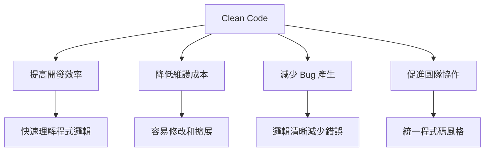
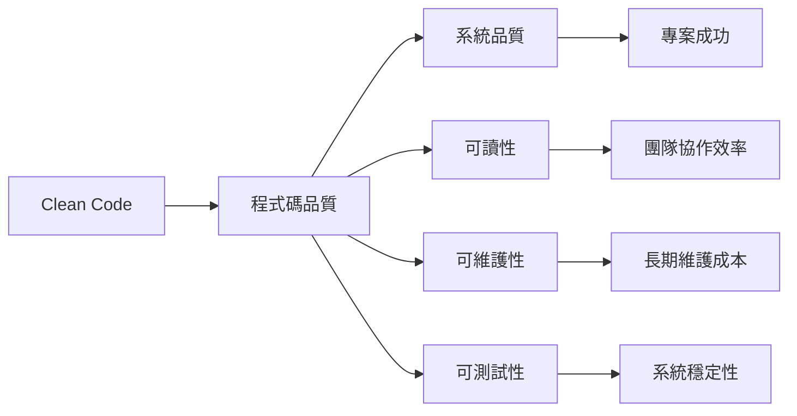
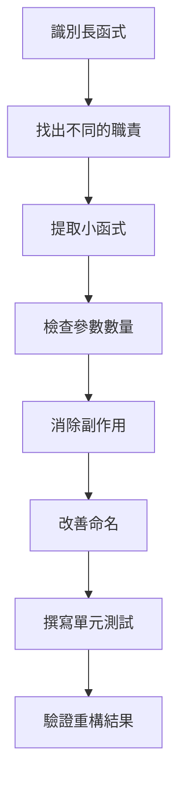
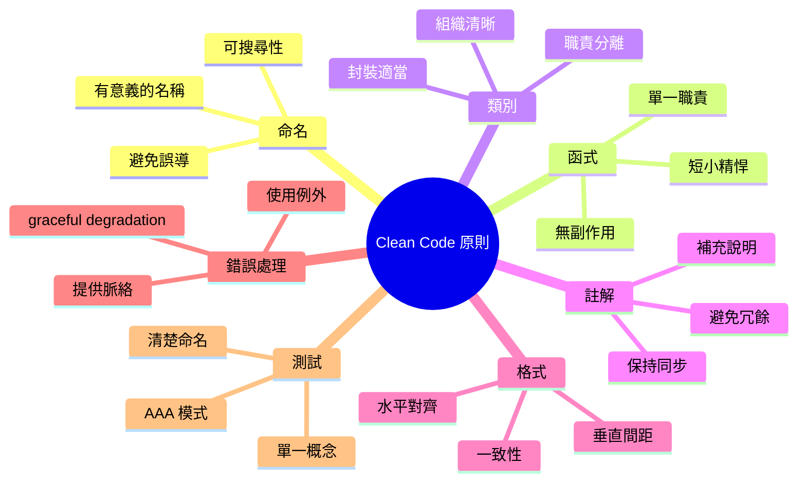
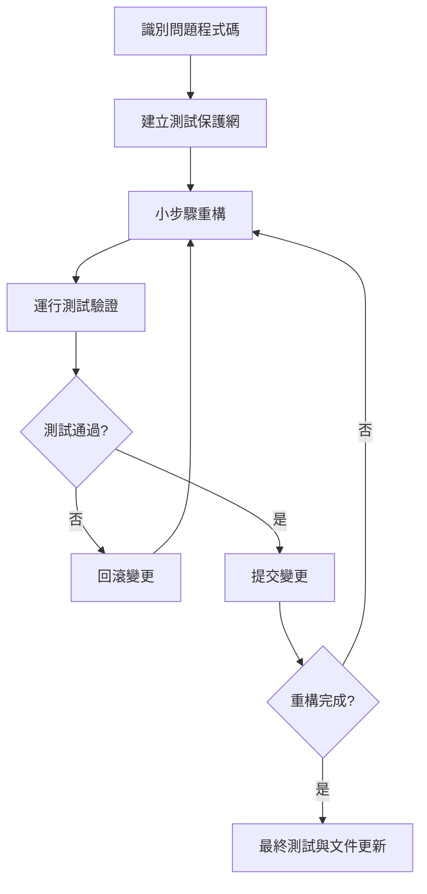
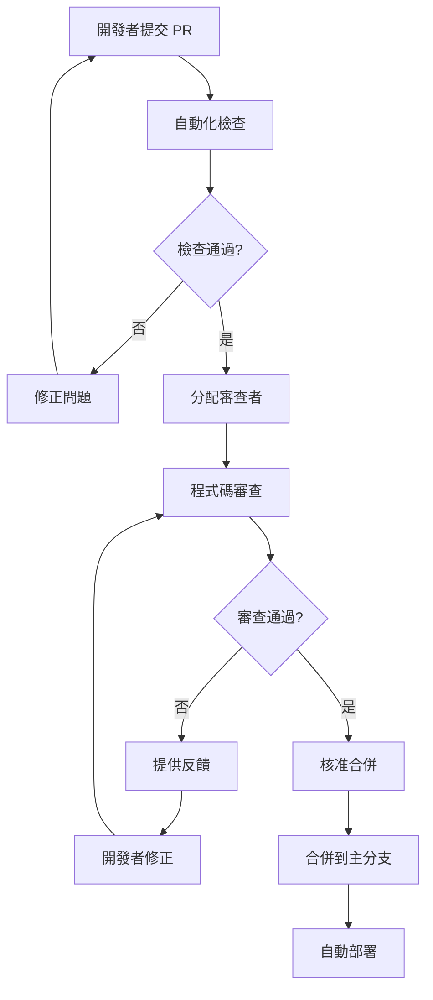
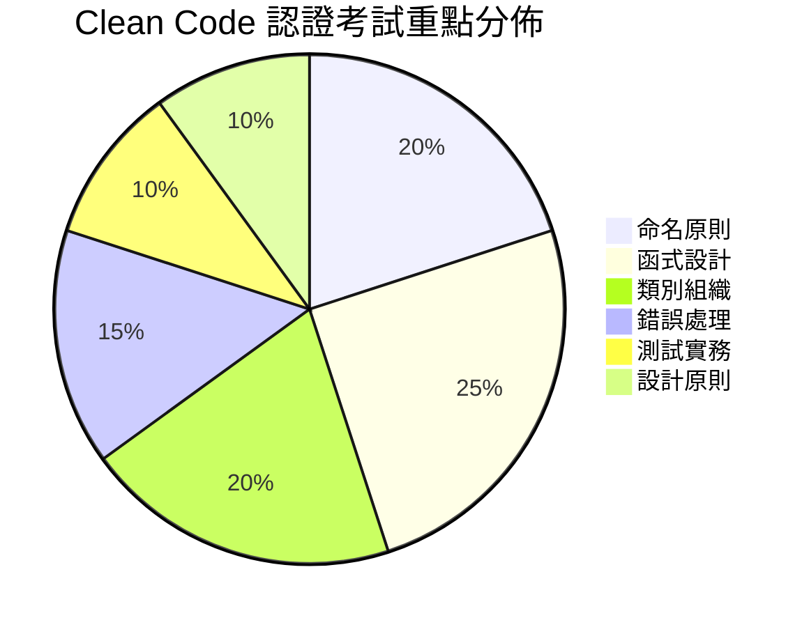

+++
date = '2025-10-31T00:00:00+08:00'
draft = false
title = 'Clean Code教學'
tags = ['教學', '分析與設計']
categories = ['教學']
+++
# Clean Code 教學手冊

## 📚 目錄

1. [Clean Code 簡介](#1-clean-code-簡介)
   - [1.1 什麼是 Clean Code？](#11-什麼是-clean-code)
   - [1.2 為什麼 Clean Code 重要？](#12-為什麼-clean-code-重要)
   - [1.3 與專案品質的關係](#13-與專案品質的關係)

2. [核心原則與最佳實踐](#2-核心原則與最佳實踐)
   - [2.1 命名原則](#21-命名原則)
   - [2.2 函式原則](#22-函式原則)
   - [2.3 類別與物件原則](#23-類別與物件原則)
   - [2.4 註解原則](#24-註解原則)
   - [2.5 格式化原則](#25-格式化原則)
   - [2.6 錯誤處理原則](#26-錯誤處理原則)
   - [2.7 測試原則](#27-測試原則)

3. [實務範例與對照](#3-實務範例與對照)
   - [3.1 電商購物車範例](#31-電商購物車範例)
   - [3.2 改善對照分析](#32-改善對照分析)
   - [3.3 使用者註冊系統範例](#33-使用者註冊系統範例)
   - [3.4 重構步驟與技巧](#34-重構步驟與技巧)

4. [專案應用指引](#4-專案應用指引)
   - [4.1 團隊程式碼規範](#41-團隊程式碼規範)
   - [4.2 程式碼審查流程](#42-程式碼審查流程)
   - [4.3 常見反模式與改善](#43-常見反模式與改善)
   - [4.4 開發工具配置](#44-開發工具配置)
   - [4.5 持續整合配置](#45-持續整合配置)

5. [認證考試重點](#5-認證考試重點)
   - [5.1 Clean Code 認證概述](#51-clean-code-認證概述)
   - [5.2 核心知識點](#52-核心知識點)
   - [5.3 常見考試題型](#53-常見考試題型)
   - [5.4 考試準備策略](#54-考試準備策略)
   - [5.5 考試注意事項](#55-考試注意事項)

6. [檢查清單](#6-檢查清單)
   - [6.1 程式碼撰寫檢查清單](#61-程式碼撰寫檢查清單)
   - [6.2 程式碼品質檢查清單](#62-程式碼品質檢查清單)
   - [6.3 重構檢查清單](#63-重構檢查清單)
   - [6.4 團隊協作檢查清單](#64-團隊協作檢查清單)
   - [6.5 專案層級檢查清單](#65-專案層級檢查清單)
   - [6.6 持續改進檢查清單](#66-持續改進檢查清單)
   - [6.7 快速參考卡](#67-快速參考卡)

---

## 1. Clean Code 簡介

### 1.1 什麼是 Clean Code？

**Clean Code（乾淨程式碼）** 是指易於閱讀、理解和維護的程式碼。它不僅僅是能夠運行的程式碼，更是一種追求程式碼品質的哲學。

#### 🎯 定義特徵
- **可讀性高**：如同散文般流暢易懂
- **表達力強**：程式碼本身就是最好的說明文件
- **簡潔明瞭**：只包含必要的邏輯，沒有冗餘
- **易於維護**：修改和擴展時不會破壞既有功能

### 1.2 為什麼 Clean Code 重要？



#### 💡 關鍵效益

1. **開發效率提升**
   - 新成員快速上手
   - 減少理解程式碼的時間
   - 提高開發速度

2. **維護成本降低**
   - 容易定位問題
   - 修改影響範圍可控
   - 重構風險降低

3. **專案品質保證**
   - 減少潛在 Bug
   - 提高系統穩定性
   - 增強可擴展性

### 1.3 與專案品質的關係



#### 📊 品質指標關聯

| Clean Code 原則 | 專案品質影響 | 衡量指標 |
|----------------|-------------|----------|
| 命名清晰 | 降低溝通成本 | 程式碼評審時間 |
| 函式簡潔 | 提高可測試性 | 單元測試覆蓋率 |
| 類別職責單一 | 增強可維護性 | 程式碼變更影響範圍 |
| 錯誤處理完善 | 提升系統穩定性 | 生產環境錯誤率 |

### 🏆 章節小結

Clean Code 是軟體開發的基本功，它直接影響專案的成功與否。好的程式碼不僅能正確運行，更能讓團隊高效協作，確保專案長期成功。

#### 💭 思考練習

1. 回想您最近維護過的程式碼，哪些特徵讓您覺得難以理解？
2. 您認為什麼樣的程式碼算是「好程式碼」？
3. 在團隊協作中，程式碼品質如何影響工作效率？

---

## 2. 核心原則與最佳實踐

### 2.1 命名原則

#### 🎯 核心原則：**名稱應該清楚表達意圖**

好的命名是 Clean Code 的基石，它讓程式碼自我說明，減少註解的需要。

#### ✅ 命名最佳實踐

**1. 使用有意義的名稱**

```java
// ❌ 不良範例
int d; // 經過的天數
List<int[]> list1 = getThem();

// ✅ 良好範例  
int elapsedTimeInDays;
List<Cell> flaggedCells = getFlaggedCells();
```

**2. 避免誤導性資訊**

```java
// ❌ 不良範例
List<Account> accountList; // 如果不是 List 型別會造成混淆
String aAbSc; // 意義不明

// ✅ 良好範例
List<Account> accounts;
String accountNumber;
```

**3. 做有意義的區分**

```java
// ❌ 不良範例
public static void copyChars(char a1[], char a2[]) {
    for (int i = 0; i < a1.length; i++) {
        a2[i] = a1[i];
    }
}

// ✅ 良好範例
public static void copyChars(char source[], char destination[]) {
    for (int i = 0; i < source.length; i++) {
        destination[i] = source[i];
    }
}
```

**4. 使用可搜尋的名稱**

```java
// ❌ 不良範例
for (int j = 0; j < 34; j++) {
    s += (t[j] * 4) / 5;
}

// ✅ 良好範例
int realDaysPerIdealDay = 4;
int workDaysPerWeek = 5;
int numberOfTasks = 34;

for (int j = 0; j < numberOfTasks; j++) {
    int realTaskDays = taskEstimate[j] * realDaysPerIdealDay;
    int realTaskWeeks = realTaskDays / workDaysPerWeek;
    sum += realTaskWeeks;
}
```

#### 📋 命名規範表

| 類型 | 規範 | 範例 |
|------|------|------|
| 類別 | PascalCase | `UserManager`, `PaymentService` |
| 方法 | camelCase | `calculateTotal()`, `getUserById()` |
| 變數 | camelCase | `userName`, `totalAmount` |
| 常數 | UPPER_SNAKE_CASE | `MAX_RETRY_COUNT`, `DEFAULT_TIMEOUT` |
| 套件 | lowercase | `com.tutorial.service` |

### 2.2 函式原則

#### 🎯 核心原則：**函式應該短小且只做一件事**

#### ✅ 函式最佳實踐

**1. 保持函式短小**

```java
// ❌ 不良範例 - 函式過長
public void processUser(User user) {
    // 驗證使用者資料
    if (user.getName() == null || user.getName().isEmpty()) {
        throw new IllegalArgumentException("使用者名稱不能為空");
    }
    if (user.getEmail() == null || !user.getEmail().contains("@")) {
        throw new IllegalArgumentException("電子郵件格式不正確");
    }
    
    // 儲存使用者
    Connection conn = DriverManager.getConnection(DB_URL, USER, PASS);
    String sql = "INSERT INTO users (name, email) VALUES (?, ?)";
    PreparedStatement stmt = conn.prepareStatement(sql);
    stmt.setString(1, user.getName());
    stmt.setString(2, user.getEmail());
    stmt.executeUpdate();
    
    // 發送歡迎郵件
    String emailContent = "歡迎 " + user.getName() + " 加入我們！";
    EmailService.send(user.getEmail(), "歡迎加入", emailContent);
    
    // 記錄日誌
    logger.info("新使用者已註冊: " + user.getName());
}

// ✅ 良好範例 - 拆分成多個小函式
public void processUser(User user) {
    validateUser(user);
    saveUser(user);
    sendWelcomeEmail(user);
    logUserRegistration(user);
}

private void validateUser(User user) {
    validateUserName(user.getName());
    validateEmail(user.getEmail());
}

private void validateUserName(String name) {
    if (name == null || name.isEmpty()) {
        throw new IllegalArgumentException("使用者名稱不能為空");
    }
}

private void validateEmail(String email) {
    if (email == null || !email.contains("@")) {
        throw new IllegalArgumentException("電子郵件格式不正確");
    }
}

private void saveUser(User user) {
    userRepository.save(user);
}

private void sendWelcomeEmail(User user) {
    String content = "歡迎 " + user.getName() + " 加入我們！";
    emailService.send(user.getEmail(), "歡迎加入", content);
}

private void logUserRegistration(User user) {
    logger.info("新使用者已註冊: " + user.getName());
}
```

**2. 單一職責原則**

每個函式只做一件事，且做好這件事。

```java
// ❌ 不良範例 - 函式做了多件事
public boolean checkPasswordAndLog(String password, String username) {
    if (password.length() < 8) {
        logger.warn("使用者 " + username + " 密碼太短");
        return false;
    }
    logger.info("使用者 " + username + " 密碼檢查通過");
    return true;
}

// ✅ 良好範例 - 職責分離
public boolean isPasswordValid(String password) {
    return password.length() >= 8;
}

public void logPasswordCheck(String username, boolean isValid) {
    if (isValid) {
        logger.info("使用者 " + username + " 密碼檢查通過");
    } else {
        logger.warn("使用者 " + username + " 密碼太短");
    }
}
```

**3. 參數數量控制**

```java
// ❌ 不良範例 - 參數過多
public void createUser(String firstName, String lastName, String email, 
                      String phone, String address, String city, 
                      String state, String zipCode, Date birthDate) {
    // 實作...
}

// ✅ 良好範例 - 使用物件封裝參數
public void createUser(UserInfo userInfo) {
    // 實作...
}

public class UserInfo {
    private String firstName;
    private String lastName;
    private String email;
    private String phone;
    private Address address;
    private Date birthDate;
    
    // constructors, getters, setters...
}
```

**4. 無副作用**

函式不應該有隱藏的副作用。

```java
// ❌ 不良範例 - 有副作用
public boolean checkPassword(String userName, String password) {
    User user = UserGateway.findByName(userName);
    if (user != null) {
        if (user.getPassword().equals(password)) {
            Session.initialize(); // 副作用！
            return true;
        }
    }
    return false;
}

// ✅ 良好範例 - 職責分離
public boolean isPasswordCorrect(String userName, String password) {
    User user = UserGateway.findByName(userName);
    return user != null && user.getPassword().equals(password);
}

public void initializeSession() {
    Session.initialize();
}
```

#### 🔄 函式重構流程



### 2.3 類別與物件原則

#### � 核心原則：**單一職責原則 (Single Responsibility Principle)**

一個類別應該只有一個變更的理由，即只負責一個功能領域。

#### ✅ 類別設計最佳實踐

##### 1. 類別應該短小

```java
// ❌ 不良範例 - 類別職責過多
public class Employee {
    private String name;
    private String email;
    private double salary;
    
    // 員工資料管理
    public void updatePersonalInfo(String name, String email) { }
    
    // 薪資計算
    public double calculatePay() { }
    public double calculateBonus() { }
    
    // 報表生成
    public void generatePaySlip() { }
    public void exportToExcel() { }
    
    // 資料庫操作
    public void save() { }
    public void delete() { }
    
    // 郵件發送
    public void sendPaySlipEmail() { }
}

// ✅ 良好範例 - 職責分離
public class Employee {
    private String name;
    private String email;
    private double salary;
    
    // 只負責員工基本資料
    public void updatePersonalInfo(String name, String email) {
        this.name = name;
        this.email = email;
    }
    
    // getters and setters...
}

public class PayrollCalculator {
    public double calculatePay(Employee employee) { }
    public double calculateBonus(Employee employee) { }
}

public class PaySlipGenerator {
    public void generatePaySlip(Employee employee) { }
    public void exportToExcel(Employee employee) { }
}

public class EmployeeRepository {
    public void save(Employee employee) { }
    public void delete(Employee employee) { }
    public Employee findById(Long id) { }
}

public class PayrollNotificationService {
    public void sendPaySlipEmail(Employee employee) { }
}
```

##### 2. 組織類別結構

```java
// ✅ 良好的類別組織
public class UserService {
    // 1. 常數
    private static final int MAX_LOGIN_ATTEMPTS = 3;
    private static final String DEFAULT_ROLE = "USER";
    
    // 2. 靜態變數
    private static UserService instance;
    
    // 3. 實例變數
    private UserRepository userRepository;
    private PasswordEncoder passwordEncoder;
    private EmailService emailService;
    
    // 4. 建構子
    public UserService(UserRepository userRepository, 
                      PasswordEncoder passwordEncoder,
                      EmailService emailService) {
        this.userRepository = userRepository;
        this.passwordEncoder = passwordEncoder;
        this.emailService = emailService;
    }
    
    // 5. 公開方法
    public User registerUser(UserRegistrationRequest request) {
        validateRegistrationRequest(request);
        User user = createUser(request);
        sendWelcomeEmail(user);
        return user;
    }
    
    public boolean authenticateUser(String email, String password) {
        User user = findUserByEmail(email);
        return isPasswordValid(user, password);
    }
    
    // 6. 私有方法 (依使用順序排列)
    private void validateRegistrationRequest(UserRegistrationRequest request) {
        if (request.getEmail() == null || request.getEmail().isEmpty()) {
            throw new IllegalArgumentException("Email is required");
        }
        if (userRepository.existsByEmail(request.getEmail())) {
            throw new IllegalArgumentException("Email already exists");
        }
    }
    
    private User createUser(UserRegistrationRequest request) {
        String encodedPassword = passwordEncoder.encode(request.getPassword());
        User user = new User(request.getEmail(), encodedPassword, DEFAULT_ROLE);
        return userRepository.save(user);
    }
    
    private void sendWelcomeEmail(User user) {
        emailService.sendWelcomeEmail(user.getEmail(), user.getName());
    }
    
    private User findUserByEmail(String email) {
        return userRepository.findByEmail(email)
            .orElseThrow(() -> new UserNotFoundException("User not found"));
    }
    
    private boolean isPasswordValid(User user, String password) {
        return passwordEncoder.matches(password, user.getPassword());
    }
}
```

##### 3. 封裝與資料隱藏

```java
// ❌ 不良範例 - 破壞封裝
public class BankAccount {
    public double balance; // 公開欄位
    public List<Transaction> transactions; // 可直接操作
    
    public void withdraw(double amount) {
        balance -= amount; // 沒有驗證
    }
}

// ✅ 良好範例 - 適當封裝
public class BankAccount {
    private double balance;
    private final List<Transaction> transactions;
    private static final double MIN_BALANCE = 0.0;
    
    public BankAccount(double initialBalance) {
        if (initialBalance < MIN_BALANCE) {
            throw new IllegalArgumentException("Initial balance cannot be negative");
        }
        this.balance = initialBalance;
        this.transactions = new ArrayList<>();
    }
    
    public boolean withdraw(double amount) {
        if (amount <= 0) {
            throw new IllegalArgumentException("Withdrawal amount must be positive");
        }
        
        if (balance - amount < MIN_BALANCE) {
            return false; // 餘額不足
        }
        
        balance -= amount;
        transactions.add(new Transaction(TransactionType.WITHDRAWAL, amount));
        return true;
    }
    
    public void deposit(double amount) {
        if (amount <= 0) {
            throw new IllegalArgumentException("Deposit amount must be positive");
        }
        
        balance += amount;
        transactions.add(new Transaction(TransactionType.DEPOSIT, amount));
    }
    
    public double getBalance() {
        return balance;
    }
    
    public List<Transaction> getTransactionHistory() {
        return new ArrayList<>(transactions); // 防禦性複製
    }
}
```

### 2.4 註解原則

#### 🎯 核心原則：**程式碼應該自我說明，註解用於補充無法從程式碼得知的資訊**

#### ✅ 好註解的特徵

##### 1. 法律資訊註解

```java
/**
 * Copyright (C) 2024 Tutorial Company. All rights reserved.
 * 
 * Licensed under the Apache License, Version 2.0 (the "License");
 * you may not use this file except in compliance with the License.
 */
```

##### 2. 資訊性註解

```java
/**
 * 計算複利收益
 * 
 * @param principal 本金
 * @param rate 年利率 (以小數表示，例如 0.05 代表 5%)
 * @param years 投資年數
 * @param compoundFrequency 每年複利次數
 * @return 最終金額
 */
public double calculateCompoundInterest(double principal, double rate, 
                                      int years, int compoundFrequency) {
    return principal * Math.pow(1 + rate / compoundFrequency, 
                               compoundFrequency * years);
}
```

##### 3. 意圖說明註解

```java
public void sortByWeight() {
    // 我們使用穩定排序以保持相同重量項目的原始順序
    Collections.sort(items, Comparator.comparing(Item::getWeight));
}
```

##### 4. 警告註解

```java
// 警告：這個方法會修改輸入的 List，如果不希望修改原始資料請先複製
public void processItems(List<Item> items) {
    items.removeIf(item -> item.isExpired());
}
```

#### ❌ 避免的註解類型

##### 1. 廢話註解

```java
// ❌ 不良範例
int day; // 日

// ✅ 應該改善變數命名
int dayOfMonth;
```

##### 2. 誤導性註解

```java
// ❌ 不良範例 - 註解與程式碼不符
// 檢查使用者是否為管理員
public boolean isActiveUser(User user) {
    return user.getStatus() == UserStatus.ACTIVE;
}
```

##### 3. 冗餘註解

```java
// ❌ 不良範例
/**
 * 設定使用者名稱
 * @param userName 使用者名稱
 */
public void setUserName(String userName) {
    this.userName = userName;
}

// ✅ 這種情況不需要註解，方法名稱已經很清楚了
```

### 2.5 格式化原則

#### 🎯 核心原則：**一致的格式讓程式碼更易讀**

#### ✅ 格式化最佳實踐

##### 1. 垂直格式化

```java
// ✅ 良好的垂直間距
public class OrderService {
    private static final Logger logger = LoggerFactory.getLogger(OrderService.class);
    
    private OrderRepository orderRepository;
    private PaymentService paymentService;
    private InventoryService inventoryService;

    public OrderService(OrderRepository orderRepository,
                       PaymentService paymentService,
                       InventoryService inventoryService) {
        this.orderRepository = orderRepository;
        this.paymentService = paymentService;
        this.inventoryService = inventoryService;
    }

    public Order processOrder(OrderRequest request) {
        validateOrderRequest(request);
        
        Order order = createOrder(request);
        reserveInventory(order);
        processPayment(order);
        
        return saveOrder(order);
    }

    private void validateOrderRequest(OrderRequest request) {
        if (request == null) {
            throw new IllegalArgumentException("Order request cannot be null");
        }
        
        if (request.getItems().isEmpty()) {
            throw new IllegalArgumentException("Order must contain at least one item");
        }
    }
    
    // 相關方法靠近放置
    private Order createOrder(OrderRequest request) {
        return new Order(request.getCustomerId(), request.getItems());
    }
    
    private void reserveInventory(Order order) {
        for (OrderItem item : order.getItems()) {
            inventoryService.reserve(item.getProductId(), item.getQuantity());
        }
    }
}
```

##### 2. 水平格式化

```java
// ✅ 良好的水平格式
public class CalculationUtils {
    
    public static double calculateDistance(Point p1, Point p2) {
        double deltaX = p2.getX() - p1.getX();
        double deltaY = p2.getY() - p1.getY();
        return Math.sqrt(deltaX * deltaX + deltaY * deltaY);
    }
    
    public static boolean isInRange(double value, double min, double max) {
        return value >= min && value <= max;
    }
    
    // 對齊增強可讀性
    private static final int    MAX_RETRIES     = 3;
    private static final double DEFAULT_TIMEOUT = 30.0;
    private static final String CONFIG_FILE     = "config.properties";
}
```

### 2.6 錯誤處理原則

#### 🎯 核心原則：**錯誤處理很重要，但不應該模糊程式邏輯**

#### ✅ 錯誤處理最佳實踐

##### 1. 使用例外而非錯誤碼

```java
// ❌ 不良範例 - 使用錯誤碼
public int deleteFile(String fileName) {
    if (fileName == null) {
        return ERROR_NULL_FILENAME;
    }
    
    File file = new File(fileName);
    if (!file.exists()) {
        return ERROR_FILE_NOT_FOUND;
    }
    
    if (!file.delete()) {
        return ERROR_DELETE_FAILED;
    }
    
    return SUCCESS;
}

// ✅ 良好範例 - 使用例外
public void deleteFile(String fileName) throws FileOperationException {
    if (fileName == null) {
        throw new IllegalArgumentException("File name cannot be null");
    }
    
    File file = new File(fileName);
    if (!file.exists()) {
        throw new FileNotFoundException("File not found: " + fileName);
    }
    
    if (!file.delete()) {
        throw new FileOperationException("Failed to delete file: " + fileName);
    }
}
```

##### 2. 建立自定義例外

```java
// ✅ 有意義的例外階層
public class UserServiceException extends Exception {
    public UserServiceException(String message) {
        super(message);
    }
    
    public UserServiceException(String message, Throwable cause) {
        super(message, cause);
    }
}

public class UserNotFoundException extends UserServiceException {
    public UserNotFoundException(String userId) {
        super("User not found with ID: " + userId);
    }
}

public class InvalidUserDataException extends UserServiceException {
    public InvalidUserDataException(String message) {
        super("Invalid user data: " + message);
    }
}
```

##### 3. 提供錯誤處理脈絡

```java
// ✅ 良好的錯誤處理
public User createUser(UserCreateRequest request) {
    try {
        validateUserData(request);
        
        User user = new User(request.getEmail(), request.getName());
        return userRepository.save(user);
        
    } catch (ValidationException e) {
        logger.warn("User creation failed due to validation error: {}", e.getMessage());
        throw new InvalidUserDataException(e.getMessage());
        
    } catch (DataAccessException e) {
        logger.error("Database error during user creation for email: {}", 
                    request.getEmail(), e);
        throw new UserServiceException("Failed to create user due to database error");
        
    } catch (Exception e) {
        logger.error("Unexpected error during user creation: {}", e.getMessage(), e);
        throw new UserServiceException("An unexpected error occurred");
    }
}
```

### 2.7 測試原則

#### 🎯 核心原則：**測試是程式碼品質的保證**

#### ✅ 測試最佳實踐

##### 1. 遵循 AAA 模式 (Arrange, Act, Assert)

```java
@Test
public void shouldCalculateCorrectTotalWithDiscount() {
    // Arrange - 準備測試資料
    Order order = new Order();
    order.addItem(new OrderItem("Product1", 100.0, 2));
    order.addItem(new OrderItem("Product2", 50.0, 1));
    DiscountCalculator calculator = new DiscountCalculator();
    
    // Act - 執行要測試的動作
    double total = calculator.calculateTotalWithDiscount(order, 0.1);
    
    // Assert - 驗證結果
    assertEquals(225.0, total, 0.01);
}
```

##### 2. 測試命名清楚表達意圖

```java
// ✅ 良好的測試命名
@Test
public void shouldThrowExceptionWhenWithdrawAmountExceedsBalance() { }

@Test
public void shouldReturnTrueWhenPasswordMeetsAllRequirements() { }

@Test
public void shouldCalculateCorrectInterestForCompoundFrequency() { }
```

##### 3. 一個測試只驗證一個概念

```java
// ❌ 不良範例 - 測試多個概念
@Test
public void userServiceTest() {
    // 測試建立使用者
    User user = userService.createUser(validRequest);
    assertNotNull(user);
    
    // 測試更新使用者
    user.setName("New Name");
    userService.updateUser(user);
    assertEquals("New Name", user.getName());
    
    // 測試刪除使用者
    userService.deleteUser(user.getId());
    assertFalse(userService.exists(user.getId()));
}

// ✅ 良好範例 - 分離測試
@Test
public void shouldCreateUserWithValidData() {
    User user = userService.createUser(validRequest);
    
    assertNotNull(user);
    assertEquals(validRequest.getEmail(), user.getEmail());
    assertEquals(validRequest.getName(), user.getName());
}

@Test
public void shouldUpdateUserName() {
    User user = createTestUser();
    String newName = "New Name";
    
    user.setName(newName);
    userService.updateUser(user);
    
    User updatedUser = userService.findById(user.getId());
    assertEquals(newName, updatedUser.getName());
}

@Test
public void shouldDeleteExistingUser() {
    User user = createTestUser();
    
    userService.deleteUser(user.getId());
    
    assertFalse(userService.exists(user.getId()));
}
```

### 🏆 核心原則小結

Clean Code 的核心原則環環相扣，共同構成了高品質程式碼的基礎：



---

## 3. 實務範例與對照

### 3.1 電商購物車範例

讓我們透過一個電商購物車系統來看 Clean Code 的實際應用。

#### ❌ 不良程式碼範例

```java
public class Cart {
    public List<Object> items = new ArrayList<>();
    public double total = 0.0;
    public boolean isVip = false;
    
    public void add(Object item) {
        items.add(item);
        // 計算總價的邏輯混在這裡
        if (item instanceof Product) {
            Product p = (Product) item;
            total += p.price;
            if (isVip && p.category.equals("electronics")) {
                total -= p.price * 0.1; // VIP 電子產品 10% 折扣
            }
        }
    }
    
    public void remove(Object item) {
        if (items.contains(item)) {
            items.remove(item);
            // 重新計算總價 - 重複邏輯
            total = 0.0;
            for (Object i : items) {
                if (i instanceof Product) {
                    Product p = (Product) i;
                    total += p.price;
                    if (isVip && p.category.equals("electronics")) {
                        total -= p.price * 0.1;
                    }
                }
            }
        }
    }
    
    public double getTotal() {
        return total;
    }
    
    // 混合了多種職責：購物車管理、價格計算、折扣邏輯
    public void checkout() {
        if (items.size() == 0) {
            System.out.println("購物車是空的");
            return;
        }
        
        // 複雜的結帳邏輯
        double finalTotal = total;
        if (total > 1000) {
            finalTotal *= 0.95; // 滿 1000 打 95 折
        }
        
        System.out.println("結帳金額: " + finalTotal);
        items.clear();
        total = 0.0;
    }
}

class Product {
    public String name;
    public double price;
    public String category;
    
    public Product(String n, double p, String c) {
        name = n;
        price = p;
        category = c;
    }
}
```

#### ✅ 改善後的 Clean Code 版本

```java
/**
 * 購物車類別 - 負責管理購物車中的商品
 */
public class ShoppingCart {
    private final List<CartItem> items;
    private final PriceCalculator priceCalculator;
    
    public ShoppingCart(PriceCalculator priceCalculator) {
        this.items = new ArrayList<>();
        this.priceCalculator = priceCalculator;
    }
    
    public void addItem(Product product, int quantity) {
        if (product == null) {
            throw new IllegalArgumentException("Product cannot be null");
        }
        if (quantity <= 0) {
            throw new IllegalArgumentException("Quantity must be positive");
        }
        
        CartItem existingItem = findItemByProduct(product);
        if (existingItem != null) {
            existingItem.increaseQuantity(quantity);
        } else {
            items.add(new CartItem(product, quantity));
        }
    }
    
    public boolean removeItem(Product product) {
        return items.removeIf(item -> item.getProduct().equals(product));
    }
    
    public void updateItemQuantity(Product product, int newQuantity) {
        if (newQuantity <= 0) {
            removeItem(product);
            return;
        }
        
        CartItem item = findItemByProduct(product);
        if (item != null) {
            item.setQuantity(newQuantity);
        }
    }
    
    public Money getTotalAmount(Customer customer) {
        return priceCalculator.calculateTotal(items, customer);
    }
    
    public List<CartItem> getItems() {
        return new ArrayList<>(items); // 防禦性複製
    }
    
    public boolean isEmpty() {
        return items.isEmpty();
    }
    
    public void clear() {
        items.clear();
    }
    
    private CartItem findItemByProduct(Product product) {
        return items.stream()
                   .filter(item -> item.getProduct().equals(product))
                   .findFirst()
                   .orElse(null);
    }
}

/**
 * 購物車項目 - 封裝商品和數量
 */
public class CartItem {
    private final Product product;
    private int quantity;
    
    public CartItem(Product product, int quantity) {
        if (product == null) {
            throw new IllegalArgumentException("Product cannot be null");
        }
        if (quantity <= 0) {
            throw new IllegalArgumentException("Quantity must be positive");
        }
        
        this.product = product;
        this.quantity = quantity;
    }
    
    public Product getProduct() {
        return product;
    }
    
    public int getQuantity() {
        return quantity;
    }
    
    public void setQuantity(int quantity) {
        if (quantity <= 0) {
            throw new IllegalArgumentException("Quantity must be positive");
        }
        this.quantity = quantity;
    }
    
    public void increaseQuantity(int amount) {
        if (amount <= 0) {
            throw new IllegalArgumentException("Amount must be positive");
        }
        this.quantity += amount;
    }
    
    public Money getSubtotal() {
        return product.getPrice().multiply(quantity);
    }
}

/**
 * 商品類別 - 封裝商品資訊
 */
public class Product {
    private final String id;
    private final String name;
    private final Money price;
    private final ProductCategory category;
    
    public Product(String id, String name, Money price, ProductCategory category) {
        this.id = requireNonNull(id, "Product ID cannot be null");
        this.name = requireNonNull(name, "Product name cannot be null");
        this.price = requireNonNull(price, "Product price cannot be null");
        this.category = requireNonNull(category, "Product category cannot be null");
    }
    
    public String getId() { return id; }
    public String getName() { return name; }
    public Money getPrice() { return price; }
    public ProductCategory getCategory() { return category; }
    
    @Override
    public boolean equals(Object obj) {
        if (this == obj) return true;
        if (obj == null || getClass() != obj.getClass()) return false;
        Product product = (Product) obj;
        return Objects.equals(id, product.id);
    }
    
    @Override
    public int hashCode() {
        return Objects.hash(id);
    }
}

/**
 * 價格計算器 - 專門負責價格計算和折扣邏輯
 */
public class PriceCalculator {
    private final List<DiscountStrategy> discountStrategies;
    
    public PriceCalculator(List<DiscountStrategy> discountStrategies) {
        this.discountStrategies = new ArrayList<>(discountStrategies);
    }
    
    public Money calculateTotal(List<CartItem> items, Customer customer) {
        Money subtotal = calculateSubtotal(items);
        Money discount = calculateDiscount(items, customer, subtotal);
        return subtotal.subtract(discount);
    }
    
    private Money calculateSubtotal(List<CartItem> items) {
        return items.stream()
                   .map(CartItem::getSubtotal)
                   .reduce(Money.ZERO, Money::add);
    }
    
    private Money calculateDiscount(List<CartItem> items, Customer customer, Money subtotal) {
        return discountStrategies.stream()
                                .map(strategy -> strategy.calculateDiscount(items, customer, subtotal))
                                .reduce(Money.ZERO, Money::add);
    }
}

/**
 * 折扣策略介面
 */
public interface DiscountStrategy {
    Money calculateDiscount(List<CartItem> items, Customer customer, Money subtotal);
}

/**
 * VIP 會員電子產品折扣策略
 */
public class VipElectronicsDiscountStrategy implements DiscountStrategy {
    private static final BigDecimal VIP_ELECTRONICS_DISCOUNT_RATE = new BigDecimal("0.10");
    
    @Override
    public Money calculateDiscount(List<CartItem> items, Customer customer, Money subtotal) {
        if (!customer.isVip()) {
            return Money.ZERO;
        }
        
        Money electronicsTotal = items.stream()
                                     .filter(item -> item.getProduct().getCategory() == ProductCategory.ELECTRONICS)
                                     .map(CartItem::getSubtotal)
                                     .reduce(Money.ZERO, Money::add);
        
        return electronicsTotal.multiply(VIP_ELECTRONICS_DISCOUNT_RATE);
    }
}

/**
 * 滿額折扣策略
 */
public class VolumeDiscountStrategy implements DiscountStrategy {
    private static final Money MINIMUM_AMOUNT = new Money(new BigDecimal("1000"));
    private static final BigDecimal DISCOUNT_RATE = new BigDecimal("0.05");
    
    @Override
    public Money calculateDiscount(List<CartItem> items, Customer customer, Money subtotal) {
        if (subtotal.isGreaterThanOrEqualTo(MINIMUM_AMOUNT)) {
            return subtotal.multiply(DISCOUNT_RATE);
        }
        return Money.ZERO;
    }
}

/**
 * 結帳服務 - 專門處理結帳邏輯
 */
public class CheckoutService {
    private final PaymentService paymentService;
    private final OrderService orderService;
    private final NotificationService notificationService;
    
    public CheckoutService(PaymentService paymentService, 
                          OrderService orderService,
                          NotificationService notificationService) {
        this.paymentService = paymentService;
        this.orderService = orderService;
        this.notificationService = notificationService;
    }
    
    public CheckoutResult checkout(ShoppingCart cart, Customer customer, PaymentMethod paymentMethod) {
        if (cart.isEmpty()) {
            throw new IllegalArgumentException("Cannot checkout empty cart");
        }
        
        try {
            Money totalAmount = cart.getTotalAmount(customer);
            Order order = orderService.createOrder(cart.getItems(), customer, totalAmount);
            
            PaymentResult paymentResult = paymentService.processPayment(
                paymentMethod, totalAmount, order.getId());
            
            if (paymentResult.isSuccessful()) {
                orderService.confirmOrder(order.getId());
                notificationService.sendOrderConfirmation(customer, order);
                cart.clear();
                
                return CheckoutResult.success(order, paymentResult);
            } else {
                orderService.cancelOrder(order.getId());
                return CheckoutResult.failure(paymentResult.getErrorMessage());
            }
            
        } catch (Exception e) {
            return CheckoutResult.failure("Checkout failed: " + e.getMessage());
        }
    }
}
```

### 3.2 改善對照分析

#### 📊 改善效果對比表

| 面向 | 原始程式碼問題 | Clean Code 解決方案 | 效益 |
|------|--------------|-------------------|------|
| **職責分離** | Cart 類別做太多事情 | 分離為 ShoppingCart, PriceCalculator, CheckoutService | 單一職責，易於維護 |
| **命名** | 變數名稱不清楚 (items, total) | 有意義的命名 (cartItems, totalAmount) | 自我說明，減少註解需求 |
| **型別安全** | 使用 Object 類型 | 強型別設計 (Product, CartItem) | 編譯時期錯誤檢查 |
| **封裝** | 公開欄位直接存取 | 適當的 getter/setter 和驗證 | 資料完整性保護 |
| **重複程式碼** | 計算邏輯重複 | 單一方法負責計算 | DRY 原則，降低維護成本 |
| **擴展性** | 硬編碼折扣邏輯 | 策略模式實作折扣 | 易於新增折扣類型 |
| **錯誤處理** | 基本的條件檢查 | 完整的例外處理 | 提高程式穩定性 |
| **測試性** | 緊耦合，難以測試 | 依賴注入，易於mock | 提高測試覆蓋率 |

### 3.3 使用者註冊系統範例

#### ❌ 不良程式碼

```java
public class UserController {
    public String register(String email, String password, String name) {
        // 沒有輸入驗證
        User user = new User();
        user.email = email;
        user.password = password; // 明文密碼
        user.name = name;
        user.created = new Date();
        
        // 直接資料庫操作
        Connection conn = null;
        try {
            conn = DriverManager.getConnection("jdbc:mysql://localhost/db", "user", "pass");
            String sql = "INSERT INTO users (email, password, name, created) VALUES (?, ?, ?, ?)";
            PreparedStatement stmt = conn.prepareStatement(sql);
            stmt.setString(1, user.email);
            stmt.setString(2, user.password);
            stmt.setString(3, user.name);
            stmt.setTimestamp(4, new Timestamp(user.created.getTime()));
            stmt.executeUpdate();
            
            // 發送郵件 - 寫在 controller 裡
            Properties props = new Properties();
            props.put("mail.smtp.host", "smtp.gmail.com");
            Session session = Session.getInstance(props);
            Message message = new MimeMessage(session);
            message.setFrom(new InternetAddress("noreply@company.com"));
            message.setRecipients(Message.RecipientType.TO, InternetAddress.parse(user.email));
            message.setSubject("歡迎加入");
            message.setText("歡迎 " + user.name);
            Transport.send(message);
            
            return "註冊成功";
        } catch (Exception e) {
            return "註冊失敗"; // 沒有具體錯誤資訊
        } finally {
            if (conn != null) {
                try { conn.close(); } catch (Exception e) {}
            }
        }
    }
}
```

#### ✅ Clean Code 改善版本

```java
/**
 * 使用者註冊請求 DTO
 */
public class UserRegistrationRequest {
    private final String email;
    private final String password;
    private final String name;
    
    public UserRegistrationRequest(String email, String password, String name) {
        this.email = email;
        this.password = password;
        this.name = name;
    }
    
    // getters...
}

/**
 * 使用者註冊控制器 - 只負責 HTTP 請求處理
 */
@RestController
@RequestMapping("/api/users")
public class UserRegistrationController {
    private final UserRegistrationService userRegistrationService;
    
    public UserRegistrationController(UserRegistrationService userRegistrationService) {
        this.userRegistrationService = userRegistrationService;
    }
    
    @PostMapping("/register")
    public ResponseEntity<UserRegistrationResponse> register(
            @Valid @RequestBody UserRegistrationRequest request) {
        
        try {
            User user = userRegistrationService.registerUser(request);
            UserRegistrationResponse response = new UserRegistrationResponse(
                user.getId(), user.getEmail(), "註冊成功");
            return ResponseEntity.ok(response);
            
        } catch (UserAlreadyExistsException e) {
            return ResponseEntity.badRequest()
                    .body(new UserRegistrationResponse(null, null, e.getMessage()));
            
        } catch (InvalidUserDataException e) {
            return ResponseEntity.badRequest()
                    .body(new UserRegistrationResponse(null, null, e.getMessage()));
            
        } catch (Exception e) {
            logger.error("Unexpected error during user registration", e);
            return ResponseEntity.internalServerError()
                    .body(new UserRegistrationResponse(null, null, "系統暫時無法處理請求"));
        }
    }
}

/**
 * 使用者註冊服務 - 業務邏輯處理
 */
@Service
@Transactional
public class UserRegistrationService {
    private static final Logger logger = LoggerFactory.getLogger(UserRegistrationService.class);
    
    private final UserRepository userRepository;
    private final PasswordEncoder passwordEncoder;
    private final EmailService emailService;
    private final UserValidator userValidator;
    
    public UserRegistrationService(UserRepository userRepository,
                                  PasswordEncoder passwordEncoder,
                                  EmailService emailService,
                                  UserValidator userValidator) {
        this.userRepository = userRepository;
        this.passwordEncoder = passwordEncoder;
        this.emailService = emailService;
        this.userValidator = userValidator;
    }
    
    public User registerUser(UserRegistrationRequest request) 
            throws UserAlreadyExistsException, InvalidUserDataException {
        
        logger.info("Starting user registration for email: {}", request.getEmail());
        
        userValidator.validate(request);
        checkUserNotExists(request.getEmail());
        
        User user = createUser(request);
        User savedUser = userRepository.save(user);
        
        sendWelcomeEmailAsync(savedUser);
        
        logger.info("User registration completed successfully for email: {}", 
                   savedUser.getEmail());
        
        return savedUser;
    }
    
    private void checkUserNotExists(String email) throws UserAlreadyExistsException {
        if (userRepository.existsByEmail(email)) {
            throw new UserAlreadyExistsException("Email already registered: " + email);
        }
    }
    
    private User createUser(UserRegistrationRequest request) {
        String encodedPassword = passwordEncoder.encode(request.getPassword());
        return new User(
            request.getEmail(),
            encodedPassword,
            request.getName(),
            Instant.now(),
            UserStatus.ACTIVE
        );
    }
    
    @Async
    private void sendWelcomeEmailAsync(User user) {
        try {
            emailService.sendWelcomeEmail(user.getEmail(), user.getName());
        } catch (Exception e) {
            logger.error("Failed to send welcome email to: {}", user.getEmail(), e);
            // 不影響註冊流程，只記錄錯誤
        }
    }
}

/**
 * 使用者資料驗證器
 */
@Component
public class UserValidator {
    private static final Pattern EMAIL_PATTERN = 
        Pattern.compile("^[A-Za-z0-9+_.-]+@([A-Za-z0-9.-]+\\.[A-Za-z]{2,})$");
    private static final int MIN_PASSWORD_LENGTH = 8;
    private static final int MAX_NAME_LENGTH = 50;
    
    public void validate(UserRegistrationRequest request) throws InvalidUserDataException {
        validateEmail(request.getEmail());
        validatePassword(request.getPassword());
        validateName(request.getName());
    }
    
    private void validateEmail(String email) throws InvalidUserDataException {
        if (email == null || email.trim().isEmpty()) {
            throw new InvalidUserDataException("Email is required");
        }
        
        if (!EMAIL_PATTERN.matcher(email).matches()) {
            throw new InvalidUserDataException("Invalid email format");
        }
    }
    
    private void validatePassword(String password) throws InvalidUserDataException {
        if (password == null || password.length() < MIN_PASSWORD_LENGTH) {
            throw new InvalidUserDataException(
                "Password must be at least " + MIN_PASSWORD_LENGTH + " characters long");
        }
        
        if (!password.matches(".*[A-Z].*")) {
            throw new InvalidUserDataException("Password must contain at least one uppercase letter");
        }
        
        if (!password.matches(".*[a-z].*")) {
            throw new InvalidUserDataException("Password must contain at least one lowercase letter");
        }
        
        if (!password.matches(".*\\d.*")) {
            throw new InvalidUserDataException("Password must contain at least one digit");
        }
    }
    
    private void validateName(String name) throws InvalidUserDataException {
        if (name == null || name.trim().isEmpty()) {
            throw new InvalidUserDataException("Name is required");
        }
        
        if (name.length() > MAX_NAME_LENGTH) {
            throw new InvalidUserDataException("Name cannot exceed " + MAX_NAME_LENGTH + " characters");
        }
    }
}

/**
 * 使用者實體 - 不可變設計
 */
@Entity
@Table(name = "users")
public class User {
    @Id
    @GeneratedValue(strategy = GenerationType.IDENTITY)
    private Long id;
    
    @Column(unique = true, nullable = false)
    private String email;
    
    @Column(nullable = false)
    private String passwordHash;
    
    @Column(nullable = false)
    private String name;
    
    @Column(nullable = false)
    private Instant createdAt;
    
    @Enumerated(EnumType.STRING)
    private UserStatus status;
    
    protected User() {} // JPA required
    
    public User(String email, String passwordHash, String name, 
                Instant createdAt, UserStatus status) {
        this.email = email;
        this.passwordHash = passwordHash;
        this.name = name;
        this.createdAt = createdAt;
        this.status = status;
    }
    
    // getters only - 不可變物件
    public Long getId() { return id; }
    public String getEmail() { return email; }
    public String getPasswordHash() { return passwordHash; }
    public String getName() { return name; }
    public Instant getCreatedAt() { return createdAt; }
    public UserStatus getStatus() { return status; }
}
```

### 3.4 重構步驟與技巧

#### 🔄 重構流程圖



#### 🛠️ 常用重構技巧

##### 1. 提取方法 (Extract Method)

```java
// 重構前
public void processOrder(Order order) {
    // 驗證訂單
    if (order == null) throw new IllegalArgumentException("Order cannot be null");
    if (order.getItems().isEmpty()) throw new IllegalArgumentException("Order must have items");
    
    // 計算總價
    double total = 0;
    for (OrderItem item : order.getItems()) {
        total += item.getPrice() * item.getQuantity();
    }
    
    // 應用折扣
    if (order.getCustomer().isVip()) {
        total *= 0.9;
    }
    
    order.setTotal(total);
}

// 重構後
public void processOrder(Order order) {
    validateOrder(order);
    double total = calculateTotal(order);
    total = applyDiscounts(total, order.getCustomer());
    order.setTotal(total);
}

private void validateOrder(Order order) {
    if (order == null) throw new IllegalArgumentException("Order cannot be null");
    if (order.getItems().isEmpty()) throw new IllegalArgumentException("Order must have items");
}

private double calculateTotal(Order order) {
    return order.getItems().stream()
                .mapToDouble(item -> item.getPrice() * item.getQuantity())
                .sum();
}

private double applyDiscounts(double total, Customer customer) {
    if (customer.isVip()) {
        return total * 0.9;
    }
    return total;
}
```

##### 2. 提取類別 (Extract Class)

```java
// 重構前：Person 類別職責過多
public class Person {
    private String name;
    private String email;
    private String officeAreaCode;
    private String officeNumber;
    
    public String getTelephoneNumber() {
        return "(" + officeAreaCode + ") " + officeNumber;
    }
}

// 重構後：提取 TelephoneNumber 類別
public class Person {
    private String name;
    private String email;
    private TelephoneNumber officeTelephone;
    
    public String getTelephoneNumber() {
        return officeTelephone.getTelephoneNumber();
    }
}

public class TelephoneNumber {
    private String areaCode;
    private String number;
    
    public TelephoneNumber(String areaCode, String number) {
        this.areaCode = areaCode;
        this.number = number;
    }
    
    public String getTelephoneNumber() {
        return "(" + areaCode + ") " + number;
    }
}
```

### 🏆 實務範例小結

通過這些實際範例，我們可以看到 Clean Code 的威力：

#### 📈 改善成果

1. **可讀性提升**：程式碼如同文章般流暢
2. **維護性增強**：單一職責讓修改變得安全
3. **測試性改善**：分離的組件易於單元測試
4. **擴展性提高**：策略模式等設計模式增加彈性
5. **穩定性增加**：完善的錯誤處理和驗證

#### 💡 關鍵學習點

- **漸進式重構**：不要一次改太多，小步驟安全重構
- **測試先行**：重構前先建立測試保護網
- **單一職責**：每個類別和方法都應該有明確的責任
- **命名重要性**：好的命名勝過註解
- **設計模式**：適當使用設計模式增加程式碼彈性

---

## 4. 專案應用指引

### 4.1 團隊程式碼規範

#### 📋 程式碼風格指引

建立統一的程式碼風格是實施 Clean Code 的第一步。

##### Java 程式碼規範

```java
/**
 * 範例：遵循團隊規範的服務類別
 * 
 * @author 團隊成員名稱
 * @version 1.0
 * @since 2024-01-01
 */
@Service
@Transactional
public class UserAccountService {
    
    // 1. 常數定義 (大寫蛇形命名)
    private static final int MAX_LOGIN_ATTEMPTS = 3;
    private static final String DEFAULT_USER_ROLE = "ROLE_USER";
    private static final Duration ACCOUNT_LOCK_DURATION = Duration.ofMinutes(30);
    
    // 2. 靜態變數
    private static final Logger logger = LoggerFactory.getLogger(UserAccountService.class);
    
    // 3. 依賴注入欄位
    private final UserRepository userRepository;
    private final PasswordEncoder passwordEncoder;
    private final AccountLockService accountLockService;
    private final AuditService auditService;
    
    // 4. 建構子
    public UserAccountService(UserRepository userRepository,
                             PasswordEncoder passwordEncoder,
                             AccountLockService accountLockService,
                             AuditService auditService) {
        this.userRepository = userRepository;
        this.passwordEncoder = passwordEncoder;
        this.accountLockService = accountLockService;
        this.auditService = auditService;
    }
    
    // 5. 公開方法 (業務邏輯方法)
    /**
     * 使用者登入驗證
     * 
     * @param loginRequest 登入請求資料
     * @return 登入結果
     * @throws AccountLockedException 當帳號被鎖定時
     * @throws InvalidCredentialsException 當認證失敗時
     */
    public LoginResult authenticateUser(LoginRequest loginRequest) 
            throws AccountLockedException, InvalidCredentialsException {
        
        String email = loginRequest.getEmail();
        
        // 檢查帳號是否被鎖定
        if (accountLockService.isAccountLocked(email)) {
            auditService.logFailedLogin(email, "Account locked");
            throw new AccountLockedException("Account is temporarily locked");
        }
        
        // 查找使用者
        User user = findUserByEmail(email);
        
        // 驗證密碼
        if (!isPasswordValid(user, loginRequest.getPassword())) {
            handleFailedLogin(email);
            throw new InvalidCredentialsException("Invalid email or password");
        }
        
        // 登入成功處理
        return handleSuccessfulLogin(user);
    }
    
    /**
     * 重設使用者密碼
     * 
     * @param userId 使用者 ID
     * @param newPassword 新密碼
     * @throws UserNotFoundException 當使用者不存在時
     * @throws WeakPasswordException 當密碼強度不足時
     */
    public void resetPassword(Long userId, String newPassword) 
            throws UserNotFoundException, WeakPasswordException {
        
        User user = findUserById(userId);
        validatePasswordStrength(newPassword);
        
        String encodedPassword = passwordEncoder.encode(newPassword);
        user.updatePassword(encodedPassword);
        
        userRepository.save(user);
        auditService.logPasswordReset(userId);
        
        logger.info("Password reset completed for user ID: {}", userId);
    }
    
    // 6. 私有輔助方法 (按使用順序排列)
    private User findUserByEmail(String email) throws InvalidCredentialsException {
        return userRepository.findByEmail(email)
                .orElseThrow(() -> new InvalidCredentialsException("Invalid email or password"));
    }
    
    private User findUserById(Long userId) throws UserNotFoundException {
        return userRepository.findById(userId)
                .orElseThrow(() -> new UserNotFoundException("User not found with ID: " + userId));
    }
    
    private boolean isPasswordValid(User user, String rawPassword) {
        return passwordEncoder.matches(rawPassword, user.getPasswordHash());
    }
    
    private void handleFailedLogin(String email) {
        int attempts = accountLockService.recordFailedAttempt(email);
        auditService.logFailedLogin(email, "Invalid credentials");
        
        if (attempts >= MAX_LOGIN_ATTEMPTS) {
            accountLockService.lockAccount(email, ACCOUNT_LOCK_DURATION);
            auditService.logAccountLocked(email);
            logger.warn("Account locked due to {} failed login attempts: {}", 
                       MAX_LOGIN_ATTEMPTS, email);
        }
    }
    
    private LoginResult handleSuccessfulLogin(User user) {
        accountLockService.clearFailedAttempts(user.getEmail());
        auditService.logSuccessfulLogin(user.getId());
        
        return new LoginResult(user.getId(), user.getEmail(), 
                              generateAccessToken(user), true);
    }
    
    private void validatePasswordStrength(String password) throws WeakPasswordException {
        PasswordStrengthValidator validator = new PasswordStrengthValidator();
        ValidationResult result = validator.validate(password);
        
        if (!result.isValid()) {
            throw new WeakPasswordException("Password does not meet requirements: " 
                                          + result.getErrorMessage());
        }
    }
    
    private String generateAccessToken(User user) {
        // JWT token 生成邏輯
        return "generated-token";
    }
}
```

#### 📏 程式碼度量標準

| 項目 | 建議值 | 說明 |
|------|--------|------|
| 方法長度 | ≤ 20 行 | 超過應考慮拆分 |
| 類別長度 | ≤ 300 行 | 超過應考慮職責分離 |
| 參數數量 | ≤ 3 個 | 超過應使用物件封裝 |
| 複雜度 (Cyclomatic) | ≤ 10 | 降低程式碼複雜度 |
| 巢狀層級 | ≤ 3 層 | 提高可讀性 |
| 類別耦合度 | ≤ 20 | 降低相依性 |

### 4.2 程式碼審查流程

#### 🔍 審查檢查清單

##### Pull Request 提交前自檢

```markdown
## 程式碼自檢清單

### 基本檢查
- [ ] 程式碼編譯無誤
- [ ] 所有測試通過
- [ ] 沒有明顯的程式碼異味 (Code Smell)
- [ ] 符合團隊程式碼風格

### Clean Code 原則
- [ ] 類別和方法職責單一
- [ ] 方法名稱清楚表達意圖
- [ ] 變數命名有意義
- [ ] 沒有重複程式碼
- [ ] 註解必要且準確

### 安全性檢查
- [ ] 輸入驗證完整
- [ ] 密碼等敏感資料已加密
- [ ] SQL 注入防護
- [ ] XSS 攻擊防護

### 效能考量
- [ ] 沒有明顯的效能瓶頸
- [ ] 資源使用合理 (記憶體、連線等)
- [ ] 查詢效率最佳化

### 測試覆蓋
- [ ] 新功能有對應單元測試
- [ ] 測試案例涵蓋邊界情況
- [ ] 整合測試正常
```

##### 程式碼審查指引

```java
// ✅ 良好的審查實務範例
/**
 * 審查者應該關注的重點
 */
@Service
public class PaymentProcessingService {
    
    // 🔍 審查點 1: 依賴注入是否合理
    private final PaymentGateway paymentGateway;
    private final FraudDetectionService fraudDetectionService;
    private final AuditService auditService;
    
    // 🔍 審查點 2: 方法是否職責單一
    public PaymentResult processPayment(PaymentRequest request) {
        // 🔍 審查點 3: 輸入驗證是否充分
        validatePaymentRequest(request);
        
        // 🔍 審查點 4: 業務邏輯是否清晰
        FraudCheckResult fraudCheck = fraudDetectionService.checkTransaction(request);
        if (fraudCheck.isHighRisk()) {
            return PaymentResult.rejected("Transaction flagged as high risk");
        }
        
        // 🔍 審查點 5: 錯誤處理是否完善
        try {
            PaymentGatewayResponse response = paymentGateway.charge(
                request.getAmount(), request.getPaymentMethod());
            
            if (response.isSuccessful()) {
                auditService.logSuccessfulPayment(request.getTransactionId());
                return PaymentResult.success(response.getTransactionId());
            } else {
                return PaymentResult.failed(response.getErrorMessage());
            }
            
        } catch (PaymentGatewayException e) {
            auditService.logPaymentError(request.getTransactionId(), e.getMessage());
            return PaymentResult.failed("Payment processing temporarily unavailable");
        }
    }
    
    // 🔍 審查點 6: 私有方法是否必要且清晰
    private void validatePaymentRequest(PaymentRequest request) {
        if (request == null) {
            throw new IllegalArgumentException("Payment request cannot be null");
        }
        
        if (request.getAmount() == null || request.getAmount().isLessThanOrEqualTo(Money.ZERO)) {
            throw new IllegalArgumentException("Payment amount must be positive");
        }
        
        if (request.getPaymentMethod() == null) {
            throw new IllegalArgumentException("Payment method is required");
        }
    }
}
```

#### 🔄 審查流程圖



### 4.3 常見反模式與改善

#### ⚠️ 程式碼異味識別與處理

##### 1. 神類別 (God Class)

```java
// ❌ 問題：一個類別做太多事
public class OrderManager {
    // 訂單管理
    public void createOrder() { }
    public void updateOrder() { }
    public void cancelOrder() { }
    
    // 庫存管理
    public void updateInventory() { }
    public void checkStock() { }
    
    // 付款處理
    public void processPayment() { }
    public void refund() { }
    
    // 郵件通知
    public void sendConfirmation() { }
    public void sendShippingNotice() { }
    
    // 報表生成
    public void generateInvoice() { }
    public void exportToExcel() { }
}

// ✅ 解決方案：職責分離
@Service
public class OrderService {
    private final InventoryService inventoryService;
    private final PaymentService paymentService;
    private final NotificationService notificationService;
    private final ReportService reportService;
    
    public Order createOrder(OrderCreateRequest request) {
        Order order = new Order(request);
        inventoryService.reserveItems(order.getItems());
        return orderRepository.save(order);
    }
    
    public void cancelOrder(Long orderId) {
        Order order = findOrderById(orderId);
        order.cancel();
        inventoryService.releaseReservation(order.getItems());
        notificationService.sendCancellationNotice(order);
    }
}

@Service
public class PaymentService {
    public PaymentResult processPayment(Order order) { }
    public void processRefund(Order order) { }
}

@Service
public class NotificationService {
    public void sendOrderConfirmation(Order order) { }
    public void sendShippingNotice(Order order) { }
    public void sendCancellationNotice(Order order) { }
}
```

##### 2. 長參數列表 (Long Parameter List)

```java
// ❌ 問題：參數過多
public void createUser(String firstName, String lastName, String email, 
                      String phone, String address, String city, 
                      String state, String zipCode, Date birthDate,
                      String department, String position, double salary) {
    // 實作...
}

// ✅ 解決方案：參數物件
public void createUser(UserCreateRequest request) {
    // 實作...
}

public class UserCreateRequest {
    private final PersonalInfo personalInfo;
    private final ContactInfo contactInfo;
    private final EmploymentInfo employmentInfo;
    
    public UserCreateRequest(PersonalInfo personalInfo, 
                           ContactInfo contactInfo,
                           EmploymentInfo employmentInfo) {
        this.personalInfo = personalInfo;
        this.contactInfo = contactInfo;
        this.employmentInfo = employmentInfo;
    }
    
    // getters...
}

public class PersonalInfo {
    private final String firstName;
    private final String lastName;
    private final Date birthDate;
    
    // constructor and getters...
}
```

##### 3. 重複程式碼 (Duplicate Code)

```java
// ❌ 問題：重複的驗證邏輯
public class UserController {
    public ResponseEntity<User> createUser(@RequestBody CreateUserRequest request) {
        if (request.getEmail() == null || request.getEmail().isEmpty()) {
            return ResponseEntity.badRequest().body(null);
        }
        if (!request.getEmail().contains("@")) {
            return ResponseEntity.badRequest().body(null);
        }
        // ... 其他邏輯
    }
    
    public ResponseEntity<User> updateUser(@RequestBody UpdateUserRequest request) {
        if (request.getEmail() == null || request.getEmail().isEmpty()) {
            return ResponseEntity.badRequest().body(null);
        }
        if (!request.getEmail().contains("@")) {
            return ResponseEntity.badRequest().body(null);
        }
        // ... 其他邏輯
    }
}

// ✅ 解決方案：提取共用驗證
@RestController
public class UserController {
    private final UserValidator userValidator;
    
    @PostMapping("/users")
    public ResponseEntity<User> createUser(@Valid @RequestBody CreateUserRequest request) {
        try {
            userValidator.validateEmail(request.getEmail());
            User user = userService.createUser(request);
            return ResponseEntity.ok(user);
        } catch (ValidationException e) {
            return ResponseEntity.badRequest().build();
        }
    }
    
    @PutMapping("/users/{id}")
    public ResponseEntity<User> updateUser(@PathVariable Long id, 
                                         @Valid @RequestBody UpdateUserRequest request) {
        try {
            userValidator.validateEmail(request.getEmail());
            User user = userService.updateUser(id, request);
            return ResponseEntity.ok(user);
        } catch (ValidationException e) {
            return ResponseEntity.badRequest().build();
        }
    }
}

@Component
public class UserValidator {
    private static final Pattern EMAIL_PATTERN = 
        Pattern.compile("^[A-Za-z0-9+_.-]+@([A-Za-z0-9.-]+\\.[A-Za-z]{2,})$");
    
    public void validateEmail(String email) throws ValidationException {
        if (email == null || email.trim().isEmpty()) {
            throw new ValidationException("Email is required");
        }
        
        if (!EMAIL_PATTERN.matcher(email).matches()) {
            throw new ValidationException("Invalid email format");
        }
    }
}
```

### 4.4 開發工具配置

#### 🛠️ IDE 設定建議

##### IntelliJ IDEA 設定

```xml
<!-- checkstyle.xml - 程式碼風格檢查配置 -->
<?xml version="1.0"?>
<!DOCTYPE module PUBLIC
    "-//Checkstyle//DTD Checkstyle Configuration 1.3//EN"
    "https://checkstyle.org/dtds/configuration_1_3.dtd">

<module name="Checker">
    <property name="charset" value="UTF-8"/>
    <property name="severity" value="warning"/>
    
    <!-- 檔案大小檢查 -->
    <module name="FileLength">
        <property name="max" value="500"/>
    </module>
    
    <!-- 行長度檢查 -->
    <module name="LineLength">
        <property name="max" value="120"/>
        <property name="ignorePattern" value="^package.*|^import.*|a href|href|http://|https://|ftp://"/>
    </module>
    
    <module name="TreeWalker">
        <!-- 命名檢查 -->
        <module name="ConstantName"/>
        <module name="LocalFinalVariableName"/>
        <module name="LocalVariableName"/>
        <module name="MemberName"/>
        <module name="MethodName"/>
        <module name="PackageName"/>
        <module name="ParameterName"/>
        <module name="StaticVariableName"/>
        <module name="TypeName"/>
        
        <!-- 大小限制 -->
        <module name="MethodLength">
            <property name="max" value="30"/>
        </module>
        <module name="ParameterNumber">
            <property name="max" value="4"/>
        </module>
        
        <!-- 複雜度檢查 -->
        <module name="CyclomaticComplexity">
            <property name="max" value="10"/>
        </module>
        
        <!-- 程式碼重複檢查 -->
        <module name="IllegalImport"/>
        <module name="RedundantImport"/>
        <module name="UnusedImports"/>
    </module>
</module>
```

##### Maven 配置

```xml
<!-- pom.xml 中的 Clean Code 相關外掛 -->
<project>
    <build>
        <plugins>
            <!-- CheckStyle 外掛 -->
            <plugin>
                <groupId>org.apache.maven.plugins</groupId>
                <artifactId>maven-checkstyle-plugin</artifactId>
                <version>3.1.2</version>
                <configuration>
                    <configLocation>checkstyle.xml</configLocation>
                    <encoding>UTF-8</encoding>
                    <consoleOutput>true</consoleOutput>
                    <failsOnError>true</failsOnError>
                </configuration>
                <executions>
                    <execution>
                        <id>validate</id>
                        <phase>validate</phase>
                        <goals>
                            <goal>check</goal>
                        </goals>
                    </execution>
                </executions>
            </plugin>
            
            <!-- SpotBugs 外掛 -->
            <plugin>
                <groupId>com.github.spotbugs</groupId>
                <artifactId>spotbugs-maven-plugin</artifactId>
                <version>4.7.3.0</version>
                <configuration>
                    <effort>Max</effort>
                    <threshold>Low</threshold>
                    <failOnError>true</failOnError>
                </configuration>
                <executions>
                    <execution>
                        <goals>
                            <goal>check</goal>
                        </goals>
                    </execution>
                </executions>
            </plugin>
            
            <!-- JaCoCo 測試覆蓋率外掛 -->
            <plugin>
                <groupId>org.jacoco</groupId>
                <artifactId>jacoco-maven-plugin</artifactId>
                <version>0.8.8</version>
                <configuration>
                    <rules>
                        <rule>
                            <element>BUNDLE</element>
                            <limits>
                                <limit>
                                    <counter>INSTRUCTION</counter>
                                    <value>COVEREDRATIO</value>
                                    <minimum>0.80</minimum>
                                </limit>
                            </limits>
                        </rule>
                    </rules>
                </configuration>
                <executions>
                    <execution>
                        <goals>
                            <goal>prepare-agent</goal>
                        </goals>
                    </execution>
                    <execution>
                        <id>report</id>
                        <phase>test</phase>
                        <goals>
                            <goal>report</goal>
                        </goals>
                    </execution>
                </executions>
            </plugin>
        </plugins>
    </build>
</project>
```

### 4.5 持續整合配置

#### 🔄 CI/CD Pipeline

```yaml
# .github/workflows/clean-code-check.yml
name: Clean Code Quality Check

on:
  pull_request:
    branches: [ main, develop ]
  push:
    branches: [ main ]

jobs:
  code-quality:
    runs-on: ubuntu-latest
    
    steps:
    - uses: actions/checkout@v3
    
    - name: Set up JDK 17
      uses: actions/setup-java@v3
      with:
        java-version: '17'
        distribution: 'temurin'
    
    - name: Cache Maven dependencies
      uses: actions/cache@v3
      with:
        path: ~/.m2
        key: ${{ runner.os }}-m2-${{ hashFiles('**/pom.xml') }}
    
    - name: Run Checkstyle
      run: mvn checkstyle:check
    
    - name: Run SpotBugs
      run: mvn spotbugs:check
    
    - name: Run Tests with Coverage
      run: mvn clean test jacoco:report
    
    - name: Check Coverage Threshold
      run: mvn jacoco:check
    
    - name: Upload Coverage to Codecov
      uses: codecov/codecov-action@v3
      with:
        file: ./target/site/jacoco/jacoco.xml
    
    - name: SonarCloud Scan
      uses: SonarSource/sonarcloud-github-action@master
      env:
        GITHUB_TOKEN: ${{ secrets.GITHUB_TOKEN }}
        SONAR_TOKEN: ${{ secrets.SONAR_TOKEN }}
```

### 🏆 專案應用小結

Clean Code 在專案中的成功實施需要：

#### 🎯 關鍵成功因素

1. **團隊共識**：所有成員都認同 Clean Code 的價值
2. **標準化工具**：統一的程式碼風格和檢查工具
3. **持續改進**：定期回顧和改善程式碼品質
4. **自動化檢查**：CI/CD 流程中整合品質檢查
5. **程式碼審查**：嚴格的審查流程確保品質

#### 📊 實施效果追蹤

| 指標 | 目標值 | 監控方式 |
|------|--------|----------|
| 程式碼覆蓋率 | ≥ 80% | JaCoCo 報告 |
| 程式碼重複率 | ≤ 3% | SonarQube 分析 |
| 程式碼異味數量 | 持續減少 | 每週品質報告 |
| 缺陷密度 | ≤ 5 bugs/KLOC | 缺陷追蹤系統 |
| 程式碼審查時間 | ≤ 2 小時/PR | Git 統計 |

#### 💡 持續改進建議

```mermaid
cycle
    title Clean Code 持續改進循環
    
    "評估現況" : "程式碼品質評估\n技術債務分析"
    "制定計畫" : "改善目標設定\n行動計畫制定"
    "執行改善" : "重構程式碼\n建立標準"
    "驗證效果" : "指標監控\n效果評估"
    "調整策略" : "流程優化\n工具改進"
    
    "評估現況" --> "制定計畫" --> "執行改善" --> "驗證效果" --> "調整策略" --> "評估現況"
```

---

## 5. 認證考試重點

### 5.1 Clean Code 認證概述

#### 📖 認證考試資訊

Clean Code 認證考試主要測驗以下能力：
- 識別和改善程式碼異味
- 應用 Clean Code 原則重構程式碼
- 理解設計原則和最佳實踐
- 撰寫可維護和可測試的程式碼

#### 🎯 考試形式

| 考試類型 | 時間 | 題目數量 | 通過標準 |
|----------|------|----------|----------|
| 選擇題 | 60 分鐘 | 40 題 | 70% 正確率 |
| 程式碼重構 | 90 分鐘 | 3-5 題 | 綜合評分 |
| 案例分析 | 30 分鐘 | 2 題 | 分析完整性 |

### 5.2 核心知識點

#### 📚 必讀概念整理

##### 1. 命名原則 (20% 考試重點)

**常考問題類型：**
- 識別不良命名並提供改善建議
- 選擇最適合的變數/方法名稱
- 判斷命名是否符合 Clean Code 原則

**重點記憶：**
```java
// ❌ 考試中的不良範例
int d; // 意義不明
List<User> userList; // 資料型別資訊重複
String aAbSc; // 無意義縮寫

// ✅ 正確改善方式
int elapsedTimeInDays; // 表達意圖
List<User> users; // 簡潔有力
String accountNumber; // 有意義的名稱
```

**記憶技巧：**
- **意圖明確**：名稱應該回答「為什麼存在、做什麼、如何使用」
- **避免誤導**：不包含不正確的資訊
- **有意義區分**：不使用 a1, a2 這種編號
- **可發音**：便於團隊溝通討論

##### 2. 函式設計 (25% 考試重點)

**常考知識點：**
- 單一職責原則應用
- 函式長度控制
- 參數數量最佳化
- 副作用消除

**核心原則記憶卡：**
```java
// 函式設計的 FIRST 原則
public class FunctionDesignPrinciples {
    
    // F - Fast: 函式應該短小
    public boolean isValidEmail(String email) {
        return email != null && email.contains("@");
    }
    
    // I - Independent: 函式應該獨立
    public double calculateTax(double amount, double rate) {
        return amount * rate; // 不依賴外部狀態
    }
    
    // R - Repeatable: 函式應該可重複
    public String formatCurrency(double amount) {
        return String.format("$%.2f", amount); // 相同輸入產生相同輸出
    }
    
    // S - Self-Validating: 函式應該自我驗證
    public void transfer(Account from, Account to, double amount) {
        if (amount <= 0) {
            throw new IllegalArgumentException("Amount must be positive");
        }
        // 轉帳邏輯...
    }
    
    // T - Timely: 函式應該及時
    public void processOrder(Order order) {
        validateOrder(order);
        updateInventory(order);
        chargePayment(order);
        sendConfirmation(order);
    }
}
```

##### 3. 類別組織 (20% 考試重點)

**記憶口訣：「常靜實公私」**
- **常**數 (Constants)
- **靜**態變數 (Static variables)
- **實**例變數 (Instance variables)
- **公**開方法 (Public methods)
- **私**有方法 (Private methods)

```java
public class StandardClassOrganization {
    // 1. 常數
    private static final String DEFAULT_STATUS = "ACTIVE";
    private static final int MAX_RETRIES = 3;
    
    // 2. 靜態變數
    private static final Logger logger = LoggerFactory.getLogger(StandardClassOrganization.class);
    
    // 3. 實例變數
    private UserRepository userRepository;
    private EmailService emailService;
    
    // 4. 建構子
    public StandardClassOrganization(UserRepository userRepository, EmailService emailService) {
        this.userRepository = userRepository;
        this.emailService = emailService;
    }
    
    // 5. 公開方法
    public User createUser(String email, String name) {
        validateInput(email, name);
        User user = buildUser(email, name);
        return saveUser(user);
    }
    
    // 6. 私有方法 (按調用順序排列)
    private void validateInput(String email, String name) { }
    private User buildUser(String email, String name) { }
    private User saveUser(User user) { }
}
```

##### 4. 錯誤處理 (15% 考試重點)

**關鍵原則：**
- 使用例外而非錯誤碼
- 提供有用的錯誤資訊
- 不要忽略例外
- 定義例外階層

```java
// 考試常見的錯誤處理模式
public class ProperErrorHandling {
    
    // ✅ 正確的例外處理
    public User findUserById(Long id) throws UserNotFoundException {
        if (id == null) {
            throw new IllegalArgumentException("User ID cannot be null");
        }
        
        return userRepository.findById(id)
                .orElseThrow(() -> new UserNotFoundException("User not found with ID: " + id));
    }
    
    // ✅ 適當的例外包裝
    public void sendEmail(String to, String subject, String body) throws NotificationException {
        try {
            emailService.send(to, subject, body);
        } catch (EmailServiceException e) {
            logger.error("Failed to send email to: " + to, e);
            throw new NotificationException("Unable to send notification", e);
        }
    }
}
```

### 5.3 常見考試題型

#### 📝 選擇題範例

**題目 1：下列哪個變數名稱最符合 Clean Code 原則？**
```java
A) int d;
B) int elapsedTime;
C) int elapsed_time_in_days;
D) int elapsedTimeInDays;
```
**答案：D** - 使用 camelCase 並且表達完整意圖

**題目 2：以下哪個函式違反了單一職責原則？**
```java
A) public boolean isValidEmail(String email)
B) public void saveUser(User user)
C) public void processUserAndSendEmail(User user)
D) public double calculateDiscount(double amount)
```
**答案：C** - 函式做了兩件事：處理使用者和發送郵件

#### 🔧 程式碼重構題範例

**題目：重構以下程式碼，使其符合 Clean Code 原則**

```java
// 原始程式碼
public class OrderProcessor {
    public void process(Order o) {
        if (o != null) {
            if (o.items != null && o.items.size() > 0) {
                double total = 0;
                for (int i = 0; i < o.items.size(); i++) {
                    Item item = o.items.get(i);
                    if (item.price > 0) {
                        total += item.price * item.quantity;
                        if (item.category.equals("electronics") && o.customer.isVip) {
                            total -= (item.price * item.quantity) * 0.1;
                        }
                    }
                }
                if (total > 1000) {
                    total = total * 0.95;
                }
                o.total = total;
                
                // save to database
                Connection conn = DriverManager.getConnection(DB_URL, USER, PASS);
                String sql = "INSERT INTO orders (customer_id, total, status) VALUES (?, ?, ?)";
                PreparedStatement stmt = conn.prepareStatement(sql);
                stmt.setLong(1, o.customer.id);
                stmt.setDouble(2, o.total);
                stmt.setString(3, "PROCESSED");
                stmt.executeUpdate();
                
                // send email
                Properties props = new Properties();
                props.put("mail.smtp.host", "smtp.company.com");
                Session session = Session.getInstance(props);
                Message message = new MimeMessage(session);
                message.setFrom(new InternetAddress("orders@company.com"));
                message.setRecipients(Message.RecipientType.TO, InternetAddress.parse(o.customer.email));
                message.setSubject("Order Confirmation");
                message.setText("Your order has been processed. Total: $" + o.total);
                Transport.send(message);
            }
        }
    }
}
```

**標準答案：**

```java
@Service
@Transactional
public class OrderProcessingService {
    private final OrderValidator orderValidator;
    private final PriceCalculator priceCalculator;
    private final OrderRepository orderRepository;
    private final NotificationService notificationService;
    
    public OrderProcessingService(OrderValidator orderValidator,
                                 PriceCalculator priceCalculator,
                                 OrderRepository orderRepository,
                                 NotificationService notificationService) {
        this.orderValidator = orderValidator;
        this.priceCalculator = priceCalculator;
        this.orderRepository = orderRepository;
        this.notificationService = notificationService;
    }
    
    public void processOrder(Order order) throws OrderProcessingException {
        orderValidator.validate(order);
        
        Money totalAmount = priceCalculator.calculateTotal(order);
        order.setTotal(totalAmount);
        order.setStatus(OrderStatus.PROCESSED);
        
        Order savedOrder = orderRepository.save(order);
        notificationService.sendOrderConfirmation(savedOrder);
    }
}

@Component
public class OrderValidator {
    public void validate(Order order) throws InvalidOrderException {
        if (order == null) {
            throw new InvalidOrderException("Order cannot be null");
        }
        
        if (order.getItems() == null || order.getItems().isEmpty()) {
            throw new InvalidOrderException("Order must contain items");
        }
    }
}

@Component
public class PriceCalculator {
    private static final double VIP_ELECTRONICS_DISCOUNT = 0.1;
    private static final double VOLUME_DISCOUNT_THRESHOLD = 1000.0;
    private static final double VOLUME_DISCOUNT_RATE = 0.05;
    
    public Money calculateTotal(Order order) {
        Money subtotal = calculateSubtotal(order);
        Money discount = calculateDiscount(order, subtotal);
        return subtotal.subtract(discount);
    }
    
    private Money calculateSubtotal(Order order) {
        return order.getItems().stream()
                   .filter(item -> item.getPrice().isPositive())
                   .map(this::calculateItemSubtotal)
                   .reduce(Money.ZERO, Money::add);
    }
    
    private Money calculateItemSubtotal(OrderItem item) {
        return item.getPrice().multiply(item.getQuantity());
    }
    
    private Money calculateDiscount(Order order, Money subtotal) {
        Money vipDiscount = calculateVipElectronicsDiscount(order);
        Money volumeDiscount = calculateVolumeDiscount(subtotal);
        return vipDiscount.add(volumeDiscount);
    }
    
    private Money calculateVipElectronicsDiscount(Order order) {
        if (!order.getCustomer().isVip()) {
            return Money.ZERO;
        }
        
        return order.getItems().stream()
                   .filter(item -> "electronics".equals(item.getCategory()))
                   .map(this::calculateItemSubtotal)
                   .reduce(Money.ZERO, Money::add)
                   .multiply(VIP_ELECTRONICS_DISCOUNT);
    }
    
    private Money calculateVolumeDiscount(Money subtotal) {
        if (subtotal.getAmount() > VOLUME_DISCOUNT_THRESHOLD) {
            return subtotal.multiply(VOLUME_DISCOUNT_RATE);
        }
        return Money.ZERO;
    }
}
```

### 5.4 考試準備策略

#### 📋 學習計畫 (4週準備期)

**第 1 週：基礎概念鞏固**
- [ ] 熟讀 Clean Code 原則
- [ ] 練習命名改善題目
- [ ] 掌握函式設計原則
- [ ] 理解類別組織規範

**第 2 週：實務練習**
- [ ] 完成 10 個程式碼重構練習
- [ ] 學習常見設計模式
- [ ] 練習錯誤處理技巧
- [ ] 研讀測試驗證方法

**第 3 週：模擬考試**
- [ ] 完成 3 套完整模擬題
- [ ] 分析錯誤原因
- [ ] 補強弱點領域
- [ ] 熟悉考試時間控制

**第 4 週：總複習**
- [ ] 重點概念快速回顧
- [ ] 最後模擬練習
- [ ] 調整應考狀態

#### 🎯 記憶技巧

**Clean Code 原則記憶法：**
```
名函類註格錯測 (命名、函式、類別、註解、格式、錯誤、測試)

名：有意義的命名
函：短小的函式
類：單一職責的類別
註：必要的註解
格：一致的格式
錯：適當的錯誤處理
測：全面的測試
```

**SOLID 原則記憶法：**
```
S - Single Responsibility (單一職責)
O - Open/Closed (開放封閉)
L - Liskov Substitution (里氏替換)
I - Interface Segregation (介面隔離)
D - Dependency Inversion (依賴反轉)
```

#### 📚 推薦學習資源

1. **必讀書籍**
   - 《Clean Code》 by Robert C. Martin
   - 《Refactoring》 by Martin Fowler
   - 《Effective Java》 by Joshua Bloch

2. **線上練習**
   - Codingame Clean Code 練習
   - LeetCode 程式碼品質題目
   - HackerRank Clean Code 挑戰

3. **實務專案**
   - 重構開源專案
   - 程式碼審查練習
   - 團隊編程訓練

### 5.5 考試注意事項

#### ⚠️ 常見陷阱

1. **過度設計**：不要為了展示技能而使簡單問題複雜化
2. **忽略性能**：Clean Code 不等於慢程式碼
3. **教條主義**：原則要靈活應用，視情況調整
4. **時間管理**：分配好各題目的時間

#### ✅ 考試技巧

1. **審題仔細**：理解題目要求的具體改善點
2. **循序漸進**：先解決明顯問題，再處理細節
3. **保持簡潔**：簡單的解決方案往往是最好的
4. **檢查驗證**：確保重構後邏輯正確

### 🏆 認證考試小結

#### 📊 考試重點分佈



#### 🎓 成功秘訣

1. **理論與實務並重**：不只記憶原則，更要能實際應用
2. **大量練習**：通過重構練習培養程式碼嗅覺
3. **持續改進**：將 Clean Code 融入日常開發習慣
4. **團隊協作**：與同事分享學習心得，共同進步

---

## 6. 檢查清單

### 6.1 程式碼撰寫檢查清單

#### � 日常開發檢查表

##### 命名檢查
- [ ] 類別名稱使用 PascalCase (例如：`UserService`)
- [ ] 方法名稱使用 camelCase (例如：`calculateTotal()`)
- [ ] 變數名稱有意義且可發音 (例如：`customerEmail`)
- [ ] 常數使用 UPPER_SNAKE_CASE (例如：`MAX_RETRY_COUNT`)
- [ ] 布林變數使用 is/has/can 前綴 (例如：`isActive`)
- [ ] 避免使用縮寫和編號 (避免：`usr1`, `calc`)
- [ ] 名稱長度適中 (3-20 個字元為佳)

##### 函式檢查
- [ ] 函式長度不超過 20 行
- [ ] 函式只做一件事 (單一職責)
- [ ] 參數數量不超過 3 個
- [ ] 避免使用 flag 參數 (boolean 控制流程)
- [ ] 沒有副作用 (side effects)
- [ ] 輸入驗證完整
- [ ] 錯誤處理適當

##### 類別檢查
- [ ] 類別職責單一且明確
- [ ] 類別長度不超過 300 行
- [ ] 適當封裝 (private/protected/public)
- [ ] 依賴注入而非直接實例化
- [ ] 組織結構清晰 (常數→變數→建構子→公開方法→私有方法)

### 6.2 程式碼品質檢查清單

#### 🔍 程式碼審查檢查表

##### 可讀性檢查
- [ ] 程式碼如同散文般流暢
- [ ] 不需要註解就能理解邏輯
- [ ] 缺排適當，增強視覺結構
- [ ] 相關程式碼聚集在一起
- [ ] 程式碼意圖清晰表達

##### 可維護性檢查
- [ ] 修改一個功能不會影響其他功能
- [ ] 新增功能容易且安全
- [ ] 程式碼重複最小化 (DRY 原則)
- [ ] 硬編碼值提取為常數
- [ ] 複雜邏輯提取為方法

##### 可測試性檢查
- [ ] 每個公開方法都可以獨立測試
- [ ] 依賴可以被模擬 (mock)
- [ ] 無隨機性或時間依賴
- [ ] 輸入輸出明確定義
- [ ] 測試案例容易撰寫

### 6.3 重構檢查清單

#### 🔧 重構前準備

##### 安全性檢查
- [ ] 現有測試全部通過
- [ ] 建立新的測試保護網
- [ ] 確認重構範圍和影響
- [ ] 準備回滾計畫
- [ ] 團隊成員知悉重構計畫

##### 重構步驟檢查
- [ ] 小步驟進行，每次只改一個概念
- [ ] 每個步驟後運行測試
- [ ] 失敗時立即回滾
- [ ] 保持功能不變
- [ ] 及時提交變更

#### 🎯 重構後驗證

##### 功能驗證
- [ ] 所有原有測試仍然通過
- [ ] 新測試涵蓋重構部分
- [ ] 整合測試正常
- [ ] 效能沒有明顯下降
- [ ] 使用者體驗沒有改變

##### 品質提升驗證
- [ ] 程式碼複雜度降低
- [ ] 重複程式碼減少
- [ ] 命名更加清晰
- [ ] 職責劃分更明確
- [ ] 可讀性提升

### 6.4 團隊協作檢查清單

#### 👥 程式碼審查檢查

##### 審查者檢查
- [ ] 理解程式碼變更的目的
- [ ] 檢查 Clean Code 原則遵循
- [ ] 驗證測試覆蓋率
- [ ] 確認安全性考量
- [ ] 評估效能影響
- [ ] 檢查文件更新

##### 開發者檢查
- [ ] 自我審查程式碼
- [ ] 執行所有測試
- [ ] 檢查程式碼風格
- [ ] 更新相關文件
- [ ] 處理所有 TODO 和 FIXME
- [ ] 移除除錯程式碼

### 6.5 專案層級檢查清單

#### 🏗️ 架構設計檢查

##### 設計原則檢查
- [ ] 遵循 SOLID 原則
- [ ] 適當使用設計模式
- [ ] 層次劃分清晰
- [ ] 模組耦合度低
- [ ] 介面設計合理

##### 技術債務檢查
- [ ] 定期評估技術債務
- [ ] 制定償還計畫
- [ ] 追蹤改善進度
- [ ] 預防新債務產生
- [ ] 平衡新功能與重構

### 6.6 持續改進檢查清單

#### 📈 品質監控檢查

##### 指標追蹤
- [ ] 程式碼覆蓋率 ≥ 80%
- [ ] 程式碼重複率 ≤ 3%
- [ ] 平均方法複雜度 ≤ 10
- [ ] 程式碼異味數量持續減少
- [ ] 建置失敗率 ≤ 5%

##### 流程優化
- [ ] 定期回顧程式碼標準
- [ ] 更新工具和配置
- [ ] 團隊培訓安排
- [ ] 最佳實務分享
- [ ] 經驗教訓總結

### 6.7 快速參考卡

#### 🚀 Clean Code 速查表

```markdown
## 命名速查
✅ 好的命名：getUserById(), isValidEmail(), MAX_TIMEOUT
❌ 避免：get(), check(), MAX

## 函式速查
✅ 好的函式：短小、單一職責、無副作用、參數少
❌ 避免：長函式、多職責、flag 參數

## 類別速查
✅ 好的類別：職責單一、適當封裝、依賴注入
❌ 避免：神類別、公開欄位、緊耦合

## 註解速查
✅ 好的註解：法律資訊、意圖說明、警告
❌ 避免：廢話註解、過時註解、註解程式碼

## 錯誤處理速查
✅ 好的處理：使用例外、提供脈絡、有意義的訊息
❌ 避免：忽略例外、吞掉錯誤、返回 null
```

#### 📋 每日檢查要點

**提交程式碼前 (5 分鐘檢查)**
1. 運行所有測試 ✓
2. 檢查命名是否清晰 ✓
3. 確認沒有程式碼重複 ✓
4. 驗證錯誤處理完整 ✓
5. 移除除錯和臨時程式碼 ✓

**程式碼審查時 (10 分鐘檢查)**
1. 理解變更目的 ✓
2. 檢查 Clean Code 原則 ✓
3. 驗證測試充分性 ✓
4. 確認安全考量 ✓
5. 評估可維護性 ✓

**每週團隊回顧 (30 分鐘)**
1. 回顧程式碼品質指標 ✓
2. 討論遇到的問題 ✓
3. 分享最佳實務 ✓
4. 計畫改善行動 ✓
5. 更新團隊標準 ✓

### 🏆 Clean Code 檢查清單總結

#### 🎯 使用指引

1. **新進成員**：從基礎檢查清單開始，逐步建立良好習慣
2. **資深開發者**：使用進階檢查清單，關注架構和設計
3. **團隊領導**：使用專案層級檢查清單，推動團隊改進
4. **程式碼審查**：參考審查檢查清單，確保品質標準

#### 📱 行動建議

1. **列印參考卡**：貼在工作區域，隨時查閱
2. **建立檢查習慣**：每天使用檢查清單，培養肌肉記憶
3. **團隊共享**：讓所有成員使用同樣的檢查標準
4. **持續改進**：根據專案需求調整檢查清單內容

#### 💡 成功秘訣

- **持之以恆**：品質提升需要時間，持續執行檢查清單
- **團隊協作**：整個團隊都使用檢查清單，效果最大
- **工具整合**：將檢查項目整合到 IDE 和 CI/CD 流程
- **定期回顧**：根據使用經驗改進檢查清單內容

記住，Clean Code 不是目標，而是實現高品質軟體的手段。透過這些檢查清單，我們可以確保每一行程式碼都是專業、可維護且優雅的。

---

## 🎓 結語

Clean Code 是每個專業程式設計師的必備技能。它不僅能提高程式碼品質，更能提升整個團隊的開發效率和專案成功率。

這份教學手冊涵蓋了從基礎概念到實際應用的完整內容，希望能幫助您在 Clean Code 的道路上快速成長。記住，優秀的程式碼不是一蹴而就的，需要持續練習和改進。

**開始您的 Clean Code 之旅吧！**

---

***版本資訊**：
- 文件版本：v2.0
- 最後更新：2025年9月2日
- 作者：資深軟體架構師團隊
- 適用對象：Java 開發人員、系統架構師
