+++
date = '2025-10-31T00:00:00+08:00'
draft = false
title = 'Design Pattern教學(二)'
tags = ['教學', '分析與設計']
categories = ['教學']
+++
# Design Pattern 教學手冊（二）- 進階實務應用

## 目錄

- [第 1 章：設計模式概論](#第-1-章設計模式概論)
- [第 2 章：設計模式分類與全貌](#第-2-章設計模式分類與全貌)
- [第 3 章：創建型模式](#第-3-章創建型模式)
- [第 4 章：結構型模式](#第-4-章結構型模式)
- [第 5 章：行為型模式](#第-5-章行為型模式)
- [第 6 章：專案應用指南](#第-6-章專案應用指南)
- [第 7 章：學習與練習](#第-7-章學習與練習)
- [第 8 章：認證考試準備](#第-8-章認證考試準備)
- [第 9 章：附錄與資源](#第-9-章附錄與資源)

---

## 第 1 章：設計模式概論

### 1.1 設計模式的定義與歷史背景

#### 1.1.1 什麼是設計模式？
設計模式（Design Pattern）是在軟體開發過程中，針對常見問題的通用解決方案。它是一套被反覆使用、多數人知曉的、經過分類編目的、代碼設計經驗的總結。

#### 1.1.2 Gang of Four (GoF) 的貢獻
1994年，四位軟體工程師 Erich Gamma、Richard Helm、Ralph Johnson、John Vlissides 共同撰寫了《設計模式：可複用物件導向軟體的基礎》一書，定義了23個經典設計模式，被稱為「四人幫」（Gang of Four，GoF）。

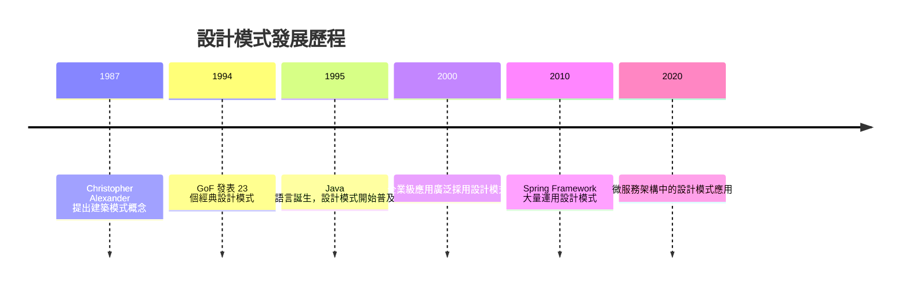

### 1.2 為什麼需要設計模式？

#### 1.2.1 解決重複問題
在軟體開發中，我們經常遇到相似的問題。設計模式提供了經過驗證的解決方案，避免重複造輪子。

#### 1.2.2 提升維護性
- **降低代碼複雜度**：統一的設計思路讓代碼更易理解
- **提高可讀性**：標準化的結構讓團隊成員快速上手
- **便於修改**：良好的設計讓功能擴展變得容易

#### 1.2.3 降低耦合度
設計模式幫助我們建立鬆耦合的系統架構，使各組件相對獨立，提高系統的靈活性。

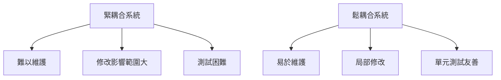

### 1.3 設計模式與軟體工程的關聯

#### 1.3.1 軟體工程原則
設計模式體現了重要的軟體工程原則：

1. **單一職責原則（SRP）**：一個類別只負責一個職責
2. **開放封閉原則（OCP）**：對擴展開放，對修改封閉
3. **里氏替換原則（LSP）**：子類別可以替換父類別
4. **介面隔離原則（ISP）**：使用多個專用介面，不要使用單一的總介面
5. **依賴反轉原則（DIP）**：依賴於抽象，不要依賴於具體

#### 1.3.2 架構設計的基石
設計模式是構建良好軟體架構的基礎工具，幫助我們：
- 分離關注點
- 建立清晰的組件邊界
- 提供標準的溝通語言

### 1.4 在專案開發中的價值與應用場景

#### 1.4.1 Spring Boot 應用
```java
// Spring Boot 中的設計模式應用範例
@Service
public class UserService {
    // 依賴注入體現了依賴反轉原則
    @Autowired
    private UserRepository userRepository;
    
    // Template Method Pattern 的應用
    public User processUser(UserRequest request) {
        validateRequest(request);    // 模板方法
        User user = createUser(request);  // 具體實現
        saveUser(user);             // 模板方法
        return user;
    }
}
```

#### 1.4.2 微服務架構
在微服務架構中，設計模式的應用：
- **Gateway Pattern**：API 閘道器統一入口
- **Circuit Breaker Pattern**：熔斷器防止級聯失敗
- **Observer Pattern**：事件驅動的服務間通訊

#### 1.4.3 銀行系統應用
```java
// 銀行系統中的 Strategy Pattern 應用
public class InterestCalculator {
    private InterestStrategy strategy;
    
    public void setStrategy(InterestStrategy strategy) {
        this.strategy = strategy;
    }
    
    public double calculateInterest(Account account) {
        return strategy.calculate(account);
    }
}

// 不同的利率計算策略
class SavingsInterestStrategy implements InterestStrategy {
    public double calculate(Account account) {
        return account.getBalance() * 0.02; // 2% 利率
    }
}
```

### 1.5 簡單案例：Singleton 模式導入

#### 1.5.1 問題場景
在應用程式中，某些物件（如資料庫連接池、日誌記錄器）只需要一個實例，避免資源浪費。

#### 1.5.2 Singleton 實現
```java
/**
 * 線程安全的 Singleton 實現
 */
public class DatabaseConnection {
    private static volatile DatabaseConnection instance;
    private Connection connection;
    
    private DatabaseConnection() {
        // 初始化資料庫連接
    }
    
    public static DatabaseConnection getInstance() {
        if (instance == null) {
            synchronized (DatabaseConnection.class) {
                if (instance == null) {
                    instance = new DatabaseConnection();
                }
            }
        }
        return instance;
    }
    
    public Connection getConnection() {
        return connection;
    }
}
```

#### 1.5.3 使用方式
```java
// 在業務代碼中使用
public class UserService {
    public List<User> getUsers() {
        DatabaseConnection dbConn = DatabaseConnection.getInstance();
        Connection conn = dbConn.getConnection();
        // 執行查詢...
        return users;
    }
}
```

### 1.6 實務注意事項

#### ✅ 最佳實踐
1. **不要過度設計**：只在真正需要時才使用設計模式
2. **選擇合適的模式**：根據具體問題選擇最適合的解決方案
3. **團隊共識**：確保團隊成員都理解所使用的設計模式

#### ⚠️ 常見陷阱
1. **盲目套用**：不分析問題就使用設計模式
2. **過度複雜化**：為了使用模式而使簡單問題複雜化
3. **模式濫用**：在不合適的場景下強行使用某種模式

---

## 第 2 章：設計模式分類與全貌

### 2.1 三大類別概述

GoF 設計模式按照用途分為三大類別：

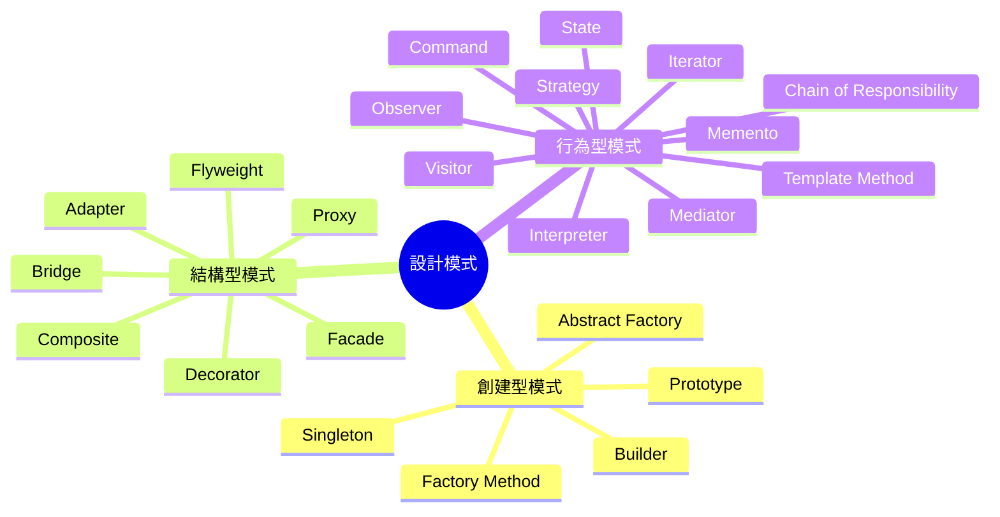

### 2.2 創建型模式（Creational Patterns）

#### 2.2.1 目的
解決物件建立過程中的問題，讓物件建立更加靈活，降低系統的耦合度。

#### 2.2.2 核心概念
- 將物件的建立與使用分離
- 使用抽象來隱藏物件建立的細節
- 提供靈活的物件建立機制

#### 2.2.3 簡單範例
```java
// Factory Method 簡單範例
public abstract class ShapeFactory {
    public abstract Shape createShape();
}

public class CircleFactory extends ShapeFactory {
    @Override
    public Shape createShape() {
        return new Circle();
    }
}
```

### 2.3 結構型模式（Structural Patterns）

#### 2.3.1 目的
處理類別和物件的組合關係，使不相關的類別能夠協同工作。

#### 2.3.2 核心概念
- 通過組合來實現新功能
- 適配不兼容的介面
- 簡化複雜的子系統

#### 2.3.3 簡單範例
```java
// Adapter 簡單範例
public class PowerAdapter implements ChargingPort {
    private LegacyCharger legacyCharger;
    
    public PowerAdapter(LegacyCharger legacyCharger) {
        this.legacyCharger = legacyCharger;
    }
    
    @Override
    public void charge() {
        legacyCharger.chargeLegacyDevice();
    }
}
```

### 2.4 行為型模式（Behavioral Patterns）

#### 2.4.1 目的
關注物件之間的互動和職責分配，使物件之間的通訊更加靈活。

#### 2.4.2 核心概念
- 定義物件間的通訊協議
- 分配演算法和責任
- 描述難以跟蹤的控制流程

#### 2.4.3 簡單範例
```java
// Observer 簡單範例
public class NewsAgency {
    private List<Observer> observers = new ArrayList<>();
    private String news;
    
    public void addObserver(Observer observer) {
        observers.add(observer);
    }
    
    public void setNews(String news) {
        this.news = news;
        notifyAllObservers();
    }
    
    private void notifyAllObservers() {
        observers.forEach(observer -> observer.update(news));
    }
}
```

### 2.5 設計模式全覽表

| 模式類型 | 模式名稱 | 主要目的 | 適用場景 | 常見應用 |
|----------|----------|----------|----------|----------|
| **創建型** | Singleton | 確保只有一個實例 | 全域資源管理 | 資料庫連接池、日誌 |
| | Factory Method | 建立物件的介面 | 不確定要建立哪種物件 | Spring Bean 工廠 |
| | Abstract Factory | 建立相關物件族群 | 跨平台應用 | GUI 元件工廠 |
| | Builder | 逐步建構複雜物件 | 建構參數很多的物件 | SQL 查詢建構器 |
| | Prototype | 複製現有物件 | 建立物件代價高 | 深拷貝操作 |
| **結構型** | Adapter | 介面轉換 | 整合第三方庫 | 遺留系統整合 |
| | Bridge | 分離抽象與實現 | 避免永久綁定 | 跨平台驅動程式 |
| | Composite | 樹狀結構操作 | 部分-整體層次結構 | 檔案系統、UI 組件 |
| | Decorator | 動態增加功能 | 不修改原類別下擴展 | I/O 串流、Web 過濾器 |
| | Facade | 簡化子系統介面 | 簡化複雜 API | 第三方 SDK 封裝 |
| | Flyweight | 共享細粒度物件 | 大量相似物件 | 字型渲染、快取 |
| | Proxy | 控制物件存取 | 延遲載入、權限控制 | 遠端代理、快取代理 |
| **行為型** | Chain of Responsibility | 請求沿鏈傳遞 | 多個處理者 | 請求過濾鏈 |
| | Command | 請求封裝為物件 | 參數化、佇列、日誌 | GUI 按鈕、宏命令 |
| | Interpreter | 解釋特定語言 | 簡單語法解析 | 正規表達式、SQL |
| | Iterator | 循序存取元素 | 遍歷集合 | Java Iterator |
| | Mediator | 中介者協調互動 | 物件間複雜通訊 | 聊天室、MVC |
| | Memento | 捕獲物件狀態 | 撤銷操作 | 編輯器、遊戲存檔 |
| | Observer | 一對多依賴關係 | 狀態變化通知 | MVC、事件系統 |
| | State | 物件行為隨狀態改變 | 有限狀態機 | 遊戲角色狀態 |
| | Strategy | 演算法族群互換 | 避免條件分支 | 排序演算法、付款方式 |
| | Template Method | 定義演算法骨架 | 固定流程、可變步驟 | 框架回調、生命週期 |
| | Visitor | 在不修改類別下定義新操作 | 結構穩定、操作多變 | 編譯器、文件處理 |

### 2.6 UML 圖例說明

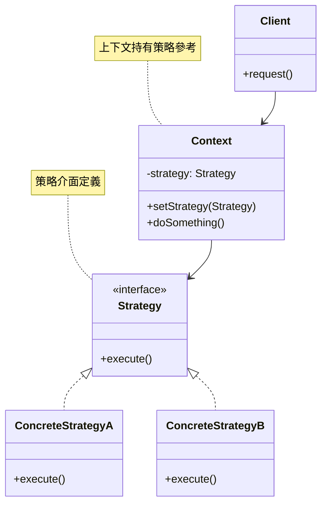

### 2.7 選擇設計模式的決策樹

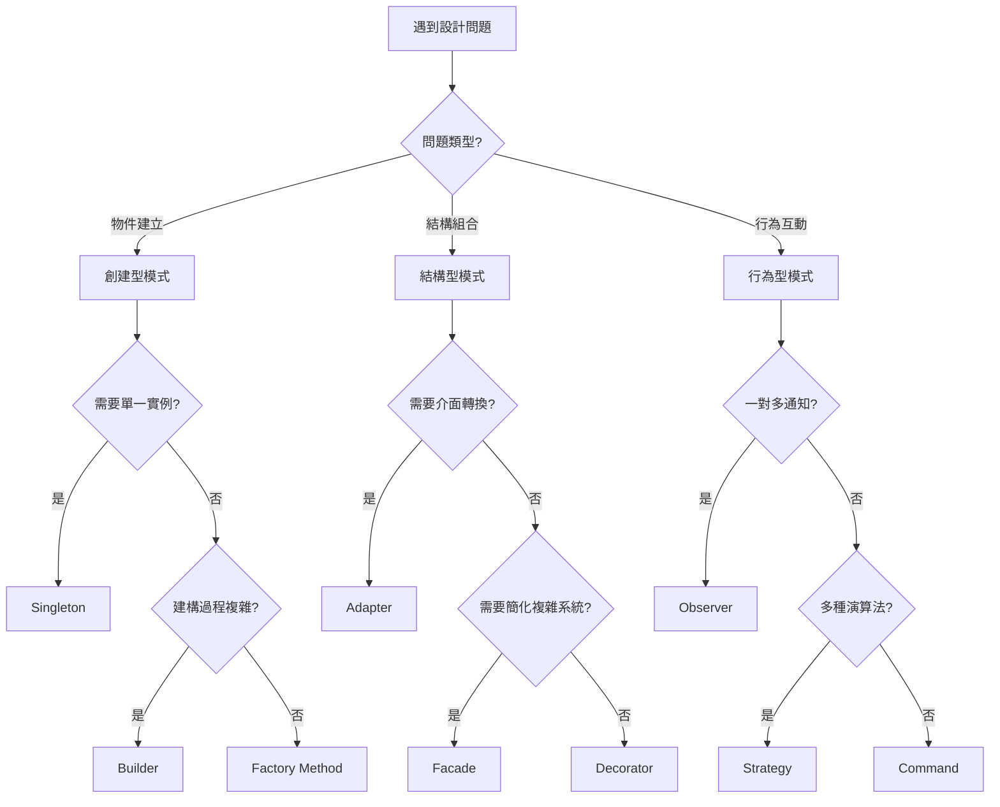

### 2.8 實務應用指南

#### 2.8.1 專案中的常見組合
在實際專案中，設計模式很少單獨使用，常見的組合包括：

1. **MVC 架構**：Observer + Strategy + Command
2. **Spring 框架**：Singleton + Factory + Proxy + Template Method
3. **微服務**：Facade + Observer + Strategy + Circuit Breaker

#### 2.8.2 學習建議順序
1. **入門**：Singleton, Factory Method, Observer
2. **進階**：Strategy, Decorator, Adapter
3. **高級**：Abstract Factory, Builder, Command
4. **專家**：Flyweight, Visitor, Interpreter

### 2.9 檢查清單

#### ✅ 選擇設計模式前的檢查項目
- [ ] 是否真的需要設計模式？
- [ ] 問題的核心是什麼？（建立、結構、行為）
- [ ] 團隊成員是否理解所選模式？
- [ ] 是否會增加不必要的複雜性？
- [ ] 是否符合專案的架構方針？

#### ✅ 實作設計模式後的檢查項目
- [ ] 代碼是否更易理解？
- [ ] 是否提高了可維護性？
- [ ] 是否降低了耦合度？
- [ ] 是否便於測試？
- [ ] 是否符合 SOLID 原則？

---

*本章節完成，接下來將詳細介紹各類型設計模式的具體實現...*

---

## 第 3 章：創建型模式

### 3.1 創建型模式簡介

創建型模式主要解決物件建立過程中的問題，讓物件建立更加靈活，並降低系統的耦合度。這些模式將物件的建立與使用分離，使用抽象來隱藏物件建立的細節。

#### 3.1.1 創建型模式的核心價值

- **彈性化物件建立**：根據不同條件建立不同的物件
- **降低耦合度**：客戶端不需要知道具體的建立細節
- **集中控制**：統一管理物件的建立邏輯
- **支援配置**：透過設定檔或參數控制物件建立

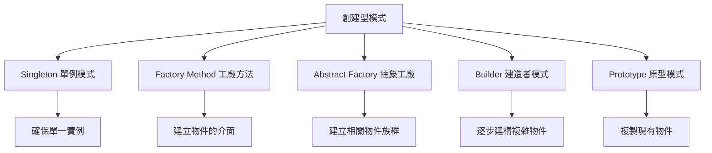

### 3.2 Singleton 單例模式

#### 3.2.1 模式定義

確保一個類別只有一個實例，並提供全域存取點。

#### 3.2.2 適用場景

- 資料庫連接池
- 日誌記錄器
- 組態管理
- 快取管理
- 執行緒池

#### 3.2.3 UML 類別圖

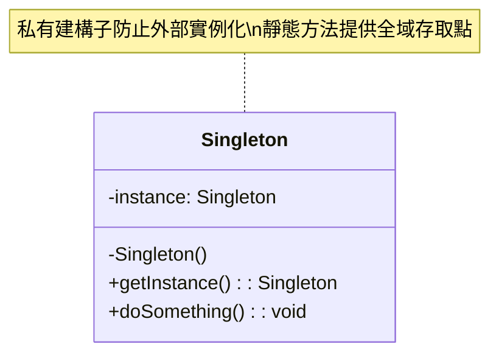

#### 3.2.4 實作範例

```java
/**
 * 線程安全的 Singleton 實現（雙重檢查鎖定）
 */
public class DatabaseConnectionPool {
    private static volatile DatabaseConnectionPool instance;
    private final List<Connection> connections;
    private final int maxConnections = 10;
    
    private DatabaseConnectionPool() {
        connections = new ArrayList<>();
        initializeConnections();
    }
    
    public static DatabaseConnectionPool getInstance() {
        if (instance == null) {
            synchronized (DatabaseConnectionPool.class) {
                if (instance == null) {
                    instance = new DatabaseConnectionPool();
                }
            }
        }
        return instance;
    }
    
    private void initializeConnections() {
        // 初始化連接池
        for (int i = 0; i < maxConnections; i++) {
            connections.add(createConnection());
        }
    }
    
    public Connection getConnection() {
        synchronized (connections) {
            if (!connections.isEmpty()) {
                return connections.remove(connections.size() - 1);
            }
            return createConnection(); // 如果池中沒有連接，建立新的
        }
    }
    
    public void releaseConnection(Connection connection) {
        synchronized (connections) {
            if (connections.size() < maxConnections) {
                connections.add(connection);
            } else {
                closeConnection(connection);
            }
        }
    }
    
    private Connection createConnection() {
        // 實際建立資料庫連接的邏輯
        return DriverManager.getConnection("jdbc:mysql://localhost:3306/mydb", 
                                           "username", "password");
    }
    
    private void closeConnection(Connection connection) {
        try {
            connection.close();
        } catch (SQLException e) {
            Logger.getLogger(DatabaseConnectionPool.class.getName())
                  .log(Level.SEVERE, "無法關閉資料庫連接", e);
        }
    }
}
```

#### 3.2.5 使用方式

```java
// 在業務邏輯中使用
public class UserService {
    public List<User> getUsers() {
        DatabaseConnectionPool pool = DatabaseConnectionPool.getInstance();
        Connection conn = pool.getConnection();
        
        try {
            // 執行資料庫查詢
            PreparedStatement stmt = conn.prepareStatement("SELECT * FROM users");
            ResultSet rs = stmt.executeQuery();
            // 處理結果...
            return users;
        } catch (SQLException e) {
            throw new RuntimeException("查詢用戶失敗", e);
        } finally {
            pool.releaseConnection(conn);
        }
    }
}
```

#### 3.2.6 專案應用案例

**Spring Boot 中的應用配置**

```java
@Configuration
public class AppConfig {
    
    @Bean
    @Scope("singleton")  // 預設就是 singleton
    public RedisTemplate<String, Object> redisTemplate() {
        RedisTemplate<String, Object> template = new RedisTemplate<>();
        template.setConnectionFactory(jedisConnectionFactory());
        return template;
    }
    
    // 系統配置管理（Singleton 應用）
    @Component
    public class SystemConfig {
        private static volatile SystemConfig instance;
        private Properties config;
        
        private SystemConfig() {
            loadConfiguration();
        }
        
        public static SystemConfig getInstance() {
            if (instance == null) {
                synchronized (SystemConfig.class) {
                    if (instance == null) {
                        instance = new SystemConfig();
                    }
                }
            }
            return instance;
        }
        
        private void loadConfiguration() {
            config = new Properties();
            try {
                config.load(getClass().getResourceAsStream("/application.properties"));
            } catch (IOException e) {
                throw new RuntimeException("無法載入系統配置", e);
            }
        }
        
        public String getProperty(String key) {
            return config.getProperty(key);
        }
    }
}
```

### 3.3 Factory Method 工廠方法模式

#### 3.3.1 模式定義

定義一個建立物件的介面，讓子類別決定實例化哪一個類別。

#### 3.3.2 適用場景

- 不知道確切需要建立哪種物件
- 框架需要標準化物件建立流程
- 需要將物件建立延遲到子類別
- 替換現有物件建立邏輯

#### 3.3.3 UML 類別圖

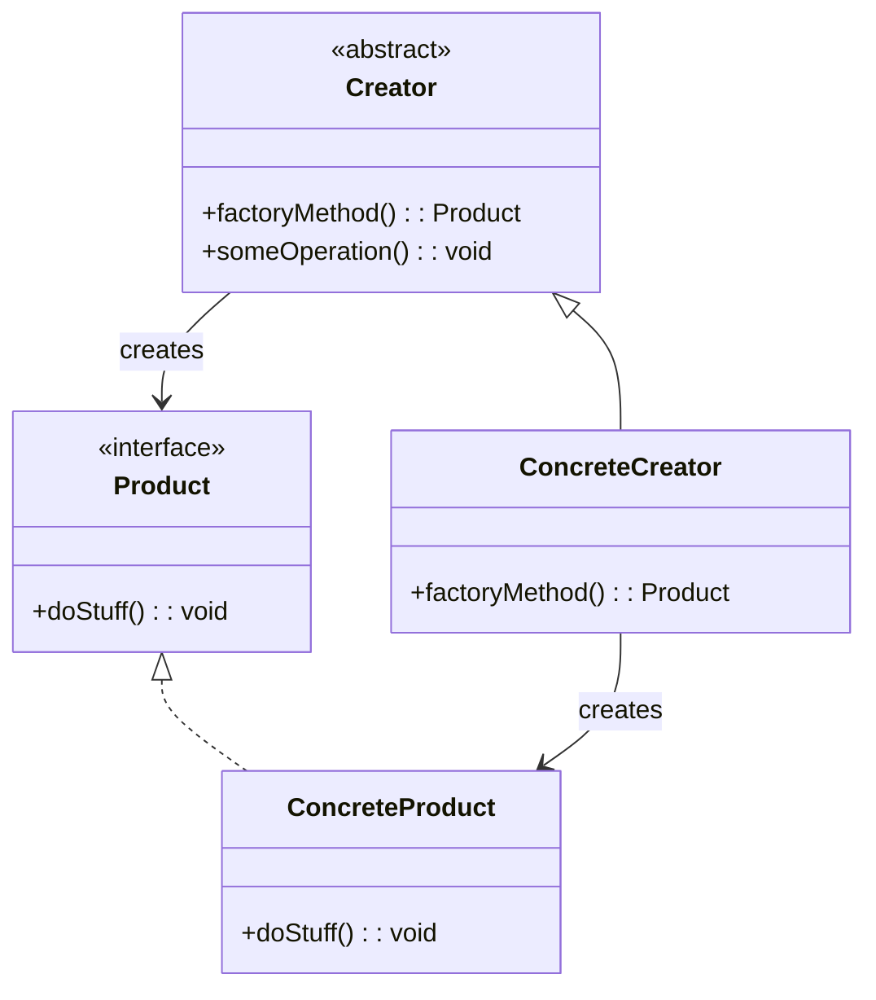

#### 3.3.4 實作範例

```java
/**
 * 抽象產品介面
 */
public interface Payment {
    void processPayment(double amount);
    boolean validatePayment();
    String getPaymentType();
}

/**
 * 具體產品：信用卡支付
 */
public class CreditCardPayment implements Payment {
    private String cardNumber;
    private String cardHolderName;
    
    public CreditCardPayment(String cardNumber, String cardHolderName) {
        this.cardNumber = cardNumber;
        this.cardHolderName = cardHolderName;
    }
    
    @Override
    public void processPayment(double amount) {
        System.out.println("處理信用卡支付：金額 " + amount + "，卡號 " + maskCardNumber());
        // 實際的信用卡支付處理邏輯
    }
    
    @Override
    public boolean validatePayment() {
        // 驗證信用卡資訊
        return cardNumber != null && cardNumber.length() == 16;
    }
    
    @Override
    public String getPaymentType() {
        return "CREDIT_CARD";
    }
    
    private String maskCardNumber() {
        return "**** **** **** " + cardNumber.substring(12);
    }
}

/**
 * 具體產品：PayPal 支付
 */
public class PayPalPayment implements Payment {
    private String email;
    
    public PayPalPayment(String email) {
        this.email = email;
    }
    
    @Override
    public void processPayment(double amount) {
        System.out.println("處理 PayPal 支付：金額 " + amount + "，帳戶 " + email);
        // 實際的 PayPal 支付處理邏輯
    }
    
    @Override
    public boolean validatePayment() {
        return email != null && email.contains("@");
    }
    
    @Override
    public String getPaymentType() {
        return "PAYPAL";
    }
}

/**
 * 抽象工廠
 */
public abstract class PaymentFactory {
    
    public abstract Payment createPayment();
    
    // 模板方法，定義支付處理流程
    public void processOrder(double amount) {
        Payment payment = createPayment();
        if (payment.validatePayment()) {
            payment.processPayment(amount);
            logPayment(payment, amount);
        } else {
            throw new IllegalArgumentException("支付驗證失敗");
        }
    }
    
    private void logPayment(Payment payment, double amount) {
        System.out.println("支付記錄：類型=" + payment.getPaymentType() + 
                          "，金額=" + amount + "，時間=" + new Date());
    }
}

/**
 * 具體工廠：信用卡支付工廠
 */
public class CreditCardPaymentFactory extends PaymentFactory {
    private String cardNumber;
    private String cardHolderName;
    
    public CreditCardPaymentFactory(String cardNumber, String cardHolderName) {
        this.cardNumber = cardNumber;
        this.cardHolderName = cardHolderName;
    }
    
    @Override
    public Payment createPayment() {
        return new CreditCardPayment(cardNumber, cardHolderName);
    }
}

/**
 * 具體工廠：PayPal 支付工廠
 */
public class PayPalPaymentFactory extends PaymentFactory {
    private String email;
    
    public PayPalPaymentFactory(String email) {
        this.email = email;
    }
    
    @Override
    public Payment createPayment() {
        return new PayPalPayment(email);
    }
}
```

#### 3.3.5 使用方式

```java
public class PaymentService {
    
    public void processCustomerPayment(String paymentType, double amount, 
                                     Map<String, String> paymentDetails) {
        PaymentFactory factory = createPaymentFactory(paymentType, paymentDetails);
        factory.processOrder(amount);
    }
    
    private PaymentFactory createPaymentFactory(String paymentType, 
                                              Map<String, String> details) {
        switch (paymentType.toUpperCase()) {
            case "CREDIT_CARD":
                return new CreditCardPaymentFactory(
                    details.get("cardNumber"), 
                    details.get("cardHolderName")
                );
            case "PAYPAL":
                return new PayPalPaymentFactory(details.get("email"));
            default:
                throw new IllegalArgumentException("不支援的支付類型：" + paymentType);
        }
    }
}

// 使用範例
public class OrderController {
    private PaymentService paymentService = new PaymentService();
    
    public void processOrder(Order order) {
        Map<String, String> paymentDetails = new HashMap<>();
        
        if ("CREDIT_CARD".equals(order.getPaymentType())) {
            paymentDetails.put("cardNumber", order.getCardNumber());
            paymentDetails.put("cardHolderName", order.getCardHolderName());
        } else if ("PAYPAL".equals(order.getPaymentType())) {
            paymentDetails.put("email", order.getPaypalEmail());
        }
        
        paymentService.processCustomerPayment(
            order.getPaymentType(), 
            order.getTotalAmount(), 
            paymentDetails
        );
    }
}
```

#### 3.3.6 專案應用案例

**Spring Boot 中的工廠模式應用**

```java
@Component
public class NotificationFactory {
    
    @Autowired
    private EmailNotificationService emailService;
    
    @Autowired
    private SmsNotificationService smsService;
    
    @Autowired
    private PushNotificationService pushService;
    
    public NotificationService createNotificationService(String type) {
        switch (type.toLowerCase()) {
            case "email":
                return emailService;
            case "sms":
                return smsService;
            case "push":
                return pushService;
            default:
                throw new IllegalArgumentException("不支援的通知類型: " + type);
        }
    }
}

@Service
public class UserNotificationService {
    
    @Autowired
    private NotificationFactory notificationFactory;
    
    public void sendWelcomeMessage(User user, String preferredChannel) {
        NotificationService notificationService = 
            notificationFactory.createNotificationService(preferredChannel);
        
        String message = "歡迎加入我們的服務！";
        notificationService.sendNotification(user, message);
    }
}
```

### 3.7 Prototype 原型模式

#### 3.7.1 模式定義

用原型實例指定建立物件的種類，並且透過複製這些原型建立新的物件。

#### 3.7.2 適用場景

- 當建立新的物件實例代價比較高時
- 避免建立一個與產品類別層次平行的工廠類別層次
- 當一個系統應該獨立於它的產品建立、構成和表示時
- 需要保存物件狀態的快照

#### 3.7.3 實作範例

```java
/**
 * 抽象原型
 */
public abstract class GameCharacter implements Cloneable {
    protected String name;
    protected int level;
    protected int health;
    protected int mana;
    protected List<String> skills;
    protected Equipment equipment;
    
    public GameCharacter(String name) {
        this.name = name;
        this.level = 1;
        this.health = 100;
        this.mana = 50;
        this.skills = new ArrayList<>();
        this.equipment = new Equipment();
    }
    
    // 深拷貝實現
    @Override
    public GameCharacter clone() {
        try {
            GameCharacter cloned = (GameCharacter) super.clone();
            
            // 深拷貝集合和物件
            cloned.skills = new ArrayList<>(this.skills);
            cloned.equipment = this.equipment.clone();
            
            return cloned;
        } catch (CloneNotSupportedException e) {
            throw new RuntimeException("複製角色失敗", e);
        }
    }
    
    // 抽象方法，子類別實現具體行為
    public abstract void useSpecialAbility();
    
    // Getters and Setters...
}

/**
 * 具體原型：戰士
 */
public class Warrior extends GameCharacter {
    
    public Warrior(String name) {
        super(name);
        this.health = 150;
        this.mana = 30;
        this.skills.add("劍擊");
        this.skills.add("盾牌格擋");
    }
    
    @Override
    public void useSpecialAbility() {
        System.out.println(name + " 使用狂暴攻擊！");
    }
    
    @Override
    public Warrior clone() {
        return (Warrior) super.clone();
    }
}
```

### 3.8 創建型模式總結

#### 3.8.1 模式比較

| 模式 | 主要目的 | 使用時機 | 優點 | 缺點 |
|------|----------|----------|------|------|
| **Singleton** | 確保單一實例 | 全域資源管理 | 節省記憶體、統一存取 | 全域狀態、測試困難 |
| **Factory Method** | 建立物件介面 | 不確定建立哪種物件 | 降低耦合、易擴展 | 增加類別數量 |
| **Abstract Factory** | 建立物件族群 | 跨平台、相關物件組 | 產品一致性、易切換 | 擴展困難 |
| **Builder** | 逐步建構複雜物件 | 多參數、不可變物件 | 參數清晰、步驟控制 | 程式碼較長 |
| **Prototype** | 複製現有物件 | 建立成本高、狀態保存 | 效能優良、動態配置 | 深拷貝複雜 |

#### 3.8.2 實務注意事項

#### ✅ 創建型模式最佳實踐

1. **Singleton 最佳實踐**：
   - 使用枚舉實現（推薦）
   - 避免在 Singleton 中持有可變狀態
   - 考慮使用依賴注入框架（如 Spring）

2. **Factory Method 最佳實踐**：
   - 結合策略模式管理工廠
   - 使用註解和反射自動註冊
   - 考慮快取工廠實例

3. **Builder 最佳實踐**：
   - 驗證必要參數
   - 提供預設值
   - 支援鏈式呼叫

#### ⚠️ 常見陷阱

- **Singleton 記憶體洩漏**：長期持有大對象參考
- **多執行緒問題**：未正確處理並發存取
- **工廠過於複雜**：包含太多創建邏輯
- **Builder 參數爆炸**：太多可選參數
- **Prototype 深拷貝錯誤**：物件參考複製問題

---

*第3章創建型模式的 Singleton 和 Factory Method 部分完成，接下來將繼續介紹其他創建型模式...*

### 3.5 Abstract Factory 抽象工廠模式

#### 3.5.1 模式定義

提供一個介面來建立一系列相關或相互依賴的物件，而無需指定其具體類別。

#### 3.5.2 適用場景

- 系統需要獨立於產品的建立、組成和表示
- 系統需要由多個產品系列中的一個來配置
- 需要強調一系列相關產品物件的設計以便進行聯合使用
- 跨平台應用開發

#### 3.5.3 UML 類別圖

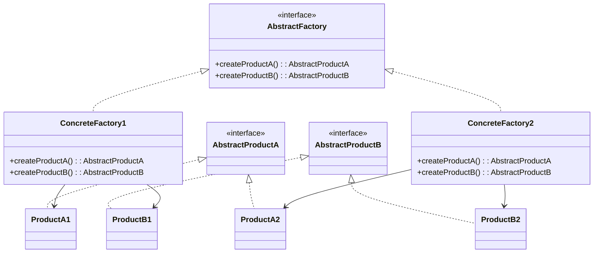

#### 3.5.4 實作範例

```java
/**
 * 抽象產品：按鈕
 */
public interface Button {
    void render();
    void onClick();
}

/**
 * 抽象產品：複選框
 */
public interface Checkbox {
    void render();
    void toggle();
}

/**
 * Windows 風格按鈕
 */
public class WindowsButton implements Button {
    @Override
    public void render() {
        System.out.println("渲染 Windows 風格按鈕");
    }
    
    @Override
    public void onClick() {
        System.out.println("處理 Windows 按鈕點擊事件");
    }
}

/**
 * Windows 風格複選框
 */
public class WindowsCheckbox implements Checkbox {
    @Override
    public void render() {
        System.out.println("渲染 Windows 風格複選框");
    }
    
    @Override
    public void toggle() {
        System.out.println("切換 Windows 複選框狀態");
    }
}

/**
 * macOS 風格按鈕
 */
public class MacOSButton implements Button {
    @Override
    public void render() {
        System.out.println("渲染 macOS 風格按鈕");
    }
    
    @Override
    public void onClick() {
        System.out.println("處理 macOS 按鈕點擊事件");
    }
}

/**
 * macOS 風格複選框
 */
public class MacOSCheckbox implements Checkbox {
    @Override
    public void render() {
        System.out.println("渲染 macOS 風格複選框");
    }
    
    @Override
    public void toggle() {
        System.out.println("切換 macOS 複選框狀態");
    }
}

/**
 * 抽象 GUI 工廠
 */
public interface GUIFactory {
    Button createButton();
    Checkbox createCheckbox();
}

/**
 * Windows GUI 工廠
 */
public class WindowsFactory implements GUIFactory {
    @Override
    public Button createButton() {
        return new WindowsButton();
    }
    
    @Override
    public Checkbox createCheckbox() {
        return new WindowsCheckbox();
    }
}

/**
 * macOS GUI 工廠
 */
public class MacOSFactory implements GUIFactory {
    @Override
    public Button createButton() {
        return new MacOSButton();
    }
    
    @Override
    public Checkbox createCheckbox() {
        return new MacOSCheckbox();
    }
}

/**
 * 應用程式類別
 */
public class Application {
    private Button button;
    private Checkbox checkbox;
    
    public Application(GUIFactory factory) {
        button = factory.createButton();
        checkbox = factory.createCheckbox();
    }
    
    public void renderUI() {
        button.render();
        checkbox.render();
    }
    
    public void handleUserInput() {
        button.onClick();
        checkbox.toggle();
    }
}
```

#### 3.5.5 使用方式

```java
public class GUIApplicationDemo {
    
    public static void main(String[] args) {
        // 根據系統環境選擇工廠
        String osName = System.getProperty("os.name").toLowerCase();
        GUIFactory factory;
        
        if (osName.contains("windows")) {
            factory = new WindowsFactory();
        } else if (osName.contains("mac")) {
            factory = new MacOSFactory();
        } else {
            throw new UnsupportedOperationException("不支援的作業系統: " + osName);
        }
        
        // 建立應用程式
        Application app = new Application(factory);
        app.renderUI();
        app.handleUserInput();
    }
}

// 更實用的工廠管理器
public class GUIFactoryManager {
    private static final Map<String, GUIFactory> factories = new HashMap<>();
    
    static {
        factories.put("windows", new WindowsFactory());
        factories.put("macos", new MacOSFactory());
        factories.put("linux", new LinuxFactory()); // 假設還有 Linux 工廠
    }
    
    public static GUIFactory getFactory(String platform) {
        GUIFactory factory = factories.get(platform.toLowerCase());
        if (factory == null) {
            throw new IllegalArgumentException("不支援的平台: " + platform);
        }
        return factory;
    }
    
    public static GUIFactory getFactoryForCurrentPlatform() {
        String osName = System.getProperty("os.name").toLowerCase();
        
        if (osName.contains("windows")) {
            return getFactory("windows");
        } else if (osName.contains("mac")) {
            return getFactory("macos");
        } else if (osName.contains("linux")) {
            return getFactory("linux");
        }
        
        throw new UnsupportedOperationException("不支援的作業系統: " + osName);
    }
}
```

### 3.6 Builder 建造者模式

#### 3.6.1 模式定義

將一個複雜物件的建構與其表示分離，使得同樣的建構過程可以建立不同的表示。

#### 3.6.2 適用場景

- 建立複雜物件，且物件的各部分子建構過程獨立
- 建構過程必須允許被建構的物件有不同的表示
- 當物件有很多可選參數時
- 需要不可變物件

#### 3.6.3 UML 類別圖

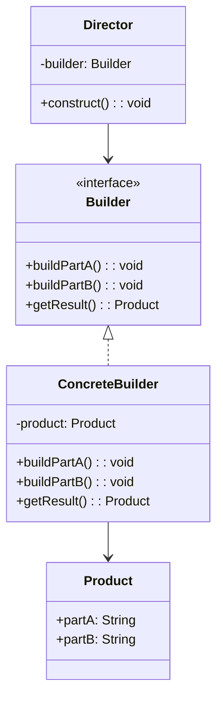

#### 3.6.4 實作範例

```java
/**
 * 產品類別：電腦
 */
public class Computer {
    private String cpu;
    private String ram;
    private String storage;
    private String graphics;
    private String motherboard;
    private boolean hasWifi;
    private boolean hasBluetooth;
    private String powerSupply;
    
    // 私有建構子，只能透過 Builder 建立
    private Computer(ComputerBuilder builder) {
        this.cpu = builder.cpu;
        this.ram = builder.ram;
        this.storage = builder.storage;
        this.graphics = builder.graphics;
        this.motherboard = builder.motherboard;
        this.hasWifi = builder.hasWifi;
        this.hasBluetooth = builder.hasBluetooth;
        this.powerSupply = builder.powerSupply;
    }
    
    // Getters
    public String getCpu() { return cpu; }
    public String getRam() { return ram; }
    public String getStorage() { return storage; }
    public String getGraphics() { return graphics; }
    public String getMotherboard() { return motherboard; }
    public boolean hasWifi() { return hasWifi; }
    public boolean hasBluetooth() { return hasBluetooth; }
    public String getPowerSupply() { return powerSupply; }
    
    @Override
    public String toString() {
        return "Computer{" +
                "cpu='" + cpu + '\'' +
                ", ram='" + ram + '\'' +
                ", storage='" + storage + '\'' +
                ", graphics='" + graphics + '\'' +
                ", motherboard='" + motherboard + '\'' +
                ", hasWifi=" + hasWifi +
                ", hasBluetooth=" + hasBluetooth +
                ", powerSupply='" + powerSupply + '\'' +
                '}';
    }
    
    /**
     * Builder 內部類別
     */
    public static class ComputerBuilder {
        private String cpu;
        private String ram;
        private String storage;
        private String graphics;
        private String motherboard;
        private boolean hasWifi = false;
        private boolean hasBluetooth = false;
        private String powerSupply;
        
        public ComputerBuilder cpu(String cpu) {
            this.cpu = cpu;
            return this;
        }
        
        public ComputerBuilder ram(String ram) {
            this.ram = ram;
            return this;
        }
        
        public ComputerBuilder storage(String storage) {
            this.storage = storage;
            return this;
        }
        
        public ComputerBuilder graphics(String graphics) {
            this.graphics = graphics;
            return this;
        }
        
        public ComputerBuilder motherboard(String motherboard) {
            this.motherboard = motherboard;
            return this;
        }
        
        public ComputerBuilder wifi(boolean hasWifi) {
            this.hasWifi = hasWifi;
            return this;
        }
        
        public ComputerBuilder bluetooth(boolean hasBluetooth) {
            this.hasBluetooth = hasBluetooth;
            return this;
        }
        
        public ComputerBuilder powerSupply(String powerSupply) {
            this.powerSupply = powerSupply;
            return this;
        }
        
        public Computer build() {
            // 驗證必要欄位
            if (cpu == null || ram == null || storage == null) {
                throw new IllegalStateException("CPU、RAM 和儲存設備為必要組件");
            }
            
            // 設定預設值
            if (graphics == null) {
                graphics = "整合式顯示卡";
            }
            if (powerSupply == null) {
                powerSupply = "500W";
            }
            
            return new Computer(this);
        }
    }
}
```

#### 3.6.5 使用方式

```java
public class ComputerBuilderDemo {
    
    public static void main(String[] args) {
        // 建立遊戲電腦
        Computer gamingComputer = new Computer.ComputerBuilder()
                .cpu("Intel i9-11900K")
                .ram("32GB DDR4")
                .storage("1TB NVMe SSD")
                .graphics("RTX 3080")
                .motherboard("ASUS ROG Strix Z590-E")
                .wifi(true)
                .bluetooth(true)
                .powerSupply("850W")
                .build();
        
        System.out.println("遊戲電腦: " + gamingComputer);
        
        // 建立辦公電腦
        Computer officeComputer = new Computer.ComputerBuilder()
                .cpu("Intel i5-11400")
                .ram("16GB DDR4")
                .storage("512GB SSD")
                .wifi(true)
                .build();
        
        System.out.println("辦公電腦: " + officeComputer);
    }
}

// 預定義配置的 Director 類別
public class ComputerDirector {
    
    public Computer buildGamingComputer() {
        return new Computer.ComputerBuilder()
                .cpu("Intel i9-11900K")
                .ram("32GB DDR4")
                .storage("1TB NVMe SSD + 2TB HDD")
                .graphics("RTX 3080")
                .motherboard("ASUS ROG Strix Z590-E")
                .wifi(true)
                .bluetooth(true)
                .powerSupply("850W")
                .build();
    }
    
    public Computer buildOfficeComputer() {
        return new Computer.ComputerBuilder()
                .cpu("Intel i5-11400")
                .ram("16GB DDR4")
                .storage("512GB SSD")
                .motherboard("ASUS PRIME B560M-A")
                .wifi(true)
                .bluetooth(false)
                .powerSupply("450W")
                .build();
    }
    
    public Computer buildBudgetComputer() {
        return new Computer.ComputerBuilder()
                .cpu("AMD Ryzen 5 3600")
                .ram("8GB DDR4")
                .storage("256GB SSD")
                .wifi(true)
                .build();
    }
}
```

### 3.7 Prototype 原型模式

#### 3.7.1 模式定義

用原型實例指定建立物件的種類，並且透過複製這些原型建立新的物件。

#### 3.7.2 適用場景

- 當建立新的物件實例代價比較高時
- 避免建立一個與產品類別層次平行的工廠類別層次
- 當一個系統應該獨立於它的產品建立、構成和表示時
- 需要保存物件狀態的快照

#### 3.7.3 UML 類別圖

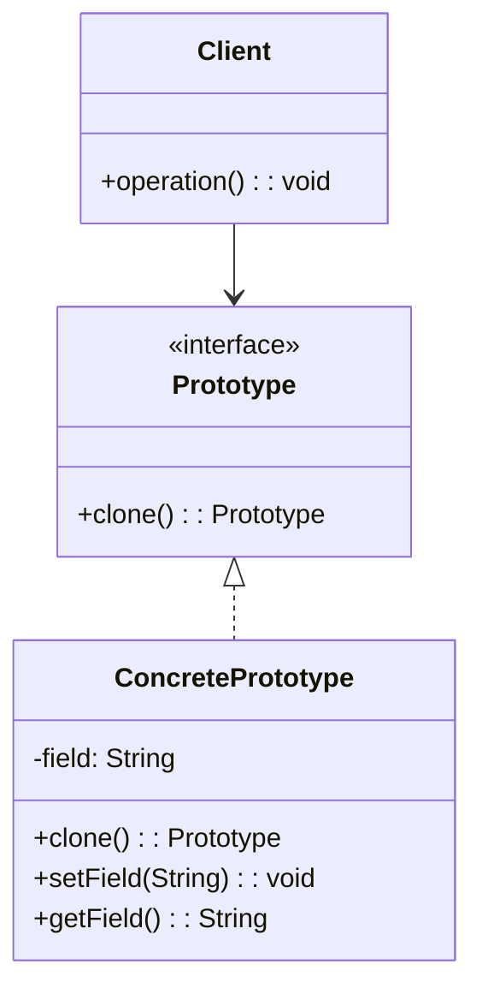

#### 3.7.4 實作範例

```java
/**
 * 抽象原型
 */
public abstract class GameCharacter implements Cloneable {
    protected String name;
    protected int level;
    protected int health;
    protected int mana;
    protected List<String> skills;
    protected Equipment equipment;
    
    public GameCharacter(String name) {
        this.name = name;
        this.level = 1;
        this.health = 100;
        this.mana = 50;
        this.skills = new ArrayList<>();
        this.equipment = new Equipment();
    }
    
    // 深拷貝實現
    @Override
    public GameCharacter clone() {
        try {
            GameCharacter cloned = (GameCharacter) super.clone();
            
            // 深拷貝集合和物件
            cloned.skills = new ArrayList<>(this.skills);
            cloned.equipment = this.equipment.clone();
            
            return cloned;
        } catch (CloneNotSupportedException e) {
            throw new RuntimeException("複製角色失敗", e);
        }
    }
    
    // 抽象方法，子類別實現具體行為
    public abstract void useSpecialAbility();
    
    // Getters and Setters
    public String getName() { return name; }
    public void setName(String name) { this.name = name; }
    public int getLevel() { return level; }
    public void setLevel(int level) { this.level = level; }
    public int getHealth() { return health; }
    public void setHealth(int health) { this.health = health; }
    public int getMana() { return mana; }
    public void setMana(int mana) { this.mana = mana; }
    public List<String> getSkills() { return skills; }
    public Equipment getEquipment() { return equipment; }
    
    @Override
    public String toString() {
        return getClass().getSimpleName() + "{" +
                "name='" + name + '\'' +
                ", level=" + level +
                ", health=" + health +
                ", mana=" + mana +
                ", skills=" + skills +
                ", equipment=" + equipment +
                '}';
    }
}

/**
 * 具體原型：戰士
 */
public class Warrior extends GameCharacter {
    
    public Warrior(String name) {
        super(name);
        this.health = 150;
        this.mana = 30;
        this.skills.add("劍擊");
        this.skills.add("盾牌格擋");
    }
    
    @Override
    public void useSpecialAbility() {
        System.out.println(name + " 使用狂暴攻擊！");
    }
    
    @Override
    public Warrior clone() {
        return (Warrior) super.clone();
    }
}

/**
 * 具體原型：法師
 */
public class Mage extends GameCharacter {
    
    public Mage(String name) {
        super(name);
        this.health = 80;
        this.mana = 120;
        this.skills.add("火球術");
        this.skills.add("治療術");
    }
    
    @Override
    public void useSpecialAbility() {
        System.out.println(name + " 施放毀滅性法術！");
    }
    
    @Override
    public Mage clone() {
        return (Mage) super.clone();
    }
}

/**
 * 裝備類別
 */
public class Equipment implements Cloneable {
    private String weapon;
    private String armor;
    private String accessory;
    
    public Equipment() {
        this.weapon = "基礎武器";
        this.armor = "基礎盔甲";
        this.accessory = "無";
    }
    
    @Override
    public Equipment clone() {
        try {
            return (Equipment) super.clone();
        } catch (CloneNotSupportedException e) {
            throw new RuntimeException("複製裝備失敗", e);
        }
    }
    
    // Getters and Setters
    public String getWeapon() { return weapon; }
    public void setWeapon(String weapon) { this.weapon = weapon; }
    public String getArmor() { return armor; }
    public void setArmor(String armor) { this.armor = armor; }
    public String getAccessory() { return accessory; }
    public void setAccessory(String accessory) { this.accessory = accessory; }
    
    @Override
    public String toString() {
        return "Equipment{" +
                "weapon='" + weapon + '\'' +
                ", armor='" + armor + '\'' +
                ", accessory='" + accessory + '\'' +
                '}';
    }
}

/**
 * 角色管理器（原型管理器）
 */
public class CharacterManager {
    private Map<String, GameCharacter> prototypes = new HashMap<>();
    
    public CharacterManager() {
        // 初始化預設原型
        loadPrototypes();
    }
    
    private void loadPrototypes() {
        Warrior basicWarrior = new Warrior("基礎戰士");
        Mage basicMage = new Mage("基礎法師");
        
        prototypes.put("warrior", basicWarrior);
        prototypes.put("mage", basicMage);
    }
    
    public GameCharacter createCharacter(String type, String name) {
        GameCharacter prototype = prototypes.get(type.toLowerCase());
        if (prototype == null) {
            throw new IllegalArgumentException("不支援的角色類型: " + type);
        }
        
        GameCharacter newCharacter = prototype.clone();
        newCharacter.setName(name);
        return newCharacter;
    }
    
    public void addPrototype(String key, GameCharacter character) {
        prototypes.put(key, character);
    }
    
    public GameCharacter getPrototype(String key) {
        return prototypes.get(key);
    }
}
```

#### 3.7.5 使用方式

```java
public class PrototypeDemo {
    
    public static void main(String[] args) {
        CharacterManager manager = new CharacterManager();
        
        // 建立角色
        GameCharacter warrior1 = manager.createCharacter("warrior", "阿尼瑪");
        GameCharacter warrior2 = manager.createCharacter("warrior", "巴爾塔薩");
        GameCharacter mage1 = manager.createCharacter("mage", "卡斯蒂亞");
        
        // 客製化角色
        warrior1.setLevel(5);
        warrior1.getSkills().add("迴旋攻擊");
        warrior1.getEquipment().setWeapon("黃金劍");
        
        mage1.setLevel(8);
        mage1.getSkills().add("閃電術");
        mage1.getEquipment().setWeapon("古代法杖");
        
        // 顯示角色資訊
        System.out.println("戰士1: " + warrior1);
        System.out.println("戰士2: " + warrior2);
        System.out.println("法師1: " + mage1);
        
        // 驗證深拷貝
        System.out.println("\n驗證深拷貝:");
        System.out.println("戰士1技能: " + warrior1.getSkills());
        System.out.println("戰士2技能: " + warrior2.getSkills());
        
        // 建立高級原型
        Warrior advancedWarrior = new Warrior("高級戰士");
        advancedWarrior.setLevel(10);
        advancedWarrior.setHealth(200);
        advancedWarrior.getSkills().add("龍捲風斬");
        advancedWarrior.getEquipment().setWeapon("龍牙劍");
        advancedWarrior.getEquipment().setArmor("龍鱗盔甲");
        
        manager.addPrototype("advanced_warrior", advancedWarrior);
        
        // 使用高級原型建立角色
        GameCharacter eliteWarrior = manager.createCharacter("advanced_warrior", "精英戰士");
        System.out.println("\n精英戰士: " + eliteWarrior);
    }
}
```

### 3.8 創建型模式總結

#### 3.8.1 模式比較

| 模式 | 主要目的 | 使用時機 | 優點 | 缺點 |
|------|----------|----------|------|------|
| **Singleton** | 確保單一實例 | 全域資源管理 | 節省記憶體、統一存取 | 全域狀態、測試困難 |
| **Factory Method** | 建立物件介面 | 不確定建立哪種物件 | 降低耦合、易擴展 | 增加類別數量 |
| **Abstract Factory** | 建立物件族群 | 跨平台、相關物件組 | 產品一致性、易切換 | 擴展困難 |
| **Builder** | 逐步建構複雜物件 | 多參數、不可變物件 | 參數清晰、步驟控制 | 程式碼較長 |
| **Prototype** | 複製現有物件 | 建立成本高、狀態保存 | 效能優良、動態配置 | 深拷貝複雜 |

#### 3.8.2 選擇指南

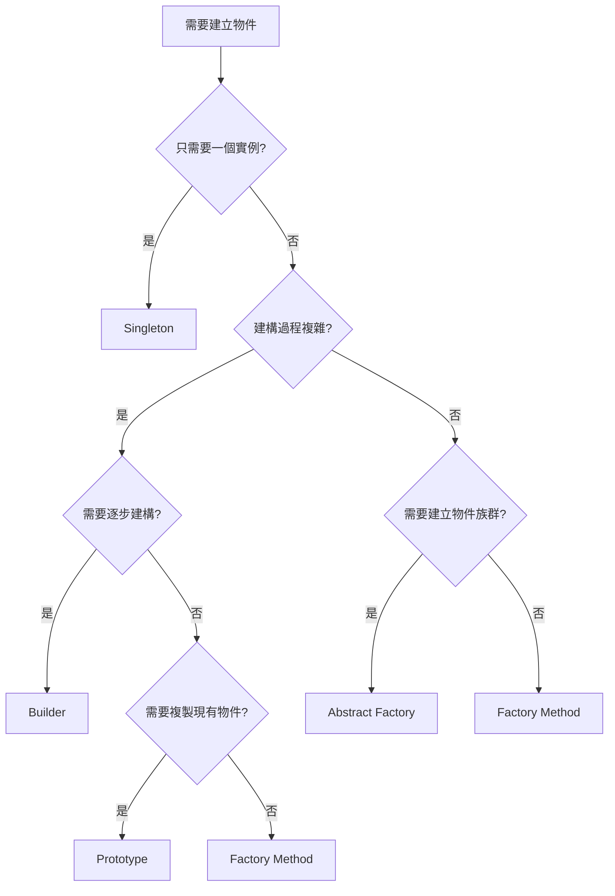

#### 3.8.3 實務檢查清單

#### ✅ 創建型模式最佳實踐

- [ ] 優先考慮依賴注入框架（如 Spring）
- [ ] 避免在建構子中進行複雜操作
- [ ] 考慮執行緒安全性
- [ ] 提供清晰的錯誤訊息
- [ ] 文件化物件建立的前置條件

#### ⚠️ 常見問題避免

- [ ] 不要濫用 Singleton（考慮是否真的需要）
- [ ] 工廠方法不要包含業務邏輯
- [ ] Builder 模式驗證必要參數
- [ ] Prototype 確保深拷貝正確性
- [ ] Abstract Factory 考慮擴展性

---

*第3章創建型模式完成，接下來將介紹第4章結構型模式...*

---

## 第 4 章：結構型模式

### 4.1 結構型模式簡介

結構型模式關注如何將類別和物件結合在一起形成更大的結構。這些模式簡化了設計，透過識別實現實體間關係的簡單方法來解決設計問題。

#### 4.1.1 結構型模式的核心價值

- **組合靈活性**：將簡單物件組合成複雜結構
- **介面適配**：讓不相容的介面能夠協同工作
- **功能擴展**：在不修改原有程式碼的情況下增加新功能
- **複雜性隱藏**：簡化複雜子系統的使用

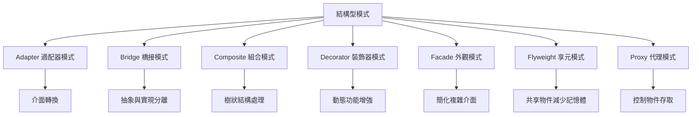

### 4.2 Adapter 適配器模式

#### 4.2.1 模式定義

將一個類別的介面轉換成客戶期望的另一個介面，讓原本介面不相容的類別可以合作無間。

#### 4.2.2 適用場景

- 整合第三方庫或遺留系統
- 介面不相容但功能相似的類別
- 需要使用現有類別但其介面不符合需求
- 系統升級時保持向下相容

#### 4.2.3 UML 類別圖

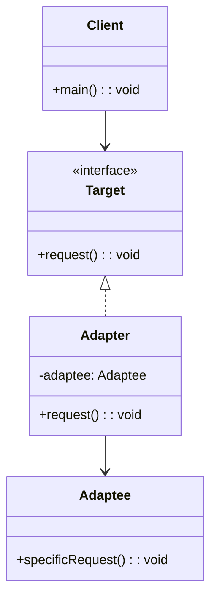

#### 4.2.4 實作範例

```java
/**
 * 目標介面：新的支付系統介面
 */
public interface PaymentProcessor {
    PaymentResult processPayment(PaymentRequest request);
    boolean validatePayment(PaymentRequest request);
    void refund(String transactionId, double amount);
}

/**
 * 支付請求物件
 */
public class PaymentRequest {
    private String cardNumber;
    private String expiryDate;
    private String cvv;
    private double amount;
    private String currency;
    
    public PaymentRequest(String cardNumber, String expiryDate, String cvv, 
                         double amount, String currency) {
        this.cardNumber = cardNumber;
        this.expiryDate = expiryDate;
        this.cvv = cvv;
        this.amount = amount;
        this.currency = currency;
    }
    
    // Getters
    public String getCardNumber() { return cardNumber; }
    public String getExpiryDate() { return expiryDate; }
    public String getCvv() { return cvv; }
    public double getAmount() { return amount; }
    public String getCurrency() { return currency; }
}

/**
 * 支付結果物件
 */
public class PaymentResult {
    private boolean success;
    private String transactionId;
    private String message;
    private String errorCode;
    
    public PaymentResult(boolean success, String transactionId, String message) {
        this.success = success;
        this.transactionId = transactionId;
        this.message = message;
    }
    
    public PaymentResult(boolean success, String message, String errorCode) {
        this.success = success;
        this.message = message;
        this.errorCode = errorCode;
    }
    
    // Getters
    public boolean isSuccess() { return success; }
    public String getTransactionId() { return transactionId; }
    public String getMessage() { return message; }
    public String getErrorCode() { return errorCode; }
}

/**
 * 遺留的支付系統（第三方或舊系統）
 */
public class LegacyPaymentSystem {
    
    public String chargeCard(String cardNum, String expiry, String securityCode, 
                           int amountInCents, String currencyCode) {
        // 模擬舊系統的支付處理
        System.out.println("Legacy System: 處理支付 " + amountInCents/100.0 + " " + currencyCode);
        
        // 簡單驗證
        if (cardNum == null || cardNum.length() != 16) {
            return "ERROR:INVALID_CARD";
        }
        
        if (amountInCents <= 0) {
            return "ERROR:INVALID_AMOUNT";
        }
        
        // 模擬成功交易
        return "TXN:" + System.currentTimeMillis();
    }
    
    public boolean verifyCardDetails(String cardNumber, String expiryDate, String cvv) {
        // 簡單的卡片驗證邏輯
        return cardNumber != null && cardNumber.length() == 16 &&
               expiryDate != null && expiryDate.matches("\\d{2}/\\d{2}") &&
               cvv != null && cvv.length() == 3;
    }
    
    public String reverseCreditCardCharge(String transactionReference, int amountInCents) {
        System.out.println("Legacy System: 退款 " + amountInCents/100.0);
        
        if (transactionReference == null || !transactionReference.startsWith("TXN:")) {
            return "ERROR:INVALID_TRANSACTION";
        }
        
        return "REFUND:" + System.currentTimeMillis();
    }
}

/**
 * 適配器：將遺留支付系統適配到新介面
 */
public class LegacyPaymentAdapter implements PaymentProcessor {
    private LegacyPaymentSystem legacySystem;
    
    public LegacyPaymentAdapter(LegacyPaymentSystem legacySystem) {
        this.legacySystem = legacySystem;
    }
    
    @Override
    public PaymentResult processPayment(PaymentRequest request) {
        try {
            // 將新介面的參數轉換為舊系統的格式
            int amountInCents = (int) (request.getAmount() * 100);
            
            String result = legacySystem.chargeCard(
                request.getCardNumber(),
                request.getExpiryDate(),
                request.getCvv(),
                amountInCents,
                request.getCurrency()
            );
            
            // 將舊系統的返回格式轉換為新介面的格式
            if (result.startsWith("TXN:")) {
                return new PaymentResult(true, result, "支付成功");
            } else if (result.startsWith("ERROR:")) {
                String errorCode = result.substring(6);
                return new PaymentResult(false, getErrorMessage(errorCode), errorCode);
            } else {
                return new PaymentResult(false, "未知錯誤", "UNKNOWN_ERROR");
            }
            
        } catch (Exception e) {
            return new PaymentResult(false, "系統錯誤: " + e.getMessage(), "SYSTEM_ERROR");
        }
    }
    
    @Override
    public boolean validatePayment(PaymentRequest request) {
        return legacySystem.verifyCardDetails(
            request.getCardNumber(),
            request.getExpiryDate(),
            request.getCvv()
        );
    }
    
    @Override
    public void refund(String transactionId, double amount) {
        int amountInCents = (int) (amount * 100);
        String result = legacySystem.reverseCreditCardCharge(transactionId, amountInCents);
        
        if (!result.startsWith("REFUND:")) {
            throw new RuntimeException("退款失敗: " + result);
        }
    }
    
    private String getErrorMessage(String errorCode) {
        switch (errorCode) {
            case "INVALID_CARD":
                return "無效的信用卡號碼";
            case "INVALID_AMOUNT":
                return "無效的金額";
            default:
                return "未知錯誤";
        }
    }
}

/**
 * 現代支付系統實現
 */
public class ModernPaymentProcessor implements PaymentProcessor {
    
    @Override
    public PaymentResult processPayment(PaymentRequest request) {
        System.out.println("Modern System: 處理支付 " + request.getAmount() + " " + request.getCurrency());
        
        // 現代系統的支付處理邏輯
        if (!validatePayment(request)) {
            return new PaymentResult(false, "支付驗證失敗", "VALIDATION_FAILED");
        }
        
        String transactionId = "MODERN_TXN_" + System.currentTimeMillis();
        return new PaymentResult(true, transactionId, "支付成功處理");
    }
    
    @Override
    public boolean validatePayment(PaymentRequest request) {
        // 現代的驗證邏輯
        return request.getCardNumber() != null && 
               request.getCardNumber().length() >= 13 && 
               request.getCardNumber().length() <= 19 &&
               request.getAmount() > 0;
    }
    
    @Override
    public void refund(String transactionId, double amount) {
        System.out.println("Modern System: 退款 " + amount + " for " + transactionId);
    }
}
```

#### 4.2.5 使用方式

```java
public class PaymentAdapterDemo {
    
    public static void main(String[] args) {
        // 建立支付請求
        PaymentRequest request = new PaymentRequest(
            "1234567890123456",
            "12/25",
            "123",
            99.99,
            "USD"
        );
        
        // 使用現代支付系統
        PaymentProcessor modernProcessor = new ModernPaymentProcessor();
        processPayment(modernProcessor, request, "現代支付系統");
        
        // 使用適配器包裝遺留系統
        LegacyPaymentSystem legacySystem = new LegacyPaymentSystem();
        PaymentProcessor adaptedProcessor = new LegacyPaymentAdapter(legacySystem);
        processPayment(adaptedProcessor, request, "遺留支付系統（透過適配器）");
    }
    
    private static void processPayment(PaymentProcessor processor, 
                                     PaymentRequest request, String systemName) {
        System.out.println("\n=== " + systemName + " ===");
        
        // 驗證支付
        if (processor.validatePayment(request)) {
            System.out.println("✓ 支付驗證通過");
            
            // 處理支付
            PaymentResult result = processor.processPayment(request);
            
            if (result.isSuccess()) {
                System.out.println("✓ 支付成功: " + result.getMessage());
                System.out.println("交易ID: " + result.getTransactionId());
                
                // 模擬退款
                try {
                    processor.refund(result.getTransactionId(), request.getAmount() / 2);
                    System.out.println("✓ 部分退款成功");
                } catch (Exception e) {
                    System.out.println("✗ 退款失敗: " + e.getMessage());
                }
            } else {
                System.out.println("✗ 支付失敗: " + result.getMessage());
                if (result.getErrorCode() != null) {
                    System.out.println("錯誤代碼: " + result.getErrorCode());
                }
            }
        } else {
            System.out.println("✗ 支付驗證失敗");
        }
    }
}
```

#### 4.2.6 專案應用案例

**Spring Boot 中的資料存取適配器**

```java
// 舊的資料存取介面
public interface LegacyUserDao {
    User findUserById(int id);
    List<User> findAllUsers();
    void saveUser(User user);
}

// 新的 JPA Repository 介面
public interface UserRepository extends JpaRepository<User, Long> {
    Optional<User> findByUsername(String username);
    List<User> findByStatus(UserStatus status);
}

// 適配器實現
@Component
public class UserRepositoryAdapter implements LegacyUserDao {
    
    @Autowired
    private UserRepository userRepository;
    
    @Override
    public User findUserById(int id) {
        return userRepository.findById((long) id).orElse(null);
    }
    
    @Override
    public List<User> findAllUsers() {
        return userRepository.findAll();
    }
    
    @Override
    public void saveUser(User user) {
        userRepository.save(user);
    }
}

// 服務層可以無縫使用新舊介面
@Service
public class UserService {
    
    @Autowired
    private LegacyUserDao legacyUserDao; // 注入適配器
    
    @Autowired
    private UserRepository userRepository; // 直接注入新介面
    
    public User getUserById(int id) {
        // 使用舊介面（透過適配器）
        return legacyUserDao.findUserById(id);
    }
    
    public User getUserByUsername(String username) {
        // 使用新介面
        return userRepository.findByUsername(username).orElse(null);
    }
}
```

### 4.3 Decorator 裝飾器模式

#### 4.3.1 模式定義

動態地給一個物件添加一些額外的職責，就增加功能來說，裝飾模式比產生子類別更為靈活。

#### 4.3.2 適用場景

- 在不影響其他物件的情況下，動態、透明地給單一物件添加職責
- 處理那些可以撤銷的職責
- 當不能採用產生子類別的方法進行擴充時
- 需要多層次功能組合

#### 4.3.3 UML 類別圖

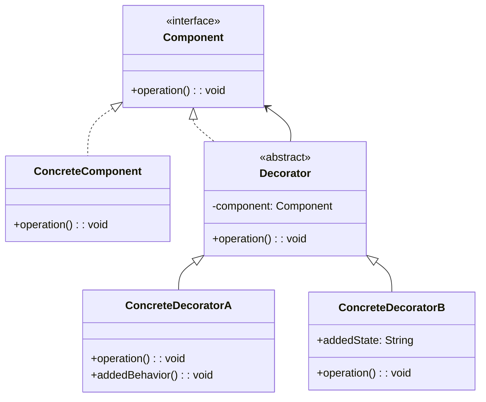

#### 4.3.4 實作範例

```java
/**
 * 抽象組件：咖啡
 */
public interface Coffee {
    double getCost();
    String getDescription();
}

/**
 * 具體組件：基礎咖啡
 */
public class SimpleCoffee implements Coffee {
    @Override
    public double getCost() {
        return 2.0;
    }
    
    @Override
    public String getDescription() {
        return "簡單咖啡";
    }
}

/**
 * 抽象裝飾器
 */
public abstract class CoffeeDecorator implements Coffee {
    protected Coffee coffee;
    
    public CoffeeDecorator(Coffee coffee) {
        this.coffee = coffee;
    }
    
    @Override
    public double getCost() {
        return coffee.getCost();
    }
    
    @Override
    public String getDescription() {
        return coffee.getDescription();
    }
}

/**
 * 具體裝飾器：牛奶
 */
public class MilkDecorator extends CoffeeDecorator {
    
    public MilkDecorator(Coffee coffee) {
        super(coffee);
    }
    
    @Override
    public double getCost() {
        return coffee.getCost() + 0.5;
    }
    
    @Override
    public String getDescription() {
        return coffee.getDescription() + " + 牛奶";
    }
}

/**
 * 具體裝飾器：糖
 */
public class SugarDecorator extends CoffeeDecorator {
    
    public SugarDecorator(Coffee coffee) {
        super(coffee);
    }
    
    @Override
    public double getCost() {
        return coffee.getCost() + 0.2;
    }
    
    @Override
    public String getDescription() {
        return coffee.getDescription() + " + 糖";
    }
}

/**
 * 具體裝飾器：巧克力
 */
public class ChocolateDecorator extends CoffeeDecorator {
    
    public ChocolateDecorator(Coffee coffee) {
        super(coffee);
    }
    
    @Override
    public double getCost() {
        return coffee.getCost() + 0.7;
    }
    
    @Override
    public String getDescription() {
        return coffee.getDescription() + " + 巧克力";
    }
}

/**
 * 進階裝飾器：特殊奶泡
 */
public class FoamDecorator extends CoffeeDecorator {
    private String foamType;
    
    public FoamDecorator(Coffee coffee, String foamType) {
        super(coffee);
        this.foamType = foamType;
    }
    
    @Override
    public double getCost() {
        double extraCost = 0.3;
        if ("特級".equals(foamType)) {
            extraCost = 0.8;
        }
        return coffee.getCost() + extraCost;
    }
    
    @Override
    public String getDescription() {
        return coffee.getDescription() + " + " + foamType + "奶泡";
    }
}
```

#### 4.3.5 使用方式

```java
public class CoffeeShop {
    
    public static void main(String[] args) {
        // 建立基本咖啡
        Coffee coffee = new SimpleCoffee();
        System.out.println(coffee.getDescription() + " - $" + coffee.getCost());
        
        // 添加牛奶
        coffee = new MilkDecorator(coffee);
        System.out.println(coffee.getDescription() + " - $" + coffee.getCost());
        
        // 添加糖
        coffee = new SugarDecorator(coffee);
        System.out.println(coffee.getDescription() + " - $" + coffee.getCost());
        
        // 添加巧克力
        coffee = new ChocolateDecorator(coffee);
        System.out.println(coffee.getDescription() + " - $" + coffee.getCost());
        
        // 添加特級奶泡
        coffee = new FoamDecorator(coffee, "特級");
        System.out.println(coffee.getDescription() + " - $" + coffee.getCost());
        
        System.out.println("\n=== 另一種組合 ===");
        
        // 不同的組合
        Coffee anotherCoffee = new SimpleCoffee();
        anotherCoffee = new ChocolateDecorator(anotherCoffee);
        anotherCoffee = new ChocolateDecorator(anotherCoffee); // 雙份巧克力
        anotherCoffee = new FoamDecorator(anotherCoffee, "普通");
        
        System.out.println(anotherCoffee.getDescription() + " - $" + anotherCoffee.getCost());
        
        // 建立咖啡建造器來簡化使用
        CoffeeBuilder builder = new CoffeeBuilder();
        Coffee customCoffee = builder
            .base()
            .addMilk()
            .addSugar()
            .addFoam("特級")
            .build();
        
        System.out.println("\n透過建造器: " + customCoffee.getDescription() + " - $" + customCoffee.getCost());
    }
}

/**
 * 咖啡建造器（簡化裝飾器的使用）
 */
public class CoffeeBuilder {
    private Coffee coffee;
    
    public CoffeeBuilder base() {
        coffee = new SimpleCoffee();
        return this;
    }
    
    public CoffeeBuilder addMilk() {
        coffee = new MilkDecorator(coffee);
        return this;
    }
    
    public CoffeeBuilder addSugar() {
        coffee = new SugarDecorator(coffee);
        return this;
    }
    
    public CoffeeBuilder addChocolate() {
        coffee = new ChocolateDecorator(coffee);
        return this;
    }
    
    public CoffeeBuilder addFoam(String type) {
        coffee = new FoamDecorator(coffee, type);
        return this;
    }
    
    public Coffee build() {
        return coffee;
    }
}
```

#### 4.3.6 專案應用案例

**Web 請求處理的裝飾器**

```java
// 基礎處理器介面
public interface RequestHandler {
    ResponseEntity<String> handle(HttpServletRequest request);
}

// 基礎實現
@Component
public class BaseRequestHandler implements RequestHandler {
    @Override
    public ResponseEntity<String> handle(HttpServletRequest request) {
        return ResponseEntity.ok("處理請求: " + request.getRequestURI());
    }
}

// 抽象裝飾器
public abstract class RequestHandlerDecorator implements RequestHandler {
    protected RequestHandler handler;
    
    public RequestHandlerDecorator(RequestHandler handler) {
        this.handler = handler;
    }
}

// 日誌裝飾器
@Component
public class LoggingDecorator extends RequestHandlerDecorator {
    private static final Logger logger = LoggerFactory.getLogger(LoggingDecorator.class);
    
    public LoggingDecorator(RequestHandler handler) {
        super(handler);
    }
    
    @Override
    public ResponseEntity<String> handle(HttpServletRequest request) {
        long startTime = System.currentTimeMillis();
        logger.info("請求開始: {} {}", request.getMethod(), request.getRequestURI());
        
        ResponseEntity<String> response = handler.handle(request);
        
        long endTime = System.currentTimeMillis();
        logger.info("請求完成: 耗時 {}ms, 狀態碼: {}", 
                   endTime - startTime, response.getStatusCodeValue());
        
        return response;
    }
}

// 快取裝飾器
@Component
public class CachingDecorator extends RequestHandlerDecorator {
    private final Map<String, ResponseEntity<String>> cache = new ConcurrentHashMap<>();
    
    public CachingDecorator(RequestHandler handler) {
        super(handler);
    }
    
    @Override
    public ResponseEntity<String> handle(HttpServletRequest request) {
        String cacheKey = request.getMethod() + ":" + request.getRequestURI();
        
        if (cache.containsKey(cacheKey)) {
            System.out.println("快取命中: " + cacheKey);
            return cache.get(cacheKey);
        }
        
        ResponseEntity<String> response = handler.handle(request);
        cache.put(cacheKey, response);
        System.out.println("結果已快取: " + cacheKey);
        
        return response;
    }
}

// 安全性裝飾器
@Component
public class SecurityDecorator extends RequestHandlerDecorator {
    
    public SecurityDecorator(RequestHandler handler) {
        super(handler);
    }
    
    @Override
    public ResponseEntity<String> handle(HttpServletRequest request) {
        // 檢查授權
        String authHeader = request.getHeader("Authorization");
        if (authHeader == null || !authHeader.startsWith("Bearer ")) {
            return ResponseEntity.status(HttpStatus.UNAUTHORIZED).body("未授權存取");
        }
        
        // 檢查 CSRF Token
        String csrfToken = request.getHeader("X-CSRF-Token");
        if (csrfToken == null) {
            return ResponseEntity.status(HttpStatus.FORBIDDEN).body("缺少 CSRF Token");
        }
        
        return handler.handle(request);
    }
}

// 使用示例
@RestController
public class ApiController {
    
    @Autowired
    private BaseRequestHandler baseHandler;
    
    @GetMapping("/api/secure-data")
    public ResponseEntity<String> getSecureData(HttpServletRequest request) {
        // 組合多個裝飾器
        RequestHandler handler = baseHandler;
        handler = new LoggingDecorator(handler);
        handler = new SecurityDecorator(handler);
        handler = new CachingDecorator(handler);
        
        return handler.handle(request);
    }
}
```

### 4.4 實務注意事項

#### ✅ Adapter 最佳實踐

1. **保持適配器輕量**：只做介面轉換，不包含業務邏輯
2. **錯誤處理**：適當轉換異常類型
3. **效能考量**：避免不必要的物件轉換

#### ✅ Decorator 最佳實踐

1. **保持介面一致**：裝飾器和原始物件實現相同介面
2. **考慮裝飾順序**：某些裝飾器的順序可能影響結果
3. **避免過度裝飾**：太多層裝飾會影響效能和可讀性

#### ⚠️ 常見陷阱

1. **Adapter 資料遺失**：轉換過程中丟失重要資訊
2. **Decorator 記憶體洩漏**：層層包裝導致物件無法回收
3. **介面膨脹**：為了適配而增加過多方法
4. **效能問題**：多層裝飾器導致呼叫鏈過長

---

*第4章結構型模式的 Adapter 和 Decorator 部分完成，接下來將繼續介紹其他結構型模式...*

### 4.5 Facade 外觀模式

#### 4.5.1 模式定義

為子系統中的一組介面提供一個一致的介面，外觀模式定義了一個高層介面，這個介面使得這一子系統更加容易使用。

#### 4.5.2 適用場景

- 為複雜子系統提供簡單介面
- 客戶端與多個子系統有依賴關係
- 系統層次化設計
- 遺留系統封裝

#### 4.5.3 實作範例

```java
/**
 * 子系統：音響設備
 */
public class StereoSystem {
    public void turnOn() {
        System.out.println("音響系統開啟");
    }
    
    public void turnOff() {
        System.out.println("音響系統關閉");
    }
    
    public void setVolume(int volume) {
        System.out.println("音量設定為: " + volume);
    }
    
    public void tuneRadio(String station) {
        System.out.println("調至電台: " + station);
    }
}

/**
 * 子系統：投影機
 */
public class Projector {
    public void turnOn() {
        System.out.println("投影機開啟");
    }
    
    public void turnOff() {
        System.out.println("投影機關閉");
    }
    
    public void setInput(String input) {
        System.out.println("投影機輸入源設定為: " + input);
    }
    
    public void focus() {
        System.out.println("投影機對焦完成");
    }
}

/**
 * 子系統：燈光控制
 */
public class LightingSystem {
    public void turnOff() {
        System.out.println("燈光關閉");
    }
    
    public void dimLights(int level) {
        System.out.println("燈光調暗至: " + level + "%");
    }
    
    public void turnOn() {
        System.out.println("燈光開啟");
    }
}

/**
 * 子系統：DVD 播放器
 */
public class DvdPlayer {
    public void turnOn() {
        System.out.println("DVD 播放器開啟");
    }
    
    public void turnOff() {
        System.out.println("DVD 播放器關閉");
    }
    
    public void play(String movie) {
        System.out.println("播放電影: " + movie);
    }
    
    public void stop() {
        System.out.println("停止播放");
    }
    
    public void pause() {
        System.out.println("暫停播放");
    }
}

/**
 * 外觀類別：家庭劇院系統
 */
public class HomeTheaterFacade {
    private StereoSystem stereo;
    private Projector projector;
    private LightingSystem lights;
    private DvdPlayer dvdPlayer;
    
    public HomeTheaterFacade(StereoSystem stereo, Projector projector, 
                           LightingSystem lights, DvdPlayer dvdPlayer) {
        this.stereo = stereo;
        this.projector = projector;
        this.lights = lights;
        this.dvdPlayer = dvdPlayer;
    }
    
    public void watchMovie(String movie) {
        System.out.println("=== 準備觀賞電影 ===");
        
        // 複雜的設備初始化流程
        lights.dimLights(10);
        projector.turnOn();
        projector.setInput("DVD");
        projector.focus();
        stereo.turnOn();
        stereo.setVolume(15);
        dvdPlayer.turnOn();
        dvdPlayer.play(movie);
        
        System.out.println("電影開始播放，請享受觀影時光！\n");
    }
    
    public void endMovie() {
        System.out.println("=== 結束觀影 ===");
        
        dvdPlayer.stop();
        dvdPlayer.turnOff();
        stereo.turnOff();
        projector.turnOff();
        lights.turnOn();
        
        System.out.println("家庭劇院系統已關閉\n");
    }
    
    public void pauseMovie() {
        System.out.println("=== 暫停電影 ===");
        dvdPlayer.pause();
        lights.dimLights(30);
    }
    
    public void resumeMovie() {
        System.out.println("=== 繼續電影 ===");
        dvdPlayer.play("目前電影");
        lights.dimLights(10);
    }
    
    public void listenToRadio(String station) {
        System.out.println("=== 收聽收音機 ===");
        
        dvdPlayer.turnOff();
        projector.turnOff();
        lights.turnOn();
        stereo.turnOn();
        stereo.tuneRadio(station);
        stereo.setVolume(12);
        
        System.out.println("正在收聽: " + station + "\n");
    }
}
```

### 4.6 Proxy 代理模式

#### 4.6.1 模式定義

為其他物件提供一種代理以控制對這個物件的存取。

#### 4.6.2 適用場景

- 遠端代理：為遠端物件提供本地代表
- 虛擬代理：按需建立開銷很大的物件
- 保護代理：控制對原始物件的存取權限
- 快取代理：提供對目標物件的快取

#### 4.6.3 實作範例

```java
/**
 * 主題介面
 */
public interface ImageService {
    void displayImage(String filename);
    byte[] getImageData(String filename);
    boolean deleteImage(String filename);
}

/**
 * 真實主題：實際的圖片服務
 */
public class RealImageService implements ImageService {
    
    @Override
    public void displayImage(String filename) {
        System.out.println("顯示圖片: " + filename);
        // 模擬載入圖片的耗時操作
        try {
            Thread.sleep(1000); // 模擬載入時間
        } catch (InterruptedException e) {
            Thread.currentThread().interrupt();
        }
        System.out.println("圖片 " + filename + " 載入完成");
    }
    
    @Override
    public byte[] getImageData(String filename) {
        System.out.println("讀取圖片資料: " + filename);
        // 模擬讀取大型圖片檔案
        try {
            Thread.sleep(800);
        } catch (InterruptedException e) {
            Thread.currentThread().interrupt();
        }
        return ("圖片資料:" + filename).getBytes();
    }
    
    @Override
    public boolean deleteImage(String filename) {
        System.out.println("刪除圖片: " + filename);
        return true;
    }
}

/**
 * 代理：具有快取和存取控制的圖片服務代理
 */
public class ImageServiceProxy implements ImageService {
    private RealImageService realImageService;
    private Map<String, byte[]> imageCache;
    private Set<String> authorizedUsers;
    private String currentUser;
    
    public ImageServiceProxy(String currentUser) {
        this.currentUser = currentUser;
        this.imageCache = new ConcurrentHashMap<>();
        this.authorizedUsers = Set.of("admin", "user1", "user2");
    }
    
    private void ensureRealService() {
        if (realImageService == null) {
            System.out.println("初始化真實圖片服務...");
            realImageService = new RealImageService();
        }
    }
    
    private boolean isAuthorized() {
        return authorizedUsers.contains(currentUser);
    }
    
    @Override
    public void displayImage(String filename) {
        if (!isAuthorized()) {
            System.out.println("存取被拒絕: 使用者 " + currentUser + " 無權限");
            return;
        }
        
        System.out.println("代理: 檢查快取是否有 " + filename);
        
        if (imageCache.containsKey(filename)) {
            System.out.println("代理: 快取命中，直接顯示 " + filename);
            return;
        }
        
        ensureRealService();
        realImageService.displayImage(filename);
        
        // 快取圖片資料
        byte[] imageData = realImageService.getImageData(filename);
        imageCache.put(filename, imageData);
        System.out.println("代理: 圖片已快取");
    }
    
    @Override
    public byte[] getImageData(String filename) {
        if (!isAuthorized()) {
            System.out.println("存取被拒絕: 使用者 " + currentUser + " 無權限");
            return null;
        }
        
        // 檢查快取
        if (imageCache.containsKey(filename)) {
            System.out.println("代理: 從快取返回圖片資料 " + filename);
            return imageCache.get(filename);
        }
        
        ensureRealService();
        byte[] data = realImageService.getImageData(filename);
        imageCache.put(filename, data);
        return data;
    }
    
    @Override
    public boolean deleteImage(String filename) {
        if (!currentUser.equals("admin")) {
            System.out.println("刪除被拒絕: 只有管理員可以刪除圖片");
            return false;
        }
        
        ensureRealService();
        boolean result = realImageService.deleteImage(filename);
        
        if (result) {
            imageCache.remove(filename);
            System.out.println("代理: 已從快取中移除 " + filename);
        }
        
        return result;
    }
    
    public void clearCache() {
        imageCache.clear();
        System.out.println("代理: 快取已清除");
    }
    
    public void showCacheStatus() {
        System.out.println("代理: 快取中有 " + imageCache.size() + " 個圖片");
        imageCache.keySet().forEach(key -> 
            System.out.println("  - " + key));
    }
}
```

### 4.7 Bridge 橋接模式

#### 4.7.1 模式定義

將抽象部分與它的實現部分分離，使它們都可以獨立地變化。

#### 4.7.2 適用場景

- 不希望抽象和實現有固定綁定關係
- 抽象和實現應該能獨立擴展
- 需要在多個物件間共享實現
- 跨平台應用開發

#### 4.7.3 實作範例

```java
/**
 * 實現介面：繪圖 API
 */
public interface DrawingAPI {
    void drawCircle(double x, double y, double radius);
    void drawRectangle(double x, double y, double width, double height);
}

/**
 * 具體實現：OpenGL 繪圖
 */
public class OpenGLDrawing implements DrawingAPI {
    @Override
    public void drawCircle(double x, double y, double radius) {
        System.out.printf("OpenGL: 繪製圓形於 (%.1f, %.1f)，半徑 %.1f%n", x, y, radius);
    }
    
    @Override
    public void drawRectangle(double x, double y, double width, double height) {
        System.out.printf("OpenGL: 繪製矩形於 (%.1f, %.1f)，大小 %.1f x %.1f%n", x, y, width, height);
    }
}

/**
 * 具體實現：DirectX 繪圖
 */
public class DirectXDrawing implements DrawingAPI {
    @Override
    public void drawCircle(double x, double y, double radius) {
        System.out.printf("DirectX: 繪製圓形於 (%.1f, %.1f)，半徑 %.1f%n", x, y, radius);
    }
    
    @Override
    public void drawRectangle(double x, double y, double width, double height) {
        System.out.printf("DirectX: 繪製矩形於 (%.1f, %.1f)，大小 %.1f x %.1f%n", x, y, width, height);
    }
}

/**
 * 抽象類別：形狀
 */
public abstract class Shape {
    protected DrawingAPI drawingAPI;
    
    protected Shape(DrawingAPI drawingAPI) {
        this.drawingAPI = drawingAPI;
    }
    
    public abstract void draw();
    public abstract void resize(double factor);
}

/**
 * 精緻抽象：圓形
 */
public class Circle extends Shape {
    private double x, y, radius;
    
    public Circle(double x, double y, double radius, DrawingAPI drawingAPI) {
        super(drawingAPI);
        this.x = x;
        this.y = y;
        this.radius = radius;
    }
    
    @Override
    public void draw() {
        drawingAPI.drawCircle(x, y, radius);
    }
    
    @Override
    public void resize(double factor) {
        radius *= factor;
    }
}

/**
 * 精緻抽象：矩形
 */
public class Rectangle extends Shape {
    private double x, y, width, height;
    
    public Rectangle(double x, double y, double width, double height, DrawingAPI drawingAPI) {
        super(drawingAPI);
        this.x = x;
        this.y = y;
        this.width = width;
        this.height = height;
    }
    
    @Override
    public void draw() {
        drawingAPI.drawRectangle(x, y, width, height);
    }
    
    @Override
    public void resize(double factor) {
        width *= factor;
        height *= factor;
    }
}
```

### 4.8 Flyweight 享元模式

#### 4.8.1 模式定義

運用共享技術有效地支援大量細粒度的物件。

#### 4.8.2 適用場景

- 應用程式使用大量物件
- 儲存成本高
- 大部分物件狀態可以變為外部狀態
- 可以用相對較少的共享物件取代很多組物件

#### 4.8.3 實作範例

```java
/**
 * 享元介面
 */
public interface TextStyle {
    void render(String text, int x, int y);
}

/**
 * 具體享元：字型樣式
 */
public class FontStyle implements TextStyle {
    private final String fontFamily;
    private final int fontSize;
    private final boolean bold;
    private final boolean italic;
    private final String color;
    
    // 內部狀態（共享）
    public FontStyle(String fontFamily, int fontSize, boolean bold, boolean italic, String color) {
        this.fontFamily = fontFamily;
        this.fontSize = fontSize;
        this.bold = bold;
        this.italic = italic;
        this.color = color;
        
        System.out.println("建立字型樣式: " + toString());
    }
    
    @Override
    public void render(String text, int x, int y) {
        // 外部狀態（text, x, y）作為參數傳入
        System.out.printf("渲染文字 '%s' 於 (%d, %d)，樣式: %s%n", text, x, y, toString());
    }
    
    @Override
    public String toString() {
        return String.format("%s %dpx %s%s %s", 
                           fontFamily, fontSize, 
                           bold ? "粗體" : "", 
                           italic ? "斜體" : "",
                           color);
    }
}

/**
 * 享元工廠
 */
public class FontStyleFactory {
    private static final Map<String, TextStyle> flyweights = new HashMap<>();
    
    public static TextStyle getFontStyle(String fontFamily, int fontSize, 
                                       boolean bold, boolean italic, String color) {
        String key = String.format("%s-%d-%b-%b-%s", fontFamily, fontSize, bold, italic, color);
        
        TextStyle style = flyweights.get(key);
        if (style == null) {
            style = new FontStyle(fontFamily, fontSize, bold, italic, color);
            flyweights.put(key, style);
        }
        
        return style;
    }
    
    public static int getCreatedStylesCount() {
        return flyweights.size();
    }
}

/**
 * 上下文：文字元素
 */
public class TextElement {
    private final String text;
    private final int x, y;
    private final TextStyle style;
    
    public TextElement(String text, int x, int y, TextStyle style) {
        this.text = text;
        this.x = x;
        this.y = y;
        this.style = style;
    }
    
    public void render() {
        style.render(text, x, y);
    }
}

/**
 * 文件編輯器（使用享元模式）
 */
public class DocumentEditor {
    private List<TextElement> elements = new ArrayList<>();
    
    public void addText(String text, int x, int y, String fontFamily, int fontSize, 
                       boolean bold, boolean italic, String color) {
        TextStyle style = FontStyleFactory.getFontStyle(fontFamily, fontSize, bold, italic, color);
        TextElement element = new TextElement(text, x, y, style);
        elements.add(element);
    }
    
    public void renderDocument() {
        System.out.println("=== 渲染文件 ===");
        elements.forEach(TextElement::render);
        System.out.println("總共建立的字型樣式數量: " + FontStyleFactory.getCreatedStylesCount());
        System.out.println("文字元素數量: " + elements.size());
    }
}
```

### 4.9 結構型模式總結與檢查清單

#### 4.8.1 模式選擇指南

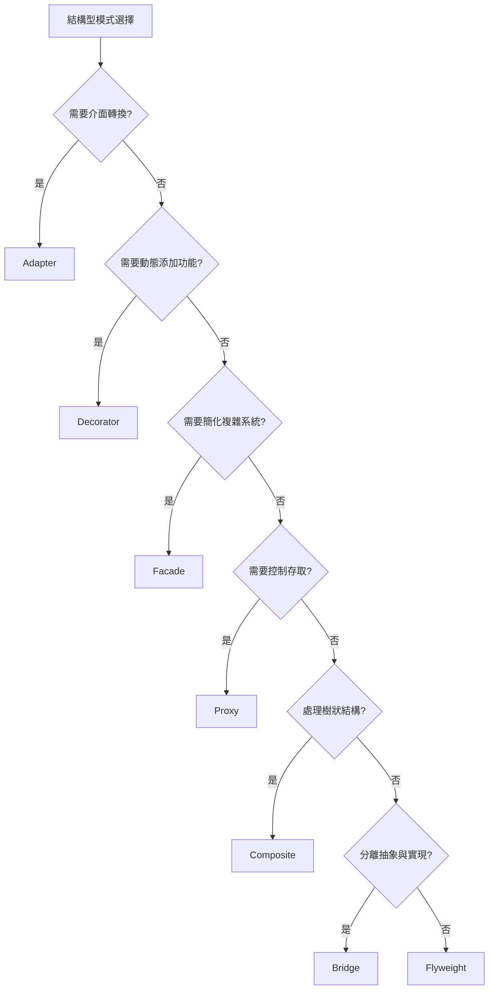

#### 4.8.2 實務檢查清單

#### ✅ 結構型模式最佳實踐

- [ ] **Adapter**: 保持輕量，只做介面轉換
- [ ] **Decorator**: 保持介面一致，考慮裝飾順序
- [ ] **Facade**: 不要暴露子系統細節
- [ ] **Proxy**: 明確代理的目的（快取、安全、延遲載入）
- [ ] **Composite**: 確保葉子和組合節點的一致性

#### ⚠️ 避免常見錯誤

- [ ] 不要在 Adapter 中添加業務邏輯
- [ ] Decorator 避免過度包裝
- [ ] Facade 不要成為 God Object
- [ ] Proxy 注意效能開銷
- [ ] Composite 處理好異常情況

---

*第4章結構型模式完成。接下來將在下一個回覆中提供第5章行為型模式的內容...*

---

## 第 5 章：行為型模式

### 5.1 行為型模式簡介

行為型模式關注物件之間的互動和職責分配，使物件之間的通訊更加靈活。這些模式描述了物件和類別之間的演算法和責任分配。

#### 5.1.1 行為型模式的核心價值

- **演算法封裝**：將演算法封裝在物件中，使其可以互相替換
- **責任分配**：明確定義物件間的職責劃分
- **通訊協議**：建立物件間的通訊標準
- **控制流程**：管理複雜的控制流和狀態轉換

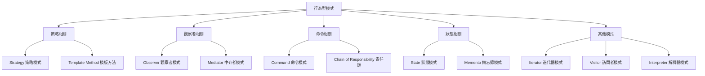

### 5.2 Strategy 策略模式

#### 5.2.1 模式定義

定義一系列演算法，把它們一個個封裝起來，並且使它們可相互替換。

#### 5.2.2 適用場景

- 許多相關的類別僅在行為上稍有不同
- 需要在運行時選擇演算法
- 演算法使用客戶不應該知道的資料
- 避免大量的 if-else 或 switch-case 語句

#### 5.2.3 UML 類別圖

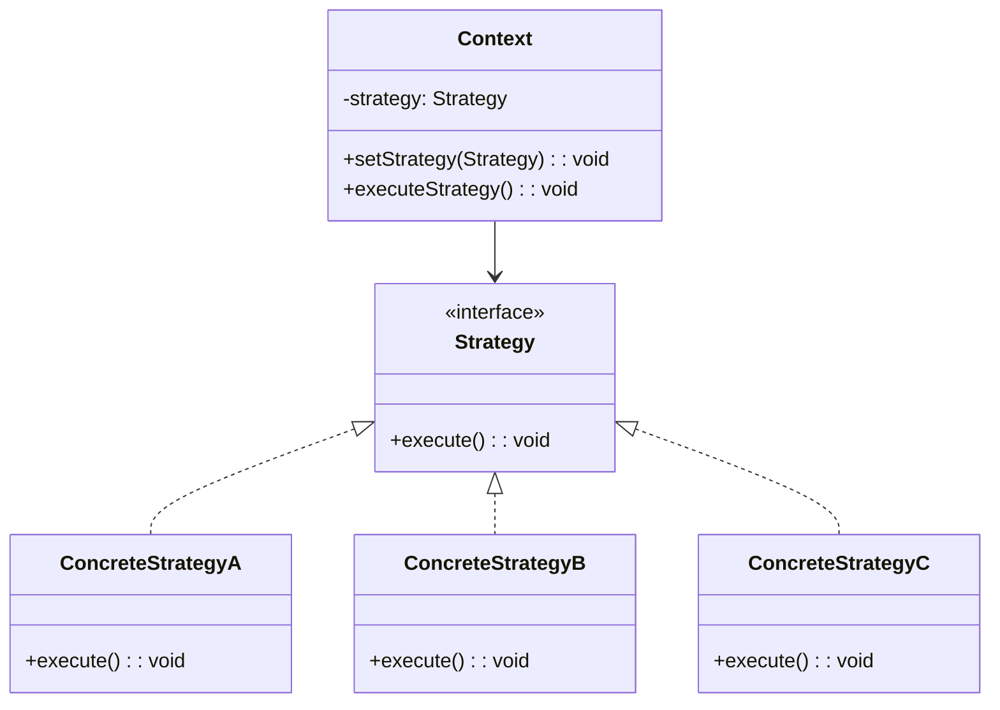

#### 5.2.4 實作範例

```java
/**
 * 策略介面：折扣計算
 */
public interface DiscountStrategy {
    double calculateDiscount(double originalPrice);
    String getDescription();
}

/**
 * 具體策略：無折扣
 */
public class NoDiscountStrategy implements DiscountStrategy {
    @Override
    public double calculateDiscount(double originalPrice) {
        return originalPrice;
    }
    
    @Override
    public String getDescription() {
        return "無折扣";
    }
}

/**
 * 具體策略：百分比折扣
 */
public class PercentageDiscountStrategy implements DiscountStrategy {
    private final double percentage;
    
    public PercentageDiscountStrategy(double percentage) {
        this.percentage = percentage;
    }
    
    @Override
    public double calculateDiscount(double originalPrice) {
        return originalPrice * (1 - percentage / 100);
    }
    
    @Override
    public String getDescription() {
        return String.format("%.0f%% 折扣", percentage);
    }
}

/**
 * 具體策略：固定金額折扣
 */
public class FixedAmountDiscountStrategy implements DiscountStrategy {
    private final double discountAmount;
    
    public FixedAmountDiscountStrategy(double discountAmount) {
        this.discountAmount = discountAmount;
    }
    
    @Override
    public double calculateDiscount(double originalPrice) {
        return Math.max(0, originalPrice - discountAmount);
    }
    
    @Override
    public String getDescription() {
        return String.format("減免 $%.2f", discountAmount);
    }
}

/**
 * 具體策略：VIP 會員折扣
 */
public class VipDiscountStrategy implements DiscountStrategy {
    private final double baseDiscount;
    private final double vipBonus;
    
    public VipDiscountStrategy(double baseDiscount, double vipBonus) {
        this.baseDiscount = baseDiscount;
        this.vipBonus = vipBonus;
    }
    
    @Override
    public double calculateDiscount(double originalPrice) {
        double afterBaseDiscount = originalPrice * (1 - baseDiscount / 100);
        return afterBaseDiscount * (1 - vipBonus / 100);
    }
    
    @Override
    public String getDescription() {
        return String.format("VIP 折扣 (基礎 %.0f%% + 額外 %.0f%%)", baseDiscount, vipBonus);
    }
}

/**
 * 上下文：購物車
 */
public class ShoppingCart {
    private List<CartItem> items;
    private DiscountStrategy discountStrategy;
    
    public ShoppingCart() {
        this.items = new ArrayList<>();
        this.discountStrategy = new NoDiscountStrategy();
    }
    
    public void addItem(String name, double price, int quantity) {
        items.add(new CartItem(name, price, quantity));
    }
    
    public void setDiscountStrategy(DiscountStrategy strategy) {
        this.discountStrategy = strategy;
    }
    
    public double getOriginalTotal() {
        return items.stream()
                   .mapToDouble(item -> item.getPrice() * item.getQuantity())
                   .sum();
    }
    
    public double getFinalTotal() {
        double originalTotal = getOriginalTotal();
        return discountStrategy.calculateDiscount(originalTotal);
    }
    
    public double getSavings() {
        return getOriginalTotal() - getFinalTotal();
    }
    
    public void checkout() {
        double originalTotal = getOriginalTotal();
        double finalTotal = getFinalTotal();
        double savings = getSavings();
        
        System.out.println("=== 購物車結帳 ===");
        items.forEach(item -> 
            System.out.printf("%s x%d = $%.2f%n", 
                            item.getName(), item.getQuantity(), 
                            item.getPrice() * item.getQuantity()));
        
        System.out.printf("原價總計: $%.2f%n", originalTotal);
        System.out.printf("折扣方式: %s%n", discountStrategy.getDescription());
        System.out.printf("折扣金額: $%.2f%n", savings);
        System.out.printf("實付金額: $%.2f%n", finalTotal);
    }
    
    // 內部類別：購物車項目
    private static class CartItem {
        private String name;
        private double price;
        private int quantity;
        
        public CartItem(String name, double price, int quantity) {
            this.name = name;
            this.price = price;
            this.quantity = quantity;
        }
        
        // Getters
        public String getName() { return name; }
        public double getPrice() { return price; }
        public int getQuantity() { return quantity; }
    }
}
```

#### 5.2.5 使用方式

```java
public class StrategyPatternDemo {
    
    public static void main(String[] args) {
        // 建立購物車並添加商品
        ShoppingCart cart = new ShoppingCart();
        cart.addItem("筆記型電腦", 25000.0, 1);
        cart.addItem("滑鼠", 800.0, 2);
        cart.addItem("鍵盤", 1500.0, 1);
        
        // 測試不同折扣策略
        System.out.println("1. 無折扣：");
        cart.checkout();
        
        System.out.println("\n2. 10% 折扣：");
        cart.setDiscountStrategy(new PercentageDiscountStrategy(10));
        cart.checkout();
        
        System.out.println("\n3. 減免 $1000：");
        cart.setDiscountStrategy(new FixedAmountDiscountStrategy(1000));
        cart.checkout();
        
        System.out.println("\n4. VIP 會員折扣：");
        cart.setDiscountStrategy(new VipDiscountStrategy(15, 5));
        cart.checkout();
    }
}
```

### 5.3 Observer 觀察者模式

#### 5.3.1 模式定義

定義物件間的一種一對多的依賴關係，當一個物件的狀態發生改變時，所有依賴於它的物件都得到通知並被自動更新。

#### 5.3.2 適用場景

- 抽象模型有兩個方面，其中一個方面依賴於另一個方面
- 對一個物件的改變需要同時改變其他物件
- 不知道具體有多少物件需要被改變
- 建立觸發鏈

#### 5.3.3 實作範例

```java
/**
 * 觀察者介面
 */
public interface Observer {
    void update(String event, Object data);
}

/**
 * 主題介面
 */
public interface Subject {
    void attach(Observer observer);
    void detach(Observer observer);
    void notifyObservers(String event, Object data);
}

/**
 * 具體主題：股票價格
 */
public class StockPrice implements Subject {
    private String symbol;
    private double price;
    private List<Observer> observers;
    
    public StockPrice(String symbol, double initialPrice) {
        this.symbol = symbol;
        this.price = initialPrice;
        this.observers = new ArrayList<>();
    }
    
    @Override
    public void attach(Observer observer) {
        observers.add(observer);
        System.out.println("觀察者已註冊: " + observer.getClass().getSimpleName());
    }
    
    @Override
    public void detach(Observer observer) {
        observers.remove(observer);
        System.out.println("觀察者已移除: " + observer.getClass().getSimpleName());
    }
    
    @Override
    public void notifyObservers(String event, Object data) {
        for (Observer observer : observers) {
            observer.update(event, data);
        }
    }
    
    public void setPrice(double newPrice) {
        double oldPrice = this.price;
        this.price = newPrice;
        
        // 準備事件資料
        PriceChangeEvent event = new PriceChangeEvent(symbol, oldPrice, newPrice);
        
        System.out.printf("%s 價格變動: $%.2f -> $%.2f%n", symbol, oldPrice, newPrice);
        notifyObservers("PRICE_CHANGE", event);
    }
    
    // Getters
    public String getSymbol() { return symbol; }
    public double getPrice() { return price; }
    
    // 價格變動事件
    public static class PriceChangeEvent {
        private String symbol;
        private double oldPrice;
        private double newPrice;
        private double changePercent;
        
        public PriceChangeEvent(String symbol, double oldPrice, double newPrice) {
            this.symbol = symbol;
            this.oldPrice = oldPrice;
            this.newPrice = newPrice;
            this.changePercent = ((newPrice - oldPrice) / oldPrice) * 100;
        }
        
        // Getters
        public String getSymbol() { return symbol; }
        public double getOldPrice() { return oldPrice; }
        public double getNewPrice() { return newPrice; }
        public double getChangePercent() { return changePercent; }
    }
}

/**
 * 具體觀察者：投資組合
 */
public class Portfolio implements Observer {
    private String name;
    private Map<String, Integer> holdings; // 股票代號 -> 持股數量
    
    public Portfolio(String name) {
        this.name = name;
        this.holdings = new HashMap<>();
    }
    
    public void addHolding(String symbol, int shares) {
        holdings.put(symbol, holdings.getOrDefault(symbol, 0) + shares);
    }
    
    @Override
    public void update(String event, Object data) {
        if ("PRICE_CHANGE".equals(event) && data instanceof StockPrice.PriceChangeEvent) {
            StockPrice.PriceChangeEvent priceEvent = (StockPrice.PriceChangeEvent) data;
            String symbol = priceEvent.getSymbol();
            
            if (holdings.containsKey(symbol)) {
                int shares = holdings.get(symbol);
                double impact = (priceEvent.getNewPrice() - priceEvent.getOldPrice()) * shares;
                
                System.out.printf("[%s] 投資組合影響 %s: %+$%.2f (持股 %d 股)%n", 
                                 name, symbol, impact, shares);
            }
        }
    }
}

/**
 * 具體觀察者：警報系統
 */
public class AlertSystem implements Observer {
    private Map<String, Double> priceAlerts; // 股票代號 -> 警報價格
    
    public AlertSystem() {
        this.priceAlerts = new HashMap<>();
    }
    
    public void setPriceAlert(String symbol, double alertPrice) {
        priceAlerts.put(symbol, alertPrice);
        System.out.printf("設定價格警報: %s 達到 $%.2f%n", symbol, alertPrice);
    }
    
    @Override
    public void update(String event, Object data) {
        if ("PRICE_CHANGE".equals(event) && data instanceof StockPrice.PriceChangeEvent) {
            StockPrice.PriceChangeEvent priceEvent = (StockPrice.PriceChangeEvent) data;
            String symbol = priceEvent.getSymbol();
            double newPrice = priceEvent.getNewPrice();
            
            if (priceAlerts.containsKey(symbol)) {
                double alertPrice = priceAlerts.get(symbol);
                if (newPrice >= alertPrice) {
                    System.out.printf("🚨 警報觸發！%s 價格 $%.2f 已達到警報線 $%.2f%n", 
                                     symbol, newPrice, alertPrice);
                    priceAlerts.remove(symbol); // 觸發後移除警報
                }
            }
        }
    }
}
```

### 5.4 Command 命令模式

#### 5.4.1 模式定義

將一個請求封裝為一個物件，從而可用不同的請求對客戶進行參數化；對請求排隊或記錄請求日誌，以及支援可撤銷的操作。

#### 5.4.2 實作範例

```java
/**
 * 命令介面
 */
public interface Command {
    void execute();
    void undo();
    String getDescription();
}

/**
 * 接收者：文字編輯器
 */
public class TextEditor {
    private StringBuilder content;
    private int cursorPosition;
    
    public TextEditor() {
        this.content = new StringBuilder();
        this.cursorPosition = 0;
    }
    
    public void insertText(String text, int position) {
        content.insert(position, text);
        cursorPosition = position + text.length();
    }
    
    public String deleteText(int position, int length) {
        String deleted = content.substring(position, position + length);
        content.delete(position, position + length);
        cursorPosition = position;
        return deleted;
    }
    
    public void setCursorPosition(int position) {
        this.cursorPosition = Math.max(0, Math.min(position, content.length()));
    }
    
    public String getContent() {
        return content.toString();
    }
    
    public int getCursorPosition() {
        return cursorPosition;
    }
}

/**
 * 具體命令：插入文字
 */
public class InsertTextCommand implements Command {
    private TextEditor editor;
    private String text;
    private int position;
    
    public InsertTextCommand(TextEditor editor, String text, int position) {
        this.editor = editor;
        this.text = text;
        this.position = position;
    }
    
    @Override
    public void execute() {
        editor.insertText(text, position);
    }
    
    @Override
    public void undo() {
        editor.deleteText(position, text.length());
    }
    
    @Override
    public String getDescription() {
        return String.format("插入文字 '%s' 於位置 %d", text, position);
    }
}

/**
 * 具體命令：刪除文字
 */
public class DeleteTextCommand implements Command {
    private TextEditor editor;
    private int position;
    private int length;
    private String deletedText;
    
    public DeleteTextCommand(TextEditor editor, int position, int length) {
        this.editor = editor;
        this.position = position;
        this.length = length;
    }
    
    @Override
    public void execute() {
        deletedText = editor.deleteText(position, length);
    }
    
    @Override
    public void undo() {
        if (deletedText != null) {
            editor.insertText(deletedText, position);
        }
    }
    
    @Override
    public String getDescription() {
        return String.format("刪除 %d 個字元從位置 %d", length, position);
    }
}

/**
 * 宏命令：組合多個命令
 */
public class MacroCommand implements Command {
    private List<Command> commands;
    private String description;
    
    public MacroCommand(String description) {
        this.commands = new ArrayList<>();
        this.description = description;
    }
    
    public void addCommand(Command command) {
        commands.add(command);
    }
    
    @Override
    public void execute() {
        commands.forEach(Command::execute);
    }
    
    @Override
    public void undo() {
        // 逆序撤銷
        for (int i = commands.size() - 1; i >= 0; i--) {
            commands.get(i).undo();
        }
    }
    
    @Override
    public String getDescription() {
        return description;
    }
}

/**
 * 調用者：編輯器控制器
 */
public class EditorController {
    private TextEditor editor;
    private Stack<Command> undoStack;
    private Stack<Command> redoStack;
    
    public EditorController(TextEditor editor) {
        this.editor = editor;
        this.undoStack = new Stack<>();
        this.redoStack = new Stack<>();
    }
    
    public void executeCommand(Command command) {
        command.execute();
        undoStack.push(command);
        redoStack.clear(); // 執行新命令後清空重做堆疊
        
        System.out.println("執行命令: " + command.getDescription());
        System.out.println("目前內容: \"" + editor.getContent() + "\"");
    }
    
    public void undo() {
        if (!undoStack.isEmpty()) {
            Command command = undoStack.pop();
            command.undo();
            redoStack.push(command);
            
            System.out.println("撤銷命令: " + command.getDescription());
            System.out.println("目前內容: \"" + editor.getContent() + "\"");
        } else {
            System.out.println("沒有可撤銷的操作");
        }
    }
    
    public void redo() {
        if (!redoStack.isEmpty()) {
            Command command = redoStack.pop();
            command.execute();
            undoStack.push(command);
            
            System.out.println("重做命令: " + command.getDescription());
            System.out.println("目前內容: \"" + editor.getContent() + "\"");
        } else {
            System.out.println("沒有可重做的操作");
        }
    }
}
```

### 5.5 行為型模式實務應用

#### 5.5.1 Spring 中的觀察者模式

```java
@Component
public class OrderEventPublisher {
    
    @Autowired
    private ApplicationEventPublisher eventPublisher;
    
    public void createOrder(Order order) {
        // 處理訂單邏輯...
        
        // 發布事件
        OrderCreatedEvent event = new OrderCreatedEvent(this, order);
        eventPublisher.publishEvent(event);
    }
}

@EventListener
@Component
public class EmailNotificationService {
    
    public void handleOrderCreated(OrderCreatedEvent event) {
        Order order = event.getOrder();
        // 發送確認郵件...
        System.out.println("發送訂單確認郵件: " + order.getId());
    }
}

@EventListener
@Component
public class InventoryService {
    
    public void handleOrderCreated(OrderCreatedEvent event) {
        Order order = event.getOrder();
        // 更新庫存...
        System.out.println("更新庫存: " + order.getId());
    }
}
```

### 5.6 行為型模式檢查清單

#### ✅ 行為型模式最佳實踐

- [ ] **Strategy**: 確保策略無狀態，易於測試
- [ ] **Observer**: 避免循環依賴，注意記憶體洩漏
- [ ] **Command**: 支援撤銷操作，記錄執行歷史
- [ ] **Template Method**: 明確定義可變與不可變部分
- [ ] **State**: 確保狀態轉換的一致性

#### ⚠️ 常見錯誤避免

- [ ] 策略模式中不要在策略間共享狀態
- [ ] 觀察者模式注意通知順序和異常處理
- [ ] 命令模式避免命令間的依賴關係
- [ ] 狀態模式防止狀態爆炸
- [ ] 責任鏈模式確保請求能被處理

---

*第5章行為型模式完成。接下來將繼續第6-9章...*

---

## 第 6 章：專案應用指南

### 6.1 設計模式在專案中的選擇策略

#### 6.1.1 專案階段與模式應用

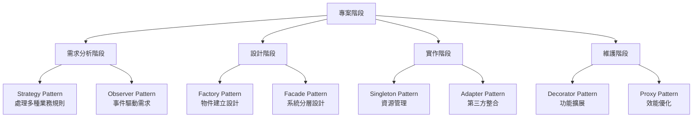

#### 6.1.2 Spring Boot 專案中的設計模式應用

```java
/**
 * 支付服務整合範例
 */
@Service
public class PaymentService {
    
    // Strategy Pattern - 支付策略
    @Autowired
    private PaymentStrategyFactory paymentStrategyFactory;
    
    // Observer Pattern - 支付事件
    @Autowired
    private ApplicationEventPublisher eventPublisher;
    
    // Template Method Pattern - 支付流程模板
    public PaymentResult processPayment(PaymentRequest request) {
        // 1. 驗證請求
        validatePaymentRequest(request);
        
        // 2. 選擇支付策略
        PaymentStrategy strategy = paymentStrategyFactory.getStrategy(request.getPaymentType());
        
        // 3. 執行支付
        PaymentResult result = strategy.pay(request);
        
        // 4. 發布事件
        if (result.isSuccess()) {
            eventPublisher.publishEvent(new PaymentSuccessEvent(result));
        } else {
            eventPublisher.publishEvent(new PaymentFailureEvent(result));
        }
        
        // 5. 記錄日誌
        logPaymentResult(request, result);
        
        return result;
    }
    
    private void validatePaymentRequest(PaymentRequest request) {
        // 驗證邏輯
        if (request.getAmount() <= 0) {
            throw new IllegalArgumentException("支付金額必須大於0");
        }
    }
    
    private void logPaymentResult(PaymentRequest request, PaymentResult result) {
        // 日誌記錄
        System.out.printf("支付結果: %s, 金額: %.2f, 狀態: %s%n", 
                         request.getPaymentType(), request.getAmount(), 
                         result.isSuccess() ? "成功" : "失敗");
    }
}

/**
 * Factory Pattern - 支付策略工廠
 */
@Component
public class PaymentStrategyFactory {
    
    private final Map<String, PaymentStrategy> strategies;
    
    public PaymentStrategyFactory(List<PaymentStrategy> strategyList) {
        strategies = strategyList.stream()
                                .collect(Collectors.toMap(
                                    PaymentStrategy::getPaymentType,
                                    Function.identity()
                                ));
    }
    
    public PaymentStrategy getStrategy(String paymentType) {
        PaymentStrategy strategy = strategies.get(paymentType);
        if (strategy == null) {
            throw new UnsupportedOperationException("不支援的支付類型: " + paymentType);
        }
        return strategy;
    }
}

/**
 * Decorator Pattern - 支付增強功能
 */
@Component
public class EnhancedPaymentService {
    
    @Autowired
    private PaymentService basePaymentService;
    
    // 添加快取裝飾器
    public PaymentResult processPaymentWithCache(PaymentRequest request) {
        String cacheKey = generateCacheKey(request);
        
        // 檢查快取
        PaymentResult cachedResult = getCachedResult(cacheKey);
        if (cachedResult != null) {
            return cachedResult;
        }
        
        // 執行支付
        PaymentResult result = basePaymentService.processPayment(request);
        
        // 快取結果
        cacheResult(cacheKey, result);
        
        return result;
    }
    
    // 添加重試裝飾器
    public PaymentResult processPaymentWithRetry(PaymentRequest request) {
        int maxRetries = 3;
        PaymentResult result = null;
        
        for (int attempt = 1; attempt <= maxRetries; attempt++) {
            try {
                result = basePaymentService.processPayment(request);
                if (result.isSuccess()) {
                    break;
                }
            } catch (Exception e) {
                if (attempt == maxRetries) {
                    throw e;
                }
                // 等待後重試
                waitBeforeRetry(attempt);
            }
        }
        
        return result;
    }
}
```

### 6.2 微服務架構中的設計模式

#### 6.2.1 服務間通訊模式

```java
/**
 * Circuit Breaker Pattern - 熔斷器模式
 */
@Component
public class UserServiceClient {
    
    private final CircuitBreaker circuitBreaker;
    private final RestTemplate restTemplate;
    
    public UserServiceClient() {
        this.circuitBreaker = CircuitBreaker.ofDefaults("userService");
        this.restTemplate = new RestTemplate();
        
        // 配置熔斷器
        circuitBreaker.getEventPublisher()
                     .onStateTransition(event -> 
                         System.out.println("熔斷器狀態變更: " + event));
    }
    
    public User getUserById(Long userId) {
        Supplier<User> decoratedSupplier = CircuitBreaker
            .decorateSupplier(circuitBreaker, () -> {
                String url = "http://user-service/users/" + userId;
                return restTemplate.getForObject(url, User.class);
            });
        
        return decoratedSupplier.get();
    }
}

/**
 * Saga Pattern - 分散式事務
 */
@Service
public class OrderSagaOrchestrator {
    
    @Autowired
    private PaymentService paymentService;
    
    @Autowired
    private InventoryService inventoryService;
    
    @Autowired
    private ShippingService shippingService;
    
    public void processOrder(Order order) {
        List<SagaStep> steps = Arrays.asList(
            new PaymentStep(paymentService, order),
            new InventoryStep(inventoryService, order),
            new ShippingStep(shippingService, order)
        );
        
        SagaTransaction saga = new SagaTransaction(steps);
        
        try {
            saga.execute();
            System.out.println("訂單處理成功: " + order.getId());
        } catch (SagaException e) {
            saga.compensate();
            System.out.println("訂單處理失敗，已回滾: " + order.getId());
            throw e;
        }
    }
}
```

### 6.3 常見反模式與重構建議

#### 6.3.1 God Object 反模式

**❌ 問題代碼**：
```java
// 不好的設計：一個類別承擔太多責任
public class OrderManager {
    // 訂單相關
    public void createOrder(Order order) { /* ... */ }
    public void updateOrder(Order order) { /* ... */ }
    
    // 支付相關
    public void processPayment(Payment payment) { /* ... */ }
    public void refundPayment(String paymentId) { /* ... */ }
    
    // 庫存相關
    public void updateInventory(String productId, int quantity) { /* ... */ }
    public boolean checkStock(String productId) { /* ... */ }
    
    // 通知相關
    public void sendEmailNotification(String email, String message) { /* ... */ }
    public void sendSmsNotification(String phone, String message) { /* ... */ }
    
    // 報表相關
    public Report generateOrderReport() { /* ... */ }
    public Report generatePaymentReport() { /* ... */ }
}
```

**✅ 重構後**：
```java
// 使用 Facade Pattern 組織
@Service
public class OrderFacade {
    
    @Autowired
    private OrderService orderService;
    
    @Autowired
    private PaymentService paymentService;
    
    @Autowired
    private InventoryService inventoryService;
    
    @Autowired
    private NotificationService notificationService;
    
    public OrderResult processOrder(OrderRequest request) {
        // 使用 Template Method Pattern
        return new OrderProcessTemplate() {
            @Override
            protected Order createOrder() {
                return orderService.create(request);
            }
            
            @Override
            protected PaymentResult processPayment(Order order) {
                return paymentService.process(order.getPayment());
            }
            
            @Override
            protected void updateInventory(Order order) {
                inventoryService.reserve(order.getItems());
            }
            
            @Override
            protected void sendNotification(Order order) {
                notificationService.sendOrderConfirmation(order);
            }
        }.execute();
    }
}
```

#### 6.3.2 過度使用 if-else

**❌ 問題代碼**：
```java
public class DiscountCalculator {
    public double calculateDiscount(Customer customer, double amount) {
        if (customer.getType().equals("VIP")) {
            if (amount > 10000) {
                return amount * 0.15; // 15% 折扣
            } else if (amount > 5000) {
                return amount * 0.10; // 10% 折扣
            } else {
                return amount * 0.05; // 5% 折扣
            }
        } else if (customer.getType().equals("PREMIUM")) {
            if (amount > 8000) {
                return amount * 0.12;
            } else {
                return amount * 0.08;
            }
        } else if (customer.getType().equals("REGULAR")) {
            if (amount > 3000) {
                return amount * 0.05;
            } else {
                return 0;
            }
        }
        return 0;
    }
}
```

**✅ 使用 Strategy Pattern 重構**：
```java
// 策略介面
public interface DiscountStrategy {
    double calculateDiscount(double amount);
}

// VIP 客戶折扣策略
public class VipDiscountStrategy implements DiscountStrategy {
    @Override
    public double calculateDiscount(double amount) {
        if (amount > 10000) return amount * 0.15;
        if (amount > 5000) return amount * 0.10;
        return amount * 0.05;
    }
}

// 策略工廠
@Component
public class DiscountStrategyFactory {
    public DiscountStrategy getStrategy(CustomerType type) {
        switch (type) {
            case VIP: return new VipDiscountStrategy();
            case PREMIUM: return new PremiumDiscountStrategy();
            case REGULAR: return new RegularDiscountStrategy();
            default: return new NoDiscountStrategy();
        }
    }
}
```

### 6.4 效能與安全性考量

#### 6.4.1 快取模式應用

```java
/**
 * Proxy Pattern 實現快取
 */
@Component
public class CachedUserService implements UserService {
    
    @Autowired
    private UserService actualUserService;
    
    @Autowired
    private CacheManager cacheManager;
    
    @Override
    @Cacheable(value = "users", key = "#userId")
    public User getUserById(Long userId) {
        return actualUserService.getUserById(userId);
    }
    
    @Override
    @CacheEvict(value = "users", key = "#user.id")
    public User updateUser(User user) {
        return actualUserService.updateUser(user);
    }
}

/**
 * Flyweight Pattern 減少記憶體使用
 */
@Component
public class ConfigurationManager {
    
    private final Map<String, Configuration> configCache = new ConcurrentHashMap<>();
    
    public Configuration getConfiguration(String environment, String service) {
        String key = environment + ":" + service;
        
        return configCache.computeIfAbsent(key, k -> 
            loadConfiguration(environment, service)
        );
    }
    
    private Configuration loadConfiguration(String environment, String service) {
        // 從外部來源載入配置
        return new Configuration(environment, service);
    }
}
```

---

## 第 7 章：學習與練習

### 7.1 小型練習題

#### 7.1.1 創建型模式練習

**練習1：工廠模式重構**

請將以下代碼重構為使用 Factory Pattern：

```java
// 原始代碼
public class ReportGenerator {
    public void generateReport(String type, List<Data> data) {
        if ("PDF".equals(type)) {
            PdfReport report = new PdfReport();
            report.setData(data);
            report.generate();
        } else if ("EXCEL".equals(type)) {
            ExcelReport report = new ExcelReport();
            report.setData(data);
            report.generate();
        } else if ("CSV".equals(type)) {
            CsvReport report = new CsvReport();
            report.setData(data);
            report.generate();
        }
    }
}
```

**解答**：
```java
// 抽象產品
public interface Report {
    void setData(List<Data> data);
    void generate();
}

// 工廠介面
public interface ReportFactory {
    Report createReport();
}

// 具體工廠
public class PdfReportFactory implements ReportFactory {
    @Override
    public Report createReport() {
        return new PdfReport();
    }
}

// 重構後的生成器
public class ReportGenerator {
    private final Map<String, ReportFactory> factories;
    
    public ReportGenerator() {
        factories = Map.of(
            "PDF", new PdfReportFactory(),
            "EXCEL", new ExcelReportFactory(),
            "CSV", new CsvReportFactory()
        );
    }
    
    public void generateReport(String type, List<Data> data) {
        ReportFactory factory = factories.get(type);
        if (factory == null) {
            throw new IllegalArgumentException("不支援的報表類型: " + type);
        }
        
        Report report = factory.createReport();
        report.setData(data);
        report.generate();
    }
}
```

#### 7.1.2 行為型模式練習

**練習2：觀察者模式實作**

實作一個新聞發布系統，當有新聞發布時，所有訂閱者都能收到通知。

**解答**：
```java
// 觀察者介面
public interface NewsSubscriber {
    void receiveNews(News news);
}

// 主題介面
public interface NewsPublisher {
    void subscribe(NewsSubscriber subscriber);
    void unsubscribe(NewsSubscriber subscriber);
    void publishNews(News news);
}

// 具體實作
public class NewsAgency implements NewsPublisher {
    private List<NewsSubscriber> subscribers = new ArrayList<>();
    
    @Override
    public void subscribe(NewsSubscriber subscriber) {
        subscribers.add(subscriber);
    }
    
    @Override
    public void unsubscribe(NewsSubscriber subscriber) {
        subscribers.remove(subscriber);
    }
    
    @Override
    public void publishNews(News news) {
        subscribers.forEach(subscriber -> subscriber.receiveNews(news));
    }
}
```

### 7.2 中型專案實作

#### 7.2.1 電商訂單處理系統

使用多種設計模式實作一個完整的訂單處理系統：

```java
/**
 * 訂單處理系統整合範例
 */
@Service
public class OrderProcessingSystem {
    
    // Factory Pattern - 建立不同類型的訂單
    @Autowired
    private OrderFactory orderFactory;
    
    // Strategy Pattern - 不同的支付方式
    @Autowired
    private PaymentStrategyManager paymentManager;
    
    // Observer Pattern - 訂單狀態變更通知
    @Autowired
    private OrderEventPublisher eventPublisher;
    
    // Template Method Pattern - 訂單處理流程
    public OrderResult processOrder(OrderRequest request) {
        return new OrderProcessTemplate() {
            @Override
            protected Order createOrder(OrderRequest request) {
                return orderFactory.createOrder(request.getOrderType(), request);
            }
            
            @Override
            protected ValidationResult validateOrder(Order order) {
                return new OrderValidator().validate(order);
            }
            
            @Override
            protected PaymentResult processPayment(Order order) {
                PaymentStrategy strategy = paymentManager.getStrategy(order.getPaymentMethod());
                return strategy.processPayment(order.getPayment());
            }
            
            @Override
            protected void updateInventory(Order order) {
                order.getItems().forEach(item -> 
                    inventoryService.reserve(item.getProductId(), item.getQuantity())
                );
            }
            
            @Override
            protected void notifyStakeholders(Order order) {
                eventPublisher.publishEvent(new OrderProcessedEvent(order));
            }
        }.process(request);
    }
}
```

### 7.3 思考題與解答

#### 7.3.1 設計模式選擇題

**問題1**：在以下情況中，哪種設計模式最適合？

A. 需要在不修改現有程式碼的情況下添加新功能
B. 需要確保整個應用程式中只有一個日誌記錄器實例
C. 需要將複雜的子系統隱藏在簡單的介面後面
D. 需要在運行時根據條件選擇不同的演算法

**解答**：
- A. Decorator Pattern（裝飾器模式）
- B. Singleton Pattern（單例模式）
- C. Facade Pattern（外觀模式）
- D. Strategy Pattern（策略模式）

#### 7.3.2 綜合應用題

**情境**：設計一個文件轉換系統，支援多種輸入格式（Word、PDF、TXT）和輸出格式（HTML、Markdown、JSON），同時需要支援轉換過程的監控和撤銷操作。

**分析與解答**：

1. **Abstract Factory Pattern** - 建立輸入/輸出格式的處理器
2. **Strategy Pattern** - 不同的轉換策略
3. **Observer Pattern** - 轉換過程監控
4. **Command Pattern** - 支援撤銷操作
5. **Template Method Pattern** - 標準化轉換流程

```java
// 整合解決方案架構
public class DocumentConversionSystem {
    
    // Abstract Factory 建立轉換器
    private ConverterFactory converterFactory;
    
    // Observer 監控轉換過程
    private ConversionMonitor monitor;
    
    // Command 支援撤銷
    private CommandHistory commandHistory;
    
    public ConversionResult convert(ConversionRequest request) {
        // 1. 建立轉換命令
        ConvertCommand command = new ConvertCommand(
            converterFactory.createConverter(request.getInputFormat(), request.getOutputFormat()),
            request
        );
        
        // 2. 註冊監控
        command.addObserver(monitor);
        
        // 3. 執行轉換
        ConversionResult result = command.execute();
        
        // 4. 記錄歷史
        commandHistory.addCommand(command);
        
        return result;
    }
}
```

---

## 第 8 章：認證考試準備

### 8.1 Java 認證考試中的設計模式

#### 8.1.1 OCP Java SE 11 Developer 認證重點

**常考設計模式**：

1. **Singleton Pattern**
   - 執行緒安全實現
   - enum 實現方式
   - 記憶體洩漏問題

2. **Factory Pattern**
   - 靜態工廠方法
   - 工廠方法 vs 抽象工廠
   - 與依賴注入的關係

3. **Observer Pattern**
   - Java 內建 Observer/Observable
   - 事件處理機制
   - 記憶體管理

4. **Decorator Pattern**
   - Java I/O 流的應用
   - 與繼承的比較
   - 動態功能添加

#### 8.1.2 考試重點整理

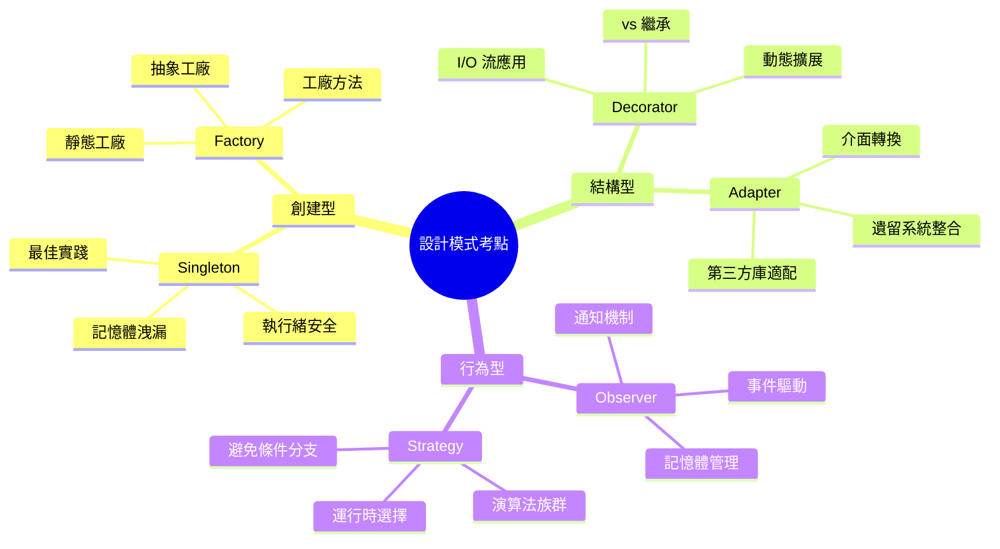

#### 8.1.3 模擬試題

**題目1**：以下哪種 Singleton 實現是執行緒安全且效率最高的？

```java
// A.
public class Singleton {
    private static Singleton instance;
    public static synchronized Singleton getInstance() {
        if (instance == null) {
            instance = new Singleton();
        }
        return instance;
    }
}

// B.
public class Singleton {
    private static volatile Singleton instance;
    public static Singleton getInstance() {
        if (instance == null) {
            synchronized (Singleton.class) {
                if (instance == null) {
                    instance = new Singleton();
                }
            }
        }
        return instance;
    }
}

// C.
public enum Singleton {
    INSTANCE;
    public void doSomething() { /* ... */ }
}

// D.
public class Singleton {
    private static final Singleton instance = new Singleton();
    public static Singleton getInstance() {
        return instance;
    }
}
```

**答案**：C（enum 實現）或 B（雙重檢查鎖定）
- C 最簡潔且天然執行緒安全
- B 效率高且延遲初始化
- A 效率低（每次都同步）
- D 無法延遲初始化

### 8.2 Spring 認證考試重點

#### 8.2.1 Spring Professional 認證

**設計模式相關考點**：

1. **依賴注入與 IoC**
   - Factory Pattern 的應用
   - Singleton 作用域
   - Proxy Pattern 在 AOP 中的使用

2. **AOP（面向切面程式設計）**
   - Proxy Pattern 實現
   - Decorator Pattern 概念
   - Chain of Responsibility 在攔截器中的應用

3. **事件機制**
   - Observer Pattern 的 Spring 實現
   - ApplicationEvent 和 ApplicationListener

```java
// Spring 中的設計模式應用範例
@Configuration
public class AppConfig {
    
    // Factory Pattern - Bean 工廠
    @Bean
    public PaymentService paymentService() {
        return new PaymentServiceImpl();
    }
    
    // Singleton Pattern - 預設作用域
    @Bean
    @Scope("singleton")
    public UserService userService() {
        return new UserServiceImpl();
    }
    
    // Proxy Pattern - AOP 代理
    @Bean
    @EnableAspectJAutoProxy
    public LoggingAspect loggingAspect() {
        return new LoggingAspect();
    }
}
```

### 8.3 實戰考試技巧

#### 8.3.1 時間管理策略

1. **快速識別模式**（5分鐘）
   - 看關鍵字：Singleton, Factory, Observer 等
   - 看程式碼結構：介面、抽象類別、繼承關係

2. **分析程式碼邏輯**（10分鐘）
   - 理解類別間的關係
   - 識別模式的意圖和實現方式

3. **選擇最佳答案**（5分鐘）
   - 考慮執行緒安全
   - 考慮效能影響
   - 考慮維護性

#### 8.3.2 常見陷阱題

**陷阱1：偽 Singleton**
```java
// 看起來像 Singleton，實際上不是
public class FakeSingleton {
    private static FakeSingleton instance;
    
    public FakeSingleton() { } // 公開建構子！
    
    public static FakeSingleton getInstance() {
        if (instance == null) {
            instance = new FakeSingleton();
        }
        return instance;
    }
}
```

**陷阱2：記憶體洩漏的 Observer**
```java
// 觀察者沒有正確移除，造成記憶體洩漏
public class LeakyObserver {
    public void subscribe(Subject subject) {
        subject.addObserver(this);
        // 忘記在適當時機呼叫 subject.removeObserver(this)
    }
}
```

---

## 第 9 章：附錄與資源

### 9.1 推薦學習資源

#### 9.1.1 經典書籍

1. **《設計模式：可複用物件導向軟體的基礎》** - GoF
   - 原創經典，必讀
   - 適合深入理解模式的理論基礎

2. **《Head First 設計模式》** - Eric Freeman
   - 生動易懂，適合初學者
   - 大量實例和圖解說明

3. **《重構：改善既有程式的設計》** - Martin Fowler
   - 學習如何識別和重構反模式
   - 實戰經驗豐富

4. **《Clean Code》** - Robert C. Martin
   - 程式碼品質和設計原則
   - SOLID 原則詳解

#### 9.1.2 線上學習平台

1. **Coursera**
   - "Design Patterns" by University of Alberta
   - "Object-Oriented Design" by University of Alberta

2. **Udemy**
   - "Java Design Patterns & SOLID Design Principles"
   - "Design Patterns in Java"

3. **Pluralsight**
   - "Design Patterns Library"
   - "SOLID Principles of Object Oriented Design"

#### 9.1.3 開源專案學習

```java
// Spring Framework 中的設計模式學習
public class SpringPatternExamples {
    
    // 1. 學習 BeanFactory - Factory Pattern
    void studyBeanFactory() {
        ApplicationContext context = new ClassPathXmlApplicationContext("beans.xml");
        MyBean bean = context.getBean(MyBean.class);
    }
    
    // 2. 學習 AOP - Proxy Pattern
    @Aspect
    @Component
    public class LoggingAspect {
        @Around("@annotation(Loggable)")
        public Object logExecutionTime(ProceedingJoinPoint joinPoint) throws Throwable {
            // Proxy Pattern 的實際應用
            long start = System.currentTimeMillis();
            Object result = joinPoint.proceed();
            long end = System.currentTimeMillis();
            System.out.println("執行時間: " + (end - start) + "ms");
            return result;
        }
    }
    
    // 3. 學習 ApplicationEvent - Observer Pattern
    @EventListener
    public void handleUserRegistered(UserRegisteredEvent event) {
        // Observer Pattern 的 Spring 實現
        System.out.println("用戶註冊事件: " + event.getUser().getEmail());
    }
}
```

### 9.2 開發工具與 UML 繪圖

#### 9.2.1 UML 繪圖工具

1. **企業級工具**
   - Enterprise Architect
   - Visual Paradigm
   - Lucidchart

2. **免費工具**
   - draw.io (diagrams.net)
   - PlantUML
   - Mermaid

3. **IDE 整合**
   - IntelliJ IDEA Ultimate - UML 圖生成
   - Eclipse - Papyrus UML
   - Visual Studio Code - PlantUML 插件

#### 9.2.2 程式碼生成工具

```java
// 使用 IDE 模板快速生成設計模式程式碼

// Singleton 模板
public class ${CLASS_NAME} {
    private static volatile ${CLASS_NAME} instance;
    
    private ${CLASS_NAME}() {}
    
    public static ${CLASS_NAME} getInstance() {
        if (instance == null) {
            synchronized (${CLASS_NAME}.class) {
                if (instance == null) {
                    instance = new ${CLASS_NAME}();
                }
            }
        }
        return instance;
    }
}

// Strategy 模板
public interface ${STRATEGY_NAME} {
    ${RETURN_TYPE} execute(${PARAMETER_TYPE} parameter);
}

public class ${CONCRETE_STRATEGY} implements ${STRATEGY_NAME} {
    @Override
    public ${RETURN_TYPE} execute(${PARAMETER_TYPE} parameter) {
        // 實現策略邏輯
        return ${DEFAULT_RETURN};
    }
}
```

### 9.3 設計模式速查表

#### 9.3.1 模式分類速查

| 類別 | 模式名稱 | 關鍵字 | 使用場景 | 實現複雜度 |
|------|----------|--------|----------|------------|
| **創建型** | Singleton | 單一實例 | 全域資源 | ⭐⭐ |
| | Factory Method | 工廠建立 | 物件建立 | ⭐⭐⭐ |
| | Abstract Factory | 物件族群 | 跨平台 | ⭐⭐⭐⭐ |
| | Builder | 逐步建構 | 複雜物件 | ⭐⭐⭐ |
| | Prototype | 複製物件 | 昂貴建立 | ⭐⭐ |
| **結構型** | Adapter | 介面轉換 | 系統整合 | ⭐⭐ |
| | Bridge | 分離抽象 | 跨平台 | ⭐⭐⭐⭐ |
| | Composite | 樹狀結構 | 部分整體 | ⭐⭐⭐ |
| | Decorator | 動態擴展 | 功能增強 | ⭐⭐⭐ |
| | Facade | 簡化介面 | 複雜系統 | ⭐⭐ |
| | Flyweight | 共享物件 | 記憶體優化 | ⭐⭐⭐⭐ |
| | Proxy | 代理控制 | 存取控制 | ⭐⭐⭐ |
| **行為型** | Chain of Responsibility | 責任鏈 | 請求處理 | ⭐⭐⭐ |
| | Command | 命令物件 | 撤銷操作 | ⭐⭐⭐ |
| | Iterator | 遍歷存取 | 集合操作 | ⭐⭐ |
| | Mediator | 中介協調 | 複雜通訊 | ⭐⭐⭐⭐ |
| | Memento | 狀態備份 | 撤銷恢復 | ⭐⭐⭐ |
| | Observer | 狀態通知 | 事件驅動 | ⭐⭐⭐ |
| | State | 狀態變化 | 狀態機 | ⭐⭐⭐⭐ |
| | Strategy | 演算法選擇 | 多種策略 | ⭐⭐ |
| | Template Method | 演算法框架 | 固定流程 | ⭐⭐ |
| | Visitor | 操作分離 | 數據結構 | ⭐⭐⭐⭐⭐ |

#### 9.3.2 快速決策樹

```mermaid
flowchart TD
    A[設計問題] --> B{問題類型?}
    
    B -->|物件建立| C{需要控制建立過程?}
    C -->|是| D[創建型模式]
    C -->|否| E[考慮依賴注入]
    
    B -->|結構組合| F{需要簡化介面?}
    F -->|是| G[Facade]
    F -->|否| H{需要動態擴展?}
    H -->|是| I[Decorator]
    H -->|否| J[其他結構型模式]
    
    B -->|行為互動| K{需要演算法變化?}
    K -->|是| L[Strategy]
    K -->|否| M{需要狀態管理?}
    M -->|是| N[State/Observer]
    M -->|否| O[其他行為型模式]
```

### 9.4 最終檢查清單

#### 9.4.1 專案應用檢查清單

#### ✅ 設計階段
- [ ] 確認是否真的需要設計模式
- [ ] 選擇合適的模式類型
- [ ] 考慮團隊熟悉度
- [ ] 評估複雜度 vs 收益

#### ✅ 實作階段
- [ ] 遵循模式的標準結構
- [ ] 確保執行緒安全性
- [ ] 考慮記憶體使用
- [ ] 提供清晰的文件

#### ✅ 測試階段
- [ ] 單元測試覆蓋
- [ ] 整合測試驗證
- [ ] 效能測試評估
- [ ] 記憶體洩漏檢查

#### ✅ 維護階段
- [ ] 定期重構優化
- [ ] 監控效能指標
- [ ] 更新文件說明
- [ ] 團隊知識分享

#### 9.4.2 學習進度追蹤

| 階段 | 學習目標 | 完成狀態 | 備註 |
|------|----------|----------|------|
| **基礎** | 理解 23 個 GoF 模式 | ⬜ | |
| **實作** | 完成 10+ 實作練習 | ⬜ | |
| **應用** | 在專案中應用 5+ 模式 | ⬜ | |
| **進階** | 設計自己的模式變體 | ⬜ | |
| **專家** | 指導他人學習設計模式 | ⬜ | |

---

## 結語

設計模式不是萬靈丹，而是經驗的總結和智慧的結晶。在實際開發中，應該根據具體情況選擇合適的模式，避免為了使用模式而使用模式。

**記住**：
- 簡單的問題用簡單的解決方案
- 複雜的問題才考慮設計模式
- 團隊共識比個人偏好更重要
- 可讀性和可維護性是首要目標

希望這份教學手冊能幫助您更好地理解和應用設計模式，在軟體開發的道路上走得更遠更穩！

---

**版本資訊**：
- 文件版本：v2.0
- 最後更新：2025年9月2日
- 作者：資深軟體架構師團隊
- 適用對象：Java 開發人員、系統架構師
