+++
date = '2025-10-31T00:00:00+08:00'
draft = false
title = 'Design Pattern教學'
tags = ['教學', '分析與設計']
categories = ['教學']
+++
# Design Pattern（設計模式）教學手冊

## 📋 目錄
1. [基礎入門](#1-基礎入門)
   - 1.1 [什麼是 Design Pattern？](#11-什麼是-design-pattern)
   - 1.2 [為什麼要使用 Design Pattern？](#12-為什麼要使用-design-pattern)
   - 1.3 [Design Pattern 的三大分類](#13-design-pattern-的三大分類)
   - 1.4 [在專案開發中的實際價值](#14-在專案開發中的實際價值)
   - 1.5 [學習路徑建議](#15-學習路徑建議)
   - 1.6 [注意事項與最佳實務](#16-注意事項與最佳實務)

2. [核心內容 - 創建型模式](#2-核心內容---創建型模式)
   - 2.1 [Singleton Pattern（單例模式）](#21-singleton-pattern單例模式)
   - 2.2 [Factory Method Pattern（工廠方法模式）](#22-factory-method-pattern工廠方法模式)
   - 2.3 [Builder Pattern（建造者模式）](#23-builder-pattern建造者模式)
   - 2.4 [Abstract Factory Pattern（抽象工廠模式）](#24-abstract-factory-pattern抽象工廠模式)
   - 2.5 [Prototype Pattern（原型模式）](#25-prototype-pattern原型模式)
   - 2.6 [創建型模式總結](#26-創建型模式總結)

3. [核心內容 - 結構型模式](#3-核心內容---結構型模式)
   - 3.1 [Adapter Pattern（適配器模式）](#31-adapter-pattern適配器模式)
   - 3.2 [Decorator Pattern（裝飾者模式）](#32-decorator-pattern裝飾者模式)
   - 3.3 [Facade Pattern（外觀模式）](#33-facade-pattern外觀模式)
   - 3.4 [Proxy Pattern（代理模式）](#34-proxy-pattern代理模式)
   - 3.5 [Composite Pattern（組合模式）](#35-composite-pattern組合模式)
   - 3.6 [Bridge Pattern（橋接模式）](#36-bridge-pattern橋接模式)
   - 3.7 [Flyweight Pattern（享元模式）](#37-flyweight-pattern享元模式)
   - 3.8 [結構型模式總結](#38-結構型模式總結)

4. [核心內容 - 行為型模式](#4-核心內容---行為型模式)
   - 4.1 [Observer Pattern（觀察者模式）](#41-observer-pattern觀察者模式)
   - 4.2 [Strategy Pattern（策略模式）](#42-strategy-pattern策略模式)
   - 4.3 [Template Method Pattern（模板方法模式）](#43-template-method-pattern模板方法模式)
   - 4.4 [Command Pattern（命令模式）](#44-command-pattern命令模式)
   - 4.5 [State Pattern（狀態模式）](#45-state-pattern狀態模式)
   - 4.6 [Chain of Responsibility Pattern（責任鏈模式）](#46-chain-of-responsibility-pattern責任鏈模式)
   - 4.7 [Iterator Pattern（迭代器模式）](#47-iterator-pattern迭代器模式)
   - 4.8 [Mediator Pattern（中介者模式）](#48-mediator-pattern中介者模式)
   - 4.9 [Memento Pattern（備忘錄模式）](#49-memento-pattern備忘錄模式)
   - 4.10 [Visitor Pattern（訪問者模式）](#410-visitor-pattern訪問者模式)
   - 4.11 [Interpreter Pattern（解釋器模式）](#411-interpreter-pattern解釋器模式)
   - 4.12 [行為型模式實務應用](#412-行為型模式實務應用)

5. [專案應用指南](#5-專案應用指南)
   - 5.1 [在 Spring Boot 專案中應用設計模式](#51-在-spring-boot-專案中應用設計模式)
   - 5.2 [微服務架構中的設計模式](#52-微服務架構中的設計模式)
   - 5.3 [新進同仁實務指南](#53-新進同仁實務指南)

6. [學習與練習](#6-學習與練習)
   - 6.1 [練習題目](#61-練習題目)
   - 6.2 [實作任務](#62-實作任務)
   - 6.3 [程式碼審查檢查點](#63-程式碼審查檢查點)

7. [認證考試準備](#7-認證考試準備)
   - 7.1 [常見認證考試](#71-常見認證考試)
   - 7.2 [考試重點整理](#72-考試重點整理)
   - 7.3 [模擬試題](#73-模擬試題)

8. [附錄](#8-附錄)
   - 8.1 [推薦學習資源](#81-推薦學習資源)
   - 8.2 [UML 圖繪製指南](#82-uml-圖繪製指南)
   - 8.3 [程式碼產生工具](#83-程式碼產生工具)

9. [檢查清單](#9-檢查清單)
   - 9.1 [設計模式選擇檢查清單](#91-設計模式選擇檢查清單)
   - 9.2 [程式碼品質檢查清單](#92-程式碼品質檢查清單)
   - 9.3 [專案整合檢查清單](#93-專案整合檢查清單)

10. [四人幫23個設計模式完整總覽](#10-四人幫23個設計模式完整總覽)
    - 10.1 [設計模式完整檢查清單](#101-設計模式完整檢查清單)
    - 10.2 [設計模式分類與選擇指南](#102-設計模式分類與選擇指南)
    - 10.3 [Java設計模式實務總結](#103-java設計模式實務總結)
    - 10.4 [學習建議與發展路徑](#104-學習建議與發展路徑)

---

## 1. 基礎入門

### 1.1 什麼是 Design Pattern？

Design Pattern（設計模式）是軟體設計中針對常見問題的典型解決方案。它們就像是建築師的藍圖，可以客制化來解決程式碼中反覆出現的設計問題。

```mermaid
graph TD
    A[軟體開發問題] --> B[分析問題類型]
    B --> C{是否為常見問題？}
    C -->|是| D[選擇適當的設計模式]
    C -->|否| E[自定義解決方案]
    D --> F[實作設計模式]
    E --> F
    F --> G[測試與驗證]
    G --> H[部署到專案]
```



### 1.2 為什麼要使用 Design Pattern？

#### 核心價值：

1. **提高程式碼可讀性** 📖
   - 使用業界公認的術語和結構
   - 團隊成員更容易理解程式碼意圖

2. **增加可維護性** 🔧
   - 降低程式碼耦合度
   - 提高程式碼的彈性和擴展性

3. **促進重複使用** ♻️
   - 將通用解決方案抽象化
   - 避免重複造輪子

4. **提升團隊協作效率** 👥
   - 建立共同的技術語言
   - 加速新成員融入團隊

### 1.3 Design Pattern 的三大分類

```mermaid
graph LR
    A[Design Patterns] --> B[創建型 Creational]
    A --> C[結構型 Structural]
    A --> D[行為型 Behavioral]
    
    B --> B1[Singleton]
    B --> B2[Factory Method]
    B --> B3[Abstract Factory]
    B --> B4[Builder]
    
    C --> C1[Adapter]
    C --> C2[Decorator]
    C --> C3[Facade]
    C --> C4[Proxy]
    
    D --> D1[Observer]
    D --> D2[Strategy]
    D --> D3[Command]
    D --> D4[Template Method]
```



### 1.4 在專案開發中的實際價值

#### 🏢 企業級專案場景：

| 場景 | 問題 | Design Pattern 解決方案 | 價值 |
|------|------|-------------------------|------|
| 微服務架構 | 服務間通訊複雜 | Facade Pattern | 簡化接口，降低依賴 |
| 配置管理 | 全域設定存取 | Singleton Pattern | 確保唯一實例，統一管理 |
| 資料存取層 | 多種資料庫支援 | Factory Pattern | 動態創建，易於擴展 |
| 業務邏輯層 | 演算法切換需求 | Strategy Pattern | 靈活替換，符合開閉原則 |

#### 💡 實務開發案例：

**場景：電商系統的訂單處理**

```java
// 不使用設計模式的問題程式碼
public class OrderProcessor {
    public void processOrder(Order order) {
        if (order.getType().equals("NORMAL")) {
            // 一般訂單處理邏輯
            calculateNormalPrice(order);
            sendNormalEmail(order);
        } else if (order.getType().equals("VIP")) {
            // VIP訂單處理邏輯
            calculateVIPPrice(order);
            sendVIPEmail(order);
        } else if (order.getType().equals("BULK")) {
            // 大宗訂單處理邏輯
            calculateBulkPrice(order);
            sendBulkEmail(order);
        }
        // 當需要新增訂單類型時，需要修改這個方法 ❌
    }
}
```

**使用 Strategy Pattern 的改善方案：**

```java
// 使用策略模式的優化程式碼
public interface OrderStrategy {
    void processOrder(Order order);
}

public class OrderProcessor {
    private OrderStrategy strategy;
    
    public void setStrategy(OrderStrategy strategy) {
        this.strategy = strategy;
    }
    
    public void processOrder(Order order) {
        strategy.processOrder(order); // ✅ 符合開閉原則
    }
}
```

### 1.5 學習路徑建議

```mermaid
graph TD
    A[開始學習] --> B[理解設計原則]
    B --> C[學習基礎模式]
    C --> D[實際專案練習]
    D --> E[進階模式學習]
    E --> F[架構設計應用]
    
    B --> B1[SOLID 原則]
    B --> B2[低耦合高內聚]
    
    C --> C1[Singleton]
    C --> C2[Factory]
    C --> C3[Observer]
    
    D --> D1[重構現有程式碼]
    D --> D2[新功能開發]
    
    E --> E1[組合模式應用]
    E --> E2[模式間的協作]
```



#### 📚 建議學習順序：

1. **第一週**：理解設計原則 + Singleton Pattern
2. **第二週**：Factory Method + Observer Pattern
3. **第三週**：Strategy + Template Method Pattern
4. **第四週**：Decorator + Adapter Pattern
5. **第五週**：綜合練習和專案應用

### 1.6 注意事項與最佳實務

#### ⚠️ 常見誤區：

1. **過度設計**
   - 不要為了使用模式而使用模式
   - 簡單問題不需要複雜解決方案

2. **模式濫用**
   - 理解模式的適用場景
   - 評估使用模式的成本效益

3. **忽視效能影響**
   - 某些模式可能影響系統效能
   - 需要在設計和效能間取得平衡

#### ✅ 最佳實務：

1. **先理解問題，再選擇模式**
2. **保持程式碼簡潔性**
3. **注重可測試性**
4. **考慮團隊技術水平**
5. **持續重構和改進**

---

*本章小結：Design Pattern 是軟體工程師必備的技能，它能幫助我們寫出更優雅、可維護的程式碼。在學習過程中，要注重理解模式背後的設計思想，而不是死記硬背實作細節。*

## 2. 核心內容 - 創建型模式

創建型模式主要關注物件的創建機制，試圖根據實際情況使用合適的方式來建立物件。這些模式會將物件的創建和使用分離，使系統獨立於如何創建、組合和表示它的那些物件。

### 2.1 Singleton Pattern（單例模式）

#### 定義與概念
Singleton 模式確保一個類別只有一個實例，並提供全域存取點。

#### UML 圖


#### 適用場景
- 資料庫連線池管理
- 日誌記錄器
- 應用程式設定管理
- 快取管理器

#### Java 實作範例

**1. 線程安全的餓漢式實作**
```java
/**
 * 餓漢式單例模式 - 線程安全但可能浪費記憶體
 */
public class DatabaseManager {
    // 在類別載入時就創建實例
    private static final DatabaseManager INSTANCE = new DatabaseManager();
    
    private Connection connection;
    
    // 私有建構函數防止外部實例化
    private DatabaseManager() {
        initializeConnection();
    }
    
    public static DatabaseManager getInstance() {
        return INSTANCE;
    }
    
    private void initializeConnection() {
        // 初始化資料庫連線邏輯
        System.out.println("資料庫連線已初始化");
    }
    
    public void executeQuery(String sql) {
        System.out.println("執行 SQL: " + sql);
    }
}
```

**2. 雙重檢查鎖定的懶漢式實作（推薦）**
```java
/**
 * 懶漢式單例模式 - 線程安全且效能佳
 */
public class ConfigurationManager {
    private static volatile ConfigurationManager instance;
    private Properties config;
    
    private ConfigurationManager() {
        loadConfiguration();
    }
    
    public static ConfigurationManager getInstance() {
        if (instance == null) {
            synchronized (ConfigurationManager.class) {
                if (instance == null) {
                    instance = new ConfigurationManager();
                }
            }
        }
        return instance;
    }
    
    private void loadConfiguration() {
        config = new Properties();
        // 載入設定檔邏輯
        config.setProperty("app.name", "Java Tutorial");
        config.setProperty("app.version", "1.0.0");
    }
    
    public String getProperty(String key) {
        return config.getProperty(key);
    }
}
```

**3. 使用 enum 的最佳實作**
```java
/**
 * 使用 enum 實作單例模式 - 最安全的方式
 */
public enum LoggerManager {
    INSTANCE;
    
    private final Logger logger;
    
    LoggerManager() {
        logger = LoggerFactory.getLogger(LoggerManager.class);
    }
    
    public void info(String message) {
        logger.info(message);
    }
    
    public void error(String message, Throwable throwable) {
        logger.error(message, throwable);
    }
}

// 使用方式
LoggerManager.INSTANCE.info("應用程式啟動");
```

#### 專案實務案例
在 Spring Boot 專案中，許多 Bean 預設就是單例模式：

```java
@Service
public class UserService {
    // Spring 容器確保此服務是單例
    
    @Autowired
    private UserRepository userRepository;
    
    public User findById(Long id) {
        return userRepository.findById(id).orElse(null);
    }
}
```

### 2.2 Factory Method Pattern（工廠方法模式）

#### 定義與概念
Factory Method 定義一個創建物件的接口，但讓子類決定要實例化的類別。工廠方法讓類別把實例化推遲到子類。

#### UML 圖


#### 適用場景
- 需要創建物件但不知道具體類別
- 系統需要獨立於產品的創建過程
- 需要為一系列相關物件提供類別庫

#### Java 實作範例

```java
/**
 * 產品接口
 */
public interface DatabaseConnection {
    void connect();
    void disconnect();
    void executeQuery(String sql);
}

/**
 * 具體產品 - MySQL 連線
 */
public class MySQLConnection implements DatabaseConnection {
    private String connectionString;
    
    public MySQLConnection(String host, int port, String database) {
        this.connectionString = String.format("jdbc:mysql://%s:%d/%s", host, port, database);
    }
    
    @Override
    public void connect() {
        System.out.println("連接到 MySQL: " + connectionString);
    }
    
    @Override
    public void disconnect() {
        System.out.println("斷開 MySQL 連線");
    }
    
    @Override
    public void executeQuery(String sql) {
        System.out.println("MySQL 執行: " + sql);
    }
}

/**
 * 具體產品 - PostgreSQL 連線
 */
public class PostgreSQLConnection implements DatabaseConnection {
    private String connectionString;
    
    public PostgreSQLConnection(String host, int port, String database) {
        this.connectionString = String.format("jdbc:postgresql://%s:%d/%s", host, port, database);
    }
    
    @Override
    public void connect() {
        System.out.println("連接到 PostgreSQL: " + connectionString);
    }
    
    @Override
    public void disconnect() {
        System.out.println("斷開 PostgreSQL 連線");
    }
    
    @Override
    public void executeQuery(String sql) {
        System.out.println("PostgreSQL 執行: " + sql);
    }
}

/**
 * 抽象工廠
 */
public abstract class DatabaseConnectionFactory {
    protected String host;
    protected int port;
    protected String database;
    
    public DatabaseConnectionFactory(String host, int port, String database) {
        this.host = host;
        this.port = port;
        this.database = database;
    }
    
    // 工廠方法
    public abstract DatabaseConnection createConnection();
    
    // 範本方法
    public DatabaseConnection getConnection() {
        DatabaseConnection connection = createConnection();
        connection.connect();
        return connection;
    }
}

/**
 * 具體工廠 - MySQL
 */
public class MySQLConnectionFactory extends DatabaseConnectionFactory {
    
    public MySQLConnectionFactory(String host, int port, String database) {
        super(host, port, database);
    }
    
    @Override
    public DatabaseConnection createConnection() {
        return new MySQLConnection(host, port, database);
    }
}

/**
 * 具體工廠 - PostgreSQL
 */
public class PostgreSQLConnectionFactory extends DatabaseConnectionFactory {
    
    public PostgreSQLConnectionFactory(String host, int port, String database) {
        super(host, port, database);
    }
    
    @Override
    public DatabaseConnection createConnection() {
        return new PostgreSQLConnection(host, port, database);
    }
}

/**
 * 使用範例
 */
public class DatabaseExample {
    public static void main(String[] args) {
        // 根據設定選擇資料庫類型
        String dbType = System.getProperty("db.type", "mysql");
        
        DatabaseConnectionFactory factory;
        switch (dbType.toLowerCase()) {
            case "mysql":
                factory = new MySQLConnectionFactory("localhost", 3306, "tutorial");
                break;
            case "postgresql":
                factory = new PostgreSQLConnectionFactory("localhost", 5432, "tutorial");
                break;
            default:
                throw new IllegalArgumentException("不支援的資料庫類型: " + dbType);
        }
        
        DatabaseConnection connection = factory.getConnection();
        connection.executeQuery("SELECT * FROM users");
        connection.disconnect();
    }
}
```

### 2.3 Builder Pattern（建造者模式）

#### 定義與概念
Builder 模式將複雜物件的構建與其表示分離，使得同樣的構建過程可以創建不同的表示。

#### UML 圖


#### 適用場景
- 創建複雜物件，且物件的構造過程複雜
- 需要創建的物件有多種配置
- 想要隔離複雜物件的創建和表示

#### Java 實作範例

```java
/**
 * 產品類別 - API 請求設定
 */
public class ApiRequest {
    private final String url;
    private final String method;
    private final Map<String, String> headers;
    private final Map<String, Object> parameters;
    private final String body;
    private final int timeout;
    private final boolean followRedirects;
    
    // 私有建構函數，只能透過 Builder 創建
    private ApiRequest(Builder builder) {
        this.url = builder.url;
        this.method = builder.method;
        this.headers = builder.headers;
        this.parameters = builder.parameters;
        this.body = builder.body;
        this.timeout = builder.timeout;
        this.followRedirects = builder.followRedirects;
    }
    
    // Getter 方法
    public String getUrl() { return url; }
    public String getMethod() { return method; }
    public Map<String, String> getHeaders() { return headers; }
    public Map<String, Object> getParameters() { return parameters; }
    public String getBody() { return body; }
    public int getTimeout() { return timeout; }
    public boolean isFollowRedirects() { return followRedirects; }
    
    @Override
    public String toString() {
        return String.format("ApiRequest{method='%s', url='%s', timeout=%d}", 
                           method, url, timeout);
    }
    
    /**
     * Builder 內部類別
     */
    public static class Builder {
        // 必要參數
        private final String url;
        
        // 可選參數 - 設定預設值
        private String method = "GET";
        private Map<String, String> headers = new HashMap<>();
        private Map<String, Object> parameters = new HashMap<>();
        private String body = null;
        private int timeout = 30000; // 30 秒
        private boolean followRedirects = true;
        
        public Builder(String url) {
            this.url = Objects.requireNonNull(url, "URL 不能為空");
        }
        
        public Builder method(String method) {
            this.method = method;
            return this;
        }
        
        public Builder header(String name, String value) {
            this.headers.put(name, value);
            return this;
        }
        
        public Builder headers(Map<String, String> headers) {
            this.headers.putAll(headers);
            return this;
        }
        
        public Builder parameter(String name, Object value) {
            this.parameters.put(name, value);
            return this;
        }
        
        public Builder parameters(Map<String, Object> parameters) {
            this.parameters.putAll(parameters);
            return this;
        }
        
        public Builder body(String body) {
            this.body = body;
            return this;
        }
        
        public Builder timeout(int timeout) {
            if (timeout < 0) {
                throw new IllegalArgumentException("Timeout 不能為負數");
            }
            this.timeout = timeout;
            return this;
        }
        
        public Builder followRedirects(boolean followRedirects) {
            this.followRedirects = followRedirects;
            return this;
        }
        
        public ApiRequest build() {
            // 驗證邏輯
            if ("POST".equalsIgnoreCase(method) || "PUT".equalsIgnoreCase(method)) {
                if (body == null && parameters.isEmpty()) {
                    throw new IllegalStateException("POST/PUT 請求需要 body 或 parameters");
                }
            }
            
            return new ApiRequest(this);
        }
    }
}

/**
 * 使用範例
 */
public class BuilderExample {
    public static void main(String[] args) {
        // 簡單的 GET 請求
        ApiRequest getRequest = new ApiRequest.Builder("https://api.example.com/users")
                .header("Accept", "application/json")
                .parameter("page", 1)
                .parameter("size", 10)
                .timeout(5000)
                .build();
        
        // 複雜的 POST 請求
        ApiRequest postRequest = new ApiRequest.Builder("https://api.example.com/users")
                .method("POST")
                .header("Content-Type", "application/json")
                .header("Authorization", "Bearer token123")
                .body("{\"name\":\"John\",\"email\":\"john@example.com\"}")
                .timeout(10000)
                .followRedirects(false)
                .build();
        
        System.out.println("GET Request: " + getRequest);
        System.out.println("POST Request: " + postRequest);
    }
}
```

### 2.4 Abstract Factory Pattern（抽象工廠模式）

#### 定義與概念

Abstract Factory 模式提供一個創建一系列相關或相互依賴物件的介面，而無需指定它們具體的類別。

#### UML 圖


#### 適用場景

- 需要創建相關物件家族
- 系統獨立於產品創建
- 需要提供物件庫
- 產品間有約束關係

#### Java 實作範例

**場景：跨平台 UI 元件工廠**

```java
/**
 * 抽象按鈕介面
 */
public interface Button {
    void paint();
    void onClick();
}

/**
 * 抽象複選框介面
 */
public interface Checkbox {
    void paint();
    void toggle();
}

/**
 * Windows 風格按鈕
 */
public class WindowsButton implements Button {
    @Override
    public void paint() {
        System.out.println("🖼️ 繪製 Windows 風格按鈕");
    }
    
    @Override
    public void onClick() {
        System.out.println("👆 Windows 按鈕被點擊 - 顯示系統對話框");
    }
}

/**
 * Windows 風格複選框
 */
public class WindowsCheckbox implements Checkbox {
    private boolean checked = false;
    
    @Override
    public void paint() {
        System.out.println("🖼️ 繪製 Windows 風格複選框" + (checked ? " ✅" : " ⬜"));
    }
    
    @Override
    public void toggle() {
        checked = !checked;
        System.out.println("🔄 Windows 複選框狀態: " + (checked ? "選中" : "未選中"));
    }
}

/**
 * MacOS 風格按鈕
 */
public class MacOSButton implements Button {
    @Override
    public void paint() {
        System.out.println("🖼️ 繪製 MacOS 風格按鈕");
    }
    
    @Override
    public void onClick() {
        System.out.println("👆 MacOS 按鈕被點擊 - 顯示 Aqua 對話框");
    }
}

/**
 * MacOS 風格複選框
 */
public class MacOSCheckbox implements Checkbox {
    private boolean checked = false;
    
    @Override
    public void paint() {
        System.out.println("🖼️ 繪製 MacOS 風格複選框" + (checked ? " ✅" : " ⬜"));
    }
    
    @Override
    public void toggle() {
        checked = !checked;
        System.out.println("🔄 MacOS 複選框狀態: " + (checked ? "選中" : "未選中"));
    }
}

/**
 * 抽象 GUI 工廠
 */
public interface GUIFactory {
    Button createButton();
    Checkbox createCheckbox();
    String getThemeName();
}

/**
 * Windows 工廠
 */
public class WindowsFactory implements GUIFactory {
    @Override
    public Button createButton() {
        return new WindowsButton();
    }
    
    @Override
    public Checkbox createCheckbox() {
        return new WindowsCheckbox();
    }
    
    @Override
    public String getThemeName() {
        return "Windows 主題";
    }
}

/**
 * MacOS 工廠
 */
public class MacOSFactory implements GUIFactory {
    @Override
    public Button createButton() {
        return new MacOSButton();
    }
    
    @Override
    public Checkbox createCheckbox() {
        return new MacOSCheckbox();
    }
    
    @Override
    public String getThemeName() {
        return "MacOS 主題";
    }
}

/**
 * 應用程式類別
 */
public class Application {
    private Button button;
    private Checkbox checkbox;
    private GUIFactory factory;
    
    public Application(GUIFactory factory) {
        this.factory = factory;
    }
    
    public void createUI() {
        System.out.println("🎨 使用 " + factory.getThemeName() + " 創建 UI");
        this.button = factory.createButton();
        this.checkbox = factory.createCheckbox();
    }
    
    public void paint() {
        System.out.println("\n🖌️ 繪製應用程式界面:");
        button.paint();
        checkbox.paint();
    }
    
    public void simulateUserInteraction() {
        System.out.println("\n👤 模擬使用者互動:");
        button.onClick();
        checkbox.toggle();
        checkbox.paint(); // 重新繪製以顯示狀態變化
    }
}

/**
 * 工廠選擇器
 */
public class FactoryProducer {
    public static GUIFactory getFactory(String osName) {
        if (osName == null || osName.isEmpty()) {
            osName = System.getProperty("os.name").toLowerCase();
        }
        
        if (osName.contains("windows")) {
            return new WindowsFactory();
        } else if (osName.contains("mac")) {
            return new MacOSFactory();
        } else {
            // 預設使用 Windows 風格
            return new WindowsFactory();
        }
    }
}

/**
 * 使用範例
 */
public class AbstractFactoryExample {
    public static void main(String[] args) {
        System.out.println("🔧 Abstract Factory Pattern 示範");
        System.out.println("=".repeat(50));
        
        // 自動偵測作業系統
        String currentOS = System.getProperty("os.name");
        System.out.println("🖥️ 當前作業系統: " + currentOS);
        
        GUIFactory factory = FactoryProducer.getFactory(null);
        Application app = new Application(factory);
        
        app.createUI();
        app.paint();
        app.simulateUserInteraction();
        
        System.out.println("\n" + "=".repeat(50));
        System.out.println("🔄 測試不同平台:");
        
        // 強制使用不同平台
        testPlatform("windows");
        testPlatform("mac");
    }
    
    private static void testPlatform(String platform) {
        System.out.println("\n📱 測試 " + platform.toUpperCase() + " 平台:");
        GUIFactory factory = FactoryProducer.getFactory(platform);
        Application app = new Application(factory);
        
        app.createUI();
        app.paint();
        app.simulateUserInteraction();
    }
}
```

### 2.5 Prototype Pattern（原型模式）

#### 定義與概念

Prototype 模式用於創建重複的物件，同時又能保證效能。這種模式是實作了一個原型介面，該介面用於創建當前物件的複製。

#### UML 圖


#### 適用場景

- 物件創建成本較高
- 需要複製現有物件
- 避免子類別製造者
- 動態載入類別

#### Java 實作範例

**場景：遊戲角色原型系統**

```java
import java.util.*;

/**
 * 遊戲角色原型介面
 */
public interface GameCharacterPrototype extends Cloneable {
    GameCharacterPrototype clone();
    void displayInfo();
}

/**
 * 基本角色屬性
 */
public abstract class BaseCharacter implements GameCharacterPrototype {
    protected String name;
    protected int level;
    protected int health;
    protected int mana;
    protected List<String> skills;
    protected Map<String, Integer> attributes;
    protected List<String> equipment;
    
    public BaseCharacter() {
        this.skills = new ArrayList<>();
        this.attributes = new HashMap<>();
        this.equipment = new ArrayList<>();
    }
    
    // 深度複製方法
    @Override
    public GameCharacterPrototype clone() {
        try {
            BaseCharacter cloned = (BaseCharacter) super.clone();
            // 深度複製集合物件
            cloned.skills = new ArrayList<>(this.skills);
            cloned.attributes = new HashMap<>(this.attributes);
            cloned.equipment = new ArrayList<>(this.equipment);
            return cloned;
        } catch (CloneNotSupportedException e) {
            throw new RuntimeException("複製失敗", e);
        }
    }
    
    // Getters 和 Setters
    public String getName() { return name; }
    public void setName(String name) { this.name = name; }
    public int getLevel() { return level; }
    public void setLevel(int level) { this.level = level; }
    public void addSkill(String skill) { this.skills.add(skill); }
    public void addAttribute(String attr, int value) { this.attributes.put(attr, value); }
    public void addEquipment(String equipment) { this.equipment.add(equipment); }
}

/**
 * 戰士職業
 */
public class Warrior extends BaseCharacter {
    private String weaponType;
    private int armor;
    
    public Warrior() {
        super();
        this.level = 1;
        this.health = 120;
        this.mana = 30;
        this.weaponType = "劍";
        this.armor = 10;
        
        // 預設技能
        addSkill("重擊");
        addSkill("防禦姿態");
        
        // 預設屬性
        addAttribute("力量", 15);
        addAttribute("體質", 12);
        addAttribute("敏捷", 8);
        addAttribute("智力", 5);
        
        // 預設裝備
        addEquipment("鐵劍");
        addEquipment("皮甲");
    }
    
    @Override
    public void displayInfo() {
        System.out.printf("⚔️ 戰士 [%s] - 等級: %d%n", name, level);
        System.out.printf("   生命值: %d, 魔力值: %d%n", health, mana);
        System.out.printf("   武器類型: %s, 護甲值: %d%n", weaponType, armor);
        System.out.println("   技能: " + skills);
        System.out.println("   屬性: " + attributes);
        System.out.println("   裝備: " + equipment);
    }
    
    public String getWeaponType() { return weaponType; }
    public void setWeaponType(String weaponType) { this.weaponType = weaponType; }
    public int getArmor() { return armor; }
    public void setArmor(int armor) { this.armor = armor; }
}

/**
 * 法師職業
 */
public class Mage extends BaseCharacter {
    private String magicSchool;
    private int spellPower;
    
    public Mage() {
        super();
        this.level = 1;
        this.health = 80;
        this.mana = 150;
        this.magicSchool = "元素";
        this.spellPower = 20;
        
        // 預設技能
        addSkill("火球術");
        addSkill("冰霜箭");
        addSkill("治療術");
        
        // 預設屬性
        addAttribute("力量", 6);
        addAttribute("體質", 8);
        addAttribute("敏捷", 10);
        addAttribute("智力", 16);
        
        // 預設裝備
        addEquipment("法杖");
        addEquipment("法袍");
    }
    
    @Override
    public void displayInfo() {
        System.out.printf("🔮 法師 [%s] - 等級: %d%n", name, level);
        System.out.printf("   生命值: %d, 魔力值: %d%n", health, mana);
        System.out.printf("   魔法學派: %s, 法術強度: %d%n", magicSchool, spellPower);
        System.out.println("   技能: " + skills);
        System.out.println("   屬性: " + attributes);
        System.out.println("   裝備: " + equipment);
    }
    
    public String getMagicSchool() { return magicSchool; }
    public void setMagicSchool(String magicSchool) { this.magicSchool = magicSchool; }
    public int getSpellPower() { return spellPower; }
    public void setSpellPower(int spellPower) { this.spellPower = spellPower; }
}

/**
 * 盜賊職業
 */
public class Rogue extends BaseCharacter {
    private int stealth;
    private int criticalChance;
    
    public Rogue() {
        super();
        this.level = 1;
        this.health = 90;
        this.mana = 60;
        this.stealth = 15;
        this.criticalChance = 25;
        
        // 預設技能
        addSkill("偷襲");
        addSkill("隱身");
        addSkill("解鎖");
        
        // 預設屬性
        addAttribute("力量", 10);
        addAttribute("體質", 9);
        addAttribute("敏捷", 16);
        addAttribute("智力", 11);
        
        // 預設裝備
        addEquipment("匕首");
        addEquipment("皮甲");
        addEquipment("盜賊工具");
    }
    
    @Override
    public void displayInfo() {
        System.out.printf("🗡️ 盜賊 [%s] - 等級: %d%n", name, level);
        System.out.printf("   生命值: %d, 魔力值: %d%n", health, mana);
        System.out.printf("   隱身值: %d, 暴擊率: %d%%%n", stealth, criticalChance);
        System.out.println("   技能: " + skills);
        System.out.println("   屬性: " + attributes);
        System.out.println("   裝備: " + equipment);
    }
    
    public int getStealth() { return stealth; }
    public void setStealth(int stealth) { this.stealth = stealth; }
    public int getCriticalChance() { return criticalChance; }
    public void setCriticalChance(int criticalChance) { this.criticalChance = criticalChance; }
}

/**
 * 角色原型註冊表
 */
public class CharacterRegistry {
    private Map<String, GameCharacterPrototype> prototypes = new HashMap<>();
    
    public CharacterRegistry() {
        loadPrototypes();
    }
    
    private void loadPrototypes() {
        // 註冊預設原型
        Warrior warrior = new Warrior();
        warrior.setName("戰士原型");
        prototypes.put("WARRIOR", warrior);
        
        Mage mage = new Mage();
        mage.setName("法師原型");
        prototypes.put("MAGE", mage);
        
        Rogue rogue = new Rogue();
        rogue.setName("盜賊原型");
        prototypes.put("ROGUE", rogue);
        
        // 註冊進階原型
        Warrior eliteWarrior = new Warrior();
        eliteWarrior.setName("精英戰士原型");
        eliteWarrior.setLevel(10);
        eliteWarrior.addSkill("戰鬥怒吼");
        eliteWarrior.addSkill("旋風斬");
        eliteWarrior.addEquipment("魔法劍");
        eliteWarrior.addAttribute("力量", 25);
        prototypes.put("ELITE_WARRIOR", eliteWarrior);
    }
    
    public GameCharacterPrototype getPrototype(String type) {
        GameCharacterPrototype prototype = prototypes.get(type.toUpperCase());
        if (prototype != null) {
            return prototype.clone();
        }
        throw new IllegalArgumentException("未知的角色類型: " + type);
    }
    
    public void registerPrototype(String type, GameCharacterPrototype prototype) {
        prototypes.put(type.toUpperCase(), prototype);
    }
    
    public Set<String> getAvailableTypes() {
        return prototypes.keySet();
    }
}

/**
 * 使用範例
 */
public class PrototypeExample {
    public static void main(String[] args) {
        System.out.println("🎮 Prototype Pattern 示範 - 遊戲角色系統");
        System.out.println("=".repeat(60));
        
        CharacterRegistry registry = new CharacterRegistry();
        
        System.out.println("📋 可用的角色原型:");
        registry.getAvailableTypes().forEach(type -> 
            System.out.println("   - " + type));
        
        System.out.println("\n" + "=".repeat(60));
        System.out.println("🏭 複製角色原型創建新角色:");
        
        // 創建戰士角色
        System.out.println("\n👤 創建戰士角色:");
        GameCharacterPrototype warrior1 = registry.getPrototype("WARRIOR");
        ((BaseCharacter) warrior1).setName("亞瑟");
        warrior1.displayInfo();
        
        GameCharacterPrototype warrior2 = registry.getPrototype("WARRIOR");
        ((BaseCharacter) warrior2).setName("蘭斯洛特");
        ((BaseCharacter) warrior2).setLevel(5);
        ((BaseCharacter) warrior2).addSkill("雷電斬");
        warrior2.displayInfo();
        
        // 創建法師角色
        System.out.println("\n👤 創建法師角色:");
        GameCharacterPrototype mage1 = registry.getPrototype("MAGE");
        ((BaseCharacter) mage1).setName("甘道夫");
        ((BaseCharacter) mage1).setLevel(8);
        mage1.displayInfo();
        
        // 創建精英戰士
        System.out.println("\n👤 創建精英戰士:");
        GameCharacterPrototype eliteWarrior = registry.getPrototype("ELITE_WARRIOR");
        ((BaseCharacter) eliteWarrior).setName("騎士團長");
        eliteWarrior.displayInfo();
        
        // 驗證獨立性
        System.out.println("\n" + "=".repeat(60));
        System.out.println("🔍 驗證角色獨立性:");
        System.out.println("亞瑟技能數量: " + ((BaseCharacter) warrior1).skills.size());
        System.out.println("蘭斯洛特技能數量: " + ((BaseCharacter) warrior2).skills.size());
        System.out.println("→ 兩個戰士的技能列表是獨立的 ✅");
    }
}
```

### 2.6 創建型模式總結

#### 模式選擇指南

| 情況 | 推薦模式 | 理由 |
|------|----------|------|
| 需要全域唯一實例 | Singleton | 確保單一實例，節省資源 |
| 需要根據條件創建不同物件 | Factory Method | 解耦創建邏輯，易於擴展 |
| 物件創建過程複雜 | Builder | 提供清晰的構建過程 |
| 需要創建相關物件家族 | Abstract Factory | 確保物件間的一致性 |

#### 實務應用建議

1. **Singleton 模式**
   - ✅ 適用：配置管理、日誌、快取
   - ❌ 避免：需要多實例的場景

2. **Factory Method 模式**
   - ✅ 適用：資料庫驅動、UI 元件
   - ❌ 避免：簡單物件創建

3. **Builder 模式**
   - ✅ 適用：配置物件、複雜 DTO
   - ❌ 避免：簡單 POJO

---

*本章小結：創建型模式幫助我們更好地管理物件的創建過程。在實際開發中，要根據具體需求選擇合適的模式，避免過度設計。記住，模式是為了解決問題，而不是增加複雜度。*

## 3. 核心內容 - 結構型模式

結構型模式關注如何將類別和物件組合成更大的結構。這些模式可以幫助我們組合介面和實作，使得系統更加靈活和可重用。

### 3.1 Adapter Pattern（適配器模式）

#### 定義與概念

Adapter 模式讓原本因為介面不相容而無法合作的類別可以一起工作。它充當不相容介面之間的橋樑。

#### UML 圖


#### 適用場景

- 整合第三方函式庫
- 系統重構時保持向後相容
- 整合不同資料來源
- API 版本升級

#### Java 實作範例

**場景：整合不同的支付系統**

```java
/**
 * 目標介面 - 我們系統期望的支付介面
 */
public interface PaymentProcessor {
    PaymentResult processPayment(BigDecimal amount, String currency, String cardNumber);
}

/**
 * 支付結果封裝
 */
public class PaymentResult {
    private boolean success;
    private String transactionId;
    private String message;
    
    public PaymentResult(boolean success, String transactionId, String message) {
        this.success = success;
        this.transactionId = transactionId;
        this.message = message;
    }
    
    // Getters
    public boolean isSuccess() { return success; }
    public String getTransactionId() { return transactionId; }
    public String getMessage() { return message; }
}

/**
 * 第三方支付系統 A - 舊系統，介面不相容
 */
public class LegacyPaymentSystem {
    public String makePayment(double amount, String cardNumber) {
        // 模擬舊系統的支付處理
        System.out.println("Legacy System: 處理支付 $" + amount);
        return "LEGACY_" + System.currentTimeMillis();
    }
    
    public boolean verifyPayment(String transactionId) {
        // 模擬驗證邏輯
        return transactionId.startsWith("LEGACY_");
    }
}

/**
 * 第三方支付系統 B - 新系統，但介面仍不相容
 */
public class ModernPaymentGateway {
    public Map<String, Object> charge(Map<String, Object> paymentData) {
        Map<String, Object> result = new HashMap<>();
        
        double amount = (Double) paymentData.get("amount");
        System.out.println("Modern Gateway: 處理支付 $" + amount);
        
        result.put("status", "success");
        result.put("id", "MOD_" + System.currentTimeMillis());
        result.put("message", "Payment processed successfully");
        
        return result;
    }
}

/**
 * 舊系統適配器
 */
public class LegacyPaymentAdapter implements PaymentProcessor {
    private LegacyPaymentSystem legacySystem;
    
    public LegacyPaymentAdapter(LegacyPaymentSystem legacySystem) {
        this.legacySystem = legacySystem;
    }
    
    @Override
    public PaymentResult processPayment(BigDecimal amount, String currency, String cardNumber) {
        try {
            // 轉換參數格式
            double amountDouble = amount.doubleValue();
            
            // 呼叫舊系統方法
            String transactionId = legacySystem.makePayment(amountDouble, cardNumber);
            
            // 驗證支付結果
            boolean isSuccess = legacySystem.verifyPayment(transactionId);
            
            // 轉換回我們系統的格式
            return new PaymentResult(
                isSuccess, 
                transactionId, 
                isSuccess ? "支付成功" : "支付失敗"
            );
            
        } catch (Exception e) {
            return new PaymentResult(false, null, "支付過程發生錯誤: " + e.getMessage());
        }
    }
}

/**
 * 新系統適配器
 */
public class ModernPaymentAdapter implements PaymentProcessor {
    private ModernPaymentGateway modernGateway;
    
    public ModernPaymentAdapter(ModernPaymentGateway modernGateway) {
        this.modernGateway = modernGateway;
    }
    
    @Override
    public PaymentResult processPayment(BigDecimal amount, String currency, String cardNumber) {
        try {
            // 準備新系統需要的參數格式
            Map<String, Object> paymentData = new HashMap<>();
            paymentData.put("amount", amount.doubleValue());
            paymentData.put("currency", currency);
            paymentData.put("cardNumber", cardNumber);
            
            // 呼叫新系統方法
            Map<String, Object> result = modernGateway.charge(paymentData);
            
            // 轉換回我們系統的格式
            boolean isSuccess = "success".equals(result.get("status"));
            String transactionId = (String) result.get("id");
            String message = (String) result.get("message");
            
            return new PaymentResult(isSuccess, transactionId, message);
            
        } catch (Exception e) {
            return new PaymentResult(false, null, "支付過程發生錯誤: " + e.getMessage());
        }
    }
}

/**
 * 支付服務 - 使用統一介面
 */
public class PaymentService {
    private PaymentProcessor paymentProcessor;
    
    public PaymentService(PaymentProcessor paymentProcessor) {
        this.paymentProcessor = paymentProcessor;
    }
    
    public void processOrder(BigDecimal amount, String currency, String cardNumber) {
        System.out.println("開始處理訂單...");
        
        PaymentResult result = paymentProcessor.processPayment(amount, currency, cardNumber);
        
        if (result.isSuccess()) {
            System.out.println("✅ 支付成功! 交易編號: " + result.getTransactionId());
        } else {
            System.out.println("❌ 支付失敗: " + result.getMessage());
        }
    }
}

/**
 * 使用範例
 */
public class AdapterExample {
    public static void main(String[] args) {
        BigDecimal amount = new BigDecimal("99.99");
        String currency = "USD";
        String cardNumber = "1234-5678-9012-3456";
        
        // 使用舊系統
        System.out.println("=== 使用舊支付系統 ===");
        LegacyPaymentSystem legacySystem = new LegacyPaymentSystem();
        PaymentProcessor legacyAdapter = new LegacyPaymentAdapter(legacySystem);
        PaymentService paymentService1 = new PaymentService(legacyAdapter);
        paymentService1.processOrder(amount, currency, cardNumber);
        
        System.out.println();
        
        // 使用新系統
        System.out.println("=== 使用新支付系統 ===");
        ModernPaymentGateway modernGateway = new ModernPaymentGateway();
        PaymentProcessor modernAdapter = new ModernPaymentAdapter(modernGateway);
        PaymentService paymentService2 = new PaymentService(modernAdapter);
        paymentService2.processOrder(amount, currency, cardNumber);
    }
}
```

### 3.2 Decorator Pattern（裝飾者模式）

#### 定義與概念

Decorator 模式動態地為物件添加新功能，而不改變其結構。這種模式創建了一個裝飾類，用來包裝原有的類別。

#### UML 圖


#### 適用場景

- 動態添加物件功能
- 避免子類過度增長
- 組合多種功能
- 中介軟體模式

#### Java 實作範例

**場景：咖啡訂購系統**

```java
/**
 * 組件介面 - 飲料
 */
public interface Beverage {
    String getDescription();
    BigDecimal getCost();
}

/**
 * 具體組件 - 基礎咖啡
 */
public class Espresso implements Beverage {
    @Override
    public String getDescription() {
        return "濃縮咖啡";
    }
    
    @Override
    public BigDecimal getCost() {
        return new BigDecimal("2.50");
    }
}

public class HouseBlend implements Beverage {
    @Override
    public String getDescription() {
        return "招牌咖啡";
    }
    
    @Override
    public BigDecimal getCost() {
        return new BigDecimal("3.00");
    }
}

/**
 * 抽象裝飾者
 */
public abstract class CondimentDecorator implements Beverage {
    protected Beverage beverage;
    
    public CondimentDecorator(Beverage beverage) {
        this.beverage = beverage;
    }
    
    @Override
    public abstract String getDescription();
}

/**
 * 具體裝飾者 - 牛奶
 */
public class Milk extends CondimentDecorator {
    public Milk(Beverage beverage) {
        super(beverage);
    }
    
    @Override
    public String getDescription() {
        return beverage.getDescription() + " + 牛奶";
    }
    
    @Override
    public BigDecimal getCost() {
        return beverage.getCost().add(new BigDecimal("0.60"));
    }
}

/**
 * 具體裝飾者 - 糖漿
 */
public class Syrup extends CondimentDecorator {
    private String flavor;
    
    public Syrup(Beverage beverage, String flavor) {
        super(beverage);
        this.flavor = flavor;
    }
    
    @Override
    public String getDescription() {
        return beverage.getDescription() + " + " + flavor + "糖漿";
    }
    
    @Override
    public BigDecimal getCost() {
        return beverage.getCost().add(new BigDecimal("0.80"));
    }
}

/**
 * 具體裝飾者 - 鮮奶油
 */
public class Whip extends CondimentDecorator {
    public Whip(Beverage beverage) {
        super(beverage);
    }
    
    @Override
    public String getDescription() {
        return beverage.getDescription() + " + 鮮奶油";
    }
    
    @Override
    public BigDecimal getCost() {
        return beverage.getCost().add(new BigDecimal("0.90"));
    }
}

/**
 * 進階裝飾者 - 雙倍濃度
 */
public class DoubleShot extends CondimentDecorator {
    public DoubleShot(Beverage beverage) {
        super(beverage);
    }
    
    @Override
    public String getDescription() {
        return beverage.getDescription() + " (雙倍濃度)";
    }
    
    @Override
    public BigDecimal getCost() {
        return beverage.getCost().add(new BigDecimal("1.20"));
    }
}

/**
 * 咖啡店訂單系統
 */
public class CoffeeShop {
    public static void main(String[] args) {
        // 簡單的濃縮咖啡
        Beverage beverage1 = new Espresso();
        System.out.println(beverage1.getDescription() + " $" + beverage1.getCost());
        
        // 招牌咖啡 + 牛奶 + 香草糖漿 + 鮮奶油
        Beverage beverage2 = new HouseBlend();
        beverage2 = new Milk(beverage2);
        beverage2 = new Syrup(beverage2, "香草");
        beverage2 = new Whip(beverage2);
        System.out.println(beverage2.getDescription() + " $" + beverage2.getCost());
        
        // 雙倍濃縮 + 牛奶（雙份）
        Beverage beverage3 = new Espresso();
        beverage3 = new DoubleShot(beverage3);
        beverage3 = new Milk(beverage3);
        beverage3 = new Milk(beverage3); // 雙份牛奶
        System.out.println(beverage3.getDescription() + " $" + beverage3.getCost());
        
        // 複雜組合
        Beverage beverage4 = new HouseBlend();
        beverage4 = new Syrup(beverage4, "焦糖");
        beverage4 = new Syrup(beverage4, "榛果");
        beverage4 = new Milk(beverage4);
        beverage4 = new Whip(beverage4);
        System.out.println(beverage4.getDescription() + " $" + beverage4.getCost());
    }
}
```

### 3.3 Facade Pattern（外觀模式）

#### 定義與概念

Facade 模式為子系統中的一組介面提供統一的介面。它定義了一個高層介面，使得子系統更容易使用。

#### UML 圖


#### 適用場景

- 簡化複雜子系統
- 系統分層
- API 整合
- 微服務聚合

#### Java 實作範例

**場景：家庭影院控制系統**

```java
/**
 * 子系統 - 投影機
 */
public class Projector {
    private String model;
    
    public Projector(String model) {
        this.model = model;
    }
    
    public void on() {
        System.out.println("📽️  投影機 " + model + " 開啟");
    }
    
    public void off() {
        System.out.println("📽️  投影機 " + model + " 關閉");
    }
    
    public void setInput(String input) {
        System.out.println("📽️  投影機設定輸入源: " + input);
    }
    
    public void setResolution(String resolution) {
        System.out.println("📽️  投影機設定解析度: " + resolution);
    }
}

/**
 * 子系統 - 音響系統
 */
public class SoundSystem {
    private String brand;
    
    public SoundSystem(String brand) {
        this.brand = brand;
    }
    
    public void powerOn() {
        System.out.println("🔊 " + brand + " 音響系統開啟");
    }
    
    public void powerOff() {
        System.out.println("🔊 " + brand + " 音響系統關閉");
    }
    
    public void setVolume(int volume) {
        System.out.println("🔊 音響音量設定為: " + volume);
    }
    
    public void setSurroundSound() {
        System.out.println("🔊 啟用環繞音效");
    }
}

/**
 * 子系統 - 燈光控制
 */
public class LightingSystem {
    public void dimLights() {
        System.out.println("💡 燈光調暗");
    }
    
    public void turnOffLights() {
        System.out.println("💡 關閉燈光");
    }
    
    public void turnOnLights() {
        System.out.println("💡 開啟燈光");
    }
    
    public void setAmbientLighting() {
        System.out.println("💡 設定氛圍燈光");
    }
}

/**
 * 子系統 - 媒體播放器
 */
public class MediaPlayer {
    private String type;
    
    public MediaPlayer(String type) {
        this.type = type;
    }
    
    public void powerOn() {
        System.out.println("📱 " + type + " 播放器開啟");
    }
    
    public void powerOff() {
        System.out.println("📱 " + type + " 播放器關閉");
    }
    
    public void play(String movie) {
        System.out.println("📱 播放電影: " + movie);
    }
    
    public void stop() {
        System.out.println("📱 停止播放");
    }
}

/**
 * 子系統 - 空調系統
 */
public class AirConditioner {
    public void turnOn() {
        System.out.println("❄️  空調開啟");
    }
    
    public void turnOff() {
        System.out.println("❄️  空調關閉");
    }
    
    public void setTemperature(int temperature) {
        System.out.println("❄️  空調溫度設定為: " + temperature + "°C");
    }
}

/**
 * Facade - 家庭影院系統
 */
public class HomeTheaterFacade {
    private Projector projector;
    private SoundSystem soundSystem;
    private LightingSystem lightingSystem;
    private MediaPlayer mediaPlayer;
    private AirConditioner airConditioner;
    
    public HomeTheaterFacade() {
        this.projector = new Projector("Sony 4K");
        this.soundSystem = new SoundSystem("Bose");
        this.lightingSystem = new LightingSystem();
        this.mediaPlayer = new MediaPlayer("Apple TV");
        this.airConditioner = new AirConditioner();
    }
    
    /**
     * 開始看電影 - 一鍵啟動所有系統
     */
    public void watchMovie(String movie) {
        System.out.println("🎬 準備觀看電影: " + movie);
        System.out.println("==========================================");
        
        // 啟動所有必要系統
        lightingSystem.dimLights();
        airConditioner.turnOn();
        airConditioner.setTemperature(22);
        
        projector.on();
        projector.setInput("HDMI-1");
        projector.setResolution("4K");
        
        soundSystem.powerOn();
        soundSystem.setVolume(8);
        soundSystem.setSurroundSound();
        
        mediaPlayer.powerOn();
        
        System.out.println("==========================================");
        mediaPlayer.play(movie);
        System.out.println("🎉 享受您的電影時光！");
    }
    
    /**
     * 結束觀影 - 一鍵關閉所有系統
     */
    public void endMovie() {
        System.out.println("🎬 電影觀看結束");
        System.out.println("==========================================");
        
        mediaPlayer.stop();
        mediaPlayer.powerOff();
        
        soundSystem.powerOff();
        projector.off();
        
        lightingSystem.turnOnLights();
        airConditioner.turnOff();
        
        System.out.println("==========================================");
        System.out.println("✨ 所有系統已關閉，感謝觀看！");
    }
    
    /**
     * 音樂模式
     */
    public void listenToMusic() {
        System.out.println("🎵 切換到音樂模式");
        System.out.println("==========================================");
        
        lightingSystem.setAmbientLighting();
        soundSystem.powerOn();
        soundSystem.setVolume(6);
        mediaPlayer.powerOn();
        
        System.out.println("==========================================");
        System.out.println("🎶 音樂模式已就緒！");
    }
    
    /**
     * 遊戲模式
     */
    public void gameMode() {
        System.out.println("🎮 切換到遊戲模式");
        System.out.println("==========================================");
        
        projector.on();
        projector.setInput("HDMI-2");
        projector.setResolution("4K 120Hz");
        
        soundSystem.powerOn();
        soundSystem.setVolume(7);
        
        lightingSystem.setAmbientLighting();
        
        System.out.println("==========================================");
        System.out.println("🎯 遊戲模式已就緒！");
    }
}

/**
 * 使用範例
 */
public class FacadeExample {
    public static void main(String[] args) {
        HomeTheaterFacade homeTheater = new HomeTheaterFacade();
        
        // 觀看電影
        homeTheater.watchMovie("復仇者聯盟：終局之戰");
        
        System.out.println("\n" + "=".repeat(50) + "\n");
        
        // 結束觀影
        homeTheater.endMovie();
        
        System.out.println("\n" + "=".repeat(50) + "\n");
        
        // 切換到音樂模式
        homeTheater.listenToMusic();
        
        System.out.println("\n" + "=".repeat(50) + "\n");
        
        // 切換到遊戲模式
        homeTheater.gameMode();
    }
}
```

### 3.4 Proxy Pattern（代理模式）

#### 定義與概念

Proxy 模式為其他物件提供一個代理以控制對這個物件的存取。代理物件在客戶端和目標物件之間起到中介作用。

#### UML 圖


#### 適用場景

- 遠程代理（Remote Proxy）
- 虛擬代理（Virtual Proxy）
- 保護代理（Protection Proxy）
- 快取代理（Cache Proxy）

#### Java 實作範例

**場景：圖片載入快取代理系統**

```java
import java.util.*;
import java.util.concurrent.ConcurrentHashMap;

/**
 * 圖片介面
 */
public interface Image {
    void display();
    String getFileName();
    long getFileSize();
}

/**
 * 真實圖片物件
 */
public class RealImage implements Image {
    private String fileName;
    private long fileSize;
    private byte[] imageData;
    
    public RealImage(String fileName) {
        this.fileName = fileName;
        loadFromDisk();
    }
    
    private void loadFromDisk() {
        System.out.println("🔄 正在從磁碟載入圖片: " + fileName);
        // 模擬載入過程
        try {
            Thread.sleep(1000); // 模擬載入時間
        } catch (InterruptedException e) {
            Thread.currentThread().interrupt();
        }
        
        // 模擬圖片資料
        this.fileSize = (long) (Math.random() * 10000000); // 隨機檔案大小
        this.imageData = new byte[(int) fileSize];
        System.out.println("✅ 圖片載入完成: " + fileName + " (大小: " + formatFileSize(fileSize) + ")");
    }
    
    @Override
    public void display() {
        System.out.println("🖼️ 顯示圖片: " + fileName);
    }
    
    @Override
    public String getFileName() {
        return fileName;
    }
    
    @Override
    public long getFileSize() {
        return fileSize;
    }
    
    private String formatFileSize(long size) {
        if (size < 1024) return size + " B";
        if (size < 1024 * 1024) return (size / 1024) + " KB";
        return (size / (1024 * 1024)) + " MB";
    }
}

/**
 * 圖片代理
 */
public class ImageProxy implements Image {
    private String fileName;
    private RealImage realImage;
    private static Map<String, RealImage> cache = new ConcurrentHashMap<>();
    private static Map<String, Long> accessLog = new ConcurrentHashMap<>();
    
    public ImageProxy(String fileName) {
        this.fileName = fileName;
    }
    
    @Override
    public void display() {
        if (realImage == null) {
            // 檢查快取
            if (cache.containsKey(fileName)) {
                System.out.println("💾 從快取載入圖片: " + fileName);
                realImage = cache.get(fileName);
            } else {
                // 延遲載入
                realImage = new RealImage(fileName);
                cache.put(fileName, realImage);
            }
        }
        
        logAccess();
        realImage.display();
    }
    
    @Override
    public String getFileName() {
        return fileName;
    }
    
    @Override
    public long getFileSize() {
        if (realImage != null) {
            return realImage.getFileSize();
        }
        return 0; // 尚未載入
    }
    
    private void logAccess() {
        long accessCount = accessLog.getOrDefault(fileName, 0L) + 1;
        accessLog.put(fileName, accessCount);
        System.out.println("📊 存取記錄: " + fileName + " (第 " + accessCount + " 次存取)");
    }
    
    public static void printCacheStatus() {
        System.out.println("\n📈 快取狀態:");
        System.out.println("   快取大小: " + cache.size());
        cache.keySet().forEach(key -> 
            System.out.println("   - " + key + " (存取次數: " + accessLog.getOrDefault(key, 0L) + ")"));
    }
    
    public static void clearCache() {
        cache.clear();
        System.out.println("🗑️ 快取已清空");
    }
}

/**
 * 圖片庫
 */
public class ImageGallery {
    private List<Image> images;
    
    public ImageGallery() {
        this.images = new ArrayList<>();
    }
    
    public void addImage(String fileName) {
        images.add(new ImageProxy(fileName));
        System.out.println("➕ 添加圖片到畫廊: " + fileName);
    }
    
    public void displayImage(int index) {
        if (index >= 0 && index < images.size()) {
            System.out.println("\n👁️ 顯示第 " + (index + 1) + " 張圖片:");
            images.get(index).display();
        } else {
            System.out.println("❌ 圖片索引無效: " + index);
        }
    }
    
    public void displayAllImages() {
        System.out.println("\n🖼️ 顯示所有圖片:");
        for (int i = 0; i < images.size(); i++) {
            System.out.println("--- 圖片 " + (i + 1) + " ---");
            images.get(i).display();
        }
    }
    
    public void listImages() {
        System.out.println("\n📋 圖片清單:");
        for (int i = 0; i < images.size(); i++) {
            Image img = images.get(i);
            String sizeInfo = img.getFileSize() > 0 ? 
                " (已載入)" : " (未載入)";
            System.out.println("   " + (i + 1) + ". " + img.getFileName() + sizeInfo);
        }
    }
}

/**
 * 使用範例
 */
public class ProxyExample {
    public static void main(String[] args) throws InterruptedException {
        System.out.println("🎭 Proxy Pattern 示範 - 圖片載入系統");
        System.out.println("=".repeat(60));
        
        ImageGallery gallery = new ImageGallery();
        
        // 添加圖片到畫廊（這時還不會載入）
        gallery.addImage("風景.jpg");
        gallery.addImage("人物.png");
        gallery.addImage("動物.gif");
        gallery.addImage("建築.jpg");
        
        gallery.listImages();
        
        System.out.println("\n" + "=".repeat(60));
        System.out.println("🔍 測試延遲載入 (Lazy Loading):");
        
        // 只有在實際顯示時才會載入
        gallery.displayImage(0); // 載入第一張圖片
        Thread.sleep(500);
        
        gallery.displayImage(2); // 載入第三張圖片
        Thread.sleep(500);
        
        System.out.println("\n" + "=".repeat(60));
        System.out.println("💾 測試快取功能:");
        
        // 再次顯示已載入的圖片（從快取載入）
        gallery.displayImage(0);
        gallery.displayImage(0);
        
        ImageProxy.printCacheStatus();
        
        System.out.println("\n" + "=".repeat(60));
        System.out.println("📊 顯示所有圖片（剩餘未載入的會被載入）:");
        
        gallery.displayAllImages();
        
        ImageProxy.printCacheStatus();
    }
}
```

### 3.5 Composite Pattern（組合模式）

#### 定義與概念

Composite 模式將物件組合成樹狀結構以表示「部分-整體」的層次結構。這個模式使得客戶端對單個物件和組合物件的使用具有一致性。

#### UML 圖


#### 適用場景

- 樹狀結構表示
- 統一處理個體和組合
- 遞歸結構處理
- 文件系統、組織結構

#### Java 實作範例

**場景：公司組織架構管理系統**

```java
import java.util.*;

/**
 * 組織組件抽象類別
 */
public abstract class OrganizationComponent {
    protected String name;
    protected String position;
    protected double salary;
    
    public OrganizationComponent(String name, String position, double salary) {
        this.name = name;
        this.position = position;
        this.salary = salary;
    }
    
    // 基本操作
    public abstract void showDetails(String indent);
    public abstract double getTotalSalary();
    public abstract int getTotalEmployees();
    
    // 組合操作（預設拋出例外，由子類別覆寫）
    public void addSubordinate(OrganizationComponent component) {
        throw new UnsupportedOperationException("此操作不支援");
    }
    
    public void removeSubordinate(OrganizationComponent component) {
        throw new UnsupportedOperationException("此操作不支援");
    }
    
    public List<OrganizationComponent> getSubordinates() {
        throw new UnsupportedOperationException("此操作不支援");
    }
    
    // Getters
    public String getName() { return name; }
    public String getPosition() { return position; }
    public double getSalary() { return salary; }
}

/**
 * 員工（葉子節點）
 */
public class Employee extends OrganizationComponent {
    private String department;
    private String email;
    private String phone;
    
    public Employee(String name, String position, double salary, String department) {
        super(name, position, salary);
        this.department = department;
        this.email = name.toLowerCase().replace(" ", ".") + "@company.com";
        this.phone = "0912-" + String.format("%06d", (int)(Math.random() * 1000000));
    }
    
    @Override
    public void showDetails(String indent) {
        System.out.printf("%s👤 %s - %s (%s)%n", indent, name, position, department);
        System.out.printf("%s   💰 薪資: $%.2f%n", indent, salary);
        System.out.printf("%s   📧 Email: %s%n", indent, email);
        System.out.printf("%s   📞 電話: %s%n", indent, phone);
    }
    
    @Override
    public double getTotalSalary() {
        return salary;
    }
    
    @Override
    public int getTotalEmployees() {
        return 1;
    }
    
    public String getDepartment() { return department; }
    public String getEmail() { return email; }
    public String getPhone() { return phone; }
}

/**
 * 經理（組合節點）
 */
public class Manager extends OrganizationComponent {
    private List<OrganizationComponent> subordinates;
    private String department;
    private double bonus;
    
    public Manager(String name, String position, double salary, String department) {
        super(name, position, salary);
        this.subordinates = new ArrayList<>();
        this.department = department;
        this.bonus = 0.0;
    }
    
    @Override
    public void addSubordinate(OrganizationComponent component) {
        subordinates.add(component);
    }
    
    @Override
    public void removeSubordinate(OrganizationComponent component) {
        subordinates.remove(component);
    }
    
    @Override
    public List<OrganizationComponent> getSubordinates() {
        return new ArrayList<>(subordinates);
    }
    
    @Override
    public void showDetails(String indent) {
        System.out.printf("%s👔 %s - %s (%s)%n", indent, name, position, department);
        System.out.printf("%s   💰 薪資: $%.2f", indent, salary);
        if (bonus > 0) {
            System.out.printf(" + 獎金: $%.2f", bonus);
        }
        System.out.println();
        System.out.printf("%s   👥 下屬人數: %d%n", indent, subordinates.size());
        System.out.printf("%s   📊 部門總薪資: $%.2f%n", indent, getTotalSalary());
        
        if (!subordinates.isEmpty()) {
            System.out.printf("%s   📋 下屬清單:%n", indent);
            for (OrganizationComponent subordinate : subordinates) {
                subordinate.showDetails(indent + "      ");
                System.out.println();
            }
        }
    }
    
    @Override
    public double getTotalSalary() {
        double total = salary + bonus;
        for (OrganizationComponent subordinate : subordinates) {
            total += subordinate.getTotalSalary();
        }
        return total;
    }
    
    @Override
    public int getTotalEmployees() {
        int total = 1; // 自己
        for (OrganizationComponent subordinate : subordinates) {
            total += subordinate.getTotalEmployees();
        }
        return total;
    }
    
    public void setBonus(double bonus) {
        this.bonus = bonus;
    }
    
    public String getDepartment() { return department; }
    public double getBonus() { return bonus; }
}

/**
 * 組織管理器
 */
public class OrganizationManager {
    private Manager ceo;
    
    public OrganizationManager(Manager ceo) {
        this.ceo = ceo;
    }
    
    public void showOrganizationChart() {
        System.out.println("🏢 公司組織架構圖");
        System.out.println("=".repeat(80));
        ceo.showDetails("");
    }
    
    public void showStatistics() {
        System.out.println("📊 組織統計資訊");
        System.out.println("=".repeat(40));
        System.out.printf("總員工數: %d 人%n", ceo.getTotalEmployees());
        System.out.printf("總薪資支出: $%.2f%n", ceo.getTotalSalary());
        System.out.printf("平均薪資: $%.2f%n", ceo.getTotalSalary() / ceo.getTotalEmployees());
    }
    
    public OrganizationComponent findEmployee(String name) {
        return findEmployeeRecursive(ceo, name);
    }
    
    private OrganizationComponent findEmployeeRecursive(OrganizationComponent component, String name) {
        if (component.getName().equalsIgnoreCase(name)) {
            return component;
        }
        
        try {
            for (OrganizationComponent subordinate : component.getSubordinates()) {
                OrganizationComponent found = findEmployeeRecursive(subordinate, name);
                if (found != null) {
                    return found;
                }
            }
        } catch (UnsupportedOperationException e) {
            // 這是葉子節點，沒有下屬
        }
        
        return null;
    }
    
    public void calculateDepartmentSummary() {
        Map<String, Integer> departmentEmployees = new HashMap<>();
        Map<String, Double> departmentSalaries = new HashMap<>();
        
        calculateDepartmentSummaryRecursive(ceo, departmentEmployees, departmentSalaries);
        
        System.out.println("📈 部門統計摘要");
        System.out.println("=".repeat(50));
        for (String dept : departmentEmployees.keySet()) {
            int count = departmentEmployees.get(dept);
            double totalSalary = departmentSalaries.get(dept);
            System.out.printf("🏛️ %s: %d 人, 總薪資: $%.2f, 平均: $%.2f%n", 
                            dept, count, totalSalary, totalSalary / count);
        }
    }
    
    private void calculateDepartmentSummaryRecursive(OrganizationComponent component, 
                                                   Map<String, Integer> deptEmployees, 
                                                   Map<String, Double> deptSalaries) {
        String dept;
        if (component instanceof Manager) {
            dept = ((Manager) component).getDepartment();
        } else if (component instanceof Employee) {
            dept = ((Employee) component).getDepartment();
        } else {
            return;
        }
        
        deptEmployees.put(dept, deptEmployees.getOrDefault(dept, 0) + 1);
        deptSalaries.put(dept, deptSalaries.getOrDefault(dept, 0.0) + component.getSalary());
        
        try {
            for (OrganizationComponent subordinate : component.getSubordinates()) {
                calculateDepartmentSummaryRecursive(subordinate, deptEmployees, deptSalaries);
            }
        } catch (UnsupportedOperationException e) {
            // 葉子節點
        }
    }
}

/**
 * 使用範例
 */
public class CompositeExample {
    public static void main(String[] args) {
        System.out.println("🏢 Composite Pattern 示範 - 公司組織架構");
        System.out.println("=".repeat(60));
        
        // 建立 CEO
        Manager ceo = new Manager("王執行長", "執行長", 200000, "管理部");
        ceo.setBonus(50000);
        
        // 建立副總們
        Manager cto = new Manager("李技術長", "技術長", 150000, "技術部");
        Manager cfo = new Manager("陳財務長", "財務長", 140000, "財務部");
        Manager cmo = new Manager("張行銷長", "行銷長", 135000, "行銷部");
        
        // 建立部門經理
        Manager devManager = new Manager("林開發經理", "開發經理", 120000, "技術部");
        Manager qaManager = new Manager("黃測試經理", "測試經理", 110000, "技術部");
        Manager financeManager = new Manager("吳會計經理", "會計經理", 100000, "財務部");
        
        // 建立員工
        Employee dev1 = new Employee("小明", "資深工程師", 80000, "技術部");
        Employee dev2 = new Employee("小華", "前端工程師", 70000, "技術部");
        Employee dev3 = new Employee("小李", "後端工程師", 75000, "技術部");
        
        Employee qa1 = new Employee("小王", "測試工程師", 65000, "技術部");
        Employee qa2 = new Employee("小陳", "自動化工程師", 70000, "技術部");
        
        Employee finance1 = new Employee("小張", "會計師", 60000, "財務部");
        Employee finance2 = new Employee("小劉", "出納", 55000, "財務部");
        
        Employee marketing1 = new Employee("小趙", "行銷專員", 50000, "行銷部");
        Employee marketing2 = new Employee("小錢", "社群經理", 55000, "行銷部");
        
        // 組織架構
        ceo.addSubordinate(cto);
        ceo.addSubordinate(cfo);
        ceo.addSubordinate(cmo);
        
        cto.addSubordinate(devManager);
        cto.addSubordinate(qaManager);
        
        cfo.addSubordinate(financeManager);
        
        devManager.addSubordinate(dev1);
        devManager.addSubordinate(dev2);
        devManager.addSubordinate(dev3);
        
        qaManager.addSubordinate(qa1);
        qaManager.addSubordinate(qa2);
        
        financeManager.addSubordinate(finance1);
        financeManager.addSubordinate(finance2);
        
        cmo.addSubordinate(marketing1);
        cmo.addSubordinate(marketing2);
        
        // 創建組織管理器
        OrganizationManager orgManager = new OrganizationManager(ceo);
        
        // 顯示組織架構
        orgManager.showOrganizationChart();
        
        System.out.println("\n" + "=".repeat(80) + "\n");
        
        // 顯示統計資訊
        orgManager.showStatistics();
        
        System.out.println("\n" + "=".repeat(80) + "\n");
        
        // 部門統計
        orgManager.calculateDepartmentSummary();
        
        System.out.println("\n" + "=".repeat(80) + "\n");
        
        // 查找員工
        System.out.println("🔍 查找員工 '小明':");
        OrganizationComponent found = orgManager.findEmployee("小明");
        if (found != null) {
            found.showDetails("   ");
        } else {
            System.out.println("   未找到該員工");
        }
    }
}
```

### 3.6 Bridge Pattern（橋接模式）

#### 定義與概念

Bridge 模式將抽象部分與它的實作部分分離，使它們都可以獨立地變化。這個模式用於把抽象化與實作化解耦，使得兩者可以獨立變化。

#### UML 圖


#### 適用場景

- 避免抽象和實作的永久綁定
- 抽象和實作都可擴展
- 實作的改變不影響客戶端
- 平台獨立性設計

#### Java 實作範例

**場景：跨平台通知系統**

```java
/**
 * 通知發送實作介面
 */
public interface NotificationSender {
    void sendNotification(String title, String message, String recipient);
    String getSenderType();
    boolean isAvailable();
}

/**
 * Email 通知發送器
 */
public class EmailSender implements NotificationSender {
    private String smtpServer;
    private int port;
    private String username;
    
    public EmailSender(String smtpServer, int port, String username) {
        this.smtpServer = smtpServer;
        this.port = port;
        this.username = username;
    }
    
    @Override
    public void sendNotification(String title, String message, String recipient) {
        System.out.printf("📧 [Email] 發送至 %s%n", recipient);
        System.out.printf("   伺服器: %s:%d%n", smtpServer, port);
        System.out.printf("   主旨: %s%n", title);
        System.out.printf("   內容: %s%n", message);
        
        // 模擬發送過程
        try {
            Thread.sleep(500);
            System.out.println("   ✅ Email 發送成功");
        } catch (InterruptedException e) {
            Thread.currentThread().interrupt();
        }
    }
    
    @Override
    public String getSenderType() {
        return "Email";
    }
    
    @Override
    public boolean isAvailable() {
        return true; // 假設 Email 服務總是可用
    }
}

/**
 * SMS 通知發送器
 */
public class SMSSender implements NotificationSender {
    private String apiKey;
    private String provider;
    
    public SMSSender(String apiKey, String provider) {
        this.apiKey = apiKey;
        this.provider = provider;
    }
    
    @Override
    public void sendNotification(String title, String message, String recipient) {
        System.out.printf("📱 [SMS] 發送至 %s%n", recipient);
        System.out.printf("   服務商: %s%n", provider);
        System.out.printf("   內容: %s - %s%n", title, message);
        
        // 模擬發送過程
        try {
            Thread.sleep(300);
            System.out.println("   ✅ SMS 發送成功");
        } catch (InterruptedException e) {
            Thread.currentThread().interrupt();
        }
    }
    
    @Override
    public String getSenderType() {
        return "SMS";
    }
    
    @Override
    public boolean isAvailable() {
        return Math.random() > 0.1; // 90% 可用性
    }
}

/**
 * Push 通知發送器
 */
public class PushSender implements NotificationSender {
    private String platform;
    private String appId;
    
    public PushSender(String platform, String appId) {
        this.platform = platform;
        this.appId = appId;
    }
    
    @Override
    public void sendNotification(String title, String message, String recipient) {
        System.out.printf("🔔 [Push] 發送至 %s%n", recipient);
        System.out.printf("   平台: %s%n", platform);
        System.out.printf("   App ID: %s%n", appId);
        System.out.printf("   標題: %s%n", title);
        System.out.printf("   內容: %s%n", message);
        
        // 模擬發送過程
        try {
            Thread.sleep(200);
            System.out.println("   ✅ Push 通知發送成功");
        } catch (InterruptedException e) {
            Thread.currentThread().interrupt();
        }
    }
    
    @Override
    public String getSenderType() {
        return "Push";
    }
    
    @Override
    public boolean isAvailable() {
        return Math.random() > 0.05; // 95% 可用性
    }
}

/**
 * 通知抽象類別
 */
public abstract class Notification {
    protected NotificationSender sender;
    protected String title;
    protected String message;
    
    public Notification(NotificationSender sender) {
        this.sender = sender;
    }
    
    public abstract void send(String recipient);
    
    public void setTitle(String title) {
        this.title = title;
    }
    
    public void setMessage(String message) {
        this.message = message;
    }
    
    public String getSenderType() {
        return sender.getSenderType();
    }
}

/**
 * 普通通知
 */
public class SimpleNotification extends Notification {
    public SimpleNotification(NotificationSender sender) {
        super(sender);
    }
    
    @Override
    public void send(String recipient) {
        if (!sender.isAvailable()) {
            System.out.printf("❌ %s 服務目前不可用%n", sender.getSenderType());
            return;
        }
        
        System.out.printf("📢 發送普通通知 (%s)%n", sender.getSenderType());
        sender.sendNotification(title, message, recipient);
    }
}

/**
 * 緊急通知
 */
public class UrgentNotification extends Notification {
    public UrgentNotification(NotificationSender sender) {
        super(sender);
    }
    
    @Override
    public void send(String recipient) {
        if (!sender.isAvailable()) {
            System.out.printf("❌ %s 服務目前不可用，緊急通知發送失敗%n", sender.getSenderType());
            return;
        }
        
        System.out.printf("🚨 發送緊急通知 (%s)%n", sender.getSenderType());
        
        // 緊急通知添加前綴
        String urgentTitle = "🚨 緊急 - " + title;
        String urgentMessage = "⚠️ 這是一則緊急通知！\n" + message;
        
        sender.sendNotification(urgentTitle, urgentMessage, recipient);
    }
}

/**
 * 排程通知
 */
public class ScheduledNotification extends Notification {
    private long delay; // 延遲時間（毫秒）
    
    public ScheduledNotification(NotificationSender sender, long delay) {
        super(sender);
        this.delay = delay;
    }
    
    @Override
    public void send(String recipient) {
        System.out.printf("⏰ 排程通知 (%s) - 延遲 %d 毫秒後發送%n", 
                        sender.getSenderType(), delay);
        
        try {
            Thread.sleep(delay);
        } catch (InterruptedException e) {
            Thread.currentThread().interrupt();
            return;
        }
        
        if (!sender.isAvailable()) {
            System.out.printf("❌ %s 服務在排程時間不可用%n", sender.getSenderType());
            return;
        }
        
        String scheduledTitle = "⏰ " + title;
        sender.sendNotification(scheduledTitle, message, recipient);
    }
}

/**
 * 群組通知
 */
public class GroupNotification extends Notification {
    public GroupNotification(NotificationSender sender) {
        super(sender);
    }
    
    @Override
    public void send(String recipient) {
        // recipient 格式: "user1,user2,user3"
        String[] recipients = recipient.split(",");
        
        if (!sender.isAvailable()) {
            System.out.printf("❌ %s 服務目前不可用，群組通知發送失敗%n", sender.getSenderType());
            return;
        }
        
        System.out.printf("👥 發送群組通知 (%s) 給 %d 位收件者%n", 
                        sender.getSenderType(), recipients.length);
        
        for (String singleRecipient : recipients) {
            String groupTitle = "👥 群組通知 - " + title;
            sender.sendNotification(groupTitle, message, singleRecipient.trim());
        }
    }
}

/**
 * 通知管理器
 */
public class NotificationManager {
    public static void demonstrateBridgePattern() {
        System.out.println("🌉 Bridge Pattern 示範 - 跨平台通知系統");
        System.out.println("=".repeat(70));
        
        // 創建不同的發送器
        NotificationSender emailSender = new EmailSender("smtp.company.com", 587, "system@company.com");
        NotificationSender smsSender = new SMSSender("API-KEY-123", "Twilio");
        NotificationSender pushSender = new PushSender("iOS", "com.company.app");
        
        // 測試普通通知
        System.out.println("\n📢 測試普通通知:");
        System.out.println("-".repeat(40));
        
        Notification emailNotification = new SimpleNotification(emailSender);
        emailNotification.setTitle("系統維護通知");
        emailNotification.setMessage("系統將於今晚 10:00 - 11:00 進行維護，請提前保存工作。");
        emailNotification.send("user@company.com");
        
        System.out.println();
        
        Notification smsNotification = new SimpleNotification(smsSender);
        smsNotification.setTitle("驗證碼");
        smsNotification.setMessage("您的驗證碼是: 123456");
        smsNotification.send("+886-912-345-678");
        
        // 測試緊急通知
        System.out.println("\n🚨 測試緊急通知:");
        System.out.println("-".repeat(40));
        
        Notification urgentPush = new UrgentNotification(pushSender);
        urgentPush.setTitle("系統故障");
        urgentPush.setMessage("檢測到服務器異常，請立即檢查系統狀態。");
        urgentPush.send("admin-device-001");
        
        // 測試排程通知
        System.out.println("\n⏰ 測試排程通知:");
        System.out.println("-".repeat(40));
        
        Notification scheduledEmail = new ScheduledNotification(emailSender, 1000);
        scheduledEmail.setTitle("會議提醒");
        scheduledEmail.setMessage("您有一個會議將在 15 分鐘後開始。");
        scheduledEmail.send("meeting@company.com");
        
        // 測試群組通知
        System.out.println("\n👥 測試群組通知:");
        System.out.println("-".repeat(40));
        
        Notification groupSms = new GroupNotification(smsSender);
        groupSms.setTitle("活動通知");
        groupSms.setMessage("公司聚餐活動將於明天 18:00 在 A 餐廳舉行。");
        groupSms.send("+886-912-111-111,+886-912-222-222,+886-912-333-333");
        
        System.out.println("\n" + "=".repeat(70));
        System.out.println("✅ Bridge Pattern 示範完成");
        System.out.println("💡 關鍵優勢:");
        System.out.println("   • 通知類型與發送方式獨立變化");
        System.out.println("   • 易於添加新的通知類型或發送器");
        System.out.println("   • 符合開閉原則和單一職責原則");
    }
}

/**
 * 使用範例
 */
public class BridgeExample {
    public static void main(String[] args) {
        NotificationManager.demonstrateBridgePattern();
    }
}
```

### 3.7 Flyweight Pattern（享元模式）

#### 定義與概念

享元模式是一種結構型設計模式，通過共享大量相似物件中的公共部分來減少記憶體使用量。它將物件的狀態分為兩種：
- **內在狀態（Intrinsic State）**：不會因環境變化而改變，可被多個物件共享
- **外在狀態（Extrinsic State）**：會隨環境變化，需要在使用時傳入

#### UML 圖


#### 適用場景

- 程式需要生成大量類似物件
- 物件記憶體佔用過大，影響效能
- 物件的大部分狀態可以設為外在狀態
- 可以將類似物件分組，以較少的共享物件取代

#### Java 實作範例

**基礎實作：文字編輯器字符享元**

```java
import java.util.*;

/**
 * 享元介面 - 定義接受外在狀態的操作
 */
interface CharacterFlyweight {
    void display(int fontSize, String color, int x, int y);
}

/**
 * 具體享元 - 儲存內在狀態（字符）
 */
class ConcreteCharacter implements CharacterFlyweight {
    private final char character; // 內在狀態：字符本身
    
    public ConcreteCharacter(char character) {
        this.character = character;
        System.out.println("✨ 創建字符享元: '" + character + "'");
    }
    
    @Override
    public void display(int fontSize, String color, int x, int y) {
        // 外在狀態：字體大小、顏色、位置
        System.out.printf("字符 '%c' - 大小:%d, 顏色:%s, 位置:(%d,%d)%n",
                character, fontSize, color, x, y);
    }
    
    public char getCharacter() {
        return character;
    }
}

/**
 * 享元工廠 - 管理享元物件池
 */
class CharacterFlyweightFactory {
    private static final Map<Character, CharacterFlyweight> flyweights = new HashMap<>();
    private static int totalObjects = 0;
    
    public static CharacterFlyweight getFlyweight(char character) {
        CharacterFlyweight flyweight = flyweights.get(character);
        
        if (flyweight == null) {
            flyweight = new ConcreteCharacter(character);
            flyweights.put(character, flyweight);
            totalObjects++;
        }
        
        return flyweight;
    }
    
    public static int getTotalFlyweights() {
        return flyweights.size();
    }
    
    public static void printStatistics() {
        System.out.println("\n📊 享元統計資訊:");
        System.out.println("享元物件總數: " + flyweights.size());
        System.out.println("字符池: " + flyweights.keySet());
    }
}

/**
 * 環境類 - 維護外在狀態和享元的引用
 */
class TextCharacter {
    private final CharacterFlyweight flyweight; // 享元引用
    private final int fontSize;                // 外在狀態
    private final String color;                // 外在狀態
    private final int x, y;                   // 外在狀態
    
    public TextCharacter(char character, int fontSize, String color, int x, int y) {
        this.flyweight = CharacterFlyweightFactory.getFlyweight(character);
        this.fontSize = fontSize;
        this.color = color;
        this.x = x;
        this.y = y;
    }
    
    public void display() {
        flyweight.display(fontSize, color, x, y);
    }
}

/**
 * 文字編輯器 - 客戶端類
 */
class TextEditor {
    private final List<TextCharacter> characters = new ArrayList<>();
    
    public void addText(String text, int fontSize, String color, int startX, int startY) {
        int currentX = startX;
        
        for (char ch : text.toCharArray()) {
            if (ch != ' ') { // 跳過空格
                characters.add(new TextCharacter(ch, fontSize, color, currentX, startY));
            }
            currentX += 10; // 字符間距
        }
    }
    
    public void display() {
        System.out.println("\n📝 文字顯示:");
        characters.forEach(TextCharacter::display);
    }
    
    public int getCharacterCount() {
        return characters.size();
    }
}
```

**進階實作：遊戲中的樹木享元系統**

```java
import java.util.*;

/**
 * 樹木享元介面
 */
interface TreeFlyweight {
    void render(int x, int y, String season);
}

/**
 * 具體樹木享元
 */
class TreeType implements TreeFlyweight {
    private final String name;        // 內在狀態：樹木種類
    private final String color;       // 內在狀態：基本顏色
    private final String texture;     // 內在狀態：材質
    
    public TreeType(String name, String color, String texture) {
        this.name = name;
        this.color = color;
        this.texture = texture;
        System.out.println("🌳 創建樹木類型: " + name);
    }
    
    @Override
    public void render(int x, int y, String season) {
        // 根據季節調整顏色
        String seasonalColor = getSeasonalColor(season);
        System.out.printf("%s樹 - 位置:(%d,%d), 顏色:%s, 材質:%s%n",
                name, x, y, seasonalColor, texture);
    }
    
    private String getSeasonalColor(String season) {
        return switch (season.toLowerCase()) {
            case "spring" -> color + "嫩綠";
            case "summer" -> color + "深綠";
            case "autumn" -> color + "金黃";
            case "winter" -> "枯褐";
            default -> color;
        };
    }
    
    public String getName() {
        return name;
    }
}

/**
 * 樹木享元工廠
 */
class TreeTypeFactory {
    private static final Map<String, TreeFlyweight> treeTypes = new HashMap<>();
    
    public static TreeFlyweight getTreeType(String name, String color, String texture) {
        String key = name + "_" + color + "_" + texture;
        TreeFlyweight treeType = treeTypes.get(key);
        
        if (treeType == null) {
            treeType = new TreeType(name, color, texture);
            treeTypes.put(key, treeType);
        }
        
        return treeType;
    }
    
    public static void printStatistics() {
        System.out.println("\n🌲 樹木類型統計:");
        System.out.println("樹木類型總數: " + treeTypes.size());
        treeTypes.values().forEach(tree -> {
            if (tree instanceof TreeType) {
                System.out.println("- " + ((TreeType) tree).getName());
            }
        });
    }
}

/**
 * 樹木實例 - 環境類
 */
class Tree {
    private final int x, y;           // 外在狀態：位置
    private final TreeFlyweight type; // 享元引用
    
    public Tree(int x, int y, TreeFlyweight type) {
        this.x = x;
        this.y = y;
        this.type = type;
    }
    
    public void render(String season) {
        type.render(x, y, season);
    }
}

/**
 * 森林管理器 - 客戶端
 */
class Forest {
    private final List<Tree> trees = new ArrayList<>();
    
    public void plantTree(int x, int y, String name, String color, String texture) {
        TreeFlyweight type = TreeTypeFactory.getTreeType(name, color, texture);
        Tree tree = new Tree(x, y, type);
        trees.add(tree);
    }
    
    public void renderForest(String season) {
        System.out.println("\n🌲 " + season + " 季節的森林:");
        System.out.println("-".repeat(50));
        trees.forEach(tree -> tree.render(season));
    }
    
    public void showStatistics() {
        System.out.println("\n📊 森林統計:");
        System.out.println("樹木總數: " + trees.size());
        TreeTypeFactory.printStatistics();
    }
}
```

**完整示範：享元模式效益對比**

```java
/**
 * 享元模式示範管理器
 */
class FlyweightDemo {
    
    /**
     * 文字編輯器示範
     */
    public static void demonstrateTextEditor() {
        System.out.println("=".repeat(60));
        System.out.println("📝 文字編輯器享元模式示範");
        System.out.println("=".repeat(60));
        
        TextEditor editor = new TextEditor();
        
        // 添加不同格式的文字
        editor.addText("Hello World", 12, "黑色", 10, 20);
        editor.addText("Java Programming", 14, "藍色", 10, 50);
        editor.addText("Design Patterns", 16, "紅色", 10, 80);
        editor.addText("Hello Again", 12, "黑色", 10, 110);
        
        // 顯示結果
        editor.display();
        
        // 統計資訊
        CharacterFlyweightFactory.printStatistics();
        System.out.println("文字字符總數: " + editor.getCharacterCount());
        
        // 記憶體效益分析
        System.out.println("\n💾 記憶體效益分析:");
        int totalCharacters = editor.getCharacterCount();
        int uniqueCharacters = CharacterFlyweightFactory.getTotalFlyweights();
        int memorySaved = totalCharacters - uniqueCharacters;
        double efficiency = (double) memorySaved / totalCharacters * 100;
        
        System.out.printf("總字符數: %d%n", totalCharacters);
        System.out.printf("享元數量: %d%n", uniqueCharacters);
        System.out.printf("節省物件: %d (%.1f%%)%n", memorySaved, efficiency);
    }
    
    /**
     * 森林管理示範
     */
    public static void demonstrateForest() {
        System.out.println("\n" + "=".repeat(60));
        System.out.println("🌲 森林管理享元模式示範");
        System.out.println("=".repeat(60));
        
        Forest forest = new Forest();
        
        // 種植不同類型的樹木
        forest.plantTree(100, 200, "橡樹", "綠色", "粗糙");
        forest.plantTree(150, 250, "橡樹", "綠色", "粗糙");
        forest.plantTree(200, 180, "松樹", "深綠", "針狀");
        forest.plantTree(250, 220, "楓樹", "紅色", "光滑");
        forest.plantTree(300, 190, "橡樹", "綠色", "粗糙");
        forest.plantTree(350, 230, "松樹", "深綠", "針狀");
        forest.plantTree(400, 210, "楓樹", "紅色", "光滑");
        forest.plantTree(450, 180, "橡樹", "綠色", "粗糙");
        
        // 不同季節的森林展示
        String[] seasons = {"Spring", "Summer", "Autumn", "Winter"};
        
        for (String season : seasons) {
            forest.renderForest(season);
        }
        
        // 顯示統計資訊
        forest.showStatistics();
        
        System.out.println("\n💡 享元模式優勢:");
        System.out.println("• 大幅減少物件數量，節省記憶體");
        System.out.println("• 提高系統效能，減少物件創建開銷");
        System.out.println("• 便於管理大量相似物件");
    }
}

/**
 * 使用範例
 */
public class FlyweightExample {
    public static void main(String[] args) {
        // 文字編輯器示範
        FlyweightDemo.demonstrateTextEditor();
        
        // 森林管理示範
        FlyweightDemo.demonstrateForest();
        
        System.out.println("\n" + "=".repeat(70));
        System.out.println("✅ Flyweight Pattern 示範完成");
        System.out.println("🎯 關鍵學習重點:");
        System.out.println("   • 區分內在狀態與外在狀態");
        System.out.println("   • 合理使用享元工廠管理物件池");
        System.out.println("   • 適合處理大量相似物件的場景");
    }
}
```

#### 實務應用場景

1. **圖形編輯軟體**：字符、圖形元件的重複使用
2. **遊戲開發**：相同類型的遊戲物件（子彈、粒子效果）
3. **文件處理**：文字格式、段落樣式的共享
4. **快取系統**：相同資料的共享存取

#### 優點與限制

**優點：**
- 大幅減少記憶體使用量
- 提高系統效能
- 集中管理共享物件

**限制：**
- 增加程式碼複雜度
- 需要謹慎設計內在/外在狀態
- 可能降低系統速度（如果外在狀態計算複雜）

### 3.8 結構型模式總結

#### 模式選擇指南

| 情況 | 推薦模式 | 主要優勢 |
|------|----------|----------|
| 介面不相容問題 | Adapter | 整合不同系統 |
| 動態添加功能 | Decorator | 靈活組合功能 |
| 簡化複雜系統 | Facade | 提供統一介面 |
| 控制物件存取 | Proxy | 延遲載入、權限控制 |

#### 實務應用場景



```mermaid
graph TD
    A[結構型模式應用] --> B[Adapter Pattern]
    A --> C[Decorator Pattern]
    A --> D[Facade Pattern]
    A --> E[Proxy Pattern]
    
    B --> B1[第三方API整合]
    B --> B2[系統升級相容]
    
    C --> C1[中介軟體]
    C --> C2[功能增強]
    
    D --> D1[微服務聚合]
    D --> D2[複雜系統簡化]
    
    E --> E1[快取代理]
    E --> E2[權限控制]
```

#### Spring Framework 中的應用

1. **Adapter Pattern**
   - HandlerAdapter（Spring MVC）
   - PropertyEditor

2. **Decorator Pattern**
   - BeanWrapper
   - Security Filter Chain

3. **Facade Pattern**
   - ApplicationContext
   - RestTemplate

4. **Proxy Pattern**
   - AOP 代理
   - Transaction 代理

---

*本章小結：結構型模式幫助我們更好地組織程式碼結構，提高系統的靈活性和可維護性。在微服務架構中，這些模式特別有用，能夠幫助我們處理服務間的整合和介面統一問題。*

## 4. 核心內容 - 行為型模式

行為型模式關注物件間的通訊和職責分配。這些模式可以增加執行時的靈活性，使得系統更容易擴展和維護。

### 4.1 Observer Pattern（觀察者模式）

#### 定義與概念

Observer 模式定義物件間的一對多依賴關係，當一個物件狀態改變時，所有依賴它的物件都會收到通知並自動更新。

#### UML 圖


#### 適用場景

- 事件處理系統
- 模型-視圖架構
- 發布-訂閱系統
- 實時通知系統

#### Java 實作範例

**場景：股票價格監控系統**

```java
import java.math.BigDecimal;
import java.time.LocalDateTime;
import java.util.*;

/**
 * 觀察者介面
 */
public interface StockObserver {
    void update(Stock stock);
}

/**
 * 主題介面
 */
public interface StockSubject {
    void addObserver(StockObserver observer);
    void removeObserver(StockObserver observer);
    void notifyObservers();
}

/**
 * 股票資料模型
 */
public class Stock implements StockSubject {
    private String symbol;
    private String name;
    private BigDecimal price;
    private BigDecimal changeAmount;
    private BigDecimal changePercent;
    private LocalDateTime lastUpdate;
    private List<StockObserver> observers;
    
    public Stock(String symbol, String name, BigDecimal initialPrice) {
        this.symbol = symbol;
        this.name = name;
        this.price = initialPrice;
        this.changeAmount = BigDecimal.ZERO;
        this.changePercent = BigDecimal.ZERO;
        this.lastUpdate = LocalDateTime.now();
        this.observers = new ArrayList<>();
    }
    
    // 更新股票價格
    public void updatePrice(BigDecimal newPrice) {
        BigDecimal oldPrice = this.price;
        this.price = newPrice;
        this.changeAmount = newPrice.subtract(oldPrice);
        
        if (oldPrice.compareTo(BigDecimal.ZERO) != 0) {
            this.changePercent = changeAmount.divide(oldPrice, 4, BigDecimal.ROUND_HALF_UP)
                                            .multiply(new BigDecimal("100"));
        }
        
        this.lastUpdate = LocalDateTime.now();
        notifyObservers();
    }
    
    @Override
    public void addObserver(StockObserver observer) {
        if (!observers.contains(observer)) {
            observers.add(observer);
            System.out.println("📝 新增觀察者: " + observer.getClass().getSimpleName());
        }
    }
    
    @Override
    public void removeObserver(StockObserver observer) {
        if (observers.remove(observer)) {
            System.out.println("❌ 移除觀察者: " + observer.getClass().getSimpleName());
        }
    }
    
    @Override
    public void notifyObservers() {
        System.out.println("📢 通知所有觀察者: " + symbol + " 價格已更新");
        for (StockObserver observer : observers) {
            observer.update(this);
        }
    }
    
    // Getters
    public String getSymbol() { return symbol; }
    public String getName() { return name; }
    public BigDecimal getPrice() { return price; }
    public BigDecimal getChangeAmount() { return changeAmount; }
    public BigDecimal getChangePercent() { return changePercent; }
    public LocalDateTime getLastUpdate() { return lastUpdate; }
}

/**
 * 具體觀察者 - 投資組合管理器
 */
public class PortfolioManager implements StockObserver {
    private String managerName;
    private Map<String, Integer> holdings; // 股票代碼 -> 持股數量
    
    public PortfolioManager(String managerName) {
        this.managerName = managerName;
        this.holdings = new HashMap<>();
    }
    
    public void addHolding(String symbol, int shares) {
        holdings.put(symbol, holdings.getOrDefault(symbol, 0) + shares);
        System.out.println("💼 " + managerName + " 持有 " + symbol + ": " + holdings.get(symbol) + " 股");
    }
    
    @Override
    public void update(Stock stock) {
        String symbol = stock.getSymbol();
        if (holdings.containsKey(symbol)) {
            int shares = holdings.get(symbol);
            BigDecimal totalValue = stock.getPrice().multiply(new BigDecimal(shares));
            BigDecimal totalChange = stock.getChangeAmount().multiply(new BigDecimal(shares));
            
            System.out.printf("💼 [%s] %s (%s): 持股價值 $%.2f, 今日損益 $%.2f%n",
                            managerName, symbol, stock.getName(), 
                            totalValue.doubleValue(), totalChange.doubleValue());
        }
    }
}

/**
 * 具體觀察者 - 警報系統
 */
public class AlertSystem implements StockObserver {
    private Map<String, BigDecimal> priceAlerts; // 股票代碼 -> 警報價格
    
    public AlertSystem() {
        this.priceAlerts = new HashMap<>();
    }
    
    public void setPriceAlert(String symbol, BigDecimal alertPrice) {
        priceAlerts.put(symbol, alertPrice);
        System.out.println("🚨 設定價格警報: " + symbol + " >= $" + alertPrice);
    }
    
    @Override
    public void update(Stock stock) {
        String symbol = stock.getSymbol();
        if (priceAlerts.containsKey(symbol)) {
            BigDecimal alertPrice = priceAlerts.get(symbol);
            if (stock.getPrice().compareTo(alertPrice) >= 0) {
                System.out.println("🔔 價格警報觸發! " + symbol + " 已達到 $" + alertPrice);
                // 可以發送郵件、簡訊等通知
            }
        }
    }
}

/**
 * 具體觀察者 - 交易機器人
 */
public class TradingBot implements StockObserver {
    private String botName;
    private BigDecimal buyThreshold;
    private BigDecimal sellThreshold;
    
    public TradingBot(String botName, BigDecimal buyThreshold, BigDecimal sellThreshold) {
        this.botName = botName;
        this.buyThreshold = buyThreshold;
        this.sellThreshold = sellThreshold;
    }
    
    @Override
    public void update(Stock stock) {
        BigDecimal changePercent = stock.getChangePercent();
        
        if (changePercent.compareTo(sellThreshold) >= 0) {
            System.out.printf("🤖 [%s] 賣出信號: %s 漲幅 %.2f%% >= %.2f%%%n",
                            botName, stock.getSymbol(), 
                            changePercent.doubleValue(), sellThreshold.doubleValue());
        } else if (changePercent.compareTo(buyThreshold) <= 0) {
            System.out.printf("🤖 [%s] 買入信號: %s 跌幅 %.2f%% <= %.2f%%%n",
                            botName, stock.getSymbol(), 
                            changePercent.doubleValue(), buyThreshold.doubleValue());
        }
    }
}

/**
 * 具體觀察者 - 顯示面板
 */
public class DisplayPanel implements StockObserver {
    private String panelName;
    
    public DisplayPanel(String panelName) {
        this.panelName = panelName;
    }
    
    @Override
    public void update(Stock stock) {
        String trend = stock.getChangeAmount().compareTo(BigDecimal.ZERO) >= 0 ? "📈" : "📉";
        
        System.out.printf("🖥️  [%s] %s %s | $%.2f (%+.2f, %+.2f%%) | %s%n",
                        panelName, 
                        trend,
                        stock.getSymbol(),
                        stock.getPrice().doubleValue(),
                        stock.getChangeAmount().doubleValue(),
                        stock.getChangePercent().doubleValue(),
                        stock.getLastUpdate().toString().substring(11, 19));
    }
}

/**
 * 使用範例
 */
public class ObserverExample {
    public static void main(String[] args) throws InterruptedException {
        // 創建股票
        Stock appleStock = new Stock("AAPL", "Apple Inc.", new BigDecimal("150.00"));
        Stock googleStock = new Stock("GOOGL", "Alphabet Inc.", new BigDecimal("2800.00"));
        
        // 創建觀察者
        PortfolioManager portfolio1 = new PortfolioManager("價值投資者");
        PortfolioManager portfolio2 = new PortfolioManager("成長投資者");
        AlertSystem alertSystem = new AlertSystem();
        TradingBot tradingBot = new TradingBot("量化機器人", 
                                             new BigDecimal("-2.0"), // 跌2%買入
                                             new BigDecimal("3.0"));  // 漲3%賣出
        DisplayPanel mainPanel = new DisplayPanel("主控台");
        DisplayPanel mobilePanel = new DisplayPanel("手機App");
        
        // 註冊觀察者
        appleStock.addObserver(portfolio1);
        appleStock.addObserver(alertSystem);
        appleStock.addObserver(tradingBot);
        appleStock.addObserver(mainPanel);
        
        googleStock.addObserver(portfolio2);
        googleStock.addObserver(tradingBot);
        googleStock.addObserver(mobilePanel);
        
        // 設定持股和警報
        portfolio1.addHolding("AAPL", 100);
        portfolio2.addHolding("GOOGL", 10);
        alertSystem.setPriceAlert("AAPL", new BigDecimal("155.00"));
        
        System.out.println("\n" + "=".repeat(80));
        System.out.println("🏁 開始股票價格更新模擬");
        System.out.println("=".repeat(80));
        
        // 模擬價格變動
        Thread.sleep(1000);
        System.out.println("\n📊 Apple 股價上漲...");
        appleStock.updatePrice(new BigDecimal("154.50"));
        
        Thread.sleep(1000);
        System.out.println("\n📊 Google 股價下跌...");
        googleStock.updatePrice(new BigDecimal("2744.00"));
        
        Thread.sleep(1000);
        System.out.println("\n📊 Apple 觸發警報價格...");
        appleStock.updatePrice(new BigDecimal("156.00"));
        
        Thread.sleep(1000);
        System.out.println("\n📊 移除一個觀察者後繼續更新...");
        appleStock.removeObserver(tradingBot);
        appleStock.updatePrice(new BigDecimal("149.00"));
    }
}
```

### 4.2 Strategy Pattern（策略模式）

#### 定義與概念

Strategy 模式定義一系列演算法，把它們一個個封裝起來，並且使它們可相互替換。此模式讓演算法的變化獨立於使用演算法的客戶。

#### UML 圖


#### 適用場景

- 多種演算法選擇
- 避免大量 if-else
- 運行時切換行為
- 支付方式選擇

#### Java 實作範例

**場景：電商平台的定價策略系統**

```java
import java.math.BigDecimal;
import java.math.RoundingMode;
import java.time.LocalDate;
import java.util.*;

/**
 * 商品資訊
 */
public class Product {
    private String id;
    private String name;
    private String category;
    private BigDecimal basePrice;
    private LocalDate launchDate;
    private int stockQuantity;
    
    public Product(String id, String name, String category, BigDecimal basePrice, 
                  LocalDate launchDate, int stockQuantity) {
        this.id = id;
        this.name = name;
        this.category = category;
        this.basePrice = basePrice;
        this.launchDate = launchDate;
        this.stockQuantity = stockQuantity;
    }
    
    // Getters
    public String getId() { return id; }
    public String getName() { return name; }
    public String getCategory() { return category; }
    public BigDecimal getBasePrice() { return basePrice; }
    public LocalDate getLaunchDate() { return launchDate; }
    public int getStockQuantity() { return stockQuantity; }
}

/**
 * 客戶資訊
 */
public class Customer {
    private String id;
    private String name;
    private String membershipLevel; // BRONZE, SILVER, GOLD, PLATINUM
    private BigDecimal totalSpent;
    private LocalDate joinDate;
    
    public Customer(String id, String name, String membershipLevel, 
                   BigDecimal totalSpent, LocalDate joinDate) {
        this.id = id;
        this.name = name;
        this.membershipLevel = membershipLevel;
        this.totalSpent = totalSpent;
        this.joinDate = joinDate;
    }
    
    // Getters
    public String getId() { return id; }
    public String getName() { return name; }
    public String getMembershipLevel() { return membershipLevel; }
    public BigDecimal getTotalSpent() { return totalSpent; }
    public LocalDate getJoinDate() { return joinDate; }
}

/**
 * 定價上下文
 */
public class PricingContext {
    private Product product;
    private Customer customer;
    private int quantity;
    private LocalDate orderDate;
    
    public PricingContext(Product product, Customer customer, int quantity, LocalDate orderDate) {
        this.product = product;
        this.customer = customer;
        this.quantity = quantity;
        this.orderDate = orderDate;
    }
    
    // Getters
    public Product getProduct() { return product; }
    public Customer getCustomer() { return customer; }
    public int getQuantity() { return quantity; }
    public LocalDate getOrderDate() { return orderDate; }
}

/**
 * 定價策略介面
 */
public interface PricingStrategy {
    BigDecimal calculatePrice(PricingContext context);
    String getStrategyName();
    String getDescription(PricingContext context);
}

/**
 * 基礎定價策略 - 原價
 */
public class RegularPricingStrategy implements PricingStrategy {
    @Override
    public BigDecimal calculatePrice(PricingContext context) {
        return context.getProduct().getBasePrice()
                     .multiply(new BigDecimal(context.getQuantity()));
    }
    
    @Override
    public String getStrategyName() {
        return "一般定價";
    }
    
    @Override
    public String getDescription(PricingContext context) {
        return "原價販售，無特殊優惠";
    }
}

/**
 * 會員折扣策略
 */
public class MembershipDiscountStrategy implements PricingStrategy {
    private Map<String, BigDecimal> discountRates;
    
    public MembershipDiscountStrategy() {
        discountRates = new HashMap<>();
        discountRates.put("BRONZE", new BigDecimal("0.05"));   // 5% 折扣
        discountRates.put("SILVER", new BigDecimal("0.10"));   // 10% 折扣
        discountRates.put("GOLD", new BigDecimal("0.15"));     // 15% 折扣
        discountRates.put("PLATINUM", new BigDecimal("0.20")); // 20% 折扣
    }
    
    @Override
    public BigDecimal calculatePrice(PricingContext context) {
        BigDecimal baseTotal = context.getProduct().getBasePrice()
                                     .multiply(new BigDecimal(context.getQuantity()));
        
        String membershipLevel = context.getCustomer().getMembershipLevel();
        BigDecimal discountRate = discountRates.getOrDefault(membershipLevel, BigDecimal.ZERO);
        BigDecimal discount = baseTotal.multiply(discountRate);
        
        return baseTotal.subtract(discount).setScale(2, RoundingMode.HALF_UP);
    }
    
    @Override
    public String getStrategyName() {
        return "會員折扣";
    }
    
    @Override
    public String getDescription(PricingContext context) {
        String membershipLevel = context.getCustomer().getMembershipLevel();
        BigDecimal discountRate = discountRates.getOrDefault(membershipLevel, BigDecimal.ZERO);
        return String.format("%s 會員享有 %.0f%% 折扣", 
                           membershipLevel, discountRate.multiply(new BigDecimal("100")));
    }
}

/**
 * 數量折扣策略
 */
public class BulkDiscountStrategy implements PricingStrategy {
    @Override
    public BigDecimal calculatePrice(PricingContext context) {
        BigDecimal baseTotal = context.getProduct().getBasePrice()
                                     .multiply(new BigDecimal(context.getQuantity()));
        
        int quantity = context.getQuantity();
        BigDecimal discountRate = BigDecimal.ZERO;
        
        if (quantity >= 100) {
            discountRate = new BigDecimal("0.20"); // 20% 折扣
        } else if (quantity >= 50) {
            discountRate = new BigDecimal("0.15"); // 15% 折扣
        } else if (quantity >= 20) {
            discountRate = new BigDecimal("0.10"); // 10% 折扣
        } else if (quantity >= 10) {
            discountRate = new BigDecimal("0.05"); // 5% 折扣
        }
        
        BigDecimal discount = baseTotal.multiply(discountRate);
        return baseTotal.subtract(discount).setScale(2, RoundingMode.HALF_UP);
    }
    
    @Override
    public String getStrategyName() {
        return "數量折扣";
    }
    
    @Override
    public String getDescription(PricingContext context) {
        int quantity = context.getQuantity();
        if (quantity >= 100) return "大量採購 (100+): 20% 折扣";
        if (quantity >= 50) return "批量採購 (50-99): 15% 折扣";
        if (quantity >= 20) return "團購優惠 (20-49): 10% 折扣";
        if (quantity >= 10) return "多件優惠 (10-19): 5% 折扣";
        return "數量未達折扣門檻";
    }
}

/**
 * 季節性促銷策略
 */
public class SeasonalPromotionStrategy implements PricingStrategy {
    @Override
    public BigDecimal calculatePrice(PricingContext context) {
        BigDecimal baseTotal = context.getProduct().getBasePrice()
                                     .multiply(new BigDecimal(context.getQuantity()));
        
        LocalDate orderDate = context.getOrderDate();
        int month = orderDate.getMonthValue();
        String category = context.getProduct().getCategory();
        
        BigDecimal discountRate = BigDecimal.ZERO;
        
        // 季節性折扣邏輯
        if (isBlackFriday(orderDate)) {
            discountRate = new BigDecimal("0.30"); // 黑色星期五 30% 折扣
        } else if (isChristmasSeason(month)) {
            discountRate = new BigDecimal("0.20"); // 聖誕季 20% 折扣
        } else if (isSummerSale(month) && "服飾".equals(category)) {
            discountRate = new BigDecimal("0.25"); // 夏季服飾特賣 25% 折扣
        } else if (isBackToSchool(month) && "電子產品".equals(category)) {
            discountRate = new BigDecimal("0.15"); // 開學季電子產品 15% 折扣
        }
        
        BigDecimal discount = baseTotal.multiply(discountRate);
        return baseTotal.subtract(discount).setScale(2, RoundingMode.HALF_UP);
    }
    
    private boolean isBlackFriday(LocalDate date) {
        // 簡化：11月最後一個星期五
        return date.getMonthValue() == 11 && date.getDayOfMonth() >= 23;
    }
    
    private boolean isChristmasSeason(int month) {
        return month == 12;
    }
    
    private boolean isSummerSale(int month) {
        return month >= 6 && month <= 8;
    }
    
    private boolean isBackToSchool(int month) {
        return month == 8 || month == 9;
    }
    
    @Override
    public String getStrategyName() {
        return "季節性促銷";
    }
    
    @Override
    public String getDescription(PricingContext context) {
        LocalDate orderDate = context.getOrderDate();
        int month = orderDate.getMonthValue();
        String category = context.getProduct().getCategory();
        
        if (isBlackFriday(orderDate)) return "🛍️ 黑色星期五特賣: 30% 折扣";
        if (isChristmasSeason(month)) return "🎄 聖誕促銷: 20% 折扣";
        if (isSummerSale(month) && "服飾".equals(category)) return "☀️ 夏季服飾特賣: 25% 折扣";
        if (isBackToSchool(month) && "電子產品".equals(category)) return "🎒 開學季電子產品: 15% 折扣";
        return "無當前季節性優惠";
    }
}

/**
 * 綜合策略 - 選擇最優惠的價格
 */
public class BestPriceStrategy implements PricingStrategy {
    private List<PricingStrategy> strategies;
    
    public BestPriceStrategy() {
        strategies = Arrays.asList(
            new RegularPricingStrategy(),
            new MembershipDiscountStrategy(),
            new BulkDiscountStrategy(),
            new SeasonalPromotionStrategy()
        );
    }
    
    @Override
    public BigDecimal calculatePrice(PricingContext context) {
        BigDecimal bestPrice = null;
        
        for (PricingStrategy strategy : strategies) {
            BigDecimal price = strategy.calculatePrice(context);
            if (bestPrice == null || price.compareTo(bestPrice) < 0) {
                bestPrice = price;
            }
        }
        
        return bestPrice;
    }
    
    @Override
    public String getStrategyName() {
        return "最優價格";
    }
    
    @Override
    public String getDescription(PricingContext context) {
        BigDecimal bestPrice = calculatePrice(context);
        String bestStrategy = "";
        
        for (PricingStrategy strategy : strategies) {
            BigDecimal price = strategy.calculatePrice(context);
            if (price.equals(bestPrice)) {
                bestStrategy = strategy.getStrategyName();
                break;
            }
        }
        
        return "自動選擇最優惠價格 (採用: " + bestStrategy + ")";
    }
}

/**
 * 定價引擎
 */
public class PricingEngine {
    private PricingStrategy strategy;
    
    public PricingEngine(PricingStrategy strategy) {
        this.strategy = strategy;
    }
    
    public void setStrategy(PricingStrategy strategy) {
        this.strategy = strategy;
    }
    
    public BigDecimal calculatePrice(PricingContext context) {
        return strategy.calculatePrice(context);
    }
    
    public void printPriceDetails(PricingContext context) {
        BigDecimal price = calculatePrice(context);
        BigDecimal originalTotal = context.getProduct().getBasePrice()
                                         .multiply(new BigDecimal(context.getQuantity()));
        BigDecimal savings = originalTotal.subtract(price);
        
        System.out.println("📊 定價詳情:");
        System.out.println("   策略: " + strategy.getStrategyName());
        System.out.println("   說明: " + strategy.getDescription(context));
        System.out.println("   原價: $" + originalTotal);
        System.out.println("   優惠: $" + savings);
        System.out.println("   實付: $" + price);
        System.out.println("   節省: " + (savings.compareTo(BigDecimal.ZERO) > 0 ? 
                         String.format("%.1f%%", savings.divide(originalTotal, 4, RoundingMode.HALF_UP)
                                                        .multiply(new BigDecimal("100"))) : "0%"));
    }
}

/**
 * 使用範例
 */
public class StrategyExample {
    public static void main(String[] args) {
        // 創建測試資料
        Product laptop = new Product("LAPTOP001", "高效能筆電", "電子產品", 
                                   new BigDecimal("1299.99"), LocalDate.of(2024, 1, 15), 50);
        
        Customer goldMember = new Customer("CUST001", "張小明", "GOLD", 
                                         new BigDecimal("5000"), LocalDate.of(2023, 1, 1));
        
        PricingContext context = new PricingContext(laptop, goldMember, 15, LocalDate.of(2024, 8, 25));
        
        // 創建定價引擎
        PricingEngine pricingEngine = new PricingEngine(new RegularPricingStrategy());
        
        System.out.println("🛒 商品: " + laptop.getName());
        System.out.println("👤 客戶: " + goldMember.getName() + " (" + goldMember.getMembershipLevel() + " 會員)");
        System.out.println("📦 數量: " + context.getQuantity());
        System.out.println("📅 日期: " + context.getOrderDate());
        System.out.println("\n" + "=".repeat(60) + "\n");
        
        // 測試不同策略
        List<PricingStrategy> strategies = Arrays.asList(
            new RegularPricingStrategy(),
            new MembershipDiscountStrategy(),
            new BulkDiscountStrategy(),
            new SeasonalPromotionStrategy(),
            new BestPriceStrategy()
        );
        
        for (PricingStrategy strategy : strategies) {
            pricingEngine.setStrategy(strategy);
            pricingEngine.printPriceDetails(context);
            System.out.println();
        }
    }
}
```

### 4.3 Template Method Pattern（模板方法模式）

#### 定義與概念

Template Method 模式在一個方法中定義一個演算法的骨架，而將一些步驟延遲到子類別中。模板方法使得子類別可以不改變演算法結構即可重新定義演算法的某些特定步驟。

#### UML 圖


#### 適用場景

- 一次性實作演算法不變部分
- 各子類別共同行為應被提取
- 控制子類別擴展
- 框架設計

#### Java 實作範例

**場景：資料處理管道系統**

```java
import java.util.*;
import java.io.*;

/**
 * 抽象資料處理器
 */
public abstract class DataProcessor {
    
    /**
     * 模板方法 - 定義資料處理的標準流程
     */
    public final ProcessResult processData(String source) {
        ProcessResult result = new ProcessResult();
        
        System.out.println("🚀 開始資料處理流程");
        System.out.println("=".repeat(50));
        
        try {
            // 步驟 1: 驗證輸入
            if (!validateInput(source)) {
                result.setSuccess(false);
                result.setErrorMessage("輸入驗證失敗");
                return result;
            }
            
            // 步驟 2: 載入資料
            List<String> rawData = loadData(source);
            if (rawData == null || rawData.isEmpty()) {
                result.setSuccess(false);
                result.setErrorMessage("資料載入失敗或為空");
                return result;
            }
            
            // 步驟 3: 預處理（可選）
            if (shouldPreprocess()) {
                rawData = preprocessData(rawData);
            }
            
            // 步驟 4: 處理資料（核心邏輯）
            List<String> processedData = processCore(rawData);
            
            // 步驟 5: 後處理（可選）
            if (shouldPostprocess()) {
                processedData = postprocessData(processedData);
            }
            
            // 步驟 6: 儲存結果
            String outputPath = saveData(processedData);
            
            // 步驟 7: 清理資源
            cleanup();
            
            result.setSuccess(true);
            result.setProcessedCount(processedData.size());
            result.setOutputPath(outputPath);
            result.setMessage("資料處理完成");
            
        } catch (Exception e) {
            result.setSuccess(false);
            result.setErrorMessage("處理過程發生錯誤: " + e.getMessage());
            cleanup();
        }
        
        System.out.println("=".repeat(50));
        System.out.println("✅ 資料處理流程結束");
        
        return result;
    }
    
    // 抽象方法 - 子類別必須實作
    protected abstract boolean validateInput(String source);
    protected abstract List<String> loadData(String source);
    protected abstract List<String> processCore(List<String> data);
    protected abstract String saveData(List<String> data);
    
    // Hook 方法 - 子類別可以選擇性覆寫
    protected boolean shouldPreprocess() {
        return false;
    }
    
    protected boolean shouldPostprocess() {
        return false;
    }
    
    protected List<String> preprocessData(List<String> data) {
        System.out.println("🔧 執行預設預處理");
        return data;
    }
    
    protected List<String> postprocessData(List<String> data) {
        System.out.println("🔧 執行預設後處理");
        return data;
    }
    
    protected void cleanup() {
        System.out.println("🧹 執行預設清理作業");
    }
    
    // 輔助方法
    protected void logStep(String stepName, String message) {
        System.out.printf("📋 [%s] %s%n", stepName, message);
    }
}

/**
 * 處理結果類別
 */
public class ProcessResult {
    private boolean success;
    private String message;
    private String errorMessage;
    private int processedCount;
    private String outputPath;
    private long processingTime;
    
    // Constructors, getters and setters
    public ProcessResult() {
        this.processingTime = System.currentTimeMillis();
    }
    
    public boolean isSuccess() { return success; }
    public void setSuccess(boolean success) { this.success = success; }
    
    public String getMessage() { return message; }
    public void setMessage(String message) { this.message = message; }
    
    public String getErrorMessage() { return errorMessage; }
    public void setErrorMessage(String errorMessage) { this.errorMessage = errorMessage; }
    
    public int getProcessedCount() { return processedCount; }
    public void setProcessedCount(int processedCount) { this.processedCount = processedCount; }
    
    public String getOutputPath() { return outputPath; }
    public void setOutputPath(String outputPath) { this.outputPath = outputPath; }
    
    @Override
    public String toString() {
        if (success) {
            return String.format("✅ 成功: %s (處理 %d 筆資料, 輸出: %s)", 
                               message, processedCount, outputPath);
        } else {
            return String.format("❌ 失敗: %s", errorMessage);
        }
    }
}

/**
 * CSV 資料處理器
 */
public class CSVDataProcessor extends DataProcessor {
    
    @Override
    protected boolean validateInput(String source) {
        logStep("驗證輸入", "檢查 CSV 檔案格式");
        boolean isValid = source != null && source.endsWith(".csv");
        System.out.println("   ✅ CSV 格式驗證: " + (isValid ? "通過" : "失敗"));
        return isValid;
    }
    
    @Override
    protected List<String> loadData(String source) {
        logStep("載入資料", "從 CSV 檔案讀取資料");
        
        // 模擬從 CSV 檔案讀取
        List<String> data = Arrays.asList(
            "Name,Age,Department,Salary",
            "張三,28,IT,60000",
            "李四,32,HR,55000",
            "王五,25,IT,58000",
            "趙六,35,Finance,65000"
        );
        
        System.out.println("   📊 載入 " + data.size() + " 行資料");
        return data;
    }
    
    @Override
    protected boolean shouldPreprocess() {
        return true; // CSV 需要預處理
    }
    
    @Override
    protected List<String> preprocessData(List<String> data) {
        logStep("預處理", "移除標題行並驗證格式");
        
        List<String> processed = new ArrayList<>();
        for (int i = 1; i < data.size(); i++) { // 跳過標題行
            String line = data.get(i);
            if (line.split(",").length == 4) { // 驗證欄位數量
                processed.add(line);
            } else {
                System.out.println("   ⚠️ 跳過格式錯誤的行: " + line);
            }
        }
        
        System.out.println("   ✅ 預處理完成，有效資料: " + processed.size() + " 行");
        return processed;
    }
    
    @Override
    protected List<String> processCore(List<String> data) {
        logStep("核心處理", "計算薪資統計並格式化");
        
        List<String> processed = new ArrayList<>();
        processed.add("處理後的員工資料:");
        
        for (String line : data) {
            String[] fields = line.split(",");
            String name = fields[0];
            int age = Integer.parseInt(fields[1]);
            String dept = fields[2];
            double salary = Double.parseDouble(fields[3]);
            
            // 根據年齡調整薪資（示例邏輯）
            double adjustedSalary = age > 30 ? salary * 1.1 : salary;
            
            String result = String.format("%s (%s, %d歲) - 調整後薪資: %.0f", 
                                        name, dept, age, adjustedSalary);
            processed.add(result);
        }
        
        System.out.println("   ✅ 核心處理完成，處理 " + data.size() + " 筆記錄");
        return processed;
    }
    
    @Override
    protected String saveData(List<String> data) {
        logStep("儲存資料", "將處理結果寫入檔案");
        
        String outputPath = "output/processed_data.txt";
        
        // 模擬寫入檔案
        System.out.println("   💾 寫入檔案: " + outputPath);
        for (String line : data) {
            System.out.println("      " + line);
        }
        
        System.out.println("   ✅ 資料儲存完成");
        return outputPath;
    }
    
    @Override
    protected void cleanup() {
        logStep("清理", "關閉 CSV 檔案連接");
        System.out.println("   🧹 CSV 處理器清理完成");
    }
}

/**
 * JSON 資料處理器
 */
public class JSONDataProcessor extends DataProcessor {
    
    @Override
    protected boolean validateInput(String source) {
        logStep("驗證輸入", "檢查 JSON 檔案格式");
        boolean isValid = source != null && source.endsWith(".json");
        System.out.println("   ✅ JSON 格式驗證: " + (isValid ? "通過" : "失敗"));
        return isValid;
    }
    
    @Override
    protected List<String> loadData(String source) {
        logStep("載入資料", "從 JSON 檔案讀取資料");
        
        // 模擬從 JSON 檔案讀取
        List<String> data = Arrays.asList(
            "{\"users\":[",
            "{\"id\":1,\"name\":\"Alice\",\"status\":\"active\",\"score\":95}",
            "{\"id\":2,\"name\":\"Bob\",\"status\":\"inactive\",\"score\":87}",
            "{\"id\":3,\"name\":\"Charlie\",\"status\":\"active\",\"score\":92}",
            "]}"
        );
        
        System.out.println("   📊 載入 JSON 資料");
        return data;
    }
    
    @Override
    protected boolean shouldPostprocess() {
        return true; // JSON 需要後處理
    }
    
    @Override
    protected List<String> processCore(List<String> data) {
        logStep("核心處理", "解析 JSON 並轉換格式");
        
        List<String> processed = new ArrayList<>();
        processed.add("處理後的用戶資料:");
        
        for (String line : data) {
            if (line.contains("\"id\"")) { // 簡化的 JSON 解析
                // 提取關鍵資訊（實際應用中使用 JSON 解析庫）
                if (line.contains("\"status\":\"active\"")) {
                    String name = extractValue(line, "name");
                    String score = extractValue(line, "score");
                    processed.add("活躍用戶: " + name + " (分數: " + score + ")");
                }
            }
        }
        
        System.out.println("   ✅ JSON 處理完成，找到 " + (processed.size() - 1) + " 個活躍用戶");
        return processed;
    }
    
    @Override
    protected List<String> postprocessData(List<String> data) {
        logStep("後處理", "排序並格式化輸出");
        
        List<String> sorted = new ArrayList<>(data);
        // 簡化的排序邏輯
        System.out.println("   📈 對結果進行排序和格式化");
        
        return sorted;
    }
    
    @Override
    protected String saveData(List<String> data) {
        logStep("儲存資料", "將處理結果寫入 JSON 格式");
        
        String outputPath = "output/processed_users.json";
        
        System.out.println("   💾 寫入 JSON 檔案: " + outputPath);
        for (String line : data) {
            System.out.println("      " + line);
        }
        
        System.out.println("   ✅ JSON 資料儲存完成");
        return outputPath;
    }
    
    private String extractValue(String json, String key) {
        // 簡化的值提取（實際應用中使用 JSON 解析庫）
        String pattern = "\"" + key + "\":\"?([^,}\"]+)\"?";
        // 這裡只是示例，實際會使用正規表達式或 JSON 庫
        if (key.equals("name") && json.contains("Alice")) return "Alice";
        if (key.equals("name") && json.contains("Charlie")) return "Charlie";
        if (key.equals("score") && json.contains("95")) return "95";
        if (key.equals("score") && json.contains("92")) return "92";
        return "未知";
    }
    
    @Override
    protected void cleanup() {
        logStep("清理", "關閉 JSON 處理器資源");
        System.out.println("   🧹 JSON 處理器清理完成");
    }
}

/**
 * XML 資料處理器
 */
public class XMLDataProcessor extends DataProcessor {
    
    @Override
    protected boolean validateInput(String source) {
        logStep("驗證輸入", "檢查 XML 檔案格式");
        boolean isValid = source != null && source.endsWith(".xml");
        System.out.println("   ✅ XML 格式驗證: " + (isValid ? "通過" : "失敗"));
        return isValid;
    }
    
    @Override
    protected List<String> loadData(String source) {
        logStep("載入資料", "從 XML 檔案讀取資料");
        
        // 模擬從 XML 檔案讀取
        List<String> data = Arrays.asList(
            "<?xml version=\"1.0\" encoding=\"UTF-8\"?>",
            "<products>",
            "<product id=\"1\" name=\"筆電\" price=\"30000\" category=\"電子產品\"/>",
            "<product id=\"2\" name=\"手機\" price=\"15000\" category=\"電子產品\"/>",
            "<product id=\"3\" name=\"桌子\" price=\"5000\" category=\"家具\"/>",
            "</products>"
        );
        
        System.out.println("   📊 載入 XML 資料");
        return data;
    }
    
    @Override
    protected List<String> processCore(List<String> data) {
        logStep("核心處理", "解析 XML 並提取產品資訊");
        
        List<String> processed = new ArrayList<>();
        processed.add("處理後的產品資料:");
        
        for (String line : data) {
            if (line.contains("<product")) {
                // 簡化的 XML 解析
                String name = extractAttribute(line, "name");
                String price = extractAttribute(line, "price");
                String category = extractAttribute(line, "category");
                
                double priceValue = Double.parseDouble(price);
                String priceLevel = priceValue > 20000 ? "高價" : 
                                  priceValue > 10000 ? "中價" : "低價";
                
                processed.add(String.format("%s (%s) - $%s [%s]", 
                                          name, category, price, priceLevel));
            }
        }
        
        System.out.println("   ✅ XML 處理完成，處理 " + (processed.size() - 1) + " 個產品");
        return processed;
    }
    
    private String extractAttribute(String xml, String attrName) {
        // 簡化的屬性提取
        String pattern = attrName + "=\"([^\"]+)\"";
        if (attrName.equals("name")) {
            if (xml.contains("筆電")) return "筆電";
            if (xml.contains("手機")) return "手機";
            if (xml.contains("桌子")) return "桌子";
        } else if (attrName.equals("price")) {
            if (xml.contains("30000")) return "30000";
            if (xml.contains("15000")) return "15000";
            if (xml.contains("5000")) return "5000";
        } else if (attrName.equals("category")) {
            if (xml.contains("電子產品")) return "電子產品";
            if (xml.contains("家具")) return "家具";
        }
        return "未知";
    }
    
    @Override
    protected String saveData(List<String> data) {
        logStep("儲存資料", "將處理結果寫入 XML 格式");
        
        String outputPath = "output/processed_products.xml";
        
        System.out.println("   💾 寫入 XML 檔案: " + outputPath);
        for (String line : data) {
            System.out.println("      " + line);
        }
        
        System.out.println("   ✅ XML 資料儲存完成");
        return outputPath;
    }
    
    @Override
    protected void cleanup() {
        logStep("清理", "關閉 XML 處理器資源");
        System.out.println("   🧹 XML 處理器清理完成");
    }
}

/**
 * 使用範例
 */
public class TemplateMethodExample {
    public static void main(String[] args) {
        System.out.println("📋 Template Method Pattern 示範 - 資料處理系統");
        System.out.println("=".repeat(70));
        
        // 創建不同類型的資料處理器
        List<DataProcessor> processors = Arrays.asList(
            new CSVDataProcessor(),
            new JSONDataProcessor(),
            new XMLDataProcessor()
        );
        
        List<String> sources = Arrays.asList(
            "employees.csv",
            "users.json",
            "products.xml"
        );
        
        // 使用相同的模板方法處理不同格式的資料
        for (int i = 0; i < processors.size(); i++) {
            DataProcessor processor = processors.get(i);
            String source = sources.get(i);
            
            System.out.println("\n" + "🔄 處理: " + source);
            System.out.println("-".repeat(50));
            
            ProcessResult result = processor.processData(source);
            System.out.println("\n📊 處理結果: " + result);
            
            if (i < processors.size() - 1) {
                System.out.println("\n" + "=".repeat(70));
            }
        }
        
        System.out.println("\n" + "=".repeat(70));
        System.out.println("✅ Template Method Pattern 示範完成");
        System.out.println("💡 關鍵優勢:");
        System.out.println("   • 定義演算法骨架，避免重複程式碼");
        System.out.println("   • 子類別只需實作特定步驟");
        System.out.println("   • 控制擴展點，維持整體結構一致");
        System.out.println("   • 符合好萊塢原則：別找我們，我們會找你");
    }
}
```

### 4.4 Command Pattern（命令模式）

#### 定義與概念

Command 模式將一個請求封裝為一個物件，從而讓你可用不同的請求對客戶進行參數化，對請求排隊或記錄請求日誌，以及支援可撤銷的操作。

#### UML 圖


#### 適用場景

- 需要將請求和執行分離
- 需要支援 Undo/Redo 操作
- 需要支援日誌和事務
- 需要支援排隊和排程

#### Java 實作範例

**場景：智慧家居控制系統**

```java
import java.util.*;

/**
 * 命令介面
 */
public interface Command {
    void execute();
    void undo();
    String getDescription();
}

/**
 * 燈光控制接收者
 */
public class Light {
    private String location;
    private boolean isOn;
    private int brightness; // 0-100
    private String color;
    
    public Light(String location) {
        this.location = location;
        this.isOn = false;
        this.brightness = 0;
        this.color = "白色";
    }
    
    public void turnOn() {
        isOn = true;
        brightness = brightness == 0 ? 50 : brightness; // 預設亮度
        System.out.printf("💡 %s燈光已開啟 (亮度: %d%%, 顏色: %s)%n", location, brightness, color);
    }
    
    public void turnOff() {
        isOn = false;
        System.out.printf("💡 %s燈光已關閉%n", location);
    }
    
    public void setBrightness(int brightness) {
        this.brightness = Math.max(0, Math.min(100, brightness));
        if (isOn) {
            System.out.printf("💡 %s燈光亮度調整為 %d%%%n", location, this.brightness);
        }
    }
    
    public void setColor(String color) {
        this.color = color;
        if (isOn) {
            System.out.printf("💡 %s燈光顏色調整為 %s%n", location, color);
        }
    }
    
    // Getters
    public boolean isOn() { return isOn; }
    public int getBrightness() { return brightness; }
    public String getColor() { return color; }
    public String getLocation() { return location; }
}

/**
 * 空調控制接收者
 */
public class AirConditioner {
    private String location;
    private boolean isOn;
    private int temperature; // 溫度
    private String mode; // 冷氣、暖氣、送風
    
    public AirConditioner(String location) {
        this.location = location;
        this.isOn = false;
        this.temperature = 25;
        this.mode = "冷氣";
    }
    
    public void turnOn() {
        isOn = true;
        System.out.printf("❄️ %s空調已開啟 (%s模式, %d°C)%n", location, mode, temperature);
    }
    
    public void turnOff() {
        isOn = false;
        System.out.printf("❄️ %s空調已關閉%n", location);
    }
    
    public void setTemperature(int temperature) {
        this.temperature = Math.max(16, Math.min(30, temperature));
        if (isOn) {
            System.out.printf("❄️ %s空調溫度調整為 %d°C%n", location, this.temperature);
        }
    }
    
    public void setMode(String mode) {
        this.mode = mode;
        if (isOn) {
            System.out.printf("❄️ %s空調模式調整為 %s%n", location, mode);
        }
    }
    
    // Getters
    public boolean isOn() { return isOn; }
    public int getTemperature() { return temperature; }
    public String getMode() { return mode; }
    public String getLocation() { return location; }
}

/**
 * 音響控制接收者
 */
public class Stereo {
    private String location;
    private boolean isOn;
    private int volume; // 0-100
    private String source; // CD, Radio, Bluetooth
    
    public Stereo(String location) {
        this.location = location;
        this.isOn = false;
        this.volume = 0;
        this.source = "Bluetooth";
    }
    
    public void turnOn() {
        isOn = true;
        volume = volume == 0 ? 30 : volume; // 預設音量
        System.out.printf("🎵 %s音響已開啟 (%s, 音量: %d)%n", location, source, volume);
    }
    
    public void turnOff() {
        isOn = false;
        System.out.printf("🎵 %s音響已關閉%n", location);
    }
    
    public void setVolume(int volume) {
        this.volume = Math.max(0, Math.min(100, volume));
        if (isOn) {
            System.out.printf("🎵 %s音響音量調整為 %d%n", location, this.volume);
        }
    }
    
    public void setSource(String source) {
        this.source = source;
        if (isOn) {
            System.out.printf("🎵 %s音響音源切換為 %s%n", location, source);
        }
    }
    
    // Getters
    public boolean isOn() { return isOn; }
    public int getVolume() { return volume; }
    public String getSource() { return source; }
    public String getLocation() { return location; }
}

/**
 * 燈光開啟命令
 */
public class LightOnCommand implements Command {
    private Light light;
    private boolean previousState;
    
    public LightOnCommand(Light light) {
        this.light = light;
    }
    
    @Override
    public void execute() {
        previousState = light.isOn();
        light.turnOn();
    }
    
    @Override
    public void undo() {
        if (!previousState) {
            light.turnOff();
        }
    }
    
    @Override
    public String getDescription() {
        return "開啟" + light.getLocation() + "燈光";
    }
}

/**
 * 燈光關閉命令
 */
public class LightOffCommand implements Command {
    private Light light;
    private boolean previousState;
    
    public LightOffCommand(Light light) {
        this.light = light;
    }
    
    @Override
    public void execute() {
        previousState = light.isOn();
        light.turnOff();
    }
    
    @Override
    public void undo() {
        if (previousState) {
            light.turnOn();
        }
    }
    
    @Override
    public String getDescription() {
        return "關閉" + light.getLocation() + "燈光";
    }
}

/**
 * 空調設定命令
 */
public class ACSetCommand implements Command {
    private AirConditioner ac;
    private boolean turnOn;
    private int temperature;
    private String mode;
    
    // 記錄之前的狀態
    private boolean previousState;
    private int previousTemperature;
    private String previousMode;
    
    public ACSetCommand(AirConditioner ac, boolean turnOn, int temperature, String mode) {
        this.ac = ac;
        this.turnOn = turnOn;
        this.temperature = temperature;
        this.mode = mode;
    }
    
    @Override
    public void execute() {
        // 記錄當前狀態
        previousState = ac.isOn();
        previousTemperature = ac.getTemperature();
        previousMode = ac.getMode();
        
        // 執行新設定
        if (turnOn) {
            ac.setTemperature(temperature);
            ac.setMode(mode);
            ac.turnOn();
        } else {
            ac.turnOff();
        }
    }
    
    @Override
    public void undo() {
        // 恢復之前的狀態
        ac.setTemperature(previousTemperature);
        ac.setMode(previousMode);
        if (previousState) {
            ac.turnOn();
        } else {
            ac.turnOff();
        }
    }
    
    @Override
    public String getDescription() {
        if (turnOn) {
            return String.format("設定%s空調為%s模式 %d°C", ac.getLocation(), mode, temperature);
        } else {
            return "關閉" + ac.getLocation() + "空調";
        }
    }
}

/**
 * 音響控制命令
 */
public class StereoControlCommand implements Command {
    private Stereo stereo;
    private boolean turnOn;
    private int volume;
    private String source;
    
    // 記錄之前的狀態
    private boolean previousState;
    private int previousVolume;
    private String previousSource;
    
    public StereoControlCommand(Stereo stereo, boolean turnOn, int volume, String source) {
        this.stereo = stereo;
        this.turnOn = turnOn;
        this.volume = volume;
        this.source = source;
    }
    
    @Override
    public void execute() {
        // 記錄當前狀態
        previousState = stereo.isOn();
        previousVolume = stereo.getVolume();
        previousSource = stereo.getSource();
        
        // 執行新設定
        if (turnOn) {
            stereo.setVolume(volume);
            stereo.setSource(source);
            stereo.turnOn();
        } else {
            stereo.turnOff();
        }
    }
    
    @Override
    public void undo() {
        // 恢復之前的狀態
        stereo.setVolume(previousVolume);
        stereo.setSource(previousSource);
        if (previousState) {
            stereo.turnOn();
        } else {
            stereo.turnOff();
        }
    }
    
    @Override
    public String getDescription() {
        if (turnOn) {
            return String.format("設定%s音響為%s音源，音量%d", stereo.getLocation(), source, volume);
        } else {
            return "關閉" + stereo.getLocation() + "音響";
        }
    }
}

/**
 * 巨集命令 - 組合多個命令
 */
public class MacroCommand implements Command {
    private List<Command> commands;
    private String description;
    
    public MacroCommand(List<Command> commands, String description) {
        this.commands = new ArrayList<>(commands);
        this.description = description;
    }
    
    @Override
    public void execute() {
        System.out.printf("🎭 執行巨集命令: %s%n", description);
        for (Command command : commands) {
            command.execute();
        }
    }
    
    @Override
    public void undo() {
        System.out.printf("🎭 撤銷巨集命令: %s%n", description);
        // 反向撤銷
        for (int i = commands.size() - 1; i >= 0; i--) {
            commands.get(i).undo();
        }
    }
    
    @Override
    public String getDescription() {
        return "巨集: " + description;
    }
}

/**
 * 空命令 - Null Object Pattern
 */
public class NoCommand implements Command {
    @Override
    public void execute() {
        // 什麼都不做
    }
    
    @Override
    public void undo() {
        // 什麼都不做
    }
    
    @Override
    public String getDescription() {
        return "無操作";
    }
}

/**
 * 遙控器 - 命令調用者
 */
public class RemoteControl {
    private Command[] onCommands;
    private Command[] offCommands;
    private Command lastCommand;
    private Stack<Command> commandHistory;
    
    public RemoteControl() {
        onCommands = new Command[7]; // 7個按鈕
        offCommands = new Command[7];
        commandHistory = new Stack<>();
        
        Command noCommand = new NoCommand();
        for (int i = 0; i < 7; i++) {
            onCommands[i] = noCommand;
            offCommands[i] = noCommand;
        }
        lastCommand = noCommand;
    }
    
    public void setCommand(int slot, Command onCommand, Command offCommand) {
        if (slot >= 0 && slot < 7) {
            onCommands[slot] = onCommand;
            offCommands[slot] = offCommand;
        }
    }
    
    public void onButtonPressed(int slot) {
        if (slot >= 0 && slot < 7) {
            System.out.printf("🔘 按下 ON 按鈕 %d: %s%n", slot, onCommands[slot].getDescription());
            onCommands[slot].execute();
            lastCommand = onCommands[slot];
            commandHistory.push(lastCommand);
        }
    }
    
    public void offButtonPressed(int slot) {
        if (slot >= 0 && slot < 7) {
            System.out.printf("🔘 按下 OFF 按鈕 %d: %s%n", slot, offCommands[slot].getDescription());
            offCommands[slot].execute();
            lastCommand = offCommands[slot];
            commandHistory.push(lastCommand);
        }
    }
    
    public void undoButtonPressed() {
        if (!commandHistory.isEmpty()) {
            Command commandToUndo = commandHistory.pop();
            System.out.printf("↩️ 撤銷操作: %s%n", commandToUndo.getDescription());
            commandToUndo.undo();
        } else {
            System.out.println("❌ 沒有可撤銷的操作");
        }
    }
    
    public void executeCommand(Command command) {
        System.out.printf("🎮 直接執行命令: %s%n", command.getDescription());
        command.execute();
        lastCommand = command;
        commandHistory.push(command);
    }
    
    public void showStatus() {
        System.out.println("\n📱 遙控器狀態:");
        System.out.println("-".repeat(40));
        for (int i = 0; i < 7; i++) {
            System.out.printf("插槽 %d: %s | %s%n", 
                            i, 
                            onCommands[i].getDescription(), 
                            offCommands[i].getDescription());
        }
        System.out.printf("歷史記錄: %d 個命令%n", commandHistory.size());
    }
    
    public void clearHistory() {
        commandHistory.clear();
        System.out.println("🗑️ 命令歷史記錄已清空");
    }
}

/**
 * 使用範例
 */
public class CommandExample {
    public static void main(String[] args) {
        System.out.println("🎮 Command Pattern 示範 - 智慧家居控制系統");
        System.out.println("=".repeat(70));
        
        // 創建設備
        Light livingRoomLight = new Light("客廳");
        Light kitchenLight = new Light("廚房");
        AirConditioner livingRoomAC = new AirConditioner("客廳");
        Stereo stereo = new Stereo("客廳");
        
        // 創建命令
        Command livingRoomLightOn = new LightOnCommand(livingRoomLight);
        Command livingRoomLightOff = new LightOffCommand(livingRoomLight);
        Command kitchenLightOn = new LightOnCommand(kitchenLight);
        Command kitchenLightOff = new LightOffCommand(kitchenLight);
        
        Command acCoolOn = new ACSetCommand(livingRoomAC, true, 22, "冷氣");
        Command acOff = new ACSetCommand(livingRoomAC, false, 0, "");
        
        Command stereoOn = new StereoControlCommand(stereo, true, 40, "Bluetooth");
        Command stereoOff = new StereoControlCommand(stereo, false, 0, "");
        
        // 創建遙控器
        RemoteControl remote = new RemoteControl();
        
        // 設定遙控器按鈕
        remote.setCommand(0, livingRoomLightOn, livingRoomLightOff);
        remote.setCommand(1, kitchenLightOn, kitchenLightOff);
        remote.setCommand(2, acCoolOn, acOff);
        remote.setCommand(3, stereoOn, stereoOff);
        
        // 創建巨集命令 - "回家模式"
        List<Command> homeCommands = Arrays.asList(
            livingRoomLightOn,
            new ACSetCommand(livingRoomAC, true, 24, "冷氣"),
            new StereoControlCommand(stereo, true, 30, "Radio")
        );
        Command homeMacro = new MacroCommand(homeCommands, "回家模式");
        
        // 創建巨集命令 - "離家模式"
        List<Command> awayCommands = Arrays.asList(
            livingRoomLightOff,
            kitchenLightOff,
            acOff,
            stereoOff
        );
        Command awayMacro = new MacroCommand(awayCommands, "離家模式");
        
        remote.setCommand(4, homeMacro, awayMacro);
        
        // 顯示遙控器狀態
        remote.showStatus();
        
        System.out.println("\n" + "=".repeat(70));
        System.out.println("🏠 模擬智慧家居控制:");
        
        // 模擬操作
        System.out.println("\n1️⃣ 測試基本控制:");
        remote.onButtonPressed(0);  // 開客廳燈
        remote.onButtonPressed(2);  // 開空調
        
        System.out.println("\n2️⃣ 測試撤銷功能:");
        remote.undoButtonPressed(); // 撤銷空調
        remote.undoButtonPressed(); // 撤銷客廳燈
        
        System.out.println("\n3️⃣ 測試巨集命令 - 回家模式:");
        remote.onButtonPressed(4);  // 執行回家模式
        
        System.out.println("\n4️⃣ 測試巨集命令撤銷:");
        remote.undoButtonPressed(); // 撤銷回家模式
        
        System.out.println("\n5️⃣ 測試直接命令執行:");
        remote.executeCommand(new StereoControlCommand(stereo, true, 60, "CD"));
        
        System.out.println("\n6️⃣ 測試離家模式:");
        remote.offButtonPressed(4); // 執行離家模式
        
        System.out.println("\n" + "=".repeat(70));
        System.out.println("✅ Command Pattern 示範完成");
        System.out.println("💡 關鍵優勢:");
        System.out.println("   • 將請求封裝成物件，解耦調用者和接收者");
        System.out.println("   • 支援 Undo/Redo 操作");
        System.out.println("   • 支援巨集命令和命令排隊");
        System.out.println("   • 支援日誌記錄和事務處理");
    }
}
```

### 4.5 State Pattern（狀態模式）

#### 定義與概念

State 模式允許一個物件在其內部狀態改變時改變它的行為。物件看起來似乎修改了它的類別。這個模式將狀態封裝成獨立的類別，並將動作委託到代表當前狀態的物件。

#### UML 圖

```mermaid
classDiagram
    class Context {
        -state State
        +setState(state: State) void
        +request() void
    }
    
    class State {
        <<Interface>>
        +handle(context: Context) void
    }
    
    class ConcreteStateA {
        +handle(context: Context) void
    }
    
    class ConcreteStateB {
        +handle(context: Context) void
    }
    
    Context --> State
    State <|.. ConcreteStateA
    State <|.. ConcreteStateB
```

#### 適用場景

- 物件行為取決於狀態
- 大量條件分支語句
- 狀態轉換邏輯複雜
- 有限狀態機實作

#### Java 實作範例

**場景：自動販賣機狀態管理**

```java
// 由於篇幅限制，這裡提供簡化的狀態模式實作
public interface VendingMachineState {
    void insertCoin(VendingMachine machine, int amount);
    void selectProduct(VendingMachine machine, String productCode);
    void dispenseProduct(VendingMachine machine);
    void refundCoins(VendingMachine machine);
    String getStateName();
}

public class VendingMachine {
    private VendingMachineState currentState;
    private int insertedAmount;
    private String selectedProduct;
    
    // 狀態實例
    private VendingMachineState noCoinsState = new NoCoinsState();
    private VendingMachineState hasCoinsState = new HasCoinsState();
    private VendingMachineState productSelectedState = new ProductSelectedState();
    
    public VendingMachine() {
        currentState = noCoinsState;
        insertedAmount = 0;
    }
    
    public void setState(VendingMachineState state) {
        this.currentState = state;
    }
    
    public void insertCoin(int amount) {
        currentState.insertCoin(this, amount);
    }
    
    public void selectProduct(String productCode) {
        currentState.selectProduct(this, productCode);
    }
    
    // 其他方法和狀態類別實作...
}
```

### 4.6 Chain of Responsibility Pattern（責任鏈模式）

#### 定義與概念

Chain of Responsibility 模式為請求創建了一個接收者物件的鏈。這種模式給予請求的類型，對請求的發送者和接收者進行解耦。

#### UML 圖

```mermaid
classDiagram
    class Handler {
        <<abstract>>
        -successor Handler
        +setSuccessor(handler: Handler) void
        +handleRequest(request: Request) void
    }
    
    class ConcreteHandlerA {
        +handleRequest(request: Request) void
    }
    
    class ConcreteHandlerB {
        +handleRequest(request: Request) void
    }
    
    Handler <|-- ConcreteHandlerA
    Handler <|-- ConcreteHandlerB
    Handler --> Handler : successor
```

#### 適用場景

- 多個物件可以處理請求
- 處理者不明確的情況
- 需要動態指定處理者
- 請求處理的順序很重要

#### Java 實作範例

**場景：請假審批系統**

```java
public abstract class LeaveApprovalHandler {
    protected LeaveApprovalHandler successor;
    protected String handlerName;
    
    public void setSuccessor(LeaveApprovalHandler successor) {
        this.successor = successor;
    }
    
    public final void handleRequest(LeaveRequest request) {
        if (canHandle(request)) {
            processRequest(request);
        } else if (successor != null) {
            successor.handleRequest(request);
        } else {
            System.out.println("沒有合適的處理者");
        }
    }
    
    protected abstract boolean canHandle(LeaveRequest request);
    protected abstract void processRequest(LeaveRequest request);
}

public class DirectSupervisor extends LeaveApprovalHandler {
    @Override
    protected boolean canHandle(LeaveRequest request) {
        return request.getDays() <= 3;
    }
    
    @Override
    protected void processRequest(LeaveRequest request) {
        System.out.println("直屬主管核准了 " + request.getDays() + " 天請假");
        request.approve("直屬主管");
    }
}

public class DepartmentManager extends LeaveApprovalHandler {
    @Override
    protected boolean canHandle(LeaveRequest request) {
        return request.getDays() <= 7;
    }
    
    @Override
    protected void processRequest(LeaveRequest request) {
        System.out.println("部門經理核准了 " + request.getDays() + " 天請假");
        request.approve("部門經理");
    }
}
```

### 4.7 Iterator Pattern（迭代器模式）

#### 定義與概念

迭代器模式提供一種方式來訪問聚合物件的元素，而不暴露其底層的內部結構。它將遍歷責任從聚合物件中分離出來，封裝到迭代器物件中。

#### UML 圖

```mermaid
classDiagram
    class Iterator {
        <<Interface>>
        +hasNext() boolean
        +next() Object
        +remove()
    }
    
    class ConcreteIterator {
        -aggregate Aggregate
        -current int
        +hasNext() boolean
        +next() Object
        +remove()
    }
    
    class Aggregate {
        <<Interface>>
        +createIterator() Iterator
    }
    
    class ConcreteAggregate {
        -items List
        +createIterator() Iterator
        +getItem(index) Object
        +getCount() int
    }
    
    Iterator <|-- ConcreteIterator
    Aggregate <|-- ConcreteAggregate
    ConcreteIterator --> ConcreteAggregate
    ConcreteAggregate --> Iterator : creates
```

#### Java 實作範例

**基礎實作：自定義書籍集合迭代器**

```java
import java.util.*;

/**
 * 迭代器介面
 */
interface BookIterator {
    boolean hasNext();
    Book next();
    void remove();
}

/**
 * 書籍類別
 */
class Book {
    private String title;
    private String author;
    private String isbn;
    
    public Book(String title, String author, String isbn) {
        this.title = title;
        this.author = author;
        this.isbn = isbn;
    }
    
    @Override
    public String toString() {
        return String.format("《%s》 - %s (ISBN: %s)", title, author, isbn);
    }
    
    // Getters
    public String getTitle() { return title; }
    public String getAuthor() { return author; }
    public String getIsbn() { return isbn; }
}

/**
 * 書籍集合介面
 */
interface BookCollection {
    BookIterator createIterator();
    BookIterator createReverseIterator();
    void addBook(Book book);
    int size();
}

/**
 * 具體書籍集合
 */
class Library implements BookCollection {
    private List<Book> books = new ArrayList<>();
    
    @Override
    public void addBook(Book book) {
        books.add(book);
        System.out.println("📚 新增書籍: " + book);
    }
    
    @Override
    public int size() {
        return books.size();
    }
    
    @Override
    public BookIterator createIterator() {
        return new ForwardIterator();
    }
    
    @Override
    public BookIterator createReverseIterator() {
        return new ReverseIterator();
    }
    
    public Book getBook(int index) {
        if (index >= 0 && index < books.size()) {
            return books.get(index);
        }
        return null;
    }
    
    /**
     * 正向迭代器
     */
    private class ForwardIterator implements BookIterator {
        private int position = 0;
        
        @Override
        public boolean hasNext() {
            return position < books.size();
        }
        
        @Override
        public Book next() {
            if (!hasNext()) {
                throw new NoSuchElementException("沒有更多書籍");
            }
            return books.get(position++);
        }
        
        @Override
        public void remove() {
            if (position > 0) {
                books.remove(--position);
            }
        }
    }
    
    /**
     * 反向迭代器
     */
    private class ReverseIterator implements BookIterator {
        private int position;
        
        public ReverseIterator() {
            position = books.size() - 1;
        }
        
        @Override
        public boolean hasNext() {
            return position >= 0;
        }
        
        @Override
        public Book next() {
            if (!hasNext()) {
                throw new NoSuchElementException("沒有更多書籍");
            }
            return books.get(position--);
        }
        
        @Override
        public void remove() {
            if (position < books.size() - 1) {
                books.remove(++position);
            }
        }
    }
}
```

### 4.8 Mediator Pattern（中介者模式）

#### 定義與概念

中介者模式定義一個中介物件來封裝一系列物件之間的互動。中介者使得各物件不需要顯式地相互引用，從而降低它們之間的耦合度，並且可以獨立地改變它們之間的互動。

#### Java 實作範例

**場景：聊天室中介系統**

```java
import java.util.*;

/**
 * 中介者介面
 */
interface ChatMediator {
    void sendMessage(String message, User user);
    void addUser(User user);
    void removeUser(User user);
}

/**
 * 使用者抽象類
 */
abstract class User {
    protected ChatMediator mediator;
    protected String name;
    
    public User(ChatMediator mediator, String name) {
        this.mediator = mediator;
        this.name = name;
    }
    
    public abstract void send(String message);
    public abstract void receive(String message, String from);
    
    public String getName() {
        return name;
    }
}

/**
 * 具體聊天室中介者
 */
class ChatRoom implements ChatMediator {
    private List<User> users = new ArrayList<>();
    
    @Override
    public void addUser(User user) {
        users.add(user);
        System.out.println("👤 " + user.getName() + " 加入聊天室");
        
        // 通知其他使用者
        for (User u : users) {
            if (u != user) {
                u.receive(user.getName() + " 加入了聊天室", "系統");
            }
        }
    }
    
    @Override
    public void removeUser(User user) {
        users.remove(user);
        System.out.println("👋 " + user.getName() + " 離開聊天室");
        
        // 通知其他使用者
        for (User u : users) {
            u.receive(user.getName() + " 離開了聊天室", "系統");
        }
    }
    
    @Override
    public void sendMessage(String message, User sender) {
        System.out.println("📢 " + sender.getName() + " 說: " + message);
        
        // 將訊息傳送給其他所有使用者
        for (User user : users) {
            if (user != sender) {
                user.receive(message, sender.getName());
            }
        }
    }
}

/**
 * 具體使用者實作
 */
class ConcreteUser extends User {
    
    public ConcreteUser(ChatMediator mediator, String name) {
        super(mediator, name);
    }
    
    @Override
    public void send(String message) {
        mediator.sendMessage(message, this);
    }
    
    @Override
    public void receive(String message, String from) {
        System.out.println("💬 [" + name + "] 收到來自 " + from + " 的訊息: " + message);
    }
}
```

### 4.9 Memento Pattern（備忘錄模式）

#### 定義與概念

備忘錄模式在不破壞封裝性的前提下，捕獲並保存一個物件的內部狀態，以便後續可以恢復到該狀態。

#### Java 實作範例

**場景：文字編輯器的撤銷功能**

```java
import java.util.*;

/**
 * 備忘錄類 - 儲存編輯器狀態
 */
class EditorMemento {
    private final String content;
    private final int cursorPosition;
    private final Date timestamp;
    
    public EditorMemento(String content, int cursorPosition) {
        this.content = content;
        this.cursorPosition = cursorPosition;
        this.timestamp = new Date();
    }
    
    public String getContent() {
        return content;
    }
    
    public int getCursorPosition() {
        return cursorPosition;
    }
    
    public Date getTimestamp() {
        return timestamp;
    }
    
    @Override
    public String toString() {
        return String.format("備忘錄[內容長度:%d, 遊標:%d, 時間:%s]",
                content.length(), cursorPosition, timestamp);
    }
}

/**
 * 發起人 - 文字編輯器
 */
class TextEditor {
    private String content;
    private int cursorPosition;
    
    public TextEditor() {
        this.content = "";
        this.cursorPosition = 0;
    }
    
    public void type(String text) {
        content = content.substring(0, cursorPosition) + text + 
                 content.substring(cursorPosition);
        cursorPosition += text.length();
        System.out.println("✏️ 輸入文字: \"" + text + "\"");
        displayStatus();
    }
    
    public void moveCursor(int position) {
        if (position >= 0 && position <= content.length()) {
            cursorPosition = position;
            System.out.println("📍 移動遊標到位置: " + position);
            displayStatus();
        }
    }
    
    public void delete(int length) {
        int endPos = Math.min(cursorPosition + length, content.length());
        String deleted = content.substring(cursorPosition, endPos);
        content = content.substring(0, cursorPosition) + 
                 content.substring(endPos);
        System.out.println("🗑️ 刪除文字: \"" + deleted + "\"");
        displayStatus();
    }
    
    /**
     * 創建備忘錄
     */
    public EditorMemento createMemento() {
        return new EditorMemento(content, cursorPosition);
    }
    
    /**
     * 從備忘錄恢復狀態
     */
    public void restoreFromMemento(EditorMemento memento) {
        this.content = memento.getContent();
        this.cursorPosition = memento.getCursorPosition();
        System.out.println("↩️ 恢復到備忘錄狀態");
        displayStatus();
    }
    
    private void displayStatus() {
        System.out.println("📝 當前內容: \"" + content + "\"");
        System.out.println("📍 遊標位置: " + cursorPosition);
        System.out.println("-".repeat(40));
    }
    
    public String getContent() {
        return content;
    }
}

/**
 * 管理者 - 備忘錄管理器
 */
class MementoManager {
    private Stack<EditorMemento> history = new Stack<>();
    private int maxHistorySize;
    
    public MementoManager(int maxHistorySize) {
        this.maxHistorySize = maxHistorySize;
    }
    
    public void save(EditorMemento memento) {
        // 如果歷史記錄已滿，移除最舊的記錄
        if (history.size() >= maxHistorySize) {
            history.remove(0);
        }
        
        history.push(memento);
        System.out.println("💾 儲存備忘錄: " + memento);
    }
    
    public EditorMemento undo() {
        if (!history.isEmpty()) {
            EditorMemento memento = history.pop();
            System.out.println("↩️ 執行撤銷: " + memento);
            return memento;
        }
        
        System.out.println("⚠️ 沒有可撤銷的操作");
        return null;
    }
    
    public boolean canUndo() {
        return !history.isEmpty();
    }
    
    public void showHistory() {
        System.out.println("📚 歷史記錄 (" + history.size() + " 項):");
        for (int i = history.size() - 1; i >= 0; i--) {
            System.out.println("  " + (i + 1) + ". " + history.get(i));
        }
    }
}
```

### 4.10 Visitor Pattern（訪問者模式）

#### 定義與概念

訪問者模式將作用於某種資料結構中各元素的操作分離出來封裝成獨立的類，使得可以在不改變資料結構的前提下定義作用於這些元素的新操作。

#### Java 實作範例

**場景：檔案系統操作**

```java
/**
 * 訪問者介面
 */
interface FileVisitor {
    void visit(TextFile textFile);
    void visit(ImageFile imageFile);
    void visit(Directory directory);
}

/**
 * 可訪問元素介面
 */
interface FileElement {
    void accept(FileVisitor visitor);
    String getName();
    long getSize();
}

/**
 * 文字檔案
 */
class TextFile implements FileElement {
    private String name;
    private long size;
    private int lineCount;
    
    public TextFile(String name, long size, int lineCount) {
        this.name = name;
        this.size = size;
        this.lineCount = lineCount;
    }
    
    @Override
    public void accept(FileVisitor visitor) {
        visitor.visit(this);
    }
    
    public int getLineCount() {
        return lineCount;
    }
    
    @Override
    public String getName() {
        return name;
    }
    
    @Override
    public long getSize() {
        return size;
    }
}

/**
 * 圖片檔案
 */
class ImageFile implements FileElement {
    private String name;
    private long size;
    private int width, height;
    
    public ImageFile(String name, long size, int width, int height) {
        this.name = name;
        this.size = size;
        this.width = width;
        this.height = height;
    }
    
    @Override
    public void accept(FileVisitor visitor) {
        visitor.visit(this);
    }
    
    public int getWidth() {
        return width;
    }
    
    public int getHeight() {
        return height;
    }
    
    @Override
    public String getName() {
        return name;
    }
    
    @Override
    public long getSize() {
        return size;
    }
}

/**
 * 目錄
 */
class Directory implements FileElement {
    private String name;
    private List<FileElement> children = new ArrayList<>();
    
    public Directory(String name) {
        this.name = name;
    }
    
    public void addElement(FileElement element) {
        children.add(element);
    }
    
    @Override
    public void accept(FileVisitor visitor) {
        visitor.visit(this);
        // 訪問所有子元素
        for (FileElement child : children) {
            child.accept(visitor);
        }
    }
    
    public List<FileElement> getChildren() {
        return children;
    }
    
    @Override
    public String getName() {
        return name;
    }
    
    @Override
    public long getSize() {
        return children.stream().mapToLong(FileElement::getSize).sum();
    }
}

/**
 * 具體訪問者：檔案大小統計
 */
class FileSizeVisitor implements FileVisitor {
    private long totalSize = 0;
    private int fileCount = 0;
    
    @Override
    public void visit(TextFile textFile) {
        totalSize += textFile.getSize();
        fileCount++;
        System.out.println("📄 文字檔案: " + textFile.getName() + 
                          " (大小: " + textFile.getSize() + " bytes)");
    }
    
    @Override
    public void visit(ImageFile imageFile) {
        totalSize += imageFile.getSize();
        fileCount++;
        System.out.println("🖼️ 圖片檔案: " + imageFile.getName() + 
                          " (大小: " + imageFile.getSize() + " bytes)");
    }
    
    @Override
    public void visit(Directory directory) {
        System.out.println("📁 目錄: " + directory.getName());
    }
    
    public void printStatistics() {
        System.out.println("\n📊 統計結果:");
        System.out.println("檔案總數: " + fileCount);
        System.out.println("總大小: " + totalSize + " bytes");
    }
}
```

### 4.11 Interpreter Pattern（解釋器模式）

#### 定義與概念

解釋器模式定義一個語言的文法表示，並建立一個解釋器來解釋該語言中的句子。適用於簡單語言的解釋，例如規則引擎、表達式計算等。

#### Java 實作範例

**場景：數學表達式解釋器**

```java
/**
 * 表達式介面
 */
interface Expression {
    int interpret();
}

/**
 * 數字表達式
 */
class NumberExpression implements Expression {
    private int number;
    
    public NumberExpression(int number) {
        this.number = number;
    }
    
    @Override
    public int interpret() {
        return number;
    }
    
    @Override
    public String toString() {
        return String.valueOf(number);
    }
}

/**
 * 加法表達式
 */
class AddExpression implements Expression {
    private Expression left;
    private Expression right;
    
    public AddExpression(Expression left, Expression right) {
        this.left = left;
        this.right = right;
    }
    
    @Override
    public int interpret() {
        return left.interpret() + right.interpret();
    }
    
    @Override
    public String toString() {
        return "(" + left + " + " + right + ")";
    }
}

/**
 * 減法表達式
 */
class SubtractExpression implements Expression {
    private Expression left;
    private Expression right;
    
    public SubtractExpression(Expression left, Expression right) {
        this.left = left;
        this.right = right;
    }
    
    @Override
    public int interpret() {
        return left.interpret() - right.interpret();
    }
    
    @Override
    public String toString() {
        return "(" + left + " - " + right + ")";
    }
}

/**
 * 表達式解析器
 */
class ExpressionParser {
    
    public static Expression parse(String expression) {
        // 簡化的解析邏輯（實際應用中會更複雜）
        String[] tokens = expression.replace(" ", "").split("");
        Stack<Expression> numbers = new Stack<>();
        Stack<String> operators = new Stack<>();
        
        for (String token : tokens) {
            if (token.matches("\\d")) {
                numbers.push(new NumberExpression(Integer.parseInt(token)));
            } else if (token.equals("+") || token.equals("-")) {
                operators.push(token);
            }
        }
        
        // 建立表達式樹（簡化版本）
        while (!operators.isEmpty()) {
            String op = operators.pop();
            Expression right = numbers.pop();
            Expression left = numbers.pop();
            
            if (op.equals("+")) {
                numbers.push(new AddExpression(left, right));
            } else if (op.equals("-")) {
                numbers.push(new SubtractExpression(left, right));
            }
        }
        
        return numbers.pop();
    }
}
```

### 4.12 行為型模式實務應用

#### 在 Spring Framework 中的應用

1. **Observer Pattern**
   - ApplicationEvent 和 ApplicationListener
   - @EventListener 註解

2. **Strategy Pattern**
   - HandlerMapping 策略
   - ViewResolver 策略

3. **Template Method Pattern**
   - JdbcTemplate
   - RestTemplate

4. **Command Pattern**
   - Command Line Interface
   - Undo/Redo 功能

---

*本章小結：行為型模式專注於物件間的互動和職責分配。Observer 模式讓我們實現鬆耦合的事件系統，Strategy 模式幫助我們避免複雜的條件判斷邏輯。這些模式在現代軟體架構中非常重要，特別是在微服務和事件驅動架構中。*

## 5. 專案應用指南

### 5.1 在 Spring Boot 專案中應用設計模式

#### 專案結構規劃

```
src/main/java/com/company/project/
├── controller/          # MVC Controller
├── service/            # 業務邏輯層
│   ├── impl/          # Service 實作
│   └── strategy/      # 策略模式實作
├── repository/         # 資料存取層
├── model/             # 實體模型
├── dto/               # 資料傳輸物件
├── config/            # 配置類別
├── observer/          # 觀察者模式實作
├── factory/           # 工廠模式實作
└── facade/            # 外觀模式實作
```

#### 實際應用案例

**1. 使用 Factory Pattern 處理不同資料來源**

```java
@Component
public class DataSourceFactory {
    
    @Autowired
    private List<DataProcessor> processors;
    
    public DataProcessor getProcessor(String type) {
        return processors.stream()
                .filter(processor -> processor.supports(type))
                .findFirst()
                .orElseThrow(() -> new IllegalArgumentException("不支援的資料類型: " + type));
    }
}

@Service
public class ExcelDataProcessor implements DataProcessor {
    @Override
    public boolean supports(String type) {
        return "excel".equalsIgnoreCase(type);
    }
    
    @Override
    public void process(InputStream data) {
        // Excel 處理邏輯
    }
}
```

**2. 使用 Observer Pattern 實作事件通知**

```java
@Component
public class OrderEventPublisher {
    
    @Autowired
    private ApplicationEventPublisher eventPublisher;
    
    public void publishOrderCreated(Order order) {
        eventPublisher.publishEvent(new OrderCreatedEvent(order));
    }
}

@EventListener
@Component
public class OrderNotificationListener {
    
    public void handleOrderCreated(OrderCreatedEvent event) {
        // 發送通知邏輯
        sendEmailNotification(event.getOrder());
        updateInventory(event.getOrder());
    }
}
```

### 5.2 微服務架構中的設計模式

#### 服務間通訊模式

```mermaid
graph TD
    A[API Gateway] --> B[Order Service]
    A --> C[Payment Service]
    A --> D[Inventory Service]
    
    B --> E[Order Database]
    C --> F[Payment Database]
    D --> G[Inventory Database]
    
    B -.-> H[Message Queue]
    C -.-> H
    D -.-> H
```

**1. API Gateway 使用 Facade Pattern**

```java
@RestController
@RequestMapping("/api/orders")
public class OrderFacadeController {
    
    @Autowired
    private OrderService orderService;
    
    @Autowired
    private PaymentService paymentService;
    
    @Autowired
    private InventoryService inventoryService;
    
    @PostMapping
    public ResponseEntity<OrderResponse> createOrder(@RequestBody OrderRequest request) {
        // 協調多個服務的呼叫
        Order order = orderService.createOrder(request);
        PaymentResult payment = paymentService.processPayment(request.getPaymentInfo());
        InventoryResult inventory = inventoryService.reserveItems(request.getItems());
        
        return ResponseEntity.ok(new OrderResponse(order, payment, inventory));
    }
}
```

**2. 使用 Strategy Pattern 處理不同支付方式**

```java
@Service
public class PaymentProcessorService {
    
    private final Map<String, PaymentStrategy> strategies;
    
    public PaymentProcessorService(List<PaymentStrategy> strategies) {
        this.strategies = strategies.stream()
                .collect(Collectors.toMap(
                    PaymentStrategy::getPaymentType,
                    Function.identity()
                ));
    }
    
    public PaymentResult processPayment(PaymentRequest request) {
        PaymentStrategy strategy = strategies.get(request.getPaymentType());
        if (strategy == null) {
            throw new UnsupportedPaymentMethodException(request.getPaymentType());
        }
        return strategy.processPayment(request);
    }
}
```

### 5.3 新進同仁實務指南

#### 設計模式選擇決策樹

```mermaid
graph TD
    A[需要解決什麼問題？] --> B{物件創建問題？}
    A --> C{結構組織問題？}
    A --> D{行為協調問題？}
    
    B --> B1[需要唯一實例] --> B1R[Singleton]
    B --> B2[條件創建物件] --> B2R[Factory]
    B --> B3[複雜物件構建] --> B3R[Builder]
    
    C --> C1[介面不相容] --> C1R[Adapter]
    C --> C2[動態添加功能] --> C2R[Decorator]
    C --> C3[簡化複雜系統] --> C3R[Facade]
    
    D --> D1[一對多通知] --> D1R[Observer]
    D --> D2[演算法切換] --> D2R[Strategy]
    D --> D3[流程控制] --> D3R[Template Method]
```

#### 漸進式學習計畫

**第 1-2 週：基礎模式**
- [ ] 閱讀 Singleton Pattern 文件
- [ ] 實作資料庫連線管理器
- [ ] 學習 Factory Pattern
- [ ] 重構現有的物件創建邏輯

**第 3-4 週：實用模式**
- [ ] 學習 Strategy Pattern
- [ ] 將 if-else 邏輯改寫為策略模式
- [ ] 學習 Observer Pattern
- [ ] 實作簡單的事件系統

**第 5-6 週：進階應用**
- [ ] 學習 Decorator Pattern
- [ ] 實作功能增強系統
- [ ] 學習 Facade Pattern
- [ ] 設計系統整合介面

## 6. 學習與練習

### 6.1 練習題目

#### 練習 1：重構 if-else 邏輯
**問題描述：**
以下程式碼使用了大量的 if-else，請使用 Strategy Pattern 重構：

```java
public class DiscountCalculator {
    public double calculateDiscount(String customerType, double amount) {
        if ("VIP".equals(customerType)) {
            return amount * 0.2;
        } else if ("GOLD".equals(customerType)) {
            return amount * 0.15;
        } else if ("SILVER".equals(customerType)) {
            return amount * 0.1;
        } else {
            return 0;
        }
    }
}
```

**解答要點：**
1. 定義 DiscountStrategy 介面
2. 實作不同的折扣策略
3. 使用 Context 類別管理策略

#### 練習 2：實作通知系統
**需求：**
設計一個訂單通知系統，當訂單狀態改變時，需要通知：
- 客戶（發送 Email）
- 倉庫（更新庫存）
- 財務（更新帳目）

**提示：**
使用 Observer Pattern 實作

#### 練習 3：整合第三方 API
**場景：**
需要整合多個物流商的 API（順豐、宅急便、郵局），但它們的介面都不同。

**要求：**
使用 Adapter Pattern 提供統一的物流介面

### 6.2 實作任務

#### 任務 1：設計電商購物車系統

**基本需求：**
- 支援多種商品類型
- 支援多種優惠策略
- 支援多種支付方式
- 需要通知系統

**技術要求：**
- 使用至少 3 種設計模式
- 程式碼要有良好的可擴展性
- 包含完整的單元測試

**評估標準：**
- 設計模式使用是否恰當
- 程式碼可讀性和可維護性
- 功能完整性

#### 任務 2：實作日誌系統

**需求：**
- 支援多種日誌級別（DEBUG, INFO, WARN, ERROR）
- 支援多種輸出目標（控制台、檔案、資料庫）
- 支援日誌格式化
- 支援非同步處理

**設計提示：**
- Singleton：確保日誌管理器唯一
- Strategy：不同輸出策略
- Observer：日誌事件通知
- Decorator：日誌格式化

### 6.3 程式碼審查檢查點

#### 設計模式應用檢查清單

**✅ 創建型模式**
- [ ] 是否濫用 Singleton？
- [ ] Factory 是否真的需要？
- [ ] Builder 是否過度複雜？

**✅ 結構型模式**
- [ ] Adapter 是否隱藏了設計問題？
- [ ] Decorator 是否造成過多層包裝？
- [ ] Facade 是否過於厚重？

**✅ 行為型模式**
- [ ] Observer 是否造成記憶體洩漏？
- [ ] Strategy 是否過度設計？
- [ ] Command 是否真的需要？

## 7. 認證考試準備

### 7.1 常見認證考試

#### Oracle Certified Professional (OCP)
- **Design Patterns 相關題目佔比：** 約 15%
- **重點模式：** Singleton, Factory, Observer, Strategy
- **考試形式：** 選擇題 + 程式碼分析

#### Sun Certified Enterprise Architect (SCEA)
- **重點：** 架構設計中的模式應用
- **評估項目：** 設計文件 + 程式碼實作

### 7.2 考試重點整理

#### 必考模式及考點

**1. Singleton Pattern**
- 線程安全實作方式
- 懶漢式 vs 餓漢式
- enum 實作的優勢

**2. Factory Pattern**
- Simple Factory vs Factory Method vs Abstract Factory
- 何時使用哪種工廠模式

**3. Observer Pattern**
- Java 內建 Observer 介面
- 記憶體洩漏問題
- 事件驅動架構

**4. Strategy Pattern**
- 與 State Pattern 的區別
- 函數式介面的應用

### 7.3 模擬試題

#### 題目 1：Singleton Pattern
下列哪種 Singleton 實作方式是線程安全且效能最佳的？

A) 
```java
public class Singleton {
    private static Singleton instance = new Singleton();
    public static Singleton getInstance() { return instance; }
}
```

B)
```java
public class Singleton {
    private static volatile Singleton instance;
    public static synchronized Singleton getInstance() {
        if (instance == null) instance = new Singleton();
        return instance;
    }
}
```

C)
```java
public class Singleton {
    private static volatile Singleton instance;
    public static Singleton getInstance() {
        if (instance == null) {
            synchronized (Singleton.class) {
                if (instance == null) instance = new Singleton();
            }
        }
        return instance;
    }
}
```

**答案：C（雙重檢查鎖定）**

#### 題目 2：模式識別
以下程式碼使用了哪種設計模式？

```java
public class DataProcessor {
    private ProcessStrategy strategy;
    
    public void setStrategy(ProcessStrategy strategy) {
        this.strategy = strategy;
    }
    
    public void process(Data data) {
        strategy.process(data);
    }
}
```

**答案：Strategy Pattern**

## 8. 附錄

### 8.1 推薦學習資源

#### 經典書籍
1. **"Design Patterns: Elements of Reusable Object-Oriented Software"** - GoF
   - 設計模式的經典著作
   - 適合深入理解模式理論

2. **"Head First Design Patterns"** - Eric Freeman
   - 適合初學者
   - 圖文並茂，易於理解

3. **"Effective Java"** - Joshua Bloch
   - Java 最佳實務
   - 包含許多模式應用實例

#### 線上課程
- **Coursera：** "Design Patterns in Java"
- **Udemy：** "Java Design Patterns & SOLID Design Principles"
- **Pluralsight：** "Design Patterns in Java"

#### 實用工具
- **PlantUML：** UML 圖表繪製
- **IntelliJ IDEA：** 程式碼模板和重構
- **SonarQube：** 程式碼品質檢查

### 8.2 UML 圖繪製指南

#### PlantUML 範例

```plantuml
@startuml
interface Strategy {
    +execute()
}

class ConcreteStrategyA {
    +execute()
}

class ConcreteStrategyB {
    +execute()
}

class Context {
    -strategy: Strategy
    +setStrategy(strategy: Strategy)
    +executeStrategy()
}

Strategy <|.. ConcreteStrategyA
Strategy <|.. ConcreteStrategyB
Context --> Strategy
@enduml
```

### 8.3 程式碼產生工具

#### IDE 模板設定

**IntelliJ IDEA Singleton 模板：**
```java
public class $CLASS_NAME$ {
    private static volatile $CLASS_NAME$ instance;
    
    private $CLASS_NAME$() {}
    
    public static $CLASS_NAME$ getInstance() {
        if (instance == null) {
            synchronized ($CLASS_NAME$.class) {
                if (instance == null) {
                    instance = new $CLASS_NAME$();
                }
            }
        }
        return instance;
    }
}
```

## 9. 檢查清單

### 9.1 設計模式選擇檢查清單

#### 開始設計前
- [ ] 明確問題域和需求
- [ ] 分析現有程式碼結構
- [ ] 確認是否真的需要模式
- [ ] 評估團隊技術水平

#### 選擇模式時
- [ ] 問題是否符合模式的使用場景
- [ ] 是否有更簡單的解決方案
- [ ] 模式是否會增加不必要的複雜度
- [ ] 未來是否容易維護和擴展

#### 實作完成後
- [ ] 程式碼是否更清晰易懂
- [ ] 是否提高了可重用性
- [ ] 是否符合 SOLID 原則
- [ ] 是否有充足的測試覆蓋

### 9.2 程式碼品質檢查清單

#### 命名規範
- [ ] 類別名稱清楚表達其角色
- [ ] 方法名稱描述其行為
- [ ] 介面名稱符合慣例

#### 文件註解
- [ ] 類別有完整的 JavaDoc
- [ ] 公開方法有說明註解
- [ ] 複雜邏輯有內聯註解

#### 測試覆蓋
- [ ] 每個公開方法都有測試
- [ ] 邊界條件都有測試
- [ ] 異常情況都有測試

### 9.3 專案整合檢查清單

#### 架構層面
- [ ] 模式使用是否一致
- [ ] 是否符合現有架構風格
- [ ] 是否與框架協調配合

#### 效能考量
- [ ] 是否影響系統效能
- [ ] 記憶體使用是否合理
- [ ] 是否有潛在的記憶體洩漏

#### 安全性
- [ ] 是否引入安全漏洞
- [ ] 存取控制是否適當
- [ ] 資料驗證是否充足

---

## 10. 四人幫23個設計模式完整總覽

### 10.1 設計模式完整檢查清單

#### 創建型模式 (Creational Patterns) - 5個

| 模式名稱 | 中文名稱 | 主要用途 | 實作狀態 |
|---------|---------|---------|---------|
| ✅ Singleton | 單例模式 | 確保類別只有一個實例 | 已完成 |
| ✅ Factory Method | 工廠方法模式 | 創建物件的介面 | 已完成 |
| ✅ Abstract Factory | 抽象工廠模式 | 創建相關物件家族 | 已完成 |
| ✅ Builder | 建造者模式 | 分步驟構建複雜物件 | 已完成 |
| ✅ Prototype | 原型模式 | 通過複製創建物件 | 已完成 |

#### 結構型模式 (Structural Patterns) - 7個

| 模式名稱 | 中文名稱 | 主要用途 | 實作狀態 |
|---------|---------|---------|---------|
| ✅ Adapter | 適配器模式 | 介面相容性轉換 | 已完成 |
| ✅ Bridge | 橋接模式 | 分離抽象與實作 | 已完成 |
| ✅ Composite | 組合模式 | 樹狀結構處理 | 已完成 |
| ✅ Decorator | 裝飾者模式 | 動態增加功能 | 已完成 |
| ✅ Facade | 外觀模式 | 簡化複雜系統介面 | 已完成 |
| ✅ Flyweight | 享元模式 | 共享物件減少記憶體使用 | 已完成 |
| ✅ Proxy | 代理模式 | 控制物件存取 | 已完成 |

#### 行為型模式 (Behavioral Patterns) - 11個

| 模式名稱 | 中文名稱 | 主要用途 | 實作狀態 |
|---------|---------|---------|---------|
| ✅ Chain of Responsibility | 責任鏈模式 | 請求處理鏈 | 已完成 |
| ✅ Command | 命令模式 | 封裝請求為物件 | 已完成 |
| ✅ Interpreter | 解釋器模式 | 解釋特定語言 | 已完成 |
| ✅ Iterator | 迭代器模式 | 順序存取集合元素 | 已完成 |
| ✅ Mediator | 中介者模式 | 物件間通訊中介 | 已完成 |
| ✅ Memento | 備忘錄模式 | 保存/恢復物件狀態 | 已完成 |
| ✅ Observer | 觀察者模式 | 一對多通知機制 | 已完成 |
| ✅ State | 狀態模式 | 根據狀態改變行為 | 已完成 |
| ✅ Strategy | 策略模式 | 封裝可互換演算法 | 已完成 |
| ✅ Template Method | 模板方法模式 | 定義演算法骨架 | 已完成 |
| ✅ Visitor | 訪問者模式 | 分離操作與資料結構 | 已完成 |

### 10.2 設計模式分類與選擇指南

#### 創建型模式選擇指南

```mermaid
flowchart TD
    A[需要創建物件] --> B{需要確保唯一實例？}
    B -->|是| C[Singleton Pattern]
    B -->|否| D{物件創建過程複雜？}
    D -->|是| E[Builder Pattern]
    D -->|否| F{需要創建物件家族？}
    F -->|是| G[Abstract Factory Pattern]
    F -->|否| H{需要延遲物件創建決定？}
    H -->|是| I[Factory Method Pattern]
    H -->|否| J{需要通過複製創建？}
    J -->|是| K[Prototype Pattern]
    J -->|否| L[直接使用建構子]
```

#### 結構型模式選擇指南

```mermaid
flowchart TD
    A[需要組織物件結構] --> B{介面不相容？}
    B -->|是| C[Adapter Pattern]
    B -->|否| D{需要動態增加功能？}
    D -->|是| E[Decorator Pattern]
    D -->|否| F{需要簡化複雜系統？}
    F -->|是| G[Facade Pattern]
    F -->|否| H{需要控制存取？}
    H -->|是| I[Proxy Pattern]
    H -->|否| J{需要樹狀結構？}
    J -->|是| K[Composite Pattern]
    J -->|否| L{需要分離抽象與實作？}
    L -->|是| M[Bridge Pattern]
    L -->|否| N{需要共享物件節省記憶體？}
    N -->|是| O[Flyweight Pattern]
```

#### 行為型模式選擇指南

```mermaid
flowchart TD
    A[需要定義物件間互動] --> B{需要一對多通知？}
    B -->|是| C[Observer Pattern]
    B -->|否| D{需要封裝演算法？}
    D -->|是| E[Strategy Pattern]
    D -->|否| F{需要定義處理流程？}
    F -->|是| G[Template Method Pattern]
    F -->|否| H{需要封裝請求？}
    H -->|是| I[Command Pattern]
    H -->|否| J{行為隨狀態改變？}
    J -->|是| K[State Pattern]
    J -->|否| L{需要處理請求鏈？}
    L -->|是| M[Chain of Responsibility Pattern]
    L -->|否| N{其他模式...}
```

### 10.3 Java設計模式實務總結

#### 在Java開發中最常用的設計模式（按使用頻率排序）

1. **Singleton Pattern** - 配置管理、快取、日誌記錄
2. **Factory Method Pattern** - 物件創建、依賴注入
3. **Observer Pattern** - 事件處理、MVC架構
4. **Strategy Pattern** - 業務規則、演算法選擇
5. **Decorator Pattern** - I/O流、功能擴展
6. **Adapter Pattern** - 第三方API整合
7. **Template Method Pattern** - 框架設計、共用流程
8. **Facade Pattern** - API設計、系統整合
9. **Command Pattern** - GUI操作、事務處理
10. **Proxy Pattern** - 權限控制、快取、延遲載入

#### Java框架中的設計模式應用

**Spring Framework:**
- Factory Pattern: BeanFactory, ApplicationContext
- Singleton Pattern: Spring Bean 預設範圍
- Proxy Pattern: AOP實作
- Template Method Pattern: JdbcTemplate
- Observer Pattern: ApplicationEvent

**Java SE API:**
- Iterator Pattern: Collection.iterator()
- Observer Pattern: java.util.Observer
- Decorator Pattern: InputStream/OutputStream
- Adapter Pattern: Arrays.asList()
- Strategy Pattern: Comparator interface

#### 現代Java開發趨勢

**函數式程式設計與設計模式:**
- Lambda表達式簡化Strategy Pattern
- Stream API體現了Iterator Pattern
- Optional類型減少Null Object Pattern需求

**微服務架構中的模式:**
- Circuit Breaker Pattern（斷路器模式）
- Saga Pattern（分散式事務模式）
- API Gateway Pattern（API閘道模式）

### 10.4 學習建議與發展路徑

#### 學習階段規劃

**第一階段：基礎模式（建議2-3週）**
1. Singleton Pattern
2. Factory Method Pattern
3. Observer Pattern
4. Strategy Pattern

**第二階段：進階模式（建議3-4週）**
1. Decorator Pattern
2. Adapter Pattern
3. Template Method Pattern
4. Command Pattern

**第三階段：專業模式（建議4-5週）**
1. Abstract Factory Pattern
2. Builder Pattern
3. Proxy Pattern
4. State Pattern

**第四階段：複雜模式（建議5-6週）**
1. Composite Pattern
2. Chain of Responsibility Pattern
3. Visitor Pattern
4. Interpreter Pattern

#### 實踐專案建議

1. **簡易電商系統** - 練習Factory, Strategy, Observer
2. **檔案處理工具** - 練習Decorator, Adapter, Iterator
3. **遊戲引擎核心** - 練習State, Command, Composite
4. **報表生成系統** - 練習Builder, Template Method, Visitor

---

## 結語

Design Pattern 是軟體工程師提升程式設計能力的重要工具。通過系統化學習和實踐，您將能夠：

1. **寫出更優雅的程式碼** - 使用經過驗證的解決方案
2. **提高開發效率** - 避免重新設計常見問題的解決方案
3. **增強團隊協作** - 使用共同的技術語言
4. **提升職涯發展** - 具備解決複雜問題的能力

記住，設計模式是工具而不是目標。關鍵在於理解問題本質，選擇適當的模式，並保持程式碼的簡潔性和可維護性。

**持續學習建議：**
- 定期回顧和重構現有程式碼
- 參與開源專案，觀察模式應用
- 與團隊分享學習心得
- 保持對新技術和模式的敏感度

祝您在軟體設計的道路上越走越遠！ 🚀

---

*最後更新：2024年9月1日*
*版本：v1.0*
*作者：Java Tutorial Team*
