+++
date = '2025-10-31T00:00:00+08:00'
draft = false
title = 'Entity-Relationship Model (ER Model) 教學手冊'
tags = ['教學', '分析與設計']
categories = ['教學']
+++
# Entity-Relationship Model (ER Model) 教學手冊

## 📋 目錄

1. [基礎知識](#1-基礎知識)
   - 1.1 [什麼是 ER Model](#11-什麼是-er-model)
   - 1.2 [核心概念](#12-核心概念)
   - 1.3 [ERD 符號與規則](#13-erd-符號與規則)
   - 1.4 [基礎實作練習](#14-基礎實作練習)

2. [專案應用](#2-專案應用)
   - 2.1 [需求分析到 ER Model](#21-需求分析到-er-model)
   - 2.2 [案例研究：電商平台](#22-案例研究電商平台)
   - 2.3 [案例研究：銀行系統](#23-案例研究銀行系統)
   - 2.4 [轉換為資料庫 Schema](#24-轉換為資料庫-schema)
   - 2.5 [完整專案開發流程](#25-完整專案開發流程)

3. [進階主題](#3-進階主題)
   - 3.1 [實體類型與關聯度](#31-實體類型與關聯度)
   - 3.2 [正規化理論](#32-正規化理論)
   - 3.3 [常見設計錯誤](#33-常見設計錯誤)
   - 3.4 [最佳實務](#34-最佳實務)

4. [認證準備](#4-認證準備)
   - 4.1 [認證內容與範圍](#41-認證內容與範圍)
   - 4.2 [練習題庫](#42-練習題庫)
   - 4.3 [模擬考題](#43-模擬考題)
   - 4.4 [重點知識摘要](#44-重點知識摘要)

5. [學習路徑](#5-學習路徑)
   - 5.1 [學習步驟建議](#51-學習步驟建議)
   - 5.2 [推薦工具](#52-推薦工具)
   - 5.3 [進階學習資源](#53-進階學習資源)

6. [檢查清單](#6-檢查清單)
   - 6.1 [設計階段檢查清單](#61-設計階段檢查清單)
   - 6.2 [資料庫實作檢查清單](#62-資料庫實作檢查清單)
   - 6.3 [品質保證檢查清單](#63-品質保證檢查清單)
   - 6.4 [專案交付檢查清單](#64-專案交付檢查清單)
   - 6.5 [學習成果檢核](#65-學習成果檢核)
   - 6.6 [持續改進檢查](#66-持續改進檢查)

7. [附錄](#📎-附錄)
   - A. [ERD 符號速查表](#a-erd-符號速查表)
   - B. [SQL 資料型別對照表](#b-sql-資料型別對照表)
   - C. [常用正規化檢查 SQL](#c-常用正規化檢查-sql)
   - D. [設計模式範本](#d-設計模式範本)
   - E. [效能優化檢查清單](#e-效能優化檢查清單)
   - F. [安全性檢查清單](#f-安全性檢查清單)
   - G. [版本更新記錄](#g-版本更新記錄)

---

## 🚀 快速開始

### 📖 學習建議

如果您是第一次接觸 ER Model，建議按照以下順序學習：

#### 🔰 初學者路徑（預估 2-3 週）

1. 📚 **基礎建立**：先閱讀「基礎知識」章節，建立基本概念
2. 🛠️ **實作練習**：透過「專案應用」的案例練習實作
3. 📈 **深化理解**：學習「進階主題」深化理解
4. ✅ **成果驗證**：使用「檢查清單」驗證學習成果

#### 🎯 進階用戶路徑

- 如果您已具備基礎概念，可直接從第 2 章「專案應用」開始
- 需要準備認證考試的用戶，重點關注第 4 章「認證準備」
- 尋找工具和資源的用戶，參考第 5 章「學習路徑」

#### ⏱️ 時間投入建議

- **基礎學習**：每天 1-2 小時，持續 2-3 週
- **實作練習**：每週 3-5 小時的專案實作
- **認證準備**：額外 2-3 週的集中複習

---

## 1. 基礎知識

### 1.1 什麼是 ER Model

**Entity-Relationship Model（實體關係模型）** 是一種用來描述現實世界資料結構的概念模型。它幫助我們：

- 📊 **理解業務需求**：將複雜的業務邏輯視覺化
- 🗄️ **設計資料庫**：作為資料庫設計的藍圖
- 🤝 **溝通工具**：讓技術與非技術人員都能理解
- 📝 **文件記錄**：保存系統設計的重要文件

#### 為什麼需要 ER Model？

想像您要設計一個圖書館系統，您需要回答：
- 圖書館有什麼東西？（書籍、會員、借閱記錄）
- 它們之間有什麼關係？（會員借閱書籍）
- 每個東西有什麼特徵？（書籍有書名、作者；會員有姓名、電話）

ER Model 就是用來回答這些問題的工具！

### 1.2 核心概念

#### 🏢 實體 (Entity)
現實世界中可以區別的「東西」，具有獨立存在的意義。

**特徵：**
- 具有獨特的識別方式
- 可以是具體的（人、物品）或抽象的（事件、概念）
- 在系統中扮演重要角色

**範例：**
- 學生、老師、課程（學校系統）
- 商品、訂單、顧客（電商系統）
- 帳戶、交易、客戶（銀行系統）

#### 🏷️ 屬性 (Attribute)
描述實體特徵的資料項目。

**屬性類型：**

1. **簡單屬性**：不可再分割
   - 例：姓名、年齡、電話

2. **複合屬性**：可以分割成更小的部分
   - 例：地址（可分為縣市、區域、街道）

3. **多值屬性**：可以有多個值
   - 例：興趣、技能、電話號碼

4. **衍生屬性**：可以從其他屬性計算得出
   - 例：年齡（從出生日期計算）、總金額（從數量×單價計算）

#### 🔗 關係 (Relationship)
實體之間的關聯或互動。

**關係類型：**

1. **一對一 (1:1)**
   - 一個實體只能對應另一個實體的一個實例
   - 例：員工 ↔ 員工證

2. **一對多 (1:N)**
   - 一個實體可以對應另一個實體的多個實例
   - 例：部門 ↔ 員工（一個部門有多個員工）

3. **多對多 (M:N)**
   - 兩個實體都可以對應對方的多個實例
   - 例：學生 ↔ 課程（學生可選多門課，課程可被多個學生選）

#### 🔑 鍵值 (Key)
用來唯一識別實體的屬性或屬性組合。

**鍵值類型：**

1. **主鍵 (Primary Key)**
   - 唯一識別實體的屬性
   - 例：學生學號、商品編號

2. **候選鍵 (Candidate Key)**
   - 可以作為主鍵的屬性
   - 例：學生可用學號或身分證號識別

3. **外來鍵 (Foreign Key)**
   - 參考其他實體主鍵的屬性
   - 例：訂單中的客戶編號參考客戶實體

### 1.3 ERD 符號與規則

Entity-Relationship Diagram（ERD）是 ER Model 的圖形表示法。

#### 基本符號

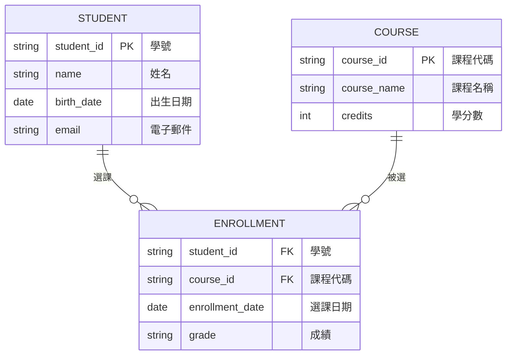
```mermaid
erDiagram
    %% 實體符號示例
    STUDENT {
        string student_id PK "學號"
        string name "姓名"
        date birth_date "出生日期"
        string email "電子郵件"
    }
    
    COURSE {
        string course_id PK "課程代碼"
        string course_name "課程名稱"
        int credits "學分數"
    }
    
    ENROLLMENT {
        string student_id FK "學號"
        string course_id FK "課程代碼"
        date enrollment_date "選課日期"
        string grade "成績"
    }
    
    %% 關係
    STUDENT ||--o{ ENROLLMENT : "選課"
    COURSE ||--o{ ENROLLMENT : "被選"
```

#### 符號說明

| 符號 | 意義 | 說明 |
|------|------|------|
| 矩形 | 實體 | 表示實體類型 |
| 橢圓 | 屬性 | 表示實體的屬性 |
| 菱形 | 關係 | 表示實體間的關係 |
| 線條 | 連接 | 連接實體、屬性、關係 |
| 底線 | 主鍵 | 表示主鍵屬性 |
| 虛線橢圓 | 衍生屬性 | 可計算得出的屬性 |

#### 關聯度標記

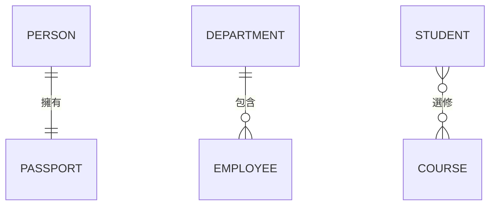
```mermaid
erDiagram
    %% 一對一關係
    PERSON ||--|| PASSPORT : "擁有"
    
    %% 一對多關係  
    DEPARTMENT ||--o{ EMPLOYEE : "包含"
    
    %% 多對多關係
    STUDENT }o--o{ COURSE : "選修"
```

### 1.4 基礎實作練習

#### 練習 1：圖書館系統

**需求：** 設計一個簡單的圖書館借閱系統

**步驟：**

1. **識別實體**
   - 會員 (Member)
   - 書籍 (Book)
   - 借閱記錄 (Loan)

2. **定義屬性**

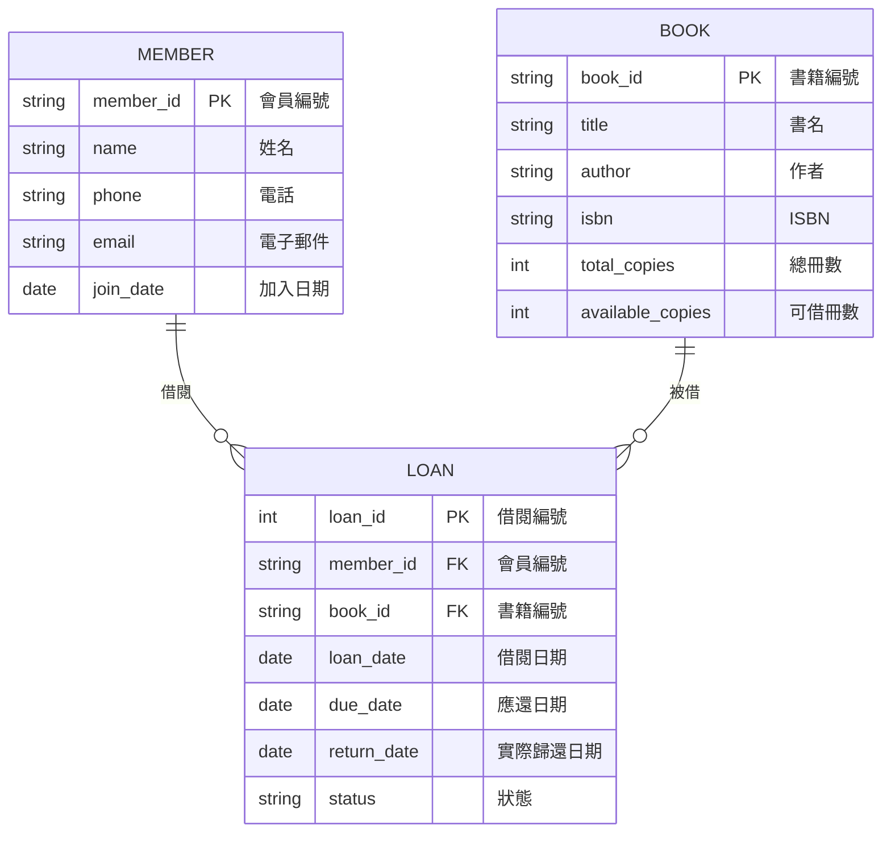
```mermaid
erDiagram
    MEMBER {
        string member_id PK "會員編號"
        string name "姓名"
        string phone "電話"
        string email "電子郵件"
        date join_date "加入日期"
    }
    
    BOOK {
        string book_id PK "書籍編號"
        string title "書名"
        string author "作者"
        string isbn "ISBN"
        int total_copies "總冊數"
        int available_copies "可借冊數"
    }
    
    LOAN {
        int loan_id PK "借閱編號"
        string member_id FK "會員編號"
        string book_id FK "書籍編號"
        date loan_date "借閱日期"
        date due_date "應還日期"
        date return_date "實際歸還日期"
        string status "狀態"
    }
    
    MEMBER ||--o{ LOAN : "借閱"
    BOOK ||--o{ LOAN : "被借"
```

3. **驗證設計**
   - ✅ 每個實體都有主鍵
   - ✅ 關係合理（會員可借多本書，書可被多個會員借過）
   - ✅ 屬性完整且必要

#### 練習 2：線上學習平台

**需求：** 設計一個線上學習平台的 ER Model

**業務描述：**
> 平台有講師和學生。講師可以開設多門課程，每門課程包含多個單元。學生可以註冊多門課程，並對課程進行評分和評論。系統需要追蹤學生的學習進度。

**解答步驟：**

1. **實體識別**
   - 講師 (Instructor)
   - 學生 (Student)  
   - 課程 (Course)
   - 單元 (Lesson)
   - 註冊記錄 (Enrollment)
   - 評論 (Review)
   - 學習進度 (Progress)

2. **ERD 設計**

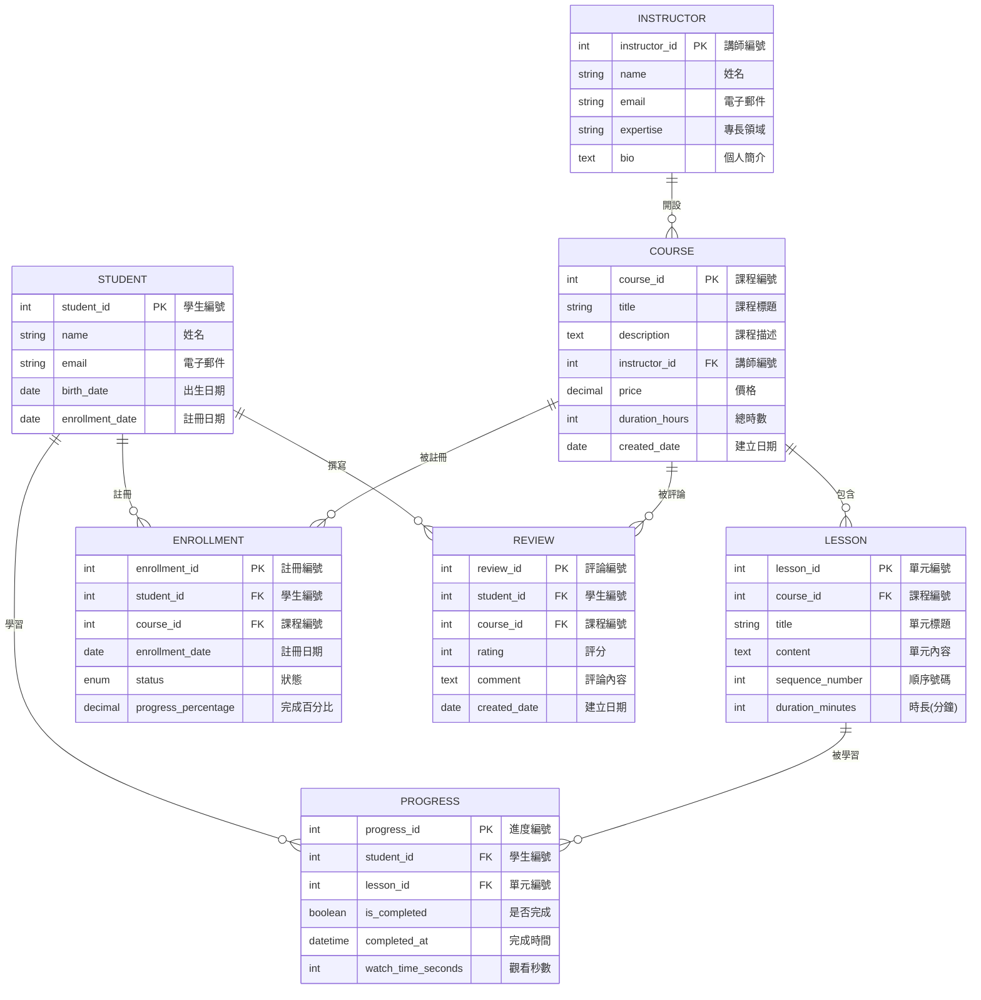
```mermaid
erDiagram
    INSTRUCTOR {
        int instructor_id PK "講師編號"
        string name "姓名"
        string email "電子郵件"
        string expertise "專長領域"
        text bio "個人簡介"
    }
    
    STUDENT {
        int student_id PK "學生編號"
        string name "姓名"
        string email "電子郵件"
        date birth_date "出生日期"
        date enrollment_date "註冊日期"
    }
    
    COURSE {
        int course_id PK "課程編號"
        string title "課程標題"
        text description "課程描述"
        int instructor_id FK "講師編號"
        decimal price "價格"
        int duration_hours "總時數"
        date created_date "建立日期"
    }
    
    LESSON {
        int lesson_id PK "單元編號"
        int course_id FK "課程編號"
        string title "單元標題"
        text content "單元內容"
        int sequence_number "順序號碼"
        int duration_minutes "時長(分鐘)"
    }
    
    ENROLLMENT {
        int enrollment_id PK "註冊編號"
        int student_id FK "學生編號"
        int course_id FK "課程編號"
        date enrollment_date "註冊日期"
        enum status "狀態"
        decimal progress_percentage "完成百分比"
    }
    
    REVIEW {
        int review_id PK "評論編號"
        int student_id FK "學生編號"
        int course_id FK "課程編號"
        int rating "評分"
        text comment "評論內容"
        date created_date "建立日期"
    }
    
    PROGRESS {
        int progress_id PK "進度編號"
        int student_id FK "學生編號"
        int lesson_id FK "單元編號"
        boolean is_completed "是否完成"
        datetime completed_at "完成時間"
        int watch_time_seconds "觀看秒數"
    }
    
    INSTRUCTOR ||--o{ COURSE : "開設"
    COURSE ||--o{ LESSON : "包含"
    STUDENT ||--o{ ENROLLMENT : "註冊"
    COURSE ||--o{ ENROLLMENT : "被註冊"
    STUDENT ||--o{ REVIEW : "撰寫"
    COURSE ||--o{ REVIEW : "被評論"
    STUDENT ||--o{ PROGRESS : "學習"
    LESSON ||--o{ PROGRESS : "被學習"
```

3. **設計說明**
   - 使用 ENROLLMENT 實體處理學生與課程的多對多關係
   - PROGRESS 實體追蹤細粒度的學習進度
   - REVIEW 實體獨立處理評論功能
   - 支援課程的階層結構（課程→單元）

#### 練習 3：醫院掛號系統

**需求：** 設計醫院門診掛號系統

**解答：**

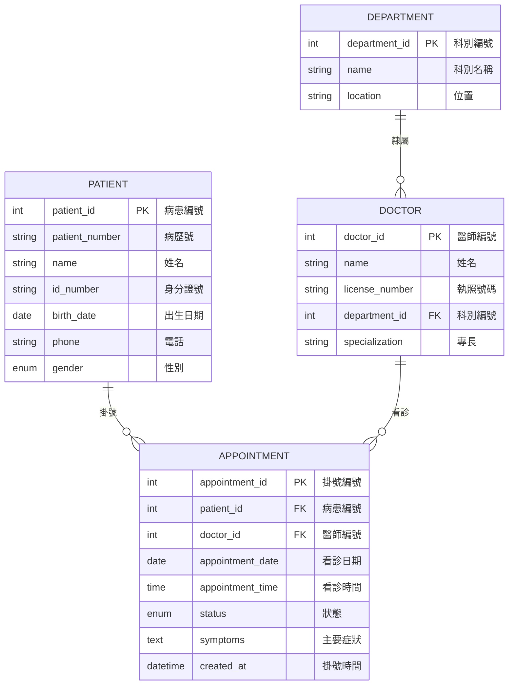
```mermaid
erDiagram
    PATIENT {
        int patient_id PK "病患編號"
        string patient_number "病歷號"
        string name "姓名"
        string id_number "身分證號"
        date birth_date "出生日期"
        string phone "電話"
        enum gender "性別"
    }
    
    DOCTOR {
        int doctor_id PK "醫師編號"
        string name "姓名"
        string license_number "執照號碼"
        int department_id FK "科別編號"
        string specialization "專長"
    }
    
    DEPARTMENT {
        int department_id PK "科別編號"
        string name "科別名稱"
        string location "位置"
    }
    
    APPOINTMENT {
        int appointment_id PK "掛號編號"
        int patient_id FK "病患編號"
        int doctor_id FK "醫師編號"
        date appointment_date "看診日期"
        time appointment_time "看診時間"
        enum status "狀態"
        text symptoms "主要症狀"
        datetime created_at "掛號時間"
    }
    
    DEPARTMENT ||--o{ DOCTOR : "隸屬"
    PATIENT ||--o{ APPOINTMENT : "掛號"
    DOCTOR ||--o{ APPOINTMENT : "看診"
```

#### 💡 實務提醒

1. **從簡單開始**：先識別核心實體，再逐步增加細節
2. **重複驗證**：經常檢查設計是否符合業務需求
3. **團隊討論**：與業務人員確認實體和關係的正確性
4. **文件記錄**：記錄設計決策的原因

#### ⚠️ 常見錯誤

- 把屬性當作實體（例：把「地址」設為實體而非屬性）
- 遺漏重要的關係
- 主鍵設計不當（非唯一或過於複雜）
- 過度設計（包含太多不必要的細節）

---

**📚 本節重點回顧**

- ER Model 是資料庫設計的基礎工具
- 核心概念：實體、屬性、關係、鍵值
- ERD 使用標準符號表示概念模型
- 從簡單範例開始練習，逐步建立信心

**🔄 下一節預告**

接下來我們將學習如何在實際專案中應用 ER Model，包含需求分析、案例研究和資料庫轉換。

---

## 2. 專案應用

### 2.1 需求分析到 ER Model

在實際專案中，ER Model 的設計通常從業務需求開始。以下是一個系統化的方法：

#### 📋 步驟 1：需求收集

**技巧：**
- 訪談業務人員，了解業務流程
- 分析現有文件和表單
- 觀察實際作業流程
- 識別資料流向

**範例：線上書店需求**
> "客戶可以瀏覽書籍、將書籍加入購物車、下訂單。系統需要記錄客戶資訊、書籍庫存、訂單明細。每本書有多個類別，客戶可以撰寫書評。"

#### 📋 步驟 2：名詞分析法

從需求描述中找出**名詞**作為候選實體，**動詞**作為候選關係。

**名詞（候選實體）：**
- 客戶 (Customer)
- 書籍 (Book) 
- 購物車 (Cart)
- 訂單 (Order)
- 類別 (Category)
- 書評 (Review)

**動詞（候選關係）：**
- 瀏覽、加入、下訂單、撰寫

#### 📋 步驟 3：實體精煉

**判斷準則：**

1. **是否為獨立概念？**
   - ✅ 客戶、書籍、訂單 → 獨立實體
   - ❌ 客戶姓名 → 屬性，非實體

2. **是否需要追蹤？**
   - ✅ 訂單需要追蹤狀態 → 實體
   - ❌ 臨時計算值 → 非實體

3. **是否有多個實例？**
   - ✅ 多個客戶、多個書籍 → 實體
   - ❌ 系統設定（通常只有一個） → 可能不是實體

#### 📋 步驟 4：屬性識別

為每個實體識別必要屬性：

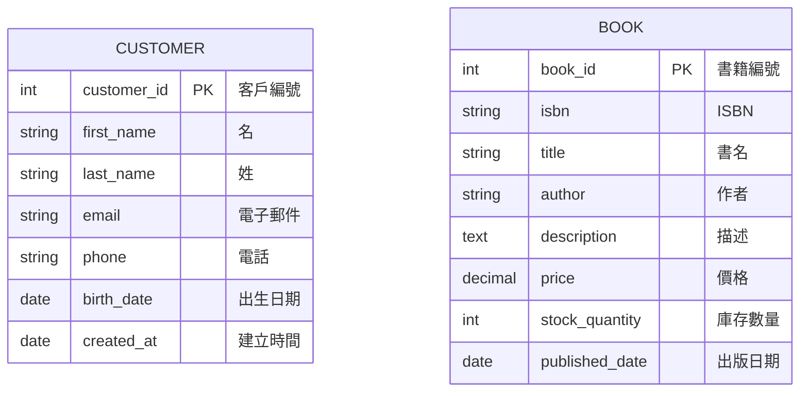
```mermaid
erDiagram
    CUSTOMER {
        int customer_id PK "客戶編號"
        string first_name "名"
        string last_name "姓"
        string email "電子郵件"
        string phone "電話"
        date birth_date "出生日期"
        date created_at "建立時間"
    }
    
    BOOK {
        int book_id PK "書籍編號"
        string isbn "ISBN"
        string title "書名"
        string author "作者"
        text description "描述"
        decimal price "價格"
        int stock_quantity "庫存數量"
        date published_date "出版日期"
    }
```

#### 📋 步驟 5：關係建立

分析實體間的業務關係：

1. **客戶 - 訂單**：一對多（客戶可下多筆訂單）
2. **訂單 - 書籍**：多對多（訂單可包含多本書，書可在多個訂單中）
3. **書籍 - 類別**：多對多（書可屬於多個類別，類別包含多本書）

### 2.2 案例研究：電商平台

讓我們以一個完整的電商平台為例，展示完整的 ER Model 設計過程。

#### 業務需求分析

**系統功能：**
- 商品管理（商品、類別、品牌）
- 訂單處理（購物車、訂單、付款）
- 用戶管理（客戶、地址、偏好）
- 評價系統（商品評論、評分）
- 促銷管理（優惠券、折扣）

#### 完整 ERD 設計

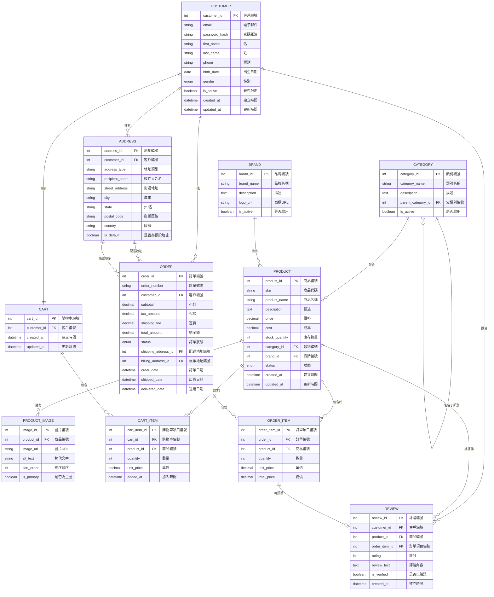
```mermaid
erDiagram
    %% 用戶相關
    CUSTOMER {
        int customer_id PK "客戶編號"
        string email "電子郵件"
        string password_hash "密碼雜湊"
        string first_name "名"
        string last_name "姓"
        string phone "電話"
        date birth_date "出生日期"
        enum gender "性別"
        boolean is_active "是否啟用"
        datetime created_at "建立時間"
        datetime updated_at "更新時間"
    }
    
    ADDRESS {
        int address_id PK "地址編號"
        int customer_id FK "客戶編號"
        string address_type "地址類型"
        string recipient_name "收件人姓名"
        string street_address "街道地址"
        string city "城市"
        string state "州/省"
        string postal_code "郵遞區號"
        string country "國家"
        boolean is_default "是否為預設地址"
    }
    
    %% 商品相關
    CATEGORY {
        int category_id PK "類別編號"
        string category_name "類別名稱"
        text description "描述"
        int parent_category_id FK "父類別編號"
        boolean is_active "是否啟用"
    }
    
    BRAND {
        int brand_id PK "品牌編號"
        string brand_name "品牌名稱"
        text description "描述"
        string logo_url "商標URL"
        boolean is_active "是否啟用"
    }
    
    PRODUCT {
        int product_id PK "商品編號"
        string sku "商品代碼"
        string product_name "商品名稱"
        text description "描述"
        decimal price "價格"
        decimal cost "成本"
        int stock_quantity "庫存數量"
        int category_id FK "類別編號"
        int brand_id FK "品牌編號"
        enum status "狀態"
        datetime created_at "建立時間"
        datetime updated_at "更新時間"
    }
    
    PRODUCT_IMAGE {
        int image_id PK "圖片編號"
        int product_id FK "商品編號"
        string image_url "圖片URL"
        string alt_text "替代文字"
        int sort_order "排序順序"
        boolean is_primary "是否為主圖"
    }
    
    %% 訂單相關
    CART {
        int cart_id PK "購物車編號"
        int customer_id FK "客戶編號"
        datetime created_at "建立時間"
        datetime updated_at "更新時間"
    }
    
    CART_ITEM {
        int cart_item_id PK "購物車項目編號"
        int cart_id FK "購物車編號"
        int product_id FK "商品編號"
        int quantity "數量"
        decimal unit_price "單價"
        datetime added_at "加入時間"
    }
    
    ORDER {
        int order_id PK "訂單編號"
        string order_number "訂單號碼"
        int customer_id FK "客戶編號"
        decimal subtotal "小計"
        decimal tax_amount "稅額"
        decimal shipping_fee "運費"
        decimal total_amount "總金額"
        enum status "訂單狀態"
        int shipping_address_id FK "配送地址編號"
        int billing_address_id FK "帳單地址編號"
        datetime order_date "訂單日期"
        datetime shipped_date "出貨日期"
        datetime delivered_date "送達日期"
    }
    
    ORDER_ITEM {
        int order_item_id PK "訂單項目編號"
        int order_id FK "訂單編號"
        int product_id FK "商品編號"
        int quantity "數量"
        decimal unit_price "單價"
        decimal total_price "總價"
    }
    
    %% 評價系統
    REVIEW {
        int review_id PK "評論編號"
        int customer_id FK "客戶編號"
        int product_id FK "商品編號"
        int order_item_id FK "訂單項目編號"
        int rating "評分"
        text review_text "評論內容"
        boolean is_verified "是否已驗證"
        datetime created_at "建立時間"
    }
    
    %% 關係定義
    CUSTOMER ||--o{ ADDRESS : "擁有"
    CUSTOMER ||--|| CART : "擁有"
    CUSTOMER ||--o{ ORDER : "下訂"
    CUSTOMER ||--o{ REVIEW : "撰寫"
    
    CATEGORY ||--o{ CATEGORY : "包含子類別"
    CATEGORY ||--o{ PRODUCT : "包含"
    BRAND ||--o{ PRODUCT : "擁有"
    PRODUCT ||--o{ PRODUCT_IMAGE : "擁有"
    PRODUCT ||--o{ CART_ITEM : "包含於"
    PRODUCT ||--o{ ORDER_ITEM : "包含於"
    PRODUCT ||--o{ REVIEW : "被評論"
    
    CART ||--o{ CART_ITEM : "包含"
    ORDER ||--o{ ORDER_ITEM : "包含"
    ORDER_ITEM ||--o| REVIEW : "可評論"
    
    ADDRESS ||--o{ ORDER : "配送地址"
    ADDRESS ||--o{ ORDER : "帳單地址"
```

#### 設計重點說明

1. **用戶管理**
   - 分離地址為獨立實體，支援多個地址
   - 密碼使用雜湊值，不儲存明文
   - 包含軟刪除機制（is_active）

2. **商品管理**
   - 類別支援階層結構（自我參考）
   - 商品圖片分離儲存，支援多圖片
   - SKU 作為商品唯一識別碼

3. **訂單處理**
   - 購物車與訂單分離，支援暫存購買意願
   - 訂單明細記錄購買時的價格
   - 支援不同的配送與帳單地址

4. **評價系統**
   - 與訂單項目關聯，確保評論的真實性
   - 包含驗證機制

### 2.3 案例研究：銀行系統

銀行系統具有更嚴格的資料完整性和安全性要求。

#### 核心業務實體

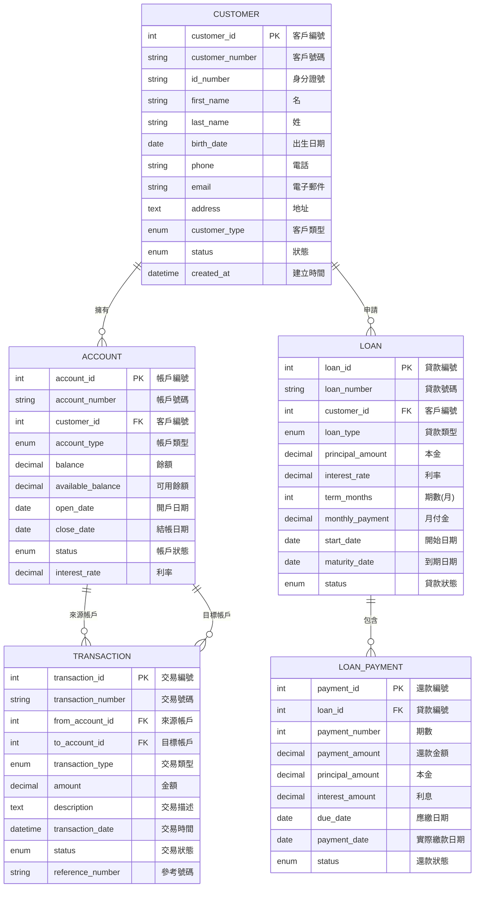
```mermaid
erDiagram
    %% 客戶管理
    CUSTOMER {
        int customer_id PK "客戶編號"
        string customer_number "客戶號碼"
        string id_number "身分證號"
        string first_name "名"
        string last_name "姓"
        date birth_date "出生日期"
        string phone "電話"
        string email "電子郵件"
        text address "地址"
        enum customer_type "客戶類型"
        enum status "狀態"
        datetime created_at "建立時間"
    }
    
    %% 帳戶管理
    ACCOUNT {
        int account_id PK "帳戶編號"
        string account_number "帳戶號碼"
        int customer_id FK "客戶編號"
        enum account_type "帳戶類型"
        decimal balance "餘額"
        decimal available_balance "可用餘額"
        date open_date "開戶日期"
        date close_date "結帳日期"
        enum status "帳戶狀態"
        decimal interest_rate "利率"
    }
    
    %% 交易管理
    TRANSACTION {
        int transaction_id PK "交易編號"
        string transaction_number "交易號碼"
        int from_account_id FK "來源帳戶"
        int to_account_id FK "目標帳戶"
        enum transaction_type "交易類型"
        decimal amount "金額"
        text description "交易描述"
        datetime transaction_date "交易時間"
        enum status "交易狀態"
        string reference_number "參考號碼"
    }
    
    %% 貸款管理
    LOAN {
        int loan_id PK "貸款編號"
        string loan_number "貸款號碼"
        int customer_id FK "客戶編號"
        enum loan_type "貸款類型"
        decimal principal_amount "本金"
        decimal interest_rate "利率"
        int term_months "期數(月)"
        decimal monthly_payment "月付金"
        date start_date "開始日期"
        date maturity_date "到期日期"
        enum status "貸款狀態"
    }
    
    LOAN_PAYMENT {
        int payment_id PK "還款編號"
        int loan_id FK "貸款編號"
        int payment_number "期數"
        decimal payment_amount "還款金額"
        decimal principal_amount "本金"
        decimal interest_amount "利息"
        date due_date "應繳日期"
        date payment_date "實際繳款日期"
        enum status "還款狀態"
    }
    
    %% 關係
    CUSTOMER ||--o{ ACCOUNT : "擁有"
    CUSTOMER ||--o{ LOAN : "申請"
    ACCOUNT ||--o{ TRANSACTION : "來源帳戶"
    ACCOUNT ||--o{ TRANSACTION : "目標帳戶"
    LOAN ||--o{ LOAN_PAYMENT : "包含"
```

#### 銀行系統設計考量

1. **資料完整性**
   - 所有金額欄位使用 DECIMAL 確保精確度
   - 交易必須有來源和目標（或其中之一）
   - 餘額計算需要嚴格驗證

2. **稽核要求**
   - 所有交易都有完整的時間戳記
   - 交易狀態追蹤（pending, completed, failed）
   - 參考號碼供外部系統追蹤

3. **安全考量**
   - 敏感資料（身分證號）需要加密
   - 交易金額限制
   - 帳戶狀態控制

### 2.4 轉換為資料庫 Schema

完成 ER Model 設計後，需要轉換為實際的資料庫結構。

#### 轉換規則

1. **實體 → 資料表**
   - 每個實體對應一個資料表
   - 實體名稱對應資料表名稱

2. **屬性 → 欄位**
   - 簡單屬性直接對應欄位
   - 複合屬性拆解為多個欄位
   - 多值屬性建立關聯資料表

3. **關係處理**
   - **一對多**：在多的一方加入外來鍵
   - **多對多**：建立關聯資料表
   - **一對一**：在任一方加入外來鍵

#### PostgreSQL 範例

```sql
-- 客戶資料表
CREATE TABLE customers (
    customer_id SERIAL PRIMARY KEY,
    customer_number VARCHAR(20) UNIQUE NOT NULL,
    first_name VARCHAR(50) NOT NULL,
    last_name VARCHAR(50) NOT NULL,
    email VARCHAR(100) UNIQUE NOT NULL,
    phone VARCHAR(20),
    birth_date DATE,
    is_active BOOLEAN DEFAULT true,
    created_at TIMESTAMP DEFAULT CURRENT_TIMESTAMP,
    updated_at TIMESTAMP DEFAULT CURRENT_TIMESTAMP
);

-- 商品資料表
CREATE TABLE products (
    product_id SERIAL PRIMARY KEY,
    sku VARCHAR(50) UNIQUE NOT NULL,
    product_name VARCHAR(200) NOT NULL,
    description TEXT,
    price DECIMAL(10,2) NOT NULL CHECK (price >= 0),
    stock_quantity INTEGER DEFAULT 0 CHECK (stock_quantity >= 0),
    category_id INTEGER REFERENCES categories(category_id),
    brand_id INTEGER REFERENCES brands(brand_id),
    status VARCHAR(20) DEFAULT 'active',
    created_at TIMESTAMP DEFAULT CURRENT_TIMESTAMP,
    updated_at TIMESTAMP DEFAULT CURRENT_TIMESTAMP
);

-- 訂單資料表
CREATE TABLE orders (
    order_id SERIAL PRIMARY KEY,
    order_number VARCHAR(30) UNIQUE NOT NULL,
    customer_id INTEGER NOT NULL REFERENCES customers(customer_id),
    total_amount DECIMAL(12,2) NOT NULL CHECK (total_amount >= 0),
    status VARCHAR(20) DEFAULT 'pending',
    order_date TIMESTAMP DEFAULT CURRENT_TIMESTAMP,
    shipped_date TIMESTAMP,
    delivered_date TIMESTAMP
);

-- 訂單明細資料表（多對多關聯）
CREATE TABLE order_items (
    order_item_id SERIAL PRIMARY KEY,
    order_id INTEGER NOT NULL REFERENCES orders(order_id) ON DELETE CASCADE,
    product_id INTEGER NOT NULL REFERENCES products(product_id),
    quantity INTEGER NOT NULL CHECK (quantity > 0),
    unit_price DECIMAL(10,2) NOT NULL CHECK (unit_price >= 0),
    total_price DECIMAL(12,2) GENERATED ALWAYS AS (quantity * unit_price) STORED,
    UNIQUE(order_id, product_id)  -- 避免同一訂單重複商品
);
```

#### Oracle 範例

```sql
-- 客戶資料表
CREATE TABLE customers (
    customer_id NUMBER GENERATED BY DEFAULT AS IDENTITY PRIMARY KEY,
    customer_number VARCHAR2(20) UNIQUE NOT NULL,
    first_name VARCHAR2(50) NOT NULL,
    last_name VARCHAR2(50) NOT NULL,
    email VARCHAR2(100) UNIQUE NOT NULL,
    phone VARCHAR2(20),
    birth_date DATE,
    is_active CHAR(1) DEFAULT 'Y' CHECK (is_active IN ('Y', 'N')),
    created_at TIMESTAMP DEFAULT CURRENT_TIMESTAMP,
    updated_at TIMESTAMP DEFAULT CURRENT_TIMESTAMP
);

-- 建立觸發器自動更新 updated_at
CREATE OR REPLACE TRIGGER trg_customers_updated_at
    BEFORE UPDATE ON customers
    FOR EACH ROW
BEGIN
    :NEW.updated_at := CURRENT_TIMESTAMP;
END;
```

#### DB2 範例

```sql
-- 客戶資料表
CREATE TABLE customers (
    customer_id INTEGER NOT NULL GENERATED ALWAYS AS IDENTITY (START WITH 1 INCREMENT BY 1),
    customer_number VARCHAR(20) NOT NULL,
    first_name VARCHAR(50) NOT NULL,
    last_name VARCHAR(50) NOT NULL,
    email VARCHAR(100) NOT NULL,
    phone VARCHAR(20),
    birth_date DATE,
    is_active CHAR(1) DEFAULT 'Y' WITH DEFAULT,
    created_at TIMESTAMP DEFAULT CURRENT_TIMESTAMP,
    updated_at TIMESTAMP DEFAULT CURRENT_TIMESTAMP,
    PRIMARY KEY (customer_id),
    UNIQUE (customer_number),
    UNIQUE (email),
    CHECK (is_active IN ('Y', 'N'))
);
```

#### 轉換最佳實務

1. **命名規範**
   - 資料表名稱使用複數形式（customers, orders）
   - 欄位名稱使用小寫加底線（customer_id, first_name）
   - 外來鍵遵循命名慣例（table_name + "_id"）

2. **資料型別選擇**
   - 主鍵使用 SERIAL/IDENTITY
   - 金額使用 DECIMAL 避免精度問題
   - 文字長度根據實際需求設定
   - 日期時間使用 TIMESTAMP 包含時區資訊

3. **約束條件**
   - 建立適當的 CHECK 約束
   - 設定 NOT NULL 約束
   - 使用 UNIQUE 約束防止重複
   - 外來鍵約束確保參考完整性

4. **索引優化**
   - 主鍵自動建立索引
   - 外來鍵欄位建立索引
   - 經常查詢的欄位建立索引
   - 複合索引支援複雜查詢

### 2.5 完整專案開發流程

#### 🚀 從概念到實作的完整流程

##### 階段1：需求收集與分析（1-2週）

**步驟1：業務訪談**
```
參與人員：業務分析師、領域專家、使用者代表
產出文件：
- 業務需求規格書
- 使用者故事集合
- 業務流程圖
- 資料流程圖
```

**步驟2：需求整理**
```
活動內容：
- 識別核心業務實體
- 分析資料流向
- 確認業務規則
- 評估技術約束
```

##### 階段2：概念設計（1週）

**步驟3：初步 ER Model**
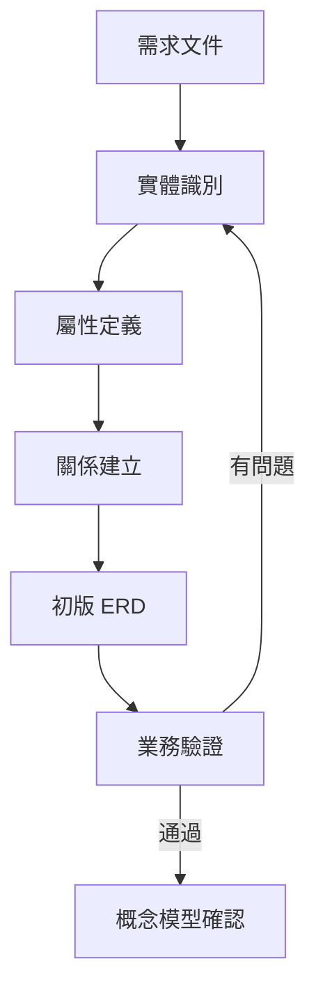
```mermaid
flowchart TD
    A[需求文件] --> B[實體識別]
    B --> C[屬性定義]
    C --> D[關係建立]
    D --> E[初版 ERD]
    E --> F[業務驗證]
    F -->|有問題| B
    F -->|通過| G[概念模型確認]
```

**步驟4：設計評審**
```
評審重點：
✓ 實體完整性檢查
✓ 關係合理性驗證
✓ 業務規則符合度
✓ 擴展性評估
```

##### 階段3：邏輯設計（1週）

**步驟5：正規化分析**
```
正規化檢查清單：
□ 第一正規化（1NF）
□ 第二正規化（2NF）
□ 第三正規化（3NF）
□ BCNF（如需要）
□ 反正規化考量
```

**步驟6：效能優化設計**
```sql
-- 範例：電商系統效能優化
-- 訂單摘要反正規化
ALTER TABLE orders ADD COLUMN item_count INTEGER;
ALTER TABLE orders ADD COLUMN total_items_weight DECIMAL(8,2);

-- 商品搜尋優化
CREATE INDEX idx_products_search ON products 
USING gin(to_tsvector('chinese', product_name || ' ' || description));

-- 分割策略
CREATE TABLE orders_2024 PARTITION OF orders
FOR VALUES FROM ('2024-01-01') TO ('2025-01-01');
```

##### 階段4：物理設計（1週）

**步驟7：資料庫實作**
```sql
-- 完整的建表腳本範例
-- 1. 建立基礎表
CREATE SCHEMA ecommerce;
SET search_path TO ecommerce;

-- 2. 客戶表
CREATE TABLE customers (
    customer_id SERIAL PRIMARY KEY,
    email VARCHAR(255) UNIQUE NOT NULL,
    password_hash VARCHAR(255) NOT NULL,
    first_name VARCHAR(100) NOT NULL,
    last_name VARCHAR(100) NOT NULL,
    phone VARCHAR(20),
    birth_date DATE,
    is_active BOOLEAN DEFAULT true,
    created_at TIMESTAMP DEFAULT CURRENT_TIMESTAMP,
    updated_at TIMESTAMP DEFAULT CURRENT_TIMESTAMP,
    
    CONSTRAINT chk_email_format CHECK (email ~* '^[A-Za-z0-9._%+-]+@[A-Za-z0-9.-]+\.[A-Za-z]{2,}$'),
    CONSTRAINT chk_phone_format CHECK (phone ~* '^\+?[0-9\-\s()]+$')
);

-- 3. 建立索引
CREATE INDEX idx_customers_email ON customers(email);
CREATE INDEX idx_customers_active ON customers(is_active) WHERE is_active = true;
CREATE INDEX idx_customers_created ON customers(created_at);

-- 4. 建立觸發器
CREATE OR REPLACE FUNCTION update_updated_at()
RETURNS TRIGGER AS $$
BEGIN
    NEW.updated_at = CURRENT_TIMESTAMP;
    RETURN NEW;
END;
$$ LANGUAGE plpgsql;

CREATE TRIGGER trg_customers_updated_at
    BEFORE UPDATE ON customers
    FOR EACH ROW
    EXECUTE FUNCTION update_updated_at();
```

**步驟8：資料遷移規劃**
```sql
-- 資料遷移腳本範例
-- 從舊系統遷移客戶資料
INSERT INTO ecommerce.customers (
    email, first_name, last_name, phone, 
    birth_date, created_at
)
SELECT 
    LOWER(TRIM(email)),
    TRIM(fname),
    TRIM(lname),
    REGEXP_REPLACE(phone, '[^0-9+\-()]', '', 'g'),
    CASE 
        WHEN birthday IS NOT NULL AND birthday != '0000-00-00' 
        THEN birthday::DATE 
        ELSE NULL 
    END,
    registration_date
FROM legacy.users
WHERE email IS NOT NULL 
  AND email != ''
  AND email ~* '^[A-Za-z0-9._%+-]+@[A-Za-z0-9.-]+\.[A-Za-z]{2,}$'
ON CONFLICT (email) DO NOTHING;
```

##### 階段5：測試與驗證（1週）

**步驟9：資料完整性測試**
```sql
-- 測試腳本範例
-- 1. 主鍵唯一性測試
SELECT table_name, column_name, constraint_name
FROM information_schema.table_constraints tc
JOIN information_schema.key_column_usage kcu 
ON tc.constraint_name = kcu.constraint_name
WHERE tc.constraint_type = 'PRIMARY KEY'
  AND tc.table_schema = 'ecommerce';

-- 2. 外來鍵完整性測試
SELECT 
    tc.table_name,
    kcu.column_name,
    ccu.table_name AS foreign_table_name,
    ccu.column_name AS foreign_column_name
FROM information_schema.table_constraints AS tc
JOIN information_schema.key_column_usage AS kcu
ON tc.constraint_name = kcu.constraint_name
JOIN information_schema.constraint_column_usage AS ccu
ON ccu.constraint_name = tc.constraint_name
WHERE tc.constraint_type = 'FOREIGN KEY'
  AND tc.table_schema = 'ecommerce';

-- 3. 檢查約束驗證
SELECT constraint_name, check_clause
FROM information_schema.check_constraints
WHERE constraint_schema = 'ecommerce';
```

**步驟10：效能基準測試**
```sql
-- 效能測試範例
-- 1. 查詢效能測試
EXPLAIN (ANALYZE, BUFFERS) 
SELECT c.customer_id, c.first_name, c.last_name,
       COUNT(o.order_id) as order_count,
       SUM(o.total_amount) as total_spent
FROM customers c
LEFT JOIN orders o ON c.customer_id = o.customer_id
WHERE c.created_at >= '2024-01-01'
GROUP BY c.customer_id, c.first_name, c.last_name
ORDER BY total_spent DESC
LIMIT 100;

-- 2. 插入效能測試
\timing on
INSERT INTO customers (email, first_name, last_name)
SELECT 
    'test' || generate_series(1,10000) || '@example.com',
    'FirstName' || generate_series(1,10000),
    'LastName' || generate_series(1,10000);
\timing off
```

##### 階段6：部署與監控（持續）

**步驟11：生產環境部署**
```bash
# 部署腳本範例
#!/bin/bash
set -e

echo "開始部署資料庫..."

# 1. 備份現有資料庫
pg_dump -h localhost -U postgres -d production > backup_$(date +%Y%m%d_%H%M%S).sql

# 2. 執行遷移腳本
psql -h localhost -U postgres -d production -f migration_v2.0.sql

# 3. 驗證部署
psql -h localhost -U postgres -d production -c "SELECT COUNT(*) FROM customers;"

echo "部署完成！"
```

**步驟12：監控與維護**
```sql
-- 監控腳本
-- 1. 表大小監控
SELECT 
    schemaname,
    tablename,
    pg_size_pretty(pg_total_relation_size(schemaname||'.'||tablename)) as size
FROM pg_tables 
WHERE schemaname = 'ecommerce'
ORDER BY pg_total_relation_size(schemaname||'.'||tablename) DESC;

-- 2. 索引使用率監控
SELECT 
    schemaname,
    tablename,
    indexname,
    idx_scan,
    idx_tup_read,
    idx_tup_fetch
FROM pg_stat_user_indexes
WHERE schemaname = 'ecommerce'
ORDER BY idx_scan DESC;

-- 3. 慢查詢監控
SELECT 
    query,
    calls,
    total_time,
    mean_time,
    rows
FROM pg_stat_statements
WHERE query LIKE '%ecommerce%'
ORDER BY mean_time DESC
LIMIT 10;
```

#### 📋 專案檢查清單

**設計階段：**
- [ ] 需求文件完整且已確認
- [ ] 所有業務實體已識別
- [ ] 實體關係正確建立
- [ ] 屬性設計符合業務需求
- [ ] 正規化分析完成
- [ ] 效能考量已納入設計

**實作階段：**
- [ ] DDL 腳本符合命名規範
- [ ] 所有約束條件已設定
- [ ] 索引策略已實施
- [ ] 資料遷移腳本已測試
- [ ] 備份還原程序已建立

**測試階段：**
- [ ] 資料完整性測試通過
- [ ] 效能基準測試完成
- [ ] 負載測試通過
- [ ] 安全性測試完成

**部署階段：**
- [ ] 生產環境部署成功
- [ ] 監控系統已設置
- [ ] 文件已更新
- [ ] 團隊已培訓

#### 💡 實務提醒

1. **版本控制**：使用遷移腳本管理資料庫結構變更
2. **文件記錄**：記錄每個資料表和欄位的用途
3. **效能考量**：根據查詢模式優化索引策略
4. **安全性**：敏感資料加密，設定適當權限

#### ⚠️ 常見問題

- 忘記設定外來鍵約束
- 資料型別選擇不當（如用 FLOAT 儲存金額）
- 缺少必要的索引造成效能問題
- 命名不一致增加維護困難

---

**📚 本節重點回顧**

- 從需求分析到 ER Model 的系統化方法
- 電商平台和銀行系統的完整設計範例
- ER Model 轉換為各種資料庫 Schema 的實作
- 設計時需考量完整性、安全性、效能

**🔄 下一節預告**

接下來我們將深入探討進階主題，包括實體類型、關聯度、正規化理論和設計最佳實務。

---

## 3. 進階主題

### 3.1 實體類型與關聯度

#### 強實體與弱實體

**強實體 (Strong Entity)**
- 可以獨立存在的實體
- 擁有足夠的屬性來唯一識別
- 有自己的主鍵

**弱實體 (Weak Entity)**
- 依賴其他實體存在的實體
- 無法單獨透過自身屬性唯一識別
- 需要透過與強實體的關係來識別

#### 範例：訂單與訂單明細

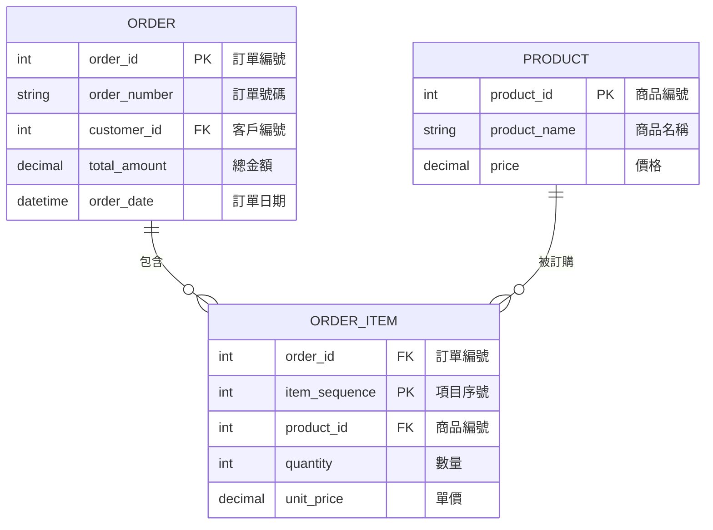
```mermaid
erDiagram
    %% 強實體
    ORDER {
        int order_id PK "訂單編號"
        string order_number "訂單號碼"
        int customer_id FK "客戶編號"
        decimal total_amount "總金額"
        datetime order_date "訂單日期"
    }
    
    %% 弱實體 - 依賴訂單存在
    ORDER_ITEM {
        int order_id FK "訂單編號"
        int item_sequence PK "項目序號"
        int product_id FK "商品編號"
        int quantity "數量"
        decimal unit_price "單價"
    }
    
    PRODUCT {
        int product_id PK "商品編號"
        string product_name "商品名稱"
        decimal price "價格"
    }
    
    ORDER ||--o{ ORDER_ITEM : "包含"
    PRODUCT ||--o{ ORDER_ITEM : "被訂購"
```

**說明：**
- `ORDER` 是強實體，有自己的主鍵 `order_id`
- `ORDER_ITEM` 是弱實體，主鍵是 `(order_id, item_sequence)` 的組合
- 沒有訂單就不會有訂單明細

#### 關聯度 (Cardinality) 深入分析

關聯度定義實體間關係的數量約束。

#### 詳細關聯度類型

1. **一對一 (1:1)**

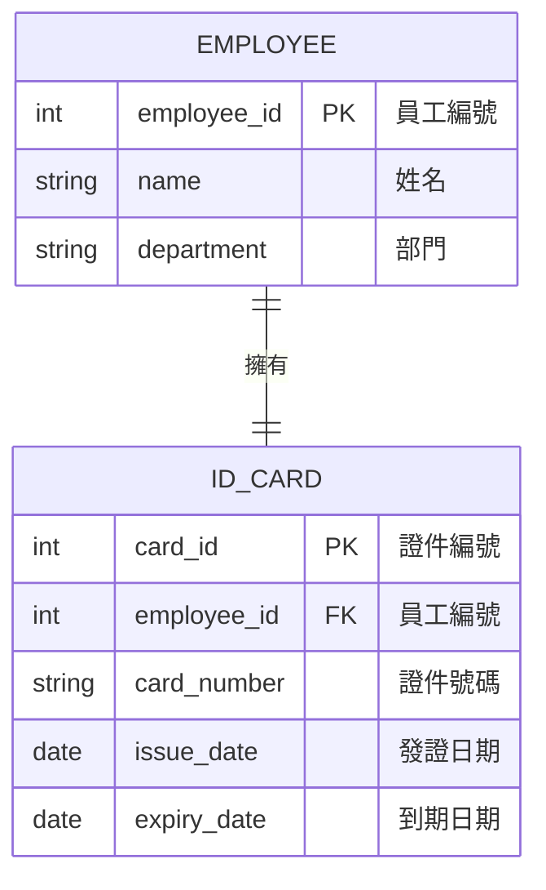
```mermaid
erDiagram
    EMPLOYEE {
        int employee_id PK "員工編號"
        string name "姓名"
        string department "部門"
    }
    
    ID_CARD {
        int card_id PK "證件編號"
        int employee_id FK "員工編號"
        string card_number "證件號碼"
        date issue_date "發證日期"
        date expiry_date "到期日期"
    }
    
    EMPLOYEE ||--|| ID_CARD : "擁有"
```

**特徵：**
- 一個員工只能有一張員工證
- 一張員工證只能屬於一個員工
- 可以考慮合併為一個實體

2. **一對多 (1:N)**

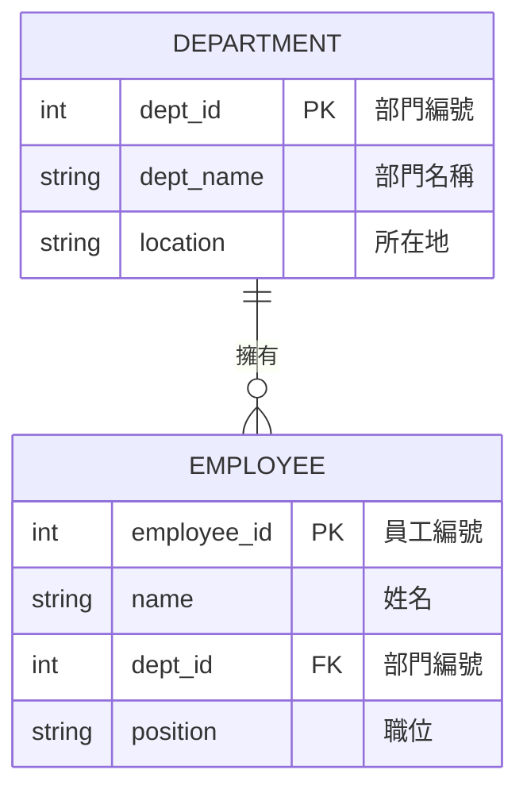
```mermaid
erDiagram
    DEPARTMENT {
        int dept_id PK "部門編號"
        string dept_name "部門名稱"
        string location "所在地"
    }
    
    EMPLOYEE {
        int employee_id PK "員工編號"
        string name "姓名"
        int dept_id FK "部門編號"
        string position "職位"
    }
    
    DEPARTMENT ||--o{ EMPLOYEE : "擁有"
```

**特徵：**
- 一個部門可以有多個員工
- 一個員工只能屬於一個部門
- 在「多」的一方設置外來鍵

3. **多對多 (M:N)**

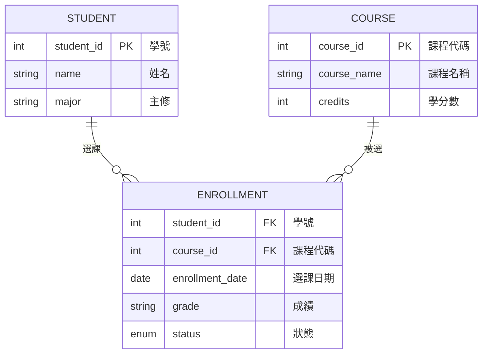
```mermaid
erDiagram
    STUDENT {
        int student_id PK "學號"
        string name "姓名"
        string major "主修"
    }
    
    COURSE {
        int course_id PK "課程代碼"
        string course_name "課程名稱"
        int credits "學分數"
    }
    
    ENROLLMENT {
        int student_id FK "學號"
        int course_id FK "課程代碼"
        date enrollment_date "選課日期"
        string grade "成績"
        enum status "狀態"
    }
    
    STUDENT ||--o{ ENROLLMENT : "選課"
    COURSE ||--o{ ENROLLMENT : "被選"
```

**特徵：**
- 一個學生可以選修多門課程
- 一門課程可以被多個學生選修
- 需要建立關聯實體（橋接表）

#### 參與約束 (Participation Constraints)

**完全參與 (Total Participation)**
- 實體的每個實例都必須參與關係
- 使用雙線表示

**部分參與 (Partial Participation)**
- 實體的實例可以選擇性參與關係
- 使用單線表示

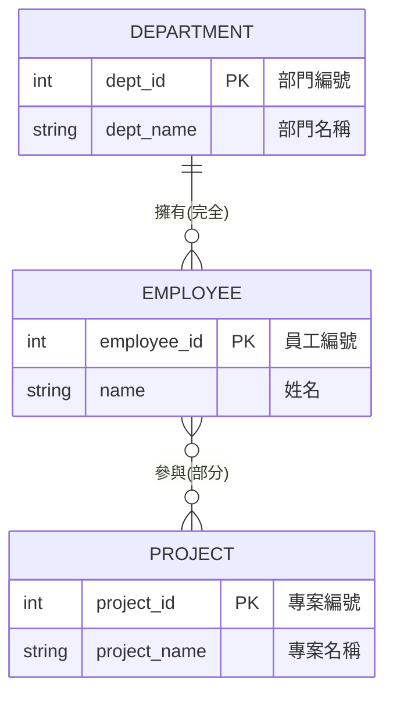
```mermaid
erDiagram
    EMPLOYEE {
        int employee_id PK "員工編號"
        string name "姓名"
    }
    
    DEPARTMENT {
        int dept_id PK "部門編號"
        string dept_name "部門名稱"
    }
    
    PROJECT {
        int project_id PK "專案編號"
        string project_name "專案名稱"
    }
    
    %% 完全參與：每個員工都必須屬於一個部門
    DEPARTMENT ||--o{ EMPLOYEE : "擁有(完全)"
    
    %% 部分參與：員工可以選擇性參與專案
    EMPLOYEE }o--o{ PROJECT : "參與(部分)"
```

### 3.2 正規化理論

正規化是消除資料冗餘和異常的過程，確保資料庫設計的邏輯正確性。

#### 第一正規化 (1NF)

**要求：**
- 每個欄位都是原子值（不可再分）
- 沒有重複的群組
- 每一列都是唯一的

**❌ 違反 1NF 的例子：**

| 學號 | 姓名 | 電話 |
|------|------|------|
| S001 | 張三 | 0912345678, 0987654321 |
| S002 | 李四 | 0923456789 |

**✅ 符合 1NF：**

```sql
-- 學生資料表
CREATE TABLE students (
    student_id VARCHAR(10) PRIMARY KEY,
    name VARCHAR(50) NOT NULL
);

-- 學生電話資料表
CREATE TABLE student_phones (
    student_id VARCHAR(10),
    phone VARCHAR(15),
    phone_type VARCHAR(10),
    PRIMARY KEY (student_id, phone),
    FOREIGN KEY (student_id) REFERENCES students(student_id)
);
```

#### 第二正規化 (2NF)

**要求：**
- 符合 1NF
- 所有非主鍵屬性都完全依賴於主鍵

**❌ 違反 2NF 的例子：**

| 學號 | 課程代碼 | 姓名 | 課程名稱 | 成績 |
|------|----------|------|----------|------|
| S001 | C001 | 張三 | 資料庫 | 85 |
| S001 | C002 | 張三 | 程式設計 | 90 |

問題：姓名只依賴學號，課程名稱只依賴課程代碼

**✅ 符合 2NF：**

```sql
-- 學生資料表
CREATE TABLE students (
    student_id VARCHAR(10) PRIMARY KEY,
    name VARCHAR(50) NOT NULL
);

-- 課程資料表
CREATE TABLE courses (
    course_id VARCHAR(10) PRIMARY KEY,
    course_name VARCHAR(100) NOT NULL
);

-- 選課資料表
CREATE TABLE enrollments (
    student_id VARCHAR(10),
    course_id VARCHAR(10),
    grade INTEGER,
    PRIMARY KEY (student_id, course_id),
    FOREIGN KEY (student_id) REFERENCES students(student_id),
    FOREIGN KEY (course_id) REFERENCES courses(course_id)
);
```

#### 第三正規化 (3NF)

**要求：**
- 符合 2NF
- 沒有傳遞依賴（非主鍵屬性不依賴其他非主鍵屬性）

**❌ 違反 3NF 的例子：**

| 學號 | 姓名 | 系所代碼 | 系所名稱 |
|------|------|----------|----------|
| S001 | 張三 | CS | 資訊工程系 |
| S002 | 李四 | EE | 電機工程系 |

問題：系所名稱依賴系所代碼，形成傳遞依賴

**✅ 符合 3NF：**

```sql
-- 系所資料表
CREATE TABLE departments (
    dept_code VARCHAR(10) PRIMARY KEY,
    dept_name VARCHAR(100) NOT NULL
);

-- 學生資料表
CREATE TABLE students (
    student_id VARCHAR(10) PRIMARY KEY,
    name VARCHAR(50) NOT NULL,
    dept_code VARCHAR(10),
    FOREIGN KEY (dept_code) REFERENCES departments(dept_code)
);
```

#### BCNF (Boyce-Codd Normal Form)

**要求：**
- 符合 3NF
- 每個決定因子都是候選鍵

#### 反正規化考量

在某些情況下，為了效能考量，可能需要適度的反正規化：

1. **查詢效能**：減少 JOIN 操作
2. **報表需求**：聚合資料的快速存取
3. **讀取密集**：讀多寫少的應用場景

**範例：電商系統的訂單摘要**

```sql
-- 正規化設計
CREATE TABLE orders (
    order_id SERIAL PRIMARY KEY,
    customer_id INTEGER,
    order_date TIMESTAMP
);

CREATE TABLE order_items (
    order_id INTEGER,
    product_id INTEGER,
    quantity INTEGER,
    unit_price DECIMAL(10,2)
);

-- 反正規化：在訂單表增加摘要欄位
ALTER TABLE orders ADD COLUMN total_amount DECIMAL(12,2);
ALTER TABLE orders ADD COLUMN item_count INTEGER;
```

### 3.3 常見設計錯誤

#### 錯誤 1：過度正規化

**問題：** 將所有東西都分解到最小單位

**❌ 錯誤範例：**
```sql
-- 過度分解地址
CREATE TABLE countries (id, name);
CREATE TABLE states (id, name, country_id);
CREATE TABLE cities (id, name, state_id);
CREATE TABLE streets (id, name, city_id);
CREATE TABLE addresses (id, street_id, house_number);
```

**✅ 合理設計：**
```sql
CREATE TABLE addresses (
    id SERIAL PRIMARY KEY,
    street_address VARCHAR(200),
    city VARCHAR(100),
    state VARCHAR(100),
    postal_code VARCHAR(20),
    country VARCHAR(100)
);
```

#### 錯誤 2：忽略業務規則

**問題：** 沒有在資料庫層面實施業務約束

**❌ 錯誤範例：**
```sql
CREATE TABLE orders (
    order_id SERIAL PRIMARY KEY,
    total_amount DECIMAL(10,2)  -- 沒有檢查約束
);
```

**✅ 正確設計：**
```sql
CREATE TABLE orders (
    order_id SERIAL PRIMARY KEY,
    total_amount DECIMAL(10,2) CHECK (total_amount >= 0),
    status VARCHAR(20) CHECK (status IN ('pending', 'paid', 'shipped', 'delivered', 'cancelled')),
    order_date TIMESTAMP DEFAULT CURRENT_TIMESTAMP
);
```

#### 錯誤 3：錯誤的關係建模

**問題：** 誤用一對一關係或遺漏多對多關係

**❌ 錯誤範例：** 將多對多建模為一對多
```sql
CREATE TABLE students (
    student_id SERIAL PRIMARY KEY,
    name VARCHAR(100),
    course_id INTEGER  -- 學生只能選一門課？
);
```

**✅ 正確設計：**
```sql
CREATE TABLE students (
    student_id SERIAL PRIMARY KEY,
    name VARCHAR(100)
);

CREATE TABLE courses (
    course_id SERIAL PRIMARY KEY,
    course_name VARCHAR(100)
);

CREATE TABLE enrollments (
    student_id INTEGER REFERENCES students(student_id),
    course_id INTEGER REFERENCES courses(course_id),
    enrollment_date DATE,
    PRIMARY KEY (student_id, course_id)
);
```

#### 錯誤 4：不適當的資料型別

**常見問題：**

1. **金額使用 FLOAT**
```sql
-- ❌ 錯誤
price FLOAT  -- 精度問題

-- ✅ 正確
price DECIMAL(10,2)  -- 精確的金額
```

2. **日期使用 VARCHAR**
```sql
-- ❌ 錯誤
birth_date VARCHAR(10)  -- '1990-01-01'

-- ✅ 正確
birth_date DATE
```

3. **布林值使用 VARCHAR**
```sql
-- ❌ 錯誤
is_active VARCHAR(10)  -- 'true', 'false', 'yes', 'no'

-- ✅ 正確
is_active BOOLEAN
```

### 3.4 最佳實務

#### 命名慣例

1. **資料表命名**
   - 使用複數名詞：`customers`, `orders`, `products`
   - 小寫字母，單字間用底線：`order_items`, `product_categories`
   - 避免保留字：不使用 `user`, `order` 等

2. **欄位命名**
   - 使用描述性名稱：`first_name` 而非 `fname`
   - 主鍵統一命名：`table_name_id`
   - 外來鍵與參考的主鍵同名
   - 時間欄位加上後綴：`created_at`, `updated_at`

3. **約束命名**
```sql
-- 主鍵約束
CONSTRAINT pk_customers PRIMARY KEY (customer_id)

-- 外來鍵約束
CONSTRAINT fk_orders_customer_id FOREIGN KEY (customer_id) REFERENCES customers(customer_id)

-- 檢查約束
CONSTRAINT chk_orders_total_amount CHECK (total_amount >= 0)

-- 唯一約束
CONSTRAINT uk_customers_email UNIQUE (email)
```

#### 索引策略

1. **自動索引**
   - 主鍵自動有索引
   - 唯一約束自動有索引

2. **手動索引**
```sql
-- 外來鍵索引
CREATE INDEX idx_orders_customer_id ON orders(customer_id);

-- 查詢條件索引
CREATE INDEX idx_orders_order_date ON orders(order_date);

-- 複合索引
CREATE INDEX idx_orders_customer_date ON orders(customer_id, order_date);

-- 部分索引
CREATE INDEX idx_orders_active ON orders(customer_id) WHERE status = 'active';
```

#### 資料完整性

1. **實體完整性**
```sql
-- 主鍵不可為空且唯一
customer_id SERIAL PRIMARY KEY
```

2. **參照完整性**
```sql
-- 外來鍵約束
customer_id INTEGER NOT NULL REFERENCES customers(customer_id) ON DELETE CASCADE
```

3. **領域完整性**
```sql
-- 檢查約束
age INTEGER CHECK (age >= 0 AND age <= 150),
status VARCHAR(20) CHECK (status IN ('active', 'inactive', 'suspended')),
email VARCHAR(255) CHECK (email ~* '^[A-Za-z0-9._%+-]+@[A-Za-z0-9.-]+\.[A-Za-z]{2,}$')
```

#### 安全性考量

1. **敏感資料處理**
```sql
-- 密碼雜湊
password_hash VARCHAR(255) NOT NULL,  -- 儲存雜湊值，不儲存明文

-- 資料加密
credit_card_number_encrypted TEXT,  -- 加密後儲存

-- 軟刪除
is_deleted BOOLEAN DEFAULT FALSE,
deleted_at TIMESTAMP
```

2. **稽核軌跡**
```sql
CREATE TABLE audit_log (
    log_id SERIAL PRIMARY KEY,
    table_name VARCHAR(100) NOT NULL,
    operation VARCHAR(10) NOT NULL,  -- INSERT, UPDATE, DELETE
    old_values JSONB,
    new_values JSONB,
    user_id INTEGER,
    timestamp TIMESTAMP DEFAULT CURRENT_TIMESTAMP
);
```

#### 效能優化

1. **分割策略**
```sql
-- 按日期分割訂單表
CREATE TABLE orders_2024_01 PARTITION OF orders
FOR VALUES FROM ('2024-01-01') TO ('2024-02-01');
```

2. **檢視表**
```sql
-- 複雜查詢的檢視表
CREATE VIEW customer_order_summary AS
SELECT 
    c.customer_id,
    c.name,
    COUNT(o.order_id) as total_orders,
    SUM(o.total_amount) as total_spent
FROM customers c
LEFT JOIN orders o ON c.customer_id = o.customer_id
GROUP BY c.customer_id, c.name;
```

#### 💡 設計檢查清單

- [ ] 所有實體都有主鍵
- [ ] 外來鍵約束正確設定
- [ ] 必要欄位設定 NOT NULL
- [ ] 金額欄位使用 DECIMAL
- [ ] 日期欄位使用適當型別
- [ ] 建立必要的索引
- [ ] 設定檢查約束
- [ ] 考慮軟刪除機制
- [ ] 包含稽核欄位（created_at, updated_at）
- [ ] 敏感資料適當處理

#### ⚠️ 效能陷阱

1. **過多的 JOIN**：考慮適度反正規化
2. **缺少索引**：查詢條件欄位需要索引
3. **不當的資料型別**：避免過大的資料型別
4. **缺少分割**：大表考慮分割策略

#### 🎨 常見設計模式

##### 1. 主從表模式 (Master-Detail Pattern)

**應用場景：** 訂單與訂單明細、部門與員工

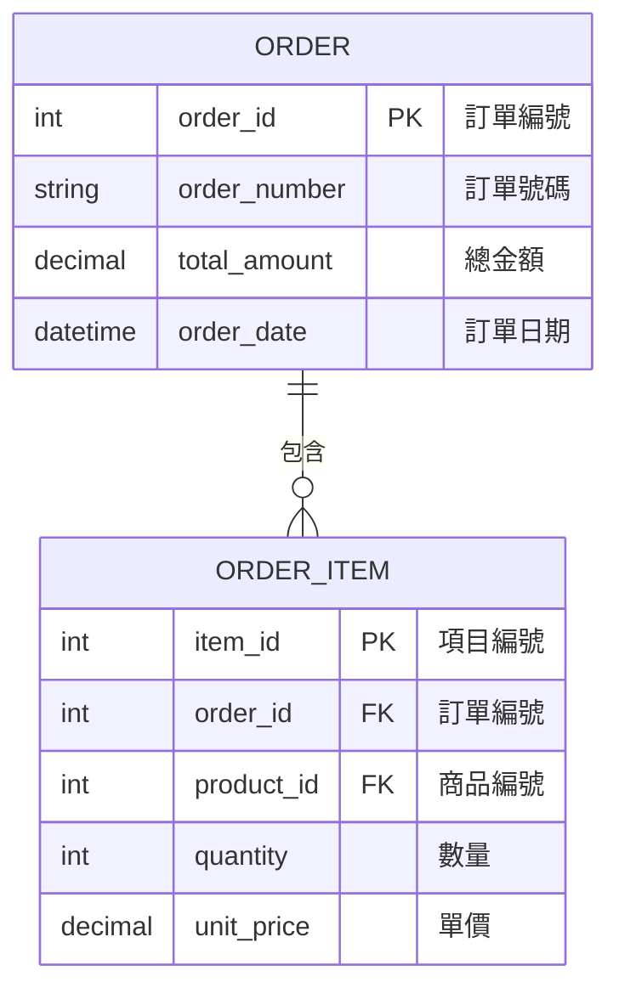
```mermaid
erDiagram
    ORDER {
        int order_id PK "訂單編號"
        string order_number "訂單號碼"
        decimal total_amount "總金額"
        datetime order_date "訂單日期"
    }
    
    ORDER_ITEM {
        int item_id PK "項目編號"
        int order_id FK "訂單編號"
        int product_id FK "商品編號"
        int quantity "數量"
        decimal unit_price "單價"
    }
    
    ORDER ||--o{ ORDER_ITEM : "包含"
```

##### 2. 分類階層模式 (Category Hierarchy Pattern)

**應用場景：** 商品分類、組織架構

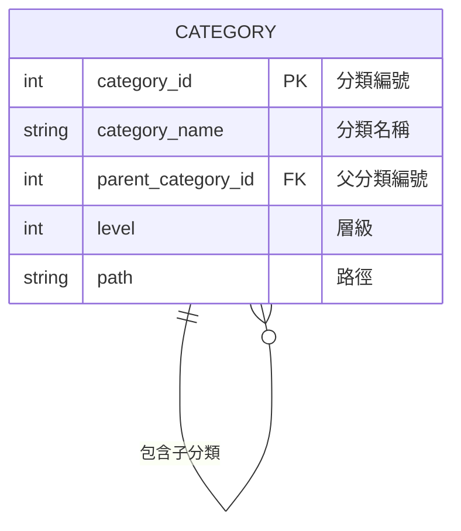
```mermaid
erDiagram
    CATEGORY {
        int category_id PK "分類編號"
        string category_name "分類名稱"
        int parent_category_id FK "父分類編號"
        int level "層級"
        string path "路徑"
    }
    
    CATEGORY ||--o{ CATEGORY : "包含子分類"
```

##### 3. 歷史記錄模式 (Audit Trail Pattern)

**應用場景：** 資料變更追蹤、稽核需求

```sql
-- 主表
CREATE TABLE products (
    product_id SERIAL PRIMARY KEY,
    product_name VARCHAR(100),
    price DECIMAL(10,2),
    created_at TIMESTAMP DEFAULT CURRENT_TIMESTAMP,
    updated_at TIMESTAMP DEFAULT CURRENT_TIMESTAMP
);

-- 歷史表
CREATE TABLE products_history (
    history_id SERIAL PRIMARY KEY,
    product_id INTEGER,
    product_name VARCHAR(100),
    price DECIMAL(10,2),
    operation VARCHAR(10), -- INSERT, UPDATE, DELETE
    changed_by INTEGER,
    changed_at TIMESTAMP DEFAULT CURRENT_TIMESTAMP
);
```

##### 4. 彈性屬性模式 (Flexible Attributes Pattern)

**應用場景：** 不同類型商品有不同屬性

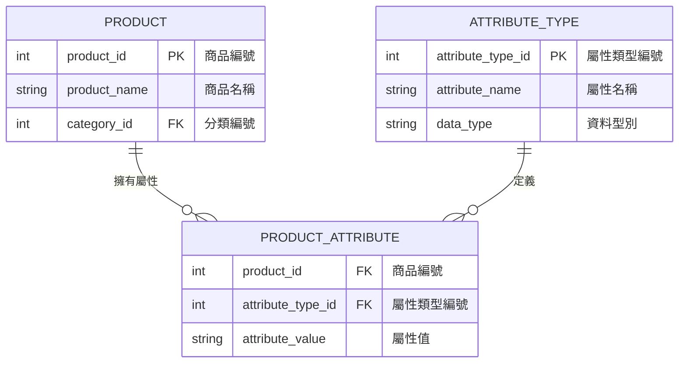
```mermaid
erDiagram
    PRODUCT {
        int product_id PK "商品編號"
        string product_name "商品名稱"
        int category_id FK "分類編號"
    }
    
    ATTRIBUTE_TYPE {
        int attribute_type_id PK "屬性類型編號"
        string attribute_name "屬性名稱"
        string data_type "資料型別"
    }
    
    PRODUCT_ATTRIBUTE {
        int product_id FK "商品編號"
        int attribute_type_id FK "屬性類型編號"
        string attribute_value "屬性值"
    }
    
    PRODUCT ||--o{ PRODUCT_ATTRIBUTE : "擁有屬性"
    ATTRIBUTE_TYPE ||--o{ PRODUCT_ATTRIBUTE : "定義"
```

##### 5. 多態關聯模式 (Polymorphic Association Pattern)

**應用場景：** 評論可以針對商品、文章等不同對象

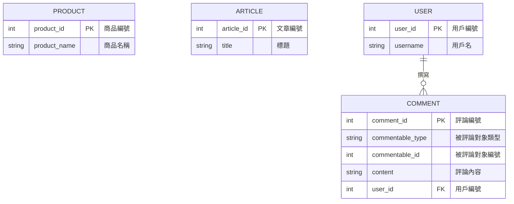
```mermaid
erDiagram
    COMMENT {
        int comment_id PK "評論編號"
        string commentable_type "被評論對象類型"
        int commentable_id "被評論對象編號"
        string content "評論內容"
        int user_id FK "用戶編號"
    }
    
    PRODUCT {
        int product_id PK "商品編號"
        string product_name "商品名稱"
    }
    
    ARTICLE {
        int article_id PK "文章編號"
        string title "標題"
    }
    
    USER {
        int user_id PK "用戶編號"
        string username "用戶名"
    }
    
    USER ||--o{ COMMENT : "撰寫"
```

#### 🏗️ 架構設計原則

1. **單一職責原則**：每個實體只負責一個業務概念
2. **開放封閉原則**：設計應易於擴展，難於修改
3. **依賴倒置原則**：高層模組不應依賴低層模組
4. **介面隔離原則**：不要強迫實體依賴它們不使用的屬性

---

**📚 本節重點回顧**

- 強實體與弱實體的區別與應用
- 關聯度和參與約束的詳細分析
- 正規化理論從 1NF 到 BCNF 的完整理解
- 常見設計錯誤的識別與避免
- 設計最佳實務的具體實施

**🔄 下一節預告**

接下來我們將進入認證準備章節，包含考試範圍、練習題庫和重點摘要。

---

## 4. 認證準備

### 4.1 認證內容與範圍

#### 主要 ER Model 認證類型

1. **Oracle Database Design**
   - Oracle Certified Professional (OCP) Database Developer
   - 包含 ER Model 設計與實作

2. **Microsoft SQL Server**
   - MCSA: SQL Server Database Development
   - 資料庫設計與正規化

3. **IBM DB2**
   - IBM Certified Database Administrator
   - 概念模型設計

4. **國際認證**
   - CompTIA Database+
   - 涵蓋完整的資料庫設計理論

#### 考試範圍分析

#### 📚 基礎概念 (25-30%)

**必考重點：**

1. **ER Model 基本元素**
   - 實體、屬性、關係的定義
   - ERD 符號意義
   - 主鍵、外來鍵、候選鍵

2. **關聯度類型**
   - 一對一、一對多、多對多
   - 完全參與與部分參與
   - 最小與最大關聯度

**範例考題：**
> 在 ERD 中，菱形符號代表什麼？
> A) 實體  B) 屬性  C) 關係  D) 主鍵

**答案：C**

#### 📊 設計技巧 (35-40%)

**必考重點：**

1. **需求分析轉換**
   - 從文字描述識別實體
   - 確定實體間關係
   - 屬性分類與設計

2. **正規化理論**
   - 1NF、2NF、3NF、BCNF
   - 函數依賴識別
   - 反正規化考量

**範例考題：**
> 下列哪個資料表符合第二正規化？
> A) 所有欄位都是原子值
> B) 沒有部分功能依賴
> C) 沒有傳遞依賴
> D) 每個決定因子都是候選鍵

**答案：B**

#### 🔧 實作應用 (25-30%)

**必考重點：**

1. **資料庫轉換**
   - ER Model 轉 SQL DDL
   - 約束條件設定
   - 索引策略

2. **最佳實務**
   - 命名慣例
   - 效能考量
   - 安全性設計

#### ⚡ 進階主題 (10-15%)

**必考重點：**

1. **特殊實體類型**
   - 強實體與弱實體
   - 超類別與子類別
   - 聚合與組合

2. **高級正規化**
   - 4NF、5NF
   - 多值依賴
   - 連接依賴

### 4.2 練習題庫

#### 選擇題練習

**題目 1：基礎概念**
在 ER Model 中，下列何者用來表示實體的特徵？
A) 關係 (Relationship)
B) 屬性 (Attribute)  
C) 鍵值 (Key)
D) 約束 (Constraint)

<details>
<summary>點擊查看答案</summary>

**答案：B**

**解析：**
- 屬性用來描述實體的特徵或性質
- 關係表示實體間的關聯
- 鍵值用來唯一識別實體
- 約束用來限制資料的有效性
</details>

**題目 2：關聯度**
圖書館系統中，「會員借閱書籍」的關聯度最可能是：
A) 一對一
B) 一對多
C) 多對一
D) 多對多

<details>
<summary>點擊查看答案</summary>

**答案：D**

**解析：**
- 一個會員可以借閱多本書籍
- 一本書籍可以被多個會員借閱（在不同時間）
- 因此形成多對多關係
- 需要建立借閱記錄關聯實體
</details>

**題目 3：正規化**
下列哪個違反第一正規化？
A) 學號：S001，姓名：張三
B) 學號：S001，興趣：籃球,足球,游泳
C) 學號：S001，出生日期：1990-01-01
D) 學號：S001，GPA：3.75

<details>
<summary>點擊查看答案</summary>

**答案：B**

**解析：**
- 第一正規化要求每個欄位都是原子值
- 選項B的興趣欄位包含多個值，違反原子性
- 應該建立獨立的興趣資料表或多個興趣欄位
</details>

**題目 4：弱實體**
下列何者最可能是弱實體？
A) 客戶
B) 訂單
C) 訂單明細
D) 商品

<details>
<summary>點擊查看答案</summary>

**答案：C**

**解析：**
- 弱實體無法獨立存在，依賴其他實體
- 訂單明細依賴訂單存在
- 沒有訂單就不會有訂單明細
- 其主鍵通常包含強實體的主鍵
</details>

**題目 5：函數依賴**
在關聯 R(A, B, C, D) 中，已知 A → B，B → C，則下列敘述正確的是：
A) A → C（傳遞依賴）
B) C → A
C) B → A
D) D → C

<details>
<summary>點擊查看答案</summary>

**答案：A**

**解析：**
- 根據函數依賴的傳遞性
- A → B 且 B → C，所以 A → C
- 這是傳遞依賴的典型例子
- 可能違反第三正規化
</details>

#### 實作題練習

**題目 1：設計練習**

根據以下需求設計 ER Model：

> 一個大學系統需要管理學生、課程和教師。學生有學號、姓名、電話、電子郵件。課程有課程代碼、課程名稱、學分數。教師有教師編號、姓名、系所、職稱。學生可以選修多門課程，每門課程可以被多個學生選修，選課時需要記錄選課日期和成績。每門課程由一位教師授課，但教師可以授課多門課程。

**解答：**

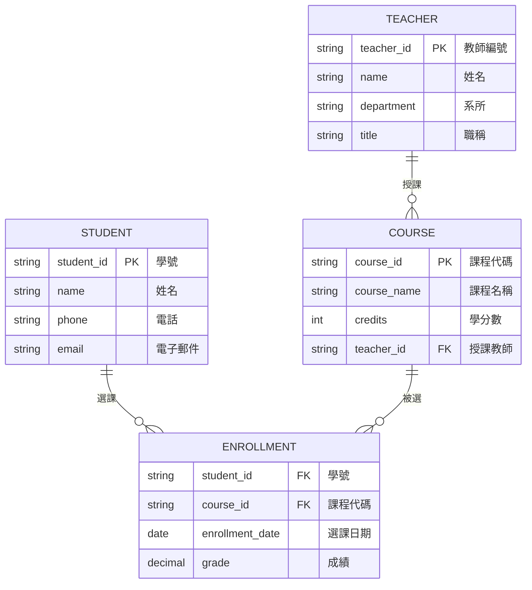
```mermaid
erDiagram
    STUDENT {
        string student_id PK "學號"
        string name "姓名"
        string phone "電話"
        string email "電子郵件"
    }
    
    COURSE {
        string course_id PK "課程代碼"
        string course_name "課程名稱"
        int credits "學分數"
        string teacher_id FK "授課教師"
    }
    
    TEACHER {
        string teacher_id PK "教師編號"
        string name "姓名"
        string department "系所"
        string title "職稱"
    }
    
    ENROLLMENT {
        string student_id FK "學號"
        string course_id FK "課程代碼"
        date enrollment_date "選課日期"
        decimal grade "成績"
    }
    
    STUDENT ||--o{ ENROLLMENT : "選課"
    COURSE ||--o{ ENROLLMENT : "被選"
    TEACHER ||--o{ COURSE : "授課"
```

**題目 2：正規化練習**

對以下資料表進行正規化到 3NF：

```
訂單資料表(訂單編號, 客戶編號, 客戶姓名, 客戶電話, 商品編號, 商品名稱, 商品價格, 數量, 小計)
```

**解答步驟：**

1. **識別函數依賴**
   - 訂單編號 → 客戶編號, 客戶姓名, 客戶電話
   - 客戶編號 → 客戶姓名, 客戶電話
   - 商品編號 → 商品名稱, 商品價格
   - (訂單編號, 商品編號) → 數量, 小計

2. **1NF 檢查**：已符合（所有欄位都是原子值）

3. **2NF 轉換**：消除部分依賴
```sql
-- 客戶資料表
customers(客戶編號, 客戶姓名, 客戶電話)

-- 商品資料表  
products(商品編號, 商品名稱, 商品價格)

-- 訂單資料表
orders(訂單編號, 客戶編號)

-- 訂單明細資料表
order_items(訂單編號, 商品編號, 數量, 小計)
```

4. **3NF 檢查**：已符合（無傳遞依賴）

### 4.3 模擬考題

#### 綜合測驗（60分鐘，50題）

**Part A：選擇題（30題，每題2分）**

1. ER Model 中的「E」代表什麼？
   A) Element  B) Entity  C) Entry  D) Error

2. 下列何者不是實體的特徵？
   A) 具有屬性  B) 可以獨立識別  C) 必須有關係  D) 代表現實世界的事物

3. 在多對多關係中，通常需要建立什麼？
   A) 檢視表  B) 索引  C) 關聯實體  D) 觸發器

*（省略其他27題...）*

**Part B：實作題（20題，每題3分）**

**題目 1：ERD 設計（15分）**
根據以下業務描述，設計完整的 ERD：

> 一個線上購物平台需要管理商品、顧客、訂單和評論。每個商品屬於一個類別，顧客可以對購買過的商品撰寫評論和評分。系統需要追蹤庫存變化和訂單狀態。

**評分重點：**
- 實體識別正確（5分）
- 關係建立合理（5分）
- 屬性設計完整（3分）
- ERD 符號使用正確（2分）

**題目 2：正規化分析（10分）**
分析下列資料表的正規化程度，並提出改善建議：

```
學生選課(學號, 姓名, 系所, 課程代碼, 課程名稱, 教師姓名, 成績)
```

**答案架構：**
1. 目前正規化程度分析
2. 識別函數依賴
3. 提出正規化建議
4. 設計改善後的資料表結構

### 4.4 重點知識摘要

#### 🎯 核心概念速記

| 概念 | 定義 | 符號/標記 | 範例 |
|------|------|-----------|------|
| 實體 | 可獨立識別的事物 | 矩形 | 學生、訂單 |
| 屬性 | 實體的特徵 | 橢圓 | 姓名、價格 |
| 關係 | 實體間的關聯 | 菱形 | 選課、購買 |
| 主鍵 | 唯一識別屬性 | 底線 | 學號、商品編號 |
| 外來鍵 | 參考其他實體的鍵 | FK | 訂單中的客戶編號 |

#### 🔗 關聯度記憶法

| 關聯度 | 符號 | 記憶口訣 | 實例 |
|--------|------|----------|------|
| 1:1 | \|\|--\|\| | 一夫一妻 | 人-身分證 |
| 1:N | \|\|--o{ | 一父多子 | 部門-員工 |
| M:N | }o--o{ | 多對多選 | 學生-課程 |

#### 📊 正規化檢查表

| 正規化 | 檢查重點 | 常見違反情況 | 解決方法 |
|--------|----------|--------------|----------|
| 1NF | 原子值 | 多值欄位 | 建立關聯表 |
| 2NF | 完全依賴 | 部分依賴 | 分解資料表 |
| 3NF | 無傳遞依賴 | A→B→C | 建立中介表 |
| BCNF | 決定因子是候選鍵 | 多候選鍵問題 | 進一步分解 |

#### 🛠️ SQL 轉換樣板

**實體轉換：**
```sql
-- 實體 → 資料表
CREATE TABLE entity_name (
    entity_id SERIAL PRIMARY KEY,
    attribute1 data_type NOT NULL,
    attribute2 data_type,
    created_at TIMESTAMP DEFAULT CURRENT_TIMESTAMP
);
```

**一對多關係：**
```sql
-- 在「多」的一方加外來鍵
ALTER TABLE child_table 
ADD COLUMN parent_id INTEGER REFERENCES parent_table(parent_id);
```

**多對多關係：**
```sql
-- 建立關聯表
CREATE TABLE entity1_entity2 (
    entity1_id INTEGER REFERENCES entity1(entity1_id),
    entity2_id INTEGER REFERENCES entity2(entity2_id),
    additional_attributes,
    PRIMARY KEY (entity1_id, entity2_id)
);
```

#### 🚨 設計陷阱提醒

1. **過度正規化**：不要為了正規化而犧牲查詢效能
2. **忽略索引**：外來鍵和查詢條件需要索引
3. **命名不一致**：統一命名慣例很重要
4. **缺少約束**：業務規則要在資料庫層面實現
5. **資料型別錯誤**：金額用DECIMAL，不用FLOAT

#### 📝 考前衝刺清單

**前一週準備：**
- [ ] 複習所有 ERD 符號意義
- [ ] 練習手繪 ERD
- [ ] 熟記正規化定義
- [ ] 做完所有練習題

**考前一天：**
- [ ] 複習重點知識摘要
- [ ] 檢查計算機和文具
- [ ] 確認考試時間地點
- [ ] 保持充足睡眠

**考試當天：**
- [ ] 仔細閱讀題目
- [ ] 先做有把握的題目
- [ ] 預留檢查時間
- [ ] 注意時間分配

---

**📚 本節重點回顧**

- 了解主要認證類型和考試範圍
- 透過練習題庫加強理解
- 使用重點摘要快速複習
- 掌握考試技巧和準備策略

**🔄 下一節預告**

接下來我們將介紹學習路徑、推薦工具和進階學習資源。

---

## 5. 學習路徑

### 5.1 學習步驟建議

#### 🎯 新手入門路徑（第1-2週）

**目標：建立基礎概念**

**第1週：理論基礎**
- [ ] 閱讀基礎知識章節
- [ ] 理解實體、屬性、關係概念
- [ ] 學習 ERD 基本符號
- [ ] 完成簡單練習（如圖書館系統）

**每日建議時間：1-2小時**

**學習檢核：**
- 能說出 ER Model 的用途
- 能識別 ERD 中的基本符號
- 能畫出簡單的實體關係圖

**第2週：實作練習**
- [ ] 練習需求分析技巧
- [ ] 設計小型系統 ERD
- [ ] 學習一對一、一對多、多對多關係
- [ ] 完成基礎實作練習

**推薦練習專案：**
1. 學生選課系統
2. 員工管理系統
3. 圖書借閱系統

#### 🚀 進階應用路徑（第3-4週）

**目標：掌握設計技巧**

**第3週：進階概念**
- [ ] 學習強實體與弱實體
- [ ] 理解正規化理論（1NF-3NF）
- [ ] 練習關聯度和參與約束
- [ ] 分析複雜業務需求

**第4週：專案實作**
- [ ] 設計中型系統（如電商平台）
- [ ] 練習 ER Model 轉 SQL
- [ ] 學習設計最佳實務
- [ ] 完成專案案例研究

**推薦專案：**
1. 電商購物平台
2. 醫院管理系統
3. 銀行核心系統

#### 🎓 專業精通路徑（第5-8週）

**目標：達到專業水準**

**第5-6週：高級主題**
- [ ] 掌握 BCNF 和高階正規化
- [ ] 學習效能優化技巧
- [ ] 研究安全性設計
- [ ] 練習大型系統設計

**第7-8週：認證準備**
- [ ] 複習所有理論知識
- [ ] 大量練習考試題型
- [ ] 參加模擬考試
- [ ] 準備實際認證

#### 📈 持續成長路徑（長期）

**進階領域：**
- 分散式資料庫設計
- NoSQL 資料模型
- 資料倉儲建模
- 微服務架構設計

### 5.2 推薦工具

#### 🎨 ERD 繪圖工具

#### 免費工具

1. **Mermaid** ⭐⭐⭐⭐⭐
   ```mermaid
   erDiagram
       CUSTOMER ||--o{ ORDER : places
       ORDER ||--|{ LINE-ITEM : contains
       PRODUCT ||--o{ LINE-ITEM : "ordered in"
   ```
   
   **優點：**
   - 程式碼化繪圖，版本控制友善
   - 與 Markdown 完美整合
   - 支援 GitHub、GitLab 原生顯示
   
   **適用：** 文件化、協作開發

2. **Draw.io (diagrams.net)** ⭐⭐⭐⭐
   
   **優點：**
   - 完全免費，功能強大
   - 支援多種圖表類型
   - 可整合 Google Drive、GitHub
   
   **適用：** 快速原型、簡報展示

3. **PlantUML** ⭐⭐⭐⭐
   ```plantuml
   @startuml
   entity Customer {
     * customer_id : number
     --
     name : varchar
     email : varchar
   }
   @enduml
   ```
   
   **優點：**
   - 文字描述自動生成圖表
   - 支援多種 IDE 整合
   - 適合程式開發者
   
   **適用：** 開發文件、自動化生成

#### 付費專業工具

1. **Lucidchart** ⭐⭐⭐⭐⭐
   
   **優點：**
   - 專業級功能完整
   - 優秀的協作功能
   - 豐富的模板庫
   
   **價格：** $7.95/月起
   **適用：** 企業級專案、團隊協作

2. **ERwin Data Modeler** ⭐⭐⭐⭐⭐
   
   **優點：**
   - 業界標準建模工具
   - 支援逆向工程
   - 完整的資料治理功能
   
   **價格：** 企業授權
   **適用：** 大型企業、專業建模師

3. **Visual Paradigm** ⭐⭐⭐⭐
   
   **優點：**
   - 全方位建模工具
   - 支援多種建模標準
   - 程式碼生成功能
   
   **價格：** $99/年起
   **適用：** 中小企業、系統分析師

#### 📊 資料庫設計工具

1. **MySQL Workbench** (免費)
   - MySQL 官方工具
   - 視覺化資料庫設計
   - 支援逆向工程

2. **DBeaver** (免費)
   - 通用資料庫工具
   - 支援多種資料庫
   - ER 圖生成功能

3. **pgAdmin** (免費)
   - PostgreSQL 管理工具
   - 內建 ERD 功能
   - 開源且功能豐富

#### 🔧 開發整合工具

1. **VS Code 擴充套件**
   - Mermaid Preview
   - PlantUML
   - Database Client

2. **IntelliJ IDEA**
   - Database Tools
   - UML Support
   - ERD 生成器

3. **Eclipse**
   - ERD Editor
   - Data Tools Platform
   - Database Development

### 5.3 進階學習資源

#### 📚 推薦書籍

#### 基礎入門

1. **《Database System Concepts》** - Silberschatz
   - 資料庫系統聖經
   - ER Model 理論完整
   - 適合學術研究

2. **《資料庫系統理論與實務》** - 中文書籍
   - 適合中文讀者
   - 理論與實務並重
   - 包含豐富案例

#### 進階實務

1. **《Data Modeling Essentials》** - Simsion
   - 實務導向
   - 豐富的案例研究
   - 業界最佳實務

2. **《The Data Model Resource Book》** - Silverston
   - 標準資料模型參考
   - 各行業標準模型
   - 設計模式集合

#### 認證準備

1. **《OCA Oracle Database SQL Exam Guide》**
   - Oracle 認證官方指南
   - 包含 ER Model 內容
   - 實際考題練習

2. **《CompTIA Database+ Study Guide》**
   - 國際認證指南
   - 全面的資料庫知識
   - 包含設計理論

#### 🌐 線上課程

#### 免費資源

1. **Coursera - Database Design**
   - 史丹佛大學課程
   - 完整的理論基礎
   - 實作專案

2. **Khan Academy - Intro to Databases**
   - 適合初學者
   - 互動式學習
   - 循序漸進

3. **YouTube 頻道**
   - Database Design Tutorial
   - ERD Tutorial Series
   - SQL and Database Design

#### 付費課程

1. **Udemy - Complete Database Design Course**
   - 實務導向
   - 包含多個專案
   - 終身存取

2. **Pluralsight - Database Design Path**
   - 專業技能路徑
   - 深度技術內容
   - 技能評估

3. **LinkedIn Learning**
   - Database Design Foundations
   - 適合職場學習
   - 證書認證

#### 📊 實務資源

#### 標準與規範

1. **ISO/IEC 11179** - 資料元素標準
2. **ANSI-SPARC Architecture** - 資料庫架構標準
3. **OMG UML** - 統一建模語言

#### 社群與論壇

1. **Stack Overflow**
   - Database Design 標籤
   - 實際問題解答
   - 專家經驗分享

2. **Reddit - r/Database**
   - 設計討論
   - 工具推薦
   - 職涯建議

3. **DBA Stack Exchange**
   - 專業資料庫社群
   - 深度技術討論
   - 最佳實務分享

#### 📱 實用 App

1. **ERD Go** (iOS/Android)
   - 手機繪製 ERD
   - 簡單易用
   - 適合快速草圖

2. **Lucidchart Mobile**
   - 行動版專業工具
   - 雲端同步
   - 團隊協作

#### 🔍 實務案例庫

1. **GitHub - Database Samples**
   - 開源資料庫範例
   - 各種行業模型
   - 實際專案參考

2. **Database Tutorial**
   - 線上教學案例
   - 逐步設計過程
   - 最佳實務展示

3. **企業案例研究**
   - Netflix 資料架構
   - Amazon 電商模型
   - 銀行核心系統

#### 💡 學習建議

1. **理論與實務並重**
   - 不要只學理論，要動手實作
   - 從小專案開始，逐步擴大規模

2. **多做案例分析**
   - 分析知名企業的資料模型
   - 思考設計背後的商業邏輯

3. **參與開源專案**
   - 貢獻資料模型設計
   - 學習他人的設計思路

4. **建立學習筆記**
   - 記錄設計決策過程
   - 整理常見模式和最佳實務

5. **持續關注趨勢**
   - NoSQL 模型設計
   - 微服務資料架構
   - 雲端資料庫趨勢

---

## 6. 檢查清單

### 6.1 設計階段檢查清單

#### 需求分析階段
- [ ] 已完整收集業務需求
- [ ] 識別所有關鍵實體
- [ ] 確認實體間的業務關係
- [ ] 定義每個實體的核心屬性
- [ ] 與業務人員確認需求理解正確

#### ERD 設計階段
- [ ] 所有實體都有適當的主鍵
- [ ] 關係的關聯度設定正確
- [ ] 弱實體正確識別並標示
- [ ] 屬性分類正確（簡單、複合、多值、衍生）
- [ ] ERD 符號使用正確且一致

#### 正規化檢查
- [ ] 符合第一正規化（原子值）
- [ ] 符合第二正規化（無部分依賴）
- [ ] 符合第三正規化（無傳遞依賴）
- [ ] 評估是否需要 BCNF
- [ ] 考慮反正規化的必要性

### 6.2 資料庫實作檢查清單

#### DDL 建立階段
- [ ] 資料表命名遵循一致規範
- [ ] 欄位資料型別選擇適當
- [ ] 主鍵約束正確設定
- [ ] 外來鍵約束建立完整
- [ ] 檢查約束覆蓋業務規則
- [ ] 預設值設定合理

#### 索引與效能
- [ ] 主鍵自動建立索引
- [ ] 外來鍵欄位建立索引
- [ ] 查詢條件欄位建立索引
- [ ] 複合索引支援常用查詢
- [ ] 避免過多索引影響寫入效能

#### 安全性考量
- [ ] 敏感資料欄位加密處理
- [ ] 密碼等機密資訊雜湊儲存
- [ ] 設定適當的資料表權限
- [ ] 考慮資料遮罩需求
- [ ] 建立稽核軌跡機制

### 6.3 品質保證檢查清單

#### 資料完整性
- [ ] 實體完整性（主鍵不重複、非空）
- [ ] 參照完整性（外來鍵有效）
- [ ] 領域完整性（資料型別、範圍限制）
- [ ] 使用者定義完整性（業務規則）

#### 測試驗證
- [ ] 插入測試資料驗證設計
- [ ] 查詢效能測試
- [ ] 約束條件測試
- [ ] 邊界條件測試
- [ ] 併發存取測試

#### 文件化
- [ ] ERD 圖表清晰易懂
- [ ] 資料字典完整
- [ ] 設計決策記錄
- [ ] 業務規則文件
- [ ] 維護操作手冊

### 6.4 專案交付檢查清單

#### 交付文件
- [ ] 完整的 ERD 圖表
- [ ] 資料庫建立腳本（DDL）
- [ ] 測試資料腳本（DML）
- [ ] 資料字典文件
- [ ] 設計說明文件

#### 程式碼品質
- [ ] SQL 腳本格式統一
- [ ] 註解說明清楚
- [ ] 版本控制管理
- [ ] 命名規範一致
- [ ] 錯誤處理完整

#### 部署準備
- [ ] 開發環境測試通過
- [ ] 效能基準測試
- [ ] 備份還原策略
- [ ] 監控告警設定
- [ ] 容量規劃評估

### 6.5 學習成果檢核

#### 基礎概念掌握
- [ ] 能解釋 ER Model 的用途和重要性
- [ ] 熟悉所有 ERD 基本符號
- [ ] 理解實體、屬性、關係的概念
- [ ] 掌握各種關聯度的含義
- [ ] 了解主鍵、外來鍵的作用

#### 設計技能評估
- [ ] 能從需求分析中識別實體
- [ ] 能建立正確的實體關係
- [ ] 能設計合理的屬性結構
- [ ] 能進行正規化分析
- [ ] 能轉換為資料庫結構

#### 實務應用能力
- [ ] 能設計中等複雜度的系統
- [ ] 能識別和避免常見設計錯誤
- [ ] 能考慮效能和安全因素
- [ ] 能撰寫清楚的設計文件
- [ ] 能與團隊有效溝通設計理念

### 6.6 持續改進檢查

#### 定期檢視
- [ ] 每月檢視設計是否符合業務變化
- [ ] 收集使用者回饋意見
- [ ] 監控系統效能指標
- [ ] 評估新技術應用可能性
- [ ] 更新文件和最佳實務

#### 技能提升
- [ ] 參與設計審查會議
- [ ] 學習新的建模技巧
- [ ] 關注業界趨勢發展
- [ ] 分享經驗給團隊成員
- [ ] 準備相關技術認證

---

**🎉 恭喜完成學習！**

您已經掌握了 Entity-Relationship Model 的完整知識體系。這份手冊將陪伴您在資料庫設計的道路上持續成長。記住，優秀的資料模型設計需要不斷的實務練習和經驗累積。

**📞 支援資源**

如果在實際應用中遇到問題，可以：

- 參考本手冊的相關章節
- 使用推薦的工具和資源
- 參與社群討論和交流
- 尋求資深同事的指導

**🌟 最後建議**

資料庫設計是一門藝術，也是一門科學。在追求理論完美的同時，不要忘記考慮實務需求和效能因素。每個專案都是獨特的，需要根據具體情況做出最適合的設計決策。

祝您在資料庫設計的職涯發展順利！🚀

---

## 📎 附錄

### A. ERD 符號速查表

| 符號 | 名稱 | 用途 | Mermaid 語法 |
|------|------|------|------------|
| 矩形 | 實體 | 表示實體類型 | `ENTITY_NAME { }` |
| 橢圓 | 屬性 | 表示實體屬性 | `attribute_name type` |
| 菱形 | 關係 | 表示實體間關係 | `ENTITY1 }relation{ ENTITY2` |
| 線條 | 連接 | 連接元素 | `--`, `\|\|--o{` |
| 底線 | 主鍵 | 標示主鍵屬性 | `attribute_name PK` |
| FK | 外來鍵 | 標示外來鍵屬性 | `attribute_name FK` |

### B. SQL 資料型別對照表

#### PostgreSQL

| 用途 | 資料型別 | 說明 | 範例 |
|------|----------|------|------|
| 主鍵 | SERIAL | 自動遞增整數 | `id SERIAL PRIMARY KEY` |
| 整數 | INTEGER | 32位元整數 | `age INTEGER` |
| 長整數 | BIGINT | 64位元整數 | `user_count BIGINT` |
| 小數 | DECIMAL(p,s) | 精確小數 | `price DECIMAL(10,2)` |
| 字串 | VARCHAR(n) | 可變長度字串 | `name VARCHAR(100)` |
| 文字 | TEXT | 不限長度文字 | `description TEXT` |
| 布林 | BOOLEAN | 真/假值 | `is_active BOOLEAN` |
| 日期 | DATE | 日期 | `birth_date DATE` |
| 時間 | TIMESTAMP | 日期時間 | `created_at TIMESTAMP` |

#### MySQL

| 用途 | 資料型別 | 說明 | 範例 |
|------|----------|------|------|
| 主鍵 | AUTO_INCREMENT | 自動遞增 | `id INT AUTO_INCREMENT` |
| 整數 | INT | 32位元整數 | `age INT` |
| 長整數 | BIGINT | 64位元整數 | `user_count BIGINT` |
| 小數 | DECIMAL(p,s) | 精確小數 | `price DECIMAL(10,2)` |
| 字串 | VARCHAR(n) | 可變長度字串 | `name VARCHAR(100)` |
| 文字 | TEXT | 不限長度文字 | `description TEXT` |
| 布林 | BOOLEAN | 真/假值 | `is_active BOOLEAN` |
| 日期 | DATE | 日期 | `birth_date DATE` |
| 時間 | DATETIME | 日期時間 | `created_at DATETIME` |

### C. 常用正規化檢查 SQL

```sql
-- 檢查第一正規化違反（多值欄位）
SELECT table_name, column_name 
FROM information_schema.columns 
WHERE data_type = 'text' 
  AND column_name LIKE '%list%' 
  OR column_name LIKE '%array%';

-- 檢查可能的部分依賴（違反2NF）
SELECT 
    tc.table_name,
    tc.constraint_type,
    kcu.column_name
FROM information_schema.table_constraints tc
JOIN information_schema.key_column_usage kcu 
ON tc.constraint_name = kcu.constraint_name
WHERE tc.constraint_type = 'PRIMARY KEY'
  AND tc.table_name IN (
    SELECT table_name 
    FROM information_schema.key_column_usage 
    GROUP BY table_name 
    HAVING COUNT(*) > 1
  );

-- 檢查外來鍵完整性
SELECT 
    tc.table_name,
    kcu.column_name,
    ccu.table_name AS foreign_table_name,
    ccu.column_name AS foreign_column_name
FROM information_schema.table_constraints AS tc
JOIN information_schema.key_column_usage AS kcu
ON tc.constraint_name = kcu.constraint_name
JOIN information_schema.constraint_column_usage AS ccu
ON ccu.constraint_name = tc.constraint_name
WHERE tc.constraint_type = 'FOREIGN KEY';
```

### D. 設計模式範本

#### 1. 稽核追蹤模式

```sql
-- 主表
CREATE TABLE products (
    product_id SERIAL PRIMARY KEY,
    product_name VARCHAR(100) NOT NULL,
    price DECIMAL(10,2) NOT NULL,
    created_at TIMESTAMP DEFAULT CURRENT_TIMESTAMP,
    updated_at TIMESTAMP DEFAULT CURRENT_TIMESTAMP,
    created_by INTEGER REFERENCES users(user_id),
    updated_by INTEGER REFERENCES users(user_id)
);

-- 歷史表
CREATE TABLE products_audit (
    audit_id SERIAL PRIMARY KEY,
    product_id INTEGER NOT NULL,
    operation VARCHAR(10) NOT NULL, -- INSERT, UPDATE, DELETE
    old_values JSONB,
    new_values JSONB,
    changed_at TIMESTAMP DEFAULT CURRENT_TIMESTAMP,
    changed_by INTEGER REFERENCES users(user_id)
);
```

#### 2. 軟刪除模式

```sql
CREATE TABLE customers (
    customer_id SERIAL PRIMARY KEY,
    customer_name VARCHAR(100) NOT NULL,
    email VARCHAR(255) NOT NULL,
    is_deleted BOOLEAN DEFAULT FALSE,
    deleted_at TIMESTAMP NULL,
    deleted_by INTEGER REFERENCES users(user_id)
);

-- 檢視表只顯示有效記錄
CREATE VIEW active_customers AS
SELECT * FROM customers WHERE is_deleted = FALSE;
```

#### 3. 版本控制模式

```sql
CREATE TABLE document_versions (
    version_id SERIAL PRIMARY KEY,
    document_id INTEGER NOT NULL,
    version_number INTEGER NOT NULL,
    content TEXT NOT NULL,
    is_current BOOLEAN DEFAULT FALSE,
    created_at TIMESTAMP DEFAULT CURRENT_TIMESTAMP,
    created_by INTEGER REFERENCES users(user_id),
    UNIQUE(document_id, version_number)
);
```

### E. 效能優化檢查清單

#### 索引策略

- [ ] 主鍵自動有索引
- [ ] 外來鍵欄位建立索引
- [ ] WHERE 條件常用欄位建立索引
- [ ] ORDER BY 欄位建立索引
- [ ] 複合索引支援多欄位查詢
- [ ] 避免過多索引影響寫入效能

#### 查詢優化

- [ ] 避免 SELECT *，只選擇需要的欄位
- [ ] 使用適當的 JOIN 類型
- [ ] 避免在 WHERE 條件中使用函數
- [ ] 使用 LIMIT 限制結果數量
- [ ] 考慮分頁查詢策略

#### 資料表設計

- [ ] 適當的資料型別選擇
- [ ] 正規化與反正規化平衡
- [ ] 大表考慮分割策略
- [ ] 歷史資料歸檔策略

### F. 安全性檢查清單

#### 資料保護

- [ ] 敏感資料加密儲存
- [ ] 密碼使用安全雜湊
- [ ] 個人資料遮罩機制
- [ ] 資料備份加密

#### 存取控制

- [ ] 最小權限原則
- [ ] 角色基礎存取控制
- [ ] 資料列層級安全
- [ ] 稽核日誌記錄

#### 應用程式層面

- [ ] SQL 注入防護
- [ ] 參數化查詢
- [ ] 連線加密（SSL/TLS）
- [ ] 連線池管理

### G. 版本更新記錄

| 版本 | 日期 | 更新內容 |
|------|------|----------|
| 1.0 | 2024-01-01 | 初始版本建立 |
| 1.1 | 2024-02-01 | 新增進階主題章節 |
| 1.2 | 2024-03-01 | 擴充案例研究 |
| 1.3 | 2024-04-01 | 新增認證準備內容 |
| 2.0 | 2024-09-01 | 全面改版，新增附錄 |

---


**版本資訊**：
- 文件版本：v2.0
- 最後更新：2025年9月1日
- 作者：資深軟體架構師團隊
- 適用對象：Java 開發人員、系統架構師

## 📚 參考資料

1. Elmasri, R., & Navathe, S. B. (2016). *Fundamentals of Database Systems* (7th ed.). Pearson.
2. Silberschatz, A., Galvin, P. B., & Gagne, G. (2018). *Database System Concepts* (7th ed.). McGraw-Hill Education.
3. Date, C. J. (2003). *An Introduction to Database Systems* (8th ed.). Addison-Wesley.
4. Chen, P. P. (1976). The entity-relationship model—toward a unified view of data. *ACM Transactions on Database Systems*, 1(1), 9-36.
5. Codd, E. F. (1970). A relational model of data for large shared data banks. *Communications of the ACM*, 13(6), 377-387.

---

*本教學手冊持續更新中，歡迎提供意見回饋以協助改進內容品質。*
