+++
date = '2025-10-31T00:00:00+08:00'
draft = false
title = 'Microservices Architecture 設計教學'
tags = ['教學', '分析與設計']
categories = ['教學']
+++
# Microservices Architecture 設計教學手冊

> **版本：** 1.0  
> **更新日期：** 2025年9月20日  
> **適用對象：** 新進開發同仁  
> **編寫者：** 系統架構師團隊  

## 📖 手冊簡介

本手冊是為新進開發同仁設計的微服務架構（Microservices Architecture）實務教學文件。透過系統性的學習路徑，幫助開發人員從零基礎逐步掌握微服務設計與實作技能。

### 🎯 學習目標

完成本手冊學習後，您將能夠：
- 理解微服務架構的核心概念與設計原則
- 掌握微服務拆分與邊界劃分技巧
- 熟練應用各種微服務設計模式
- 具備實際專案開發與維護能力
- 通過相關技術認證考試

### 🚀 使用方式

1. **循序漸進**：按照章節順序學習，每章都有前置知識
2. **理論實作並重**：理解概念後立即進行實作練習
3. **檢查清單驗證**：每章結束使用檢查清單自我驗證
4. **團隊討論**：與同事分享學習心得，加深理解

---

## 📚 目錄

### Part I. 基礎認識
- [1. 微服務架構簡介](#1-微服務架構簡介)
  - [1.1 為什麼需要微服務](#11-為什麼需要微服務)
  - [1.2 單體架構 vs. 微服務架構](#12-單體架構-vs-微服務架構)
  - [1.3 微服務的核心特徵](#13-微服務的核心特徵)
  - [1.4 適用與不適用場景](#14-適用與不適用場景)
- [2. 微服務與業界標準](#2-微服務與業界標準)
  - [2.1 SOA 與微服務的差異](#21-soa-與微服務的差異)
  - [2.2 Cloud Native 與微服務](#22-cloud-native-與微服務)
  - [2.3 與 Microservices Architecture 認證的關聯](#23-與-microservices-architecture-認證的關聯)

### Part II. 微服務設計原則  
- [3. 微服務設計的基本原則](#3-微服務設計的基本原則)
  - [3.1 單一職責原則 (SRP)](#31-單一職責原則-srp)
  - [3.2 高內聚、低耦合](#32-高內聚低耦合)
  - [3.3 獨立部署與擴展](#33-獨立部署與擴展)
  - [3.4 容錯與恢復能力](#34-容錯與恢復能力)
- [4. 微服務邊界劃分](#4-微服務邊界劃分)
  - [4.1 領域驅動設計 (DDD) 基礎](#41-領域驅動設計-ddd-基礎)
  - [4.2 限界上下文 (Bounded Context)](#42-限界上下文-bounded-context)
  - [4.3 服務拆分策略](#43-服務拆分策略)

### Part III. 技術架構
- [5. 微服務通訊模式](#5-微服務通訊模式)
  - [5.1 同步通訊](#51-同步通訊)
  - [5.2 非同步通訊](#52-非同步通訊)
  - [5.3 事件驅動架構](#53-事件驅動架構)
- [6. 資料管理策略](#6-資料管理策略)
- [7. 配置與服務發現](#7-配置與服務發現)

### Part IV. 微服務設計模式
- [8. 分解模式](#8-分解模式-decomposition-patterns)
  - [8.1 Database per Service Pattern](#81-database-per-service-pattern)
  - [8.2 Strangler Fig Pattern](#82-strangler-fig-pattern)
  - [8.3 Self-Contained Service Pattern](#83-self-contained-service-pattern)
- [9. 通訊模式](#9-通訊模式-communication-patterns)
  - [9.1 API Gateway Pattern](#91-api-gateway-pattern)
  - [9.2 Backend for Frontend (BFF) Pattern](#92-backend-for-frontend-bff-pattern)
- [10. 資料管理模式](#10-資料管理模式-data-management-patterns)
  - [10.1 Saga Pattern](#101-saga-pattern)
  - [10.2 CQRS Pattern](#102-cqrs-pattern)
  - [10.3 Event Sourcing Pattern](#103-event-sourcing-pattern)
- [11. 可靠性模式](#11-可靠性模式-reliability-patterns)
  - [11.1 Circuit Breaker Pattern](#111-circuit-breaker-pattern)
  - [11.2 Retry Pattern](#112-retry-pattern)
  - [11.3 Bulkhead Pattern](#113-bulkhead-pattern)

### Part V. 跨領域關注點
- [12. 安全性架構](#12-安全性架構-security-architecture)
  - [12.1 身份驗證與授權](#121-身份驗證與授權)
  - [12.2 資料保護與加密](#122-資料保護與加密)
- [13. 監控與可觀察性](#13-監控與可觀察性-monitoring--observability)
  - [13.1 分散式追蹤](#131-分散式追蹤)
  - [13.2 指標收集與監控](#132-指標收集與監控)
  - [13.3 健康檢查與服務探測](#133-健康檢查與服務探測)
- [14. 配置管理](#14-配置管理-configuration-management)
  - [14.1 集中化配置管理](#141-集中化配置管理)
  - [14.2 功能開關 (Feature Toggles)](#142-功能開關-feature-toggles)

### Part VI. DevOps 與微服務
- [15. CI/CD 流水線](#15-cicd-流水線)
- [16. 容器化與 Kubernetes](#16-容器化與-kubernetes)
- [17. Infrastructure as Code](#17-infrastructure-as-code)

### Part VII. 實戰指南
- [18. 微服務專案規劃](#18-微服務專案規劃)
- [19. 實作步驟與最佳實務](#19-實作步驟與最佳實務)
- [20. 測試策略](#20-測試策略)
- [21. 效能調優](#21-效能調優)

### Part VIII. 總結與資源
- [總結](#總結)
- [最佳實務摘要](#最佳實務摘要)
- [延伸學習資源](#延伸學習資源)

---

# Part I. 基礎認識

## 1. 微服務架構簡介

### 1.1 為什麼需要微服務

#### 🔍 單體架構的挑戰

在傳統的單體架構（Monolithic Architecture）中，整個應用程式被打包成一個單一的部署單元。隨著業務成長，會面臨以下問題：

**主要痛點：**
- **擴展困難**：整個應用必須一起擴展，無法針對特定功能模組調整資源
- **技術債務累積**：程式碼相互依賴，修改一處可能影響全域
- **部署風險高**：單一修改需要重新部署整個應用
- **團隊協作困難**：多個團隊在同一個程式碼庫工作容易衝突
- **技術選型受限**：整個系統必須使用相同的技術棧

#### 💡 微服務解決方案

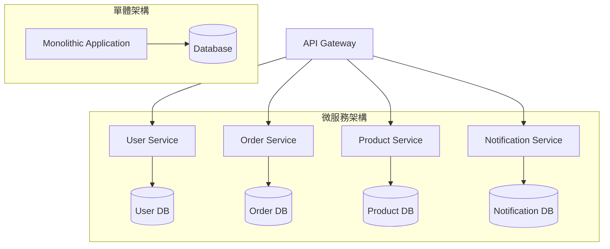

**微服務的核心理念：**
- 將複雜的單體應用分解為多個小型、獨立的服務
- 每個服務負責特定的業務功能
- 服務間透過輕量級的 API 進行通訊
- 每個服務可以獨立開發、部署和擴展

### 1.2 單體架構 vs. 微服務架構

#### 📊 詳細比較表

| 比較項目 | 單體架構 | 微服務架構 |
|---------|---------|-----------|
| **開發複雜度** | 低（初期） | 高（需要分散式系統知識） |
| **部署複雜度** | 低 | 高（需要容器化、編排工具） |
| **擴展性** | 垂直擴展 | 水平擴展、按需擴展 |
| **故障隔離** | 差（單點故障影響全系統） | 好（服務故障不影響其他服務） |
| **技術選型** | 受限（整個系統統一技術棧） | 靈活（每個服務可選擇最適合的技術） |
| **團隊協作** | 困難（多團隊共用程式碼庫） | 良好（團隊獨立負責服務） |
| **測試複雜度** | 中等 | 高（需要整合測試、契約測試） |
| **維護成本** | 低（初期）→ 高（後期） | 高（但穩定） |

#### 🎯 適用場景判斷

**選擇單體架構的情況：**
- 專案初期，業務邏輯簡單
- 團隊規模小（< 10人）
- 快速原型開發
- 業務需求變化頻繁，架構未穩定

**選擇微服務架構的情況：**
- 業務複雜度高，功能模組清晰
- 團隊規模大（> 10人）
- 需要高可用性和擴展性
- 不同模組有不同的效能需求
- 希望採用不同技術棧

### 1.3 微服務的核心特徵

#### 🏗️ 六大核心特徵

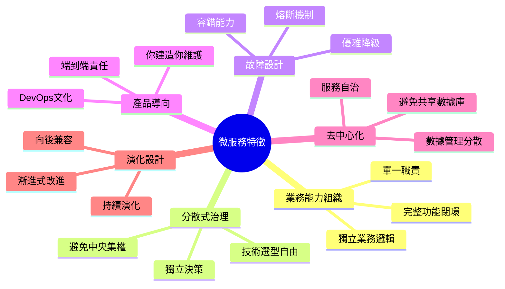

#### 1️⃣ 按業務能力組織服務

**核心原則：**
- 每個微服務對應一個特定的業務能力
- 服務邊界與組織結構對齊（Conway's Law）
- 避免按技術層次劃分服務

**實例：電商系統劃分**
```
❌ 錯誤劃分（按技術層）：
- Frontend Service
- Business Logic Service  
- Database Service

✅ 正確劃分（按業務能力）：
- User Management Service
- Product Catalog Service
- Order Processing Service
- Payment Service
- Inventory Service
```

#### 2️⃣ 去中心化治理

**技術決策自主性：**
- 每個服務團隊可以選擇最適合的技術棧
- 避免強制統一的技術標準
- 鼓勵技術創新和最佳實踐分享

**實例：技術棧多樣性**
```
User Service: Spring Boot + MySQL
Product Service: Node.js + MongoDB  
Recommendation Service: Python + Redis
Analytics Service: Go + ClickHouse
```

#### 3️⃣ 智慧端點與管道透明化

**原則說明：**
- 服務端點包含業務邏輯（智慧端點）
- 通訊機制保持簡單（管道透明化）
- 避免複雜的 ESB（企業服務匯流排）

**通訊方式對比：**
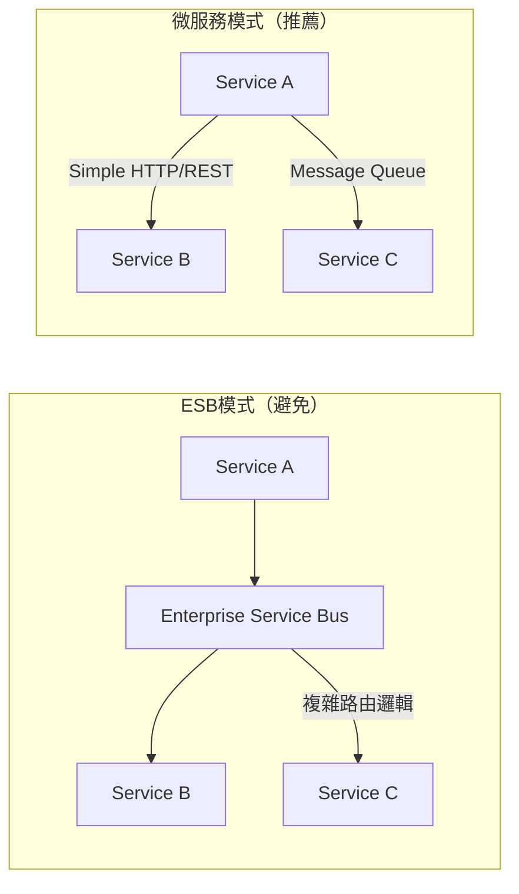

#### 4️⃣ 基礎設施自動化

**關鍵要素：**
- 自動化部署和測試
- 基礎設施即程式碼（Infrastructure as Code）
- 持續整合/持續部署（CI/CD）

**自動化流程：**
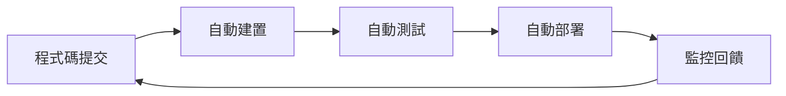

#### 5️⃣ 故障容忍設計

**核心概念：**
- 假設服務會故障，提前設計應對機制
- 實現優雅降級和快速恢復
- 建立全面的監控和告警系統

#### 6️⃣ 演化式設計

**設計原則：**
- 支援服務的獨立演化
- 保持 API 向後相容性
- 透過版本控制管理變更

### 1.4 適用與不適用場景

#### ✅ 適合使用微服務的場景

**1. 複雜業務系統**
- 業務邏輯複雜，有明確的功能邊界
- 不同業務模組有不同的擴展需求
- 需要支援多種使用者介面（Web、Mobile、API）

**實例：大型電商平台**
```
✓ 用戶數百萬，交易量巨大
✓ 包含商品、訂單、支付、物流等複雜業務
✓ 需要支援促銷活動的流量突增
✓ 不同地區有不同的業務規則
```

**2. 大型開發團隊**
- 開發團隊超過 10 人
- 希望團隊能獨立開發和部署
- 需要減少團隊間的相互依賴

**3. 高可用性需求**
- 系統需要 24/7 運行
- 部分功能故障不能影響整體服務
- 需要快速修復和部署能力

#### ❌ 不適合使用微服務的場景

**1. 簡單業務系統**
- 業務邏輯簡單，功能邊界不清晰
- 系統規模小，使用者數量有限
- 業務變化頻繁，架構尚未穩定

**實例：內部管理系統**
```
✗ 使用者不到100人
✗ 功能簡單（CRUD操作為主）
✗ 業務流程經常變化
✗ 開發團隊只有2-3人
```

**2. 技術團隊經驗不足**
- 團隊缺乏分散式系統經驗
- 沒有 DevOps 實踐基礎
- 運維能力不足

**3. 資源限制**
- 基礎設施資源有限
- 沒有容器化和編排工具
- 預算無法支撐複雜的監控和工具鏈

### 💼 實務案例：電商平台微服務劃分

#### 業務場景分析
某電商公司面臨的挑戰：
- 用戶量從10萬增長到1000萬
- 促銷期間系統經常當機
- 新功能上線影響整體穩定性
- 開發團隊從5人擴展到50人

#### 微服務拆分策略

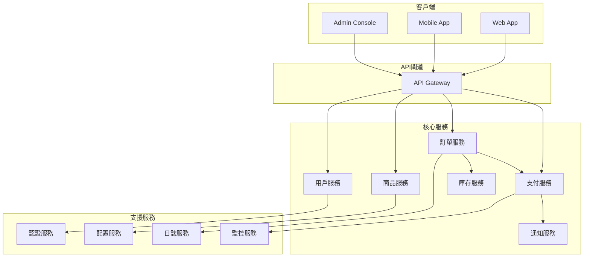

#### 拆分結果與效益

**拆分後的改善：**
- **可用性提升**：單一服務故障不影響其他功能
- **擴展靈活**：促銷期間只需擴展訂單和支付服務
- **開發效率**：團隊可以並行開發，減少程式碼衝突
- **技術創新**：支付服務採用 Go，推薦服務採用 Python

### 🔍 學習檢查點

完成本章學習後，請確認您能夠：

- [ ] 解釋微服務架構的核心概念
- [ ] 識別單體架構和微服務架構的差異
- [ ] 判斷什麼場景適合使用微服務
- [ ] 理解微服務的六大核心特徵
- [ ] 分析業務系統的微服務拆分可能性

### 📝 實務練習

**練習1：架構分析**
分析您目前參與的專案，回答以下問題：
1. 專案是否具備微服務改造的條件？
2. 如果要拆分微服務，您會如何劃分？
3. 預期會遇到什麼挑戰？

**練習2：案例研究**
研究一個知名公司的微服務架構案例（如 Netflix、Uber、Amazon），總結其架構特點和關鍵設計決策。

---

## 2. 微服務與業界標準

### 2.1 SOA 與微服務的差異

#### 🏛️ SOA（服務導向架構）回顧

SOA（Service-Oriented Architecture）是微服務的前身，但兩者有重要差異：

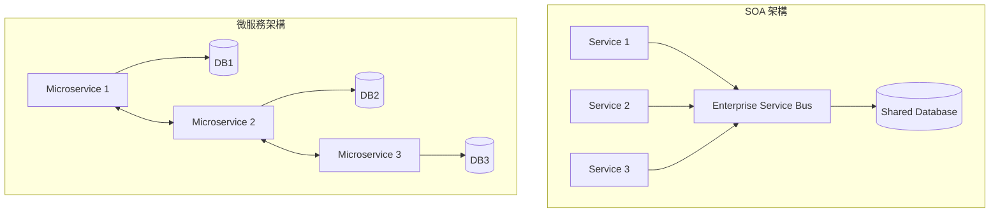

#### 📊 SOA vs 微服務對比

| 特徵 | SOA | 微服務 |
|------|-----|--------|
| **服務大小** | 大型服務 | 小型服務 |
| **通訊方式** | ESB、SOAP | REST、Message Queue |
| **資料管理** | 共享資料庫 | 每服務獨立資料庫 |
| **部署方式** | 大型應用伺服器 | 容器化、獨立部署 |
| **治理模式** | 中央化治理 | 去中心化治理 |
| **技術選型** | 統一技術棧 | 技術棧多樣化 |
| **團隊組織** | 按技能分工 | 按產品分工 |

#### 🔄 從 SOA 到微服務的演進

**演進驅動因素：**
1. **雲端運算普及**：容器化技術使得小型服務部署變得可行
2. **DevOps 文化**：自動化工具降低了運維複雜度
3. **敏捷開發**：快速迭代需要更細粒度的服務拆分
4. **技術成熟**：分散式系統相關技術日趨完善

### 2.2 Cloud Native 與微服務

#### ☁️ Cloud Native 的核心理念

Cloud Native 是一種利用雲端運算優勢來建構和運行應用程式的方法，微服務是其重要組成部分。

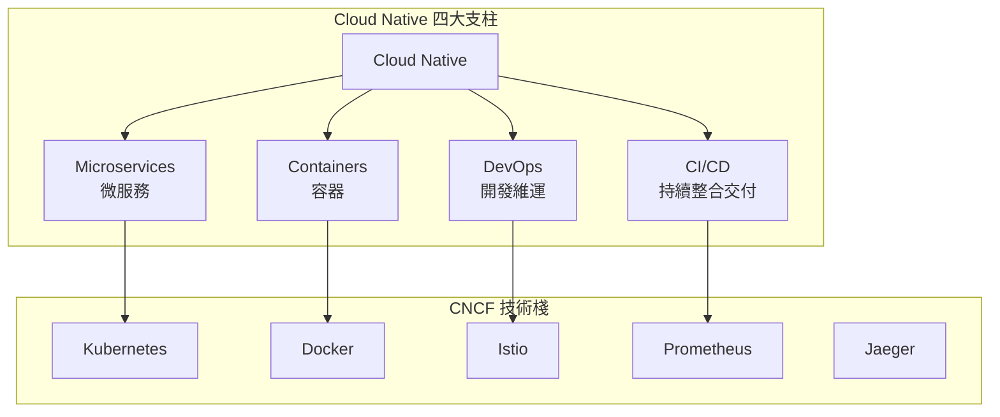

#### 🔧 CNCF（雲端原生運算基金會）技術棧

**容器運行時：**
- **Docker**：容器化平台
- **containerd**：容器運行時
- **CRI-O**：Kubernetes 容器運行時介面

**容器編排：**
- **Kubernetes**：容器編排平台
- **Docker Swarm**：Docker 原生編排
- **Nomad**：HashiCorp 編排工具

**服務網格：**
- **Istio**：功能最豐富的服務網格
- **Linkerd**：輕量級服務網格
- **Consul Connect**：HashiCorp 服務網格

**監控觀測：**
- **Prometheus**：監控和告警
- **Grafana**：數據視覺化
- **Jaeger**：分散式追蹤
- **Fluentd**：日誌收集

#### 📋 Cloud Native 成熟度模型

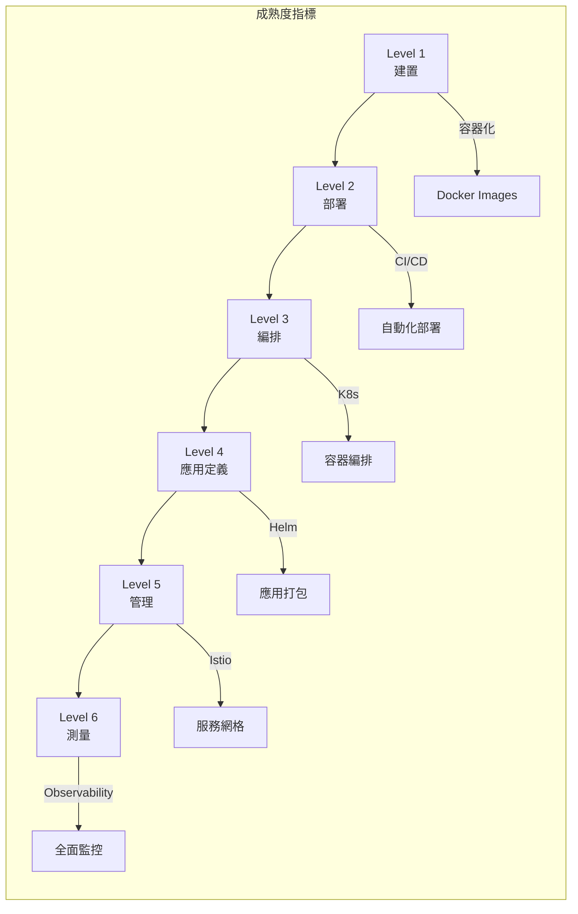

### 2.3 與 Microservices Architecture 認證的關聯

#### 🎓 主要認證路徑

**1. Kubernetes 相關認證**
- **CKA (Certified Kubernetes Administrator)**
  - 重點：集群管理、故障排除
  - 適合：運維工程師、DevOps 工程師

- **CKAD (Certified Kubernetes Application Developer)**
  - 重點：應用開發、部署配置
  - 適合：應用開發者、微服務開發者

- **CKS (Certified Kubernetes Security Specialist)**
  - 重點：安全最佳實踐
  - 適合：安全工程師、架構師

**2. 雲端廠商認證**
- **AWS Certified Solutions Architect**
- **Azure Solutions Architect Expert**
- **Google Professional Cloud Architect**

**3. 微服務專業認證**
- **iSAQB CPSA-F (Foundation Level)**
- **Open Group Certified Architect (Open CA)**

#### 📚 認證準備重點

**Kubernetes 認證核心技能：**

```yaml
# 1. Pod 和 Deployment 管理
apiVersion: apps/v1
kind: Deployment
metadata:
  name: microservice-app
spec:
  replicas: 3
  selector:
    matchLabels:
      app: microservice-app
  template:
    metadata:
      labels:
        app: microservice-app
    spec:
      containers:
      - name: app
        image: myapp:v1.0
        ports:
        - containerPort: 8080
        env:
        - name: DB_HOST
          valueFrom:
            secretKeyRef:
              name: db-secret
              key: host
```

```yaml
# 2. Service 和 Ingress 配置
apiVersion: v1
kind: Service
metadata:
  name: microservice-svc
spec:
  selector:
    app: microservice-app
  ports:
  - port: 80
    targetPort: 8080
  type: ClusterIP
---
apiVersion: networking.k8s.io/v1
kind: Ingress
metadata:
  name: microservice-ingress
spec:
  rules:
  - host: api.company.com
    http:
      paths:
      - path: /
        pathType: Prefix
        backend:
          service:
            name: microservice-svc
            port:
              number: 80
```

#### 🏆 認證價值與職涯發展

**技能提升面向：**
- **技術深度**：深入理解容器化和編排技術
- **實務經驗**：通過實作考試獲得真實操作經驗  
- **問題解決**：培養分散式系統故障排除能力
- **最佳實踐**：學習業界標準和安全規範

**職涯發展路徑：**
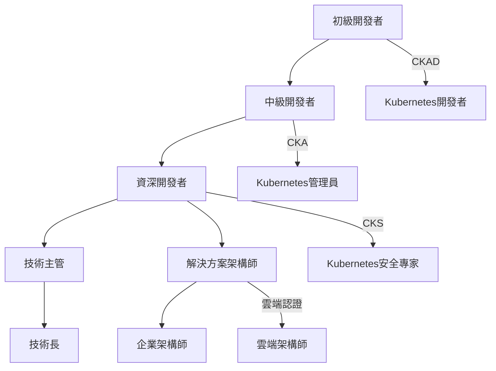

### 💼 實務案例：Netflix 微服務架構演進

#### 📈 架構演進歷程

**2008年：單體架構時期**
- 單一 Java 應用程式
- 傳統資料中心部署
- DVD 郵寄業務為主

**2010年：雲端轉型**
- 遷移至 AWS
- 開始服務拆分
- 引入 NoSQL 資料庫

**2012年：微服務成熟期**
- 超過 100 個微服務
- 自研服務發現（Eureka）
- 熔斷器模式（Hystrix）

**2020年：現代化架構**
- 超過 1000 個微服務
- 容器化部署
- 服務網格架構

#### 🔧 Netflix 關鍵技術元件

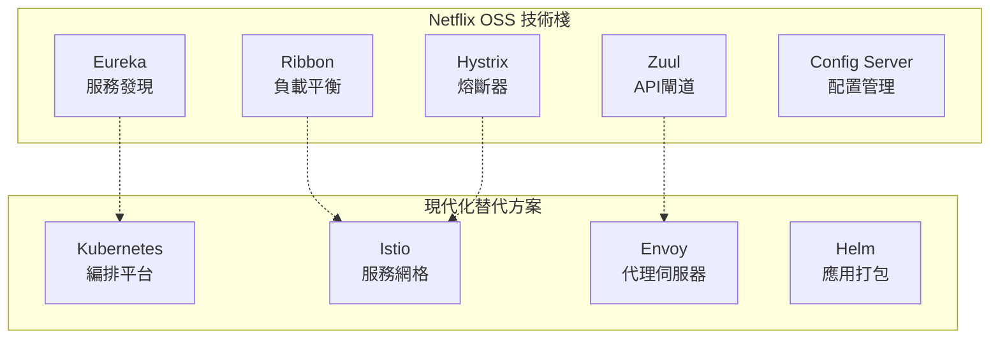

#### 📊 Netflix 微服務架構效益

**技術指標：**
- **可用性**：99.99% 服務可用性
- **擴展性**：支援 2億+ 全球用戶
- **部署頻率**：每日數千次部署
- **故障恢復**：分鐘級自動恢復

**業務價值：**
- **全球擴展**：快速進入新市場
- **個性化推薦**：基於微服務的 ML 管線
- **內容交付**：CDN 與微服務整合
- **A/B 測試**：靈活的實驗平台

### 🔍 學習檢查點

完成本章學習後，請確認您能夠：

- [ ] 區分 SOA 和微服務架構的差異
- [ ] 理解 Cloud Native 的核心概念
- [ ] 了解 CNCF 技術棧的主要元件
- [ ] 規劃微服務相關技術認證路徑
- [ ] 分析企業微服務架構演進策略

### 📝 實務練習

**練習1：技術對比分析**
選擇一個您熟悉的系統，分析如何從 SOA 架構遷移到微服務架構，包括：
1. 現有架構的問題點
2. 微服務改造方案
3. 遷移過程中的風險和對策

**練習2：認證規劃**
根據您的職涯目標，制定微服務相關技術認證學習計畫：
1. 選擇適合的認證路徑
2. 制定學習時程表
3. 準備實作練習環境

---

## 📋 Part I 檢查清單

### ✅ 知識理解檢查

**微服務基礎概念：**
- [ ] 能夠解釋微服務架構的定義和核心理念
- [ ] 理解微服務與單體架構的根本差異
- [ ] 掌握微服務的六大核心特徵
- [ ] 能夠判斷什麼場景適合採用微服務

**技術標準理解：**
- [ ] 區分 SOA 和微服務的差異
- [ ] 理解 Cloud Native 的核心概念
- [ ] 了解 CNCF 生態系統的主要元件
- [ ] 規劃相關技術認證學習路徑

### 🎯 實務能力檢查

**架構分析能力：**
- [ ] 能夠分析現有系統的微服務改造可行性
- [ ] 具備初步的服務拆分思維
- [ ] 理解微服務架構的成本效益分析

**技術準備度：**
- [ ] 了解容器化基礎概念
- [ ] 熟悉 REST API 設計原則
- [ ] 具備基本的雲端平台知識

### 📚 延伸學習建議

**推薦閱讀：**
- 《Building Microservices》by Sam Newman
- 《Microservices Patterns》by Chris Richardson
- 《Cloud Native Patterns》by Cornelia Davis

**線上資源：**
- [microservices.io](https://microservices.io/) - 微服務模式集合
- [CNCF Landscape](https://landscape.cncf.io/) - 雲端原生技術全景圖
- [Netflix Tech Blog](https://netflixtechblog.com/) - Netflix 技術部落格

**實作練習：**
- 建立簡單的 Docker 容器應用
- 練習 Kubernetes 基礎操作
- 實作 REST API 服務

---

# Part II. 微服務設計原則

## 3. 微服務設計的基本原則

### 3.1 單一職責原則 (SRP)

#### 🎯 原則定義

單一職責原則（Single Responsibility Principle）是微服務設計的核心原則，要求每個微服務只負責一個特定的業務功能，並且有且僅有一個引起它變化的原因。

**核心概念：**
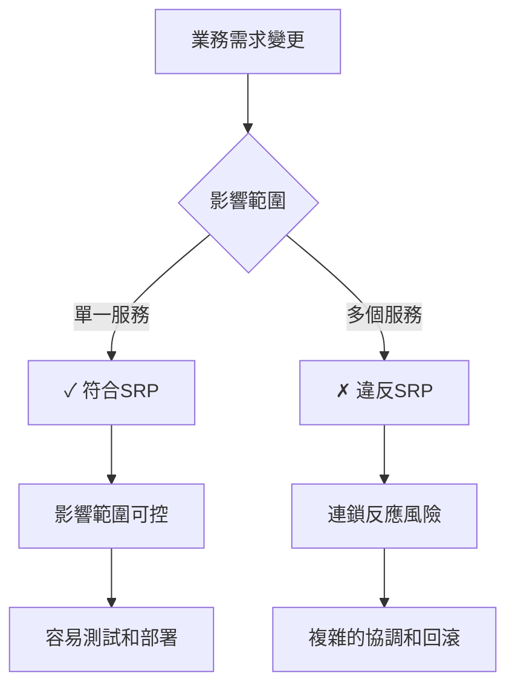

#### 📋 實務應用指南

**正確的職責劃分範例：**

```java
// ✅ 正確：用戶管理服務 - 單一職責
@RestController
@RequestMapping("/api/v1/users")
public class UserController {
    
    @PostMapping
    public ResponseEntity<UserDto> createUser(@RequestBody CreateUserRequest request) {
        // 只負責用戶相關操作
        User user = userService.createUser(request);
        return ResponseEntity.ok(userMapper.toDto(user));
    }
    
    @GetMapping("/{userId}")
    public ResponseEntity<UserDto> getUser(@PathVariable Long userId) {
        User user = userService.findById(userId);
        return ResponseEntity.ok(userMapper.toDto(user));
    }
    
    @PutMapping("/{userId}")
    public ResponseEntity<UserDto> updateUser(@PathVariable Long userId, 
                                             @RequestBody UpdateUserRequest request) {
        User user = userService.updateUser(userId, request);
        return ResponseEntity.ok(userMapper.toDto(user));
    }
}
```

```java
// ❌ 錯誤：混合多種職責
@RestController
@RequestMapping("/api/v1/users")
public class UserController {
    
    @PostMapping
    public ResponseEntity<UserDto> createUser(@RequestBody CreateUserRequest request) {
        // 創建用戶
        User user = userService.createUser(request);
        
        // ❌ 錯誤：同時處理訂單邏輯
        if (request.isPremiumUser()) {
            orderService.createWelcomeOrder(user.getId());
        }
        
        // ❌ 錯誤：同時處理支付邏輯
        if (request.hasPaymentInfo()) {
            paymentService.setupDefaultPayment(user.getId(), request.getPaymentInfo());
        }
        
        return ResponseEntity.ok(userMapper.toDto(user));
    }
}
```

#### 🔍 判斷標準

**SRP 符合性檢查清單：**

1. **變更原因唯一性**
   - [ ] 服務變更只因為一個業務原因
   - [ ] 不會因為其他領域的需求而修改

2. **功能內聚性**
   - [ ] 服務內所有功能都圍繞同一個業務實體
   - [ ] 功能之間有強烈的邏輯關聯

3. **資料歸屬清晰**
   - [ ] 服務擁有明確的資料邊界
   - [ ] 不會直接操作其他服務的資料

**實例：電商系統職責劃分**
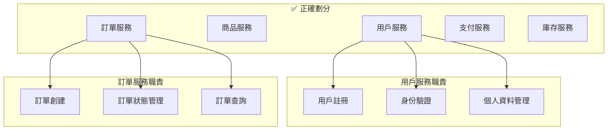

### 3.2 鬆耦合與高內聚

#### 🔗 耦合度分析

**耦合類型與風險等級：**

| 耦合類型 | 風險等級 | 說明 | 建議 |
|---------|---------|------|------|
| **資料耦合** | 🟢 低 | 通過參數傳遞簡單資料 | 推薦使用 |
| **印記耦合** | 🟡 中 | 傳遞複雜資料結構 | 謹慎使用 |
| **控制耦合** | 🟠 高 | 通過標誌控制其他服務邏輯 | 避免使用 |
| **共同耦合** | 🔴 極高 | 共享全域資料 | 嚴格禁止 |
| **內容耦合** | 🔴 極高 | 直接訪問其他服務內部 | 嚴格禁止 |

#### 🏗️ 高內聚設計模式

**內聚度類型評估：**

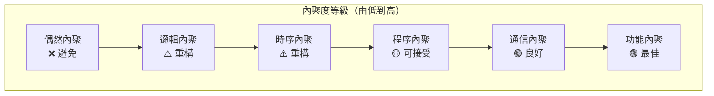

**功能內聚實例：**

```java
// ✅ 高內聚：支付服務專注於支付相關功能
@Service
public class PaymentService {
    
    public PaymentResult processPayment(PaymentRequest request) {
        // 1. 驗證支付資訊
        validatePaymentInfo(request);
        
        // 2. 計算費用
        Amount totalAmount = calculateTotalAmount(request);
        
        // 3. 執行支付
        PaymentTransaction transaction = executePayment(request, totalAmount);
        
        // 4. 記錄支付結果
        recordPaymentHistory(transaction);
        
        return new PaymentResult(transaction);
    }
    
    // 所有方法都圍繞支付功能，高度內聚
    private void validatePaymentInfo(PaymentRequest request) { /* ... */ }
    private Amount calculateTotalAmount(PaymentRequest request) { /* ... */ }
    private PaymentTransaction executePayment(PaymentRequest request, Amount amount) { /* ... */ }
    private void recordPaymentHistory(PaymentTransaction transaction) { /* ... */ }
}
```

#### 🌐 服務間通訊最佳實踐

**1. API 契約優先設計**

```yaml
# OpenAPI 規範示例
openapi: 3.0.0
info:
  title: 用戶服務 API
  version: 1.0.0
paths:
  /users/{userId}:
    get:
      summary: 獲取用戶資訊
      parameters:
        - name: userId
          in: path
          required: true
          schema:
            type: integer
            format: int64
      responses:
        '200':
          description: 用戶資訊
          content:
            application/json:
              schema:
                $ref: '#/components/schemas/User'
        '404':
          description: 用戶不存在
components:
  schemas:
    User:
      type: object
      properties:
        id:
          type: integer
          format: int64
        username:
          type: string
        email:
          type: string
          format: email
```

**2. 事件驅動通訊**

```java
// 發布者：訂單服務
@Service
public class OrderService {
    
    @Autowired
    private ApplicationEventPublisher eventPublisher;
    
    public Order createOrder(CreateOrderRequest request) {
        Order order = new Order(request);
        order = orderRepository.save(order);
        
        // 發布訂單創建事件，鬆耦合通知其他服務
        OrderCreatedEvent event = new OrderCreatedEvent(
            order.getId(),
            order.getUserId(),
            order.getTotalAmount(),
            order.getOrderItems()
        );
        eventPublisher.publishEvent(event);
        
        return order;
    }
}

// 訂閱者：庫存服務
@Component
public class InventoryEventHandler {
    
    @EventListener
    public void handleOrderCreated(OrderCreatedEvent event) {
        // 異步處理庫存扣減，不影響訂單服務
        inventoryService.reserveInventory(event.getOrderItems());
    }
}
```

### 3.3 可獨立部署與演進

#### 🚀 獨立部署架構

**部署獨立性評估框架：**

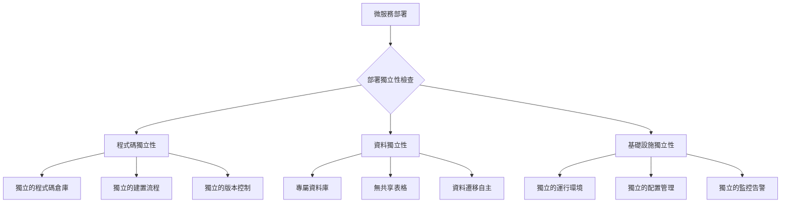

**CI/CD 管線設計：**

```yaml
# .github/workflows/user-service.yml
name: User Service CI/CD
on:
  push:
    paths:
      - 'services/user-service/**'
    branches: [main, develop]

jobs:
  test:
    runs-on: ubuntu-latest
    steps:
      - uses: actions/checkout@v2
      - name: Setup Java
        uses: actions/setup-java@v2
        with:
          java-version: '11'
      - name: Run Tests
        run: |
          cd services/user-service
          ./gradlew test
      
  build:
    needs: test
    runs-on: ubuntu-latest
    steps:
      - name: Build Docker Image
        run: |
          cd services/user-service
          docker build -t user-service:${{ github.sha }} .
          
  deploy:
    needs: build
    runs-on: ubuntu-latest
    if: github.ref == 'refs/heads/main'
    steps:
      - name: Deploy to Kubernetes
        run: |
          kubectl set image deployment/user-service \
            user-service=user-service:${{ github.sha }}
```

#### 🔄 版本演進策略

**API 版本管理最佳實踐：**

```java
// 版本化 API 設計
@RestController
public class UserController {
    
    // V1 API - 向後相容
    @GetMapping("/api/v1/users/{id}")
    public UserV1Dto getUserV1(@PathVariable Long id) {
        User user = userService.findById(id);
        return userMapperV1.toDto(user);
    }
    
    // V2 API - 新增功能
    @GetMapping("/api/v2/users/{id}")
    public UserV2Dto getUserV2(@PathVariable Long id) {
        User user = userService.findById(id);
        UserProfile profile = userService.getUserProfile(id);
        return userMapperV2.toDto(user, profile);
    }
}

// DTO 版本化
public class UserV1Dto {
    private Long id;
    private String username;
    private String email;
    // 基本資訊
}

public class UserV2Dto {
    private Long id;
    private String username;
    private String email;
    private String avatarUrl;  // 新增欄位
    private LocalDateTime lastLoginTime;  // 新增欄位
    // 擴展資訊
}
```

**資料庫演進策略：**

```sql
-- 向後相容的資料庫變更
-- Phase 1: 添加新欄位（可為空）
ALTER TABLE users ADD COLUMN avatar_url VARCHAR(255);
ALTER TABLE users ADD COLUMN last_login_time TIMESTAMP;

-- Phase 2: 逐步遷移資料
UPDATE users SET avatar_url = '/default-avatar.png' WHERE avatar_url IS NULL;

-- Phase 3: 更新約束（在所有服務升級後）
-- ALTER TABLE users ALTER COLUMN avatar_url SET NOT NULL;
```

### 3.4 API First 思維

#### 📋 API 優先設計流程

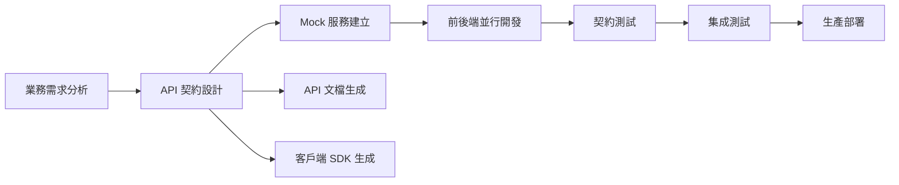

#### 🛠️ API 設計最佳實踐

**1. RESTful API 設計原則**

```java
// ✅ 良好的 REST API 設計
@RestController
@RequestMapping("/api/v1")
public class ProductController {
    
    // 獲取商品列表
    @GetMapping("/products")
    public ResponseEntity<Page<ProductDto>> getProducts(
            @RequestParam(defaultValue = "0") int page,
            @RequestParam(defaultValue = "20") int size,
            @RequestParam(required = false) String category) {
        // 實現邏輯
    }
    
    // 獲取特定商品
    @GetMapping("/products/{productId}")
    public ResponseEntity<ProductDto> getProduct(@PathVariable Long productId) {
        // 實現邏輯
    }
    
    // 創建商品
    @PostMapping("/products")
    public ResponseEntity<ProductDto> createProduct(@Valid @RequestBody CreateProductRequest request) {
        // 實現邏輯
    }
    
    // 更新商品
    @PutMapping("/products/{productId}")
    public ResponseEntity<ProductDto> updateProduct(
            @PathVariable Long productId,
            @Valid @RequestBody UpdateProductRequest request) {
        // 實現邏輯
    }
    
    // 刪除商品
    @DeleteMapping("/products/{productId}")
    public ResponseEntity<Void> deleteProduct(@PathVariable Long productId) {
        // 實現邏輯
    }
}
```

**2. 統一的錯誤處理**

```java
// 全域錯誤處理器
@RestControllerAdvice
public class GlobalExceptionHandler {
    
    @ExceptionHandler(ResourceNotFoundException.class)
    public ResponseEntity<ErrorResponse> handleResourceNotFound(ResourceNotFoundException ex) {
        ErrorResponse error = ErrorResponse.builder()
            .timestamp(Instant.now())
            .status(HttpStatus.NOT_FOUND.value())
            .error("Resource Not Found")
            .message(ex.getMessage())
            .path(getCurrentPath())
            .build();
        return ResponseEntity.status(HttpStatus.NOT_FOUND).body(error);
    }
    
    @ExceptionHandler(ValidationException.class)
    public ResponseEntity<ErrorResponse> handleValidation(ValidationException ex) {
        ErrorResponse error = ErrorResponse.builder()
            .timestamp(Instant.now())
            .status(HttpStatus.BAD_REQUEST.value())
            .error("Validation Failed")
            .message(ex.getMessage())
            .path(getCurrentPath())
            .build();
        return ResponseEntity.status(HttpStatus.BAD_REQUEST).body(error);
    }
}

// 統一錯誤回應格式
public class ErrorResponse {
    private Instant timestamp;
    private int status;
    private String error;
    private String message;
    private String path;
    // getters and setters
}
```

**3. API 文檔自動化**

```java
// Swagger/OpenAPI 配置
@Configuration
@EnableSwagger2
public class SwaggerConfig {
    
    @Bean
    public Docket api() {
        return new Docket(DocumentationType.SWAGGER_2)
                .select()
                .apis(RequestHandlerSelectors.basePackage("com.company.userservice.controller"))
                .paths(PathSelectors.any())
                .build()
                .apiInfo(apiInfo())
                .securitySchemes(Arrays.asList(apiKey()))
                .securityContexts(Arrays.asList(securityContext()));
    }
    
    private ApiInfo apiInfo() {
        return new ApiInfoBuilder()
                .title("用戶服務 API")
                .description("用戶管理相關 API 接口")
                .version("1.0.0")
                .contact(new Contact("架構團隊", "https://company.com", "arch@company.com"))
                .build();
    }
}
```

### 💼 實務案例：用戶服務設計

#### 🎯 設計目標

設計一個符合微服務設計原則的用戶管理服務，包含用戶註冊、認證、個人資料管理等功能。

#### 🏗️ 架構設計

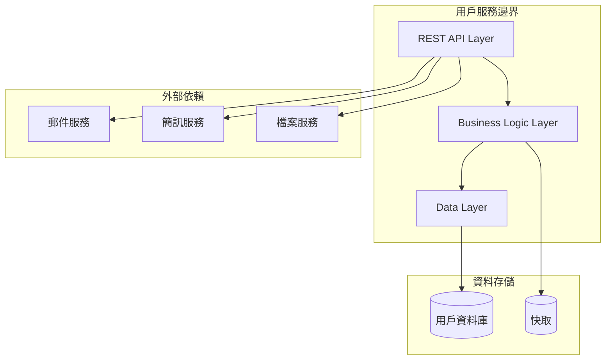

#### 📝 服務實現

```java
// 領域模型
@Entity
@Table(name = "users")
public class User {
    @Id
    @GeneratedValue(strategy = GenerationType.IDENTITY)
    private Long id;
    
    @Column(unique = true, nullable = false)
    private String username;
    
    @Column(unique = true, nullable = false)
    private String email;
    
    @Column(nullable = false)
    private String passwordHash;
    
    private String firstName;
    private String lastName;
    private String avatarUrl;
    
    @Enumerated(EnumType.STRING)
    private UserStatus status;
    
    private LocalDateTime createdAt;
    private LocalDateTime updatedAt;
    
    // constructors, getters, setters
}

// 服務層實現
@Service
@Transactional
public class UserService {
    
    private final UserRepository userRepository;
    private final PasswordEncoder passwordEncoder;
    private final ApplicationEventPublisher eventPublisher;
    
    public User createUser(CreateUserRequest request) {
        // 1. 驗證用戶不存在
        validateUserNotExists(request.getUsername(), request.getEmail());
        
        // 2. 創建用戶實體
        User user = User.builder()
            .username(request.getUsername())
            .email(request.getEmail())
            .passwordHash(passwordEncoder.encode(request.getPassword()))
            .firstName(request.getFirstName())
            .lastName(request.getLastName())
            .status(UserStatus.PENDING_VERIFICATION)
            .createdAt(LocalDateTime.now())
            .build();
        
        // 3. 持久化
        user = userRepository.save(user);
        
        // 4. 發布事件（鬆耦合通知其他服務）
        eventPublisher.publishEvent(new UserCreatedEvent(user.getId(), user.getEmail()));
        
        return user;
    }
    
    public User authenticateUser(String username, String password) {
        User user = userRepository.findByUsername(username)
            .orElseThrow(() -> new AuthenticationException("Invalid credentials"));
            
        if (!passwordEncoder.matches(password, user.getPasswordHash())) {
            throw new AuthenticationException("Invalid credentials");
        }
        
        if (user.getStatus() != UserStatus.ACTIVE) {
            throw new AuthenticationException("Account is not active");
        }
        
        // 發布登錄事件
        eventPublisher.publishEvent(new UserLoginEvent(user.getId()));
        
        return user;
    }
    
    private void validateUserNotExists(String username, String email) {
        if (userRepository.existsByUsername(username)) {
            throw new UserAlreadyExistsException("Username already exists: " + username);
        }
        if (userRepository.existsByEmail(email)) {
            throw new UserAlreadyExistsException("Email already exists: " + email);
        }
    }
}
```

### 🔍 學習檢查點

完成本章學習後，請確認您能夠：

- [ ] 理解並應用單一職責原則
- [ ] 設計高內聚、鬆耦合的服務
- [ ] 規劃獨立部署的服務架構
- [ ] 採用 API First 的設計思維
- [ ] 識別和避免常見的設計反模式

### 📝 實務練習

**練習1：服務職責分析**
分析以下場景，判斷是否違反單一職責原則：
1. 訂單服務同時處理訂單創建和發送郵件通知
2. 用戶服務包含用戶管理和用戶偏好設定功能
3. 支付服務同時處理支付和庫存扣減

**練習2：API 設計實作**
為一個簡單的部落格系統設計用戶和文章的 REST API，包括：
1. 完整的 OpenAPI 規範
2. 錯誤處理策略
3. 版本管理方案

---

## 4. 微服務邊界劃分

### 4.1 Domain-Driven Design (DDD) 與微服務

#### 🏗️ DDD 核心概念

Domain-Driven Design（領域驅動設計）提供了系統化的方法來識別和劃分微服務邊界。

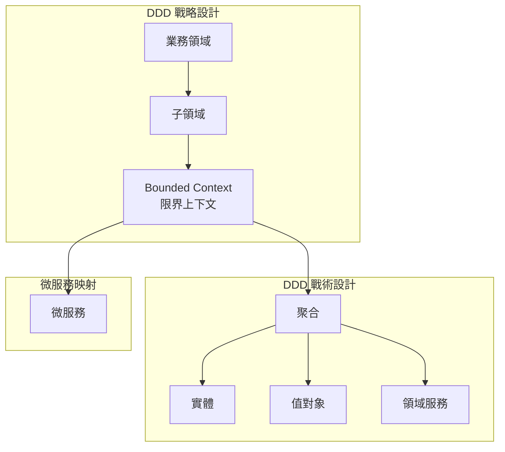

#### 📋 領域模型識別步驟

**步驟1：業務領域分析**

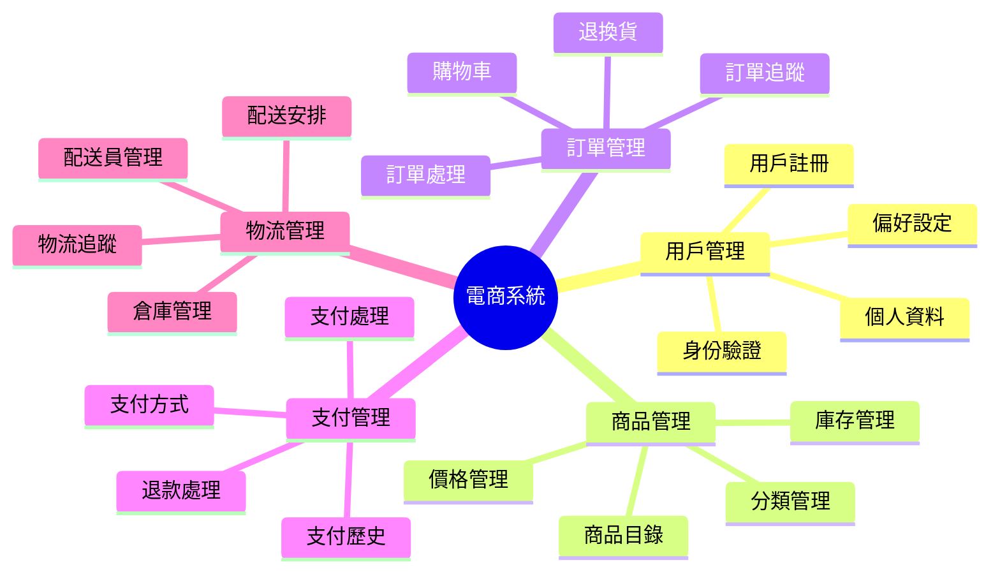

**步驟2：限界上下文劃分**

```java
// 用戶上下文中的用戶實體
@Entity
public class User {
    private UserId id;
    private Username username;
    private Email email;
    private UserProfile profile;
    
    // 用戶特定的業務邏輯
    public void updateProfile(UserProfile newProfile) {
        validateProfileUpdate(newProfile);
        this.profile = newProfile;
        // 發布事件
    }
}

// 訂單上下文中的用戶概念（不同的視角）
@Entity
public class Customer {
    private CustomerId id;
    private CustomerName name;
    private DeliveryAddress address;
    
    // 從訂單視角看用戶的相關資訊
    public boolean canPlaceOrder() {
        return address != null && address.isValid();
    }
}
```

#### 🎯 聚合設計原則

**聚合邊界識別：**

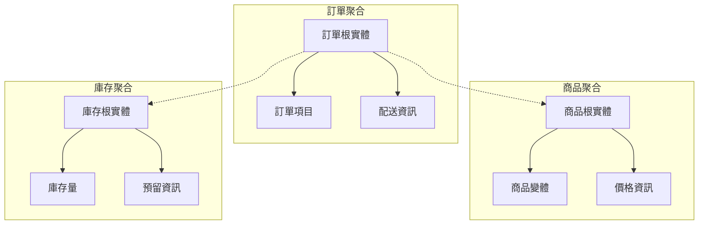

### 4.2 Bounded Context

#### 🏛️ 限界上下文定義

限界上下文是DDD中的核心概念，定義了特定領域模型適用的邊界。在微服務架構中，每個限界上下文通常對應一個微服務。

**上下文映射模式：**

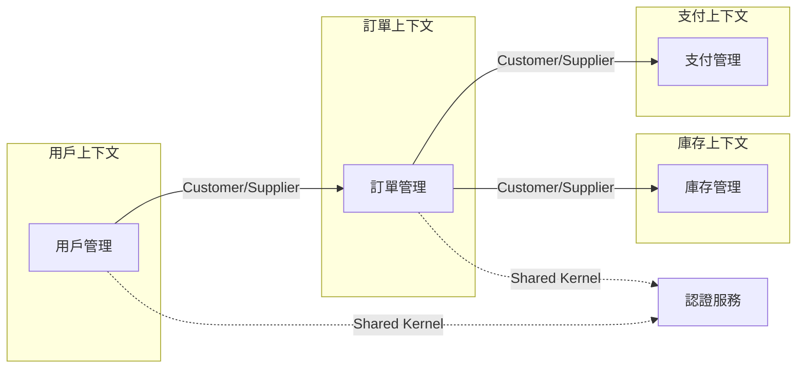

#### 📊 上下文關係模式

| 關係模式 | 描述 | 使用場景 | 實現方式 |
|---------|------|---------|---------|
| **Shared Kernel** | 共享核心模型 | 核心概念（如用戶ID） | 共享函式庫 |
| **Customer/Supplier** | 上下游關係 | 服務依賴關係 | API 呼叫 |
| **Conformist** | 遵循者模式 | 必須遵循外部服務 | 適配器模式 |
| **Anti-corruption Layer** | 防腐層 | 隔離外部系統影響 | 轉換層 |
| **Published Language** | 發布語言 | 標準化整合格式 | Schema 定義 |

#### 🛠️ 實作範例

**防腐層實現：**

```java
// 外部支付服務的防腐層
@Component
public class PaymentGatewayAdapter {
    
    private final ExternalPaymentClient externalClient;
    
    // 將內部領域模型轉換為外部服務格式
    public PaymentResult processPayment(PaymentRequest domainRequest) {
        // 1. 轉換請求格式
        ExternalPaymentRequest externalRequest = convertToExternalFormat(domainRequest);
        
        // 2. 呼叫外部服務
        ExternalPaymentResponse externalResponse = externalClient.processPayment(externalRequest);
        
        // 3. 轉換回應格式，保護內部模型不受外部變化影響
        return convertToDomainFormat(externalResponse);
    }
    
    private ExternalPaymentRequest convertToExternalFormat(PaymentRequest domainRequest) {
        return ExternalPaymentRequest.builder()
            .merchantId(domainRequest.getMerchantId())
            .amount(domainRequest.getAmount().getCents()) // 轉換金額格式
            .currency(domainRequest.getAmount().getCurrency().getCode())
            .cardInfo(convertCardInfo(domainRequest.getCardInfo()))
            .build();
    }
    
    private PaymentResult convertToDomainFormat(ExternalPaymentResponse externalResponse) {
        PaymentStatus status = mapPaymentStatus(externalResponse.getStatus());
        return PaymentResult.builder()
            .transactionId(new TransactionId(externalResponse.getTransactionId()))
            .status(status)
            .processedAt(externalResponse.getProcessedTimestamp())
            .build();
    }
}
```

### 4.3 業務能力導向的拆分

#### 🎯 業務能力識別方法

**Conway's Law 與組織結構對齊：**

```mermaid
graph TB
    subgraph "組織結構"
        Team1[用戶體驗團隊]
        Team2[商品團隊]
        Team3[訂單團隊]
        Team4[支付團隊]
    end
    
    subgraph "微服務架構"
        Service1[用戶服務]
        Service2[商品服務]
        Service3[訂單服務]
        Service4[支付服務]
    end
    
    Team1 --> Service1
    Team2 --> Service2
    Team3 --> Service3
    Team4 --> Service4
```

#### 📈 業務能力分析框架

**能力地圖製作：**

```mermaid
graph TD
    subgraph "Level 1: 業務領域"
        E1[客戶管理]
        E2[產品管理]
        E3[訂單管理]
        E4[財務管理]
    end
    
    subgraph "Level 2: 業務能力"
        E1 --> C1[客戶註冊]
        E1 --> C2[客戶支援]
        E2 --> C3[商品目錄]
        E2 --> C4[庫存管理]
        E3 --> C5[訂單處理]
        E3 --> C6[配送管理]
        E4 --> C7[支付處理]
        E4 --> C8[帳務管理]
    end
    
    subgraph "Level 3: 具體功能"
        C1 --> F1[用戶註冊]
        C1 --> F2[身份驗證]
        C5 --> F3[購物車]
        C5 --> F4[訂單確認]
        C7 --> F5[線上支付]
        C7 --> F6[退款處理]
    end
```

#### 🔍 拆分決策矩陣

| 評估維度 | 權重 | 用戶管理 | 商品管理 | 訂單管理 | 支付管理 |
|---------|------|---------|---------|---------|---------|
| **業務獨立性** | 25% | 9 | 8 | 7 | 9 |
| **資料獨立性** | 20% | 9 | 9 | 6 | 8 |
| **團隊獨立性** | 20% | 8 | 8 | 7 | 9 |
| **技術獨立性** | 15% | 7 | 7 | 6 | 8 |
| **擴展需求** | 10% | 6 | 8 | 9 | 7 |
| **變更頻率** | 10% | 6 | 7 | 8 | 5 |
| **綜合評分** | - | 7.8 | 7.9 | 7.1 | 8.2 |

### 4.4 避免過度切分的陷阱

#### ⚠️ 過度切分的警示信號

**常見反模式：**

```mermaid
graph TB
    subgraph "❌ 過度切分"
        S1[用戶服務]
        S2[用戶偏好服務]
        S3[用戶頭像服務]
        S4[用戶通知設定服務]
        
        S1 <--> S2
        S1 <--> S3
        S1 <--> S4
        S2 <--> S4
    end
    
    subgraph "✅ 合理切分"
        US[用戶服務]
        NS[通知服務]
        
        US --> NS
    end
```

#### 📊 切分合理性評估

**評估檢查清單：**

1. **服務間通訊頻率**
   - [ ] 服務間API呼叫次數是否合理（< 5次/業務操作）
   - [ ] 是否存在頻繁的同步通訊

2. **資料一致性需求**
   - [ ] 是否需要強一致性的資料跨多個服務
   - [ ] 事務邊界是否合理

3. **運維複雜度**
   - [ ] 服務數量是否超過團隊管理能力
   - [ ] 監控和故障排除是否變得困難

4. **開發效率**
   - [ ] 功能開發是否需要修改多個服務
   - [ ] 測試是否變得過於複雜

#### 🔧 重構指導原則

**服務合併策略：**

```java
// 合併前：過度切分的服務
@RestController
public class UserBasicInfoController {
    @GetMapping("/users/{id}/basic")
    public UserBasicInfo getBasicInfo(@PathVariable Long id) {
        return userBasicInfoService.getBasicInfo(id);
    }
}

@RestController
public class UserPreferenceController {
    @GetMapping("/users/{id}/preferences")
    public UserPreferences getPreferences(@PathVariable Long id) {
        return userPreferenceService.getPreferences(id);
    }
}

// 合併後：統一的用戶服務
@RestController
@RequestMapping("/api/v1/users")
public class UserController {
    
    @GetMapping("/{id}")
    public UserDto getUser(@PathVariable Long id) {
        // 返回完整的用戶資訊，包含基本資訊和偏好設定
        User user = userService.getUser(id);
        return userMapper.toDto(user);
    }
    
    @PutMapping("/{id}/preferences")
    public UserDto updatePreferences(@PathVariable Long id, 
                                   @RequestBody UpdatePreferencesRequest request) {
        User user = userService.updatePreferences(id, request);
        return userMapper.toDto(user);
    }
}
```

### 💼 實務案例：電商平台服務拆分

#### 🎯 業務場景分析

某電商公司需要重新設計其架構以支持快速成長和國際化擴展。

**原始單體架構問題：**
- 代碼庫過大，多團隊開發衝突頻繁
- 無法獨立擴展不同功能模組
- 技術債務累積，影響開發速度
- 無法快速適應不同市場需求

#### 🏗️ DDD 分析過程

**1. 事件風暴（Event Storming）**

```mermaid
timeline
    title 用戶購物流程事件
    section 用戶註冊
        用戶註冊 : 驗證郵箱 : 啟用帳戶
    section 商品瀏覽
        瀏覽商品 : 查看詳情 : 加入購物車
    section 下單流程
        結帳 : 選擇配送 : 選擇支付
    section 支付處理
        處理支付 : 確認訂單 : 發送通知
    section 配送流程
        準備商品 : 安排配送 : 完成配送
```

**2. 限界上下文識別**

```mermaid
graph TB
    subgraph "身份識別上下文"
        IC[Identity Context]
        IC --> UR[用戶註冊]
        IC --> AU[身份驗證]
        IC --> PM[個人資料管理]
    end
    
    subgraph "商品目錄上下文"
        PC[Product Catalog Context]
        PC --> PD[商品資料]
        PC --> PR[價格管理]
        PC --> CAT[分類管理]
    end
    
    subgraph "訂單上下文"
        OC[Order Context]
        OC --> SC[購物車]
        OC --> OP[訂單處理]
        OC --> OM[訂單管理]
    end
    
    subgraph "支付上下文"
        PAC[Payment Context]
        PAC --> PP[支付處理]
        PAC --> RF[退款處理]
        PAC --> PH[支付歷史]
    end
    
    subgraph "庫存上下文"
        INVT[Inventory Context]
        INVT --> SM[庫存管理]
        INVT --> RS[預留系統]
        INVT --> WM[倉庫管理]
    end
    
    subgraph "配送上下文"
        SC[Shipping Context]
        SC --> DA[配送安排]
        SC --> TR[配送追蹤]
        SC --> DM[配送員管理]
    end
```

#### 📋 最終服務劃分

```mermaid
graph TB
    subgraph "核心業務服務"
        US[用戶服務]
        PS[商品服務]
        OS[訂單服務]
        PAS[支付服務]
        IS[庫存服務]
        SS[配送服務]
    end
    
    subgraph "支援服務"
        AS[認證服務]
        NS[通知服務]
        ALS[審計日誌服務]
        RS[推薦服務]
    end
    
    subgraph "基礎設施服務"
        AGW[API 閘道]
        CFG[配置服務]
        SRV[服務發現]
        MON[監控服務]
    end
    
    AGW --> US
    AGW --> PS
    AGW --> OS
    
    OS --> PAS
    OS --> IS
    OS --> SS
    
    US --> AS
    OS --> NS
    PS --> RS
```

#### 🎯 劃分決策依據

**用戶服務（Identity & User Management）**
- **職責**：用戶註冊、認證、個人資料管理
- **資料**：用戶基本資訊、偏好設定、安全設定
- **團隊**：用戶體驗團隊（5人）

**商品服務（Product Catalog）**
- **職責**：商品資料管理、分類管理、搜尋
- **資料**：商品資訊、價格、分類、圖片
- **團隊**：商品團隊（6人）

**訂單服務（Order Management）**
- **職責**：購物車、訂單處理、訂單狀態管理
- **資料**：訂單資訊、購物車、訂單歷史
- **團隊**：訂單團隊（8人）

**支付服務（Payment Processing）**
- **職責**：支付處理、退款、支付方式管理
- **資料**：支付記錄、支付配置、交易歷史
- **團隊**：支付團隊（4人）

#### 📊 實施效果評估

**改進指標：**

| 指標 | 改進前 | 改進後 | 提升幅度 |
|------|--------|--------|---------|
| **部署頻率** | 每週1次 | 每日多次 | 500% |
| **功能交付時間** | 4-6週 | 1-2週 | 70% |
| **系統可用性** | 99.5% | 99.9% | 0.4% |
| **故障恢復時間** | 2-4小時 | 15-30分鐘 | 85% |
| **團隊自主性** | 低 | 高 | 顯著提升 |

### 🔍 學習檢查點

完成本章學習後，請確認您能夠：

- [ ] 運用DDD方法識別服務邊界
- [ ] 理解限界上下文的概念和應用
- [ ] 進行業務能力導向的服務拆分
- [ ] 識別和避免過度切分的陷阱
- [ ] 評估服務拆分的合理性

### 📝 實務練習

**練習1：事件風暴**
選擇一個您熟悉的業務流程（如酒店預訂、線上學習等），進行事件風暴分析：
1. 識別關鍵業務事件
2. 劃分限界上下文
3. 設計微服務邊界

**練習2：服務拆分評估**
針對以下場景，評估微服務拆分方案：
- 一個包含用戶管理、內容管理、評論系統的部落格平台
- 考慮業務獨立性、資料邊界、團隊結構等因素

---

## 📋 Part II 檢查清單

### ✅ 設計原則掌握

**單一職責原則：**
- [ ] 能夠識別服務職責是否單一
- [ ] 理解職責劃分的判斷標準
- [ ] 能夠重構違反SRP的服務設計

**鬆耦合高內聚：**
- [ ] 理解不同耦合類型的風險等級
- [ ] 能夠設計高內聚的服務功能
- [ ] 掌握服務間通訊最佳實踐

**獨立部署演進：**
- [ ] 能夠設計獨立的CI/CD流程
- [ ] 掌握API版本管理策略
- [ ] 理解向後相容性設計原則

**API First思維：**
- [ ] 能夠進行API優先設計
- [ ] 掌握RESTful API設計原則
- [ ] 具備API文檔自動化能力

### 🎯 邊界劃分能力

**DDD應用：**
- [ ] 能夠進行領域建模分析
- [ ] 理解限界上下文的劃分方法
- [ ] 掌握聚合設計原則

**業務能力分析：**
- [ ] 能夠繪製業務能力地圖
- [ ] 理解Conway's Law的影響
- [ ] 具備服務拆分決策能力

**避免過度切分：**
- [ ] 能夠識別過度切分的徵象
- [ ] 掌握服務合併的重構方法
- [ ] 具備合理性評估能力

### 🛠️ 實務技能

**設計文檔：**
- [ ] 能夠撰寫服務設計文檔
- [ ] 掌握架構決策記錄（ADR）
- [ ] 具備技術方案評估能力

**代碼實踐：**
- [ ] 能夠實現符合設計原則的服務
- [ ] 掌握領域建模的代碼實現
- [ ] 具備重構遺留系統的能力

### 📚 延伸學習建議

**推薦閱讀：**
- 《Domain-Driven Design》by Eric Evans
- 《Implementing Domain-Driven Design》by Vaughn Vernon
- 《Patterns, Principles, and Practices of Domain-Driven Design》

**線上資源：**
- [DDD Community](https://dddcommunity.org/) - DDD 實踐社群
- [EventStorming](https://www.eventstorming.com/) - 事件風暴官方網站
- [Microservices Patterns](https://microservices.io/patterns/) - 微服務模式集合

**實作練習：**
- 進行事件風暴工作坊
- 實作 DDD 戰術模式（Entity、Value Object、Aggregate）
- 設計 RESTful API 並生成文檔

---

# Part III. 技術架構

## 5. 微服務通訊模式

### 5.1 同步通訊 (REST, gRPC)

#### 🌐 REST API 通訊

REST（Representational State Transfer）是微服務間最常用的同步通訊方式，基於 HTTP 協議，具有簡單易懂、工具豐富的優點。

**REST 通訊架構：**

```mermaid
sequenceDiagram
    participant Client
    participant APIGateway
    participant UserService
    participant OrderService
    participant PaymentService
    
    Client->>APIGateway: POST /api/orders
    APIGateway->>UserService: GET /users/{userId}
    UserService-->>APIGateway: User Info
    APIGateway->>OrderService: POST /orders
    OrderService->>PaymentService: POST /payments
    PaymentService-->>OrderService: Payment Result
    OrderService-->>APIGateway: Order Created
    APIGateway-->>Client: Order Response
```

**REST API 最佳實踐實現：**

```java
// 訂單服務的 REST API 實現
@RestController
@RequestMapping("/api/v1/orders")
@Validated
public class OrderController {
    
    private final OrderService orderService;
    private final UserServiceClient userServiceClient;
    private final PaymentServiceClient paymentServiceClient;
    
    @PostMapping
    public ResponseEntity<OrderResponseDto> createOrder(
            @Valid @RequestBody CreateOrderRequest request,
            HttpServletRequest httpRequest) {
        
        // 1. 驗證用戶資訊（同步調用用戶服務）
        UserDto user = userServiceClient.getUser(request.getUserId());
        if (user == null) {
            throw new UserNotFoundException("User not found: " + request.getUserId());
        }
        
        // 2. 創建訂單
        Order order = orderService.createOrder(request, user);
        
        // 3. 處理支付（同步調用支付服務）
        PaymentRequest paymentRequest = PaymentRequest.builder()
            .orderId(order.getId())
            .amount(order.getTotalAmount())
            .paymentMethod(request.getPaymentMethod())
            .build();
            
        PaymentResult paymentResult = paymentServiceClient.processPayment(paymentRequest);
        
        // 4. 更新訂單狀態
        if (paymentResult.isSuccessful()) {
            order = orderService.confirmOrder(order.getId(), paymentResult.getTransactionId());
        } else {
            order = orderService.cancelOrder(order.getId(), "Payment failed");
        }
        
        // 5. 返回結果
        OrderResponseDto response = orderMapper.toResponseDto(order);
        
        return ResponseEntity.status(HttpStatus.CREATED)
            .location(URI.create("/api/v1/orders/" + order.getId()))
            .body(response);
    }
    
    @GetMapping("/{orderId}")
    public ResponseEntity<OrderResponseDto> getOrder(@PathVariable Long orderId) {
        Order order = orderService.getOrder(orderId);
        return ResponseEntity.ok(orderMapper.toResponseDto(order));
    }
}

// HTTP 客戶端實現（使用 Feign）
@FeignClient(name = "user-service", url = "${services.user-service.url}")
public interface UserServiceClient {
    
    @GetMapping("/api/v1/users/{userId}")
    UserDto getUser(@PathVariable("userId") Long userId);
}

@FeignClient(name = "payment-service", url = "${services.payment-service.url}")
public interface PaymentServiceClient {
    
    @PostMapping("/api/v1/payments")
    PaymentResult processPayment(@RequestBody PaymentRequest request);
}
```

#### ⚡ gRPC 高效能通訊

gRPC（gRPC Remote Procedure Calls）是 Google 開發的高效能 RPC 框架，特別適合服務間的內部通訊。

**gRPC vs REST 比較：**

| 特性 | REST | gRPC |
|------|------|------|
| **協議** | HTTP/1.1 | HTTP/2 |
| **資料格式** | JSON/XML | Protocol Buffers |
| **效能** | 中等 | 高 |
| **類型安全** | 無 | 強類型 |
| **瀏覽器支援** | 原生支援 | 需要代理 |
| **工具生態** | 豐富 | 持續改善 |
| **學習曲線** | 平緩 | 較陡 |

**gRPC 服務定義：**

```protobuf
// order_service.proto
syntax = "proto3";

package order.v1;

option java_package = "com.company.order.grpc";
option java_outer_classname = "OrderServiceProto";

service OrderService {
  rpc CreateOrder(CreateOrderRequest) returns (OrderResponse);
  rpc GetOrder(GetOrderRequest) returns (OrderResponse);
  rpc UpdateOrderStatus(UpdateOrderStatusRequest) returns (OrderResponse);
}

message CreateOrderRequest {
  int64 user_id = 1;
  repeated OrderItem items = 2;
  string payment_method = 3;
  Address delivery_address = 4;
}

message OrderItem {
  int64 product_id = 1;
  int32 quantity = 2;
  double unit_price = 3;
}

message Address {
  string street = 1;
  string city = 2;
  string postal_code = 3;
  string country = 4;
}

message OrderResponse {
  int64 id = 1;
  int64 user_id = 2;
  repeated OrderItem items = 3;
  double total_amount = 4;
  string status = 5;
  int64 created_at = 6;
}

message GetOrderRequest {
  int64 order_id = 1;
}

message UpdateOrderStatusRequest {
  int64 order_id = 1;
  string status = 2;
}
```

**gRPC 服務實現：**

```java
// gRPC 服務實現
@GrpcService
public class OrderGrpcService extends OrderServiceGrpc.OrderServiceImplBase {
    
    private final OrderService orderService;
    private final OrderMapper orderMapper;
    
    @Override
    public void createOrder(CreateOrderRequest request, 
                           StreamObserver<OrderResponse> responseObserver) {
        try {
            // 轉換 gRPC 請求到領域模型
            CreateOrderCommand command = orderMapper.toCommand(request);
            
            // 執行業務邏輯
            Order order = orderService.createOrder(command);
            
            // 轉換回 gRPC 響應
            OrderResponse response = orderMapper.toGrpcResponse(order);
            
            responseObserver.onNext(response);
            responseObserver.onCompleted();
            
        } catch (Exception e) {
            responseObserver.onError(Status.INTERNAL
                .withDescription("Failed to create order: " + e.getMessage())
                .withCause(e)
                .asRuntimeException());
        }
    }
    
    @Override
    public void getOrder(GetOrderRequest request, 
                        StreamObserver<OrderResponse> responseObserver) {
        try {
            Order order = orderService.getOrder(request.getOrderId());
            OrderResponse response = orderMapper.toGrpcResponse(order);
            
            responseObserver.onNext(response);
            responseObserver.onCompleted();
            
        } catch (OrderNotFoundException e) {
            responseObserver.onError(Status.NOT_FOUND
                .withDescription("Order not found: " + request.getOrderId())
                .asRuntimeException());
        }
    }
}

// gRPC 客戶端實現
@Component
public class PaymentServiceGrpcClient {
    
    private final PaymentServiceGrpc.PaymentServiceBlockingStub paymentStub;
    
    public PaymentServiceGrpcClient(@Value("${services.payment-service.grpc.url}") String url) {
        ManagedChannel channel = NettyChannelBuilder.forAddress(url, 9090)
            .keepAliveTime(30, TimeUnit.SECONDS)
            .keepAliveTimeout(5, TimeUnit.SECONDS)
            .keepAliveWithoutCalls(true)
            .maxInboundMessageSize(16 * 1024 * 1024)
            .usePlaintext()
            .build();
            
        this.paymentStub = PaymentServiceGrpc.newBlockingStub(channel);
    }
    
    public PaymentResult processPayment(PaymentRequest request) {
        try {
            ProcessPaymentRequest grpcRequest = ProcessPaymentRequest.newBuilder()
                .setOrderId(request.getOrderId())
                .setAmount(request.getAmount())
                .setPaymentMethod(request.getPaymentMethod())
                .build();
                
            ProcessPaymentResponse response = paymentStub
                .withDeadlineAfter(30, TimeUnit.SECONDS)
                .processPayment(grpcRequest);
                
            return PaymentResult.builder()
                .transactionId(response.getTransactionId())
                .successful(response.getSuccessful())
                .message(response.getMessage())
                .build();
                
        } catch (StatusRuntimeException e) {
            throw new PaymentServiceException("Payment processing failed", e);
        }
    }
}
```

### 5.2 非同步通訊 (Message Queue, Event Streaming)

#### 📨 訊息佇列（Message Queue）

非同步通訊透過訊息佇列實現服務間的鬆耦合通訊，適合處理不需要即時回應的業務場景。

**訊息佇列架構模式：**

```mermaid
graph TB
    subgraph "生產者服務"
        OS[訂單服務]
        PS[支付服務]
    end
    
    subgraph "訊息基礎設施"
        MQ[Message Queue<br/>RabbitMQ/Kafka]
        DLQ[Dead Letter Queue]
    end
    
    subgraph "消費者服務"
        IS[庫存服務]
        NS[通知服務]
        AS[分析服務]
    end
    
    OS -->|OrderCreated| MQ
    PS -->|PaymentCompleted| MQ
    
    MQ -->|Subscribe| IS
    MQ -->|Subscribe| NS
    MQ -->|Subscribe| AS
    
    MQ -.->|Failed Messages| DLQ
```

**RabbitMQ 實現範例：**

```java
// 訊息發布者配置
@Configuration
@EnableRabbit
public class RabbitMQConfig {
    
    public static final String ORDER_EXCHANGE = "order.exchange";
    public static final String ORDER_CREATED_QUEUE = "order.created.queue";
    public static final String ORDER_CREATED_ROUTING_KEY = "order.created";
    
    @Bean
    public TopicExchange orderExchange() {
        return new TopicExchange(ORDER_EXCHANGE, true, false);
    }
    
    @Bean
    public Queue orderCreatedQueue() {
        return QueueBuilder.durable(ORDER_CREATED_QUEUE)
            .withArgument("x-dead-letter-exchange", "dlx.exchange")
            .withArgument("x-dead-letter-routing-key", "order.created.dlq")
            .withArgument("x-message-ttl", 60000) // 60秒TTL
            .build();
    }
    
    @Bean
    public Binding orderCreatedBinding() {
        return BindingBuilder
            .bind(orderCreatedQueue())
            .to(orderExchange())
            .with(ORDER_CREATED_ROUTING_KEY);
    }
    
    @Bean
    public RabbitTemplate rabbitTemplate(ConnectionFactory connectionFactory) {
        RabbitTemplate template = new RabbitTemplate(connectionFactory);
        template.setMessageConverter(new Jackson2JsonMessageConverter());
        template.setMandatory(true);
        template.setConfirmCallback((correlationData, ack, cause) -> {
            if (!ack) {
                log.error("Message failed to be delivered: {}", cause);
            }
        });
        return template;
    }
}

// 訊息發布
@Service
public class OrderEventPublisher {
    
    private final RabbitTemplate rabbitTemplate;
    
    @EventListener
    public void handleOrderCreated(OrderCreatedEvent event) {
        OrderCreatedMessage message = OrderCreatedMessage.builder()
            .orderId(event.getOrderId())
            .userId(event.getUserId())
            .totalAmount(event.getTotalAmount())
            .orderItems(event.getOrderItems())
            .createdAt(event.getCreatedAt())
            .build();
            
        try {
            rabbitTemplate.convertAndSend(
                RabbitMQConfig.ORDER_EXCHANGE,
                RabbitMQConfig.ORDER_CREATED_ROUTING_KEY,
                message
            );
            log.info("Published order created event for order: {}", event.getOrderId());
            
        } catch (Exception e) {
            log.error("Failed to publish order created event", e);
            // 可以實現重試機制或者將訊息持久化到資料庫
        }
    }
}

// 訊息消費者
@Component
public class InventoryEventConsumer {
    
    private final InventoryService inventoryService;
    
    @RabbitListener(queues = RabbitMQConfig.ORDER_CREATED_QUEUE)
    public void handleOrderCreated(OrderCreatedMessage message) {
        try {
            log.info("Processing order created event for order: {}", message.getOrderId());
            
            // 處理庫存預留
            inventoryService.reserveInventory(
                message.getOrderId(), 
                message.getOrderItems()
            );
            
            log.info("Successfully processed order created event for order: {}", 
                message.getOrderId());
                
        } catch (Exception e) {
            log.error("Failed to process order created event for order: {}", 
                message.getOrderId(), e);
            throw e; // 重新拋出異常，觸發重試機制
        }
    }
}

// 訊息模型
@Data
@Builder
@NoArgsConstructor
@AllArgsConstructor
public class OrderCreatedMessage {
    private Long orderId;
    private Long userId;
    private BigDecimal totalAmount;
    private List<OrderItemDto> orderItems;
    private LocalDateTime createdAt;
}
```

#### 🌊 事件串流（Event Streaming）

Apache Kafka 適合處理高吞吐量的事件串流，支援事件溯源（Event Sourcing）和 CQRS 模式。

**Kafka 事件串流架構：**

```mermaid
graph LR
    subgraph "生產者"
        P1[用戶服務]
        P2[訂單服務]
        P3[支付服務]
    end
    
    subgraph "Kafka 集群"
        T1[user-events]
        T2[order-events]
        T3[payment-events]
    end
    
    subgraph "消費者"
        C1[通知服務]
        C2[分析服務]
        C3[審計服務]
        C4[推薦服務]
    end
    
    P1 --> T1
    P2 --> T2
    P3 --> T3
    
    T1 --> C1
    T2 --> C1
    T2 --> C2
    T3 --> C3
    T1 --> C4
```

**Kafka 實現範例：**

```java
// Kafka 配置
@Configuration
@EnableKafka
public class KafkaConfig {
    
    @Value("${spring.kafka.bootstrap-servers}")
    private String bootstrapServers;
    
    @Bean
    public ProducerFactory<String, Object> producerFactory() {
        Map<String, Object> props = new HashMap<>();
        props.put(ProducerConfig.BOOTSTRAP_SERVERS_CONFIG, bootstrapServers);
        props.put(ProducerConfig.KEY_SERIALIZER_CLASS_CONFIG, StringSerializer.class);
        props.put(ProducerConfig.VALUE_SERIALIZER_CLASS_CONFIG, JsonSerializer.class);
        props.put(ProducerConfig.ENABLE_IDEMPOTENCE_CONFIG, true);
        props.put(ProducerConfig.ACKS_CONFIG, "all");
        props.put(ProducerConfig.RETRIES_CONFIG, 3);
        
        return new DefaultKafkaProducerFactory<>(props);
    }
    
    @Bean
    public KafkaTemplate<String, Object> kafkaTemplate() {
        return new KafkaTemplate<>(producerFactory());
    }
    
    @Bean
    public ConsumerFactory<String, Object> consumerFactory() {
        Map<String, Object> props = new HashMap<>();
        props.put(ConsumerConfig.BOOTSTRAP_SERVERS_CONFIG, bootstrapServers);
        props.put(ConsumerConfig.GROUP_ID_CONFIG, "microservice-group");
        props.put(ConsumerConfig.KEY_DESERIALIZER_CLASS_CONFIG, StringDeserializer.class);
        props.put(ConsumerConfig.VALUE_DESERIALIZER_CLASS_CONFIG, JsonDeserializer.class);
        props.put(ConsumerConfig.ENABLE_AUTO_COMMIT_CONFIG, false);
        props.put(ConsumerConfig.AUTO_OFFSET_RESET_CONFIG, "earliest");
        
        return new DefaultKafkaConsumerFactory<>(props);
    }
}

// Kafka 事件發布者
@Service
public class OrderEventKafkaPublisher {
    
    private final KafkaTemplate<String, Object> kafkaTemplate;
    
    public void publishOrderEvent(OrderEvent event) {
        String topic = determineTopicByEventType(event.getEventType());
        String key = event.getOrderId().toString();
        
        kafkaTemplate.send(topic, key, event)
            .addCallback(
                result -> log.info("Event published successfully: {}", event),
                failure -> log.error("Failed to publish event: {}", event, failure)
            );
    }
    
    private String determineTopicByEventType(OrderEventType eventType) {
        switch (eventType) {
            case ORDER_CREATED:
                return "order-created-events";
            case ORDER_CONFIRMED:
                return "order-confirmed-events";
            case ORDER_CANCELLED:
                return "order-cancelled-events";
            default:
                return "order-events";
        }
    }
}

// Kafka 事件消費者
@Component
public class OrderEventKafkaConsumer {
    
    private final NotificationService notificationService;
    private final AnalyticsService analyticsService;
    
    @KafkaListener(topics = "order-created-events", groupId = "notification-service")
    public void handleOrderCreated(OrderCreatedEvent event, Acknowledgment ack) {
        try {
            log.info("Received order created event: {}", event.getOrderId());
            
            // 發送訂單確認通知
            notificationService.sendOrderConfirmationNotification(event);
            
            // 手動確認訊息處理完成
            ack.acknowledge();
            
        } catch (Exception e) {
            log.error("Failed to process order created event", e);
            // 不確認訊息，將會重新投遞
        }
    }
    
    @KafkaListener(topics = {"order-created-events", "order-confirmed-events"}, 
                   groupId = "analytics-service")
    public void handleOrderEvents(ConsumerRecord<String, OrderEvent> record, Acknowledgment ack) {
        try {
            OrderEvent event = record.value();
            log.info("Processing order event for analytics: {}", event.getEventType());
            
            // 更新分析數據
            analyticsService.updateOrderMetrics(event);
            
            ack.acknowledge();
            
        } catch (Exception e) {
            log.error("Failed to process order event for analytics", e);
        }
    }
}
```

### 5.3 API Gateway 與 Service Mesh

#### 🚪 API Gateway（API 閘道）

API Gateway 作為微服務架構的單一入口點，統一處理橫切關注點，如認證、授權、限流、監控等。

**API Gateway 架構：**

```mermaid
graph TB
    subgraph "客戶端"
        Web[Web App]
        Mobile[Mobile App]
        ThirdParty[第三方系統]
    end
    
    subgraph "API Gateway"
        Gateway[API Gateway<br/>Kong/Zuul/Spring Cloud Gateway]
        
        subgraph "橫切功能"
            Auth[認證授權]
            RateLimit[限流]
            Monitor[監控]
            Cache[快取]
            Transform[資料轉換]
        end
    end
    
    subgraph "微服務"
        UserService[用戶服務]
        OrderService[訂單服務]
        PaymentService[支付服務]
        ProductService[商品服務]
    end
    
    Web --> Gateway
    Mobile --> Gateway
    ThirdParty --> Gateway
    
    Gateway --> Auth
    Gateway --> RateLimit
    Gateway --> Monitor
    Gateway --> Cache
    Gateway --> Transform
    
    Gateway --> UserService
    Gateway --> OrderService
    Gateway --> PaymentService
    Gateway --> ProductService
```

**Spring Cloud Gateway 實現：**

```java
// Gateway 配置
@Configuration
public class GatewayConfig {
    
    @Bean
    public RouteLocator customRouteLocator(RouteLocatorBuilder builder) {
        return builder.routes()
            // 用戶服務路由
            .route("user-service", r -> r
                .path("/api/v1/users/**")
                .filters(f -> f
                    .addRequestHeader("X-Gateway", "spring-cloud-gateway")
                    .addRequestHeader("X-Request-Time", String.valueOf(System.currentTimeMillis()))
                    .circuitBreaker(config -> config
                        .setName("user-service-cb")
                        .setFallbackUri("forward:/fallback/user-service"))
                    .retry(config -> config
                        .setRetries(3)
                        .setMethods(HttpMethod.GET)
                        .setBackoff(Duration.ofMillis(100), Duration.ofMillis(500), 2, false)))
                .uri("lb://user-service"))
                
            // 訂單服務路由
            .route("order-service", r -> r
                .path("/api/v1/orders/**")
                .filters(f -> f
                    .requestRateLimiter(config -> config
                        .setRateLimiter(redisRateLimiter())
                        .setKeyResolver(userKeyResolver()))
                    .addRequestHeader("X-Service", "order-service"))
                .uri("lb://order-service"))
                
            // 支付服務路由（需要特殊安全處理）
            .route("payment-service", r -> r
                .path("/api/v1/payments/**")
                .filters(f -> f
                    .filter(new PaymentSecurityFilter())
                    .addRequestHeader("X-Secure", "true"))
                .uri("lb://payment-service"))
                
            .build();
    }
    
    @Bean
    public RedisRateLimiter redisRateLimiter() {
        return new RedisRateLimiter(10, 20, 1); // 每秒10個請求，突發20個
    }
    
    @Bean
    public KeyResolver userKeyResolver() {
        return exchange -> exchange.getRequest().getHeaders()
            .getFirst("X-User-ID") != null 
                ? Mono.just(exchange.getRequest().getHeaders().getFirst("X-User-ID"))
                : Mono.just("anonymous");
    }
}

// 全域過濾器
@Component
public class GlobalAuthenticationFilter implements GlobalFilter, Ordered {
    
    private final JwtTokenValidator jwtTokenValidator;
    
    @Override
    public Mono<Void> filter(ServerWebExchange exchange, GatewayFilterChain chain) {
        ServerHttpRequest request = exchange.getRequest();
        
        // 跳過公開路徑
        if (isPublicPath(request.getPath().value())) {
            return chain.filter(exchange);
        }
        
        // 驗證 JWT Token
        String token = extractToken(request);
        if (token == null || !jwtTokenValidator.validateToken(token)) {
            return unauthorized(exchange);
        }
        
        // 提取用戶資訊並添加到請求頭
        UserInfo userInfo = jwtTokenValidator.getUserInfo(token);
        ServerHttpRequest mutatedRequest = request.mutate()
            .header("X-User-ID", userInfo.getUserId().toString())
            .header("X-User-Role", userInfo.getRole())
            .build();
            
        return chain.filter(exchange.mutate().request(mutatedRequest).build());
    }
    
    @Override
    public int getOrder() {
        return -1; // 優先級最高
    }
    
    private boolean isPublicPath(String path) {
        return path.startsWith("/api/v1/auth/") || 
               path.startsWith("/api/v1/public/") ||
               path.equals("/health");
    }
    
    private String extractToken(ServerHttpRequest request) {
        String bearerToken = request.getHeaders().getFirst("Authorization");
        if (bearerToken != null && bearerToken.startsWith("Bearer ")) {
            return bearerToken.substring(7);
        }
        return null;
    }
    
    private Mono<Void> unauthorized(ServerWebExchange exchange) {
        ServerHttpResponse response = exchange.getResponse();
        response.setStatusCode(HttpStatus.UNAUTHORIZED);
        response.getHeaders().add("Content-Type", "application/json");
        
        String body = "{\"error\":\"Unauthorized\",\"message\":\"Invalid or missing authentication token\"}";
        DataBuffer buffer = response.bufferFactory().wrap(body.getBytes());
        
        return response.writeWith(Mono.just(buffer));
    }
}

// 熔斷降級處理
@RestController
public class FallbackController {
    
    @RequestMapping("/fallback/user-service")
    public ResponseEntity<Map<String, Object>> userServiceFallback() {
        Map<String, Object> response = new HashMap<>();
        response.put("error", "User service is temporarily unavailable");
        response.put("message", "Please try again later");
        response.put("timestamp", Instant.now());
        
        return ResponseEntity.status(HttpStatus.SERVICE_UNAVAILABLE).body(response);
    }
    
    @RequestMapping("/fallback/order-service")
    public ResponseEntity<Map<String, Object>> orderServiceFallback() {
        Map<String, Object> response = new HashMap<>();
        response.put("error", "Order service is temporarily unavailable");
        response.put("message", "Your order will be processed once the service is restored");
        response.put("timestamp", Instant.now());
        
        return ResponseEntity.status(HttpStatus.SERVICE_UNAVAILABLE).body(response);
    }
}
```

#### 🕸️ Service Mesh（服務網格）

Service Mesh 在基礎設施層提供服務間通訊的管理，透過 Sidecar 代理實現流量管理、安全性和可觀測性。

**Istio Service Mesh 架構：**

```mermaid
graph TB
    subgraph "Control Plane"
        Pilot[Pilot<br/>服務發現與配置]
        Citadel[Citadel<br/>安全與認證]
        Galley[Galley<br/>配置驗證]
        Telemetry[Telemetry<br/>遙測數據收集]
    end
    
    subgraph "Data Plane"
        subgraph "Pod 1"
            App1[應用容器]
            Proxy1[Envoy Proxy]
        end
        
        subgraph "Pod 2"
            App2[應用容器]
            Proxy2[Envoy Proxy]
        end
        
        subgraph "Pod 3"
            App3[應用容器]
            Proxy3[Envoy Proxy]
        end
    end
    
    Pilot --> Proxy1
    Pilot --> Proxy2
    Pilot --> Proxy3
    
    Proxy1 <--> Proxy2
    Proxy2 <--> Proxy3
    Proxy1 <--> Proxy3
```

**Istio 配置範例：**

```yaml
# 虛擬服務配置 - 流量路由
apiVersion: networking.istio.io/v1beta1
kind: VirtualService
metadata:
  name: order-service-vs
spec:
  hosts:
  - order-service
  http:
  - match:
    - headers:
        version:
          exact: v2
    route:
    - destination:
        host: order-service
        subset: v2
      weight: 100
  - route:
    - destination:
        host: order-service
        subset: v1
      weight: 90
    - destination:
        host: order-service
        subset: v2
      weight: 10

---
# 目標規則配置 - 負載均衡
apiVersion: networking.istio.io/v1beta1
kind: DestinationRule
metadata:
  name: order-service-dr
spec:
  host: order-service
  trafficPolicy:
    loadBalancer:
      simple: LEAST_CONN
    connectionPool:
      tcp:
        maxConnections: 10
      http:
        http1MaxPendingRequests: 10
        maxRequestsPerConnection: 2
    circuitBreaker:
      consecutiveErrors: 3
      interval: 30s
      baseEjectionTime: 30s
  subsets:
  - name: v1
    labels:
      version: v1
  - name: v2
    labels:
      version: v2

---
# 安全策略配置 - mTLS
apiVersion: security.istio.io/v1beta1
kind: PeerAuthentication
metadata:
  name: default
spec:
  mtls:
    mode: STRICT

---
# 授權策略配置
apiVersion: security.istio.io/v1beta1
kind: AuthorizationPolicy
metadata:
  name: order-service-authz
spec:
  selector:
    matchLabels:
      app: order-service
  rules:
  - from:
    - source:
        principals: ["cluster.local/ns/default/sa/user-service-sa"]
  - to:
    - operation:
        methods: ["GET", "POST"]
        paths: ["/api/v1/orders/*"]

---
# 限流配置
apiVersion: networking.istio.io/v1alpha3
kind: EnvoyFilter
metadata:
  name: rate-limit-filter
spec:
  workloadSelector:
    labels:
      app: order-service
  configPatches:
  - applyTo: HTTP_FILTER
    match:
      context: SIDECAR_INBOUND
      listener:
        filterChain:
          filter:
            name: "envoy.filters.network.http_connection_manager"
    patch:
      operation: INSERT_BEFORE
      value:
        name: envoy.filters.http.local_ratelimit
        typed_config:
          "@type": type.googleapis.com/udpa.type.v1.TypedStruct
          type_url: type.googleapis.com/envoy.extensions.filters.http.local_ratelimit.v3.LocalRateLimit
          value:
            stat_prefix: local_rate_limiter
            token_bucket:
              max_tokens: 100
              tokens_per_fill: 100
              fill_interval: 60s
            filter_enabled:
              runtime_key: local_rate_limit_enabled
              default_value:
                numerator: 100
                denominator: HUNDRED
            filter_enforced:
              runtime_key: local_rate_limit_enforced
              default_value:
                numerator: 100
                denominator: HUNDRED
```

### 💼 實務案例：通訊模式選型

#### 🎯 業務場景分析

某電商平台需要設計以下業務流程的通訊方案：

1. **用戶下單流程**：需要即時響應，涉及多個服務協調
2. **訂單狀態通知**：可以異步處理，但需要保證最終一致性
3. **數據分析處理**：對即時性要求不高，但需要處理大量事件

#### 📊 通訊模式選型決策

```mermaid
graph TD
    A[業務需求分析] --> B{即時性要求}
    
    B -->|高| C{資料一致性要求}
    B -->|低| D{吞吐量要求}
    
    C -->|強一致性| E[同步通訊<br/>REST/gRPC]
    C -->|最終一致性| F[異步通訊<br/>Message Queue]
    
    D -->|高| G[事件串流<br/>Kafka]
    D -->|中等| H[訊息佇列<br/>RabbitMQ]
    
    E --> I[用戶登錄驗證<br/>支付處理<br/>庫存查詢]
    F --> J[訂單狀態通知<br/>郵件發送<br/>庫存更新]
    G --> K[用戶行為分析<br/>即時推薦<br/>監控指標]
    H --> L[系統通知<br/>批量處理<br/>定時任務]
```

#### 🏗️ 混合通訊架構設計

```java
// 下單流程：混合同步和異步通訊
@Service
@Transactional
public class OrderProcessingService {
    
    private final UserServiceClient userServiceClient;
    private final ProductServiceClient productServiceClient;
    private final PaymentServiceClient paymentServiceClient;
    private final OrderEventPublisher eventPublisher;
    
    public OrderResult processOrder(CreateOrderRequest request) {
        // 1. 同步驗證用戶資訊（需要即時驗證）
        UserDto user = userServiceClient.getUser(request.getUserId());
        if (!user.isActive()) {
            throw new UserNotActiveException("User is not active");
        }
        
        // 2. 同步檢查商品資訊和庫存（需要即時確認）
        List<ProductDto> products = productServiceClient.getProducts(request.getProductIds());
        validateProductsAvailability(products, request.getOrderItems());
        
        // 3. 創建訂單（本地事務）
        Order order = createOrder(request, user, products);
        
        // 4. 同步處理支付（需要即時結果）
        PaymentResult paymentResult = paymentServiceClient.processPayment(
            PaymentRequest.builder()
                .orderId(order.getId())
                .amount(order.getTotalAmount())
                .paymentMethod(request.getPaymentMethod())
                .build()
        );
        
        if (paymentResult.isSuccessful()) {
            order.markAsPaid(paymentResult.getTransactionId());
            
            // 5. 異步處理後續流程（不影響用戶體驗）
            publishOrderEvents(order, paymentResult);
            
            return OrderResult.success(order);
        } else {
            order.markAsFailed(paymentResult.getFailureReason());
            return OrderResult.failure(paymentResult.getFailureReason());
        }
    }
    
    private void publishOrderEvents(Order order, PaymentResult paymentResult) {
        // 發布訂單創建事件（異步處理庫存扣減）
        eventPublisher.publishOrderCreatedEvent(OrderCreatedEvent.builder()
            .orderId(order.getId())
            .userId(order.getUserId())
            .orderItems(order.getOrderItems())
            .totalAmount(order.getTotalAmount())
            .build());
        
        // 發布支付完成事件（異步發送通知）
        eventPublisher.publishPaymentCompletedEvent(PaymentCompletedEvent.builder()
            .orderId(order.getId())
            .transactionId(paymentResult.getTransactionId())
            .amount(order.getTotalAmount())
            .build());
    }
}

// 通訊模式配置管理
@Configuration
public class CommunicationConfig {
    
    // 同步通訊配置
    @Bean
    @ConditionalOnProperty(name = "communication.user-service.type", havingValue = "rest")
    public UserServiceClient restUserServiceClient() {
        return new RestUserServiceClient();
    }
    
    @Bean
    @ConditionalOnProperty(name = "communication.user-service.type", havingValue = "grpc")
    public UserServiceClient grpcUserServiceClient() {
        return new GrpcUserServiceClient();
    }
    
    // 異步通訊配置
    @Bean
    @ConditionalOnProperty(name = "messaging.provider", havingValue = "rabbitmq")
    public OrderEventPublisher rabbitMQEventPublisher() {
        return new RabbitMQOrderEventPublisher();
    }
    
    @Bean
    @ConditionalOnProperty(name = "messaging.provider", havingValue = "kafka")
    public OrderEventPublisher kafkaEventPublisher() {
        return new KafkaOrderEventPublisher();
    }
}
```

### 🔍 學習檢查點

完成本章學習後，請確認您能夠：

- [ ] 理解同步通訊（REST、gRPC）的適用場景和實現方式
- [ ] 掌握異步通訊（Message Queue、Event Streaming）的設計模式
- [ ] 了解 API Gateway 的架構和配置方法
- [ ] 理解 Service Mesh 的概念和 Istio 配置
- [ ] 能夠根據業務需求選擇合適的通訊模式

### 📝 實務練習

**練習1：通訊模式選型**
針對以下業務場景，選擇最適合的通訊模式並說明理由：
1. 用戶密碼重設流程
2. 商品推薦系統更新
3. 訂單狀態查詢
4. 系統監控指標收集

**練習2：API Gateway 配置**
為一個包含用戶、商品、訂單服務的系統設計 API Gateway 路由配置，包括：

1. 路由規則設計
2. 認證授權機制
3. 限流策略
4. 熔斷降級處理

---

## 6. 資料管理策略

### 6.1 微服務資料架構原則

#### 📊 資料分散化設計

微服務架構中的資料管理遵循「每個服務一個資料庫」的原則，確保服務間的資料獨立性。

```mermaid
graph TB
    subgraph "使用者服務"
        UserService[使用者服務]
        UserDB[(使用者資料庫)]
        UserService --> UserDB
    end
    
    subgraph "訂單服務"
        OrderService[訂單服務]
        OrderDB[(訂單資料庫)]
        OrderService --> OrderDB
    end
    
    subgraph "商品服務"
        ProductService[商品服務]
        ProductDB[(商品資料庫)]
        ProductService --> ProductDB
    end
    
    UserService -.->|API 呼叫| OrderService
    OrderService -.->|API 呼叫| ProductService
```

#### 🔗 資料一致性策略

**1. 最終一致性 (Eventual Consistency)**

```java
// 事件驅動的資料同步
@EventListener
public class OrderEventHandler {
    
    private final UserStatisticsService userStatisticsService;
    
    @Async
    public void handleOrderCompleted(OrderCompletedEvent event) {
        // 更新使用者統計資料
        userStatisticsService.updateOrderStatistics(
            event.getUserId(), 
            event.getOrderAmount()
        );
    }
}
```

**2. Saga 模式處理分散式事務**

```java
@Service
public class OrderSagaOrchestrator {
    
    public void processOrder(OrderRequest request) {
        SagaTransaction saga = SagaTransaction.builder()
            .addStep(new ReserveInventoryStep(request))
            .addStep(new ProcessPaymentStep(request))
            .addStep(new CreateOrderStep(request))
            .addStep(new UpdateUserPointsStep(request))
            .build();
        
        sagaManager.execute(saga);
    }
}
```

### 6.2 資料庫技術選型

#### 🗄️ 多元化資料庫策略

不同服務可以根據其資料特性選擇最適合的資料庫技術。

```java
// 使用者服務 - 關聯式資料庫
@Entity
@Table(name = "users")
public class User {
    @Id
    private Long id;
    private String email;
    private String firstName;
    private String lastName;
    // JPA 映射...
}

// 商品服務 - 文件型資料庫
@Document(collection = "products")
public class Product {
    @Id
    private String id;
    private String name;
    private Map<String, Object> attributes;
    private List<String> categories;
    // MongoDB 映射...
}

// 使用者行為服務 - 時序資料庫
@Measurement(name = "user_activities")
public class UserActivity {
    @Column(tag = true)
    private String userId;
    @Column(tag = true)
    private String activityType;
    @Column
    private String details;
    @Column(timestamp = true)
    private Instant timestamp;
    // InfluxDB 映射...
}
```

### 6.3 資料遷移與同步

#### 🔄 資料遷移策略

```java
@Service
public class DataMigrationService {
    
    @Transactional
    public void migrateUserData() {
        // 1. 讀取來源資料
        List<LegacyUser> legacyUsers = legacyUserRepository.findAll();
        
        // 2. 轉換資料格式
        List<User> users = legacyUsers.stream()
            .map(this::convertToNewFormat)
            .collect(Collectors.toList());
        
        // 3. 分批寫入新系統
        users.stream()
            .collect(Collectors.groupingBy(user -> user.getId() % 100))
            .values()
            .forEach(this::processBatch);
    }
    
    private void processBatch(List<User> batch) {
        batch.forEach(user -> {
            try {
                userService.createUser(user);
                migrationLogService.logSuccess(user.getId());
            } catch (Exception e) {
                migrationLogService.logError(user.getId(), e.getMessage());
            }
        });
    }
}
```

---

## 7. 配置與服務發現

### 7.1 服務發現機制

#### 🔍 服務註冊與發現模式

服務發現是微服務架構中的關鍵組件，讓服務能夠動態地找到和連接其他服務。

```mermaid
graph TB
    subgraph "服務發現架構"
        Registry[服務註冊中心<br/>Eureka/Consul]
        
        ServiceA[服務 A]
        ServiceB[服務 B]
        ServiceC[服務 C]
        
        ServiceA -->|註冊| Registry
        ServiceB -->|註冊| Registry
        ServiceC -->|註冊| Registry
        
        ServiceA -.->|查詢服務 B| Registry
        ServiceA -.->|呼叫| ServiceB
    end
```

#### 🏗️ Eureka 服務發現實現

```java
// Eureka 服務器配置
@SpringBootApplication
@EnableEurekaServer
public class EurekaServerApplication {
    public static void main(String[] args) {
        SpringApplication.run(EurekaServerApplication.class, args);
    }
}

// 服務提供者配置
@SpringBootApplication
@EnableEurekaClient
@RestController
public class OrderServiceApplication {
    
    @GetMapping("/orders/{id}")
    public Order getOrder(@PathVariable Long id) {
        return orderService.findById(id);
    }
    
    public static void main(String[] args) {
        SpringApplication.run(OrderServiceApplication.class, args);
    }
}

// 服務消費者
@Service
public class UserService {
    
    @Autowired
    private DiscoveryClient discoveryClient;
    
    @Autowired
    private RestTemplate restTemplate;
    
    public List<Order> getUserOrders(Long userId) {
        // 動態發現服務
        List<ServiceInstance> instances = 
            discoveryClient.getInstances("order-service");
        
        if (instances.isEmpty()) {
            throw new ServiceUnavailableException("Order service not available");
        }
        
        ServiceInstance instance = instances.get(0);
        String url = String.format("http://%s:%d/orders/user/%d", 
            instance.getHost(), instance.getPort(), userId);
        
        return restTemplate.getForObject(url, List.class);
    }
}
```

### 7.2 配置管理

#### ⚙️ 集中化配置管理

使用 Spring Cloud Config 實現配置的集中管理和動態更新。

```java
// 配置服務器
@SpringBootApplication
@EnableConfigServer
public class ConfigServerApplication {
    public static void main(String[] args) {
        SpringApplication.run(ConfigServerApplication.class, args);
    }
}

// 配置客戶端
@RestController
@RefreshScope
public class OrderController {
    
    @Value("${order.max-amount:1000}")
    private BigDecimal maxOrderAmount;
    
    @Value("${order.processing-timeout:30}")
    private int processingTimeoutSeconds;
    
    @GetMapping("/config")
    public Map<String, Object> getConfig() {
        return Map.of(
            "maxOrderAmount", maxOrderAmount,
            "processingTimeout", processingTimeoutSeconds
        );
    }
}

// 配置更新監聽
@EventListener
public void handleConfigChange(EnvironmentChangeEvent event) {
    log.info("Configuration changed: {}", event.getKeys());
    
    // 重新初始化相關組件
    if (event.getKeys().contains("order.max-amount")) {
        orderValidationService.updateMaxAmount(maxOrderAmount);
    }
}
```

### 7.3 配置檔案組織

#### 📁 環境特定配置

```yaml
# application.yml (通用配置)
spring:
  application:
    name: order-service
  profiles:
    active: ${SPRING_PROFILES_ACTIVE:dev}

management:
  endpoints:
    web:
      exposure:
        include: health,info,metrics,refresh
  endpoint:
    health:
      show-details: always

---
# application-dev.yml (開發環境)
spring:
  config:
    activate:
      on-profile: dev
  datasource:
    url: jdbc:postgresql://localhost:5432/order_dev
    username: ${DB_USERNAME:dev_user}
    password: ${DB_PASSWORD:dev_pass}

logging:
  level:
    com.company.orderservice: DEBUG

order:
  max-amount: 5000
  processing-timeout: 60

---
# application-prod.yml (生產環境)
spring:
  config:
    activate:
      on-profile: prod
  datasource:
    url: jdbc:postgresql://prod-db:5432/order_prod
    username: ${DB_USERNAME}
    password: ${DB_PASSWORD}

logging:
  level:
    root: WARN
    com.company.orderservice: INFO

order:
  max-amount: 50000
  processing-timeout: 30
```

### 7.4 服務健康檢查

#### 🏥 健康檢查實現

```java
@Component
public class OrderServiceHealthIndicator implements HealthIndicator {
    
    private final OrderRepository orderRepository;
    private final PaymentServiceClient paymentServiceClient;
    
    @Override
    public Health health() {
        HealthBuilder builder = new Health.Builder();
        
        try {
            // 檢查資料庫連接
            long orderCount = orderRepository.count();
            builder.up()
                .withDetail("database", "UP")
                .withDetail("total_orders", orderCount);
            
            // 檢查外部服務
            boolean paymentServiceUp = checkPaymentService();
            builder.withDetail("payment_service", 
                paymentServiceUp ? "UP" : "DOWN");
            
            if (!paymentServiceUp) {
                builder.down();
            }
            
        } catch (Exception e) {
            builder.down()
                .withDetail("error", e.getMessage());
        }
        
        return builder.build();
    }
    
    private boolean checkPaymentService() {
        try {
            paymentServiceClient.healthCheck();
            return true;
        } catch (Exception e) {
            return false;
        }
    }
}
```

### 🔍 學習檢查點

完成本章學習後，請確認您能夠：

- [ ] 理解微服務資料管理的核心原則
- [ ] 掌握不同資料庫技術的選型策略
- [ ] 了解服務發現的實現方式
- [ ] 能夠配置集中化配置管理
- [ ] 實現服務健康檢查機制

### 📝 實務練習

**練習1：資料庫設計**

為電商系統設計微服務資料架構：

1. 識別各服務的資料需求
2. 選擇適合的資料庫技術
3. 設計資料同步策略

**練習2：服務發現配置**

配置一個包含用戶、訂單、支付服務的 Eureka 服務發現：

1. 設定 Eureka 服務器
2. 配置服務註冊
3. 實現服務間呼叫

---

# Part IV. 微服務設計模式

## 8. 分解模式 (Decomposition Patterns)

### 8.1 Database per Service

#### 🏛️ 模式概述

Database per Service 模式要求每個微服務擁有自己的專屬資料庫，確保服務間的資料隔離和獨立性。

**核心原則：**
- 每個微服務管理自己的資料
- 避免共享資料庫
- 透過 API 進行資料交換
- 保持資料邊界清晰

```mermaid
graph TB
    subgraph "❌ 共享資料庫反模式"
        S1[用戶服務]
        S2[訂單服務]
        S3[支付服務]
        SharedDB[(共享資料庫)]
        
        S1 --> SharedDB
        S2 --> SharedDB
        S3 --> SharedDB
    end
    
    subgraph "✅ Database per Service"
        US[用戶服務] --> UDB[(用戶資料庫)]
        OS[訂單服務] --> ODB[(訂單資料庫)]
        PS[支付服務] --> PDB[(支付資料庫)]
        
        US <-.->|API 呼叫| OS
        OS <-.->|API 呼叫| PS
    end
```

#### 📋 實施策略

**1. 資料庫技術選型**

```mermaid
graph LR
    subgraph "服務類型與資料庫選擇"
        UserService[用戶服務<br/>關聯式資料] --> MySQL[(MySQL)]
        ProductService[商品服務<br/>文檔資料] --> MongoDB[(MongoDB)]
        CartService[購物車服務<br/>快取資料] --> Redis[(Redis)]
        LogService[日誌服務<br/>時序資料] --> InfluxDB[(InfluxDB)]
        SearchService[搜尋服務<br/>全文檢索] --> Elasticsearch[(Elasticsearch)]
    end
```

**實作範例：**

```java
// 用戶服務 - 關聯式資料庫配置
@Configuration
@EnableJpaRepositories(basePackages = "com.company.userservice.repository")
public class UserDatabaseConfig {
    
    @Primary
    @Bean(name = "userDataSource")
    @ConfigurationProperties(prefix = "spring.datasource.user")
    public DataSource userDataSource() {
        return DataSourceBuilder.create().build();
    }
    
    @Primary
    @Bean(name = "userEntityManagerFactory")
    public LocalContainerEntityManagerFactoryBean userEntityManagerFactory(
            @Qualifier("userDataSource") DataSource dataSource) {
        LocalContainerEntityManagerFactoryBean em = new LocalContainerEntityManagerFactoryBean();
        em.setDataSource(dataSource);
        em.setPackagesToScan("com.company.userservice.domain");
        em.setJpaVendorAdapter(new HibernateJpaVendorAdapter());
        
        Properties properties = new Properties();
        properties.setProperty("hibernate.dialect", "org.hibernate.dialect.MySQL8Dialect");
        properties.setProperty("hibernate.hbm2ddl.auto", "validate");
        properties.setProperty("hibernate.show_sql", "false");
        em.setJpaProperties(properties);
        
        return em;
    }
    
    @Primary
    @Bean(name = "userTransactionManager")
    public PlatformTransactionManager userTransactionManager(
            @Qualifier("userEntityManagerFactory") EntityManagerFactory entityManagerFactory) {
        return new JpaTransactionManager(entityManagerFactory);
    }
}

// 商品服務 - MongoDB 配置
@Configuration
@EnableMongoRepositories(basePackages = "com.company.productservice.repository")
public class ProductDatabaseConfig extends AbstractMongoClientConfiguration {
    
    @Value("${mongodb.product.database}")
    private String databaseName;
    
    @Value("${mongodb.product.uri}")
    private String mongoUri;
    
    @Override
    protected String getDatabaseName() {
        return databaseName;
    }
    
    @Override
    public MongoClient mongoClient() {
        ConnectionString connectionString = new ConnectionString(mongoUri);
        MongoClientSettings settings = MongoClientSettings.builder()
                .applyConnectionString(connectionString)
                .readPreference(ReadPreference.primary())
                .writeConcern(WriteConcern.MAJORITY)
                .build();
        return MongoClients.create(settings);
    }
}
```

**2. 跨服務資料查詢策略**

```java
// API 組合模式實現
@Service
public class OrderSummaryService {
    
    private final OrderRepository orderRepository;
    private final UserServiceClient userServiceClient;
    private final ProductServiceClient productServiceClient;
    
    public OrderSummaryDto getOrderSummary(Long orderId) {
        // 1. 從本地資料庫查詢訂單基本資訊
        Order order = orderRepository.findById(orderId)
            .orElseThrow(() -> new OrderNotFoundException(orderId));
        
        // 2. 透過 API 獲取用戶資訊
        CompletableFuture<UserDto> userFuture = CompletableFuture
            .supplyAsync(() -> userServiceClient.getUser(order.getUserId()));
        
        // 3. 透過 API 獲取商品資訊
        List<Long> productIds = order.getOrderItems().stream()
            .map(OrderItem::getProductId)
            .collect(Collectors.toList());
            
        CompletableFuture<List<ProductDto>> productsFuture = CompletableFuture
            .supplyAsync(() -> productServiceClient.getProducts(productIds));
        
        // 4. 等待所有異步呼叫完成
        try {
            UserDto user = userFuture.get(5, TimeUnit.SECONDS);
            List<ProductDto> products = productsFuture.get(5, TimeUnit.SECONDS);
            
            // 5. 組合結果
            return OrderSummaryDto.builder()
                .orderId(order.getId())
                .orderDate(order.getCreatedAt())
                .customer(CustomerDto.from(user))
                .items(buildOrderItemSummaries(order.getOrderItems(), products))
                .totalAmount(order.getTotalAmount())
                .status(order.getStatus())
                .build();
                
        } catch (TimeoutException e) {
            throw new ServiceTimeoutException("Failed to retrieve order summary within timeout");
        } catch (Exception e) {
            throw new ServiceIntegrationException("Failed to retrieve order summary", e);
        }
    }
    
    private List<OrderItemSummaryDto> buildOrderItemSummaries(
            List<OrderItem> orderItems, List<ProductDto> products) {
        Map<Long, ProductDto> productMap = products.stream()
            .collect(Collectors.toMap(ProductDto::getId, Function.identity()));
            
        return orderItems.stream()
            .map(item -> {
                ProductDto product = productMap.get(item.getProductId());
                return OrderItemSummaryDto.builder()
                    .productId(item.getProductId())
                    .productName(product != null ? product.getName() : "Unknown")
                    .quantity(item.getQuantity())
                    .unitPrice(item.getUnitPrice())
                    .totalPrice(item.getTotalPrice())
                    .build();
            })
            .collect(Collectors.toList());
    }
}
```

#### ⚠️ 挑戰與解決方案

**1. 分散式事務處理**

```java
// Saga 模式實現 - 編排式
@Component
public class OrderSagaOrchestrator {
    
    private final OrderService orderService;
    private final PaymentService paymentService;
    private final InventoryService inventoryService;
    private final SagaStateRepository sagaStateRepository;
    
    @SagaOrchestrationStart
    public void processOrder(CreateOrderCommand command) {
        String sagaId = UUID.randomUUID().toString();
        
        SagaState sagaState = SagaState.builder()
            .sagaId(sagaId)
            .orderId(command.getOrderId())
            .currentStep(SagaStep.CREATE_ORDER)
            .status(SagaStatus.IN_PROGRESS)
            .build();
        sagaStateRepository.save(sagaState);
        
        try {
            // 步驟 1: 創建訂單
            OrderCreatedEvent orderEvent = orderService.createOrder(command);
            sagaState.markStepCompleted(SagaStep.CREATE_ORDER);
            
            // 步驟 2: 預留庫存
            InventoryReservedEvent inventoryEvent = inventoryService
                .reserveInventory(orderEvent.getOrderId(), orderEvent.getOrderItems());
            sagaState.markStepCompleted(SagaStep.RESERVE_INVENTORY);
            
            // 步驟 3: 處理支付
            PaymentProcessedEvent paymentEvent = paymentService
                .processPayment(orderEvent.getOrderId(), orderEvent.getTotalAmount());
            sagaState.markStepCompleted(SagaStep.PROCESS_PAYMENT);
            
            // 全部成功
            sagaState.markCompleted();
            sagaStateRepository.save(sagaState);
            
        } catch (Exception e) {
            // 開始補償流程
            performCompensation(sagaState, e);
        }
    }
    
    private void performCompensation(SagaState sagaState, Exception cause) {
        log.error("Saga {} failed, starting compensation", sagaState.getSagaId(), cause);
        
        try {
            // 按相反順序執行補償
            if (sagaState.isStepCompleted(SagaStep.PROCESS_PAYMENT)) {
                paymentService.refundPayment(sagaState.getOrderId());
            }
            
            if (sagaState.isStepCompleted(SagaStep.RESERVE_INVENTORY)) {
                inventoryService.releaseInventory(sagaState.getOrderId());
            }
            
            if (sagaState.isStepCompleted(SagaStep.CREATE_ORDER)) {
                orderService.cancelOrder(sagaState.getOrderId());
            }
            
            sagaState.markCompensated();
            
        } catch (Exception compensationError) {
            log.error("Compensation failed for saga {}", sagaState.getSagaId(), compensationError);
            sagaState.markFailed();
        } finally {
            sagaStateRepository.save(sagaState);
        }
    }
}
```

### 8.2 Strangler Fig Pattern

#### 🌿 模式概述

Strangler Fig Pattern 用於逐步將單體應用遷移到微服務架構，透過代理層逐漸「絞殺」舊系統。

```mermaid
graph TB
    subgraph "遷移階段 1"
        Client1[客戶端] --> Proxy1[代理層]
        Proxy1 --> Legacy1[單體應用<br/>100%]
    end
    
    subgraph "遷移階段 2"
        Client2[客戶端] --> Proxy2[代理層]
        Proxy2 --> Legacy2[單體應用<br/>70%]
        Proxy2 --> NewService1[新微服務<br/>30%]
    end
    
    subgraph "遷移階段 3"
        Client3[客戶端] --> Proxy3[代理層]
        Proxy3 --> Legacy3[單體應用<br/>30%]
        Proxy3 --> NewService2[微服務A<br/>35%]
        Proxy3 --> NewService3[微服務B<br/>35%]
    end
    
    subgraph "遷移完成"
        Client4[客戶端] --> Gateway[API Gateway]
        Gateway --> MicroA[微服務A]
        Gateway --> MicroB[微服務B]
        Gateway --> MicroC[微服務C]
    end
```

#### 🔧 實施步驟

**階段1：建立代理層**

```java
// Strangler Fig 代理實現
@RestController
@RequestMapping("/api")
public class StranglerFigProxy {
    
    private final LegacySystemClient legacySystemClient;
    private final UserMicroserviceClient userMicroserviceClient;
    private final FeatureToggleService featureToggleService;
    
    @GetMapping("/users/{userId}")
    public ResponseEntity<UserDto> getUser(@PathVariable Long userId) {
        // 使用特性開關決定路由到哪個系統
        if (featureToggleService.isEnabled("user-microservice", userId)) {
            try {
                // 路由到新的微服務
                UserDto user = userMicroserviceClient.getUser(userId);
                return ResponseEntity.ok(user);
            } catch (Exception e) {
                log.warn("New microservice failed, falling back to legacy", e);
                // 降級到舊系統
                return getUserFromLegacy(userId);
            }
        } else {
            // 路由到舊系統
            return getUserFromLegacy(userId);
        }
    }
    
    @PostMapping("/users")
    public ResponseEntity<UserDto> createUser(@RequestBody CreateUserRequest request) {
        if (featureToggleService.isEnabled("user-microservice-write")) {
            try {
                // 同時寫入新舊系統保證資料同步
                UserDto legacyUser = createUserInLegacy(request);
                
                // 異步同步到新系統
                CompletableFuture.runAsync(() -> {
                    try {
                        userMicroserviceClient.createUser(request);
                    } catch (Exception e) {
                        log.error("Failed to sync user creation to microservice", e);
                    }
                });
                
                return ResponseEntity.ok(legacyUser);
            } catch (Exception e) {
                log.error("Failed to create user in legacy system", e);
                throw e;
            }
        } else {
            return createUserInLegacy(request);
        }
    }
    
    private ResponseEntity<UserDto> getUserFromLegacy(Long userId) {
        LegacyUserDto legacyUser = legacySystemClient.getUser(userId);
        UserDto user = convertFromLegacy(legacyUser);
        return ResponseEntity.ok(user);
    }
    
    private ResponseEntity<UserDto> createUserInLegacy(CreateUserRequest request) {
        LegacyCreateUserRequest legacyRequest = convertToLegacy(request);
        LegacyUserDto legacyUser = legacySystemClient.createUser(legacyRequest);
        UserDto user = convertFromLegacy(legacyUser);
        return ResponseEntity.ok(user);
    }
}

// 特性開關服務
@Service
public class FeatureToggleService {
    
    private final RedisTemplate<String, String> redisTemplate;
    
    public boolean isEnabled(String featureName) {
        String value = redisTemplate.opsForValue().get("feature:" + featureName);
        return "true".equals(value);
    }
    
    public boolean isEnabled(String featureName, Long userId) {
        // 基於用戶ID的漸進式推出
        if (!isEnabled(featureName)) {
            return false;
        }
        
        String rolloutPercentage = redisTemplate.opsForValue()
            .get("feature:" + featureName + ":rollout");
        
        if (rolloutPercentage == null) {
            return false;
        }
        
        int percentage = Integer.parseInt(rolloutPercentage);
        long userHash = Math.abs(userId.hashCode()) % 100;
        
        return userHash < percentage;
    }
}
```

### 8.3 Self-Contained Service Pattern

#### 🏗️ 模式概述

Self-Contained Service 模式確保每個微服務都是完全自足的，包含所有必要的功能和資料。

**自足性檢查清單：**

```mermaid
mindmap
  root((自足服務))
    功能完整性
      業務邏輯完整
      資料存取獨立
      介面定義清晰
    技術獨立性
      程式語言選擇
      框架版本管理
      資料庫選型
    部署獨立性
      獨立建置
      獨立測試
      獨立部署
    運行獨立性
      資源隔離
      配置管理
      監控告警
```

**實作範例：**

```java
// 自足的訂單服務實現
@SpringBootApplication
@EnableJpaRepositories
@EnableScheduling
public class OrderServiceApplication {
    
    public static void main(String[] args) {
        SpringApplication.run(OrderServiceApplication.class, args);
    }
    
    // 內建健康檢查
    @Bean
    public HealthIndicator orderServiceHealthIndicator() {
        return () -> {
            // 檢查資料庫連接
            // 檢查外部依賴
            // 檢查業務邏輯狀態
            return Health.up()
                .withDetail("database", "UP")
                .withDetail("external-services", checkExternalServices())
                .withDetail("business-logic", "HEALTHY")
                .build();
        };
    }
    
    // 內建指標收集
    @Bean
    public MeterRegistryCustomizer<MeterRegistry> metricsCustomizer() {
        return registry -> {
            registry.config()
                .commonTags("service", "order-service")
                .commonTags("version", getClass().getPackage().getImplementationVersion());
        };
    }
    
    // 內建配置管理
    @ConfigurationProperties(prefix = "order-service")
    @Component
    public static class OrderServiceConfig {
        private int maxOrderItems = 50;
        private Duration orderTimeout = Duration.ofMinutes(30);
        private BigDecimal maxOrderAmount = new BigDecimal("10000.00");
        
        // getters and setters
    }
}

// 完整的業務邏輯實現
@Service
@Transactional
public class OrderService {
    
    private final OrderRepository orderRepository;
    private final OrderValidationService validationService;
    private final OrderEventPublisher eventPublisher;
    private final OrderMetrics orderMetrics;
    
    public Order createOrder(CreateOrderRequest request) {
        // 1. 業務驗證
        validationService.validateCreateOrderRequest(request);
        
        // 2. 創建訂單實體
        Order order = Order.builder()
            .userId(request.getUserId())
            .orderItems(buildOrderItems(request.getItems()))
            .deliveryAddress(request.getDeliveryAddress())
            .status(OrderStatus.PENDING)
            .createdAt(LocalDateTime.now())
            .build();
        
        // 3. 計算總金額
        order.calculateTotalAmount();
        
        // 4. 持久化
        order = orderRepository.save(order);
        
        // 5. 發布事件
        eventPublisher.publishOrderCreated(order);
        
        // 6. 記錄指標
        orderMetrics.incrementOrderCreated();
        orderMetrics.recordOrderAmount(order.getTotalAmount());
        
        return order;
    }
    
    public Order updateOrderStatus(Long orderId, OrderStatus newStatus) {
        Order order = orderRepository.findById(orderId)
            .orElseThrow(() -> new OrderNotFoundException(orderId));
        
        OrderStatus oldStatus = order.getStatus();
        order.updateStatus(newStatus);
        
        order = orderRepository.save(order);
        
        // 發布狀態變更事件
        eventPublisher.publishOrderStatusChanged(order, oldStatus, newStatus);
        
        return order;
    }
}
```

## 9. 通訊模式 (Communication Patterns)

### 9.1 API Gateway Pattern

#### 🚪 模式詳解

API Gateway 作為所有客戶端請求的單一入口點，統一處理橫切關注點。

**完整的 API Gateway 實現：**

```java
// 自定義 Gateway Filter
@Component
public class RequestLoggingFilter implements GlobalFilter, Ordered {
    
    private final Logger logger = LoggerFactory.getLogger(RequestLoggingFilter.class);
    
    @Override
    public Mono<Void> filter(ServerWebExchange exchange, GatewayFilterChain chain) {
        ServerHttpRequest request = exchange.getRequest();
        String requestId = UUID.randomUUID().toString();
        
        // 添加請求ID到頭部
        ServerHttpRequest mutatedRequest = request.mutate()
            .header("X-Request-ID", requestId)
            .build();
        
        // 記錄請求開始
        long startTime = System.currentTimeMillis();
        logger.info("Request started: {} {} [{}]", 
            request.getMethod(), request.getURI(), requestId);
        
        return chain.filter(exchange.mutate().request(mutatedRequest).build())
            .doFinally(signalType -> {
                long duration = System.currentTimeMillis() - startTime;
                ServerHttpResponse response = exchange.getResponse();
                logger.info("Request completed: {} {} [{}] - {} in {}ms",
                    request.getMethod(), request.getURI(), requestId,
                    response.getStatusCode(), duration);
            });
    }
    
    @Override
    public int getOrder() {
        return -2; // 在認證過濾器之前執行
    }
}

// 限流過濾器
@Component
public class RateLimitingFilter implements GlobalFilter, Ordered {
    
    private final RedisTemplate<String, String> redisTemplate;
    private final RateLimitConfig rateLimitConfig;
    
    @Override
    public Mono<Void> filter(ServerWebExchange exchange, GatewayFilterChain chain) {
        ServerHttpRequest request = exchange.getRequest();
        String clientId = extractClientId(request);
        String endpoint = request.getPath().value();
        
        return checkRateLimit(clientId, endpoint)
            .flatMap(allowed -> {
                if (allowed) {
                    return chain.filter(exchange);
                } else {
                    return handleRateLimitExceeded(exchange);
                }
            });
    }
    
    private Mono<Boolean> checkRateLimit(String clientId, String endpoint) {
        return Mono.fromCallable(() -> {
            String key = "rate_limit:" + clientId + ":" + endpoint;
            String currentCount = redisTemplate.opsForValue().get(key);
            
            if (currentCount == null) {
                redisTemplate.opsForValue().set(key, "1", Duration.ofMinutes(1));
                return true;
            }
            
            int count = Integer.parseInt(currentCount);
            int limit = rateLimitConfig.getLimit(endpoint);
            
            if (count < limit) {
                redisTemplate.opsForValue().increment(key);
                return true;
            }
            
            return false;
        });
    }
    
    private Mono<Void> handleRateLimitExceeded(ServerWebExchange exchange) {
        ServerHttpResponse response = exchange.getResponse();
        response.setStatusCode(HttpStatus.TOO_MANY_REQUESTS);
        response.getHeaders().add("Content-Type", "application/json");
        
        String body = "{\"error\":\"Rate limit exceeded\",\"message\":\"Too many requests\"}";
        DataBuffer buffer = response.bufferFactory().wrap(body.getBytes());
        
        return response.writeWith(Mono.just(buffer));
    }
    
    @Override
    public int getOrder() {
        return -1;
    }
}
```

### 9.2 Backend for Frontend (BFF)

#### 📱 模式概述

BFF 模式為不同類型的客戶端（Web、Mobile、IoT）提供專門的後端服務。

```mermaid
graph TB
    subgraph "客戶端"
        WebApp[Web 應用]
        MobileApp[行動應用]
        IoTDevice[IoT 設備]
    end
    
    subgraph "BFF 層"
        WebBFF[Web BFF]
        MobileBFF[Mobile BFF]
        IoTBFF[IoT BFF]
    end
    
    subgraph "微服務層"
        UserService[用戶服務]
        ProductService[商品服務]
        OrderService[訂單服務]
        PaymentService[支付服務]
    end
    
    WebApp --> WebBFF
    MobileApp --> MobileBFF
    IoTDevice --> IoTBFF
    
    WebBFF --> UserService
    WebBFF --> ProductService
    WebBFF --> OrderService
    
    MobileBFF --> UserService
    MobileBFF --> ProductService
    MobileBFF --> OrderService
    
    IoTBFF --> UserService
    IoTBFF --> OrderService
```

**實作範例：**

```java
// Mobile BFF 實現
@RestController
@RequestMapping("/mobile/api/v1")
public class MobileBFFController {
    
    private final UserServiceClient userServiceClient;
    private final ProductServiceClient productServiceClient;
    private final OrderServiceClient orderServiceClient;
    private final MobileResponseMapper responseMapper;
    
    // 為行動端優化的首頁資料
    @GetMapping("/home")
    public ResponseEntity<MobileHomeDto> getHomeData(@RequestHeader("User-ID") Long userId) {
        
        // 並行獲取資料以減少延遲
        CompletableFuture<UserDto> userFuture = CompletableFuture
            .supplyAsync(() -> userServiceClient.getUser(userId));
            
        CompletableFuture<List<ProductDto>> recommendedProductsFuture = CompletableFuture
            .supplyAsync(() -> productServiceClient.getRecommendedProducts(userId, 10));
            
        CompletableFuture<List<OrderDto>> recentOrdersFuture = CompletableFuture
            .supplyAsync(() -> orderServiceClient.getRecentOrders(userId, 3));
        
        try {
            // 等待所有資料
            UserDto user = userFuture.get(2, TimeUnit.SECONDS);
            List<ProductDto> recommendedProducts = recommendedProductsFuture.get(3, TimeUnit.SECONDS);
            List<OrderDto> recentOrders = recentOrdersFuture.get(2, TimeUnit.SECONDS);
            
            // 轉換為行動端優化格式
            MobileHomeDto homeData = MobileHomeDto.builder()
                .userSummary(responseMapper.toMobileUserSummary(user))
                .recommendedProducts(responseMapper.toMobileProductSummaries(recommendedProducts))
                .recentOrders(responseMapper.toMobileOrderSummaries(recentOrders))
                .build();
            
            return ResponseEntity.ok(homeData);
            
        } catch (TimeoutException e) {
            // 部分資料載入失敗時的降級處理
            return getHomeDataFallback(userId);
        }
    }
    
    // 行動端專用的商品搜尋 - 回傳較少欄位以節省頻寬
    @GetMapping("/products/search")
    public ResponseEntity<MobileProductSearchResultDto> searchProducts(
            @RequestParam String keyword,
            @RequestParam(defaultValue = "0") int page,
            @RequestParam(defaultValue = "20") int size) {
        
        ProductSearchResultDto searchResult = productServiceClient
            .searchProducts(keyword, page, size);
        
        // 轉換為行動端格式 - 移除不必要的欄位
        MobileProductSearchResultDto mobileResult = MobileProductSearchResultDto.builder()
            .products(searchResult.getProducts().stream()
                .map(this::toMobileProductSummary)
                .collect(Collectors.toList()))
            .totalResults(searchResult.getTotalResults())
            .page(searchResult.getPage())
            .hasMore(searchResult.getPage() * size < searchResult.getTotalResults())
            .build();
        
        return ResponseEntity.ok(mobileResult);
    }
    
    private MobileProductSummaryDto toMobileProductSummary(ProductDto product) {
        return MobileProductSummaryDto.builder()
            .id(product.getId())
            .name(product.getName())
            .price(product.getPrice())
            .thumbnailUrl(product.getThumbnailUrl()) // 只回傳縮圖
            .rating(product.getAverageRating())
            .isInStock(product.getStockQuantity() > 0)
            .build();
    }
    
    private ResponseEntity<MobileHomeDto> getHomeDataFallback(Long userId) {
        // 降級處理 - 只回傳基本資訊
        MobileHomeDto fallbackData = MobileHomeDto.builder()
            .userSummary(MobileUserSummaryDto.builder()
                .userId(userId)
                .displayName("用戶")
                .build())
            .recommendedProducts(Collections.emptyList())
            .recentOrders(Collections.emptyList())
            .build();
        
        return ResponseEntity.ok(fallbackData);
    }
}

// Web BFF 實現 - 提供更豐富的資料
@RestController
@RequestMapping("/web/api/v1")
public class WebBFFController {
    
    @GetMapping("/dashboard")
    public ResponseEntity<WebDashboardDto> getDashboardData(@RequestHeader("User-ID") Long userId) {
        
        // Web 版本包含更多詳細資訊
        UserDto user = userServiceClient.getUser(userId);
        List<ProductDto> recommendedProducts = productServiceClient
            .getRecommendedProducts(userId, 20); // 更多商品
        List<OrderDto> recentOrders = orderServiceClient
            .getRecentOrders(userId, 10); // 更多訂單
        OrderStatisticsDto orderStats = orderServiceClient
            .getOrderStatistics(userId); // 額外的統計資訊
        
        WebDashboardDto dashboard = WebDashboardDto.builder()
            .userProfile(responseMapper.toWebUserProfile(user))
            .recommendedProducts(responseMapper.toWebProductDetails(recommendedProducts))
            .recentOrders(responseMapper.toWebOrderDetails(recentOrders))
            .orderStatistics(orderStats)
            .build();
        
        return ResponseEntity.ok(dashboard);
    }
}
```

### 💼 實務案例：電商平台通訊架構

#### 🎯 架構目標

設計一個支援 Web、Mobile App 和商家後台的電商平台通訊架構。

```mermaid
graph TB
    subgraph "客戶端層"
        Customer[消費者 App]
        WebPortal[Web 商城]
        MerchantApp[商家 App]
        AdminPanel[管理後台]
    end
    
    subgraph "BFF 層"
        CustomerBFF[消費者 BFF]
        WebBFF[Web BFF]
        MerchantBFF[商家 BFF]
        AdminBFF[管理 BFF]
    end
    
    subgraph "API Gateway 層"
        Gateway[API Gateway]
        Auth[認證服務]
        RateLimit[限流服務]
    end
    
    subgraph "核心服務層"
        UserService[用戶服務]
        ProductService[商品服務]
        OrderService[訂單服務]
        PaymentService[支付服務]
        NotificationService[通知服務]
    end
    
    Customer --> CustomerBFF
    WebPortal --> WebBFF
    MerchantApp --> MerchantBFF
    AdminPanel --> AdminBFF
    
    CustomerBFF --> Gateway
    WebBFF --> Gateway
    MerchantBFF --> Gateway
    AdminBFF --> Gateway
    
    Gateway --> Auth
    Gateway --> RateLimit
    Gateway --> UserService
    Gateway --> ProductService
    Gateway --> OrderService
    Gateway --> PaymentService
    Gateway --> NotificationService
```

### 🔍 學習檢查點

完成本節學習後，請確認您能夠：

- [ ] 理解 Database per Service 模式的實現和挑戰
- [ ] 掌握 Strangler Fig Pattern 的遷移策略
- [ ] 設計自足的微服務架構
- [ ] 實現 API Gateway 的各種功能
- [ ] 應用 BFF 模式為不同客戶端提供最佳化服務

### 📝 實務練習

**練習1：資料庫拆分設計**

為一個部落格系統設計 Database per Service 架構：
1. 識別不同的服務邊界
2. 設計各服務的資料模型
3. 解決跨服務查詢問題

**練習2：BFF 設計**

為同一個部落格系統設計 BFF 層：
1. 分析不同客戶端的需求差異
2. 設計 Web BFF 和 Mobile BFF 的 API
3. 實現資料聚合和格式轉換

## 10. 資料管理模式 (Data Management Patterns)

### 10.1 Saga Pattern

#### 🔄 模式概述

Saga Pattern 透過一系列本地事務來實現分散式事務，每個本地事務更新資料庫並發布事件或訊息來觸發下一個事務步驟。

**兩種實現方式：**

```mermaid
graph TB
    subgraph "編排式 Saga (Orchestration)"
        Orchestrator[Saga 編排器]
        S1[服務1] --> Orchestrator
        S2[服務2] --> Orchestrator
        S3[服務3] --> Orchestrator
        Orchestrator --> S1
        Orchestrator --> S2
        Orchestrator --> S3
    end
    
    subgraph "協作式 Saga (Choreography)"
        SC1[服務1] --> |事件| SC2[服務2]
        SC2 --> |事件| SC3[服務3]
        SC3 --> |事件| SC1
    end
```

#### 🎭 編排式 Saga 實現

```java
// Saga 編排器實現
@Component
public class OrderSagaOrchestrator {
    
    private final SagaManager sagaManager;
    private final OrderServiceClient orderServiceClient;
    private final PaymentServiceClient paymentServiceClient;
    private final InventoryServiceClient inventoryServiceClient;
    private final NotificationServiceClient notificationServiceClient;
    
    @EventListener
    public void handle(OrderCreationRequested event) {
        String sagaId = UUID.randomUUID().toString();
        
        // 建立 Saga 執行計畫
        SagaDefinition<OrderSagaData> sagaDefinition = sagaManager
            .newSaga("order-processing-saga", OrderSagaData.class)
            .step("create-order")
                .invokeParticipant(this::createOrder)
                .onReply(OrderCreated.class, this::handleOrderCreated)
                .withCompensation(this::cancelOrder)
            .step("reserve-inventory")
                .invokeParticipant(this::reserveInventory)
                .onReply(InventoryReserved.class, this::handleInventoryReserved)
                .withCompensation(this::releaseInventory)
            .step("process-payment")
                .invokeParticipant(this::processPayment)
                .onReply(PaymentProcessed.class, this::handlePaymentProcessed)
                .withCompensation(this::refundPayment)
            .step("send-confirmation")
                .invokeParticipant(this::sendConfirmation)
                .onReply(NotificationSent.class, this::handleNotificationSent)
            .build();
        
        // 初始化 Saga 資料
        OrderSagaData sagaData = OrderSagaData.builder()
            .orderId(event.getOrderId())
            .userId(event.getUserId())
            .orderItems(event.getOrderItems())
            .totalAmount(event.getTotalAmount())
            .build();
        
        // 開始執行 Saga
        sagaManager.startSaga(sagaDefinition, sagaData);
    }
    
    // Saga 步驟實現
    private CommandWithDestination createOrder(OrderSagaData sagaData) {
        CreateOrderCommand command = CreateOrderCommand.builder()
            .orderId(sagaData.getOrderId())
            .userId(sagaData.getUserId())
            .orderItems(sagaData.getOrderItems())
            .build();
        
        return send(command)
            .to("order-service")
            .build();
    }
    
    private void handleOrderCreated(OrderSagaData sagaData, OrderCreated reply) {
        sagaData.setOrderCreated(true);
        sagaData.setActualOrderId(reply.getOrderId());
    }
    
    private CommandWithDestination reserveInventory(OrderSagaData sagaData) {
        ReserveInventoryCommand command = ReserveInventoryCommand.builder()
            .orderId(sagaData.getActualOrderId())
            .orderItems(sagaData.getOrderItems())
            .build();
        
        return send(command)
            .to("inventory-service")
            .build();
    }
    
    private void handleInventoryReserved(OrderSagaData sagaData, InventoryReserved reply) {
        sagaData.setInventoryReserved(true);
        sagaData.setReservationId(reply.getReservationId());
    }
    
    private CommandWithDestination processPayment(OrderSagaData sagaData) {
        ProcessPaymentCommand command = ProcessPaymentCommand.builder()
            .orderId(sagaData.getActualOrderId())
            .userId(sagaData.getUserId())
            .amount(sagaData.getTotalAmount())
            .build();
        
        return send(command)
            .to("payment-service")
            .build();
    }
    
    private void handlePaymentProcessed(OrderSagaData sagaData, PaymentProcessed reply) {
        sagaData.setPaymentProcessed(true);
        sagaData.setTransactionId(reply.getTransactionId());
    }
    
    // 補償動作實現
    private CommandWithDestination cancelOrder(OrderSagaData sagaData) {
        if (sagaData.isOrderCreated()) {
            CancelOrderCommand command = CancelOrderCommand.builder()
                .orderId(sagaData.getActualOrderId())
                .reason("Saga compensation")
                .build();
            
            return send(command)
                .to("order-service")
                .build();
        }
        return null;
    }
    
    private CommandWithDestination releaseInventory(OrderSagaData sagaData) {
        if (sagaData.isInventoryReserved()) {
            ReleaseInventoryCommand command = ReleaseInventoryCommand.builder()
                .reservationId(sagaData.getReservationId())
                .build();
            
            return send(command)
                .to("inventory-service")
                .build();
        }
        return null;
    }
    
    private CommandWithDestination refundPayment(OrderSagaData sagaData) {
        if (sagaData.isPaymentProcessed()) {
            RefundPaymentCommand command = RefundPaymentCommand.builder()
                .transactionId(sagaData.getTransactionId())
                .amount(sagaData.getTotalAmount())
                .build();
            
            return send(command)
                .to("payment-service")
                .build();
        }
        return null;
    }
}

// Saga 資料模型
@Data
@Builder
@NoArgsConstructor
@AllArgsConstructor
public class OrderSagaData {
    private Long orderId;
    private Long actualOrderId;
    private Long userId;
    private List<OrderItemDto> orderItems;
    private BigDecimal totalAmount;
    
    // 狀態追蹤
    private boolean orderCreated;
    private boolean inventoryReserved;
    private boolean paymentProcessed;
    
    // 補償需要的資料
    private String reservationId;
    private String transactionId;
}
```

#### 🎼 協作式 Saga 實現

```java
// 訂單服務 - 協作式 Saga 參與者
@Service
public class OrderSagaParticipant {
    
    private final OrderRepository orderRepository;
    private final ApplicationEventPublisher eventPublisher;
    
    @EventListener
    public void handle(OrderCreationRequested event) {
        try {
            // 執行本地事務
            Order order = Order.builder()
                .userId(event.getUserId())
                .orderItems(convertOrderItems(event.getOrderItems()))
                .status(OrderStatus.PENDING)
                .build();
            
            order = orderRepository.save(order);
            
            // 發布成功事件，觸發下一步
            eventPublisher.publishEvent(OrderCreated.builder()
                .orderId(order.getId())
                .userId(event.getUserId())
                .orderItems(event.getOrderItems())
                .build());
            
        } catch (Exception e) {
            // 發布失敗事件
            eventPublisher.publishEvent(OrderCreationFailed.builder()
                .orderId(event.getOrderId())
                .reason(e.getMessage())
                .build());
        }
    }
    
    @EventListener
    public void handle(PaymentFailed event) {
        // 接收到付款失敗事件，執行補償
        try {
            Order order = orderRepository.findById(event.getOrderId())
                .orElseThrow(() -> new OrderNotFoundException(event.getOrderId()));
            
            order.markAsCancelled("Payment failed: " + event.getReason());
            orderRepository.save(order);
            
            // 發布訂單取消事件
            eventPublisher.publishEvent(OrderCancelled.builder()
                .orderId(order.getId())
                .reason("Payment failed")
                .build());
            
        } catch (Exception e) {
            log.error("Failed to cancel order {}", event.getOrderId(), e);
            // 可能需要人工介入
        }
    }
}

// 庫存服務 - 協作式 Saga 參與者
@Service
public class InventorySagaParticipant {
    
    @EventListener
    public void handle(OrderCreated event) {
        try {
            // 預留庫存
            String reservationId = inventoryService.reserveItems(
                event.getOrderId(), 
                event.getOrderItems()
            );
            
            // 發布庫存預留成功事件
            eventPublisher.publishEvent(InventoryReserved.builder()
                .orderId(event.getOrderId())
                .reservationId(reservationId)
                .build());
            
        } catch (InsufficientInventoryException e) {
            // 庫存不足，發布失敗事件
            eventPublisher.publishEvent(InventoryReservationFailed.builder()
                .orderId(event.getOrderId())
                .reason("Insufficient inventory")
                .build());
        }
    }
    
    @EventListener
    public void handle(OrderCancelled event) {
        // 訂單被取消，釋放預留的庫存
        inventoryService.releaseReservationByOrderId(event.getOrderId());
    }
}
```

### 10.2 CQRS Pattern

#### 📊 模式概述

CQRS（Command Query Responsibility Segregation）將讀取和寫入操作分離，使用不同的模型來優化各自的需求。

```mermaid
graph TB
    subgraph "命令端 (Write Side)"
        CommandAPI[命令 API]
        CommandHandler[命令處理器]
        AggregateRoot[聚合根]
        EventStore[(事件存儲)]
        
        CommandAPI --> CommandHandler
        CommandHandler --> AggregateRoot
        AggregateRoot --> EventStore
    end
    
    subgraph "查詢端 (Read Side)"
        QueryAPI[查詢 API]
        QueryHandler[查詢處理器]
        ReadModel[(讀取模型)]
        
        QueryAPI --> QueryHandler
        QueryHandler --> ReadModel
    end
    
    subgraph "事件處理"
        EventProjector[事件投影器]
        EventStore --> EventProjector
        EventProjector --> ReadModel
    end
    
    Client[客戶端] --> CommandAPI
    Client --> QueryAPI
```

#### 💾 CQRS 實現

```java
// 命令端實現
@RestController
@RequestMapping("/api/v1/orders/commands")
public class OrderCommandController {
    
    private final OrderCommandService commandService;
    
    @PostMapping
    public ResponseEntity<CommandResult> createOrder(@RequestBody CreateOrderCommand command) {
        CommandResult result = commandService.handle(command);
        return ResponseEntity.ok(result);
    }
    
    @PutMapping("/{orderId}/status")
    public ResponseEntity<CommandResult> updateOrderStatus(
            @PathVariable Long orderId,
            @RequestBody UpdateOrderStatusCommand command) {
        command.setOrderId(orderId);
        CommandResult result = commandService.handle(command);
        return ResponseEntity.ok(result);
    }
}

@Service
public class OrderCommandService {
    
    private final OrderAggregateRepository aggregateRepository;
    private final EventStore eventStore;
    
    public CommandResult handle(CreateOrderCommand command) {
        try {
            // 創建聚合根
            OrderAggregate aggregate = OrderAggregate.create(
                command.getUserId(),
                command.getOrderItems(),
                command.getDeliveryAddress()
            );
            
            // 保存聚合和事件
            aggregateRepository.save(aggregate);
            eventStore.saveEvents(aggregate.getUncommittedEvents());
            
            return CommandResult.success(aggregate.getId());
            
        } catch (BusinessRuleViolationException e) {
            return CommandResult.failure(e.getMessage());
        }
    }
    
    public CommandResult handle(UpdateOrderStatusCommand command) {
        try {
            // 載入聚合
            OrderAggregate aggregate = aggregateRepository.load(command.getOrderId());
            
            // 執行業務邏輯
            aggregate.updateStatus(command.getNewStatus(), command.getReason());
            
            // 保存變更
            aggregateRepository.save(aggregate);
            eventStore.saveEvents(aggregate.getUncommittedEvents());
            
            return CommandResult.success(aggregate.getId());
            
        } catch (Exception e) {
            return CommandResult.failure(e.getMessage());
        }
    }
}

// 查詢端實現
@RestController
@RequestMapping("/api/v1/orders/queries")
public class OrderQueryController {
    
    private final OrderQueryService queryService;
    
    @GetMapping("/{orderId}")
    public ResponseEntity<OrderDetailView> getOrderDetail(@PathVariable Long orderId) {
        OrderDetailView order = queryService.getOrderDetail(orderId);
        return ResponseEntity.ok(order);
    }
    
    @GetMapping
    public ResponseEntity<Page<OrderSummaryView>> getOrders(
            @RequestParam(required = false) Long userId,
            @RequestParam(required = false) String status,
            @RequestParam(defaultValue = "0") int page,
            @RequestParam(defaultValue = "20") int size) {
        
        OrderQueryCriteria criteria = OrderQueryCriteria.builder()
            .userId(userId)
            .status(status)
            .build();
        
        Page<OrderSummaryView> orders = queryService.getOrders(criteria, page, size);
        return ResponseEntity.ok(orders);
    }
}

@Service
public class OrderQueryService {
    
    private final OrderDetailViewRepository detailViewRepository;
    private final OrderSummaryViewRepository summaryViewRepository;
    
    public OrderDetailView getOrderDetail(Long orderId) {
        return detailViewRepository.findById(orderId)
            .orElseThrow(() -> new OrderNotFoundException(orderId));
    }
    
    public Page<OrderSummaryView> getOrders(OrderQueryCriteria criteria, int page, int size) {
        Specification<OrderSummaryView> spec = OrderSpecifications.fromCriteria(criteria);
        Pageable pageable = PageRequest.of(page, size, Sort.by("createdAt").descending());
        
        return summaryViewRepository.findAll(spec, pageable);
    }
}

// 讀取模型實體
@Entity
@Table(name = "order_detail_view")
public class OrderDetailView {
    @Id
    private Long orderId;
    private Long userId;
    private String userDisplayName;
    private String userEmail;
    private BigDecimal totalAmount;
    private String status;
    private LocalDateTime createdAt;
    private LocalDateTime updatedAt;
    
    @ElementCollection
    @CollectionTable(name = "order_item_view")
    private List<OrderItemView> items;
    
    @Embedded
    private DeliveryAddressView deliveryAddress;
    
    // getters and setters
}

@Entity
@Table(name = "order_summary_view")
public class OrderSummaryView {
    @Id
    private Long orderId;
    private Long userId;
    private String userDisplayName;
    private BigDecimal totalAmount;
    private String status;
    private Integer itemCount;
    private LocalDateTime createdAt;
    
    // getters and setters
}

// 事件投影器
@Component
public class OrderViewProjector {
    
    private final OrderDetailViewRepository detailViewRepository;
    private final OrderSummaryViewRepository summaryViewRepository;
    private final UserServiceClient userServiceClient;
    
    @EventListener
    public void on(OrderCreatedEvent event) {
        // 獲取用戶資訊
        UserDto user = userServiceClient.getUser(event.getUserId());
        
        // 創建詳細視圖
        OrderDetailView detailView = OrderDetailView.builder()
            .orderId(event.getOrderId())
            .userId(event.getUserId())
            .userDisplayName(user.getDisplayName())
            .userEmail(user.getEmail())
            .totalAmount(event.getTotalAmount())
            .status(event.getStatus())
            .createdAt(event.getCreatedAt())
            .items(convertToItemViews(event.getOrderItems()))
            .deliveryAddress(convertToAddressView(event.getDeliveryAddress()))
            .build();
        
        detailViewRepository.save(detailView);
        
        // 創建摘要視圖
        OrderSummaryView summaryView = OrderSummaryView.builder()
            .orderId(event.getOrderId())
            .userId(event.getUserId())
            .userDisplayName(user.getDisplayName())
            .totalAmount(event.getTotalAmount())
            .status(event.getStatus())
            .itemCount(event.getOrderItems().size())
            .createdAt(event.getCreatedAt())
            .build();
        
        summaryViewRepository.save(summaryView);
    }
    
    @EventListener
    public void on(OrderStatusUpdatedEvent event) {
        // 更新詳細視圖
        detailViewRepository.findById(event.getOrderId())
            .ifPresent(view -> {
                view.setStatus(event.getNewStatus());
                view.setUpdatedAt(event.getUpdatedAt());
                detailViewRepository.save(view);
            });
        
        // 更新摘要視圖
        summaryViewRepository.findById(event.getOrderId())
            .ifPresent(view -> {
                view.setStatus(event.getNewStatus());
                summaryViewRepository.save(view);
            });
    }
}
```

### 10.3 Event Sourcing Pattern

#### 📜 模式概述

Event Sourcing 將應用程式狀態作為事件序列存儲，而不是直接存儲當前狀態。

```mermaid
graph LR
    subgraph "傳統方式"
        TraditionalDB[(當前狀態<br/>資料庫)]
        TraditionalApp[應用程式] --> TraditionalDB
    end
    
    subgraph "Event Sourcing"
        EventStore[(事件存儲)]
        EventApp[應用程式] --> EventStore
        EventStore --> |重播事件| CurrentState[當前狀態]
        EventStore --> |投影| ReadModel[讀取模型]
    end
```

#### 🏗️ Event Sourcing 實現

```java
// 領域事件定義
public abstract class DomainEvent {
    private final String eventId;
    private final LocalDateTime occurredAt;
    private final Long aggregateId;
    private final Long version;
    
    protected DomainEvent(Long aggregateId, Long version) {
        this.eventId = UUID.randomUUID().toString();
        this.occurredAt = LocalDateTime.now();
        this.aggregateId = aggregateId;
        this.version = version;
    }
    
    // getters
}

public class OrderCreatedEvent extends DomainEvent {
    private final Long userId;
    private final List<OrderItemData> orderItems;
    private final BigDecimal totalAmount;
    private final DeliveryAddressData deliveryAddress;
    
    public OrderCreatedEvent(Long orderId, Long version, Long userId, 
                           List<OrderItemData> orderItems, BigDecimal totalAmount,
                           DeliveryAddressData deliveryAddress) {
        super(orderId, version);
        this.userId = userId;
        this.orderItems = orderItems;
        this.totalAmount = totalAmount;
        this.deliveryAddress = deliveryAddress;
    }
    
    // getters
}

public class OrderStatusChangedEvent extends DomainEvent {
    private final OrderStatus previousStatus;
    private final OrderStatus newStatus;
    private final String reason;
    
    public OrderStatusChangedEvent(Long orderId, Long version,
                                 OrderStatus previousStatus, OrderStatus newStatus, String reason) {
        super(orderId, version);
        this.previousStatus = previousStatus;
        this.newStatus = newStatus;
        this.reason = reason;
    }
    
    // getters
}

// 聚合根實現
public class OrderAggregate {
    
    private Long id;
    private Long version;
    private Long userId;
    private List<OrderItem> orderItems;
    private BigDecimal totalAmount;
    private OrderStatus status;
    private DeliveryAddress deliveryAddress;
    private LocalDateTime createdAt;
    
    // 未提交的事件
    private final List<DomainEvent> uncommittedEvents = new ArrayList<>();
    
    // 工廠方法 - 創建新聚合
    public static OrderAggregate create(Long userId, List<OrderItemData> orderItems, 
                                      DeliveryAddressData deliveryAddress) {
        OrderAggregate aggregate = new OrderAggregate();
        
        // 產生事件而不是直接修改狀態
        OrderCreatedEvent event = new OrderCreatedEvent(
            null, // ID 將在保存時分配
            0L,   // 初始版本
            userId,
            orderItems,
            calculateTotalAmount(orderItems),
            deliveryAddress
        );
        
        aggregate.apply(event);
        aggregate.markEventAsUncommitted(event);
        
        return aggregate;
    }
    
    // 從事件重建聚合
    public static OrderAggregate fromEvents(List<DomainEvent> events) {
        OrderAggregate aggregate = new OrderAggregate();
        
        for (DomainEvent event : events) {
            aggregate.apply(event);
        }
        
        return aggregate;
    }
    
    // 業務邏輯方法
    public void updateStatus(OrderStatus newStatus, String reason) {
        if (this.status == newStatus) {
            return; // 狀態沒有變化
        }
        
        validateStatusTransition(this.status, newStatus);
        
        OrderStatusChangedEvent event = new OrderStatusChangedEvent(
            this.id,
            this.version + 1,
            this.status,
            newStatus,
            reason
        );
        
        apply(event);
        markEventAsUncommitted(event);
    }
    
    // 事件應用方法
    private void apply(DomainEvent event) {
        if (event instanceof OrderCreatedEvent) {
            apply((OrderCreatedEvent) event);
        } else if (event instanceof OrderStatusChangedEvent) {
            apply((OrderStatusChangedEvent) event);
        }
        // 其他事件類型...
        
        this.version = event.getVersion();
    }
    
    private void apply(OrderCreatedEvent event) {
        this.id = event.getAggregateId();
        this.userId = event.getUserId();
        this.orderItems = convertOrderItems(event.getOrderItems());
        this.totalAmount = event.getTotalAmount();
        this.status = OrderStatus.PENDING;
        this.deliveryAddress = convertDeliveryAddress(event.getDeliveryAddress());
        this.createdAt = event.getOccurredAt();
    }
    
    private void apply(OrderStatusChangedEvent event) {
        this.status = event.getNewStatus();
    }
    
    private void markEventAsUncommitted(DomainEvent event) {
        this.uncommittedEvents.add(event);
    }
    
    public void markEventsAsCommitted() {
        this.uncommittedEvents.clear();
    }
    
    public List<DomainEvent> getUncommittedEvents() {
        return new ArrayList<>(uncommittedEvents);
    }
    
    // 驗證業務規則
    private void validateStatusTransition(OrderStatus from, OrderStatus to) {
        // 實現狀態轉換規則
        if (from == OrderStatus.CANCELLED || from == OrderStatus.COMPLETED) {
            throw new IllegalStateTransitionException(
                String.format("Cannot transition from %s to %s", from, to));
        }
        // 其他業務規則...
    }
}

// 事件存儲接口
public interface EventStore {
    void saveEvents(Long aggregateId, List<DomainEvent> events, Long expectedVersion);
    List<DomainEvent> getEvents(Long aggregateId);
    List<DomainEvent> getEvents(Long aggregateId, Long fromVersion);
}

// 事件存儲實現
@Repository
public class JpaEventStore implements EventStore {
    
    private final EventStoreRepository repository;
    private final ObjectMapper objectMapper;
    
    @Override
    @Transactional
    public void saveEvents(Long aggregateId, List<DomainEvent> events, Long expectedVersion) {
        // 檢查並發衝突
        Long currentVersion = repository.findMaxVersionByAggregateId(aggregateId);
        if (currentVersion != null && !currentVersion.equals(expectedVersion)) {
            throw new OptimisticLockingException(
                String.format("Expected version %d, but current version is %d", 
                    expectedVersion, currentVersion));
        }
        
        // 保存事件
        for (DomainEvent event : events) {
            EventStoreEntry entry = EventStoreEntry.builder()
                .eventId(event.getEventId())
                .aggregateId(aggregateId)
                .eventType(event.getClass().getSimpleName())
                .eventData(serializeEvent(event))
                .version(event.getVersion())
                .occurredAt(event.getOccurredAt())
                .build();
            
            repository.save(entry);
        }
    }
    
    @Override
    public List<DomainEvent> getEvents(Long aggregateId) {
        List<EventStoreEntry> entries = repository
            .findByAggregateIdOrderByVersionAsc(aggregateId);
        
        return entries.stream()
            .map(this::deserializeEvent)
            .collect(Collectors.toList());
    }
    
    private String serializeEvent(DomainEvent event) {
        try {
            return objectMapper.writeValueAsString(event);
        } catch (JsonProcessingException e) {
            throw new EventSerializationException("Failed to serialize event", e);
        }
    }
    
    private DomainEvent deserializeEvent(EventStoreEntry entry) {
        try {
            Class<?> eventClass = Class.forName("com.company.events." + entry.getEventType());
            return (DomainEvent) objectMapper.readValue(entry.getEventData(), eventClass);
        } catch (Exception e) {
            throw new EventDeserializationException("Failed to deserialize event", e);
        }
    }
}
```

### 💼 實務案例：電商訂單系統資料架構

#### 🎯 綜合案例設計

結合 Saga、CQRS 和 Event Sourcing 設計一個完整的訂單處理系統。

```mermaid
graph TB
    subgraph "命令處理流程"
        CreateOrderCmd[創建訂單命令] --> OrderAggregate[訂單聚合]
        OrderAggregate --> EventStore[(事件存儲)]
        EventStore --> OrderSaga[訂單 Saga]
    end
    
    subgraph "查詢處理流程"
        EventStore --> Projector[事件投影器]
        Projector --> OrderView[(訂單視圖)]
        Projector --> UserOrderView[(用戶訂單視圖)]
        Projector --> OrderStatistics[(訂單統計)]
        
        QueryAPI[查詢 API] --> OrderView
        QueryAPI --> UserOrderView
        QueryAPI --> OrderStatistics
    end
    
    subgraph "Saga 編排"
        OrderSaga --> PaymentService[支付服務]
        OrderSaga --> InventoryService[庫存服務]
        OrderSaga --> NotificationService[通知服務]
    end
```

### 🔍 學習檢查點

完成本節學習後，請確認您能夠：

- [ ] 理解 Saga Pattern 的兩種實現方式
- [ ] 掌握 CQRS 模式的讀寫分離設計
- [ ] 實現 Event Sourcing 的事件存儲機制
- [ ] 設計完整的資料管理架構
- [ ] 處理分散式事務的一致性問題

### 📝 實務練習

**練習1：Saga 設計**

為一個飯店預訂系統設計 Saga 流程：
1. 房間預留
2. 支付處理
3. 確認預訂
4. 發送確認郵件

包含正常流程和補償流程的設計。

**練習2：CQRS 實現**

為同一個飯店系統實現 CQRS：

1. 設計命令模型和查詢模型
2. 實現事件投影器
3. 建立不同的查詢視圖

---

> **下一步：** 繼續學習可靠性模式和監控模式。

## 11. 可靠性模式 (Reliability Patterns)

### 11.1 Circuit Breaker Pattern

#### ⚡ 模式概述

Circuit Breaker 模式防止應用程式持續嘗試執行可能失敗的操作，提供快速失敗機制和系統恢復能力。

```mermaid
stateDiagram-v2
    [*] --> Closed
    Closed --> Open : 失敗次數超過閾值
    Open --> HalfOpen : 冷卻時間到期
    HalfOpen --> Closed : 測試請求成功
    HalfOpen --> Open : 測試請求失敗
    
    state Closed {
        [*] --> Normal
        Normal --> CountFailures : 請求失敗
        CountFailures --> Normal : 請求成功
    }
    
    state Open {
        [*] --> FastFail
        FastFail --> FastFail : 所有請求被拒絕
    }
    
    state HalfOpen {
        [*] --> TestRequest
        TestRequest --> TestRequest : 限制請求通過
    }
```

#### 🔧 Circuit Breaker 實現

```java
// Circuit Breaker 實現
@Component
public class CircuitBreaker {
    
    private volatile CircuitBreakerState state = CircuitBreakerState.CLOSED;
    private final AtomicInteger failureCount = new AtomicInteger(0);
    private final AtomicInteger successCount = new AtomicInteger(0);
    private volatile LocalDateTime lastFailureTime;
    
    private final CircuitBreakerConfig config;
    private final CircuitBreakerMetrics metrics;
    
    public CircuitBreaker(CircuitBreakerConfig config) {
        this.config = config;
        this.metrics = new CircuitBreakerMetrics();
    }
    
    public <T> T execute(Supplier<T> operation, Supplier<T> fallback) {
        if (!canExecute()) {
            metrics.recordFallbackCall();
            return fallback.get();
        }
        
        try {
            T result = executeOperation(operation);
            onSuccess();
            return result;
            
        } catch (Exception e) {
            onFailure();
            metrics.recordFailure();
            
            if (fallback != null) {
                metrics.recordFallbackCall();
                return fallback.get();
            }
            
            throw new CircuitBreakerOpenException("Circuit breaker is open", e);
        }
    }
    
    private boolean canExecute() {
        switch (state) {
            case CLOSED:
                return true;
                
            case OPEN:
                if (isTimeoutExpired()) {
                    transitionToHalfOpen();
                    return true;
                }
                return false;
                
            case HALF_OPEN:
                return successCount.get() < config.getHalfOpenMaxCalls();
                
            default:
                return false;
        }
    }
    
    private <T> T executeOperation(Supplier<T> operation) {
        long startTime = System.currentTimeMillis();
        
        try {
            T result = operation.get();
            metrics.recordSuccess(System.currentTimeMillis() - startTime);
            return result;
            
        } catch (Exception e) {
            metrics.recordFailure(System.currentTimeMillis() - startTime);
            throw e;
        }
    }
    
    private void onSuccess() {
        failureCount.set(0);
        
        if (state == CircuitBreakerState.HALF_OPEN) {
            int currentSuccessCount = successCount.incrementAndGet();
            if (currentSuccessCount >= config.getMinSuccessCallsInHalfOpen()) {
                transitionToClosed();
            }
        }
    }
    
    private void onFailure() {
        lastFailureTime = LocalDateTime.now();
        
        if (state == CircuitBreakerState.HALF_OPEN) {
            transitionToOpen();
        } else if (state == CircuitBreakerState.CLOSED) {
            int currentFailureCount = failureCount.incrementAndGet();
            if (currentFailureCount >= config.getFailureThreshold()) {
                transitionToOpen();
            }
        }
    }
    
    private void transitionToOpen() {
        state = CircuitBreakerState.OPEN;
        successCount.set(0);
        metrics.recordStateTransition(CircuitBreakerState.OPEN);
        log.warn("Circuit breaker transitioned to OPEN state");
    }
    
    private void transitionToHalfOpen() {
        state = CircuitBreakerState.HALF_OPEN;
        successCount.set(0);
        metrics.recordStateTransition(CircuitBreakerState.HALF_OPEN);
        log.info("Circuit breaker transitioned to HALF_OPEN state");
    }
    
    private void transitionToClosed() {
        state = CircuitBreakerState.CLOSED;
        failureCount.set(0);
        successCount.set(0);
        metrics.recordStateTransition(CircuitBreakerState.CLOSED);
        log.info("Circuit breaker transitioned to CLOSED state");
    }
    
    private boolean isTimeoutExpired() {
        return lastFailureTime != null && 
               lastFailureTime.plusSeconds(config.getOpenTimeoutInSeconds())
                              .isBefore(LocalDateTime.now());
    }
}

// 使用 Circuit Breaker 的服務
@Service
public class PaymentServiceClient {
    
    private final CircuitBreaker circuitBreaker;
    private final PaymentServiceRestClient restClient;
    private final PaymentCacheService cacheService;
    
    public PaymentServiceClient(CircuitBreakerFactory circuitBreakerFactory) {
        this.circuitBreaker = circuitBreakerFactory.create("payment-service");
    }
    
    public PaymentResult processPayment(PaymentRequest request) {
        return circuitBreaker.execute(
            // 主要操作
            () -> restClient.processPayment(request),
            // 回退操作
            () -> handlePaymentFallback(request)
        );
    }
    
    public PaymentInfo getPaymentInfo(String paymentId) {
        return circuitBreaker.execute(
            // 主要操作
            () -> restClient.getPaymentInfo(paymentId),
            // 回退操作 - 從快取獲取
            () -> cacheService.getCachedPaymentInfo(paymentId)
        );
    }
    
    private PaymentResult handlePaymentFallback(PaymentRequest request) {
        // 記錄到待處理佇列，稍後重試
        pendingPaymentQueue.add(request);
        
        return PaymentResult.builder()
            .status(PaymentStatus.PENDING)
            .message("Payment service unavailable, queued for later processing")
            .build();
    }
}
```

### 11.2 Retry Pattern

#### 🔄 模式概述

Retry Pattern 在暫時性故障發生時自動重試操作，結合不同的重試策略提高系統可靠性。

```mermaid
graph TD
    Start[開始請求] --> Execute[執行操作]
    Execute --> Success{成功?}
    Success -->|是| Return[返回結果]
    Success -->|否| CheckRetry{可以重試?}
    CheckRetry -->|是| Wait[等待延遲]
    Wait --> Execute
    CheckRetry -->|否| Fail[拋出異常]
    
    subgraph "重試策略"
        Strategy1[固定延遲]
        Strategy2[指數退避]
        Strategy3[線性延遲]
        Strategy4[隨機抖動]
    end
```

#### 🔧 Retry Pattern 實現

```java
// 重試策略接口
public interface RetryStrategy {
    Duration calculateDelay(int attemptNumber);
    boolean shouldRetry(int attemptNumber, Exception exception);
}

// 指數退避重試策略
public class ExponentialBackoffRetryStrategy implements RetryStrategy {
    
    private final Duration initialDelay;
    private final Duration maxDelay;
    private final double multiplier;
    private final int maxAttempts;
    private final Set<Class<? extends Exception>> retryableExceptions;
    
    public ExponentialBackoffRetryStrategy(Duration initialDelay, Duration maxDelay, 
                                         double multiplier, int maxAttempts,
                                         Set<Class<? extends Exception>> retryableExceptions) {
        this.initialDelay = initialDelay;
        this.maxDelay = maxDelay;
        this.multiplier = multiplier;
        this.maxAttempts = maxAttempts;
        this.retryableExceptions = retryableExceptions;
    }
    
    @Override
    public Duration calculateDelay(int attemptNumber) {
        long delayMillis = (long) (initialDelay.toMillis() * Math.pow(multiplier, attemptNumber - 1));
        return Duration.ofMillis(Math.min(delayMillis, maxDelay.toMillis()));
    }
    
    @Override
    public boolean shouldRetry(int attemptNumber, Exception exception) {
        if (attemptNumber >= maxAttempts) {
            return false;
        }
        
        return retryableExceptions.stream()
            .anyMatch(retryableClass -> retryableClass.isInstance(exception));
    }
}

// 重試執行器
@Component
public class RetryExecutor {
    
    private final RetryMetrics metrics;
    
    public <T> T execute(String operationName, Supplier<T> operation, RetryStrategy strategy) {
        Exception lastException = null;
        int attemptNumber = 1;
        
        while (true) {
            try {
                long startTime = System.currentTimeMillis();
                T result = operation.get();
                
                if (attemptNumber > 1) {
                    metrics.recordRetrySuccess(operationName, attemptNumber);
                }
                
                metrics.recordOperationSuccess(operationName, System.currentTimeMillis() - startTime);
                return result;
                
            } catch (Exception e) {
                lastException = e;
                metrics.recordAttemptFailure(operationName, attemptNumber, e);
                
                if (!strategy.shouldRetry(attemptNumber, e)) {
                    metrics.recordRetryExhausted(operationName, attemptNumber);
                    break;
                }
                
                Duration delay = strategy.calculateDelay(attemptNumber);
                
                try {
                    log.warn("Operation {} failed on attempt {}, retrying in {}ms", 
                           operationName, attemptNumber, delay.toMillis(), e);
                    
                    Thread.sleep(delay.toMillis());
                    
                } catch (InterruptedException ie) {
                    Thread.currentThread().interrupt();
                    throw new RetryInterruptedException("Retry was interrupted", ie);
                }
                
                attemptNumber++;
            }
        }
        
        throw new RetryExhaustedException(
            String.format("Operation %s failed after %d attempts", operationName, attemptNumber - 1),
            lastException
        );
    }
}
```

### 💼 實務案例：電商平台可靠性架構

#### 🎯 綜合可靠性設計

結合 Circuit Breaker、Retry 和 Bulkhead 模式，設計一個高可靠性的電商平台。

```mermaid
graph TB
    subgraph "客戶端請求"
        WebApp[Web 應用]
        MobileApp[手機 App]
    end
    
    subgraph "API Gateway - 第一層保護"
        Gateway[API Gateway]
        RateLimit[限流器]
        LoadBalancer[負載均衡器]
    end
    
    subgraph "服務層 - 隔離保護"
        OrderService[訂單服務<br/>Bulkhead 隔離]
        PaymentService[支付服務<br/>Circuit Breaker]
        InventoryService[庫存服務<br/>Retry Pattern]
        NotificationService[通知服務<br/>非關鍵服務]
    end
    
    subgraph "資料層 - 分散風險"
        PrimaryDB[(主要資料庫)]
        CacheLayer[快取層]
        MessageQueue[訊息佇列]
    end
    
    WebApp --> Gateway
    MobileApp --> Gateway
    Gateway --> RateLimit
    RateLimit --> LoadBalancer
    LoadBalancer --> OrderService
    LoadBalancer --> PaymentService
    LoadBalancer --> InventoryService
    LoadBalancer --> NotificationService
    
    OrderService --> PrimaryDB
    PaymentService --> PrimaryDB
    InventoryService --> CacheLayer
    NotificationService --> MessageQueue
```

---

> **下一步：** 完成剩餘章節包含跨領域關注點、實戰指南等。

# Part V: 跨領域關注點 (Cross-Cutting Concerns)

## 12. 安全性架構 (Security Architecture)

### 12.1 身份驗證與授權

#### 🔐 OAuth 2.0 與 JWT 整合

```java
// JWT Token 服務
@Service
public class JwtTokenService {
    
    private final JwtEncoder jwtEncoder;
    private final JwtDecoder jwtDecoder;
    private final UserDetailsService userDetailsService;
    
    public String generateAccessToken(Authentication authentication) {
        Instant now = Instant.now();
        long expiry = 3600L; // 1 hour
        
        JwtClaimsSet claims = JwtClaimsSet.builder()
            .issuer("microservices-platform")
            .issuedAt(now)
            .expiresAt(now.plusSeconds(expiry))
            .subject(authentication.getName())
            .claim("scope", extractScopes(authentication))
            .claim("roles", extractRoles(authentication))
            .build();
        
        return jwtEncoder.encode(JwtEncoderParameters.from(claims)).getTokenValue();
    }
    
    public String generateRefreshToken(String username) {
        Instant now = Instant.now();
        long expiry = 86400L * 7; // 7 days
        
        JwtClaimsSet claims = JwtClaimsSet.builder()
            .issuer("microservices-platform")
            .issuedAt(now)
            .expiresAt(now.plusSeconds(expiry))
            .subject(username)
            .claim("type", "refresh")
            .build();
        
        return jwtEncoder.encode(JwtEncoderParameters.from(claims)).getTokenValue();
    }
    
    public boolean validateToken(String token) {
        try {
            Jwt jwt = jwtDecoder.decode(token);
            return jwt.getExpiresAt().isAfter(Instant.now());
        } catch (Exception e) {
            return false;
        }
    }
}

// API Gateway 安全配置
@Configuration
@EnableWebFluxSecurity
public class SecurityConfig {
    
    @Bean
    public SecurityWebFilterChain springSecurityFilterChain(ServerHttpSecurity http) {
        return http
            .csrf().disable()
            .cors(cors -> cors.configurationSource(corsConfigurationSource()))
            .authorizeExchange(exchanges -> exchanges
                .pathMatchers("/auth/**", "/public/**").permitAll()
                .pathMatchers("/admin/**").hasRole("ADMIN")
                .pathMatchers("/api/users/**").hasAnyRole("USER", "ADMIN")
                .anyExchange().authenticated()
            )
            .oauth2ResourceServer(oauth2 -> oauth2
                .jwt(jwt -> jwt
                    .jwtDecoder(jwtDecoder())
                    .jwtAuthenticationConverter(jwtAuthenticationConverter())
                )
            )
            .build();
    }
    
    @Bean
    public ReactiveJwtDecoder jwtDecoder() {
        NimbusReactiveJwtDecoder decoder = NimbusReactiveJwtDecoder
            .withJwkSetUri("https://auth-service/oauth2/jwks")
            .build();
        
        decoder.setJwtValidator(jwtValidator());
        return decoder;
    }
    
    @Bean
    public Converter<Jwt, Mono<AbstractAuthenticationToken>> jwtAuthenticationConverter() {
        JwtAuthenticationConverter converter = new JwtAuthenticationConverter();
        converter.setJwtGrantedAuthoritiesConverter(jwt -> {
            Collection<String> authorities = jwt.getClaimAsStringList("scope");
            return authorities.stream()
                .map(SimpleGrantedAuthority::new)
                .collect(Collectors.toList());
        });
        
        return new ReactiveJwtAuthenticationConverterAdapter(converter);
    }
}
```

#### 🛡️ 服務間安全通訊

```java
// 服務間認證過濾器
@Component
public class ServiceAuthenticationFilter implements WebFilter {
    
    private final ServiceTokenValidator tokenValidator;
    private final Set<String> trustedServices;
    
    @Override
    public Mono<Void> filter(ServerWebExchange exchange, WebFilterChain chain) {
        ServerHttpRequest request = exchange.getRequest();
        
        // 檢查服務間調用標頭
        String serviceToken = request.getHeaders().getFirst("X-Service-Token");
        String callingService = request.getHeaders().getFirst("X-Calling-Service");
        
        if (StringUtils.hasText(serviceToken) && StringUtils.hasText(callingService)) {
            return validateServiceAuthentication(serviceToken, callingService)
                .flatMap(isValid -> {
                    if (isValid) {
                        // 設置服務認證上下文
                        ServerWebExchange mutatedExchange = exchange.mutate()
                            .request(req -> req.header("X-Authenticated-Service", callingService))
                            .build();
                        return chain.filter(mutatedExchange);
                    } else {
                        return handleAuthenticationFailure(exchange);
                    }
                });
        }
        
        return chain.filter(exchange);
    }
    
    private Mono<Boolean> validateServiceAuthentication(String token, String serviceName) {
        return tokenValidator.validateServiceToken(token, serviceName)
            .map(valid -> valid && trustedServices.contains(serviceName));
    }
    
    private Mono<Void> handleAuthenticationFailure(ServerWebExchange exchange) {
        ServerHttpResponse response = exchange.getResponse();
        response.setStatusCode(HttpStatus.UNAUTHORIZED);
        return response.setComplete();
    }
}

// 服務發現與安全整合
@Service
public class SecureServiceDiscovery {
    
    private final DiscoveryClient discoveryClient;
    private final ServiceCertificateValidator certificateValidator;
    
    public Mono<ServiceInstance> getSecureServiceInstance(String serviceId) {
        return Mono.fromCallable(() -> discoveryClient.getInstances(serviceId))
            .flatMapMany(Flux::fromIterable)
            .filterWhen(this::validateServiceCertificate)
            .next()
            .switchIfEmpty(Mono.error(new ServiceNotAvailableException(serviceId)));
    }
    
    private Mono<Boolean> validateServiceCertificate(ServiceInstance instance) {
        return certificateValidator.validateCertificate(
            instance.getHost(), 
            instance.getPort()
        );
    }
}
```

### 12.2 資料保護與加密

#### 🔒 敏感資料加密

```java
// 資料加密服務
@Service
public class DataEncryptionService {
    
    private final AESUtil aesUtil;
    private final RSAUtil rsaUtil;
    private final KeyManagementService keyManager;
    
    @Value("${encryption.data-key-alias}")
    private String dataKeyAlias;
    
    public String encryptSensitiveData(String plaintext) {
        try {
            // 獲取或生成資料加密金鑰
            SecretKey dataKey = keyManager.getOrCreateDataKey(dataKeyAlias);
            
            // 使用 AES 加密資料
            String encryptedData = aesUtil.encrypt(plaintext, dataKey);
            
            // 使用 KEK（Key Encryption Key）加密資料金鑰
            String encryptedDataKey = rsaUtil.encrypt(
                Base64.getEncoder().encodeToString(dataKey.getEncoded()),
                keyManager.getKeyEncryptionKey()
            );
            
            // 組合加密結果
            EncryptedPayload payload = EncryptedPayload.builder()
                .encryptedData(encryptedData)
                .encryptedDataKey(encryptedDataKey)
                .algorithm("AES-GCM-256")
                .keyAlias(dataKeyAlias)
                .build();
            
            return Base64.getEncoder().encodeToString(
                JsonUtils.toJson(payload).getBytes()
            );
            
        } catch (Exception e) {
            throw new EncryptionException("Failed to encrypt sensitive data", e);
        }
    }
    
    public String decryptSensitiveData(String encryptedPayload) {
        try {
            // 解析加密負載
            EncryptedPayload payload = JsonUtils.fromJson(
                new String(Base64.getDecoder().decode(encryptedPayload)),
                EncryptedPayload.class
            );
            
            // 解密資料金鑰
            String decryptedDataKeyStr = rsaUtil.decrypt(
                payload.getEncryptedDataKey(),
                keyManager.getKeyEncryptionKey()
            );
            
            SecretKey dataKey = new SecretKeySpec(
                Base64.getDecoder().decode(decryptedDataKeyStr),
                "AES"
            );
            
            // 解密資料
            return aesUtil.decrypt(payload.getEncryptedData(), dataKey);
            
        } catch (Exception e) {
            throw new DecryptionException("Failed to decrypt sensitive data", e);
        }
    }
}

// JPA 實體加密屬性
@Entity
@Table(name = "users")
public class User {
    
    @Id
    @GeneratedValue(strategy = GenerationType.IDENTITY)
    private Long id;
    
    @Column(nullable = false)
    private String username;
    
    @Column(nullable = false)
    @Convert(converter = EncryptedStringConverter.class)
    private String email;  // 自動加密
    
    @Column
    @Convert(converter = EncryptedStringConverter.class)
    private String phoneNumber;  // 自動加密
    
    @Column(nullable = false)
    @Convert(converter = HashedPasswordConverter.class)
    private String password;  // 自動雜湊
    
    // getters and setters
}

// JPA 加密轉換器
@Converter
public class EncryptedStringConverter implements AttributeConverter<String, String> {
    
    @Autowired
    private DataEncryptionService encryptionService;
    
    @Override
    public String convertToDatabaseColumn(String attribute) {
        if (StringUtils.isEmpty(attribute)) {
            return attribute;
        }
        return encryptionService.encryptSensitiveData(attribute);
    }
    
    @Override
    public String convertToEntityAttribute(String dbData) {
        if (StringUtils.isEmpty(dbData)) {
            return dbData;
        }
        return encryptionService.decryptSensitiveData(dbData);
    }
}
```

## 13. 監控與可觀察性 (Monitoring & Observability)

### 13.1 分散式追蹤

#### 📊 Jaeger 與 OpenTelemetry 整合

```java
// OpenTelemetry 配置
@Configuration
public class TracingConfiguration {
    
    @Bean
    public OpenTelemetry openTelemetry() {
        return OpenTelemetrySdk.builder()
            .setTracerProvider(
                SdkTracerProvider.builder()
                    .addSpanProcessor(BatchSpanProcessor.builder(
                        JaegerGrpcSpanExporter.builder()
                            .setEndpoint("http://jaeger-collector:14250")
                            .build())
                        .build())
                    .setResource(Resource.getDefault()
                        .merge(Resource.create(
                            Attributes.of(ResourceAttributes.SERVICE_NAME, "order-service"))))
                    .build())
            .setMeterProvider(
                SdkMeterProvider.builder()
                    .registerMetricReader(PrometheusMetricReader.builder().build())
                    .setResource(Resource.getDefault()
                        .merge(Resource.create(
                            Attributes.of(ResourceAttributes.SERVICE_NAME, "order-service"))))
                    .build())
            .buildAndRegisterGlobal();
    }
    
    @Bean
    public Tracer tracer(OpenTelemetry openTelemetry) {
        return openTelemetry.getTracer("order-service", "1.0.0");
    }
}

// 自定義追蹤服務
@Service
public class OrderTrackingService {
    
    private final Tracer tracer;
    private final OrderRepository orderRepository;
    private final PaymentServiceClient paymentClient;
    
    public OrderResult processOrder(OrderRequest request) {
        // 開始主要的 span
        Span span = tracer.spanBuilder("process-order")
            .setSpanKind(SpanKind.SERVER)
            .setAttribute("order.user_id", request.getUserId())
            .setAttribute("order.item_count", request.getOrderItems().size())
            .setAttribute("order.total_amount", request.getTotalAmount().toString())
            .startSpan();
        
        try (Scope scope = span.makeCurrent()) {
            
            // 新增事件到 span
            span.addEvent("order-validation-started");
            validateOrder(request);
            span.addEvent("order-validation-completed");
            
            // 創建子 span 用於資料庫操作
            Span dbSpan = tracer.spanBuilder("save-order-to-db")
                .setSpanKind(SpanKind.CLIENT)
                .setAttribute("db.system", "postgresql")
                .setAttribute("db.operation", "INSERT")
                .startSpan();
            
            Order order;
            try (Scope dbScope = dbSpan.makeCurrent()) {
                order = saveOrder(request);
                dbSpan.setAttribute("db.rows_affected", 1);
            } catch (Exception e) {
                dbSpan.setStatus(StatusCode.ERROR, e.getMessage());
                throw e;
            } finally {
                dbSpan.end();
            }
            
            // 處理支付 - 自動傳播追蹤上下文
            span.addEvent("payment-processing-started");
            PaymentResult paymentResult = processPayment(order);
            span.addEvent("payment-processing-completed");
            
            span.setStatus(StatusCode.OK);
            span.setAttribute("order.id", order.getId());
            span.setAttribute("payment.transaction_id", paymentResult.getTransactionId());
            
            return OrderResult.success(order, paymentResult);
            
        } catch (Exception e) {
            span.setStatus(StatusCode.ERROR, e.getMessage());
            span.recordException(e);
            throw e;
        } finally {
            span.end();
        }
    }
    
    private PaymentResult processPayment(Order order) {
        // 創建新的 span 用於外部服務調用
        Span span = tracer.spanBuilder("call-payment-service")
            .setSpanKind(SpanKind.CLIENT)
            .setAttribute("http.method", "POST")
            .setAttribute("http.url", "/api/payments")
            .setAttribute("payment.amount", order.getTotalAmount().toString())
            .startSpan();
        
        try (Scope scope = span.makeCurrent()) {
            PaymentResult result = paymentClient.processPayment(
                PaymentRequest.fromOrder(order)
            );
            
            span.setAttribute("http.status_code", 200);
            span.setAttribute("payment.status", result.getStatus().toString());
            
            return result;
            
        } catch (Exception e) {
            span.setStatus(StatusCode.ERROR, e.getMessage());
            span.recordException(e);
            throw e;
        } finally {
            span.end();
        }
    }
}

// Feign 客戶端追蹤整合
@FeignClient(name = "payment-service", configuration = PaymentClientConfig.class)
public interface PaymentServiceClient {
    
    @PostMapping("/api/payments")
    PaymentResult processPayment(@RequestBody PaymentRequest request);
}

@Configuration
public class PaymentClientConfig {
    
    @Bean
    public RequestInterceptor tracingRequestInterceptor() {
        return requestTemplate -> {
            // 注入追蹤標頭
            Span currentSpan = Span.current();
            if (currentSpan.getSpanContext().isValid()) {
                SpanContext spanContext = currentSpan.getSpanContext();
                requestTemplate.header("X-Trace-Id", spanContext.getTraceId());
                requestTemplate.header("X-Span-Id", spanContext.getSpanId());
            }
        };
    }
}
```

### 13.2 指標收集與監控

#### 📈 Prometheus 指標實現

```java
// 自定義指標收集器
@Component
public class BusinessMetricsCollector {
    
    private final Counter orderCounter = Counter.build()
        .name("orders_total")
        .help("Total number of orders")
        .labelNames("status", "payment_method")
        .register();
    
    private final Histogram orderProcessingTime = Histogram.build()
        .name("order_processing_duration_seconds")
        .help("Order processing duration in seconds")
        .labelNames("status")
        .register();
    
    private final Gauge activeOrders = Gauge.build()
        .name("active_orders")
        .help("Number of currently active orders")
        .register();
    
    private final Summary paymentAmount = Summary.build()
        .name("payment_amount")
        .help("Payment amounts")
        .labelNames("currency")
        .quantile(0.5, 0.05)   // 50th percentile with 5% tolerated error
        .quantile(0.9, 0.01)   // 90th percentile with 1% tolerated error
        .quantile(0.99, 0.001) // 99th percentile with 0.1% tolerated error
        .register();
    
    public void recordOrderCreated(String paymentMethod) {
        orderCounter.labels("created", paymentMethod).inc();
    }
    
    public void recordOrderCompleted(String paymentMethod) {
        orderCounter.labels("completed", paymentMethod).inc();
    }
    
    public void recordOrderFailed(String paymentMethod) {
        orderCounter.labels("failed", paymentMethod).inc();
    }
    
    public Timer.Sample startOrderProcessingTimer() {
        return Timer.start();
    }
    
    public void recordOrderProcessingTime(Timer.Sample sample, String status) {
        sample.stop(Timer.builder("order_processing_duration")
            .tag("status", status)
            .register(Metrics.globalRegistry));
    }
    
    public void updateActiveOrdersCount(double count) {
        activeOrders.set(count);
    }
    
    public void recordPaymentAmount(BigDecimal amount, String currency) {
        paymentAmount.labels(currency).observe(amount.doubleValue());
    }
}

// 使用指標的服務
@Service
public class MonitoredOrderService {
    
    private final BusinessMetricsCollector metricsCollector;
    private final OrderRepository orderRepository;
    
    @Timed(name = "order_service_method_duration", description = "Time taken to process orders")
    public OrderResult createOrder(OrderRequest request) {
        Timer.Sample sample = metricsCollector.startOrderProcessingTimer();
        
        try {
            // 記錄訂單創建指標
            metricsCollector.recordOrderCreated(request.getPaymentMethod());
            
            // 處理訂單邏輯
            Order order = processOrderLogic(request);
            
            // 記錄支付金額指標
            metricsCollector.recordPaymentAmount(
                order.getTotalAmount(), 
                order.getCurrency()
            );
            
            // 更新活動訂單數量
            updateActiveOrdersMetric();
            
            // 記錄成功指標
            metricsCollector.recordOrderCompleted(request.getPaymentMethod());
            metricsCollector.recordOrderProcessingTime(sample, "success");
            
            return OrderResult.success(order);
            
        } catch (Exception e) {
            // 記錄失敗指標
            metricsCollector.recordOrderFailed(request.getPaymentMethod());
            metricsCollector.recordOrderProcessingTime(sample, "failure");
            
            throw e;
        }
    }
    
    @Scheduled(fixedRate = 30000) // 每30秒更新一次
    public void updateActiveOrdersMetric() {
        long activeCount = orderRepository.countByStatus(OrderStatus.PROCESSING);
        metricsCollector.updateActiveOrdersCount(activeCount);
    }
}
```

### 13.3 健康檢查與服務探測

#### 🏥 自定義健康檢查

```java
// 資料庫健康檢查
@Component
public class DatabaseHealthIndicator implements HealthIndicator {
    
    private final JdbcTemplate jdbcTemplate;
    
    @Override
    public Health health() {
        try {
            // 執行簡單的查詢測試資料庫連接
            jdbcTemplate.queryForObject("SELECT 1", Integer.class);
            
            // 檢查連接池狀態
            HikariDataSource dataSource = (HikariDataSource) jdbcTemplate.getDataSource();
            int activeConnections = dataSource.getHikariPoolMXBean().getActiveConnections();
            int totalConnections = dataSource.getHikariPoolMXBean().getTotalConnections();
            
            return Health.up()
                .withDetail("database", "PostgreSQL")
                .withDetail("active_connections", activeConnections)
                .withDetail("total_connections", totalConnections)
                .withDetail("query_time", measureQueryTime())
                .build();
                
        } catch (Exception e) {
            return Health.down()
                .withDetail("database", "PostgreSQL")
                .withDetail("error", e.getMessage())
                .build();
        }
    }
    
    private long measureQueryTime() {
        long start = System.currentTimeMillis();
        jdbcTemplate.queryForObject("SELECT COUNT(*) FROM orders", Long.class);
        return System.currentTimeMillis() - start;
    }
}

// 外部服務健康檢查
@Component
public class ExternalServiceHealthIndicator implements HealthIndicator {
    
    private final PaymentServiceClient paymentServiceClient;
    private final WebClient webClient;
    
    @Override
    public Health health() {
        HealthCheckResult result = HealthCheckResult.builder()
            .serviceName("external-services")
            .build();
        
        // 並行檢查多個外部服務
        CompletableFuture<ServiceHealth> paymentHealth = 
            checkPaymentServiceHealth();
        CompletableFuture<ServiceHealth> inventoryHealth = 
            checkInventoryServiceHealth();
        CompletableFuture<ServiceHealth> notificationHealth = 
            checkNotificationServiceHealth();
        
        try {
            // 等待所有健康檢查完成（最多5秒）
            CompletableFuture<Void> allChecks = CompletableFuture.allOf(
                paymentHealth, inventoryHealth, notificationHealth
            );
            
            allChecks.get(5, TimeUnit.SECONDS);
            
            result.addServiceHealth("payment-service", paymentHealth.get());
            result.addServiceHealth("inventory-service", inventoryHealth.get());
            result.addServiceHealth("notification-service", notificationHealth.get());
            
            // 判斷整體健康狀態
            boolean allHealthy = result.getAllServiceHealths().values().stream()
                .allMatch(ServiceHealth::isHealthy);
            
            return allHealthy ? 
                Health.up().withDetails(result.toMap()).build() :
                Health.down().withDetails(result.toMap()).build();
                
        } catch (TimeoutException e) {
            return Health.down()
                .withDetail("error", "Health check timeout")
                .withDetail("timeout_seconds", 5)
                .build();
                
        } catch (Exception e) {
            return Health.down()
                .withDetail("error", e.getMessage())
                .build();
        }
    }
    
    private CompletableFuture<ServiceHealth> checkPaymentServiceHealth() {
        return CompletableFuture.supplyAsync(() -> {
            try {
                String response = webClient.get()
                    .uri("http://payment-service/actuator/health")
                    .retrieve()
                    .bodyToMono(String.class)
                    .timeout(Duration.ofSeconds(3))
                    .block();
                
                return ServiceHealth.healthy()
                    .withDetail("response_time", measureResponseTime("payment-service"))
                    .build();
                    
            } catch (Exception e) {
                return ServiceHealth.unhealthy()
                    .withDetail("error", e.getMessage())
                    .build();
            }
        });
    }
}

// Kubernetes 就緒性探測端點
@RestController
public class HealthController {
    
    private final HealthEndpoint healthEndpoint;
    private final ApplicationReadyEvent readyEvent;
    
    @GetMapping("/health/live")
    public ResponseEntity<Map<String, String>> liveness() {
        // 存活性探測 - 檢查應用程式是否正在運行
        return ResponseEntity.ok(Map.of(
            "status", "UP",
            "timestamp", Instant.now().toString()
        ));
    }
    
    @GetMapping("/health/ready")
    public ResponseEntity<Map<String, Object>> readiness() {
        // 就緒性探測 - 檢查應用程式是否準備好接收流量
        Health health = healthEndpoint.health();
        
        if (health.getStatus() == Status.UP && isApplicationReady()) {
            return ResponseEntity.ok(Map.of(
                "status", "UP",
                "details", health.getDetails(),
                "timestamp", Instant.now().toString()
            ));
        } else {
            return ResponseEntity.status(HttpStatus.SERVICE_UNAVAILABLE)
                .body(Map.of(
                    "status", "DOWN",
                    "details", health.getDetails(),
                    "timestamp", Instant.now().toString()
                ));
        }
    }
    
    private boolean isApplicationReady() {
        // 檢查應用程式特定的就緒條件
        return readyEvent != null && checkCriticalDependencies();
    }
    
    private boolean checkCriticalDependencies() {
        // 檢查關鍵依賴是否可用
        // 例如：資料庫連接、必要的外部服務等
        return true;
    }
}
```

---

> **下一步：** 繼續完成配置管理、DevOps 整合等章節。

## 14. 配置管理 (Configuration Management)

### 14.1 集中化配置管理

#### ⚙️ Spring Cloud Config 實現

```java
// 配置服務器
@SpringBootApplication
@EnableConfigServer
public class ConfigServerApplication {
    public static void main(String[] args) {
        SpringApplication.run(ConfigServerApplication.class, args);
    }
}

// 配置客戶端
@RestController
@RefreshScope
public class ConfigController {
    
    @Value("${business.max-order-amount:1000}")
    private BigDecimal maxOrderAmount;
    
    @Value("${business.payment-timeout:30}")
    private int paymentTimeoutSeconds;
    
    @Value("${feature.flags.new-checkout-flow:false}")
    private boolean newCheckoutFlowEnabled;
    
    @Autowired
    private Environment environment;
    
    @GetMapping("/config/current")
    public Map<String, Object> getCurrentConfig() {
        return Map.of(
            "maxOrderAmount", maxOrderAmount,
            "paymentTimeout", paymentTimeoutSeconds,
            "newCheckoutFlow", newCheckoutFlowEnabled,
            "activeProfile", Arrays.toString(environment.getActiveProfiles())
        );
    }
}

// 動態配置更新服務
@Service
public class DynamicConfigService {
    
    @EventListener
    public void handleConfigChange(EnvironmentChangeEvent event) {
        Set<String> changedKeys = event.getKeys();
        
        log.info("Configuration changed. Updated keys: {}", changedKeys);
        
        // 處理特定配置變更
        if (changedKeys.contains("business.max-order-amount")) {
            notifyOrderService();
        }
        
        if (changedKeys.contains("feature.flags.new-checkout-flow")) {
            toggleCheckoutFlow();
        }
    }
    
    private void notifyOrderService() {
        // 通知訂單服務配置已更新
        applicationEventPublisher.publishEvent(
            new OrderConfigUpdatedEvent(maxOrderAmount)
        );
    }
    
    private void toggleCheckoutFlow() {
        // 切換結帳流程
        featureToggleService.updateFlag("new-checkout-flow", newCheckoutFlowEnabled);
    }
}
```

### 14.2 功能開關 (Feature Toggles)

```java
// 功能開關服務
@Service
public class FeatureToggleService {
    
    private final RedisTemplate<String, Object> redisTemplate;
    private final Map<String, Boolean> localCache = new ConcurrentHashMap<>();
    
    public boolean isFeatureEnabled(String featureName, String userId) {
        // 1. 檢查用戶特定的開關
        Boolean userSpecific = getUserSpecificToggle(featureName, userId);
        if (userSpecific != null) {
            return userSpecific;
        }
        
        // 2. 檢查百分比rollout
        if (isPercentageRollout(featureName, userId)) {
            return true;
        }
        
        // 3. 檢查全域開關
        return getGlobalToggle(featureName);
    }
    
    @Cacheable(value = "feature-toggles", key = "#featureName")
    public boolean getGlobalToggle(String featureName) {
        String key = "feature:global:" + featureName;
        Boolean enabled = (Boolean) redisTemplate.opsForValue().get(key);
        return enabled != null ? enabled : false;
    }
    
    private Boolean getUserSpecificToggle(String featureName, String userId) {
        String key = "feature:user:" + userId + ":" + featureName;
        return (Boolean) redisTemplate.opsForValue().get(key);
    }
    
    private boolean isPercentageRollout(String featureName, String userId) {
        String percentageKey = "feature:percentage:" + featureName;
        Integer percentage = (Integer) redisTemplate.opsForValue().get(percentageKey);
        
        if (percentage == null) {
            return false;
        }
        
        // 使用用戶ID的雜湊值來決定是否包含在rollout中
        int userHash = Math.abs(userId.hashCode() % 100);
        return userHash < percentage;
    }
}

// 功能開關註解
@Target(ElementType.METHOD)
@Retention(RetentionPolicy.RUNTIME)
public @interface FeatureToggle {
    String value();
    String fallbackMethod() default "";
}

// AOP 攔截器
@Aspect
@Component
public class FeatureToggleAspect {
    
    private final FeatureToggleService featureToggleService;
    
    @Around("@annotation(featureToggle)")
    public Object checkFeatureToggle(ProceedingJoinPoint joinPoint, FeatureToggle featureToggle) throws Throwable {
        String featureName = featureToggle.value();
        String userId = getCurrentUserId();
        
        if (featureToggleService.isFeatureEnabled(featureName, userId)) {
            return joinPoint.proceed();
        } else {
            // 執行回退方法
            if (!featureToggle.fallbackMethod().isEmpty()) {
                return executeFallbackMethod(joinPoint, featureToggle.fallbackMethod());
            } else {
                throw new FeatureNotEnabledException("Feature not enabled: " + featureName);
            }
        }
    }
}

// 使用功能開關
@Service
public class CheckoutService {
    
    @FeatureToggle(value = "new-checkout-flow", fallbackMethod = "oldCheckoutFlow")
    public CheckoutResult processCheckout(CheckoutRequest request) {
        // 新的結帳流程實現
        return newCheckoutProcessor.process(request);
    }
    
    public CheckoutResult oldCheckoutFlow(CheckoutRequest request) {
        // 原有的結帳流程實現
        return legacyCheckoutProcessor.process(request);
    }
}
```

---

# Part VI: DevOps 與微服務

## 15. CI/CD 流水線

### 15.1 微服務 CI/CD 設計原則

#### 🔄 獨立部署流水線

每個微服務都應該有自己的 CI/CD 流水線，確保獨立部署能力。

```mermaid
graph LR
    subgraph "服務 A 流水線"
        A1[程式碼提交] --> A2[建置]
        A2 --> A3[單元測試]
        A3 --> A4[整合測試]
        A4 --> A5[部署到測試環境]
        A5 --> A6[E2E 測試]
        A6 --> A7[部署到生產環境]
    end
    
    subgraph "服務 B 流水線"
        B1[程式碼提交] --> B2[建置]
        B2 --> B3[單元測試]
        B3 --> B4[整合測試]
        B4 --> B5[部署到測試環境]
        B5 --> B6[E2E 測試]
        B6 --> B7[部署到生產環境]
    end
```

#### 📝 Jenkins Pipeline 範例

```groovy
pipeline {
    agent any
    
    environment {
        DOCKER_REGISTRY = 'your-registry.com'
        SERVICE_NAME = 'user-service'
        KUBE_NAMESPACE = 'production'
    }
    
    stages {
        stage('Checkout') {
            steps {
                checkout scm
            }
        }
        
        stage('Build') {
            steps {
                sh './mvnw clean compile'
            }
        }
        
        stage('Unit Tests') {
            steps {
                sh './mvnw test'
            }
            post {
                always {
                    publishTestResults testResultsPattern: 'target/surefire-reports/*.xml'
                }
            }
        }
        
        stage('Package') {
            steps {
                sh './mvnw package -DskipTests'
            }
        }
        
        stage('Docker Build') {
            steps {
                script {
                    def image = docker.build("${DOCKER_REGISTRY}/${SERVICE_NAME}:${env.BUILD_NUMBER}")
                    docker.withRegistry('https://' + DOCKER_REGISTRY, 'docker-registry-credentials') {
                        image.push()
                        image.push('latest')
                    }
                }
            }
        }
        
        stage('Deploy to Staging') {
            steps {
                script {
                    sh """
                        helm upgrade --install ${SERVICE_NAME}-staging ./helm/${SERVICE_NAME} \\
                            --namespace staging \\
                            --set image.tag=${env.BUILD_NUMBER} \\
                            --set environment=staging
                    """
                }
            }
        }
        
        stage('Integration Tests') {
            steps {
                sh './mvnw verify -Pintegration-tests'
            }
        }
        
        stage('Deploy to Production') {
            when {
                branch 'main'
            }
            steps {
                input message: 'Deploy to Production?'
                script {
                    sh """
                        helm upgrade --install ${SERVICE_NAME} ./helm/${SERVICE_NAME} \\
                            --namespace ${KUBE_NAMESPACE} \\
                            --set image.tag=${env.BUILD_NUMBER} \\
                            --set environment=production
                    """
                }
            }
        }
    }
    
    post {
        always {
            cleanWs()
        }
        failure {
            emailext (
                subject: "Build Failed: ${env.JOB_NAME} - ${env.BUILD_NUMBER}",
                body: "Build failed. Check console output at ${env.BUILD_URL}",
                to: "${env.CHANGE_AUTHOR_EMAIL}"
            )
        }
    }
}
```

### 15.2 GitOps 實踐

#### 🔀 GitOps 工作流程

```yaml
# .github/workflows/ci-cd.yml
name: CI/CD Pipeline

on:
  push:
    branches: [main, develop]
  pull_request:
    branches: [main]

env:
  REGISTRY: ghcr.io
  IMAGE_NAME: ${{ github.repository }}

jobs:
  test:
    runs-on: ubuntu-latest
    steps:
      - uses: actions/checkout@v3
      
      - name: Set up JDK 17
        uses: actions/setup-java@v3
        with:
          java-version: '17'
          distribution: 'temurin'
          
      - name: Cache Maven packages
        uses: actions/cache@v3
        with:
          path: ~/.m2
          key: ${{ runner.os }}-m2-${{ hashFiles('**/pom.xml') }}
          restore-keys: ${{ runner.os }}-m2
          
      - name: Run tests
        run: ./mvnw clean verify
        
      - name: Upload test results
        uses: actions/upload-artifact@v3
        if: always()
        with:
          name: test-results
          path: target/surefire-reports/
          
  build-and-push:
    needs: test
    runs-on: ubuntu-latest
    if: github.ref == 'refs/heads/main'
    
    steps:
      - uses: actions/checkout@v3
      
      - name: Log in to Container Registry
        uses: docker/login-action@v2
        with:
          registry: ${{ env.REGISTRY }}
          username: ${{ github.actor }}
          password: ${{ secrets.GITHUB_TOKEN }}
          
      - name: Extract metadata
        id: meta
        uses: docker/metadata-action@v4
        with:
          images: ${{ env.REGISTRY }}/${{ env.IMAGE_NAME }}
          tags: |
            type=ref,event=branch
            type=ref,event=pr
            type=sha,prefix={{branch}}-
            
      - name: Build and push Docker image
        uses: docker/build-push-action@v4
        with:
          context: .
          push: true
          tags: ${{ steps.meta.outputs.tags }}
          labels: ${{ steps.meta.outputs.labels }}
```

### 15.3 部署策略

#### 🔄 滾動更新 (Rolling Update)

```yaml
# k8s/deployment.yaml
apiVersion: apps/v1
kind: Deployment
metadata:
  name: user-service
  namespace: production
spec:
  replicas: 3
  strategy:
    type: RollingUpdate
    rollingUpdate:
      maxUnavailable: 1
      maxSurge: 1
  selector:
    matchLabels:
      app: user-service
  template:
    metadata:
      labels:
        app: user-service
    spec:
      containers:
      - name: user-service
        image: your-registry.com/user-service:latest
        ports:
        - containerPort: 8080
        readinessProbe:
          httpGet:
            path: /actuator/health/readiness
            port: 8080
          initialDelaySeconds: 30
          periodSeconds: 10
        livenessProbe:
          httpGet:
            path: /actuator/health/liveness
            port: 8080
          initialDelaySeconds: 60
          periodSeconds: 30
        resources:
          requests:
            memory: "256Mi"
            cpu: "250m"
          limits:
            memory: "512Mi"
            cpu: "500m"
```

#### 🔵🟢 藍綠部署 (Blue-Green Deployment)

```bash
#!/bin/bash
# blue-green-deploy.sh

SERVICE_NAME="user-service"
NEW_VERSION=$1
CURRENT_VERSION=$(kubectl get service ${SERVICE_NAME} -o jsonpath='{.spec.selector.version}')

echo "目前版本: $CURRENT_VERSION"
echo "新版本: $NEW_VERSION"

# 部署新版本 (綠色環境)
kubectl apply -f - <<EOF
apiVersion: apps/v1
kind: Deployment
metadata:
  name: ${SERVICE_NAME}-${NEW_VERSION}
spec:
  replicas: 3
  selector:
    matchLabels:
      app: ${SERVICE_NAME}
      version: ${NEW_VERSION}
  template:
    metadata:
      labels:
        app: ${SERVICE_NAME}
        version: ${NEW_VERSION}
    spec:
      containers:
      - name: ${SERVICE_NAME}
        image: your-registry.com/${SERVICE_NAME}:${NEW_VERSION}
        ports:
        - containerPort: 8080
EOF

# 等待新版本就緒
kubectl rollout status deployment/${SERVICE_NAME}-${NEW_VERSION}

# 執行煙霧測試
echo "執行煙霧測試..."
kubectl run smoke-test --image=curlimages/curl --rm -it --restart=Never -- \
  curl -f http://${SERVICE_NAME}-${NEW_VERSION}:8080/health

if [ $? -eq 0 ]; then
    # 切換流量到新版本
    kubectl patch service ${SERVICE_NAME} -p '{"spec":{"selector":{"version":"'${NEW_VERSION}'"}}}'
    echo "流量已切換到新版本 ${NEW_VERSION}"
    
    # 清理舊版本
    kubectl delete deployment ${SERVICE_NAME}-${CURRENT_VERSION}
else
    echo "煙霧測試失敗，回滾部署"
    kubectl delete deployment ${SERVICE_NAME}-${NEW_VERSION}
    exit 1
fi
```

## 16. 容器化與 Kubernetes

### 16.1 微服務容器化

#### 🐳 Dockerfile 最佳實務

```dockerfile
# 多階段建置的 Dockerfile
FROM openjdk:17-jdk-alpine AS builder

WORKDIR /app
COPY mvnw .
COPY .mvn .mvn
COPY pom.xml .
COPY src src

RUN ./mvnw package -DskipTests

FROM openjdk:17-jre-alpine

# 建立非 root 用戶
RUN addgroup -g 1001 -S appgroup && \
    adduser -u 1001 -S appuser -G appgroup

WORKDIR /app
COPY --from=builder /app/target/*.jar app.jar
RUN chown appuser:appgroup app.jar

USER appuser

HEALTHCHECK --interval=30s --timeout=3s --start-period=5s --retries=3 \
    CMD curl -f http://localhost:8080/actuator/health || exit 1

EXPOSE 8080
ENTRYPOINT ["java", "-jar", "/app/app.jar"]
```

#### 🎛️ Docker Compose 開發環境

```yaml
# docker-compose.yml
version: '3.8'

services:
  user-service:
    build: ./user-service
    ports:
      - "8081:8080"
    environment:
      - SPRING_PROFILES_ACTIVE=docker
      - DB_HOST=postgres
    depends_on:
      - postgres
      - redis

  order-service:
    build: ./order-service
    ports:
      - "8082:8080"
    environment:
      - SPRING_PROFILES_ACTIVE=docker
      - DB_HOST=postgres
      - USER_SERVICE_URL=http://user-service:8080
    depends_on:
      - postgres
      - redis

  postgres:
    image: postgres:14
    environment:
      POSTGRES_DB: microservices
      POSTGRES_USER: admin
      POSTGRES_PASSWORD: password
    ports:
      - "5432:5432"
    volumes:
      - postgres_data:/var/lib/postgresql/data

  redis:
    image: redis:7-alpine
    ports:
      - "6379:6379"

  nginx:
    image: nginx:alpine
    ports:
      - "80:80"
    volumes:
      - ./nginx.conf:/etc/nginx/nginx.conf
    depends_on:
      - user-service
      - order-service

volumes:
  postgres_data:
```

### 16.2 Kubernetes 部署

#### ⚙️ Kubernetes 資源配置

```yaml
# namespace.yaml
apiVersion: v1
kind: Namespace
metadata:
  name: microservices
  labels:
    name: microservices

---
# configmap.yaml
apiVersion: v1
kind: ConfigMap
metadata:
  name: app-config
  namespace: microservices
data:
  application.yml: |
    server:
      port: 8080
    spring:
      datasource:
        url: jdbc:postgresql://postgres:5432/microservices
        username: ${DB_USERNAME}
        password: ${DB_PASSWORD}
      jpa:
        hibernate:
          ddl-auto: validate
      redis:
        host: redis
        port: 6379

---
# secret.yaml
apiVersion: v1
kind: Secret
metadata:
  name: db-secret
  namespace: microservices
type: Opaque
data:
  username: YWRtaW4=  # admin (base64)
  password: cGFzc3dvcmQ=  # password (base64)

---
# deployment.yaml
apiVersion: apps/v1
kind: Deployment
metadata:
  name: user-service
  namespace: microservices
spec:
  replicas: 3
  selector:
    matchLabels:
      app: user-service
  template:
    metadata:
      labels:
        app: user-service
    spec:
      containers:
      - name: user-service
        image: your-registry.com/user-service:latest
        ports:
        - containerPort: 8080
        env:
        - name: DB_USERNAME
          valueFrom:
            secretKeyRef:
              name: db-secret
              key: username
        - name: DB_PASSWORD
          valueFrom:
            secretKeyRef:
              name: db-secret
              key: password
        volumeMounts:
        - name: config-volume
          mountPath: /app/config
        readinessProbe:
          httpGet:
            path: /actuator/health/readiness
            port: 8080
          initialDelaySeconds: 30
          periodSeconds: 10
        livenessProbe:
          httpGet:
            path: /actuator/health/liveness
            port: 8080
          initialDelaySeconds: 60
          periodSeconds: 30
        resources:
          requests:
            memory: "256Mi"
            cpu: "250m"
          limits:
            memory: "512Mi"
            cpu: "500m"
      volumes:
      - name: config-volume
        configMap:
          name: app-config

---
# service.yaml
apiVersion: v1
kind: Service
metadata:
  name: user-service
  namespace: microservices
spec:
  selector:
    app: user-service
  ports:
  - protocol: TCP
    port: 80
    targetPort: 8080
  type: ClusterIP

---
# ingress.yaml
apiVersion: networking.k8s.io/v1
kind: Ingress
metadata:
  name: microservices-ingress
  namespace: microservices
  annotations:
    nginx.ingress.kubernetes.io/rewrite-target: /$2
spec:
  rules:
  - host: api.yourdomain.com
    http:
      paths:
      - path: /users(/|$)(.*)
        pathType: Prefix
        backend:
          service:
            name: user-service
            port:
              number: 80
      - path: /orders(/|$)(.*)
        pathType: Prefix
        backend:
          service:
            name: order-service
            port:
              number: 80
```

#### 📊 Horizontal Pod Autoscaler

```yaml
# hpa.yaml
apiVersion: autoscaling/v2
kind: HorizontalPodAutoscaler
metadata:
  name: user-service-hpa
  namespace: microservices
spec:
  scaleTargetRef:
    apiVersion: apps/v1
    kind: Deployment
    name: user-service
  minReplicas: 2
  maxReplicas: 10
  metrics:
  - type: Resource
    resource:
      name: cpu
      target:
        type: Utilization
        averageUtilization: 70
  - type: Resource
    resource:
      name: memory
      target:
        type: Utilization
        averageUtilization: 80
  behavior:
    scaleDown:
      stabilizationWindowSeconds: 300
      policies:
      - type: Percent
        value: 10
        periodSeconds: 60
    scaleUp:
      stabilizationWindowSeconds: 0
      policies:
      - type: Percent
        value: 100
        periodSeconds: 15
      - type: Pods
        value: 4
        periodSeconds: 15
      selectPolicy: Max
```

### 16.3 Helm Charts

#### 📦 Helm Chart 結構

```
helm/
├── user-service/
│   ├── Chart.yaml
│   ├── values.yaml
│   ├── values-staging.yaml
│   ├── values-production.yaml
│   └── templates/
│       ├── deployment.yaml
│       ├── service.yaml
│       ├── configmap.yaml
│       ├── secret.yaml
│       ├── ingress.yaml
│       ├── hpa.yaml
│       └── _helpers.tpl
```

```yaml
# helm/user-service/Chart.yaml
apiVersion: v2
name: user-service
description: User management microservice
type: application
version: 0.1.0
appVersion: "1.0.0"
dependencies:
- name: postgresql
  version: 11.9.13
  repository: https://charts.bitnami.com/bitnami
  condition: postgresql.enabled
- name: redis
  version: 17.3.7
  repository: https://charts.bitnami.com/bitnami
  condition: redis.enabled

# helm/user-service/values.yaml
replicaCount: 3

image:
  repository: your-registry.com/user-service
  tag: latest
  pullPolicy: Always

service:
  type: ClusterIP
  port: 80
  targetPort: 8080

ingress:
  enabled: true
  annotations:
    kubernetes.io/ingress.class: nginx
    nginx.ingress.kubernetes.io/rewrite-target: /$2
  hosts:
    - host: api.yourdomain.com
      paths:
        - path: /users(/|$)(.*)
          pathType: Prefix

autoscaling:
  enabled: true
  minReplicas: 2
  maxReplicas: 10
  targetCPUUtilizationPercentage: 70
  targetMemoryUtilizationPercentage: 80

resources:
  limits:
    cpu: 500m
    memory: 512Mi
  requests:
    cpu: 250m
    memory: 256Mi

postgresql:
  enabled: true
  auth:
    username: microservices
    password: password
    database: microservices

redis:
  enabled: true
  auth:
    enabled: false
```

## 17. Infrastructure as Code

### 17.1 Terraform 基礎設施管理

基礎設施即程式碼讓我們能夠版本控制和自動化基礎設施的部署與管理。

#### 🏗️ AWS EKS 叢集部署

```hcl
# terraform/main.tf
terraform {
  required_version = ">= 1.0"
  required_providers {
    aws = {
      source  = "hashicorp/aws"
      version = "~> 5.0"
    }
    kubernetes = {
      source  = "hashicorp/kubernetes"
      version = "~> 2.0"
    }
  }
}

provider "aws" {
  region = var.aws_region
}

# VPC 設定
module "vpc" {
  source = "terraform-aws-modules/vpc/aws"

  name = "${var.cluster_name}-vpc"
  cidr = "10.0.0.0/16"

  azs             = ["${var.aws_region}a", "${var.aws_region}b", "${var.aws_region}c"]
  private_subnets = ["10.0.1.0/24", "10.0.2.0/24", "10.0.3.0/24"]
  public_subnets  = ["10.0.101.0/24", "10.0.102.0/24", "10.0.103.0/24"]

  enable_nat_gateway = true
  enable_vpn_gateway = true

  tags = {
    Terraform   = "true"
    Environment = var.environment
  }
}

# EKS 叢集
module "eks" {
  source = "terraform-aws-modules/eks/aws"

  cluster_name    = var.cluster_name
  cluster_version = "1.27"

  vpc_id     = module.vpc.vpc_id
  subnet_ids = module.vpc.private_subnets

  # EKS Managed Node Groups
  eks_managed_node_groups = {
    main = {
      desired_size = 3
      max_size     = 10
      min_size     = 1

      instance_types = ["t3.medium"]
      capacity_type  = "ON_DEMAND"

      k8s_labels = {
        Environment = var.environment
        NodeGroup   = "main"
      }
    }
  }

  tags = {
    Environment = var.environment
    Terraform   = "true"
  }
}

# RDS 資料庫
resource "aws_db_subnet_group" "microservices" {
  name       = "${var.cluster_name}-db-subnet-group"
  subnet_ids = module.vpc.private_subnets

  tags = {
    Name = "Microservices DB subnet group"
  }
}

resource "aws_db_instance" "microservices" {
  identifier = "${var.cluster_name}-postgres"

  engine         = "postgres"
  engine_version = "14.9"
  instance_class = "db.t3.micro"

  allocated_storage     = 20
  max_allocated_storage = 100
  storage_encrypted     = true

  db_name  = "microservices"
  username = var.db_username
  password = var.db_password

  vpc_security_group_ids = [aws_security_group.rds.id]
  db_subnet_group_name   = aws_db_subnet_group.microservices.name

  backup_retention_period = 7
  backup_window          = "03:00-04:00"
  maintenance_window     = "sun:04:00-sun:05:00"

  skip_final_snapshot = true

  tags = {
    Name = "Microservices Database"
  }
}

# Redis ElastiCache
resource "aws_elasticache_subnet_group" "microservices" {
  name       = "${var.cluster_name}-cache-subnet"
  subnet_ids = module.vpc.private_subnets
}

resource "aws_elasticache_cluster" "microservices" {
  cluster_id           = "${var.cluster_name}-redis"
  engine               = "redis"
  node_type            = "cache.t3.micro"
  num_cache_nodes      = 1
  parameter_group_name = "default.redis7"
  port                 = 6379
  subnet_group_name    = aws_elasticache_subnet_group.microservices.name
  security_group_ids   = [aws_security_group.redis.id]
}

# 安全群組
resource "aws_security_group" "rds" {
  name        = "${var.cluster_name}-rds-sg"
  description = "Security group for RDS database"
  vpc_id      = module.vpc.vpc_id

  ingress {
    from_port   = 5432
    to_port     = 5432
    protocol    = "tcp"
    cidr_blocks = [module.vpc.vpc_cidr_block]
  }

  egress {
    from_port   = 0
    to_port     = 0
    protocol    = "-1"
    cidr_blocks = ["0.0.0.0/0"]
  }

  tags = {
    Name = "${var.cluster_name}-rds-sg"
  }
}

resource "aws_security_group" "redis" {
  name        = "${var.cluster_name}-redis-sg"
  description = "Security group for Redis cache"
  vpc_id      = module.vpc.vpc_id

  ingress {
    from_port   = 6379
    to_port     = 6379
    protocol    = "tcp"
    cidr_blocks = [module.vpc.vpc_cidr_block]
  }

  tags = {
    Name = "${var.cluster_name}-redis-sg"
  }
}
```

#### 📝 變數配置

```hcl
# terraform/variables.tf
variable "aws_region" {
  description = "AWS region"
  type        = string
  default     = "us-west-2"
}

variable "cluster_name" {
  description = "Name of the EKS cluster"
  type        = string
  default     = "microservices-cluster"
}

variable "environment" {
  description = "Environment name"
  type        = string
  default     = "production"
}

variable "db_username" {
  description = "Database username"
  type        = string
  sensitive   = true
}

variable "db_password" {
  description = "Database password"
  type        = string
  sensitive   = true
}

# terraform/outputs.tf
output "cluster_endpoint" {
  description = "Endpoint for EKS control plane"
  value       = module.eks.cluster_endpoint
}

output "cluster_security_group_id" {
  description = "Security group ids attached to the cluster control plane"
  value       = module.eks.cluster_security_group_id
}

output "cluster_iam_role_name" {
  description = "IAM role name associated with EKS cluster"
  value       = module.eks.cluster_iam_role_name
}

output "cluster_certificate_authority_data" {
  description = "Base64 encoded certificate data required to communicate with the cluster"
  value       = module.eks.cluster_certificate_authority_data
}

output "cluster_name" {
  description = "Kubernetes Cluster Name"
  value       = module.eks.cluster_name
}

output "rds_endpoint" {
  description = "RDS instance endpoint"
  value       = aws_db_instance.microservices.endpoint
}

output "redis_endpoint" {
  description = "Redis cluster endpoint"
  value       = aws_elasticache_cluster.microservices.cache_nodes.0.address
}
```

### 17.2 Ansible 配置管理

#### 🔧 Ansible Playbook 範例

```yaml
# ansible/playbook.yml
---
- name: 部署微服務應用程式
  hosts: kubernetes
  become: yes
  vars:
    namespace: microservices
    app_version: "{{ lookup('env', 'APP_VERSION') | default('latest', true) }}"
    
  tasks:
    - name: 建立命名空間
      kubernetes.core.k8s:
        name: "{{ namespace }}"
        api_version: v1
        kind: Namespace
        state: present

    - name: 部署 ConfigMap
      kubernetes.core.k8s:
        state: present
        definition:
          apiVersion: v1
          kind: ConfigMap
          metadata:
            name: app-config
            namespace: "{{ namespace }}"
          data:
            application.yml: |
              server:
                port: 8080
              spring:
                datasource:
                  url: "{{ database_url }}"
                  username: "{{ database_username }}"
                  password: "{{ database_password }}"

    - name: 部署 Secret
      kubernetes.core.k8s:
        state: present
        definition:
          apiVersion: v1
          kind: Secret
          metadata:
            name: app-secret
            namespace: "{{ namespace }}"
          type: Opaque
          data:
            db-password: "{{ database_password | b64encode }}"

    - name: 部署應用程式
      kubernetes.core.k8s:
        state: present
        definition:
          apiVersion: apps/v1
          kind: Deployment
          metadata:
            name: "{{ item.name }}"
            namespace: "{{ namespace }}"
          spec:
            replicas: "{{ item.replicas | default(3) }}"
            selector:
              matchLabels:
                app: "{{ item.name }}"
            template:
              metadata:
                labels:
                  app: "{{ item.name }}"
              spec:
                containers:
                - name: "{{ item.name }}"
                  image: "{{ registry_url }}/{{ item.name }}:{{ app_version }}"
                  ports:
                  - containerPort: 8080
                  env:
                  - name: SPRING_PROFILES_ACTIVE
                    value: kubernetes
      loop:
        - { name: user-service, replicas: 3 }
        - { name: order-service, replicas: 2 }
        - { name: notification-service, replicas: 1 }

    - name: 建立服務
      kubernetes.core.k8s:
        state: present
        definition:
          apiVersion: v1
          kind: Service
          metadata:
            name: "{{ item }}"
            namespace: "{{ namespace }}"
          spec:
            selector:
              app: "{{ item }}"
            ports:
            - protocol: TCP
              port: 80
              targetPort: 8080
            type: ClusterIP
      loop:
        - user-service
        - order-service
        - notification-service
```

### 17.3 Pulumi 現代化 IaC

#### 🚀 Pulumi TypeScript 範例

```typescript
// infrastructure/index.ts
import * as aws from "@pulumi/aws";
import * as awsx from "@pulumi/awsx";
import * as eks from "@pulumi/eks";
import * as k8s from "@pulumi/kubernetes";

// 建立 VPC
const vpc = new awsx.ec2.Vpc("microservices-vpc", {
    cidrBlock: "10.0.0.0/16",
    numberOfAvailabilityZones: 3,
    enableDnsHostnames: true,
    enableDnsSupport: true,
});

// 建立 EKS 叢集
const cluster = new eks.Cluster("microservices-cluster", {
    vpcId: vpc.id,
    subnetIds: vpc.privateSubnetIds,
    instanceType: "t3.medium",
    desiredCapacity: 3,
    minSize: 1,
    maxSize: 10,
    enabledClusterLogTypes: ["api", "audit", "authenticator", "controllerManager", "scheduler"],
});

// RDS 資料庫
const dbSubnetGroup = new aws.rds.SubnetGroup("microservices-db-subnet", {
    subnetIds: vpc.privateSubnetIds,
    tags: {
        Name: "Microservices DB subnet group",
    },
});

const database = new aws.rds.Instance("microservices-db", {
    identifier: "microservices-postgres",
    engine: "postgres",
    engineVersion: "14.9",
    instanceClass: "db.t3.micro",
    allocatedStorage: 20,
    maxAllocatedStorage: 100,
    storageEncrypted: true,
    dbName: "microservices",
    username: "admin",
    password: "your-secure-password", // 實際專案應使用 Pulumi secrets
    dbSubnetGroupName: dbSubnetGroup.name,
    skipFinalSnapshot: true,
});

// Kubernetes 提供者
const k8sProvider = new k8s.Provider("k8s-provider", {
    kubeconfig: cluster.kubeconfig,
});

// 部署應用程式
const namespace = new k8s.core.v1.Namespace("microservices", {
    metadata: { name: "microservices" },
}, { provider: k8sProvider });

const configMap = new k8s.core.v1.ConfigMap("app-config", {
    metadata: {
        name: "app-config",
        namespace: namespace.metadata.name,
    },
    data: {
        "application.yml": `
server:
  port: 8080
spring:
  datasource:
    url: jdbc:postgresql://${database.endpoint}/microservices
    username: admin
    password: your-secure-password
  jpa:
    hibernate:
      ddl-auto: validate
`,
    },
}, { provider: k8sProvider });

// 導出重要資訊
export const clusterName = cluster.eksCluster.name;
export const kubeconfig = cluster.kubeconfig;
export const databaseEndpoint = database.endpoint;
export const vpcId = vpc.id;
```

### 17.4 GitOps 與 ArgoCD

#### 🔄 ArgoCD 應用程式配置

```yaml
# argocd/applications/user-service.yaml
apiVersion: argoproj.io/v1alpha1
kind: Application
metadata:
  name: user-service
  namespace: argocd
  finalizers:
    - resources-finalizer.argocd.argoproj.io
spec:
  project: microservices
  source:
    repoURL: https://github.com/your-org/microservices-config
    targetRevision: HEAD
    path: user-service/overlays/production
  destination:
    server: https://kubernetes.default.svc
    namespace: microservices
  syncPolicy:
    automated:
      prune: true
      selfHeal: true
      allowEmpty: false
    syncOptions:
    - CreateNamespace=true
    - PrunePropagationPolicy=foreground
    - PruneLast=true
    retry:
      limit: 5
      backoff:
        duration: 5s
        factor: 2
        maxDuration: 3m
```

#### 📁 Kustomize 配置結構

```
config-repo/
├── user-service/
│   ├── base/
│   │   ├── deployment.yaml
│   │   ├── service.yaml
│   │   ├── configmap.yaml
│   │   └── kustomization.yaml
│   └── overlays/
│       ├── staging/
│       │   ├── kustomization.yaml
│       │   └── patches/
│       │       └── deployment-patch.yaml
│       └── production/
│           ├── kustomization.yaml
│           └── patches/
│               └── deployment-patch.yaml
```

```yaml
# user-service/base/kustomization.yaml
apiVersion: kustomize.config.k8s.io/v1beta1
kind: Kustomization

resources:
- deployment.yaml
- service.yaml
- configmap.yaml

commonLabels:
  app: user-service
  version: v1

# user-service/overlays/production/kustomization.yaml
apiVersion: kustomize.config.k8s.io/v1beta1
kind: Kustomization

namespace: microservices

resources:
- ../../base

patchesStrategicMerge:
- patches/deployment-patch.yaml

images:
- name: user-service
  newTag: v1.2.3

replicas:
- name: user-service
  count: 5
```

## Part VII: 實戰指南

## 18. 微服務專案規劃

### 18.1 專案啟動策略

#### 📋 微服務導入檢查清單

**前期評估階段：**

- [ ] 分析現有系統架構和技術債務
- [ ] 評估團隊技能和組織結構
- [ ] 制定遷移策略和時程規劃
- [ ] 建立監控和可觀察性基礎設施
- [ ] 設計服務邊界和資料策略

#### 🎯 專案成功關鍵因素

**技術層面：**
1. **選擇合適的技術棧** - 考慮團隊熟悉度和生態系成熟度
2. **建立統一的開發標準** - 程式碼規範、API 設計、測試標準
3. **投資基礎設施** - CI/CD、監控、日誌、配置管理
4. **制定資料策略** - Database-per-service、資料一致性處理

**組織層面：**
1. **跨功能團隊** - 每個團隊負責完整的服務生命週期
2. **DevOps 文化** - 開發團隊負責部署和維運
3. **持續學習** - 定期技術分享和最佳實務更新
4. **風險管理** - 漸進式遷移、回滾策略

### 18.2 遷移策略規劃

#### 🔄 Strangler Fig Pattern

逐步將單體應用程式的功能遷移到微服務：

```mermaid
graph TB
    subgraph "第一階段：識別邊界"
        A1[單體應用程式] --> A2[識別模組邊界]
        A2 --> A3[建立 Anti-Corruption Layer]
    end
    
    subgraph "第二階段：抽取服務"
        B1[抽取第一個微服務] --> B2[建立 API Gateway]
        B2 --> B3[路由部分流量]
    end
    
    subgraph "第三階段：持續遷移"
        C1[逐步抽取更多服務] --> C2[減少單體功能]
        C2 --> C3[最終移除單體]
    end
```

#### 📅 分階段遷移計劃

```java
// 第一階段：抽取無狀態服務
@RestController
@RequestMapping("/api/v1/notifications")
public class NotificationController {
    
    @Autowired
    private NotificationService notificationService;
    
    // 從單體中抽取的第一個微服務
    @PostMapping("/send")
    public ResponseEntity<NotificationResponse> sendNotification(
            @RequestBody NotificationRequest request) {
        
        try {
            NotificationResponse response = notificationService.send(request);
            return ResponseEntity.ok(response);
        } catch (NotificationException e) {
            return ResponseEntity.status(HttpStatus.INTERNAL_SERVER_ERROR)
                .body(new NotificationResponse(false, e.getMessage()));
        }
    }
}

// 反腐層 - 保護新服務不受舊系統影響
@Component
public class LegacyUserAdapter {
    
    @Autowired
    private LegacyUserService legacyUserService;
    
    public User convertLegacyUser(LegacyUserDto legacyUser) {
        return User.builder()
            .id(legacyUser.getUserId())
            .name(legacyUser.getFullName())
            .email(legacyUser.getEmailAddress())
            .status(mapStatus(legacyUser.getState()))
            .build();
    }
    
    private UserStatus mapStatus(String legacyStatus) {
        switch (legacyStatus) {
            case "A": return UserStatus.ACTIVE;
            case "I": return UserStatus.INACTIVE;
            case "S": return UserStatus.SUSPENDED;
            default: return UserStatus.UNKNOWN;
        }
    }
}
```

### 18.3 團隊組織結構

#### 👥 Conway's Law 應用

根據 Conway's Law，系統架構會反映組織的溝通結構，因此需要調整團隊組織：

```mermaid
graph TB
    subgraph "傳統組織結構"
        T1[前端團隊] 
        T2[後端團隊]
        T3[資料庫團隊]
        T4[維運團隊]
        T1 -.-> T2
        T2 -.-> T3
        T3 -.-> T4
    end
    
    subgraph "微服務組織結構"
        Team1[使用者服務團隊<br/>全端開發者<br/>DevOps工程師<br/>產品負責人]
        Team2[訂單服務團隊<br/>全端開發者<br/>DevOps工程師<br/>產品負責人]
        Team3[支付服務團隊<br/>全端開發者<br/>DevOps工程師<br/>產品負責人]
    end
```

#### 🎯 Two-Pizza Team Rule

每個微服務團隊應該：
- 人數不超過 8-10 人（兩個披薩能餵飽的團隊）
- 包含全端開發者、DevOps 工程師、產品負責人
- 擁有完整的服務生命週期責任
- 具備獨立決策能力

## 19. 實作步驟與最佳實務

### 19.1 從單體到微服務的遷移策略

#### 🏗️ 步驟一：建立基礎設施

```bash
# 1. 建立開發環境
git clone https://github.com/your-org/microservices-infrastructure
cd microservices-infrastructure

# 2. 啟動本地開發環境
docker-compose up -d

# 3. 建立監控基礎設施
kubectl apply -f monitoring/
```

#### 📦 步驟二：抽取第一個微服務

```java
// 原本單體中的通知功能
@Service
public class NotificationService {
    
    @Autowired
    private EmailSender emailSender;
    
    @Autowired
    private SmsSender smsSender;
    
    @EventListener
    @Async
    public void handleUserRegistration(UserRegisteredEvent event) {
        // 發送歡迎郵件
        WelcomeEmailTemplate template = new WelcomeEmailTemplate(event.getUser());
        emailSender.send(template);
        
        // 發送驗證簡訊
        if (event.getUser().getPhoneNumber() != null) {
            VerificationSmsTemplate smsTemplate = 
                new VerificationSmsTemplate(event.getUser());
            smsSender.send(smsTemplate);
        }
        
        // 記錄通知歷史
        NotificationHistory history = NotificationHistory.builder()
            .userId(event.getUser().getId())
            .type(NotificationType.WELCOME)
            .status(NotificationStatus.SENT)
            .sentAt(Instant.now())
            .build();
            
        notificationHistoryRepository.save(history);
    }
}

// 抽取為獨立的通知微服務
@RestController
@RequestMapping("/api/v1/notifications")
public class NotificationController {
    
    @Autowired
    private NotificationService notificationService;
    
    @PostMapping("/welcome")
    public ResponseEntity<Void> sendWelcomeNotification(
            @RequestBody WelcomeNotificationRequest request) {
        
        notificationService.sendWelcome(request);
        return ResponseEntity.accepted().build();
    }
    
    @PostMapping("/verification")
    public ResponseEntity<Void> sendVerificationNotification(
            @RequestBody VerificationNotificationRequest request) {
        
        notificationService.sendVerification(request);
        return ResponseEntity.accepted().build();
    }
    
    @GetMapping("/history/{userId}")
    public ResponseEntity<List<NotificationHistory>> getHistory(
            @PathVariable String userId,
            @RequestParam(defaultValue = "0") int page,
            @RequestParam(defaultValue = "20") int size) {
        
        Pageable pageable = PageRequest.of(page, size);
        List<NotificationHistory> history = 
            notificationService.getHistory(userId, pageable);
        return ResponseEntity.ok(history);
    }
}
```

### 19.2 API 設計最佳實務

#### 🎨 RESTful API 設計原則

```java
// 一致的 API 回應格式
@Data
@Builder
public class ApiResponse<T> {
    private boolean success;
    private String message;
    private T data;
    private String timestamp;
    private String requestId;
    
    public static <T> ApiResponse<T> success(T data) {
        return ApiResponse.<T>builder()
            .success(true)
            .data(data)
            .timestamp(Instant.now().toString())
            .requestId(MDC.get("requestId"))
            .build();
    }
    
    public static <T> ApiResponse<T> error(String message) {
        return ApiResponse.<T>builder()
            .success(false)
            .message(message)
            .timestamp(Instant.now().toString())
            .requestId(MDC.get("requestId"))
            .build();
    }
}

// 統一異常處理
@ControllerAdvice
public class GlobalExceptionHandler {
    
    @ExceptionHandler(ValidationException.class)
    public ResponseEntity<ApiResponse<Void>> handleValidation(
            ValidationException ex) {
        
        return ResponseEntity.badRequest()
            .body(ApiResponse.error("輸入資料驗證失敗: " + ex.getMessage()));
    }
    
    @ExceptionHandler(ResourceNotFoundException.class)
    public ResponseEntity<ApiResponse<Void>> handleNotFound(
            ResourceNotFoundException ex) {
        
        return ResponseEntity.notFound()
            .build();
    }
    
    @ExceptionHandler(Exception.class)
    public ResponseEntity<ApiResponse<Void>> handleGeneral(Exception ex) {
        log.error("未預期的錯誤", ex);
        
        return ResponseEntity.status(HttpStatus.INTERNAL_SERVER_ERROR)
            .body(ApiResponse.error("系統暫時無法處理請求"));
    }
}
```

### 19.3 服務間通訊實作

#### 📡 使用 OpenFeign 實現服務調用

```java
// Feign 客戶端配置
@FeignClient(
    name = "user-service",
    url = "${services.user-service.url}",
    configuration = FeignConfiguration.class
)
public interface UserServiceClient {
    
    @GetMapping("/api/v1/users/{userId}")
    ApiResponse<UserDto> getUser(@PathVariable String userId);
    
    @PostMapping("/api/v1/users/{userId}/activate")
    ApiResponse<Void> activateUser(@PathVariable String userId);
    
    @GetMapping("/api/v1/users")
    ApiResponse<List<UserDto>> searchUsers(
        @RequestParam(required = false) String name,
        @RequestParam(required = false) String email,
        @RequestParam(defaultValue = "0") int page,
        @RequestParam(defaultValue = "20") int size
    );
}

// Feign 配置
@Configuration
public class FeignConfiguration {
    
    @Bean
    public RequestInterceptor requestInterceptor() {
        return template -> {
            // 傳遞請求 ID
            String requestId = MDC.get("requestId");
            if (requestId != null) {
                template.header("X-Request-ID", requestId);
            }
            
            // 傳遞用戶認證資訊
            Authentication auth = SecurityContextHolder.getContext()
                .getAuthentication();
            if (auth != null && auth.getCredentials() != null) {
                template.header("Authorization", 
                    "Bearer " + auth.getCredentials());
            }
        };
    }
    
    @Bean
    public ErrorDecoder errorDecoder() {
        return new FeignErrorDecoder();
    }
    
    @Bean
    public Retryer retryer() {
        return new Retryer.Default(1000, 3000, 3);
    }
}
```

## 20. 測試策略

### 20.1 微服務測試金字塔

#### 🧪 測試層級設計

```mermaid
graph TB
    subgraph "測試金字塔"
        E2E[端到端測試<br/>少量，覆蓋關鍵業務流程]
        Contract[契約測試<br/>中等數量，驗證服務間介面]
        Integration[整合測試<br/>中等數量，測試外部依賴]
        Unit[單元測試<br/>大量，快速反饋]
    end
    
    Unit --> Integration
    Integration --> Contract
    Contract --> E2E
```

### 20.2 單元測試實作

#### ✅ 使用 JUnit 5 和 Mockito

```java
@ExtendWith(MockitoExtension.class)
class UserServiceTest {
    
    @Mock
    private UserRepository userRepository;
    
    @Mock
    private NotificationServiceClient notificationClient;
    
    @InjectMocks
    private UserService userService;
    
    @Test
    @DisplayName("應該能夠成功建立新用戶")
    void shouldCreateUserSuccessfully() {
        // Given
        CreateUserRequest request = CreateUserRequest.builder()
            .name("張三")
            .email("zhang.san@example.com")
            .phoneNumber("+886912345678")
            .build();
            
        User savedUser = User.builder()
            .id("user-123")
            .name(request.getName())
            .email(request.getEmail())
            .phoneNumber(request.getPhoneNumber())
            .status(UserStatus.ACTIVE)
            .createdAt(Instant.now())
            .build();
            
        when(userRepository.save(any(User.class))).thenReturn(savedUser);
        when(notificationClient.sendWelcome(any()))
            .thenReturn(ApiResponse.success(null));
        
        // When
        UserDto result = userService.createUser(request);
        
        // Then
        assertThat(result).isNotNull();
        assertThat(result.getId()).isEqualTo("user-123");
        assertThat(result.getName()).isEqualTo("張三");
        assertThat(result.getEmail()).isEqualTo("zhang.san@example.com");
        assertThat(result.getStatus()).isEqualTo(UserStatus.ACTIVE);
        
        verify(userRepository).save(any(User.class));
        verify(notificationClient).sendWelcome(any());
    }
    
    @Test
    @DisplayName("當用戶不存在時，應該拋出 UserNotFoundException")
    void shouldThrowExceptionWhenUserNotFound() {
        // Given
        String userId = "non-existent-user";
        when(userRepository.findById(userId)).thenReturn(Optional.empty());
        
        // When & Then
        assertThatThrownBy(() -> userService.getUser(userId))
            .isInstanceOf(UserNotFoundException.class)
            .hasMessage("用戶不存在: " + userId);
            
        verify(userRepository).findById(userId);
        verifyNoInteractions(notificationClient);
    }
    
    @ParameterizedTest
    @ValueSource(strings = {"", " ", "invalid-email", "test@"})
    @DisplayName("應該拒絕無效的電子郵件格式")
    void shouldRejectInvalidEmailFormats(String invalidEmail) {
        // Given
        CreateUserRequest request = CreateUserRequest.builder()
            .name("測試用戶")
            .email(invalidEmail)
            .build();
        
        // When & Then
        assertThatThrownBy(() -> userService.createUser(request))
            .isInstanceOf(ValidationException.class);
    }
}
```

### 20.3 整合測試

#### 🔗 使用 Testcontainers

```java
@SpringBootTest(webEnvironment = SpringBootTest.WebEnvironment.RANDOM_PORT)
@Testcontainers
class UserServiceIntegrationTest {
    
    @Container
    static PostgreSQLContainer<?> postgres = new PostgreSQLContainer<>("postgres:14")
            .withDatabaseName("test_db")
            .withUsername("test")
            .withPassword("test");
    
    @Container
    static GenericContainer<?> redis = new GenericContainer<>("redis:7-alpine")
            .withExposedPorts(6379);
    
    @Autowired
    private TestRestTemplate restTemplate;
    
    @Autowired
    private UserRepository userRepository;
    
    @DynamicPropertySource
    static void configureProperties(DynamicPropertyRegistry registry) {
        registry.add("spring.datasource.url", postgres::getJdbcUrl);
        registry.add("spring.datasource.username", postgres::getUsername);
        registry.add("spring.datasource.password", postgres::getPassword);
        registry.add("spring.redis.host", redis::getHost);
        registry.add("spring.redis.port", redis::getFirstMappedPort);
    }
    
    @Test
    @DisplayName("完整的用戶建立流程測試")
    void shouldCreateUserEndToEnd() {
        // Given
        CreateUserRequest request = CreateUserRequest.builder()
            .name("整合測試用戶")
            .email("integration.test@example.com")
            .phoneNumber("+886987654321")
            .build();
        
        // When
        ResponseEntity<ApiResponse<UserDto>> response = restTemplate.postForEntity(
            "/api/v1/users",
            request,
            new ParameterizedTypeReference<ApiResponse<UserDto>>() {}
        );
        
        // Then
        assertThat(response.getStatusCode()).isEqualTo(HttpStatus.CREATED);
        assertThat(response.getBody()).isNotNull();
        assertThat(response.getBody().isSuccess()).isTrue();
        
        UserDto createdUser = response.getBody().getData();
        assertThat(createdUser.getName()).isEqualTo("整合測試用戶");
        assertThat(createdUser.getEmail()).isEqualTo("integration.test@example.com");
        
        // 驗證資料庫中的資料
        Optional<User> savedUser = userRepository.findById(createdUser.getId());
        assertThat(savedUser).isPresent();
        assertThat(savedUser.get().getName()).isEqualTo("整合測試用戶");
    }
    
    @Test
    @DisplayName("應該能夠處理大量並發請求")
    void shouldHandleConcurrentRequests() throws InterruptedException {
        int numberOfThreads = 10;
        int requestsPerThread = 5;
        CountDownLatch latch = new CountDownLatch(numberOfThreads);
        List<Future<ResponseEntity<ApiResponse<UserDto>>>> futures = new ArrayList<>();
        
        ExecutorService executor = Executors.newFixedThreadPool(numberOfThreads);
        
        for (int i = 0; i < numberOfThreads; i++) {
            final int threadId = i;
            Future<ResponseEntity<ApiResponse<UserDto>>> future = executor.submit(() -> {
                try {
                    List<ResponseEntity<ApiResponse<UserDto>>> responses = new ArrayList<>();
                    for (int j = 0; j < requestsPerThread; j++) {
                        CreateUserRequest request = CreateUserRequest.builder()
                            .name("並發測試用戶-" + threadId + "-" + j)
                            .email("concurrent.test." + threadId + "." + j + "@example.com")
                            .build();
                        
                        ResponseEntity<ApiResponse<UserDto>> response = restTemplate.postForEntity(
                            "/api/v1/users",
                            request,
                            new ParameterizedTypeReference<ApiResponse<UserDto>>() {}
                        );
                        responses.add(response);
                    }
                    return responses.get(0); // 回傳第一個回應作為範例
                } finally {
                    latch.countDown();
                }
            });
            futures.add(future);
        }
        
        latch.await(30, TimeUnit.SECONDS);
        
        // 驗證所有請求都成功
        for (Future<ResponseEntity<ApiResponse<UserDto>>> future : futures) {
            ResponseEntity<ApiResponse<UserDto>> response = future.get();
            assertThat(response.getStatusCode()).isEqualTo(HttpStatus.CREATED);
        }
        
        executor.shutdown();
    }
}
```

### 20.4 契約測試

#### 📄 使用 Pact 進行契約測試

```java
// 消費者端測試
@ExtendWith(PactConsumerTestExt.class)
class UserServiceClientPactTest {
    
    @Pact(consumer = "order-service", provider = "user-service")
    public RequestResponsePact getUserPact(PactDslWithProvider builder) {
        return builder
            .given("用戶存在", "userId", "user-123")
            .uponReceiving("取得用戶資訊請求")
                .path("/api/v1/users/user-123")
                .method("GET")
                .headers("Accept", "application/json")
            .willRespondWith()
                .status(200)
                .headers("Content-Type", "application/json")
                .body(newJsonBody(body -> {
                    body.object("data", userData -> {
                        userData.stringValue("id", "user-123");
                        userData.stringValue("name", "張三");
                        userData.stringValue("email", "zhang.san@example.com");
                        userData.stringValue("status", "ACTIVE");
                    });
                    body.booleanValue("success", true);
                }).build())
            .toPact();
    }
    
    @Test
    @PactTestFor(pactMethod = "getUserPact")
    void testGetUser(MockServer mockServer) {
        // Given
        UserServiceClient client = new UserServiceClient(mockServer.getUrl());
        
        // When
        ApiResponse<UserDto> response = client.getUser("user-123");
        
        // Then
        assertThat(response.isSuccess()).isTrue();
        assertThat(response.getData().getId()).isEqualTo("user-123");
        assertThat(response.getData().getName()).isEqualTo("張三");
    }
}

// 提供者端驗證
@Provider("user-service")
@PactFolder("pacts")
@SpringBootTest(webEnvironment = SpringBootTest.WebEnvironment.RANDOM_PORT)
class UserServiceProviderPactTest {
    
    @LocalServerPort
    private int port;
    
    @Autowired
    private UserRepository userRepository;
    
    @TestTemplate
    @ExtendWith(PactVerificationInvocationContextProvider.class)
    void pactVerificationTestTemplate(PactVerificationContext context) {
        context.verifyInteraction();
    }
    
    @BeforeEach
    void setUp(PactVerificationContext context) {
        context.setTarget(new HttpTestTarget("localhost", port));
    }
    
    @State("用戶存在")
    void userExists(Map<String, Object> params) {
        String userId = (String) params.get("userId");
        User user = User.builder()
            .id(userId)
            .name("張三")
            .email("zhang.san@example.com")
            .status(UserStatus.ACTIVE)
            .build();
        userRepository.save(user);
    }
}
```

## 21. 效能調優

### 21.1 微服務效能監控

#### 📊 關鍵效能指標 (KPI)

```java
// 自定義效能指標
@Component
public class PerformanceMetrics {
    
    private final MeterRegistry meterRegistry;
    private final Timer.Sample sample;
    
    public PerformanceMetrics(MeterRegistry meterRegistry) {
        this.meterRegistry = meterRegistry;
        
        // 註冊自定義指標
        Gauge.builder("jvm.memory.heap.usage")
            .register(meterRegistry, this, PerformanceMetrics::getHeapUsage);
            
        Counter.builder("api.requests.total")
            .tag("service", "user-service")
            .register(meterRegistry);
    }
    
    private double getHeapUsage() {
        MemoryMXBean memoryBean = ManagementFactory.getMemoryMXBean();
        MemoryUsage heapUsage = memoryBean.getHeapMemoryUsage();
        return (double) heapUsage.getUsed() / heapUsage.getMax();
    }
    
    @EventListener
    public void handleApiRequest(ApiRequestEvent event) {
        Timer.Sample sample = Timer.start(meterRegistry);
        sample.stop(Timer.builder("api.response.time")
            .tag("endpoint", event.getEndpoint())
            .tag("method", event.getMethod())
            .tag("status", String.valueOf(event.getStatusCode()))
            .register(meterRegistry));
    }
}

// AOP 效能監控
@Aspect
@Component
public class PerformanceMonitoringAspect {
    
    private final MeterRegistry meterRegistry;
    
    public PerformanceMonitoringAspect(MeterRegistry meterRegistry) {
        this.meterRegistry = meterRegistry;
    }
    
    @Around("@annotation(Monitored)")
    public Object monitor(ProceedingJoinPoint joinPoint) throws Throwable {
        Timer.Sample sample = Timer.start(meterRegistry);
        String methodName = joinPoint.getSignature().getName();
        
        try {
            Object result = joinPoint.proceed();
            sample.stop(Timer.builder("method.execution.time")
                .tag("method", methodName)
                .tag("status", "success")
                .register(meterRegistry));
            return result;
        } catch (Exception e) {
            sample.stop(Timer.builder("method.execution.time")
                .tag("method", methodName)
                .tag("status", "error")
                .register(meterRegistry));
            throw e;
        }
    }
}

@Target(ElementType.METHOD)
@Retention(RetentionPolicy.RUNTIME)
public @interface Monitored {
}
```

### 21.2 快取策略

#### 🚀 多層快取架構

```java
// Redis 快取配置
@Configuration
@EnableCaching
public class CacheConfiguration {
    
    @Bean
    public CacheManager cacheManager(RedisConnectionFactory connectionFactory) {
        RedisCacheConfiguration config = RedisCacheConfiguration.defaultCacheConfig()
            .entryTtl(Duration.ofMinutes(30))
            .serializeKeysWith(RedisSerializationContext.SerializationPair
                .fromSerializer(new StringRedisSerializer()))
            .serializeValuesWith(RedisSerializationContext.SerializationPair
                .fromSerializer(new GenericJackson2JsonRedisSerializer()));
        
        return RedisCacheManager.builder(connectionFactory)
            .cacheDefaults(config)
            .withCacheConfiguration("users", config.entryTtl(Duration.ofHours(1)))
            .withCacheConfiguration("products", config.entryTtl(Duration.ofMinutes(15)))
            .build();
    }
}

// 快取使用範例
@Service
public class UserService {
    
    @Cacheable(value = "users", key = "#userId", unless = "#result == null")
    public UserDto getUser(String userId) {
        return userRepository.findById(userId)
            .map(this::convertToDto)
            .orElse(null);
    }
    
    @CacheEvict(value = "users", key = "#userId")
    public void updateUser(String userId, UpdateUserRequest request) {
        User user = userRepository.findById(userId)
            .orElseThrow(() -> new UserNotFoundException(userId));
        
        user.updateFrom(request);
        userRepository.save(user);
    }
    
    @Caching(evict = {
        @CacheEvict(value = "users", key = "#userId"),
        @CacheEvict(value = "user-stats", key = "#userId")
    })
    public void deleteUser(String userId) {
        userRepository.deleteById(userId);
    }
}

// 自定義快取策略
@Component
public class SmartCacheManager {
    
    private final RedisTemplate<String, Object> redisTemplate;
    private final LoadingCache<String, UserDto> localCache;
    
    public SmartCacheManager(RedisTemplate<String, Object> redisTemplate) {
        this.redisTemplate = redisTemplate;
        this.localCache = Caffeine.newBuilder()
            .maximumSize(1000)
            .expireAfterWrite(Duration.ofMinutes(5))
            .build(this::loadFromRedis);
    }
    
    public UserDto getUser(String userId) {
        try {
            // 先查本地快取
            return localCache.get(userId);
        } catch (Exception e) {
            // 本地快取失敗，直接查資料庫
            return loadFromDatabase(userId);
        }
    }
    
    private UserDto loadFromRedis(String userId) {
        UserDto user = (UserDto) redisTemplate.opsForValue()
            .get("user:" + userId);
        
        if (user == null) {
            user = loadFromDatabase(userId);
            if (user != null) {
                redisTemplate.opsForValue().set("user:" + userId, user, 
                    Duration.ofMinutes(30));
            }
        }
        
        return user;
    }
    
    private UserDto loadFromDatabase(String userId) {
        // 從資料庫載入邏輯
        return userRepository.findById(userId)
            .map(this::convertToDto)
            .orElse(null);
    }
}
```

### 21.3 資料庫效能調優

#### 🗄️ 連線池優化

```yaml
# application.yml
spring:
  datasource:
    hikari:
      # 核心連線數設為 CPU 核心數
      minimum-idle: 8
      # 最大連線數
      maximum-pool-size: 20
      # 連線超時時間
      connection-timeout: 30000
      # 連線空閒時間
      idle-timeout: 600000
      # 連線最大生命週期
      max-lifetime: 1800000
      # 連線測試查詢
      connection-test-query: SELECT 1
      # 洩漏檢測閾值
      leak-detection-threshold: 60000
      
  jpa:
    hibernate:
      # 批次大小
      jdbc:
        batch_size: 25
        batch_versioned_data: true
      # 查詢計劃快取
      query:
        plan_cache_max_size: 4096
        plan_parameter_metadata_max_size: 256
    # 顯示 SQL（開發環境）
    show-sql: false
    properties:
      hibernate:
        # 啟用批次處理
        jdbc.batch_size: 25
        order_inserts: true
        order_updates: true
        # 二級快取
        cache:
          use_second_level_cache: true
          use_query_cache: true
          region:
            factory_class: org.hibernate.cache.jcache.JCacheRegionFactory
```

#### 📈 查詢優化策略

```java
// 使用 JPA 批次操作
@Repository
public class UserBatchRepository {
    
    @PersistenceContext
    private EntityManager entityManager;
    
    @Transactional
    public void batchInsertUsers(List<User> users) {
        int batchSize = 25;
        
        for (int i = 0; i < users.size(); i++) {
            entityManager.persist(users.get(i));
            
            if (i % batchSize == 0 && i > 0) {
                entityManager.flush();
                entityManager.clear();
            }
        }
        
        entityManager.flush();
        entityManager.clear();
    }
    
    // 使用 JOIN FETCH 避免 N+1 問題
    @Query("SELECT u FROM User u JOIN FETCH u.orders WHERE u.status = :status")
    List<User> findActiveUsersWithOrders(@Param("status") UserStatus status);
    
    // 分頁查詢優化
    @Query(value = "SELECT u FROM User u WHERE u.createdAt >= :since",
           countQuery = "SELECT count(u) FROM User u WHERE u.createdAt >= :since")
    Page<User> findRecentUsers(@Param("since") Instant since, Pageable pageable);
}

// 使用投影減少資料傳輸
public interface UserSummaryProjection {
    String getId();
    String getName();
    String getEmail();
    UserStatus getStatus();
}

@Repository
public interface UserRepository extends JpaRepository<User, String> {
    
    // 只查詢必要欄位
    @Query("SELECT u.id as id, u.name as name, u.email as email, u.status as status " +
           "FROM User u WHERE u.status = :status")
    List<UserSummaryProjection> findUserSummaries(@Param("status") UserStatus status);
    
    // 使用原生 SQL 進行複雜查詢
    @Query(value = """
        SELECT u.id, u.name, COUNT(o.id) as order_count,
               SUM(o.total_amount) as total_spent
        FROM users u
        LEFT JOIN orders o ON u.id = o.user_id
        WHERE u.created_at >= :since
        GROUP BY u.id, u.name
        HAVING COUNT(o.id) > :minOrders
        ORDER BY total_spent DESC
        """, nativeQuery = true)
    List<Object[]> findTopCustomers(@Param("since") Instant since, 
                                   @Param("minOrders") int minOrders);
}
```

### 21.4 JVM 調優

#### ⚙️ JVM 參數優化

```dockerfile
# Dockerfile JVM 優化
FROM openjdk:17-jre-alpine

# JVM 記憶體設定
ENV JAVA_OPTS="\
    -Xms512m \
    -Xmx1g \
    -XX:NewRatio=3 \
    -XX:+UseG1GC \
    -XX:MaxGCPauseMillis=200 \
    -XX:G1HeapRegionSize=16m \
    -XX:+UseContainerSupport \
    -XX:MaxRAMPercentage=75.0 \
    -XX:+HeapDumpOnOutOfMemoryError \
    -XX:HeapDumpPath=/app/logs/heapdump.hprof \
    -XX:+UseStringDeduplication \
    -XX:+OptimizeStringConcat \
    -Djava.security.egd=file:/dev/./urandom"

COPY app.jar /app/app.jar
WORKDIR /app

ENTRYPOINT ["sh", "-c", "java $JAVA_OPTS -jar app.jar"]
```

```bash
#!/bin/bash
# 生產環境 JVM 調優腳本

# 基本記憶體設定
HEAP_SIZE="2g"
NEW_SIZE="512m"

# G1GC 設定
G1_OPTS="-XX:+UseG1GC \
         -XX:MaxGCPauseMillis=200 \
         -XX:G1HeapRegionSize=16m \
         -XX:G1NewSizePercent=30 \
         -XX:G1MaxNewSizePercent=40 \
         -XX:G1MixedGCLiveThresholdPercent=85"

# GC 日誌設定
GC_LOGS="-Xlog:gc*:logs/gc.log:time,level,tags \
         -XX:+UseGCLogFileRotation \
         -XX:NumberOfGCLogFiles=5 \
         -XX:GCLogFileSize=10M"

# 效能監控
MONITORING="-XX:+FlightRecorder \
           -XX:StartFlightRecording=duration=60s,filename=flight.jfr \
           -XX:+UnlockDiagnosticVMOptions \
           -XX:+DebugNonSafepoints"

# 容器環境優化
CONTAINER_OPTS="-XX:+UseContainerSupport \
               -XX:MaxRAMPercentage=75.0 \
               -XX:+UseTransparentHugePages"

# 執行應用程式
java -Xms$HEAP_SIZE -Xmx$HEAP_SIZE -Xmn$NEW_SIZE \
     $G1_OPTS $GC_LOGS $MONITORING $CONTAINER_OPTS \
     -jar app.jar
```

## Part VIII: 總結與資源

## 總結

### 🎯 最佳實務摘要

#### 設計原則

1. **單一職責原則** - 每個服務只負責一個業務領域
2. **自主性** - 服務可以獨立開發、部署和擴展
3. **去中心化治理** - 避免單點故障和瓶頸
4. **容錯設計** - 假設故障會發生，設計適當的處理機制
5. **可觀察性** - 充分的監控、日誌和追蹤

#### 技術選型建議

**程式語言與框架：**

- **Java + Spring Boot** - 企業級應用首選，生態系完整
- **Node.js + Express** - 適合 I/O 密集型服務
- **Go** - 高效能、低資源消耗，適合基礎設施服務
- **Python + FastAPI** - 快速原型開發，AI/ML 相關服務

**資料庫選擇：**

- **PostgreSQL** - 通用關聯式資料庫，ACID 支援
- **MongoDB** - 文件導向，適合非結構化資料
- **Redis** - 快取和會話儲存
- **Elasticsearch** - 全文搜尋和日誌分析

**通訊協定：**

- **REST API** - 簡單易懂，廣泛支援
- **GraphQL** - 靈活的查詢語言，減少過度擷取
- **gRPC** - 高效能二進位協定，適合內部服務通訊
- **Message Queues** - 非同步通訊，RabbitMQ 或 Apache Kafka

### 🚫 常見陷阱與避免方法

#### 1. 分散式單體 (Distributed Monolith)

**問題：** 服務之間過度耦合，失去微服務的優勢

**解決方案：**

```java
// ❌ 錯誤：緊密耦合的服務調用
@Service
public class OrderService {
    @Autowired
    private UserServiceClient userService;
    @Autowired
    private ProductServiceClient productService;
    @Autowired
    private PaymentServiceClient paymentService;
    @Autowired
    private InventoryServiceClient inventoryService;
    
    public Order createOrder(CreateOrderRequest request) {
        // 同步調用多個服務，形成分散式單體
        User user = userService.getUser(request.getUserId());
        Product product = productService.getProduct(request.getProductId());
        
        if (!inventoryService.checkStock(request.getProductId(), request.getQuantity())) {
            throw new InsufficientStockException();
        }
        
        Payment payment = paymentService.processPayment(request.getPaymentInfo());
        
        return Order.builder()
            .userId(user.getId())
            .productId(product.getId())
            .paymentId(payment.getId())
            .build();
    }
}

// ✅ 正確：使用事件驅動架構
@Service
public class OrderService {
    @Autowired
    private OrderRepository orderRepository;
    @Autowired
    private EventPublisher eventPublisher;
    
    public Order createOrder(CreateOrderRequest request) {
        // 建立訂單
        Order order = Order.builder()
            .userId(request.getUserId())
            .productId(request.getProductId())
            .quantity(request.getQuantity())
            .status(OrderStatus.PENDING)
            .build();
        
        order = orderRepository.save(order);
        
        // 發布事件，讓其他服務異步處理
        eventPublisher.publish(new OrderCreatedEvent(order));
        
        return order;
    }
    
    @EventListener
    public void handlePaymentProcessed(PaymentProcessedEvent event) {
        Order order = orderRepository.findById(event.getOrderId())
            .orElseThrow(() -> new OrderNotFoundException(event.getOrderId()));
        
        if (event.isSuccessful()) {
            order.markAsPaid();
            eventPublisher.publish(new OrderPaidEvent(order));
        } else {
            order.markAsFailed();
            eventPublisher.publish(new OrderFailedEvent(order));
        }
        
        orderRepository.save(order);
    }
}
```

#### 2. 資料一致性問題

**問題：** 跨服務的資料不一致

**解決方案：**

```java
// Saga 模式實作
@Component
public class OrderProcessingSaga {
    
    @SagaStart
    @SagaOrchestrationStart
    public void handle(CreateOrderCommand command) {
        // 開始 Saga 流程
        ReserveInventoryCommand reserveCmd = new ReserveInventoryCommand(
            command.getProductId(), 
            command.getQuantity(),
            command.getOrderId()
        );
        
        commandGateway.send(reserveCmd);
    }
    
    @SagaOrchestrationStep
    public void handle(InventoryReservedEvent event) {
        // 庫存預留成功，處理付款
        ProcessPaymentCommand paymentCmd = new ProcessPaymentCommand(
            event.getOrderId(),
            event.getAmount(),
            event.getPaymentInfo()
        );
        
        commandGateway.send(paymentCmd);
    }
    
    @SagaOrchestrationStep
    public void handle(PaymentProcessedEvent event) {
        if (event.isSuccessful()) {
            // 付款成功，確認訂單
            ConfirmOrderCommand confirmCmd = new ConfirmOrderCommand(event.getOrderId());
            commandGateway.send(confirmCmd);
        } else {
            // 付款失敗，回滾庫存
            ReleaseInventoryCommand releaseCmd = new ReleaseInventoryCommand(
                event.getProductId(), 
                event.getQuantity()
            );
            commandGateway.send(releaseCmd);
        }
    }
    
    @SagaOrchestrationEnd
    public void handle(OrderConfirmedEvent event) {
        // Saga 完成
        log.info("訂單 {} 處理完成", event.getOrderId());
    }
}
```

#### 3. 過度設計

**問題：** 為了簡單功能建立過多微服務

**解決方案：**
- 從單體開始，識別自然邊界後再分解
- 使用模組化單體作為中間步驟
- 只有在真正需要獨立擴展時才拆分服務

### 📚 推薦學習資源

#### 書籍推薦

1. **《微服務架構設計模式》** - Chris Richardson
   - 深入探討微服務設計模式和實作策略

2. **《Building Microservices》** - Sam Newman
   - 微服務架構的全面指南

3. **《Microservices Patterns》** - Chris Richardson
   - 實用的微服務模式集合

4. **《Spring Boot in Action》** - Craig Walls
   - Spring Boot 實戰指南

#### 線上課程

1. **Udemy - Microservices with Spring Boot and Spring Cloud**
2. **Coursera - Building Scalable Java Microservices with Spring Boot and Spring Cloud**
3. **Pluralsight - Microservices Architecture**

#### 官方文件

1. **Spring Cloud** - https://spring.io/projects/spring-cloud
2. **Docker** - https://docs.docker.com/
3. **Kubernetes** - https://kubernetes.io/docs/
4. **Istio** - https://istio.io/docs/

#### 實用工具

**開發工具：**
- IntelliJ IDEA Ultimate
- Visual Studio Code
- Docker Desktop
- Postman

**監控工具：**
- Prometheus + Grafana
- ELK Stack (Elasticsearch, Logstash, Kibana)
- Jaeger (分散式追蹤)
- New Relic / DataDog

**測試工具：**
- JUnit 5
- Testcontainers
- Pact (契約測試)
- JMeter (效能測試)

### 🚀 下一步學習建議

#### 初學者路徑

1. **掌握基礎** - Spring Boot、RESTful API 設計
2. **理解模式** - 單一職責、依賴注入、事件驅動
3. **實作小專案** - 簡單的電商系統或部落格平台
4. **學習容器化** - Docker 基礎和 docker-compose

#### 中級路徑

1. **分散式系統概念** - CAP 定理、最終一致性
2. **服務間通訊** - REST、gRPC、訊息佇列
3. **監控和觀察性** - 日誌、指標、追蹤
4. **安全性** - OAuth 2.0、JWT、API Gateway

#### 高級路徑

1. **服務網格** - Istio、Linkerd
2. **事件源** - Event Sourcing、CQRS
3. **雲端原生** - Kubernetes、Helm、GitOps
4. **架構治理** - API 版本管理、服務升級策略

### 📋 檢查清單

#### 微服務就緒檢查清單

**架構設計：**
- [ ] 明確定義服務邊界
- [ ] 設計 API 契約
- [ ] 建立資料一致性策略
- [ ] 規劃容錯和重試機制

**開發實務：**
- [ ] 建立 CI/CD 流水線
- [ ] 實作全面的測試策略
- [ ] 配置監控和警報
- [ ] 準備災難恢復計劃

**營運準備：**
- [ ] 團隊技能準備
- [ ] 部署環境設定
- [ ] 監控工具配置
- [ ] 文件和操作手冊

**安全性：**
- [ ] 實作服務認證和授權
- [ ] 設定網路安全策略
- [ ] 配置秘密管理
- [ ] 建立安全審計機制

---

**感謝您完成這個微服務架構設計教學！**

這個教學涵蓋了從基礎概念到實際實作的完整內容。記住，微服務不是銀彈，需要根據具體情況選擇合適的架構。持續學習和實踐是掌握微服務架構的關鍵。

如果您有任何問題或建議，歡迎在 GitHub 上提出 Issue 或 Pull Request。讓我們一起建立更好的微服務應用程式！

**最後更新：** 2024年1月
**版本：** 1.0.0
**授權：** MIT License

#### 技術選型指南

| 領域 | 推薦技術 | 替代方案 |
|-----|---------|---------|
| 服務框架 | Spring Boot | Quarkus, Micronaut |
| API Gateway | Spring Cloud Gateway | Kong, Zuul |
| 服務發現 | Eureka, Consul | etcd, Zookeeper |
| 配置管理 | Spring Cloud Config | Consul, etcd |
| 訊息傳遞 | RabbitMQ, Kafka | ActiveMQ, AWS SQS |
| 資料庫 | PostgreSQL, MongoDB | MySQL, Cassandra |
| 快取 | Redis | Memcached, Hazelcast |
| 監控 | Prometheus + Grafana | ELK Stack, Datadog |
| 追蹤 | Jaeger, Zipkin | AWS X-Ray |

#### 實施檢查清單

**架構設計階段：**

- [ ] 識別業務邊界和領域劃分
- [ ] 定義服務接口和資料契約
- [ ] 設計服務間通訊方式
- [ ] 規劃資料一致性策略
- [ ] 制定監控和可觀察性策略

**開發階段：**

- [ ] 實施 API 版本控制
- [ ] 建立自動化測試套件
- [ ] 配置日誌標準化
- [ ] 實現健康檢查端點
- [ ] 設定指標收集

**部署階段：**

- [ ] 建立 CI/CD 流水線
- [ ] 配置容器化環境
- [ ] 設定監控和警報
- [ ] 準備災難恢復計畫
- [ ] 建立文件和運維手冊

**運維階段：**

- [ ] 監控服務健康狀態
- [ ] 定期檢查效能指標
- [ ] 執行容量規劃
- [ ] 進行安全漏洞掃描
- [ ] 更新文件和知識庫

### 📚 延伸學習資源

#### 技術文件

- [Spring Cloud 官方文件](https://spring.io/projects/spring-cloud)
- [Microservices.io](https://microservices.io/)
- [12-Factor App](https://12factor.net/)
- [Cloud Native Computing Foundation](https://www.cncf.io/)

#### 實務案例研究

- Netflix 微服務架構演進
- Amazon 服務導向架構轉型
- Uber 微服務平台建設
- Airbnb 服務網格實踐

#### 進階主題

- Service Mesh (Istio, Linkerd)
- Serverless Architecture
- Event-Driven Architecture
- Domain-Driven Design
- Reactive Microservices

### 🚀 持續改進建議

1. **從簡單開始** - 避免過度設計，根據實際需求逐步演進
2. **持續監控** - 建立完善的監控體系，及時發現問題
3. **文化轉變** - 培養 DevOps 文化，提升團隊協作能力
4. **技術債務管理** - 定期檢視和清理技術債務
5. **知識分享** - 建立學習型組織，促進經驗交流

---

**祝您的微服務架構之路順利！** 🎉

記住：微服務不是銀彈，適合的架構才是最好的架構。根據您的具體業務需求、團隊能力和技術約束來做出明智的選擇。


### 微服務設計模式對照表

| 情境 | 適用設計模式 | 常見工具 / 技術 |
|------|-------------|----------------|
| 微服務之間需要找到彼此並能彈性擴展 | Service Discovery | Eureka、Consul、Zookeeper、Kubernetes DNS |
| 微服務間需進行通訊（同步/非同步） | API Gateway / Communication Pattern | Spring Cloud Gateway、Kong、NGINX、gRPC、RabbitMQ、Kafka |
| 請求需要跨多個微服務並保持資料一致 | Saga Pattern（編排/協作） | Axon Framework、Camunda、Temporal、Kafka |
| 微服務間有共用資料庫，需避免強耦合 | Database per Service | PostgreSQL、MySQL、MongoDB、Cassandra |
| 需要處理跨多服務的查詢 | CQRS + Event Sourcing | Axon、Kafka、EventStore、Elasticsearch |
| 防止單一服務過載，避免雪崩效應 | Circuit Breaker / Resilience Pattern | Resilience4j、Hystrix、Istio、Linkerd |
| 需要提升讀取效能與降低延遲 | Caching Pattern | Redis、Hazelcast、Memcached |
| 微服務需安全保護與統一認證授權 | Security / Identity Pattern | OAuth2、Keycloak、Okta、Spring Security |
| 微服務需要跨版本演進與相容 | Strangler Fig Pattern | Spring Cloud、API Gateway Rewrite、Kubernetes Routing |
| 微服務需標準化觀察、監控、追蹤 | Observability Pattern（Logging、Tracing、Metrics） | ELK Stack、Prometheus + Grafana、Jaeger、OpenTelemetry |
| 部署需快速回滾與彈性擴展 | Blue-Green / Canary Deployment | Kubernetes、ArgoCD、Spinnaker、Helm |