+++
date = '2025-10-31T00:00:00+08:00'
draft = false
title = 'Refactoring重構教學'
tags = ['教學', '分析與設計']
categories = ['教學']
+++
# Refactoring（重構）教學手冊

## 📚 目錄

1. [重構基本概念](#1-重構基本概念)
   - 1.1 [什麼是重構？](#11-什麼是重構)
   - 1.2 [重構的目標](#12-重構的目標)
   - 1.3 [重構 vs 重寫](#13-重構-vs-重寫)
   - 1.4 [實務案例](#實務案例)

2. [重構的基本原則](#2-重構的基本原則)
   - 2.1 [紅燈-綠燈-重構循環](#21-紅燈-綠燈-重構循環)
   - 2.2 [重構的黃金法則](#22-重構的黃金法則)
   - 2.3 [重構的時機](#23-重構的時機)
   - 2.4 [安全重構的步驟](#24-安全重構的步驟)
   - 2.5 [實務注意事項](#實務注意事項)

3. [識別壞味道（Code Smells）](#3-識別壞味道code-smells)
   - 3.1 [什麼是程式碼壞味道？](#31-什麼是程式碼壞味道)
   - 3.2 [常見的程式碼壞味道](#32-常見的程式碼壞味道)
     - 3.2.1 [過長方法（Long Method）](#321-過長方法long-method)
     - 3.2.2 [過多參數（Long Parameter List）](#322-過多參數long-parameter-list)
     - 3.2.3 [重複程式碼（Duplicated Code）](#323-重複程式碼duplicated-code)
     - 3.2.4 [過大類別（Large Class）](#324-過大類別large-class)
     - 3.2.5 [壞味道的量化指標](#325-壞味道的量化指標)
   - 3.3 [壞味道識別工具](#33-壞味道識別工具)
   - 3.4 [實務練習](#34-實務練習)

4. [常見重構方法](#4-常見重構方法)
   - 4.1 [方法層級重構](#41-方法層級重構)
     - 4.1.1 [Extract Method（提取方法）](#411-extract-method提取方法)
     - 4.1.2 [Rename Variable（重新命名變數）](#412-rename-variable重新命名變數)
     - 4.1.3 [Introduce Parameter Object（引入參數物件）](#413-introduce-parameter-object引入參數物件)
     - 4.1.4 [Replace Method with Method Object（以方法物件取代方法）](#414-replace-method-with-method-object以方法物件取代方法)
   - 4.2 [類別層級重構](#42-類別層級重構)
     - 4.2.1 [Extract Class（提取類別）](#421-extract-class提取類別)
     - 4.2.2 [Move Method（搬移方法）](#422-move-method搬移方法)
   - 4.3 [條件邏輯重構](#43-條件邏輯重構)
     - 4.3.1 [Replace Conditional with Polymorphism（以多型取代條件式）](#431-replace-conditional-with-polymorphism以多型取代條件式)
   - 4.4 [重構方法選擇流程](#44-重構方法選擇流程)
     - 4.4.1 [重構決策樹](#441-重構決策樹)
     - 4.4.2 [重構優先順序指南](#442-重構優先順序指南)
   - 4.5 [實務練習](#45-實務練習)

5. [重構與測試的關聯](#5-重構與測試的關聯)
   - 5.1 [重構的安全網：單元測試](#51-重構的安全網單元測試)
   - 5.2 [測試先行的重構策略](#52-測試先行的重構策略)
   - 5.3 [TDD 與重構的結合](#53-tdd-與重構的結合)
   - 5.4 [重構時的測試最佳實務](#54-重構時的測試最佳實務)
   - 5.5 [重構測試檢查清單](#55-重構測試檢查清單)

6. [實務應用策略](#6-實務應用策略)
   - 6.1 [重構時機的判斷](#61-重構時機的判斷)
   - 6.2 [團隊重構策略](#62-團隊重構策略)
   - 6.3 [大型專案重構策略](#63-大型專案重構策略)
   - 6.4 [效能考量](#64-效能考量)
   - 6.5 [重構實務指引](#65-重構實務指引)

7. [團隊規範與最佳實務](#7-團隊規範與最佳實務)
   - 7.1 [團隊重構約定](#71-團隊重構約定)
   - 7.2 [程式碼審查中的重構指引](#72-程式碼審查中的重構指引)
   - 7.3 [重構標準與約定](#73-重構標準與約定)
   - 7.4 [持續重構的團隊文化](#74-持續重構的團隊文化)
   - 7.5 [重構培訓計畫](#75-重構培訓計畫)
   - 7.6 [團隊重構最佳實務](#76-團隊重構最佳實務)

8. [考試重點與練習](#8-考試重點與練習)
   - 8.1 [認證考試重點](#81-認證考試重點)
   - 8.2 [練習題庫](#82-練習題庫)
   - 8.3 [模擬考試](#83-模擬考試)
     - 8.3.1 [考試時間分配](#831-考試時間分配)
     - 8.3.2 [評分標準](#832-評分標準)
     - 8.3.3 [完整模擬考試](#833-完整模擬考試)
   - 8.4 [考試準備建議](#84-考試準備建議)

9. [檢查清單](#9-檢查清單)
   - 9.1 [重構前檢查清單](#91-重構前檢查清單)
   - 9.2 [重構執行檢查清單](#92-重構執行檢查清單)
   - 9.3 [重構後檢查清單](#93-重構後檢查清單)
   - 9.4 [緊急應對檢查清單](#94-緊急應對檢查清單)
   - 9.5 [持續改善檢查清單](#95-持續改善檢查清單)

10. [參考資源](#10-參考資源)
    - 10.1 [延伸閱讀](#101-延伸閱讀)
    - 10.2 [工具推薦](#102-工具推薦)

---

## 1. 重構基本概念

### 1.1 什麼是重構？

**重構（Refactoring）** 是在不改變程式碼外部行為的前提下，改善程式碼內部結構的過程。

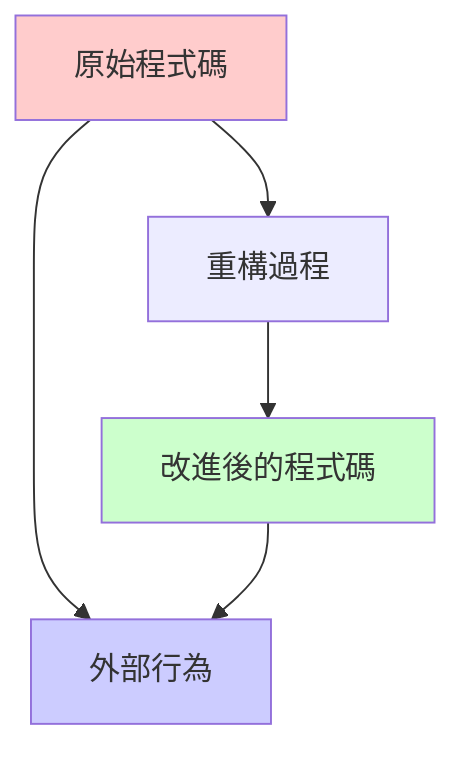

### 1.2 重構的目標

- **提高程式碼可讀性**：讓程式碼更容易理解
- **降低維護成本**：減少未來修改的複雜度
- **提升設計品質**：改善程式架構
- **增強可測試性**：讓程式更容易進行單元測試

### 1.3 重構 vs 重寫

| 項目 | 重構 | 重寫 |
|------|------|------|
| 外部行為 | 保持不變 | 可能改變 |
| 風險 | 低 | 高 |
| 時間 | 較短 | 較長 |
| 測試 | 現有測試繼續有效 | 需要新的測試 |

### 1.4 實務案例

**重構前：**
```java
public class Calculator {
    public double calc(double a, double b, String op) {
        if (op.equals("+")) {
            return a + b;
        } else if (op.equals("-")) {
            return a - b;
        } else if (op.equals("*")) {
            return a * b;
        } else if (op.equals("/")) {
            return a / b;
        }
        return 0;
    }
}
```

**重構後：**
```java
public class Calculator {
    public double add(double a, double b) {
        return a + b;
    }
    
    public double subtract(double a, double b) {
        return a - b;
    }
    
    public double multiply(double a, double b) {
        return a * b;
    }
    
    public double divide(double a, double b) {
        if (b == 0) {
            throw new IllegalArgumentException("除數不能為零");
        }
        return a / b;
    }
}
```

---

## 2. 重構的基本原則

### 2.1 紅燈-綠燈-重構循環

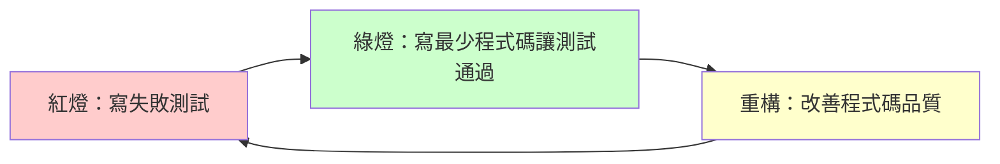

### 2.2 重構的黃金法則

1. **保持功能不變**：外部行為必須完全相同
2. **小步快跑**：每次只做小幅度的改變
3. **頻繁測試**：每次修改後立即執行測試
4. **版本控制**：每次重構後提交程式碼

### 2.3 重構的時機

#### 🟢 適合重構的時機
- **三法則（Rule of Three）**：當同樣的程式碼出現第三次時
- **增加新功能前**：先清理程式碼再添加功能
- **修復錯誤時**：理解程式碼後進行改善
- **程式碼審查時**：發現可改善的地方

#### 🔴 不適合重構的時機
- **接近截止日期**：時間壓力下容易出錯
- **程式碼無法正常運作**：先修復功能再重構
- **沒有測試覆蓋**：缺乏安全網

### 2.4 安全重構的步驟

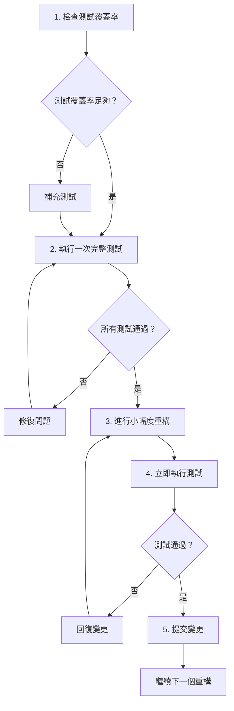

### 2.5 實務注意事項

1. **建立重構檢查點**：重構前先提交一次乾淨的版本
2. **使用 IDE 重構工具**：善用自動重構功能降低出錯機率
3. **團隊溝通**：重構可能影響其他開發者，需要適時溝通
4. **效能監控**：重構後確認效能沒有明顯降低

---

## 3. 識別壞味道（Code Smells）

### 3.1 什麼是程式碼壞味道？

程式碼壞味道是程式中可能存在設計問題的徵兆，雖然程式功能正常，但結構不佳。

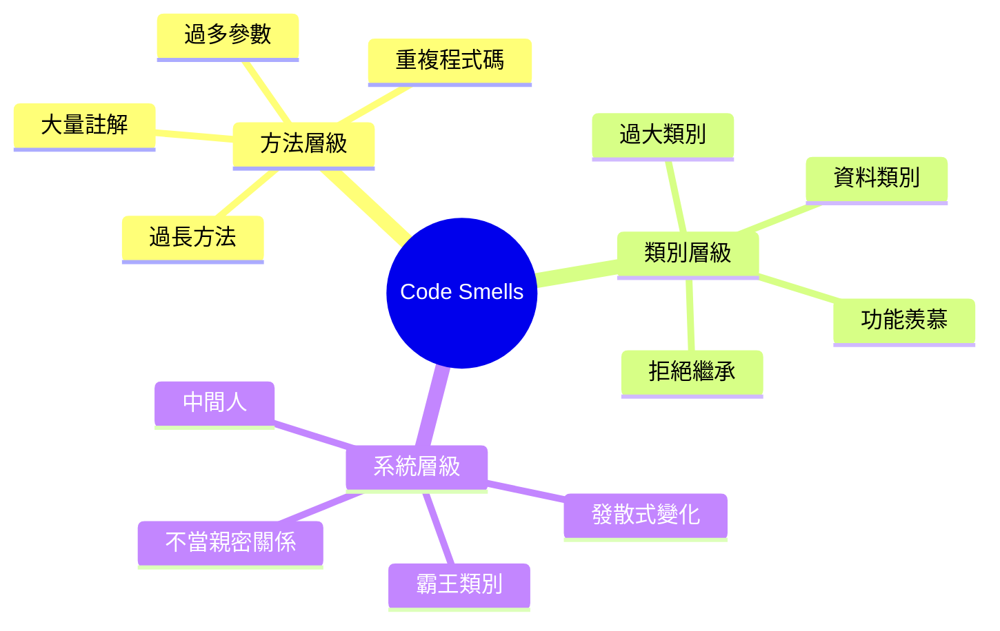

### 3.2 常見的程式碼壞味道

#### 3.2.1 過長方法（Long Method）

**症狀：** 方法超過 20-30 行，難以理解其用途

**範例：**
```java
// 壞味道：過長方法
public void processOrder(Order order) {
    // 驗證訂單 (10 行)
    if (order == null) throw new IllegalArgumentException("訂單不能為空");
    if (order.getItems().isEmpty()) throw new IllegalArgumentException("訂單項目不能為空");
    // ... 更多驗證邏輯
    
    // 計算總價 (15 行)
    double total = 0;
    for (OrderItem item : order.getItems()) {
        double itemPrice = item.getPrice() * item.getQuantity();
        if (item.getDiscount() > 0) {
            itemPrice = itemPrice * (1 - item.getDiscount());
        }
        total += itemPrice;
    }
    // ... 更多計算邏輯
    
    // 更新庫存 (20 行)
    // ... 庫存更新邏輯
    
    // 發送通知 (10 行)
    // ... 通知邏輯
}
```

**重構建議：** 使用 Extract Method

#### 3.2.2 過多參數（Long Parameter List）

**症狀：** 方法參數超過 3-4 個

**範例：**
```java
// 壞味道：過多參數
public void createUser(String firstName, String lastName, String email, 
                      String phone, String address, String city, 
                      String country, int age, boolean isActive) {
    // 實作邏輯
}
```

**重構建議：** 使用 Introduce Parameter Object

#### 3.2.3 重複程式碼（Duplicated Code）

**症狀：** 相同或相似的程式碼出現在多個地方

**範例：**
```java
// 壞味道：重複程式碼
public double calculateSalary(Employee employee) {
    double baseSalary = employee.getBaseSalary();
    double bonus = baseSalary * 0.1;
    double tax = (baseSalary + bonus) * 0.2;
    return baseSalary + bonus - tax;
}

public double calculatePension(Employee employee) {
    double baseSalary = employee.getBaseSalary();
    double bonus = baseSalary * 0.1;
    double totalIncome = baseSalary + bonus;
    return totalIncome * 0.05;
}
```

**重構建議：** 提取公用方法

#### 3.2.4 過大類別（Large Class）

**症狀：** 類別行數過多（通常超過 200-300 行）或負責太多職責

**檢測方法：**
```java
// 壞味道：過大類別
public class UserManager {
    // 使用者 CRUD 操作
    public void createUser() { /* ... */ }
    public void updateUser() { /* ... */ }
    public void deleteUser() { /* ... */ }
    
    // 使用者驗證
    public boolean validateEmail() { /* ... */ }
    public boolean validatePassword() { /* ... */ }
    
    // 郵件發送
    public void sendWelcomeEmail() { /* ... */ }
    public void sendResetPasswordEmail() { /* ... */ }
    
    // 報表生成
    public void generateUserReport() { /* ... */ }
    public void exportUserData() { /* ... */ }
    
    // ... 更多不相關的方法
}
```

**重構建議：** 使用 Extract Class

#### 3.2.5 壞味道的量化指標

為了更客觀地評估程式碼品質，可以使用以下量化指標：

**方法複雜度指標：**

| 指標 | 良好 | 可接受 | 需要重構 |
|------|------|--------|---------|
| 方法行數 | ≤ 20 | 21-50 | > 50 |
| 參數個數 | ≤ 3 | 4-5 | > 5 |
| 巢狀深度 | ≤ 3 | 4 | > 4 |
| 循環複雜度 | ≤ 10 | 11-20 | > 20 |

**類別複雜度指標：**

| 指標 | 良好 | 可接受 | 需要重構 |
|------|------|--------|---------|
| 類別行數 | ≤ 200 | 201-500 | > 500 |
| 方法個數 | ≤ 20 | 21-30 | > 30 |
| 欄位個數 | ≤ 10 | 11-15 | > 15 |
| 內聚度 | > 0.7 | 0.5-0.7 | < 0.5 |

**程式碼重複指標：**

```java
// 使用工具檢測重複程式碼
// PMD 配置範例
<rule ref="category/java/design.xml/CyclomaticComplexity">
    <properties>
        <property name="classReportLevel" value="80"/>
        <property name="methodReportLevel" value="10"/>
    </properties>
</rule>
```

### 3.3 壞味道識別工具

#### 3.3.1 靜態分析工具
- **SonarQube**：程式碼品質分析
- **Checkstyle**：Java 程式碼風格檢查
- **PMD**：程式碼缺陷檢測

#### 3.3.2 IDE 內建工具
- **IntelliJ IDEA**：程式碼檢查功能
- **Eclipse**：PMD、Checkstyle 插件
- **VS Code**：SonarLint 擴展

### 3.4 實務練習

請檢視以下程式碼，識別其中的壞味道：

```java
public class OrderProcessor {
    public String processOrder(String customerName, String customerEmail, 
                              String customerPhone, String customerAddress,
                              String productName, double productPrice, 
                              int quantity, String discountCode) {
        
        // 驗證客戶資訊
        if (customerName == null || customerName.trim().isEmpty()) {
            return "錯誤：客戶姓名不能為空";
        }
        if (customerEmail == null || !customerEmail.contains("@")) {
            return "錯誤：電子郵件格式不正確";
        }
        
        // 計算總價
        double total = productPrice * quantity;
        if (discountCode != null) {
            if (discountCode.equals("SAVE10")) {
                total = total * 0.9;
            } else if (discountCode.equals("SAVE20")) {
                total = total * 0.8;
            }
        }
        
        // 發送確認郵件
        String emailContent = "親愛的 " + customerName + "，您的訂單已確認...";
        // ... 郵件發送邏輯
        
        return "訂單處理成功，總金額：" + total;
    }
}
```

**識別到的壞味道：**
1. 過多參數（8個參數）
2. 過長方法（包含多種職責）
3. 字串型別的回傳值處理錯誤訊息
4. 硬編碼的折扣邏輯

---

## 4. 常見重構方法

### 4.1 方法層級重構

#### 4.1.1 Extract Method（提取方法）

**用途：** 將長方法拆分成多個小方法

**重構前：**

```java
public void printOwing() {
    printBanner();
    
    // 計算未付金額
    double outstanding = 0.0;
    for (Order order : orders) {
        outstanding += order.getAmount();
    }
    
    // 印出詳細資訊
    System.out.println("客戶名稱：" + name);
    System.out.println("未付金額：" + outstanding);
}
```

**重構後：**

```java
public void printOwing() {
    printBanner();
    double outstanding = calculateOutstanding();
    printDetails(outstanding);
}

private double calculateOutstanding() {
    double outstanding = 0.0;
    for (Order order : orders) {
        outstanding += order.getAmount();
    }
    return outstanding;
}

private void printDetails(double outstanding) {
    System.out.println("客戶名稱：" + name);
    System.out.println("未付金額：" + outstanding);
}
```

#### 4.1.2 Rename Variable（重新命名變數）

**用途：** 使變數名稱更具表達性

**重構前：**

```java
public double calculateTotal(List<Item> items) {
    double t = 0;
    for (Item i : items) {
        double p = i.getPrice();
        double q = i.getQuantity();
        double d = i.getDiscount();
        t += p * q * (1 - d);
    }
    return t;
}
```

**重構後：**

```java
public double calculateTotal(List<Item> items) {
    double totalAmount = 0;
    for (Item item : items) {
        double price = item.getPrice();
        double quantity = item.getQuantity();
        double discount = item.getDiscount();
        totalAmount += price * quantity * (1 - discount);
    }
    return totalAmount;
}
```

#### 4.1.3 Introduce Parameter Object（引入參數物件）

**用途：** 將多個參數組合成一個物件

**重構前：**

```java
public void createUser(String firstName, String lastName, String email, 
                      String phone, String address, int age) {
    // 建立使用者邏輯
}
```

**重構後：**

```java
public class UserInfo {
    private final String firstName;
    private final String lastName;
    private final String email;
    private final String phone;
    private final String address;
    private final int age;
    
    public UserInfo(String firstName, String lastName, String email, 
                   String phone, String address, int age) {
        this.firstName = firstName;
        this.lastName = lastName;
        this.email = email;
        this.phone = phone;
        this.address = address;
        this.age = age;
    }
    
    // getters...
}

public void createUser(UserInfo userInfo) {
    // 建立使用者邏輯
}
```

#### 4.1.4 Replace Method with Method Object（以方法物件取代方法）

**用途：** 當方法有很多局部變數，難以進行 Extract Method 時

**重構前：**

```java
public class OrderCalculator {
    public double calculateTotal(Order order) {
        double basePrice = order.getQuantity() * order.getItemPrice();
        double discountFactor = Math.max(0, order.getQuantity() - 500) * order.getItemPrice() * 0.05;
        double discountLevel2 = Math.min(discountFactor, order.getItemPrice() * 100);
        double shipping;
        
        if (basePrice > 1000) {
            shipping = 0;
        } else {
            shipping = basePrice * 0.1;
        }
        
        return basePrice - discountLevel2 + shipping;
    }
}
```

**重構後：**

```java
public class OrderCalculator {
    public double calculateTotal(Order order) {
        return new OrderTotalCalculation(order).calculate();
    }
}

class OrderTotalCalculation {
    private final Order order;
    private double basePrice;
    private double discountFactor;
    private double discountLevel2;
    private double shipping;
    
    public OrderTotalCalculation(Order order) {
        this.order = order;
    }
    
    public double calculate() {
        calculateBasePrice();
        calculateDiscount();
        calculateShipping();
        return basePrice - discountLevel2 + shipping;
    }
    
    private void calculateBasePrice() {
        basePrice = order.getQuantity() * order.getItemPrice();
    }
    
    private void calculateDiscount() {
        discountFactor = Math.max(0, order.getQuantity() - 500) * order.getItemPrice() * 0.05;
        discountLevel2 = Math.min(discountFactor, order.getItemPrice() * 100);
    }
    
    private void calculateShipping() {
        if (basePrice > 1000) {
            shipping = 0;
        } else {
            shipping = basePrice * 0.1;
        }
    }
}
```

### 4.2 類別層級重構

#### 4.2.1 Extract Class（提取類別）

**用途：** 將一個類別分解成兩個類別

**重構前：**

```java
public class Person {
    private String name;
    private String telephoneNumber;
    private String areaCode;
    
    public String getName() { return name; }
    public String getTelephoneNumber() { return telephoneNumber; }
    public String getAreaCode() { return areaCode; }
    
    public void setName(String name) { this.name = name; }
    public void setTelephoneNumber(String telephoneNumber) { 
        this.telephoneNumber = telephoneNumber; 
    }
    public void setAreaCode(String areaCode) { this.areaCode = areaCode; }
}
```

**重構後：**

```java
public class Person {
    private String name;
    private TelephoneNumber telephoneNumber;
    
    public String getName() { return name; }
    public TelephoneNumber getTelephoneNumber() { return telephoneNumber; }
    
    public void setName(String name) { this.name = name; }
    public void setTelephoneNumber(TelephoneNumber telephoneNumber) { 
        this.telephoneNumber = telephoneNumber; 
    }
}

public class TelephoneNumber {
    private String number;
    private String areaCode;
    
    public String getNumber() { return number; }
    public String getAreaCode() { return areaCode; }
    
    public void setNumber(String number) { this.number = number; }
    public void setAreaCode(String areaCode) { this.areaCode = areaCode; }
    
    public String getFullNumber() {
        return "(" + areaCode + ") " + number;
    }
}
```

#### 4.2.2 Move Method（搬移方法）

**用途：** 將方法移動到更適合的類別

**重構前：**

```java
public class Account {
    private AccountType type;
    private int daysOverdrawn;
    
    public double overdraftCharge() {
        if (type.isPremium()) {
            double result = 10;
            if (daysOverdrawn > 7) {
                result += (daysOverdrawn - 7) * 0.85;
            }
            return result;
        } else {
            return daysOverdrawn * 1.75;
        }
    }
}
```

**重構後：**

```java
public class Account {
    private AccountType type;
    private int daysOverdrawn;
    
    public double overdraftCharge() {
        return type.overdraftCharge(daysOverdrawn);
    }
}

public class AccountType {
    public double overdraftCharge(int daysOverdrawn) {
        if (isPremium()) {
            double result = 10;
            if (daysOverdrawn > 7) {
                result += (daysOverdrawn - 7) * 0.85;
            }
            return result;
        } else {
            return daysOverdrawn * 1.75;
        }
    }
    
    public boolean isPremium() {
        // 實作邏輯
    }
}
```

### 4.3 條件邏輯重構

#### 4.3.1 Replace Conditional with Polymorphism（以多型取代條件式）

**重構前：**

```java
public class Bird {
    private BirdType type;
    
    public double getSpeed() {
        switch (type) {
            case EUROPEAN_SWALLOW:
                return getBaseSpeed();
            case AFRICAN_SWALLOW:
                return getBaseSpeed() - getLoadFactor() * numberOfCoconuts;
            case NORWEGIAN_BLUE_PARROT:
                return isNailed() ? 0 : getBaseSpeed(voltage);
        }
        throw new RuntimeException("未知的鳥類");
    }
}
```

**重構後：**

```java
public abstract class Bird {
    public abstract double getSpeed();
}

public class EuropeanSwallow extends Bird {
    @Override
    public double getSpeed() {
        return getBaseSpeed();
    }
}

public class AfricanSwallow extends Bird {
    private int numberOfCoconuts;
    
    @Override
    public double getSpeed() {
        return getBaseSpeed() - getLoadFactor() * numberOfCoconuts;
    }
}

public class NorwegianBlueParrot extends Bird {
    private boolean nailed;
    private double voltage;
    
    @Override
    public double getSpeed() {
        return nailed ? 0 : getBaseSpeed(voltage);
    }
}
```

### 4.4 重構方法選擇流程

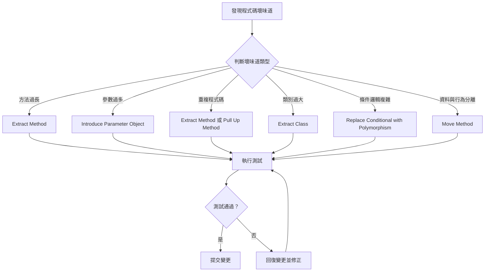

#### 4.4.1 重構決策樹

當遇到程式碼壞味道時，可以按照以下決策樹選擇合適的重構方法：

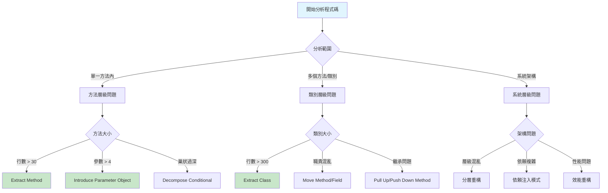

#### 4.4.2 重構優先順序指南

**高優先級（立即處理）：**
- 安全性問題相關的程式碼壞味道
- 影響系統穩定性的複雜條件邏輯
- 關鍵業務流程中的重複程式碼

**中優先級（計劃處理）：**
- 影響開發效率的過長方法
- 難以測試的緊耦合類別
- 命名不清晰的變數和方法

**低優先級（有時間再處理）：**
- 註解過多但功能正常的程式碼
- 風格不一致但邏輯清晰的程式碼
- 效能可接受的次優化實作

### 4.5 實務練習

請嘗試重構以下程式碼：

```java
public class OrderService {
    public String processOrder(String customerType, double orderAmount, 
                              int loyaltyPoints, boolean hasPromoCode) {
        double discount = 0;
        double finalAmount = orderAmount;
        
        // 計算折扣
        if (customerType.equals("VIP")) {
            discount = 0.2;
        } else if (customerType.equals("Premium")) {
            discount = 0.15;
        } else if (customerType.equals("Regular")) {
            discount = 0.1;
        }
        
        // 忠誠點數額外折扣
        if (loyaltyPoints > 1000) {
            discount += 0.05;
        }
        
        // 促銷代碼額外折扣
        if (hasPromoCode) {
            discount += 0.1;
        }
        
        finalAmount = orderAmount * (1 - discount);
        
        // 發送通知郵件
        String message = "您的訂單已處理完成";
        if (customerType.equals("VIP")) {
            message = "尊敬的 VIP 客戶，您的訂單已優先處理完成";
        }
        
        return "訂單處理成功，最終金額：" + finalAmount + "，通知訊息：" + message;
    }
}
```

**建議的重構步驟：**

1. 提取折扣計算邏輯
2. 使用枚舉取代字串常數
3. 引入參數物件
4. 提取通知訊息生成邏輯

---

## 5. 重構與測試的關聯

### 5.1 重構的安全網：單元測試

重構的核心在於**保持外部行為不變**，而單元測試就是確保這一點的安全網。

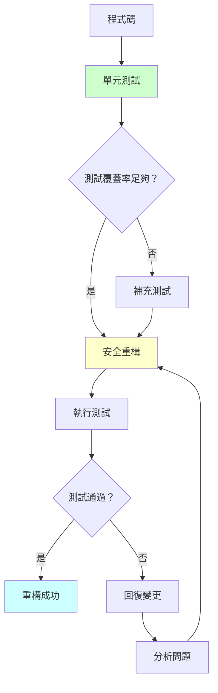

### 5.2 測試先行的重構策略

#### 5.2.1 現有程式碼的測試補強

當面對沒有測試的舊程式碼時：

**步驟 1：特性測試（Characterization Tests）**

```java
// 原始程式碼（沒有測試）
public class LegacyOrderCalculator {
    public double calculateTotal(List<Item> items, String customerType) {
        double total = 0;
        for (Item item : items) {
            total += item.getPrice() * item.getQuantity();
        }
        
        // 複雜的折扣邏輯
        if (customerType.equals("VIP")) {
            total = total * 0.8;
        } else if (customerType.equals("Premium")) {
            total = total * 0.9;
        }
        
        return total;
    }
}
```

**步驟 2：建立特性測試**

```java
@Test
public class LegacyOrderCalculatorTest {
    private LegacyOrderCalculator calculator = new LegacyOrderCalculator();
    
    @Test
    public void testVipCustomerDiscount() {
        // 準備測試資料
        List<Item> items = Arrays.asList(
            new Item("產品A", 100.0, 2),
            new Item("產品B", 50.0, 1)
        );
        
        // 執行並驗證現有行為
        double result = calculator.calculateTotal(items, "VIP");
        assertEquals(200.0, result, 0.01); // (100*2 + 50*1) * 0.8 = 200
    }
    
    @Test
    public void testPremiumCustomerDiscount() {
        List<Item> items = Arrays.asList(
            new Item("產品A", 100.0, 1)
        );
        
        double result = calculator.calculateTotal(items, "Premium");
        assertEquals(90.0, result, 0.01); // 100 * 0.9 = 90
    }
    
    @Test
    public void testRegularCustomerNoDiscount() {
        List<Item> items = Arrays.asList(
            new Item("產品A", 100.0, 1)
        );
        
        double result = calculator.calculateTotal(items, "Regular");
        assertEquals(100.0, result, 0.01); // 100 * 1 = 100
    }
}
```

#### 5.2.2 重構過程中的測試策略

**重構前：執行完整測試**

```bash
# Maven 專案
mvn test

# 確保所有測試通過
[INFO] Tests run: 15, Failures: 0, Errors: 0, Skipped: 0
```

**重構中：頻繁執行測試**

```java
// 重構步驟 1：提取方法
public double calculateTotal(List<Item> items, String customerType) {
    double subtotal = calculateSubtotal(items);
    double discount = calculateDiscount(customerType);
    return subtotal * (1 - discount);
}

private double calculateSubtotal(List<Item> items) {
    double total = 0;
    for (Item item : items) {
        total += item.getPrice() * item.getQuantity();
    }
    return total;
}

// 立即執行測試
// mvn test -Dtest=LegacyOrderCalculatorTest
```

### 5.3 TDD 與重構的結合

#### 5.3.1 紅燈-綠燈-重構循環詳解

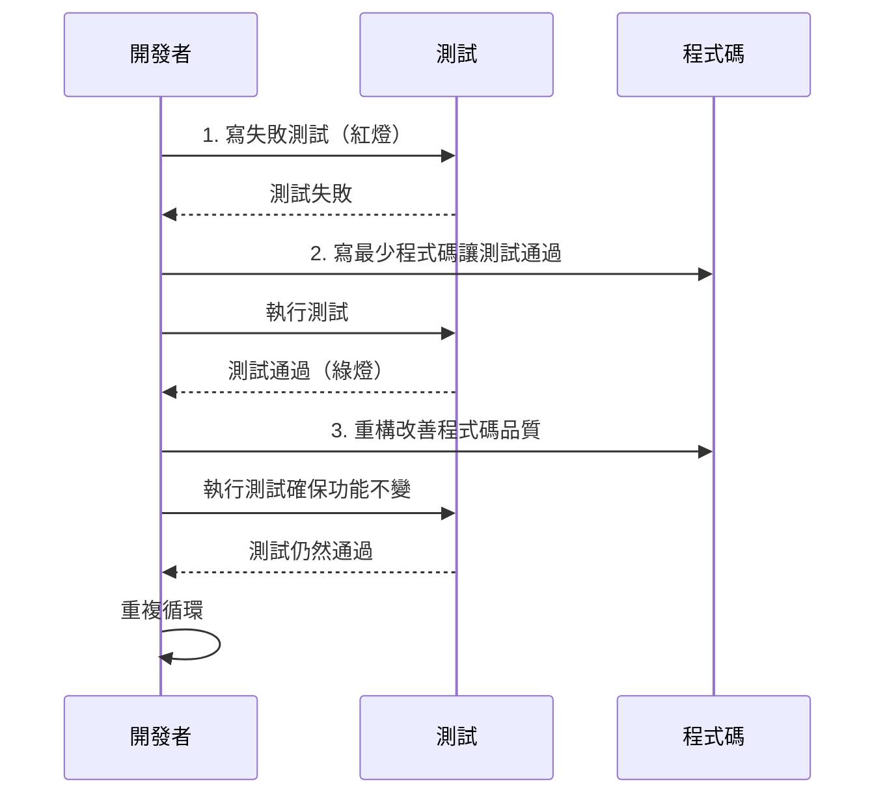

#### 5.3.2 實際 TDD 重構範例

**需求：** 建立一個計算機類別，支援加減乘除運算

**第一個循環：加法**

```java
// 1. 紅燈：寫失敗測試
@Test
public void testAddition() {
    Calculator calc = new Calculator();
    assertEquals(5, calc.add(2, 3));
}

// 2. 綠燈：最少程式碼
public class Calculator {
    public int add(int a, int b) {
        return 5; // 硬編碼讓測試通過
    }
}

// 3. 重構：改善實作
public class Calculator {
    public int add(int a, int b) {
        return a + b;
    }
}
```

**第二個循環：減法**

```java
// 1. 紅燈：新測試
@Test
public void testSubtraction() {
    Calculator calc = new Calculator();
    assertEquals(1, calc.subtract(3, 2));
}

// 2. 綠燈：添加功能
public class Calculator {
    public int add(int a, int b) {
        return a + b;
    }
    
    public int subtract(int a, int b) {
        return a - b;
    }
}

// 3. 重構：沒有明顯的重構需求，繼續下個循環
```

### 5.4 重構時的測試最佳實務

#### 5.4.1 測試覆蓋率要求

```java
// 使用 JaCoCo 檢查測試覆蓋率
// pom.xml 配置
<plugin>
    <groupId>org.jacoco</groupId>
    <artifactId>jacoco-maven-plugin</artifactId>
    <version>0.8.7</version>
    <executions>
        <execution>
            <goals>
                <goal>prepare-agent</goal>
            </goals>
        </execution>
        <execution>
            <id>report</id>
            <phase>test</phase>
            <goals>
                <goal>report</goal>
            </goals>
        </execution>
    </executions>
</plugin>
```

**覆蓋率目標：**
- **行覆蓋率**：至少 80%
- **分支覆蓋率**：至少 70%
- **方法覆蓋率**：至少 90%

#### 5.4.2 重構友善的測試設計

**❌ 脆弱的測試（容易因重構而失敗）**

```java
@Test
public void testOrderProcessingInternalDetails() {
    Order order = new Order();
    order.addItem(new Item("產品A", 100));
    
    // 測試內部實作細節
    assertEquals(1, order.getItems().size());
    assertEquals("產品A", order.getItems().get(0).getName());
    assertEquals(100.0, order.getItems().get(0).getPrice());
}
```

**✅ 穩健的測試（專注於行為而非實作）**

```java
@Test
public void testOrderTotalCalculation() {
    Order order = new Order();
    order.addItem(new Item("產品A", 100));
    order.addItem(new Item("產品B", 50));
    
    // 測試外部行為
    assertEquals(150.0, order.getTotal());
}
```

#### 5.4.3 測試替身在重構中的應用

```java
public class OrderService {
    private PaymentGateway paymentGateway;
    private EmailService emailService;
    
    public OrderResult processOrder(Order order) {
        // 處理付款
        PaymentResult payment = paymentGateway.processPayment(order.getTotal());
        
        if (payment.isSuccessful()) {
            // 發送確認郵件
            emailService.sendConfirmation(order.getCustomerEmail());
            return OrderResult.success(order.getId());
        } else {
            return OrderResult.failure("付款失敗");
        }
    }
}

@Test
public void testSuccessfulOrderProcessing() {
    // 使用 Mock 物件
    PaymentGateway mockPayment = mock(PaymentGateway.class);
    EmailService mockEmail = mock(EmailService.class);
    
    when(mockPayment.processPayment(100.0))
        .thenReturn(PaymentResult.successful());
    
    OrderService service = new OrderService(mockPayment, mockEmail);
    Order order = new Order("customer@example.com", 100.0);
    
    OrderResult result = service.processOrder(order);
    
    assertTrue(result.isSuccessful());
    verify(mockEmail).sendConfirmation("customer@example.com");
}
```

### 5.5 重構測試檢查清單

在進行重構前，請確認：

- [ ] 現有測試覆蓋率足夠（至少 80%）
- [ ] 所有測試都能通過
- [ ] 測試專注於行為而非實作細節
- [ ] 有適當的測試替身處理外部依賴
- [ ] 準備了回歸測試來驗證重構結果

在重構過程中：

- [ ] 每次小幅修改後立即執行測試
- [ ] 測試失敗時立即停止並修正
- [ ] 保持測試的綠燈狀態
- [ ] 定期檢查測試覆蓋率

---

## 6. 實務應用策略

### 6.1 重構時機的判斷

#### 6.1.1 主動重構 vs 被動重構

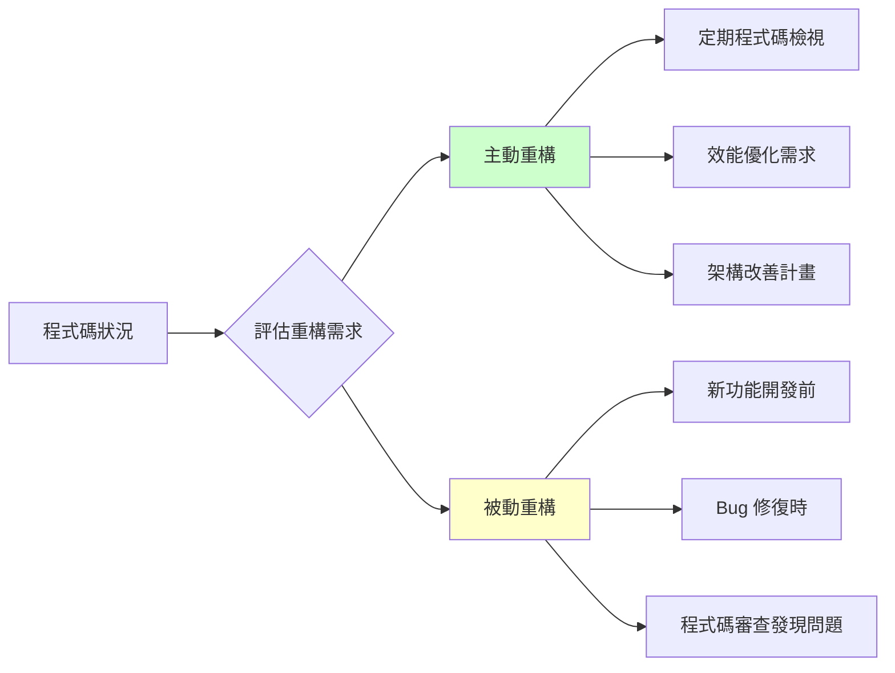

#### 6.1.2 重構優先順序矩陣

| 影響範圍 / 複雜度 | 低複雜度 | 中複雜度 | 高複雜度 |
|------------------|---------|---------|---------|
| **高影響** | 🟢 立即執行 | 🟡 規劃執行 | 🔴 謹慎評估 |
| **中影響** | 🟢 適時執行 | 🟡 排程執行 | 🟡 分階段執行 |
| **低影響** | 🟢 有空時執行 | ⚪ 可考慮延後 | ⚪ 非必要 |

#### 6.1.3 重構效益評估

**成本考量：**
- 開發時間投入
- 測試驗證成本
- 程式碼審查時間
- 潛在風險成本

**效益評估：**
- 維護成本降低
- 開發效率提升
- Bug 減少
- 新功能開發加速

```java
// 範例：重構效益計算
public class RefactoringBenefitCalculator {
    
    public RefactoringDecision evaluateRefactoring(CodeMetrics metrics) {
        double complexityScore = calculateComplexityScore(metrics);
        double maintainabilityScore = calculateMaintainabilityScore(metrics);
        double riskScore = calculateRiskScore(metrics);
        
        double benefitScore = (complexityScore + maintainabilityScore) / 2;
        double costScore = riskScore;
        
        if (benefitScore > costScore * 1.5) {
            return RefactoringDecision.PROCEED;
        } else if (benefitScore > costScore) {
            return RefactoringDecision.CONSIDER;
        } else {
            return RefactoringDecision.POSTPONE;
        }
    }
}
```

### 6.2 團隊重構策略

#### 6.2.1 重構責任分配

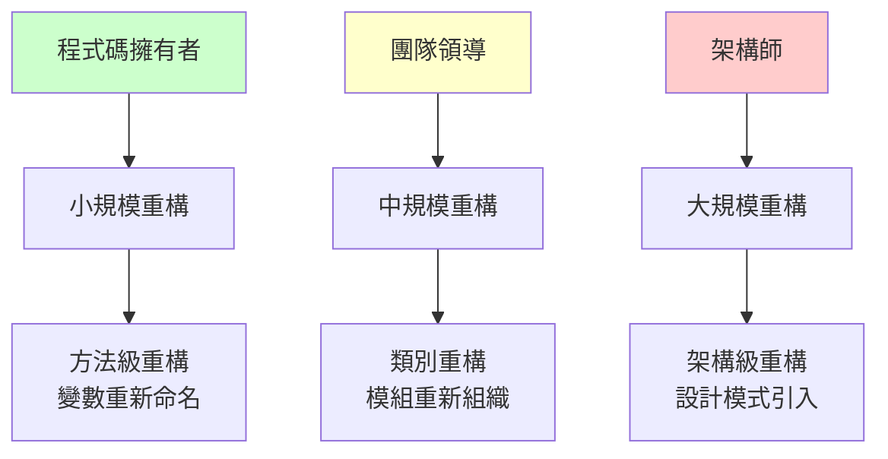

#### 6.2.2 協作重構流程

**第一階段：準備**
1. 建立重構分支
2. 確保測試覆蓋率
3. 建立回滾計畫

**第二階段：執行**
1. 小步重構
2. 頻繁提交
3. 持續整合

**第三階段：整合**
1. 程式碼審查
2. 效能測試
3. 合併主分支

### 6.3 大型專案重構策略

#### 6.3.1 漸進式重構（Strangler Fig Pattern）

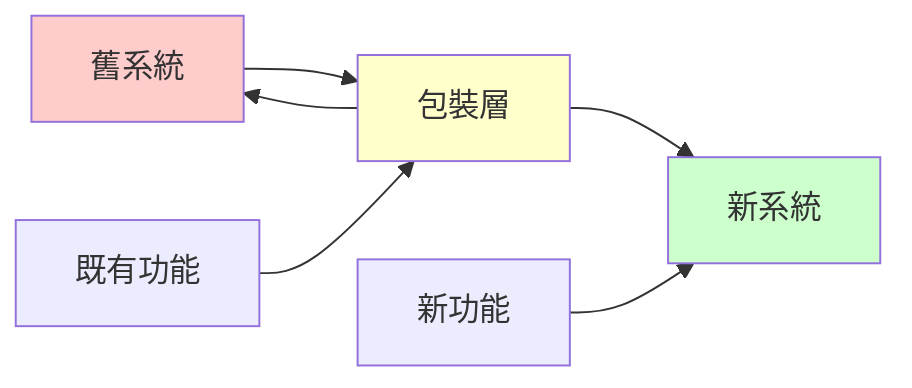

**實作步驟：**

```java
// 步驟 1：建立介面包裝舊系統
public interface OrderService {
    OrderResult processOrder(OrderRequest request);
}

public class LegacyOrderServiceWrapper implements OrderService {
    private LegacyOrderSystem legacySystem;
    
    @Override
    public OrderResult processOrder(OrderRequest request) {
        // 轉換請求格式
        LegacyOrderRequest legacyRequest = convertToLegacyFormat(request);
        
        // 呼叫舊系統
        LegacyOrderResponse legacyResponse = legacySystem.process(legacyRequest);
        
        // 轉換回應格式
        return convertToNewFormat(legacyResponse);
    }
}

// 步驟 2：逐步替換為新實作
public class NewOrderService implements OrderService {
    @Override
    public OrderResult processOrder(OrderRequest request) {
        // 新的實作邏輯
        return processWithNewLogic(request);
    }
}

// 步驟 3：使用 Feature Toggle 控制切換
public class OrderServiceFactory {
    @Value("${feature.new-order-service.enabled:false}")
    private boolean useNewService;
    
    public OrderService createOrderService() {
        if (useNewService) {
            return new NewOrderService();
        } else {
            return new LegacyOrderServiceWrapper();
        }
    }
}
```

#### 6.3.2 分支抽象（Branch by Abstraction）

```java
// 步驟 1：建立抽象層
public abstract class PaymentProcessor {
    public abstract PaymentResult process(PaymentRequest request);
}

// 步驟 2：包裝現有實作
public class OldPaymentProcessor extends PaymentProcessor {
    @Override
    public PaymentResult process(PaymentRequest request) {
        // 現有的付款處理邏輯
        return legacyPaymentSystem.processPayment(request);
    }
}

// 步驟 3：建立新實作
public class NewPaymentProcessor extends PaymentProcessor {
    @Override
    public PaymentResult process(PaymentRequest request) {
        // 新的付款處理邏輯
        return newPaymentGateway.processPayment(request);
    }
}

// 步驟 4：逐步切換
public class PaymentService {
    private PaymentProcessor processor;
    
    public PaymentService(@Qualifier("paymentProcessor") PaymentProcessor processor) {
        this.processor = processor;
    }
    
    public PaymentResult processPayment(PaymentRequest request) {
        return processor.process(request);
    }
}
```

### 6.4 效能考量

#### 6.4.1 重構對效能的影響監控

```java
@Component
public class PerformanceMonitor {
    
    @Around("@annotation(Monitored)")
    public Object monitorPerformance(ProceedingJoinPoint joinPoint) throws Throwable {
        long startTime = System.nanoTime();
        
        try {
            Object result = joinPoint.proceed();
            long endTime = System.nanoTime();
            
            logPerformance(joinPoint.getSignature().getName(), 
                          endTime - startTime, "SUCCESS");
            
            return result;
        } catch (Exception e) {
            long endTime = System.nanoTime();
            logPerformance(joinPoint.getSignature().getName(), 
                          endTime - startTime, "ERROR");
            throw e;
        }
    }
    
    private void logPerformance(String methodName, long duration, String status) {
        logger.info("Method: {}, Duration: {}ns, Status: {}", 
                   methodName, duration, status);
        
        // 發送監控指標到監控系統
        metricsCollector.recordMethodDuration(methodName, duration);
    }
}
```

#### 6.4.2 效能基準測試

```java
@BenchmarkMode(Mode.AverageTime)
@OutputTimeUnit(TimeUnit.MICROSECONDS)
@State(Scope.Benchmark)
public class OrderProcessingBenchmark {
    
    private OrderService oldOrderService;
    private OrderService newOrderService;
    private OrderRequest testRequest;
    
    @Setup
    public void setup() {
        oldOrderService = new OldOrderService();
        newOrderService = new NewOrderService();
        testRequest = createTestOrderRequest();
    }
    
    @Benchmark
    public OrderResult benchmarkOldService() {
        return oldOrderService.processOrder(testRequest);
    }
    
    @Benchmark
    public OrderResult benchmarkNewService() {
        return newOrderService.processOrder(testRequest);
    }
}
```

#### 6.4.3 重構工具選擇與配置

**IDE 內建重構工具比較：**

| 功能 | IntelliJ IDEA | Eclipse | VS Code |
|------|---------------|---------|---------|
| 自動重新命名 | ✅ 優秀 | ✅ 良好 | ✅ 良好 |
| Extract Method | ✅ 優秀 | ✅ 良好 | ✅ 基本 |
| Move Class/Method | ✅ 優秀 | ✅ 良好 | ❌ 限制 |
| Inline 重構 | ✅ 優秀 | ✅ 良好 | ❌ 無 |
| 安全刪除 | ✅ 優秀 | ✅ 良好 | ❌ 無 |
| 重構預覽 | ✅ 優秀 | ✅ 良好 | ⚠️ 基本 |

**自動化重構檢查工具：**

```xml
<!-- Maven 配置：SonarQube + Checkstyle + PMD -->
<plugin>
    <groupId>org.sonarsource.scanner.maven</groupId>
    <artifactId>sonar-maven-plugin</artifactId>
    <version>3.9.1.2184</version>
</plugin>

<plugin>
    <groupId>org.apache.maven.plugins</groupId>
    <artifactId>maven-checkstyle-plugin</artifactId>
    <version>3.1.2</version>
    <configuration>
        <configLocation>checkstyle.xml</configLocation>
        <failOnViolation>true</failOnViolation>
        <violationSeverity>warning</violationSeverity>
    </configuration>
</plugin>

<plugin>
    <groupId>org.apache.maven.plugins</groupId>
    <artifactId>maven-pmd-plugin</artifactId>
    <version>3.15.0</version>
    <configuration>
        <targetJdk>11</targetJdk>
        <rulesets>
            <ruleset>/rulesets/java/quickstart.xml</ruleset>
        </rulesets>
    </configuration>
</plugin>
```

### 6.5 重構實務指引

**重構前的準備檢查清單：**

- [ ] 確認業務需求穩定
- [ ] 評估重構風險與效益
- [ ] 準備充足的測試覆蓋
- [ ] 規劃重構範圍與步驟
- [ ] 設定效能基準線
- [ ] 準備回滾計畫

**重構執行要點：**

- [ ] 遵循小步快跑原則
- [ ] 保持測試綠燈狀態
- [ ] 頻繁提交程式碼
- [ ] 監控系統效能
- [ ] 及時溝通進度

**重構後的驗證：**

- [ ] 功能完整性測試
- [ ] 效能回歸測試
- [ ] 安全性檢查
- [ ] 使用者體驗驗證
- [ ] 文件更新

---

## 7. 團隊規範與最佳實務

### 7.1 團隊重構約定

#### 7.1.1 重構權限與責任

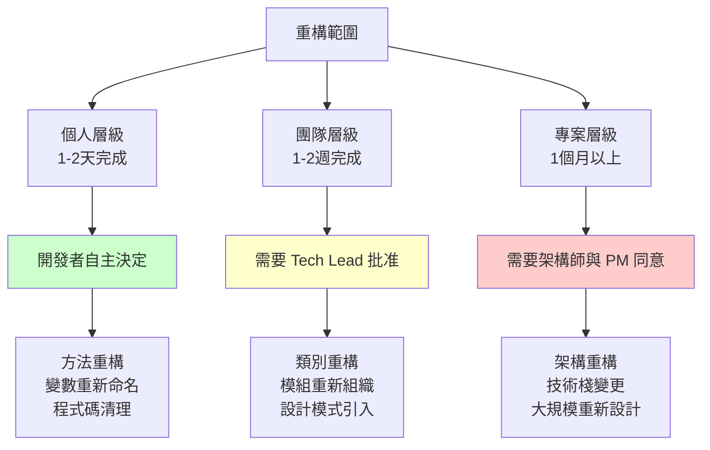

#### 7.1.2 重構決策矩陣

| 重構類型 | 複雜度 | 影響範圍 | 決策者 | 審查要求 |
|---------|--------|---------|--------|---------|
| 方法內重構 | 低 | 單一方法 | 開發者 | 自我審查 |
| 類別重構 | 中 | 單一類別 | 開發者 | Pair Review |
| 模組重構 | 中-高 | 多個類別 | Tech Lead | Team Review |
| 架構重構 | 高 | 整個系統 | 架構師 | Architecture Review |

### 7.2 程式碼審查中的重構指引

#### 7.2.1 審查檢查清單

**功能性檢查：**

- [ ] 外部行為是否保持不變
- [ ] 所有測試是否通過
- [ ] 是否新增了必要的測試
- [ ] 是否有遺漏的邊界情況

**品質檢查：**

- [ ] 程式碼可讀性是否提升
- [ ] 是否遵循 SOLID 原則
- [ ] 是否消除了重複程式碼
- [ ] 方法和類別的職責是否單一

**效能檢查：**

- [ ] 是否引入效能瓶頸
- [ ] 記憶體使用是否合理
- [ ] 資料庫查詢是否優化
- [ ] 快取策略是否適當

#### 7.2.2 審查意見範例

**✅ 建設性的審查意見：**

```
// 建議重構建議
這個方法有點長（45行），建議考慮提取以下邏輯：
1. 資料驗證邏輯 (line 10-20)
2. 業務計算邏輯 (line 25-35)
3. 結果封裝邏輯 (line 40-45)

這樣可以提高可讀性和可測試性。
```

**❌ 非建設性的審查意見：**

```
// 不好的審查意見
這個程式碼很亂，需要重寫。
```

### 7.3 重構標準與約定

#### 7.3.1 命名規範

**類別命名：**

```java
// ✅ 良好的類別命名
public class OrderCalculator { }
public class UserValidator { }
public class PaymentGateway { }

// ❌ 不佳的類別命名
public class OrderUtils { }        // 太籠統
public class DataProcessor { }     // 職責不明確
public class Manager { }           // 沒有意義
```

**方法命名：**

```java
// ✅ 良好的方法命名
public void calculateTotalAmount() { }
public boolean isValidEmail(String email) { }
public List<Order> findOrdersByCustomerId(Long customerId) { }

// ❌ 不佳的方法命名
public void calc() { }             // 太簡短
public boolean check(String s) { } // 不明確
public void doStuff() { }          // 無意義
```

#### 7.3.2 程式碼組織約定

**包結構規範：**

```
com.company.project
├── config/          # 配置相關
├── controller/      # 控制器層
├── service/         # 業務服務層
│   ├── impl/       # 服務實作
│   └── dto/        # 資料傳輸物件
├── repository/      # 資料存取層
├── domain/          # 領域模型
│   ├── entity/     # 實體類別
│   ├── valueobject/ # 值物件
│   └── aggregate/   # 聚合根
└── util/           # 工具類別
```

**類別職責劃分：**

```java
// ✅ 單一職責的服務類別
@Service
public class OrderService {
    // 只負責訂單相關的業務邏輯
    public OrderResult processOrder(OrderRequest request) { }
    public void cancelOrder(Long orderId) { }
    public OrderStatus getOrderStatus(Long orderId) { }
}

@Service
public class PaymentService {
    // 只負責付款相關的業務邏輯
    public PaymentResult processPayment(PaymentRequest request) { }
    public void refundPayment(Long paymentId) { }
}

// ❌ 違反單一職責的類別
@Service
public class OrderManagerService {
    // 混合了多種職責
    public OrderResult processOrder(OrderRequest request) { }
    public PaymentResult processPayment(PaymentRequest request) { }
    public void sendEmail(String to, String content) { }
    public void generateReport() { }
}
```

### 7.4 持續重構的團隊文化

#### 7.4.1 重構意識培養

**定期技術分享：**

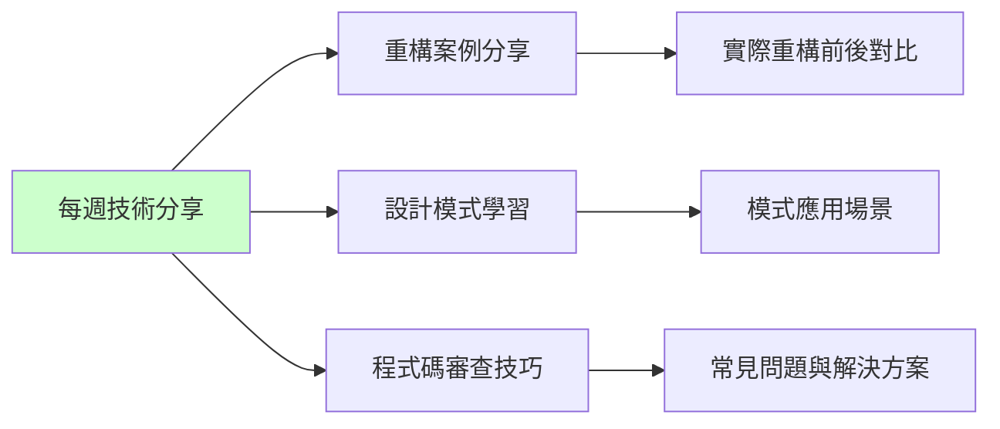

**重構激勵機制：**

- **重構貢獻獎勵**：記錄團隊成員的重構貢獻
- **程式碼品質指標**：定期檢視程式碼品質趨勢
- **最佳實務分享**：鼓勵分享重構經驗

#### 7.4.2 工具與流程整合

**CI/CD 整合重構檢查：**

```yaml
# .github/workflows/code-quality.yml
name: Code Quality Check

on:
  pull_request:
    branches: [ main, develop ]

jobs:
  code-quality:
    runs-on: ubuntu-latest
    
    steps:
    - uses: actions/checkout@v3
    
    - name: Set up JDK 11
      uses: actions/setup-java@v3
      with:
        java-version: '11'
        distribution: 'temurin'
        
    - name: Cache Maven packages
      uses: actions/cache@v3
      with:
        path: ~/.m2
        key: ${{ runner.os }}-m2-${{ hashFiles('**/pom.xml') }}
        
    - name: Run tests
      run: mvn test
      
    - name: Run SonarQube analysis
      run: mvn sonar:sonar -Dsonar.projectKey=my-project
      
    - name: Check test coverage
      run: mvn jacoco:check
      
    - name: Checkstyle check
      run: mvn checkstyle:check
```

**IDE 設定同步：**

```json
// .vscode/settings.json
{
    "java.format.settings.url": "./eclipse-formatter.xml",
    "java.checkstyle.configuration": "./checkstyle.xml",
    "java.test.defaultConfig": "default",
    "sonarlint.connectedMode.project": {
        "connectionId": "my-sonarqube",
        "projectKey": "my-project"
    }
}
```

### 7.5 重構培訓計畫

#### 7.5.1 新人重構訓練

**第一週：基礎概念**

- 重構定義與目標
- 程式碼壞味道識別
- 基本重構技巧
- 工具使用

**第二週：實作練習**

- 結對重構練習
- 程式碼審查參與
- 測試驅動重構
- 專案實戰

**第三週：進階技巧**

- 設計模式應用
- 架構重構策略
- 效能考量
- 風險控制

#### 7.5.2 技能評估標準

**初級重構師（Junior）**

- [ ] 能識別基本的程式碼壞味道
- [ ] 能執行簡單的方法層級重構
- [ ] 理解重構與測試的關係
- [ ] 能使用 IDE 重構工具

**中級重構師（Intermediate）**

- [ ] 能設計類別層級的重構策略
- [ ] 能在重構中保持測試綠燈
- [ ] 理解設計模式在重構中的應用
- [ ] 能評估重構的風險與效益

**高級重構師（Senior）**

- [ ] 能領導大規模重構專案
- [ ] 能設計漸進式重構策略
- [ ] 能處理遺留系統重構
- [ ] 能建立團隊重構規範

### 7.6 團隊重構最佳實務

**建立重構文化：**

- [ ] 定期舉辦重構分享會
- [ ] 建立重構案例庫
- [ ] 設立程式碼品質指標
- [ ] 鼓勵重構實驗與創新

**工具與流程：**

- [ ] 統一開發環境設定
- [ ] 整合靜態分析工具
- [ ] 建立自動化品質檢查
- [ ] 提供重構指引文件

**技能發展：**

- [ ] 制定重構培訓計畫
- [ ] 建立技能評估標準
- [ ] 提供重構實作機會
- [ ] 定期技術能力評估

---

## 8. 考試重點與練習

### 8.1 認證考試重點

#### 8.1.1 理論知識考點

**重構基本概念（20%）**

- 重構的定義與目標
- 重構 vs 重寫的差異
- 重構的時機選擇
- 重構的風險與效益

**程式碼壞味道識別（25%）**

- 常見壞味道的特徵
- 壞味道的成因分析
- 壞味道的影響評估
- 壞味道的優先處理順序

**重構技巧應用（30%）**

- 方法層級重構技巧
- 類別層級重構技巧
- 條件邏輯重構
- 繼承關係重構

**測試與重構（15%）**

- TDD 與重構的關係
- 重構中的測試策略
- 測試覆蓋率要求
- 回歸測試設計

**團隊協作（10%）**

- 重構決策流程
- 程式碼審查要點
- 持續整合實務
- 風險控制策略

#### 8.1.2 實作技能考點

**程式碼分析能力**

```java
// 考試題型：識別以下程式碼的壞味道並提出重構建議
public class CustomerManager {
    public String processCustomer(String name, String email, String phone, 
                                 String address, String type, boolean active) {
        
        // 驗證邏輯
        if (name == null || name.trim().isEmpty()) return "姓名不能為空";
        if (email == null || !email.contains("@")) return "電子郵件格式錯誤";
        if (phone == null || phone.length() < 10) return "電話號碼格式錯誤";
        
        // 處理邏輯
        if (type.equals("VIP")) {
            // VIP 客戶處理
            saveToDatabase(name, email, phone, address, type, active);
            sendWelcomeEmail(email, "VIP");
            createLoyaltyAccount(email);
            return "VIP 客戶建立成功";
        } else if (type.equals("Premium")) {
            // Premium 客戶處理
            saveToDatabase(name, email, phone, address, type, active);
            sendWelcomeEmail(email, "Premium");
            return "Premium 客戶建立成功";
        } else {
            // 一般客戶處理
            saveToDatabase(name, email, phone, address, type, active);
            sendWelcomeEmail(email, "Regular");
            return "一般客戶建立成功";
        }
    }
}
```

**重構實作能力**

考試要求學員能夠：

1. 識別上述程式碼的問題
2. 提出具體的重構步驟
3. 實作重構後的程式碼
4. 撰寫相應的單元測試

### 8.2 練習題庫

#### 8.2.1 選擇題練習

**題目 1：**
以下哪個不是程式碼壞味道？
A) Long Method（過長方法）
B) Duplicate Code（重複程式碼）
C) Single Responsibility（單一職責）
D) Large Class（過大類別）

**答案：C**

**題目 2：**
在 TDD 循環中，重構應該在什麼時候進行？
A) 寫測試之前
B) 測試失敗時
C) 測試通過後
D) 專案結束時

**答案：C**

**題目 3：**
Extract Method 重構技巧主要用於解決什麼問題？
A) 過多參數
B) 過長方法
C) 重複程式碼
D) 過大類別

**答案：B**

#### 8.2.2 情境分析題

**題目：**
你正在進行一個關鍵業務系統的重構，以下哪種做法最適合？

```java
// 現有程式碼
public class OrderProcessor {
    public void processOrder(Order order) {
        // 150 行程式碼包含：
        // - 訂單驗證
        // - 庫存檢查
        // - 價格計算
        // - 付款處理
        // - 發送通知
        // - 記錄日誌
    }
}
```

A) 一次性重寫整個方法
B) 逐步提取小方法，每次重構後執行測試
C) 先刪除現有程式碼，再重新開發
D) 保持現狀，不進行重構

**標準答案：B**

**解釋：**
關鍵業務系統應該採用風險最低的漸進式重構方法。逐步提取小方法可以：
- 降低重構風險
- 保持系統穩定
- 便於測試驗證
- 易於回滾變更

#### 8.2.3 程式碼重構實作題

**題目：重構以下計算機類別**

```java
public class Calculator {
    public double calculate(double a, double b, String operation) {
        if (operation.equals("add")) {
            return a + b;
        } else if (operation.equals("subtract")) {
            return a - b;
        } else if (operation.equals("multiply")) {
            return a * b;
        } else if (operation.equals("divide")) {
            if (b == 0) {
                throw new IllegalArgumentException("不能除以零");
            }
            return a / b;
        } else {
            throw new IllegalArgumentException("不支援的運算：" + operation);
        }
    }
}
```

**參考答案：**

```java
// 步驟 1：引入列舉
public enum Operation {
    ADD, SUBTRACT, MULTIPLY, DIVIDE
}

// 步驟 2：重構主要方法
public class Calculator {
    public double calculate(double a, double b, Operation operation) {
        switch (operation) {
            case ADD:
                return add(a, b);
            case SUBTRACT:
                return subtract(a, b);
            case MULTIPLY:
                return multiply(a, b);
            case DIVIDE:
                return divide(a, b);
            default:
                throw new IllegalArgumentException("不支援的運算：" + operation);
        }
    }
    
    private double add(double a, double b) {
        return a + b;
    }
    
    private double subtract(double a, double b) {
        return a - b;
    }
    
    private double multiply(double a, double b) {
        return a * b;
    }
    
    private double divide(double a, double b) {
        if (b == 0) {
            throw new IllegalArgumentException("不能除以零");
        }
        return a / b;
    }
}

// 步驟 3：更進一步使用策略模式
public interface CalculationStrategy {
    double calculate(double a, double b);
}

public class AdditionStrategy implements CalculationStrategy {
    @Override
    public double calculate(double a, double b) {
        return a + b;
    }
}

public class Calculator {
    private Map<Operation, CalculationStrategy> strategies = Map.of(
        Operation.ADD, new AdditionStrategy(),
        Operation.SUBTRACT, (a, b) -> a - b,
        Operation.MULTIPLY, (a, b) -> a * b,
        Operation.DIVIDE, (a, b) -> {
            if (b == 0) throw new IllegalArgumentException("不能除以零");
            return a / b;
        }
    );
    
    public double calculate(double a, double b, Operation operation) {
        CalculationStrategy strategy = strategies.get(operation);
        if (strategy == null) {
            throw new IllegalArgumentException("不支援的運算：" + operation);
        }
        return strategy.calculate(a, b);
    }
}
```

### 8.3 模擬考試

#### 8.3.1 考試時間分配

**總時間：120 分鐘**

- 選擇題（30 題）：30 分鐘
- 程式碼分析題（5 題）：40 分鐘
- 重構實作題（3 題）：50 分鐘

#### 8.3.2 評分標準

**選擇題（30%）**
- 每題 1 分，共 30 分
- 答對率需達 80% 以上

**程式碼分析題（35%）**
- 壞味道識別：5 分/題
- 重構建議：5 分/題
- 風險評估：5 分/題

**重構實作題（35%）**
- 程式碼正確性：10 分/題
- 重構技巧運用：5 分/題
- 測試完整性：5 分/題

#### 8.3.3 完整模擬考試

**模擬考試 A 卷**

**第一部分：選擇題（30分）**

1. 以下哪個是重構的主要目標？
   A) 增加新功能
   B) 修復錯誤
   C) 改善程式碼結構但保持外部行為不變
   D) 提升程式效能

2. 什麼是「Feature Envy」程式碼壞味道？
   A) 方法過長
   B) 方法對其他類別的資料比對自己的資料更感興趣
   C) 類別過大
   D) 重複程式碼

3. 在 TDD 循環中，重構應該在什麼時候進行？
   A) 寫測試之前
   B) 測試失敗時
   C) 測試通過後
   D) 專案結束時

**第二部分：程式碼分析題（40分）**

**題目 1：識別程式碼壞味道（20分）**

```java
public class ReportGenerator {
    public String generateReport(String customerType, List<Order> orders, 
                               String format, boolean includeDetails, 
                               Date startDate, Date endDate, 
                               String sortBy, boolean ascending) {
        
        StringBuilder report = new StringBuilder();
        
        // 過濾訂單
        List<Order> filteredOrders = new ArrayList<>();
        for (Order order : orders) {
            if (order.getDate().after(startDate) && order.getDate().before(endDate)) {
                if (customerType.equals("VIP") && order.getCustomer().getType().equals("VIP")) {
                    filteredOrders.add(order);
                } else if (customerType.equals("Regular") && !order.getCustomer().getType().equals("VIP")) {
                    filteredOrders.add(order);
                } else if (customerType.equals("All")) {
                    filteredOrders.add(order);
                }
            }
        }
        
        // 排序
        if (sortBy.equals("date")) {
            filteredOrders.sort((o1, o2) -> ascending ? 
                o1.getDate().compareTo(o2.getDate()) : 
                o2.getDate().compareTo(o1.getDate()));
        } else if (sortBy.equals("amount")) {
            filteredOrders.sort((o1, o2) -> ascending ? 
                Double.compare(o1.getAmount(), o2.getAmount()) : 
                Double.compare(o2.getAmount(), o1.getAmount()));
        }
        
        // 生成報表
        if (format.equals("CSV")) {
            report.append("Order ID,Customer,Amount,Date\n");
            for (Order order : filteredOrders) {
                report.append(order.getId()).append(",")
                      .append(order.getCustomer().getName()).append(",")
                      .append(order.getAmount()).append(",")
                      .append(order.getDate()).append("\n");
                
                if (includeDetails) {
                    for (OrderItem item : order.getItems()) {
                        report.append("  ").append(item.getName()).append(",")
                              .append(item.getQuantity()).append(",")
                              .append(item.getPrice()).append("\n");
                    }
                }
            }
        } else if (format.equals("JSON")) {
            // JSON 格式生成邏輯（50行）
            // ...
        } else if (format.equals("XML")) {
            // XML 格式生成邏輯（60行）
            // ...
        }
        
        return report.toString();
    }
}
```

請識別上述程式碼中的壞味道並說明原因（每個5分，共20分）：

1. ____________________
2. ____________________
3. ____________________
4. ____________________

**第三部分：重構實作題（30分）**

**題目：重構計算機類別（30分）**

將以下程式碼重構為更好的設計：

```java
public class AdvancedCalculator {
    public double compute(String expression) {
        String[] parts = expression.split(" ");
        
        if (parts.length != 3) {
            throw new IllegalArgumentException("Invalid expression");
        }
        
        double num1 = Double.parseDouble(parts[0]);
        String operator = parts[1];
        double num2 = Double.parseDouble(parts[2]);
        
        if (operator.equals("+")) {
            return num1 + num2;
        } else if (operator.equals("-")) {
            return num1 - num2;
        } else if (operator.equals("*")) {
            return num1 * num2;
        } else if (operator.equals("/")) {
            if (num2 == 0) {
                throw new IllegalArgumentException("Division by zero");
            }
            return num1 / num2;
        } else if (operator.equals("^")) {
            return Math.pow(num1, num2);
        } else if (operator.equals("%")) {
            return num1 % num2;
        } else {
            throw new IllegalArgumentException("Unsupported operator: " + operator);
        }
    }
}
```

要求：
1. 應用適當的重構技巧（15分）
2. 提供完整的單元測試（10分）
3. 說明重構的理由和好處（5分）

**參考答案：**

**選擇題答案：**
1. C  2. B  3. C

**程式碼分析題答案：**
1. **Long Parameter List（過多參數）** - 方法有8個參數，建議使用 Parameter Object
2. **Long Method（過長方法）** - 方法承擔多種職責：過濾、排序、格式化
3. **Switch Statement / Conditional Complexity（複雜條件邏輯）** - 多個 if-else 判斷，建議使用 Strategy Pattern
4. **Duplicate Code（重複程式碼）** - 排序邏輯和格式化邏輯有重複結構

**重構實作題參考答案：**

```java
// 1. 引入策略模式
public enum Operator {
    ADD("+", (a, b) -> a + b),
    SUBTRACT("-", (a, b) -> a - b),
    MULTIPLY("*", (a, b) -> a * b),
    DIVIDE("/", (a, b) -> {
        if (b == 0) throw new IllegalArgumentException("Division by zero");
        return a / b;
    }),
    POWER("^", Math::pow),
    MODULO("%", (a, b) -> a % b);
    
    private final String symbol;
    private final BinaryOperator<Double> operation;
    
    Operator(String symbol, BinaryOperator<Double> operation) {
        this.symbol = symbol;
        this.operation = operation;
    }
    
    public static Operator fromSymbol(String symbol) {
        return Arrays.stream(values())
                .filter(op -> op.symbol.equals(symbol))
                .findFirst()
                .orElseThrow(() -> new IllegalArgumentException("Unsupported operator: " + symbol));
    }
    
    public double apply(double a, double b) {
        return operation.apply(a, b);
    }
}

// 2. 重構後的計算機
public class AdvancedCalculator {
    public double compute(String expression) {
        Expression expr = parseExpression(expression);
        return expr.evaluate();
    }
    
    private Expression parseExpression(String expression) {
        String[] parts = expression.trim().split("\\s+");
        
        if (parts.length != 3) {
            throw new IllegalArgumentException("Invalid expression format. Expected: 'number operator number'");
        }
        
        try {
            double operand1 = Double.parseDouble(parts[0]);
            Operator operator = Operator.fromSymbol(parts[1]);
            double operand2 = Double.parseDouble(parts[2]);
            
            return new Expression(operand1, operator, operand2);
        } catch (NumberFormatException e) {
            throw new IllegalArgumentException("Invalid number format in expression", e);
        }
    }
}

// 3. 表達式值物件
public class Expression {
    private final double operand1;
    private final Operator operator;
    private final double operand2;
    
    public Expression(double operand1, Operator operator, double operand2) {
        this.operand1 = operand1;
        this.operator = operator;
        this.operand2 = operand2;
    }
    
    public double evaluate() {
        return operator.apply(operand1, operand2);
    }
}

// 4. 測試類別
@Test
public class AdvancedCalculatorTest {
    private AdvancedCalculator calculator = new AdvancedCalculator();
    
    @Test
    public void testBasicOperations() {
        assertEquals(5.0, calculator.compute("2 + 3"), 0.001);
        assertEquals(1.0, calculator.compute("3 - 2"), 0.001);
        assertEquals(6.0, calculator.compute("2 * 3"), 0.001);
        assertEquals(2.0, calculator.compute("6 / 3"), 0.001);
    }
    
    @Test
    public void testAdvancedOperations() {
        assertEquals(8.0, calculator.compute("2 ^ 3"), 0.001);
        assertEquals(1.0, calculator.compute("5 % 2"), 0.001);
    }
    
    @Test
    public void testDivisionByZero() {
        assertThrows(IllegalArgumentException.class, 
                    () -> calculator.compute("5 / 0"));
    }
    
    @Test
    public void testInvalidExpression() {
        assertThrows(IllegalArgumentException.class, 
                    () -> calculator.compute("2 +"));
        assertThrows(IllegalArgumentException.class, 
                    () -> calculator.compute("abc + 3"));
    }
}
```

**重構理由：**
1. **消除條件複雜性**：使用枚舉和策略模式取代 if-else 鏈
2. **提高擴展性**：新增運算子只需要在枚舉中添加
3. **職責分離**：表達式解析和計算分開處理
4. **提高可讀性**：程式碼結構更清晰，易於理解和維護

### 8.4 考試準備建議

**理論知識準備：**

- [ ] 熟記各種程式碼壞味道的特徵
- [ ] 理解各種重構技巧的適用場景
- [ ] 掌握重構與測試的關係
- [ ] 了解團隊重構的流程與規範

**實作技能準備：**

- [ ] 練習使用 IDE 重構工具
- [ ] 熟練掌握基本重構技巧
- [ ] 能夠設計測試來保護重構
- [ ] 具備程式碼分析與評估能力

**考試技巧：**

- [ ] 先做簡單題目確保基本分數
- [ ] 重構實作題要先分析再動手
- [ ] 預留時間檢查程式碼正確性
- [ ] 注意時間分配，避免單題耗時過長

---

## 9. 檢查清單

### 9.1 重構前檢查清單

#### 9.1.1 環境準備

**版本控制：**

- [ ] 確認目前分支狀態乾淨
- [ ] 所有變更已提交
- [ ] 建立重構專用分支
- [ ] 設定適當的分支保護規則

**測試準備：**

- [ ] 執行完整測試套件確認通過
- [ ] 檢查測試覆蓋率是否足夠（≥80%）
- [ ] 識別高風險區域並補強測試
- [ ] 準備效能基準測試

**工具設定：**

- [ ] IDE 重構工具已正確配置
- [ ] 靜態分析工具已啟用
- [ ] 程式碼格式化設定已同步
- [ ] 版本控制 hooks 已設定

#### 9.1.2 範圍評估

**重構規模：**

- [ ] 明確定義重構範圍
- [ ] 評估重構複雜度
- [ ] 估算所需時間
- [ ] 識別相關的系統元件

**風險評估：**

- [ ] 識別潛在的重構風險
- [ ] 準備風險應對策略
- [ ] 建立回滾計畫
- [ ] 設定品質閾值

**利害關係人溝通：**

- [ ] 通知相關開發者
- [ ] 確認業務影響
- [ ] 獲得必要的批准
- [ ] 設定溝通機制

### 9.2 重構執行檢查清單

#### 9.2.1 執行原則

**小步快跑：**

- [ ] 每次變更範圍控制在最小
- [ ] 確保每步都能通過測試
- [ ] 頻繁提交程式碼（至少每小時一次）
- [ ] 保持功能完全相同

**測試驗證：**

- [ ] 每次修改後立即執行相關測試
- [ ] 定期執行完整測試套件
- [ ] 監控測試執行時間
- [ ] 確保測試覆蓋率不降低

#### 9.2.2 常見重構步驟

**Extract Method（提取方法）：**

- [ ] 識別可提取的程式碼片段
- [ ] 檢查區域變數和參數
- [ ] 建立新方法簽名
- [ ] 移動程式碼到新方法
- [ ] 在原位置呼叫新方法
- [ ] 執行測試驗證

**Rename（重新命名）：**

- [ ] 使用 IDE 自動重新命名功能
- [ ] 檢查所有參考位置
- [ ] 更新相關文件和註解
- [ ] 驗證命名約定一致性
- [ ] 執行測試確認無誤

**Move Method（搬移方法）：**

- [ ] 分析方法依賴關係
- [ ] 確認目標類別適合性
- [ ] 檢查訪問權限
- [ ] 更新方法呼叫
- [ ] 驗證封裝性
- [ ] 執行完整測試

### 9.3 重構後檢查清單

#### 9.3.1 功能驗證

**基本功能：**

- [ ] 所有單元測試通過
- [ ] 整合測試正常
- [ ] 端到端測試成功
- [ ] 回歸測試無異常

**效能驗證：**

- [ ] 執行效能基準測試
- [ ] 比較重構前後效能差異
- [ ] 監控記憶體使用情況
- [ ] 檢查資源消耗

#### 9.3.2 品質檢查

**程式碼品質：**

- [ ] 靜態分析工具檢查通過
- [ ] 程式碼複雜度有所改善
- [ ] 壞味道已被消除
- [ ] 遵循團隊編碼規範

**可維護性：**

- [ ] 程式碼可讀性提升
- [ ] 方法和類別職責更單一
- [ ] 重複程式碼已移除
- [ ] 註解和文件已更新

#### 9.3.3 交付準備

**文件更新：**

- [ ] API 文件已更新
- [ ] 架構圖已修正
- [ ] 重構日誌已記錄
- [ ] 變更影響已說明

**團隊溝通：**

- [ ] 重構結果已分享
- [ ] 經驗學習已整理
- [ ] 最佳實務已提取
- [ ] 後續改善已規劃

### 9.4 緊急應對檢查清單

#### 9.4.1 問題發現

**立即行動：**

- [ ] 停止進一步的重構
- [ ] 記錄問題現象
- [ ] 回復到最後一個穩定版本
- [ ] 通知相關團隊成員

**問題分析：**

- [ ] 識別問題根本原因
- [ ] 檢查測試覆蓋是否充足
- [ ] 分析重構步驟是否過大
- [ ] 評估風險控制是否到位

#### 9.4.2 修復策略

**短期修復：**

- [ ] 修復緊急功能問題
- [ ] 部署熱修復版本
- [ ] 監控系統穩定性
- [ ] 更新問題追蹤

**長期改善：**

- [ ] 補強測試覆蓋
- [ ] 改善重構流程
- [ ] 加強風險控制
- [ ] 更新團隊規範

### 9.5 持續改善檢查清單

#### 9.5.1 定期檢視

**週度檢視：**

- [ ] 檢查程式碼品質趨勢
- [ ] 分析重構效果
- [ ] 收集團隊回饋
- [ ] 調整重構策略

**月度檢視：**

- [ ] 評估重構目標達成度
- [ ] 更新重構計畫
- [ ] 分享最佳實務
- [ ] 培訓新進成員

#### 9.5.2 工具和流程優化

**工具改善：**

- [ ] 評估新的重構工具
- [ ] 優化現有工具設定
- [ ] 整合品質檢查流程
- [ ] 自動化重複性工作

**流程改善：**

- [ ] 簡化重構審查流程
- [ ] 改善團隊協作機制
- [ ] 優化風險控制措施
- [ ] 增強監控能力

---

## 10. 參考資源

### 10.1 延伸閱讀

**書籍推薦：**
- 《Refactoring: Improving the Design of Existing Code》- Martin Fowler
- 《Clean Code》- Robert C. Martin
- 《Working Effectively with Legacy Code》- Michael Feathers

**線上資源：**
- [Refactoring.guru](https://refactoring.guru/) - 重構技巧和設計模式
- [SonarQube 官方文件](https://docs.sonarqube.org/) - 程式碼品質分析
- [JUnit 5 官方文件](https://junit.org/junit5/docs/current/user-guide/) - 單元測試指南

### 10.2 工具推薦

**IDE 重構工具：**
- IntelliJ IDEA - 最強大的 Java 重構支援
- Eclipse - 豐富的重構插件生態
- VS Code - 輕量級但功能完整的重構工具

**靜態分析工具：**
- SonarQube - 企業級程式碼品質平台
- Checkstyle - Java 程式碼風格檢查
- PMD - 程式碼缺陷檢測

---

*本教學手冊將隨著團隊經驗累積和工具發展持續更新。如有問題或建議，請隨時聯繫開發團隊。*

**版本資訊**：
- 文件版本：v1.0
- 最後更新：2025年9月1日
- 作者：資深軟體架構師團隊
- 適用對象：Java 開發人員、系統架構師
