# TDD（Test-Driven Development）測試驅動開發使用教學手冊


## 📚 目錄

### [一、前言](#一前言)


- [1.1 教學目的](#11-教學目的)

- [1.2 適用對象](#12-適用對象)

- [1.3 預期學習成果](#13-預期學習成果)

- [1.4 教學手冊架構說明](#14-教學手冊架構說明)


### [二、TDD 概念與原則](#二tdd-概念與原則)


- [2.1 什麼是 TDD（Test-Driven Development）](#21-什麼是-tddtest-driven-development)

- [2.2 TDD 的核心循環：Red → Green → Refactor](#22-tdd-的核心循環red--green--refactor)

- [2.3 TDD 與傳統開發流程的差異](#23-tdd-與傳統開發流程的差異)

- [2.4 為什麼使用 TDD：好處與挑戰](#24-為什麼使用-tdd好處與挑戰)

- [2.5 單元測試 vs. 集成測試 vs. 系統測試](#25-單元測試-vs-集成測試-vs-系統測試)


### [三、TDD 實踐步驟](#三tdd-實踐步驟)


- [3.1 Step 1：撰寫失敗的測試（Red）](#31-step-1撰寫失敗的測試red)

- [3.2 Step 2：撰寫最簡單的實作通過測試（Green）](#32-step-2撰寫最簡單的實作通過測試green)

- [3.3 Step 3：重構程式碼（Refactor）](#33-step-3重構程式碼refactor)

- [3.4 Step 4：重複循環與迭代開發](#34-step-4重複循環與迭代開發)

- [3.5 驗收標準（Definition of Done）與測試覆蓋率要求](#35-驗收標準definition-of-done與測試覆蓋率要求)


### [四、TDD 開發環境與工具](#四tdd-開發環境與工具)


- [4.1 測試框架介紹](#41-測試框架介紹)

- [4.2 IDE 與工具設定](#42-ide-與工具設定)

- [4.3 持續整合（CI）與自動化測試](#43-持續整合ci與自動化測試)

- [4.4 測試覆蓋率工具](#44-測試覆蓋率工具)

- [4.5 測試資料與 Mock 工具](#45-測試資料與-mock-工具)


### [五、撰寫良好測試的技巧](#五撰寫良好測試的技巧)


- [5.1 測試命名規範與可讀性](#51-測試命名規範與可讀性)

- [5.2 安排測試結構（Arrange–Act–Assert 模式）](#52-安排測試結構arrangeactassert-模式)

- [5.3 單一職責原則（Single Responsibility Principle in Tests）](#53-單一職責原則single-responsibility-principle-in-tests)

- [5.4 使用 Mock、Stub、Fake、Spy 的正確時機](#54-使用-mockstubfakespy-的正確時機)

- [5.5 常見測試陷阱與避免方式](#55-常見測試陷阱與避免方式)


### [六、實作範例](#六實作範例)


- [6.1 範例一：計算機（Calculator）類別的 TDD 實作](#61-範例一計算機calculator類別的-tdd-實作)

- [6.2 範例二：RESTful API 的 TDD 開發流程](#62-範例二restful-api-的-tdd-開發流程)

- [6.3 範例三：資料庫操作（Repository）的 TDD 測試](#63-範例三資料庫操作repository的-tdd-測試)


### [七、TDD 在團隊開發中的應用](#七tdd-在團隊開發中的應用)


- [7.1 TDD 與敏捷開發（Agile、Scrum）的結合](#71-tdd-與敏捷開發agilescrum的結合)

- [7.2 Pair Programming 與 TDD](#72-pair-programming-與-tdd)

- [7.3 Code Review 與測試審查重點](#73-code-review-與測試審查重點)

- [7.4 在 CI/CD Pipeline 中整合測試流程](#74-在-cicd-pipeline-中整合測試流程)

- [7.5 建立團隊 TDD 實踐文化](#75-建立團隊-tdd-實踐文化)


### [八、TDD 常見問題與最佳實踐](#八tdd-常見問題與最佳實踐)


- [8.1 常見誤區與修正方式](#81-常見誤區與修正方式)

- [8.2 測試覆蓋率與品質間的平衡](#82-測試覆蓋率與品質間的平衡)

- [8.3 與 Legacy Code 整合的策略](#83-與-legacy-code-整合的策略)

- [8.4 大型專案中導入 TDD 的建議](#84-大型專案中導入-tdd-的建議)

- [8.5 實務經驗分享與成功案例](#85-實務經驗分享與成功案例)


### [九、進階主題](#九進階主題)


- [9.1 BDD（行為驅動開發）與 TDD 的差異與結合](#91-bdd行為驅動開發與-tdd-的差異與結合)

- [9.2 Property-Based Testing](#92-property-based-testing)

- [9.3 測試驅動的設計（Test-Driven Design）](#93-測試驅動的設計test-driven-design)

- [9.4 自動化測試報告與品質儀表板](#94-自動化測試報告與品質儀表板)


### [十、附錄](#十附錄)


- [10.1 推薦學習資源](#101-推薦學習資源)

- [10.2 常用測試工具與框架清單](#102-常用測試工具與框架清單)

- [10.3 TDD 範本專案連結與練習題](#103-tdd-範本專案連結與練習題)

- [10.4 專有名詞中英對照表](#104-專有名詞中英對照表)


### [總結](#總結)

### [TDD 快速檢查清單](#tdd-快速檢查清單)

### [結語](#結語)


## 一、前言

### 1.1 教學目的

本教學手冊旨在協助新進開發人員:

- 理解 TDD 的核心概念與價值

- 掌握 TDD 的實踐步驟與技巧

- 建立良好的測試撰寫習慣

- 在實際專案中應用 TDD 開發方法

- 提升程式碼品質與可維護性


### 1.2 適用對象


- 新進軟體工程師

- 轉換至 TDD 開發方式的開發人員

- 希望提升測試技能的程式設計師

- 需要了解 TDD 實踐的技術主管


**前置知識要求:**

- 基本程式設計能力(至少熟悉一種程式語言)

- 了解物件導向程式設計基本概念

- 具備版本控制系統(Git)基礎操作能力


### 1.3 預期學習成果

完成本教學手冊後,您將能夠:

✅ 說明 TDD 的核心原則與開發循環  
✅ 獨立撰寫高品質的單元測試  
✅ 運用 TDD 方式開發新功能  
✅ 選擇適合的測試工具與框架  
✅ 在團隊中推廣 TDD 實踐文化  
✅ 辨識與避免常見的測試陷阱  

### 1.4 教學手冊架構說明

本手冊採用**循序漸進**的學習路徑:


**學習建議:**

- 建議按照章節順序閱讀

- 每章結束後完成實作練習

- 搭配範例專案進行實際操作

- 與團隊成員討論分享經驗


## 二、TDD 概念與原則

### 2.1 什麼是 TDD（Test-Driven Development）

**定義:**  
TDD（測試驅動開發）是一種軟體開發方法論,強調**先寫測試,後寫實作**。透過測試來驅動程式設計與開發流程。

**核心理念:**
> "讓測試指引你的程式碼設計" - Kent Beck

**TDD 的三個關鍵特徵:**


1. **測試優先（Test First）**
   - 在撰寫功能程式碼前,先撰寫測試
   - 測試定義了預期行為與規格


2. **小步前進（Baby Steps）**
   - 每次只實作最小可用的功能
   - 持續進行小幅度的迭代


3. **持續重構（Continuous Refactoring）**
   - 在測試保護下安全地改善程式碼
   - 維持程式碼的簡潔與可維護性

**TDD 的價值主張:**

| 面向 | 傳統開發 | TDD 開發 |
|------|---------|---------|
| 設計思考 | 實作後才考慮測試 | 透過測試思考設計 |
| 錯誤發現 | 整合測試或上線後 | 開發階段立即發現 |
| 重構信心 | 擔心破壞既有功能 | 測試保護下安心重構 |
| 文件化 | 需額外撰寫文件 | 測試即是活文件 |
| 程式碼品質 | 依賴個人經驗 | 可測試性促進好設計 |

### 2.2 TDD 的核心循環：Red → Green → Refactor

TDD 遵循一個簡單但強大的開發循環:


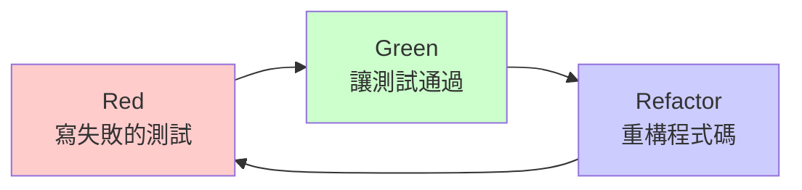

#### 🔴 Red（紅燈階段）- 撰寫失敗的測試

**目標:** 撰寫一個會失敗的測試,定義預期行為

**步驟:**

1. 思考要實作的功能需求

2. 撰寫測試案例描述預期行為

3. 執行測試,確認測試失敗（紅燈）

4. 確認失敗原因符合預期

**範例（Java）:**

```java
@Test
public void testAddTwoNumbers() {
    Calculator calculator = new Calculator();
    int result = calculator.add(2, 3);
    assertEquals(5, result); // 此時會失敗,因為 add() 方法尚未實作
}

```

**重點提醒:**

- ⚠️ 必須看到測試失敗才能進入下一階段

- ⚠️ 確認失敗訊息是你預期的原因

- ⚠️ 如果測試一開始就通過,可能是測試寫錯了


#### 🟢 Green（綠燈階段）- 撰寫最簡單的實作

**目標:** 用最簡單的方式讓測試通過

**步驟:**

1. 撰寫最少量的程式碼讓測試通過

2. 執行測試,確認測試通過（綠燈）

3. 不需要考慮完美設計,先求能動

**範例（Java）:**

```java
public class Calculator {
    public int add(int a, int b) {
        return a + b; // 最簡單的實作
    }
}

```

**重點提醒:**

- ✅ 只寫讓測試通過的程式碼,不多也不少

- ✅ 可以先用"假實作"或"硬編碼"快速通過測試

- ✅ 不要在這階段進行優化或重構


#### 🔵 Refactor（重構階段）- 改善程式碼品質

**目標:** 在測試保護下,改善程式碼設計

**步驟:**

1. 檢視程式碼是否有重複、冗餘或不清晰的地方

2. 進行重構改善程式碼品質

3. 持續執行測試確保功能正確

4. 重複重構直到滿意為止

**重構檢查清單:**

- [ ] 消除重複程式碼（DRY 原則）

- [ ] 改善命名清晰度

- [ ] 簡化複雜邏輯

- [ ] 提取共用方法或類別

- [ ] 確保符合 SOLID 原則


**重點提醒:**

- 🔄 重構時測試必須保持綠燈

- 🔄 一次只做一種重構動作

- 🔄 重構後立即執行測試驗證


### 2.3 TDD 與傳統開發流程的差異

#### 傳統開發流程


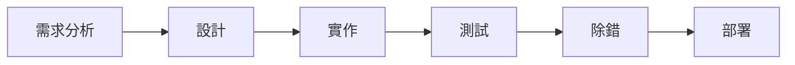

**特點:**

- 測試在實作之後

- 容易產生難以測試的程式碼

- 錯誤發現較晚,修復成本高

- 重構風險大,容易破壞既有功能


#### TDD 開發流程


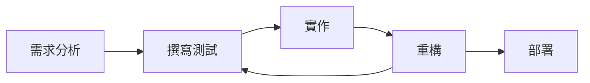

**特點:**

- 測試先於實作

- 自然產生可測試的程式碼

- 錯誤立即發現,修復成本低

- 重構有測試保護,風險小


#### 對比分析

| 面向 | 傳統開發 | TDD 開發 |
|------|---------|---------|
| **開發節奏** | 先寫功能後補測試 | 先寫測試後寫功能 |
| **測試覆蓋率** | 通常較低（20-50%） | 通常較高（80-100%） |
| **除錯時間** | 較多時間除錯 | 較少時間除錯 |
| **設計品質** | 依賴開發者經驗 | 測試強制好設計 |
| **文件化** | 需另外維護文件 | 測試即文件 |
| **重構信心** | 較低,怕改壞 | 較高,有測試保護 |
| **上手難度** | 較簡單 | 需要思維轉換 |
| **長期維護** | 容易腐化 | 較易維護 |

### 2.4 為什麼使用 TDD：好處與挑戰

#### ✅ TDD 的好處

**1. 提升程式碼品質**

- 強制思考程式介面與設計

- 自然產生低耦合、高內聚的程式碼

- 減少不必要的複雜度


**2. 提早發現錯誤**

- 在開發階段即時發現問題

- 降低除錯與修復成本

- 減少上線後的缺陷數量


**3. 安全重構**

- 測試作為安全網

- 重構時立即發現破壞

- 持續改善程式碼品質


**4. 活文件（Living Documentation）**

- 測試即是規格說明

- 測試展示使用方式

- 自動保持文件更新


**5. 加速開發速度**

- 減少除錯時間

- 降低回歸測試成本

- 新成員更容易理解程式碼


**6. 增強開發信心**

- 對程式碼有信心

- 敢於進行大幅修改

- 減少"害怕改壞"的心理


**實際數據參考:**

- 缺陷率降低 40-80%（IBM 研究）

- 測試覆蓋率提升至 80% 以上

- 長期維護成本降低 50%


#### ⚠️ TDD 的挑戰

**1. 學習曲線**

- 需要轉換開發思維

- 初期開發速度可能較慢

- 需要學習測試技巧與工具


**解決方案:**

- 從簡單專案開始練習

- 進行 Pair Programming

- 定期分享與檢討


**2. 初期時間投入**

- 撰寫測試需要額外時間

- 前期投資較大

- 短期內難以看到效益


**解決方案:**

- 著眼於長期價值

- 追蹤缺陷率與維護成本

- 建立團隊共識


**3. 測試維護成本**

- 需求變更時測試也需更新

- 測試程式碼也需要維護

- 不良的測試反而成為負擔


**解決方案:**

- 撰寫高品質測試

- 定期重構測試程式碼

- 刪除過時或無價值的測試


**4. 不適用的場景**

- UI 視覺調整

- 探索性開發(Spike)

- 效能調校

- 硬體整合測試


**解決方案:**

- 靈活運用,不是所有情況都需要 TDD

- 針對核心業務邏輯使用 TDD

- 其他部分採用事後測試


#### 💡 何時應該使用 TDD

**適合使用 TDD:**

- ✅ 核心業務邏輯開發

- ✅ 複雜演算法實作

- ✅ API 開發

- ✅ 工具函式庫

- ✅ 需要高可靠度的功能

- ✅ 需求明確的功能


**不一定需要 TDD:**

- ⚠️ 快速原型驗證

- ⚠️ UI 視覺調整

- ⚠️ 簡單的 CRUD 操作

- ⚠️ 一次性腳本

- ⚠️ 需求非常不明確的探索


### 2.5 單元測試 vs. 集成測試 vs. 系統測試

#### 測試金字塔（Test Pyramid）


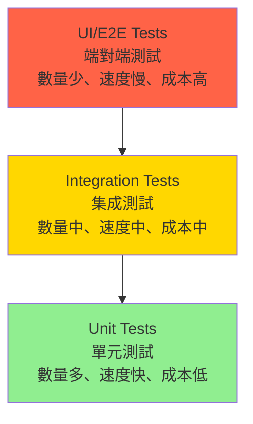

#### 🔵 單元測試（Unit Tests）

**定義:**  
測試程式碼中最小的可測試單元（通常是函式或方法）。

**特性:**

- 範圍小,只測試單一功能

- 執行速度快（毫秒級）

- 不依賴外部資源（資料庫、網路等）

- 使用 Mock/Stub 隔離依賴

- 數量最多（占 70-80%）


**範例:**

```java
@Test
public void testCalculateDiscount_WithVIPMember_ShouldGet20PercentOff() {
    // Arrange
    Product product = new Product("Laptop", 1000);
    Customer vipCustomer = new Customer("VIP");
    
    // Act
    double finalPrice = product.calculateDiscount(vipCustomer);
    
    // Assert
    assertEquals(800, finalPrice, 0.01);
}

```

**適用時機:**

- 測試業務邏輯

- 測試演算法正確性

- 測試邊界條件

- 測試異常處理


#### 🟡 集成測試（Integration Tests）

**定義:**  
測試多個元件或模組之間的互動與整合。

**特性:**

- 範圍較大,測試元件間協作

- 執行速度中等（秒級）

- 可能依賴外部資源

- 使用測試資料庫或測試環境

- 數量中等（占 15-25%）


**範例:**

```java
@Test
public void testSaveOrder_ShouldPersistToDatabase() {
    // Arrange
    Order order = new Order("ORD-001", 1500);
    OrderRepository repository = new OrderRepository(testDatabase);
    
    // Act
    repository.save(order);
    
    // Assert
    Order savedOrder = repository.findById("ORD-001");
    assertNotNull(savedOrder);
    assertEquals(1500, savedOrder.getAmount());
}

```

**適用時機:**

- 測試資料庫存取

- 測試 API 呼叫

- 測試訊息佇列

- 測試檔案讀寫


#### 🔴 系統測試/端對端測試（E2E Tests）

**定義:**  
從使用者角度測試整個系統流程。

**特性:**

- 範圍最大,測試完整流程

- 執行速度慢（分鐘級）

- 依賴完整環境

- 模擬真實使用者操作

- 數量最少（占 5-10%）


**範例:**

```java
@Test
public void testUserPurchaseFlow() {
    // 使用者登入
    loginPage.login("user@example.com", "password");
    
    // 搜尋商品
    searchPage.search("Laptop");
    
    // 加入購物車
    productPage.addToCart();
    
    // 結帳
    checkoutPage.checkout();
    
    // 驗證訂單建立
    assertTrue(orderPage.isOrderCreated());
}

```

**適用時機:**

- 測試關鍵使用者流程

- 測試系統整合

- 測試跨系統互動

- 冒煙測試（Smoke Test）


#### 對比分析

| 特性 | 單元測試 | 集成測試 | E2E 測試 |
|------|---------|---------|---------|
| **測試範圍** | 單一函式/類別 | 多個元件 | 整個系統 |
| **執行速度** | 極快（<100ms） | 中等（1-10s） | 慢（10s-數分鐘） |
| **維護成本** | 低 | 中 | 高 |
| **失敗定位** | 容易 | 中等 | 困難 |
| **依賴性** | 無外部依賴 | 部分依賴 | 完全依賴 |
| **建議占比** | 70-80% | 15-25% | 5-10% |
| **TDD 適用** | ✅ 非常適合 | ⚠️ 部分適用 | ❌ 較不適用 |

#### 💡 實務建議

**1. 遵循測試金字塔原則**

- 大量單元測試建立快速反饋

- 適量集成測試確保整合正確

- 少量 E2E 測試驗證關鍵流程


**2. TDD 主要應用於單元測試**

- Red-Green-Refactor 循環適合單元測試

- 集成測試可在模組完成後補充

- E2E 測試在功能完整後撰寫


**3. 依據專案特性調整**

- API 專案可增加集成測試比例

- UI 密集專案可增加元件測試

- 業務邏輯複雜則加強單元測試


---

## 🎯 本章重點回顧

✅ TDD 是**先寫測試,後寫實作**的開發方法  
✅ 核心循環是 **Red → Green → Refactor**  
✅ TDD 提升程式碼品質、降低缺陷、加速長期開發  
✅ 需要投入學習時間,但長期效益顯著  
✅ 遵循**測試金字塔**原則,以單元測試為主  

---

## 📋 本章檢查清單

在進入下一章前,請確認您已經:


- [ ] 理解 TDD 的定義與核心理念

- [ ] 能說明 Red-Green-Refactor 三階段

- [ ] 了解 TDD 與傳統開發的差異

- [ ] 認識 TDD 的好處與挑戰

- [ ] 區分單元測試、集成測試、E2E 測試

- [ ] 理解測試金字塔的概念


---

## 📚 延伸閱讀


- 《Test Driven Development: By Example》 - Kent Beck

- 《Growing Object-Oriented Software, Guided by Tests》 - Steve Freeman & Nat Pryce

- Martin Fowler 的文章: [TestPyramid](https://martinfowler.com/bliki/TestPyramid.html)


---

**下一章:** [三、TDD 實踐步驟](#三tdd-實踐步驟)

---

## 三、TDD 實踐步驟

### 3.1 Step 1：撰寫失敗的測試（Red）

#### 🎯 目標

在開始實作功能前,先撰寫一個**明確定義預期行為**的測試案例。

#### 📝 實踐步驟

**步驟一:理解需求**

首先,確認你要實作的功能需求:


```markdown
需求範例:
「實作一個購物車系統,當使用者加入商品時,需要計算總金額」

```

**步驟二:定義測試案例**

思考以下問題:

- ❓ 輸入是什麼?(參數、資料)

- ❓ 預期輸出是什麼?(回傳值、狀態變化)

- ❓ 有哪些邊界條件?

- ❓ 有哪些異常情況?


**步驟三:撰寫測試**


```java
// 範例:購物車測試 (Java + JUnit)
import org.junit.jupiter.api.Test;
import static org.junit.jupiter.api.Assertions.*;

public class ShoppingCartTest {
    
    @Test
    public void testAddSingleItem_ShouldCalculateCorrectTotal() {
        // Arrange (準備測試資料)
        ShoppingCart cart = new ShoppingCart();
        Product laptop = new Product("Laptop", 30000);
        
        // Act (執行測試動作)
        cart.addItem(laptop, 1);
        
        // Assert (驗證結果)
        assertEquals(30000, cart.getTotal());
    }
}

```

**步驟四:執行測試,確認失敗**


```bash
# 執行測試
mvn test

# 預期輸出(紅燈)
[ERROR] testAddSingleItem_ShouldCalculateCorrectTotal()
java.lang.NoSuchMethodError: ShoppingCart.addItem()

```

#### ✅ 成功標準


- [ ] 測試程式碼可以編譯通過

- [ ] 測試執行結果為**失敗(紅燈)**

- [ ] 失敗原因是**因為功能尚未實作**

- [ ] 測試案例清楚描述預期行為

- [ ] 測試使用 AAA 模式(Arrange-Act-Assert)


#### ⚠️ 常見錯誤

**錯誤 1:測試一開始就通過**

```java
// ❌ 錯誤範例
@Test
public void testAddition() {
    assertEquals(5, 2 + 3); // 這不是在測試你的程式碼!
}

```

**錯誤 2:測試過於複雜**

```java
// ❌ 錯誤範例:一次測試太多事情
@Test
public void testComplexScenario() {
    cart.addItem(item1, 2);
    cart.addItem(item2, 3);
    cart.applyDiscount(0.1);
    cart.checkout();
    cart.generateInvoice();
    // 太多行為混在一起!
}

```

**正確做法:**

```java
// ✅ 正確範例:一次只測試一個行為
@Test
public void testAddMultipleItems_ShouldSumTotal() {
    ShoppingCart cart = new ShoppingCart();
    cart.addItem(new Product("A", 100), 2);
    cart.addItem(new Product("B", 200), 1);
    
    assertEquals(400, cart.getTotal());
}

```

#### 💡 實務技巧

**技巧 1:使用描述性的測試名稱**


```java
// ❌ 不好的命名
@Test
public void test1() { }

@Test
public void testCart() { }

// ✅ 好的命名
@Test
public void testAddItem_WithNegativeQuantity_ShouldThrowException() { }

@Test
public void testCalculateTotal_WithEmptyCart_ShouldReturnZero() { }

```

命名格式建議:

```text
test[方法名]_[測試條件]_[預期結果]

```

**技巧 2:先寫最簡單的測試案例**

遵循**由簡入繁**的原則:


```java
// 第一個測試:最基本的情況
@Test
public void testAddSingleItem_ShouldUpdateTotal() { }

// 第二個測試:多個商品
@Test
public void testAddMultipleItems_ShouldSumTotal() { }

// 第三個測試:邊界條件
@Test
public void testAddItem_WithZeroQuantity_ShouldNotChangeTotal() { }

// 第四個測試:異常情況
@Test
public void testAddItem_WithNullProduct_ShouldThrowException() { }

```

**技巧 3:使用測試資料建構器(Test Data Builder)**


```java
// 使用建構器簡化測試資料準備
public class ProductBuilder {
    private String name = "Default Product";
    private int price = 100;
    
    public ProductBuilder withName(String name) {
        this.name = name;
        return this;
    }
    
    public ProductBuilder withPrice(int price) {
        this.price = price;
        return this;
    }
    
    public Product build() {
        return new Product(name, price);
    }
}

// 測試中使用
@Test
public void testExpensiveProduct() {
    Product product = new ProductBuilder()
        .withName("MacBook Pro")
        .withPrice(80000)
        .build();
    
    cart.addItem(product, 1);
    assertEquals(80000, cart.getTotal());
}

```

### 3.2 Step 2：撰寫最簡單的實作通過測試（Green）

#### 🎯 目標

用**最少量的程式碼**讓測試從紅燈變綠燈。

#### 📝 實踐步驟

**步驟一:建立最小實作**


```java
// 第一版:讓測試通過的最簡實作
public class ShoppingCart {
    private int total = 0;
    
    public void addItem(Product product, int quantity) {
        total = product.getPrice() * quantity;
    }
    
    public int getTotal() {
        return total;
    }
}

public class Product {
    private String name;
    private int price;
    
    public Product(String name, int price) {
        this.name = name;
        this.price = price;
    }
    
    public int getPrice() {
        return price;
    }
}

```

**步驟二:執行測試,確認通過**


```bash
mvn test

# 預期輸出(綠燈)
[INFO] Tests run: 1, Failures: 0, Errors: 0, Skipped: 0
[INFO] BUILD SUCCESS

```

#### ⚠️ Green 階段的原則

**原則 1:只寫讓測試通過的程式碼**


```java
// ❌ 過度設計
public class ShoppingCart {
    private List<CartItem> items = new ArrayList<>();
    private DiscountStrategy discountStrategy;
    private TaxCalculator taxCalculator;
    // ... 太多不必要的設計
}

// ✅ 簡單實作
public class ShoppingCart {
    private int total = 0;
    
    public void addItem(Product product, int quantity) {
        total += product.getPrice() * quantity;
    }
}

```

**原則 2:可以使用假實作(Fake It)**

當不確定最終設計時,先用最簡單的方式通過:


```java
// 第一個測試
@Test
public void testGetDiscount_ForVIP_ShouldReturn20Percent() {
    Customer vip = new Customer("VIP");
    assertEquals(0.2, vip.getDiscount(), 0.01);
}

// 假實作(硬編碼)
public class Customer {
    public double getDiscount() {
        return 0.2; // 先硬編碼通過測試
    }
}

// 當有第二個測試時,再改為真實邏輯
@Test
public void testGetDiscount_ForRegular_ShouldReturn0() {
    Customer regular = new Customer("REGULAR");
    assertEquals(0.0, regular.getDiscount(), 0.01);
}

// 現在需要真實實作
public class Customer {
    private String type;
    
    public Customer(String type) {
        this.type = type;
    }
    
    public double getDiscount() {
        if ("VIP".equals(type)) {
            return 0.2;
        }
        return 0.0;
    }
}

```

**原則 3:三角測量法(Triangulation)**

透過多個測試案例,逐步逼近正確的實作:


```java
// 測試 1
@Test
public void testFizzBuzz_With3_ShouldReturnFizz() {
    assertEquals("Fizz", fizzBuzz(3));
}

// 第一版實作(假實作)
public String fizzBuzz(int number) {
    return "Fizz";
}

// 測試 2
@Test
public void testFizzBuzz_With5_ShouldReturnBuzz() {
    assertEquals("Buzz", fizzBuzz(5));
}

// 第二版實作
public String fizzBuzz(int number) {
    if (number % 3 == 0) return "Fizz";
    if (number % 5 == 0) return "Buzz";
    return String.valueOf(number);
}

// 測試 3
@Test
public void testFizzBuzz_With15_ShouldReturnFizzBuzz() {
    assertEquals("FizzBuzz", fizzBuzz(15));
}

// 第三版實作(完整邏輯)
public String fizzBuzz(int number) {
    if (number % 15 == 0) return "FizzBuzz";
    if (number % 3 == 0) return "Fizz";
    if (number % 5 == 0) return "Buzz";
    return String.valueOf(number);
}

```

#### 💡 實務技巧

**技巧 1:快速迭代**


- ⏱️ 盡快讓測試變綠燈(目標:<5分鐘)

- ⏱️ 不要在 Green 階段進行重構

- ⏱️ 保持小步前進


**技巧 2:暫時跳過複雜邏輯**


```java
// 可以先用 TODO 標記待實作的複雜邏輯
public void processPayment(Payment payment) {
    // TODO: 實作複雜的支付邏輯
    if (payment.getAmount() > 0) {
        // 簡單版本先通過測試
    }
}

```

**技巧 3:立即執行所有測試**


```bash
# 確保新實作不會破壞既有測試
mvn test

# 或使用 IDE 的快捷鍵
# IntelliJ: Ctrl+Shift+F10 (Windows) / Cmd+Shift+R (Mac)
# VS Code: Ctrl+; A (Windows) / Cmd+; A (Mac)

```

### 3.3 Step 3：重構程式碼（Refactor）

#### 🎯 目標

在測試保護下,改善程式碼品質而不改變行為。

#### 📝 重構步驟

**步驟一:識別程式碼異味(Code Smells)**

檢查是否有以下問題:

- 重複程式碼(Duplicated Code)

- 過長方法(Long Method)

- 過長類別(Large Class)

- 過多參數(Long Parameter List)

- 魔術數字(Magic Numbers)

- 不清晰的命名(Unclear Naming)


**步驟二:選擇重構手法**


```java
// 重構前:有重複邏輯
public class ShoppingCart {
    public int calculateTotalForVIP(List<Product> products) {
        int total = 0;
        for (Product p : products) {
            total += p.getPrice();
        }
        return (int)(total * 0.8); // VIP 8折
    }
    
    public int calculateTotalForRegular(List<Product> products) {
        int total = 0;
        for (Product p : products) {
            total += p.getPrice();
        }
        return total;
    }
}

// 重構後:消除重複
public class ShoppingCart {
    public int calculateTotal(List<Product> products, double discount) {
        int total = products.stream()
            .mapToInt(Product::getPrice)
            .sum();
        return (int)(total * (1 - discount));
    }
}

```

**步驟三:執行重構**


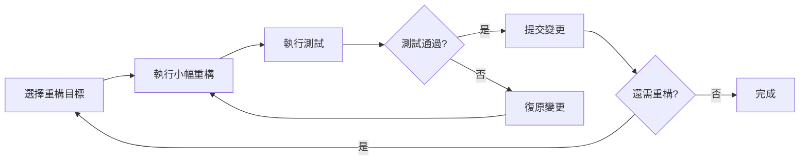

**步驟四:持續驗證**

每次重構後立即執行測試:


```bash
# 每次小改動後都要測試
git add .
mvn test && git commit -m "Refactor: extract method"

```

#### 🔧 常用重構技巧

**技巧 1:提取方法(Extract Method)**


```java
// 重構前
public void processOrder(Order order) {
    // 驗證訂單
    if (order.getItems().isEmpty()) {
        throw new IllegalArgumentException("Empty order");
    }
    if (order.getTotal() < 0) {
        throw new IllegalArgumentException("Invalid total");
    }
    
    // 計算折扣
    double discount = 0;
    if (order.getCustomer().isVIP()) {
        discount = 0.2;
    }
    double finalPrice = order.getTotal() * (1 - discount);
    
    // 儲存訂單
    database.save(order);
}

// 重構後:提取獨立方法
public void processOrder(Order order) {
    validateOrder(order);
    double finalPrice = calculateFinalPrice(order);
    saveOrder(order);
}

private void validateOrder(Order order) {
    if (order.getItems().isEmpty()) {
        throw new IllegalArgumentException("Empty order");
    }
    if (order.getTotal() < 0) {
        throw new IllegalArgumentException("Invalid total");
    }
}

private double calculateFinalPrice(Order order) {
    double discount = order.getCustomer().isVIP() ? 0.2 : 0.0;
    return order.getTotal() * (1 - discount);
}

private void saveOrder(Order order) {
    database.save(order);
}

```

**技巧 2:提取類別(Extract Class)**


```java
// 重構前:職責過多
public class Customer {
    private String name;
    private String email;
    private String phone;
    private String street;
    private String city;
    private String zipCode;
    
    // 太多欄位與職責
}

// 重構後:分離地址類別
public class Customer {
    private String name;
    private String email;
    private String phone;
    private Address address; // 提取為獨立類別
}

public class Address {
    private String street;
    private String city;
    private String zipCode;
    
    public String getFullAddress() {
        return street + ", " + city + " " + zipCode;
    }
}

```

**技巧 3:以常數取代魔術數字**


```java
// 重構前
public double calculateDiscount(Customer customer) {
    if (customer.isVIP()) {
        return total * 0.8; // 魔術數字
    }
    return total * 0.95; // 魔術數字
}

// 重構後
private static final double VIP_DISCOUNT_RATE = 0.2;
private static final double REGULAR_DISCOUNT_RATE = 0.05;

public double calculateDiscount(Customer customer) {
    if (customer.isVIP()) {
        return total * (1 - VIP_DISCOUNT_RATE);
    }
    return total * (1 - REGULAR_DISCOUNT_RATE);
}

```

**技巧 4:使用策略模式消除條件判斷**


```java
// 重構前
public double calculateShippingCost(String shippingType, double weight) {
    if ("STANDARD".equals(shippingType)) {
        return weight * 10;
    } else if ("EXPRESS".equals(shippingType)) {
        return weight * 20 + 50;
    } else if ("OVERNIGHT".equals(shippingType)) {
        return weight * 30 + 100;
    }
    return 0;
}

// 重構後:使用策略模式
public interface ShippingStrategy {
    double calculateCost(double weight);
}

public class StandardShipping implements ShippingStrategy {
    public double calculateCost(double weight) {
        return weight * 10;
    }
}

public class ExpressShipping implements ShippingStrategy {
    public double calculateCost(double weight) {
        return weight * 20 + 50;
    }
}

// 使用
public double calculateShippingCost(ShippingStrategy strategy, double weight) {
    return strategy.calculateCost(weight);
}

```

#### ⚠️ 重構注意事項

**注意 1:一次只做一種重構**


```text
❌ 同時重構:改命名 + 提取方法 + 調整架構
✅ 循序漸進:先改命名 → 測試 → 提取方法 → 測試 → 調整架構 → 測試

```

**注意 2:保持測試通過**


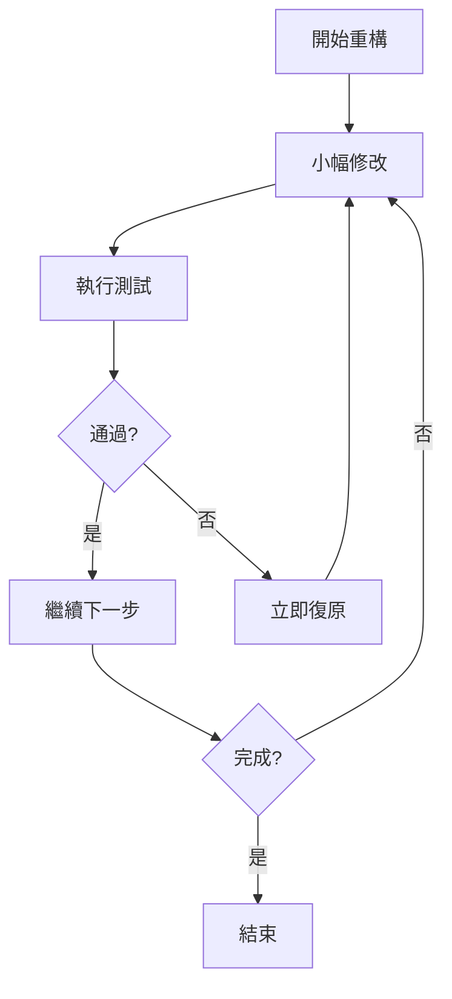

**注意 3:不要同時修改行為與重構**


```java
// ❌ 錯誤:重構時加入新功能
public double calculateTotal() {
    // 重構:提取方法
    double subtotal = calculateSubtotal();
    
    // 同時加入新功能(稅金計算) - 不好!
    double tax = subtotal * 0.05;
    return subtotal + tax;
}

// ✅ 正確:先重構,再加新功能
// 步驟1:重構
public double calculateTotal() {
    return calculateSubtotal();
}

private double calculateSubtotal() {
    // 提取的邏輯
}

// 步驟2:寫新測試
@Test
public void testCalculateTotal_ShouldIncludeTax() {
    // 新功能的測試
}

// 步驟3:實作新功能
public double calculateTotal() {
    double subtotal = calculateSubtotal();
    double tax = calculateTax(subtotal);
    return subtotal + tax;
}

```

#### 💡 重構最佳實踐

**實踐 1:使用版本控制**


```bash
# 每次重構後提交
git add .
git commit -m "Refactor: extract calculateDiscount method"

# 如果重構失敗可快速復原
git reset --hard HEAD

```

**實踐 2:使用 IDE 重構工具**


```text
IntelliJ IDEA 常用快捷鍵:

- Ctrl+Alt+M: 提取方法

- Ctrl+Alt+V: 提取變數

- Ctrl+Alt+C: 提取常數

- Ctrl+Alt+F: 提取欄位

- F6: 移動類別/方法

- Shift+F6: 重新命名

```

**實踐 3:測試也需要重構**


```java
// 測試程式碼也會有重複,需要重構
@Test
public void testVIPDiscount() {
    Customer vip = new Customer("John", "VIP");
    ShoppingCart cart = new ShoppingCart(vip);
    cart.addItem(new Product("A", 1000), 1);
    assertEquals(800, cart.getTotal());
}

@Test
public void testRegularCustomer() {
    Customer regular = new Customer("Jane", "REGULAR");
    ShoppingCart cart = new ShoppingCart(regular);
    cart.addItem(new Product("A", 1000), 1);
    assertEquals(1000, cart.getTotal());
}

// 重構測試:提取共用設定
private ShoppingCart createCartWith Product(Customer customer, int price) {
    ShoppingCart cart = new ShoppingCart(customer);
    cart.addItem(new Product("TestProduct", price), 1);
    return cart;
}

@Test
public void testVIPDiscount() {
    Customer vip = new Customer("John", "VIP");
    ShoppingCart cart = createCartWithProduct(vip, 1000);
    assertEquals(800, cart.getTotal());
}

@Test
public void testRegularCustomer() {
    Customer regular = new Customer("Jane", "REGULAR");
    ShoppingCart cart = createCartWithProduct(regular, 1000);
    assertEquals(1000, cart.getTotal());
}

```

### 3.4 Step 4：重複循環與迭代開發

#### 🎯 目標

透過持續的 Red-Green-Refactor 循環,逐步完善功能。

#### 📝 迭代開發流程

**完整開發循環示範:**

讓我們用一個完整範例展示多次迭代:

**需求:實作一個訂單折扣計算系統**

- VIP 客戶享有 20% 折扣

- 訂單金額超過 1000 元再享 5% 折扣

- 折扣可累加


**第一次迭代:基本 VIP 折扣**


```java
// Iteration 1: Red - 寫測試
@Test
public void testVIPCustomer_ShouldGet20PercentDiscount() {
    Order order = new Order(new Customer("VIP"), 1000);
    assertEquals(800, order.getFinalPrice());
}

// Iteration 1: Green - 最簡實作
public class Order {
    private Customer customer;
    private double amount;
    
    public Order(Customer customer, double amount) {
        this.customer = customer;
        this.amount = amount;
    }
    
    public double getFinalPrice() {
        if (customer.isVIP()) {
            return amount * 0.8;
        }
        return amount;
    }
}

// Iteration 1: Refactor - 提取常數
private static final double VIP_DISCOUNT = 0.2;

public double getFinalPrice() {
    if (customer.isVIP()) {
        return amount * (1 - VIP_DISCOUNT);
    }
    return amount;
}

```

**第二次迭代:一般客戶**


```java
// Iteration 2: Red - 新測試
@Test
public void testRegularCustomer_ShouldHaveNoDiscount() {
    Order order = new Order(new Customer("REGULAR"), 1000);
    assertEquals(1000, order.getFinalPrice());
}

// Iteration 2: Green - 程式碼已經支援,測試直接通過!

// Iteration 2: Refactor - 簡化邏輯
public double getFinalPrice() {
    double discount = customer.isVIP() ? VIP_DISCOUNT : 0;
    return amount * (1 - discount);
}

```

**第三次迭代:高額訂單折扣**


```java
// Iteration 3: Red - 新測試
@Test
public void testLargeOrder_ShouldGetAdditional5PercentDiscount() {
    Order order = new Order(new Customer("REGULAR"), 1500);
    assertEquals(1425, order.getFinalPrice()); // 1500 * 0.95
}

// Iteration 3: Green - 加入邏輯
private static final double LARGE_ORDER_THRESHOLD = 1000;
private static final double LARGE_ORDER_DISCOUNT = 0.05;

public double getFinalPrice() {
    double discount = customer.isVIP() ? VIP_DISCOUNT : 0;
    
    if (amount > LARGE_ORDER_THRESHOLD) {
        discount += LARGE_ORDER_DISCOUNT;
    }
    
    return amount * (1 - discount);
}

// Iteration 3: Refactor - 提取方法
public double getFinalPrice() {
    double totalDiscount = calculateTotalDiscount();
    return amount * (1 - totalDiscount);
}

private double calculateTotalDiscount() {
    double discount = customer.isVIP() ? VIP_DISCOUNT : 0;
    
    if (amount > LARGE_ORDER_THRESHOLD) {
        discount += LARGE_ORDER_DISCOUNT;
    }
    
    return discount;
}

```

**第四次迭代:VIP + 高額訂單組合**


```java
// Iteration 4: Red - 組合測試
@Test
public void testVIPWithLargeOrder_ShouldGetBothDiscounts() {
    Order order = new Order(new Customer("VIP"), 1500);
    // VIP 20% + 大額訂單 5% = 25% 折扣
    assertEquals(1125, order.getFinalPrice()); // 1500 * 0.75
}

// Iteration 4: Green - 程式碼已支援,測試通過!

// Iteration 4: Refactor - 進一步重構
public double getFinalPrice() {
    DiscountCalculator calculator = new DiscountCalculator(customer, amount);
    return calculator.calculateFinalPrice();
}

// 提取為獨立的折扣計算類別
public class DiscountCalculator {
    private static final double VIP_DISCOUNT = 0.2;
    private static final double LARGE_ORDER_DISCOUNT = 0.05;
    private static final double LARGE_ORDER_THRESHOLD = 1000;
    
    private Customer customer;
    private double amount;
    
    public DiscountCalculator(Customer customer, double amount) {
        this.customer = customer;
        this.amount = amount;
    }
    
    public double calculateFinalPrice() {
        double totalDiscount = calculateTotalDiscount();
        return amount * (1 - totalDiscount);
    }
    
    private double calculateTotalDiscount() {
        double discount = 0;
        
        if (customer.isVIP()) {
            discount += VIP_DISCOUNT;
        }
        
        if (amount > LARGE_ORDER_THRESHOLD) {
            discount += LARGE_ORDER_DISCOUNT;
        }
        
        return discount;
    }
}

```

#### 📊 迭代進度追蹤

建議使用任務清單追蹤迭代進度:


```markdown
## 訂單折扣系統開發任務

### 已完成

- [x] VIP 客戶 20% 折扣

- [x] 一般客戶無折扣

- [x] 訂單金額 > 1000 享 5% 折扣

- [x] VIP + 大額訂單折扣累加


### 進行中

- [ ] 會員等級分級(金、銀、銅)


### 待辦

- [ ] 季節性促銷折扣

- [ ] 優惠券折扣

- [ ] 折扣上限設定

```

#### 💡 迭代開發技巧

**技巧 1:保持迭代小而快**


```text
❌ 大迭代:一次實作完整的折扣系統(需要3小時)
✅ 小迭代:每個折扣類型獨立開發(每個15分鐘)

```

**時間建議:**

- 每次迭代: 5-15 分鐘

- Red 階段: 1-3 分鐘

- Green 階段: 2-5 分鐘

- Refactor 階段: 2-7 分鐘


**技巧 2:優先實作最有價值的功能**


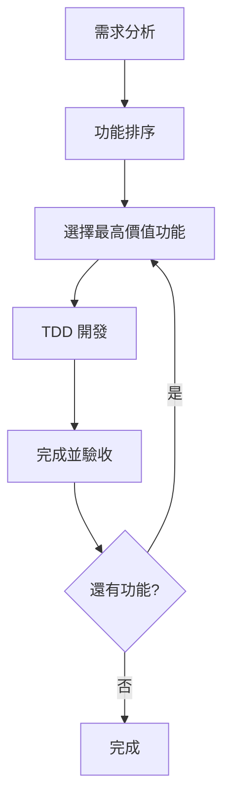

**技巧 3:使用測試清單(Test List)**

在開始前列出所有要測試的案例:


```markdown
## 購物車測試清單

### 基本功能

- [ ] 加入單一商品

- [ ] 加入多個不同商品

- [ ] 計算總金額


### 邊界條件

- [ ] 加入數量為 0 的商品

- [ ] 加入負數數量的商品

- [ ] 空購物車的總金額


### 異常處理

- [ ] 加入 null 商品

- [ ] 移除不存在的商品


### 進階功能

- [ ] 更新商品數量

- [ ] 清空購物車

- [ ] 套用折扣碼

```

每完成一個測試就打勾,清楚掌握進度。

### 3.5 驗收標準（Definition of Done）與測試覆蓋率要求

#### 🎯 完成定義(Definition of Done)

每個功能開發完成前,必須滿足以下標準:

**基本標準:**


- [ ] ✅ 所有單元測試通過

- [ ] ✅ 測試覆蓋率達到標準(見下方說明)

- [ ] ✅ 程式碼通過靜態分析檢查

- [ ] ✅ 程式碼已重構,消除重複與異味

- [ ] ✅ 命名清晰,符合團隊規範

- [ ] ✅ 已提交版本控制並推送

- [ ] ✅ 程式碼已通過同儕審查(Code Review)


**進階標準:**


- [ ] ✅ 整合測試通過(如適用)

- [ ] ✅ 效能測試通過(如適用)

- [ ] ✅ 安全性檢查通過

- [ ] ✅ 文件已更新(API 文件、README 等)

- [ ] ✅ CI/CD Pipeline 執行成功


#### 📊 測試覆蓋率標準

**覆蓋率類型:**


1. **行覆蓋率(Line Coverage)**
   - 測試執行時經過的程式碼行數比例
   - **建議目標: 80% 以上**


2. **分支覆蓋率(Branch Coverage)**
   - 測試執行時經過的條件分支比例
   - **建議目標: 70% 以上**


3. **方法覆蓋率(Method Coverage)**
   - 被測試呼叫的方法比例
   - **建議目標: 90% 以上**

**覆蓋率工具:**


```xml
<!-- Maven: 使用 JaCoCo -->
<plugin>
    <groupId>org.jacoco</groupId>
    <artifactId>jacoco-maven-plugin</artifactId>
    <version>0.8.10</version>
    <executions>
        <execution>
            <goals>
                <goal>prepare-agent</goal>
            </goals>
        </execution>
        <execution>
            <id>report</id>
            <phase>test</phase>
            <goals>
                <goal>report</goal>
            </goals>
        </execution>
        <execution>
            <id>jacoco-check</id>
            <goals>
                <goal>check</goal>
            </goals>
            <configuration>
                <rules>
                    <rule>
                        <element>PACKAGE</element>
                        <limits>
                            <limit>
                                <counter>LINE</counter>
                                <value>COVEREDRATIO</value>
                                <minimum>0.80</minimum>
                            </limit>
                        </limits>
                    </rule>
                </rules>
            </configuration>
        </execution>
    </executions>
</plugin>

```


```bash
# 執行並生成覆蓋率報告
mvn clean test jacoco:report

# 查看報告
open target/site/jacoco/index.html

```

**覆蓋率報告範例:**


```text
-------------------------------------------------------
JaCoCo Coverage Report
-------------------------------------------------------
Package         Line Coverage   Branch Coverage
-------------------------------------------------------
com.example
  ├─ service    87.5% (35/40)  75.0% (6/8)
  ├─ model      95.0% (19/20)  N/A
  └─ util       82.3% (28/34)  80.0% (8/10)
-------------------------------------------------------
Total           88.3% (82/94)  77.8% (14/18)

```

#### ⚠️ 覆蓋率的正確理解

**覆蓋率高 ≠ 測試品質好**


```java
// 範例:100% 覆蓋率但測試品質差
@Test
public void testCalculate() {
    Calculator calc = new Calculator();
    calc.add(2, 3);
    calc.subtract(5, 2);
    calc.multiply(3, 4);
    // 沒有任何 assert,但程式碼都執行了!
}

```

**正確做法:**


```java
@Test
public void testAdd_ShouldReturnCorrectSum() {
    Calculator calc = new Calculator();
    int result = calc.add(2, 3);
    assertEquals(5, result); // 有驗證!
}

@Test
public void testSubtract_ShouldReturnCorrectDifference() {
    Calculator calc = new Calculator();
    int result = calc.subtract(5, 2);
    assertEquals(3, result);
}

```

#### 💡 覆蓋率最佳實踐

**實踐 1:聚焦關鍵程式碼**


```text
✅ 高覆蓋率優先:

- 核心業務邏輯(100%)

- 複雜演算法(100%)

- 錯誤處理(90%+)


⚠️ 可較低覆蓋率:

- 簡單的 Getter/Setter

- 框架生成的程式碼

- UI 元件程式碼

```

**實踐 2:設定覆蓋率門檻**


```yaml
# .gitlab-ci.yml 範例
test:
  script:
    - mvn clean test jacoco:report
  coverage: '/Total.*?([0-9]{1,3})%/'
  rules:
    - if: '$CI_PIPELINE_SOURCE == "merge_request_event"'
  artifacts:
    reports:
      coverage_report:
        coverage_format: cobertura
        path: target/site/jacoco/jacoco.xml
  # 設定最低覆蓋率要求
  allow_failure:
    exit_codes:
      - 1  # 如果覆蓋率低於門檻則失敗

```

**實踐 3:定期檢視覆蓋率趨勢**


```mermaid
line
    title 測試覆蓋率趨勢
    x-axis [Week1, Week2, Week3, Week4, Week5, Week6]
    y-axis "Coverage %" 0 --> 100
    line [65, 70, 75, 78, 82, 85]

```

#### 📋 檢查清單範本

將以下清單整合至開發流程:


```markdown
## 功能開發完成檢查清單

### 測試相關

- [ ] 所有測試案例通過(綠燈)

- [ ] 測試覆蓋率達到 80% 以上

- [ ] 包含邊界條件測試

- [ ] 包含異常處理測試

- [ ] 測試命名清晰易懂


### 程式碼品質

- [ ] 無重複程式碼

- [ ] 無程式碼異味(Code Smells)

- [ ] 命名清晰有意義

- [ ] 符合 SOLID 原則

- [ ] 通過靜態分析工具檢查


### 文件與審查

- [ ] 程式碼已提交並推送

- [ ] 通過 Code Review

- [ ] API 文件已更新

- [ ] Commit 訊息清晰


### CI/CD

- [ ] CI Pipeline 執行成功

- [ ] 無安全性漏洞警告

- [ ] 效能測試通過(如適用)


### 簽核

- [ ] 開發者簽核: ___________

- [ ] 審查者簽核: ___________

- [ ] 日期: ___________

```

---

## 🎯 本章重點回顧

✅ Red 階段:撰寫失敗的測試,明確定義預期行為  
✅ Green 階段:用最簡單的方式讓測試通過  
✅ Refactor 階段:在測試保護下改善程式碼品質  
✅ 持續迭代:透過小步前進逐步完善功能  
✅ 設定明確的完成標準與覆蓋率目標  

---

## 📋 本章檢查清單

在進入下一章前,請確認您已經:


- [ ] 能夠撰寫描述性的測試案例

- [ ] 掌握 Red-Green-Refactor 三階段實踐

- [ ] 了解常用重構技巧

- [ ] 能夠進行小步迭代開發

- [ ] 理解測試覆蓋率的意義與限制

- [ ] 建立開發完成的檢查清單


---

**下一章:** [四、TDD 開發環境與工具](#四tdd-開發環境與工具)

---

## 四、TDD 開發環境與工具

### 4.1 測試框架介紹

#### 🎯 主流測試框架對比

不同程式語言有不同的測試框架,以下介紹常用的選擇:

| 語言 | 測試框架 | 特點 | 適用場景 |
|------|---------|------|---------|
| **Java** | JUnit 5 | 最流行,生態系完整 | 企業級應用 |
| | TestNG | 功能豐富,支援平行測試 | 大型測試套件 |
| **Python** | pytest | 簡潔易用,插件豐富 | 各種專案 |
| | unittest | Python 內建,標準庫 | 簡單專案 |
| **JavaScript** | Jest | All-in-one,零設定 | React/Node.js |
| | Mocha | 靈活可擴展 | 客製化需求 |
| **C#** | xUnit | 現代化,.NET Core 推薦 | .NET 應用 |
| | NUnit | 成熟穩定 | 傳統 .NET |
| **Go** | testing | 官方標準庫 | Go 專案 |
| **Ruby** | RSpec | BDD 風格 | Rails 應用 |

#### 📦 Java - JUnit 5

**安裝設定:**


```xml
<!-- pom.xml -->
<dependencies>
    <!-- JUnit 5 -->
    <dependency>
        <groupId>org.junit.jupiter</groupId>
        <artifactId>junit-jupiter</artifactId>
        <version>5.10.0</version>
        <scope>test</scope>
    </dependency>
    
    <!-- Mockito (Mock 工具) -->
    <dependency>
        <groupId>org.mockito</groupId>
        <artifactId>mockito-core</artifactId>
        <version>5.5.0</version>
        <scope>test</scope>
    </dependency>
</dependencies>

```

**基本使用:**


```java
import org.junit.jupiter.api.*;
import static org.junit.jupiter.api.Assertions.*;

class CalculatorTest {
    
    private Calculator calculator;
    
    @BeforeEach
    void setUp() {
        calculator = new Calculator();
    }
    
    @Test
    @DisplayName("測試加法:2 + 3 應該等於 5")
    void testAdd() {
        int result = calculator.add(2, 3);
        assertEquals(5, result);
    }
    
    @Test
    void testDivide_ByZero_ShouldThrowException() {
        assertThrows(ArithmeticException.class, () -> {
            calculator.divide(10, 0);
        });
    }
    
    @ParameterizedTest
    @ValueSource(ints = {1, 2, 3, 5, 8})
    void testIsPositive(int number) {
        assertTrue(calculator.isPositive(number));
    }
}

```

**JUnit 5 主要註解:**


```java
@Test                  // 標記測試方法
@DisplayName("...")    // 測試顯示名稱
@BeforeEach           // 每個測試前執行
@AfterEach            // 每個測試後執行
@BeforeAll            // 所有測試前執行一次(static)
@AfterAll             // 所有測試後執行一次(static)
@Disabled             // 暫時停用測試
@RepeatedTest(5)      // 重複執行測試
@ParameterizedTest    // 參數化測試
@Timeout(5)           // 測試逾時限制(秒)

```

#### 🐍 Python - pytest

**安裝:**


```bash
pip install pytest pytest-cov

```

**基本使用:**


```python
# calculator.py
class Calculator:
    def add(self, a, b):
        return a + b
    
    def divide(self, a, b):
        if b == 0:
            raise ValueError("Cannot divide by zero")
        return a / b

# test_calculator.py
import pytest
from calculator import Calculator

class TestCalculator:
    
    def setup_method(self):
        """每個測試前執行"""
        self.calc = Calculator()
    
    def test_add(self):
        """測試加法功能"""
        result = self.calc.add(2, 3)
        assert result == 5
    
    def test_divide_by_zero_should_raise_exception(self):
        """測試除以零應拋出例外"""
        with pytest.raises(ValueError, match="Cannot divide by zero"):
            self.calc.divide(10, 0)
    
    @pytest.mark.parametrize("a,b,expected", [
        (2, 3, 5),
        (0, 0, 0),
        (-1, 1, 0),
        (100, 200, 300),
    ])
    def test_add_with_multiple_inputs(self, a, b, expected):
        """參數化測試"""
        assert self.calc.add(a, b) == expected

```

**執行測試:**


```bash
# 執行所有測試
pytest

# 顯示詳細輸出
pytest -v

# 生成覆蓋率報告
pytest --cov=calculator --cov-report=html

# 只執行特定測試
pytest test_calculator.py::TestCalculator::test_add

# 執行標記的測試
pytest -m slow

```

**pytest 常用裝飾器:**


```python
@pytest.fixture          # 定義測試夾具(共用資源)
@pytest.mark.parametrize # 參數化測試
@pytest.mark.skip       # 跳過測試
@pytest.mark.skipif     # 條件式跳過
@pytest.mark.xfail      # 預期失敗
@pytest.mark.slow       # 自定義標記

```

#### 🟨 JavaScript - Jest

**安裝:**


```bash
npm install --save-dev jest

```

**設定 package.json:**


```json
{
  "scripts": {
    "test": "jest",
    "test:watch": "jest --watch",
    "test:coverage": "jest --coverage"
  },
  "jest": {
    "testEnvironment": "node",
    "coverageThreshold": {
      "global": {
        "branches": 80,
        "functions": 80,
        "lines": 80
      }
    }
  }
}

```

**基本使用:**


```javascript
// calculator.js
class Calculator {
  add(a, b) {
    return a + b;
  }
  
  divide(a, b) {
    if (b === 0) {
      throw new Error('Cannot divide by zero');
    }
    return a / b;
  }
}

module.exports = Calculator;

// calculator.test.js
const Calculator = require('./calculator');

describe('Calculator', () => {
  let calculator;
  
  beforeEach(() => {
    calculator = new Calculator();
  });
  
  test('should add two numbers correctly', () => {
    const result = calculator.add(2, 3);
    expect(result).toBe(5);
  });
  
  test('should throw error when dividing by zero', () => {
    expect(() => {
      calculator.divide(10, 0);
    }).toThrow('Cannot divide by zero');
  });
  
  test.each([
    [1, 2, 3],
    [0, 0, 0],
    [-1, 1, 0],
  ])('add(%i, %i) should return %i', (a, b, expected) => {
    expect(calculator.add(a, b)).toBe(expected);
  });
});

```

**Jest 常用 API:**


```javascript
// 斷言
expect(value).toBe(expected)              // 嚴格相等
expect(value).toEqual(expected)           // 深度相等
expect(value).toBeTruthy()                // 真值
expect(value).toBeFalsy()                 // 假值
expect(array).toContain(item)             // 包含元素
expect(fn).toThrow()                      // 拋出例外
expect(fn).toHaveBeenCalled()             // 被呼叫

// 生命週期
beforeAll(() => {})      // 所有測試前
beforeEach(() => {})     // 每個測試前
afterEach(() => {})      // 每個測試後
afterAll(() => {})       // 所有測試後

// 測試組織
describe('group', () => {})  // 測試群組
test('name', () => {})       // 測試案例
it('name', () => {})         // test 的別名

```

### 4.2 IDE 與工具設定

#### 💻 IntelliJ IDEA 設定

**安裝必要插件:**


1. 開啟 Settings → Plugins

2. 搜尋並安裝:
   - JUnit
   - Code Coverage for Java
   - SonarLint (程式碼品質檢查)

**設定測試執行:**


```text

1. Run → Edit Configurations

2. Add New Configuration → JUnit

3. 設定:
   - Test kind: All in package
   - Package: com.example
   - VM options: -ea (啟用 assertions)
   - Working directory: $MODULE_WORKING_DIR$

```

**快捷鍵設定:**


```text
Ctrl+Shift+F10 (Win) / Cmd+Shift+R (Mac)  - 執行當前測試
Ctrl+Shift+F9 (Win) / Cmd+Shift+D (Mac)   - Debug 當前測試
Alt+Insert (Win) / Cmd+N (Mac)            - 生成測試方法
Ctrl+Shift+T (Win) / Cmd+Shift+T (Mac)    - 在測試與實作間切換

```

**即時測試執行(Infinitest):**


```xml
<!-- 安裝 Infinitest 插件 -->
Settings → Plugins → Marketplace → 搜尋 "Infinitest"

```

設定後,每次儲存程式碼會自動執行相關測試。

#### 🔵 VS Code 設定

**安裝擴充套件:**


1. Java Extension Pack (Java 開發)

2. Test Runner for Java

3. Python Test Explorer (Python 開發)

4. Jest Runner (JavaScript 開發)

5. Coverage Gutters (顯示覆蓋率)

**settings.json 設定:**


```json
{
  "java.test.config": {
    "workingDirectory": "${workspaceFolder}"
  },
  "java.test.defaultConfig": "default",
  "python.testing.pytestEnabled": true,
  "python.testing.unittestEnabled": false,
  "coverage-gutters.coverageFileNames": [
    "coverage/lcov.info",
    "coverage/coverage.xml"
  ],
  "editor.codeActionsOnSave": {
    "source.organizeImports": true
  }
}

```

**快捷鍵:**


```text
Ctrl+; A (Win) / Cmd+; A (Mac)  - 執行所有測試
Ctrl+; C (Win) / Cmd+; C (Mac)  - 執行當前測試
Ctrl+; L (Win) / Cmd+; L (Mac)  - 執行上次測試

```

#### 🌙 Eclipse 設定

**安裝插件:**


1. Help → Eclipse Marketplace

2. 搜尋並安裝:
   - EclEmma (覆蓋率工具)
   - MoreUnit (測試輔助)

**執行測試:**


```text
右鍵點擊測試類別或方法
→ Run As → JUnit Test

```

**快捷鍵:**


```text
Alt+Shift+X, T  - 執行 JUnit 測試
Alt+Shift+D, T  - Debug JUnit 測試
Ctrl+0          - 快速切換至測試

```

### 4.3 持續整合（CI）與自動化測試

#### 🔄 為什麼需要 CI

**持續整合的價值:**


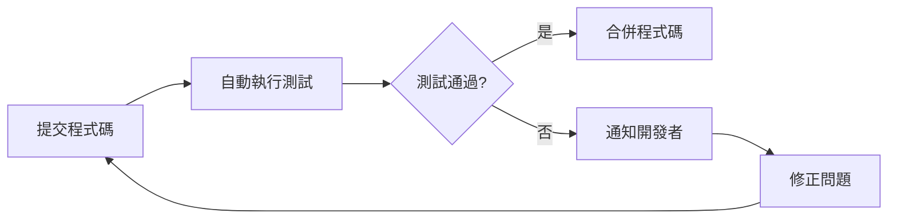

**好處:**

- ✅ 自動執行測試,減少人為疏失

- ✅ 及早發現整合問題

- ✅ 確保程式碼品質

- ✅ 自動生成測試報告

- ✅ 強制執行測試標準


#### 🦊 GitLab CI/CD 設定

**建立 .gitlab-ci.yml:**


```yaml
# .gitlab-ci.yml
image: maven:3.8-openjdk-17

stages:
  - test
  - report

variables:
  MAVEN_OPTS: "-Dmaven.repo.local=$CI_PROJECT_DIR/.m2/repository"

cache:
  paths:
    - .m2/repository
    - target/

test:
  stage: test
  script:
    - mvn clean test
  coverage: '/Total.*?([0-9]{1,3})%/'
  artifacts:
    when: always
    reports:
      junit:
        - target/surefire-reports/TEST-*.xml
    paths:
      - target/surefire-reports/
      - target/site/jacoco/
  rules:
    - if: '$CI_PIPELINE_SOURCE == "merge_request_event"'
    - if: '$CI_COMMIT_BRANCH == "main"'

coverage:
  stage: report
  script:
    - mvn jacoco:report
  coverage: '/Total.*?([0-9]{1,3})%/'
  artifacts:
    reports:
      coverage_report:
        coverage_format: cobertura
        path: target/site/jacoco/jacoco.xml
  rules:
    - if: '$CI_PIPELINE_SOURCE == "merge_request_event"'

```

**測試失敗通知設定:**


```yaml
# 加入通知階段
notify_failure:
  stage: .post
  script:
    - 'curl -X POST -H "Content-Type: application/json" 
       -d "{\"text\":\"Test Failed in ${CI_PROJECT_NAME}\"}" 
       $SLACK_WEBHOOK_URL'
  rules:
    - if: '$CI_PIPELINE_SOURCE == "merge_request_event"'
      when: on_failure

```

#### 🐙 GitHub Actions 設定

**建立 .github/workflows/test.yml:**


```yaml
name: Run Tests

on:
  push:
    branches: [ main, develop ]
  pull_request:
    branches: [ main ]

jobs:
  test:
    runs-on: ubuntu-latest
    
    steps:
    - uses: actions/checkout@v3
    
    - name: Set up JDK 17
      uses: actions/setup-java@v3
      with:
        java-version: '17'
        distribution: 'temurin'
        cache: maven
    
    - name: Run tests
      run: mvn clean test
    
    - name: Generate coverage report
      run: mvn jacoco:report
    
    - name: Upload coverage to Codecov
      uses: codecov/codecov-action@v3
      with:
        files: ./target/site/jacoco/jacoco.xml
        flags: unittests
        name: codecov-umbrella
    
    - name: Publish test results
      uses: EnricoMi/publish-unit-test-result-action@v2
      if: always()
      with:
        files: target/surefire-reports/*.xml
    
    - name: Comment PR with coverage
      uses: romeovs/lcov-reporter-action@v0.3.1
      if: github.event_name == 'pull_request'
      with:
        lcov-file: ./target/site/jacoco/jacoco.xml
        github-token: ${{ secrets.GITHUB_TOKEN }}

```

**Python 專案範例:**


```yaml
name: Python Tests

on: [push, pull_request]

jobs:
  test:
    runs-on: ubuntu-latest
    strategy:
      matrix:
        python-version: ['3.8', '3.9', '3.10', '3.11']
    
    steps:
    - uses: actions/checkout@v3
    
    - name: Set up Python ${{ matrix.python-version }}
      uses: actions/setup-python@v4
      with:
        python-version: ${{ matrix.python-version }}
    
    - name: Install dependencies
      run: |
        python -m pip install --upgrade pip
        pip install pytest pytest-cov
        pip install -r requirements.txt
    
    - name: Run tests with coverage
      run: |
        pytest --cov=. --cov-report=xml --cov-report=html
    
    - name: Upload coverage
      uses: codecov/codecov-action@v3
      with:
        files: ./coverage.xml

```

#### 🚀 Jenkins 設定

**Jenkinsfile 範例:**


```groovy
pipeline {
    agent any
    
    tools {
        maven 'Maven 3.8'
        jdk 'JDK 17'
    }
    
    stages {
        stage('Checkout') {
            steps {
                checkout scm
            }
        }
        
        stage('Test') {
            steps {
                sh 'mvn clean test'
            }
        }
        
        stage('Coverage') {
            steps {
                sh 'mvn jacoco:report'
                jacoco(
                    execPattern: 'target/*.exec',
                    classPattern: 'target/classes',
                    sourcePattern: 'src/main/java',
                    inclusionPattern: '**/*.class'
                )
            }
        }
        
        stage('Quality Gate') {
            steps {
                script {
                    def coverage = sh(
                        script: 'mvn jacoco:check',
                        returnStatus: true
                    )
                    if (coverage != 0) {
                        error("Coverage below threshold!")
                    }
                }
            }
        }
    }
    
    post {
        always {
            junit 'target/surefire-reports/*.xml'
            publishHTML([
                reportDir: 'target/site/jacoco',
                reportFiles: 'index.html',
                reportName: 'Coverage Report'
            ])
        }
        failure {
            mail to: 'team@example.com',
                 subject: "Test Failed: ${env.JOB_NAME} - ${env.BUILD_NUMBER}",
                 body: "Check ${env.BUILD_URL}"
        }
    }
}

```

### 4.4 測試覆蓋率工具

#### 📊 JaCoCo (Java)

**Maven 設定:**


```xml
<plugin>
    <groupId>org.jacoco</groupId>
    <artifactId>jacoco-maven-plugin</artifactId>
    <version>0.8.10</version>
    <executions>
        <execution>
            <id>prepare-agent</id>
            <goals>
                <goal>prepare-agent</goal>
            </goals>
        </execution>
        <execution>
            <id>report</id>
            <phase>test</phase>
            <goals>
                <goal>report</goal>
            </goals>
        </execution>
        <execution>
            <id>jacoco-check</id>
            <goals>
                <goal>check</goal>
            </goals>
            <configuration>
                <rules>
                    <rule>
                        <element>PACKAGE</element>
                        <limits>
                            <limit>
                                <counter>LINE</counter>
                                <value>COVEREDRATIO</value>
                                <minimum>0.80</minimum>
                            </limit>
                            <limit>
                                <counter>BRANCH</counter>
                                <value>COVEREDRATIO</value>
                                <minimum>0.70</minimum>
                            </limit>
                        </limits>
                    </rule>
                </rules>
            </configuration>
        </execution>
    </executions>
</plugin>

```

**生成報告:**


```bash
mvn clean test jacoco:report

# 查看報告
open target/site/jacoco/index.html

```

#### 🐍 Coverage.py (Python)

**安裝與使用:**


```bash
# 安裝
pip install coverage pytest-cov

# 執行測試並收集覆蓋率
coverage run -m pytest

# 生成報告
coverage report

# 生成 HTML 報告
coverage html
open htmlcov/index.html

# 與 pytest 整合
pytest --cov=mypackage --cov-report=html --cov-report=term

```

**設定 .coveragerc:**


```ini
[run]
source = src/
omit = 
    */tests/*
    */migrations/*
    */__pycache__/*

[report]
precision = 2
exclude_lines =
    pragma: no cover
    def __repr__
    raise AssertionError
    raise NotImplementedError
    if __name__ == .__main__.:

[html]
directory = htmlcov

```

#### 🟨 Istanbul/NYC (JavaScript)

**安裝:**


```bash
npm install --save-dev nyc

```

**package.json 設定:**


```json
{
  "scripts": {
    "test": "jest",
    "test:coverage": "jest --coverage",
    "coverage": "nyc --reporter=html --reporter=text npm test"
  },
  "nyc": {
    "check-coverage": true,
    "lines": 80,
    "statements": 80,
    "functions": 80,
    "branches": 75,
    "include": [
      "src/**/*.js"
    ],
    "exclude": [
      "src/**/*.test.js",
      "src/**/*.spec.js"
    ]
  }
}

```

**執行:**


```bash
npm run test:coverage
open coverage/index.html

```

### 4.5 測試資料與 Mock 工具

#### 🎭 Mockito (Java)

**基本使用:**


```java
import static org.mockito.Mockito.*;
import static org.mockito.ArgumentMatchers.*;

public class OrderServiceTest {
    
    @Test
    public void testPlaceOrder_ShouldCallRepository() {
        // 建立 Mock 物件
        OrderRepository mockRepository = mock(OrderRepository.class);
        PaymentService mockPayment = mock(PaymentService.class);
        
        OrderService service = new OrderService(mockRepository, mockPayment);
        
        // 設定 Mock 行為
        when(mockPayment.process(any(Order.class))).thenReturn(true);
        when(mockRepository.save(any(Order.class))).thenReturn(new Order("123"));
        
        // 執行測試
        Order order = new Order("ORD-001", 1000);
        service.placeOrder(order);
        
        // 驗證互動
        verify(mockPayment).process(order);
        verify(mockRepository).save(order);
        verify(mockRepository, times(1)).save(any(Order.class));
    }
    
    @Test
    public void testGetOrder_WhenNotFound_ShouldThrowException() {
        OrderRepository mockRepository = mock(OrderRepository.class);
        
        // Mock 拋出例外
        when(mockRepository.findById("999"))
            .thenThrow(new OrderNotFoundException("Order not found"));
        
        OrderService service = new OrderService(mockRepository, null);
        
        assertThrows(OrderNotFoundException.class, () -> {
            service.getOrder("999");
        });
    }
}

```

**進階技巧:**


```java
// 使用 @Mock 註解
@ExtendWith(MockitoExtension.class)
public class OrderServiceTest {
    
    @Mock
    private OrderRepository repository;
    
    @Mock
    private PaymentService payment;
    
    @InjectMocks  // 自動注入 Mock
    private OrderService service;
    
    @Test
    public void testWithAnnotations() {
        when(payment.process(any())).thenReturn(true);
        
        service.placeOrder(new Order("001", 1000));
        
        verify(repository).save(any());
    }
    
    // ArgumentCaptor: 捕捉參數
    @Test
    public void testCaptureArgument() {
        ArgumentCaptor<Order> captor = ArgumentCaptor.forClass(Order.class);
        
        service.placeOrder(new Order("001", 1500));
        
        verify(repository).save(captor.capture());
        Order captured = captor.getValue();
        assertEquals(1500, captured.getAmount());
    }
    
    // Spy: 部分 Mock
    @Test
    public void testSpyObject() {
        OrderService spy = spy(new OrderService(repository, payment));
        
        doReturn(true).when(spy).isValidOrder(any());
        
        spy.placeOrder(new Order("001", 1000));
    }
}

```

#### 🐍 unittest.mock (Python)

**基本使用:**


```python
from unittest.mock import Mock, patch, MagicMock
import pytest

class TestOrderService:
    
    def test_place_order_should_call_repository(self):
        # 建立 Mock
        mock_repository = Mock()
        mock_payment = Mock()
        
        service = OrderService(mock_repository, mock_payment)
        
        # 設定回傳值
        mock_payment.process.return_value = True
        mock_repository.save.return_value = Order("123")
        
        # 執行
        order = Order("ORD-001", 1000)
        service.place_order(order)
        
        # 驗證呼叫
        mock_payment.process.assert_called_once_with(order)
        mock_repository.save.assert_called_once()
    
    @patch('order_service.PaymentService')
    @patch('order_service.OrderRepository')
    def test_with_patch_decorator(self, mock_repo_class, mock_payment_class):
        # 使用 @patch 裝飾器
        mock_repo = mock_repo_class.return_value
        mock_payment = mock_payment_class.return_value
        
        mock_payment.process.return_value = True
        
        service = OrderService(mock_repo, mock_payment)
        service.place_order(Order("001", 1000))
        
        assert mock_payment.process.called
    
    def test_mock_side_effect(self):
        # 設定副作用
        mock = Mock()
        mock.get_discount.side_effect = [0.1, 0.2, 0.3]
        
        assert mock.get_discount() == 0.1
        assert mock.get_discount() == 0.2
        assert mock.get_discount() == 0.3
    
    def test_mock_exception(self):
        mock_repo = Mock()
        mock_repo.find_by_id.side_effect = NotFoundException("Not found")
        
        service = OrderService(mock_repo, None)
        
        with pytest.raises(NotFoundException):
            service.get_order("999")

```

#### 🟨 Jest Mock (JavaScript)


```javascript
// orderService.test.js
const OrderService = require('./orderService');

describe('OrderService', () => {
  let mockRepository;
  let mockPayment;
  let service;
  
  beforeEach(() => {
    // 建立 Mock 函式
    mockRepository = {
      save: jest.fn(),
      findById: jest.fn()
    };
    
    mockPayment = {
      process: jest.fn()
    };
    
    service = new OrderService(mockRepository, mockPayment);
  });
  
  test('should call payment and repository', async () => {
    // 設定 Mock 回傳值
    mockPayment.process.mockResolvedValue(true);
    mockRepository.save.mockResolvedValue({ id: '123' });
    
    const order = { id: 'ORD-001', amount: 1000 };
    await service.placeOrder(order);
    
    // 驗證呼叫
    expect(mockPayment.process).toHaveBeenCalledWith(order);
    expect(mockRepository.save).toHaveBeenCalledTimes(1);
  });
  
  test('should handle payment failure', async () => {
    // Mock 拋出錯誤
    mockPayment.process.mockRejectedValue(new Error('Payment failed'));
    
    const order = { id: 'ORD-001', amount: 1000 };
    
    await expect(service.placeOrder(order))
      .rejects
      .toThrow('Payment failed');
  });
  
  test('should mock implementation', () => {
    mockRepository.findById.mockImplementation((id) => {
      if (id === '123') {
        return { id: '123', amount: 1000 };
      }
      throw new Error('Not found');
    });
    
    const order = mockRepository.findById('123');
    expect(order.amount).toBe(1000);
    
    expect(() => mockRepository.findById('999')).toThrow('Not found');
  });
});

```

#### 🎲 Faker - 測試資料生成

**Java - JavaFaker:**


```java
import com.github.javafaker.Faker;

public class TestDataBuilder {
    private static Faker faker = new Faker();
    
    public static Customer createRandomCustomer() {
        return new Customer(
            faker.name().fullName(),
            faker.internet().emailAddress(),
            faker.phoneNumber().phoneNumber(),
            faker.address().fullAddress()
        );
    }
    
    public static Product createRandomProduct() {
        return new Product(
            faker.commerce().productName(),
            faker.number().numberBetween(100, 10000)
        );
    }
}

// 使用
@Test
public void testWithRandomData() {
    Customer customer = TestDataBuilder.createRandomCustomer();
    Product product = TestDataBuilder.createRandomProduct();
    
    Order order = new Order(customer);
    order.addItem(product, 1);
    
    assertTrue(order.getTotal() > 0);
}

```

**Python - Faker:**


```python
from faker import Faker

fake = Faker(['zh_TW'])  # 使用繁體中文

class TestDataBuilder:
    
    @staticmethod
    def create_customer():
        return Customer(
            name=fake.name(),
            email=fake.email(),
            phone=fake.phone_number(),
            address=fake.address()
        )
    
    @staticmethod
    def create_product():
        return Product(
            name=fake.catch_phrase(),
            price=fake.random_int(min=100, max=10000)
        )

# 使用
def test_with_random_data():
    customer = TestDataBuilder.create_customer()
    product = TestDataBuilder.create_product()
    
    order = Order(customer)
    order.add_item(product, 1)
    
    assert order.get_total() > 0

```

---

## 🎯 本章重點回顧

✅ 選擇適合的測試框架(JUnit, pytest, Jest)  
✅ 設定 IDE 提升測試效率  
✅ 整合 CI/CD 實現自動化測試  
✅ 使用覆蓋率工具追蹤測試完整性  
✅ 善用 Mock 工具隔離依賴  

---

## 📋 本章檢查清單


- [ ] 已安裝測試框架並完成基本設定

- [ ] IDE 測試執行環境已設定完成

- [ ] CI/CD Pipeline 已整合測試流程

- [ ] 覆蓋率工具已設定並能正常生成報告

- [ ] 了解 Mock 工具的使用時機與方法

- [ ] 測試資料生成工具已就緒


---

**下一章:** [五、撰寫良好測試的技巧](#五撰寫良好測試的技巧)

---

## 五、撰寫良好測試的技巧

### 5.1 測試命名規範與可讀性

#### 🎯 為什麼測試命名很重要

好的測試名稱應該:

- 📖 清楚描述測試內容,無需閱讀程式碼

- 🎯 說明測試情境與預期結果

- 📚 作為活文件,讓團隊快速理解功能

- 🐛 測試失敗時能快速定位問題


#### 📝 命名模式

**模式一:方法名_測試情境_預期結果**


```java
// ✅ 清楚的命名
@Test
public void calculateDiscount_WithVIPCustomer_ShouldReturn20Percent() { }

@Test
public void processPayment_WhenBalanceInsufficient_ShouldThrowException() { }

@Test
public void addItem_WithNegativeQuantity_ShouldRejectAndReturnFalse() { }

// ❌ 不好的命名
@Test
public void test1() { }

@Test
public void testDiscount() { }

@Test
public void testPayment() { }

```

**模式二:Given_When_Then (BDD 風格)**


```java
@Test
public void givenVIPCustomer_whenCalculateDiscount_thenReturn20Percent() {
    // Given (準備)
    Customer vip = new Customer("VIP");
    DiscountCalculator calculator = new DiscountCalculator();
    
    // When (執行)
    double discount = calculator.calculate(vip);
    
    // Then (驗證)
    assertEquals(0.20, discount, 0.01);
}

@Test
public void givenEmptyCart_whenCheckout_thenThrowEmptyCartException() {
    ShoppingCart cart = new ShoppingCart();
    
    assertThrows(EmptyCartException.class, () -> {
        cart.checkout();
    });
}

```

**模式三:Should 模式(行為描述)**


```java
@Test
public void shouldCalculate20PercentDiscountForVIPCustomer() { }

@Test
public void shouldThrowExceptionWhenPaymentFails() { }

@Test
public void shouldReturnEmptyListWhenNoOrdersFound() { }

```

#### 🌏 中英文命名對照

**使用 @DisplayName 提供中文說明:**


```java
@Test
@DisplayName("VIP 客戶應該獲得 20% 折扣")
public void calculateDiscount_WithVIPCustomer_ShouldReturn20Percent() {
    // 測試邏輯
}

@Test
@DisplayName("當購物車為空時,結帳應該拋出例外")
public void checkout_WithEmptyCart_ShouldThrowException() {
    // 測試邏輯
}

// Python pytest
def test_vip客戶應該獲得20%折扣():
    # 測試邏輯
    pass

// JavaScript Jest
test('VIP 客戶應該獲得 20% 折扣', () => {
  // 測試邏輯
});

```

#### 📊 測試組織與群組


```java
@DisplayName("訂單服務測試")
class OrderServiceTest {
    
    @Nested
    @DisplayName("建立訂單")
    class CreateOrder {
        
        @Test
        @DisplayName("成功建立訂單")
        void shouldCreateOrderSuccessfully() { }
        
        @Test
        @DisplayName("訂單金額為負數時應拋出例外")
        void shouldThrowException_WhenAmountIsNegative() { }
    }
    
    @Nested
    @DisplayName("取消訂單")
    class CancelOrder {
        
        @Test
        @DisplayName("成功取消訂單")
        void shouldCancelOrderSuccessfully() { }
        
        @Test
        @DisplayName("已出貨訂單無法取消")
        void shouldNotCancelShippedOrder() { }
    }
}

```

**測試執行結果:**


```text
OrderServiceTest
├─ CreateOrder
│  ├─ ✓ 成功建立訂單
│  └─ ✓ 訂單金額為負數時應拋出例外
└─ CancelOrder
   ├─ ✓ 成功取消訂單
   └─ ✓ 已出貨訂單無法取消

```

### 5.2 安排測試結構（Arrange–Act–Assert 模式）

#### 🎯 AAA 模式介紹

**Arrange-Act-Assert (AAA)** 是撰寫測試的標準結構:


```text
Arrange (準備) → Act (執行) → Assert (驗證)

```


```java
@Test
public void testTransferMoney() {
    // === Arrange (準備測試資料與環境) ===
    Account fromAccount = new Account("A001", 1000);
    Account toAccount = new Account("A002", 500);
    BankService service = new BankService();
    
    // === Act (執行要測試的動作) ===
    service.transfer(fromAccount, toAccount, 300);
    
    // === Assert (驗證結果) ===
    assertEquals(700, fromAccount.getBalance());
    assertEquals(800, toAccount.getBalance());
}

```

#### 📝 Arrange (準備階段)

**目標:** 準備測試所需的資料、物件與環境

**最佳實踐:**


```java
@Test
public void testApplyDiscount() {
    // Arrange - 清楚區分準備階段
    // 1. 建立測試資料
    Customer vipCustomer = new Customer("John", CustomerType.VIP);
    Product product = new Product("Laptop", 30000);
    ShoppingCart cart = new ShoppingCart(vipCustomer);
    
    // 2. 設定初始狀態
    cart.addItem(product, 1);
    
    // 3. 準備相依物件(Mock)
    PaymentService mockPayment = mock(PaymentService.class);
    when(mockPayment.isAvailable()).thenReturn(true);
    
    OrderService service = new OrderService(mockPayment);
    
    // Act & Assert ...
}

```

**使用 Builder 模式簡化準備:**


```java
// 測試資料建構器
public class CustomerBuilder {
    private String name = "Default Name";
    private CustomerType type = CustomerType.REGULAR;
    private int points = 0;
    
    public CustomerBuilder withName(String name) {
        this.name = name;
        return this;
    }
    
    public CustomerBuilder asVIP() {
        this.type = CustomerType.VIP;
        return this;
    }
    
    public CustomerBuilder withPoints(int points) {
        this.points = points;
        return this;
    }
    
    public Customer build() {
        return new Customer(name, type, points);
    }
}

// 使用
@Test
public void testVIPDiscount() {
    // Arrange - 使用 Builder 讓準備更清晰
    Customer vip = new CustomerBuilder()
        .withName("Alice")
        .asVIP()
        .withPoints(1000)
        .build();
    
    // Act
    double discount = vip.getDiscount();
    
    // Assert
    assertEquals(0.20, discount, 0.01);
}

```

#### ⚡ Act (執行階段)

**目標:** 執行要測試的方法或動作

**最佳實踐:**


```java
@Test
public void testCheckout() {
    // Arrange
    ShoppingCart cart = createCartWithItems();
    
    // Act - 通常只有一行,清楚標示要測試的動作
    CheckoutResult result = cart.checkout();
    
    // Assert
    assertTrue(result.isSuccess());
}

```

**處理例外的 Act:**


```java
@Test
public void testInvalidPayment_ShouldThrowException() {
    // Arrange
    PaymentService service = new PaymentService();
    Payment invalidPayment = new Payment(-100);
    
    // Act & Assert - 例外情況合併處理
    assertThrows(InvalidPaymentException.class, () -> {
        service.process(invalidPayment); // Act
    });
}

```

**處理非同步的 Act:**


```java
@Test
public void testAsyncOperation() throws Exception {
    // Arrange
    AsyncService service = new AsyncService();
    
    // Act
    CompletableFuture<String> future = service.processAsync("data");
    String result = future.get(5, TimeUnit.SECONDS);
    
    // Assert
    assertEquals("processed: data", result);
}

```

#### ✅ Assert (驗證階段)

**目標:** 驗證執行結果符合預期

**單一概念驗證:**


```java
// ✅ 好的做法 - 每個測試只驗證一個概念
@Test
public void testCalculateTotal_ShouldSumAllItemPrices() {
    ShoppingCart cart = new ShoppingCart();
    cart.addItem(new Product("A", 100), 2);
    cart.addItem(new Product("B", 200), 1);
    
    int total = cart.calculateTotal();
    
    assertEquals(400, total); // 只驗證總金額計算
}

@Test
public void testAddItem_ShouldIncreaseItemCount() {
    ShoppingCart cart = new ShoppingCart();
    
    cart.addItem(new Product("A", 100), 1);
    
    assertEquals(1, cart.getItemCount()); // 只驗證數量增加
}

// ❌ 不好的做法 - 在一個測試中驗證太多事情
@Test
public void testShoppingCart() {
    ShoppingCart cart = new ShoppingCart();
    cart.addItem(new Product("A", 100), 2);
    
    assertEquals(2, cart.getItemCount());         // 驗證數量
    assertEquals(200, cart.calculateTotal());     // 驗證總額
    assertTrue(cart.hasItem("A"));                // 驗證包含商品
    assertEquals("A", cart.getItems().get(0).getName()); // 驗證商品名稱
    // 太多驗證!測試失敗時難以定位問題
}

```

**使用適當的斷言方法:**


```java
// 數值比較
assertEquals(expected, actual);
assertEquals(expected, actual, delta); // 浮點數比較
assertNotEquals(unexpected, actual);

// 布林值
assertTrue(condition);
assertFalse(condition);

// Null 檢查
assertNull(object);
assertNotNull(object);

// 物件比較
assertSame(expected, actual);        // 同一物件
assertNotSame(unexpected, actual);

// 陣列/集合
assertArrayEquals(expectedArray, actualArray);
assertIterableEquals(expectedList, actualList);

// 例外
assertThrows(ExceptionClass.class, () -> {
    // 會拋出例外的程式碼
});

// 綜合驗證
assertAll(
    () -> assertEquals(expected1, actual1),
    () -> assertEquals(expected2, actual2),
    () -> assertTrue(condition)
);

```

**清晰的錯誤訊息:**


```java
// ❌ 沒有訊息
assertEquals(800, cart.getTotal());

// ✅ 提供清晰的錯誤訊息
assertEquals(800, cart.getTotal(), 
    "VIP 客戶購買 1000 元商品應獲得 20% 折扣,總額應為 800");

// ✅ 使用 assertAll 提供完整資訊
assertAll("訂單驗證",
    () -> assertEquals(3, order.getItemCount(), "商品數量不正確"),
    () -> assertEquals(1500, order.getTotal(), "訂單總額不正確"),
    () -> assertEquals("PENDING", order.getStatus(), "訂單狀態不正確")
);

```

#### 💡 AAA 模式最佳實踐

**實踐 1:視覺上區隔三個階段**


```java
@Test
public void testTransferWithInsufficientBalance() {
    // Arrange
    Account from = new Account(100);
    Account to = new Account(200);
    BankService service = new BankService();
    
    // Act
    TransferResult result = service.transfer(from, to, 150);
    
    // Assert
    assertFalse(result.isSuccess());
    assertEquals("Insufficient balance", result.getMessage());
}

```

**實踐 2:提取共用準備邏輯**


```java
public class OrderServiceTest {
    
    private OrderService service;
    private OrderRepository mockRepository;
    
    @BeforeEach
    public void setUp() {
        // 共用的 Arrange 邏輯
        mockRepository = mock(OrderRepository.class);
        service = new OrderService(mockRepository);
    }
    
    @Test
    public void testCreateOrder() {
        // Arrange - 只需準備此測試特有的資料
        Order order = new Order("001", 1000);
        when(mockRepository.save(any())).thenReturn(order);
        
        // Act
        Order created = service.createOrder(order);
        
        // Assert
        assertNotNull(created);
        assertEquals("001", created.getId());
    }
}

```

**實踐 3:使用 Given-When-Then 註解**


```java
@Test
public void testApplyPromoCode() {
    // Given: VIP 客戶與有效的促銷碼
    Customer vip = new CustomerBuilder().asVIP().build();
    PromoCode code = new PromoCode("SUMMER2024", 0.15);
    Order order = new Order(vip, 1000);
    
    // When: 套用促銷碼
    order.applyPromoCode(code);
    
    // Then: 應該獲得 VIP 折扣 20% + 促銷碼 15% = 35% 折扣
    assertEquals(650, order.getFinalPrice());
}

```

### 5.3 單一職責原則（Single Responsibility Principle in Tests）

#### 🎯 一個測試只測試一件事

**原則:** 每個測試方法應該只驗證一個行為或功能點。

**為什麼重要:**

- 🎯 測試失敗時能快速定位問題

- 📖 測試意圖更清晰

- 🔧 測試更容易維護

- 🚀 測試可獨立執行


**❌ 違反 SRP 的測試:**


```java
@Test
public void testUserRegistrationAndLogin() {
    // 測試了兩件事:註冊 + 登入
    UserService service = new UserService();
    
    // 測試註冊
    User user = service.register("john@example.com", "password123");
    assertNotNull(user);
    assertEquals("john@example.com", user.getEmail());
    
    // 測試登入
    boolean loginSuccess = service.login("john@example.com", "password123");
    assertTrue(loginSuccess);
    
    // 測試登入失敗
    boolean loginFail = service.login("john@example.com", "wrongpassword");
    assertFalse(loginFail);
    
    // 太多職責!
}

```

**✅ 遵循 SRP 的測試:**


```java
@Test
public void testRegister_WithValidData_ShouldCreateUser() {
    // 只測試註冊功能
    UserService service = new UserService();
    
    User user = service.register("john@example.com", "password123");
    
    assertNotNull(user);
    assertEquals("john@example.com", user.getEmail());
}

@Test
public void testLogin_WithCorrectPassword_ShouldReturnTrue() {
    // 只測試成功登入
    UserService service = new UserService();
    service.register("john@example.com", "password123");
    
    boolean result = service.login("john@example.com", "password123");
    
    assertTrue(result);
}

@Test
public void testLogin_WithWrongPassword_ShouldReturnFalse() {
    // 只測試登入失敗
    UserService service = new UserService();
    service.register("john@example.com", "password123");
    
    boolean result = service.login("john@example.com", "wrongpassword");
    
    assertFalse(result);
}

```text

#### 🔍 識別多職責測試

**警訊:**

- 測試名稱包含"And"、"Or"

- 有多個 Act 階段

- 有多個不相關的 Assert

- 測試程式碼超過 15 行

- 註解說明"然後測試..."、"接著驗證..."


**重構範例:**


```java
// ❌ 多職責測試
@Test
public void testOrderProcessing() {
    Order order = new Order(1000);
    
    // 驗證訂單建立
    assertNotNull(order);
    
    // 加入商品
    order.addItem(new Product("A", 500), 2);
    assertEquals(1000, order.getTotal());
    
    // 套用折扣
    order.applyDiscount(0.1);
    assertEquals(900, order.getTotal());
    
    // 結帳
    order.checkout();
    assertEquals("PAID", order.getStatus());
}

// ✅ 拆分為多個單一職責測試
@Test
public void testAddItem_ShouldUpdateTotal() {
    Order order = new Order();
    
    order.addItem(new Product("A", 500), 2);
    
    assertEquals(1000, order.getTotal());
}

@Test
public void testApplyDiscount_ShouldReduceTotal() {
    Order order = new Order();
    order.addItem(new Product("A", 1000), 1);
    
    order.applyDiscount(0.1);
    
    assertEquals(900, order.getTotal());
}

@Test
public void testCheckout_ShouldChangeStatusToPaid() {
    Order order = new Order();
    order.addItem(new Product("A", 1000), 1);
    
    order.checkout();
    
    assertEquals("PAID", order.getStatus());
}

```

### 5.4 使用 Mock、Stub、Fake、Spy 的正確時機

#### 🎭 測試替身(Test Doubles)概述


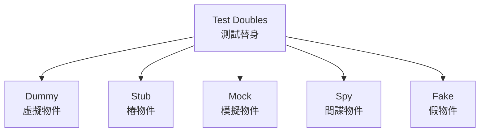

#### 1️⃣ Dummy - 虛擬物件

**定義:** 用來填充參數,但不會被實際使用的物件。

**使用時機:** 方法需要參數但測試中不會用到該參數


```java
@Test
public void testSendEmail() {
    EmailService service = new EmailService();
    User dummyUser = null; // Dummy,不會被使用
    
    // 只測試郵件發送,不關心使用者物件
    service.sendEmail("test@example.com", "Subject", "Body", dummyUser);
    
    // 驗證郵件發送行為
}

```

#### 2️⃣ Stub - 樁物件

**定義:** 提供預設回應的物件,用於提供測試所需的資料。

**使用時機:** 需要從相依物件取得特定回應


```java
// Stub 實作
public class StubPaymentService implements PaymentService {
    @Override
    public boolean process(Payment payment) {
        return true; // 總是回傳成功
    }
    
    @Override
    public PaymentStatus getStatus(String transactionId) {
        return new PaymentStatus("SUCCESS"); // 固定回應
    }
}

@Test
public void testOrderWithPaymentStub() {
    // Arrange
    PaymentService stubPayment = new StubPaymentService();
    OrderService service = new OrderService(stubPayment);
    Order order = new Order(1000);
    
    // Act
    boolean result = service.processOrder(order);
    
    // Assert
    assertTrue(result);
}

// 使用 Mockito 建立 Stub
@Test
public void testWithMockitoStub() {
    PaymentService stubPayment = mock(PaymentService.class);
    when(stubPayment.process(any())).thenReturn(true); // Stub 行為
    
    OrderService service = new OrderService(stubPayment);
    
    assertTrue(service.processOrder(new Order(1000)));
}

```

#### 3️⃣ Mock - 模擬物件

**定義:** 可以驗證行為的物件,用於檢查方法是否被正確呼叫。

**使用時機:** 需要驗證互動行為(呼叫次數、參數等)


```java
@Test
public void testOrderShouldCallPaymentService() {
    // Arrange
    PaymentService mockPayment = mock(PaymentService.class);
    when(mockPayment.process(any())).thenReturn(true);
    
    OrderService service = new OrderService(mockPayment);
    Order order = new Order(1000);
    
    // Act
    service.processOrder(order);
    
    // Assert - 驗證互動行為
    verify(mockPayment).process(any(Payment.class)); // 驗證被呼叫
    verify(mockPayment, times(1)).process(any());    // 驗證呼叫次數
    verify(mockPayment, never()).refund(any());      // 驗證未被呼叫
}

@Test
public void testOrderShouldPassCorrectAmount() {
    PaymentService mockPayment = mock(PaymentService.class);
    OrderService service = new OrderService(mockPayment);
    
    service.processOrder(new Order(1500));
    
    // 使用 ArgumentCaptor 捕捉傳遞的參數
    ArgumentCaptor<Payment> captor = ArgumentCaptor.forClass(Payment.class);
    verify(mockPayment).process(captor.capture());
    
    Payment captured = captor.getValue();
    assertEquals(1500, captured.getAmount());
}

```

**Stub vs Mock 的差異:**


```java
// Stub: 只提供回應,不驗證行為
@Test
public void testWithStub() {
    PaymentService stub = mock(PaymentService.class);
    when(stub.process(any())).thenReturn(true);
    
    service.processOrder(order);
    
    // 不關心 process 是否被呼叫
}

// Mock: 提供回應 + 驗證行為
@Test
public void testWithMock() {
    PaymentService mock = mock(PaymentService.class);
    when(mock.process(any())).thenReturn(true);
    
    service.processOrder(order);
    
    verify(mock).process(any()); // 驗證互動
}

```

#### 4️⃣ Spy - 間諜物件

**定義:** 使用真實物件,但可以覆寫部分方法。

**使用時機:** 大部分使用真實行為,只需模擬少數方法


```java
@Test
public void testWithSpy() {
    // 使用真實物件建立 Spy
    OrderService realService = new OrderService(realRepository, realPayment);
    OrderService spyService = spy(realService);
    
    // 只覆寫特定方法
    doReturn(true).when(spyService).isValidOrder(any());
    
    // 其他方法使用真實實作
    spyService.processOrder(order);
    
    // 可以驗證真實方法的呼叫
    verify(spyService).sendConfirmationEmail(any());
}

@Test
public void testPartialMock() {
    List<String> list = new ArrayList<>();
    List<String> spyList = spy(list);
    
    // 真實行為
    spyList.add("item1");
    assertEquals(1, spyList.size()); // 真實的 size()
    
    // 覆寫特定方法
    when(spyList.size()).thenReturn(100);
    assertEquals(100, spyList.size()); // 使用模擬的 size()
}

```

**⚠️ Spy 的陷阱:**


```java
// ❌ 錯誤:會真的呼叫方法
when(spyList.get(0)).thenReturn("mocked");

// ✅ 正確:使用 doReturn
doReturn("mocked").when(spyList).get(0);

```

#### 5️⃣ Fake - 假物件

**定義:** 有簡化實作的可運作物件(如記憶體資料庫)。

**使用時機:** 真實實作太複雜或太慢,需要輕量級替代


```java
// Fake 實作:記憶體版本的 Repository
public class FakeOrderRepository implements OrderRepository {
    private Map<String, Order> storage = new HashMap<>();
    private int idCounter = 1;
    
    @Override
    public Order save(Order order) {
        if (order.getId() == null) {
            order.setId(String.valueOf(idCounter++));
        }
        storage.put(order.getId(), order);
        return order;
    }
    
    @Override
    public Order findById(String id) {
        Order order = storage.get(id);
        if (order == null) {
            throw new OrderNotFoundException();
        }
        return order;
    }
    
    @Override
    public List<Order> findAll() {
        return new ArrayList<>(storage.values());
    }
}

@Test
public void testWithFakeRepository() {
    // 使用 Fake 替代真實資料庫
    OrderRepository fakeRepo = new FakeOrderRepository();
    OrderService service = new OrderService(fakeRepo);
    
    Order order = new Order(1000);
    Order saved = service.createOrder(order);
    
    assertNotNull(saved.getId());
    assertEquals(order.getAmount(), saved.getAmount());
    
    // Fake 有真實的行為,可以查詢
    Order found = fakeRepo.findById(saved.getId());
    assertEquals(saved.getId(), found.getId());
}

```

#### 🎯 選擇指南

| 類型 | 提供回應 | 驗證行為 | 有實作邏輯 | 使用時機 |
|------|---------|---------|-----------|---------|
| **Dummy** | ❌ | ❌ | ❌ | 填充參數 |
| **Stub** | ✅ | ❌ | ❌ | 提供測試資料 |
| **Mock** | ✅ | ✅ | ❌ | 驗證互動行為 |
| **Spy** | ✅ | ✅ | ✅(部分) | 部分模擬 |
| **Fake** | ✅ | ❌ | ✅(簡化) | 輕量級替代實作 |

**決策流程:**


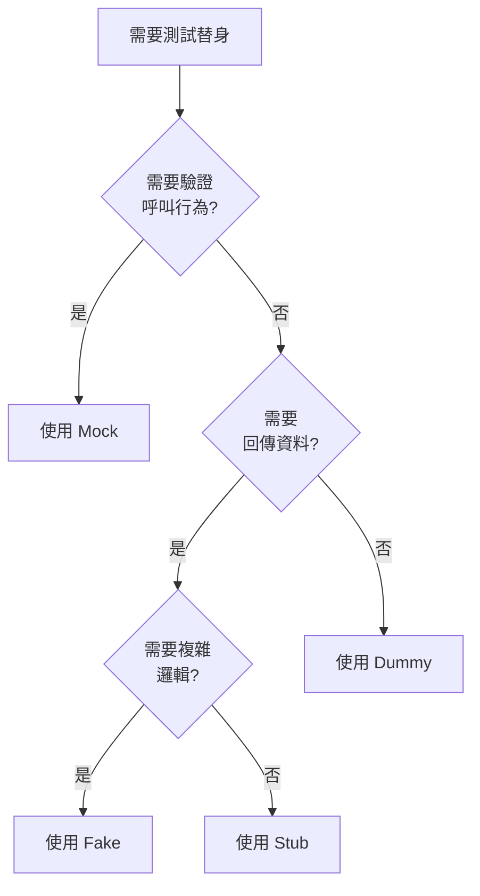

#### 💡 最佳實踐

**實踐 1:優先使用真實物件**


```java
// ✅ 優先使用真實物件
@Test
public void testOrderCalculation() {
    Order order = new Order(); // 真實物件
    order.addItem(new Product("A", 100), 2);
    
    assertEquals(200, order.getTotal());
}

// ⚠️ 只在必要時使用 Mock
@Test
public void testOrderWithExternalService() {
    PaymentService mockPayment = mock(PaymentService.class); // 外部服務才 Mock
    Order order = new Order(); // 內部邏輯用真實物件
    
    OrderService service = new OrderService(mockPayment);
    service.processOrder(order);
}

```

**實踐 2:不要過度使用 Mock**


```java
// ❌ 過度 Mock
@Test
public void testBadExample() {
    Product mockProduct = mock(Product.class);
    when(mockProduct.getPrice()).thenReturn(100);
    when(mockProduct.getName()).thenReturn("Product");
    
    Customer mockCustomer = mock(Customer.class);
    when(mockCustomer.getName()).thenReturn("John");
    
    // 所有東西都 Mock,失去測試意義!
}

// ✅ 適度使用
@Test
public void testGoodExample() {
    Product product = new Product("Product", 100); // 真實物件
    Customer customer = new Customer("John");      // 真實物件
    
    PaymentService mockPayment = mock(PaymentService.class); // 只 Mock 外部依賴
    when(mockPayment.process(any())).thenReturn(true);
}

```

**實踐 3:Mock 外部依賴**


```text
✅ 應該 Mock:

- 資料庫

- 外部 API

- 檔案系統

- 網路服務

- 時間/日期

- 隨機數生成器


❌ 不要 Mock:

- 值物件(Value Objects)

- 資料傳輸物件(DTOs)

- 簡單的業務邏輯

- 被測試的類別本身

```

### 5.5 常見測試陷阱與避免方式

#### 🕳️ 陷阱 1:測試相依性

**問題:** 測試之間互相依賴,執行順序影響結果


```java
// ❌ 錯誤:測試間有相依性
public class UserServiceTest {
    private static User createdUser; // 共享狀態!
    
    @Test
    public void test1_CreateUser() {
        UserService service = new UserService();
        createdUser = service.create("john@example.com");
        assertNotNull(createdUser);
    }
    
    @Test
    public void test2_UpdateUser() {
        // 依賴 test1 的結果
        createdUser.setName("John Doe");
        service.update(createdUser);
    }
}

// ✅ 正確:每個測試獨立
public class UserServiceTest {
    
    @Test
    public void testCreateUser() {
        UserService service = new UserService();
        User user = service.create("john@example.com");
        assertNotNull(user);
    }
    
    @Test
    public void testUpdateUser() {
        UserService service = new UserService();
        // 自行準備測試資料,不依賴其他測試
        User user = service.create("john@example.com");
        user.setName("John Doe");
        
        User updated = service.update(user);
        assertEquals("John Doe", updated.getName());
    }
}

```

**解決方案:**

- ✅ 每個測試使用 @BeforeEach 準備獨立資料

- ✅ 測試後清理資料(@AfterEach)

- ✅ 避免使用 static 共享狀態

- ✅ 測試應能以任意順序執行


#### 🕳️ 陷阱 2:測試實作細節而非行為

**問題:** 測試程式碼內部實作,而非外部行為


```java
// ❌ 錯誤:測試實作細節
@Test
public void testCalculateDiscount() {
    Order order = new Order(1000);
    
    // 測試內部欄位(實作細節)
    Field field = Order.class.getDeclaredField("discountRate");
    field.setAccessible(true);
    assertEquals(0.1, field.get(order));
    
    // 測試私有方法(實作細節)
    Method method = Order.class.getDeclaredMethod("calculateDiscountAmount");
    method.setAccessible(true);
    assertEquals(100, method.invoke(order));
}

// ✅ 正確:測試外部行為
@Test
public void testCalculateDiscount() {
    Order order = new Order(1000);
    order.applyDiscount(0.1);
    
    // 只測試公開 API 的行為
    assertEquals(900, order.getFinalPrice());
}

```

**原則:**

- ✅ 只測試 public API

- ✅ 測試"做什麼",不測試"怎麼做"

- ❌ 不要使用反射存取私有成員

- ❌ 不要測試私有方法


#### 🕳️ 陷阱 3:脆弱的測試

**問題:** 測試對程式碼小改動過於敏感


```java
// ❌ 脆弱:硬編碼順序與格式
@Test
public void testGetUserList() {
    List<User> users = service.getAllUsers();
    
    assertEquals("John", users.get(0).getName());
    assertEquals("Jane", users.get(1).getName());
    assertEquals("Bob", users.get(2).getName());
    // 新增使用者或改變順序就會失敗
}

// ✅ 穩定:測試業務邏輯而非實作細節
@Test
public void testGetUserList_ShouldContainAllUsers() {
    List<User> users = service.getAllUsers();
    
    assertEquals(3, users.size());
    assertTrue(users.stream().anyMatch(u -> "John".equals(u.getName())));
    assertTrue(users.stream().anyMatch(u -> "Jane".equals(u.getName())));
    assertTrue(users.stream().anyMatch(u -> "Bob".equals(u.getName())));
}

```

#### 🕳️ 陷阱 4:忽略測試邊界條件

**問題:** 只測試正常流程,忽略邊界與異常


```java
// ❌ 不完整:只測試正常情況
@Test
public void testDivide() {
    Calculator calc = new Calculator();
    assertEquals(5, calc.divide(10, 2));
}

// ✅ 完整:涵蓋邊界條件
@Test
public void testDivide_NormalCase() {
    Calculator calc = new Calculator();
    assertEquals(5, calc.divide(10, 2));
}

@Test
public void testDivide_ByZero_ShouldThrowException() {
    Calculator calc = new Calculator();
    assertThrows(ArithmeticException.class, () -> {
        calc.divide(10, 0);
    });
}

@Test
public void testDivide_WithNegativeNumbers() {
    Calculator calc = new Calculator();
    assertEquals(-5, calc.divide(-10, 2));
    assertEquals(-5, calc.divide(10, -2));
    assertEquals(5, calc.divide(-10, -2));
}

@Test
public void testDivide_WithZeroDividend() {
    Calculator calc = new Calculator();
    assertEquals(0, calc.divide(0, 5));
}

```

**邊界條件檢查清單:**

- [ ] 空值(null)

- [ ] 空集合/字串

- [ ] 零值

- [ ] 負數

- [ ] 最大/最小值

- [ ] 邊界值(n-1, n, n+1)


#### 🕳️ 陷阱 5:測試程式碼重複

**問題:** 測試間有大量重複程式碼


```java
// ❌ 重複的測試準備
@Test
public void testVIPDiscount() {
    Customer customer = new Customer("John");
    customer.setType(CustomerType.VIP);
    customer.setPoints(1000);
    Product product = new Product("Laptop", 30000);
    ShoppingCart cart = new ShoppingCart(customer);
    cart.addItem(product, 1);
    
    assertEquals(24000, cart.getTotal());
}

@Test
public void testRegularCustomer() {
    Customer customer = new Customer("Jane");
    customer.setType(CustomerType.REGULAR);
    customer.setPoints(0);
    Product product = new Product("Laptop", 30000);
    ShoppingCart cart = new ShoppingCart(customer);
    cart.addItem(product, 1);
    
    assertEquals(30000, cart.getTotal());
}

// ✅ 提取共用邏輯
public class ShoppingCartTest {
    
    private Product laptop;
    
    @BeforeEach
    public void setUp() {
        laptop = new Product("Laptop", 30000);
    }
    
    private ShoppingCart createCartWithCustomer(CustomerType type) {
        Customer customer = new Customer("Test User");
        customer.setType(type);
        ShoppingCart cart = new ShoppingCart(customer);
        cart.addItem(laptop, 1);
        return cart;
    }
    
    @Test
    public void testVIPDiscount() {
        ShoppingCart cart = createCartWithCustomer(CustomerType.VIP);
        assertEquals(24000, cart.getTotal());
    }
    
    @Test
    public void testRegularCustomer() {
        ShoppingCart cart = createCartWithCustomer(CustomerType.REGULAR);
        assertEquals(30000, cart.getTotal());
    }
}

```

#### 🕳️ 陷阱 6:沒有 Assert 的測試

**問題:** 測試沒有驗證任何結果


```java
// ❌ 無效測試:沒有 assert
@Test
public void testProcessOrder() {
    OrderService service = new OrderService();
    Order order = new Order(1000);
    service.processOrder(order); // 沒有驗證!
}

// ✅ 有效測試:明確驗證結果
@Test
public void testProcessOrder_ShouldChangeStatus() {
    OrderService service = new OrderService();
    Order order = new Order(1000);
    
    service.processOrder(order);
    
    assertEquals("PROCESSED", order.getStatus());
}

```

#### 🕳️ 陷阱 7:Sleep/延遲測試

**問題:** 使用 Thread.sleep() 等待非同步操作


```java
// ❌ 不可靠:使用 sleep
@Test
public void testAsyncOperation() throws Exception {
    service.processAsync();
    Thread.sleep(1000); // 不可靠!
    assertTrue(service.isCompleted());
}

// ✅ 可靠:使用適當的同步機制
@Test
public void testAsyncOperation() throws Exception {
    CompletableFuture<Void> future = service.processAsync();
    future.get(5, TimeUnit.SECONDS); // 最多等待 5 秒
    assertTrue(service.isCompleted());
}

// ✅ 或使用 Awaitility 庫
@Test
public void testAsyncWithAwaitility() {
    service.processAsync();
    
    await().atMost(5, SECONDS)
           .until(() -> service.isCompleted());
}

```

---

## 🎯 本章重點回顧

✅ 使用描述性測試命名,清楚表達測試意圖  
✅ 遵循 AAA 模式組織測試結構  
✅ 每個測試只驗證一個概念(SRP)  
✅ 適當選擇測試替身(Mock/Stub/Fake/Spy)  
✅ 避免常見測試陷阱,撰寫穩定可維護的測試  

---

## 📋 本章檢查清單


- [ ] 測試命名遵循一致的格式

- [ ] 測試使用 AAA 模式組織

- [ ] 每個測試只測試一件事

- [ ] 正確使用 Mock 和 Stub

- [ ] 測試涵蓋邊界條件

- [ ] 測試彼此獨立,無相依性

- [ ] 避免測試實作細節


---

**下一章:** [六、實作範例](#六實作範例)

---

## 六、實作範例

### 6.1 範例一：計算機（Calculator）類別的 TDD 實作

這是最經典的 TDD 入門範例,我們將從零開始實作一個計算機類別。

#### 🎯 需求分析

**功能需求:**

- 加法運算

- 減法運算

- 乘法運算

- 除法運算(需處理除以零的情況)


#### 📝 第一次迭代:加法功能

**步驟 1: Red - 撰寫失敗的測試**


```java
import org.junit.jupiter.api.Test;
import static org.junit.jupiter.api.Assertions.*;

public class CalculatorTest {
    
    @Test
    public void testAdd_TwoPositiveNumbers_ShouldReturnSum() {
        // Arrange
        Calculator calculator = new Calculator();
        
        // Act
        int result = calculator.add(2, 3);
        
        // Assert
        assertEquals(5, result);
    }
}

```

**執行測試:**

```bash
# 測試失敗:Calculator 類別不存在
Error: Cannot resolve symbol 'Calculator'

```

**步驟 2: Green - 實作最簡單的程式碼**


```java
public class Calculator {
    public int add(int a, int b) {
        return a + b;
    }
}

```

**執行測試:**

```bash
# 測試通過 ✅
Tests run: 1, Failures: 0, Errors: 0

```

**步驟 3: Refactor - 檢視程式碼**

目前程式碼已經很簡潔,不需要重構。繼續下一個測試案例。

#### 📝 第二次迭代:加法邊界條件

**Red - 加入更多測試案例**


```java
@Test
public void testAdd_WithNegativeNumbers_ShouldReturnCorrectSum() {
    Calculator calculator = new Calculator();
    
    assertEquals(-1, calculator.add(-2, 1));
    assertEquals(-5, calculator.add(-2, -3));
}

@Test
public void testAdd_WithZero_ShouldReturnOtherNumber() {
    Calculator calculator = new Calculator();
    
    assertEquals(5, calculator.add(0, 5));
    assertEquals(5, calculator.add(5, 0));
    assertEquals(0, calculator.add(0, 0));
}

@Test
public void testAdd_WithLargeNumbers_ShouldNotOverflow() {
    Calculator calculator = new Calculator();
    
    // 使用 long 避免溢位
    assertEquals(3000000000L, calculator.addLong(2000000000L, 1000000000L));
}

```

**Green - 程式碼已支援,測試通過**

需要新增 `addLong` 方法:


```java
public class Calculator {
    public int add(int a, int b) {
        return a + b;
    }
    
    public long addLong(long a, long b) {
        return a + b;
    }
}

```

**Refactor - 重構測試準備邏輯**


```java
public class CalculatorTest {
    
    private Calculator calculator;
    
    @BeforeEach
    public void setUp() {
        calculator = new Calculator();
    }
    
    @Test
    public void testAdd_TwoPositiveNumbers_ShouldReturnSum() {
        assertEquals(5, calculator.add(2, 3));
    }
    
    @Test
    public void testAdd_WithNegativeNumbers_ShouldReturnCorrectSum() {
        assertEquals(-1, calculator.add(-2, 1));
        assertEquals(-5, calculator.add(-2, -3));
    }
    
    // ... 其他測試
}

```

#### 📝 第三次迭代:減法功能

**Red - 撰寫減法測試**


```java
@Test
public void testSubtract_TwoPositiveNumbers_ShouldReturnDifference() {
    assertEquals(2, calculator.subtract(5, 3));
}

@Test
public void testSubtract_ResultIsNegative_ShouldReturnNegativeNumber() {
    assertEquals(-2, calculator.subtract(3, 5));
}

```

**Green - 實作減法**


```java
public class Calculator {
    public int add(int a, int b) {
        return a + b;
    }
    
    public int subtract(int a, int b) {
        return a - b;
    }
    
    public long addLong(long a, long b) {
        return a + b;
    }
}

```

#### 📝 第四次迭代:乘法與除法

**Red - 撰寫測試**


```java
@Test
public void testMultiply_TwoPositiveNumbers_ShouldReturnProduct() {
    assertEquals(15, calculator.multiply(3, 5));
}

@Test
public void testMultiply_WithZero_ShouldReturnZero() {
    assertEquals(0, calculator.multiply(5, 0));
    assertEquals(0, calculator.multiply(0, 5));
}

@Test
public void testMultiply_WithNegativeNumber_ShouldReturnNegativeProduct() {
    assertEquals(-15, calculator.multiply(-3, 5));
    assertEquals(-15, calculator.multiply(3, -5));
    assertEquals(15, calculator.multiply(-3, -5));
}

@Test
public void testDivide_TwoPositiveNumbers_ShouldReturnQuotient() {
    assertEquals(3, calculator.divide(15, 5));
}

@Test
public void testDivide_WithRemainder_ShouldReturnIntegerPart() {
    assertEquals(3, calculator.divide(10, 3));
}

@Test
public void testDivide_ByZero_ShouldThrowArithmeticException() {
    assertThrows(ArithmeticException.class, () -> {
        calculator.divide(10, 0);
    });
}

```

**Green - 實作乘法與除法**


```java
public class Calculator {
    public int add(int a, int b) {
        return a + b;
    }
    
    public int subtract(int a, int b) {
        return a - b;
    }
    
    public int multiply(int a, int b) {
        return a * b;
    }
    
    public int divide(int a, int b) {
        if (b == 0) {
            throw new ArithmeticException("Cannot divide by zero");
        }
        return a / b;
    }
    
    public long addLong(long a, long b) {
        return a + b;
    }
}

```

**Refactor - 最終優化**


```java
public class Calculator {
    
    public int add(int a, int b) {
        return a + b;
    }
    
    public long addLong(long a, long b) {
        return a + b;
    }
    
    public int subtract(int a, int b) {
        return a - b;
    }
    
    public int multiply(int a, int b) {
        return a * b;
    }
    
    public int divide(int a, int b) {
        validateDivisor(b);
        return a / b;
    }
    
    public double divideAsDouble(int a, int b) {
        validateDivisor(b);
        return (double) a / b;
    }
    
    private void validateDivisor(int divisor) {
        if (divisor == 0) {
            throw new ArithmeticException("Cannot divide by zero");
        }
    }
}

```

#### 📊 完整測試覆蓋率


```bash
mvn clean test jacoco:report

-------------------------------------------------------
Calculator Coverage Report
-------------------------------------------------------
Class           Line Coverage   Branch Coverage
-------------------------------------------------------
Calculator      100% (15/15)    100% (4/4)
-------------------------------------------------------

```

#### 💡 範例總結

**學習重點:**

1. ✅ 從最簡單的測試案例開始

2. ✅ 每次只加入一個新功能

3. ✅ 測試涵蓋正常情況、邊界條件、異常情況

4. ✅ 透過重構提取共用邏輯(validateDivisor)

5. ✅ 測試先行,讓設計自然浮現

### 6.2 範例二：RESTful API 的 TDD 開發流程

這個範例展示如何使用 TDD 開發一個訂單管理 API。

#### 🎯 需求分析

**API 端點:**

- `POST /api/orders` - 建立訂單

- `GET /api/orders/{id}` - 查詢訂單

- `GET /api/orders` - 查詢所有訂單

- `PUT /api/orders/{id}/cancel` - 取消訂單


**訂單資料結構:**

```json
{
  "id": "ORD-001",
  "customerId": "CUST-001",
  "items": [
    {"productId": "P001", "quantity": 2, "price": 100}
  ],
  "totalAmount": 200,
  "status": "PENDING"
}

```

#### 📝 第一次迭代:建立訂單 API

**使用技術棧:**

- Spring Boot

- JUnit 5

- MockMvc (測試 HTTP 層)

- Mockito (Mock 依賴)


**步驟 1: Red - 撰寫 API 測試**


```java
import org.junit.jupiter.api.Test;
import org.springframework.beans.factory.annotation.Autowired;
import org.springframework.boot.test.autoconfigure.web.servlet.WebMvcTest;
import org.springframework.boot.test.mock.mockito.MockBean;
import org.springframework.http.MediaType;
import org.springframework.test.web.servlet.MockMvc;

import static org.mockito.ArgumentMatchers.any;
import static org.mockito.Mockito.when;
import static org.springframework.test.web.servlet.request.MockMvcRequestBuilders.*;
import static org.springframework.test.web.servlet.result.MockMvcResultMatchers.*;

@WebMvcTest(OrderController.class)
public class OrderControllerTest {
    
    @Autowired
    private MockMvc mockMvc;
    
    @MockBean
    private OrderService orderService;
    
    @Test
    public void testCreateOrder_WithValidData_ShouldReturn201Created() throws Exception {
        // Arrange
        String requestBody = """
            {
                "customerId": "CUST-001",
                "items": [
                    {"productId": "P001", "quantity": 2, "price": 100}
                ]
            }
            """;
        
        Order createdOrder = new Order("ORD-001", "CUST-001", 200, "PENDING");
        when(orderService.createOrder(any(OrderRequest.class)))
            .thenReturn(createdOrder);
        
        // Act & Assert
        mockMvc.perform(post("/api/orders")
                .contentType(MediaType.APPLICATION_JSON)
                .content(requestBody))
            .andExpect(status().isCreated())
            .andExpect(jsonPath("$.id").value("ORD-001"))
            .andExpect(jsonPath("$.customerId").value("CUST-001"))
            .andExpect(jsonPath("$.totalAmount").value(200))
            .andExpect(jsonPath("$.status").value("PENDING"));
    }
    
    @Test
    public void testCreateOrder_WithInvalidData_ShouldReturn400BadRequest() throws Exception {
        // Arrange
        String invalidRequest = """
            {
                "customerId": "",
                "items": []
            }
            """;
        
        // Act & Assert
        mockMvc.perform(post("/api/orders")
                .contentType(MediaType.APPLICATION_JSON)
                .content(invalidRequest))
            .andExpect(status().isBadRequest())
            .andExpect(jsonPath("$.error").exists());
    }
}

```

**步驟 2: Green - 實作 Controller**


```java
@RestController
@RequestMapping("/api/orders")
public class OrderController {
    
    private final OrderService orderService;
    
    public OrderController(OrderService orderService) {
        this.orderService = orderService;
    }
    
    @PostMapping
    public ResponseEntity<OrderResponse> createOrder(
            @Valid @RequestBody OrderRequest request) {
        
        Order order = orderService.createOrder(request);
        OrderResponse response = OrderResponse.from(order);
        
        return ResponseEntity
            .status(HttpStatus.CREATED)
            .body(response);
    }
}

```

**DTO 類別:**


```java
public class OrderRequest {
    @NotBlank(message = "Customer ID is required")
    private String customerId;
    
    @NotEmpty(message = "Items cannot be empty")
    private List<OrderItemRequest> items;
    
    // Getters and Setters
}

public class OrderItemRequest {
    @NotBlank
    private String productId;
    
    @Min(1)
    private int quantity;
    
    @Min(0)
    private double price;
    
    // Getters and Setters
}

public record OrderResponse(
    String id,
    String customerId,
    double totalAmount,
    String status
) {
    public static OrderResponse from(Order order) {
        return new OrderResponse(
            order.getId(),
            order.getCustomerId(),
            order.getTotalAmount(),
            order.getStatus()
        );
    }
}

```

**步驟 3: 實作 Service 層測試**


```java
@ExtendWith(MockitoExtension.class)
public class OrderServiceTest {
    
    @Mock
    private OrderRepository orderRepository;
    
    @Mock
    private InventoryService inventoryService;
    
    @InjectMocks
    private OrderService orderService;
    
    @Test
    public void testCreateOrder_ShouldGenerateOrderIdAndSave() {
        // Arrange
        OrderRequest request = createValidOrderRequest();
        Order expectedOrder = new Order("ORD-001", "CUST-001", 200, "PENDING");
        
        when(inventoryService.checkAvailability(anyString(), anyInt()))
            .thenReturn(true);
        when(orderRepository.save(any(Order.class)))
            .thenReturn(expectedOrder);
        
        // Act
        Order result = orderService.createOrder(request);
        
        // Assert
        assertNotNull(result.getId());
        assertEquals("CUST-001", result.getCustomerId());
        assertEquals(200, result.getTotalAmount());
        assertEquals("PENDING", result.getStatus());
        
        verify(orderRepository).save(any(Order.class));
    }
    
    @Test
    public void testCreateOrder_WhenInventoryInsufficient_ShouldThrowException() {
        // Arrange
        OrderRequest request = createValidOrderRequest();
        
        when(inventoryService.checkAvailability(anyString(), anyInt()))
            .thenReturn(false);
        
        // Act & Assert
        assertThrows(InsufficientInventoryException.class, () -> {
            orderService.createOrder(request);
        });
        
        verify(orderRepository, never()).save(any());
    }
    
    private OrderRequest createValidOrderRequest() {
        OrderRequest request = new OrderRequest();
        request.setCustomerId("CUST-001");
        
        OrderItemRequest item = new OrderItemRequest();
        item.setProductId("P001");
        item.setQuantity(2);
        item.setPrice(100);
        
        request.setItems(List.of(item));
        return request;
    }
}

```

**Service 實作:**


```java
@Service
public class OrderService {
    
    private final OrderRepository orderRepository;
    private final InventoryService inventoryService;
    
    public OrderService(OrderRepository orderRepository, 
                       InventoryService inventoryService) {
        this.orderRepository = orderRepository;
        this.inventoryService = inventoryService;
    }
    
    @Transactional
    public Order createOrder(OrderRequest request) {
        // 驗證庫存
        validateInventory(request);
        
        // 計算總額
        double totalAmount = calculateTotalAmount(request.getItems());
        
        // 建立訂單
        Order order = new Order(
            generateOrderId(),
            request.getCustomerId(),
            totalAmount,
            "PENDING"
        );
        
        // 儲存訂單
        return orderRepository.save(order);
    }
    
    private void validateInventory(OrderRequest request) {
        for (OrderItemRequest item : request.getItems()) {
            boolean available = inventoryService.checkAvailability(
                item.getProductId(),
                item.getQuantity()
            );
            
            if (!available) {
                throw new InsufficientInventoryException(
                    "Product " + item.getProductId() + " is not available"
                );
            }
        }
    }
    
    private double calculateTotalAmount(List<OrderItemRequest> items) {
        return items.stream()
            .mapToDouble(item -> item.getPrice() * item.getQuantity())
            .sum();
    }
    
    private String generateOrderId() {
        return "ORD-" + UUID.randomUUID().toString().substring(0, 8).toUpperCase();
    }
}

```

#### 📝 第二次迭代:查詢訂單 API

**Red - 撰寫測試**


```java
@Test
public void testGetOrder_WithValidId_ShouldReturn200AndOrder() throws Exception {
    // Arrange
    Order order = new Order("ORD-001", "CUST-001", 200, "PENDING");
    when(orderService.getOrderById("ORD-001")).thenReturn(order);
    
    // Act & Assert
    mockMvc.perform(get("/api/orders/ORD-001"))
        .andExpect(status().isOk())
        .andExpect(jsonPath("$.id").value("ORD-001"))
        .andExpect(jsonPath("$.customerId").value("CUST-001"));
}

@Test
public void testGetOrder_WithInvalidId_ShouldReturn404NotFound() throws Exception {
    // Arrange
    when(orderService.getOrderById("INVALID"))
        .thenThrow(new OrderNotFoundException("Order not found"));
    
    // Act & Assert
    mockMvc.perform(get("/api/orders/INVALID"))
        .andExpect(status().isNotFound())
        .andExpect(jsonPath("$.error").value("Order not found"));
}

@Test
public void testGetAllOrders_ShouldReturnOrderList() throws Exception {
    // Arrange
    List<Order> orders = List.of(
        new Order("ORD-001", "CUST-001", 200, "PENDING"),
        new Order("ORD-002", "CUST-002", 300, "COMPLETED")
    );
    when(orderService.getAllOrders()).thenReturn(orders);
    
    // Act & Assert
    mockMvc.perform(get("/api/orders"))
        .andExpect(status().isOk())
        .andExpect(jsonPath("$").isArray())
        .andExpect(jsonPath("$.length()").value(2))
        .andExpect(jsonPath("$[0].id").value("ORD-001"))
        .andExpect(jsonPath("$[1].id").value("ORD-002"));
}

```

**Green - 實作**


```java
@RestController
@RequestMapping("/api/orders")
public class OrderController {
    
    private final OrderService orderService;
    
    // ... constructor
    
    @GetMapping("/{id}")
    public ResponseEntity<OrderResponse> getOrder(@PathVariable String id) {
        Order order = orderService.getOrderById(id);
        return ResponseEntity.ok(OrderResponse.from(order));
    }
    
    @GetMapping
    public ResponseEntity<List<OrderResponse>> getAllOrders() {
        List<Order> orders = orderService.getAllOrders();
        List<OrderResponse> responses = orders.stream()
            .map(OrderResponse::from)
            .toList();
        return ResponseEntity.ok(responses);
    }
}

```

**全域例外處理:**


```java
@RestControllerAdvice
public class GlobalExceptionHandler {
    
    @ExceptionHandler(OrderNotFoundException.class)
    public ResponseEntity<ErrorResponse> handleOrderNotFound(
            OrderNotFoundException ex) {
        
        ErrorResponse error = new ErrorResponse(
            "NOT_FOUND",
            ex.getMessage()
        );
        
        return ResponseEntity
            .status(HttpStatus.NOT_FOUND)
            .body(error);
    }
    
    @ExceptionHandler(MethodArgumentNotValidException.class)
    public ResponseEntity<ErrorResponse> handleValidationError(
            MethodArgumentNotValidException ex) {
        
        String message = ex.getBindingResult()
            .getFieldErrors()
            .stream()
            .map(FieldError::getDefaultMessage)
            .collect(Collectors.joining(", "));
        
        ErrorResponse error = new ErrorResponse(
            "VALIDATION_ERROR",
            message
        );
        
        return ResponseEntity
            .status(HttpStatus.BAD_REQUEST)
            .body(error);
    }
}

public record ErrorResponse(String code, String message) {}

```

#### 📝 第三次迭代:取消訂單 API

**Red - 撰寫測試**


```java
@Test
public void testCancelOrder_WithPendingOrder_ShouldReturn200() throws Exception {
    // Arrange
    Order cancelledOrder = new Order("ORD-001", "CUST-001", 200, "CANCELLED");
    when(orderService.cancelOrder("ORD-001")).thenReturn(cancelledOrder);
    
    // Act & Assert
    mockMvc.perform(put("/api/orders/ORD-001/cancel"))
        .andExpect(status().isOk())
        .andExpect(jsonPath("$.status").value("CANCELLED"));
}

@Test
public void testCancelOrder_WithCompletedOrder_ShouldReturn400() throws Exception {
    // Arrange
    when(orderService.cancelOrder("ORD-001"))
        .thenThrow(new IllegalOrderStateException("Cannot cancel completed order"));
    
    // Act & Assert
    mockMvc.perform(put("/api/orders/ORD-001/cancel"))
        .andExpect(status().isBadRequest())
        .andExpect(jsonPath("$.error").exists());
}

```

**Green - 實作**


```java
@PutMapping("/{id}/cancel")
public ResponseEntity<OrderResponse> cancelOrder(@PathVariable String id) {
    Order order = orderService.cancelOrder(id);
    return ResponseEntity.ok(OrderResponse.from(order));
}

```text

**Service 層實作:**


```java
@Transactional
public Order cancelOrder(String orderId) {
    Order order = getOrderById(orderId);
    
    if (!order.canBeCancelled()) {
        throw new IllegalOrderStateException(
            "Order in status " + order.getStatus() + " cannot be cancelled"
        );
    }
    
    order.cancel();
    return orderRepository.save(order);
}

```

**Order 領域模型:**


```java
@Entity
public class Order {
    @Id
    private String id;
    private String customerId;
    private double totalAmount;
    private String status;
    
    // ... constructors, getters, setters
    
    public boolean canBeCancelled() {
        return "PENDING".equals(status) || "CONFIRMED".equals(status);
    }
    
    public void cancel() {
        if (!canBeCancelled()) {
            throw new IllegalOrderStateException("Cannot cancel order");
        }
        this.status = "CANCELLED";
    }
}

```

#### 🧪 整合測試


```java
@SpringBootTest(webEnvironment = SpringBootTest.WebEnvironment.RANDOM_PORT)
@Sql(scripts = "/test-data.sql", executionPhase = Sql.ExecutionPhase.BEFORE_TEST_METHOD)
@Sql(scripts = "/cleanup.sql", executionPhase = Sql.ExecutionPhase.AFTER_TEST_METHOD)
public class OrderIntegrationTest {
    
    @Autowired
    private TestRestTemplate restTemplate;
    
    @Test
    public void testCompleteOrderWorkflow() {
        // 1. 建立訂單
        OrderRequest request = createOrderRequest();
        ResponseEntity<OrderResponse> createResponse = restTemplate.postForEntity(
            "/api/orders",
            request,
            OrderResponse.class
        );
        
        assertEquals(HttpStatus.CREATED, createResponse.getStatusCode());
        String orderId = createResponse.getBody().id();
        assertNotNull(orderId);
        
        // 2. 查詢訂單
        ResponseEntity<OrderResponse> getResponse = restTemplate.getForEntity(
            "/api/orders/" + orderId,
            OrderResponse.class
        );
        
        assertEquals(HttpStatus.OK, getResponse.getStatusCode());
        assertEquals("PENDING", getResponse.getBody().status());
        
        // 3. 取消訂單
        ResponseEntity<OrderResponse> cancelResponse = restTemplate.exchange(
            "/api/orders/" + orderId + "/cancel",
            HttpMethod.PUT,
            null,
            OrderResponse.class
        );
        
        assertEquals(HttpStatus.OK, cancelResponse.getStatusCode());
        assertEquals("CANCELLED", cancelResponse.getBody().status());
    }
}

```

#### 💡 範例總結

**學習重點:**

1. ✅ 由外而內測試(Controller → Service → Repository)

2. ✅ 使用 MockMvc 測試 HTTP 層

3. ✅ 使用 Mockito 隔離依賴

4. ✅ 測試涵蓋成功情境與錯誤處理

5. ✅ 整合測試驗證完整流程

### 6.3 範例三：資料庫操作（Repository）的 TDD 測試

這個範例展示如何測試資料存取層。

#### 🎯 需求分析

**Repository 功能:**

- 儲存客戶資料

- 根據 ID 查詢客戶

- 根據 Email 查詢客戶

- 查詢所有活躍客戶

- 更新客戶資料

- 軟刪除客戶


#### 📝 使用 H2 記憶體資料庫進行測試

**測試設定:**


```java
@DataJpaTest
@AutoConfigureTestDatabase(replace = AutoConfigureTestDatabase.Replace.NONE)
public class CustomerRepositoryTest {
    
    @Autowired
    private CustomerRepository customerRepository;
    
    @Autowired
    private TestEntityManager entityManager;
    
    @BeforeEach
    public void setUp() {
        customerRepository.deleteAll();
    }
    
    // ... 測試方法
}

```

**application-test.yml:**


```yaml
spring:
  datasource:
    url: jdbc:h2:mem:testdb
    driver-class-name: org.h2.Driver
  jpa:
    hibernate:
      ddl-auto: create-drop
    show-sql: true
  h2:
    console:
      enabled: true

```

#### 📝 第一次迭代:基本 CRUD 操作

**Red - 撰寫測試**


```java
@Test
public void testSave_NewCustomer_ShouldGenerateIdAndSave() {
    // Arrange
    Customer customer = new Customer(
        null,
        "John Doe",
        "john@example.com",
        "0912345678",
        true
    );
    
    // Act
    Customer saved = customerRepository.save(customer);
    
    // Assert
    assertNotNull(saved.getId());
    assertEquals("John Doe", saved.getName());
    assertEquals("john@example.com", saved.getEmail());
    assertTrue(saved.isActive());
}

@Test
public void testFindById_WithExistingId_ShouldReturnCustomer() {
    // Arrange
    Customer customer = createAndSaveCustomer("John Doe", "john@example.com");
    
    // Act
    Optional<Customer> found = customerRepository.findById(customer.getId());
    
    // Assert
    assertTrue(found.isPresent());
    assertEquals("John Doe", found.get().getName());
}

@Test
public void testFindById_WithNonExistingId_ShouldReturnEmpty() {
    // Act
    Optional<Customer> found = customerRepository.findById(999L);
    
    // Assert
    assertFalse(found.isPresent());
}

```

**Green - 實作 Entity 與 Repository**


```java
@Entity
@Table(name = "customers")
public class Customer {
    
    @Id
    @GeneratedValue(strategy = GenerationType.IDENTITY)
    private Long id;
    
    @Column(nullable = false)
    private String name;
    
    @Column(nullable = false, unique = true)
    private String email;
    
    private String phone;
    
    @Column(nullable = false)
    private boolean active = true;
    
    @CreatedDate
    private LocalDateTime createdAt;
    
    @LastModifiedDate
    private LocalDateTime updatedAt;
    
    // Constructors, Getters, Setters
}

public interface CustomerRepository extends JpaRepository<Customer, Long> {
    // 基本方法由 JpaRepository 提供
}

```

#### 📝 第二次迭代:自訂查詢方法

**Red - 撰寫測試**


```java
@Test
public void testFindByEmail_WithExistingEmail_ShouldReturnCustomer() {
    // Arrange
    Customer customer = createAndSaveCustomer("John Doe", "john@example.com");
    
    // Act
    Optional<Customer> found = customerRepository.findByEmail("john@example.com");
    
    // Assert
    assertTrue(found.isPresent());
    assertEquals("John Doe", found.get().getName());
}

@Test
public void testFindByEmail_WithNonExistingEmail_ShouldReturnEmpty() {
    // Act
    Optional<Customer> found = customerRepository.findByEmail("nonexist@example.com");
    
    // Assert
    assertFalse(found.isPresent());
}

@Test
public void testFindAllByActiveTrue_ShouldReturnOnlyActiveCustomers() {
    // Arrange
    Customer active1 = createAndSaveCustomer("John", "john@example.com");
    Customer active2 = createAndSaveCustomer("Jane", "jane@example.com");
    Customer inactive = createAndSaveCustomer("Bob", "bob@example.com");
    inactive.setActive(false);
    customerRepository.save(inactive);
    
    // Act
    List<Customer> activeCustomers = customerRepository.findAllByActiveTrue();
    
    // Assert
    assertEquals(2, activeCustomers.size());
    assertTrue(activeCustomers.stream()
        .allMatch(Customer::isActive));
}

@Test
public void testFindByNameContaining_ShouldReturnMatchingCustomers() {
    // Arrange
    createAndSaveCustomer("John Doe", "john@example.com");
    createAndSaveCustomer("Jane Doe", "jane@example.com");
    createAndSaveCustomer("Bob Smith", "bob@example.com");
    
    // Act
    List<Customer> results = customerRepository.findByNameContaining("Doe");
    
    // Assert
    assertEquals(2, results.size());
    assertTrue(results.stream()
        .allMatch(c -> c.getName().contains("Doe")));
}

```

**Green - 實作查詢方法**


```java
public interface CustomerRepository extends JpaRepository<Customer, Long> {
    
    Optional<Customer> findByEmail(String email);
    
    List<Customer> findAllByActiveTrue();
    
    List<Customer> findByNameContaining(String name);
}

```

#### 📝 第三次迭代:複雜查詢

**Red - 撰寫測試**


```java
@Test
public void testFindActiveCustomersWithRecentActivity_ShouldReturnCorrectList() {
    // Arrange
    LocalDateTime thirtyDaysAgo = LocalDateTime.now().minusDays(30);
    
    Customer recent = createAndSaveCustomer("Recent User", "recent@example.com");
    recent.setLastActivityDate(LocalDateTime.now().minusDays(5));
    customerRepository.save(recent);
    
    Customer old = createAndSaveCustomer("Old User", "old@example.com");
    old.setLastActivityDate(LocalDateTime.now().minusDays(60));
    customerRepository.save(old);
    
    Customer inactive = createAndSaveCustomer("Inactive User", "inactive@example.com");
    inactive.setActive(false);
    inactive.setLastActivityDate(LocalDateTime.now().minusDays(5));
    customerRepository.save(inactive);
    
    // Act
    List<Customer> results = customerRepository
        .findActiveCustomersWithRecentActivity(thirtyDaysAgo);
    
    // Assert
    assertEquals(1, results.size());
    assertEquals("Recent User", results.get(0).getName());
}

@Test
public void testCountByActiveTrue_ShouldReturnActiveCustomerCount() {
    // Arrange
    createAndSaveCustomer("User1", "user1@example.com");
    createAndSaveCustomer("User2", "user2@example.com");
    
    Customer inactive = createAndSaveCustomer("User3", "user3@example.com");
    inactive.setActive(false);
    customerRepository.save(inactive);
    
    // Act
    long count = customerRepository.countByActiveTrue();
    
    // Assert
    assertEquals(2, count);
}

```

**Green - 使用 @Query 實作**


```java
public interface CustomerRepository extends JpaRepository<Customer, Long> {
    
    Optional<Customer> findByEmail(String email);
    
    List<Customer> findAllByActiveTrue();
    
    List<Customer> findByNameContaining(String name);
    
    @Query("SELECT c FROM Customer c WHERE c.active = true " +
           "AND c.lastActivityDate >= :since")
    List<Customer> findActiveCustomersWithRecentActivity(
        @Param("since") LocalDateTime since);
    
    long countByActiveTrue();
    
    @Query("SELECT c FROM Customer c WHERE c.email LIKE %:domain")
    List<Customer> findByEmailDomain(@Param("domain") String domain);
}

```

#### 📝 第四次迭代:事務測試

**Red - 撰寫測試**


```java
@Test
public void testUpdateCustomerEmail_ShouldUpdateAndPersist() {
    // Arrange
    Customer customer = createAndSaveCustomer("John Doe", "old@example.com");
    Long customerId = customer.getId();
    
    // Act
    customer.setEmail("new@example.com");
    customerRepository.save(customer);
    entityManager.flush();
    entityManager.clear(); // 清除快取,強制重新查詢
    
    // Assert
    Customer updated = customerRepository.findById(customerId).orElseThrow();
    assertEquals("new@example.com", updated.getEmail());
}

@Test
public void testDeleteCustomer_ShouldRemoveFromDatabase() {
    // Arrange
    Customer customer = createAndSaveCustomer("John Doe", "john@example.com");
    Long customerId = customer.getId();
    
    // Act
    customerRepository.delete(customer);
    entityManager.flush();
    
    // Assert
    Optional<Customer> found = customerRepository.findById(customerId);
    assertFalse(found.isPresent());
}

@Test
public void testSoftDelete_ShouldSetActiveToFalse() {
    // Arrange
    Customer customer = createAndSaveCustomer("John Doe", "john@example.com");
    Long customerId = customer.getId();
    
    // Act
    customerRepository.softDelete(customerId);
    entityManager.flush();
    entityManager.clear();
    
    // Assert
    Customer found = customerRepository.findById(customerId).orElseThrow();
    assertFalse(found.isActive());
}

```

**Green - 實作軟刪除**


```java
public interface CustomerRepository extends JpaRepository<Customer, Long> {
    
    // ... 其他方法
    
    @Modifying
    @Query("UPDATE Customer c SET c.active = false WHERE c.id = :id")
    void softDelete(@Param("id") Long id);
}

```

**Service 層封裝:**


```java
@Service
public class CustomerService {
    
    private final CustomerRepository customerRepository;
    
    public CustomerService(CustomerRepository customerRepository) {
        this.customerRepository = customerRepository;
    }
    
    @Transactional
    public void softDeleteCustomer(Long customerId) {
        customerRepository.softDelete(customerId);
    }
}

```

#### 💡 測試輔助方法


```java
@DataJpaTest
public class CustomerRepositoryTest {
    
    @Autowired
    private CustomerRepository customerRepository;
    
    @Autowired
    private TestEntityManager entityManager;
    
    // 輔助方法:建立並儲存客戶
    private Customer createAndSaveCustomer(String name, String email) {
        Customer customer = new Customer();
        customer.setName(name);
        customer.setEmail(email);
        customer.setPhone("0912345678");
        customer.setActive(true);
        customer.setLastActivityDate(LocalDateTime.now());
        return customerRepository.save(customer);
    }
    
    // 輔助方法:建立客戶建構器
    private CustomerBuilder aCustomer() {
        return new CustomerBuilder();
    }
    
    private static class CustomerBuilder {
        private String name = "Default Name";
        private String email = "default@example.com";
        private String phone = "0912345678";
        private boolean active = true;
        
        public CustomerBuilder withName(String name) {
            this.name = name;
            return this;
        }
        
        public CustomerBuilder withEmail(String email) {
            this.email = email;
            return this;
        }
        
        public CustomerBuilder inactive() {
            this.active = false;
            return this;
        }
        
        public Customer build() {
            Customer customer = new Customer();
            customer.setName(name);
            customer.setEmail(email);
            customer.setPhone(phone);
            customer.setActive(active);
            customer.setLastActivityDate(LocalDateTime.now());
            return customer;
        }
    }
    
    // 使用建構器的測試
    @Test
    public void testWithBuilder() {
        // Arrange
        Customer customer = aCustomer()
            .withName("John Doe")
            .withEmail("john@example.com")
            .inactive()
            .build();
        
        // Act
        Customer saved = customerRepository.save(customer);
        
        // Assert
        assertFalse(saved.isActive());
    }
}

```

#### 💡 範例總結

**學習重點:**

1. ✅ 使用 @DataJpaTest 進行 Repository 測試

2. ✅ 使用 H2 記憶體資料庫加速測試

3. ✅ 使用 TestEntityManager 控制持久化上下文

4. ✅ 測試涵蓋基本 CRUD、自訂查詢、事務操作

5. ✅ 使用建構器模式簡化測試資料準備

---

## 🎯 本章重點回顧

✅ 計算機範例:展示基本 TDD 循環  
✅ RESTful API 範例:由外而內的測試策略  
✅ Repository 範例:資料存取層測試技巧  
✅ 每個範例都遵循 Red-Green-Refactor 循環  
✅ 實戰中的測試組織與輔助方法設計  

---

## 📋 本章檢查清單


- [ ] 理解如何從零開始 TDD 開發

- [ ] 掌握 HTTP 層測試技巧(MockMvc)

- [ ] 了解如何測試資料存取層

- [ ] 能夠撰寫測試輔助方法

- [ ] 理解不同層級的測試重點


---

**下一章:** [七、TDD 在團隊開發中的應用](#七tdd-在團隊開發中的應用)

---

## 七、TDD 在團隊開發中的應用

### 7.1 TDD 與敏捷開發（Agile、Scrum）的結合

#### 🎯 TDD 在 Scrum 流程中的定位


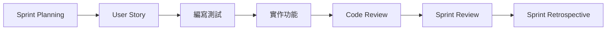

**Sprint Planning 階段:**

- 將 User Story 拆分為可測試的任務

- 定義 Acceptance Criteria(驗收標準)

- 估算包含測試撰寫的時間


**Daily Stand-up:**

- 報告:昨天寫了哪些測試,通過了哪些測試

- 問題:遇到難以測試的程式碼設計


**Sprint Review:**

- 展示測試覆蓋率報告

- 展示所有測試通過的 CI 結果


#### 💡 Definition of Done 包含 TDD 要求


```markdown
## Definition of Done


- [ ] 程式碼已完成

- [ ] 單元測試已撰寫且通過(覆蓋率 > 80%)

- [ ] 整合測試已通過

- [ ] Code Review 已完成

- [ ] CI/CD Pipeline 執行成功

- [ ] 文件已更新

- [ ] 已合併至主分支

```

### 7.2 Pair Programming 與 TDD

#### 🤝 Ping-Pong Pairing

**流程:**


1. **開發者 A**: 撰寫失敗的測試(Red)

2. **開發者 B**: 撰寫讓測試通過的程式碼(Green)

3. **兩人一起**: 重構程式碼(Refactor)

4. **角色互換**: 開發者 B 撰寫下一個測試

**範例:**


```java
// 開發者 A 寫測試
@Test
public void testCalculateShippingCost_ForStandardDelivery() {
    Order order = new Order(1000);
    assertEquals(50, order.calculateShippingCost("STANDARD"));
}

// 開發者 B 實作
public class Order {
    private double amount;
    
    public double calculateShippingCost(String type) {
        if ("STANDARD".equals(type)) {
            return 50;
        }
        return 0;
    }
}

// 兩人一起重構
public class Order {
    private static final Map<String, Double> SHIPPING_COSTS = Map.of(
        "STANDARD", 50.0,
        "EXPRESS", 100.0
    );
    
    public double calculateShippingCost(String type) {
        return SHIPPING_COSTS.getOrDefault(type, 0.0);
    }
}

```

#### 💡 Pair Programming 最佳實踐


- ⏰ 每 25 分鐘交換角色(Pomodoro 技巧)

- 💬 持續溝通思考過程

- 🎯 專注於當前的測試案例

- 📝 記錄待辦測試清單


### 7.3 Code Review 與測試審查重點

#### 🔍 測試程式碼審查檢查清單


```markdown
## 測試審查檢查清單

### 測試品質

- [ ] 測試命名清晰描述測試意圖

- [ ] 使用 AAA 模式組織測試

- [ ] 每個測試只驗證一個概念

- [ ] 測試彼此獨立,無相依性


### 測試覆蓋

- [ ] 涵蓋正常流程

- [ ] 涵蓋邊界條件

- [ ] 涵蓋異常情況

- [ ] 覆蓋率達到團隊標準(80%+)


### 測試可維護性

- [ ] 沒有重複的測試邏輯

- [ ] 使用測試輔助方法或 Builder

- [ ] Mock 使用適當(不過度)

- [ ] 測試資料清晰易懂


### 測試執行

- [ ] 測試執行速度合理(<5 秒)

- [ ] 測試在 CI 中穩定通過

- [ ] 沒有使用 Thread.sleep()

- [ ] 沒有依賴外部環境

```

#### 💬 Code Review 對話範例

**情境:過度使用 Mock**


```java
// ❌ 待審查的程式碼
@Test
public void testCreateOrder() {
    Product mockProduct = mock(Product.class);
    when(mockProduct.getPrice()).thenReturn(100);
    when(mockProduct.getName()).thenReturn("Product");
    
    Customer mockCustomer = mock(Customer.class);
    when(mockCustomer.getName()).thenReturn("John");
    
    // 過度 Mock
}

// 💬 Code Review 意見
@Reviewer: "這個測試過度使用 Mock,Product 和 Customer 
是簡單的值物件,建議使用真實物件。"

// ✅ 改進後
@Test
public void testCreateOrder() {
    Product product = new Product("Product", 100);
    Customer customer = new Customer("John");
    
    // 更簡潔,更真實
}

```

### 7.4 在 CI/CD Pipeline 中整合測試流程

#### 🔄 完整的 CI/CD 流程


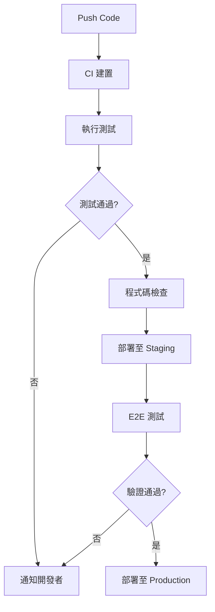

#### 📝 Jenkins Pipeline 範例


```groovy
pipeline {
    agent any
    
    stages {
        stage('Checkout') {
            steps {
                checkout scm
            }
        }
        
        stage('Build') {
            steps {
                sh 'mvn clean compile'
            }
        }
        
        stage('Unit Tests') {
            steps {
                sh 'mvn test'
            }
            post {
                always {
                    junit 'target/surefire-reports/*.xml'
                    jacoco(
                        execPattern: 'target/*.exec',
                        classPattern: 'target/classes',
                        sourcePattern: 'src/main/java'
                    )
                }
            }
        }
        
        stage('Quality Gate') {
            steps {
                script {
                    def coverage = sh(
                        script: "mvn jacoco:check",
                        returnStatus: true
                    )
                    if (coverage != 0) {
                        error("Coverage below 80%")
                    }
                }
            }
        }
        
        stage('Integration Tests') {
            steps {
                sh 'mvn verify -P integration-tests'
            }
        }
        
        stage('Deploy to Staging') {
            when {
                branch 'develop'
            }
            steps {
                sh './deploy-staging.sh'
            }
        }
        
        stage('E2E Tests') {
            when {
                branch 'develop'
            }
            steps {
                sh 'npm run test:e2e'
            }
        }
    }
    
    post {
        failure {
            mail to: 'team@example.com',
                 subject: "Build Failed: ${env.JOB_NAME} - ${env.BUILD_NUMBER}",
                 body: "Check ${env.BUILD_URL}"
        }
        success {
            echo 'All tests passed!'
        }
    }
}

```

### 7.5 建立團隊 TDD 實踐文化

#### 📚 TDD 推廣策略

**階段一:試點專案(1-2 個月)**

- 選擇小型新專案嘗試 TDD

- 指定 TDD 經驗豐富的成員帶領

- 定期分享經驗與困難


**階段二:知識分享(持續進行)**

- 每週 TDD 讀書會

- 內部 TDD 工作坊

- Code Kata 練習(如 Bowling Game, FizzBuzz)


**階段三:全面推廣(3-6 個月)**

- 將 TDD 納入 Definition of Done

- 建立團隊測試規範文件

- Code Review 強化測試品質檢查


**階段四:持續改進(持續)**

- 追蹤測試覆蓋率趨勢

- 定期檢視測試速度

- 分享成功案例


#### 🎓 團隊培訓計畫


```markdown
## TDD 培訓計畫(4 週)

### Week 1: 基礎概念

- TDD 原理與好處

- Red-Green-Refactor 循環

- 測試框架入門(JUnit/pytest)

- 實作:計算機類別


### Week 2: 進階技巧

- AAA 模式

- Mock 與 Stub

- 測試替身使用時機

- 實作:訂單服務


### Week 3: 實務應用

- API 測試

- 資料庫測試

- CI/CD 整合

- 實作:完整功能模組


### Week 4: 團隊實踐

- Pair Programming

- Code Review 技巧

- Legacy Code 重構

- 實際專案練習

```

#### 💡 克服團隊阻力

**常見反對意見與應對:**

| 反對意見 | 應對策略 |
|---------|---------|
| "TDD 太慢" | 展示長期數據:除錯時間減少 50% |
| "寫測試很無聊" | 推廣 Pair Programming,讓測試撰寫更有趣 |
| "沒時間寫測試" | 強調測試即文件,減少後期維護成本 |
| "測試很難寫" | 提供培訓與 Pair Programming 支援 |
| "改既有程式碼太困難" | 先從新功能開始,逐步改善 |

---

## 八、TDD 常見問題與最佳實踐

### 8.1 常見誤區與修正方式

#### ❌ 誤區 1:先寫所有測試再寫實作

**錯誤做法:**

```java
// 一次寫完所有測試
testAdd()
testSubtract()
testMultiply()
testDivide()

// 然後一次實作所有功能

```

**正確做法:**

```java
// 一次一個測試 + 實作循環
testAdd() → implement add() → refactor
testSubtract() → implement subtract() → refactor

```

#### ❌ 誤區 2:測試覆蓋率 100% 就是好測試

**問題:**

- 覆蓋率高不代表測試品質好

- 可能有測試但沒有驗證(assert)


**正確觀念:**

- 關注關鍵業務邏輯的測試

- 確保每個測試都有明確驗證

- 測試應該能抓到真實的 bug


#### ❌ 誤區 3:所有東西都要 Mock

**錯誤:**

```java
Product mockProduct = mock(Product.class);
Customer mockCustomer = mock(Customer.class);
// 連簡單的值物件都 Mock

```

**正確:**

```java
Product product = new Product("Item", 100); // 真實物件
Customer customer = new Customer("John");    // 真實物件
PaymentService mockPayment = mock(PaymentService.class); // 只 Mock 外部依賴

```

#### ❌ 誤區 4:測試私有方法

**錯誤:**

```java
@Test
public void testPrivateMethod() {
    Method method = MyClass.class.getDeclaredMethod("privateMethod");
    method.setAccessible(true);
    // 不應該測試私有方法
}

```

**正確:**

```java
@Test
public void testPublicBehavior() {
    MyClass obj = new MyClass();
    int result = obj.publicMethod(); // 透過公開 API 測試
    assertEquals(expected, result);
}

```

### 8.2 測試覆蓋率與品質間的平衡

#### 📊 覆蓋率目標建議


```text
核心業務邏輯:    95-100%
服務層:          85-95%
控制器層:        80-90%
工具類別:        90-100%
配置類別:        50-70%

```

#### 💡 不必追求 100% 覆蓋率的情況


- 簡單的 Getter/Setter

- 框架生成的程式碼

- 配置類別

- 第三方函式庫的封裝


#### ✅ 品質優於數量

**高品質測試的特徵:**

- 測試失敗時能快速定位問題

- 測試名稱清楚描述意圖

- 測試彼此獨立

- 測試執行速度快

- 測試能抓到真實 bug


### 8.3 與 Legacy Code 整合的策略

#### 🔧 漸進式重構策略

**步驟 1:建立特徵測試(Characterization Tests)**


```java
// 先為現有行為寫測試(即使不知道正確結果)
@Test
public void testLegacyBehavior() {
    LegacyClass legacy = new LegacyClass();
    int result = legacy.complexMethod(input);
    
    // 記錄當前行為(即使不確定是否正確)
    assertEquals(currentBehavior, result);
}

```

**步驟 2:小步重構**


```java
// 提取小方法
public int complexMethod(Input input) {
    validateInput(input); // 提取出來的方法可以寫測試
    int result = calculate(input);
    return result;
}

@Test
public void testValidateInput() {
    // 可以單獨測試提取出來的方法
}

```

**步驟 3:打破依賴**


```java
// Legacy Code(難以測試)
public class OrderService {
    public void process() {
        Database db = new Database(); // 緊耦合
        db.save(order);
    }
}

// 重構後(可測試)
public class OrderService {
    private final Database database;
    
    public OrderService(Database database) { // 依賴注入
        this.database = database;
    }
    
    public void process() {
        database.save(order);
    }
}

// 現在可以 Mock
@Test
public void testProcess() {
    Database mockDb = mock(Database.class);
    OrderService service = new OrderService(mockDb);
    service.process();
    verify(mockDb).save(any());
}

```

### 8.4 大型專案中導入 TDD 的建議

#### 📋 導入計畫


**Phase 評估與準備(1 個月)**

- 評估現有程式碼測試覆蓋率

- 選擇測試框架與工具

- 建立 CI/CD Pipeline

- 制定測試規範


**Phase 培訓與試點(2-3 個月)**

- TDD 培訓課程

- 選擇 1-2 個模組試點

- 建立最佳實踐文件

- 定期回顧與改進


**Phase 逐步推廣(6-12 個月)**

- 新功能強制使用 TDD

- 修改既有程式碼時補充測試

- 定期檢視測試品質

- 分享成功案例


**Phase 持續優化(持續)**

- 優化測試執行速度

- 改進測試架構

- 追蹤品質指標

- 建立測試文化


#### 💡 實務建議


**DO (應該做):**


- ✅ 從新功能開始採用 TDD

- ✅ 設定合理的覆蓋率目標

- ✅ 投資測試基礎設施

- ✅ 定期培訓與分享

- ✅ 慶祝測試文化的成功


**DON'T (不要做):**


- ❌ 要求立即達到 100% 覆蓋率

- ❌ 在時程壓力下放棄測試

- ❌ 過度強調覆蓋率數字

- ❌ 忽視測試執行速度

- ❌ 缺乏管理層支持


### 8.5 實務經驗分享與成功案例

#### 📖 案例一:電商平台的 TDD 轉型

**背景:**

- 團隊規模:15 人

- 專案規模:50 萬行程式碼

- 原測試覆蓋率:15%


**實施策略:**

1. 新功能強制 TDD(覆蓋率 > 80%)

2. 修改既有功能時補充測試

3. 每週 Code Kata 練習

4. Pair Programming 推廣

**成果(6 個月後):**

- 測試覆蓋率提升至 65%

- 線上缺陷率降低 60%

- 開發信心大幅提升

- 重構變得更安全


#### 📖 案例二:金融系統的測試改善

**挑戰:**

- 高穩定性要求

- 複雜的業務規則

- Legacy Code 多


**解決方案:**

1. 為核心計算邏輯補充單元測試

2. 建立整合測試環境

3. 引入契約測試(Contract Testing)

4. 定期進行回歸測試

**成果:**

- 核心邏輯覆蓋率達 95%

- 上線前缺陷發現率提升 80%

- 發版信心提升


---

## 九、進階主題

### 9.1 BDD（行為驅動開發）與 TDD 的差異與結合

#### 🎯 BDD 簡介

**BDD (Behavior-Driven Development)** 強調用自然語言描述系統行為。

**Given-When-Then 格式:**


```gherkin
Feature: 購物車結帳
  
  Scenario: VIP 客戶結帳享有折扣
    Given 我是 VIP 客戶
    And 購物車有總價 1000 元的商品
    When 我進行結帳
    Then 我應該支付 800 元
    And 折扣為 200 元

```

**使用 Cucumber 實作:**


```java
@Given("我是 VIP 客戶")
public void 我是VIP客戶() {
    customer = new Customer(CustomerType.VIP);
}

@Given("購物車有總價 {int} 元的商品")
public void 購物車有總價元的商品(int amount) {
    cart = new ShoppingCart(customer);
    cart.addItem(new Product("商品", amount), 1);
}

@When("我進行結帳")
public void 我進行結帳() {
    result = cart.checkout();
}

@Then("我應該支付 {int} 元")
public void 我應該支付元(int expectedAmount) {
    assertEquals(expectedAmount, result.getFinalAmount());
}

```

#### 💡 TDD vs BDD

| 面向 | TDD | BDD |
|------|-----|-----|
| 焦點 | 程式碼正確性 | 業務行為 |
| 語言 | 程式碼 | 自然語言 |
| 對象 | 開發者 | 開發者+業務人員 |
| 範圍 | 單元測試為主 | 驗收測試為主 |

**結合使用:**

- 使用 BDD 描述驗收標準

- 使用 TDD 實作細節

- BDD 測試作為高層級規格

- TDD 測試作為底層實作驗證


### 9.2 Property-Based Testing

#### 🎲 概念介紹

傳統測試使用固定輸入,Property-Based Testing 使用隨機輸入驗證屬性。

**範例(使用 jqwik):**


```java
@Property
boolean absoluteValueIsAlwaysPositive(@ForAll int number) {
    return Math.abs(number) >= 0;
}

@Property
boolean reverseTwiceGivesOriginal(@ForAll List<Integer> list) {
    List<Integer> reversed = reverse(reverse(list));
    return list.equals(reversed);
}

@Property
boolean sortedListIsOrdered(@ForAll List<Integer> list) {
    List<Integer> sorted = list.stream()
        .sorted()
        .collect(Collectors.toList());
    
    for (int i = 0; i < sorted.size() - 1; i++) {
        if (sorted.get(i) > sorted.get(i + 1)) {
            return false;
        }
    }
    return true;
}

```

### 9.3 測試驅動的設計（Test-Driven Design）

TDD 不僅是測試技術,更是設計工具:

**TDD 促進的設計原則:**

1. **單一職責原則(SRP)**: 測試驅動類別職責分離

2. **依賴反轉原則(DIP)**: 可測試性需要依賴注入

3. **介面隔離原則(ISP)**: Mock 需求推動介面設計

4. **開放封閉原則(OCP)**: 測試保護下安全擴展

**設計浮現範例:**


```java
// 第一版:簡單實作
public class OrderService {
    public void process(Order order) {
        Database.save(order);
    }
}

// 為了測試,重構為可注入
public class OrderService {
    private final OrderRepository repository;
    
    public OrderService(OrderRepository repository) {
        this.repository = repository;
    }
    
    public void process(Order order) {
        repository.save(order);
    }
}

// 測試驅動出介面設計
public interface OrderRepository {
    void save(Order order);
    Order findById(String id);
}

```

### 9.4 自動化測試報告與品質儀表板

#### 📊 Allure 測試報告


```xml
<dependency>
    <groupId>io.qameta.allure</groupId>
    <artifactId>allure-junit5</artifactId>
    <version>2.24.0</version>
</dependency>

```


```java
@Epic("訂單管理")
@Feature("訂單建立")
public class OrderCreationTest {
    
    @Test
    @Story("VIP 客戶訂單")
    @Severity(SeverityLevel.CRITICAL)
    @Description("測試 VIP 客戶建立訂單時自動套用折扣")
    public void testVIPOrderDiscount() {
        // 測試實作
    }
}

```

#### 📈 SonarQube 品質儀表板

整合 SonarQube 追蹤:

- 程式碼覆蓋率

- 程式碼異味

- 技術債務

- 安全漏洞


---

## 十、附錄

### 10.1 推薦學習資源

#### 📚 經典書籍


1. **Test Driven Development: By Example** - Kent Beck
   - TDD 創始人的經典著作
   - 包含完整範例


2. **Growing Object-Oriented Software, Guided by Tests** - Steve Freeman & Nat Pryce
   - 進階 TDD 技巧
   - 大型系統的測試策略


3. **Working Effectively with Legacy Code** - Michael Feathers
   - 處理舊程式碼的測試策略


4. **xUnit Test Patterns** - Gerard Meszaros
   - 完整的測試模式手冊

#### 🌐 線上資源


- **Martin Fowler's Blog**: https://martinfowler.com

- **Uncle Bob's Blog**: http://blog.cleancoder.com

- **Test Double Blog**: https://blog.testdouble.com


#### 🎥 影片課程


- Test Driven Development - Pluralsight

- TDD with JUnit 5 - Udemy

- Clean Code - Uncle Bob


### 10.2 常用測試工具與框架清單

#### ☕ Java

| 工具/框架 | 用途 | 網址 |
|----------|------|------|
| JUnit 5 | 單元測試框架 | junit.org |
| Mockito | Mock 框架 | site.mockito.org |
| AssertJ | 流暢斷言庫 | assertj.github.io |
| TestContainers | 容器化整合測試 | testcontainers.org |
| JaCoCo | 覆蓋率工具 | jacoco.org |
| Awaitility | 非同步測試 | github.com/awaitility |
| WireMock | HTTP Mock 伺服器 | wiremock.org |
| Rest Assured | REST API 測試 | rest-assured.io |

#### 🐍 Python

| 工具/框架 | 用途 |
|----------|------|
| pytest | 測試框架 |
| unittest.mock | Mock 工具 |
| Coverage.py | 覆蓋率工具 |
| Faker | 測試資料生成 |
| pytest-asyncio | 非同步測試 |
| requests-mock | HTTP Mock |

#### 🟨 JavaScript/TypeScript

| 工具/框架 | 用途 |
|----------|------|
| Jest | 測試框架 |
| Mocha | 測試框架 |
| Chai | 斷言庫 |
| Sinon | Mock/Spy 工具 |
| Cypress | E2E 測試 |
| Testing Library | UI 元件測試 |

### 10.3 TDD 範本專案連結與練習題

#### 🏋️ Code Kata 練習


1. **Bowling Game Kata**
   - 實作保齡球計分系統
   - 學習處理複雜業務規則


2. **FizzBuzz Kata**
   - 經典入門練習
   - 學習基本 TDD 循環


3. **String Calculator Kata**
   - 字串計算機
   - 學習漸進式開發


4. **Roman Numerals Kata**
   - 阿拉伯數字轉羅馬數字
   - 學習演算法實作


5. **Bank Account Kata**
   - 銀行帳戶系統
   - 學習物件設計

#### 🔗 練習資源


- **Cyber-Dojo**: https://cyber-dojo.org

- **Codewars**: https://codewars.com

- **Exercism**: https://exercism.org


### 10.4 專有名詞中英對照表

| 中文 | 英文 | 說明 |
|------|------|------|
| 測試驅動開發 | Test-Driven Development (TDD) | 先寫測試後寫實作的開發方法 |
| 紅燈-綠燈-重構 | Red-Green-Refactor | TDD 的核心循環 |
| 單元測試 | Unit Test | 測試最小可測試單元 |
| 整合測試 | Integration Test | 測試多個元件的整合 |
| 端對端測試 | End-to-End (E2E) Test | 測試完整使用者流程 |
| 測試覆蓋率 | Test Coverage | 測試涵蓋的程式碼比例 |
| 模擬物件 | Mock Object | 用於驗證互動的測試替身 |
| 樁物件 | Stub | 提供固定回應的測試替身 |
| 假物件 | Fake Object | 有簡化實作的測試替身 |
| 間諜物件 | Spy Object | 部分模擬的測試替身 |
| 斷言 | Assertion | 驗證預期結果 |
| 重構 | Refactoring | 在不改變行為下改善程式碼結構 |
| 持續整合 | Continuous Integration (CI) | 自動化建置與測試 |
| 持續部署 | Continuous Deployment (CD) | 自動化部署 |
| 配對程式設計 | Pair Programming | 兩人協同編程 |
| 程式碼審查 | Code Review | 團隊檢視程式碼 |

---

## 🎓 總結

### ✨ TDD 的核心價值


1. **提升程式碼品質**: 強制思考設計,產生高品質程式碼

2. **建立安全網**: 測試保護重構,降低修改風險

3. **加速開發**: 減少除錯時間,長期效益顯著

4. **活文件**: 測試即規格,自動保持更新

5. **設計工具**: TDD 驅動良好的物件導向設計

### 📈 持續改進的建議


- 🎯 設定明確的覆蓋率目標

- 📊 定期檢視測試品質

- 🔄 持續優化測試執行速度

- 📚 不斷學習新的測試技巧

- 🤝 建立團隊測試文化


### 🚀 下一步行動


1. **立即開始**: 從下一個功能開始實踐 TDD

2. **持續練習**: 每週至少一次 Code Kata

3. **分享經驗**: 與團隊分享學習心得

4. **建立習慣**: 將 TDD 融入日常開發流程

---

## 📋 TDD 快速檢查清單

### 開始開發前


- [ ] 理解需求並能描述預期行為

- [ ] 準備好測試環境

- [ ] 列出要測試的案例清單


### Red 階段


- [ ] 撰寫描述性的測試名稱

- [ ] 使用 AAA 模式組織測試

- [ ] 確認測試執行失敗(紅燈)

- [ ] 失敗原因符合預期


### Green 階段


- [ ] 撰寫最簡單的實作

- [ ] 測試執行通過(綠燈)

- [ ] 所有既有測試仍然通過


### Refactor 階段


- [ ] 檢視程式碼異味

- [ ] 消除重複邏輯

- [ ] 改善命名與結構

- [ ] 測試持續保持綠燈


### 完成後


- [ ] 測試覆蓋率達標

- [ ] 程式碼通過 Code Review

- [ ] CI/CD Pipeline 執行成功

- [ ] 文件已更新


---

## 🙏 結語

TDD 不僅是一種測試技術,更是一種開發思維方式。透過持續的練習與實踐,您將體會到 TDD 帶來的價值:


- 💪 更有信心的重構

- 🐛 更少的 bug

- 📖 更好的程式碼文件

- 🎯 更清晰的設計

- 😊 更愉快的開發體驗


**記住**: TDD 是一段旅程,而非目的地。持續學習,持續改進,享受 TDD 帶來的樂趣!

---

**Happy Testing! 🧪✨**

---

*文件版本: 1.0*  
*最後更新: 2025年11月7日*  
*作者: Eric Cheng*

