+++
date = '2025-10-31T00:00:00+08:00'
draft = false
title = '物件導向分析與設計 (OOAD) 教學'
tags = ['教學', '分析與設計']
categories = ['教學']
+++
# 物件導向分析與設計 (OOAD) 教學手冊

> **作者**: 系統架構師團隊  
> **更新日期**: 2025年9月1日  
> **適用對象**: 新進開發同仁  
> **版本**: v1.0

---

## 📚 目錄

1. [前言與學習目標](#1-前言與學習目標)
   - 1.1 [為什麼要學習 OOAD？](#11-為什麼要學習-ooad)
   - 1.2 [學習目標](#12-學習目標)
   - 1.3 [學習路徑](#13-學習路徑)
   - 1.4 [前置知識](#14-前置知識)

2. [OOAD 基礎概念](#2-ooad-基礎概念)
   - 2.1 [什麼是物件導向？](#21-什麼是物件導向)
   - 2.2 [核心概念詳解](#22-核心概念詳解)
   - 2.3 [OOAD 的設計原則](#23-ooad-的設計原則)
   - 2.4 [實務案例：學生管理系統](#24-實務案例學生管理系統)
   - 2.5 [章節小結](#25-章節小結)

3. [OOAD 開發流程](#3-ooad-開發流程)
   - 3.1 [OOAD 流程概覽](#31-ooad-流程概覽)
   - 3.2 [階段一：需求分析](#32-階段一需求分析-requirements-analysis)
   - 3.3 [階段二：系統分析](#33-階段二系統分析-system-analysis)
   - 3.4 [階段三：系統設計](#34-階段三系統設計-system-design)
   - 3.5 [階段四：詳細設計](#35-階段四詳細設計-detailed-design)
   - 3.6 [階段五：程式實作](#36-階段五程式實作-implementation)
   - 3.7 [階段六：測試與驗證](#37-階段六測試與驗證)
   - 3.8 [章節小結](#38-章節小結)

4. [UML 與 OOAD 的關係](#4-uml-與-ooad-的關係)
   - 4.1 [UML 簡介](#41-uml-簡介)
   - 4.2 [UML 圖形分類](#42-uml-圖形分類)
   - 4.3 [核心 UML 圖形詳解](#43-核心-uml-圖形詳解)
   - 4.4 [UML 工具與最佳實務](#44-uml-工具與最佳實務)
   - 4.5 [章節小結](#45-章節小結)

5. [專案實務應用範例](#5-專案實務應用範例)
   - 5.1 [專案背景：大學課程管理系統](#51-專案背景大學課程管理系統)
   - 5.2 [階段一：需求分析與 Use Case 設計](#52-階段一需求分析與-use-case-設計)
   - 5.3 [階段二：領域分析與建模](#53-階段二領域分析與建模)
   - 5.4 [階段三：架構設計](#54-階段三架構設計)
   - 5.5 [階段四：詳細設計](#55-階段四詳細設計)
   - 5.6 [階段五：關鍵循序圖](#56-階段五關鍵循序圖)
   - 5.7 [實作關鍵功能](#57-實作關鍵功能)
   - 5.8 [章節小結](#58-章節小結)

6. [常見錯誤與最佳實務](#6-常見錯誤與最佳實務)
   - 6.1 [分析階段常見錯誤](#61-分析階段常見錯誤)
   - 6.2 [設計階段常見錯誤](#62-設計階段常見錯誤)
   - 6.3 [實作階段常見錯誤](#63-實作階段常見錯誤)
   - 6.4 [UML 建模最佳實務](#64-uml-建模最佳實務)
   - 6.5 [程式碼品質準則](#65-程式碼品質準則)
   - 6.6 [效能與安全性考量](#66-效能與安全性考量)
   - 6.7 [章節小結](#67-章節小結)

7. [UML 認證考試重點](#7-uml-認證考試重點)
   - 7.1 [UML 認證概述](#71-uml-認證概述)
   - 7.2 [考試範圍與題型](#72-考試範圍與題型)
   - 7.3 [重點知識整理](#73-重點知識整理)
   - 7.4 [模擬考題與解析](#74-模擬考題與解析)
   - 7.5 [考試準備策略](#75-考試準備策略)
   - 7.6 [學習資源推薦](#76-學習資源推薦)

8. [結語與延伸閱讀](#8-結語與延伸閱讀)
   - 8.1 [學習成果回顧](#81-學習成果回顧)
   - 8.2 [進階學習方向](#82-進階學習方向)
   - 8.3 [參考資料與書籍](#83-參考資料與書籍)
   - 8.4 [線上資源與社群](#84-線上資源與社群)

9. [檢查清單](#9-檢查清單)
   - 9.1 [需求分析檢查清單](#91-需求分析檢查清單)
   - 9.2 [設計階段檢查清單](#92-設計階段檢查清單)
   - 9.3 [實作階段檢查清單](#93-實作階段檢查清單)
   - 9.4 [程式碼審查檢查清單](#94-程式碼審查檢查清單)
   - 9.5 [專案交付檢查清單](#95-專案交付檢查清單)

---

## 1. 前言與學習目標

### 1.1 為什麼要學習 OOAD？

在現代軟體開發中，系統複雜度不斷增加，傳統的程序式程式設計已經無法有效應對大型專案的挑戰。物件導向分析與設計 (Object-Oriented Analysis and Design, OOAD) 提供了一套系統化的方法論，幫助開發團隊：

- 🎯 **降低複雜度**: 將複雜問題分解為可管理的物件
- 🔄 **提高重用性**: 透過繼承和組合機制重複利用程式碼
- 🛡️ **增強可維護性**: 封裝變化，減少程式碼之間的耦合
- 👥 **改善團隊協作**: 使用統一的建模語言 (UML) 溝通設計概念

### 1.2 學習目標

完成本教學手冊後，您將能夠：

#### 📖 知識層面
- [ ] 理解 OOAD 的核心概念與原則
- [ ] 掌握 UML 各種圖形的用途與繪製方法
- [ ] 了解從需求到實作的完整開發流程

#### 🛠️ 技能層面
- [ ] 能夠進行物件導向分析，識別系統中的物件和類別
- [ ] 能夠設計類別圖、循序圖等 UML 圖形
- [ ] 能夠將設計模型轉換為可執行的程式碼

#### 🎯 應用層面
- [ ] 在實際專案中運用 OOAD 方法論
- [ ] 與團隊成員使用 UML 進行有效溝通
- [ ] 具備考取 UML 認證的基礎能力

### 1.3 學習路徑

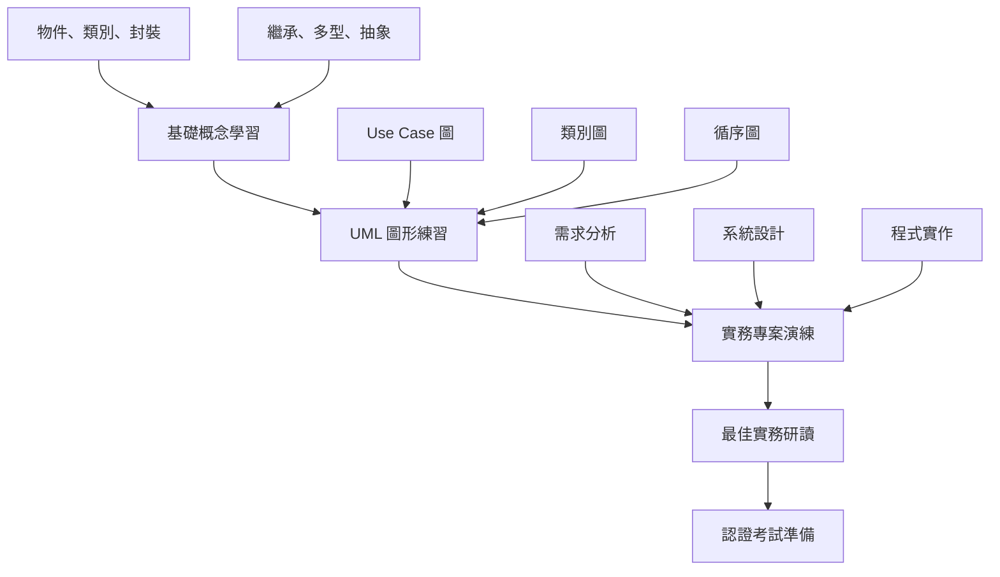

### 1.4 前置知識

在開始學習 OOAD 之前，建議您具備以下基礎：

- ✅ **程式設計基礎**: 了解變數、函數、條件判斷、迴圈等概念
- ✅ **Java 基本語法**: 熟悉 Java 的基本語法結構
- ✅ **軟體開發概念**: 理解軟體開發生命週期的基本概念

---

## 2. OOAD 基礎概念

### 2.1 什麼是物件導向？

物件導向 (Object-Oriented) 是一種程式設計典範，它將現實世界的事物抽象化為軟體中的「物件」。每個物件都有自己的：

- **屬性 (Attributes)**: 物件的狀態和特徵
- **行為 (Behaviors)**: 物件能夠執行的操作

#### 🌟 現實世界的類比

想像一下「汽車」這個概念：

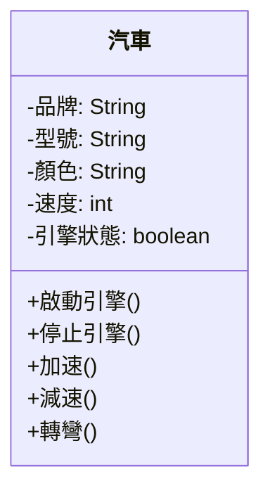

### 2.2 核心概念詳解

#### 2.2.1 物件 (Object)

**定義**: 物件是類別的實例，具有特定的狀態和行為。

**範例**:
```java
// 這是一個 Student 物件
Student student1 = new Student("張小明", 20, "S001");
Student student2 = new Student("李小華", 19, "S002");
```

**特點**:
- 每個物件都有唯一的身份識別
- 物件的狀態會隨時間改變
- 物件透過方法與外界互動

#### 2.2.2 類別 (Class)

**定義**: 類別是物件的藍圖或模板，定義了物件的屬性和行為。

```java
/**
 * 學生類別 - 定義學生物件的屬性和行為
 */
public class Student {
    // 屬性 (私有封裝)
    private String name;
    private int age;
    private String studentId;
    private List<Course> enrolledCourses;
    
    // 建構函式
    public Student(String name, int age, String studentId) {
        this.name = name;
        this.age = age;
        this.studentId = studentId;
        this.enrolledCourses = new ArrayList<>();
    }
    
    // 行為 (公開方法)
    public void enrollCourse(Course course) {
        enrolledCourses.add(course);
        System.out.println(name + " 已選修課程: " + course.getCourseName());
    }
    
    public void dropCourse(Course course) {
        enrolledCourses.remove(course);
        System.out.println(name + " 已退選課程: " + course.getCourseName());
    }
    
    // Getter 和 Setter 方法
    public String getName() { return name; }
    public void setName(String name) { this.name = name; }
    // ... 其他 getter/setter
}
```

#### 2.2.3 封裝 (Encapsulation)

**定義**: 將物件的內部實作細節隱藏起來，只透過公開的介面與外界互動。

**核心原則**:
- 🔒 **資料隱藏**: 使用 `private` 修飾符保護內部資料
- 🚪 **控制存取**: 透過 `public` 方法提供受控的存取
- 🛡️ **驗證機制**: 在 setter 方法中加入資料驗證

```java
public class BankAccount {
    private double balance;  // 私有屬性，外部無法直接存取
    
    // 提供受控的存取方法
    public boolean withdraw(double amount) {
        if (amount > 0 && amount <= balance) {
            balance -= amount;
            return true;
        }
        return false;  // 提款失敗
    }
    
    public void deposit(double amount) {
        if (amount > 0) {
            balance += amount;
        }
    }
    
    public double getBalance() {
        return balance;  // 只提供讀取，不提供直接修改
    }
}
```

**封裝的好處**:
- ✅ 保護資料完整性
- ✅ 降低程式碼耦合度
- ✅ 方便後續維護和修改

#### 2.2.4 繼承 (Inheritance)

**定義**: 子類別可以繼承父類別的屬性和方法，實現程式碼重用。

```java
// 父類別 (超類別)
public abstract class Animal {
    protected String name;
    protected int age;
    
    public Animal(String name, int age) {
        this.name = name;
        this.age = age;
    }
    
    // 共同行為
    public void eat() {
        System.out.println(name + " 正在吃東西");
    }
    
    // 抽象方法，子類別必須實作
    public abstract void makeSound();
}

// 子類別
public class Dog extends Animal {
    private String breed;
    
    public Dog(String name, int age, String breed) {
        super(name, age);  // 呼叫父類別建構函式
        this.breed = breed;
    }
    
    @Override
    public void makeSound() {
        System.out.println(name + " 汪汪叫");
    }
    
    // 子類別特有的方法
    public void fetchBall() {
        System.out.println(name + " 去撿球");
    }
}

public class Cat extends Animal {
    public Cat(String name, int age) {
        super(name, age);
    }
    
    @Override
    public void makeSound() {
        System.out.println(name + " 喵喵叫");
    }
    
    public void climbTree() {
        System.out.println(name + " 爬樹");
    }
}
```

**繼承的類型**:

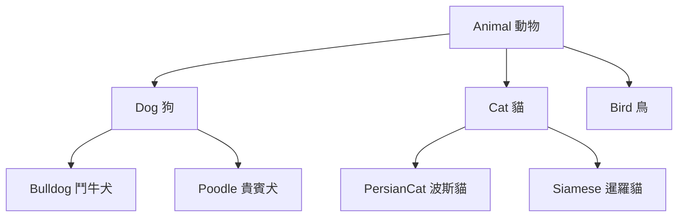

#### 2.2.5 多型 (Polymorphism)

**定義**: 同一個介面可以有多種不同的實作方式，在執行時期決定呼叫哪個方法。

```java
public class AnimalDemo {
    public static void main(String[] args) {
        // 多型：同一個類型的引用指向不同的物件
        Animal[] animals = {
            new Dog("小黑", 3, "拉布拉多"),
            new Cat("小白", 2),
            new Dog("小黃", 1, "柴犬")
        };
        
        // 相同的方法呼叫，不同的執行結果
        for (Animal animal : animals) {
            animal.makeSound();  // 在執行時期決定呼叫哪個版本
            animal.eat();
        }
        
        // 輸出：
        // 小黑 汪汪叫
        // 小黑 正在吃東西
        // 小白 喵喵叫
        // 小白 正在吃東西
        // 小黃 汪汪叫
        // 小黃 正在吃東西
    }
    
    // 多型的另一個應用：方法參數
    public static void playWithAnimal(Animal animal) {
        animal.makeSound();
        // 不需要知道具體是什麼動物，只要是 Animal 類型都可以
    }
}
```

**多型的實現方式**:
1. **方法覆寫 (Override)**: 子類別重新定義父類別的方法
2. **介面實作 (Interface Implementation)**: 不同類別實作同一個介面
3. **方法多載 (Overload)**: 同一個類別中同名但參數不同的方法

#### 2.2.6 抽象 (Abstraction)

**定義**: 隱藏實作細節，只展露必要的功能給使用者。

**抽象類別範例**:
```java
public abstract class Shape {
    protected String color;
    
    public Shape(String color) {
        this.color = color;
    }
    
    // 抽象方法，子類別必須實作
    public abstract double calculateArea();
    public abstract double calculatePerimeter();
    
    // 具體方法，子類別可以直接使用
    public void displayInfo() {
        System.out.println("顏色: " + color);
        System.out.println("面積: " + calculateArea());
        System.out.println("周長: " + calculatePerimeter());
    }
}

public class Rectangle extends Shape {
    private double width;
    private double height;
    
    public Rectangle(String color, double width, double height) {
        super(color);
        this.width = width;
        this.height = height;
    }
    
    @Override
    public double calculateArea() {
        return width * height;
    }
    
    @Override
    public double calculatePerimeter() {
        return 2 * (width + height);
    }
}
```

**介面範例**:
```java
public interface Drawable {
    void draw();
    void setPosition(int x, int y);
}

public interface Resizable {
    void resize(double factor);
}

// 一個類別可以實作多個介面
public class Circle extends Shape implements Drawable, Resizable {
    private double radius;
    private int x, y;
    
    public Circle(String color, double radius) {
        super(color);
        this.radius = radius;
    }
    
    @Override
    public double calculateArea() {
        return Math.PI * radius * radius;
    }
    
    @Override
    public double calculatePerimeter() {
        return 2 * Math.PI * radius;
    }
    
    @Override
    public void draw() {
        System.out.println("在座標 (" + x + ", " + y + ") 繪製圓形");
    }
    
    @Override
    public void setPosition(int x, int y) {
        this.x = x;
        this.y = y;
    }
    
    @Override
    public void resize(double factor) {
        this.radius *= factor;
    }
}
```

### 2.3 OOAD 的設計原則

#### 2.3.1 SOLID 原則

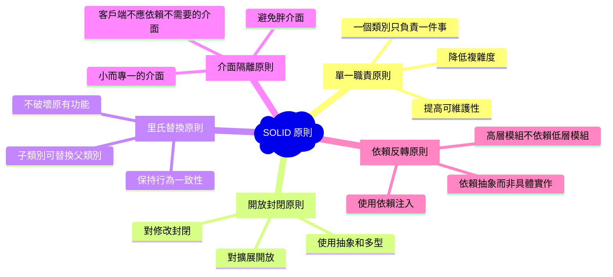

### 2.4 實務案例：學生管理系統

讓我們透過一個簡單的學生管理系統來綜合運用這些概念：

```java
// 抽象基類
public abstract class Person {
    protected String name;
    protected String id;
    protected int age;
    
    public Person(String name, String id, int age) {
        this.name = name;
        this.id = id;
        this.age = age;
    }
    
    public abstract void displayInfo();
    
    // Getter 方法
    public String getName() { return name; }
    public String getId() { return id; }
    public int getAge() { return age; }
}

// 學生類別
public class Student extends Person {
    private String major;
    private List<Course> courses;
    private double gpa;
    
    public Student(String name, String id, int age, String major) {
        super(name, id, age);
        this.major = major;
        this.courses = new ArrayList<>();
        this.gpa = 0.0;
    }
    
    @Override
    public void displayInfo() {
        System.out.println("學生資訊:");
        System.out.println("姓名: " + name);
        System.out.println("學號: " + id);
        System.out.println("年齡: " + age);
        System.out.println("主修: " + major);
        System.out.println("GPA: " + gpa);
    }
    
    public void enrollCourse(Course course) {
        if (!courses.contains(course)) {
            courses.add(course);
            course.addStudent(this);
        }
    }
    
    // 其他方法...
}

// 教師類別
public class Teacher extends Person {
    private String department;
    private List<Course> teachingCourses;
    
    public Teacher(String name, String id, int age, String department) {
        super(name, id, age);
        this.department = department;
        this.teachingCourses = new ArrayList<>();
    }
    
    @Override
    public void displayInfo() {
        System.out.println("教師資訊:");
        System.out.println("姓名: " + name);
        System.out.println("員工編號: " + id);
        System.out.println("年齡: " + age);
        System.out.println("系所: " + department);
    }
    
    public void assignCourse(Course course) {
        teachingCourses.add(course);
        course.setTeacher(this);
    }
}
```

### 2.5 章節小結

#### ✅ 重點回顧
- **物件導向四大支柱**: 封裝、繼承、多型、抽象
- **設計原則**: SOLID 原則指導良好的物件導向設計
- **實務應用**: 透過學生管理系統理解概念的實際運用

#### 🎯 實務建議
1. **漸進式學習**: 先掌握基本概念，再學習進階技巧
2. **多做練習**: 透過實際程式碼加深理解
3. **閱讀優秀程式碼**: 學習業界最佳實務
4. **團隊討論**: 與同事分享設計想法和經驗

#### ⚠️ 常見陷阱
- 避免過度設計，保持簡潔
- 不要為了物件導向而物件導向
- 注意效能影響，適度使用繼承

---

## 📝 練習題

### 練習 2.1: 基礎概念
設計一個「圖書館管理系統」的基本類別結構，包含：
- Book（書籍）
- Member（會員）
- Librarian（圖書館員）

要求實現封裝、繼承和多型的概念。

### 練習 2.2: 介面設計
為上述系統設計適當的介面：
- Borrowable（可借閱）
- Searchable（可搜尋）
- Manageable（可管理）

---

## 3. OOAD 開發流程

### 3.1 OOAD 流程概覽

物件導向分析與設計遵循一個系統化的流程，從需求收集到最終實作。這個流程確保我們能夠建構出高品質、可維護的軟體系統。

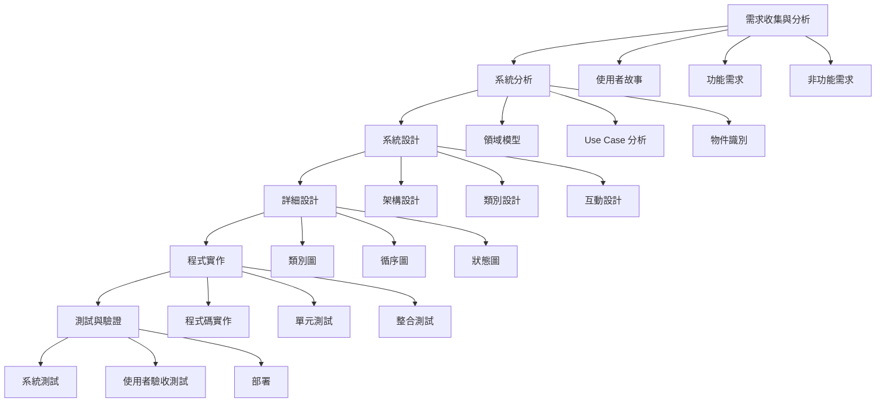

### 3.2 階段一：需求分析 (Requirements Analysis)

#### 3.2.1 需求收集

**目標**: 理解使用者真正的需求和期望

**活動內容**:
- 🎯 **使用者訪談**: 與利害關係人深度對話
- 📋 **需求文件審查**: 分析既有的規格文件
- 🔍 **系統觀察**: 觀察現有系統的運作方式
- 📝 **工作坊**: 與使用者一起討論需求

**輸出產物**:
- 使用者故事 (User Stories)
- 功能需求清單
- 非功能需求清單
- 系統邊界定義

#### 3.2.2 需求分析範例：線上書店系統

**使用者故事範例**:
```
作為一個 [顧客]
我想要 [瀏覽書籍並加入購物車]
以便於 [選購我想要的書籍]

驗收標準：
- 可以依分類瀏覽書籍
- 可以搜尋特定書籍
- 可以查看書籍詳細資訊
- 可以將書籍加入購物車
- 可以調整購物車中的商品數量
```

**功能需求**:
- FR01: 使用者註冊與登入
- FR02: 書籍瀏覽與搜尋
- FR03: 購物車管理
- FR04: 訂單處理
- FR05: 付款處理
- FR06: 庫存管理

**非功能需求**:
- NFR01: 系統回應時間不超過 2 秒
- NFR02: 支援 1000 個並發使用者
- NFR03: 系統可用性達 99.9%
- NFR04: 資料必須加密傳輸

### 3.3 階段二：系統分析 (System Analysis)

#### 3.3.1 領域建模 (Domain Modeling)

**目標**: 識別和定義系統中的核心概念和它們之間的關係

```java
/**
 * 線上書店領域模型
 */

// 核心實體
public class Book {
    private String isbn;
    private String title;
    private String author;
    private String publisher;
    private BigDecimal price;
    private int stockQuantity;
    private Category category;
}

public class Customer {
    private String customerId;
    private String name;
    private String email;
    private String phone;
    private List<Address> addresses;
    private ShoppingCart cart;
}

public class Order {
    private String orderId;
    private Customer customer;
    private List<OrderItem> items;
    private OrderStatus status;
    private BigDecimal totalAmount;
    private LocalDateTime orderDate;
    private Payment payment;
}

// 值物件 (Value Objects)
public class Address {
    private String street;
    private String city;
    private String postalCode;
    private String country;
}

public class OrderItem {
    private Book book;
    private int quantity;
    private BigDecimal unitPrice;
}
```

#### 3.3.2 Use Case 分析

**Use Case 圖**:
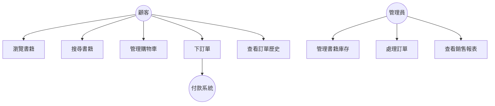

**Use Case 規格書範例**:

| 項目 | 內容 |
|------|------|
| Use Case 名稱 | 下訂單 |
| 行為者 | 顧客 |
| 前置條件 | 顧客已登入，購物車中有商品 |
| 成功情境 | 1. 顧客查看購物車<br>2. 選擇配送地址<br>3. 選擇付款方式<br>4. 確認訂單<br>5. 系統產生訂單編號<br>6. 扣減庫存<br>7. 發送確認郵件 |
| 替代情境 | 3a. 付款失敗 - 顯示錯誤訊息，回到付款選擇 |
| 後置條件 | 訂單已建立，庫存已扣減，顧客收到確認郵件 |

#### 3.3.3 物件識別技巧

**名詞分析法**:
從需求描述中找出名詞作為潛在的類別候選：

```
"顧客可以瀏覽書籍目錄，選擇書籍加入購物車，然後進行結帳。
系統會檢查庫存，處理付款，並產生訂單。"
```

**識別出的名詞**:
- 顧客 (Customer)
- 書籍 (Book)  
- 目錄 (Catalog)
- 購物車 (ShoppingCart)
- 庫存 (Inventory)
- 付款 (Payment)
- 訂單 (Order)

**職責驅動設計 (CRC Cards)**:

```
類別名稱: Customer
職責:
- 瀏覽書籍
- 管理購物車
- 下訂單
- 查看訂單歷史

協作者:
- Book
- ShoppingCart
- Order
- Catalog
```

### 3.4 階段三：系統設計 (System Design)

#### 3.4.1 架構設計

**分層架構模式**:
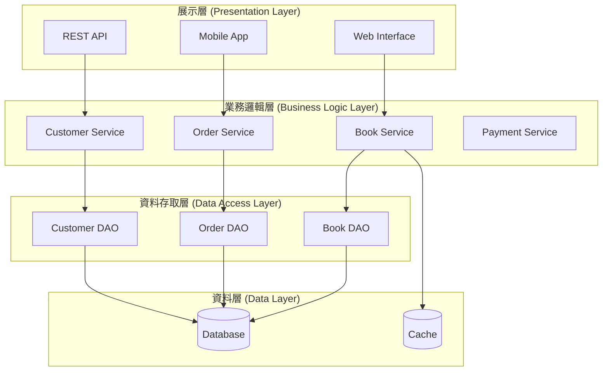

#### 3.4.2 設計模式應用

**Strategy Pattern (策略模式) - 付款處理**:
```java
// 策略介面
public interface PaymentStrategy {
    boolean processPayment(BigDecimal amount, PaymentDetails details);
}

// 具體策略
public class CreditCardPayment implements PaymentStrategy {
    @Override
    public boolean processPayment(BigDecimal amount, PaymentDetails details) {
        // 信用卡付款邏輯
        System.out.println("使用信用卡付款: " + amount);
        return true;
    }
}

public class PayPalPayment implements PaymentStrategy {
    @Override
    public boolean processPayment(BigDecimal amount, PaymentDetails details) {
        // PayPal 付款邏輯
        System.out.println("使用 PayPal 付款: " + amount);
        return true;
    }
}

// 上下文類別
public class PaymentProcessor {
    private PaymentStrategy strategy;
    
    public void setPaymentStrategy(PaymentStrategy strategy) {
        this.strategy = strategy;
    }
    
    public boolean processPayment(BigDecimal amount, PaymentDetails details) {
        return strategy.processPayment(amount, details);
    }
}
```

**Observer Pattern (觀察者模式) - 庫存通知**:
```java
public interface InventoryObserver {
    void onStockLevelChanged(String bookId, int newLevel);
}

public class InventoryManager {
    private List<InventoryObserver> observers = new ArrayList<>();
    private Map<String, Integer> stockLevels = new HashMap<>();
    
    public void addObserver(InventoryObserver observer) {
        observers.add(observer);
    }
    
    public void updateStock(String bookId, int newLevel) {
        stockLevels.put(bookId, newLevel);
        notifyObservers(bookId, newLevel);
    }
    
    private void notifyObservers(String bookId, int newLevel) {
        for (InventoryObserver observer : observers) {
            observer.onStockLevelChanged(bookId, newLevel);
        }
    }
}

// 觀察者實作
public class LowStockNotifier implements InventoryObserver {
    private static final int LOW_STOCK_THRESHOLD = 10;
    
    @Override
    public void onStockLevelChanged(String bookId, int newLevel) {
        if (newLevel < LOW_STOCK_THRESHOLD) {
            System.out.println("警告：書籍 " + bookId + " 庫存不足，剩餘 " + newLevel + " 本");
        }
    }
}
```

### 3.5 階段四：詳細設計 (Detailed Design)

#### 3.5.1 類別圖設計

```mermaid
classDiagram
    class Customer {
        -customerId: String
        -name: String
        -email: String
        -addresses: List~Address~
        +register()
        +login()
        +addToCart(Book book)
        +placeOrder()
    }
    
    class Book {
        -isbn: String
        -title: String
        -author: String
        -price: BigDecimal
        -stockQuantity: int
        +getDetails()
        +updateStock(int quantity)
    }
    
    class ShoppingCart {
        -items: List~CartItem~
        -customerId: String
        +addItem(Book book, int quantity)
        +removeItem(String isbn)
        +calculateTotal()
        +clear()
    }
    
    class Order {
        -orderId: String
        -customerId: String
        -items: List~OrderItem~
        -status: OrderStatus
        -totalAmount: BigDecimal
        +processOrder()
        +updateStatus(OrderStatus status)
    }
    
    class Payment {
        -paymentId: String
        -orderId: String
        -amount: BigDecimal
        -method: PaymentMethod
        -status: PaymentStatus
        +processPayment()
        +refund()
    }
    
    Customer ||--o{ ShoppingCart
    Customer ||--o{ Order
    ShoppingCart ||--o{ CartItem
    Order ||--o{ OrderItem
    Order ||--|| Payment
    Book ||--o{ CartItem
    Book ||--o{ OrderItem
```

#### 3.5.2 循序圖設計

**下訂單流程**:
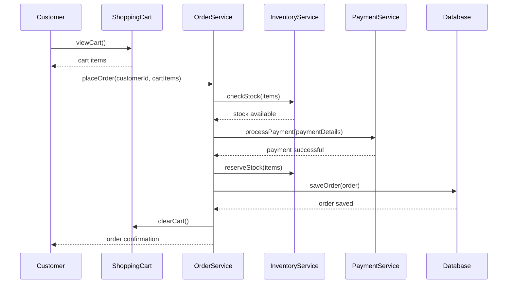

### 3.6 階段五：程式實作 (Implementation)

#### 3.6.1 實作準則

**編碼標準**:
```java
/**
 * 訂單服務類別
 * 負責處理所有與訂單相關的業務邏輯
 * 
 * @author 開發團隊
 * @version 1.0
 * @since 2025-09-01
 */
@Service
public class OrderService {
    
    private static final Logger logger = LoggerFactory.getLogger(OrderService.class);
    
    private final OrderRepository orderRepository;
    private final InventoryService inventoryService;
    private final PaymentService paymentService;
    private final NotificationService notificationService;
    
    /**
     * 建構函式 - 使用依賴注入
     */
    public OrderService(OrderRepository orderRepository, 
                       InventoryService inventoryService,
                       PaymentService paymentService,
                       NotificationService notificationService) {
        this.orderRepository = orderRepository;
        this.inventoryService = inventoryService;
        this.paymentService = paymentService;
        this.notificationService = notificationService;
    }
    
    /**
     * 處理訂單
     * 
     * @param customerId 顧客ID
     * @param cartItems 購物車項目
     * @param paymentDetails 付款詳細資訊
     * @return 訂單處理結果
     * @throws OrderProcessingException 當訂單處理失敗時拋出
     */
    @Transactional
    public OrderResult processOrder(String customerId, 
                                  List<CartItem> cartItems, 
                                  PaymentDetails paymentDetails) {
        
        logger.info("開始處理訂單，顧客ID: {}", customerId);
        
        try {
            // 1. 驗證庫存
            validateInventory(cartItems);
            
            // 2. 建立訂單
            Order order = createOrder(customerId, cartItems);
            
            // 3. 處理付款
            PaymentResult paymentResult = paymentService.processPayment(
                order.getTotalAmount(), paymentDetails);
            
            if (!paymentResult.isSuccessful()) {
                throw new PaymentException("付款失敗: " + paymentResult.getErrorMessage());
            }
            
            // 4. 扣減庫存
            inventoryService.reserveItems(cartItems);
            
            // 5. 保存訂單
            order.setStatus(OrderStatus.CONFIRMED);
            order.setPaymentId(paymentResult.getPaymentId());
            orderRepository.save(order);
            
            // 6. 發送通知
            notificationService.sendOrderConfirmation(order);
            
            logger.info("訂單處理完成，訂單ID: {}", order.getOrderId());
            
            return new OrderResult(true, order.getOrderId(), "訂單處理成功");
            
        } catch (Exception e) {
            logger.error("訂單處理失敗，顧客ID: {}", customerId, e);
            // 回滾操作
            rollbackOrder(customerId);
            throw new OrderProcessingException("訂單處理失敗", e);
        }
    }
    
    /**
     * 驗證庫存是否充足
     */
    private void validateInventory(List<CartItem> cartItems) {
        for (CartItem item : cartItems) {
            if (!inventoryService.isStockAvailable(item.getBookId(), item.getQuantity())) {
                throw new InsufficientStockException(
                    "書籍 " + item.getBookId() + " 庫存不足");
            }
        }
    }
    
    // 其他私有方法...
}
```

#### 3.6.2 單元測試

```java
/**
 * 訂單服務單元測試
 */
@ExtendWith(MockitoExtension.class)
class OrderServiceTest {
    
    @Mock
    private OrderRepository orderRepository;
    
    @Mock
    private InventoryService inventoryService;
    
    @Mock
    private PaymentService paymentService;
    
    @Mock
    private NotificationService notificationService;
    
    @InjectMocks
    private OrderService orderService;
    
    @Test
    @DisplayName("成功處理訂單")
    void shouldProcessOrderSuccessfully() {
        // Given
        String customerId = "CUST001";
        List<CartItem> cartItems = createTestCartItems();
        PaymentDetails paymentDetails = createTestPaymentDetails();
        
        when(inventoryService.isStockAvailable(anyString(), anyInt())).thenReturn(true);
        when(paymentService.processPayment(any(), any()))
            .thenReturn(new PaymentResult(true, "PAY001", null));
        when(orderRepository.save(any(Order.class)))
            .thenAnswer(invocation -> invocation.getArgument(0));
        
        // When
        OrderResult result = orderService.processOrder(customerId, cartItems, paymentDetails);
        
        // Then
        assertThat(result.isSuccessful()).isTrue();
        assertThat(result.getOrderId()).isNotBlank();
        
        verify(inventoryService).reserveItems(cartItems);
        verify(orderRepository).save(any(Order.class));
        verify(notificationService).sendOrderConfirmation(any(Order.class));
    }
    
    @Test
    @DisplayName("庫存不足時應拋出例外")
    void shouldThrowExceptionWhenInsufficientStock() {
        // Given
        String customerId = "CUST001";
        List<CartItem> cartItems = createTestCartItems();
        PaymentDetails paymentDetails = createTestPaymentDetails();
        
        when(inventoryService.isStockAvailable(anyString(), anyInt())).thenReturn(false);
        
        // When & Then
        assertThatThrownBy(() -> orderService.processOrder(customerId, cartItems, paymentDetails))
            .isInstanceOf(InsufficientStockException.class)
            .hasMessageContaining("庫存不足");
    }
    
    private List<CartItem> createTestCartItems() {
        return Arrays.asList(
            new CartItem("BOOK001", "Java 程式設計", 2, new BigDecimal("500")),
            new CartItem("BOOK002", "Spring Boot 實戰", 1, new BigDecimal("600"))
        );
    }
    
    private PaymentDetails createTestPaymentDetails() {
        return PaymentDetails.builder()
            .method(PaymentMethod.CREDIT_CARD)
            .cardNumber("4111111111111111")
            .expiryDate("12/25")
            .cvv("123")
            .build();
    }
}
```

### 3.7 階段六：測試與驗證

#### 3.7.1 測試策略

```mermaid
pyramid
    title 測試金字塔
    
    level1: 單元測試 (Unit Tests)
        description: 測試個別類別和方法
        coverage: 70-80%
        tools: JUnit, Mockito
        
    level2: 整合測試 (Integration Tests)
        description: 測試組件間的互動
        coverage: 15-20%
        tools: TestContainers, Spring Boot Test
        
    level3: 端到端測試 (E2E Tests)
        description: 測試完整的使用者情境
        coverage: 5-10%
        tools: Selenium, Cucumber
        
    level4: 手動測試 (Manual Tests)
        description: 探索性測試和使用者驗收測試
        coverage: 補充自動化測試無法涵蓋的部分
```

#### 3.7.2 整合測試範例

```java
@SpringBootTest
@AutoConfigureTestDatabase(replace = AutoConfigureTestDatabase.Replace.NONE)
@Testcontainers
class OrderServiceIntegrationTest {
    
    @Container
    static PostgreSQLContainer<?> postgres = new PostgreSQLContainer<>("postgres:13")
            .withDatabaseName("testdb")
            .withUsername("test")
            .withPassword("test");
    
    @Autowired
    private OrderService orderService;
    
    @Autowired
    private TestEntityManager entityManager;
    
    @Test
    @Transactional
    @DisplayName("完整訂單流程整合測試")
    void shouldCompleteFullOrderFlow() {
        // Given - 準備測試資料
        Customer customer = createTestCustomer();
        Book book = createTestBook();
        entityManager.persistAndFlush(customer);
        entityManager.persistAndFlush(book);
        
        List<CartItem> cartItems = Arrays.asList(
            new CartItem(book.getIsbn(), book.getTitle(), 1, book.getPrice())
        );
        
        PaymentDetails paymentDetails = createValidPaymentDetails();
        
        // When - 執行訂單處理
        OrderResult result = orderService.processOrder(
            customer.getCustomerId(), cartItems, paymentDetails);
        
        // Then - 驗證結果
        assertThat(result.isSuccessful()).isTrue();
        
        // 驗證資料庫狀態
        Order savedOrder = entityManager.find(Order.class, result.getOrderId());
        assertThat(savedOrder).isNotNull();
        assertThat(savedOrder.getStatus()).isEqualTo(OrderStatus.CONFIRMED);
        assertThat(savedOrder.getItems()).hasSize(1);
    }
}
```

### 3.8 章節小結

#### ✅ 重點回顧

- **OOAD 流程**: 需求分析 → 系統分析 → 系統設計 → 詳細設計 → 實作 → 測試
- **關鍵產物**: Use Case 圖、類別圖、循序圖、程式碼、測試案例
- **設計原則**: 遵循 SOLID 原則和設計模式
- **品質保證**: 完整的測試策略確保系統品質

#### 🎯 實務建議

1. **迭代開發**: 採用敏捷方法，快速迭代改進
2. **文件管理**: 保持設計文件與程式碼同步
3. **程式碼審查**: 建立同儕審查機制
4. **持續整合**: 自動化建置和測試流程

#### ⚠️ 常見陷阱

- 避免過度設計，保持 KISS 原則
- 不要忽視非功能需求
- 測試覆蓋率不等於測試品質
- 設計文件要與實作保持一致

---

## 📝 練習題

### 練習 3.1: 流程實作
選擇一個簡單的系統（如圖書館管理、學生選課系統），完整走過 OOAD 流程，產出相關文件和程式碼。

### 練習 3.2: 設計模式應用
在線上書店系統中，識別可以應用設計模式的場景，並實作至少三種設計模式。

---

## 4. UML 與 OOAD 的關係

### 4.1 UML 簡介

統一建模語言 (Unified Modeling Language, UML) 是軟體工程中用於視覺化、規格化、建構和記錄軟體系統的標準建模語言。UML 為 OOAD 提供了標準化的圖形表示法，讓開發團隊能夠有效溝通設計概念。

#### 4.1.1 UML 的歷史與發展

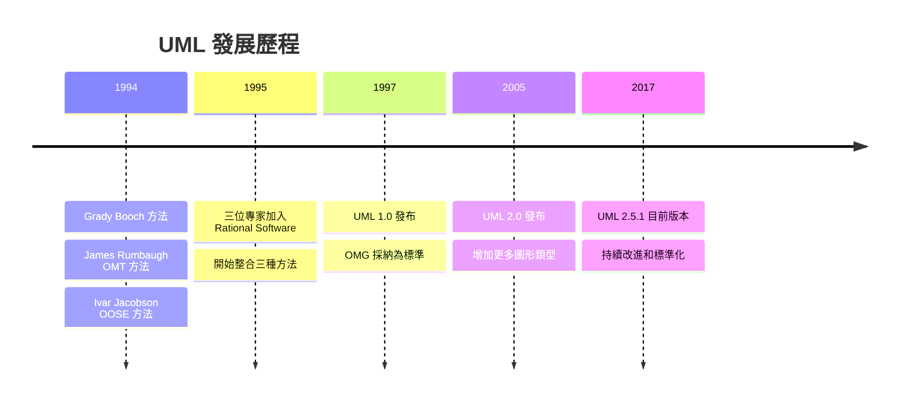

#### 4.1.2 UML 在 OOAD 中的角色

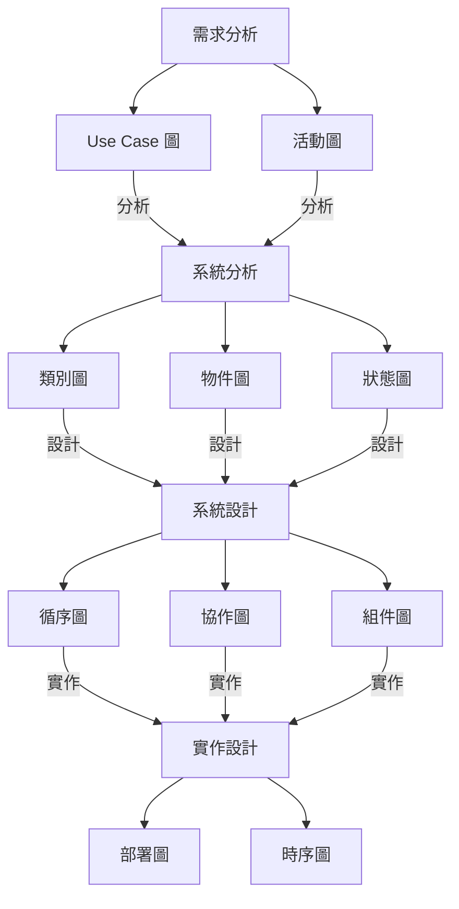

### 4.2 UML 圖形分類

UML 2.5 定義了 14 種標準圖形，分為三大類：

#### 4.2.1 結構圖 (Structure Diagrams)

**用途**: 描述系統的靜態結構

- 🏗️ **類別圖 (Class Diagram)**: 顯示類別及其關係
- 📦 **物件圖 (Object Diagram)**: 顯示特定時間點的物件實例
- 🔗 **組件圖 (Component Diagram)**: 顯示軟體組件及其依賴關係
- 🌐 **部署圖 (Deployment Diagram)**: 顯示硬體和軟體的部署
- 📋 **套件圖 (Package Diagram)**: 顯示套件及其依賴關係
- 🔧 **組合結構圖 (Composite Structure Diagram)**: 顯示類別的內部結構

#### 4.2.2 行為圖 (Behavior Diagrams)

**用途**: 描述系統的動態行為

- 🎯 **Use Case 圖**: 顯示系統功能和使用者的互動
- 🔄 **活動圖 (Activity Diagram)**: 顯示工作流程和業務流程
- 🔀 **狀態機圖 (State Machine Diagram)**: 顯示物件狀態的變化

#### 4.2.3 互動圖 (Interaction Diagrams)

**用途**: 描述物件間的互動

- 📋 **循序圖 (Sequence Diagram)**: 顯示時間順序的物件互動
- 🗣️ **通訊圖 (Communication Diagram)**: 顯示物件間的訊息傳遞
- ⏱️ **時序圖 (Timing Diagram)**: 顯示狀態變化的時間約束
- 🔍 **互動概觀圖 (Interaction Overview Diagram)**: 顯示互動的高層次視圖

### 4.3 核心 UML 圖形詳解

#### 4.3.1 Use Case 圖

**定義**: 從使用者角度描述系統功能，顯示系統與外部角色的互動。

**基本元素**:

```mermaid
graph TB
    subgraph "系統邊界"
        UC1[登入系統]
        UC2[瀏覽商品]
        UC3[下訂單]
        UC4[管理庫存]
        UC5[查看報表]
    end
    
    Customer((顧客))
    Admin((管理員))
    PaymentGateway((付款閘道))
    
    Customer --> UC1
    Customer --> UC2
    Customer --> UC3
    
    Admin --> UC1
    Admin --> UC4
    Admin --> UC5
    
    UC3 --> PaymentGateway
    
    UC2 -.-> UC1 : <<include>>
    UC3 -.-> UC1 : <<include>>
    
    UC3 -.-> UC6[信用卡付款] : <<extend>>
    UC3 -.-> UC7[ATM付款] : <<extend>>
```

**關係類型**:

1. **包含 (Include)**: 基本功能必須包含的子功能
2. **擴展 (Extend)**: 可選的附加功能
3. **泛化 (Generalization)**: 一般化和特殊化的關係

**實作範例**:

```java
/**
 * Use Case: 顧客下訂單
 * 
 * 前置條件: 顧客已登入，購物車有商品
 * 主要流程:
 * 1. 顧客選擇結帳
 * 2. 系統顯示訂單摘要
 * 3. 顧客確認訂單
 * 4. 系統處理付款
 * 5. 系統確認訂單
 */
@UseCase("顧客下訂單")
public class PlaceOrderUseCase {
    
    private final OrderService orderService;
    private final PaymentService paymentService;
    
    public OrderResult execute(PlaceOrderRequest request) {
        // 1. 驗證前置條件
        validatePreconditions(request);
        
        // 2. 執行主要流程
        return processOrder(request);
    }
    
    private void validatePreconditions(PlaceOrderRequest request) {
        if (!request.getCustomer().isLoggedIn()) {
            throw new PreconditionFailedException("顧客尚未登入");
        }
        
        if (request.getCart().isEmpty()) {
            throw new PreconditionFailedException("購物車為空");
        }
    }
    
    private OrderResult processOrder(PlaceOrderRequest request) {
        // 實作主要流程邏輯
        Order order = orderService.createOrder(request);
        PaymentResult paymentResult = paymentService.processPayment(order);
        
        if (paymentResult.isSuccessful()) {
            orderService.confirmOrder(order);
            return new OrderResult(true, order.getId());
        } else {
            return new OrderResult(false, paymentResult.getErrorMessage());
        }
    }
}
```

#### 4.3.2 類別圖 (Class Diagram)

**定義**: 顯示系統中的類別、屬性、方法以及類別之間的關係。

**基本語法**:

```mermaid
classDiagram
    class Student {
        -studentId: String
        -name: String
        -email: String
        -enrollmentDate: LocalDate
        
        +Student(name: String, email: String)
        +enrollCourse(course: Course): boolean
        +dropCourse(course: Course): boolean
        +getGPA(): double
        -calculateGPA(): double
    }
    
    class Course {
        -courseId: String
        -title: String
        -credits: int
        -maxStudents: int
        
        +Course(title: String, credits: int)
        +addStudent(student: Student): boolean
        +removeStudent(student: Student): boolean
        +getEnrolledCount(): int
    }
    
    class Grade {
        -student: Student
        -course: Course
        -score: double
        -letterGrade: String
        
        +Grade(student: Student, course: Course, score: double)
        +calculateLetterGrade(): String
    }
    
    Student ||--o{ Grade : "has"
    Course ||--o{ Grade : "evaluated by"
    Student }o--o{ Course : "enrolls in"
```

**關係類型詳解**:

1. **關聯 (Association)**: 類別間的一般關係
   ```java
   public class Student {
       private List<Course> courses; // 學生與課程的關聯
   }
   ```

2. **聚合 (Aggregation)**: "有一個"的關係，較弱的擁有關係
   ```java
   public class Department {
       private List<Professor> professors; // 系所與教授的聚合關係
   }
   ```

3. **組合 (Composition)**: "是...的一部分"，強擁有關係
   ```java
   public class Order {
       private List<OrderItem> items; // 訂單與訂單項目的組合關係
       
       public Order() {
           this.items = new ArrayList<>(); // 訂單項目隨訂單一起創建
       }
   }
   ```

4. **繼承 (Inheritance)**: "是一個"的關係
   ```java
   public abstract class Person {
       protected String name;
       protected String email;
   }
   
   public class Student extends Person {
       private String studentId;
   }
   
   public class Professor extends Person {
       private String employeeId;
   }
   ```

5. **實作 (Realization)**: 類別實作介面
   ```java
   public interface Drawable {
       void draw();
   }
   
   public class Circle implements Drawable {
       @Override
       public void draw() {
           // 繪製圓形的實作
       }
   }
   ```

6. **依賴 (Dependency)**: 一個類別使用另一個類別
   ```java
   public class OrderService {
       public OrderResult processOrder(Order order, PaymentService paymentService) {
           // OrderService 依賴 PaymentService
           return paymentService.processPayment(order.getAmount());
       }
   }
   ```

**完整的線上書店類別圖範例**:

```mermaid
classDiagram
    class Customer {
        -customerId: String
        -name: String
        -email: String
        -phone: String
        -addresses: List~Address~
        
        +register(): boolean
        +login(email: String, password: String): boolean
        +addAddress(address: Address): void
        +placeOrder(cart: ShoppingCart): Order
    }
    
    class Book {
        -isbn: String
        -title: String
        -author: String
        -publisher: String
        -price: BigDecimal
        -stock: int
        -category: Category
        
        +getDetails(): BookDetails
        +updateStock(quantity: int): void
        +isAvailable(): boolean
    }
    
    class ShoppingCart {
        -cartId: String
        -customerId: String
        -items: List~CartItem~
        -createdAt: LocalDateTime
        
        +addItem(book: Book, quantity: int): void
        +removeItem(isbn: String): void
        +updateQuantity(isbn: String, quantity: int): void
        +calculateTotal(): BigDecimal
        +clear(): void
    }
    
    class Order {
        <<Entity>>
        -orderId: String
        -customerId: String
        -items: List~OrderItem~
        -status: OrderStatus
        -totalAmount: BigDecimal
        -orderDate: LocalDateTime
        
        +processOrder(): void
        +cancel(): boolean
        +updateStatus(status: OrderStatus): void
        +calculateTotal(): BigDecimal
    }
    
    class Payment {
        <<Entity>>
        -paymentId: String
        -orderId: String
        -amount: BigDecimal
        -method: PaymentMethod
        -status: PaymentStatus
        -processedAt: LocalDateTime
        
        +processPayment(): PaymentResult
        +refund(): RefundResult
        +verify(): boolean
    }
    
    class Address {
        <<Value Object>>
        -street: String
        -city: String
        -postalCode: String
        -country: String
        
        +getFullAddress(): String
        +validate(): boolean
    }
    
    class CartItem {
        <<Value Object>>
        -book: Book
        -quantity: int
        -addedAt: LocalDateTime
        
        +calculateSubtotal(): BigDecimal
        +updateQuantity(quantity: int): void
    }
    
    class OrderItem {
        <<Value Object>>
        -book: Book
        -quantity: int
        -unitPrice: BigDecimal
        
        +calculateSubtotal(): BigDecimal
    }
    
    %% 關係定義
    Customer ||--o{ Address : "has"
    Customer ||--|| ShoppingCart : "owns"
    Customer ||--o{ Order : "places"
    
    ShoppingCart ||--o{ CartItem : "contains"
    Order ||--o{ OrderItem : "contains"
    Order ||--|| Payment : "paid by"
    
    Book ||--o{ CartItem : "selected as"
    Book ||--o{ OrderItem : "ordered as"
    
    %% 枚舉
    class OrderStatus {
        <<enumeration>>
        PENDING
        CONFIRMED
        SHIPPED
        DELIVERED
        CANCELLED
    }
    
    class PaymentMethod {
        <<enumeration>>
        CREDIT_CARD
        DEBIT_CARD
        PAYPAL
        BANK_TRANSFER
    }
    
    class PaymentStatus {
        <<enumeration>>
        PENDING
        COMPLETED
        FAILED
        REFUNDED
    }
```

#### 4.3.3 循序圖 (Sequence Diagram)

**定義**: 顯示物件間依時間順序的互動過程，強調訊息傳遞的順序。

**基本元素**:
- **生命線 (Lifeline)**: 代表參與互動的物件
- **激活框 (Activation Box)**: 顯示物件處於活躍狀態的時間
- **訊息 (Message)**: 物件間的通訊

**線上書店下訂單流程**:

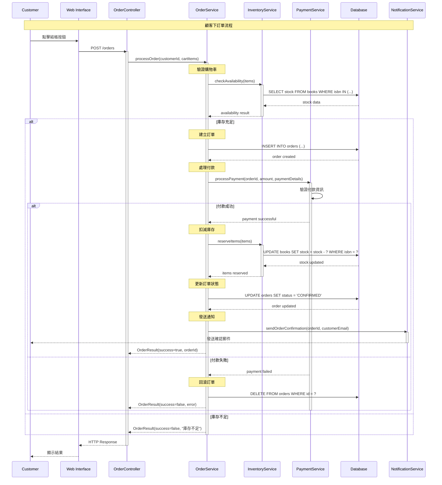

**循序圖的進階用法**:

1. **條件判斷 (alt/else)**:
   ```mermaid
   sequenceDiagram
       A->>B: 請求
       alt 條件1
           B-->>A: 回應1
       else 條件2
           B-->>A: 回應2
       else 其他
           B-->>A: 預設回應
       end
   ```

2. **迴圈 (loop)**:
   ```mermaid
   sequenceDiagram
       A->>B: 開始處理
       loop 每個項目
           B->>C: 處理項目
           C-->>B: 處理結果
       end
       B-->>A: 全部完成
   ```

3. **並行處理 (par)**:
   ```mermaid
   sequenceDiagram
       A->>B: 開始並行處理
       par 同時執行
           B->>C: 任務1
           C-->>B: 結果1
       and
           B->>D: 任務2
           D-->>B: 結果2
       end
       B-->>A: 全部完成
   ```

#### 4.3.4 活動圖 (Activity Diagram)

**定義**: 顯示活動的流程和決策點，類似流程圖但更加結構化。

**基本元素**:
- **開始節點**: 黑色實心圓
- **結束節點**: 黑色實心圓加外圓
- **活動**: 圓角矩形
- **決策節點**: 菱形
- **合併節點**: 菱形
- **分岔/匯合**: 黑色粗線

**訂單處理活動圖**:

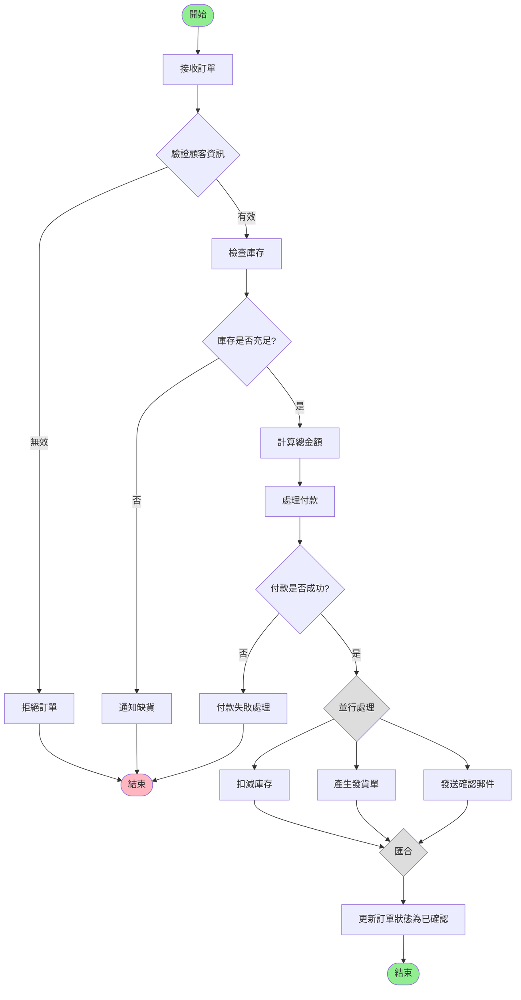

**Swimlane 活動圖 (泳道圖)**:

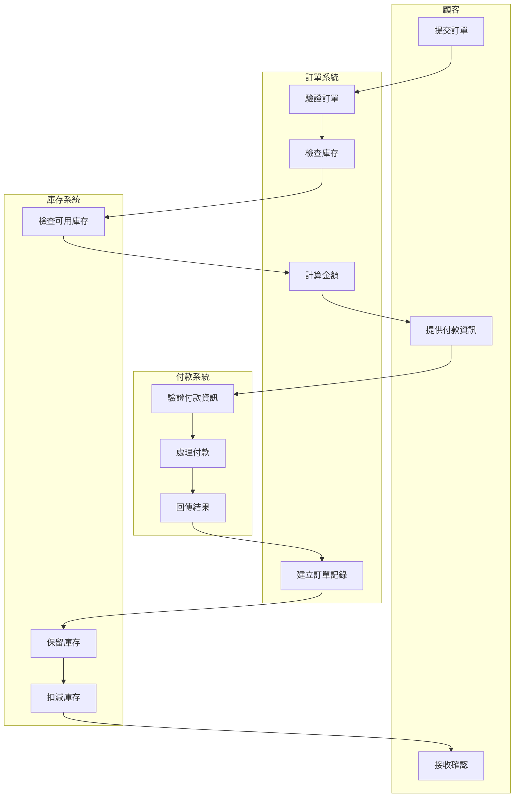

#### 4.3.5 狀態圖 (State Machine Diagram)

**定義**: 顯示物件在其生命週期中的狀態變化，以及觸發狀態轉換的事件。

**基本元素**:
- **狀態**: 圓角矩形
- **初始狀態**: 黑色實心圓
- **終止狀態**: 黑色實心圓加外圓
- **轉換**: 箭頭標示事件/動作

**訂單狀態圖**:

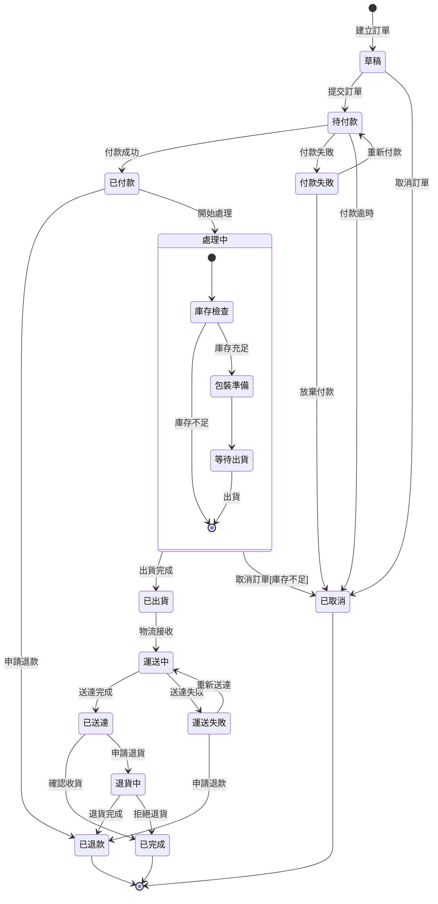

**狀態圖的實作範例**:

```java
/**
 * 訂單狀態管理
 */
public enum OrderStatus {
    DRAFT("草稿"),
    PENDING_PAYMENT("待付款"),
    PAYMENT_FAILED("付款失敗"),
    PAID("已付款"),
    PROCESSING("處理中"),
    SHIPPED("已出貨"),
    IN_TRANSIT("運送中"),
    DELIVERED("已送達"),
    COMPLETED("已完成"),
    CANCELLED("已取消"),
    REFUNDED("已退款"),
    RETURN_REQUESTED("退貨中"),
    DELIVERY_FAILED("運送失敗");
    
    private final String description;
    
    OrderStatus(String description) {
        this.description = description;
    }
    
    public String getDescription() {
        return description;
    }
}

/**
 * 訂單狀態機
 */
@Component
public class OrderStateMachine {
    
    private static final Map<OrderStatus, Set<OrderStatus>> VALID_TRANSITIONS = Map.of(
        DRAFT, Set.of(PENDING_PAYMENT, CANCELLED),
        PENDING_PAYMENT, Set.of(PAID, PAYMENT_FAILED, CANCELLED),
        PAYMENT_FAILED, Set.of(PENDING_PAYMENT, CANCELLED),
        PAID, Set.of(PROCESSING, REFUNDED),
        PROCESSING, Set.of(SHIPPED, CANCELLED),
        SHIPPED, Set.of(IN_TRANSIT),
        IN_TRANSIT, Set.of(DELIVERED, DELIVERY_FAILED),
        DELIVERY_FAILED, Set.of(IN_TRANSIT, REFUNDED),
        DELIVERED, Set.of(COMPLETED, RETURN_REQUESTED),
        RETURN_REQUESTED, Set.of(REFUNDED, COMPLETED)
    );
    
    /**
     * 驗證狀態轉換是否有效
     */
    public boolean isValidTransition(OrderStatus from, OrderStatus to) {
        Set<OrderStatus> validNextStates = VALID_TRANSITIONS.get(from);
        return validNextStates != null && validNextStates.contains(to);
    }
    
    /**
     * 執行狀態轉換
     */
    public void transitionState(Order order, OrderStatus newStatus, String reason) {
        OrderStatus currentStatus = order.getStatus();
        
        if (!isValidTransition(currentStatus, newStatus)) {
            throw new InvalidStateTransitionException(
                String.format("無法從 %s 轉換到 %s", 
                    currentStatus.getDescription(), 
                    newStatus.getDescription())
            );
        }
        
        // 執行狀態轉換前的動作
        executePreTransitionActions(order, currentStatus, newStatus);
        
        // 更新狀態
        order.setStatus(newStatus);
        order.addStatusHistory(new StatusHistory(currentStatus, newStatus, reason, LocalDateTime.now()));
        
        // 執行狀態轉換後的動作
        executePostTransitionActions(order, currentStatus, newStatus);
        
        log.info("訂單 {} 狀態從 {} 轉換為 {}, 原因: {}", 
            order.getOrderId(), 
            currentStatus.getDescription(), 
            newStatus.getDescription(), 
            reason);
    }
    
    private void executePreTransitionActions(Order order, OrderStatus from, OrderStatus to) {
        switch (to) {
            case PROCESSING:
                // 檢查庫存並保留
                inventoryService.reserveItems(order.getItems());
                break;
            case SHIPPED:
                // 扣減庫存
                inventoryService.commitReservation(order.getItems());
                break;
            case CANCELLED:
                // 釋放保留的庫存
                if (from == PROCESSING) {
                    inventoryService.releaseReservation(order.getItems());
                }
                break;
        }
    }
    
    private void executePostTransitionActions(Order order, OrderStatus from, OrderStatus to) {
        switch (to) {
            case PAID:
                notificationService.sendPaymentConfirmation(order);
                break;
            case SHIPPED:
                notificationService.sendShippingNotification(order);
                break;
            case DELIVERED:
                notificationService.sendDeliveryConfirmation(order);
                break;
            case CANCELLED:
                notificationService.sendCancellationNotification(order);
                break;
        }
    }
}
```

#### 4.3.6 組件圖 (Component Diagram)

**定義**: 顯示軟體系統的高層次結構，包括組件及其依賴關係。

**線上書店系統組件圖**:

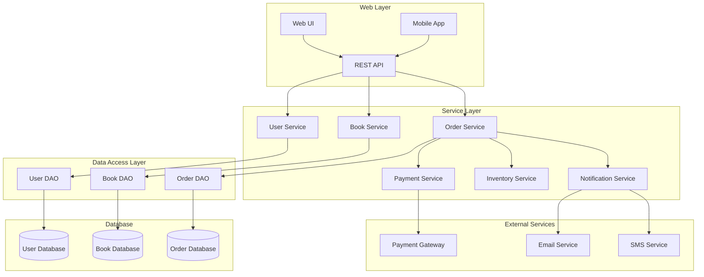

#### 4.3.7 部署圖 (Deployment Diagram)

**定義**: 顯示軟體組件在硬體節點上的物理部署。

**線上書店系統部署圖**:

```mermaid
graph TB
    subgraph "Client Devices"
        Browser[Web Browser]
        Mobile[Mobile Device]
    end
    
    subgraph "Load Balancer"
        LB[Nginx Load Balancer]
    end
    
    subgraph "Web Server Cluster"
        WS1[Web Server 1<br/>Spring Boot App]
        WS2[Web Server 2<br/>Spring Boot App]
        WS3[Web Server 3<br/>Spring Boot App]
    end
    
    subgraph "Application Server"
        AS[Application Server<br/>Business Logic]
    end
    
    subgraph "Database Cluster"
        DBMaster[(Master DB<br/>PostgreSQL)]
        DBSlave1[(Slave DB 1<br/>PostgreSQL)]
        DBSlave2[(Slave DB 2<br/>PostgreSQL)]
    end
    
    subgraph "Cache Layer"
        Redis[Redis Cluster]
    end
    
    subgraph "Message Queue"
        MQ[RabbitMQ]
    end
    
    subgraph "External Services"
        PaymentAPI[Payment API]
        EmailAPI[Email Service API]
    end
    
    %% Connections
    Browser --> LB : HTTPS
    Mobile --> LB : HTTPS
    
    LB --> WS1 : HTTP
    LB --> WS2 : HTTP
    LB --> WS3 : HTTP
    
    WS1 --> AS
    WS2 --> AS
    WS3 --> AS
    
    AS --> DBMaster : Read/Write
    AS --> DBSlave1 : Read Only
    AS --> DBSlave2 : Read Only
    
    AS --> Redis : Cache
    AS --> MQ : Async Messages
    AS --> PaymentAPI : REST API
    AS --> EmailAPI : REST API
    
    DBMaster --> DBSlave1 : Replication
    DBMaster --> DBSlave2 : Replication
```

### 4.4 UML 工具與最佳實務

#### 4.4.1 常用 UML 工具

**線上工具**:
- 🌐 **Draw.io**: 免費、易用、支援多種圖形
- 🌐 **PlantUML**: 文字式建模，適合程式開發者
- 🌐 **Lucidchart**: 功能豐富的商業工具
- 🌐 **Mermaid**: 適合文件嵌入的圖形語言

**桌面工具**:
- 💻 **Visual Paradigm**: 專業的 UML 建模工具
- 💻 **Enterprise Architect**: 企業級建模平台
- 💻 **StarUML**: 開源的 UML 工具

**IDE 整合**:
- 🔧 **IntelliJ IDEA Ultimate**: 內建 UML 圖形產生
- 🔧 **Eclipse Papyrus**: Eclipse 的 UML 建模外掛
- 🔧 **Visual Studio**: Class Designer 功能

#### 4.4.2 UML 建模最佳實務

**一般原則**:

1. **保持簡潔**: 只顯示必要的細節
   ```java
   // 好的做法：只顯示重要的公開方法
   public class OrderService {
       +processOrder(order: Order): OrderResult
       +cancelOrder(orderId: String): boolean
   }
   
   // 避免：顯示所有getter/setter
   public class OrderService {
       +processOrder(order: Order): OrderResult
       +cancelOrder(orderId: String): boolean
       +getOrderById(id: String): Order
       +setOrderStatus(order: Order, status: Status): void
       // ... 更多不重要的方法
   }
   ```

2. **適度抽象**: 根據目標受眾調整詳細程度
   ```mermaid
   classDiagram
       %% 高層次視圖 - 給主管看
       class OrderProcessingSystem {
           +processOrder()
           +trackOrder()
       }
       
       %% 詳細視圖 - 給開發者看
       class OrderService {
           -orderRepository: OrderRepository
           -paymentService: PaymentService
           +processOrder(request: OrderRequest): OrderResult
           +validateOrder(order: Order): ValidationResult
       }
   ```

3. **一致的命名**: 使用標準的命名慣例
   ```java
   // 一致的命名風格
   public class BookService {
       public BookDetails getBookDetails(String isbn) { }
       public boolean updateBookStock(String isbn, int quantity) { }
       public List<Book> searchBooks(SearchCriteria criteria) { }
   }
   ```

4. **分層建模**: 從高層次逐步細化
   ```mermaid
   graph TD
       A[概念模型] --> B[分析模型]
       B --> C[設計模型]
       C --> D[實作模型]
   ```

**特定圖形的最佳實務**:

**Use Case 圖**:
- 從使用者角度撰寫，避免技術術語
- 每個 Use Case 應該代表完整的使用者目標
- 適當使用 Include 和 Extend 關係

**類別圖**:
- 先設計核心類別，再加入支援類別
- 避免過多的雙向關聯
- 使用介面降低耦合度

**循序圖**:
- 按時間順序由左到右排列物件
- 避免過於複雜的條件分支
- 適當使用註解說明重要決策點

### 4.5 章節小結

#### ✅ 重點回顧

- **UML 角色**: 提供標準化的視覺化語言支援 OOAD
- **圖形分類**: 結構圖、行為圖、互動圖各有其用途
- **核心圖形**: Use Case、類別、循序、活動、狀態圖是最常用的
- **工具選擇**: 根據團隊需求選擇合適的建模工具

#### 🎯 實務建議

1. **階段性使用**: 在 OOAD 不同階段使用不同的 UML 圖形
2. **工具整合**: 將 UML 工具與開發環境整合
3. **程式碼同步**: 保持模型與程式碼的一致性
4. **團隊培訓**: 確保團隊成員了解 UML 標準

#### ⚠️ 常見陷阱

- 避免過度建模，導致文件過於複雜
- 不要為了建模而建模，要有明確目的
- 注意模型與實作的同步更新
- 避免在圖形中顯示過多細節

---

## 📝 練習題

### 練習 4.1: UML 圖形繪製
為您熟悉的一個系統（如 ATM、圖書館系統）繪製完整的 UML 圖形，包括：
- Use Case 圖
- 類別圖
- 主要業務流程的循序圖
- 核心物件的狀態圖

### 練習 4.2: 工具實作
使用至少兩種不同的 UML 工具，比較其功能差異和使用體驗。

---

## 5. 專案實務應用範例

### 5.1 專案背景：大學課程管理系統

在本章節中，我們將透過一個完整的「大學課程管理系統」來展示 OOAD 的端到端應用。這個系統涵蓋了學生選課、教師開課、成績管理等核心功能。

#### 5.1.1 專案需求概述

**系統目標**: 建立一個數位化的課程管理平台，提供學生、教師和管理員不同的功能介面。

**主要利害關係人**:
- 👨‍🎓 **學生**: 瀏覽課程、選課、退選、查看成績
- 👨‍🏫 **教師**: 開設課程、管理學生名單、錄入成績
- 👨‍💼 **管理員**: 系統維護、報表產生、帳號管理

**功能需求**:
- F001: 使用者認證與授權
- F002: 課程資訊管理
- F003: 學生選課與退選
- F004: 教師課程管理
- F005: 成績錄入與查詢
- F006: 課表顯示
- F007: 選課衝突檢查
- F008: 人數限制控制

**非功能需求**:
- N001: 系統支援 1000 名同時在線使用者
- N002: 回應時間不超過 3 秒
- N003: 選課高峰期系統穩定度 99.9%
- N004: 資料備份與災難復原

### 5.2 階段一：需求分析與 Use Case 設計

#### 5.2.1 系統邊界定義

```mermaid
graph TB
    subgraph "課程管理系統"
        direction TB
        UC1[查看課程列表]
        UC2[選修課程]
        UC3[退選課程]
        UC4[查看成績]
        UC5[開設課程]
        UC6[管理選課名單]
        UC7[錄入成績]
        UC8[產生報表]
        UC9[使用者管理]
    end
    
    Student((學生))
    Teacher((教師))
    Admin((管理員))
    EmailSystem((郵件系統))
    ReportSystem((報表系統))
    
    Student --> UC1
    Student --> UC2
    Student --> UC3
    Student --> UC4
    
    Teacher --> UC1
    Teacher --> UC5
    Teacher --> UC6
    Teacher --> UC7
    
    Admin --> UC8
    Admin --> UC9
    
    UC2 -.-> EmailSystem : 發送確認郵件
    UC3 -.-> EmailSystem : 發送確認郵件
    UC8 --> ReportSystem : 產生報表
```

#### 5.2.2 詳細 Use Case 規格

**Use Case: 學生選修課程**

| 項目 | 內容 |
|------|------|
| **Use Case 編號** | UC-002 |
| **Use Case 名稱** | 學生選修課程 |
| **行為者** | 學生 |
| **前置條件** | 1. 學生已登入系統<br>2. 選課期間開放<br>3. 學生尚未達選課上限 |
| **成功情境** | 1. 學生瀏覽可選課程列表<br>2. 學生選擇想要的課程<br>3. 系統檢查選課條件<br>4. 系統檢查時間衝突<br>5. 系統檢查人數限制<br>6. 系統確認選課<br>7. 系統發送確認郵件<br>8. 系統更新學生課表 |
| **替代情境** | 3a. 不符合選課條件：<br>&nbsp;&nbsp;&nbsp;&nbsp;3a1. 系統顯示錯誤訊息<br>&nbsp;&nbsp;&nbsp;&nbsp;3a2. 回到步驟 2<br>4a. 時間衝突：<br>&nbsp;&nbsp;&nbsp;&nbsp;4a1. 系統顯示衝突課程<br>&nbsp;&nbsp;&nbsp;&nbsp;4a2. 提供解決建議<br>&nbsp;&nbsp;&nbsp;&nbsp;4a3. 回到步驟 2<br>5a. 人數已滿：<br>&nbsp;&nbsp;&nbsp;&nbsp;5a1. 系統提供候補選項<br>&nbsp;&nbsp;&nbsp;&nbsp;5a2. 學生選擇是否候補 |
| **例外情境** | E1. 系統故障：顯示錯誤頁面<br>E2. 選課期間結束：禁止選課操作 |
| **後置條件** | 1. 學生課表已更新<br>2. 課程選課人數已更新<br>3. 確認郵件已發送 |
| **業務規則** | BR1. 每學期最多選修 25 學分<br>BR2. 必修課程不可退選<br>BR3. 已開始上課的課程不可選修 |

### 5.3 階段二：領域分析與建模

#### 5.3.1 領域概念識別

透過名詞分析法，從需求描述中識別核心概念：

**核心實體**:
- 使用者 (User)
- 學生 (Student)  
- 教師 (Teacher)
- 課程 (Course)
- 選課紀錄 (Enrollment)
- 成績 (Grade)
- 學期 (Semester)
- 科系 (Department)

**值物件**:
- 時間區間 (TimeSlot)
- 地點 (Location)
- 學分 (Credit)
- 評分標準 (GradingScale)

#### 5.3.2 初步領域模型

```java
/**
 * 領域模型 - 課程管理系統
 */

// 抽象基類
public abstract class User {
    protected String userId;
    protected String name;
    protected String email;
    protected String phone;
    protected UserRole role;
    protected LocalDateTime createdAt;
    protected boolean active;
    
    // 建構函式和基本方法
    public User(String userId, String name, String email, UserRole role) {
        this.userId = userId;
        this.name = name;
        this.email = email;
        this.role = role;
        this.createdAt = LocalDateTime.now();
        this.active = true;
    }
    
    public abstract boolean canEnroll(Course course);
    public abstract List<Course> getEnrolledCourses();
}

// 學生實體
public class Student extends User {
    private String studentId;
    private String major;
    private int year;
    private double gpa;
    private int totalCredits;
    private Set<Enrollment> enrollments;
    
    public Student(String userId, String name, String email, String studentId, String major) {
        super(userId, name, email, UserRole.STUDENT);
        this.studentId = studentId;
        this.major = major;
        this.year = 1;
        this.gpa = 0.0;
        this.totalCredits = 0;
        this.enrollments = new HashSet<>();
    }
    
    @Override
    public boolean canEnroll(Course course) {
        // 檢查選課條件
        return !hasTimeConflict(course) && 
               !isEnrolled(course) && 
               hasPrerequisites(course) &&
               getTotalCreditsThisSemester() + course.getCredits() <= 25;
    }
    
    @Override
    public List<Course> getEnrolledCourses() {
        return enrollments.stream()
            .filter(e -> e.getStatus() == EnrollmentStatus.ENROLLED)
            .map(Enrollment::getCourse)
            .collect(Collectors.toList());
    }
    
    public EnrollmentResult enrollInCourse(Course course) {
        if (!canEnroll(course)) {
            return EnrollmentResult.failure("不符合選課條件");
        }
        
        if (course.isFull()) {
            return EnrollmentResult.failure("課程人數已滿");
        }
        
        Enrollment enrollment = new Enrollment(this, course, LocalDateTime.now());
        enrollments.add(enrollment);
        course.addStudent(this);
        
        return EnrollmentResult.success(enrollment);
    }
    
    private boolean hasTimeConflict(Course course) {
        return getEnrolledCourses().stream()
            .anyMatch(enrolled -> enrolled.hasTimeConflictWith(course));
    }
    
    private boolean isEnrolled(Course course) {
        return enrollments.stream()
            .anyMatch(e -> e.getCourse().equals(course) && 
                          e.getStatus() == EnrollmentStatus.ENROLLED);
    }
    
    private boolean hasPrerequisites(Course course) {
        Set<Course> prerequisites = course.getPrerequisites();
        Set<Course> completedCourses = getCompletedCourses();
        return completedCourses.containsAll(prerequisites);
    }
    
    private Set<Course> getCompletedCourses() {
        return enrollments.stream()
            .filter(e -> e.getGrade() != null && e.getGrade().isPassing())
            .map(Enrollment::getCourse)
            .collect(Collectors.toSet());
    }
    
    private int getTotalCreditsThisSemester() {
        return enrollments.stream()
            .filter(e -> e.getSemester().isCurrent())
            .mapToInt(e -> e.getCourse().getCredits())
            .sum();
    }
}

// 教師實體
public class Teacher extends User {
    private String employeeId;
    private String department;
    private String title;
    private Set<Course> teachingCourses;
    
    public Teacher(String userId, String name, String email, String employeeId, String department) {
        super(userId, name, email, UserRole.TEACHER);
        this.employeeId = employeeId;
        this.department = department;
        this.teachingCourses = new HashSet<>();
    }
    
    @Override
    public boolean canEnroll(Course course) {
        return false; // 教師不能選課，只能開課
    }
    
    @Override
    public List<Course> getEnrolledCourses() {
        return Collections.emptyList();
    }
    
    public Course createCourse(String courseCode, String title, int credits, int maxStudents) {
        Course course = new Course(courseCode, title, credits, maxStudents, this);
        teachingCourses.add(course);
        return course;
    }
    
    public void assignGrade(Student student, Course course, double score) {
        Enrollment enrollment = findEnrollment(student, course);
        if (enrollment != null) {
            Grade grade = new Grade(score, calculateLetterGrade(score));
            enrollment.setGrade(grade);
        }
    }
    
    private Enrollment findEnrollment(Student student, Course course) {
        return course.getEnrollments().stream()
            .filter(e -> e.getStudent().equals(student))
            .findFirst()
            .orElse(null);
    }
    
    private String calculateLetterGrade(double score) {
        if (score >= 90) return "A";
        if (score >= 80) return "B";
        if (score >= 70) return "C";
        if (score >= 60) return "D";
        return "F";
    }
}

// 課程實體
public class Course {
    private String courseId;
    private String courseCode;  // 課程代碼，如 "CS101"
    private String title;
    private String description;
    private int credits;
    private int maxStudents;
    private Teacher instructor;
    private Set<Student> enrolledStudents;
    private Set<Enrollment> enrollments;
    private Set<Course> prerequisites;
    private List<TimeSlot> timeSlots;
    private String location;
    private Semester semester;
    private CourseStatus status;
    
    public Course(String courseCode, String title, int credits, int maxStudents, Teacher instructor) {
        this.courseId = UUID.randomUUID().toString();
        this.courseCode = courseCode;
        this.title = title;
        this.credits = credits;
        this.maxStudents = maxStudents;
        this.instructor = instructor;
        this.enrolledStudents = new HashSet<>();
        this.enrollments = new HashSet<>();
        this.prerequisites = new HashSet<>();
        this.timeSlots = new ArrayList<>();
        this.status = CourseStatus.DRAFT;
    }
    
    public boolean isFull() {
        return enrolledStudents.size() >= maxStudents;
    }
    
    public boolean isAvailable() {
        return status == CourseStatus.OPEN && !isFull();
    }
    
    public void addStudent(Student student) {
        if (isFull()) {
            throw new CourseFullException("課程人數已滿");
        }
        enrolledStudents.add(student);
    }
    
    public void removeStudent(Student student) {
        enrolledStudents.remove(student);
    }
    
    public boolean hasTimeConflictWith(Course other) {
        return this.timeSlots.stream()
            .anyMatch(thisSlot -> other.timeSlots.stream()
                .anyMatch(otherSlot -> thisSlot.overlapsWith(otherSlot)));
    }
    
    public void addTimeSlot(DayOfWeek day, LocalTime startTime, LocalTime endTime) {
        TimeSlot slot = new TimeSlot(day, startTime, endTime);
        timeSlots.add(slot);
    }
    
    public int getEnrolledCount() {
        return enrolledStudents.size();
    }
    
    public double getAverageGrade() {
        return enrollments.stream()
            .filter(e -> e.getGrade() != null)
            .mapToDouble(e -> e.getGrade().getNumericScore())
            .average()
            .orElse(0.0);
    }
    
    // Getters and setters...
}

// 選課紀錄實體
public class Enrollment {
    private String enrollmentId;
    private Student student;
    private Course course;
    private Semester semester;
    private LocalDateTime enrollmentDate;
    private EnrollmentStatus status;
    private Grade grade;
    
    public Enrollment(Student student, Course course, LocalDateTime enrollmentDate) {
        this.enrollmentId = UUID.randomUUID().toString();
        this.student = student;
        this.course = course;
        this.enrollmentDate = enrollmentDate;
        this.status = EnrollmentStatus.ENROLLED;
        this.semester = Semester.getCurrentSemester();
    }
    
    public void withdraw() {
        if (status == EnrollmentStatus.ENROLLED) {
            status = EnrollmentStatus.WITHDRAWN;
            course.removeStudent(student);
        }
    }
    
    public boolean isActive() {
        return status == EnrollmentStatus.ENROLLED;
    }
    
    // Getters and setters...
}

// 成績值物件
public class Grade {
    private double numericScore;
    private String letterGrade;
    private LocalDateTime gradedDate;
    private String comments;
    
    public Grade(double numericScore, String letterGrade) {
        this.numericScore = numericScore;
        this.letterGrade = letterGrade;
        this.gradedDate = LocalDateTime.now();
        validateGrade();
    }
    
    private void validateGrade() {
        if (numericScore < 0 || numericScore > 100) {
            throw new IllegalArgumentException("成績必須在 0-100 之間");
        }
    }
    
    public boolean isPassing() {
        return numericScore >= 60;
    }
    
    public double getGradePoints() {
        switch (letterGrade) {
            case "A": return 4.0;
            case "B": return 3.0;
            case "C": return 2.0;
            case "D": return 1.0;
            default: return 0.0;
        }
    }
    
    // Getters and setters...
}

// 時間區間值物件
public class TimeSlot {
    private DayOfWeek dayOfWeek;
    private LocalTime startTime;
    private LocalTime endTime;
    
    public TimeSlot(DayOfWeek dayOfWeek, LocalTime startTime, LocalTime endTime) {
        this.dayOfWeek = dayOfWeek;
        this.startTime = startTime;
        this.endTime = endTime;
        validateTimeSlot();
    }
    
    private void validateTimeSlot() {
        if (startTime.isAfter(endTime)) {
            throw new IllegalArgumentException("開始時間不能晚於結束時間");
        }
    }
    
    public boolean overlapsWith(TimeSlot other) {
        if (!this.dayOfWeek.equals(other.dayOfWeek)) {
            return false;
        }
        
        return this.startTime.isBefore(other.endTime) && 
               this.endTime.isAfter(other.startTime);
    }
    
    public Duration getDuration() {
        return Duration.between(startTime, endTime);
    }
    
    @Override
    public String toString() {
        return String.format("%s %s-%s", 
            dayOfWeek.getDisplayName(TextStyle.SHORT, Locale.TRADITIONAL_CHINESE),
            startTime.format(DateTimeFormatter.ofPattern("HH:mm")),
            endTime.format(DateTimeFormatter.ofPattern("HH:mm")));
    }
    
    // Getters and setters...
}

// 枚舉定義
public enum UserRole {
    STUDENT("學生"),
    TEACHER("教師"), 
    ADMIN("管理員");
    
    private final String displayName;
    
    UserRole(String displayName) {
        this.displayName = displayName;
    }
    
    public String getDisplayName() {
        return displayName;
    }
}

public enum EnrollmentStatus {
    ENROLLED("已選課"),
    WITHDRAWN("已退選"),
    WAITLISTED("候補中");
    
    private final String displayName;
    
    EnrollmentStatus(String displayName) {
        this.displayName = displayName;
    }
    
    public String getDisplayName() {
        return displayName;
    }
}

public enum CourseStatus {
    DRAFT("草稿"),
    OPEN("開放選課"),
    CLOSED("關閉選課"),
    IN_PROGRESS("進行中"),
    COMPLETED("已結束");
    
    private final String displayName;
    
    CourseStatus(String displayName) {
        this.displayName = displayName;
    }
    
    public String getDisplayName() {
        return displayName;
    }
}
```

### 5.4 階段三：架構設計

#### 5.4.1 分層架構設計

```mermaid
graph TB
    subgraph "展示層 (Presentation Layer)"
        WebUI[Web UI - React]
        MobileApp[Mobile App - React Native]
        RestAPI[REST API - Spring Boot]
    end
    
    subgraph "應用服務層 (Application Service Layer)"
        UserService[使用者服務]
        CourseService[課程服務]
        EnrollmentService[選課服務]
        GradeService[成績服務]
        NotificationService[通知服務]
    end
    
    subgraph "領域層 (Domain Layer)"
        UserDomain[使用者領域]
        CourseDomain[課程領域]
        EnrollmentDomain[選課領域]
        GradeDomain[成績領域]
    end
    
    subgraph "基礎設施層 (Infrastructure Layer)"
        UserRepo[使用者儲存庫]
        CourseRepo[課程儲存庫]
        EnrollmentRepo[選課儲存庫]
        EmailService[郵件服務]
        CacheService[快取服務]
    end
    
    subgraph "資料層 (Data Layer)"
        Database[(PostgreSQL)]
        Cache[(Redis)]
    end
    
    %% 依賴關係
    WebUI --> RestAPI
    MobileApp --> RestAPI
    RestAPI --> UserService
    RestAPI --> CourseService
    RestAPI --> EnrollmentService
    RestAPI --> GradeService
    
    UserService --> UserDomain
    CourseService --> CourseDomain
    EnrollmentService --> EnrollmentDomain
    GradeService --> GradeDomain
    
    UserService --> UserRepo
    CourseService --> CourseRepo
    EnrollmentService --> EnrollmentRepo
    UserService --> NotificationService
    
    UserRepo --> Database
    CourseRepo --> Database
    EnrollmentRepo --> Database
    NotificationService --> EmailService
    CourseService --> CacheService
    CacheService --> Cache
```

#### 5.4.2 核心服務設計

**選課服務 (EnrollmentService)**:

```java
@Service
@Transactional
public class EnrollmentService {
    
    private final StudentRepository studentRepository;
    private final CourseRepository courseRepository;
    private final EnrollmentRepository enrollmentRepository;
    private final NotificationService notificationService;
    private final EnrollmentValidator enrollmentValidator;
    
    public EnrollmentService(StudentRepository studentRepository,
                           CourseRepository courseRepository,
                           EnrollmentRepository enrollmentRepository,
                           NotificationService notificationService,
                           EnrollmentValidator enrollmentValidator) {
        this.studentRepository = studentRepository;
        this.courseRepository = courseRepository;
        this.enrollmentRepository = enrollmentRepository;
        this.notificationService = notificationService;
        this.enrollmentValidator = enrollmentValidator;
    }
    
    /**
     * 學生選課
     */
    public EnrollmentResult enrollStudent(String studentId, String courseId) {
        try {
            // 1. 載入學生和課程
            Student student = studentRepository.findById(studentId)
                .orElseThrow(() -> new StudentNotFoundException("學生不存在: " + studentId));
            
            Course course = courseRepository.findById(courseId)
                .orElseThrow(() -> new CourseNotFoundException("課程不存在: " + courseId));
            
            // 2. 驗證選課條件
            ValidationResult validationResult = enrollmentValidator.validate(student, course);
            if (!validationResult.isValid()) {
                return EnrollmentResult.failure(validationResult.getErrors());
            }
            
            // 3. 檢查課程是否還有名額
            if (course.isFull()) {
                return handleWaitlist(student, course);
            }
            
            // 4. 執行選課
            Enrollment enrollment = student.enrollInCourse(course);
            enrollmentRepository.save(enrollment);
            
            // 5. 更新課程選課人數
            courseRepository.save(course);
            
            // 6. 發送通知
            notificationService.sendEnrollmentConfirmation(student, course);
            
            log.info("學生 {} 成功選修課程 {}", studentId, courseId);
            return EnrollmentResult.success(enrollment);
            
        } catch (Exception e) {
            log.error("選課失敗: studentId={}, courseId={}", studentId, courseId, e);
            return EnrollmentResult.failure("系統錯誤，請稍後再試");
        }
    }
    
    /**
     * 處理候補邏輯
     */
    private EnrollmentResult handleWaitlist(Student student, Course course) {
        if (!course.isWaitlistEnabled()) {
            return EnrollmentResult.failure("課程人數已滿且不開放候補");
        }
        
        Enrollment waitlistEnrollment = new Enrollment(student, course, LocalDateTime.now());
        waitlistEnrollment.setStatus(EnrollmentStatus.WAITLISTED);
        enrollmentRepository.save(waitlistEnrollment);
        
        notificationService.sendWaitlistNotification(student, course);
        
        return EnrollmentResult.waitlisted(waitlistEnrollment, course.getWaitlistPosition(student));
    }
    
    /**
     * 學生退選
     */
    public WithdrawalResult withdrawStudent(String studentId, String courseId) {
        try {
            Enrollment enrollment = enrollmentRepository
                .findByStudentIdAndCourseId(studentId, courseId)
                .orElseThrow(() -> new EnrollmentNotFoundException("選課紀錄不存在"));
            
            // 檢查是否可以退選
            if (!canWithdraw(enrollment)) {
                return WithdrawalResult.failure("已過退選期限或課程已開始");
            }
            
            // 執行退選
            enrollment.withdraw();
            enrollmentRepository.save(enrollment);
            
            // 處理候補學生
            processWaitlist(enrollment.getCourse());
            
            // 發送通知
            notificationService.sendWithdrawalConfirmation(enrollment.getStudent(), enrollment.getCourse());
            
            log.info("學生 {} 成功退選課程 {}", studentId, courseId);
            return WithdrawalResult.success();
            
        } catch (Exception e) {
            log.error("退選失敗: studentId={}, courseId={}", studentId, courseId, e);
            return WithdrawalResult.failure("系統錯誤，請稍後再試");
        }
    }
    
    /**
     * 處理候補名單
     */
    private void processWaitlist(Course course) {
        List<Enrollment> waitlistEnrollments = enrollmentRepository
            .findWaitlistByCourseOrderByEnrollmentDate(course.getCourseId());
        
        if (!waitlistEnrollments.isEmpty() && !course.isFull()) {
            Enrollment nextEnrollment = waitlistEnrollments.get(0);
            nextEnrollment.setStatus(EnrollmentStatus.ENROLLED);
            enrollmentRepository.save(nextEnrollment);
            
            course.addStudent(nextEnrollment.getStudent());
            courseRepository.save(course);
            
            notificationService.sendWaitlistPromotion(
                nextEnrollment.getStudent(), 
                nextEnrollment.getCourse()
            );
        }
    }
    
    private boolean canWithdraw(Enrollment enrollment) {
        // 業務規則：開課後一週內可退選
        LocalDateTime courseStartDate = enrollment.getCourse().getStartDate();
        LocalDateTime withdrawalDeadline = courseStartDate.plusWeeks(1);
        return LocalDateTime.now().isBefore(withdrawalDeadline);
    }
    
    /**
     * 取得學生的選課列表
     */
    @Transactional(readOnly = true)
    public List<EnrollmentDTO> getStudentEnrollments(String studentId, String semesterId) {
        List<Enrollment> enrollments = enrollmentRepository
            .findByStudentIdAndSemesterId(studentId, semesterId);
        
        return enrollments.stream()
            .map(this::convertToDTO)
            .collect(Collectors.toList());
    }
    
    /**
     * 取得課程的選課名單
     */
    @Transactional(readOnly = true)
    public List<StudentEnrollmentDTO> getCourseEnrollments(String courseId) {
        List<Enrollment> enrollments = enrollmentRepository
            .findByCourseIdAndStatus(courseId, EnrollmentStatus.ENROLLED);
        
        return enrollments.stream()
            .map(this::convertToStudentEnrollmentDTO)
            .sorted(Comparator.comparing(StudentEnrollmentDTO::getStudentName))
            .collect(Collectors.toList());
    }
    
    private EnrollmentDTO convertToDTO(Enrollment enrollment) {
        return EnrollmentDTO.builder()
            .enrollmentId(enrollment.getEnrollmentId())
            .courseCode(enrollment.getCourse().getCourseCode())
            .courseTitle(enrollment.getCourse().getTitle())
            .credits(enrollment.getCourse().getCredits())
            .instructor(enrollment.getCourse().getInstructor().getName())
            .status(enrollment.getStatus())
            .enrollmentDate(enrollment.getEnrollmentDate())
            .grade(enrollment.getGrade() != null ? 
                   enrollment.getGrade().getLetterGrade() : null)
            .build();
    }
    
    private StudentEnrollmentDTO convertToStudentEnrollmentDTO(Enrollment enrollment) {
        Student student = enrollment.getStudent();
        return StudentEnrollmentDTO.builder()
            .studentId(student.getStudentId())
            .studentName(student.getName())
            .year(student.getYear())
            .major(student.getMajor())
            .enrollmentDate(enrollment.getEnrollmentDate())
            .grade(enrollment.getGrade() != null ? 
                   enrollment.getGrade().getLetterGrade() : null)
            .build();
    }
}
```

### 5.5 階段四：詳細設計

#### 5.5.1 完整類別圖

```mermaid
classDiagram
    %% 使用者層次結構
    class User {
        <<abstract>>
        #userId: String
        #name: String
        #email: String
        #role: UserRole
        #createdAt: LocalDateTime
        #active: boolean
        
        +User(userId, name, email, role)
        +canEnroll(course: Course): boolean*
        +getEnrolledCourses(): List~Course~*
        +activate(): void
        +deactivate(): void
    }
    
    class Student {
        -studentId: String
        -major: String
        -year: int
        -gpa: double
        -totalCredits: int
        -enrollments: Set~Enrollment~
        
        +Student(userId, name, email, studentId, major)
        +canEnroll(course: Course): boolean
        +getEnrolledCourses(): List~Course~
        +enrollInCourse(course: Course): EnrollmentResult
        +withdrawFromCourse(course: Course): WithdrawalResult
        +calculateGPA(): double
        +getTotalCreditsThisSemester(): int
    }
    
    class Teacher {
        -employeeId: String
        -department: String
        -title: String
        -teachingCourses: Set~Course~
        
        +Teacher(userId, name, email, employeeId, department)
        +canEnroll(course: Course): boolean
        +getEnrolledCourses(): List~Course~
        +createCourse(courseCode, title, credits, maxStudents): Course
        +assignGrade(student: Student, course: Course, score: double): void
    }
    
    %% 課程相關
    class Course {
        -courseId: String
        -courseCode: String
        -title: String
        -description: String
        -credits: int
        -maxStudents: int
        -instructor: Teacher
        -enrolledStudents: Set~Student~
        -enrollments: Set~Enrollment~
        -prerequisites: Set~Course~
        -timeSlots: List~TimeSlot~
        -location: String
        -semester: Semester
        -status: CourseStatus
        
        +Course(courseCode, title, credits, maxStudents, instructor)
        +isFull(): boolean
        +isAvailable(): boolean
        +addStudent(student: Student): void
        +removeStudent(student: Student): void
        +hasTimeConflictWith(course: Course): boolean
        +addTimeSlot(day, startTime, endTime): void
        +getEnrolledCount(): int
        +getAverageGrade(): double
    }
    
    class Enrollment {
        -enrollmentId: String
        -student: Student
        -course: Course
        -semester: Semester
        -enrollmentDate: LocalDateTime
        -status: EnrollmentStatus
        -grade: Grade
        
        +Enrollment(student, course, enrollmentDate)
        +withdraw(): void
        +isActive(): boolean
        +setGrade(grade: Grade): void
    }
    
    %% 值物件
    class Grade {
        <<Value Object>>
        -numericScore: double
        -letterGrade: String
        -gradedDate: LocalDateTime
        -comments: String
        
        +Grade(numericScore, letterGrade)
        +isPassing(): boolean
        +getGradePoints(): double
    }
    
    class TimeSlot {
        <<Value Object>>
        -dayOfWeek: DayOfWeek
        -startTime: LocalTime
        -endTime: LocalTime
        
        +TimeSlot(dayOfWeek, startTime, endTime)
        +overlapsWith(other: TimeSlot): boolean
        +getDuration(): Duration
    }
    
    class Semester {
        -semesterId: String
        -name: String
        -startDate: LocalDate
        -endDate: LocalDate
        -enrollmentStartDate: LocalDate
        -enrollmentEndDate: LocalDate
        
        +Semester(name, startDate, endDate)
        +isCurrent(): boolean
        +isEnrollmentOpen(): boolean
    }
    
    %% 服務層
    class EnrollmentService {
        -studentRepository: StudentRepository
        -courseRepository: CourseRepository
        -enrollmentRepository: EnrollmentRepository
        -notificationService: NotificationService
        -enrollmentValidator: EnrollmentValidator
        
        +enrollStudent(studentId, courseId): EnrollmentResult
        +withdrawStudent(studentId, courseId): WithdrawalResult
        +getStudentEnrollments(studentId, semesterId): List~EnrollmentDTO~
        +getCourseEnrollments(courseId): List~StudentEnrollmentDTO~
    }
    
    class CourseService {
        -courseRepository: CourseRepository
        -teacherRepository: TeacherRepository
        
        +createCourse(courseRequest): Course
        +updateCourse(courseId, updateRequest): Course
        +searchCourses(criteria): List~Course~
        +getCourseDetails(courseId): CourseDetailDTO
    }
    
    %% 儲存庫介面
    class StudentRepository {
        <<interface>>
        +findById(studentId): Optional~Student~
        +findByEmail(email): Optional~Student~
        +save(student): Student
    }
    
    class CourseRepository {
        <<interface>>
        +findById(courseId): Optional~Course~
        +findBySemesterAndStatus(semester, status): List~Course~
        +save(course): Course
    }
    
    class EnrollmentRepository {
        <<interface>>
        +findByStudentIdAndCourseId(studentId, courseId): Optional~Enrollment~
        +findByStudentIdAndSemesterId(studentId, semesterId): List~Enrollment~
        +findByCourseIdAndStatus(courseId, status): List~Enrollment~
        +save(enrollment): Enrollment
    }
    
    %% 枚舉
    class UserRole {
        <<enumeration>>
        STUDENT
        TEACHER
        ADMIN
    }
    
    class EnrollmentStatus {
        <<enumeration>>
        ENROLLED
        WITHDRAWN
        WAITLISTED
    }
    
    class CourseStatus {
        <<enumeration>>
        DRAFT
        OPEN
        CLOSED
        IN_PROGRESS
        COMPLETED
    }
    
    %% 關係定義
    User <|-- Student
    User <|-- Teacher
    
    Student ||--o{ Enrollment : "has"
    Course ||--o{ Enrollment : "contains"
    Teacher ||--o{ Course : "teaches"
    
    Enrollment ||--o| Grade : "has"
    Course ||--o{ TimeSlot : "scheduled at"
    Course }o--|| Semester : "offered in"
    Course }o--o{ Course : "prerequisites"
    
    EnrollmentService --> StudentRepository
    EnrollmentService --> CourseRepository
    EnrollmentService --> EnrollmentRepository
    
    CourseService --> CourseRepository
    CourseService --> StudentRepository
```

### 5.6 階段五：關鍵循序圖

#### 5.6.1 學生選課流程

```mermaid
sequenceDiagram
    participant S as Student
    participant UI as Web UI
    participant EC as EnrollmentController
    participant ES as EnrollmentService
    participant EV as EnrollmentValidator
    participant SR as StudentRepository
    participant CR as CourseRepository
    participant ER as EnrollmentRepository
    participant NS as NotificationService
    
    Note over S, NS: 學生選課完整流程
    
    S->>UI: 選擇課程並點擊選課
    UI->>EC: POST /api/enrollments
    
    activate EC
    EC->>ES: enrollStudent(studentId, courseId)
    
    activate ES
    Note over ES: 驗證階段
    ES->>SR: findById(studentId)
    SR-->>ES: Student entity
    
    ES->>CR: findById(courseId)
    CR-->>ES: Course entity
    
    ES->>EV: validate(student, course)
    activate EV
    EV->>EV: checkPrerequisites()
    EV->>EV: checkTimeConflicts()
    EV->>EV: checkCreditLimits()
    EV-->>ES: ValidationResult
    deactivate EV
    
    alt 驗證失敗
        ES-->>EC: EnrollmentResult.failure(errors)
        EC-->>UI: HTTP 400 Bad Request
        UI-->>S: 顯示錯誤訊息
    else 驗證成功
        Note over ES: 檢查名額
        alt 課程已滿
            ES->>ES: handleWaitlist(student, course)
            ES->>ER: save(waitlistEnrollment)
            ES->>NS: sendWaitlistNotification(student, course)
            ES-->>EC: EnrollmentResult.waitlisted()
        else 有名額
            Note over ES: 執行選課
            ES->>ES: student.enrollInCourse(course)
            ES->>ER: save(enrollment)
            ER-->>ES: saved enrollment
            
            ES->>CR: save(course)
            CR-->>ES: updated course
            
            Note over ES: 發送通知
            ES->>NS: sendEnrollmentConfirmation(student, course)
            activate NS
            NS->>NS: 產生確認郵件
            NS-->>S: 發送選課確認郵件
            deactivate NS
            
            ES-->>EC: EnrollmentResult.success(enrollment)
        end
        
        EC-->>UI: HTTP 200 OK
        UI-->>S: 顯示選課結果
    end
    
    deactivate ES
    deactivate EC
```

#### 5.6.2 教師錄入成績流程

```mermaid
sequenceDiagram
    participant T as Teacher
    participant UI as Web UI
    participant GC as GradeController
    participant GS as GradeService
    participant CR as CourseRepository
    participant ER as EnrollmentRepository
    participant NS as NotificationService
    
    Note over T, NS: 教師錄入成績流程
    
    T->>UI: 選擇課程查看學生名單
    UI->>GC: GET /api/courses/{courseId}/students
    
    activate GC
    GC->>GS: getCourseStudents(courseId, teacherId)
    
    activate GS
    GS->>CR: findById(courseId)
    CR-->>GS: Course entity
    
    Note over GS: 驗證教師權限
    GS->>GS: validateTeacherPermission(course, teacherId)
    
    GS->>ER: findByCourseIdAndStatus(courseId, ENROLLED)
    ER-->>GS: List<Enrollment>
    
    GS-->>GC: List<StudentGradeDTO>
    deactivate GS
    
    GC-->>UI: HTTP 200 OK
    UI-->>T: 顯示學生名單和成績輸入表單
    deactivate GC
    
    Note over T: 教師輸入成績
    T->>UI: 輸入學生成績並提交
    UI->>GC: PUT /api/enrollments/{enrollmentId}/grade
    
    activate GC
    GC->>GS: assignGrade(enrollmentId, gradeData, teacherId)
    
    activate GS
    Note over GS: 驗證和處理
    GS->>ER: findById(enrollmentId)
    ER-->>GS: Enrollment entity
    
    GS->>GS: validateGradeInput(gradeData)
    GS->>GS: validateTeacherPermission(enrollment, teacherId)
    
    Note over GS: 建立成績物件
    GS->>GS: createGrade(score, letterGrade)
    GS->>GS: enrollment.setGrade(grade)
    
    GS->>ER: save(enrollment)
    ER-->>GS: updated enrollment
    
    Note over GS: 重新計算學生 GPA
    GS->>GS: updateStudentGPA(student)
    
    Note over GS: 發送通知
    GS->>NS: sendGradeNotification(student, course, grade)
    activate NS
    NS-->>GS: notification sent
    deactivate NS
    
    GS-->>GC: GradeResult.success()
    deactivate GS
    
    GC-->>UI: HTTP 200 OK
    UI-->>T: 顯示成功訊息
    deactivate GC
    
    Note over NS: 異步發送郵件給學生
    NS-->>T: 發送成績通知郵件
```

### 5.7 實作關鍵功能

#### 5.7.1 選課衝突檢查

```java
@Component
public class EnrollmentValidator {
    
    /**
     * 驗證學生是否可以選修課程
     */
    public ValidationResult validate(Student student, Course course) {
        List<String> errors = new ArrayList<>();
        
        // 1. 檢查基本條件
        if (!course.isAvailable()) {
            errors.add("課程目前不開放選課");
        }
        
        if (student.isEnrolledIn(course)) {
            errors.add("您已經選修此課程");
        }
        
        // 2. 檢查先修課程
        if (!hasPrerequisites(student, course)) {
            errors.add("尚未完成先修課程要求");
        }
        
        // 3. 檢查學分限制
        if (exceedsCreditLimit(student, course)) {
            errors.add("選修此課程將超過學分上限");
        }
        
        // 4. 檢查時間衝突
        List<Course> conflictingCourses = findTimeConflicts(student, course);
        if (!conflictingCourses.isEmpty()) {
            String conflictNames = conflictingCourses.stream()
                .map(Course::getTitle)
                .collect(Collectors.joining(", "));
            errors.add("與以下課程時間衝突: " + conflictNames);
        }
        
        // 5. 檢查年級限制
        if (!meetsYearRequirement(student, course)) {
            errors.add("年級不符合選課要求");
        }
        
        return new ValidationResult(errors.isEmpty(), errors);
    }
    
    /**
     * 檢查先修課程
     */
    private boolean hasPrerequisites(Student student, Course course) {
        Set<Course> prerequisites = course.getPrerequisites();
        if (prerequisites.isEmpty()) {
            return true;
        }
        
        Set<Course> completedCourses = student.getCompletedCourses();
        return completedCourses.containsAll(prerequisites);
    }
    
    /**
     * 檢查學分限制
     */
    private boolean exceedsCreditLimit(Student student, Course course) {
        int currentCredits = student.getTotalCreditsThisSemester();
        int maxCredits = getMaxCreditsForYear(student.getYear());
        
        return (currentCredits + course.getCredits()) > maxCredits;
    }
    
    /**
     * 找出時間衝突的課程
     */
    private List<Course> findTimeConflicts(Student student, Course course) {
        List<Course> enrolledCourses = student.getEnrolledCoursesThisSemester();
        
        return enrolledCourses.stream()
            .filter(enrolled -> enrolled.hasTimeConflictWith(course))
            .collect(Collectors.toList());
    }
    
    private boolean meetsYearRequirement(Student student, Course course) {
        if (course.getMinYear() == null) {
            return true;
        }
        return student.getYear() >= course.getMinYear();
    }
    
    private int getMaxCreditsForYear(int year) {
        // 業務規則：不同年級有不同的學分上限
        switch (year) {
            case 1: return 22;
            case 2: return 25;
            case 3: 
            case 4: return 28;
            default: return 25;
        }
    }
}

/**
 * 驗證結果
 */
public class ValidationResult {
    private final boolean valid;
    private final List<String> errors;
    
    public ValidationResult(boolean valid, List<String> errors) {
        this.valid = valid;
        this.errors = errors != null ? errors : Collections.emptyList();
    }
    
    public static ValidationResult success() {
        return new ValidationResult(true, Collections.emptyList());
    }
    
    public static ValidationResult failure(String error) {
        return new ValidationResult(false, Arrays.asList(error));
    }
    
    public static ValidationResult failure(List<String> errors) {
        return new ValidationResult(false, errors);
    }
    
    // Getters...
    public boolean isValid() { return valid; }
    public List<String> getErrors() { return errors; }
    
    public String getErrorMessage() {
        return String.join("; ", errors);
    }
}
```

### 5.8 章節小結

#### ✅ 重點回顧

- **完整流程**: 從需求分析到實作的完整 OOAD 實務示範
- **設計決策**: 展示如何在實際專案中應用設計原則和模式
- **程式實作**: 提供具體的 Java 程式碼實現領域模型
- **品質保證**: 包含驗證邏輯和錯誤處理機制

#### 🎯 實務經驗

1. **領域建模**: 從業務需求中正確識別領域概念
2. **責任分配**: 合理分配各層級的職責
3. **異常處理**: 完整的例外處理和驗證機制
4. **效能考量**: 考慮快取和資料庫最佳化

#### ⚠️ 實作注意事項

- 保持領域邏輯的純淨性，避免技術細節滲透
- 使用資料庫事務確保資料一致性
- 適當的日誌記錄有助於問題追蹤
- 考慮並發情況下的資料競爭問題

---

**下一節預告**: 在下一章中，我們將探討 OOAD 開發中的常見錯誤與最佳實務，幫助您避免常見陷阱。

---

## 6. 常見錯誤與最佳實務

### 6.1 分析階段常見錯誤

#### 6.1.1 需求理解錯誤

**❌ 常見錯誤**: 沒有深入了解使用者真正的需求，只看表面功能

**案例**:
```text
錯誤理解: "系統需要一個登入功能"
正確理解: "系統需要安全的身份驗證機制，支援多種認證方式，包括單一登入(SSO)，並需要符合資安政策"
```

**✅ 最佳實務**:
- 與利害關係人進行深度訪談
- 理解業務流程的完整脈絡
- 區分功能需求與非功能需求
- 識別隱含的需求和假設

**實務建議**:
```java
// 好的需求描述
@RequirementSpec
public class UserAuthenticationRequirement {
    /**
     * FR-001: 使用者身份驗證
     * 
     * 描述: 系統必須提供安全的使用者身份驗證機制
     * 
     * 功能需求:
     * - 支援使用者名稱/密碼登入
     * - 支援 LDAP 整合
     * - 支援多因素驗證 (MFA)
     * - 提供密碼重設功能
     * 
     * 非功能需求:
     * - 登入回應時間 < 2 秒
     * - 密碼必須符合複雜度要求
     * - 登入失敗三次後鎖定帳號
     * - 符合 GDPR 法規要求
     * 
     * 驗收標準:
     * - 成功登入後導向儀表板
     * - 失敗登入顯示適當錯誤訊息
     * - 所有認證事件被記錄
     */
}
```

#### 6.1.2 過度複雜化

**❌ 常見錯誤**: 在分析階段就考慮太多技術細節

**案例**:
```java
// 錯誤：在領域模型中混入技術細節
public class User {
    @Entity
    @Table(name = "users")
    private String userId;
    
    @JsonIgnore
    private String password;
    
    @Autowired
    private UserRepository repository; // 領域物件不應該依賴基礎設施
}
```

**✅ 最佳實務**:
```java
// 正確：純粹的領域模型
public class User {
    private String userId;
    private String name;
    private String email;
    private UserRole role;
    
    public User(String userId, String name, String email, UserRole role) {
        this.userId = userId;
        this.name = name;
        this.email = email;
        this.role = role;
    }
    
    public boolean canAccessResource(Resource resource) {
        return role.hasPermission(resource.getRequiredPermission());
    }
    
    // 純粹的業務邏輯，不涉及技術實作
}
```

#### 6.1.3 忽略領域專家知識

**❌ 常見錯誤**: 只從技術角度思考，忽略領域專家的專業知識

**✅ 最佳實務**:
- 建立領域專家與開發團隊的溝通橋樑
- 使用領域專用語言 (Domain-Specific Language)
- 定期驗證領域模型的正確性

**實務工具**:
```java
// 使用領域專用的術語和概念
public class LoanApplication {
    private LoanApplicationNumber applicationNumber;
    private Borrower primaryBorrower;
    private LoanAmount requestedAmount;
    private CreditScore creditScore;
    private CollateralValuation collateral;
    
    public UnderwritingDecision performUnderwriting() {
        // 使用真實的業務規則
        if (creditScore.isBelow(MINIMUM_CREDIT_SCORE)) {
            return UnderwritingDecision.decline("信用評分不足");
        }
        
        if (debtToIncomeRatio().exceeds(MAXIMUM_DTI_RATIO)) {
            return UnderwritingDecision.decline("負債收入比過高");
        }
        
        return UnderwritingDecision.approve();
    }
}
```

### 6.2 設計階段常見錯誤

#### 6.2.1 違反單一職責原則

**❌ 常見錯誤**: 一個類別承擔太多責任

**案例**:
```java
// 錯誤：UserManager 做了太多事情
public class UserManager {
    public void createUser(User user) { /* ... */ }
    public void updateUser(User user) { /* ... */ }
    public void deleteUser(String userId) { /* ... */ }
    public User findUser(String userId) { /* ... */ }
    public void sendWelcomeEmail(User user) { /* ... */ }
    public void validatePassword(String password) { /* ... */ }
    public void generateReport() { /* ... */ }
    public void backupUserData() { /* ... */ }
}
```

**✅ 最佳實務**: 按職責分離
```java
// 正確：職責分離
public class UserService {
    private final UserRepository userRepository;
    private final PasswordValidator passwordValidator;
    private final NotificationService notificationService;
    
    public UserCreationResult createUser(CreateUserRequest request) {
        // 只負責使用者建立的業務邏輯
        ValidationResult validation = passwordValidator.validate(request.getPassword());
        if (!validation.isValid()) {
            return UserCreationResult.failure(validation.getErrors());
        }
        
        User user = new User(request.getName(), request.getEmail(), request.getPassword());
        userRepository.save(user);
        
        notificationService.sendWelcomeNotification(user);
        
        return UserCreationResult.success(user);
    }
}

public class PasswordValidator {
    public ValidationResult validate(String password) {
        // 只負責密碼驗證邏輯
    }
}

public class UserReportService {
    public UserReport generateUserReport(ReportCriteria criteria) {
        // 只負責報表產生
    }
}
```

#### 6.2.2 緊耦合設計

**❌ 常見錯誤**: 類別之間過度依賴，難以測試和維護

**案例**:
```java
// 錯誤：緊耦合
public class OrderService {
    public void processOrder(Order order) {
        // 直接相依具體實作
        EmailService emailService = new EmailService();
        PaymentService paymentService = new CreditCardPaymentService();
        InventoryService inventoryService = new DatabaseInventoryService();
        
        // 處理邏輯...
    }
}
```

**✅ 最佳實務**: 依賴注入和介面隔離
```java
// 正確：鬆耦合設計
public class OrderService {
    private final NotificationService notificationService;
    private final PaymentService paymentService;
    private final InventoryService inventoryService;
    
    public OrderService(NotificationService notificationService,
                       PaymentService paymentService,
                       InventoryService inventoryService) {
        this.notificationService = notificationService;
        this.paymentService = paymentService;
        this.inventoryService = inventoryService;
    }
    
    public OrderResult processOrder(Order order) {
        // 透過介面操作，具體實作可替換
        if (!inventoryService.isAvailable(order.getItems())) {
            return OrderResult.failure("庫存不足");
        }
        
        PaymentResult payment = paymentService.processPayment(order.getAmount());
        if (payment.isSuccessful()) {
            inventoryService.reserveItems(order.getItems());
            notificationService.sendOrderConfirmation(order);
            return OrderResult.success(order);
        }
        
        return OrderResult.failure("付款失敗");
    }
}

// 介面定義
public interface PaymentService {
    PaymentResult processPayment(BigDecimal amount);
}

public interface NotificationService {
    void sendOrderConfirmation(Order order);
}
```

#### 6.2.3 忽略異常處理設計

**❌ 常見錯誤**: 沒有在設計階段考慮異常情況

**✅ 最佳實務**: 設計完整的異常處理策略

```java
// 設計異常階層
public abstract class BusinessException extends Exception {
    private final String errorCode;
    private final String userMessage;
    
    public BusinessException(String errorCode, String userMessage, String debugMessage) {
        super(debugMessage);
        this.errorCode = errorCode;
        this.userMessage = userMessage;
    }
    
    // Getters...
}

public class InsufficientInventoryException extends BusinessException {
    public InsufficientInventoryException(String productId, int requestedQuantity, int availableQuantity) {
        super("INV_001", 
              "商品庫存不足", 
              String.format("Product %s: requested %d, available %d", productId, requestedQuantity, availableQuantity));
    }
}

public class PaymentProcessingException extends BusinessException {
    public PaymentProcessingException(String reason) {
        super("PAY_001", "付款處理失敗", reason);
    }
}

// 在服務中使用
public class OrderService {
    public OrderResult processOrder(Order order) throws BusinessException {
        try {
            validateInventory(order);
            processPayment(order);
            fulfillOrder(order);
            return OrderResult.success(order);
        } catch (InsufficientInventoryException e) {
            log.warn("Order failed due to insufficient inventory: {}", e.getMessage());
            return OrderResult.failure(e.getUserMessage());
        } catch (PaymentProcessingException e) {
            log.error("Payment processing failed: {}", e.getMessage());
            return OrderResult.failure(e.getUserMessage());
        } catch (Exception e) {
            log.error("Unexpected error processing order: {}", e.getMessage(), e);
            return OrderResult.failure("系統暫時無法處理您的訂單，請稍後再試");
        }
    }
}
```

### 6.3 實作階段常見錯誤

#### 6.3.1 忽略執行緒安全

**❌ 常見錯誤**: 在多執行緒環境中忽略同步問題

**案例**:
```java
// 錯誤：非執行緒安全的實作
public class CounterService {
    private int count = 0;
    
    public int increment() {
        count++; // 非原子操作，在多執行緒環境中不安全
        return count;
    }
}
```

**✅ 最佳實務**: 適當的同步機制
```java
// 正確：執行緒安全的實作
public class CounterService {
    private final AtomicInteger count = new AtomicInteger(0);
    
    public int increment() {
        return count.incrementAndGet(); // 原子操作
    }
}

// 或使用同步方法
public class BankAccountService {
    private final Object lock = new Object();
    private BigDecimal balance;
    
    public boolean withdraw(BigDecimal amount) {
        synchronized (lock) {
            if (balance.compareTo(amount) >= 0) {
                balance = balance.subtract(amount);
                return true;
            }
            return false;
        }
    }
    
    public void deposit(BigDecimal amount) {
        synchronized (lock) {
            balance = balance.add(amount);
        }
    }
}
```

#### 6.3.2 資源管理不當

**❌ 常見錯誤**: 沒有正確關閉資源

**案例**:
```java
// 錯誤：可能造成資源洩漏
public String readFile(String fileName) throws IOException {
    FileInputStream fis = new FileInputStream(fileName);
    BufferedReader reader = new BufferedReader(new InputStreamReader(fis));
    
    StringBuilder content = new StringBuilder();
    String line;
    while ((line = reader.readLine()) != null) {
        content.append(line);
    }
    
    // 忘記關閉資源！
    return content.toString();
}
```

**✅ 最佳實務**: try-with-resources
```java
// 正確：自動資源管理
public String readFile(String fileName) throws IOException {
    try (FileInputStream fis = new FileInputStream(fileName);
         BufferedReader reader = new BufferedReader(new InputStreamReader(fis))) {
        
        StringBuilder content = new StringBuilder();
        String line;
        while ((line = reader.readLine()) != null) {
            content.append(line).append("\n");
        }
        
        return content.toString();
    } // 資源會自動關閉
}

// 更簡潔的方式
public String readFile(String fileName) throws IOException {
    return Files.readString(Paths.get(fileName));
}
```

#### 6.3.3 效能問題

**❌ 常見錯誤**: N+1 查詢問題

**案例**:
```java
// 錯誤：可能造成大量資料庫查詢
public List<OrderDTO> getOrdersWithCustomers() {
    List<Order> orders = orderRepository.findAll(); // 1 次查詢
    
    return orders.stream()
        .map(order -> {
            Customer customer = customerRepository.findById(order.getCustomerId()); // N 次查詢
            return new OrderDTO(order, customer);
        })
        .collect(Collectors.toList());
}
```

**✅ 最佳實務**: 預先載入關聯資料
```java
// 正確：使用 JOIN 或批次查詢
@Repository
public class OrderRepository {
    
    @Query("SELECT o FROM Order o JOIN FETCH o.customer")
    public List<Order> findAllWithCustomers() {
        // 只需 1 次查詢就包含所有需要的資料
    }
}

// 或使用批次查詢
public List<OrderDTO> getOrdersWithCustomers() {
    List<Order> orders = orderRepository.findAll();
    
    // 批次查詢客戶資料
    Set<String> customerIds = orders.stream()
        .map(Order::getCustomerId)
        .collect(Collectors.toSet());
    
    Map<String, Customer> customers = customerRepository
        .findByIdIn(customerIds)
        .stream()
        .collect(Collectors.toMap(Customer::getId, Function.identity()));
    
    return orders.stream()
        .map(order -> {
            Customer customer = customers.get(order.getCustomerId());
            return new OrderDTO(order, customer);
        })
        .collect(Collectors.toList());
}
```

### 6.4 UML 建模最佳實務

#### 6.4.1 選擇適當的抽象層次

**原則**: 根據目標受眾調整圖形的詳細程度

```mermaid
graph TB
    subgraph "高層次 - 給主管看"
        A[訂單處理系統]
        B[客戶管理系統]
        C[庫存管理系統]
        A --> B
        A --> C
    end
    
    subgraph "中層次 - 給架構師看"
        D[OrderService]
        E[CustomerService]
        F[InventoryService]
        G[PaymentService]
        D --> E
        D --> F
        D --> G
    end
    
    subgraph "詳細層次 - 給開發者看"
        H[OrderController]
        I[OrderService]
        J[OrderRepository]
        K[OrderValidator]
        H --> I
        I --> J
        I --> K
    end
```

#### 6.4.2 保持圖形簡潔

**❌ 錯誤**: 在一個圖中顯示太多資訊
**✅ 最佳實務**: 分層展示，每個圖專注於特定觀點

#### 6.4.3 使用一致的命名慣例

```java
// 類別命名
public class OrderService { }          // 服務類別
public class OrderRepository { }       // 資料存取類別
public class OrderDTO { }             // 資料傳輸物件
public class OrderValidator { }       // 驗證類別
public class OrderException { }       // 異常類別

// 方法命名
public Order createOrder() { }        // 建立操作用 create
public Order findById(String id) { }  // 查詢操作用 find
public void updateOrder() { }         // 更新操作用 update
public void deleteOrder() { }         // 刪除操作用 delete
```

### 6.5 程式碼品質準則

#### 6.5.1 程式碼可讀性

**原則**: 程式碼應該是自解釋的

```java
// 好的範例：清楚的變數名稱和方法名稱
public class LoanApplicationProcessor {
    
    private static final BigDecimal MINIMUM_CREDIT_SCORE = new BigDecimal("650");
    private static final BigDecimal MAXIMUM_DEBT_TO_INCOME_RATIO = new BigDecimal("0.43");
    
    public UnderwritingDecision evaluateLoanApplication(LoanApplication application) {
        if (hasInsufficientCreditScore(application)) {
            return UnderwritingDecision.decline("信用評分不足");
        }
        
        if (hasExcessiveDebtToIncomeRatio(application)) {
            return UnderwritingDecision.decline("負債收入比過高");
        }
        
        if (lacksAdequateCollateral(application)) {
            return UnderwritingDecision.decline("擔保品價值不足");
        }
        
        return UnderwritingDecision.approve();
    }
    
    private boolean hasInsufficientCreditScore(LoanApplication application) {
        return application.getBorrower().getCreditScore().compareTo(MINIMUM_CREDIT_SCORE) < 0;
    }
    
    private boolean hasExcessiveDebtToIncomeRatio(LoanApplication application) {
        BigDecimal ratio = application.calculateDebtToIncomeRatio();
        return ratio.compareTo(MAXIMUM_DEBT_TO_INCOME_RATIO) > 0;
    }
    
    private boolean lacksAdequateCollateral(LoanApplication application) {
        BigDecimal collateralValue = application.getCollateral().getCurrentValue();
        BigDecimal loanAmount = application.getRequestedAmount();
        BigDecimal requiredRatio = new BigDecimal("0.8"); // 80% LTV
        
        return collateralValue.multiply(requiredRatio).compareTo(loanAmount) < 0;
    }
}
```

#### 6.5.2 防禦性程式設計

```java
public class BankAccountService {
    
    public TransferResult transfer(String fromAccountId, String toAccountId, BigDecimal amount) {
        // 參數驗證
        if (fromAccountId == null || fromAccountId.trim().isEmpty()) {
            throw new IllegalArgumentException("來源帳號不可為空");
        }
        
        if (toAccountId == null || toAccountId.trim().isEmpty()) {
            throw new IllegalArgumentException("目標帳號不可為空");
        }
        
        if (amount == null || amount.compareTo(BigDecimal.ZERO) <= 0) {
            throw new IllegalArgumentException("轉帳金額必須大於零");
        }
        
        if (fromAccountId.equals(toAccountId)) {
            throw new IllegalArgumentException("來源與目標帳號不可相同");
        }
        
        // 業務邏輯
        Account fromAccount = accountRepository.findById(fromAccountId)
            .orElseThrow(() -> new AccountNotFoundException("找不到來源帳號: " + fromAccountId));
            
        Account toAccount = accountRepository.findById(toAccountId)
            .orElseThrow(() -> new AccountNotFoundException("找不到目標帳號: " + toAccountId));
        
        if (fromAccount.isBlocked()) {
            return TransferResult.failure("來源帳號已被凍結");
        }
        
        if (toAccount.isBlocked()) {
            return TransferResult.failure("目標帳號已被凍結");
        }
        
        if (!fromAccount.hasSufficientBalance(amount)) {
            return TransferResult.failure("餘額不足");
        }
        
        // 執行轉帳
        return executeTransfer(fromAccount, toAccount, amount);
    }
}
```

### 6.6 效能與安全性考量

#### 6.6.1 快取策略

```java
@Service
public class ProductService {
    
    private final ProductRepository productRepository;
    private final CacheManager cacheManager;
    
    @Cacheable(value = "products", key = "#productId")
    public Product getProduct(String productId) {
        return productRepository.findById(productId)
            .orElseThrow(() -> new ProductNotFoundException(productId));
    }
    
    @CacheEvict(value = "products", key = "#product.id")
    public Product updateProduct(Product product) {
        return productRepository.save(product);
    }
    
    // 批次查詢避免 N+1 問題
    public List<Product> getProducts(List<String> productIds) {
        // 先從快取取得
        Map<String, Product> cachedProducts = new HashMap<>();
        List<String> uncachedIds = new ArrayList<>();
        
        for (String id : productIds) {
            Product cached = cacheManager.getCache("products").get(id, Product.class);
            if (cached != null) {
                cachedProducts.put(id, cached);
            } else {
                uncachedIds.add(id);
            }
        }
        
        // 批次查詢未快取的資料
        List<Product> uncachedProducts = productRepository.findByIdIn(uncachedIds);
        
        // 加入快取
        uncachedProducts.forEach(product -> 
            cacheManager.getCache("products").put(product.getId(), product));
        
        // 合併結果
        List<Product> results = new ArrayList<>(cachedProducts.values());
        results.addAll(uncachedProducts);
        
        return results;
    }
}
```

#### 6.6.2 安全性設計

```java
@RestController
public class UserController {
    
    private final UserService userService;
    private final SecurityService securityService;
    
    @PostMapping("/users")
    @PreAuthorize("hasRole('ADMIN')")
    public ResponseEntity<UserResponse> createUser(@Valid @RequestBody CreateUserRequest request) {
        // 輸入驗證
        ValidationResult validation = validateRequest(request);
        if (!validation.isValid()) {
            return ResponseEntity.badRequest()
                .body(new UserResponse(false, validation.getErrors()));
        }
        
        // 敏感資料處理
        String sanitizedEmail = securityService.sanitizeInput(request.getEmail());
        String hashedPassword = securityService.hashPassword(request.getPassword());
        
        try {
            User user = userService.createUser(request.getName(), sanitizedEmail, hashedPassword);
            
            // 不回傳敏感資訊
            UserResponse response = new UserResponse(user.getId(), user.getName(), user.getEmail());
            
            // 記錄安全事件
            securityService.logUserCreation(user.getId(), getCurrentUser().getId());
            
            return ResponseEntity.ok(response);
            
        } catch (DuplicateEmailException e) {
            // 不洩漏系統內部資訊
            return ResponseEntity.badRequest()
                .body(new UserResponse(false, "電子郵件已被使用"));
        } catch (Exception e) {
            // 記錄詳細錯誤，但只回傳一般性訊息
            log.error("Failed to create user", e);
            return ResponseEntity.status(HttpStatus.INTERNAL_SERVER_ERROR)
                .body(new UserResponse(false, "系統暫時無法處理請求"));
        }
    }
    
    private ValidationResult validateRequest(CreateUserRequest request) {
        List<String> errors = new ArrayList<>();
        
        if (!EmailValidator.isValid(request.getEmail())) {
            errors.add("電子郵件格式不正確");
        }
        
        if (!PasswordPolicy.meetsRequirements(request.getPassword())) {
            errors.add("密碼不符合安全性要求");
        }
        
        if (containsSqlInjectionPatterns(request.getName())) {
            errors.add("名稱包含不允許的字元");
        }
        
        return new ValidationResult(errors.isEmpty(), errors);
    }
}
```

### 6.7 章節小結

#### ✅ 重點回顧

- **分析階段**: 深入理解需求，避免過度技術化
- **設計階段**: 遵循 SOLID 原則，設計鬆耦合系統
- **實作階段**: 注意執行緒安全、資源管理和效能
- **品質準則**: 保持程式碼可讀性和可維護性
- **安全考量**: 實施適當的安全措施和錯誤處理

#### 🎯 實務建議

1. **持續重構**: 定期檢視和改善程式碼品質
2. **程式碼審查**: 建立同儕審查機制
3. **自動化測試**: 確保重構不會破壞既有功能
4. **效能監控**: 持續監控系統效能指標
5. **安全審計**: 定期進行安全性檢查

#### ⚠️ 避免的陷阱

- 不要在沒有明確需求下進行過度設計
- 避免過早最佳化，先求正確再求快速
- 不要忽略非功能需求的重要性
- 避免在生產環境中進行大幅度重構

---

## 8. 結語與延伸閱讀

### 8.1 學習成果回顧

#### 8.1.1 知識架構整理

經過本教學手冊的學習，您已經建立了完整的 OOAD 知識體系：

```mermaid
mindmap
  root((OOAD 知識體系))
    基礎概念
      物件導向原理
      UML 基礎
      分析設計流程
    
    設計原則
      SOLID 原則
      設計模式
      最佳實務
    
    UML 建模
      結構圖
        類別圖
        物件圖
        組件圖
        部署圖
      
      行為圖
        Use Case 圖
        活動圖
        狀態機圖
        循序圖
    
    實務應用
      需求分析
      系統設計
      程式實作
      測試驗證
    
    職業發展
      認證考試
      持續學習
      團隊協作
```

#### 8.1.2 核心能力檢核

**技術能力**:
- ✅ **需求分析**: 能夠將業務需求轉換為技術規格
- ✅ **系統設計**: 運用 UML 進行完整的系統建模
- ✅ **程式實作**: 將設計轉換為高品質的程式碼
- ✅ **品質控制**: 識別並避免常見的設計錯誤

**軟技能**:
- ✅ **溝通協作**: 使用標準化語言與團隊成員溝通
- ✅ **問題解決**: 系統性地分析和解決複雜問題
- ✅ **持續學習**: 建立終身學習的習慣和方法
- ✅ **專業發展**: 具備進一步職涯發展的基礎

#### 8.1.3 學習里程碑

**初級階段成就** (已完成):
```java
public class 初級開發者能力 {
    
    // 1. 基礎概念理解
    public void 理解物件導向概念() {
        /*
         * ✓ 封裝 (Encapsulation)
         * ✓ 繼承 (Inheritance)  
         * ✓ 多型 (Polymorphism)
         * ✓ 抽象 (Abstraction)
         */
    }
    
    // 2. UML 圖形繪製
    public void 繪製UML圖形() {
        /*
         * ✓ 類別圖設計
         * ✓ Use Case 圖分析
         * ✓ 循序圖建模
         * ✓ 狀態圖描述
         */
    }
    
    // 3. 程式碼實作
    public void 實作設計程式碼() {
        /*
         * ✓ 將 UML 轉換為程式碼
         * ✓ 應用設計模式
         * ✓ 遵循 SOLID 原則
         * ✓ 編寫可維護的程式碼
         */
    }
}
```

### 8.2 進階學習方向

#### 8.2.1 技術深化路徑

**軟體架構方向**:
```mermaid
flowchart TD
    A[OOAD 基礎] --> B[軟體架構設計]
    B --> C[微服務架構]
    B --> D[領域驅動設計 DDD]
    B --> E[事件驅動架構]
    
    C --> F[容器化技術]
    C --> G[雲端原生應用]
    
    D --> H[聚合設計]
    D --> I[界限上下文]
    
    E --> J[CQRS 模式]
    E --> K[事件溯源]
    
    style A fill:#e1f5fe
    style B fill:#f3e5f5
    style C,D,E fill:#fff3e0
```

**專精技術領域**:

1. **微服務架構 (Microservices)**:
   ```java
   // 學習重點：服務拆分、API 設計、分散式系統
   public class MicroserviceExample {
       
       @RestController
       public class UserController {
           // RESTful API 設計
           // 服務間通訊
           // 錯誤處理策略
       }
   }
   ```

2. **領域驅動設計 (Domain-Driven Design)**:
   ```java
   // 學習重點：領域建模、聚合設計、界限上下文
   public class DDDExample {
       
       // 聚合根 (Aggregate Root)
       public class Order {
           private List<OrderItem> items;
           // 領域邏輯封裝
           // 不變量維護
       }
   }
   ```

3. **雲端架構 (Cloud Architecture)**:
   ```java
   // 學習重點：雲端服務、DevOps、容器化
   public class CloudExample {
       
       // 雲端原生應用設計
       // 自動擴展策略
       // 監控與日誌
   }
   ```

#### 8.2.2 認證與資格進修

**技術認證路徑**:
```text
🎯 軟體設計認證：
   - OCUP (Object Management Group UML Certification)
   - AWS/Azure/GCP 雲端架構師認證
   - TOGAF 企業架構認證

🎯 敏捷開發認證：
   - Certified ScrumMaster (CSM)
   - SAFe Architect Certification
   - PMI Agile Certified Practitioner (PMI-ACP)

🎯 技術專精認證：
   - Spring Professional Certification
   - Oracle Java Certification
   - Microsoft Azure Developer Certification
```

**學位進修選項**:
```text
🎓 碩士學位：
   - 資訊工程/資訊科學碩士
   - 軟體工程碩士  
   - 資訊管理碩士

🎓 專業證照：
   - 資訊技師執照
   - PMP 專案管理師
   - CISSP 資訊安全師
```

#### 8.2.3 實務經驗累積

**專案參與策略**:
```java
public class 專案經驗累積 {
    
    public void 開源專案貢獻() {
        /*
         * 1. 選擇知名開源專案參與
         * 2. 從文件翻譯、Bug 修復開始
         * 3. 逐步參與功能開發
         * 4. 學習大型專案的架構設計
         */
    }
    
    public void 個人專案練習() {
        /*
         * 1. 設計完整的系統專案
         * 2. 應用學到的 OOAD 技術
         * 3. 建立技術部落格分享心得
         * 4. 參與技術社群交流
         */
    }
    
    public void 工作專案提升() {
        /*
         * 1. 主動承擔設計責任
         * 2. 推廣 OOAD 最佳實務
         * 3. 指導團隊成員
         * 4. 建立技術標準文件
         */
    }
}
```

### 8.3 延伸閱讀資源

#### 8.3.1 經典技術書籍

**設計原則與模式**:
```text
📚 必讀經典：
   1. "Design Patterns" by Gang of Four
      - 設計模式的經典之作
      - 23 種基本設計模式詳解

   2. "Clean Code" by Robert C. Martin
      - 程式碼品質的黃金標準
      - 實用的編程原則和技巧

   3. "Refactoring" by Martin Fowler
      - 程式碼重構的權威指南
      - 系統性的改善程式碼方法

   4. "Domain-Driven Design" by Eric Evans
      - 領域驅動設計的開創性著作
      - 複雜軟體系統的建模方法
```

**軟體架構與系統設計**:
```text
📚 進階閱讀：
   1. "Software Architecture in Practice" by Bass, Clements, Kazman
      - 軟體架構設計的完整指南
      - 品質屬性與架構模式

   2. "Building Microservices" by Sam Newman
      - 微服務架構設計實務
      - 分散式系統的挑戰與解決方案

   3. "System Design Interview" by Alex Xu
      - 大規模系統設計面試準備
      - 實際案例分析與解決方案

   4. "The Pragmatic Programmer" by Andrew Hunt & David Thomas
      - 程式設計師的職業素養
      - 實用的軟體開發哲學
```

#### 8.3.2 線上學習平台

**免費學習資源**:
```text
🌐 線上課程：
   - MIT OpenCourseWare: 軟體工程課程
   - Stanford CS 106A/106B: 程式設計基礎
   - Berkeley CS 61B: 資料結構與演算法
   - CMU 15-213: 計算機系統概論

🎥 影片教學：
   - YouTube: Derek Banas 設計模式系列
   - Coursera: 軟體設計與架構專業課程
   - edX: 軟體工程微學位課程
   - Udacity: 軟體架構與設計奈米學位
```

**付費專業平台**:
```text
💰 專業培訓：
   - Pluralsight: 企業級技術培訓
   - LinkedIn Learning: 職業技能發展
   - Udemy: 實務導向的技術課程
   - O'Reilly Learning: 技術書籍與影片庫

🏫 企業培訓：
   - Microsoft Learn: Azure 和 .NET 技術
   - Google Cloud Training: 雲端技術培訓
   - AWS Training: 雲端架構認證課程
   - Oracle University: Java 和資料庫技術
```

#### 8.3.3 技術社群與資源

**開發者社群**:
```text
👥 線上社群：
   - Stack Overflow: 程式設計問答平台
   - GitHub: 開源專案協作平台  
   - Reddit: r/programming, r/softwarearchitecture
   - Discord: 各種程式語言和框架社群

🏢 專業組織：
   - ACM (Association for Computing Machinery)
   - IEEE Computer Society
   - Object Management Group (OMG)
   - Agile Alliance
```

**技術部落格與新聞**:
```text
📰 技術媒體：
   - InfoQ: 企業軟體開發新聞
   - High Scalability: 系統架構案例分析
   - ThoughtWorks Technology Radar: 技術趨勢報告
   - Martin Fowler's Bliki: 軟體設計思考

📝 個人部落格：
   - Uncle Bob (Robert C. Martin): 軟體工藝
   - Martin Fowler: 企業應用架構
   - Joel Spolsky: 軟體管理與設計
   - Jeff Atwood: Coding Horror
```

#### 8.3.4 實務工具與框架

**建模與設計工具**:
```text
🛠️ UML 建模工具：
   - Visual Paradigm: 企業級建模平台
   - Enterprise Architect: 全功能建模工具
   - PlantUML: 文字式 UML 描述
   - Draw.io: 免費線上圖形工具

🔧 程式碼分析工具：
   - SonarQube: 程式碼品質分析
   - SpotBugs: Java 靜態分析
   - Checkstyle: 程式碼風格檢查
   - PMD: 程式碼缺陷檢測
```

**開發框架學習**:
```java
// Spring Boot 生態系統
public class SpringBootLearning {
    /*
     * 學習路徑：
     * 1. Spring Core (IoC/DI)
     * 2. Spring Boot (自動配置)
     * 3. Spring Data (資料存取)
     * 4. Spring Security (安全性)
     * 5. Spring Cloud (微服務)
     */
}

// 前端技術整合
public class FullStackDevelopment {
    /*
     * 現代全端開發：
     * 1. React/Vue.js (前端框架)
     * 2. RESTful API 設計
     * 3. GraphQL (查詢語言)
     * 4. WebSocket (即時通訊)
     */
}
```

### 8.4 職涯發展建議

#### 8.4.1 技術職涯路徑

**軟體工程師進階路線**:
```mermaid
graph TD
    A[初級軟體工程師] --> B[中級軟體工程師]
    B --> C[高級軟體工程師]
    C --> D[技術領導]
    C --> E[軟體架構師]
    C --> F[專案經理]
    
    D --> G[技術總監]
    E --> H[首席架構師]
    F --> I[產品經理]
    
    G --> J[技術長 CTO]
    H --> J
    I --> K[產品總監]
    
    style A fill:#e1f5fe
    style B fill:#e8f5e8
    style C fill:#fff3e0
    style D,E,F fill:#f3e5f5
    style G,H,I fill:#ffebee
    style J,K fill:#fce4ec
```

**各階段能力要求**:

1. **中級軟體工程師** (2-4 年經驗):
   ```java
   public class 中級工程師能力 {
       /*
        * 技術能力：
        * - 獨立完成中等複雜度的功能開發
        * - 熟練使用主要開發框架和工具
        * - 具備程式碼重構和優化能力
        * - 能夠進行簡單的技術選型
        * 
        * 軟技能：
        * - 與產品經理和設計師有效溝通
        * - 指導初級工程師
        * - 參與技術方案討論
        * - 具備基本的專案管理能力
        */
   }
   ```

2. **高級軟體工程師** (4-7 年經驗):
   ```java
   public class 高級工程師能力 {
       /*
        * 技術能力：
        * - 設計複雜系統的架構方案
        * - 解決技術難題和性能瓶頸
        * - 制定團隊的技術標準和規範
        * - 評估和引入新技術
        * 
        * 領導能力：
        * - 帶領技術團隊完成專案
        * - 培養和指導團隊成員
        * - 與跨部門團隊協作
        * - 參與產品技術決策
        */
   }
   ```

3. **軟體架構師** (5+ 年經驗):
   ```java
   public class 軟體架構師能力 {
       /*
        * 核心職責：
        * - 設計企業級軟體架構
        * - 制定技術發展策略
        * - 解決複雜的技術架構問題
        * - 跨團隊技術協調和溝通
        * 
        * 專業技能：
        * - 深度的系統設計能力
        * - 廣泛的技術棧知識
        * - 業務理解和抽象能力
        * - 風險評估和決策能力
        */
   }
   ```

#### 8.4.2 技能發展規劃

**技術技能矩陣**:
```text
📊 技能評估 (1-5 分)：

核心技術技能：
□ 物件導向設計 [___/5]
□ 設計模式應用 [___/5]  
□ 系統架構設計 [___/5]
□ 資料庫設計 [___/5]
□ 網路與安全 [___/5]

程式語言熟練度：
□ Java/C#/.NET [___/5]
□ JavaScript/TypeScript [___/5]
□ Python [___/5]
□ SQL [___/5]

框架與工具：
□ Spring/Spring Boot [___/5]
□ React/Vue/Angular [___/5]
□ Docker/Kubernetes [___/5]
□ Git/CI/CD [___/5]

軟技能：
□ 團隊協作 [___/5]
□ 技術溝通 [___/5]
□ 問題解決 [___/5]
□ 學習能力 [___/5]
```

**年度學習計畫範例**:
```java
public class 年度學習計畫2024 {
    
    public void Q1目標() {
        /*
         * 技術深化：
         * - 完成 Spring Boot 高級特性學習
         * - 取得 AWS Solutions Architect 認證
         * - 參與 1 個開源專案貢獻
         */
    }
    
    public void Q2目標() {
        /*
         * 架構能力：
         * - 學習微服務架構設計
         * - 實作完整的分散式系統專案
         * - 發表技術分享或部落格文章
         */
    }
    
    public void Q3目標() {
        /*
         * 領導力發展：
         * - 帶領團隊完成重要專案
         * - 參加技術會議或研討會
         * - 建立技術指導關係 (Mentorship)
         */
    }
    
    public void Q4目標() {
        /*
         * 職涯規劃：
         * - 總結年度成果和學習心得
         * - 規劃下一年度發展方向
         * - 更新履歷和作品集
         */
    }
}
```

#### 8.4.3 建立個人品牌

**技術影響力建立**:
```java
public class 個人品牌建立 {
    
    public void 內容創作() {
        /*
         * 1. 技術部落格：
         *    - 分享學習心得和實務經驗
         *    - 深度技術文章和案例分析
         *    - SEO 優化提高可見度
         * 
         * 2. 開源貢獻：
         *    - 維護個人開源專案
         *    - 貢獻知名開源專案
         *    - 建立技術聲譽
         */
    }
    
    public void 社群參與() {
        /*
         * 1. 技術分享：
         *    - 參加技術聚會和會議
         *    - 擔任技術演講嘉賓
         *    - 組織技術讀書會
         * 
         * 2. 線上互動：
         *    - Stack Overflow 回答問題
         *    - GitHub 活躍貢獻
         *    - LinkedIn 專業網絡建立
         */
    }
    
    public void 專業認證() {
        /*
         * 1. 技術認證：
         *    - 雲端平台認證
         *    - 框架專業認證
         *    - 軟體架構認證
         * 
         * 2. 軟技能認證：
         *    - 專案管理 PMP
         *    - 敏捷開發 Scrum Master
         *    - 領導力培訓證書
         */
    }
}
```

### 8.5 最終建議與祝福

#### 8.5.1 持續學習的重要性

**技術快速演進的現實**:
```java
public class 技術演進趨勢 {
    
    /*
     * 軟體開發的永恆真理：
     * 
     * 1. "唯一不變的就是變化"
     *    - 新技術不斷出現
     *    - 最佳實務持續演進
     *    - 業務需求日益複雜
     * 
     * 2. "基礎知識的重要性"
     *    - OOAD 原則歷久彌新
     *    - 設計模式跨語言通用
     *    - 系統思維永遠有效
     * 
     * 3. "終身學習的必要性"
     *    - 保持技術競爭力
     *    - 適應行業變化
     *    - 實現職涯發展
     */
}
```

**學習方法的建議**:
- 🎯 **目標導向**: 根據職涯規劃設定學習目標
- 🔄 **實作驗證**: 透過實際專案應用所學知識
- 👥 **社群學習**: 與同儕交流分享經驗心得
- 📝 **記錄反思**: 建立學習筆記和經驗總結

#### 8.5.2 給新進開發同仁的建議

**初期發展重點**:
```java
public class 新手開發者建議 {
    
    public void 技術基礎建立() {
        /*
         * 重要提醒：
         * 
         * 1. 不要急於追求新技術
         *    - 先紮實基礎概念
         *    - 深入理解核心原理
         *    - 避免技術棧過於分散
         * 
         * 2. 重視程式碼品質
         *    - 遵循編碼規範
         *    - 實踐 SOLID 原則
         *    - 培養重構習慣
         * 
         * 3. 培養系統思維
         *    - 理解業務需求
         *    - 考慮系統整體性
         *    - 關注非功能性需求
         */
    }
    
    public void 職場適應建議() {
        /*
         * 軟技能發展：
         * 
         * 1. 主動溝通
         *    - 不懂就問，不要假裝懂
         *    - 定期與主管同步進度
         *    - 積極參與團隊討論
         * 
         * 2. 承擔責任
         *    - 為自己的程式碼負責
         *    - 主動承擔適當的挑戰
         *    - 從錯誤中學習成長
         * 
         * 3. 團隊合作
         *    - 尊重不同的觀點
         *    - 分享知識和經驗
         *    - 協助團隊成員解決問題
         */
    }
}
```

#### 8.5.3 行業發展趨勢觀察

**未來技術方向**:
```mermaid
timeline
    title 軟體開發技術趨勢
    
    2024-2025 : AI 輔助開發
              : 雲端原生架構
              : 低代碼/無代碼平台
              
    2025-2027 : 邊緣計算普及
              : 量子計算應用
              : 自動化測試進化
              
    2027-2030 : 人工智慧深度整合
              : 分散式系統成熟
              : 軟體工程自動化
```

**核心能力的持續價值**:
```java
public class 永恆的核心能力 {
    /*
     * 無論技術如何變化，以下能力始終重要：
     * 
     * 1. 抽象思維能力
     *    - 將複雜問題簡化
     *    - 識別共同模式
     *    - 設計通用解決方案
     * 
     * 2. 系統性思考
     *    - 理解元件間的關係
     *    - 考慮變更的影響範圍
     *    - 平衡各種設計權衡
     * 
     * 3. 溝通協作能力
     *    - 清楚表達技術概念
     *    - 理解業務需求
     *    - 有效的團隊合作
     * 
     * 4. 持續學習能力
     *    - 快速適應新技術
     *    - 自主學習新知識
     *    - 保持好奇心和熱情
     */
}
```

#### 8.5.4 結語

親愛的開發同仁，

恭喜您完成了這份 **物件導向分析與設計 (OOAD) 教學手冊** 的學習！

這不是結束，而是您軟體開發職涯的一個重要里程碑。您現在已經具備了：

- 🧠 **系統性的思維方式**: 能夠用結構化的方法分析和解決問題
- 🛠️ **實用的技術技能**: 掌握了 UML 建模和 OOAD 設計的核心技術
- 📚 **持續學習的基礎**: 建立了終身學習和自我提升的能力框架
- 🤝 **專業的溝通語言**: 能夠用標準化的語言與團隊成員協作

**記住**:
- 每一個優秀的軟體工程師都是從基礎開始的
- 技術會變化，但好的設計原則是永恆的
- 最重要的是保持學習的熱情和解決問題的決心

**願您在軟體開發的道路上**:
- 🚀 持續成長，不斷突破技術瓶頸
- 💡 創新思考，設計出優雅的解決方案  
- 🌟 發揮影響力，為團隊和組織創造價值
- 🎯 實現職涯目標，成為傑出的軟體專業人士

祝您前程似錦，在軟體工程的世界中發光發熱！

---

*"The best way to predict the future is to invent it." - Alan Kay*

*"預測未來最好的方法就是創造未來。" - 艾倫·凱*

---

## 9. 學習成果檢核清單

### 9.1 知識掌握度自我評估

#### 9.1.1 基礎概念檢核

**物件導向原理** (完成打 ✓):
```text
□ 我能清楚解釋封裝(Encapsulation)的概念和重要性
□ 我理解繼承(Inheritance)的適用場景和注意事項  
□ 我掌握多型(Polymorphism)的實作方法和應用時機
□ 我能運用抽象(Abstraction)來簡化複雜系統設計
□ 我了解物件導向與程序導向的根本差異
```

**SOLID 設計原則** (完成打 ✓):
```text
□ 單一職責原則(SRP): 我能識別並重構違反此原則的程式碼
□ 開閉原則(OCP): 我能設計可擴展但不需修改的系統結構
□ 里氏替換原則(LSP): 我理解正確的繼承關係設計
□ 介面隔離原則(ISP): 我能設計精簡且專用的介面
□ 依賴反轉原則(DIP): 我會使用依賴注入來降低耦合度
```

#### 9.1.2 UML 建模能力檢核

**結構圖建模** (完成打 ✓):
```text
□ 類別圖: 我能準確繪製包含屬性、方法和關係的類別圖
□ 物件圖: 我能展示特定時間點的物件實例狀態
□ 組件圖: 我能描述系統的模組化結構和依賴關係
□ 部署圖: 我能展示軟體組件在硬體環境中的部署情況
```

**行為圖建模** (完成打 ✓):
```text
□ Use Case 圖: 我能分析需求並繪製完整的使用案例圖
□ 活動圖: 我能描述複雜的業務流程和決策邏輯
□ 狀態機圖: 我能建模物件的生命週期和狀態轉換
□ 循序圖: 我能展示物件間的時序互動和訊息傳遞
```

#### 9.1.3 實務應用能力檢核

**需求分析技能** (完成打 ✓):
```text
□ 我能與利害關係人有效溝通，蒐集完整的需求資訊
□ 我會使用 Use Case 技術來組織和管理需求
□ 我能識別功能性需求和非功能性需求的差異
□ 我會進行需求優先級排序和變更管理
□ 我能將業務需求轉換為技術規格說明
```

**系統設計技能** (完成打 ✓):
```text
□ 我能運用分層架構原則設計系統結構
□ 我會選擇合適的設計模式解決特定問題
□ 我能設計資料庫結構和資料存取層
□ 我會考慮系統的可擴展性和可維護性
□ 我能進行技術風險評估和解決方案設計
```

### 9.2 實作能力驗證

#### 9.2.1 程式設計技能

**Java 物件導向程式設計** (完成打 ✓):
```java
// 自我檢核: 我能完成以下程式設計任務

public class 程式設計能力檢核 {
    
    /*
     * 基礎程式設計能力:
     */
    
    // □ 設計並實作一個完整的類別，包含適當的封裝
    public void 設計封裝類別() {
        // 私有屬性、公開方法、資料驗證
    }
    
    // □ 正確使用繼承建立類別階層關係
    public void 實作繼承關係() {
        // 基礎類別、衍生類別、方法覆寫
    }
    
    // □ 實作多型和介面，展示抽象設計能力
    public void 應用多型設計() {
        // 介面定義、多種實作、動態綁定
    }
    
    // □ 應用設計模式解決常見的設計問題
    public void 套用設計模式() {
        // 工廠模式、觀察者模式、策略模式等
    }
    
    // □ 撰寫單元測試驗證程式碼正確性
    public void 編寫單元測試() {
        // JUnit 測試、測試覆蓋率、邊界條件測試
    }
}
```

#### 9.2.2 系統分析與設計專案

**期末專案建議: 完整系統設計** (完成打 ✓):
```text
選擇以下其中一個主題，完成完整的分析設計:

□ 線上書店管理系統
  - 會員管理、商品目錄、訂單處理、庫存管理
  - 涵蓋前台購物網站和後台管理系統

□ 學生選課系統  
  - 學生註冊、課程管理、選課流程、成績記錄
  - 包含學生、教師、管理員三種角色

□ 專案管理系統
  - 專案建立、任務分配、進度追蹤、資源管理
  - 支援團隊協作和專案報表功能

□ 醫院掛號系統
  - 病患資料、醫師排班、掛號預約、病歷管理
  - 考慮醫療流程的特殊需求

專案交付成果:
□ 需求分析文件 (Use Case 圖 + 使用案例說明)
□ 系統設計文件 (類別圖 + 循序圖 + 活動圖)
□ 程式碼實作 (核心功能的 Java 實作)
□ 測試計畫 (單元測試 + 整合測試)
□ 部署說明 (系統安裝與設定指南)
```

### 9.3 知識整合應用

#### 9.3.1 綜合案例分析

**案例研討: 電商平台架構演進** (完成打 ✓):
```text
情境描述:
一家新創公司要開發電商平台，從初期的單體應用
逐步演進為大規模的分散式系統。

階段性任務:

□ 第一階段: 單體應用設計
  - 分析初期業務需求
  - 設計單體架構的類別圖
  - 識別核心業務流程

□ 第二階段: 服務拆分分析
  - 識別服務邊界和職責
  - 設計微服務架構
  - 處理分散式系統的挑戰

□ 第三階段: 系統優化設計
  - 效能瓶頸分析
  - 可擴展性設計
  - 維運監控策略

學習目標:
□ 理解系統架構演進的決策因素
□ 掌握不同規模系統的設計考量
□ 學會在實務限制下做出設計權衡
```

#### 9.3.2 技術決策能力評估

**技術選型與架構決策** (完成打 ✓):
```java
public class 技術決策能力評估 {
    
    /*
     * 情境題: 為新專案選擇技術棧
     * 
     * 專案需求:
     * - 預期用戶數: 10萬活躍用戶
     * - 響應時間要求: < 2秒
     * - 可用性要求: 99.9%
     * - 開發團隊: 5人，Java背景
     * - 上線時程: 6個月
     */
    
    // □ 我能分析業務需求對技術架構的影響
    public void 需求分析() {
        /*
         * 考慮因素:
         * - 功能性需求 vs 非功能性需求
         * - 現有團隊技能 vs 學習成本
         * - 開發效率 vs 長期維護性
         * - 預算限制 vs 技術理想性
         */
    }
    
    // □ 我能評估不同技術方案的優缺點
    public void 方案比較() {
        /*
         * 比較標準:
         * - 開發生產力
         * - 系統效能
         * - 可擴展性
         * - 技術風險
         * - 社群支援
         */
    }
    
    // □ 我能制定技術實作計畫
    public void 實作規劃() {
        /*
         * 規劃內容:
         * - 技術框架選擇
         * - 開發階段劃分
         * - 風險控制措施
         * - 團隊培訓計畫
         */
    }
}
```

### 9.4 持續改進計畫

#### 9.4.1 弱點識別與改善

**個人技能缺口分析** (需要加強的打 ✓):
```text
技術技能缺口:
□ 分散式系統設計經驗不足
□ 大數據處理技術需要學習
□ 雲端服務架構不夠熟悉
□ 資訊安全最佳實務需要加強
□ DevOps 工具鏈操作不熟練

軟技能缺口:
□ 跨部門溝通技巧需要提升
□ 技術演講和簡報能力待改善
□ 專案管理經驗需要累積
□ 團隊領導能力需要培養
□ 商業思維和產品意識不足
```

**改善行動計畫** (完成打 ✓):
```java
public class 改善行動計畫 {
    
    // □ 設定明確的學習目標和時程
    public void 制定學習目標() {
        /*
         * SMART 目標設定:
         * - Specific: 具體明確的學習內容
         * - Measurable: 可衡量的成果指標
         * - Achievable: 可實現的目標水準
         * - Relevant: 與職涯發展相關
         * - Time-bound: 明確的完成期限
         */
    }
    
    // □ 建立定期的學習和實作習慣
    public void 建立學習習慣() {
        /*
         * 學習計畫:
         * - 每週固定時間投入學習
         * - 理論學習與實作練習並重
         * - 定期檢視進度和調整方向
         * - 尋找學習夥伴和指導者
         */
    }
    
    // □ 設定可衡量的進步指標
    public void 設定進步指標() {
        /*
         * 評估指標:
         * - 完成的線上課程數量
         * - 實作的專案作品質量
         * - 獲得的技術認證
         * - 工作中應用新技能的成果
         */
    }
}
```

#### 9.4.2 學習成果追蹤

**學習記錄表** (每月更新):
```text
月份: ______

本月學習成果:
□ 完成的課程/書籍: _______________
□ 實作的專案/練習: _______________  
□ 參與的技術活動: _______________
□ 獲得的回饋建議: _______________

技能提升評估:
□ 新掌握的技術: _________________
□ 改善的技能領域: _______________
□ 仍需加強的部分: _______________

下月學習計畫:
□ 優先學習主題: _________________
□ 計畫參與活動: _________________
□ 預期達成目標: _________________
```

### 9.5 認證與成就里程碑

#### 9.5.1 短期目標 (3-6個月)

**技術認證目標** (完成打 ✓):
```text
□ 完成 OCUP Fundamental Level 認證
□ 取得 Oracle Java SE 11 Certification  
□ 獲得 AWS Cloud Practitioner 認證
□ 完成 Spring Professional 認證課程
□ 參加至少 2 場技術研討會或工作坊
```

**實務成果目標** (完成打 ✓):
```text
□ 完成一個完整的個人專案作品集
□ 在技術部落格發表至少 5 篇文章
□ 貢獻至少 1 個開源專案
□ 在公司內部進行技術分享
□ 指導至少 1 位初級開發者
```

#### 9.5.2 中期目標 (6-12個月)

**職涯發展目標** (完成打 ✓):
```text
□ 升任中級軟體工程師或相當職位
□ 成為團隊中的技術領導者
□ 獲得進階技術認證 (OCUP Intermediate)
□ 建立個人技術品牌和影響力
□ 參與重要專案的架構設計決策
```

#### 9.5.3 長期目標 (1-3年)

**專業發展願景** (完成打 ✓):
```text
□ 成為軟體架構師或技術主管
□ 具備跨領域的技術整合能力
□ 成為公司或社群的技術專家
□ 獲得高階技術認證和專業肯定
□ 培養下一代的軟體開發人才
```

---

### 📋 總結檢核表

**完成本教學手冊學習後，我已經具備:**

**核心知識** (全部完成打 ✓):
```text
□ 物件導向分析與設計的完整概念體系
□ UML 建模語言的標準語法和應用技巧  
□ SOLID 設計原則和常用設計模式
□ 從需求分析到程式實作的完整流程
□ 軟體品質控制和最佳實務應用
```

**實務技能** (全部完成打 ✓):
```text
□ 獨立完成中小型系統的分析設計
□ 使用 UML 工具進行專業建模
□ 撰寫高品質、可維護的 Java 程式碼
□ 進行有效的程式碼審查和重構
□ 與團隊成員進行技術溝通協作
```

**持續發展能力** (全部完成打 ✓):
```text
□ 自主學習新技術和框架的能力
□ 分析技術趨勢和做出技術決策
□ 建立個人學習計畫和執行能力
□ 參與技術社群和知識分享
□ 規劃職涯發展和技能提升路徑
```

**🎉 恭喜您完成了 OOAD 教學手冊的完整學習！**

現在您已經準備好在軟體開發的道路上邁出更大的步伐了！

---

**最後提醒**:
- 📚 學習是終身的過程，保持好奇心和學習熱忱
- 🛠️ 理論必須結合實務，多動手實作才能真正掌握
- 🤝 與同儕分享交流，在教學相長中共同成長  
- 🎯 設定明確目標，持續追蹤進度和調整方向

祝您在軟體工程的專業道路上一帆風順，成就非凡！ 🚀

---

## 7. UML 認證考試重點

### 7.1 UML 認證概述

#### 7.1.1 認證類型與機構

**Object Management Group (OMG) 認證**:
- 🏆 **OMG Certified UML Professional (OCUP)**
- 📚 **分級制度**: Fundamental, Intermediate, Advanced
- 🌍 **國際認可**: 業界廣泛承認的 UML 專業認證

**認證級別說明**:

```mermaid
graph TD
    A[OCUP Fundamental Level] --> B[OCUP Intermediate Level]
    B --> C[OCUP Advanced Level]
    
    A --> A1[基礎 UML 概念]
    A --> A2[核心圖形語法]
    A --> A3[簡單建模情境]
    
    B --> B1[進階 UML 功能]
    B --> B2[複雜建模技巧]
    B --> B3[設計模式應用]
    
    C --> C1[UML 擴展機制]
    C --> C2[方法論整合]
    C --> C3[企業級建模]
```

#### 7.1.2 認證價值與職涯發展

**對個人的價值**:
- 🎯 **技能認證**: 證明具備標準化的 UML 建模能力
- 💼 **職涯提升**: 增加在軟體分析設計領域的競爭力
- 🌐 **國際視野**: 與國際標準接軌的專業能力

**對組織的價值**:
- 📈 **品質提升**: 標準化的建模方法提高軟體品質
- 👥 **團隊溝通**: 統一的建模語言改善團隊協作
- 🛡️ **風險降低**: 減少因設計溝通不良造成的專案風險

### 7.2 考試範圍與題型

#### 7.2.1 OCUP Fundamental Level

**考試基本資訊**:
- ⏰ **考試時間**: 90 分鐘
- 📝 **題目數量**: 90 題選擇題
- 🎯 **及格分數**: 70% (63 題正確)
- 💻 **考試形式**: 線上考試

**主要考試範圍**:

| 主題領域 | 比重 | 重點內容 |
|----------|------|----------|
| **UML 基礎概念** | 15% | - UML 歷史與目的<br>- 建模原則<br>- 圖形分類 |
| **結構圖** | 35% | - 類別圖<br>- 物件圖<br>- 組件圖<br>- 部署圖 |
| **行為圖** | 35% | - Use Case 圖<br>- 活動圖<br>- 狀態機圖 |
| **互動圖** | 15% | - 循序圖<br>- 通訊圖<br>- 時序圖 |

#### 7.2.2 題型分析與答題策略

**題型一：圖形識別**
```text
題目範例：
下列哪一個圖形最適合用來展示系統的部署架構？

A) 類別圖 (Class Diagram)
B) 循序圖 (Sequence Diagram)  
C) 部署圖 (Deployment Diagram)
D) 活動圖 (Activity Diagram)

正確答案：C
解析：部署圖專門用來展示軟體組件在硬體節點上的物理部署情況。
```

**題型二：語法理解**
```text
題目範例：
在類別圖中，-firstName: String 表示什麼？

A) firstName 是公開的靜態屬性
B) firstName 是私有的字串屬性
C) firstName 是受保護的方法
D) firstName 是套件層級的常數

正確答案：B
解析："-" 表示私有可見性，": String" 表示字串類型的屬性。
```

**題型三：關係辨識**
```text
題目範例：
在 UML 中，實心菱形箭頭表示什麼關係？

A) 關聯 (Association)
B) 聚合 (Aggregation)
C) 組合 (Composition)
D) 繼承 (Inheritance)

正確答案：C
解析：實心菱形表示組合關係，是一種強擁有關係。
```

### 7.3 重點知識整理

#### 7.3.1 UML 圖形記憶法

**類別圖關鍵要素**:
```mermaid
classDiagram
    class 記憶口訣 {
        -私有屬性: 減號開頭
        #受保護屬性: 井號開頭  
        +公開屬性: 加號開頭
        ~套件屬性: 波浪號開頭
        
        +公開方法()
        #受保護方法()
        -私有方法()
        +抽象方法()*
        +靜態方法()$
    }
    
    note for 記憶口訣 "可見性符號：\n- 私有 (Private)\n+ 公開 (Public)\n# 受保護 (Protected)\n~ 套件 (Package)"
```

**關係類型記憶**:
```mermaid
graph LR
    A[學生] -->|關聯| B[課程]
    C[部門] o-->|聚合| D[員工]
    E[訂單] *-->|組合| F[訂單項目]
    G[動物] <|--.|實作| H[可移動]
    I[狗] --|>|繼承| J[動物]
    K[類別A] -.->|依賴| L[類別B]
```

**記憶口訣**:
- **實線箭頭**: 關聯關係 (Association)
- **空心菱形**: 聚合關係 (Aggregation) - "鬆散的整體與部分"
- **實心菱形**: 組合關係 (Composition) - "緊密的整體與部分"
- **空心三角**: 繼承關係 (Inheritance) - "是一個 (is-a)"
- **虛線箭頭**: 依賴關係 (Dependency) - "使用 (uses)"
- **虛線空心三角**: 實作關係 (Realization) - "實現介面"

#### 7.3.2 Use Case 圖重點

**基本元素**:
```mermaid
graph TB
    subgraph "系統邊界"
        UC1[Use Case 1]
        UC2[Use Case 2]
        UC3[Use Case 3]
    end
    
    Actor1((主要行為者))
    Actor2((次要行為者))
    
    Actor1 --> UC1
    Actor1 --> UC2
    UC2 --> Actor2
    
    UC1 -.->|include| UC3
    UC1 -.->|extend| UC4[擴展功能]
```

**關係記憶法**:
- **Include**: "必須包含" - 基本功能必須執行的子功能
- **Extend**: "可以擴展" - 可選的附加功能
- **Generalization**: "泛化" - 一般化與特殊化的關係

#### 7.3.3 循序圖重點

**生命線與訊息**:
```mermaid
sequenceDiagram
    participant A as 物件A
    participant B as 物件B
    participant C as 物件C
    
    Note over A,C: 同步訊息 (實線箭頭)
    A->>B: 同步呼叫
    
    Note over A,C: 異步訊息 (實線開放箭頭)
    A->>B: 異步呼叫
    
    Note over A,C: 回傳訊息 (虛線箭頭)
    B-->>A: 回傳值
    
    Note over A,C: 自我呼叫
    A->>A: 內部處理
    
    Note over A,C: 條件與迴圈
    alt 條件成立
        A->>C: 執行動作1
    else 條件不成立
        A->>C: 執行動作2
    end
    
    loop 重複執行
        B->>C: 重複動作
    end
```

#### 7.3.4 狀態圖重點

**狀態轉換要素**:
```mermaid
stateDiagram-v2
    [*] --> 初始狀態 : 建立
    
    初始狀態 --> 狀態A : 事件1[條件]/動作
    狀態A --> 狀態B : 事件2/動作
    狀態B --> 狀態A : 事件3
    
    state 狀態A {
        [*] --> 子狀態1
        子狀態1 --> 子狀態2 : 內部轉換
        子狀態2 --> [*]
    }
    
    狀態B --> [*] : 結束
```

**轉換語法記憶**:
- **格式**: `事件名稱[守衛條件]/效果動作`
- **事件**: 觸發轉換的事件
- **守衛**: 轉換的前置條件 (可選)
- **效果**: 轉換時執行的動作 (可選)

### 7.4 模擬考題與解析

#### 7.4.1 基礎概念題組

**題目 1**: UML 的主要目的是什麼？
```
A) 提供程式設計語言
B) 標準化軟體建模語言
C) 取代程式碼文件
D) 簡化資料庫設計

正確答案：B
解析：UML (Unified Modeling Language) 的主要目的是提供標準化的軟體建模語言，
讓開發團隊能夠用統一的圖形語言來描述、視覺化和記錄軟體系統。
```

**題目 2**: 下列哪個不是 UML 結構圖？
```
A) 類別圖 (Class Diagram)
B) 組件圖 (Component Diagram)
C) 活動圖 (Activity Diagram)
D) 物件圖 (Object Diagram)

正確答案：C
解析：活動圖是行為圖，用來描述系統的動態行為和工作流程。
結構圖包括類別圖、物件圖、組件圖、部署圖等。
```

#### 7.4.2 類別圖題組

**題目 3**: 在類別圖中，下列哪個表示正確的抽象方法？
```
A) +calculateArea(): double
B) +calculateArea(): double {abstract}
C) +calculateArea(): double*
D) #{abstract} calculateArea(): double

正確答案：B 或 C (根據不同的 UML 工具表示法)
解析：抽象方法可以用斜體字、{abstract} 標籤或星號 (*) 來表示。
```

**題目 4**: 組合關係 (Composition) 的特徵是？
```
A) 部分可以獨立於整體存在
B) 整體銷毀時，部分也會銷毀
C) 部分可以同時屬於多個整體
D) 整體與部分之間沒有生命週期依賴

正確答案：B
解析：組合關係是強擁有關係，整體銷毀時部分也必須銷毀，
部分不能獨立於整體存在。
```

#### 7.4.3 行為圖題組

**題目 5**: Use Case 圖中的 include 關係表示？
```
A) 可選的功能擴展
B) 必須執行的子功能
C) 行為者之間的關係
D) 系統的變體功能

正確答案：B
解析：include 關係表示基本 Use Case 必須包含的子功能，
每次執行基本 Use Case 時都會執行被包含的 Use Case。
```

**題目 6**: 狀態圖中的轉換條件格式是？
```
A) 事件/動作[條件]
B) [條件]事件/動作
C) 事件[條件]/動作
D) 動作/事件[條件]

正確答案：C
解析：狀態轉換的完整格式是「事件[守衛條件]/效果動作」，
其中守衛條件和效果動作都是可選的。
```

### 7.5 考試準備策略

#### 7.5.1 學習計畫範例

**準備時程 (建議 8-12 週)**:

```mermaid
gantt
    title OCUP Fundamental 準備計畫
    dateFormat  YYYY-MM-DD
    section 基礎學習
    UML 概念學習     :done,    basic, 2024-01-01, 2024-01-14
    圖形語法熟悉     :done,    syntax, 2024-01-15, 2024-02-04
    section 深度學習
    結構圖專精       :active,  struct, 2024-02-05, 2024-02-25
    行為圖專精       :         behav, 2024-02-26, 2024-03-18
    section 考試準備
    模擬考試練習     :         mock, 2024-03-19, 2024-04-01
    弱點加強         :         review, 2024-04-02, 2024-04-08
    正式考試         :         exam, 2024-04-09, 2024-04-09
```

**每週學習安排**:
- 📚 **平日 (週一至週五)**: 每天 1-2 小時理論學習
- 💻 **週末**: 3-4 小時實務練習和模擬考試
- 📝 **複習**: 每週末整理學習筆記和錯題集

#### 7.5.2 有效學習方法

**1. 視覺化學習法**:
```java
// 將抽象概念轉換為具體程式碼
public class 學習範例 {
    
    // 將 UML 類別圖轉換為 Java 程式碼
    public void 類別圖轉程式碼() {
        /*
         * UML: Customer -----> Order
         * 意思: Customer 類別關聯到 Order 類別
         */
    }
    
    // 將程式碼關係轉換為 UML 圖形
    public void 程式碼轉UML() {
        /*
         * Java: class Dog extends Animal
         * UML: Dog --|> Animal (繼承關係)
         */
    }
}
```

**2. 記憶卡片法**:
```text
正面: 在類別圖中，空心菱形表示什麼關係？
背面: 聚合關係 (Aggregation)
      - 整體與部分的鬆散關係
      - 部分可以獨立於整體存在
      - 例如：部門 ◇——— 員工
```

**3. 實作練習法**:
```java
// 練習題：為線上書店系統設計類別圖
public class BookstoreExercise {
    
    /*
     * 要求：設計包含以下實體的類別圖
     * - Customer (顧客)
     * - Book (書籍)
     * - Order (訂單)
     * - OrderItem (訂單項目)
     * - ShoppingCart (購物車)
     * 
     * 考慮：
     * 1. 類別之間的關係類型
     * 2. 屬性的可見性
     * 3. 方法的設計
     * 4. 多重性 (Multiplicity)
     */
}
```

#### 7.5.3 考試當天策略

**時間管理**:
- ⏰ **快速瀏覽**: 前 5 分鐘快速瀏覽所有題目
- 🎯 **先易後難**: 先答會的題目，標記困難題目
- ⏱️ **時間分配**: 每題平均 1 分鐘，預留 15 分鐘檢查

**答題技巧**:
1. **仔細閱讀**: 注意題目中的關鍵字和條件
2. **排除法**: 先排除明顯錯誤的選項
3. **圖形分析**: 仔細觀察圖形中的符號和關係
4. **情境思考**: 將抽象概念轉換為具體情境

### 7.6 學習資源推薦

#### 7.6.1 官方資源

**OMG 官方資料**:
- 📖 **UML 2.5 規格書**: 最權威的 UML 標準文件
- 🎯 **OCUP 考試指南**: 官方考試準備指南
- 💻 **線上練習**: OMG 提供的官方練習題

**官方認證中心**:
- 🌐 **Pearson VUE**: 官方考試平台
- 📍 **考試中心**: 全球各地的認證考試中心
- 📞 **客服支援**: 考試相關問題諮詢

#### 7.6.2 學習教材

**推薦書籍**:
```text
📚 基礎入門：
   - "UML Distilled" by Martin Fowler
   - "Learning UML 2.0" by Russ Miles & Kim Hamilton

📚 進階應用：
   - "UML 2 and the Unified Process" by Jim Arlow & Ila Neustadt
   - "Applying UML and Patterns" by Craig Larman

📚 考試準備：
   - "OCUP Certification Guide" by Tim Weilkiens
   - "UML 2.0 in Action" by Patrick Lenca
```

**線上課程平台**:
- 🎓 **Coursera**: 大學級 UML 課程
- 📺 **Udemy**: 實務導向的 UML 教學
- 🏫 **edX**: 免費的軟體工程課程
- 📖 **Pluralsight**: 專業技術培訓平台

#### 7.6.3 實務工具

**UML 建模工具**:
```text
🆓 免費工具：
   - PlantUML: 文字式 UML 建模
   - Draw.io: 線上圖形繪製工具
   - StarUML: 開源 UML 工具

💰 商業工具：
   - Visual Paradigm: 專業 UML 建模平台
   - Enterprise Architect: 企業級建模工具
   - MagicDraw: NoMagic 的專業工具
```

**練習平台**:
```text
🎯 線上練習：
   - UML Quiz 網站
   - OCUP 模擬考試平台
   - Stack Overflow UML 標籤

👥 社群資源：
   - LinkedIn UML 專業群組
   - Reddit r/UML 社群
   - UML 相關的 Discord 伺服器
```

#### 7.6.4 持續學習建議

**建立學習習慣**:
```java
public class 學習計畫 {
    
    private void 每日學習例程() {
        /*
         * 1. 早晨 30 分鐘：複習前一天學習內容
         * 2. 午休 15 分鐘：完成 10-15 道練習題
         * 3. 晚上 45 分鐘：學習新概念或深入研讀
         * 4. 睡前 15 分鐘：整理學習筆記
         */
    }
    
    private void 週末加強練習() {
        /*
         * 1. 週六上午：完整模擬考試
         * 2. 週六下午：分析錯題和弱點
         * 3. 週日上午：針對性加強練習
         * 4. 週日下午：整理週學習成果
         */
    }
}
```

**進階認證規劃**:
```mermaid
flowchart TD
    A[OCUP Fundamental] --> B{考試通過?}
    B -->|是| C[OCUP Intermediate 準備]
    B -->|否| D[加強基礎，重新考試]
    C --> E[OCUP Intermediate 考試]
    E --> F{考試通過?}
    F -->|是| G[OCUP Advanced 準備]
    F -->|否| H[深化中級知識]
    G --> I[OCUP Advanced 考試]
    
    D --> B
    H --> E
```

### 7.7 章節小結

#### ✅ 認證準備重點

- **基礎概念**: 深入理解 UML 的核心概念和設計原理
- **圖形語法**: 熟練掌握各種 UML 圖形的標準語法
- **實務應用**: 能夠將理論知識應用到實際建模情境
- **考試技巧**: 掌握有效的答題策略和時間管理

#### 🎯 學習策略建議

1. **系統性學習**: 按照考試大綱系統性地學習每個主題
2. **大量練習**: 透過練習題熟悉考試題型和難度
3. **實務結合**: 在實際專案中應用所學的 UML 知識
4. **持續改進**: 根據練習結果調整學習重點

#### 🏆 認證後發展

- **技能應用**: 在工作中實際應用 UML 建模技能
- **知識分享**: 成為團隊中的 UML 建模專家
- **持續進修**: 考慮進階認證或相關的軟體架構認證
- **職涯發展**: 朝向系統分析師或軟體架構師發展

---

### 8.3 參考資料與書籍

#### 8.3.1 經典教科書

**中文書籍**:
- 📚 **《UML 系統分析與設計》** - 陳會安著
  - 適合初學者，內容詳盡，範例豐富
  - 涵蓋完整的 OOAD 流程和 UML 圖形
  - 包含實務案例和練習題

- 📚 **《物件導向系統分析與設計》** - 林信良著
  - 深入探討 OOAD 方法論
  - 強調實務應用和最佳實務
  - 提供豐富的程式碼範例

**英文經典**:
- 📚 **"Object-Oriented Analysis and Design with Applications"** - Grady Booch
  - OOAD 領域的經典教材
  - 深入探討物件導向的理論基礎
  - 包含豐富的設計模式和架構討論

- 📚 **"UML Distilled"** - Martin Fowler
  - UML 的精華版教材
  - 實務導向，去蕪存菁
  - 適合有經驗的開發者快速掌握 UML

- 📚 **"Applying UML and Patterns"** - Craig Larman
  - 結合 UML 和設計模式的實務指南
  - 提供完整的案例研究
  - 強調迭代開發和敏捷方法

#### 8.3.2 設計模式相關

**必讀書籍**:
```text
📖 設計模式四人幫 (Gang of Four)
   "Design Patterns: Elements of Reusable Object-Oriented Software"
   - 23 種經典設計模式
   - 物件導向設計的核心理念
   - 每個軟體工程師的必讀書籍

📖 Head First 設計模式
   "Head First Design Patterns"
   - 生動有趣的學習方式
   - 豐富的圖解和範例
   - 適合初學者建立設計模式概念
```

**實務應用書籍**:
```java
// 推薦的 Java 設計模式書籍
public class 設計模式書籍推薦 {
    
    private List<Book> 推薦書單 = Arrays.asList(
        new Book("Effective Java", "Joshua Bloch"),
        new Book("Clean Code", "Robert C. Martin"),
        new Book("Refactoring", "Martin Fowler"),
        new Book("Domain-Driven Design", "Eric Evans")
    );
    
    // 每本書的學習重點
    public void 學習重點整理() {
        /*
         * Effective Java: Java 最佳實務和常見陷阱
         * Clean Code: 寫出可讀性和可維護性高的程式碼
         * Refactoring: 系統性地改善既有程式碼
         * DDD: 複雜領域的建模方法
         */
    }
}
```

#### 8.3.3 學術論文與研究

**重要論文**:
- 📄 **"On the Criteria To Be Used in Decomposing Systems into Modules"** - David Parnas (1972)
  - 模組化設計的經典論文
  - 資訊隱藏原則的提出
  - 現代軟體架構的理論基礎

- 📄 **"The Unified Modeling Language User Guide"** - Booch, Rumbaugh, Jacobson
  - UML 創始人的官方指南
  - 權威的 UML 參考資料
  - 涵蓋所有 UML 圖形的詳細說明

**最新研究趨勢**:
```mermaid
mindmap
  root((研究趨勢))
    敏捷建模
      輕量級 UML
      持續建模
      模型驅動開發
    
    AI 輔助設計
      自動化建模
      程式碼生成
      設計驗證
    
    雲端原生
      微服務建模
      容器化設計
      分散式系統
    
    領域特定語言
      DSL 設計
      模型轉換
      程式碼生成
```

#### 8.3.4 國際標準與規範

**OMG 官方文件**:
- 📋 **UML 2.5.1 Specification** - Object Management Group
  - UML 的官方技術規格
  - 所有 UML 圖形的標準定義
  - 建模工具的實作參考

- 📋 **BPMN 2.0 Specification** - Object Management Group
  - 業務流程建模標準
  - 與 UML 互補的建模語言
  - 業務分析師的重要工具

**ISO/IEC 標準**:
```text
🏛️ 國際標準組織規範：
   - ISO/IEC 19501: UML 國際標準
   - ISO/IEC 19503: UML Profile 標準
   - ISO/IEC 19505: Object Constraint Language (OCL)
   - ISO/IEC 25010: 軟體品質模型
```

### 8.4 線上資源與社群

#### 8.4.1 官方資源

**UML 官方網站**:
- 🌐 **OMG UML Portal** (https://www.uml.org/)
  - UML 的官方入口網站
  - 最新的規格文件和更新
  - 認證考試的官方資訊

- 🌐 **Eclipse UML Tools** (https://www.eclipse.org/modeling/)
  - Eclipse 基金會的 UML 工具
  - 開源建模工具和框架
  - 豐富的外掛程式生態系統

**學習平台**:
```text
🎓 線上學習平台：
   - Coursera: 大學級的 OOAD 課程
   - edX: MIT、史丹佛等頂尖大學課程
   - Udemy: 實務導向的 UML 和設計模式課程
   - Pluralsight: 專業技術培訓平台
   - LinkedIn Learning: 職場技能提升課程
```

#### 8.4.2 技術社群

**國際社群**:
- 💬 **Stack Overflow** - `uml` `object-oriented-design` 標籤
  - 全球最大的程式設計問答社群
  - 豐富的 UML 和 OOAD 問題解答
  - 與專家交流的絕佳平台

- 💬 **Reddit Communities**:
  - r/softwarearchitecture: 軟體架構討論
  - r/programming: 程式設計通用討論
  - r/learnprogramming: 程式設計學習資源

**專業論壇**:
```java
public class 專業社群資源 {
    
    private List<Community> 推薦社群 = Arrays.asList(
        new Community("DZone", "軟體開發文章和教學"),
        new Community("InfoQ", "企業軟體開發新聞"),
        new Community("CodeProject", "程式設計教學和範例"),
        new Community("Medium", "技術部落格和經驗分享")
    );
    
    // 社群參與建議
    public void 社群參與策略() {
        /*
         * 1. 主動提問：遇到問題時勇於發問
         * 2. 分享經驗：將學習心得分享給社群
         * 3. 協助他人：回答其他人的問題
         * 4. 持續關注：定期關注最新討論和趨勢
         */
    }
}
```

#### 8.4.3 工具與平台

**免費建模工具**:
- 🛠️ **PlantUML** (https://plantuml.com/)
  - 文字式 UML 建模工具
  - 支援多種 UML 圖形
  - 可整合到文件和 IDE 中

- 🛠️ **Draw.io / Diagrams.net** (https://app.diagrams.net/)
  - 免費的線上圖形繪製工具
  - 支援 UML 圖形範本
  - 可匯出多種格式

**雲端協作平台**:
```mermaid
graph TD
    A[雲端協作需求] --> B[即時協作]
    A --> C[版本控制]
    A --> D[多人編輯]
    
    B --> E[Miro/Mural]
    B --> F[Lucidchart]
    
    C --> G[GitHub]
    C --> H[GitLab]
    
    D --> I[Visual Paradigm Online]
    D --> J[Creately]
    
    style A fill:#e1f5fe
    style E,F,G,H,I,J fill:#f3e5f5
```

#### 8.4.4 持續學習建議

**建立學習網絡**:
```java
public class 學習網絡建立 {
    
    // 1. 建立學習計畫
    public void 制定學習計畫() {
        /*
         * 短期目標 (3個月):
         * - 完成 UML 基礎認證
         * - 參與 1-2 個開源專案
         * - 建立個人技術部落格
         * 
         * 中期目標 (1年):
         * - 取得進階 UML 認證
         * - 在團隊中推廣 OOAD 實務
         * - 參加技術會議和研討會
         * 
         * 長期目標 (3年):
         * - 成為技術領導者
         * - 貢獻開源 UML 工具
         * - 培養後進開發者
         */
    }
    
    // 2. 知識分享機制
    public void 建立分享機制() {
        /*
         * 內部分享:
         * - 定期團隊技術分享
         * - 建立知識庫和最佳實務文件
         * - 舉辦內部讀書會
         * 
         * 外部分享:
         * - 撰寫技術部落格文章
         * - 參與技術社群討論
         * - 在會議中發表演講
         */
    }
}
```

**職涯發展路徑**:
```mermaid
timeline
    title OOAD 專家職涯發展路徑
    
    section 初級階段 (0-2年)
        Junior Developer    : 學習 OOAD 基礎
                            : 完成基礎認證
                            : 參與專案實作
    
    section 中級階段 (2-5年)
        Senior Developer    : 獨立設計模組
                            : 指導新進同事
                            : 取得進階認證
    
    section 高級階段 (5-8年)
        Tech Lead          : 架構設計決策
                           : 技術標準制定
                           : 跨團隊協作
    
    section 專家階段 (8年+)
        Architect          : 企業架構設計
                          : 技術策略規劃
                          : 業界影響力
```

#### 8.4.5 學習成效評估

**自我評估工具**:
```java
public class 學習成效評估 {
    
    // 技能評估矩陣
    public enum 技能等級 {
        初學者(1, "了解基本概念"),
        進階者(2, "能夠獨立應用"),
        熟練者(3, "能夠指導他人"),
        專家級(4, "能夠創新改進");
        
        private int level;
        private String description;
    }
    
    // 評估檢查清單
    public void 進行自我評估() {
        Map<String, 技能等級> 技能評估 = new HashMap<>();
        
        // UML 建模能力
        技能評估.put("類別圖設計", 技能等級.熟練者);
        技能評估.put("循序圖建模", 技能等級.進階者);
        技能評估.put("狀態圖描述", 技能等級.進階者);
        
        // 程式實作能力
        技能評估.put("設計模式應用", 技能等級.進階者);
        技能評估.put("SOLID 原則實踐", 技能等級.熟練者);
        技能評估.put("程式碼重構", 技能等級.進階者);
        
        // 分析結果並制定改進計畫
        分析評估結果(技能評估);
    }
    
    private void 分析評估結果(Map<String, 技能等級> 評估結果) {
        // 識別強項和弱項
        // 制定針對性的學習計畫
        // 設定明確的改進目標
    }
}
```

---

## 9. 檢查清單

本章提供各個階段的檢查清單，幫助您確保 OOAD 專案的品質和完整性。

### 9.1 需求分析檢查清單

#### 9.1.1 利害關係人分析

**利害關係人識別** ✅
- [ ] 已識別所有主要利害關係人
- [ ] 明確定義每個利害關係人的角色和責任
- [ ] 建立利害關係人聯絡清單
- [ ] 確認利害關係人的參與程度和影響力

**需求收集** ✅
- [ ] 已進行充分的需求訪談
- [ ] 使用多種需求收集技術 (訪談、觀察、問卷等)
- [ ] 文件化所有功能性需求
- [ ] 文件化所有非功能性需求 (效能、安全性、可用性)

#### 9.1.2 Use Case 分析

**Use Case 識別** ✅
```java
public class UseCaseCheckList {
    
    // Use Case 完整性檢查
    public boolean 檢查UseCaseComplete() {
        return 檢查項目清單(Arrays.asList(
            "每個 Use Case 都有明確的主要成功情境",
            "已識別所有替代流程和例外情況",
            "明確定義每個 Use Case 的前置條件",
            "明確定義每個 Use Case 的後置條件",
            "指定每個 Use Case 的主要參與者",
            "Use Case 之間的關係已明確定義"
        ));
    }
    
    // Use Case 品質檢查
    public boolean 檢查UseCaseQuality() {
        return 檢查項目清單(Arrays.asList(
            "Use Case 名稱清楚表達目標",
            "描述採用使用者觀點",
            "避免技術實作細節",
            "情境描述完整且可理解",
            "已驗證 Use Case 的正確性"
        ));
    }
}
```

**Use Case 圖檢查** ✅
- [ ] 系統邊界清楚定義
- [ ] 所有參與者都正確放置在系統外部
- [ ] Use Case 之間的關係正確使用 (include, extend, 泛化)
- [ ] 圖形符號使用正確
- [ ] 圖形配置清晰易讀

#### 9.1.3 需求驗證

**需求品質檢查** ✅
- [ ] 需求描述明確且無歧義
- [ ] 需求可測試且可驗證
- [ ] 需求之間無衝突
- [ ] 需求優先順序已設定
- [ ] 需求可追溯性已建立

**需求核准** ✅
- [ ] 需求文件已由利害關係人審核
- [ ] 所有變更都經過正式核准流程
- [ ] 需求基準已建立
- [ ] 需求變更管理程序已定義

### 9.2 設計階段檢查清單

#### 9.2.1 架構設計

**系統架構** ✅
```mermaid
flowchart TD
    A[架構設計檢查] --> B[分層架構]
    A --> C[組件設計]
    A --> D[介面設計]
    A --> E[資料架構]
    
    B --> B1[展示層設計]
    B --> B2[業務邏輯層設計]
    B --> B3[資料存取層設計]
    
    C --> C1[組件識別]
    C --> C2[組件互動]
    C --> C3[組件部署]
    
    D --> D1[API 設計]
    D --> D2[使用者介面設計]
    D --> D3[系統整合介面]
    
    E --> E1[資料模型設計]
    E --> E2[資料庫設計]
    E --> E3[資料流設計]
```

**設計原則遵循** ✅
- [ ] 遵循 SOLID 原則
- [ ] 應用適當的設計模式
- [ ] 達到適當的內聚性和低耦合性
- [ ] 符合開放封閉原則
- [ ] 實現關注點分離

#### 9.2.2 類別設計

**類別圖檢查** ✅
```java
public class ClassDiagramCheckList {
    
    // 類別定義檢查
    public boolean 檢查類別定義() {
        return 檢查項目清單(Arrays.asList(
            "類別名稱遵循命名慣例",
            "類別責任單一且明確",
            "屬性具有適當的可見性",
            "方法簽章正確且完整",
            "類別之間的關係正確表達"
        ));
    }
    
    // 關係檢查
    public boolean 檢查類別關係() {
        return 檢查項目清單(Arrays.asList(
            "繼承關係符合 'is-a' 關係",
            "組合關係符合 'part-of' 關係",
            "關聯關係具有正確的多重性",
            "依賴關係最小化",
            "避免循環依賴"
        ));
    }
    
    // 設計品質檢查
    public boolean 檢查設計品質() {
        return 檢查項目清單(Arrays.asList(
            "類別數量適中 (不過多不過少)",
            "繼承層次深度合理 (建議不超過 6 層)",
            "類別耦合度低",
            "介面設計合理",
            "抽象程度適當"
        ));
    }
}
```

#### 9.2.3 行為設計

**循序圖檢查** ✅
- [ ] 物件生命線正確表示
- [ ] 訊息流向清楚且合理
- [ ] 訊息順序符合業務邏輯
- [ ] 條件和迴圈正確表達
- [ ] 物件創建和銷毀正確標示

**狀態圖檢查** ✅
- [ ] 初始狀態和終止狀態正確定義
- [ ] 狀態轉換條件明確
- [ ] 所有可能的狀態都已考慮
- [ ] 狀態轉換完整且無遺漏
- [ ] 複合狀態設計合理

### 9.3 實作階段檢查清單

#### 9.3.1 程式碼結構

**專案結構** ✅
```text
專案結構檢查清單：
📁 src/
  📁 main/
    📁 java/
      📁 com/company/project/
        📁 controller/     ✅ 控制層類別
        📁 service/        ✅ 業務邏輯層
        📁 repository/     ✅ 資料存取層
        📁 model/          ✅ 領域模型
        📁 dto/            ✅ 資料傳輸物件
        📁 config/         ✅ 配置類別
        📁 util/           ✅ 工具類別
    📁 resources/          ✅ 配置檔案和資源
  📁 test/
    📁 java/              ✅ 單元測試
    📁 resources/         ✅ 測試資源
```

**命名慣例** ✅
```java
public class NamingConventionCheck {
    
    // 類別命名檢查
    public boolean 檢查類別命名() {
        /*
         * ✅ 使用 PascalCase (例: UserService)
         * ✅ 名稱具有描述性
         * ✅ 避免縮寫和簡稱
         * ✅ 介面名稱以 I 開頭或 able 結尾
         * ✅ 抽象類別名稱包含 Abstract
         */
        return true;
    }
    
    // 方法命名檢查
    public boolean 檢查方法命名() {
        /*
         * ✅ 使用 camelCase (例: getUserById)
         * ✅ 動詞開頭，表達動作
         * ✅ 布林方法以 is/has/can 開頭
         * ✅ 取得方法以 get 開頭
         * ✅ 設定方法以 set 開頭
         */
        return true;
    }
    
    // 變數命名檢查
    public boolean 檢查變數命名() {
        /*
         * ✅ 使用 camelCase
         * ✅ 常數使用 UPPER_SNAKE_CASE
         * ✅ 名稱具有意義
         * ✅ 避免單字母變數 (除了迴圈計數器)
         * ✅ 布林變數名稱表達是非概念
         */
        return true;
    }
}
```

#### 9.3.2 程式碼品質

**程式碼審查** ✅
- [ ] 程式碼符合團隊編碼標準
- [ ] 適當使用註解和文件
- [ ] 錯誤處理機制完整
- [ ] 無明顯的程式碼異味 (Code Smell)
- [ ] 效能考量已納入設計

**SOLID 原則實踐** ✅
```java
public class SOLIDPrincipleCheck {
    
    // S - 單一責任原則檢查
    public boolean checkSingleResponsibility() {
        /*
         * ✅ 每個類別只有一個變更的理由
         * ✅ 類別的方法都圍繞單一主題
         * ✅ 類別大小適中 (建議少於 500 行)
         */
        return true;
    }
    
    // O - 開放封閉原則檢查  
    public boolean checkOpenClosed() {
        /*
         * ✅ 對擴展開放，對修改封閉
         * ✅ 使用抽象和介面進行擴展
         * ✅ 避免修改既有程式碼來新增功能
         */
        return true;
    }
    
    // L - 里氏替換原則檢查
    public boolean checkLiskovSubstitution() {
        /*
         * ✅ 子類別可以替換父類別
         * ✅ 子類別不會破壞父類別的約束
         * ✅ 子類別不會拋出父類別未預期的例外
         */
        return true;
    }
    
    // I - 介面隔離原則檢查
    public boolean checkInterfaceSegregation() {
        /*
         * ✅ 介面方法數量適中
         * ✅ 客戶端不依賴不需要的介面
         * ✅ 介面具有高內聚性
         */
        return true;
    }
    
    // D - 依賴反轉原則檢查
    public boolean checkDependencyInversion() {
        /*
         * ✅ 依賴於抽象而非具體實作
         * ✅ 使用依賴注入
         * ✅ 高層模組不依賴低層模組
         */
        return true;
    }
}
```

#### 9.3.3 測試完整性

**單元測試** ✅
- [ ] 每個公開方法都有對應的測試
- [ ] 測試覆蓋率達到 80% 以上
- [ ] 測試案例包含正常情境和邊界情況
- [ ] 測試具有良好的可讀性和可維護性
- [ ] 使用適當的 Mock 和 Stub

**整合測試** ✅
- [ ] API 端點測試完整
- [ ] 資料庫整合測試正常
- [ ] 外部服務整合測試穩定
- [ ] 端到端測試場景覆蓋主要使用流程

### 9.4 程式碼審查檢查清單

#### 9.4.1 功能正確性

**邏輯正確性** ✅
```java
public class FunctionalityCheck {
    
    // 業務邏輯檢查
    public boolean 檢查業務邏輯() {
        return 檢查項目清單(Arrays.asList(
            "業務規則實作正確",
            "計算邏輯準確無誤",
            "條件判斷完整",
            "迴圈邏輯正確",
            "資料驗證充分"
        ));
    }
    
    // 錯誤處理檢查
    public boolean 檢查錯誤處理() {
        return 檢查項目清單(Arrays.asList(
            "例外處理機制完整",
            "錯誤訊息具有意義",
            "系統狀態一致性維護",
            "資源正確釋放",
            "記錄檔記錄適當"
        ));
    }
    
    // 邊界條件檢查
    public boolean 檢查邊界條件() {
        return 檢查項目清單(Arrays.asList(
            "空值處理",
            "邊界值驗證",
            "溢位處理",
            "無效輸入處理",
            "並行存取處理"
        ));
    }
}
```

#### 9.4.2 效能與安全性

**效能考量** ✅
- [ ] 資料庫查詢已優化
- [ ] 演算法複雜度合理
- [ ] 記憶體使用效率良好
- [ ] 網路呼叫次數最小化
- [ ] 快取機制適當應用

**安全性檢查** ✅
- [ ] 輸入驗證和清理
- [ ] SQL 注入防護
- [ ] XSS 攻擊防護
- [ ] 認證和授權機制
- [ ] 敏感資料加密

#### 9.4.3 可維護性

**程式碼可讀性** ✅
```java
public class MaintainabilityCheck {
    
    // 可讀性檢查
    public boolean 檢查可讀性() {
        return 檢查項目清單(Arrays.asList(
            "變數和方法名稱具有意義",
            "程式碼格式化一致",
            "適當的空白和縮排",
            "合理的方法長度 (建議少於 50 行)",
            "適當的註解和文件"
        ));
    }
    
    // 複雜度檢查
    public boolean 檢查複雜度() {
        return 檢查項目清單(Arrays.asList(
            "循環複雜度合理 (建議少於 10)",
            "嵌套層次適中 (建議少於 4 層)",
            "方法參數數量合理 (建議少於 7 個)",
            "類別耦合度低",
            "避免重複程式碼"
        ));
    }
    
    // 設計品質檢查
    public boolean 檢查設計品質() {
        return 檢查項目清單(Arrays.asList(
            "遵循設計模式",
            "介面使用適當",
            "抽象層次合理",
            "模組化設計良好",
            "可測試性高"
        ));
    }
}
```

### 9.5 專案交付檢查清單

#### 9.5.1 文件完整性

**技術文件** ✅
- [ ] 系統架構文件完整
- [ ] API 文件詳細且最新
- [ ] 資料庫設計文件
- [ ] 部署指南詳細
- [ ] 故障排除指南

**使用者文件** ✅
- [ ] 使用者手冊完整
- [ ] 安裝指南清楚
- [ ] 快速入門指南
- [ ] 常見問題解答
- [ ] 版本發布說明

#### 9.5.2 交付品質量

**程式碼品質** ✅
```mermaid
graph TD
    A[程式碼品質檢查] --> B[靜態分析]
    A --> C[動態測試]
    A --> D[效能測試]
    A --> E[安全性測試]
    
    B --> B1[SonarQube 分析]
    B --> B2[CheckStyle 檢查]
    B --> B3[程式碼覆蓋率]
    
    C --> C1[單元測試]
    C --> C2[整合測試]
    C --> C3[系統測試]
    
    D --> D1[負載測試]
    D --> D2[壓力測試]
    D --> D3[並行測試]
    
    E --> E1[弱點掃描]
    E --> E2[滲透測試]
    E --> E3[合規檢查]
```

**系統穩定性** ✅
- [ ] 系統在預期負載下穩定運行
- [ ] 錯誤恢復機制正常
- [ ] 監控和記錄系統運作正常
- [ ] 備份和災難恢復程序就緒
- [ ] 效能指標符合需求

#### 9.5.3 團隊交接

**知識移交** ✅
- [ ] 技術培訓已完成
- [ ] 程式碼走查已進行
- [ ] 維護程序已建立
- [ ] 聯絡資訊已更新
- [ ] 支援流程已定義

**後續支援** ✅
```java
public class ProjectHandoverCheck {
    
    // 知識移交檢查
    public boolean 檢查知識移交() {
        return 檢查項目清單(Arrays.asList(
            "技術文件完整且可理解",
            "關鍵開發者進行知識分享",
            "維護團隊接受培訓",
            "程式碼庫存取權限已設定",
            "開發環境設定文件完整"
        ));
    }
    
    // 支援流程檢查
    public boolean 檢查支援流程() {
        return 檢查項目清單(Arrays.asList(
            "問題回報機制建立",
            "緊急聯絡流程定義",
            "維護排程安排",
            "變更管理程序建立",
            "效能監控機制運作"
        ));
    }
    
    // 交付完成確認
    public boolean 確認交付完成() {
        return 檢查項目清單(Arrays.asList(
            "所有功能通過使用者驗收測試",
            "效能需求達標",
            "安全性要求滿足",
            "文件齊全且經過審核",
            "利害關係人正式簽核"
        ));
    }
}
```

#### 9.5.4 持續改進

**經驗教訓** ✅
- [ ] 專案回顧會議已舉行
- [ ] 經驗教訓已文件化
- [ ] 流程改進建議已提出
- [ ] 最佳實務已分享
- [ ] 工具和技術評估已完成

**未來發展** ✅
- [ ] 系統擴展計畫已制定
- [ ] 技術債務評估完成
- [ ] 維護計畫已安排
- [ ] 升級路徑已規劃
- [ ] 風險管控措施已建立

---

## 結語

這份物件導向分析與設計教學手冊為您提供了從基礎概念到實務應用的完整學習路徑。透過系統性的學習和實踐，您將能夠掌握 OOAD 的核心技能，並在軟體開發職涯中持續成長。

記住，學習是一個持續的過程。保持好奇心，積極參與技術社群，並將所學知識應用到實際專案中。祝您在軟體開發的路上越走越精進！

**最後提醒**:
- 📚 **持續學習**: 技術不斷演進，保持學習的熱忱
- 🛠️ **實務應用**: 理論結合實踐，才能真正掌握技能  
- 👥 **團隊合作**: 與同事分享經驗，共同成長
- 🎯 **品質第一**: 始終追求高品質的軟體設計和實作

---

**版本資訊**：
- 文件版本：v2.0
- 最後更新：2025年9月2日
- 作者：資深軟體架構師團隊
- 適用對象：Java 開發人員、系統架構師
