+++
date = '2026-02-14T23:48:48+08:00'
draft = false
title = 'Chrome DevTools MCP（Model Context Protocol）教學手冊'
tags = ['教學', '工具','DevTools MCP']
categories = ['教學']
+++

<!-- markdownlint-disable MD024 -->
# Chrome DevTools MCP（Model Context Protocol）教學手冊

> **版本**：v2.0  
> **最後更新**：2026-02-14  
> **適用對象**：前端工程師、全端工程師、AI 工具整合工程師、DevOps 工程師、架構師  
> **適用環境**：Windows / macOS / Linux  
> **Chrome DevTools MCP 版本**：v0.17.0+（套件名稱：`chrome-devtools-mcp`）  
> **官方 GitHub**：<https://github.com/ChromeDevTools/chrome-devtools-mcp>  
> **npm 套件**：<https://www.npmjs.com/package/chrome-devtools-mcp>  

## 目錄

- [第一章：總覽與架構設計](#第一章總覽與架構設計)
  - [1.1 MCP 是什麼？](#11-mcp-是什麼)
  - [1.2 Chrome DevTools MCP 架構說明](#12-chrome-devtools-mcp-架構說明)
  - [1.3 系統元件圖](#13-系統元件圖)
  - [1.4 互動流程圖](#14-互動流程圖)
  - [1.5 適用場景說明](#15-適用場景說明)
  - [1.6 與傳統 AI 靜態分析比較](#16-與傳統-ai-靜態分析比較)

- [第二章：系統架構設計](#第二章系統架構設計)
  - [2.1 單機開發架構](#21-單機開發架構)
  - [2.2 團隊共享架構](#22-團隊共享架構)
  - [2.3 CI/CD 整合架構](#23-cicd-整合架構)
  - [2.4 雲端整合架構](#24-雲端整合架構)
  - [2.5 安全隔離建議](#25-安全隔離建議)
  - [2.6 權限控制建議](#26-權限控制建議)
  - [2.7 沙箱執行模式建議](#27-沙箱執行模式建議)

- [第三章：安裝與環境建置](#第三章安裝與環境建置)
  - [3.1 系統需求](#31-系統需求)
  - [3.2 Chrome 版本需求](#32-chrome-版本需求)
  - [3.3 Node.js 版本需求](#33-nodejs-版本需求)
  - [3.4 安裝步驟](#34-安裝步驟)
  - [3.5 啟動參數完整說明](#35-啟動參數完整說明)
  - [3.6 連接模式說明](#36-連接模式說明)
  - [3.7 User Data Directory 說明](#37-user-data-directory-說明)
  - [3.8 Docker 安裝方式](#38-docker-安裝方式)
  - [3.9 工具類別控制](#39-工具類別控制)
  - [3.10 常見錯誤排除](#310-常見錯誤排除)

- [第四章：設定與整合](#第四章設定與整合)
  - [4.1 Claude Desktop / Claude Code 整合](#41-claude-desktop--claude-code-整合)
  - [4.2 VS Code / GitHub Copilot 整合](#42-vs-code--github-copilot-整合)
  - [4.3 Cursor 整合](#43-cursor-整合)
  - [4.4 Gemini CLI / Gemini Code Assist 整合](#44-gemini-cli--gemini-code-assist-整合)
  - [4.5 JetBrains AI Assistant 整合](#45-jetbrains-ai-assistant-整合)
  - [4.6 其他 MCP Client 整合](#46-其他-mcp-client-整合)
  - [4.7 Headless 模式設定](#47-headless-模式設定)
  - [4.8 進階連接設定](#48-進階連接設定)
  - [4.9 Android Chrome 遠端偵錯](#49-android-chrome-遠端偵錯)

- [第五章：工具完整參考](#第五章工具完整參考)
  - [5.1 Input Automation（輸入自動化）— 8 個工具](#51-input-automation輸入自動化-8-個工具)
  - [5.2 Navigation Automation（導覽自動化）— 6 個工具](#52-navigation-automation導覽自動化-6-個工具)
  - [5.3 Emulation（模擬）— 2 個工具](#53-emulation模擬-2-個工具)
  - [5.4 Performance（效能）— 3 個工具](#54-performance效能-3-個工具)
  - [5.5 Network（網路）— 2 個工具](#55-network網路-2-個工具)
  - [5.6 Debugging（偵錯）— 5 個工具](#56-debugging偵錯-5-個工具)

- [第六章：實戰使用教學](#第六章實戰使用教學)
  - [6.1 自動偵錯前端錯誤](#61-自動偵錯前端錯誤)
  - [6.2 自動分析 Network 請求](#62-自動分析-network-請求)
  - [6.3 效能瓶頸分析](#63-效能瓶頸分析)
  - [6.4 頁面快照與 DOM 結構檢查](#64-頁面快照與-dom-結構檢查)
  - [6.5 自動化 UI 測試](#65-自動化-ui-測試)
  - [6.6 表單流程驗證](#66-表單流程驗證)
  - [6.7 裝置模擬與 RWD 測試](#67-裝置模擬與-rwd-測試)

- [第七章：企業使用最佳實務](#第七章企業使用最佳實務)
  - [7.1 安全控管](#71-安全控管)
  - [7.2 資料隱私保護](#72-資料隱私保護)
  - [7.3 日誌記錄](#73-日誌記錄)
  - [7.4 使用統計與隱私](#74-使用統計與隱私)
  - [7.5 團隊共用規範](#75-團隊共用規範)

- [第八章：系統維護與監控](#第八章系統維護與監控)
  - [8.1 Log 管理](#81-log-管理)
  - [8.2 異常處理](#82-異常處理)
  - [8.3 Chrome Crash 處理](#83-chrome-crash-處理)
  - [8.4 MCP Server 健康檢查](#84-mcp-server-健康檢查)

- [第九章：升級與版本管理](#第九章升級與版本管理)
  - [9.1 升級策略](#91-升級策略)
  - [9.2 版本相容性檢查](#92-版本相容性檢查)
  - [9.3 回滾機制](#93-回滾機制)
  - [9.4 企業環境升級 SOP](#94-企業環境升級-sop)

- [第十章：風險與限制](#第十章風險與限制)
  - [10.1 安全風險](#101-安全風險)
  - [10.2 AI 操作風險](#102-ai-操作風險)
  - [10.3 資料洩漏風險](#103-資料洩漏風險)
  - [10.4 Browser Sandbox 限制](#104-browser-sandbox-限制)
  - [10.5 無法取代人工的部分](#105-無法取代人工的部分)

- [第十一章：未來發展與延伸整合](#第十一章未來發展與延伸整合)
  - [11.1 與 CI/CD 整合](#111-與-cicd-整合)
  - [11.2 與 Playwright / Puppeteer 的關係](#112-與-playwright--puppeteer-的關係)
  - [11.3 與可觀測性系統整合](#113-與可觀測性系統整合)
  - [11.4 未來 AI Agent 發展方向](#114-未來-ai-agent-發展方向)

- [附錄 A：檢查清單（Checklist）](#附錄-a檢查清單checklist)
- [附錄 B：常見問題 FAQ](#附錄-b常見問題-faq)
- [附錄 C：延伸學習資源](#附錄-c延伸學習資源)

---

## 第一章：總覽與架構設計

### 1.1 MCP 是什麼？

**MCP（Model Context Protocol）** 是由 Anthropic 提出的開放標準協定，旨在為 AI 模型（LLM）提供一個統一的方式來**連接外部工具、資料源與服務**。

#### 核心概念

| 概念 | 說明 |
| ------ | ------ |
| **Protocol** | 標準化的 JSON-RPC 2.0 通訊協定 |
| **Server** | 提供工具（Tools）、資源（Resources）、提示（Prompts）的服務端 |
| **Client** | 連接 MCP Server 的 AI 應用程式（如 Claude Desktop、VS Code、Cursor） |
| **Transport** | 通訊層，支援 stdio、HTTP+SSE、Streamable HTTP |

#### MCP 解決的問題

```text
傳統模式：AI ← 靜態程式碼 → 開發者手動操作瀏覽器
MCP 模式：AI ← MCP Protocol → MCP Server → 真實的瀏覽器環境
```

- **傳統 AI**：只能閱讀程式碼文字，無法看到實際的 UI 渲染結果
- **MCP 模式**：AI 可透過 MCP Server 直接操控瀏覽器，觀察真實的 DOM、CSS、Network、Console

> **設計建議**：將 MCP 視為 AI 與真實世界之間的橋樑層。所有的工具整合都應該透過 MCP 協定進行標準化。

---

### 1.2 Chrome DevTools MCP 架構說明

Chrome DevTools MCP Server 是由 **ChromeDevTools 團隊（Google）** 開發的官方 MCP Server 實作，專為 Chrome 瀏覽器設計。它底層使用 **Puppeteer** 來與 Chrome 瀏覽器進行通訊，Puppeteer 再透過 **Chrome DevTools Protocol（CDP）** 控制瀏覽器。

- **GitHub**：<https://github.com/ChromeDevTools/chrome-devtools-mcp>
- **npm**：<https://www.npmjs.com/package/chrome-devtools-mcp>
- **語言**：TypeScript（96.9%）
- **授權**：Apache-2.0
- **Stars**：25k+

#### 核心功能（26 個工具，6 大類別）

| 功能分類 | 工具數 | 具體能力 |
| ---------- | :------: | ---------- |
| **Input Automation** | 8 | 點擊、拖曳、填寫表單、按鍵、上傳檔案、處理對話框 |
| **Navigation Automation** | 6 | 導覽頁面、建立/關閉/切換分頁、等待元素出現 |
| **Emulation** | 2 | 裝置模擬（網路、地理位置、CPU 節流、viewport）、調整頁面大小 |
| **Performance** | 3 | 效能追蹤錄製/停止、效能洞察分析（含 CWV） |
| **Network** | 2 | 列出/取得網路請求與回應 |
| **Debugging** | 5 | 執行 JavaScript、Console 訊息、截圖、頁面快照（a11y tree） |

#### 技術堆疊

```text
┌─────────────────────────────────────────────┐
│            AI Client (LLM)                  │
│  Claude / VS Code Copilot / Cursor /        │
│  Gemini / JetBrains / Windsurf / Kiro       │
├─────────────────────────────────────────────┤
│          MCP Protocol (JSON-RPC)            │
│          Transport: stdio                   │
├─────────────────────────────────────────────┤
│        Chrome DevTools MCP Server           │
│   (Node.js / TypeScript Process)            │
├─────────────────────────────────────────────┤
│             Puppeteer                       │
│    (Chrome 自動化控制層)                     │
├─────────────────────────────────────────────┤
│     Chrome DevTools Protocol (CDP)          │
│     WebSocket 連線                          │
├─────────────────────────────────────────────┤
│         Google Chrome Browser               │
│  (自動啟動或連接既有實例)                     │
├─────────────────────────────────────────────┤
│          Web Application                    │
│     (被測試 / 被偵錯的目標網站)               │
└─────────────────────────────────────────────┘
```

> **重要**：Chrome DevTools MCP 使用 **Puppeteer** 作為底層，而非直接使用 CDP。Puppeteer 提供了更高層級的 API 抽象，簡化了瀏覽器操作的複雜度。

---

### 1.3 系統元件圖

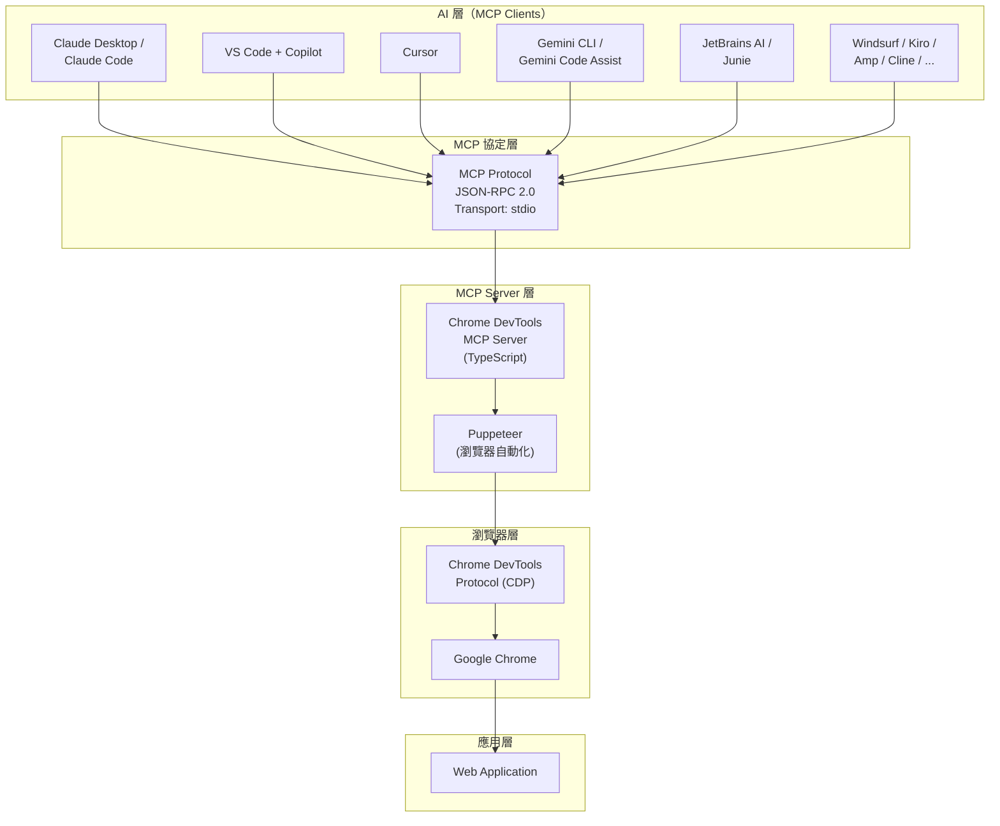
```mermaid
graph TB
    subgraph AI_Layer["AI 層（MCP Clients）"]
        Claude["Claude Desktop /<br/>Claude Code"]
        VSCode["VS Code + Copilot"]
        Cursor["Cursor"]
        GeminiCLI["Gemini CLI /<br/>Gemini Code Assist"]
        JetBrains["JetBrains AI /<br/>Junie"]
        Others["Windsurf / Kiro /<br/>Amp / Cline / ..."]
    end

    subgraph MCP_Layer["MCP 協定層"]
        MCPProtocol["MCP Protocol<br/>JSON-RPC 2.0<br/>Transport: stdio"]
    end

    subgraph Server_Layer["MCP Server 層"]
        CDTServer["Chrome DevTools<br/>MCP Server<br/>(TypeScript)"]
        Puppeteer["Puppeteer<br/>(瀏覽器自動化)"]
    end

    subgraph Browser_Layer["瀏覽器層"]
        CDP["Chrome DevTools<br/>Protocol (CDP)"]
        Chrome["Google Chrome"]
    end

    subgraph App_Layer["應用層"]
        WebApp["Web Application"]
    end

    Claude --> MCPProtocol
    VSCode --> MCPProtocol
    Cursor --> MCPProtocol
    GeminiCLI --> MCPProtocol
    JetBrains --> MCPProtocol
    Others --> MCPProtocol
    MCPProtocol --> CDTServer
    CDTServer --> Puppeteer
    Puppeteer --> CDP
    CDP --> Chrome
    Chrome --> WebApp
```

#### 元件說明

| 元件 | 角色 | 說明 |
| ------ | ------ | ------ |
| AI Client | 使用者介面 | 工程師透過 AI Client 下達自然語言指令 |
| MCP Protocol | 通訊協定 | 標準化 AI ↔ Server 的 JSON-RPC 通訊（透過 stdio） |
| Chrome DevTools MCP Server | 核心服務 | 將 MCP 工具呼叫轉換為 Puppeteer 操作 |
| Puppeteer | 自動化引擎 | Google 的 Node.js Chrome 自動化函式庫 |
| CDP | 瀏覽器協定 | Chrome 原生的除錯協定 |
| Chrome | 瀏覽器實例 | 實際執行 Web 頁面的環境 |

---

### 1.4 互動流程圖

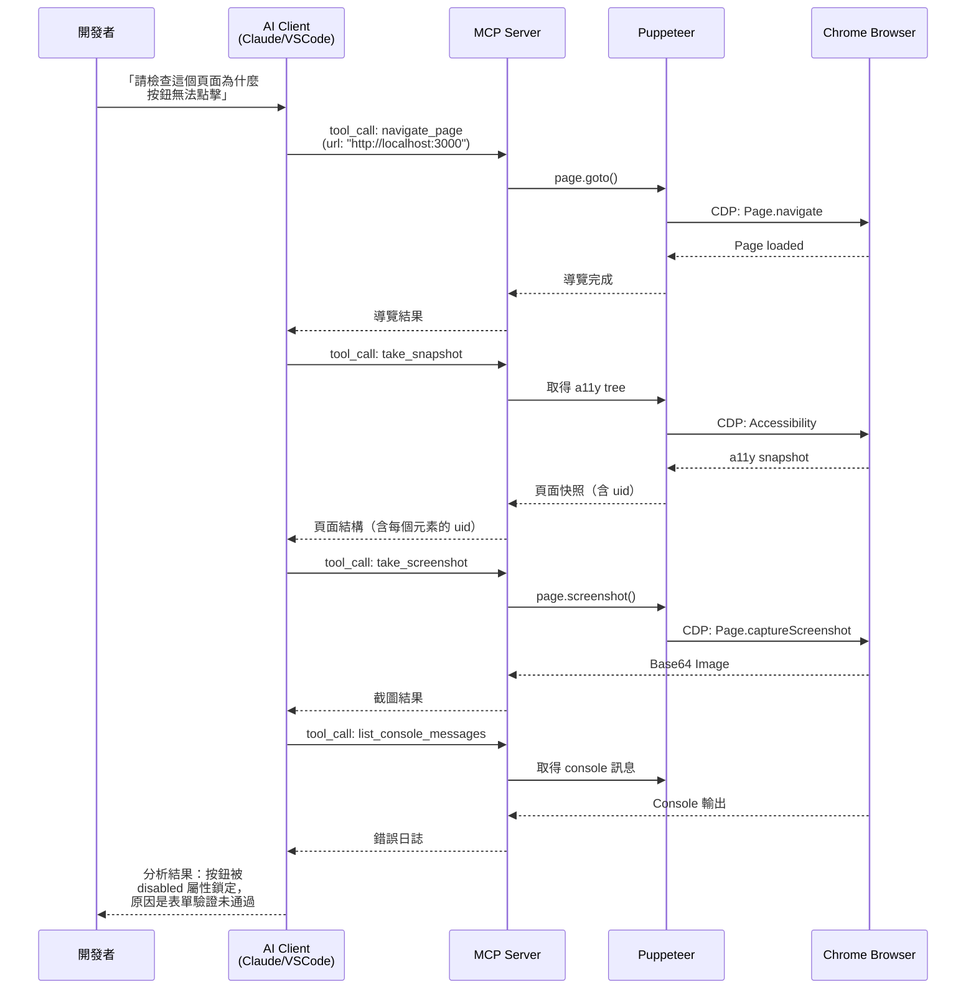
```mermaid
sequenceDiagram
    participant Dev as 開發者
    participant AI as AI Client<br/>(Claude/VSCode)
    participant MCP as MCP Server
    participant Puppeteer as Puppeteer
    participant Chrome as Chrome Browser

    Dev->>AI: 「請檢查這個頁面為什麼<br/>按鈕無法點擊」
    AI->>MCP: tool_call: navigate_page<br/>(url: "http://localhost:3000")
    MCP->>Puppeteer: page.goto()
    Puppeteer->>Chrome: CDP: Page.navigate
    Chrome-->>Puppeteer: Page loaded
    Puppeteer-->>MCP: 導覽完成
    MCP-->>AI: 導覽結果

    AI->>MCP: tool_call: take_snapshot
    MCP->>Puppeteer: 取得 a11y tree
    Puppeteer->>Chrome: CDP: Accessibility
    Chrome-->>Puppeteer: a11y snapshot
    Puppeteer-->>MCP: 頁面快照（含 uid）
    MCP-->>AI: 頁面結構（含每個元素的 uid）

    AI->>MCP: tool_call: take_screenshot
    MCP->>Puppeteer: page.screenshot()
    Puppeteer->>Chrome: CDP: Page.captureScreenshot
    Chrome-->>MCP: Base64 Image
    MCP-->>AI: 截圖結果

    AI->>MCP: tool_call: list_console_messages
    MCP->>Puppeteer: 取得 console 訊息
    Chrome-->>MCP: Console 輸出
    MCP-->>AI: 錯誤日誌

    AI-->>Dev: 分析結果：按鈕被<br/>disabled 屬性鎖定，<br/>原因是表單驗證未通過
```

> **重要概念**：`take_snapshot` 回傳的是基於 a11y tree 的文字快照，每個元素都有唯一的 `uid`。後續的 `click`、`fill`、`hover` 等操作都使用這個 `uid` 來定位元素。官方建議**優先使用 `take_snapshot` 而非 `take_screenshot`**。

---

### 1.5 適用場景說明

#### 高度適用場景

| 場景 | 說明 | 效益 |
| ------ | ------ | ------ |
| **前端 Bug 偵錯** | AI 直接觀察頁面快照、Console 錯誤 | 減少 80% 的來回溝通時間 |
| **UI 視覺檢查** | 截圖比對、元素位置驗證 | 自動化視覺回歸測試 |
| **效能分析** | Performance trace、CWV 分數、Insight 分析 | 快速找到效能瓶頸 |
| **Network 問題排查** | API 呼叫追蹤、狀態碼分析 | 前後端問題快速定位 |
| **表單/流程驗證** | 自動填寫表單（`fill_form`）、模擬使用者操作 | 端到端流程自動化驗證 |
| **裝置模擬測試** | 模擬不同 viewport、網路條件、地理位置 | 快速驗證 RWD 與地區化 |

#### 中度適用場景

| 場景 | 說明 | 注意事項 |
| ------ | ------ | ---------- |
| **Accessibility 檢測** | 透過 a11y tree snapshot 分析 | 搭配專業 a11y 工具更完整 |
| **SEO 分析** | 透過 snapshot 檢查 DOM 結構 | 需搭配 Lighthouse |
| **對話框測試** | `handle_dialog` 處理 alert/confirm/prompt | 支援 accept 和 dismiss |

#### 不適用場景

| 場景 | 原因 |
| ------ | ------ |
| **後端邏輯偵錯** | MCP Server 無法存取後端程式碼 |
| **資料庫查詢分析** | 超出瀏覽器能力範圍 |
| **原生 App 測試** | 僅適用於 Web 技術（支援 Android Chrome 遠端偵錯） |
| **負載測試** | 單一瀏覽器實例無法模擬高併發 |

---

### 1.6 與傳統 AI 靜態分析比較

| 比較項目 | 傳統 AI 靜態分析 | Chrome DevTools MCP |
| ---------- | ------------------ | --------------------- |
| **輸入來源** | 程式碼文字 | 程式碼 + 即時瀏覽器環境 |
| **UI 觀察** | ❌ 無法看到渲染結果 | ✅ 截圖 + a11y tree 快照 |
| **Console 錯誤** | ❌ 無法取得 | ✅ 即時讀取（`list_console_messages`） |
| **Network 分析** | ❌ 無法取得 | ✅ 完整 Request/Response（`list_network_requests`） |
| **效能數據** | ❌ 無法取得 | ✅ Performance trace + CWV 分數 |
| **互動測試** | ❌ 無法操作 | ✅ 點擊、填寫、拖曳、按鍵 |
| **狀態判斷** | 僅憑程式碼推測 | 基於實際運行狀態 |
| **偵錯精確度** | 中等 | 高（基於真實環境） |
| **環境依賴** | 低 | 需要 Chrome + Node.js 20.19+ |

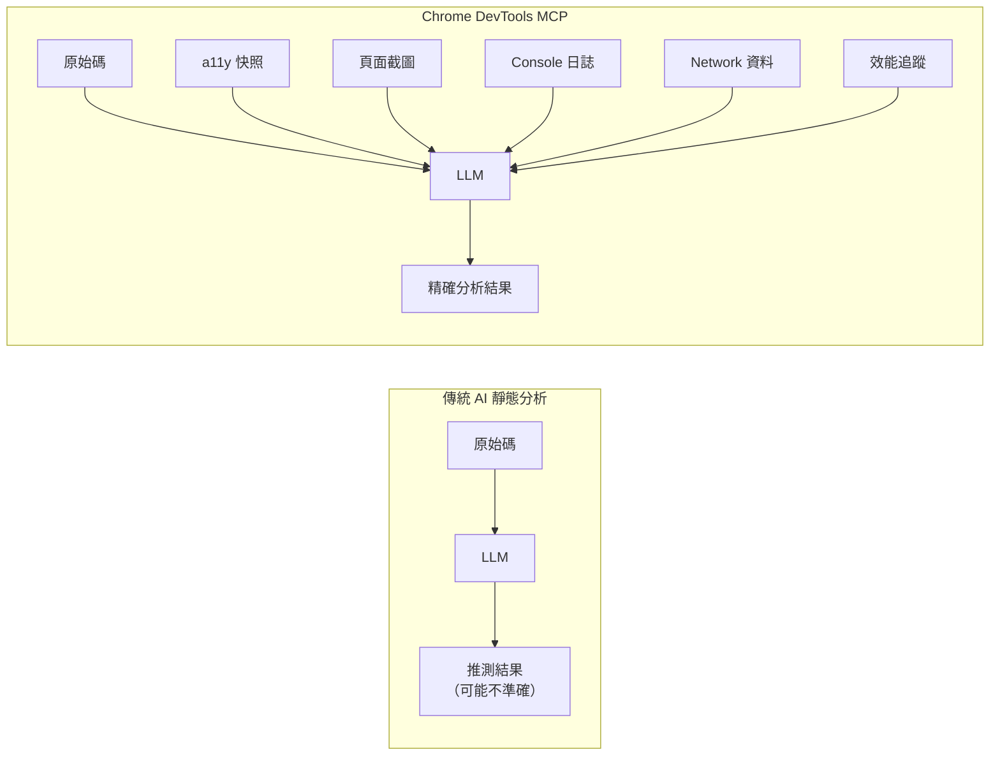
```mermaid
graph LR
    subgraph Traditional["傳統 AI 靜態分析"]
        Code["原始碼"] --> LLM1["LLM"]
        LLM1 --> Guess["推測結果<br/>（可能不準確）"]
    end

    subgraph MCP_Way["Chrome DevTools MCP"]
        Code2["原始碼"] --> LLM2["LLM"]
        Snapshot["a11y 快照"] --> LLM2
        Screenshot2["頁面截圖"] --> LLM2
        Console2["Console 日誌"] --> LLM2
        Network2["Network 資料"] --> LLM2
        Performance2["效能追蹤"] --> LLM2
        LLM2 --> Accurate["精確分析結果"]
    end
```

> **設計建議**：Chrome DevTools MCP 不是要取代靜態分析，而是作為**補充**。建議在開發流程中同時使用兩者：靜態分析用於程式碼品質把關，MCP 用於運行時問題診斷。

---

## 第二章：系統架構設計

### 2.1 單機開發架構

最基本的使用模式，適合個人開發者日常使用。Chrome DevTools MCP 預設會**自動啟動一個 Chrome 實例**（使用 Puppeteer），無需手動啟動 Chrome。

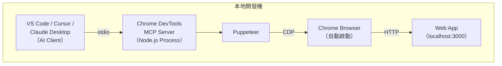
```mermaid
graph TB
    subgraph LocalMachine["本地開發機"]
        IDE["VS Code / Cursor /<br/>Claude Desktop<br/>（AI Client）"]
        MCPServer["Chrome DevTools<br/>MCP Server<br/>（Node.js Process）"]
        Puppeteer2["Puppeteer"]
        Chrome["Chrome Browser<br/>（自動啟動）"]
        DevApp["Web App<br/>（localhost:3000）"]
    end

    IDE -->|"stdio"| MCPServer
    MCPServer --> Puppeteer2
    Puppeteer2 -->|"CDP"| Chrome
    Chrome -->|"HTTP"| DevApp
```

#### 元件配置

| 元件 | 說明 |
| ------ | ------ |
| Web App | 開發中的 Web Application（任意 port） |
| Chrome | 由 MCP Server（透過 Puppeteer）自動啟動和管理 |
| MCP Server | 透過 stdio 與 AI Client 通訊 |

#### 預設行為

- MCP Server 啟動時，會自動透過 Puppeteer 啟動一個 Chrome 實例
- User data directory 預設存放於 `$HOME/.cache/chrome-devtools-mcp/chrome-profile-stable`
- 無需手動啟動 Chrome 或指定 `--remote-debugging-port`

> **實務建議**：單機開發模式是最推薦的入門方式。只需設定好 MCP Client 配置即可使用，無需額外操作。

---

### 2.2 團隊共享架構

適合團隊多人共同使用 MCP 能力的場景。

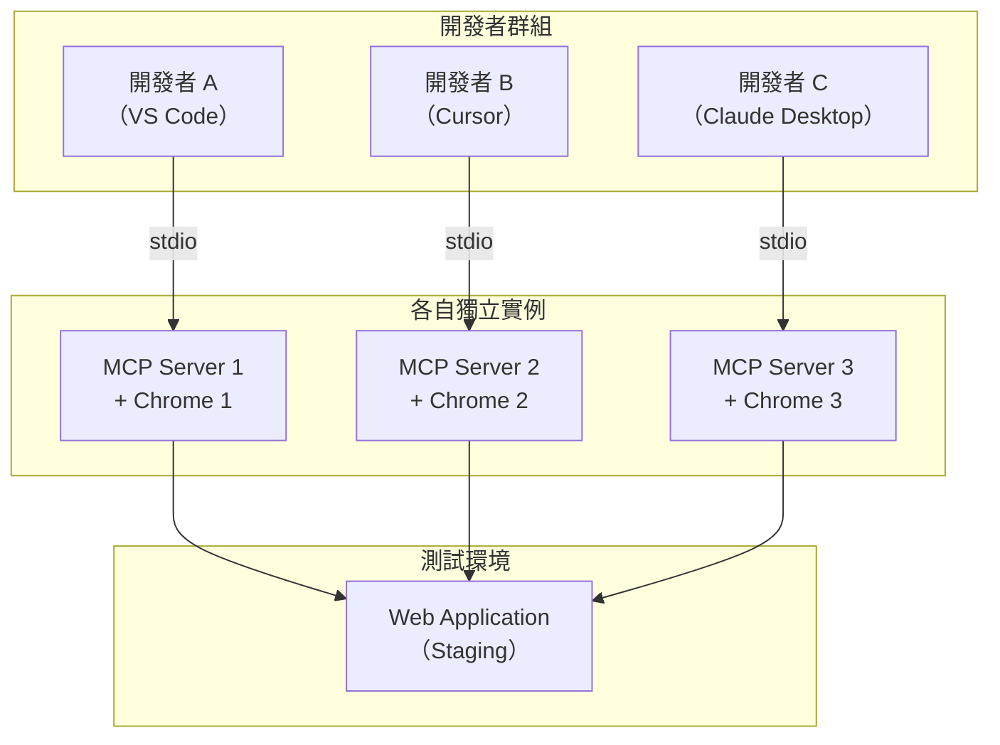
```mermaid
graph TB
    subgraph Developers["開發者群組"]
        Dev1["開發者 A<br/>（VS Code）"]
        Dev2["開發者 B<br/>（Cursor）"]
        Dev3["開發者 C<br/>（Claude Desktop）"]
    end

    subgraph Instances["各自獨立實例"]
        MCP1["MCP Server 1<br/>+ Chrome 1"]
        MCP2["MCP Server 2<br/>+ Chrome 2"]
        MCP3["MCP Server 3<br/>+ Chrome 3"]
    end

    subgraph TestEnv["測試環境"]
        App["Web Application<br/>（Staging）"]
    end

    Dev1 -->|"stdio"| MCP1
    Dev2 -->|"stdio"| MCP2
    Dev3 -->|"stdio"| MCP3
    MCP1 --> App
    MCP2 --> App
    MCP3 --> App
```

#### 配置要點

| 項目 | 建議 |
| ------ | ------ |
| **Transport** | 使用預設的 stdio 模式 |
| **實例管理** | 每位開發者在本機啟動獨立的 MCP Server |
| **Chrome 隔離** | 使用 `--isolated` 參數讓每次執行都使用臨時 user-data-dir |
| **版本統一** | 鎖定團隊共同的 `chrome-devtools-mcp` 版本 |

> **設計建議**：目前 Chrome DevTools MCP 主要設計為 stdio 模式（每個 AI Client 啟動一個獨立的 MCP Server 進程），適合每人獨立使用。

---

### 2.3 CI/CD 整合架構

將 Chrome DevTools MCP 整合到 CI/CD Pipeline 中，實現自動化前端驗證。

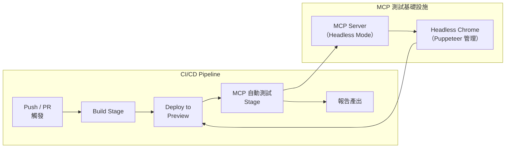
```mermaid
graph LR
    subgraph CI_Pipeline["CI/CD Pipeline"]
        Trigger["Push / PR<br/>觸發"]
        Build["Build Stage"]
        Deploy["Deploy to<br/>Preview"]
        MCPTest["MCP 自動測試<br/>Stage"]
        Report["報告產出"]
    end

    subgraph MCP_Infra["MCP 測試基礎設施"]
        MCPServer2["MCP Server<br/>（Headless Mode）"]
        Chrome2["Headless Chrome<br/>（Puppeteer 管理）"]
    end

    Trigger --> Build --> Deploy --> MCPTest --> Report
    MCPTest --> MCPServer2
    MCPServer2 --> Chrome2
    Chrome2 --> Deploy
```

#### GitHub Actions 範例

```yaml
name: Frontend MCP Validation
on:
  pull_request:
    branches: [main, develop]

jobs:
  mcp-validation:
    runs-on: ubuntu-latest
    steps:
      - uses: actions/checkout@v4

      - name: Setup Node.js
        uses: actions/setup-node@v4
        with:
          node-version: '22'

      - name: Install Chrome
        uses: browser-actions/setup-chrome@v1
        with:
          chrome-version: stable

      - name: Start Application
        run: |
          npm ci
          npm run build
          npm run preview &
          sleep 5

      - name: Verify MCP Server
        run: |
          npx chrome-devtools-mcp@latest --help
```

> **實務建議**：CI/CD 中必須使用 `--headless` 模式。可搭配 `--isolated` 確保每次執行環境乾淨。

---

### 2.4 雲端整合架構

適用於大型企業的雲端部署架構。

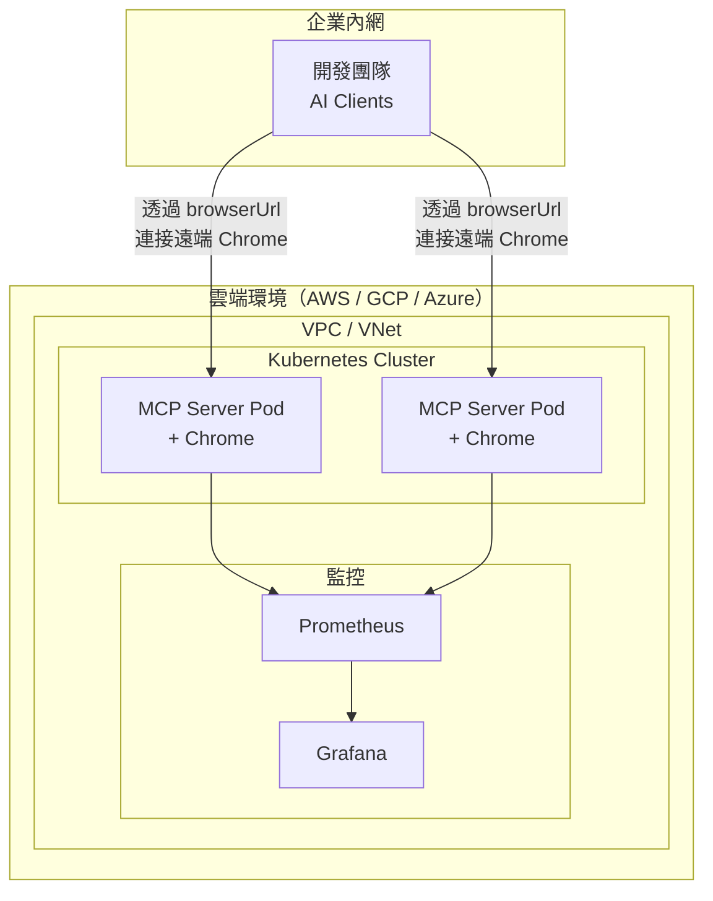
```mermaid
graph TB
    subgraph Cloud["雲端環境（AWS / GCP / Azure）"]
        subgraph VPC["VPC / VNet"]
            subgraph K8s["Kubernetes Cluster"]
                MCPPod1["MCP Server Pod<br/>+ Chrome"]
                MCPPod2["MCP Server Pod<br/>+ Chrome"]
            end

            subgraph Monitoring["監控"]
                Prometheus["Prometheus"]
                Grafana["Grafana"]
            end
        end
    end

    subgraph OnPrem["企業內網"]
        DevTeam["開發團隊<br/>AI Clients"]
    end

    DevTeam -->|"透過 browserUrl<br/>連接遠端 Chrome"| MCPPod1
    DevTeam -->|"透過 browserUrl<br/>連接遠端 Chrome"| MCPPod2
    MCPPod1 --> Prometheus
    MCPPod2 --> Prometheus
    Prometheus --> Grafana
```

#### 雲端架構要點

| 項目 | 建議 |
| ------ | ------ |
| **容器化** | Chrome 和 MCP Server 打包在同一個 Docker Image |
| **連接方式** | 使用 `--browser-url` 或 `--ws-endpoint` 連接遠端 Chrome |
| **安全** | 使用 SSH tunnel 或 VPN 保護連線 |
| **資源限制** | Chrome Pod 建議 CPU: 1-2 core, Memory: 2-4 GB |

---

### 2.5 安全隔離建議

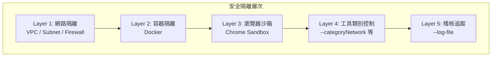
```mermaid
graph TB
    subgraph SecurityLayers["安全隔離層次"]
        L1["Layer 1: 網路隔離<br/>VPC / Subnet / Firewall"]
        L2["Layer 2: 容器隔離<br/>Docker"]
        L3["Layer 3: 瀏覽器沙箱<br/>Chrome Sandbox"]
        L4["Layer 4: 工具類別控制<br/>--categoryNetwork 等"]
        L5["Layer 5: 稽核追蹤<br/>--log-file"]
    end

    L1 --> L2 --> L3 --> L4 --> L5
```

#### 各層隔離措施

| 層次 | 措施 | 實作方式 |
| ------ | ------ | ---------- |
| **網路隔離** | MCP Server 只能連接特定域名 | Firewall rules / Network Policy |
| **容器隔離** | Chrome 在獨立容器執行 | Docker 容器 |
| **瀏覽器沙箱** | 啟用 Chrome sandbox | 保留 Chrome 預設沙箱設定 |
| **工具類別控制** | 停用不需要的工具類別 | `--no-category-network`、`--no-category-performance` |
| **日誌追蹤** | 記錄所有操作 | `--log-file` 參數 |

> **重要**：部分 MCP Client（如 Codex）支援 OS sandbox（macOS Seatbelt / Linux 容器）。如果啟用 sandbox，Chrome DevTools MCP 將無法自行啟動 Chrome。此時需改用 `--browser-url` 連接外部啟動的 Chrome 實例。

---

### 2.6 權限控制建議

Chrome DevTools MCP 提供了基於**工具類別**的權限控制機制：

| 類別參數 | 預設 | 控制的工具 |
| ---------- | :----: | ------------ |
| `--categoryEmulation` | `true` | `emulate`、`resize_page` |
| `--categoryPerformance` | `true` | `performance_*` 系列 |
| `--categoryNetwork` | `true` | `get_network_request`、`list_network_requests` |

#### 企業環境建議

```json
{
  "mcpServers": {
    "chrome-devtools": {
      "command": "npx",
      "args": [
        "-y",
        "chrome-devtools-mcp@latest",
        "--no-category-network",
        "--no-category-performance",
        "--headless"
      ]
    }
  }
}
```

> **設計建議**：對於僅需要基本瀏覽和截圖功能的場景，可停用 Network 和 Performance 類別，減少工具暴露面。

---

### 2.7 沙箱執行模式建議

#### Docker 沙箱架構

```dockerfile
# Dockerfile for Chrome DevTools MCP Sandbox
FROM node:22-slim

# 安裝 Chrome
RUN apt-get update && apt-get install -y \
    wget gnupg2 fonts-noto-cjk \
    --no-install-recommends \
    && wget -q -O - https://dl.google.com/linux/linux_signing_key.pub | \
       gpg --dearmor > /etc/apt/trusted.gpg.d/google.gpg \
    && echo "deb [arch=amd64] http://dl.google.com/linux/chrome/deb/ stable main" > \
       /etc/apt/sources.list.d/google-chrome.list \
    && apt-get update \
    && apt-get install -y google-chrome-stable --no-install-recommends \
    && rm -rf /var/lib/apt/lists/*

# 建立非 root 使用者
RUN useradd -m -s /bin/bash mcpuser

USER mcpuser
WORKDIR /home/mcpuser

# 預裝 chrome-devtools-mcp
RUN npx -y chrome-devtools-mcp@latest --help || true

# 啟動 MCP Server（headless + isolated）
ENTRYPOINT ["npx", "chrome-devtools-mcp@latest", "--headless", "--isolated"]
```

#### Docker Compose 沙箱配置

```yaml
version: '3.8'
services:
  chrome-mcp:
    build: .
    container_name: chrome-devtools-mcp
    shm_size: '2gb'
    security_opt:
      - seccomp:unconfined
    cap_add:
      - SYS_ADMIN
    mem_limit: 4g
    cpus: 2
    environment:
      - NODE_ENV=production
```

> **實務建議**：Docker 環境中 `shm_size: '2gb'` 是必要的，Chrome 需要大量共享記憶體。使用 `--isolated` 參數可確保每次執行都有乾淨的 Chrome profile。

---

## 第三章：安裝與環境建置

### 3.1 系統需求

| 需求項目 | 最低要求 | 建議配置 |
| ---------- | ---------- | ---------- |
| **作業系統** | Windows 10+, macOS 12+, Ubuntu 20.04+ | Windows 11, macOS 14+, Ubuntu 22.04+ |
| **CPU** | 雙核心 | 四核心以上 |
| **記憶體** | 4 GB | 8 GB 以上 |
| **磁碟空間** | 2 GB | 5 GB 以上 |
| **Node.js** | **v20.19**（最新 maintenance LTS） | Node.js 22 LTS |
| **Chrome** | 目前穩定版 | Chrome 最新穩定版 |
| **npm** | 隨 Node.js 安裝 | 最新版 |

---

### 3.2 Chrome 版本需求

| 項目 | 說明 |
| ------ | ------ |
| **基本需求** | Chrome 目前穩定版（current stable version） |
| **autoConnect 功能** | 需要 **Chrome 144+**（此功能可自動連接正在執行的 Chrome） |
| **支援的 Channel** | stable、canary、beta、dev（透過 `--channel` 參數指定） |

#### 確認 Chrome 版本

```bash
# Windows
"C:\Program Files\Google\Chrome\Application\chrome.exe" --version

# macOS
/Applications/Google\ Chrome.app/Contents/MacOS/Google\ Chrome --version

# Linux
google-chrome --version
# 或
chromium --version
```

> **注意**：Chrome DevTools MCP 會透過 Puppeteer **自動啟動 Chrome**，一般不需要手動啟動。只有在需要連接既有 Chrome 實例時，才需手動操作。

---

### 3.3 Node.js 版本需求

| 項目 | 說明 |
| ------ | ------ |
| **最低版本** | **Node.js v20.19**（最新 maintenance LTS） |
| **建議版本** | Node.js 22 LTS |
| **套件管理器** | npm（隨 Node.js 安裝） |

#### 安裝 Node.js

```bash
# 使用 nvm（推薦）
# Windows (nvm-windows)
nvm install 22
nvm use 22

# macOS / Linux
curl -o- https://raw.githubusercontent.com/nvm-sh/nvm/v0.40.1/install.sh | bash
nvm install 22
nvm use 22

# 驗證安裝
node --version  # 應為 v20.19+ 或 v22.x.x
npm --version
```

---

### 3.4 安裝步驟

#### 方式一：使用 npx 直接執行（推薦）

```bash
# 直接執行，無需全域安裝
npx -y chrome-devtools-mcp@latest
```

這是官方推薦的方式，也是所有 MCP Client 配置中使用的標準方式。

#### 方式二：驗證安裝

```bash
# 測試 MCP Server 是否能在你的機器上正常運行
npx chrome-devtools-mcp@latest --help
```

#### 企業 Proxy 環境安裝

```bash
# 設定 npm proxy
npm config set proxy http://proxy.company.com:8080
npm config set https-proxy http://proxy.company.com:8080

# 設定 npm registry（如使用私有 registry）
npm config set registry https://registry.npmjs.company.com/

# 測試安裝
npx chrome-devtools-mcp@latest --help
```

> **實務建議**：使用 `npx -y` 的 `-y` 參數（或 `--yes`）可自動接受安裝提示，避免在 MCP Client 中卡住。企業環境建議將套件上傳至公司的 Artifactory / Nexus。

---

### 3.5 啟動參數完整說明

以下是 Chrome DevTools MCP 的**所有官方支援啟動參數**：

#### 連接參數

| 參數 | 簡寫 | 預設值 | 說明 |
| ------ | ------ | -------- | ------ |
| `--autoConnect` / `--auto-connect` | - | `false` | 自動連接正在執行的 Chrome（需 **Chrome 144+**） |
| `--browserUrl` / `--browser-url` | `-u` | - | 連接可偵錯的 Chrome 實例（如 `http://127.0.0.1:9222`） |
| `--wsEndpoint` / `--ws-endpoint` | `-w` | - | WebSocket 端點 URL |
| `--wsHeaders` / `--ws-headers` | - | - | 自訂 WebSocket header |

#### Chrome 啟動參數

| 參數 | 簡寫 | 預設值 | 說明 |
| ------ | ------ | -------- | ------ |
| `--headless` | - | `false` | 以 Headless 模式啟動 Chrome |
| `--executablePath` / `--executable-path` | `-e` | 自動偵測 | 自訂 Chrome 執行檔路徑 |
| `--channel` | - | `stable` | Chrome channel（`stable` / `canary` / `beta` / `dev`） |
| `--userDataDir` / `--user-data-dir` | - | 見下方說明 | Chrome 使用者資料目錄 |
| `--isolated` | - | `false` | 使用臨時 user-data-dir，結束後自動清除 |
| `--viewport` | - | - | Viewport 大小（如 `"1280x720"`） |
| `--proxyServer` / `--proxy-server` | - | - | Proxy 設定 |
| `--acceptInsecureCerts` / `--accept-insecure-certs` | - | `false` | 忽略 SSL 憑證錯誤 |
| `--chromeArg` / `--chrome-arg` | - | - | 額外的 Chrome 啟動參數 |
| `--ignoreDefaultChromeArg` | - | `false` | 停用預設的 Chrome 啟動參數 |

#### 工具類別控制

| 參數 | 預設值 | 說明 |
| ------ | -------- | ------ |
| `--categoryEmulation` | `true` | 啟用/停用 Emulation 工具 |
| `--categoryPerformance` | `true` | 啟用/停用 Performance 工具 |
| `--categoryNetwork` | `true` | 啟用/停用 Network 工具 |

#### 其他參數

| 參數 | 預設值 | 說明 |
| ------ | -------- | ------ |
| `--logFile` / `--log-file` | - | 偵錯日誌檔案路徑 |
| `--performanceCrux` / `--performance-crux` | `true` | 啟用 CrUX API（Chrome User Experience Report） |
| `--usageStatistics` / `--usage-statistics` | `true` | 啟用使用統計回報 |
| `--no-performance-crux` | - | 停用 CrUX API |
| `--no-usage-statistics` | - | 停用使用統計 |

#### 啟動範例

```bash
# 基本啟動（Puppeteer 自動管理 Chrome）
npx chrome-devtools-mcp@latest

# Headless 模式 + 隔離執行
npx chrome-devtools-mcp@latest --headless --isolated

# 指定 viewport + Chrome channel
npx chrome-devtools-mcp@latest --viewport "1920x1080" --channel canary

# 連接既有 Chrome 實例
npx chrome-devtools-mcp@latest --browser-url http://127.0.0.1:9222

# 自動連接正在執行的 Chrome（Chrome 144+）
npx chrome-devtools-mcp@latest --auto-connect

# 指定 Chrome 路徑 + Proxy
npx chrome-devtools-mcp@latest \
  -e "/usr/bin/google-chrome" \
  --proxy-server "http://proxy.company.com:8080"

# 停用 Network 和 Performance 工具 + 停用統計
npx chrome-devtools-mcp@latest \
  --no-category-network \
  --no-category-performance \
  --no-usage-statistics

# 啟用偵錯日誌
DEBUG=* npx chrome-devtools-mcp@latest --log-file ./chrome-mcp-debug.log
```

---

### 3.6 連接模式說明

Chrome DevTools MCP 支援多種連接 Chrome 的方式：

#### 模式一：自動啟動（預設）

```bash
# MCP Server 自動透過 Puppeteer 啟動 Chrome
npx chrome-devtools-mcp@latest
```

適用場景：個人開發、CI/CD、一般使用。

#### 模式二：autoConnect（Chrome 144+）

```bash
# 自動連接正在執行的 Chrome
npx chrome-devtools-mcp@latest --auto-connect
```

適用場景：希望 AI 操作你正在使用的瀏覽器。需要 **Chrome 144 以上**。

#### 模式三：連接已啟動的 Chrome

```bash
# 先手動啟動 Chrome（啟用 remote debugging）
google-chrome --remote-debugging-port=9222

# 然後 MCP Server 連接
npx chrome-devtools-mcp@latest --browser-url http://127.0.0.1:9222
```

適用場景：連接遠端 Chrome、VM 中的 Chrome、Docker 容器中的 Chrome。

#### 模式四：WebSocket 端點

```bash
# 透過 WebSocket 連接
npx chrome-devtools-mcp@latest --ws-endpoint "ws://127.0.0.1:9222/devtools/browser/..."
```

適用場景：需要精確控制連接端點、使用自訂 WebSocket header。

---

### 3.7 User Data Directory 說明

Chrome DevTools MCP 使用以下路徑存放 Chrome 使用者資料：

```text
$HOME/.cache/chrome-devtools-mcp/chrome-profile-$CHANNEL
```

| 變數 | 說明 | 範例 |
| ------ | ------ | ------ |
| `$HOME` | 使用者主目錄 | `/home/user`、`C:\Users\user` |
| `$CHANNEL` | Chrome channel | `stable`、`canary`、`beta`、`dev` |

#### 自訂 User Data Directory

```bash
# 使用自訂目錄
npx chrome-devtools-mcp@latest --user-data-dir "/path/to/custom/profile"

# 使用隔離模式（每次自動建立臨時目錄，結束後清除）
npx chrome-devtools-mcp@latest --isolated
```

> **實務建議**：開發環境建議使用 `--isolated` 模式，確保每次都有乾淨的瀏覽器環境。團隊共享時也能避免 profile 衝突。

---

### 3.8 Docker 安裝方式

#### 自訂 Dockerfile

```dockerfile
FROM node:22-slim AS base

# 安裝系統依賴
RUN apt-get update && apt-get install -y \
    wget gnupg2 fonts-noto-cjk fonts-noto-color-emoji \
    --no-install-recommends

# 安裝 Chrome
RUN wget -q -O - https://dl.google.com/linux/linux_signing_key.pub | \
    gpg --dearmor > /etc/apt/trusted.gpg.d/google.gpg \
    && echo "deb [arch=amd64] http://dl.google.com/linux/chrome/deb/ stable main" > \
       /etc/apt/sources.list.d/google-chrome.list \
    && apt-get update \
    && apt-get install -y google-chrome-stable --no-install-recommends \
    && rm -rf /var/lib/apt/lists/*

# 建立非 root 使用者
RUN useradd -m -s /bin/bash mcpuser
USER mcpuser

# 預安裝 MCP Server
RUN npx -y chrome-devtools-mcp@latest --help || true

# 啟動
ENTRYPOINT ["npx", "chrome-devtools-mcp@latest", "--headless", "--isolated"]
```

#### Docker Compose 完整配置

```yaml
version: '3.8'

services:
  chrome-mcp:
    build:
      context: .
      dockerfile: Dockerfile.mcp
    container_name: chrome-devtools-mcp
    shm_size: '2gb'
    cap_add:
      - SYS_ADMIN
    deploy:
      resources:
        limits:
          cpus: '2.0'
          memory: 4G
    restart: unless-stopped
```

> **實務建議**：Docker 環境中 `shm_size: '2gb'` 是**必要的**，Chrome 需要大量共享記憶體。若不設定，會出現頁面崩潰錯誤。

---

### 3.9 工具類別控制

可透過啟動參數控制啟用的工具類別：

```bash
# 停用 Network 工具（適合無需監控網路的場景）
npx chrome-devtools-mcp@latest --no-category-network

# 停用 Performance 工具
npx chrome-devtools-mcp@latest --no-category-performance

# 停用 Emulation 工具
npx chrome-devtools-mcp@latest --no-category-emulation

# 同時停用多個類別
npx chrome-devtools-mcp@latest \
  --no-category-network \
  --no-category-performance
```

> **設計建議**：在企業環境中，可依據角色需求停用不必要的工具類別，減少風險暴露面。

---

### 3.10 常見錯誤排除

#### 錯誤 1：`Error [ERR_MODULE_NOT_FOUND]: Cannot find module ...`

這通常表示 Node.js 版本不支援，或 npm/npx 快取損壞。

**解決方案**：

```bash
# 清除 npm 快取
rm -rf ~/.npm/_npx    # 注意：這會移除其他 npx 安裝的套件
npm cache clean --force

# 確認 Node.js 版本（需 v20.19+）
node --version

# 重新執行
npx -y chrome-devtools-mcp@latest
```

#### 錯誤 2：`Target closed` error

這表示瀏覽器無法啟動。

**排查步驟**：

```bash
# 1. 確認沒有殘留的 Chrome 程序
# Windows
taskkill /F /IM chrome.exe
# Linux/macOS
pkill -f chrome

# 2. 確認 Chrome 已安裝
google-chrome --version

# 3. 使用 --isolated 避免 profile 衝突
npx chrome-devtools-mcp@latest --isolated
```

**常見原因**：

- 已有 Chrome 實例正在使用相同的 user-data-dir
- Chrome 未正確安裝
- 系統無法執行 Chrome（如缺少相依套件）

#### 錯誤 3：Chrome crashes on macOS（Web Bluetooth）

在 macOS 上，由 MCP Client（如 Claude Desktop）啟動的 Chrome 可能在出現 Web Bluetooth 提示時崩潰，這是由 macOS TCC 隱私權限造成。

**解決方案**：

在 `System Settings > Privacy & Security > Bluetooth` 中，授予 MCP Client 應用程式藍牙權限，然後重新啟動 Client。

#### 錯誤 4：遠端偵錯（VM ↔ Host）連線失敗

Chrome 會驗證 Host header，從 VM 連接 Host 的 Chrome 可能被拒絕。

**解決方案**：使用 SSH tunnel

```bash
# 在 VM 中建立 SSH tunnel
ssh -N -L 127.0.0.1:9222:127.0.0.1:9222 <user>@<host-ip>

# 然後連接
npx chrome-devtools-mcp@latest --browser-url http://127.0.0.1:9222
```

#### 錯誤 5：OS Sandbox 環境無法使用

部分 MCP Client 啟用了 OS sandbox（macOS Seatbelt / Linux 容器），導致 Chrome 無法建立自己的 sandbox。

**解決方案**：

```bash
# 方式 1：在 MCP Client 中停用 sandbox for chrome-devtools-mcp

# 方式 2：手動啟動 Chrome，然後用 --browser-url 連接
google-chrome --remote-debugging-port=9222 &
npx chrome-devtools-mcp@latest --browser-url http://127.0.0.1:9222
```

#### 錯誤 6：WSL 環境問題

在 WSL 中，Chrome DevTools MCP 預設需要在 Linux 環境中安裝 Chrome。

**解決方案**：

```bash
# 方式 1：在 WSL 中安裝 Chrome
wget https://dl.google.com/linux/direct/google-chrome-stable_current_amd64.deb
sudo dpkg -i google-chrome-stable_current_amd64.deb

# 方式 2：使用 Mirrored networking
# 1. 設定 WSL Mirrored networking
# 2. 在 Windows 端啟動 Chrome
chrome.exe --remote-debugging-port=9222 --user-data-dir=C:\path\to\dir
# 3. 在 WSL 中連接
npx chrome-devtools-mcp@latest --browser-url http://127.0.0.1:9222

# 方式 3：使用 PowerShell 或 Git Bash 取代 WSL
```

#### 錯誤 7：Node.js 版本不相容

```text
Error: Unsupported Node.js version
```

**解決方案**：

```bash
# 確認 Node.js 版本（需 v20.19+）
node --version

# 升級到 Node.js 22 LTS
nvm install 22
nvm use 22
```

#### 偵錯模式

如需深度偵錯，可啟用 DEBUG 模式並輸出日誌：

```bash
# 啟用完整偵錯日誌
DEBUG=* npx chrome-devtools-mcp@latest --log-file=/path/to/chrome-devtools-mcp.log
```

在 MCP Client 的 `.mcp.json` 中啟用偵錯：

```json
{
  "mcpServers": {
    "chrome-devtools": {
      "type": "stdio",
      "command": "npx",
      "args": [
        "chrome-devtools-mcp@latest",
        "--log-file",
        "/path/to/chrome-devtools-mcp.log"
      ],
      "env": {
        "DEBUG": "*"
      }
    }
  }
}
```

> **實務建議**：遇到問題時，優先執行 `npx chrome-devtools-mcp@latest --help` 確認 MCP Server 能正常啟動，再排查連接問題。確保你的 MCP Client 使用的 npm 和 node 版本與終端機一致。

---

## 第四章：設定與整合

Chrome DevTools MCP 目前支援 **20+ 個 MCP Client**，以下列出主要的整合設定方式。

### 4.1 Claude Desktop / Claude Code 整合

#### 設定檔位置

| 作業系統 | 路徑 |
| ---------- | ------ |
| **Windows** | `%APPDATA%\Claude\claude_desktop_config.json` |
| **macOS** | `~/Library/Application Support/Claude/claude_desktop_config.json` |
| **Linux** | `~/.config/Claude/claude_desktop_config.json` |

#### 基本設定

```json
{
  "mcpServers": {
    "chrome-devtools": {
      "command": "npx",
      "args": [
        "-y",
        "chrome-devtools-mcp@latest"
      ]
    }
  }
}
```

#### 進階設定（Headless + 指定 viewport）

```json
{
  "mcpServers": {
    "chrome-devtools": {
      "command": "npx",
      "args": [
        "-y",
        "chrome-devtools-mcp@latest",
        "--headless",
        "--viewport", "1920x1080"
      ]
    }
  }
}
```

#### 連接既有 Chrome 實例

```json
{
  "mcpServers": {
    "chrome-devtools": {
      "command": "npx",
      "args": [
        "-y",
        "chrome-devtools-mcp@latest",
        "--browser-url", "http://127.0.0.1:9222"
      ]
    }
  }
}
```

#### 驗證整合

1. 重新啟動 Claude Desktop
2. 點擊對話框中的「工具」圖示
3. 確認出現 Chrome DevTools 相關工具列表（如 `navigate_page`、`take_screenshot` 等）
4. 測試指令：「請開啟 <https://example.com> 並截圖」

---

### 4.2 VS Code / GitHub Copilot 整合

#### 方式一：專案層級設定

在專案根目錄建立 `.vscode/mcp.json`：

```json
{
  "servers": {
    "chrome-devtools": {
      "command": "npx",
      "args": [
        "-y",
        "chrome-devtools-mcp@latest"
      ]
    }
  }
}
```

#### 方式二：使用者層級設定

在 VS Code `settings.json` 中：

```json
{
  "mcp": {
    "servers": {
      "chrome-devtools": {
        "command": "npx",
        "args": [
          "-y",
          "chrome-devtools-mcp@latest"
        ]
      }
    }
  }
}
```

#### 使用方式

在 GitHub Copilot Chat（Agent mode）中直接輸入：

```text
請使用 Chrome DevTools MCP 開啟 http://localhost:3000 並檢查 Console 是否有錯誤
```

---

### 4.3 Cursor 整合

#### 專案層級設定

在專案根目錄建立 `.cursor/mcp.json`：

```json
{
  "mcpServers": {
    "chrome-devtools": {
      "command": "npx",
      "args": [
        "-y",
        "chrome-devtools-mcp@latest"
      ]
    }
  }
}
```

#### 全域設定

| 作業系統 | 路徑 |
| ---------- | ------ |
| **Windows** | `%USERPROFILE%\.cursor\mcp.json` |
| **macOS** | `~/.cursor/mcp.json` |
| **Linux** | `~/.cursor/mcp.json` |

> **實務建議**：Cursor 中使用 MCP 時，建議在 Composer 模式（Agent mode）下使用，可以獲得較好的多步驟操作體驗。

---

### 4.4 Gemini CLI / Gemini Code Assist 整合

#### Gemini CLI 設定

在專案根目錄或使用者主目錄建立 `.gemini/settings.json`：

```json
{
  "mcpServers": {
    "chrome-devtools": {
      "command": "npx",
      "args": [
        "-y",
        "chrome-devtools-mcp@latest"
      ]
    }
  }
}
```

#### 使用範例

```bash
# 啟動 Gemini CLI
gemini

# 在對話中使用
> 請使用 Chrome DevTools 開啟 http://localhost:5173 並截圖
```

---

### 4.5 JetBrains AI Assistant 整合

JetBrains AI Assistant 和 Junie 都支援 MCP。設定方式類似其他 Client。

在專案根目錄建立 `.junie/mcp.json` 或透過 JetBrains IDE 設定：

```json
{
  "mcpServers": {
    "chrome-devtools": {
      "command": "npx",
      "args": [
        "-y",
        "chrome-devtools-mcp@latest"
      ]
    }
  }
}
```

---

### 4.6 其他 MCP Client 整合

Chrome DevTools MCP 官方支援的完整 MCP Client 清單：

| Client | 類型 | 說明 |
| -------- | ------ | ------ |
| **Amp** | IDE Plugin | - |
| **Antigravity** | AI Tool | - |
| **Claude Code** | CLI | Anthropic 的 CLI 工具 |
| **Claude Desktop** | Desktop App | Anthropic 的桌面應用 |
| **Cline** | VS Code Extension | VS Code AI 擴充 |
| **Codex** | CLI | OpenAI 的 CLI 工具 |
| **Copilot CLI** | CLI | GitHub Copilot CLI |
| **Copilot / VS Code** | IDE | GitHub Copilot in VS Code |
| **Cursor** | IDE | AI-first IDE |
| **Factory CLI** | CLI | - |
| **Gemini CLI** | CLI | Google Gemini CLI |
| **Gemini Code Assist** | IDE Plugin | Google IDE 整合 |
| **JetBrains AI / Junie** | IDE Plugin | JetBrains 全系列 IDE |
| **Kiro** | IDE | AWS 的 AI IDE |
| **Katalon Studio** | Testing Tool | 測試自動化工具 |
| **OpenCode** | CLI | 開源 AI CLI |
| **Qoder / Qoder CLI** | IDE/CLI | - |
| **Visual Studio** | IDE | Microsoft Visual Studio |
| **Warp** | Terminal | AI 終端機 |
| **Windsurf** | IDE | AI-first IDE |

#### 通用設定格式

所有 MCP Client 的基本設定都遵循相同的模式：

```json
{
  "mcpServers": {
    "chrome-devtools": {
      "command": "npx",
      "args": ["-y", "chrome-devtools-mcp@latest"]
    }
  }
}
```

具體的設定檔位置和格式可能因 Client 而異，請參考各 Client 的 MCP 設定文件。

---

### 4.7 Headless 模式設定

#### 使用場景

| 場景 | Headed（有畫面） | Headless（無畫面） |
| ------ | :-----------------: | :------------------: |
| 本地開發偵錯 | ✅ 推薦 | ⚠️ 可用 |
| CI/CD 測試 | ❌ 不適用 | ✅ 推薦 |
| 伺服器執行 | ❌ 不適用 | ✅ 推薦 |
| 團隊共享 | ⚠️ 視需求 | ✅ 推薦 |

#### Headless 設定方式

```json
{
  "mcpServers": {
    "chrome-devtools": {
      "command": "npx",
      "args": [
        "-y",
        "chrome-devtools-mcp@latest",
        "--headless"
      ]
    }
  }
}
```

---

### 4.8 進階連接設定

#### 連接正在執行的 Chrome（autoConnect，Chrome 144+）

```json
{
  "mcpServers": {
    "chrome-devtools": {
      "command": "npx",
      "args": [
        "-y",
        "chrome-devtools-mcp@latest",
        "--auto-connect"
      ]
    }
  }
}
```

#### 使用自訂 Chrome 路徑

```json
{
  "mcpServers": {
    "chrome-devtools": {
      "command": "npx",
      "args": [
        "-y",
        "chrome-devtools-mcp@latest",
        "--executable-path", "C:\\Program Files\\Google\\Chrome\\Application\\chrome.exe"
      ]
    }
  }
}
```

#### 使用 Chrome Canary

```json
{
  "mcpServers": {
    "chrome-devtools": {
      "command": "npx",
      "args": [
        "-y",
        "chrome-devtools-mcp@latest",
        "--channel", "canary"
      ]
    }
  }
}
```

#### 忽略 SSL 憑證錯誤（開發環境）

```json
{
  "mcpServers": {
    "chrome-devtools": {
      "command": "npx",
      "args": [
        "-y",
        "chrome-devtools-mcp@latest",
        "--accept-insecure-certs"
      ]
    }
  }
}
```

---

### 4.9 Android Chrome 遠端偵錯

Chrome DevTools MCP 支援透過 port forwarding 偵錯 Android 上的 Chrome。

#### 設定步驟

```bash
# 1. 在 Android 裝置上啟用 USB 偵錯
# 2. 連接裝置到電腦
# 3. 設定 port forwarding
adb forward tcp:9222 localabstract:chrome_devtools_remote

# 4. 使用 MCP Server 連接
npx chrome-devtools-mcp@latest --browser-url http://127.0.0.1:9222
```

#### MCP 設定

```json
{
  "mcpServers": {
    "chrome-devtools-android": {
      "command": "npx",
      "args": [
        "-y",
        "chrome-devtools-mcp@latest",
        "--browser-url", "http://127.0.0.1:9222"
      ]
    }
  }
}
```

> **實務建議**：Android 遠端偵錯可用於測試行動版網頁在真實裝置上的表現，搭配 `take_screenshot` 和 `emulate` 工具效果更佳。

---

## 第五章：工具完整參考

Chrome DevTools MCP 提供 **26 個工具**，分為 **6 大類別**。以下是每個工具的完整參數說明。

### 5.1 Input Automation（輸入自動化）— 8 個工具

#### `click`

點擊頁面上的元素。

| 參數 | 類型 | 必填 | 說明 |
| ------ | ------ | :----: | ------ |
| `uid` | string | ✅ | 頁面快照中元素的 uid |
| `dblClick` | boolean | ❌ | 設為 `true` 進行雙擊，預設 `false` |
| `includeSnapshot` | boolean | ❌ | 是否在回應中包含快照，預設 `false` |

#### `drag`

將元素拖曳到另一個元素上。

| 參數 | 類型 | 必填 | 說明 |
| ------ | ------ | :----: | ------ |
| `from_uid` | string | ✅ | 要拖曳的元素 uid |
| `to_uid` | string | ✅ | 要放置的目標元素 uid |
| `includeSnapshot` | boolean | ❌ | 是否在回應中包含快照，預設 `false` |

#### `fill`

在 input、textarea 中輸入文字，或從 `<select>` 中選取選項。

| 參數 | 類型 | 必填 | 說明 |
| ------ | ------ | :----: | ------ |
| `uid` | string | ✅ | 頁面快照中元素的 uid |
| `value` | string | ✅ | 要填入的值 |
| `includeSnapshot` | boolean | ❌ | 是否在回應中包含快照，預設 `false` |

#### `fill_form`

一次填寫多個表單欄位。

| 參數 | 類型 | 必填 | 說明 |
| ------ | ------ | :----: | ------ |
| `elements` | array | ✅ | 要填寫的元素陣列（來自快照） |
| `includeSnapshot` | boolean | ❌ | 是否在回應中包含快照，預設 `false` |

#### `handle_dialog`

處理瀏覽器對話框（alert / confirm / prompt）。

| 參數 | 類型 | 必填 | 說明 |
| ------ | ------ | :----: | ------ |
| `action` | enum | ✅ | `"accept"` 或 `"dismiss"` |
| `promptText` | string | ❌ | 要在 prompt 對話框中輸入的文字 |

#### `hover`

將滑鼠移到元素上方（hover）。

| 參數 | 類型 | 必填 | 說明 |
| ------ | ------ | :----: | ------ |
| `uid` | string | ✅ | 頁面快照中元素的 uid |
| `includeSnapshot` | boolean | ❌ | 是否在回應中包含快照，預設 `false` |

#### `press_key`

按下按鍵或按鍵組合。適用於 `fill()` 無法處理的場景（如快捷鍵、方向鍵）。

| 參數 | 類型 | 必填 | 說明 |
| ------ | ------ | :----: | ------ |
| `key` | string | ✅ | 按鍵或組合鍵（如 `"Enter"`、`"Control+A"`、`"Control+Shift+R"`） |
| `includeSnapshot` | boolean | ❌ | 是否在回應中包含快照，預設 `false` |

#### `upload_file`

透過元素上傳檔案。

| 參數 | 類型 | 必填 | 說明 |
| ------ | ------ | :----: | ------ |
| `filePath` | string | ✅ | 要上傳的本地檔案路徑 |
| `uid` | string | ✅ | file input 元素或會觸發檔案選擇器的元素 uid |
| `includeSnapshot` | boolean | ❌ | 是否在回應中包含快照，預設 `false` |

---

### 5.2 Navigation Automation（導覽自動化）— 6 個工具

#### `close_page`

關閉指定的分頁。最後一個開啟的分頁無法關閉。

| 參數 | 類型 | 必填 | 說明 |
| ------ | ------ | :----: | ------ |
| `pageId` | number | ✅ | 要關閉的分頁 ID（使用 `list_pages` 取得） |

#### `list_pages`

列出瀏覽器中所有開啟的分頁。

**參數**：無

#### `navigate_page`

導覽到指定的 URL 或進行瀏覽歷史操作。

| 參數 | 類型 | 必填 | 說明 |
| ------ | ------ | :----: | ------ |
| `url` | string | ❌ | 目標 URL（僅 `type=url` 時使用） |
| `type` | enum | ❌ | `"url"` / `"back"` / `"forward"` / `"reload"` |
| `handleBeforeUnload` | enum | ❌ | `"accept"` / `"decline"`，預設 `"accept"` |
| `ignoreCache` | boolean | ❌ | 重新載入時是否忽略快取 |
| `initScript` | string | ❌ | 在下一次導覽時，於所有腳本之前執行的 JavaScript |
| `timeout` | integer | ❌ | 最大等待時間（ms），設為 0 使用預設超時 |

#### `new_page`

建立新分頁。

| 參數 | 類型 | 必填 | 說明 |
| ------ | ------ | :----: | ------ |
| `url` | string | ✅ | 要在新分頁中載入的 URL |
| `background` | boolean | ❌ | 是否在背景開啟（不切換到前景），預設 `false` |
| `timeout` | integer | ❌ | 最大等待時間（ms） |

#### `select_page`

切換到指定的分頁。

| 參數 | 類型 | 必填 | 說明 |
| ------ | ------ | :----: | ------ |
| `pageId` | number | ✅ | 要選取的分頁 ID（使用 `list_pages` 取得） |
| `bringToFront` | boolean | ❌ | 是否將分頁帶到最前面 |

#### `wait_for`

等待指定的文字出現在頁面上。

| 參數 | 類型 | 必填 | 說明 |
| ------ | ------ | :----: | ------ |
| `text` | string | ✅ | 要等待出現的文字 |
| `timeout` | integer | ❌ | 最大等待時間（ms） |

---

### 5.3 Emulation（模擬）— 2 個工具

#### `emulate`

模擬各種環境特性。

| 參數 | 類型 | 必填 | 說明 |
| ------ | ------ | :----: | ------ |
| `colorScheme` | enum | ❌ | `"dark"` / `"light"` / `"auto"`（重設為預設） |
| `cpuThrottlingRate` | number | ❌ | CPU 節流倍率，設為 `1` 停用節流 |
| `geolocation` | object | ❌ | 地理位置模擬，設為 `null` 清除 |
| `networkConditions` | enum | ❌ | `"No emulation"` / `"Offline"` / `"Slow 3G"` / `"Fast 3G"` / `"Slow 4G"` / `"Fast 4G"` |
| `userAgent` | string | ❌ | 自訂 User Agent，設為 `null` 清除 |
| `viewport` | object | ❌ | Viewport 模擬，設為 `null` 重設 |

#### `resize_page`

調整頁面視窗大小。

| 參數 | 類型 | 必填 | 說明 |
| ------ | ------ | :----: | ------ |
| `width` | number | ✅ | 頁面寬度 |
| `height` | number | ✅ | 頁面高度 |

---

### 5.4 Performance（效能）— 3 個工具

#### `performance_start_trace`

開始效能追蹤錄製。會回報 Core Web Vital（CWV）分數和效能洞察。

| 參數 | 類型 | 必填 | 說明 |
| ------ | ------ | :----: | ------ |
| `autoStop` | boolean | ✅ | 是否自動停止錄製 |
| `reload` | boolean | ✅ | 開始錄製後是否自動重新載入頁面 |
| `filePath` | string | ❌ | 儲存原始 trace 資料的檔案路徑（如 `trace.json.gz`） |

> **注意**：如果 `reload` 或 `autoStop` 設為 `true`，請在開始 trace **之前**使用 `navigate_page` 導覽到正確的 URL。

#### `performance_stop_trace`

停止效能追蹤錄製。

| 參數 | 類型 | 必填 | 說明 |
| ------ | ------ | :----: | ------ |
| `filePath` | string | ❌ | 儲存原始 trace 資料的檔案路徑 |

#### `performance_analyze_insight`

取得特定效能洞察的詳細資訊。

| 參數 | 類型 | 必填 | 說明 |
| ------ | ------ | :----: | ------ |
| `insightName` | string | ✅ | 洞察名稱（如 `"DocumentLatency"` / `"LCPBreakdown"`） |
| `insightSetId` | string | ✅ | Insight set ID（僅使用 trace 結果中提供的 ID） |

---

### 5.5 Network（網路）— 2 個工具

#### `list_network_requests`

列出目前分頁自上次導覽以來的所有網路請求。

| 參數 | 類型 | 必填 | 說明 |
| ------ | ------ | :----: | ------ |
| `includePreservedRequests` | boolean | ❌ | 設為 `true` 回傳最近 3 次導覽的保留請求 |
| `pageIdx` | integer | ❌ | 分頁號碼（0-based），省略時回傳第一頁 |
| `pageSize` | integer | ❌ | 每頁最大請求數，省略時回傳所有 |
| `resourceTypes` | array | ❌ | 依資源類型篩選 |

#### `get_network_request`

取得特定網路請求的詳細資訊。

| 參數 | 類型 | 必填 | 說明 |
| ------ | ------ | :----: | ------ |
| `reqid` | number | ❌ | 請求 ID，省略時回傳 DevTools Network 面板中目前選取的請求 |
| `requestFilePath` | string | ❌ | 儲存 request body 的檔案路徑 |
| `responseFilePath` | string | ❌ | 儲存 response body 的檔案路徑 |

---

### 5.6 Debugging（偵錯）— 5 個工具

#### `evaluate_script`

在目前選取的頁面中執行 JavaScript 函式。回傳值必須是 JSON 可序列化的。

| 參數 | 類型 | 必填 | 說明 |
| ------ | ------ | :----: | ------ |
| `function` | string | ✅ | JavaScript 函式宣告。例：`() => { return document.title }` 或 `(el) => { return el.innerText; }` |
| `args` | array | ❌ | 傳遞給函式的引數列表 |

#### `get_console_message`

取得特定 Console 訊息的詳細資訊。

| 參數 | 類型 | 必填 | 說明 |
| ------ | ------ | :----: | ------ |
| `msgid` | number | ✅ | Console 訊息的 ID（使用 `list_console_messages` 取得） |

#### `list_console_messages`

列出目前分頁的所有 Console 訊息。

| 參數 | 類型 | 必填 | 說明 |
| ------ | ------ | :----: | ------ |
| `includePreservedMessages` | boolean | ❌ | 設為 `true` 回傳最近 3 次導覽的保留訊息 |
| `pageIdx` | integer | ❌ | 分頁號碼（0-based） |
| `pageSize` | integer | ❌ | 每頁最大訊息數 |
| `types` | array | ❌ | 依類型篩選訊息 |

#### `take_screenshot`

截取頁面或元素的截圖。

| 參數 | 類型 | 必填 | 說明 |
| ------ | ------ | :----: | ------ |
| `filePath` | string | ❌ | 儲存截圖的檔案路徑（省略則直接附加在回應中） |
| `format` | enum | ❌ | `"png"` / `"jpeg"` / `"webp"`，預設 `"png"` |
| `fullPage` | boolean | ❌ | 設為 `true` 截取完整頁面（與 `uid` 不相容） |
| `quality` | number | ❌ | JPEG/WebP 壓縮品質（0-100） |
| `uid` | string | ❌ | 元素 uid（省略則截取整個頁面） |

#### `take_snapshot`

取得目前頁面的文字快照（基於 a11y tree）。快照列出頁面元素及其唯一識別碼（uid）。

| 參數 | 類型 | 必填 | 說明 |
| ------ | ------ | :----: | ------ |
| `filePath` | string | ❌ | 儲存快照的檔案路徑 |
| `verbose` | boolean | ❌ | 是否包含完整 a11y tree 的所有資訊，預設 `false` |

> **重要**：官方建議**優先使用 `take_snapshot` 而非 `take_screenshot`**。快照提供結構化的頁面資訊和元素 uid，便於後續的互動操作。始終使用最新的快照。

---

## 第六章：實戰使用教學

### 6.1 自動偵錯前端錯誤

#### 問題場景

開發者在 SPA 應用中遇到一個難以重現的錯誤。頁面表面上看起來正常，但某些功能無法運作。

#### AI 指令範例

```text
請使用 Chrome DevTools MCP 執行以下步驟：
1. 開啟 http://localhost:3000/dashboard
2. 取得頁面快照（take_snapshot）
3. 截圖目前的頁面（take_screenshot）
4. 列出 Console 中的所有錯誤和警告（list_console_messages）
5. 分析錯誤原因並提供修復建議
```

#### MCP 執行流程

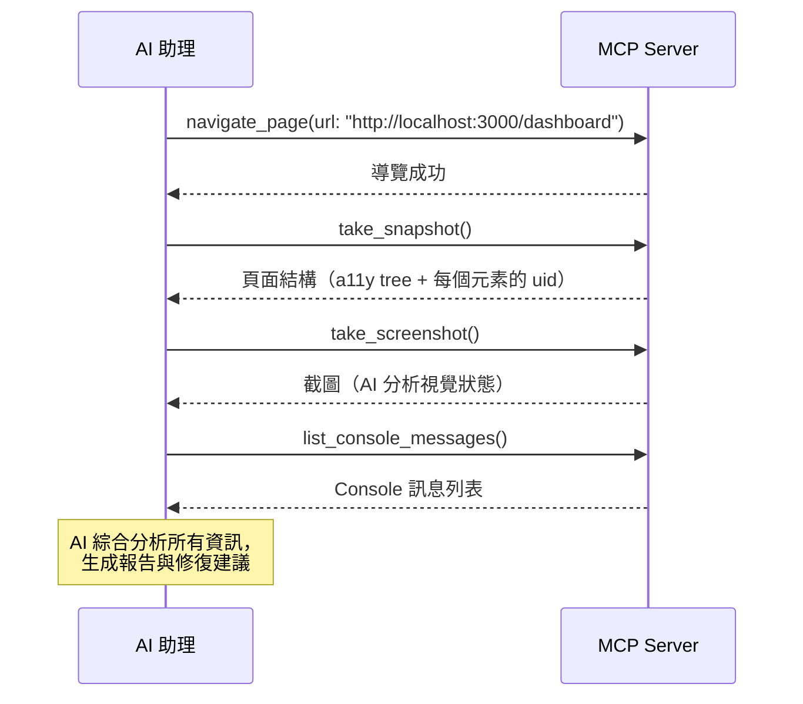
```mermaid
sequenceDiagram
    participant AI as AI 助理
    participant MCP as MCP Server

    AI->>MCP: navigate_page(url: "http://localhost:3000/dashboard")
    MCP-->>AI: 導覽成功

    AI->>MCP: take_snapshot()
    MCP-->>AI: 頁面結構（a11y tree + 每個元素的 uid）

    AI->>MCP: take_screenshot()
    MCP-->>AI: 截圖（AI 分析視覺狀態）

    AI->>MCP: list_console_messages()
    MCP-->>AI: Console 訊息列表

    Note over AI: AI 綜合分析所有資訊，<br/>生成報告與修復建議
```

#### 最佳實務建議

- **Prompt 要具體**：描述清楚要檢查什麼，而非模糊的「看看有什麼問題」
- **優先使用 snapshot**：`take_snapshot` 提供結構化資訊，比截圖更適合 AI 分析
- **分步驟操作**：複雜的偵錯流程，建議分步驟指引 AI
- **重複驗證**：修改程式碼後，再次要求 AI 用 MCP 驗證修復結果

---

### 6.2 自動分析 Network 請求

#### AI 指令範例

```text
請使用 Chrome DevTools MCP 分析 http://localhost:3000/products 頁面的 Network 請求：
1. 開啟頁面
2. 列出所有 Network 請求（list_network_requests）
3. 針對回應時間最慢的請求，取得詳細資訊（get_network_request）
4. 分析是否有可以優化的請求
5. 提供最佳化建議
```

#### MCP 執行流程

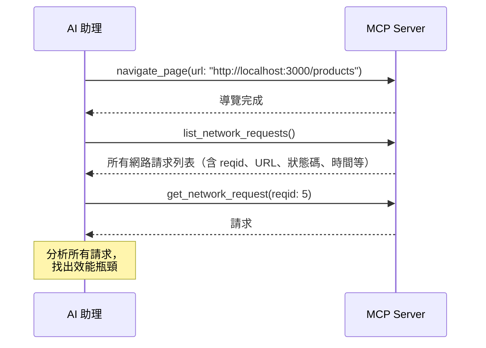
```mermaid
sequenceDiagram
    participant AI as AI 助理
    participant MCP as MCP Server

    AI->>MCP: navigate_page(url: "http://localhost:3000/products")
    MCP-->>AI: 導覽完成

    AI->>MCP: list_network_requests()
    MCP-->>AI: 所有網路請求列表（含 reqid、URL、狀態碼、時間等）

    AI->>MCP: get_network_request(reqid: 5)
    MCP-->>AI: 請求 #5 的詳細資訊（含 request/response body）

    Note over AI: 分析所有請求，<br/>找出效能瓶頸
```

#### 最佳實務建議

- **使用 `resourceTypes` 篩選**：可過濾只看 XHR、Fetch 等特定類型請求
- **保存回應內容**：使用 `responseFilePath` 參數將大型回應儲存為檔案
- **分頁查看**：請求數量多時，使用 `pageSize` 和 `pageIdx` 分頁瀏覽

---

### 6.3 效能瓶頸分析

#### AI 指令範例

```text
請使用 Chrome DevTools MCP 對 http://localhost:3000/data-table 進行效能分析：
1. 導覽到目標頁面
2. 開始效能追蹤（performance_start_trace，設定 autoStop 和 reload）
3. 分析 CWV 分數和效能洞察
4. 針對有問題的 Insight 取得詳細分析（performance_analyze_insight）
5. 提供優化建議
```

#### MCP 執行流程

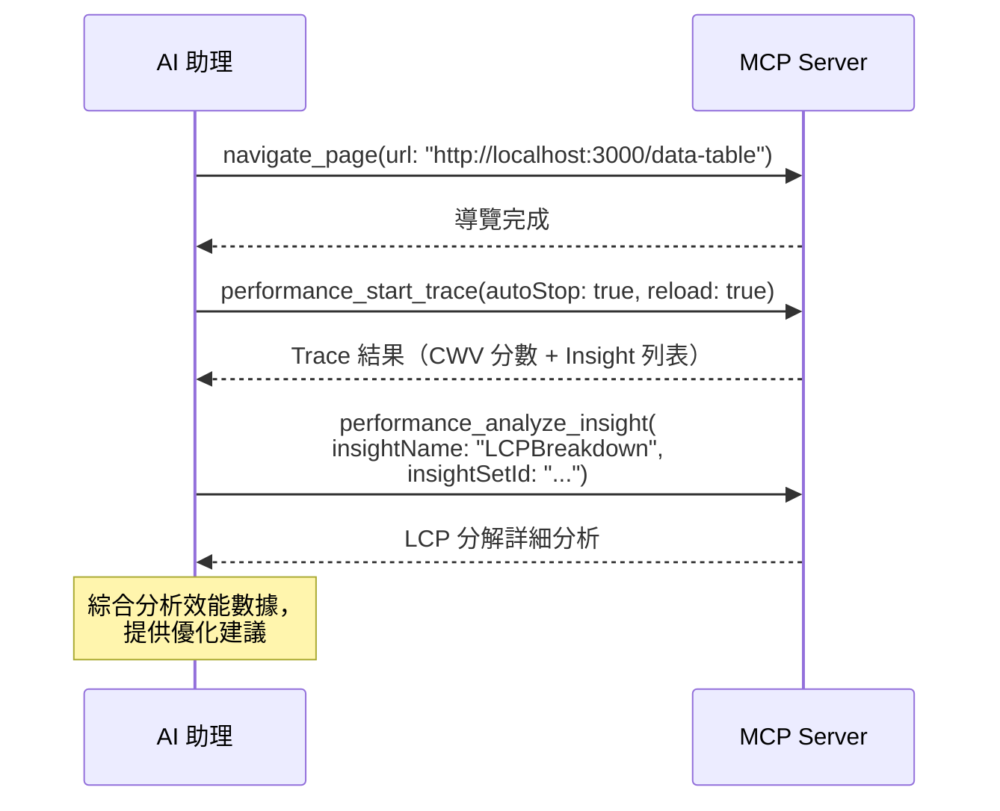
```mermaid
sequenceDiagram
    participant AI as AI 助理
    participant MCP as MCP Server

    AI->>MCP: navigate_page(url: "http://localhost:3000/data-table")
    MCP-->>AI: 導覽完成

    AI->>MCP: performance_start_trace(autoStop: true, reload: true)
    MCP-->>AI: Trace 結果（CWV 分數 + Insight 列表）

    AI->>MCP: performance_analyze_insight(<br/>  insightName: "LCPBreakdown",<br/>  insightSetId: "...")
    MCP-->>AI: LCP 分解詳細分析

    Note over AI: 綜合分析效能數據，<br/>提供優化建議
```

#### Performance 工具特色

- **CWV 分數**：自動產出 LCP、FID、CLS 等 Core Web Vitals 指標
- **CrUX API**：整合 Chrome User Experience Report，提供真實使用者效能數據
- **Trace 儲存**：支援 `trace.json.gz`（壓縮）或 `trace.json`（未壓縮）格式

---

### 6.4 頁面快照與 DOM 結構檢查

#### AI 指令範例

```text
請使用 Chrome DevTools MCP：
1. 開啟 http://localhost:3000/about
2. 取得完整頁面快照（take_snapshot，verbose: true）
3. 分析頁面結構
4. 檢查是否有 accessibility 問題
```

#### 關鍵概念：Snapshot vs Screenshot

| 比較 | `take_snapshot` | `take_screenshot` |
| ------ | :---------------: | :-----------------: |
| 回傳格式 | 結構化文字（a11y tree） | 圖片（Base64/檔案） |
| 包含 uid | ✅ | ❌ |
| AI 可直接解析 | ✅ | 需視覺理解 |
| 適合互動操作 | ✅ | ❌ |
| 視覺外觀 | ❌ | ✅ |
| **官方推薦** | ✅ 優先使用 | 補充使用 |

> **重要**：`take_snapshot` 的回傳結果中，元素會標註 `uid`，這個 uid 是後續 `click`、`fill`、`hover` 等操作的必要參數。

---

### 6.5 自動化 UI 測試

#### AI 指令範例

```text
請使用 Chrome DevTools MCP 執行以下 UI 測試：
1. 開啟 http://localhost:3000/login
2. 取得頁面快照找到登入表單
3. 使用 fill 在帳號欄位輸入 "test@company.com"
4. 使用 fill 在密碼欄位輸入 "TestPass123"
5. 使用 click 點擊「登入」按鈕
6. 使用 wait_for 等待 "Dashboard" 文字出現
7. 截圖確認結果
```

#### MCP 執行流程

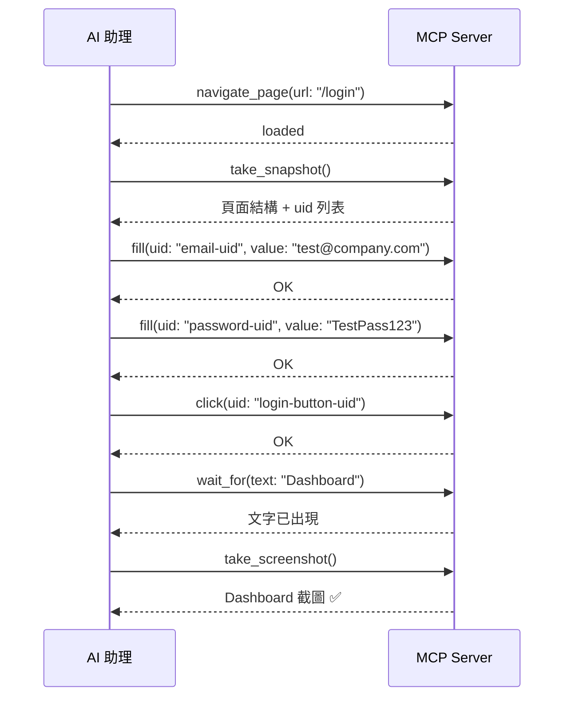
```mermaid
sequenceDiagram
    participant AI as AI 助理
    participant MCP as MCP Server

    AI->>MCP: navigate_page(url: "/login")
    MCP-->>AI: loaded

    AI->>MCP: take_snapshot()
    MCP-->>AI: 頁面結構 + uid 列表

    AI->>MCP: fill(uid: "email-uid", value: "test@company.com")
    MCP-->>AI: OK

    AI->>MCP: fill(uid: "password-uid", value: "TestPass123")
    MCP-->>AI: OK

    AI->>MCP: click(uid: "login-button-uid")
    MCP-->>AI: OK

    AI->>MCP: wait_for(text: "Dashboard")
    MCP-->>AI: 文字已出現

    AI->>MCP: take_screenshot()
    MCP-->>AI: Dashboard 截圖 ✅
```

#### 快速填寫表單：`fill_form`

對於多欄位表單，可使用 `fill_form` 一次填寫所有欄位：

```text
AI 指令：請使用 fill_form 批次填寫登入表單的帳號和密碼欄位
```

#### 最佳實務建議

- **使用測試專用帳號**：不要使用真實帳號進行自動化測試
- **使用 `wait_for`**：等待特定文字出現，比固定延遲更可靠
- **使用 `includeSnapshot`**：在 `click` 後設定 `includeSnapshot: true` 可以立即獲得操作後的頁面狀態

---

### 6.6 表單流程驗證

#### AI 指令範例

```text
請使用 Chrome DevTools MCP 驗證多步驟表單流程：
1. 開啟 http://localhost:3000/apply
2. 取得快照找到第一步的表單欄位
3. 使用 fill_form 批次填入姓名、Email、電話
4. 嘗試不填 Email 就按「下一步」，確認有驗證訊息
5. 填入正確 Email 後按「下一步」
6. 截圖每個步驟的畫面
7. 按「上一步」確認第一步資料是否保留
```

#### 最佳實務建議

- **邊界值測試**：測試最長 / 最短輸入、特殊字元
- **使用 `handle_dialog`**：處理可能出現的確認對話框
- **使用 `press_key`**：測試 Tab 鍵導航、Enter 提交等鍵盤操作
- **使用 `upload_file`**：測試檔案上傳欄位

---

### 6.7 裝置模擬與 RWD 測試

#### AI 指令範例

```text
請使用 Chrome DevTools MCP 測試 RWD：
1. 開啟 http://localhost:3000/about
2. 使用 emulate 模擬 iPhone 14 Pro（viewport、userAgent）
3. 截圖手機版畫面
4. 使用 resize_page 切換到 1024x768（iPad）
5. 截圖平板版畫面
6. 使用 emulate 模擬 Slow 3G 網路條件
7. 分析頁面在慢網路下的載入表現
```

#### MCP 執行流程

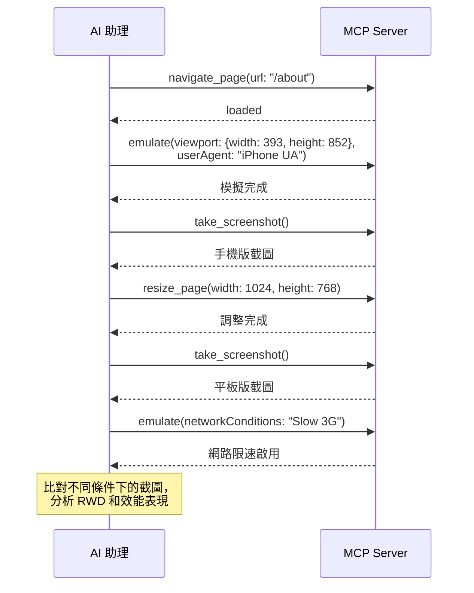
```mermaid
sequenceDiagram
    participant AI as AI 助理
    participant MCP as MCP Server

    AI->>MCP: navigate_page(url: "/about")
    MCP-->>AI: loaded

    AI->>MCP: emulate(viewport: {width: 393, height: 852},<br/>  userAgent: "iPhone UA")
    MCP-->>AI: 模擬完成

    AI->>MCP: take_screenshot()
    MCP-->>AI: 手機版截圖

    AI->>MCP: resize_page(width: 1024, height: 768)
    MCP-->>AI: 調整完成

    AI->>MCP: take_screenshot()
    MCP-->>AI: 平板版截圖

    AI->>MCP: emulate(networkConditions: "Slow 3G")
    MCP-->>AI: 網路限速啟用

    Note over AI: 比對不同條件下的截圖，<br/>分析 RWD 和效能表現
```

#### Emulate 工具支援的網路條件

| 條件 | 說明 |
| ------ | ------ |
| `"No emulation"` | 停用網路限速 |
| `"Offline"` | 離線模式 |
| `"Slow 3G"` | 慢速 3G |
| `"Fast 3G"` | 快速 3G |
| `"Slow 4G"` | 慢速 4G |
| `"Fast 4G"` | 快速 4G |

#### 最佳實務建議

- **多尺寸測試**：至少測試 320px、375px、768px、1024px、1440px
- **色彩模式**：使用 `emulate(colorScheme: "dark")` 測試深色模式
- **CPU 節流**：使用 `cpuThrottlingRate` 模擬低效能裝置
- **地理位置**：使用 `geolocation` 測試地區化功能

---

## 第七章：企業使用最佳實務

### 7.1 安全控管

#### 安全控管措施

| 控管項目 | 措施 | 實作方式 |
| ---------- | ------ | ---------- |
| **工具類別控制** | 停用不需要的工具類別 | `--no-category-network` 等參數 |
| **隔離執行** | 每次使用乾淨的 Chrome profile | `--isolated` 參數 |
| **日誌追蹤** | 記錄所有 MCP 操作 | `--log-file` 參數 |
| **域名限制** | 限制可存取的域名 | 在企業防火牆/Proxy 層設定 |
| **通訊加密** | 使用 TLS 加密連線 | 透過 VPN 或 SSH tunnel |
| **環境隔離** | MCP 只能在測試環境使用 | 網路分割 / 防火牆規則 |

#### 企業安全設定範例

```json
{
  "mcpServers": {
    "chrome-devtools": {
      "command": "npx",
      "args": [
        "-y",
        "chrome-devtools-mcp@0.17.0",
        "--headless",
        "--isolated",
        "--no-category-network",
        "--no-usage-statistics",
        "--no-performance-crux",
        "--log-file", "./logs/mcp-server.log",
        "--proxy-server", "http://proxy.company.com:8080"
      ]
    }
  }
}
```

> **實務建議**：
>
> - 指定精確版本號（如 `@0.17.0`）而非 `@latest`，確保團隊一致性
> - 使用 `--isolated` 避免 Chrome profile 殘留敏感資料
> - 使用 `--no-usage-statistics` 和 `--no-performance-crux` 防止資料外傳

---

### 7.2 資料隱私保護

#### 隱私保護策略

| 策略 | 實作方式 | 說明 |
| ------ | ---------- | ------ |
| **環境隔離** | 僅在測試環境使用 MCP | 不要在含有真實客戶資料的環境使用 |
| **使用模擬資料** | 測試帳號使用假資料 | 避免真實 PII 進入 AI |
| **隔離模式** | `--isolated` | 結束後自動清除 Chrome profile |
| **停用統計** | `--no-usage-statistics` | 防止使用資料回傳 Google |
| **停用 CrUX** | `--no-performance-crux` | 防止效能資料回傳 |
| **截圖管理** | 使用 `filePath` 存到受控位置 | 定期清除截圖檔案 |

#### 資料流向風險

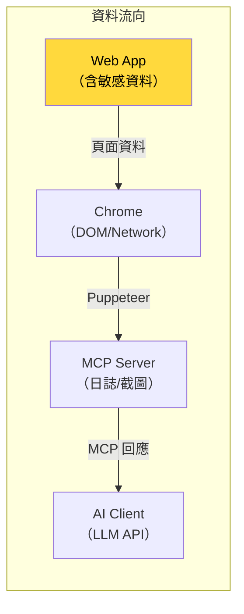
```mermaid
graph LR
    subgraph DataFlow["資料流向"]
        WebApp["Web App<br/>（含敏感資料）"]
        Chrome["Chrome<br/>（DOM/Network）"]
        MCP["MCP Server<br/>（日誌/截圖）"]
        AI["AI Client<br/>（LLM API）"]
    end

    WebApp -->|"頁面資料"| Chrome
    Chrome -->|"Puppeteer"| MCP
    MCP -->|"MCP 回應"| AI

    style WebApp fill:#ffd93d,color:#000
```

> **重要提醒**：Chrome DevTools MCP 官方README 明確指出：「**MCP Client 可存取你在 Chrome 中開啟的所有資料，可能包含敏感或個人資料。請確保你了解 MCP Client 如何處理此資料。**」

---

### 7.3 日誌記錄

#### 啟用日誌

```bash
# 啟用偵錯日誌
DEBUG=* npx chrome-devtools-mcp@latest --log-file ./logs/mcp-server.log
```

#### 在 MCP 設定中啟用日誌

```json
{
  "mcpServers": {
    "chrome-devtools": {
      "type": "stdio",
      "command": "npx",
      "args": [
        "chrome-devtools-mcp@latest",
        "--log-file", "./logs/mcp-debug.log"
      ],
      "env": {
        "DEBUG": "*"
      }
    }
  }
}
```

#### 日誌分級策略

| 環境 | 建議設定 | 保存期限 |
| ------ | ---------- | ---------- |
| **開發** | `DEBUG=*` + `--log-file` | 7 天 |
| **測試** | `--log-file` | 30 天 |
| **企業** | `--log-file` + 集中收集 | 90+ 天 |

---

### 7.4 使用統計與隱私

Chrome DevTools MCP 預設會收集**匿名使用統計**（由 Google 收集），用於改善工具品質。

#### 收集的資料

根據官方說明，使用統計可能包含工具使用頻率等匿名數據。不會收集頁面內容或個人資料。

#### 選擇退出

```bash
# 停用使用統計
npx chrome-devtools-mcp@latest --no-usage-statistics

# 停用 CrUX API（Chrome User Experience Report）
npx chrome-devtools-mcp@latest --no-performance-crux
```

#### 企業設定建議

在企業環境中，建議**同時停用兩者**：

```json
{
  "mcpServers": {
    "chrome-devtools": {
      "command": "npx",
      "args": [
        "-y",
        "chrome-devtools-mcp@latest",
        "--no-usage-statistics",
        "--no-performance-crux"
      ]
    }
  }
}
```

---

### 7.5 團隊共用規範

#### 團隊使用規範

1. **版本統一**
   - 團隊統一使用相同版本的 `chrome-devtools-mcp`
   - 使用精確版本號（如 `@0.17.0`）而非 `@latest`

2. **設定檔管理**
   - 專案層級設定檔加入版本控制（`.vscode/mcp.json` 或 `.cursor/mcp.json`）
   - 共用設定範本確保一致性

3. **資料處理**
   - 不得透過 MCP 存取含有真實客戶資料的環境
   - 所有測試使用模擬資料

4. **問題回報**
   - 遇到 MCP Server 異常，保存 `--log-file` 輸出
   - 記錄 Node.js 版本、Chrome 版本、作業系統

#### 團隊設定檔模板

```json
{
  "mcpServers": {
    "chrome-devtools": {
      "command": "npx",
      "args": [
        "-y",
        "chrome-devtools-mcp@0.17.0",
        "--isolated",
        "--viewport", "1920x1080",
        "--no-usage-statistics"
      ]
    }
  }
}
```

---

## 第八章：系統維護與監控

### 8.1 Log 管理

#### 日誌設定方式

使用 `--log-file` 參數指定日誌輸出位置：

```bash
npx chrome-devtools-mcp@latest --log-file ./logs/mcp-server.log
```

搭配 `DEBUG=*` 環境變數可取得更詳細的偵錯資訊。

#### 日誌輪換建議

由於 Chrome DevTools MCP 本身不提供日誌輪換功能，建議使用系統工具：

```bash
# Linux：使用 logrotate
# /etc/logrotate.d/chrome-devtools-mcp
/var/log/mcp-server.log {
    daily
    rotate 7
    compress
    missingok
    notifempty
}
```

---

### 8.2 異常處理

#### 異常分類與處理

| 異常類型 | 嚴重度 | 處理方式 |
| ---------- | -------- | ---------- |
| **Target closed** | 高 | Chrome 無法啟動，重啟 MCP Server |
| **ERR_MODULE_NOT_FOUND** | 高 | 清除 npm 快取，確認 Node.js 版本 |
| **Chrome 崩潰** | 高 | 使用 `--isolated` 避免 profile 衝突 |
| **連線逾時** | 中 | 增加 `timeout` 參數值 |
| **OS Sandbox 衝突** | 中 | 改用 `--browser-url` 連接外部 Chrome |

---

### 8.3 Chrome Crash 處理

#### Crash 處理流程

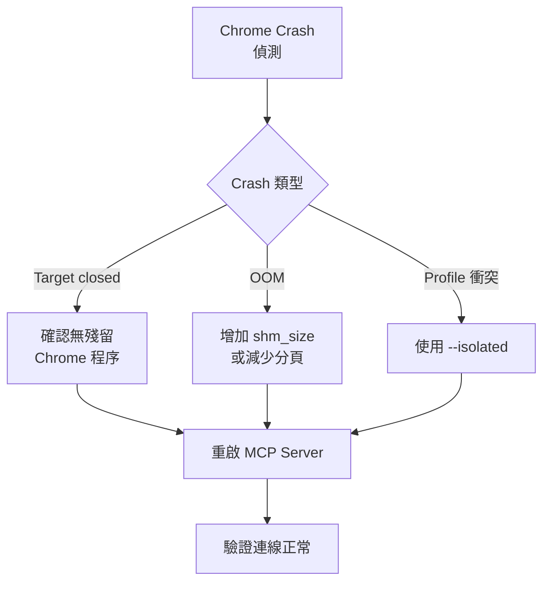
```mermaid
graph TD
    A["Chrome Crash<br/>偵測"] --> B{"Crash 類型"}
    B -->|"Target closed"| C["確認無殘留<br/>Chrome 程序"]
    B -->|"OOM"| D["增加 shm_size<br/>或減少分頁"]
    B -->|"Profile 衝突"| E["使用 --isolated"]
    
    C --> F["重啟 MCP Server"]
    D --> F
    E --> F
    F --> G["驗證連線正常"]
```

#### 常見 Crash 預防措施

```bash
# 1. 使用 --isolated 避免 profile 衝突
npx chrome-devtools-mcp@latest --isolated

# 2. Docker 環境增加共享記憶體
docker run --shm-size=2g ...

# 3. 關閉殘留 Chrome 程序後重試
pkill -f chrome
npx chrome-devtools-mcp@latest
```

---

### 8.4 MCP Server 健康檢查

#### 快速健康檢查

```bash
# 測試 MCP Server 是否能正常啟動
npx chrome-devtools-mcp@latest --help
```

#### 完整功能驗證

在 AI Client 中執行以下步驟驗證 MCP 正常運作：

```text
1. navigate_page 到 https://example.com
2. take_snapshot 取得頁面快照
3. take_screenshot 截取頁面截圖
4. list_console_messages 列出 Console 訊息
```

如果以上四個步驟都正常，表示 MCP Server 運作正常。

---

## 第九章：升級與版本管理

### 9.1 升級策略

#### 升級流程概覽

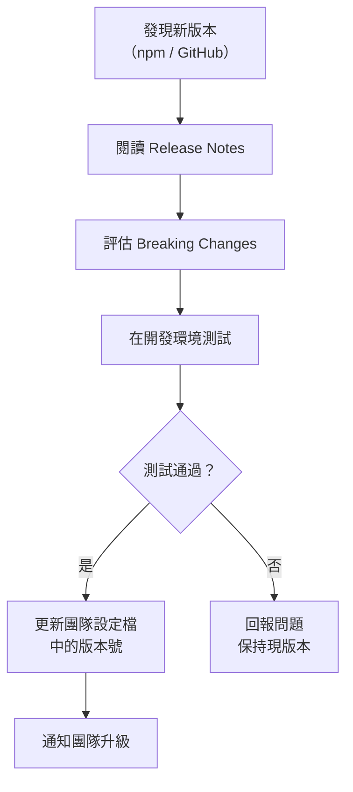
```mermaid
graph TD
    A["發現新版本<br/>（npm / GitHub）"] --> B["閱讀 Release Notes"]
    B --> C["評估 Breaking Changes"]
    C --> D["在開發環境測試"]
    D --> E{"測試通過？"}
    E -->|"是"| F["更新團隊設定檔<br/>中的版本號"]
    E -->|"否"| G["回報問題<br/>保持現版本"]
    F --> H["通知團隊升級"]
```

#### 版本檢查

```bash
# 查看目前安裝的版本
npx chrome-devtools-mcp@latest --help | head -5

# 查看所有可用版本
npm view chrome-devtools-mcp versions --json

# 查看最新版本
npm view chrome-devtools-mcp version
```

---

### 9.2 版本相容性檢查

#### 相容性需求

| chrome-devtools-mcp | Node.js | Chrome |
| --------------------- | --------- | -------- |
| v0.17.0+ | v20.19+ | 目前穩定版 |
| autoConnect 功能 | v20.19+ | **Chrome 144+** |

#### 檢查腳本

```bash
#!/bin/bash
echo "=== 版本相容性檢查 ==="

# Node.js 版本
NODE_VERSION=$(node --version | sed 's/v//')
echo "Node.js: ${NODE_VERSION}"
NODE_MAJOR=$(echo "${NODE_VERSION}" | cut -d. -f1)
NODE_MINOR=$(echo "${NODE_VERSION}" | cut -d. -f2)
if [[ ${NODE_MAJOR} -lt 20 ]] || [[ ${NODE_MAJOR} -eq 20 && ${NODE_MINOR} -lt 19 ]]; then
    echo "  ⚠️ 需要升級到 Node.js v20.19+"
fi

# Chrome 版本
CHROME_VERSION=$(google-chrome --version 2>/dev/null | grep -oP '\d+' | head -1)
echo "Chrome: ${CHROME_VERSION:-未偵測到}"

# MCP Server
echo "MCP Server: $(npm view chrome-devtools-mcp version 2>/dev/null || echo '未安裝')"

echo "=== 檢查完成 ==="
```

---

### 9.3 回滾機制

如果新版本出現問題，可在設定檔中指定舊版本：

```json
{
  "mcpServers": {
    "chrome-devtools": {
      "command": "npx",
      "args": [
        "-y",
        "chrome-devtools-mcp@0.16.0"
      ]
    }
  }
}
```

```bash
# 清除 npx 快取後使用指定版本
rm -rf ~/.npm/_npx
npx -y chrome-devtools-mcp@0.16.0
```

---

### 9.4 企業環境升級 SOP

```markdown
## MCP Server 企業升級標準作業程序

### 前置作業（升級前 1 週）
1. [ ] 確認目標版本號和 Release Notes
2. [ ] 評估 Breaking Changes
3. [ ] 在開發環境安裝新版本測試

### 測試階段（升級前 3 天）
4. [ ] 執行基本功能測試（navigate、snapshot、screenshot、console）
5. [ ] 確認各 AI Client 整合正常
6. [ ] 確認 Node.js 版本相容

### 升級執行
7. [ ] 更新團隊設定檔中的版本號
8. [ ] 通知團隊升級
9. [ ] 先讓 1-2 名 Pilot 使用者升級
10. [ ] 觀察 1-2 天後全體更新

### 升級後驗證
11. [ ] 確認所有使用者升級完成
12. [ ] 監控是否有異常
13. [ ] 更新內部文件
```

---

## 第十章：風險與限制

### 10.1 安全風險

#### 風險評估矩陣

| 風險項目 | 可能性 | 影響度 | 風險等級 | 緩解措施 |
| ---------- | :------: | :------: | :--------: | ---------- |
| AI 存取含敏感資料的頁面 | 中 | 高 | 🔴 高 | 僅在測試環境使用 |
| 頁面資料送往 LLM API | 高 | 高 | 🔴 高 | 使用企業版 AI + 模擬資料 |
| Chrome profile 殘留資料 | 中 | 中 | 🟡 中 | 使用 `--isolated` |
| 使用統計外傳 | 低 | 低 | 🟢 低 | `--no-usage-statistics` |

> **重要提醒**：Chrome DevTools MCP 官方 README 明確聲明：「MCP Client 可以讀取你在 Chrome 中看到的一切」。務必注意資料安全。

---

### 10.2 AI 操作風險

| 風險 | 說明 | 緩解措施 |
| ------ | ------ | ---------- |
| **AI 誤操作** | AI 可能點擊錯誤按鈕 | 在測試環境操作、人工確認重要操作 |
| **AI 幻覺** | AI 可能錯誤解讀 snapshot 內容 | 人工驗證 AI 的分析結果 |
| **無限迴圈** | AI 可能陷入重複操作 | MCP Client 通常有操作次數限制 |
| **資源耗盡** | AI 開啟過多分頁 | 使用 `close_page` 清理、使用 `--isolated` |

---

### 10.3 資料洩漏風險

#### 防護措施

| 資料流段 | 風險 | 防護 |
| ---------- | ------ | ------ |
| WebApp → Chrome | 敏感資料在頁面中 | 使用測試環境和模擬資料 |
| Chrome → MCP | 截圖/snapshot 含敏感資訊 | 使用 `--isolated`、定期清除截圖 |
| MCP → AI Client | 資料送往 LLM API | 使用企業版 AI（資料不用於訓練） |
| 統計資料 → Google | 匿名使用統計 | `--no-usage-statistics` |

> **實務建議**：使用 Claude Enterprise、GitHub Copilot Enterprise 等企業版 AI 服務，確保資料不會被用於模型訓練。

---

### 10.4 Browser Sandbox 限制

| 限制項目 | 說明 |
| ---------- | ------ |
| **OS Sandbox 衝突** | 部分 MCP Client 的 sandbox 會阻止 Chrome 啟動 |
| **跨域存取** | 受 CORS 和 SOP 限制 |
| **檔案系統** | Chrome sandbox 限制存取本地檔案系統 |
| **GPU 加速** | Docker / Headless 環境通常無 GPU |
| **音訊/視訊** | Headless 模式下限制較多 |
| **僅 Chromium** | 僅支援 Chromium 核心瀏覽器 |

---

### 10.5 無法取代人工的部分

| 項目 | 原因 |
| ------ | ------ |
| **視覺美感判斷** | AI 無法完全評估 UI 的美感和品牌一致性 |
| **使用者體驗評估** | 真實的 UX 需要實際使用者回饋 |
| **商業邏輯驗證** | AI 不了解業務規則的完整上下文 |
| **無障礙體驗** | Snapshot 提供 a11y tree 但無法取代真實輔助技術測試 |
| **跨瀏覽器測試** | 僅限 Chromium 核心瀏覽器 |
| **安全審查** | AI 可以輔助，但不能取代專業的安全審查 |

> **設計建議**：Chrome DevTools MCP 應被視為「開發者的助手」而非「開發者的替代品」。AI 擅長自動化重複性工作，但判斷和決策仍需人工。

---

## 第十一章：未來發展與延伸整合

### 11.1 與 CI/CD 整合

#### GitHub Actions 完整範例

```yaml
name: MCP Frontend Validation
on:
  pull_request:
    paths:
      - 'src/**'
      - 'public/**'
      - '*.html'
      - '*.css'

jobs:
  mcp-validation:
    runs-on: ubuntu-latest
    steps:
      - uses: actions/checkout@v4
      
      - name: Setup Node.js
        uses: actions/setup-node@v4
        with:
          node-version: '22'
      
      - name: Install and Build
        run: |
          npm ci
          npm run build
      
      - name: Start Preview Server
        run: |
          npm run preview &
          npx wait-on http://localhost:4173
      
      - name: Verify MCP Server
        run: |
          npx chrome-devtools-mcp@latest --help
```

> **實務建議**：在 CI 中使用 `--headless --isolated` 確保乾淨執行環境。

---

### 11.2 與 Playwright / Puppeteer 的關係

Chrome DevTools MCP **底層已使用 Puppeteer**，因此不需要額外整合 Puppeteer。

#### 定位比較

| 特性 | Chrome DevTools MCP | Playwright | Puppeteer |
| ------ | :-------------------: | :----------: | :---------: |
| AI 驅動（自然語言） | ✅ | ❌ | ❌ |
| MCP 協定支援 | ✅ | ❌ | ❌ |
| 程式化 API | ❌（透過 MCP 工具） | ✅ | ✅ |
| 跨瀏覽器 | ❌ | ✅ | ❌（Chromium） |
| 確定性測試 | ⚠️（依 AI 判斷） | ✅ | ✅ |
| 視覺回歸 | 截圖比對（AI 判斷） | ✅（Pixel diff） | 需額外工具 |
| 學習門檻 | 低（自然語言） | 中 | 中 |

#### 建議的混合策略

```text
日常開發：
  使用 Chrome DevTools MCP 進行 AI 輔助偵錯、快速驗證

PR 驗證：
  MCP 冒煙測試 → Playwright E2E 測試

發佈前：
  完整 Playwright 測試套件 + 手動驗收
```

> **設計建議**：MCP 適合 AI 驅動的探索性測試和即時偵錯，Playwright/Cypress 適合程式化的確定性測試。兩者互補使用效果最佳。

---

### 11.3 與可觀測性系統整合

#### 整合架構

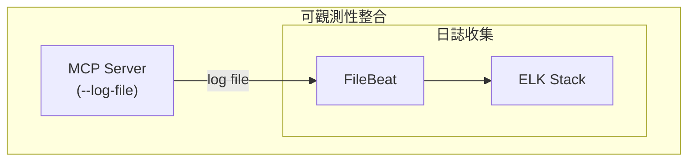
```mermaid
graph TB
    subgraph Observability["可觀測性整合"]
        MCP["MCP Server<br/>(--log-file)"]
        
        subgraph Logs["日誌收集"]
            FileBeat["FileBeat"]
            ELK["ELK Stack"]
        end
    end

    MCP -->|"log file"| FileBeat
    FileBeat --> ELK
```

由於 Chrome DevTools MCP 目前不提供 Prometheus metrics 端點，可透過日誌解析來建立監控指標。

---

### 11.4 未來 AI Agent 發展方向

#### 短期發展（6-12 個月）

| 方向 | 說明 |
| ------ | ------ |
| **更多瀏覽器支援** | 可能擴展到其他 Chromium-based 瀏覽器 |
| **更豐富的工具** | 更多 DevTools 功能的 MCP 工具化 |
| **更多 MCP Client** | 支援更多 AI 開發工具 |
| **AI 自主偵錯** | AI 自動偵測、定位、修復簡單的前端 Bug |

#### 中長期發展（1-3 年）

| 方向 | 說明 |
| ------ | ------ |
| **AI QA Agent** | 全自動的 QA 助理，自動探索和測試 Web Application |
| **視覺設計助理** | 基於截圖和 snapshot 自動產生 CSS 修復建議 |
| **效能優化 Agent** | 自動分析 Performance trace 並執行優化 |
| **持續監控 Agent** | 定期掃描網站，自動回報異常 |

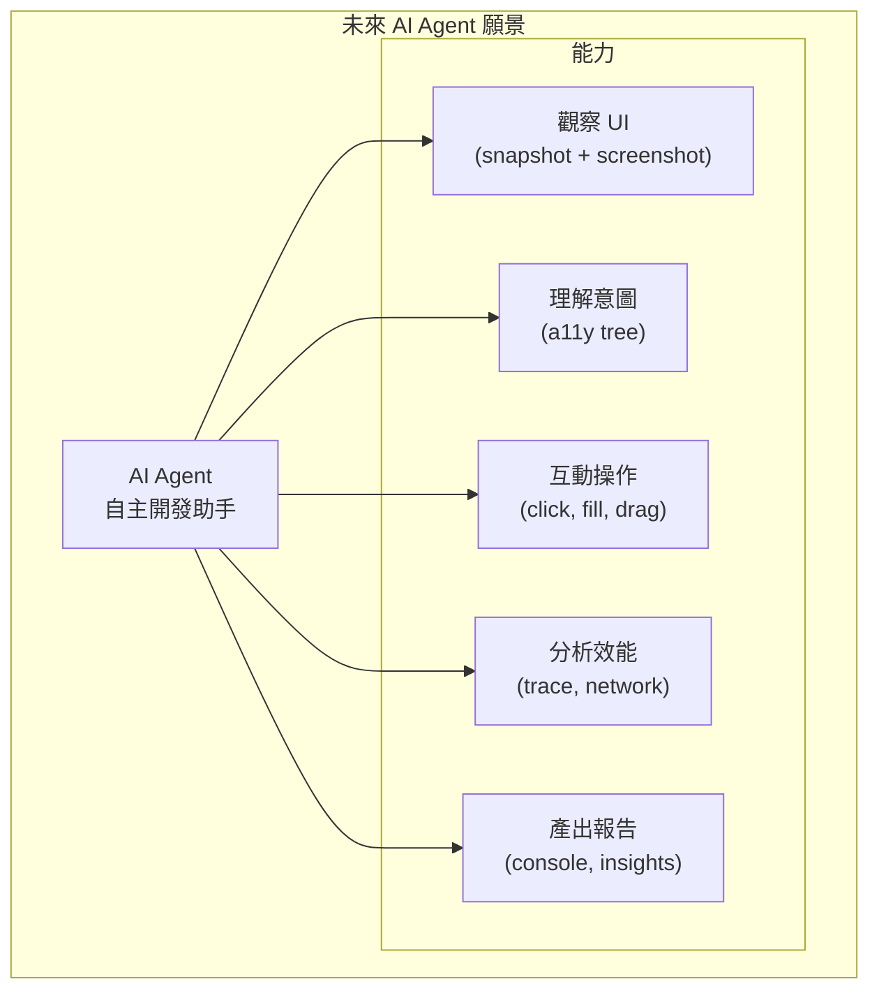
```mermaid
graph TB
    subgraph Future["未來 AI Agent 願景"]
        Agent["AI Agent<br/>自主開發助手"]
        
        subgraph Capabilities["能力"]
            See["觀察 UI<br/>(snapshot + screenshot)"]
            Understand["理解意圖<br/>(a11y tree)"]
            Interact["互動操作<br/>(click, fill, drag)"]
            Analyze["分析效能<br/>(trace, network)"]
            Report["產出報告<br/>(console, insights)"]
        end
    end

    Agent --> See
    Agent --> Understand
    Agent --> Interact
    Agent --> Analyze
    Agent --> Report
```

> **設計建議**：持續關注 MCP 標準的演進和 Chrome DevTools MCP 的版本更新。建議團隊每月檢視是否有新版本和新功能。

---

## 附錄 A：檢查清單（Checklist）

### 環境建置檢查清單

- [ ] Node.js v20.19+ 已安裝（`node --version`）
- [ ] Chrome 最新穩定版已安裝（`google-chrome --version`）
- [ ] MCP Server 可正常啟動（`npx chrome-devtools-mcp@latest --help`）
- [ ] AI Client（Claude Desktop / VS Code / Cursor / 其他）已安裝
- [ ] MCP 設定檔已正確配置（`.vscode/mcp.json` 或對應設定檔）
- [ ] 基本功能測試通過（`navigate_page`、`take_snapshot`、`take_screenshot`）

### 安全設定檢查清單

- [ ] 僅在測試環境使用 MCP
- [ ] 使用 `--isolated` 執行模式
- [ ] 使用 `--no-usage-statistics` 停用統計
- [ ] 使用 `--no-performance-crux` 停用 CrUX API
- [ ] 日誌記錄已啟用（`--log-file`）
- [ ] 不需要的工具類別已停用（`--no-category-*`）
- [ ] 使用企業版 AI Service（確保資料不被用於訓練）

### 團隊導入檢查清單

- [ ] 團隊統一 `chrome-devtools-mcp` 版本
- [ ] 共用設定檔已建立並加入版本控制
- [ ] 使用規範文件已撰寫並公告
- [ ] 問題回報流程已建立（保存 log file）
- [ ] 升級策略已制定

---

## 附錄 B：常見問題 FAQ

### Q1：Chrome DevTools MCP 需要付費嗎？

**A**：Chrome DevTools MCP Server 是**開源免費**的（Apache-2.0 授權）。但使用的 AI Client（如 Claude Pro、GitHub Copilot）可能需要付費訂閱。

### Q2：誰開發了 Chrome DevTools MCP？

**A**：由 **ChromeDevTools 團隊（Google）** 開發和維護。GitHub 倉庫位於 `ChromeDevTools/chrome-devtools-mcp`。

### Q3：底層技術是什麼？

**A**：Chrome DevTools MCP 使用 **TypeScript** 開發，底層使用 **Puppeteer** 來控制 Chrome 瀏覽器。Puppeteer 再透過 **Chrome DevTools Protocol（CDP）** 與 Chrome 通訊。

### Q4：支援哪些作業系統？

**A**：支援 Windows 10+、macOS 12+、Linux（需 Chrome 可執行的發行版）。推薦使用最新的 LTS 版本。

### Q5：Node.js 最低版本需求？

**A**：**Node.js v20.19**（最新 maintenance LTS）或更新版本。

### Q6：支援哪些 AI Client？

**A**：目前支援 **20+ 個** MCP Client，包含：Claude Desktop、Claude Code、VS Code Copilot、Cursor、Gemini CLI、JetBrains AI、Windsurf、Kiro、Cline、Amp 等。完整清單見[第四章](#46-其他-mcp-client-整合)。

### Q7：Chrome DevTools MCP 提供多少工具？

**A**：提供 **26 個工具**，分為 6 大類別：Input Automation（8）、Navigation Automation（6）、Emulation（2）、Performance（3）、Network（2）、Debugging（5）。

### Q8：什麼是 `take_snapshot`？和截圖有什麼不同？

**A**：`take_snapshot` 回傳基於 **a11y tree** 的結構化文字快照，包含每個元素的唯一 `uid`。`take_screenshot` 回傳圖片。官方建議**優先使用 snapshot**，因為它提供機器可讀的結構化資訊。

### Q9：什麼是 autoConnect？

**A**：`--auto-connect` 參數可讓 MCP Server 自動連接**正在執行的 Chrome**，無需預先設定 remote debugging port。此功能需要 **Chrome 144+**。

### Q10：可以在 Docker 中使用嗎？

**A**：可以。注意事項：

- 設定 `--shm-size=2g`（Chrome 需要大量共享記憶體）
- 使用 `--headless` 模式
- 使用 `--isolated` 確保乾淨環境
- 需安裝 Chrome 和必要的系統字型

### Q11：使用統計會收集什麼資料？

**A**：Chrome DevTools MCP 預設收集匿名使用統計（由 Google 收集）。可透過 `--no-usage-statistics` 和 `--no-performance-crux` 選擇退出。

### Q12：可以用來偵錯 Android 上的 Chrome 嗎？

**A**：可以。透過 ADB port forwarding 連接 Android Chrome，然後使用 `--browser-url` 參數連接。

### Q13：效能開銷大嗎？

**A**：Chrome 實例約佔 500MB-2GB 記憶體，MCP Server 約佔 100-200MB。CPU 使用量取決於操作頻率。建議開發機至少 8GB RAM。

### Q14：可以與 Firefox / Safari 搭配使用嗎？

**A**：目前只支援 **Chromium 核心瀏覽器**（Chrome、Edge、Brave 等）。Firefox 和 Safari 不支援。

---

## 附錄 C：延伸學習資源

### 官方資源

| 資源 | 連結 |
| ------ | ------ |
| **Chrome DevTools MCP GitHub** | <https://github.com/ChromeDevTools/chrome-devtools-mcp> |
| **Chrome DevTools MCP npm** | <https://www.npmjs.com/package/chrome-devtools-mcp> |
| **Tool Reference** | <https://github.com/ChromeDevTools/chrome-devtools-mcp/blob/main/docs/tool-reference.md> |
| **Troubleshooting** | <https://github.com/ChromeDevTools/chrome-devtools-mcp/blob/main/docs/troubleshooting.md> |
| MCP 協定規格 | <https://modelcontextprotocol.io/> |
| Chrome DevTools Protocol | <https://chromedevtools.github.io/devtools-protocol/> |
| Chrome DevTools 文件 | <https://developer.chrome.com/docs/devtools/> |
| Puppeteer 文件 | <https://pptr.dev/> |

### 相關工具

| 工具 | 說明 |
| ------ | ------ |
| **Puppeteer** | Google 的 Chrome 自動化工具（Chrome DevTools MCP 底層使用） |
| **Playwright** | Microsoft 的跨瀏覽器自動化測試框架 |
| **Lighthouse** | Chrome 的網頁品質分析工具 |
| **Selenium** | 傳統的瀏覽器自動化框架 |

### 學習建議

1. **入門**：先在本地環境設定 AI Client + Chrome DevTools MCP（使用預設設定即可）
2. **進階**：嘗試所有 26 個工具，熟悉 snapshot → uid → 操作的流程
3. **企業級**：建立團隊共用設定、安全策略、版本管理
4. **專家級**：整合 CI/CD、Performance trace 分析、Android 遠端偵錯

---

> **文件維護說明**：  
> 本手冊基於 Chrome DevTools MCP **v0.17.0** 撰寫，內容來源為[官方 GitHub 倉庫](https://github.com/ChromeDevTools/chrome-devtools-mcp)。  
> 建議每月檢視是否有新版本發佈，並更新相關內容。  
> 如有任何問題或建議，請透過團隊 Slack Channel 或 GitHub Issue 回報。

