+++
date = '2026-02-14T23:48:13+08:00'
draft = false
title = 'Chrome DevTools 教學手冊'
tags = ['教學', '工具','DevTools']
categories = ['教學']
+++

# Chrome DevTools 教學手冊

> **版本**：Chrome 131+（2026 年最新版）  
> **適用對象**：前端工程師、後端工程師、架構師、DevOps 工程師  
> **定位**：企業級實戰與維運教學手冊  
> **最後更新**：2026-02-14

---

## 目錄

- [第一章：Chrome DevTools 架構與核心原理](#第一章chrome-devtools-架構與核心原理)
- [第二章：安裝與環境設定](#第二章安裝與環境設定)
  - [2.8 Device Mode（裝置模擬模式）](#28-device-mode裝置模擬模式)
  - [2.9 Command Menu（命令選單）](#29-command-menu命令選單)
- [第三章：Elements 面板完整教學](#第三章elements-面板完整教學)
- [第四章：Console 深入教學](#第四章console-深入教學)
- [第五章：Sources 面板（JS 除錯核心）](#第五章sources-面板js-除錯核心)
- [第六章：Network 面板（API 與效能分析）](#第六章network-面板api-與效能分析)
- [第七章：Performance 面板（效能優化核心）](#第七章performance-面板效能優化核心)
  - [7.8 Rendering 面板](#78-rendering-面板)
  - [7.9 Performance 進階功能](#79-performance-進階功能)
- [第八章：Memory 面板](#第八章memory-面板)
- [第九章：Application 面板](#第九章application-面板)
- [第十章：Security 面板](#第十章security-面板)
- [第十一章：Recorder 面板、AI 輔助與其他進階功能](#第十一章recorder-面板ai-輔助與其他進階功能)
  - [11.1 Recorder 面板（使用者流程錄製）](#111-recorder-面板使用者流程錄製)
  - [11.2 AI 輔助功能（Gemini 整合）](#112-ai-輔助功能gemini-整合)
  - [11.3 其他實用面板](#113-其他實用面板)
  - [11.4 遠端除錯](#114-遠端除錯)
- [第十二章：企業級 Web Application Debug 標準流程](#第十二章企業級-web-application-debug-標準流程)
- [第十三章：最佳實踐與團隊規範](#第十三章最佳實踐與團隊規範)
- [附錄 A：常見問題 FAQ](#附錄-a常見問題-faq)
- [附錄 B：面試常考 DevTools 問題](#附錄-b面試常考-devtools-問題)
- [附錄 C：團隊培訓建議](#附錄-c團隊培訓建議)
- [附錄 D：延伸學習資源](#附錄-d延伸學習資源)
- [附錄 E：檢查清單（Checklist）](#附錄-e檢查清單checklist)

---

## 第一章：Chrome DevTools 架構與核心原理

### 1.1 DevTools 整體架構說明

Chrome DevTools 是內建於 Chromium 核心的開發者除錯工具組，透過 **Chrome DevTools Protocol（CDP）** 與瀏覽器核心通訊。

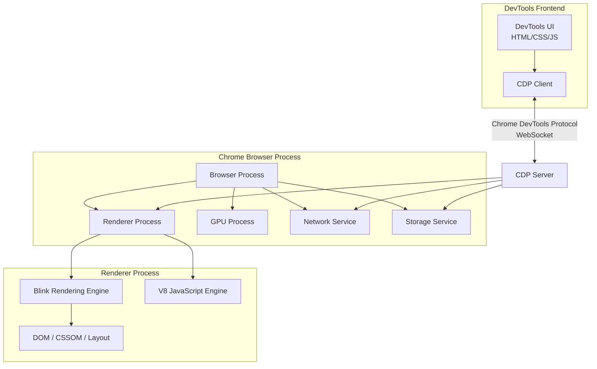

#### 核心元件

| 元件 | 說明 | 對應面板 |
|------|------|----------|
| **Blink** | 渲染引擎，處理 HTML/CSS 解析與排版 | Elements, Performance |
| **V8** | JavaScript 引擎，執行 JS 程式碼 | Sources, Console, Memory |
| **Network Service** | 處理所有網路請求 | Network |
| **Compositor** | 合成圖層，管理 GPU 繪製 | Layers, Performance |
| **CDP** | DevTools 與瀏覽器的通訊協定 | 所有面板 |

### 1.2 Browser 與 Rendering Pipeline

瀏覽器的渲染管線（Rendering Pipeline）是理解效能優化的核心知識。

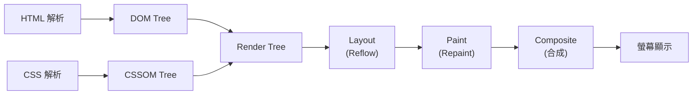

#### 關鍵渲染路徑（Critical Rendering Path）

| 階段 | 說明 | 效能影響 |
|------|------|----------|
| **Parse HTML** | 解析 HTML 建構 DOM Tree | 阻塞渲染 |
| **Parse CSS** | 解析 CSS 建構 CSSOM Tree | 阻塞渲染 |
| **JavaScript** | 執行 JS，可能修改 DOM/CSSOM | 阻塞解析 |
| **Render Tree** | 合併 DOM + CSSOM，排除不可見元素 | - |
| **Layout** | 計算元素幾何位置與尺寸 | 觸發 Reflow |
| **Paint** | 繪製像素到圖層 | 觸發 Repaint |
| **Composite** | GPU 合成圖層並顯示 | 最高效 |

### 1.3 DOM / CSSOM / Render Tree

#### DOM（Document Object Model）

```javascript
// DOM 是 HTML 的程式化表示
// 開發者可以透過 JavaScript 操作 DOM
document.querySelector('.container').classList.add('active');

// DOM 變更會觸發渲染管線
// 批次操作 DOM 可減少 Reflow 次數
const fragment = document.createDocumentFragment();
for (let i = 0; i < 100; i++) {
    const li = document.createElement('li');
    li.textContent = `Item ${i}`;
    fragment.appendChild(li);
}
document.querySelector('ul').appendChild(fragment); // 只觸發一次 Reflow
```

#### CSSOM（CSS Object Model）

```javascript
// 透過 CSSOM API 操作樣式
const sheet = document.styleSheets[0];
const rules = sheet.cssRules;

// 讀取 computed style
const style = getComputedStyle(document.querySelector('.box'));
console.log(style.width, style.height);
```

#### Render Tree 建構

- Render Tree 只包含可見元素
- `display: none` 的元素不會出現在 Render Tree（不佔空間）
- `visibility: hidden` 的元素會出現在 Render Tree（佔空間）
- `opacity: 0` 的元素會出現在 Render Tree（佔空間，可動畫優化）

### 1.4 JavaScript Engine（V8）運作原理

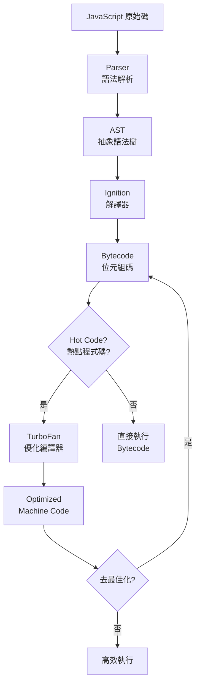

#### V8 記憶體管理

| 區域 | 說明 | 大小限制 |
|------|------|----------|
| **New Space** | 新生代，存放短期物件 | 1-8 MB |
| **Old Space** | 老生代，存放長期物件 | 系統記憶體限制 |
| **Code Space** | 存放 JIT 編譯的機器碼 | 動態 |
| **Large Object Space** | 超大物件專用 | 動態 |
| **Map Space** | 存放 Hidden Class | 動態 |

### 1.5 Network Request Lifecycle

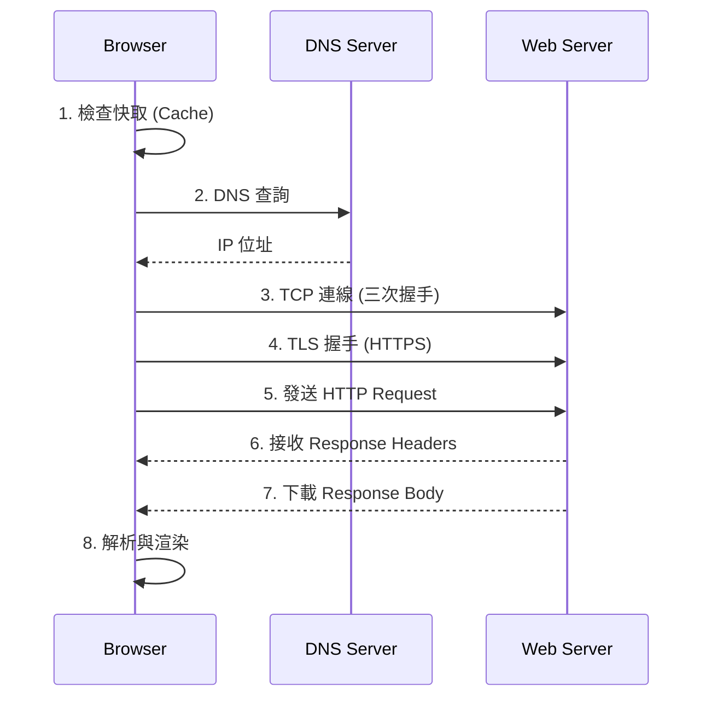

#### Network Timing 指標

| 指標 | 說明 | 優化方向 |
|------|------|----------|
| **Queueing** | 請求排隊等待 | 減少請求數、HTTP/2 多工 |
| **Stalled** | 請求被阻塞 | 檢查連線限制 |
| **DNS Lookup** | DNS 解析時間 | DNS 預取、CDN |
| **Initial Connection** | TCP 建立連線 | Keep-Alive、HTTP/2 |
| **SSL** | TLS 握手時間 | TLS 1.3、Session Resumption |
| **TTFB** | 首位元組時間 | 伺服器端優化 |
| **Content Download** | 內容下載 | 壓縮、CDN |

### 1.6 DevTools 與 Chromium 架構關係

Chrome 採用多程序架構，DevTools 透過 CDP 可以檢查各個程序的狀態：

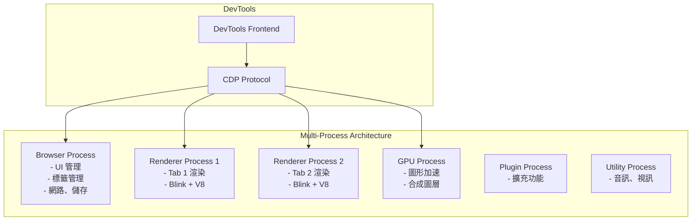

> **實務案例**：在企業級 SPA 應用中，若發現頁面卡頓，可透過 DevTools 的 Performance 面板確認問題是在 Renderer Process（前端渲染）還是 Network Service（API 延遲）。多程序架構確保單一頁面崩潰不會影響其他頁面。

---

## 第二章：安裝與環境設定

### 2.1 Chrome 最新版安裝

#### 安裝方式

| 平台 | 安裝方式 |
|------|----------|
| **Windows** | 至 [chrome.google.com](https://www.google.com/chrome/) 下載安裝檔 |
| **macOS** | 下載 .dmg 或透過 `brew install --cask google-chrome` |
| **Linux** | `sudo apt install google-chrome-stable`（Debian/Ubuntu） |

#### 版本確認

```text
chrome://version/
chrome://settings/help
```

#### 建議使用版本

- **穩定版（Stable）**：日常開發
- **Beta 版**：測試新功能
- **Canary 版**：體驗最新 DevTools 功能（不建議用於生產環境除錯）

### 2.2 開啟 DevTools 的方式

| 方式 | Windows / Linux | macOS |
|------|----------------|-------|
| **快捷鍵** | `F12` 或 `Ctrl+Shift+I` | `Cmd+Option+I` |
| **右鍵選單** | 右鍵 → 檢查 | 右鍵 → 檢查 |
| **選單** | ⋮ → 更多工具 → 開發人員工具 | Chrome → 更多工具 → 開發人員工具 |
| **直接檢查元素** | `Ctrl+Shift+C` | `Cmd+Option+C` |
| **開啟 Console** | `Ctrl+Shift+J` | `Cmd+Option+J` |
| **命令列啟動** | `chrome --auto-open-devtools-for-tabs` | 同左 |

### 2.3 常用快捷鍵整理

#### 通用快捷鍵

| 功能 | Windows / Linux | macOS |
|------|----------------|-------|
| 開啟 DevTools | `F12` / `Ctrl+Shift+I` | `Cmd+Opt+I` |
| 開啟 Command Menu | `Ctrl+Shift+P` | `Cmd+Shift+P` |
| 開啟檔案 | `Ctrl+P` | `Cmd+P` |
| 搜尋所有面板 | `Ctrl+Shift+F` | `Cmd+Opt+F` |
| 切換面板 | `Ctrl+[` / `Ctrl+]` | `Cmd+[` / `Cmd+]` |
| 切換 Device Mode | `Ctrl+Shift+M` | `Cmd+Shift+M` |
| 切換 Dock 位置 | `Ctrl+Shift+D` | `Cmd+Shift+D` |

#### Elements 面板快捷鍵

| 功能 | Windows / Linux | macOS |
|------|----------------|-------|
| 選取元素 | `Ctrl+Shift+C` | `Cmd+Shift+C` |
| 編輯屬性 | `Enter` | `Enter` |
| 隱藏元素 | `H` | `H` |
| 刪除元素 | `Delete` / `Backspace` | `Delete` |
| 切換 :hover 狀態 | 右鍵 → Force State | 右鍵 → Force State |

#### Sources 面板快捷鍵

| 功能 | Windows / Linux | macOS |
|------|----------------|-------|
| 加入斷點 | `Ctrl+B` | `Cmd+B` |
| 繼續執行 | `F8` / `Ctrl+\` | `F8` / `Cmd+\` |
| 逐步執行（Step Over） | `F10` | `F10` |
| 進入函式（Step Into） | `F11` | `F11` |
| 跳出函式（Step Out） | `Shift+F11` | `Shift+F11` |
| 停用所有斷點 | `Ctrl+F8` | `Cmd+F8` |

#### Console 面板快捷鍵

| 功能 | Windows / Linux | macOS |
|------|----------------|-------|
| 清除 Console | `Ctrl+L` | `Cmd+K` |
| 多行輸入 | `Shift+Enter` | `Shift+Enter` |
| 上一個指令 | `↑` | `↑` |
| 執行指令 | `Enter` | `Enter` |

### 2.4 常用設定

開啟 DevTools 後，按 `F1` 或點擊齒輪圖示進入設定。

#### 主題設定

```text
Settings → Preferences → Appearance → Theme
- Light（預設）
- Dark（推薦：長時間使用較不傷眼）
- System preference（跟隨系統設定）
```

#### Dock 位置

```text
Settings → Preferences → Appearance → Panel layout
- 右側（預設）
- 底部
- 左側
- 獨立視窗（推薦：大螢幕雙螢幕配置）
```

#### Workspace / Overrides 設定

**Workspace（工作區）** — 將 DevTools 與本地檔案系統連結：

1. Sources 面板 → Filesystem 標籤
2. 點擊 **Add folder to workspace**
3. 選擇專案資料夾
4. 允許存取權限
5. 修改 CSS/JS 後直接儲存到本地

**Overrides（覆寫）** — 持久化修改遠端資源：

1. Sources 面板 → Overrides 標籤
2. 點擊 **Select folder for overrides**
3. 選擇本地資料夾
4. 啟用 **Enable Local Overrides**
5. 在 Network 面板右鍵 → Save for overrides

### 2.5 與 VS Code 整合

#### 方法一：VS Code 內建瀏覽器除錯

```json
// .vscode/launch.json
{
    "version": "0.2.0",
    "configurations": [
        {
            "name": "Launch Chrome",
            "type": "chrome",
            "request": "launch",
            "url": "http://localhost:3000",
            "webRoot": "${workspaceFolder}/src",
            "sourceMaps": true,
            "sourceMapPathOverrides": {
                "webpack:///src/*": "${webRoot}/*"
            }
        },
        {
            "name": "Attach to Chrome",
            "type": "chrome",
            "request": "attach",
            "port": 9222,
            "webRoot": "${workspaceFolder}/src"
        }
    ]
}
```

#### 方法二：遠端除錯

```bash
# 啟動 Chrome 並開放除錯埠
chrome --remote-debugging-port=9222 --user-data-dir="C:\chrome-debug"
```

### 2.6 Source Map 設定

Source Map 將壓縮/編譯後的程式碼對應回原始碼，對除錯至關重要。

#### 啟用 Source Map

```text
Settings → Preferences → Sources → Enable JavaScript source maps ✓
Settings → Preferences → Sources → Enable CSS source maps ✓
```

#### Webpack Source Map 設定

```javascript
// webpack.config.js
module.exports = {
    // 開發環境：快速重建，行號準確
    devtool: 'eval-cheap-module-source-map',

    // 測試環境：完整對應，利於除錯
    // devtool: 'source-map',

    // 生產環境：隱藏原始碼，僅保留行號
    // devtool: 'hidden-source-map',
};
```

#### Vite Source Map 設定

```typescript
// vite.config.ts
export default defineConfig({
    build: {
        sourcemap: true, // 'inline' | 'hidden' | true
    },
    css: {
        devSourcemap: true,
    },
});
```

### 2.7 Local Overrides 設定方式

Local Overrides 可在不修改原始碼的情況下，持久化對遠端資源的修改。

#### 設定步驟

1. **建立 Overrides 資料夾**：
   ```bash
   mkdir ~/chrome-overrides
   ```

2. **啟用 Overrides**：
   - Sources → Overrides → Select folder → 選擇上面建立的資料夾
   - 允許 DevTools 存取

3. **修改檔案**：
   - 在 Elements 或 Sources 面板修改 CSS / JS / HTML
   - `Ctrl+S` 儲存，修改會保存到 Overrides 資料夾

4. **檢查已覆寫的檔案**：
   - 在 Sources 面板，已覆寫的檔案會顯示紫色圓點圖示

#### 企業應用場景

| 場景 | 說明 |
|------|------|
| **生產環境除錯** | 不改 Server 程式碼，直接修改前端行為進行測試 |
| **API Mock** | 攔截並修改 API Response，模擬錯誤情境 |
| **A/B 測試** | 快速修改 UI 進行視覺驗證 |
| **效能測試** | 替換壓縮版 JS 為未壓縮版，找出效能瓶頸 |

> **注意事項**：Local Overrides 僅影響當前瀏覽器，不會修改伺服器上的檔案。適合用於快速驗證修正方案，確認後再透過正式流程修改原始碼。

### 2.8 Device Mode（裝置模擬模式）

Device Mode 讓你模擬行動裝置的瀏覽體驗，是 RWD（響應式網頁設計）開發的核心工具。

#### 開啟方式

| 方式 | 操作 |
|------|------|
| **快捷鍵** | `Ctrl+Shift+M`（Windows）/ `Cmd+Shift+M`（macOS） |
| **點擊圖示** | DevTools 左上角的裝置圖示 |

#### 功能一覽

| 功能 | 說明 |
|------|------|
| **裝置選單** | 選擇預設裝置（iPhone、Pixel、iPad 等） |
| **自訂尺寸** | 手動輸入 width × height |
| **DPR** | 設定裝置像素比（Device Pixel Ratio） |
| **旋轉** | 切換橫向/直向模式 |
| **Throttling** | 模擬慢速網路（Mid-tier mobile / Low-end mobile） |
| **Media 查詢** | 顯示 CSS 媒體查詢斷點列 |
| **觸控模擬** | 模擬觸控事件（取代滑鼠事件） |
| **截圖** | 擷取模擬裝置的螢幕截圖 |

#### 常用模擬裝置

| 裝置 | 寬度 | DPR | 說明 |
|------|------|-----|------|
| iPhone SE | 375px | 2 | 小螢幕手機基準 |
| iPhone 14 Pro | 393px | 3 | 主流 iOS 裝置 |
| Pixel 7 | 412px | 2.625 | 主流 Android 裝置 |
| iPad Air | 820px | 2 | 平板基準 |
| iPad Pro 12.9" | 1024px | 2 | 大平板 |
| Nest Hub | 1024px | 2 | 智慧螢幕 |

#### 進階功能

```text
// 模擬地理位置
Command Menu (Ctrl+Shift+P) → Show Sensors
→ 設定 Location: 自訂經緯度

// 模擬加速度計與陀螺儀
Sensors 面板 → Orientation
→ 拖曳 3D 模型調整方向

// 覆寫 User Agent
Network conditions → User agent → 取消 Use browser default
→ 輸入自訂 User Agent 字串
```

#### 企業 RWD 測試建議

| 斷點 | 寬度範圍 | 設計重點 |
|------|----------|----------|
| **Mobile S** | 320px - 374px | 最小支援寬度 |
| **Mobile M** | 375px - 424px | 主流手機 |
| **Mobile L** | 425px - 767px | 大螢幕手機 |
| **Tablet** | 768px - 1023px | 平板 |
| **Desktop** | 1024px - 1439px | 桌面 |
| **Desktop L** | ≥ 1440px | 大螢幕 |

> **實務案例**：使用 Device Mode 進行 RWD 測試時，建議搭配 CSS 媒體查詢列（點擊 Device Mode 工具列上的 `...` → Show media queries），可快速切換斷點並驗證不同寬度下的排版行為。

### 2.9 Command Menu（命令選單）

Command Menu 是 DevTools 的快速指令入口，類似 VS Code 的 Command Palette。

#### 開啟方式

| 模式 | 快捷鍵 | 用途 |
|------|--------|------|
| **命令模式** | `Ctrl+Shift+P` | 執行 DevTools 命令 |
| **檔案模式** | `Ctrl+P` | 快速開啟檔案 |

#### 常用命令

| 命令 | 功能 |
|------|------|
| `Show Rendering` | 開啟 Rendering 面板 |
| `Show Coverage` | 開啟 Coverage 面板 |
| `Show Changes` | 查看所有修改差異 |
| `Show Animations` | 開啟動畫面板 |
| `Show Layers` | 開啟圖層面板 |
| `Show Performance Monitor` | 開啟效能監控面板 |
| `Show CSS Overview` | 開啟 CSS 總覽面板 |
| `Capture full size screenshot` | 擷取完整頁面截圖 |
| `Capture area screenshot` | 擷取區域截圖 |
| `Capture node screenshot` | 擷取特定節點截圖 |
| `Disable JavaScript` | 停用 JavaScript |
| `Show FPS meter` | 顯示 FPS 計數器 |
| `Emulate CSS print media` | 模擬列印媒體 |

> **提示**：Command Menu 支援模糊搜尋，只需輸入關鍵字即可快速找到命令。例如輸入 `screenshot` 就能找到所有截圖相關命令。

---

## 第三章：Elements 面板完整教學

### 3.1 DOM 即時編輯

Elements 面板是檢視與修改頁面 DOM 結構的核心工具。

#### 常用操作

| 操作 | 方式 |
|------|------|
| 選取元素 | `Ctrl+Shift+C` 然後點擊頁面元素 |
| 編輯 HTML | 雙擊元素標籤或屬性 |
| 編輯為 HTML | 右鍵 → Edit as HTML |
| 移動元素 | 拖拉 DOM 節點 |
| 刪除元素 | 選取後按 `Delete` |
| 隱藏元素 | 選取後按 `H` |
| 複製元素 | 右鍵 → Copy → Copy element |
| 複製選擇器 | 右鍵 → Copy → Copy selector |
| 複製 XPath | 右鍵 → Copy → Copy XPath |
| 捲動至可見 | 右鍵 → Scroll into view |

#### 實務範例：快速定位元素

```javascript
// 在 Console 使用 $0 存取 Elements 面板中選取的元素
$0                    // 目前選取的元素
$0.classList          // 查看 class 列表
$0.getBoundingClientRect() // 查看元素位置

// 使用 $$() 選取多個元素（等同 querySelectorAll）
$$('.card')           // 選取所有 .card 元素
$$('img[src=""]')     // 找出所有 src 為空的圖片
```

### 3.2 CSS 即時修改

#### Styles 面板功能

| 功能 | 說明 |
|------|------|
| **Filter** | 輸入屬性名稱快速搜尋樣式 |
| **:hov** | 強制觸發偽類狀態 |
| **.cls** | 快速新增/移除 class |
| **+** | 新增樣式規則 |
| **Computed** | 查看最終計算值 |
| **Layout** | Grid / Flexbox 偵錯 |

#### CSS 修改技巧

```css
/* 在 Styles 面板中輸入時可用的快捷操作 */

/* 增減數值 */
/* ↑/↓：±1 */
/* Shift+↑/↓：±10 */
/* Ctrl+↑/↓：±100 */
/* Alt+↑/↓：±0.1 */

/* 顏色選取器 */
/* 點擊色塊開啟顏色選取器 */
/* 支援 HEX / RGB / HSL / HWB */
/* 可使用滴管工具直接取色 */
```

#### 企業實務：快速驗證設計稿

1. 使用 `Ctrl+Shift+C` 選取元素
2. 在 Styles 面板修改 `color`、`font-size`、`padding` 等
3. 使用 `.cls` 切換 class 驗證不同狀態
4. 確認修改效果後，複製修正後的 CSS 提交程式碼

### 3.3 Box Model 分析

```text
┌─────────────────────────────────────┐
│              Margin                 │
│  ┌───────────────────────────────┐  │
│  │          Border               │  │
│  │  ┌───────────────────────┐    │  │
│  │  │      Padding          │    │  │
│  │  │  ┌───────────────┐    │    │  │
│  │  │  │   Content      │    │    │  │
│  │  │  │  width × height│    │    │  │
│  │  │  └───────────────┘    │    │  │
│  │  └───────────────────────┘    │  │
│  └───────────────────────────────┘  │
└─────────────────────────────────────┘
```

#### box-sizing 差異

| 模型 | 說明 | width 計算 |
|------|------|-----------|
| `content-box`（預設） | width 只包含 content | width = content |
| `border-box`（推薦） | width 包含 padding + border | width = content + padding + border |

```css
/* 企業級建議：全域設定 border-box */
*,
*::before,
*::after {
    box-sizing: border-box;
}
```

### 3.4 Layout Debug

#### 常見佈局問題檢查

```javascript
// 在 Console 中快速找出溢出元素
$$('*').forEach(el => {
    if (el.scrollWidth > el.clientWidth) {
        console.log('水平溢出:', el);
    }
    if (el.scrollHeight > el.clientHeight) {
        console.log('垂直溢出:', el);
    }
});

// 快速標記所有元素邊框（Debug Layout）
$$('*').forEach(el => {
    el.style.outline = '1px solid red';
});
```

### 3.5 Grid / Flexbox 視覺化工具

Chrome DevTools 提供強大的 CSS Grid 與 Flexbox 視覺化偵錯工具。

#### Grid 偵錯

1. 選取使用 `display: grid` 的元素
2. Elements 面板中元素旁會出現 `grid` 標籤
3. 點擊標籤開啟 Grid 覆蓋層
4. Layout 面板可設定：
   - 顯示行列號
   - 顯示區域名稱
   - 延伸 Grid 線
   - 不同顏色標記不同 Grid

#### Flexbox 偵錯

1. 選取使用 `display: flex` 的元素
2. Elements 面板中元素旁會出現 `flex` 標籤
3. 點擊標籤開啟 Flexbox 覆蓋層
4. Styles 面板提供互動式 Flexbox 編輯器：
   - `justify-content` 下拉選單
   - `align-items` 下拉選單
   - `flex-direction` 切換
   - `flex-wrap` 切換

### 3.6 事件監聽器檢查

#### Event Listeners 面板

1. 選取目標元素
2. 切換到 **Event Listeners** 標籤
3. 查看綁定的事件與處理函式
4. 取消 **Ancestors** 勾選，只顯示元素本身的監聽器
5. 勾選 **Framework listeners** 解析框架綁定的事件

#### 移除事件監聽器（除錯用）

```javascript
// 取得元素的所有事件監聽器
getEventListeners($0);

// 移除特定事件
getEventListeners($0).click.forEach(listener => {
    $0.removeEventListener('click', listener.listener);
});
```

#### 使用 monitorEvents 監控

```javascript
// 監控元素的所有事件
monitorEvents($0);

// 監控特定事件類型
monitorEvents($0, 'click');
monitorEvents($0, ['click', 'keydown']);

// 停止監控
unmonitorEvents($0);
```

### 3.7 強制狀態（:hover / :active）

#### 方法一：面板操作

1. 選取元素
2. 點擊 Styles 面板的 `:hov` 按鈕
3. 勾選要強制的偽類：
   - `:active`
   - `:focus`
   - `:focus-within`
   - `:focus-visible`
   - `:target`
   - `:hover`
   - `:visited`

#### 方法二：DOM 節點操作

- 右鍵元素 → Force state → 選擇偽類

#### 方法三：Console 操作

```javascript
// 使用 CSS.supports 檢查支援度
CSS.supports('selector(:focus-visible)'); // true

// 手動觸發 focus
$0.focus();
```

> **實務案例**：除錯 Tooltip 或 Dropdown 選單時，強制 `:hover` 狀態可讓浮動元素保持顯示，方便檢查樣式與位置。這在找出 z-index 問題或計算 position 偏移時特別有用。

---

## 第四章：Console 深入教學

### 4.1 Console API 使用

Console 面板不只是 `console.log` 的輸出窗口，更是強大的互動式除錯環境。

#### 基本 API

| API | 說明 | 用途 |
|-----|------|------|
| `console.log()` | 一般訊息輸出 | 基本除錯 |
| `console.info()` | 資訊訊息 | 訊息分類 |
| `console.warn()` | 警告訊息（黃色） | 提醒潛在問題 |
| `console.error()` | 錯誤訊息（紅色） | 錯誤追蹤 |
| `console.debug()` | 除錯訊息 | 詳細除錯（預設隱藏） |
| `console.clear()` | 清除 Console | 清理畫面 |

### 4.2 進階 Console API

#### console.table() — 表格化輸出

```javascript
// 適合展示陣列或物件集合
const users = [
    { name: '王小明', role: 'Frontend', level: 'Senior' },
    { name: '李大華', role: 'Backend', level: 'Lead' },
    { name: '張美玲', role: 'DevOps', level: 'Junior' }
];

// 完整表格
console.table(users);

// 指定欄位
console.table(users, ['name', 'role']);
```

#### console.group() / console.groupCollapsed() — 群組化

```javascript
console.group('🔧 API 請求 - GET /api/users');
console.log('URL:', '/api/users');
console.log('Method:', 'GET');
console.log('Headers:', { Authorization: 'Bearer ***' });

    console.groupCollapsed('📦 Response');
    console.log('Status:', 200);
    console.log('Data:', { users: ['...'] });
    console.groupEnd();

console.log('Duration:', '120ms');
console.groupEnd();
```

#### console.time() / console.timeEnd() — 計時

```javascript
console.time('fetchUsers');

const response = await fetch('/api/users');
console.timeLog('fetchUsers', '請求完成'); // 中途計時

const data = await response.json();
console.timeEnd('fetchUsers'); // 結束計時並輸出總時間
```

#### console.count() / console.countReset() — 計數

```javascript
function handleClick(button) {
    console.count(button); // 計算每個按鈕被點擊次數
}

handleClick('submit');  // submit: 1
handleClick('cancel');  // cancel: 1
handleClick('submit');  // submit: 2
console.countReset('submit'); // 重置 submit 計數
```

#### console.assert() — 斷言

```javascript
// 條件為 false 時才輸出錯誤
const age = 15;
console.assert(age >= 18, '年齡不符：', age);
// Assertion failed: 年齡不符： 15

// 企業應用：驗證資料完整性
function validateOrder(order) {
    console.assert(order.id, '訂單缺少 ID', order);
    console.assert(order.items?.length > 0, '訂單無商品', order);
    console.assert(order.total > 0, '訂單金額異常', order);
}
```

#### console.trace() — 呼叫堆疊追蹤

```javascript
function processPayment(amount) {
    console.trace('Payment processing', { amount });
    // 輸出從 processPayment 到呼叫源的完整堆疊
}
```

#### console.dir() / console.dirxml() — 物件檢視

```javascript
// dir 展示物件屬性（包含 prototype）
console.dir(document.body);

// dirxml 以 XML/HTML 格式展示
console.dirxml(document.body);
```

### 4.3 樣式化 Console 輸出

```javascript
// 使用 %c 加入 CSS 樣式
console.log(
    '%c⚠️ 安全警告%c 請勿在此輸入密碼或個人資料',
    'color: red; font-size: 24px; font-weight: bold;',
    'color: orange; font-size: 14px;'
);

// 企業級 Logger
const logger = {
    info: (msg, ...args) => console.log(
        `%c[INFO]%c ${msg}`,
        'background:#2196F3;color:white;padding:2px 6px;border-radius:3px;',
        'color:#2196F3;',
        ...args
    ),
    warn: (msg, ...args) => console.log(
        `%c[WARN]%c ${msg}`,
        'background:#FF9800;color:white;padding:2px 6px;border-radius:3px;',
        'color:#FF9800;',
        ...args
    ),
    error: (msg, ...args) => console.log(
        `%c[ERROR]%c ${msg}`,
        'background:#F44336;color:white;padding:2px 6px;border-radius:3px;',
        'color:#F44336;',
        ...args
    )
};
```

### 4.4 Console 工具函式

DevTools Console 提供多個專屬工具函式：

| 函式 | 說明 |
|------|------|
| `$0` ~ `$4` | 最近 5 個在 Elements 面板選取的元素 |
| `$(selector)` | `document.querySelector()` 縮寫 |
| `$$(selector)` | `document.querySelectorAll()` 縮寫（回傳陣列） |
| `$x(xpath)` | XPath 查詢 |
| `$_` | 上一個表達式的結果 |
| `copy(obj)` | 複製物件到剪貼簿 |
| `keys(obj)` | 取得物件的 key 列表 |
| `values(obj)` | 取得物件的 value 列表 |
| `monitor(fn)` | 監控函式呼叫 |
| `unmonitor(fn)` | 停止監控函式 |
| `monitorEvents(el)` | 監控元素事件 |
| `debug(fn)` | 函式被呼叫時自動中斷 |
| `undebug(fn)` | 取消自動中斷 |
| `queryObjects(Constructor)` | 找出所有指定建構式的實例 |

#### 實務範例

```javascript
// 找出所有 Promise 物件
queryObjects(Promise);

// 監控函式呼叫
function myFunction(a, b) { return a + b; }
monitor(myFunction);
myFunction(1, 2);
// function myFunction called with arguments: 1, 2

// 複製資料到剪貼簿
copy(JSON.stringify(performance.getEntriesByType('resource'), null, 2));

// 搜尋所有含有特定文字的 DOM 元素
$$('*').filter(el => el.textContent.includes('error'));
```

### 4.5 操作 DOM 的 Console 技巧

```javascript
// 1. 快速取得表單資料
const formData = new FormData($('form'));
Object.fromEntries(formData);

// 2. 截取所有圖片 URL
$$('img').map(img => img.src);

// 3. 取得所有外部連結
$$('a[href^="http"]').map(a => ({ text: a.textContent, href: a.href }));

// 4. 檢查所有無替代文字的圖片（無障礙檢查）
$$('img:not([alt])');

// 5. 禁用所有按鈕（模擬禁用狀態）
$$('button').forEach(b => b.disabled = true);

// 6. 高亮特定元素
$$('.error').forEach(el => el.style.outline = '3px solid red');

// 7. 列出頁面中所有用到的字型
[...new Set($$('*').map(el => getComputedStyle(el).fontFamily))];

// 8. 列出頁面中所有用到的顏色
[...new Set($$('*').flatMap(el => {
    const s = getComputedStyle(el);
    return [s.color, s.backgroundColor];
}).filter(c => c !== 'rgba(0, 0, 0, 0)'))];
```

### 4.6 Performance 分析 Console 技巧

```javascript
// 1. 使用 Performance API
const entries = performance.getEntriesByType('resource');
console.table(entries.map(e => ({
    name: e.name.split('/').pop(),
    type: e.initiatorType,
    duration: `${e.duration.toFixed(2)}ms`,
    size: e.transferSize ? `${(e.transferSize / 1024).toFixed(1)}KB` : 'cached'
})));

// 2. 測量 DOM 操作效能
performance.mark('start');
// ... DOM 操作 ...
performance.mark('end');
performance.measure('DOM操作', 'start', 'end');
console.log(performance.getEntriesByName('DOM操作'));

// 3. 監控長任務
const observer = new PerformanceObserver((list) => {
    list.getEntries().forEach(entry => {
        console.warn(`⚠️ Long Task detected: ${entry.duration.toFixed(2)}ms`);
    });
});
observer.observe({ entryTypes: ['longtask'] });

// 4. 測量載入效能
const navEntry = performance.getEntriesByType('navigation')[0];
console.table({
    'DNS Lookup': `${(navEntry.domainLookupEnd - navEntry.domainLookupStart).toFixed(2)}ms`,
    'TCP Connection': `${(navEntry.connectEnd - navEntry.connectStart).toFixed(2)}ms`,
    'TTFB': `${(navEntry.responseStart - navEntry.requestStart).toFixed(2)}ms`,
    'DOM Content Loaded': `${(navEntry.domContentLoadedEventEnd - navEntry.startTime).toFixed(2)}ms`,
    'Page Load': `${(navEntry.loadEventEnd - navEntry.startTime).toFixed(2)}ms`
});

// 5. 監控 Core Web Vitals
new PerformanceObserver((entryList) => {
    for (const entry of entryList.getEntries()) {
        console.log(`LCP: ${entry.startTime.toFixed(2)}ms`, entry.element);
    }
}).observe({ type: 'largest-contentful-paint', buffered: true });

new PerformanceObserver((entryList) => {
    for (const entry of entryList.getEntries()) {
        console.log(`FID: ${entry.processingStart - entry.startTime}ms`);
    }
}).observe({ type: 'first-input', buffered: true });

new PerformanceObserver((entryList) => {
    let cls = 0;
    for (const entry of entryList.getEntries()) {
        if (!entry.hadRecentInput) {
            cls += entry.value;
        }
    }
    console.log(`CLS: ${cls}`);
}).observe({ type: 'layout-shift', buffered: true });
```

> **實務案例**：在企業級應用中，建議建立一個 `devtools-helpers.js` Snippets，包含常用的除錯函式。團隊成員可透過 Sources → Snippets 共享這些工具腳本，統一除錯方法。

---

## 第五章：Sources 面板（JS 除錯核心）

### 5.1 設定 Breakpoint（中斷點）

Sources 面板是 JavaScript 除錯的核心工具。

#### 中斷點類型

| 類型 | 設定方式 | 用途 |
|------|----------|------|
| **行斷點** | 點擊行號 | 最基本的除錯方式 |
| **條件斷點** | 右鍵行號 → Add conditional | 有條件停止 |
| **日誌斷點** | 右鍵行號 → Add logpoint | 不中斷只記錄 |
| **DOM 斷點** | Elements 右鍵 → Break on | DOM 變更時中斷 |
| **XHR/Fetch 斷點** | Sources → XHR/fetch Breakpoints | API 請求時中斷 |
| **事件監聽器斷點** | Sources → Event Listener Breakpoints | 事件觸發時中斷 |
| **例外斷點** | Sources Toolbar → Pause on exceptions | 例外發生時中斷 |

### 5.2 Conditional Breakpoint（條件斷點）

```javascript
// 場景：迴圈中只想在特定條件停下
for (let i = 0; i < 1000; i++) {
    processItem(items[i]); // 只想在 i === 500 時停下
}
```

設定方式：
1. 右鍵行號 → **Add conditional breakpoint**
2. 輸入條件：`i === 500`
3. 按 `Enter` 確認

#### Logpoint（日誌中斷點）

不中斷程式執行，只在 Console 輸出日誌：

1. 右鍵行號 → **Add logpoint**
2. 輸入：`'Processing item:', i, items[i].name`
3. 程式執行到此處時，自動在 Console 輸出

適用場景：
- 不想加 `console.log` 污染程式碼
- 生產環境除錯（不改程式碼）
- 效能敏感的迴圈中記錄執行狀態

### 5.3 XHR / Fetch Breakpoint

可設定在特定 API 請求時中斷：

1. Sources 面板 → 右側 **XHR/fetch Breakpoints** 區塊
2. 點擊 **+** 新增
3. 輸入 URL 片段（例如：`/api/users`）
4. 或留空以攔截所有 XHR/Fetch 請求

#### 企業應用場景

`text
/api/orders     → 攔截訂單相關 API
/api/auth       → 攔截認證相關 API
/api/payment    → 攔截支付相關 API
```

### 5.4 Event Listener Breakpoint

Sources 面板右側的 **Event Listener Breakpoints** 提供按事件類別分組的中斷：

| 類別 | 常用事件 |
|------|----------|
| **Mouse** | click, dblclick, mousedown, mouseup |
| **Keyboard** | keydown, keyup, keypress |
| **Touch** | touchstart, touchmove, touchend |
| **XHR** | readystatechange, load, error |
| **Timer** | setTimeout, setInterval, requestAnimationFrame |
| **Animation** | animationstart, animationend |
| **Clipboard** | copy, cut, paste |
| **Script** | Script First Statement（腳本首次執行） |

### 5.5 Watch 變數

| 操作 | 說明 |
|------|------|
| **+** 新增 Watch | 輸入任意 JavaScript 表達式 |
| 變數名稱 | 監控特定變數值 |
| 表達式 | 如 `users.length`、`this.state` |
| 比較 | 如 `oldValue !== newValue` |

#### 除錯面板區塊

| 區塊 | 說明 |
|------|------|
| **Watch** | 自訂監控表達式 |
| **Call Stack** | 函式呼叫堆疊 |
| **Scope** | 作用域中的變數（Local / Closure / Global） |
| **Breakpoints** | 所有已設定的中斷點 |

### 5.6 Call Stack 分析

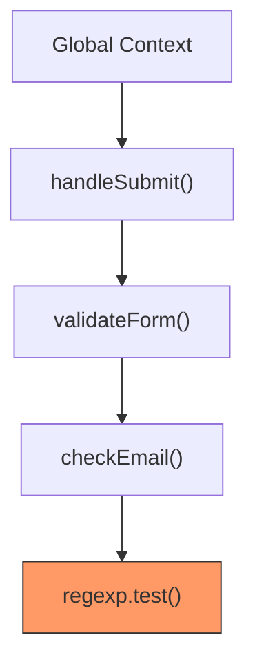

#### 使用技巧

1. **右鍵 Call Stack 框架** → Restart frame：重新執行該函式
2. **右鍵 Call Stack 框架** → Copy stack trace：複製完整堆疊資訊
3. 點擊堆疊中的框架可跳到對應原始碼位置

### 5.7 Async Stack Trace

Chrome DevTools 支援追蹤非同步呼叫鏈。

```javascript
// async/await 的完整呼叫鏈
async function loadDashboard() {
    const user = await fetchUser();         // 斷點設在此
    const orders = await fetchOrders(user.id);
    const stats = await calculateStats(orders);
    renderDashboard(stats);
}

// DevTools 會顯示完整的 async 呼叫鏈：
// loadDashboard (async)
//   → fetchUser
//     → fetch('/api/user')
//   → fetchOrders
//     → fetch('/api/orders')
```

啟用方式：

```text
Settings → Preferences → Debugger → ✓ Enable async stack traces
```

### 5.8 Blackbox Script（忽略腳本）

將第三方庫加入 Blackbox，除錯時自動跳過：

1. **Sources 面板** → 開啟第三方檔案 → 右鍵 → **Add script to ignore list**
2. **Settings → Ignore List** → 新增模式：

```text
/node_modules/
/vendor/
/jquery\.min\.js$
/vue\.runtime\.esm\.js$
/react\.production\.min\.js$
/lodash\.min\.js$
```

#### 效果

- Step Into 時自動跳過 Blackbox 的腳本
- Call Stack 中 Blackbox 的框架會被摺疊
- 例外發生在 Blackbox 腳本中時不會中斷

### 5.9 Snippets 使用

Snippets 是可以在任何頁面執行的 JavaScript 腳本。

#### 建立 Snippet

1. Sources → Snippets → New snippet
2. 撰寫腳本
3. `Ctrl+Enter` 執行

#### 企業級常用 Snippet 範例

```javascript
// === Snippet: Performance Report ===
(function() {
    const nav = performance.getEntriesByType('navigation')[0];
    const resources = performance.getEntriesByType('resource');

    console.group('📊 效能報告');

    console.log('頁面載入時間:', (nav.loadEventEnd - nav.startTime).toFixed(2) + 'ms');
    console.log('DOM Ready:', (nav.domContentLoadedEventEnd - nav.startTime).toFixed(2) + 'ms');
    console.log('TTFB:', (nav.responseStart - nav.requestStart).toFixed(2) + 'ms');
    console.log('資源數量:', resources.length);
    console.log('總傳輸大小:', (resources.reduce((sum, r) => sum + (r.transferSize || 0), 0) / 1024).toFixed(1) + 'KB');

    console.groupCollapsed('資源詳細');
    console.table(resources.map(r => ({
        名稱: r.name.split('/').pop().substring(0, 40),
        類型: r.initiatorType,
        時間: r.duration.toFixed(1) + 'ms',
        大小: r.transferSize ? (r.transferSize / 1024).toFixed(1) + 'KB' : 'cached'
    })));
    console.groupEnd();

    console.groupEnd();
})();
```

```javascript
// === Snippet: Accessibility Checker ===
(function() {
    const issues = [];

    // 檢查無 alt 的圖片
    $$('img:not([alt])').forEach(img => {
        issues.push({ type: '圖片無 alt', element: img.outerHTML.substring(0, 80) });
    });

    // 檢查空連結
    $$('a[href="#"], a:not([href])').forEach(a => {
        issues.push({ type: '空連結', element: a.outerHTML.substring(0, 80) });
    });

    // 檢查表單無 label
    $$('input:not([aria-label]):not([aria-labelledby])').forEach(input => {
        const id = input.id;
        if (!id || !$(`label[for="${id}"]`)) {
            issues.push({ type: '輸入欄無 label', element: input.outerHTML.substring(0, 80) });
        }
    });

    // 檢查對比度不足的文字
    $$('*').forEach(el => {
        const style = getComputedStyle(el);
        if (style.fontSize && parseFloat(style.fontSize) < 12) {
            issues.push({ type: '字體過小', element: el.tagName + '.' + el.className });
        }
    });

    console.group(`♿ 無障礙檢查報告 (${issues.length} 個問題)`);
    console.table(issues);
    console.groupEnd();
})();
```

> **實務案例**：團隊可建立共享 Snippet 庫，放在版本控制中。新進成員只需將 Snippet 匯入 DevTools 即可使用。建議建立以下標準 Snippet：效能報告、無障礙檢查、API 測試、記憶體快照比較。

---

## 第六章：Network 面板（API 與效能分析）

### 6.1 Network 面板概覽

Network 面板記錄所有網路請求，是 API 除錯與效能分析的核心工具。

#### 面板配置

| 區域 | 說明 |
|------|------|
| **Filter Bar** | 過濾請求（文字搜尋 / 類型篩選） |
| **Request Table** | 請求列表（可排序） |
| **Preview / Response** | 請求/回應內容預覽 |
| **Waterfall** | 時間瀑布圖 |
| **Summary** | 底部統計摘要 |

#### 過濾器技巧

| 過濾語法 | 說明 |
|----------|------|
| `domain:api.example.com` | 篩選特定域名 |
| `method:POST` | 篩選 HTTP 方法 |
| `status-code:500` | 篩選狀態碼 |
| `larger-than:100k` | 篩選大於 100KB 的請求 |
| `mime-type:application/json` | 篩選 MIME 類型 |
| `-status-code:200` | 排除狀態碼 200 |
| `is:from-cache` | 只顯示快取請求 |
| `is:running` | 只顯示進行中的請求 |
| `has-response-header:set-cookie` | 含特定回應標頭 |
| `mixed-content:displayed` | 混合內容 |
| `/api\/v[0-9]+/` | 正則表達式搜尋 |

### 6.2 Request / Response 結構

點擊任何請求可查看詳細資訊：

| 標籤 | 說明 |
|------|------|
| **Headers** | 請求/回應標頭（General / Request / Response） |
| **Payload** | 請求本體（Form Data / JSON / Query String） |
| **Preview** | 回應預覽（自動格式化 JSON、圖片等） |
| **Response** | 原始回應內容 |
| **Initiator** | 請求發起者（Call Stack） |
| **Timing** | 請求時間分解 |
| **Cookies** | 相關 Cookie |

### 6.3 Header / Payload 分析

#### Request Headers 重要欄位

| Header | 說明 | 除錯重點 |
|--------|------|----------|
| `Authorization` | 認證 Token | 檢查 Token 是否過期 |
| `Content-Type` | 請求內容類型 | JSON API 應為 `application/json` |
| `Accept` | 期望的回應格式 | 確認 Content Negotiation |
| `Origin` | 請求來源 | CORS 問題排查 |
| `Cookie` | Cookie 資料 | Session 相關問題 |
| `Cache-Control` | 快取控制 | 快取策略檢查 |
| `X-Request-ID` | 請求追蹤 ID | 跨服務追蹤 |

#### Response Headers 重要欄位

| Header | 說明 | 除錯重點 |
|--------|------|----------|
| `Set-Cookie` | 設定 Cookie | 檢查 Domain / Path / Secure |
| `Access-Control-Allow-Origin` | CORS 允許來源 | CORS 問題排查 |
| `Content-Encoding` | 壓縮方式 | gzip / br 壓縮確認 |
| `Cache-Control` | 快取策略 | 快取策略驗證 |
| `X-Response-Time` | 伺服器回應時間 | 後端效能問題 |
| `Content-Security-Policy` | CSP 策略 | 安全策略檢查 |

### 6.4 API Debug 技巧

#### 技巧一：重新發送請求

1. 右鍵請求 → **Replay XHR**：重新發送相同請求
2. 右鍵請求 → **Copy → Copy as fetch**：複製為 fetch 程式碼
3. 右鍵請求 → **Copy → Copy as cURL**：複製為 cURL 命令

```javascript
// 複製為 fetch 後可在 Console 修改再發送
fetch("https://api.example.com/users", {
    headers: {
        "Authorization": "Bearer eyJhbGc...",
        "Content-Type": "application/json"
    },
    body: JSON.stringify({ name: "test", role: "admin" }),
    method: "POST"
}).then(r => r.json()).then(console.log);
```

#### 技巧二：攔截與修改請求

使用 Override 功能修改 API 回應：

1. Network 面板 → 右鍵請求 → **Override content**
2. 修改 JSON 回應內容
3. 刷新頁面驗證

#### 技巧三：比較多個請求

1. 按住 `Shift` 選取多個請求
2. 右鍵 → **Compare requests**
3. 查看 Headers 和 Response 的差異

### 6.5 模擬慢速網路

#### 預設 Throttling 設定

| 設定 | 下載速度 | 上傳速度 | 延遲 |
|------|----------|----------|------|
| **No throttling** | 無限制 | 無限制 | 0 |
| **Fast 4G** | 4 Mbps | 3 Mbps | 20ms |
| **Slow 4G** | 1.5 Mbps | 750 Kbps | 40ms |
| **Fast 3G** | 780 Kbps | 330 Kbps | 150ms |
| **Slow 3G** | 400 Kbps | 400 Kbps | 300ms |
| **Offline** | 0 | 0 | ∞ |

#### 自訂 Throttling

1. Network 面板 → Throttling 下拉選單 → **Add...**
2. 自訂下載/上傳速度和延遲
3. 企業建議設定：

| 設定名稱 | 場景 | 建議值 |
|----------|------|--------|
| **台灣 4G 平均** | 行動版測試 | 下載 15 Mbps / 上傳 5 Mbps / 延遲 50ms |
| **辦公室 WiFi** | 內網應用 | 下載 50 Mbps / 上傳 20 Mbps / 延遲 5ms |
| **VPN 辦公** | 遠端工作 | 下載 10 Mbps / 上傳 5 Mbps / 延遲 100ms |

### 6.6 Cache 行為分析

#### 快取策略比較

| 策略 | Header | 說明 | 適用場景 |
|------|--------|------|----------|
| **強制快取** | `Cache-Control: max-age=31536000` | 瀏覽器直接使用快取 | 靜態資源（含 hash） |
| **協商快取** | `ETag` + `If-None-Match` | 伺服器驗證後決定 | 可能變動的資源 |
| **不快取** | `Cache-Control: no-store` | 每次都重新取得 | API 回應、敏感資料 |
| **可快取但驗證** | `Cache-Control: no-cache` | 每次驗證但可使用快取 | HTML 頁面 |

#### 在 DevTools 中分析快取

| 欄位 | 說明 |
|------|------|
| **Size 欄** | `(from memory cache)` → 記憶體快取 |
| **Size 欄** | `(from disk cache)` → 磁碟快取 |
| **Size 欄** | `(from service worker)` → Service Worker 快取 |
| **304 狀態碼** | 伺服器確認快取仍有效 |

#### 停用快取

- Network 面板上方勾選 **Disable cache**（僅在 DevTools 開啟時生效）
- 長按刷新按鈕 → **硬式重新載入**（`Ctrl+Shift+R`）
- 長按刷新按鈕 → **清除快取並硬式重新載入**

### 6.7 HTTP/1.1 vs HTTP/2 分析

#### 在 Network 面板中辨識

1. 右鍵欄位標題 → 勾選 **Protocol**
2. 查看協定欄位：`h2`（HTTP/2）或 `http/1.1`

#### 效能差異比較

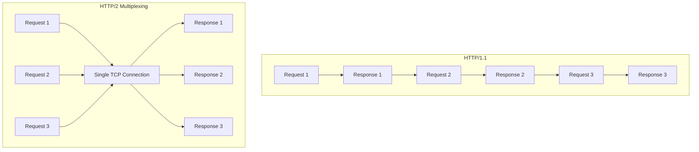

| 特性 | HTTP/1.1 | HTTP/2 |
|------|----------|--------|
| **連線** | 每個域名 6 個並行連線 | 單一連線多工 |
| **Header** | 純文字，每次完整發送 | HPACK 壓縮 |
| **優先權** | 無 | 支援串流優先權 |
| **Server Push** | 不支援 | 支援（已棄用） |
| **Waterfall** | 階梯狀 | 並行下載 |

### 6.8 WebSocket 除錯

#### 在 Network 面板中查看 WebSocket

1. 篩選器選擇 **WS** 類型
2. 點擊 WebSocket 連線
3. 切換到 **Messages** 標籤

| 欄位 | 說明 |
|------|------|
| **↑ 綠色箭頭** | 客戶端發送的訊息 |
| **↓ 紅色箭頭** | 伺服器發送的訊息 |
| **Length** | 訊息大小 |
| **Time** | 時間戳記 |

#### WebSocket 除錯技巧

```javascript
// 在 Console 中攔截 WebSocket
const OrigWebSocket = window.WebSocket;
window.WebSocket = function(...args) {
    const ws = new OrigWebSocket(...args);

    ws.addEventListener('message', (event) => {
        console.log('📥 WS Received:', JSON.parse(event.data));
    });

    const origSend = ws.send.bind(ws);
    ws.send = function(data) {
        console.log('📤 WS Sent:', JSON.parse(data));
        origSend(data);
    };

    return ws;
};
```

> **實務案例**：在微服務架構中，Network 面板的 **Initiator** 欄位可追蹤請求鏈，搭配 `X-Request-ID` Header 可跨服務追蹤。建議後端 API 統一加入 `X-Request-ID` 和 `X-Response-Time` Header，方便前端工程師快速定位效能瓶頸是在前端還是後端。

---

## 第七章：Performance 面板（效能優化核心）

### 7.1 Recording 操作

Performance 面板是診斷效能問題的核心工具。

#### 基本操作

| 操作 | 說明 |
|------|------|
| **Record**（`Ctrl+E`） | 開始錄製 |
| **Stop** | 停止錄製 |
| **Reload**（`Ctrl+Shift+E`） | 錄製頁面載入過程 |
| **Clear** | 清除錄製資料 |
| **Screenshots** | 啟用螢幕截圖時間軸 |
| **Memory** | 啟用記憶體使用圖表 |

#### 錄製前設定

```text
Performance → ⚙️ Settings：
- CPU: 4× slowdown（模擬低階裝置）
- Network: Slow 3G（模擬慢速網路）
- ✓ Enable advanced paint instrumentation（進階繪製檢測）
- ✓ Screenshots
- ✓ Memory
```

#### 錄製最佳實踐

1. 使用**無痕模式**排除擴充功能干擾
2. 關閉不必要的分頁減少資源競爭
3. 錄製前等待頁面穩定
4. 錄製 3-5 秒即可（過長會增加分析難度）
5. 多次錄製取平均值

### 7.2 FPS 分析

#### FPS 指標

| FPS | 體驗 | 說明 |
|-----|------|------|
| 60 fps | 流暢 | 每幀 16.67ms |
| 30 fps | 可接受 | 每幀 33.33ms |
| < 30 fps | 卡頓 | 需要優化 |

#### 開啟 FPS 即時監控

```text
Command Menu (Ctrl+Shift+P) → Show FPS meter
```

會在頁面右上角顯示即時 FPS 計數器與 GPU 記憶體使用量。

#### FPS 問題常見原因

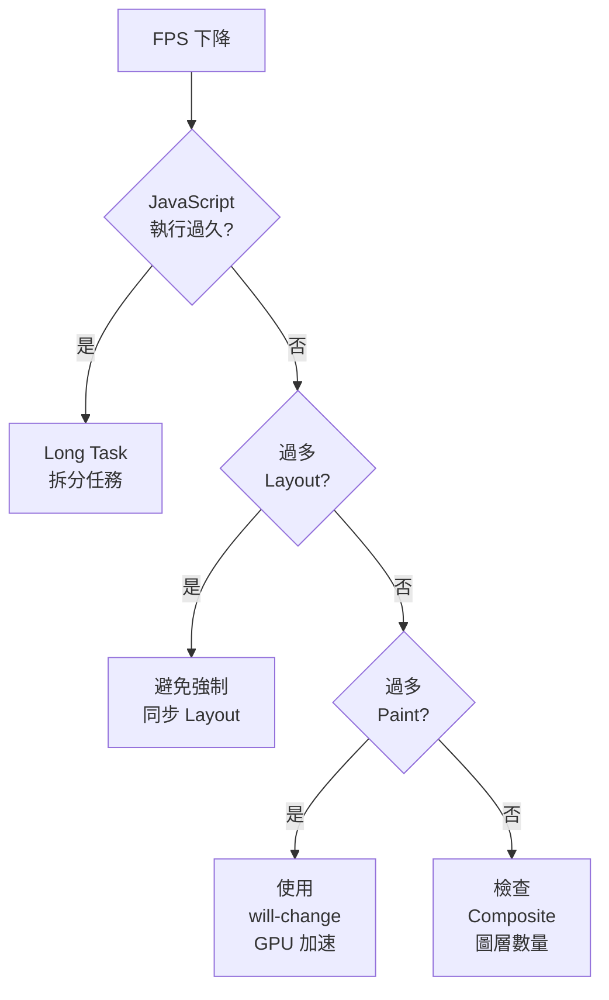

### 7.3 Main Thread 分析

Performance 錄製結果中，**Main** 行顯示主執行緒的活動情況。

#### 火焰圖（Flame Chart）解讀

| 顏色 | 代表活動 |
|------|----------|
| **黃色** | JavaScript 執行 |
| **紫色** | Layout（排版計算） |
| **綠色** | Paint（繪製） |
| **灰色** | 系統活動 / Idle |
| **紅色三角** | Long Task（> 50ms） |

#### 操作技巧

| 操作 | 說明 |
|------|------|
| `W` / `S` | 縮放時間軸 |
| `A` / `D` | 左右平移 |
| 點擊函式 | 查看詳細資訊（時間、呼叫次數） |
| **Bottom-Up** 標籤 | 按時間消耗排序（找出最耗時函式） |
| **Call Tree** 標籤 | 查看呼叫樹 |
| **Event Log** 標籤 | 事件時間軸 |

### 7.4 Long Task 問題診斷

**Long Task** 定義：執行時間超過 **50ms** 的任務。它會阻塞主執行緒，導致頁面無回應。

#### 識別 Long Task

- Performance 面板中會以**紅色三角**標記
- Long Task 的右上角有紅色斜線標記
- 可在 Summary 面板看到 **Total blocking time**

#### 優化方案

```javascript
// ❌ Bad: 長時間佔用主執行緒
function processLargeDataset(data) {
    for (let i = 0; i < data.length; i++) {
        heavyComputation(data[i]); // 可能執行 > 50ms
    }
}

// ✅ Good: 使用分批處理
async function processLargeDataset(data) {
    const BATCH_SIZE = 100;
    for (let i = 0; i < data.length; i += BATCH_SIZE) {
        const batch = data.slice(i, i + BATCH_SIZE);
        batch.forEach(item => heavyComputation(item));

        // 讓出主執行緒，允許瀏覽器處理使用者互動
        await new Promise(resolve => setTimeout(resolve, 0));
    }
}

// ✅ Better: 使用 requestIdleCallback
function processInIdle(data, index = 0) {
    requestIdleCallback((deadline) => {
        while (index < data.length && deadline.timeRemaining() > 0) {
            heavyComputation(data[index]);
            index++;
        }
        if (index < data.length) {
            processInIdle(data, index);
        }
    });
}

// ✅ Best: 使用 Web Worker
const worker = new Worker('processor.js');
worker.postMessage({ data: largeDataset });
worker.onmessage = (e) => {
    console.log('處理完成:', e.data);
};

// ✅ Modern: 使用 scheduler.postTask() (Chrome 94+)
async function processWithScheduler(data) {
    for (const item of data) {
        await scheduler.postTask(() => heavyComputation(item), {
            priority: 'background'
        });
    }
}
```

### 7.5 Reflow / Repaint 分析

#### Layout Thrashing（強制同步 Layout）

```javascript
// ❌ Bad: 強制同步 Layout（讀寫交錯）
const elements = document.querySelectorAll('.item');
elements.forEach(el => {
    const width = el.offsetWidth;    // 讀取 → 觸發 Layout
    el.style.width = width * 2 + 'px'; // 寫入 → 觸發下次讀取重新 Layout
});

// ✅ Good: 批次讀取 → 批次寫入
const elements = document.querySelectorAll('.item');
const widths = Array.from(elements).map(el => el.offsetWidth); // 批次讀取
elements.forEach((el, i) => {
    el.style.width = widths[i] * 2 + 'px'; // 批次寫入
});

// ✅ Better: 使用 requestAnimationFrame
const elements = document.querySelectorAll('.item');
const widths = Array.from(elements).map(el => el.offsetWidth);
requestAnimationFrame(() => {
    elements.forEach((el, i) => {
        el.style.width = widths[i] * 2 + 'px';
    });
});
```

#### 觸發 Reflow 的屬性與方法

| 類型 | 屬性 / 方法 |
|------|------------|
| **幾何屬性** | `offsetTop` / `offsetWidth` / `clientWidth` / `scrollTop` |
| **位置方法** | `getBoundingClientRect()` / `getComputedStyle()` |
| **樣式屬性** | `width` / `height` / `margin` / `padding` / `display` / `position` |
| **內容屬性** | `textContent` / `innerHTML`（改變大小時） |

#### 只觸發 Repaint 的屬性（不觸發 Reflow）

| 屬性 |
|------|
| `color` / `background-color` / `visibility` / `text-decoration` / `box-shadow` / `outline` |

#### 不觸發 Reflow 也不觸發 Repaint 的屬性（使用 Compositor）

| 屬性 |
|------|
| `transform` / `opacity` / `will-change` / `filter` |

#### 視覺化 Repaint

`text
Command Menu (Ctrl+Shift+P) → Show Rendering
→ ✓ Paint flashing（綠色高亮重繪區域）
→ ✓ Layout Shift Regions（藍色高亮位移區域）
→ ✓ Layer borders（橘色顯示合成圖層邊界）
```

### 7.6 Lighthouse 使用方式

#### 執行 Lighthouse 審計

1. DevTools → **Lighthouse** 面板
2. 選擇類別：
   - ✓ Performance
   - ✓ Accessibility
   - ✓ Best Practices
   - ✓ SEO
   - ✓ PWA（漸進式 Web 應用）
3. 選擇裝置：Mobile / Desktop
4. 點擊 **Analyze page load**

#### Lighthouse 指標

| 指標 | 英文 | 良好 | 需改善 | 差 |
|------|------|------|--------|-----|
| **FCP** | First Contentful Paint | ≤ 1.8s | ≤ 3s | > 3s |
| **LCP** | Largest Contentful Paint | ≤ 2.5s | ≤ 4s | > 4s |
| **TBT** | Total Blocking Time | ≤ 200ms | ≤ 600ms | > 600ms |
| **CLS** | Cumulative Layout Shift | ≤ 0.1 | ≤ 0.25 | > 0.25 |
| **SI** | Speed Index | ≤ 3.4s | ≤ 5.8s | > 5.8s |
| **INP** | Interaction to Next Paint | ≤ 200ms | ≤ 500ms | > 500ms |

### 7.7 Core Web Vitals 分析

Core Web Vitals 是 Google 定義的核心使用者體驗指標。

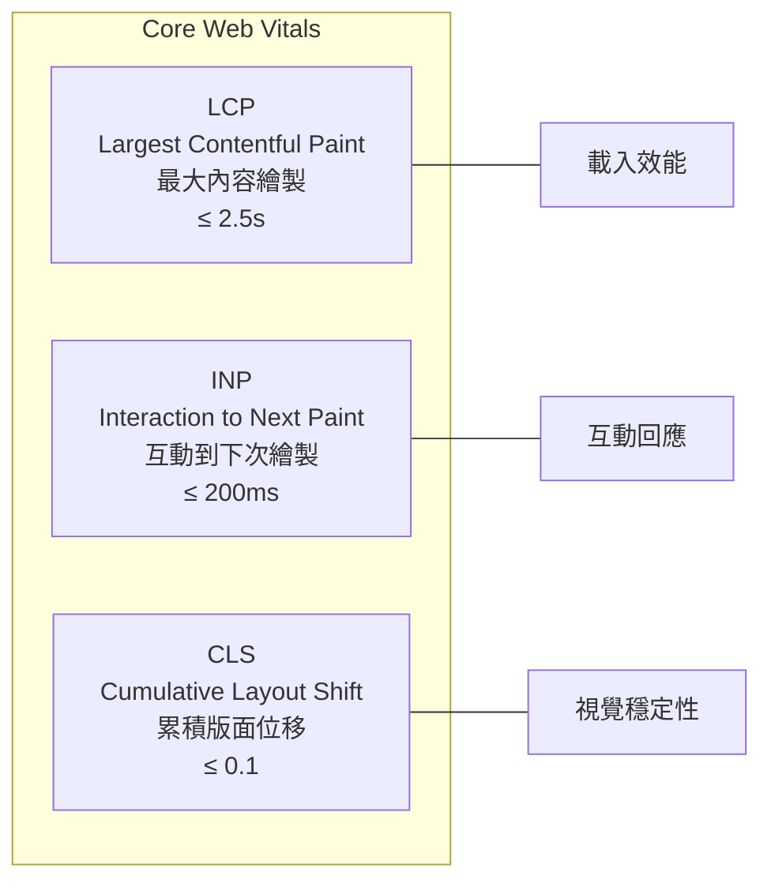

#### LCP 優化策略

| 策略 | 說明 |
|------|------|
| 優化伺服器回應時間 | 使用 CDN、優化後端查詢 |
| 預載入關鍵資源 | `<link rel="preload">` |
| 避免 render-blocking 資源 | 延遲非關鍵 CSS/JS |
| 優化圖片 | WebP/AVIF 格式、適當尺寸 |
| 使用 `fetchpriority="high"` | 標記 LCP 圖片優先載入 |

#### INP 優化策略

| 策略 | 說明 |
|------|------|
| 拆分 Long Task | 使用 `yield()`、`scheduler.postTask()` |
| 減少 JavaScript 體積 | Code Splitting、Tree Shaking |
| 避免阻塞主執行緒 | Web Worker、Offscreen Canvas |
| 最小化事件處理器 | Debounce、Throttle |

#### CLS 優化策略

| 策略 | 說明 |
|------|------|
| 設定圖片/影片尺寸 | 指定 `width`、`height` 或 `aspect-ratio` |
| 避免動態插入 DOM | 預留空間 |
| 使用 `transform` 動畫 | 不使用 `top`/`left` 動畫 |
| 字體載入策略 | `font-display: optional` 或預載入 |

> **實務案例**：在企業級 Web Application 中，建議將 Lighthouse 審計整合到 CI/CD 流程中（使用 Lighthouse CI），設定效能門檻。例如：LCP > 4s 或 CLS > 0.25 時，PR 自動阻擋合併。

### 7.8 Rendering 面板

Rendering 面板提供多種視覺化工具，協助診斷渲染效能問題。

#### 開啟方式

`text
Command Menu (Ctrl+Shift+P) → Show Rendering
// 或 DevTools 右上角 ⋮ → More tools → Rendering
```

#### 功能一覽

| 功能 | 說明 | 用途 |
|------|------|------|
| **Paint flashing** | 綠色高亮重繪區域 | 找出不必要的重繪 |
| **Layout Shift Regions** | 藍色高亮版面位移區域 | 診斷 CLS 問題 |
| **Layer borders** | 橘色顯示合成圖層邊界 | 檢查圖層數量 |
| **Frame Rendering Stats** | 顯示即時 FPS 和 GPU 記憶體 | 監控動畫效能 |
| **Scrolling performance issues** | 標示影響捲動效能的元素 | 優化捲動體驗 |
| **Highlight ad frames** | 標示廣告框架 | 識別廣告影響 |
| **Core Web Vitals** | 頁面上顯示 CWV 覆蓋層 | 即時監控 CWV |
| **Disable local fonts** | 停用本地字體 | 測試 Web 字體載入 |
| **Emulate CSS media** | 模擬列印 / 螢幕媒體 | 測試列印樣式 |
| **Emulate vision deficiencies** | 模擬視覺障礙 | 無障礙測試 |
| **Disable AVIF / WebP** | 停用圖片格式支援 | 測試回退機制 |
| **Emulate prefers-color-scheme** | 模擬深色/淺色模式 | 測試主題切換 |
| **Emulate prefers-reduced-motion** | 模擬減少動畫偏好 | 無障礙動畫測試 |
| **Emulate auto dark mode** | 模擬自動深色模式 | 測試自動深色佈局 |
| **Emulate prefers-contrast** | 模擬對比度偏好 | 無障礙對比度測試 |

#### CSS 媒體功能模擬

Rendering 面板可模擬多種 CSS 媒體功能，無需修改系統設定：

```css
/* 可在 Rendering 面板中模擬的媒體查詢 */
@media (prefers-color-scheme: dark) { /* 深色模式 */ }
@media (prefers-reduced-motion: reduce) { /* 減少動畫 */ }
@media (prefers-contrast: more) { /* 高對比度 */ }
@media (forced-colors: active) { /* 強制色彩模式 */ }
@media print { /* 列印樣式 */ }
```

#### 視覺障礙模擬

| 模擬類型 | 說明 |
|----------|------|
| **Blurred vision** | 模糊視覺 |
| **Protanopia** | 紅色盲 |
| **Deuteranopia** | 綠色盲 |
| **Tritanopia** | 藍色盲 |
| **Achromatopsia** | 全色盲 |

> **實務案例**：在設計系統中，使用 Rendering 面板的視覺障礙模擬功能，可確保色彩設計對色盲使用者友善。建議至少通過 Protanopia（紅色盲）和 Deuteranopia（綠色盲）的模擬測試。

### 7.9 Performance 進階功能

#### Performance Annotations（標註）

Chrome 131+ 支援在效能追蹤記錄中新增標註，方便團隊溝通和分享分析結果：

1. 錄製 Performance 追蹤後，選取特定區域
2. 右鍵 → **Add annotation**
3. 輸入標註文字（如：「此處出現 Long Task」）
4. 標註會隨追蹤記錄一起儲存和分享

#### 儲存與分享效能追蹤

| 操作 | 說明 |
|------|------|
| **Export** | 匯出 `.json` 格式的追蹤記錄 |
| **Import** | 匯入他人分享的追蹤記錄 |
| **分享** | 透過 DevTools 將追蹤上傳並取得分享連結 |

#### CSS 選取器效能分析

Performance 面板可分析 CSS 選取器的效能影響：

1. 錄製 Performance 追蹤
2. 找到 **Recalculate Style** 事件
3. 點擊查看 **Selector Stats**（選取器統計）
4. 找出耗時最長的 CSS 選取器並優化

```css
/* ❌ Bad: 過於複雜的選取器 */
.container > div:nth-child(odd) > .item:not(.hidden):hover { }

/* ✅ Good: 簡化選取器 */
.item-odd:hover { }
```

#### 可擴充的 Performance API

Chrome 支援透過 `performance.mark()` 和 `performance.measure()` 在 Performance 面板中顯示自訂指標：

```javascript
// 自訂 Performance 標記
performance.mark('component-render-start');
// ... 渲染邏輯 ...
performance.mark('component-render-end');
performance.measure(
    'Component Render',
    'component-render-start',
    'component-render-end'
);

// 這些自訂標記會出現在 Performance 面板的 Timings 列
```

---

## 第八章：Memory 面板

### 8.1 Memory 面板概覽

Memory 面板用於診斷記憶體問題，包含記憶體洩漏和過度使用。

#### 三種快照模式

| 模式 | 說明 | 適用場景 |
|------|------|----------|
| **Heap Snapshot** | 即時 Heap 快照 | 分析物件分佈、找出洩漏 |
| **Allocation instrumentation on timeline** | 分配時間軸 | 追蹤記憶體分配 |
| **Allocation sampling** | 分配取樣 | 低開銷的長時間監控 |

### 8.2 Heap Snapshot

#### 操作步驟

1. Memory 面板 → 選擇 **Heap snapshot**
2. 點擊 **Take snapshot**
3. 等待快照完成

#### 視圖模式

| 視圖 | 說明 |
|------|------|
| **Summary** | 按建構式分組（預設） |
| **Comparison** | 比較兩次快照差異 |
| **Containment** | 按容器結構組織 |
| **Statistics** | 記憶體統計分佈 |

#### 關鍵欄位

| 欄位 | 說明 |
|------|------|
| **Constructor** | 物件建構式名稱 |
| **Distance** | 距離 GC Root 的距離 |
| **Shallow Size** | 物件自身佔用的記憶體 |
| **Retained Size** | 物件及其引用鏈佔用的總記憶體 |

#### 三步驟找出記憶體洩漏

`text
Step 1: 操作前取第一次 Snapshot
Step 2: 執行疑似洩漏的操作（如開啟/關閉 Modal）
Step 3: 取第二次 Snapshot
→ 使用 Comparison 視圖比較兩次 Snapshot
→ 關注 #Delta > 0 且 Size Delta > 0 的項目
```

### 8.3 Allocation Timeline

#### 操作步驟

1. Memory 面板 → 選擇 **Allocation instrumentation on timeline**
2. 勾選 **Record allocation stacks**
3. 點擊 **Start**
4. 執行操作
5. 點擊 **Stop**

#### 解讀結果

- **藍色柱狀** 表示分配的記憶體
- **灰色柱狀** 表示已被 GC 回收的記憶體
- 持續存在的藍色柱狀可能是洩漏

### 8.4 記憶體洩漏診斷流程

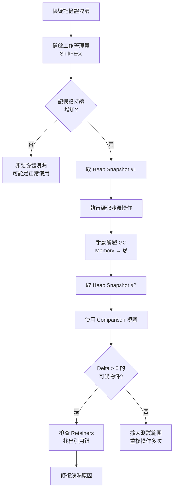

#### 常見洩漏模式與修復

| 洩漏模式 | 說明 | 修復方式 |
|----------|------|----------|
| **忘記移除事件監聽器** | 元素移除但監聽器仍在 | `removeEventListener()` |
| **閉包引用** | 閉包持有不必要的外部變數 | 解除引用、避免不必要的閉包 |
| **定時器未清除** | `setInterval` 未 `clearInterval` | 組件銷毀時清除 |
| **DOM 引用殘留** | JS 變數持有已移除的 DOM | 解除 DOM 引用 |
| **全域變數累積** | 資料不斷加入全域物件 | 使用 WeakMap / WeakRef |
| **Console 輸出** | `console.log` 大量物件 | 生產環境移除 console |

### 8.5 SPA 常見 Memory Leak 問題

#### Vue 常見洩漏

```javascript
// ❌ Bad: 元件銷毀後事件監聽器未清除
export default {
    mounted() {
        window.addEventListener('resize', this.handleResize);
        this.interval = setInterval(this.fetchData, 5000);
    },
    // 沒有 beforeUnmount / beforeDestroy
};

// ✅ Good: 正確清理
export default {
    mounted() {
        window.addEventListener('resize', this.handleResize);
        this.interval = setInterval(this.fetchData, 5000);
    },
    beforeUnmount() {
        window.removeEventListener('resize', this.handleResize);
        clearInterval(this.interval);
    }
};

// ✅ Vue 3 Composition API + 自動清理
import { onMounted, onUnmounted } from 'vue';
import { useEventListener } from '@vueuse/core';

setup() {
    // VueUse 自動在 onUnmounted 時清理
    useEventListener(window, 'resize', handleResize);
}
```

#### React 常見洩漏

```javascript
// ❌ Bad: 異步操作在組件卸載後更新 state
useEffect(() => {
    fetch('/api/data')
        .then(r => r.json())
        .then(data => setData(data)); // 組件可能已卸載
}, []);

// ✅ Good: 使用 AbortController
useEffect(() => {
    const controller = new AbortController();

    fetch('/api/data', { signal: controller.signal })
        .then(r => r.json())
        .then(data => setData(data))
        .catch(err => {
            if (err.name !== 'AbortError') throw err;
        });

    return () => controller.abort(); // Cleanup
}, []);

// ✅ Good: 使用 cleanup flag
useEffect(() => {
    let isMounted = true;

    fetchData().then(data => {
        if (isMounted) setData(data);
    });

    return () => { isMounted = false; };
}, []);
```

> **實務案例**：在企業級 SPA 中，路由切換是記憶體洩漏的高風險區域。建議在 CI/CD 中加入記憶體測試：使用 Puppeteer 自動化重複切換路由 100 次，每次取 Heap Snapshot，確認記憶體不會持續增長。

---

## 第九章：Application 面板

### 9.1 LocalStorage / SessionStorage

#### 操作方式

1. Application → Storage → Local Storage / Session Storage
2. 選擇特定域名查看所有鍵值對

| 操作 | 說明 |
|------|------|
| 點擊項目 | 編輯值 |
| 右鍵 → Delete | 刪除項目 |
| **Clear All** | 清除所有項目 |
| **Filter** | 搜尋特定 Key |

#### Console 操作

```javascript
// LocalStorage
localStorage.setItem('user', JSON.stringify({ name: '王小明' }));
JSON.parse(localStorage.getItem('user'));
localStorage.removeItem('user');
localStorage.clear();

// 查看所有 localStorage 內容
console.table(
    Object.entries(localStorage).map(([key, value]) => ({
        key,
        value: value.substring(0, 100),
        size: new Blob([value]).size + ' bytes'
    }))
);
```

#### 儲存限制與建議

| 儲存方式 | 容量限制 | 生命週期 | 適用資料 |
|----------|----------|----------|----------|
| **LocalStorage** | ~5MB | 永久（除非清除） | 使用者設定、Token |
| **SessionStorage** | ~5MB | 瀏覽器分頁關閉 | 表單暫存、頁面狀態 |

> **安全警告**：**永遠不要**在 LocalStorage 中儲存敏感資訊（如信用卡號、密碼）。Token 建議使用 HttpOnly Cookie。

### 9.2 IndexedDB

#### 操作方式

1. Application → Storage → IndexedDB
2. 展開資料庫 → 物件存儲 → 查看資料

| 操作 | 說明 |
|------|------|
| 展開 Object Store | 查看所有記錄 |
| 點擊記錄 | 查看詳細內容 |
| **Delete database** | 刪除資料庫 |
| **Refresh** | 重新載入資料 |

#### Console 操作範例

```javascript
// 列出所有 IndexedDB 資料庫
const databases = await indexedDB.databases();
console.table(databases);

// 開啟並讀取資料
const request = indexedDB.open('myDB', 1);
request.onsuccess = (event) => {
    const db = event.target.result;
    const tx = db.transaction('users', 'readonly');
    const store = tx.objectStore('users');
    const getAllRequest = store.getAll();
    getAllRequest.onsuccess = () => {
        console.table(getAllRequest.result);
    };
};
```

### 9.3 Cookies

#### 操作方式

1. Application → Storage → Cookies
2. 選擇域名查看所有 Cookie

| 欄位 | 說明 | 安全建議 |
|------|------|----------|
| **Name** | Cookie 名稱 | - |
| **Value** | Cookie 值 | 不存放敏感資料明文 |
| **Domain** | 有效域名 | 設定最小範圍 |
| **Path** | 有效路徑 | 設定最小範圍 |
| **Expires** | 過期時間 | 適當設定過期 |
| **Size** | 大小 | 總計不超過 4KB |
| **HttpOnly** | 禁止 JS 存取 | ✓ 建議開啟 |
| **Secure** | 僅 HTTPS 傳送 | ✓ 建議開啟 |
| **SameSite** | 跨站限制 | 設定 `Strict` 或 `Lax` |
| **Priority** | 優先級 | Low / Medium / High |
| **Partition Key** | CHIPS 分區 | 第三方 Cookie 替代方案 |

#### Cookie 安全最佳實踐

`http
Set-Cookie: session_id=abc123;
    HttpOnly;           ← 防止 XSS 竊取
    Secure;             ← 僅 HTTPS 傳送
    SameSite=Strict;    ← 防止 CSRF
    Path=/;
    Max-Age=3600;
    Domain=.example.com
```

### 9.4 Service Worker

#### 操作方式

1. Application → Service Workers
2. 查看已註冊的 Service Worker

| 功能 | 說明 |
|------|------|
| **Update** | 強制更新 Service Worker |
| **Unregister** | 取消註冊 |
| **Update on reload** | 每次載入時更新 |
| **Bypass for network** | 繞過 Service Worker |

#### Service Worker 生命週期

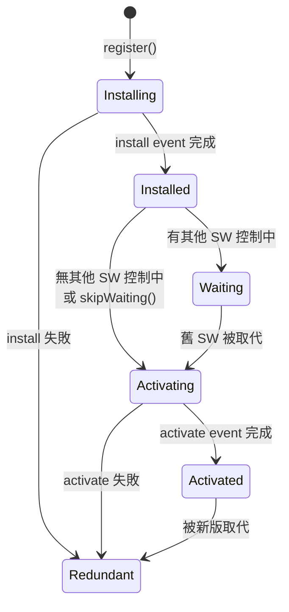

### 9.5 PWA Debug

#### Manifest 檢查

1. Application → Manifest
2. 檢查 PWA manifest 設定

| 檢查項目 | 說明 |
|----------|------|
| **Name / Short Name** | 應用名稱 |
| **Icons** | 應用圖示（需多種尺寸） |
| **Start URL** | 啟動 URL |
| **Display** | 顯示模式（standalone / fullscreen） |
| **Theme Color** | 主題色 |
| **Background Color** | 背景色 |

#### Storage 配額查詢

```javascript
// 查詢儲存配額
const estimate = await navigator.storage.estimate();
console.log(`使用: ${(estimate.usage / 1024 / 1024).toFixed(2)} MB`);
console.log(`配額: ${(estimate.quota / 1024 / 1024).toFixed(2)} MB`);
console.log(`使用率: ${(estimate.usage / estimate.quota * 100).toFixed(2)}%`);
```

> **實務案例**：在企業級 PWA 應用中，Service Worker 的快取策略至關重要。建議使用 Workbox 管理快取策略，並透過 Application 面板的 Cache Storage 驗證快取行為。在 CI/CD 中加入 Lighthouse PWA 審計，確保離線功能正常。

---

## 第十章：Security 面板

### 10.1 HTTPS 分析

#### Security 面板概覽

| 區域 | 說明 |
|------|------|
| **Security Overview** | 頁面安全狀態總覽 |
| **Origin List** | 頁面載入的所有來源及安全狀態 |
| **Certificate Details** | 憑證詳細資訊 |

#### 安全狀態

| 圖示 | 狀態 | 說明 |
|------|------|------|
| 🟢 | Secure | 完全透過 HTTPS 載入 |
| 🟡 | Info | 有非安全的被動內容 |
| 🔴 | Not Secure | 有非安全的主動內容 |

#### 憑證檢查重點

| 項目 | 說明 |
|------|------|
| **Protocol** | 確認為 TLS 1.2 或 TLS 1.3 |
| **Key Exchange** | 確認使用 ECDHE（前向保密） |
| **Cipher Suite** | 確認使用 AES-256-GCM 等強加密 |
| **Certificate** | 確認憑證鏈完整且未過期 |
| **CT Compliance** | Certificate Transparency 合規 |

### 10.2 Mixed Content 問題

Mixed Content 是指 HTTPS 頁面載入 HTTP 資源。

#### Mixed Content 類型

| 類型 | 風險 | 範例 | Chrome 行為 |
|------|------|------|-------------|
| **主動混合內容** | 高 | `<script>`, `<iframe>`, `<link rel="stylesheet">` | 自動阻擋 |
| **被動混合內容** | 中 | ``, `<audio>`, `<video>` | 自動升級為 HTTPS |

#### 修復方式

```html
<!-- ❌ Bad: HTTP 資源 -->
<script src="http://cdn.example.com/app.js"></script>


<!-- ✅ Good: 使用 HTTPS -->
<script src="https://cdn.example.com/app.js"></script>


<!-- ✅ Better: 協議相對 URL 或直接使用 HTTPS -->
<script src="//cdn.example.com/app.js"></script>

<!-- ✅ Best: CSP 自動升級 -->
<meta http-equiv="Content-Security-Policy" content="upgrade-insecure-requests">
```

### 10.3 CORS Debug

#### CORS 錯誤排查流程

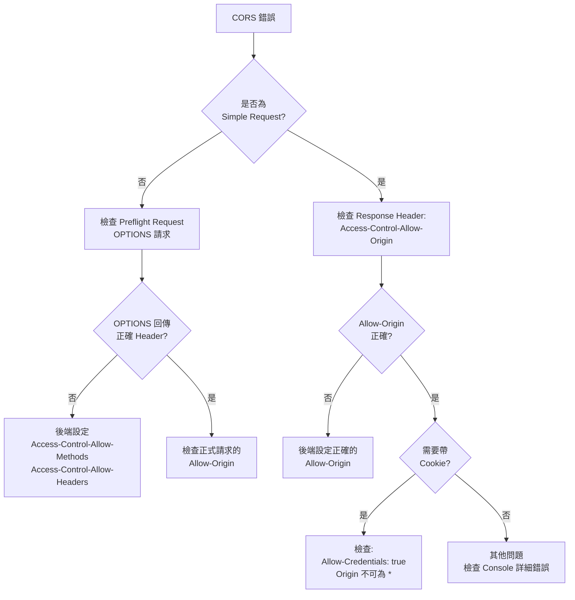

#### CORS 相關 Header

| Header | 說明 | 範例 |
|--------|------|------|
| `Access-Control-Allow-Origin` | 允許的來源 | `https://app.example.com` |
| `Access-Control-Allow-Methods` | 允許的 HTTP 方法 | `GET, POST, PUT, DELETE` |
| `Access-Control-Allow-Headers` | 允許的自訂 Header | `Content-Type, Authorization` |
| `Access-Control-Allow-Credentials` | 允許帶 Cookie | `true` |
| `Access-Control-Max-Age` | Preflight 快取時間 | `86400`（24小時） |
| `Access-Control-Expose-Headers` | 前端可讀的 Header | `X-Request-ID, X-Total-Count` |

#### Spring Boot CORS 設定範例

```java
@Configuration
public class CorsConfig implements WebMvcConfigurer {

    @Override
    public void addCorsMappings(CorsRegistry registry) {
        registry.addMapping("/api/**")
            .allowedOrigins("https://app.example.com")
            .allowedMethods("GET", "POST", "PUT", "DELETE", "OPTIONS")
            .allowedHeaders("Content-Type", "Authorization", "X-Request-ID")
            .allowCredentials(true)
            .maxAge(86400);
    }
}
```

#### Nginx CORS 設定範例

```nginx
location /api/ {
    # CORS Headers
    add_header 'Access-Control-Allow-Origin' 'https://app.example.com' always;
    add_header 'Access-Control-Allow-Methods' 'GET, POST, PUT, DELETE, OPTIONS' always;
    add_header 'Access-Control-Allow-Headers' 'Content-Type, Authorization' always;
    add_header 'Access-Control-Allow-Credentials' 'true' always;
    add_header 'Access-Control-Max-Age' '86400' always;

    # Handle OPTIONS preflight
    if ($request_method = 'OPTIONS') {
        return 204;
    }

    proxy_pass http://backend;
}
```

### 10.4 CSP 分析

#### Content Security Policy（CSP）

CSP 可防止 XSS、點擊劫持等攻擊。

#### 在 DevTools 中檢查 CSP

1. **Console** → 查看 CSP 違規警告
2. **Network** → 查看 Response Header 中的 `Content-Security-Policy`
3. **Application → Frames → Content Security Policy** 面板

#### CSP 指令一覽

| 指令 | 說明 | 建議值 |
|------|------|--------|
| `default-src` | 預設來源 | `'self'` |
| `script-src` | JavaScript 來源 | `'self' 'nonce-xxx'` |
| `style-src` | CSS 來源 | `'self' 'unsafe-inline'`（需要時） |
| `img-src` | 圖片來源 | `'self' data: https:` |
| `connect-src` | XHR/Fetch/WebSocket 來源 | `'self' https://api.example.com` |
| `font-src` | 字體來源 | `'self' https://fonts.gstatic.com` |
| `frame-src` | iframe 來源 | `'none'`（除非需要） |
| `object-src` | Plugin 來源 | `'none'` |
| `base-uri` | base 標籤限制 | `'self'` |
| `form-action` | 表單提交目標 | `'self'` |

#### 企業級 CSP 範例

`http
Content-Security-Policy:
    default-src 'self';
    script-src 'self' 'nonce-{random}';
    style-src 'self' 'unsafe-inline';
    img-src 'self' data: https://cdn.example.com;
    connect-src 'self' https://api.example.com wss://ws.example.com;
    font-src 'self' https://fonts.gstatic.com;
    frame-ancestors 'none';
    base-uri 'self';
    form-action 'self';
    upgrade-insecure-requests;
    report-uri /api/csp-report;
```

> **實務案例**：建議先使用 `Content-Security-Policy-Report-Only` 模式部署 CSP，收集違規報告後再逐步收緊策略。Chrome Console 會清楚顯示哪些資源違反了 CSP 規則，方便調整設定。

---

## 第十一章：Recorder 面板、AI 輔助與其他進階功能

### 11.1 Recorder 面板（使用者流程錄製）

Recorder 面板可讓你直接在 DevTools 中錄製、重播及評估使用者操作流程，是自動化測試和效能分析的強大工具。

#### 開啟方式

`text
// 方法一：選單
DevTools → ⋮ → More tools → Recorder

// 方法二：Command Menu
Ctrl+Shift+P → Show Recorder
```

#### 核心功能

| 功能 | 說明 |
|------|------|
| **錄製使用者流程** | 自動記錄點擊、輸入、導航等操作 |
| **重播流程** | 一鍵重播已錄製的操作序列 |
| **評估效能** | 重播時同步產生 Performance 追蹤記錄 |
| **編輯步驟** | 手動新增、移除或修改錄製的步驟 |
| **斷言驗證** | 新增 `waitForElement` 等斷言步驟 |
| **匯出流程** | 匯出為 JSON、Puppeteer、Playwright 等格式 |
| **模擬網路** | 重播時模擬慢速網路（Slow 3G 等） |

#### 錄製使用者流程

1. 開啟 Recorder 面板
2. 點擊 **「開始新的錄製內容」**
3. 輸入錄製名稱（如：`checkout-flow`）
4. 點擊 **「開始錄製新內容」**
5. 在頁面上執行使用者操作（點擊、輸入、導航）
6. 完成後點擊 **「結束錄音」**

#### 錄製步驟類型

| 步驟類型 | 說明 | 範例 |
|----------|------|------|
| **navigate** | 頁面導航 | 前往 `https://example.com` |
| **click** | 滑鼠點擊 | 點擊「提交」按鈕 |
| **change** | 輸入值變更 | 在文字欄輸入內容 |
| **keyDown / keyUp** | 鍵盤事件 | 按下 Enter 鍵 |
| **scroll** | 頁面捲動 | 向下捲動 |
| **waitForElement** | 等待元素出現 | 等待載入完成 |
| **hover** | 懸停事件 | 需手動新增 |

#### 編輯步驟

`text
// 展開步驟查看詳細資訊
// 每個步驟包含：
{
    "type": "click",
    "target": "main",
    "selectors": [
        ["aria/Submit"],
        ["#submit-btn"]
    ],
    "offsetX": 50,
    "offsetY": 25
}

// 可編輯選取器、新增/移除步驟、修改屬性等
```

#### 重播與除錯

| 操作 | 說明 |
|------|------|
| **Replay** | 正常速度重播 |
| **Slow replay** | 慢速重播，便於觀察 |
| **Set breakpoint** | 在步驟上設定中斷點 |
| **Step through** | 逐步執行 |
| **Measure performance** | 重播並產生 Performance 追蹤 |

#### 匯出格式

| 格式 | 用途 |
|------|------|
| **JSON** | DevTools 原生格式，可再次匯入 |
| **Puppeteer** | Node.js 自動化腳本 |
| **Puppeteer (Replay)** | 使用 @puppeteer/replay 庫 |
| **Playwright** | 跨瀏覽器自動化腳本 |
| **擴充功能** | 透過第三方擴充功能匯出為其他格式 |

#### 企業應用場景

| 場景 | 說明 |
|------|------|
| **回歸測試** | 錄製關鍵流程，每次發布前重播驗證 |
| **效能基準** | 定期錄製並評估使用者流程效能 |
| **Bug 重現** | 錄製 Bug 重現步驟，附在 Issue 中 |
| **新人培訓** | 錄製標準操作流程供新成員學習 |
| **E2E 基礎** | 匯出為 Puppeteer/Playwright 腳本作為 E2E 測試基礎 |

> **注意**：Recorder 不會自動擷取懸停（hover）事件，需手動在錄製完成後新增懸停步驟。此功能僅適用於 Chrome（Chrome 97+），不適用於 Chromium。

### 11.2 AI 輔助功能（Gemini 整合）

Chrome DevTools 整合了 Google Gemini AI，可直接在開發工具中使用 AI 協助除錯。

#### 功能概覽

| 功能 | 說明 |
|------|------|
| **修正樣式錯誤** | AI 分析元素樣式並建議修正方案 |
| **分析網路要求** | AI 解析請求/回應標頭，解釋錯誤原因 |
| **瞭解來源檔案** | AI 說明腳本程式碼的用途 |
| **調查網頁成效** | AI 分析效能問題並提出優化建議 |

#### 啟用方式

1. 確認使用最新版 Chrome 並已登入 Google 帳號
2. 開啟 DevTools → **Settings** → **AI innovations**
3. 啟用 AI 輔助功能
4. 同意 Google 服務條款

#### 使用方式

##### 樣式除錯

`text
// 在 Elements 面板中選取元素
// 右鍵 → Ask AI 或在 AI 面板中輸入提示

提示範例：
- "Can you center this element?"
- "Why does this element overflow its container?"
- "How to make this layout responsive?"
```

##### 網路除錯

`text
// 在 Network 面板中選取請求
// 右鍵 → Ask AI 或使用 AI 面板

提示範例：
- "Why does this request fail?"
- "Are there any security headers present?"
- "Write a detailed bug report for this network error"
```

##### 效能分析

`text
// 錄製 Performance 追蹤後
// 在 AI 面板中詢問

提示範例：
- "Help me optimize my LCP score"
- "Explain this Long Task and suggest improvements"
- "What is causing layout shifts on this page?"
```

##### 原始碼分析

`text
// 在 Sources 面板中開啟檔案
// 選取程式碼片段 → Ask AI

提示範例：
- "What is this file used for?"
- "Explain this function"
- "Find potential bugs in this code"
```

#### 注意事項

| 項目 | 說明 |
|------|------|
| **區域限制** | 需位於支援的地區 |
| **年齡限制** | 必須年滿 18 歲 |
| **實驗性功能** | 功能仍在實驗階段，可能會變動 |
| **資料隱私** | 可透過企業政策控管資料使用方式 |
| **準確性** | AI 回應可能不完全正確，需驗證 |

> **實務案例**：AI 輔助功能特別適合快速分析複雜的 CSS 佈局問題和理解第三方庫的原始碼。但對於企業敏感資料，需注意資料可能會被傳送到 Google 伺服器，建議先確認企業的隱私政策。

### 11.3 其他實用面板

Chrome DevTools 提供多個額外的實用面板，可透過 Command Menu 或 `⋮ → More tools` 開啟。

#### Coverage（程式碼涵蓋率）面板

分析頁面中 JavaScript 和 CSS 的使用率，找出未使用的程式碼。

`text
開啟：Ctrl+Shift+P → Show Coverage
```

| 功能 | 說明 |
|------|------|
| **開始錄製** | 記錄頁面載入和互動期間的程式碼使用情況 |
| **紅色** | 未使用的程式碼（可考慮移除或延遲載入） |
| **藍色/綠色** | 已使用的程式碼 |
| **Usage Visualization** | 原始碼旁標示使用/未使用的行 |

```javascript
// 常見優化方式
// 1. 將未使用的 CSS 延遲載入
<link rel="preload" href="non-critical.css" as="style" onload="this.rel='stylesheet'">

// 2. 使用 dynamic import 延遲載入 JavaScript
const module = await import('./heavy-module.js');

// 3. Tree Shaking 移除未使用的 exports
import { specificFunction } from './utils'; // 只引入需要的函式
```

#### CSS Overview（CSS 總覽）面板

提供頁面 CSS 的統計分析，快速找出可改善的項目。

`text
開啟：Ctrl+Shift+P → Show CSS Overview
```

| 分析項目 | 說明 |
|----------|------|
| **Summary** | 元素數、樣式表數、樣式規則數等統計 |
| **Colors** | 頁面使用的所有顏色（含對比度分析） |
| **Font info** | 字體使用統計 |
| **Unused declarations** | 未使用的 CSS 宣告 |
| **Media queries** | 全部媒體查詢列表 |

#### Animations（動畫）面板

檢查和修改頁面上的 CSS 動畫和 CSS Transition。

`text
開啟：Ctrl+Shift+P → Show Animations
```

| 功能 | 說明 |
|------|------|
| **時間軸** | 視覺化顯示所有動畫 |
| **速度控制** | 放慢動畫速度（25% / 10%） |
| **重播** | 重播特定動畫群組 |
| **修改時序** | 調整動畫的 timing function |
| **暫停/繼續** | 暫停所有動畫 |

#### Changes（變更）面板

追蹤在 DevTools 中對 HTML、CSS 和 JavaScript 做的所有修改。

`text
開啟：Ctrl+Shift+P → Show Changes
```

| 功能 | 說明 |
|------|------|
| **Diff 檢視** | 以 diff 格式顯示修改前後差異 |
| **檔案分組** | 按修改的檔案分組 |
| **還原** | 右鍵可還原特定修改 |
| **複製** | 複製修改後的完整檔案內容 |

#### Issues（問題）面板

自動偵測頁面中的問題，包含相容性、效能和安全性問題。

`text
開啟：Ctrl+Shift+P → Show Issues
```

| 問題類型 | 說明 |
|----------|------|
| **Cookie 問題** | SameSite 設定、第三方 Cookie 淘汰 |
| **Mixed Content** | HTTP/HTTPS 混合內容 |
| **CORS 問題** | 跨來源資源共用警告 |
| **棄用 API** | 使用了已棄用的 Web API |
| **CSP 違規** | Content Security Policy 問題 |
| **效能建議** | 可改善的效能項目 |

#### Layers（圖層）面板

視覺化頁面的合成圖層（Compositing Layers），診斷 GPU 相關效能問題。

`text
開啟：Ctrl+Shift+P → Show Layers
```

| 功能 | 說明 |
|------|------|
| **3D 圖層檢視** | 以 3D 視角檢視頁面圖層堆疊 |
| **圖層詳細資訊** | 查看圖層大小、原因、記憶體佔用 |
| **合成原因** | 為何元素被提升為獨立圖層 |
| **慢速捲動區域** | 標示影響捲動效能的區域 |

#### Performance Monitor（效能監控）面板

即時監控頁面的效能指標。

`text
開啟：Ctrl+Shift+P → Show Performance Monitor
```

| 指標 | 說明 |
|------|------|
| **CPU usage** | CPU 使用率 |
| **JS heap size** | JavaScript 堆積大小 |
| **DOM Nodes** | DOM 節點數量 |
| **JS event listeners** | 事件監聽器數量 |
| **Documents** | 文件數量 |
| **Frames / sec** | 每秒影格數 |
| **Layouts / sec** | 每秒 Layout 計算次數 |
| **Style recalcs / sec** | 每秒樣式重算次數 |

#### Sensors（感應器）面板

模擬裝置感應器和地理位置。

`text
開啟：Ctrl+Shift+P → Show Sensors
```

| 功能 | 說明 |
|------|------|
| **Location** | 模擬地理位置（經緯度） |
| **Orientation** | 模擬裝置方向（加速度計、陀螺儀） |
| **Touch** | 強制啟用觸控模式 |
| **Idle** | 模擬閒置狀態 |

#### WebAuthn 面板

模擬驗證器（Authenticator），用於測試 WebAuthn 身份驗證流程。

`text
開啟：Ctrl+Shift+P → Show WebAuthn
```

| 功能 | 說明 |
|------|------|
| **虛擬驗證器** | 建立虛擬的 FIDO2 驗證器 |
| **憑證管理** | 查看和管理已註冊的憑證 |
| **協定選擇** | 支援 CTAP2 / U2F 協定 |
| **UserVerification** | 設定使用者驗證行為（required / preferred） |

#### Media（媒體）面板

對影音媒體播放器進行除錯。

`text
開啟：Ctrl+Shift+P → Show Media
```

| 功能 | 說明 |
|------|------|
| **播放器列表** | 顯示頁面中所有媒體播放器 |
| **屬性** | codec、解析度、位元率等技術資訊 |
| **事件** | 媒體事件時間軸 |
| **訊息** | 錯誤和警告訊息 |

### 11.4 遠端除錯

Chrome DevTools 支援遠端除錯 Android 裝置、WebView 和其他 Chrome 實例。

#### Android 遠端除錯

1. **手機設定**：
   - 設定 → 開發人員選項 → 啟用 USB 除錯
   - （若未看到開發人員選項，前往「關於手機」點擊「版本號碼」7 次）

2. **USB 連接**：
   - 使用 USB 線連接手機與電腦
   - 手機上允許 USB 除錯授權

3. **開啟 Chrome Inspect**：
   ```
   在電腦 Chrome 開啟：chrome://inspect/#devices
   ```

4. **除錯操作**：
   - 在裝置列表中找到手機上開啟的 Chrome 分頁
   - 點擊 **inspect** 開啟 DevTools
   - DevTools 會同步顯示手機畫面並允許完整除錯

#### Port Forwarding（通訊埠轉送）

讓 Android 裝置存取電腦上的本地開發伺服器：

1. 在 `chrome://inspect` 頁面點擊 **Port forwarding...**
2. 設定轉送規則：

| 裝置埠 | 本機位址 | 說明 |
|--------|----------|------|
| `8080` | `localhost:8080` | 本地開發伺服器 |
| `3000` | `localhost:3000` | React 開發伺服器 |
| `4200` | `localhost:4200` | Angular 開發伺服器 |

3. 勾選 **Enable port forwarding**
4. 手機上即可透過 `localhost:8080` 存取電腦的開發伺服器

#### WebView 遠端除錯

除錯 Android 應用中的 WebView：

1. 確認 App 已啟用 WebView 除錯：

```java
// Android App 程式碼
if (Build.VERSION.SDK_INT >= Build.VERSION_CODES.KITKAT) {
    WebView.setWebContentsDebuggingEnabled(true);
}
```

2. 在 `chrome://inspect` 中找到 WebView 實例
3. 點擊 **inspect** 開始除錯

#### iOS 除錯方式

| 方式 | 說明 |
|------|------|
| **Safari Web Inspector** | 需使用 Mac + Safari，連接 iPhone/iPad 除錯 |
| **iOS WebKit Debug Proxy** | 第三方工具，允許在 Windows/Linux 上除錯 iOS |
| **Simulator** | 使用 Xcode iOS Simulator + Safari Web Inspector |

> **企業建議**：對於需要測試行動版 Web 應用的團隊，建議配置專用的 Android 測試裝置，並在 CI/CD 流程中整合 Android Emulator 進行自動化測試。Port Forwarding 功能對於前後端分離的開發模式特別實用。

---

## 第十二章：企業級 Web Application Debug 標準流程

### 12.1 前端問題診斷流程

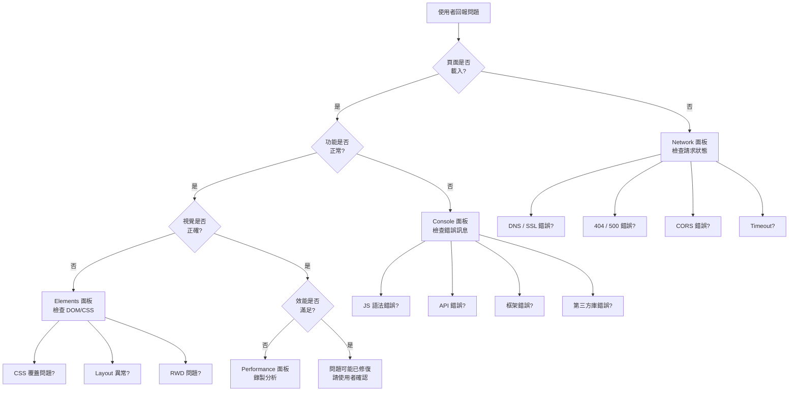

### 12.2 API 錯誤排查流程

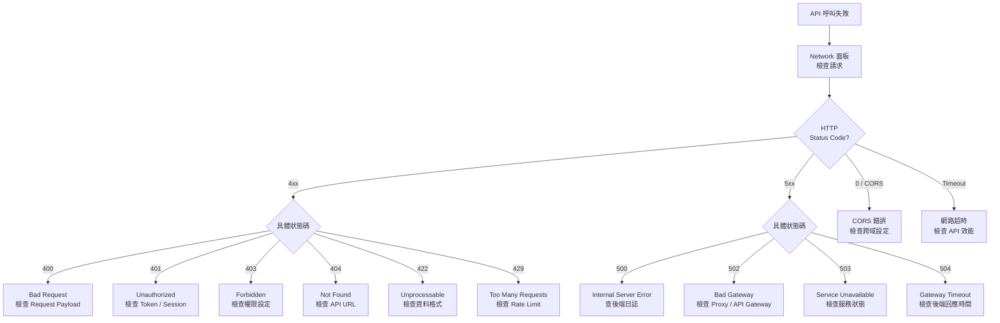

#### API 除錯 Checklist

| # | 檢查項目 | 工具 |
|---|----------|------|
| 1 | Request URL 是否正確 | Network → Headers → General |
| 2 | HTTP 方法是否正確 | Network → Headers → General |
| 3 | Request Headers 是否完整 | Network → Headers → Request Headers |
| 4 | Request Payload 格式正確 | Network → Payload |
| 5 | Token / Cookie 是否有效 | Network → Headers / Application → Cookies |
| 6 | Response Status 代碼含義 | Network → Headers → General |
| 7 | Response Body 是否正確 | Network → Response / Preview |
| 8 | Response Time 是否合理 | Network → Timing |
| 9 | CORS Headers 是否設定 | Network → Headers → Response Headers |
| 10 | 快取行為是否預期 | Network → Size 欄位 |

### 12.3 效能瓶頸診斷流程

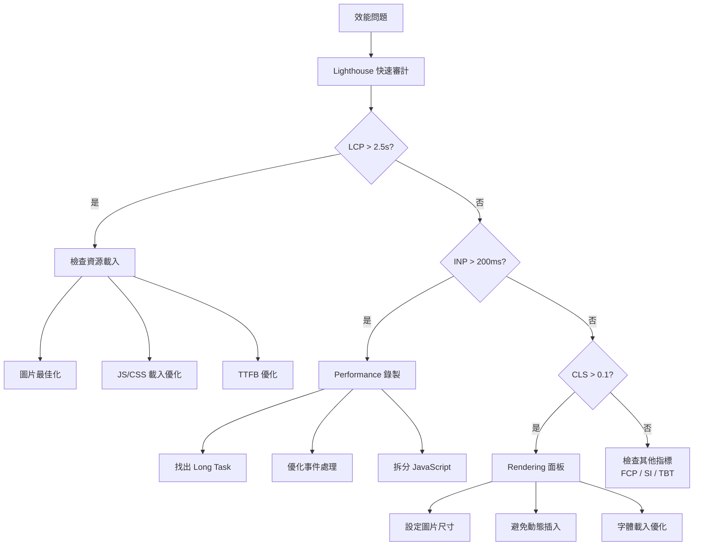

### 12.4 記憶體問題診斷流程

| 步驟 | 操作 | 工具 |
|------|------|------|
| 1 | 觀察記憶體趨勢 | 工作管理員（`Shift+Esc`） |
| 2 | 確認記憶體持續增長 | Performance Monitor |
| 3 | 取基準 Snapshot | Memory → Heap Snapshot |
| 4 | 執行疑似操作 | 手動操作 |
| 5 | 強制 GC | Memory → 🗑️ |
| 6 | 取比較 Snapshot | Memory → Heap Snapshot |
| 7 | 比較差異 | Comparison 視圖 |
| 8 | 找出洩漏源 | Retainers 面板 |
| 9 | 修復並驗證 | 重複步驟 3-7 |

### 12.5 生產環境 Debug 建議

| 建議 | 說明 |
|------|------|
| **使用 Source Map** | 部署 hidden source map，透過 DevTools 載入 |
| **結構化日誌** | 使用 JSON 格式日誌，包含 Request ID |
| **錯誤追蹤** | 使用 Sentry / Application Insights 等服務 |
| **效能監控** | 使用 Real User Monitoring (RUM) |
| **Feature Flag** | 使用 Feature Flag 控制功能開關 |
| **金絲雀部署** | 灰度釋出，逐步擴大 |
| **禁用 Console** | 生產環境移除所有 `console.log` |

#### 生產環境載入 Source Map

```javascript
// webpack.config.js - 生產環境使用 hidden-source-map
module.exports = {
    devtool: 'hidden-source-map', // 產生 .map 但不在 JS 中引用
};

// 在 DevTools 中手動載入：
// Sources → 右鍵 JS 檔案 → Add source map...
// 輸入 .map 檔案 URL
```

### 12.6 團隊 Debug SOP

#### 標準作業流程

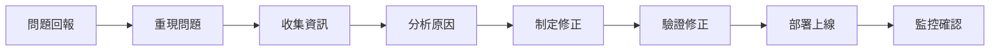

#### 問題回報標準格式

```markdown
## Bug 報告

**環境資訊：**
- 瀏覽器版本：Chrome 131.0.6778.85
- 作業系統：Windows 11
- 螢幕解析度：1920×1080
- 網路環境：公司內網 / 4G / WiFi

**重現步驟：**
1. 開啟頁面 https://app.example.com/dashboard
2. 點擊「帳務查詢」按鈕
3. 輸入日期範圍 2025/01/01 ~ 2025/12/31
4. 點擊「查詢」

**預期行為：**
顯示查詢結果列表

**實際行為：**
頁面卡住無回應

**附加資訊：**
- Console 錯誤截圖：[附圖]
- Network 面板截圖：[附圖]
- HAR 檔案：[附件]
```

#### 匯出 HAR 檔案

1. Network 面板 → 右鍵 → **Save all as HAR with content**
2. 將 HAR 檔案附在 Bug 報告中
3. 其他工程師可匯入 HAR 檔案分析

> **注意**：HAR 檔案可能包含敏感資訊（Token、Cookie），分享前請移除敏感資料。

---

## 第十三章：最佳實踐與團隊規範

### 13.1 團隊使用規範

#### DevTools 使用規範

| 規範 | 說明 |
|------|------|
| **無痕模式除錯** | 排除擴充功能干擾 |
| **統一 Throttling** | 團隊使用相同的網路模擬設定 |
| **共享 Snippets** | 建立團隊共用的 Debug Snippets |
| **禁用快取測試** | 功能測試時啟用 Disable cache |
| **HAR 歸檔** | 重大問題保留 HAR 檔案 |
| **Performance 基準** | 建立效能基準數據 |

#### 開發環境標準設定

```json
// .vscode/settings.json - 團隊標準 Chrome Debug 設定
{
    "debug.javascript.debugByLinkOptions": "always",
    "debug.javascript.autoAttachFilter": "smart",
    "debug.javascript.terminalOptions": {
        "skipFiles": [
            "<node_internals>/**",
            "**/node_modules/**"
        ]
    }
}
```

### 13.2 Debug Checklist

#### 前端 Debug 檢查清單

- [ ] **Console 錯誤清零**：頁面載入後 Console 無紅色錯誤
- [ ] **Network 無失敗請求**：檢查無 4xx / 5xx 錯誤
- [ ] **無 Mixed Content**：Security 面板顯示全綠
- [ ] **無 CORS 錯誤**：API 請求正常回應
- [ ] **無記憶體洩漏**：重複操作後記憶體不持續增長
- [ ] **無 Console Warning**：清除所有黃色警告
- [ ] **RWD 正常**：Device Mode 測試主要裝置
- [ ] **效能達標**：Lighthouse Performance ≥ 90
- [ ] **無障礙達標**：Lighthouse Accessibility ≥ 90
- [ ] **CSP 設定正確**：無 CSP 違規報告
- [ ] **Cookie 設定安全**：HttpOnly / Secure / SameSite
- [ ] **Source Map 正常**：Sources 面板可對應原始碼

### 13.3 效能優化 Checklist

#### 載入效能

- [ ] **LCP ≤ 2.5 秒**
- [ ] **FCP ≤ 1.8 秒**
- [ ] **SI ≤ 3.4 秒**
- [ ] 啟用 gzip / Brotli 壓縮
- [ ] 靜態資源使用 CDN
- [ ] 圖片使用 WebP / AVIF 格式
- [ ] 使用 `loading="lazy"` 延遲載入
- [ ] 關鍵 CSS 內聯
- [ ] 非關鍵 JS 使用 `defer` / `async`
- [ ] 使用 `<link rel="preload">` 預載入關鍵資源
- [ ] 使用 `<link rel="preconnect">` 預連線
- [ ] 啟用 HTTP/2 或 HTTP/3

#### 執行效能

- [ ] **INP ≤ 200ms**
- [ ] **TBT ≤ 200ms**
- [ ] 無 Long Task（> 50ms）
- [ ] 使用 `requestAnimationFrame` 動畫
- [ ] 避免 Layout Thrashing
- [ ] 使用 `transform` / `opacity` 做動畫
- [ ] 使用 Web Worker 處理重計算
- [ ] 使用虛擬列表處理大量資料

#### 視覺穩定性

- [ ] **CLS ≤ 0.1**
- [ ] 所有圖片/影片設定尺寸
- [ ] 字體載入使用 `font-display: swap`
- [ ] 避免動態插入 DOM 造成位移
- [ ] 廣告/動態內容預留空間

### 13.4 Code Review 與 DevTools 使用建議

#### Code Review 時使用 DevTools 驗證

| 驗證項目 | 方法 |
|----------|------|
| **功能正確性** | 實際操作頁面，Console 無錯誤 |
| **API 正確性** | Network 面板檢查 Request/Response |
| **效能影響** | Performance 面板比較修改前後 |
| **記憶體影響** | Memory 面板比較修改前後 |
| **安全性** | Security 面板確認無問題 |
| **RWD** | Device Mode 測試多種裝置 |
| **無障礙** | Lighthouse Accessibility 審計 |

#### 建議在 PR Template 加入

```markdown
## DevTools 驗證清單

- [ ] Console 無新增錯誤/警告
- [ ] Network 所有 API 正常回應
- [ ] 無新增效能問題（Performance 錄製）
- [ ] 無新增記憶體洩漏（Memory Snapshot）
- [ ] Lighthouse Performance ≥ 90
- [ ] RWD 測試通過（Mobile / Tablet / Desktop）
```

---

## 附錄 A：常見問題 FAQ

### Q1：DevTools 開啟後頁面變慢，是正常的嗎？

是的，DevTools 開啟時會增加額外開銷（尤其是 Performance 和 Memory 面板），但通常影響不大。建議在效能測試時使用無痕模式並關閉不必要的面板。

### Q2：為什麼 Console 的 `console.log` 顯示的物件值與預期不同？

`console.log` 會延遲展開物件。當你展開物件時，看到的是**當下**的值，而非 `console.log` 被呼叫時的值。使用 `console.log(JSON.parse(JSON.stringify(obj)))` 可凍結當時的值。

### Q3：如何在 DevTools 中除錯 minified（壓縮後）的 JavaScript？

1. 確認 Source Map 已啟用（Settings → Sources → Enable JavaScript source maps）
2. 如果沒有 Source Map，可以使用 `{}` Pretty print 按鈕格式化壓縮後的程式碼
3. 對於生產環境，可使用 Add source map 手動載入

### Q4：Network 面板中 `(blocked:mixed-content)` 是什麼意思？

HTTPS 頁面嘗試載入 HTTP 資源被瀏覽器阻擋。解決方式是將所有資源改為 HTTPS。

### Q5：為什麼 Lighthouse 每次跑分不一樣？

Lighthouse 受系統資源、網路狀態、瀏覽器擴充功能等多種因素影響。建議：
- 使用無痕模式
- 關閉其他分頁
- 多次執行取中位數
- 使用 CI 環境（Lighthouse CI）取得穩定結果

### Q6：DevTools 的 Elements 修改為什麼刷新後就消失了？

DevTools 的修改預設是暫時性的。使用 **Local Overrides** 或 **Workspace** 功能可以持久化修改。

### Q7：如何在手機上使用 Chrome DevTools？

**Android 遠端除錯：**
1. 手機開啟 USB 除錯模式
2. USB 連接電腦
3. Chrome 開啟 `chrome://inspect`
4. 點擊裝置旁的 **inspect**

**iOS 除錯：**
- 使用 Safari 的 Web Inspector（需 Mac）
- 或使用 `chrome://inspect` + iOS WebKit Debug Proxy

### Q8：如何將 DevTools 中的修改轉換為程式碼修改？

1. **Elements 面板**：右鍵修改的元素 → Copy → Copy styles / Copy element
2. **Sources 面板**：修改完直接 `Ctrl+S` 儲存（需設定 Workspace）
3. **Network 面板**：右鍵 → Copy as fetch / Copy as cURL
4. **Changes 面板**：`Ctrl+Shift+P` → Show Changes，查看所有修改的 diff

---

## 附錄 B：面試常考 DevTools 問題

### 基礎題

1. **如何在 DevTools 中找出頁面中所有未使用的 CSS？**
   - Coverage 面板（`Ctrl+Shift+P` → Show Coverage）

2. **如何模擬行動裝置瀏覽？**
   - Device Mode（`Ctrl+Shift+M`），可設定裝置型號、螢幕尺寸、User Agent

3. **如何找出導致頁面重繪（Repaint）的元素？**
   - Rendering 面板 → Paint flashing

### 進階題

4. **描述你如何診斷一個 SPA 應用的記憶體洩漏？**
   - 使用 Heap Snapshot 比較法（三步驟法）
   - 搭配 Allocation Timeline 追蹤分配

5. **如何優化 Core Web Vitals 中的 LCP？**
   - Performance 面板分析 LCP 元素
   - 優化關鍵渲染路徑
   - 預載入 LCP 圖片

6. **解釋 Chrome 的多程序架構如何影響 DevTools 的工作方式？**
   - 每個 Tab 獨立 Renderer Process
   - DevTools 透過 CDP 與特定 Process 通訊

### 架構師題

7. **如何在企業級專案中建立效能監控體系？**
   - Lighthouse CI + Real User Monitoring (RUM) + 自訂 Performance Budget

8. **如何設計一個安全的 CSP 策略？**
   - 從嚴格策略開始 → Report-Only 模式收集違規 → 逐步放寬

---

## 附錄 C：團隊培訓建議

### 培訓計劃

| 階段 | 對象 | 內容 | 時長 |
|------|------|------|------|
| **基礎** | 新進工程師 | Elements / Console / Network | 2 小時 |
| **進階** | 中階工程師 | Sources / Performance / Memory | 4 小時 |
| **專業** | 資深工程師 | 效能優化 / Debug SOP / 安全分析 | 4 小時 |
| **實戰** | 全員 | 案例分析 / Pair Debug | 2 小時 |

### 建議培訓方式

1. **動手實作**：準備含有 Bug 的範例專案，讓學員使用 DevTools 找出問題
2. **Case Study**：分享團隊實際遇到的問題與 DevTools 解決方案
3. **Pair Debug**：兩人一組互相出題除錯
4. **定期分享**：每月一次 DevTools 技巧分享會
5. **Snippet 共建**：團隊共同維護 Debug Snippet 庫

---

## 附錄 D：延伸學習資源

### 官方資源

| 資源 | 連結 |
|------|------|
| Chrome DevTools 官方文件 | https://developer.chrome.com/docs/devtools/ |
| Chrome DevTools Protocol | https://chromedevtools.github.io/devtools-protocol/ |
| Web.dev（效能最佳實踐） | https://web.dev/ |
| Lighthouse 文件 | https://developer.chrome.com/docs/lighthouse/ |
| Chrome Release Notes | https://developer.chrome.com/blog/ |

### 社群資源

| 資源 | 說明 |
|------|------|
| **Chrome DevTools Tips** | https://devtoolstips.org/ |
| **Can I Use** | 檢查瀏覽器相容性 |
| **web-vitals** | Google 的 Web Vitals JavaScript 庫 |
| **Lighthouse CI** | CI/CD 整合 Lighthouse |

### 推薦工具

| 工具 | 用途 |
|------|------|
| **Puppeteer** | 自動化 Chrome 操作（效能測試、截圖） |
| **Playwright** | 跨瀏覽器自動化測試 |
| **Lighthouse CI** | CI/CD 效能門檻檢查 |
| **WebPageTest** | 線上效能分析 |
| **Sentry** | 生產環境錯誤追蹤 |
| **Workbox** | Service Worker 工具組 |

---

## 附錄 E：檢查清單（Checklist）

### 新進成員 DevTools 入門清單

#### 第一天

- [ ] 安裝 Chrome 最新穩定版
- [ ] 熟悉開啟 DevTools 的快捷鍵（`F12` / `Ctrl+Shift+I`）
- [ ] 設定 DevTools 主題（Dark Mode）
- [ ] 學會使用 `Ctrl+Shift+C` 選取元素
- [ ] 學會在 Console 輸入 JavaScript 指令
- [ ] 學會查看 Network 面板中的 API 請求

#### 第一週

- [ ] 學會使用 Elements 面板修改 DOM 和 CSS
- [ ] 學會使用 Console 的進階 API（table / group / time）
- [ ] 學會設定 Breakpoint 進行 JavaScript 除錯
- [ ] 學會使用 Network 面板分析 API 請求和回應
- [ ] 學會使用 Device Mode 測試 RWD
- [ ] 學會使用 `Ctrl+Shift+P` 開啟 Command Menu

#### 第一個月

- [ ] 學會使用 Performance 面板錄製和分析效能
- [ ] 學會使用 Memory 面板診斷記憶體問題
- [ ] 學會使用 Application 面板管理儲存
- [ ] 學會使用 Lighthouse 進行效能審計
- [ ] 學會設定 Source Map 進行原始碼除錯
- [ ] 學會使用 Local Overrides 持久化修改
- [ ] 建立個人常用的 Debug Snippets

#### 持續精進

- [ ] 理解瀏覽器渲染管線
- [ ] 掌握 Core Web Vitals 優化技巧
- [ ] 能獨立診斷效能瓶頸
- [ ] 能獨立診斷記憶體洩漏
- [ ] 參與團隊 Debug SOP 建立
- [ ] 分享 DevTools 使用技巧給團隊

---

### 日常開發 Checklist

| # | 項目 | 頻率 |
|---|------|------|
| 1 | Console 無錯誤/警告 | 每次提交 |
| 2 | API 回應正常 | 每次提交 |
| 3 | RWD 測試（Mobile / Tablet / Desktop） | 每次 UI 修改 |
| 4 | Lighthouse 審計 ≥ 90 分 | 每週 / Sprint |
| 5 | 記憶體洩漏檢查 | 每個 Sprint |
| 6 | Security 面板無警告 | 每次部署前 |
| 7 | Performance 基準比較 | 每個 Release |
| 8 | HAR 檔案歸檔（重大問題） | 依需求 |

---

> **本手冊版權**：內部培訓教材，僅供團隊使用。  
> **聯絡方式**：如有問題或建議，請聯繫前端架構團隊。  
> **最後更新**：2026-02-14

