+++
date = '2026-01-29T19:09:08+08:00'
draft = false
title = 'ELK Stack教學手冊'
tags = ['教學', '工具', 'Visualization','ELK stack']
categories = ['教學']
+++


# Logstash / Elasticsearch / Kibana（ELK Stack）教學手冊

> **版本**：1.0  
> **最後更新**：2026 年 1 月  
> **適用對象**：資深軟體工程師、系統架構師、SRE / DevOps 工程師 
> **前置知識**：Linux 基礎、Java 應用程式、基本網路概念
> **最後更新**: 2026年1月27日  
> **適用於**: Logs Visualization 
> **Created by**: Eric Cheng

## 目錄

- [第一章：Logs Visualization 與 ELK Stack 概述](#第一章logs-visualization-與-elk-stack-概述)
  - [1.1 為什麼需要 Logs Visualization](#11-為什麼需要-logs-visualization)
  - [1.2 Logs 與 Metrics 的差異與互補](#12-logs-與-metrics-的差異與互補)
  - [1.3 ELK Stack 架構總覽](#13-elk-stack-架構總覽)
  - [1.4 ELK 在 Observability 架構中的角色](#14-elk-在-observability-架構中的角色)
  - [1.5 與 AI 輔助開發的關係](#15-與-ai-輔助開發的關係)
- [第二章：系統整體架構設計](#第二章系統整體架構設計)
  - [2.1 ELK Stack 架構圖](#21-elk-stack-架構圖)
  - [2.2 各元件角色說明](#22-各元件角色說明)
  - [2.3 單節點 vs 多節點架構](#23-單節點-vs-多節點架構)
  - [2.4 Production 建議架構](#24-production-建議架構)
  - [2.5 與 Prometheus / Grafana 並存架構](#25-與-prometheus--grafana-並存架構)
- [第三章：系統安裝](#第三章系統安裝)
  - [3.1 環境需求總覽](#31-環境需求總覽)
  - [3.2 Elasticsearch 安裝](#32-elasticsearch-安裝)
  - [3.3 Logstash 安裝](#33-logstash-安裝)
  - [3.4 Kibana 安裝](#34-kibana-安裝)
  - [3.5 常見安裝問題排除](#35-常見安裝問題排除)
- [第四章：系統設定](#第四章系統設定)
  - [4.1 Elasticsearch 設定](#41-elasticsearch-設定)
  - [4.2 Logstash 設定](#42-logstash-設定)
  - [4.3 Kibana 設定](#43-kibana-設定)
- [第五章：三者如何串接](#第五章三者如何串接)
  - [5.1 End-to-End 資料流](#51-end-to-end-資料流)
  - [5.2 實際串接範例](#52-實際串接範例)
  - [5.3 Filebeat 整合](#53-filebeat-整合)
- [第六章：系統使用](#第六章系統使用)
  - [6.1 Kibana 操作教學](#61-kibana-操作教學)
  - [6.2 查詢語法詳解](#62-查詢語法詳解)
  - [6.3 實務使用情境](#63-實務使用情境)
- [第七章：系統維護](#第七章系統維護)
  - [7.1 Index 管理策略](#71-index-管理策略)
  - [7.2 效能調校](#72-效能調校)
  - [7.3 健康檢查與監控](#73-健康檢查與監控)
- [第八章：系統升級](#第八章系統升級)
  - [8.1 升級前準備](#81-升級前準備)
  - [8.2 各元件升級流程](#82-各元件升級流程)
  - [8.3 回復策略](#83-回復策略)
- [第九章：安全性與權限管理](#第九章安全性與權限管理)
  - [9.1 Security 基本概念](#91-security-基本概念)
  - [9.2 使用者與角色管理](#92-使用者與角色管理)
  - [9.3 企業資安考量](#93-企業資安考量)
- [第十章：最佳實務與導入建議](#第十章最佳實務與導入建議)
  - [10.1 導入常見踩雷點](#101-導入常見踩雷點)
  - [10.2 結構化 Log 設計原則](#102-結構化-log-設計原則)
  - [10.3 與 AI 分析結合](#103-與-ai-分析結合)
  - [10.4 與 Prometheus / Grafana 分工](#104-與-prometheus--grafana-分工)
- [附錄：檢查清單](#附錄檢查清單)
  - [安裝檢查清單](#安裝檢查清單)
  - [設定檢查清單](#設定檢查清單)
  - [上線檢查清單](#上線檢查清單)
  - [維運檢查清單（每日）](#維運檢查清單每日)
  - [升級檢查清單](#升級檢查清單)
- [參考資源](#參考資源)

---

## 第一章：Logs Visualization 與 ELK Stack 概述

### 1.1 為什麼需要 Logs Visualization

在現代企業級系統中，Log 是系統運行的「黑盒子記錄器」，記錄了系統每一個關鍵時刻的狀態與行為。

#### 傳統 Log 管理的痛點

| 痛點 | 說明 |
|------|------|
| **分散儲存** | Log 散落在各台伺服器，查詢困難 |
| **格式不一** | 各系統 Log 格式不統一，難以分析 |
| **查詢困難** | 只能用 `grep`、`tail` 等指令，效率低下 |
| **無法關聯** | 跨系統問題追蹤困難，無法快速定位根因 |
| **保存期限** | 磁碟空間有限，歷史 Log 難以保存 |

#### Logs Visualization 帶來的價值

```
┌─────────────────────────────────────────────────────────────┐
│                    Logs Visualization 價值                   │
├─────────────────────────────────────────────────────────────┤
│  ✅ 集中管理：所有 Log 統一收集、儲存、查詢                    │
│  ✅ 快速搜尋：秒級查詢 TB 級 Log 資料                         │
│  ✅ 視覺化分析：Dashboard 呈現趨勢與異常                      │
│  ✅ 即時告警：異常 Log Pattern 自動通知                       │
│  ✅ 歷史回溯：完整保存，支援稽核與事故分析                     │
└─────────────────────────────────────────────────────────────┘
```

#### 實務案例

> **情境**：某銀行核心系統發生交易失敗，需在 5 分鐘內定位問題。
> 
> - **沒有 ELK**：需登入 10+ 台伺服器，逐一 grep Log，耗時 30 分鐘以上
> - **有 ELK**：在 Kibana 輸入 Transaction ID，3 秒內找到完整交易鏈路

---

### 1.2 Logs 與 Metrics 的差異與互補

組織已導入 Prometheus + Grafana 作為 Metrics 平台，ELK 與其為互補關係：

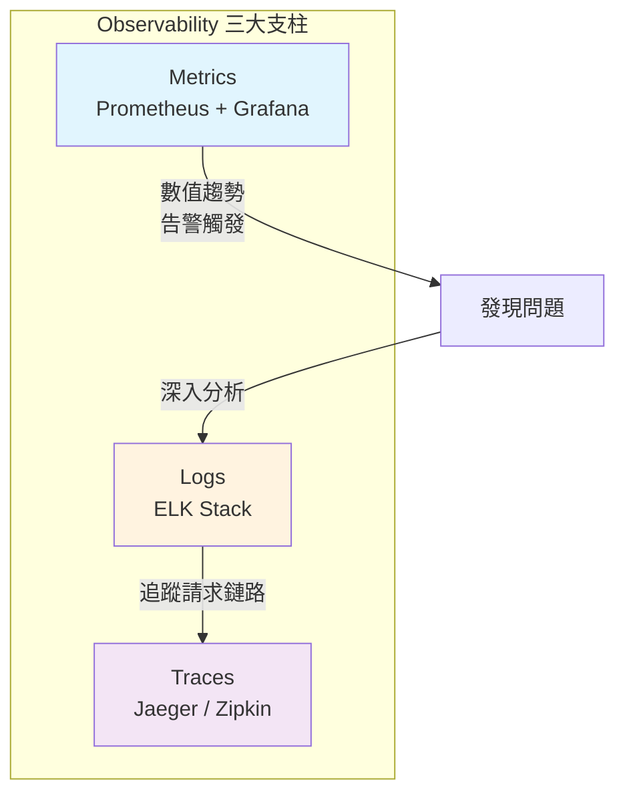
```mermaid
graph TB
    subgraph "Observability 三大支柱"
        M[Metrics<br/>Prometheus + Grafana]
        L[Logs<br/>ELK Stack]
        T[Traces<br/>Jaeger / Zipkin]
    end
    
    M -->|"數值趨勢<br/>告警觸發"| Alert[發現問題]
    Alert -->|"深入分析"| L
    L -->|"追蹤請求鏈路"| T
    
    style M fill:#e1f5fe
    style L fill:#fff3e0
    style T fill:#f3e5f5
```

#### 對比表

| 面向 | Metrics (Prometheus) | Logs (ELK) |
|------|---------------------|------------|
| **資料類型** | 數值型（Counter、Gauge、Histogram） | 文字型（事件、訊息、堆疊） |
| **用途** | 趨勢監控、告警、容量規劃 | 問題排查、稽核、行為分析 |
| **查詢方式** | PromQL（聚合查詢） | KQL / Lucene（全文檢索） |
| **資料量** | 相對小（聚合後的數值） | 相對大（完整文字內容） |
| **保存週期** | 通常 15-90 天 | 依法規 30 天至數年 |
| **典型問題** | 「系統 CPU 何時飆高？」 | 「CPU 飆高時發生什麼事？」 |

#### 互補使用流程

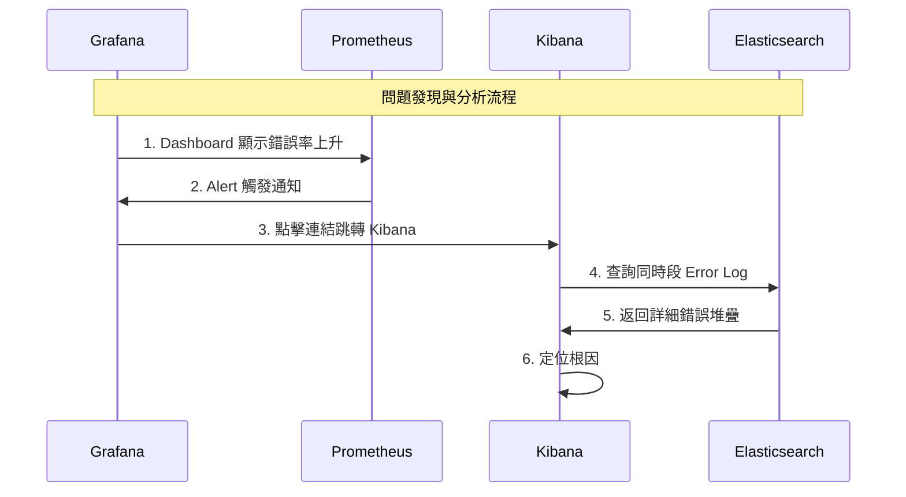
```mermaid
sequenceDiagram
    participant G as Grafana
    participant P as Prometheus
    participant K as Kibana
    participant E as Elasticsearch
    
    Note over G,E: 問題發現與分析流程
    G->>P: 1. Dashboard 顯示錯誤率上升
    P->>G: 2. Alert 觸發通知
    G->>K: 3. 點擊連結跳轉 Kibana
    K->>E: 4. 查詢同時段 Error Log
    E->>K: 5. 返回詳細錯誤堆疊
    K->>K: 6. 定位根因
```

---

### 1.3 ELK Stack 架構總覽

ELK Stack 由三個核心元件組成：

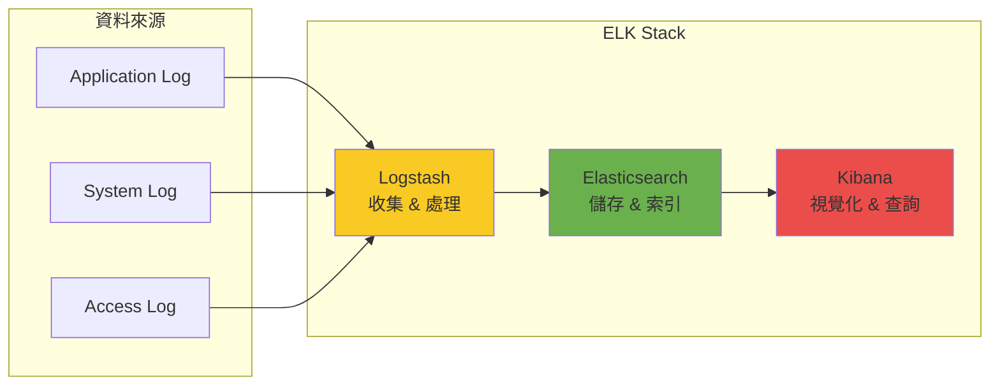
```mermaid
graph LR
    subgraph "資料來源"
        A1[Application Log]
        A2[System Log]
        A3[Access Log]
    end
    
    subgraph "ELK Stack"
        L[Logstash<br/>收集 & 處理]
        E[Elasticsearch<br/>儲存 & 索引]
        K[Kibana<br/>視覺化 & 查詢]
    end
    
    A1 --> L
    A2 --> L
    A3 --> L
    L --> E
    E --> K
    
    style L fill:#f9ca24
    style E fill:#6ab04c
    style K fill:#eb4d4b
```

#### 元件簡介

| 元件 | 角色 | 類比 |
|------|------|------|
| **Logstash** | 資料收集與處理引擎 | ETL 工具 |
| **Elasticsearch** | 分散式搜尋與分析引擎 | 資料庫 + 搜尋引擎 |
| **Kibana** | 視覺化與管理介面 | BI 報表工具 |

---

### 1.4 ELK 在 Observability 架構中的角色

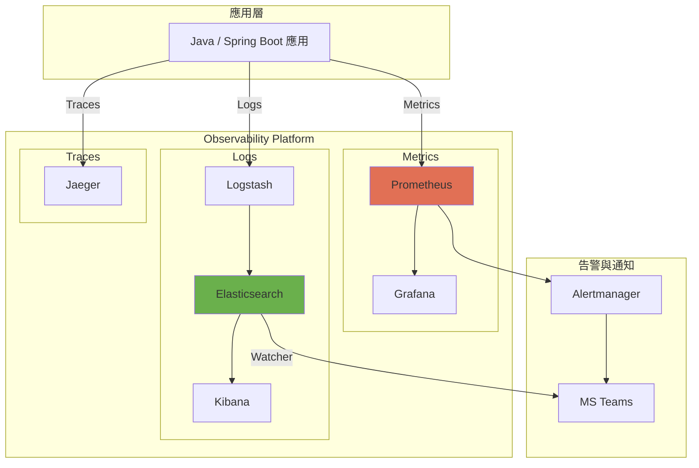
```mermaid
graph TB
    subgraph "應用層"
        App[Java / Spring Boot 應用]
    end
    
    subgraph "Observability Platform"
        subgraph "Metrics"
            Prom[Prometheus]
            Graf[Grafana]
        end
        
        subgraph "Logs"
            LS[Logstash]
            ES[Elasticsearch]
            Kib[Kibana]
        end
        
        subgraph "Traces"
            Jaeg[Jaeger]
        end
    end
    
    subgraph "告警與通知"
        AM[Alertmanager]
        Teams[MS Teams]
    end
    
    App -->|"Metrics"| Prom
    App -->|"Logs"| LS
    App -->|"Traces"| Jaeg
    
    Prom --> Graf
    LS --> ES --> Kib
    
    Prom --> AM --> Teams
    ES -->|"Watcher"| Teams
    
    style ES fill:#6ab04c
    style Prom fill:#e17055
```

#### Observability 分層職責

| 層級 | 工具 | 回答的問題 |
|------|------|-----------|
| **What** | Metrics (Prometheus) | 發生了什麼？（錯誤率上升） |
| **Why** | Logs (ELK) | 為什麼發生？（NullPointerException） |
| **Where** | Traces (Jaeger) | 在哪裡發生？（Service A → Service B） |

---

### 1.5 與 AI 輔助開發的關係

ELK 收集的結構化 Log 是 AI 分析的絕佳資料來源：

#### AI 輔助場景

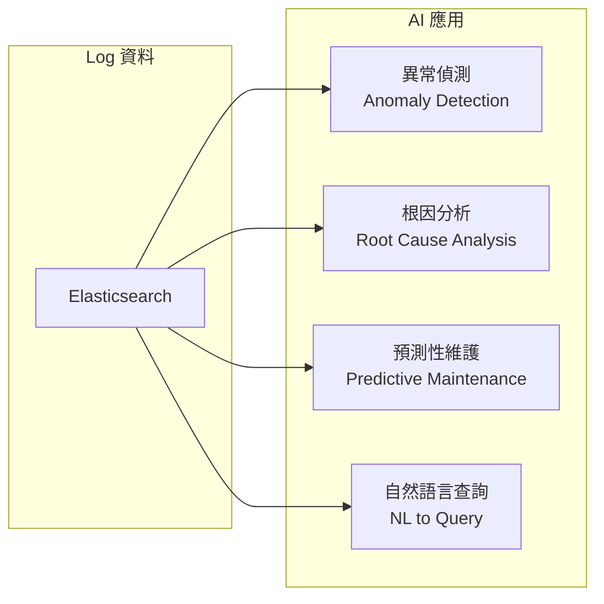
```mermaid
graph LR
    subgraph "Log 資料"
        E[Elasticsearch]
    end
    
    subgraph "AI 應用"
        A1[異常偵測<br/>Anomaly Detection]
        A2[根因分析<br/>Root Cause Analysis]
        A3[預測性維護<br/>Predictive Maintenance]
        A4[自然語言查詢<br/>NL to Query]
    end
    
    E --> A1
    E --> A2
    E --> A3
    E --> A4
```

#### 實務應用範例

**1. 自然語言查詢**
```
👤 使用者問：「昨天下午 3 點到 4 點，訂單服務有多少 Error？」

🤖 AI 轉換為 KQL：
service.name: "order-service" AND level: "ERROR" 
AND @timestamp >= "2026-01-26T15:00:00" 
AND @timestamp < "2026-01-26T16:00:00"
```

**2. 異常 Pattern 識別**
```
🤖 AI 分析結果：
「偵測到異常 Pattern：每週三 14:00-14:30 期間，
  payment-service 的 Connection Timeout 錯誤率上升 300%。
  建議檢查該時段是否有排程任務造成資源競爭。」
```

**3. 根因分析輔助**
```
👤 問：「交易 TXN-20260127-001 為什麼失敗？」

🤖 AI 分析 Log 鏈路後回答：
「交易失敗根因：
  1. order-service 收到請求 (14:32:01.123)
  2. 呼叫 inventory-service 檢查庫存 (14:32:01.456)
  3. inventory-service 回應 timeout (14:32:06.789) ← 瓶頸
  4. order-service 拋出 ServiceUnavailableException
  
  建議：檢查 inventory-service 該時段的資源使用狀況」
```

---

> 💡 **本章重點**
> - Logs Visualization 解決傳統 Log 管理的分散、難查、難關聯問題
> - ELK 與 Prometheus/Grafana 是互補關係，共同構成完整 Observability
> - ELK 收集的結構化 Log 是 AI 分析的重要資料來源

---

## 第二章：系統整體架構設計

### 2.1 ELK Stack 架構圖

#### 基礎架構（小型環境）

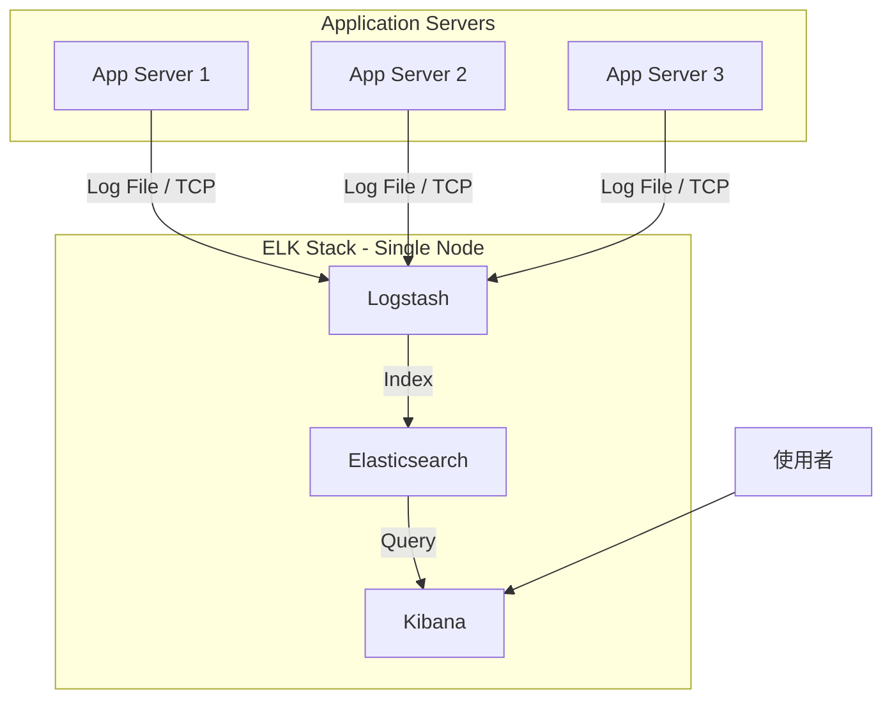
```mermaid
graph TB
    subgraph "Application Servers"
        App1[App Server 1]
        App2[App Server 2]
        App3[App Server 3]
    end
    
    subgraph "ELK Stack - Single Node"
        LS[Logstash]
        ES[Elasticsearch]
        K[Kibana]
    end
    
    App1 -->|"Log File / TCP"| LS
    App2 -->|"Log File / TCP"| LS
    App3 -->|"Log File / TCP"| LS
    
    LS -->|"Index"| ES
    ES -->|"Query"| K
    
    User[使用者] --> K
```

#### 企業級架構（大型環境）

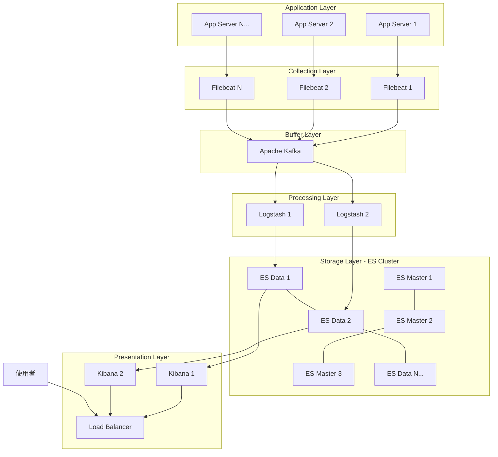
```mermaid
graph TB
    subgraph "Application Layer"
        App1[App Server 1]
        App2[App Server 2]
        App3[App Server N...]
    end
    
    subgraph "Collection Layer"
        FB1[Filebeat 1]
        FB2[Filebeat 2]
        FB3[Filebeat N]
    end
    
    subgraph "Buffer Layer"
        Kafka[Apache Kafka]
    end
    
    subgraph "Processing Layer"
        LS1[Logstash 1]
        LS2[Logstash 2]
    end
    
    subgraph "Storage Layer - ES Cluster"
        ES1[ES Master 1]
        ES2[ES Master 2]
        ES3[ES Master 3]
        ES4[ES Data 1]
        ES5[ES Data 2]
        ES6[ES Data N...]
    end
    
    subgraph "Presentation Layer"
        K1[Kibana 1]
        K2[Kibana 2]
        LB[Load Balancer]
    end
    
    App1 --> FB1
    App2 --> FB2
    App3 --> FB3
    
    FB1 --> Kafka
    FB2 --> Kafka
    FB3 --> Kafka
    
    Kafka --> LS1
    Kafka --> LS2
    
    LS1 --> ES4
    LS2 --> ES5
    
    ES1 --- ES2 --- ES3
    ES4 --- ES5 --- ES6
    
    ES4 --> K1
    ES5 --> K2
    
    K1 --> LB
    K2 --> LB
    
    User[使用者] --> LB
```

---

### 2.2 各元件角色說明

#### Logstash - 資料處理引擎

```
┌─────────────────────────────────────────────────────────────┐
│                      Logstash Pipeline                       │
├─────────────┬─────────────────────────┬────────────────────┤
│   INPUT     │        FILTER           │      OUTPUT        │
├─────────────┼─────────────────────────┼────────────────────┤
│ • file      │ • grok (正規表達式解析)  │ • elasticsearch   │
│ • beats     │ • mutate (欄位修改)      │ • file            │
│ • tcp/udp   │ • date (時間解析)        │ • kafka           │
│ • kafka     │ • geoip (地理位置)       │ • stdout          │
│ • jdbc      │ • useragent             │ • email           │
└─────────────┴─────────────────────────┴────────────────────┘
```

**核心功能**：
- 從多種來源收集資料
- 解析、轉換、enrichment
- 輸出到多種目的地

#### Elasticsearch - 分散式搜尋引擎

```
┌─────────────────────────────────────────────────────────────┐
│                    Elasticsearch Cluster                     │
├─────────────────────────────────────────────────────────────┤
│  ┌─────────────┐  ┌─────────────┐  ┌─────────────┐         │
│  │  Master     │  │  Master     │  │  Master     │         │
│  │  Node 1     │  │  Node 2     │  │  Node 3     │         │
│  └─────────────┘  └─────────────┘  └─────────────┘         │
│         │               │               │                   │
│  ┌──────┴───────────────┴───────────────┴──────┐           │
│  │              Cluster State                   │           │
│  └──────────────────────────────────────────────┘           │
│                                                             │
│  ┌─────────────┐  ┌─────────────┐  ┌─────────────┐         │
│  │  Data       │  │  Data       │  │  Data       │         │
│  │  Node 1     │  │  Node 2     │  │  Node N     │         │
│  │  ┌───────┐  │  │  ┌───────┐  │  │  ┌───────┐  │         │
│  │  │Shard 0│  │  │  │Shard 1│  │  │  │Shard 2│  │         │
│  │  │Primary│  │  │  │Primary│  │  │  │Primary│  │         │
│  │  └───────┘  │  │  └───────┘  │  │  └───────┘  │         │
│  │  ┌───────┐  │  │  ┌───────┐  │  │  ┌───────┐  │         │
│  │  │Shard 1│  │  │  │Shard 2│  │  │  │Shard 0│  │         │
│  │  │Replica│  │  │  │Replica│  │  │  │Replica│  │         │
│  │  └───────┘  │  │  └───────┘  │  │  └───────┘  │         │
│  └─────────────┘  └─────────────┘  └─────────────┘         │
└─────────────────────────────────────────────────────────────┘
```

**核心概念**：
| 概念 | 說明 |
|------|------|
| **Cluster** | 多個 Node 組成的叢集 |
| **Node** | 單一 Elasticsearch 實例 |
| **Index** | 類似資料庫的 Table |
| **Shard** | Index 的水平分割單位 |
| **Replica** | Shard 的副本，提供 HA |

#### Kibana - 視覺化平台

```
┌─────────────────────────────────────────────────────────────┐
│                      Kibana 功能模組                         │
├──────────────┬──────────────┬──────────────┬───────────────┤
│   Discover   │  Visualize   │  Dashboard   │   Management  │
├──────────────┼──────────────┼──────────────┼───────────────┤
│ • Log 查詢   │ • 圖表建立   │ • 儀表板組合 │ • Index 管理  │
│ • 全文檢索   │ • 多種圖型   │ • 即時更新   │ • 使用者管理  │
│ • 時間篩選   │ • 聚合分析   │ • 分享匯出   │ • 空間管理    │
└──────────────┴──────────────┴──────────────┴───────────────┘
```

---

### 2.3 單節點 vs 多節點架構

#### 架構選擇決策表

| 面向 | 單節點 | 多節點叢集 |
|------|--------|-----------|
| **適用場景** | 開發、測試、POC | 正式環境、大流量 |
| **Log 量** | < 10 GB/天 | > 10 GB/天 |
| **可用性** | 無 HA | 支援 HA |
| **擴展性** | 有限 | 水平擴展 |
| **成本** | 低 | 較高 |
| **維運複雜度** | 簡單 | 較複雜 |

#### 節點類型說明

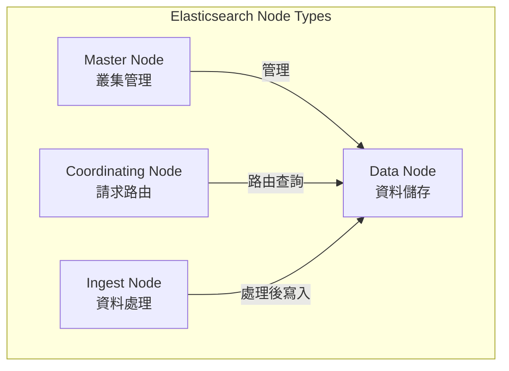
```mermaid
graph TB
    subgraph "Elasticsearch Node Types"
        M[Master Node<br/>叢集管理]
        D[Data Node<br/>資料儲存]
        I[Ingest Node<br/>資料處理]
        C[Coordinating Node<br/>請求路由]
    end
    
    M -->|"管理"| D
    C -->|"路由查詢"| D
    I -->|"處理後寫入"| D
```

| 節點類型 | 職責 | 建議數量 |
|---------|------|---------|
| **Master** | 叢集狀態管理、Index 建立/刪除 | 3（奇數，避免腦裂） |
| **Data** | 儲存資料、執行 CRUD | 依資料量調整 |
| **Ingest** | 資料前處理（類似輕量 Logstash） | 選配 |
| **Coordinating** | 請求路由、結果聚合 | 選配（高查詢量時） |

---

### 2.4 Production 建議架構

#### 中型企業建議架構（日誌量 50-200 GB/天）

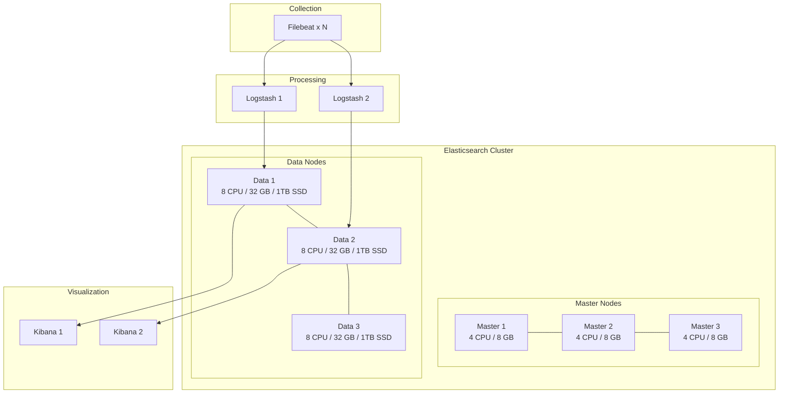
```mermaid
graph TB
    subgraph "Collection"
        FB[Filebeat x N]
    end
    
    subgraph "Processing"
        LS1[Logstash 1]
        LS2[Logstash 2]
    end
    
    subgraph "Elasticsearch Cluster"
        subgraph "Master Nodes"
            M1[Master 1<br/>4 CPU / 8 GB]
            M2[Master 2<br/>4 CPU / 8 GB]
            M3[Master 3<br/>4 CPU / 8 GB]
        end
        
        subgraph "Data Nodes"
            D1[Data 1<br/>8 CPU / 32 GB / 1TB SSD]
            D2[Data 2<br/>8 CPU / 32 GB / 1TB SSD]
            D3[Data 3<br/>8 CPU / 32 GB / 1TB SSD]
        end
    end
    
    subgraph "Visualization"
        K1[Kibana 1]
        K2[Kibana 2]
    end
    
    FB --> LS1
    FB --> LS2
    LS1 --> D1
    LS2 --> D2
    D1 --- D2 --- D3
    M1 --- M2 --- M3
    D1 --> K1
    D2 --> K2
```

#### 硬體規格建議

| 元件 | CPU | Memory | Disk | 數量 |
|------|-----|--------|------|------|
| **ES Master** | 4 cores | 8 GB | 50 GB SSD | 3 |
| **ES Data** | 8 cores | 32 GB | 1 TB SSD | 3+ |
| **Logstash** | 4 cores | 8 GB | 100 GB | 2 |
| **Kibana** | 2 cores | 4 GB | 20 GB | 2 |

#### 關鍵設計原則

```
┌─────────────────────────────────────────────────────────────┐
│                  Production 架構設計原則                     │
├─────────────────────────────────────────────────────────────┤
│  1. Master Node 獨立部署，不與 Data Node 混用               │
│  2. 至少 3 個 Master Node（避免腦裂）                       │
│  3. Data Node 使用 SSD，提升 I/O 效能                       │
│  4. Logstash 部署 2+ 台，避免單點故障                       │
│  5. 考慮加入 Kafka 作為 Buffer Layer                        │
│  6. Kibana 前端加 Load Balancer                             │
└─────────────────────────────────────────────────────────────┘
```

---

### 2.5 與 Prometheus / Grafana 並存架構

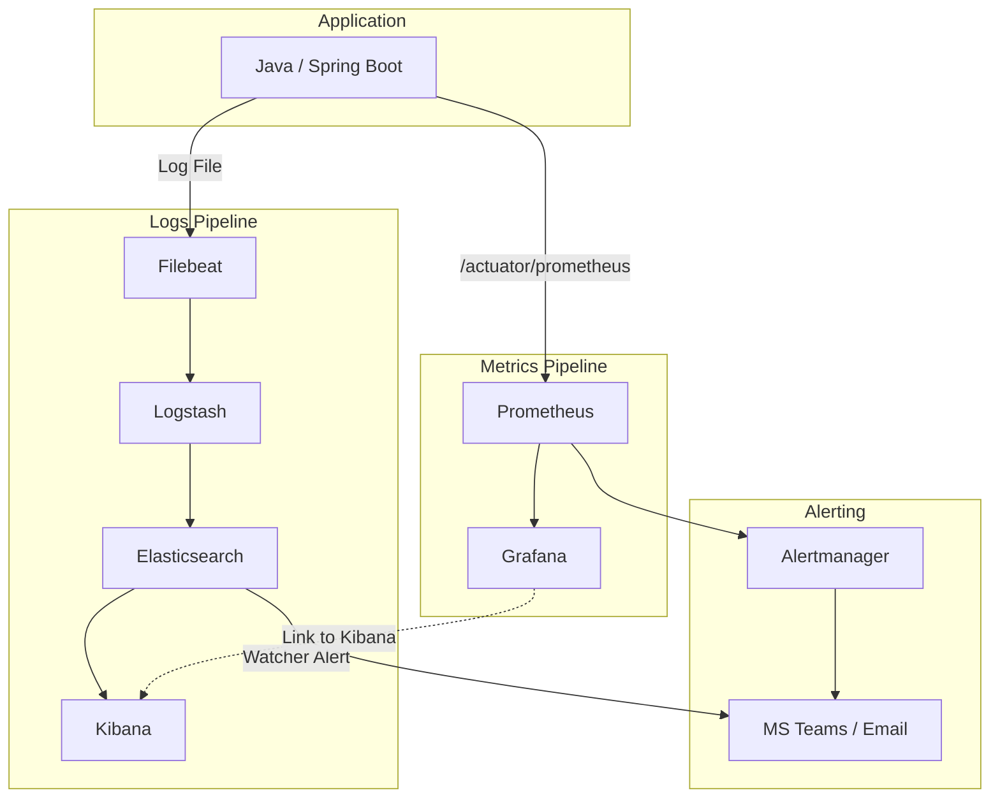
```mermaid
graph TB
    subgraph "Application"
        App[Java / Spring Boot]
    end
    
    subgraph "Metrics Pipeline"
        Prom[Prometheus]
        Graf[Grafana]
    end
    
    subgraph "Logs Pipeline"
        FB[Filebeat]
        LS[Logstash]
        ES[Elasticsearch]
        Kib[Kibana]
    end
    
    subgraph "Alerting"
        AM[Alertmanager]
        Teams[MS Teams / Email]
    end
    
    App -->|"/actuator/prometheus"| Prom
    App -->|"Log File"| FB
    
    Prom --> Graf
    FB --> LS --> ES --> Kib
    
    Prom --> AM --> Teams
    ES -->|"Watcher Alert"| Teams
    
    Graf -.->|"Link to Kibana"| Kib
```

#### 整合策略

| 策略 | 說明 |
|------|------|
| **統一時間軸** | Grafana 與 Kibana 使用相同時區設定 |
| **Deep Link 整合** | Grafana Alert 連結跳轉至 Kibana 查詢 |
| **共用告警通道** | 統一使用 Alertmanager 或 MS Teams |
| **Correlation ID** | Log 與 Metrics 使用相同 Trace ID 關聯 |

#### Grafana 連結 Kibana 範例

```yaml
# Grafana Alert 通知範本
alerting:
  notification_channels:
    - name: elk-deep-link
      type: webhook
      settings:
        url: "https://kibana.company.com/app/discover#/?_a=(query:(query_string:(query:'traceId:${traceId}')))"
```

---

> 💡 **本章重點**
> - 小型環境可用單節點，正式環境建議多節點叢集
> - Master Node 至少 3 台，Data Node 使用 SSD
> - 大流量環境加入 Kafka 作為 Buffer Layer
> - 與 Prometheus/Grafana 整合使用 Deep Link 與 Correlation ID

---

## 第三章：系統安裝

### 3.1 環境需求總覽

#### 作業系統支援

| OS | 支援狀態 | 建議 |
|----|---------|------|
| RHEL / CentOS 7, 8 | ✅ 完整支援 | 企業首選 |
| Ubuntu 18.04, 20.04, 22.04 | ✅ 完整支援 | 開發環境 |
| Debian 10, 11 | ✅ 完整支援 | |
| Windows Server | ⚠️ 支援但不建議 | 僅限開發測試 |

#### 版本選擇原則

```
┌─────────────────────────────────────────────────────────────┐
│                    版本選擇建議                              │
├─────────────────────────────────────────────────────────────┤
│  ✅ 三個元件使用「相同主版本號」（如都用 8.x）               │
│  ✅ 優先選擇最新的穩定版（非 RC / Beta）                    │
│  ✅ 參考 Elastic 官方 Support Matrix                        │
│  ⚠️  避免跨大版本混用（如 ES 8.x + Kibana 7.x）            │
└─────────────────────────────────────────────────────────────┘

目前建議版本：8.12.x（2026 年 1 月）
```

#### 硬體需求（單節點最低配置）

| 元件 | CPU | Memory | Disk |
|------|-----|--------|------|
| **Elasticsearch** | 2 cores | 4 GB | 50 GB SSD |
| **Logstash** | 2 cores | 4 GB | 20 GB |
| **Kibana** | 1 core | 2 GB | 10 GB |

#### 網路埠需求

| 元件 | 預設埠 | 用途 |
|------|--------|------|
| Elasticsearch | 9200 | HTTP API |
| Elasticsearch | 9300 | 節點間通訊 |
| Logstash | 5044 | Beats Input |
| Logstash | 9600 | Monitoring API |
| Kibana | 5601 | Web UI |

---

### 3.2 Elasticsearch 安裝

#### 方法一：RPM 安裝（RHEL / CentOS）

```bash
# 1. 匯入 GPG Key
sudo rpm --import https://artifacts.elastic.co/GPG-KEY-elasticsearch

# 2. 建立 Repo 檔案
sudo tee /etc/yum.repos.d/elasticsearch.repo << EOF
[elasticsearch]
name=Elasticsearch repository for 8.x packages
baseurl=https://artifacts.elastic.co/packages/8.x/yum
gpgcheck=1
gpgkey=https://artifacts.elastic.co/GPG-KEY-elasticsearch
enabled=1
autorefresh=1
type=rpm-md
EOF

# 3. 安裝 Elasticsearch
sudo yum install -y elasticsearch

# 4. 啟動服務
sudo systemctl daemon-reload
sudo systemctl enable elasticsearch
sudo systemctl start elasticsearch

# 5. 驗證安裝（需等待約 30 秒）
curl -X GET "localhost:9200" -u elastic:your_password
```

#### 方法二：DEB 安裝（Ubuntu / Debian）

```bash
# 1. 安裝必要套件
sudo apt-get install -y apt-transport-https

# 2. 匯入 GPG Key
wget -qO - https://artifacts.elastic.co/GPG-KEY-elasticsearch | sudo gpg --dearmor -o /usr/share/keyrings/elasticsearch-keyring.gpg

# 3. 新增 Repository
echo "deb [signed-by=/usr/share/keyrings/elasticsearch-keyring.gpg] https://artifacts.elastic.co/packages/8.x/apt stable main" | sudo tee /etc/apt/sources.list.d/elastic-8.x.list

# 4. 安裝
sudo apt-get update && sudo apt-get install -y elasticsearch

# 5. 啟動服務
sudo systemctl daemon-reload
sudo systemctl enable elasticsearch
sudo systemctl start elasticsearch
```

#### 方法三：Docker 安裝

```bash
# 建立網路
docker network create elastic

# 啟動 Elasticsearch
docker run -d \
  --name elasticsearch \
  --net elastic \
  -p 9200:9200 \
  -p 9300:9300 \
  -e "discovery.type=single-node" \
  -e "xpack.security.enabled=false" \
  -e "ES_JAVA_OPTS=-Xms2g -Xmx2g" \
  docker.elastic.co/elasticsearch/elasticsearch:8.12.0
```

#### 安裝後驗證

```bash
# 檢查服務狀態
sudo systemctl status elasticsearch

# 檢查 Cluster Health
curl -X GET "localhost:9200/_cluster/health?pretty"

# 預期輸出
{
  "cluster_name" : "elasticsearch",
  "status" : "green",
  "number_of_nodes" : 1,
  ...
}
```

---

### 3.3 Logstash 安裝

#### RPM 安裝

```bash
# 1. 安裝 Logstash（使用前面建立的 Repo）
sudo yum install -y logstash

# 2. 建立基本設定檔
sudo tee /etc/logstash/conf.d/basic.conf << 'EOF'
input {
  beats {
    port => 5044
  }
}

filter {
  # 基本處理
}

output {
  elasticsearch {
    hosts => ["localhost:9200"]
    index => "logs-%{+YYYY.MM.dd}"
  }
}
EOF

# 3. 測試設定檔語法
sudo /usr/share/logstash/bin/logstash --config.test_and_exit -f /etc/logstash/conf.d/basic.conf

# 4. 啟動服務
sudo systemctl enable logstash
sudo systemctl start logstash
```

#### DEB 安裝

```bash
# 安裝（使用前面建立的 Repository）
sudo apt-get install -y logstash

# 設定與啟動同上
```

#### Docker 安裝

```bash
# 建立設定檔目錄
mkdir -p ~/logstash/pipeline

# 建立 Pipeline 設定
cat > ~/logstash/pipeline/logstash.conf << 'EOF'
input {
  beats {
    port => 5044
  }
}

output {
  elasticsearch {
    hosts => ["elasticsearch:9200"]
    index => "logs-%{+YYYY.MM.dd}"
  }
}
EOF

# 啟動 Logstash
docker run -d \
  --name logstash \
  --net elastic \
  -p 5044:5044 \
  -v ~/logstash/pipeline:/usr/share/logstash/pipeline \
  docker.elastic.co/logstash/logstash:8.12.0
```

#### 安裝驗證

```bash
# 檢查服務狀態
sudo systemctl status logstash

# 檢查 Log
sudo tail -f /var/log/logstash/logstash-plain.log

# 檢查 API（預設 9600）
curl -X GET "localhost:9600/_node/stats?pretty"
```

---

### 3.4 Kibana 安裝

#### RPM 安裝

```bash
# 1. 安裝 Kibana
sudo yum install -y kibana

# 2. 設定連線 Elasticsearch
sudo tee -a /etc/kibana/kibana.yml << EOF
server.host: "0.0.0.0"
server.port: 5601
elasticsearch.hosts: ["http://localhost:9200"]
EOF

# 3. 啟動服務
sudo systemctl enable kibana
sudo systemctl start kibana
```

#### DEB 安裝

```bash
sudo apt-get install -y kibana

# 設定與啟動同上
```

#### Docker 安裝

```bash
docker run -d \
  --name kibana \
  --net elastic \
  -p 5601:5601 \
  -e "ELASTICSEARCH_HOSTS=http://elasticsearch:9200" \
  docker.elastic.co/kibana/kibana:8.12.0
```

#### 安裝驗證

```bash
# 檢查服務狀態
sudo systemctl status kibana

# 等待約 1-2 分鐘後，開啟瀏覽器
# http://your-server-ip:5601
```

---

### 3.5 常見安裝問題排除

#### 問題一：Elasticsearch 無法啟動

```bash
# 查看錯誤日誌
sudo journalctl -u elasticsearch -f

# 常見原因 1：記憶體不足
# 解決：調整 JVM Heap
sudo vi /etc/elasticsearch/jvm.options
# 修改 -Xms 和 -Xmx（建議設為實體記憶體的 50%，但不超過 31GB）
-Xms2g
-Xmx2g

# 常見原因 2：檔案描述符限制
# 解決：增加限制
sudo tee -a /etc/security/limits.conf << EOF
elasticsearch soft nofile 65536
elasticsearch hard nofile 65536
EOF

# 常見原因 3：虛擬記憶體限制
# 解決：增加 mmap 數量
sudo sysctl -w vm.max_map_count=262144
# 永久生效
echo "vm.max_map_count=262144" | sudo tee -a /etc/sysctl.conf
```

#### 問題二：Logstash Pipeline 錯誤

```bash
# 測試設定檔語法
sudo /usr/share/logstash/bin/logstash --config.test_and_exit -f /etc/logstash/conf.d/

# 查看詳細錯誤
sudo /usr/share/logstash/bin/logstash -f /etc/logstash/conf.d/ --log.level=debug
```

#### 問題三：Kibana 無法連線 Elasticsearch

```bash
# 檢查 Elasticsearch 是否運作
curl -X GET "localhost:9200"

# 檢查 Kibana Log
sudo tail -f /var/log/kibana/kibana.log

# 確認設定
sudo cat /etc/kibana/kibana.yml | grep elasticsearch

# 常見原因：Security 啟用但未設定認證
# 解決：在 kibana.yml 加入
elasticsearch.username: "kibana_system"
elasticsearch.password: "your_password"
```

#### 問題四：磁碟空間不足

```bash
# 檢查磁碟使用
df -h

# 清理舊 Index（謹慎操作）
curl -X DELETE "localhost:9200/logs-2026.01.01"

# 設定自動清理（後續章節詳述）
```

#### 快速診斷腳本

```bash
#!/bin/bash
# elk-health-check.sh

echo "=== Elasticsearch Status ==="
systemctl status elasticsearch --no-pager
curl -s -X GET "localhost:9200/_cluster/health?pretty" 2>/dev/null || echo "ES not responding"

echo ""
echo "=== Logstash Status ==="
systemctl status logstash --no-pager
curl -s -X GET "localhost:9600/?pretty" 2>/dev/null || echo "Logstash not responding"

echo ""
echo "=== Kibana Status ==="
systemctl status kibana --no-pager
curl -s -X GET "localhost:5601/api/status" 2>/dev/null | grep -o '"state":"[^"]*"' || echo "Kibana not responding"

echo ""
echo "=== Disk Usage ==="
df -h | grep -E "Filesystem|/dev/"

echo ""
echo "=== Memory Usage ==="
free -h
```

---

> 💡 **本章重點**
> - 三個元件務必使用相同主版本號
> - JVM Heap 設為實體記憶體的 50%（不超過 31 GB）
> - 注意系統參數：`vm.max_map_count`、`nofile` 限制
> - 使用 Docker 安裝可快速驗證，但正式環境建議直接安裝

---

## 第四章：系統設定

### 4.1 Elasticsearch 設定

#### 主設定檔位置

```
/etc/elasticsearch/elasticsearch.yml    # 主設定檔
/etc/elasticsearch/jvm.options          # JVM 設定
/etc/elasticsearch/log4j2.properties    # Log 設定
```

#### 基本設定範例

```yaml
# /etc/elasticsearch/elasticsearch.yml

# ======================== 叢集設定 ========================
cluster.name: prod-elk-cluster
node.name: es-node-01

# ======================== 節點角色 ========================
# 單節點模式
node.roles: [ master, data, ingest ]

# 多節點模式（依角色設定）
# Master Node: node.roles: [ master ]
# Data Node: node.roles: [ data ]

# ======================== 路徑設定 ========================
path.data: /var/lib/elasticsearch
path.logs: /var/log/elasticsearch

# ======================== 網路設定 ========================
network.host: 0.0.0.0
http.port: 9200
transport.port: 9300

# ======================== 叢集發現 ========================
# 單節點
discovery.type: single-node

# 多節點（列出所有 Master 候選節點）
# discovery.seed_hosts:
#   - 192.168.1.10:9300
#   - 192.168.1.11:9300
#   - 192.168.1.12:9300
# cluster.initial_master_nodes:
#   - es-master-01
#   - es-master-02
#   - es-master-03

# ======================== 安全性設定 ========================
xpack.security.enabled: true
xpack.security.enrollment.enabled: true
xpack.security.http.ssl.enabled: false  # 內網可關閉
xpack.security.transport.ssl.enabled: true
```

#### JVM 設定

```bash
# /etc/elasticsearch/jvm.options.d/heap.options

# Heap Size（設為實體記憶體的 50%，但不超過 31GB）
-Xms16g
-Xmx16g

# GC 設定（ES 8.x 預設使用 G1GC）
# 通常不需修改
```

#### Memory 設定建議

| 實體記憶體 | Heap Size | 說明 |
|-----------|-----------|------|
| 8 GB | 4 GB | 開發環境 |
| 16 GB | 8 GB | 小型生產 |
| 32 GB | 16 GB | 中型生產 |
| 64 GB | 31 GB | 大型生產（不超過 31 GB） |

> ⚠️ **重要**：Heap 不要超過 31 GB，否則無法使用 Compressed OOPs，效能反而下降。

#### Index 基本概念與設定

```bash
# 建立 Index Template（建議使用）
curl -X PUT "localhost:9200/_index_template/logs-template" -H 'Content-Type: application/json' -d'
{
  "index_patterns": ["logs-*"],
  "template": {
    "settings": {
      "number_of_shards": 3,
      "number_of_replicas": 1,
      "index.lifecycle.name": "logs-policy",
      "index.lifecycle.rollover_alias": "logs"
    },
    "mappings": {
      "properties": {
        "@timestamp": { "type": "date" },
        "message": { "type": "text" },
        "level": { "type": "keyword" },
        "service": { "type": "keyword" },
        "traceId": { "type": "keyword" }
      }
    }
  }
}'
```

#### Shard 數量規劃

```
┌─────────────────────────────────────────────────────────────┐
│                    Shard 規劃建議                           │
├─────────────────────────────────────────────────────────────┤
│  • 單一 Shard 建議大小：10-50 GB                            │
│  • 每個 Data Node 建議 Shard 數：< 1000                     │
│  • Shard 數 = (預估 Index 大小) / (單一 Shard 大小)          │
│                                                             │
│  範例：日誌量 100 GB/天                                     │
│  → 建議 Shard 數：100 / 30 ≈ 3-4 個 Primary Shard          │
└─────────────────────────────────────────────────────────────┘
```

---

### 4.2 Logstash 設定

#### 設定檔結構

```
/etc/logstash/
├── logstash.yml           # 主設定
├── pipelines.yml          # Pipeline 定義
├── jvm.options            # JVM 設定
└── conf.d/                # Pipeline 設定檔目錄
    ├── 01-input.conf
    ├── 02-filter.conf
    └── 03-output.conf
```

#### Pipeline 架構

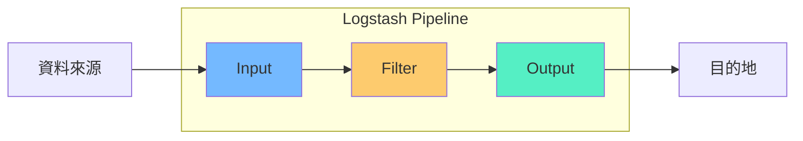
```mermaid
graph LR
    subgraph "Logstash Pipeline"
        I[Input]
        F[Filter]
        O[Output]
    end
    
    Source[資料來源] --> I
    I --> F
    F --> O
    O --> Dest[目的地]
    
    style I fill:#74b9ff
    style F fill:#fdcb6e
    style O fill:#55efc4
```

#### Input 設定範例

```ruby
# /etc/logstash/conf.d/01-input.conf

# 從 Filebeat 接收
input {
  beats {
    port => 5044
    ssl => false
  }
}

# 從 Kafka 接收
input {
  kafka {
    bootstrap_servers => "kafka01:9092,kafka02:9092"
    topics => ["app-logs"]
    group_id => "logstash-consumer"
    codec => json
  }
}

# 從 TCP 接收（Log4j2）
input {
  tcp {
    port => 5000
    codec => json_lines
  }
}
```

#### Filter 設定範例

```ruby
# /etc/logstash/conf.d/02-filter.conf

filter {
  # 解析 Java Log（Log4j2 Pattern）
  if [type] == "java-app" {
    grok {
      match => { 
        "message" => "%{TIMESTAMP_ISO8601:timestamp} %{LOGLEVEL:level} \[%{DATA:thread}\] %{JAVACLASS:class} - %{GREEDYDATA:logMessage}"
      }
    }
    
    # 解析時間
    date {
      match => [ "timestamp", "yyyy-MM-dd HH:mm:ss.SSS" ]
      target => "@timestamp"
      timezone => "Asia/Taipei"
    }
    
    # 移除原始 timestamp 欄位
    mutate {
      remove_field => [ "timestamp" ]
    }
  }
  
  # 解析 JSON 格式 Log
  if [type] == "json-log" {
    json {
      source => "message"
    }
  }
  
  # 新增欄位
  mutate {
    add_field => { "environment" => "production" }
  }
  
  # 敏感資料遮蔽
  mutate {
    gsub => [
      # 遮蔽身分證字號
      "message", "[A-Z][12]\d{8}", "***MASKED***",
      # 遮蔽信用卡號
      "message", "\d{4}-\d{4}-\d{4}-\d{4}", "****-****-****-****"
    ]
  }
}
```

#### Output 設定範例

```ruby
# /etc/logstash/conf.d/03-output.conf

output {
  # 輸出至 Elasticsearch
  elasticsearch {
    hosts => ["http://es-node-01:9200", "http://es-node-02:9200"]
    index => "logs-%{[service]}-%{+YYYY.MM.dd}"
    user => "logstash_writer"
    password => "${ES_PASSWORD}"
    
    # 效能調校
    action => "index"
    document_type => "_doc"
  }
  
  # 除錯用：同時輸出至 Console
  if [level] == "ERROR" {
    stdout {
      codec => rubydebug
    }
  }
}
```

#### 完整 Java 應用程式 Log Pipeline

```ruby
# /etc/logstash/conf.d/java-app-pipeline.conf

input {
  beats {
    port => 5044
  }
}

filter {
  # 解析 Spring Boot Log
  grok {
    match => {
      "message" => "%{TIMESTAMP_ISO8601:timestamp}\s+%{LOGLEVEL:level}\s+%{NUMBER:pid}\s+---\s+\[%{DATA:thread}\]\s+%{JAVACLASS:logger}\s+:\s+%{GREEDYDATA:logMessage}"
    }
  }
  
  # 解析時間
  date {
    match => ["timestamp", "yyyy-MM-dd HH:mm:ss.SSS"]
    target => "@timestamp"
    timezone => "Asia/Taipei"
  }
  
  # 處理多行 Exception Stack Trace
  if [logMessage] =~ /Exception|Error/ {
    mutate {
      add_tag => ["exception"]
    }
  }
  
  # 新增 Metadata
  mutate {
    add_field => {
      "app_name" => "%{[fields][app_name]}"
      "env" => "%{[fields][env]}"
    }
    remove_field => ["timestamp", "host", "agent", "ecs", "input", "log"]
  }
}

output {
  elasticsearch {
    hosts => ["http://localhost:9200"]
    index => "app-logs-%{[app_name]}-%{+YYYY.MM.dd}"
  }
}
```

---

### 4.3 Kibana 設定

#### 主設定檔

```yaml
# /etc/kibana/kibana.yml

# ======================== Server 設定 ========================
server.port: 5601
server.host: "0.0.0.0"
server.name: "kibana-prod"

# ======================== Elasticsearch 連線 ========================
elasticsearch.hosts: ["http://es-node-01:9200", "http://es-node-02:9200"]
elasticsearch.username: "kibana_system"
elasticsearch.password: "your_secure_password"

# ======================== 安全性設定 ========================
# 啟用加密通訊（正式環境建議）
# server.ssl.enabled: true
# server.ssl.certificate: /path/to/kibana.crt
# server.ssl.key: /path/to/kibana.key

# ======================== 日誌設定 ========================
logging.root.level: info
logging.appenders.default:
  type: file
  fileName: /var/log/kibana/kibana.log
  layout:
    type: json

# ======================== 本地化設定 ========================
i18n.locale: "zh-TW"

# ======================== 其他設定 ========================
# 預設首頁
server.defaultRoute: "/app/discover"

# 查詢 Timeout
elasticsearch.requestTimeout: 30000
```

#### Index Pattern 設定

透過 Kibana UI 設定：

1. 進入 **Stack Management** → **Data Views**
2. 點擊 **Create data view**
3. 設定：
   - Name: `app-logs-*`
   - Index pattern: `app-logs-*`
   - Timestamp field: `@timestamp`
4. 點擊 **Save data view to Kibana**

或使用 API：

```bash
curl -X POST "localhost:5601/api/data_views/data_view" \
  -H "kbn-xsrf: true" \
  -H "Content-Type: application/json" \
  -d '{
    "data_view": {
      "title": "app-logs-*",
      "timeFieldName": "@timestamp"
    }
  }'
```

---

> 💡 **本章重點**
> - Elasticsearch Heap 設為實體記憶體 50%，不超過 31 GB
> - Logstash Pipeline 分為 Input → Filter → Output 三段
> - 使用 Grok 解析非結構化 Log，注意效能影響
> - Kibana 設定 Index Pattern 時務必指定 Timestamp 欄位

---

## 第五章：三者如何串接

### 5.1 End-to-End 資料流

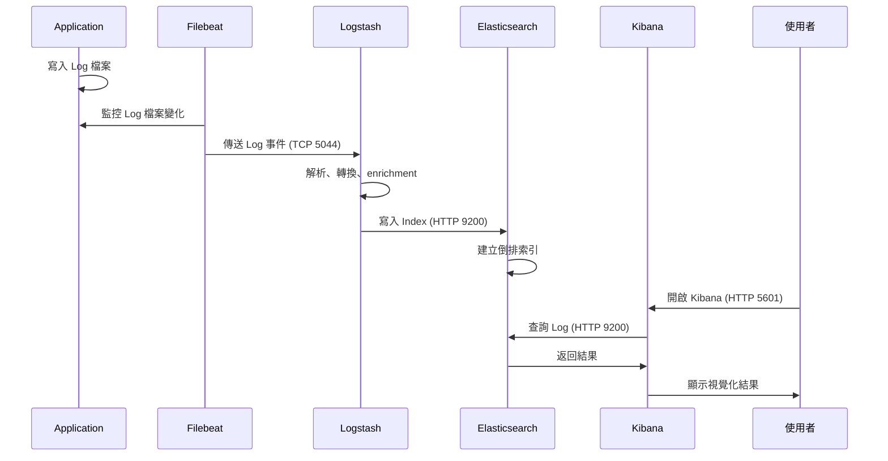
```mermaid
sequenceDiagram
    participant App as Application
    participant FB as Filebeat
    participant LS as Logstash
    participant ES as Elasticsearch
    participant K as Kibana
    participant User as 使用者
    
    App->>App: 寫入 Log 檔案
    FB->>App: 監控 Log 檔案變化
    FB->>LS: 傳送 Log 事件 (TCP 5044)
    LS->>LS: 解析、轉換、enrichment
    LS->>ES: 寫入 Index (HTTP 9200)
    ES->>ES: 建立倒排索引
    User->>K: 開啟 Kibana (HTTP 5601)
    K->>ES: 查詢 Log (HTTP 9200)
    ES->>K: 返回結果
    K->>User: 顯示視覺化結果
```

### 5.2 實際串接範例

#### 場景：Spring Boot 應用程式 Log 收集

**步驟 1：應用程式 Log 設定**

```xml
<!-- logback-spring.xml -->
<?xml version="1.0" encoding="UTF-8"?>
<configuration>
    <property name="LOG_PATH" value="/var/log/myapp"/>
    <property name="APP_NAME" value="order-service"/>
    
    <appender name="FILE" class="ch.qos.logback.core.rolling.RollingFileAppender">
        <file>${LOG_PATH}/${APP_NAME}.log</file>
        <rollingPolicy class="ch.qos.logback.core.rolling.TimeBasedRollingPolicy">
            <fileNamePattern>${LOG_PATH}/${APP_NAME}.%d{yyyy-MM-dd}.log</fileNamePattern>
            <maxHistory>7</maxHistory>
        </rollingPolicy>
        <encoder>
            <pattern>%d{yyyy-MM-dd HH:mm:ss.SSS} %level [%thread] %logger{36} - %msg%n</pattern>
        </encoder>
    </appender>
    
    <!-- JSON 格式（推薦） -->
    <appender name="JSON_FILE" class="ch.qos.logback.core.rolling.RollingFileAppender">
        <file>${LOG_PATH}/${APP_NAME}-json.log</file>
        <rollingPolicy class="ch.qos.logback.core.rolling.TimeBasedRollingPolicy">
            <fileNamePattern>${LOG_PATH}/${APP_NAME}-json.%d{yyyy-MM-dd}.log</fileNamePattern>
            <maxHistory>7</maxHistory>
        </rollingPolicy>
        <encoder class="net.logstash.logback.encoder.LogstashEncoder">
            <customFields>{"app_name":"${APP_NAME}","env":"prod"}</customFields>
        </encoder>
    </appender>
    
    <root level="INFO">
        <appender-ref ref="JSON_FILE"/>
    </root>
</configuration>
```

**步驟 2：Filebeat 設定**

```yaml
# /etc/filebeat/filebeat.yml

filebeat.inputs:
  - type: log
    enabled: true
    paths:
      - /var/log/myapp/*-json.log
    json.keys_under_root: true
    json.add_error_key: true
    fields:
      app_name: order-service
      env: production
    fields_under_root: true

output.logstash:
  hosts: ["logstash-server:5044"]
  loadbalance: true

# 監控設定
monitoring.enabled: true
monitoring.elasticsearch:
  hosts: ["http://es-server:9200"]
```

**步驟 3：Logstash Pipeline 設定**

```ruby
# /etc/logstash/conf.d/spring-boot.conf

input {
  beats {
    port => 5044
  }
}

filter {
  # JSON Log 已經由 Filebeat 解析，只需要額外處理
  
  # 確保 @timestamp 正確
  if [timestamp] {
    date {
      match => ["timestamp", "ISO8601"]
      target => "@timestamp"
      timezone => "Asia/Taipei"
    }
    mutate {
      remove_field => ["timestamp"]
    }
  }
  
  # 解析 Stack Trace（如果有的話）
  if [stack_trace] {
    mutate {
      add_tag => ["has_stacktrace"]
    }
  }
  
  # 移除不需要的欄位
  mutate {
    remove_field => ["agent", "ecs", "host", "input", "log"]
  }
}

output {
  elasticsearch {
    hosts => ["http://es-node-01:9200", "http://es-node-02:9200"]
    index => "app-logs-%{[app_name]}-%{+YYYY.MM.dd}"
    user => "logstash_writer"
    password => "${ES_PASSWORD}"
  }
}
```

**步驟 4：驗證資料流**

```bash
# 1. 檢查 Filebeat 是否讀取到 Log
sudo filebeat test output

# 2. 檢查 Logstash 是否收到資料
curl -s localhost:9600/_node/stats/pipelines | jq '.pipelines.main.events'

# 3. 檢查 Elasticsearch 是否有資料
curl -s "localhost:9200/app-logs-order-service-*/_count" | jq '.count'

# 4. 在 Kibana 查詢
# 開啟 Discover，選擇對應的 Index Pattern
```

### 5.3 Filebeat 整合

#### Filebeat vs Logstash 比較

| 面向 | Filebeat | Logstash |
|------|----------|----------|
| **定位** | 輕量級資料收集器 | 重量級資料處理引擎 |
| **資源消耗** | 低（~10MB RAM） | 高（~1GB RAM） |
| **處理能力** | 基本（Module、Processor） | 強大（完整 Filter） |
| **部署位置** | Application Server | 集中處理 Server |
| **使用場景** | 收集 + 轉發 | 複雜解析 + 轉換 |

#### 推薦架構

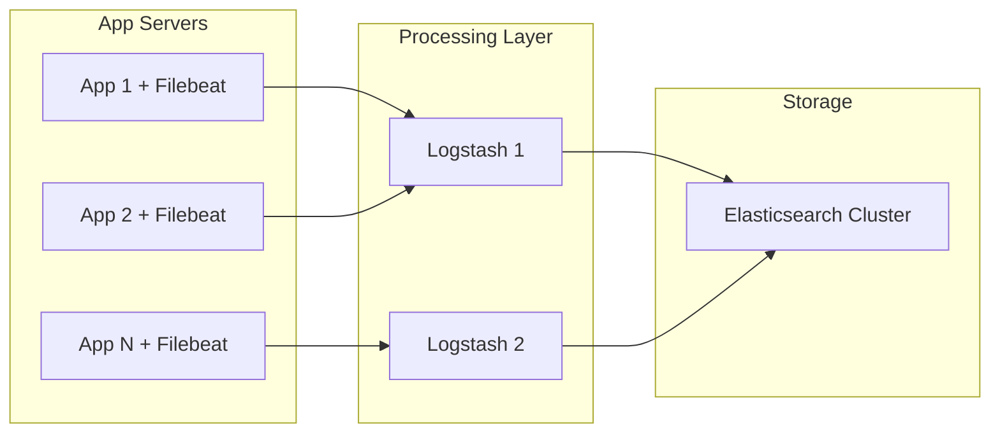
```mermaid
graph LR
    subgraph "App Servers"
        A1[App 1 + Filebeat]
        A2[App 2 + Filebeat]
        A3[App N + Filebeat]
    end
    
    subgraph "Processing Layer"
        LS1[Logstash 1]
        LS2[Logstash 2]
    end
    
    subgraph "Storage"
        ES[Elasticsearch Cluster]
    end
    
    A1 --> LS1
    A2 --> LS1
    A3 --> LS2
    LS1 --> ES
    LS2 --> ES
```

#### Filebeat Module 使用

```bash
# 啟用 System Module
sudo filebeat modules enable system

# 啟用 Nginx Module
sudo filebeat modules enable nginx

# 設定 Module
sudo vi /etc/filebeat/modules.d/nginx.yml

# 載入 Dashboard
sudo filebeat setup -e

# 重啟 Filebeat
sudo systemctl restart filebeat
```

---

> 💡 **本章重點**
> - 推薦使用 JSON 格式 Log，減少解析成本
> - Filebeat 部署在 App Server，Logstash 集中處理
> - 驗證資料流：Filebeat → Logstash → Elasticsearch → Kibana
> - Filebeat Module 可快速整合常見 Log 格式

---

## 第六章：系統使用

### 6.1 Kibana 操作教學

#### Discover - Log 查詢

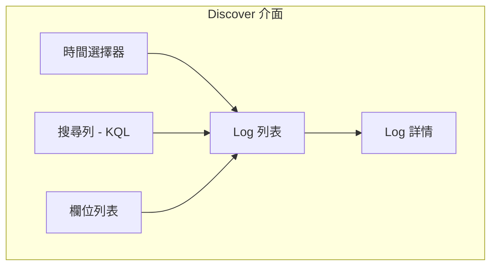
```mermaid
graph TB
    subgraph "Discover 介面"
        A[時間選擇器]
        B[搜尋列 - KQL]
        C[欄位列表]
        D[Log 列表]
        E[Log 詳情]
    end
    
    A --> D
    B --> D
    C --> D
    D --> E
```

**基本操作**：

1. **選擇 Data View**：左上角下拉選單
2. **設定時間範圍**：右上角時間選擇器
3. **輸入搜尋條件**：搜尋列輸入 KQL
4. **新增顯示欄位**：從左側欄位列表點擊 `+`
5. **檢視 Log 詳情**：點擊任一筆 Log 展開

#### Dashboard - 視覺化儀表板

**建立 Dashboard 步驟**：

1. 進入 **Analytics** → **Dashboard**
2. 點擊 **Create dashboard**
3. 點擊 **Create visualization**
4. 選擇圖表類型：
   - **Bar / Line Chart**：趨勢分析
   - **Pie Chart**：比例分布
   - **Metric**：單一數值
   - **Data Table**：明細表格
5. 設定 Data View 與聚合條件
6. 儲存 Visualization 並加入 Dashboard

**範例：建立 Error Rate Dashboard**

```
1. 建立 Line Chart：
   - Data View: app-logs-*
   - Y-axis: Count
   - X-axis: @timestamp (Date Histogram, 1 minute)
   - Breakdown: level (Top values)

2. 建立 Metric：
   - Data View: app-logs-*
   - Filter: level: ERROR
   - Aggregation: Count
   - Time range: Last 1 hour

3. 建立 Data Table：
   - Data View: app-logs-*
   - Filter: level: ERROR
   - Columns: @timestamp, service, message
   - Sort: @timestamp DESC
```

### 6.2 查詢語法詳解

#### KQL（Kibana Query Language）

```
# 基本語法
欄位名稱: 值

# 範例
level: ERROR
service: order-service
message: "timeout"
```

**常用查詢範例**：

| 需求 | KQL 語法 |
|------|----------|
| 精確匹配 | `level: "ERROR"` |
| 模糊匹配 | `message: *timeout*` |
| 多值匹配 | `level: (ERROR OR WARN)` |
| 範圍查詢 | `response_time >= 1000` |
| 存在檢查 | `stack_trace: *` |
| 組合條件 | `service: order* AND level: ERROR` |
| 排除條件 | `NOT level: DEBUG` |

#### Lucene Query Syntax（進階）

```
# 萬用字元
message: timeout*
message: time?ut

# 正規表達式
message: /[Ee]rror.*/

# 模糊搜尋
message: tiemout~2

# 範圍搜尋
response_time: [100 TO 500]
@timestamp: [2026-01-01 TO 2026-01-31]

# 權重
message: error^2 OR warning^1
```

#### 實用查詢範例

```bash
# 1. 查詢特定交易的完整鏈路
traceId: "abc123" AND (service: order-service OR service: payment-service)

# 2. 查詢今日所有 5xx 錯誤
response_code: [500 TO 599] AND @timestamp >= now/d

# 3. 查詢特定時段的慢查詢
response_time >= 3000 AND @timestamp >= "2026-01-27T10:00:00" AND @timestamp <= "2026-01-27T11:00:00"

# 4. 排除健康檢查 Log
NOT (request_path: "/health" OR request_path: "/actuator/*")

# 5. 查詢含有 Exception 的 Log
message: *Exception* OR stack_trace: *
```

### 6.3 實務使用情境

#### 情境一：問題追蹤

**場景**：使用者回報訂單失敗，提供訂單編號 `ORD-20260127-001`

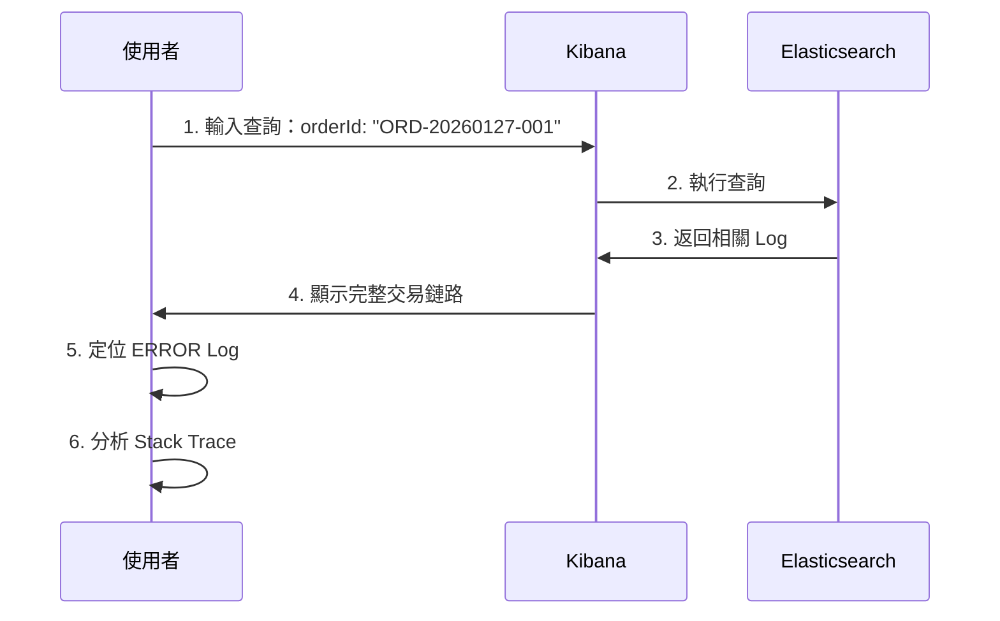
```mermaid
sequenceDiagram
    participant User as 使用者
    participant K as Kibana
    participant ES as Elasticsearch
    
    User->>K: 1. 輸入查詢：orderId: "ORD-20260127-001"
    K->>ES: 2. 執行查詢
    ES->>K: 3. 返回相關 Log
    K->>User: 4. 顯示完整交易鏈路
    User->>User: 5. 定位 ERROR Log
    User->>User: 6. 分析 Stack Trace
```

**查詢步驟**：

```
1. 在 Discover 輸入：orderId: "ORD-20260127-001"
2. 展開時間範圍確保涵蓋交易時間
3. 排序：@timestamp ASC（依時間正序）
4. 新增顯示欄位：service, level, message, duration
5. 找到 ERROR Log，檢視 Stack Trace
```

#### 情境二：錯誤分析

**場景**：Grafana 告警顯示 Error Rate 上升

```
查詢步驟：

1. 設定時間範圍為告警觸發前後 30 分鐘

2. 查詢 Error Log：
   level: ERROR AND @timestamp >= "2026-01-27T10:00:00"

3. 聚合分析 Error 類型：
   - 開啟 Lens
   - X-axis: @timestamp
   - Breakdown: error_type
   - 識別最多的 Error 類型

4. 深入特定 Error：
   error_type: "ConnectionTimeoutException" AND service: payment-service

5. 關聯 Metrics：
   在 Grafana 檢查同時段 payment-service 的 Connection Pool 使用率
```

#### 情境三：系統行為回溯

**場景**：稽核要求提供特定使用者過去 7 天的操作紀錄

```
查詢語法：
userId: "U12345" AND action: * AND @timestamp >= now-7d

顯示欄位：
- @timestamp
- action
- ip_address
- request_path
- response_code

匯出步驟：
1. 在 Discover 執行查詢
2. 設定顯示欄位
3. 點擊 Share → CSV Reports
4. 選擇 Generate CSV
5. 下載並提供稽核單位
```

#### 情境四：與 Grafana Metrics 搭配分析

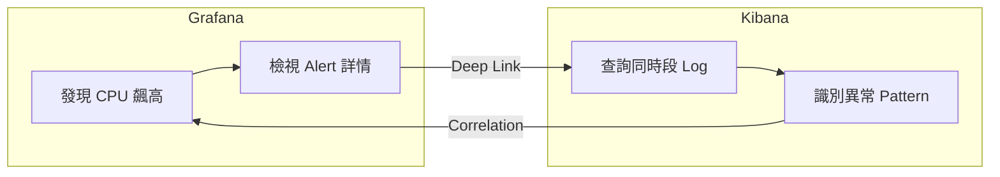
```mermaid
graph LR
    subgraph "Grafana"
        A[發現 CPU 飆高]
        B[檢視 Alert 詳情]
    end
    
    subgraph "Kibana"
        C[查詢同時段 Log]
        D[識別異常 Pattern]
    end
    
    A --> B
    B -->|"Deep Link"| C
    C --> D
    D -->|"Correlation"| A
```

**整合查詢範例**：

```
# Grafana Alert 觸發時間：2026-01-27 14:30:00
# 目標服務：inventory-service
# 觀察到 CPU > 90%

Kibana 查詢：
service: inventory-service AND @timestamp >= "2026-01-27T14:25:00" AND @timestamp <= "2026-01-27T14:35:00"

可能發現：
- 大量 DEBUG Log 輸出
- 重複的 SQL Query
- GC Log 頻繁
- Exception 大量拋出
```

---

> 💡 **本章重點**
> - KQL 語法簡潔直觀，適合日常查詢
> - 複雜查詢可使用 Lucene 語法
> - 建立常用查詢的 Saved Search
> - Dashboard 依角色設計（Dev / Ops / Business）

---

## 第七章：系統維護

### 7.1 Index 管理策略

#### Index Lifecycle Management (ILM)

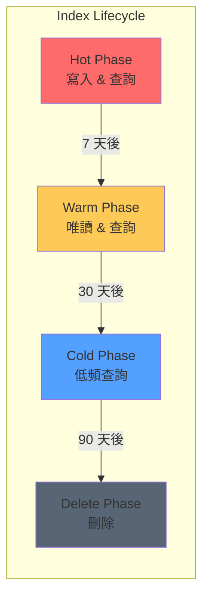
```mermaid
graph LR
    subgraph "Index Lifecycle"
        H[Hot Phase<br/>寫入 & 查詢]
        W[Warm Phase<br/>唯讀 & 查詢]
        C[Cold Phase<br/>低頻查詢]
        D[Delete Phase<br/>刪除]
    end
    
    H -->|"7 天後"| W
    W -->|"30 天後"| C
    C -->|"90 天後"| D
    
    style H fill:#ff6b6b
    style W fill:#feca57
    style C fill:#54a0ff
    style D fill:#576574
```

#### ILM Policy 設定

```bash
# 建立 ILM Policy
curl -X PUT "localhost:9200/_ilm/policy/logs-policy" -H 'Content-Type: application/json' -d'
{
  "policy": {
    "phases": {
      "hot": {
        "min_age": "0ms",
        "actions": {
          "rollover": {
            "max_age": "1d",
            "max_size": "50gb"
          },
          "set_priority": {
            "priority": 100
          }
        }
      },
      "warm": {
        "min_age": "7d",
        "actions": {
          "forcemerge": {
            "max_num_segments": 1
          },
          "shrink": {
            "number_of_shards": 1
          },
          "set_priority": {
            "priority": 50
          }
        }
      },
      "cold": {
        "min_age": "30d",
        "actions": {
          "freeze": {},
          "set_priority": {
            "priority": 0
          }
        }
      },
      "delete": {
        "min_age": "90d",
        "actions": {
          "delete": {}
        }
      }
    }
  }
}'
```

#### 手動清理 Index

```bash
# 列出所有 Index
curl -s "localhost:9200/_cat/indices?v&s=index"

# 刪除特定日期的 Index
curl -X DELETE "localhost:9200/app-logs-*-2026.01.01"

# 刪除 30 天前的 Index（使用 Curator 或腳本）
#!/bin/bash
# cleanup-old-indices.sh

DAYS_TO_KEEP=30
DATE_THRESHOLD=$(date -d "-${DAYS_TO_KEEP} days" +%Y.%m.%d)

curl -s "localhost:9200/_cat/indices/logs-*?h=index" | while read index; do
  index_date=$(echo $index | grep -oP '\d{4}\.\d{2}\.\d{2}')
  if [[ "$index_date" < "$DATE_THRESHOLD" ]]; then
    echo "Deleting $index"
    curl -X DELETE "localhost:9200/$index"
  fi
done
```

### 7.2 效能調校

#### Elasticsearch 效能優化

```yaml
# elasticsearch.yml 效能相關設定

# 索引 Refresh 間隔（寫入量大時可增加）
index.refresh_interval: 30s

# 索引 Buffer 大小
indices.memory.index_buffer_size: 20%

# Thread Pool 設定
thread_pool.write.queue_size: 1000
thread_pool.search.queue_size: 1000
```

#### 查詢效能優化

```bash
# 1. 避免 wildcard 開頭查詢
❌ message: *error*
✅ message: error*

# 2. 使用 filter 而非 query（不計算分數，可快取）
curl -X GET "localhost:9200/logs-*/_search" -H 'Content-Type: application/json' -d'
{
  "query": {
    "bool": {
      "filter": [
        { "term": { "level": "ERROR" } },
        { "range": { "@timestamp": { "gte": "now-1h" } } }
      ]
    }
  }
}'

# 3. 限制返回欄位
curl -X GET "localhost:9200/logs-*/_search" -H 'Content-Type: application/json' -d'
{
  "_source": ["@timestamp", "level", "message"],
  "query": { "match_all": {} },
  "size": 100
}'
```

#### Logstash 效能優化

```yaml
# logstash.yml

# Pipeline 設定
pipeline.workers: 4          # 通常設為 CPU 核心數
pipeline.batch.size: 250     # 批次大小
pipeline.batch.delay: 50     # 批次等待時間 (ms)

# 輸出 Buffer
output.elasticsearch.bulk_max_size: 5000
```

### 7.3 健康檢查與監控

#### Elasticsearch 健康檢查

```bash
# Cluster Health
curl -s "localhost:9200/_cluster/health?pretty"

# 預期結果
{
  "status": "green",        # green/yellow/red
  "number_of_nodes": 3,
  "active_primary_shards": 50,
  "active_shards": 100,
  "unassigned_shards": 0    # 應為 0
}

# Node Stats
curl -s "localhost:9200/_nodes/stats?pretty" | jq '.nodes | to_entries[] | {
  name: .value.name,
  heap_used_percent: .value.jvm.mem.heap_used_percent,
  disk_available: .value.fs.total.available_in_bytes
}'

# Index Stats
curl -s "localhost:9200/_cat/indices?v&h=index,health,docs.count,store.size"
```

#### 監控指標清單

| 指標 | 正常範圍 | 告警閾值 |
|------|---------|---------|
| Cluster Status | green | yellow/red |
| JVM Heap Used | < 75% | > 85% |
| Disk Available | > 20% | < 15% |
| Indexing Rate | 穩定 | 突降 50% |
| Search Latency | < 200ms | > 500ms |
| Unassigned Shards | 0 | > 0 |

#### 整合 Prometheus 監控

```yaml
# 使用 elasticsearch_exporter
# docker-compose.yml

version: '3'
services:
  elasticsearch-exporter:
    image: prometheuscommunity/elasticsearch-exporter:latest
    command:
      - '--es.uri=http://elasticsearch:9200'
    ports:
      - "9114:9114"
```

```yaml
# prometheus.yml

scrape_configs:
  - job_name: 'elasticsearch'
    static_configs:
      - targets: ['elasticsearch-exporter:9114']
```

---

> 💡 **本章重點**
> - 使用 ILM 自動管理 Index 生命週期
> - Hot-Warm-Cold 架構優化儲存成本
> - 定期檢查 Cluster Health 與 JVM Heap
> - 整合 Prometheus 監控 ELK 本身

---

## 第八章：系統升級

### 8.1 升級前準備

#### 升級檢查清單

```
┌─────────────────────────────────────────────────────────────┐
│                    升級前檢查清單                            │
├─────────────────────────────────────────────────────────────┤
│  □ 1. 確認目標版本與現有版本的相容性                        │
│  □ 2. 閱讀 Release Notes 與 Breaking Changes                │
│  □ 3. 備份 Elasticsearch Index                              │
│  □ 4. 備份設定檔（elasticsearch.yml、logstash.conf 等）     │
│  □ 5. 備份 Kibana Saved Objects（Dashboard、Visualization） │
│  □ 6. 測試環境先行升級驗證                                  │
│  □ 7. 準備回滾計畫                                          │
│  □ 8. 通知相關人員維護時間                                  │
│  □ 9. 確認有足夠磁碟空間                                    │
│  □ 10. 確認 Cluster Health 為 green                         │
└─────────────────────────────────────────────────────────────┘
```

#### 版本相容性檢查

```bash
# 查看目前版本
curl -s "localhost:9200" | jq '.version.number'
curl -s "localhost:5601/api/status" | jq '.version.number'

# 檢查 Elastic 官方 Support Matrix
# https://www.elastic.co/support/matrix

# 重要：三個元件應使用相同主版本
# ✅ ES 8.12 + Logstash 8.12 + Kibana 8.12
# ❌ ES 8.12 + Logstash 7.17 + Kibana 8.12
```

#### 備份策略

```bash
# 1. 建立 Snapshot Repository
curl -X PUT "localhost:9200/_snapshot/backup_repo" -H 'Content-Type: application/json' -d'
{
  "type": "fs",
  "settings": {
    "location": "/mnt/backup/elasticsearch"
  }
}'

# 2. 建立 Snapshot
curl -X PUT "localhost:9200/_snapshot/backup_repo/pre-upgrade-$(date +%Y%m%d)?wait_for_completion=true"

# 3. 備份 Kibana Saved Objects
curl -X POST "localhost:5601/api/saved_objects/_export" \
  -H "kbn-xsrf: true" \
  -H "Content-Type: application/json" \
  -d '{"type": ["dashboard", "visualization", "index-pattern", "search"]}' \
  > kibana-saved-objects-backup.ndjson

# 4. 備份設定檔
tar -czvf elk-config-backup-$(date +%Y%m%d).tar.gz \
  /etc/elasticsearch \
  /etc/logstash \
  /etc/kibana \
  /etc/filebeat
```

### 8.2 各元件升級流程

#### Elasticsearch 升級（Rolling Upgrade）

```bash
# 適用於同一大版本升級（如 8.10 → 8.12）

# 1. 關閉 Shard Allocation
curl -X PUT "localhost:9200/_cluster/settings" -H 'Content-Type: application/json' -d'
{
  "persistent": {
    "cluster.routing.allocation.enable": "primaries"
  }
}'

# 2. 停止非必要索引（可選）
curl -X POST "localhost:9200/_flush/synced"

# 3. 停止節點
sudo systemctl stop elasticsearch

# 4. 升級套件
sudo yum update elasticsearch
# 或
sudo apt-get update && sudo apt-get install elasticsearch

# 5. 啟動節點
sudo systemctl start elasticsearch

# 6. 等待節點加入叢集
curl -s "localhost:9200/_cat/nodes?v"

# 7. 重新啟用 Shard Allocation
curl -X PUT "localhost:9200/_cluster/settings" -H 'Content-Type: application/json' -d'
{
  "persistent": {
    "cluster.routing.allocation.enable": null
  }
}'

# 8. 等待 Cluster 回到 green
watch -n 5 'curl -s localhost:9200/_cluster/health | jq .'

# 9. 對下一個節點重複步驟 1-8
```

#### Logstash 升級

```bash
# 1. 停止 Logstash
sudo systemctl stop logstash

# 2. 升級套件
sudo yum update logstash

# 3. 驗證設定檔相容性
sudo /usr/share/logstash/bin/logstash --config.test_and_exit -f /etc/logstash/conf.d/

# 4. 啟動 Logstash
sudo systemctl start logstash

# 5. 驗證
curl -s localhost:9600 | jq '.version'
```

#### Kibana 升級

```bash
# 1. 停止 Kibana
sudo systemctl stop kibana

# 2. 升級套件
sudo yum update kibana

# 3. 啟動 Kibana
sudo systemctl start kibana

# 4. 等待啟動完成（可能需要 1-2 分鐘）
tail -f /var/log/kibana/kibana.log

# 5. 驗證
curl -s localhost:5601/api/status | jq '.version'
```

### 8.3 回復策略

#### 回復 Elasticsearch

```bash
# 1. 停止節點
sudo systemctl stop elasticsearch

# 2. 降級套件
sudo yum downgrade elasticsearch-8.10.0

# 3. 還原設定檔
sudo tar -xzvf elk-config-backup-*.tar.gz -C /

# 4. 還原資料（如果需要）
curl -X POST "localhost:9200/_snapshot/backup_repo/pre-upgrade-*/_restore?wait_for_completion=true"

# 5. 啟動服務
sudo systemctl start elasticsearch
```

#### 回復 Kibana Saved Objects

```bash
# 匯入備份的 Saved Objects
curl -X POST "localhost:5601/api/saved_objects/_import?overwrite=true" \
  -H "kbn-xsrf: true" \
  --form file=@kibana-saved-objects-backup.ndjson
```

---

> 💡 **本章重點**
> - 升級前務必備份：Index Snapshot + 設定檔 + Kibana Objects
> - Rolling Upgrade 可避免服務中斷
> - 三個元件使用相同版本
> - 準備完整回滾計畫

---

## 第九章：安全性與權限管理

### 9.1 Security 基本概念

#### Elastic Security 架構

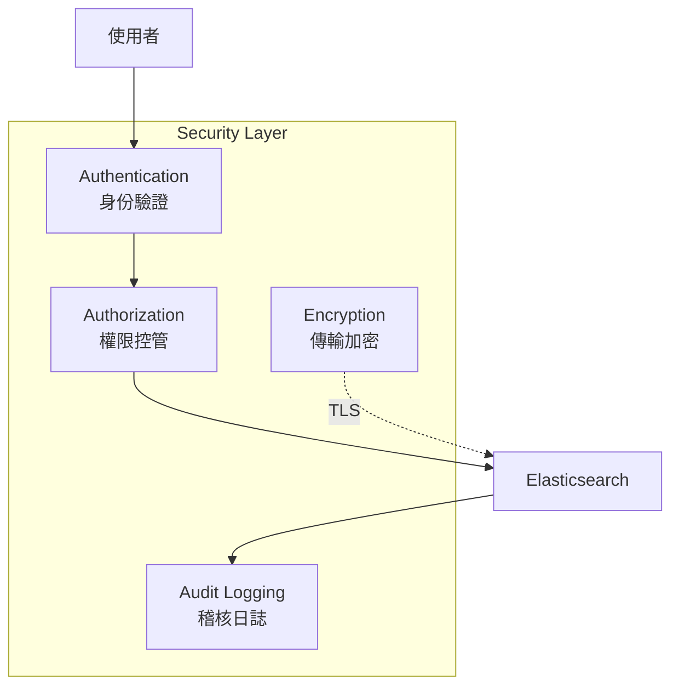
```mermaid
graph TB
    subgraph "Security Layer"
        Auth[Authentication<br/>身份驗證]
        Authz[Authorization<br/>權限控管]
        Enc[Encryption<br/>傳輸加密]
        Audit[Audit Logging<br/>稽核日誌]
    end
    
    User[使用者] --> Auth
    Auth --> Authz
    Authz --> ES[Elasticsearch]
    Enc -.->|"TLS"| ES
    ES --> Audit
```

#### 啟用 Security

```yaml
# elasticsearch.yml

xpack.security.enabled: true
xpack.security.enrollment.enabled: true

# 傳輸層加密
xpack.security.transport.ssl.enabled: true
xpack.security.transport.ssl.verification_mode: certificate
xpack.security.transport.ssl.keystore.path: elastic-certificates.p12
xpack.security.transport.ssl.truststore.path: elastic-certificates.p12

# HTTP 層加密（正式環境建議）
xpack.security.http.ssl.enabled: true
xpack.security.http.ssl.keystore.path: http.p12
```

### 9.2 使用者與角色管理

#### 內建角色

| 角色 | 說明 | 適用對象 |
|------|------|---------|
| `superuser` | 完整權限 | 系統管理員 |
| `kibana_admin` | Kibana 管理權限 | Kibana 管理員 |
| `monitoring_user` | 監控唯讀 | 監控人員 |
| `logstash_system` | Logstash 監控 | Logstash |
| `beats_system` | Beats 監控 | Filebeat |

#### 建立自訂角色

```bash
# 建立應用程式開發者角色
curl -X PUT "localhost:9200/_security/role/app_developer" -H 'Content-Type: application/json' -d'
{
  "indices": [
    {
      "names": ["app-logs-*"],
      "privileges": ["read", "view_index_metadata"],
      "query": {
        "bool": {
          "filter": [
            { "term": { "env": "dev" } }
          ]
        }
      }
    }
  ],
  "applications": [
    {
      "application": "kibana-.kibana",
      "privileges": ["feature_discover.read", "feature_dashboard.read"],
      "resources": ["*"]
    }
  ]
}'

# 建立使用者
curl -X POST "localhost:9200/_security/user/dev_user" -H 'Content-Type: application/json' -d'
{
  "password": "secure_password",
  "roles": ["app_developer"],
  "full_name": "開發人員",
  "email": "dev@company.com"
}'
```

#### 實務角色設計

```
┌─────────────────────────────────────────────────────────────┐
│                    角色設計建議                              │
├──────────────┬──────────────────────────────────────────────┤
│ 角色         │ 權限範圍                                     │
├──────────────┼──────────────────────────────────────────────┤
│ elk_admin    │ 完整管理權限，可建立/刪除 Index              │
│ ops_team     │ 可查看所有環境 Log，可建立 Dashboard         │
│ dev_team     │ 只能查看 dev/sit 環境 Log                    │
│ security     │ 可查看所有 Log，特別是 Security 相關         │
│ auditor      │ 唯讀權限，可匯出報表                         │
│ business     │ 只能查看特定 Dashboard，無 Discover 權限     │
└──────────────┴──────────────────────────────────────────────┘
```

### 9.3 企業資安考量

#### 敏感資料處理

```ruby
# Logstash - 敏感資料遮蔽

filter {
  # 遮蔽身分證字號
  mutate {
    gsub => [
      "message", "[A-Z][12]\d{8}", "[ID_MASKED]"
    ]
  }
  
  # 遮蔽信用卡號
  mutate {
    gsub => [
      "message", "\b\d{4}[- ]?\d{4}[- ]?\d{4}[- ]?\d{4}\b", "[CARD_MASKED]"
    ]
  }
  
  # 遮蔽 Email
  mutate {
    gsub => [
      "message", "[a-zA-Z0-9._%+-]+@[a-zA-Z0-9.-]+\.[a-zA-Z]{2,}", "[EMAIL_MASKED]"
    ]
  }
  
  # 移除敏感欄位
  mutate {
    remove_field => ["password", "token", "secret"]
  }
}
```

#### 稽核日誌

```yaml
# elasticsearch.yml

xpack.security.audit.enabled: true
xpack.security.audit.logfile.events.include:
  - access_denied
  - authentication_failed
  - connection_denied
  - tampered_request
  - run_as_denied
  - anonymous_access_denied
```

#### 網路安全建議

```
┌─────────────────────────────────────────────────────────────┐
│                    網路安全建議                              │
├─────────────────────────────────────────────────────────────┤
│  1. Elasticsearch 9200/9300 port 不對外開放                 │
│  2. Kibana 透過 Reverse Proxy（Nginx）對外                  │
│  3. 啟用 HTTPS（TLS 1.2+）                                  │
│  4. 使用防火牆限制來源 IP                                   │
│  5. 定期更換 Password 與 Token                              │
│  6. 啟用 Audit Log 並保存至少 1 年                          │
│  7. 敏感資料在寫入前遮蔽，不依賴查詢時過濾                  │
└─────────────────────────────────────────────────────────────┘
```

---

> 💡 **本章重點**
> - 正式環境務必啟用 Security
> - 依角色設計權限，遵循最小權限原則
> - 敏感資料在 Logstash 階段遮蔽
> - 啟用 Audit Log 滿足法規要求

---

## 第十章：最佳實務與導入建議

### 10.1 導入常見踩雷點

```
┌─────────────────────────────────────────────────────────────┐
│                    ELK 導入常見踩雷點                        │
├─────────────────────────────────────────────────────────────┤
│                                                             │
│  1. ❌ Log 量估算錯誤                                       │
│     → 正確做法：先在測試環境測量實際 Log 量                  │
│                                                             │
│  2. ❌ 沒有設定 ILM，Index 無限成長                         │
│     → 正確做法：上線前就設定 ILM Policy                      │
│                                                             │
│  3. ❌ 所有 Log 都收集                                      │
│     → 正確做法：過濾無用 Log（DEBUG、Health Check）          │
│                                                             │
│  4. ❌ Shard 數量設定不當                                   │
│     → 正確做法：單一 Shard 10-50 GB，依資料量計算            │
│                                                             │
│  5. ❌ 沒有監控 ELK 本身                                    │
│     → 正確做法：用 Prometheus 監控 ELK 元件                  │
│                                                             │
│  6. ❌ 直接在 Production 調整設定                           │
│     → 正確做法：先在測試環境驗證                             │
│                                                             │
│  7. ❌ 忽略 Security 設定                                   │
│     → 正確做法：上線前啟用認證與加密                         │
│                                                             │
│  8. ❌ 沒有備份策略                                         │
│     → 正確做法：定期 Snapshot + 設定檔版控                   │
│                                                             │
│  9. ❌ Logstash 與 Application 部署在同一台                 │
│     → 正確做法：Filebeat 在 App Server，Logstash 獨立部署    │
│                                                             │
│  10. ❌ 使用純文字 Log 格式                                 │
│      → 正確做法：使用 JSON 格式，減少解析成本                │
│                                                             │
└─────────────────────────────────────────────────────────────┘
```

### 10.2 結構化 Log 設計原則

#### 推薦的 Log 格式

```json
{
  "@timestamp": "2026-01-27T14:30:00.123+08:00",
  "level": "INFO",
  "logger": "com.company.order.OrderService",
  "thread": "http-nio-8080-exec-1",
  "message": "Order created successfully",
  "service": "order-service",
  "env": "prod",
  "host": "app-server-01",
  "traceId": "abc123def456",
  "spanId": "789xyz",
  "userId": "U12345",
  "orderId": "ORD-20260127-001",
  "duration": 150,
  "extra": {
    "orderAmount": 1500,
    "productCount": 3
  }
}
```

#### Log 設計原則

| 原則 | 說明 |
|------|------|
| **結構化** | 使用 JSON 格式，非純文字 |
| **標準欄位** | `@timestamp`、`level`、`service`、`traceId` 必備 |
| **業務欄位** | 包含足夠的業務 Context（userId、orderId 等） |
| **可搜尋** | 關鍵欄位設為 `keyword` 類型 |
| **適量** | 避免 DEBUG Log 進入 Production |
| **可關聯** | 包含 traceId 可與其他系統關聯 |

### 10.3 與 AI 分析結合

#### AI 輔助查詢範例

```
👤 使用者問：「昨天有多少訂單失敗？失敗的主要原因是什麼？」

🤖 AI 轉換為查詢：
1. 計算失敗訂單數：
   service: order-service AND level: ERROR AND @timestamp >= now-1d/d AND @timestamp < now/d
   → Aggregation: Count

2. 分析失敗原因：
   service: order-service AND level: ERROR AND @timestamp >= now-1d/d
   → Aggregation: Terms on error_type field

📊 AI 整理結果：
「昨天共有 156 筆訂單失敗，主要原因：
  1. PaymentTimeout: 78 筆 (50%)
  2. InventoryNotAvailable: 45 筆 (29%)
  3. UserNotFound: 33 筆 (21%)
  
  建議：優先調查 Payment Service 的連線問題」
```

#### 將 Log 作為 AI Prompt 輸入

```
# 範例：將 Error Log 整理給 AI 分析

Prompt：
"""
以下是系統錯誤日誌，請分析可能的根因並提供解決建議：

[2026-01-27 14:30:01] ERROR OrderService - Failed to process order
  java.net.SocketTimeoutException: Read timed out
    at java.net.SocketInputStream.read(SocketInputStream.java:123)
    at com.company.payment.PaymentClient.charge(PaymentClient.java:89)
    at com.company.order.OrderService.processOrder(OrderService.java:45)

[2026-01-27 14:30:02] WARN ConnectionPool - Pool exhausted, waiting for connection
  pool_size: 10, active: 10, waiting: 5

[2026-01-27 14:30:03] ERROR PaymentClient - Connection refused to payment-service:8080
"""

AI 回應：
「根據日誌分析，問題可能是：
1. Payment Service 連線池耗盡（10 個連線全部用完）
2. Payment Service 可能過載或當機

建議行動：
1. 檢查 payment-service 健康狀態
2. 增加 Connection Pool 大小
3. 設定適當的 Connection Timeout
4. 考慮加入 Circuit Breaker 機制」
```

### 10.4 與 Prometheus / Grafana 分工

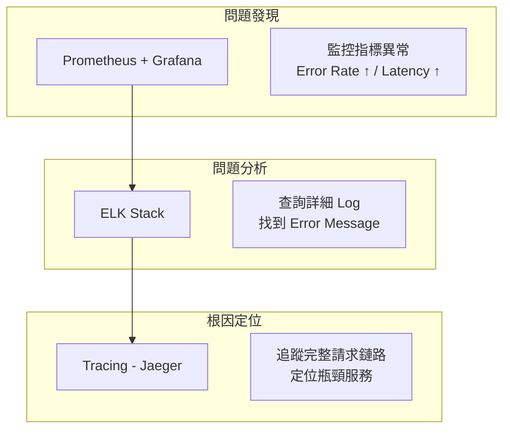
```mermaid
graph TB
    subgraph "問題發現"
        P[Prometheus + Grafana]
        Note1[監控指標異常<br/>Error Rate ↑ / Latency ↑]
    end
    
    subgraph "問題分析"
        E[ELK Stack]
        Note2[查詢詳細 Log<br/>找到 Error Message]
    end
    
    subgraph "根因定位"
        T[Tracing - Jaeger]
        Note3[追蹤完整請求鏈路<br/>定位瓶頸服務]
    end
    
    P --> E --> T
```

#### 分工建議

| 問題類型 | 使用工具 | 說明 |
|---------|---------|------|
| 系統層級監控 | Prometheus + Grafana | CPU、Memory、Disk、Network |
| 應用層級監控 | Prometheus + Grafana | Request Rate、Error Rate、Latency |
| 問題詳細分析 | ELK | Error Log、Stack Trace、業務 Log |
| 請求鏈路追蹤 | Jaeger / Zipkin | 微服務呼叫鏈路、效能瓶頸 |
| 即時告警 | Alertmanager | 統一告警管道 |
| 歷史趨勢分析 | Grafana + Kibana | 長期趨勢、容量規劃 |

---

> 💡 **本章重點**
> - 避免常見踩雷點：Log 量估算、ILM 設定、Security 啟用
> - 使用 JSON 結構化 Log，包含足夠業務 Context
> - AI 可輔助 Log 查詢與分析，但人工判斷仍不可少
> - ELK 與 Prometheus/Grafana 互補使用，各司其職

---

## 附錄：檢查清單

### 安裝檢查清單

- [ ] 作業系統符合需求（RHEL 7+、Ubuntu 18.04+）
- [ ] 三個元件版本一致（同主版本號）
- [ ] JVM Heap 設定正確（實體記憶體 50%，不超過 31 GB）
- [ ] `vm.max_map_count` 設定為 262144
- [ ] `nofile` 限制設定為 65536
- [ ] 防火牆開放必要 Port（9200、9300、5044、5601）
- [ ] 磁碟空間充足（建議 > 100 GB）
- [ ] 服務設定開機自動啟動

### 設定檢查清單

- [ ] Elasticsearch cluster.name 已設定
- [ ] Elasticsearch discovery 設定正確（單節點 / 多節點）
- [ ] Logstash Pipeline 語法驗證通過
- [ ] Logstash 輸出至 Elasticsearch 連線正常
- [ ] Kibana 可連線至 Elasticsearch
- [ ] Index Template 已建立
- [ ] ILM Policy 已設定
- [ ] 敏感資料遮蔽規則已設定

### 上線檢查清單

- [ ] Cluster Health 為 green
- [ ] Filebeat 已部署至 App Server
- [ ] 資料可正常流入 Elasticsearch
- [ ] Kibana 可查詢到資料
- [ ] Index Pattern / Data View 已建立
- [ ] 基本 Dashboard 已建立
- [ ] 告警規則已設定
- [ ] 備份策略已設定（Snapshot + 設定檔）
- [ ] 監控已啟用（Prometheus + Elasticsearch Exporter）
- [ ] Security 已啟用（認證 + TLS）

### 維運檢查清單（每日）

- [ ] Cluster Health 狀態
- [ ] Disk 使用率 < 80%
- [ ] JVM Heap 使用率 < 75%
- [ ] 無 Unassigned Shards
- [ ] Logstash Pipeline 無積壓
- [ ] 無告警觸發

### 升級檢查清單

- [ ] 備份 Index Snapshot
- [ ] 備份設定檔
- [ ] 備份 Kibana Saved Objects
- [ ] 閱讀 Release Notes
- [ ] 測試環境驗證通過
- [ ] 準備回滾計畫
- [ ] 通知相關人員維護時間

---

## 參考資源

- [Elastic 官方文件](https://www.elastic.co/guide/index.html)
- [Elasticsearch Reference](https://www.elastic.co/guide/en/elasticsearch/reference/current/index.html)
- [Logstash Reference](https://www.elastic.co/guide/en/logstash/current/index.html)
- [Kibana Guide](https://www.elastic.co/guide/en/kibana/current/index.html)
- [Filebeat Reference](https://www.elastic.co/guide/en/beats/filebeat/current/index.html)
- [Elastic Support Matrix](https://www.elastic.co/support/matrix)


