+++
date = '2025-10-31T00:00:00+08:00'
draft = false
title = 'GitHub使用hugo建立個人網頁教學'
tags = ['教學', '工具']
categories = ['教學']
+++
# GitHub使用Hugo建立個人網頁教學

> **文件版本**: 1.0  
> **最後更新**: 2025年10月15日  
> **適用環境**: Windows 10/11  
> **難度等級**: ⭐⭐ (初級-中級)

---

## 📋 教學大綱

1. [前置條件與工具安裝](#1-前置條件與工具安裝)
2. [建立 Hugo 專案](#2-建立-hugo-專案)
3. [本機預覽網站](#3-本機預覽網站)
4. [選擇與設定 Hugo Theme](#4-選擇與設定-hugo-theme)
5. [部署到 GitHub Pages](#5-部署到-github-pages)
6. [維護與更新內容的流程](#6-維護與更新內容的流程)
7. [設定自訂網域（選用）](#7-設定自訂網域選用)
8. [檢查清單（Checklist）](#8-檢查清單checklist)

---

## 🎯 學習目標

完成本教學後，您將能夠：

- ✅ 在 Windows 環境安裝與設定 Hugo 開發環境
- ✅ 建立並預覽 Hugo 靜態網站
- ✅ 選擇與客製化 Hugo 主題
- ✅ 使用 GitHub Actions 自動部署網站到 GitHub Pages
- ✅ 維護與更新網站內容
- ✅ （選用）設定自訂網域名稱

---

## 1. 前置條件與工具安裝

### 1.1 環境需求

在開始之前，請確認您的環境符合以下需求：

- **作業系統**: Windows 10 或更新版本
- **網路連線**: 穩定的網際網路連線
- **磁碟空間**: 至少 500MB 可用空間
- **系統權限**: 能夠安裝應用程式的權限

### 1.2 安裝 Git

Git 是版本控制工具，用於管理專案程式碼與部署到 GitHub。

#### 1.2.1 安裝步驟

1. **下載 Git for Windows**
   - 前往官方網站: <https://git-scm.com/download/win>
   - 下載最新版本的 Git for Windows 安裝程式

2. **執行安裝程式**
   - 雙擊下載的 `.exe` 檔案
   - 建議使用預設設定，一路點選「Next」
   - 重要選項：
     - 編輯器選擇：建議選擇 "Use Visual Studio Code as Git's default editor"
     - PATH 環境變數：選擇 "Git from the command line and also from 3rd-party software"
     - 換行字元轉換：選擇 "Checkout Windows-style, commit Unix-style line endings"

3. **驗證安裝**

   開啟 PowerShell，執行以下指令：

   ```powershell
   git --version
   ```

   預期輸出類似：

   ```text
   git version 2.43.0.windows.1
   ```

4. **設定 Git 使用者資訊**

   ```powershell
   git config --global user.name "您的名字"
   git config --global user.email "your.email@example.com"
   ```

#### 1.2.2 流程圖

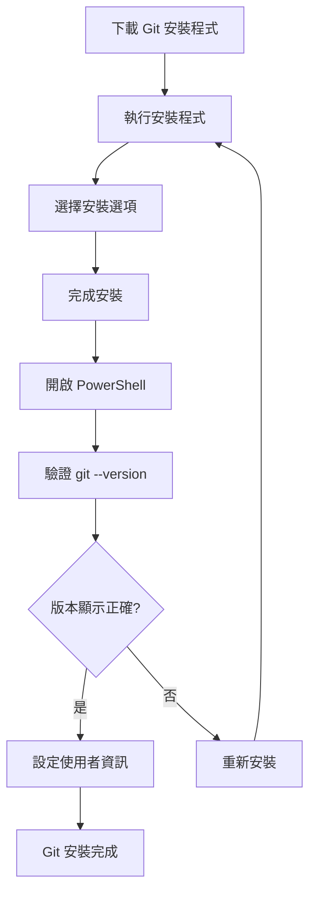

#### ⚠️ 注意事項

- 安裝後需要重新開啟 PowerShell 才能使用 `git` 指令
- 使用者名稱與 Email 會顯示在您的 Git 提交記錄中
- 建議使用與 GitHub 帳號相同的 Email

---

### 1.3 安裝 Hugo

Hugo 是一個快速的靜態網站產生器，使用 Go 語言開發。

#### 安裝方式（使用 Chocolatey）

##### 方法一：使用 Chocolatey（推薦）

1. **安裝 Chocolatey 套件管理器**

   以**系統管理員權限**開啟 PowerShell，執行：

   ```powershell
   Set-ExecutionPolicy Bypass -Scope Process -Force; [System.Net.ServicePointManager]::SecurityProtocol = [System.Net.ServicePointManager]::SecurityProtocol -bor 3072; iex ((New-Object System.Net.WebClient).DownloadString('https://community.chocolatey.org/install.ps1'))
   ```

2. **安裝 Hugo Extended 版本**

   ```powershell
   choco install hugo-extended -y
   ```

   > 💡 **為什麼選擇 Extended 版本？**  
   > Extended 版本支援 SCSS/SASS 處理，許多現代主題需要此功能。

3. **驗證安裝**

   關閉並重新開啟 PowerShell（一般權限即可），執行：

   ```powershell
   hugo version
   ```

   預期輸出類似：

   ```text
   hugo v0.121.1-00b46fed8e47f7bb0a85d7cfc2d9f1356379dca7+extended windows/amd64 BuildDate=2023-12-08T08:47:45Z VendorInfo=gohugoio
   ```

##### 方法二：手動下載安裝

1. 前往 Hugo GitHub Releases: <https://github.com/gohugoio/hugo/releases>
2. 下載 `hugo_extended_x.xx.x_windows-amd64.zip`
3. 解壓縮到 `C:\Hugo\bin`
4. 將 `C:\Hugo\bin` 加入系統 PATH 環境變數

#### 1.3.1 設定流程圖

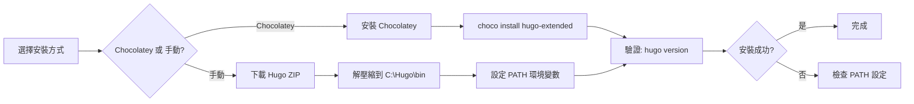

#### 1.3.2 注意事項

- 務必安裝 **Extended** 版本，而非標準版本
- 手動安裝時，確認 PATH 環境變數設定正確
- 某些防毒軟體可能會阻擋 Chocolatey 安裝，需暫時停用

---

### 1.4 安裝 VS Code

Visual Studio Code 是微軟開發的輕量級程式碼編輯器。

#### 1.4.1 安裝步驟

1. **下載 VS Code**
   - 前往官方網站: <https://code.visualstudio.com/>
   - 點選 "Download for Windows"

2. **執行安裝程式**
   - 雙擊下載的 `.exe` 檔案
   - 建議勾選的選項：
     - ☑️ 將「透過 Code 開啟」加入 Windows 檔案總管目錄內容功能表
     - ☑️ 將「透過 Code 開啟」加入 Windows 檔案總管檔案內容功能表
     - ☑️ 將 Code 註冊為支援的檔案類型編輯器
     - ☑️ 將 Code 加入 PATH

3. **安裝推薦的擴充套件**

   開啟 VS Code 後，安裝以下擴充套件（Extensions）：

   - **Hugo Language and Syntax Support** (作者: budparr)
   - **Markdown All in One** (作者: Yu Zhang)
   - **Git Graph** (作者: mhutchie)

   安裝方式：按 `Ctrl+Shift+X` 開啟擴充套件面板，搜尋並安裝。

#### 1.4.2 注意事項

- VS Code 會自動偵測系統已安裝的 Git
- 建議啟用自動儲存功能：File > Auto Save

---

### 1.5 申請 GitHub 帳號

如果您還沒有 GitHub 帳號，請依照以下步驟申請。

#### 申請步驟

1. **前往 GitHub 官網**
   - 網址: <https://github.com/>

2. **註冊帳號**
   - 點選右上角的 "Sign up"
   - 輸入 Email、密碼、使用者名稱
   - 完成驗證（Captcha）
   - 選擇免費方案（Free）

3. **驗證 Email**
   - 登入您的 Email 信箱
   - 點選 GitHub 寄送的驗證連結

4. **完成個人資料設定**
   - 建議上傳大頭照
   - 填寫簡介（Bio）

#### 1.5.1 注意事項

- GitHub 使用者名稱將成為您的網站網址的一部分：`https://username.github.io`
- 使用者名稱一旦設定後更改較為繁瑣，請謹慎選擇
- 建議使用與工作相關的專業名稱

---

### 1.6 環境檢查總覽

完成所有安裝後，請執行以下指令檢查環境：

```powershell
# 檢查 Git
git --version

# 檢查 Hugo
hugo version

# 檢查 VS Code（開啟 VS Code）
code --version
```

**預期輸出範例：**

```powershell
PS C:\Users\YourName> git --version
git version 2.43.0.windows.1

PS C:\Users\YourName> hugo version
hugo v0.121.1-00b46fed8e47f7bb0a85d7cfc2d9f1356379dca7+extended windows/amd64 BuildDate=2023-12-08T08:47:45Z VendorInfo=gohugoio

PS C:\Users\YourName> code --version
1.85.0
0ee08df0cf4527e40edc9aa28f4b5bd38bbff2b2
x64
```

#### 系統架構圖

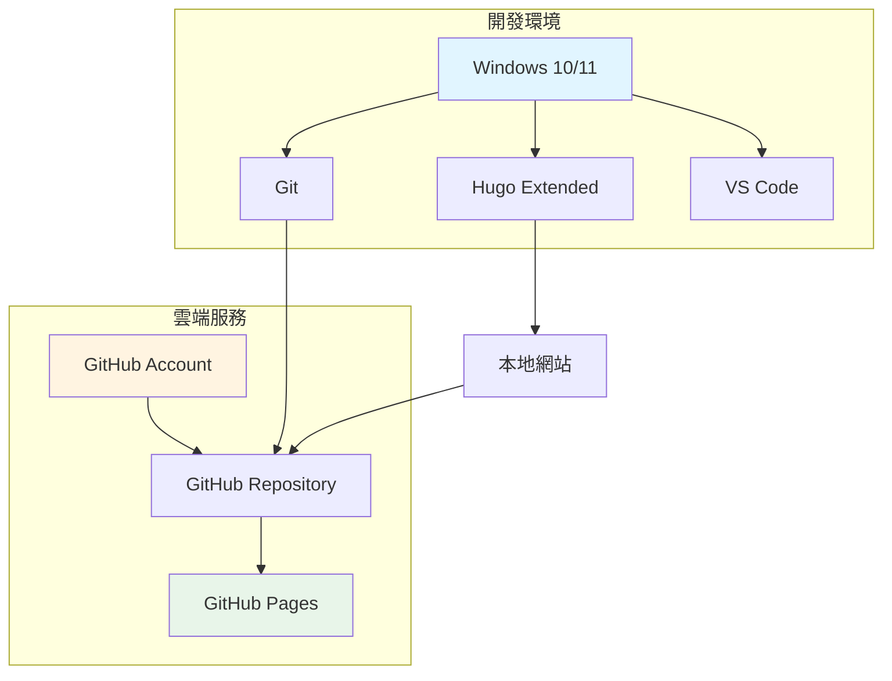

---

## 2. 建立 Hugo 專案

### 2.1 建立專案資料夾

首先，選擇一個適當的位置建立您的 Hugo 專案。

#### 操作步驟

1. **開啟 PowerShell**

2. **導航到適當的目錄**

   ```powershell
   # 例如：在 D 槽建立專案
   cd D:\developer\repos
   ```

3. **使用 Hugo 建立新專案**

   ```powershell
   hugo new site my-website
   ```

   其中 `my-website` 是您的專案名稱，可自行更改。

4. **進入專案資料夾**

   ```powershell
   cd my-website
   ```

#### 預期輸出結果

```text
Congratulations! Your new Hugo site is created in D:\developer\repos\my-website.

Just a few more steps and you're ready to go:

1. Download a theme into the same-named folder.
   Choose a theme from https://themes.gohugo.io/ or
   create your own with the "hugo new theme <THEMENAME>" command.
2. Perhaps you want to add some content. You can add single files
   with "hugo new <SECTIONNAME>\<FILENAME>.<FORMAT>".
3. Start the built-in live server via "hugo server".

Visit https://gohugo.io/ for quickstart guide and full documentation.
```

### 2.2 專案結構說明

Hugo 專案建立後，會產生以下目錄結構：

```text
my-website/
├── archetypes/          # 內容範本
│   └── default.md
├── assets/              # 需要處理的資源（SCSS、JS 等）
├── content/             # 網站內容（Markdown 文件）
├── data/                # 資料檔案（JSON、YAML、TOML）
├── layouts/             # 自訂版面配置
├── static/              # 靜態檔案（圖片、CSS、JS）
├── themes/              # 主題資料夾
└── hugo.toml           # 網站設定檔（或 config.toml）
```

#### 各目錄功能說明

| 目錄/檔案 | 用途 | 是否必要 |
|-----------|------|----------|
| `archetypes/` | 定義新內容的預設前置資料（Front Matter） | ⭐⭐⭐ |
| `content/` | 存放網站的所有內容文章（Markdown） | ⭐⭐⭐⭐⭐ |
| `data/` | 存放結構化資料供模板使用 | ⭐⭐ |
| `layouts/` | 自訂 HTML 模板覆寫主題 | ⭐⭐⭐ |
| `static/` | 直接複製到網站根目錄的靜態檔案 | ⭐⭐⭐⭐ |
| `themes/` | 安裝的主題 | ⭐⭐⭐⭐⭐ |
| `hugo.toml` | 網站主要設定檔 | ⭐⭐⭐⭐⭐ |

### 2.3 初始化 Git 儲存庫

將專案加入版本控制管理。

```powershell
# 初始化 Git
git init

# 建立 .gitignore 檔案
@"
# Hugo 產生的檔案
/public/
/resources/_gen/
/.hugo_build.lock

# 作業系統檔案
.DS_Store
Thumbs.db

# 編輯器檔案
.vscode/
.idea/
*.swp
*.swo
*~
"@ | Out-File -FilePath .gitignore -Encoding utf8

# 加入所有檔案
git add .

# 第一次提交
git commit -m "Initial commit: Hugo site created"
```

#### 2.3.1 流程圖


### 2.4 設定基本網站資訊

編輯 `hugo.toml`（或 `config.toml`）設定檔。

#### 使用 VS Code 開啟專案

```powershell
code .
```

#### 編輯 hugo.toml

找到並編輯 `hugo.toml` 檔案：

```toml
baseURL = 'https://yourusername.github.io/'
languageCode = 'zh-tw'
title = '我的個人網站'
theme = ''  # 稍後設定

[params]
  description = "這是我的個人網站，分享技術文章與生活點滴"
  author = "您的名字"

[menu]
  [[menu.main]]
    name = "首頁"
    url = "/"
    weight = 1
  [[menu.main]]
    name = "文章"
    url = "/posts/"
    weight = 2
  [[menu.main]]
    name = "關於"
    url = "/about/"
    weight = 3
```

#### 2.4.1 注意事項

- `baseURL` 需要改成您的 GitHub Pages 網址：`https://您的GitHub使用者名稱.github.io/`
- `languageCode` 設定為 `zh-tw` 可支援繁體中文
- `theme` 欄位在安裝主題後填入

#### 2.4.2 實務建議

- **安全性**: 不要在設定檔中儲存敏感資訊（API Keys、密碼等）
- **效能**: 保持設定檔簡潔，避免過多不必要的參數
- **可維護性**: 為每個設定項目加上註解說明用途

---

## 3. 本機預覽網站

### 3.1 啟動 Hugo 開發伺服器

Hugo 內建開發伺服器，支援即時預覽（Live Reload）。

#### 啟動指令

```powershell
hugo server -D
```

參數說明：

- `server`: 啟動開發伺服器
- `-D`: 顯示草稿（Draft）狀態的文章

#### 3.1.1 預期輸出

```text
Start building sites …
hugo v0.121.1-00b46fed8e47f7bb0a85d7cfc2d9f1356379dca7+extended windows/amd64 BuildDate=2023-12-08T08:47:45Z VendorInfo=gohugoio

                   | ZH-TW
-------------------+--------
  Pages            |     3
  Paginator pages  |     0
  Non-page files   |     0
  Static files     |     0
  Processed images |     0
  Aliases          |     0
  Sitemaps         |     1
  Cleaned          |     0

Built in 45 ms
Environment: "development"
Serving pages from memory
Running in Fast Render Mode. For full rebuilds on change: hugo server --disableFastRender
Web Server is available at http://localhost:1313/ (bind address 127.0.0.1)
Press Ctrl+C to stop
```

### 3.2 在瀏覽器中預覽

1. 開啟瀏覽器
2. 前往 `http://localhost:1313/`
3. 您應該會看到一個空白或基本的網站（尚未安裝主題）

#### 常用的開發伺服器參數

```powershell
# 顯示草稿文章
hugo server -D

# 指定埠號
hugo server --port 8080

# 允許外部存取（區域網路）
hugo server --bind 0.0.0.0 --baseURL http://你的IP:1313

# 停用 Fast Render（完整重建）
hugo server --disableFastRender

# 開啟詳細日誌
hugo server --verbose
```

### 3.3 建立第一篇文章

#### 使用指令建立文章

```powershell
hugo new posts/my-first-post.md
```

這會在 `content/posts/` 目錄下建立 `my-first-post.md` 檔案。

#### 編輯文章內容

使用 VS Code 開啟 `content/posts/my-first-post.md`：

```markdown
---
title: "我的第一篇文章"
date: 2025-10-15T10:00:00+08:00
draft: false
tags: ["Hugo", "部落格"]
categories: ["教學"]
---

## 歡迎來到我的部落格！

這是我使用 Hugo 建立的第一篇文章。

### Hugo 的優點

- 🚀 建置速度極快
- 📝 使用 Markdown 撰寫
- 🎨 豐富的主題選擇
- 🔧 高度可客製化

### 程式碼範例

```python
def hello_hugo():
    print("Hello, Hugo!")
    
hello_hugo()
```

祝大家使用愉快！

#### Front Matter 說明

Front Matter 是文章開頭的 YAML/TOML 區塊，定義文章的詮釋資料：

| 欄位 | 說明 | 範例 |
|------|------|------|
| `title` | 文章標題 | "我的第一篇文章" |
| `date` | 發布日期 | 2025-10-15T10:00:00+08:00 |
| `draft` | 是否為草稿 | true / false |
| `tags` | 標籤 | ["Hugo", "部落格"] |
| `categories` | 分類 | ["教學"] |
| `author` | 作者 | "Your Name" |
| `description` | 摘要 | "本文介紹..." |

### 3.4 即時預覽更新

儲存文章後，Hugo 會自動重建網站，瀏覽器會自動重新整理顯示最新內容。

#### 開發流程圖

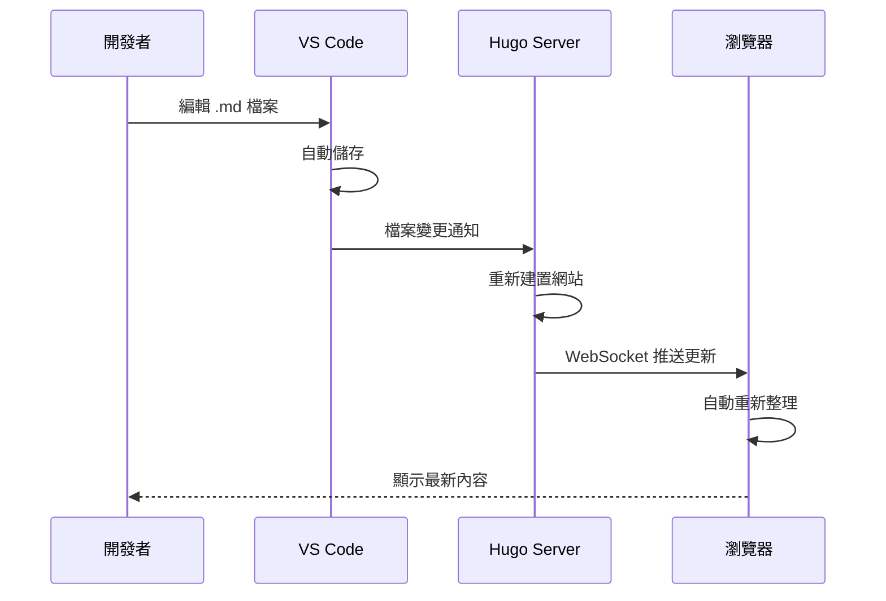

### 3.5 停止開發伺服器

在 PowerShell 中按下 `Ctrl + C` 即可停止伺服器。

#### 3.5.1 注意事項

- 開發伺服器僅供本地開發使用，不適合正式部署
- 預設僅監聽 `localhost`，外部無法存取
- 修改 `hugo.toml` 後需要重新啟動伺服器

#### 3.5.2 實務建議

- **開發習慣**: 保持開發伺服器運行,善用即時預覽功能
- **效能**: 大型網站可使用 `--disableFastRender` 確保完整重建
- **安全性**: 不要在開發伺服器上使用正式環境的 API Key

---

## 4. 選擇與設定 Hugo Theme

### 4.1 選擇適合的主題

Hugo 擁有豐富的主題生態系統，您可以從官方主題庫選擇。

#### 主題推薦

| 主題名稱 | 特色 | 適用情境 | 難度 |
|---------|------|----------|------|
| **PaperMod** | 極簡、快速、SEO 友善 | 個人部落格 | ⭐⭐ |
| **Hugo-Theme-Stack** | 現代化、多功能 | 技術部落格 | ⭐⭐⭐ |
| **Ananke** | 官方推薦、簡潔 | 初學者 | ⭐ |
| **LoveIt** | 功能豐富、中文支援佳 | 個人網站 | ⭐⭐⭐ |
| **Academic/Wowchemy** | 學術型網站 | 研究人員、教師 | ⭐⭐⭐⭐ |

#### 瀏覽主題

前往 Hugo 官方主題庫：<https://themes.gohugo.io/>

#### 選擇考量因素

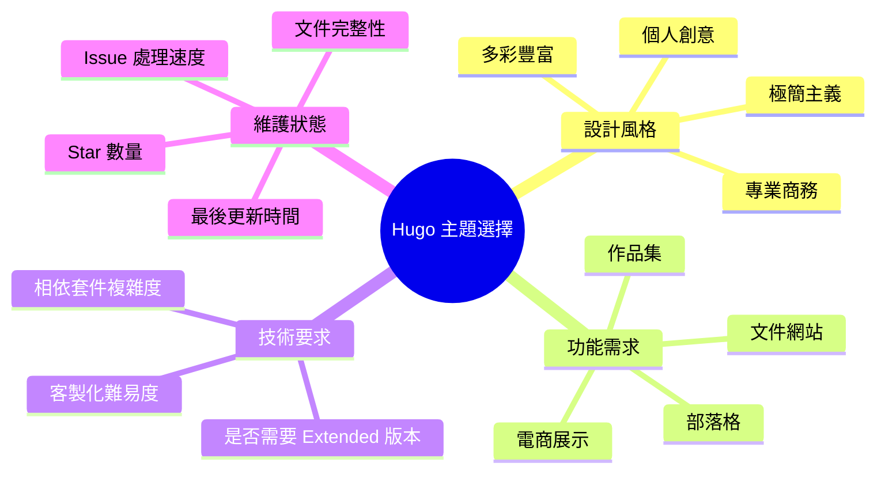

### 4.2 安裝主題（以 PaperMod 為例）

#### 方法一：使用 Git Submodule（推薦）

使用 Git Submodule 可以方便地更新主題。

```powershell
# 確認在專案根目錄
cd D:\developer\repos\my-website

# 加入主題作為 Submodule
git submodule add --depth=1 https://github.com/adityatelange/hugo-PaperMod.git themes/PaperMod

# 更新 Submodule
git submodule update --init --recursive
```

#### 方法二：直接下載主題

```powershell
# 下載並解壓縮到 themes 資料夾
# 手動從 GitHub 下載 ZIP 並解壓縮到 themes/PaperMod/
```

#### 方法三：使用 Hugo Modules（進階）

```powershell
# 初始化 Hugo Module
hugo mod init github.com/yourusername/my-website

# 在 hugo.toml 中加入
# [module]
#   [[module.imports]]
#     path = "github.com/adityatelange/hugo-PaperMod"
```

#### 安裝流程圖

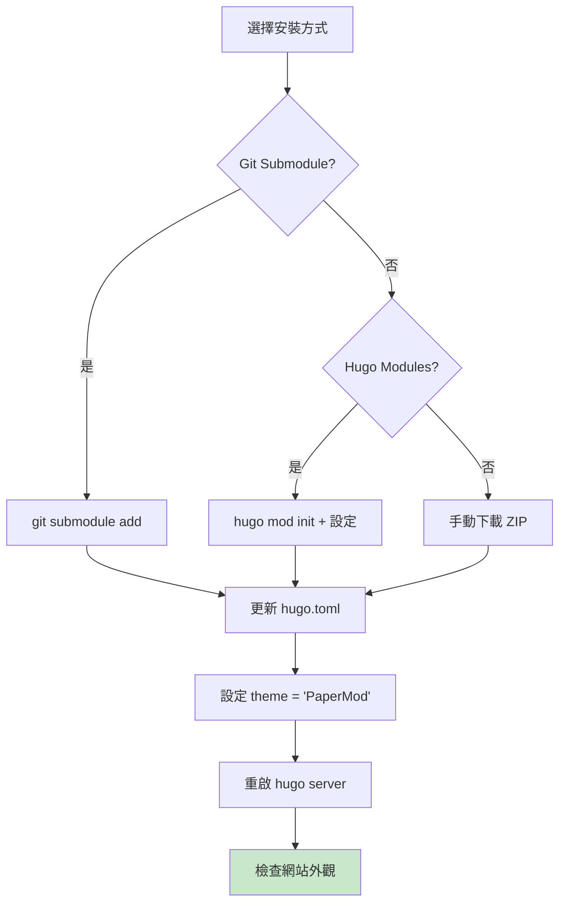

### 4.3 設定主題

#### 4.3.1 編輯 hugo.toml

```toml
baseURL = 'https://yourusername.github.io/'
languageCode = 'zh-tw'
title = '我的技術部落格'
theme = 'PaperMod'

# 啟用 emoji 支援
enableEmoji = true

# 設定摘要長度
summaryLength = 70

# 設定分頁
paginate = 10

[params]
  # 網站描述
  description = "分享程式開發、技術學習與生活心得"
  
  # 作者資訊
  author = "Your Name"
  
  # 顯示閱讀時間
  ShowReadingTime = true
  
  # 顯示分享按鈕
  ShowShareButtons = true
  
  # 顯示文章目錄
  ShowToc = true
  TocOpen = false
  
  # 顯示程式碼複製按鈕
  ShowCodeCopyButtons = true
  
  # 首頁資訊
  [params.homeInfoParams]
    Title = "歡迎來到我的部落格 👋"
    Content = """
    這裡分享我的技術學習筆記、專案經驗與生活點滴。
    
    - 🔧 主要技術: Java, Python, Go
    - 📚 專注領域: 後端開發、DevOps
    - 💡 持續學習中...
    """

  # 社群媒體連結
  [[params.socialIcons]]
    name = "github"
    url = "https://github.com/yourusername"
  
  [[params.socialIcons]]
    name = "linkedin"
    url = "https://linkedin.com/in/yourprofile"
  
  [[params.socialIcons]]
    name = "email"
    url = "mailto:your.email@example.com"

# 選單設定
[menu]
  [[menu.main]]
    identifier = "home"
    name = "首頁"
    url = "/"
    weight = 10
  
  [[menu.main]]
    identifier = "posts"
    name = "文章"
    url = "/posts/"
    weight = 20
  
  [[menu.main]]
    identifier = "archives"
    name = "歸檔"
    url = "/archives/"
    weight = 30
  
  [[menu.main]]
    identifier = "tags"
    name = "標籤"
    url = "/tags/"
    weight = 40
  
  [[menu.main]]
    identifier = "about"
    name = "關於"
    url = "/about/"
    weight = 50

# 語法高亮設定
[markup]
  [markup.highlight]
    style = "monokai"
    lineNos = true
    lineNumbersInTable = true
    noClasses = false
```

### 4.4 建立必要頁面

#### 建立關於頁面

```powershell
hugo new about.md
```

編輯 `content/about.md`：

```markdown
---
title: "關於我"
date: 2025-10-15
draft: false
ShowToc: false
---

## 👨‍💻 自我介紹

哈囉！我是 [Your Name]，是一位熱愛技術的軟體工程師。

### 技能

- **程式語言**: Java, Python, JavaScript
- **框架**: Spring Boot, Django, React
- **工具**: Git, Docker, Jenkins

### 興趣

- 📖 閱讀技術書籍
- 🏃‍♂️ 慢跑
- 📷 攝影

### 聯絡方式

- Email: your.email@example.com
- GitHub: [@yourusername](https://github.com/yourusername)
```

#### 建立歸檔頁面

```powershell
hugo new archives.md
```

編輯 `content/archives.md`：

```markdown
---
title: "文章歸檔"
layout: "archives"
url: "/archives/"
summary: archives
---
```

### 4.5 客製化主題樣式（選用）

#### 覆寫 CSS

建立 `assets/css/extended/custom.css`：

```css
/* 自訂顏色 */
:root {
    --primary: #1e88e5;
    --secondary: #424242;
}

/* 自訂標題樣式 */
.post-title {
    font-size: 2rem;
    font-weight: 700;
}

/* 自訂程式碼區塊 */
.highlight {
    border-radius: 8px;
    padding: 1rem;
}

/* 響應式調整 */
@media (max-width: 768px) {
    .post-title {
        font-size: 1.5rem;
    }
}
```

#### 覆寫部分模板

如需客製化 HTML 結構，可在 `layouts/` 資料夾中覆寫主題檔案：

```text
layouts/
├── _default/
│   └── single.html    # 覆寫單篇文章版面
├── partials/
│   └── footer.html    # 覆寫頁尾
└── shortcodes/
    └── youtube.html   # 自訂 shortcode
```

### 4.6 驗證主題設定

#### 重啟開發伺服器

```powershell
# 停止目前的 server (Ctrl+C)
# 重新啟動
hugo server -D
```

#### 檢查項目

- ✅ 網站外觀符合主題風格
- ✅ 選單項目正確顯示
- ✅ 社群媒體圖示正常
- ✅ 文章列表正確顯示
- ✅ 語法高亮運作正常
- ✅ 響應式設計在手機上正常

#### 主題設定流程總覽

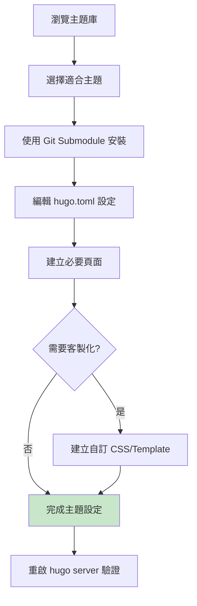

#### 4.6.1 注意事項

- 不同主題的設定參數可能不同，請參考主題的官方文件
- 使用 Git Submodule 時，更新主題需使用 `git submodule update --remote`
- 客製化前建議先備份原始主題檔案
- 過度客製化可能導致主題更新困難

#### 4.6.2 實務建議

- **選擇策略**: 優先選擇維護活躍、文件完整的主題
- **效能考量**: 避免選擇過於臃腫、載入緩慢的主題
- **SEO 優化**: 確認主題支援 Open Graph、Twitter Cards 等 meta 標籤
- **可維護性**: 使用覆寫（override）方式客製化，而非直接修改主題檔案

---

## 5. 部署到 GitHub Pages

### 5.1 建立 GitHub Repository

#### 步驟說明

1. **登入 GitHub**
   - 前往 <https://github.com> 並登入

2. **建立新的 Repository**
   - 點選右上角的 `+` 號
   - 選擇 "New repository"

3. **Repository 設定**
   - **Repository name**: `yourusername.github.io`
     - ⚠️ 必須使用 `使用者名稱.github.io` 格式
   - **Description**: "My personal website built with Hugo"
   - **Public**: 選擇 Public（免費用戶只能使用 Public repo 的 GitHub Pages）
   - **不要勾選**: Initialize this repository with a README

4. **建立 Repository**
   - 點選 "Create repository"

#### Repository 命名規則

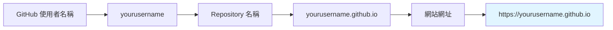

### 5.2 連結本地專案與遠端 Repository

在專案目錄中執行以下指令：

```powershell
# 設定遠端 Repository
git remote add origin https://github.com/yourusername/yourusername.github.io.git

# 檢查遠端設定
git remote -v

# 建立主分支（如果尚未建立）
git branch -M main

# 第一次推送
git push -u origin main
```

#### 5.2.1 預期輸出

```text
Enumerating objects: 15, done.
Counting objects: 100% (15/15), done.
Delta compression using up to 8 threads
Compressing objects: 100% (10/10), done.
Writing objects: 100% (15/15), 2.50 KiB | 2.50 MiB/s, done.
Total 15 (delta 0), reused 0 (delta 0), pack-reused 0
To https://github.com/yourusername/yourusername.github.io.git
 * [new branch]      main -> main
Branch 'main' set up to track remote branch 'main' from 'origin'.
```

### 5.3 設定 GitHub Actions 自動部署

GitHub Actions 可以自動建置並部署 Hugo 網站。

#### 建立 Workflow 檔案

建立 `.github/workflows/hugo.yml` 檔案：

```powershell
# 建立目錄
New-Item -ItemType Directory -Force -Path .github\workflows

# 建立 workflow 檔案
New-Item -ItemType File -Path .github\workflows\hugo.yml
```

#### 編輯 hugo.yml

使用 VS Code 開啟 `.github/workflows/hugo.yml` 並貼上以下內容：

```yaml
name: Deploy Hugo site to Pages

on:
  # 當推送到 main 分支時觸發
  push:
    branches:
      - main

  # 允許手動觸發
  workflow_dispatch:

# 設定 GitHub Pages 的權限
permissions:
  contents: read
  pages: write
  id-token: write

# 避免同時執行多個部署
concurrency:
  group: "pages"
  cancel-in-progress: false

# 預設使用 bash
defaults:
  run:
    shell: bash

jobs:
  # 建置工作
  build:
    runs-on: ubuntu-latest
    env:
      HUGO_VERSION: 0.121.1
    steps:
      - name: Install Hugo CLI
        run: |
          wget -O ${{ runner.temp }}/hugo.deb https://github.com/gohugoio/hugo/releases/download/v${HUGO_VERSION}/hugo_extended_${HUGO_VERSION}_linux-amd64.deb \
          && sudo dpkg -i ${{ runner.temp }}/hugo.deb          
      
      - name: Install Dart Sass
        run: sudo snap install dart-sass
      
      - name: Checkout
        uses: actions/checkout@v4
        with:
          submodules: recursive
          fetch-depth: 0
      
      - name: Setup Pages
        id: pages
        uses: actions/configure-pages@v4
      
      - name: Install Node.js dependencies
        run: "[[ -f package-lock.json || -f npm-shrinkwrap.json ]] && npm ci || true"
      
      - name: Build with Hugo
        env:
          # For maximum backward compatibility with Hugo modules
          HUGO_ENVIRONMENT: production
          HUGO_ENV: production
        run: |
          hugo \
            --gc \
            --minify \
            --baseURL "${{ steps.pages.outputs.base_url }}/"          
      
      - name: Upload artifact
        uses: actions/upload-pages-artifact@v2
        with:
          path: ./public

  # 部署工作
  deploy:
    environment:
      name: github-pages
      url: ${{ steps.deployment.outputs.page_url }}
    runs-on: ubuntu-latest
    needs: build
    steps:
      - name: Deploy to GitHub Pages
        id: deployment
        uses: actions/deploy-pages@v3
```

#### Workflow 檔案說明

| 區段 | 說明 |
|------|------|
| `on.push.branches` | 觸發條件：推送到 main 分支 |
| `permissions` | 授予 workflow 必要的權限 |
| `jobs.build` | 建置工作：安裝 Hugo、建置網站 |
| `jobs.deploy` | 部署工作：將產生的檔案部署到 GitHub Pages |
| `HUGO_VERSION` | 指定 Hugo 版本（建議與本地相同） |

### 5.4 設定 GitHub Pages

#### 在 GitHub 網站上設定

1. 前往您的 Repository 頁面
2. 點選 **Settings**
3. 在左側選單選擇 **Pages**
4. 在 "Build and deployment" 區段：
   - **Source**: 選擇 "GitHub Actions"
5. 儲存設定

#### 5.4.1 設定流程圖

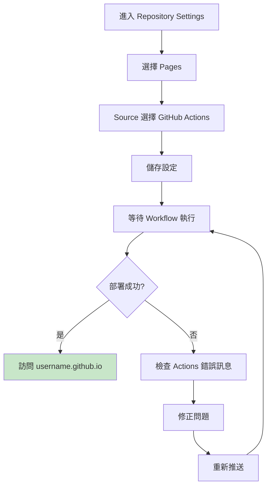

### 5.5 推送並觸發部署

```powershell
# 加入 GitHub Actions workflow
git add .github/workflows/hugo.yml

# 提交變更
git commit -m "Add GitHub Actions workflow for Hugo deployment"

# 推送到 GitHub
git push origin main
```

### 5.6 監控部署狀態

#### 查看 Actions 執行狀態

1. 前往 Repository 頁面
2. 點選 **Actions** 標籤
3. 查看最新的 workflow 執行狀態

#### 部署成功標誌

- ✅ build 工作完成
- ✅ deploy 工作完成
- ✅ 顯示綠色勾勾

#### 訪問您的網站

部署成功後，前往 `https://yourusername.github.io/` 查看您的網站！

### 5.7 部署流程完整視圖

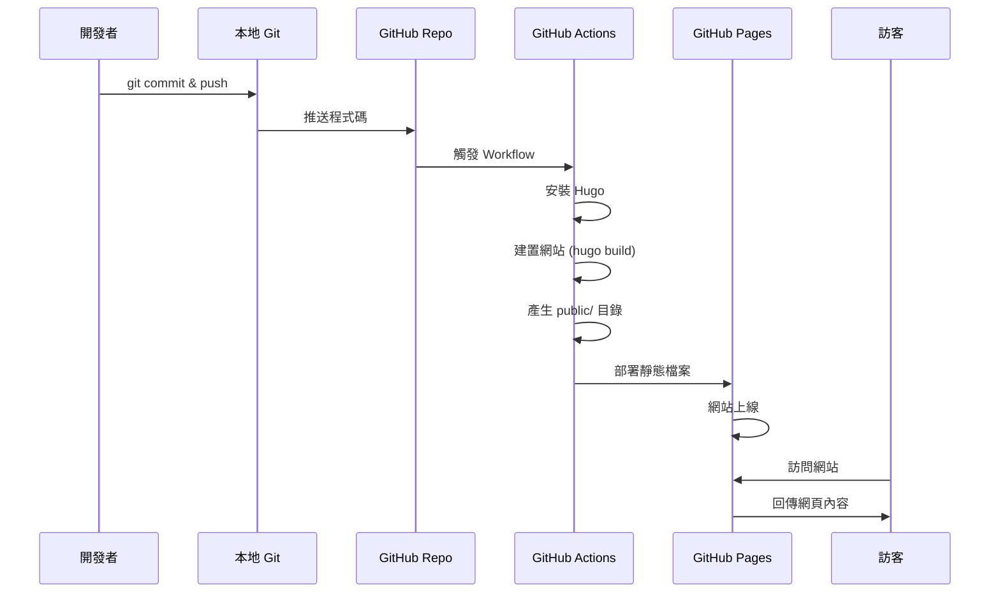

### 5.8 常見部署問題與解決方案

#### 問題 1: Workflow 執行失敗

**原因**: Hugo 版本不匹配或主題問題

**解決方案**:

```yaml
# 檢查本地 Hugo 版本
hugo version

# 在 hugo.yml 中設定相同版本
env:
  HUGO_VERSION: 0.121.1  # 與本地版本一致
```

#### 問題 2: 主題無法載入

**原因**: Git Submodule 未正確同步

**解決方案**:

```yaml
# 在 Checkout 步驟中確保包含
- name: Checkout
  uses: actions/checkout@v4
  with:
    submodules: recursive  # 重要！
    fetch-depth: 0
```

#### 問題 3: baseURL 設定錯誤

**原因**: hugo.toml 中的 baseURL 不正確

**解決方案**:

```toml
# hugo.toml
baseURL = 'https://yourusername.github.io/'  # 結尾要有斜線
```

#### 問題 4: CSS/JS 無法載入

**原因**: 相對路徑問題

**解決方案**:

```yaml
# 在 Build with Hugo 步驟中使用正確的 baseURL
run: |
  hugo \
    --gc \
    --minify \
    --baseURL "${{ steps.pages.outputs.base_url }}/"
```

### 5.9 效能優化建議

#### 啟用快取

在 workflow 中加入快取步驟：

```yaml
- name: Cache Hugo resources
  uses: actions/cache@v3
  with:
    path: resources
    key: ${{ runner.os }}-hugo-resources-${{ hashFiles('content/**') }}
```

#### 圖片優化

```powershell
# 使用 Hugo 的圖片處理功能
# 在文章中使用 Hugo 的 image processing
```

在 Markdown 中：

```markdown

```

#### 啟用 CDN（選用）

考慮使用 Cloudflare Pages 或其他 CDN 服務提升全球存取速度。

#### 5.7.1 注意事項

- GitHub Pages 有 1GB 儲存空間限制
- 每月頻寬限制 100GB
- 部署次數建議不要過於頻繁（每小時不超過 10 次）
- 私有 Repository 需要 GitHub Pro 方案才能使用 Pages

#### 5.7.2 實務建議

- **安全性**: 不要在 Repository 中儲存敏感資訊（API Keys、密碼）
- **效能**: 使用圖片壓縮工具減少檔案大小
- **SEO**: 確保 sitemap.xml 和 robots.txt 正確設定
- **可維護性**: 定期更新 Hugo 版本和主題

---

## 6. 維護與更新內容的流程

### 6.1 日常更新工作流程

建立文章並部署的標準流程如下：

#### 標準工作流程

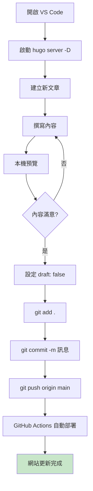

#### 詳細步驟

##### 步驟 1: 建立新文章

```powershell
# 建立新文章
hugo new posts/2025/my-new-post.md

# 或使用日期目錄結構
hugo new posts/2025-10-15-my-new-post.md
```

##### 步驟 2: 編輯文章內容

```markdown
---
title: "深入理解 Java Stream API"
date: 2025-10-15T14:30:00+08:00
draft: false
tags: ["Java", "Stream API", "函數式編程"]
categories: ["程式設計"]
author: "Your Name"
description: "本文詳細介紹 Java 8 引入的 Stream API，包含常用操作與最佳實踐"
cover:
    image: "images/java-stream.png"
    alt: "Java Stream API"
    caption: "Stream API 讓集合操作更優雅"
---

## 前言

Java 8 引入的 Stream API 徹底改變了集合處理的方式...

<!--more-->

## 基本概念

Stream 是一個資料序列，支援各種操作來處理資料...

### 建立 Stream

\`\`\`java
// 從集合建立
List<String> list = Arrays.asList("a", "b", "c");
Stream<String> stream = list.stream();

// 從陣列建立
String[] array = {"a", "b", "c"};
Stream<String> stream2 = Arrays.stream(array);
\`\`\`

## 常用操作

### Filter（過濾）

\`\`\`java
list.stream()
    .filter(s -> s.startsWith("a"))
    .collect(Collectors.toList());
\`\`\`

## 總結

Stream API 提供了簡潔且高效的集合處理方式...
```

##### 步驟 3: 本機預覽

```powershell
# 如果 server 未啟動，執行
hugo server -D

# 在瀏覽器開啟 http://localhost:1313/
```

##### 步驟 4: 提交並部署

```powershell
# 檢查變更
git status

# 加入所有變更
git add .

# 提交（使用有意義的訊息）
git commit -m "新增文章: 深入理解 Java Stream API"

# 推送到 GitHub
git push origin main
```

##### 步驟 5: 等待部署完成

- 前往 GitHub Repository 的 Actions 頁面
- 確認 workflow 執行成功
- 訪問網站確認更新

### 6.2 Git 提交訊息最佳實踐

#### 提交訊息格式

```text
<類型>: <簡短描述>

<詳細描述（選用）>

<相關 Issue（選用）>
```

#### 常用類型

| 類型 | 說明 | 範例 |
|------|------|------|
| `feat` | 新功能 | `feat: 新增留言功能` |
| `post` | 新文章 | `post: 新增 Java Stream API 教學` |
| `fix` | 修正錯誤 | `fix: 修正文章日期顯示問題` |
| `style` | 樣式調整 | `style: 更新首頁配色` |
| `docs` | 文件更新 | `docs: 更新 README` |
| `refactor` | 重構 | `refactor: 重新組織文章分類` |
| `config` | 設定變更 | `config: 更新 hugo.toml 設定` |

#### 範例

```powershell
# 好的提交訊息
git commit -m "post: 新增 Docker 容器化部署教學"
git commit -m "fix: 修正文章中程式碼區塊的語法高亮"
git commit -m "style: 調整文章標題字體大小"

# 不好的提交訊息（避免）
git commit -m "update"
git commit -m "fix bug"
git commit -m "change"
```

### 6.3 管理草稿文章

#### 草稿工作流程

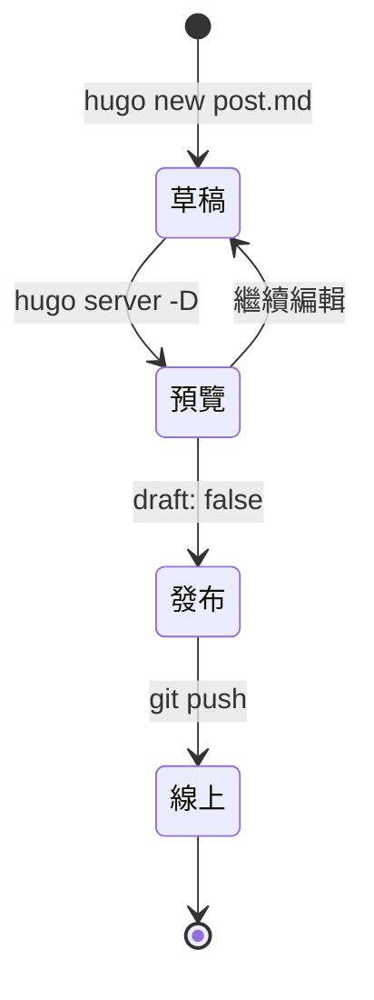

#### 草稿文章不會被部署

```yaml
---
title: "我的草稿文章"
date: 2025-10-15
draft: true  # 設為 true，不會出現在正式網站
---
```

#### 本機預覽草稿

```powershell
# 包含草稿的預覽
hugo server -D

# 不包含草稿的預覽（模擬正式環境）
hugo server
```

#### 將草稿變為正式文章

只需將 `draft: true` 改為 `draft: false`：

```yaml
---
title: "我的草稿文章"
date: 2025-10-15
draft: false  # 改為 false
---
```

### 6.4 管理圖片與靜態資源

#### 圖片存放位置

##### 方法一：使用 static 資料夾（簡單）

```text
static/
└── images/
    └── 2025/
        └── java-stream.png
```

在 Markdown 中引用：

```markdown

```

##### 方法二：使用 Page Bundle（推薦）

```text
content/
└── posts/
    └── my-post/
        ├── index.md
        ├── featured.png
        └── diagram.png
```

在 Markdown 中引用：

```markdown

```

#### 圖片優化建議

```powershell
# 使用 Hugo 的圖片處理（需要 Extended 版本）
```

在 Markdown 中使用 Hugo 的 figure shortcode：

```markdown

```

或在模板中使用 Image Processing：

```html
{{ $image := resources.Get "images/photo.jpg" }}
{{ $resized := $image.Resize "800x" }}

```

#### 資源管理最佳實踐

| 資源類型 | 建議大小 | 格式 | 存放位置 |
|---------|---------|------|---------|
| 文章特色圖 | < 200KB | JPG/WebP | Page Bundle |
| 內文圖片 | < 100KB | PNG/JPG | Page Bundle |
| 圖示 | < 10KB | SVG/PNG | static/icons/ |
| 下載檔案 | - | PDF/ZIP | static/files/ |

### 6.5 更新主題

#### 更新 Git Submodule 主題

```powershell
# 更新到最新版本
git submodule update --remote --merge

# 檢查更新
cd themes/PaperMod
git log --oneline -5

# 返回專案根目錄
cd ../..

# 提交主題更新
git add themes/PaperMod
git commit -m "chore: 更新 PaperMod 主題到最新版本"
git push origin main
```

#### 更新注意事項

- ⚠️ 更新前先在本機測試
- ⚠️ 檢查主題的 CHANGELOG 是否有重大變更
- ⚠️ 備份自訂的樣式和模板

### 6.6 定期維護檢查清單

#### 每週維護

- [ ] 檢查是否有待發布的草稿
- [ ] 回覆讀者留言（如有）
- [ ] 檢查網站載入速度

#### 每月維護

- [ ] 更新 Hugo 版本
- [ ] 更新主題版本
- [ ] 檢查並修正失效連結
- [ ] 檢視 Google Analytics（如有設定）
- [ ] 備份 Repository

#### 每季維護

- [ ] 檢視並優化 SEO
- [ ] 更新關於頁面
- [ ] 檢視並更新過時內容
- [ ] 檢查圖片是否需要優化

### 6.7 備份策略

#### Git 作為主要備份

GitHub 本身就是備份機制，但建議：

```powershell
# 建立本地備份
git clone https://github.com/yourusername/yourusername.github.io.git backup-$(Get-Date -Format "yyyy-MM-dd")

# 或定期下載整個 Repository
```

#### 額外備份重要資料

```powershell
# 備份 content 資料夾
Copy-Item -Path "content" -Destination "D:\Backups\hugo-content-$(Get-Date -Format 'yyyy-MM-dd')" -Recurse

# 備份 static 資料夾
Copy-Item -Path "static" -Destination "D:\Backups\hugo-static-$(Get-Date -Format 'yyyy-MM-dd')" -Recurse
```

### 6.8 協作工作流程（多人維護）

#### 使用分支策略

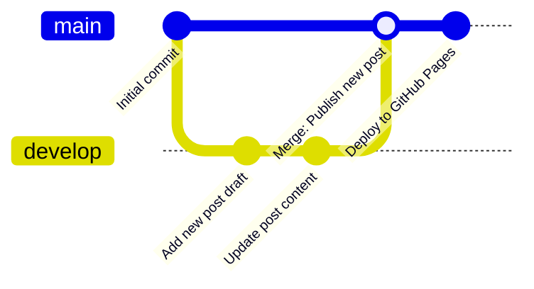

#### 建立功能分支

```powershell
# 建立新分支
git checkout -b post/new-article

# 進行變更
# ... 編輯檔案 ...

# 提交變更
git add .
git commit -m "post: 新增文章草稿"

# 推送分支
git push -u origin post/new-article

# 在 GitHub 建立 Pull Request
# 審核後合併到 main 分支
```

#### Pull Request 工作流程

1. 建立分支並進行變更
2. 推送到 GitHub
3. 建立 Pull Request
4. 團隊成員審核
5. 合併到 main 分支
6. 自動觸發部署

#### 協作注意事項

- **溝通**: 使用 Pull Request 描述清楚變更內容
- **審核**: 至少一位成員審核後才合併
- **測試**: 在分支上充分測試後才合併
- **文件**: 重要變更記錄在 CHANGELOG.md

---

## 7. 設定自訂網域（選用）

### 7.1 選擇網域名稱

您可以將 GitHub Pages 網站綁定到自訂網域。

#### 網域類型

| 類型 | 範例 | 說明 |
|------|------|------|
| Apex Domain | `example.com` | 根網域 |
| Subdomain | `blog.example.com` | 子網域（推薦） |
| www Subdomain | `www.example.com` | 常見用法 |

#### 推薦使用子網域的原因

- ✅ 設定較簡單
- ✅ 不影響主網域的其他服務
- ✅ 可以使用 CNAME 記錄
- ✅ 支援 HTTPS

### 7.2 購買網域

#### 推薦的網域註冊商

- **Namecheap**: 價格合理，介面友善
- **Google Domains**: Google 官方服務
- **GoDaddy**: 全球最大網域註冊商
- **Cloudflare Registrar**: 無加價，整合 CDN

### 7.3 設定 DNS 記錄

#### 設定子網域（推薦方式）

在網域註冊商的 DNS 管理介面，新增 CNAME 記錄：

| 類型 | 主機名稱 | 指向 | TTL |
|------|---------|------|-----|
| CNAME | blog | yourusername.github.io | 3600 |

#### 設定 Apex Domain（進階）

新增 A 記錄指向 GitHub Pages 的 IP：

| 類型 | 主機名稱 | IP 位址 | TTL |
|------|---------|---------|-----|
| A | @ | 185.199.108.153 | 3600 |
| A | @ | 185.199.109.153 | 3600 |
| A | @ | 185.199.110.153 | 3600 |
| A | @ | 185.199.111.153 | 3600 |

以及 AAAA 記錄（IPv6）：

| 類型 | 主機名稱 | IP 位址 | TTL |
|------|---------|---------|-----|
| AAAA | @ | 2606:50c0:8000::153 | 3600 |
| AAAA | @ | 2606:50c0:8001::153 | 3600 |
| AAAA | @ | 2606:50c0:8002::153 | 3600 |
| AAAA | @ | 2606:50c0:8003::153 | 3600 |

#### DNS 設定流程圖

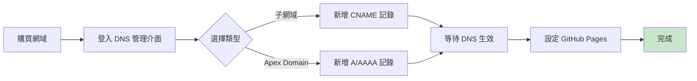

### 7.4 在 GitHub 設定自訂網域

#### 7.4.1 步驟說明

1. **前往 Repository Settings**
   - 進入您的 `yourusername.github.io` repository
   - 點選 **Settings**

2. **設定 Custom Domain**
   - 在左側選單選擇 **Pages**
   - 在 "Custom domain" 欄位輸入您的網域
   - 例如: `blog.example.com` 或 `www.example.com`
   - 點選 **Save**

3. **等待 DNS 檢查**
   - GitHub 會檢查 DNS 設定
   - 通常需要 5-30 分鐘

4. **啟用 HTTPS**
   - DNS 驗證成功後，勾選 "Enforce HTTPS"
   - Let's Encrypt 會自動簽發 SSL 憑證

#### 建立 CNAME 檔案

在專案的 `static/` 目錄下建立 `CNAME` 檔案：

```powershell
# 建立 CNAME 檔案
echo "blog.example.com" | Out-File -FilePath static/CNAME -Encoding ascii -NoNewline

# 提交變更
git add static/CNAME
git commit -m "config: 新增自訂網域設定"
git push origin main
```

> ⚠️ **重要**: CNAME 檔案內容只能有一行，就是您的網域名稱，不要有其他內容或空白行。

### 7.5 更新 Hugo 設定

編輯 `hugo.toml`，更新 baseURL：

```toml
baseURL = 'https://blog.example.com/'
```

```powershell
# 提交變更
git add hugo.toml
git commit -m "config: 更新 baseURL 為自訂網域"
git push origin main
```

### 7.6 驗證設定

#### 使用命令列工具檢查

```powershell
# 檢查 DNS 記錄
nslookup blog.example.com

# 檢查 CNAME 記錄
nslookup -type=CNAME blog.example.com

# 測試網站連線
curl -I https://blog.example.com
```

#### 7.6.1 預期輸出

```text
PS> nslookup blog.example.com
Server:  dns.google
Address:  8.8.8.8

Non-authoritative answer:
Name:    yourusername.github.io
Address:  185.199.108.153
Aliases:  blog.example.com
```

#### 使用線上工具檢查

- **DNS Checker**: <https://dnschecker.org/>
- **What's My DNS**: <https://whatsmydns.net/>
- **SSL Labs**: <https://www.ssllabs.com/ssltest/>

### 7.7 常見問題排除

#### 問題 1: DNS 未生效

**症狀**: 無法訪問自訂網域

**解決方案**:

- 等待 DNS 傳播（可能需要 24-48 小時）
- 清除瀏覽器快取和 DNS 快取

  ```powershell
  ipconfig /flushdns
  ```

- 使用不同的 DNS 伺服器測試

#### 問題 2: HTTPS 憑證錯誤

**症狀**: 瀏覽器顯示「不安全」警告

**解決方案**:

- 確認 DNS 設定正確
- 等待 Let's Encrypt 簽發憑證（可能需要 24 小時）
- 在 GitHub Pages 設定中重新勾選 "Enforce HTTPS"

#### 問題 3: 404 錯誤

**症狀**: 訪問頁面顯示 404

**解決方案**:

- 確認 CNAME 檔案位於 `static/` 目錄
- 確認 `hugo.toml` 的 baseURL 正確
- 重新部署網站

#### 問題 4: 子路徑無法訪問

**症狀**: 首頁正常但其他頁面 404

**解決方案**:

- 檢查 baseURL 結尾是否有斜線
- 確認相對路徑設定正確

### 7.8 使用 Cloudflare CDN（選用）

#### 為什麼使用 Cloudflare？

- 🚀 全球 CDN 加速
- 🛡️ DDoS 防護
- 📊 流量分析
- 🔒 額外的 SSL/TLS 選項
- 💰 免費方案功能豐富

#### 設定步驟

1. **註冊 Cloudflare 帳號**
   - 前往 <https://www.cloudflare.com/>
   - 免費註冊帳號

2. **新增網站**
   - 點選 "Add a Site"
   - 輸入您的網域名稱

3. **更改 Nameserver**
   - Cloudflare 會提供兩個 Nameserver
   - 到網域註冊商處更改 Nameserver

4. **設定 DNS 記錄**
   - 在 Cloudflare DNS 面板設定 CNAME 記錄
   - 確保橘色雲朵圖示啟用（Proxied）

5. **設定 SSL/TLS**
   - 選擇 SSL/TLS 模式: "Full (strict)"
   - 啟用 "Always Use HTTPS"

#### Cloudflare 設定建議

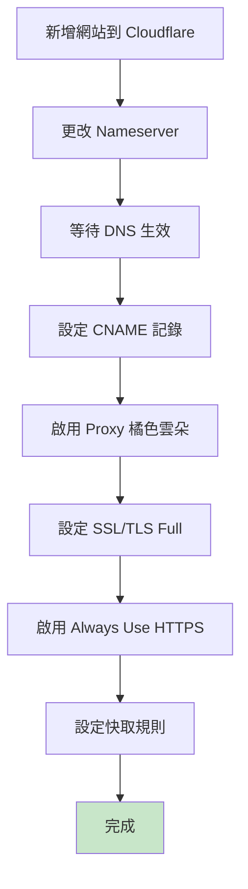

#### 快取規則建議

| 路徑模式 | 快取層級 | 瀏覽器 TTL |
|---------|---------|-----------|
| `*.jpg` | Standard | 1 month |
| `*.css` | Standard | 1 week |
| `*.js` | Standard | 1 week |
| `/posts/*` | Standard | 1 day |
| `/` | Standard | 4 hours |

#### 安全性與效能注意事項

- **安全性**: 啟用 WAF（Web Application Firewall）免費規則
- **效能**: 啟用 Auto Minify（HTML、CSS、JS）
- **快取**: 設定合理的 Page Rules
- **可維護性**: 定期檢查 Cloudflare Analytics

---

## 8. 檢查清單（Checklist）

### 8.1 環境安裝檢查清單

- [ ] 已安裝 Git 並設定使用者資訊
- [ ] 已安裝 Hugo Extended 版本
- [ ] 已安裝 VS Code 及推薦擴充套件
- [ ] 已註冊 GitHub 帳號
- [ ] 所有工具版本確認正常（`git --version`, `hugo version`, `code --version`）

### 8.2 專案建立檢查清單

- [ ] 使用 `hugo new site` 建立專案
- [ ] 執行 `git init` 初始化版本控制
- [ ] 建立並設定 `.gitignore` 檔案
- [ ] 編輯 `hugo.toml` 基本設定
- [ ] 本機測試 `hugo server` 正常運作

### 8.3 主題設定檢查清單

- [ ] 從主題庫選擇合適主題
- [ ] 使用 Git Submodule 安裝主題
- [ ] 在 `hugo.toml` 中設定 `theme` 參數
- [ ] 根據主題文件調整設定
- [ ] 建立必要頁面（about, archives 等）
- [ ] 本機預覽確認主題正常顯示
- [ ] 測試響應式設計（手機、平板、桌面）

### 8.4 內容建立檢查清單

- [ ] 建立第一篇測試文章
- [ ] 設定正確的 Front Matter
- [ ] 文章內容包含標題、段落、程式碼範例
- [ ] 圖片正確放置並可顯示
- [ ] 設定 `draft: false` 使文章公開
- [ ] 本機預覽確認文章顯示正確

### 8.5 GitHub 部署檢查清單

- [ ] 在 GitHub 建立 `username.github.io` repository
- [ ] 設定 Git remote 並推送程式碼
- [ ] 建立 `.github/workflows/hugo.yml` 檔案
- [ ] GitHub Actions workflow 設定正確
- [ ] 在 Repository Settings > Pages 選擇 "GitHub Actions"
- [ ] 首次推送觸發 workflow 成功執行
- [ ] 訪問 `https://username.github.io/` 確認網站上線
- [ ] 檢查 HTTPS 是否正常運作

### 8.6 自訂網域檢查清單（選用）

- [ ] 購買網域名稱
- [ ] 在 DNS 管理介面設定 CNAME 或 A 記錄
- [ ] 在 GitHub Pages 設定 Custom domain
- [ ] 建立 `static/CNAME` 檔案
- [ ] 更新 `hugo.toml` 的 baseURL
- [ ] 等待 DNS 生效（使用線上工具檢查）
- [ ] 啟用 "Enforce HTTPS"
- [ ] 確認 SSL 憑證正確簽發
- [ ] 測試所有頁面可正常訪問

### 8.7 維護檢查清單

#### 每次發布文章

- [ ] 建立新文章 `hugo new posts/xxx.md`
- [ ] 撰寫完整內容
- [ ] 本機預覽確認無誤
- [ ] 設定 `draft: false`
- [ ] Git commit 使用有意義的訊息
- [ ] Git push 觸發自動部署
- [ ] 確認 GitHub Actions 執行成功
- [ ] 訪問網站確認文章上線

#### 8.7.1 每週維護

- [ ] 檢查草稿文章進度
- [ ] 回覆讀者留言（如有）
- [ ] 檢查網站載入速度
- [ ] 檢視錯誤日誌（如有設定）

#### 8.7.2 每月維護

- [ ] 更新 Hugo 到最新版本
- [ ] 更新主題到最新版本
- [ ] 檢查並修正失效連結
- [ ] 檢視網站分析數據
- [ ] 備份 repository

#### 8.7.3 每季維護

- [ ] SEO 優化檢查
- [ ] 更新關於頁面內容
- [ ] 審視並更新過時文章
- [ ] 優化圖片大小
- [ ] 檢查並更新相依套件

### 8.8 故障排除檢查清單

#### 本機開發問題

- [ ] Hugo server 無法啟動
  - 檢查 Hugo 版本
  - 檢查 `hugo.toml` 語法
  - 檢查主題是否正確安裝
- [ ] 主題無法顯示
  - 確認主題資料夾存在
  - 確認 `theme` 設定正確
  - 檢查主題相容性
- [ ] 文章無法顯示
  - 確認 `draft` 設定
  - 檢查 Front Matter 格式
  - 確認檔案位置正確

#### GitHub Actions 問題

- [ ] Workflow 執行失敗
  - 檢查 `hugo.yml` 語法
  - 確認 Hugo 版本一致
  - 檢查 Git Submodule 設定
  - 查看詳細錯誤日誌
- [ ] 部署後網站未更新
  - 確認 workflow 執行完成
  - 清除瀏覽器快取
  - 檢查 GitHub Pages 設定
- [ ] 圖片或 CSS 無法載入
  - 檢查 baseURL 設定
  - 確認檔案路徑正確
  - 檢查 CORS 設定

#### 自訂網域問題

- [ ] 網域無法訪問
  - 檢查 DNS 記錄
  - 等待 DNS 傳播
  - 清除 DNS 快取
- [ ] HTTPS 警告
  - 等待 SSL 憑證簽發
  - 檢查 DNS 設定
  - 確認 "Enforce HTTPS" 已啟用

### 8.9 安全性檢查清單

- [ ] 不在 repository 中儲存敏感資訊
- [ ] 使用 `.gitignore` 排除不必要的檔案
- [ ] 定期更新 Hugo 和主題
- [ ] 啟用 GitHub 兩步驟驗證
- [ ] 使用 HTTPS 傳輸
- [ ] 定期備份內容
- [ ] 檢查第三方腳本安全性

### 8.10 效能優化檢查清單

- [ ] 圖片已壓縮優化
- [ ] 啟用圖片延遲載入（Lazy Loading）
- [ ] 使用 WebP 格式圖片
- [ ] 啟用 Hugo 的 minify 功能
- [ ] 設定適當的快取策略
- [ ] 使用 CDN 加速（Cloudflare）
- [ ] 減少不必要的 JavaScript
- [ ] 優化 CSS 載入順序

### 8.11 SEO 優化檢查清單

- [ ] 每篇文章都有 `title` 和 `description`
- [ ] 設定適當的 `tags` 和 `categories`
- [ ] 圖片都有 `alt` 屬性
- [ ] URL 結構清晰簡潔
- [ ] 建立 `sitemap.xml`（Hugo 自動產生）
- [ ] 建立 `robots.txt`
- [ ] 設定 Open Graph 標籤
- [ ] 設定 Twitter Card 標籤
- [ ] 提交 sitemap 到 Google Search Console
- [ ] 設定 Google Analytics（選用）

### 8.12 快速參考指令

```powershell
# 建立新專案
hugo new site my-website

# 建立新文章
hugo new posts/my-post.md

# 本機預覽（含草稿）
hugo server -D

# 本機預覽（正式環境模擬）
hugo server

# 建置網站
hugo

# Git 操作
git add .
git commit -m "訊息"
git push origin main

# 更新主題（Git Submodule）
git submodule update --remote --merge

# 檢查 Hugo 版本
hugo version

# 檢查網站設定
hugo config
```

---

## 🎉 結語

恭喜您！您已經完成了使用 Hugo 在 GitHub 上建立個人網頁的完整教學。

### 您學到了什麼

✅ 安裝並設定 Hugo 開發環境  
✅ 建立並客製化 Hugo 網站  
✅ 使用 Markdown 撰寫文章  
✅ 使用 GitHub Actions 自動部署  
✅ 設定自訂網域（選用）  
✅ 維護與更新網站內容的最佳實踐  

### 下一步建議

1. **豐富內容**: 持續撰寫高品質的文章
2. **學習 SEO**: 提升網站在搜尋引擎的排名
3. **分析數據**: 設定 Google Analytics 了解訪客行為
4. **社群互動**: 加入留言功能（Disqus、Utterances）
5. **效能優化**: 使用 CDN、圖片優化等技術
6. **探索主題**: 嘗試不同的 Hugo 主題或自行開發
7. **學習 Hugo**: 深入了解 Hugo 的進階功能（Shortcodes、Taxonomies、Pipelines）

### 實用資源

- **Hugo 官方文件**: <https://gohugo.io/documentation/>
- **Hugo 主題庫**: <https://themes.gohugo.io/>
- **Hugo 論壇**: <https://discourse.gohugo.io/>
- **GitHub Pages 文件**: <https://docs.github.com/pages>
- **Markdown 語法**: <https://www.markdownguide.org/>

### 社群與支援

- **Hugo Discord**: 加入 Hugo 社群討論
- **GitHub Issues**: 遇到問題可在主題的 GitHub 提問
- **Stack Overflow**: 搜尋或提問 Hugo 相關問題

### 持續學習

網站建立只是開始，持續學習和改進才是關鍵。祝您的部落格越來越精彩！🚀

---

**文件作者**: GitHub Copilot  
**最後更新**: 2025年10月15日  
**授權**: 本文件採用 [CC BY-SA 4.0](https://creativecommons.org/licenses/by-sa/4.0/) 授權  
**版本**: 1.0  

---
