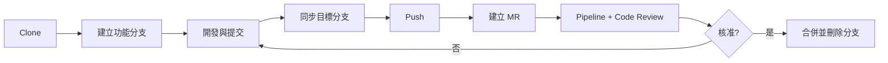

+++
date = '2025-10-31T00:00:00+08:00'
draft = false
title = 'GitLab使用教學'
tags = ['教學', '工具', 'GitLab']
categories = ['教學']
+++

# GitLab 使用教學手冊

| 項目 | 內容 |
| --- | --- |
| **文件版本** | 3.0 |
| **最後更新** | 2026 年 9 月 30 日 |
| **適用版本** | GitLab 19.4（2026-09-17 發布，最新修補版 19.4.1）；GitLab Runner 19.4.1；glab 1.120.0；Git 2.56.0 |
| **向下相容** | 主要內容適用 GitLab 18.x 以上；各章以「🆕／⚠️」標示版本差異 |
| **適用對象** | 新進與資深開發人員、Tech Lead、DevOps／平台工程、資安與稽核人員、GitLab 管理員 |
| **文件定位** | 企業標準技術白皮書／內部 GitLab 標準教材 |
| **使用情境** | 企業內部 Java（Spring Boot）專案、多團隊協作、受監理產業（金融、醫療、公部門） |
| **文件維護** | 內部技術團隊 |

> ⚠️ **v3.0 重大改版說明**：本版以 GitLab 19.4 與 docs.gitlab.com 官方文件為基準，逐章查證並改寫。v2.0 中已被淘汰或有誤的內容都已更正，包括：Runner 以 `--registration-token` 註冊、`only:`／`except:` 語法、已移除的 `License-Scanning` 範本、`openjdk` 映像檔、錯誤的 `codequality`／`dependency_scanning` 報表格式、錯誤的 CI/CD 變數優先順序，以及虛構的 CI 報表類型與命令列工具。同時新增 CI/CD Components 與 Catalog、`id_tokens`（OIDC）、Merge Trains、CODEOWNERS 與核准規則、Secret Push Protection、安全政策、GitLab agent for Kubernetes、GitLab Duo 與 Duo Agent Platform、升級路徑與 19.0 重大變更等章節。完整更正清單見[附錄 D：版本更新紀錄](#附錄-d版本更新紀錄)，查證來源見[附錄 E：查證紀錄](#附錄-e查證紀錄)。

<!-- TOC-AUTO-BEGIN -->

## 目錄

- [執行摘要](#執行摘要)
- [1. GitLab 平台概觀](#1-gitlab-平台概觀)
  - [1.1 Git vs. GitLab - 基本概念](#11-git-vs-gitlab---基本概念)
  - [1.2 為什麼選擇 GitLab？](#12-為什麼選擇-gitlab)
  - [1.3 版本方案、部署型態與發行節奏](#13-版本方案部署型態與發行節奏)
  - [1.4 專案架構概覽](#14-專案架構概覽)
  - [1.5 GitLab 核心功能詳解](#15-gitlab-核心功能詳解)
  - [1.6 💡 本章實務建議](#16--本章實務建議)
- [2. 環境準備與身分認證](#2-環境準備與身分認證)
  - [2.1 安裝 Git 與基本設定](#21-安裝-git-與基本設定)
  - [2.2 身分認證方式總覽](#22-身分認證方式總覽)
  - [2.3 GitLab CLI（glab）](#23-gitlab-cliglab)
  - [2.4 IDE 與開發工具整合](#24-ide-與開發工具整合)
  - [2.5 💡 本章實務建議](#25--本章實務建議)
- [3. 日常 Git × GitLab 工作流程](#3-日常-git--gitlab-工作流程)
  - [3.1 Clone - 複製專案到本地](#31-clone---複製專案到本地)
  - [3.2 Pull - 同步遠端更新](#32-pull---同步遠端更新)
  - [3.3 Commit - 提交變更](#33-commit---提交變更)
  - [3.4 Push - 推送變更到遠端](#34-push---推送變更到遠端)
  - [3.5 Merge Request - 合併請求](#35-merge-request---合併請求)
  - [3.6 💡 本章實務建議](#36--本章實務建議)
- [4. 分支策略與開發規範](#4-分支策略與開發規範)
  - [4.1 分支策略選型](#41-分支策略選型)
  - [4.2 受保護分支、Push Rules 與 CODEOWNERS](#42-受保護分支push-rules-與-codeowners)
  - [4.3 Commit Message 規範](#43-commit-message-規範)
  - [4.4 Merge Request 流程](#44-merge-request-流程)
  - [4.5 Code Review 要求](#45-code-review-要求)
  - [4.6 💡 本章實務建議](#46--本章實務建議)
- [5. GitLab CI/CD 核心概念](#5-gitlab-cicd-核心概念)
  - [5.1 CI/CD 概念說明](#51-cicd-概念說明)
  - [5.2 GitLab CI/CD 架構](#52-gitlab-cicd-架構)
  - [5.3 .gitlab-ci.yml 基本結構](#53-gitlab-ciyml-基本結構)
  - [5.4 rules、workflow、needs 與 include](#54-rulesworkflowneeds-與-include)
  - [5.5 CI/CD Components 與 CI/CD Catalog](#55-cicd-components-與-cicd-catalog)
  - [5.6 變數與機密管理](#56-變數與機密管理)
  - [5.7 Pipeline 操作與監控](#57-pipeline-操作與監控)
  - [5.8 💡 本章實務建議](#58--本章實務建議)
- [6. Java 專案 CI/CD 實作](#6-java-專案-cicd-實作)
  - [6.1 Maven 專案完整 Pipeline](#61-maven-專案完整-pipeline)
  - [6.2 測試報表與覆蓋率](#62-測試報表與覆蓋率)
  - [6.3 程式碼品質整合](#63-程式碼品質整合)
  - [6.4 本專案的 CI/CD 應用](#64-本專案的-cicd-應用)
  - [6.5 容器映像建置](#65-容器映像建置)
  - [6.6 💡 本章實務建議](#66--本章實務建議)
- [7. GitLab Runner 架構與配置](#7-gitlab-runner-架構與配置)
  - [7.1 Runner 架構與範圍](#71-runner-架構與範圍)
  - [7.2 建立與註冊 Runner](#72-建立與註冊-runner)
  - [7.3 Executor 選型](#73-executor-選型)
  - [7.4 config.toml 進階配置](#74-configtoml-進階配置)
  - [7.5 Docker Executor 最佳化](#75-docker-executor-最佳化)
  - [7.6 Kubernetes Executor 配置](#76-kubernetes-executor-配置)
  - [7.7 Docker Autoscaler 與 fleeting](#77-docker-autoscaler-與-fleeting)
  - [7.8 Runner 安全與維運](#78-runner-安全與維運)
  - [7.9 💡 本章實務建議](#79--本章實務建議)
- [8. DevSecOps：安全與合規](#8-devsecops安全與合規)
  - [8.1 安全掃描全貌](#81-安全掃描全貌)
  - [8.2 掃描器設定](#82-掃描器設定)
  - [8.3 Secret Push Protection](#83-secret-push-protection)
  - [8.4 安全政策（Security Policies）](#84-安全政策security-policies)
  - [8.5 合規框架與稽核](#85-合規框架與稽核)
  - [8.6 軟體供應鏈安全](#86-軟體供應鏈安全)
  - [8.7 法規遵循對應](#87-法規遵循對應)
  - [8.8 💡 本章實務建議](#88--本章實務建議)
- [9. 部署、環境與 Kubernetes](#9-部署環境與-kubernetes)
  - [9.1 環境規劃與受保護環境](#91-環境規劃與受保護環境)
  - [9.2 多環境部署配置](#92-多環境部署配置)
  - [9.3 GitLab agent for Kubernetes](#93-gitlab-agent-for-kubernetes)
  - [9.4 GitOps：Flux 與 Argo CD](#94-gitopsflux-與-argo-cd)
  - [9.5 容器化最佳實務](#95-容器化最佳實務)
  - [9.6 Kubernetes 部署配置](#96-kubernetes-部署配置)
  - [9.7 Helm Chart 管理](#97-helm-chart-管理)
  - [9.8 進階部署策略](#98-進階部署策略)
  - [9.9 💡 本章實務建議](#99--本章實務建議)
- [10. 可觀測性、效能與成本](#10-可觀測性效能與成本)
  - [10.1 GitLab 內建分析與 DORA 指標](#101-gitlab-內建分析與-dora-指標)
  - [10.2 應用程式監控](#102-應用程式監控)
  - [10.3 Pipeline 效能優化](#103-pipeline-效能優化)
  - [10.4 Repository 效能優化](#104-repository-效能優化)
  - [10.5 成本管控](#105-成本管控)
  - [10.6 💡 本章實務建議](#106--本章實務建議)
- [11. API、整合與 AI 輔助開發](#11-api整合與-ai-輔助開發)
  - [11.1 REST 與 GraphQL API](#111-rest-與-graphql-api)
  - [11.2 Webhooks](#112-webhooks)
  - [11.3 IDE、Slack 與 Jira 整合](#113-ideslack-與-jira-整合)
  - [11.4 GitLab Duo 與 Duo Agent Platform](#114-gitlab-duo-與-duo-agent-platform)
  - [11.5 💡 本章實務建議](#115--本章實務建議)
- [12. 維運：備份、災難恢復與升級](#12-維運備份災難恢復與升級)
  - [12.1 備份策略](#121-備份策略)
  - [12.2 還原流程](#122-還原流程)
  - [12.3 災難恢復與演練](#123-災難恢復與演練)
  - [12.4 升級規劃與 required upgrade stops](#124-升級規劃與-required-upgrade-stops)
  - [12.5 GitLab 19.0 重大變更摘要](#125-gitlab-190-重大變更摘要)
  - [12.6 💡 本章實務建議](#126--本章實務建議)
- [13. 常見問題與疑難排解](#13-常見問題與疑難排解)
  - [13.1 Merge 衝突處理](#131-merge-衝突處理)
  - [13.2 錯誤回復方式](#132-錯誤回復方式)
  - [13.3 分支管理問題](#133-分支管理問題)
  - [13.4 認證與權限問題](#134-認證與權限問題)
  - [13.5 效能和同步問題](#135-效能和同步問題)
  - [13.6 CI/CD Pipeline 問題](#136-cicd-pipeline-問題)
  - [13.7 團隊協作問題](#137-團隊協作問題)
  - [13.8 💡 本章實務建議](#138--本章實務建議)
- [14. 開發最佳實務與團隊協作](#14-開發最佳實務與團隊協作)
  - [14.1 程式碼管理最佳實務](#141-程式碼管理最佳實務)
  - [14.2 Code Review 最佳實務](#142-code-review-最佳實務)
  - [14.3 測試最佳實務](#143-測試最佳實務)
  - [14.4 安全性最佳實務](#144-安全性最佳實務)
  - [14.5 效能最佳實務](#145-效能最佳實務)
  - [14.6 文件化最佳實務](#146-文件化最佳實務)
  - [14.7 團隊協作最佳實務](#147-團隊協作最佳實務)
  - [14.8 💡 本章實務建議](#148--本章實務建議)
- [15. 檢查清單](#15-檢查清單)
  - [15.1 新進同仁入門檢查清單](#151-新進同仁入門檢查清單)
  - [15.2 日常開發檢查清單](#152-日常開發檢查清單)
  - [15.3 Merge Request 檢查清單](#153-merge-request-檢查清單)
  - [15.4 CI/CD 檢查清單](#154-cicd-檢查清單)
  - [15.5 發布檢查清單](#155-發布檢查清單)
  - [15.6 緊急情況檢查清單](#156-緊急情況檢查清單)
  - [15.7 定期維護檢查清單](#157-定期維護檢查清單)
  - [15.8 安全與合規檢查清單](#158-安全與合規檢查清單)
  - [15.9 GitLab 升級檢查清單（Self-Managed）](#159-gitlab-升級檢查清單self-managed)
  - [15.10 💡 本章實務建議](#1510--本章實務建議)
- [16. 案例研究與未來趨勢](#16-案例研究與未來趨勢)
  - [16.1 案例一：企業級 Java 微服務架構](#161-案例一企業級-java-微服務架構)
  - [16.2 案例二：金融服務 CI/CD 合規實作](#162-案例二金融服務-cicd-合規實作)
  - [16.3 案例三：教育平台敏捷開發](#163-案例三教育平台敏捷開發)
  - [16.4 未來趨勢與發展](#164-未來趨勢與發展)
  - [16.5 持續創新建議](#165-持續創新建議)
  - [16.6 💡 本章實務建議](#166--本章實務建議)
- [結語與持續改進](#結語與持續改進)
  - [📚 完整內容涵蓋](#-完整內容涵蓋)
  - [🎯 實用價值](#-實用價值)
  - [🔄 持續更新機制](#-持續更新機制)
  - [📈 成效追蹤](#-成效追蹤)
- [附錄 A：常用指令速查](#附錄-a常用指令速查)
  - [A.1 Git 與 glab](#a1-git-與-glab)
  - [A.2 GitLab Runner](#a2-gitlab-runner)
  - [A.3 GitLab 伺服器（Linux 套件）](#a3-gitlab-伺服器linux-套件)
- [附錄 B：設定範本索引](#附錄-b設定範本索引)
- [附錄 C：詞彙表](#附錄-c詞彙表)
- [附錄 D：版本更新紀錄](#附錄-d版本更新紀錄)
  - [D.1 版本歷程](#d1-版本歷程)
  - [D.2 v2.0 → v3.0 更正表](#d2-v20--v30-更正表)
  - [D.3 v3.0 新增內容一覽](#d3-v30-新增內容一覽)
- [附錄 E：查證紀錄](#附錄-e查證紀錄)
  - [E.1 待確認事項](#e1-待確認事項)
- [附錄 F：參考資料與聯絡窗口](#附錄-f參考資料與聯絡窗口)
  - [F.1 官方文件](#f1-官方文件)
  - [F.2 學習資源](#f2-學習資源)
  - [F.3 技術文章與標準](#f3-技術文章與標準)
  - [F.4 工具推薦](#f4-工具推薦)
  - [F.5 聯絡資訊](#f5-聯絡資訊)
  - [F.6 意見回饋](#f6-意見回饋)

<!-- TOC-AUTO-END -->

---

## 執行摘要

GitLab 是涵蓋「規劃 → 程式碼 → 建置 → 測試 → 安全 → 發布 → 部署 → 監控」的單一 DevSecOps 平台。企業導入時，真正的價值不在單一功能，而在於**把流程、權限與稽核軌跡集中在同一個系統內**。本手冊依企業常見的導入順序編排：

| 讀者角色 | 建議閱讀路徑 | 重點章節 |
| --- | --- | --- |
| 新進開發人員 | 第 1 → 2 → 3 → 4 → 13 → 15 章 | 環境準備、日常流程、分支與 MR 規範、常見問題 |
| 資深開發／Tech Lead | 第 4 → 5 → 6 → 14 章 | 分支策略、CI/CD 語法、Java Pipeline、Code Review |
| DevOps／平台工程 | 第 5 → 7 → 9 → 10 → 12 章 | Components、Runner、Kubernetes 部署、效能成本、升級維運 |
| 資安與稽核 | 第 4.2 節、第 8 章、第 12 章 | 受保護分支、掃描器、安全政策、合規框架、稽核事件 |
| 管理階層 | 執行摘要、第 1.3 節、第 10.1 節、第 16 章 | 方案選型、DORA 指標、案例與趨勢 |

**2026 年企業導入 GitLab 的五項關鍵決策**：

1. **方案與部署型態**：GitLab.com（SaaS）、Self-Managed 或 Dedicated；Free／Premium／Ultimate 的功能落差直接影響治理能力（見 [1.3](#13-版本方案部署型態與發行節奏)）。
2. **CI/CD 標準化**：以 CI/CD Components 與 Catalog 取代複製貼上的 YAML，由平台團隊集中維護（見 [5.5](#55-cicd-components-與-cicd-catalog)）。
3. **機密零落地**：以 `id_tokens`（OIDC）向雲端或 Vault 換取短效憑證，不在 CI/CD 變數存放長效金鑰（見 [5.6](#56-變數與機密管理)）。
4. **安全左移且可強制**：掃描器搭配 Secret Push Protection 與安全政策，讓「必跑的檢查」不再依賴各專案自律（見第 8 章）。
5. **可升級性**：每月發行、每年 5 月的大版本會帶來 breaking changes；自建環境必須依照 required upgrade stops 規劃升級（見 [12.4](#124-升級規劃與-required-upgrade-stops)）。

> 💡 **閱讀提示**：範例中的 `gitlab.company.com`、`company.com` 等網域與群組名稱皆為示意，請替換為貴公司實際環境。標示 **Premium**／**Ultimate** 的功能需要對應的訂閱方案。

---

## 1. GitLab 平台概觀

本章說明 Git 與 GitLab 的分工、GitLab 的方案與部署型態，以及日常會用到的核心功能。讀完後應能判斷「某個需求該用 GitLab 的哪個功能解決，以及需要哪個方案」。

### 1.1 Git vs. GitLab - 基本概念

#### Git

- **定義**：分散式版本控制系統（Distributed Version Control System）
- **功能**：追蹤檔案變更、分支管理、合併操作
- **特性**：本地操作、離線工作、完整歷史記錄

#### GitLab

- **定義**：基於 Git 的 Web 平台，提供完整的 DevOps 生命週期管理
- **功能**：程式碼託管、專案管理、CI/CD、Code Review、Issue 追蹤
- **優勢**：團隊協作、視覺化介面、自動化部署

| 面向 | Git | GitLab |
| --- | --- | --- |
| 本質 | 版本控制工具（命令列程式） | 以 Git 為核心的 DevSecOps 平台（Web + API + Runner） |
| 執行位置 | 開發者本機 | GitLab.com 雲端或企業自建伺服器 |
| 負責範圍 | 提交、分支、合併、歷史 | 權限、Code Review（MR）、CI/CD、安全掃描、套件庫、部署、稽核 |
| 典型操作 | `git commit`、`git push` | 建立 Merge Request、設定受保護分支、執行 Pipeline |
| 延伸閱讀 | 內部《git 使用教學》手冊 | 本手冊 |

### 1.2 為什麼選擇 GitLab？

#### 🎯 團隊協作優勢

- **統一平台**：從程式碼管理到部署，一站式解決方案
- **權限管控**：細緻的角色權限設定，確保專案安全
- **可視化**：直觀的 Web 介面，降低學習門檻

#### 🚀 開發效率提升

- **Merge Request**：標準化的程式碼審查流程
- **CI/CD 整合**：自動化測試與部署
- **Issue 追蹤**：需求管理與 Bug 追蹤

#### 🔒 企業級安全

- **存取控制**：多層次的安全防護
- **稽核記錄**：完整的操作歷史追蹤
- **備份機制**：資料安全保障

#### 🧭 單一平台的治理價值

- **單一資料模型**：Issue、MR、Pipeline、部署、弱點都屬於同一個專案，可相互追溯（需求 → 程式碼 → 測試 → 上線）。
- **單一權限模型**：群組、子群組、專案與角色一次設定，CI/CD、套件庫、容器登錄庫都沿用同一套權限。
- **單一稽核軌跡**：稽核事件（Audit Events）集中記錄權限變更、受保護分支調整、核准與部署紀錄，方便應付內外部稽核。

### 1.3 版本方案、部署型態與發行節奏

> 🆕 **v3.0 新增**

#### 📦 訂閱方案比較

| 方案 | 定位 | 企業常用、需此方案的功能（節錄） |
| --- | --- | --- |
| **Free** | 個人與小型團隊 | 原始碼管理、MR、CI/CD、CI/CD Components、基本 SAST 與 Pipeline Secret Detection、Container Registry、Package Registry、GitLab agent for Kubernetes |
| **Premium** | 團隊與企業標準 | CODEOWNERS、MR 核准規則、Push Rules、Merge Trains、受保護環境與部署核准、合規框架、Epics、Code Quality Pipeline 報告檢視、GitLab Duo Core、Duo Agent Platform |
| **Ultimate** | 受監理與大型企業 | Advanced SAST、SBOM 相依性掃描、DAST、Container Scanning 弱點管理、Secret Push Protection、安全政策、DORA 指標、SARIF 匯入、合規中心進階功能 |

> ⚠️ 功能與方案的對應會隨版本調整（例如 GitLab MCP server 在 19.2 由 Premium 下放至 Free）。導入前請以官方文件各頁頂端的 **Tier** 標示為準。

#### 🏢 部署型態

| 型態 | 說明 | 適用情境 |
| --- | --- | --- |
| **GitLab.com** | GitLab 營運的多租戶 SaaS | 無自建維運人力、可接受資料存放於雲端 |
| **GitLab Self-Managed** | 企業自行安裝（Linux 套件、Helm Chart、Docker） | 資料須留在內網、需與內部系統深度整合 |
| **GitLab Dedicated** | GitLab 代管的單租戶 SaaS | 需要資料隔離與區域選擇，但不想自建維運 |

#### 🗓️ 發行節奏與支援政策

- **每月發行**：每月第三個星期四發布一個 minor 版本（例如 19.4 於 2026-09-17 發布）。
- **每年一個大版本**：每年 5 月發布 major 版本（17.0 → 2024-05、18.0 → 2025-05、19.0 → 2026-05-21）。大版本才會移除已棄用的功能，是 breaking changes 最集中的時間點。
- **修補支援**：錯誤修正只回補到目前的穩定版；安全性修正回補到目前版本加上前兩個月版。換句話說，**落後超過三個月版就收不到安全修補**。
- **升級路徑**：自建環境跨版升級時，必須經過 required upgrade stops（`x.2`、`x.5`、`x.8`、`x.11`），詳見 [12.4](#124-升級規劃與-required-upgrade-stops)。

### 1.4 專案架構概覽

```text
GitLab 專案結構
├── 程式碼倉庫 (Repository)
├── 分支管理 (Branches)
├── 合併請求 (Merge Requests)
├── 議題追蹤 (Issues)
├── CI/CD 管道 (Pipelines)
├── Wiki 文件
└── 專案設定 (Settings)
```

#### 🗂️ 群組與專案的階層設計

```text
Top-level Group（公司或事業群，設定 SSO、稽核、合規框架）
├── Subgroup：platform（平台團隊：CI/CD Components、共用範本、Runner）
├── Subgroup：payments（業務團隊）
│   ├── Project：payment-api
│   └── Project：payment-web
└── Subgroup：security（資安團隊：安全政策專案）
```

- 權限、CI/CD 變數、Runner、合規框架都能設定在**群組層級**，並由子群組與專案繼承。
- 頂層群組建議只給極少數 Owner；日常管理交給子群組的 Maintainer。

#### 💡 實務建議

- 新進同仁建議先熟悉 GitLab Web 介面操作
- 了解專案的分支策略和命名規範
- 參與 Code Review 過程，學習團隊的程式碼品質標準

### 1.5 GitLab 核心功能詳解

#### 📋 Issue 管理

**功能說明**：Issue 是 GitLab 的任務追蹤系統，用於管理 Bug、功能需求、改善建議等

**主要特性**：

- **分類管理**：使用 Label 標籤分類 Issue 類型
- **指派責任**：指派給特定開發者處理
- **狀態追蹤**：Open、In Progress、Closed 等狀態
- **關聯功能**：可與 Merge Request、Commit 關聯

**使用範例**：

```markdown
# Issue 範例：修復登入功能錯誤

### 問題描述
使用者在登入時偶爾會遇到 500 錯誤

### 重現步驟
1. 開啟登入頁面
2. 輸入正確的帳號密碼
3. 點選登入按鈕
4. 有時會顯示 500 錯誤

### 預期行為
應該能正常登入系統

### 實際行為
偶爾出現 500 錯誤

### 環境資訊
- 瀏覽器：Chrome 120.0
- 作業系統：Windows 11
- 伺服器：Production
```

#### 🏷️ Labels 標籤系統

**標籤類型**：

- **類型標籤**：`bug`、`feature`、`enhancement`、`documentation`
- **優先級**：`priority::high`、`priority::medium`、`priority::low`
- **狀態標籤**：`status::todo`、`status::in-progress`、`status::review`
- **模組標籤**：`frontend`、`backend`、`database`、`api`

**標籤使用策略**：

```text
標籤組合範例：
├── bug + priority::high + backend
├── feature + priority::medium + frontend
├── enhancement + priority::low + documentation
└── security + priority::critical + api
```

> 🆕 **v3.0 補充**：GitLab 正在把 Issue、Task、Epic 整合為統一的 **Work Items** 架構，介面上的層級（Epic → Issue → Task）與欄位會逐版調整，但操作觀念相同。使用 `priority::high` 這種 `::` 格式的 **Scoped Labels**（Premium）時，同一個範圍內的標籤互斥，適合用來表示狀態與優先級。

#### 🎯 Milestone 里程碑

**功能說明**：Milestone 用於組織和追蹤專案進度，通常對應版本發布

**使用方式**：

- **版本規劃**：v1.0.0、v1.1.0、v2.0.0
- **衝刺管理**：Sprint 1、Sprint 2、Sprint 3
- **功能分組**：使用者管理模組、付款系統、報表功能

**里程碑設定**：

```text
Milestone: v1.2.0
├── 開始日期：2026-10-01
├── 結束日期：2026-11-15
├── 描述：使用者體驗改善版本
├── 相關 Issues：15 個
└── 完成度：60%
```

#### 📊 Project 專案管理

**專案看板**：

```text
Kanban Board:
┌──────────────┐  ┌──────────────┐  ┌──────────────┐  ┌──────────────┐
│   待辦事項     │  │   進行中      │  │   審查中      │  │   已完成      │
│              │  │              │  │              │  │              │
│ • Issue #123 │→ │ • Issue #124 │→ │ • MR !456    │→ │ • Issue #122 │
│ • Issue #125 │  │ • Issue #126 │  │ • MR !457    │  │ • Issue #121 │
│ • Issue #127 │  │              │  │              │  │ • Issue #120 │
└──────────────┘  └──────────────┘  └──────────────┘  └──────────────┘
```

**專案權限管理（角色）**：

| 角色 | 權限重點 | 典型對象 |
| --- | --- | --- |
| Minimal Access | 僅可檢視群組基本資訊，無專案存取權 | 需要 SSO 帳號但不參與專案者 |
| Guest | 檢視與建立 Issue、留言（私有專案看不到程式碼） | 外部利害關係人 |
| Planner | 管理 Issue、Epic、里程碑與迭代（17.7 新增） | PM、PO、Scrum Master |
| Reporter | 唯讀存取程式碼、檢視 Pipeline 與套件 | QA、稽核 |
| Security Manager | 管理弱點、合規設定與稽核事件，無推送權限（18.11 起為 Beta，預設關閉） | 資安人員 |
| Developer | 推送非受保護分支、建立 MR、執行 Pipeline | 開發人員 |
| Maintainer | 管理受保護分支、CI/CD 設定、成員、合併至受保護分支 | Tech Lead |
| Owner | 群組或專案的最高權限（含刪除、轉移） | 部門主管、平台管理員 |

> ⚠️ **v3.0 更正**：v2.0 只列出 5 個角色，現行版本另有 Minimal Access、Planner 與 Security Manager（Beta）。企業另可依內建角色建立 **Custom Roles**（Ultimate）來細分權限。

#### 👥 Group 群組管理

**群組階層**：

```text
組織架構：
Company Group
├── Frontend Team
│   ├── React Project
│   └── Vue Project
├── Backend Team
│   ├── API Gateway
│   └── Microservices
└── DevOps Team
    ├── CI/CD Tools
    └── Infrastructure
```

**群組優勢**：

- **權限繼承**：子專案自動繼承群組權限
- **統一設定**：CI/CD 變數、Runner 設定等
- **資源共享**：共用 Docker Registry、Package Registry

#### 📦 Package Registry

**支援類型**：

- **Maven Repository**：Java 套件管理
- **npm Registry**：Node.js 套件管理
- **Docker Registry**：容器映像檔管理
- **NuGet Gallery**：.NET 套件管理

**Maven 使用範例**：

```xml
<!-- pom.xml 設定 -->
<repositories>
    <repository>
        <id>gitlab-maven</id>
        <url>https://gitlab.company.com/api/v4/projects/123/packages/maven</url>
    </repository>
</repositories>

<distributionManagement>
    <repository>
        <id>gitlab-maven</id>
        <url>https://gitlab.company.com/api/v4/projects/123/packages/maven</url>
    </repository>
</distributionManagement>
```

#### 🔒 Security 安全功能

GitLab 內建多種安全掃描器，並把結果整合進 MR 與弱點報告。以下為最小可用設定，完整說明、方案需求與政策強制方式請見[第 8 章](#8-devsecops安全與合規)。

```yaml
# .gitlab-ci.yml：最小安全掃描設定（範本皆位於 Jobs/ 目錄）
include:
  - template: Jobs/SAST.gitlab-ci.yml
  - template: Jobs/Secret-Detection.gitlab-ci.yml
  - template: Jobs/Dependency-Scanning.v2.gitlab-ci.yml   # SBOM 相依性掃描（Ultimate）

variables:
  SAST_EXCLUDED_PATHS: "spec, test, tests, tmp"
```

> ⚠️ **v3.0 更正**：v2.0 範例中的 `SAST_JAVA_VERSION` 只作用在 SpotBugs 分析器。Java 目前由 Semgrep（Ultimate 則為 Advanced SAST）掃描，一般 Java 專案不需要設定這個變數。範本建議改用 `Jobs/` 路徑。

#### 📝 Wiki 文件系統

**Wiki 功能**：

- **Markdown 支援**：完整的 Markdown 語法支援
- **版本控制**：Wiki 頁面也有版本歷史
- **協作編輯**：多人可同時編輯不同頁面
- **檔案上傳**：支援圖片和附件

**Wiki 結構範例**：

```text
Wiki 頁面結構：
├── Home (首頁)
├── 架構設計
│   ├── 系統架構圖
│   ├── 資料庫設計
│   └── API 設計
├── 部署指南
│   ├── 環境設定
│   ├── 部署流程
│   └── 監控配置
└── 開發規範
    ├── 編碼標準
    ├── Git 工作流程
    └── Code Review 指南
```

#### 🔧 GitLab Runner

**Runner 範圍**：

- **Instance runners**（舊稱 Shared runners）：整個 GitLab 執行個體共用；GitLab.com 提供的 hosted runners 即屬此類
- **Group runners**：群組及其子群組、專案共用
- **Project runners**：單一或少數專案專用

**Runner 標籤**：

```yaml
# .gitlab-ci.yml 指定 Runner
build-job:
  stage: build
  tags:
    - docker
    - linux
    - java-17
  script:
    - mvn clean compile
```

> ⚠️ **v3.0 更正**：Runner 現在要先在 UI 或 API 建立，取得 `glrt-` 開頭的 **runner authentication token** 之後再註冊；v2.0 的 `--registration-token` 流程已棄用。完整步驟見 [7.2](#72-建立與註冊-runner)。

#### 📊 Analytics 分析功能

**可用報表**：

- **Repository Analytics**：程式碼提交統計、語言分佈
- **CI/CD Analytics**：Pipeline 成功率與執行時間
- **Value Stream Analytics**：各階段（Issue → MR → 部署）耗時
- **Merge Request Analytics**：MR 吞吐量與合併時間
- **DORA 指標**（Ultimate）：部署頻率、變更前置時間、服務恢復時間、變更失敗率

詳見 [10.1](#101-gitlab-內建分析與-dora-指標)。

#### 🔗 Snippets 程式碼片段

**功能說明**：Snippets 用於分享程式碼片段、設定檔或小型腳本

**使用情境**：

- **程式碼範例**：分享常用的程式碼模板
- **設定檔**：分享設定檔範例
- **工具腳本**：分享自動化腳本
- **技術筆記**：記錄技術要點

**Snippet 範例**：

```java
// 常用的 Spring Boot 控制器模板
@RestController
@RequestMapping("/api/v1")
@Slf4j
public class BaseController {

    @GetMapping("/health")
    public ResponseEntity<Map<String, String>> health() {
        Map<String, String> status = Map.of(
            "status", "UP",
            "timestamp", Instant.now().toString()
        );
        return ResponseEntity.ok(status);
    }
}
```

#### 📋 Boards 專案看板

**看板類型**：

- **Issue Board**：Issue 管理看板
- **Epic Board**：Epic 管理看板（Premium 以上）
- **Milestone Board**：里程碑看板

**看板自訂**：

- **欄位設定**：可自訂看板欄位
- **篩選器**：依標籤、指派者、里程碑篩選
- **自動化**：設定自動移動規則

### 1.6 💡 本章實務建議

- **Issue 優先**：養成先建立 Issue 再開發的習慣
- **標籤統一**：團隊統一 Label 使用規範
- **里程碑規劃**：定期設定和檢視里程碑進度
- **安全掃描**：啟用所有適用的安全掃描功能
- **文件維護**：保持 Wiki 文件的即時更新
- **分析報表**：定期檢視分析報表優化開發流程
- **先定方案再定流程**：CODEOWNERS、核准規則、Merge Trains 都需要 Premium 以上；流程設計不要依賴目前方案沒有的功能。
- **群組階層先於專案**：先規劃頂層群組與子群組，再建立專案，才能發揮權限與設定的繼承效果。
- **追版節奏**：自建環境至少每季升級一次，避免落後三個月版以上而收不到安全修補。

---

## 2. 環境準備與身分認證

本章整合 v2.0 的「環境準備」（原 2.1）與「權限和認證問題」（原 5.4），並補上 Git Credential Manager、存取權杖治理、glab CLI 與 IDE 整合。

### 2.1 安裝 Git 與基本設定

#### 安裝必要工具

```bash
# Windows：安裝 Git for Windows（內含 Git Credential Manager）
# 下載：https://git-scm.com/downloads/win
winget install --id Git.Git -e

# macOS
brew install git

# 驗證安裝（本手冊基準為 Git 2.56.0）
git --version
```

#### 設定 Git 基本資訊

```bash
# 設定使用者資訊（email 必須與 GitLab 帳號的已驗證信箱一致，提交才會連結到帳號）
git config --global user.name "您的姓名"
git config --global user.email "您的信箱@company.com"

# 新儲存庫預設分支名稱
git config --global init.defaultBranch main

# 設定預設編輯器
git config --global core.editor "code --wait"

# 換行符號處理：Windows 使用 true，macOS／Linux 使用 input
git config --global core.autocrlf true

# pull 時以 rebase 取代 merge，避免產生多餘的合併提交
git config --global pull.rebase true

# fetch 時自動清除遠端已刪除的分支參照
git config --global fetch.prune true

# 衝突標記同時顯示共同祖先，較容易判斷雙方改了什麼
git config --global merge.conflictStyle zdiff3
```

> 💡 行尾處理的最終依據應是專案內的 `.gitattributes`（例如 `* text=auto eol=lf`），`core.autocrlf` 只是個人端的保險。

### 2.2 身分認證方式總覽

> 🆕 **v3.0 新增**

| 方式 | 用途 | 建議 |
| --- | --- | --- |
| **SSH 金鑰（ed25519）** | Git over SSH | 開發者日常使用首選；可設定金鑰到期日 |
| **Git Credential Manager（GCM）** | Git over HTTPS，以瀏覽器 OAuth 登入 | 無法開放 SSH（port 22）的網路環境 |
| **Personal Access Token（PAT）** | API、腳本、無法使用 OAuth 的工具 | 最小範圍、設定到期日、定期輪替 |
| **Project／Group Access Token** | 自動化（Bot 帳號） | 取代共用的個人帳號 PAT |
| **CI/CD Job Token（`CI_JOB_TOKEN`）** | Pipeline 內存取 GitLab 資源 | 以 allowlist 限縮可存取的專案（見 5.6） |
| **ID Token（OIDC）** | Pipeline 向雲端或 Vault 換取短效憑證 | 取代存放在變數中的長效金鑰（見 5.6） |

#### SSH Key 設定

```bash
# 產生 SSH Key（建議 ed25519）
ssh-keygen -t ed25519 -C "your.email@company.com"

# 顯示公鑰，複製後貼到 GitLab
cat ~/.ssh/id_ed25519.pub
# GitLab：右上角頭像 → Edit profile → SSH Keys → Add new key（建議設定 Expiration date）

# 測試連線（成功時會顯示 Welcome to GitLab, @帳號!）
ssh -T git@gitlab.company.com
```

#### HTTPS 與 Git Credential Manager

```bash
# Git for Windows 預設即使用 GCM；確認設定
git config --global credential.helper
# 應顯示 manager

# GCM 會在第一次 push/pull 時開啟瀏覽器進行 OAuth 登入
git clone https://gitlab.company.com/project-group/project-name.git

# 自建 GitLab：管理員先依 GCM 文件建立 OAuth 應用程式，
# 再由開發者設定該應用程式的 Client ID，GCM 才能以瀏覽器 OAuth 登入
git config --global credential.https://gitlab.company.com.gitLabDevClientId <APPLICATION_ID>
git config --global credential.https://gitlab.company.com.provider gitlab
```

> ⚠️ **v3.0 更正**：v2.0 建議使用 `credential.helper store`，它會把帳密或權杖以**明碼**存放在 `~/.git-credentials`，不符合企業資安要求，請改用 GCM 或作業系統的鑰匙圈（macOS `osxkeychain`）。

#### Personal Access Token 治理

- **建立位置**：右上角頭像 → Edit profile → Access tokens → Add new token。
- **到期日**：新權杖一律要有到期日；未指定時預設為 365 天後，管理員可以縮短最長效期。
- **最小範圍**：只讀取程式碼選 `read_repository`，呼叫 API 才選 `api`；不要為了方便一律勾選 `api`。
- **輪替**：權杖外洩或人員異動時立即撤銷（Revoke）；可透過 API 定期輪替（rotate）。
- **自動化帳號**：CI 或整合服務應改用 Project／Group Access Token，不要綁定個人帳號。

#### 雙重驗證（2FA）與 SSO

- 群組 Owner 可在 **Settings → General → Permissions and group features** 強制所有成員啟用 2FA。
- 企業版建議搭配 SAML SSO（GitLab.com 群組）或 LDAP／OmniAuth（Self-Managed），離職人員在 IdP 停用後即無法登入。

#### 權限不足時的處理

```text
1. 左側選單 Manage → Members：確認自己在該專案或群組的角色
2. 推送被拒（You are not allowed to push code to protected branches）
   → 該分支為受保護分支，請改用 MR 流程
3. 需要更高權限：向專案 Maintainer 提出申請，並記錄於 Issue 以便稽核
```

### 2.3 GitLab CLI（glab）

> 🆕 **v3.0 新增**：`glab` 是 GitLab 官方命令列工具（本手冊基準 v1.120.0，2026-09-29 發布），可在終端機完成 MR、Pipeline、Issue 等操作。

```bash
# 安裝
winget install glab.glab        # Windows
brew install glab               # macOS

# 登入（自建 GitLab 需指定主機）
glab auth login --hostname gitlab.company.com

# 常用指令
glab mr create --fill --draft --target-branch develop   # 由目前分支建立 Draft MR
glab mr list --reviewer=@me                              # 列出待我審查的 MR
glab mr checkout 123                                     # 將 MR !123 取回本地
glab ci status                                           # 目前分支的 Pipeline 狀態
glab ci view                                             # 互動式檢視 Pipeline
glab ci lint                                             # 驗證 .gitlab-ci.yml 語法
glab issue create --title "登入頁 500 錯誤" --label bug
```

### 2.4 IDE 與開發工具整合

**VS Code 擴充功能**：

- **GitLab Workflow**（官方）：在 VS Code 中檢視 Issue 與 MR、留言審查、查看 Pipeline 狀態、驗證 CI 設定，並提供 GitLab Duo 功能入口
- **GitLens**：增強的 Git 歷史、blame 與比較功能

**JetBrains IDE（IntelliJ IDEA 等）**：

```text
GitLab 外掛功能：
├── Clone 專案
├── 建立 Merge Request
├── 檢視 CI/CD 狀態
├── Issue 管理
└── Code Review
```

> 💡 JetBrains 內建 GitLab 整合（Clone、MR 審查）；GitLab Duo 功能需另外安裝官方 **GitLab Duo** 外掛。

### 2.5 💡 本章實務建議

- **SSH 優先、GCM 備援**：開發者使用 ed25519 SSH 金鑰；網路限制 SSH 時才改用 HTTPS + GCM。
- **禁止明碼憑證**：以 GPO／MDM 或新人檢查清單確認沒有使用 `credential.helper store`。
- **權杖有期限、有範圍、有主人**：每個 PAT 都要有到期日與最小範圍，自動化一律改用 Project／Group Access Token。
- **強制 2FA 與 SSO**：頂層群組強制 2FA，離職流程與 IdP 連動。
- **glab 納入標準工具**：把 `glab ci lint`、`glab mr create` 寫進團隊的開發指引，減少在 Web 介面上的重複操作。

---

## 3. 日常 Git × GitLab 工作流程

本章涵蓋開發者每天都會用到的 Clone → 同步 → 提交 → 推送 → Merge Request 循環。v2.0 的舊式 `git checkout` 寫法在本版改為語意更清楚的 `git switch`／`git restore`。



### 3.1 Clone - 複製專案到本地

#### 🎯 操作步驟

1. **取得專案 URL**：進入 GitLab 專案頁面 → 點選右上方 **Code** 按鈕 → 複製 **Clone with SSH** 或 **Clone with HTTPS** 的網址。
2. **執行 Clone 指令**：

   ```bash
   # SSH 方式（建議，需先完成 2.2 的 SSH Key 設定）
   git clone git@gitlab.company.com:project-group/project-name.git

   # HTTPS 方式（搭配 Git Credential Manager）
   git clone https://gitlab.company.com/project-group/project-name.git

   # Clone 到指定資料夾
   git clone git@gitlab.company.com:project-group/project-name.git my-project
   ```

3. **進入專案目錄並確認狀態**：

   ```bash
   cd project-name
   git status
   git branch -a   # 列出本地與遠端分支
   ```

#### ⚠️ 注意事項

- 首次 Clone 會下載完整的專案歷史；大型儲存庫可參考 [10.4](#104-repository-效能優化) 的部分 Clone 技巧。
- **Code** 按鈕也提供「Open in IDE」（VS Code、IntelliJ IDEA），可直接在 IDE 中 Clone。

### 3.2 Pull - 同步遠端更新

#### 🎯 日常同步作業

```bash
# 檢查目前狀態
git status

# 取得遠端最新資訊（不修改工作目錄）
git fetch origin

# 拉取目前分支的最新變更（已設定 pull.rebase=true 時會以 rebase 整合）
git pull

# 拉取特定分支
git pull origin develop
```

> ⚠️ **v3.0 更正**：v2.0 以 `git pull --force` 作為「強制拉取」。`--force` 只影響 refspec 的更新規則，並**不會**捨棄本地修改。若確定要讓本地分支完全等同遠端，請使用：
>
> ```bash
> git fetch origin
> git reset --hard origin/main   # ⚠️ 會永久捨棄本地未推送的提交與修改
> ```

#### 🔄 分支同步策略

```bash
# 將功能分支同步到最新的目標分支（尚未推送、或只有自己使用的分支）
git switch feature/my-feature
git fetch origin
git rebase origin/develop

# 已與他人共用的分支，改用 merge 以免改寫歷史
git merge origin/develop
```

#### 💡 最佳實務

- **每日同步**：每天開始工作前先執行 `git fetch` 與 `git pull`
- **提交前同步**：Push 前確保本地已整合目標分支最新狀態
- **解決衝突**：遇到衝突時先參考 [13.1](#131-merge-衝突處理)，仍無法判斷請尋求資深同事協助

### 3.3 Commit - 提交變更

#### 🎯 提交流程

1. **檢查變更狀態**：

   ```bash
   git status
   git diff             # 工作目錄與暫存區的差異
   git diff --staged    # 已加入暫存區的變更
   ```

2. **加入暫存區**：

   ```bash
   git add src/main/java/com/example/Service.java   # 加入特定檔案
   git add -p                                        # 逐段挑選要提交的變更（建議）
   git add .                                         # 加入所有變更（請先確認 git status）
   ```

3. **執行提交**：

   ```bash
   git commit -m "feat(user): 新增使用者註冊功能"
   git commit          # 開啟編輯器撰寫標題與內文
   ```

4. **撤銷尚未提交的變更**：

   ```bash
   git restore src/main/java/com/example/Service.java           # 捨棄工作目錄的修改
   git restore --staged src/main/java/com/example/Service.java  # 從暫存區移出，保留修改
   ```

#### 📝 Commit Message 規範

請遵循 [4.3 Commit Message 規範](#43-commit-message-規範)（Conventional Commits 1.0.0）。

#### ⚠️ 提交前檢查

- 確保程式碼可以編譯：`mvn -q compile`
- 執行相關測試：`mvn test`
- 檢查是否包含敏感資訊（密碼、金鑰、權杖）；GitLab 的 Secret Push Protection 會在推送時攔截常見格式的金鑰（見 [8.3](#83-secret-push-protection)），但不能取代自我檢查

### 3.4 Push - 推送變更到遠端

#### 🎯 推送流程

```bash
# 首次推送新分支並設定上游
git push -u origin feature/my-feature

# 之後直接推送
git push

# rebase 後需要覆寫遠端的功能分支時，使用 --force-with-lease（不要用 --force）
git push --force-with-lease
```

> ⚠️ `main`、`develop` 等受保護分支只能透過 MR 合併，不應直接推送（見 [4.2](#42-受保護分支push-rules-與-codeowners)）。

#### 🚀 Push Options：推送時一併建立 MR

> 🆕 **v3.0 新增**

```bash
# 推送並建立指向 develop 的 Draft MR，合併後自動刪除來源分支
git push -u origin feature/my-feature \
  -o merge_request.create \
  -o merge_request.target=develop \
  -o merge_request.draft \
  -o merge_request.remove_source_branch \
  -o merge_request.label="feature"

# 只推送程式碼、不觸發 Pipeline（僅限文件等小修改，慎用）
git push -o ci.skip
```

#### 🔒 推送前檢查

```bash
# 確認推送目標與上游分支
git remote -v
git branch -vv

# 檢查即將推送的提交
git log --oneline @{upstream}..HEAD
```

### 3.5 Merge Request - 合併請求

#### 🎯 建立 Merge Request

1. **在 GitLab Web 介面**：推送分支後，專案頁面會出現 **Create merge request** 提示；或從左側選單 **Code → Merge requests → New merge request** 建立。
2. **填寫 MR 資訊**：
   - **標題**：遵循 Conventional Commits 格式，例如 `feat(user): 新增個人資料管理`
   - **描述**：選用專案的 MR 範本（見 [4.4](#44-merge-request-流程)），說明變更原因、實作方式與測試結果
   - **Reviewers**：指派審查者；設定 CODEOWNERS 時系統會自動帶入對應負責人
   - **Labels／Milestone**：依團隊規範設定
   - **合併選項**：勾選 *Delete source branch when merge request is accepted*；依團隊規範決定是否 *Squash commits*
3. **尚未完成的工作**：標題加上 `Draft:` 前綴（或點選 *Mark as draft*），Draft MR 無法被合併，可提早取得回饋。
4. **自動合併**：Pipeline 尚在執行時可點選 **Set to auto-merge**，所有檢查通過後 GitLab 會自動合併。

#### 🔀 合併方式（Merge method）

| 方式 | 歷史形狀 | 適用情境 |
| --- | --- | --- |
| Merge commit | 每次合併產生合併提交 | 需要完整保留分支脈絡 |
| Merge commit with semi-linear history | 需先 rebase 才能合併，但仍保留合併提交 | 兼顧線性歷史與合併紀錄（多數企業推薦） |
| Fast-forward merge | 完全線性，不產生合併提交 | Trunk-based、要求極簡歷史 |

設定位置：**Settings → Merge requests → Merge method**。

### 3.6 💡 本章實務建議

- **分支用完即刪**：MR 預設勾選「合併後刪除來源分支」，搭配 `fetch.prune=true` 讓本地保持乾淨。
- **Draft 先行**：大型變更先開 Draft MR，讓架構層級的意見提早進來。
- **不要直接推送受保護分支**：所有進入 `main`／`develop` 的變更都必須經過 MR 與 Pipeline。
- **統一合併方式**：全公司建議統一採用「semi-linear history」，並在專案範本中預先設定。
- **`--force-with-lease` 取代 `--force`**：避免覆寫他人剛推送的提交。

---

## 4. 分支策略與開發規範

規範的目的在於「讓任何人都能預測程式碼如何進入正式環境」。本章先說明如何選擇分支策略，再用 GitLab 的受保護分支、Push Rules、CODEOWNERS 與核准規則把規範落實成系統強制的檢查，最後定義 Commit、MR 與 Code Review 的標準。

### 4.1 分支策略選型

> 🆕 **v3.0 新增**：v2.0 只介紹 Git Flow。本版補充另外兩種主流策略並提供選型依據。

| 策略 | 長期分支 | 優點 | 缺點 | 適用情境 |
| --- | --- | --- | --- | --- |
| **Git Flow** | `main`、`develop`（另有 `release/*`、`hotfix/*`） | 版本界線清楚，適合同時維護多個版本 | 分支多、合併成本高，不利持續部署 | 套裝軟體、需要維護多個已發布版本、每季或每月定期發版 |
| **GitLab Flow** | `main` + 環境分支（如 `pre-production`、`production`）或 release 分支 | 以 `main` 為整合點，用環境分支表達「部署到哪裡」 | 環境分支需紀律維護 | 內部系統、有明確環境晉升流程 |
| **Trunk-based** | 只有 `main`（短命的功能分支，存活不超過 1–2 天） | 整合頻繁、衝突少，最適合 CI/CD | 需要 Feature Flags 與高測試覆蓋率 | 雲端服務、每日多次部署 |

> 💡 **作者附註**：Git Flow 原作者 Vincent Driessen 在 2020 年於原文加上〈Note of reflection〉，指出持續交付的 Web 應用較適合 GitHub Flow 這類更簡單的流程，Git Flow 則適合需要明確版本號、同時維護多個版本的軟體。企業應依產品型態選擇，而不是全公司套用同一套策略。

#### 🌳 本專案採用：改良版 Git Flow

```text
main (主分支)
├── develop (開發分支)
│   ├── feature/user-authentication (功能分支)
│   ├── feature/payment-system (功能分支)
│   └── feature/admin-dashboard (功能分支)
├── release/v1.2.0 (發布分支)
├── hotfix/critical-security-fix (緊急修復分支)
└── support/v1.1.x (維護分支)
```

#### 🎯 分支說明

| 分支類型 | 命名規則 | 用途 | 生命週期 |
| --- | --- | --- | --- |
| `main` | `main` | 正式環境部署 | 永久 |
| `develop` | `develop` | 開發整合 | 永久 |
| `feature` | `feature/功能名稱` | 新功能開發 | 臨時 |
| `release` | `release/版本號` | 發布準備 | 臨時 |
| `hotfix` | `hotfix/修復描述` | 緊急修復 | 臨時 |
| `support` | `support/版本號` | 長期維護 | 長期 |

#### 🏷️ 分支命名規範

```bash
# 功能分支
feature/user-login-page
feature/shopping-cart-api
feature/email-notification

# 修復分支
hotfix/login-security-vulnerability
hotfix/payment-gateway-timeout

# 發布分支
release/v2.1.0
release/v2.1.1-hotfix
```

分支命名可以用 **Push Rules**（Premium）的「Branch name」正規表示式強制，例如：

```text
^(main|develop|(feature|bugfix|hotfix|release|support)\/[a-z0-9._-]+)$
```

#### 🔄 分支操作流程

1. **建立功能分支**：

   ```bash
   # 從 develop 建立新功能分支
   git switch develop
   git pull origin develop
   git switch -c feature/user-profile-update
   ```

2. **完成功能開發**：

   ```bash
   git add .
   git commit -m "feat(user): 新增使用者資料更新功能"
   git push -u origin feature/user-profile-update
   ```

3. **建立 Merge Request**：`feature/user-profile-update` → `develop`（可用 `glab mr create --fill --target-branch develop`）。

### 4.2 受保護分支、Push Rules 與 CODEOWNERS

> 🆕 **v3.0 新增**：把 4.1 的規範交給系統強制執行，而不是靠人工記得。

#### 🛡️ 受保護分支（Protected Branches）

設定位置：**Settings → Repository → Protected branches**。

| 分支 | Allowed to merge | Allowed to push and merge | Allowed to force push | Code owner approval |
| --- | --- | --- | --- | --- |
| `main` | Maintainers | No one | 關閉 | 開啟（Premium） |
| `develop` | Developers + Maintainers | No one | 關閉 | 開啟（Premium） |
| `release/*` | Maintainers | No one | 關閉 | 開啟（Premium） |

搭配 **Settings → Merge requests** 的合併檢查：

```text
主分支保護設定（建議值）：
├── Allowed to push and merge：No one（一律經由 MR）
├── Pipelines must succeed：開啟
├── All threads must be resolved：開啟
├── Merge method：Merge commit with semi-linear history
├── 核准規則：至少 2 位核准（Premium，見下方）
└── Prevent approval by author／committers：開啟（Premium）
```

#### 📜 Push Rules（Premium）

設定位置：**Settings → Repository → Push rules**。常用規則：

| 規則 | 用途 |
| --- | --- |
| Reject unsigned commits | 只接受已簽署（GPG／SSH／X.509）的提交 |
| Check whether the commit author is a GitLab user | 防止以偽造的 email 提交 |
| Commit message（regex） | 強制 Conventional Commits 格式 |
| Branch name（regex） | 強制分支命名規範 |
| Prevent pushing secret files | 阻擋 `id_rsa`、`.pem` 等常見機密檔名 |
| Maximum file size | 阻擋意外提交的大型二進位檔 |

> 💡 檔名層級的「Prevent pushing secret files」只比對檔名；若要比對檔案**內容**中的金鑰，請啟用 Secret Push Protection（見 [8.3](#83-secret-push-protection)）。

#### 👥 CODEOWNERS（Premium）

在儲存庫根目錄、`docs/` 或 `.gitlab/` 放置 `CODEOWNERS` 檔案，GitLab 會依變更的路徑自動指派負責人，並可要求其核准：

```text
# .gitlab/CODEOWNERS

# 預設負責人
* @company/backend-leads

[資料庫][2]
# 此區段需要 2 位核准
/src/main/resources/db/migration/ @company/dba

[安全]
/src/main/java/com/example/security/ @company/security-team

^[文件]
# ^ 表示選擇性區段：會建議審查者，但不強制核准
/docs/ @company/tech-writers
```

#### ✅ MR 核准規則（Approval Rules，Premium）

設定位置：**Settings → Merge requests → Merge request approvals**。

- **規則範例**：`All eligible users` 需 1 位核准；`Security` 規則在變更 `security/` 路徑時需 1 位資安核准。
- **防止自我核准**：開啟 *Prevent approval by merge request creator* 與 *Prevent approvals by users who add commits*。
- **新提交時重置核准**：開啟 *Remove all approvals when commits are added to the source branch*，避免核准後偷渡變更。
- **跨專案一致**：需要全公司一致的核准要求時，改用安全政策中的 *Merge request approval policy*（Ultimate，見 [8.4](#84-安全政策security-policies)）。

### 4.3 Commit Message 規範

#### 📋 Conventional Commits 格式

```text
<類型>[可選範圍]: <描述>

[可選正文]

[可選頁腳]
```

#### 🏷️ 提交類型

| 類型 | 說明 | 範例 |
| --- | --- | --- |
| `feat` | 新功能 | `feat: 新增使用者註冊功能` |
| `fix` | Bug 修復 | `fix: 修復登入驗證錯誤` |
| `docs` | 文件更新 | `docs: 更新 API 文件` |
| `style` | 格式調整 | `style: 調整程式碼縮排` |
| `refactor` | 重構 | `refactor: 重構使用者服務類別` |
| `test` | 測試相關 | `test: 新增使用者服務單元測試` |
| `build` | 建置系統或外部相依 | `build: 升級 Spring Boot 至 4.1.1` |
| `chore` | 雜項維護 | `chore: 更新 .gitignore` |
| `perf` | 效能改善 | `perf: 優化資料庫查詢效能` |
| `ci` | CI/CD | `ci: 更新 GitLab CI 設定` |
| `revert` | 回復提交 | `revert: 回復提交 abc123` |

#### 📝 Commit 範例

```bash
# 基本格式
git commit -m "feat: 新增使用者登入功能"

# 包含範圍
git commit -m "feat(auth): 新增 JWT 驗證機制"

# 重大變更
git commit -m "feat!: 重新設計 API 回應格式

BREAKING CHANGE: API 回應格式從 { data: {} } 改為 { result: {} }"

# 關聯 Issue
git commit -m "fix: 修復購物車數量計算錯誤

修復在商品數量為零時的計算問題

Fixes #123"
```

> 🆕 **v3.0 補充**：GitLab 會辨識提交訊息或 MR 描述中的 **closing pattern**（如 `Closes #123`、`Fixes #123`、`Resolves #123`、`Implements #123`），在變更合併到**預設分支**時自動關閉對應的 Issue。若只想關聯而不關閉，寫 `Related to #123` 即可。

#### 🤖 自動化檢查

- **本機**：使用 commitlint（`@commitlint/config-conventional`）搭配 Git hook，在提交時即時檢查。
- **伺服器端**：以 Push Rules 的 Commit message 正規表示式強制（Premium），例如：

```text
^(feat|fix|docs|style|refactor|perf|test|build|ci|chore|revert)(\([a-z0-9-]+\))?!?: .{1,100}
```

#### ⚠️ Commit 注意事項

- **原子性**：每個 commit 只包含一個邏輯變更
- **明確描述**：清楚說明「做了什麼」而非「怎麼做」
- **使用現在式**：「新增功能」而非「新增了功能」
- **英文優先**：英文 commit message 便於國際協作

### 4.4 Merge Request 流程

#### 🎯 MR 建立流程

1. **準備階段**：

   ```bash
   # 確保分支基於最新的 develop
   git switch feature/my-feature
   git fetch origin
   git rebase origin/develop
   git push --force-with-lease
   ```

2. **建立 MR**：左側選單 **Code → Merge requests → New merge request**，選擇來源與目標分支並填寫 MR 資訊。
3. **MR 標題規範**：與 Commit Message 相同，採 Conventional Commits 格式（使用 squash 合併時，MR 標題通常會成為最終的提交訊息）：

   ```text
   feat(user): 新增使用者個人資料管理功能
   fix(cart): 修復購物車結算金額計算錯誤
   fix(auth)!: 緊急修復登入安全性漏洞
   docs(api): 更新 API 使用說明文件
   ```

#### 📋 MR 描述模板

將範本存為 `.gitlab/merge_request_templates/Default.md` 並推送到預設分支後，建立 MR 時即可選用（命名為 `Default.md` 的範本會作為預設範本）。Issue 範本則放在 `.gitlab/issue_templates/`。

```markdown
### 📋 變更摘要
簡要描述此次變更的內容和目的

### 🏷️ 變更類型
- [ ] ✨ 新功能 (Feature)
- [ ] 🐛 Bug 修復 (Bugfix)
- [ ] 🔥 緊急修復 (Hotfix)
- [ ] 📚 文件更新 (Documentation)
- [ ] 🎨 程式碼重構 (Refactoring)
- [ ] ⚡ 效能改善 (Performance)
- [ ] 🧪 測試相關 (Testing)

### 🧪 測試說明
- [ ] 單元測試已通過：`mvn test`
- [ ] 整合測試已通過：`mvn verify`
- [ ] 手動測試已完成
- [ ] 效能測試已完成（如適用）

### 📸 測試截圖
（如有 UI 變更，請提供截圖）

### 🔗 相關連結
- 相關 Issue：#123
- 設計文件：[連結]
- API 文件：[連結]

### ✅ 檢查清單
- [ ] 程式碼遵循專案編碼規範
- [ ] 已進行自我 Code Review
- [ ] 已更新相關文件
- [ ] 沒有包含敏感資訊（密碼、API Key 等）
- [ ] 已更新 CHANGELOG.md（如適用）
- [ ] 已考慮向後相容性
- [ ] 已檢查效能影響

### 📝 額外說明
（任何需要審查者特別注意的事項）
```

#### 🚆 Merge Trains 與 Merged Results Pipelines（Premium）

> 🆕 **v3.0 新增**

- **Merged results pipeline**：Pipeline 執行在「來源分支 + 目標分支最新狀態」的合併結果上，能在合併前發現整合問題。
- **Merge train**：多個 MR 排隊合併時，每個 MR 都以「目標分支 + 前面所有排隊中的 MR」建立合併結果 Pipeline 並依序合併，確保 `main` 永遠是綠燈。
- 需要先在 `.gitlab-ci.yml` 支援 MR Pipeline（見 [5.4](#54-rulesworkflowneeds-與-include)），再到 **Settings → Merge requests** 啟用。
- GitLab 19.3 起可**強制所有合併都必須經過 merge train**，避免有人繞過排隊直接合併。

### 4.5 Code Review 要求

#### 👥 審查者指派

- **強制審查者**：至少 1 位資深開發者
- **建議審查者**：相關模組負責人
- **安全審查**：涉及安全性變更需指派安全專家

#### 🔍 Code Review 檢查重點

#### 功能性檢查

- [ ] 程式碼邏輯正確
- [ ] 符合需求規格
- [ ] 邊界條件處理
- [ ] 錯誤處理完整

#### 品質檢查

- [ ] 程式碼可讀性
- [ ] 命名規範一致
- [ ] 適當的註解
- [ ] 函式複雜度合理

#### 安全性檢查

- [ ] 輸入驗證
- [ ] 權限控制
- [ ] 敏感資料處理
- [ ] SQL 注入防護

#### 效能檢查

- [ ] 演算法效率
- [ ] 資料庫查詢優化
- [ ] 記憶體使用
- [ ] 快取策略

#### 🔄 Review 流程

1. **提交 Review**
   - 仔細檢查程式碼變更
   - 提供建設性意見
   - 標示 `Request Changes` 或 `Approve`

2. **回應 Review**
   - 及時回應審查意見
   - 修正問題後重新提交
   - 解釋設計決策（如需要）

3. **最終審查**
   - 確認所有意見已處理
   - 執行最終測試
   - 核准合併

#### 🤖 GitLab Duo Code Review（Premium／Ultimate + Duo 附加方案）

> 🆕 **v3.0 新增**

- 在 MR 中把 **GitLab Duo** 加為 Reviewer，即可取得 AI 審查意見；群組可設定**自訂審查指示**（Custom review instructions，19.0 起支援群組層級），讓 AI 依公司規範審查。
- AI 審查只能作為**第一道過濾**：它不能取代 CODEOWNERS 與人工核准，也不應被計入必要核准數。

#### 💡 Review 最佳實務

- **及時審查**：在 24 小時內完成審查
- **建設性意見**：提供具體的改善建議
- **學習態度**：將 Review 視為學習機會
- **審查量控制**：單一 MR 建議不超過 400 行變更；超過時請拆分。

### 4.6 💡 本章實務建議

- **依產品型態選策略**：多版本維護用 Git Flow，持續部署的服務改走 GitLab Flow 或 Trunk-based。
- **規範系統化**：命名、提交訊息、核准人數都要落實為 Push Rules、核准規則與受保護分支設定，而不是寫在 Wiki 裡。
- **CODEOWNERS 分區段**：用區段（Sections）表達不同領域的核准要求，選擇性區段用 `^` 標示。
- **核准要可信**：防止作者自我核准，新提交時重置核准。
- **主幹永遠綠燈**：Premium 以上啟用 Merged results pipeline 與 Merge Trains。

---

## 5. GitLab CI/CD 核心概念

本章說明 CI/CD 的基本觀念與 `.gitlab-ci.yml` 語法。v2.0 的範例大量使用 `only:`，這個關鍵字官方已標示為**棄用**（deprecated），本版全面改用 `rules:`，並新增 CI/CD Components、`spec:inputs`、`id_tokens` 與變數治理等企業級主題。

### 5.1 CI/CD 概念說明

#### 🔄 持續整合 (Continuous Integration)

**定義**：開發者頻繁地將程式碼變更合併到主分支，每次合併都會觸發自動化建置和測試

**優點**：

- **早期發現問題**：快速識別程式碼衝突和錯誤
- **提高程式碼品質**：自動化測試確保品質標準
- **減少整合風險**：避免大量變更造成的整合困難

#### 🚀 持續交付與持續部署

| 名詞 | 定義 | 正式環境部署 |
| --- | --- | --- |
| **Continuous Delivery（持續交付）** | 每次變更都經過自動化建置與測試，隨時處於**可部署**狀態 | 人工核准後觸發（GitLab：`when: manual`＋受保護環境核准） |
| **Continuous Deployment（持續部署）** | 通過所有自動化檢查的變更**自動**部署到正式環境 | 全自動 |

> ⚠️ **v3.0 更正**：v2.0 把兩者混為一談。受監理產業多採用「持續交付」，正式環境部署保留人工核准與稽核紀錄（見 [9.1](#91-環境規劃與受保護環境)）。

**優點**：

- **快速交付**：縮短從開發到上線的時間
- **降低風險**：小批次部署減少失敗影響
- **提高效率**：自動化減少人工作業

### 5.2 GitLab CI/CD 架構

#### 🏗️ 核心組件

```text
GitLab CI/CD
├── .gitlab-ci.yml（Pipeline 定義，隨程式碼版本控制）
├── Pipeline（一次執行，由 Stages 與 Jobs 組成）
│   ├── Stage（階段：同階段 Jobs 並行，階段間依序）
│   └── Job（最小執行單位，由 Runner 執行）
├── GitLab Runner（取得並執行 Job 的代理程式）
├── Artifacts（Job 產出物與測試、安全報表）
├── Cache（跨 Pipeline 重複使用的相依套件）
└── Environments（部署目標與部署紀錄）
```

#### 🧩 Pipeline 類型

| 類型 | 觸發條件 | 用途 |
| --- | --- | --- |
| Branch pipeline | 推送到分支 | 分支層級的建置與測試 |
| Merge request pipeline | MR 建立或更新 | 只在 MR 中執行的檢查 |
| Merged results pipeline（Premium） | 同上，但以合併後的結果執行 | 合併前發現整合問題 |
| Merge train pipeline（Premium） | MR 加入 merge train | 依序驗證並合併 |
| Tag pipeline | 推送 Tag | 版本發布 |
| Scheduled pipeline | 排程 | 夜間建置、定期掃描、清理 |
| Parent-child pipeline | `trigger:include` | 單一儲存庫（monorepo）中拆分子 Pipeline |
| Multi-project pipeline | `trigger:project` | 跨專案串接（例如觸發整合測試專案） |

#### 📋 Pipeline 階段設計

```text
Pipeline Stages:
┌─────────────┐  ┌─────────────┐  ┌─────────────┐  ┌─────────────┐
│   Build     │→ │    Test     │→ │   Deploy    │→ │   Monitor   │
│             │  │             │  │             │  │             │
│ • 編譯程式碼  │  │ • 單元測試   │  │ • 部署到測試  │  │ • 健康檢查   │
│ • 相依性檢查  │  │ • 整合測試   │  │ • 部署到正式  │  │ • 效能監控   │
│ • 程式碼掃描  │  │ • 安全掃描   │  │ • 資料庫更新  │  │ • 錯誤追蹤   │
└─────────────┘  └─────────────┘  └─────────────┘  └─────────────┘
```

### 5.3 .gitlab-ci.yml 基本結構

#### 🎯 基本結構

```yaml
# .gitlab-ci.yml
# GitLab CI/CD 設定檔範例（v3.0：以 rules 取代 only/except）

# 決定「什麼情況下要建立 Pipeline」：MR 時跑 MR pipeline，其餘分支與 Tag 跑 branch pipeline，避免重複
workflow:
  rules:
    - if: $CI_PIPELINE_SOURCE == "merge_request_event"
    - if: $CI_COMMIT_BRANCH && $CI_OPEN_MERGE_REQUESTS
      when: never
    - if: $CI_COMMIT_BRANCH
    - if: $CI_COMMIT_TAG
  auto_cancel:
    on_new_commit: interruptible   # 有新提交時，自動取消可中斷的舊 Job

# 定義執行階段
stages:
  - build
  - test
  - deploy

# 全域預設值
default:
  image: maven:3.9-eclipse-temurin-21
  interruptible: true

# 全域變數
variables:
  MAVEN_OPTS: "-Dmaven.repo.local=$CI_PROJECT_DIR/.m2/repository"
  MAVEN_CLI_OPTS: "--batch-mode --errors --fail-at-end --show-version"

# 快取設定：以 pom.xml 內容作為快取鍵，相依套件不變時可重複使用
cache:
  key:
    files:
      - pom.xml
  paths:
    - .m2/repository/

# 建置階段
build-job:
  stage: build
  script:
    - mvn $MAVEN_CLI_OPTS compile
  artifacts:
    paths:
      - target/
    expire_in: 1 hour

# 測試階段
test-job:
  stage: test
  script:
    - mvn $MAVEN_CLI_OPTS test
  artifacts:
    when: always
    reports:
      junit:
        - target/surefire-reports/TEST-*.xml
    expire_in: 1 week

# 部署到測試環境（develop 分支自動部署）
deploy-staging:
  stage: deploy
  script:
    - ./scripts/deploy.sh staging
  environment:
    name: staging
    url: https://staging.example.com
  rules:
    - if: $CI_COMMIT_BRANCH == "develop"

# 部署到正式環境（main 分支，人工觸發）
deploy-production:
  stage: deploy
  interruptible: false        # 部署中的 Job 不應被新提交中斷
  script:
    - ./scripts/deploy.sh production
  environment:
    name: production
    url: https://app.example.com
  rules:
    - if: $CI_COMMIT_BRANCH == "main"
      when: manual
```

> ⚠️ **v3.0 更正**：v2.0 範例的問題與修正如下：
>
> - `only:` 已棄用，改用 `rules:`。
> - `openjdk` 映像檔已停止維護，改用 `maven:3.9-eclipse-temurin-21`（亦提供 `-25`）。
> - v2.0 把 `target/` 放進快取，會讓不同分支互相污染建置結果；編譯產物應以 `artifacts` 傳遞，快取只放相依套件。
> - `coverage` 正規表示式必須對應實際輸出的覆蓋率文字，Java 專案的正確寫法見 [6.2](#62-測試報表與覆蓋率)。
> - 部署腳本直接以 `scp`／`ssh` 登入主機並寫死帳號，改為呼叫版本控制中的部署腳本，憑證以受保護變數或 OIDC 取得。

#### 🔑 常用預定義變數

| 變數 | 說明 |
| --- | --- |
| `CI_PIPELINE_SOURCE` | Pipeline 觸發來源：`push`、`merge_request_event`、`schedule`、`web`、`api`、`trigger` 等 |
| `CI_COMMIT_BRANCH` | 分支名稱（MR pipeline 與 Tag pipeline 中不存在） |
| `CI_COMMIT_TAG` | Tag 名稱（僅 Tag pipeline） |
| `CI_DEFAULT_BRANCH` | 專案預設分支 |
| `CI_MERGE_REQUEST_IID` | MR 編號（僅 MR pipeline） |
| `CI_MERGE_REQUEST_TARGET_BRANCH_NAME` | MR 目標分支 |
| `CI_COMMIT_SHORT_SHA` | 提交 SHA 前 8 碼 |
| `CI_REGISTRY_IMAGE` | 專案容器登錄庫路徑 |
| `CI_SERVER_FQDN` | GitLab 主機完整網域（引用 Components 時使用） |

### 5.4 rules、workflow、needs 與 include

> 🆕 **v3.0 新增**

#### 📏 `rules`：決定 Job 是否加入 Pipeline

```yaml
integration-test:
  stage: test
  script: mvn verify -Pintegration
  rules:
    # 1. 文件類變更不執行
    - changes:
        - "**/*.md"
        - "docs/**/*"
      when: never
    # 2. MR 中只有 Java 或 pom 變更時執行
    - if: $CI_PIPELINE_SOURCE == "merge_request_event"
      changes:
        - "src/**/*"
        - pom.xml
    # 3. 預設分支一律執行
    - if: $CI_COMMIT_BRANCH == $CI_DEFAULT_BRANCH
```

規則由上而下比對，**第一個符合的規則生效**；都不符合時該 Job 不會加入 Pipeline。

#### 🕸️ `needs`：以相依關係取代階段等待（DAG）

```yaml
unit-test:
  stage: test
  needs: [build-job]        # build-job 完成即開始，不必等待整個 build 階段

package:
  stage: package
  needs:
    - job: unit-test
      artifacts: false      # 只需要順序，不需要下載其 artifacts
    - build-job
```

#### 📥 `include`、`extends` 與 `!reference`

```yaml
include:
  - local: .gitlab/ci/test.yml                       # 同專案檔案
  - project: platform/ci-templates                   # 其他專案（建議固定 ref）
    ref: v3.2.0
    file: /templates/maven.yml
  - template: Jobs/SAST.gitlab-ci.yml                # GitLab 內建範本
  - component: $CI_SERVER_FQDN/platform/components/maven-build/maven-build@2.1   # CI/CD Component（見 5.5）

.maven-base:
  image: maven:3.9-eclipse-temurin-21
  before_script:
    - java -version

.common-rules:
  rules:
    - if: $CI_PIPELINE_SOURCE == "merge_request_event"

lint:
  extends: .maven-base
  rules:
    - !reference [.common-rules, rules]
  script: mvn checkstyle:check
```

#### 🧪 `parallel:matrix`：同一 Job 多組參數

```yaml
test-jdk:
  stage: test
  image: maven:3.9-eclipse-temurin-${JDK}
  parallel:
    matrix:
      - JDK: ["21", "25"]
  script: mvn test
```

### 5.5 CI/CD Components 與 CI/CD Catalog

> 🆕 **v3.0 新增**：CI/CD Components 是 GitLab 目前主推的 Pipeline 重用機制，可做版本控管、接受型別化參數，並能發布到 CI/CD Catalog 供全公司搜尋使用。

#### 📦 Component 專案結構

```text
platform/components/maven-build/
├── templates/
│   ├── maven-build.yml          # 單檔 Component
│   └── maven-test/
│       └── template.yml         # 目錄式 Component
├── README.md                    # 必要：說明每個 Component 與輸入參數
├── LICENSE.md
└── .gitlab-ci.yml               # 測試 Component 並發布版本
```

#### ✍️ 撰寫 Component（`spec:inputs`）

```yaml
# templates/maven-build.yml
spec:
  inputs:
    stage:
      default: build
      description: "執行階段"
    jdk:
      default: "21"
      options: ["21", "25"]
      description: "JDK 主版本"
    skip_tests:
      type: boolean
      default: false
---
"maven-build-$[[ inputs.jdk ]]":
  stage: $[[ inputs.stage ]]
  image: maven:3.9-eclipse-temurin-$[[ inputs.jdk ]]
  script:
    - mvn --batch-mode package -DskipTests=$[[ inputs.skip_tests ]]
  artifacts:
    paths:
      - target/*.jar
```

#### 🔌 使用 Component

```yaml
include:
  - component: $CI_SERVER_FQDN/platform/components/maven-build/maven-build@2.1
    inputs:
      stage: build
      jdk: "25"
```

**版本指定方式**：

| 寫法 | 意義 | 建議 |
| --- | --- | --- |
| `@2.1.3` | 固定版本（Tag） | 正式專案首選 |
| `@2.1` | `2.1.*` 中最新版 | 自動取得修補版 |
| `@2` | `2.*.*` 中最新版 | 風險較高 |
| `@~latest` | 最新發布版 | 僅限試用 |
| `@<commit SHA>` | 固定提交 | 最高可重現性 |

#### 🚀 發布到 CI/CD Catalog

1. 在 Component 專案 **Settings → General → Visibility** 中將專案設為 **CI/CD Catalog project**。
2. 以 `release` 關鍵字建立版本（必須使用 CI Job 內的 `release` 關鍵字，不能直接呼叫 Releases API）：

```yaml
# Component 專案的 .gitlab-ci.yml
create-release:
  stage: deploy
  image: registry.gitlab.com/gitlab-org/cli:latest
  rules:
    - if: $CI_COMMIT_TAG =~ /^\d+\.\d+\.\d+$/
  script: echo "Releasing $CI_COMMIT_TAG"
  release:
    tag_name: $CI_COMMIT_TAG
    description: "Release $CI_COMMIT_TAG"
```

> 💡 **治理建議**：平台團隊負責維護 Components，各專案以固定版本引用；Component 的變更同樣走 MR 與語意化版本（Semantic Versioning），並在 README 標示 breaking changes。

### 5.6 變數與機密管理

#### 🔐 變數層級與優先順序

> ⚠️ **v3.0 更正**：v2.0 寫成「Job 變數優先權最高」是錯的。**在 UI 設定的專案、群組、執行個體變數，優先權高於 `.gitlab-ci.yml` 中定義的變數。**

依官方文件，由高到低：

```text
變數優先順序（高 → 低）：
 1. Pipeline execution policy／Scan execution policy 定義的變數（只作用於政策加入的 Job）
 2. 手動 Job 執行時輸入的變數
 3. Pipeline 變數（Run pipeline 頁面、排程、API、Trigger、ci.variable push option、上游 Pipeline）
 4. 專案變數（Settings → CI/CD → Variables）
 5. 群組變數（子群組優先於父群組）
 6. 執行個體變數（Admin）
 7. dotenv 報表傳遞的變數
 8. .gitlab-ci.yml 變數：rules:variables > Job variables > workflow:rules:variables > 頂層 variables
 9. 部署變數
10. 預定義變數
```

#### 🛡️ 變數保護選項

| 選項 | 作用 | 建議 |
| --- | --- | --- |
| **Protected** | 只在受保護分支或受保護 Tag 的 Pipeline 中提供 | 所有正式環境憑證都必須勾選 |
| **Visibility：Masked**（18.3 起為預設值） | 在 Job 日誌中遮罩變數值 | 值須符合遮罩條件（例如至少 8 個字元、單行） |
| **Visibility：Masked and hidden** | 遮罩，且建立後在 UI 中也無法再查看 | 高敏感度金鑰 |
| **Expand variable reference** | 是否展開值中的 `$VAR` | 機密值請取消勾選 |
| **Environment scope** | 只提供給特定環境（如 `production`） | 依環境區隔憑證 |

#### 🎫 以 `id_tokens`（OIDC）取代長效金鑰

Pipeline 可以向雲端供應商或 Vault 出示 GitLab 簽發的 JWT，換取**短效**憑證，儲存庫與變數中都不需要存放長效金鑰：

```yaml
# 以 OIDC 取得 AWS 短效憑證
deploy-aws:
  stage: deploy
  image:
    name: amazon/aws-cli:latest
    entrypoint: [""]
  id_tokens:
    AWS_ID_TOKEN:
      aud: https://gitlab.company.com
  script:
    - >
      export $(printf "AWS_ACCESS_KEY_ID=%s AWS_SECRET_ACCESS_KEY=%s AWS_SESSION_TOKEN=%s"
      $(aws sts assume-role-with-web-identity
      --role-arn "$AWS_ROLE_ARN"
      --role-session-name "gitlab-$CI_PROJECT_ID-$CI_PIPELINE_ID"
      --web-identity-token "$AWS_ID_TOKEN"
      --duration-seconds 900
      --query 'Credentials.[AccessKeyId,SecretAccessKey,SessionToken]'
      --output text))
    - aws sts get-caller-identity
  environment: production
  rules:
    - if: $CI_COMMIT_BRANCH == $CI_DEFAULT_BRANCH

# 以 OIDC 向 HashiCorp Vault 讀取機密（secrets:vault 需 Premium）
read-db-password:
  id_tokens:
    VAULT_ID_TOKEN:
      aud: https://vault.company.com
  secrets:
    DATABASE_PASSWORD:
      vault: production/db/password@ops   # 路徑 ops/data/production/db 的 password 欄位
      token: $VAULT_ID_TOKEN
  script:
    - ./scripts/migrate.sh               # DATABASE_PASSWORD 以暫存檔路徑提供
```

> 💡 雲端端的信任政策（AWS IAM Role、Azure Federated Credential、GCP Workload Identity）應限制 `sub` claim，例如只允許 `project_path:payments/payment-api:ref_type:branch:ref:main`，避免其他專案或分支冒用。

#### 🎟️ `CI_JOB_TOKEN` 與 allowlist

- 每個 Job 都會自動取得 `CI_JOB_TOKEN`，權限等同觸發者，但只能存取有限的 API（套件庫、容器登錄庫、Releases 等）。
- **預設情況下，目標專案必須把來源專案或群組加入其 CI/CD job token allowlist**（**Settings → CI/CD → Job token permissions**），才能以 job token 存取。
- 只在確實需要跨專案存取時才加入 allowlist，並定期檢視。

### 5.7 Pipeline 操作與監控

#### 🔧 Pipeline 管理

```text
# 以下為 GitLab 18.x／19.x 左側選單路徑
查看 Pipeline 狀態        ：Build → Pipelines
手動觸發 Pipeline         ：Build → Pipelines → New pipeline（可輸入變數或 inputs）
重新執行失敗的工作         ：Pipeline 詳細頁面 → 失敗 Job 的 Retry
驗證 .gitlab-ci.yml        ：Build → Pipeline editor → Validate
設定排程                   ：Build → Pipeline schedules
```

```bash
# 以 glab 在終端機操作
glab ci status              # 目前分支 Pipeline 狀態
glab ci view                # 互動式檢視 Jobs 與日誌
glab ci retry <job-id>      # 重試 Job
glab ci run --branch main   # 手動建立 Pipeline
glab ci lint                # 驗證設定檔
```

#### 📊 Pipeline 統計與報表

```text
Pipeline 執行時間與成功率 ：Analyze → CI/CD analytics
測試結果                   ：Pipeline 詳細頁面 → Tests 分頁（需 junit 報表）
覆蓋率趨勢                 ：Analyze → Repository analytics
下載 Artifacts             ：Build → Artifacts，或 Job 頁面右側 Download
```

### 5.8 💡 本章實務建議

- **全面改用 `rules`**：新設定禁止使用 `only`／`except`，既有設定可逐步改寫。
- **先寫 `workflow:rules`**：統一決定 MR pipeline 與 branch pipeline 的建立條件，避免同一次推送產生兩條 Pipeline。
- **以 Components 取代複製貼上**：共用邏輯集中在 Component 專案，以固定版本引用，發布到 CI/CD Catalog。
- **機密零落地**：優先使用 `id_tokens`（OIDC）；必須存放在變數中的機密一律勾選 Protected + Masked and hidden，並設定環境範圍。
- **快取不放建置產物**：快取只放相依套件，產物用 `artifacts` 傳遞並設定 `expire_in`。
- **可中斷性**：非部署類 Job 設定 `interruptible: true`，搭配 `workflow:auto_cancel`，節省 Runner 資源。

---

## 6. Java 專案 CI/CD 實作

本章以 Maven + Spring Boot 專案為例，提供可直接套用的 Pipeline。與 v2.0 相比，已更正報表格式錯誤、改用受支援的映像檔，並補上容器映像建置的現行做法。

### 6.1 Maven 專案完整 Pipeline

#### ☕ Maven 專案設定

```yaml
# Java Maven 專案完整範例（GitLab 18.x／19.x）
default:
  image: maven:3.9-eclipse-temurin-21
  interruptible: true

variables:
  MAVEN_OPTS: >-
    -Dmaven.repo.local=$CI_PROJECT_DIR/.m2/repository
    -Dorg.slf4j.simpleLogger.log.org.apache.maven.cli.transfer.Slf4jMavenTransferListener=WARN
    -Dorg.slf4j.simpleLogger.showDateTime=true
    -Djava.awt.headless=true
  MAVEN_CLI_OPTS: >-
    --batch-mode
    --errors
    --fail-at-end
    --show-version
    -DinstallAtEnd=true
    -DdeployAtEnd=true

workflow:
  rules:
    - if: $CI_PIPELINE_SOURCE == "merge_request_event"
    - if: $CI_COMMIT_BRANCH && $CI_OPEN_MERGE_REQUESTS
      when: never
    - if: $CI_COMMIT_BRANCH
    - if: $CI_COMMIT_TAG

cache:
  key:
    files:
      - pom.xml
  paths:
    - .m2/repository/

stages:
  - build
  - test
  - quality
  - package
  - deploy

include:
  - template: Jobs/SAST.gitlab-ci.yml
  - template: Jobs/Secret-Detection.gitlab-ci.yml
  - template: Jobs/Dependency-Scanning.v2.gitlab-ci.yml   # Ultimate

# 編譯（含 validate）
compile:
  stage: build
  script:
    - mvn $MAVEN_CLI_OPTS compile
  artifacts:
    paths:
      - target/
    expire_in: 1 hour

# 單元測試 + JaCoCo 覆蓋率
unit-test:
  stage: test
  needs: [compile]
  script:
    - mvn $MAVEN_CLI_OPTS test jacoco:report
    # 由 jacoco.csv 計算指令覆蓋率，輸出供 coverage 正規表示式擷取
    - >
      awk -F"," '{ instructions += $4 + $5; covered += $5 }
      END { print covered, "/", instructions, "instructions covered";
      print 100*covered/instructions, "% covered" }' target/site/jacoco/jacoco.csv
  coverage: '/([0-9]{1,3}.[0-9]*).%.covered/'
  artifacts:
    when: always
    reports:
      junit:
        - target/surefire-reports/TEST-*.xml
      coverage_report:
        coverage_format: jacoco
        path: target/site/jacoco/jacoco.xml
    expire_in: 1 week

# 整合測試（maven-failsafe-plugin；integration Profile 中將 surefire 的 skipTests 設為 true）
integration-test:
  stage: test
  needs: [compile]
  services:
    - name: postgres:17
      alias: db
  variables:
    POSTGRES_DB: app_test
    POSTGRES_USER: app
    POSTGRES_PASSWORD: app-test-only
  script:
    - mvn $MAVEN_CLI_OPTS verify -Pintegration
  artifacts:
    when: always
    reports:
      junit:
        - target/failsafe-reports/TEST-*.xml
  rules:
    - if: $CI_PIPELINE_SOURCE == "merge_request_event"
    - if: $CI_COMMIT_BRANCH == $CI_DEFAULT_BRANCH

# 靜態分析：失敗即中斷，報告保留供下載
static-analysis:
  stage: quality
  needs: [compile]
  script:
    - mvn $MAVEN_CLI_OPTS checkstyle:check pmd:check spotbugs:check
  artifacts:
    when: always
    paths:
      - target/checkstyle-result.xml
      - target/pmd.xml
      - target/spotbugsXml.xml
    expire_in: 1 week

# 打包
package:
  stage: package
  needs: [unit-test]
  script:
    - mvn $MAVEN_CLI_OPTS package -DskipTests
  artifacts:
    paths:
      - target/*.jar
    expire_in: 1 week
  rules:
    - if: $CI_COMMIT_BRANCH == "main" || $CI_COMMIT_BRANCH == "develop"
    - if: $CI_COMMIT_TAG
```

> ⚠️ **v3.0 更正**：
>
> - v2.0 把 `target/checkstyle-result.xml` 當成 `codequality` 報表。`codequality` 只接受 **Code Climate 格式的 JSON**，Checkstyle 的 XML 無法解析。
> - v2.0 把 OWASP Dependency-Check 的 XML 當成 `dependency_scanning` 報表。安全類報表必須符合 **GitLab 安全報表 JSON schema**，應直接使用 GitLab 的相依性掃描範本（見第 8 章），或把第三方報告以一般 `artifacts:paths` 保存。
> - v2.0 的 `-DskipUTs=true` 不是 Maven 內建參數，必須先在 `pom.xml` 中把它綁定到 surefire 的 `skipTests`，否則沒有作用；本版改以 `integration` Profile 集中管理（Profile 內停用 surefire、啟用 failsafe）。
> - `validate` 階段已由 `compile` 隱含執行（Maven 生命週期會先經過 `validate`），不需要獨立 Job。

### 6.2 測試報表與覆蓋率

| 功能 | 設定 | 顯示位置 | 方案 |
| --- | --- | --- | --- |
| 測試結果 | `artifacts:reports:junit` | MR 小工具、Pipeline 的 Tests 分頁 | Free |
| 覆蓋率百分比 | `coverage`（正規表示式） | MR 小工具、Job 列表、Repository analytics 趨勢圖 | Free |
| 逐行覆蓋率標示 | `artifacts:reports:coverage_report`（`jacoco` 或 `cobertura`） | MR 的 Changes 分頁，逐行以紅綠色標示 | Free（JaCoCo 自 17.6 起 GA） |

**注意事項**：

- `coverage_report` 只負責逐行標示，**不會**產生百分比；百分比必須另外用 `coverage` 關鍵字擷取。
- JaCoCo 逐行標示目前不支援多模組的彙總報告，多模組專案請指向各模組的 `jacoco.xml`（`path` 可使用萬用字元）。
- 覆蓋率門檻應在 Maven 端以 `jacoco:check` 強制（例如 `LINE` 覆蓋率 ≥ 80%），而不是只顯示數字。

### 6.3 程式碼品質整合

> ⚠️ **v3.0 更正**：GitLab 內建、以 CodeClimate 為基礎的 Code Quality 掃描（`Code-Quality.gitlab-ci.yml` 範本）已於 **17.3 棄用**，官方文件標示「計畫於 19.0 移除」。新專案請改用下列做法。

1. **直接執行慣用的工具**（Checkstyle、PMD、SpotBugs、SonarQube 等），在 Maven 階段以失敗中斷 Pipeline。
2. **匯入結果到 GitLab**：輸出 Code Climate 格式 JSON，以 `artifacts:reports:codequality` 上傳，結果即可顯示在 MR 中（Free）；Premium 可在 Pipeline 報告檢視，Ultimate 可在 MR Changes 分頁逐行顯示。不支援該格式的工具，可使用 CI/CD Catalog 中的整合元件或自行轉換。
3. **Ultimate 的替代方案**：GitLab 18.11 起提供 `artifacts:reports:sarif`，可匯入 SARIF 格式的分析結果。

```yaml
# 以自訂轉換腳本輸出 Code Climate JSON（示意）
code-quality-report:
  stage: quality
  needs: [static-analysis]
  script:
    - ./scripts/checkstyle-to-codeclimate.sh target/checkstyle-result.xml > gl-code-quality-report.json
  artifacts:
    reports:
      codequality: gl-code-quality-report.json
```

### 6.4 本專案的 CI/CD 應用

#### 🎯 專案特定設定

```yaml
# 本專案的 .gitlab-ci.yml 設定重點

# Java 21 + Maven 3.9
default:
  image: maven:3.9-eclipse-temurin-21

# 專案相關變數
variables:
  APP_NAME: "java-tutorial"

# 依分支決定部署環境：以 workflow:rules:variables 設定整條 Pipeline 的變數
workflow:
  rules:
    - if: $CI_COMMIT_BRANCH == "main"
      variables:
        DEPLOY_ENV: "production"
    - if: $CI_COMMIT_BRANCH == "develop"
      variables:
        DEPLOY_ENV: "staging"
    - if: $CI_COMMIT_BRANCH =~ /^feature\//
      variables:
        DEPLOY_ENV: "development"
    - if: $CI_PIPELINE_SOURCE == "merge_request_event"
    - if: $CI_COMMIT_TAG

# 版本號：Tag Pipeline 用 Tag，其餘用短 SHA（在 script 中計算）
.version:
  before_script:
    - export APP_VERSION="${CI_COMMIT_TAG:-$CI_COMMIT_SHORT_SHA}"
```

> ⚠️ **v3.0 更正**：v2.0 的 `deploy-rules:` 不是合法的 CI 關鍵字，GitLab 會把它當成一個不完整的 Job 而報錯；`variables:` 區塊中的 `${VAR:-default}` 也不會被 GitLab 展開（這是 Shell 語法），必須放在 `script` 中計算。

#### 📋 工作流程整合

1. **開發者推送程式碼** → 觸發 Pipeline
2. **自動建置和測試** → 確保程式碼品質
3. **Code Review 通過** → 合併到目標分支
4. **自動部署** → 根據分支策略部署到對應環境
5. **監控和回饋** → 持續改善流程

### 6.5 容器映像建置

> 🆕 **v3.0 新增**

```yaml
build-image:
  stage: package
  image: docker:29
  services:
    - docker:29-dind
  variables:
    DOCKER_TLS_CERTDIR: "/certs"   # 啟用 dind 的 TLS
  needs: [package]
  before_script:
    - echo "$CI_REGISTRY_PASSWORD" | docker login -u "$CI_REGISTRY_USER" --password-stdin "$CI_REGISTRY"
  script:
    - docker pull "$CI_REGISTRY_IMAGE:latest" || true
    - >
      docker build
      --cache-from "$CI_REGISTRY_IMAGE:latest"
      --label "org.opencontainers.image.revision=$CI_COMMIT_SHA"
      --tag "$CI_REGISTRY_IMAGE:$CI_COMMIT_SHORT_SHA"
      --tag "$CI_REGISTRY_IMAGE:latest" .
    - docker push "$CI_REGISTRY_IMAGE:$CI_COMMIT_SHORT_SHA"
    - docker push "$CI_REGISTRY_IMAGE:latest"
  rules:
    - if: $CI_COMMIT_BRANCH == $CI_DEFAULT_BRANCH
```

| 做法 | 需要 privileged Runner | 說明 |
| --- | --- | --- |
| Docker-in-Docker（`docker:29-dind`） | 是 | 最通用；必須使用專用、隔離的 Runner |
| Buildah／Podman（rootless） | 否（依設定） | 適合 Kubernetes executor 與嚴格的安全要求 |
| Jib（`jib-maven-plugin`） | 否 | Java 專案不需要 Dockerfile 與 Docker daemon |
| kaniko | 否 | ⚠️ Google 上游專案已於 2025 年 6 月封存，新專案不建議採用 |

> 💡 映像檔標籤請使用不可變的 `$CI_COMMIT_SHORT_SHA` 或版本號部署；`latest` 只作為快取來源。Dockerfile 範例見 [9.5](#95-容器化最佳實務)。

### 6.6 💡 本章實務建議

- **失敗快速回饋**：優先執行快速測試，儘早發現問題
- **並行執行**：合理使用 Pipeline 並行功能提升效率
- **環境一致性**：確保 CI/CD 環境與本地開發環境一致
- **日誌管理**：適當的日誌輸出幫助問題排查
- **映像檔固定主版本**：使用 `maven:3.9-eclipse-temurin-21` 這類明確標籤，由 Renovate 等工具提出更新 MR，不要使用 `latest`。
- **報表格式要正確**：`codequality`、`sast`、`dependency_scanning` 等報表都有固定的 schema，格式錯誤時 GitLab 不會報錯，只會「沒有結果」。
- **覆蓋率要強制**：在 Maven 端以 `jacoco:check` 設門檻，GitLab 端負責顯示與趨勢追蹤。
- **產物不可變**：同一個 JAR 或映像從測試環境一路晉升到正式環境，不要在每個環境重新建置。

---

## 7. GitLab Runner 架構與配置

Runner 是實際執行 CI/CD Job 的代理程式，也是 CI/CD 中最常見的安全與成本風險來源。本章整合 v2.0 的 1.4 Runner 小節與 8.7「GitLab Runner 深度配置」，並依 Runner 19.x 更正註冊流程。

### 7.1 Runner 架構與範圍

#### 🏃 Runner 執行流程

```text
GitLab CI/CD 執行流程：
┌─────────────┐    ┌─────────────┐    ┌─────────────┐    ┌─────────────┐
│ Git Push    │ →  │ Pipeline    │ →  │ Runner      │ →  │ Job         │
│ 觸發        │    │ 建立        │    │ 接收工作     │    │ 執行        │
└─────────────┘    └─────────────┘    └─────────────┘    └─────────────┘
```

Runner 以**輪詢（poll）**方式向 GitLab 取得 Job，因此只需要能「連出」到 GitLab，不需要開放任何連入連線，適合部署在內網或各雲端的 VPC 中。

#### 🧭 Runner 範圍

| Runner 範圍 | 用途 | 優缺點 | 適用場景 |
| --- | --- | --- | --- |
| Instance runners（舊稱 Shared runners） | 整個執行個體共用 | 管理集中、成本低，但可能排隊 | 一般建置與測試 |
| Group runners | 群組及子群組共用 | 平衡成本與隔離 | 團隊或事業群專用 |
| Project runners | 專案專用 | 隔離最佳，成本較高 | 正式環境部署、特殊硬體（GPU、macOS） |

> 💡 **版本相容**：Runner 的 major.minor 版本應與 GitLab 保持一致（例如 GitLab 19.4 搭配 Runner 19.4.x），升級 GitLab 後應同步升級 Runner。

### 7.2 建立與註冊 Runner

> ⚠️ **v3.0 更正**：v2.0 以 `--registration-token` 註冊 Runner。這個「註冊權杖」流程已**棄用**，GitLab 17.0 起管理員與群組 Owner 可以停用它。現行流程改為**先建立 Runner、再以 runner authentication token（`glrt-` 開頭）註冊**；標籤、是否受保護、最長逾時等設定改在建立 Runner 時指定，不再由註冊指令傳入。

#### 步驟 1：在 GitLab 建立 Runner

- **專案 Runner**：**Settings → CI/CD → Runners → Create project runner**
- **群組 Runner**：群組的 **Build → Runners → New group runner**
- **執行個體 Runner**：**Admin → CI/CD → Runners → Create instance runner**

建立時填寫標籤（如 `docker,linux,java-21`）、是否執行未標籤的 Job、是否為受保護 Runner（Protected，只執行受保護分支的 Job）、最長逾時。完成後會取得一次性顯示的 `glrt-...` 權杖。

也可以用 API 自動化（需 `create_runner` scope 的權杖）：

```bash
curl --request POST "https://gitlab.company.com/api/v4/user/runners" \
  --header "PRIVATE-TOKEN: $ADMIN_TOKEN" \
  --data "runner_type=group_type" \
  --data "group_id=42" \
  --data "description=Java Build Runner" \
  --data "tag_list=java-21,docker,linux"
```

#### 步驟 2：在主機上註冊

```bash
sudo gitlab-runner register \
  --non-interactive \
  --url "https://gitlab.company.com/" \
  --token "glrt-xxxxxxxxxxxxxxxxxxxx" \
  --executor "docker" \
  --docker-image "maven:3.9-eclipse-temurin-21" \
  --name "java-build-runner-01"

# 驗證 Runner 是否可連線
sudo gitlab-runner verify
```

同一個 Runner 權杖可以註冊在多台主機上（稱為多個 **runner manager**），GitLab 介面會分別顯示各台的狀態，適合水平擴充與輪替。

### 7.3 Executor 選型

> 🆕 **v3.0 新增**

| Executor | 環境乾淨度 | 需要的隔離措施 | 適用情境 |
| --- | --- | --- | --- |
| **Docker** | 每個 Job 全新容器 | 避免 privileged 與掛載 `docker.sock` | 最通用的 Linux 建置 |
| **Docker Autoscaler** | 每個 Job 全新容器，執行在自動擴縮的 VM 上 | 同 Docker | 雲端彈性擴縮（取代舊的 Docker Machine） |
| **Instance** | 依 VM 映像而定 | VM 層級隔離 | 需要完整 VM（如巢狀虛擬化） |
| **Kubernetes** | 每個 Job 一個 Pod | Namespace、NetworkPolicy、Pod Security | 已有 Kubernetes 平台 |
| **Shell** | 不乾淨（直接在主機執行） | 專用主機、最小權限帳號 | 特殊硬體、Windows 舊系統 |
| **SSH／VirtualBox／Parallels／Custom** | 視實作而定 | 視實作而定 | 特殊需求 |

> 💡 舊的 **Docker Machine** 自動擴縮方案已於 GitLab 17.5 棄用，預計在 20.0（2027 年 5 月）移除，新架構請採用以 **fleeting** 外掛為基礎的 Docker Autoscaler 或 Instance executor。

### 7.4 config.toml 進階配置

**詳細配置檔範例**：

```toml
# /etc/gitlab-runner/config.toml
concurrent = 4          # 此 Runner 程序同時執行的 Job 上限
check_interval = 0      # 0 表示使用預設值（3 秒）
shutdown_timeout = 0

[session_server]
  session_timeout = 1800

[[runners]]
  name = "docker-runner-production"
  url = "https://gitlab.company.com/"
  token = "glrt-xxxxxxxxxxxxxxxxxxxx"   # runner authentication token
  executor = "docker"
  environment = ["FF_TIMESTAMPS=true"]  # Job 日誌加上時間戳記

  [runners.cache]
    Type = "s3"
    Shared = false
    [runners.cache.s3]
      ServerAddress = "s3.amazonaws.com"
      BucketName = "gitlab-ci-cache"
      BucketLocation = "ap-northeast-1"
      AuthenticationType = "iam"          # 使用執行個體角色，不在設定檔存放金鑰

  [runners.docker]
    image = "alpine:3.22"
    tls_verify = false
    privileged = false                    # 只有 dind 專用 Runner 才開啟
    disable_entrypoint_overwrite = false
    oom_kill_disable = false
    disable_cache = false
    volumes = ["/cache"]
    shm_size = 0
    pull_policy = ["if-not-present"]
    allowed_images = ["registry.company.com/*", "maven:*", "eclipse-temurin:*", "docker:*"]
    allowed_pull_policies = ["always", "if-not-present"]

    # 資源限制
    cpus = "2.0"
    memory = "4g"

    # 網路設定
    network_mode = "bridge"
```

> ⚠️ **v3.0 更正**：v2.0 範例同時設定 `privileged = true`、掛載 `/var/run/docker.sock` 並使用 `security_opt = ["seccomp:unconfined"]`。這樣任何 Job 都能取得**主機 root 權限**，並可存取同一主機上其他 Job 的容器。一般 Runner 應全部關閉；需要建置容器映像時，請改用專用且隔離的 dind Runner，或不需要特權的 Buildah、Jib（見 [6.5](#65-容器映像建置)）。

### 7.5 Docker Executor 最佳化

```yaml
# .gitlab-ci.yml：Docker executor 常用最佳化
variables:
  MAVEN_OPTS: "-Dmaven.repo.local=$CI_PROJECT_DIR/.m2/repository"
  FF_USE_FASTZIP: "true"             # 較快的快取與 artifacts 壓縮
  CACHE_COMPRESSION_LEVEL: "fast"
  GIT_DEPTH: "20"                    # 淺層 clone，加快取得原始碼

cache:
  key:
    files:
      - pom.xml
  paths:
    - .m2/repository/
  policy: pull-push

build:
  stage: build
  image: maven:3.9-eclipse-temurin-21
  script:
    - mvn --batch-mode compile
  artifacts:
    paths:
      - target/
    expire_in: 1 hour

test:
  stage: test
  image: maven:3.9-eclipse-temurin-21
  cache:
    key:
      files:
        - pom.xml
    paths:
      - .m2/repository/
    policy: pull                     # 只讀取快取，不回寫
  script:
    - mvn --batch-mode test
```

> ⚠️ **v3.0 更正**：v2.0 在一般的 Maven Job 中掛載 `docker:20.10.16-dind` 服務並執行 `docker info`，但這個 Job 完全沒有用到 Docker，只是白白要求 privileged 權限；`DOCKER_DRIVER: overlay2` 在現行 Docker 版本中也已是預設值。

### 7.6 Kubernetes Executor 配置

建議以官方 Helm Chart（`gitlab/gitlab-runner`）安裝，並把 runner authentication token 放在 Kubernetes Secret 中：

```yaml
# values.yaml（gitlab/gitlab-runner Helm Chart）
gitlabUrl: https://gitlab.company.com/
concurrent: 20

runners:
  secret: gitlab-runner-secret        # Secret 內含 runner-token（glrt-...）與空白的 runner-registration-token
  config: |
    [[runners]]
      [runners.kubernetes]
        namespace = "{{ .Release.Namespace }}"
        image = "alpine:3.22"
        cpu_request = "500m"
        cpu_limit = "2"
        memory_request = "1Gi"
        memory_limit = "4Gi"
        service_cpu_limit = "1"
        service_memory_limit = "2Gi"
        helper_cpu_limit = "500m"
        helper_memory_limit = "256Mi"
        privileged = false

        # 節點選擇器
        [runners.kubernetes.node_selector]
          "gitlab-runner" = "true"

        # 污點容忍（格式："key=value" = "Effect"）
        [runners.kubernetes.node_tolerations]
          "gitlab-runner=true" = "NoSchedule"

rbac:
  create: true
```

```bash
kubectl create namespace gitlab-runner
kubectl -n gitlab-runner create secret generic gitlab-runner-secret \
  --from-literal=runner-registration-token="" \
  --from-literal=runner-token="glrt-xxxxxxxxxxxxxxxxxxxx"

helm repo add gitlab https://charts.gitlab.io
helm upgrade --install gitlab-runner gitlab/gitlab-runner \
  --namespace gitlab-runner -f values.yaml
```

> ⚠️ **v3.0 更正**：v2.0 直接手寫 ConfigMap，並把權杖明碼寫在其中；`node_tolerations` 也誤寫成 `[[...]]` 陣列格式。Runner 的 `node_tolerations` 是以 `"key=value" = "Effect"` 表示的對應表。Helm Chart 已不支援以 `runnerRegistrationToken` 傳入新式權杖，應改用 `runner-token`。

### 7.7 Docker Autoscaler 與 fleeting

> 🆕 **v3.0 新增**：Docker Autoscaler 是官方建議的雲端自動擴縮方案，透過 fleeting 外掛管理 AWS Auto Scaling Group、Google Cloud Instance Group 或 Azure VMSS。

```toml
[[runners]]
  name = "docker-autoscaler-aws"
  url = "https://gitlab.company.com/"
  token = "glrt-xxxxxxxxxxxxxxxxxxxx"
  shell = "sh"
  executor = "docker-autoscaler"

  [runners.docker]
    image = "alpine:3.22"

  [runners.autoscaler]
    plugin = "aws"               # 先執行 gitlab-runner fleeting install 安裝外掛
    capacity_per_instance = 1    # 每台 VM 同時執行的 Job 數
    max_use_count = 1            # 每台 VM 執行幾個 Job 後就汰換（1 = 用完即丟，隔離最佳）
    max_instances = 10

    [runners.autoscaler.plugin_config]
      name = "gitlab-runner-asg" # AWS Auto Scaling Group 名稱

    [runners.autoscaler.connector_config]
      username = "ec2-user"
      use_external_addr = false

    [[runners.autoscaler.policy]]
      idle_count = 2             # 上班時間保留 2 台待命
      idle_time = "20m0s"
```

### 7.8 Runner 安全與維運

| 面向 | 建議做法 |
| --- | --- |
| **權限分級** | 正式環境部署使用 **Protected** Runner，只接受受保護分支或 Tag 的 Job |
| **標籤策略** | 以標籤區分能力（`docker`、`k8s`、`gpu`）與信任等級（`prod-deploy`）；一般 Runner 不要勾選「Run untagged jobs」以外的特權設定 |
| **映像檔白名單** | `allowed_images`、`allowed_services`、`allowed_pull_policies` 限制可使用的映像與拉取策略 |
| **權杖管理** | 權杖存放在 Secret Manager 或 Kubernetes Secret；人員異動或疑似外洩時，於 UI 重設（Reset）權杖 |
| **監控** | 開啟 `listen_address` 暴露 Prometheus 指標（`gitlab_runner_jobs`、`gitlab_runner_errors_total` 等） |
| **清理** | 定期移除長期離線（stale）的 Runner；Docker executor 主機定期清理映像與 volume |
| **升級** | 與 GitLab 同步升級；升級前先在非正式 Runner 驗證 |

### 7.9 💡 本章實務建議

- **全面改用新註冊流程**：盤點所有以 registration token 註冊的 Runner，改為 UI 或 API 建立並以 `glrt-` 權杖註冊，最後由管理員停用舊的註冊權杖。
- **預設非特權**：`privileged = false` 是底線；容器映像建置交給專用 Runner 或無特權工具。
- **正式部署專用 Runner**：Protected + 專用標籤 + 最小網路存取範圍。
- **彈性擴縮**：雲端環境採用 Docker Autoscaler，`max_use_count = 1` 取得最佳隔離。
- **可觀測**：Runner 指標納入監控平台，排隊時間（queue duration）是判斷是否需要擴容的主要指標。

---

## 8. DevSecOps：安全與合規

本章整合 v2.0 散落在 1.4、8.4 與 10.3 的安全內容，依「掃描 → 攔截 → 強制 → 稽核 → 供應鏈」的順序重新編排。v2.0 中已移除的 `License-Scanning` 範本、錯誤的分析器前綴，以及不存在的 `compliance`／`security` 報表類型，已全部更正。

### 8.1 安全掃描全貌

| 掃描類型 | 範本（`include: template:`） | 偵測對象 | 方案 |
| --- | --- | --- | --- |
| **SAST** | `Jobs/SAST.gitlab-ci.yml` | 原始碼中的弱點（Java 使用 Semgrep；Ultimate 另有 Advanced SAST 跨檔案分析） | Free（Ultimate 增強） |
| **Secret Detection（Pipeline）** | `Jobs/Secret-Detection.gitlab-ci.yml` | 儲存庫中的金鑰、權杖 | Free（Ultimate 增強） |
| **Secret Push Protection** | 專案設定（非範本） | 推送當下攔截含金鑰的提交 | Ultimate |
| **Dependency Scanning（SBOM）** | `Jobs/Dependency-Scanning.v2.gitlab-ci.yml` | 第三方套件的已知弱點（CVE）、產生 CycloneDX SBOM | Ultimate |
| **Container Scanning** | `Jobs/Container-Scanning.gitlab-ci.yml` | 容器映像的作業系統與語言套件弱點（Trivy） | Free（Ultimate 可進入弱點管理） |
| **DAST** | `Security/DAST.gitlab-ci.yml` | 執行中應用程式的弱點 | Ultimate |
| **IaC Scanning** | `Jobs/SAST-IaC.gitlab-ci.yml` | Terraform、Kubernetes YAML 等設定錯誤 | Free |
| **API Security／Fuzzing** | 見官方文件 | API 端點與模糊測試 | Ultimate |

> ⚠️ **v3.0 更正**：
>
> - `Security/License-Scanning.gitlab-ci.yml` 等 License Scanning 範本已於 GitLab 17.0 移除；授權合規改由 Dependency Scanning 產生的 SBOM 搭配授權政策處理。
> - 以 Gemnasium 為基礎的舊版 Dependency Scanning 已於 17.9 棄用，預計在 20.0 移除；新專案請使用 `Dependency-Scanning.v2` 範本（SBOM 分析器）。
> - `SECURE_ANALYZERS_PREFIX` 預設即為 `registry.gitlab.com/security-products`，一般不需設定；v2.0 的舊路徑 `.../gitlab-org/security-products/analyzers` 已經過時。只有在內網鏡像分析器映像時，才需要把它改成內部登錄庫。

### 8.2 掃描器設定

```yaml
# .gitlab-ci.yml：企業標準安全掃描
stages:
  - build
  - test
  - package
  - dast

include:
  - template: Jobs/SAST.gitlab-ci.yml
  - template: Jobs/SAST-IaC.gitlab-ci.yml
  - template: Jobs/Secret-Detection.gitlab-ci.yml
  - template: Jobs/Dependency-Scanning.v2.gitlab-ci.yml
  - template: Jobs/Container-Scanning.gitlab-ci.yml
  - template: Security/DAST.gitlab-ci.yml

variables:
  SAST_EXCLUDED_PATHS: "spec, test, tests, tmp"
  CS_IMAGE: "$CI_REGISTRY_IMAGE:$CI_COMMIT_SHORT_SHA"   # 要掃描的映像
  DAST_TARGET_URL: "https://staging.example.com"         # DAST 目標（僅限測試環境）

# 調整內建 Job：覆寫同名 Job 的屬性即可
secret_detection:
  variables:
    SECRET_DETECTION_HISTORIC_SCAN: "false"   # 設為 true 可掃描完整歷史（首次導入時執行一次）

dast:
  rules:
    - if: $CI_COMMIT_BRANCH == "develop"
```

> 💡 **掃描器也可改用 CI/CD Components**：例如 `component: gitlab.com/components/sast/sast@<版本>`。自建環境需先把官方 Components 專案鏡像到內部 GitLab。

**結果檢視位置**：

- **MR 安全小工具**：只顯示此 MR 新增或解決的發現（最適合開發者）
- **Secure → Vulnerability report**：專案或群組的弱點清單，可分派、標記為誤判、建立 Issue（Ultimate）
- **Secure → Security dashboard**：弱點趨勢（Ultimate）
- **Secure → Dependency list**：由 SBOM 產生的相依套件清單（Ultimate）

### 8.3 Secret Push Protection

> 🆕 **v3.0 新增**（Ultimate）

Secret Push Protection 在 `git push` 當下檢查**新增的內容**，發現高信賴度的金鑰格式（雲端存取金鑰、GitLab 權杖、私鑰等）時直接拒絕推送，讓機密根本不會進入儲存庫。

- **啟用**：專案的 **Secure → Security configuration → Secret push protection**；也可以用 API 對整個群組的專案啟用。Self-Managed 需先由管理員在執行個體層級允許此功能。
- **涵蓋範圍**：命令列推送、Web IDE 與 UI 提交（17.11 起 GA 掃描差異內容）。
- **誤判處理**：開發者可以在推送時略過（skip），略過紀錄會進入稽核事件；GitLab 19.4 起另有對應的「推送遭阻擋」稽核事件。
- **與其他機制的分工**：

| 機制 | 時間點 | 優點 | 限制 |
| --- | --- | --- | --- |
| 本機 pre-commit hook（如 gitleaks） | 提交前 | 最早發現 | 可被略過、需逐台安裝 |
| **Secret Push Protection** | 推送時 | 伺服器端強制、機密不入庫 | 僅限高信賴度規則 |
| Pipeline Secret Detection | Pipeline 中 | 規則較完整、可掃描完整歷史 | 機密已進入儲存庫 |
| Client-side secret detection | 撰寫 Issue／MR 留言時 | 防止貼上機密 | 僅限 Web 介面 |

> ⚠️ 機密一旦被推送，即使事後改寫歷史也應視為已外洩：**先撤銷並輪替該金鑰**，再清理歷史。

### 8.4 安全政策（Security Policies）

> 🆕 **v3.0 新增**（Ultimate）

安全政策存放在獨立的**安全政策專案**中，由資安團隊維護並套用到整個群組，專案維護者無法自行移除，是「讓必跑的檢查真的必跑」的機制。

| 政策類型 | 作用 |
| --- | --- |
| **Scan execution policy** | 強制在指定分支或排程執行特定掃描器 |
| **Merge request approval policy** | 依掃描結果（例如出現 Critical 弱點）或授權條款，要求額外核准 |
| **Pipeline execution policy** | 強制注入自訂的 CI Job（例如合規檢查、SBOM 簽章） |
| **Vulnerability management policy** | 自動處理弱點狀態（例如已不存在的弱點自動解決） |

```yaml
# .gitlab/security-policies/policy.yml（安全政策專案）
scan_execution_policy:
  - name: 預設分支必須執行 SAST 與 Secret Detection
    description: 所有專案的 main 分支 Pipeline 強制執行
    enabled: true
    rules:
      - type: pipeline
        branches:
          - main
    actions:
      - scan: sast
      - scan: secret_detection

approval_policy:
  - name: 新增 Critical／High 弱點需資安核准
    description: 相依套件或容器出現可修復的高風險弱點時，需資安人員核准
    enabled: true
    rules:
      - type: scan_finding
        branches: []
        scanners:
          - dependency_scanning
          - container_scanning
        vulnerabilities_allowed: 0
        severity_levels:
          - critical
          - high
        vulnerability_states:
          - new_needs_triage
    actions:
      - type: require_approval
        approvals_required: 1
        group_approvers:
          - company/security-team

pipeline_execution_policy:
  - name: 強制合規檢查 Job
    description: 注入公司共用的合規 Job
    enabled: true
    pipeline_config_strategy: inject_policy
    content:
      include:
        - project: security/compliance-jobs
          file: compliance.yml
          ref: main
```

> ⚠️ **Compliance pipelines 已棄用**：v2.0 時代常用的「合規 Pipeline」（compliance pipelines）已被官方棄用，應遷移到 Pipeline execution policy。兩者同時設定時，行為難以預測，可能產生重複 Job 或遺漏檢查。

### 8.5 合規框架與稽核

#### 🏷️ 合規框架（Compliance Frameworks，Premium）

- 在頂層群組定義框架標籤（例如 `SOX`、`ISO27001`、`個資法`），並套用到專案。
- Ultimate 可在 **Secure → Compliance center** 中為框架設定**合規要求（requirements）與控制項**，集中檢視各專案是否符合（例如「至少 2 位核准」、「作者不得核准」、「必須執行 SAST」）。
- 安全政策可以只針對帶有特定框架標籤的專案生效。

#### 📜 稽核事件（Audit Events）

**稽核日誌涵蓋**：

- **使用者操作記錄**：登入、權限變更、專案存取
- **程式碼變更追蹤**：提交、分支、標籤操作
- **系統管理記錄**：設定變更、使用者管理
- **CI/CD 與安全**：受保護分支與環境設定、核准規則變更、略過 Secret Push Protection、部署核准

| 功能 | 說明 | 方案 |
| --- | --- | --- |
| 專案／群組稽核事件 | **Secure → Audit events** 檢視 | Premium |
| 執行個體稽核事件 | Admin 區域檢視 | Premium（Self-Managed） |
| 稽核事件串流 | 即時串流到 SIEM（Splunk、Datadog、AWS S3、Google Cloud Logging 等） | Ultimate |

> 💡 受監理產業應把稽核事件串流到企業 SIEM，並依法規要求保存（例如金融業常見的 5–7 年）。

### 8.6 軟體供應鏈安全

> 🆕 **v3.0 新增**

| 控制項 | GitLab 做法 |
| --- | --- |
| **SBOM** | Dependency Scanning 產生 CycloneDX SBOM（`artifacts:reports:cyclonedx`），可在 Dependency list 檢視與匯出 |
| **建置來源證明（SLSA Provenance）** | Runner 設定 `RUNNER_GENERATE_ARTIFACTS_METADATA: "true"`，為 artifacts 產生 SLSA Provenance 聲明 |
| **映像簽章** | 以 Sigstore Cosign 簽署映像；GitLab.com 可用 `id_tokens`（`aud: sigstore`）進行 keyless 簽章 |
| **依賴來源控管** | 以 Package Registry／Dependency Proxy 作為內部鏡像，搭配 `allowed_images` 限制 Runner 映像 |
| **提交簽章** | Push Rules「Reject unsigned commits」 |

```yaml
# 以 Cosign keyless 簽署映像（GitLab.com 範例）
sign-image:
  stage: package
  image: alpine:3.22
  needs: [build-image]
  id_tokens:
    SIGSTORE_ID_TOKEN:
      aud: sigstore
  variables:
    RUNNER_GENERATE_ARTIFACTS_METADATA: "true"
  before_script:
    - apk add --no-cache cosign
  script:
    - cosign sign --yes "$CI_REGISTRY_IMAGE@$IMAGE_DIGEST"   # IMAGE_DIGEST 由建置 Job 以 dotenv 傳遞
  rules:
    - if: $CI_COMMIT_BRANCH == $CI_DEFAULT_BRANCH
```

> 💡 Self-Managed 環境無法直接使用公開的 Sigstore（Fulcio）信任自家 GitLab 簽發的 OIDC 權杖，需自建 Sigstore，或改用以 KMS 管理金鑰的 `cosign sign --key` 方式。

### 8.7 法規遵循對應

> ⚠️ **v3.0 更正**：v2.0 的 10.3「合規自動化」使用 `artifacts:reports:compliance`，以及不存在的 `sox-compliance-check.py` 等腳本。GitLab **沒有** `compliance` 報表類型。合規應以平台控制項加上稽核證據來達成，而不是由單一腳本「檢查通過」。

| 法規／標準 | 常見要求 | GitLab 控制項 |
| --- | --- | --- |
| SOX（職責分離、變更管理） | 開發者不得自行核准並部署自己的變更 | 受保護分支、Prevent approval by author、受保護環境與部署核准、稽核事件 |
| ISO/IEC 27001 | 存取控制、變更管理、弱點管理 | SSO + 2FA、角色權限、MR 核准規則、安全掃描與弱點報告 |
| PCI DSS | 安全開發、弱點修補時限 | SAST／DAST／Dependency Scanning、MR approval policy、弱點 SLA 追蹤 |
| 個資法／GDPR | 個資不得外洩、可追溯 | Secret Detection、Push Protection、稽核事件串流、存取權限定期覆核 |
| 金融監理（如金管會資安規範） | 變更留痕、權限覆核、資料在地化 | Self-Managed 或 Dedicated、稽核事件保存、Compliance center 報表 |

### 8.8 💡 本章實務建議

- **掃描器以 `Jobs/` 範本或 Components 為準**：定期檢查官方棄用公告，避免使用已移除的範本（如 License-Scanning）。
- **機密三道防線**：本機 hook → Secret Push Protection → Pipeline Secret Detection；外洩時先輪替再清理。
- **強制靠政策、不靠自律**：Ultimate 用安全政策集中強制掃描與核准；Premium 至少用合規框架標記加上受保護分支。
- **弱點要有 SLA**：例如 Critical 7 天、High 30 天修補，並以弱點報告追蹤。
- **稽核事件出平台**：串流到 SIEM 保存，符合法規保存年限。
- **供應鏈可驗證**：產生 SBOM、SLSA Provenance，正式環境只部署已簽章的映像。

---

## 9. 部署、環境與 Kubernetes

本章整合 v2.0 的 8.3（GitOps）、8.8（多環境部署）與 8.9（容器化與 Kubernetes）。重點在於：以 GitLab 的**環境（Environments）**記錄每一次部署，用**受保護環境**控制誰能部署到正式環境，並透過 **GitLab agent for Kubernetes** 安全地連線叢集。

### 9.1 環境規劃與受保護環境

#### 🌍 環境規劃架構

```text
環境架構圖：
┌─────────────┐    ┌─────────────┐    ┌─────────────┐    ┌─────────────┐
│ Development │ →  │   Testing   │ →  │   Staging   │ →  │ Production  │
│ 開發環境      │    │   測試環境   │    │   預產環境   │    │   正式環境   │
│             │    │             │    │             │    │             │
│ • 快速迭代   │    │ • 自動測試   │    │ • 效能測試   │    │ • 高可用性   │
│ • 功能驗證   │    │ • 整合測試   │    │ • 使用者驗收  │    │ • 監控告警   │
│ • 除錯修復   │    │ • 迴歸測試   │    │ • 最終確認   │    │ • 災難恢復   │
└─────────────┘    └─────────────┘    └─────────────┘    └─────────────┘
```

#### 🗂️ GitLab 環境（Environments）

在 Job 中宣告 `environment`，GitLab 就會記錄「哪個提交、何時、由誰部署到哪裡」，並可在 **Operate → Environments** 檢視與回滾：

| 設定 | 用途 |
| --- | --- |
| `environment:name` | 環境名稱；`review/$CI_COMMIT_REF_SLUG` 這類動態名稱適合 Review Apps |
| `environment:url` | 環境網址，會顯示在 MR 與環境頁面 |
| `environment:deployment_tier` | `production`、`staging`、`testing`、`development`、`other`，DORA 指標依此判斷正式環境 |
| `environment:on_stop`／`auto_stop_in` | 停止環境的 Job 與自動停止時間（避免 Review Apps 殘留） |
| `resource_group` | 確保同一環境同時只有一個部署在進行 |

#### 🔐 受保護環境與部署核准（Premium）

- **Protected environments**（**Settings → CI/CD → Protected environments**）：限制哪些使用者、群組或角色可以部署到 `production`。
- **Deployment approvals**：部署 Job 啟動前需經指定人員核准（可要求多人核准），核准紀錄保留在環境與稽核事件中。
- **職責分離**：搭配「作者不得核准 MR」，達到「寫程式的人、核准程式的人、核准部署的人」三者分離，滿足 SOX 等法規要求。

### 9.2 多環境部署配置

**配置檔分層管理**：

```yaml
# .gitlab-ci.yml 多環境配置（v3.0：rules + extends + resource_group）
.deploy-template:
  stage: deploy
  image: alpine/k8s:1.35.9
  interruptible: false
  resource_group: $CI_ENVIRONMENT_NAME       # 同一環境不併行部署
  before_script:
    - kubectl config use-context company/platform/k8s-agents:$KUBE_AGENT
  script:
    - envsubst < k8s/deployment.yaml | kubectl apply -f -
    - kubectl rollout status deployment/$APP_NAME -n $K8S_NAMESPACE --timeout=300s

deploy:development:
  extends: .deploy-template
  variables:
    KUBE_AGENT: "nonprod-agent"
    K8S_NAMESPACE: "java-tutorial-dev"
    SPRING_PROFILES_ACTIVE: "dev"
    REPLICAS: "1"
  environment:
    name: development
    url: https://dev.example.com
    deployment_tier: development
  rules:
    - if: $CI_COMMIT_BRANCH == "develop"

deploy:staging:
  extends: .deploy-template
  variables:
    KUBE_AGENT: "nonprod-agent"
    K8S_NAMESPACE: "java-tutorial-stg"
    SPRING_PROFILES_ACTIVE: "staging"
    REPLICAS: "3"
  environment:
    name: staging
    url: https://staging.example.com
    deployment_tier: staging
  rules:
    - if: $CI_COMMIT_BRANCH =~ /^release\//
      when: manual

deploy:production:
  extends: .deploy-template
  variables:
    KUBE_AGENT: "prod-agent"
    K8S_NAMESPACE: "java-tutorial"
    SPRING_PROFILES_ACTIVE: "prod"
    REPLICAS: "5"
  environment:
    name: production
    url: https://app.example.com
    deployment_tier: production
  rules:
    - if: $CI_COMMIT_TAG =~ /^v\d+\.\d+\.\d+$/
      when: manual
  tags:
    - prod-deploy                              # 只由受保護的正式環境 Runner 執行
```

> ⚠️ **v3.0 更正**：v2.0 使用 YAML 錨點搭配 `only:`，且部署 Job 以 `alpine/k8s:latest` 直接取用叢集憑證。本版改用 `extends`＋`rules`、固定映像版本、`resource_group` 防止併行部署，並透過 GitLab agent 取得叢集存取權（見 9.3）。

#### 🔐 環境變數管理

變數層級的正確優先順序請見 [5.6](#56-變數與機密管理)。多環境情境建議：

| 變數 | 設定位置 | Environment scope | 保護設定 |
| --- | --- | --- | --- |
| `DB_HOST`、`DB_NAME`、`LOG_LEVEL` | 專案變數 | `development`／`staging`／`production` 各一組 | 非機密可為 Visible |
| `DB_PASSWORD` | 優先以 Vault／OIDC 取得；必要時才用專案變數 | `production` | Protected + Masked and hidden |
| `APP_NAME`、`DOCKER_REGISTRY` | `.gitlab-ci.yml` 頂層 `variables` | — | — |

> ⚠️ **v3.0 更正**：v2.0 把兩個環境的變數寫在同一個 YAML 區塊中，鍵名重複，後者會直接覆蓋前者。同名變數應以 **Environment scope** 區分，而不是寫成兩組重複的鍵。

### 9.3 GitLab agent for Kubernetes

> 🆕 **v3.0 新增**：GitLab 19.0 起，Self-Managed 已**移除以憑證（certificate-based）連接 Kubernetes 的舊式整合**，必須改用 GitLab agent for Kubernetes（`agentk` + `kas`）。

#### 安裝步驟

1. 在代理設定專案（例如 `company/platform/k8s-agents`）建立設定檔 `.gitlab/agents/<agent-name>/config.yaml`。
2. **Operate → Kubernetes clusters → Connect a cluster**，選擇代理名稱並取得權杖。
3. 以 Helm 在叢集中安裝 `agentk`：

```bash
helm repo add gitlab https://charts.gitlab.io
helm repo update
helm upgrade --install prod-agent gitlab/gitlab-agent \
  --namespace gitlab-agent-prod-agent \
  --create-namespace \
  --set config.token=<agent-token> \
  --set config.kasAddress=wss://gitlab.company.com/-/kubernetes-agent/
```

#### 授權 CI/CD 使用代理

```yaml
# company/platform/k8s-agents：.gitlab/agents/prod-agent/config.yaml
ci_access:
  projects:
    - id: payments/payment-api
      access_as:
        ci_job: {}          # 以 Job 身分模擬（搭配 Kubernetes RBAC 限縮權限）
  groups:
    - id: payments
      environments:
        - production        # 只有 production 環境的 Job 可使用此代理
```

CI Job 中以 `kubectl config use-context <代理設定專案路徑>:<代理名稱>` 選擇叢集，無需在變數中存放 kubeconfig。

> 💡 GitLab 19.5 起，代理預設改用原生 gRPC 連線取代 WebSocket；升級到 19.5 前請確認防火牆與反向代理支援 gRPC（HTTP/2）。

### 9.4 GitOps：Flux 與 Argo CD

GitLab 官方建議以 **Flux** 搭配 GitLab agent 實作 GitOps（Pull-based 部署）：叢集內的 Flux 監看設定儲存庫，自動把變更套用到叢集，CI 只負責「更新設定儲存庫中的映像版本」。

```bash
# 以 Flux CLI 初始化（自建 GitLab 需指定 --hostname）
flux bootstrap gitlab \
  --hostname=gitlab.company.com \
  --owner=company/platform \
  --repository=k8s-gitops \
  --branch=main \
  --path=clusters/production \
  --deploy-token-auth
```

**ArgoCD 整合**（已採用 Argo CD 的組織）：

```yaml
# argocd-application.yaml
apiVersion: argoproj.io/v1alpha1
kind: Application
metadata:
  name: java-tutorial-app
spec:
  project: default
  source:
    repoURL: https://gitlab.company.com/team/java-tutorial.git
    targetRevision: main
    path: k8s
  destination:
    server: https://kubernetes.default.svc
    namespace: production
  syncPolicy:
    automated:
      prune: true
      selfHeal: true
```

| 比較 | Push（CI 直接 `kubectl apply`） | Pull（Flux／Argo CD） |
| --- | --- | --- |
| 叢集憑證 | CI 需要存取叢集（透過 agent） | CI 不需要叢集權限 |
| 飄移修正 | 無 | 自動修正手動變更（self-heal） |
| 稽核 | Pipeline 紀錄 | Git 提交即部署紀錄 |
| 適用 | 簡單環境、Review Apps | 正式環境、多叢集 |

### 9.5 容器化最佳實務

**多階段建置 Dockerfile**：

```dockerfile
# Multi-stage Dockerfile for Java application
FROM maven:3.9-eclipse-temurin-21 AS builder

WORKDIR /app
# 先複製 pom.xml 以利用 Docker 層快取
COPY pom.xml .
RUN mvn dependency:go-offline -B

COPY src ./src
RUN mvn -B clean package -DskipTests

# 第二階段：運行時映像檔（僅 JRE）
FROM eclipse-temurin:21-jre

# 安全性：建立非 root 使用者
RUN groupadd --system appuser && useradd --system --gid appuser appuser

WORKDIR /app

# 複製建置產物
COPY --from=builder /app/target/*.jar app.jar

# 使用非 root 使用者執行
USER appuser

EXPOSE 8080

# 使用 exec 形式，讓 Java 成為 PID 1 並正確接收 SIGTERM
ENTRYPOINT ["java", "-XX:MaxRAMPercentage=75", "-jar", "app.jar"]
```

> ⚠️ **v3.0 更正**：
>
> - `maven:3.8.4-openjdk-17-slim` 與 `openjdk:17-jre-slim` 所屬的 `openjdk` 官方映像已停止更新，改用 Eclipse Temurin。
> - v2.0 的 `HEALTHCHECK` 呼叫 `curl`，但精簡映像中不一定有 `curl`；而且 Kubernetes 不會使用 Docker 的 `HEALTHCHECK`，應改用下一節的 liveness／readiness probe。
> - 加上 `-XX:MaxRAMPercentage`，讓 JVM 依容器記憶體上限配置 Heap。

### 9.6 Kubernetes 部署配置

**完整的 Kubernetes 資源定義**：

```yaml
# k8s/configmap.yaml
apiVersion: v1
kind: ConfigMap
metadata:
  name: app-config
  namespace: java-tutorial
data:
  db-url: "jdbc:postgresql://prod-db.company.com:5432/app"
  log-level: "INFO"

---
# k8s/deployment.yaml
apiVersion: apps/v1
kind: Deployment
metadata:
  name: java-tutorial-app
  namespace: java-tutorial
  labels:
    app: java-tutorial
spec:
  replicas: 3
  strategy:
    type: RollingUpdate
    rollingUpdate:
      maxSurge: 1
      maxUnavailable: 0
  selector:
    matchLabels:
      app: java-tutorial
  template:
    metadata:
      labels:
        app: java-tutorial
    spec:
      securityContext:
        runAsNonRoot: true
        seccompProfile:
          type: RuntimeDefault
      containers:
        - name: app
          image: registry.company.com/java-tutorial:${CI_COMMIT_SHORT_SHA}
          ports:
            - containerPort: 8080
          env:
            - name: SPRING_PROFILES_ACTIVE
              value: "prod"
            - name: DB_URL
              valueFrom:
                configMapKeyRef:
                  name: app-config
                  key: db-url
            - name: DB_PASSWORD
              valueFrom:
                secretKeyRef:
                  name: app-secrets          # 由 External Secrets Operator 從 Vault 同步
                  key: db-password
          resources:
            requests:
              memory: "512Mi"
              cpu: "250m"
            limits:
              memory: "1Gi"
          startupProbe:
            httpGet:
              path: /actuator/health/liveness
              port: 8080
            failureThreshold: 30
            periodSeconds: 5
          livenessProbe:
            httpGet:
              path: /actuator/health/liveness
              port: 8080
            periodSeconds: 20
          readinessProbe:
            httpGet:
              path: /actuator/health/readiness
              port: 8080
            periodSeconds: 10
          securityContext:
            allowPrivilegeEscalation: false
            readOnlyRootFilesystem: true
            capabilities:
              drop: ["ALL"]
          volumeMounts:
            - name: tmp
              mountPath: /tmp
      volumes:
        - name: tmp
          emptyDir: {}

---
# k8s/service.yaml
apiVersion: v1
kind: Service
metadata:
  name: java-tutorial-service
  namespace: java-tutorial
spec:
  selector:
    app: java-tutorial
  ports:
    - protocol: TCP
      port: 80
      targetPort: 8080
  type: ClusterIP

---
# k8s/httproute.yaml（Gateway API）
apiVersion: gateway.networking.k8s.io/v1
kind: HTTPRoute
metadata:
  name: java-tutorial-route
  namespace: java-tutorial
spec:
  parentRefs:
    - name: company-gateway
      namespace: gateway-system
  hostnames:
    - app.example.com
  rules:
    - matches:
        - path:
            type: PathPrefix
            value: /
      backendRefs:
        - name: java-tutorial-service
          port: 80
```

> ⚠️ **v3.0 更正**：
>
> - v2.0 的 Deployment 引用了 ConfigMap 中不存在的鍵 `db-url`，Pod 會啟動失敗；本版已補上。
> - 把明碼（base64）Secret 放進儲存庫並不安全，應改用 External Secrets Operator、Sealed Secrets 或 Vault Agent。
> - 探針改用 Spring Boot 的 `/actuator/health/liveness` 與 `/readiness` 端點，並加上 `startupProbe`，避免 JVM 啟動較慢時被誤殺。
> - 社群版 **ingress-nginx 已於 2026 年 3 月終止維護**（GitLab 19.0 的 Helm Chart 也因此改用 Gateway API／Envoy Gateway）。新部署建議使用 **Gateway API**（`HTTPRoute`）；仍使用 Ingress 時，應以 `spec.ingressClassName` 取代已棄用的 `kubernetes.io/ingress.class` 註解。

### 9.7 Helm Chart 管理

**Helm Chart 結構**：

```text
helm/java-tutorial/
├── Chart.yaml
├── values.yaml
├── values-dev.yaml
├── values-prod.yaml
└── templates/
    ├── deployment.yaml
    ├── service.yaml
    ├── ingress.yaml
    ├── configmap.yaml
    ├── secret.yaml
    └── hpa.yaml
```

**Helm 部署 Pipeline**：

```yaml
# Helm 部署配置
deploy:helm:
  stage: deploy
  image: alpine/k8s:1.35.9            # 內含 kubectl 與 helm
  resource_group: $CI_ENVIRONMENT_NAME
  before_script:
    - kubectl config use-context company/platform/k8s-agents:$KUBE_AGENT
  script:
    - helm dependency update ./helm/java-tutorial
    - |
      helm upgrade --install java-tutorial ./helm/java-tutorial \
        --namespace java-tutorial \
        --create-namespace \
        --values ./helm/java-tutorial/values-${ENVIRONMENT}.yaml \
        --set image.tag=${CI_COMMIT_SHORT_SHA} \
        --set image.repository=${DOCKER_REGISTRY}/java-tutorial \
        --wait --timeout 10m
    - helm test java-tutorial --namespace java-tutorial
  environment:
    name: $ENVIRONMENT
```

> ⚠️ **v3.0 更正**：v2.0 的 `helm repo add stable https://charts.helm.sh/stable` 所指向的舊 stable 儲存庫早已停止維護，應改為加入各元件官方的 Chart 儲存庫。GitLab 的 Package Registry 也可以作為內部 Helm Chart 儲存庫。

### 9.8 進階部署策略

#### 🚀 藍綠部署實作

```yaml
# 藍綠部署配置
stages:
  - build
  - test
  - deploy:blue
  - smoke:blue
  - switch:traffic
  - cleanup:green

deploy:blue:
  stage: deploy:blue
  script:
    - |
      # 部署到藍色環境
      kubectl apply -f k8s/blue/
      kubectl rollout status deployment/app-blue
      kubectl wait --for=condition=ready pod -l app=java-tutorial,env=blue
  environment:
    name: production-blue
    url: https://blue.app.example.com

smoke:test:blue:
  stage: smoke:blue
  script:
    - |
      # 對藍色環境進行冒煙測試
      curl -f https://blue.app.example.com/health
      curl -f https://blue.app.example.com/api/status

      # 執行關鍵功能測試
      newman run tests/smoke-tests.postman_collection.json \
        --env-var "base_url=https://blue.app.example.com"

switch:traffic:
  stage: switch:traffic
  script:
    - |
      # 切換流量到藍色環境
      kubectl patch service app-service -p '{"spec":{"selector":{"env":"blue"}}}'
      echo "流量已切換到藍色環境"
  when: manual
  environment:
    name: production
    url: https://app.example.com

cleanup:green:
  stage: cleanup:green
  script:
    - |
      # 清理舊的綠色環境
      kubectl delete deployment app-green || true
      kubectl delete service app-green-service || true
  when: manual
```

> 💡 以上範例示範流程概念。實務上藍綠與金絲雀部署多交由 **Argo Rollouts**、**Flagger** 或服務網格（Istio）處理流量切換與自動回滾，GitLab 負責觸發、核准與紀錄。

#### 🐤 金絲雀部署與 Feature Flags

- **金絲雀部署**：先把新版本部署給 5–10% 的流量，觀察錯誤率與延遲，再逐步放大。
- **Feature Flags**：GitLab 內建相容 Unleash 的功能旗標（**Deploy → Feature flags**），可在不重新部署的情況下開關功能，是 Trunk-based 開發的必要配套。

#### 🔍 Review Apps

每個 MR 自動建立一個預覽環境，讓 PM 與 QA 直接驗收，合併或關閉 MR 後自動清除：

```yaml
review:
  stage: deploy
  script:
    - ./scripts/deploy-review.sh "$CI_ENVIRONMENT_SLUG"
  environment:
    name: review/$CI_COMMIT_REF_SLUG
    url: https://$CI_ENVIRONMENT_SLUG.review.example.com
    on_stop: stop-review
    auto_stop_in: 3 days
  rules:
    - if: $CI_PIPELINE_SOURCE == "merge_request_event"

stop-review:
  stage: deploy
  script:
    - ./scripts/destroy-review.sh "$CI_ENVIRONMENT_SLUG"
  environment:
    name: review/$CI_COMMIT_REF_SLUG
    action: stop
  rules:
    - if: $CI_PIPELINE_SOURCE == "merge_request_event"
      when: manual
```

### 9.9 💡 本章實務建議

- **每個部署都要有 `environment`**：部署紀錄、回滾、DORA 指標都依賴它；正式環境設定 `deployment_tier: production`。
- **正式環境雙重保護**：受保護環境＋部署核准＋Protected Runner，並以 `resource_group` 避免併行部署。
- **叢集連線一律走 agent**：移除所有以 kubeconfig 或憑證變數連線叢集的舊做法。
- **GitOps 優先**：正式環境採用 Flux 或 Argo CD 的 Pull 模式，CI 不直接持有正式叢集權限。
- **映像不可變、機密不入庫**：以 SHA 或版本號部署，機密由 External Secrets 或 Vault 提供。
- **提早規劃 Gateway API 遷移**：ingress-nginx 已終止維護，新服務直接採用 `HTTPRoute`。

---

## 10. 可觀測性、效能與成本

本章整合 v2.0 的 8.5（效能優化）、8.10（效能監控）、10.1（性能基準）與 10.4（成本優化）。內容分成三個面向：**交付流程的量測**（GitLab 內建分析）、**應用程式的量測**（Prometheus／Grafana），以及 **Pipeline 與儲存庫的效能和成本**。

### 10.1 GitLab 內建分析與 DORA 指標

| 分析工具 | 位置 | 回答的問題 | 方案 |
| --- | --- | --- | --- |
| CI/CD analytics | Analyze → CI/CD analytics | Pipeline 成功率、平均執行時間、最慢的 Job | Free（部分 Premium） |
| Repository analytics | Analyze → Repository analytics | 語言分佈、提交統計、覆蓋率趨勢 | Free |
| Value Stream Analytics | Analyze → Value stream analytics | 從 Issue 到部署，各階段花了多久 | Free（自訂階段需 Premium） |
| Merge request analytics | Analyze → Merge request analytics | MR 吞吐量、平均合併時間 | Premium |
| **DORA 指標** | Analyze → CI/CD analytics（DORA）、群組的 Value streams dashboard | 交付效能的四項關鍵指標 | Ultimate |

**DORA 四項指標**（GitLab 的計算方式）：

| 指標 | GitLab 計算依據 | 前提 |
| --- | --- | --- |
| Deployment frequency（部署頻率） | 成功部署到 `production` 層級環境的次數 | 部署 Job 設定 `environment` 與 `deployment_tier: production` |
| Lead time for changes（變更前置時間） | 提交從合併到部署到正式環境所花的時間 | 同上 |
| Time to restore service（服務恢復時間） | 正式環境事件（Incident）從開啟到關閉的時間 | 使用 GitLab Incident 管理事件 |
| Change failure rate（變更失敗率） | 造成正式環境事件的部署比例 | 同上 |

> ⚠️ **v3.0 更正**：v2.0 列出的「Mean Time to Recovery」在 GitLab 中稱為 **Time to restore service**。DORA 指標是否準確，取決於部署 Job 是否正確標示 `environment`，以及事件是否在 GitLab 中管理。

### 10.2 應用程式監控

#### 📊 監控架構設計

```text
監控架構：
┌─────────────┐    ┌─────────────┐    ┌─────────────┐
│ Application │ →  │ Prometheus  │ →  │  Grafana    │
│   Metrics   │    │  (收集)      │    │  (視覺化)    │
└─────────────┘    └─────────────┘    └─────────────┘
       ↓                    ↓                  ↓
┌─────────────┐    ┌─────────────┐    ┌─────────────┐
│    Logs     │ →  │ AlertManager│    │   Alerts    │
│ (ELK Stack) │    │   (告警)     │    │   (通知)     │
└─────────────┘    └─────────────┘    └─────────────┘
```

> 💡 新建置的監控平台建議以 **OpenTelemetry** 統一收集 metrics、traces 與 logs，後端再依需求選擇 Prometheus／Grafana Mimir、Tempo／Jaeger、Loki／Elasticsearch。

#### 🎯 Spring Boot Actuator 設定

```yaml
# application-prod.yml（Spring Boot 3.x／4.x）
management:
  endpoints:
    web:
      exposure:
        include: health,info,metrics,prometheus
  endpoint:
    health:
      show-details: when-authorized
      probes:
        enabled: true          # 提供 /actuator/health/liveness 與 /readiness
  prometheus:
    metrics:
      export:
        enabled: true
  metrics:
    distribution:
      percentiles-histogram:
        http.server.requests: true
      slo:
        http.server.requests: 50ms,100ms,200ms,300ms,500ms,1s
```

> ⚠️ **v3.0 更正**：v2.0 使用 Spring Boot 2.x 的 `management.metrics.export.prometheus.enabled`。Spring Boot 3.0 起改為 `management.prometheus.metrics.export.enabled`；`management.endpoint.metrics.enabled` 也已由 `access` 屬性取代，不需要設定。

#### 🧮 自訂 Metrics 範例

```java
@RestController
public class UserController {

    private final UserService userService;
    private final MeterRegistry meterRegistry;
    private final Timer userQueryTimer;

    public UserController(UserService userService, MeterRegistry meterRegistry) {
        this.userService = userService;
        this.meterRegistry = meterRegistry;
        this.userQueryTimer = Timer.builder("user.query.duration")
            .description("使用者查詢時間")
            .publishPercentileHistogram()
            .register(meterRegistry);
    }

    @PostMapping("/users")
    public ResponseEntity<User> createUser(@Valid @RequestBody UserDto userDto) {
        try {
            User user = userService.createUser(userDto);
            countCreation("success");
            return ResponseEntity.status(HttpStatus.CREATED).body(user);
        } catch (RuntimeException e) {
            countCreation("error");
            throw e;
        }
    }

    @GetMapping("/users/{id}")
    public ResponseEntity<User> getUser(@PathVariable Long id) {
        return userQueryTimer.record(() -> ResponseEntity.ok(userService.getUserById(id)));
    }

    private void countCreation(String status) {
        // 標籤（tag）在建立 Counter 時指定；相同名稱與標籤會取回同一個 Counter
        Counter.builder("user.creation")
            .description("使用者建立次數")
            .tag("status", status)
            .register(meterRegistry)
            .increment();
    }
}
```

> ⚠️ **v3.0 更正**：v2.0 的 `userCreationCounter.increment("status", "success")` 在 Micrometer 中不存在，`Counter.increment()` 只接受數值；標籤必須在建立 Counter 時指定。`Timer.recordCallable` 會拋出受檢例外（checked exception），不適合直接在 Controller 中使用，改用 `record(Supplier)`。

#### 📈 Grafana Dashboard 配置

```json
{
  "dashboard": {
    "title": "Java Tutorial Application Metrics",
    "panels": [
      {
        "title": "Request Rate",
        "type": "timeseries",
        "targets": [
          {
            "expr": "sum by (method, uri) (rate(http_server_requests_seconds_count[5m]))",
            "legendFormat": "{{method}} {{uri}}"
          }
        ]
      },
      {
        "title": "Response Time",
        "type": "timeseries",
        "targets": [
          {
            "expr": "histogram_quantile(0.95, sum by (le) (rate(http_server_requests_seconds_bucket[5m])))",
            "legendFormat": "p95"
          },
          {
            "expr": "histogram_quantile(0.50, sum by (le) (rate(http_server_requests_seconds_bucket[5m])))",
            "legendFormat": "p50"
          }
        ]
      },
      {
        "title": "Error Rate",
        "type": "timeseries",
        "targets": [
          {
            "expr": "sum(rate(http_server_requests_seconds_count{status=~\"5..\"}[5m])) / sum(rate(http_server_requests_seconds_count[5m]))",
            "legendFormat": "5xx ratio"
          }
        ]
      },
      {
        "title": "JVM Heap Usage",
        "type": "timeseries",
        "targets": [
          {
            "expr": "sum(jvm_memory_used_bytes{area=\"heap\"}) / sum(jvm_memory_max_bytes{area=\"heap\"})",
            "legendFormat": "Heap used ratio"
          }
        ]
      }
    ]
  }
}
```

#### 🚨 告警規則設定

```yaml
# alert-rules.yml
groups:
  - name: java-tutorial-alerts
    rules:
      - alert: HighErrorRate
        expr: |
          sum(rate(http_server_requests_seconds_count{job="java-tutorial",status=~"5.."}[5m]))
            / sum(rate(http_server_requests_seconds_count{job="java-tutorial"}[5m])) > 0.05
        for: 2m
        labels:
          severity: critical
        annotations:
          summary: "應用程式錯誤率過高"
          description: "5xx 比例超過 5% 已持續 2 分鐘"

      - alert: HighResponseTime
        expr: |
          histogram_quantile(0.95,
            sum by (le) (rate(http_server_requests_seconds_bucket{job="java-tutorial"}[5m]))) > 1
        for: 5m
        labels:
          severity: warning
        annotations:
          summary: "應用程式回應時間過長"
          description: "p95 回應時間超過 1 秒已持續 5 分鐘"

      - alert: HighMemoryUsage
        expr: |
          sum(jvm_memory_used_bytes{job="java-tutorial",area="heap"})
            / sum(jvm_memory_max_bytes{job="java-tutorial",area="heap"}) > 0.8
        for: 10m
        labels:
          severity: warning
        annotations:
          summary: "JVM 記憶體使用率過高"
          description: "Heap 使用率超過 80% 已持續 10 分鐘"

      - alert: ApplicationDown
        expr: up{job="java-tutorial"} == 0
        for: 1m
        labels:
          severity: critical
        annotations:
          summary: "應用程式無法連接"
          description: "應用程式已無法連接超過 1 分鐘"
```

> ⚠️ **v3.0 更正**：v2.0 以 `http_server_requests_seconds{quantile="0.95"}` 計算百分位，這個序列只有在啟用 client-side percentiles 時才存在，且無法跨 Pod 彙總；本版改以 histogram 搭配 `histogram_quantile`。錯誤率改為「5xx 請求比例」，而不是每秒錯誤數。

#### 🖥️ 監控 GitLab 本身（Self-Managed）

GitLab Linux 套件內建 Prometheus 與各元件的 exporter。從外部 Prometheus 抓取 GitLab 指標時，需先把來源 IP 加入監控白名單：

```ruby
# /etc/gitlab/gitlab.rb
gitlab_rails['monitoring_whitelist'] = ['127.0.0.0/8', '10.20.0.0/16']
```

```yaml
# prometheus.yml
scrape_configs:
  - job_name: gitlab-rails
    scheme: https
    metrics_path: /-/metrics
    static_configs:
      - targets: ['gitlab.company.com']
  - job_name: gitlab-runner
    static_configs:
      - targets: ['runner-01.company.com:9252']   # config.toml 中 listen_address 設定的連接埠
```

> ⚠️ **v3.0 更正**：v2.0 以 `gitlab.company.com:9090/metrics?token=...` 抓取指標，這不是 GitLab 提供的端點；現行做法是 IP 白名單加上 `/-/metrics`。

### 10.3 Pipeline 效能優化

| 手法 | 設定 | 效果 |
| --- | --- | --- |
| DAG 相依 | `needs` | Job 不必等待整個階段完成 |
| 條件執行 | `rules:changes` | 只在相關檔案變更時執行 |
| 自動取消 | `interruptible` + `workflow:auto_cancel` | 新提交時取消過時的 Job |
| 快取設計 | `cache:key:files`、`policy: pull` | 減少下載相依套件的時間 |
| 淺層 clone | `GIT_DEPTH`、`GIT_STRATEGY: fetch` | 減少取得原始碼的時間 |
| 測試分片 | `parallel` + `CI_NODE_INDEX`／`CI_NODE_TOTAL` | 大型測試套件並行執行 |
| 映像預熱 | 自建 CI 映像預裝工具 | 減少 `before_script` 的安裝時間 |

**測試分片**：

```yaml
# parallel: 3 會建立 3 個相同的 Job，必須由腳本依 CI_NODE_INDEX 自行分配測試
test:unit:
  stage: test
  parallel: 3
  script:
    - ./scripts/split-tests.sh "$CI_NODE_INDEX" "$CI_NODE_TOTAL" > test-classes.txt
    - mvn --batch-mode test -Dtest="$(paste -sd, test-classes.txt)" -Dsurefire.failIfNoSpecifiedTests=false
  artifacts:
    when: always
    reports:
      junit: target/surefire-reports/TEST-*.xml
```

> ⚠️ **v3.0 更正**：v2.0 的 `parallel: 3` 搭配固定的 `-Dtest="**/unit/**"`，會讓 3 個 Job 各自完整執行一次相同的測試，不但沒有加速，反而浪費 3 倍資源。

**負載測試（Premium）**：

```yaml
include:
  - template: Verify/Load-Performance-Testing.gitlab-ci.yml

load_performance:
  variables:
    K6_TEST_FILE: tests/performance/load-test.js
  rules:
    - if: $CI_COMMIT_BRANCH == $CI_DEFAULT_BRANCH
```

範本會執行 k6，並以 `artifacts:reports:load_performance` 在 MR 中比較關鍵指標的變化。

> ⚠️ **v3.0 更正**：v2.0 使用的 `artifacts:reports:performance` 不是有效的報表類型；GitLab 提供的是 `load_performance`（k6）與 `browser_performance`。

**效能監控註解**：

```java
// 需啟用 management.observations.annotations.enabled=true（Spring Boot 3.2+）
@RestController
public class UserController {

    private static final Logger log = LoggerFactory.getLogger(UserController.class);

    @GetMapping("/users")
    @Timed(value = "api.users.list", description = "使用者列表查詢時間", histogram = true)
    public ResponseEntity<List<User>> listUsers(
            @RequestParam(defaultValue = "0") int page,
            @RequestParam(defaultValue = "20") int size) {

        long start = System.nanoTime();
        try {
            return ResponseEntity.ok(userService.getUsers(page, size));
        } finally {
            long elapsedMs = (System.nanoTime() - start) / 1_000_000;
            if (elapsedMs > 500) {
                log.warn("慢查詢檢測：使用者列表查詢耗時 {}ms", elapsedMs);
            }
        }
    }
}
```

### 10.4 Repository 效能優化

**大型檔案管理**：

```bash
# 設定 Git LFS
git lfs install
git lfs track "*.jar"
git lfs track "*.war"
git lfs track "*.pdf"
git lfs track "docs/*.png"

# 檢視 LFS 檔案
git lfs ls-files

# 清理 LFS 快取
git lfs prune
```

**大型儲存庫的 Clone 策略**：

```bash
# 部分 Clone：先不下載歷史中的檔案內容，需要時再取（建議取代 --depth 1）
git clone --filter=blob:none git@gitlab.company.com:group/big-repo.git

# 淺層 Clone（僅適合 CI 或一次性用途）
git clone --depth 1 https://gitlab.company.com/group/big-repo.git
git fetch --unshallow   # 之後需要完整歷史時

# 本機背景維護（commit-graph、prefetch、增量 repack）
git maintenance start
```

**Repository 清理**：

```bash
# 清理無效參照
git remote prune origin

# 垃圾回收
git gc --aggressive --prune=now

# 檢查 Repository 大小
git count-objects -vH
```

> 💡 GitLab 伺服器端的 housekeeping 會自動執行；若刪除大量分支或清理過歷史，可在 **Settings → General → Advanced → Run housekeeping** 手動觸發。已推送的大型檔案必須從歷史中移除（例如使用 `git filter-repo`）並在 GitLab 中清理後，才會真正釋放空間。

### 10.5 成本管控

> ⚠️ **v3.0 更正**：v2.0 的 10.4 使用 `artifacts:reports:cost` 與多支虛構的分析腳本。GitLab **沒有** `cost` 報表類型；成本管控應透過下列內建機制達成。

| 成本來源 | 管控機制 |
| --- | --- |
| Instance runners 用量（GitLab.com） | 以 **compute minutes** 計量，依 Runner 類型套用成本係數；在群組 **Settings → Usage quotas** 監控並設定配額 |
| 自建 Runner | Docker Autoscaler 設定 `idle_count` 與排程政策（下班時間縮到 0）；使用 Spot／Preemptible 執行個體 |
| 重複或無效的 Pipeline | `workflow:rules` 避免重複 Pipeline；`interruptible` + 自動取消；`rules:changes` 跳過無關 Job |
| Artifacts 儲存 | 設定 `expire_in`；檢視 **Keep artifacts from most recent successful jobs** 設定 |
| Container Registry | 設定 **cleanup policy**（保留最近 N 個標籤、刪除超過 N 天未使用的標籤） |
| Package Registry | 清理快照版（SNAPSHOT）套件；設定 duplicate 政策 |
| 過期環境 | Review Apps 設定 `auto_stop_in` |

```yaml
# 排程清理 Job：清理 Runner 主機上的舊映像（僅限 shell executor 的維運 Runner）
cleanup:runner-host:
  stage: .post
  tags:
    - runner-maintenance
  script:
    - docker image prune --all --force --filter "until=168h"
    - docker volume prune --force
  rules:
    - if: $CI_PIPELINE_SOURCE == "schedule" && $CLEANUP_JOB == "true"
```

### 10.6 💡 本章實務建議

- **先量測再優化**：以 CI/CD analytics 找出最慢、最常失敗的 Job，再決定優化手段。
- **讓 DORA 指標可信**：所有部署都要標示 `environment` 與 `deployment_tier`，並在 GitLab 中管理正式環境事件。
- **PromQL 用 histogram**：跨 Pod 計算百分位一律使用 `histogram_quantile`。
- **成本有儀表板**：每月檢視 Usage quotas、Registry 與 Artifacts 儲存量，設定清理政策。
- **大型儲存庫用部分 Clone**：開發者使用 `--filter=blob:none`，CI 使用 `GIT_DEPTH`。

---

## 11. API、整合與 AI 輔助開發

本章整合 v2.0 的 8.1（API）與 8.2（第三方工具），並新增 GraphQL、Webhook 安全驗證、GitLab for Slack app，以及 GitLab Duo 與 Duo Agent Platform。

### 11.1 REST 與 GraphQL API

#### 🔗 REST API 使用

**認證方式**：

```bash
# Personal／Project／Group Access Token
curl --header "PRIVATE-TOKEN: $GITLAB_TOKEN" \
     "https://gitlab.company.com/api/v4/projects"

# OAuth 2.0 Token（Authorization Code 流程取得）
curl --header "Authorization: Bearer $OAUTH_TOKEN" \
     "https://gitlab.company.com/api/v4/projects"

# CI Job 中使用 CI_JOB_TOKEN（僅限支援的端點）
curl --header "JOB-TOKEN: $CI_JOB_TOKEN" \
     "$CI_API_V4_URL/projects/$CI_PROJECT_ID/packages"
```

> ⚠️ **v3.0 更正**：GitLab 19.0 已移除 OAuth 的 **ROPC（Resource Owner Password Credentials）** 授權方式，以帳號密碼直接換取權杖的整合必須改用 Authorization Code 流程（搭配 PKCE）或存取權杖。

**常用 API 範例**：

```bash
# 取得我參與的專案（使用 keyset 分頁處理大量資料）
curl --header "PRIVATE-TOKEN: $GITLAB_TOKEN" \
     "https://gitlab.company.com/api/v4/projects?membership=true&pagination=keyset&order_by=id&per_page=100"

# 建立新 Issue
curl --request POST \
     --header "PRIVATE-TOKEN: $GITLAB_TOKEN" \
     --header "Content-Type: application/json" \
     --data '{"title":"New Bug Report","description":"Bug description","labels":"bug,priority::high"}' \
     "https://gitlab.company.com/api/v4/projects/123/issues"

# 取得開啟中的 Merge Request
curl --header "PRIVATE-TOKEN: $GITLAB_TOKEN" \
     "https://gitlab.company.com/api/v4/projects/123/merge_requests?state=opened"
```

**API 使用注意事項**：

- **分頁**：回應標頭 `Link`、`x-next-page` 指示下一頁；大量資料建議使用 keyset 分頁。
- **速率限制**：超過限制會收到 `429 Too Many Requests`，請依 `RateLimit-*` 與 `Retry-After` 標頭重試。
- **專案識別**：路徑形式需 URL 編碼，例如 `group%2Fproject`。
- **SDK／CLI**：腳本優先使用 `glab api`（自動處理認證與分頁），例如 `glab api projects/:id/merge_requests --paginate`。

#### 🧬 GraphQL API

需要一次取得多種關聯資料時，GraphQL 可減少請求次數：

```bash
curl --request POST "https://gitlab.company.com/api/graphql" \
  --header "Authorization: Bearer $GITLAB_TOKEN" \
  --header "Content-Type: application/json" \
  --data '{"query":"query { project(fullPath: \"payments/payment-api\") { mergeRequests(state: opened, first: 10) { nodes { iid title author { username } headPipeline { status } } } } }"}'
```

> 💡 可在 `https://gitlab.company.com/-/graphql-explorer` 互動式撰寫與測試查詢。

### 11.2 Webhooks

**建立專案 Webhook**：**Settings → Webhooks → Add new webhook**，填入 URL、選擇觸發事件，並在驗證方式中選擇 **Generate signing token**（僅顯示一次，請存入 Secret Manager）。也可以用 API 建立：

```bash
curl --request POST \
  --header "PRIVATE-TOKEN: $GITLAB_TOKEN" \
  --header "Content-Type: application/json" \
  --data '{
    "url": "https://your-service.company.com/webhook/gitlab",
    "enable_ssl_verification": true,
    "push_events": true,
    "issues_events": true,
    "merge_requests_events": true,
    "wiki_page_events": true,
    "deployment_events": true,
    "job_events": true,
    "pipeline_events": true,
    "releases_events": true
  }' \
  "https://gitlab.company.com/api/v4/projects/123/hooks"
```

> 🆕 **v3.0 新增**：GitLab 19.0 推出 **Signing token**（19.1 GA），Webhook 改依 [Standard Webhooks](https://www.standardwebhooks.com/) 規格傳送：每個請求都帶有 `webhook-id`、`webhook-timestamp` 標頭；設定簽章權杖後另帶 `webhook-signature`（格式 `v1,<base64>`），其值為以權杖對 `{webhook-id}.{webhook-timestamp}.{原始 body}` 計算的 HMAC-SHA256。舊的 **Secret token** 會以明碼放在 `X-Gitlab-Token` 標頭中，官方已不建議新 Webhook 使用。
>
> ⚠️ **v3.0 更正**：v2.0 的參數 `release_events` 應為 `releases_events`，且沒有任何來源驗證。

**Webhook 處理範例（驗證 HMAC 簽章）**：

```java
@RestController
@RequestMapping("/webhook")
public class GitLabWebhookController {

    private static final Logger log = LoggerFactory.getLogger(GitLabWebhookController.class);
    private static final Duration MAX_SKEW = Duration.ofMinutes(5);

    private final WebhookQueue webhookQueue;   // 自訂的非同步佇列（示意）
    private final ObjectMapper objectMapper;
    private final byte[] signingKey;

    public GitLabWebhookController(WebhookQueue webhookQueue, ObjectMapper objectMapper,
                                   @Value("${gitlab.webhook.signing-token}") String signingToken) {
        this.webhookQueue = webhookQueue;
        this.objectMapper = objectMapper;
        // 權杖格式為 whsec_<base64>：去除前綴後 base64 解碼即為 HMAC 金鑰
        this.signingKey = Base64.getDecoder().decode(signingToken.replaceFirst("^whsec_", ""));
    }

    @PostMapping("/gitlab")
    public ResponseEntity<Void> handleEvent(
            @RequestHeader("X-Gitlab-Event") String event,
            @RequestHeader("webhook-id") String webhookId,
            @RequestHeader("webhook-timestamp") String timestamp,
            @RequestHeader("webhook-signature") String signatures,
            @RequestBody String rawBody) throws Exception {   // 必須以原始字串驗章

        // 1. 拒絕過舊的請求，降低重放攻擊風險
        long sentAt = Long.parseLong(timestamp);
        if (Math.abs(Instant.now().getEpochSecond() - sentAt) > MAX_SKEW.toSeconds()) {
            return ResponseEntity.status(HttpStatus.UNAUTHORIZED).build();
        }

        // 2. 計算 HMAC-SHA256，並以常數時間比較任一簽章
        Mac mac = Mac.getInstance("HmacSHA256");
        mac.init(new SecretKeySpec(signingKey, "HmacSHA256"));
        byte[] digest = mac.doFinal((webhookId + "." + timestamp + "." + rawBody)
            .getBytes(StandardCharsets.UTF_8));
        byte[] expected = ("v1," + Base64.getEncoder().encodeToString(digest))
            .getBytes(StandardCharsets.UTF_8);
        boolean valid = Arrays.stream(signatures.split(" "))
            .anyMatch(sig -> MessageDigest.isEqual(expected, sig.getBytes(StandardCharsets.UTF_8)));
        if (!valid) {
            return ResponseEntity.status(HttpStatus.UNAUTHORIZED).build();
        }

        // 3. 快速回應，實際處理交給背景工作；以 webhook-id 去除重送的重複事件
        JsonNode payload = objectMapper.readTree(rawBody);
        if ("Push Hook".equals(event)) {
            log.info("專案 {} 的 {} 有新的 Push（webhook-id={}）",
                payload.path("project").path("path_with_namespace").asText(),
                payload.path("ref").asText(), webhookId);
        }
        webhookQueue.enqueue(webhookId, event, payload);
        return ResponseEntity.accepted().build();
    }
}
```

**Webhook 設計重點**：

- **驗證**：新 Webhook 一律使用 Signing token 驗證 HMAC 簽章，並檢查 `webhook-timestamp` 防止重放；可再搭配來源 IP 限制。
- **冪等**：以 `webhook-id` 或 `Idempotency-Key` 標頭去除重複事件（在 GitLab 介面按 **Resend Request** 重送時，會沿用相同的 `Idempotency-Key`）。
- **非同步**：收到後立即回應 2xx，實際處理交給佇列；持續失敗的 Webhook 會被 GitLab 自動停用。
- **格式變更**：GitLab 19.0 起，Webhook 內容中的時間戳記改為含毫秒的 ISO 8601 格式，解析程式請一併確認。

### 11.3 IDE、Slack 與 Jira 整合

#### 📱 Slack 整合

- **GitLab for Slack app**（建議）：在 **Settings → Integrations → GitLab for Slack app** 安裝，提供通知、slash commands，以及在 Slack 中與 GitLab Duo 互動。
- 舊的 **Slack slash commands** 整合已隨 GitLab 19.0 淘汰，請改用 GitLab for Slack app。

**Pipeline 自訂通知**（使用 Incoming Webhook）：

```yaml
# .gitlab-ci.yml Slack 通知（SLACK_WEBHOOK_URL 設為 Protected + Masked 變數）
stages:
  - build
  - test
  - notify

.notify-slack:
  stage: notify
  image: curlimages/curl:latest
  script:
    - |
      curl --fail -X POST -H 'Content-type: application/json' \
        --data "{\"text\":\"${STATUS_ICON} Pipeline ${STATUS_TEXT}: ${CI_PROJECT_PATH} (${CI_COMMIT_REF_NAME}) ${CI_PIPELINE_URL}\"}" \
        "$SLACK_WEBHOOK_URL"

notify-slack-success:
  extends: .notify-slack
  variables:
    STATUS_ICON: "✅"
    STATUS_TEXT: "成功"
  rules:
    - if: $CI_COMMIT_BRANCH == "main"
      when: on_success

notify-slack-failure:
  extends: .notify-slack
  variables:
    STATUS_ICON: "❌"
    STATUS_TEXT: "失敗"
  rules:
    - if: $CI_COMMIT_BRANCH == "main"
      when: on_failure
```

> ⚠️ **v3.0 更正**：v2.0 把 Slack Webhook URL 直接寫在 `.gitlab-ci.yml` 中（等同公開機密），JSON 也使用單引號（不是合法的 JSON）。本版改為受保護變數並修正 JSON 格式；多數情況下直接使用 GitLab for Slack app 的 Pipeline 通知即可，不需要自行撰寫 Job。

#### 🎫 Jira 整合

| 整合方式 | 用途 |
| --- | --- |
| **GitLab for Jira Cloud app** | 在 Jira 議題中顯示相關的分支、提交、MR、建置與部署資訊 |
| **Jira issues integration** | 在 GitLab 中引用 Jira 議題，提交訊息可自動轉換狀態 |

**Issue 關聯**：

```bash
# Commit message 關聯 Jira Issue
git commit -m "feat: 新增使用者登入功能

實作使用者登入驗證和 JWT Token 機制

PROJ-123"
```

> 💡 提交訊息、分支名稱或 MR 標題中包含 Jira 議題鍵（如 `PROJ-123`），GitLab for Jira Cloud app 就會自動把開發資訊同步到該議題。

**自動化工作流程**：

```text
Jira-GitLab 整合流程：
┌─────────────┐    ┌─────────────┐    ┌─────────────┐
│ Jira Issue  │ →  │ GitLab MR   │ →  │ 自動更新     │
│ 建立        │    │ 關聯        │    │ Issue 狀態   │
└─────────────┘    └─────────────┘    └─────────────┘
```

### 11.4 GitLab Duo 與 Duo Agent Platform

> 🆕 **v3.0 新增**

#### 🤖 GitLab Duo 產品組合

| 產品 | 內容摘要 | 方案 |
| --- | --- | --- |
| **GitLab Duo Core** | IDE 中的 Code Suggestions 等基礎 AI 功能 | Premium／Ultimate 內含（18.0 起）；19.0 起 Core 不再包含舊版 Non-Agentic Chat |
| **GitLab Duo Pro／Enterprise** | 進階附加方案：Chat、Code Review、Root Cause Analysis 等（功能範圍依方案而異） | 附加訂閱 |
| **GitLab Duo Agent Platform** | 代理式（agentic）AI：Agentic Chat、代理與 Flows，可自動化多步驟開發工作 | Premium／Ultimate；18.8 GA，依 **GitLab Credits** 計費 |
| **GitLab Duo CLI（`duo`）** | 在終端機使用 Duo Agent Platform | 19.2 GA（Duo CLI 9.0.0） |
| **GitLab MCP server** | 讓外部 AI 工具（支援 MCP 的 IDE 或代理）以 OAuth 存取 GitLab 資料 | Beta；19.2 起 Free 即可使用 |
| **GitLab Duo Self-Hosted** | 使用企業自選、自行部署的模型 | Self-Managed，適合離線或資料不得出境的環境 |

#### 🗓️ 19.x 重點演進

| 版本 | 重點 |
| --- | --- |
| 19.0（2026-05） | 群組層級的 Duo 自訂審查指示 |
| 19.1（2026-06） | 以 GitLab Duo 判斷 Secret Detection 誤判 |
| 19.2（2026-07） | GitLab Duo CLI GA；MCP server 下放至 Free |
| 19.3（2026-08） | Flow Creator 基礎代理（foundational agent） |
| 19.4（2026-09） | GitLab MCP server 工具的治理控管 |

#### 🧭 企業導入 AI 輔助開發的治理原則

1. **資料治理**：確認模型供應商、資料保留政策與資料所在地；受監理環境評估 Duo Self-Hosted。
2. **權限一致**：Duo 與 MCP server 只能存取使用者本身有權限的資料；MCP 的 OAuth 授權應納入權限覆核。
3. **人工負責**：AI 產生的程式碼與審查意見一律經過人工 Code Review，AI 不計入必要核准數。
4. **成本可控**：Agent Platform 依 GitLab Credits 計費，應設定使用額度並定期檢視用量。
5. **稽核可追**：把 AI 功能的啟用範圍（哪些群組、哪些功能）納入變更管理紀錄。

### 11.5 💡 本章實務建議

- **API 用專用權杖**：整合服務使用 Project／Group Access Token 或 OAuth Authorization Code 流程，不使用個人 PAT，也不再使用 ROPC。
- **Webhook 必驗證**：使用 Signing token 驗證 HMAC 簽章、以 `webhook-id` 去除重複、非同步處理。
- **通知走官方 App**：Slack 使用 GitLab for Slack app，Jira 使用 GitLab for Jira Cloud app。
- **AI 先治理再推廣**：先在試點群組啟用 Duo，建立資料、權限、成本與審查規範後再全面推廣。

---

## 12. 維運：備份、災難恢復與升級

本章適用於 GitLab Self-Managed 管理員，整合 v2.0 的 8.6（災難恢復）與 10.2（DR 演練），並新增升級規劃與 GitLab 19.0 重大變更。GitLab.com 與 Dedicated 的平台備份與升級由 GitLab 負責，但專案層級的匯出與 Runner 維運仍由企業自行處理。

### 12.1 備份策略

#### 📦 備份內容與方式

| 項目 | 是否包含在 `gitlab-backup` 中 | 備份方式 |
| --- | --- | --- |
| 資料庫、儲存庫、上傳檔、CI artifacts、LFS、Registry、套件等 | 是 | `gitlab-backup create` |
| `/etc/gitlab/gitlab-secrets.json` | **否** | 另行加密備份（遺失時，資料庫中的加密欄位將**無法解密**，包括 CI/CD 變數與 2FA） |
| `/etc/gitlab/gitlab.rb`、TLS 憑證 | **否** | `gitlab-ctl backup-etc` 或設定管理工具 |
| 物件儲存（Object Storage） | 視設定而定 | 使用雲端儲存的版本控制或跨區複製 |

**自動化備份腳本**：

```bash
#!/bin/bash
# /opt/scripts/gitlab-backup.sh（以 cron 每日執行）
set -euo pipefail

# 1. 建立應用程式備份；STRATEGY=copy 可避免備份期間檔案變動造成錯誤
gitlab-backup create STRATEGY=copy CRON=1

# 2. 備份設定檔與機密（加密後另存）
gitlab-ctl backup-etc --backup-path /secure/gitlab-config-backups

# 3. 上傳到異地儲存（啟用物件鎖定／不可變儲存以防勒索軟體）
aws s3 sync /var/opt/gitlab/backups/ s3://gitlab-backups/app/ --storage-class STANDARD_IA
aws s3 sync /secure/gitlab-config-backups/ s3://gitlab-backups/config/ --sse aws:kms
```

```ruby
# /etc/gitlab/gitlab.rb：本機只保留 7 天，長期保存交給異地儲存
gitlab_rails['backup_keep_time'] = 604800
```

> ⚠️ **v3.0 更正**：v2.0 以 `tar -czf` 打包整個 `/etc/gitlab/` 後以明碼上傳，並用 `find -delete` 自行清理。本版改用官方的 `gitlab-ctl backup-etc` 與 `backup_keep_time`，並把機密與應用程式備份**分開**加密存放；兩者放在一起時，一旦備份外洩，攻擊者就能解密所有資料。

**大型執行個體的最佳化**：

- 儲存庫並行備份（`GITLAB_BACKUP_MAX_CONCURRENCY`）與**增量儲存庫備份**。
- 以 `SKIP=` 排除由其他機制保護的項目（例如已使用物件儲存複製的 `artifacts,lfs,registry`）。
- 資料量達數 TB 時，改用檔案系統或雲端磁碟快照，搭配資料庫的原生備份。

### 12.2 還原流程

**恢復步驟**：

1. **評估損害程度**
2. **準備恢復環境**
3. **恢復應用程式資料**
4. **恢復設定檔**
5. **驗證系統功能**
6. **通知使用者**

**恢復指令**：

```bash
# 前提：已安裝「完全相同版本與類型（CE/EE）」的 GitLab，並執行過一次 gitlab-ctl reconfigure

# 1. 先還原機密與設定檔（必須在 reconfigure 之前）
sudo cp gitlab-secrets.json gitlab.rb /etc/gitlab/

# 2. 停止會連線資料庫的服務
sudo gitlab-ctl stop puma
sudo gitlab-ctl stop sidekiq
sudo gitlab-ctl status

# 3. 還原備份（BACKUP 為備份檔名去除 _gitlab_backup.tar 的部分）
sudo gitlab-backup restore BACKUP=1790000000_2026_09_30_19.4.1-ee

# 4. 重新套用設定並重新啟動
sudo gitlab-ctl reconfigure
sudo gitlab-ctl restart

# 5. 驗證
sudo gitlab-rake gitlab:check SANITIZE=true
sudo gitlab-rake gitlab:doctor:secrets      # 確認資料庫中的加密值都能以目前的 secrets 解密
```

> ⚠️ **v3.0 更正**：v2.0 的還原順序把設定檔放在最後，且缺少「版本必須完全相同」的前提與 `gitlab:doctor:secrets` 驗證。備份只能還原到**完全相同版本與類型**的 GitLab，否則還原指令會直接中止。

### 12.3 災難恢復與演練

#### 🎯 RPO／RTO 與架構選擇

| 架構 | RPO（可接受資料遺失） | RTO（可接受停機時間） | 方案 |
| --- | --- | --- | --- |
| 每日備份 + 異地保存 | 最多 24 小時 | 數小時（重建＋還原） | Free |
| 備份 + 檔案系統快照（每小時） | 約 1 小時 | 1–數小時 | Free |
| **GitLab Geo**（異地唯讀副本，可提升為主站） | 分鐘級 | 分鐘到 1 小時 | Premium／Ultimate |
| 參考架構（多節點高可用）+ Geo | 分鐘級 | 分鐘級 | Premium／Ultimate |

#### 🚨 DR 演練（每半年至少一次）

```text
DR 演練流程：
1. 準備   ：隔離的演練環境、相同版本的 GitLab、演練劇本與成功標準
2. 還原   ：取得最新的異地備份與機密，依 12.2 步驟還原並計時（實測 RTO）
3. 驗證   ：gitlab:check、登入、Clone、推送、執行 Pipeline、檢視 CI/CD 變數（驗證 secrets）
4. 比對   ：最後一筆提交或 Issue 的時間與正式環境比較（實測 RPO）
5. 紀錄   ：演練報告、發現的問題、改善行動；歸檔作為稽核證據
```

```yaml
# DR 演練的自動化驗證（在演練環境的專案中以排程執行）
dr:verify:
  stage: test
  image: alpine/k8s:1.35.9
  script:
    - ./scripts/dr/verify-login.sh "$DR_GITLAB_URL"
    - ./scripts/dr/verify-clone-and-push.sh "$DR_GITLAB_URL"
    - ./scripts/dr/verify-pipeline.sh "$DR_GITLAB_URL"
  environment:
    name: dr-testing
  rules:
    - if: $CI_PIPELINE_SOURCE == "schedule" && $DR_DRILL == "true"
    - if: $CI_PIPELINE_SOURCE == "web" && $DR_DRILL == "true"
      when: manual
```

> ⚠️ **v3.0 更正**：v2.0 的 DR Job 使用 `only: variables:` 語法，且「模擬災難」的腳本會在一般 Pipeline 中執行，風險過高。演練應在**隔離環境**中進行，Pipeline 只負責驗證。

### 12.4 升級規劃與 required upgrade stops

> 🆕 **v3.0 新增**

GitLab 17.5 起，**required upgrade stops** 固定在每個大版本的 `x.2`、`x.5`、`x.8`、`x.11`。跨版本升級時，必須依序停在每一個必經版本（並使用該版本的最新修補版），等背景資料庫遷移（batched background migrations）完成後，才能繼續往下一站升級。

| 起點 | 目標 19.4 的升級路徑（示意） |
| --- | --- |
| 17.x（例如 17.3） | 17.3 → 17.5 → 17.8 → 17.11 → 18.2 → 18.5 → 18.8 → 18.11 → 19.2 → 19.4 |
| 18.3 | 18.3 → 18.5 → 18.8 → 18.11 → 19.2 → 19.4 |
| 18.11 | 18.11 → 19.2 → 19.4 |

> 💡 實際路徑請以官方 **Upgrade Path tool** 產生；各版本另有專屬的升級注意事項（`gitlab_19_changes`）。17.x 的升級站點另有特殊規則（例如 17.1、17.3 的條件式站點）。

**升級標準作業**：

1. **閱讀**：目標版本與所有經過版本的升級注意事項、棄用與移除清單。
2. **檢查**：`sudo gitlab-rake gitlab:background_migrations:status`（或 Admin → Monitoring → Background migrations）確認沒有未完成的遷移。
3. **備份**：完整備份＋機密備份；虛擬機先做快照。
4. **預演**：在與正式環境相同版本與資料量的測試環境先升級一次。
5. **執行**：依 required stops 逐站升級，每站確認背景遷移完成。
6. **驗證**：`gitlab:check`、登入、Clone、Pipeline、Runner 連線；同步升級 Runner。

### 12.5 GitLab 19.0 重大變更摘要

> 🆕 **v3.0 新增**：GitLab 19.0（2026-05-21）共有十餘項 breaking changes，以下為對一般企業影響較大者。

| 影響 | 變更 | 企業應對 |
| --- | --- | --- |
| 高 | PostgreSQL 最低版本改為 **17** | 升級 19.0 前先升級外部資料庫 |
| 高 | Helm Chart 改以 **Gateway API + Envoy Gateway** 取代 NGINX Ingress | Kubernetes 部署的 GitLab 需規劃網路層遷移 |
| 高 | Helm Chart 移除內建的 PostgreSQL、Redis、MinIO | 改用外部的受管服務 |
| 高 | 移除 OAuth **ROPC** 授權 | 整合改用 Authorization Code 流程或存取權杖 |
| 高 | Self-Managed 移除**憑證式 Kubernetes 整合** | 改用 GitLab agent for Kubernetes（見 [9.3](#93-gitlab-agent-for-kubernetes)） |
| 中 | 不再支援 Redis 6 | 升級至 Redis 7.0+ 或 Valkey 7.2+ |
| 中 | 不再提供 Ubuntu 20.04、SUSE／openSUSE 套件 | 作業系統升級（18.11 為 Ubuntu 20.04 最後支援版本） |
| 中 | Linux 套件移除內建 Mattermost | 改為獨立部署 Mattermost |
| 低 | Webhook 時間戳記改為含毫秒的 ISO 8601 | 檢查 Webhook 接收端的日期解析 |
| 低 | 舊版 Slack slash commands 淘汰 | 改用 GitLab for Slack app |
| 低 | Container Registry 的 S3、Azure 儲存驅動改為 v2 版本的別名 | 檢查 Registry 儲存設定 |

### 12.6 💡 本章實務建議

- **機密與備份分開保存**：`gitlab-secrets.json` 遺失等同資料無法完整還原；兩者分開加密、異地保存。
- **備份要能還原**：每半年執行 DR 演練並記錄實測的 RPO／RTO，作為稽核證據。
- **定期小步升級**：每月或每季升級，避免一次跨越多個 required stops；升級前務必在測試環境預演。
- **追蹤棄用公告**：每年 5 月的大版本前，至少提前一季盤點 breaking changes（例如 20.0 預計移除 Docker Machine executor 與 Gemnasium 相依性掃描）。
- **重要性高則上 Geo**：RTO 要求在 1 小時以內時，評估 Geo 與參考架構。

---

## 13. 常見問題與疑難排解

本章為 v2.0 第 5 章的更新版。認證相關的完整說明已移到[第 2 章](#2-環境準備與身分認證)，本章保留快速排查表；CI/CD 問題則大幅擴充為症狀、原因、解法對照表。

### 13.1 Merge 衝突處理

#### 🔥 衝突產生原因

- 多位開發者同時修改相同檔案的相同區域
- 分支長時間未同步主分支
- 自動合併無法判斷正確的變更

#### 🛠️ 衝突解決步驟

#### 步驟 1：識別衝突

```bash
# 拉取最新變更時出現衝突
git pull origin main
# Auto-merging src/main/java/com/example/Service.java
# CONFLICT (content): Merge conflict in src/main/java/com/example/Service.java
# Automatic merge failed; fix conflicts and then commit the result.

# 查看衝突狀態
git status
# On branch feature/my-feature
# You have unmerged paths.
#   (fix conflicts and run "git commit")
#   (use "git merge --abort" to abort the merge)
#
# Unmerged paths:
#   (use "git add <file>..." to mark resolution)
#         both modified:   src/main/java/com/example/Service.java
```

#### 步驟 2：解決衝突

```java
// 衝突檔案內容示例
public class UserService {

<<<<<<< HEAD (當前分支)
    public User createUser(String name, String email) {
        // 你的變更
        User user = new User(name, email);
        user.setCreatedAt(new Date());
        return userRepository.save(user);
    }
=======
    public User createUser(String username, String emailAddress) {
        // 其他人的變更
        User user = new User(username, emailAddress);
        user.setStatus(UserStatus.ACTIVE);
        return userRepository.save(user);
    }
>>>>>>> main (主分支)
}
```

> 💡 Git 實際輸出的衝突標記是 `<<<<<<< HEAD`、`=======`、`>>>>>>> main`，括號內的中文為說明用。設定 `merge.conflictStyle zdiff3`（見 2.1）後，中間還會多出 `|||||||` 區段，顯示雙方共同的原始版本，更容易判斷正確的合併結果。

#### 步驟 3：手動合併

```java
// 合併後的正確版本
public class UserService {

    public User createUser(String name, String email) {
        // 合併兩個版本的變更
        User user = new User(name, email);
        user.setCreatedAt(new Date());
        user.setStatus(UserStatus.ACTIVE);
        return userRepository.save(user);
    }
}
```

#### 步驟 4：完成合併

```bash
# 將解決的檔案加入暫存區
git add src/main/java/com/example/Service.java

# 檢查所有衝突是否已解決
git status

# 完成合併提交
git commit -m "resolve: 解決使用者服務類別的合併衝突"

# 推送變更
git push origin feature/my-feature
```

#### 🧰 衝突解決工具

##### Visual Studio Code

```bash
# 安裝 GitLens 擴充功能
# VS Code 內建三方合併工具
code .  # 開啟專案，VS Code 會顯示衝突標記
```

##### 命令列工具

```bash
# 設定合併工具
git config --global merge.tool vimdiff
# 或使用 VS Code
git config --global merge.tool vscode
git config --global mergetool.vscode.cmd 'code --wait $MERGED'

# 使用合併工具
git mergetool
```

#### 🌐 在 GitLab 介面解決衝突

- 簡單的文字衝突：在 MR 頁面點選 **Resolve conflicts**，可以直接在瀏覽器中選擇保留哪一方，或以內建編輯器手動合併。
- 複雜的衝突（涉及多個檔案或需要編譯驗證）：點選 **Resolve locally**，依畫面提示在本機處理。

### 13.2 錯誤回復方式

#### ⏪ 常見回復場景

#### 場景 1：回復最後一次提交

```bash
# 保留檔案變更，只回復提交
git reset --soft HEAD~1

# 完全回復提交和檔案變更
git reset --hard HEAD~1

# 回復提交但保留檔案在工作目錄
git reset --mixed HEAD~1  # 預設行為
```

#### 場景 2：回復特定提交

```bash
# 查看提交歷史
git log --oneline
# abc123f feat: 新增使用者登入功能
# def456g fix: 修復密碼驗證錯誤
# ghi789h docs: 更新 README

# 回復到特定提交
git reset --hard def456g

# 或建立反向提交（推薦）
git revert abc123f
```

#### 場景 3：回復檔案變更

```bash
# 捨棄工作目錄中尚未暫存的修改
git restore src/main/java/com/example/Service.java

# 把檔案從暫存區移出（保留修改內容）
git restore --staged src/main/java/com/example/Service.java

# 從特定提交取回檔案內容
git restore --source=def456g src/main/java/com/example/Service.java
```

> ⚠️ **v3.0 更正**：v2.0 使用 `git checkout -- <file>` 與 `git reset HEAD <file>`。這些寫法仍然有效，但 Git 官方建議改用語意明確的 `git restore`，避免與切換分支的 `checkout` 混淆。

#### 場景 4：回復推送的提交

```bash
# 方法1：使用 revert（推薦）
git revert abc123f
git push origin main

# 方法2：強制推送（危險，需團隊同意）
git reset --hard HEAD~1
git push --force-with-lease origin main
```

> 💡 受保護分支預設禁止 force push，上述「方法 2」通常無法執行，這正是受保護分支的用意。已合併的 MR 可以直接在 MR 頁面點選 **Revert**，由 GitLab 建立反向提交的新 MR。

### 13.3 分支管理問題

#### 🌿 分支問題排解

#### 問題 1：分支無法切換

```bash
# 錯誤：工作目錄有未提交的變更
git switch main
# error: Your local changes to the following files would be overwritten by checkout

# 解決方案 1：暫存變更
git stash push -m "wip: 登入頁調整"
git switch main
# ...處理完後回到原分支
git switch feature/my-feature
git stash pop

# 解決方案 2：提交變更（之後可用 git commit --amend 或互動式 rebase 整理）
git add .
git commit -m "wip: 暫存工作進度"
git switch main

# 解決方案 3：同時在另一個目錄處理其他分支，不必切換
git worktree add ../hotfix-dir hotfix/login-timeout
```

#### 問題 2：分支追蹤錯誤

```bash
# 查看分支追蹤狀態
git branch -vv

# 設定上游分支
git branch --set-upstream-to=origin/feature/my-feature

# 或在推送時設定
git push -u origin feature/my-feature
```

#### 問題 3：刪除本地和遠端分支

```bash
# 刪除本地分支
git branch -d feature/completed-feature

# 強制刪除本地分支
git branch -D feature/abandoned-feature

# 刪除遠端分支
git push origin --delete feature/completed-feature

# 清理本地對遠端分支的參照
git remote prune origin
```

### 13.4 認證與權限問題

| 症狀 | 可能原因 | 解決方式 |
| --- | --- | --- |
| HTTPS 一直要求輸入密碼 | 未使用 Git Credential Manager，或 PAT 已過期 | 改用 GCM（見 [2.2](#22-身分認證方式總覽)）；重新產生 PAT |
| `HTTP Basic: Access denied` | 使用帳號密碼登入但已啟用 2FA，或 PAT 範圍不足 | 改用 PAT（至少 `read_repository`／`write_repository`）或 GCM OAuth |
| `Permission denied (publickey)` | SSH 公鑰未加入或已過期；使用了錯誤的金鑰 | `ssh -T -v git@gitlab.company.com` 檢查使用的金鑰；確認 GitLab 中的金鑰到期日 |
| `You are not allowed to push code to protected branches` | 分支受保護 | 改用 MR 流程 |
| `GitLab: Push rule ... rejected` | 違反 Push Rules（提交訊息、分支名稱、簽章） | 依錯誤訊息修正後重新提交 |
| `secret detected` 推送被拒 | Secret Push Protection 攔截 | 移除機密並**輪替**該金鑰；確認為誤判時才依流程略過 |
| 看得到專案但無法建立 MR | 角色為 Guest 或 Reporter | 向 Maintainer 申請 Developer 角色 |

### 13.5 效能和同步問題

#### ⚡ 效能優化

#### 問題 1：Clone 速度慢

```bash
# 淺層 Clone（只取最新提交）
git clone --depth 1 https://gitlab.company.com/project.git

# 後續需要完整歷史時
git fetch --unshallow
```

#### 問題 2：大檔案問題

```bash
# 使用 Git LFS 處理大檔案
git lfs install
git lfs track "*.jar"
git lfs track "*.war"
git add .gitattributes
git commit -m "chore: 設定 Git LFS 追蹤大檔案"
```

#### 問題 3：本地快取問題

```bash
# 清理無效的遠端分支參照
git remote prune origin

# 清理無效的本地分支
git branch --merged | grep -v "\*\|main\|develop" | xargs -n 1 git branch -d

# 垃圾回收和優化
git gc --aggressive
git repack -ad
```

> 💡 大型儲存庫建議改用部分 Clone（`--filter=blob:none`）與 `git maintenance start`，詳見 [10.4](#104-repository-效能優化)。`git gc --aggressive` 相當耗時，一般情況不需要執行。

### 13.6 CI/CD Pipeline 問題

#### 🔧 Pipeline 故障排除

| 症狀 | 可能原因 | 解決方式 |
| --- | --- | --- |
| Job 一直停在 **pending**，顯示 *This job is stuck* | 沒有符合 `tags` 的線上 Runner；Protected Runner 不接受非受保護分支的 Job | 檢查 Job 的 `tags` 與 **Settings → CI/CD → Runners**；確認 Runner 在線上 |
| Pipeline 沒有建立 | `workflow:rules` 不符合；推送時使用了 `-o ci.skip` | 在 **Build → Pipeline editor** 檢視合併後的設定並驗證 |
| 同一次推送出現兩條 Pipeline | 同時觸發 branch pipeline 與 MR pipeline | 加入 5.3 範例中的 `workflow:rules` |
| Job 沒有出現在 Pipeline 中 | `rules` 都不符合（沒有符合的規則即不加入） | 在規則最後加上預設規則，或檢查 `changes` 路徑 |
| `yaml invalid` | 縮排錯誤、使用不存在的關鍵字 | `glab ci lint` 或 Pipeline editor 驗證 |
| 變數在 Job 中是空的 | 變數為 Protected，但分支未受保護；Environment scope 不符合 | 確認分支保護狀態與變數的環境範圍 |
| `403` 存取其他專案的套件或 API | 目標專案的 job token allowlist 未加入來源專案 | 在目標專案 **Settings → CI/CD → Job token permissions** 加入 |
| `Cannot connect to the Docker daemon` | dind 服務未啟動、TLS 設定不一致，或 Runner 未開啟 privileged | 設定 `DOCKER_TLS_CERTDIR: "/certs"`，確認使用專用的 privileged Runner |
| 快取總是 miss | 快取鍵每次都不同；不同 Runner 之間沒有共用快取 | 使用 `cache:key:files`；設定 S3 等分散式快取 |
| Job 逾時 | 預設逾時 1 小時；測試卡住 | 調整專案或 Job 的 `timeout`；找出卡住的測試 |
| Runner 無法註冊 | 仍使用已停用的 registration token | 改用 UI 建立並取得 `glrt-` 權杖（見 [7.2](#72-建立與註冊-runner)） |

```bash
# 在本機以 glab 快速排查
glab ci lint                   # 驗證設定檔語法
glab ci view                   # 檢視 Pipeline 與各 Job 狀態
glab ci trace <job-id>         # 即時查看 Job 日誌

# 在 Runner 主機上排查
sudo gitlab-runner status
sudo gitlab-runner verify
sudo journalctl -u gitlab-runner -f
```

### 13.7 團隊協作問題

#### 👥 協作障礙解決

#### 問題 1：Merge Request 衝突

```bash
# 在本地解決衝突後更新 MR
git switch feature/my-feature
git fetch origin
git rebase origin/main
# 解決衝突後
git push --force-with-lease origin feature/my-feature
```

#### 問題 2：Code Review 意見分歧

**解決策略**：

1. **技術討論**：在 MR 中詳細解釋設計決策
2. **離線溝通**：必要時進行面對面討論
3. **團隊共識**：遵循團隊既定的編碼規範
4. **妥協方案**：尋求雙方都能接受的解決方案

#### 問題 3：分支策略混亂

**預防措施**：

- 建立清楚的分支命名規範
- 定期清理過期分支
- 使用 GitLab 的分支保護功能
- 團隊培訓和文件化流程

### 13.8 💡 本章實務建議

- **定期同步**：每日開始工作前先 `git pull`
- **小步提交**：避免一次性大量變更
- **描述清楚**：提供詳細的提交和 MR 描述
- **主動溝通**：遇到問題及時向團隊求助
- **先看錯誤訊息全文**：多數推送失敗的訊息會直接指出是受保護分支、Push Rules 還是 Secret Push Protection。
- **Pipeline 問題先看 Pipeline editor**：它會顯示 `include` 展開後的完整設定，是排查 `rules` 問題最快的方法。

---

## 14. 開發最佳實務與團隊協作

本章為 v2.0 第 6 章的更新版，聚焦「程式碼本身」與「團隊協作」的實務。與 GitLab 平台設定相關的規範，請分別參考第 4 章（分支與 MR）與第 8 章（安全）。

### 14.1 程式碼管理最佳實務

#### 📝 提交原則

##### 原子性提交

```bash
# ✅ 好的提交：單一功能
git commit -m "feat: 新增使用者登入驗證功能"

# ❌ 壞的提交：混合多個功能
git commit -m "feat: 新增登入功能、修復密碼錯誤、更新文件"
```

##### 提交頻率

- **每日至少一次**：確保工作進度不會遺失
- **功能完成時**：完整的功能點或修復
- **重大重構前**：保留重構前的可工作版本

##### 提交訊息品質

```bash
# ✅ 優質提交訊息
git commit -m "feat(auth): 實作 JWT 令牌驗證機制

- 新增 JwtTokenProvider 類別
- 實作令牌生成和驗證邏輯
- 新增令牌過期處理機制
- 更新安全設定配置

Fixes #123"

# ❌ 品質不佳的提交訊息
git commit -m "fix"
git commit -m "更新一些東西"
git commit -m "WIP"
```

#### 🌿 分支管理策略

##### 分支生命週期

```text
分支生命週期管理：
┌─────────────┐    ┌─────────────┐    ┌─────────────┐
│  創建分支     │ →  │  開發階段     │ →  │  合併關閉     │
│             │    │             │    │             │
│ • 從develop  │    │ • 定期同步   │    │ • Code Review│
│   分支建立   │    │ • 小步提交   │    │ • 測試通過   │
│ • 命名規範   │    │ • 功能測試   │    │ • 刪除分支   │
└─────────────┘    └─────────────┘    └─────────────┘
```

##### 分支維護

```bash
# 定期同步主分支
git switch feature/my-feature
git fetch origin
git rebase origin/develop

# 清理已合併的本地分支
git branch --merged | grep -v "\*\|main\|develop" | xargs -n 1 git branch -d

# 查看遠端分支狀態
git remote show origin
```

### 14.2 Code Review 最佳實務

#### 👀 審查者角度

##### 審查重點

1. **功能正確性**

```java
// ✅ 檢查邊界條件
public List<User> getUsers(int page, int size) {
    if (page < 0 || size <= 0 || size > 100) {
        throw new IllegalArgumentException("Invalid pagination parameters");
    }
    // ...
}

// ❌ 缺少參數驗證
public List<User> getUsers(int page, int size) {
    return userRepository.findAll(PageRequest.of(page, size));
}
```

2. **安全性檢查**

```java
// ✅ 使用具名參數，由 JPA 負責綁定參數值
@Query("SELECT u FROM User u WHERE u.email = :email")
Optional<User> findByEmail(@Param("email") String email);

// ❌ 以字串串接組出查詢，存在 SQL／JPQL 注入風險
public User findByEmail(String email) {
    return entityManager
        .createQuery("SELECT u FROM User u WHERE u.email = '" + email + "'", User.class)
        .getSingleResult();
}
```

> ⚠️ **v3.0 更正**：v2.0 的反例把變數串接寫在 `@Query` 註解中，但註解的值必須是編譯期常數，那段程式碼根本無法編譯，不能用來說明注入風險；本版改用實際會發生問題的 `EntityManager` 字串串接寫法。

3. **效能考量**

```java
// ✅ 批次處理
public void updateUsers(List<User> users) {
    userRepository.saveAll(users);  // 批次儲存
}

// ❌ 逐一處理
public void updateUsers(List<User> users) {
    for (User user : users) {
        userRepository.save(user);  // 效能較差
    }
}
```

#### 📝 審查意見表達

##### 建設性意見

```markdown
**✅ 建設性的 Review 意見**

「建議將這個方法拆分為更小的函式，提高可讀性和可測試性。例如：

\`\`\`java
public User createUser(UserDto dto) {
    validateUserData(dto);
    User user = mapToEntity(dto);
    return saveUser(user);
}
\`\`\`

**❌ 不具建設性的意見**

「這個方法太長了，請修改。」
```

##### 意見分類

- **🔴 Must Fix**：必須修正的問題（安全、功能錯誤）
- **🟡 Should Fix**：建議修正的問題（效能、可讀性）
- **🟢 Nice to Have**：可選的改善建議

#### 👨‍💻 被審查者角度

##### 回應策略

```markdown
# ✅ 積極回應
感謝建議！我已經按照您的建議重構了這個方法，並新增了相關的單元測試。

# 🔍 解釋設計決策
這裡我選擇使用快取機制是因為這個 API 會被頻繁調用，經過測試可以提升 60% 的效能。

# ❌ 消極回應
好的。
沒問題。
```

#### 🧭 Code Review 的平台化

- **自動化先行**：格式、靜態分析、測試與安全掃描交給 Pipeline，人工審查聚焦在設計、商業邏輯與可維護性。
- **MR 小而頻繁**：建議單一 MR 少於 400 行變更；大型功能以 Feature Flag 拆成多個 MR。
- **善用 GitLab 審查功能**：*Start a review* 批次送出意見、*Suggest changes* 直接提供修改建議、以 **Request changes** 明確阻擋合併。
- **AI 審查輔助**：GitLab Duo Code Review 可作為第一輪檢查，但不取代人工核准（見 [4.5](#45-code-review-要求)）。

### 14.3 測試最佳實務

#### 🧪 測試策略

##### 測試金字塔

```text
測試金字塔：
        ┌─────────────┐
        │   E2E Tests │  ← 少量，高價值
        │   (端到端)   │
        ├─────────────┤
        │Integration  │  ← 適量，關鍵路徑
        │   Tests     │
        ├─────────────┤
        │ Unit Tests  │  ← 大量，快速回饋
        │  (單元測試)  │
        └─────────────┘
```

##### 單元測試實例

```java
@ExtendWith(MockitoExtension.class)
class UserServiceTest {

    @Mock
    private UserRepository userRepository;

    @InjectMocks
    private UserService userService;

    @Test
    @DisplayName("應該成功建立新使用者")
    void shouldCreateUserSuccessfully() {
        // Given
        UserDto userDto = new UserDto("john@example.com", "John Doe");
        User expectedUser = new User("john@example.com", "John Doe");
        when(userRepository.save(any(User.class))).thenReturn(expectedUser);

        // When
        User result = userService.createUser(userDto);

        // Then
        assertThat(result.getEmail()).isEqualTo("john@example.com");
        assertThat(result.getName()).isEqualTo("John Doe");
        verify(userRepository).save(any(User.class));
    }

    @Test
    @DisplayName("當信箱已存在時應該拋出例外")
    void shouldThrowExceptionWhenEmailExists() {
        // Given
        UserDto userDto = new UserDto("john@example.com", "John Doe");
        when(userRepository.existsByEmail("john@example.com")).thenReturn(true);

        // When & Then
        assertThatThrownBy(() -> userService.createUser(userDto))
            .isInstanceOf(EmailAlreadyExistsException.class)
            .hasMessage("信箱已被使用: john@example.com");
    }
}
```

> 💡 需要資料庫或訊息佇列的整合測試，建議使用 **Testcontainers**（需 Runner 提供 Docker），或 GitLab CI 的 `services`（見 [6.1](#61-maven-專案完整-pipeline)）。

### 14.4 安全性最佳實務

#### 🔒 程式碼安全

##### 敏感資料管理

```yaml
# ✅ 使用環境變數
spring:
  datasource:
    url: ${DB_URL:jdbc:h2:mem:testdb}
    username: ${DB_USERNAME:sa}
    password: ${DB_PASSWORD:}

# ❌ 硬編碼敏感資料
spring:
  datasource:
    url: jdbc:mysql://localhost:3306/prod
    username: admin
    password: admin123
```

##### 輸入驗證

```java
// ✅ 完整的輸入驗證
@RestController
public class UserController {

    @PostMapping("/users")
    public ResponseEntity<User> createUser(@Valid @RequestBody UserDto userDto) {
        // @Valid 會自動驗證 UserDto 的約束條件
        User user = userService.createUser(userDto);
        return ResponseEntity.ok(user);
    }
}

@Data
public class UserDto {
    @NotBlank(message = "信箱不能為空")
    @Email(message = "信箱格式不正確")
    private String email;

    @NotBlank(message = "姓名不能為空")
    @Size(min = 2, max = 50, message = "姓名長度必須在 2-50 字元之間")
    private String name;
}
```

##### 權限控制

```java
// ✅ 細緻的權限控制
@RestController
@RequestMapping("/api/admin")
@PreAuthorize("hasRole('ADMIN')")
public class AdminController {

    @GetMapping("/users")
    @PreAuthorize("hasAuthority('USER_READ')")
    public List<User> getAllUsers() {
        return userService.getAllUsers();
    }

    @DeleteMapping("/users/{id}")
    @PreAuthorize("hasAuthority('USER_DELETE')")
    public ResponseEntity<Void> deleteUser(@PathVariable Long id) {
        userService.deleteUser(id);
        return ResponseEntity.noContent().build();
    }
}
```

> 💡 程式碼層級的安全實務需要搭配平台層級的防護（Secret Push Protection、SAST、相依性掃描、安全政策），詳見[第 8 章](#8-devsecops安全與合規)。

### 14.5 效能最佳實務

#### ⚡ 程式碼效能

##### 資料庫查詢優化

```java
// ✅ 使用投影和分頁
@Repository
public interface UserRepository extends JpaRepository<User, Long> {

    @Query("SELECT new com.example.dto.UserSummaryDto(u.id, u.name, u.email) " +
           "FROM User u WHERE u.active = true")
    Page<UserSummaryDto> findActiveUserSummaries(Pageable pageable);

    // 使用 @EntityGraph 避免 N+1 查詢
    @EntityGraph(attributePaths = {"roles", "profile"})
    Optional<User> findWithRolesAndProfileById(Long id);
}

// ❌ 查詢過多資料
public List<User> getAllUsers() {
    return userRepository.findAll(); // 可能返回大量資料
}
```

##### 快取策略

```java
// ✅ 適當使用快取
@Service
@CacheConfig(cacheNames = "users")
public class UserService {

    @Cacheable(key = "#id")
    public User getUserById(Long id) {
        return userRepository.findById(id)
            .orElseThrow(() -> new UserNotFoundException(id));
    }

    @CacheEvict(key = "#user.id")
    public User updateUser(User user) {
        return userRepository.save(user);
    }

    @CacheEvict(allEntries = true)
    public void clearAllUsersCache() {
        // 清空所有使用者快取
    }
}
```

### 14.6 文件化最佳實務

#### 📚 程式碼文件

##### API 文件

```java
// ✅ 使用 springdoc-openapi（OpenAPI 3）產生 API 文件
@RestController
@RequestMapping("/api/users")
@Tag(name = "使用者管理", description = "使用者相關操作的 API")
public class UserController {

    @PostMapping
    @Operation(summary = "建立新使用者", description = "建立一個新的使用者帳號")
    @ApiResponses({
        @ApiResponse(responseCode = "201", description = "使用者建立成功"),
        @ApiResponse(responseCode = "400", description = "請求參數錯誤"),
        @ApiResponse(responseCode = "409", description = "信箱已存在")
    })
    public ResponseEntity<User> createUser(
            @io.swagger.v3.oas.annotations.parameters.RequestBody(description = "使用者資訊", required = true)
            @Valid @RequestBody UserDto userDto) {

        User user = userService.createUser(userDto);
        return ResponseEntity.status(HttpStatus.CREATED).body(user);
    }
}
```

> ⚠️ **v3.0 更正**：v2.0 使用 Springfox（Swagger 2）的 `@Api`、`@ApiOperation`、`@ApiParam`。Springfox 已多年未維護，且不相容 Spring Boot 3 以上版本；請改用 springdoc-openapi 的 `@Tag`、`@Operation`、`@ApiResponse(responseCode = ...)`。

##### JavaDoc 規範

```java
/**
 * 使用者服務類別，提供使用者相關的業務邏輯處理
 *
 * @author 開發者姓名
 * @version 1.0
 * @since 2024-01-01
 */
@Service
@Transactional
public class UserService {

    /**
     * 根據 ID 查詢使用者
     *
     * @param id 使用者 ID，不能為 null
     * @return 使用者實體
     * @throws UserNotFoundException 當使用者不存在時拋出
     * @throws IllegalArgumentException 當 ID 為 null 時拋出
     * @see User
     * @since 1.0
     */
    public User getUserById(@NonNull Long id) {
        return userRepository.findById(id)
            .orElseThrow(() -> new UserNotFoundException("使用者不存在: " + id));
    }
}
```

##### 專案文件放在 GitLab 的哪裡？

| 文件類型 | 建議位置 | 理由 |
| --- | --- | --- |
| README、CONTRIBUTING、CHANGELOG | 儲存庫根目錄 | 隨程式碼版本控制，MR 中一起審查 |
| 架構決策紀錄（ADR） | `docs/adr/` | 決策與程式碼同步演進 |
| 操作手冊、Runbook | `docs/` 或 GitLab Pages | 可由 CI 自動發布 |
| 跨專案的知識庫 | 群組 Wiki（Premium） | 非程式碼的長期知識 |
| API 規格 | `openapi.yaml` + CI 產生文件 | 規格即合約 |

### 14.7 團隊協作最佳實務

#### 🤝 溝通協作

##### 技術決策文件

```markdown
# 技術決策記錄 (ADR-001): 選擇 Spring Boot 作為主要框架

### 狀態
接受

### 背景
需要選擇後端開發框架來建置企業級應用程式

### 決策
選擇 Spring Boot 4.1.x（搭配 Java 21 LTS）作為主要後端框架

### 理由
- 豐富的生態系統和社群支援
- 優秀的自動設定功能
- 內建測試支援
- 團隊已有相關經驗

### 後果
- 學習曲線相對平緩
- 可快速啟動專案開發
- 需要定期更新相依性
```

##### 會議記錄

```markdown
# 技術 Review 會議記錄 - 2026/09/15

### 參與者
- 架構師：張三
- 後端開發：李四、王五
- 前端開發：趙六

### 討論議題
1. 使用者認證機制設計
2. API 設計規範
3. 資料庫設計檢討

### 決議事項
- [ ] 採用 JWT + Refresh Token 認證機制
- [ ] API 遵循 RESTful 設計原則
- [ ] 資料庫新增使用者活動記錄表

### 行動項目
- 李四：完成認證模組實作 (2026/09/20)
- 王五：更新 API 文件 (2026/09/18)
- 趙六：調整前端認證流程 (2026/09/22)
```

#### 📈 持續改善

##### 回顧會議

```markdown
# Sprint 回顧 - Week 3

### 做得好的地方
- Code Review 品質提升
- CI/CD Pipeline 穩定運行
- 團隊溝通更加順暢

### 需要改善的地方
- 測試覆蓋率需要提升
- 文件更新不夠及時
- 技術債務累積

### 改善行動
1. 設定測試覆蓋率目標為 80%
2. MR 必須包含文件更新
3. 每週分配 20% 時間處理技術債務
```

### 14.8 💡 本章實務建議

- **自動化能檢查的，就不要留給人工**：格式、靜態分析、測試、安全掃描都由 Pipeline 把關。
- **Review 重設計、輕格式**：人工審查聚焦在商業邏輯、設計與可維護性。
- **文件即程式碼**：ADR、Runbook 放在儲存庫中，以 MR 審查並由 CI 發布。
- **框架與函式庫跟上支援週期**：定期升級 Spring Boot、JDK 與相依套件，避免使用已停止維護的函式庫（如 Springfox）。
- **回顧會議要有行動**：每次回顧產出具體、可追蹤的改善項目，並建立為 GitLab Issue。

---

## 15. 檢查清單

本章為 v2.0 第 7 章的更新版：指令改用 `git switch`，並新增 GitLab 帳號安全、Runner、安全合規與升級等檢查項目。建議把各清單複製成 GitLab Issue 範本（`.gitlab/issue_templates/`），執行時逐項勾選，保留紀錄。

### 15.1 新進同仁入門檢查清單

#### 🚀 環境設定

- [ ] **Git 安裝與設定**
  - [ ] 安裝 Git 並驗證版本：`git --version`
  - [ ] 設定使用者資訊：`git config --global user.name` 和 `user.email`
  - [ ] 設定編輯器：`git config --global core.editor`
  - [ ] 設定換行符號處理：`git config --global core.autocrlf true` (Windows)

- [ ] **GitLab 帳號設定**
  - [ ] 建立 GitLab 帳號
  - [ ] 設定 SSH Key 或確認 HTTPS 認證
  - [ ] 測試連線：`ssh -T git@gitlab.company.com` 或 Clone 測試專案
  - [ ] 加入專案團隊並確認權限

- [ ] **開發工具設定**
  - [ ] 安裝 VS Code 或慣用的 IDE
  - [ ] 安裝必要的擴充功能（GitLens、Checkstyle 等）
  - [ ] 設定程式碼格式化規則
  - [ ] 設定 Git 整合

- [ ] **GitLab 帳號安全**（🆕 v3.0）
  - [ ] 啟用雙重驗證（2FA）
  - [ ] SSH 金鑰已設定到期日
  - [ ] 未使用 `credential.helper store`（改用 Git Credential Manager）
  - [ ] 安裝 `glab` 並完成 `glab auth login`

#### 📚 學習與理解

- [ ] **文件閱讀**
  - [ ] 閱讀專案 README.md
  - [ ] 理解專案架構和技術棧
  - [ ] 熟悉專案的分支策略
  - [ ] 閱讀程式碼規範文件

- [ ] **流程熟悉**
  - [ ] 理解 Git Flow 分支模型
  - [ ] 熟悉 Commit Message 規範
  - [ ] 了解 Merge Request 流程
  - [ ] 了解 Code Review 標準

### 15.2 日常開發檢查清單

#### 🌅 開始工作

- [ ] **每日同步**
  - [ ] 切換到 develop 分支：`git switch develop`
  - [ ] 拉取最新變更：`git pull origin develop`
  - [ ] 檢查是否有新的分支或標籤
  - [ ] 確認本地工作目錄乾淨：`git status`

- [ ] **分支管理**
  - [ ] 從最新的 develop 建立功能分支
  - [ ] 使用正確的分支命名規範
  - [ ] 設定上游分支：`git push -u origin feature/branch-name`

#### 💻 開發過程

- [ ] **程式碼品質**
  - [ ] 遵循專案的編碼規範
  - [ ] 確保程式碼可以正常編譯
  - [ ] 執行單元測試並確保通過
  - [ ] 執行程式碼靜態分析

- [ ] **提交實務**
  - [ ] 使用原子性提交（每次提交一個邏輯變更）
  - [ ] 遵循 Commit Message 規範
  - [ ] 避免提交敏感資訊（密碼、API Key 等）
  - [ ] 提交前檢查差異：`git diff --staged`

#### 🔄 提交和推送

- [ ] **提交前檢查**
  - [ ] 檢查提交內容：`git status` 和 `git diff`
  - [ ] 確保測試通過：`mvn test`
  - [ ] 檢查程式碼格式：`mvn checkstyle:check`
  - [ ] 確認沒有 TODO 或 FIXME 標記

- [ ] **推送流程**
  - [ ] 推送到遠端分支：`git push origin feature/branch-name`
  - [ ] 檢查 CI/CD Pipeline 狀態
  - [ ] 處理任何建置或測試失敗

### 15.3 Merge Request 檢查清單

#### 📝 建立 MR

- [ ] **MR 準備**
  - [ ] 確保分支基於最新的 develop
  - [ ] 解決與目標分支的衝突
  - [ ] 確認所有提交都是必要的
  - [ ] 壓縮或整理提交歷史（如需要）

- [ ] **MR 資訊**
  - [ ] 填寫清楚的標題和描述
  - [ ] 使用 MR 描述模板
  - [ ] 標記相關的 Issue
  - [ ] 指派適當的審查者
  - [ ] 設定適當的標籤

#### 👀 Code Review

- [ ] **自我檢查**
  - [ ] 進行自我 Code Review
  - [ ] 確認變更範圍合理
  - [ ] 檢查是否需要更新文件
  - [ ] 確認測試覆蓋率足夠

- [ ] **回應審查**
  - [ ] 及時回應審查意見
  - [ ] 積極討論設計決策
  - [ ] 修正所有必要的問題
  - [ ] 感謝審查者的意見

### 15.4 CI/CD 檢查清單

#### 🔧 Pipeline 監控

- [ ] **建置檢查**
  - [ ] 確認 Pipeline 成功執行
  - [ ] 檢查建置日誌是否有警告
  - [ ] 確認測試都通過
  - [ ] 檢查程式碼品質報告

- [ ] **部署檢查**
  - [ ] 確認部署到測試環境成功
  - [ ] 進行冒煙測試
  - [ ] 檢查應用程式健康狀態
  - [ ] 驗證核心功能正常

#### 🚨 問題處理

- [ ] **失敗處理**
  - [ ] 查看失敗的工作日誌
  - [ ] 識別失敗根本原因
  - [ ] 修正問題並重新執行
  - [ ] 通知相關團隊成員

### 15.5 發布檢查清單

#### 🎯 發布準備

- [ ] **發布前檢查**
  - [ ] 所有功能測試通過
  - [ ] 效能測試完成
  - [ ] 安全掃描無高風險問題
  - [ ] 文件已更新

- [ ] **發布執行**
  - [ ] 備份生產環境資料
  - [ ] 執行部署腳本
  - [ ] 驗證部署成功
  - [ ] 執行回歸測試

#### 🔙 發布後

- [ ] **監控檢查**
  - [ ] 監控應用程式效能
  - [ ] 檢查錯誤日誌
  - [ ] 確認使用者回饋
  - [ ] 準備回滾計畫（如需要）

### 15.6 緊急情況檢查清單

#### 🚨 生產問題

- [ ] **立即回應**
  - [ ] 評估問題嚴重程度
  - [ ] 通知相關團隊
  - [ ] 啟動緊急回應流程
  - [ ] 記錄問題時間軸

- [ ] **問題解決**
  - [ ] 建立 hotfix 分支
  - [ ] 快速修復問題
  - [ ] 執行緊急測試
  - [ ] 部署修復版本

#### 📊 事後檢討

- [ ] **問題分析**
  - [ ] 分析問題根本原因
  - [ ] 記錄解決過程
  - [ ] 識別改善機會
  - [ ] 更新流程文件

### 15.7 定期維護檢查清單

#### 🧹 每週維護

- [ ] **分支清理**
  - [ ] 刪除已合併的功能分支
  - [ ] 清理過期的遠端分支參照
  - [ ] 檢查長時間未更新的分支

- [ ] **效能檢查**
  - [ ] 檢查 CI/CD Pipeline 執行時間
  - [ ] 檢查測試執行效率
  - [ ] 檢查建置快取效果

#### 📈 每月檢討

- [ ] **團隊回顧**
  - [ ] 檢討開發流程效率
  - [ ] 分析常見問題
  - [ ] 討論改善建議
  - [ ] 更新最佳實務

### 15.8 安全與合規檢查清單

> 🆕 **v3.0 新增**

#### 🛡️ 專案建立時

- [ ] **分支與合併**
  - [ ] `main`／`develop` 設為受保護分支，Allowed to push and merge = No one
  - [ ] 開啟 Pipelines must succeed、All threads must be resolved
  - [ ] 設定 CODEOWNERS 與核准規則（Premium），並防止作者自我核准
- [ ] **安全掃描**
  - [ ] 引入 SAST、Secret Detection、Dependency Scanning（或由安全政策強制）
  - [ ] 啟用 Secret Push Protection（Ultimate）
  - [ ] 套用合規框架標籤
- [ ] **CI/CD 變數**
  - [ ] 正式環境機密為 Protected + Masked and hidden，並設定 Environment scope
  - [ ] 能用 OIDC（`id_tokens`）取代的長效金鑰已移除

#### 🔍 每季覆核

- [ ] **權限覆核**：成員角色、Owner 人數、外部帳號、長期未登入帳號
- [ ] **權杖覆核**：即將到期或過度授權的 PAT／Project／Group Access Token
- [ ] **Runner 覆核**：離線 Runner、privileged Runner 清單、Protected Runner 設定
- [ ] **弱點 SLA**：未在期限內修補的 Critical／High 弱點
- [ ] **稽核證據**：稽核事件串流正常、DR 演練紀錄已歸檔

### 15.9 GitLab 升級檢查清單（Self-Managed）

> 🆕 **v3.0 新增**

- [ ] **升級前**
  - [ ] 以 Upgrade Path tool 確認路徑與 required stops
  - [ ] 閱讀目標及途經版本的升級注意事項、棄用與移除清單
  - [ ] `gitlab-rake gitlab:background_migrations:status` 無未完成的遷移
  - [ ] 完整備份 + `gitlab-secrets.json` 備份 + 虛擬機快照
  - [ ] 在測試環境完成預演
  - [ ] 公告維護時段
- [ ] **升級中**
  - [ ] 依 required stops 逐站升級，每站確認背景遷移完成
- [ ] **升級後**
  - [ ] `gitlab-rake gitlab:check SANITIZE=true`
  - [ ] 登入、Clone、Push、MR、Pipeline、Container Registry 抽測
  - [ ] Runner 同步升級並確認連線
  - [ ] 監控錯誤率與效能 24 小時

### 15.10 💡 本章實務建議

- **清單要落地成範本**：把本章清單存成 Issue 範本，每次執行都留下可稽核的紀錄。
- **清單要定期更新**：每次 GitLab 大版本升級或流程調整後，同步更新清單內容。
- **自動化優先**：能用受保護分支、安全政策或 CI 檢查強制的項目，就不要只靠人工勾選。

---

## 16. 案例研究與未來趨勢

本章為 v2.0 的 8.11（實際案例研究）與 8.12（未來趨勢）的更新版。案例中的 Pipeline 已改寫為 v3.0 的標準寫法（Components、`rules`、安全政策）。案例中的效益數字屬**示意性目標值**，實際成效請以導入前後的 DORA 指標比較為準。

### 16.1 案例一：企業級 Java 微服務架構

**專案背景**：

- 大型電商平台後端系統
- 20+ 個微服務
- 日活躍使用者 100 萬以上
- 峰值 QPS 10,000+

**GitLab 實作架構**：

```text
GitLab 組織架構：
Company Group
├── Platform Team
│   ├── api-gateway
│   ├── config-server
│   └── service-discovery
├── Business Team
│   ├── user-service
│   ├── order-service
│   ├── payment-service
│   └── inventory-service
└── Infrastructure Team
    ├── monitoring
    ├── logging
    └── deployment-scripts
```

**Pipeline 策略**：以 CI/CD Components 集中維護標準流程，各微服務只宣告參數。

```yaml
# user-service/.gitlab-ci.yml
include:
  - component: $CI_SERVER_FQDN/platform/components/java-microservice/pipeline@3.4
    inputs:
      service_name: user-service
      jdk: "21"
      deploy_agent: company/platform/k8s-agents:prod-agent
  - component: $CI_SERVER_FQDN/platform/components/security/baseline@2.0

# 服務特有的額外 Job
contract-test:
  stage: test
  script:
    - mvn --batch-mode verify -Pcontract
  rules:
    - if: $CI_PIPELINE_SOURCE == "merge_request_event"
```

**平台治理設計**：

| 層級 | 做法 |
| --- | --- |
| 頂層群組 | 合規框架標籤、Secret Push Protection、稽核事件串流 |
| `platform` 子群組 | Components 專案、Runner（Docker Autoscaler）、k8s agent 設定專案 |
| `security` 子群組 | 安全政策專案（Scan execution + MR approval policy） |
| 各業務子群組 | 只維護服務程式碼與少量服務專屬 Job |

**預期效益（示意）**：

- 新服務建立 Pipeline 的時間由數天縮短為數分鐘（直接引用 Component）
- 標準流程更新只需發布新版 Component，各服務依版本逐步升級
- 部署頻率與變更前置時間可在群組層級的 DORA 儀表板中追蹤

### 16.2 案例二：金融服務 CI/CD 合規實作

**合規要求**：

- SOX 法案遵循
- 四眼原則 (Four-eye principle)
- 變更記錄追蹤
- 安全掃描強制執行

**合規設計**：以平台控制項取代 v2.0 範例中的自訂腳本。

| 要求 | GitLab 控制項 |
| --- | --- |
| 四眼原則 | 核准規則至少 2 人、Prevent approval by author／committers、CODEOWNERS |
| 安全掃描強制 | Scan execution policy + MR approval policy（Critical／High 弱點需資安核准） |
| 部署職責分離 | Protected environment + Deployment approval（由變更管理人員核准） |
| 變更記錄追蹤 | MR ↔ Issue ↔ 部署的關聯、稽核事件串流到 SIEM |
| 合規 Job 不可移除 | Pipeline execution policy 注入合規 Job |

```yaml
# 專案 .gitlab-ci.yml：僅保留業務相關 Job；掃描與合規 Job 由安全政策注入
stages:
  - build
  - test
  - deploy

include:
  - component: $CI_SERVER_FQDN/platform/components/maven-build/maven-build@2.1

deploy:production:
  stage: deploy
  image: alpine/k8s:1.35.9
  resource_group: production
  script:
    - kubectl config use-context company/platform/k8s-agents:prod-agent
    - kubectl apply -k k8s/overlays/production
  environment:
    name: production
    deployment_tier: production
  rules:
    - if: $CI_COMMIT_TAG =~ /^v\d+\.\d+\.\d+$/
      when: manual
  tags:
    - prod-deploy
```

> ⚠️ **v3.0 更正**：v2.0 以 `verify-approvals.py --required=2` 腳本在 Pipeline 中「檢查核准人數」，並以 `.sast-template` 等不存在的隱藏 Job 延伸安全掃描。核准要求應由 GitLab 的核准規則或 MR approval policy 強制，腳本檢查可被修改或略過，無法作為稽核證據。

### 16.3 案例三：教育平台敏捷開發

**專案特色**：

- 快速原型開發
- 頻繁功能更新
- 多環境並行測試
- 學生作業自動評分

**教育導向 Pipeline**：

```yaml
# 教育平台特殊需求
stages:
  - build
  - test
  - review
  - auto-grading

build:frontend:
  stage: build
  image: node:24
  script:
    - npm ci
    - npm run build
  artifacts:
    paths:
      - dist/

build:backend:
  stage: build
  image: maven:3.9-eclipse-temurin-21
  script:
    - mvn --batch-mode clean package
  artifacts:
    paths:
      - target/*.jar

# 每個 MR 自動建立預覽環境（Review App），MR 關閉後自動清除
deploy:preview:
  stage: review
  script:
    - ./scripts/deploy-preview.sh "$CI_ENVIRONMENT_SLUG"
  environment:
    name: preview/$CI_MERGE_REQUEST_IID
    url: https://preview-$CI_MERGE_REQUEST_IID.example.com
    on_stop: cleanup:preview
    auto_stop_in: 2 days
  rules:
    - if: $CI_PIPELINE_SOURCE == "merge_request_event"

cleanup:preview:
  stage: review
  script:
    - ./scripts/destroy-preview.sh "$CI_ENVIRONMENT_SLUG"
  environment:
    name: preview/$CI_MERGE_REQUEST_IID
    action: stop
  rules:
    - if: $CI_PIPELINE_SOURCE == "merge_request_event"
      when: manual

# 作業分支自動評分
auto:grading:
  stage: auto-grading
  image: python:3.13
  script:
    - python scripts/auto-grader.py
    - python scripts/plagiarism-check.py
  artifacts:
    reports:
      junit: grading-results.xml
  rules:
    - if: $CI_COMMIT_BRANCH =~ /^assignment\//
```

> ⚠️ **v3.0 更正**：`node:16` 已於 2023 年終止支援，改用目前的 LTS 版本 `node:24`；v2.0 的 `cleanup:preview` Job 只被引用卻沒有定義，本版已補上。

**預期效益（示意）**：

- 學生提交作業到取得評分回饋的時間由「天」縮短為「分鐘」
- 教師把時間從重複的批改轉移到個別指導
- 以 Review Apps 讓助教在合併前直接檢視學生成果

### 16.4 未來趨勢與發展

#### 🤖 AI 代理進入軟體開發生命週期

- **從輔助到代理**：GitLab Duo Agent Platform 讓 AI 代理執行多步驟工作（修正 Pipeline、處理相依套件升級造成的中斷、產生測試），並透過 Flows 串接。
- **開放生態**：GitLab MCP server 讓企業既有的 AI 工具能以 OAuth、依使用者權限存取 GitLab；19.4 起可治理可使用的 MCP 工具。
- **企業關注點**：資料治理、權限一致、成本（GitLab Credits）、稽核與人工把關（見 [11.4](#114-gitlab-duo-與-duo-agent-platform)）。

```text
AI 輔助開發流程：
┌─────────────┐    ┌─────────────┐    ┌─────────────┐
│ 智慧 Code   │ →  │ 自動化測試   │ →  │ 預測性維護   │
│ Review      │    │ 案例生成     │    │ 和監控      │
└─────────────┘    └─────────────┘    └─────────────┘
```

#### 🏗️ 平台工程（Platform Engineering）

```text
Developer Platform Stack:
┌─────────────────────────────────────────────────────┐
│                Developer Portal                      │
├─────────────────────────────────────────────────────┤
│           Service Catalog & Templates               │
├─────────────────────────────────────────────────────┤
│    GitLab CI/CD    │    GitOps     │   Monitoring    │
├─────────────────────────────────────────────────────┤
│        Kubernetes         │      Infrastructure     │
└─────────────────────────────────────────────────────┘
```

- **CI/CD Catalog 即服務目錄**：平台團隊以 Components 提供「黃金路徑」（golden path），開發團隊以固定版本引用。
- **政策即程式碼**：安全政策、合規框架、受保護環境都以設定檔或 API 管理，並納入版本控制。
- **自助式環境**：Review Apps、GitOps 與 Kubernetes agent 讓開發者不必申請即可取得標準環境。

#### 🔒 零信任與軟體供應鏈安全

| 趨勢 | 對應做法 |
| --- | --- |
| 身分取代金鑰 | `id_tokens`（OIDC）換取短效憑證，移除所有長效雲端金鑰 |
| 可驗證的建置 | SLSA Provenance、映像簽章、SBOM |
| 政策強制 | 部署前以 OPA／Kyverno 驗證映像簽章與設定 |
| 持續驗證 | Secret Push Protection、相依性掃描、執行期弱點監控 |

```yaml
# 部署前驗證映像簽章（以 cosign 驗證；政策亦可交由叢集內的 Kyverno 執行）
verify:image-signature:
  stage: deploy
  image: alpine:3.22
  before_script:
    - apk add --no-cache cosign
  script:
    - cosign verify --key "$COSIGN_PUBLIC_KEY" "$CI_REGISTRY_IMAGE@$IMAGE_DIGEST"
  rules:
    - if: $CI_COMMIT_TAG
```

#### 📊 可觀測性的標準化

- **OpenTelemetry 成為標準**：以單一 SDK 與 Collector 收集 metrics、traces、logs，後端可自由替換。
- **交付可觀測性**：把 DORA 指標與 Value Stream Analytics 視為工程效能的「儀表板」，並與應用程式 SLO 一起檢視。

> ⚠️ **v3.0 更正**：v2.0 的 8.12 使用了 `ai-reviewer`、`identity-verification`、`jaeger-setup`、`elk-setup` 等**不存在的指令**，以及 `artifacts:reports:security` 等不存在的報表類型。本版改以實際可用的產品功能與開源工具說明趨勢。

### 16.5 持續創新建議

**組織文化發展**：

1. **學習型組織**：
   - 定期技術分享會
   - 失敗後分析 (Blameless Postmortem)
   - 實驗驅動的創新文化

2. **平台思維**：
   - 將 DevOps 工具視為產品
   - 內部客戶導向
   - 持續改善和反饋循環

3. **社群參與**：
   - 參與開源專案
   - 技術會議和研討會
   - 知識分享與交流

**技術評估框架**：

```markdown
# 新技術評估範本

## 技術概述
- 技術名稱：
- 解決的問題：
- 替代方案比較：

## 評估標準
- [ ] 技術成熟度
- [ ] 社群活躍度
- [ ] 學習成本
- [ ] 整合複雜度
- [ ] 維護成本
- [ ] 安全性考量

## 實驗計畫
- POC 時程：
- 成功指標：
- 風險評估：
- 回滾計畫：

## 決策建議
- 推薦指數：⭐⭐⭐⭐⭐
- 實施優先級：高/中/低
- 預期效益：
```

### 16.6 💡 本章實務建議

- **案例可借鏡、數字需自量**：導入前先建立 DORA 基準值，導入後以相同方式量測，才能證明成效。
- **從平台團隊開始**：先建立 Components、安全政策與 Runner 標準，再逐步推廣到各團隊。
- **趨勢要落地成小實驗**：AI 代理、供應鏈安全等新能力，先在試點專案以 2–4 週的實驗驗證效益與風險。

---

## 結語與持續改進

這份手冊涵蓋了 GitLab 從基礎操作、開發規範、CI/CD、Runner、DevSecOps、部署維運，到 AI 輔助開發的完整內容。

### 📚 完整內容涵蓋

1. **基礎到進階**：從入門到專家級應用
2. **理論與實踐**：概念解釋配合實際範例
3. **最佳實務**：業界標準和團隊經驗
4. **未來導向**：新興趨勢和技術展望

### 🎯 實用價值

- **新進人員**：完整的入門指南和檢查清單
- **經驗開發者**：進階功能和優化技巧
- **團隊領導**：流程設計和最佳實務
- **DevOps 工程師**：自動化和監控策略
- **資安與稽核人員**：安全政策、合規框架與稽核證據的對應

### 🔄 持續更新機制

GitLab 每月發行新版本，本手冊建議依下列節奏維護：

1. **每月**：檢視 GitLab 發行公告，評估新功能與棄用項目對團隊流程的影響。
2. **每季**：檢討文件內容是否符合實際需求，並更新檢查清單與範例版本號。
3. **每年 5 月前**：盤點下一個大版本（例如 20.0）的 breaking changes，提早規劃遷移。
4. **持續**：收集團隊的使用經驗與問題，以 MR 方式更新本手冊。

### 📈 成效追蹤

建議追蹤以下指標來評估導入成效：

- 新進人員上手時間
- 開發流程效率提升
- 程式碼品質改善
- 生產環境事故減少
- DORA 四項指標（部署頻率、變更前置時間、服務恢復時間、變更失敗率）
- 弱點平均修補時間（MTTR for vulnerabilities）

> 💡 **記住**：工具和流程會不斷演進，最重要的是建立學習型團隊文化，持續改善和適應變化。

---

## 附錄 A：常用指令速查

### A.1 Git 與 glab

| 情境 | 指令 |
| --- | --- |
| 建立並切換分支 | `git switch -c feature/xxx` |
| 同步並 rebase | `git fetch origin && git rebase origin/develop` |
| 安全地覆寫遠端功能分支 | `git push --force-with-lease` |
| 推送並建立 Draft MR | `git push -u origin HEAD -o merge_request.create -o merge_request.draft` |
| 捨棄檔案修改 | `git restore <file>` |
| 建立 MR | `glab mr create --fill --draft` |
| 取回 MR 到本地 | `glab mr checkout <iid>` |
| 待我審查的 MR | `glab mr list --reviewer=@me` |
| Pipeline 狀態 | `glab ci status`／`glab ci view` |
| 驗證 CI 設定 | `glab ci lint` |
| 呼叫 API（自動分頁） | `glab api projects/:id/issues --paginate` |

### A.2 GitLab Runner

| 情境 | 指令 |
| --- | --- |
| 註冊（新流程） | `gitlab-runner register --url <URL> --token glrt-...` |
| 驗證連線 | `gitlab-runner verify` |
| 狀態與日誌 | `gitlab-runner status`、`journalctl -u gitlab-runner -f` |
| 安裝 fleeting 外掛 | `gitlab-runner fleeting install` |
| 列出已註冊 Runner | `gitlab-runner list` |

### A.3 GitLab 伺服器（Linux 套件）

| 情境 | 指令 |
| --- | --- |
| 套用設定 | `gitlab-ctl reconfigure` |
| 服務狀態／重啟 | `gitlab-ctl status`、`gitlab-ctl restart` |
| 建立備份 | `gitlab-backup create STRATEGY=copy` |
| 備份設定檔 | `gitlab-ctl backup-etc` |
| 還原備份 | `gitlab-backup restore BACKUP=<檔名前綴>` |
| 環境檢查 | `gitlab-rake gitlab:check SANITIZE=true` |
| 檢查機密可解密 | `gitlab-rake gitlab:doctor:secrets` |
| 背景遷移狀態 | `gitlab-rake gitlab:background_migrations:status` |
| 即時日誌 | `gitlab-ctl tail` |

## 附錄 B：設定範本索引

| 範本 | 章節 | 存放位置 |
| --- | --- | --- |
| `.gitlab-ci.yml` 基本結構（含 `workflow:rules`） | [5.3](#53-gitlab-ciyml-基本結構) | 儲存庫根目錄 |
| Java Maven 完整 Pipeline | [6.1](#61-maven-專案完整-pipeline) | 儲存庫根目錄 |
| CI/CD Component（`spec:inputs`） | [5.5](#55-cicd-components-與-cicd-catalog) | Component 專案 `templates/` |
| CODEOWNERS | [4.2](#42-受保護分支push-rules-與-codeowners) | `.gitlab/CODEOWNERS` |
| MR 描述範本 | [4.4](#44-merge-request-流程) | `.gitlab/merge_request_templates/Default.md` |
| Issue 範本 | [1.5](#15-gitlab-核心功能詳解) | `.gitlab/issue_templates/` |
| 安全政策 | [8.4](#84-安全政策security-policies) | 安全政策專案 `.gitlab/security-policies/policy.yml` |
| Runner `config.toml` | [7.4](#74-configtoml-進階配置) | `/etc/gitlab-runner/config.toml` |
| Runner Helm values | [7.6](#76-kubernetes-executor-配置) | 基礎設施儲存庫 |
| Kubernetes agent 設定 | [9.3](#93-gitlab-agent-for-kubernetes) | `.gitlab/agents/<agent-name>/config.yaml` |
| Kubernetes 部署資源 | [9.6](#96-kubernetes-部署配置) | `k8s/` |
| 告警規則 | [10.2](#102-應用程式監控) | 監控設定儲存庫 |

## 附錄 C：詞彙表

| 詞彙 | 說明 |
| --- | --- |
| MR（Merge Request） | GitLab 的合併請求，相當於 GitHub 的 Pull Request |
| Pipeline／Stage／Job | CI/CD 的一次執行／階段／最小執行單位 |
| Runner／Executor | 執行 Job 的代理程式／Runner 執行 Job 的方式（Docker、Kubernetes 等） |
| Runner authentication token | `glrt-` 開頭的 Runner 權杖，取代舊的 registration token |
| CI/CD Component | 可版本化、帶有輸入參數的可重用 Pipeline 設定單元 |
| CI/CD Catalog | 集中搜尋與發布 Components 的目錄 |
| `spec:inputs` | Component 或設定檔的型別化輸入參數 |
| `rules`／`workflow` | 決定 Job／Pipeline 是否建立的條件 |
| DAG（`needs`） | 以 Job 相依關係取代階段順序的執行模型 |
| ID token（OIDC） | GitLab 簽發給 Job 的 JWT，用於向雲端或 Vault 換取短效憑證 |
| Job token allowlist | 允許哪些專案以 `CI_JOB_TOKEN` 存取本專案的清單 |
| Protected branch／environment／runner | 受保護的分支／環境／Runner，限制誰或哪些 Pipeline 能使用 |
| CODEOWNERS | 依檔案路徑指定負責人與必要核准的設定檔 |
| Merge train | 依序以合併結果驗證並合併 MR 的排隊機制 |
| Secret Push Protection | 在推送時攔截含有機密的提交 |
| Security policy | 由資安團隊集中管理、強制套用的掃描、核准與 Pipeline 政策 |
| Compliance framework | 標記專案適用法規並套用合規要求的機制 |
| SBOM | 軟體物料清單（Software Bill of Materials） |
| SLSA Provenance | 描述產物如何被建置的可驗證來源證明 |
| GitLab agent for Kubernetes | 叢集內的 `agentk` 與 GitLab 的 `kas` 組成的叢集連線機制 |
| Review App | 每個 MR 自動建立的預覽環境 |
| DORA 指標 | 衡量軟體交付效能的四項指標 |
| Required upgrade stop | 跨版本升級時必須停留的版本（`x.2`、`x.5`、`x.8`、`x.11`） |
| Geo | GitLab 的異地副本與災難恢復機制 |
| GitLab Duo／Duo Agent Platform | GitLab 的 AI 功能組合／代理式 AI 平台 |
| MCP（Model Context Protocol） | 讓 AI 工具存取外部資料與工具的開放協定 |

## 附錄 D：版本更新紀錄

### D.1 版本歷程

| 版本 | 日期 | 說明 |
| --- | --- | --- |
| v1.0 | 2024-01-15 | 初版發布，包含基礎操作和規範 |
| v1.1 | 2025-08-28 | 新增核心功能詳解、進階功能與整合章節，完善目錄結構 |
| v2.0 | 2025-08-29 | 新增 Runner 深度配置、多環境部署、容器化、效能監控、案例研究、性能基準、DR 演練、合規自動化、成本優化 |
| **v3.0** | **2026-09-30** | 以 GitLab 19.4 為基準逐章查證改寫；重整為 16 章 + 附錄 A–F；新增方案與發行節奏、身分認證、glab、分支策略選型、受保護分支／Push Rules／CODEOWNERS、Merge Trains、Components 與 Catalog、變數優先順序與 OIDC、Executor 選型、Docker Autoscaler、Secret Push Protection、安全政策、供應鏈安全、GitLab agent、Gateway API、DORA、Webhook 簽章、GitLab Duo、升級路徑與 19.0 重大變更 |

### D.2 v2.0 → v3.0 更正表

| # | 位置（v3.0） | v2.0 內容 | 更正後 |
| --- | --- | --- | --- |
| 1 | 全文 | 以 `only:` 控制 Job（14 處） | 改用 `rules:`／`workflow:rules`（`only`／`except` 已棄用） |
| 2 | 1.5、7.2 | `gitlab-runner register --registration-token` | 先建立 Runner 取得 `glrt-` 權杖，再以 `--token` 註冊 |
| 3 | 全文 | `maven:3.8.4-openjdk-17`、`openjdk:17-jre-slim` 等映像（12 處） | `maven:3.9-eclipse-temurin-21`、`eclipse-temurin:21-jre` |
| 4 | 1.5 | 角色僅列 5 種 | 補上 Minimal Access、Planner、Security Manager（Beta） |
| 5 | 1.5 | `SAST_JAVA_VERSION` 用於 Java SAST | 該變數僅作用於 SpotBugs；Java 由 Semgrep／Advanced SAST 掃描 |
| 6 | 1.5 | Epic Board 標示「Enterprise 版本」 | 改為 Premium 以上 |
| 7 | 2.2 | `credential.helper store` | 改用 Git Credential Manager（`store` 以明碼保存憑證） |
| 8 | 3.2 | `git pull --force` 作為強制拉取 | `--force` 不會捨棄本地修改；改為 `fetch` + `reset --hard`（附警語） |
| 9 | 3.x、13.x、15.x | `git checkout` 切換分支／還原檔案 | `git switch`／`git restore` |
| 10 | 5.1 | 持續交付與持續部署混為一談 | 區分 Continuous Delivery 與 Continuous Deployment |
| 11 | 5.2 | 以 `yaml` 標示的樹狀圖 | 改為 `text` 程式碼區塊 |
| 12 | 5.3 | 快取 `target/` | 快取只放相依套件，產物以 `artifacts` 傳遞 |
| 13 | 5.3 | 部署以 `scp`／`ssh` 寫死主機帳號 | 呼叫版本控制中的部署腳本，憑證以受保護變數或 OIDC 取得 |
| 14 | 5.6 | 變數優先順序：Job 變數最高 | 依官方順序：UI 設定的專案／群組／執行個體變數高於 `.gitlab-ci.yml` 變數 |
| 15 | 6.1 | `codequality: target/checkstyle-result.xml` | `codequality` 只接受 Code Climate JSON |
| 16 | 6.1 | 以 Dependency-Check XML 作為 `dependency_scanning` 報表 | 使用 GitLab 相依性掃描範本；第三方報告以 `artifacts:paths` 保存 |
| 17 | 6.1 | `-DskipUTs=true` 未說明需自訂 | 改以 `integration` Profile 管理 |
| 18 | 6.1、6.2 | `coverage` 正規表示式沒有對應輸出 | 以 `jacoco.csv` 計算並輸出百分比 |
| 19 | 6.3 | 內建 Code Quality 範本 | CodeClimate 掃描已於 17.3 棄用；改為匯入工具結果或 SARIF（Ultimate） |
| 20 | 6.4 | `deploy-rules:` 非法關鍵字；`variables` 中使用 `${VAR:-default}` | 改用 `workflow:rules:variables`；預設值在 `script` 中計算 |
| 21 | 7.4 | `privileged = true` + 掛載 `docker.sock` + `seccomp:unconfined` | 預設非特權；特權僅限專用 dind Runner |
| 22 | 7.5 | 一般 Maven Job 掛載 `docker:20.10.16-dind` | 移除不必要的 dind；容器建置改用 `docker:29-dind` 專用 Job |
| 23 | 7.6 | 手寫 ConfigMap 並明碼存放權杖；`[[runners.kubernetes.node_tolerations]]` | 改用官方 Helm Chart + Secret；`node_tolerations` 為對應表格式 |
| 24 | 8.1 | `Security/License-Scanning.gitlab-ci.yml` | 17.0 已移除；改由 SBOM 與授權政策處理 |
| 25 | 8.1 | `SECURE_ANALYZERS_PREFIX` 指向舊路徑 | 預設 `registry.gitlab.com/security-products`，一般不需設定 |
| 26 | 8.1 | 虛構的 `security-scan` Job 同時輸出多種報表 | 使用官方範本產生的 Job，覆寫同名 Job 調整設定 |
| 27 | 8.7 | `artifacts:reports:compliance` 與自訂合規腳本 | GitLab 無此報表類型；改以平台控制項對應法規 |
| 28 | 9.2 | 兩組環境變數寫在同一區塊造成鍵名重複 | 以 Environment scope 區分同名變數 |
| 29 | 9.3 | （未提及）憑證式 Kubernetes 整合 | 19.0 已於 Self-Managed 移除；改用 GitLab agent |
| 30 | 9.5 | Dockerfile `HEALTHCHECK` 使用 `curl` | Kubernetes 不使用 `HEALTHCHECK`；改用 probes |
| 31 | 9.6 | Deployment 引用 ConfigMap 不存在的鍵；Secret 明碼入庫 | 補上鍵值；改用 External Secrets 等機制 |
| 32 | 9.6 | `kubernetes.io/ingress.class` 註解 | 改用 Gateway API `HTTPRoute`（ingress-nginx 已終止維護） |
| 33 | 9.7 | `helm repo add stable https://charts.helm.sh/stable` | 舊 stable 儲存庫已停止維護，移除 |
| 34 | 10.1 | Mean Time to Recovery | GitLab 名稱為 Time to restore service |
| 35 | 10.2 | `management.metrics.export.prometheus.enabled`（Boot 2） | `management.prometheus.metrics.export.enabled`（Boot 3+） |
| 36 | 10.2 | `Counter.increment("status", "success")` | 標籤於建立 Counter 時指定；`Timer.record(Supplier)` |
| 37 | 10.2 | `http_server_requests_seconds{quantile=...}`；錯誤率非比例 | `histogram_quantile`；5xx 比例 |
| 38 | 10.2 | Grafana 面板類型 `graph` | `timeseries` |
| 39 | 10.2 | 以 `:9090/metrics?token=` 抓取 GitLab 指標 | `monitoring_whitelist` + `/-/metrics` |
| 40 | 10.3 | `parallel: 3` 搭配固定測試範圍 | 以 `CI_NODE_INDEX`／`CI_NODE_TOTAL` 分片 |
| 41 | 10.3 | `artifacts:reports:performance` | 改用 `load_performance`（k6 範本） |
| 42 | 10.5 | `artifacts:reports:cost` 與虛構腳本 | 改用 Usage quotas、cleanup policy 等內建機制 |
| 43 | 11.2 | Webhook 參數 `release_events`；無來源驗證 | `releases_events`；以 Signing token 驗證 HMAC 簽章 |
| 44 | 11.3 | Slack Webhook URL 寫在 `.gitlab-ci.yml`；JSON 使用單引號 | 受保護變數＋合法 JSON；建議改用 GitLab for Slack app |
| 45 | 12.1 | `tar` 打包 `/etc/gitlab` 後明碼上傳 | `gitlab-ctl backup-etc`；機密與備份分開加密 |
| 46 | 12.2 | 還原順序與前提不完整 | 版本必須完全相同；先還原機密；加上 `gitlab:doctor:secrets` |
| 47 | 14.2 | 在 `@Query` 註解中串接變數的反例 | 註解值須為常數、無法編譯；改用 `EntityManager` 串接反例 |
| 48 | 14.6 | Springfox `@Api`／`@ApiOperation` | springdoc-openapi `@Tag`／`@Operation` |
| 49 | 14.7 | ADR 選用 Spring Boot 2.7.x | Spring Boot 4.1.x |
| 50 | 16.2 | `verify-approvals.py` 檢查核准人數；不存在的 `.sast-template` | 以核准規則與安全政策強制 |
| 51 | 16.3 | `node:16`；未定義的 `cleanup:preview` | `node:24`；補上停止環境的 Job |
| 52 | 16.4 | `ai-reviewer`、`jaeger-setup` 等虛構指令與 `security` 報表 | 改以實際產品功能與開源工具說明 |
| 53 | 結構 | 聯絡資訊與參考資源錯置於第 7、8 章之間；兩個「結語」；「分支命名規範」標題 emoji 損毀（U+FFFD）；目錄只手寫到第二層 | 移至附錄 F；合併結語；修正 emoji；自動產生可連結的兩層目錄 |

### D.3 v3.0 新增內容一覽

| 章節 | 新增主題 |
| --- | --- |
| 執行摘要 | 讀者路徑、五項關鍵決策 |
| 1.3 | 訂閱方案、部署型態、發行節奏與支援政策 |
| 2.2–2.4 | 身分認證總覽、GCM、PAT 治理、2FA／SSO、glab CLI、IDE 整合 |
| 3.4–3.5 | Push options、Draft MR、自動合併、合併方式 |
| 4.1–4.2 | 分支策略選型、受保護分支、Push Rules、CODEOWNERS、核准規則 |
| 4.4–4.5 | MR 範本位置、Merge Trains、GitLab Duo Code Review |
| 5.2–5.7 | Pipeline 類型、`workflow`、`needs`、`include`、`parallel:matrix`、Components 與 Catalog、變數優先順序、`id_tokens`、Job token allowlist、glab 操作 |
| 6.2–6.5 | 覆蓋率三層次、Code Quality 現況、容器映像建置方式比較 |
| 7.x | Runner 建立流程、Executor 選型、Docker Autoscaler、Runner 安全與維運 |
| 8.x | 掃描器全貌、Secret Push Protection、安全政策、合規框架、稽核事件、供應鏈安全、法規對應 |
| 9.x | 環境與受保護環境、GitLab agent、Flux、Gateway API、Review Apps、Feature Flags |
| 10.x | DORA 指標、GitLab 自身監控、測試分片、成本管控 |
| 11.x | GraphQL、Webhook 簽章、GitLab for Slack／Jira app、GitLab Duo 與 Agent Platform、MCP server |
| 12.x | 備份內容範圍、還原前提、RPO／RTO、升級路徑、19.0 重大變更 |
| 15.8–15.9 | 安全與合規、升級檢查清單 |
| 附錄 A–F | 指令速查、範本索引、詞彙表、版本紀錄、查證紀錄、參考資料 |

## 附錄 E：查證紀錄

以下事實均於 **2026-09-30** 依官方文件或官方發布資訊查證。

| # | 查證項目 | 結論 | 來源 |
| --- | --- | --- | --- |
| 1 | GitLab 最新版本 | 19.4（2026-09-17 發布），最新修補版 19.4.1 | GitLab 發行公告、gitlab-org/gitlab tags |
| 2 | GitLab Runner 最新版本 | 19.4.1（2026-09-24） | gitlab-runner releases |
| 3 | glab 最新版本 | 1.120.0（2026-09-29） | gitlab-org/cli releases |
| 4 | Git 最新版本 | 2.56.0（2026-09-28） | kernel.org Git 發布目錄 |
| 5 | 19.x 各版重點 | 19.0 群組層級 Duo 審查指示；19.1 Duo 判斷機密誤判；19.2 Duo CLI GA；19.3 Flow Creator；19.4 MCP 工具治理 | docs.gitlab.com/releases/19 |
| 6 | Required upgrade stops | 17.5 起固定為 x.2／x.5／x.8／x.11；19.x 為 19.2、19.5、19.8、19.11 | Upgrade paths 文件 |
| 7 | 19.0 breaking changes | PostgreSQL 17、Redis 7／Valkey、Envoy Gateway、移除 ROPC、移除憑證式 K8s 整合、Ubuntu 20.04 等 | GitLab 19.0 breaking changes 部落格、GitLab 19 upgrade notes |
| 8 | 維護政策 | 錯誤修正僅回補目前穩定版；安全修正回補前兩個月版 | Maintenance policy 文件 |
| 9 | `only`／`except` | 官方標示為 deprecated，建議改用 `rules` | CI/CD YAML deprecated keywords |
| 10 | Runner 註冊 | `glrt-` 權杖 + `--token`；17.0 起可停用 registration token | Runner creation workflow 文件 |
| 11 | Docker Machine executor | 17.5 棄用，預計 20.0（2027-05）移除 | Runner docs：docker_machine |
| 12 | Docker Autoscaler 設定 | `plugin`、`capacity_per_instance`、`max_use_count`、`max_instances`、`policy` | Runner docs：docker_autoscaler |
| 13 | Helm 安裝 Runner | 使用 `runner-token`，`runnerRegistrationToken` 已不適用新權杖 | Runner creation workflow 文件、gitlab-runner chart values |
| 14 | CI/CD Components | `include:component`、`spec:inputs`、`~latest`、部分語意化版本、需以 `release` 關鍵字發布 | CI/CD components 文件 |
| 15 | 變數優先順序 | Policy 變數 > 手動 Job > Pipeline 變數 > 專案 > 群組 > 執行個體 > dotenv > YAML 變數 > 部署 > 預定義 | CI/CD variables 文件 |
| 16 | 變數預設可見性 | 18.3 起預設為 Masked；另有 Masked and hidden | CI/CD variables 文件 |
| 17 | `id_tokens` 與 `secrets:vault` | Free 可用 `id_tokens`；`secrets:vault` 範例 `production/db/password@ops` | ID token authentication、HashiCorp Vault 文件 |
| 18 | Job token allowlist | 預設需將來源專案或群組加入目標專案 allowlist | CI/CD job token 文件 |
| 19 | 角色 | Planner（17.7）、Security Manager（18.11 Beta、預設關閉）、Minimal Access | Permissions 文件 |
| 20 | 方案功能 | CODEOWNERS、核准規則、Push Rules、Merge Trains、受保護環境、部署核准、合規框架：Premium；安全政策、Secret Push Protection、SBOM 相依性掃描、DORA：Ultimate | 各功能文件的 Tier 標示 |
| 21 | Merge train 強制 | 19.2 以功能旗標推出，19.3 GA | Merge trains 文件 |
| 22 | SAST | `Jobs/SAST.gitlab-ci.yml`；`SAST_JAVA_VERSION` 僅適用 SpotBugs | SAST 文件 |
| 23 | Dependency Scanning | `Jobs/Dependency-Scanning.v2.gitlab-ci.yml`（SBOM）；Gemnasium 17.9 棄用、預計 20.0 移除 | Dependency scanning 文件 |
| 24 | License Scanning 範本 | 17.0 移除 | Deprecations 文件 |
| 25 | Secret Push Protection | Ultimate；17.11 起 GA 掃描差異；19.4 新增推送遭阻擋稽核事件 | Secret push protection 文件 |
| 26 | Code Quality | CodeClimate 掃描 17.3 棄用、計畫 19.0 移除；匯入結果為 Free | Code Quality 文件 |
| 27 | JaCoCo 覆蓋率視覺化 | 17.6 GA；Free；不支援多模組彙總 | JaCoCo coverage 文件 |
| 28 | SARIF 報表 | `artifacts:reports:sarif`，Ultimate，18.11 引入 | Artifacts reports 文件 |
| 29 | Compliance pipelines | 已棄用，改用 Pipeline execution policy | Pipeline execution policies 文件 |
| 30 | 安全政策 YAML | `scan_execution_policy`、`approval_policy`、`pipeline_execution_policy`（`inject_policy`） | Security policies 文件 |
| 31 | GitLab agent | 建議 Flux；19.5 起預設改用原生 gRPC | Agent for Kubernetes 文件、GitLab 19 upgrade notes |
| 32 | Webhook 簽章 | Signing token 19.0 推出、19.1 GA，HMAC-SHA256，遵循 Standard Webhooks | Webhooks 文件 |
| 33 | Duo 產品 | Duo Core 18.0 起含於 Premium／Ultimate；Agent Platform 18.8 GA、依 GitLab Credits 計費；Duo CLI 19.2 GA | Subscription add-ons、Duo Agent Platform、Duo CLI 文件 |
| 34 | MCP server | 18.3 實驗、18.6 Beta、19.2 起 Free | MCP server 文件 |
| 35 | 備份與還原 | 須相同版本；`gitlab-ctl backup-etc`；`gitlab:doctor:secrets` | Backup／Restore 文件、Linux package backups 文件 |
| 36 | 容器映像 | `maven:3.9-eclipse-temurin-21／25`、`eclipse-temurin:21-jre`、`docker:29-dind`、`alpine/k8s:1.35.9` 標籤存在 | Docker Hub |
| 37 | kaniko | Google 上游儲存庫已封存（最後推送 2025-06-03） | GitHub GoogleContainerTools/kaniko |
| 38 | Spring Boot | 最新 GA 為 4.1.1 | Maven Central |
| 39 | Node.js | 24.x 為目前 LTS（Krypton） | nodejs.org |
| 40 | Git Flow 作者附註 | 原文附有〈Note of reflection〉，建議持續交付的 Web 應用採用更簡單的流程 | nvie.com |
| 41 | GitLab Handbook 網址 | `about.gitlab.com/handbook/` 已轉址至 `handbook.gitlab.com` | HTTP 301 轉址 |
| 42 | Conventional Commits | 最新規格為 1.0.0 | conventionalcommits.org |

### E.1 待確認事項

以下項目在查證當下資訊不完整，下次改版時應優先確認：

1. **Code Quality（CodeClimate）範本的實際移除版本**：文件仍寫「計畫於 19.0 移除」，但 19.0 breaking changes 清單未列出，`Jobs/Code-Quality.gitlab-ci.yml` 目前仍存在。
2. **GitLab 19.5 發行內容**（預計 2026-10-15）：MCP 工具集選擇（`mcp_toolsets`）、agent gRPC 預設值等。
3. **Duo Pro／Enterprise 的功能邊界**：官方功能表持續調整，導入前請以當時的 Feature summary 為準。
4. **Security Manager 角色**：18.11 為 Beta 且預設關閉，需確認 GA 時程。
5. **GitLab 20.0（2027-05）預計移除項目**：Docker Machine executor、Gemnasium 相依性掃描等，建議 2027 年第一季起追蹤。
6. **Self-Managed 的 Sigstore keyless 簽章**：需確認企業自建 Sigstore 或 KMS 金鑰方案的實作細節。

## 附錄 F：參考資料與聯絡窗口

### F.1 官方文件

| 資源 | 用途 |
| --- | --- |
| [GitLab 官方文件](https://docs.gitlab.com/) | 所有功能的權威說明；每頁頂端標示方案（Tier）與部署型態 |
| [GitLab CI/CD 文件](https://docs.gitlab.com/ci/) | CI/CD 概念、YAML 語法與範例 |
| [CI/CD YAML 語法參考](https://docs.gitlab.com/ci/yaml/) | 所有關鍵字的完整參考 |
| [GitLab Runner 文件](https://docs.gitlab.com/runner/) | Runner 安裝、Executor 與 `config.toml` |
| [棄用與移除清單](https://docs.gitlab.com/update/deprecations/) | 規劃升級時必讀 |
| [升級路徑](https://docs.gitlab.com/update/upgrade_paths/) | Required upgrade stops |
| [GitLab 發行公告](https://docs.gitlab.com/releases/) | 每月新功能 |
| [Git 官方文件](https://git-scm.com/doc) | Git 指令參考 |
| [Conventional Commits 1.0.0](https://www.conventionalcommits.org/) | 提交訊息規範 |

### F.2 學習資源

- [Pro Git 電子書](https://git-scm.com/book)：Git 原理與操作的完整教材，適合補強第 3 章與第 13 章的背景知識
- [GitLab CI/CD 教學](https://docs.gitlab.com/ci/)：官方教學（tutorials），從第一條 Pipeline 到 Components
- [Git Flow 分支模型原文](https://nvie.com/posts/a-successful-git-branching-model/)：閱讀時請一併參考作者於文首的〈Note of reflection〉
- [GitLab University](https://university.gitlab.com/)：官方線上課程與認證

### F.3 技術文章與標準

- [GitLab Handbook](https://handbook.gitlab.com/)：GitLab 公司公開的營運手冊，可參考其遠端協作、Code Review 與工程流程實務
- [DevOps 文化建立（Atlassian）](https://www.atlassian.com/devops)：DevOps 文化、實務與度量的入門整理
- [OWASP Integration Standards](https://owasp.org/www-project-integration-standards/)：將安全活動整合進開發生命週期的參考
- [DORA 研究](https://dora.dev/)：DORA 指標的定義與年度研究報告
- [SLSA](https://slsa.dev/)：軟體供應鏈安全等級框架
- [OpenSSF Scorecard](https://scorecard.dev/)：開源相依套件的安全評分
- [Standard Webhooks](https://www.standardwebhooks.com/)：GitLab Webhook 簽章所遵循的規格

### F.4 工具推薦

#### Git GUI 工具

- [GitKraken](https://www.gitkraken.com/) - 功能強大的 Git GUI 工具
- [Sourcetree](https://www.sourcetreeapp.com/) - 免費的 Git GUI 工具
- [Git Extensions](https://gitextensions.github.io/) - Windows 平台 Git 工具

#### IDE 整合擴充功能

- [GitLens](https://marketplace.visualstudio.com/items?itemName=eamodio.gitlens) - VS Code Git 增強擴充功能
- [GitLab Workflow](https://marketplace.visualstudio.com/items?itemName=GitLab.gitlab-workflow) - VS Code GitLab 整合
- [Git History](https://marketplace.visualstudio.com/items?itemName=donjayamanne.githistory) - Git 歷史檢視器
- [GitLab Duo 外掛（JetBrains）](https://plugins.jetbrains.com/plugin/22325-gitlab-duo) - JetBrains IDE 的 GitLab Duo 整合

#### CLI 命令列工具

- [glab](https://gitlab.com/gitlab-org/cli) - GitLab 官方命令列工具
- [tig](https://jonas.github.io/tig/) - 文字模式的 Git 介面
- [git-filter-repo](https://github.com/newren/git-filter-repo) - 改寫歷史、移除大型檔案或機密

#### 監控與分析工具

- [GitLab Insights](https://docs.gitlab.com/user/project/insights/) - 專案洞察分析
- [Grafana](https://grafana.com/) - 監控儀表板
- [Prometheus](https://prometheus.io/) - 監控和警報工具
- [OpenTelemetry](https://opentelemetry.io/) - 統一的可觀測性標準

#### 安全工具

- [GitLab Security Dashboard](https://docs.gitlab.com/user/application_security/security_dashboard/) - 安全儀表板
- [ZAP](https://www.zaproxy.org/) - 開源 Web 應用程式安全測試工具
- [gitleaks](https://github.com/gitleaks/gitleaks) - 本機與 CI 的機密掃描
- [Cosign](https://github.com/sigstore/cosign) - 容器映像簽章與驗證

### F.5 聯絡資訊

#### 技術支援窗口

- **GitLab 管理員**：<admin@company.com>
- **DevOps 團隊**：<devops@company.com>
- **技術支援熱線**：分機 1234

#### 團隊協作平台

- **Slack 頻道**：#dev-team、#gitlab-support
- **團隊會議**：每週三 14:00-15:00
- **技術分享**：每月第一個週五

### F.6 意見回饋

如有任何建議、問題或發現錯誤，請在本手冊所在專案建立 Issue（標籤 `documentation`），或直接提出 MR 修正。

> 💡 這份文件會持續更新以反映最新的開發實務和工具功能。感謝您的使用和回饋！
