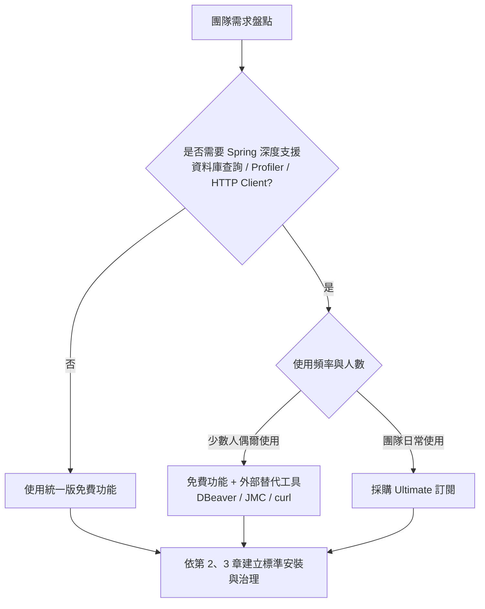
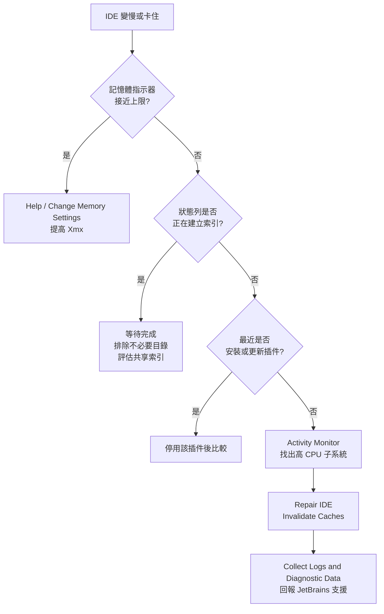

+++
date = '2025-10-31T00:00:00+08:00'
draft = false
title = 'IntelliJ IDEA Community Edition使用教學'
tags = ['教學', '工具', 'IntelliJ IDEA', 'Java', 'IDE', 'JetBrains']
categories = ['教學']
+++

# IntelliJ IDEA 使用教學手冊（原 Community Edition／統一版免費功能）

## 文件資訊

| 項目 | 內容 |
| --- | --- |
| **文件版本** | 2.0 |
| **最後更新** | 2026-10-01 |
| **版本基準** | IntelliJ IDEA 2026.2.3（build 262.10968.63，2026-09-16）統一版的免費功能；Ultimate 訂閱功能以 🔒 標示。相容性矩陣見 [1.5 版本基準與相容性矩陣](#15-版本基準與相容性矩陣) |
| **文件定位** | 企業標準技術白皮書／內部標準教材：Java 後端團隊使用 IntelliJ IDEA 的**安裝部署、環境設定、日常開發、版本控制、建置除錯、測試品質、AI 輔助、效能維運與團隊治理** |
| **適用對象** | Java 後端新進人員、資深工程師、技術主管、開發環境管理員（IT／DevOps）、資安與稽核人員 |
| **前置知識** | Java 基礎語法、Maven 或 Gradle 基本概念、Git 基本操作 |
| **產品沿革** | IntelliJ IDEA Community Edition 自 2025.3 起併入統一版 IntelliJ IDEA，不再單獨發行，詳見 [1.1 產品沿革：從 Community Edition 到統一版](#11-產品沿革從-community-edition-到統一版) |
| **前一版本** | 1.0（2025-08-29，以 IntelliJ IDEA Community Edition 2023.3 為基準） |
| **Created by** | Eric Cheng |

> 📌 **v2.0 改版重點**：章節重新編排為 17 章與 5 個附錄，以統一版 IntelliJ IDEA 2026.2.3 為基準。
>
> - **產品定位更新**：Community Edition 已於 2025.3 併入統一版。本手冊改以「統一版免費功能」為主軸，保留原檔名與網址；需要 Ultimate 訂閱的功能一律標示 🔒，並提供免費替代做法。
> - **修正錯誤**：修正 v1.0 中已不適用或原本就不正確的內容。例如安裝精靈並無「32-bit JetBrains Runtime」選項、IDE 已內建執行環境不需先安裝 Java、系統需求過時、JDK 建議版本過時、資料庫查詢與 Profiler 屬於 Ultimate 功能、SonarLint 已更名為 SonarQube for IDE、JUnitGenerator V2.0 已不相容、Code With Me 即將停止服務。
> - **新增內容**：授權與資料治理、企業大量部署與靜默安裝、企業憑證與代理、EditorConfig 與 Actions on Save、Git worktrees、Logpoints、JUnit 6、Testcontainers 2、AI 輔助開發（AI Assistant、Junie、GitHub Copilot、ACP、MCP Server）、企業插件治理、共享索引、診斷資料收集、新人上手流程。
> - **追溯依據**：所有差異見 [D.2 v1.0 → v2.0 更正對照表](#d2-v10--v20-更正對照表)，查證依據見 [附錄 E：查證紀錄](#附錄-e查證紀錄)。

### 閱讀指引

| 讀者角色 | 建議閱讀章節 |
| --- | --- |
| 新進 Java 開發人員 | 第 1 章 → 第 2 章 → 第 4、5 章 → 第 6 章 → 第 7 章 → 第 8、9、10 章 → 17.8 |
| 資深工程師／Tech Lead | 1.2 → 第 4 章 → 第 10 章 → 第 13 章 → 第 15 章 |
| 開發環境管理員（IT／DevOps） | 第 2 章 → 第 3 章 → 12.2 → 第 14 章 → 15.1 |
| 資安與稽核人員 | 第 3 章 → 12.2 → 13.7 → 15.4 → 15.7 |
| 技術主管（採購與治理決策） | 1.2 → 1.6 → 3.1 → 13.2 → 13.7 |

### 標示圖例

| 標示 | 意義 |
| --- | --- |
| 🆓 | 統一版 IntelliJ IDEA 免費功能（不需訂閱） |
| 🔒 | 需要 Ultimate 訂閱（安裝後有 30 天試用）；本手冊同時提供免費替代做法 |
| 🆕 | 2025.3 之後新增或有重大變更的功能 |
| ⚠️ | 已棄用、即將停止服務，或有相容性風險 |

> 💡 **快捷鍵與選單路徑慣例**：本手冊以 Windows／Linux 預設鍵盤配置為主，必要時以「／」並列 macOS 鍵位（例如 `Ctrl+Alt+S`／`⌘,`）。Windows／Linux 的設定入口為 `File | Settings`，macOS 為 `IntelliJ IDEA | Settings`，下文統一寫作 `Settings | ...`。完整對照見 [附錄 A：快捷鍵速查](#附錄-a快捷鍵速查)。

---

## 目錄

<!-- TOC-AUTO-BEGIN -->

- [1. 總覽與版本基準](#1-總覽與版本基準)
  - [1.1 產品沿革：從 Community Edition 到統一版](#11-產品沿革從-community-edition-到統一版)
  - [1.2 免費功能與 Ultimate 訂閱對照](#12-免費功能與-ultimate-訂閱對照)
  - [1.3 開源版建置與 Community Edition 2025.2](#13-開源版建置與-community-edition-20252)
  - [1.4 發行節奏、版本號與支援](#14-發行節奏版本號與支援)
  - [1.5 版本基準與相容性矩陣](#15-版本基準與相容性矩陣)
  - [1.6 企業選型建議](#16-企業選型建議)
- [2. 安裝與部署](#2-安裝與部署)
  - [2.1 系統需求](#21-系統需求)
  - [2.2 安裝方式選擇](#22-安裝方式選擇)
  - [2.3 Windows 安裝與靜默安裝](#23-windows-安裝與靜默安裝)
  - [2.4 macOS 安裝](#24-macos-安裝)
  - [2.5 Linux 安裝](#25-linux-安裝)
  - [2.6 首次啟動與設定匯入](#26-首次啟動與設定匯入)
  - [2.7 IDE 目錄結構](#27-ide-目錄結構)
  - [2.8 更新與版本控管策略](#28-更新與版本控管策略)
  - [2.9 離線與受限網路環境](#29-離線與受限網路環境)
- [3. 授權、隱私與資料治理](#3-授權隱私與資料治理)
  - [3.1 授權模式](#31-授權模式)
  - [3.2 試用期與訂閱到期的行為](#32-試用期與訂閱到期的行為)
  - [3.3 遙測與資料分享（Data Sharing）](#33-遙測與資料分享data-sharing)
  - [3.4 網路代理（HTTP Proxy）設定](#34-網路代理http-proxy設定)
  - [3.5 企業憑證與信任鏈](#35-企業憑證與信任鏈)
  - [3.6 專案信任與 Safe Mode](#36-專案信任與-safe-mode)
  - [3.7 企業治理建議](#37-企業治理建議)
- [4. 開發環境基本設定](#4-開發環境基本設定)
  - [4.1 設定的層級](#41-設定的層級)
  - [4.2 JDK 與 Project SDK](#42-jdk-與-project-sdk)
  - [4.3 Maven 整合設定](#43-maven-整合設定)
  - [4.4 Gradle 整合設定](#44-gradle-整合設定)
  - [4.5 檔案編碼與換行字元](#45-檔案編碼與換行字元)
  - [4.6 Code Style 與 EditorConfig](#46-code-style-與-editorconfig)
  - [4.7 檢查器（Inspections）與檢查設定檔](#47-檢查器inspections與檢查設定檔)
  - [4.8 Actions on Save](#48-actions-on-save)
  - [4.9 設定備份、同步與團隊共享](#49-設定備份同步與團隊共享)
- [5. 專案建立與匯入](#5-專案建立與匯入)
  - [5.1 開啟與匯入既有專案](#51-開啟與匯入既有專案)
  - [5.2 從版本控制取得專案](#52-從版本控制取得專案)
  - [5.3 使用新專案精靈](#53-使用新專案精靈)
  - [5.4 建立 Spring Boot 專案](#54-建立-spring-boot-專案)
  - [5.5 多模組專案與 Project Structure](#55-多模組專案與-project-structure)
  - [5.6 專案層級設定最佳化](#56-專案層級設定最佳化)
- [6. 編輯、導航與重構](#6-編輯導航與重構)
  - [6.1 介面導覽](#61-介面導覽)
  - [6.2 搜尋與導航](#62-搜尋與導航)
  - [6.3 程式碼補全與產生](#63-程式碼補全與產生)
  - [6.4 Live Templates 與 Postfix Completion](#64-live-templates-與-postfix-completion)
  - [6.5 重構](#65-重構)
  - [6.6 多游標與進階編輯](#66-多游標與進階編輯)
  - [6.7 書籤、TODO 與 Scratch 檔](#67-書籤todo-與-scratch-檔)
- [7. 版本控制整合（Git、GitHub、GitLab）](#7-版本控制整合gitgithubgitlab)
  - [7.1 Git 前置設定](#71-git-前置設定)
  - [7.2 提交工作流程](#72-提交工作流程)
  - [7.3 Shelve 與 Stash](#73-shelve-與-stash)
  - [7.4 分支管理與 Git Worktrees](#74-分支管理與-git-worktrees)
  - [7.5 合併、Rebase 與衝突解決](#75-合併rebase-與衝突解決)
  - [7.6 歷史檢視與修正](#76-歷史檢視與修正)
  - [7.7 GitHub 整合](#77-github-整合)
  - [7.8 GitLab 整合](#78-gitlab-整合)
  - [7.9 提交前檢查與提交簽章](#79-提交前檢查與提交簽章)
- [8. 建置與執行](#8-建置與執行)
  - [8.1 建置模型：IDE 建置與委派給建置工具](#81-建置模型ide-建置與委派給建置工具)
  - [8.2 Maven 工具視窗與生命週期](#82-maven-工具視窗與生命週期)
  - [8.3 Gradle 工具視窗與任務](#83-gradle-工具視窗與任務)
  - [8.4 Run／Debug Configuration](#84-rundebug-configuration)
  - [8.5 JVM 參數與環境變數](#85-jvm-參數與環境變數)
  - [8.6 Spring Boot 應用程式執行](#86-spring-boot-應用程式執行)
  - [8.7 Docker 與容器化](#87-docker-與容器化)
  - [8.8 打包與交付](#88-打包與交付)
- [9. 除錯](#9-除錯)
  - [9.1 啟動除錯工作階段](#91-啟動除錯工作階段)
  - [9.2 中斷點類型與屬性](#92-中斷點類型與屬性)
  - [9.3 Logpoints 🆕](#93-logpoints-)
  - [9.4 檢視與修改程式狀態](#94-檢視與修改程式狀態)
  - [9.5 進階除錯技巧](#95-進階除錯技巧)
  - [9.6 遠端除錯（JDWP）](#96-遠端除錯jdwp)
  - [9.7 AI 輔助除錯](#97-ai-輔助除錯)
- [10. 測試與程式碼品質](#10-測試與程式碼品質)
  - [10.1 測試框架與相依設定](#101-測試框架與相依設定)
  - [10.2 建立與執行測試](#102-建立與執行測試)
  - [10.3 Mockito 與 AssertJ 實務](#103-mockito-與-assertj-實務)
  - [10.4 程式碼覆蓋率](#104-程式碼覆蓋率)
  - [10.5 Testcontainers 整合測試](#105-testcontainers-整合測試)
  - [10.6 靜態分析與程式碼品質工具](#106-靜態分析與程式碼品質工具)
  - [10.7 測試策略](#107-測試策略)
- [11. 資料庫整合](#11-資料庫整合)
  - [11.1 免費功能與 Ultimate 的分界](#111-免費功能與-ultimate-的分界)
  - [11.2 建立資料來源 🆓](#112-建立資料來源-)
  - [11.3 結構檢視與 SQL 編輯輔助 🆓](#113-結構檢視與-sql-編輯輔助-)
  - [11.4 Ultimate：查詢主控台與資料編輯 🔒](#114-ultimate查詢主控台與資料編輯-)
  - [11.5 免費替代方案](#115-免費替代方案)
  - [11.6 JPA 與 Hibernate 開發支援](#116-jpa-與-hibernate-開發支援)
  - [11.7 資料庫版本控管（Flyway／Liquibase）](#117-資料庫版本控管flywayliquibase)
  - [11.8 測試環境的資料庫選擇](#118-測試環境的資料庫選擇)
- [12. 插件管理與擴充](#12-插件管理與擴充)
  - [12.1 插件管理基本操作](#121-插件管理基本操作)
  - [12.2 企業插件治理](#122-企業插件治理)
  - [12.3 推薦插件清單](#123-推薦插件清單)
  - [12.4 已停止維護或不建議使用的插件](#124-已停止維護或不建議使用的插件)
  - [12.5 Code With Me 停止服務](#125-code-with-me-停止服務)
  - [12.6 插件開發入門](#126-插件開發入門)
- [13. AI 輔助開發](#13-ai-輔助開發)
  - [13.1 AI 功能地圖](#131-ai-功能地圖)
  - [13.2 授權與可用性](#132-授權與可用性)
  - [13.3 AI Assistant 與 Junie](#133-ai-assistant-與-junie)
  - [13.4 第三方代理與 ACP](#134-第三方代理與-acp)
  - [13.5 MCP Server：讓外部 AI 工具使用 IDE](#135-mcp-server讓外部-ai-工具使用-ide)
  - [13.6 Agent Skills 🆕](#136-agent-skills-)
  - [13.7 企業 AI 治理與使用規範](#137-企業-ai-治理與使用規範)
- [14. 效能調校與疑難排解](#14-效能調校與疑難排解)
  - [14.1 記憶體設定](#141-記憶體設定)
  - [14.2 JVM 選項與平台屬性](#142-jvm-選項與平台屬性)
  - [14.3 索引與共享索引](#143-索引與共享索引)
  - [14.4 專案層級效能最佳化](#144-專案層級效能最佳化)
  - [14.5 防毒軟體與作業系統層級](#145-防毒軟體與作業系統層級)
  - [14.6 Invalidate Caches 與 Repair IDE](#146-invalidate-caches-與-repair-ide)
  - [14.7 日誌與診斷資料](#147-日誌與診斷資料)
  - [14.8 效能問題排除流程](#148-效能問題排除流程)
- [15. 團隊協作與企業最佳實務](#15-團隊協作與企業最佳實務)
  - [15.1 團隊設定基線](#151-團隊設定基線)
  - [15.2 新人上手流程](#152-新人上手流程)
  - [15.3 程式碼規範與自動化](#153-程式碼規範與自動化)
  - [15.4 相依套件與供應鏈安全](#154-相依套件與供應鏈安全)
  - [15.5 設定檔與機密管理](#155-設定檔與機密管理)
  - [15.6 例外處理與日誌規範](#156-例外處理與日誌規範)
  - [15.7 安全編碼與 IDE 安全設定](#157-安全編碼與-ide-安全設定)
- [16. 常見問題與解決方案](#16-常見問題與解決方案)
  - [16.1 授權與版本](#161-授權與版本)
  - [16.2 安裝與啟動](#162-安裝與啟動)
  - [16.3 專案匯入與建置](#163-專案匯入與建置)
  - [16.4 編譯與執行](#164-編譯與執行)
  - [16.5 Git 整合](#165-git-整合)
  - [16.6 效能](#166-效能)
  - [16.7 插件](#167-插件)
  - [16.8 除錯](#168-除錯)
  - [16.9 快速診斷流程](#169-快速診斷流程)
- [17. 檢查清單](#17-檢查清單)
  - [17.1 安裝與設定檢查清單](#171-安裝與設定檢查清單)
  - [17.2 專案開發檢查清單](#172-專案開發檢查清單)
  - [17.3 資料庫整合檢查清單](#173-資料庫整合檢查清單)
  - [17.4 團隊協作檢查清單](#174-團隊協作檢查清單)
  - [17.5 效能與安全檢查清單](#175-效能與安全檢查清單)
  - [17.6 日常與週期性維護](#176-日常與週期性維護)
  - [17.7 問題排除檢查清單](#177-問題排除檢查清單)
  - [17.8 新進人員四週學習計畫](#178-新進人員四週學習計畫)
- [附錄 A：快捷鍵速查](#附錄-a快捷鍵速查)
  - [A.1 最常用](#a1-最常用)
  - [A.2 編輯](#a2-編輯)
  - [A.3 導航與搜尋](#a3-導航與搜尋)
  - [A.4 重構](#a4-重構)
  - [A.5 執行與除錯](#a5-執行與除錯)
  - [A.6 版本控制](#a6-版本控制)
  - [A.7 工具視窗](#a7-工具視窗)
- [附錄 B：名詞對照表](#附錄-b名詞對照表)
- [附錄 C：參考資源](#附錄-c參考資源)
  - [C.1 官方文件與資源](#c1-官方文件與資源)
  - [C.2 社群與學習](#c2-社群與學習)
  - [C.3 生態系工具](#c3-生態系工具)
- [附錄 D：版本歷程與修訂紀錄](#附錄-d版本歷程與修訂紀錄)
  - [D.1 版本歷程與章節對照](#d1-版本歷程與章節對照)
  - [D.2 v1.0 → v2.0 更正對照表](#d2-v10--v20-更正對照表)
- [附錄 E：查證紀錄](#附錄-e查證紀錄)
  - [E.1 待追蹤事項](#e1-待追蹤事項)

<!-- TOC-AUTO-END -->

---

## 1. 總覽與版本基準

本章說明 IntelliJ IDEA 的產品沿革、免費功能與 Ultimate 訂閱的分界、版本與支援政策，以及本手冊採用的版本基準。企業導入前應先讀完本章，確認團隊需求落在免費功能範圍內，或需要採購 Ultimate 訂閱。

### 1.1 產品沿革：從 Community Edition 到統一版

#### 1.1.1 歷史背景

IntelliJ IDEA 長期以兩個產品發行：

| 產品 | 授權 | 定位 |
| --- | --- | --- |
| IntelliJ IDEA Community Edition（CE） | 免費、開源（Apache 2.0） | Java／Kotlin／Groovy／Scala 基本開發、Maven／Gradle、Git、JUnit、除錯 |
| IntelliJ IDEA Ultimate | 付費授權 | 在 CE 之上加入 Spring、Jakarta EE、資料庫工具、Profiler、HTTP Client、前端框架、遠端開發等進階功能 |

#### 1.1.2 2025.3 起的統一版（Unified Distribution）

JetBrains 於 2025-07-17 宣布改為單一發行版，並於 **IntelliJ IDEA 2025.3（2025-12-08）** 正式實施：

- **只有一個安裝檔**：不再區分 Community 與 Ultimate 下載；所有人安裝同一個 IntelliJ IDEA。
- **核心功能免費**：Java 與 Kotlin 開發所需的核心功能免費，可用於商業與非商業專案。
- **Ultimate 改為訂閱解鎖**：在同一個 IDE 內透過訂閱解鎖進階功能；首次安裝會自動開始 30 天的 Ultimate 試用。
- **免費功能比 CE 更多**：統一版的免費功能包含原 CE 的全部功能，並增加 [1.2 免費功能與 Ultimate 訂閱對照](#12-免費功能與-ultimate-訂閱對照) 所列的項目。
- **自動轉換**：從 CE 2025.2.x 更新到 2025.3 時，安裝會自動轉為統一版；設定、專案與資料會完整保留。

> ⚠️ **注意**：CE 2025.2 及更早版本仍可下載使用，JetBrains 也持續發布少量修補（例如 2025.2.6.3 於 2026-07-29 發布）。但官方明確表示**統一版是唯一會持續獲得更新與新功能的版本**，企業不應把 CE 2025.2 當作長期基準。

#### 1.1.3 版本識別

| 項目 | Community Edition（≤ 2025.2） | 統一版（≥ 2025.3） |
| --- | --- | --- |
| 產品代碼 | `IIC` | `IIU` |
| Windows 安裝檔名 | `ideaIC-2025.2.6.3.exe` | `idea-2026.2.3.exe` |
| Linux 壓縮檔名 | `ideaIC-<版本>.tar.gz` | `idea-<版本>.tar.gz` |
| 設定目錄名稱 | `IdeaIC2025.2` | `IntelliJIdea2026.2` |
| snap 套件 | `intellij-idea-community` | `intellij-idea` |

> 💡 **如何確認目前是哪個版本**：`Help | About` 會顯示版本號與 build 號（例如 `Build #IU-262.10968.63`）。以 `Help | Manage Subscription` 可查看目前是否處於 Ultimate 試用或訂閱狀態。

### 1.2 免費功能與 Ultimate 訂閱對照

下表依官方文件與 FAQ 整理企業 Java 後端最常用的功能分界（查證紀錄見 [附錄 E：查證紀錄](#附錄-e查證紀錄)）。

#### 1.2.1 核心開發功能

| 功能領域 | 免費（🆓） | Ultimate（🔒） |
| --- | --- | --- |
| Java／Kotlin／Groovy 編輯、補全、重構、檢查 | ✅ 完整 | ✅ |
| Maven、Gradle 整合 | ✅ 完整 | ✅ |
| Git、GitHub、GitLab 整合（含 PR／MR 審查） | ✅ 完整 | ✅ |
| 除錯器（含 Logpoints、遠端除錯） | ✅ 完整 | ✅ |
| JUnit／TestNG 執行與程式碼覆蓋率 | ✅ 完整 | ✅ |
| Command completion（以 `..` 叫出指令） | ✅ | ✅ |
| Full Line code completion（本機模型整行補全） | — | 🔒 |
| JavaScript、TypeScript、HTML、CSS、React 基本支援 | ✅（2026.1 起） | ✅ 另含專屬除錯器、測試執行器、Angular／Vue 完整支援 |
| C／C++ 程式碼輔助（多語言專案） | 依官方當期說明 | ✅ |

#### 1.2.2 框架與企業技術

| 功能領域 | 免費（🆓） | Ultimate（🔒） |
| --- | --- | --- |
| Spring、Jakarta EE、Quarkus、Micronaut、JPA（JPQL／HQL） | 基本語法標示 | 完整支援（Bean 導航、注入檢查、Spring Debugger、執行期洞察） |
| Spring Boot 專案精靈（Spring Initializr） | ✅（2025.3 起） | ✅ |
| Spring Boot Run Configuration | 基本執行 | 🔒 Actuator（JMX）端點、更新策略（On 'Update' action／On frame deactivation）、Run on 遠端目標 |
| 範本引擎（Thymeleaf、FreeMarker、Velocity、JSP） | 基本語法標示 | 完整支援 |
| Kubernetes manifest、Helm（YAML schema） | ✅ | ✅ |
| Docker | 需自行從 Marketplace 安裝 Docker 插件 | 預設內建 |
| HTTP Client（`.http` 檔） | — | 🔒 |
| IntelliJ Profiler（CPU／記憶體分析） | — | 🔒 |
| Dev Containers、遠端開發（JetBrains Gateway） | 依官方當期說明 | ✅ |

#### 1.2.3 資料庫工具

| 功能 | 免費（🆓） | Ultimate（🔒） |
| --- | --- | --- |
| 建立資料來源、連線管理 | ✅ | ✅ |
| 檢視資料庫結構（表格、欄位、索引） | ✅ | ✅ |
| 依結構的 SQL 補全、完整 SQL 語言支援 | ✅ | ✅ |
| Request and Copy Original DDL | ✅ | ✅ |
| 以表格方式編輯 CSV／TSV 檔 | ✅ | ✅ |
| 在主控台／SQL 檔執行查詢 | — | 🔒 |
| 資料檢視與編輯器、圖表 | — | 🔒 |
| Explain Plan、結構比對與遷移、資料比對 | — | 🔒 |
| 匯出／匯入、Data Extractor | — | 🔒 |
| 資料庫圖表、建立／修改物件、Oracle PL/SQL 除錯 | — | 🔒 |

> 💡 資料庫功能的免費替代方案見 [11.5 免費替代方案](#115-免費替代方案)。

#### 1.2.4 平台與治理功能

| 功能 | 免費（🆓） | Ultimate（🔒） | 說明 |
| --- | --- | --- | --- |
| Backup and Sync（以 JetBrains 帳號同步設定） | ✅ | ✅ | 開源建置版不含 |
| 使用統計資料分享（Data Sharing） | 停用且無法啟用 | 可選擇啟用 | 見 [3.3 遙測與資料分享（Data Sharing）](#33-遙測與資料分享data-sharing) |
| Package Checker（相依套件漏洞掃描） | 依官方當期說明 | ✅ | 開源建置版不含 |
| Qodana 插件 | ✅ | ✅ | 開源建置版不含 |
| AI Assistant | 需另行安裝與取得 JetBrains AI 授權 | Ultimate 訂閱依當期方案提供 AI 功能 | 見 [13.2 授權與可用性](#132-授權與可用性) |
| 中、日、韓語系介面插件 | ✅ | ✅ | 開源建置版不含 |

> ⚠️ **重要**：JetBrains 會隨版本調整免費與付費的分界。本表以 2026.2 文件為準；導入或採購前，請以官方[功能比較表](https://www.jetbrains.com/idea/features/editions_comparison_matrix.html)與[統一版 FAQ](https://lp.jetbrains.com/intellij-idea-unified-faq/)再次確認。

### 1.3 開源版建置與 Community Edition 2025.2

#### 1.3.1 開源版（Open-source build）

IntelliJ IDEA 的開源原始碼仍保留在 GitHub（[JetBrains/intellij-community](https://github.com/JetBrains/intellij-community)）。JetBrains 會將開源版建置發布到 GitHub Releases，並提供 GitHub Actions CI/CD 流程，讓組織自行建置。

開源版只包含開源元件，**不含**以下功能：

| 不含的功能 | 說明 |
| --- | --- |
| Backup and Sync | 以 JetBrains 帳號同步 IDE 設定與插件 |
| LSP 支援 | Language Server Protocol 整合 |
| Package Checker | 掃描相依套件的已知弱點 |
| AI 排序 | 程式碼補全與 Search Everywhere 的 AI 排序 |
| AI Assistant | JetBrains AI 功能 |
| Qodana 插件 | 靜態分析與合規檢查 |
| 中日韓語系插件 | 介面翻譯 |
| Kotlin Notebook | 互動式筆記本 |
| Code With Me | 即時協作 |

上述大部分功能可以從 JetBrains Marketplace 以插件方式安裝。開源版也可以安裝並使用付費插件；安裝付費插件時會自動加入 JetBrains Marketplace Licensing 插件，並要求接受 Marketplace 協議。

#### 1.3.2 何時考慮開源版或 CE 2025.2

| 情境 | 建議 |
| --- | --- |
| 一般企業開發團隊 | 使用**統一版**（免費功能即可涵蓋多數 Java 後端工作） |
| 法規或合約要求只能使用可稽核的開源軟體 | 評估**開源版建置**，並自行建立建置與更新流程 |
| 既有專案暫時無法升級（例如插件相容性） | 短期保留 **CE 2025.2.x**，同時規劃移轉時程 |
| 完全離線、需嚴格控管對外連線 | 統一版或開源版皆可，搭配 [2.9 離線與受限網路環境](#29-離線與受限網路環境) 的離線部署方式 |

### 1.4 發行節奏、版本號與支援

#### 1.4.1 版本號規則

| 項目 | 規則 | 範例 |
| --- | --- | --- |
| 主要版本 | `年份.序號`，每年約三次（春、夏、冬） | 2025.3（2025-12）、2026.1（2026-03）、2026.2（2026-07） |
| 修補版本 | `年份.序號.修補號`，約每 2～4 週一次 | 2026.2.1（08-10）、2026.2.2（09-02）、2026.2.3（09-16） |
| Build 號 | `<分支>.<build>.<修補>`，分支號 = 年份後兩碼＋序號 | 2026.2.3 = `262.10968.63` |

近期發行紀錄（來源：JetBrains 發行資料 API，查證日 2026-10-01）：

| 版本 | Build | 發行日 | 重點 |
| --- | --- | --- | --- |
| 2025.3 | 253.28294.334 | 2025-12-08 | 統一版上線、Islands 主題成為預設、Command completion、Java 25、Spring Boot 4／Spring Framework 7 |
| 2026.1 | 261.22158.277 | 2026-03-25 | Java 26、ACP agents（Codex、Cursor 等）、Git worktrees、Dev Container 原生流程、JS／TS 基本支援免費、Code With Me 改為獨立插件 |
| 2026.2 | 262.8665.258 | 2026-07-16 | Java 27、Kotlin 2.4、Logpoints、相依套件補全、Gradle 10 早期支援、Git 衝突解決流程改善、原生 GitHub Copilot 整合、Agent skills、Kotlin Notebook 改為非內建 |
| 2026.2.3 | 262.10968.63 | 2026-09-16 | **本手冊基準**（目前最新修補版） |

#### 1.4.2 支援與更新建議

- **主要版本**：新主要版本發行後，前一版通常仍會有少量修補，但新功能只進入新版本。
- **企業建議**：新主要版本發布後先觀察 2～4 週，等待 `.1` 或 `.2` 修補版再全面升級。版本控管策略見 [2.8 更新與版本控管策略](#28-更新與版本控管策略)。
- **EAP（Early Access Program）**：預覽版會預設啟用使用統計，不建議用於正式開發或處理機敏程式碼。

### 1.5 版本基準與相容性矩陣

本手冊範例採用以下版本（查證日 2026-10-01；來源見 [附錄 E：查證紀錄](#附錄-e查證紀錄)）：

| 元件 | 本手冊基準 | 說明 |
| --- | --- | --- |
| IntelliJ IDEA | 2026.2.3（262.10968.63） | 統一版 |
| JetBrains Runtime（JBR） | 隨 IDE 內建 | 執行 IDE 本身不需另裝 Java；開發 Java 專案仍需獨立 JDK |
| JDK（專案用） | **25 LTS**（建議新專案）、21 LTS、17 LTS | JDK 27 為最新功能版（非 LTS），IDE 自 2026.2 起提供首日支援 |
| Apache Maven | 3.10.0（前一穩定版 3.9.16） | Maven 4.0 仍為 RC（4.0.0-rc-7），不建議用於正式專案 |
| Gradle | 9.8.0 | IDE 自 2026.2 起提供 Gradle 10 早期支援與遷移協助 |
| Kotlin | 2.4 | 2026.2 支援 2.4 穩定語言功能 |
| Spring Boot | 4.1.1（4.0.x 仍維護） | 搭配 Spring Framework 7.0.x，需 Java 17 以上 |
| JUnit | 6.1.3 | JUnit 6 需 Java 17 以上；Platform、Jupiter、Vintage 版本號統一 |
| Mockito | 5.24.0 | |
| AssertJ | 3.27.7 | 4.0 仍為 milestone |
| Testcontainers | 2.0.5 | 2.x 模組命名為 `testcontainers-<模組>` |
| Lombok | 1.18.48 | IDE 內建 Lombok 插件 |

> 💡 **JDK 選擇原則**：新專案使用最新 LTS（JDK 25）；既有專案維持在仍受支援的 LTS（21 或 17）。Spring Boot 4、JUnit 6 都要求 Java 17 以上，JDK 8／11 專案應納入升級規劃。

### 1.6 企業選型建議

#### 1.6.1 決策流程



#### 1.6.2 常見情境建議

| 團隊情境 | 建議方案 | 理由 |
| --- | --- | --- |
| 純 Java／Kotlin 函式庫、批次程式 | 🆓 免費功能 | 核心功能完整 |
| Spring Boot 微服務、偶爾查資料庫 | 🆓 免費功能＋DBeaver／psql | 專案精靈、基本執行與 SQL 補全已免費 |
| 大型 Spring／Jakarta EE 系統，需要 Bean 導航、效能分析 | 🔒 Ultimate | Spring 完整支援、Profiler、HTTP Client 可明顯提升效率 |
| 全端團隊（Java＋Angular／Vue） | 🔒 Ultimate | 前端框架完整支援、專屬除錯器與測試執行器 |
| 教育訓練、學生 | 🔒 Ultimate 教育授權 | 學生、教師與教育機構可免費申請 |

## 2. 安裝與部署

本章涵蓋個人安裝與企業大量部署。安裝前請先確認 [1.2 免費功能與 Ultimate 訂閱對照](#12-免費功能與-ultimate-訂閱對照) 的功能分界與 [1.5 版本基準與相容性矩陣](#15-版本基準與相容性矩陣) 的版本基準。

### 2.1 系統需求

#### 2.1.1 硬體需求

| 項目 | 官方需求 | 企業建議（中大型專案） |
| --- | --- | --- |
| CPU | x86_64 或 arm64，4 核心 | 8 核心以上 |
| 記憶體 | 總計 8 GB；IDE 程序可用 3 GB | 16 GB 以上；多模組或微服務專案建議 32 GB |
| 磁碟 | 10 GB | SSD；另預留 Maven／Gradle 快取與索引空間 20 GB 以上 |
| 螢幕解析度 | 1280 × 720 | 1920 × 1080 以上 |

#### 2.1.2 作業系統

| 作業系統 | 支援版本 |
| --- | --- |
| Windows | 10、11（另有 ARM64 安裝檔） |
| macOS | 15、26（Intel 與 Apple Silicon 各有安裝映像檔） |
| Linux | Ubuntu 24.04／26.04 LTS、Fedora 43／44、Debian 13、Amazon Linux 2023；桌面環境 GNOME、KDE Plasma；glibc 2.28 以上 |

> ⚠️ **注意**：BSD 系作業系統不受支援。修改內建 JRE／JDK，或手動刪改安裝目錄內的檔案（例如插件檔案）的安裝方式，官方不提供支援。

#### 2.1.3 Java 執行環境

**執行 IntelliJ IDEA 本身不需要另外安裝 Java**，安裝包已內建 JetBrains Runtime（JBR）。但**開發 Java 應用程式仍需要獨立的 JDK**，設定方式見 [4.2 JDK 與 Project SDK](#42-jdk-與-project-sdk)。

### 2.2 安裝方式選擇

| 安裝方式 | 適用情境 | 優點 | 注意事項 |
| --- | --- | --- | --- |
| **Toolbox App**（官方建議） | 個人開發機 | 一鍵安裝、更新、回復版本；可並存多版本；可直接調整記憶體設定 | 需要對外連線；企業可統一管理 Toolbox 設定 |
| **獨立安裝檔**（`.exe`／`.dmg`／`.tar.gz`） | 需固定安裝位置、標準映像檔 | 安裝位置可控，便於稽核 | 更新需手動或透過 IDE 內更新 |
| **Windows ZIP** | 可攜式安裝、無管理員權限 | 免安裝程式 | 不會建立捷徑與檔案關聯 |
| **Windows 靜默安裝** | 企業大量部署 | 可搭配 SCCM、Intune 等軟體派送工具 | 見 [2.3 Windows 安裝與靜默安裝](#23-windows-安裝與靜默安裝) |
| **Linux snap** | Ubuntu 桌面 | 自動更新 | 官方提醒可能有效能與檔案操作延遲等問題 |

### 2.3 Windows 安裝與靜默安裝

#### 2.3.1 互動式安裝

1. 從 [下載頁](https://www.jetbrains.com/idea/download/) 下載 `idea-2026.2.3.exe`（ARM64 機器請選 `idea-2026.2.3-aarch64.exe`）。
2. 執行安裝程式並依精靈操作。
3. 在 **Installation Options** 步驟可勾選：
   - 建立桌面捷徑
   - 將命令列啟動器目錄加入 `PATH`（之後可在命令列使用 `idea64.exe`）
   - 在資料夾右鍵選單加入 **Open Folder as Project**
   - 關聯特定副檔名（例如 `.java`、`.kt`）
4. 完成後從開始功能表啟動，或執行安裝目錄下的 `bin\idea64.exe`。

> ⚠️ **v1.0 更正**：舊版手冊提到的「下載並安裝 32-bit JetBrains Runtime」選項並不存在；目前安裝程式只提供上述四類選項。

#### 2.3.2 靜默安裝（企業大量部署）

靜默安裝不顯示任何介面，適合以軟體派送工具部署到多台電腦。

| 參數 | 說明 |
| --- | --- |
| `/S` | 啟用靜默安裝 |
| `/CONFIG=<路徑>` | 指定靜默設定檔 |
| `/LOG=<路徑>` | 輸出安裝紀錄（放在 `/S` 與 `/D` 之間） |
| `/NCRC` | 停用 CRC 檢查，避免出現 Verifying Installer 視窗 |
| `/D=<路徑>` | 安裝目錄；**必須放在最後**，且路徑即使含空白也**不可加引號** |

```powershell
# 1. 下載官方預設的靜默設定檔
Invoke-WebRequest -Uri "https://download.jetbrains.com/idea/silent.config" -OutFile "D:\deploy\silent.config"

# 2. 編輯 silent.config：若要安裝給所有使用者，將 mode=user 改為 mode=admin，並以系統管理員身分執行

# 3. 執行靜默安裝並產生安裝紀錄
.\idea-2026.2.3.exe /S /CONFIG=D:\deploy\silent.config /LOG=D:\deploy\idea-install.log /D=C:\Program Files\JetBrains\IntelliJ IDEA 2026.2.3
```

> 💡 **授權伺服器**：使用 Floating License Server 或 License Vault 的企業，可設定環境變數 `JETBRAINS_LICENSE_SERVER` 指向授權伺服器網址，或在 JVM 選項加入 `-DJETBRAINS_LICENSE_SERVER=<網址>`，讓大量安裝的 IDE 自動取得 Ultimate 授權。

<!-- markdownlint-disable-next-line MD028 -->

> ⚠️ 若不指定 `/CONFIG`，必須以系統管理員身分執行，且安裝程式會忽略所有額外選項（不建立桌面捷徑、不關聯檔案、不修改 `PATH`），只會在開始功能表的 JetBrains 資料夾建立捷徑。

### 2.4 macOS 安裝

1. 下載對應架構的 `.dmg`：Apple Silicon 選 `idea-2026.2.3-aarch64.dmg`，Intel 選 `idea-2026.2.3.dmg`。
2. 掛載映像檔，將 **IntelliJ IDEA** 拖曳到 `Applications` 資料夾。
3. 從 `Applications`、Launchpad 或 Spotlight 啟動。

> ⚠️ 請勿修改 `IntelliJ IDEA.app/Contents/bin/` 內的 `idea.vmoptions` 或 `idea.properties`，這會破壞應用程式簽章。自訂設定請依 [14.2 JVM 選項與平台屬性](#142-jvm-選項與平台屬性) 的方式處理。

### 2.5 Linux 安裝

#### 2.5.1 Tarball 安裝

```bash
# 下載（ARM64 請改用 idea-2026.2.3-aarch64.tar.gz）
curl -LO https://download.jetbrains.com/idea/idea-2026.2.3.tar.gz

# 解壓縮到 /opt（請解壓到乾淨的目錄，不要覆蓋既有安裝）
sudo tar -xzf idea-2026.2.3.tar.gz -C /opt

# 啟動（目錄名稱依實際解壓結果而定）
/opt/idea-IU-262.10968.63/bin/idea.sh
```

首次啟動後，可在 `Tools | Create Desktop Entry` 建立桌面捷徑。若要在終端機以 `idea` 指令開啟專案，可建立符號連結：

```bash
sudo ln -s /opt/idea-IU-262.10968.63/bin/idea.sh /usr/local/bin/idea
idea ~/projects/my-service
```

> ⚠️ **v1.0 更正**：舊版範例使用 `ideaIC-*.tar.gz` 與 `idea-IC-*` 目錄名稱，只適用 2025.2 以前的 Community Edition。統一版檔名為 `idea-<版本>.tar.gz`。

#### 2.5.2 snap 安裝

```bash
# 安裝最新穩定版
sudo snap install intellij-idea --classic

# 查詢可用版本並安裝指定通道
snap info intellij-idea
sudo snap install intellij-idea --channel=2026.2/stable --classic
```

> ⚠️ 官方提醒以 snap 安裝可能遇到效能下降、檔案操作延遲等問題；若發生，建議改用 Toolbox App。

### 2.6 首次啟動與設定匯入

#### 2.6.1 首次啟動流程

1. **匯入設定**：首次啟動會出現 Import Settings 對話框，列出本機偵測到的其他 IDE 設定。
   - 從 CE 升級的使用者可直接匯入 `IdeaIC2025.2` 的設定。
   - 也可以選擇從 VS Code、Eclipse 等其他 IDE 匯入。
   - 若略過，之後可用 `File | Manage IDE Settings | Import Settings` 從 ZIP 匯入。
2. **Ultimate 試用**：首次安裝會自動開始 30 天 Ultimate 試用；試用結束後自動回到免費功能，不影響工作（見 [3.2 試用期與訂閱到期的行為](#32-試用期與訂閱到期的行為)）。
3. **Welcome 畫面**：可建立新專案、開啟既有專案、從版本控制取得專案，或進入 Customize、Plugins、Learn 等頁面。

#### 2.6.2 外觀與鍵盤配置

| 設定 | 位置 | 建議 |
| --- | --- | --- |
| 主題 | Welcome 畫面 **Customize**，或 `Settings \| Appearance & Behavior \| Appearance` | 2025.3 起預設為 **Islands** 主題；可勾選 **Sync with OS** 跟隨系統深淺色 |
| 鍵盤配置（Keymap） | `Settings \| Keymap` | IDE 會依作業系統自動建議；從 Eclipse 或 VS Code 轉換者可選對應配置 |
| 字型與大小 | `Settings \| Editor \| Font` | 團隊簡報或分享螢幕時可用 `Alt+Shift+.`／`Alt+Shift+,` 全域調整字級 |
| 語系 | `Settings \| Appearance & Behavior \| System Settings \| Language and Region` | 預設英文；團隊文件與選單路徑以英文為準較易溝通 |

> 💡 **學習資源**：Welcome 畫面的 **Learn** 頁籤提供互動式教學（Feature Trainer），新進人員建議先完成 Onboarding Tour 與基本編輯課程。

### 2.7 IDE 目錄結構

IntelliJ IDEA 會在使用者家目錄下為每個主要版本建立獨立目錄。以下以 2026.2 為例（`<product><version>` = `IntelliJIdea2026.2`）：

| 目錄 | Windows | macOS | Linux |
| --- | --- | --- | --- |
| 設定（config） | `%APPDATA%\JetBrains\IntelliJIdea2026.2` | `~/Library/Application Support/JetBrains/IntelliJIdea2026.2` | `~/.config/JetBrains/IntelliJIdea2026.2` |
| 系統與快取（system） | `%LOCALAPPDATA%\JetBrains\IntelliJIdea2026.2` | `~/Library/Caches/JetBrains/IntelliJIdea2026.2` | `~/.cache/JetBrains/IntelliJIdea2026.2` |
| 使用者插件 | `<config>\plugins` | `<config>/plugins` | `~/.local/share/JetBrains/IntelliJIdea2026.2` |
| 日誌 | `<system>\log` | `~/Library/Logs/JetBrains/IntelliJIdea2026.2` | `<system>/log` |

- **查詢實際路徑**：`Help | Diagnostic Tools | Special Files and Folders` 會列出目前安裝實際使用的所有目錄。
- **變更位置**：以 `Help | Edit Custom Properties` 設定 `idea.config.path`、`idea.system.path`、`idea.plugins.path`、`idea.log.path`。Windows 路徑也要使用正斜線，例如 `C:/idea/system`。適用於家目錄空間不足、家目錄在網路磁碟或加密磁碟等情境。
- **清除舊版目錄**：安裝新主要版本後，超過 180 天未更新的舊版快取與日誌會自動刪除；設定與插件目錄會保留。可用 `Help | Delete Leftover IDE Directories…` 手動清理。

### 2.8 更新與版本控管策略

#### 2.8.1 更新方式

| 方式 | 操作 |
| --- | --- |
| IDE 內更新 | `Help \| Check for Updates`（macOS 為 `IntelliJ IDEA \| Check for Updates`）；修補版通常以差異更新套用 |
| Toolbox App | 在 Toolbox 中更新或回復到指定版本 |
| 重新安裝 | 下載新版安裝檔；設定會自動沿用 |

#### 2.8.2 企業版本控管建議

| 項目 | 建議 |
| --- | --- |
| 基準版本 | 由開發環境管理員訂定「核准版本」（例如 2026.2.x），寫入團隊開發規範 |
| 升級時機 | 新主要版本發布後，先由試點小組使用 2～4 週，確認插件相容性與專案匯入正常後再全面升級 |
| 修補版 | 修補版以錯誤修正與安全修補為主，建議在 2 週內跟進 |
| 版本一致性 | 同一團隊使用相同主要版本，避免 `.idea` 設定檔格式差異造成版控雜訊 |
| 回復方案 | 保留前一個核准版本的安裝檔；Toolbox 使用者可直接回復 |

### 2.9 離線與受限網路環境

| 需求 | 做法 |
| --- | --- |
| 安裝檔取得 | 在可連網環境下載安裝檔與 `silent.config`，經檢核後放入內部檔案庫 |
| 插件 | 建立企業內部插件倉庫（見 [12.2 企業插件治理](#122-企業插件治理)），或下載插件 ZIP 後以 **Install Plugin from Disk** 安裝 |
| JDK | 由內部檔案庫派送 JDK，在 IDE 以 **Add JDK from disk** 指定路徑 |
| Maven／Gradle 相依套件 | 透過 Nexus、Artifactory 等內部鏡像站；在 `settings.xml` 或 `init.gradle` 設定鏡像 |
| 對外連線白名單 | 依需求開放 JetBrains 帳號、授權、更新、Marketplace 等網域；未開放時，IDE 仍可在免費功能下離線使用 |
| 代理伺服器與憑證 | 見 [3.4 網路代理（HTTP Proxy）設定](#34-網路代理http-proxy設定) 與 [3.5 企業憑證與信任鏈](#35-企業憑證與信任鏈) |

> ⚠️ **Ultimate 試用與訂閱啟用需要連線到授權伺服器**。完全離線環境若需要 Ultimate，請洽 JetBrains 了解離線授權或 Floating License Server 方案。

## 3. 授權、隱私與資料治理

本章提供開發環境管理員與資安人員所需的授權、遙測、網路與信任設定資訊。

### 3.1 授權模式

| 使用方式 | 費用 | 可用功能 | 商業使用 |
| --- | --- | --- | --- |
| 免費使用（無訂閱） | 免費 | 核心 Java／Kotlin 功能與 [1.2 免費功能與 Ultimate 訂閱對照](#12-免費功能與-ultimate-訂閱對照) 列出的免費功能 | ✅ 可以 |
| Ultimate 試用 | 免費 30 天 | 全部 Ultimate 功能 | ✅ 評估用途 |
| Ultimate 訂閱（個人／組織） | 付費 | 全部 Ultimate 功能 | ✅ 可以 |
| 教育授權 | 免費（需申請） | 全部 Ultimate 功能 | ❌ 限教學與學習 |
| 開源版建置 | 免費 | 開源元件（見 [1.3 開源版建置與 Community Edition 2025.2](#13-開源版建置與-community-edition-20252)） | ✅ 可以 |

> 💡 **組織授權管理**：企業可透過 JetBrains Account 的組織管理功能、Floating License Server，或 JetBrains IDE Services 統一分配與回收授權。大量部署時可搭配環境變數 `JETBRAINS_LICENSE_SERVER`（見 [2.3 Windows 安裝與靜默安裝](#23-windows-安裝與靜默安裝)）。

### 3.2 試用期與訂閱到期的行為

| 情境 | 行為 |
| --- | --- |
| 首次安裝 | 自動開始 30 天 Ultimate 試用；啟用試用需要連線到 JetBrains 伺服器 |
| 提前結束試用 | `Help \| Manage Subscription` |
| 試用結束 | 自動回到免費功能；進階功能停用，專案與設定不受影響 |
| 重新試用 | 每個新主要版本可重新試用，條件是前一次訂閱已結束至少四個月；企業可申請延長試用 |
| Ultimate 訂閱到期 | 不需改裝其他版本，IDE 直接改以免費功能運作；若持有 perpetual fallback license，可繼續使用授權涵蓋版本的完整功能，但該版本不再獲得更新 |

> ⚠️ **治理建議**：試用期間開發人員可能習慣使用 🔒 功能（例如 HTTP Client、資料庫查詢主控台）。若組織不打算採購 Ultimate，應在新人訓練時說明試用結束後的替代做法，避免 30 天後影響工作流程。

### 3.3 遙測與資料分享（Data Sharing）

**位置**：`Settings | Appearance & Behavior | System Settings | Data Sharing`

| 項目 | 說明 |
| --- | --- |
| 正式版預設值 | **停用** |
| 免費使用（無 Ultimate 訂閱） | 資料收集**停用且無法啟用** |
| EAP／Preview 版 | **預設啟用**，需手動關閉 |
| Send anonymous usage statistics | 匿名功能使用統計 |
| Send detailed code-related data | 收集本機的 AI 使用資訊；**組織可統一停用** |
| 第三方插件 | 插件可能自行收集資料，不受 IDE 的 Data Sharing 設定控制；請查閱插件作者的說明 |

依官方說明，統計資料採結構化記錄並經匿名化處理，不收集程式碼、搜尋字串或查詢內容，資料儲存與處理位於歐盟境內。啟用資料分享時，事件會寫入本機檔案，可供稽核檢視：

| 作業系統 | 本機事件紀錄位置 |
| --- | --- |
| Windows | `%LOCALAPPDATA%\JetBrains\IntelliJIdea2026.2\event-log-data\logs\FUS` |
| macOS | `~/Library/Caches/JetBrains/IntelliJIdea2026.2/event-log-data/logs/FUS` |
| Linux | `~/.cache/JetBrains/IntelliJIdea2026.2/event-log-data/logs/FUS` |

> 💡 **資安建議**：禁止在處理機敏程式碼的電腦上使用 EAP 版本；需要啟用統計的團隊，應在資安評估文件中記錄啟用範圍與理由。AI 功能的資料處理另見 [13.7 企業 AI 治理與使用規範](#137-企業-ai-治理與使用規範)。

### 3.4 網路代理（HTTP Proxy）設定

**位置**：`Settings | Appearance & Behavior | System Settings | HTTP Proxy`

| 選項 | 適用情境 |
| --- | --- |
| No proxy | 直接連線 |
| Auto-detect proxy settings（預設） | 使用作業系統的代理設定，或自動偵測的 PAC 檔（可指定 PAC 網址） |
| Manual proxy configuration | 手動指定 HTTP 或 SOCKS 代理、連接埠、例外清單（No proxy for）與帳號密碼 |

設定完成後可按 **Check connection** 測試。注意 IDE 的代理設定**不會**自動套用到 Maven、Gradle 與 Git：

| 工具 | 代理設定位置 |
| --- | --- |
| Maven | `~/.m2/settings.xml` 的 `<proxies>` |
| Gradle | `~/.gradle/gradle.properties` 的 `systemProp.http.proxyHost`、`systemProp.https.proxyHost` 等 |
| Git | `git config --global http.proxy http://proxy.example.com:8080` |

```xml
<!-- ~/.m2/settings.xml：Maven 代理設定範例 -->
<settings>
  <proxies>
    <proxy>
      <id>corp-proxy</id>
      <active>true</active>
      <protocol>https</protocol>
      <host>proxy.example.com</host>
      <port>8080</port>
      <nonProxyHosts>localhost|*.example.internal</nonProxyHosts>
    </proxy>
  </proxies>
</settings>
```

```properties
# ~/.gradle/gradle.properties：Gradle 代理設定範例
systemProp.http.proxyHost=proxy.example.com
systemProp.http.proxyPort=8080
systemProp.https.proxyHost=proxy.example.com
systemProp.https.proxyPort=8080
systemProp.http.nonProxyHosts=localhost|*.example.internal
```

### 3.5 企業憑證與信任鏈

企業常以 TLS 檢查代理或內部 CA 簽發憑證。IntelliJ IDEA 會**自動讀取作業系統的信任憑證庫**：

| 作業系統 | 讀取來源 |
| --- | --- |
| Windows | 系統、使用者，以及群組原則（GPO）派送的受信任根憑證 |
| macOS | 系統與使用者鑰匙圈中的自訂受信任憑證 |
| Linux | `/etc/ssl/certs/*`、`/etc/pki/tls/certs/*`、`/etc/pki/ca-trust/extracted/pem/tls-ca-bundle.pem` 等 PEM 檔 |

因此，**只要企業根憑證已透過 GPO 或 MDM 安裝到作業系統，IDE 不需額外設定**。若只想讓單一 IDE 信任某憑證，可在 `Settings | Tools | Server Certificates` 匯入，但此設定只對該 IDE 有效。

> ⚠️ **常見誤區**：IDE 信任憑證不代表專案用的 JDK 也信任。Maven、Gradle 與應用程式使用的是**專案 JDK 的 `cacerts`**，需另外匯入：
>
> ```bash
> keytool -importcert -alias corp-root-ca -file corp-root-ca.crt \
>   -cacerts -storepass changeit -noprompt
> ```

**憑證問題的診斷步驟**：

1. `Help | Diagnostic Tools | Debug Log Settings`，加入 `org.jetbrains.nativecerts` 與 `#com.intellij.util.net.ssl`。
2. 重現問題。
3. `Help | Collect Logs and Diagnostic Data` 收集日誌（日誌可能含個人資訊，對外提供前請先檢查）。

### 3.6 專案信任與 Safe Mode

第一次開啟專案時，IDE 會顯示 **Trust Project** 對話框，防止惡意專案在匯入時自動執行程式：

| 選項 | 行為 |
| --- | --- |
| **Preview in Safe Mode** | 可瀏覽原始碼，但停用 Maven／Gradle 匯入（不執行建置腳本、不解析相依套件）、啟動任務、VCS 支援、GDSL 腳本與 File Watcher |
| **Trust Project** | 正常開啟並初始化專案 |
| **Don't Open** | 取消開啟 |

- 勾選 **Trust all projects in '<路徑>' folder** 可將該資料夾設為信任位置。
- Windows 上可勾選將專案資料夾加入 Microsoft Defender 排除清單，以改善效能（資安考量見 [14.5 防毒軟體與作業系統層級](#145-防毒軟體與作業系統層級)）。
- 信任位置管理：`Settings | Appearance & Behavior | Trusted Locations`。

> 💡 **資安建議**：只將公司內部專案的工作目錄（例如 `D:\workspace\company`）設為信任位置；從網路下載的範例專案、面試作業或開源專案，先以 Safe Mode 檢視 `pom.xml`、`build.gradle(.kts)` 與 `.idea` 內的 Run Configuration 後再決定是否信任。

### 3.7 企業治理建議

| 治理項目 | 建議作法 | 對應章節 |
| --- | --- | --- |
| 版本 | 訂定核准版本與升級流程 | [2.8 更新與版本控管策略](#28-更新與版本控管策略) |
| 授權 | 盤點 🔒 功能需求，決定是否採購 Ultimate；集中管理授權 | [1.6 企業選型建議](#16-企業選型建議)、[3.1 授權模式](#31-授權模式) |
| 遙測 | 正式版維持停用；禁止在機敏環境使用 EAP | [3.3 遙測與資料分享（Data Sharing）](#33-遙測與資料分享data-sharing) |
| 網路 | 統一 Proxy、PAC 與根憑證派送；Maven／Gradle 使用內部鏡像 | [3.4 網路代理（HTTP Proxy）設定](#34-網路代理http-proxy設定)、[3.5 企業憑證與信任鏈](#35-企業憑證與信任鏈) |
| 專案信任 | 只信任公司工作目錄；外部專案先以 Safe Mode 檢視 | [3.6 專案信任與 Safe Mode](#36-專案信任與-safe-mode) |
| 插件 | 建立插件白名單與內部插件倉庫 | [12.2 企業插件治理](#122-企業插件治理) |
| AI | 訂定 AI 使用政策、資料分類與允許的模型供應商 | [13.7 企業 AI 治理與使用規範](#137-企業-ai-治理與使用規範) |

## 4. 開發環境基本設定

本章說明 Java 後端專案必要的 IDE 與專案設定，並區分「個人設定」與「團隊共享設定」。

### 4.1 設定的層級

| 層級 | 存放位置 | 影響範圍 | 是否納入版控 |
| --- | --- | --- | --- |
| IDE 層級（個人） | 設定目錄（見 [2.7 IDE 目錄結構](#27-ide-目錄結構)） | 本機所有專案 | ❌ 以 Backup and Sync 或匯出 ZIP 備份 |
| 新專案預設值 | `File \| New Projects Setup \| Settings for New Projects` | 之後新建或匯入的專案 | ❌ |
| 專案層級（團隊） | 專案根目錄的 `.idea/`、`.editorconfig` | 該專案所有成員 | ✅ 部分檔案應納入（見 [4.9 設定備份、同步與團隊共享](#49-設定備份同步與團隊共享)） |
| 建置工具（權威來源） | `pom.xml`、`build.gradle(.kts)`、`gradle.properties` | 所有 IDE 與 CI | ✅ 必須納入 |

> 💡 **原則**：凡是會影響建置結果的設定（JDK 版本、編碼、編譯參數、相依套件），一律寫在 Maven／Gradle 設定中，以建置工具為準；IDE 會在匯入時自動套用。IDE 設定只負責開發體驗。

### 4.2 JDK 與 Project SDK

#### 4.2.1 設定 Project SDK

1. `File | Project Structure`（`Ctrl+Alt+Shift+S`／`⌘;`）→ **Project**。
2. 在 **SDK** 下拉選單選擇已安裝的 JDK。
3. 若尚未安裝 JDK：選 **Add SDK | Download JDK…**，選擇版本與發行商後由 IDE 下載；或選 **Add JDK from disk…** 指定既有 JDK 路徑。
4. 設定 **Language level**。Maven／Gradle 專案通常會依 `maven.compiler.release` 或 Gradle toolchain 自動設定，不需手動修改。

#### 4.2.2 JDK 版本建議

| JDK | 類型 | 建議用途 |
| --- | --- | --- |
| 25 | LTS（2025-09） | **新專案首選**；Spring Boot 4、JUnit 6 完整支援 |
| 21 | LTS | 既有專案主力版本 |
| 17 | LTS | Spring Boot 4／JUnit 6 的最低要求；舊專案升級的過渡目標 |
| 11、8 | LTS（舊） | 僅維護既有系統，應規劃升級 |
| 27 | 功能版（非 LTS） | 試驗新語言功能；IDE 自 2026.2 起提供支援 |

**常見發行商**：Eclipse Temurin（Adoptium）、Amazon Corretto、Azul Zulu、Microsoft Build of OpenJDK、Oracle JDK（請留意 Oracle 授權條款）、GraalVM。

> ⚠️ **v1.0 更正**：舊版建議「OpenJDK 17／11、Oracle JDK 8」已過時；Oracle JDK 8 於商業環境使用需注意授權，不建議作為預設。

#### 4.2.3 以 Maven／Gradle 固定 Java 版本

```xml
<!-- pom.xml：使用 release 參數同時固定語言等級與 API 版本 -->
<properties>
  <java.version>25</java.version>
  <maven.compiler.release>${java.version}</maven.compiler.release>
  <project.build.sourceEncoding>UTF-8</project.build.sourceEncoding>
</properties>
```

```kotlin
// build.gradle.kts：使用 Java toolchain
java {
    toolchain {
        languageVersion = JavaLanguageVersion.of(25)
    }
}
```

#### 4.2.4 設定 JAVA_HOME

IDE 本身不依賴 `JAVA_HOME`，但命令列的 Maven、Gradle 與部分工具需要。

**Windows（PowerShell，系統管理員）**：

```powershell
# 設定 JAVA_HOME（請依實際安裝路徑調整）
$javaHome = "C:\Program Files\Eclipse Adoptium\jdk-25"
[Environment]::SetEnvironmentVariable("JAVA_HOME", $javaHome, "Machine")

# 將 JDK 的 bin 目錄加到系統 PATH 最前面（寫入實際路徑，而非 %JAVA_HOME% 字面值）
$path = [Environment]::GetEnvironmentVariable("Path", "Machine")
[Environment]::SetEnvironmentVariable("Path", "$javaHome\bin;$path", "Machine")
```

> ⚠️ **v1.0 更正**：舊版把 `%JAVA_HOME%\bin` 字面值**附加在 PATH 最後**。`SetEnvironmentVariable` 會以一般字串（REG_SZ）寫入，`%JAVA_HOME%` 不會被展開；放在最後也可能被系統中其他 Java（例如 Oracle 安裝程式建立的 `javapath`）搶先。若要保留 `%JAVA_HOME%` 變數形式，請改用「系統內容 → 環境變數」對話框編輯，或由 GPO／Intune 派送。安裝 Temurin 等發行版時，也可直接勾選安裝程式提供的「設定 JAVA_HOME」與「加入 PATH」選項。

**macOS／Linux**：

```bash
# macOS：以 java_home 工具取得路徑
export JAVA_HOME=$(/usr/libexec/java_home -v 25)

# Linux：依發行版調整路徑
export JAVA_HOME=/usr/lib/jvm/temurin-25-jdk
export PATH="$JAVA_HOME/bin:$PATH"
```

將上述內容寫入 `~/.zshrc` 或 `~/.bashrc` 後執行 `source ~/.zshrc` 生效；以 `java -version` 與 `mvn -v` 驗證。

> 💡 需要切換多個 JDK 時，可使用 SDKMAN!（macOS／Linux）或由 IDE 的 **Download JDK** 管理，避免手動修改系統 `PATH`。

### 4.3 Maven 整合設定

**位置**：`Settings | Build, Execution, Deployment | Build Tools | Maven`

| 設定 | 建議值 | 說明 |
| --- | --- | --- |
| Maven home path | **Use Maven wrapper**（專案有 `mvnw` 時）或 Bundled | 讓 IDE 與 CI 使用同一版 Maven |
| User settings file | `~/.m2/settings.xml` | 企業鏡像站、代理與憑證設定 |
| Local repository | 預設 `~/.m2/repository` | 磁碟空間不足時可移到其他磁碟 |
| Work offline | 預設不勾選 | 只在離線環境勾選 |
| Importing → Automatically download | Sources、Documentation 視需要勾選 | 方便閱讀函式庫原始碼與 Javadoc |
| Runner → Delegate IDE build/run actions to Maven | 視專案而定 | 見 [8.1 建置模型：IDE 建置與委派給建置工具](#81-建置模型ide-建置與委派給建置工具) |
| Runner → JRE | 與專案 JDK 一致 | 避免 IDE 與命令列建置結果不同 |

**專案自動同步**：`Settings | Build, Execution, Deployment | Build Tools` 的 **Reload project after changes in the build scripts** 可設為 *Any changes* 或 *External changes*。修改 `pom.xml` 後，也可按編輯器右上角的同步圖示，或在 Maven 工具視窗按 **Reload All Maven Projects**。

#### 4.3.1 企業 settings.xml 範例

```xml
<settings xmlns="http://maven.apache.org/SETTINGS/1.2.0"
          xmlns:xsi="http://www.w3.org/2001/XMLSchema-instance"
          xsi:schemaLocation="http://maven.apache.org/SETTINGS/1.2.0 https://maven.apache.org/xsd/settings-1.2.0.xsd">
  <mirrors>
    <!-- 所有對外請求一律經過企業 Nexus / Artifactory -->
    <mirror>
      <id>corp-nexus</id>
      <mirrorOf>*</mirrorOf>
      <url>https://nexus.example.internal/repository/maven-public/</url>
    </mirror>
  </mirrors>
  <servers>
    <!-- 帳密請使用 Maven 密碼加密（mvn 的 encrypt-password 選項）或 CI 環境變數，勿寫明碼 -->
    <server>
      <id>corp-nexus</id>
      <username>${env.NEXUS_USER}</username>
      <password>${env.NEXUS_TOKEN}</password>
    </server>
  </servers>
</settings>
```

> ⚠️ **v1.0 更正**：
>
> - 舊版 `settings.xml` 範例把 `<!-- 註解 -->` 放在 `<?xml ...?>` 宣告之前，這是**不合法的 XML**（XML 宣告必須位於檔案最開頭）。
> - 舊版把 Maven Central 鏡像到它自己（`repo1.maven.org`），沒有實際作用。
> - 舊版在 `settings.xml` 以 profile 設定 `maven.compiler.source/target`。這會讓建置結果依個人電腦而異，Java 版本應寫在專案 `pom.xml`。
> - 舊版的「Import Maven projects automatically」選項已移除，改由 Build Tools 頁面的 **Reload project after changes in the build scripts** 控制。

#### 4.3.2 Maven Wrapper

```bash
# 在專案中產生 Maven Wrapper，固定 Maven 版本
mvn wrapper:wrapper -Dmaven=3.10.0

# 之後一律使用 wrapper 執行
./mvnw clean verify        # macOS / Linux
.\mvnw.cmd clean verify    # Windows
```

> 💡 2026.2 新增**相依套件補全**：在 `pom.xml` 的 `<dependency>` 或 Gradle 的 `dependencies {}` 中輸入時，IDE 會建議 groupId、artifactId 與版本。

### 4.4 Gradle 整合設定

**位置**：`Settings | Build, Execution, Deployment | Build Tools | Gradle`

| 設定 | 建議值 | 說明 |
| --- | --- | --- |
| Distribution | **Wrapper**（預設） | 依 `gradle/wrapper/gradle-wrapper.properties` 的版本 |
| Gradle JVM | 與專案 toolchain 相容的 JDK | 執行 Gradle Daemon 的 JDK，與編譯用 toolchain 可不同 |
| Build and run using | Gradle（預設）或 IntelliJ IDEA | 見 [8.1 建置模型：IDE 建置與委派給建置工具](#81-建置模型ide-建置與委派給建置工具) |
| Run tests using | Gradle（預設） | 與 CI 行為一致 |

```properties
# gradle.properties：常用效能設定
org.gradle.jvmargs=-Xmx2g -Dfile.encoding=UTF-8
org.gradle.parallel=true
org.gradle.caching=true
org.gradle.configuration-cache=true
```

> 💡 IDE 自 2026.2 起提供 Gradle 10 早期支援與遷移協助；正式專案仍建議使用 Gradle 9.x 穩定版（本手冊基準 9.8.0），以 `./gradlew wrapper --gradle-version 9.8.0` 升級 Wrapper。

### 4.5 檔案編碼與換行字元

#### 4.5.1 檔案編碼

**位置**：`Settings | Editor | File Encodings`

| 設定 | 建議值 |
| --- | --- |
| Global Encoding | UTF-8 |
| Project Encoding | UTF-8 |
| Default encoding for properties files | UTF-8 |
| Transparent native-to-ascii conversion | 依專案而定；Java 9 起 `ResourceBundle` 預設以 UTF-8 讀取 `.properties`，Spring Boot 也以 UTF-8 讀取設定檔，新專案通常不需勾選 |
| Create UTF-8 files | with NO BOM |

> 💡 JDK 18 起（JEP 400）Java 預設字元集為 UTF-8。仍建議在 `pom.xml` 設定 `project.build.sourceEncoding`，在 Gradle 設定 `options.encoding = "UTF-8"`，避免不同環境產生差異。

**Windows 主控台中文亂碼**：若 Run 視窗輸出出現亂碼，依序檢查：

1. 原始檔與資源檔是否皆為 UTF-8（狀態列右下角）。
2. Run Configuration 的 **VM options** 是否需要加入 `-Dstdout.encoding=UTF-8 -Dstderr.encoding=UTF-8`（JDK 19 起的系統屬性）。
3. 仍有問題時，以 `Help | Edit Custom VM Options` 為 IDE 本身加入：

```text
-Dfile.encoding=UTF-8
-Dconsole.encoding=UTF-8
```

#### 4.5.2 換行字元

**位置**：`Settings | Editor | Code Style` → **Line separator**

- 跨平台團隊建議統一為 **LF**，並在 Git 設定 `core.autocrlf`（Windows 設 `true`，macOS／Linux 設 `input`），或使用 `.gitattributes` 明確規範（見 [7.1 Git 前置設定](#71-git-前置設定)）。
- 狀態列右下角可直接查看與切換目前檔案的換行字元與編碼。

### 4.6 Code Style 與 EditorConfig

#### 4.6.1 Code Style 設定

**位置**：`Settings | Editor | Code Style | Java`

| 項目 | 常見企業規範 |
| --- | --- |
| Tabs and Indents | 不使用 Tab；縮排 4 格（Google Java Style 為 2 格） |
| Wrapping and Braces → Hard wrap at | 120 |
| Imports → Class count to use import with `*` | 99（等同禁止萬用字元 import） |
| Imports → Names count to use static import with `*` | 99 |
| Blank Lines | 依團隊規範 |

**Scheme 選擇**：

- **Project**：設定存在專案 `.idea/codeStyles/`，可納入版控，**團隊建議使用**。
- **Default**（IDE 層級）：只影響個人。

**匯入既有規範**：在 Scheme 旁的齒輪圖示選 **Import Scheme**，支援 IntelliJ IDEA XML、Eclipse XML 格式。Google Java Style 的 IntelliJ 設定檔可從 [google/styleguide](https://github.com/google/styleguide) 取得 `intellij-java-google-style.xml`。

#### 4.6.2 EditorConfig（建議作為團隊權威來源）

IntelliJ IDEA 內建 EditorConfig 支援，`.editorconfig` 的設定會**覆蓋** IDE 的 Code Style 設定，且 VS Code、Eclipse 等工具也能共用。

```ini
# .editorconfig（放在專案根目錄）
root = true

[*]
charset = utf-8
end_of_line = lf
insert_final_newline = true
trim_trailing_whitespace = true
indent_style = space
indent_size = 4

[*.{yml,yaml,json}]
indent_size = 2

[*.md]
trim_trailing_whitespace = false

[*.java]
max_line_length = 120
# IntelliJ 專屬屬性（ij_ 前綴）
ij_java_class_count_to_use_import_on_demand = 99
ij_java_names_count_to_use_import_on_demand = 99
```

> 💡 在 `Settings | Editor | Code Style` 頁面的齒輪圖示選 **Export | EditorConfig File**，可把目前的 Code Style 匯出為含 `ij_` 屬性的 `.editorconfig`。

### 4.7 檢查器（Inspections）與檢查設定檔

**位置**：`Settings | Editor | Inspections`

| 操作 | 方式 |
| --- | --- |
| 調整嚴重度 | 選取檢查項目後設定 Severity（Error、Warning、Weak Warning 等） |
| 團隊共用 | 將 Profile 設為 **Project** 層級，存於 `.idea/inspectionProfiles/`，納入版控 |
| 針對範圍 | 可針對 Scope（例如只對 `src/main`）設定不同嚴重度 |
| 在程式中抑制 | `Alt+Enter` → 選擇 Suppress（產生 `@SuppressWarnings` 或註解），應附理由 |
| 手動分析 | `Code \| Inspect Code…`；依名稱執行單一檢查：`Ctrl+Alt+Shift+I` |
| 自訂規則 | 以 **Structural Search and Replace** 建立自訂檢查 |

**建議提高嚴重度的檢查**（依團隊規範調整）：

- Probable bugs 類別（例如 `NullPointerException` 風險、`equals()` 誤用）
- 未關閉的資源（`AutoCloseable` 未使用 try-with-resources）
- 硬編碼密碼或敏感字串（Hardcoded passwords）
- 空的 `catch` 區塊、吞掉例外
- 未使用的宣告（Unused declaration）

> ⚠️ **v1.0 更正**：舊版的「自訂檢查規則」以 `<inspections><inspection class="..."/></inspections>` 示範，這不是 IntelliJ IDEA 的檔案格式。Inspection Profile 應在 IDE 中設定後，由 IDE 寫入 `.idea/inspectionProfiles/*.xml`（根元素為 `<component name="InspectionProjectProfileManager">`，內含 `<profile>` 與 `<inspection_tool>`），不建議手寫。

<!-- markdownlint-disable-next-line MD028 -->

> 💡 命令列也可以執行檢查，適合整合到 CI：`idea64.exe inspect <專案> <profile.xml> <輸出目錄> -v2 -format json`（細節見 [10.6 靜態分析與程式碼品質工具](#106-靜態分析與程式碼品質工具)）。

### 4.8 Actions on Save

**位置**：`Settings | Tools | Actions on Save`

| 動作 | 建議 | 說明 |
| --- | --- | --- |
| Reformat code | ✅（可限定 *Changed lines*） | 只格式化變更的行，避免大量格式差異汙染版控 |
| Optimize imports | ✅ | 移除未使用的 import |
| Rearrange code | 依團隊規範 | 依 Arrangement 規則排序成員 |
| Run code cleanup | 視需要 | 套用 Inspections 中可自動修正的項目 |
| Build project | 依專案 | 儲存後自動建置（搭配 Spring Boot DevTools 熱重載時有用） |

> ⚠️ 啟用 Reformat 前，應先以一次獨立的提交完成整個專案的格式化，之後才開啟「儲存時格式化」，避免功能變更與格式變更混在同一個提交中。

### 4.9 設定備份、同步與團隊共享

#### 4.9.1 個人設定

| 方式 | 操作 | 適用情境 |
| --- | --- | --- |
| **Backup and Sync** | 以 JetBrains 帳號登入後啟用；可同步主題、Keymap、配色、外掛清單等 | 個人在多台電腦間同步 |
| 匯出／匯入 ZIP | `File \| Manage IDE Settings \| Export Settings` / `Import Settings…` | 離線環境、團隊發放標準設定 |

> ⚠️ Backup and Sync 會把設定儲存在 JetBrains 雲端。若組織政策禁止，請改用 ZIP 匯出，並在新人上手文件提供標準設定檔（見 [15.2 新人上手流程](#152-新人上手流程)）。

#### 4.9.2 團隊共享：`.idea` 目錄的版控原則

| 納入版控 ✅ | 不納入版控 ❌ |
| --- | --- |
| `.idea/codeStyles/` | `.idea/workspace.xml`（個人視窗配置、最近開啟檔案） |
| `.idea/inspectionProfiles/` | `.idea/shelf/` |
| `.idea/runConfigurations/`（或以 **Store as project file** 儲存的執行設定） | `.idea/dataSources.local.xml`、`.idea/dataSources/`（可能含連線帳密） |
| `.idea/vcs.xml`（VCS 對應） | `.idea/httpRequests/` |
| `.idea/encodings.xml` | `*.iml`（Maven／Gradle 專案匯入時會自動產生） |
| `.idea/externalDependencies.xml`（要求團隊安裝的插件） | `.idea/misc.xml`（含個人 JDK 名稱時） |

`.gitignore` 範例：

```gitignore
# IntelliJ IDEA：只保留團隊共享設定
.idea/*
!.idea/codeStyles/
!.idea/inspectionProfiles/
!.idea/runConfigurations/
!.idea/vcs.xml
!.idea/encodings.xml
!.idea/externalDependencies.xml
*.iml
out/
```

> 💡 **要求團隊安裝的插件**：`Settings | Build, Execution, Deployment | Required Plugins` 可指定專案需要的插件（例如 CheckStyle-IDEA），設定存於 `.idea/externalDependencies.xml`。成員開啟專案時，IDE 會提示安裝缺少的插件。

## 5. 專案建立與匯入

### 5.1 開啟與匯入既有專案

IntelliJ IDEA 會自動辨識 Maven、Gradle 專案，**直接開啟專案根目錄即可**，不需要舊版的「Import Project」精靈。

> ⚠️ **v1.0 更正**：舊版的「Import Project → Import project from external model → Maven」精靈與「Create from archetype」核取方塊已不存在。現在直接以 **Open** 開啟專案目錄；Archetype 改由新專案精靈左側的 **Maven Archetype** 產生器提供（見 [5.3 使用新專案精靈](#53-使用新專案精靈)）。

#### 5.1.1 開啟 Maven 專案

1. `File | Open…`（Welcome 畫面為 **Open**）。
2. 選擇含 `pom.xml` 的專案根目錄（或直接選 `pom.xml` 並選 **Open as Project**）。
3. 在 **Trust Project** 對話框確認來源後選 **Trust Project**（見 [3.6 專案信任與 Safe Mode](#36-專案信任與-safe-mode)）。
4. IDE 會開始匯入 Maven 專案、下載相依套件並建立索引；右下角狀態列會顯示進度。
5. 匯入完成後，開啟 **Maven** 工具視窗確認模組與相依套件正確。

#### 5.1.2 開啟 Gradle 專案

1. `File | Open…`，選擇含 `settings.gradle(.kts)` 或 `build.gradle(.kts)` 的根目錄。
2. 信任專案後，IDE 透過 Gradle Tooling API 同步專案（預設使用 Gradle Wrapper）。
3. 若出現 JDK 相容性錯誤，至 `Settings | Build, Execution, Deployment | Build Tools | Gradle` 調整 **Gradle JVM**。

#### 5.1.3 匯入時的常見檢查

| 檢查項目 | 位置 | 預期結果 |
| --- | --- | --- |
| Project SDK | `File \| Project Structure \| Project` | 與專案要求的 JDK 一致 |
| 模組清單 | `File \| Project Structure \| Modules` | 每個 Maven 模組／Gradle 子專案都已辨識 |
| 原始碼目錄標記 | Project 視窗 | `src/main/java` 為藍色（Sources）、`src/test/java` 為綠色（Tests） |
| 相依套件 | Maven／Gradle 工具視窗 | 沒有紅色底線或 `Cannot resolve` 錯誤 |
| 建置 | `Build \| Build Project`（`Ctrl+F9`） | 無編譯錯誤 |

### 5.2 從版本控制取得專案

1. Welcome 畫面選 **Clone Repository**，或 `File | New | Project from Version Control…`。
2. 選擇來源：
   - **Repository URL**：輸入 Git URL（HTTPS 或 SSH）與本機目錄。
   - **GitHub**／**GitLab**：登入帳號後可直接瀏覽並選擇有權限的儲存庫（帳號設定見 [7.7 GitHub 整合](#77-github-整合)、[7.8 GitLab 整合](#78-gitlab-整合)）。
3. 按 **Clone**；完成後 IDE 會詢問是否開啟並信任專案。

> 💡 **SSH 金鑰**：使用 SSH URL 時，IDE 預設使用系統的 SSH 設定（`~/.ssh/config` 與 ssh-agent）。可於 `Settings | Version Control | Git` 的 **SSH executable** 選擇 *Built-in* 或 *Native*；企業環境若使用 Windows OpenSSH 代理，建議選 *Native*。

### 5.3 使用新專案精靈

**位置**：`File | New | Project…`

| 左側類型 | 用途 | 免費／🔒 |
| --- | --- | --- |
| **New Project** | 一般 Java／Kotlin／Groovy 專案，可選 IntelliJ、Maven、Gradle 建置系統 | 🆓 |
| **Maven Archetype** | 以 Maven Archetype 產生專案 | 🆓 |
| **Spring Boot** | 透過 Spring Initializr 產生 Spring Boot 專案 | 🆓（2025.3 起） |
| **Kotlin Multiplatform**、**Compose for Desktop** 等 | Kotlin 生態系專案 | 🆓 |
| **Jakarta EE**、**Quarkus**、**Micronaut**、**Ktor** 等 | 其他框架精靈 | 依框架而定（官方 FAQ 列出 Ktor 與 Spring Boot 精靈為免費功能） |

#### 5.3.1 建立 Maven 專案（New Project）

1. **Name**：專案名稱；**Location**：存放路徑。
2. **Language**：Java；**Build system**：Maven。
3. **JDK**：選擇 JDK 25（或依專案需求）。
4. **Advanced Settings**：設定 **GroupId**（例如 `com.example`）與 **ArtifactId**。
5. 按 **Create**。

產生的標準結構：

```text
my-project/
├── pom.xml
├── src/
│   ├── main/
│   │   ├── java/com/example/
│   │   └── resources/
│   └── test/
│       ├── java/com/example/
│       └── resources/
└── .idea/
```

#### 5.3.2 企業標準 pom.xml 範本

```xml
<?xml version="1.0" encoding="UTF-8"?>
<project xmlns="http://maven.apache.org/POM/4.0.0"
         xmlns:xsi="http://www.w3.org/2001/XMLSchema-instance"
         xsi:schemaLocation="http://maven.apache.org/POM/4.0.0 https://maven.apache.org/xsd/maven-4.0.0.xsd">
  <modelVersion>4.0.0</modelVersion>

  <groupId>com.example</groupId>
  <artifactId>my-project</artifactId>
  <version>1.0.0-SNAPSHOT</version>
  <packaging>jar</packaging>

  <properties>
    <java.version>25</java.version>
    <maven.compiler.release>${java.version}</maven.compiler.release>
    <project.build.sourceEncoding>UTF-8</project.build.sourceEncoding>
    <project.reporting.outputEncoding>UTF-8</project.reporting.outputEncoding>
  </properties>

  <dependencyManagement>
    <dependencies>
      <!-- 以 BOM 統一管理測試相關版本 -->
      <dependency>
        <groupId>org.junit</groupId>
        <artifactId>junit-bom</artifactId>
        <version>6.1.3</version>
        <type>pom</type>
        <scope>import</scope>
      </dependency>
    </dependencies>
  </dependencyManagement>

  <dependencies>
    <dependency>
      <groupId>org.junit.jupiter</groupId>
      <artifactId>junit-jupiter</artifactId>
      <scope>test</scope>
    </dependency>
    <dependency>
      <groupId>org.assertj</groupId>
      <artifactId>assertj-core</artifactId>
      <version>3.27.7</version>
      <scope>test</scope>
    </dependency>
  </dependencies>

  <build>
    <plugins>
      <plugin>
        <groupId>org.apache.maven.plugins</groupId>
        <artifactId>maven-compiler-plugin</artifactId>
        <version>3.16.0</version>
      </plugin>
      <plugin>
        <groupId>org.apache.maven.plugins</groupId>
        <artifactId>maven-surefire-plugin</artifactId>
        <version>3.6.0</version>
      </plugin>
    </plugins>
  </build>
</project>
```

> 💡 外掛版本建議集中在公司層級的 parent POM 管理，各專案只需繼承，避免每個專案各自升級。

### 5.4 建立 Spring Boot 專案

🆓 自 2025.3 起，Spring Boot 專案精靈為免費功能。

1. `File | New | Project…` → 左側選 **Spring Boot**。
2. 第一頁設定：
   - **Server URL**：預設 `start.spring.io`；企業若自建 Spring Initializr，可改為內部網址。
   - **Language**：Java；**Type**：Maven 或 Gradle - Kotlin。
   - **Group**、**Artifact**、**Package name**。
   - **JDK** 與 **Java** 版本：建議 25（Spring Boot 4 需 17 以上）。
   - **Packaging**：Jar。
3. 第二頁選擇 **Spring Boot 版本**（建議最新穩定版，例如 4.1.x）與 Starter，例如：
   - Web：Spring Web
   - SQL：Spring Data JPA、PostgreSQL Driver、Flyway Migration
   - I/O：Validation
   - Ops：Spring Boot Actuator
   - Developer Tools：Spring Boot DevTools、Lombok、Docker Compose Support
   - Testing：Testcontainers
4. 按 **Create**，IDE 會下載產生的專案並自動匯入。

> 💡 **免費與 Ultimate 的差異**：免費功能可建立與執行 Spring Boot 專案，並提供基本的 Spring 語法標示；Bean 注入導航、`application.yml` 的進階補全與驗證、Spring Debugger、Actuator 端點檢視等屬於 🔒 Ultimate。免費替代做法見 [8.6 Spring Boot 應用程式執行](#86-spring-boot-應用程式執行)。

### 5.5 多模組專案與 Project Structure

#### 5.5.1 Maven 多模組

```text
parent/
├── pom.xml              ← <packaging>pom</packaging>，列出 <modules>
├── common/pom.xml
├── domain/pom.xml
└── api/pom.xml
```

- 在 Project 視窗的父專案上按右鍵 `New | Module…` 新增子模組，IDE 會自動更新父 `pom.xml` 的 `<modules>`。
- 模組的相依關係一律在 `pom.xml` 定義；**不要**在 `Project Structure | Modules | Dependencies` 手動加入，否則重新匯入時會被覆蓋。

#### 5.5.2 Project Structure 常用頁面

| 頁面 | 用途 | 注意事項 |
| --- | --- | --- |
| Project | SDK、Language level、編譯輸出目錄 | Maven／Gradle 專案的 Language level 由建置設定決定 |
| Modules | 原始碼、資源、測試目錄標記；排除目錄 | 可將 `target/`、`build/`、`node_modules/` 標為 Excluded 以加速索引 |
| Libraries | 專案層級函式庫 | 建置工具管理的函式庫不需手動加入 |
| Facets | 框架設定（例如 Spring、JPA） | 多數由匯入自動建立 |
| Artifacts | 打包設定 | Maven／Gradle 專案建議改用建置工具打包 |
| SDKs | 管理所有已設定的 JDK | 可在此移除失效的 JDK |

### 5.6 專案層級設定最佳化

| 項目 | 做法 | 效益 |
| --- | --- | --- |
| 排除建置輸出 | 確認 `target/`、`build/`、`out/` 為 Excluded | 減少索引時間與搜尋雜訊 |
| 排除大型資料目錄 | 測試資料、日誌、前端 `node_modules/`（非前端開發時） | 降低記憶體用量 |
| 共享執行設定 | Run Configuration 勾選 **Store as project file** | 團隊共用一致的啟動參數 |
| 共享 Code Style 與 Inspections | Project 層級 Scheme／Profile | 一致的程式風格與檢查標準 |
| 要求插件 | `Required Plugins` | 新成員開啟專案時自動提示安裝 |

> ⚠️ **v1.0 更正**：舊版建議「編譯輸出設定使用 `target/classes`」並手動調整模組設定。Maven／Gradle 專案的輸出目錄由建置工具決定，不應在 IDE 手動修改。

## 6. 編輯、導航與重構

本章整理日常開發最常用的編輯與導航技巧。完整快捷鍵對照見 [附錄 A：快捷鍵速查](#附錄-a快捷鍵速查)。

### 6.1 介面導覽

2025.3 起預設採用 **Islands** 主題（New UI 的延伸），主要區域如下：

| 區域 | 說明 | 開啟方式 |
| --- | --- | --- |
| 主工具列 | 專案切換、VCS 分支、Run／Debug 設定選單 | 視窗頂端 |
| Project 工具視窗 | 專案檔案樹 | `Alt+1`／`⌘1` |
| 編輯器 | 程式碼編輯、分頁、分割視窗 | `Esc` 回到編輯器 |
| Commit 工具視窗 | 本機變更與提交 | `Alt+0`／`⌘0` |
| Git 工具視窗（Version Control） | Log、分支、Console | `Alt+9`／`⌘9` |
| Run／Debug 工具視窗 | 執行與除錯輸出 | `Alt+4`／`⌘4`、`Alt+5`／`⌘5` |
| Problems 工具視窗 | 目前檔案與專案的問題 | `Alt+6`／`⌘6` |
| Structure 工具視窗 | 目前檔案的類別結構 | `Alt+7`／`⌘7` |
| Services 工具視窗 | 統一管理執行中的應用、Docker、資料庫連線 | `Alt+8`／`⌘8` |
| Terminal | 內建終端機 | `Alt+F12`／`⌥F12` |

> 💡 **Find Action（`Ctrl+Shift+A`／`⌘⇧A`）是最重要的快捷鍵**：忘記任何功能或設定的位置時，輸入關鍵字即可找到並執行。

### 6.2 搜尋與導航

| 目的 | 操作 | Windows／Linux | macOS |
| --- | --- | --- | --- |
| 搜尋所有內容（類別、檔案、符號、動作、設定） | Search Everywhere | 連按兩下 `Shift` | 連按兩下 `⇧` |
| 找類別／檔案／符號 | Go to Class／File／Symbol | `Ctrl+N`／`Ctrl+Shift+N`／`Ctrl+Alt+Shift+N` | `⌘O`／`⌘⇧O`／`⌘⌥O` |
| 最近開啟的檔案 | Recent Files | `Ctrl+E` | `⌘E` |
| 最近修改的位置 | Recent Locations | `Ctrl+Shift+E` | `⌘⇧E` |
| 跳到宣告 | Go to Declaration | `Ctrl+B` 或 `Ctrl+Click` | `⌘B` 或 `⌘Click` |
| 跳到實作 | Go to Implementation | `Ctrl+Alt+B` | `⌘⌥B` |
| 找出使用處 | Find Usages | `Alt+F7` | `⌥F7` |
| 檔案結構 | File Structure | `Ctrl+F12` | `⌘F12` |
| 呼叫階層 | Call Hierarchy | `Ctrl+Alt+H` | `⌃⌥H` |
| 型別階層 | Type Hierarchy | `Ctrl+H` | `⌃H` |
| 在專案中搜尋文字 | Find in Files | `Ctrl+Shift+F` | `⌘⇧F` |
| 在專案中取代文字 | Replace in Files | `Ctrl+Shift+R` | `⌘⇧R` |
| 上一個／下一個位置 | Back／Forward | `Ctrl+Alt+←`／`Ctrl+Alt+→` | `⌘[`／`⌘]` |
| 跳到測試／被測類別 | Go to Test | `Ctrl+Shift+T` | `⌘⇧T` |

**搜尋技巧**：

- Search Everywhere 支援 CamelHump，例如輸入 `UsrSvcImpl` 可找到 `UserServiceImpl`。
- 在 Go to Class 輸入 `UserService:42` 可直接開啟並跳到第 42 行。
- Find in Files 支援正規表示式與檔案遮罩（例如 `*.java`），並可限定 Scope（例如只搜尋 Production 程式碼）。

### 6.3 程式碼補全與產生

| 功能 | Windows／Linux | macOS | 說明 |
| --- | --- | --- | --- |
| 基本補全 | `Ctrl+Space` | `⌃Space` | 按兩次可列出更多候選（包含未 import 的類別） |
| 型別比對補全 | `Ctrl+Shift+Space` | `⌃⇧Space` | 依預期型別過濾候選 |
| 完成目前陳述式 | `Ctrl+Shift+Enter` | `⌘⇧⏎` | 自動補上括號、分號與大括號 |
| 參數資訊 | `Ctrl+P` | `⌘P` | 顯示方法參數 |
| 快速文件 | `Ctrl+Q` | `F1` | 顯示 Javadoc |
| 意圖動作與快速修正 | `Alt+Enter` | `⌥⏎` | 最常用的修正入口 |
| 產生程式碼 | `Alt+Insert` | `⌘N` | Constructor、Getter／Setter、`equals()`／`hashCode()`、`toString()` 等 |
| 覆寫方法 | `Ctrl+O` | `⌃O` | |
| 實作介面方法 | `Ctrl+I` | `⌃I` | |
| 以程式區塊包覆 | `Ctrl+Alt+T` | `⌘⌥T` | `try/catch`、`if`、`synchronized` 等 |

#### 6.3.1 Command Completion 🆕

Command completion（2025.3 列為亮點功能）讓你在編輯器中直接叫出與目前位置相關的 IDE 動作，不必記快捷鍵：

- 輸入**兩個點** `..`：只顯示指令清單。
- 輸入**一個點** `.`：指令與一般補全一起顯示。
- 可用的指令包括：快速修正、重新格式化、引入變數、重新命名、變更簽章、產生 Constructor／Getter／Setter／`toString()`、產生 Javadoc、Spring Bean 注入建議，以及 AI Assistant 動作（若已啟用）。
- 開關位置：`Settings | Editor | General | Code Completion`（**Enable command completion**）。

### 6.4 Live Templates 與 Postfix Completion

#### 6.4.1 常用 Live Templates

**位置**：`Settings | Editor | Live Templates`；插入範本：`Ctrl+J`／`⌘J`

| 縮寫 | 展開結果 |
| --- | --- |
| `psvm` 或 `main` | `public static void main(String[] args) {}` |
| `sout` | `System.out.println();` |
| `soutv` | 印出最近的變數名稱與值 |
| `fori` | `for (int i = 0; i < ; i++) {}` |
| `iter` | 增強型 for 迴圈 |
| `ifn`／`inn` | `if (x == null)`／`if (x != null)` |
| `psf` | `public static final` |
| `thr` | `throw new` |

**團隊自訂範本範例**（建立 `log` 範本產生 SLF4J Logger）：

1. 在 Live Templates 頁面按 `+` → **Template Group** 建立 `company` 群組，再新增 **Live Template**。
2. Abbreviation：`log`；Template text：

   ```text
   private static final org.slf4j.Logger log = org.slf4j.LoggerFactory.getLogger($CLASS$.class);
   ```

3. **Edit Variables** 將 `CLASS` 的 Expression 設為 `className()`。
4. **Define** 適用範圍為 Java → Declaration；勾選 **Shorten FQ names**。

> 💡 自訂範本可透過 `File | Manage IDE Settings | Export Settings` 匯出分享；使用 Lombok 的專案可直接使用 `@Slf4j`。

#### 6.4.2 Postfix Completion

在運算式後輸入 `.` 與關鍵字即可轉換程式碼：

| 輸入 | 結果 |
| --- | --- |
| `list.for` | `for (Item item : list) {}` |
| `user.nn` | `if (user != null) {}` |
| `value.var` | `var value1 = value;`（引入變數） |
| `result.return` | `return result;` |
| `obj.cast` | `((Type) obj)` |
| `expr.try` | 以 `try/catch` 包覆 |
| `str.sout` | `System.out.println(str);` |

**位置**：`Settings | Editor | General | Postfix Completion`

### 6.5 重構

| 重構 | Windows／Linux | macOS | 說明 |
| --- | --- | --- | --- |
| Refactor This（重構選單） | `Ctrl+Alt+Shift+T` | `⌃T` | 列出目前位置可用的所有重構 |
| 重新命名 | `Shift+F6` | `⇧F6` | 同步更新所有參照、測試與文件 |
| 變更簽章 | `Ctrl+F6` | `⌘F6` | 新增、刪除、重新排序參數 |
| 抽出方法 | `Ctrl+Alt+M` | `⌘⌥M` | |
| 抽出變數 | `Ctrl+Alt+V` | `⌘⌥V` | |
| 抽出欄位 | `Ctrl+Alt+F` | `⌘⌥F` | |
| 抽出常數 | `Ctrl+Alt+C` | `⌘⌥C` | |
| 抽出參數 | `Ctrl+Alt+P` | `⌘⌥P` | |
| 內聯 | `Ctrl+Alt+N` | `⌘⌥N` | |
| 移動 | `F6` | `F6` | 移動類別、套件或靜態成員 |
| 安全刪除 | `Alt+Delete` | `⌘⌦` | 刪除前檢查是否仍被使用 |

**重構前的建議流程**：

1. 確認工作目錄沒有未提交的變更（或先 Shelve／Stash）。
2. 確保相關測試可以通過。
3. 執行重構，在 **Preview** 檢視影響範圍；注意字串與註解中的出現處是否也要一併修改。
4. 重新執行測試，再提交。

### 6.6 多游標與進階編輯

| 功能 | Windows／Linux | macOS |
| --- | --- | --- |
| 擴大／縮小選取範圍 | `Ctrl+W`／`Ctrl+Shift+W` | `⌥↑`／`⌥↓` |
| 選取下一個相同字詞（新增游標） | `Alt+J` | `⌃G` |
| 選取所有相同字詞 | `Ctrl+Alt+Shift+J` | `⌘⌃G` |
| 取消最後一個選取 | `Alt+Shift+J` | `⌃⇧G` |
| 以滑鼠新增／移除游標 | `Alt+Shift+Click` | `⌥⇧Click` |
| 欄選取模式 | `Alt+Shift+Insert` | `⌘⇧8` |
| 複製目前行 | `Ctrl+D` | `⌘D` |
| 刪除目前行 | `Ctrl+Y` | `⌘⌫` |
| 上下移動目前行 | `Alt+Shift+↑`／`↓` | `⌥⇧↑`／`↓` |
| 上下移動陳述式 | `Ctrl+Shift+↑`／`↓` | `⌘⇧↑`／`↓` |
| 註解／取消註解 | `Ctrl+/`、`Ctrl+Shift+/` | `⌘/`、`⌘⌥/` |
| 剪貼簿歷史 | `Ctrl+Shift+V` | `⌘⇧V` |
| 格式化程式碼 | `Ctrl+Alt+L` | `⌘⌥L` |
| 最佳化 import | `Ctrl+Alt+O` | `⌃⌥O` |

> ⚠️ **v1.0 更正**（快捷鍵表）：
>
> - 舊版「移動行」的 Windows 欄寫 `Ctrl+Shift+↑/↓`，那是**移動陳述式**（Move Statement）；**移動行**（Move Line）應為 `Alt+Shift+↑/↓`。
> - macOS 的「後退／前進」在預設 macOS 鍵盤配置為 `⌘[`／`⌘]`，不是 `Cmd+Option+←/→`。
> - macOS 的「繼續執行」（Resume Program）為 `⌘⌥R`，不是 `F9`。
> - macOS 的「在目前目錄新建檔案」（New in This Directory）為 `⌃⌥N`；`⌘N` 在編輯器中是 **Generate**。

**分割視窗**：在編輯器分頁按右鍵選 **Split Right**／**Split Down**，或將分頁拖曳到編輯器邊緣；以 `Shift+F4` 將檔案在新視窗開啟。

### 6.7 書籤、TODO 與 Scratch 檔

#### 6.7.1 書籤（Bookmarks）

| 操作 | Windows／Linux | macOS |
| --- | --- | --- |
| 切換匿名書籤 | `F11` | `F3` |
| 切換助記符書籤（數字或字母） | `Ctrl+F11` | `⌥F3` |
| 跳到數字書籤 | `Ctrl+<數字>` | `⌃<數字>` |
| 顯示所有書籤 | `Shift+F11` | `⌘F3` |
| Bookmarks 工具視窗 | `Alt+2` | `⌘2` |

#### 6.7.2 TODO

- 在註解寫 `// TODO` 或 `// FIXME`，即可在 **TODO** 工具視窗集中檢視。
- 可在 `Settings | Editor | TODO` 新增自訂樣式，例如 `\bSECURITY\b.*`，用來標記資安待辦。
- 提交前可在 Commit 設定勾選 **Check TODO**，提醒新增的 TODO（見 [7.9 提交前檢查與提交簽章](#79-提交前檢查與提交簽章)）。

#### 6.7.3 Scratch 檔

`Ctrl+Alt+Shift+Insert`／`⌘⇧N` 建立 Scratch 檔，可快速試寫 Java、SQL、JSON、HTTP 等內容，不會加入專案。Java Scratch 檔可以直接執行，適合驗證 API 用法。Scratch 檔儲存在 IDE 設定目錄的 `scratches/` 下，**不會**進入版控，請勿存放機敏資料。

## 7. 版本控制整合（Git、GitHub、GitLab）

Git、GitHub 與 GitLab 整合皆為 🆓 免費功能，並內建於 IDE。

### 7.1 Git 前置設定

#### 7.1.1 安裝 Git 並設定路徑

1. 安裝 Git（Windows 建議安裝 [Git for Windows](https://git-scm.com/download/win)）。
2. `Settings | Version Control | Git` → **Path to Git executable**，按 **Test** 確認版本。
3. 若 IDE 偵測不到 Git，開啟含 `.git` 的專案時會提示下載安裝。

#### 7.1.2 設定使用者資訊與換行字元

```bash
# 使用公司信箱，與 GitHub / GitLab 帳號一致
git config --global user.name "王小明"
git config --global user.email "ming.wang@example.com"

# 換行字元：Windows 建議 true，macOS / Linux 建議 input
git config --global core.autocrlf true

# 預設分支名稱
git config --global init.defaultBranch main

# pull 時預設使用 rebase，避免多餘的 merge commit（依團隊規範）
git config --global pull.rebase true
```

建議在專案根目錄放置 `.gitattributes`，明確規範換行字元，避免依賴個人設定：

```gitattributes
# 文字檔一律以 LF 存入儲存庫
* text=auto eol=lf
# Windows 批次檔維持 CRLF
*.bat text eol=crlf
*.cmd text eol=crlf
# 二進位檔
*.jar binary
*.png binary
```

#### 7.1.3 IDE 端的 Git 設定

**位置**：`Settings | Version Control | Git`

| 設定 | 建議 | 說明 |
| --- | --- | --- |
| Update method | Rebase 或 Merge（依團隊規範） | `Ctrl+T`／`⌘T` Update Project 時使用 |
| Protected branches | `main`、`master`、`release/*` | 受保護分支不允許 Force push |
| Commit → Use non-modal commit interface | ✅（預設） | 使用 Commit 工具視窗 |
| Staging area | 依習慣 | 勾選 **Enable staging area** 可使用 Git 暫存區（stage）模式；未勾選時使用 Changelists |

另外在 `Settings | Version Control | Commit` 可啟用 **Warn if CRLF line separators are about to be committed**，提交含 CRLF 的檔案時會提示。

### 7.2 提交工作流程

#### 7.2.1 Commit 工具視窗

1. `Alt+0`／`⌘0` 開啟 Commit 工具視窗，或按 `Ctrl+K`／`⌘K`。
2. 勾選要提交的檔案；雙擊檔案可查看差異。
3. 撰寫提交訊息（建議遵循 Conventional Commits，例如 `feat(order): 新增訂單取消 API`）。
4. 視需要設定提交前檢查（見 [7.9 提交前檢查與提交簽章](#79-提交前檢查與提交簽章)）。
5. 按 **Commit**，或 **Commit and Push…**（`Ctrl+Alt+K`／`⌘⌥K`）。

**部分提交**：在差異檢視中，可只勾選檔案內的特定變更區塊提交，適合把格式調整與邏輯變更拆成不同提交。

#### 7.2.2 Changelists

Changelists 可將本機變更分組，例如將「臨時除錯程式碼」放在獨立的 changelist，避免誤提交：

- 在 Commit 工具視窗的變更上按右鍵 **Move to Another Changelist**（`F6`）。
- 可設定某個 changelist 為 Active，新的變更會自動歸入。

#### 7.2.3 Push

`Ctrl+Shift+K`／`⌘⇧K` 開啟 Push 對話框，確認要推送的提交與目標分支。Force push 在 IDE 中等同 `git push --force-with-lease`，且對 Protected branches 停用。

### 7.3 Shelve 與 Stash

| 功能 | Shelve（IDE 功能） | Stash（Git 功能） |
| --- | --- | --- |
| 儲存位置 | `.idea/shelf/`（IDE 管理） | Git 儲存庫 |
| 部分變更 | ✅ 可只擱置部分檔案或區塊 | 預設為全部變更 |
| 跨工具使用 | 僅 IntelliJ 系列 IDE | 任何 Git 工具 |
| 操作 | Commit 工具視窗 → 右鍵 **Shelve Changes** | `Git \| Uncommitted Changes \| Stash Changes…` |

> 💡 切換分支時，IDE 會詢問如何處理未提交的變更（Smart Checkout），可自動 Shelve 後再還原。

### 7.4 分支管理與 Git Worktrees

#### 7.4.1 分支操作

- 點選主工具列的分支名稱（或 `Git | Branches…`）開啟分支選單：建立分支、Checkout、與目前分支比較、Merge、Rebase、刪除。
- 建議分支命名規範：

| 類型 | 命名 | 範例 |
| --- | --- | --- |
| 功能 | `feature/<票號>-<描述>` | `feature/PROJ-123-order-cancel` |
| 修正 | `bugfix/<票號>-<描述>` | `bugfix/PROJ-456-null-pointer` |
| 緊急修正 | `hotfix/<版本>-<描述>` | `hotfix/1.2.1-payment-timeout` |
| 發行 | `release/<版本>` | `release/1.3.0` |

#### 7.4.2 Git Worktrees 🆕

2026.1 起 IDE 支援 Git worktrees：同一個儲存庫可同時在不同目錄 checkout 不同分支，共用同一份 `.git` 歷史。

| 適用情境 | 說明 |
| --- | --- |
| 緊急修正 | 不中斷目前的開發，在另一個 worktree 處理 hotfix |
| 平行審查 PR／MR | 在獨立目錄 checkout 待審分支並執行測試，不影響目前的建置產物 |
| AI 代理開發 | 讓 AI 代理在獨立 worktree 工作，避免覆蓋本機未儲存的變更（見 [13.4 第三方代理與 ACP](#134-第三方代理與-acp)） |
| 長時間任務 | 在一個 worktree 跑完整測試，同時在另一個 worktree 繼續開發 |

**操作**：`Git | New Worktree`，或在 Git 工具視窗的 **Worktrees** 頁籤按 **New Worktree**，指定來源分支、名稱與位置；IDE 會以新專案視窗開啟。

> ⚠️ 目前只支援單一儲存庫的專案；**不要**把 worktree 建在目前專案目錄底下，否則 IDE 會誤判為多根專案。同一分支無法同時在兩個 worktree checkout。

### 7.5 合併、Rebase 與衝突解決

#### 7.5.1 合併與 Rebase

- **Merge**：在分支選單中選擇來源分支 → **Merge '<分支>' into '<目前分支>'**。
- **Rebase**：選擇 **Rebase '<目前分支>' onto '<分支>'**。
- **互動式 Rebase**：在 Git 工具視窗的 Log 頁籤，對某個提交按右鍵 **Interactively Rebase from Here…**，可 squash、reword、drop、調整順序。

> ⚠️ 只對尚未推送、或只有自己使用的分支進行 Rebase；不要改寫已共享分支的歷史。

#### 7.5.2 衝突解決

當 pull、merge、rebase、cherry-pick 或 unstash 發生衝突時，IDE 會自動開啟 **Conflicts** 對話框：

| 選項 | 說明 |
| --- | --- |
| Accept Yours | 保留目前分支的版本 |
| Accept Theirs | 採用合併進來的版本 |
| Merge… | 開啟三方合併工具逐一處理 |
| Resolve All Simple Conflicts | 先自動合併所有不衝突的變更 |

**三方合併工具**：左側為本機版本（唯讀）、右側為來源版本（唯讀）、中間為可編輯的合併結果。

1. 先按工具列的 **Apply All Non-Conflicting Changes**，自動套用不衝突的變更。
2. 逐一處理衝突區塊：以 `>>`／`<<` 接受左右側變更，或以 `×` 忽略；也可直接在中間編輯。
3. 簡單衝突（例如同一行頭尾分別被修改）可用 **Resolve simple conflicts** 一鍵處理。
4. 按 **Apply** 完成目前檔案；全部完成後按 **Accept and Finish**。若要重來，可對檔案按右鍵 **Revert conflict resolution**。

> 💡 若關閉 Conflicts 對話框，或在命令列操作時產生衝突，Commit 工具視窗會出現 **Merge Conflicts** 節點，可從這裡繼續處理或 **Abort Merge**。2026.2 進一步簡化了衝突解決流程；在 `Settings | Tools | Diff & Merge` 可設定自動套用不衝突的變更。

**衝突解決最佳實務**：

- 頻繁同步主幹（每日 pull／rebase），縮小衝突範圍。
- 衝突解決後**一定要重新建置並執行測試**再提交。
- 格式化變更與功能變更分開提交，降低衝突機率。
- 遇到不熟悉的程式碼衝突，先與原作者確認。

### 7.6 歷史檢視與修正

| 需求 | 操作 |
| --- | --- |
| 檢視專案歷史 | Git 工具視窗 → **Log** 頁籤，可依分支、作者、日期、路徑過濾 |
| 檢視檔案歷史 | 在檔案上按右鍵 `Git \| Show History` |
| 逐行追溯（Blame） | 在編輯器行號區按右鍵 **Annotate with Git Blame** |
| 比較分支 | 分支選單 → **Compare with Current** |
| 修改最後一次提交 | Commit 工具視窗勾選 **Amend** |
| 復原尚未推送的提交 | Log 中按右鍵 **Undo Commit** |
| 還原已推送的提交 | Log 中按右鍵 **Revert Commit**（產生反向提交） |
| Cherry-pick | Log 中按右鍵 **Cherry-Pick** |
| 本機歷史（Local History） | 檔案右鍵 `Local History \| Show History`，可找回未提交或誤刪的內容 |

### 7.7 GitHub 整合

#### 7.7.1 登入 GitHub 帳號

**位置**：`Settings | Version Control | GitHub` → **+**

| 方式 | 說明 |
| --- | --- |
| Log In via GitHub… | 以瀏覽器授權（建議） |
| Log In with Token… | 使用 Personal Access Token |
| Log In to GitHub Enterprise… | GitHub Enterprise Cloud（含資料駐留，如 `example.ghe.com`）或自建 GitHub Enterprise Server |

以 Token 登入時，官方文件要求 Token 具備以下 scope：`repo`、`gist`、`read:org`、`workflow`、`read:user`、`user:email`。

> ⚠️ **安全建議**：Token 一律設定到期日；離職或更換設備時撤銷。組織若啟用 SAML SSO，需在 GitHub 上對 Token 進行 SSO 授權。

#### 7.7.2 Pull Request 工作流程

| 操作 | 位置 |
| --- | --- |
| 建立 PR | Push 後於通知中按 **Create Pull Request**，或 Pull Requests 工具視窗的 **+** |
| 檢視與審查 PR | **Pull Requests** 工具視窗：查看清單、差異、在程式碼行上留言、Approve 或 Request changes |
| Checkout PR 分支 | 在 PR 詳細頁按 **Checkout**，即可在本機執行與除錯 |
| 合併 PR | PR 詳細頁可選 Merge、Squash and Merge、Rebase and Merge |
| GitHub Actions | IDE 對 `.github/workflows/*.yml` 提供 schema 驗證與補全 |
| 分享片段 | 選取程式碼後 `Git \| GitHub \| Create Gist…` |

### 7.8 GitLab 整合

**位置**：`Settings | Version Control | GitLab` → **+**

- 支援 GitLab.com 與自建 GitLab；以 Token 登入時，Token 需具備 `api` 與 `read_user` scope。
- **Merge Requests** 工具視窗可建立、檢視、審查（留言、Approve）、Checkout 與合併 MR。
- IDE 對 `.gitlab-ci.yml` 提供語法補全與驗證。

> ⚠️ **v1.0 更正**：
>
> - 舊版的 `VCS → Git → Remotes`、`VCS → Git → Create Pull Request` 選單路徑已不適用。啟用 Git 後主選單為 **Git**：遠端設定在 `Git | Manage Remotes…`，PR 從 Pull Requests 工具視窗建立。
> - New UI 的分支切換位於**主工具列**，不在右下角狀態列。
> - 舊版列出的 GitHub Token scope（`repo`、`workflow`、`read:org`）不完整，應以 [7.7 GitHub 整合](#77-github-整合) 的官方清單為準。

### 7.9 提交前檢查與提交簽章

#### 7.9.1 Commit Checks

在 Commit 工具視窗按齒輪圖示設定：

| 區塊 | 選項 | 建議 |
| --- | --- | --- |
| Commit Checks | Reformat code、Rearrange code、Optimize imports、Cleanup、Update copyright | 依團隊規範；若已設定 Actions on Save 可省略 |
| Commit Checks | Check malicious dependencies | 檢查 npm 與 PyPI 的惡意相依套件 |
| Advanced Commit Checks | Analyze code | ✅ 建議啟用，選擇團隊 Inspection Profile |
| Advanced Commit Checks | Check TODO | 提醒新增的 TODO／FIXME |
| Advanced Commit Checks | Run Configuration | 提交前執行指定的測試設定 |
| Advanced Commit Checks | Run advanced checks after a commit is done | 檢查在提交後背景執行，不阻擋提交 |

> 💡 IDE 端的檢查屬於個人輔助；團隊必須以 Git hooks（例如 pre-commit 框架）或 CI 流水線強制執行相同的檢查。

#### 7.9.2 提交簽章（GPG／SSH）

1. 產生並設定 GPG 金鑰，或使用 SSH 簽章（`git config --global gpg.format ssh`）。
2. IDE 中 `Settings | Version Control | Git` → **Configure GPG Key…**，選擇用於簽章的金鑰。
3. 將公鑰加到 GitHub／GitLab 帳號，提交即會顯示 **Verified**。

```bash
# 以 SSH 金鑰簽署提交的 Git 設定範例
git config --global gpg.format ssh
git config --global user.signingkey ~/.ssh/id_ed25519.pub
git config --global commit.gpgsign true
```

> 💡 受保護分支可在 GitHub／GitLab 設定「要求簽章提交」，搭配 IDE 設定確保所有提交都可追溯。

## 8. 建置與執行

### 8.1 建置模型：IDE 建置與委派給建置工具

IntelliJ IDEA 有兩種建置方式：

| 模式 | 說明 | 優點 | 缺點 |
| --- | --- | --- | --- |
| **IDE 原生建置**（JPS） | IDE 依匯入的專案模型自行編譯 | 增量編譯快、HotSwap 反應快 | 不執行 Maven／Gradle 外掛（例如程式碼產生、資源過濾）可能與 CI 結果不同 |
| **委派給 Maven／Gradle** | Build／Run 動作交給建置工具 | 與命令列及 CI 行為一致 | 速度較慢 |

| 建置工具 | 設定位置 | 預設 |
| --- | --- | --- |
| Gradle | `Settings \| Build, Execution, Deployment \| Build Tools \| Gradle` → **Build and run using**、**Run tests using** | Gradle |
| Maven | `Settings \| Build, Execution, Deployment \| Build Tools \| Maven \| Runner` → **Delegate IDE build/run actions to Maven** | 不委派（IDE 原生建置） |

> 💡 **建議**：使用 MapStruct、Lombok、OpenAPI Generator、JAXB 等註解處理器或程式碼產生外掛的專案，若 IDE 建置結果與命令列不一致，先改為委派給建置工具；同時確認 `Settings | Build, Execution, Deployment | Compiler | Annotation Processors` 已啟用註解處理。

### 8.2 Maven 工具視窗與生命週期

開啟方式：右側工具列的 **Maven** 圖示，或 Find Action 輸入 `Maven`。

| 區域 | 功能 |
| --- | --- |
| Lifecycle | 雙擊執行 `clean`、`validate`、`compile`、`test`、`package`、`verify`、`install`、`deploy` |
| Plugins | 執行特定外掛 goal，例如 `spring-boot:run`、`dependency:tree` |
| Dependencies | 檢視相依樹；衝突版本會標示 |
| Profiles | 勾選要啟用的 Maven profile |
| 工具列 | Reload All Maven Projects、Execute Maven Goal（`m` 圖示）、Toggle 'Skip Tests' Mode、Show Dependencies |

#### 8.2.1 Maven 生命週期

| 階段 | 說明 | 常見用途 |
| --- | --- | --- |
| `validate` | 驗證專案結構與設定 | CI 前置檢查 |
| `compile` | 編譯主程式碼 | |
| `test` | 執行單元測試（Surefire） | 本機快速驗證 |
| `package` | 打包為 JAR／WAR | |
| `verify` | 執行整合測試（Failsafe）與品質檢查 | **提交前建議執行** |
| `install` | 安裝到本機儲存庫 `~/.m2` | 多專案本機相依 |
| `deploy` | 部署到遠端儲存庫 | 由 CI 執行 |

> 💡 **Run Anything**：連按兩下 `Ctrl` 開啟，輸入 `mvn clean verify -DskipITs` 或 `gradle build` 等指令直接執行，並自動建立臨時 Run Configuration。

#### 8.2.2 常用 Maven 指令

```bash
# 完整建置並執行所有測試
./mvnw clean verify

# 只執行單一測試類別或方法
./mvnw test -Dtest=UserServiceTest
./mvnw test -Dtest=UserServiceTest#shouldCreateUser

# 跳過測試打包（僅限本機除錯用途）
./mvnw clean package -DskipTests

# 指定 profile
./mvnw clean package -Pprod

# 分析相依套件
./mvnw dependency:tree -Dincludes=com.fasterxml.jackson.core
./mvnw versions:display-dependency-updates
```

### 8.3 Gradle 工具視窗與任務

| 區域 | 功能 |
| --- | --- |
| Tasks | 依群組列出任務（`build`、`verification`、`application` 等），雙擊執行 |
| Dependencies | 依 configuration 檢視相依樹 |
| 工具列 | Reload All Gradle Projects、Execute Gradle Task、Toggle Offline Mode |

```bash
# 常用 Gradle 指令
./gradlew clean build
./gradlew test --tests "com.example.UserServiceTest"
./gradlew dependencies --configuration runtimeClasspath
./gradlew bootRun --args='--spring.profiles.active=dev'
```

### 8.4 Run／Debug Configuration

#### 8.4.1 建立與管理

- 在 `main` 方法或測試旁的行號區按綠色執行圖示，IDE 會自動建立臨時設定。
- `Run | Edit Configurations…` 管理所有設定；臨時設定可按 **Save Configuration** 保存。
- 勾選 **Store as project file** 可將設定存為 `.idea/runConfigurations/*.xml`（或自訂目錄），納入版控與團隊共享。
- 在 **Edit configuration templates…** 調整各類型的預設值，例如所有 JUnit 設定預設加上 `-ea`。

| 常用類型 | 用途 | 免費／🔒 |
| --- | --- | --- |
| Application | 執行含 `main` 方法的類別 | 🆓 |
| JUnit／TestNG | 執行測試 | 🆓 |
| Maven／Gradle | 執行建置工具指令 | 🆓 |
| Spring Boot | 執行 Spring Boot 應用程式 | 🆓 基本執行；部分選項 🔒（見 [8.6 Spring Boot 應用程式執行](#86-spring-boot-應用程式執行)） |
| Remote JVM Debug | 連線遠端 JVM 除錯 | 🆓 |
| Compound | 同時啟動多個設定（例如多個微服務） | 🆓 |
| Docker | 執行 Docker 映像、Dockerfile、Compose | 需安裝 Docker 插件 |
| Shell Script | 執行腳本 | 🆓 |

#### 8.4.2 Application 設定的重要欄位

| 欄位 | 說明 |
| --- | --- |
| Build and run → JDK／Module classpath | 執行用的 JDK 與模組類別路徑 |
| Main class | 主類別 |
| Program arguments | 程式參數（`args`） |
| VM options | JVM 參數（透過 **Modify options → Add VM options** 顯示） |
| Working directory | 工作目錄，影響相對路徑 |
| Environment variables | 環境變數；可從 `.env` 檔載入（**Modify options → Environment variables**） |
| Before launch | 執行前動作，例如 Build、執行 Maven goal |
| Allow multiple instances | 允許同時啟動多個實例 |

### 8.5 JVM 參數與環境變數

```text
# 記憶體
-Xms512m
-Xmx2g

# 垃圾回收（JDK 21+ 預設 G1；低延遲需求可評估 ZGC）
-XX:+UseZGC

# 系統屬性
-Dspring.profiles.active=dev
-Duser.timezone=Asia/Taipei
-Dfile.encoding=UTF-8

# 記憶體不足時產生 heap dump，方便分析
-XX:+HeapDumpOnOutOfMemoryError
-XX:HeapDumpPath=./logs/heapdump.hprof

# 啟用 Java Flight Recorder（免費替代 IntelliJ Profiler）
-XX:StartFlightRecording=duration=120s,filename=./logs/app.jfr
```

> ⚠️ **v1.0 更正**：舊版範例的 `-XX:+UseG1GC` 自 JDK 9 起已是預設值，不需要額外指定；遠端除錯參數請改用 [9.6 遠端除錯（JDWP）](#96-遠端除錯jdwp) 的 JDK 9+ 寫法。

**機敏資訊**：資料庫密碼、API 金鑰不要寫進 Run Configuration 後再納入版控。使用環境變數或 `.env` 檔（加入 `.gitignore`），並在團隊文件說明變數名稱。

### 8.6 Spring Boot 應用程式執行

#### 8.6.1 免費功能可以做到的事

| 需求 | 🆓 免費做法 |
| --- | --- |
| 啟動應用程式 | 在 `@SpringBootApplication` 類別旁按執行圖示，IDE 會建立 Spring Boot 設定；或使用 Application 類型設定 |
| 指定 profile | VM options 加入 `-Dspring.profiles.active=dev`，或環境變數 `SPRING_PROFILES_ACTIVE=dev` |
| 以 Maven 啟動 | Maven 工具視窗 `Plugins \| spring-boot \| spring-boot:run`，或 `./mvnw spring-boot:run -Dspring-boot.run.profiles=dev` |
| 以 Gradle 啟動 | `./gradlew bootRun --args='--spring.profiles.active=dev'` |
| 熱重載 | 加入 `spring-boot-devtools`，搭配 **Build Project**（`Ctrl+F9`）或 Actions on Save 的 **Build project** 觸發重啟 |
| 查看健康狀態與端點 | 加入 Spring Boot Actuator，以瀏覽器或 `curl http://localhost:8080/actuator/health` 檢視 |
| 啟動相依服務 | Spring Boot 的 Docker Compose 支援（`spring-boot-docker-compose`）會在啟動時自動執行 `compose.yaml` |

#### 8.6.2 Ultimate 才有的功能 🔒

| 功能 | 說明 |
| --- | --- |
| Actuator 頁籤（JMX 端點） | 在 Run 視窗直接檢視 Beans、Health、Mappings、Environment |
| 更新策略 | **On 'Update' action**、**On frame deactivation**：切換視窗時自動更新類別與資源 |
| Run on | 在 Docker、SSH、WSL 等目標上執行 |
| Spring Debugger、執行期洞察 | 檢視注入的 Bean、端點安全設定、屬性值 |
| `application.yml` 進階補全與驗證、Bean 導航 | Spring 完整支援 |

#### 8.6.3 多環境設定檔範例

```yaml
# src/main/resources/application.yml（共用設定）
spring:
  application:
    name: order-service
  profiles:
    default: dev
server:
  port: 8080
management:
  endpoints:
    web:
      exposure:
        include: health,info
---
spring:
  config:
    activate:
      on-profile: dev
  datasource:
    url: jdbc:postgresql://localhost:5432/orders
    username: ${DB_USERNAME:dev}
    password: ${DB_PASSWORD:dev}
logging:
  level:
    com.example: DEBUG
```

> 💡 正式環境的帳密一律由環境變數或密碼管理服務（例如 Vault、雲端 Secret Manager）提供，設定檔只保留 `${...}` 佔位符。

### 8.7 Docker 與容器化

> 💡 Docker 插件在 Ultimate 預設內建；免費使用時，請從 `Settings | Plugins | Marketplace` 安裝 **Docker** 插件。

安裝後可：

- 在 **Services** 工具視窗（`Alt+8`／`⌘8`）連線 Docker Engine（Docker Desktop、Podman、遠端 Docker），管理映像、容器、Volume 與網路。
- 在 `Dockerfile`、`compose.yaml` 旁按執行圖示建置與啟動；2026.2 改善了 Docker Compose 的支援。
- 查看容器日誌、開啟容器內終端機。

**Spring Boot 專案的 Dockerfile 範例（多階段建置、非 root 執行）**：

```dockerfile
# 建置階段
FROM eclipse-temurin:25-jdk AS build
WORKDIR /workspace
COPY .mvn/ .mvn/
COPY mvnw pom.xml ./
RUN ./mvnw -B dependency:go-offline
COPY src/ src/
RUN ./mvnw -B clean package -DskipTests

# 執行階段
FROM eclipse-temurin:25-jre
WORKDIR /app
RUN groupadd --system app && useradd --system --gid app app
COPY --from=build /workspace/target/*.jar app.jar
USER app
EXPOSE 8080
ENTRYPOINT ["java", "-XX:MaxRAMPercentage=75", "-jar", "/app/app.jar"]
```

> ⚠️ **v1.0 更正**：舊版使用 `FROM openjdk:17-jre-slim`。Docker 官方的 `openjdk` 映像已棄用，且從未提供 17 的 JRE 標籤，建置會失敗。請改用 `eclipse-temurin`、`amazoncorretto` 等持續維護的映像，並以非 root 使用者執行。

<!-- markdownlint-disable-next-line MD028 -->

> 💡 Spring Boot 也可以不寫 Dockerfile，直接以 `./mvnw spring-boot:build-image`（Cloud Native Buildpacks）產生 OCI 映像。

### 8.8 打包與交付

| 交付形式 | 指令 | 說明 |
| --- | --- | --- |
| 可執行 JAR（Spring Boot） | `./mvnw clean package` | 產出 `target/<名稱>.jar`，以 `java -jar` 執行 |
| WAR（部署到外部 Servlet 容器） | `<packaging>war</packaging>` 並將內嵌容器設為 `provided` | 新專案建議優先使用可執行 JAR 或容器映像 |
| 容器映像 | `docker build` 或 `spring-boot:build-image` | 雲端原生部署 |
| 原生映像（GraalVM） | `./mvnw -Pnative native:compile` | 啟動快、記憶體小；建置時間長，需評估相容性 |

> ⚠️ **原則**：正式交付物一律由 CI 以建置工具產生，**不要**使用 IDE 的 `Build | Build Artifacts` 產出正式版本，確保可重現與可追溯。

**提交前的本機檢查清單**：

- [ ] `./mvnw clean verify`（或 `./gradlew clean build`）全部通過
- [ ] 沒有新增的編譯警告與 Inspections 錯誤
- [ ] 設定檔未包含機敏資訊
- [ ] 相依套件版本已透過 BOM 或 parent POM 管理

## 9. 除錯

IntelliJ IDEA 的 Java 除錯器為 🆓 免費功能。本章依「啟動 → 中斷 → 觀察 → 控制 → 遠端」的順序說明。

### 9.1 啟動除錯工作階段

| 方式 | 操作 |
| --- | --- |
| 從行號區 | 在 `main` 方法或測試旁按綠色圖示 → **Debug** |
| 使用目前設定 | `Shift+F9`／`⌃D` |
| 選擇設定 | `Alt+Shift+F9`／`⌃⌥D` |
| 附加到執行中的本機程序 | `Run \| Attach to Process…`（`Ctrl+Alt+F5`／`⌥⇧F5`） |
| 除錯 Maven 測試 | Maven 工具視窗中，在 `test` 上按右鍵 **Debug** |

> ⚠️ **v1.0 更正**：舊版寫「啟動 Debug 使用 `Ctrl+Shift+F9`」。在預設鍵盤配置中 `Ctrl+Shift+F9` 是 **Rebuild**；以目前設定除錯應使用 `Shift+F9`。

### 9.2 中斷點類型與屬性

#### 9.2.1 中斷點類型

| 類型 | 設定方式 | 暫停時機 |
| --- | --- | --- |
| 行中斷點（Line） | 點擊行號區或 `Ctrl+F8`／`⌘F8` | 執行到該行 |
| 暫時中斷點 | `Ctrl+Alt+Shift+F8`／`⌘⌥⇧F8` | 觸發一次後自動移除 |
| Lambda／行內中斷點 | 點擊同一行出現的 Lambda 圖示 | 執行到特定 Lambda 或 `if-return` |
| 方法中斷點（Method） | 在方法宣告行設定 | 進入或離開方法（含介面的所有實作） |
| 欄位監看點（Field Watchpoint） | 在欄位宣告行設定 | 欄位被讀取或寫入 |
| 例外中斷點（Exception） | `Ctrl+Shift+F8`／`⌘⇧F8` → **+** → Java Exception Breakpoints | 拋出指定例外（含子類別） |

> ⚠️ 方法中斷點會明顯降低執行速度，只在必要時使用，用完立即移除。

#### 9.2.2 常用屬性

在中斷點上按右鍵，或在 `Run | View Breakpoints`（`Ctrl+Shift+F8`／`⌘⇧F8`）設定：

| 屬性 | 說明 | 範例 |
| --- | --- | --- |
| Condition | 條件成立才暫停 | `order.getAmount().compareTo(BigDecimal.valueOf(10000)) > 0` |
| Suspend | **All**：暫停所有執行緒；**Thread**：只暫停觸發的執行緒 | 多執行緒或 Web 應用建議選 Thread |
| Log | 命中時輸出訊息、堆疊或運算式結果（見 [9.3 Logpoints 🆕](#93-logpoints-)） | |
| Remove once hit | 命中一次後移除 | |
| Disable until hitting the following breakpoint | 在指定中斷點命中後才啟用 | 只追蹤特定流程後的行為 |
| Filters | Catch class、Instance、Class、Caller、Pass count | `Pass count = 100`：第 100 次才暫停 |

**例外中斷點的關鍵設定**：

- **Caught exception**／**Uncaught exception**：分別在被捕捉或未被捕捉時暫停。
- 搭配 **Class filters** 排除 `java.*`、`org.springframework.*` 等框架內部例外，只關注自家程式碼。
- 主控台的例外堆疊旁有 **Create breakpoint** 按鈕，可一鍵為該例外建立中斷點。

#### 9.2.3 管理中斷點

- **Mute Breakpoints**：Debug 工具列按鈕，暫時停用所有中斷點。
- 拖曳可移動中斷點；按住 `Ctrl` 拖曳可複製。
- `Alt+Click` 中斷點可快速啟用／停用。
- 可在 **View Breakpoints** 中將中斷點分組，方便切換不同除錯情境。

### 9.3 Logpoints 🆕

2026.2 新增 **Logpoints**：不暫停程式、只把訊息寫到主控台的中斷點，取代散落各處的 `System.out.println()`。

| 用途 | 說明 |
| --- | --- |
| 保持程式碼乾淨 | 不需修改程式碼、不必擔心忘記刪除除錯輸出 |
| 時間敏感的程式段 | 觀察競態、逾時等問題時不打斷執行 |
| 無法修改的程式 | 第三方函式庫或唯讀程式碼也能加入 |
| 從日誌回到程式碼 | 點擊 Logpoint 輸出可跳回原始位置，並查看命中當下的執行緒堆疊 |

**建立方式**：

1. 點擊**兩個可執行行之間**的行號區，會出現黃色圓形圖示。
2. 輸入要記錄的運算式（若事先選取了運算式，會自動帶入）。
3. 或將既有中斷點轉為 Logpoint：在中斷點按右鍵 **More**（`Ctrl+Shift+F8`），設定 Logging 選項並取消勾選 **Suspend**。

**可記錄的內容**：

| 選項 | 輸出 |
| --- | --- |
| "Breakpoint hit" message | 例如 `Breakpoint reached at com.example.OrderService.cancel(OrderService.java:42)` |
| Stack trace | 目前框架的堆疊，用來確認呼叫路徑 |
| Evaluate and log | 任意運算式的結果，例如 `"orderId=" + order.getId()` 或 `items.size()` |

> ⚠️ 運算式若呼叫有副作用的方法（例如會修改狀態的 getter），每次命中都會執行，可能改變程式行為。

<!-- markdownlint-disable-next-line MD028 -->

> 💡 舊版 IDE 可在中斷點右鍵選單使用 **Add Logging Breakpoint**，或在中斷點屬性中取消 Suspend 並設定 Evaluate and log，達到相同效果。

### 9.4 檢視與修改程式狀態

#### 9.4.1 Debug 工具視窗

| 區域 | 用途 |
| --- | --- |
| Frames | 呼叫堆疊；切換框架可查看各層的區域變數 |
| Threads | 執行緒清單與狀態；可切換執行緒 |
| Variables | 目前框架的變數；可展開物件、修改值（`F2` 或右鍵 **Set Value**） |
| Watches | 持續監看的運算式 |
| Console | 程式輸出 |
| Memory | 依類別統計物件數量（需按下 Load classes） |

**行內值顯示**：除錯時編輯器會在程式碼旁直接顯示變數目前的值；可在 `Settings | Build, Execution, Deployment | Debugger | Data Views` 調整。

#### 9.4.2 執行控制

| 動作 | Windows／Linux | macOS | 說明 |
| --- | --- | --- | --- |
| Step Over | `F8` | `F8` | 執行目前行，不進入方法 |
| Step Into | `F7` | `F7` | 進入方法 |
| Smart Step Into | `Shift+F7` | `⇧F7` | 同一行有多個方法呼叫時選擇要進入哪一個 |
| Force Step Into | `Alt+Shift+F7` | `⌥⇧F7` | 也進入函式庫方法 |
| Step Out | `Shift+F8` | `⇧F8` | 執行完目前方法並返回呼叫端 |
| Run to Cursor | `Alt+F9` | `⌥F9` | 執行到游標所在行 |
| Resume | `F9` | `⌘⌥R` | 繼續執行到下一個中斷點 |
| Evaluate Expression | `Alt+F8` | `⌥F8` | 計算任意運算式或程式片段 |
| Quick Evaluate | `Ctrl+Alt+F8` | `⌘⌥F8` | 計算選取的運算式 |
| Show Execution Point | `Alt+F10` | `⌥F10` | 回到目前暫停的位置 |
| Stop | `Ctrl+F2` | `⌘F2` | 停止程式 |

#### 9.4.3 Evaluate Expression 的實務用法

- 呼叫方法驗證假設，例如 `userRepository.findById(42L)`。
- 以 **Code fragment** 模式執行多行程式。
- 將常用運算式加入 Watches（在結果上按右鍵 **Add to Watches**）。
- 在物件上按右鍵 **Mark Object…**（`F11`）為物件加上標籤，之後可在條件或運算式中以 `<標籤>_DebugLabel` 引用。

### 9.5 進階除錯技巧

| 技巧 | 說明 |
| --- | --- |
| **Reset Frame**（舊稱 Drop Frame） | 在 Frames 中對框架按右鍵，回到該方法開頭重新執行；注意已發生的副作用（例如資料庫寫入）不會復原 |
| **HotSwap** | 除錯時修改方法內容後按 `Ctrl+F9` 重新建置，IDE 會詢問是否重新載入類別；只支援修改方法本體，不支援新增方法或欄位 |
| **Force Return**／**Throw Exception** | 在 Frames 中對框架按右鍵，強制回傳特定值或拋出例外，用來測試錯誤處理路徑 |
| **Stream Debugger** | 在 Java Stream 鏈上暫停時，按 Debug 工具列的 **Trace Current Stream Chain**，視覺化每個階段的資料變化 |
| **Async Stack Traces** | 對 `CompletableFuture`、`@Async`、Reactor 等非同步呼叫，自動串接呼叫端堆疊 |
| **虛擬執行緒** | JDK 21+ 的虛擬執行緒可在 Threads 中檢視；大量虛擬執行緒時可利用篩選 |
| **Collection／Map 檢視** | 大型集合可在 Variables 中按右鍵 **View as** 切換顯示方式 |
| **Thread dump** | Debug 工具列的 **Get Thread Dump**，分析死結與執行緒阻塞 |

### 9.6 遠端除錯（JDWP）

適用於除錯部署在測試環境、容器或 VM 內的 Java 程式。

**1. 在遠端 JVM 加入除錯代理參數（JDK 9 以上）**：

```bash
# address=*:5005 讓除錯埠監聽所有網路介面；suspend=n 表示不等待除錯器連線就啟動
java -agentlib:jdwp=transport=dt_socket,server=y,suspend=n,address=*:5005 -jar app.jar
```

> ⚠️ **v1.0 更正**：舊版使用 `address=5005`。JDK 9 起此寫法**只監聽 localhost**，其他主機無法連線；遠端除錯需改用 `address=*:5005`，或指定網卡 IP（例如 `address=10.0.0.12:5005`）。

**2. 在 IntelliJ IDEA 建立設定**：

1. `Run | Edit Configurations…` → **+** → **Remote JVM Debug**。
2. **Debugger mode**：Attach to remote JVM。
3. **Host**：遠端主機；**Port**：5005。
4. **Use module classpath**：選擇對應的模組，讓原始碼與遠端程式對應。
5. 以 Debug 啟動此設定即可連線。

**容器環境**：

```yaml
# compose.yaml：開放除錯埠（僅限開發／測試環境）
services:
  order-service:
    image: example/order-service:latest
    environment:
      JAVA_TOOL_OPTIONS: "-agentlib:jdwp=transport=dt_socket,server=y,suspend=n,address=*:5005"
    ports:
      - "8080:8080"
      - "127.0.0.1:5005:5005"   # 只對本機開放除錯埠
```

> ⚠️ **資安要求**：JDWP 沒有任何驗證機制，取得除錯埠存取權等同可在該 JVM 執行任意程式碼。**正式環境禁止開啟**；測試環境應以防火牆限制來源，或透過 SSH 通道（`ssh -L 5005:localhost:5005 user@host`）連線。

### 9.7 AI 輔助除錯

2026.2 起 IDE 內建 `ij-debugger` 代理技能（agent skill），讓 AI 代理以 Logpoints 收集執行期證據，必要時升級為暫停式中斷點、逐步執行或運算式評估。適用於只看原始碼無法確定的問題，例如執行期的值、分支走向、呼叫順序或執行緒狀態。

- 預設啟用；可在 `Settings | Tools | AI Assistant | Skills` 取消勾選 **ij-debugger**。
- 需要 AI Assistant 或外部 AI 代理；授權與治理見第 13 章。

## 10. 測試與程式碼品質

### 10.1 測試框架與相依設定

#### 10.1.1 版本選擇

| 框架 | 本手冊基準 | 說明 |
| --- | --- | --- |
| JUnit | 6.1.3 | JUnit 6 需 Java 17 以上；Platform、Jupiter、Vintage 統一版本號。仍在 Java 8／11 的專案請維持 JUnit 5.x |
| Mockito | 5.24.0 | Mockito 5 預設使用 inline mock maker，可 mock `final` 類別 |
| AssertJ | 3.27.7 | 流暢斷言 |
| Testcontainers | 2.0.5 | 整合測試使用真實的資料庫、訊息佇列容器 |
| Spring Boot Test | 隨 Spring Boot 版本 | `spring-boot-starter-test` 已包含 JUnit、Mockito、AssertJ |

> 💡 Spring Boot 專案應使用 `spring-boot-starter-test`，由 Spring Boot 的相依管理決定版本，不要另外指定 JUnit 或 Mockito 版本。

#### 10.1.2 Maven 設定（非 Spring Boot 專案）

```xml
<dependencyManagement>
  <dependencies>
    <dependency>
      <groupId>org.junit</groupId>
      <artifactId>junit-bom</artifactId>
      <version>6.1.3</version>
      <type>pom</type>
      <scope>import</scope>
    </dependency>
  </dependencies>
</dependencyManagement>

<dependencies>
  <dependency>
    <groupId>org.junit.jupiter</groupId>
    <artifactId>junit-jupiter</artifactId>
    <scope>test</scope>
  </dependency>
  <dependency>
    <groupId>org.mockito</groupId>
    <artifactId>mockito-junit-jupiter</artifactId>
    <version>5.24.0</version>
    <scope>test</scope>
  </dependency>
  <dependency>
    <groupId>org.assertj</groupId>
    <artifactId>assertj-core</artifactId>
    <version>3.27.7</version>
    <scope>test</scope>
  </dependency>
</dependencies>
```

> ⚠️ **v1.0 更正**：
>
> - 舊版直接在相依中寫死 JUnit 5.9.2，建議改用 `junit-bom` 統一管理 Platform 與 Jupiter 版本。
> - 舊版的 Mockito 範例使用 `@ExtendWith(MockitoExtension.class)`，卻只宣告 `mockito-core`。`MockitoExtension` 位於 **`mockito-junit-jupiter`** 套件，只宣告 `mockito-core` 會編譯失敗。
> - 舊版寫「執行所有測試：`Ctrl+Shift+F10`」。此快捷鍵執行的是**游標所在位置**的測試（目前方法或類別），執行全部測試應在 `src/test/java` 上按右鍵 **Run 'All Tests'**，或執行 Maven 的 `test`。

### 10.2 建立與執行測試

#### 10.2.1 建立測試類別

1. 在要測試的類別中按 `Ctrl+Shift+T`／`⌘⇧T` → **Create New Test…**。
2. 選擇 **Testing library**（JUnit 5／JUnit 6 皆屬 JUnit Jupiter）、類別名稱、目標套件。
3. 勾選要產生測試的方法、`setUp`／`tearDown`。
4. IDE 會在 `src/test/java` 相同套件下建立測試類別；若缺少相依套件，會提示加入。

> 💡 再次按 `Ctrl+Shift+T` 可在測試類別與被測類別之間切換。

#### 10.2.2 測試範例

```java
package com.example.order;

import static org.assertj.core.api.Assertions.assertThat;
import static org.assertj.core.api.Assertions.assertThatThrownBy;
import static org.mockito.ArgumentMatchers.any;
import static org.mockito.BDDMockito.given;
import static org.mockito.Mockito.never;
import static org.mockito.Mockito.verify;

import java.math.BigDecimal;
import java.util.Optional;
import org.junit.jupiter.api.DisplayName;
import org.junit.jupiter.api.Nested;
import org.junit.jupiter.api.Test;
import org.junit.jupiter.api.extension.ExtendWith;
import org.junit.jupiter.params.ParameterizedTest;
import org.junit.jupiter.params.provider.CsvSource;
import org.mockito.InjectMocks;
import org.mockito.Mock;
import org.mockito.junit.jupiter.MockitoExtension;

@ExtendWith(MockitoExtension.class)
@DisplayName("OrderService")
class OrderServiceTest {

    @Mock
    private OrderRepository orderRepository;

    @InjectMocks
    private OrderService orderService;

    @Nested
    @DisplayName("取消訂單")
    class Cancel {

        @Test
        @DisplayName("訂單存在且狀態為 CREATED 時，應改為 CANCELLED")
        void shouldCancelCreatedOrder() {
            var order = new Order(1L, OrderStatus.CREATED, BigDecimal.valueOf(500));
            given(orderRepository.findById(1L)).willReturn(Optional.of(order));
            given(orderRepository.save(any(Order.class))).willAnswer(inv -> inv.getArgument(0));

            var result = orderService.cancel(1L);

            assertThat(result.status()).isEqualTo(OrderStatus.CANCELLED);
            verify(orderRepository).save(any(Order.class));
        }

        @Test
        @DisplayName("訂單不存在時，應拋出 OrderNotFoundException")
        void shouldThrowWhenOrderNotFound() {
            given(orderRepository.findById(99L)).willReturn(Optional.empty());

            assertThatThrownBy(() -> orderService.cancel(99L))
                    .isInstanceOf(OrderNotFoundException.class)
                    .hasMessageContaining("99");
            verify(orderRepository, never()).save(any());
        }
    }

    @ParameterizedTest(name = "金額 {0} 的運費應為 {1}")
    @CsvSource({"499, 60", "500, 0", "1000, 0"})
    void shouldCalculateShippingFee(BigDecimal amount, BigDecimal expectedFee) {
        assertThat(orderService.shippingFee(amount)).isEqualByComparingTo(expectedFee);
    }
}
```

#### 10.2.3 執行測試

| 範圍 | 操作 |
| --- | --- |
| 單一測試方法 | 方法旁的執行圖示，或游標在方法內按 `Ctrl+Shift+F10`／`⌃⇧R` |
| 整個測試類別 | 類別旁的執行圖示 |
| 套件或模組 | 在 Project 視窗按右鍵 **Run 'Tests in ...'** |
| 重新執行失敗的測試 | Run 工具視窗的 **Rerun Failed Tests** |
| 持續測試 | Run 工具視窗的 **Toggle auto-test**：程式變更後自動重跑 |

**測試結果分析**：Run 工具視窗左側為測試樹（綠色通過、紅色失敗、黃色忽略），右側為輸出；斷言失敗時可按 **Click to see difference** 比較預期值與實際值。

### 10.3 Mockito 與 AssertJ 實務

| 實務 | 說明 |
| --- | --- |
| 使用 `@ExtendWith(MockitoExtension.class)` | 啟用嚴格 stubbing，未使用的 stub 會導致測試失敗，避免多餘設定 |
| 優先使用 BDD 風格 | `given(...).willReturn(...)` 與 Given／When／Then 結構對應 |
| 不要 mock 值物件 | 例如 DTO、`record`，直接建立實例 |
| 不要 mock 不屬於自己的型別 | 例如 `RestTemplate`、`JdbcTemplate`，改用 Testcontainers、WireMock 等整合測試 |
| AssertJ 斷言鏈 | `assertThat(list).hasSize(3).extracting(User::name).containsExactly("A", "B", "C")` |
| 例外斷言 | `assertThatThrownBy(...)` 或 `assertThatExceptionOfType(...)` |

### 10.4 程式碼覆蓋率

🆓 程式碼覆蓋率由內建的 **Code Coverage for Java** 插件提供，為免費功能。

| 操作 | 方式 |
| --- | --- |
| 以覆蓋率執行 | 執行圖示選單中的 **Run with Coverage** |
| 選擇引擎 | Run Configuration → **Modify options → Coverage settings**：IntelliJ IDEA runner 或 JaCoCo |
| 分支覆蓋率 | JaCoCo 預設支援；IntelliJ IDEA runner 需啟用 **Branch coverage** |
| 檢視結果 | **Coverage** 工具視窗依類別、方法、行、分支顯示百分比；編輯器行號區以綠／黃／紅標示 |
| 只看變更的類別 | Coverage 工具視窗的篩選器 **Show Only Modified Classes** |
| 管理與匯入報告 | `Run \| Manage Coverage Reports…`（`Ctrl+Alt+F6`／`⌘⌥F6`）；可匯入 CI 產生的 JaCoCo `.exec` 檔 |
| 產生 HTML 報告 | Coverage 工具視窗的 **Generate Coverage Report** |

**CI 端以 JaCoCo 強制門檻**：

```xml
<plugin>
  <groupId>org.jacoco</groupId>
  <artifactId>jacoco-maven-plugin</artifactId>
  <version>0.8.15</version>
  <executions>
    <execution>
      <goals><goal>prepare-agent</goal></goals>
    </execution>
    <execution>
      <id>report</id>
      <phase>verify</phase>
      <goals><goal>report</goal></goals>
    </execution>
    <execution>
      <id>check</id>
      <phase>verify</phase>
      <goals><goal>check</goal></goals>
      <configuration>
        <rules>
          <rule>
            <element>BUNDLE</element>
            <limits>
              <limit>
                <counter>LINE</counter>
                <value>COVEREDRATIO</value>
                <minimum>0.70</minimum>
              </limit>
            </limits>
          </rule>
        </rules>
      </configuration>
    </execution>
  </executions>
</plugin>
```

> 💡 覆蓋率是品質的**必要非充分**條件。設定門檻時，應優先要求核心領域邏輯的分支覆蓋率，而不是追求全專案的高行覆蓋率。

### 10.5 Testcontainers 整合測試

Testcontainers 以 Docker 啟動真實的資料庫或中介軟體，避免 H2 等記憶體資料庫與正式環境的 SQL 方言差異。執行前需有可用的 Docker 環境（Docker Desktop、Podman 或遠端 Docker）。

```xml
<!-- Testcontainers 2.x：模組名稱為 testcontainers-<模組> -->
<dependency>
  <groupId>org.testcontainers</groupId>
  <artifactId>testcontainers-junit-jupiter</artifactId>
  <version>2.0.5</version>
  <scope>test</scope>
</dependency>
<dependency>
  <groupId>org.testcontainers</groupId>
  <artifactId>testcontainers-postgresql</artifactId>
  <version>2.0.5</version>
  <scope>test</scope>
</dependency>
```

**Spring Boot 專案（使用 `@ServiceConnection` 自動設定連線）**：

```java
package com.example.order;

import static org.assertj.core.api.Assertions.assertThat;

import org.junit.jupiter.api.Test;
import org.springframework.beans.factory.annotation.Autowired;
import org.springframework.boot.test.context.SpringBootTest;
import org.springframework.boot.testcontainers.service.connection.ServiceConnection;
import org.testcontainers.junit.jupiter.Container;
import org.testcontainers.junit.jupiter.Testcontainers;
import org.testcontainers.postgresql.PostgreSQLContainer;

@SpringBootTest
@Testcontainers
class OrderRepositoryIT {

    @Container
    @ServiceConnection
    static PostgreSQLContainer postgres = new PostgreSQLContainer("postgres:17-alpine");

    @Autowired
    private OrderRepository orderRepository;

    @Test
    void shouldPersistOrder() {
        var saved = orderRepository.save(Order.create("A001"));
        assertThat(orderRepository.findById(saved.getId())).isPresent();
    }
}
```

> ⚠️ Testcontainers 2.x 調整了套件與模組命名（例如 `PostgreSQLContainer` 位於 `org.testcontainers.postgresql` 套件，且不再需要泛型參數）。從 1.x 升級時，請依官方遷移指南修改 import 與相依套件。整合測試建議以 `*IT` 命名，由 Maven Failsafe 在 `verify` 階段執行。

### 10.6 靜態分析與程式碼品質工具

#### 10.6.1 工具選擇

| 工具 | 類型 | 在 IDE 的用法 | 在 CI 的用法 | 備註 |
| --- | --- | --- | --- | --- |
| IntelliJ Inspections | 內建 | 即時標示；`Code \| Inspect Code…` | `idea64.exe inspect`（命令列） | 🆓 |
| Qodana | JetBrains 靜態分析平台 | Qodana 插件（本機執行與檢視結果） | Qodana CLI／Docker、CI 整合 | 🆓 插件；雲端服務依方案 |
| SonarQube for IDE（原 SonarLint） | 即時分析 | Marketplace 插件（免費） | SonarQube Server／Cloud + `sonar-maven-plugin` | 可連線伺服器同步規則（Connected Mode） |
| CheckStyle-IDEA | 程式風格 | Marketplace 插件（免費） | `maven-checkstyle-plugin` | 規則檔與 CI 共用 |
| SpotBugs | 位元碼缺陷分析 | 無維護中的 IDE 插件 | `spotbugs-maven-plugin` | ⚠️ JetBrains 的 spotbugs-idea 插件只相容至 2023.3 |
| PMD | 原始碼規則 | Marketplace 插件 | `maven-pmd-plugin` | |

> ⚠️ **v1.0 更正**：舊版的 SonarLint 範例在 `pom.xml` 加入 `sonar-maven-plugin` 3.9.1。SonarLint 已更名為 **SonarQube for IDE**，且它是 IDE 插件，不需要在 `pom.xml` 設定；`sonar-maven-plugin`（目前 5.8.0.7211）是 CI 端把分析結果送到 SonarQube 伺服器用的，兩者用途不同。

#### 10.6.2 命令列執行 IntelliJ Inspections

適合沒有 Qodana 或 SonarQube 時，在 CI 使用與 IDE 相同的檢查設定：

```bash
# Linux：使用專案內的 Inspection Profile，輸出 JSON 報告
idea.sh inspect ~/work/order-service \
  ~/work/order-service/.idea/inspectionProfiles/Project_Default.xml \
  ~/work/order-service/inspection-results \
  -v2 -format json

# 只檢查本機未提交的變更
idea.sh inspect ~/work/order-service \
  ~/work/order-service/.idea/inspectionProfiles/Project_Default.xml \
  ~/work/order-service/inspection-results -changes
```

> ⚠️ 命令列檢查會在背景啟動一個 IDE 實例，**不能**與已開啟的 IDE 同時執行。結果可在 IDE 以 `Code | Analyze Code | View Offline Inspection Results` 檢視。

#### 10.6.3 Checkstyle 整合（IDE 與 CI 共用規則）

```xml
<plugin>
  <groupId>org.apache.maven.plugins</groupId>
  <artifactId>maven-checkstyle-plugin</artifactId>
  <version>3.6.0</version>
  <dependencies>
    <dependency>
      <groupId>com.puppycrawl.tools</groupId>
      <artifactId>checkstyle</artifactId>
      <version>14.3.0</version>
    </dependency>
  </dependencies>
  <configuration>
    <configLocation>config/checkstyle/checkstyle.xml</configLocation>
    <consoleOutput>true</consoleOutput>
    <failOnViolation>true</failOnViolation>
  </configuration>
  <executions>
    <execution>
      <id>validate</id>
      <phase>validate</phase>
      <goals><goal>check</goal></goals>
    </execution>
  </executions>
</plugin>
```

在 IDE 安裝 **CheckStyle-IDEA** 插件後，於 `Settings | Tools | Checkstyle` 選擇相同的 Checkstyle 版本與 `config/checkstyle/checkstyle.xml`，即可在編輯時看到與 CI 一致的違規提示。

#### 10.6.4 SpotBugs（CI 端）

```xml
<plugin>
  <groupId>com.github.spotbugs</groupId>
  <artifactId>spotbugs-maven-plugin</artifactId>
  <version>4.10.4.1</version>
  <configuration>
    <effort>Max</effort>
    <threshold>Medium</threshold>
    <failOnError>true</failOnError>
  </configuration>
  <executions>
    <execution>
      <goals><goal>check</goal></goals>
    </execution>
  </executions>
</plugin>
```

### 10.7 測試策略

#### 10.7.1 測試金字塔

| 層級 | 比例（參考） | 工具 | 執行時機 |
| --- | --- | --- | --- |
| 單元測試 | 約 70% | JUnit、Mockito、AssertJ | 每次存檔或提交前（IDE） |
| 整合測試 | 約 20% | Spring Boot Test、Testcontainers | 提交前（`verify`）與 CI |
| 端對端測試 | 約 10% | REST Assured、Playwright 等 | CI、部署後 |

#### 10.7.2 測試撰寫規範

| 規範 | 說明 |
| --- | --- |
| 命名 | 測試方法名稱描述行為，例如 `shouldCancelCreatedOrder`；搭配 `@DisplayName` 以中文說明 |
| 結構 | Given／When／Then（Arrange／Act／Assert） |
| 獨立性 | 測試之間不共用可變狀態，可任意順序執行 |
| 測試資料 | 使用 Test Data Builder 或 Object Mother 集中建立測試資料 |
| 速度 | 單元測試不連線外部資源；整合測試以 `*IT` 命名並分開執行 |
| 不穩定測試 | 發現 flaky test 立即修正或隔離，不可用重跑掩蓋 |

## 11. 資料庫整合

> ⚠️ **v1.0 更正**：舊版第 9 章把 Database 工具視窗的 SQL 主控台、查詢結果處理、表格設計、執行計畫等寫成 Community Edition 可用的功能，但這些功能在 CE 中**從未提供**，在統一版中也屬於 🔒 Ultimate。本章重新區分免費功能與 Ultimate 功能，並提供免費替代方案。

### 11.1 免費功能與 Ultimate 的分界

資料庫功能由內建的 **Database Tools and SQL** 插件提供（預設啟用）。未訂閱 Ultimate 時功能受限：

| 能力 | 🆓 免費 | 🔒 Ultimate |
| --- | --- | --- |
| 建立資料來源、管理連線與驅動程式 | ✅ | ✅ |
| 在 Database 工具視窗檢視結構（Schema、表格、欄位、索引） | ✅ | ✅ |
| 依結構的 SQL 補全、完整 SQL 語言支援 | ✅ | ✅ |
| Request and Copy Original DDL | ✅ | ✅ |
| 以表格方式編輯 CSV／TSV 檔 | ✅ | ✅ |
| 在主控台、Scratch 或 SQL 檔中執行查詢 | — | ✅ |
| 資料檢視、編輯與圖表 | — | ✅ |
| Explain Plan | — | ✅ |
| 結構比對與遷移、資料比對 | — | ✅ |
| 匯出／匯入、Data Extractor／Loader | — | ✅ |
| 建立／修改資料庫物件、物件動作（Truncate、Drop 等） | — | ✅ |
| 資料庫圖表、SQL Scripts | — | ✅ |
| Oracle PL/SQL 除錯 | — | ✅ |

### 11.2 建立資料來源 🆓

1. 開啟 **Database** 工具視窗（右側工具列，或 `View | Tool Windows | Database`）。
2. 按 **+** → **Data Source** → 選擇資料庫類型（PostgreSQL、MySQL、MariaDB、Oracle、SQL Server、SQLite、H2 等）。
3. 填寫連線資訊：

   | 欄位 | 範例 |
   | --- | --- |
   | Host／Port | `localhost`／`5432` |
   | Authentication | User & Password（或 Kerberos、pgpass 等） |
   | User | `app_readonly` |
   | Database | `orders` |
   | URL | `jdbc:postgresql://localhost:5432/orders` |

4. 首次使用時按 **Download missing driver files** 下載 JDBC 驅動程式；離線環境可在 **Drivers** 頁籤指定本機 JAR。
5. 按 **Test Connection** 確認連線。
6. 在 **Schemas** 頁籤只勾選需要的 Schema，減少同步時間。
7. 按 **OK** 完成。

**連線安全建議**：

| 項目 | 建議 |
| --- | --- |
| 帳號權限 | 開發者日常使用唯讀帳號；寫入操作透過遷移腳本 |
| 密碼保存 | **Save password** 選 *Never* 或 *For session*；密碼由 IDE 的密碼安全儲存（作業系統金鑰鏈）保管 |
| 加密連線 | **SSH/SSL** 頁籤設定 SSL，或使用 SSH 通道連線內網資料庫 |
| 正式環境 | 原則上禁止從開發機直接連線正式資料庫；必要時走跳板機與稽核流程 |
| 版控 | `.idea/dataSources.local.xml` 與 `.idea/dataSources/` 不納入版控（見 [4.9 設定備份、同步與團隊共享](#49-設定備份同步與團隊共享)） |

### 11.3 結構檢視與 SQL 編輯輔助 🆓

- **結構瀏覽**：展開資料來源可檢視 Schema、表格、欄位、索引、外鍵；雙擊物件可查看 DDL。
- **SQL 語言支援**：在專案中的 `.sql` 檔（例如 Flyway 遷移腳本）可指定 SQL 方言（`Settings | Languages & Frameworks | SQL Dialects`），並連結資料來源取得**依結構的補全與錯誤檢查**，例如欄位名稱拼錯會立即標示。
- **JPA／Spring Data 輔助**：連結資料來源後，實體與查詢中的表格與欄位名稱可獲得基本檢查（完整的 JPA 支援見 [11.6 JPA 與 Hibernate 開發支援](#116-jpa-與-hibernate-開發支援)）。

> 💡 即使不能在 IDE 內執行查詢，**在 IDE 撰寫並驗證遷移腳本**、再交由 Flyway／Liquibase 執行，就是最符合版控與稽核要求的工作方式。

### 11.4 Ultimate：查詢主控台與資料編輯 🔒

訂閱 Ultimate（或在 30 天試用期間）可使用完整的資料庫工具，功能與 JetBrains DataGrip 相同：

| 功能 | 操作 |
| --- | --- |
| 開啟查詢主控台 | 在資料來源上按右鍵 `New \| Query Console` |
| 執行陳述式 | 游標所在陳述式 `Ctrl+Enter`／`⌘⏎` |
| 檢視執行計畫 | 在陳述式上按右鍵 **Explain Plan** |
| 編輯資料 | 雙擊表格開啟資料編輯器，修改後按 **Submit**（`Ctrl+Enter`） |
| 匯出資料 | 結果表格的 **Export Data**（CSV、JSON、SQL INSERT、Markdown 等） |
| 結構比對 | 選取兩個 Schema 按右鍵 **Compare Structure** |

> ⚠️ 資料編輯器預設為 **Auto-commit** 模式；在共用的測試資料庫操作時，建議切換為 **Manual** 交易模式，確認後再提交。

### 11.5 免費替代方案

| 需求 | 免費替代 | 說明 |
| --- | --- | --- |
| 互動式查詢與資料編輯 | **DBeaver Community** | 跨平台、支援主流資料庫；企業可統一派送 |
| PostgreSQL 管理 | `psql`、pgAdmin | 官方工具 |
| MySQL／MariaDB | `mysql` CLI、MySQL Workbench | |
| Oracle | SQL Developer、SQLcl | Oracle 官方免費工具 |
| SQL Server | `sqlcmd`、SQL Server Management Studio | |
| 在 IDE 內執行 SQL 指令 | Terminal 工具視窗執行 `psql -f script.sql` | 搭配 IDE 的 SQL 補全撰寫腳本 |
| 內嵌資料庫檢視 | H2 Console（Spring Boot 設定 `spring.h2.console.enabled=true`，**僅限開發環境**） | |
| 本機資料庫環境 | Docker／Testcontainers 啟動與正式環境相同版本的資料庫 | 見 [10.5 Testcontainers 整合測試](#105-testcontainers-整合測試) |

### 11.6 JPA 與 Hibernate 開發支援

| 項目 | 🆓 免費 | 🔒 Ultimate |
| --- | --- | --- |
| JPA 註解與 JPQL／HQL 語法標示 | ✅ 基本 | ✅ 完整檢查與補全 |
| 實體與資料表對應檢查 | 基本 | ✅ |
| Spring Data Repository 方法名稱補全與檢查 | — | ✅ |
| 由資料表反向產生實體 | 使用 JPA Buddy 插件（見下方） | ✅ |

> ⚠️ **v1.0 更正**：舊版寫「右鍵資料表 → Generate POJOs.kt，可選擇 JPA annotations、Lombok annotations、Builder pattern」。IDE 內建的是 Groovy 範例腳本 **Generate POJOs.groovy**（屬 Scripted Extensions，🔒 Ultimate），只產生簡單的 POJO，並沒有上述選項。由資料表產生 JPA 實體請使用 JPA Buddy 或 Ultimate 的 JPA 支援。舊版「慢查詢優化」範例在「優化後」加入了 `status = 'ACTIVE'` 條件與 `LIMIT 100`，改變了查詢語意，不能作為效能優化的示範，已刪除。

**JPA Buddy 插件**：由 JetBrains 維護、在 Marketplace 標示為免費，提供 JPA 實體精靈、由資料表產生實體（Reverse Engineering）、Flyway／Liquibase 遷移腳本產生、DTO 與 MapStruct 輔助等功能。部分功能需要連結資料來源；實際可用範圍請以插件頁面說明為準。

**實體範例（Jakarta Persistence 3.x）**：

```java
package com.example.order;

import jakarta.persistence.*;
import java.math.BigDecimal;
import java.time.Instant;
import java.util.ArrayList;
import java.util.List;

@Entity
@Table(name = "orders", indexes = @Index(name = "idx_orders_customer", columnList = "customer_id"))
public class Order {

    @Id
    @GeneratedValue(strategy = GenerationType.IDENTITY)
    private Long id;

    @Column(name = "order_no", nullable = false, unique = true, length = 20)
    private String orderNo;

    @Column(name = "customer_id", nullable = false)
    private Long customerId;

    @Enumerated(EnumType.STRING)
    @Column(nullable = false, length = 20)
    private OrderStatus status;

    @Column(nullable = false, precision = 12, scale = 2)
    private BigDecimal amount;

    @OneToMany(mappedBy = "order", cascade = CascadeType.ALL, orphanRemoval = true)
    private List<OrderItem> items = new ArrayList<>();

    @Column(name = "created_at", nullable = false, updatable = false)
    private Instant createdAt;

    @Version
    private Long version;

    protected Order() {
        // JPA 需要
    }

    // 工廠方法、領域行為與 getter 省略
}
```

> 💡 **避免在實體上使用 Lombok `@Data`**：它產生的 `equals()`／`hashCode()`／`toString()` 會觸及延遲載入的關聯，可能造成效能問題或無限遞迴。實體建議只使用 `@Getter`，並自行實作以 ID 為基礎的 `equals()`／`hashCode()`。

### 11.7 資料庫版本控管（Flyway／Liquibase）

所有結構變更都應以遷移腳本納入版控，由應用程式啟動或 CI／CD 執行，而不是在資料庫工具中手動修改。

**Flyway（Spring Boot）**：

```text
src/main/resources/db/migration/
├── V1__create_orders.sql
├── V2__add_order_status_index.sql
└── R__refresh_reporting_views.sql     ← 可重複執行的腳本
```

```sql
-- V1__create_orders.sql
CREATE TABLE orders (
    id          BIGSERIAL PRIMARY KEY,
    order_no    VARCHAR(20)    NOT NULL UNIQUE,
    customer_id BIGINT         NOT NULL,
    status      VARCHAR(20)    NOT NULL,
    amount      NUMERIC(12, 2) NOT NULL,
    created_at  TIMESTAMPTZ    NOT NULL DEFAULT now(),
    version     BIGINT         NOT NULL DEFAULT 0
);

CREATE INDEX idx_orders_customer ON orders (customer_id);
```

| 實務 | 說明 |
| --- | --- |
| 已套用的腳本不可修改 | 修改會導致 checksum 驗證失敗；應新增新版本腳本 |
| 命名規範 | `V<版本>__<描述>.sql`，版本可用日期時間（例如 `V20261001_1030__add_index.sql`）避免多人衝突 |
| 驗證 | CI 以 Testcontainers 啟動空資料庫並套用全部遷移，確認腳本可從零重建 |
| 回復 | 以「前進式修正」（新增反向腳本）為主 |

> 💡 2026.2 改善了 Spring 專案的資料庫遷移工作流程（🔒 Ultimate 的 Spring 支援）；免費使用時，以 IDE 撰寫 SQL、以 Flyway／Liquibase 的 Maven 外掛或應用程式啟動執行即可。

### 11.8 測試環境的資料庫選擇

| 選項 | 優點 | 缺點 | 建議 |
| --- | --- | --- | --- |
| H2 記憶體資料庫 | 快速、免安裝 | SQL 方言、型別、交易行為與正式資料庫不同，可能掩蓋問題 | 只用於與資料庫無關的切片測試 |
| Testcontainers | 與正式環境相同的資料庫版本 | 需要 Docker，啟動稍慢 | **整合測試首選**（見 [10.5 Testcontainers 整合測試](#105-testcontainers-整合測試)） |
| 共用測試資料庫 | 資料量接近真實 | 測試互相干擾、不可重現 | 僅用於手動驗證與效能測試 |

> ⚠️ **v1.0 更正**：舊版以 H2 作為主要測試資料庫，並以 `postgres:14` 映像搭配 `@DynamicPropertySource` 示範 Testcontainers。PostgreSQL 14 將於 2026-11 結束社群支援，請改用 17 等仍受支援的版本；Spring Boot 3.1 起可改用 `@ServiceConnection` 自動設定連線（見 [10.5 Testcontainers 整合測試](#105-testcontainers-整合測試)），並以 Testcontainers 作為整合測試的預設選擇。

## 12. 插件管理與擴充

### 12.1 插件管理基本操作

**位置**：`Settings | Plugins`（`Ctrl+Alt+S`／`⌘,` → Plugins）

| 操作 | 方式 |
| --- | --- |
| 搜尋與安裝 | **Marketplace** 頁籤搜尋 → **Install**；多數插件不需重新啟動 |
| 檢視已安裝 | **Installed** 頁籤；可依 Bundled、Downloaded、Enabled／Disabled 篩選 |
| 停用 | 取消勾選；內建但用不到的插件（例如不使用的語言支援）停用可減少記憶體用量 |
| 更新 | Installed 頁籤的 **Update**，或啟動時的更新通知 |
| 從磁碟安裝 | 齒輪圖示 → **Install Plugin from Disk…**（離線環境） |
| 管理插件來源 | 齒輪圖示 → **Manage Plugin Repositories…** |

**判斷插件是否值得安裝**：

| 檢查項目 | 標準 |
| --- | --- |
| 相容性 | Marketplace 頁面的相容版本範圍包含目前 IDE 版本 |
| 維護狀態 | 近 12 個月內有更新 |
| 開發者 | JetBrains、知名廠商，或有活躍的開源社群 |
| 授權模式 | Free、Freemium（部分功能付費）或 Paid；企業使用付費插件需走採購流程 |
| 資料存取 | 是否會將程式碼送到外部服務（AI 類插件尤需注意） |

### 12.2 企業插件治理

#### 12.2.1 治理策略

| 層級 | 做法 |
| --- | --- |
| 白名單 | 由技術委員會維護「核准插件清單」（含版本、用途、資料存取評估），列入開發規範 |
| 專案要求 | 以 `Settings \| Build, Execution, Deployment \| Required Plugins` 指定專案必要插件（見 [4.9 設定備份、同步與團隊共享](#49-設定備份同步與團隊共享)） |
| 內部插件倉庫 | 建立自家插件倉庫，發布內部插件或經審核的第三方插件 |
| 取代預設倉庫 | 高度管控環境可完全取代 JetBrains Marketplace，只允許安裝內部倉庫的插件 |
| 大量安裝 | 以命令列 `installPlugins` 在部署腳本中預先安裝 |

#### 12.2.2 新增自訂插件倉庫

自訂倉庫是一個描述插件清單的 `updatePlugins.xml` 檔案，可放在任何 HTTP 伺服器：

```xml
<!-- updatePlugins.xml -->
<plugins>
  <plugin id="com.example.company-conventions"
          url="https://plugins.example.internal/company-conventions-1.2.0.zip"
          version="1.2.0">
    <idea-version since-build="262" until-build="262.*"/>
    <name>Company Conventions</name>
    <description>公司程式碼規範與 Live Templates</description>
  </plugin>
</plugins>
```

**加入 IDE 的方式**：

1. **手動**：`Settings | Plugins` → 齒輪圖示 → **Manage Plugin Repositories…** → **+** 輸入 `updatePlugins.xml` 網址。
2. **統一派送**：`Help | Edit Custom Properties…` 加入下列屬性（多個網址以分號分隔），重新啟動 IDE：

   ```properties
   idea.plugin.hosts="https://plugins.example.internal/updatePlugins.xml"
   ```

3. **取代 Marketplace**：設定 `idea.plugins.host` 指向可處理插件清單與下載請求的服務；設定後 Marketplace 頁籤只會搜尋該服務與自訂倉庫。

> 💡 在 Marketplace 搜尋框輸入 `repository:<網址> <關鍵字>` 可只搜尋特定倉庫。

#### 12.2.3 以命令列安裝插件

> ⚠️ 執行前必須**先關閉 IntelliJ IDEA**。

```powershell
# Windows：從 Marketplace 安裝多個插件（使用插件 ID）
& "C:\Program Files\JetBrains\IntelliJ IDEA 2026.2.3\bin\idea64.exe" installPlugins CheckStyle-IDEA org.sonarlint.idea Docker

# 從企業內部倉庫安裝
& "C:\Program Files\JetBrains\IntelliJ IDEA 2026.2.3\bin\idea64.exe" installPlugins com.example.company-conventions https://plugins.example.internal/updatePlugins.xml
```

```bash
# Linux
/opt/idea-IU-262.10968.63/bin/idea.sh installPlugins CheckStyle-IDEA org.sonarlint.idea Docker
```

> 💡 插件 ID 可在 Marketplace 插件頁面的 **Additional Information** 區塊查到。

### 12.3 推薦插件清單

以下清單依 Java 後端團隊的常見需求整理，並已於 2026-10-01 透過 JetBrains Marketplace API 確認狀態：

| 分類 | 插件（ID） | 授權 | 用途 |
| --- | --- | --- | --- |
| 容器 | Docker（`Docker`） | 免費 | 免費使用時需自行安裝；管理映像、容器與 Compose（見 [8.7 Docker 與容器化](#87-docker-與容器化)） |
| 程式碼品質 | SonarQube for IDE（`org.sonarlint.idea`） | 免費 | 即時程式碼分析；可連線 SonarQube Server／Cloud 同步規則 |
| 程式碼品質 | CheckStyle-IDEA（`CheckStyle-IDEA`） | 免費 | 與 CI 共用 Checkstyle 規則（見 [10.6 靜態分析與程式碼品質工具](#106-靜態分析與程式碼品質工具)） |
| 程式碼品質 | Qodana（`org.intellij.qodana`） | 免費 | 在 IDE 內執行 Qodana 分析並檢視結果 |
| 建置 | Maven Helper（`MavenRunHelper`） | 免費 | 相依衝突分析、快速執行單一模組的 goal |
| 資料存取 | JPA Buddy（`com.haulmont.jpab`） | 免費 | JPA 實體精靈、反向工程、遷移腳本產生（見 [11.6 JPA 與 Hibernate 開發支援](#116-jpa-與-hibernate-開發支援)） |
| 版本控制 | GitToolBox（`zielu.gittoolbox`） | 部分付費 | 行內 blame、ahead／behind 計數、自動 fetch；部分功能需付費 |
| 版本控制 | .ignore（`mobi.hsz.idea.gitignore`） | 免費 | `.gitignore` 等忽略檔的語法支援與範本 |
| 效率 | Key Promoter X（`Key Promoter X`） | 免費 | 以滑鼠操作時提示對應快捷鍵，適合新進人員 |
| 效率 | String Manipulation（`String Manipulation`） | 免費 | 大小寫轉換、編碼／解碼、排序、去除重複 |
| 外觀 | Rainbow Brackets（`izhangzhihao.rainbow.brackets`） | 部分付費 | 彩色括號配對；部分功能需付費 |
| 外觀 | One Dark Theme、Material Theme UI Lite | 免費 | 佈景主題（Material Theme UI 完整版為部分付費） |
| AI | 見第 13 章 | — | AI Assistant、Junie、GitHub Copilot 等 |

> 💡 **Lombok** 插件已內建於 IDE，不需另外安裝；仍需在專案的 `pom.xml` 加入 Lombok 相依，並啟用註解處理。

### 12.4 已停止維護或不建議使用的插件

| 插件 | 狀態 | 建議替代 |
| --- | --- | --- |
| JUnitGenerator V2.0 | ⚠️ 最後更新 2015 年，只相容到 2021.2 | 內建 **Create New Test…**（`Ctrl+Shift+T`） |
| spotbugs-idea（JetBrains） | ⚠️ 只相容到 2023.3 | CI 端使用 `spotbugs-maven-plugin`（見 [10.6 靜態分析與程式碼品質工具](#106-靜態分析與程式碼品質工具)） |
| TestMe | 最後更新 2024-09；需自行確認相容性 | 內建 Create New Test…；或 AI Assistant 產生測試 |
| GitLive | 最後更新 2025-06；需自行確認相容性與資料存取 | 以 PR／MR 流程協作 |
| Save Actions 類插件 | 功能已內建 | 內建 **Actions on Save**（見 [4.8 Actions on Save](#48-actions-on-save)） |
| Kotlin Notebook | ⚠️ 2026.2 起不再內建，JetBrains 停止維護；2026.3 起不提供相容版本 | Kotlin DataFrame 編譯器插件、一般 Kotlin 專案 |

> ⚠️ **v1.0 更正**：舊版推薦的 JUnitGenerator V2.0 已無法在目前版本安裝；SonarLint 已更名為 SonarQube for IDE。

### 12.5 Code With Me 停止服務

| 時間 | 事件 |
| --- | --- |
| 2026.1 | Code With Me 從所有 JetBrains IDE 移出，改為 Marketplace 獨立插件；2026.1 是最後一個正式支援的 IDE 版本，不再開發新功能 |
| 2026.1 至 2027 Q1 | 過渡期：插件可在支援的 IDE 版本使用，提供安全性更新，公用中繼伺服器持續運作；不再開放新購與續約 |
| 2027 Q1 | 公用中繼基礎設施關閉，服務完全停用 |

**替代方案**：

| 需求 | 替代做法 |
| --- | --- |
| 結對程式設計 | 一般視訊會議軟體的螢幕分享與遠端控制 |
| 程式碼審查 | GitHub PR／GitLab MR（IDE 內建審查功能，見 [7.7 GitHub 整合](#77-github-整合)） |
| 遠端存取開發環境 | JetBrains 遠端開發（Gateway）或 Dev Containers；JetBrains 表示此停用不影響遠端開發功能 |

### 12.6 插件開發入門

企業可開發內部插件，例如公司專屬的檢查規則、Live Templates、程式碼產生器或內部系統整合。

#### 12.6.1 建立專案

1. 使用官方範本 [JetBrains/intellij-platform-plugin-template](https://github.com/JetBrains/intellij-platform-plugin-template) 建立 GitHub 儲存庫，或在 IDE 安裝 **Plugin DevKit** 插件後以 `File | New | Project…` 的 **IDE Plugin** 精靈建立。
2. 建置工具使用 **IntelliJ Platform Gradle Plugin 2.x**（本手冊基準 2.19.0）。

> ⚠️ **v1.0 更正**：舊版只示範 `plugin.xml`，並在其中寫死 `<version>`。現行做法是以 Gradle 管理建置與版本號，`plugin.xml` 中的版本與相容範圍由建置設定產生。

#### 12.6.2 build.gradle.kts

```kotlin
plugins {
    id("java")
    id("org.jetbrains.intellij.platform") version "2.19.0"
}

group = "com.example"
version = "1.0.0"

repositories {
    mavenCentral()
    intellijPlatform {
        defaultRepositories()
    }
}

dependencies {
    intellijPlatform {
        // 以統一版 IntelliJ IDEA 2026.2.3 作為開發與測試目標
        intellijIdea("2026.2.3")
        bundledPlugin("com.intellij.java")
    }
}

java {
    toolchain {
        languageVersion = JavaLanguageVersion.of(21)
    }
}

intellijPlatform {
    pluginConfiguration {
        ideaVersion {
            sinceBuild = "262"
        }
    }
}
```

#### 12.6.3 plugin.xml

```xml
<!-- src/main/resources/META-INF/plugin.xml -->
<idea-plugin>
  <id>com.example.company-conventions</id>
  <name>Company Conventions</name>
  <vendor email="devtools@example.com" url="https://dev.example.com">Example Corp</vendor>
  <description><![CDATA[公司程式碼規範：Live Templates 與自訂檢查。]]></description>

  <depends>com.intellij.modules.platform</depends>
  <depends>com.intellij.modules.java</depends>

  <extensions defaultExtensionNs="com.intellij">
    <notificationGroup id="Company Conventions" displayType="BALLOON"/>
  </extensions>

  <actions>
    <action id="CompanyConventions.ShowGuide"
            class="com.example.conventions.ShowGuideAction"
            text="Show Coding Guide"
            description="開啟公司程式碼規範">
      <add-to-group group-id="ToolsMenu" anchor="first"/>
    </action>
  </actions>
</idea-plugin>
```

#### 12.6.4 常用 Gradle 任務

| 任務 | 用途 |
| --- | --- |
| `./gradlew runIde` | 啟動載入插件的沙箱 IDE 進行測試 |
| `./gradlew buildPlugin` | 產生可安裝的 ZIP（`build/distributions/`） |
| `./gradlew verifyPlugin` | 以 IntelliJ Plugin Verifier 檢查與目標 IDE 版本的相容性 |
| `./gradlew publishPlugin` | 發布到 Marketplace（內部插件改為上傳到自訂倉庫） |

> 💡 完整文件請參考 [IntelliJ Platform SDK](https://plugins.jetbrains.com/docs/intellij/welcome.html)。

## 13. AI 輔助開發

AI 功能在 2025.3 至 2026.2 之間變化最快。本章著重在功能地圖、授權與企業治理；具體操作請以官方文件為準。

### 13.1 AI 功能地圖

| 類別 | 功能 | 提供者 | 說明 |
| --- | --- | --- | --- |
| 本機補全 | Full Line code completion | JetBrains（IDE 內建） | 🔒 Ultimate 內建；以本機模型補全整行程式碼，**程式碼不離開本機** |
| 雲端助理 | AI Assistant（AI Chat、程式碼解釋、產生測試與文件、Next edit suggestions） | JetBrains AI | 需安裝 AI Assistant 插件並取得 JetBrains AI 授權 |
| 程式碼代理 | Junie | JetBrains | 可規劃並執行多步驟任務（修改多個檔案、執行測試） |
| 第三方代理 | Claude Agent、Codex、GitHub Copilot 等 | 各 AI 供應商 | 透過 AI Assistant 整合；2026.1 起可從 ACP Registry 安裝 |
| 外部代理協定 | ACP（Agent Client Protocol） | 開放協定 | 任何支援 ACP 的代理都可接入 IDE |
| 代理工作台 | JetBrains Air in IDEs 🆕 | JetBrains | 2026.2 起的獨立插件（EAP）：管理多個代理工作階段、審查代理變更 |
| IDE 作為工具 | MCP Server | IDE 內建 | 讓 Claude Code、Codex、VS Code 等外部工具呼叫 IDE 的分析與重構能力 |
| 知識擴充 | Agent skills 🆕 | IDE／團隊自訂 | 2026.2 起可在 IDE 內探索、安裝與管理代理技能 |
| GitHub Copilot | Copilot 插件／原生整合 🆕 | GitHub | 2026.2 新增原生 GitHub Copilot 整合；GitHub 也提供獨立的 Copilot 插件 |

### 13.2 授權與可用性

#### 13.2.1 JetBrains AI 授權層級

| 層級 | 說明 |
| --- | --- |
| AI Free | 每 30 天 3 個 AI Credits；本機補全與本機模型不限量。**官方文件註明不適用於 IntelliJ IDEA Community Edition** |
| AI Pro | 個人或團隊的付費方案，提供較多雲端額度 |
| AI Ultimate | 更高額度的付費方案 |
| AI Enterprise | 企業方案：集中管理、可指定模型供應商、搭配 JetBrains IDE Services |

> ⚠️ **待確認事項**：官方文件說明 AI Free 不適用於 Community Edition 與「免費使用的 PyCharm 統一版」，但未明確說明「免費使用的 IntelliJ IDEA 統一版」是否適用；Ultimate 訂閱是否內含 AI Pro 也依當期方案而定。導入前請以 [JetBrains AI 授權頁](https://www.jetbrains.com/help/ai-assistant/licensing-and-subscriptions.html)確認（列入 [E.1 待追蹤事項](#e1-待追蹤事項)）。

#### 13.2.2 其他使用方式

| 方式 | 說明 |
| --- | --- |
| Bring Your Own Key（BYOK） | 以組織自己的第三方模型 API 金鑰使用 AI Assistant |
| 本機模型 | 連接本機執行的模型服務（例如 Ollama、LM Studio），程式碼不送往外部 |
| 代理自帶授權 | Claude Agent、Codex、GitHub Copilot 等可使用各自供應商的帳號授權 |
| GitHub Copilot 插件 | 依 GitHub Copilot 方案（含 Free、Business、Enterprise）計費 |

### 13.3 AI Assistant 與 Junie

#### 13.3.1 啟用前提

AI Assistant 插件**預設未內建也未啟用**。在下列條件都滿足之前，它不會啟用，也不會存取程式碼：

1. 從 Marketplace 安裝 **JetBrains AI Assistant**（`com.intellij.ml.llm`）。
2. 取得 JetBrains AI Service 授權。
3. 明確同意 JetBrains AI 服務條款與可接受使用政策。

#### 13.3.2 常見用途

| 用途 | 做法 | 注意事項 |
| --- | --- | --- |
| 理解陌生程式碼 | 選取程式碼 → AI Actions → Explain Code | 驗證說明是否正確，不要直接引用到文件 |
| 產生單元測試 | 在類別或方法上使用 Generate Tests | 檢查斷言是否真的驗證了業務規則 |
| 產生 Javadoc／提交訊息 | AI Actions 或 Commit 工具視窗的 AI 按鈕 | 提交訊息需人工確認描述正確 |
| 重構建議 | AI Chat 描述目標，再由 IDE 重構工具執行 | 優先使用 IDE 的確定性重構（見 [6.5 重構](#65-重構)） |
| 多步驟任務 | 交給 Junie 或其他代理，並在獨立的 Git worktree 執行（見 [7.4 分支管理與 Git Worktrees](#74-分支管理與-git-worktrees)） | 審查所有變更後再合併 |
| 除錯 | `ij-debugger` 技能以 Logpoints 收集證據（見 [9.7 AI 輔助除錯](#97-ai-輔助除錯)） | |

> 💡 **Command completion 整合**：啟用 AI Assistant 後，輸入 `..` 的指令清單也會出現 AI 動作（見 [6.3 程式碼補全與產生](#63-程式碼補全與產生)）。

### 13.4 第三方代理與 ACP

- **ACP Registry**（2026.1 起）：在 AI Assistant 中瀏覽並一鍵安裝支援 ACP 的代理，例如 Codex、Cursor 等。
- **MCP 工具**：AI Assistant 的代理可以透過 MCP 連接外部工具與資料來源。
- **資料庫存取**（2026.1 起）：Codex、Claude Agent 等代理可以透過 IDE 查詢與修改資料來源。**企業應嚴格限制代理可存取的資料來源**，禁止連線正式資料庫。
- **Git worktrees**：讓代理在獨立 worktree 工作，避免覆蓋開發者未提交的變更。

### 13.5 MCP Server：讓外部 AI 工具使用 IDE

IntelliJ IDEA 自 2025.2 起內建 **MCP Server** 插件（預設內建並啟用插件，但伺服器本身需手動開啟）。外部 AI 用戶端可透過它使用 IDE 的程式分析、搜尋、重構、執行設定與終端機能力。

**啟用步驟**：

1. `Settings | Tools | MCP Server` → 勾選 **Enable MCP Server**。
2. 在確認對話框檢視第三方應用程式將取得的存取權後按 **Enable**。
3. 在 **Clients Auto-Configuration** 區塊，對要使用的用戶端（例如 Claude Code、Codex、VS Code、Junie、GitHub Copilot CLI）按 **Auto-Configure**；或在 **Project Clients Auto-Configuration** 只為目前專案設定。
4. 未列出的用戶端可用 **Copy SSE Config**、**Copy Stdio Config** 或 **Copy HTTP Stream Config** 手動設定。
5. 重新啟動用戶端。

**安全設定**：

| 設定 | 建議 |
| --- | --- |
| Exposed Tools | 在 `Settings \| Tools \| MCP Server \| Exposed Tools` 只開放必要的工具；高風險工具（執行終端機指令、執行設定）預設關閉或限制 |
| Brave mode（**Run shell commands or run configurations without confirmation**） | ⚠️ **企業環境禁止啟用**：外部用戶端將可不經確認直接執行指令 |
| 專案層級設定 | 優先使用 Project Clients Auto-Configuration，只在需要的專案開放 |

### 13.6 Agent Skills 🆕

Agent skills 是提供給 AI 代理的可重複使用的領域知識與操作指示。2026.2 起可在 IDE 內探索、安裝與管理，位置在 `Settings | Tools | AI Assistant | Skills`。

**企業應用方式**：

- 將團隊的程式碼規範、架構決策、測試慣例、內部函式庫用法寫成技能，讓代理產出符合公司標準的程式碼。
- 技能檔案應納入版控並經過審查，與一般程式碼一樣管理。
- IDE 內建的 `ij-debugger` 技能可協助代理進行執行期除錯（見 [9.7 AI 輔助除錯](#97-ai-輔助除錯)）。

### 13.7 企業 AI 治理與使用規範

#### 13.7.1 治理框架

| 面向 | 管控措施 |
| --- | --- |
| **資料分類** | 依資料分類決定可使用的 AI 方式：機密程式碼只允許本機模型或企業核准的私有部署；一般程式碼可用核准的雲端服務 |
| **供應商核准** | 列出核准的 AI 供應商與方案（例如 AI Enterprise、GitHub Copilot Business），並確認合約中的資料保存與訓練使用條款 |
| **插件管控** | 未核准的 AI 插件列入禁止清單；透過內部插件倉庫控管（見 [12.2 企業插件治理](#122-企業插件治理)） |
| **遙測** | 依政策停用 **Send detailed code-related data**（見 [3.3 遙測與資料分享（Data Sharing）](#33-遙測與資料分享data-sharing)） |
| **代理權限** | 禁止 MCP brave mode；限制代理可存取的資料來源；代理在獨立 worktree 工作 |
| **機密保護** | 確認 `.env`、金鑰、憑證檔不會被當作上下文送出；以 `.gitignore`、AI 忽略設定排除 |
| **審查責任** | AI 產生的程式碼與人工撰寫的程式碼適用相同的 Code Review、測試與安全掃描標準；提交者對內容負完全責任 |
| **授權合規** | 留意 AI 產生內容可能涉及的開源授權問題；必要時以 SCA 工具掃描 |
| **稽核** | 保留 AI 工具使用紀錄與政策簽署紀錄 |

#### 13.7.2 開發人員使用守則（範本）

1. 只使用公司核准的 AI 工具與帳號，不得以個人帳號處理公司程式碼。
2. 不得將客戶資料、個人資料、金鑰、密碼、內部網址貼入 AI 對話。
3. AI 產生的程式碼必須理解後才能提交，並附上測試。
4. 安全相關程式碼（驗證、授權、加解密、輸入驗證）必須由資深工程師審查。
5. 代理執行的指令與變更必須逐一確認；不得啟用自動執行模式。
6. 發現 AI 工具異常行為（例如嘗試存取不相關的檔案或網路位置）時，立即通報資安單位。

## 14. 效能調校與疑難排解

### 14.1 記憶體設定

**最簡單的方式**：`Help | Change Memory Settings`，設定最大 Heap 後按 **Save and Restart**。此操作會修改 `-Xmx`。

| 專案規模 | 建議 `-Xmx` | 判斷依據 |
| --- | --- | --- |
| 小型（單一模組） | 預設值 | 預設值依平台而定，多數情況已足夠 |
| 中型（10 個模組以內、Spring Boot） | 3～4 GB | |
| 大型（數十個模組、單一儲存庫的多個微服務） | 6～8 GB | 搭配 32 GB 實體記憶體 |

- **記憶體指示器**：在狀態列按右鍵勾選 **Memory Indicator**，觀察實際用量再調整。
- **自動提示**：GC 後可用 Heap 低於上限的 5% 時，IDE 會顯示警告並建議調整。
- **Toolbox 使用者**：可在 Toolbox App 中該 IDE 的設定 → **Configuration** → **Maximum heap size** 直接調整，不需啟動 IDE。

> ⚠️ IDE 的 Heap 與**編譯專案用的 Heap** 不同。Maven／Gradle 編譯記憶體不足時，應調整 `Settings | Build, Execution, Deployment | Compiler` 的 **Shared build process heap size**，或 Maven 的 `MAVEN_OPTS`、Gradle 的 `org.gradle.jvmargs`。

### 14.2 JVM 選項與平台屬性

#### 14.2.1 自訂 JVM 選項

| 方式 | 說明 |
| --- | --- |
| `Help \| Edit Custom VM Options…` | 在設定目錄建立 `idea64.exe.vmoptions`（Windows）／`idea.vmoptions`（macOS）／`idea64.vmoptions`（Linux）的副本並覆寫預設值 |
| Welcome 畫面 | **Customize** → 底部的 **All settings…** 旁選單中的 Edit Custom VM Options |
| 環境變數 `IDEA_VM_OPTIONS` | 指向自訂檔案；優先權最高，適合沒有設定目錄寫入權限或統一派送 |
| Toolbox App | 在 IDE 設定的 **Java Virtual Machine options** 編輯 |

> ⚠️ **不要修改安裝目錄 `bin/` 下的預設檔案**：更新時會被覆蓋，且在 macOS 會破壞應用程式簽章。

```text
# 自訂 VM 選項範例（每行一個選項）
-Xms2g
-Xmx6g
-XX:ReservedCodeCacheSize=1024m
```

> ⚠️ **v1.0 更正**：舊版範例包含 `-XX:+UseConcMarkSweepGC` 等選項。CMS 垃圾回收器已於 JDK 14 移除，加入此選項會導致 IDE **無法啟動**。IDE 的 GC 由 JetBrains 預設最佳化，除非 JetBrains 支援人員建議，否則不要自行指定 GC 參數。

#### 14.2.2 平台屬性（idea.properties）

`Help | Edit Custom Properties…` 可覆寫平台屬性：

| 屬性 | 預設值 | 說明 |
| --- | --- | --- |
| `idea.max.content.load.filesize` | 20000（KB） | IDE 可開啟的最大檔案大小 |
| `idea.max.intellisense.filesize` | 2500（KB） | 提供程式碼輔助的最大檔案大小；超過時只能檢視，無補全與檢查 |
| `idea.cycle.buffer.size` | — | 主控台循環緩衝區大小（KB）；`disabled` 表示不限制 |
| `idea.max.vcs.loaded.size.kb` | 20480 | 比對變更時載入的歷史檔案大小上限 |
| `idea.config.path` 等 | — | 變更 IDE 目錄位置（見 [2.7 IDE 目錄結構](#27-ide-目錄結構)） |

### 14.3 索引與共享索引

IDE 開啟專案時會分析（索引）原始碼與相依套件，這是補全、導航與檢查的基礎。

| 做法 | 效果 |
| --- | --- |
| JDK 共享索引 | IDE 已內建最近三個 LTS JDK 的預先建置索引，自動使用 |
| 專案共享索引 | 安裝 **Shared Indexes** 插件後，由一台機器（或 CI）產生索引並發布，其他人下載使用；適合大型專案 |
| 排除不必要的目錄 | 將 `target/`、`build/`、`logs/`、大型測試資料標為 Excluded |
| 停用不用的插件 | 減少需要建立索引的語言與框架 |
| 等待索引完成 | 索引期間（狀態列顯示進度）部分功能受限；首次開啟大型專案時屬正常現象 |

**專案共享索引的評估與導入**：

1. 下載 JetBrains 的 `ij-shared-indexes-tool-cli` 命令列工具。
2. 執行 `ij-shared-indexes-tool-cli boost --ij <IDE 安裝路徑> --project <專案路徑>`，評估可節省的分析時間。
3. 效益明顯時，在 CI 以 `indexes` 指令產生索引並發布到內部 HTTP 伺服器或物件儲存；開發者 IDE 設定指向該位置。

> ⚠️ 產生與使用共享索引的 IDE **必須是相同版本**。

<!-- markdownlint-disable-next-line MD028 -->

> ⚠️ **v1.0 更正**：舊版建議在 `Settings | Build, Execution, Deployment | Compiler` 的 **Excludes** 加入 `target/**`、`node_modules/**` 以「優化索引」。Compiler Excludes 只會讓檔案**不參與編譯**，不影響索引；要減少索引範圍，應在 Project 視窗對目錄按右鍵 `Mark Directory as | Excluded`，或在 `Settings | Editor | File Types` 的 **Ignored Files and Folders** 加入樣式。舊版提到的 `File → Pause Indexing` 選單並不存在，索引進行中可按狀態列進度列旁的暫停按鈕。

### 14.4 專案層級效能最佳化

| 項目 | 做法 |
| --- | --- |
| Power Save Mode | `File \| Power Save Mode`：暫停背景檢查與自動補全彈出，適合筆電電池模式或大型重構時暫時使用 |
| 檢查範圍 | 對大型產生程式碼目錄（例如 OpenAPI 產生的程式碼）設定較低的檢查等級或排除 |
| 建置 | 啟用 Gradle Build Cache 與 Configuration Cache；Maven 使用 `-T 1C` 平行建置（可寫入 `.mvn/maven.config`），Maven 的 JVM 參數（例如 `-Xmx2g`）則寫入 `.mvn/jvm.config` |
| 自動匯入 | 將 `Reload project after changes in the build scripts` 設為 *External changes*，避免每次修改 `pom.xml` 都重新匯入 |
| VCS | 大型儲存庫可在 `Settings \| Version Control \| Git` 關閉不需要的背景操作 |
| 已開啟的專案數 | 同時開啟多個大型專案會倍數增加記憶體用量 |

### 14.5 防毒軟體與作業系統層級

**Microsoft Defender**：

- 開啟專案時的 **Trust Project** 對話框可勾選，將專案資料夾加入 Defender 排除清單（見 [3.6 專案信任與 Safe Mode](#36-專案信任與-safe-mode)）。
- 若出現效能通知，IDE 也會建議排除 IDE 系統目錄與專案目錄。

**企業防毒排除建議**（需經資安單位核准）：

| 目錄 | 理由 |
| --- | --- |
| IDE 系統目錄（`%LOCALAPPDATA%\JetBrains\IntelliJIdea2026.2`） | 索引與快取檔案頻繁讀寫 |
| 專案工作目錄（例如 `D:\workspace`） | 編譯輸出大量小檔案 |
| Maven／Gradle 快取（`~/.m2/repository`、`~/.gradle/caches`） | 相依套件解壓與讀取 |

> ⚠️ **資安權衡**：排除目錄會降低防護範圍。建議只排除「即時掃描」並保留排程掃描，且排除範圍限定於公司工作目錄，不包含 `Downloads` 等外部檔案來源。

**作業系統層級**：

| 作業系統 | 建議 |
| --- | --- |
| Windows | 專案放在本機 SSD，不要放在 OneDrive 等同步資料夾或網路磁碟；啟用「開發人員模式」與 Dev Drive（ReFS）可提升檔案操作效能 |
| macOS | 確認專案目錄不在 iCloud Drive 同步範圍 |
| Linux | 大型專案可能需要提高 inotify 監看上限：`fs.inotify.max_user_watches = 524288` |
| WSL | 專案放在 WSL 檔案系統內，透過 IDE 的 WSL 支援開啟，避免跨檔案系統存取 |

### 14.6 Invalidate Caches 與 Repair IDE

當出現「明明存在卻顯示紅字」、「找不到類別」、「導航錯亂」等症狀時，依序嘗試：

**第一步：Repair IDE**（`File | Cache Recovery | Repair IDE`），依序執行：

1. Refresh the virtual file system（自動執行）
2. **Rescan Project Indexes**
3. **Reopen Project and Re-sync**
4. **Drop Shared Indexes**
5. **Drop Indexes For All Projects and Reindex Current Project**

**第二步：Invalidate Caches**（`File | Invalidate Caches…`），可額外勾選：

| 選項 | 何時使用 |
| --- | --- |
| Clear file system cache and Local History | 一般清除無效時；⚠️ 會刪除 Local History |
| Clear VCS Log caches and indexes | Git Log 搜尋異常時 |
| Delete embedded browser engine cache and cookies | 內建瀏覽器異常時 |

按 **Invalidate and Restart**。

> 💡 對 Maven／Gradle 專案，很多「紅字」問題只要在 Maven／Gradle 工具視窗按 **Reload All Projects** 就能解決，應先嘗試。

### 14.7 日誌與診斷資料

| 需求 | 操作 |
| --- | --- |
| 開啟日誌目錄 | `Help \| Show Log in Explorer`（macOS 為 Finder）；主要檔案為 `idea.log`，依大小輪替 |
| 打包所有診斷資料 | `Help \| Collect Logs and Diagnostic Data`：產生含日誌、建置日誌與自動 thread dump 的 ZIP |
| 開啟除錯日誌 | `Help \| Diagnostic Tools \| Debug Log Settings`，輸入日誌分類（例如 `#com.intellij.util.net.ssl`） |
| 檢視 IDE 使用的目錄 | `Help \| Diagnostic Tools \| Special Files and Folders` |
| 分析效能 | `Help \| Diagnostic Tools \| Activity Monitor` 檢視各子系統與插件的 CPU 使用情況 |
| 回報問題 | `Help \| Contact Support…` 或 [YouTrack](https://youtrack.jetbrains.com/issues/IDEA) |

> ⚠️ 日誌可能含有路徑、帳號、主機名稱等資訊；提供給外部前，請依公司資安規範檢查與遮蔽。

**日誌目錄位置**（以 2026.2 為例）：

| 作業系統 | 路徑 |
| --- | --- |
| Windows | `%LOCALAPPDATA%\JetBrains\IntelliJIdea2026.2\log` |
| macOS | `~/Library/Logs/JetBrains/IntelliJIdea2026.2` |
| Linux | `~/.cache/JetBrains/IntelliJIdea2026.2/log` |

> ⚠️ **v1.0 更正**：舊版把 Windows 日誌位置寫成 `%APPDATA%\JetBrains\...\log`（Roaming），正確位置在 `%LOCALAPPDATA%`（Local）。記憶體指示器是在**狀態列按右鍵**啟用，不在 `Help` 選單；清除快取的選單已改為 `File | Invalidate Caches…`。

### 14.8 效能問題排除流程



**常見問題對照**：

| 症狀 | 可能原因 | 解決方式 |
| --- | --- | --- |
| 啟動緩慢 | 插件過多、專案過大、防毒掃描 | 停用不用的插件；檢查防毒排除；確認不是首次索引 |
| 補全延遲 | 記憶體不足、檔案過大、Power Save 被開啟 | 提高 Heap；檢查 `idea.max.intellisense.filesize`；關閉 Power Save Mode |
| `OutOfMemoryError` | Heap 不足 | Change Memory Settings；檢查是否同時開啟過多專案 |
| UI 凍結（Freeze） | 插件或 IDE 錯誤 | IDE 會自動產生 thread dump；以 Collect Logs 回報 |
| Maven 匯入很慢 | 鏡像站設定、網路、相依解析 | 檢查 `settings.xml` 鏡像；在命令列先執行 `./mvnw dependency:resolve` 比較速度 |

## 15. 團隊協作與企業最佳實務

### 15.1 團隊設定基線

讓每位成員開啟專案後即得到一致的開發環境，是降低溝通成本與 Code Review 雜訊的關鍵。

| 項目 | 權威來源 | 納入版控 | 參考章節 |
| --- | --- | --- | --- |
| JDK 版本 | `pom.xml`（`maven.compiler.release`）或 Gradle toolchain | ✅ | [4.2 JDK 與 Project SDK](#42-jdk-與-project-sdk) |
| 建置工具版本 | Maven Wrapper／Gradle Wrapper | ✅ | [4.3 Maven 整合設定](#43-maven-整合設定)、[4.4 Gradle 整合設定](#44-gradle-整合設定) |
| 編碼與換行 | `.editorconfig`、`.gitattributes` | ✅ | [4.5 檔案編碼與換行字元](#45-檔案編碼與換行字元) |
| 程式碼風格 | `.editorconfig`（含 `ij_` 屬性）＋ `.idea/codeStyles/` | ✅ | [4.6 Code Style 與 EditorConfig](#46-code-style-與-editorconfig) |
| 檢查規則 | `.idea/inspectionProfiles/`、Checkstyle 規則檔 | ✅ | [4.7 檢查器（Inspections）與檢查設定檔](#47-檢查器inspections與檢查設定檔)、[10.6 靜態分析與程式碼品質工具](#106-靜態分析與程式碼品質工具) |
| 執行設定 | `.idea/runConfigurations/`（Store as project file） | ✅ | [8.4 Run／Debug Configuration](#84-rundebug-configuration) |
| 必要插件 | `.idea/externalDependencies.xml`（Required Plugins） | ✅ | [4.9 設定備份、同步與團隊共享](#49-設定備份同步與團隊共享) |
| 個人偏好（主題、Keymap、字型） | 個人設定 | ❌ | [4.9 設定備份、同步與團隊共享](#49-設定備份同步與團隊共享) |

### 15.2 新人上手流程

建議由技術主管維護一份「開發環境建置指引」，以下為範本：

| 天數 | 項目 | 完成標準 |
| --- | --- | --- |
| 第 1 天 | 安裝核准版本的 IntelliJ IDEA、JDK、Git、Docker（第 2 章） | `java -version`、`git --version`、`docker version` 正常 |
| 第 1 天 | 設定 Proxy、憑證、Maven `settings.xml`（第 3、4 章） | 可從內部鏡像下載相依套件 |
| 第 1 天 | 匯入公司標準 IDE 設定 ZIP、安裝核准插件（第 12 章） | Required Plugins 無提示 |
| 第 2 天 | Clone 專案、信任專案、完成匯入（第 5 章） | `./mvnw clean verify` 通過 |
| 第 2 天 | 設定 GitHub／GitLab 帳號、提交簽章（第 7 章） | 測試提交顯示 Verified |
| 第 3 天 | 完成 IDE Learn 頁籤的互動式教學、熟悉附錄 A 的前 20 個快捷鍵 | |
| 第 1 週 | 以除錯器追蹤一個核心業務流程（第 9 章）、撰寫第一個單元測試（第 10 章） | 提交第一個 PR |

### 15.3 程式碼規範與自動化

| 階段 | 工具 | 目的 |
| --- | --- | --- |
| 撰寫時 | IDE Inspections、SonarQube for IDE、CheckStyle-IDEA | 即時回饋 |
| 存檔時 | Actions on Save（格式化、最佳化 import） | 自動維持格式 |
| 提交前 | IDE Commit Checks、Git hooks（pre-commit） | 個人防線 |
| 合併前 | CI：建置、測試、覆蓋率、靜態分析、相依弱點掃描 | 團隊強制門檻 |
| 合併時 | Code Review（PR／MR） | 設計與可維護性 |

#### 15.3.1 Javadoc 撰寫規範

```java
/**
 * 訂單應用服務，負責協調訂單的建立、取消與查詢。
 *
 * <p>本類別不包含業務規則本身，業務規則位於 {@link Order} 領域物件中。
 *
 * @since 1.2.0
 */
@Service
public class OrderService {

    /**
     * 取消指定訂單。
     *
     * <p>只有狀態為 {@link OrderStatus#CREATED} 的訂單可以取消；已出貨的訂單需走退貨流程。
     *
     * @param orderId 訂單識別碼，不可為 {@code null}
     * @return 取消後的訂單
     * @throws OrderNotFoundException 訂單不存在時
     * @throws IllegalOrderStateException 訂單狀態不允許取消時
     */
    @Transactional
    public Order cancel(Long orderId) {
        Objects.requireNonNull(orderId, "orderId must not be null");
        var order = orderRepository.findById(orderId)
                .orElseThrow(() -> new OrderNotFoundException(orderId));
        order.cancel();
        return orderRepository.save(order);
    }
}
```

> 💡 在方法上方輸入 `/**` 後按 Enter，IDE 會自動產生 Javadoc 骨架；也可透過 Command completion（`..`）產生。註解應說明**為什麼**與**契約**（前置條件、例外），而不是重述程式碼。

### 15.4 相依套件與供應鏈安全

#### 15.4.1 版本管理原則

- 使用 BOM（例如 `spring-boot-dependencies`、`junit-bom`）或公司 parent POM 統一管理版本。
- 禁止在多個模組重複宣告相同套件的不同版本；以 Maven Helper 插件或 `./mvnw dependency:tree` 檢查衝突。
- 以 `maven-enforcer-plugin` 強制最低 Java／Maven 版本與禁止特定套件。

```xml
<plugin>
  <groupId>org.apache.maven.plugins</groupId>
  <artifactId>maven-enforcer-plugin</artifactId>
  <version>3.6.3</version>
  <executions>
    <execution>
      <id>enforce</id>
      <goals><goal>enforce</goal></goals>
      <configuration>
        <rules>
          <requireJavaVersion><version>[21,)</version></requireJavaVersion>
          <requireMavenVersion><version>[3.9,)</version></requireMavenVersion>
          <dependencyConvergence/>
          <bannedDependencies>
            <excludes>
              <exclude>commons-logging:commons-logging</exclude>
              <exclude>log4j:log4j</exclude>
            </excludes>
          </bannedDependencies>
        </rules>
      </configuration>
    </execution>
  </executions>
</plugin>
```

#### 15.4.2 弱點掃描

| 工具 | 執行位置 | 說明 |
| --- | --- | --- |
| IDE Package Checker | IDE | 在 `pom.xml`／`build.gradle` 標示有已知弱點的相依套件（可用範圍見 [1.2 免費功能與 Ultimate 訂閱對照](#12-免費功能與-ultimate-訂閱對照)） |
| OWASP Dependency-Check | CI | `dependency-check-maven` 13.0.0；需設定 NVD API Key 以取得資料 |
| GitHub Dependabot／GitLab Dependency Scanning | 程式碼託管平台 | 自動建立升級 PR／MR |
| SBOM | CI | 以 CycloneDX Maven Plugin 產生 SBOM，供資安與稽核使用 |

```xml
<plugin>
  <groupId>org.owasp</groupId>
  <artifactId>dependency-check-maven</artifactId>
  <version>13.0.0</version>
  <configuration>
    <!-- NVD API Key 由 CI 機密變數提供，不可寫入版控 -->
    <nvdApiKeyEnvironmentVariable>NVD_API_KEY</nvdApiKeyEnvironmentVariable>
    <failBuildOnCVSS>7</failBuildOnCVSS>
  </configuration>
</plugin>
```

> ⚠️ **v1.0 更正**：舊版使用 `dependency-check-maven` 8.2.1。NVD 已改為 API 存取，舊版本無法正常下載弱點資料，請升級並設定 NVD API Key。

### 15.5 設定檔與機密管理

| 原則 | 做法 |
| --- | --- |
| 設定與程式分離 | 依環境的設定以 Spring profile 或外部設定提供 |
| 機密不入版控 | 密碼、金鑰、Token 一律由環境變數、Vault、雲端 Secret Manager 提供 |
| **不提供機密的預設值** | `${DB_PASSWORD}`（缺少時啟動失敗）優於 `${DB_PASSWORD:password}`（缺少時悄悄使用弱密碼） |
| 型別安全 | 以 `@ConfigurationProperties` 綁定並驗證設定 |
| 本機開發 | 以 `.env` 或 IDE Run Configuration 的環境變數提供；`.env` 加入 `.gitignore` |
| 掃描 | 在 pre-commit 與 CI 使用 gitleaks 等工具偵測誤提交的機密 |

```java
package com.example.order.config;

import jakarta.validation.constraints.NotBlank;
import jakarta.validation.constraints.NotNull;
import java.time.Duration;
import org.springframework.boot.context.properties.ConfigurationProperties;
import org.springframework.validation.annotation.Validated;

/**
 * 綁定 app.security.* 設定；缺少必要值時應用程式啟動即失敗。
 */
@Validated
@ConfigurationProperties(prefix = "app.security")
public record SecurityProperties(
        @NotBlank String jwtSecret,
        @NotNull Duration jwtExpiration) {
}
```

```yaml
# application.yml：只放佔位符，不放機密的預設值
app:
  security:
    jwt-secret: ${JWT_SECRET}
    jwt-expiration: 1h
```

> 💡 在主類別加上 `@ConfigurationPropertiesScan` 即可註冊所有 `@ConfigurationProperties` record。
>
> ⚠️ **v1.0 更正**：舊版範例以 `${DB_PASSWORD:defaultPassword}`、`${JWT_SECRET:defaultSecret}` 提供機密預設值，並把 Java 程式碼放在 `properties` 程式碼區塊中。前者會讓缺少設定的環境悄悄使用弱密碼，已改為不提供預設值。

### 15.6 例外處理與日誌規範

#### 15.6.1 統一例外處理（RFC 9457 Problem Details）

Spring Framework 6 起內建 `ProblemDetail`，建議作為 REST API 的標準錯誤格式：

```java
package com.example.order.web;

import java.net.URI;
import org.slf4j.Logger;
import org.slf4j.LoggerFactory;
import org.springframework.http.HttpStatus;
import org.springframework.http.ProblemDetail;
import org.springframework.web.bind.annotation.ExceptionHandler;
import org.springframework.web.bind.annotation.RestControllerAdvice;

@RestControllerAdvice
public class GlobalExceptionHandler {

    private static final Logger log = LoggerFactory.getLogger(GlobalExceptionHandler.class);

    @ExceptionHandler(OrderNotFoundException.class)
    public ProblemDetail handleNotFound(OrderNotFoundException ex) {
        var problem = ProblemDetail.forStatusAndDetail(HttpStatus.NOT_FOUND, ex.getMessage());
        problem.setType(URI.create("https://errors.example.com/order-not-found"));
        problem.setTitle("Order not found");
        return problem;
    }

    @ExceptionHandler(Exception.class)
    public ProblemDetail handleUnexpected(Exception ex) {
        // 完整堆疊只寫入日誌，回應不暴露內部細節
        log.error("Unexpected error", ex);
        return ProblemDetail.forStatusAndDetail(
                HttpStatus.INTERNAL_SERVER_ERROR, "An unexpected error occurred");
    }
}
```

> 💡 在 `application.yml` 設定 `spring.mvc.problemdetails.enabled: true`，Spring MVC 內建例外也會以 Problem Details 格式回應。

#### 15.6.2 日誌規範

| 規範 | 正確 | 錯誤 |
| --- | --- | --- |
| 使用參數化訊息 | `log.info("Order {} cancelled", orderId)` | `log.info("Order " + orderId + " cancelled")` |
| 例外要帶堆疊 | `log.error("Payment failed for order {}", orderId, ex)` | `log.error("Payment failed: " + ex.getMessage())` |
| **不記錄個資與機密** | 記錄 `userId` | 記錄 email、身分證字號、密碼、Token |
| 關聯識別碼 | 以 MDC 或 Micrometer Tracing 傳遞 `traceId` | 無法串接同一請求的日誌 |
| 等級 | ERROR：需處理；WARN：異常但可恢復；INFO：業務事件；DEBUG：除錯細節 | 全部使用 INFO |

> ⚠️ **v1.0 更正**：舊版範例 `logger.info("Creating user with email: {}", request.getEmail())` 會把個人資料寫入日誌，不符合個資保護要求，已改為記錄識別碼。

**結構化日誌**：Spring Boot 3.4 起內建結構化日誌，設定 `logging.structured.format.console: ecs`（或 `logstash`、`gelf`）即可輸出 JSON，方便集中式日誌平台解析。

#### 15.6.3 IDE 中的日誌輔助

- **Grep Console** 插件可依等級為主控台輸出上色、過濾。
- Run Configuration 的 **Logs** 頁籤可指定要在 IDE 中顯示的日誌檔。
- 主控台中的堆疊可直接點擊跳到原始碼；以 Find Action（`Ctrl+Shift+A`）執行 **Analyze Stack Trace or Thread Dump…** 可貼上外部日誌的堆疊並導航。

### 15.7 安全編碼與 IDE 安全設定

#### 15.7.1 IDE 安全設定檢查

| 項目 | 設定 | 參考章節 |
| --- | --- | --- |
| 專案信任 | 只信任公司工作目錄；外部專案先以 Safe Mode 檢視 | [3.6 專案信任與 Safe Mode](#36-專案信任與-safe-mode) |
| 密碼儲存 | `Settings \| Appearance & Behavior \| System Settings \| Passwords` 使用作業系統原生金鑰鏈 | — |
| 遙測 | 正式版維持停用；禁止機敏環境使用 EAP | [3.3 遙測與資料分享（Data Sharing）](#33-遙測與資料分享data-sharing) |
| 插件 | 只安裝核准插件 | [12.2 企業插件治理](#122-企業插件治理) |
| AI | 依 AI 使用政策；禁止 MCP brave mode | [13.7 企業 AI 治理與使用規範](#137-企業-ai-治理與使用規範) |
| 遠端除錯 | 正式環境禁止開啟 JDWP | [9.6 遠端除錯（JDWP）](#96-遠端除錯jdwp) |
| 資料庫 | 不在開發機保存正式環境帳密 | [11.2 建立資料來源 🆓](#112-建立資料來源-) |

#### 15.7.2 輸入驗證範例

```java
package com.example.user.web;

import jakarta.validation.constraints.Email;
import jakarta.validation.constraints.NotBlank;
import jakarta.validation.constraints.Size;

/**
 * 建立使用者的請求。以 record 定義不可變 DTO，並以 Bean Validation 驗證。
 */
public record CreateUserRequest(
        @NotBlank @Email @Size(max = 254) String email,
        @NotBlank @Size(min = 12, max = 128) String password,
        @NotBlank @Size(max = 50) String displayName) {
}
```

```java
@PostMapping("/users")
public ResponseEntity<UserResponse> createUser(@Valid @RequestBody CreateUserRequest request) {
    var user = userService.createUser(request);
    return ResponseEntity.created(URI.create("/users/" + user.id())).body(user);
}
```

> 💡 密碼政策建議參考 NIST SP 800-63B：以**長度**（至少 12 字元）與外洩密碼清單比對為主，不強制複雜度組合。密碼雜湊使用 Spring Security 的 `DelegatingPasswordEncoder`（預設 bcrypt），不要自行實作。

#### 15.7.3 安全檢查清單

- [ ] 所有對外 API 以 HTTPS 提供，並有驗證與授權
- [ ] 所有外部輸入皆經過驗證（Bean Validation）
- [ ] SQL 一律使用參數化查詢或 JPA，禁止字串串接
- [ ] 錯誤回應不暴露堆疊、SQL 或內部路徑
- [ ] 日誌不含個資、密碼與 Token
- [ ] 相依套件無高風險弱點（CVSS ≥ 7）
- [ ] 機密由環境變數或密碼管理服務提供
- [ ] Actuator 只公開必要端點（例如 `health`、`info`），其餘需授權

## 16. 常見問題與解決方案

### 16.1 授權與版本

#### Q1：官網找不到 Community Edition 下載，是不是要付費了？

不需要。自 2025.3 起只有一個 IntelliJ IDEA 安裝檔，核心 Java／Kotlin 功能免費，也可用於商業專案。安裝後會自動開始 30 天 Ultimate 試用，到期後自動回到免費功能（見 [1.1 產品沿革：從 Community Edition 到統一版](#11-產品沿革從-community-edition-到統一版)、[3.2 試用期與訂閱到期的行為](#32-試用期與訂閱到期的行為)）。

#### Q2：試用期結束後，原本能用的功能突然不能用了？

試用期間使用的 🔒 功能（例如資料庫查詢主控台、HTTP Client、Profiler、Spring 進階支援）會停用。請參考各章的免費替代做法：資料庫見 [11.5 免費替代方案](#115-免費替代方案)、Spring Boot 見 [8.6 Spring Boot 應用程式執行](#86-spring-boot-應用程式執行)；或向主管申請 Ultimate 訂閱。

#### Q3：可以繼續使用 Community Edition 2025.2 嗎？

可以，但它不會再有新功能，只有少量修補。企業應以統一版為基準（見 [1.3 開源版建置與 Community Edition 2025.2](#13-開源版建置與-community-edition-20252)）。

#### Q4：Help 選單裡怎麼確認目前的授權狀態？

`Help | Manage Subscription` 可查看與管理試用或訂閱；`Help | About` 可查看版本與 build 號。

### 16.2 安裝與啟動

#### Q5：IntelliJ IDEA 無法啟動，或啟動後立即當掉

依序嘗試：

1. 以 `dontReopenProjects` 參數啟動，避免自動開啟造成當機的專案：

   ```powershell
   & "C:\Program Files\JetBrains\IntelliJ IDEA 2026.2.3\bin\idea64.exe" dontReopenProjects
   ```

2. 以 `disableNonBundledPlugins` 參數啟動，暫時不載入自行安裝的插件（不會刪除插件），確認是否為插件造成：

   ```bash
   /opt/idea-IU-262.10968.63/bin/idea.sh disableNonBundledPlugins
   ```

3. 檢查自訂 VM 選項（`idea64.exe.vmoptions`）是否含有不支援的參數，例如 `-XX:+UseConcMarkSweepGC`（見 [14.2 JVM 選項與平台屬性](#142-jvm-選項與平台屬性)）。
4. 查看日誌 `idea.log`（見 [14.7 日誌與診斷資料](#147-日誌與診斷資料)）。
5. 最後手段：將設定目錄改名備份後重新啟動，以全新設定確認問題。

> ⚠️ **v1.0 更正**：舊版的 `idea.exe /safe`、`idea.sh safe` 並非 IntelliJ IDEA 支援的參數；請改用上述 `dontReopenProjects`、`disableNonBundledPlugins`。

#### Q6：專案的 JDK 無法辨識或顯示 `<No SDK>`

1. `File | Project Structure | SDKs` 確認 JDK 路徑仍存在（JDK 升級後舊路徑可能失效）。
2. 以 **Add SDK | Download JDK…** 或 **Add JDK from disk…** 重新加入。
3. 確認 Maven `maven.compiler.release` 或 Gradle toolchain 要求的版本已安裝。
4. 命令列確認：`java -version`、`javac -version`、`mvn -v`（`mvn -v` 會顯示 Maven 實際使用的 Java）。

#### Q7：公司網路無法下載插件、JDK 或相依套件

檢查 HTTP Proxy 與企業根憑證設定（見 [3.4 網路代理（HTTP Proxy）設定](#34-網路代理http-proxy設定)、[3.5 企業憑證與信任鏈](#35-企業憑證與信任鏈)）；Maven／Gradle 的代理與鏡像需另外設定。

### 16.3 專案匯入與建置

#### Q8：Maven 專案匯入後相依套件全部紅字

1. Maven 工具視窗按 **Reload All Maven Projects**。
2. 在命令列執行 `./mvnw -U dependency:resolve`，確認是否為鏡像站、憑證或權限問題。
3. 檢查 `Settings | Build, Execution, Deployment | Build Tools | Maven` 的 **User settings file** 是否指向正確的 `settings.xml`。
4. 檢查是否誤勾 **Work offline**。
5. 仍有問題時使用 `File | Cache Recovery | Repair IDE`（見 [14.6 Invalidate Caches 與 Repair IDE](#146-invalidate-caches-與-repair-ide)）。

#### Q9：Gradle 同步失敗

1. 確認 **Gradle JVM** 與 Gradle 版本相容（例如 Gradle 9 需要較新的 JDK 執行）。
2. 命令列執行 `./gradlew --version`、`./gradlew build --refresh-dependencies` 比較結果。
3. 清除特定快取：`./gradlew --stop` 後刪除 `~/.gradle/caches/` 下有問題的子目錄（刪除整個快取會導致重新下載全部相依套件）。

#### Q10：IDE 顯示錯誤，但命令列 `mvn verify` 可以通過（或相反）

IDE 原生建置與 Maven 建置的行為可能不同（例如註解處理器、程式碼產生外掛）。改為委派給 Maven／Gradle 建置後比較（見 [8.1 建置模型：IDE 建置與委派給建置工具](#81-建置模型ide-建置與委派給建置工具)），並確認 Annotation Processors 已啟用。

### 16.4 編譯與執行

#### Q11：編譯錯誤「找不到符號」（cannot find symbol）

| 可能原因 | 檢查方式 |
| --- | --- |
| 相依套件未下載 | Reload Maven／Gradle 專案 |
| 程式碼產生器未執行（MapStruct、OpenAPI、Lombok） | 執行 `./mvnw generate-sources` 或委派建置；確認註解處理已啟用 |
| Lombok 未生效 | 確認 `pom.xml` 有 Lombok 相依、Annotation Processors 已啟用 |
| 快取不一致 | `Build \| Rebuild Project`；仍無效則 Repair IDE |

#### Q12：執行時出現「Could not find or load main class」

1. 確認 Run Configuration 的 **Main class** 為完整類別名稱，**module classpath** 選擇正確模組。
2. `Build | Rebuild Project`。
3. 若專案路徑含有特殊字元或非常長的路徑（Windows），嘗試移到較短路徑。

#### Q13：主控台中文亂碼

見 [4.5 檔案編碼與換行字元](#45-檔案編碼與換行字元) 的檢查步驟。

### 16.5 Git 整合

#### Q14：Push／Pull 時一直要求輸入帳密，或認證失敗

1. 確認 GitHub／GitLab 帳號已在 IDE 登入，或 Token 未過期（見 [7.7 GitHub 整合](#77-github-整合)）。
2. Windows 建議使用 Git for Windows 內建的 **Git Credential Manager**：`git config --global credential.helper manager`。
3. SSH：以 `ssh -T git@github.com` 測試；確認 IDE 的 **SSH executable** 設定（見 [5.2 從版本控制取得專案](#52-從版本控制取得專案)）。

> ⚠️ **v1.0 更正**：舊版建議 `git config --global credential.helper store`。此設定會將帳密以**明碼**存在 `~/.git-credentials`，不符合資安要求，請改用作業系統的認證管理員。

#### Q15：合併衝突處理到一半關掉了視窗

Commit 工具視窗會出現 **Merge Conflicts** 節點，按 **Resolve** 繼續；或 `Git | Resolve Conflicts…`。要放棄合併時按 **Abort Merge**（見 [7.5 合併、Rebase 與衝突解決](#75-合併rebase-與衝突解決)）。

#### Q16：不小心提交了機密資訊

1. 尚未推送：`Undo Commit` 後移除機密再提交。
2. 已推送：**立即撤銷並更換該機密**（這是最重要的步驟），再依公司流程清除歷史（例如 `git filter-repo`）並通知資安單位。

### 16.6 效能

#### Q17：IDE 很慢

依 [14.8 效能問題排除流程](#148-效能問題排除流程) 的流程排查：先看記憶體指示器、是否正在建立索引、最近安裝的插件，再使用 Activity Monitor 與 Repair IDE。

#### Q18：大型專案每次開啟都要很久

排除不必要的目錄、停用不用的插件、評估共享索引（見 [14.3 索引與共享索引](#143-索引與共享索引)），並確認防毒排除設定（見 [14.5 防毒軟體與作業系統層級](#145-防毒軟體與作業系統層級)）。

### 16.7 插件

#### Q19：插件安裝後無法使用或造成錯誤

1. 確認插件相容版本範圍包含目前 IDE 版本。
2. 停用該插件後重新啟動，確認問題是否消失。
3. `Help | Show Log in Explorer` 查看 `idea.log` 中與插件相關的錯誤。
4. 升級 IDE 後，舊插件可能尚未支援，需等待插件更新或暫時停用。

#### Q20：重灌或換電腦後設定遺失

使用 Backup and Sync，或定期 `File | Manage IDE Settings | Export Settings` 匯出 ZIP（見 [4.9 設定備份、同步與團隊共享](#49-設定備份同步與團隊共享)）。設定目錄位置見 [2.7 IDE 目錄結構](#27-ide-目錄結構)。

> ⚠️ **v1.0 更正**：舊版的備份範例使用 `~/.IntelliJIdea2023.3/` 目錄，這是 2019.3 以前的目錄格式；2020.1 起設定目錄已改為 [2.7 IDE 目錄結構](#27-ide-目錄結構) 所列的位置。

### 16.8 除錯

#### Q21：中斷點顯示為「打叉」或沒有停下來

| 原因 | 解決方式 |
| --- | --- |
| 中斷點設在不可執行的行（空行、註解） | 移到有程式碼的行 |
| 執行的類別與原始碼不一致 | Rebuild；確認遠端程式版本與本機原始碼相同 |
| 使用 Run 而非 Debug 啟動 | 以 Debug 啟動 |
| 中斷點被靜音 | 檢查 Debug 工具列的 **Mute Breakpoints** |
| 遠端除錯連線位址只監聽 localhost | 遠端 JVM 使用 `address=*:5005`（見 [9.6 遠端除錯（JDWP）](#96-遠端除錯jdwp)） |

#### Q22：變數顯示「optimized out」或無法檢視

確認變數在目前作用域內；若函式庫是以不含除錯資訊的方式編譯，可改用 Evaluate Expression 或下載原始碼（Maven 工具視窗 **Download Sources**）。

### 16.9 快速診斷流程

遇到問題時依序執行：

1. **確認環境**：IDE 版本（`Help | About`）、JDK、Maven／Gradle 版本、插件狀態。
2. **基本修復**：Reload Maven／Gradle 專案 → Rebuild Project → Repair IDE → Invalidate Caches。
3. **比對命令列**：以 `./mvnw clean verify` 或 `./gradlew build` 確認問題是否只發生在 IDE。
4. **查看日誌**：`idea.log`、建置輸出、主控台堆疊。
5. **尋求協助**：查閱官方文件、JetBrains Community 論壇、YouTrack；團隊內部先詢問開發環境管理員。回報時附上 `Help | Collect Logs and Diagnostic Data` 產生的 ZIP（先檢查是否含機敏資訊）。

## 17. 檢查清單

### 17.1 安裝與設定檢查清單

#### 17.1.1 初始安裝

- [ ] 安裝核准版本的 IntelliJ IDEA（統一版，例如 2026.2.x），`Help | About` 確認版本（[2.8 更新與版本控管策略](#28-更新與版本控管策略)）
- [ ] 硬體符合建議規格（16 GB 以上記憶體、SSD）（[2.1 系統需求](#21-系統需求)）
- [ ] 已安裝專案所需的 JDK（建議 25 LTS／21 LTS），並設定 `JAVA_HOME`（[4.2 JDK 與 Project SDK](#42-jdk-與-project-sdk)）
- [ ] 已設定 HTTP Proxy；企業根憑證已安裝到作業系統（[3.4 網路代理（HTTP Proxy）設定](#34-網路代理http-proxy設定)、[3.5 企業憑證與信任鏈](#35-企業憑證與信任鏈)）
- [ ] Maven `settings.xml` 指向企業鏡像站；Gradle 代理設定完成（[4.3 Maven 整合設定](#43-maven-整合設定)）
- [ ] 確認 Data Sharing 為停用；未使用 EAP 版本（[3.3 遙測與資料分享（Data Sharing）](#33-遙測與資料分享data-sharing)）
- [ ] 了解 30 天 Ultimate 試用結束後的影響（[3.2 試用期與訂閱到期的行為](#32-試用期與訂閱到期的行為)）

#### 17.1.2 IDE 基本設定

- [ ] 檔案編碼全部為 UTF-8（[4.5 檔案編碼與換行字元](#45-檔案編碼與換行字元)）
- [ ] 匯入團隊 Code Style 或確認專案有 `.editorconfig`（[4.6 Code Style 與 EditorConfig](#46-code-style-與-editorconfig)）
- [ ] 設定 Actions on Save（[4.8 Actions on Save](#48-actions-on-save)）
- [ ] 安裝核准插件；處理 Required Plugins 提示（[12.3 推薦插件清單](#123-推薦插件清單)）
- [ ] 設定 Trusted Locations 為公司工作目錄（[3.6 專案信任與 Safe Mode](#36-專案信任與-safe-mode)）

#### 17.1.3 Git 整合

- [ ] Git 路徑設定正確並通過 Test（[7.1 Git 前置設定](#71-git-前置設定)）
- [ ] `user.name`、`user.email` 使用公司資訊
- [ ] `core.autocrlf` 依作業系統設定；專案有 `.gitattributes`
- [ ] GitHub／GitLab 帳號已登入；Token 有到期日（[7.7 GitHub 整合](#77-github-整合)、[7.8 GitLab 整合](#78-gitlab-整合)）
- [ ] 已設定提交簽章（[7.9 提交前檢查與提交簽章](#79-提交前檢查與提交簽章)）
- [ ] Protected branches 已設定

### 17.2 專案開發檢查清單

#### 17.2.1 專案建立與匯入

- [ ] 專案以 Maven／Gradle Wrapper 固定建置工具版本
- [ ] `pom.xml` 或 Gradle 設定明確指定 Java 版本與編碼
- [ ] 匯入後模組、原始碼目錄與相依套件皆正確（[5.1 開啟與匯入既有專案](#51-開啟與匯入既有專案)）
- [ ] `target/`、`build/` 等目錄已排除（[5.6 專案層級設定最佳化](#56-專案層級設定最佳化)）
- [ ] `.gitignore` 依 [4.9 設定備份、同步與團隊共享](#49-設定備份同步與團隊共享) 的原則設定

#### 17.2.2 程式碼品質

- [ ] Inspections 使用 Project 層級的團隊 Profile（[4.7 檢查器（Inspections）與檢查設定檔](#47-檢查器inspections與檢查設定檔)）
- [ ] Checkstyle 規則與 CI 一致（[10.6 靜態分析與程式碼品質工具](#106-靜態分析與程式碼品質工具)）
- [ ] SonarQube for IDE 已連線團隊的 SonarQube（若有）
- [ ] Commit Checks 啟用 Analyze code（[7.9 提交前檢查與提交簽章](#79-提交前檢查與提交簽章)）
- [ ] 提交前 `./mvnw clean verify` 通過（[8.8 打包與交付](#88-打包與交付)）

#### 17.2.3 測試與除錯

- [ ] 測試框架版本由 BOM 管理（[10.1 測試框架與相依設定](#101-測試框架與相依設定)）
- [ ] 新功能皆有單元測試；整合測試使用 Testcontainers（[10.5 Testcontainers 整合測試](#105-testcontainers-整合測試)）
- [ ] 覆蓋率在 CI 有門檻（[10.4 程式碼覆蓋率](#104-程式碼覆蓋率)）
- [ ] 熟悉條件中斷點、Logpoints、Evaluate Expression（[9.2 中斷點類型與屬性](#92-中斷點類型與屬性)、[9.3 Logpoints 🆕](#93-logpoints-)）

### 17.3 資料庫整合檢查清單

- [ ] 已了解免費功能與 🔒 Ultimate 的資料庫功能分界（[11.1 免費功能與 Ultimate 的分界](#111-免費功能與-ultimate-的分界)）
- [ ] 資料來源使用唯讀帳號；不保存密碼或只保存於工作階段（[11.2 建立資料來源 🆓](#112-建立資料來源-)）
- [ ] 資料來源設定未納入版控
- [ ] 遷移腳本以 Flyway／Liquibase 管理，已套用的腳本不修改（[11.7 資料庫版本控管（Flyway／Liquibase）](#117-資料庫版本控管flywayliquibase)）
- [ ] 準備好免費替代工具（DBeaver 或官方 CLI）（[11.5 免費替代方案](#115-免費替代方案)）

### 17.4 團隊協作檢查清單

#### 17.4.1 設定標準化

- [ ] 團隊設定基線檔案已納入版控（[15.1 團隊設定基線](#151-團隊設定基線)）
- [ ] 共用 Run Configuration 已以 Store as project file 儲存（[8.4 Run／Debug Configuration](#84-rundebug-configuration)）
- [ ] 新人上手指引已更新為目前版本（[15.2 新人上手流程](#152-新人上手流程)）
- [ ] 核准插件清單與 AI 使用政策已公告（[12.2 企業插件治理](#122-企業插件治理)、[13.7 企業 AI 治理與使用規範](#137-企業-ai-治理與使用規範)）

#### 17.4.2 版本控制協作

- [ ] 分支命名與提交訊息遵循團隊規範（[7.4 分支管理與 Git Worktrees](#74-分支管理與-git-worktrees)）
- [ ] PR／MR 需經至少一位審查者核准
- [ ] 定期同步主幹，衝突解決後重新測試（[7.5 合併、Rebase 與衝突解決](#75-合併rebase-與衝突解決)）

### 17.5 效能與安全檢查清單

#### 17.5.1 效能

- [ ] 依專案規模調整 Heap（[14.1 記憶體設定](#141-記憶體設定)）
- [ ] 不使用已移除的 JVM 參數（例如 CMS GC）（[14.2 JVM 選項與平台屬性](#142-jvm-選項與平台屬性)）
- [ ] 已停用不需要的插件
- [ ] 專案不在同步資料夾或網路磁碟；防毒排除已依核准範圍設定（[14.5 防毒軟體與作業系統層級](#145-防毒軟體與作業系統層級)）

#### 17.5.2 安全

- [ ] 外部專案先以 Safe Mode 檢視（[3.6 專案信任與 Safe Mode](#36-專案信任與-safe-mode)）
- [ ] 機密不在設定檔、Run Configuration 或日誌中（[15.5 設定檔與機密管理](#155-設定檔與機密管理)、[15.6 例外處理與日誌規範](#156-例外處理與日誌規範)）
- [ ] 相依套件弱點掃描已整合 CI（[15.4 相依套件與供應鏈安全](#154-相依套件與供應鏈安全)）
- [ ] 正式環境未開啟 JDWP 遠端除錯（[9.6 遠端除錯（JDWP）](#96-遠端除錯jdwp)）
- [ ] MCP Server 未啟用 brave mode；只開放必要工具（[13.5 MCP Server：讓外部 AI 工具使用 IDE](#135-mcp-server讓外部-ai-工具使用-ide)）

### 17.6 日常與週期性維護

#### 17.6.1 每日

- [ ] 開始工作前同步主幹（`Ctrl+T`／`⌘T`）
- [ ] 提交前檢視差異並執行測試
- [ ] 結束工作前推送或 Shelve 未完成的變更

#### 17.6.2 每週

- [ ] 處理 IDE 與插件的更新通知（修補版）
- [ ] 檢視 Problems 工具視窗與 TODO 清單

#### 17.6.3 每月或每季

- [ ] 檢視相依套件更新（`./mvnw versions:display-dependency-updates`）
- [ ] 清理舊版 IDE 目錄（`Help | Delete Leftover IDE Directories…`）
- [ ] 匯出或確認 IDE 設定備份
- [ ] 評估是否升級到新主要版本（[2.8 更新與版本控管策略](#28-更新與版本控管策略)）

### 17.7 問題排除檢查清單

#### 17.7.1 一般問題

- [ ] Reload Maven／Gradle 專案
- [ ] Rebuild Project
- [ ] 命令列建置比對結果
- [ ] Repair IDE → Invalidate Caches（[14.6 Invalidate Caches 與 Repair IDE](#146-invalidate-caches-與-repair-ide)）
- [ ] 查看 `idea.log`（[14.7 日誌與診斷資料](#147-日誌與診斷資料)）

#### 17.7.2 效能問題

- [ ] 檢查記憶體指示器
- [ ] 確認是否正在建立索引
- [ ] 停用最近安裝的插件比較
- [ ] 使用 Activity Monitor 找出高 CPU 子系統
- [ ] 收集診斷資料回報（[14.8 效能問題排除流程](#148-效能問題排除流程)）

### 17.8 新進人員四週學習計畫

| 週次 | 主題 | 對應章節 | 完成指標 |
| --- | --- | --- | --- |
| 第 1 週 | 安裝、設定、專案匯入、編輯與導航 | 第 1～6 章 | 能獨立匯入專案並建置成功；熟練 Search Everywhere、Find Action、`Alt+Enter` |
| 第 2 週 | 版本控制、建置與執行 | 第 7、8 章 | 完成第一個 PR；能以 Run Configuration 啟動服務 |
| 第 3 週 | 除錯、測試與程式碼品質 | 第 9、10 章 | 能用條件中斷點與 Logpoints 定位問題；為新功能撰寫單元與整合測試 |
| 第 4 週 | 資料庫、插件、AI、效能與團隊規範 | 第 11～15 章 | 了解免費與 Ultimate 的分界與替代方案；遵循 AI 使用政策；完成 17.1～17.5 檢查清單 |

**持續改進**：

1. **定期檢視**：每季回顧本手冊的檢查清單與團隊設定基線。
2. **工具更新**：依 [2.8 更新與版本控管策略](#28-更新與版本控管策略) 的流程評估新版本。
3. **知識分享**：在團隊內分享實用技巧與快捷鍵，更新 Live Templates 與 Agent skills。
4. **回饋**：發現手冊錯誤或過時內容時，回報給文件維護者，並記錄於 [附錄 D：版本歷程與修訂紀錄](#附錄-d版本歷程與修訂紀錄)。

## 附錄 A：快捷鍵速查

以下對照取自官方 [Windows 預設鍵盤配置](https://www.jetbrains.com/help/idea/reference-keymap-win-default.html)與 [macOS 預設鍵盤配置](https://www.jetbrains.com/help/idea/reference-keymap-mac-default.html)（2026.2）。Linux 與 Windows 相同；使用 GNOME、KDE 等桌面環境時，部分組合可能與系統快捷鍵衝突，可在 `Settings | Keymap` 調整。

> 💡 `Help | Keyboard Shortcuts PDF` 可開啟官方快捷鍵參考卡；以滑鼠操作時，Key Promoter X 插件會提示對應的快捷鍵。

### A.1 最常用

| 動作 | 說明 | Windows／Linux | macOS |
| --- | --- | --- | --- |
| Search Everywhere | 搜尋所有內容 | 連按兩下 `Shift` | 連按兩下 `⇧` |
| Find Action | 尋找動作與設定 | `Ctrl+Shift+A` | `⌘⇧A` |
| Show Intention Actions | 意圖動作與快速修正 | `Alt+Enter` | `⌥⏎` |
| Recent Files | 最近開啟的檔案 | `Ctrl+E` | `⌘E` |
| Settings | 開啟設定 | `Ctrl+Alt+S` | `⌘,` |
| Generate | 產生程式碼 | `Alt+Insert` | `⌘N` |
| Run Anything | 執行任意指令 | 連按兩下 `Ctrl` | 連按兩下 `⌃` |
| Refactor This | 重構選單 | `Ctrl+Alt+Shift+T` | `⌃T` |
| Reformat Code | 格式化程式碼 | `Ctrl+Alt+L` | `⌘⌥L` |
| VCS Operations Popup | 版本控制操作選單 | `` Alt+` `` | `⌃V` |

### A.2 編輯

| 動作 | 說明 | Windows／Linux | macOS |
| --- | --- | --- | --- |
| Basic Completion | 基本補全 | `Ctrl+Space` | `⌃Space` |
| Type-Matching Completion | 型別比對補全 | `Ctrl+Shift+Space` | `⌃⇧Space` |
| Complete Current Statement | 完成目前陳述式 | `Ctrl+Shift+Enter` | `⌘⇧⏎` |
| Parameter Info | 參數資訊 | `Ctrl+P` | `⌘P` |
| Quick Documentation | 快速文件 | `Ctrl+Q` | `F1` |
| Duplicate Line or Selection | 複製行或選取範圍 | `Ctrl+D` | `⌘D` |
| Delete Line | 刪除行 | `Ctrl+Y` | `⌘⌫` |
| Move Line Up | 上移一行 | `Alt+Shift+Up` | `⌥⇧↑` |
| Move Statement Up | 上移陳述式 | `Ctrl+Shift+Up` | `⌘⇧↑` |
| Comment with Line Comment | 行註解 | `Ctrl+/` | `⌘/` |
| Comment with Block Comment | 區塊註解 | `Ctrl+Shift+/` | `⌘⌥/` |
| Surround With | 以程式區塊包覆 | `Ctrl+Alt+T` | `⌘⌥T` |
| Extend Selection | 擴大選取 | `Ctrl+W` | `⌥↑` |
| Shrink Selection | 縮小選取 | `Ctrl+Shift+W` | `⌥↓` |
| Add Selection for Next Occurrence | 選取下一個相同字詞 | `Alt+J` | `⌃G` |
| Select All Occurrences | 選取所有相同字詞 | `Ctrl+Alt+Shift+J` | `⌘⌃G` |
| Paste from History | 剪貼簿歷史 | `Ctrl+Shift+V` | `⌘⇧V` |
| Scratch File | 建立 Scratch 檔 | `Ctrl+Alt+Shift+Insert` | `⌘⇧N` |

### A.3 導航與搜尋

| 動作 | 說明 | Windows／Linux | macOS |
| --- | --- | --- | --- |
| Go to File | 前往檔案 | `Ctrl+Shift+N` | `⌘⇧O` |
| Go to Symbol | 前往符號 | `Ctrl+Alt+Shift+N` | `⌘⌥O` |
| File Structure | 檔案結構 | `Ctrl+F12` | `⌘F12` |
| Go to Declaration or Usages | 前往宣告或使用處 | `Ctrl+B` | `⌘B` |
| Go to Implementation(s) | 前往實作 | `Ctrl+Alt+B` | `⌘⌥B` |
| Go to Super Method | 前往父方法 | `Ctrl+U` | `⌘U` |
| Go to Test | 前往測試 | `Ctrl+Shift+T` | `⌘⇧T` |
| Find Usages | 尋找使用處 | `Alt+F7` | `⌥F7` |
| Go to Line/Column | 前往行／欄 | `Ctrl+G` | `⌘L` |
| Back | 上一個位置 | `Ctrl+Alt+Left` | `⌘[` |
| Forward | 下一個位置 | `Ctrl+Alt+Right` | `⌘]` |
| Last Edit Location | 最後編輯位置 | `Ctrl+Shift+Backspace` | `⌘⇧⌫` |
| Recent Changes | 最近變更 | `Alt+Shift+C` | `⌥⇧C` |
| Find in Files | 在檔案中搜尋 | `Ctrl+Shift+F` | `⌘⇧F` |
| Replace in Files | 在檔案中取代 | `Ctrl+Shift+R` | `⌘⇧R` |
| Next Highlighted Error | 下一個錯誤 | `F2` | `F2` |

### A.4 重構

| 動作 | 說明 | Windows／Linux | macOS |
| --- | --- | --- | --- |
| Rename | 重新命名 | `Shift+F6` | `⇧F6` |
| Change Signature | 變更簽章 | `Ctrl+F6` | `⌘F6` |
| Extract Method | 抽出方法 | `Ctrl+Alt+M` | `⌘⌥M` |
| Introduce Variable | 抽出變數 | `Ctrl+Alt+V` | `⌘⌥V` |
| Introduce Field | 抽出欄位 | `Ctrl+Alt+F` | `⌘⌥F` |
| Introduce Parameter | 抽出參數 | `Ctrl+Alt+P` | `⌘⌥P` |
| Inline | 內聯 | `Ctrl+Alt+N` | `⌘⌥N` |
| Move | 移動 | `F6` | `F6` |
| Safe Delete | 安全刪除 | `Alt+Delete` | `⌘⌦` |

### A.5 執行與除錯

| 動作 | 說明 | Windows／Linux | macOS |
| --- | --- | --- | --- |
| Run context configuration | 執行目前內容 | `Shift+F10` | `⌃R` |
| Run | 選擇設定執行 | `Alt+Shift+F10` | `⌃⌥R` |
| Debug context configuration | 除錯目前內容 | `Shift+F9` | `⌃D` |
| Debug | 選擇設定除錯 | `Alt+Shift+F9` | `⌃⌥D` |
| Stop | 停止 | `Ctrl+F2` | `⌘F2` |
| Toggle Line Breakpoint | 切換行中斷點 | `Ctrl+F8` | `⌘F8` |
| View Breakpoints | 檢視中斷點 | `Ctrl+Shift+F8` | `⌘⇧F8` |
| Step Over | 逐行執行 | `F8` | `F8` |
| Step Into | 進入方法 | `F7` | `F7` |
| Smart Step Into | 智慧進入 | `Shift+F7` | `⇧F7` |
| Step Out | 跳出方法 | `Shift+F8` | `⇧F8` |
| Run To Cursor | 執行到游標 | `Alt+F9` | `⌥F9` |
| Resume Program | 繼續執行 | `F9` | `⌘⌥R` |
| Evaluate Expression | 評估運算式 | `Alt+F8` | `⌥F8` |
| Attach to Process | 附加到程序 | `Ctrl+Alt+F5` | `⌥⇧F5` |

### A.6 版本控制

| 動作 | 說明 | Windows／Linux | macOS |
| --- | --- | --- | --- |
| Commit | 提交 | `Ctrl+K` | `⌘K` |
| Push | 推送 | `Ctrl+Shift+K` | `⌘⇧K` |
| Update Project | 更新專案（pull） | `Ctrl+T` | `⌘T` |
| Rollback | 還原本機變更 | `Ctrl+Alt+Z` | `⌘⌥Z` |
| Show Version Control window | Git 工具視窗 | `Alt+9` | `⌘9` |
| Show Commit window | Commit 工具視窗 | `Alt+0` | `⌘0` |
| Next Change | 下一個變更 | `Ctrl+Alt+Shift+Down` | `⌃⌥⇧↓` |
| Show Diff | 顯示差異 | `Ctrl+D` | `⌘D` |

### A.7 工具視窗

| 動作 | 說明 | Windows／Linux | macOS |
| --- | --- | --- | --- |
| Show Project window | Project | `Alt+1` | `⌘1` |
| Show Bookmarks window | Bookmarks | `Alt+2` | `⌘2` |
| Show Find window | Find | `Alt+3` | `⌘3` |
| Show Run window | Run | `Alt+4` | `⌘4` |
| Show Debug window | Debug | `Alt+5` | `⌘5` |
| Show Problems window | Problems | `Alt+6` | `⌘6` |
| Show Structure window | Structure | `Alt+7` | `⌘7` |
| Show Services window | Services | `Alt+8` | `⌘8` |
| Show Terminal window | Terminal | `Alt+F12` | `⌥F12` |
| Hide All Tool Windows | 隱藏所有工具視窗 | `Ctrl+Shift+F12` | `⌘⇧F12` |
| Hide Active Tool Window | 隱藏目前工具視窗 | `Shift+Escape` | `⇧⎋` |
| Jump to Last Tool Window | 跳到最後使用的工具視窗 | `F12` | `F12` |

## 附錄 B：名詞對照表

| 英文 | 中文／說明 |
| --- | --- |
| ACP（Agent Client Protocol） | 代理用戶端協定；讓外部 AI 代理接入 IDE 的開放協定 |
| Actions on Save | 存檔時動作（格式化、最佳化 import 等） |
| Agent skill | 代理技能；提供 AI 代理可重複使用的領域知識與指示 |
| Annotation Processor | 註解處理器（Lombok、MapStruct 等在編譯期產生程式碼） |
| BOM（Bill of Materials） | 相依版本清單，用於統一管理一組套件的版本 |
| Build number | Build 號，例如 `262.10968.63`，前三碼代表主要版本分支 |
| Changelist | 變更清單；IDE 用來分組本機變更 |
| Command completion | 指令補全；輸入 `..` 叫出與目前位置相關的 IDE 動作 |
| Community Edition（CE） | 社群版；2025.2 以前的免費開源發行版，2025.3 起併入統一版 |
| EAP（Early Access Program） | 搶先體驗版 |
| EditorConfig | 跨編輯器的程式碼格式設定檔標準（`.editorconfig`） |
| Evaluate Expression | 運算式評估；除錯時計算任意運算式 |
| Excluded | 排除目錄；不建立索引、不搜尋 |
| Inspection | 程式碼檢查 |
| Inspection Profile | 檢查設定檔；定義啟用哪些檢查與嚴重度 |
| Intention Action | 意圖動作；`Alt+Enter` 提供的程式碼轉換建議 |
| JBR（JetBrains Runtime） | JetBrains 執行環境；執行 IDE 本身的 JDK |
| JDWP | Java Debug Wire Protocol；遠端除錯協定 |
| Live Template | 程式碼範本 |
| Logpoint | 記錄點；不暫停、只輸出訊息的中斷點 |
| MCP（Model Context Protocol） | 模型上下文協定；讓 AI 用戶端呼叫外部工具 |
| Postfix Completion | 後綴補全（例如 `list.for`） |
| Project SDK | 專案使用的 JDK |
| Run Configuration | 執行設定 |
| Safe Mode | 安全模式；以不執行建置腳本的方式預覽不受信任的專案 |
| Scratch File | 草稿檔；不屬於專案的暫存檔案 |
| Shared Indexes | 共享索引 |
| Shelve | 擱置；IDE 層級暫存變更的功能 |
| Stash | Git 的暫存變更功能 |
| Toolbox App | JetBrains 的 IDE 安裝與管理工具 |
| Ultimate subscription | Ultimate 訂閱；解鎖統一版的進階功能 |
| Unified distribution | 統一發行版；2025.3 起只有一個 IntelliJ IDEA 安裝檔 |
| Worktree | Git 工作樹；同一儲存庫在不同目錄同時 checkout 不同分支 |

## 附錄 C：參考資源

### C.1 官方文件與資源

| 資源 | 網址 |
| --- | --- |
| IntelliJ IDEA 官方文件 | <https://www.jetbrains.com/help/idea/> |
| 官方文件索引（供工具與 AI 使用的 llms.txt） | <https://www.jetbrains.com/help/idea/llms.txt> |
| 統一版說明 | <https://www.jetbrains.com/help/idea/intellij-idea-single-distribution.html> |
| 統一版 FAQ | <https://lp.jetbrains.com/intellij-idea-unified-faq/> |
| 功能比較表 | <https://www.jetbrains.com/idea/features/editions_comparison_matrix.html> |
| 安裝指南與系統需求 | <https://www.jetbrains.com/help/idea/installation-guide.html> |
| What's New | <https://www.jetbrains.com/idea/whatsnew/> |
| 舊版本下載 | <https://www.jetbrains.com/idea/download/other.html> |
| 開源原始碼 | <https://github.com/JetBrains/intellij-community> |
| AI Assistant 文件 | <https://www.jetbrains.com/help/ai-assistant/> |
| IntelliJ Platform SDK（插件開發） | <https://plugins.jetbrains.com/docs/intellij/welcome.html> |
| JetBrains Marketplace | <https://plugins.jetbrains.com/> |

### C.2 社群與學習

| 資源 | 網址 |
| --- | --- |
| JetBrains Community（官方支援論壇） | <https://intellij-support.jetbrains.com/> |
| 問題回報（YouTrack） | <https://youtrack.jetbrains.com/issues/IDEA> |
| IntelliJ IDEA 部落格 | <https://blog.jetbrains.com/idea/> |
| JetBrains YouTube 頻道 | <https://www.youtube.com/user/JetBrainsTV> |
| IntelliJ IDEA YouTube 頻道 | <https://www.youtube.com/@intellijidea> |
| Java Annotated Monthly（每月 Java 生態整理） | <https://blog.jetbrains.com/idea/tag/java-annotated/> |
| IDE 內建互動教學 | Welcome 畫面 **Learn** 頁籤 |

### C.3 生態系工具

| 工具 | 網址 |
| --- | --- |
| Eclipse Temurin（Adoptium） | <https://adoptium.net/> |
| Apache Maven | <https://maven.apache.org/> |
| Gradle | <https://gradle.org/> |
| Spring Boot | <https://spring.io/projects/spring-boot> |
| JUnit | <https://junit.org/> |
| Testcontainers | <https://testcontainers.com/> |
| SonarQube for IDE | <https://www.sonarsource.com/products/sonarqube/ide/> |
| Qodana | <https://www.jetbrains.com/qodana/> |
| OWASP Dependency-Check | <https://owasp.org/www-project-dependency-check/> |
| DBeaver Community | <https://dbeaver.io/> |

## 附錄 D：版本歷程與修訂紀錄

### D.1 版本歷程與章節對照

| 版本 | 日期 | 基準 | 說明 |
| --- | --- | --- | --- |
| 1.0 | 2025-08-29 | IntelliJ IDEA Community Edition 2023.3+ | 初版，13 章；結尾的「文件資訊更新」誤標為 2.0 |
| 2.0 | 2026-10-01 | IntelliJ IDEA 2026.2.3（統一版免費功能） | 全面改寫：17 章＋附錄 A～E；逐章查證並修正錯誤；以企業技術白皮書架構重新編排 |

**v1.0 → v2.0 章節對照**：

| v1.0 章節 | v2.0 對應章節 | 主要變更 |
| --- | --- | --- |
| （無） | 第 1 章 總覽與版本基準 | 新增：CE → 統一版沿革、免費／Ultimate 對照、版本矩陣 |
| 1.1～1.3 下載、安裝、首次啟動 | 第 2 章 安裝與部署 | 更新系統需求與檔名；新增 Toolbox、靜默安裝、snap、目錄結構、版本控管、離線環境 |
| 1.4 授權與隱私 | 第 3 章 授權、隱私與資料治理 | 新增試用與訂閱行為、Data Sharing 規則、Proxy、企業憑證、Safe Mode |
| 第 2 章 開發環境基本設定 | 第 4 章 | 更新 JDK 建議；新增 Maven Wrapper、Gradle、EditorConfig、Actions on Save、`.idea` 版控原則 |
| 第 3 章 匯入與建立專案 | 第 5 章 | 改為直接 Open；Spring Boot 精靈；多模組 |
| 7.1～7.6 快捷鍵與小技巧 | 第 6 章、附錄 A | 快捷鍵改由官方鍵盤配置自動產生；新增 Command completion、Postfix |
| 第 4 章 Git 整合 | 第 7 章 | 更新選單路徑；新增 Worktrees、Commit Checks、提交簽章 |
| 第 5 章 編譯與執行 | 第 8 章 | 新增建置委派、Run Configuration 共享、Spring Boot 免費／🔒 分界、Docker 插件 |
| 6.1～6.3 Debug | 第 9 章 | 新增 Logpoints、進階技巧、遠端除錯資安要求、AI 除錯 |
| 6.4～6.6、8.3、11.1、11.6 | 第 10 章 測試與程式碼品質 | JUnit 6、Testcontainers 2、覆蓋率、靜態分析工具矩陣 |
| 第 9 章 資料庫 | 第 11 章 | 明確區分 🆓／🔒；新增免費替代方案、Flyway |
| 第 8 章 插件 | 第 12 章 | Marketplace 狀態查證；企業插件治理；Code With Me 停用；插件開發改用 Gradle |
| （無） | 第 13 章 AI 輔助開發 | 新增 |
| 第 10 章 效能與疑難排解 | 第 14 章 | 修正 JVM 選項；新增共享索引、Repair IDE、診斷資料 |
| 第 11 章 專案最佳實務 | 第 15 章 | 團隊設定基線、新人上手、供應鏈安全、機密管理、Problem Details |
| 第 12 章 常見問題 | 第 16 章 | 修正啟動參數、認證設定；新增授權相關 FAQ |
| 第 13 章 檢查清單、總結 | 第 17 章 | 檢查清單連結到對應章節；四週學習計畫 |
| 總結 延伸學習資源 | 附錄 C | 擴充為完整參考資源 |
| （無） | 附錄 B、D、E | 名詞對照、修訂紀錄、查證紀錄 |

### D.2 v1.0 → v2.0 更正對照表

| # | v1.0 位置 | v1.0 內容 | 問題 | v2.0 修正 | 位置 |
| --- | --- | --- | --- | --- | --- |
| 1 | 文件資訊／結尾 | 開頭版本 1.0、結尾版本 2.0；IDE 版本 2023.3+ | 版本資訊前後矛盾、基準過時 | 統一為 2.0，基準 2026.2.3 | 文件資訊 |
| 2 | 全文 | 以 Community Edition 為產品 | CE 自 2025.3 起已併入統一版 | 改以統一版免費功能為基準，🔒 標示 Ultimate | [1.1 產品沿革：從 Community Edition 到統一版](#11-產品沿革從-community-edition-到統一版) |
| 3 | 1.1 | 最少 2 GB RAM、3.5 GB 磁碟、1024×768、macOS 10.14+ | 系統需求過時 | 4 核、8 GB、10 GB、1280×720；macOS 15／26 等 | [2.1 系統需求](#21-系統需求) |
| 4 | 1.2 | 「下載並安裝 32-bit JetBrains Runtime」選項 | 安裝程式沒有此選項 | 列出實際的四類安裝選項 | [2.3 Windows 安裝與靜默安裝](#23-windows-安裝與靜默安裝) |
| 5 | 1.2 | `ideaIC-*.tar.gz`、`idea-IC-*` | 只適用 2025.2 以前的 CE | `idea-<版本>.tar.gz`、`idea-IU-<build>` | [2.5 Linux 安裝](#25-linux-安裝) |
| 6 | 1.3 | 「確保系統已安裝 Java 8 或更高版本」 | IDE 內建 JBR，不需另裝 Java 才能執行 | 說明 JBR 與專案 JDK 的差異 | [2.1 系統需求](#21-系統需求) |
| 7 | 1.3 | 初始設定精靈：選 UI 主題、Keymap、插件 | 流程已改為 Import Settings 與 Welcome 畫面 Customize | 更新首次啟動流程；Islands 為預設主題 | [2.6 首次啟動與設定匯入](#26-首次啟動與設定匯入) |
| 8 | 1.4 | 選擇是否傳送匿名使用統計 | 免費使用時資料收集停用且無法啟用 | 說明 Data Sharing 規則與 EAP 預設 | [3.3 遙測與資料分享（Data Sharing）](#33-遙測與資料分享data-sharing) |
| 9 | 2.1 | 推薦 OpenJDK 17／11、Oracle JDK 8 | 版本過時；Oracle JDK 8 有授權疑慮 | 25 LTS／21 LTS／17 | [4.2 JDK 與 Project SDK](#42-jdk-與-project-sdk) |
| 10 | 2.1 | PowerShell 將 `%JAVA_HOME%\bin` 字面值附加到 PATH 最後 | 以 REG_SZ 寫入不會展開；可能被其他 Java 搶先 | 寫入實際路徑並放在最前面 | [4.2 JDK 與 Project SDK](#42-jdk-與-project-sdk) |
| 11 | 2.2 | `settings.xml` 註解在 XML 宣告之前 | 不合法的 XML | 提供正確的企業 `settings.xml` | [4.3 Maven 整合設定](#43-maven-整合設定) |
| 12 | 2.2 | 鏡像 Central 到 `repo1`；以 profile 設定編譯版本 | 無作用；建置結果依個人電腦而異 | 鏡像改指企業 Nexus；Java 版本寫在 `pom.xml` | [4.3 Maven 整合設定](#43-maven-整合設定) |
| 13 | 2.2、3.1 | 「Import Maven projects automatically」 | 選項已移除 | Reload project after changes in the build scripts | [4.3 Maven 整合設定](#43-maven-整合設定) |
| 14 | 2.5 | 自訂檢查規則 XML `<inspections>` | 非 IntelliJ 格式 | 說明正確的 Inspection Profile 存放方式 | [4.7 檢查器（Inspections）與檢查設定檔](#47-檢查器inspections與檢查設定檔) |
| 15 | 3.1、3.2 | Import Project 精靈、Create from archetype 核取方塊 | 介面已變更 | 直接 Open；Maven Archetype 產生器 | [5.1 開啟與匯入既有專案](#51-開啟與匯入既有專案) |
| 16 | 3.3 | 手動設定編譯輸出 `target/classes` | Maven／Gradle 專案輸出由建置工具決定 | 不應手動修改 | [5.6 專案層級設定最佳化](#56-專案層級設定最佳化) |
| 17 | 4.3、4.6 | `VCS → Git → Remotes`、`VCS → Git → Create Pull Request` | 選單路徑已變更 | `Git \| Manage Remotes…`；Pull Requests 工具視窗 | [7.8 GitLab 整合](#78-gitlab-整合) |
| 18 | 4.3 | GitHub Token scope：repo、workflow、read:org | 不完整 | 官方清單：repo、gist、read:org、workflow、read:user、user:email | [7.7 GitHub 整合](#77-github-整合) |
| 19 | 4.4 | 分支切換在右下角 | New UI 位於主工具列 | 更新位置 | [7.4 分支管理與 Git Worktrees](#74-分支管理與-git-worktrees) |
| 20 | 5.2 | `-XX:+UseG1GC` | JDK 9 起為預設值 | 移除；改列實用參數 | [8.5 JVM 參數與環境變數](#85-jvm-參數與環境變數) |
| 21 | 5.2、6.3、12.7 | `address=5005` 遠端除錯 | JDK 9 起只監聽 localhost | `address=*:5005`，並加入資安要求 | [9.6 遠端除錯（JDWP）](#96-遠端除錯jdwp) |
| 22 | 5.3 | `spring-boot-maven-plugin` 3.1.0 | 版本過時 | 由 Spring Boot parent 管理（4.1.x） | [5.4 建立 Spring Boot 專案](#54-建立-spring-boot-專案) |
| 23 | 5.3（隱含） | Spring Boot 執行設定為 CE 功能 | 進階選項屬 Ultimate | 標示 🆓 基本執行與 🔒 進階功能 | [8.6 Spring Boot 應用程式執行](#86-spring-boot-應用程式執行) |
| 24 | 5.5 | `FROM openjdk:17-jre-slim` | 映像已棄用，且無此標籤 | `eclipse-temurin:25-jre`，非 root 執行 | [8.7 Docker 與容器化](#87-docker-與容器化) |
| 25 | 6.1 | 啟動 Debug：`Ctrl+Shift+F9` | 該鍵為 Rebuild | `Shift+F9` | [9.1 啟動除錯工作階段](#91-啟動除錯工作階段) |
| 26 | 6.4 | JUnit 5.9.2 寫死版本 | 版本過時 | `junit-bom` 6.1.3 | [10.1 測試框架與相依設定](#101-測試框架與相依設定) |
| 27 | 6.5 | 「執行所有測試：`Ctrl+Shift+F10`」 | 該鍵執行游標所在的測試 | 說明執行全部測試的方式 | [10.1 測試框架與相依設定](#101-測試框架與相依設定) |
| 28 | 6.6 | 只宣告 `mockito-core` 5.1.1 卻使用 `MockitoExtension` | 缺少 `mockito-junit-jupiter`，編譯失敗 | 補上正確相依；更新版本 | [10.1 測試框架與相依設定](#101-測試框架與相依設定) |
| 29 | 7.1 | 移動行 `Ctrl+Shift+↑/↓` | 那是移動陳述式 | `Alt+Shift+↑/↓` | [6.6 多游標與進階編輯](#66-多游標與進階編輯) |
| 30 | 7.2、7.5 | macOS 後退 `Cmd+Option+←`、Resume `F9`；新建檔案 `Cmd+N` | 與官方 macOS 鍵盤配置不符 | `⌘[`、`⌘⌥R`、`⌃⌥N` | [6.6 多游標與進階編輯](#66-多游標與進階編輯)、[附錄 A：快捷鍵速查](#附錄-a快捷鍵速查) |
| 31 | 7.6、8.3 | 推薦 SonarLint | 已更名 | SonarQube for IDE | [12.3 推薦插件清單](#123-推薦插件清單) |
| 32 | 8.3 | SonarLint 需在 `pom.xml` 加入 `sonar-maven-plugin` 3.9.1 | 混淆 IDE 插件與 CI 掃描器；版本過時 | 說明兩者差異；5.8.0.7211 | [10.6 靜態分析與程式碼品質工具](#106-靜態分析與程式碼品質工具) |
| 33 | 8.5 | JUnitGenerator V2.0 | 只相容到 2021.2 | 改用內建 Create New Test | [12.4 已停止維護或不建議使用的插件](#124-已停止維護或不建議使用的插件) |
| 34 | 8.6 | 推薦 Material Theme UI | 目前為部分付費 | 標示授權模式；提供免費替代 | [12.3 推薦插件清單](#123-推薦插件清單) |
| 35 | 8.7 | 推薦 Code With Me、GitLive | Code With Me 2027 Q1 停止服務；GitLive 久未更新 | 停用時程與替代方案 | [12.5 Code With Me 停止服務](#125-code-with-me-停止服務) |
| 36 | 8.8 | `plugin.xml` 寫死 `<version>` | 現行做法由 Gradle 管理 | IntelliJ Platform Gradle Plugin 2.19.0 範例 | [12.6 插件開發入門](#126-插件開發入門) |
| 37 | 第 9 章 | SQL 主控台、結果匯出、表格設計、Explain Plan 寫成 CE 功能 | CE 從未提供；統一版屬 🔒 | 明確區分並提供免費替代 | [11.1 免費功能與 Ultimate 的分界](#111-免費功能與-ultimate-的分界) |
| 38 | 9.4 | 「Generate POJOs.kt」可選 JPA／Lombok／Builder | 實為 Groovy 範例腳本，無這些選項 | 改用 JPA Buddy 或 Ultimate | [11.6 JPA 與 Hibernate 開發支援](#116-jpa-與-hibernate-開發支援) |
| 39 | 9.4 | 在 JPA 實體使用 Lombok `@Data` | 延遲載入關聯導致效能問題或遞迴 | 只用 `@Getter`，以 ID 實作 equals | [11.6 JPA 與 Hibernate 開發支援](#116-jpa-與-hibernate-開發支援) |
| 40 | 9.5 | 「慢查詢優化」範例 | 優化後改變了查詢語意 | 刪除 | [11.6 JPA 與 Hibernate 開發支援](#116-jpa-與-hibernate-開發支援) |
| 41 | 9.6、11.6 | `postgres:14` 與 `@DynamicPropertySource` | PostgreSQL 14 將於 2026-11 停止支援；有更簡潔做法 | `postgres:17-alpine`、`@ServiceConnection`、Testcontainers 2 | [10.5 Testcontainers 整合測試](#105-testcontainers-整合測試) |
| 42 | 10.1 | VM 選項含 `-XX:+UseConcMarkSweepGC` | CMS 於 JDK 14 移除，IDE 無法啟動 | 移除；說明安全的自訂方式 | [14.2 JVM 選項與平台屬性](#142-jvm-選項與平台屬性) |
| 43 | 10.1 | 以 Compiler Excludes 優化索引；`File → Pause Indexing` | Compiler Excludes 不影響索引；該選單不存在 | Mark Directory as Excluded、Ignored Files | [14.3 索引與共享索引](#143-索引與共享索引) |
| 44 | 10.2 | `.mvn/maven.config` 中放 `-Xmx2g` | JVM 參數應放 `.mvn/jvm.config` | 修正 | [14.4 專案層級效能最佳化](#144-專案層級效能最佳化) |
| 45 | 10.3 | `Help → Memory Indicator` | 應在狀態列右鍵啟用 | 修正 | [14.7 日誌與診斷資料](#147-日誌與診斷資料) |
| 46 | 10.5 | Windows 日誌位於 `%APPDATA%\...\log` | 實際在 `%LOCALAPPDATA%` | 修正並列出三平台路徑 | [14.7 日誌與診斷資料](#147-日誌與診斷資料) |
| 47 | 10.6 | Maven 代理設定含明碼帳密 | 資安風險 | 範例移除帳密，改用加密或環境變數 | [3.4 網路代理（HTTP Proxy）設定](#34-網路代理http-proxy設定) |
| 48 | 11.3 | `dependency-check-maven` 8.2.1 | NVD 改為 API，舊版無法更新資料 | 13.0.0 並設定 NVD API Key | [15.4 相依套件與供應鏈安全](#154-相依套件與供應鏈安全) |
| 49 | 11.4 | `${DB_PASSWORD:defaultPassword}` 等機密預設值；Java 程式碼放在 `properties` 區塊 | 缺少設定時悄悄使用弱密碼；程式碼區塊語言錯誤 | 不提供機密預設值；`@ConfigurationProperties` record | [15.5 設定檔與機密管理](#155-設定檔與機密管理) |
| 50 | 11.5 | 日誌記錄使用者 email | 個資寫入日誌 | 改記錄識別碼；新增日誌規範 | [15.6 例外處理與日誌規範](#156-例外處理與日誌規範) |
| 51 | 11.5 | 以自訂 `ErrorResponse` 回傳 `ex.getMessage()` | 可能洩漏內部資訊；已有標準格式 | RFC 9457 `ProblemDetail` | [15.6 例外處理與日誌規範](#156-例外處理與日誌規範) |
| 52 | 11.6 | `TestExecutionEvent`、`@ResetData` 範例 | 引用不存在的類別 | 改為測試撰寫規範 | [10.7 測試策略](#107-測試策略) |
| 53 | 11.7 | `# application.yml` 放在 `properties` 程式碼區塊 | 程式碼區塊語言錯誤 | 修正格式 | [8.6 Spring Boot 應用程式執行](#86-spring-boot-應用程式執行) |
| 54 | 12.1 | `idea.exe /safe`、`idea.sh safe` | 不是支援的參數 | `dontReopenProjects`、`disableNonBundledPlugins` | [16.2 安裝與啟動](#162-安裝與啟動) |
| 55 | 12.4 | `git config --global credential.helper store` | 帳密以明碼儲存 | Git Credential Manager | [16.5 Git 整合](#165-git-整合) |
| 56 | 12.4 | `VCS → Git → Resolve Conflicts` | 選單路徑已變更 | `Git \| Resolve Conflicts…` | [16.5 Git 整合](#165-git-整合) |
| 57 | 12.6 | 備份 `~/.IntelliJIdea2023.3/` | 2019.3 以前的目錄格式 | 正確的設定目錄位置 | [2.7 IDE 目錄結構](#27-ide-目錄結構) |
| 58 | 12.6 | `File → Export Settings` | 選單路徑已變更 | `File \| Manage IDE Settings \| Export Settings` | [4.9 設定備份、同步與團隊共享](#49-設定備份同步與團隊共享) |
| 59 | 全文 | 未標語言的程式碼區塊、標題前後缺空行、行尾空白、表格內 `\|` 未跳脫 | Markdown 格式問題 | 全面修正 | 全文 |

## 附錄 E：查證紀錄

本版所有版本號、選單路徑、功能分界與預設值，皆於 2026-10-01 依下列來源查證。官方文件以 `https://www.jetbrains.com/help/idea/<頁面>.html.md` 原始 Markdown 版本讀取（2026.2 版文件）。

| # | 查證項目 | 結論 | 來源 |
| --- | --- | --- | --- |
| 1 | 統一版與 CE 的關係 | 2025.3 起合併；CE 使用者自動轉換；CE 2025.2 仍可使用；開源版持續維護 | 官方文件 *IntelliJ IDEA as a unified product*；統一版 FAQ |
| 2 | 免費功能增加項目 | Spring／Jakarta EE 基本語法、Spring Boot 精靈、資料庫連線與結構檢視、SQL 支援、Ktor、LSP API、Helm schema | 統一版 FAQ |
| 3 | Ultimate 專屬項目 | Spring 完整支援、Profiler、HTTP Client、完整資料工具、AI 等 | 統一版 FAQ |
| 4 | 開源版不含的功能 | Backup and Sync、LSP、Package Checker、AI 排序、AI Assistant、Qodana、中日韓語系、Kotlin Notebook、Code With Me | 統一版 FAQ |
| 5 | 最新版本與 build 號 | 2026.2.3／262.10968.63／2026-09-16；歷次版本日期 | JetBrains 發行資料 API（`data.services.jetbrains.com/products/releases?code=IIU`） |
| 6 | CE 最後版本 | 2025.2.6.3（2026-07-29）；安裝檔仍為 `ideaIC-*` | 發行資料 API（`code=IIC`） |
| 7 | 下載檔名 | `idea-2026.2.3.exe`、`-aarch64.exe`、`.win.zip`、`.dmg`、`-aarch64.dmg`、`.tar.gz` | 發行資料 API |
| 8 | Linux tarball 頂層目錄 | `idea-IU-262.10968.63/` | 實際下載 tarball 前段並列出內容 |
| 9 | 系統需求 | 4 核、8 GB（IDE 3 GB）、10 GB、1280×720；Windows 10/11、macOS 15/26、Ubuntu 24.04/26.04 等 | 官方文件 *Install IntelliJ IDEA* |
| 10 | Windows 安裝選項與靜默安裝參數 | 四類選項；`/S`、`/CONFIG`、`/LOG`、`/NCRC`、`/D`（最後且不加引號）；`mode=user/admin` | 官方文件 *Install IntelliJ IDEA* |
| 11 | snap 套件名稱與通道 | `intellij-idea`、`--channel=<版本>/stable` | 官方文件 *Install IntelliJ IDEA* |
| 12 | IDE 目錄位置 | config／system／plugins／log 三平台路徑 | 官方文件 *Directories used by the IDE* |
| 13 | Data Sharing | 正式版預設停用；免費使用時無法啟用；EAP 預設啟用 | 官方文件 *Data Sharing* |
| 14 | 憑證信任 | 自動讀取 OS 信任庫；診斷日誌分類 | 官方文件 *Trusted root certificates* |
| 15 | 專案信任 | Safe Mode 限制、Trusted Locations 路徑、Defender 排除選項 | 官方文件 *Project security* |
| 16 | 資料庫免費／Ultimate 分界 | 查詢執行、資料編輯、Explain Plan 等屬 Ultimate | 官方文件 *Database Tools and SQL* |
| 17 | Spring Boot Run Configuration | Run on、JMX endpoints、更新策略標示為 Ultimate | 官方文件 *Spring Boot run configuration* |
| 18 | Docker 插件 | Ultimate 預設內建；免費使用需安裝 | 官方文件 *Docker* |
| 19 | Full Line code completion | Ultimate 內建，本機執行 | 官方文件 *Full Line code completion* |
| 20 | Logpoints | 建立方式、記錄選項、`ij-debugger` 技能 | 官方文件 *Logpoints* |
| 21 | 中斷點類型與屬性 | Line、Method、Field watchpoint、Exception；Suspend、Condition、Filters | 官方文件 *Breakpoints* |
| 22 | Command completion | `..` 叫出指令、`.` 混合顯示 | 官方文件 *Command completion* |
| 23 | Git worktrees | 2026.1 支援；單一儲存庫限制；不可巢狀 | 官方文件 *Use Git worktrees* |
| 24 | Commit Checks 選項 | Reformat、Rearrange、Optimize imports、Cleanup、Update copyright、Check malicious dependencies；Advanced：Analyze code、Check TODO、Run Configuration | 官方文件 *Commit and push changes* |
| 25 | GitHub／GitLab Token scope | GitHub：repo、gist、read:org、workflow、read:user、user:email；GitLab：api、read_user | 官方文件 *Set up a GitHub/GitLab account* |
| 26 | 衝突解決流程 | Conflicts 對話框、Apply All Non-Conflicting Changes、Revert conflict resolution | 官方文件 *Resolve Git conflicts* |
| 27 | 程式碼覆蓋率 | 內建 Code Coverage for Java 插件；IntelliJ／JaCoCo runner；匯入 `.exec` | 官方文件 *Code coverage* |
| 28 | 命令列檢查 | `idea64.exe inspect`、`-changes`、`-format`、`-v2`；不可與執行中 IDE 並行 | 官方文件 *Run code inspections from the command line* |
| 29 | 命令列啟動參數 | `dontReopenProjects`、`disableNonBundledPlugins`、`installPlugins` | 官方文件 *Command-line interface*、*Install plugins from the command line* |
| 30 | 自訂插件倉庫 | `idea.plugin.hosts`（分號分隔）、`idea.plugins.host`（取代預設） | 官方文件 *Install plugins* |
| 31 | JVM 選項與平台屬性 | 檔名、`IDEA_VM_OPTIONS`、`idea.max.intellisense.filesize` 預設 2500 等 | 官方文件 *Advanced configuration* |
| 32 | 記憶體設定 | `Help \| Change Memory Settings`；狀態列 Memory Indicator；5% 警告 | 官方文件 *Increase the memory heap of the IDE* |
| 33 | 共享索引 | 內建三個 LTS JDK 索引；專案索引需同版本 IDE | 官方文件 *Shared indexes* |
| 34 | Repair IDE／Invalidate Caches | 步驟與選項 | 官方文件 *Repair IDE*、*Invalidate caches* |
| 35 | MCP Server | 2025.2 起內建；啟用步驟；brave mode；Exposed Tools | 官方文件 *MCP Server* |
| 36 | AI Assistant 啟用前提 | 不內建、需授權與同意條款；支援 Junie、Claude Agent、Codex、GitHub Copilot、ACP | 官方文件 *AI Assistant in JetBrains IDEs* |
| 37 | JetBrains AI 授權層級 | AI Free（3 credits／30 天，不適用 CE）、Pro、Ultimate、Enterprise | AI Assistant 文件 *Licensing and subscriptions* |
| 38 | JetBrains Air in IDEs | 2026.2 起的 EAP 插件 | 官方文件 *JetBrains Air in IDEs* |
| 39 | 2025.3／2026.1／2026.2 重點功能 | 見 [1.4 發行節奏、版本號與支援](#14-發行節奏版本號與支援) | IntelliJ IDEA 部落格各版本發行文章 |
| 40 | Code With Me 停用時程 | 2026.1 拆為插件、2027 Q1 關閉 | JetBrains Platform 部落格 *Sunsetting Code With Me*（2026-03） |
| 41 | Kotlin Notebook | 2026.2 不再內建、2026.3 起無相容版本 | IntelliJ IDEA 部落格 *Kotlin Notebook Sunset*（2026-06） |
| 42 | 插件狀態與 ID | 授權模式、最後更新與相容範圍 | JetBrains Marketplace API（`plugins.jetbrains.com/api/plugins/<id>`） |
| 43 | IntelliJ Platform Gradle Plugin | 2.19.0；提供 `intellijIdea()` 相依函式 | Gradle Plugin Portal；解析 2.19.0 jar 的類別簽章 |
| 44 | 生態系版本 | Maven 3.10.0、Gradle 9.8.0、JUnit 6.1.3、Mockito 5.24.0、AssertJ 3.27.7、Testcontainers 2.0.5、Spring Boot 4.1.1、Lombok 1.18.48、JaCoCo 0.8.15 等 | Maven Central `maven-metadata.xml`；`maven.apache.org/download.cgi`；`services.gradle.org/versions/current` |
| 45 | JDK 版本 | 最新 LTS 25；最新功能版 27 | Adoptium API `available_releases` |
| 46 | Testcontainers 2 類別 | `org.testcontainers.postgresql.PostgreSQLContainer`（非泛型）；舊 `org.testcontainers.containers.PostgreSQLContainer` 已標示 deprecated | 解析 `testcontainers-postgresql-2.0.5.jar` |
| 47 | `@ServiceConnection` 套件 | `org.springframework.boot.testcontainers.service.connection` | 解析 `spring-boot-testcontainers-4.1.1.jar` |
| 48 | 快捷鍵 | 附錄 A 全表 | 官方文件 *Predefined Windows keymap*、*Predefined macOS keymap*（以腳本合併產生） |

### E.1 待追蹤事項

| # | 事項 | 預計時間 | 處理方式 |
| --- | --- | --- | --- |
| 1 | IntelliJ IDEA 2026.3 發行（年底主要版本） | 2026-12 | 更新版本基準、[1.4 發行節奏、版本號與支援](#14-發行節奏版本號與支援) 發行紀錄與新功能 |
| 2 | 免費／Ultimate 分界調整 | 每個主要版本 | 重新核對 [1.2 免費功能與 Ultimate 訂閱對照](#12-免費功能與-ultimate-訂閱對照) 與官方功能比較表 |
| 3 | AI Free 是否適用於「免費使用的統一版 IntelliJ IDEA」；Ultimate 訂閱是否內含 AI 方案 | 下次改版 | 依 JetBrains AI 授權頁更新 [13.2 授權與可用性](#132-授權與可用性) |
| 4 | Package Checker、Dev Containers、C／C++ 支援在免費使用時的可用範圍 | 下次改版 | 在免費模式實機確認 |
| 5 | Code With Me 公用中繼關閉 | 2027 Q1 | 更新 [12.5 Code With Me 停止服務](#125-code-with-me-停止服務)，移除過渡期說明 |
| 6 | JetBrains Air in IDEs 正式版 | 未定 | 從 EAP 轉正式版時更新 [13.1 AI 功能地圖](#131-ai-功能地圖) |
| 7 | Maven 4.0 正式版 | 未定（目前 4.0.0-rc-7） | 評估是否調整 Maven 建議版本 |
| 8 | Gradle 10 正式版與 IDE 正式支援 | 未定 | 更新 [4.4 Gradle 整合設定](#44-gradle-整合設定) |
| 9 | PostgreSQL 14 停止支援 | 2026-11 | 確認範例皆已使用受支援版本 |
| 10 | 2026.2 衝突解決新流程的詳細操作 | 下次改版 | 依新版文件更新 [7.5 合併、Rebase 與衝突解決](#75-合併rebase-與衝突解決) 的步驟與截圖說明 |
