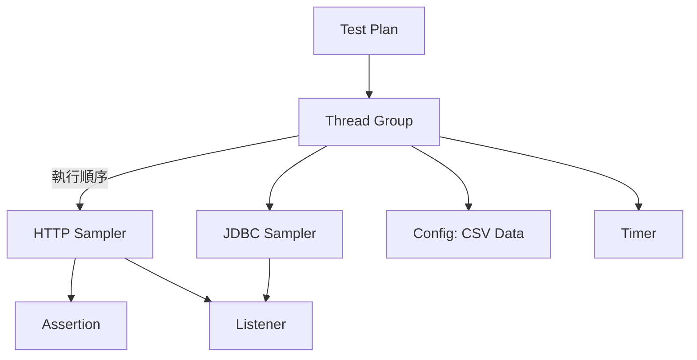
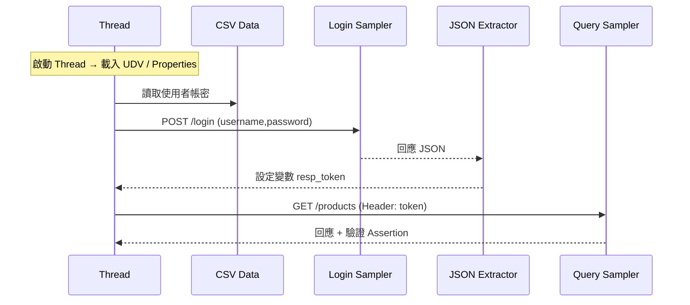
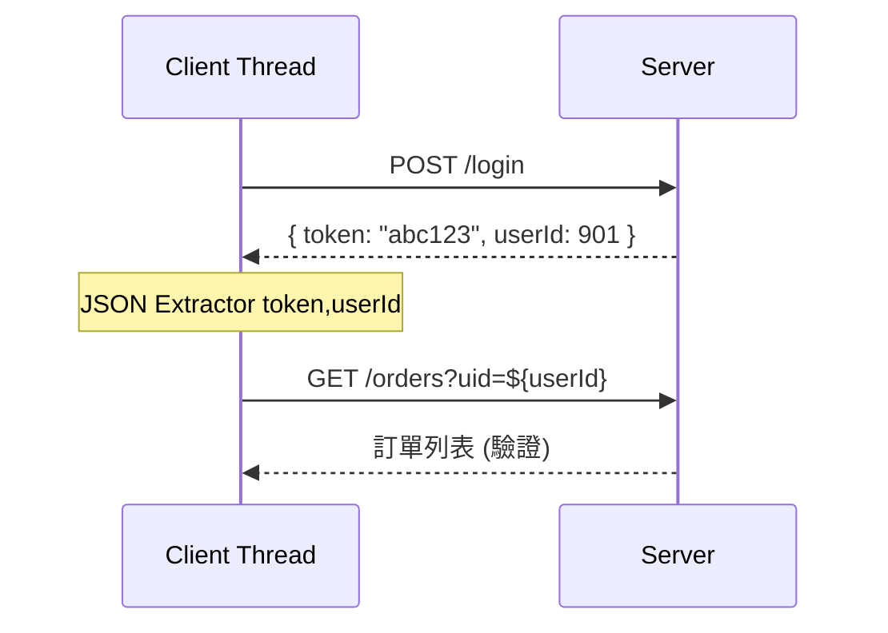
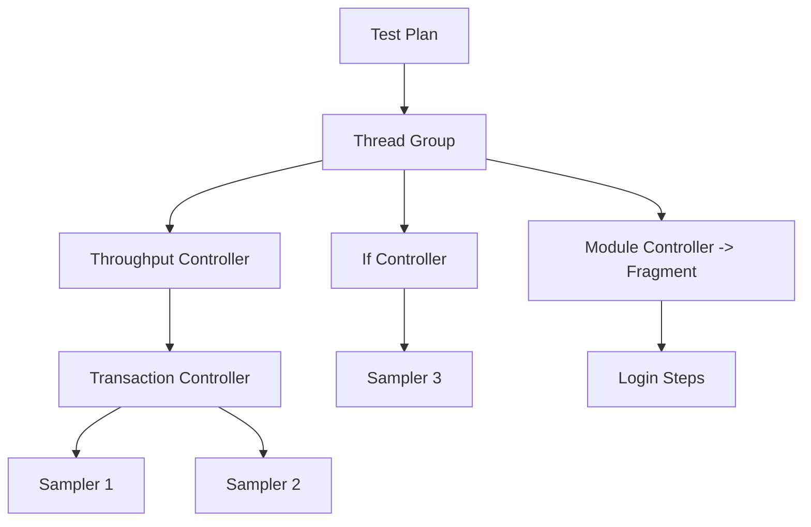
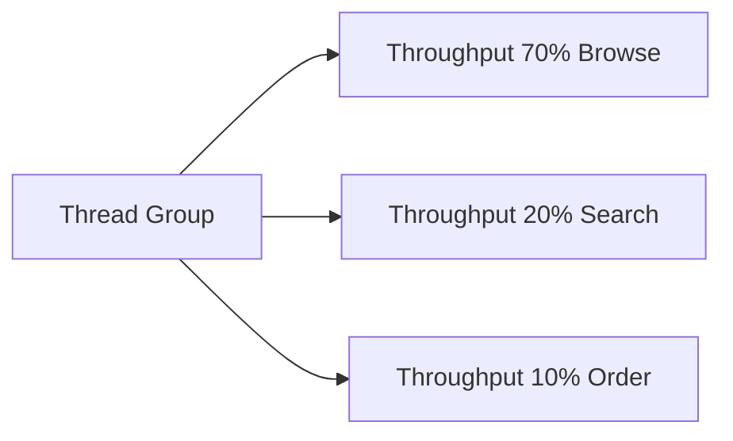
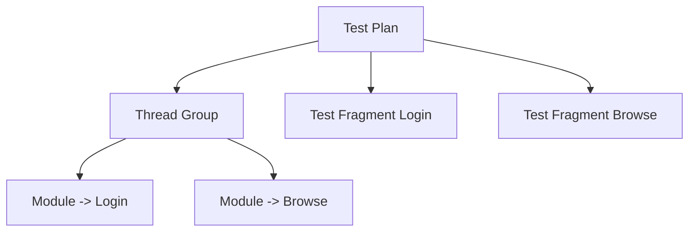
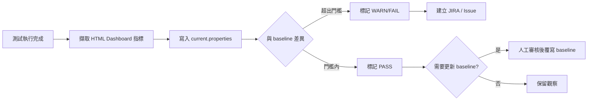
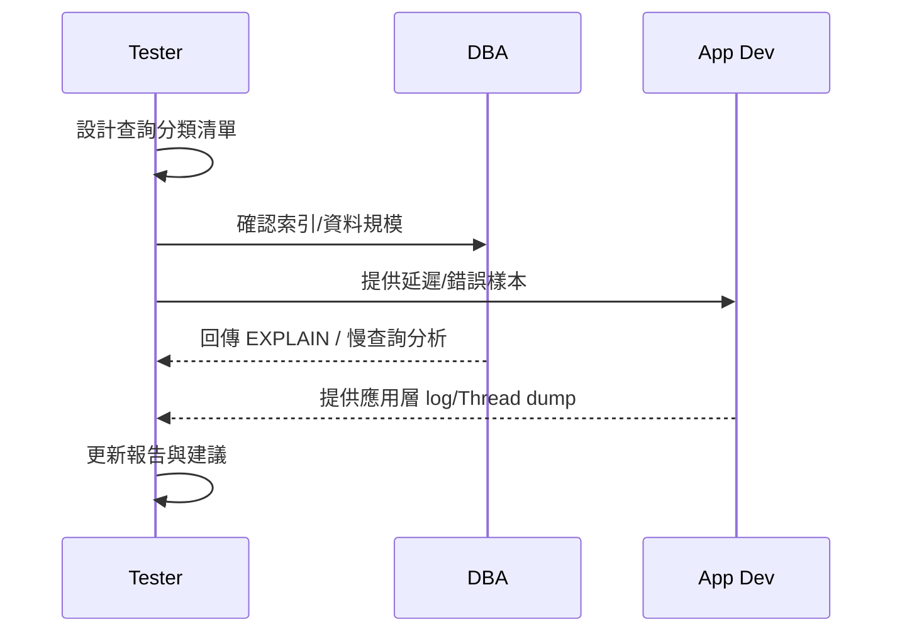

+++
date = '2025-10-31T00:00:00+08:00'
draft = false
title = 'Jmeter使用教學'
tags = ['教學', '工具']
categories = ['教學']
+++
# Apache JMeter 使用教學手冊

> 版本：v1.0（已完成第 1–16 章與附錄 A–E；持續維護優化）  
> 適用對象：完全未接觸過效能測試 / JMeter 的新進開發與測試人員  
> 文件目標：協助 1~2 天內快速具備撰寫並執行基本壓力測試腳本的能力，並建立後續進階自學基礎。

---

## 快速導讀

若你是第一次接觸 JMeter，建議依序閱讀：

1. Part 1（必讀）：了解 JMeter 是什麼、安裝、基礎 GUI 操作。
2. Part 2：學會設計一個可維護的測試計畫（參數化、控制器、Assertion）。
3. Part 3：掌握報表分析與常見最佳實務（非 GUI、分散式、效能瓶頸初步診斷）。
4. Part 4：實戰情境（API / Web / DB / 企業案例）。
5. Part 5：若需考 JMeter 認證或建置團隊基準能力。
6. 附錄：錯誤排除、報告範本、學習資源、Checklist。

---

<!-- TOC-AUTO-BEGIN -->
## 目錄（Table of Contents）

### Part 1. 基礎入門（Ch.1–3）

- [JMeter 簡介](#1-jmeter-簡介)
  - [1.1 JMeter 的定位與用途](#11-jmeter-的定位與用途)
  - [1.2 常見測試類型](#12-常見測試類型)
  - [1.3 與其他工具比較](#13-與其他工具比較)
  - [1.4 概念流程圖](#14-概念流程圖)
  - [1.5 本章實務案例](#15-本章實務案例)
  - [1.6 注意事項（初學者常犯）](#16-注意事項初學者常犯)

- [安裝與環境設定](#2-安裝與環境設定)
  - [2.1 系統需求](#21-系統需求)
  - [2.2 下載來源](#22-下載來源)
  - [2.3 安裝流程](#23-安裝流程)
  - [2.4 目錄結構](#24-目錄結構)
  - [2.5 常見安裝問題](#25-常見安裝問題)
  - [2.6 調整啟動參數](#26-調整啟動參數)
  - [2.7 本章實務練習](#27-本章實務練習)
  - [2.8 注意事項](#28-注意事項)

- [JMeter 使用者介面 (GUI)](#3-jmeter-使用者介面-gui)
  - [3.1 元件總覽](#31-元件總覽)
  - [3.2 建立第一個測試計畫hello-http](#32-建立第一個測試計畫hello-http)
  - [3.3 儲存與版本控管](#33-儲存與版本控管)
  - [3.4 GUI 效能使用守則](#34-gui-效能使用守則)
  - [3.5 mermaid基本測試計畫組成](#35-mermaid基本測試計畫組成)
  - [3.6 本章實務練習](#36-本章實務練習)
  - [3.7 常見初階錯誤](#37-常見初階錯誤)
  - [3.8 小結](#38-小結)

### Part 2. 測試計畫設計（Ch.4–7）

- [測試計畫基礎](#4-測試計畫基礎)
  - [4.1 目標與原則](#41-目標與原則)
  - [4.2 命名規範建議](#42-命名規範建議)
  - [4.3 推薦資料夾結構](#43-推薦資料夾結構)
  - [4.4 mermaid資源關聯示意](#44-mermaid資源關聯示意)
  - [4.5 thread-group-策略](#45-thread-group-策略)
  - [4.6 api-測試模板可複製](#46-api-測試模板可複製)
  - [4.7 指標定義（在 README 或測試說明中標準化）](#47-指標定義在-readme-或測試說明中標準化)
  - [4.8 include-controller-與-test-fragment-模組化](#48-include-controller-與-test-fragment-模組化)
  - [4.9 變數與屬性作用域預告](#49-變數與屬性作用域預告)
  - [4.10 mermaid執行流程含變數注入](#410-mermaid執行流程含變數注入)
  - [4.11 非-gui-執行模板指令](#411-非-gui-執行模板指令)
  - [4.12 實務練習](#412-實務練習)
  - [4.13 常見錯誤與陷阱](#413-常見錯誤與陷阱)
  - [4.14 小結](#414-小結)

- [參數化與資料驅動測試](#5-參數化與資料驅動測試)
  - [5.1 為什麼需要參數化](#51-為什麼需要參數化)
  - [5.2 變數來源一覽](#52-變數來源一覽)
  - [5.3 csv-data-set-config-深入](#53-csv-data-set-config-深入)
  - [5.4 user-defined-variables-vs-properties](#54-user-defined-variables-vs-properties)
  - [5.5 correlation動態值提取](#55-correlation動態值提取)
  - [5.6 api-回應範例與抽取](#56-api-回應範例與抽取)
  - [5.7 函數助手functions常用清單](#57-函數助手functions常用清單)
  - [5.8 變數覆蓋與優先序邏輯觀念](#58-變數覆蓋與優先序邏輯觀念)
  - [5.9 groovy--jsr223-活用](#59-groovy--jsr223-活用)
  - [5.10 非-gui-參數覆寫技巧](#510-非-gui-參數覆寫技巧)
  - [5.11 常見錯誤與排除](#511-常見錯誤與排除)
  - [5.12 實務練習](#512-實務練習)
  - [5.13 小結](#513-小結)

- [控制器與流程控制 logic-controllers](#6-控制器與流程控制-logic-controllers)
  - [6.1 控制器分類概覽](#61-控制器分類概覽)
  - [6.2 loop--while--foreach-差異](#62-loop--while--foreach-差異)
  - [6.3 if--switch--runtime-controller](#63-if--switch--runtime-controller)
  - [6.4 throughput-controller-與場景比例](#64-throughput-controller-與場景比例)
  - [6.5 transaction-controller-與聚合分析](#65-transaction-controller-與聚合分析)
  - [6.6 module--include-controller-模組化](#66-module--include-controller-模組化)
  - [6.7 flow-control-action-中斷與暫停](#67-flow-control-action-中斷與暫停)
  - [6.8 控制器選擇決策矩陣](#68-控制器選擇決策矩陣)
  - [6.9 常見-anti-pattern-與重構](#69-常見-anti-pattern-與重構)
  - [6.10 綜合實務案例](#610-綜合實務案例)
  - [6.11 練習](#611-練習)
  - [6.12 小結](#612-小結)

- [assertion-斷言與結果驗證策略](#7-assertion-斷言與結果驗證策略)
  - [7.1 為什麼需要明確斷言策略](#71-為什麼需要明確斷言策略)
  - [7.2 常見-assertion-類型比較](#72-常見-assertion-類型比較)
  - [7.3 狀態碼與錯誤分類](#73-狀態碼與錯誤分類)
  - [7.4 json--正則--xpath--size-使用情境](#74-json--正則--xpath--size-使用情境)
  - [7.5 duration--sla-與-p95-判讀](#75-duration--sla-與-p95-判讀)
  - [7.6 動態門檻-baseline--properties](#76-動態門檻-baseline--properties)
  - [7.7 失敗策略fail-fast-vs-收集模式](#77-失敗策略fail-fast-vs-收集模式)
  - [7.8 減少斷言開銷的最佳實務](#78-減少斷言開銷的最佳實務)
  - [7.9 錯誤訊息標準化](#79-錯誤訊息標準化)
  - [7.10 實務案例登入--查詢--下單](#710-實務案例登入--查詢--下單)
  - [7.11 練習](#711-練習)
  - [7.12 小結](#712-小結)

### Part 3. 進階應用（Ch.8–10）

- [報表與結果分析](#8-報表與結果分析)
  - [8.1 核心指標再回顧](#81-核心指標再回顧)
  - [8.2 summary--aggregate-report-差異](#82-summary--aggregate-report-差異)
  - [8.3 html-dashboard-產出與指標](#83-html-dashboard-產出與指標)
  - [8.4 百分位數-percentile-判讀策略](#84-百分位數-percentile-判讀策略)
  - [8.5 error-分類與來源拆解](#85-error-分類與來源拆解)
  - [8.6 建立-baseline-與版本對比流程](#86-建立-baseline-與版本對比流程)
  - [8.7 異常模式pattern辨識](#87-異常模式pattern辨識)
  - [8.8 active-threads-與-throughput-關聯](#88-active-threads-與-throughput-關聯)
  - [8.9 實務指標判讀工作表](#89-實務指標判讀工作表)
  - [8.10 自動化輸出建議](#810-自動化輸出建議)
  - [8.11 小結](#811-小結)

- [效能最佳實務](#9-效能最佳實務)
  - [9.1 Thread 數 vs RPS (Requests Per Second) 推估](#91-thread-數-vs-rps-requests-per-second-推估)
  - [9.2 升壓模式與-ramp-up-策略](#92-升壓模式與-ramp-up-策略)
  - [9.3 暖機-warm-up-與資料清洗](#93-暖機-warm-up-與資料清洗)
  - [9.4 減少腳本端資源干擾](#94-減少腳本端資源干擾)
  - [9.5 測試資料生命週期與汙染防護](#95-測試資料生命週期與汙染防護)
  - [9.6 脚本組織與模組化回顧](#96-脚本組織與模組化回顧-與第-4--6-章呼應)
  - [9.7 系統資源觀測建議 (外部協同)](#97-系統資源觀測建議-外部協同)
  - [9.8 性能退化-regression-早期偵測](#98-性能退化-regression-早期偵測)
  - [9.9 GC 與 JVM 觀察（若系統為 JVM）](#99-gc-與-jvm-觀察若系統為-jvm)
  - [9.10 常見瓶頸快速定位路徑](#910-常見瓶頸快速定位路徑)
  - [9.11 測試環境一致性與可重複性](#911-測試環境一致性與可重複性)
  - [9.12 anti-pattern-與改進建議](#912-anti-pattern-與改進建議)
  - [9.13 小結](#913-小結)

- [cicd-與自動化整合](#10-cicd-與自動化整合)
  - [10.1 測試類型在-pipeline-的定位](#101-測試類型在-pipeline-的定位)
  - [10.2 非-gui-執行標準化腳本](#102-非-gui-執行標準化腳本)
  - [10.3 退出碼策略-exit-code-policy](#103-退出碼策略-exit-code-policy)
  - [10.4 基準值-baseline-檔與差異比較](#104-基準值-baseline-檔與差異比較)
  - [10.5 GitHub Actions 範例 (Smoke Performance)](#105-github-actions-範例-smoke-performance)
  - [10.6 jenkins-pipeline-範例](#106-jenkins-pipeline-範例)
  - [10.7 多環境參數化與組態管理](#107-多環境參數化與組態管理)
  - [10.8 artifacts-與報告留存策略](#108-artifacts-與報告留存策略)
  - [10.9 baseline-自動更新準則](#109-baseline-自動更新準則)
  - [10.10 測試分層在-pipeline-的選擇](#1010-測試分層在-pipeline-的選擇)
  - [10.11 常見整合問題與排除](#1011-常見整合問題與排除)
  - [10.12 小結](#1012-小結)

### Part 4. 專案實戰（Ch.11–13）

- [api-實戰案例](#11-api-實戰案例)
  - [11.1 場景拆解與使用者行為模型](#111-場景拆解與使用者行為模型)
  - [11.2 測試計畫結構範例](#112-測試計畫結構範例)
  - [11.3 correlation-與資料流](#113-correlation-與資料流)
  - [11.4 測試資料策略](#114-測試資料策略)
  - [11.5 控制器設計與比例實現](#115-控制器設計與比例實現)
  - [11.6 sla-與-assertions-範例](#116-sla-與-assertions-範例)
  - [11.7 交易-transaction-分析](#117-交易-transaction-分析)
  - [11.8 失敗恢復與重試策略](#118-失敗恢復與重試策略)
  - [11.9 定時器-timer-與節奏-pacing](#119-定時器-timer-與節奏-pacing)
  - [11.10 報表截取與指標彙整模板](#1110-報表截取與指標彙整模板)
  - [11.11 常見錯誤與排查清單（本案例）](#1111-常見錯誤與排查清單本案例)
  - [11.12 小結](#1112-小結)

- [web--前端資源載入](#12-web--前端資源載入)
  - [12.1 瀏覽器-vs-jmeter-差異](#121-瀏覽器-vs-jmeter-差異)
  - [12.2 靜態資源測試策略](#122-靜態資源測試策略)
  - [12.3 cache-與條件式請求模擬](#123-cache-與條件式請求模擬)
  - [12.4 gzip--brotli-壓縮觀察](#124-gzip--brotli-壓縮觀察)
  - [12.5 SPA (Single Page App) API 測試](#125-spa-single-page-app-api-測試)
  - [12.6 下載資源組合測試範例](#126-下載資源組合測試範例)
  - [12.7 資源異常與退化判斷](#127-資源異常與退化判斷)
  - [12.8 與前端效能工具協同](#128-與前端效能工具協同)
  - [12.9 報表與度量聚合](#129-報表與度量聚合)
  - [12.10 小結](#1210-小結)

- [資料庫--第三方整合](#13-資料庫--第三方整合)
  - [13.1 jdbc-sampler-基礎](#131-jdbc-sampler-基礎)
  - [13.2 連線池 (Connection Pool) 考量](#132-連線池-connection-pool-考量)
  - [13.3 查詢分類與指標](#133-查詢分類與指標)
  - [13.4 慢查詢模擬與觀測](#134-慢查詢模擬與觀測)
  - [13.5 測試資料與回滾策略](#135-測試資料與回滾策略)
  - [13.6 外部依賴模擬-stub--mock](#136-外部依賴模擬-stub--mock)
  - [13.7 佇列--非同步行為測試](#137-佇列--非同步行為測試)
  - [13.8 整合指標交叉分析](#138-整合指標交叉分析)
  - [13.9 與後端團隊協同流程](#139-與後端團隊協同流程)
  - [13.10 小結](#1310-小結)

### Part 5. 認證與進階知識（Ch.14–16）

- [認證考試重點](#14-認證考試重點)
  - [14.1 主題分佈映射](#141-主題分佈映射)
  - [14.2 必背術語速覽](#142-必背術語速覽)
  - [14.3 高頻陷阱類型](#143-高頻陷阱類型)
  - [14.4 模擬測驗檢查清單](#144-模擬測驗檢查清單)
  - [14.5 考前-24-小時節奏](#145-考前-24-小時節奏)
  - [14.6 Flash Cards（示例）](#146-flash-cards示例)
  - [14.7 小結](#147-小結)

- [題庫與解析框架](#15-題庫與解析框架)
  - [15.1 題型分類維度](#151-題型分類維度)
  - [15.2 題目-yaml-標準](#152-題目-yaml-標準)
  - [15.3 解析四段式框架](#153-解析四段式框架)
  - [15.4 題庫品質控制構想](#154-題庫品質控制構想)
  - [15.5 題庫版本流程](#155-題庫版本流程)
  - [15.6 練習集建議配置](#156-練習集建議配置)
  - [15.7 小結](#157-小結)

- [進階學習與延伸](#16-進階學習與延伸)
  - [16.1 進階主題地圖](#161-進階主題地圖)
  - [16.2 性能成熟度模型](#162-性能成熟度模型)
  - [16.3 延遲與異常分析起步](#163-延遲與異常分析起步)
  - [16.4 trace-整合實務](#164-trace-整合實務)
  - [16.5 持續優化季度節奏](#165-持續優化季度節奏)
  - [16.6 推薦延伸資源](#166-推薦延伸資源)
  - [16.7 小結](#167-小結)

### Part 6. 附錄（Appendices）

- [附錄 A. 最終測試計畫 Checklist](#附錄-a-最終測試計畫-checklist)
- [附錄 B. 常見錯誤--緊急排障對照](#附錄-b-常見錯誤--緊急排障對照)
- [附錄 C. 範例報告模板摘要草稿](#附錄-c-範例報告模板摘要草稿)
- [附錄 D. 建議檔案--目錄標準化命名](#附錄-d-建議檔案--目錄標準化命名)
- [附錄 E. 後續可延伸主題進階](#附錄-e-後續可延伸主題進階)

<!-- TOC-AUTO-END -->

---

<!-- 已於目錄區塊呈現 Part 1 標題，避免重複 Heading -->

### 1. JMeter 簡介

#### 1.1 JMeter 的定位與用途

Apache JMeter 是一款開源（Java 編寫）的負載與效能測試工具，最初設計用於 Web(HTTP) 測試，如今已支援多種協定：HTTP(S)、JDBC、JMS、FTP、TCP、SOAP、gRPC（透過外掛）、MQTT 等。其核心使命：模擬多使用者併發，量測系統在壓力下的反應時間、吞吐量、錯誤率，協助定位瓶頸。

典型使用場景：

- 測試 API 在 100 / 500 / 1000 併發下之平均延遲 (Avg / P95 / P99)
- 驗證新版本部署後的效能回歸
- 預估硬體或雲端資源擴充需求（容量規劃）
- 模擬高峰（行銷活動、批次入帳、補貨作業）

#### 1.2 常見測試類型

| 類型 | 目的 | 範例 | 觀察指標 |
| ---- | ---- | ---- | -------- |
| 負載測試 (Load) | 正常或預期峰值行為 | 0→200 虛擬用戶 | Avg、Throughput、Error% |
| 壓力測試 (Stress) | 找出系統崩潰點 | 持續升壓至錯誤率飆升 | 臨界併發、錯誤率、資源耗盡 |
| 容量測試 (Capacity) | 確定支援多少用戶 | 線性提升 | 穩定最大併發 |
| 耐久/穩定性 (Soak) | 長時間資源洩漏 | 8~24h 低～中壓 | 記憶體、GC、錯誤率趨勢 |
| 基準測試 (Benchmark) | 比較版本或方案 | A/B API 實作 | 同負載指標差異 |

#### 1.3 與其他工具比較

| 工具 | 語言 | 優點 | 適用場景 | 侷限 |
| ---- | ---- | ---- | -------- | ---- |
| JMeter | Java(GUI+非 GUI) | 社群大、外掛多、GUI 低門檻 | 團隊快速導入、多協定 | GUI 高負載時耗資源 |
| Gatling | Scala | 高效、可程式化 DSL | 需程式化與 CI 整合 | 學習曲線偏高 |
| k6 | Go(JavaScript 腳本) | 易寫、Cloud 服務 | API / 微服務雲端 | 某些協定需擴充 |
| Locust | Python | Python 生態 | 自訂行為、流量模型 | 高併發需調整 |
| LoadRunner | 專有 | 功能完整 | 大型企業、複雜協定 | 授權成本高 |

> 選擇建議：若需快速導入 + 多人圖形化協作 + 可擴充 → 先選 JMeter。後續若腳本維護變複雜或需高度程式化，再評估 Gatling / k6。

#### 1.4 概念流程圖

```mermaid
flowchart LR
  A[需求/測試目標] --> B[場景設計]
  B --> C[建置 JMeter Test Plan]
  C --> D[參數化 / 控制器 / 驗證]
  D --> E[本機驗證 (GUI)]
  E --> F[非 GUI / 分散式執行]
  F --> G[結果彙整 / HTML 報表]
  G --> H[分析瓶頸 / 產出結論]
  H --> I[調校 / 回饋開發 / 再測]
```

#### 1.5 本章實務案例

需求：行銷活動預期 500 同時使用者查詢商品 API，需確認 API P95 < 800ms。
行動：建立 JMeter 測試計畫 → Thread Group 設定 500 使用者，Ramp-up 300 秒，持續 5 分鐘 → 檢視 Summary / Aggregate Report。
輸出：若 P95 超標，記錄指標並回報後端做索引或快取優化。

#### 1.6 注意事項（初學者常犯）

- 直接用 GUI 模式跑 1000+ threads 導致本機資源飽和 → 應改非 GUI / 分散式
- 沒加 Assertion 導致錯誤頁面也被當成功 → 一律加 Response Code 或字串驗證
- 無計畫地升壓（一次丟極大併發）→ 無法定位臨界點，改用階梯式（階段性提升）

---

### 2. 安裝與環境設定

#### 2.1 系統需求

- Java：JDK 8+（建議 11 或 17 LTS）
- 記憶體：建議 8GB 以上（壓測機依併發放大）
- OS：Windows / Linux / macOS 均可

#### 2.2 下載來源

- 官方站：<https://jmeter.apache.org/>
- 下載 Binary (zip / tgz) 套件即可（無需 Source）

#### 2.3 安裝流程

Windows：

1. 安裝 JDK（確認 `java -version`）
2. 下載 Apache JMeter 二進位壓縮檔
3. 解壓至例如：`C:\tools\apache-jmeter-5.6.3`
4. 執行 `bin\jmeter.bat`

Linux / macOS：

```bash
tar -xzf apache-jmeter-*.tgz
export JMETER_HOME=~/apache-jmeter-5.6.3
export PATH="$JMETER_HOME/bin:$PATH"
jmeter &
```

#### 2.4 目錄結構

| 目錄 | 說明 |
| ---- | ---- |
| `/bin` | 啟動腳本、非 GUI 執行指令 (`jmeter`, `jmeter-server`) |
| `/lib` | 核心與第三方套件 JAR |
| `/lib/ext` | 放外掛（JMeter Plugins） |
| `/extras` | 轉換工具、範例（如 ant 任務） |
| `/docs` | 官方文件 |

#### 2.5 常見安裝問題

| 問題 | 原因 | 解法 |
| ---- | ---- | ---- |
| 無法啟動 GUI：記憶體錯誤 | 預設 Heap 太小 | 編輯 `bin/jmeter.bat` / `jmeter` 調整 `-Xms1g -Xmx4g` |
| 中文顯示亂碼 | 字型或編碼 | 啟動加參數 `-Dfile.encoding=UTF-8` |
| 無法執行 HTTPS 測試 | 憑證問題 | 匯入 JMeter 產生的 CA 憑證（代理錄製時） |
| JDK 版本不符 | JAVA_HOME 錯誤 | 重新設定環境變數 |

#### 2.6 調整啟動參數

編輯 `bin/jmeter.properties` 或 `user.properties`：

```properties
# 增加結果緩衝 (大量取樣時降低 IO)
mode=batch
# 禁用不必要的 GUI 元件提升穩定性
jmeter.reportgenerator.overall_granularity=60000
```

> 建議：自訂屬性盡量放 `user.properties`，方便版本控制。

#### 2.7 本章實務練習

1. 完成安裝後，執行 `jmeter -v` 確認版本。
2. 調整記憶體參數：設定 `HEAP=-Xms1024m -Xmx4096m`。
3. 建立一個 `user.properties` 並加入：`sample_variables=SESSION_ID`。

#### 2.8 注意事項

- 測試機與被測系統（SUT）應分離 → 避免 CPU / I/O 競爭影響評估
- 控制版本：將 `*.jmx`、`user.properties`、`CSV`、`啟動腳本` 納入 Git
- 測試數據與環境隔離：避免對生產資料造成污染

---

### 3. JMeter 使用者介面 (GUI)

#### 3.1 元件總覽

| 類別 | 代表元件 | 作用 |
| ---- | -------- | ---- |
| Test Plan | Test Plan | 測試計畫根節點、變數與前置設定 |
| Thread Group | Thread Group / Stepping / Ultimate | 模擬使用者併發與執行節奏 |
| Sampler | HTTP Request / JDBC Request / Debug Sampler | 送出實際請求 |
| Config | CSV Data Set / HTTP Header / User Defined | 參數化與預設設定 |
| Logic Controller | If / Loop / Transaction / Throughput | 控制流程與群組化 |
| Timer | Constant / Uniform Random / Think Time | 插入等待模擬真人行為 |
| Pre/Post Processor | Regular Expression Extractor / JSR223 | 請求前後處理、抽取、動態資料 |
| Assertion | Response / Duration / Size | 驗證回應正確性 |
| Listener | View Results Tree / Summary / Aggregate / HTML | 收集與顯示結果 |

#### 3.2 建立第一個測試計畫（Hello HTTP）

步驟：

1. 開啟 JMeter，右鍵 Test Plan → Add → Threads → Thread Group
2. Thread Group 設定：Threads=5、Ramp-up=5、Loop=2
3. 右鍵 Thread Group → Add → Sampler → HTTP Request
   - Server Name: `postman-echo.com`
   - Method: GET
   - Path: `/get`
   - (可加參數) Add → Parameter: `foo=bar`
4. 加入 Listener：右鍵 Thread Group → Add → Listener → View Results Tree、Summary Report
5. 按「綠色 Start」執行
6. 在 View Results Tree 檢視 Request / Response；大量壓測時移除該 Listener，改只保留 Summary Report。

#### 3.3 儲存與版本控管

- 檔案 → Save Test Plan As → `api_basic.jmx`
- 建議：一個主計畫 + 多個模組化 Include Controller（後續 Part 2 說明）
- 以 Git 管理：提交時附測試說明 README（含測試目標、指標、版本）

#### 3.4 GUI 效能使用守則

| 守則 | 原因 |
| ---- | ---- |
| 減少不必要的 Listener（尤其是 View Results Tree） | 占用大量記憶體與 I/O |
| 大規模壓測改用非 GUI (`jmeter -n`) | GUI 只是設計工具，不適合生產壓力 |
| 使用 CSV 而非巨量插件輸出 | 降低即時刷新成本 |
| 啟動前清除舊結果 | 避免誤判與累積資料 |

#### 3.5 Mermaid：基本測試計畫組成



#### 3.6 本章實務練習

建立 `postman-echo` 測試：

1. Threads=10，Ramp-up=10，Loop=3
2. 新增 Uniform Random Timer：延遲 500ms ±300ms
3. 新增 Response Assertion：包含字串 `"args"`
4. 執行後觀察錯誤率=0 並記錄 Avg、Min、Max。

#### 3.7 常見初階錯誤

- 把 Ramp-up=0：所有 threads 同時啟動 → 導致服務突刺
- 忘記加 Timer：與實際使用者行為不符
- 不加 Assertion：錯誤回應被忽略

#### 3.8 小結

你現在應能：

- 安裝並啟動 JMeter
- 認識主要元件類別
- 建立並執行簡單 HTTP 測試
接下來 Part 2 將深化：參數化、控制流程、可維護架構與驗證策略。

---

（後續章節將於下一階段回覆補上）

---

### 4. 測試計畫基礎

#### 4.1 目標與原則

設計一個可維護、可重複、可擴充的測試計畫，重點：

- 可讀性：命名清楚、層次分明
- 可參數化：資料與腳本分離
- 可重複：環境差異靠變數 / properties 切換
- 可驗證：Assertion 一致、指標明確
- 可擴充：模組化（登入、下單、查詢）可被重用

#### 4.2 命名規範建議

| 類型 | 命名格式 | 範例 | 說明 |
| ---- | -------- | ---- | ---- |
| Test Plan 檔名 | `<domain>-<scenario>-v<版號>.jmx` | `ecommerce-search-v1.jmx` | 區分領域與場景 |
| Thread Group | `[TG]<用途>-<併發>-<階段>` | `[TG]SearchUsers-200-Steady` | 指明角色與型態 |
| Sampler | `<動詞><資源><目的>` | `GET Product Detail` / `POST Login` | 首字大寫空格分隔 |
| 變數 (User Defined) | `udv_<語意>` | `udv_baseUrl` | 前綴辨識來源 |
| CSV 欄位 | `snake_case` | `product_id` | 與 API JSON 對應 |
| 取樣結果變數 | `resp_<語意>` | `resp_token` | 後續調用清楚 |
| Properties | `env.<key>` | `env.host.api` | 區分環境級別 |

#### 4.3 推薦資料夾結構

測試資源與腳本放入版本控管（例：`/perf-test`）：

```text
perf-test/
  README.md                 # 測試目標與指標定義
  env/
    dev.properties
    qa.properties
    prod.properties.disabled
  data/
    users.csv
    products.csv
  scripts/
    ecommerce-login.jmx
    ecommerce-search.jmx
    modules/
      login-fragment.jmx    # Test Fragment (登入流程)
      search-fragment.jmx   # 可被多場景 include
  reports/
    2025-09-17-search-load-test/
      dashboard/            # HTML 報表輸出
      raw.jtl               # 原始結果
  bin/
    run-search-dev.bat
    run-search-dev.sh
```

#### 4.4 Mermaid：資源關聯示意

```mermaid
graph LR
  A[Test Plan] --> B[Thread Group]
  B --> C{Modules / Include}
  C --> C1[Login Fragment]
  C --> C2[Search Fragment]
  A --> D[User Defined Variables]
  A --> E[Properties(env.*)]
  B --> F[CSV Data]
  B --> G[Samplers]
  G --> H[Assertions]
  G --> I[Listeners]
```

#### 4.5 Thread Group 策略

| 策略 | 使用時機 | 參數重點 | 風險 |
| ---- | -------- | -------- | ---- |
| 固定併發 (Classic Thread Group) | 基本負載或小測試 | Threads、Ramp-up、Loop | 不易模擬梯度升壓 |
| 階梯升壓 (Stepping / Ultimate) | 找臨界點、穩定拉升 | 每階段增量、Hold 時間 | 配置錯誤導致峰值過快 |
| 到達目標 RPS (Throughput Shaping + Concurrency) | 以 TPS/RPS 為主 | 時間曲線、RPS 平臺 | 需要插件支援 |
| 長時間穩定 (Soak) | 記憶體洩漏/資源穩定性 | 延長 Duration、較低併發 | 監控需同步進行 |

計算基礎：


```text
併發數 (Concurrency) ≈ 每秒請求數 (RPS) * 平均回應時間(秒)
```

例如：目標 RPS=100，Avg RT=0.5s → 須約 50 Threads（可加 10~20% buffer）。

#### 4.6 API 測試模板（可複製）

建立一個「模組化可重用」HTTP Sampler + 變數設計：


```text
元件階層：
Test Plan
  -> User Defined Variables (udv_baseUrl, udv_authPath)
  -> Thread Group [TG]LoginAndQuery-100-Steady
    -> CSV Data Set Config (users.csv: username,password)
    -> HTTP Request: POST ${udv_authPath}/login
      Body(JSON): {"user":"${username}","pwd":"${password}"}
    -> JSON Extractor: token 目標路徑 $.data.token 儲存為 resp_token
    -> HTTP Header Manager: Authorization=Bearer ${resp_token}
    -> HTTP Request: GET ${udv_baseUrl}/api/products?id=${__CSVRead(products.csv,0)}
    -> Response Assertion: Contains "success"
    -> Listener: Summary Report
```


建議使用 JSON Extractor (新版) 取代舊式 Regular Expression 抽取 JSON。

#### 4.7 指標定義（在 README 或測試說明中標準化）

| 指標 | 說明 | 典型門檻 | 來源 |
| ---- | ---- | -------- | ---- |
| Avg Response Time | 平均回應時間 | < 300ms（查詢類） | Aggregate Report |
| P95 / P99 | 95/99 百分位延遲 | P95 < 800ms | HTML Dashboard / JTL 分析 |
| Error % | 失敗比例（Assertion+HTTP Code） | < 1% | Summary / Aggregate |
| Throughput | 每秒完成取樣數 | 依需求 | Aggregate / Dashboard |
| Active Threads | 當前執行 threads | 是否穩定 | Backend Listener / Console |
| CPU / Memory / GC | 系統資源 | 不飽和或趨勢平穩 | APM / 系統監控（外部） |
| DB Query Time | 後端瓶頸 | 熱點查詢需 < 門檻 | APM / SQL Profiler |

#### 4.8 Include Controller 與 Test Fragment 模組化

拆分重複流程：

1. 新建一個 `login-fragment.jmx`，在其中建立 Test Fragment（非 Thread Group）。
2. 主測試計畫使用 Include Controller 引用該檔。
3. 好處：

- 多場景共用登入 / 取得 token
- 異動集中維護
- 減少複製貼上導致的版本漂移

#### 4.9 變數與屬性作用域（預告）

本章先理解：User Defined Variables 在 Test Plan 載入時解析；CSV 在執行階段 per thread 讀取；抽取器（Extractor）在 Sampler 執行後注入。詳細優先序 Part 5 展開。

#### 4.10 Mermaid：執行流程（含變數注入）



#### 4.11 非 GUI 執行模板指令


```bash
jmeter -n -t scripts/ecommerce-search.jmx -q env/dev.properties -l reports/2025-09-17-search-load-test/raw.jtl -e -o reports/2025-09-17-search-load-test/dashboard
```

參數說明：

- `-n` 非 GUI 模式
- `-t` 指定 jmx 腳本
- `-q` 載入環境屬性檔（可多次）
- `-l` 輸出 jtl 結果檔
- `-e -o` 生成 HTML Dashboard

Windows 批次檔範例（`bin/run-search-dev.bat`）：

```bat
@echo off
set DATE=%DATE:~0,10%
set REPORT_DIR=reports\%DATE%-search-load-test
mkdir %REPORT_DIR%\dashboard 2>nul
jmeter -n -t scripts\ecommerce-search.jmx -q env\dev.properties -l %REPORT_DIR%\raw.jtl -e -o %REPORT_DIR%\dashboard
```

#### 4.12 實務練習

目標：建立「登入 + 查詢」組合場景，100 使用者，Ramp-up 60 秒，持續 5 分鐘（可用 Loop Controller 搭配 Scheduler 或 Constant Throughput Timer 調整）。

1. 建立資料檔 `users.csv`：`user01,password01` ...
2. 建立 `login-fragment.jmx` 含 Login Sampler + JSON Extractor。
3. 主場景引用 Include Controller。
4. 加入 `Search` Sampler 使用 token。
5. 設定 Assertion：HTTP 200 + 回應包含 `"success"`。
6. 非 GUI 執行並匯出 HTML 報表。
7. 記錄：Avg / P95 / Throughput / Error%。

#### 4.13 常見錯誤與陷阱

- 在多 Thread Group 中各自複製登入邏輯 → 無法集中維護 → 請改 Test Fragment
- 無斷言（Error%=0 但實際 500）→ 一律加至少 1 個成功判斷
- CSV 未勾選 `Recycle on EOF` 且資料不足 → 後續使用者空值錯誤
- Ramp-up 設為極低導致瞬間尖峰不符合真實行為
- 將結果 Listener 全部保留在大壓測 → 記憶體爆滿

#### 4.14 小結

你現在應能：

- 制定命名規範與資料夾結構
- 以模組化方式重用登入 / 查詢流程
- 依據指標設定 Thread Group 策略
- 使用非 GUI 模式生成報表

接下來第 5 章將處理「參數化、變數作用域與 Correlation」。

---

### 5. 參數化與資料驅動測試

#### 5.1 為什麼需要參數化？

避免硬編（hardcode）提高可維護性、可重複性與環境可移植性：

- 測試資料可批次更新（CSV）
- 環境位址、認證、Port 改動不需修改多處 Sampler
- 支援多場景共享登入 Token / 動態 ID
- 強化可觀測性（變數命名即文件）

#### 5.2 變數來源一覽

| 類型 | 設定位置 | 生效時機 | 作用域 | 常見用途 |
| ---- | -------- | -------- | ------ | -------- |
| User Defined Variables | Test Plan / 元件屬性 | Test Plan 載入 | 全域 (Test Plan) | Base URL、共用路徑 |
| CSV Data Set Config | 元件配置 | 每 Thread 讀取 | 該 Thread | 帳號、測試資料列 |
| Properties (`-q`) | 外部檔 / 啟動參數 | 啟動時 | 全域唯讀 (可程式修改) | 環境 host、超時、開關 |
| 系統屬性 (`-D`) | JVM 啟動 | 啟動時 | 全域 | 編碼、憑證路徑 |
| Extractor 變數 | 回應處理後 | Sampler 執行後 | 當前 Thread | Token、動態 ID、下一請求參數 |
| 函數助手 `${__time()}` | 執行階段 | 呼叫時 | 呼叫點 | 動態時間、亂數 |
| JSR223 (Groovy) | 腳本 | 執行階段 | 依設定 | 複雜邏輯、計算 |

#### 5.3 CSV Data Set Config 深入

關鍵設定：

| 欄位 | 說明 | 建議 |
| ---- | ---- | ---- |
| Filename | CSV 路徑 | 相對於 JMX 或使用絕對路徑 |
| File Encoding | 編碼 | UTF-8 |
| Variable Names | 自訂欄名 | 不填則讀第一列當標頭 |
| Delimiter | 預設逗號 | 可改 `;` 或 `\t` |
| Recycle on EOF? | 讀到結尾是否回捲 | 壓力測試多循環時通常勾選 |
| Stop thread on EOF? | 到結尾是否結束 | 使用一次性資料時可啟用 |
| Sharing Mode | how threads share | 一般用 `All Threads`；避免重複可用 `Current thread` |

避免常見錯誤：

- 資料列不足 → Threads > CSV 行數且未回捲
- 共享模式錯誤 → 多 Thread 爭用導致資料覆寫（應拆多檔或改 Sharing Mode）

#### 5.4 User Defined Variables vs Properties

| 比較 | UDV | Properties |
| ---- | --- | ---------- |
| 設定方式 | GUI / Test Plan | `user.properties` / `-q` 參數 |
| 讀取語法 | `${變數名}` | `${__P(key,default)}` / `${__property(key,default)}` |
| 可修改 | 執行中不建議改動 | 可在 JSR223 透過 `props.put()` |
| 使用時機 | 腳本結構性常量 | 跨腳本、環境差異 |

示例：在 `env/dev.properties`：


```properties
env.host.api=https://dev.api.example.com
env.timeout.ms=3000
```

HTTP Request Server Name 可寫：`${__P(env.host.api,https://fallback)}`。

#### 5.5 Correlation（動態值提取）

動態值（Token、Session、動態 ID）需從回應中抽出再帶入下一請求。流程：




常用抽取器：

| 類型 | 優點 | 適用 |
| ---- | ---- | ---- |
| JSON Extractor | 簡潔、支援 JSONPath | REST/JSON API |
| Regular Expression Extractor | 通用 | HTML / 混合格式 |
| CSS Selector Extractor | HTML DOM | Web 回應 |
| JSR223 (Groovy) | 高度彈性 | 複雜轉換 |

JSON Extractor 設定範例：

| 項目 | 值 |
| ---- | --- |
| Names of created variables | `resp_token;resp_userId` |
| JSONPath expressions | `$.token;$.user.id` |
| Match Numbers | `1;1` |
| Default Values | `N/A;0` |

#### 5.6 API 回應範例與抽取

假設登入回應：


```json
{
  "status":"success",
  "token":"eyJhbGciOi...",
  "user":{ "id":901, "roles":["USER","VIP"] },
  "expires":1694863200000
}
```

後續查詢訂單：`GET /api/orders?uid=${resp_userId}`，Header：`Authorization: Bearer ${resp_token}`。

#### 5.7 函數助手（Functions）常用清單

| 函數 | 用途 | 範例 | 備註 |
| ---- | ---- | ---- | ---- |
| `${__time(yyyyMMdd-HHmmss,)}` | 產生時間字串 | 報告識別 | 尾逗號避免直接黏接 |
| `${__Random(1,1000,myRand)}` | 指定區間亂數 | `${myRand}` | 需命名第三參數 |
| `${__UUID()}` | 產生 UUID | 事務唯一鍵 | |
| `${__groovy(UUID.randomUUID())}` | Groovy 自訂 | 更複雜邏輯 | 使用 JSR223 引擎 |

#### 5.8 變數覆蓋與優先序（邏輯觀念）

從「最近、動態」到「最早、靜態」：


```mermaid
graph TD
  A[Extractor 變數] --> B[函數生成]
  B --> C[CSV Data]
  C --> D[User Defined Variables]
  D --> E[Properties (__P)]
  E --> F[系統屬性 -D]
```

解析順序說明：

1. Test Plan 載入：UDV、Properties、系統屬性已可解析
2. 執行階段：CSV 每 Thread/迴圈填入
3. Sampler 回應後：Extractor 注入 -> 覆蓋同名早期值

命名防衝突建議：

- 抽取變數加前綴：`resp_` 或 `ext_`
- CSV 來源加前綴：`csv_`
- 只讀屬性加前綴：`prop_`（透過 props 轉存時）

#### 5.9 Groovy / JSR223 活用

優先使用 JSR223 + Groovy（效能佳）。

設定腳本 cache：在 JSR223 元件勾選「Cache compiled script」以降低反覆編譯成本。

範例：動態組合查詢參數與基本驗證：


```groovy
// 於 JSR223 PreProcessor
def id = vars.get('resp_userId') ?: '0'
def q = "status=ACTIVE&userId=${id}&ts=" + System.currentTimeMillis()
vars.put('queryString', q)

// 簡單防呆
if(!vars.get('resp_token')) {
  log.warn('token missing, will mark next request')
}
```

後續 Sampler Path：`/api/orders?${queryString}`。

#### 5.10 非 GUI 參數覆寫技巧

啟動時覆寫/補充 Properties：


```bash
jmeter -n -t scripts/ecommerce-search.jmx -q env/dev.properties -Jenv.host.api=https://override.dev.local -Jramp.users=200
```

在腳本使用：`${__P(ramp.users,100)}`。

#### 5.11 常見錯誤與排除

| 問題 | 症狀 | 原因 | 解法 |
| ---- | ---- | ---- | ---- |
| 變數顯示未替換 `${var}` | 回應或 Header 原樣 | 未定義或拼字錯誤 | 使用 Debug Sampler / View Results Tree |
| CSV 空白值 | Null / 空字串 | 行尾多逗號或 BOM | 重新存 UTF-8 無 BOM |
| 抽取失敗 | 預期變數=Default | JSONPath 不匹配 | 用 JSON Path 線上測試 |
| RPS 不穩定 | Threads 波動 | CSV IO 或 GC | 減少同步 IO、提升 Heap |
| Token 過期 | 401 / 403 增加 | 測試持續時間長 | 加入定期重新登入流程 |

#### 5.12 實務練習

建立「登入 → 查詢 → 建立訂單」場景：

1. `users.csv`：帳號密碼 50 筆
2. Login Sampler + JSON Extractor：`resp_token`、`resp_userId`
3. GET /products 使用 CSV 產品列表（`products.csv`）
4. POST /orders：Body 帶 `${resp_userId}` 與隨機產品 ID
5. Assertion：訂單建立回應包含 `orderId`
6. 變數命名統一：`resp_` 前綴
7. 以 `-Jramp.users` 傳入不同併發觀察 P95 差異

#### 5.13 小結

你現在應能：

- 使用 CSV/UDV/Properties 區分資料層級
- 實作 Correlation（Token / ID 抽取）
- 理解變數優先序與覆蓋策略
- 使用 Groovy 動態組裝請求
- 以啟動參數覆寫環境設定

下一章（第 6 章）將深入控制流程（Loop / If / Transaction / Throughput）與測試場景組合技術。

---

### 6. 控制器與流程控制 (Logic Controllers)

本章目標：

- 理解各種邏輯控制器用途與差異
- 建立可重用模組（Module / Include）
- 使用 Transaction Controller 衡量事務耗時
- 使用 Throughput / Runtime / If / Switch 控制動態路徑
- 避免過度巢狀與維護風險
- 實作多情境配比（例如 70% 瀏覽 / 20% 搜尋 / 10% 下單）

章節結構：

6.1 控制器分類概覽  
6.2 Loop / While / ForEach 差異  
6.3 If / Switch / Runtime Controller  
6.4 Throughput Controller 與場景比例  
6.5 Transaction Controller 與聚合分析  
6.6 Module / Include Controller 模組化  
6.7 Flow Control Action 中斷與暫停  
6.8 控制器選擇決策矩陣  
6.9 常見 anti-pattern 與重構  
6.10 綜合實務案例  
6.11 練習  
6.12 小結  

#### 6.1 控制器分類概覽

| 類型 | 控制器 | 功能重點 | 典型用途 | 性能影響 | 取代/互補 |
| ---- | ------ | -------- | -------- | -------- | ---------- |
| 流程 | Loop Controller | 固定次數迴圈 | 重複 API 呼叫 | 低 | While 當條件迴圈 |
| 流程 | While Controller | 條件為真則執行 | 直到條件成立/變更 | 取決於條件 | Loop 固定次數 |
| 流程 | ForEach Controller | 遍歷變數集合 | 參數化多值 | 低 | 後處理抽取配合 `_g` 索引 |
| 邏輯 | If Controller | 判斷布林條件 | Token 有效才呼叫 | 低 | Switch 互補 |
| 邏輯 | Switch Controller | 基於名稱/索引選一支路徑 | 多場景分支 | 低 | If 多條件時複雜 |
| 配比 | Throughput Controller | 依百分比或總次數 | 行為比例模擬 | 中 | Runtime 控時間 |
| 時間 | Runtime Controller | 限制子節點執行時長 | 暖機 / 短測段 | 中 | Scheduler 層級控制 |
| 分組 | Transaction Controller | 量測子步驟總耗時 | 交易耗時統計 | 添加額外聚合 | 僅覆蓋 ROI 部分 |
| 模組 | Module Controller | 引用 Test Fragment | 重用步驟 | 低 | Include 跨檔案 |
| 模組 | Include Controller | 引入外部 JMX | 共用登入、初始化 | 輕微 IO | Module 同檔內 |
| 控制 | Flow Control Action | Break / Continue / Pause | 動態中止 | 低 | While 條件提前設計 |

Mermaid：控制器作用層級概念圖：



#### 6.2 Loop / While / ForEach 差異

| 對照 | Loop | While | ForEach |
| ---- | ---- | ----- | ------- |
| 驅動型態 | 固定次數 | 布林條件 | 集合元素 |
| 結束條件 | 次數達標 | 條件為假 | 遍歷完 |
| 風險 | 次數估錯 | 無窮迴圈 | 變數未配對 |
| 常見用途 | 重試固定次 | 等待狀態變化 | 處理抽取列表 |

最佳實務：

- While 條件使用明確變數，如 `${__groovy(vars.get('done')=='true')}`
- 加入最大迴圈防護：可在條件中遞增計數達上限跳出
- ForEach 搭配 JSON Extractor 使用 `names` + `matchNr` 生成 `var_1..var_n`

While 監控狀態範例（輪詢直到成功或超時）：

```groovy
// JSR223 PreProcessor (設於 While 子節點第一個 Sampler 前)
def cnt = (vars.get('pollCnt') ?: '0').toInteger() + 1
vars.put('pollCnt', cnt.toString())
if (cnt > 20) { // 超過 20 次跳出
  vars.put('done','true')
}
```

While 條件：`${__groovy(vars.get('done')=='true')}` 然後選擇「Interpret Condition as Variable Expression」。

#### 6.3 If / Switch / Runtime Controller

| 控制器 | 核心判斷 | 使用語法 | 常見場景 | 注意 |
| ------ | -------- | -------- | -------- | ---- |
| If | 布林結果 | `${JMeterThread.last_sample_ok}` / Groovy 表達式 | 依上一請求成功才進行下一步 | 避免複雜嵌套 |
| Switch | 匹配名稱或索引 | 下方列的子節點名稱 | 多路徑（例如操作型） | 未匹配則不執行任何 |
| Runtime | 時間上限 (秒) | 設定 Duration | 暖機 / 短測抽樣 | 與 Scheduler 請勿衝突 |

Runtime Controller 適合：快速抽樣 API 行為特徵，不用等整個測試結束。

#### 6.4 Throughput Controller 與場景比例

模式：

- Percent Execution：每個 Thread 依百分比機率執行
- Total Executions：跨 Threads 總次數上限

模擬 70% 瀏覽 / 20% 搜尋 / 10% 下單：



注意：Percent 模式是獨立評估每個子控制器，不會自動保證總合精確比例（統計上接近）。需嚴格比例時應使用自訂亂數路由（JSR223 + Switch）。

亂數路由精確實現（總和 100）：

```groovy
// JSR223 Sampler 於 Thread Group 開頭
def r = (int)(Math.random()*100)
def path = r < 70 ? 'BROWSE' : (r < 90 ? 'SEARCH' : 'ORDER')
vars.put('scenario', path)
```

Switch Controller 名稱對應：`BROWSE`、`SEARCH`、`ORDER`。

#### 6.5 Transaction Controller 與聚合分析

用途：將多個 Sampler 視為單一「事務」以衡量端到端耗時（例如：搜尋 + 過濾 + 載入結果）。

設定建議：

- 勾選「Generate parent sample」：在報表中得到整體事務一筆紀錄
- 保持內部 Sampler 原始：方便分析細節瓶頸
- 事務粒度避免過大（>10 個 Sampler）

常見錯誤：

- 過度巢狀（Transaction 包 Transaction）→ 難以判讀
- 把單一 Sampler 包成 Transaction → 無意義

#### 6.6 Module / Include Controller 模組化

| 控制器 | 資料來源 | 使用時機 | 優點 | 侷限 |
| ------ | -------- | -------- | ---- | ---- |
| Module Controller | 參考同 Test Plan 下 Test Fragment | 重用登入、初始化 | 即時同步、易調整 | 侷限單檔 |
| Include Controller | 外部 JMX | 跨腳本共享（登入、前置建立資料） | 可拆分團隊協作 | 需要路徑管理 |

Test Fragment：僅供引用，不會自行執行，通常存放公共步驟（Login、Setup Token、Health Check）。

結構示例：



#### 6.7 Flow Control Action 中斷與暫停

功能：在執行期強制控制流程：

| 動作 | 說明 | 常見用途 |
| ---- | ---- | -------- |
| Stop | 停止當前 Thread | 致命錯誤（登入失敗） |
| Stop Now | 立即停止（不等清理） | 緊急中止 |
| Pause | 暫停指定毫秒 | 節奏控制（避免打爆系統） |
| Break | 跳出最近的控制器 | 提前結束迴圈 |
| Continue | 繼續下一迭代 | 忽略當前失敗分支 |

#### 6.8 控制器選擇決策矩陣

| 需求 | 推薦控制器 | 解釋 | 附註 |
| ---- | ---------- | ---- | ---- |
| 重複 N 次 | Loop | 固定次數最簡潔 | 不需 While |
| 等待條件成立 | While | 動態輪詢 | 加超時保護 |
| 多分支互斥 | Switch | 清晰路徑 | 名稱對應 |
| 條件有/無則執行 | If | 快速判斷 | 避免巢狀 |
| 指定執行比例 | Throughput | 百分比模擬 | 精準需自訂亂數 |
| 限制執行時間 | Runtime | 子流程限時 | 與上層 Scheduler 區隔 |
| 聚合耗時 | Transaction | 整體端到端 | 避免過大 |
| 重用步驟 | Module / Include | 模組化 | 過多碎片化風險 |

#### 6.9 常見 Anti-pattern 與重構

| 問題模式 | 描述 | 風險 | 重構策略 |
| -------- | ---- | ---- | -------- |
| 過深巢狀 | 4+ 層控制器嵌套 | 可讀性差 | 扁平化：抽出 Test Fragment |
| Transaction 疊套 | 交易內再包交易 | 指標混淆 | 僅保留外層關鍵事務 |
| 百分比控制器堆疊 | 多個 Throughput 期待加總 100% | 實際偏差 | 改自訂亂數 + Switch |
| While 無上限 | 條件永不成立 | 無窮迴圈 | 加計數器 + 最大值 |
| Include 過度拆檔 | 十多個小 JMX | 管理成本高 | 合併相近 Fragment |

#### 6.10 綜合實務案例

目標：模擬電商行為比例（瀏覽 65% / 搜尋 20% / 下單 10% / 其餘健康檢查 5%），並量測「下單事務」端到端耗時。

結構：

```mermaid
graph TD
  TG[Thread Group]
  TG --> P1[JSR223 路由變數 scenario]
  TG --> SW[Switch Controller]
  SW --> BR[Browse Flow (Module)]
  SW --> SR[Search Flow (Transaction)]
  SW --> OR[Order Flow (Transaction)]
  SW --> HC[Health Check (If)]
```

路由變數腳本（置於第一個 JSR223 Sampler）：

```groovy
def r = (int)(Math.random()*100)
def scn = r < 65 ? 'BROWSE' : (r < 85 ? 'SEARCH' : (r < 95 ? 'ORDER' : 'HEALTH'))
vars.put('scenario', scn)
```

Switch Controller 子節點命名需與 `scenario` 值一致。

Order Flow Transaction：

- Step1: 加入購物車
- Step2: 建立訂單
- Step3: 取得訂單狀態

報表觀察指標：

- `ORDER` Transaction 平均 / P95
- ORDER 流程內部哪個 Sampler 最慢（可能是建立訂單 API）

#### 6.11 練習

練習目標：建立「登入 → 根據使用者身分（VIP / 一般）走不同場景」：

1. 登入抽取 `resp_userType`
2. 使用 If：`resp_userType == 'VIP'` 走 VIP Fragment
3. 其他走一般 Fragment
4. VIP Fragment 內包 Transaction（複合查詢）
5. 一般流程使用 Loop 重複瀏覽 3 次
6. 加入 Flow Control Action 在 VIP Fragment 中條件不符時 `Break`

挑戰延伸：改用 Switch + 路由變數（將 `VIP`、`NORMAL` 標準化）。

#### 6.12 小結

你現在應能：

- 正確選擇 Loop / While / ForEach 控制流程
- 使用 If / Switch / 自訂亂數 建立分支路由
- 用 Throughput / Transaction 建模比例與端到端耗時
- 用 Module / Include 模組化共用步驟
- 用 Flow Control Action 安全中斷或節奏控制
- 辨識並重構控制器 Anti-pattern

下一章（第 7 章）將深入 Assertion：如何驗證結果、分類錯誤、控制失敗策略與提升報表可解讀性。

---

### 7. Assertion 斷言與結果驗證策略

本章目標：

- 正確選擇 Assertion 類型 (狀態碼/Body/JSON/時間/大小)
- 控制失敗策略：Fail Fast vs 寬鬆收集
- 建立錯誤分類（功能錯 / 性能錯 / 資料錯 / 環境錯）
- 動態門檻設定（環境差異 / 基準波動）
- 減少過度斷言導致的性能負擔

章節結構：

7.1 為什麼需要明確斷言策略  
7.2 常見 Assertion 類型比較  
7.3 狀態碼與錯誤分類  
7.4 JSON / 正則 / XPath / Size 使用情境  
7.5 Duration / SLA 驗證與 P95 判讀  
7.6 動態門檻 (Baseline / Properties)  7.7 失敗策略：Fail Fast vs 收集模式  
7.8 減少斷言開銷的最佳實務  
7.9 錯誤訊息標準化（Log 與報表對齊）  
7.10 實務案例：登入 + 查詢 + 下單  
7.11 練習  
7.12 小結  

#### 7.1 為什麼需要明確斷言策略

沒有斷言 = 僅測速度；有錯誤卻視為成功會得出失真指標。過多斷言又會：

- 增加 CPU/記憶體（特別是大型回應解析）
- 造成回應樹檢視困難（失敗訊息冗長）
- 增加調校門檻（門檻硬編）

目標：最少且關鍵、可維護、可調整。

#### 7.2 常見 Assertion 類型比較

| 類型 | 功能 | 適用 | 不適用 | 性能影響 | 備註 |
| ---- | ---- | ---- | ------ | -------- | ---- |
| Response Code | 驗證 HTTP 狀態碼 | 一般 API | 非 HTTP | 低 | 基礎必要 |
| Response Assertion (字串) | 包含 / 不包含 | 小型文字片段 | 超大 JSON | 中 | 可用於錯誤訊息關鍵字 |
| JSON Assertion | JSONPath 評估 | 結構化 JSON | 巨大 / 流式 | 中 | 配合抽取結果再驗證 |
| Duration Assertion | 單請求耗時門檻 | SLA 單筆 | 長事務端到端 | 低 | 避免與 Transaction 重複 |
| Size Assertion | 回應長度 | 異常短/長檢測 | 長度波動大 | 低 | 粗略防禦 |
| JSR223 Assertion | 自訂邏輯 | 複合條件 | 過度濫用 | 取決於腳本 | 可集中整理失敗訊息 |
| XPath Assertion | XML 檢查 | SOAP/XML | JSON-only | 中偏高 | 僅必要時用 |

#### 7.3 狀態碼與錯誤分類

分類矩陣：

| 類別 | 標準 | 例子 | 分析方向 | 報告呈現 |
| ---- | ---- | ---- | -------- | -------- |
| 功能錯 (Functional) | 4xx / 業務邏輯碼錯 | 400, 422 | 請求組裝 / 驗證邏輯 | 標註為錯誤計數 |
| 系統錯 (System) | 5xx | 500, 502 | 後端穩定性 / 資源 | 高優先調查 |
| 資料錯 (Data) | 回應字段缺 / 值錯 | `userId=null` | 測試資料 / Correlation | 以字串 Assertion 捕捉 |
| 性能錯 (SLA) | 耗時 > 門檻 | > 800ms | 容量 / 指數成長 | 匯入報表 KPI |
| 環境錯 (Env) | DNS / 連線失敗 | Timeout | 網路 / 設定檔 | 啟動前健康檢查 |

Response Assertion（字串包含）配置技巧：

- 包含：`"status":"success"`
- 不包含：`"error"`、`"Exception"`
- 忽略大小寫：勾選 `Ignore Status`（依版本功能）

#### 7.4 JSON / 正則 / XPath / Size 使用情境

| 場景 | 推薦 | 理由 | 替代 |
| ---- | ---- | ---- | ---- |
| 結構化 JSON | JSON Assertion | 可讀性好 | JSR223 Groovy |
| 同時驗多欄位 | JSR223 Assertion | 一次判斷 + 聚合訊息 | 多個 JSON Assertion |
| HTML/混合格式 | Regular Expression | 彈性 | CSS/XPath |
| XML/SOAP | XPath Assertion | 原生結構 | Regex（較脆弱） |
| 只需保底 | Size Assertion | 快速檢測異常 | 字串包含 |

JSR223 Assertion 範例（集中輸出）：

```groovy
def json = new groovy.json.JsonSlurper().parseText(prev.getResponseDataAsString())
def errors = []
if(json.status != 'success') errors << 'status!=success'
if(!json.user?.id) errors << 'user.id missing'
if(json.durationMs && json.durationMs > 800) errors << 'duration SLA fail'
if(errors) {
    AssertionResult.setFailure(true)
    AssertionResult.setFailureMessage(errors.join(';'))
}
```

#### 7.5 Duration / SLA 與 P95 判讀

單筆 SLA：用 Duration Assertion，例如：`< 800 ms`。缺點：尖峰抖動可能造成大量失敗。建議配合：

- 報表中觀察 P95/P99 是否穩定
- 使用 Transaction Controller 衡量完整流程 SLA
- 允許少量超標（報表層面評估，而非全部標 Fail）

策略：單筆超時記錄但不 Fail 整測，於報表彙整（以聚合報表/HTML Dashboard 判讀）。

#### 7.6 動態門檻 (Baseline / Properties)

避免硬編：利用 properties + 前置抽取基準。

1. 先跑基準測得 `login.avg=320`
2. 設定門檻：`login.sla.ms = baseline * 1.5`
3. 啟動前寫入 `baseline.properties`

JSR223 Assertion 動態門檻：

```groovy
def base = props.get('login.baseline.ms')?.toInteger() ?: 300
def limit = (base * 1.5) as int
def rt = prev.getTime()
if(rt > limit) {
  AssertionResult.setFailure(true)
  AssertionResult.setFailureMessage("login rt=${rt} > limit=${limit}")
}
```

#### 7.7 失敗策略：Fail Fast vs 收集模式

| 策略 | 行為 | 優點 | 風險 | 使用時機 |
| ---- | ---- | ---- | ---- | -------- |
| Fail Fast | 關鍵錯立即停止 Thread/測試 | 快速回饋 | 可能少收集證據 | 嚴重功能錯 / 環境掛掉 |
| 收集模式 | 錯誤記錄但不中斷 | 全面資料 | 產生大量噪音 | 壓測長時間觀察穩定性 |
| 混合 | 關鍵錯 Fail Fast + 一般錯收集 | 平衡 | 複雜度高 | 中大型壓測 |

建議：用 Flow Control Action + 變數旗標控制提前停止某流程。

#### 7.8 減少斷言開銷的最佳實務

- 只對必要 Sampler 加 Assertion（高價值 API）
- 避免對巨大回應反覆用 Regex（改 JSONPath + 限縮抽取）
- 合併多個欄位驗證於單一 JSR223（降低管理成本）
- JSON 解析可重用 `groovy.json.JsonSlurper` 實例（或快取字串）
- 測試初期可開啟詳細，穩定後減少低價值驗證

#### 7.9 錯誤訊息標準化

格式範例：`[TYPE=SLA][API=login][RT=920][LIMIT=800]` 或 `{"type":"DATA","field":"user.id"}`。

標準化好處：

- 日誌可用工具聚合統計類型比例
- 減少人工閱讀成本
- 可輸出為後處理報表（例如自訂 Parser）

#### 7.10 實務案例：登入 + 查詢 + 下單

需求：驗證登入成功、查詢結果含商品、下單回傳訂單編號且總耗時 < 2500ms。

設計：

1. Login Sampler：Response Code + JSON Assertion（`status=success`）
2. Query Products：字串包含 `"items"` + Size > 200 bytes
3. Order Transaction：使用 Transaction Controller 包含建立 / 查詢狀態兩步
4. Transaction SLA：不在 Sampler 直接 Fail，改報表層觀察 P95 < 2500
5. 若 Login 失敗 → Flow Control Action 停止當前 Thread

額外：JSR223 Assertion 聚合錯誤：

```groovy
def err = []
def json = new groovy.json.JsonSlurper().parseText(prev.getResponseDataAsString())
if(!json.orderId) err << 'missing orderId'
if(json.total && json.total < 0) err << 'total negative'
if(err) { AssertionResult.setFailure(true); AssertionResult.setFailureMessage(err.join('|')) }
```

#### 7.11 練習

練習題：為「登入 → 搜尋 → 下單」腳本新增：

1. 登入：狀態碼 200 且 JSON `token` 不為空
2. 搜尋：回應包含關鍵字 `"price"` 且大小 > 300 bytes
3. 下單：回應 JSON `orderId`、`status='CREATED'`
4. 端到端（Transaction）P95 需 < 3000ms（於報表分析）
5. 過載時允許 2% 內 SLA 超標（報表手動計算）

延伸：以 properties `order.sla.ms=2800` 動態驅動 JSR223 Assertion。

#### 7.12 小結

你現在應能：

- 根據場景挑選適當 Assertion 類型
- 實作錯誤分類與訊息標準化
- 動態設定 SLA 門檻避免硬編
- 平衡 Fail Fast 與收集完整證據
- 降低不必要解析開銷

下一章（第 8 章）將解析報表與指標解讀與常見誤區。

---

### 8. 報表與結果分析

本章目標：能正確解讀常見報表（Summary / Aggregate / HTML Dashboard），理解 P95 與平均數差異、錯誤率來源分類、指標趨勢與異常型態，並建立基準值 (Baseline) 與版本對比流程。

適用情境：功能腳本驗證完成後的效能 / 負載 / 壓力 / 回歸測試分析。

#### 8.1 核心指標再回顧

| 指標 | 定義 | 為什麼重要 | 常見誤區 |
| ---- | ---- | ---------- | -------- |
| Avg (平均) | 所有樣本平均回應時間 | 粗略概念 | 平均被極端值拉低/拉高 |
| Median (P50) | 50% 請求 <= 該時間 | 中位穩定性 | 常被忽略但可看分佈偏態 |
| P90/P95/P99 | 百分位延遲 | 使用者體感、SLA | 只看 P95 忽略尾端肥尾問題 |
| Min/Max | 極值 | 排查尖峰 | 只看 Max 易受偶發干擾 |
| Throughput (Req/s) | 單位秒完成的請求數 | 系統處理能力 | 與使用者數混淆 |
| Error% | 失敗取樣比率 | 穩定性 | 未分類錯誤來源 |
| Active Threads | 當前執行中的虛擬用戶數 | 證明升壓成功 | 與使用者行為模型脫節 |
| Bytes / KB/sec | 每秒資料量 | 對頻寬/壓縮影響 | 忽視傳輸瓶頸 |

> 判讀原則：延遲看 P95 + P99 是否穩定、吞吐需搭配 Active Threads 曲線是否平穩、Error% 需拆分類型後再判斷。

#### 8.2 Summary / Aggregate Report 差異

| 報表 | 適用 | 優點 | 限制 |
| ---- | ---- | ---- | ---- |
| Summary Report | 快速觀察指標總覽 | 輕量、即時 | 不含百分位細部、缺樣本分佈 |
| Aggregate Report | 百分位觀察 (P90/P95) | 可導出 CSV | 未含圖形化趨勢 |
| Aggregate Graph | 圖表化 | 直覺比較 | 高樣本量時耗資源 |
| View Results Tree | 功能驗證 / Debug | 可看原始回應 | 不應在高負載啟用 |

最佳實務：腳本調試階段可用 View Results Tree；正式負載測試僅保留必要 Listener（Summary + Backend Listener 或直接用 non-GUI + HTML Dashboard）。

#### 8.3 HTML Dashboard 產出與指標

產出方式（非 GUI 完成後）：

```bash
jmeter -g results.jtl -o reports/html
```

或於執行時直接產出：

```bash
jmeter -n -t test.jmx -l results.jtl -e -o reports/html
```

主要頁面重點：

| 區塊 | 指標 | 解讀重點 |
| ---- | ---- | -------- |
| Dashboard Index | 各模組入口 | 入口導覽 |
| Statistics | min/avg/median/90%/95%/99% | 關鍵性能聚合 |
| Errors | 錯誤類型/比例 | 快速分類來源 |
| Active Threads Over Time | 登/降壓是否平滑 | 驗證腳本模型 |
| Response Times Over Time | 是否出現尖峰 | 分析抖動時段 |
| Response Time Percentiles | 尾延遲趨勢 | 是否惡化 |
| Throughput vs Response Time | 負載 vs 延遲關係 | 飽和點預兆 |

#### 8.4 百分位數 (Percentile) 判讀策略

百分位顯示尾部延遲：

| 現象 | 可能原因 | 行動 | 風險 |
| ---- | -------- | ---- | ---- |
| P95 與 Avg 接近 | 延遲分佈集中 | 可接受 | 尾端穩定 |
| P95 遠高於 Avg | 長尾/偶發延遲 | 找尖峰時段 | 使用者體感不佳 |
| P99 爆炸性拉高 | Resource/GC/Lock | 關聯 GC log / profiling | SLA 風險 |
| 百分位曲線上揚 | 壓力提升後退化 | 尋找臨界閾值 | 容量不足 |

可用「Baseline vs Current」比較：若 P95 增幅 > (基準 * 1.15) 則標記黃燈；>1.3 標記紅燈。

#### 8.5 Error% 分類與來源拆解

分類維度：

1. 功能錯誤（狀態碼 4xx/5xx、商業邏輯返回）
2. Assertion SLA 超時（自訂性能門檻）
3. 網路/連線類（連線重設 / 超時 / DNS）
4. 腳本錯誤（變數為空、未成功登入造成後續失敗）

動作：於 JSR223 Assertion 將錯誤統一前綴，如：`FUNC_` / `SLA_` / `NET_` / `SCRIPT_`，利於報表後分組。

#### 8.6 建立 Baseline 與版本對比流程

推薦檔案：`baseline.properties`（收錄上一穩定版本指標）。

流程：



差異比較（簡化示例）：

| 指標 | baseline | current | 變化 | 判定 |
| ---- | -------- | ------- | ---- | ---- |
| P95(ms) | 780 | 810 | +3.8% | 綠 |
| P99(ms) | 1100 | 1320 | +20% | 黃 (觀察) |
| Error% | 0.6% | 1.4% | +0.8pp | 紅 (調查) |
| Throughput | 930 | 950 | +2% | 綠 |

#### 8.7 異常模式（Pattern）辨識

| 模式 | 圖像特徵 | 可能原因 | 動作 |
| ---- | -------- | -------- | ---- |
| 鋸齒型延遲 | 延遲上下規律震盪 | GC Minor / 自動縮擴容 | 對應 GC log / 平台事件 |
| 階梯型上升 | 延遲階段式升高 | 連線池累積 / Thread 飽和 | 檢查池大小 / thread dump |
| 週期性尖峰 | 固定週期突增 | CRON 批次 / Cache 失效 | 與排程對時段 |
| 線性上升 | 延遲隨時間穩定攀升 | 記憶體漏 / 資源未釋放 | 長時間 Soak 驗證 |
| Active Threads 波浪 | 無法維持穩定併發 | 測試端資源不足 | 分散節點 / 降 thread |

#### 8.8 Active Threads 與 Throughput 關聯

期望情境：Active Threads 按 Ramp-up 平滑上升並在 plateau 維持，Throughput 對應提升後趨於穩定。

偏差判讀：

| 現象 | 解讀 | 可能根因 |
| ---- | ---- | -------- |
| Active 線性上升但 Throughput 平 | 系統達飽和 | CPU / DB / IO 鎖競爭 |
| Active 平穩但 Throughput 抖動 | 後端不穩 / 網路 | 單節點健康問題 |
| Throughput 遲滯上升 | 暖機/JIT/Cache | 前幾分鐘不列入統計 |

#### 8.9 實務：指標判讀工作表

可建立一個分析模板（每次測試填寫）：

| 項目 | 觀察 | 結論 | 行動 |
| ---- | ---- | ---- | ---- |
| P95 是否穩定 | 760~790ms | 穩定 | 無 |
| P99 是否異常 | 升至 1320ms | 尾延遲拉長 | 查看慢查詢 |
| Error% 類型 | FUNC_0.4% / SLA_0.6% | SLA 問題居多 | 調整緩存策略 |
| Active Threads | 平穩 500 | 模型正常 | 無 |
| Throughput | 950±20 | 穩定 | 無 |
| GC 行為 | Minor GC 規律 | 可接受 | 監控 Full GC |

#### 8.10 自動化輸出建議

腳本化擷取 HTML Statistics 表：

```bash
grep 'Transactions' -n reports/html/statistics.json > /dev/null # 示意：實際可用 jq 解析
jq '.Total | {samples:.sampleCount,avg:.meanResTime,p95:.pct95ResTime,error:.errorPct}' reports/html/statistics.json > stats-current.json
```

與 baseline JSON 對比（Pseudo）：

```bash
jq -s '.[0] as $base | .[1] as $cur | {p95_delta: (($cur.p95-$base.p95)/$base.p95)}' baseline.json stats-current.json
```

退出碼策略：若 `p95_delta > 0.15` 或 `error > 0.02` 則退出碼 1（Fail）。

#### 8.11 小結

你現在應能：

- 區分各類報表用途並在正式測試中減少 Listener 開銷
- 正確解讀 P95 / P99 與平均差異，避免只看平均
- 透過百分位與 Active Threads / Throughput 交叉判讀飽和點
- 建立 Error% 分類與 Baseline 對比流程
- 識別常見異常模式並規劃後續調查方向

下一章（第 9 章）將整理效能最佳實務與腳本 / 系統層雙向調優建議。

### 9. 效能最佳實務

本章聚焦於「如何讓測試結果可信、可重複、可擴充」以及「如何降低腳本與執行環境本身的性能干擾」，並涵蓋容量規劃、資料治理、觀測與調優流程。

#### 9.1 Thread 數 vs RPS (Requests Per Second) 推估

估算步驟：

1. 先以小規模 (e.g. 20 threads) 實測單使用者平均 think time 與回應時間。
2. RPS 近似：`Threads / (ResponseTime + ThinkTime)`（秒）。
3. 若需求 RPS 為 200，且單行為 (RT+Think) 約 1.2s，理論 Threads ≈ 240。再考量：

- 長尾延遲 → 需加 10~20% buffer。
- 排程/外部依賴不穩定 → 避免一次極限壓滿。


對照表（示例）：

| 目標 RPS | 實測 RT(ms) | Think(ms) | 估算 Threads | 建議 Threads (含 buffer) |
| -------- | ---------- | --------- | ------------ | ------------------------ |
| 50 | 300 | 300 | 30 | 35 |
| 100 | 400 | 300 | 70 | 80 |
| 200 | 500 | 700 | 150 | 180 |
| 500 | 450 | 550 | 275 | 330 |

> 注意：當系統接近飽和，RT 增加會反過來要求更多 Threads → 形成誤導。需用漸進升壓曲線找拐點。

#### 9.2 升壓模式與 Ramp-up 策略

推薦：階梯式 (Stair-step) 或 線性漸進。避免瞬間 0→1000。

| 模式 | 優點 | 風險 | 適用 |
| ---- | ---- | ---- | ---- |
| 線性漸進 | 平滑觀察指標 | 若步長太小耗時長 | 探索臨界值 |
| 階梯式 | 清晰對比每級表現 | 步階過大易錯過拐點 | 容量預估 |
| 突刺 (Spike) | 模擬突增流量 | 若太猛易誤判 | 壓力抗性 |
| 恢復 (Spike Recovery) | 見系統恢復力 | 複雜 | 高可用測試 |

#### 9.3 暖機 (Warm-up) 與資料清洗

避免將 JIT 編譯、Cache 建立、連線池預熱納入正式統計。方式：

```bash
jmeter -n -t test.jmx -l warmup.jtl -Jduration=120 -Jwarmup=true # 暖機階段
jmeter -n -t test.jmx -l run.jtl -Jduration=600                 # 正式階段
```

或於單次執行後裁剪初段樣本（HTML Dashboard 觀察 Active Threads 已穩定後起算）。

#### 9.4 減少腳本端資源干擾

| 項目 | 說明 | 建議 |
| ---- | ---- | ---- |
| Listener | GUI 可視化耗 CPU/記憶體 | 非 GUI 僅保留必要取樣寫檔 |
| View Results Tree | 只用於調試 | 負載測試時移除 |
| Regex 過多 | 大字串多重匹配 | 改 JSON Extractor / 精準表達式 |
| 重複字串組裝 | Groovy 重複 concat | 以函式/變數共用 |
| 日誌等級 | DEBUG 過高 | 僅在排錯短期開啟 |

#### 9.5 測試資料生命週期與汙染防護

原則：可重複、可追蹤、避免交叉干擾。

策略：

1. 讀取模式：CSV Data Set → 每 thread 專用 vs 共用（避免主鍵衝突）。
2. 資料結束行動：不足時是否循環？若不循環必須監控樣本數 vs 資料量。
3. 測試後清理：建立清理腳本還原資料（訂單、暫存表）。
4. 敏感資料：去識別化 / 假資料生成（以 Faker / 事前 SQL 產出）。


 
#### 9.6 脚本組織與模組化回顧 (與第 4 / 6 章呼應)

分層：

| 層級 | 內容 | 工具 |
| ---- | ---- | ---- |
| Test Plan | 全域屬性載入、前置初始化 | Properties / UDV |
| Fragment | Login / HealthCheck / 通用 Header | Test Fragment + Module Controller |
| Flow | 交易流程：登入→瀏覽→查詢→下單 | Transaction Controller |
| Extractor | Token / 參照 ID | JSON / Regex Extractor |
| Assertion | SLA / 功能驗證 | Response + JSR223 |

#### 9.7 系統資源觀測建議 (外部協同)

| 資源 | 指標 | 工具 | 判斷焦點 |
| ---- | ---- | ---- | -------- |
| CPU | 使用率 / Run Queue | top / sar / node_exporter | 是否長期 >80% |
| 記憶體 | Heap / RSS / GC 次數 | jstat / jmap / APM | Full GC / Leak |
| 磁碟 / IO | IOWait / Latency | iostat | IOWait > 10% 持續 |
| DB | QPS / 慢查詢 / 連線池 | APM / slow log | 鎖、排序、掃描 |
| 網路 | RTT / Retrans / 帶寬 | ss / netstat / APM | 重傳或延遲飆升 |

> 測試報告需交叉引用：延遲異常時是否對應 CPU 飆升或 DB 慢查詢激增。

#### 9.8 性能退化 (Regression) 早期偵測

做法：於 CI 中每日（或每合併）執行「輕量基準測試」(Smoke Performance)。指標：小樣本 3~5 分鐘 / 50 threads。

策略表：

| 指標 | 門檻 | 行為 |
| ---- | ---- | ---- |
| P95 變動 | > +15% | 標黃，通知觀察 |
| Error% | > 1% | 標紅，阻擋合併 |
| Throughput 下降 | > 10% | 標黃，人工確認 |

#### 9.9 GC 與 JVM 觀察（若系統為 JVM）

重點：

1. Minor GC 頻率規律且停頓 < 100ms → 正常。
2. Full GC 出現頻率 > 1 次/10 分鐘需調查（Heap、物件膨脹）。
3. 尾延遲暴增時對比 GC log 時戳。


示例啟動（被測系統）建議：

```text
-Xms4G -Xmx4G -XX:+UseG1GC -XX:MaxGCPauseMillis=300 -Xlog:gc*,safepoint:file=gc.log:time,uptime,level,tags
```

#### 9.10 常見瓶頸快速定位路徑

| 徵象 | 初判 | 下一步 |
| ---- | ---- | ------ |
| 延遲遞增 + CPU 高 | 計算瓶頸 | Profiling / Flame Graph |
| 延遲遞增 + CPU 低 | 外部 IO/鎖等待 | Thread dump / DB 慢查詢 |
| Error% 增 + P95 上升 | 回應錯誤導致重試 | 錯誤類型分類 |
| Throughput 平 + Threads 上升 | 達飽和 / 競爭 | 系統 thread / pool 大小 |
| P99 抖動 | 長尾鎖 / GC | 分析特定慢請求樣本 |

#### 9.11 測試環境一致性與可重複性

風險：測試環境規模 < 正式 → 指標過於樂觀；或多服務共享環境 → 背景噪音。

治理：

1. 版本固定（Image Tag / Commit Hash）。
2. 基礎設施參數記錄（CPU/記憶體/節點數）。
3. 測試執行前健康檢查（Login / Ping / 依賴服務）。
4. 測試期間禁止非測試人員變更。


#### 9.12 Anti-pattern 與改進建議

| Anti-pattern | 影響 | 改進 |
| ------------ | ---- | ---- |
| 單一巨大 JMX 混合所有場景 | 維護困難 / 調試混亂 | 拆分場景 + Include/Fragment |
| 任意加 Thread 追 RPS | 導致非線性延遲 | 先剖析單請求耗時構成 |
| 不分功能錯誤與 SLA 錯誤 | 誤判穩定性 | 錯誤前綴分類 |
| 無暖機直接統計 | 指標失真 | 丟棄初段樣本 |
| CSV 不夠仍循環 | 資料污染 | 監控剩餘行 / 預生成資料 |
| 過度依賴 GUI | 資源干擾大 | 非 GUI + 報表後處理 |

#### 9.13 小結

你現在應能：

- 以科學方式估算 Threads 與 RPS 並建立升壓策略
- 區分暖機與正式統計，控制測試端干擾
- 治理測試資料生命週期與避免汙染
- 與系統/DB/GC 觀測數據交叉分析瓶頸
- 建立早期性能退化偵測與 Anti-pattern 清單

下一章（第 10 章）將聚焦 CI/CD 整合：自動執行、門檻判定與報告發佈。

### 10. CI/CD 與自動化整合

目標：將性能腳本納入持續整合流程，於每次合併或排程執行輕量/回歸性能測試，自動產生報表、比較基準並回饋狀態（Pass / Warn / Fail）。

#### 10.1 測試類型在 Pipeline 的定位

| 類型 | 觸發時機 | 時間限制 | 目的 | 例子 |
| ---- | -------- | -------- | ---- | ---- |
| Smoke Performance | PR / 每次合併 | 3~5 分鐘 | 快速退化監測 | 50 threads / 3 分鐘 |
| Daily Baseline | 每日排程 | 10~20 分鐘 | 更新趨勢線 | 200 threads / 10 分鐘 |
| Release Qualification | 發版前 | 30~60 分鐘 | SLA 確認 | 500 threads / 20 分鐘 |
| 探索/壓力 | 手動觸發 | 不限 | 容量/崩潰點 | 階梯升壓 100→1000 |

#### 10.2 非 GUI 執行標準化腳本

建立 `perf-test/bin/run-test.sh`（Linux/Mac）與 `run-test.bat`（Windows），統一參數：

```bash
#!/usr/bin/env bash
set -euo pipefail
SCENARIO=${1:-login}
ENV=${2:-dev}
TS=$(date +%Y%m%d-%H%M%S)
OUT=perf-test/reports/${TS}-${SCENARIO}-${ENV}
mkdir -p "$OUT"
jmeter -n -t perf-test/scripts/${SCENARIO}.jmx \
  -q perf-test/env/${ENV}.properties \
  -l "$OUT/results.jtl" -e -o "$OUT/html" \
  -Jbuild.sha=${GIT_COMMIT:-local} || EXIT_CODE=$?
python perf-test/tools/eval.py "$OUT" || EXIT_CODE=$?
exit ${EXIT_CODE:-0}
```

重點：由腳本本身統一輸出目錄命名規則，利於後續收集 artifacts。

#### 10.3 退出碼策略 (Exit Code Policy)

| 條件 | 行為 | Exit Code |
| ---- | ---- | --------- |
| Error% > 2% | Fail | 1 |
| P95 增幅 > +30% (相對 baseline) | Fail | 1 |
| P95 增幅 15%~30% | Warn (不中斷) | 0 |
| Error% 1%~2% | Warn | 0 |
| 缺少結果檔 / 解析失敗 | Fail | 2 |

> Warn 可用 pipeline 訊息或標籤通知人工審核。

#### 10.4 基準值 (Baseline) 檔與差異比較

`baseline.json`（示例）：

```json
{
  "scenario":"login", "p95":780, "errorPct":0.8, "throughput":930
}
```

`stats-current.json`（從 HTML Dashboard `statistics.json` 解析精簡）：

```json
{ "scenario":"login", "p95":820, "errorPct":1.1, "throughput":950 }
```

比較腳本（Pseudo）：

```bash
p95_base=$(jq .p95 baseline.json); p95_cur=$(jq .p95 stats-current.json)
delta=$(awk -v b=$p95_base -v c=$p95_cur 'BEGIN{printf("%.2f", (c-b)/b)}')
echo "P95 Delta=${delta}"
if awk -v d=$delta 'BEGIN{exit !(d>0.30)}'; then echo FAIL; exit 1; fi
```

#### 10.5 GitHub Actions 範例 (Smoke Performance)

`.github/workflows/perf-smoke.yml`：

```yaml
name: Perf Smoke
on:
  pull_request:
    paths:
      - 'perf-test/**'
  workflow_dispatch:
jobs:
  smoke:
    runs-on: ubuntu-latest
    steps:
      - uses: actions/checkout@v4
      - name: Setup Java
        uses: actions/setup-java@v4
        with:
          distribution: temurin
          java-version: '17'
      - name: Cache JMeter
        uses: actions/cache@v4
        with:
          path: ~/.jmeter
          key: jmeter-5.6.3
      - name: Download JMeter
        run: |
          if [ ! -d ~/.jmeter/apache-jmeter-5.6.3 ]; then \
            curl -sSL https://downloads.apache.org/jmeter/binaries/apache-jmeter-5.6.3.tgz | tar zx -C ~/.jmeter; fi
          echo "JMETER_HOME=$HOME/.jmeter/apache-jmeter-5.6.3" >> $GITHUB_ENV
      - name: Run Smoke Scenario
        run: |
          export PATH=$JMETER_HOME/bin:$PATH
          bash perf-test/bin/run-test.sh login dev
      - name: Archive Report
        uses: actions/upload-artifact@v4
        with:
          name: perf-report
          path: perf-test/reports/*/html
```

#### 10.6 Jenkins Pipeline 範例

`Jenkinsfile`：

```groovy
pipeline {
  agent any
  options { timestamps() }
  environment { JMETER_VERSION = '5.6.3' }
  stages {
    stage('Checkout') { steps { checkout scm } }
    stage('Setup JMeter') {
      steps {
        sh '''
        if [ ! -d tools/apache-jmeter-$JMETER_VERSION ]; then \
          curl -sSL https://downloads.apache.org/jmeter/binaries/apache-jmeter-$JMETER_VERSION.tgz | tar zx -C tools; fi
        export PATH=$PWD/tools/apache-jmeter-$JMETER_VERSION/bin:$PATH
        '''
      }
    }
    stage('Run Smoke') {
      steps {
        sh 'bash perf-test/bin/run-test.sh login dev'
      }
    }
  }
  post {
    always { archiveArtifacts artifacts: 'perf-test/reports/**', fingerprint: true }
    failure { mail to: 'perf-alerts@example.com', subject: 'Perf Smoke Fail', body: 'Check Jenkins job.' }
  }
}
```

#### 10.7 多環境參數化與組態管理

| 方式 | 說明 | 範例 |
| ---- | ---- | ---- |
| Properties 檔 | 每環境基礎組態 | `dev.properties` / `stage.properties` |
| `-J` 覆寫 | 臨時調整單一鍵 | `-Jusers=100` |
| `-q` 多檔 | 疊加屬性層 | `-q base.properties -q stage.properties` |
| CI 變數注入 | Secrets / Token | Actions Secrets / Jenkins Credentials |

避免：把 Token / 密碼寫入 Git。改用環境變數於 `run-test.sh` 注入再轉為 JMeter property。

#### 10.8 Artifacts 與報告留存策略

| 等級 | 保存內容 | 保存週期 | 適用 |
| ---- | -------- | -------- | ---- |
| PR Smoke | HTML Dashboard、stats-current.json | 7 天 | 快速檢視 |
| Daily | Dashboard + 比較 diff | 30 天 | 趨勢觀察 |
| Release | 完整 raw JTL + GC log 摘要 | 永久/半年 | 合規 / 稽核 |

可再另行產出：`perf-index.json` 聚合每次 run 的 p95/error%、生成趨勢圖。

#### 10.9 Baseline 自動更新準則

避免「自動覆蓋導致真實退化被吞噬」。

| 條件 | 行為 |
| ---- | ---- |
| P95 改善 ≥ 10% 且 Error% 未上升 | 允許候選 baseline（需人工標記） |
| 波動 < ±5% | 不更新（避免噪音） |
| P95 退化 | 不更新 baseline |

流程：人工審核 `stats-current.json` → 手動 PR 更新 `baseline.json`。

#### 10.10 測試分層在 Pipeline 的選擇

| 層級 | 內容 | 工具 | 是否進入 CI |
| ---- | ---- | ---- | ---------- |
| 單元 (Unit) | 方法/函式驗證 | JUnit | 必須 |
| 整合 (Integration) | 服務協同 | JUnit + Testcontainers | 必須 |
| 輕量性能 (Smoke Perf) | 低併發/短時間 | JMeter 非 GUI | 必須 |
| 回歸性能 (Baseline) | 中等併發/固定時間 | JMeter | 每日/發版前 |
| 壓力 / 容量 / Soak | 高併發/長時間 | JMeter 分散式 | 手動/排程 |

#### 10.11 常見整合問題與排除

| 問題 | 徵象 | 可能原因 | 解法 |
| ---- | ---- | -------- | ---- |
| Pipeline 卡住 | 無輸出 | JMeter 未在 PATH | 加入安裝步驟 |
| 報表空白 | HTML 缺統計 | JTL 未寫入 / 權限 | 檢查磁碟 & 日誌 |
| 指標飆高 | 與本地差異大 | CI 機器資源不足 | 降 threads 或升級 runner |
| 不可重複 | 每次結果差異大 | 暖機/資料汙染 | 分離暖機 / 資料隔離 |
| 無法判斷退化 | 沒有 baseline | Baseline 缺失 | 建立初始基準流程 |

#### 10.12 小結

你現在應能：

- 撰寫標準化非 GUI 執行腳本並於 CI 引用
- 以 Exit Code 控制 Pipeline 成敗與 Warn 分級
- 比較 Baseline 與當前指標並做審核更新
- 管理多環境組態與安全注入敏感資訊
- 規劃報表留存與層級化性能測試策略

下一章（第 11 章）將以電商 API 為例示範端到端腳本設計與 Correlation、比例流量與聚合事務分析。

### 11. API 實戰案例

案例背景：模擬電商平台「登入 → 瀏覽商品 → 搜尋 → 加入購物車 → 下單 → 查詢訂單狀態」之 6 個核心 API，並混入推薦查詢。目標：500 併發下 P95 < 1200ms，Error% < 1.5%。

#### 11.1 場景拆解與使用者行為模型

| 子場景 | 比例 | 說明 | 交易構成 |
| ------ | ---- | ---- | -------- |
| 瀏覽流量 | 50% | 登入後多次商品查看 | login → listProducts → viewDetail(x2) |
| 搜尋流量 | 20% | 關鍵字查詢 | login → search?q=keyword |
| 下單流量 | 20% | 購物流程 | login → listProducts → addCart → checkout → orderStatus |
| 推薦查詢 | 10% | 取得個人化推薦 | login → recommendations |

使用 Throughput Controller（百分比模式）或 Switch Controller（隨機加權）實現比例。

#### 11.2 測試計畫結構範例

```text
Test Plan
  + Thread Group (500 users, Ramp-up 300s)
    + CSV Data Set (users.csv)
    + HTTP Header Manager (Auth / JSON)
    + Module Controller (Login Fragment)
    + Throughput Controller (50%) -> Module: Browse Flow
    + Throughput Controller (20%) -> Module: Search Flow
    + Throughput Controller (20%) -> Module: Order Flow
    + Throughput Controller (10%) -> Module: Recommend Flow
    + Post-Processor Extractors
    + Assertions (SLA + 功能)
    + JS223 Listener (聚合錯誤 / SLA)
  + Test Fragment: Login Fragment
  + Test Fragment: Browse Flow
  + Test Fragment: Search Flow
  + Test Fragment: Order Flow
  + Test Fragment: Recommend Flow
```

#### 11.3 Correlation 與資料流

| 抽取項 | 來源 API | Extractor | 命名 | 用途 |
| ------ | -------- | --------- | ---- | ---- |
| token | /auth/login | JSON Extractor `$.token` | `auth_token` | 後續授權 Header |
| productId | /products/list | JSON Extractor `$.items[0].id` | `prod_id` | 查看/下單 |
| recId | /recommendations | JSON Extractor `$.recs[0].id` | `rec_id` | 推薦曝光 (可選) |
| orderId | /order/checkout | JSON Extractor `$.order.id` | `order_id` | 訂單狀態查詢 |

命名規則仍沿用第 5 章：`resp_` (回應派生)、`ext_` (Extractor)、此處以語意清晰為主。

#### 11.4 測試資料策略

| 類別 | 來源 | 策略 | 注意 |
| ---- | ---- | ---- | ---- |
| 使用者帳號 | users.csv | 每 thread 獨立行 | 避免同帳號 session 互斥 |
| 關鍵字 | keywords.csv | 循環或 weighted | 熱門詞 vs 冷門詞比例 |
| 商品資料 | API 即時取得 | 動態抽取 | 需處理空清單 fallback |
| 訂單資料 | 執行期產生 | 不回寫 CSV | 以變數記錄供後續查詢 |

重點：資料池需足夠支援最大迴圈次數；若 users.csv 少於 threads 則需允許重複並註記風險。

#### 11.5 控制器設計與比例實現

採 Throughput Controller（百分比模式）重播一次迴圈中各行為比例。若需使用「長時間持續比例」且避免單迴圈偏差，可考慮：

1. 設定 Thread Group 為循環 `-1`（Forever）+ Duration；
2. 對高頻場景加入 Timer 平衡節奏；
3. 或改用 Switch Controller + `${__Random(1,100)}` 門檻分流。

#### 11.6 SLA 與 Assertions 範例

| API | 功能 Assertion | SLA Assertion | 備註 |
| --- | -------------- | ------------- | ---- |
| /auth/login | 狀態碼=200 且 JSON `token` 存在 | P95 < 500ms | 失敗直接中斷後續 |
| /products/list | 狀態碼=200 且 `items` 長度>0 | P95 < 800ms | |
| /order/checkout | 狀態碼=200 且 `status='CREATED'` | P95 < 1500ms | 觀察尾延遲 |

JSR223 Assertion（動態 SLA 簡例）：

```groovy
def api = SampleResult.getSampleLabel()
def p95Limit = props.get("sla.p95.default","1200").toInteger()
if(api.contains('checkout')) p95Limit = props.get("sla.p95.checkout","1500").toInteger()
// 實際 P95 需在報表後計算；此處示例針對單請求時間的即時閾值
if(SampleResult.getTime() > p95Limit*2) { AssertionResult.setFailure(true); AssertionResult.setFailureMessage("HARD_SLA_X2:"+SampleResult.getTime()) }
```

> 單次請求無法直接判斷 P95，只能做硬性上界（例如 2 倍 SLA）。真正 P95 判讀於第 8 章流程後處理。

#### 11.7 交易 (Transaction) 分析

將購物流程包成 `Transaction Controller (ORDER_FLOW)`：

| 事務段 | 內容 | 觀測 | 潛在瓶頸 |
| ------ | ---- | ---- | -------- |
| LOGIN | /auth/login | 認證延遲 | 加密/DB 查詢 |
| LIST | /products/list | 商品列表 | 快取/DB I/O |
| ADD_CART | /cart/add | 寫入操作 | Session / DB 寫鎖 |
| CHECKOUT | /order/checkout | 生成訂單 | 支付/庫存鎖定 |
| STATUS | /order/status?id= | 訂單查詢 | DB 索引 |

若 ORDER_FLOW P95 過高，需細分哪個子段落佔比最大（可另將子請求做單獨 Transaction Controller）。

#### 11.8 失敗恢復與重試策略

| 狀況 | 策略 | 風險 |
| ---- | ---- | ---- |
| 登入 401 | 單次重試（重新取得 token） | 過多重試掩蓋真實錯誤 |
| 下單 5xx | 不重試（記錄 FUNC_ERROR） | 真實失敗保留 |
| 商品空列表 | 換預設商品 ID 或跳過流程 | 影響比例統計 |

實作：在流程前以 If Controller 判斷 `auth_token` 是否存在，否則呼叫 Login Fragment。

#### 11.9 定時器 (Timer) 與節奏 (Pacing)

避免過度壓縮請求造成非真實行為：

| Timer | 用途 | 設定建議 |
| ----- | ---- | -------- |
| Uniform Random Timer | 模擬人為停頓 | 300~800ms 查看商品 |
| Constant Timer | 固定思考時間 | 搜尋前 200ms |
| Throughput Shaping Timer (外掛) | 精準 RPS 控制 | 需要外掛安裝 |

#### 11.10 報表截取與指標彙整模板

執行完成後建立 `order-flow-analysis.md`：

```text
Scenario: ORDER_FLOW  併發=500  Duration=10m
ORDER_FLOW: Avg 980 / P95 1580 / Error 1.1%
  LOGIN      Avg 300 / P95 520
  LIST       Avg 260 / P95 480
  ADD_CART   Avg 180 / P95 400
  CHECKOUT   Avg 620 / P95 1100 (瓶頸)
  STATUS     Avg 140 / P95 300
建議：檢視 CHECKOUT 涉及之扣庫存 SQL / 支付服務延遲。
```

#### 11.11 常見錯誤與排查清單（本案例）

| 現象 | 可能原因 | 排查步驟 | 修正 |
| ---- | -------- | -------- | ---- |
| 大量 401 | token 過期/未帶 Header | 檢查 Header Manager | 加條件式重新登入 |
| 下單高錯誤率 | 庫存鎖/支付第三方慢 | 後端 log / APM | 增加快取或降併發 |
| 推薦 API 偶發 5xx | 外部推薦服務不穩 | 分源統計 | circuit breaker 策略 |
| ORDER_FLOW P95 飆升 | 單段 CHECKOUT 慢 | 分段指標 | DB 慢查詢 / 外部 API |

#### 11.12 小結

你現在應能：

- 設計多比例複合行為的 API 測試場景
- 實作關鍵值 Correlation 與資料池管理
- 以 Transaction Controller 分析端到端耗時構成
- 動態處理登入失效與基礎重試策略
- 產出針對單一業務流程的瓶頸分析摘要

下一章（第 12 章）將聚焦 Web / 前端資源載入與 API 壓測差異、靜態資源與快取策略評估（骨架待擴充）。

### 12. Web / 前端資源載入

本章說明為何 JMeter 不等於「瀏覽器真實行為」，以及如何針對前端資源與 API 分離測試、評估快取/壓縮策略與靜態資源最佳化影響。

#### 12.1 瀏覽器 vs JMeter 差異

| 面向 | 瀏覽器 | JMeter | 影響 |
| ---- | ------ | ------ | ---- |
| 解析/渲染 | 解析 HTML / CSS / JS / Layout / Paint | 不解析 DOM | 缺少前端計算成本 |
| 並行請求 | 受瀏覽器連線限制 (HTTP/1.1) | 可大量併發無限制 | 造成不真實資源競爭 |
| Cache 行為 | 瀏覽器遵守 Cache-Control | 預設無 | 需模擬或忽略 |
| JS 執行 | 真實執行 | 不執行 | 無法測 TTI/FID |
| 資源優先序 | 會有優先級/預取 | 無 | 排程行為不同 |

結論：JMeter 適合測後端 API / 靜態資源傳輸能力，不適合衡量 FP/LCP/CLS 等體驗指標，需配合 Lighthouse 或 RUM。

#### 12.2 靜態資源測試策略

目的：確保 CDN / 靜態伺服器在併發下載下的吞吐延遲。

方式：

1. 建立資源 URL 清單（JS/CSS/IMG 大小 > 0.5MB 或關鍵資源）。
2. 使用 HTTP Request + 循環控制器下載資源。
3. 可設定 Constant Throughput Timer 模擬每秒請求速率。
4. 觀察 Bytes/sec、P95 latency、Error%（連線重設）。

#### 12.3 Cache 與條件式請求模擬

| 情境 | Header | 期望 | 驗證 |
| ---- | ------ | ---- | ---- |
| 首次下載 | 無 If-None-Match | 200 + 資源內容 | 回應大小 > 0 |
| 命中快取 | If-None-Match + ETag | 304 無內容 | 回應大小=0 |
| 過期 | If-Modified-Since 與過期時間 | 200 重傳 | 新 ETag 變化 |

實作：在 JMeter 加 Header Manager 手動加上 `If-None-Match` 或 `If-Modified-Since` 模擬瀏覽器重訪。

#### 12.4 GZIP / Brotli 壓縮觀察

| 指標 | 有壓縮 | 無壓縮 | 差異 |
| ---- | ------ | ------ | ---- |
| 下載大小 (KB) | 120 | 480 | -75% |
| 首包時間 TTFB (ms) | 90 | 85 | 接近 |
| 解壓 CPU 成本 | 客戶端 | 客戶端 | 不測於 JMeter |

結論：JMeter 只能看到傳輸層大小差異，不評估前端解壓渲染開銷。

#### 12.5 SPA (Single Page App) API 測試

SPA 內部 API 多為 JSON 資料交換 → 使用第 11 章策略：聚合典型行為 + Token / Session 抽取。

避免：模擬下載所有 chunks/js split 檔案（因 JMeter 無執行 JS 意義不大）。

建議：針對 API 回應時間 + 功能完整性（關鍵欄位）即可。

#### 12.6 下載資源組合測試範例

```text
Thread Group (100 VU)
  + CSV: resources.csv (url,size)
  + HTTP Request (GET ${url})
  + Response Assertion (Size >= ${size})
  + Constant Throughput Timer (Target 300 req/min)
```

#### 12.7 資源異常與退化判斷

| 現象 | 指標 | 可能原因 | 行動 |
| ---- | ---- | -------- | ---- |
| 大量 404 | Error% | 發佈/同步失敗 | 檢查 CDN 版本 |
| 延遲升高 + Bytes 小 | 網路節點阻塞 |  | 檢查網路路徑 |
| 304 命中率低 | Cache Miss% | Header 設定錯誤 | 檢視 Cache-Control |
| 體積意外增長 | bytes diff | 打包未壓縮 | 檢查 build pipeline |

#### 12.8 與前端效能工具協同

| 面向 | 工具 | 補足 |
| ---- | ---- | ---- |
| 首次渲染 (FCP/LCP) | Lighthouse | 真實瀏覽器指標 |
| 使用者互動 | RUM (BoQ, Perfume.js) | 實際裝置分佈 |
| 後端 API | JMeter | 大量併發 / 長時間 |
| 整體追蹤 | APM + Tracing | 端到端耗時拆解 |

#### 12.9 報表與度量聚合

蒐集：資源平均下載時間、Bytes/sec、304 比例、Error%。可輸出 `static-metrics.json`：

```json
{ "bytesTotal": 58200000, "avgLatency": 240, "p95Latency": 420, "cacheHit304Pct": 62.5 }
```

#### 12.10 小結

你現在應能：

- 理解 JMeter 在前端領域的適用邊界
- 模擬靜態資源下載與 Cache 行為差異
- 評估壓縮策略對傳輸的影響（非渲染）
- 區分 API vs 靜態資源測試策略
- 與 Lighthouse / RUM / APM 協同建立完整觀測

下一章（第 13 章）將聚焦資料庫與外部依賴模擬策略。

### 13. 資料庫 / 第三方整合

本章聚焦以 JMeter 測試 DB 層（讀/寫查詢）與外部服務（支付、佇列、第三方 API）模擬策略，並討論如何避免測試造成資料汙染。

#### 13.1 JDBC Sampler 基礎

前置：`/lib` 放對應 JDBC Driver (e.g. `mysql-connector-j.jar`)。

配置：JDBC Connection Configuration → 設定 URL / 驗證 / Max Connections。

#### 13.2 連線池 (Connection Pool) 考量

| 設定 | 影響 | 建議 |
| ---- | ---- | ---- |
| Max Connections | 併發上限 | 與系統 thread 模型對齊 |
| Prepared Statements | 重複查詢效率 | 開啟快取 |
| Auto-commit | 寫入成本 | 可批次則關閉後手動 commit |
| Transaction Isolation | 鎖行為 | 測寫入需標明 |

#### 13.3 查詢分類與指標

| 類型 | 說明 | 指標 | 優化方向 |
| ---- | ---- | ---- | -------- |
| 單行查詢 | 主鍵 / 唯一索引 | Avg/P95 | 確認索引命中 |
| 範圍查詢 | 時間/分頁 | P95/P99 | 索引選擇 / 覆蓋索引 |
| 聚合查詢 | SUM/COUNT/Group | P95/CPU | 維度預聚合 |
| 寫入交易 | INSERT/UPDATE | Error%/延遲 | 批次寫入 / 隔離級調整 |

#### 13.4 慢查詢模擬與觀測

策略：

1. 設置查詢參數觸發非最佳化路徑（如無索引欄位）。
2. 使用不同資料規模（小/中/大表）對比延遲曲線。
3. 觀測 DB 慢查詢日誌 / EXPLAIN 計畫差異。

#### 13.5 測試資料與回滾策略

| 類型 | 問題 | 解法 |
| ---- | ---- | ---- |
| 寫入累積膨脹 | 重複測試導致表變大 | 定期清理 / 建沙盒 schema |
| 主鍵衝突 | CSV 重複 | 使用序列/時間戳/UUID |
| 交易未提交 | 引發鎖 | 顯式 commit / rollback |
| 不可逆操作 | 真實扣庫存 | 用模擬標記欄位而非真扣 |

#### 13.6 外部依賴模擬 (Stub / Mock)

| 依賴 | 風險 | 模擬方式 | 工具 |
| ---- | ---- | -------- | ---- |
| 支付服務 | 有金流風險 | Mock API 回傳固定結果 | WireMock / MockServer |
| 推薦服務 | 不穩定延遲 | 延遲注入 / 隨機錯誤 | 自建簡易 HTTP Mock |
| 訊息佇列 | 真實消費副作用 | 虛擬 Endpoint / 本地 embedded broker | ActiveMQ embedded |
| 第三方授權 | Token 有效期 | 預生成假 Token | 自訂簡易簽發服務 |

#### 13.7 佇列 / 非同步行為測試

JMeter 不適合等待長尾非同步處理結果。策略：

1. 發送消息後輪詢狀態（加上最大重試與超時）。
2. 或只測入口吞吐（忽略下游消費）。


#### 13.8 整合指標交叉分析

| 症狀 | DB 指標 | App 指標 | 可能原因 |
| ---- | ------- | -------- | -------- |
| 查詢延遲線性上升 | QPS 穩定 / RT 升 | CPU 上升 | 記憶體快取失效 |
| 間歇尖峰 | Buffer Pool Miss | GC Minor 對齊 | 資料熱換出 |
| 寫入失敗 | Deadlock 計數 | Error log | 交易鎖競爭 |

#### 13.9 與後端團隊協同流程



#### 13.10 小結

你現在應能：

- 使用 JDBC Sampler 測試 DB 查詢並理解連線池要素
- 分類查詢類型並對應指標與優化方向
- 設計慢查詢模擬並收集 EXPLAIN / 慢查詢 log
- 採用資料回滾與模擬策略避免汙染與副作用
- 區分外部依賴模擬層級並與後端/DBA 協同分析

接下來將細化認證與進階學習章節骨架。

---

### 14. 認證考試重點

本章彙整常見 JMeter / 效能測試認證或內部能力評估的出題主題映射、術語、陷阱與考前節奏建議，協助集中複習。

#### 14.1 主題分佈映射

| 主題區塊 | 估計占比 | 本教材對應 | 備註 |
| -------- | -------- | ---------- | ---- |
| 測試計畫/元件 | 15% | 4 / 6 | Thread、Controller 行為 |
| 參數化/Correlation | 15% | 5 / 11 | 抽取策略與優先序 |
| 控制流/比例場景 | 10% | 6 / 11 | Throughput / Switch |
| Assertions/SLA | 10% | 7 / 10 / 11 | 動態門檻策略 |
| 報表/百分位 | 10% | 8 / 10 | 分布解讀 / Diff |
| 效能方法論 | 15% | 9 | 升壓 / 暖機 / 回歸 |
| CI/CD 自動化 | 5% | 10 | Exit Code / Baseline |
| API 實戰結構 | 10% | 11 | Transaction / 比例設計 |
| 前端/靜態資源 | 5% | 12 | Cache / 適用邊界 |
| DB / 外部依賴 | 5% | 13 | 慢查詢 / 模擬 |

#### 14.2 必背術語速覽

| 術語 | 精準定義 | 高頻誤解 | 快速記憶關鍵句 |
| ---- | -------- | -------- | -------------- |
| P95 | 95% 請求延遲不超過的值 | 等於平均 | 分布位置非平均 |
| Throughput | 單位時間成功完成請求數 | 等於 Threads | Threads *非*直接等於 RPS |
| Correlation | 抽取動態值再重放 | 只做 Regex | 所有動態都需抽取 |
| Baseline | 參考性能指標集合 | 不可更新 | 條件變動需重建 |
| Warm-up | 剃除不穩定初段 | 可忽略 | 提升穩定度基礎 |
| Error% | 錯誤回應比例 | 只看 500 | 包含 Assertion 失敗 |

#### 14.3 高頻陷阱類型

| 類型 | 陷阱描述 | 正確認知 |
| ---- | -------- | -------- |
| 指標混淆 | P95 = 平均 | 百分位為排序定位 |
| 控制器語意 | Throughput Controller 百分比=精準 RPS | 是取樣比例非直接 RPS |
| 變數作用域 | CSV vs UDV 覆寫 | 作用域優先序需記憶 |
| 升壓策略 | 一次性瞬間拉滿 | 應階梯或線性漸進 |
| 報表讀法 | Error% 與 Latency 無關 | 需交叉觀測分布與錯誤類型 |

#### 14.4 模擬測驗檢查清單

| 項目 | 確認點 |
| ---- | ------ |
| 指標定義 | Avg / Median / P95 / P99 |
| 百分位判讀 | 長尾影響與離群值 |
| 腳本結構 | Login/業務拆分 / 共用模組 |
| 參數化 | CSV 共享模式 & Correlation |
| Assertions | 充足且聚合 |
| 報表輸出 | HTML Dashboard + 原始 JTL |
| 基準線對比 | 是否有上次結果 |

#### 14.5 考前 24 小時節奏

| 時段 | 任務 | 目標 |
| ---- | ---- | ---- |
| 0–2h | 章節索引掃描 | 建立即時記憶回路 |
| 2–4h | 指標 + 百分位專注 | 強化數據語意 |
| 4–6h | 腳本結構與控制器練習 | 避免語意混淆 |
| 6–7h | 報表 Diff 練習 | 熟悉趨勢判斷 |
| 7–8h | Flash Cards | 術語強化 |

#### 14.6 Flash Cards（示例）

```text
P95 vs P99 → 代表長尾敏感度不同
Throughput 變動但 Threads 不變 → 後端延遲或資源瓶頸
Error% 上升但 2xx 仍多 → 可能 Assertion 失敗混入
Warm-up 為何必要 → 移除環境與 JVM 初期不穩定
Baseline 何時重建 → 架構/設定/版本重大改變
```

#### 14.7 小結

本章提供認證聚焦與術語集，可與第 8 / 9 / 10 / 11 章實戰練習交叉加深記憶。

### 15. 題庫與解析框架

建立可維護題庫格式 + 解析結構，支援自動統計與品質管控。

#### 15.1 題型分類維度

| 維度 | 類別 | 用途 |
| ---- | ---- | ---- |
| 知識深度 | 記憶 / 理解 / 應用 / 分析 | 區分學習層級 |
| 技術面 | 變數 / 控制器 / Assertions / 報表 | 精準標籤檢索 |
| 方法論 | 升壓 / 暖機 / Baseline / 比例 | 概念交叉覆蓋 |
| 風險型 | 延遲 / 吞吐 / 穩定 / 資料汙染 | 場景導向 |

#### 15.2 題目 YAML 標準

```yaml
- id: Q011
  type: scenario
  tags: [controller, throughput, percent]
  question: 某腳本使用 Throughput Controller 50% + Switch Controller，報表顯示實際占比 35%，原因可能為何?
  options:
    - 配置生效，屬正常波動
    - 外層還有其它請求影響比例母數
    - 百分比會自動調整為實際 RPS
    - JMeter 版本 bug
  answer: 1
  rationale: 分母包含其它取樣導致實際比例低於設定值
```

#### 15.3 解析四段式框架

| 段落 | 目標 | 提示 |
| ---- | ---- | ---- |
| 題幹重述 | 確認焦點 | 不帶主觀推論 |
| 核心概念 | 精準定義 | 必要術語引用 |
| 選項剖析 | 排除干擾 | 指出陷阱語言 |
| 實務延伸 | 與場景連結 | 加深記憶 |

#### 15.4 題庫品質控制構想

| 模組 | 功能 | 風險控制 |
| ---- | ---- | -------- |
| 結構解析 | YAML schema 驗證 | 避免欄位缺漏 |
| Tag Lint | 標籤拼寫/未使用回報 | 防標籤碎片化 |
| 統計報告 | 題量/標籤占比 | 辨識覆蓋盲區 |
| 重複檢測 | 題幹語義相似度 | 移除冗餘 |

#### 15.5 題庫版本流程


#### 15.6 練習集建議配置

| 類型 | 題量 | 重點 |
| ---- | ---- | ---- |
| 概念單選 | 30 | 術語 / 指標 |
| 場景判斷 | 15 | 控制器 / 結構 |
| 報表解析 | 10 | 百分位 / Diff |
| 腳本片段 | 10 | Groovy / 變數 |
| 綜合案例 | 5 | 策略設計 |

#### 15.7 小結

題庫框架 = 結構化 YAML + 解析四段式 + 覆蓋統計，可納入 CI 做品質門檻。

### 16. 進階學習與延伸

由工具層面進入觀測、方法論、治理與資料化性能優化路徑。

#### 16.1 進階主題地圖

| 層級 | 主題 | 產出能力 |
| ---- | ---- | -------- |
| 工具延伸 | Gatling / k6 / Locust | 負載模型差異對比 |
| 追蹤 | OpenTelemetry / 分散追蹤 | 服務瀑布定位瓶頸 |
| 自動化 | Baseline Diff / 漂移偵測 | 退化早期預警 |
| 數據分析 | 分布 / Outlier / Histogram | 長尾與異常解析 |
| 治理 | SLO / Error Budget | 性能成為發版條件 |

#### 16.2 性能成熟度模型

| 階段 | 現況 | 缺口 | 升級措施 |
| ---- | ---- | ---- | -------- |
| 初始 | 手動執行 / 無基準 | 不可重現 | 腳本版本控管 |
| 建立 | 有報表 / 單次對比 | 缺趨勢 | 保存歷史 + Diff |
| 自動 | CI 觸發 + 門檻 | 門檻僵化 | 動態百分位策略 |
| 預測 | 趨勢與預警 | 根因慢 | Trace 關聯 |
| 治理 | 性能 KPI 化 | 成本未知 | 成本指標導入 |

#### 16.3 延遲與異常分析起步

| 問題 | 方法 | 期待輸出 |
| ---- | ---- | -------- |
| 長尾 | HDR Histogram | Tail 區塊定位 |
| 間歇尖峰 | Sliding Window Diff | Spike 樣本切片 |
| 漸進退化 | Regression 線性擬合 | 退化趨勢斜率 |

#### 16.4 Trace 整合實務

在 HTTP Header 注入 `X-Perf-Trace-Id=${__UUID()}`；APM / Tracing 平臺以此聚合 Transaction → 對照 Thread dump / DB 慢查詢縮小瓶頸面。

#### 16.5 持續優化季度節奏

| 月份 | 活動 | 產出 |
| ---- | ---- | ---- |
| M1 | 基準盤點 | 服務指標基線 |
| M2 | 聚焦改進 | P95 改善清單 |
| M3 | 回歸 / 指標回顧 | 趨勢報告 / 新 SLO |

#### 16.6 推薦延伸資源

| 類型 | 資源 | 強化面 |
| ---- | ---- | ------ |
| 書籍 | Systems Performance | 作業系統性能基礎 |
| 書籍 | Release It! | 穩定性/彈性模式 |
| 規範 | OpenTelemetry | 可觀測語意 |
| 工具 | k6 / Gatling | 模型差異與腳本風格 |
| 社群 | CNCF / perf 工具組 | 案例交流 |

#### 16.7 小結

進階能力 = 工具多樣化 + 觀測鏈整合 + 自動化退化偵測 + 治理節奏，使性能測試從一次性活動轉為持續資產。


---

## 附錄 A. 最終測試計畫 Checklist

| 類別 | 檢查項 | 完成(Y/N) | 說明 / 備註 |
| ---- | ------ | --------- | ----------- |
| 結構 | Test Plan 是否僅一層 Thread Group (必要時多組獨立場景) |  | 避免過深巢狀 |
| 結構 | 公用步驟是否抽成 Test Fragment + Module/Include |  | Login / Health Check |
| 變數 | Base URL / Token / 環境差異是否無硬編 |  | 都用 `${__P()}` 或 UDV |
| 變數 | CSV Data Set 是否設定正確共享模式 |  | 確認無資料競爭 |
| 變數 | Correlation 抽取變數命名統一 (resp_/ext_) |  | 便於搜尋排錯 |
| 控制 | Throughput / Switch 百分比總和合理 |  | 實測統計接近預期 |
| 控制 | While 具最大次數防護 |  | 避免無窮迴圈 |
| 控制 | Transaction Controller 僅包端到端關鍵事務 |  | 無過度嵌套 |
| Assertion | 狀態碼、關鍵欄位、錯誤字串黑名單已覆蓋 |  | 失敗訊息一致 |
| Assertion | 使用 JSON Assertion / JSR223 聚合錯誤 |  | 避免太多零碎 Assertion |
| SLA | 有定義 P95 / Error% 門檻並記錄基準值 |  | `baseline.properties` 已更新 |
| 非 GUI | 有提供啟動腳本 (.bat/.sh) 與輸出路徑命名規則 |  | `reports/<date>-<scenario>` |
| 非 GUI | 使用 `-q` 管理多環境屬性 |  | dev/stage/prod |
| 報表 | HTML Dashboard 產出無錯誤 (資源完整) |  | 初次執行確認 |
| 報表 | 聚合報表中無大量 0 Byte / 空回應 |  | 否則排查超時/錯路徑 |
| 資源 | 測試主機 CPU / Memory / 網路未飽和 |  | 監控或 top / sar |
| 日誌 | `jmeter.log` 無大量重複 WARNING/ERROR |  | 有則先清理噪音 |
| 清潔 | 未使用的 Sampler/Listener 已移除或註記 |  | 減少干擾 |
| 整合 | CI Pipeline 退出碼策略定義 |  | 門檻 vs 失敗條件 |

## 附錄 B. 常見錯誤 / 緊急排障對照

| 症狀 | 可能原因 | 優先檢查 | 快速動作 |
| ---- | -------- | -------- | -------- |
| 大量 0ms / 0 bytes | 目標 Server 未連通 | Host/Port、DNS | ping / curl 測通 |
| Error% 突然飆升 | 新版本缺陷 / 依賴掛掉 | 狀態碼分類 | 先快照日誌 |
| Throughput 不穩定 | 測試端 CPU 飽和 / GC | 主機監控 | 降 Threads / 提升硬體 |
| 回應延遲階梯上升 | 連線池耗盡 / 排隊 | Server thread/DB 連線 | 擴增池或降併發 |
| P95 波動大 | 暖機不足 / 瞬時抖動 | 前 1-2 分鐘資料 | 排除暖機區段 |
| 登入失敗連鎖 | Token 過期未刷新 | Login 流程 | 加重新登入機制 |
| CSV 重複或混亂 | 共享模式不當 | CSV 設定 | 分檔或 thread 模式 |
| GC 長停頓 | Heap 配置不足 | JVM GC log | 增加記憶體 / 調整物件產生 |
| Assertion 過慢 | 過多 Regex / 巨大字串 | 斷言配置 | 精簡或改 JSONPath |

## 附錄 C. 範例報告模板（摘要草稿）

```text
專案：<ProjectName>   測試日期：2025-09-17  版本：vX.Y
場景描述：100 Threads，Ramp-up 2m，循環 10，模擬 70% 瀏覽 / 20% 搜尋 / 10% 下單

環境：
  - 測試端：8 vCPU / 16GB RAM
  - 目標環境：staging-cluster-3 nodes
  - Java 版本：Temurin 17

指標摘要：
  - 總請求數：120,000
  - Throughput：950 req/s
  - Avg RT：420 ms  | P95：780 ms | P99：1100 ms
  - Error%：0.85% （功能 0.4% / SLA 0.3% / 環境 0.15%）
  - 最大併發（Active Threads 曲線）：平穩達標

關鍵事務 (Transaction) 指標：
  - ORDER_FLOW：Avg 980 ms / P95 1600 ms / Error 1.2%
  - LOGIN：Avg 300 ms / P95 520 ms / Error 0.2%

資源觀察：
  - App CPU 最高 72%，無明顯飽和
  - DB 平均連線使用 65%（峰值 85%）
  - GC 停頓最大 150 ms，無 Full GC

發現與建議：
  1. ORDER_FLOW P95 接近 1.6s（門檻 1.5s）需檢視 DB 查詢計畫
  2. 少量 502 來自第 2 節點，建議檢視反向代理健康檢查設定
  3. 建議對登入 token 增加快取，減少重複驗證耗時

後續行動：<Owner / Due Date>
```

## 附錄 D. 建議檔案 / 目錄標準化命名

| 路徑 | 說明 | 範例 |
| ---- | ---- | ---- |
| `perf-test/scripts/` | 主 JMX 與模組化片段 | `ecommerce-main.jmx` |
| `perf-test/env/` | 環境屬性檔 | `dev.properties` / `stage.properties` |
| `perf-test/data/` | 測試資料 CSV | `users.csv` / `products.csv` |
| `perf-test/reports/` | HTML Report 與 jtl | `2025-09-17-login-smoke/` |
| `perf-test/bin/` | 啟動腳本 | `run-smoke.bat` / `run-load.sh` |
| `perf-test/lib/` | 外掛 / 驅動 | `mysql-connector.jar` |

## 附錄 E. 後續可延伸主題（進階）

- 分散式執行（Remote / Distributed / Kubernetes）
- 與 APM (e.g., Prometheus + Grafana) 對接
- 壓測資料遮罩與脫敏機制
- 混合協定（HTTP + Kafka + DB）端到端壓測
- Performance Budget 與自動化回歸趨勢線

---

