+++
date = '2026-01-30T19:37:57+08:00'
draft = false
title = 'Apache Kafka 教學手冊'
tags = ['教學', '工具', 'Kafka']
categories = ['教學']
+++

# Apache Kafka 教學手冊

> **版本**：1.0  
> **最後更新**：2026 年 1 月  
> **適用對象**：後端工程師、系統架構師、SRE、DevOps    
> **定位**：企業內部標準教材 
> **文件維護**：內部技術團隊
> **使用情境**：大型企業 / 銀行內部系統
> **最後更新**: 2026年1月29日  
> **適用於**: 適用於 Kafka 3.x（含 KRaft 架構）
> **Created by**: Eric Cheng


## 目錄

1. [Apache Kafka 簡介](#1-apache-kafka-簡介)
   - [1.1 Kafka 是什麼？解決什麼問題？](#11-kafka-是什麼解決什麼問題)
   - [1.2 與傳統 Message Queue 的差異](#12-與傳統-message-queue-的差異)
   - [1.3 適合與不適合的使用情境](#13-適合與不適合的使用情境)
2. [Kafka 系統架構總覽](#2-kafka-系統架構總覽)
   - [2.1 Kafka 核心元件說明](#21-kafka-核心元件說明)
   - [2.2 高可用（HA）與水平擴充設計原則](#22-高可用ha與水平擴充設計原則)
3. [Kafka 安裝與部署](#3-kafka-安裝與部署)
   - [3.1 環境需求](#31-環境需求)
   - [3.2 單機環境安裝（KRaft 模式）](#32-單機環境安裝kraft-模式)
   - [3.3 多節點叢集安裝（正式環境）](#33-多節點叢集安裝正式環境)
   - [3.4 ZooKeeper 與 KRaft 架構比較](#34-zookeeper-與-kraft-架構比較)
   - [3.5 常見安裝錯誤與排除方式](#35-常見安裝錯誤與排除方式)
4. [Kafka 基本設定說明](#4-kafka-基本設定說明)
   - [4.1 Broker 重要設定參數](#41-broker-重要設定參數)
   - [4.2 Topic 設計原則](#42-topic-設計原則)
   - [4.3 Producer 重要設定](#43-producer-重要設定)
   - [4.4 Consumer 重要設定](#44-consumer-重要設定)
   - [4.5 資料保留策略（Retention Policy）](#45-資料保留策略retention-policy)
5. [Kafka 系統使用教學](#5-kafka-系統使用教學)
   - [5.1 Topic 管理](#51-topic-管理)
   - [5.2 Producer 發送訊息](#52-producer-發送訊息)
   - [5.3 Consumer 消費訊息](#53-consumer-消費訊息)
   - [5.4 Offset 管理](#54-offset-管理)
   - [5.5 訊息順序性與重複消費](#55-訊息順序性與重複消費)
6. [Kafka 與應用系統串接方式](#6-kafka-與應用系統串接方式)
   - [6.1 與 Spring Boot 整合](#61-與-spring-boot-整合)
   - [6.2 系統解耦架構設計](#62-系統解耦架構設計)
   - [6.3 同步系統 vs 事件驅動架構](#63-同步系統-vs-事件驅動架構)
   - [6.4 常見整合架構模式](#64-常見整合架構模式)
7. [Kafka 系統維運與監控](#7-kafka-系統維運與監控)
   - [7.1 常見監控指標](#71-常見監控指標)
   - [7.2 Consumer Lag 監控與處理](#72-consumer-lag-監控與處理)
   - [7.3 系統監控設定](#73-系統監控設定)
   - [7.4 常見營運問題與排查](#74-常見營運問題與排查)
8. [Kafka 系統升級與版本控管](#8-kafka-系統升級與版本控管)
   - [8.1 升級策略（Rolling Upgrade）](#81-升級策略rolling-upgrade)
   - [8.2 升級前檢查清單](#82-升級前檢查清單)
   - [8.3 升級風險與回復機制](#83-升級風險與回復機制)
   - [8.4 Client 相容性](#84-client-相容性)
9. [安全性與權限控管](#9-安全性與權限控管)
   - [9.1 SSL/TLS 加密](#91-ssltls-加密)
   - [9.2 SASL 認證](#92-sasl-認證)
   - [9.3 ACL 權限控管](#93-acl-權限控管)
   - [9.4 企業安全設計建議](#94-企業安全設計建議)
10. [最佳實務與常見地雷](#10-最佳實務與常見地雷)
    - [10.1 Topic 命名建議](#101-topic-命名建議)
    - [10.2 Partition 設計地雷](#102-partition-設計地雷)
    - [10.3 Consumer Group 錯誤案例](#103-consumer-group-錯誤案例)
    - [10.4 真實專案常見誤用情境](#104-真實專案常見誤用情境)
    - [10.5 最佳實務總結](#105-最佳實務總結)
11. [檢查清單（Checklist）](#11-檢查清單checklist)
    - [11.1 新專案導入 Checklist](#111-新專案導入-checklist)
    - [11.2 日常維運 Checklist](#112-日常維運-checklist)
    - [11.3 故障排除 Checklist](#113-故障排除-checklist)
    - [11.4 升級 Checklist](#114-升級-checklist)
12. [附錄](#附錄)
    - [附錄 A：常用指令速查](#附錄-a常用指令速查)
    - [附錄 B：設定參數速查](#附錄-b設定參數速查)
    - [附錄 C：參考資源](#附錄-c參考資源)

---

## 1. Apache Kafka 簡介

### 1.1 Kafka 是什麼？解決什麼問題？

Apache Kafka 是一個**分散式事件串流平台（Distributed Event Streaming Platform）**，由 LinkedIn 於 2011 年開源，現由 Apache 軟體基金會維護。

#### Kafka 的核心能力

| 能力 | 說明 |
|------|------|
| **發布/訂閱（Pub/Sub）** | 讓多個系統能夠發布與訂閱事件訊息 |
| **持久化儲存** | 訊息可持久化到磁碟，支援重播（Replay） |
| **串流處理** | 支援即時資料處理與轉換 |
| **高吞吐量** | 每秒可處理百萬級訊息 |
| **水平擴展** | 透過增加節點輕鬆擴展容量 |

#### Kafka 解決的問題

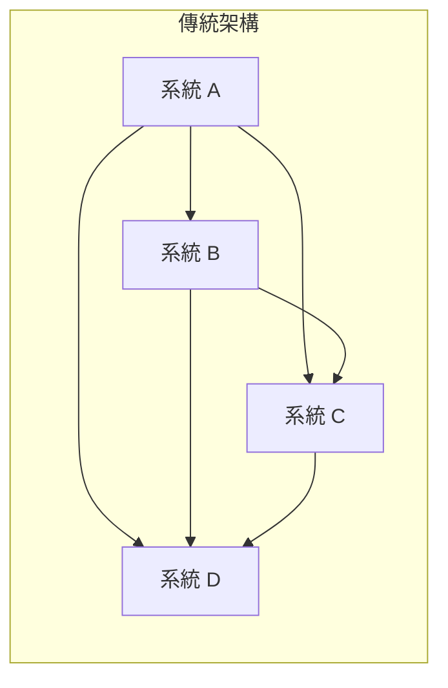

**問題：點對點整合導致系統耦合嚴重，難以維護**

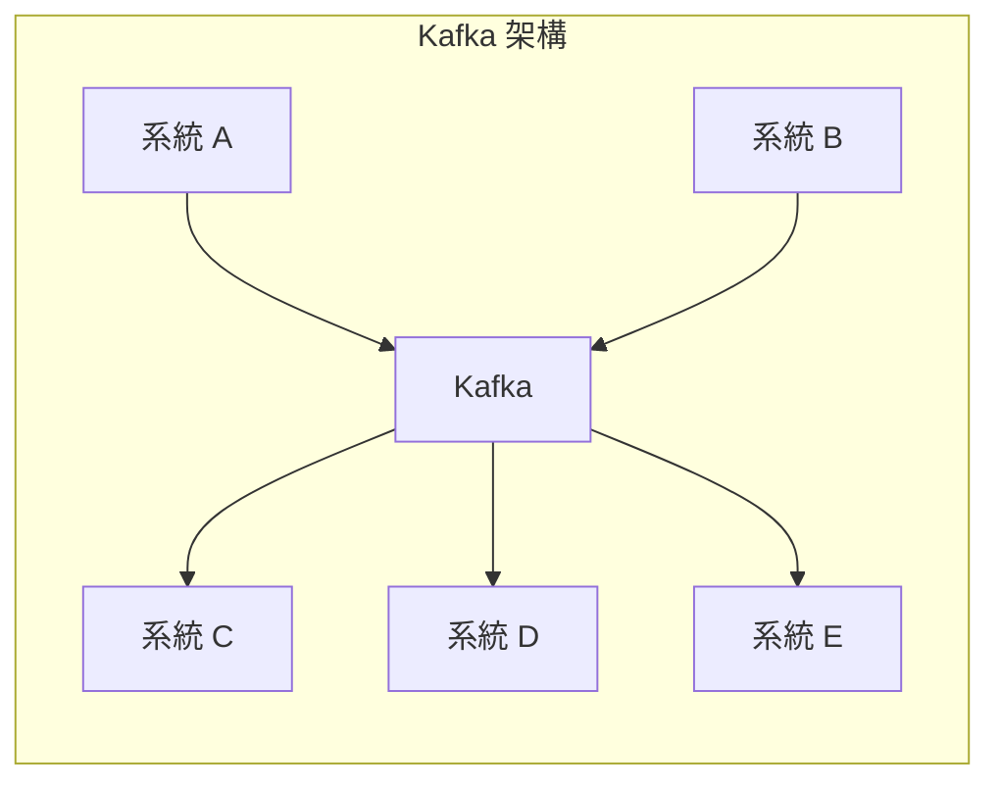

**解決方案：透過 Kafka 作為中央事件匯流排，實現系統解耦**

### 1.2 與傳統 Message Queue 的差異

| 特性 | Kafka | RabbitMQ | ActiveMQ |
|------|-------|----------|----------|
| **訊息模型** | Log-based（日誌型） | Queue-based（佇列型） | Queue-based |
| **訊息保留** | 依時間/大小保留，可重播 | 消費後刪除 | 消費後刪除 |
| **吞吐量** | 極高（百萬/秒） | 中等（萬/秒） | 中等 |
| **順序保證** | Partition 內保證順序 | 單一 Queue 保證 | 單一 Queue 保證 |
| **Consumer 模式** | Pull（拉取） | Push/Pull | Push/Pull |
| **叢集架構** | 原生分散式 | 需額外配置 | 需額外配置 |
| **適用場景** | 大數據、事件串流、日誌收集 | 任務佇列、RPC | 企業整合 |

#### 關鍵差異說明

1. **Log-based vs Queue-based**
   - Kafka：訊息寫入後保留在 Log 中，多個 Consumer 可獨立消費同一份資料
   - RabbitMQ：訊息被消費後即從 Queue 移除

2. **Consumer Group 機制**
   - Kafka 的 Consumer Group 允許同一群組內的 Consumer 分擔 Partition
   - 不同群組可獨立消費相同訊息，實現廣播效果

### 1.3 適合與不適合的使用情境

#### ✅ 適合 Kafka 的情境

| 情境 | 說明 |
|------|------|
| **事件驅動架構（EDA）** | 系統間透過事件通訊，實現鬆耦合 |
| **日誌收集與聚合** | 集中收集多系統日誌，供分析平台使用 |
| **即時資料管道** | 將資料從來源系統即時傳輸至目標系統 |
| **CDC（Change Data Capture）** | 捕捉資料庫變更，同步至其他系統 |
| **指標收集** | 收集應用程式指標，供監控系統使用 |
| **微服務通訊** | 作為微服務間的非同步通訊管道 |

#### ❌ 不適合 Kafka 的情境

| 情境 | 原因 | 替代方案 |
|------|------|----------|
| **需要即時回應的 Request-Response** | Kafka 是非同步設計，延遲較高 | REST API、gRPC |
| **小量訊息且需低延遲** | Kafka 的批次處理設計不適合 | RabbitMQ、Redis |
| **複雜的訊息路由** | Kafka 路由能力較弱 | RabbitMQ（Exchange） |
| **事務性訊息處理** | 雖支援但較複雜 | 傳統 MQ + 資料庫事務 |
| **訊息需要優先級** | Kafka 不支援訊息優先級 | RabbitMQ |

### 💡 實務建議

> **金融業導入考量**：
> - Kafka 非常適合用於交易日誌、風控事件、跨系統資料同步
> - 但對於需要嚴格事務保證的核心交易系統，建議搭配其他機制確保一致性
> - 建議先在非核心系統驗證，再逐步擴展至關鍵系統

---

## 2. Kafka 系統架構總覽

### 2.1 Kafka 核心元件說明

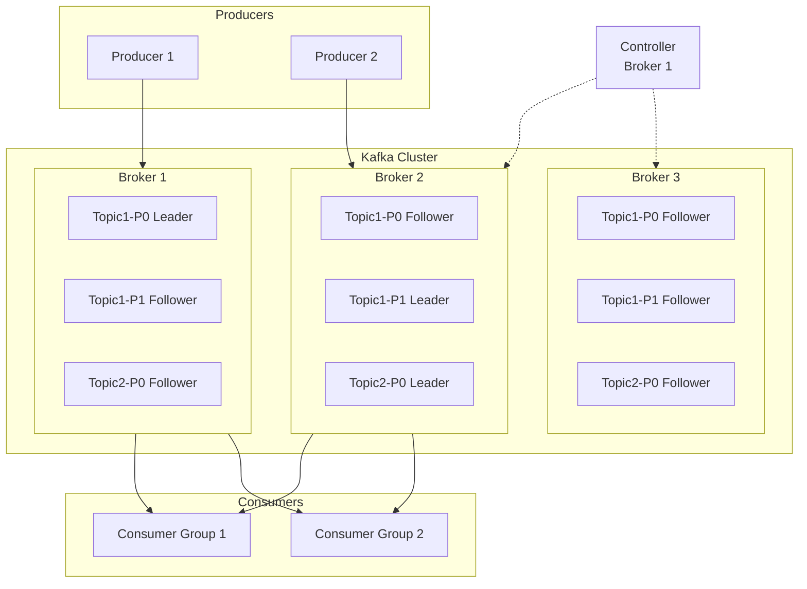

#### 2.1.1 Broker

**Broker** 是 Kafka 叢集中的伺服器節點，負責：
- 接收 Producer 發送的訊息
- 將訊息持久化至磁碟
- 提供訊息給 Consumer 讀取
- 與其他 Broker 進行資料複寫

```
一個 Kafka 叢集通常由 3 個以上的 Broker 組成
```

#### 2.1.2 Topic 與 Partition

**Topic（主題）**：
- 訊息的邏輯分類，類似資料庫的 Table
- 例如：`order-events`、`user-activities`、`system-logs`

**Partition（分區）**：
- Topic 的物理分割單位
- 每個 Partition 是一個有序的、不可變的訊息序列
- Partition 內的訊息有唯一的 Offset（偏移量）

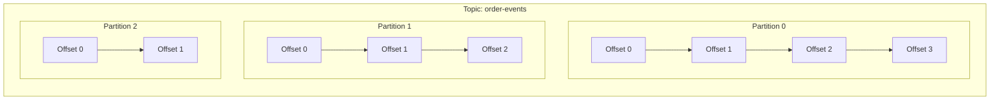

**Partition 設計原則**：
- 決定了 Consumer 的最大並行度
- 一個 Partition 只能被同一 Consumer Group 中的一個 Consumer 消費
- Partition 數量一旦設定，增加容易但減少困難

#### 2.1.3 Producer

**Producer（生產者）** 負責將訊息發送至 Kafka：

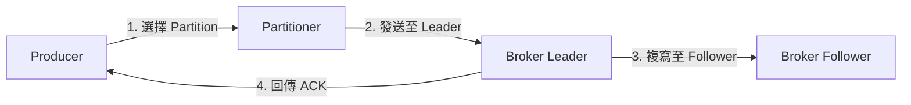

**Partition 選擇策略**：
| 策略 | 說明 |
|------|------|
| **指定 Partition** | 直接指定目標 Partition |
| **Key Hash** | 根據訊息 Key 的 Hash 值選擇（同 Key 同 Partition） |
| **Round Robin** | 輪詢分配（無 Key 時的預設行為） |
| **Sticky** | 黏性分區，減少批次數量 |

#### 2.1.4 Consumer 與 Consumer Group

**Consumer（消費者）**：從 Kafka 讀取訊息的客戶端

**Consumer Group（消費者群組）**：
- 一組 Consumer 的邏輯集合
- 群組內的 Consumer 共同消費一個 Topic
- 每個 Partition 只會被群組內的一個 Consumer 消費

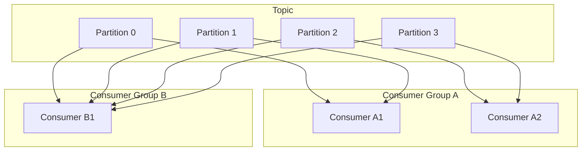

**重點**：
- Consumer Group A 有 2 個 Consumer，分擔 4 個 Partition
- Consumer Group B 有 1 個 Consumer，消費全部 4 個 Partition
- 兩個 Group 獨立消費，互不影響

#### 2.1.5 Controller

**Controller** 是叢集中負責管理工作的特殊 Broker：
- 管理 Partition 的 Leader 選舉
- 處理 Broker 的加入與離開
- 監控叢集狀態
- 同一時間只有一個 Controller（透過 ZooKeeper/KRaft 選舉）

### 2.2 高可用（HA）與水平擴充設計原則

#### 2.2.1 副本機制（Replication）

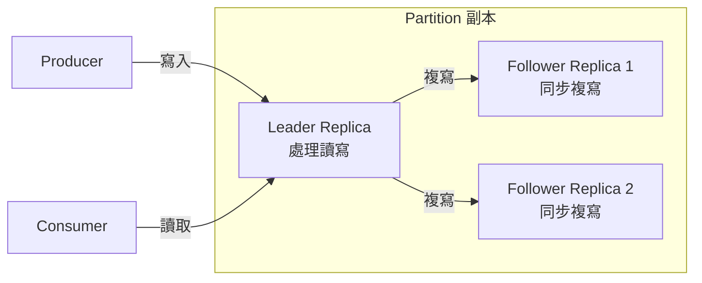

**關鍵名詞**：

| 名詞 | 說明 |
|------|------|
| **Replication Factor** | 副本數量（建議 ≥ 3） |
| **Leader Replica** | 處理所有讀寫請求的副本 |
| **Follower Replica** | 從 Leader 同步資料的副本 |
| **ISR（In-Sync Replicas）** | 與 Leader 保持同步的副本集合 |
| **Min ISR** | 最小同步副本數，低於此值將拒絕寫入 |

#### 2.2.2 高可用設計原則

```
建議配置：
- Broker 數量 ≥ 3
- Replication Factor = 3
- Min ISR = 2
- acks = all（或 -1）
```

**故障容忍計算**：
```
可容忍故障數 = Replication Factor - Min ISR
例如：RF=3, Min ISR=2 → 可容忍 1 台 Broker 故障
```

#### 2.2.3 水平擴充原則

| 擴充方式 | 影響 | 注意事項 |
|----------|------|----------|
| **增加 Broker** | 提升整體容量與吞吐量 | 需進行 Partition 重新分配 |
| **增加 Partition** | 提升 Consumer 並行度 | Partition 只能增加不能減少 |
| **增加 Consumer** | 提升消費速度 | Consumer 數量 ≤ Partition 數量 |

### 💡 實務建議

> **架構設計建議**：
> 1. 生產環境至少 3 個 Broker，分布在不同機架或可用區
> 2. Partition 數量建議為 Broker 數量的倍數
> 3. 預估未來流量成長，預留足夠的 Partition 數量
> 4. 監控 ISR 數量，低於 Min ISR 應立即處理

---

## 3. Kafka 安裝與部署

### 3.1 環境需求

#### 3.1.1 硬體需求

| 環境 | CPU | 記憶體 | 磁碟 | 網路 |
|------|-----|--------|------|------|
| **開發/測試** | 2 cores | 4 GB | 50 GB SSD | 1 Gbps |
| **小型生產** | 4 cores | 8 GB | 500 GB SSD | 1 Gbps |
| **大型生產** | 16+ cores | 32+ GB | 多顆 SSD（RAID 10） | 10 Gbps |

#### 3.1.2 軟體需求

| 軟體 | 版本要求 | 說明 |
|------|----------|------|
| **作業系統** | Linux（CentOS 7+、Ubuntu 18.04+） | 建議使用 Linux |
| **JDK** | Java 11 或 Java 17（LTS） | Kafka 3.x 建議 Java 17 |
| **ZooKeeper** | 3.6+ | Kafka 3.4+ 可使用 KRaft 模式 |

#### 3.1.3 網路需求

```
Kafka 預設使用以下 Port：
- 9092：Broker 對外服務（PLAINTEXT）
- 9093：Broker 對外服務（SSL）
- 9094：Broker 間通訊
- 2181：ZooKeeper（若使用）
```

### 3.2 單機環境安裝（KRaft 模式）

> **說明**：Kafka 3.4+ 支援 KRaft 模式，無需 ZooKeeper

#### 步驟 1：下載並解壓縮

```bash
# 下載 Kafka
cd /opt
wget https://downloads.apache.org/kafka/3.7.0/kafka_2.13-3.7.0.tgz

# 解壓縮
tar -xzf kafka_2.13-3.7.0.tgz
ln -s kafka_2.13-3.7.0 kafka

# 設定環境變數
echo 'export KAFKA_HOME=/opt/kafka' >> ~/.bashrc
echo 'export PATH=$PATH:$KAFKA_HOME/bin' >> ~/.bashrc
source ~/.bashrc
```

#### 步驟 2：產生 Cluster ID

```bash
# 產生唯一的 Cluster ID
KAFKA_CLUSTER_ID="$(kafka-storage.sh random-uuid)"
echo $KAFKA_CLUSTER_ID
# 輸出範例：MkU3OEVBNTcwNTJENDM2Qk
```

#### 步驟 3：設定 KRaft 模式

編輯 `/opt/kafka/config/kraft/server.properties`：

```properties
# 節點 ID（每個節點必須唯一）
node.id=1

# 節點角色：broker, controller, 或兩者
process.roles=broker,controller

# Controller 選舉投票者
controller.quorum.voters=1@localhost:9093

# 監聽位址
listeners=PLAINTEXT://:9092,CONTROLLER://:9093
advertised.listeners=PLAINTEXT://localhost:9092

# 日誌目錄
log.dirs=/var/kafka-logs

# Controller 監聽設定
controller.listener.names=CONTROLLER

# 預設 Partition 數量
num.partitions=3

# 預設副本因子
default.replication.factor=1

# 日誌保留時間（168 小時 = 7 天）
log.retention.hours=168
```

#### 步驟 4：格式化儲存目錄

```bash
# 建立日誌目錄
sudo mkdir -p /var/kafka-logs
sudo chown -R $USER:$USER /var/kafka-logs

# 格式化儲存目錄
kafka-storage.sh format -t $KAFKA_CLUSTER_ID \
  -c /opt/kafka/config/kraft/server.properties
```

#### 步驟 5：啟動 Kafka

```bash
# 前景執行（除錯用）
kafka-server-start.sh /opt/kafka/config/kraft/server.properties

# 背景執行
kafka-server-start.sh -daemon /opt/kafka/config/kraft/server.properties

# 檢查是否啟動成功
jps -l | grep kafka
# 應該看到：kafka.Kafka
```

#### 步驟 6：驗證安裝

```bash
# 建立測試 Topic
kafka-topics.sh --create \
  --topic test-topic \
  --bootstrap-server localhost:9092 \
  --partitions 3 \
  --replication-factor 1

# 列出 Topic
kafka-topics.sh --list --bootstrap-server localhost:9092

# 發送測試訊息
echo "Hello Kafka" | kafka-console-producer.sh \
  --topic test-topic \
  --bootstrap-server localhost:9092

# 消費測試訊息
kafka-console-consumer.sh \
  --topic test-topic \
  --from-beginning \
  --bootstrap-server localhost:9092
```

### 3.3 多節點叢集安裝（正式環境）

#### 3.3.1 叢集規劃

假設 3 節點叢集：

| 節點 | Hostname | IP | 角色 |
|------|----------|-----|------|
| Node 1 | kafka-1 | 192.168.1.101 | broker, controller |
| Node 2 | kafka-2 | 192.168.1.102 | broker, controller |
| Node 3 | kafka-3 | 192.168.1.103 | broker, controller |

#### 3.3.2 各節點設定

**Node 1 設定** (`/opt/kafka/config/kraft/server.properties`)：

```properties
node.id=1
process.roles=broker,controller
controller.quorum.voters=1@192.168.1.101:9093,2@192.168.1.102:9093,3@192.168.1.103:9093

listeners=PLAINTEXT://:9092,CONTROLLER://:9093
advertised.listeners=PLAINTEXT://192.168.1.101:9092

controller.listener.names=CONTROLLER
inter.broker.listener.name=PLAINTEXT

log.dirs=/var/kafka-logs

num.partitions=6
default.replication.factor=3
min.insync.replicas=2

log.retention.hours=168
log.segment.bytes=1073741824
```

**Node 2 設定**（修改以下項目）：

```properties
node.id=2
advertised.listeners=PLAINTEXT://192.168.1.102:9092
```

**Node 3 設定**（修改以下項目）：

```properties
node.id=3
advertised.listeners=PLAINTEXT://192.168.1.103:9092
```

#### 3.3.3 叢集啟動步驟

```bash
# 1. 在任一節點產生 Cluster ID
KAFKA_CLUSTER_ID="$(kafka-storage.sh random-uuid)"
echo $KAFKA_CLUSTER_ID
# 記下此 ID，所有節點使用相同的 ID

# 2. 在每個節點執行格式化（使用相同的 CLUSTER_ID）
kafka-storage.sh format -t $KAFKA_CLUSTER_ID \
  -c /opt/kafka/config/kraft/server.properties

# 3. 在每個節點啟動 Kafka
kafka-server-start.sh -daemon /opt/kafka/config/kraft/server.properties

# 4. 驗證叢集狀態
kafka-metadata.sh --snapshot /var/kafka-logs/__cluster_metadata-0/00000000000000000000.log \
  --command "describe"
```

### 3.4 ZooKeeper 與 KRaft 架構比較

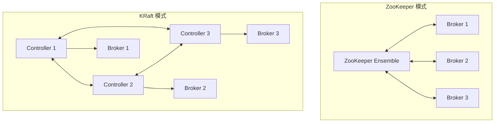

| 特性 | ZooKeeper 模式 | KRaft 模式 |
|------|---------------|------------|
| **元件數量** | 需要額外的 ZK 叢集 | 內建，無需額外元件 |
| **運維複雜度** | 較高（需維護兩套系統） | 較低 |
| **擴展性** | 受 ZK 限制（~數萬 Partition） | 可支援更多 Partition |
| **故障恢復** | 較慢 | 較快 |
| **版本要求** | 所有版本 | Kafka 3.4+（正式支援） |

**建議**：新專案建議直接使用 KRaft 模式

### 3.5 常見安裝錯誤與排除方式

| 錯誤訊息 | 原因 | 解決方式 |
|----------|------|----------|
| `Error: JVM not found` | Java 未安裝或環境變數未設定 | 安裝 JDK 並設定 `JAVA_HOME` |
| `Address already in use` | Port 被佔用 | 檢查並釋放 9092/9093 Port |
| `No space left on device` | 磁碟空間不足 | 清理磁碟或擴充空間 |
| `Connection refused` | Kafka 未啟動或防火牆阻擋 | 檢查服務狀態與防火牆規則 |
| `Cluster ID doesn't match` | Cluster ID 不一致 | 清空 log.dirs 重新格式化 |
| `Not enough replicas` | 副本數大於 Broker 數 | 降低 replication.factor |

### 💡 實務建議

> **部署檢查清單**：
> 1. 確認所有節點時間同步（使用 NTP）
> 2. 設定適當的 JVM 記憶體（建議 Heap 6-8 GB）
> 3. 使用獨立的磁碟存放 Kafka 日誌
> 4. 開啟必要的防火牆 Port
> 5. 設定 Systemd Service 實現開機自動啟動

---

## 4. Kafka 基本設定說明

### 4.1 Broker 重要設定參數

#### 4.1.1 核心設定

```properties
############################# Server Basics #############################

# Broker 唯一識別碼
broker.id=1

# 節點角色（KRaft 模式）
process.roles=broker,controller

# 日誌儲存目錄（可設定多個，以逗號分隔）
log.dirs=/var/kafka-logs,/var/kafka-logs2

# 監聽位址
listeners=PLAINTEXT://0.0.0.0:9092
advertised.listeners=PLAINTEXT://kafka-broker-1:9092
```

#### 4.1.2 效能相關設定

```properties
############################# Performance #############################

# 網路請求處理執行緒數
num.network.threads=8

# I/O 處理執行緒數
num.io.threads=16

# Socket 緩衝區大小
socket.send.buffer.bytes=102400
socket.receive.buffer.bytes=102400

# 請求最大大小
socket.request.max.bytes=104857600

# 批次接收的訊息數量
queued.max.requests=500
```

#### 4.1.3 日誌設定

```properties
############################# Log Configuration #############################

# 預設 Partition 數量
num.partitions=6

# 預設副本因子
default.replication.factor=3

# 最小同步副本數
min.insync.replicas=2

# 日誌區段大小（1 GB）
log.segment.bytes=1073741824

# 日誌保留時間（7 天）
log.retention.hours=168

# 日誌保留大小（-1 表示無限制）
log.retention.bytes=-1

# 日誌清理檢查間隔（5 分鐘）
log.retention.check.interval.ms=300000

# 日誌清理策略：delete 或 compact
log.cleanup.policy=delete
```

### 4.2 Topic 設計原則

#### 4.2.1 Partition 數量設計

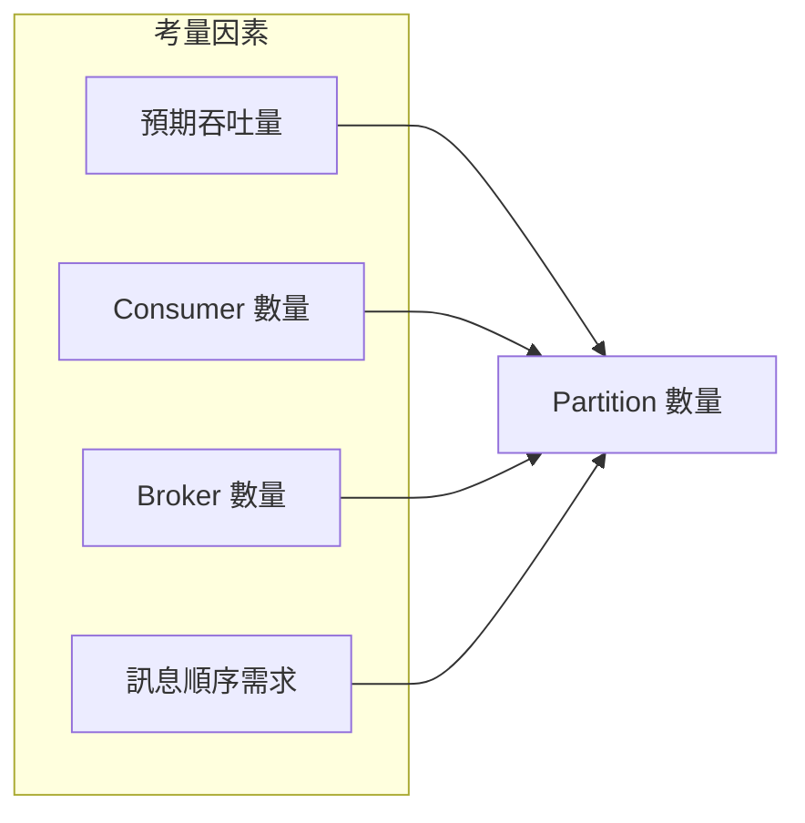

**計算公式**：
```
Partition 數量 ≥ max(預期吞吐量 / 單一 Partition 吞吐量, Consumer 數量)
```

**建議原則**：

| 場景 | 建議 Partition 數 | 說明 |
|------|-------------------|------|
| **低流量（< 1MB/s）** | 3-6 | 保持簡單 |
| **中流量（1-10 MB/s）** | 6-12 | 平衡效能與管理 |
| **高流量（> 10 MB/s）** | 12-50+ | 視 Consumer 數量調整 |
| **需要順序** | 1 | 單一 Partition 保證順序 |

⚠️ **注意**：Partition 只能增加不能減少，建議一開始就預留足夠數量

#### 4.2.2 Replication Factor 設計

```properties
# 建議設定
default.replication.factor=3
min.insync.replicas=2
```

| Replication Factor | Min ISR | 可容忍故障數 | 說明 |
|--------------------|---------|-------------|------|
| 1 | 1 | 0 | 僅適用開發環境 |
| 2 | 1 | 1 | 最低生產要求 |
| 3 | 2 | 1 | **建議的生產配置** |
| 5 | 3 | 2 | 高可用要求 |

### 4.3 Producer 重要設定

```java
Properties props = new Properties();

// 基本連線設定
props.put("bootstrap.servers", "kafka-1:9092,kafka-2:9092,kafka-3:9092");
props.put("key.serializer", "org.apache.kafka.common.serialization.StringSerializer");
props.put("value.serializer", "org.apache.kafka.common.serialization.StringSerializer");

// acks 設定：訊息確認機制
// 0: 不等待確認（最快，可能遺失）
// 1: Leader 確認（平衡）
// all/-1: 所有 ISR 確認（最安全）
props.put("acks", "all");

// 重試設定
props.put("retries", 3);
props.put("retry.backoff.ms", 1000);

// 批次設定
props.put("batch.size", 16384);           // 批次大小（bytes）
props.put("linger.ms", 5);                // 批次等待時間（ms）
props.put("buffer.memory", 33554432);     // 緩衝區大小（32 MB）

// 冪等性設定（避免重複）
props.put("enable.idempotence", true);

// 壓縮設定
props.put("compression.type", "snappy");  // none, gzip, snappy, lz4, zstd
```

**acks 設定比較**：

| acks | 說明 | 延遲 | 可靠性 | 適用場景 |
|------|------|------|--------|----------|
| 0 | 不等待 | 最低 | 最低 | 日誌、監控 |
| 1 | Leader 確認 | 中 | 中 | 一般應用 |
| all | 所有 ISR 確認 | 最高 | 最高 | 金融交易 |

### 4.4 Consumer 重要設定

```java
Properties props = new Properties();

// 基本連線設定
props.put("bootstrap.servers", "kafka-1:9092,kafka-2:9092,kafka-3:9092");
props.put("group.id", "order-processing-group");
props.put("key.deserializer", "org.apache.kafka.common.serialization.StringDeserializer");
props.put("value.deserializer", "org.apache.kafka.common.serialization.StringDeserializer");

// Offset 重置策略
// earliest: 從最早的訊息開始
// latest: 從最新的訊息開始
// none: 如果沒有 offset 則拋出例外
props.put("auto.offset.reset", "earliest");

// 自動提交設定
props.put("enable.auto.commit", false);   // 建議手動提交
props.put("auto.commit.interval.ms", 5000);

// 拉取設定
props.put("max.poll.records", 500);       // 單次拉取最大筆數
props.put("max.poll.interval.ms", 300000); // 兩次 poll 最大間隔
props.put("fetch.min.bytes", 1);          // 最小拉取資料量
props.put("fetch.max.wait.ms", 500);      // 最大等待時間

// Session 設定
props.put("session.timeout.ms", 45000);   // Session 超時
props.put("heartbeat.interval.ms", 15000); // 心跳間隔

// 隔離級別（配合 Exactly Once）
props.put("isolation.level", "read_committed");
```

### 4.5 資料保留策略（Retention Policy）

```properties
############################# Retention Policy #############################

# 依時間保留（預設 7 天）
log.retention.hours=168
# 或更精確的設定
log.retention.ms=604800000

# 依大小保留（-1 表示無限制）
log.retention.bytes=-1

# 日誌區段大小（觸發 Rolling）
log.segment.bytes=1073741824

# 日誌區段時間（7 天）
log.roll.hours=168

# 清理策略
# delete: 刪除過期資料
# compact: 壓縮（保留每個 Key 的最新值）
# compact,delete: 先壓縮後刪除
log.cleanup.policy=delete
```

**Log Compaction 說明**：

```mermaid
flowchart LR
    subgraph 原始 Log
        A1[Key:A, V:1]
        B1[Key:B, V:1]
        A2[Key:A, V:2]
        C1[Key:C, V:1]
        B2[Key:B, V:2]
        A3[Key:A, V:3]
    end
    
    subgraph Compacted Log
        AC[Key:A, V:3]
        BC[Key:B, V:2]
        CC[Key:C, V:1]
    end
    
    原始 Log -->|Compaction| Compacted Log
```

### 💡 實務建議

> **設定最佳實務**：
> 1. 生產環境務必設定 `acks=all` 與 `min.insync.replicas=2`
> 2. 根據業務需求設定合理的保留時間，避免磁碟空間不足
> 3. Consumer 建議使用手動提交 Offset，避免資料遺失
> 4. 啟用 `enable.idempotence=true` 確保 Producer 冪等性

---

## 5. Kafka 系統使用教學

### 5.1 Topic 管理

#### 5.1.1 建立 Topic

```bash
# 基本建立
kafka-topics.sh --create \
  --topic order-events \
  --bootstrap-server localhost:9092 \
  --partitions 6 \
  --replication-factor 3

# 建立時指定額外設定
kafka-topics.sh --create \
  --topic user-activities \
  --bootstrap-server localhost:9092 \
  --partitions 12 \
  --replication-factor 3 \
  --config retention.ms=259200000 \
  --config cleanup.policy=compact
```

#### 5.1.2 查詢 Topic

```bash
# 列出所有 Topic
kafka-topics.sh --list --bootstrap-server localhost:9092

# 查看 Topic 詳細資訊
kafka-topics.sh --describe \
  --topic order-events \
  --bootstrap-server localhost:9092

# 輸出範例：
# Topic: order-events	TopicId: ABC123...
# PartitionCount: 6	ReplicationFactor: 3
# Configs: retention.ms=604800000
#   Partition: 0	Leader: 1	Replicas: 1,2,3	Isr: 1,2,3
#   Partition: 1	Leader: 2	Replicas: 2,3,1	Isr: 2,3,1
#   ...
```

#### 5.1.3 修改 Topic

```bash
# 增加 Partition（只能增加，不能減少）
kafka-topics.sh --alter \
  --topic order-events \
  --partitions 12 \
  --bootstrap-server localhost:9092

# 修改 Topic 設定
kafka-configs.sh --alter \
  --entity-type topics \
  --entity-name order-events \
  --add-config retention.ms=172800000 \
  --bootstrap-server localhost:9092

# 查看 Topic 設定
kafka-configs.sh --describe \
  --entity-type topics \
  --entity-name order-events \
  --bootstrap-server localhost:9092
```

#### 5.1.4 刪除 Topic

```bash
# 刪除 Topic
kafka-topics.sh --delete \
  --topic test-topic \
  --bootstrap-server localhost:9092

# 注意：確保 delete.topic.enable=true（預設為 true）
```

### 5.2 Producer 發送訊息

#### 5.2.1 使用 Console Producer

```bash
# 基本發送
kafka-console-producer.sh \
  --topic order-events \
  --bootstrap-server localhost:9092

# 帶 Key 發送
kafka-console-producer.sh \
  --topic order-events \
  --bootstrap-server localhost:9092 \
  --property "parse.key=true" \
  --property "key.separator=:"

# 輸入格式：key:value
# order-001:{"orderId":"001","amount":100}
```

#### 5.2.2 Java Producer 範例

```java
import org.apache.kafka.clients.producer.*;
import java.util.Properties;

public class OrderProducer {
    
    public static void main(String[] args) {
        // 設定 Producer 參數
        Properties props = new Properties();
        props.put(ProducerConfig.BOOTSTRAP_SERVERS_CONFIG, 
                  "kafka-1:9092,kafka-2:9092,kafka-3:9092");
        props.put(ProducerConfig.KEY_SERIALIZER_CLASS_CONFIG, 
                  "org.apache.kafka.common.serialization.StringSerializer");
        props.put(ProducerConfig.VALUE_SERIALIZER_CLASS_CONFIG, 
                  "org.apache.kafka.common.serialization.StringSerializer");
        props.put(ProducerConfig.ACKS_CONFIG, "all");
        props.put(ProducerConfig.ENABLE_IDEMPOTENCE_CONFIG, true);
        props.put(ProducerConfig.RETRIES_CONFIG, 3);
        
        // 建立 Producer
        try (KafkaProducer<String, String> producer = new KafkaProducer<>(props)) {
            
            // 建立訊息
            String topic = "order-events";
            String key = "order-001";
            String value = "{\"orderId\":\"001\",\"amount\":100}";
            
            ProducerRecord<String, String> record = 
                new ProducerRecord<>(topic, key, value);
            
            // 同步發送
            RecordMetadata metadata = producer.send(record).get();
            System.out.printf("Sent to partition %d, offset %d%n", 
                              metadata.partition(), metadata.offset());
            
            // 非同步發送（建議）
            producer.send(record, (meta, exception) -> {
                if (exception != null) {
                    exception.printStackTrace();
                } else {
                    System.out.printf("Sent to partition %d, offset %d%n", 
                                      meta.partition(), meta.offset());
                }
            });
            
            // 確保所有訊息發送完成
            producer.flush();
        }
    }
}
```

### 5.3 Consumer 消費訊息

#### 5.3.1 使用 Console Consumer

```bash
# 從最新訊息開始消費
kafka-console-consumer.sh \
  --topic order-events \
  --bootstrap-server localhost:9092

# 從最早訊息開始消費
kafka-console-consumer.sh \
  --topic order-events \
  --from-beginning \
  --bootstrap-server localhost:9092

# 指定 Consumer Group
kafka-console-consumer.sh \
  --topic order-events \
  --group order-processor \
  --bootstrap-server localhost:9092

# 顯示 Key 和 Timestamp
kafka-console-consumer.sh \
  --topic order-events \
  --bootstrap-server localhost:9092 \
  --property print.key=true \
  --property print.timestamp=true
```

#### 5.3.2 Java Consumer 範例

```java
import org.apache.kafka.clients.consumer.*;
import java.time.Duration;
import java.util.*;

public class OrderConsumer {
    
    public static void main(String[] args) {
        // 設定 Consumer 參數
        Properties props = new Properties();
        props.put(ConsumerConfig.BOOTSTRAP_SERVERS_CONFIG, 
                  "kafka-1:9092,kafka-2:9092,kafka-3:9092");
        props.put(ConsumerConfig.GROUP_ID_CONFIG, "order-processing-group");
        props.put(ConsumerConfig.KEY_DESERIALIZER_CLASS_CONFIG, 
                  "org.apache.kafka.common.serialization.StringDeserializer");
        props.put(ConsumerConfig.VALUE_DESERIALIZER_CLASS_CONFIG, 
                  "org.apache.kafka.common.serialization.StringDeserializer");
        props.put(ConsumerConfig.AUTO_OFFSET_RESET_CONFIG, "earliest");
        props.put(ConsumerConfig.ENABLE_AUTO_COMMIT_CONFIG, false);
        props.put(ConsumerConfig.MAX_POLL_RECORDS_CONFIG, 100);
        
        // 建立 Consumer
        try (KafkaConsumer<String, String> consumer = new KafkaConsumer<>(props)) {
            
            // 訂閱 Topic
            consumer.subscribe(Collections.singletonList("order-events"));
            
            // 持續消費
            while (true) {
                ConsumerRecords<String, String> records = 
                    consumer.poll(Duration.ofMillis(1000));
                
                for (ConsumerRecord<String, String> record : records) {
                    System.out.printf("Partition: %d, Offset: %d, Key: %s, Value: %s%n",
                                      record.partition(), 
                                      record.offset(), 
                                      record.key(), 
                                      record.value());
                    
                    // 處理業務邏輯
                    processOrder(record.value());
                }
                
                // 手動提交 Offset
                consumer.commitSync();
            }
        }
    }
    
    private static void processOrder(String orderJson) {
        // 業務處理邏輯
        System.out.println("Processing: " + orderJson);
    }
}
```

### 5.4 Offset 管理

#### 5.4.1 查看 Consumer Group Offset

```bash
# 列出所有 Consumer Group
kafka-consumer-groups.sh --list --bootstrap-server localhost:9092

# 查看特定 Group 的 Offset 狀態
kafka-consumer-groups.sh --describe \
  --group order-processing-group \
  --bootstrap-server localhost:9092

# 輸出範例：
# GROUP                  TOPIC          PARTITION  CURRENT-OFFSET  LOG-END-OFFSET  LAG
# order-processing-group order-events   0          1000            1050            50
# order-processing-group order-events   1          980             980             0
# order-processing-group order-events   2          1100            1200            100
```

#### 5.4.2 重置 Offset

```bash
# 重置到最早（需先停止 Consumer）
kafka-consumer-groups.sh --reset-offsets \
  --group order-processing-group \
  --topic order-events \
  --to-earliest \
  --execute \
  --bootstrap-server localhost:9092

# 重置到最新
kafka-consumer-groups.sh --reset-offsets \
  --group order-processing-group \
  --topic order-events \
  --to-latest \
  --execute \
  --bootstrap-server localhost:9092

# 重置到特定 Offset
kafka-consumer-groups.sh --reset-offsets \
  --group order-processing-group \
  --topic order-events:0 \
  --to-offset 500 \
  --execute \
  --bootstrap-server localhost:9092

# 重置到特定時間
kafka-consumer-groups.sh --reset-offsets \
  --group order-processing-group \
  --topic order-events \
  --to-datetime "2024-01-01T00:00:00.000" \
  --execute \
  --bootstrap-server localhost:9092
```

### 5.5 訊息順序性與重複消費

#### 5.5.1 訊息順序保證

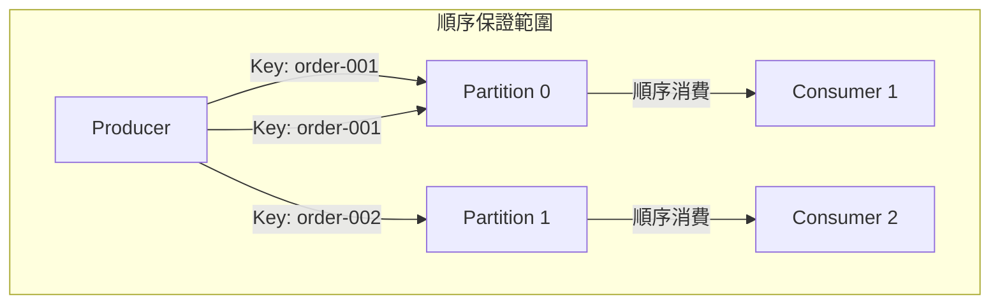

**順序保證原則**：
1. **同一 Partition 內**：訊息順序保證
2. **跨 Partition**：無順序保證
3. **使用相同 Key**：會被分配到同一 Partition

```java
// 確保相同訂單的訊息順序
String orderId = "order-001";
ProducerRecord<String, String> record = new ProducerRecord<>(
    "order-events",
    orderId,  // 使用 orderId 作為 Key
    "{\"status\":\"created\"}"
);
```

#### 5.5.2 避免重複消費

**重複消費的原因**：
1. Consumer 處理完成後、提交 Offset 前當機
2. Rebalance 導致重新消費
3. 手動重置 Offset

**解決方案**：

```java
// 方案 1：冪等處理（推薦）
public void processOrder(ConsumerRecord<String, String> record) {
    String messageId = record.topic() + "-" + record.partition() + "-" + record.offset();
    
    // 檢查是否已處理過
    if (processedMessages.contains(messageId)) {
        return; // 跳過已處理的訊息
    }
    
    // 處理業務邏輯
    doBusinessLogic(record.value());
    
    // 記錄已處理
    processedMessages.add(messageId);
}

// 方案 2：使用業務 Key 去重
public void processOrderWithDedup(String orderId, String orderData) {
    // 使用 Redis 或資料庫檢查
    if (redis.setnx("processed:" + orderId, "1") == 0) {
        return; // 已處理過
    }
    redis.expire("processed:" + orderId, 86400); // 設定過期時間
    
    doBusinessLogic(orderData);
}
```

### 💡 實務建議

> **消費端最佳實務**：
> 1. 使用手動提交 Offset，在業務處理成功後再提交
> 2. 實作冪等處理邏輯，容許重複消費
> 3. 監控 Consumer Lag，避免消費過慢
> 4. 合理設定 `max.poll.records`，避免單次處理過多

---

## 6. Kafka 與應用系統串接方式

### 6.1 與 Spring Boot 整合

#### 6.1.1 Maven 依賴

```xml
<dependencies>
    <!-- Spring Kafka -->
    <dependency>
        <groupId>org.springframework.kafka</groupId>
        <artifactId>spring-kafka</artifactId>
        <version>3.1.0</version>
    </dependency>
    
    <!-- JSON 序列化 -->
    <dependency>
        <groupId>com.fasterxml.jackson.core</groupId>
        <artifactId>jackson-databind</artifactId>
    </dependency>
</dependencies>
```

#### 6.1.2 設定檔（application.yml）

```yaml
spring:
  kafka:
    bootstrap-servers: kafka-1:9092,kafka-2:9092,kafka-3:9092
    
    producer:
      key-serializer: org.apache.kafka.common.serialization.StringSerializer
      value-serializer: org.springframework.kafka.support.serializer.JsonSerializer
      acks: all
      retries: 3
      properties:
        enable.idempotence: true
        max.in.flight.requests.per.connection: 5
    
    consumer:
      group-id: order-service
      key-deserializer: org.apache.kafka.common.serialization.StringDeserializer
      value-deserializer: org.springframework.kafka.support.serializer.JsonDeserializer
      auto-offset-reset: earliest
      enable-auto-commit: false
      properties:
        spring.json.trusted.packages: "com.example.model"
    
    listener:
      ack-mode: manual
      concurrency: 3
```

#### 6.1.3 Producer 實作

```java
import org.springframework.kafka.core.KafkaTemplate;
import org.springframework.kafka.support.SendResult;
import org.springframework.stereotype.Service;

@Service
public class OrderEventProducer {
    
    private final KafkaTemplate<String, OrderEvent> kafkaTemplate;
    
    public OrderEventProducer(KafkaTemplate<String, OrderEvent> kafkaTemplate) {
        this.kafkaTemplate = kafkaTemplate;
    }
    
    // 同步發送
    public void sendSync(String topic, String key, OrderEvent event) {
        try {
            SendResult<String, OrderEvent> result = 
                kafkaTemplate.send(topic, key, event).get();
            
            log.info("Sent message to partition {} with offset {}",
                     result.getRecordMetadata().partition(),
                     result.getRecordMetadata().offset());
        } catch (Exception e) {
            log.error("Failed to send message", e);
            throw new RuntimeException(e);
        }
    }
    
    // 非同步發送（推薦）
    public void sendAsync(String topic, String key, OrderEvent event) {
        kafkaTemplate.send(topic, key, event)
            .whenComplete((result, ex) -> {
                if (ex != null) {
                    log.error("Failed to send message", ex);
                } else {
                    log.info("Sent message to partition {} with offset {}",
                             result.getRecordMetadata().partition(),
                             result.getRecordMetadata().offset());
                }
            });
    }
}

// 訊息模型
@Data
public class OrderEvent {
    private String orderId;
    private String eventType;
    private BigDecimal amount;
    private LocalDateTime timestamp;
}
```

#### 6.1.4 Consumer 實作

```java
import org.springframework.kafka.annotation.KafkaListener;
import org.springframework.kafka.support.Acknowledgment;
import org.springframework.stereotype.Service;

@Service
public class OrderEventConsumer {
    
    @KafkaListener(
        topics = "order-events",
        groupId = "order-service",
        containerFactory = "kafkaListenerContainerFactory"
    )
    public void handleOrderEvent(
            @Payload OrderEvent event,
            @Header(KafkaHeaders.RECEIVED_PARTITION) int partition,
            @Header(KafkaHeaders.OFFSET) long offset,
            Acknowledgment ack) {
        
        log.info("Received event: {} from partition {} offset {}",
                 event, partition, offset);
        
        try {
            // 處理業務邏輯
            processOrderEvent(event);
            
            // 手動確認
            ack.acknowledge();
        } catch (Exception e) {
            log.error("Failed to process event", e);
            // 不確認，訊息將被重新消費
            throw e;
        }
    }
    
    // 批次消費
    @KafkaListener(
        topics = "order-events",
        groupId = "order-batch-service",
        batch = "true"
    )
    public void handleBatchEvents(
            List<OrderEvent> events,
            Acknowledgment ack) {
        
        log.info("Received {} events", events.size());
        
        for (OrderEvent event : events) {
            processOrderEvent(event);
        }
        
        ack.acknowledge();
    }
    
    private void processOrderEvent(OrderEvent event) {
        // 業務處理
    }
}
```

#### 6.1.5 Kafka 設定類別

```java
import org.springframework.context.annotation.Bean;
import org.springframework.context.annotation.Configuration;
import org.springframework.kafka.config.ConcurrentKafkaListenerContainerFactory;
import org.springframework.kafka.core.*;
import org.springframework.kafka.listener.ContainerProperties.AckMode;

@Configuration
public class KafkaConfig {
    
    @Bean
    public ConcurrentKafkaListenerContainerFactory<String, OrderEvent> 
            kafkaListenerContainerFactory(
                ConsumerFactory<String, OrderEvent> consumerFactory) {
        
        ConcurrentKafkaListenerContainerFactory<String, OrderEvent> factory =
            new ConcurrentKafkaListenerContainerFactory<>();
        
        factory.setConsumerFactory(consumerFactory);
        factory.setConcurrency(3); // 並行消費數
        factory.getContainerProperties().setAckMode(AckMode.MANUAL);
        
        // 錯誤處理
        factory.setCommonErrorHandler(new DefaultErrorHandler(
            new FixedBackOff(1000L, 3) // 重試 3 次，間隔 1 秒
        ));
        
        return factory;
    }
}
```

### 6.2 系統解耦架構設計

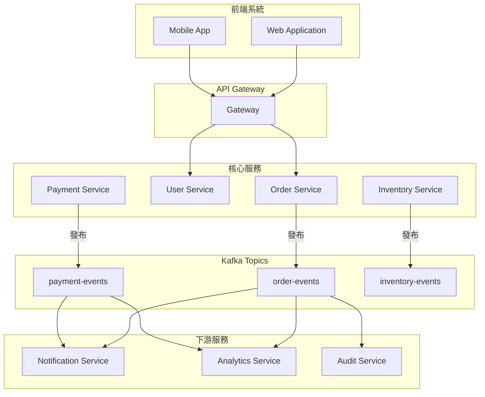

### 6.3 同步系統 vs 事件驅動架構

| 特性 | 同步系統 | 事件驅動架構 |
|------|----------|--------------|
| **耦合度** | 高（直接呼叫） | 低（透過事件） |
| **回應時間** | 即時 | 非即時 |
| **可靠性** | 相依服務故障影響大 | 隔離性好 |
| **擴展性** | 受限 | 易於擴展 |
| **追蹤** | 較容易 | 需額外機制 |
| **一致性** | 強一致性 | 最終一致性 |

### 6.4 常見整合架構模式

#### 6.4.1 Event Sourcing

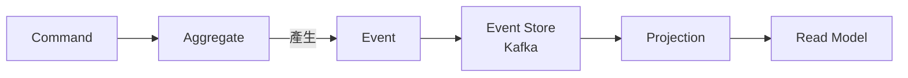

#### 6.4.2 CDC（Change Data Capture）

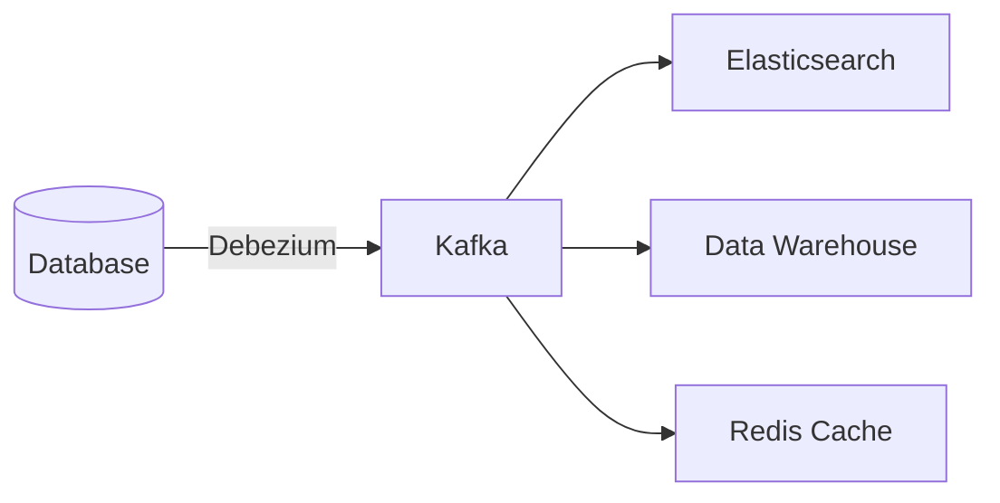

#### 6.4.3 Saga 模式

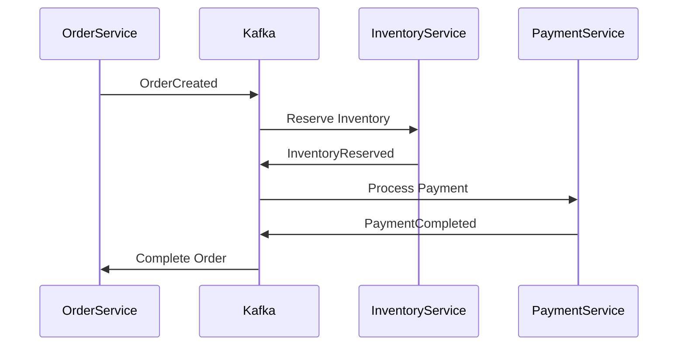

### 💡 實務建議

> **整合最佳實務**：
> 1. 定義清楚的 Event Schema，使用 Avro 或 Protobuf 管理
> 2. 實作 Dead Letter Queue（DLQ）處理無法消費的訊息
> 3. 考慮使用 Kafka Streams 或 ksqlDB 進行串流處理
> 4. 監控 Consumer Lag 並設定告警

---

## 7. Kafka 系統維運與監控

### 7.1 常見監控指標

#### 7.1.1 Broker 層級指標

| 指標 | 說明 | 告警閾值建議 |
|------|------|-------------|
| **UnderReplicatedPartitions** | 副本未同步的 Partition 數 | > 0 警告 |
| **OfflinePartitionsCount** | 離線 Partition 數 | > 0 緊急 |
| **ActiveControllerCount** | 活動 Controller 數 | ≠ 1 緊急 |
| **RequestsPerSec** | 每秒請求數 | 視容量而定 |
| **BytesInPerSec** | 每秒寫入位元組數 | 視容量而定 |
| **BytesOutPerSec** | 每秒讀取位元組數 | 視容量而定 |

#### 7.1.2 Topic/Partition 層級指標

| 指標 | 說明 | 告警閾值建議 |
|------|------|-------------|
| **MessagesInPerSec** | 每秒訊息數 | 視業務量而定 |
| **LogEndOffset** | Log 最新 Offset | 監控成長趨勢 |
| **LogSize** | 分區大小 | 視磁碟空間而定 |

#### 7.1.3 Consumer 層級指標

| 指標 | 說明 | 告警閾值建議 |
|------|------|-------------|
| **Consumer Lag** | 消費延遲（未消費訊息數） | > 10000 警告 |
| **Records Consumed Rate** | 消費速率 | 監控下降趨勢 |
| **Commit Latency** | Offset 提交延遲 | > 100ms 警告 |

### 7.2 Consumer Lag 監控與處理

#### 7.2.1 查看 Consumer Lag

```bash
# 使用 kafka-consumer-groups.sh
kafka-consumer-groups.sh --describe \
  --group order-processing-group \
  --bootstrap-server localhost:9092

# 輸出範例：
# GROUP                  TOPIC          PARTITION  CURRENT-OFFSET  LOG-END-OFFSET  LAG
# order-processing-group order-events   0          1000            1500            500
# order-processing-group order-events   1          800             800             0
# order-processing-group order-events   2          1200            2000            800
```

#### 7.2.2 Lag 過高的原因與解決方案

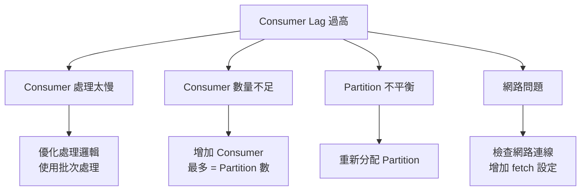

### 7.3 系統監控設定

#### 7.3.1 JMX 監控設定

```bash
# 啟動 Kafka 時啟用 JMX
export KAFKA_JMX_OPTS="-Dcom.sun.management.jmxremote \
  -Dcom.sun.management.jmxremote.port=9999 \
  -Dcom.sun.management.jmxremote.authenticate=false \
  -Dcom.sun.management.jmxremote.ssl=false"

kafka-server-start.sh config/server.properties
```

#### 7.3.2 Prometheus 整合

使用 JMX Exporter 將 Kafka 指標匯出至 Prometheus：

```yaml
# jmx_exporter_config.yml
lowercaseOutputName: true
lowercaseOutputLabelNames: true

rules:
  - pattern: kafka.server<type=(.+), name=(.+), clientId=(.+), topic=(.+), partition=(.*)><>Value
    name: kafka_server_$1_$2
    type: GAUGE
    labels:
      clientId: "$3"
      topic: "$4"
      partition: "$5"
  
  - pattern: kafka.server<type=(.+), name=(.+)><>Value
    name: kafka_server_$1_$2
    type: GAUGE
    
  - pattern: kafka.controller<type=(.+), name=(.+)><>Value
    name: kafka_controller_$1_$2
    type: GAUGE
```

#### 7.3.3 Grafana Dashboard

建議監控面板包含：
1. Broker 總覽（CPU、Memory、Disk、Network）
2. Topic 指標（訊息速率、大小）
3. Consumer Lag 監控
4. Producer 指標（成功率、延遲）

### 7.4 常見營運問題與排查

#### 7.4.1 問題排查流程

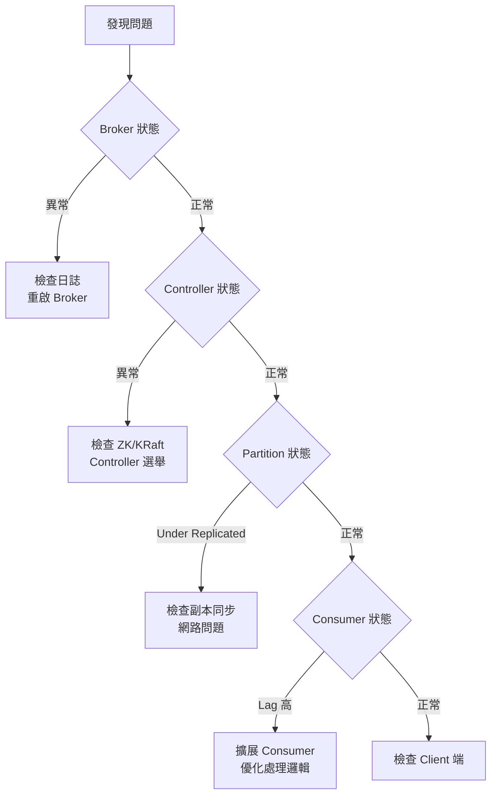

#### 7.4.2 常見問題與解決方案

| 問題 | 可能原因 | 解決方案 |
|------|----------|----------|
| **Broker 無法啟動** | 配置錯誤、Port 被佔用 | 檢查日誌、確認配置 |
| **UnderReplicatedPartitions** | Follower 同步慢、網路問題 | 檢查網路、調整複寫設定 |
| **Producer 超時** | Broker 負載高、acks 設定 | 擴容、調整設定 |
| **Consumer Lag 持續增加** | 處理慢、Consumer 數不足 | 優化處理、增加 Consumer |
| **磁碟空間不足** | 保留策略不當、資料量大 | 調整 retention、擴充磁碟 |
| **記憶體不足（OOM）** | JVM 設定不當 | 調整 Heap 大小 |

#### 7.4.3 日誌檢查

```bash
# Broker 日誌位置
/opt/kafka/logs/server.log
/opt/kafka/logs/controller.log

# 常見錯誤關鍵字
grep -E "ERROR|WARN|Exception" /opt/kafka/logs/server.log

# 檢查 Controller 日誌
grep "controller" /opt/kafka/logs/controller.log
```

### 💡 實務建議

> **維運最佳實務**：
> 1. 設定完整的監控告警，特別是 Under Replicated Partitions
> 2. 定期檢查磁碟使用率，設定自動清理
> 3. 建立標準的故障排除流程文件
> 4. 定期進行故障演練（Chaos Engineering）

---

## 8. Kafka 系統升級與版本控管

### 8.1 升級策略（Rolling Upgrade）

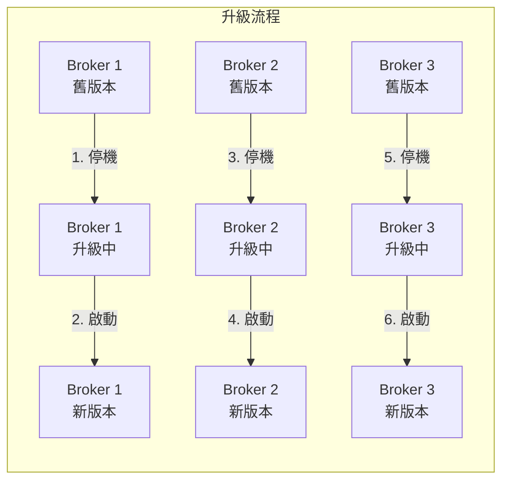

#### 升級步驟

```bash
# 1. 檢查叢集狀態
kafka-metadata.sh --snapshot /var/kafka-logs/__cluster_metadata-0/*.log \
  --command "describe"

# 2. 設定 inter.broker.protocol.version（升級前）
# 保持與舊版本相容
inter.broker.protocol.version=3.5

# 3. 逐一停止 Broker
kafka-server-stop.sh

# 4. 備份配置檔
cp /opt/kafka/config/kraft/server.properties \
   /opt/kafka/config/kraft/server.properties.bak

# 5. 更新 Kafka
cd /opt
wget https://downloads.apache.org/kafka/3.7.0/kafka_2.13-3.7.0.tgz
tar -xzf kafka_2.13-3.7.0.tgz
rm kafka
ln -s kafka_2.13-3.7.0 kafka

# 6. 恢復配置檔
cp /opt/kafka/config/kraft/server.properties.bak \
   /opt/kafka/config/kraft/server.properties

# 7. 啟動 Broker
kafka-server-start.sh -daemon /opt/kafka/config/kraft/server.properties

# 8. 確認 Broker 加入叢集
kafka-metadata.sh --snapshot /var/kafka-logs/__cluster_metadata-0/*.log \
  --command "describe"

# 9. 所有 Broker 升級完成後，更新 protocol version
# 編輯 server.properties，移除或更新 inter.broker.protocol.version

# 10. 再次逐一重啟 Broker
```

### 8.2 升級前檢查清單

| 項目 | 檢查內容 | 確認 |
|------|----------|------|
| **版本相容性** | 確認新版本與現有 Client 相容 | ☐ |
| **硬體資源** | 確認磁碟空間、記憶體充足 | ☐ |
| **備份** | 備份配置檔與重要資料 | ☐ |
| **叢集狀態** | 確認無 Under Replicated Partitions | ☐ |
| **Client 版本** | 確認 Producer/Consumer 版本相容 | ☐ |
| **監控** | 確認監控系統正常運作 | ☐ |
| **回滾計畫** | 準備回滾步驟與舊版本安裝包 | ☐ |
| **維護通知** | 通知相關團隊升級時間 | ☐ |

### 8.3 升級風險與回復機制

#### 8.3.1 常見風險

| 風險 | 影響 | 預防措施 |
|------|------|----------|
| **版本不相容** | Client 無法連線 | 先在測試環境驗證 |
| **配置遺失** | Broker 無法啟動 | 備份配置檔 |
| **資料損壞** | 訊息遺失 | 確保 ISR 正常再升級 |
| **效能下降** | 系統變慢 | 監控升級後效能 |

#### 8.3.2 回滾步驟

```bash
# 1. 停止 Broker
kafka-server-stop.sh

# 2. 恢復舊版本
rm /opt/kafka
ln -s kafka_2.13-3.5.0 /opt/kafka

# 3. 恢復配置檔
cp /opt/kafka/config/kraft/server.properties.bak \
   /opt/kafka/config/kraft/server.properties

# 4. 啟動 Broker
kafka-server-start.sh -daemon /opt/kafka/config/kraft/server.properties

# 5. 驗證服務正常
kafka-topics.sh --list --bootstrap-server localhost:9092
```

### 8.4 Client 相容性

#### 版本相容矩陣

| Client 版本 | Broker 3.5 | Broker 3.6 | Broker 3.7 |
|-------------|------------|------------|------------|
| Client 3.3 | ✅ | ✅ | ✅ |
| Client 3.4 | ✅ | ✅ | ✅ |
| Client 3.5 | ✅ | ✅ | ✅ |
| Client 3.6 | ⚠️ | ✅ | ✅ |
| Client 3.7 | ⚠️ | ⚠️ | ✅ |

> **說明**：⚠️ 表示部分新功能可能無法使用，但基本功能正常

### 💡 實務建議

> **升級最佳實務**：
> 1. 先在測試環境完整測試升級流程
> 2. 選擇業務低峰期進行升級
> 3. 保持舊版本安裝包，以便快速回滾
> 4. 升級後觀察至少 24 小時再進行下一步

---

## 9. 安全性與權限控管

### 9.1 SSL/TLS 加密

#### 9.1.1 建立 SSL 憑證

```bash
# 1. 建立 CA
openssl req -new -x509 -keyout ca-key -out ca-cert -days 365 \
  -subj "/CN=Kafka-CA"

# 2. 建立 Broker Keystore
keytool -genkey -keystore kafka.server.keystore.jks -validity 365 \
  -storepass changeit -keypass changeit \
  -dname "CN=kafka-broker-1" -storetype pkcs12

# 3. 建立憑證簽署請求（CSR）
keytool -keystore kafka.server.keystore.jks -certreq \
  -file kafka-broker-1.csr -storepass changeit

# 4. CA 簽署憑證
openssl x509 -req -CA ca-cert -CAkey ca-key -in kafka-broker-1.csr \
  -out kafka-broker-1-signed.crt -days 365 -CAcreateserial

# 5. 匯入 CA 憑證
keytool -keystore kafka.server.keystore.jks -import -alias CARoot \
  -file ca-cert -storepass changeit -noprompt

# 6. 匯入已簽署的憑證
keytool -keystore kafka.server.keystore.jks -import -alias kafka-broker-1 \
  -file kafka-broker-1-signed.crt -storepass changeit -noprompt

# 7. 建立 Truststore
keytool -keystore kafka.server.truststore.jks -import -alias CARoot \
  -file ca-cert -storepass changeit -noprompt
```

#### 9.1.2 Broker SSL 設定

```properties
# server.properties
listeners=SSL://0.0.0.0:9093
advertised.listeners=SSL://kafka-broker-1:9093

ssl.keystore.location=/opt/kafka/ssl/kafka.server.keystore.jks
ssl.keystore.password=changeit
ssl.key.password=changeit
ssl.truststore.location=/opt/kafka/ssl/kafka.server.truststore.jks
ssl.truststore.password=changeit

ssl.client.auth=required
ssl.enabled.protocols=TLSv1.2,TLSv1.3
```

### 9.2 SASL 認證

#### 9.2.1 SASL/PLAIN 設定

```properties
# server.properties
listeners=SASL_SSL://0.0.0.0:9094
advertised.listeners=SASL_SSL://kafka-broker-1:9094

sasl.enabled.mechanisms=PLAIN
sasl.mechanism.inter.broker.protocol=PLAIN

# JAAS 設定
listener.name.sasl_ssl.plain.sasl.jaas.config=\
  org.apache.kafka.common.security.plain.PlainLoginModule required \
  username="admin" \
  password="admin-secret" \
  user_admin="admin-secret" \
  user_producer="producer-secret" \
  user_consumer="consumer-secret";
```

#### 9.2.2 Client SASL 設定

```properties
# client.properties
security.protocol=SASL_SSL
sasl.mechanism=PLAIN
sasl.jaas.config=org.apache.kafka.common.security.plain.PlainLoginModule required \
  username="producer" \
  password="producer-secret";

ssl.truststore.location=/opt/kafka/ssl/kafka.client.truststore.jks
ssl.truststore.password=changeit
```

### 9.3 ACL 權限控管

#### 9.3.1 設定 ACL

```bash
# 允許 producer 用戶寫入 order-events topic
kafka-acls.sh --authorizer-properties zookeeper.connect=localhost:2181 \
  --add --allow-principal User:producer \
  --operation Write --topic order-events

# 允許 consumer 用戶從 order-events topic 讀取
kafka-acls.sh --authorizer-properties zookeeper.connect=localhost:2181 \
  --add --allow-principal User:consumer \
  --operation Read --topic order-events \
  --group order-processing-group

# 查看 ACL
kafka-acls.sh --authorizer-properties zookeeper.connect=localhost:2181 \
  --list --topic order-events
```

#### 9.3.2 常見 ACL 權限

| 操作 | 說明 | 適用資源 |
|------|------|----------|
| **Read** | 讀取訊息 | Topic, Group |
| **Write** | 寫入訊息 | Topic |
| **Create** | 建立資源 | Topic, Cluster |
| **Delete** | 刪除資源 | Topic |
| **Alter** | 修改配置 | Topic, Cluster |
| **Describe** | 查看資訊 | Topic, Group, Cluster |

### 9.4 企業安全設計建議

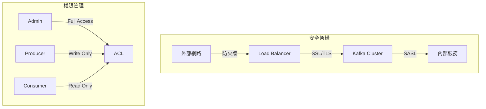

#### 安全建議清單

| 項目 | 建議 |
|------|------|
| **網路隔離** | Kafka 放在內網，透過 Gateway 對外 |
| **加密傳輸** | 生產環境必須使用 SSL/TLS |
| **身份認證** | 使用 SASL 進行身份驗證 |
| **權限控管** | 使用 ACL 實施最小權限原則 |
| **稽核日誌** | 啟用 authorizer 日誌記錄存取 |
| **憑證管理** | 定期更換憑證與密碼 |

### 💡 實務建議

> **安全最佳實務**：
> 1. 生產環境務必啟用 SSL 加密
> 2. 實施最小權限原則，每個應用使用獨立帳號
> 3. 定期審核 ACL 設定
> 4. 監控異常存取行為

---

## 10. 最佳實務與常見地雷

### 10.1 Topic 命名建議

#### 命名規範

```
格式：<domain>.<entity>.<event-type>
範例：
- order.payment.completed
- user.profile.updated
- inventory.stock.depleted
```

| 規則 | 說明 | 範例 |
|------|------|------|
| **使用小寫** | 避免大小寫混淆 | ✅ `order-events` ❌ `Order-Events` |
| **使用分隔符** | 使用 `.` 或 `-` | ✅ `order.events` ✅ `order-events` |
| **避免特殊字元** | 只用字母、數字、`.`、`-`、`_` | ❌ `order@events` |
| **有意義的命名** | 清楚表達用途 | ✅ `order-created` ❌ `topic1` |
| **包含版本** | 需要版本控管時 | `order.events.v2` |

### 10.2 Partition 設計地雷

#### ❌ 常見錯誤

| 錯誤 | 問題 | 正確做法 |
|------|------|----------|
| **Partition 太少** | Consumer 無法並行擴展 | 預估未來需求，預留足夠數量 |
| **Partition 太多** | 增加 Leader 選舉、記憶體開銷 | 控制在合理範圍（數百至數千） |
| **後期增加 Partition** | Key 分配會改變，影響順序 | 一開始就規劃好 |
| **單一 Partition** | 無法水平擴展 | 除非需要全局順序 |

#### Partition 數量計算

```
建議公式：
Partition 數量 = max(T/P, C)

T = 預期吞吐量（MB/s）
P = 單一 Partition 吞吐量（約 10 MB/s）
C = Consumer 數量
```

### 10.3 Consumer Group 錯誤案例

#### 案例 1：Consumer 數量超過 Partition

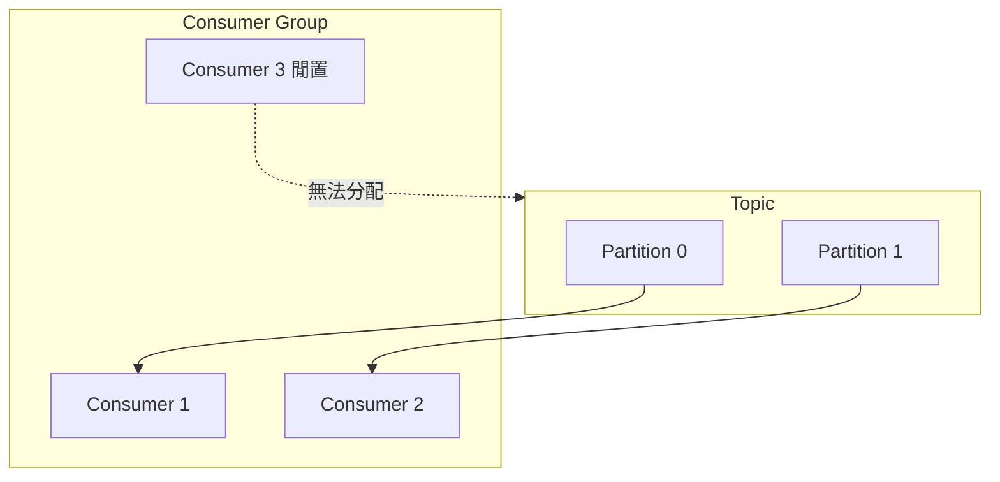

**問題**：Consumer 3 閒置，浪費資源

**解決**：Consumer 數量 ≤ Partition 數量

#### 案例 2：誤用 Consumer Group

```java
// ❌ 錯誤：每個實例使用不同的 Group ID
String groupId = "consumer-" + UUID.randomUUID();

// ✅ 正確：同一服務的實例使用相同的 Group ID
String groupId = "order-processing-service";
```

#### 案例 3：Rebalance 風暴

```java
// ❌ 錯誤：處理時間過長導致頻繁 Rebalance
while (true) {
    ConsumerRecords<String, String> records = consumer.poll(Duration.ofMillis(100));
    for (ConsumerRecord<String, String> record : records) {
        slowProcess(record); // 處理時間 > max.poll.interval.ms
    }
}

// ✅ 正確：控制單次處理時間
props.put("max.poll.records", 100);  // 減少單次拉取數量
props.put("max.poll.interval.ms", 300000);  // 適當增加間隔
```

### 10.4 真實專案常見誤用情境

#### 10.4.1 將 Kafka 當作資料庫使用

```
❌ 錯誤：
- 頻繁查詢特定訊息
- 依賴 Kafka 做隨機讀取
- 將 Kafka 作為唯一的資料儲存

✅ 正確：
- Kafka 適合順序讀取與寫入
- 需要查詢時，將資料同步至資料庫
- Kafka 作為事件傳輸管道，不是資料庫
```

#### 10.4.2 忽略冪等性設計

```java
// ❌ 錯誤：未處理重複消費
public void processOrder(OrderEvent event) {
    orderRepository.save(event.getOrder()); // 重複消費會產生重複資料
}

// ✅ 正確：實作冪等處理
public void processOrder(OrderEvent event) {
    if (orderRepository.existsById(event.getOrderId())) {
        return; // 已處理過
    }
    orderRepository.save(event.getOrder());
}
```

#### 10.4.3 同步呼叫與非同步混用

```java
// ❌ 錯誤：在同步 API 中等待 Kafka 回應
@PostMapping("/orders")
public ResponseEntity<Order> createOrder(@RequestBody Order order) {
    producer.send(record).get(); // 阻塞等待，延遲高
    return ResponseEntity.ok(order);
}

// ✅ 正確：分離同步與非同步邏輯
@PostMapping("/orders")
public ResponseEntity<Order> createOrder(@RequestBody Order order) {
    Order savedOrder = orderRepository.save(order); // 同步儲存
    producer.send(record); // 非同步發送事件
    return ResponseEntity.ok(savedOrder);
}
```

#### 10.4.4 大訊息傳輸

```
❌ 錯誤：
- 傳輸 > 1MB 的訊息（如檔案、圖片）
- 未設定 max.request.size

✅ 正確：
- 大型資料存放在物件儲存（S3、Azure Blob）
- Kafka 只傳輸資料的參考（URL、ID）
- 必要時調整 max.message.bytes、max.request.size
```

### 10.5 最佳實務總結

| 類別 | 建議 |
|------|------|
| **Topic 設計** | 依業務領域命名、預估 Partition 數量 |
| **Producer** | 啟用冪等性、適當的 acks 設定 |
| **Consumer** | 手動提交 Offset、實作冪等處理 |
| **監控** | 監控 Lag、設定告警、定期檢查 |
| **安全** | 啟用 SSL、ACL 權限控管 |
| **維運** | 定期備份、制定升級計畫 |

---

## 11. 檢查清單（Checklist）

### 11.1 新專案導入 Checklist

#### 規劃階段

- [ ] 確認使用場景適合 Kafka
- [ ] 評估預期吞吐量與延遲需求
- [ ] 設計 Topic 結構與命名規範
- [ ] 決定 Partition 數量與 Replication Factor
- [ ] 規劃 Consumer Group 架構
- [ ] 評估安全性需求（SSL、ACL）

#### 部署階段

- [ ] 準備硬體資源（CPU、Memory、Disk、Network）
- [ ] 安裝 JDK（建議 Java 17）
- [ ] 安裝並設定 Kafka（KRaft 模式）
- [ ] 設定 JVM 參數（Heap 大小）
- [ ] 設定防火牆規則
- [ ] 建立 Systemd Service
- [ ] 驗證叢集狀態

#### 開發階段

- [ ] 引入 Kafka Client 依賴
- [ ] 實作 Producer 與 Consumer
- [ ] 實作錯誤處理與重試機制
- [ ] 實作冪等處理邏輯
- [ ] 撰寫整合測試
- [ ] 進行效能測試

#### 上線前

- [ ] 設定監控與告警
- [ ] 建立 Runbook（操作手冊）
- [ ] 準備回滾計畫
- [ ] 進行壓力測試
- [ ] 安全性檢查

### 11.2 日常維運 Checklist

#### 每日檢查

- [ ] 確認所有 Broker 正常運作
- [ ] 檢查 Under Replicated Partitions
- [ ] 檢查 Consumer Lag
- [ ] 檢查磁碟使用率
- [ ] 檢查錯誤日誌

#### 每週檢查

- [ ] 檢查 Topic 增長趨勢
- [ ] 檢查效能指標
- [ ] 審核 ACL 設定
- [ ] 確認備份正常

#### 每月檢查

- [ ] 檢查 Kafka 版本，評估升級需求
- [ ] 檢查憑證過期時間
- [ ] 審核容量規劃
- [ ] 更新文件與 Runbook

### 11.3 故障排除 Checklist

#### Broker 問題

- [ ] 檢查 Broker 是否啟動（jps）
- [ ] 檢查日誌檔案
- [ ] 檢查 JVM 記憶體
- [ ] 檢查磁碟空間
- [ ] 檢查網路連線

#### Producer 問題

- [ ] 確認 bootstrap.servers 設定
- [ ] 檢查 acks 設定
- [ ] 檢查網路連線
- [ ] 檢查訊息大小
- [ ] 檢查序列化設定

#### Consumer 問題

- [ ] 確認 Consumer Group ID
- [ ] 檢查 Offset 狀態
- [ ] 檢查 Rebalance 頻率
- [ ] 檢查處理時間
- [ ] 檢查反序列化設定

### 11.4 升級 Checklist

#### 升級前

- [ ] 閱讀 Release Notes
- [ ] 確認版本相容性
- [ ] 備份配置檔
- [ ] 在測試環境驗證
- [ ] 通知相關團隊
- [ ] 準備回滾計畫

#### 升級中

- [ ] 確認叢集狀態正常
- [ ] 逐一停止、升級、啟動 Broker
- [ ] 每次升級後驗證
- [ ] 監控異常指標

#### 升級後

- [ ] 驗證所有功能正常
- [ ] 更新 inter.broker.protocol.version
- [ ] 監控至少 24 小時
- [ ] 更新文件

---

## 附錄

### 附錄 A：常用指令速查

### Topic 管理

```bash
# 列出 Topic
kafka-topics.sh --list --bootstrap-server localhost:9092

# 建立 Topic
kafka-topics.sh --create --topic <name> --partitions <n> \
  --replication-factor <r> --bootstrap-server localhost:9092

# 查看 Topic
kafka-topics.sh --describe --topic <name> --bootstrap-server localhost:9092

# 刪除 Topic
kafka-topics.sh --delete --topic <name> --bootstrap-server localhost:9092
```

### Consumer Group 管理

```bash
# 列出 Consumer Group
kafka-consumer-groups.sh --list --bootstrap-server localhost:9092

# 查看 Offset 狀態
kafka-consumer-groups.sh --describe --group <group> \
  --bootstrap-server localhost:9092

# 重置 Offset
kafka-consumer-groups.sh --reset-offsets --group <group> \
  --topic <topic> --to-earliest --execute --bootstrap-server localhost:9092
```

### Console Producer/Consumer

```bash
# 發送訊息
kafka-console-producer.sh --topic <topic> --bootstrap-server localhost:9092

# 消費訊息
kafka-console-consumer.sh --topic <topic> --from-beginning \
  --bootstrap-server localhost:9092
```

---

### 附錄 B：設定參數速查

### Broker 重要參數

| 參數 | 預設值 | 說明 |
|------|--------|------|
| `broker.id` | - | Broker 唯一識別碼 |
| `log.dirs` | /tmp/kafka-logs | 日誌儲存目錄 |
| `num.partitions` | 1 | 預設 Partition 數 |
| `default.replication.factor` | 1 | 預設副本因子 |
| `min.insync.replicas` | 1 | 最小同步副本數 |
| `log.retention.hours` | 168 | 日誌保留時間 |

### Producer 重要參數

| 參數 | 預設值 | 說明 |
|------|--------|------|
| `acks` | all | 確認機制 |
| `retries` | 2147483647 | 重試次數 |
| `batch.size` | 16384 | 批次大小 |
| `linger.ms` | 0 | 批次等待時間 |
| `enable.idempotence` | true | 啟用冪等性 |

### Consumer 重要參數

| 參數 | 預設值 | 說明 |
|------|--------|------|
| `group.id` | - | Consumer Group ID |
| `auto.offset.reset` | latest | Offset 重置策略 |
| `enable.auto.commit` | true | 自動提交 Offset |
| `max.poll.records` | 500 | 單次拉取最大筆數 |
| `session.timeout.ms` | 45000 | Session 超時 |

---

### 附錄 C：參考資源

- [Apache Kafka 官方文件](https://kafka.apache.org/documentation/)
- [Confluent Kafka 文件](https://docs.confluent.io/)
- [Spring Kafka 文件](https://spring.io/projects/spring-kafka)
- [Kafka: The Definitive Guide（書籍）](https://www.confluent.io/resources/kafka-the-definitive-guide/)

---

> **文件維護**：本手冊應定期更新，反映最新版本與團隊實務經驗。  
> **回饋建議**：如有問題或建議，請聯繫平台團隊。

