+++
date = '2026-01-30T19:37:57+08:00'
draft = false
title = 'Apache Kafka 教學手冊'
tags = ['教學', '工具', 'Kafka']
categories = ['教學']
+++

# Apache Kafka 教學手冊

| 項目 | 內容 |
| --- | --- |
| **文件版本** | 2.0 |
| **最後更新** | 2026 年 9 月 29 日 |
| **適用版本** | Apache Kafka 4.3.x（KRaft 模式；ZooKeeper 模式已於 4.0 移除） |
| **適用對象** | 後端工程師、系統架構師、SRE、DevOps、資安與稽核人員 |
| **文件定位** | 企業標準技術白皮書／內部標準教材 |
| **使用情境** | 大型企業、金融業（銀行、證券、保險）內部系統 |
| **文件維護** | 內部技術團隊 |
| **Created by** | Eric Cheng |

> ⚠️ **v2.0 重大改版說明**：本版以 Apache Kafka 4.3（最新修補版 4.3.1）為基準全面改寫。v1.0 以 Kafka 3.x／ZooKeeper 並存時代為基準，其中 `inter.broker.protocol.version` 升級流程、`zookeeper.connect` ACL 指令、`config/kraft/` 設定路徑等內容在 4.x 已不適用。完整更正清單請見[附錄 E：版本更新紀錄](#附錄-e版本更新紀錄)，查證來源請見[附錄 F：查證紀錄](#附錄-f查證紀錄)。

<!-- TOC-AUTO-BEGIN -->

## 目錄

- [執行摘要](#執行摘要)
- [1. Apache Kafka 簡介](#1-apache-kafka-簡介)
  - [1.1 Kafka 是什麼？解決什麼問題？](#11-kafka-是什麼解決什麼問題)
  - [1.2 與傳統 Message Queue 的差異](#12-與傳統-message-queue-的差異)
  - [1.3 適合與不適合的使用情境](#13-適合與不適合的使用情境)
  - [1.4 核心概念與五大 API](#14-核心概念與五大-api)
    - [1.4.1 事件（Event）結構](#141-事件event結構)
    - [1.4.2 核心術語](#142-核心術語)
    - [1.4.3 五大 API](#143-五大-api)
  - [1.5 版本演進與 4.x 重點](#15-版本演進與-4x-重點)
    - [1.5.1 近期版本時間軸](#151-近期版本時間軸)
    - [1.5.2 4.x 對企業的關鍵影響](#152-4x-對企業的關鍵影響)
  - [1.6 💡 本章實務建議](#16--本章實務建議)
- [2. Kafka 系統架構總覽](#2-kafka-系統架構總覽)
  - [2.1 Kafka 核心元件說明](#21-kafka-核心元件說明)
    - [2.1.1 Broker](#211-broker)
    - [2.1.2 Topic 與 Partition](#212-topic-與-partition)
    - [2.1.3 Producer](#213-producer)
    - [2.1.4 Consumer 與 Consumer Group](#214-consumer-與-consumer-group)
    - [2.1.5 Controller 與 KRaft Metadata Quorum](#215-controller-與-kraft-metadata-quorum)
    - [2.1.6 Share Group（Queues for Kafka）](#216-share-groupqueues-for-kafka)
  - [2.2 高可用（HA）與水平擴充設計原則](#22-高可用ha與水平擴充設計原則)
    - [2.2.1 副本機制（Replication）](#221-副本機制replication)
    - [2.2.2 高可用設計原則](#222-高可用設計原則)
    - [2.2.3 機架感知（Rack Awareness）](#223-機架感知rack-awareness)
    - [2.2.4 水平擴充原則](#224-水平擴充原則)
  - [2.3 儲存層架構](#23-儲存層架構)
    - [2.3.1 Log Segment 結構](#231-log-segment-結構)
    - [2.3.2 高效能設計](#232-高效能設計)
  - [2.4 Tiered Storage（分層儲存）](#24-tiered-storage分層儲存)
  - [2.5 💡 本章實務建議](#25--本章實務建議)
- [3. Kafka 安裝與部署](#3-kafka-安裝與部署)
  - [3.1 環境需求](#31-環境需求)
    - [3.1.1 硬體需求](#311-硬體需求)
    - [3.1.2 軟體需求](#312-軟體需求)
    - [3.1.3 網路需求](#313-網路需求)
  - [3.2 單機環境安裝（KRaft 模式）](#32-單機環境安裝kraft-模式)
  - [3.3 多節點叢集安裝（正式環境）](#33-多節點叢集安裝正式環境)
    - [3.3.1 叢集規劃](#331-叢集規劃)
    - [3.3.2 Controller 節點設定](#332-controller-節點設定)
    - [3.3.3 Broker 節點設定](#333-broker-節點設定)
    - [3.3.4 叢集初始化與啟動](#334-叢集初始化與啟動)
    - [3.3.5 Controller 動態擴縮](#335-controller-動態擴縮)
  - [3.4 ZooKeeper 移除與遷移路徑](#34-zookeeper-移除與遷移路徑)
  - [3.5 常見安裝錯誤與排除方式](#35-常見安裝錯誤與排除方式)
  - [3.6 Docker 容器部署](#36-docker-容器部署)
    - [3.6.1 快速啟動](#361-快速啟動)
    - [3.6.2 以環境變數設定](#362-以環境變數設定)
    - [3.6.3 Docker Compose 範例（單節點開發環境）](#363-docker-compose-範例單節點開發環境)
  - [3.7 Kubernetes 部署](#37-kubernetes-部署)
  - [3.8 系統服務與作業系統調校](#38-系統服務與作業系統調校)
    - [3.8.1 Systemd Service](#381-systemd-service)
    - [3.8.2 JVM 調校](#382-jvm-調校)
    - [3.8.3 作業系統調校](#383-作業系統調校)
  - [3.9 💡 本章實務建議](#39--本章實務建議)
- [4. Kafka 基本設定說明](#4-kafka-基本設定說明)
  - [4.1 Broker 重要設定參數](#41-broker-重要設定參數)
    - [4.1.1 核心設定](#411-核心設定)
    - [4.1.2 效能相關設定](#412-效能相關設定)
    - [4.1.3 日誌與可靠性設定](#413-日誌與可靠性設定)
    - [4.1.4 Kafka 4.0 預設值變更](#414-kafka-40-預設值變更)
  - [4.2 Topic 設計原則](#42-topic-設計原則)
    - [4.2.1 Partition 數量設計](#421-partition-數量設計)
    - [4.2.2 Replication Factor 設計](#422-replication-factor-設計)
    - [4.2.3 Topic 層級設定](#423-topic-層級設定)
  - [4.3 Producer 重要設定](#43-producer-重要設定)
  - [4.4 Consumer 重要設定](#44-consumer-重要設定)
  - [4.5 資料保留策略（Retention Policy）](#45-資料保留策略retention-policy)
  - [4.6 Share Group 設定](#46-share-group-設定)
  - [4.7 動態設定管理](#47-動態設定管理)
  - [4.8 💡 本章實務建議](#48--本章實務建議)
- [5. Kafka 系統使用教學](#5-kafka-系統使用教學)
  - [5.1 Topic 管理](#51-topic-管理)
    - [5.1.1 建立 Topic](#511-建立-topic)
    - [5.1.2 查詢 Topic](#512-查詢-topic)
    - [5.1.3 修改 Topic](#513-修改-topic)
    - [5.1.4 刪除 Topic](#514-刪除-topic)
  - [5.2 Producer 發送訊息](#52-producer-發送訊息)
    - [5.2.1 使用 Console Producer](#521-使用-console-producer)
    - [5.2.2 Java Producer 範例](#522-java-producer-範例)
  - [5.3 Consumer 消費訊息](#53-consumer-消費訊息)
    - [5.3.1 使用 Console Consumer](#531-使用-console-consumer)
    - [5.3.2 Java Consumer 範例](#532-java-consumer-範例)
  - [5.4 Offset 管理](#54-offset-管理)
    - [5.4.1 查看 Consumer Group Offset](#541-查看-consumer-group-offset)
    - [5.4.2 重置 Offset](#542-重置-offset)
    - [5.4.3 群組管理工具（KIP-1043）](#543-群組管理工具kip-1043)
  - [5.5 訊息順序性與重複消費](#55-訊息順序性與重複消費)
    - [5.5.1 訊息順序保證](#551-訊息順序保證)
    - [5.5.2 避免重複消費](#552-避免重複消費)
  - [5.6 Share Group 操作](#56-share-group-操作)
    - [5.6.1 Console Share Consumer](#561-console-share-consumer)
    - [5.6.2 管理 Share Group](#562-管理-share-group)
    - [5.6.3 Java Share Consumer 範例](#563-java-share-consumer-範例)
  - [5.7 交易與 Exactly-Once 語意](#57-交易與-exactly-once-語意)
    - [5.7.1 傳遞語意比較](#571-傳遞語意比較)
    - [5.7.2 交易 Producer（Consume-Transform-Produce）](#572-交易-producerconsume-transform-produce)
  - [5.8 💡 本章實務建議](#58--本章實務建議)
- [6. Kafka 與應用系統串接方式](#6-kafka-與應用系統串接方式)
  - [6.1 與 Spring Boot 整合](#61-與-spring-boot-整合)
    - [6.1.1 Maven 依賴](#611-maven-依賴)
    - [6.1.2 設定檔（application.yml）](#612-設定檔applicationyml)
    - [6.1.3 Producer 實作](#613-producer-實作)
    - [6.1.4 Consumer 實作](#614-consumer-實作)
    - [6.1.5 Kafka 設定類別與錯誤處理](#615-kafka-設定類別與錯誤處理)
    - [6.1.6 非阻塞重試（@RetryableTopic）](#616-非阻塞重試retryabletopic)
    - [6.1.7 Share Consumer 整合](#617-share-consumer-整合)
  - [6.2 系統解耦架構設計](#62-系統解耦架構設計)
  - [6.3 同步系統 vs 事件驅動架構](#63-同步系統-vs-事件驅動架構)
  - [6.4 常見整合架構模式](#64-常見整合架構模式)
    - [6.4.1 Event Sourcing](#641-event-sourcing)
    - [6.4.2 CDC（Change Data Capture）](#642-cdcchange-data-capture)
    - [6.4.3 Saga 模式](#643-saga-模式)
    - [6.4.4 Transactional Outbox 模式](#644-transactional-outbox-模式)
  - [6.5 Schema Registry 與 Schema 演進](#65-schema-registry-與-schema-演進)
  - [6.6 Kafka Connect 與 CDC](#66-kafka-connect-與-cdc)
  - [6.7 Kafka Streams 串流處理](#67-kafka-streams-串流處理)
  - [6.8 💡 本章實務建議](#68--本章實務建議)
- [7. Kafka 系統維運與監控](#7-kafka-系統維運與監控)
  - [7.1 常見監控指標](#71-常見監控指標)
    - [7.1.1 Broker 層級指標](#711-broker-層級指標)
    - [7.1.2 Controller 與 KRaft 指標](#712-controller-與-kraft-指標)
    - [7.1.3 Topic／Partition 層級指標](#713-topicpartition-層級指標)
    - [7.1.4 Client 層級指標](#714-client-層級指標)
  - [7.2 Consumer Lag 監控與處理](#72-consumer-lag-監控與處理)
    - [7.2.1 查看 Consumer Lag](#721-查看-consumer-lag)
    - [7.2.2 Lag 過高的原因與解決方案](#722-lag-過高的原因與解決方案)
  - [7.3 系統監控設定](#73-系統監控設定)
    - [7.3.1 JMX 監控設定](#731-jmx-監控設定)
    - [7.3.2 Prometheus 整合](#732-prometheus-整合)
    - [7.3.3 Grafana Dashboard](#733-grafana-dashboard)
  - [7.4 常見營運問題與排查](#74-常見營運問題與排查)
    - [7.4.1 問題排查流程](#741-問題排查流程)
    - [7.4.2 常見問題與解決方案](#742-常見問題與解決方案)
    - [7.4.3 日誌檢查](#743-日誌檢查)
  - [7.5 容量規劃與效能調校](#75-容量規劃與效能調校)
    - [7.5.1 儲存容量估算](#751-儲存容量估算)
    - [7.5.2 網路頻寬估算](#752-網路頻寬估算)
    - [7.5.3 效能調校對照表](#753-效能調校對照表)
    - [7.5.4 壓力測試](#754-壓力測試)
  - [7.6 叢集維護作業](#76-叢集維護作業)
    - [7.6.1 Partition 重新分配](#761-partition-重新分配)
    - [7.6.2 Preferred Leader 選舉](#762-preferred-leader-選舉)
    - [7.6.3 Cordon（隔離）Broker 與磁碟（KIP-1066）](#763-cordon隔離broker-與磁碟kip-1066)
    - [7.6.4 Broker 下線流程](#764-broker-下線流程)
  - [7.7 災難復原與跨機房部署](#77-災難復原與跨機房部署)
    - [7.7.1 部署模式比較](#771-部署模式比較)
    - [7.7.2 MirrorMaker 2](#772-mirrormaker-2)
    - [7.7.3 備份策略](#773-備份策略)
  - [7.8 💡 本章實務建議](#78--本章實務建議)
- [8. Kafka 系統升級與版本控管](#8-kafka-系統升級與版本控管)
  - [8.1 升級策略（Rolling Upgrade）](#81-升級策略rolling-upgrade)
    - [8.1.1 版本控管概念](#811-版本控管概念)
    - [8.1.2 升級前提（升級至 4.3）](#812-升級前提升級至-43)
    - [8.1.3 升級步驟](#813-升級步驟)
  - [8.2 升級前檢查清單](#82-升級前檢查清單)
  - [8.3 升級風險與回復機制](#83-升級風險與回復機制)
    - [8.3.1 常見風險](#831-常見風險)
    - [8.3.2 回滾步驟](#832-回滾步驟)
  - [8.4 Client 相容性](#84-client-相容性)
    - [8.4.1 官方相容性摘要（Kafka 4.x）](#841-官方相容性摘要kafka-4x)
    - [8.4.2 Java 版本需求](#842-java-版本需求)
    - [8.4.3 升級順序建議](#843-升級順序建議)
  - [8.5 3.x 升級至 4.x 破壞性變更](#85-3x-升級至-4x-破壞性變更)
  - [8.6 版本支援與發布週期](#86-版本支援與發布週期)
  - [8.7 💡 本章實務建議](#87--本章實務建議)
- [9. 安全性與權限控管](#9-安全性與權限控管)
  - [9.1 SSL/TLS 加密](#91-ssltls-加密)
    - [9.1.1 建立 SSL 憑證](#911-建立-ssl-憑證)
    - [9.1.2 Broker SSL 設定](#912-broker-ssl-設定)
  - [9.2 SASL 認證](#92-sasl-認證)
    - [9.2.1 認證機制比較](#921-認證機制比較)
    - [9.2.2 SASL/SCRAM 設定](#922-saslscram-設定)
    - [9.2.3 Client 端設定](#923-client-端設定)
    - [9.2.4 SASL/OAUTHBEARER（OIDC）](#924-sasloauthbeareroidc)
    - [9.2.5 Controller Listener 安全](#925-controller-listener-安全)
  - [9.3 ACL 權限控管](#93-acl-權限控管)
    - [9.3.1 啟用 Authorizer](#931-啟用-authorizer)
    - [9.3.2 設定 ACL](#932-設定-acl)
    - [9.3.3 常見 ACL 權限](#933-常見-acl-權限)
  - [9.4 企業安全設計建議](#94-企業安全設計建議)
  - [9.5 機密管理與身分對應](#95-機密管理與身分對應)
    - [9.5.1 Config Provider](#951-config-provider)
    - [9.5.2 mTLS 身分對應](#952-mtls-身分對應)
  - [9.6 稽核、配額與合規](#96-稽核配額與合規)
    - [9.6.1 Authorizer 稽核日誌](#961-authorizer-稽核日誌)
    - [9.6.2 Client Quota](#962-client-quota)
    - [9.6.3 金融業合規考量](#963-金融業合規考量)
  - [9.7 💡 本章實務建議](#97--本章實務建議)
- [10. 最佳實務與常見地雷](#10-最佳實務與常見地雷)
  - [10.1 Topic 命名建議](#101-topic-命名建議)
    - [10.1.1 命名規範](#1011-命名規範)
  - [10.2 Partition 設計地雷](#102-partition-設計地雷)
    - [10.2.1 常見錯誤](#1021-常見錯誤)
    - [10.2.2 Partition 數量計算](#1022-partition-數量計算)
  - [10.3 Consumer Group 錯誤案例](#103-consumer-group-錯誤案例)
    - [10.3.1 案例 1：Consumer 數量超過 Partition](#1031-案例-1consumer-數量超過-partition)
    - [10.3.2 案例 2：誤用 Consumer Group](#1032-案例-2誤用-consumer-group)
    - [10.3.3 案例 3：Rebalance 風暴](#1033-案例-3rebalance-風暴)
    - [10.3.4 案例 4：Kubernetes 滾動部署造成反覆 Rebalance](#1034-案例-4kubernetes-滾動部署造成反覆-rebalance)
  - [10.4 真實專案常見誤用情境](#104-真實專案常見誤用情境)
    - [10.4.1 將 Kafka 當作資料庫使用](#1041-將-kafka-當作資料庫使用)
    - [10.4.2 忽略冪等性設計](#1042-忽略冪等性設計)
    - [10.4.3 同步呼叫與非同步混用（雙寫問題）](#1043-同步呼叫與非同步混用雙寫問題)
    - [10.4.4 大訊息傳輸](#1044-大訊息傳輸)
    - [10.4.5 其他常見地雷](#1045-其他常見地雷)
  - [10.5 最佳實務總結](#105-最佳實務總結)
  - [10.6 Consumer Group 與 Share Group 選型](#106-consumer-group-與-share-group-選型)
  - [10.7 事件設計規範](#107-事件設計規範)
    - [10.7.1 事件信封（Envelope）標準](#1071-事件信封envelope標準)
    - [10.7.2 事件設計原則](#1072-事件設計原則)
- [11. 檢查清單（Checklist）](#11-檢查清單checklist)
  - [11.1 新專案導入 Checklist](#111-新專案導入-checklist)
    - [11.1.1 規劃階段](#1111-規劃階段)
    - [11.1.2 部署階段](#1112-部署階段)
    - [11.1.3 開發階段](#1113-開發階段)
    - [11.1.4 上線前](#1114-上線前)
  - [11.2 日常維運 Checklist](#112-日常維運-checklist)
    - [11.2.1 每日檢查](#1121-每日檢查)
    - [11.2.2 每週檢查](#1122-每週檢查)
    - [11.2.3 每月檢查](#1123-每月檢查)
  - [11.3 故障排除 Checklist](#113-故障排除-checklist)
    - [11.3.1 Controller 問題](#1131-controller-問題)
    - [11.3.2 Broker 問題](#1132-broker-問題)
    - [11.3.3 Producer 問題](#1133-producer-問題)
    - [11.3.4 Consumer 問題](#1134-consumer-問題)
  - [11.4 升級 Checklist](#114-升級-checklist)
    - [11.4.1 升級前](#1141-升級前)
    - [11.4.2 升級中](#1142-升級中)
    - [11.4.3 升級後](#1143-升級後)
- [附錄](#附錄)
  - [附錄 A：常用指令速查](#附錄-a常用指令速查)
    - [A.1 叢集與 Metadata](#a1-叢集與-metadata)
    - [A.2 Topic 管理](#a2-topic-管理)
    - [A.3 設定管理](#a3-設定管理)
    - [A.4 Group 管理](#a4-group-管理)
    - [A.5 Console Producer／Consumer](#a5-console-producerconsumer)
    - [A.6 維運作業](#a6-維運作業)
  - [附錄 B：設定參數速查](#附錄-b設定參數速查)
    - [B.1 Broker／Controller 重要參數](#b1-brokercontroller-重要參數)
    - [B.2 Producer 重要參數](#b2-producer-重要參數)
    - [B.3 Consumer 重要參數](#b3-consumer-重要參數)
    - [B.4 Group 層級參數（Broker 端控制）](#b4-group-層級參數broker-端控制)
  - [附錄 C：參考資源](#附錄-c參考資源)
    - [C.1 官方文件（Apache Kafka 4.3）](#c1-官方文件apache-kafka-43)
    - [C.2 版本發布與 KIP](#c2-版本發布與-kip)
    - [C.3 社群資源](#c3-社群資源)
    - [C.4 生態系與延伸閱讀](#c4-生態系與延伸閱讀)
  - [附錄 D：名詞對照表](#附錄-d名詞對照表)
  - [附錄 E：版本更新紀錄](#附錄-e版本更新紀錄)
    - [E.1 版本歷程](#e1-版本歷程)
    - [E.2 v2.0 主要更正](#e2-v20-主要更正)
    - [E.3 v2.0 新增章節](#e3-v20-新增章節)
  - [附錄 F：查證紀錄](#附錄-f查證紀錄)
    - [F.1 待後續確認事項](#f1-待後續確認事項)

<!-- TOC-AUTO-END -->

---

## 執行摘要

Apache Kafka 是目前企業界事實上的**事件串流平台（Event Streaming Platform）**標準。它同時具備「發布／訂閱」、「持久化儲存」與「串流處理」三種能力，使企業能以單一平台串接交易系統、資料平台、監控系統與 AI／分析應用。

**本手冊的核心結論**：

| 面向 | 結論 | 對應章節 |
| --- | --- | --- |
| **架構基準** | Kafka 4.x 僅支援 KRaft；新叢集一律使用 KRaft，正式環境採「獨立 Controller（isolated mode）」部署 | [2.1.5](#215-controller-與-kraft-metadata-quorum)、[3.3](#33-多節點叢集安裝正式環境) |
| **執行環境** | Broker／Connect／工具需 Java 17 以上；Client／Streams 需 Java 11 以上 | [3.1](#31-環境需求) |
| **可靠性基準** | `replication.factor=3`、`min.insync.replicas=2`、`acks=all`、冪等 Producer（4.x 預設啟用） | [2.2](#22-高可用ha與水平擴充設計原則)、[4.3](#43-producer-重要設定) |
| **消費模型** | 需要嚴格順序或串流重播 → Consumer Group；需要逐筆確認、工作佇列語意 → Share Group（Queues for Kafka，4.2 起正式可用） | [2.1.6](#216-share-groupqueues-for-kafka)、[10.6](#106-consumer-group-與-share-group-選型) |
| **Rebalance** | 新一代 Consumer Rebalance Protocol（KIP-848）已 GA；4.3 起 classic 協定進入淘汰階段，新專案建議使用 `group.protocol=consumer` | [4.4](#44-consumer-重要設定) |
| **升級策略** | 以 `metadata.version` 與 `kafka-features.sh` 管控功能版本；ZooKeeper 叢集須先經 3.9 bridge release 遷移至 KRaft | [8](#8-kafka-系統升級與版本控管) |
| **安全基準** | 傳輸加密（TLS）＋身分驗證（SCRAM／mTLS／OAuth）＋授權（StandardAuthorizer ACL）＋稽核日誌 | [9](#9-安全性與權限控管) |
| **版本支援** | 社群約每 4 個月發布一個次版本，並以「最佳努力」方式維護最近 3 個次版本（目前為 4.1、4.2、4.3） | [8.6](#86-版本支援與發布週期) |

**建議閱讀路徑**：

| 角色 | 建議章節 |
| --- | --- |
| 架構師／技術主管 | 執行摘要 → 1 → 2 → 6 → 10 |
| 應用開發工程師 | 1 → 2 → 4.3／4.4 → 5 → 6 → 10 |
| SRE／維運工程師 | 2 → 3 → 4 → 7 → 8 → 11 |
| 資安／稽核人員 | 2.2 → 9 → 11 |

---

## 1. Apache Kafka 簡介

### 1.1 Kafka 是什麼？解決什麼問題？

Apache Kafka 是一個開源的**分散式事件串流平台（Distributed Event Streaming Platform）**，最初由 LinkedIn 開發並於 2011 年開源，現為 Apache 軟體基金會（ASF）頂級專案。

**事件串流（Event Streaming）** 是指從資料庫、感測器、行動裝置、雲端服務與應用程式等事件來源**即時擷取資料**，將其以「事件流」的形式持久保存，供後續即時或回溯處理，並依需要將事件流導向不同目的系統。它是企業「永遠在線（always-on）」數位服務與資料流動的基礎設施。

#### Kafka 的三大核心能力

依官方定義，Kafka 將下列三種能力整合於單一平台：

| 能力 | 說明 | 企業價值 |
| --- | --- | --- |
| **發布與訂閱（Publish／Subscribe）** | 寫入與讀取事件流，並可持續從其他系統匯入／匯出資料 | 系統解耦、一對多資料分發 |
| **儲存（Store）** | 以持久且可靠的方式保存事件流，保存期限可依需求設定（甚至永久） | 事件可重播、稽核追溯、災難復原 |
| **處理（Process）** | 在事件發生當下或事後回溯處理事件流 | 即時風控、即時報表、資料轉換 |

除此之外，Kafka 具備下列工程特性：

| 特性 | 說明 |
| --- | --- |
| **高吞吐量** | 以順序寫入、批次處理、零複製（zero-copy）與壓縮達成單叢集每秒百萬級訊息 |
| **水平擴展** | 以 Partition 為單位分散於多個 Broker，增加節點即可擴充容量 |
| **高可用與容錯** | 以副本（Replication）機制容忍節點故障；官方建議常見正式設定為 3 份副本 |
| **彈性部署** | 可部署於實體機、虛擬機、容器、地端或雲端 |

#### Kafka 解決的問題

**傳統架構問題：點對點整合導致系統耦合嚴重，難以維護**

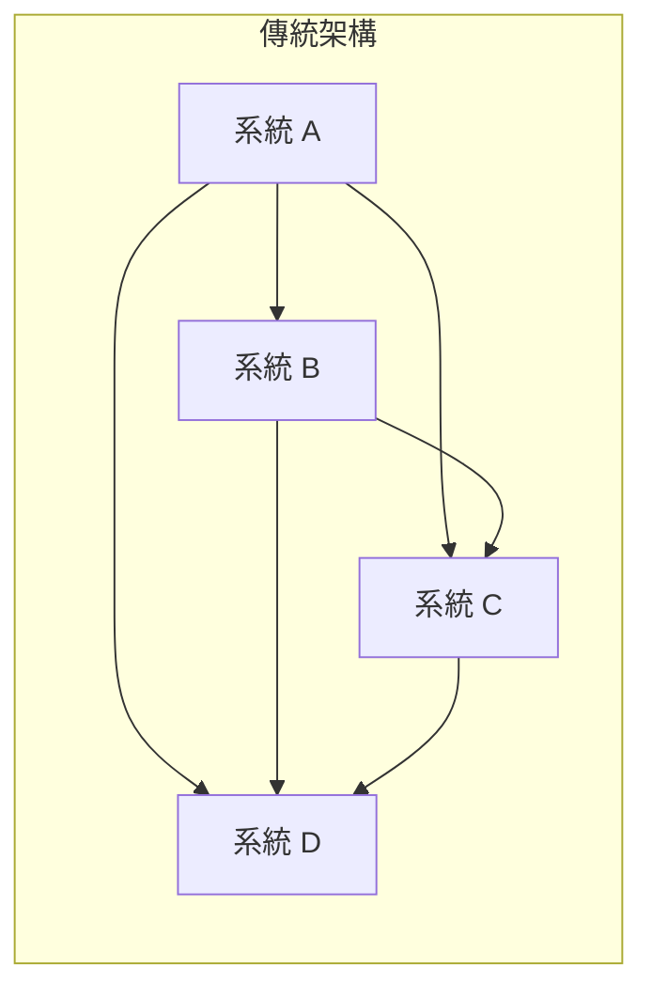
```mermaid
flowchart LR
    subgraph 傳統架構
        A1[系統 A] --> B1[系統 B]
        A1 --> C1[系統 C]
        A1 --> D1[系統 D]
        B1 --> C1
        B1 --> D1
        C1 --> D1
    end
```

當系統數量為 N 時，點對點整合最多需要 N×(N−1) 條介面，任一系統改版都可能牽動多個下游。

**解決方案：以 Kafka 作為中央事件骨幹（Event Backbone），實現系統解耦**

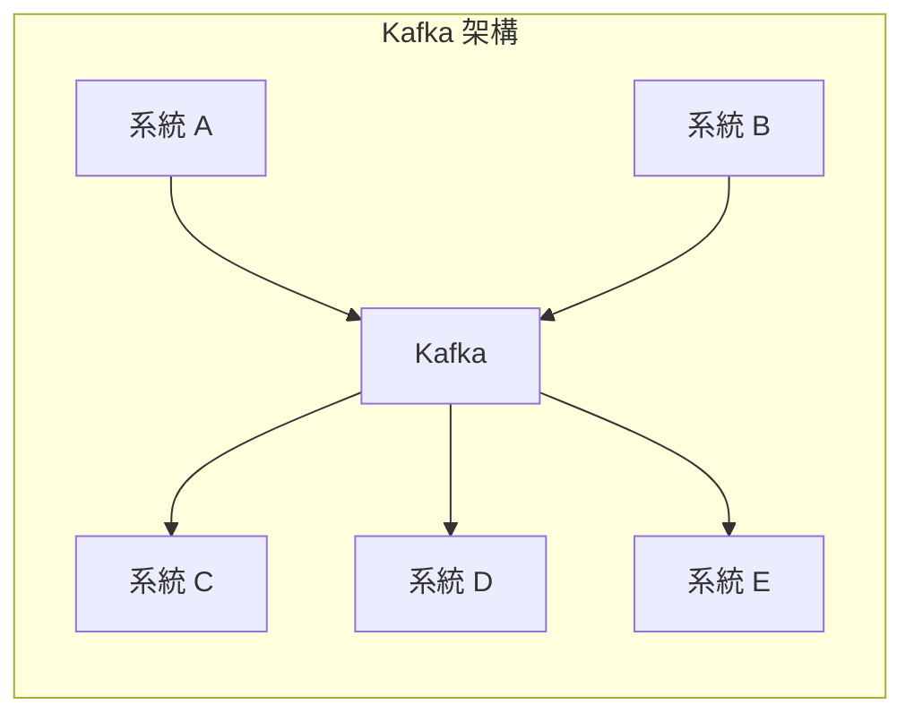
```mermaid
flowchart LR
    subgraph Kafka 架構
        A2[系統 A] --> K[Kafka]
        B2[系統 B] --> K
        K --> C2[系統 C]
        K --> D2[系統 D]
        K --> E2[系統 E]
    end
```

生產者與消費者**完全解耦且互不知情**：生產者只負責寫入事件，消費者依自身節奏讀取；新增下游系統時，無須修改上游程式。這正是 Kafka 能達成高擴展性的關鍵設計。

#### 典型產業應用

| 產業／領域 | 應用範例 |
| --- | --- |
| **金融** | 即時處理支付與金融交易、交易日誌、即時風控與反洗錢（AML）事件 |
| **證券** | 行情資料分發、委託與成交事件串流 |
| **物流與製造** | 車隊與貨物即時追蹤、工廠 IoT 感測器資料擷取與分析 |
| **零售與電商** | 訂單事件處理、顧客互動即時回應 |
| **醫療** | 病患監測資料即時分析與預警 |
| **企業 IT** | 跨部門資料串接、事件驅動架構與微服務基礎、資料湖／資料倉儲匯入 |

### 1.2 與傳統 Message Queue 的差異

| 特性 | Kafka | RabbitMQ | ActiveMQ（Classic／Artemis） |
| --- | --- | --- | --- |
| **訊息模型** | Log-based（分散式提交日誌） | Queue-based（另有 Streams 日誌型佇列） | Queue-based／Topic |
| **訊息保留** | 依時間／大小保留，**消費後不刪除**，可重播 | 傳統佇列消費後刪除；Streams 可保留 | 消費後刪除 |
| **吞吐量** | 極高（百萬級／秒） | 中高（萬至十萬級／秒） | 中等 |
| **順序保證** | Partition 內保證順序 | 單一 Queue 保證 | 單一 Queue 保證 |
| **消費模式** | Pull；Consumer Group（分區獨占）＋ Share Group（逐筆確認） | Push 為主 | Push／Pull |
| **逐筆確認／重送** | Share Group 支援逐筆 ACK、重送與傳遞次數上限 | 原生支援 | 原生支援 |
| **叢集架構** | 原生分散式（KRaft） | Quorum Queue（Raft） | 主備／叢集 |
| **適用場景** | 事件串流、資料管道、CDC、日誌、事件溯源 | 任務佇列、複雜路由、RPC | 傳統企業整合（JMS） |

> ⚠️ **v2.0 更正**：v1.0 將「逐筆確認的工作佇列」列為 Kafka 不適合的情境。自 Kafka 4.2 起，**Share Group（Queues for Kafka，KIP-932）** 已正式可用（production-ready），Kafka 可在同一平台提供佇列語意；但複雜路由與訊息優先權仍非 Kafka 強項。

#### 關鍵差異說明

1. **Log-based vs Queue-based**
   - Kafka：事件寫入後保留在 Log 中，**消費不會刪除事件**；多個 Consumer Group 可以各自獨立地、以不同速度讀取同一份資料。
   - 傳統 MQ：訊息被確認消費後即從 Queue 移除。

2. **Consumer Group 機制**
   - 同一 Consumer Group 內的 Consumer 分擔 Partition（每個 Partition 同時只由群組內一個 Consumer 處理），實現負載平衡。
   - 不同群組獨立消費相同事件，實現廣播（fan-out）。

3. **Share Group 機制（4.2 起正式可用）**
   - 同一 Share Group 內的多個 Consumer 可**同時**消費同一個 Partition 的不同記錄，並逐筆確認（accept／release／reject／renew）。
   - 消費者數量不再受 Partition 數量限制，適合工作佇列型負載。

### 1.3 適合與不適合的使用情境

#### ✅ 適合 Kafka 的情境

| 情境 | 說明 |
| --- | --- |
| **事件驅動架構（EDA）** | 系統間透過事件通訊，實現鬆耦合 |
| **日誌收集與聚合** | 集中收集多系統日誌，供分析與資安平台（SIEM）使用 |
| **即時資料管道** | 將資料從來源系統即時傳輸至目標系統（搭配 Kafka Connect） |
| **CDC（Change Data Capture）** | 捕捉資料庫變更，同步至其他系統（如 Debezium） |
| **指標收集** | 收集應用程式與基礎設施指標，供監控系統使用 |
| **微服務非同步通訊** | 作為微服務間的非同步通訊與事件溯源（Event Sourcing）儲存 |
| **串流處理** | 以 Kafka Streams／Flink 進行即時彙總、關聯與偵測 |
| **工作佇列（4.2+）** | 以 Share Group 平行處理可獨立完成的任務 |

#### ❌ 不適合 Kafka 的情境

| 情境 | 原因 | 替代方案 |
| --- | --- | --- |
| **同步 Request-Response** | Kafka 為非同步設計，以 Kafka 模擬 RPC 會增加延遲與複雜度 | REST API、gRPC |
| **極小量訊息且要求極低延遲** | Kafka 為吞吐量最佳化，批次與複寫會帶來毫秒級延遲 | Redis Pub/Sub、NATS |
| **複雜的訊息路由** | Kafka 無 Exchange／Routing Key 機制 | RabbitMQ（Exchange） |
| **訊息優先權** | Kafka 不支援訊息優先權 | RabbitMQ 優先權佇列，或以多個 Topic 分級 |
| **隨機查詢與 CRUD** | Kafka 不是資料庫，無索引查詢 | 關聯式資料庫、NoSQL |
| **跨系統分散式交易（2PC）** | Kafka 交易僅保證 Kafka 內部的原子性 | Saga 模式 + Transactional Outbox（見 [6.4](#64-常見整合架構模式)） |

### 1.4 核心概念與五大 API

> 🆕 **v2.0 新增**

#### 1.4.1 事件（Event）結構

事件（亦稱 Record 或 Message）記錄「某件事發生了」。每筆事件由下列部分組成：

| 欄位 | 說明 | 範例 |
| --- | --- | --- |
| **Key** | 決定寫入哪個 Partition；相同 Key 會進入相同 Partition，確保順序 | `"ACC-10023"` |
| **Value** | 事件內容（通常為 JSON、Avro、Protobuf） | `{"amount":2000,"type":"TRANSFER"}` |
| **Timestamp** | 事件時間或寫入時間 | `2026-09-29T09:30:00+08:00` |
| **Headers** | 選用的中繼資料（追蹤 ID、Schema 版本、來源系統） | `traceparent`、`source=core-banking` |

#### 1.4.2 核心術語

| 術語 | 說明 |
| --- | --- |
| **Producer** | 將事件寫入 Kafka 的客戶端應用程式 |
| **Consumer** | 訂閱並處理事件的客戶端應用程式 |
| **Topic** | 事件的邏輯分類，類似檔案系統中的資料夾；可有零到多個生產者與訂閱者 |
| **Partition** | Topic 的分片，分散在不同 Broker 上，使多個客戶端可同時讀寫 |
| **Offset** | 事件在 Partition 內的唯一遞增序號 |
| **Replication** | 每個 Partition 可複製多份於不同 Broker（常見正式設定為 3 份） |
| **Broker** | 負責儲存與提供事件的伺服器 |
| **Controller** | 管理叢集中繼資料（Metadata）的節點，以 KRaft 共識協定運作 |

#### 1.4.3 五大 API

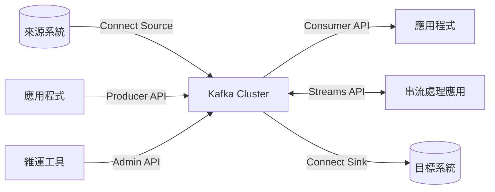
```mermaid
flowchart LR
    SRC[(來源系統)] -->|Connect Source| K[Kafka Cluster]
    APP1[應用程式] -->|Producer API| K
    K -->|Consumer API| APP2[應用程式]
    K <-->|Streams API| STR[串流處理應用]
    K -->|Connect Sink| DST[(目標系統)]
    ADM[維運工具] -->|Admin API| K
```

| API | 用途 | 典型使用者 |
| --- | --- | --- |
| **Admin API** | 管理與檢視 Topic、Broker、ACL、Group 與其他 Kafka 物件 | 平台團隊、自動化工具 |
| **Producer API** | 將事件流發布到一或多個 Topic | 應用開發者 |
| **Consumer API** | 訂閱一或多個 Topic 並處理事件流（含 Share Consumer） | 應用開發者 |
| **Kafka Streams API** | 建構串流處理應用：轉換、彙總、關聯、視窗運算、狀態管理 | 資料／應用開發者 |
| **Kafka Connect API** | 建立與執行可重用的資料匯入／匯出連接器（Connector） | 資料整合團隊 |

官方維護 Java／Scala 客戶端；社群另提供 Go、Python、C/C++、.NET、Node.js 等語言客戶端與 REST Proxy。

### 1.5 版本演進與 4.x 重點

> 🆕 **v2.0 新增**

#### 1.5.1 近期版本時間軸

| 版本 | 發布時間 | 重點 |
| --- | --- | --- |
| **3.9** | 2024 年 11 月 | 最後一個支援 ZooKeeper 的版本，作為 ZooKeeper → KRaft 遷移的 **bridge release**；KRaft 動態 Controller Quorum（KIP-853）；Tiered Storage 可用於正式環境 |
| **4.0** | 2025 年 3 月 | **移除 ZooKeeper**；新 Consumer Rebalance Protocol GA（KIP-848）；Transactions Server-Side Defense（KIP-890）；Queues for Kafka 早期存取；ELR 預覽；Broker 需 Java 17、Client 需 Java 11；Log4j → Log4j2；移除 MirrorMaker 1 與舊協定版本（KIP-896） |
| **4.1** | 2025 年 9 月 | Queues for Kafka 預覽；Streams Rebalance Protocol 早期存取（KIP-1071）；OAuth jwt-bearer（KIP-1139）；新叢集預設啟用 ELR（KIP-966） |
| **4.2** | 2026 年 2 月 | **Queues for Kafka（Share Group）正式可用**；Streams Rebalance Protocol GA；Streams DLQ（KIP-1034）；CLI 參數一致化（KIP-1147）；支援 Java 25 |
| **4.3** | 2026 年 5 月 | Broker／Log Dir Cordon（KIP-1066）；Partition 大小百分比指標（KIP-1257）；OAuth Client Assertion（KIP-1258）；classic Rebalance Protocol 淘汰第一階段（KIP-1274）；多項 Tiered Storage 改善 |

> 📌 截至 2026 年 9 月，最新修補版本為 **4.3.1**。

#### 1.5.2 4.x 對企業的關鍵影響

| 變更 | 影響 | 行動 |
| --- | --- | --- |
| ZooKeeper 完全移除 | 3.x ZooKeeper 叢集無法直接升級 | 先升級至 3.9 完成 KRaft 遷移（見 [8.5](#85-3x-升級至-4x-破壞性變更)） |
| Java 基準提高 | Broker 需 Java 17+；Client 需 Java 11+ | 盤點 JDK 版本與容器映像 |
| 舊協定移除（KIP-896） | 4.x Client 需 Broker 2.1+；2.1 以前的舊 Client 無法連線 4.x Broker | 盤點所有 Client 版本 |
| Log4j2 | 日誌設定檔格式改變 | 改寫 `log4j2.yaml`／`log4j2.properties` |
| Share Group GA | 可用 Kafka 取代部分傳統 MQ 工作佇列 | 評估 MQ 收斂策略 |
| KIP-848 新協定 | Rebalance 由 Broker 主導，大幅降低 stop-the-world | 新專案採 `group.protocol=consumer` |

### 1.6 💡 本章實務建議

> **金融業導入考量**：
>
> - Kafka 非常適合用於交易日誌、風控事件、跨系統資料同步與稽核軌跡。
> - 核心帳務的「一致性」應由資料庫交易保證，Kafka 負責可靠的事件傳遞；跨系統一致性以 **Transactional Outbox + Saga** 設計。
> - 建議先在非核心系統（如通知、報表、日誌平台）驗證，再逐步擴展至關鍵系統。
> - 新導入專案直接以 Kafka 4.x（KRaft）為基準，避免落入 ZooKeeper 遷移的技術債。

---

## 2. Kafka 系統架構總覽

### 2.1 Kafka 核心元件說明

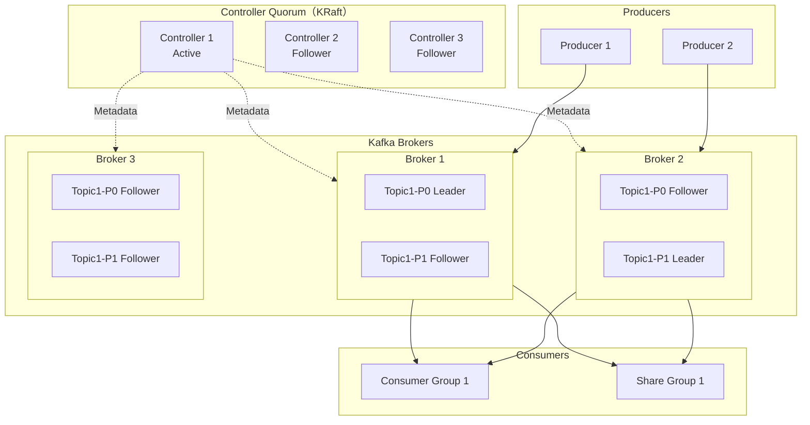
```mermaid
flowchart TB
    subgraph CQ[Controller Quorum（KRaft）]
        CT1[Controller 1<br/>Active]
        CT2[Controller 2<br/>Follower]
        CT3[Controller 3<br/>Follower]
    end

    subgraph KC[Kafka Brokers]
        subgraph Broker1[Broker 1]
            T1P0[Topic1-P0 Leader]
            T1P1[Topic1-P1 Follower]
        end
        subgraph Broker2[Broker 2]
            T1P0F[Topic1-P0 Follower]
            T1P1L[Topic1-P1 Leader]
        end
        subgraph Broker3[Broker 3]
            T1P0F2[Topic1-P0 Follower]
            T1P1F[Topic1-P1 Follower]
        end
    end

    subgraph Producers
        P1[Producer 1]
        P2[Producer 2]
    end

    subgraph Consumers
        CG1[Consumer Group 1]
        SG1[Share Group 1]
    end

    CT1 -.->|Metadata| Broker1
    CT1 -.->|Metadata| Broker2
    CT1 -.->|Metadata| Broker3
    P1 --> Broker1
    P2 --> Broker2
    Broker1 --> CG1
    Broker2 --> CG1
    Broker1 --> SG1
    Broker2 --> SG1
```

#### 2.1.1 Broker

**Broker** 是 Kafka 叢集中負責儲存與提供資料的伺服器節點，負責：

- 接收 Producer 發送的事件並持久化至磁碟
- 提供事件給 Consumer 讀取
- 與其他 Broker 進行 Partition 副本複寫
- 擔任 Group Coordinator、Transaction Coordinator、Share Coordinator 等協調角色

```text
正式環境建議至少 3 個 Broker，並分散於不同機架（Rack）或可用區（AZ）
```

#### 2.1.2 Topic 與 Partition

**Topic（主題）**：

- 事件的邏輯分類，類似資料庫的 Table 或檔案系統的資料夾
- 例如：`order-events`、`user-activities`、`system-logs`
- 事件在消費後**不會被刪除**，保存期限由 Topic 設定決定

**Partition（分區）**：

- Topic 的物理分割單位，分散在不同 Broker 上
- 每個 Partition 是一個有序、只可附加（append-only）且不可變的事件序列
- Partition 內每筆事件有唯一的 Offset（偏移量）
- **相同 Key 的事件會寫入相同 Partition**，Kafka 保證同一 Partition 內的讀取順序與寫入順序一致

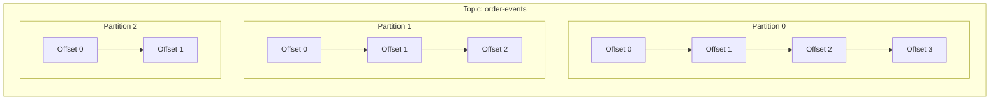
```mermaid
flowchart LR
    subgraph Topic: order-events
        subgraph P0[Partition 0]
            M0[Offset 0] --> M1[Offset 1] --> M2[Offset 2] --> M3[Offset 3]
        end
        subgraph P1[Partition 1]
            M4[Offset 0] --> M5[Offset 1] --> M6[Offset 2]
        end
        subgraph P2[Partition 2]
            M7[Offset 0] --> M8[Offset 1]
        end
    end
```

**Partition 設計原則**：

- 決定了 Consumer Group 的最大並行度
- 在 Consumer Group 中，一個 Partition 同時只能被群組內一個 Consumer 消費（Share Group 不受此限）
- Partition 數量可以增加但**不能減少**；增加後 Key 與 Partition 的對應會改變

#### 2.1.3 Producer

**Producer（生產者）** 負責將事件發送至 Kafka：

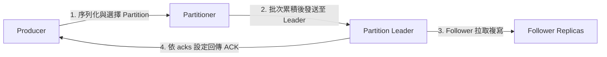
```mermaid
flowchart LR
    P[Producer] -->|1. 序列化與選擇 Partition| PL[Partitioner]
    PL -->|2. 批次累積後發送至 Leader| B[Partition Leader]
    B -->|3. Follower 拉取複寫| BF[Follower Replicas]
    B -->|4. 依 acks 設定回傳 ACK| P
```

**Partition 選擇策略**：

| 策略 | 說明 |
| --- | --- |
| **指定 Partition** | 直接在 `ProducerRecord` 指定目標 Partition |
| **Key Hash** | 有 Key 時依 Key 的 murmur2 Hash 選擇（同 Key 同 Partition） |
| **Sticky（黏性）** | 無 Key 時的預設行為：批次內黏在同一 Partition，批次滿後切換，減少請求數 |
| **Adaptive** | `partitioner.adaptive.partitioning.enable=true`（預設）時，依 Broker 回應速度調整，較少將資料送往較慢的 Broker |

> ⚠️ **v2.0 更正**：v1.0 表示「無 Key 時預設為 Round Robin」。自 Kafka 2.4 起無 Key 預設為 Sticky Partitioner，3.3 起再改良為 Uniform Sticky（KIP-794），不再逐筆輪詢。

#### 2.1.4 Consumer 與 Consumer Group

**Consumer（消費者）**：從 Kafka 拉取（Pull）事件的客戶端。

**Consumer Group（消費者群組）**：

- 一組共同消費 Topic 的 Consumer 邏輯集合
- 每個 Partition 同一時間只會被群組內的一個 Consumer 消費
- 群組以 Offset 記錄消費進度，儲存於內部 Topic `__consumer_offsets`

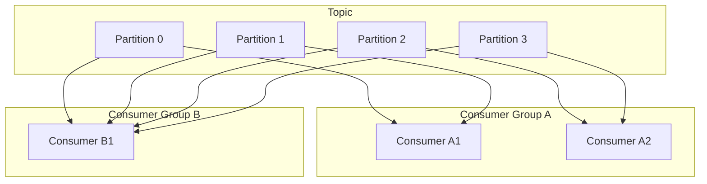
```mermaid
flowchart TB
    subgraph Topic
        P0[Partition 0]
        P1[Partition 1]
        P2[Partition 2]
        P3[Partition 3]
    end

    subgraph Consumer Group A
        CA1[Consumer A1]
        CA2[Consumer A2]
    end

    subgraph Consumer Group B
        CB1[Consumer B1]
    end

    P0 --> CA1
    P1 --> CA1
    P2 --> CA2
    P3 --> CA2

    P0 --> CB1
    P1 --> CB1
    P2 --> CB1
    P3 --> CB1
```

**重點**：

- Consumer Group A 有 2 個 Consumer，分擔 4 個 Partition
- Consumer Group B 有 1 個 Consumer，消費全部 4 個 Partition
- 兩個 Group 獨立消費、各自維護 Offset，互不影響

**Rebalance Protocol 演進**：

| 協定 | 設定 | 特性 |
| --- | --- | --- |
| **Classic** | `group.protocol=classic`（4.3 預設值） | 由 Client 端 Leader 計算分配；Eager／Cooperative 模式；成員變動時可能暫停消費。4.3 起進入淘汰第一階段（KIP-1274） |
| **Consumer（KIP-848）** | `group.protocol=consumer` | 由 Broker 端 Group Coordinator 計算分配並以心跳增量下發；無全域同步屏障，Rebalance 更快更穩定；4.0 起 GA |

#### 2.1.5 Controller 與 KRaft Metadata Quorum

> ⚠️ **v2.0 更正**：v1.0 描述 Controller 為「透過 ZooKeeper／KRaft 選舉產生的特殊 Broker」。Kafka 4.x 已移除 ZooKeeper，Controller 由 **KRaft（Kafka Raft）共識協定** 組成的 Quorum 提供。

**Controller** 負責管理叢集中繼資料（Metadata），包括：

- Topic、Partition、副本配置與 Leader 選舉
- Broker 註冊、心跳與隔離（fencing）
- ISR 與 ELR 變更
- 設定、ACL、SCRAM 憑證、功能版本（Feature Level）等叢集狀態

**運作方式**：

- 多個 Controller 組成 Raft Quorum，其中一個為 **Active Controller**（Leader），其他為熱備（Follower）。
- 所有中繼資料變更寫入內部 Topic **`__cluster_metadata`**（Metadata Log），並定期產生快照（Snapshot）。
- Broker 以 Observer 身分拉取 Metadata Log，在記憶體中維護最新叢集狀態，因此 Controller 切換幾乎無需重新載入。

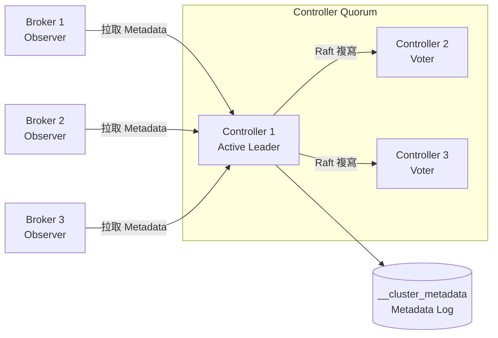
```mermaid
flowchart LR
    subgraph Quorum[Controller Quorum]
        C1[Controller 1<br/>Active Leader]
        C2[Controller 2<br/>Voter]
        C3[Controller 3<br/>Voter]
        C1 -->|Raft 複寫| C2
        C1 -->|Raft 複寫| C3
    end
    ML[(__cluster_metadata<br/>Metadata Log)]
    C1 --> ML
    B1[Broker 1<br/>Observer] -->|拉取 Metadata| C1
    B2[Broker 2<br/>Observer] -->|拉取 Metadata| C1
    B3[Broker 3<br/>Observer] -->|拉取 Metadata| C1
```

**節點角色（`process.roles`）**：

| 設定值 | 角色 | 建議用途 |
| --- | --- | --- |
| `broker` | 僅 Broker | 正式環境資料節點 |
| `controller` | 僅 Controller | 正式環境中繼資料節點 |
| `broker,controller` | 合併模式（combined mode） | 僅限開發、測試或小型非關鍵環境 |

> 📌 官方文件指出：**合併模式不建議用於關鍵部署環境**，因為 Controller 無法與 Broker 分開滾動重啟或擴縮。正式環境應採「獨立 Controller（isolated mode）」。

**Controller 數量與容錯**：

| Controller 數 | 可容忍同時故障數 | 說明 |
| --- | --- | --- |
| 3 | 1 | 一般正式環境 |
| 5 | 2 | 高可用要求或需在維護期間仍容忍故障 |

通式：`2N + 1` 個 Controller 可容忍 `N` 個同時故障。

**Static vs Dynamic Quorum（KIP-853）**：

| 類型 | 設定 | 特性 |
| --- | --- | --- |
| **Static（舊式）** | `controller.quorum.voters=1@host1:9093,...` | 所有 Controller 須列在每個節點設定中；變更成員需停機調整 |
| **Dynamic（建議）** | `controller.quorum.bootstrap.servers=host1:9093,...` | 類似 Client 的 `bootstrap.servers`，不需列出所有 Controller；可線上新增／移除 Controller（`kraft.version` ≥ 1） |

#### 2.1.6 Share Group（Queues for Kafka）

> 🆕 **v2.0 新增**

**Share Group** 由 KIP-932 引入，4.0 早期存取、4.1 預覽，**4.2 起正式可用**。它讓 Kafka 提供類似傳統佇列的「合作消費（cooperative consumption）」語意：

| 比較項目 | Consumer Group | Share Group |
| --- | --- | --- |
| Partition 分配 | 一個 Partition 同時只屬於一個 Consumer | 多個 Consumer 可同時消費同一 Partition |
| 並行度上限 | ≤ Partition 數 | 不受 Partition 數限制 |
| 進度追蹤 | 每個 Partition 一個 Offset | 逐筆記錄狀態（Available／Acquired／Acknowledged／Archived） |
| 確認方式 | 提交 Offset（批次） | 逐筆 ACK：`ACCEPT`、`RELEASE`、`REJECT`、`RENEW`（4.2） |
| 順序保證 | Partition 內保證 | **不保證順序** |
| 重送控制 | 應用程式自行處理 | 取得鎖逾時自動釋放；超過傳遞次數上限（預設 5）後封存 |
| 適用場景 | 事件串流、需順序、需重播 | 工作佇列、可獨立處理的任務 |

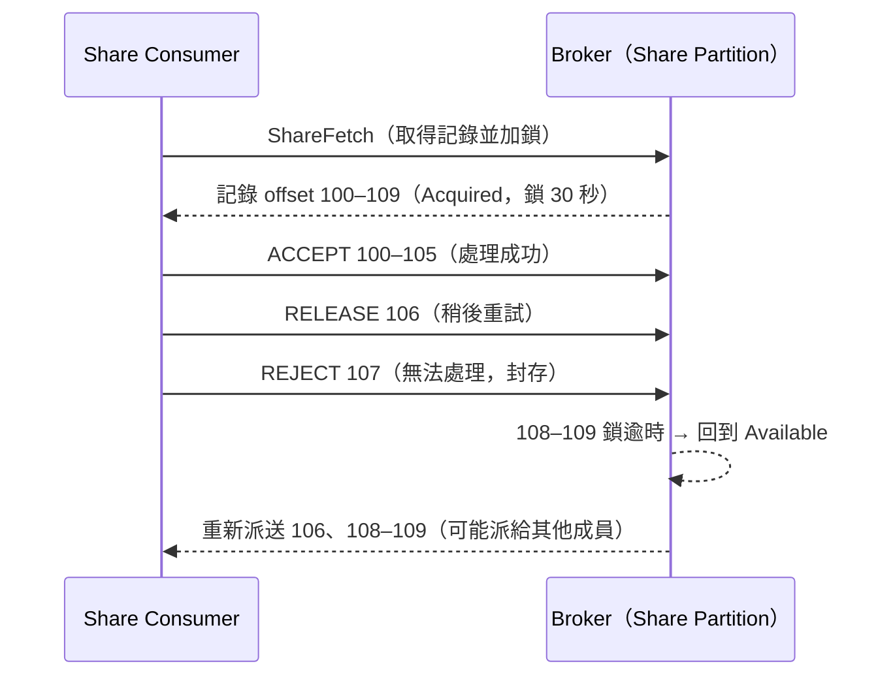
```mermaid
sequenceDiagram
    participant C as Share Consumer
    participant B as Broker（Share Partition）
    C->>B: ShareFetch（取得記錄並加鎖）
    B-->>C: 記錄 offset 100–109（Acquired，鎖 30 秒）
    C->>B: ACCEPT 100–105（處理成功）
    C->>B: RELEASE 106（稍後重試）
    C->>B: REJECT 107（無法處理，封存）
    B-->>B: 108–109 鎖逾時 → 回到 Available
    B-->>C: 重新派送 106、108–109（可能派給其他成員）
```

### 2.2 高可用（HA）與水平擴充設計原則

#### 2.2.1 副本機制（Replication）

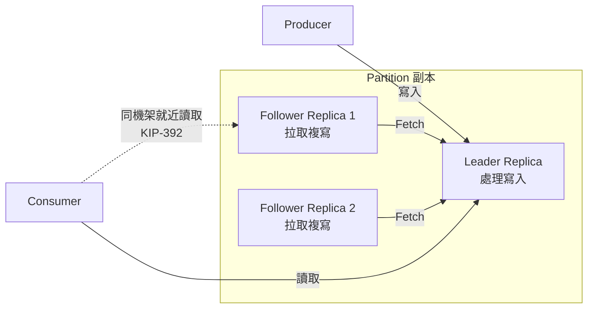
```mermaid
flowchart LR
    subgraph Partition 副本
        L[Leader Replica<br/>處理寫入]
        F1[Follower Replica 1<br/>拉取複寫]
        F2[Follower Replica 2<br/>拉取複寫]
    end

    P[Producer] -->|寫入| L
    F1 -->|Fetch| L
    F2 -->|Fetch| L
    C[Consumer] -->|讀取| L
    C -.->|同機架就近讀取<br/>KIP-392| F1
```

**關鍵名詞**：

| 名詞 | 說明 |
| --- | --- |
| **Replication Factor（RF）** | 每個 Partition 的副本總數（正式環境建議 3） |
| **Leader Replica** | 處理該 Partition 寫入（與預設讀取）的副本 |
| **Follower Replica** | 從 Leader 拉取資料的副本；可設定 `client.rack` 讓 Consumer 讀取同機架 Follower（KIP-392） |
| **ISR（In-Sync Replicas）** | 與 Leader 保持同步的副本集合 |
| **`min.insync.replicas`** | 搭配 `acks=all` 時，寫入成功所需的最少同步副本數；不足時 Producer 收到 `NotEnoughReplicas` 錯誤 |
| **High Watermark（HW）** | 已被所有 ISR 複寫的最大 Offset，Consumer 只能讀到 HW 之前的資料 |
| **ELR（Eligible Leader Replicas）** | 🆕 KIP-966：ISR 低於 `min.insync.replicas` 時，保證擁有完整已提交資料、可安全被選為 Leader 的副本集合 |

#### 2.2.2 高可用設計原則

```text
建議配置（正式環境）：
- Broker 數量 ≥ 3，分散於不同機架／可用區（設定 broker.rack）
- Controller：3 或 5 台獨立節點
- replication.factor = 3
- min.insync.replicas = 2
- acks = all（Kafka 3.0 起預設）
- enable.idempotence = true（Kafka 3.0 起預設）
- unclean.leader.election.enable = false（預設）
```

> ⚠️ **v2.0 更正**：v1.0 的「可容忍故障數 = RF − Min ISR」只描述了**寫入可用性**。完整應分為兩個面向：

| 面向 | 公式 | RF=3、min.insync.replicas=2 |
| --- | --- | --- |
| **寫入持續可用**（`acks=all`） | 可容忍故障 = RF − min.insync.replicas | 1 台 Broker 故障仍可寫入 |
| **已提交資料不遺失** | 可容忍故障 = min.insync.replicas − 1（最壞情況） | 至少 1 台故障不遺失已確認資料 |
| **可讀取**（尚有 Leader） | 可容忍故障 = RF − 1 | 2 台故障仍可讀取（若有合格 Leader） |

**ELR 的價值（KIP-966）**：在「最後一個副本存活（Last Replica Standing）」的罕見情境下，傳統 ISR 機制可能選出資料不完整的 Leader，導致即使 `acks=all` 也遺失已提交資料。ELR 讓 Controller 追蹤「不在 ISR 但保證資料完整」的副本，只從 ISR 或 ELR 中選 Leader。ELR 在 4.0 為預覽，**4.1 起新叢集預設啟用**（僅 KRaft）。

#### 2.2.3 機架感知（Rack Awareness）

| 設定 | 位置 | 作用 |
| --- | --- | --- |
| `broker.rack` | Broker | 建立 Topic 時副本分散於不同 Rack／AZ |
| `client.rack` | Consumer | 搭配 `replica.selector.class=org.apache.kafka.common.replica.RackAwareReplicaSelector`，從同 Rack 的 Follower 讀取，降低跨 AZ 流量成本 |

#### 2.2.4 水平擴充原則

| 擴充方式 | 影響 | 注意事項 |
| --- | --- | --- |
| **增加 Broker** | 提升整體容量與吞吐量 | 新 Broker 不會自動承接既有 Partition，需執行重新分配（見 [7.6](#76-叢集維護作業)） |
| **增加 Partition** | 提升 Consumer Group 並行度 | 只能增加不能減少；會改變 Key 的 Partition 對應 |
| **增加 Consumer** | 提升消費速度 | Consumer Group：Consumer 數 ≤ Partition 數；Share Group 不受此限 |
| **增加 Controller** | 提升中繼資料容錯能力 | Dynamic Quorum 可線上新增（見 [3.3.5](#335-controller-動態擴縮)） |

### 2.3 儲存層架構

> 🆕 **v2.0 新增**

#### 2.3.1 Log Segment 結構

每個 Partition 在磁碟上是一個目錄，內含多個 **Segment** 檔案：

```text
/var/lib/kafka/data/order-events-0/
├── 00000000000000000000.log        # 事件資料
├── 00000000000000000000.index      # Offset → 檔案位置索引
├── 00000000000000000000.timeindex  # Timestamp → Offset 索引
├── 00000000000000350000.log        # 目前寫入中的 Active Segment
├── 00000000000000350000.index
├── 00000000000000350000.timeindex
├── leader-epoch-checkpoint
└── partition.metadata
```

| 概念 | 說明 |
| --- | --- |
| **Active Segment** | 目前寫入中的 Segment，不會被刪除或壓縮 |
| **Segment Roll** | 達到 `segment.bytes`（預設 1 GiB）或 `segment.ms`（預設 7 天）時產生新 Segment |
| **Retention** | 以 Segment 為單位刪除過期資料，因此實際保存時間可能略長於設定值 |

#### 2.3.2 高效能設計

| 技術 | 說明 |
| --- | --- |
| **順序 I/O** | 只附加寫入，充分利用磁碟順序寫入效能 |
| **Page Cache** | 依賴作業系統頁快取，而非 JVM Heap，因此 Broker Heap 不需很大 |
| **Zero-Copy** | 以 `sendfile` 將資料從 Page Cache 直接送往網路（未啟用 TLS 時） |
| **批次與壓縮** | Producer 批次壓縮，Broker 原樣儲存，Consumer 解壓縮 |

### 2.4 Tiered Storage（分層儲存）

> 🆕 **v2.0 新增**

**Tiered Storage（KIP-405）** 將 Partition 分為「本地層（Local Tier）」與「遠端層（Remote Tier，如 S3、HDFS、物件儲存）」。已封存的 Segment 上傳至遠端層後即可從本地刪除，Broker 僅保留近期熱資料。自 3.9 起可用於正式環境，4.x 持續強化。

| 優點 | 說明 |
| --- | --- |
| **降低儲存成本** | 長期保存資料移到低成本物件儲存 |
| **縮短維運時間** | Broker 本地資料量小，重新分配與復原更快 |
| **彈性擴充** | 運算（Broker）與儲存分離 |

**主要設定**：

```properties
# Broker 層級：啟用遠端儲存系統
remote.log.storage.system.enable=true
remote.log.storage.manager.class.name=<RemoteStorageManager 實作類別>
remote.log.metadata.manager.class.name=org.apache.kafka.server.log.remote.metadata.storage.TopicBasedRemoteLogMetadataManager

# Topic 層級：啟用分層儲存並設定本地保留時間
remote.storage.enable=true
local.retention.ms=86400000      # 本地保留 1 天
retention.ms=31536000000         # 總保留 365 天（含遠端）
```

> 📌 Apache Kafka 僅提供 `RemoteStorageManager` 介面，實際的 S3／GCS／Azure Blob 外掛需使用社群或商業實作，導入前應評估其成熟度與支援。4.3 新增 `follower.fetch.last.tiered.offset.enable`（KIP-1023），新 Follower 可從最後分層 Offset 開始複寫，縮短重建時間。

### 2.5 💡 本章實務建議

> **架構設計建議**：
>
> 1. 正式環境至少 3 個 Broker 與 3 個獨立 Controller，分散於不同機架或可用區。
> 2. Partition 數量依吞吐量與消費並行度估算，預留成長空間（見 [4.2.1](#421-partition-數量設計)）。
> 3. 監控 ISR 收縮（`UnderMinIsrPartitionCount`）並立即處理，低於 `min.insync.replicas` 時寫入將失敗。
> 4. 長期保存需求優先評估 Tiered Storage，而非無限擴充本地磁碟。
> 5. 工作佇列型負載評估 Share Group，避免為提高並行度而過度增加 Partition。

---

## 3. Kafka 安裝與部署

### 3.1 環境需求

#### 3.1.1 硬體需求

| 環境 | 節點類型 | CPU | 記憶體 | 磁碟 | 網路 |
| --- | --- | --- | --- | --- | --- |
| **開發／測試** | 合併模式單節點 | 2 cores | 4–8 GB | 50 GB SSD | 1 Gbps |
| **小型正式** | Broker | 8 cores | 32 GB | 1–2 TB SSD／NVMe | 10 Gbps |
| **小型正式** | Controller | 4 cores | 8–16 GB | 100 GB SSD | 10 Gbps |
| **大型正式** | Broker | 16–32 cores | 64–128 GB | 多顆 NVMe（JBOD） | 25 Gbps 以上 |
| **大型正式** | Controller | 8 cores | 16–32 GB | 200 GB NVMe | 10–25 Gbps |

> 📌 Broker 記憶體主要用於作業系統 Page Cache，JVM Heap 一般 6–8 GB 即足夠；其餘記憶體留給 Page Cache 以提升讀取效能。Kafka 本身以副本提供容錯，**建議使用 JBOD（多個 `log.dirs`）而非 RAID 10**，除非企業儲存政策另有要求。

#### 3.1.2 軟體需求

| 軟體 | 版本要求（Kafka 4.3） | 說明 |
| --- | --- | --- |
| **作業系統** | Linux（RHEL／Rocky／AlmaLinux 8、9；Ubuntu 22.04、24.04 LTS） | 正式環境建議 Linux；CentOS 7 已終止支援，不應再用於新部署 |
| **JDK（Broker、Controller、Connect、工具）** | **Java 17 以上**（17、21 LTS；4.2 起支援 25） | Kafka 4.0 起不再支援 Java 11 執行 Broker |
| **JDK（Client、Streams 應用程式）** | **Java 11 以上** | Kafka 4.0 起不再支援 Java 8 |
| **檔案系統** | XFS（建議）或 ext4 | 掛載選項建議 `noatime` |
| **ZooKeeper** | **不需要** | Kafka 4.0 起已移除 ZooKeeper 模式 |

> ⚠️ **v2.0 更正**：v1.0 列出「JDK 11 或 17」與「ZooKeeper 3.6+」。Kafka 4.x Broker 須 Java 17+，且完全不使用 ZooKeeper。

#### 3.1.3 網路需求

```text
Kafka 常用 Port 規劃（Port 號可自訂，以下為慣例）：
- 9092：Client 連線（PLAINTEXT，僅限開發環境）
- 9093：Controller 通訊（CONTROLLER listener）
- 9094：Client 連線（SASL_SSL，正式環境）
- 9095：Broker 間複寫（INTERNAL listener，可另設 SSL）
- 9999：JMX（若啟用，應限制來源 IP）
- 8083：Kafka Connect REST API（若部署 Connect）
```

**網路規劃原則**：

- Client 必須能連到**每一個** Broker 的 `advertised.listeners` 位址，而不只是 bootstrap 位址。
- Controller Listener 僅需開放給 Broker 與其他 Controller，不應對 Client 開放。
- 所有節點以 NTP／Chrony 進行時間同步。

### 3.2 單機環境安裝（KRaft 模式）

> **說明**：以下為開發與學習用的單節點（合併模式）安裝，依官方 4.3 Quickstart 整理。

#### 步驟 1：下載並驗證

```bash
# 下載 Kafka 4.3.1（Scala 2.13 建置）
cd /opt
wget https://downloads.apache.org/kafka/4.3.1/kafka_2.13-4.3.1.tgz
wget https://downloads.apache.org/kafka/4.3.1/kafka_2.13-4.3.1.tgz.sha512

# 驗證檔案完整性（企業環境必做）
sha512sum kafka_2.13-4.3.1.tgz
cat kafka_2.13-4.3.1.tgz.sha512

# 解壓縮並建立捷徑
tar -xzf kafka_2.13-4.3.1.tgz
ln -s kafka_2.13-4.3.1 kafka

# 設定環境變數
echo 'export KAFKA_HOME=/opt/kafka' >> ~/.bashrc
echo 'export PATH=$PATH:$KAFKA_HOME/bin' >> ~/.bashrc
source ~/.bashrc
```

> 📌 舊版本會從 `downloads.apache.org` 移至 `archive.apache.org/dist/kafka/`。企業內部建議將安裝包與簽章同步至內部制品庫（如 Nexus、Artifactory）。

#### 步驟 2：產生 Cluster ID

```bash
KAFKA_CLUSTER_ID="$(kafka-storage.sh random-uuid)"
echo $KAFKA_CLUSTER_ID
# 輸出範例：MkU3OEVBNTcwNTJENDM2Qk
```

#### 步驟 3：檢視設定檔

> ⚠️ **v2.0 更正**：Kafka 4.0 起 KRaft 設定檔不再放在 `config/kraft/` 目錄，改為 `config/server.properties`（合併模式）、`config/broker.properties` 與 `config/controller.properties`。

編輯 `/opt/kafka/config/server.properties`（重點項目）：

```properties
# 節點角色：合併模式（僅限開發測試）
process.roles=broker,controller

# 節點 ID（叢集內唯一）
node.id=1

# Controller Quorum（Dynamic Quorum 寫法）
controller.quorum.bootstrap.servers=localhost:9093

# 監聽位址
listeners=PLAINTEXT://:9092,CONTROLLER://:9093
advertised.listeners=PLAINTEXT://localhost:9092
controller.listener.names=CONTROLLER
inter.broker.listener.name=PLAINTEXT
listener.security.protocol.map=CONTROLLER:PLAINTEXT,PLAINTEXT:PLAINTEXT

# 資料目錄
log.dirs=/var/lib/kafka/data

# 單節點環境：內部 Topic 副本數須設為 1
offsets.topic.replication.factor=1
transaction.state.log.replication.factor=1
transaction.state.log.min.isr=1
share.coordinator.state.topic.replication.factor=1
share.coordinator.state.topic.min.isr=1

# 預設 Partition 數與保留時間
num.partitions=3
log.retention.hours=168
```

#### 步驟 4：格式化儲存目錄

```bash
sudo mkdir -p /var/lib/kafka/data
sudo chown -R $USER:$USER /var/lib/kafka

# --standalone：將本節點設為唯一的 Controller Voter（Dynamic Quorum）
kafka-storage.sh format --standalone \
  -t $KAFKA_CLUSTER_ID \
  -c /opt/kafka/config/server.properties
```

#### 步驟 5：啟動 Kafka

```bash
# 前景執行（除錯用）
kafka-server-start.sh /opt/kafka/config/server.properties

# 背景執行
kafka-server-start.sh -daemon /opt/kafka/config/server.properties

# 檢查程序
jps -l | grep kafka
# 應看到：kafka.Kafka
```

#### 步驟 6：驗證安裝

```bash
# 檢查 Metadata Quorum 狀態
kafka-metadata-quorum.sh --bootstrap-server localhost:9092 describe --status

# 建立測試 Topic
kafka-topics.sh --create \
  --topic quickstart-events \
  --bootstrap-server localhost:9092 \
  --partitions 3 \
  --replication-factor 1

# 列出 Topic
kafka-topics.sh --list --bootstrap-server localhost:9092

# 發送測試訊息
echo "Hello Kafka" | kafka-console-producer.sh \
  --topic quickstart-events \
  --bootstrap-server localhost:9092

# 消費測試訊息
kafka-console-consumer.sh \
  --topic quickstart-events \
  --from-beginning \
  --bootstrap-server localhost:9092
```

### 3.3 多節點叢集安裝（正式環境）

#### 3.3.1 叢集規劃

正式環境採**獨立 Controller（isolated mode）**，Controller 與 Broker 分離部署：

| 節點 | Hostname | IP | `process.roles` | `node.id` |
| --- | --- | --- | --- | --- |
| Controller 1 | kafka-ctrl-1 | 10.10.1.11 | controller | 1 |
| Controller 2 | kafka-ctrl-2 | 10.10.1.12 | controller | 2 |
| Controller 3 | kafka-ctrl-3 | 10.10.1.13 | controller | 3 |
| Broker 1 | kafka-1 | 10.10.2.21 | broker | 101 |
| Broker 2 | kafka-2 | 10.10.2.22 | broker | 102 |
| Broker 3 | kafka-3 | 10.10.2.23 | broker | 103 |

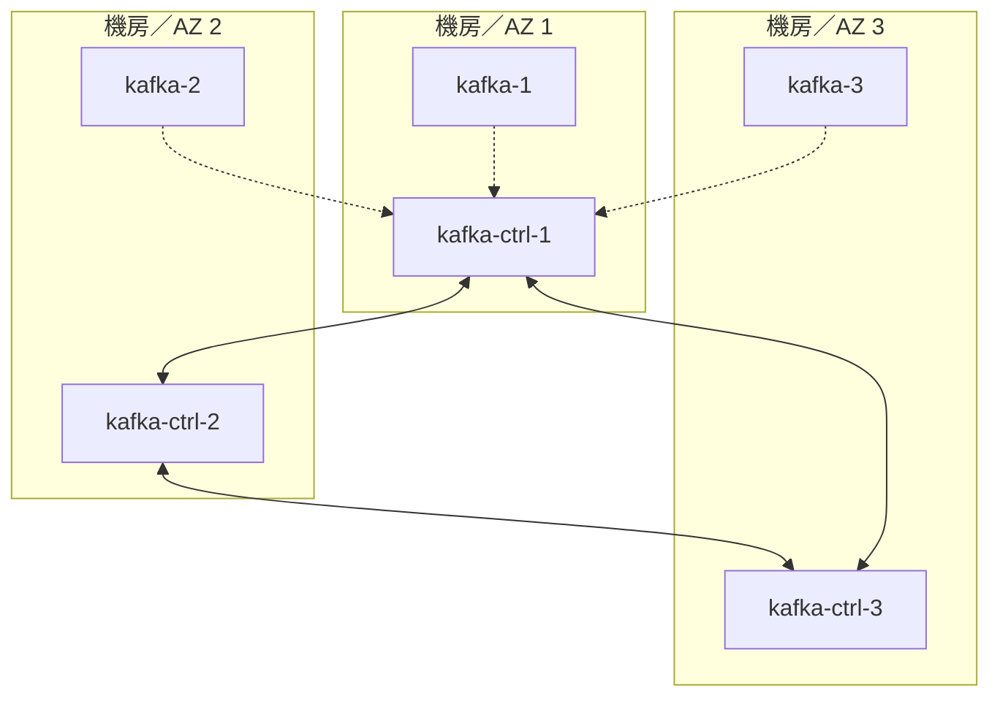
```mermaid
flowchart TB
    subgraph AZ1[機房／AZ 1]
        C1[kafka-ctrl-1]
        B1[kafka-1]
    end
    subgraph AZ2[機房／AZ 2]
        C2[kafka-ctrl-2]
        B2[kafka-2]
    end
    subgraph AZ3[機房／AZ 3]
        C3[kafka-ctrl-3]
        B3[kafka-3]
    end
    C1 <--> C2
    C2 <--> C3
    C1 <--> C3
    B1 -.-> C1
    B2 -.-> C1
    B3 -.-> C1
```

> 📌 `node.id` 在叢集內必須唯一，Controller 與 Broker 共用同一個 ID 空間；以不同區段（如 1–9 給 Controller、101 起給 Broker）可降低設定錯誤風險。

#### 3.3.2 Controller 節點設定

`/opt/kafka/config/controller.properties`（以 Controller 1 為例）：

```properties
process.roles=controller
node.id=1

controller.quorum.bootstrap.servers=kafka-ctrl-1:9093,kafka-ctrl-2:9093,kafka-ctrl-3:9093

listeners=CONTROLLER://kafka-ctrl-1:9093
controller.listener.names=CONTROLLER
listener.security.protocol.map=CONTROLLER:SSL

# Metadata Log 目錄
log.dirs=/var/lib/kafka/metadata
```

Controller 2、3 僅需修改 `node.id` 與 `listeners` 的主機名稱。

#### 3.3.3 Broker 節點設定

`/opt/kafka/config/broker.properties`（以 Broker 1 為例）：

```properties
process.roles=broker
node.id=101
broker.rack=az1

controller.quorum.bootstrap.servers=kafka-ctrl-1:9093,kafka-ctrl-2:9093,kafka-ctrl-3:9093
controller.listener.names=CONTROLLER

listeners=INTERNAL://kafka-1:9095,EXTERNAL://kafka-1:9094
advertised.listeners=INTERNAL://kafka-1:9095,EXTERNAL://kafka-1.corp.example:9094
inter.broker.listener.name=INTERNAL
listener.security.protocol.map=CONTROLLER:SSL,INTERNAL:SSL,EXTERNAL:SASL_SSL

# 多顆磁碟以逗號分隔（JBOD）
log.dirs=/data1/kafka,/data2/kafka

num.partitions=6
default.replication.factor=3
min.insync.replicas=2
offsets.topic.replication.factor=3
transaction.state.log.replication.factor=3
transaction.state.log.min.isr=2

auto.create.topics.enable=false
unclean.leader.election.enable=false

log.retention.hours=168
log.segment.bytes=1073741824
```

Broker 2、3 修改 `node.id`、`broker.rack` 與監聽主機名稱。安全相關設定（SSL、SASL）見[第 9 章](#9-安全性與權限控管)。

#### 3.3.4 叢集初始化與啟動

```bash
# 1. 在任一節點產生 Cluster ID 與每個 Controller 的目錄 UUID
CLUSTER_ID="$(kafka-storage.sh random-uuid)"
CTRL1_UUID="$(kafka-storage.sh random-uuid)"
CTRL2_UUID="$(kafka-storage.sh random-uuid)"
CTRL3_UUID="$(kafka-storage.sh random-uuid)"
echo "$CLUSTER_ID $CTRL1_UUID $CTRL2_UUID $CTRL3_UUID"
# 記錄以上數值，所有節點須使用相同的 CLUSTER_ID 與 initial-controllers

# 2. 在每一台 Controller 執行格式化（三台指令相同，僅設定檔內容不同）
kafka-storage.sh format --cluster-id ${CLUSTER_ID} \
  --initial-controllers "1@kafka-ctrl-1:9093:${CTRL1_UUID},2@kafka-ctrl-2:9093:${CTRL2_UUID},3@kafka-ctrl-3:9093:${CTRL3_UUID}" \
  --config /opt/kafka/config/controller.properties

# 3. 在每一台 Broker 執行格式化
kafka-storage.sh format --cluster-id ${CLUSTER_ID} \
  --config /opt/kafka/config/broker.properties \
  --no-initial-controllers

# 4. 先啟動所有 Controller，再啟動 Broker
kafka-server-start.sh -daemon /opt/kafka/config/controller.properties
kafka-server-start.sh -daemon /opt/kafka/config/broker.properties

# 5. 驗證 Quorum 與複寫狀態
kafka-metadata-quorum.sh --bootstrap-server kafka-1:9094 \
  --command-config admin.properties describe --status
kafka-metadata-quorum.sh --bootstrap-server kafka-1:9094 \
  --command-config admin.properties describe --replication

# 6. 確認所有 Broker 已註冊
kafka-broker-api-versions.sh --bootstrap-server kafka-1:9094 \
  --command-config admin.properties | grep -E "^[a-z0-9.-]+:"
```

> ⚠️ **v2.0 更正**：v1.0 以 `kafka-metadata.sh --snapshot ... --command "describe"` 驗證叢集。正確做法是使用 `kafka-metadata-quorum.sh describe --status`；需要檢視快照內容時使用 `kafka-metadata-shell.sh --snapshot <檔案>`。

`describe --status` 輸出重點：

| 欄位 | 說明 | 正常狀態 |
| --- | --- | --- |
| `LeaderId` | 目前 Active Controller | 存在且穩定 |
| `LeaderEpoch` | Leader 任期 | 不應頻繁增加 |
| `HighWatermark` | Metadata Log 已提交位置 | 持續增加 |
| `MaxFollowerLag` | Follower 最大落後量 | 接近 0 |
| `CurrentVoters` | 目前 Voter 清單 | 與規劃一致 |
| `CurrentObservers` | Observer（Broker）清單 | 包含所有 Broker |

#### 3.3.5 Controller 動態擴縮

使用 Dynamic Quorum 時，可線上新增或移除 Controller：

```bash
# 新增 Controller：先以 --no-initial-controllers 格式化並啟動新節點，
# 等待其追上 Metadata Log（describe --replication 確認 Lag），再加入 Voter
kafka-storage.sh format --cluster-id ${CLUSTER_ID} \
  --config /opt/kafka/config/controller.properties \
  --no-initial-controllers

kafka-metadata-quorum.sh --bootstrap-controller kafka-ctrl-1:9093 \
  --command-config /opt/kafka/config/controller.properties add-controller

# 移除 Controller（需提供 ID 與目錄 UUID）
kafka-metadata-quorum.sh --bootstrap-server kafka-1:9094 \
  --command-config admin.properties \
  remove-controller --controller-id 3 --controller-directory-id <DIRECTORY_UUID>
```

判斷目前為 Static 或 Dynamic Quorum：

```bash
kafka-features.sh --bootstrap-controller kafka-ctrl-1:9093 describe
# kraft.version FinalizedVersionLevel = 0 或不存在 → Static
# kraft.version FinalizedVersionLevel ≥ 1        → Dynamic
```

### 3.4 ZooKeeper 移除與遷移路徑

> ⚠️ **v2.0 改寫**：v1.0 本節為「ZooKeeper 與 KRaft 架構比較」並表示兩者皆可選擇。Kafka 4.0 起 **ZooKeeper 模式已完全移除**，本節改為說明差異與遷移路徑。

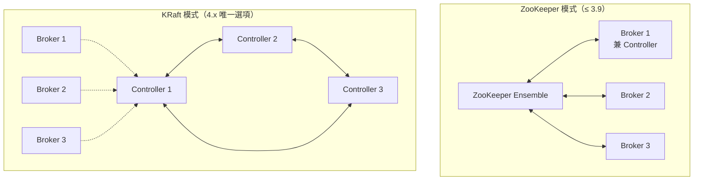
```mermaid
flowchart TB
    subgraph 舊架構[ZooKeeper 模式（≤ 3.9）]
        ZK[ZooKeeper Ensemble]
        OB1[Broker 1<br/>兼 Controller]
        OB2[Broker 2]
        OB3[Broker 3]
        ZK <--> OB1
        ZK <--> OB2
        ZK <--> OB3
    end

    subgraph 新架構[KRaft 模式（4.x 唯一選項）]
        C1[Controller 1]
        C2[Controller 2]
        C3[Controller 3]
        KB1[Broker 1]
        KB2[Broker 2]
        KB3[Broker 3]
        C1 <--> C2
        C2 <--> C3
        C1 <--> C3
        KB1 -.-> C1
        KB2 -.-> C1
        KB3 -.-> C1
    end
```

| 特性 | ZooKeeper 模式（已移除） | KRaft 模式 |
| --- | --- | --- |
| **元件數量** | Kafka + 獨立 ZooKeeper 叢集 | 僅 Kafka |
| **中繼資料儲存** | ZooKeeper znode | `__cluster_metadata` Log |
| **Controller 容錯切換** | 新 Controller 需從 ZooKeeper 重新載入全部狀態 | 熱備 Controller 已有完整狀態，切換快速 |
| **Partition 規模** | 受 ZooKeeper 限制 | 可支援更大規模 |
| **安全設定** | Kafka 與 ZooKeeper 各自設定 | 單一安全模型 |
| **支援版本** | ≤ 3.9 | 3.3 起可用於正式環境；4.0 起為唯一模式 |

**遷移路徑**：

| 現況 | 路徑 |
| --- | --- |
| 3.x ZooKeeper 模式 | ① 升級至 **3.9.x**（bridge release）→ ② 依 3.9 文件執行 ZooKeeper → KRaft 遷移（部署 Controller、雙寫、切換 Broker、結束遷移）→ ③ 再升級至 4.x |
| 3.3–3.8 KRaft 模式 | 可直接滾動升級至 4.x（`metadata.version` 需 ≥ 3.3） |
| 3.0–3.2 KRaft（早期存取） | 先升級至 3.9.x，再升級至 4.x |

**建議**：新專案一律直接使用 Kafka 4.x KRaft 模式。

### 3.5 常見安裝錯誤與排除方式

| 錯誤訊息／現象 | 原因 | 解決方式 |
| --- | --- | --- |
| `UnsupportedClassVersionError` | JDK 版本低於 17 | 安裝 Java 17+ 並設定 `JAVA_HOME` |
| `Address already in use` | Port 被佔用 | `ss -lntp` 檢查並釋放 Port |
| `No space left on device` | 磁碟空間不足 | 清理磁碟、調整 Retention 或擴充空間 |
| `Connection refused`／`Node -1 disconnected` | Kafka 未啟動或防火牆阻擋 | 檢查服務狀態與防火牆規則 |
| Client 連上 bootstrap 後逾時 | `advertised.listeners` 設為 Client 無法解析的位址 | 修正 `advertised.listeners` 為 Client 可達的主機名稱 |
| `Invalid cluster.id` | `meta.properties` 的 Cluster ID 與叢集不一致 | 確認使用相同 Cluster ID 格式化；新節點才可清空後重新格式化 |
| `Log directory ... is not formatted` | 未執行 `kafka-storage.sh format` | 依 [3.3.4](#334-叢集初始化與啟動) 格式化 |
| 格式化時提示需指定 `--standalone`、`--initial-controllers` 或 `--no-initial-controllers` | 使用 Dynamic Quorum（未設定 `controller.quorum.voters`）但格式化未指定 Quorum 參數 | 依節點角色加上正確參數（見 [3.3.4](#334-叢集初始化與啟動)） |
| `InvalidReplicationFactorException` | 副本數大於可用 Broker 數 | 降低 RF 或增加 Broker |
| `NotEnoughReplicasException` | ISR 數低於 `min.insync.replicas` | 檢查故障 Broker 與複寫延遲 |

### 3.6 Docker 容器部署

> 🆕 **v2.0 新增**

官方提供兩種映像檔：

| 映像檔 | 說明 | 適用 |
| --- | --- | --- |
| `apache/kafka` | JVM 版本（3.7.0 起提供） | 開發、測試、容器化正式環境 |
| `apache/kafka-native` | GraalVM Native 版本（3.8.0 起提供），啟動快、記憶體低 | **官方標示為實驗性，僅供本機開發測試，不建議正式環境** |

#### 3.6.1 快速啟動

```bash
docker pull apache/kafka:4.3.1
docker run -d --name kafka -p 9092:9092 apache/kafka:4.3.1
```

#### 3.6.2 以環境變數設定

映像檔將 `KAFKA_` 前綴的環境變數轉為 Kafka 設定，轉換規則為：`.` → `_`、`_` → `__`、`-` → `___`，並轉為大寫。例如 `log.retention.hours` → `KAFKA_LOG_RETENTION_HOURS`。

> 📌 一旦提供任何設定用環境變數，映像檔**不再套用預設設定檔**，必須完整提供所有必要設定。

#### 3.6.3 Docker Compose 範例（單節點開發環境）

```yaml
services:
  kafka:
    image: apache/kafka:4.3.1
    container_name: kafka
    ports:
      - "9092:9092"
    environment:
      KAFKA_NODE_ID: 1
      KAFKA_PROCESS_ROLES: broker,controller
      KAFKA_LISTENERS: PLAINTEXT://:19092,CONTROLLER://:9093,PLAINTEXT_HOST://:9092
      KAFKA_ADVERTISED_LISTENERS: PLAINTEXT://kafka:19092,PLAINTEXT_HOST://localhost:9092
      KAFKA_LISTENER_SECURITY_PROTOCOL_MAP: CONTROLLER:PLAINTEXT,PLAINTEXT:PLAINTEXT,PLAINTEXT_HOST:PLAINTEXT
      KAFKA_CONTROLLER_LISTENER_NAMES: CONTROLLER
      KAFKA_INTER_BROKER_LISTENER_NAME: PLAINTEXT
      KAFKA_CONTROLLER_QUORUM_VOTERS: 1@kafka:9093
      KAFKA_OFFSETS_TOPIC_REPLICATION_FACTOR: 1
      KAFKA_TRANSACTION_STATE_LOG_REPLICATION_FACTOR: 1
      KAFKA_TRANSACTION_STATE_LOG_MIN_ISR: 1
      KAFKA_SHARE_COORDINATOR_STATE_TOPIC_REPLICATION_FACTOR: 1
      KAFKA_SHARE_COORDINATOR_STATE_TOPIC_MIN_ISR: 1
      KAFKA_NUM_PARTITIONS: 3
    volumes:
      - kafka-data:/var/lib/kafka/data

volumes:
  kafka-data:
```

> 📌 更多範例（多節點、SSL、檔案掛載）請參考官方 GitHub `docker/examples` 目錄。

### 3.7 Kubernetes 部署

> 🆕 **v2.0 新增**

在 Kubernetes 上運行 Kafka 建議使用 Operator，而非自行撰寫 StatefulSet。常見選擇：

| 方案 | 說明 |
| --- | --- |
| **Strimzi** | CNCF 專案，開源 Kafka Operator；以 CRD（`Kafka`、`KafkaNodePool`、`KafkaTopic`、`KafkaUser`）宣告式管理叢集、Topic 與使用者；新版本僅支援 KRaft |
| **商業發行版 Operator** | Confluent for Kubernetes、Red Hat Streams for Apache Kafka 等，提供企業支援 |

**Kubernetes 部署設計要點**：

| 項目 | 建議 |
| --- | --- |
| 節點角色 | 以不同 Node Pool 分離 Controller 與 Broker |
| 儲存 | 使用低延遲 PersistentVolume（本地 NVMe 或高 IOPS 區塊儲存），避免網路檔案系統（NFS） |
| 排程 | 以 Pod Anti-Affinity 與 Topology Spread 將 Broker 分散於不同節點與 AZ |
| 對外存取 | 依需求使用 NodePort、LoadBalancer 或 Ingress（TLS passthrough），並正確設定 `advertised.listeners` |
| 資源 | 設定 Requests／Limits，避免 CPU Throttling 影響延遲 |
| 版本 | Operator 版本與支援的 Kafka 版本需對照其 Release Notes |

### 3.8 系統服務與作業系統調校

> 🆕 **v2.0 新增**

#### 3.8.1 Systemd Service

`/etc/systemd/system/kafka.service`：

```ini
[Unit]
Description=Apache Kafka Broker
After=network-online.target
Wants=network-online.target

[Service]
Type=simple
User=kafka
Group=kafka
Environment="JAVA_HOME=/usr/lib/jvm/java-21"
Environment="KAFKA_HEAP_OPTS=-Xms6g -Xmx6g"
Environment="KAFKA_JVM_PERFORMANCE_OPTS=-XX:+UseG1GC -XX:MaxGCPauseMillis=20 -XX:InitiatingHeapOccupancyPercent=35"
ExecStart=/opt/kafka/bin/kafka-server-start.sh /opt/kafka/config/broker.properties
ExecStop=/opt/kafka/bin/kafka-server-stop.sh
Restart=on-failure
RestartSec=10
LimitNOFILE=200000
TimeoutStopSec=180

[Install]
WantedBy=multi-user.target
```

```bash
sudo systemctl daemon-reload
sudo systemctl enable --now kafka
sudo systemctl status kafka
```

> 📌 `TimeoutStopSec` 需足夠長，讓 Broker 完成 controlled shutdown（轉移 Leader），避免被強制終止而觸發較長的復原流程。

#### 3.8.2 JVM 調校

| 項目 | 建議值 | 說明 |
| --- | --- | --- |
| Heap（Broker） | 6–8 GB（`-Xms` = `-Xmx`） | 過大 Heap 會壓縮 Page Cache 空間 |
| Heap（Controller） | 2–4 GB | 依 Partition 數量調整 |
| GC | G1GC（預設） | 大型叢集可評估 ZGC（Java 21 Generational ZGC） |
| JMX | 啟用並加上認證與 TLS | 見 [7.3.1](#731-jmx-監控設定) |

#### 3.8.3 作業系統調校

```bash
# /etc/sysctl.d/99-kafka.conf
vm.swappiness=1
vm.dirty_background_ratio=5
vm.dirty_ratio=60
vm.max_map_count=262144
net.core.somaxconn=4096
net.ipv4.tcp_max_syn_backlog=4096
net.core.rmem_max=16777216
net.core.wmem_max=16777216

# 套用
sudo sysctl --system
```

| 項目 | 建議 | 原因 |
| --- | --- | --- |
| Swap | `vm.swappiness=1` | 避免 JVM 被換出造成長時間停頓 |
| 檔案描述元 | `nofile ≥ 100000` | 每個 Segment 與連線都會佔用檔案描述元 |
| `vm.max_map_count` | ≥ 262144 | 大量 Partition 時索引檔的 mmap 數量多 |
| 檔案系統 | XFS + `noatime` | 減少不必要的中繼資料寫入 |
| 磁碟排程器 | NVMe 使用 `none` | 減少排程開銷 |
| 透明大頁（THP） | 設為 `madvise` 或停用 | 避免延遲抖動 |

### 3.9 💡 本章實務建議

> **部署檢查清單**：
>
> 1. 確認所有節點時間同步（NTP／Chrony）。
> 2. JDK 使用 17 或 21 LTS；容器映像與主機 JDK 版本一致並納入弱點掃描。
> 3. 正式環境採 3（或 5）台獨立 Controller + 至少 3 台 Broker。
> 4. Kafka 資料目錄使用獨立磁碟，不與作業系統或應用程式日誌共用。
> 5. 關閉 `auto.create.topics.enable`，Topic 一律經申請流程建立。
> 6. 以 Systemd 或 Operator 管理生命週期，並保留足夠的停止逾時時間。
> 7. 安裝包需驗證 SHA-512 與 GPG 簽章，並存放於內部制品庫。

---

## 4. Kafka 基本設定說明

> 📌 本章預設值皆依 Apache Kafka 4.3 官方設定文件查證。設定分為四個層級：**Broker 層級**（`server.properties`／`broker.properties`）、**Topic 層級**（覆寫 Broker 預設）、**Group 層級**（4.x 新增，覆寫 Group Coordinator 預設）、**Client 層級**（Producer／Consumer）。

### 4.1 Broker 重要設定參數

#### 4.1.1 核心設定

```properties
############################# Server Basics #############################

# 節點唯一識別碼（KRaft 模式必填）
node.id=101

# 節點角色：broker、controller，或 broker,controller（僅限開發）
process.roles=broker

# Controller Quorum 連線位址
controller.quorum.bootstrap.servers=kafka-ctrl-1:9093,kafka-ctrl-2:9093,kafka-ctrl-3:9093
controller.listener.names=CONTROLLER

# 資料目錄（可設定多個，以逗號分隔）
log.dirs=/data1/kafka,/data2/kafka

# Metadata Log 目錄（未設定時使用 log.dirs 的第一個目錄）
# metadata.log.dir=/data1/kafka-metadata

# 監聽位址
listeners=INTERNAL://:9095,EXTERNAL://:9094
advertised.listeners=INTERNAL://kafka-1:9095,EXTERNAL://kafka-1.corp.example:9094
inter.broker.listener.name=INTERNAL

# 機架識別
broker.rack=az1
```

> ⚠️ **v2.0 更正**：v1.0 使用 `broker.id`。KRaft 模式以 `node.id` 為必填識別碼，新設定應統一使用 `node.id`，不要再另外設定 `broker.id`。

#### 4.1.2 效能相關設定

```properties
############################# Performance #############################

# 處理網路請求的執行緒數（預設 3）
num.network.threads=8

# 處理請求（含磁碟 I/O）的執行緒數（預設 8）
num.io.threads=16

# Socket 緩衝區大小（-1 表示使用作業系統預設）
socket.send.buffer.bytes=102400
socket.receive.buffer.bytes=102400

# 單一請求最大大小（預設 100 MiB）
socket.request.max.bytes=104857600

# 網路執行緒可排入 I/O 執行緒前的請求佇列上限（預設 500）
queued.max.requests=500

# 每個資料目錄的啟動復原／關閉 flush 執行緒數（4.0 起預設 2）
num.recovery.threads.per.data.dir=4
```

> ⚠️ **v2.0 更正**：v1.0 將 `queued.max.requests` 註解為「批次接收的訊息數量」，實際為「網路執行緒阻塞前可排隊的請求數」。

#### 4.1.3 日誌與可靠性設定

```properties
############################# Log & Durability #############################

# 自動建立 Topic 時的預設 Partition 數（預設 1）
num.partitions=6

# 自動建立 Topic 時的預設副本因子（預設 1）
default.replication.factor=3

# 最小同步副本數（預設 1；正式環境建議 2）
min.insync.replicas=2

# 日誌區段大小（預設 1 GiB；4.0 起最小值為 1 MB）
log.segment.bytes=1073741824

# 日誌保留時間（預設 168 小時 = 7 天）
log.retention.hours=168

# 每個 Partition 的保留大小上限（預設 -1 = 無限制）
log.retention.bytes=-1

# 檢查保留條件的間隔（預設 5 分鐘）
log.retention.check.interval.ms=300000

# 清理策略：delete（預設）或 compact
log.cleanup.policy=delete

# 禁止非同步副本成為 Leader（預設 false，務必維持）
unclean.leader.election.enable=false

# 是否允許自動建立 Topic（預設 true；正式環境建議 false）
auto.create.topics.enable=false

# 單筆記錄批次最大大小（預設 1048588 bytes）
message.max.bytes=1048588

# 內部 Topic 副本設定（預設 3／3／2）
offsets.topic.replication.factor=3
transaction.state.log.replication.factor=3
transaction.state.log.min.isr=2
```

#### 4.1.4 Kafka 4.0 預設值變更

| 設定 | 舊預設值 | 4.0 起預設值 | 影響 |
| --- | --- | --- | --- |
| `linger.ms`（Producer） | 0 | **5** | 批次效率提升，延遲微增 |
| `num.recovery.threads.per.data.dir` | 1 | **2** | 啟動復原較快 |
| `message.timestamp.after.max.ms` | Long.MAX | **1 小時** | 拒絕時間戳記超過未來 1 小時的訊息 |
| `segment.bytes`／`log.segment.bytes` 最小值 | 14 bytes | **1 MB** | 過小的設定將無法啟動 |
| `remote.log.manager.copier.thread.pool.size`、`remote.log.manager.expiration.thread.pool.size` | -1 | **10** | Tiered Storage 執行緒 |

### 4.2 Topic 設計原則

#### 4.2.1 Partition 數量設計

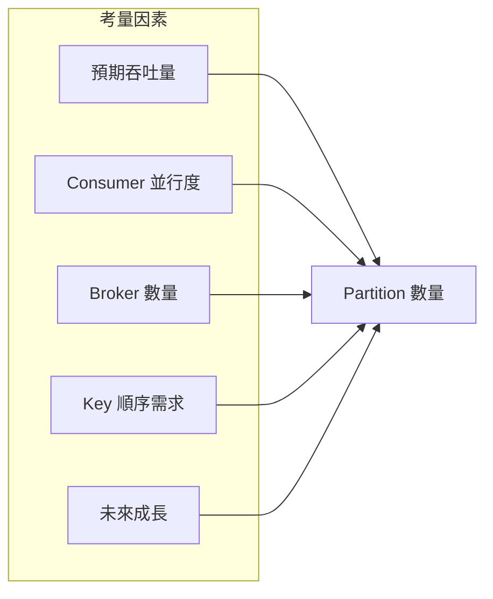
```mermaid
flowchart LR
    subgraph 考量因素
        A[預期吞吐量]
        B[Consumer 並行度]
        C[Broker 數量]
        D[Key 順序需求]
        E[未來成長]
    end

    A --> F[Partition 數量]
    B --> F
    C --> F
    D --> F
    E --> F
```

**計算公式**：

```text
Partition 數量 ≥ max( 目標吞吐量 / 單一 Partition Producer 吞吐量,
                      目標吞吐量 / 單一 Partition Consumer 吞吐量,
                      預期最大 Consumer 數 )
```

單一 Partition 吞吐量應以實際壓測（`kafka-producer-perf-test.sh`、`kafka-consumer-perf-test.sh`）取得，常見範圍為每秒數 MB 至數十 MB。

**建議原則**：

| 場景 | 建議 Partition 數 | 說明 |
| --- | --- | --- |
| **低流量（< 1 MB/s）** | 3–6 | 保持簡單，仍保留並行空間 |
| **中流量（1–10 MB/s）** | 6–12 | 平衡效能與管理 |
| **高流量（> 10 MB/s）** | 12–60+ | 依壓測結果與 Consumer 數量調整 |
| **需要全域順序** | 1 | 僅在確實需要全域順序時使用，會喪失並行能力 |

> ⚠️ **注意**：Partition 只能增加不能減少，且增加後會改變 Key → Partition 對應。若業務依賴 Key 順序，應一開始就規劃足夠數量；工作佇列型負載可改用 Share Group 取得並行度。

#### 4.2.2 Replication Factor 設計

```properties
# 建議設定
default.replication.factor=3
min.insync.replicas=2
```

| Replication Factor | min.insync.replicas | 寫入可容忍故障（acks=all） | 說明 |
| --- | --- | --- | --- |
| 1 | 1 | 0 | 僅適用開發環境 |
| 2 | 1 | 1（但此時僅 1 份資料，有遺失風險） | 不建議用於正式環境 |
| 3 | 2 | 1 | **建議的正式環境配置** |
| 5 | 3 | 2 | 高可用要求（如跨三機房） |

#### 4.2.3 Topic 層級設定

Topic 層級設定會覆寫 Broker 預設值，常用項目：

| Topic 設定 | 對應 Broker 設定 | 說明 |
| --- | --- | --- |
| `retention.ms` | `log.retention.ms` | 保留時間 |
| `retention.bytes` | `log.retention.bytes` | 每個 Partition 保留大小 |
| `cleanup.policy` | `log.cleanup.policy` | `delete`／`compact`／`compact,delete` |
| `min.insync.replicas` | `min.insync.replicas` | 最小同步副本數 |
| `max.message.bytes` | `message.max.bytes` | 最大訊息（批次）大小 |
| `segment.bytes`／`segment.ms` | `log.segment.bytes`／`log.roll.ms` | Segment 大小與時間 |
| `compression.type` | `compression.type` | `producer`（預設，沿用 Producer）或指定演算法 |
| `remote.storage.enable` | — | 啟用 Tiered Storage |

### 4.3 Producer 重要設定

```java
Properties props = new Properties();

// 基本連線設定
props.put(ProducerConfig.BOOTSTRAP_SERVERS_CONFIG, "kafka-1:9094,kafka-2:9094,kafka-3:9094");
props.put(ProducerConfig.KEY_SERIALIZER_CLASS_CONFIG, StringSerializer.class.getName());
props.put(ProducerConfig.VALUE_SERIALIZER_CLASS_CONFIG, StringSerializer.class.getName());
props.put(ProducerConfig.CLIENT_ID_CONFIG, "order-service-producer");

// 可靠性（以下皆為 Kafka 3.0 起的預設值，明確寫出以利審查）
props.put(ProducerConfig.ACKS_CONFIG, "all");               // 0 / 1 / all
props.put(ProducerConfig.ENABLE_IDEMPOTENCE_CONFIG, true);   // 冪等 Producer
props.put(ProducerConfig.MAX_IN_FLIGHT_REQUESTS_PER_CONNECTION, 5); // 冪等時須 ≤ 5

// 重試：以 delivery.timeout.ms 控制總時限，而非調整 retries 次數
props.put(ProducerConfig.DELIVERY_TIMEOUT_MS_CONFIG, 120000); // 預設 120 秒
props.put(ProducerConfig.REQUEST_TIMEOUT_MS_CONFIG, 30000);   // 預設 30 秒
props.put(ProducerConfig.RETRY_BACKOFF_MS_CONFIG, 100);       // 預設 100 ms
props.put(ProducerConfig.RETRY_BACKOFF_MAX_MS_CONFIG, 1000);  // 預設 1000 ms（指數退避上限）

// 批次與吞吐量
props.put(ProducerConfig.BATCH_SIZE_CONFIG, 65536);           // 預設 16384，高吞吐可調大
props.put(ProducerConfig.LINGER_MS_CONFIG, 10);               // 4.0 起預設 5
props.put(ProducerConfig.BUFFER_MEMORY_CONFIG, 67108864);     // 預設 32 MB
props.put(ProducerConfig.COMPRESSION_TYPE_CONFIG, "zstd");    // none(預設)/gzip/snappy/lz4/zstd
```

> ⚠️ **v2.0 更正**：v1.0 將 `retries` 設為 3。Kafka 2.1 起建議保留 `retries` 預設值（`2147483647`），改以 `delivery.timeout.ms` 控制「送出到成功或失敗」的總時限；將 `retries` 調小反而可能在短暫 Leader 切換時提早失敗。

**acks 設定比較**：

| acks | 說明 | 延遲 | 可靠性 | 適用場景 |
| --- | --- | --- | --- | --- |
| 0 | 不等待確認 | 最低 | 最低（可能遺失） | 可容忍遺失的監控指標 |
| 1 | Leader 寫入即確認 | 中 | 中（Leader 故障可能遺失） | 一般日誌 |
| all（-1） | 所有 ISR 確認（受 `min.insync.replicas` 約束） | 較高 | 最高 | **預設值**；金融交易、業務事件 |

**其他重要設定**：

| 參數 | 預設值 | 說明 |
| --- | --- | --- |
| `max.request.size` | 1048576 | 單一請求最大大小，需與 Topic `max.message.bytes` 協調 |
| `partitioner.adaptive.partitioning.enable` | true | 依 Broker 回應速度調整無 Key 記錄的分配 |
| `partitioner.ignore.keys` | false | 設為 true 時忽略 Key 進行分區（會破壞 Key 順序） |
| `transactional.id` | null | 啟用交易 Producer 時設定（見 [5.7](#57-交易與-exactly-once-語意)） |
| `transaction.timeout.ms` | 60000 | 交易逾時自動中止 |
| `metadata.recovery.strategy` | rebootstrap | 所有已知 Broker 不可用時重新 bootstrap（KIP-899／KIP-1102） |
| `enable.metrics.push` | true | 叢集有訂閱時，將 Client 指標推送至 Broker（KIP-714） |

### 4.4 Consumer 重要設定

```java
Properties props = new Properties();

// 基本連線設定
props.put(ConsumerConfig.BOOTSTRAP_SERVERS_CONFIG, "kafka-1:9094,kafka-2:9094,kafka-3:9094");
props.put(ConsumerConfig.GROUP_ID_CONFIG, "order-processing-group");
props.put(ConsumerConfig.KEY_DESERIALIZER_CLASS_CONFIG, StringDeserializer.class.getName());
props.put(ConsumerConfig.VALUE_DESERIALIZER_CLASS_CONFIG, StringDeserializer.class.getName());

// 新一代 Rebalance Protocol（KIP-848）；4.3 預設仍為 classic
props.put(ConsumerConfig.GROUP_PROTOCOL_CONFIG, "consumer");

// Offset 重置策略：earliest / latest（預設）/ none / by_duration:PnDTnHnMn.nS
props.put(ConsumerConfig.AUTO_OFFSET_RESET_CONFIG, "earliest");

// 手動提交（建議）
props.put(ConsumerConfig.ENABLE_AUTO_COMMIT_CONFIG, false);  // 預設 true

// 拉取設定
props.put(ConsumerConfig.MAX_POLL_RECORDS_CONFIG, 500);        // 預設 500
props.put(ConsumerConfig.MAX_POLL_INTERVAL_MS_CONFIG, 300000); // 預設 5 分鐘
props.put(ConsumerConfig.FETCH_MIN_BYTES_CONFIG, 1);           // 預設 1
props.put(ConsumerConfig.FETCH_MAX_WAIT_MS_CONFIG, 500);       // 預設 500 ms

// 讀取已提交的交易訊息（配合 Exactly-Once）
props.put(ConsumerConfig.ISOLATION_LEVEL_CONFIG, "read_committed"); // 預設 read_uncommitted

// 機架感知讀取（搭配 Broker 端 replica.selector.class）
props.put(ConsumerConfig.CLIENT_RACK_CONFIG, "az1");
```

**`group.protocol` 對設定的影響**：

| 設定 | `classic` 協定 | `consumer` 協定（KIP-848） |
| --- | --- | --- |
| `session.timeout.ms` | Client 端設定（預設 45000） | **不支援**；改由 Broker 端 `group.consumer.session.timeout.ms` 或 Group 層級 `consumer.session.timeout.ms` 控制 |
| `heartbeat.interval.ms` | Client 端設定（預設 3000） | **不支援**；改由 Broker 端 `group.consumer.heartbeat.interval.ms`（Group 層級預設 5000） |
| `partition.assignment.strategy` | Client 端 Assignor（預設 Range、CooperativeSticky） | **不支援**；改用 `group.remote.assignor`（Server 端：`uniform` 預設、`range`） |
| Client 端自訂 Assignor | 支援 | 不支援 |

> 📌 **線上轉換**：當第一個 `group.protocol=consumer` 的成員加入 classic 群組時，群組會自動轉換為新協定並與舊成員互通；最後一個新協定成員離開時自動降回 classic。因此可用滾動部署方式遷移。

> ⚠️ **v2.0 更正**：v1.0 在 Consumer 範例中設定 `session.timeout.ms=45000`、`heartbeat.interval.ms=15000`。使用新協定時這兩項設定無效；使用 classic 協定時，`heartbeat.interval.ms` 建議不超過 `session.timeout.ms` 的 1/3（預設 3000）。

**`auto.offset.reset` 選項**：

| 值 | 行為 |
| --- | --- |
| `latest`（預設） | 從最新位置開始，只讀新事件 |
| `earliest` | 從最早可用位置開始 |
| `none` | 找不到已提交 Offset 時拋出例外 |
| `by_duration:P1D` | 🆕 KIP-1106：從「現在往前 1 天」的位置開始（ISO-8601 Duration 格式） |

### 4.5 資料保留策略（Retention Policy）

```properties
############################# Retention Policy #############################

# 依時間保留（預設 7 天）；優先順序：log.retention.ms > log.retention.minutes > log.retention.hours
log.retention.hours=168
# 或更精確的設定
# log.retention.ms=604800000

# 依大小保留（每個 Partition；-1 表示無限制）
log.retention.bytes=-1

# 日誌區段大小（觸發 Roll）
log.segment.bytes=1073741824

# 日誌區段時間（預設 7 天）
log.roll.hours=168

# 清理策略
# delete：刪除過期 Segment
# compact：壓縮（保留每個 Key 的最新值）
# compact,delete：先壓縮，並刪除超過保留時間的資料
log.cleanup.policy=delete
```

**Log Compaction 說明**：

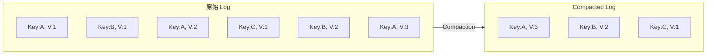
```mermaid
flowchart LR
    subgraph 原始Log[原始 Log]
        A1[Key:A, V:1]
        B1[Key:B, V:1]
        A2[Key:A, V:2]
        C1[Key:C, V:1]
        B2[Key:B, V:2]
        A3[Key:A, V:3]
    end

    subgraph 壓縮後Log[Compacted Log]
        AC[Key:A, V:3]
        BC[Key:B, V:2]
        CC[Key:C, V:1]
    end

    原始Log -->|Compaction| 壓縮後Log
```

**Compaction 重點**：

| 項目 | 說明 |
| --- | --- |
| 保留語意 | 每個 Key 至少保留最新一筆值 |
| 刪除標記（Tombstone） | Value 為 `null` 的記錄，於 `delete.retention.ms`（預設 1 天）後移除 |
| 適用場景 | 帳戶最新狀態、設定資料、CDC 最新快照、Kafka Streams 狀態 changelog |
| 注意 | 必須有 Key；Active Segment 不會被壓縮 |

**保留策略選擇指引**：

| 資料類型 | 建議策略 | 範例設定 |
| --- | --- | --- |
| 業務事件 | delete，依稽核需求設定 | `retention.ms=2592000000`（30 天） |
| 狀態／主檔同步 | compact | `cleanup.policy=compact` |
| 稽核軌跡（長期） | delete + Tiered Storage | 本地 1–3 天、總保留依法規要求 |
| 監控指標 | delete，短期 | `retention.ms=259200000`（3 天） |

### 4.6 Share Group 設定

> 🆕 **v2.0 新增**

Share Group 設定可在 Broker 層級（`group.share.*` 前綴）設定預設值，並以 Group 層級設定（`kafka-configs.sh --entity-type groups`）個別覆寫。Group 層級設定與預設值（Kafka 4.3）：

| Group 層級設定 | 預設值 | 說明 |
| --- | --- | --- |
| `share.auto.offset.reset` | latest | 初始化 Share Partition 起點：`earliest`／`latest`／`by_duration:<ISO-8601>` |
| `share.record.lock.duration.ms` | 30000 | 取得記錄後的鎖定時間，逾時未確認則重新派送 |
| `share.delivery.count.limit` | 5 | 單筆記錄最大傳遞次數，超過即封存（不再派送） |
| `share.partition.max.record.locks` | 2000 | 每個 Share Partition 同時鎖定的記錄上限 |
| `share.isolation.level` | read_uncommitted | 交易訊息讀取隔離等級 |
| `share.heartbeat.interval.ms` | 5000 | 成員心跳間隔 |
| `share.session.timeout.ms` | 45000 | 成員失效偵測逾時 |
| `share.renew.acknowledge.enable` | true | 是否允許 `RENEW` 確認類型（延長鎖定） |

Client 端（Share Consumer）設定：

| 設定 | 預設值 | 說明 |
| --- | --- | --- |
| `share.acknowledgement.mode` | implicit | `implicit`：下次 poll 時自動 ACCEPT；`explicit`：須逐筆呼叫 `acknowledge()` |

```bash
# 範例：將 Share Group 起點設為最早並延長鎖定時間
kafka-configs.sh --bootstrap-server kafka-1:9094 --command-config admin.properties \
  --alter --entity-type groups --entity-name payment-workers \
  --add-config share.auto.offset.reset=earliest,share.record.lock.duration.ms=60000
```

### 4.7 動態設定管理

> 🆕 **v2.0 新增**

許多 Broker 與 Topic 設定可在不重啟的情況下以 `kafka-configs.sh` 動態調整，設定會寫入 Metadata Log 並套用至整個叢集。

```bash
# 檢視 Topic 設定（含預設值來源）
kafka-configs.sh --bootstrap-server kafka-1:9094 --command-config admin.properties \
  --describe --entity-type topics --entity-name order-events --all

# 修改 Topic 保留時間
kafka-configs.sh --bootstrap-server kafka-1:9094 --command-config admin.properties \
  --alter --entity-type topics --entity-name order-events \
  --add-config retention.ms=1209600000

# 叢集層級動態調整（所有 Broker）
kafka-configs.sh --bootstrap-server kafka-1:9094 --command-config admin.properties \
  --alter --entity-type brokers --entity-default \
  --add-config log.cleaner.threads=2

# 單一 Broker 動態調整
kafka-configs.sh --bootstrap-server kafka-1:9094 --command-config admin.properties \
  --alter --entity-type brokers --entity-name 101 \
  --add-config num.io.threads=16

# 刪除覆寫、回到預設
kafka-configs.sh --bootstrap-server kafka-1:9094 --command-config admin.properties \
  --alter --entity-type topics --entity-name order-events \
  --delete-config retention.ms
```

**設定優先順序**（高 → 低）：

1. 單一 Broker 動態設定（`--entity-name <id>`）
2. 叢集預設動態設定（`--entity-default`）
3. `server.properties` 靜態設定
4. Kafka 內建預設值

> 📌 Broker 設定文件中每項設定皆標示 **Update Mode**（`read-only`、`per-broker`、`cluster-wide`），只有後兩者可動態調整。

### 4.8 💡 本章實務建議

> **設定最佳實務**：
>
> 1. 正式環境維持 `acks=all`、`enable.idempotence=true`，並設定 `min.insync.replicas=2`。
> 2. 以 `delivery.timeout.ms` 控制 Producer 送出時限，不要將 `retries` 調小。
> 3. 新專案 Consumer 採 `group.protocol=consumer`，並移除 `session.timeout.ms`／`heartbeat.interval.ms`／`partition.assignment.strategy` 等無效設定。
> 4. Consumer 採手動提交 Offset，並在業務處理成功後才提交。
> 5. 依資料類型設定保留策略，稽核資料的保留期限應對應法規要求。
> 6. 所有設定變更納入版本控制（Git）與變更管理流程，動態設定亦須記錄。

---

## 5. Kafka 系統使用教學

> 📌 本章指令以開發環境 `localhost:9092`（PLAINTEXT）示範。正式環境請改用 SASL_SSL listener，並以 `--command-config admin.properties` 提供連線與認證設定（見 [9.2.3](#923-client-端設定)）。

### 5.1 Topic 管理

#### 5.1.1 建立 Topic

```bash
# 基本建立
kafka-topics.sh --create \
  --topic order-events \
  --bootstrap-server localhost:9092 \
  --partitions 6 \
  --replication-factor 3

# 建立時指定 Topic 層級設定
kafka-topics.sh --create \
  --topic user-activities \
  --bootstrap-server localhost:9092 \
  --partitions 12 \
  --replication-factor 3 \
  --config retention.ms=259200000 \
  --config min.insync.replicas=2 \
  --config cleanup.policy=delete

# 建立 Compacted Topic（狀態／主檔同步）
kafka-topics.sh --create \
  --topic customer-profile \
  --bootstrap-server localhost:9092 \
  --partitions 6 \
  --replication-factor 3 \
  --config cleanup.policy=compact
```

#### 5.1.2 查詢 Topic

```bash
# 列出所有 Topic（排除內部 Topic）
kafka-topics.sh --list --exclude-internal --bootstrap-server localhost:9092

# 查看 Topic 詳細資訊
kafka-topics.sh --describe \
  --topic order-events \
  --bootstrap-server localhost:9092

# 輸出範例：
# Topic: order-events  TopicId: 8Jm0...  PartitionCount: 6  ReplicationFactor: 3  Configs: min.insync.replicas=2
#   Topic: order-events  Partition: 0  Leader: 101  Replicas: 101,102,103  Isr: 101,102,103  Elr:   LastKnownElr:
#   Topic: order-events  Partition: 1  Leader: 102  Replicas: 102,103,101  Isr: 102,103,101  Elr:   LastKnownElr:
#   ...

# 只列出副本不足的 Partition（健康檢查常用）
kafka-topics.sh --describe --under-replicated-partitions --bootstrap-server localhost:9092

# 只列出低於 min.insync.replicas 的 Partition
kafka-topics.sh --describe --under-min-isr-partitions --bootstrap-server localhost:9092

# 列出沒有 Leader 的 Partition
kafka-topics.sh --describe --unavailable-partitions --bootstrap-server localhost:9092
```

#### 5.1.3 修改 Topic

```bash
# 增加 Partition（只能增加，不能減少；會改變 Key 對應）
kafka-topics.sh --alter \
  --topic order-events \
  --partitions 12 \
  --bootstrap-server localhost:9092

# 修改 Topic 設定
kafka-configs.sh --alter \
  --entity-type topics \
  --entity-name order-events \
  --add-config retention.ms=172800000 \
  --bootstrap-server localhost:9092

# 查看 Topic 設定
kafka-configs.sh --describe \
  --entity-type topics \
  --entity-name order-events \
  --bootstrap-server localhost:9092
```

#### 5.1.4 刪除 Topic

```bash
# 刪除 Topic（需 delete.topic.enable=true，預設即為 true）
kafka-topics.sh --delete \
  --topic test-topic \
  --bootstrap-server localhost:9092
```

> ⚠️ 正式環境刪除 Topic 屬高風險操作，應透過 ACL 限制 `Delete` 權限，並納入變更審核流程。

### 5.2 Producer 發送訊息

#### 5.2.1 使用 Console Producer

```bash
# 基本發送
kafka-console-producer.sh \
  --topic order-events \
  --bootstrap-server localhost:9092

# 帶 Key 發送（Kafka 4.2 起建議使用 --reader-property）
kafka-console-producer.sh \
  --topic order-events \
  --bootstrap-server localhost:9092 \
  --reader-property parse.key=true \
  --reader-property key.separator=:

# 輸入格式：key:value
# order-001:{"orderId":"001","amount":100}
```

> ⚠️ **v2.0 更正**：依 KIP-1147（Kafka 4.2），`kafka-console-producer.sh` 的 `--property` 已由 `--reader-property` 取代，`kafka-console-consumer.sh` 的 `--property` 已由 `--formatter-property` 取代。舊參數在 4.x 仍可使用但會顯示淘汰訊息，將於 Kafka 5.0 移除。

#### 5.2.2 Java Producer 範例

```java
import org.apache.kafka.clients.producer.KafkaProducer;
import org.apache.kafka.clients.producer.ProducerConfig;
import org.apache.kafka.clients.producer.ProducerRecord;
import org.apache.kafka.clients.producer.RecordMetadata;
import org.apache.kafka.common.serialization.StringSerializer;

import java.util.Properties;

public class OrderProducer {

    public static void main(String[] args) throws Exception {
        Properties props = new Properties();
        props.put(ProducerConfig.BOOTSTRAP_SERVERS_CONFIG,
                  "kafka-1:9094,kafka-2:9094,kafka-3:9094");
        props.put(ProducerConfig.KEY_SERIALIZER_CLASS_CONFIG, StringSerializer.class.getName());
        props.put(ProducerConfig.VALUE_SERIALIZER_CLASS_CONFIG, StringSerializer.class.getName());
        props.put(ProducerConfig.ACKS_CONFIG, "all");
        props.put(ProducerConfig.ENABLE_IDEMPOTENCE_CONFIG, true);
        props.put(ProducerConfig.DELIVERY_TIMEOUT_MS_CONFIG, 120000);

        try (KafkaProducer<String, String> producer = new KafkaProducer<>(props)) {

            String topic = "order-events";
            String key = "order-001";
            String value = "{\"orderId\":\"001\",\"amount\":100}";
            ProducerRecord<String, String> record = new ProducerRecord<>(topic, key, value);
            record.headers().add("source", "order-service".getBytes());

            // 同步發送（僅適合低流量或需要立即確認的情境）
            RecordMetadata metadata = producer.send(record).get();
            System.out.printf("Sent to partition %d, offset %d%n",
                              metadata.partition(), metadata.offset());

            // 非同步發送（建議）：以 Callback 處理結果
            producer.send(record, (meta, exception) -> {
                if (exception != null) {
                    // 不可重試的錯誤或逾時：記錄並導向補償流程
                    System.err.println("Send failed: " + exception.getMessage());
                } else {
                    System.out.printf("Sent to partition %d, offset %d%n",
                                      meta.partition(), meta.offset());
                }
            });

            // 關閉前確保所有訊息送出（try-with-resources 的 close() 亦會 flush）
            producer.flush();
        }
    }
}
```

> 📌 KIP-1118（4.1）：若在 `send()` 的 Callback 中呼叫 `flush()`，Producer 會拋出例外以避免 Network Thread 死結。

### 5.3 Consumer 消費訊息

#### 5.3.1 使用 Console Consumer

```bash
# 從最新訊息開始消費
kafka-console-consumer.sh \
  --topic order-events \
  --bootstrap-server localhost:9092

# 從最早訊息開始消費
kafka-console-consumer.sh \
  --topic order-events \
  --from-beginning \
  --bootstrap-server localhost:9092

# 指定 Consumer Group
kafka-console-consumer.sh \
  --topic order-events \
  --group order-processor \
  --bootstrap-server localhost:9092

# 顯示 Key、Headers 與 Timestamp（Kafka 4.2 起建議使用 --formatter-property）
kafka-console-consumer.sh \
  --topic order-events \
  --bootstrap-server localhost:9092 \
  --formatter-property print.key=true \
  --formatter-property print.headers=true \
  --formatter-property print.timestamp=true
```

#### 5.3.2 Java Consumer 範例

```java
import org.apache.kafka.clients.consumer.ConsumerConfig;
import org.apache.kafka.clients.consumer.ConsumerRecord;
import org.apache.kafka.clients.consumer.ConsumerRecords;
import org.apache.kafka.clients.consumer.KafkaConsumer;
import org.apache.kafka.common.errors.WakeupException;
import org.apache.kafka.common.serialization.StringDeserializer;

import java.time.Duration;
import java.util.List;
import java.util.Properties;

public class OrderConsumer {

    public static void main(String[] args) {
        Properties props = new Properties();
        props.put(ConsumerConfig.BOOTSTRAP_SERVERS_CONFIG,
                  "kafka-1:9094,kafka-2:9094,kafka-3:9094");
        props.put(ConsumerConfig.GROUP_ID_CONFIG, "order-processing-group");
        props.put(ConsumerConfig.GROUP_PROTOCOL_CONFIG, "consumer");   // KIP-848
        props.put(ConsumerConfig.KEY_DESERIALIZER_CLASS_CONFIG, StringDeserializer.class.getName());
        props.put(ConsumerConfig.VALUE_DESERIALIZER_CLASS_CONFIG, StringDeserializer.class.getName());
        props.put(ConsumerConfig.AUTO_OFFSET_RESET_CONFIG, "earliest");
        props.put(ConsumerConfig.ENABLE_AUTO_COMMIT_CONFIG, false);
        props.put(ConsumerConfig.MAX_POLL_RECORDS_CONFIG, 100);

        KafkaConsumer<String, String> consumer = new KafkaConsumer<>(props);

        // 優雅關閉：由其他執行緒呼叫 wakeup() 中斷 poll()
        Thread mainThread = Thread.currentThread();
        Runtime.getRuntime().addShutdownHook(new Thread(() -> {
            consumer.wakeup();
            try {
                mainThread.join();
            } catch (InterruptedException ignored) {
                Thread.currentThread().interrupt();
            }
        }));

        try {
            consumer.subscribe(List.of("order-events"));
            while (true) {
                ConsumerRecords<String, String> records = consumer.poll(Duration.ofMillis(1000));
                for (ConsumerRecord<String, String> record : records) {
                    System.out.printf("Partition: %d, Offset: %d, Key: %s, Value: %s%n",
                                      record.partition(), record.offset(),
                                      record.key(), record.value());
                    processOrder(record.value());
                }
                // 本批次全部處理成功後才提交 Offset
                if (!records.isEmpty()) {
                    consumer.commitSync();
                }
            }
        } catch (WakeupException e) {
            // 預期中的關閉流程
        } finally {
            consumer.close();
        }
    }

    private static void processOrder(String orderJson) {
        System.out.println("Processing: " + orderJson);
    }
}
```

### 5.4 Offset 管理

#### 5.4.1 查看 Consumer Group Offset

```bash
# 列出所有 Consumer Group
kafka-consumer-groups.sh --list --bootstrap-server localhost:9092

# 查看特定 Group 的 Offset 與 Lag
kafka-consumer-groups.sh --describe \
  --group order-processing-group \
  --bootstrap-server localhost:9092

# 輸出範例：
# GROUP                  TOPIC          PARTITION  CURRENT-OFFSET  LOG-END-OFFSET  LAG   CONSUMER-ID  HOST  CLIENT-ID
# order-processing-group order-events   0          1000            1050            50    ...
# order-processing-group order-events   1          980             980             0     ...
# order-processing-group order-events   2          1100            1200            100   ...

# 查看群組狀態與協定（classic／consumer）
kafka-consumer-groups.sh --describe --state \
  --group order-processing-group \
  --bootstrap-server localhost:9092

# 查看群組成員與分配
kafka-consumer-groups.sh --describe --members --verbose \
  --group order-processing-group \
  --bootstrap-server localhost:9092
```

#### 5.4.2 重置 Offset

> ⚠️ 重置 Offset 前必須**停止該群組所有 Consumer**（群組狀態需為 Empty），並先以 `--dry-run` 預覽結果。

```bash
# 預覽：重置到最早（不實際執行）
kafka-consumer-groups.sh --reset-offsets \
  --group order-processing-group \
  --topic order-events \
  --to-earliest \
  --dry-run \
  --bootstrap-server localhost:9092

# 執行：重置到最早
kafka-consumer-groups.sh --reset-offsets \
  --group order-processing-group \
  --topic order-events \
  --to-earliest \
  --execute \
  --bootstrap-server localhost:9092

# 重置到最新
kafka-consumer-groups.sh --reset-offsets \
  --group order-processing-group \
  --topic order-events \
  --to-latest \
  --execute \
  --bootstrap-server localhost:9092

# 重置特定 Partition 到特定 Offset
kafka-consumer-groups.sh --reset-offsets \
  --group order-processing-group \
  --topic order-events:0 \
  --to-offset 500 \
  --execute \
  --bootstrap-server localhost:9092

# 重置到特定時間點
kafka-consumer-groups.sh --reset-offsets \
  --group order-processing-group \
  --topic order-events \
  --to-datetime "2026-09-01T00:00:00.000" \
  --execute \
  --bootstrap-server localhost:9092

# 往回（或往前）位移 N 筆
kafka-consumer-groups.sh --reset-offsets \
  --group order-processing-group \
  --topic order-events \
  --shift-by -100 \
  --execute \
  --bootstrap-server localhost:9092

# 匯出目前 Offset 作為備份（CSV）
kafka-consumer-groups.sh --reset-offsets \
  --group order-processing-group \
  --all-topics --to-current --dry-run \
  --bootstrap-server localhost:9092 > offsets-backup.csv
```

#### 5.4.3 群組管理工具（KIP-1043）

Kafka 4.0 起提供 `kafka-groups.sh`，可一次列出叢集內所有類型的群組：

```bash
# 列出所有群組及其類型（Classic／Consumer／Share／Streams）與協定
kafka-groups.sh --bootstrap-server localhost:9092 --list

# 只列出 Share Group
kafka-groups.sh --bootstrap-server localhost:9092 --list --share
```

### 5.5 訊息順序性與重複消費

#### 5.5.1 訊息順序保證

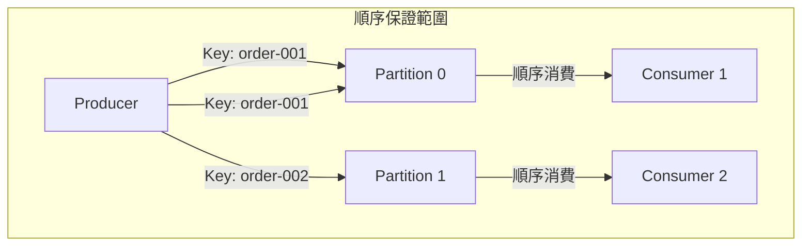
```mermaid
flowchart TB
    subgraph 順序保證範圍
        P[Producer] -->|Key: order-001| Part0[Partition 0]
        P -->|Key: order-002| Part1[Partition 1]
        P -->|Key: order-001| Part0

        Part0 -->|順序消費| C1[Consumer 1]
        Part1 -->|順序消費| C2[Consumer 2]
    end
```

**順序保證原則**：

1. **同一 Partition 內**：保證順序。
2. **跨 Partition**：不保證順序。
3. **相同 Key**：在 Partition 數不變的前提下，會被分配到同一 Partition。
4. **冪等 Producer**（預設啟用）：在 `max.in.flight.requests.per.connection ≤ 5` 時，即使重試也能維持順序。
5. **Share Group**：不保證順序，需要順序的業務不可使用。

```java
// 確保相同帳戶的交易事件順序
String accountId = "ACC-10023";
ProducerRecord<String, String> record = new ProducerRecord<>(
    "account-transactions",
    accountId,  // 以帳號作為 Key
    "{\"type\":\"DEBIT\",\"amount\":500}"
);
```

#### 5.5.2 避免重複消費

Kafka 預設提供 **At-Least-Once** 語意，消費端必須容忍重複。

**重複消費的原因**：

1. Consumer 處理完成後、提交 Offset 前當機。
2. Rebalance 導致 Partition 轉移，新成員從最後提交位置重讀。
3. 處理時間超過 `max.poll.interval.ms`，Consumer 被移出群組。
4. 人為重置 Offset。

**解決方案：冪等消費**

```java
// 方案 1：以業務唯一鍵搭配資料庫唯一約束（推薦）
@Transactional
public void handle(PaymentEvent event) {
    // processed_event 表以 event_id 為主鍵
    int inserted = jdbcTemplate.update(
        "INSERT INTO processed_event(event_id, processed_at) VALUES (?, now()) ON CONFLICT DO NOTHING",
        event.getEventId());
    if (inserted == 0) {
        return; // 已處理過，直接略過
    }
    accountService.apply(event); // 與去重紀錄在同一個資料庫交易內
}

// 方案 2：以 Redis 原子操作去重（適合非交易性副作用）
public void handleWithRedis(String eventId, String payload) {
    Boolean firstTime = redisTemplate.opsForValue()
        .setIfAbsent("processed:" + eventId, "1", Duration.ofDays(1));
    if (!Boolean.TRUE.equals(firstTime)) {
        return; // 已處理過
    }
    doBusinessLogic(payload);
}
```

> ⚠️ **v2.0 更正**：v1.0 的方案 1 以記憶體中的 `processedMessages` 集合去重，重啟即失效，且以 `topic-partition-offset` 為識別無法處理 Producer 重送產生的重複事件。應以**業務事件 ID** 搭配持久化儲存去重；v1.0 方案 2 先 `setnx` 再 `expire` 非原子操作，已改為單一原子指令。

### 5.6 Share Group 操作

> 🆕 **v2.0 新增**

#### 5.6.1 Console Share Consumer

```bash
# 以 Share Group 消費（可同時開多個視窗觀察分流效果）
kafka-console-share-consumer.sh \
  --topic payment-tasks \
  --group payment-workers \
  --bootstrap-server localhost:9092
```

#### 5.6.2 管理 Share Group

```bash
# 列出 Share Group
kafka-share-groups.sh --bootstrap-server localhost:9092 --list

# 查看 Share Group 的起始 Offset 與 Lag
kafka-share-groups.sh --bootstrap-server localhost:9092 \
  --describe --group payment-workers

# 查看成員
kafka-share-groups.sh --bootstrap-server localhost:9092 \
  --describe --group payment-workers --members

# 重置起始位置（群組需無活動成員）
kafka-share-groups.sh --bootstrap-server localhost:9092 \
  --reset-offsets --group payment-workers --topic payment-tasks \
  --to-earliest --execute

# 刪除 Share Group（僅限無活動成員的群組）
kafka-share-groups.sh --bootstrap-server localhost:9092 \
  --delete --group payment-workers
```

#### 5.6.3 Java Share Consumer 範例

```java
import org.apache.kafka.clients.consumer.AcknowledgeType;
import org.apache.kafka.clients.consumer.ConsumerConfig;
import org.apache.kafka.clients.consumer.ConsumerRecord;
import org.apache.kafka.clients.consumer.ConsumerRecords;
import org.apache.kafka.clients.consumer.KafkaShareConsumer;
import org.apache.kafka.common.serialization.StringDeserializer;

import java.time.Duration;
import java.util.List;
import java.util.Properties;

public class PaymentTaskWorker {

    public static void main(String[] args) {
        Properties props = new Properties();
        props.put(ConsumerConfig.BOOTSTRAP_SERVERS_CONFIG, "kafka-1:9094");
        props.put(ConsumerConfig.GROUP_ID_CONFIG, "payment-workers");
        props.put(ConsumerConfig.KEY_DESERIALIZER_CLASS_CONFIG, StringDeserializer.class.getName());
        props.put(ConsumerConfig.VALUE_DESERIALIZER_CLASS_CONFIG, StringDeserializer.class.getName());
        props.put("share.acknowledgement.mode", "explicit"); // 逐筆明確確認

        try (KafkaShareConsumer<String, String> consumer = new KafkaShareConsumer<>(props)) {
            consumer.subscribe(List.of("payment-tasks"));
            while (true) {
                ConsumerRecords<String, String> records = consumer.poll(Duration.ofMillis(500));
                for (ConsumerRecord<String, String> record : records) {
                    try {
                        process(record.value());
                        consumer.acknowledge(record, AcknowledgeType.ACCEPT);
                    } catch (TransientException e) {
                        consumer.acknowledge(record, AcknowledgeType.RELEASE); // 稍後重新派送
                    } catch (Exception e) {
                        consumer.acknowledge(record, AcknowledgeType.REJECT);  // 無法處理，封存
                    }
                }
                consumer.commitSync(); // 將確認結果送回 Broker
            }
        }
    }

    private static void process(String payload) { /* 業務處理 */ }

    static class TransientException extends RuntimeException { }
}
```

> 📌 處理時間可能超過 `share.record.lock.duration.ms`（預設 30 秒）時，可使用 `AcknowledgeType.RENEW`（4.2 起，KIP-1222）延長鎖定，避免記錄被重新派送給其他成員。

### 5.7 交易與 Exactly-Once 語意

> 🆕 **v2.0 新增**

#### 5.7.1 傳遞語意比較

| 語意 | 實現方式 | 風險 |
| --- | --- | --- |
| **At-Most-Once** | 先提交 Offset 再處理 | 處理失敗會遺失 |
| **At-Least-Once** | 先處理再提交 Offset（預設建議） | 可能重複，需冪等消費 |
| **Exactly-Once（Kafka 內）** | 冪等 Producer + 交易 + `read_committed` | 僅保證 Kafka → Kafka 的讀取-處理-寫入流程 |

#### 5.7.2 交易 Producer（Consume-Transform-Produce）

```java
Properties props = new Properties();
props.put(ProducerConfig.BOOTSTRAP_SERVERS_CONFIG, "kafka-1:9094");
props.put(ProducerConfig.TRANSACTIONAL_ID_CONFIG, "fraud-scorer-01"); // 每個實例唯一且穩定
props.put(ProducerConfig.KEY_SERIALIZER_CLASS_CONFIG, StringSerializer.class.getName());
props.put(ProducerConfig.VALUE_SERIALIZER_CLASS_CONFIG, StringSerializer.class.getName());

KafkaProducer<String, String> producer = new KafkaProducer<>(props);
producer.initTransactions();

while (true) {
    ConsumerRecords<String, String> records = consumer.poll(Duration.ofMillis(500));
    if (records.isEmpty()) {
        continue;
    }
    producer.beginTransaction();
    try {
        for (ConsumerRecord<String, String> r : records) {
            producer.send(new ProducerRecord<>("fraud-scores", r.key(), score(r.value())));
        }
        // 將消費 Offset 納入同一交易
        producer.sendOffsetsToTransaction(currentOffsets(records), consumer.groupMetadata());
        producer.commitTransaction();
    } catch (ProducerFencedException e) {
        producer.close();   // 同 transactional.id 的新實例已啟動，本實例必須停止
        throw e;
    } catch (KafkaException e) {
        producer.abortTransaction();
        // 將 Consumer 位置回溯至上次提交處後重試
    }
}
```

**關鍵設定**：

| 設定 | 位置 | 說明 |
| --- | --- | --- |
| `transactional.id` | Producer | 必須在重啟間保持穩定，用於隔離（fence）殭屍實例 |
| `isolation.level=read_committed` | 下游 Consumer | 只讀已提交交易的訊息 |
| `transaction.state.log.replication.factor` | Broker | 交易狀態 Topic 副本數（預設 3） |

> 📌 **KIP-890（4.0 GA）Transactions Server-Side Defense** 強化 Broker 端的交易驗證，降低 Producer 故障時產生「殭屍交易」與懸置交易（hanging transaction）的風險。Kafka Streams 可直接以 `processing.guarantee=exactly_once_v2` 啟用 EOS。

> ⚠️ Kafka 交易**不涵蓋外部系統**（資料庫、REST API）。資料庫與 Kafka 間的一致性應使用 Transactional Outbox（見 [6.4.4](#644-transactional-outbox-模式)）。

### 5.8 💡 本章實務建議

> **使用端最佳實務**：
>
> 1. Consumer 採手動提交 Offset，業務處理成功後才提交。
> 2. 以業務事件 ID + 持久化儲存實作冪等消費，容許重複。
> 3. 重置 Offset 前停止 Consumer、先 `--dry-run`、並備份目前 Offset。
> 4. 合理設定 `max.poll.records`，確保單批處理時間遠小於 `max.poll.interval.ms`。
> 5. CLI 參數依 KIP-1147 改用 `--reader-property`／`--formatter-property`／`--command-config`，為 Kafka 5.0 預作準備。
> 6. 工作佇列型任務使用 Share Group，並以 `share.delivery.count.limit` 搭配 REJECT 處理毒訊息（poison message）。

---

## 6. Kafka 與應用系統串接方式

### 6.1 與 Spring Boot 整合

> ⚠️ **v2.0 更正**：v1.0 使用 Spring Kafka 3.1.0。截至 2026 年 9 月，**Spring for Apache Kafka 4.1.x** 為最新版本並整合於 **Spring Boot 4.1**（使用 Kafka Client 4.2.x）；4.0 起支援 Share Consumer，並以 Jackson 3 的 `JacksonJsonSerializer`／`JacksonJsonDeserializer` 取代已淘汰的 `JsonSerializer`／`JsonDeserializer`。仍使用 Spring Boot 3.x 的系統對應 Spring Kafka 3.3.x。

**版本對應**：

| Spring Boot | Spring for Apache Kafka | Kafka Client | 備註 |
| --- | --- | --- | --- |
| 4.1.x | 4.1.x | 4.2.x | Share Consumer 強化、`ShareAcknowledgment.renew()`、Streams DLQ |
| 4.0.x | 4.0.x | 4.1.x | Jackson 3、Share Consumer 初版 |
| 3.5.x | 3.3.x | 3.9.x | 維護中，建議規劃升級 |

#### 6.1.1 Maven 依賴

```xml
<!-- Spring Boot 4.x：版本由 Spring Boot BOM 管理，勿自行指定 -->
<dependencies>
    <dependency>
        <groupId>org.springframework.boot</groupId>
        <artifactId>spring-boot-starter-kafka</artifactId>
    </dependency>

    <!-- 測試：內嵌 Kafka Broker -->
    <dependency>
        <groupId>org.springframework.kafka</groupId>
        <artifactId>spring-kafka-test</artifactId>
        <scope>test</scope>
    </dependency>
</dependencies>
```

> 📌 Spring Boot 3.x 專案使用 `org.springframework.kafka:spring-kafka` 相依即可啟用自動設定。

#### 6.1.2 設定檔（application.yml）

```yaml
spring:
  kafka:
    bootstrap-servers: kafka-1:9094,kafka-2:9094,kafka-3:9094
    security:
      protocol: SASL_SSL
    properties:
      sasl.mechanism: SCRAM-SHA-512
      sasl.jaas.config: >-
        org.apache.kafka.common.security.scram.ScramLoginModule required
        username="${KAFKA_USERNAME}" password="${KAFKA_PASSWORD}";
    ssl:
      trust-store-location: file:/etc/kafka/secrets/truststore.p12
      trust-store-password: ${KAFKA_TRUSTSTORE_PASSWORD}
      trust-store-type: PKCS12

    producer:
      key-serializer: org.apache.kafka.common.serialization.StringSerializer
      value-serializer: org.springframework.kafka.support.serializer.JacksonJsonSerializer
      acks: all
      properties:
        enable.idempotence: true
        delivery.timeout.ms: 120000
        linger.ms: 10
        compression.type: zstd

    consumer:
      group-id: order-service
      key-deserializer: org.apache.kafka.common.serialization.StringDeserializer
      value-deserializer: org.springframework.kafka.support.serializer.ErrorHandlingDeserializer
      auto-offset-reset: earliest
      enable-auto-commit: false
      properties:
        group.protocol: consumer
        spring.deserializer.value.delegate.class: org.springframework.kafka.support.serializer.JacksonJsonDeserializer
        spring.json.trusted.packages: "com.example.order.event"

    listener:
      ack-mode: manual
      concurrency: 3
      observation-enabled: true
```

**設定重點**：

| 項目 | 說明 |
| --- | --- |
| `ErrorHandlingDeserializer` | 包裝實際的 Deserializer，反序列化失敗時交由 Error Handler 處理，避免毒訊息造成無限重試 |
| `spring.json.trusted.packages` | 限定可反序列化的類別套件，**勿使用 `*`**，避免反序列化攻擊 |
| `observation-enabled` | 啟用 Micrometer Observation，自動傳遞追蹤資訊（Trace Context） |
| 帳密 | 以環境變數或 Secret 管理注入，不寫死在設定檔 |

#### 6.1.3 Producer 實作

```java
import lombok.extern.slf4j.Slf4j;
import org.springframework.kafka.core.KafkaTemplate;
import org.springframework.kafka.support.SendResult;
import org.springframework.stereotype.Service;

import java.math.BigDecimal;
import java.time.Instant;
import java.util.concurrent.CompletableFuture;

@Slf4j
@Service
public class OrderEventProducer {

    private final KafkaTemplate<String, OrderEvent> kafkaTemplate;

    public OrderEventProducer(KafkaTemplate<String, OrderEvent> kafkaTemplate) {
        this.kafkaTemplate = kafkaTemplate;
    }

    // 非同步發送（推薦）：Spring Kafka 3.0 起回傳 CompletableFuture
    public CompletableFuture<SendResult<String, OrderEvent>> send(OrderEvent event) {
        return kafkaTemplate.send("order-events", event.orderId(), event)
            .whenComplete((result, ex) -> {
                if (ex != null) {
                    log.error("Failed to send event {}", event.eventId(), ex);
                } else {
                    log.info("Sent event {} to partition {} offset {}",
                             event.eventId(),
                             result.getRecordMetadata().partition(),
                             result.getRecordMetadata().offset());
                }
            });
    }
}

// 事件模型：使用 record 表達不可變事件，並帶有唯一 eventId 以利冪等處理
public record OrderEvent(
    String eventId,
    String orderId,
    String eventType,
    BigDecimal amount,
    Instant occurredAt) { }
```

#### 6.1.4 Consumer 實作

```java
import lombok.extern.slf4j.Slf4j;
import org.springframework.kafka.annotation.KafkaListener;
import org.springframework.kafka.support.Acknowledgment;
import org.springframework.kafka.support.KafkaHeaders;
import org.springframework.messaging.handler.annotation.Header;
import org.springframework.messaging.handler.annotation.Payload;
import org.springframework.stereotype.Service;

import java.util.List;

@Slf4j
@Service
public class OrderEventConsumer {

    @KafkaListener(
        topics = "order-events",
        groupId = "order-service",
        containerFactory = "kafkaListenerContainerFactory"
    )
    public void handleOrderEvent(
            @Payload OrderEvent event,
            @Header(KafkaHeaders.RECEIVED_PARTITION) int partition,
            @Header(KafkaHeaders.OFFSET) long offset,
            Acknowledgment ack) {

        log.info("Received event {} from partition {} offset {}",
                 event.eventId(), partition, offset);

        processOrderEvent(event);   // 例外會交由 DefaultErrorHandler 重試或送 DLT
        ack.acknowledge();          // 成功後才確認
    }

    // 批次消費
    @KafkaListener(
        topics = "order-events",
        groupId = "order-batch-service",
        batch = "true"
    )
    public void handleBatchEvents(List<OrderEvent> events, Acknowledgment ack) {
        log.info("Received {} events", events.size());
        events.forEach(this::processOrderEvent);
        ack.acknowledge();
    }

    private void processOrderEvent(OrderEvent event) {
        // 業務處理（須為冪等）
    }
}
```

#### 6.1.5 Kafka 設定類別與錯誤處理

```java
import org.springframework.context.annotation.Bean;
import org.springframework.context.annotation.Configuration;
import org.springframework.kafka.config.ConcurrentKafkaListenerContainerFactory;
import org.springframework.kafka.core.ConsumerFactory;
import org.springframework.kafka.core.KafkaTemplate;
import org.springframework.kafka.listener.ContainerProperties.AckMode;
import org.springframework.kafka.listener.DeadLetterPublishingRecoverer;
import org.springframework.kafka.listener.DefaultErrorHandler;
import org.springframework.util.backoff.ExponentialBackOff;

@Configuration
public class KafkaConfig {

    @Bean
    public DefaultErrorHandler kafkaErrorHandler(KafkaTemplate<Object, Object> template) {
        // 重試用盡後送往 <topic>-dlt（Dead Letter Topic）
        DeadLetterPublishingRecoverer recoverer = new DeadLetterPublishingRecoverer(template);

        ExponentialBackOff backOff = new ExponentialBackOff(1000L, 2.0); // 1s、2s、4s…
        backOff.setMaxElapsedTime(30_000L);

        DefaultErrorHandler handler = new DefaultErrorHandler(recoverer, backOff);
        // 不可重試的例外直接送 DLT
        handler.addNotRetryableExceptions(IllegalArgumentException.class,
                                          com.fasterxml.jackson.core.JsonParseException.class);
        return handler;
    }

    @Bean
    public ConcurrentKafkaListenerContainerFactory<String, OrderEvent> kafkaListenerContainerFactory(
            ConsumerFactory<String, OrderEvent> consumerFactory,
            DefaultErrorHandler kafkaErrorHandler) {

        ConcurrentKafkaListenerContainerFactory<String, OrderEvent> factory =
            new ConcurrentKafkaListenerContainerFactory<>();
        factory.setConsumerFactory(consumerFactory);
        factory.setConcurrency(3);                                   // 並行 Consumer 數
        factory.getContainerProperties().setAckMode(AckMode.MANUAL);
        factory.setCommonErrorHandler(kafkaErrorHandler);
        return factory;
    }
}
```

> ⚠️ **v2.0 更正**：v1.0 的設定類別缺少 `DefaultErrorHandler`、`FixedBackOff` 等 import，且 Consumer 範例缺少 `@Payload`、`@Header`、`KafkaHeaders` 與 `log` 宣告，無法直接編譯；本版已補齊。使用 Jackson 3 時，不可重試例外請改為對應的 `tools.jackson` 套件類別。

#### 6.1.6 非阻塞重試（@RetryableTopic）

當重試期間不希望阻塞同一 Partition 的後續訊息時，使用非阻塞重試：

```java
import org.springframework.kafka.annotation.DltHandler;
import org.springframework.kafka.annotation.KafkaListener;
import org.springframework.kafka.annotation.RetryableTopic;
import org.springframework.kafka.retrytopic.TopicSuffixingStrategy;
import org.springframework.retry.annotation.Backoff;

@RetryableTopic(
    attempts = "4",
    backoff = @Backoff(delay = 1000, multiplier = 2.0),
    topicSuffixingStrategy = TopicSuffixingStrategy.SUFFIX_WITH_INDEX_VALUE,
    exclude = { IllegalArgumentException.class }
)
@KafkaListener(topics = "payment-events", groupId = "notification-service")
public void onPayment(PaymentEvent event) {
    notificationService.notify(event);
}

@DltHandler
public void onDlt(PaymentEvent event) {
    // 記錄、告警並進入人工處理流程
    alertService.raise("payment-events DLT", event.eventId());
}
```

| 策略 | 優點 | 缺點 | 適用 |
| --- | --- | --- | --- |
| **阻塞重試**（`DefaultErrorHandler`） | 保證順序 | 重試期間阻塞該 Partition | 需嚴格順序的事件 |
| **非阻塞重試**（`@RetryableTopic`） | 不阻塞後續訊息 | **破壞順序**、增加 Topic 數 | 通知、非順序性任務 |

#### 6.1.7 Share Consumer 整合

Spring for Apache Kafka 4.x 支援 Share Group（KIP-932）。以下依 Spring Kafka 4.1 Reference 文件整理：

```java
import org.apache.kafka.clients.consumer.ConsumerConfig;
import org.apache.kafka.clients.consumer.ConsumerRecord;
import org.apache.kafka.common.serialization.StringDeserializer;
import org.springframework.context.annotation.Bean;
import org.springframework.context.annotation.Configuration;
import org.springframework.kafka.annotation.KafkaListener;
import org.springframework.kafka.config.ShareKafkaListenerContainerFactory;
import org.springframework.kafka.core.DefaultShareConsumerFactory;
import org.springframework.kafka.core.ShareConsumerFactory;
import org.springframework.kafka.listener.ContainerProperties;
import org.springframework.kafka.support.acknowledgment.ShareAcknowledgment;
import org.springframework.stereotype.Component;

import java.util.HashMap;
import java.util.Map;

@Configuration
public class ShareConsumerConfig {

    @Bean
    public ShareConsumerFactory<String, String> shareConsumerFactory() {
        Map<String, Object> props = new HashMap<>();
        props.put(ConsumerConfig.BOOTSTRAP_SERVERS_CONFIG, "kafka-1:9094");
        props.put(ConsumerConfig.GROUP_ID_CONFIG, "report-workers");
        props.put(ConsumerConfig.KEY_DESERIALIZER_CLASS_CONFIG, StringDeserializer.class);
        props.put(ConsumerConfig.VALUE_DESERIALIZER_CLASS_CONFIG, StringDeserializer.class);
        return new DefaultShareConsumerFactory<>(props);
    }

    // MANUAL 模式：由 Listener 自行決定 ACCEPT／RELEASE／REJECT
    @Bean
    public ShareKafkaListenerContainerFactory<String, String> manualShareKafkaListenerContainerFactory(
            ShareConsumerFactory<String, String> shareConsumerFactory) {
        ShareKafkaListenerContainerFactory<String, String> factory =
            new ShareKafkaListenerContainerFactory<>(shareConsumerFactory);
        factory.getContainerProperties().setShareAckMode(ContainerProperties.ShareAckMode.MANUAL);
        return factory;
    }
}

@Component
class ReportJobListener {

    @KafkaListener(topics = "report-jobs", groupId = "report-workers",
                   containerFactory = "manualShareKafkaListenerContainerFactory")
    public void onJob(ConsumerRecord<String, String> record, ShareAcknowledgment ack) {
        try {
            reportService.generate(record.value());
            ack.acknowledge();   // ACCEPT
        } catch (TransientException e) {
            ack.release();       // RELEASE：稍後重新派送
        } catch (Exception e) {
            ack.reject();        // REJECT：永久失敗，不再派送
        }
    }
}
```

| `ShareAckMode` | 行為 |
| --- | --- |
| `EXPLICIT`（預設） | 成功時容器自動送出 ACCEPT；例外時由 `ShareConsumerRecordRecoverer` 決定（預設 REJECT） |
| `MANUAL` | Listener 透過 `ShareAcknowledgment` 自行確認 |
| `IMPLICIT` | 對應 Kafka Client 的 implicit 模式，下次 poll 時自動確認 |

> 📌 `ShareAckMode`、`ShareConsumerRecordRecoverer` 與 `ShareAcknowledgment.renew()`（延長鎖定，對應 KIP-1222）為 Spring Kafka 4.1 新增；4.0 使用布林值 `setExplicitShareAcknowledgment()`（4.1 已淘汰）。

### 6.2 系統解耦架構設計

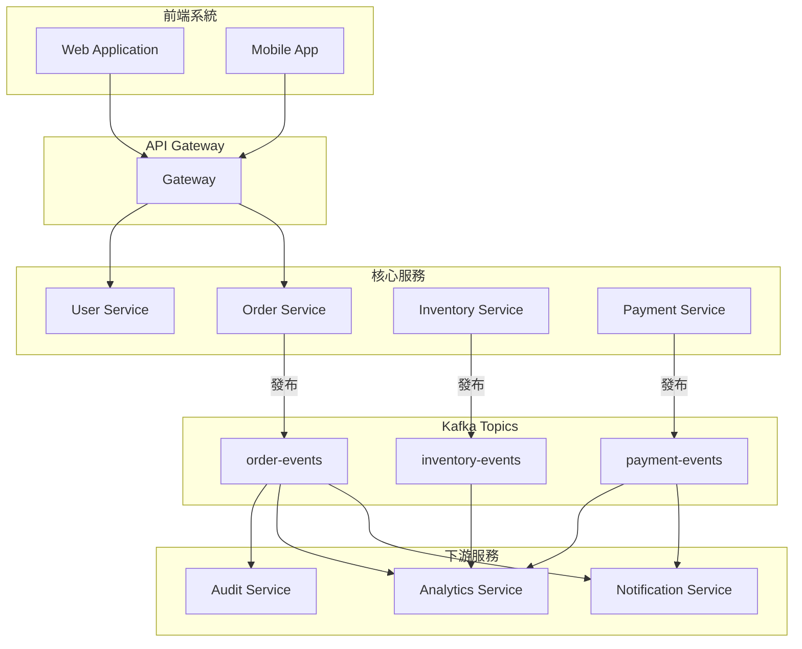
```mermaid
flowchart TB
    subgraph 前端系統
        WEB[Web Application]
        APP[Mobile App]
    end

    subgraph GW層[API Gateway]
        GW[Gateway]
    end

    subgraph 核心服務
        ORDER[Order Service]
        USER[User Service]
        INVENTORY[Inventory Service]
        PAYMENT[Payment Service]
    end

    subgraph KT[Kafka Topics]
        T1[order-events]
        T2[payment-events]
        T3[inventory-events]
    end

    subgraph 下游服務
        NOTIFY[Notification Service]
        ANALYTICS[Analytics Service]
        AUDIT[Audit Service]
    end

    WEB --> GW
    APP --> GW
    GW --> ORDER
    GW --> USER

    ORDER -->|發布| T1
    PAYMENT -->|發布| T2
    INVENTORY -->|發布| T3

    T1 --> NOTIFY
    T1 --> ANALYTICS
    T1 --> AUDIT
    T2 --> NOTIFY
    T2 --> ANALYTICS
    T3 --> ANALYTICS
```

**解耦設計原則**：

| 原則 | 說明 |
| --- | --- |
| **事件擁有權** | 每個 Topic 只有一個負責發布的服務（Single Writer），由該服務定義 Schema |
| **事件即契約** | Topic 名稱、Schema、語意與 SLA 視同對外 API 管理 |
| **下游自主** | 下游服務自行決定消費速度、保留自有 Consumer Group |
| **避免共享資料庫** | 服務間以事件同步資料，而非直接讀取他服務資料庫 |

### 6.3 同步系統 vs 事件驅動架構

| 特性 | 同步系統（REST／gRPC） | 事件驅動架構（Kafka） |
| --- | --- | --- |
| **耦合度** | 高（呼叫端須知道被呼叫端） | 低（只需知道事件） |
| **回應時間** | 即時 | 非即時（毫秒至秒級） |
| **可用性** | 下游故障直接影響上游 | 下游故障不影響上游，恢復後追上 |
| **擴展性** | 受限於最慢的服務 | 各服務獨立擴展 |
| **追蹤** | 較容易 | 需分散式追蹤（OpenTelemetry）與關聯 ID |
| **一致性** | 可強一致 | 最終一致 |
| **適用** | 查詢、需即時結果的命令 | 狀態變更通知、跨系統資料同步、長流程 |

### 6.4 常見整合架構模式

#### 6.4.1 Event Sourcing

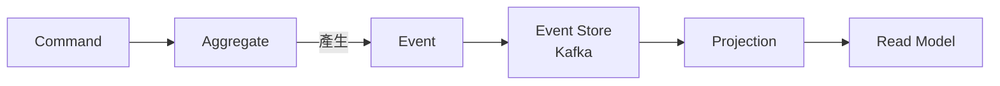
```mermaid
flowchart LR
    CMD[Command] --> AGG[Aggregate]
    AGG -->|產生| EVT[Event]
    EVT --> ES[Event Store<br/>Kafka]
    ES --> PROJ[Projection]
    PROJ --> READ[Read Model]
```

**要點**：以事件序列作為唯一事實來源（Source of Truth），讀取模型由事件投影產生（常搭配 CQRS）。以 Kafka 作為 Event Store 時需注意：Kafka 不支援依 Aggregate ID 高效查詢，通常搭配 Compacted Topic 保存快照或以資料庫保存事件並以 CDC 發布。

#### 6.4.2 CDC（Change Data Capture）

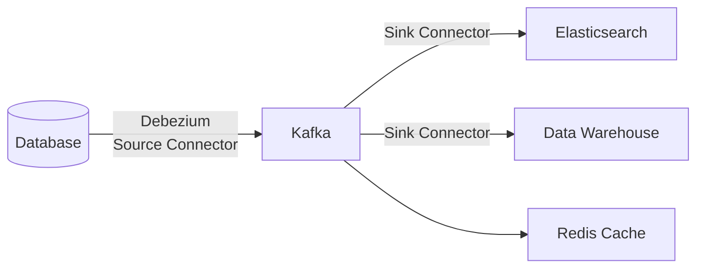
```mermaid
flowchart LR
    DB[(Database)] -->|Debezium<br/>Source Connector| KAFKA[Kafka]
    KAFKA -->|Sink Connector| ES[Elasticsearch]
    KAFKA -->|Sink Connector| DW[Data Warehouse]
    KAFKA --> CACHE[Redis Cache]
```

以資料庫交易日誌（binlog、WAL、redo log）擷取變更，不需修改應用程式，也不增加資料庫查詢負擔。詳見 [6.6](#66-kafka-connect-與-cdc)。

#### 6.4.3 Saga 模式

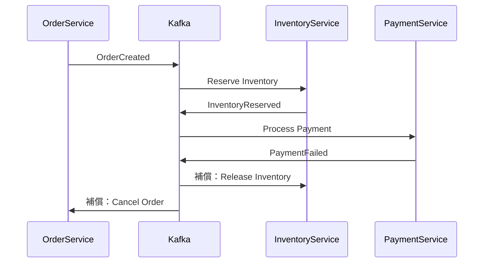
```mermaid
sequenceDiagram
    participant OrderService
    participant Kafka
    participant InventoryService
    participant PaymentService

    OrderService->>Kafka: OrderCreated
    Kafka->>InventoryService: Reserve Inventory
    InventoryService->>Kafka: InventoryReserved
    Kafka->>PaymentService: Process Payment
    PaymentService->>Kafka: PaymentFailed
    Kafka->>InventoryService: 補償：Release Inventory
    Kafka->>OrderService: 補償：Cancel Order
```

| 類型 | 說明 | 適用 |
| --- | --- | --- |
| **Choreography（編舞）** | 各服務監聽事件並自行決定下一步 | 步驟少、團隊自主性高 |
| **Orchestration（編排）** | 由協調者（Orchestrator）發送命令並追蹤狀態 | 步驟多、需集中監控與補償 |

每個步驟都必須設計**補償動作（Compensating Action）**，並確保事件處理冪等。

#### 6.4.4 Transactional Outbox 模式

> 🆕 **v2.0 新增**

**問題**：服務需要「更新資料庫」與「發布事件」兩個動作同時成功，但資料庫交易與 Kafka 無法組成同一個分散式交易（雙寫問題）。

**解法**：在同一個資料庫交易中，同時寫入業務資料表與 **Outbox 表**；再由 CDC（如 Debezium Outbox Event Router）或輪詢程式將 Outbox 記錄發布到 Kafka。

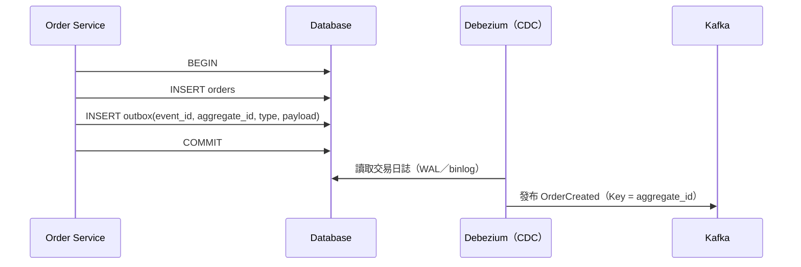
```mermaid
sequenceDiagram
    participant API as Order Service
    participant DB as Database
    participant CDC as Debezium（CDC）
    participant K as Kafka

    API->>DB: BEGIN
    API->>DB: INSERT orders
    API->>DB: INSERT outbox(event_id, aggregate_id, type, payload)
    API->>DB: COMMIT
    CDC->>DB: 讀取交易日誌（WAL／binlog）
    CDC->>K: 發布 OrderCreated（Key = aggregate_id）
```

```sql
CREATE TABLE outbox (
    id             UUID PRIMARY KEY,          -- 事件 ID（下游去重依據）
    aggregate_type VARCHAR(100) NOT NULL,     -- 決定目的 Topic
    aggregate_id   VARCHAR(100) NOT NULL,     -- 作為 Kafka Key，確保同一實體順序
    event_type     VARCHAR(100) NOT NULL,
    payload        JSONB        NOT NULL,
    created_at     TIMESTAMPTZ  NOT NULL DEFAULT now()
);
```

| 優點 | 注意事項 |
| --- | --- |
| 資料庫與事件最終一致，不遺失事件 | 下游仍可能收到重複事件 → 需冪等消費 |
| 不需分散式交易（2PC） | Outbox 表需定期清理 |
| 事件順序依 aggregate_id 維持 | CDC 元件本身需高可用與監控 |

### 6.5 Schema Registry 與 Schema 演進

> 🆕 **v2.0 新增**

Kafka Broker 不驗證訊息內容。為避免生產者任意變更格式造成下游失效，企業應導入 **Schema Registry** 集中管理事件 Schema。

```mermaid
flowchart LR
    P[Producer] -->|1. 註冊／查詢 Schema| SR[Schema Registry]
    P -->|2. 送出：Schema ID + 資料| K[Kafka]
    K -->|3. 讀取| C[Consumer]
    C -->|4. 依 Schema ID 取得 Schema| SR
```

**格式選擇**：

| 格式 | 優點 | 缺點 | 建議 |
| --- | --- | --- | --- |
| **Avro** | 精簡二進位、演進規則成熟、生態完整 | 需產生程式碼或 GenericRecord | 資料平台、CDC |
| **Protobuf** | 高效能、多語言支援佳、與 gRPC 共用 | 預設值語意需注意 | 多語言微服務 |
| **JSON Schema** | 人類可讀、門檻低 | 體積大、驗證成本較高 | 對外整合、初期導入 |

**相容性模式**：

| 模式 | 允許的變更 | 升級順序 |
| --- | --- | --- |
| `BACKWARD`（常見預設） | 刪除欄位、新增**有預設值**的欄位 | 先升級 Consumer |
| `FORWARD` | 新增欄位、刪除有預設值的欄位 | 先升級 Producer |
| `FULL` | 僅新增／刪除有預設值的欄位 | 任意順序 |
| `*_TRANSITIVE` | 與**所有**歷史版本相容 | 長期保存資料建議使用 |

> 📌 Schema Registry 非 Apache Kafka 專案內建元件，常見實作包括 Confluent Schema Registry、Apicurio Registry、雲端供應商的託管服務，導入時需評估授權條款。

### 6.6 Kafka Connect 與 CDC

> 🆕 **v2.0 新增**

**Kafka Connect** 是 Apache Kafka 內建的資料整合框架，以設定（而非程式碼）將外部系統資料匯入（Source）或匯出（Sink）Kafka。

```mermaid
flowchart LR
    subgraph Sources
        DB1[(Oracle／PostgreSQL／MySQL)]
        FS[檔案／SFTP]
    end
    subgraph Connect[Kafka Connect Cluster（Distributed Mode）]
        W1[Worker 1]
        W2[Worker 2]
    end
    subgraph Sinks
        ES[(Elasticsearch)]
        S3[(物件儲存)]
        DW[(資料倉儲)]
    end
    DB1 --> W1
    FS --> W2
    W1 --> K[Kafka]
    W2 --> K
    K --> W1
    K --> W2
    W1 --> ES
    W2 --> S3
    W2 --> DW
```

| 概念 | 說明 |
| --- | --- |
| **Worker** | 執行 Connector 的 JVM 程序；正式環境使用 Distributed Mode 組成叢集 |
| **Connector／Task** | Connector 定義整合工作，拆成多個 Task 平行執行 |
| **Converter** | 資料格式轉換（JSON、Avro、Protobuf） |
| **SMT（Single Message Transform）** | 輕量逐筆轉換（改名、遮罩、路由） |
| **內部 Topic** | `config.storage.topic`、`offset.storage.topic`、`status.storage.topic`，副本數應設為 3 |

**以 REST API 建立 Debezium PostgreSQL Connector 範例**：

```bash
curl -X POST https://connect.corp.example:8083/connectors \
  -H "Content-Type: application/json" \
  -d '{
    "name": "orders-cdc",
    "config": {
      "connector.class": "io.debezium.connector.postgresql.PostgresConnector",
      "database.hostname": "pg-primary.corp.example",
      "database.port": "5432",
      "database.user": "${file:/etc/kafka/secrets/pg.properties:user}",
      "database.password": "${file:/etc/kafka/secrets/pg.properties:password}",
      "database.dbname": "orders",
      "topic.prefix": "cdc.orders",
      "table.include.list": "public.outbox",
      "plugin.name": "pgoutput",
      "transforms": "outbox",
      "transforms.outbox.type": "io.debezium.transforms.outbox.EventRouter"
    }
  }'
```

**Kafka 4.x Connect 相關更新**：

| 項目 | 說明 |
| --- | --- |
| Java 17 | Connect Worker 需 Java 17+，並升級至 Jakarta EE 10（KIP-1032） |
| 多版本 Plugin | 4.1 起可同時安裝同一 Connector 的多個版本（KIP-891） |
| Plugin 指標 | 4.1 起 Connector 與 Plugin 可註冊自訂指標（KIP-877） |
| 外部 Schema | 4.2 起 `JsonConverter` 支援外部 Schema（KIP-1054） |
| 設定覆寫白名單 | 4.2 新增 allowlist 型 `ConnectorClientConfigOverridePolicy`（KIP-1188） |
| MirrorMaker 1 | 4.0 已移除，跨叢集複寫請改用 MirrorMaker 2（見 [7.7](#77-災難復原與跨機房部署)） |

> 📌 Debezium 目前穩定版本為 3.x（截至 2026 年 9 月為 3.6.x），使用前請對照其與 Kafka Connect 版本的相容性表。

### 6.7 Kafka Streams 串流處理

> 🆕 **v2.0 新增**

**Kafka Streams** 是 Apache Kafka 內建的 Java 串流處理函式庫，以一般應用程式形式部署（無需獨立叢集），支援有狀態運算、視窗、Join 與 Exactly-Once。

```java
import org.apache.kafka.common.serialization.Serdes;
import org.apache.kafka.streams.KafkaStreams;
import org.apache.kafka.streams.StreamsBuilder;
import org.apache.kafka.streams.StreamsConfig;
import org.apache.kafka.streams.kstream.*;

import java.time.Duration;
import java.util.Properties;

public class LargeTransferDetector {

    public static void main(String[] args) {
        Properties props = new Properties();
        props.put(StreamsConfig.APPLICATION_ID_CONFIG, "large-transfer-detector");
        props.put(StreamsConfig.BOOTSTRAP_SERVERS_CONFIG, "kafka-1:9094");
        props.put(StreamsConfig.PROCESSING_GUARANTEE_CONFIG, StreamsConfig.EXACTLY_ONCE_V2);
        props.put(StreamsConfig.GROUP_PROTOCOL_CONFIG, "streams"); // KIP-1071（4.2 GA）
        props.put(StreamsConfig.DEFAULT_KEY_SERDE_CLASS_CONFIG, Serdes.StringSerde.class);
        props.put(StreamsConfig.DEFAULT_VALUE_SERDE_CLASS_CONFIG, Serdes.LongSerde.class);

        StreamsBuilder builder = new StreamsBuilder();
        KStream<String, Long> transfers = builder.stream("account-transfers");

        // 每個帳戶 10 分鐘內轉出總額超過 100 萬即發出告警事件
        transfers
            .groupByKey()
            .windowedBy(TimeWindows.ofSizeWithNoGrace(Duration.ofMinutes(10)))
            .reduce(Long::sum, Materialized.as("transfer-sum-store"))
            .toStream()
            .filter((windowedKey, total) -> total > 1_000_000L)
            .map((windowedKey, total) -> KeyValue.pair(windowedKey.key(), total))
            .to("aml-alerts", Produced.with(Serdes.String(), Serdes.Long()));

        KafkaStreams streams = new KafkaStreams(builder.build(), props);
        Runtime.getRuntime().addShutdownHook(new Thread(streams::close));
        streams.start();
    }
}
```

**Kafka Streams 4.x 重要更新**：

| KIP | 版本 | 說明 |
| --- | --- | --- |
| KIP-1071 | 4.1 EA／4.2 GA | **Streams Rebalance Protocol**：由 Broker 端協調 Task 分配，重新平衡更快，設定 `group.protocol=streams`（GA 為部分功能集） |
| KIP-1034 | 4.2 | 例外處理器支援 **Dead Letter Queue** |
| KIP-1146 | 4.2 | Anchored Punctuation，於固定時間點觸發排程 |
| KIP-1065 | 4.0 | `ProductionExceptionHandler` 新增 `RETRY` 選項 |
| KIP-1271／1285 | 4.3 | 狀態儲存支援保存 Headers |
| KIP-1259 | 4.3 | 啟動時清除本地狀態的設定 |
| KIP-1244 | 4.3 | `streams-scala` 標記淘汰，預計 5.0 移除 |

**Kafka Streams vs 其他串流引擎**：

| 方案 | 部署模式 | 適用 |
| --- | --- | --- |
| **Kafka Streams** | 內嵌於 Java 應用程式 | 以 Kafka 為輸入輸出的微服務串流處理 |
| **Apache Flink** | 獨立叢集 | 大規模、多來源、複雜事件處理、批流一體 |
| **ksqlDB** | 獨立服務（Confluent Community License） | 以 SQL 描述串流處理；導入前確認授權 |

### 6.8 💡 本章實務建議

> **整合最佳實務**：
>
> 1. 事件以 Schema Registry 管理（Avro／Protobuf），相容性模式至少 `BACKWARD`。
> 2. 事件必須帶有唯一 `eventId`、發生時間與來源系統，並透過 Headers 傳遞追蹤資訊。
> 3. 資料庫與事件一致性採 Transactional Outbox + CDC，禁止在業務交易中直接雙寫。
> 4. 實作 Dead Letter Topic（DLT）與重送工具，DLT 需有告警與負責人。
> 5. Spring 專案升級至 Spring Kafka 4.x 時，將 `JsonSerializer`／`JsonDeserializer` 改為 `JacksonJsonSerializer`／`JacksonJsonDeserializer`。
> 6. 監控 Consumer Lag 並設定告警（見 [7.2](#72-consumer-lag-監控與處理)）。

---

## 7. Kafka 系統維運與監控

### 7.1 常見監控指標

> 📌 以下 MBean 名稱依 Apache Kafka 官方 Monitoring 文件整理。KRaft 模式下，Controller 相關指標由 **Controller 節點**發布，Broker 相關指標由 **Broker 節點**發布，監控系統需同時收集兩類節點。

#### 7.1.1 Broker 層級指標

| 指標 | MBean | 說明 | 告警閾值建議 |
| --- | --- | --- | --- |
| **UnderReplicatedPartitions** | `kafka.server:type=ReplicaManager,name=UnderReplicatedPartitions` | 副本未完全同步的 Partition 數 | > 0 持續 5 分鐘：警告 |
| **UnderMinIsrPartitionCount** | `kafka.server:type=ReplicaManager,name=UnderMinIsrPartitionCount` | ISR 低於 `min.insync.replicas` 的 Partition 數（`acks=all` 寫入會失敗） | > 0：緊急 |
| **AtMinIsrPartitionCount** | `kafka.server:type=ReplicaManager,name=AtMinIsrPartitionCount` | ISR 剛好等於下限，再故障一台即無法寫入 | > 0：警告 |
| **IsrShrinksPerSec／IsrExpandsPerSec** | `kafka.server:type=ReplicaManager,name=IsrShrinksPerSec` | ISR 收縮與擴張頻率 | 頻繁波動：警告 |
| **BytesInPerSec／BytesOutPerSec** | `kafka.server:type=BrokerTopicMetrics,name=BytesInPerSec` | 每秒寫入／讀取位元組數 | 超過容量 70%：警告 |
| **MessagesInPerSec** | `kafka.server:type=BrokerTopicMetrics,name=MessagesInPerSec` | 每秒寫入訊息數 | 依業務基線 |
| **RequestHandlerAvgIdlePercent** | `kafka.server:type=KafkaRequestHandlerPool,name=RequestHandlerAvgIdlePercent` | I/O 執行緒閒置比例 | < 30%：警告 |
| **NetworkProcessorAvgIdlePercent** | `kafka.network:type=SocketServer,name=NetworkProcessorAvgIdlePercent` | 網路執行緒閒置比例 | < 30%：警告 |
| **Request TotalTimeMs** | `kafka.network:type=RequestMetrics,name=TotalTimeMs,request={Produce\|FetchConsumer\|FetchFollower}` | 請求總處理時間（p99） | 依 SLA 設定 |
| **磁碟使用率** | OS 指標 | 資料目錄使用率 | > 70% 警告、> 85% 緊急 |

#### 7.1.2 Controller 與 KRaft 指標

> 🆕 **v2.0 新增**

| 指標 | MBean | 說明 | 告警閾值建議 |
| --- | --- | --- | --- |
| **ActiveControllerCount** | `kafka.controller:type=KafkaController,name=ActiveControllerCount` | 各 Controller 回報是否為 Active；**全叢集加總應為 1** | 加總 ≠ 1：緊急 |
| **OfflinePartitionsCount** | `kafka.controller:type=KafkaController,name=OfflinePartitionsCount` | 無 Leader 的 Partition 數 | > 0：緊急 |
| **FencedBrokerCount／ActiveBrokerCount** | `kafka.controller:type=KafkaController,name=FencedBrokerCount` | 被隔離／活躍的 Broker 數 | Fenced > 0：警告 |
| **LastAppliedRecordLagMs** | `kafka.controller:type=KafkaController,name=LastAppliedRecordLagMs` | Controller 套用 Metadata 的延遲 | 持續上升：警告 |
| **MetadataErrorCount** | `kafka.controller:type=KafkaController,name=MetadataErrorCount` | 套用 Metadata 發生錯誤次數 | > 0：緊急 |
| **Raft current-state** | `kafka.server:type=raft-metrics`（`current-state`、`current-leader`、`high-watermark`） | 節點 Raft 角色與 Quorum 狀態 | Leader 頻繁變動：警告 |
| **Raft commit-latency** | `kafka.server:type=raft-metrics`（`commit-latency-avg`、`commit-latency-max`） | Metadata 提交延遲 | 持續偏高：警告 |
| **Metadata 載入錯誤** | `kafka.server:type=broker-metadata-metrics`（`metadata-load-error-count`、`metadata-apply-error-count`） | Broker 端載入／套用 Metadata 錯誤 | > 0：緊急 |

> ⚠️ **v2.0 更正**：v1.0 將 `ActiveControllerCount` 列為 Broker 指標並以「≠ 1」判斷。KRaft 模式下應在所有 **Controller 節點**收集此指標並**加總**判斷。

#### 7.1.3 Topic／Partition 層級指標

| 指標 | 說明 | 告警閾值建議 |
| --- | --- | --- |
| **MessagesInPerSec（per topic）** | 各 Topic 每秒訊息數 | 與業務基線比較，異常歸零即告警 |
| **Log Size** | `kafka.log:type=Log,name=Size,topic=*,partition=*` | 監控成長趨勢 |
| **Partition 大小百分比** | 🆕 4.3（KIP-1257）新增 Partition 大小相對於保留上限的百分比指標 | 接近 100% 代表即將依大小刪除資料 |
| **Partition 分布偏斜** | 各 Broker Leader 數與資料量 | 偏差 > 20%：安排重新平衡 |

#### 7.1.4 Client 層級指標

| 指標 | 來源 | 說明 | 告警閾值建議 |
| --- | --- | --- | --- |
| **Consumer Lag（records-lag-max）** | `kafka.consumer:type=consumer-fetch-manager-metrics` | 最大落後筆數 | 依業務 SLA（如 > 10000 或延遲 > 5 分鐘） |
| **records-consumed-rate** | 同上 | 消費速率 | 下降趨勢：警告 |
| **commit-latency-avg** | `kafka.consumer:type=consumer-coordinator-metrics` | Offset 提交延遲 | > 100 ms：警告 |
| **rebalance-rate-per-hour** | 同上 | Rebalance 頻率 | 異常升高：警告 |
| **record-error-rate** | `kafka.producer:type=producer-metrics` | Producer 送出失敗率 | > 0：警告 |
| **request-latency-avg** | 同上 | Producer 請求延遲 | 依 SLA |
| **Share Group Lag** | 🆕 4.2（KIP-1226）Share Partition Lag 指標，可透過 `kafka-share-groups.sh --describe` 查詢 | 依 SLA |

**Client Telemetry（KIP-714）**：Kafka 3.7 起 Client 可將指標推送到 Broker（`enable.metrics.push=true`，預設開啟），由 Broker 端實作 `ClientTelemetry` 外掛轉送至監控系統；4.0 起 KIP-1076 允許應用程式將自有指標一併推送。這讓平台團隊可在不修改應用程式的情況下集中收集 Client 指標。

### 7.2 Consumer Lag 監控與處理

#### 7.2.1 查看 Consumer Lag

```bash
kafka-consumer-groups.sh --describe \
  --group order-processing-group \
  --bootstrap-server localhost:9092

# 輸出範例：
# GROUP                  TOPIC          PARTITION  CURRENT-OFFSET  LOG-END-OFFSET  LAG
# order-processing-group order-events   0          1000            1500            500
# order-processing-group order-events   1          800             800             0
# order-processing-group order-events   2          1200            2000            800
```

**Lag 的兩種衡量方式**：

| 方式 | 說明 | 優點 |
| --- | --- | --- |
| **筆數 Lag** | Log End Offset − Committed Offset | 直觀，工具內建 |
| **時間 Lag** | 最舊未消費訊息的時間戳記與現在的差距 | 直接對應業務 SLA（例如「延遲不超過 5 分鐘」） |

企業監控建議以**時間 Lag** 設定告警，筆數 Lag 作為輔助；可使用開源 Lag Exporter 或 APM／可觀測性平台收集。

#### 7.2.2 Lag 過高的原因與解決方案

```mermaid
flowchart TB
    LAG[Consumer Lag 過高]

    LAG --> C1[Consumer 處理太慢]
    LAG --> C2[Consumer 數量不足]
    LAG --> C3[Partition 分布不均／熱點 Key]
    LAG --> C4[頻繁 Rebalance]
    LAG --> C5[下游相依系統緩慢]

    C1 --> S1[優化處理邏輯<br/>批次寫入、非同步 I/O]
    C2 --> S2[增加 Consumer<br/>最多 = Partition 數<br/>或改用 Share Group]
    C3 --> S3[檢視 Key 設計<br/>增加 Partition]
    C4 --> S4[改用 KIP-848 協定<br/>調整 max.poll 設定]
    C5 --> S5[熔斷、限流<br/>擴充下游容量]
```

### 7.3 系統監控設定

#### 7.3.1 JMX 監控設定

```bash
# 以環境變數啟用 JMX（正式環境務必啟用認證與 TLS，並限制來源網段）
export JMX_PORT=9999
export KAFKA_JMX_OPTS="-Dcom.sun.management.jmxremote \
  -Dcom.sun.management.jmxremote.authenticate=true \
  -Dcom.sun.management.jmxremote.password.file=/etc/kafka/jmx/jmxremote.password \
  -Dcom.sun.management.jmxremote.access.file=/etc/kafka/jmx/jmxremote.access \
  -Dcom.sun.management.jmxremote.ssl=true \
  -Dcom.sun.management.jmxremote.registry.ssl=true"

kafka-server-start.sh /opt/kafka/config/broker.properties
```

> ⚠️ **v2.0 更正**：v1.0 範例關閉 JMX 認證與 SSL（`authenticate=false`、`ssl=false`），在正式環境等同開放遠端管理介面。實務上更常見的做法是以 Java Agent 形式的 Prometheus JMX Exporter 在本機讀取 MBean，**不對外開放 JMX Port**。

#### 7.3.2 Prometheus 整合

使用 Prometheus JMX Exporter（Java Agent）將 Kafka 指標以 HTTP 端點輸出：

```bash
export KAFKA_OPTS="-javaagent:/opt/jmx_exporter/jmx_prometheus_javaagent.jar=7071:/opt/jmx_exporter/kafka-broker.yml"
```

```yaml
# /opt/jmx_exporter/kafka-broker.yml（節錄）
lowercaseOutputName: true
lowercaseOutputLabelNames: true

rules:
  # 帶 topic／partition 標籤的 Gauge
  - pattern: kafka.server<type=(.+), name=(.+), clientId=(.+), topic=(.+), partition=(.*)><>Value
    name: kafka_server_$1_$2
    type: GAUGE
    labels:
      clientId: "$3"
      topic: "$4"
      partition: "$5"

  # Broker 層級 Gauge（UnderReplicatedPartitions 等）
  - pattern: kafka.server<type=(.+), name=(.+)><>Value
    name: kafka_server_$1_$2
    type: GAUGE

  # 每秒速率（BytesInPerSec 等）
  - pattern: kafka.server<type=(.+), name=(.+)PerSec\w*, topic=(.+)><>Count
    name: kafka_server_$1_$2_total
    type: COUNTER
    labels:
      topic: "$3"

  # Controller 指標（KRaft Controller 節點）
  - pattern: kafka.controller<type=(.+), name=(.+)><>Value
    name: kafka_controller_$1_$2
    type: GAUGE

  # Raft 指標
  - pattern: kafka.server<type=raft-metrics><>(.+)
    name: kafka_server_raft_$1
    type: GAUGE
```

**Prometheus 告警規則範例**：

```yaml
groups:
  - name: kafka.rules
    rules:
      - alert: KafkaUnderMinIsrPartitions
        expr: sum(kafka_server_replicamanager_underminisrpartitioncount) > 0
        for: 1m
        labels:
          severity: critical
        annotations:
          summary: "Partition ISR 低於 min.insync.replicas，acks=all 寫入將失敗"

      - alert: KafkaActiveControllerCountAbnormal
        expr: sum(kafka_controller_kafkacontroller_activecontrollercount) != 1
        for: 1m
        labels:
          severity: critical

      - alert: KafkaOfflinePartitions
        expr: max(kafka_controller_kafkacontroller_offlinepartitionscount) > 0
        for: 1m
        labels:
          severity: critical

      - alert: KafkaUnderReplicatedPartitions
        expr: sum(kafka_server_replicamanager_underreplicatedpartitions) > 0
        for: 5m
        labels:
          severity: warning
```

> 📌 指標名稱會因 Exporter 規則而不同，上線前請以實際 `/metrics` 輸出校正運算式。

#### 7.3.3 Grafana Dashboard

建議監控面板包含：

| 面板 | 內容 |
| --- | --- |
| **叢集總覽** | Active Controller、Broker 數（Active／Fenced）、Offline／UnderMinIsr Partition |
| **Broker 資源** | CPU、記憶體、磁碟使用率與 I/O、網路流量、GC 時間 |
| **請求效能** | Produce／Fetch 請求 p99 延遲、Request Handler／Network 閒置率 |
| **Topic 流量** | 各 Topic 訊息速率、位元組速率、Partition 大小 |
| **Consumer** | 各 Group 時間 Lag、消費速率、Rebalance 次數 |
| **KRaft** | Raft Leader、Commit Latency、Metadata 套用延遲 |
| **Tiered Storage** | 遠端上傳／讀取速率、錯誤數 |

### 7.4 常見營運問題與排查

#### 7.4.1 問題排查流程

```mermaid
flowchart TB
    START[發現問題] --> CHECK1{Controller Quorum}
    CHECK1 -->|無 Leader／頻繁切換| FIX1[kafka-metadata-quorum describe<br/>檢查 Controller 網路與磁碟]
    CHECK1 -->|正常| CHECK2{Broker 狀態}

    CHECK2 -->|Fenced／離線| FIX2[檢查 Broker 日誌<br/>磁碟、GC、網路]
    CHECK2 -->|正常| CHECK3{Partition 狀態}

    CHECK3 -->|UnderMinIsr／Offline| FIX3[檢查副本同步<br/>故障 Broker、複寫限流]
    CHECK3 -->|正常| CHECK4{Consumer 狀態}

    CHECK4 -->|Lag 高／頻繁 Rebalance| FIX4[擴展 Consumer<br/>優化處理邏輯]
    CHECK4 -->|正常| CHECK5[檢查 Client 端設定<br/>網路與認證]
```

#### 7.4.2 常見問題與解決方案

| 問題 | 可能原因 | 解決方案 |
| --- | --- | --- |
| **Broker 無法啟動** | 設定錯誤、Port 被佔用、`meta.properties` 不一致 | 檢查 `server.log`、確認 Cluster ID 與格式化狀態 |
| **Broker 被 Fenced** | 無法與 Controller 維持心跳（網路、GC 停頓） | 檢查網路、GC 日誌、`broker.session.timeout.ms` |
| **UnderReplicatedPartitions** | Follower 同步慢、磁碟或網路瓶頸 | 檢查網路、磁碟 I/O、複寫執行緒 `num.replica.fetchers` |
| **Producer `NotEnoughReplicas`** | ISR 低於 `min.insync.replicas` | 恢復故障 Broker；緊急時評估暫時調整 Topic 設定並記錄 |
| **Producer 逾時** | Broker 負載高、`delivery.timeout.ms` 過短 | 擴容、調整批次與逾時設定 |
| **Consumer Lag 持續增加** | 處理慢、Consumer 數不足 | 優化處理、增加 Consumer 或改用 Share Group |
| **頻繁 Rebalance** | 處理時間超過 `max.poll.interval.ms`、Pod 頻繁重啟 | 降低 `max.poll.records`、改用 KIP-848 協定、設定 `group.instance.id`（靜態成員） |
| **磁碟空間不足** | 保留策略不當、資料量暴增 | 調整 Retention、評估 Tiered Storage、擴充磁碟 |
| **記憶體不足（OOM）** | Heap 過小或 Client 連線數暴增 | 調整 Heap、設定連線配額（`max.connections.per.ip`） |

#### 7.4.3 日誌檢查

Kafka 4.0 起使用 **Log4j2**，預設設定檔為 `config/log4j2.yaml`。主要日誌檔：

| 日誌檔 | 內容 |
| --- | --- |
| `server.log` | Broker／Controller 主要日誌 |
| `controller.log` | Controller 事件 |
| `state-change.log` | Partition／副本狀態變更 |
| `kafka-request.log` | 請求日誌（預設關閉，除錯時暫時開啟） |
| `kafka-authorizer.log` | 授權決策（稽核用） |
| `log-cleaner.log` | Log Compaction 執行紀錄 |

```bash
# 日誌目錄（可由 LOG_DIR 環境變數指定）
ls /opt/kafka/logs/

# 搜尋錯誤
grep -E "ERROR|FATAL" /opt/kafka/logs/server.log | tail -50

# Controller 事件
grep -i "leader" /opt/kafka/logs/controller.log | tail -50

# 檢視 Metadata Log 內容（除錯）
kafka-dump-log.sh --cluster-metadata-decoder \
  --files /var/lib/kafka/metadata/__cluster_metadata-0/00000000000000000000.log
```

> ⚠️ **v2.0 更正**：Log4j 1.x 的 `log4j.properties` 在 4.0 起不再使用，自訂日誌設定需改寫為 Log4j2 格式；`KafkaLog4jAppender` 已移除。

### 7.5 容量規劃與效能調校

> 🆕 **v2.0 新增**

#### 7.5.1 儲存容量估算

```text
每日寫入量 = 平均寫入速率（MB/s）× 86,400
所需磁碟   = 每日寫入量 × 保留天數 × Replication Factor ÷ 壓縮比 × (1 + 預留空間 30%)
```

**範例**：平均寫入 20 MB/s、保留 7 天、RF=3、壓縮比 2

```text
每日寫入 = 20 × 86,400 ≈ 1,728,000 MB ≈ 1.65 TB
所需磁碟 = 1.65 TB × 7 × 3 ÷ 2 × 1.3 ≈ 22.5 TB（全叢集）
6 台 Broker → 每台約 3.75 TB 可用空間
```

#### 7.5.2 網路頻寬估算

```text
Broker 總入站 = Producer 寫入 × RF（含 Follower 複寫）
Broker 總出站 = Producer 寫入 × (RF − 1) + Producer 寫入 × Consumer Group 數
```

以寫入 20 MB/s、RF=3、4 個 Consumer Group 為例：入站 60 MB/s、出站 40 + 80 = 120 MB/s。尖峰應以平均值的 2–3 倍規劃，並保留 Broker 故障時的承接餘裕（N−1 容量）。

#### 7.5.3 效能調校對照表

| 目標 | Producer | Consumer | Broker／Topic |
| --- | --- | --- | --- |
| **高吞吐** | `batch.size` 64–256 KB、`linger.ms` 10–50、`compression.type=zstd`／`lz4` | `fetch.min.bytes` 調大、`max.poll.records` 調大 | 增加 Partition、`num.io.threads`、多顆磁碟 |
| **低延遲** | `linger.ms` 0–5、較小批次 | `fetch.max.wait.ms` 調小 | 充足 Page Cache、NVMe、避免跨 AZ 讀取 |
| **高可靠** | `acks=all`、冪等、`delivery.timeout.ms` 合理 | 手動提交、`read_committed` | RF=3、`min.insync.replicas=2`、ELR |

#### 7.5.4 壓力測試

```bash
# Producer 壓測（4.2 起支援 --bootstrap-server 與 warmup，KIP-1147／KIP-1052）
kafka-producer-perf-test.sh \
  --topic perf-test \
  --num-records 10000000 \
  --record-size 1024 \
  --throughput -1 \
  --bootstrap-server kafka-1:9094 \
  --command-property acks=all \
  --command-property linger.ms=10 \
  --command-property compression.type=zstd

# Consumer 壓測
kafka-consumer-perf-test.sh \
  --topic perf-test \
  --messages 10000000 \
  --bootstrap-server kafka-1:9094
```

> 📌 KIP-1147 將 `kafka-producer-perf-test.sh` 的 `--producer-props` 等參數統一為 `--command-property`／`--command-config`；舊參數於 4.x 仍可用但已淘汰，實際可用參數請以 `--help` 確認。

### 7.6 叢集維護作業

> 🆕 **v2.0 新增**

#### 7.6.1 Partition 重新分配

新增 Broker 或下線 Broker 時，需重新分配 Partition：

```bash
# 1. 定義要搬移的 Topic
cat > topics.json <<'JSON'
{"version":1,"topics":[{"topic":"order-events"},{"topic":"payment-events"}]}
JSON

# 2. 產生建議分配（目標 Broker 101–104）
kafka-reassign-partitions.sh --bootstrap-server kafka-1:9094 \
  --command-config admin.properties \
  --topics-to-move-json-file topics.json \
  --broker-list "101,102,103,104" --generate > plan.txt

# 3. 執行（務必設定複寫頻寬限制，避免影響線上流量）
kafka-reassign-partitions.sh --bootstrap-server kafka-1:9094 \
  --command-config admin.properties \
  --reassignment-json-file reassign.json \
  --execute --throttle 50000000

# 4. 驗證完成並移除限流設定
kafka-reassign-partitions.sh --bootstrap-server kafka-1:9094 \
  --command-config admin.properties \
  --reassignment-json-file reassign.json --verify
```

> 📌 務必保存 `--generate` 輸出的「目前分配」作為回復計畫。大型叢集建議使用 **Cruise Control** 等工具自動化負載平衡。

#### 7.6.2 Preferred Leader 選舉

```bash
# 將 Leader 回復為各 Partition 的首選副本，平衡 Leader 分布
kafka-leader-election.sh --bootstrap-server kafka-1:9094 \
  --command-config admin.properties \
  --election-type preferred --all-topic-partitions
```

Broker 預設 `auto.leader.rebalance.enable=true`，會定期自動執行首選 Leader 選舉。

#### 7.6.3 Cordon（隔離）Broker 與磁碟（KIP-1066）

Kafka 4.3 新增 **cordon** 機制：將 Log Directory 標記為 cordoned 後，**新的 Partition 不會被放置**在該目錄。可用於：

- 準備下線 Broker 或更換磁碟前，先停止新 Partition 進駐
- 磁碟接近滿載時暫停分配

```bash
# 動態設定 Broker 101 的 cordoned.log.dirs（範例）
kafka-configs.sh --bootstrap-server kafka-1:9094 --command-config admin.properties \
  --alter --entity-type brokers --entity-name 101 \
  --add-config cordoned.log.dirs=/data2/kafka
```

Cordon 只影響新分配，既有 Partition 仍需透過重新分配搬出。

#### 7.6.4 Broker 下線流程

| 步驟 | 動作 |
| --- | --- |
| 1 | Cordon 該 Broker 的所有 Log Directory |
| 2 | 以重新分配將其上所有 Partition 搬至其他 Broker |
| 3 | 確認該 Broker 已無任何 Partition 副本 |
| 4 | 停止 Broker（controlled shutdown） |
| 5 | 以 `kafka-cluster.sh unregister --id <node.id>` 從叢集移除註冊 |
| 6 | 更新監控、防火牆、DNS 與文件 |

### 7.7 災難復原與跨機房部署

> 🆕 **v2.0 新增**

#### 7.7.1 部署模式比較

| 模式 | 架構 | RPO | RTO | 適用 |
| --- | --- | --- | --- | --- |
| **Stretch Cluster（延展叢集）** | 單一叢集橫跨 3 個低延遲機房／AZ，RF=3 各放一份 | 0（同步複寫） | 分鐘級（自動 Leader 切換） | 同城三機房、雲端多 AZ |
| **Active-Passive（MirrorMaker 2）** | 主叢集 → 非同步鏡像至備援叢集 | 秒至分鐘級 | 分鐘至小時級（需切換 Client） | 異地備援 |
| **Active-Active（MirrorMaker 2）** | 兩叢集互相鏡像，各自服務在地流量 | 秒至分鐘級 | 分鐘級 | 多區域服務 |

> 📌 Stretch Cluster 要求機房間延遲低（一般建議 RTT < 10 ms），且需 **3 個機房**（Controller Quorum 需多數存活）。只有兩個機房時，應採主備叢集 + MirrorMaker 2。

#### 7.7.2 MirrorMaker 2

MirrorMaker 2（MM2）以 Kafka Connect 為基礎，提供 Topic 資料、Topic 設定、ACL 與 Consumer Group Offset 的跨叢集同步。**MirrorMaker 1 已於 4.0 移除**。

```properties
# mm2.properties（Active-Passive：tpe → khh）
clusters = tpe, khh
tpe.bootstrap.servers = tpe-kafka-1:9094,tpe-kafka-2:9094
khh.bootstrap.servers = khh-kafka-1:9094,khh-kafka-2:9094

tpe->khh.enabled = true
tpe->khh.topics = order-.*, payment-.*
tpe->khh.groups = .*

# 同步 Consumer Group Offset（經轉譯），切換後可從對應位置繼續
tpe->khh.sync.group.offsets.enabled = true
tpe->khh.emit.checkpoints.enabled = true

replication.factor = 3
checkpoints.topic.replication.factor = 3
heartbeats.topic.replication.factor = 3
offset-syncs.topic.replication.factor = 3
```

```bash
connect-mirror-maker.sh mm2.properties
```

| 注意事項 | 說明 |
| --- | --- |
| Topic 命名 | 預設複寫後名稱為 `tpe.order-events`（`DefaultReplicationPolicy`）；可改用 `IdentityReplicationPolicy` 保留原名（僅限 Active-Passive） |
| Offset 轉譯 | 兩叢集 Offset 不同，需依 checkpoint 轉譯；4.3 起 `RemoteClusterUtils` 支援批次轉譯（KIP-1239） |
| 容量 | 備援叢集需能承接主叢集全部流量 |
| 演練 | 每年至少一次切換演練，驗證 RTO 與 Client 切換程序 |

#### 7.7.3 備份策略

Kafka 以副本與跨叢集鏡像提供資料保護，但仍需備份下列項目：

| 項目 | 方式 |
| --- | --- |
| 設定檔（server／broker／controller.properties、JAAS、Log4j2） | 納入 Git 與設定管理工具 |
| Topic 清單與設定 | 定期匯出 `kafka-topics.sh --describe`、`kafka-configs.sh --describe` |
| ACL | 定期匯出 `kafka-acls.sh --list` |
| Consumer Group Offset | 切換或重大變更前匯出 |
| 憑證與 Keystore | 納入機密管理系統（Vault、HSM） |
| 長期保存資料 | Tiered Storage 或 Sink Connector 匯出至物件儲存 |

### 7.8 💡 本章實務建議

> **維運最佳實務**：
>
> 1. 同時監控 Broker 與 Controller 節點，`UnderMinIsrPartitionCount`、`OfflinePartitionsCount`、`ActiveControllerCount` 加總列為最高等級告警。
> 2. Consumer Lag 以「時間延遲」對應業務 SLA 設定告警。
> 3. JMX 不對外開放，改以本機 Exporter 輸出指標。
> 4. 重新分配 Partition 一律設定 throttle，並保存回復計畫。
> 5. 依 RPO／RTO 選擇 Stretch Cluster 或 MirrorMaker 2，並定期演練。
> 6. 建立標準 Runbook，並定期進行故障演練（Chaos Engineering）。

---

## 8. Kafka 系統升級與版本控管

> ⚠️ **v2.0 全面改寫**：v1.0 的升級流程以 `inter.broker.protocol.version` 控制協定版本。該設定已於 **Kafka 4.0 移除**；KRaft 叢集改以 **`metadata.version`（Feature Level）** 並透過 `kafka-features.sh` 管控功能啟用。

### 8.1 升級策略（Rolling Upgrade）

#### 8.1.1 版本控管概念

| 概念 | 說明 |
| --- | --- |
| **軟體版本** | 節點上安裝的 Kafka 二進位版本（如 4.3.1） |
| **`metadata.version`** | 叢集實際啟用的中繼資料與協定功能等級；決定可使用的新功能 |
| **其他 Feature** | 如 `kraft.version`（Dynamic Quorum）、`group.version`、`transaction.version`、`share.version`、`eligible.leader.replicas.version` |
| **Finalize** | 所有節點升級並驗證後，執行 `kafka-features.sh upgrade` 提升 Feature Level |

升級分為兩階段：**先滾動升級軟體**（此時仍以舊功能等級運作，可回退軟體），**驗證穩定後再提升功能等級**（提升後回退受限）。

```mermaid
flowchart LR
    A[升級前檢查] --> B[逐台升級 Controller]
    B --> C[逐台升級 Broker]
    C --> D[觀察期<br/>可回退軟體]
    D --> E[kafka-features.sh upgrade<br/>提升 metadata.version]
    E --> F[升級 Client／Connect／Streams]
```

#### 8.1.2 升級前提（升級至 4.3）

| 條件 | 說明 |
| --- | --- |
| 叢集已為 KRaft 模式 | ZooKeeper 叢集須先依 [3.4](#34-zookeeper-移除與遷移路徑) 完成遷移 |
| `metadata.version` ≥ 3.3 | 更舊的 KRaft 叢集須先升級至 3.9.x |
| Broker／Controller 使用 Java 17+ | 先完成 JDK 升級 |
| 已移除 4.0 刪除的設定 | 見 [8.5](#85-3x-升級至-4x-破壞性變更) |

#### 8.1.3 升級步驟

```bash
# 0. 檢查目前 Feature Level 與叢集健康狀態
kafka-features.sh --bootstrap-server kafka-1:9094 --command-config admin.properties describe
kafka-metadata-quorum.sh --bootstrap-server kafka-1:9094 --command-config admin.properties describe --status
kafka-topics.sh --bootstrap-server kafka-1:9094 --command-config admin.properties \
  --describe --under-min-isr-partitions        # 應無輸出

# 1. 在每個節點安裝新版本（與舊版並存）
cd /opt
wget https://downloads.apache.org/kafka/4.3.1/kafka_2.13-4.3.1.tgz
tar -xzf kafka_2.13-4.3.1.tgz
cp /opt/kafka/config/*.properties /opt/kafka_2.13-4.3.1/config/   # 沿用既有設定
# 注意：自訂日誌設定需改寫為 log4j2 格式

# 2. 先逐台升級 Controller（一次一台，非 Active 者優先）
sudo systemctl stop kafka-controller
ln -sfn /opt/kafka_2.13-4.3.1 /opt/kafka
sudo systemctl start kafka-controller
kafka-metadata-quorum.sh --bootstrap-server kafka-1:9094 --command-config admin.properties \
  describe --replication                       # 確認該 Controller 已追上

# 3. 再逐台升級 Broker（controlled shutdown 會自動轉移 Leader）
sudo systemctl stop kafka
ln -sfn /opt/kafka_2.13-4.3.1 /opt/kafka
sudo systemctl start kafka
# 等待 UnderReplicatedPartitions 回到 0 再處理下一台

# 4. 觀察期（建議至少 24–72 小時）：驗證效能、錯誤率、Client 行為

# 5. 提升功能等級（Finalize）
kafka-features.sh --bootstrap-server kafka-1:9094 --command-config admin.properties \
  upgrade --release-version 4.3

# 6. 再次確認
kafka-features.sh --bootstrap-server kafka-1:9094 --command-config admin.properties describe
```

> 📌 `upgrade --release-version` 會一次提升 `metadata.version` 與對應版本的其他 Feature。若只想提升特定功能，可使用 `--feature <name>=<level>`，例如 `--feature kraft.version=1` 啟用 Dynamic Quorum。

### 8.2 升級前檢查清單

| 項目 | 檢查內容 | 確認 |
| --- | --- | --- |
| **Release Notes 與 Upgrade 文件** | 閱讀目標版本的 Notable Changes 與已知問題 | ☐ |
| **Java 版本** | Broker／Controller／Connect ≥ 17；Client／Streams ≥ 11 | ☐ |
| **移除的設定與工具** | 確認設定檔與腳本未使用已移除項目（見 [8.5](#85-3x-升級至-4x-破壞性變更)） | ☐ |
| **Client 版本盤點** | 所有 Client ≥ 2.1（4.x Broker 已移除更舊協定，KIP-896） | ☐ |
| **叢集狀態** | 無 UnderReplicated／UnderMinIsr／Offline Partition；Quorum 正常 | ☐ |
| **資源** | 磁碟空間、記憶體充足，無進行中的重新分配 | ☐ |
| **備份** | 設定檔、Topic 設定、ACL、Consumer Offset 已匯出 | ☐ |
| **監控** | 監控與告警正常，Dashboard 已準備升級觀察視圖 | ☐ |
| **回滾計畫** | 舊版安裝包保留、回滾步驟已演練 | ☐ |
| **測試環境驗證** | 已在與正式環境同版本、同設定的測試環境完成升級演練 | ☐ |
| **變更管理** | 變更單核准、維護時段公告、相關團隊待命 | ☐ |

### 8.3 升級風險與回復機制

#### 8.3.1 常見風險

| 風險 | 影響 | 預防措施 |
| --- | --- | --- |
| **舊 Client 無法連線** | 2.1 以前的 Client 被拒絕 | 升級前盤點 Client 版本（可觀察 `ApiVersions` 請求版本指標） |
| **使用已移除設定** | Broker 無法啟動 | 先於測試環境以新版啟動驗證設定 |
| **日誌設定失效** | 無日誌輸出或格式錯誤 | 預先轉換為 Log4j2 設定 |
| **JDK 不相容** | 無法啟動 | 先升級 JDK 並驗證 GC 參數 |
| **資料風險** | ISR 不足時重啟導致不可用 | 每台重啟前確認 ISR 完整 |
| **效能變化** | 預設值改變（如 `linger.ms`）影響延遲 | 升級前比對預設值差異並壓測 |

#### 8.3.2 回滾步驟

| 階段 | 是否可回滾 | 做法 |
| --- | --- | --- |
| 軟體已升級、**尚未** Finalize | ✅ 可以 | 逐台停止、切回舊版安裝目錄並啟動 |
| 已執行 `kafka-features.sh upgrade` | ⚠️ 受限 | `metadata.version` 降版僅在特定版本間且可能遺失中繼資料；多數情況無法安全降版，應視為不可逆 |

```bash
# 軟體回滾（尚未 Finalize 時）
sudo systemctl stop kafka
ln -sfn /opt/kafka_2.13-4.2.1 /opt/kafka      # 切回舊版
sudo systemctl start kafka

# 驗證服務
kafka-metadata-quorum.sh --bootstrap-server kafka-1:9094 --command-config admin.properties describe --status
kafka-topics.sh --bootstrap-server kafka-1:9094 --command-config admin.properties --describe --under-replicated-partitions
```

> ⚠️ **關鍵原則**：Finalize（提升 `metadata.version`）是**單向門**。觀察期應足夠長，並確認回滾需求消失後再執行。

### 8.4 Client 相容性

> ⚠️ **v2.0 更正**：v1.0 的相容矩陣（以 3.5–3.7 為例、標示新 Client 對舊 Broker 為「⚠️」）並非官方資料。Kafka Client 與 Broker 透過 `ApiVersions` 協商，**雙向相容**；4.0 起的實際限制來自 KIP-896 移除舊協定版本。

#### 8.4.1 官方相容性摘要（Kafka 4.x）

| Client／Broker 版本 | 與 4.x 相容性 | 說明 |
| --- | --- | --- |
| 0.x – 2.0 | ❌ 不相容 | 4.0 已移除 0.10.x 以前的協定（KIP-896） |
| 2.1 – 2.8 | ⚠️ 部分相容 | 基本功能可用，部分 Consumer／Producer／Admin／Streams／Connect 功能受限 |
| 3.x | ✅ 完全相容 | Client、Streams、Connect 皆相容 |
| 4.x | ✅ 完全相容 | — |

#### 8.4.2 Java 版本需求

| 元件 | Java 11 | Java 17 | Java 21 | Java 25 |
| --- | --- | --- | --- | --- |
| Client、Kafka Streams | ✅ | ✅ | ✅ | ✅（4.2 起） |
| Broker、Controller、Connect、工具 | ❌ | ✅ | ✅ | ✅（4.2 起） |

#### 8.4.3 升級順序建議

1. **先升級 Broker／Controller**，再升級 Client：新 Broker 可服務舊 Client。
2. Client 升級可依應用程式發布節奏逐步進行。
3. Kafka Streams 應用程式升級需注意 `upgrade.from` 設定與狀態儲存格式，依 Streams Upgrade Guide 執行。
4. 使用 Spring Kafka 的應用程式，隨 Spring Boot 版本一併升級 Kafka Client。

### 8.5 3.x 升級至 4.x 破壞性變更

> 🆕 **v2.0 新增**

| 類別 | 變更 | 行動 |
| --- | --- | --- |
| **架構** | 移除 ZooKeeper 模式 | 先於 3.9 完成 KRaft 遷移 |
| **Java** | Broker／Connect／工具需 Java 17；Client／Streams 需 Java 11（KIP-750、KIP-1013） | 升級 JDK 與容器映像 |
| **設定目錄** | 移除 `config/kraft/`，KRaft 設定檔移至 `config/` | 更新部署腳本與 systemd 路徑 |
| **移除的設定** | `inter.broker.protocol.version`、`log.message.timestamp.difference.max.ms`、`delegation.token.master.key`、`offsets.commit.required.acks` 等 | 自設定檔移除；時間戳記檢查改用 `log.message.timestamp.before.max.ms`／`after.max.ms` |
| **工具參數** | Admin 工具的 `--zookeeper` 參數全面移除 | 改為 `--bootstrap-server` 或 `--bootstrap-controller` |
| **ACL 工具** | `kafka-acls.sh --authorizer-properties zookeeper.connect=...` 不再可用 | 改為 `--bootstrap-server --command-config` |
| **Authorizer** | `AclAuthorizer`（ZooKeeper）移除 | 使用 `org.apache.kafka.metadata.authorizer.StandardAuthorizer` |
| **日誌** | Log4j → Log4j2（KIP-653）；移除 `KafkaLog4jAppender` | 改寫日誌設定 |
| **MirrorMaker** | 移除 MirrorMaker 1 | 改用 MirrorMaker 2 |
| **Scala** | 移除 Scala 2.12 建置 | 使用 `kafka_2.13-*` |
| **訊息格式** | 移除 v0、v1 訊息格式寫入支援（KIP-724），僅使用 v2 格式 | 移除 Topic 的 `message.format.version` 設定；確認無依賴舊格式的極舊 Client |
| **協定** | 移除舊協定版本（KIP-896），Client 需 ≥ 2.1 | 盤點並升級舊 Client |
| **預設值** | `linger.ms` 5、`num.recovery.threads.per.data.dir` 2、`message.timestamp.after.max.ms` 1 小時、`segment.bytes` 最小 1 MB（KIP-1030） | 評估對延遲與既有設定的影響 |
| **Connect** | 升級至 Jakarta EE 10（KIP-1032）、移除 tasks-config 端點（KIP-970） | 驗證自訂 Connector 與 REST 擴充 |

**Kafka 4.x 後續版本的淘汰預告**（預計 5.0 移除）：

| 項目 | 淘汰版本 | KIP |
| --- | --- | --- |
| Console 工具 `--property` 等不一致參數 | 4.2 | KIP-1147 |
| Consumer classic Rebalance Protocol（第一階段：啟動時記錄提示） | 4.3 | KIP-1274 |
| `group.coordinator.rebalance.protocols` Broker 設定 | 4.3 | KIP-1237 |
| `streams-scala` 模組 | 4.3 | KIP-1244 |
| 既有 MirrorMaker 指標 | 4.3 | KIP-1280 |

### 8.6 版本支援與發布週期

> 🆕 **v2.0 新增**

| 項目 | 說明 |
| --- | --- |
| **發布節奏** | 採時間基準發布（Time-Based Release），目標每年 3 個次版本，約每 4 個月一版 |
| **修補版本** | 社群以「最佳努力」方式為**最近 3 個次版本**提供錯誤修補（截至 2026 年 9 月為 4.1、4.2、4.3） |
| **EOL** | 官方無固定 EOL 日期；版本脫離最近 3 個次版本即不再有社群修補 |
| **安全通報** | 依 Apache 安全流程處理，漏洞公告見官方 Project Security 頁面 |

**企業版本策略建議**：

| 策略 | 說明 |
| --- | --- |
| **N-1 原則** | 正式環境維持在最新次版本或前一版，避免落出社群修補範圍 |
| **修補版本優先** | 同一次版本的修補版（如 4.3.0 → 4.3.1）應盡快套用 |
| **年度升級窗口** | 每年至少規劃 1–2 次次版本升級 |
| **商業支援** | 關鍵系統可評估商業發行版以取得長期支援（LTS）與 SLA |

### 8.7 💡 本章實務建議

> **升級最佳實務**：
>
> 1. 先在與正式環境一致的測試環境完整演練升級與回滾流程。
> 2. 先升級 Controller，再升級 Broker，最後升級 Client。
> 3. 軟體升級與 `metadata.version` Finalize 分開執行，中間保留足夠觀察期。
> 4. 選擇業務低峰期升級，每台節點重啟後確認 ISR 完整再繼續。
> 5. 保留舊版安裝包與設定備份以便快速回滾（Finalize 前）。
> 6. 將 ZooKeeper → KRaft 遷移列為獨立專案，不與 4.x 升級同一窗口執行。

---

## 9. 安全性與權限控管

Kafka 安全由四個面向組成：

| 面向 | 機制 | 說明 |
| --- | --- | --- |
| **加密（Encryption）** | TLS | 保護 Client ↔ Broker、Broker ↔ Broker、Broker ↔ Controller 的傳輸 |
| **認證（Authentication）** | mTLS、SASL（SCRAM、OAUTHBEARER、GSSAPI、PLAIN） | 確認連線者身分 |
| **授權（Authorization）** | ACL（StandardAuthorizer） | 控制誰可以對哪些資源做什麼 |
| **稽核與配額（Audit & Quota）** | Authorizer 日誌、Client Quota | 追蹤存取行為、防止資源濫用 |

```mermaid
flowchart LR
    C[Client] -->|TLS 加密| L[SASL_SSL Listener]
    L -->|認證：SCRAM／OAuth／mTLS| P[KafkaPrincipal<br/>User:order-service]
    P -->|授權：ACL| R[Topic／Group／Cluster]
    R -->|稽核| A[kafka-authorizer.log]
```

### 9.1 SSL/TLS 加密

#### 9.1.1 建立 SSL 憑證

> 📌 正式環境應由企業內部 CA（或 PKI 平台）簽發憑證，以下以自建 CA 示範流程。憑證須包含 **SAN（Subject Alternative Name）**，因 Client 預設會驗證主機名稱（`ssl.endpoint.identification.algorithm=https`）。

```bash
# 1. 建立 CA（示範用；正式環境使用企業 CA）
openssl req -new -x509 -keyout ca-key.pem -out ca-cert.pem -days 3650 \
  -subj "/CN=Corp-Kafka-CA" -nodes

# 2. 建立 Broker Keystore（PKCS12）與私鑰，含 SAN
keytool -genkeypair -alias kafka-1 -keyalg RSA -keysize 3072 -validity 825 \
  -keystore kafka-1.keystore.p12 -storetype PKCS12 \
  -storepass "${KS_PASS}" -keypass "${KS_PASS}" \
  -dname "CN=kafka-1.corp.example,OU=Platform,O=Corp,C=TW" \
  -ext "SAN=DNS:kafka-1.corp.example,DNS:kafka-1"

# 3. 產生憑證簽署請求（CSR）
keytool -certreq -alias kafka-1 -keystore kafka-1.keystore.p12 \
  -storepass "${KS_PASS}" -file kafka-1.csr \
  -ext "SAN=DNS:kafka-1.corp.example,DNS:kafka-1"

# 4. CA 簽署（保留 SAN 延伸欄位）
printf "subjectAltName=DNS:kafka-1.corp.example,DNS:kafka-1\n" > san.ext
openssl x509 -req -CA ca-cert.pem -CAkey ca-key.pem -in kafka-1.csr \
  -out kafka-1-signed.pem -days 825 -CAcreateserial -extfile san.ext

# 5. 匯入 CA 憑證與已簽署憑證至 Keystore
keytool -importcert -alias CARoot -file ca-cert.pem \
  -keystore kafka-1.keystore.p12 -storepass "${KS_PASS}" -noprompt
keytool -importcert -alias kafka-1 -file kafka-1-signed.pem \
  -keystore kafka-1.keystore.p12 -storepass "${KS_PASS}" -noprompt

# 6. 建立 Truststore（Broker 與 Client 共用 CA）
keytool -importcert -alias CARoot -file ca-cert.pem \
  -keystore kafka.truststore.p12 -storetype PKCS12 \
  -storepass "${TS_PASS}" -noprompt
```

> 📌 Kafka 亦支援直接使用 PEM 格式（`ssl.keystore.type=PEM`、`ssl.truststore.type=PEM`），便於與 cert-manager、Vault PKI 等工具整合。

#### 9.1.2 Broker SSL 設定

```properties
# broker.properties
listeners=INTERNAL://:9095,EXTERNAL://:9094
advertised.listeners=INTERNAL://kafka-1.corp.example:9095,EXTERNAL://kafka-1.corp.example:9094
listener.security.protocol.map=CONTROLLER:SSL,INTERNAL:SSL,EXTERNAL:SASL_SSL
inter.broker.listener.name=INTERNAL

ssl.keystore.type=PKCS12
ssl.keystore.location=/etc/kafka/secrets/kafka-1.keystore.p12
ssl.keystore.password=${file:/etc/kafka/secrets/ssl.properties:keystore.password}
ssl.key.password=${file:/etc/kafka/secrets/ssl.properties:key.password}
ssl.truststore.type=PKCS12
ssl.truststore.location=/etc/kafka/secrets/kafka.truststore.p12
ssl.truststore.password=${file:/etc/kafka/secrets/ssl.properties:truststore.password}

# INTERNAL listener 使用雙向 TLS（Broker 間互相驗證）
listener.name.internal.ssl.client.auth=required

ssl.enabled.protocols=TLSv1.3,TLSv1.2
ssl.endpoint.identification.algorithm=https

# 啟用 Config Provider 以外部化密碼（見 9.5）
config.providers=file
config.providers.file.class=org.apache.kafka.common.config.provider.FileConfigProvider
```

> ⚠️ **v2.0 更正**：v1.0 將 `changeit` 等密碼明文寫在設定檔與指令中。正式環境應使用 Config Provider、環境變數或機密管理系統注入。

### 9.2 SASL 認證

#### 9.2.1 認證機制比較

| 機制 | 說明 | 建議 |
| --- | --- | --- |
| **SCRAM-SHA-512** | 帳密儲存於 KRaft Metadata（加鹽雜湊），可動態新增 | ✅ 一般企業內部服務帳號首選 |
| **OAUTHBEARER（OIDC）** | 整合企業 IdP（Keycloak、Entra ID、Okta 等），使用短效 Token | ✅ 已有 IdP 的企業、雲原生環境 |
| **mTLS** | 以 Client 憑證作為身分 | ✅ 已有完善 PKI 的環境 |
| **GSSAPI（Kerberos）** | 整合 Active Directory／Kerberos | ✅ 既有 Kerberos 基礎設施（常見於金融業） |
| **PLAIN** | 帳密明文（經 TLS 加密傳輸），預設儲存於 JAAS 設定檔 | ⚠️ 僅在搭配外部驗證回呼（如 LDAP）時使用；**不建議**將帳密寫在 JAAS |

#### 9.2.2 SASL/SCRAM 設定

**Broker 端**：

```properties
# broker.properties
sasl.enabled.mechanisms=SCRAM-SHA-512
listener.name.external.scram-sha-512.sasl.jaas.config=\
  org.apache.kafka.common.security.scram.ScramLoginModule required;
```

**建立 SCRAM 使用者**：

```bash
# 叢集初始化時同時建立管理員帳號（格式化儲存目錄時寫入）
kafka-storage.sh format --cluster-id ${CLUSTER_ID} \
  --config /opt/kafka/config/controller.properties \
  --initial-controllers "..." \
  --add-scram 'SCRAM-SHA-512=[name=platform-admin,password=<強密碼>]'

# 叢集運作中新增／更新服務帳號
kafka-configs.sh --bootstrap-server kafka-1:9094 --command-config admin.properties \
  --alter --entity-type users --entity-name order-service \
  --add-config 'SCRAM-SHA-512=[iterations=8192,password=<強密碼>]'

# 檢視（不會顯示密碼）
kafka-configs.sh --bootstrap-server kafka-1:9094 --command-config admin.properties \
  --describe --entity-type users --entity-name order-service

# 停用帳號
kafka-configs.sh --bootstrap-server kafka-1:9094 --command-config admin.properties \
  --alter --entity-type users --entity-name order-service \
  --delete-config 'SCRAM-SHA-512'
```

#### 9.2.3 Client 端設定

```properties
# admin.properties／client.properties
security.protocol=SASL_SSL
sasl.mechanism=SCRAM-SHA-512
sasl.jaas.config=org.apache.kafka.common.security.scram.ScramLoginModule required \
  username="order-service" \
  password="${env:KAFKA_PASSWORD}";

ssl.truststore.type=PKCS12
ssl.truststore.location=/etc/kafka/secrets/kafka.truststore.p12
ssl.truststore.password=${env:KAFKA_TRUSTSTORE_PASSWORD}

config.providers=env
config.providers.env.class=org.apache.kafka.common.config.provider.EnvVarConfigProvider
```

#### 9.2.4 SASL/OAUTHBEARER（OIDC）

Kafka 內建 OIDC 支援（KIP-768），Broker 以 JWKS 驗證 JWT，Client 自 IdP 取得 Token：

```properties
# Broker 端（驗證 Token）
sasl.enabled.mechanisms=OAUTHBEARER
listener.name.external.oauthbearer.sasl.jaas.config=\
  org.apache.kafka.common.security.oauthbearer.OAuthBearerLoginModule required;
listener.name.external.oauthbearer.sasl.server.callback.handler.class=\
  org.apache.kafka.common.security.oauthbearer.OAuthBearerValidatorCallbackHandler
sasl.oauthbearer.jwks.endpoint.url=https://idp.corp.example/realms/kafka/protocol/openid-connect/certs
sasl.oauthbearer.expected.audience=kafka
sasl.oauthbearer.sub.claim.name=sub

# Client 端（client_credentials 取得 Token）
security.protocol=SASL_SSL
sasl.mechanism=OAUTHBEARER
sasl.oauthbearer.token.endpoint.url=https://idp.corp.example/realms/kafka/protocol/openid-connect/token
sasl.login.callback.handler.class=\
  org.apache.kafka.common.security.oauthbearer.OAuthBearerLoginCallbackHandler
sasl.jaas.config=org.apache.kafka.common.security.oauthbearer.OAuthBearerLoginModule required \
  clientId="order-service" \
  clientSecret="${file:/etc/kafka/secrets/oauth.properties:clientSecret}";
```

> 🆕 **4.x OAuth 強化**：4.1 新增 `jwt-bearer` Grant Type（KIP-1139），Client 可用簽章的 JWT 取得 Token 而不需保存明文 Secret；4.3 新增 `client_credentials` 搭配 **Client Assertion**（KIP-1258），以私鑰簽署的斷言取代 Client Secret。實際設定鍵名請依所用版本的 Security 文件。

> ⚠️ **4.0 起必要設定**：為修補 CVE-2025-27817（SSRF／任意檔案讀取），Kafka 3.9.1／4.0.0 新增 JVM 系統屬性 `org.apache.kafka.sasl.oauthbearer.allowed.urls`，限制 `sasl.oauthbearer.token.endpoint.url` 與 `sasl.oauthbearer.jwks.endpoint.url` 可使用的 URL。**4.0 起預設值為空清單**，Broker 與 Client 都必須明確設定，否則 OAuth 認證會失敗：
>
> ```bash
> export KAFKA_OPTS="-Dorg.apache.kafka.sasl.oauthbearer.allowed.urls=https://idp.corp.example/realms/kafka/protocol/openid-connect/token,https://idp.corp.example/realms/kafka/protocol/openid-connect/certs"
> ```

#### 9.2.5 Controller Listener 安全

KRaft 的 Controller Listener 承載叢集中繼資料，必須與 Client Listener 同等保護：

```properties
# controller.properties
listener.security.protocol.map=CONTROLLER:SSL
listener.name.controller.ssl.client.auth=required
```

### 9.3 ACL 權限控管

> ⚠️ **v2.0 更正**：v1.0 使用 `kafka-acls.sh --authorizer-properties zookeeper.connect=localhost:2181`。Kafka 4.x 已移除 ZooKeeper，ACL 儲存在 KRaft Metadata 中，一律以 `--bootstrap-server`（或 `--bootstrap-controller`）搭配 `--command-config` 管理。

#### 9.3.1 啟用 Authorizer

```properties
# 所有 Broker 與 Controller
authorizer.class.name=org.apache.kafka.metadata.authorizer.StandardAuthorizer

# 超級使用者（以分號分隔）
super.users=User:platform-admin;User:CN=kafka-1.corp.example,OU=Platform,O=Corp,C=TW

# 無 ACL 時預設拒絕（預設 false，務必維持）
allow.everyone.if.no.acl.found=false
```

> 📌 Broker 與 Controller 之間以憑證身分互相連線，必須將節點身分列入 `super.users`（或授予對應 Cluster 權限），否則啟用 Authorizer 後叢集內部通訊會被拒絕。

#### 9.3.2 設定 ACL

```bash
# Producer 權限（--producer 會授予 Write、Describe、Create 於 Topic）
kafka-acls.sh --bootstrap-server kafka-1:9094 --command-config admin.properties \
  --add --allow-principal User:order-service \
  --producer --topic order-events

# 冪等／交易 Producer：另需 TransactionalId 權限
kafka-acls.sh --bootstrap-server kafka-1:9094 --command-config admin.properties \
  --add --allow-principal User:fraud-scorer \
  --producer --topic fraud-scores \
  --transactional-id fraud-scorer- --resource-pattern-type prefixed

# Consumer 權限（--consumer 會授予 Topic 的 Read、Describe 與 Group 的 Read）
kafka-acls.sh --bootstrap-server kafka-1:9094 --command-config admin.properties \
  --add --allow-principal User:notification-service \
  --consumer --topic order-events --group notification-service

# 以前綴授權（團隊擁有 payment. 開頭的所有 Topic）
kafka-acls.sh --bootstrap-server kafka-1:9094 --command-config admin.properties \
  --add --allow-principal User:payment-team \
  --operation Read --operation Write --operation Describe \
  --topic payment. --resource-pattern-type prefixed

# 限制來源主機
kafka-acls.sh --bootstrap-server kafka-1:9094 --command-config admin.properties \
  --add --allow-principal User:batch-job --allow-host 10.20.30.40 \
  --operation Read --topic report-data

# 查看特定 Topic 的所有相關 ACL（含前綴與萬用字元）
kafka-acls.sh --bootstrap-server kafka-1:9094 --command-config admin.properties \
  --list --topic order-events --resource-pattern-type match

# 移除 ACL
kafka-acls.sh --bootstrap-server kafka-1:9094 --command-config admin.properties \
  --remove --allow-principal User:batch-job \
  --operation Read --topic report-data
```

#### 9.3.3 常見 ACL 權限

| 操作（Operation） | 說明 | 適用資源 |
| --- | --- | --- |
| **Read** | 讀取訊息／加入群組 | Topic、Group |
| **Write** | 寫入訊息 | Topic、TransactionalId |
| **Create** | 建立資源 | Topic、Cluster |
| **Delete** | 刪除資源 | Topic、Group |
| **Alter** | 修改資源（如增加 Partition） | Topic、Cluster |
| **Describe** | 查看資訊 | Topic、Group、Cluster、TransactionalId、DelegationToken、User |
| **AlterConfigs**／**DescribeConfigs** | 修改／查看設定 | Topic、Cluster、Group |
| **ClusterAction** | Broker 間內部操作 | Cluster |
| **IdempotentWrite** | 冪等寫入（舊版需要，現已由 Topic Write 涵蓋） | Cluster |

**資源類型**：`Topic`、`Group`（含 Consumer／Share／Streams Group）、`Cluster`、`TransactionalId`、`DelegationToken`、`User`。

**資源樣式（Pattern Type）**：

| 樣式 | 說明 | 範例 |
| --- | --- | --- |
| `literal`（預設） | 完全符合；`*` 代表全部 | `--topic order-events` |
| `prefixed` | 前綴符合 | `--topic payment. --resource-pattern-type prefixed` |
| `match`（僅查詢） | 列出影響該資源的所有 ACL | `--list --resource-pattern-type match` |

### 9.4 企業安全設計建議

```mermaid
flowchart TB
    subgraph 外部區[外部網路／DMZ]
        EXT[外部合作夥伴]
    end
    subgraph 內網[企業內網]
        GW[API Gateway／Kafka Proxy]
        subgraph KZ[Kafka 安全區]
            B[Brokers<br/>SASL_SSL 9094]
            C[Controllers<br/>SSL 9093]
        end
        APP[內部服務]
        IDP[IdP／CA／Vault]
    end
    EXT -->|HTTPS| GW
    GW -->|SASL_SSL| B
    APP -->|SASL_SSL| B
    B <-->|mTLS| C
    APP -.->|取得 Token／憑證| IDP
```

#### 安全建議清單

| 項目 | 建議 |
| --- | --- |
| **網路隔離** | Kafka 置於內網安全區，外部存取經 Gateway／Proxy；Controller Listener 不對 Client 開放 |
| **加密傳輸** | 所有 Listener（含 Controller 與 Broker 間）使用 TLS 1.2 以上，建議 TLS 1.3 |
| **身分認證** | 每個應用程式使用獨立服務帳號（SCRAM／OAuth／mTLS），禁止共用 |
| **權限控管** | ACL 最小權限原則，以前綴 ACL 對應團隊 Topic 命名空間 |
| **超級使用者** | 僅限平台管理帳號與節點身分，並納入特權帳號管理（PAM） |
| **機密管理** | 密碼、Keystore 密碼以 Config Provider 或 Vault 注入 |
| **稽核日誌** | 啟用 Authorizer 日誌並集中送至 SIEM |
| **憑證管理** | 自動化更新憑證（Kafka 支援動態更新 Keystore），並監控到期日 |
| **配額** | 以 Client Quota 限制各服務的生產／消費頻寬與請求率 |

### 9.5 機密管理與身分對應

> 🆕 **v2.0 新增**

#### 9.5.1 Config Provider

Config Provider 讓設定值以 `${provider:path:key}` 形式在執行期間解析，避免明文寫入設定檔：

| Provider | 類別 | 用法 |
| --- | --- | --- |
| **File** | `org.apache.kafka.common.config.provider.FileConfigProvider` | `${file:/etc/kafka/secrets/ssl.properties:keystore.password}` |
| **Directory** | `org.apache.kafka.common.config.provider.DirectoryConfigProvider` | `${dir:/run/secrets:db-password}`（每個檔案一個值，適合 K8s Secret 掛載） |
| **Environment** | `org.apache.kafka.common.config.provider.EnvVarConfigProvider` | `${env:KAFKA_PASSWORD}` |
| **自訂／第三方** | 實作 `ConfigProvider` 介面 | 例如整合 HashiCorp Vault、雲端 Secret Manager |

> ⚠️ 為避免設定注入風險，可透過 JVM 系統屬性 `org.apache.kafka.automatic.config.providers` 限制允許自動載入的 Provider；Kafka Connect 環境尤須注意 Connector 設定可引用的 Provider 範圍。

#### 9.5.2 mTLS 身分對應

使用 mTLS 時，預設 Principal 為憑證完整 DN（如 `User:CN=order-service,OU=Apps,O=Corp,C=TW`）。可用規則轉換為簡潔名稱：

```properties
ssl.principal.mapping.rules=RULE:^CN=([a-zA-Z0-9.-]+),OU=Apps,.*$/$1/,DEFAULT
# CN=order-service,OU=Apps,O=Corp,C=TW → User:order-service
```

### 9.6 稽核、配額與合規

> 🆕 **v2.0 新增**

#### 9.6.1 Authorizer 稽核日誌

Authorizer 決策由 `kafka.authorizer.logger` 記錄至 `kafka-authorizer.log`：預設 **INFO 等級記錄拒絕（DENIED）**，調為 **DEBUG 時也記錄允許（ALLOWED）** 的請求。稽核需求高的環境可開啟 DEBUG 並評估日誌量，集中送往 SIEM 保存。

#### 9.6.2 Client Quota

```bash
# 限制 order-service 每個 Broker 的生產／消費頻寬（bytes/sec）與請求處理時間比例
kafka-configs.sh --bootstrap-server kafka-1:9094 --command-config admin.properties \
  --alter --entity-type users --entity-name order-service \
  --add-config 'producer_byte_rate=10485760,consumer_byte_rate=20971520,request_percentage=50'

# 設定所有使用者的預設配額
kafka-configs.sh --bootstrap-server kafka-1:9094 --command-config admin.properties \
  --alter --entity-type users --entity-default \
  --add-config 'producer_byte_rate=5242880,consumer_byte_rate=10485760'
```

#### 9.6.3 金融業合規考量

| 需求 | Kafka 對應措施 |
| --- | --- |
| **傳輸加密** | 全 Listener TLS，停用 PLAINTEXT |
| **靜態資料加密（Encryption at Rest）** | Kafka 無內建磁碟加密，需以 LUKS／dm-crypt、儲存設備或雲端磁碟加密實現；Tiered Storage 遠端層需啟用物件儲存加密 |
| **欄位層級加密／遮罩** | 由 Producer 端加密敏感欄位，或以 Connect SMT 遮罩；避免個資明文進入 Kafka |
| **存取控管與職責分離** | 平台管理、Topic 擁有者、應用程式帳號分離；以前綴 ACL 劃分權責 |
| **稽核軌跡** | Authorizer 日誌、設定變更紀錄（Metadata Log）、管理操作留存 |
| **資料保存期限** | 依法規與個資最小化原則設定 `retention.ms`，並文件化 |
| **營運持續** | 依 [7.7](#77-災難復原與跨機房部署) 建立異地備援並定期演練 |
| **弱點管理** | 追蹤 Apache Kafka 安全公告與 JDK 修補，定期更新 |

### 9.7 💡 本章實務建議

> **安全最佳實務**：
>
> 1. 正式環境停用 PLAINTEXT，所有 Listener 啟用 TLS。
> 2. 每個應用程式使用獨立帳號，並實施最小權限 ACL。
> 3. 優先採 SCRAM-SHA-512、OAuth（OIDC）或 mTLS；避免將帳密寫入 JAAS 設定。
> 4. 密碼與金鑰以 Config Provider／Vault 注入，禁止進入版本控制。
> 5. 定期審核 ACL 與超級使用者清單，並監控異常存取（大量 DENIED）。
> 6. 以 Client Quota 防止單一應用程式耗盡叢集資源。

---

## 10. 最佳實務與常見地雷

### 10.1 Topic 命名建議

#### 10.1.1 命名規範

```text
格式：<domain>.<entity>.<event-type>[.v<版本>]
範例：
- payment.transaction.completed
- customer.profile.updated
- inventory.stock.depleted.v2
- cdc.core-banking.accounts        （CDC 來源 Topic）
- dlt.notification.payment-events  （Dead Letter Topic）
```

| 規則 | 說明 | 範例 |
| --- | --- | --- |
| **使用小寫** | 避免大小寫混淆 | ✅ `order.events` ❌ `Order.Events` |
| **統一分隔符** | 全公司統一使用 `.` 或 `-`，**勿混用** `.` 與 `_` | ✅ `order.created` |
| **避免特殊字元** | 只用小寫字母、數字、`.`、`-` | ❌ `order@events` |
| **有意義的命名** | 清楚表達領域與事件 | ✅ `order.created` ❌ `topic1` |
| **包含版本** | 不相容的 Schema 變更時建立新版本 Topic | `order.created.v2` |
| **前綴對應權責** | 以領域前綴搭配前綴 ACL 劃分團隊權限 | `payment.*` 屬支付團隊 |
| **長度限制** | Topic 名稱上限 249 字元 | — |

> ⚠️ Kafka 內部指標名稱會將 `.` 轉為 `_`，因此 `order.events` 與 `order_events` 會產生指標衝突，建立時會出現警告；請避免在同一叢集混用兩種分隔符。

### 10.2 Partition 設計地雷

#### 10.2.1 常見錯誤

| 錯誤 | 問題 | 正確做法 |
| --- | --- | --- |
| **Partition 太少** | Consumer Group 無法並行擴展 | 依壓測與成長預估預留數量 |
| **Partition 太多** | 增加檔案描述元、記憶體、復原時間與端到端延遲 | 依實際需求規劃；每個 Broker 的 Partition 副本數應有上限並持續監控 |
| **後期增加 Partition** | Key → Partition 對應改變，破壞同 Key 順序 | 一開始規劃足夠數量；或建立新 Topic 遷移 |
| **單一 Partition** | 無法水平擴展，且成為單點熱點 | 除非確實需要全域順序 |
| **熱點 Key（Hot Key）** | 少數 Key 流量極大，導致單一 Partition 過載 | 重新設計 Key（如加上子鍵）或拆分 Topic |

> ⚠️ **v2.0 更正**：v1.0 建議「控制在數百至數千」。KRaft 已大幅提升叢集可支援的 Partition 規模，但每個 Partition 仍有實際成本；應以壓測與監控（開啟檔案數、復原時間、Controller 負載）決定上限，而非固定數字。

#### 10.2.2 Partition 數量計算

```text
建議公式：
Partition 數量 = max( T / Pp, T / Pc, C ) × 成長係數

T  = 目標吞吐量（MB/s）
Pp = 單一 Partition 的 Producer 吞吐量（壓測取得）
Pc = 單一 Partition 的 Consumer 吞吐量（壓測取得，含業務處理）
C  = 預期最大 Consumer 數
成長係數 = 1.5～2（依 2–3 年業務成長預估）
```

### 10.3 Consumer Group 錯誤案例

#### 10.3.1 案例 1：Consumer 數量超過 Partition

```mermaid
flowchart TB
    subgraph Topic
        P0[Partition 0]
        P1[Partition 1]
    end

    subgraph Consumer Group
        C1[Consumer 1]
        C2[Consumer 2]
        C3[Consumer 3 閒置]
    end

    P0 --> C1
    P1 --> C2
    C3 -.->|無法分配| Topic
```

**問題**：Consumer 3 閒置，浪費資源。

**解決**：Consumer 數量 ≤ Partition 數量；若需要超過 Partition 數的並行度且不需順序，改用 **Share Group**。

#### 10.3.2 案例 2：誤用 Consumer Group

```java
// ❌ 錯誤：每個實例使用不同的 Group ID → 每個實例都收到全部訊息（重複處理）
String groupId = "consumer-" + UUID.randomUUID();

// ✅ 正確：同一服務的所有實例使用相同的 Group ID
String groupId = "order-processing-service";
```

#### 10.3.3 案例 3：Rebalance 風暴

```java
// ❌ 錯誤：單批處理時間超過 max.poll.interval.ms，Consumer 被移出群組，反覆 Rebalance
while (true) {
    ConsumerRecords<String, String> records = consumer.poll(Duration.ofMillis(100));
    for (ConsumerRecord<String, String> record : records) {
        slowProcess(record); // 500 筆 × 1 秒 > 300 秒
    }
}

// ✅ 正確：控制單批處理時間，並採用新協定與靜態成員
props.put("max.poll.records", 100);          // 減少單次拉取數量
props.put("max.poll.interval.ms", 600000);   // 依實際處理時間適度放寬
props.put("group.protocol", "consumer");     // KIP-848：增量、非全域暫停的 Rebalance
props.put("group.instance.id", podName);     // 靜態成員：滾動重啟不觸發重新分配
```

#### 10.3.4 案例 4：Kubernetes 滾動部署造成反覆 Rebalance

| 現象 | 原因 | 解法 |
| --- | --- | --- |
| 每次部署都出現數分鐘 Lag 尖峰 | 每個 Pod 重啟都觸發一次全群組 Rebalance（classic eager 協定） | 採 `group.protocol=consumer`；設定 `group.instance.id`；Pod `terminationGracePeriodSeconds` 足以完成 `close()` |

### 10.4 真實專案常見誤用情境

#### 10.4.1 將 Kafka 當作資料庫使用

```text
❌ 錯誤：
- 頻繁依條件查詢特定訊息
- 依賴 Kafka 做隨機讀取
- 將 Kafka 作為唯一的查詢資料來源

✅ 正確：
- Kafka 適合順序寫入與順序讀取
- 需要查詢時，將資料投影至資料庫、搜尋引擎或 Kafka Streams 互動式查詢
- Kafka 作為事件傳輸與事件保存管道；長期保存搭配 Tiered Storage 或資料湖
```

#### 10.4.2 忽略冪等性設計

```java
// ❌ 錯誤：未處理重複消費，也未處理並行競爭
public void processOrder(OrderEvent event) {
    orderRepository.save(event.toOrder()); // 重複消費會產生重複資料
}

// ❌ 仍有問題：先查再寫（check-then-act）在並行下仍可能重複
public void processOrder(OrderEvent event) {
    if (orderRepository.existsById(event.orderId())) {
        return;
    }
    orderRepository.save(event.toOrder());
}

// ✅ 正確：以資料庫唯一約束保證冪等，重複時忽略
@Transactional
public void processOrder(OrderEvent event) {
    try {
        processedEventRepository.insert(event.eventId()); // event_id 為主鍵
        orderRepository.save(event.toOrder());
    } catch (DuplicateKeyException e) {
        log.info("Duplicate event {} ignored", event.eventId());
    }
}
```

#### 10.4.3 同步呼叫與非同步混用（雙寫問題）

```java
// ❌ 錯誤 1：在同步 API 中阻塞等待 Kafka 回應，延遲高且與 Broker 可用性耦合
@PostMapping("/orders")
public ResponseEntity<Order> createOrder(@RequestBody Order order) {
    producer.send(record).get();
    return ResponseEntity.ok(order);
}

// ❌ 錯誤 2：先寫 DB 再發事件（雙寫）→ DB 成功但事件發送失敗時資料不一致
@PostMapping("/orders")
public ResponseEntity<Order> createOrder(@RequestBody Order order) {
    Order saved = orderRepository.save(order);
    producer.send(record);   // 若此時服務當機，事件永遠遺失
    return ResponseEntity.ok(saved);
}

// ✅ 正確：Transactional Outbox —— 同一 DB 交易寫入業務表與 Outbox，由 CDC 發布
@PostMapping("/orders")
@Transactional
public ResponseEntity<Order> createOrder(@RequestBody Order order) {
    Order saved = orderRepository.save(order);
    outboxRepository.save(OutboxEvent.of("order", saved.getId(), "OrderCreated", saved));
    return ResponseEntity.ok(saved);
}
```

> ⚠️ **v2.0 更正**：v1.0 將「先存 DB、再非同步發送事件」列為正確做法，但該做法存在雙寫不一致風險。正確做法見 [6.4.4 Transactional Outbox 模式](#644-transactional-outbox-模式)。

#### 10.4.4 大訊息傳輸

```text
❌ 錯誤：
- 傳輸 > 1 MB 的訊息（如檔案、影像、報表）
- 只調大 Producer max.request.size 而未同步調整 Broker／Topic 與 Consumer 設定

✅ 正確：
- 大型資料存放在物件儲存（S3、MinIO、Azure Blob），Kafka 只傳輸參照（Claim Check 模式）
- 確需調整時，同步設定：
  Topic   max.message.bytes
  Producer max.request.size
  Consumer max.partition.fetch.bytes、fetch.max.bytes
  Broker  replica.fetch.max.bytes（確保 Follower 可複寫）
```

#### 10.4.5 其他常見地雷

| 地雷 | 後果 | 對策 |
| --- | --- | --- |
| 開啟 `auto.create.topics.enable` | 拼錯 Topic 名稱即自動建立 RF=1 的 Topic | 正式環境關閉，Topic 經申請流程建立 |
| 開啟 `unclean.leader.election.enable` | 可能遺失已確認資料 | 維持預設 `false` |
| `acks=1` 處理金融事件 | Leader 故障時遺失資料 | 使用 `acks=all` + `min.insync.replicas=2` |
| `enable.auto.commit=true` 且處理失敗 | 訊息被標示已處理但實際未處理 | 手動提交 |
| 共用服務帳號 | 無法追蹤責任、權限過大 | 每個應用程式獨立帳號 |
| 未設定 Schema 管理 | 上游改格式導致下游全面失效 | 導入 Schema Registry 與相容性檢查 |
| 在 Consumer 中呼叫慢速外部 API 且無逾時 | 超過 `max.poll.interval.ms` 觸發 Rebalance | 設定逾時、熔斷，或改用 Share Group／非同步處理 |

### 10.5 最佳實務總結

| 類別 | 建議 |
| --- | --- |
| **Topic 設計** | 依業務領域命名、預估 Partition 數量、明確保留策略與擁有者 |
| **Producer** | `acks=all`、冪等（預設）、以 `delivery.timeout.ms` 控制時限、壓縮 |
| **Consumer** | 手動提交、冪等處理、`group.protocol=consumer`、優雅關閉 |
| **Schema** | Schema Registry、相容性模式、事件帶 `eventId` 與追蹤資訊 |
| **一致性** | Transactional Outbox + Saga；Kafka 內部流程用 EOS |
| **監控** | Under-Min-ISR、Offline Partition、Active Controller、時間 Lag |
| **安全** | TLS + SASL／mTLS + ACL + 稽核 + Quota |
| **維運** | 設定即程式碼、定期升級（N-1）、災難演練 |

### 10.6 Consumer Group 與 Share Group 選型

> 🆕 **v2.0 新增**

```mermaid
flowchart TB
    Q1{需要依 Key 保持順序？}
    Q1 -->|是| CG[Consumer Group]
    Q1 -->|否| Q2{需要逐筆確認／重送<br/>或並行度 > Partition 數？}
    Q2 -->|是| SG[Share Group]
    Q2 -->|否| Q3{需要重播歷史<br/>或串流運算？}
    Q3 -->|是| CG
    Q3 -->|否| SG
```

| 情境 | 建議 | 理由 |
| --- | --- | --- |
| 帳戶交易事件、狀態變更 | Consumer Group | 需同 Key 順序 |
| CDC 同步至資料倉儲 | Consumer Group | 需順序與 Offset 管理 |
| 通知發送（簡訊、Email、推播） | Share Group | 任務獨立、需彈性擴充 Worker |
| 報表產生、影像處理等長時間任務 | Share Group | 可逐筆確認並以 RENEW 延長鎖定 |
| 風控評分（每筆獨立） | 視需求 | 若同帳戶需依序評分則用 Consumer Group |
| 取代既有 MQ 工作佇列 | Share Group | 提供類似佇列的語意，減少中介軟體種類 |

> 📌 Share Group 需要 Kafka 4.2+ Broker 與支援的 Client，並注意其**不保證順序**，且與 Consumer Group 的權限、監控與工具不同（`kafka-share-groups.sh`）。

### 10.7 事件設計規範

> 🆕 **v2.0 新增**

#### 10.7.1 事件信封（Envelope）標準

```json
{
  "eventId": "8f1c2a4e-3b5d-4c6e-9f7a-1b2c3d4e5f60",
  "eventType": "payment.transaction.completed",
  "eventVersion": 2,
  "occurredAt": "2026-09-29T09:30:00.123+08:00",
  "source": "payment-service",
  "subject": "ACC-10023",
  "correlationId": "c-20260929-000123",
  "data": {
    "transactionId": "TX-998877",
    "amount": 2000,
    "currency": "TWD"
  }
}
```

| 欄位 | 用途 |
| --- | --- |
| `eventId` | 全域唯一，作為冪等去重依據 |
| `eventType`／`eventVersion` | 事件類型與版本，搭配 Schema 演進 |
| `occurredAt` | 業務事件發生時間（與 Kafka Timestamp 區分） |
| `source` | 來源系統，便於稽核與追蹤 |
| `subject` | 事件主體，通常即 Kafka Key |
| `correlationId` | 串連同一業務流程的多個事件 |

> 📌 亦可採用 CNCF **CloudEvents** 規格作為事件信封，並將追蹤資訊（W3C `traceparent`）放在 Kafka Headers。

#### 10.7.2 事件設計原則

| 原則 | 說明 |
| --- | --- |
| **事件以過去式命名** | `OrderCreated`，而非 `CreateOrder`（後者為命令） |
| **事件不可變** | 已發布事件不修改；修正以新事件表達 |
| **足夠但不過量** | 包含下游處理所需資訊，避免下游回查；但不放入不必要的個資 |
| **向後相容演進** | 只新增有預設值的欄位；不相容變更使用新版本 Topic |
| **敏感資料最小化** | 個資、帳號等以遮罩、Token 化或加密處理 |

---

## 11. 檢查清單（Checklist）

### 11.1 新專案導入 Checklist

#### 11.1.1 規劃階段

- [ ] 確認使用場景適合 Kafka（事件串流 vs 工作佇列 vs 同步請求）
- [ ] 評估預期吞吐量、延遲與保存期限需求
- [ ] 設計 Topic 結構、命名規範與擁有者
- [ ] 決定 Partition 數量與 Replication Factor（RF=3、min.insync.replicas=2）
- [ ] 選擇 Consumer Group 或 Share Group
- [ ] 設計事件 Schema 與相容性模式
- [ ] 評估安全性需求（TLS、認證方式、ACL、稽核）
- [ ] 定義 RPO／RTO 與災難復原架構

#### 11.1.2 部署階段

- [ ] 準備硬體資源（CPU、記憶體、NVMe 磁碟、網路）
- [ ] 安裝 JDK 17 或 21（Broker／Controller）
- [ ] 安裝 Kafka 4.x（KRaft 模式、獨立 Controller）
- [ ] 設定 JVM Heap 與作業系統參數
- [ ] 設定防火牆規則（Client、Broker 間、Controller Listener 分離）
- [ ] 設定 TLS、SASL 與 StandardAuthorizer
- [ ] 建立 Systemd Service 或 Operator 部署
- [ ] 以 `kafka-metadata-quorum.sh describe --status` 驗證叢集
- [ ] 關閉 `auto.create.topics.enable`

#### 11.1.3 開發階段

- [ ] 引入對應版本的 Kafka Client／Spring Kafka 相依
- [ ] 實作 Producer（`acks=all`、冪等、Callback 錯誤處理）
- [ ] 實作 Consumer（手動提交、`group.protocol=consumer`、優雅關閉）
- [ ] 實作錯誤處理、重試與 Dead Letter Topic
- [ ] 實作冪等處理邏輯（`eventId` + 唯一約束）
- [ ] 需要 DB 與事件一致性時實作 Transactional Outbox
- [ ] 撰寫整合測試（Testcontainers／EmbeddedKafka）
- [ ] 進行效能測試

#### 11.1.4 上線前

- [ ] 設定監控與告警（Broker、Controller、Consumer 時間 Lag）
- [ ] 建立 Runbook（操作手冊）與值班流程
- [ ] 建立 ACL 與服務帳號，完成權限審核
- [ ] 準備回滾計畫
- [ ] 進行壓力測試與故障演練（停止 Broker、Controller 切換）
- [ ] 完成安全性檢查（弱點掃描、設定審查）

### 11.2 日常維運 Checklist

#### 11.2.1 每日檢查

- [ ] Active Controller 加總為 1，Quorum 正常
- [ ] 所有 Broker 為 Active（無 Fenced）
- [ ] 無 Offline／UnderMinIsr Partition
- [ ] 檢查 Under Replicated Partitions
- [ ] 檢查 Consumer 時間 Lag 與 Share Group Lag
- [ ] 檢查磁碟使用率
- [ ] 檢查錯誤日誌與 Authorizer 拒絕紀錄

#### 11.2.2 每週檢查

- [ ] 檢查 Topic 流量與容量增長趨勢
- [ ] 檢查 Partition 與 Leader 分布是否平衡
- [ ] 檢查效能指標（請求延遲、執行緒閒置率）
- [ ] 檢查 DLT 累積狀況並處理
- [ ] 確認設定與 ACL 備份正常

#### 11.2.3 每月檢查

- [ ] 檢查 Kafka 與 JDK 版本、安全公告，評估升級需求
- [ ] 檢查憑證到期時間
- [ ] 審核 ACL、服務帳號與超級使用者清單
- [ ] 審核容量規劃
- [ ] 更新文件與 Runbook

### 11.3 故障排除 Checklist

#### 11.3.1 Controller 問題

- [ ] `kafka-metadata-quorum.sh describe --status` 是否有 Leader
- [ ] Controller 間網路與 Controller Listener TLS 是否正常
- [ ] Metadata Log 磁碟空間與 I/O
- [ ] `raft-metrics` 的 Leader 變動與 Commit Latency

#### 11.3.2 Broker 問題

- [ ] 檢查 Broker 程序（`systemctl status`、`jps`）
- [ ] 檢查 `server.log`、`state-change.log`
- [ ] 檢查 JVM 記憶體與 GC 停頓
- [ ] 檢查磁碟空間與 I/O
- [ ] 檢查網路連線與 `advertised.listeners`
- [ ] 檢查是否被 Controller Fenced

#### 11.3.3 Producer 問題

- [ ] 確認 `bootstrap.servers` 與 `security.protocol`
- [ ] 檢查 `acks` 與 `min.insync.replicas`（`NotEnoughReplicas`）
- [ ] 檢查網路連線與 DNS 解析
- [ ] 檢查訊息大小（`max.request.size`、`max.message.bytes`）
- [ ] 檢查序列化設定與 Schema 相容性
- [ ] 檢查 ACL（`TopicAuthorizationException`）

#### 11.3.4 Consumer 問題

- [ ] 確認 Group ID 與 `group.protocol`
- [ ] 檢查 Offset 狀態與 Lag
- [ ] 檢查 Rebalance 頻率與原因
- [ ] 檢查單批處理時間與 `max.poll.interval.ms`
- [ ] 檢查反序列化錯誤與 DLT
- [ ] 檢查 ACL（Topic Read、Group Read）

### 11.4 升級 Checklist

#### 11.4.1 升級前

- [ ] 閱讀目標版本 Release Notes 與 Upgrade 文件
- [ ] 確認 JDK 版本（Broker ≥ 17、Client ≥ 11）
- [ ] 確認未使用已移除的設定與工具參數
- [ ] 盤點 Client 版本（≥ 2.1）
- [ ] 備份設定檔、Topic 設定、ACL、Consumer Offset
- [ ] 在測試環境完成升級與回滾演練
- [ ] 通知相關團隊並取得變更核准
- [ ] 準備回滾計畫與舊版安裝包

#### 11.4.2 升級中

- [ ] 確認叢集狀態正常（無 UnderMinIsr／Offline Partition）
- [ ] 先逐台升級 Controller，再逐台升級 Broker
- [ ] 每台重啟後確認 ISR 恢復再進行下一台
- [ ] 監控錯誤率與延遲

#### 11.4.3 升級後

- [ ] 驗證所有功能與關鍵業務流程正常
- [ ] 觀察期（24–72 小時）無異常後，執行 `kafka-features.sh upgrade --release-version <版本>`
- [ ] 確認 `kafka-features.sh describe` 顯示預期的 `metadata.version`
- [ ] 依計畫升級 Client、Connect、Streams 應用程式
- [ ] 更新文件、Runbook 與版本紀錄

---

## 附錄

### 附錄 A：常用指令速查

> 正式環境請將 `localhost:9092` 替換為 SASL_SSL 位址，並加上 `--command-config admin.properties`。

#### A.1 叢集與 Metadata

```bash
# Quorum 狀態與複寫狀態
kafka-metadata-quorum.sh --bootstrap-server localhost:9092 describe --status
kafka-metadata-quorum.sh --bootstrap-server localhost:9092 describe --replication

# 功能版本（metadata.version、kraft.version 等）
kafka-features.sh --bootstrap-server localhost:9092 describe
kafka-features.sh --bootstrap-server localhost:9092 upgrade --release-version 4.3

# 叢集 ID 與 Broker 註冊
kafka-cluster.sh cluster-id --bootstrap-server localhost:9092
kafka-cluster.sh unregister --bootstrap-server localhost:9092 --id <node.id>

# 格式化儲存目錄
kafka-storage.sh random-uuid
kafka-storage.sh format --standalone -t <CLUSTER_ID> -c config/server.properties

# 檢視 Metadata 快照
kafka-metadata-shell.sh --snapshot <metadata_log_dir>/__cluster_metadata-0/<snapshot>.checkpoint
```

#### A.2 Topic 管理

```bash
# 列出 Topic
kafka-topics.sh --list --exclude-internal --bootstrap-server localhost:9092

# 建立 Topic
kafka-topics.sh --create --topic <name> --partitions <n> \
  --replication-factor <r> --bootstrap-server localhost:9092

# 查看 Topic
kafka-topics.sh --describe --topic <name> --bootstrap-server localhost:9092

# 健康檢查
kafka-topics.sh --describe --under-replicated-partitions --bootstrap-server localhost:9092
kafka-topics.sh --describe --under-min-isr-partitions --bootstrap-server localhost:9092
kafka-topics.sh --describe --unavailable-partitions --bootstrap-server localhost:9092

# 增加 Partition
kafka-topics.sh --alter --topic <name> --partitions <n> --bootstrap-server localhost:9092

# 刪除 Topic
kafka-topics.sh --delete --topic <name> --bootstrap-server localhost:9092
```

#### A.3 設定管理

```bash
# 查看／修改 Topic 設定
kafka-configs.sh --describe --entity-type topics --entity-name <name> --all --bootstrap-server localhost:9092
kafka-configs.sh --alter --entity-type topics --entity-name <name> \
  --add-config retention.ms=604800000 --bootstrap-server localhost:9092

# Broker 動態設定
kafka-configs.sh --alter --entity-type brokers --entity-default \
  --add-config <key>=<value> --bootstrap-server localhost:9092

# Group 層級設定（Consumer／Share／Streams Group）
kafka-configs.sh --alter --entity-type groups --entity-name <group> \
  --add-config share.auto.offset.reset=earliest --bootstrap-server localhost:9092

# SCRAM 使用者
kafka-configs.sh --alter --entity-type users --entity-name <user> \
  --add-config 'SCRAM-SHA-512=[password=<pwd>]' --bootstrap-server localhost:9092
```

#### A.4 Group 管理

```bash
# 列出所有群組（含類型與協定）
kafka-groups.sh --list --bootstrap-server localhost:9092

# Consumer Group
kafka-consumer-groups.sh --list --bootstrap-server localhost:9092
kafka-consumer-groups.sh --describe --group <group> --bootstrap-server localhost:9092
kafka-consumer-groups.sh --describe --group <group> --state --bootstrap-server localhost:9092
kafka-consumer-groups.sh --reset-offsets --group <group> --topic <topic> \
  --to-earliest --dry-run --bootstrap-server localhost:9092

# Share Group
kafka-share-groups.sh --list --bootstrap-server localhost:9092
kafka-share-groups.sh --describe --group <group> --bootstrap-server localhost:9092
kafka-share-groups.sh --reset-offsets --group <group> --topic <topic> \
  --to-earliest --execute --bootstrap-server localhost:9092
```

#### A.5 Console Producer／Consumer

```bash
# 發送訊息（含 Key）
kafka-console-producer.sh --topic <topic> --bootstrap-server localhost:9092 \
  --reader-property parse.key=true --reader-property key.separator=:

# 消費訊息（顯示 Key 與時間戳記）
kafka-console-consumer.sh --topic <topic> --from-beginning \
  --formatter-property print.key=true --formatter-property print.timestamp=true \
  --bootstrap-server localhost:9092

# Share Group 消費
kafka-console-share-consumer.sh --topic <topic> --group <group> \
  --bootstrap-server localhost:9092
```

#### A.6 維運作業

```bash
# Partition 重新分配
kafka-reassign-partitions.sh --bootstrap-server localhost:9092 \
  --topics-to-move-json-file topics.json --broker-list "1,2,3" --generate
kafka-reassign-partitions.sh --bootstrap-server localhost:9092 \
  --reassignment-json-file reassign.json --execute --throttle 50000000
kafka-reassign-partitions.sh --bootstrap-server localhost:9092 \
  --reassignment-json-file reassign.json --verify

# Preferred Leader 選舉
kafka-leader-election.sh --bootstrap-server localhost:9092 \
  --election-type preferred --all-topic-partitions

# 檢視日誌檔內容
kafka-dump-log.sh --files <segment>.log --print-data-log

# ACL
kafka-acls.sh --bootstrap-server localhost:9092 --list
kafka-acls.sh --bootstrap-server localhost:9092 --add \
  --allow-principal User:<user> --consumer --topic <topic> --group <group>
```

---

### 附錄 B：設定參數速查

> ⚠️ **v2.0 更正**：v1.0 附錄 B 將 `linger.ms` 預設值列為 0（4.0 起為 5）並使用 `broker.id`（KRaft 使用 `node.id`）。以下預設值依 Kafka 4.3 官方文件查證。

#### B.1 Broker／Controller 重要參數

| 參數 | 預設值 | 說明 |
| --- | --- | --- |
| `process.roles` | —（必填） | `broker`、`controller` 或兩者 |
| `node.id` | —（必填） | 節點唯一識別碼 |
| `controller.quorum.bootstrap.servers` | `""` | Controller 連線位址（Dynamic Quorum） |
| `controller.listener.names` | —（必填） | Controller Listener 名稱 |
| `listeners` | `PLAINTEXT://:9092` | 監聽位址 |
| `advertised.listeners` | null（沿用 `listeners`） | 對 Client 公告的位址 |
| `log.dirs` | null | 資料目錄 |
| `num.network.threads` | 3 | 網路執行緒數 |
| `num.io.threads` | 8 | I/O 執行緒數 |
| `num.recovery.threads.per.data.dir` | 2 | 每個資料目錄的復原執行緒數 |
| `num.partitions` | 1 | 自動建立 Topic 的預設 Partition 數 |
| `default.replication.factor` | 1 | 自動建立 Topic 的預設副本因子 |
| `min.insync.replicas` | 1 | 最小同步副本數（建議 2） |
| `log.retention.hours` | 168 | 保留時間 |
| `log.retention.bytes` | -1 | 每個 Partition 保留大小（無限制） |
| `log.segment.bytes` | 1073741824 | Segment 大小（1 GiB） |
| `log.cleanup.policy` | delete | 清理策略 |
| `message.max.bytes` | 1048588 | 最大記錄批次大小 |
| `unclean.leader.election.enable` | false | 是否允許非同步副本成為 Leader |
| `auto.create.topics.enable` | true | 自動建立 Topic（建議關閉） |
| `offsets.topic.replication.factor` | 3 | `__consumer_offsets` 副本數 |
| `transaction.state.log.replication.factor` | 3 | 交易狀態 Topic 副本數 |
| `transaction.state.log.min.isr` | 2 | 交易狀態 Topic 最小 ISR |
| `group.coordinator.rebalance.protocols` | classic,consumer,streams | 啟用的群組協定（4.3 標記淘汰） |
| `cordoned.log.dirs` | `""` | 被 cordon 的資料目錄（4.3） |

#### B.2 Producer 重要參數

| 參數 | 預設值 | 說明 |
| --- | --- | --- |
| `acks` | all | 確認機制 |
| `enable.idempotence` | true | 冪等 Producer |
| `retries` | 2147483647 | 重試次數（以 `delivery.timeout.ms` 控制總時限） |
| `delivery.timeout.ms` | 120000 | 送出至成功／失敗的總時限 |
| `request.timeout.ms` | 30000 | 單次請求逾時 |
| `max.in.flight.requests.per.connection` | 5 | 未確認請求上限（冪等時 ≤ 5） |
| `batch.size` | 16384 | 批次大小 |
| `linger.ms` | 5 | 批次等待時間（4.0 起） |
| `buffer.memory` | 33554432 | 緩衝記憶體（32 MB） |
| `compression.type` | none | 壓縮演算法 |
| `max.request.size` | 1048576 | 單一請求最大大小 |
| `retry.backoff.ms`／`retry.backoff.max.ms` | 100／1000 | 重試退避（指數） |
| `transaction.timeout.ms` | 60000 | 交易逾時 |
| `partitioner.adaptive.partitioning.enable` | true | 自適應分區 |
| `metadata.recovery.strategy` | rebootstrap | Metadata 復原策略 |
| `enable.metrics.push` | true | 推送 Client 指標（KIP-714） |

#### B.3 Consumer 重要參數

| 參數 | 預設值 | 說明 |
| --- | --- | --- |
| `group.id` | null | Consumer Group ID |
| `group.protocol` | classic | `classic` 或 `consumer`（KIP-848） |
| `group.remote.assignor` | null | Server 端 Assignor（僅 `consumer` 協定） |
| `auto.offset.reset` | latest | `earliest`／`latest`／`none`／`by_duration:<ISO-8601>` |
| `enable.auto.commit` | true | 自動提交 Offset（建議關閉） |
| `auto.commit.interval.ms` | 5000 | 自動提交間隔 |
| `max.poll.records` | 500 | 單次 poll 最大筆數 |
| `max.poll.interval.ms` | 300000 | 兩次 poll 最大間隔 |
| `session.timeout.ms` | 45000 | Session 逾時（僅 classic） |
| `heartbeat.interval.ms` | 3000 | 心跳間隔（僅 classic） |
| `partition.assignment.strategy` | RangeAssignor, CooperativeStickyAssignor | Client 端分配策略（僅 classic） |
| `isolation.level` | read_uncommitted | 交易隔離等級 |
| `group.instance.id` | null | 靜態成員 ID |
| `client.rack` | `""` | Client 所在機架 |
| `share.acknowledgement.mode` | implicit | Share Consumer 確認模式 |

#### B.4 Group 層級參數（Broker 端控制）

| 參數 | 預設值 | 說明 |
| --- | --- | --- |
| `consumer.session.timeout.ms` | 45000 | Consumer 協定 Session 逾時 |
| `consumer.heartbeat.interval.ms` | 5000 | Consumer 協定心跳間隔 |
| `share.record.lock.duration.ms` | 30000 | Share Group 記錄鎖定時間 |
| `share.delivery.count.limit` | 5 | Share Group 最大傳遞次數 |
| `share.auto.offset.reset` | latest | Share Group 起始位置 |
| `streams.num.standby.replicas` | 0 | Streams Group 備援 Task 數 |

---

### 附錄 C：參考資源

#### C.1 官方文件（Apache Kafka 4.3）

- [Apache Kafka 官方文件（4.3）](https://kafka.apache.org/43/documentation/)
- [Introduction（簡介）](https://kafka.apache.org/43/getting-started/introduction/)
- [Getting Started（入門）](https://kafka.apache.org/43/getting-started/)
- [Quick Start](https://kafka.apache.org/43/getting-started/quickstart/)
- [Upgrading（升級指南）](https://kafka.apache.org/43/getting-started/upgrade/)
- [Compatibility（相容性）](https://kafka.apache.org/43/getting-started/compatibility/)
- [Docker](https://kafka.apache.org/43/getting-started/docker/)
- [KRaft 操作](https://kafka.apache.org/43/operations/kraft/)
- [Consumer Rebalance Protocol](https://kafka.apache.org/43/operations/consumer-rebalance-protocol/)
- [Broker 設定](https://kafka.apache.org/43/configuration/broker-configs/)、[Producer 設定](https://kafka.apache.org/43/configuration/producer-configs/)、[Consumer 設定](https://kafka.apache.org/43/configuration/consumer-configs/)、[Group 設定](https://kafka.apache.org/43/configuration/group-configs/)
- [Authorization and ACLs](https://kafka.apache.org/43/security/authorization-and-acls/)

#### C.2 版本發布與 KIP

- [Apache Kafka 4.3.0 Release Announcement](https://kafka.apache.org/blog/2026/05/22/apache-kafka-4.3.0-release-announcement/)
- [Apache Kafka 4.2.0 Release Announcement](https://kafka.apache.org/blog/2026/02/17/apache-kafka-4.2.0-release-announcement/)
- [Apache Kafka 4.1.0 Release Announcement](https://kafka.apache.org/blog/2025/09/04/apache-kafka-4.1.0-release-announcement/)
- [Apache Kafka 4.0.0 Release Announcement](https://kafka.apache.org/blog/2025/03/18/apache-kafka-4.0.0-release-announcement/)
- [Kafka Improvement Proposals（KIP）](https://cwiki.apache.org/confluence/display/KAFKA/Kafka+Improvement+Proposals)
- [KIP-932: Queues for Kafka](https://cwiki.apache.org/confluence/display/KAFKA/KIP-932%3A+Queues+for+Kafka)
- [KIP-966: Eligible Leader Replicas](https://cwiki.apache.org/confluence/display/KAFKA/KIP-966%3A+Eligible+Leader+Replicas)
- [KIP-1147: Improve consistency of command-line arguments](https://cwiki.apache.org/confluence/display/KAFKA/KIP-1147%3A+Improve+consistency+of+command-line+arguments)
- [Time Based Release Plan](https://cwiki.apache.org/confluence/display/KAFKA/Time+Based+Release+Plan)
- [Apache Kafka CVE List](https://kafka.apache.org/cve-list.html)

#### C.3 社群資源

- [Apache Kafka Community](https://kafka.apache.org/community/)
- [JIRA 議題追蹤](https://issues.apache.org/jira/browse/KAFKA)
- [GitHub 原始碼](https://github.com/apache/kafka)
- [Kafka Wiki](https://cwiki.apache.org/confluence/display/KAFKA/Index)
- [Contact／Mailing Lists](https://kafka.apache.org/community/contact/)（使用者：`users@kafka.apache.org`；開發者：`dev@kafka.apache.org`）
- [Stack Overflow `apache-kafka` 標籤](https://stackoverflow.com/questions/tagged/apache-kafka)
- [Books and Papers](https://kafka.apache.org/community/books_and_papers/)、[Podcasts](https://kafka.apache.org/community/podcasts/)、[Videos](https://kafka.apache.org/community/videos/)
- [Events（社群活動）](https://kafka.apache.org/community/events/)
- [Project Security（安全通報）](https://kafka.apache.org/community/project_security/)

#### C.4 生態系與延伸閱讀

- [Spring for Apache Kafka Reference](https://docs.spring.io/spring-kafka/reference/)
- [Spring for Apache Kafka：Kafka Queues（Share Consumer）](https://docs.spring.io/spring-kafka/reference/kafka/kafka-queues.html)
- [Strimzi（Kubernetes Operator）](https://strimzi.io/)
- [Debezium（CDC）](https://debezium.io/)
- [Apache Flink](https://flink.apache.org/)
- [CloudEvents 規格](https://cloudevents.io/)
- [Confluent Documentation](https://docs.confluent.io/)
- [Kafka: The Definitive Guide（書籍）](https://www.confluent.io/resources/kafka-the-definitive-guide/)

---

### 附錄 D：名詞對照表

> 🆕 **v2.0 新增**

| 英文 | 中文 | 說明 |
| --- | --- | --- |
| Broker | 代理節點 | 儲存與提供資料的伺服器 |
| Controller | 控制器 | 管理叢集中繼資料的節點 |
| KRaft（Kafka Raft） | — | Kafka 內建的 Raft 共識協定，取代 ZooKeeper |
| Metadata Log | 中繼資料日誌 | `__cluster_metadata` Topic，保存叢集狀態 |
| Topic | 主題 | 事件的邏輯分類 |
| Partition | 分區 | Topic 的物理分割單位 |
| Offset | 偏移量 | 事件在 Partition 中的序號 |
| Segment | 區段 | Partition 在磁碟上的資料檔 |
| Replica／Replication Factor | 副本／副本因子 | 資料複本與其數量 |
| ISR（In-Sync Replicas） | 同步副本集合 | 與 Leader 保持同步的副本 |
| ELR（Eligible Leader Replicas） | 合格 Leader 副本 | ISR 不足時仍可安全成為 Leader 的副本（KIP-966） |
| High Watermark | 高水位 | 已被所有 ISR 複寫的最大 Offset |
| Producer／Consumer | 生產者／消費者 | 寫入／讀取事件的客戶端 |
| Consumer Group | 消費者群組 | 分擔 Partition 的消費者集合 |
| Share Group | 共享群組 | 逐筆確認、可共享 Partition 的消費者集合（KIP-932） |
| Rebalance | 重新平衡 | 群組成員變動時重新分配 Partition |
| Consumer Lag | 消費延遲 | 最新 Offset 與已提交 Offset 的差距 |
| Idempotent Producer | 冪等生產者 | 重試不產生重複寫入的 Producer |
| Exactly-Once Semantics（EOS） | 恰好一次語意 | 透過交易保證讀取-處理-寫入僅生效一次 |
| Log Compaction | 日誌壓縮 | 每個 Key 保留最新值的清理策略 |
| Tombstone | 刪除標記 | Value 為 null 的記錄 |
| Tiered Storage | 分層儲存 | 將舊 Segment 移至遠端儲存（KIP-405） |
| Kafka Connect | — | 資料匯入／匯出框架 |
| Kafka Streams | — | 串流處理函式庫 |
| MirrorMaker 2 | — | 跨叢集複寫工具 |
| Schema Registry | 綱要註冊中心 | 集中管理事件 Schema |
| Dead Letter Topic（DLT） | 死信主題 | 存放無法處理訊息的 Topic |
| Transactional Outbox | 交易式寄件匣 | 以 DB 交易保證資料與事件一致的模式 |
| CDC（Change Data Capture） | 異動資料擷取 | 從資料庫交易日誌擷取變更 |
| Cordon | 隔離 | 禁止新 Partition 放置於指定 Broker／目錄（KIP-1066） |
| Feature Level／`metadata.version` | 功能等級 | 叢集啟用的功能版本 |

---

### 附錄 E：版本更新紀錄

> 🆕 **v2.0 新增**

#### E.1 版本歷程

| 版本 | 日期 | 說明 |
| --- | --- | --- |
| 1.0 | 2026-01-29 | 初版，以 Kafka 3.x（KRaft／ZooKeeper 並存）為基準 |
| 2.0 | 2026-09-29 | 以 Kafka 4.3 為基準全面改寫：更正過時內容、新增 4.x 功能與企業白皮書章節、重建目錄 |

#### E.2 v2.0 主要更正

| # | 章節 | v1.0 內容 | v2.0 更正 |
| --- | --- | --- | --- |
| 1 | 文件資訊 | 適用 Kafka 3.x | 適用 Kafka 4.3.x（KRaft only） |
| 2 | 1.2／1.3 | 逐筆確認佇列為 Kafka 不適合情境 | 4.2 起 Share Group 正式可用 |
| 3 | 2.1.3 | 無 Key 預設 Round Robin | 預設 Sticky（Uniform Sticky）＋ Adaptive |
| 4 | 2.1.5 | Controller 由 ZooKeeper／KRaft 選舉 | KRaft Controller Quorum；正式環境採獨立 Controller |
| 5 | 2.2.2 | 容錯 = RF − Min ISR | 區分寫入可用性、資料不遺失與可讀取三種面向；加入 ELR |
| 6 | 3.1.2 | JDK 11 或 17、ZooKeeper 3.6+ | Broker 需 Java 17+；Client 需 Java 11+；無 ZooKeeper |
| 7 | 3.1.3 | Port 2181（ZooKeeper） | 移除；新增 Controller、INTERNAL Listener 規劃 |
| 8 | 3.2 | Kafka 3.7.0、`config/kraft/server.properties` | Kafka 4.3.1、`config/server.properties`、`format --standalone` |
| 9 | 3.3 | 三節點合併模式、`controller.quorum.voters` | 獨立 Controller、`controller.quorum.bootstrap.servers`、`--initial-controllers` |
| 10 | 3.3.3 | `kafka-metadata.sh --snapshot` 驗證叢集 | `kafka-metadata-quorum.sh describe --status` |
| 11 | 3.4 | ZooKeeper 與 KRaft 並列可選 | ZooKeeper 已移除，改為遷移路徑說明 |
| 12 | 4.1.1 | `broker.id` | `node.id` |
| 13 | 4.1.2 | `queued.max.requests` 註解為「批次接收訊息數」 | 網路執行緒阻塞前可排隊的請求數 |
| 14 | 4.3 | `retries=3` | 保留預設，以 `delivery.timeout.ms` 控制 |
| 15 | 4.4 | `heartbeat.interval.ms=15000`、`session.timeout.ms` | 新協定改由 Broker 端控制；classic 心跳建議 ≤ 1/3 session |
| 16 | 5.2／5.3 | Console 工具 `--property` | 4.2 起改用 `--reader-property`／`--formatter-property`（KIP-1147） |
| 17 | 5.5.2 | 記憶體集合去重、`setnx`＋`expire` 非原子 | 以 `eventId` + 持久化唯一約束；Redis 改為原子 `SET NX EX` |
| 18 | 6.1 | Spring Kafka 3.1.0、`JsonSerializer`、範例缺 import | Spring Kafka 4.1.x／Boot 4.1、`JacksonJsonSerializer`、補齊 import 與 DLT |
| 19 | 7.1 | `ActiveControllerCount` 為 Broker 指標 | KRaft 下於 Controller 節點加總判斷 |
| 20 | 7.3.1 | JMX 關閉認證與 SSL | 啟用認證、TLS 或改用本機 Exporter |
| 21 | 7.4.3 | Log4j 日誌設定 | 4.0 起 Log4j2（`log4j2.yaml`） |
| 22 | 8.1 | `inter.broker.protocol.version` 升級流程 | `metadata.version` + `kafka-features.sh upgrade` |
| 23 | 8.4 | 非官方相容矩陣 | 官方相容性摘要（KIP-896：Client ≥ 2.1） |
| 24 | 9.1／9.2 | 明文密碼 `changeit`、SASL/PLAIN 帳密寫在 JAAS | Config Provider、SCRAM／OAuth／mTLS |
| 25 | 9.3 | `kafka-acls.sh --authorizer-properties zookeeper.connect` | `--bootstrap-server --command-config`、`StandardAuthorizer` |
| 26 | 10.2 | Partition 控制在數百至數千 | 以壓測與監控決定上限 |
| 27 | 10.4.3 | 先寫 DB 再非同步發事件為正確做法 | 屬雙寫問題，改用 Transactional Outbox |
| 28 | 11.4 | 升級後更新 `inter.broker.protocol.version` | Finalize `metadata.version` |
| 29 | 附錄 B | `linger.ms` 預設 0、`broker.id` | `linger.ms` 5、`node.id`；新增 Group 層級參數 |

#### E.3 v2.0 新增章節

| 章節 | 主題 |
| --- | --- |
| 執行摘要 | 核心結論與角色閱讀路徑 |
| 1.4、1.5 | 核心概念與五大 API；版本演進與 4.x 重點 |
| 2.1.6、2.2.3、2.3、2.4 | Share Group；機架感知；儲存層架構；Tiered Storage |
| 3.3.5、3.6–3.8 | Controller 動態擴縮；Docker；Kubernetes；系統服務與 OS 調校 |
| 4.1.4、4.2.3、4.6、4.7 | 4.0 預設值變更；Topic 層級設定；Share Group 設定；動態設定管理 |
| 5.4.3、5.6、5.7 | 群組管理工具；Share Group 操作；交易與 Exactly-Once |
| 6.1.6、6.1.7、6.4.4、6.5–6.7 | 非阻塞重試；Share Consumer 整合；Transactional Outbox；Schema Registry；Kafka Connect 與 CDC；Kafka Streams |
| 7.1.2、7.5–7.7 | KRaft 指標；容量規劃；叢集維護；災難復原 |
| 8.5、8.6 | 3.x → 4.x 破壞性變更；版本支援與發布週期 |
| 9.2.4、9.2.5、9.5、9.6 | OAuth／OIDC；Controller Listener 安全；機密管理；稽核、配額與合規 |
| 10.6、10.7 | Consumer Group 與 Share Group 選型；事件設計規範 |
| 附錄 D、E、F | 名詞對照表；版本更新紀錄；查證紀錄 |

---

### 附錄 F：查證紀錄

> 🆕 **v2.0 新增**：以下為本版關鍵事實的查證來源，查證日期皆為 **2026-09-29**。後續改版時請優先複核本表。

| # | 事實 | 來源 |
| --- | --- | --- |
| 1 | 最新版本為 4.3.1；Quickstart 使用 `kafka-storage.sh format --standalone`、Java 17+ | [Quick Start](https://kafka.apache.org/43/getting-started/quickstart/) |
| 2 | Kafka 4.3 僅支援 KRaft；3.9 為 ZooKeeper 遷移 bridge release；升級以 `kafka-features.sh upgrade --release-version` Finalize | [Upgrading](https://kafka.apache.org/43/getting-started/upgrade/) |
| 3 | 4.0 移除 `inter.broker.protocol.version` 等設定、移除 `config/kraft` 目錄、改用 Log4j2、移除 MM1 | [Upgrading](https://kafka.apache.org/43/getting-started/upgrade/) |
| 4 | 4.0 預設值變更：`linger.ms` 5、`num.recovery.threads.per.data.dir` 2 等 | [Upgrading](https://kafka.apache.org/43/getting-started/upgrade/) |
| 5 | Client 相容性：0.x–2.0 不相容、2.1–2.8 部分相容、3.x 完全相容；Java 需求 | [Compatibility](https://kafka.apache.org/43/getting-started/compatibility/) |
| 6 | 事件串流三大能力、五大 API、常見正式設定 RF=3 | [Introduction](https://kafka.apache.org/43/getting-started/introduction/) |
| 7 | 合併模式不建議用於關鍵環境；Static／Dynamic Quorum；`--initial-controllers`、`add-controller` | [KRaft Operations](https://kafka.apache.org/43/operations/kraft/) |
| 8 | KIP-848：`group.protocol=consumer`；不支援 `session.timeout.ms` 等 Client 設定 | [Consumer Rebalance Protocol](https://kafka.apache.org/43/operations/consumer-rebalance-protocol/) |
| 9 | `StandardAuthorizer`、`kafka-acls.sh --bootstrap-server`、`--producer`／`--consumer` | [Authorization and ACLs](https://kafka.apache.org/43/security/authorization-and-acls/) |
| 10 | Broker 預設值（`num.network.threads` 3、`queued.max.requests` 500 等） | [Broker Configs](https://kafka.apache.org/43/configuration/broker-configs/) |
| 11 | Producer 預設值（`linger.ms` 5、`delivery.timeout.ms` 120000 等） | [Producer Configs](https://kafka.apache.org/43/configuration/producer-configs/) |
| 12 | Consumer 預設值（`group.protocol` classic、`auto.offset.reset` by_duration 等） | [Consumer Configs](https://kafka.apache.org/43/configuration/consumer-configs/) |
| 13 | Group 層級設定（`share.record.lock.duration.ms` 30000、`share.delivery.count.limit` 5 等） | [Group Configs](https://kafka.apache.org/43/configuration/group-configs/) |
| 14 | Docker 映像 `apache/kafka`、`apache/kafka-native`（實驗性） | [Docker](https://kafka.apache.org/43/getting-started/docker/) |
| 15 | 4.3.0 發布日期與 KIP 清單（KIP-1066、1257、1258、1274 等） | [4.3.0 Release](https://kafka.apache.org/blog/2026/05/22/apache-kafka-4.3.0-release-announcement/) |
| 16 | 4.2.0：Share Group 正式可用、KIP-1071 GA、KIP-1147、Java 25 | [4.2.0 Release](https://kafka.apache.org/blog/2026/02/17/apache-kafka-4.2.0-release-announcement/) |
| 17 | 4.1.0：KIP-1071 EA、KIP-1139、KIP-877、KIP-891 | [4.1.0 Release](https://kafka.apache.org/blog/2025/09/04/apache-kafka-4.1.0-release-announcement/) |
| 18 | 4.0.0：KIP-848 GA、KIP-890、KIP-896、KIP-1013 等 | [4.0.0 Release](https://kafka.apache.org/blog/2025/03/18/apache-kafka-4.0.0-release-announcement/) |
| 19 | ELR 於 4.1 新叢集預設啟用 | [ELR（4.1 文件）](https://kafka.apache.org/41/operations/eligible-leader-replicas/) |
| 20 | KIP-1147 參數更名（`--reader-property`、`--formatter-property`），5.0 移除舊參數 | [KIP-1147](https://cwiki.apache.org/confluence/display/KAFKA/KIP-1147%3A+Improve+consistency+of+command-line+arguments) |
| 21 | 每年約 3 個次版本；最佳努力維護最近 3 個次版本 | [Time Based Release Plan](https://cwiki.apache.org/confluence/display/KAFKA/Time+Based+Release+Plan) |
| 22 | CVE-2025-27817：`org.apache.kafka.sasl.oauthbearer.allowed.urls`，4.0 起預設為空 | [CVE List](https://kafka.apache.org/cve-list.html) |
| 23 | Spring Kafka 4.1.0 整合 Spring Boot 4.1、Kafka Client 4.2.1 | [Spring Blog 2026-06-09](https://spring.io/blog/2026/06/09/spring-kafka-4/) |
| 24 | Spring Kafka 4.0 以 `JacksonJsonSerializer` 取代 `JsonSerializer` | [JsonSerializer API](https://docs.spring.io/spring-kafka/api/org/springframework/kafka/support/serializer/JsonSerializer.html) |
| 25 | Spring Kafka Share Consumer API（`ShareKafkaListenerContainerFactory`、`ShareAcknowledgment`、`ShareAckMode`） | [Kafka Queues](https://docs.spring.io/spring-kafka/reference/kafka/kafka-queues.html) |
| 26 | Debezium 3.6.3.Final（2026-09-18） | [Debezium Blog](https://debezium.io/blog/2026/09/18/debezium-3-6-3-final-released/) |
| 27 | 社群資源：JIRA、GitHub、Wiki、Mailing List、Stack Overflow、安全通報 | [Community](https://kafka.apache.org/community/) |

#### F.1 待後續確認事項

| # | 項目 | 說明 |
| --- | --- | --- |
| 1 | KIP-1258 Client Assertion 設定鍵名 | 本版僅描述功能，未列出設定鍵；導入前依 4.3 Security 文件確認 |
| 2 | KIP-1257 Partition 大小百分比指標 MBean 名稱 | 本版僅描述功能；上線監控前依 4.3 Monitoring 文件確認 |
| 3 | Strimzi 對 Kafka 4.3 的支援版本 | 依 Strimzi Release Notes 確認後再規劃 K8s 升級 |
| 4 | `kafka-producer-perf-test.sh` 新舊參數對照 | 依 `--help` 與 KIP-1147 確認 |

---

> **文件維護**：本手冊應隨 Kafka 次版本發布（約每 4 個月）複核一次，並同步更新附錄 E、F。
>
> **回饋建議**：如有問題或建議，請聯繫平台團隊。
