+++
date = '2026-01-30T19:38:49+08:00'
draft = false
title = 'Keycloak教學手冊'
tags = ['教學', '工具', 'Keycloak']
categories = ['教學']
+++

# Keycloak教學手冊

> **版本**：1.0  
> **最後更新**：2026 年 1 月  
> **適用對象**：後端工程師、系統架構師、DevOps、資安人員   
> **定位**：企業內部標準教材 
> **文件維護**：內部技術團隊
> **使用情境**：大型企業 / 銀行內部系統
> **最後更新**: 2026年1月29日  
> **適用於**: 適用於 Keycloak 24.x / 25.x（2024-2025 最新版）
> **Created by**: Eric Cheng


## 目錄

- [第一章：Keycloak 簡介與核心概念](#第一章keycloak-簡介與核心概念)
  - [1.1 Keycloak 是什麼？](#11-keycloak-是什麼)
  - [1.2 IAM、SSO、OAuth 2.0、OIDC 關係說明](#12-iamssooauth-20oidc-關係說明)
  - [1.3 Token 類型說明](#13-token-類型說明)
  - [1.4 核心概念：Realm、Client、User、Role、Group](#14-核心概念realmclientuserrolegroup)
  - [1.5 Authentication vs Authorization](#15-authentication-vs-authorization)
- [第二章：系統架構設計](#第二章系統架構設計)
  - [2.1 Keycloak 在企業系統中的角色](#21-keycloak-在企業系統中的角色)
  - [2.2 整合架構說明](#22-整合架構說明)
  - [2.3 Token Flow（Authorization Code Flow）](#23-token-flowauthorization-code-flow)
- [第三章：Keycloak 安裝與部署](#第三章keycloak-安裝與部署)
  - [3.1 單機部署（Docker）](#31-單機部署docker)
  - [3.2 生產環境部署建議](#32-生產環境部署建議)
  - [3.3 基本啟動參數與環境變數](#33-基本啟動參數與環境變數)
  - [3.4 Admin Console 存取方式](#34-admin-console-存取方式)
- [第四章：Keycloak 基本設定](#第四章keycloak-基本設定)
  - [4.1 Realm 建立與規劃原則](#41-realm-建立與規劃原則)
  - [4.2 Client 類型說明](#42-client-類型說明)
  - [4.3 Redirect URI 與 Web Origin 設定](#43-redirect-uri-與-web-origin-設定)
  - [4.4 User、Role、Group 設定策略](#44-userrolegroup-設定策略)
  - [4.5 Realm Role vs Client Role 使用時機](#45-realm-role-vs-client-role-使用時機)
- [第五章：應用系統如何串接 Keycloak](#第五章應用系統如何串接-keycloak)
  - [5.1 Web 前端串接（OIDC）](#51-web-前端串接oidc)
  - [5.2 Backend API 驗證 Token 機制](#52-backend-api-驗證-token-機制)
  - [5.3 Spring Boot 整合](#53-spring-boot-整合)
  - [5.4 常見錯誤與除錯方式](#54-常見錯誤與除錯方式)
- [第六章：系統使用情境說明](#第六章系統使用情境說明)
  - [6.1 SSO 登入流程實例](#61-sso-登入流程實例)
  - [6.2 使用者角色異動後的影響](#62-使用者角色異動後的影響)
  - [6.3 Token 生命週期與 Refresh 機制](#63-token-生命週期與-refresh-機制)
  - [6.4 Logout 流程（Single Logout）](#64-logout-流程single-logout)
- [第七章：系統維運與管理](#第七章系統維運與管理)
  - [7.1 使用者與權限管理最佳實務](#71-使用者與權限管理最佳實務)
  - [7.2 Audit Log 與事件追蹤](#72-audit-log-與事件追蹤)
  - [7.3 Keycloak Log 說明](#73-keycloak-log-說明)
  - [7.4 常見營運問題](#74-常見營運問題)
- [第八章：高可用與資安建議](#第八章高可用與資安建議)
  - [8.1 Keycloak HA 架構概念](#81-keycloak-ha-架構概念)
  - [8.2 Session 與 Token 設計考量](#82-session-與-token-設計考量)
  - [8.3 HTTPS 與憑證管理](#83-https-與憑證管理)
  - [8.4 防止 Token 洩漏的設計原則](#84-防止-token-洩漏的設計原則)
  - [8.5 與企業資安政策的搭配方式](#85-與企業資安政策的搭配方式)
- [第九章：系統升級與版本管理](#第九章系統升級與版本管理)
  - [9.1 升級前檢查事項](#91-升級前檢查事項)
  - [9.2 資料庫相容性注意事項](#92-資料庫相容性注意事項)
  - [9.3 設定變更風險](#93-設定變更風險)
  - [9.4 Rollback 建議策略](#94-rollback-建議策略)
- [第十章：最佳實務與設計建議](#第十章最佳實務與設計建議)
  - [10.1 Realm / Client 命名規範](#101-realm--client-命名規範)
  - [10.2 多系統共用 Keycloak 的設計原則](#102-多系統共用-keycloak-的設計原則)
  - [10.3 銀行或大型企業常見踩雷點](#103-銀行或大型企業常見踩雷點)
  - [10.4 開發、測試、正式環境隔離建議](#104-開發測試正式環境隔離建議)
- [附錄：檢查清單（Checklist）](#附錄檢查清單checklist)
  - [初次部署檢查清單](#初次部署檢查清單)
  - [日常維運檢查清單](#日常維運檢查清單)
  - [系統整合檢查清單](#系統整合檢查清單)
- [常見 Q&A](#常見-qa)
- [參考資源](#參考資源)

---

## 第一章：Keycloak 簡介與核心概念

### 1.1 Keycloak 是什麼？

**Keycloak** 是由 Red Hat 開發並維護的開源 **身分與存取管理（Identity and Access Management, IAM）** 解決方案，目前為 CNCF 孵化專案。

#### 核心功能

| 功能 | 說明 |
|------|------|
| **單一登入（SSO）** | 使用者登入一次即可存取多個應用系統 |
| **身分聯合（Identity Federation）** | 整合企業 AD/LDAP、社群登入（Google、GitHub） |
| **標準協議支援** | OAuth 2.0、OpenID Connect（OIDC）、SAML 2.0 |
| **集中式使用者管理** | 統一管理使用者、角色、群組、權限 |
| **多租戶（Multi-tenancy）** | 透過 Realm 隔離不同組織或系統 |

#### 適用場景

```
✅ 企業內部多系統需要統一登入（SSO）
✅ 需要與 AD/LDAP 整合的內部應用
✅ 微服務架構需要集中式認證授權
✅ 需要 Token-based 認證的 API 系統
✅ 銀行、金融業需要稽核軌跡的系統

❌ 不適合：極簡單的單一應用（成本過高）
❌ 不適合：無法接受額外基礎設施的專案
```

---

### 1.2 IAM、SSO、OAuth 2.0、OIDC 關係說明

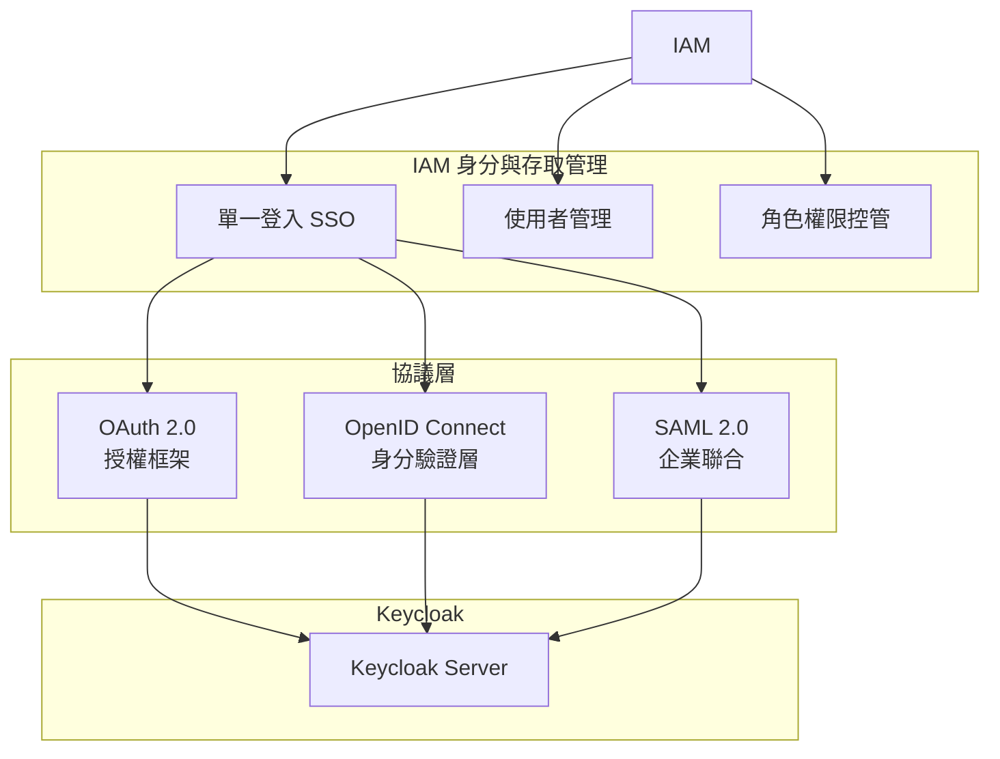

#### 名詞解釋

| 名詞 | 說明 |
|------|------|
| **IAM** | Identity and Access Management，身分與存取管理的總稱 |
| **SSO** | Single Sign-On，單一登入，登入一次即可存取多個系統 |
| **OAuth 2.0** | 授權框架，定義如何「授權第三方存取資源」 |
| **OIDC** | OpenID Connect，建構在 OAuth 2.0 之上的「身分驗證」層 |
| **SAML 2.0** | 較傳統的企業聯合身分驗證協議 |

#### OAuth 2.0 vs OIDC 差異

```
OAuth 2.0：「我授權你存取我的資源」→ 授權（Authorization）
OIDC：「我是誰」→ 身分驗證（Authentication）

實務上：
- OAuth 2.0 提供 Access Token（存取資源用）
- OIDC 額外提供 ID Token（包含使用者身分資訊）
```

---

### 1.3 Token 類型說明

Keycloak 核心運作圍繞三種 Token：

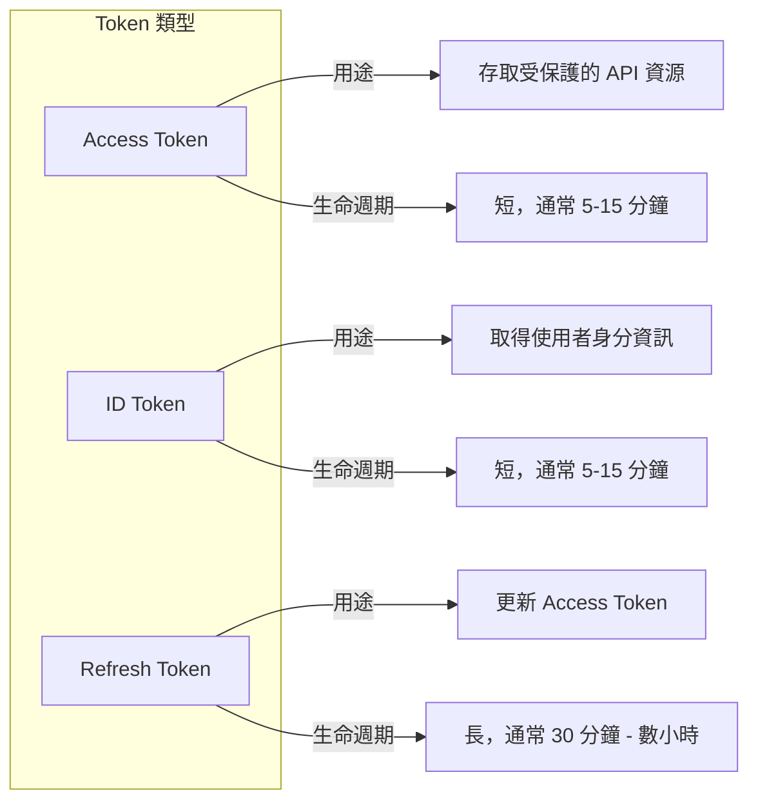

#### 詳細說明

| Token 類型 | 格式 | 用途 | 生命週期 | 儲存位置建議 |
|------------|------|------|----------|--------------|
| **Access Token** | JWT | 存取 API 資源時攜帶 | 5-15 分鐘 | Memory |
| **ID Token** | JWT | 取得使用者資訊（姓名、Email 等） | 5-15 分鐘 | Memory |
| **Refresh Token** | Opaque/JWT | 更新 Access Token | 30 分鐘 - 8 小時 | HttpOnly Cookie / Secure Storage |

#### Access Token 結構範例（JWT）

```json
{
  "header": {
    "alg": "RS256",
    "typ": "JWT",
    "kid": "key-id-xxx"
  },
  "payload": {
    "exp": 1704067200,
    "iat": 1704066300,
    "jti": "token-uuid",
    "iss": "https://keycloak.example.com/realms/my-realm",
    "aud": "account",
    "sub": "user-uuid",
    "typ": "Bearer",
    "azp": "my-client-app",
    "scope": "openid profile email",
    "realm_access": {
      "roles": ["user", "admin"]
    },
    "resource_access": {
      "my-client-app": {
        "roles": ["app-admin"]
      }
    },
    "preferred_username": "john.doe",
    "email": "john.doe@example.com"
  }
}
```

> ⚠️ **實務注意**：Access Token 不應包含過多敏感資訊，因為可能被解碼查看。

---

### 1.4 核心概念：Realm、Client、User、Role、Group

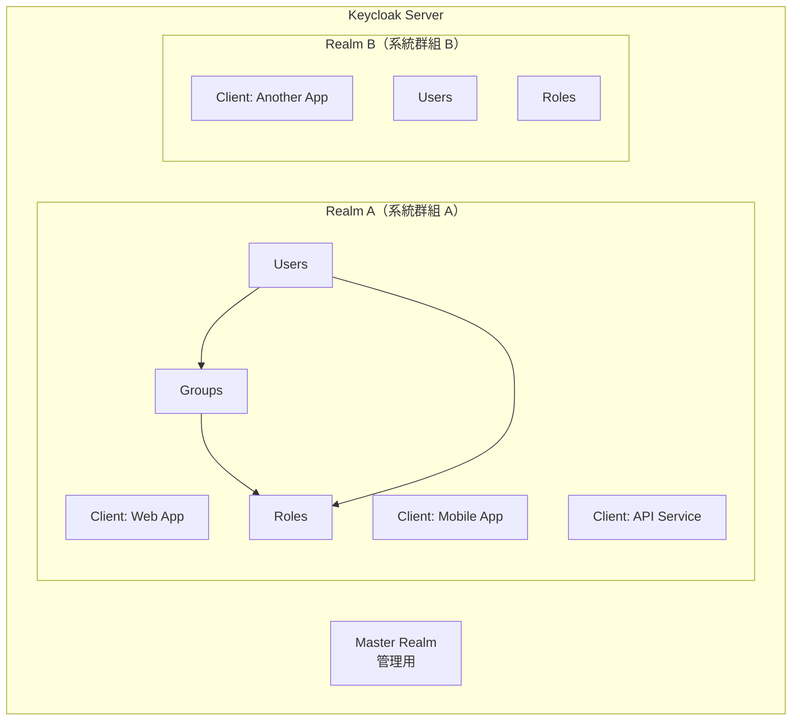

#### 概念說明

| 概念 | 說明 | 實務範例 |
|------|------|----------|
| **Realm** | 隔離的管理空間，包含使用者、Client、角色等 | `bank-internal`、`customer-portal` |
| **Client** | 需要認證的應用程式或服務 | `internet-banking-web`、`mobile-app` |
| **User** | 系統使用者 | 員工、客戶 |
| **Role** | 權限角色 | `admin`、`teller`、`customer` |
| **Group** | 使用者群組，可批次指派角色 | `branch-taipei`、`dept-it` |

#### Realm 設計原則

```
建議方式：
├── master（僅供 Keycloak 管理員使用）
├── internal-system（內部系統群）
│   ├── Client: hr-system
│   ├── Client: erp-system
│   └── Client: internal-portal
└── customer-facing（客戶端系統群）
    ├── Client: internet-banking
    └── Client: mobile-banking
```

> ⚠️ **銀行實務**：通常會將內部系統與外部客戶系統放在不同 Realm，以確保資料與權限完全隔離。

---

### 1.5 Authentication vs Authorization

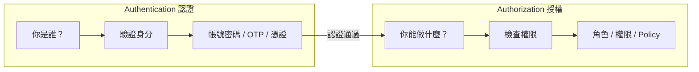

| 項目 | Authentication（認證） | Authorization（授權） |
|------|------------------------|----------------------|
| **問題** | 你是誰？ | 你能做什麼？ |
| **時機** | 登入時 | 存取資源時 |
| **Keycloak 機制** | Login Flow、Identity Provider | Role、Permission、Policy |
| **Token** | ID Token | Access Token（含 roles） |

#### 實務流程

```
1. 使用者輸入帳號密碼 → Authentication
2. Keycloak 驗證身分成功 → 發放 Token
3. 使用者帶著 Token 存取 API → Authorization
4. API 驗證 Token 並檢查角色權限 → 允許或拒絕
```

---

## 第二章：系統架構設計

### 2.1 Keycloak 在企業系統中的角色

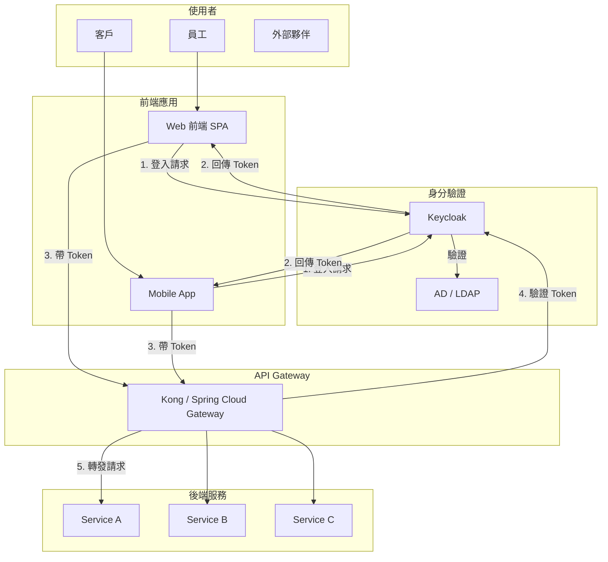

### 2.2 整合架構說明

#### 2.2.1 與 Web 前端（SPA）整合

```
前端應用（Vue / React / Angular）
    │
    ├── 使用 OIDC Client Library
    │   ├── keycloak-js（官方）
    │   ├── oidc-client-ts
    │   └── @react-keycloak/web
    │
    └── Authorization Code Flow + PKCE
```

#### 2.2.2 與 Backend API 整合

```
Backend API（Spring Boot / Node.js）
    │
    ├── 作為 Resource Server
    ├── 驗證 Access Token（JWT）
    │   ├── 驗證簽章（Signature）
    │   ├── 驗證有效期（exp）
    │   └── 驗證 Issuer、Audience
    │
    └── 從 Token 取得角色進行授權
```

#### 2.2.3 與 API Gateway 整合

```
API Gateway
    │
    ├── 集中驗證 Token
    ├── Token 轉發或 Token Exchange
    └── Rate Limiting、Logging
    
常見方案：
├── Kong + OIDC Plugin
├── Spring Cloud Gateway + OAuth2 Resource Server
└── APISIX + OIDC Plugin
```

#### 2.2.4 與 AD / LDAP 整合

```
Keycloak
    │
    ├── User Federation
    │   ├── LDAP Provider
    │   └── AD Provider
    │
    ├── 同步模式
    │   ├── Import（複製到 Keycloak DB）
    │   └── No Import（即時查詢）
    │
    └── 驗證方式
        ├── Bind 驗證
        └── Kerberos（可選）
```

### 2.3 Token Flow（Authorization Code Flow）

這是 **Web 應用最推薦的授權流程**：

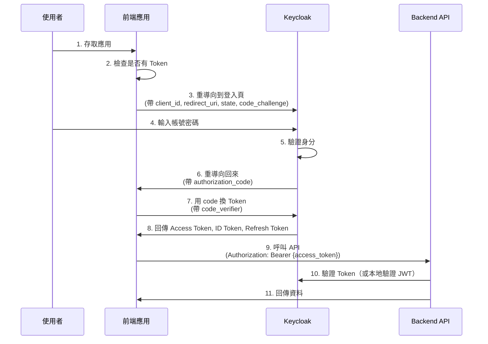

#### PKCE（Proof Key for Code Exchange）說明

```
目的：防止 Authorization Code 被攔截攻擊

流程：
1. 前端產生隨機 code_verifier
2. 計算 code_challenge = SHA256(code_verifier)
3. 登入時帶 code_challenge
4. 換 Token 時帶 code_verifier
5. Keycloak 驗證 SHA256(code_verifier) == code_challenge
```

> ⚠️ **強制建議**：所有 Public Client（前端應用）都必須啟用 PKCE。

---

## 第三章：Keycloak 安裝與部署

### 3.1 單機部署（Docker）

#### 開發/測試環境快速啟動

```bash
# 最簡單的啟動方式（開發用）
docker run -d \
  --name keycloak-dev \
  -p 8080:8080 \
  -e KEYCLOAK_ADMIN=admin \
  -e KEYCLOAK_ADMIN_PASSWORD=admin \
  quay.io/keycloak/keycloak:25.0 \
  start-dev
```

#### 使用 Docker Compose（建議）

```yaml
# docker-compose.yml
version: '3.8'

services:
  keycloak:
    image: quay.io/keycloak/keycloak:25.0
    container_name: keycloak
    environment:
      # 管理員帳號
      KEYCLOAK_ADMIN: admin
      KEYCLOAK_ADMIN_PASSWORD: ${KC_ADMIN_PASSWORD:-admin}
      
      # 資料庫連線
      KC_DB: postgres
      KC_DB_URL: jdbc:postgresql://postgres:5432/keycloak
      KC_DB_USERNAME: keycloak
      KC_DB_PASSWORD: ${KC_DB_PASSWORD:-keycloak}
      
      # 主機名稱
      KC_HOSTNAME: localhost
      KC_HOSTNAME_STRICT: false
      KC_HTTP_ENABLED: true
      
    ports:
      - "8080:8080"
    depends_on:
      - postgres
    command: start-dev
    networks:
      - keycloak-network

  postgres:
    image: postgres:15
    container_name: keycloak-postgres
    environment:
      POSTGRES_DB: keycloak
      POSTGRES_USER: keycloak
      POSTGRES_PASSWORD: ${KC_DB_PASSWORD:-keycloak}
    volumes:
      - postgres_data:/var/lib/postgresql/data
    networks:
      - keycloak-network

volumes:
  postgres_data:

networks:
  keycloak-network:
    driver: bridge
```

啟動指令：

```bash
# 啟動
docker-compose up -d

# 查看 Log
docker-compose logs -f keycloak

# 停止
docker-compose down
```

### 3.2 生產環境部署建議

#### 3.2.1 資料庫選擇

| 資料庫 | 支援狀況 | 建議使用情境 |
|--------|----------|--------------|
| **PostgreSQL** | ✅ 完整支援 | 推薦首選 |
| **MySQL / MariaDB** | ✅ 支援 | 現有 MySQL 環境 |
| **Oracle** | ✅ 支援 | 企業現有 Oracle |
| **SQL Server** | ✅ 支援 | Microsoft 生態系 |
| **DB2** | ⚠️ 需測試 | IBM 環境 |

#### 3.2.2 生產環境 Docker Compose

```yaml
# docker-compose.prod.yml
version: '3.8'

services:
  keycloak:
    image: quay.io/keycloak/keycloak:25.0
    container_name: keycloak-prod
    environment:
      # 資料庫
      KC_DB: postgres
      KC_DB_URL: jdbc:postgresql://postgres:5432/keycloak
      KC_DB_USERNAME: keycloak
      KC_DB_PASSWORD: ${KC_DB_PASSWORD}
      
      # 生產模式
      KC_HOSTNAME: auth.example.com
      KC_HOSTNAME_STRICT: true
      KC_PROXY: edge  # 若前面有 Reverse Proxy
      
      # HTTPS（由 Reverse Proxy 處理時）
      KC_HTTP_ENABLED: true
      KC_HTTPS_ENABLED: false
      
      # 健康檢查
      KC_HEALTH_ENABLED: true
      KC_METRICS_ENABLED: true
      
    ports:
      - "8080:8080"
    command: start
    deploy:
      resources:
        limits:
          memory: 2G
        reservations:
          memory: 1G
    healthcheck:
      test: ["CMD", "curl", "-f", "http://localhost:8080/health/ready"]
      interval: 30s
      timeout: 10s
      retries: 3
```

#### 3.2.3 Nginx Reverse Proxy 設定

```nginx
# /etc/nginx/conf.d/keycloak.conf
upstream keycloak {
    server 127.0.0.1:8080;
    keepalive 32;
}

server {
    listen 443 ssl http2;
    server_name auth.example.com;
    
    # SSL 憑證
    ssl_certificate     /etc/ssl/certs/auth.example.com.crt;
    ssl_certificate_key /etc/ssl/private/auth.example.com.key;
    
    # SSL 安全設定
    ssl_protocols TLSv1.2 TLSv1.3;
    ssl_ciphers ECDHE-ECDSA-AES128-GCM-SHA256:ECDHE-RSA-AES128-GCM-SHA256;
    ssl_prefer_server_ciphers on;
    ssl_session_cache shared:SSL:10m;
    
    # 安全 Headers
    add_header Strict-Transport-Security "max-age=31536000; includeSubDomains" always;
    add_header X-Content-Type-Options nosniff;
    add_header X-Frame-Options SAMEORIGIN;
    
    location / {
        proxy_pass http://keycloak;
        proxy_set_header Host $host;
        proxy_set_header X-Real-IP $remote_addr;
        proxy_set_header X-Forwarded-For $proxy_add_x_forwarded_for;
        proxy_set_header X-Forwarded-Proto $scheme;
        proxy_set_header X-Forwarded-Host $host;
        proxy_set_header X-Forwarded-Port $server_port;
        
        # WebSocket 支援（Admin Console 需要）
        proxy_http_version 1.1;
        proxy_set_header Upgrade $http_upgrade;
        proxy_set_header Connection "upgrade";
        
        # 超時設定
        proxy_connect_timeout 60s;
        proxy_send_timeout 60s;
        proxy_read_timeout 60s;
    }
}

# HTTP 轉 HTTPS
server {
    listen 80;
    server_name auth.example.com;
    return 301 https://$server_name$request_uri;
}
```

### 3.3 基本啟動參數與環境變數

#### 常用環境變數

| 環境變數 | 說明 | 預設值 |
|----------|------|--------|
| `KEYCLOAK_ADMIN` | 初始管理員帳號 | - |
| `KEYCLOAK_ADMIN_PASSWORD` | 初始管理員密碼 | - |
| `KC_DB` | 資料庫類型 | `dev-file` |
| `KC_DB_URL` | JDBC 連線字串 | - |
| `KC_DB_USERNAME` | 資料庫帳號 | - |
| `KC_DB_PASSWORD` | 資料庫密碼 | - |
| `KC_HOSTNAME` | 外部存取主機名稱 | - |
| `KC_PROXY` | Proxy 模式：`edge`/`reencrypt`/`passthrough` | `none` |
| `KC_HTTP_ENABLED` | 啟用 HTTP | `false` |
| `KC_HTTPS_ENABLED` | 啟用 HTTPS | `true` |
| `KC_HEALTH_ENABLED` | 啟用健康檢查端點 | `false` |
| `KC_METRICS_ENABLED` | 啟用 Metrics 端點 | `false` |

#### 啟動模式

```bash
# 開發模式（僅限開發測試）
start-dev

# 生產模式（正式環境）
start

# 匯出設定
export --dir /opt/keycloak/export

# 匯入設定
import --dir /opt/keycloak/import
```

### 3.4 Admin Console 存取方式

#### 存取 URL

```
開發環境：http://localhost:8080/admin
生產環境：https://auth.example.com/admin
```

#### 首次登入

1. 使用 `KEYCLOAK_ADMIN` / `KEYCLOAK_ADMIN_PASSWORD` 登入
2. 進入 `master` Realm 的管理介面
3. 建議：建立專用管理員帳號，停用初始帳號

#### 重要端點

| 端點 | 用途 |
|------|------|
| `/admin` | Admin Console（管理介面） |
| `/realms/{realm}/.well-known/openid-configuration` | OIDC Discovery |
| `/realms/{realm}/protocol/openid-connect/token` | Token Endpoint |
| `/realms/{realm}/protocol/openid-connect/auth` | Authorization Endpoint |
| `/health/ready` | 就緒檢查（K8s） |
| `/health/live` | 存活檢查（K8s） |
| `/metrics` | Prometheus Metrics |

---

## 第四章：Keycloak 基本設定

### 4.1 Realm 建立與規劃原則

#### 建立 Realm 步驟

1. 登入 Admin Console
2. 左上角點選 `master` → `Create Realm`
3. 輸入 Realm name（例如：`my-company`）
4. 點選 `Create`

#### Realm 設計原則

```
✅ 建議做法：
├── 依「系統群組」或「業務單位」劃分 Realm
├── 內部系統與外部客戶系統分開
└── 每個 Realm 有獨立的使用者資料庫

❌ 不建議做法：
├── 每個應用一個 Realm（管理成本高）
├── 所有系統共用一個 Realm（隔離性差）
└── 在 master Realm 建立應用 Client
```

#### 企業 Realm 規劃範例

```
Keycloak Server
├── master（僅供 Keycloak 管理）
│
├── internal（內部員工系統）
│   ├── Users: 整合 AD/LDAP
│   ├── Client: hr-portal
│   ├── Client: erp-system
│   └── Client: internal-api
│
├── partner（外部合作夥伴）
│   ├── Users: Keycloak 本地帳號
│   └── Client: partner-portal
│
└── customer（客戶端系統）
    ├── Users: Keycloak 本地帳號 + 社群登入
    ├── Client: internet-banking
    └── Client: mobile-banking
```

### 4.2 Client 類型說明

#### Client 類型比較

| 類型 | Client Authentication | 使用場景 | Token 取得方式 |
|------|----------------------|----------|----------------|
| **Confidential** | On（有 Secret） | Backend 服務、Server-side App | 可安全保存 Secret |
| **Public** | Off（無 Secret） | SPA、Mobile App | 無法保存 Secret |
| **Bearer-only** | - | 僅驗證 Token 的 API | 不發起登入 |

> ⚠️ **Keycloak 25.x 注意**：`Bearer-only` 已被棄用，改用 `Confidential` + 不設定登入流程。

#### 建立 Client 步驟

1. 進入目標 Realm
2. 左側選單 → `Clients` → `Create client`
3. 設定 Client ID（例如：`my-web-app`）
4. 選擇 Client type
5. 設定相關 URL

#### Confidential Client 設定範例（Backend）

```
General Settings:
  Client ID: api-service
  Name: API Service
  
Access Settings:
  Root URL: https://api.example.com
  Valid redirect URIs: https://api.example.com/*
  Web origins: +
  
Capability config:
  Client authentication: On
  Authorization: Off
  
Authentication flow:
  Standard flow: Off
  Direct access grants: On（或 Off）
  Service accounts roles: On（如需 Client Credentials）
```

#### Public Client 設定範例（SPA）

```
General Settings:
  Client ID: web-frontend
  Name: Web Frontend
  
Access Settings:
  Root URL: https://app.example.com
  Valid redirect URIs: 
    - https://app.example.com/*
    - http://localhost:3000/*（開發用）
  Valid post logout redirect URIs: +
  Web origins: 
    - https://app.example.com
    - http://localhost:3000
  
Capability config:
  Client authentication: Off
  
Authentication flow:
  Standard flow: On
  Direct access grants: Off
  
Advanced Settings:
  Proof Key for Code Exchange: S256（強制啟用 PKCE）
```

### 4.3 Redirect URI 與 Web Origin 設定

#### Redirect URI 設定原則

```
✅ 正確設定：
├── 生產環境使用完整 URL
├── 開發環境可加入 localhost
└── 避免使用萬用字元 *（僅限路徑）

❌ 錯誤設定：
├── 設定 *（允許任意網域）← 嚴重資安風險
├── 遺漏 trailing slash 差異
└── HTTP/HTTPS 混用
```

範例：

```
Valid redirect URIs:
  ✅ https://app.example.com/callback
  ✅ https://app.example.com/*
  ✅ http://localhost:3000/*（僅開發）
  
  ❌ *
  ❌ https://*.example.com/*（不支援網域萬用字元）
```

#### Web Origin 設定（CORS）

```
Web origins:
  https://app.example.com     → 允許此網域的 CORS 請求
  +                           → 自動從 redirect URIs 推導
```

### 4.4 User、Role、Group 設定策略

#### User 管理

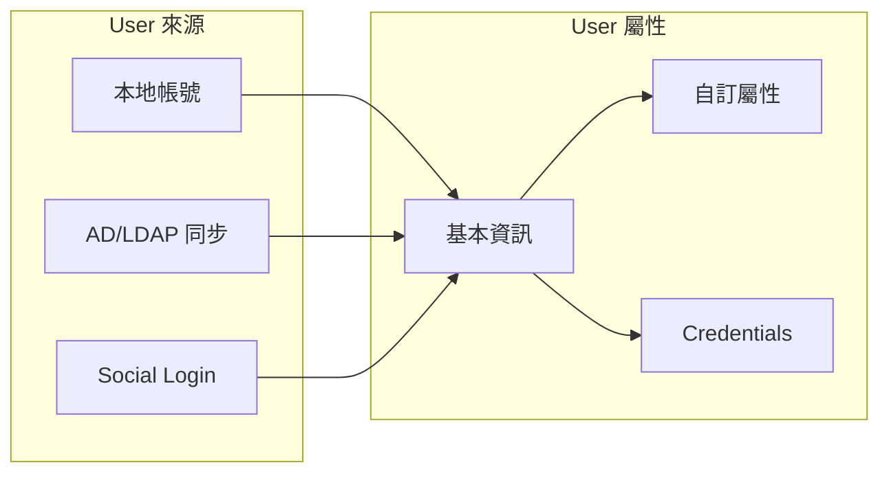

#### 建立使用者

1. `Users` → `Add user`
2. 填寫基本資訊
3. 設定密碼：`Credentials` → `Set password`
4. 指派角色：`Role mapping` → `Assign role`

#### Group 階層設計

```
Groups（群組）
├── 台北分行
│   ├── 營業部
│   │   └── 自動繼承「台北分行」的角色
│   └── 作業部
├── 高雄分行
│   └── 營業部
└── 總行
    ├── 資訊部
    └── 風控部
    
優點：
├── 批次指派角色
├── 階層繼承
└── 組織架構對應
```

### 4.5 Realm Role vs Client Role 使用時機

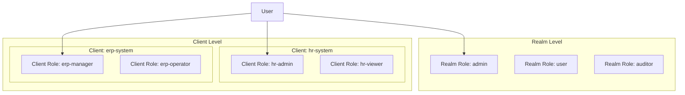

#### 使用時機比較

| 項目 | Realm Role | Client Role |
|------|------------|-------------|
| **範圍** | 整個 Realm | 特定 Client |
| **使用時機** | 跨系統通用角色 | 單一系統專用角色 |
| **範例** | `admin`、`user`、`auditor` | `hr-admin`、`erp-manager` |
| **Token 位置** | `realm_access.roles` | `resource_access.{client}.roles` |

#### 最佳實務

```
建議架構：
├── Realm Role：定義「通用身分」
│   ├── internal-user（內部員工）
│   ├── external-user（外部使用者）
│   └── system-admin（系統管理員）
│
└── Client Role：定義「系統權限」
    ├── hr-system
    │   ├── hr-admin
    │   └── hr-viewer
    └── erp-system
        ├── erp-full-access
        └── erp-read-only
```

---

## 第五章：應用系統如何串接 Keycloak

### 5.1 Web 前端串接（OIDC）

#### 使用 keycloak-js 官方套件

```bash
# 安裝
npm install keycloak-js
```

#### 初始化設定

```javascript
// keycloak.js
import Keycloak from 'keycloak-js';

const keycloak = new Keycloak({
  url: 'https://auth.example.com',
  realm: 'my-realm',
  clientId: 'web-frontend'
});

export default keycloak;
```

#### Vue 3 整合範例

```javascript
// main.js
import { createApp } from 'vue';
import App from './App.vue';
import keycloak from './keycloak';

keycloak.init({
  onLoad: 'login-required',  // 或 'check-sso'
  checkLoginIframe: false,
  pkceMethod: 'S256'
}).then((authenticated) => {
  if (authenticated) {
    console.log('User authenticated');
    
    // Token 自動更新
    setInterval(() => {
      keycloak.updateToken(60).catch(() => {
        console.log('Failed to refresh token');
        keycloak.login();
      });
    }, 30000);
    
    const app = createApp(App);
    app.config.globalProperties.$keycloak = keycloak;
    app.mount('#app');
  }
}).catch((error) => {
  console.error('Keycloak init failed:', error);
});
```

#### React 整合範例

```jsx
// App.jsx
import { useEffect, useState } from 'react';
import keycloak from './keycloak';

function App() {
  const [authenticated, setAuthenticated] = useState(false);
  
  useEffect(() => {
    keycloak.init({
      onLoad: 'login-required',
      pkceMethod: 'S256'
    }).then((auth) => {
      setAuthenticated(auth);
      
      if (auth) {
        // 設定 Token 更新
        setInterval(() => {
          keycloak.updateToken(60);
        }, 30000);
      }
    });
  }, []);
  
  if (!authenticated) {
    return <div>Loading...</div>;
  }
  
  return (
    <div>
      <h1>Welcome, {keycloak.tokenParsed?.preferred_username}</h1>
      <button onClick={() => keycloak.logout()}>Logout</button>
    </div>
  );
}

export default App;
```

#### API 呼叫時帶入 Token

```javascript
// api.js
import keycloak from './keycloak';

export async function fetchData(endpoint) {
  // 確保 Token 有效
  await keycloak.updateToken(30);
  
  const response = await fetch(`https://api.example.com${endpoint}`, {
    headers: {
      'Authorization': `Bearer ${keycloak.token}`,
      'Content-Type': 'application/json'
    }
  });
  
  if (response.status === 401) {
    // Token 失效，重新登入
    keycloak.login();
    return;
  }
  
  return response.json();
}
```

### 5.2 Backend API 驗證 Token 機制

#### Token 驗證流程

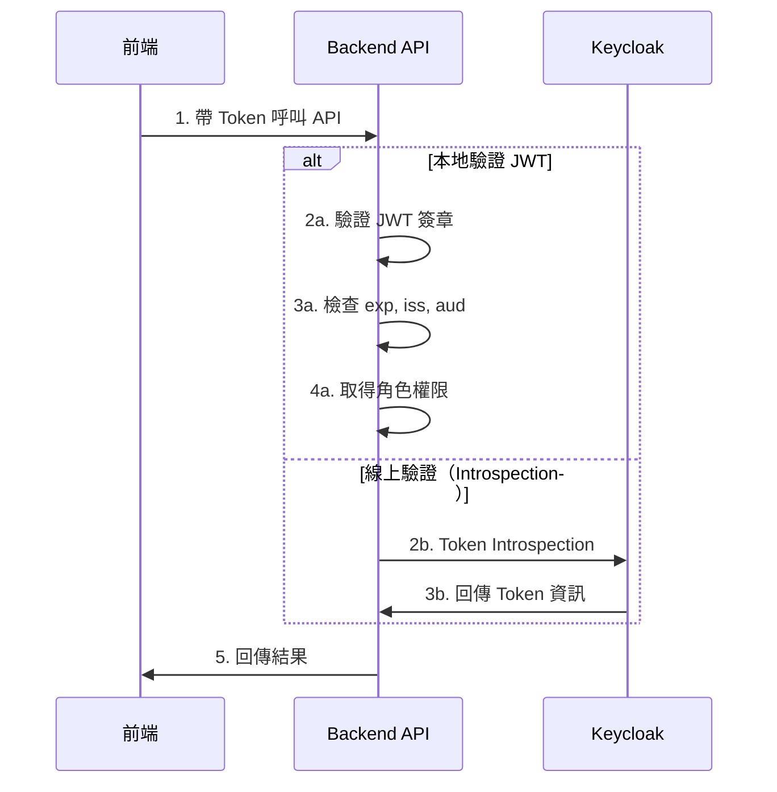

#### 驗證方式比較

| 方式 | 優點 | 缺點 | 適用場景 |
|------|------|------|----------|
| **本地驗證 JWT** | 效能好、無網路依賴 | 無法即時撤銷 | 大多數場景 |
| **Token Introspection** | 可即時撤銷 | 每次都要呼叫 Keycloak | 高安全需求 |

### 5.3 Spring Boot 整合

#### 依賴設定（Maven）

```xml
<!-- pom.xml -->
<dependencies>
    <!-- Spring Boot OAuth2 Resource Server -->
    <dependency>
        <groupId>org.springframework.boot</groupId>
        <artifactId>spring-boot-starter-oauth2-resource-server</artifactId>
    </dependency>
    
    <!-- Spring Security -->
    <dependency>
        <groupId>org.springframework.boot</groupId>
        <artifactId>spring-boot-starter-security</artifactId>
    </dependency>
    
    <!-- Web -->
    <dependency>
        <groupId>org.springframework.boot</groupId>
        <artifactId>spring-boot-starter-web</artifactId>
    </dependency>
</dependencies>
```

#### 應用程式設定

```yaml
# application.yml
spring:
  security:
    oauth2:
      resourceserver:
        jwt:
          # Keycloak OIDC Discovery URL
          issuer-uri: https://auth.example.com/realms/my-realm
          
          # 或直接指定 JWK Set URI
          # jwk-set-uri: https://auth.example.com/realms/my-realm/protocol/openid-connect/certs

logging:
  level:
    org.springframework.security: DEBUG
```

#### Security 設定類別

```java
// SecurityConfig.java
package com.example.config;

import org.springframework.context.annotation.Bean;
import org.springframework.context.annotation.Configuration;
import org.springframework.security.config.annotation.method.configuration.EnableMethodSecurity;
import org.springframework.security.config.annotation.web.builders.HttpSecurity;
import org.springframework.security.config.annotation.web.configuration.EnableWebSecurity;
import org.springframework.security.config.http.SessionCreationPolicy;
import org.springframework.security.oauth2.server.resource.authentication.JwtAuthenticationConverter;
import org.springframework.security.oauth2.server.resource.authentication.JwtGrantedAuthoritiesConverter;
import org.springframework.security.web.SecurityFilterChain;

@Configuration
@EnableWebSecurity
@EnableMethodSecurity
public class SecurityConfig {

    @Bean
    public SecurityFilterChain filterChain(HttpSecurity http) throws Exception {
        http
            // 停用 CSRF（API 不需要）
            .csrf(csrf -> csrf.disable())
            
            // 停用 Session（Stateless）
            .sessionManagement(session -> 
                session.sessionCreationPolicy(SessionCreationPolicy.STATELESS))
            
            // 授權規則
            .authorizeHttpRequests(auth -> auth
                .requestMatchers("/api/public/**").permitAll()
                .requestMatchers("/api/admin/**").hasRole("admin")
                .requestMatchers("/api/**").authenticated()
                .anyRequest().permitAll()
            )
            
            // OAuth2 Resource Server
            .oauth2ResourceServer(oauth2 -> oauth2
                .jwt(jwt -> jwt
                    .jwtAuthenticationConverter(jwtAuthenticationConverter())
                )
            );
        
        return http.build();
    }

    /**
     * 自訂 JWT 轉換器，提取 Keycloak 角色
     */
    @Bean
    public JwtAuthenticationConverter jwtAuthenticationConverter() {
        JwtAuthenticationConverter converter = new JwtAuthenticationConverter();
        converter.setJwtGrantedAuthoritiesConverter(new KeycloakRoleConverter());
        return converter;
    }
}
```

#### Keycloak 角色轉換器

```java
// KeycloakRoleConverter.java
package com.example.config;

import org.springframework.core.convert.converter.Converter;
import org.springframework.security.core.GrantedAuthority;
import org.springframework.security.core.authority.SimpleGrantedAuthority;
import org.springframework.security.oauth2.jwt.Jwt;

import java.util.ArrayList;
import java.util.Collection;
import java.util.List;
import java.util.Map;
import java.util.stream.Collectors;

public class KeycloakRoleConverter implements Converter<Jwt, Collection<GrantedAuthority>> {

    @Override
    public Collection<GrantedAuthority> convert(Jwt jwt) {
        List<GrantedAuthority> authorities = new ArrayList<>();
        
        // 提取 Realm Roles
        Map<String, Object> realmAccess = jwt.getClaimAsMap("realm_access");
        if (realmAccess != null) {
            List<String> roles = (List<String>) realmAccess.get("roles");
            if (roles != null) {
                authorities.addAll(
                    roles.stream()
                        .map(role -> new SimpleGrantedAuthority("ROLE_" + role))
                        .collect(Collectors.toList())
                );
            }
        }
        
        // 提取 Client Roles（可選）
        Map<String, Object> resourceAccess = jwt.getClaimAsMap("resource_access");
        if (resourceAccess != null) {
            // 針對特定 Client
            Map<String, Object> clientAccess = 
                (Map<String, Object>) resourceAccess.get("my-client");
            if (clientAccess != null) {
                List<String> clientRoles = (List<String>) clientAccess.get("roles");
                if (clientRoles != null) {
                    authorities.addAll(
                        clientRoles.stream()
                            .map(role -> new SimpleGrantedAuthority("ROLE_" + role))
                            .collect(Collectors.toList())
                    );
                }
            }
        }
        
        return authorities;
    }
}
```

#### Controller 範例

```java
// ApiController.java
package com.example.controller;

import org.springframework.security.access.prepost.PreAuthorize;
import org.springframework.security.core.annotation.AuthenticationPrincipal;
import org.springframework.security.oauth2.jwt.Jwt;
import org.springframework.web.bind.annotation.*;

@RestController
@RequestMapping("/api")
public class ApiController {

    /**
     * 公開 API（無需認證）
     */
    @GetMapping("/public/health")
    public String health() {
        return "OK";
    }

    /**
     * 需要認證的 API
     */
    @GetMapping("/user/profile")
    public Map<String, Object> getProfile(@AuthenticationPrincipal Jwt jwt) {
        return Map.of(
            "username", jwt.getClaimAsString("preferred_username"),
            "email", jwt.getClaimAsString("email"),
            "roles", jwt.getClaimAsMap("realm_access")
        );
    }

    /**
     * 需要特定角色的 API
     */
    @GetMapping("/admin/users")
    @PreAuthorize("hasRole('admin')")
    public String adminOnly() {
        return "Admin content";
    }

    /**
     * 需要多個角色之一
     */
    @GetMapping("/reports")
    @PreAuthorize("hasAnyRole('admin', 'manager', 'auditor')")
    public String reports() {
        return "Report data";
    }
}
```

### 5.4 常見錯誤與除錯方式

#### 常見錯誤對照表

| 錯誤訊息 | 可能原因 | 解決方式 |
|----------|----------|----------|
| `Invalid token issuer` | issuer-uri 設定錯誤 | 確認 URL 與 Keycloak 設定一致 |
| `Token is expired` | Token 過期 | 前端應更新 Token |
| `Invalid signature` | 公鑰驗證失敗 | 檢查 jwk-set-uri 是否正確 |
| `CORS error` | 跨域問題 | 檢查 Web Origins 設定 |
| `Invalid redirect_uri` | Redirect URI 不符 | 檢查 Client 設定 |
| `401 Unauthorized` | Token 未帶或格式錯誤 | 檢查 Authorization header |

#### 除錯技巧

```bash
# 1. 檢查 Token 內容（JWT Decode）
# 使用 https://jwt.io 解碼 Token

# 2. 檢查 Keycloak Discovery
curl https://auth.example.com/realms/my-realm/.well-known/openid-configuration

# 3. 手動取得 Token 測試
curl -X POST https://auth.example.com/realms/my-realm/protocol/openid-connect/token \
  -d "client_id=my-client" \
  -d "username=testuser" \
  -d "password=testpass" \
  -d "grant_type=password"

# 4. 驗證 Token（Introspection）
curl -X POST https://auth.example.com/realms/my-realm/protocol/openid-connect/token/introspect \
  -d "token=<access_token>" \
  -d "client_id=my-client" \
  -d "client_secret=<client_secret>"
```

---

## 第六章：系統使用情境說明

### 6.1 SSO 登入流程實例

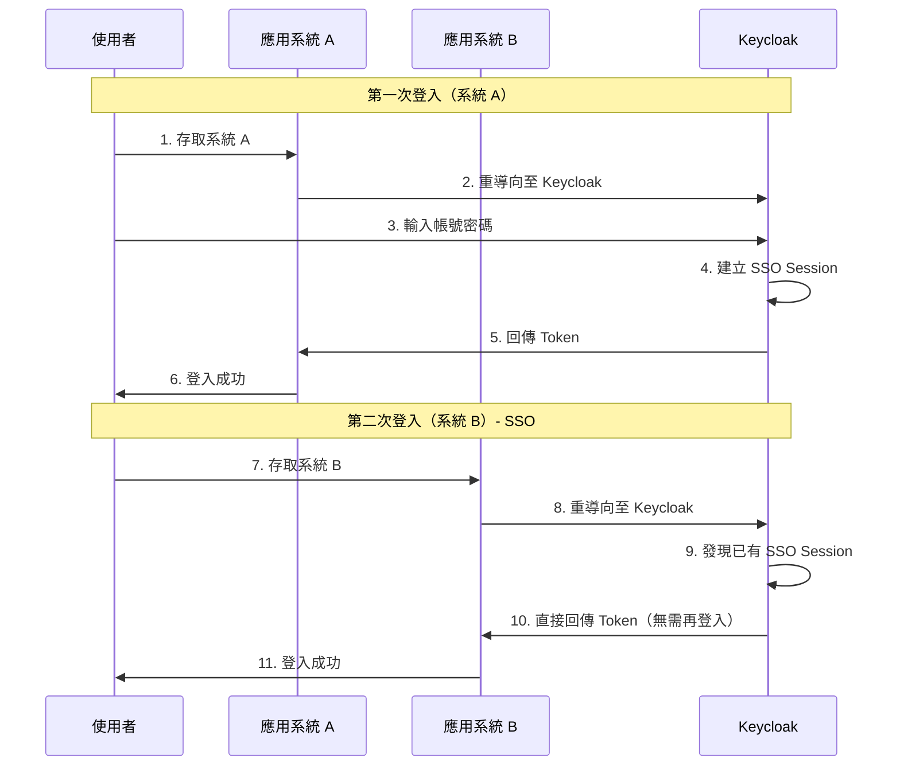

#### SSO 實務注意事項

```
⚠️ SSO Session 與 Application Session 是獨立的

Keycloak SSO Session：
├── 登入 Keycloak 時建立
├── 由 Keycloak 管理
└── 跨所有已整合的應用系統

Application Session：
├── 每個應用系統自己的 Session
├── 通常基於 Token 有效性
└── Token 過期時需要 Refresh 或重新認證
```

### 6.2 使用者角色異動後的影響

#### 角色變更生效時機

```
情境：管理員將使用者從 "user" 角色改為 "admin"

影響分析：
├── 已發出的 Token：角色不變（Token 內容已固定）
├── 新的 Token：包含新角色
└── 使用者需重新取得 Token 才能使用新權限

解決方案：
├── 方案 1：等待 Token 過期自動更新
├── 方案 2：強制使用者重新登入
├── 方案 3：使用 Token Introspection（即時驗證）
└── 方案 4：縮短 Token 有效期
```

#### 企業實務建議

```yaml
# 角色變更處理建議
高安全需求系統：
  - 使用 Token Introspection
  - Token 有效期設短（5 分鐘）
  
一般系統：
  - 接受短暫的權限延遲
  - Token 有效期 15-30 分鐘
  
緊急權限撤銷：
  - 使用 Keycloak Admin API 撤銷 Session
  - curl -X DELETE "https://auth.example.com/admin/realms/{realm}/users/{userId}/sessions"
```

### 6.3 Token 生命週期與 Refresh 機制

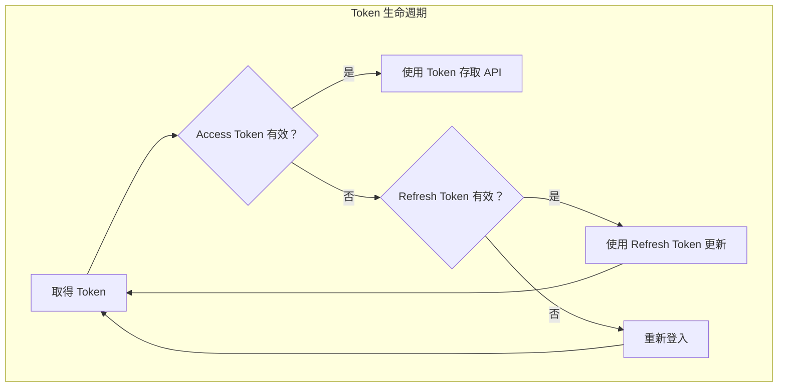

#### Token 有效期設定（Keycloak Admin Console）

```
Realm Settings → Tokens

Access Token Lifespan: 5 minutes（建議 5-15 分鐘）
Client Session Idle: 30 minutes
Client Session Max: 8 hours
SSO Session Idle: 30 minutes
SSO Session Max: 10 hours
```

#### 前端 Token Refresh 實作

```javascript
// Token 自動更新邏輯
let refreshInterval;

function setupTokenRefresh(keycloak) {
  // Token 到期前 60 秒更新
  const refreshPeriod = (keycloak.tokenParsed.exp - 60) * 1000 - Date.now();
  
  refreshInterval = setInterval(async () => {
    try {
      const refreshed = await keycloak.updateToken(60);
      if (refreshed) {
        console.log('Token refreshed');
        // 更新 API Client 的 Token
        updateApiToken(keycloak.token);
      }
    } catch (error) {
      console.error('Token refresh failed, redirecting to login');
      clearInterval(refreshInterval);
      keycloak.login();
    }
  }, Math.max(refreshPeriod, 30000)); // 至少 30 秒
}
```

### 6.4 Logout 流程（Single Logout）

#### Logout 類型

| 類型 | 說明 | 影響範圍 |
|------|------|----------|
| **單一系統 Logout** | 僅登出當前應用 | 當前應用 |
| **Single Logout (SLO)** | 登出所有已登入系統 | 所有已整合系統 |

#### 實作 Single Logout

```javascript
// 前端 Logout
function logout() {
  // 方式 1：使用 keycloak-js
  keycloak.logout({
    redirectUri: 'https://app.example.com'
  });
  
  // 方式 2：直接呼叫 Logout Endpoint
  // window.location.href = 
  //   'https://auth.example.com/realms/my-realm/protocol/openid-connect/logout' +
  //   '?post_logout_redirect_uri=https://app.example.com' +
  //   '&client_id=my-client';
}
```

#### Backend Logout（Spring Boot）

```java
// LogoutController.java
@RestController
public class LogoutController {

    @Value("${spring.security.oauth2.resourceserver.jwt.issuer-uri}")
    private String issuerUri;

    @PostMapping("/api/logout")
    public ResponseEntity<?> logout(
            @AuthenticationPrincipal Jwt jwt,
            @RequestHeader("Authorization") String authHeader) {
        
        // 通知 Keycloak 撤銷 Token（可選）
        String logoutUrl = issuerUri + "/protocol/openid-connect/logout";
        
        // 建議：回傳 Logout URL 讓前端處理
        return ResponseEntity.ok(Map.of(
            "logoutUrl", logoutUrl,
            "message", "Please complete logout on Keycloak"
        ));
    }
}
```

#### Backchannel Logout（進階）

```
Keycloak 會主動通知所有 Client 使用者已登出

設定方式：
1. Client Settings → Logout settings
2. Backchannel logout URL: https://api.example.com/logout/callback
3. Backchannel logout session required: On

後端需實作接收 Logout 通知的 Endpoint
```

---

## 第七章：系統維運與管理

### 7.1 使用者與權限管理最佳實務

#### 使用者管理原則

```
✅ 建議做法：
├── 使用 Group 批次管理角色
├── 整合 AD/LDAP 避免重複維護
├── 定期檢視使用者權限
└── 離職人員即時停用

❌ 避免做法：
├── 直接在 User 上指派大量角色
├── 使用共用帳號
└── 權限過度集中（一人擁有所有權限）
```

#### 權限審核 Checklist

```markdown
□ 每季審核使用者清單
□ 確認離職人員已停用
□ 檢視高權限帳號是否合理
□ 確認系統帳號（Service Account）權限最小化
□ 檢視 Admin Console 存取權限
```

### 7.2 Audit Log 與事件追蹤

#### 啟用事件追蹤

```
Realm Settings → Events

User events settings:
  Save events: On
  Saved types: LOGIN, LOGIN_ERROR, LOGOUT, TOKEN, ...
  Expiration: 30 days（依合規需求）

Admin events settings:
  Save events: On
  Include representation: On（記錄詳細資料）
```

#### 重要事件類型

| 事件 | 說明 | 監控重點 |
|------|------|----------|
| `LOGIN` | 登入成功 | 正常 |
| `LOGIN_ERROR` | 登入失敗 | 可能的攻擊 |
| `LOGOUT` | 登出 | 正常 |
| `CODE_TO_TOKEN_ERROR` | Token 交換失敗 | 可能的攻擊 |
| `REFRESH_TOKEN` | Token 更新 | 正常 |
| `REFRESH_TOKEN_ERROR` | Token 更新失敗 | 可能 Session 問題 |
| `INTROSPECT_TOKEN` | Token 驗證 | 高頻率需注意 |

#### 事件查詢 API

```bash
# 查詢登入失敗事件
curl -X GET "https://auth.example.com/admin/realms/my-realm/events" \
  -H "Authorization: Bearer ${ADMIN_TOKEN}" \
  -d "type=LOGIN_ERROR" \
  -d "dateFrom=2024-01-01" \
  -d "max=100"
```

### 7.3 Keycloak Log 說明

#### Log 等級設定

```bash
# 透過環境變數設定
KC_LOG_LEVEL=info
KC_LOG_CONSOLE_FORMAT="%d{yyyy-MM-dd HH:mm:ss} %-5p [%c] %s%e%n"

# 更詳細的除錯（僅限排查問題時）
KC_LOG_LEVEL=org.keycloak:debug
```

#### 常見 Log 訊息解讀

```
# 正常登入
INFO  [org.keycloak.events] type=LOGIN, realmId=xxx, clientId=my-client, userId=xxx

# 登入失敗
WARN  [org.keycloak.events] type=LOGIN_ERROR, error=invalid_user_credentials

# Token 過期
DEBUG [org.keycloak.services] Token is not active

# Session 過期
INFO  [org.keycloak.events] type=LOGOUT, realmId=xxx
```

#### Log 整合建議

```yaml
# 整合至 ELK / OpenSearch
Keycloak Log → Filebeat → Logstash → Elasticsearch → Kibana

建議監控 Dashboard：
├── 登入成功/失敗趨勢
├── 異常登入來源 IP
├── Token 發放數量
└── 系統錯誤統計
```

### 7.4 常見營運問題

#### 問題 1：使用者無法登入

```
排查步驟：
1. 確認使用者帳號是否存在且啟用
2. 確認密碼是否正確（Reset Password 測試）
3. 檢查 Event Log 中的錯誤訊息
4. 確認 Client 設定是否正確
5. 確認網路連通性（防火牆、DNS）

常見原因：
├── 密碼過期
├── 帳號被停用
├── Realm 或 Client 設定錯誤
└── AD/LDAP 連線問題
```

#### 問題 2：Token 驗證失敗

```
排查步驟：
1. 檢查 Token 是否過期（jwt.io 解碼）
2. 確認 issuer-uri 設定正確
3. 確認 Keycloak 公鑰是否正確取得
4. 檢查時間同步（NTP）

常見原因：
├── Token 過期
├── 時鐘不同步（超過幾秒就會失敗）
├── issuer 不符
└── 憑證問題
```

#### 問題 3：效能問題

```
症狀：
├── 登入緩慢
├── Token 發放延遲
└── Admin Console 卡頓

排查與解決：
1. 檢查資料庫效能
   - 確認連線數
   - 檢查慢查詢
   
2. 檢查 JVM 記憶體
   - 調整 heap size
   - 檢查 GC 狀況
   
3. 檢查網路延遲
   - Keycloak ↔ Database
   - Keycloak ↔ AD/LDAP
   
4. 考慮水平擴展
   - 部署多個 Keycloak 節點
   - 使用負載平衡
```

---

## 第八章：高可用與資安建議

### 8.1 Keycloak HA 架構概念

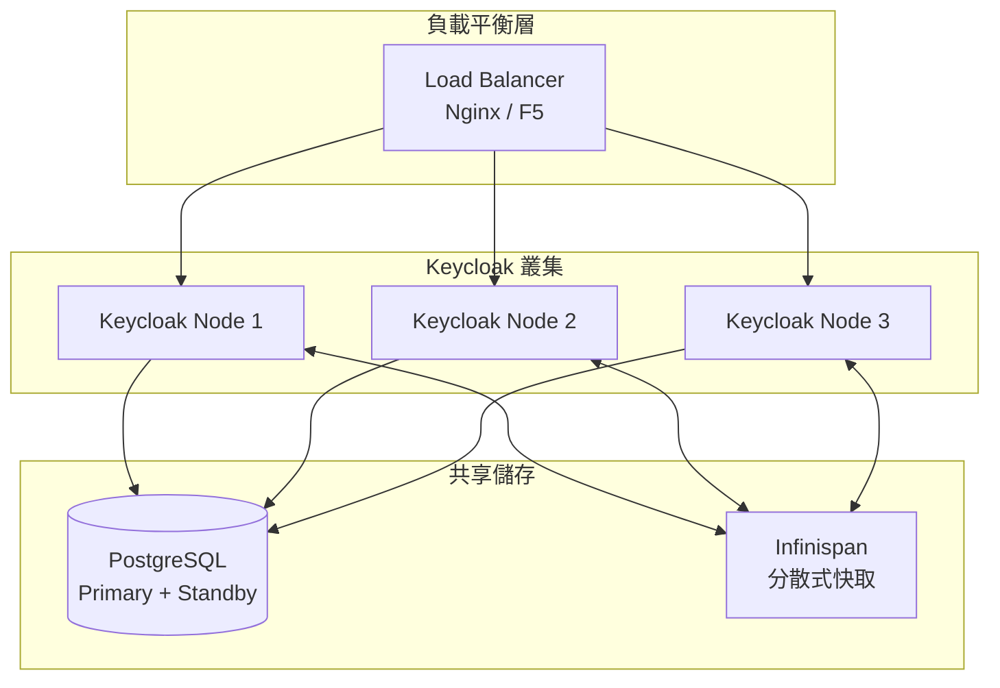

#### HA 部署要點

```yaml
1. 負載平衡設定：
   - 使用 Sticky Session（或 Cookie-based）
   - 健康檢查：GET /health/ready
   
2. 資料庫高可用：
   - PostgreSQL Primary-Standby
   - Connection Pool 設定
   
3. Session 複製：
   - Keycloak 內建 Infinispan
   - 設定 KC_CACHE=ispn
   - 設定 KC_CACHE_STACK=kubernetes（K8s 環境）

4. 建議節點數：
   - 最少 2 節點（基本 HA）
   - 建議 3 節點（容錯更好）
```

### 8.2 Session 與 Token 設計考量

#### Session 設計原則

```
企業環境建議：

SSO Session Idle: 30 分鐘
├── 使用者閒置 30 分鐘後需重新登入
└── 適合辦公環境

SSO Session Max: 8-10 小時
├── 整天工作時間無需重複登入
└── 配合上班時間

Access Token Lifespan: 5-15 分鐘
├── 短效期降低風險
└── 配合 Refresh Token 使用

Refresh Token Lifespan: 30 分鐘 - 2 小時
├── 較長但仍有限制
└── 可設定 Refresh Token Rotation
```

#### Refresh Token Rotation

```
目的：每次 Refresh 時發放新的 Refresh Token

優點：
├── 舊的 Refresh Token 自動失效
├── 防止 Token 被竊取後長期使用
└── 可偵測異常使用

設定方式：
Realm Settings → Tokens → Revoke refresh token: On
```

### 8.3 HTTPS 與憑證管理

#### HTTPS 部署方式

```
方式 1：Reverse Proxy 處理 SSL（建議）
├── Nginx / HAProxy 處理 HTTPS
├── Keycloak 使用 HTTP
├── 設定 KC_PROXY=edge
└── 優點：憑證集中管理

方式 2：Keycloak 直接處理 SSL
├── 設定 KC_HTTPS_CERTIFICATE_FILE
├── 設定 KC_HTTPS_CERTIFICATE_KEY_FILE
└── 適合簡單部署

方式 3：雙層加密（reencrypt）
├── Reverse Proxy HTTPS
├── Keycloak 也 HTTPS
├── 設定 KC_PROXY=reencrypt
└── 最高安全性
```

#### 憑證管理建議

```markdown
□ 使用企業 CA 簽發的憑證
□ 設定憑證到期提醒（到期前 30 天）
□ 定期更換憑證（至少每年）
□ 私鑰妥善保管（不納入版本控制）
□ 測試環境可用自簽憑證，生產環境必須正式憑證
```

### 8.4 防止 Token 洩漏的設計原則

#### Token 儲存原則

| 環境 | Access Token | Refresh Token | ID Token |
|------|--------------|---------------|----------|
| **Web SPA** | Memory only | HttpOnly Cookie | Memory |
| **Mobile** | Secure Storage | Secure Storage | Memory |
| **Backend** | 不儲存 | 不適用 | 不儲存 |

#### 安全設計 Checklist

```markdown
□ Access Token 不存入 localStorage
□ Refresh Token 使用 HttpOnly Cookie
□ 啟用 PKCE
□ 設定適當的 Token 有效期
□ 生產環境強制 HTTPS
□ 設定正確的 CORS（Web Origins）
□ 限制 Redirect URI（不使用萬用字元）
□ 定期輪換 Client Secret
```

### 8.5 與企業資安政策的搭配方式

#### 密碼政策設定

```
Realm Settings → Authentication → Password policy

建議設定：
├── Length: 12（最少 12 字元）
├── Uppercase Characters: 1
├── Lowercase Characters: 1
├── Digits: 1
├── Special Characters: 1
├── Not Username
├── Password History: 5（不可重複最近 5 次）
└── Expire Password: 90 days（依企業政策）
```

#### 登入安全設定

```
Realm Settings → Security defenses

Brute Force Detection:
├── Enabled: On
├── Max Login Failures: 5
├── Wait Increment: 60 seconds
├── Max Wait: 15 minutes
└── Failure Reset Time: 12 hours

Headers:
├── X-Frame-Options: SAMEORIGIN
├── Content-Security-Policy: frame-src 'self'
├── X-Content-Type-Options: nosniff
└── X-XSS-Protection: 1; mode=block
```

#### MFA（多因子認證）設定

```
Authentication → Required actions → Configure OTP

OTP Policy:
├── OTP Type: totp
├── OTP Algorithm: SHA1
├── Number of Digits: 6
├── Look Ahead Window: 1
├── OTP Token Period: 30

強制 MFA：
Authentication → Browser Flow → Conditional OTP
設定 Condition: User Configured
```

---

## 第九章：系統升級與版本管理

### 9.1 升級前檢查事項

#### 升級前 Checklist

```markdown
□ 確認目標版本的 Release Notes
□ 確認資料庫相容性
□ 確認 Java 版本需求
□ 備份現有資料庫
□ 匯出 Realm 設定
□ 記錄現有自訂設定
□ 確認 Client Library 相容性
□ 準備 Rollback 計畫
□ 安排維護時段
□ 通知相關系統負責人
```

#### 版本資訊查詢

```bash
# 查詢當前版本
curl https://auth.example.com/

# 官方 Release Notes
# https://www.keycloak.org/docs/latest/release_notes/
```

### 9.2 資料庫相容性注意事項

#### 資料庫升級流程

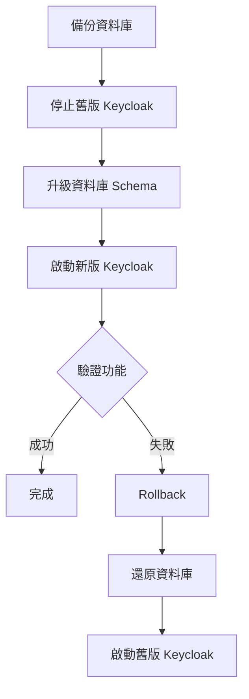

#### Schema 升級

```bash
# Keycloak 會自動執行 Schema 升級
# 首次啟動新版時會偵測並升級

# 若需手動執行（進階）
# 參考官方 Migration Guide
```

### 9.3 設定變更風險

#### 常見破壞性變更

```
Keycloak 21+ 重大變更：
├── 舊版 Wildfly 架構改為 Quarkus
├── 設定方式完全改變
├── 啟動參數不同
└── 需要重新設定

Keycloak 24+ 變更：
├── 部分 API 棄用
├── Client Scope 調整
└── Theme 結構變更
```

#### 設定遷移建議

```yaml
1. 匯出現有設定：
   docker exec keycloak /opt/keycloak/bin/kc.sh export \
     --dir /tmp/export --realm my-realm
   
2. 新版測試環境匯入：
   docker exec keycloak-new /opt/keycloak/bin/kc.sh import \
     --dir /tmp/export
   
3. 驗證功能正常
4. 正式環境升級
```

### 9.4 Rollback 建議策略

#### Rollback 計畫

```
準備事項：
├── 資料庫完整備份
├── Keycloak 設定匯出
├── 記錄現有 Docker Image 版本
└── 準備舊版環境

Rollback 步驟：
1. 停止新版 Keycloak
2. 還原資料庫至備份點
3. 重新部署舊版 Keycloak
4. 驗證功能正常
5. 通知相關系統

時間評估：
├── 停機時間：10-30 分鐘（依資料量）
├── Rollback 時間：15-60 分鐘
└── 建議安排至少 2 小時維護窗口
```

---

## 第十章：最佳實務與設計建議

### 10.1 Realm / Client 命名規範

#### 命名規範建議

```
Realm 命名：
├── 使用小寫英文
├── 使用連字號分隔
├── 表達業務意義
└── 範例：internal-system, customer-portal, partner-access

Client 命名：
├── {系統代碼}-{應用類型}
├── 使用小寫英文
├── 範例：
│   ├── hr-web（人資系統 Web）
│   ├── hr-api（人資系統 API）
│   ├── erp-mobile（ERP 手機版）
│   └── gateway-service（API Gateway）

Role 命名：
├── Realm Role：{動詞}-{名詞} 或 {身分}
│   ├── system-admin
│   ├── internal-user
│   └── external-partner
├── Client Role：{權限}-{範圍}
│   ├── read-all
│   ├── write-own
│   └── admin-full
```

### 10.2 多系統共用 Keycloak 的設計原則

#### 架構設計

```
設計原則：
├── 不同業務群組使用不同 Realm
├── 共用身分資料使用 Identity Brokering
├── 避免單一 Realm 承載過多 Client
└── 設計 Token 內容標準化

效能考量：
├── 單一 Realm 建議不超過 50 個 Active Client
├── 使用者數超過 10 萬考慮 Federation 而非 Import
├── 高流量 Client 考慮獨立 Realm
└── 定期清理過期 Session
```

#### Client 整合標準

```yaml
# 統一的 Token 內容設計
Access Token 應包含：
  - sub（使用者 ID）
  - preferred_username（帳號）
  - email
  - realm_access.roles（Realm 角色）
  - resource_access.{client}.roles（Client 角色）
  - department（自訂：部門，透過 Mapper）
  - employee_id（自訂：員工編號，透過 Mapper）
```

### 10.3 銀行或大型企業常見踩雷點

#### 踩雷案例 1：Token 過大

```
問題：Token 包含過多資訊，超過 HTTP Header 限制

原因：
├── 使用者有大量角色
├── Client Scope 設定過多
└── 自訂 Mapper 加入大量資料

解決方案：
├── 精簡角色設計，使用 Group 繼承
├── 只在需要時加入 Client Scope
├── 敏感資訊改用 UserInfo Endpoint 取得
└── 調整 Nginx/Gateway 的 header 限制（暫時）
```

#### 踩雷案例 2：AD 整合效能差

```
問題：AD 整合後登入緩慢

原因：
├── AD 查詢範圍過大
├── 每次都全量同步
└── 網路延遲

解決方案：
├── 設定適當的 User DN 限縮查詢範圍
├── 使用 Pagination（每次 1000 筆）
├── 設定 Connection Pool
├── 考慮使用 Cache
└── AD Server 與 Keycloak 部署在同網段
```

#### 踩雷案例 3：Refresh Token 被盜用

```
問題：Refresh Token 被攔截後長期使用

原因：
├── Refresh Token 有效期過長
├── 未啟用 Rotation
└── 傳輸未加密

解決方案：
├── 啟用 Refresh Token Rotation
├── 縮短 Refresh Token 有效期
├── 強制 HTTPS
├── Refresh Token 使用 HttpOnly Cookie
└── 實作異常偵測（同時多處使用）
```

#### 踩雷案例 4：升級後前端登入失敗

```
問題：Keycloak 升級後，keycloak-js 無法正常運作

原因：
├── keycloak-js 版本不相容
├── Token 格式變更
└── Endpoint 變更

解決方案：
├── 升級 keycloak-js 至相容版本
├── 查閱 Release Notes 的 Breaking Changes
├── 測試環境先行驗證
└── 準備 Rollback 計畫
```

### 10.4 開發、測試、正式環境隔離建議

#### 環境隔離架構

```
方案 1：完全獨立（建議）
├── DEV：獨立 Keycloak + 獨立 DB
├── SIT：獨立 Keycloak + 獨立 DB
├── UAT：獨立 Keycloak + 獨立 DB
└── PROD：獨立 Keycloak + 獨立 DB

方案 2：共用 Keycloak，獨立 Realm
├── Keycloak Server
│   ├── Realm: dev-internal
│   ├── Realm: sit-internal
│   ├── Realm: uat-internal
│   └── Realm: prod-internal
└── 風險：跨環境影響

建議：生產環境必須完全獨立
```

#### 環境設定管理

```yaml
# 使用環境變數區分
開發環境：
  KC_HOSTNAME: auth-dev.example.com
  KC_DB_URL: jdbc:postgresql://pg-dev:5432/keycloak
  
測試環境：
  KC_HOSTNAME: auth-sit.example.com
  KC_DB_URL: jdbc:postgresql://pg-sit:5432/keycloak
  
正式環境：
  KC_HOSTNAME: auth.example.com
  KC_DB_URL: jdbc:postgresql://pg-prod:5432/keycloak
```

#### 設定同步建議

```markdown
□ 使用 Export/Import 同步 Realm 設定
□ 不要同步使用者資料
□ 不要同步 Client Secret（各環境獨立）
□ 使用版本控制管理設定檔
□ 建立 CI/CD Pipeline 自動部署
```

---

## 附錄：檢查清單（Checklist）

### 初次部署檢查清單

```markdown
## 基礎建設
□ 資料庫已建立並可連線
□ 網路設定正確（防火牆、DNS）
□ SSL 憑證已準備
□ Reverse Proxy 已設定

## Keycloak 安裝
□ Docker Image 版本確認
□ 環境變數已設定
□ Admin 帳號已建立
□ 可存取 Admin Console

## Realm 設定
□ Realm 已建立
□ 密碼政策已設定
□ Brute Force Detection 已啟用
□ 事件記錄已啟用

## Client 設定
□ Client 已建立
□ Redirect URI 已設定
□ Web Origins 已設定
□ PKCE 已啟用（Public Client）

## 安全性
□ HTTPS 已啟用
□ Token 有效期已設定
□ Refresh Token Rotation 已啟用
□ Security Headers 已設定
```

### 日常維運檢查清單

```markdown
## 每日
□ 檢查系統健康狀態
□ 檢視錯誤 Log
□ 檢查登入失敗事件

## 每週
□ 檢視使用者活動統計
□ 檢查磁碟空間
□ 檢查資料庫效能

## 每月
□ 審核使用者權限
□ 檢視 Admin 操作記錄
□ 更新文件與 Runbook

## 每季
□ 評估是否需要升級
□ 審核安全設定
□ 災難復原演練
```

### 系統整合檢查清單

```markdown
## 前端應用
□ keycloak-js 版本與 Keycloak 相容
□ PKCE 已啟用
□ Token 自動更新機制
□ Logout 功能正常

## 後端 API
□ JWT 驗證正確設定
□ 角色授權正確實作
□ Token 驗證錯誤處理

## AD/LDAP 整合
□ 連線測試成功
□ 使用者可正常同步
□ 密碼驗證正常
□ 效能可接受
```

---

## 常見 Q&A

### Q1：忘記 Admin 密碼怎麼辦？

```bash
# 透過 Docker 重設
docker exec -it keycloak /opt/keycloak/bin/kc.sh \
  bootstrap-admin-user \
  --username:admin-new \
  --password:newpassword
```

### Q2：如何批次匯入使用者？

```bash
# 準備 JSON 檔案
{
  "users": [
    {
      "username": "user1",
      "email": "user1@example.com",
      "enabled": true,
      "credentials": [{
        "type": "password",
        "value": "password123",
        "temporary": true
      }]
    }
  ]
}

# 使用 Admin API 匯入
curl -X POST "https://auth.example.com/admin/realms/my-realm/users" \
  -H "Authorization: Bearer ${ADMIN_TOKEN}" \
  -H "Content-Type: application/json" \
  -d @users.json
```

### Q3：Token 過期時間如何調整？

```
Admin Console → Realm Settings → Tokens

Access Token Lifespan: 調整 Access Token 有效期
SSO Session Idle: 調整閒置逾時
SSO Session Max: 調整最大 Session 時間
```

### Q4：如何查看目前線上使用者？

```
Admin Console → Realm → Sessions

或透過 API：
curl "https://auth.example.com/admin/realms/my-realm/sessions/count" \
  -H "Authorization: Bearer ${ADMIN_TOKEN}"
```

### Q5：Client Secret 外洩怎麼辦？

```
緊急處理步驟：
1. 立即更換 Client Secret（Admin Console → Client → Credentials → Regenerate Secret）
2. 更新所有使用該 Client 的應用程式
3. 檢視事件 Log 是否有異常存取
4. 考慮撤銷所有現有 Token
5. 檢討 Secret 管理流程
```

### Q6：如何實作 API 的細粒度授權？

```java
// 使用 @PreAuthorize 搭配 SpEL
@PreAuthorize("hasRole('admin') or #userId == authentication.name")
public User getUser(@PathVariable String userId) {
    // 只有 admin 或使用者本人可存取
}

// 自訂 Permission Evaluator
@PreAuthorize("@permissionEvaluator.hasPermission(#document, 'read')")
public Document getDocument(@PathVariable Long documentId) {
    // 自訂權限邏輯
}
```

---

## 參考資源

- [Keycloak 官方文件](https://www.keycloak.org/documentation)
- [Keycloak GitHub](https://github.com/keycloak/keycloak)
- [OAuth 2.0 RFC 6749](https://datatracker.ietf.org/doc/html/rfc6749)
- [OpenID Connect Core 1.0](https://openid.net/specs/openid-connect-core-1_0.html)
- [PKCE RFC 7636](https://datatracker.ietf.org/doc/html/rfc7636)

 

