+++
date = '2026-01-30T19:38:49+08:00'
draft = false
title = 'Keycloak教學手冊'
tags = ['教學', '工具', 'Keycloak']
categories = ['教學']
+++

# Keycloak教學手冊

## 文件資訊

| 項目 | 內容 |
| --- | --- |
| **文件版本** | 2.0 |
| **最後更新** | 2026-09-30 |
| **版本基準** | Keycloak 26.7.4（2026-09-16 發佈）、keycloak-js 26.2.x（獨立發版）、Spring Boot 4.1 / Spring Security 7.1 |
| **文件定位** | 企業標準技術白皮書／內部標準教材 |
| **適用對象** | 後端工程師、前端工程師、系統架構師、DevOps／SRE、資安人員、稽核人員 |
| **使用情境** | 大型企業、金融業（銀行／證券／保險）內部與對外系統之身分與存取管理 |
| **前一版本** | 1.0（2026-01-29，適用 Keycloak 24.x／25.x） |
| **文件維護** | 內部技術團隊 |
| **Created by** | Eric Cheng |

> 📌 **v2.0 改版重點**：全面對齊 Keycloak 26.7；修正 v1.0 中已被移除或棄用的設定（`KEYCLOAK_ADMIN`、`KC_PROXY`、hostname v1、`KC_CACHE_STACK=kubernetes` 等）；新增 Grant Type 選擇、BFF、Organizations、Passkeys、DPoP、FAPI 2.0、Token Exchange V2、可觀測性、Rolling Update、設定即程式碼、MCP／AI Agent 授權等章節。完整差異見 [附錄 D 版本紀錄](#附錄-d版本紀錄)，查證依據見 [附錄 E 查證紀錄](#附錄-e查證紀錄)。

### 閱讀指引

| 讀者角色 | 建議閱讀章節 |
| --- | --- |
| 初次接觸 Keycloak | 第一章 → 第二章 → 第三章 3.1 → 第四章 |
| 前端／後端開發人員 | 第二章 2.3–2.6 → 第五章 → 第六章 |
| 架構師 | 第一章 1.6–1.7 → 第二章 → 第八章 → 第十章 → 第十二章 |
| DevOps／SRE | 第三章 → 第七章 → 第八章 8.1 → 第九章 → 第十一章 |
| 資安／稽核人員 | 第一章 1.7 → 第八章 → 第七章 7.2 → 附錄 A |

### 本文慣例

| 標記 | 意義 |
| --- | --- |
| `> 🆕 **v2.0 新增**` | 本版新增的章節或內容 |
| `> ⚠️ **v2.0 更正**` | 修正 v1.0 錯誤或已過時的內容 |
| `> ⚠️ **實務注意**` | 容易出錯、需特別留意之處 |
| `> 💡 **建議**` | 企業實務建議做法 |
| Supported／Preview／Experimental | 依 Keycloak 官方功能成熟度分類；Preview 與 Experimental 功能**不建議**直接用於正式環境 |

## 目錄

<!-- TOC-AUTO-BEGIN -->

- [文件資訊](#文件資訊)
  - [閱讀指引](#閱讀指引)
  - [本文慣例](#本文慣例)
- [第一章：Keycloak 簡介與核心概念](#第一章keycloak-簡介與核心概念)
  - [1.1 Keycloak 是什麼？](#11-keycloak-是什麼)
    - [1.1.1 核心功能](#111-核心功能)
    - [1.1.2 適用場景](#112-適用場景)
    - [1.1.3 與其他 IAM 方案比較](#113-與其他-iam-方案比較)
  - [1.2 IAM、SSO、OAuth 2.0、OIDC 關係說明](#12-iamssooauth-20oidc-關係說明)
    - [1.2.1 名詞解釋](#121-名詞解釋)
    - [1.2.2 OAuth 2.0 vs OIDC 差異](#122-oauth-20-vs-oidc-差異)
  - [1.3 Token 類型說明](#13-token-類型說明)
    - [1.3.1 詳細說明](#131-詳細說明)
    - [1.3.2 Access Token 結構範例（JWT）](#132-access-token-結構範例jwt)
  - [1.4 核心概念：Realm、Client、User、Role、Group](#14-核心概念realmclientuserrolegroup)
    - [1.4.1 概念說明](#141-概念說明)
    - [1.4.2 Realm 設計原則](#142-realm-設計原則)
  - [1.5 Authentication vs Authorization](#15-authentication-vs-authorization)
    - [1.5.1 實務流程](#151-實務流程)
  - [1.6 版本發佈節奏與支援策略](#16-版本發佈節奏與支援策略)
    - [1.6.1 版本編號與發佈節奏](#161-版本編號與發佈節奏)
    - [1.6.2 執行環境需求](#162-執行環境需求)
    - [1.6.3 功能成熟度分類](#163-功能成熟度分類)
  - [1.7 標準協定地圖](#17-標準協定地圖)
  - [1.8 💡 本章實務建議](#18--本章實務建議)
- [第二章：系統架構設計](#第二章系統架構設計)
  - [2.1 Keycloak 在企業系統中的角色](#21-keycloak-在企業系統中的角色)
    - [2.1.1 責任分工](#211-責任分工)
  - [2.2 整合架構說明](#22-整合架構說明)
    - [2.2.1 與 Web 前端（SPA）整合](#221-與-web-前端spa整合)
    - [2.2.2 與 Backend API 整合](#222-與-backend-api-整合)
    - [2.2.3 與 API Gateway 整合](#223-與-api-gateway-整合)
    - [2.2.4 與 AD / LDAP 整合](#224-與-ad--ldap-整合)
    - [2.2.5 與外部身分提供者（Identity Brokering）整合](#225-與外部身分提供者identity-brokering整合)
    - [2.2.6 與行動 App／原生應用整合](#226-與行動-app原生應用整合)
  - [2.3 Token Flow（Authorization Code Flow + PKCE）](#23-token-flowauthorization-code-flow--pkce)
  - [2.4 Grant Type 選擇矩陣](#24-grant-type-選擇矩陣)
  - [2.5 PKCE（Proof Key for Code Exchange）深入](#25-pkceproof-key-for-code-exchange深入)
    - [2.5.1 運作原理](#251-運作原理)
    - [2.5.2 產生範例](#252-產生範例)
    - [2.5.3 Keycloak 設定](#253-keycloak-設定)
  - [2.6 BFF 模式（Backend for Frontend）](#26-bff-模式backend-for-frontend)
  - [2.7 Organizations 多租戶（B2B）](#27-organizations-多租戶b2b)
  - [2.8 💡 本章實務建議](#28--本章實務建議)
- [第三章：Keycloak 安裝與部署](#第三章keycloak-安裝與部署)
  - [3.1 單機部署（Docker）](#31-單機部署docker)
    - [3.1.1 開發／測試環境快速啟動](#311-開發測試環境快速啟動)
    - [3.1.2 使用 Docker Compose 建立開發環境（含 PostgreSQL）](#312-使用-docker-compose-建立開發環境含-postgresql)
  - [3.2 生產環境部署建議](#32-生產環境部署建議)
    - [3.2.1 資料庫選擇](#321-資料庫選擇)
    - [3.2.2 建置最佳化映像（Optimized Image）](#322-建置最佳化映像optimized-image)
    - [3.2.3 生產環境 Docker Compose](#323-生產環境-docker-compose)
    - [3.2.4 Nginx Reverse Proxy 設定](#324-nginx-reverse-proxy-設定)
    - [3.2.5 對外公開路徑建議](#325-對外公開路徑建議)
    - [3.2.6 TLS 部署模式](#326-tls-部署模式)
  - [3.3 基本啟動參數與環境變數](#33-基本啟動參數與環境變數)
    - [3.3.1 設定來源與優先順序](#331-設定來源與優先順序)
    - [3.3.2 常用選項](#332-常用選項)
    - [3.3.3 Hostname v2 設定情境](#333-hostname-v2-設定情境)
    - [3.3.4 啟動模式與常用指令](#334-啟動模式與常用指令)
  - [3.4 Admin Console 存取方式](#34-admin-console-存取方式)
    - [3.4.1 存取 URL](#341-存取-url)
    - [3.4.2 首次登入與管理員治理](#342-首次登入與管理員治理)
    - [3.4.3 重要端點](#343-重要端點)
  - [3.5 管理介面（Port 9000）與健康檢查](#35-管理介面port-9000與健康檢查)
  - [3.6 Kubernetes Operator 部署](#36-kubernetes-operator-部署)
    - [3.6.1 安裝 Operator](#361-安裝-operator)
    - [3.6.2 Keycloak CR 範例](#362-keycloak-cr-範例)
  - [3.7 💡 本章實務建議](#37--本章實務建議)
- [第四章：Keycloak 基本設定](#第四章keycloak-基本設定)
  - [4.1 Realm 建立與規劃原則](#41-realm-建立與規劃原則)
    - [4.1.1 建立 Realm 步驟](#411-建立-realm-步驟)
    - [4.1.2 Realm 設計原則](#412-realm-設計原則)
    - [4.1.3 企業 Realm 規劃範例](#413-企業-realm-規劃範例)
    - [4.1.4 新 Realm 上線前必設項目](#414-新-realm-上線前必設項目)
  - [4.2 Client 類型說明](#42-client-類型說明)
    - [4.2.1 Client 類型比較](#421-client-類型比較)
    - [4.2.2 Client 驗證方式（Client Authenticator）](#422-client-驗證方式client-authenticator)
    - [4.2.3 建立 Client 步驟](#423-建立-client-步驟)
    - [4.2.4 Confidential Client 設定範例（BFF／伺服器端 Web）](#424-confidential-client-設定範例bff伺服器端-web)
    - [4.2.5 Service Account Client 設定範例（批次／服務對服務）](#425-service-account-client-設定範例批次服務對服務)
    - [4.2.6 Public Client 設定範例（SPA／行動 App）](#426-public-client-設定範例spa行動-app)
  - [4.3 Redirect URI 與 Web Origin 設定](#43-redirect-uri-與-web-origin-設定)
    - [4.3.1 Redirect URI 設定原則](#431-redirect-uri-設定原則)
    - [4.3.2 Web Origin 設定（CORS）](#432-web-origin-設定cors)
    - [4.3.3 Post Logout Redirect URI](#433-post-logout-redirect-uri)
  - [4.4 User、Role、Group 設定策略](#44-userrolegroup-設定策略)
    - [4.4.1 User 管理](#441-user-管理)
    - [4.4.2 建立使用者](#442-建立使用者)
    - [4.4.3 Group 階層設計](#443-group-階層設計)
  - [4.5 Realm Role vs Client Role 使用時機](#45-realm-role-vs-client-role-使用時機)
    - [4.5.1 使用時機比較](#451-使用時機比較)
    - [4.5.2 Composite Role 與預設角色](#452-composite-role-與預設角色)
    - [4.5.3 最佳實務](#453-最佳實務)
  - [4.6 Client Scopes 與 Protocol Mapper](#46-client-scopes-與-protocol-mapper)
    - [4.6.1 Default 與 Optional Scope](#461-default-與-optional-scope)
    - [4.6.2 常用 Protocol Mapper](#462-常用-protocol-mapper)
    - [4.6.3 Audience 設計（重要）](#463-audience-設計重要)
    - [4.6.4 Full Scope Allowed 與 Token 瘦身](#464-full-scope-allowed-與-token-瘦身)
  - [4.7 宣告式 User Profile](#47-宣告式-user-profile)
  - [4.8 Authentication Flow 與 Required Actions](#48-authentication-flow-與-required-actions)
    - [4.8.1 內建 Flow](#481-內建-flow)
    - [4.8.2 自訂 Browser Flow 範例（帳密 + 強制 OTP／Passkey）](#482-自訂-browser-flow-範例帳密--強制-otppasskey)
    - [4.8.3 Required Actions](#483-required-actions)
  - [4.9 Fine-Grained Admin Permissions V2](#49-fine-grained-admin-permissions-v2)
  - [4.10 💡 本章實務建議](#410--本章實務建議)
- [第五章：應用系統如何串接 Keycloak](#第五章應用系統如何串接-keycloak)
  - [5.1 Web 前端串接（OIDC）](#51-web-前端串接oidc)
    - [5.1.1 使用 keycloak-js 官方套件](#511-使用-keycloak-js-官方套件)
    - [5.1.2 初始化設定](#512-初始化設定)
    - [5.1.3 Vue 3 整合範例](#513-vue-3-整合範例)
    - [5.1.4 React 整合範例](#514-react-整合範例)
    - [5.1.5 API 呼叫時帶入 Token](#515-api-呼叫時帶入-token)
  - [5.2 Backend API 驗證 Token 機制](#52-backend-api-驗證-token-機制)
    - [5.2.1 Token 驗證流程](#521-token-驗證流程)
    - [5.2.2 驗證方式比較](#522-驗證方式比較)
    - [5.2.3 JWKS 快取與金鑰輪替](#523-jwks-快取與金鑰輪替)
  - [5.3 Spring Boot 整合](#53-spring-boot-整合)
    - [5.3.1 依賴設定（Maven）](#531-依賴設定maven)
    - [5.3.2 應用程式設定](#532-應用程式設定)
    - [5.3.3 Security 設定類別](#533-security-設定類別)
    - [5.3.4 Keycloak 角色轉換器](#534-keycloak-角色轉換器)
    - [5.3.5 Controller 範例](#535-controller-範例)
    - [5.3.6 呼叫下游服務（Client Credentials）](#536-呼叫下游服務client-credentials)
  - [5.4 Node.js 整合](#54-nodejs-整合)
  - [5.5 常見錯誤與除錯方式](#55-常見錯誤與除錯方式)
    - [5.5.1 常見錯誤對照表](#551-常見錯誤對照表)
    - [5.5.2 除錯技巧](#552-除錯技巧)
  - [5.6 細粒度授權（Authorization Services）](#56-細粒度授權authorization-services)
  - [5.7 Admin REST API 與 kcadm.sh](#57-admin-rest-api-與-kcadmsh)
    - [5.7.1 以 Service Account 呼叫 Admin REST API](#571-以-service-account-呼叫-admin-rest-api)
    - [5.7.2 kcadm.sh（Admin CLI）](#572-kcadmshadmin-cli)
    - [5.7.3 Java Admin Client](#573-java-admin-client)
  - [5.8 💡 本章實務建議](#58--本章實務建議)
- [第六章：系統使用情境說明](#第六章系統使用情境說明)
  - [6.1 SSO 登入流程實例](#61-sso-登入流程實例)
    - [6.1.1 SSO 實務注意事項](#611-sso-實務注意事項)
  - [6.2 使用者角色異動後的影響](#62-使用者角色異動後的影響)
    - [6.2.1 角色變更生效時機](#621-角色變更生效時機)
    - [6.2.2 企業實務建議](#622-企業實務建議)
  - [6.3 Token 生命週期與 Refresh 機制](#63-token-生命週期與-refresh-機制)
    - [6.3.1 時效設定與預設值](#631-時效設定與預設值)
    - [6.3.2 Offline Token](#632-offline-token)
    - [6.3.3 前端 Token Refresh 實作](#633-前端-token-refresh-實作)
  - [6.4 Logout 流程（Single Logout）](#64-logout-流程single-logout)
    - [6.4.1 Logout 類型](#641-logout-類型)
    - [6.4.2 RP-Initiated Logout](#642-rp-initiated-logout)
    - [6.4.3 Back-Channel Logout（建議）](#643-back-channel-logout建議)
  - [6.5 Step-up 認證與認證強度（ACR／LoA）](#65-step-up-認證與認證強度acrloa)
  - [6.6 服務間呼叫與 Token Exchange](#66-服務間呼叫與-token-exchange)
    - [6.6.1 選擇方式](#661-選擇方式)
    - [6.6.2 Standard Token Exchange 設定](#662-standard-token-exchange-設定)
  - [6.7 💡 本章實務建議](#67--本章實務建議)
- [第七章：系統維運與管理](#第七章系統維運與管理)
  - [7.1 使用者與權限管理最佳實務](#71-使用者與權限管理最佳實務)
    - [7.1.1 使用者管理原則](#711-使用者管理原則)
    - [7.1.2 JML 流程與 Keycloak 對應](#712-jml-流程與-keycloak-對應)
    - [7.1.3 權限審核 Checklist](#713-權限審核-checklist)
  - [7.2 Audit Log 與事件追蹤](#72-audit-log-與事件追蹤)
    - [7.2.1 啟用事件記錄](#721-啟用事件記錄)
    - [7.2.2 重要事件類型](#722-重要事件類型)
    - [7.2.3 事件查詢 API](#723-事件查詢-api)
    - [7.2.4 將事件送往 SIEM](#724-將事件送往-siem)
  - [7.3 Keycloak Log 說明](#73-keycloak-log-說明)
    - [7.3.1 Log 等級與輸出設定](#731-log-等級與輸出設定)
    - [7.3.2 常見 Log 訊息解讀](#732-常見-log-訊息解讀)
    - [7.3.3 Log 整合建議](#733-log-整合建議)
  - [7.4 可觀測性：Metrics 與 Tracing](#74-可觀測性metrics-與-tracing)
    - [7.4.1 Metrics](#741-metrics)
    - [7.4.2 Tracing（OpenTelemetry）](#742-tracingopentelemetry)
  - [7.5 Workflows 與 SCIM](#75-workflows-與-scim)
    - [7.5.1 Workflows（26.6 起正式支援）](#751-workflows266-起正式支援)
    - [7.5.2 SCIM API（26.7 Preview）](#752-scim-api267-preview)
  - [7.6 常見營運問題](#76-常見營運問題)
    - [7.6.1 問題 1：使用者無法登入](#761-問題-1使用者無法登入)
    - [7.6.2 問題 2：Token 驗證失敗](#762-問題-2token-驗證失敗)
    - [7.6.3 問題 3：效能問題](#763-問題-3效能問題)
    - [7.6.4 問題 4：Hostname 或 Proxy 設定錯誤](#764-問題-4hostname-或-proxy-設定錯誤)
    - [7.6.5 問題 5：升級後管理 API 或整合失效](#765-問題-5升級後管理-api-或整合失效)
  - [7.7 💡 本章實務建議](#77--本章實務建議)
- [第八章：高可用與資安建議](#第八章高可用與資安建議)
  - [8.1 Keycloak HA 架構概念](#81-keycloak-ha-架構概念)
    - [8.1.1 部署架構選擇](#811-部署架構選擇)
    - [8.1.2 快取與 Session](#812-快取與-session)
    - [8.1.3 容量規劃（官方 Sizing 指南）](#813-容量規劃官方-sizing-指南)
    - [8.1.4 HA 部署要點](#814-ha-部署要點)
  - [8.2 Session 與 Token 設計考量](#82-session-與-token-設計考量)
    - [8.2.1 Session 設計原則](#821-session-設計原則)
    - [8.2.2 Refresh Token Rotation](#822-refresh-token-rotation)
  - [8.3 HTTPS 與憑證管理](#83-https-與憑證管理)
    - [8.3.1 HTTPS 部署方式](#831-https-部署方式)
    - [8.3.2 憑證與信任庫設定](#832-憑證與信任庫設定)
    - [8.3.3 憑證管理建議](#833-憑證管理建議)
  - [8.4 防止 Token 洩漏的設計原則](#84-防止-token-洩漏的設計原則)
    - [8.4.1 Token 儲存原則](#841-token-儲存原則)
    - [8.4.2 安全設計 Checklist](#842-安全設計-checklist)
  - [8.5 與企業資安政策的搭配方式](#85-與企業資安政策的搭配方式)
    - [8.5.1 密碼政策（依 NIST SP 800-63B-4）](#851-密碼政策依-nist-sp-800-63b-4)
    - [8.5.2 密碼雜湊](#852-密碼雜湊)
    - [8.5.3 暴力破解防護](#853-暴力破解防護)
    - [8.5.4 Security Headers](#854-security-headers)
    - [8.5.5 MFA：OTP、Passkeys 與備援碼](#855-mfaotppasskeys-與備援碼)
  - [8.6 進階 Token 安全：DPoP、PAR 與 FAPI 2.0](#86-進階-token-安全dpoppar-與-fapi-20)
    - [8.6.1 DPoP（RFC 9449，26.4 起支援）](#861-dpoprfc-9449264-起支援)
    - [8.6.2 PAR（RFC 9126）](#862-parrfc-9126)
    - [8.6.3 Client Policies 與 FAPI 2.0](#863-client-policies-與-fapi-20)
  - [8.7 機密管理與 FIPS](#87-機密管理與-fips)
    - [8.7.1 Vault 整合](#871-vault-整合)
    - [8.7.2 FIPS 140 模式](#872-fips-140-模式)
  - [8.8 資安公告與漏洞管理](#88-資安公告與漏洞管理)
  - [8.9 💡 本章實務建議](#89--本章實務建議)
- [第九章：系統升級與版本管理](#第九章系統升級與版本管理)
  - [9.1 升級前檢查事項](#91-升級前檢查事項)
    - [9.1.1 升級前 Checklist](#911-升級前-checklist)
    - [9.1.2 版本資訊查詢](#912-版本資訊查詢)
  - [9.2 升級策略：Rolling Update 與 Recreate](#92-升級策略rolling-update-與-recreate)
    - [9.2.1 使用 update-compatibility 判斷](#921-使用-update-compatibility-判斷)
  - [9.3 資料庫相容性注意事項](#93-資料庫相容性注意事項)
    - [9.3.1 資料庫升級流程](#931-資料庫升級流程)
    - [9.3.2 Schema 遷移方式](#932-schema-遷移方式)
    - [9.3.3 26.7 資料庫相關變更](#933-267-資料庫相關變更)
  - [9.4 版本變更與設定風險](#94-版本變更與設定風險)
    - [9.4.1 重大架構變更歷史](#941-重大架構變更歷史)
    - [9.4.2 26.6 → 26.7.4 破壞性與行為變更](#942-266--2674-破壞性與行為變更)
    - [9.4.3 已棄用、將移除的功能](#943-已棄用將移除的功能)
    - [9.4.4 設定遷移建議](#944-設定遷移建議)
  - [9.5 Rollback 建議策略](#95-rollback-建議策略)
    - [9.5.1 Rollback 計畫](#951-rollback-計畫)
    - [9.5.2 時間評估](#952-時間評估)
  - [9.6 💡 本章實務建議](#96--本章實務建議)
- [第十章：最佳實務與設計建議](#第十章最佳實務與設計建議)
  - [10.1 Realm / Client 命名規範](#101-realm--client-命名規範)
    - [10.1.1 命名規範建議](#1011-命名規範建議)
  - [10.2 多系統共用 Keycloak 的設計原則](#102-多系統共用-keycloak-的設計原則)
    - [10.2.1 架構設計](#1021-架構設計)
    - [10.2.2 Token 內容標準](#1022-token-內容標準)
  - [10.3 銀行或大型企業常見踩雷點](#103-銀行或大型企業常見踩雷點)
    - [10.3.1 踩雷案例 1：Token 過大](#1031-踩雷案例-1token-過大)
    - [10.3.2 踩雷案例 2：AD 整合效能差](#1032-踩雷案例-2ad-整合效能差)
    - [10.3.3 踩雷案例 3：Refresh Token 被盜用](#1033-踩雷案例-3refresh-token-被盜用)
    - [10.3.4 踩雷案例 4：升級後前端登入失敗](#1034-踩雷案例-4升級後前端登入失敗)
    - [10.3.5 踩雷案例 5：Hostname 設定錯誤導致 iss 不一致](#1035-踩雷案例-5hostname-設定錯誤導致-iss-不一致)
    - [10.3.6 踩雷案例 6：透過 Mapper 帶入的管理角色失效](#1036-踩雷案例-6透過-mapper-帶入的管理角色失效)
    - [10.3.7 踩雷案例 7：第三方 Cookie 限制導致 SSO 狀態偵測失效](#1037-踩雷案例-7第三方-cookie-限制導致-sso-狀態偵測失效)
    - [10.3.8 踩雷案例 8：Service Account 權限過大](#1038-踩雷案例-8service-account-權限過大)
  - [10.4 開發、測試、正式環境隔離建議](#104-開發測試正式環境隔離建議)
    - [10.4.1 環境隔離架構](#1041-環境隔離架構)
    - [10.4.2 環境設定管理](#1042-環境設定管理)
    - [10.4.3 設定同步建議](#1043-設定同步建議)
  - [10.5 💡 本章實務建議](#105--本章實務建議)
- [第十一章：設定即程式碼與自動化](#第十一章設定即程式碼與自動化)
  - [11.1 為何需要設定即程式碼](#111-為何需要設定即程式碼)
  - [11.2 Realm Export／Import](#112-realm-exportimport)
    - [11.2.1 CLI 匯出／匯入](#1121-cli-匯出匯入)
    - [11.2.2 Admin Console／REST API 部分匯入](#1122-admin-consolerest-api-部分匯入)
  - [11.3 keycloak-config-cli](#113-keycloak-config-cli)
  - [11.4 Operator KeycloakRealmImport](#114-operator-keycloakrealmimport)
  - [11.5 Terraform Provider](#115-terraform-provider)
  - [11.6 工具選擇比較](#116-工具選擇比較)
  - [11.7 CI/CD 與環境升遷](#117-cicd-與環境升遷)
  - [11.8 💡 本章實務建議](#118--本章實務建議)
- [第十二章：新興標準與 AI Agent 授權](#第十二章新興標準與-ai-agent-授權)
  - [12.1 功能成熟度總覽](#121-功能成熟度總覽)
  - [12.2 Keycloak 作為 MCP 授權伺服器](#122-keycloak-作為-mcp-授權伺服器)
    - [12.2.1 規範支援狀態](#1221-規範支援狀態)
    - [12.2.2 設定步驟（MCP 2025-06-18 以後）](#1222-設定步驟mcp-2025-06-18-以後)
  - [12.3 Client ID Metadata Document（CIMD）](#123-client-id-metadata-documentcimd)
  - [12.4 Identity Assertion JWT Grant（ID-JAG）](#124-identity-assertion-jwt-grantid-jag)
  - [12.5 Shared Signals Framework（SSF）](#125-shared-signals-frameworkssf)
  - [12.6 AuthZEN](#126-authzen)
  - [12.7 OID4VCI（可驗證憑證發行）](#127-oid4vci可驗證憑證發行)
  - [12.8 評估與導入建議](#128-評估與導入建議)
  - [12.9 💡 本章實務建議](#129--本章實務建議)
- [附錄 A：檢查清單（Checklist）](#附錄-a檢查清單checklist)
  - [A.1 初次部署檢查清單](#a1-初次部署檢查清單)
  - [A.2 日常維運檢查清單](#a2-日常維運檢查清單)
  - [A.3 系統整合檢查清單](#a3-系統整合檢查清單)
  - [A.4 升級前檢查清單](#a4-升級前檢查清單)
- [附錄 B：常見 Q&A](#附錄-b常見-qa)
  - [B.1 Q1：忘記 Admin 密碼怎麼辦？](#b1-q1忘記-admin-密碼怎麼辦)
  - [B.2 Q2：如何批次匯入使用者？](#b2-q2如何批次匯入使用者)
  - [B.3 Q3：Token 過期時間如何調整？](#b3-q3token-過期時間如何調整)
  - [B.4 Q4：如何查看目前線上使用者？](#b4-q4如何查看目前線上使用者)
  - [B.5 Q5：Client Secret 外洩怎麼辦？](#b5-q5client-secret-外洩怎麼辦)
  - [B.6 Q6：如何實作 API 的細粒度授權？](#b6-q6如何實作-api-的細粒度授權)
  - [B.7 Q7：使用者被暴力破解防護鎖定，如何解鎖？](#b7-q7使用者被暴力破解防護鎖定如何解鎖)
  - [B.8 Q8：如何在不停機的情況下輪替 Client Secret？](#b8-q8如何在不停機的情況下輪替-client-secret)
  - [B.9 Q9：升級後登入或 API 大量失敗，如何處理？](#b9-q9升級後登入或-api-大量失敗如何處理)
  - [B.10 Q10：登入後被導向內部網址或出現「HTTPS required」？](#b10-q10登入後被導向內部網址或出現https-required)
- [附錄 C：版本功能對照表](#附錄-c版本功能對照表)
- [附錄 D：版本紀錄](#附錄-d版本紀錄)
  - [D.1 版本歷程](#d1-版本歷程)
  - [D.2 v1.0 → v2.0 更正表](#d2-v10--v20-更正表)
  - [D.3 v2.0 新增章節](#d3-v20-新增章節)
- [附錄 E：查證紀錄](#附錄-e查證紀錄)
  - [E.1 待確認事項](#e1-待確認事項)
- [附錄 F：參考資料](#附錄-f參考資料)

<!-- TOC-AUTO-END -->

---

## 第一章：Keycloak 簡介與核心概念

### 1.1 Keycloak 是什麼？

**Keycloak** 是開源的 **身分與存取管理（Identity and Access Management, IAM）** 解決方案，提供單一登入（SSO）、身分聯合、使用者管理與細緻授權等能力，並以 OAuth 2.0、OpenID Connect（OIDC）與 SAML 2.0 等標準協定對外提供服務。

> ⚠️ **v2.0 更正**：v1.0 描述為「由 Red Hat 開發並維護」。Keycloak 已於 **2023 年 4 月加入 CNCF，成熟度為 Incubating**，由社群治理（Red Hat 仍為主要貢獻者）。Red Hat 另以 **Red Hat build of Keycloak（RHBK）** 提供商業支援版本。

#### 1.1.1 核心功能

| 功能 | 說明 | 相關章節 |
| --- | --- | --- |
| **單一登入（SSO）／單一登出（SLO）** | 使用者登入一次即可存取多個應用系統，登出可同步通知各系統 | [6.1](#61-sso-登入流程實例)、[6.4](#64-logout-流程single-logout) |
| **身分代理（Identity Brokering）** | 串接外部 OIDC／SAML IdP（如 Entra ID、Google、其他企業 IdP） | [2.2.5](#225-與外部身分提供者identity-brokering整合) |
| **使用者聯合（User Federation）** | 直接連接 AD／LDAP、Kerberos，不需搬移帳號 | [2.2.4](#224-與-ad--ldap-整合) |
| **標準協定** | OAuth 2.0、OIDC、SAML 2.0，並支援 FAPI 2.0、DPoP、PAR 等進階規範 | [1.7](#17-標準協定地圖) |
| **強式驗證** | OTP、WebAuthn、Passkeys、Recovery Codes、Step-up 認證 | [8.5](#85-與企業資安政策的搭配方式)、[6.5](#65-step-up-認證與認證強度acrloa) |
| **集中式使用者管理** | 使用者、群組、角色、宣告式 User Profile | [4.4](#44-userrolegroup-設定策略)、[4.7](#47-宣告式-user-profile) |
| **授權服務（Authorization Services）** | 以 Resource／Scope／Policy／Permission 實作細緻授權（UMA 2.0） | [5.6](#56-細粒度授權authorization-services) |
| **多租戶** | 以 Realm 做強隔離，以 Organizations 做 B2B 多租戶 | [2.7](#27-organizations-多租戶b2b) |
| **管理自動化** | Admin REST API、`kcadm.sh`、Operator、Terraform、Workflows | [第十一章](#第十一章設定即程式碼與自動化) |

#### 1.1.2 適用場景

```text
✅ 企業內部多系統需要統一登入（SSO）
✅ 需要與 AD／LDAP 整合的內部應用
✅ 微服務架構需要集中式認證與 Token-based 授權
✅ 對外客戶系統（Internet Banking、Mobile Banking）需要 MFA、Passkeys
✅ B2B 平台需要以「組織」為單位管理夥伴企業使用者
✅ 金融業需要完整稽核軌跡、FAPI 2.0 等高安全規範

❌ 不適合：只有單一應用且無擴充計畫（引入成本高於效益）
❌ 不適合：無法負擔額外基礎設施（DB、HA、監控）與維運人力的專案
❌ 不適合：只需要「API Key」等級保護的內部批次工具
```

#### 1.1.3 與其他 IAM 方案比較

| 面向 | Keycloak（自建） | 雲端 IDaaS（Entra ID、Okta、Auth0 等） | 自行開發 |
| --- | --- | --- | --- |
| 授權成本 | 開源免費（可選 RHBK 商業支援） | 依使用者數訂閱 | 無授權費，但開發成本高 |
| 資料主權 | 完全自主，可部署於地端 | 依雲端服務商所在區域 | 自主 |
| 客製化 | 高（SPI、Theme、Authenticator） | 中（依平台擴充點） | 最高，但風險最大 |
| 維運負擔 | 高（需自建 HA、升級、監控） | 低 | 最高 |
| 標準符合度 | 高（通過 OpenID 認證、FAPI 2.0） | 高 | 通常不足 |

> 💡 **建議**：金融業或有「資料不得出境」要求的單位，Keycloak 是常見選擇；但必須同步規劃 [第七章](#第七章系統維運與管理) 與 [第九章](#第九章系統升級與版本管理) 的維運與升級能力。

---

### 1.2 IAM、SSO、OAuth 2.0、OIDC 關係說明

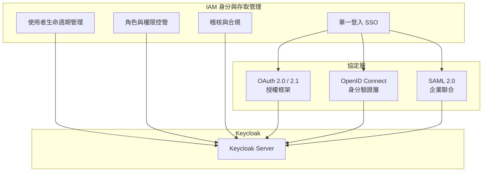
```mermaid
graph TB
    subgraph IAMG["IAM 身分與存取管理"]
        SSO[單一登入 SSO]
        UM[使用者生命週期管理]
        RBAC[角色與權限控管]
        AUD[稽核與合規]
    end

    subgraph PROTO["協定層"]
        OAuth[OAuth 2.0 / 2.1<br/>授權框架]
        OIDC[OpenID Connect<br/>身分驗證層]
        SAML[SAML 2.0<br/>企業聯合]
    end

    subgraph KCG["Keycloak"]
        KC[Keycloak Server]
    end

    SSO --> OAuth
    SSO --> OIDC
    SSO --> SAML
    UM --> KC
    RBAC --> KC
    AUD --> KC

    OAuth --> KC
    OIDC --> KC
    SAML --> KC
```

#### 1.2.1 名詞解釋

| 名詞 | 說明 |
| --- | --- |
| **IAM** | Identity and Access Management，身分與存取管理的總稱，涵蓋帳號生命週期、認證、授權、稽核 |
| **SSO** | Single Sign-On，登入一次即可存取多個系統 |
| **OAuth 2.0** | 授權框架（RFC 6749），定義「用戶端如何在資源擁有者同意下取得存取權杖」 |
| **OAuth 2.1** | 整合 OAuth 2.0 與後續安全最佳實務的新版規範，**目前仍為 IETF Internet-Draft**（見 [1.7](#17-標準協定地圖)） |
| **OIDC** | OpenID Connect，建構於 OAuth 2.0 之上的「身分驗證」層，新增 ID Token 與 UserInfo |
| **SAML 2.0** | 以 XML 為基礎的企業聯合身分協定，常見於傳統企業系統與 SaaS |
| **IdP／OP** | Identity Provider／OpenID Provider，發放身分與權杖的一方（即 Keycloak） |
| **RP／Client** | Relying Party，依賴 IdP 驗證使用者的應用系統 |
| **Resource Server** | 持有受保護資源、驗證 Access Token 的 API 服務 |

#### 1.2.2 OAuth 2.0 vs OIDC 差異

| 項目 | OAuth 2.0 | OpenID Connect |
| --- | --- | --- |
| 解決的問題 | 授權（Authorization）：「允許這個應用存取我的資源」 | 認證（Authentication）：「告訴應用我是誰」 |
| 核心產物 | Access Token、Refresh Token | 額外提供 **ID Token**（JWT）與 UserInfo Endpoint |
| 觸發方式 | 依 Grant Type | 在授權請求中帶 `scope=openid` |
| 使用者資訊 | 未定義 | 標準 Claims（`sub`、`name`、`email` 等） |
| 常見誤用 | 以 Access Token 當作登入憑證 | 將 ID Token 送到 API 作為授權依據 |

> ⚠️ **實務注意**：**ID Token 是給 Client 看的，Access Token 是給 API 看的。** API 不應接受 ID Token 作為授權依據。

---

### 1.3 Token 類型說明

Keycloak 核心運作圍繞下列 Token：

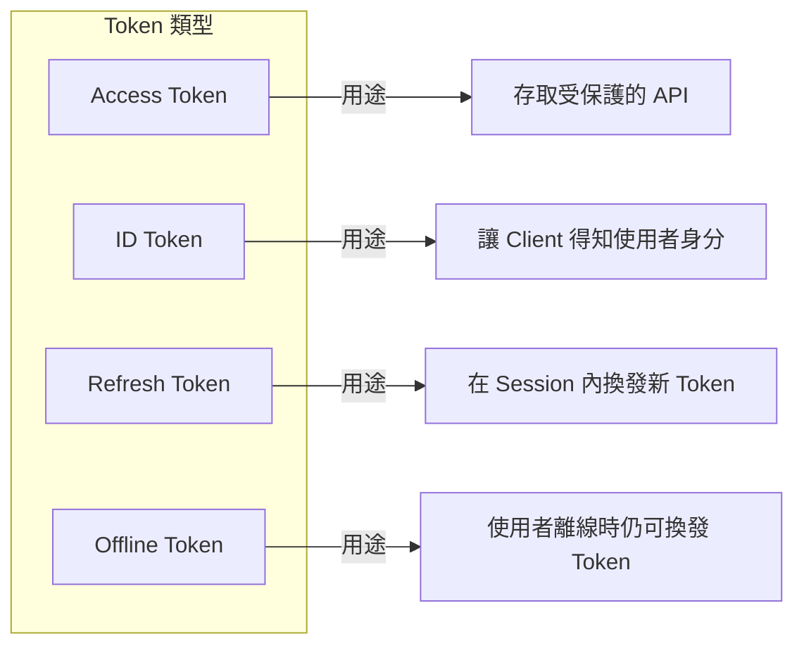
```mermaid
graph LR
    subgraph TT["Token 類型"]
        AT[Access Token]
        IT[ID Token]
        RT[Refresh Token]
        OT[Offline Token]
    end

    AT -->|用途| AT1[存取受保護的 API]
    IT -->|用途| IT1[讓 Client 得知使用者身分]
    RT -->|用途| RT1[在 Session 內換發新 Token]
    OT -->|用途| OT1[使用者離線時仍可換發 Token]
```

#### 1.3.1 詳細說明

| Token 類型 | 格式 | 接收者 | 用途 | 建議生命週期 | 儲存位置建議 |
| --- | --- | --- | --- | --- | --- |
| **Access Token** | JWT（RFC 9068 相容） | Resource Server（API） | 存取 API 資源 | 5–15 分鐘（Keycloak 預設 5 分鐘） | 記憶體；或由 BFF 保管 |
| **ID Token** | JWT | Client | 取得登入者身分 | 與 Access Token 相同 | 記憶體 |
| **Refresh Token** | JWT（僅 Keycloak 可驗證，對 Client 應視為不透明） | Keycloak | 換發新 Access Token | 綁定 Client Session／SSO Session 的 Idle 與 Max | BFF 伺服器端；SPA 僅限記憶體 |
| **Offline Token** | Refresh Token 的一種（`offline_access` scope） | Keycloak | 使用者不在線時仍可換發 | 依 Offline Session Idle（預設 30 天） | 伺服器端加密儲存 |

> ⚠️ **v2.0 更正**：v1.0 建議 SPA 將 Refresh Token 存在「HttpOnly Cookie」。純前端程式（包含 keycloak-js）**無法**讀寫 HttpOnly Cookie，此做法只有在 **BFF（Backend for Frontend）** 架構下才成立，詳見 [2.6](#26-bff-模式backend-for-frontend) 與 [8.4](#84-防止-token-洩漏的設計原則)。

#### 1.3.2 Access Token 結構範例（JWT）

JWT 由 `Header.Payload.Signature` 三段 Base64URL 組成，以下為解碼後內容：

```json
{
  "header": {
    "alg": "RS256",
    "typ": "JWT",
    "kid": "3kH9x..."
  },
  "payload": {
    "exp": 1790755500,
    "iat": 1790755200,
    "jti": "onrtac:6f1c0b2e-...",
    "iss": "https://auth.example.com/realms/internal",
    "aud": ["erp-api", "account"],
    "sub": "c2f0a4b1-7e9d-4e1a-9b3c-2d5e6f7a8b9c",
    "typ": "Bearer",
    "azp": "erp-web",
    "sid": "a1b2c3d4-...",
    "acr": "1",
    "scope": "openid profile email",
    "realm_access": {
      "roles": ["internal-user"]
    },
    "resource_access": {
      "erp-api": {
        "roles": ["erp-operator"]
      }
    },
    "preferred_username": "john.doe",
    "email": "john.doe@example.com"
  }
}
```

| Claim | 說明 | 驗證重點 |
| --- | --- | --- |
| `iss` | 發行者，格式為 `{hostname}/realms/{realm}` | 必須完全等於 API 設定的 issuer |
| `aud` | 受眾，此 Token 可被哪些 API 接受 | API 必須檢查自己在 `aud` 內（見 [4.6](#46-client-scopes-與-protocol-mapper)） |
| `azp` | 取得此 Token 的 Client | 可用於限制呼叫來源 |
| `exp`／`iat` | 到期／發行時間（Unix 秒） | 需容許少量時鐘偏移（建議 ≤ 60 秒） |
| `sub` | 使用者唯一識別（UUID） | 應作為關聯鍵，**不要**以 `preferred_username` 當主鍵 |
| `sid` | SSO Session ID | Back-channel Logout 時比對使用 |
| `acr` | 認證強度 | Step-up 認證判斷依據 |

> ⚠️ **實務注意**：JWT 只是「簽章」而非「加密」，任何人都可以解碼內容。不應放入身分證字號、帳號餘額等敏感資訊。

---

### 1.4 核心概念：Realm、Client、User、Role、Group

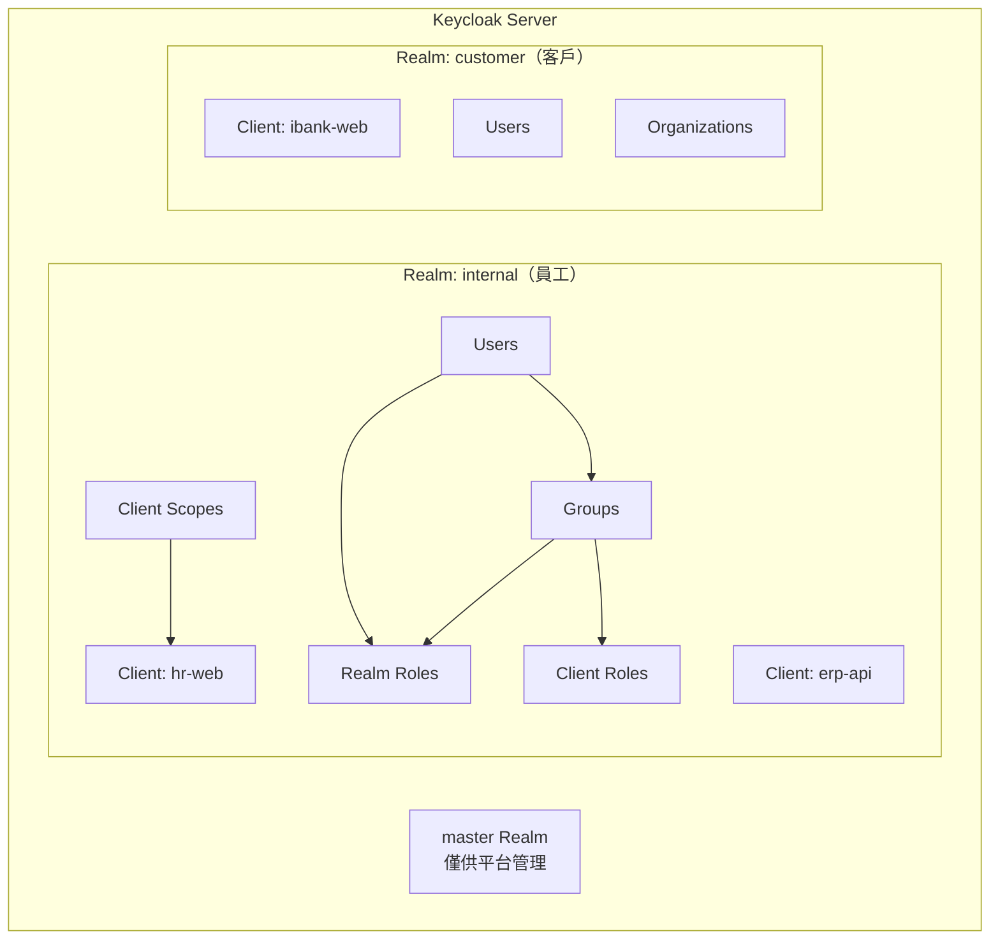
```mermaid
graph TB
    subgraph KS["Keycloak Server"]
        Master[master Realm<br/>僅供平台管理]

        subgraph RA["Realm: internal（員工）"]
            CA1[Client: hr-web]
            CA2[Client: erp-api]
            UA[Users]
            GA[Groups]
            RRA[Realm Roles]
            CRA[Client Roles]
            CSA[Client Scopes]
        end

        subgraph RB["Realm: customer（客戶）"]
            CB1[Client: ibank-web]
            UB[Users]
            ORG[Organizations]
        end
    end

    UA --> GA
    GA --> RRA
    GA --> CRA
    UA --> RRA
    CSA --> CA1
```

#### 1.4.1 概念說明

| 概念 | 說明 | 實務範例 |
| --- | --- | --- |
| **Realm** | 完全隔離的管理空間：使用者、Client、角色、金鑰、登入流程、主題皆獨立 | `internal`、`customer`、`partner` |
| **Client** | 向 Keycloak 請求認證或 Token 的應用程式／服務 | `ibank-web`、`erp-api`、`batch-job` |
| **User** | 使用者帳號，可來自本地、LDAP／AD 或外部 IdP | 員工、客戶 |
| **Role** | 權限角色，分 Realm Role 與 Client Role，可組合（Composite） | `teller`、`erp-operator` |
| **Group** | 使用者群組，可階層化並繼承角色與屬性 | `branch-taipei/ops` |
| **Client Scope** | 可重複使用的 Claims 與角色範圍組合，決定 Token 內容與 `aud` | `profile`、`erp-api-audience` |
| **Identity Provider** | 外部 IdP 連線設定（OIDC、SAML、社群登入） | `entra-id` |
| **User Federation** | 外部使用者儲存庫（LDAP／AD、Kerberos） | `corp-ad` |
| **Organization** | Realm 內的 B2B 租戶單位（26.0 起正式支援） | `acme-corp` |
| **Authentication Flow** | 可組合的登入流程（帳密、OTP、Passkeys、條件判斷） | `browser-with-otp` |

#### 1.4.2 Realm 設計原則

```text
建議方式：
├── master（僅供 Keycloak 平台管理員使用，不放任何業務 Client）
├── internal（內部員工系統群）
│   ├── Client: hr-web
│   ├── Client: erp-web
│   └── Client: erp-api
└── customer（對外客戶系統群）
    ├── Client: ibank-web
    └── Client: mbank-app
```

> ⚠️ **銀行實務**：內部員工與外部客戶必須放在不同 Realm，確保使用者資料、密碼政策、登入流程、金鑰與稽核事件完全隔離。

---

### 1.5 Authentication vs Authorization

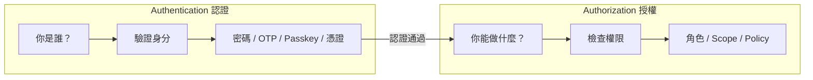
```mermaid
graph LR
    subgraph AN["Authentication 認證"]
        A1[你是誰？]
        A2[驗證身分]
        A3[密碼 / OTP / Passkey / 憑證]
    end

    subgraph AZ["Authorization 授權"]
        B1[你能做什麼？]
        B2[檢查權限]
        B3[角色 / Scope / Policy]
    end

    A1 --> A2 --> A3
    A3 -->|認證通過| B1
    B1 --> B2 --> B3
```

| 項目 | Authentication（認證） | Authorization（授權） |
| --- | --- | --- |
| **問題** | 你是誰？ | 你能做什麼？ |
| **時機** | 登入時 | 每次存取資源時 |
| **Keycloak 機制** | Authentication Flow、Identity Provider、User Federation | Role、Client Scope、Authorization Services、Fine-Grained Admin Permissions |
| **主要產物** | ID Token、SSO Session | Access Token（含 roles、scope、aud） |
| **在哪裡判斷** | Keycloak | 主要在 API／Gateway，Keycloak 提供依據 |

#### 1.5.1 實務流程

```text
1. 使用者於 Keycloak 登入頁完成密碼 + MFA → Authentication
2. Keycloak 建立 SSO Session，發放 ID Token / Access Token / Refresh Token
3. 前端（或 BFF）帶 Access Token 呼叫 API
4. API 驗證簽章、iss、aud、exp，並依 roles / scope 判斷 → Authorization
5. 權限不足回傳 403；Token 無效回傳 401
```

---

### 1.6 版本發佈節奏與支援策略

> 🆕 **v2.0 新增**

#### 1.6.1 版本編號與發佈節奏

| 類型 | 範例 | 說明 |
| --- | --- | --- |
| **Major** | 25 → 26 | 可能包含移除功能與不相容變更；26 系列自 2024-10 起持續發佈 |
| **Minor** | 26.6 → 26.7 | 約每季一次，帶來新功能，偶有需要注意的行為變更 |
| **Patch** | 26.7.3 → 26.7.4 | 約每 2–4 週，包含 Bug 與 **資安修補**；26.6 起同一 `major.minor` 內預設支援 Rolling Update |
| **Nightly** | nightly | 開發快照，僅供測試 |

**26.x 近期版本（截至 2026-09-30）：**

| 版本 | 發佈日期 | 重點 |
| --- | --- | --- |
| 26.7.4 | 2026-09-16 | 資安修補、Authorization Services 資源 URI 正規化 |
| 26.7.3 | 2026-08-31 | Redirect URI 拒絕含 `state`／`code` 等 OIDC 參數 |
| 26.7.0 | 2026-07-09 | SCIM API（Preview）、Multi-cluster v2（Preview）、SAML Step-up 轉為支援 |
| 26.6.0 | 2026-04-08 | JWT Authorization Grant、Workflows、Federated Client Auth 轉為支援；Patch 版零停機升級 |
| 26.5.0 | 2026-01-06 | OpenTelemetry、MCP 授權伺服器指南、Kubernetes Service Account 驗證（Preview） |
| 26.4.0 | 2025 下半年 | Passkeys、FAPI 2 Final、DPoP 轉為支援 |

> 💡 **建議**：社群版**只維護最新 minor 版本**，舊 minor 版不再發佈修補。企業若需要長期支援（固定版本、回溯修補、SLA），應評估 **Red Hat build of Keycloak**。

#### 1.6.2 執行環境需求

| 項目 | 要求 |
| --- | --- |
| **Java** | OpenJDK 21（官方容器映像使用 21）；Java 17 已棄用；26.6 起支援 Java 25（映像仍為 21 以維持 FIPS 相容） |
| **資料庫** | PostgreSQL、MySQL、MariaDB、SQL Server、Oracle、Aurora PostgreSQL 等，版本矩陣見 [3.2.1](#321-資料庫選擇) |
| **容器** | `quay.io/keycloak/keycloak:<version>`，支援 amd64、arm64、ppc64le（26.5 起） |
| **Kubernetes** | Keycloak Operator（OLM／kubectl／kustomize） |
| **Client 函式庫** | keycloak-js 26.2.x（獨立發版，相容所有仍受支援的伺服器版本）；Admin Client 以 `org.keycloak:keycloak-admin-client` 發佈 |

#### 1.6.3 功能成熟度分類

| 分類 | 意義 | 預設 | 正式環境 |
| --- | --- | --- | --- |
| **Supported** | 官方正式支援 | 多數預設啟用 | ✅ 可用 |
| **Preview** | 功能完整但可能變動 | 需 `--features=<name>` 啟用 | ⚠️ 評估後使用 |
| **Experimental** | 概念驗證 | 需明確啟用 | ❌ 不建議 |
| **Deprecated** | 將於未來版本移除 | 視情況 | ⚠️ 規劃遷移 |

```bash
# 啟用 / 停用功能（26.5 起可用單一選項同時處理）
bin/kc.sh start --features="organization,passkeys" --features-disabled="impersonation"
```

---

### 1.7 標準協定地圖

> 🆕 **v2.0 新增**

企業白皮書應明確標示所依據的規範。下表整理 Keycloak 相關標準與支援狀態：

| 規範 | 編號 | 內容 | Keycloak 支援 |
| --- | --- | --- | --- |
| OAuth 2.0 Authorization Framework | RFC 6749 | OAuth 2.0 核心 | ✅ |
| Bearer Token Usage | RFC 6750 | `Authorization: Bearer` 用法 | ✅ |
| PKCE | RFC 7636 | 授權碼攔截防護 | ✅（建議所有 Client 啟用） |
| Token Introspection | RFC 7662 | 查詢 Token 狀態 | ✅（26.6.2 起檢查 `aud`） |
| Token Revocation | RFC 7009 | 撤銷 Token | ✅ |
| JWT Profile for Client Auth／Grant | RFC 7523 | `private_key_jwt`、JWT Authorization Grant | ✅（JWT Authorization Grant 26.6 支援） |
| Dynamic Client Registration | RFC 7591 | 動態註冊 Client | ✅ |
| Device Authorization Grant | RFC 8628 | 無瀏覽器裝置登入 | ✅ |
| Token Exchange | RFC 8693 | 交換 Token | ✅（Standard Token Exchange V2） |
| Authorization Server Metadata | RFC 8414 | `.well-known` 中繼資料 | ✅ |
| mTLS Client Auth & Bound Tokens | RFC 8705 | 憑證綁定 Token | ✅ |
| JWT Access Token Profile | RFC 9068 | Access Token 為 JWT 的格式 | ✅ |
| Pushed Authorization Requests（PAR） | RFC 9126 | 授權請求改由後端推送 | ✅ |
| Issuer Identification | RFC 9207 | 授權回應帶 `iss` | ✅ |
| DPoP | RFC 9449 | 持有證明綁定 Token | ✅（26.4 支援） |
| OAuth 2.0 Security BCP | RFC 9700（2025-01） | 安全最佳實務：禁用 Implicit／ROPC、強制 PKCE 等 | 設計依據 |
| Resource Indicators | RFC 8707 | `resource` 參數 | ❌ 尚不支援（以 scope + Audience mapper 替代） |
| OAuth 2.1 | draft-ietf-oauth-v2-1-16（2026-09-02） | 整合版 OAuth | 設計依據；仍為草案，WG 預計 2026-12 送 IESG |
| OpenID Connect Core 1.0 | errata set 2（2023-12） | OIDC 核心；已成為 ISO/IEC 26131:2024 | ✅ |
| OIDC RP-Initiated／Front-Channel／Back-Channel Logout 1.0 | OpenID Final | 單一登出 | ✅ |
| CIBA Core 1.0 | OpenID Final | 分離裝置認證 | ✅ |
| FAPI 2.0 Security Profile／Message Signing | OpenID Final | 金融等級 API 安全 | ✅（26.4 FAPI 2 Final） |
| SAML 2.0 | OASIS | 企業聯合 | ✅ |
| WebAuthn Level 2／Passkeys | W3C | 無密碼驗證 | ✅ |
| SCIM 2.0 | RFC 7643／7644 | 使用者佈建 API | 🧪 26.7 Preview |
| OID4VCI | OpenID | 可驗證憑證發行 | 🧪 Experimental |

> 💡 **建議**：新系統設計應以 **RFC 9700 + OAuth 2.1 草案** 為基準：只使用 Authorization Code + PKCE、Client Credentials、Device、Token Exchange 等 Grant；不使用 Implicit 與 ROPC（Direct Access Grants）。

---

### 1.8 💡 本章實務建議

1. **先定義 Realm 邊界再建 Client**：內部員工、外部客戶、合作夥伴分屬不同 Realm；`master` 只給平台管理員。
2. **區分 ID Token 與 Access Token 的用途**：API 只接受 Access Token，並檢查 `iss`、`aud`、`exp` 與簽章。
3. **以標準為設計依據**：RFC 9700 與 OAuth 2.1 草案是目前最具共識的安全基準。
4. **追蹤版本節奏**：社群版只修補最新 minor 版；每季評估升級，每次 patch 版評估資安修補。
5. **Preview／Experimental 功能不上正式環境**，除非經過風險評估並有回退方案。

---

## 第二章：系統架構設計

### 2.1 Keycloak 在企業系統中的角色

Keycloak 在企業架構中扮演 **Authorization Server + OpenID Provider + 身分整合中樞** 的角色。前端或 BFF 向 Keycloak 取得 Token；API Gateway 與後端服務以 **本地驗證 JWT**（透過 JWKS 公鑰）為主，只有在需要即時撤銷判斷時才呼叫 Introspection。

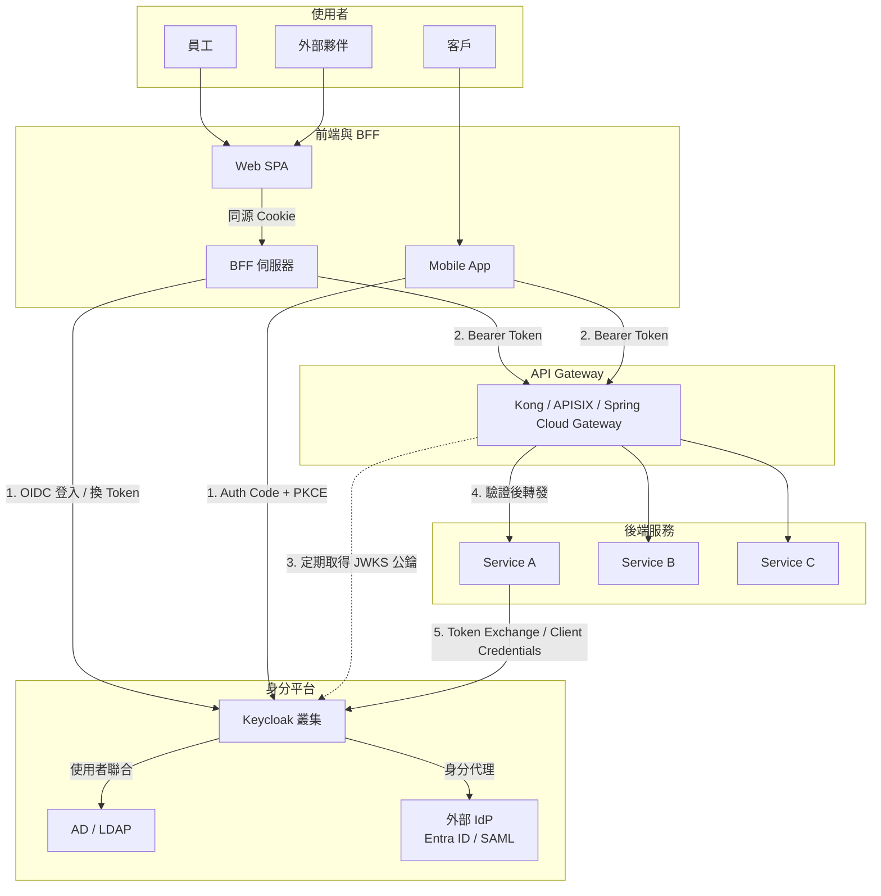
```mermaid
graph TB
    subgraph USERS["使用者"]
        U1[員工]
        U2[客戶]
        U3[外部夥伴]
    end

    subgraph FRONT["前端與 BFF"]
        FE1[Web SPA]
        BFF[BFF 伺服器]
        FE2[Mobile App]
    end

    subgraph GWL["API Gateway"]
        GW[Kong / APISIX / Spring Cloud Gateway]
    end

    subgraph SVC["後端服務"]
        API1[Service A]
        API2[Service B]
        API3[Service C]
    end

    subgraph IDP["身分平台"]
        KC[Keycloak 叢集]
        AD[AD / LDAP]
        EXT[外部 IdP<br/>Entra ID / SAML]
    end

    U1 --> FE1
    U2 --> FE2
    U3 --> FE1

    FE1 -->|同源 Cookie| BFF
    BFF -->|1. OIDC 登入 / 換 Token| KC
    FE2 -->|1. Auth Code + PKCE| KC

    KC -->|使用者聯合| AD
    KC -->|身分代理| EXT

    BFF -->|2. Bearer Token| GW
    FE2 -->|2. Bearer Token| GW

    GW -.->|3. 定期取得 JWKS 公鑰| KC
    GW -->|4. 驗證後轉發| API1
    GW --> API2
    GW --> API3
    API1 -->|5. Token Exchange / Client Credentials| KC
```

> ⚠️ **v2.0 更正**：v1.0 圖中 Gateway「每次請求都向 Keycloak 驗證 Token」會讓 Keycloak 成為效能瓶頸。正確做法是 Gateway 快取 JWKS 公鑰、在本地驗證 JWT；Introspection 僅用於需要即時撤銷判斷的高風險 API。

#### 2.1.1 責任分工

| 元件 | 責任 | 不應承擔 |
| --- | --- | --- |
| **Keycloak** | 認證、發 Token、Session 管理、身分聯合、MFA、稽核事件 | 業務資料授權（例如「只能看自己分行的帳戶」） |
| **BFF／前端** | 發起登入、保管 Token、帶 Token 呼叫 API | 自行驗證密碼、自行產生 Token |
| **API Gateway** | 粗粒度驗證（簽章、`iss`、`aud`、`exp`、必要 scope）、Rate Limiting | 業務規則判斷 |
| **後端服務** | 細粒度授權（角色 + 資料層級規則） | 保存使用者密碼 |

---

### 2.2 整合架構說明

#### 2.2.1 與 Web 前端（SPA）整合

```text
前端應用（Vue / React / Angular）
    │
    ├── 方案 A（建議，高安全）：BFF 模式
    │   └── Token 只存在伺服器端，瀏覽器只持有 HttpOnly Session Cookie（見 2.6）
    │
    └── 方案 B：純前端 OIDC Client（Public Client + PKCE）
        ├── keycloak-js（官方，26.2.x 起獨立發版）
        ├── oidc-client-ts（通用 OIDC 函式庫）
        └── 框架整合：angular-auth-oidc-client、react-oidc-context 等
```

> ⚠️ **v2.0 更正**：v1.0 列出的 `@react-keycloak/web` 已長期未更新，新專案不建議採用；React 可直接使用 keycloak-js，或改用 `react-oidc-context`（基於 oidc-client-ts）。

#### 2.2.2 與 Backend API 整合

```text
Backend API（Spring Boot / Node.js / .NET / Go）
    │
    ├── 角色：OAuth 2.0 Resource Server
    ├── 驗證 Access Token（JWT）
    │   ├── 簽章（以 JWKS 公鑰，依 kid 選鑰，支援金鑰輪替）
    │   ├── 有效期（exp / nbf，容許少量時鐘偏移）
    │   ├── Issuer（iss 完全相符）
    │   └── Audience（aud 必須包含本服務）
    │
    ├── 授權：realm_access.roles / resource_access.{client}.roles / scope
    │
    └── 服務對服務呼叫
        ├── 以自身身分：Client Credentials
        └── 代表使用者：Standard Token Exchange（RFC 8693）
```

#### 2.2.3 與 API Gateway 整合

```text
API Gateway
    │
    ├── 集中驗證 JWT（快取 JWKS）
    ├── 轉發原 Token 或以 Token Exchange 換成下游專用 Token
    └── Rate Limiting、Logging、mTLS

常見方案：
├── Kong（openid-connect / jwt plugin）
├── Apache APISIX（openid-connect plugin）
├── Spring Cloud Gateway + OAuth2 Resource Server
├── Envoy / Istio（RequestAuthentication + AuthorizationPolicy）
└── NGINX Plus（auth_jwt）/ oauth2-proxy
```

#### 2.2.4 與 AD / LDAP 整合

```text
Keycloak
    │
    ├── User Federation（LDAP Provider，AD 亦使用 LDAP Provider）
    │   ├── Edit mode：READ_ONLY / WRITABLE / UNSYNCED
    │   ├── Import users：On（複製至 Keycloak DB）/ Off（每次即時查詢）
    │   └── Sync：Periodic full sync / Periodic changed users sync
    │
    ├── Mappers
    │   ├── user-attribute（mail、department、employeeID）
    │   ├── group-ldap-mapper（AD 群組 → Keycloak Group）
    │   └── role-ldap-mapper
    │
    ├── 驗證方式
    │   ├── LDAP Bind（使用者密碼由 AD 驗證）
    │   └── Kerberos / SPNEGO（網域內免輸入密碼）
    │
    └── 安全設定
        ├── 使用 LDAPS（636）或 StartTLS
        ├── 專用 Bind DN、最小權限
        └── Connection Pooling / Timeout
```

| 設計決策 | 建議 | 說明 |
| --- | --- | --- |
| Edit mode | `READ_ONLY` | AD 為唯一真實來源（Source of Truth），避免雙向寫入 |
| Import users | 多數情況 `On` | 可在 Keycloak 端指派角色、提升查詢效能 |
| Users DN | 限縮至實際 OU | 避免全樹搜尋 |
| 同步頻率 | Changed users：每 15–60 分鐘；Full：每日離峰 | 大型 AD 需分頁（Pagination） |
| 離職帳號 | 依 AD `userAccountControl` 停用 | 搭配 [7.1](#71-使用者與權限管理最佳實務) 的定期稽核 |

#### 2.2.5 與外部身分提供者（Identity Brokering）整合

> 🆕 **v2.0 新增**

Identity Brokering 讓使用者以外部 IdP 帳號登入 Keycloak，Keycloak 再以一致的 Token 格式發給內部應用：

| 情境 | 協定 | 範例 |
| --- | --- | --- |
| 企業已使用 Microsoft Entra ID | OIDC | 員工以 M365 帳號登入內部系統 |
| 母集團或合作夥伴的 SAML IdP | SAML 2.0 | 子公司人員以母公司帳號登入 |
| 對外客戶社群登入 | OIDC／OAuth 2.0 | Google、Apple、LINE（以通用 OIDC 設定） |

實務要點：

- **First Broker Login Flow**：首次登入時如何建立或連結本地帳號（自動連結需確認 Email 已驗證，26.3 起支援「Trusted email verification」）。
- **帳號連結（Account Linking）**：26.7.2 起舊的 Client 發起連結端點 `/broker/{provider}/link` 預設停用，改用 Application Initiated Action `kc_action=idp_link`。
- **Identity Provider Alias 不可變更**（26.7.0 起），命名前務必規劃。
- **Identity Brokering API V2**（26.7 Preview）提供 Client 層級授權與以 Session 儲存外部 Token；V1 已標示棄用但預設仍啟用。
- Twitter（X）IdP 已標示棄用，改以通用 OAuth v2 Provider 設定。

#### 2.2.6 與行動 App／原生應用整合

> 🆕 **v2.0 新增**

| 項目 | 建議 |
| --- | --- |
| 規範 | RFC 8252（OAuth 2.0 for Native Apps） |
| Client 類型 | Public Client + PKCE（S256）；可搭配 DPoP 綁定 Refresh Token |
| 使用者代理 | 系統瀏覽器（iOS `ASWebAuthenticationSession`、Android Custom Tabs），**不可使用內嵌 WebView** |
| Redirect URI | 優先使用 Universal Links／App Links（`https://`），其次為私有 scheme（`com.example.app:/callback`） |
| 函式庫 | AppAuth-iOS、AppAuth-Android |
| Token 儲存 | iOS Keychain、Android Keystore 加密儲存 |

---

### 2.3 Token Flow（Authorization Code Flow + PKCE）

這是 **Web、行動與原生應用唯一推薦的使用者登入流程**：

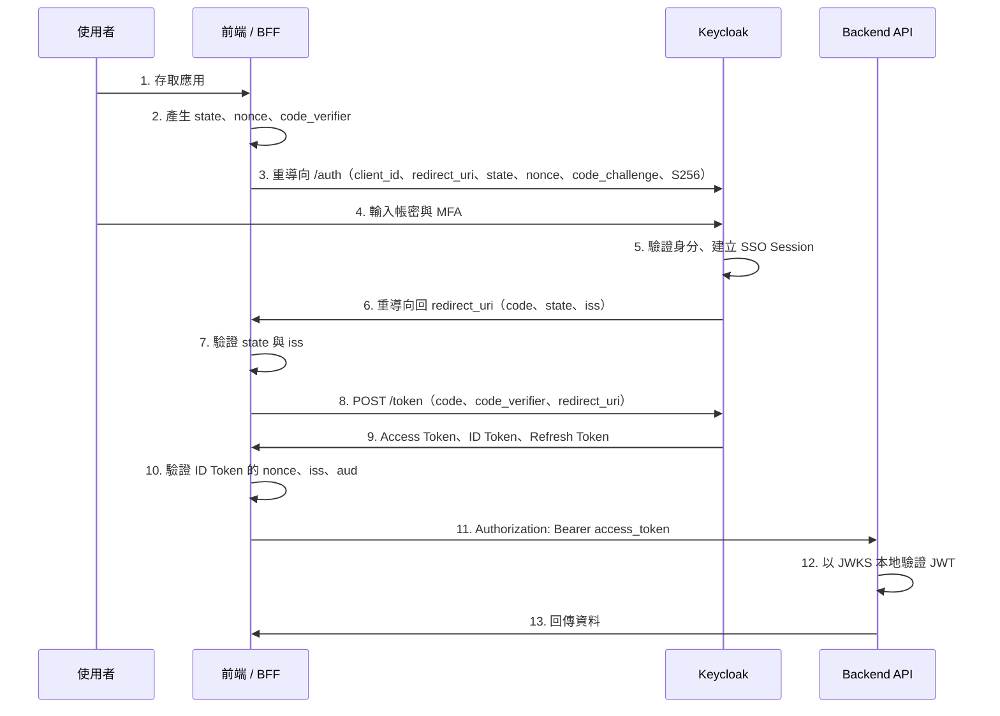
```mermaid
sequenceDiagram
    participant U as 使用者
    participant FE as 前端 / BFF
    participant KC as Keycloak
    participant API as Backend API

    U->>FE: 1. 存取應用
    FE->>FE: 2. 產生 state、nonce、code_verifier
    FE->>KC: 3. 重導向 /auth（client_id、redirect_uri、state、nonce、code_challenge、S256）
    U->>KC: 4. 輸入帳密與 MFA
    KC->>KC: 5. 驗證身分、建立 SSO Session
    KC->>FE: 6. 重導向回 redirect_uri（code、state、iss）
    FE->>FE: 7. 驗證 state 與 iss
    FE->>KC: 8. POST /token（code、code_verifier、redirect_uri）
    KC->>FE: 9. Access Token、ID Token、Refresh Token
    FE->>FE: 10. 驗證 ID Token 的 nonce、iss、aud
    FE->>API: 11. Authorization: Bearer access_token
    API->>API: 12. 以 JWKS 本地驗證 JWT
    API->>FE: 13. 回傳資料
```

| 參數 | 用途 | 防護 |
| --- | --- | --- |
| `state` | 綁定請求與回應 | CSRF |
| `nonce` | 綁定 ID Token 與登入請求 | ID Token 重放 |
| `code_challenge`／`code_verifier` | PKCE | 授權碼攔截與注入 |
| `iss`（回應參數，RFC 9207） | 確認回應來自預期的 IdP | Mix-up 攻擊 |
| `redirect_uri` 精確比對 | 限制回呼位置 | 開放重導向、Token 外洩 |

---

### 2.4 Grant Type 選擇矩陣

> 🆕 **v2.0 新增**

| Grant Type | 適用情境 | Client 類型 | 建議 | Keycloak 設定位置 |
| --- | --- | --- | --- | --- |
| **Authorization Code + PKCE** | Web、SPA、BFF、行動 App | Public／Confidential | ✅ 首選 | Standard flow |
| **Client Credentials** | 批次、服務對服務（以服務本身身分） | Confidential | ✅ | Service accounts roles |
| **Device Authorization**（RFC 8628） | 智慧電視、CLI、無瀏覽器裝置 | Public／Confidential | ✅ | OAuth 2.0 Device Authorization Grant |
| **CIBA** | 客服代為發起、使用者於手機 App 核准 | Confidential | ✅ 特定場景 | OIDC CIBA Grant |
| **Standard Token Exchange**（RFC 8693） | 服務代表使用者呼叫下游、縮小權限（downscoping） | Confidential | ✅ | Standard token exchange |
| **JWT Authorization Grant**（RFC 7523） | 外部 IdP 簽發的 JWT 換 Keycloak Token | Confidential | ✅（26.6 支援） | Identity Provider 設定 |
| **Refresh Token** | 延長 Session 內的存取 | 全部 | ✅ 搭配 Rotation | 預設啟用 |
| **Implicit** | 舊式 SPA | Public | ❌ RFC 9700：SHOULD NOT | Implicit flow（應關閉） |
| **Resource Owner Password（Direct Access Grants）** | 舊式 App 直接收帳密 | 任一 | ❌ RFC 9700：MUST NOT | Direct access grants（應關閉） |

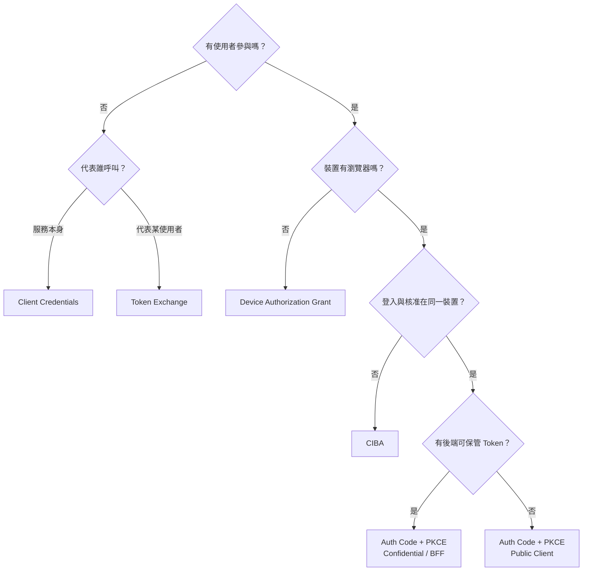
```mermaid
graph TD
    A{有使用者參與嗎？} -->|否| B{代表誰呼叫？}
    B -->|服務本身| CC[Client Credentials]
    B -->|代表某使用者| TE[Token Exchange]
    A -->|是| C{裝置有瀏覽器嗎？}
    C -->|否| DG[Device Authorization Grant]
    C -->|是| D{登入與核准在同一裝置？}
    D -->|否| CIBA[CIBA]
    D -->|是| E{有後端可保管 Token？}
    E -->|是| BFF[Auth Code + PKCE<br/>Confidential / BFF]
    E -->|否| SPA[Auth Code + PKCE<br/>Public Client]
```

> ⚠️ **實務注意**：v1.0 在除錯範例中以 `grant_type=password` 取 Token。此方式僅可在**隔離的開發環境**中用於測試，正式環境 Client 必須關閉 Direct Access Grants。

---

### 2.5 PKCE（Proof Key for Code Exchange）深入

> 🆕 **v2.0 新增**（v1.0 僅有簡述，本節依 RFC 7636 補完）

#### 2.5.1 運作原理

```text
1. Client 產生 code_verifier
   - 高熵隨機字串，長度 43–128 字元
   - 字元集：A–Z a–z 0–9 - . _ ~
2. 計算 code_challenge
   - S256：BASE64URL( SHA256( ASCII(code_verifier) ) )
   - plain：code_challenge = code_verifier（不建議）
3. 授權請求帶 code_challenge 與 code_challenge_method=S256
4. Token 請求帶原始 code_verifier
5. Keycloak 重新計算並比對，不符則回傳 invalid_grant
```

#### 2.5.2 產生範例

```javascript
// 瀏覽器端產生 PKCE 參數（Web Crypto API）
function base64url(bytes) {
  return btoa(String.fromCharCode(...new Uint8Array(bytes)))
    .replace(/\+/g, '-').replace(/\//g, '_').replace(/=+$/, '');
}

export async function createPkcePair() {
  const random = crypto.getRandomValues(new Uint8Array(32)); // 32 bytes → 43 字元
  const verifier = base64url(random);
  const digest = await crypto.subtle.digest('SHA-256', new TextEncoder().encode(verifier));
  return { verifier, challenge: base64url(digest), method: 'S256' };
}
```

#### 2.5.3 Keycloak 設定

| 位置 | 設定 | 建議 |
| --- | --- | --- |
| Client → Advanced → Advanced settings | Proof Key for Code Exchange Code Challenge Method | `S256`（強制此 Client 必須使用 PKCE） |
| Realm → Client policies | `pkce-enforcer` executor | 以政策方式對整個 Realm 或一類 Client 強制 PKCE |

> 💡 **建議**：依 RFC 9700，**Confidential Client 也應使用 PKCE**，不只 Public Client。

---

### 2.6 BFF 模式（Backend for Frontend）

> 🆕 **v2.0 新增**

BFF 是目前 IETF「OAuth 2.0 for Browser-Based Applications」草案中安全性最高的瀏覽器應用架構：**Token 永遠不進入瀏覽器**。

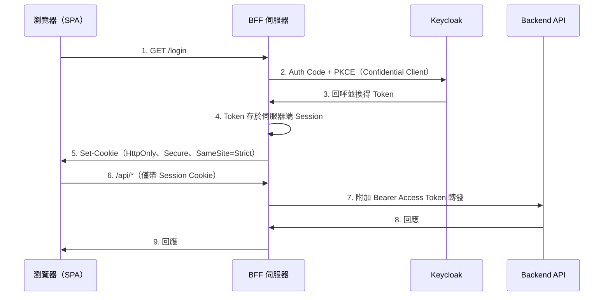
```mermaid
sequenceDiagram
    participant B as 瀏覽器（SPA）
    participant BFF as BFF 伺服器
    participant KC as Keycloak
    participant API as Backend API

    B->>BFF: 1. GET /login
    BFF->>KC: 2. Auth Code + PKCE（Confidential Client）
    KC->>BFF: 3. 回呼並換得 Token
    BFF->>BFF: 4. Token 存於伺服器端 Session
    BFF->>B: 5. Set-Cookie（HttpOnly、Secure、SameSite=Strict）
    B->>BFF: 6. /api/*（僅帶 Session Cookie）
    BFF->>API: 7. 附加 Bearer Access Token 轉發
    API->>BFF: 8. 回應
    BFF->>B: 9. 回應
```

| 比較 | 純 SPA（Public Client） | BFF（Confidential Client） |
| --- | --- | --- |
| Token 位置 | 瀏覽器記憶體 | 伺服器端 |
| XSS 竊取 Token 風險 | 高 | 低（只能在 Session 有效期間代為發送請求） |
| Refresh Token 保護 | 需 Rotation／DPoP | 伺服器端保管 |
| 第三方 Cookie 限制影響 | 靜默登入（silent check-sso）可能失效 | 不受影響 |
| 需額外元件 | 否 | 是（BFF 服務、Session 儲存） |
| CSRF 防護 | 不需要（Bearer） | 需要（SameSite + CSRF Token／自訂 Header） |

實作選項：Spring Cloud Gateway + `spring-boot-starter-security-oauth2-client`（TokenRelay）、Duende BFF（.NET）、oauth2-proxy、自行以 Node.js（`openid-client`）實作。

> 💡 **建議**：金融業對外網銀、內部高權限管理後台，建議採用 BFF；一般內部系統可採用純 SPA + 短效 Token + Refresh Token Rotation。

---

### 2.7 Organizations 多租戶（B2B）

> 🆕 **v2.0 新增**（Organizations 自 26.0 起為正式支援功能）

Realm 是強隔離，但每個租戶一個 Realm 在租戶數量大時難以管理。**Organizations** 讓單一 Realm 內以「組織」為單位管理 B2B 夥伴：

| 能力 | 說明 |
| --- | --- |
| 組織成員 | 使用者可屬於一或多個組織；成員分為 Managed（由組織 IdP 建立）與 Unmanaged |
| 網域（Domain） | 組織可綁定 Email 網域，登入時以 **Identity-first login** 依網域自動導向組織 IdP；26.4 起網域為選填 |
| 組織專屬 IdP | 每個組織可綁定自己的 OIDC／SAML IdP |
| 邀請成員 | 以 Email 邀請；26.5 起支援 Workflow 型邀請管理 |
| Token Claim | 請求 `organization` scope 時，Token 帶入 `organization` claim |
| 組織群組 | 26.6 起每個組織可有獨立群組階層，26.7 起組織群組可指派角色 |
| 管理角色 | 26.7 新增 `manage-organizations`、`view-organizations`、`query-organizations` |

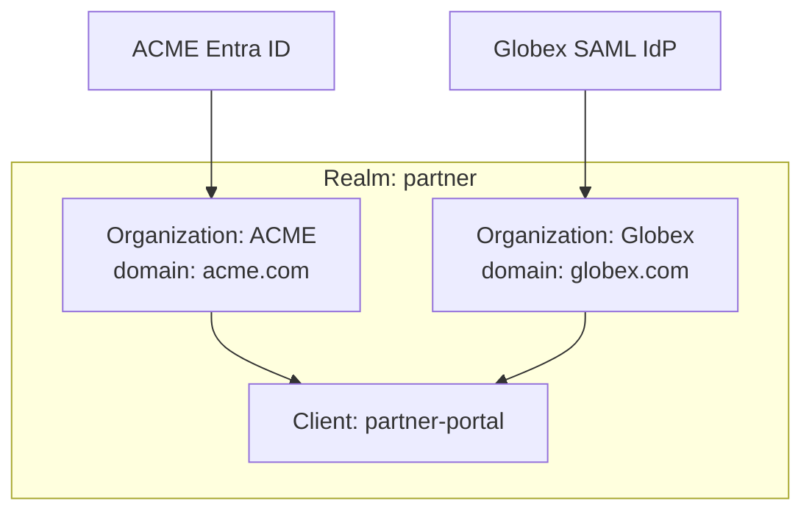
```mermaid
graph TB
    subgraph R["Realm: partner"]
        O1[Organization: ACME<br/>domain: acme.com]
        O2[Organization: Globex<br/>domain: globex.com]
        C1[Client: partner-portal]
    end
    IDP1[ACME Entra ID] --> O1
    IDP2[Globex SAML IdP] --> O2
    O1 --> C1
    O2 --> C1
```

| 選擇 | Realm per Tenant | Organizations |
| --- | --- | --- |
| 隔離程度 | 最高（金鑰、流程、主題皆獨立） | 中（共用 Realm 設定） |
| 租戶數量 | 數十個以內 | 數百至數千 |
| 管理成本 | 高 | 低 |
| 適用 | 監理要求強隔離的子公司 | B2B 夥伴入口網站、SaaS |

---

### 2.8 💡 本章實務建議

1. **Gateway 與 API 本地驗證 JWT**，不要每次請求都呼叫 Keycloak；Introspection 只用於高風險操作。
2. **一律 Authorization Code + PKCE（S256）**，關閉 Implicit 與 Direct Access Grants。
3. **高安全瀏覽器應用採 BFF**，讓 Token 不進入瀏覽器。
4. **AD 整合採 READ_ONLY + 限縮 Users DN**，以 AD 為唯一真實來源。
5. **大量 B2B 租戶優先考慮 Organizations**，只有監理要求強隔離時才每租戶一個 Realm。
6. **服務對服務呼叫**：代表服務本身用 Client Credentials；代表使用者用 Token Exchange，避免直接轉傳使用者 Token 到所有下游。

---

## 第三章：Keycloak 安裝與部署

> ⚠️ **v2.0 更正（本章總覽）**：v1.0 的部署範例以 Keycloak 25 為準，其中多項設定在 26.x 已棄用或移除：
>
> - `KEYCLOAK_ADMIN`／`KEYCLOAK_ADMIN_PASSWORD` → `KC_BOOTSTRAP_ADMIN_USERNAME`／`KC_BOOTSTRAP_ADMIN_PASSWORD`
> - `KC_PROXY=edge|reencrypt|passthrough`（26.0 移除）→ `KC_PROXY_HEADERS` + `KC_PROXY_TRUSTED_ADDRESSES`
> - Hostname v1 選項（26.0 移除）→ Hostname v2（`KC_HOSTNAME` 可填完整 URL）
> - `/health`、`/metrics` 改在 **管理埠 9000**，不在 8080
> - `KC_HTTPS_ENABLED` 並不存在；啟用 HTTPS 的方式是提供憑證（`KC_HTTPS_CERTIFICATE_FILE` 等）
> - Docker Compose 的 `version:` 欄位已過時

### 3.1 單機部署（Docker）

#### 3.1.1 開發／測試環境快速啟動

```bash
# 開發模式：HTTP、內建 dev-file 資料庫、關閉快取叢集、主題不快取
docker run -d \
  --name keycloak-dev \
  -p 8080:8080 \
  -p 9000:9000 \
  -e KC_BOOTSTRAP_ADMIN_USERNAME=admin \
  -e KC_BOOTSTRAP_ADMIN_PASSWORD=change_me \
  quay.io/keycloak/keycloak:26.7.4 \
  start-dev
```

> ⚠️ **實務注意**：`start-dev` 僅供本機開發。它使用 `dev-file`（H2 檔案）資料庫、允許 HTTP、停用主題快取，**不可用於任何共用環境**。

#### 3.1.2 使用 Docker Compose 建立開發環境（含 PostgreSQL）

```yaml
# compose.yaml（開發環境）
services:
  postgres:
    image: postgres:17
    environment:
      POSTGRES_DB: keycloak
      POSTGRES_USER: keycloak
      POSTGRES_PASSWORD: ${KC_DB_PASSWORD:-keycloak}
    volumes:
      - postgres_data:/var/lib/postgresql/data
    healthcheck:
      test: ["CMD-SHELL", "pg_isready -U keycloak -d keycloak"]
      interval: 10s
      timeout: 5s
      retries: 5

  keycloak:
    image: quay.io/keycloak/keycloak:26.7.4
    command: start-dev
    environment:
      # 暫時管理員（首次啟動時建立）
      KC_BOOTSTRAP_ADMIN_USERNAME: admin
      KC_BOOTSTRAP_ADMIN_PASSWORD: ${KC_ADMIN_PASSWORD:-change_me}

      # 資料庫
      KC_DB: postgres
      KC_DB_URL: jdbc:postgresql://postgres:5432/keycloak
      KC_DB_USERNAME: keycloak
      KC_DB_PASSWORD: ${KC_DB_PASSWORD:-keycloak}

      # 觀測
      KC_HEALTH_ENABLED: "true"
      KC_METRICS_ENABLED: "true"
    ports:
      - "8080:8080"
      - "9000:9000"
    depends_on:
      postgres:
        condition: service_healthy

volumes:
  postgres_data:
```

```bash
docker compose up -d                 # 啟動
docker compose logs -f keycloak      # 查看 Log
docker compose down                  # 停止（保留資料）
docker compose down -v               # 停止並刪除資料卷
```

---

### 3.2 生產環境部署建議

#### 3.2.1 資料庫選擇

> ⚠️ **v2.0 更正**：v1.0 將 DB2 列為「需測試」。DB2 **不在官方支援清單中**，不應用於正式環境。

| 資料庫 | `KC_DB` 值 | 官方測試版本（26.7） | 建議 |
| --- | --- | --- | --- |
| **PostgreSQL** | `postgres` | 14.x、15.x、16.x、17.x、18.x | ✅ 首選 |
| **Amazon Aurora PostgreSQL** | `postgres` | 15.x、16.x、17.x | ✅ AWS 環境（可搭配 AWS JDBC Driver 做 Multi-AZ 容錯） |
| **EnterpriseDB Advanced** | `postgres` | 17.x、18.x | ✅ |
| **MySQL** | `mysql` | 8.0 LTS、8.4 LTS | ✅ |
| **MariaDB** | `mariadb` | 10.6、10.11、11.4、11.8（LTS） | ✅ |
| **Microsoft SQL Server** | `mssql` | 2019、2022；Azure SQL Database／Managed Instance | ✅ |
| **Oracle Database** | `oracle` | 19.3+、23.5+（含 RAC） | ✅ 企業既有 Oracle |
| DB2、CockroachDB | — | 不支援 | ❌ |

資料庫連線池與重要參數：

| 選項 | 說明 | 建議 |
| --- | --- | --- |
| `db-pool-initial-size`／`db-pool-min-size`／`db-pool-max-size` | 連線池大小（預設 max 100） | 依節點數 × max 不超過 DB `max_connections` 的 70% |
| `db-schema` | 指定 Schema | 共用 DB 時使用 |
| `db-url-properties` | 附加 JDBC 參數 | 例如 `?sslmode=verify-full` |
| `transaction-xa-enabled` | XA 交易 | 一般不需要 |

> 💡 **建議**：資料庫必須 **UTF-8** 編碼（26.6 起啟動時會檢查）；PostgreSQL 建議使用 Primary + 同步 Standby，並將 Keycloak 與 DB 部署在低延遲網段（< 5ms）。

#### 3.2.2 建置最佳化映像（Optimized Image）

> 🆕 **v2.0 新增**

Keycloak 啟動時會先執行「build」步驟（依建置期選項產生最佳化設定）。正式環境應在 **映像建置時** 完成此步驟，讓容器以 `start --optimized` 快速啟動：

```dockerfile
# Containerfile
FROM quay.io/keycloak/keycloak:26.7.4 AS builder

# 建置期選項（build options）：不可包含密碼等敏感資料
ENV KC_DB=postgres
ENV KC_HEALTH_ENABLED=true
ENV KC_METRICS_ENABLED=true
ENV KC_FEATURES=passkeys

WORKDIR /opt/keycloak
# 自訂 Provider（SPI）與主題
# COPY providers/*.jar /opt/keycloak/providers/
# COPY themes/ /opt/keycloak/themes/
RUN /opt/keycloak/bin/kc.sh build

FROM quay.io/keycloak/keycloak:26.7.4
COPY --from=builder /opt/keycloak/ /opt/keycloak/
ENTRYPOINT ["/opt/keycloak/bin/kc.sh"]
```

```bash
docker build -t registry.example.com/iam/keycloak:26.7.4-1 -f Containerfile .
```

| 類型 | 範例 | 說明 |
| --- | --- | --- |
| **Build options** | `db`、`health-enabled`、`metrics-enabled`、`features`、`tracing-enabled`、`cache` | 需在 `kc.sh build` 時決定，改變後需重新建置 |
| **Runtime options** | `db-url`、`db-password`、`hostname`、`proxy-headers`、`https-*` | 啟動時由環境變數或參數提供，可含敏感資料 |

> ⚠️ **實務注意**：官方映像為強化安全，**不含 `curl`、套件管理器等工具**。若需除錯工具，請以另一個 sidecar／debug 容器處理，不要把工具裝進正式映像。

#### 3.2.3 生產環境 Docker Compose

```yaml
# compose.prod.yaml（單節點正式環境示意；多節點請見第八章）
services:
  keycloak:
    image: registry.example.com/iam/keycloak:26.7.4-1
    command: ["start", "--optimized"]
    environment:
      # 資料庫（runtime）
      KC_DB_URL: jdbc:postgresql://pg-primary.internal:5432/keycloak
      KC_DB_USERNAME: keycloak
      KC_DB_PASSWORD: ${KC_DB_PASSWORD:?必須提供}

      # Hostname v2：填完整對外 URL
      KC_HOSTNAME: https://auth.example.com
      KC_HOSTNAME_ADMIN: https://auth-admin.internal.example.com

      # Reverse Proxy（TLS 在 Proxy 終止，內網以 HTTP 連線）
      KC_HTTP_ENABLED: "true"
      KC_PROXY_HEADERS: xforwarded
      KC_PROXY_TRUSTED_ADDRESSES: 10.10.0.0/24

      # 暫時管理員：首次啟動後立即改為正式帳號並移除此設定
      KC_BOOTSTRAP_ADMIN_USERNAME: ${KC_BOOTSTRAP_ADMIN_USERNAME:-temp-admin}
      KC_BOOTSTRAP_ADMIN_PASSWORD: ${KC_BOOTSTRAP_ADMIN_PASSWORD:?必須提供}

      # Log
      KC_LOG_CONSOLE_OUTPUT: json
    ports:
      - "10.10.0.21:8080:8080"   # 僅供 Reverse Proxy 存取
      - "127.0.0.1:9000:9000"    # 管理埠只綁本機，供監控代理使用
    deploy:
      resources:
        limits:
          memory: 2g
        reservations:
          memory: 1250m
    healthcheck:
      # 映像內無 curl，改用 bash /dev/tcp 呼叫管理埠
      test: ["CMD-SHELL", "exec 3<>/dev/tcp/127.0.0.1/9000 && printf 'GET /health/ready HTTP/1.1\\r\\nHost: localhost\\r\\nConnection: close\\r\\n\\r\\n' >&3 && grep -q 'HTTP/1.1 200' <&3"]
      interval: 30s
      timeout: 10s
      retries: 3
      start_period: 60s
```

> ⚠️ **v2.0 更正**：v1.0 的 `curl -f http://localhost:8080/health/ready` 有兩個問題：官方映像沒有 `curl`，且 25 版起健康檢查端點在 **9000 埠**。

#### 3.2.4 Nginx Reverse Proxy 設定

```nginx
# /etc/nginx/conf.d/keycloak.conf
upstream keycloak {
    server 10.10.0.21:8080;
    server 10.10.0.22:8080;
    # 以 AUTH_SESSION_ID Cookie 做黏著（Nginx Plus 可用 sticky；開源版可用 hash）
    hash $cookie_AUTH_SESSION_ID consistent;
    keepalive 32;
}

server {
    listen 443 ssl;
    http2 on;                               # Nginx 1.25.1+ 寫法
    server_name auth.example.com;

    ssl_certificate     /etc/nginx/tls/auth.example.com.fullchain.pem;
    ssl_certificate_key /etc/nginx/tls/auth.example.com.key;
    ssl_protocols TLSv1.2 TLSv1.3;
    ssl_session_cache shared:SSL:10m;

    add_header Strict-Transport-Security "max-age=31536000; includeSubDomains" always;

    # Keycloak 回應標頭（含 Cookie）可能很大
    proxy_buffer_size       128k;
    proxy_buffers           4 256k;
    proxy_busy_buffers_size 256k;

    # 只公開必要路徑（依官方 Reverse Proxy 指南）
    location /realms/ {
        proxy_pass http://keycloak;
        include /etc/nginx/snippets/keycloak-proxy.conf;
    }
    location /resources/ {
        proxy_pass http://keycloak;
        include /etc/nginx/snippets/keycloak-proxy.conf;
    }
    location /.well-known/ {
        proxy_pass http://keycloak;
        include /etc/nginx/snippets/keycloak-proxy.conf;
    }

    # master Realm 與 Admin Console 不對外公開
    location /realms/master/ { return 404; }
    location /admin/          { return 404; }

    location / { return 404; }
}

server {
    listen 80;
    server_name auth.example.com;
    return 301 https://$host$request_uri;
}
```

```nginx
# /etc/nginx/snippets/keycloak-proxy.conf
proxy_http_version 1.1;
proxy_set_header Connection "";
proxy_set_header Host              $host;
proxy_set_header X-Forwarded-For   $proxy_add_x_forwarded_for;
proxy_set_header X-Forwarded-Proto $scheme;
proxy_set_header X-Forwarded-Host  $host;
proxy_set_header X-Forwarded-Port  $server_port;
proxy_connect_timeout 10s;
proxy_read_timeout    60s;
```

> ⚠️ **v2.0 更正**：v1.0 為「Admin Console 需要 WebSocket」設定 `Upgrade` 標頭，此說法不正確；Keycloak Admin Console 不依賴 WebSocket。v1.0 也將所有路徑（含 `/admin`）對外公開，違反官方建議。

#### 3.2.5 對外公開路徑建議

| 路徑 | 是否公開 | 原因 |
| --- | --- | --- |
| `/realms/` | ✅ | OIDC／SAML 端點、登入頁、帳號主控台 |
| `/realms/master/` | ❌ 僅內網 | 平台管理 Realm |
| `/resources/` | ✅ | 登入頁靜態資源 |
| `/.well-known/` | ✅ | RFC 8414 等中繼資料 |
| `/admin/` | ❌ 僅內網 | Admin Console 與 Admin REST API |
| `/health`、`/metrics`（9000 埠） | ❌ 絕不公開 | 管理介面 |

> 💡 **建議**：Admin Console 以 `KC_HOSTNAME_ADMIN` 設定內網專用網址，並由內部 Proxy 或 VPN 存取。

#### 3.2.6 TLS 部署模式

| 模式 | 設定 | 說明 | 建議 |
| --- | --- | --- | --- |
| **Re-encrypt** | Proxy 終止 TLS 後以 HTTPS 連 Keycloak；`KC_HTTPS_CERTIFICATE_FILE`、`KC_HTTPS_CERTIFICATE_KEY_FILE` + `KC_PROXY_HEADERS` | 全程加密 | ✅ 官方建議，金融業首選 |
| **Edge termination** | Proxy 終止 TLS，內網 HTTP；`KC_HTTP_ENABLED=true` + `KC_PROXY_HEADERS` | 內網明文 | ⚠️ 僅限受控隔離網段 |
| **Passthrough** | Proxy 只轉送 TCP；使用 `KC_PROXY_PROTOCOL_ENABLED=true`，**不可**設定 `proxy-headers` | Keycloak 直接處理 TLS，可取得用戶端憑證 | ✅ 需要 mTLS／X.509 登入時 |

> ⚠️ **實務注意**：務必設定 `KC_PROXY_TRUSTED_ADDRESSES`，只信任 Proxy 的來源 IP／CIDR，避免攻擊者偽造 `X-Forwarded-*` 標頭。

---

### 3.3 基本啟動參數與環境變數

#### 3.3.1 設定來源與優先順序

> 🆕 **v2.0 新增**

| 優先序 | 來源 | 範例 |
| --- | --- | --- |
| 1（最高） | 命令列參數 | `--db-url=jdbc:postgresql://...` |
| 2 | 環境變數 | `KC_DB_URL=...` |
| 3 | 設定檔 `conf/keycloak.conf`（可用 `--config-file` 指定） | `db-url=...` |
| 4（最低） | Java KeyStore 設定來源 | 存放敏感值 |

命名規則：選項 `db-url` ↔ 環境變數 `KC_DB_URL`（非英數字元轉為底線、全大寫）。若密碼中含 `$` 而不希望被當成運算式展開，可改用 **`KCRAW_`** 前綴（26.6 起），例如 `KCRAW_DB_PASSWORD`。

#### 3.3.2 常用選項

| 選項／環境變數 | 說明 | 預設值 | 類型 |
| --- | --- | --- | --- |
| `KC_BOOTSTRAP_ADMIN_USERNAME` | 首次啟動建立的暫時管理員帳號 | `temp-admin` | Runtime |
| `KC_BOOTSTRAP_ADMIN_PASSWORD` | 暫時管理員密碼 | — | Runtime |
| `KC_BOOTSTRAP_ADMIN_CLIENT_ID`／`_SECRET` | 暫時管理用 Service Account | `temp-admin`／— | Runtime |
| `KC_DB` | 資料庫類型 | `dev-file` | Build |
| `KC_DB_URL`／`KC_DB_USERNAME`／`KC_DB_PASSWORD` | 資料庫連線 | — | Runtime |
| `KC_HOSTNAME` | 對外網址（主機名稱或完整 URL） | — | Runtime |
| `KC_HOSTNAME_ADMIN` | Admin Console 網址 | — | Runtime |
| `KC_HOSTNAME_STRICT` | 是否只接受設定的 hostname | `true` | Runtime |
| `KC_HOSTNAME_BACKCHANNEL_DYNAMIC` | 後端通道 URL 依請求動態決定 | `false` | Runtime |
| `KC_PROXY_HEADERS` | 信任的 Proxy 標頭：`forwarded`／`xforwarded` | — | Runtime |
| `KC_PROXY_TRUSTED_ADDRESSES` | 信任的 Proxy IP／CIDR | 全部信任 | Runtime |
| `KC_HTTP_ENABLED` | 啟用 HTTP | `false` | Runtime |
| `KC_HTTPS_CERTIFICATE_FILE`／`_KEY_FILE` | PEM 憑證與私鑰 | — | Runtime |
| `KC_HEALTH_ENABLED` | 啟用健康檢查端點 | `false` | Build |
| `KC_METRICS_ENABLED` | 啟用 Metrics 端點 | `false` | Build |
| `KC_HTTP_MANAGEMENT_PORT` | 管理介面埠號 | `9000` | Runtime |
| `KC_CACHE` | `ispn`（叢集）／`local` | 正式模式 `ispn` | Build |
| `KC_FEATURES`／`KC_FEATURES_DISABLED` | 啟用／停用功能 | — | Build |
| `KC_LOG_LEVEL` | Log 等級（可含類別） | `info` | Runtime |

> ⚠️ **v2.0 更正**：v1.0 表格中的 `KEYCLOAK_ADMIN`、`KC_PROXY`、`KC_HTTPS_ENABLED` 已不適用於 26.x。

#### 3.3.3 Hostname v2 設定情境

| 情境 | 設定 |
| --- | --- |
| 固定對外網址（最常見） | `--hostname https://auth.example.com --proxy-headers xforwarded` |
| 只固定主機名稱，scheme／port 由請求決定 | `--hostname auth.example.com --proxy-headers xforwarded` |
| 完全動態（不建議正式環境） | `--hostname-strict false --proxy-headers forwarded` |
| 內部系統經私有網路呼叫 Token 端點 | 再加 `--hostname-backchannel-dynamic true` |
| Admin Console 使用獨立內網網址 | 再加 `--hostname-admin https://auth-admin.internal.example.com` |
| 排查 hostname 問題 | `--hostname-debug true`，開啟 `/realms/{realm}/hostname-debug` |

#### 3.3.4 啟動模式與常用指令

```bash
# 開發模式（僅限本機）
bin/kc.sh start-dev

# 建置（依 build options 產生最佳化設定）
bin/kc.sh build --db=postgres --health-enabled=true --metrics-enabled=true

# 正式模式（已建置映像時加 --optimized）
bin/kc.sh start --optimized

# 啟動時匯入 data/import 目錄中的 Realm JSON（已存在的 Realm 不覆寫）
bin/kc.sh start --optimized --import-realm

# 匯出（需停止服務或使用獨立執行個體）
bin/kc.sh export --dir /opt/keycloak/data/export --realm internal --users realm_file

# 匯入
bin/kc.sh import --dir /opt/keycloak/data/export --override false

# 緊急建立暫時管理員（遺失管理員帳號時）
bin/kc.sh bootstrap-admin user --username tmpadm --password:env TMP_ADMIN_PASSWORD

# 檢查設定變更能否 Rolling Update（見第九章）
bin/kc.sh update-compatibility check --file=/tmp/old-metadata.json
```

---

### 3.4 Admin Console 存取方式

#### 3.4.1 存取 URL

```text
開發環境：http://localhost:8080/admin
正式環境：https://auth-admin.internal.example.com/admin   （僅內網）
```

#### 3.4.2 首次登入與管理員治理

> ⚠️ **v2.0 更正**：26.x 以 `KC_BOOTSTRAP_ADMIN_*` 建立的是 **暫時管理員**，Admin Console 會顯示警示橫幅，提醒建立正式管理員。

1. 以暫時管理員登入 `master` Realm。
2. 建立具名的正式管理員帳號（每位管理員一個帳號，不共用），指派 `admin` 角色或依職責指派較小的管理角色。
3. 為正式管理員設定 **OTP 或 Passkey**（`master` Realm 的 Browser Flow 強制 MFA）。
4. 刪除暫時管理員，並移除部署設定中的 `KC_BOOTSTRAP_ADMIN_*`。
5. 業務 Realm 的管理交給該 Realm 內的 `realm-management` 角色（見 [4.9](#49-fine-grained-admin-permissions-v2)）。

> ⚠️ **實務注意**：26.7.1 起 **Admin API 只接受直接指派給使用者的管理角色**，透過 Protocol Mapper 加進 Token 的管理角色不再生效；委派管理員需具備 `manage-clients` 或 FGAP 的 `manage` 權限。

#### 3.4.3 重要端點

| 端點 | 埠 | 用途 |
| --- | --- | --- |
| `/admin/` | 8080／8443 | Admin Console |
| `/admin/realms/{realm}/...` | 8080／8443 | Admin REST API |
| `/realms/{realm}/.well-known/openid-configuration` | 8080／8443 | OIDC Discovery |
| `/realms/{realm}/protocol/openid-connect/auth` | 8080／8443 | Authorization Endpoint |
| `/realms/{realm}/protocol/openid-connect/token` | 8080／8443 | Token Endpoint |
| `/realms/{realm}/protocol/openid-connect/certs` | 8080／8443 | JWKS 公鑰 |
| `/realms/{realm}/protocol/openid-connect/userinfo` | 8080／8443 | UserInfo |
| `/realms/{realm}/protocol/openid-connect/token/introspect` | 8080／8443 | Introspection（僅 Confidential Client） |
| `/realms/{realm}/protocol/openid-connect/revoke` | 8080／8443 | Token Revocation |
| `/realms/{realm}/protocol/openid-connect/logout` | 8080／8443 | RP-Initiated Logout |
| `/realms/{realm}/protocol/openid-connect/auth/device` | 8080／8443 | Device Authorization |
| `/realms/{realm}/protocol/openid-connect/ext/ciba/auth` | 8080／8443 | CIBA |
| `/realms/{realm}/protocol/saml/descriptor` | 8080／8443 | SAML IdP Metadata |
| `/realms/{realm}/account` | 8080／8443 | 使用者帳號主控台 |
| `/health/started`、`/health/live`、`/health/ready`、`/health` | **9000** | 健康檢查 |
| `/metrics` | **9000** | Prometheus／OpenMetrics |

---

### 3.5 管理介面（Port 9000）與健康檢查

> 🆕 **v2.0 新增**

| 選項 | 說明 | 預設 |
| --- | --- | --- |
| `http-management-port` | 管理介面埠 | `9000` |
| `http-management-relative-path` | 管理介面路徑前綴 | `/` |
| `http-management-scheme` | `inherited`（沿用主伺服器 HTTPS 設定）或 `http` | `inherited` |
| `http-management-health-enabled` | 健康檢查是否放在管理介面；關閉時改在主埠提供 | `true` |
| `legacy-observability-interface` | 把健康檢查與 Metrics 放回主埠（不建議） | `false` |

| 端點 | Kubernetes 探針 | 說明 |
| --- | --- | --- |
| `/health/started` | startupProbe | 啟動完成前使用 |
| `/health/live` | livenessProbe | 失敗應重啟 |
| `/health/ready` | readinessProbe | 含資料庫連線池檢查；失敗應移出負載平衡 |
| `/health` | — | 彙總所有檢查 |

```yaml
# Kubernetes 探針範例（Operator 會自動設定，自行部署時參考）
startupProbe:
  httpGet: { path: /health/started, port: 9000, scheme: HTTPS }
  failureThreshold: 60
  periodSeconds: 5
readinessProbe:
  httpGet: { path: /health/ready, port: 9000, scheme: HTTPS }
  periodSeconds: 10
livenessProbe:
  httpGet: { path: /health/live, port: 9000, scheme: HTTPS }
  periodSeconds: 10
```

---

### 3.6 Kubernetes Operator 部署

> 🆕 **v2.0 新增**

#### 3.6.1 安裝 Operator

| 方式 | 指令／步驟 | 適用 |
| --- | --- | --- |
| OLM／OperatorHub | OpenShift Console → OperatorHub → keycloak，選 `fast` channel，**更新核准設為 Manual** | OpenShift |
| kubectl + kustomize | `kubectl apply -k 'github.com/keycloak/keycloak-k8s-resources/kubernetes?ref=26.7.4'` | 一般 Kubernetes |
| 全叢集模式 | 使用 cluster-wide overlay（26.7 Preview：`AllNamespaces`） | 多命名空間共用一個 Operator |

> ⚠️ **實務注意**：OLM 自動更新會連帶升級 Keycloak 版本，正式環境務必設定 **Manual approval**。

#### 3.6.2 Keycloak CR 範例

```yaml
apiVersion: k8s.keycloak.org/v2beta1
kind: Keycloak
metadata:
  name: iam
  namespace: keycloak
spec:
  instances: 3
  image: registry.example.com/iam/keycloak:26.7.4-1   # 自建最佳化映像
  startOptimized: true
  db:
    vendor: postgres
    host: pg-primary.database.svc
    database: keycloak
    usernameSecret:
      name: keycloak-db-secret
      key: username
    passwordSecret:
      name: keycloak-db-secret
      key: password
  http:
    tlsSecret: iam-tls
  hostname:
    hostname: https://auth.example.com
    admin: https://auth-admin.internal.example.com
  proxy:
    headers: xforwarded
  resources:
    requests:
      cpu: "1"
      memory: 1250Mi
    limits:
      memory: 2Gi
```

```bash
# 取得 Operator 建立的暫時管理員（Secret 名稱：<CR 名稱>-initial-admin）
kubectl -n keycloak get secret iam-initial-admin -o jsonpath='{.data.username}' | base64 --decode
kubectl -n keycloak get secret iam-initial-admin -o jsonpath='{.data.password}' | base64 --decode
```

Operator 另提供 `KeycloakRealmImport` CR（僅能**建立**新 Realm，不會更新或刪除），詳見 [11.4](#114-operator-keycloakrealmimport)。

---

### 3.7 💡 本章實務建議

1. **正式環境一律使用最佳化映像 + `start --optimized`**，Provider 與主題在建置時打包，映像以不可變版本號標記。
2. **以 `KC_HOSTNAME` 填完整 URL** 並設定 `KC_PROXY_HEADERS` 與 `KC_PROXY_TRUSTED_ADDRESSES`；使用 `hostname-debug` 驗證。
3. **9000 管理埠不得對外**；`/admin/` 與 `master` Realm 僅限內網。
4. **TLS 以 Re-encrypt 為預設**；需要用戶端憑證登入時改用 Passthrough + PROXY protocol。
5. **暫時管理員用完即刪**，正式管理員具名、強制 MFA。
6. **Kubernetes 環境使用 Operator** 並關閉自動升級。

---

## 第四章：Keycloak 基本設定

### 4.1 Realm 建立與規劃原則

#### 4.1.1 建立 Realm 步驟

1. 登入 Admin Console。
2. 左上角 Realm 下拉選單 → **Create realm**。
3. 輸入 Realm name（例如 `internal`，建立後不建議更名），可同時匯入 Realm JSON。
4. 點選 **Create**。
5. 立即完成 [4.1.4](#414-新-realm-上線前必設項目) 的必設項目。

#### 4.1.2 Realm 設計原則

```text
✅ 建議做法：
├── 依「使用者族群」與「信任邊界」劃分 Realm（員工 / 客戶 / 夥伴）
├── 內部系統與外部客戶系統分開
├── 每個 Realm 有獨立的使用者、密碼政策、MFA 流程與金鑰
└── B2B 大量租戶改用 Organizations（見 2.7）

❌ 不建議做法：
├── 每個應用一個 Realm（SSO 失效、管理成本高）
├── 所有使用者族群共用一個 Realm（隔離性差、政策衝突）
└── 在 master Realm 建立業務 Client 或業務使用者
```

#### 4.1.3 企業 Realm 規劃範例

```text
Keycloak Server
├── master（僅供 Keycloak 平台管理員）
│
├── internal（內部員工系統）
│   ├── Users: AD / LDAP 聯合（READ_ONLY）
│   ├── MFA: OTP 或 Passkeys（強制）
│   ├── Client: hr-web、erp-web（Public + PKCE 或 BFF）
│   └── Client: erp-api（僅作為 Audience，不啟用任何 Flow）
│
├── partner（外部合作夥伴）
│   ├── Organizations: acme、globex（各自綁定 IdP）
│   └── Client: partner-portal
│
└── customer（客戶端系統）
    ├── Users: Keycloak 本地帳號 + Passkeys
    ├── Client: ibank-web（BFF，Confidential）
    └── Client: mbank-app（Public + PKCE + DPoP）
```

#### 4.1.4 新 Realm 上線前必設項目

> 🆕 **v2.0 新增**

| 位置 | 設定 | 建議值 |
| --- | --- | --- |
| Realm settings → General | Require SSL | `all requests`（至少 `external requests`） |
| Realm settings → General | Unmanaged attributes | `Disabled`（只允許 User Profile 定義的屬性） |
| Realm settings → Login | User registration | 內部 Realm 關閉；客戶 Realm 依需求 |
| Realm settings → Login | Login with email／Duplicate emails | 依身分設計決定，上線後不要再改 |
| Realm settings → Email | SMTP | 設定並測試（密碼重設、驗證信） |
| Realm settings → Sessions／Tokens | 各項時效 | 見 [6.3](#63-token-生命週期與-refresh-機制) |
| Realm settings → Security defenses | Brute force detection、Headers | 見 [8.5](#85-與企業資安政策的搭配方式) |
| Realm settings → Events | User／Admin events | 啟用並設定保存期限（見 [7.2](#72-audit-log-與事件追蹤)） |
| Authentication → Policies | Password policy、OTP、WebAuthn | 見 [8.5](#85-與企業資安政策的搭配方式) |
| Clients → Client policies | PKCE、Secure redirect URI 等政策 | 見 [8.6](#86-進階-token-安全dpoppar-與-fapi-20) |

---

### 4.2 Client 類型說明

#### 4.2.1 Client 類型比較

| 類型 | Client authentication | 使用場景 | 說明 |
| --- | --- | --- | --- |
| **Confidential** | On | BFF、伺服器端 Web、批次服務、Gateway | 可安全保存憑證（Secret、私鑰、憑證） |
| **Public** | Off | SPA、行動 App、CLI | 無法保存秘密，必須使用 PKCE |
| **僅作為 Audience 的 API Client** | On（但不啟用任何 Flow） | 被呼叫的 Resource Server | 只用於角色定義與 `aud` 對象 |

> ⚠️ **v2.0 更正**：v1.0 寫「Keycloak 25.x 已棄用 Bearer-only」。實際上新版 Admin Console 早已不提供此選項，而 **26.7 起 OIDC Client 的 Bearer-only 開關正式標示為 Deprecated**。替代做法是建立一般 Confidential Client，並關閉 Standard flow、Direct access grants、Service accounts 等所有 Flow。

#### 4.2.2 Client 驗證方式（Client Authenticator）

| 方式 | 說明 | 建議 |
| --- | --- | --- |
| Client Id and Secret | 共享秘密（26.7 起新產生的 Secret 長度為 86 字元） | 一般內部服務；需定期輪替 |
| Signed JWT（`private_key_jwt`） | Client 以私鑰簽 JWT 證明身分，Keycloak 以 JWKS URL 驗證 | ✅ 高安全、免共享秘密；FAPI 要求 |
| Signed JWT with Client Secret（`client_secret_jwt`） | 以 Secret 做 HMAC | 較少使用 |
| X509 Certificate（mTLS，RFC 8705） | 以用戶端憑證驗證；26.7 起需設定 CA Subject DN | ✅ 金融業、FAPI |
| Federated client authentication | 以外部簽發的憑證（如 Kubernetes Service Account Token）驗證，免靜態 Secret | ✅ 26.6 起支援，適合 K8s 工作負載 |

#### 4.2.3 建立 Client 步驟

1. 進入目標 Realm → **Clients** → **Create client**。
2. General settings：Client type `OpenID Connect`、Client ID（例如 `erp-web`）、Name。
3. Capability config：設定 Client authentication 與允許的 Flow。
4. Login settings：Root URL、Valid redirect URIs、Valid post logout redirect URIs、Web origins。
5. 建立後至 **Advanced** 設定 PKCE、Token 時效覆寫；至 **Client scopes** 設定 Audience。

#### 4.2.4 Confidential Client 設定範例（BFF／伺服器端 Web）

```yaml
General settings:
  Client ID: ibank-bff
  Name: Internet Banking BFF

Capability config:
  Client authentication: On
  Authorization: Off
  Authentication flow:
    Standard flow: On
    Direct access grants: Off
    Implicit flow: Off
    Service accounts roles: Off
    OAuth 2.0 Device Authorization Grant: Off
    OIDC CIBA Grant: Off
    Standard token exchange: Off

Login settings:
  Root URL: https://ibank.example.com
  Valid redirect URIs: https://ibank.example.com/bff/callback
  Valid post logout redirect URIs: https://ibank.example.com/
  Web origins: https://ibank.example.com

Credentials:
  Client Authenticator: Signed JWT（或 Client Id and Secret）

Advanced:
  Proof Key for Code Exchange Code Challenge Method: S256
```

#### 4.2.5 Service Account Client 設定範例（批次／服務對服務）

```yaml
General settings:
  Client ID: batch-settlement

Capability config:
  Client authentication: On
  Authentication flow:
    Standard flow: Off
    Direct access grants: Off
    Service accounts roles: On     # 啟用 Client Credentials

Service account roles:
  - erp-api: settlement-writer     # 只給最小權限
```

#### 4.2.6 Public Client 設定範例（SPA／行動 App）

```yaml
General settings:
  Client ID: erp-web

Capability config:
  Client authentication: Off
  Authentication flow:
    Standard flow: On
    Direct access grants: Off
    Implicit flow: Off

Login settings:
  Root URL: https://erp.example.com
  Valid redirect URIs:
    - https://erp.example.com/*
    - http://localhost:5173/*        # 僅限開發 Realm，正式 Realm 不可加入
  Valid post logout redirect URIs:
    - https://erp.example.com/*
  Web origins:
    - https://erp.example.com

Advanced:
  Proof Key for Code Exchange Code Challenge Method: S256
```

---

### 4.3 Redirect URI 與 Web Origin 設定

#### 4.3.1 Redirect URI 設定原則

```text
✅ 正確設定：
├── 正式環境使用完整、精確的 URL（最好不使用萬用字元）
├── 萬用字元只可放在「路徑結尾」：https://app.example.com/*
├── 開發用 localhost 只放在開發 Realm
└── 一律 HTTPS（loopback 例外）

❌ 錯誤設定：
├── 單獨的 *（允許任意網址）← 嚴重資安風險
├── 主機名稱萬用字元：https://example.com*、https://*.example.com/*
├── 在 Redirect URI 中帶 state、code 等 OIDC 參數
└── HTTP / HTTPS 混用
```

> ⚠️ **v2.0 更正**：Keycloak 26.x 對 Redirect URI 規則持續收緊：
>
> - **26.6.3 起**，不再接受「主機名稱萬用字元」（如 `https://example.com*`），`*` 只被視為路徑萬用字元（`https://example.com/*`）。
> - **26.7.3 起**，含 `state`、`code`、`session_state` 等 OIDC 回應參數的 Redirect URI（含 fragment）預設會被拒絕；應使用應用程式自己的 callback URL。

範例：

```text
Valid redirect URIs:
  ✅ https://app.example.com/callback
  ✅ https://app.example.com/*
  ✅ http://localhost:3000/*（僅開發 Realm）

  ❌ *
  ❌ https://app.example.com*
  ❌ https://*.example.com/*
  ❌ https://app.example.com/callback?state=abc
```

#### 4.3.2 Web Origin 設定（CORS）

| 設定值 | 行為 |
| --- | --- |
| `https://app.example.com` | 允許此來源的 CORS 請求 |
| `+` | 自動允許所有 Valid redirect URIs 的來源 |
| `*` | 允許任意來源（❌ 不可用於正式環境） |

> ⚠️ **實務注意**：26.6.3 起，Origin 無效的 CORS 請求會在進入端點邏輯前即回傳 **403 Forbidden**。前端出現 CORS 錯誤時，先檢查 Web origins 是否包含實際來源（含 port）。

#### 4.3.3 Post Logout Redirect URI

RP-Initiated Logout 的 `post_logout_redirect_uri` 必須列在 **Valid post logout redirect URIs**（`+` 代表沿用 Redirect URIs），否則登出後無法導回應用程式。

---

### 4.4 User、Role、Group 設定策略

#### 4.4.1 User 管理

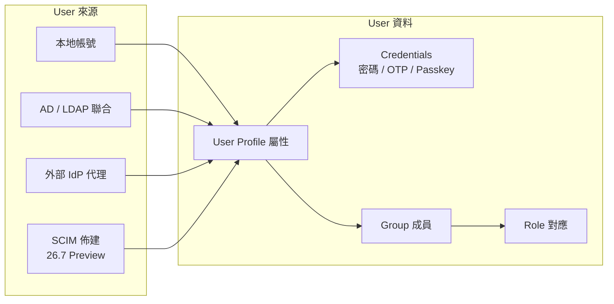
```mermaid
graph LR
    subgraph SRC["User 來源"]
        A[本地帳號]
        B[AD / LDAP 聯合]
        C[外部 IdP 代理]
        S[SCIM 佈建<br/>26.7 Preview]
    end

    subgraph ATTR["User 資料"]
        D[User Profile 屬性]
        F[Credentials<br/>密碼 / OTP / Passkey]
        G[Group 成員]
        R[Role 對應]
    end

    A --> D
    B --> D
    C --> D
    S --> D
    D --> F
    D --> G
    G --> R
```

#### 4.4.2 建立使用者

1. **Users** → **Add user**。
2. 填寫 User Profile 定義的欄位；勾選需要的 Required user actions（例如 `Configure OTP`、`Verify Email`）。
3. 需要時可在 **Join groups** 直接加入群組。
4. **Credentials** → **Set password**（勾選 Temporary，強制首次登入更改）。
5. 角色建議透過 Group 繼承，而非直接在使用者上指派。

#### 4.4.3 Group 階層設計

```text
Groups
├── 總行
│   ├── 資訊處
│   │   ├── 系統開發科
│   │   └── 資安科
│   └── 風險管理處
├── 台北分行
│   ├── 營業部        ← 自動繼承「台北分行」的角色與屬性
│   └── 作業部
└── 高雄分行
    └── 營業部

優點：
├── 批次指派角色
├── 子群組繼承父群組的角色
├── 對應組織架構（可由 AD group-ldap-mapper 同步）
└── 可在 Token 中以 Group Membership mapper 帶出群組路徑
```

---

### 4.5 Realm Role vs Client Role 使用時機

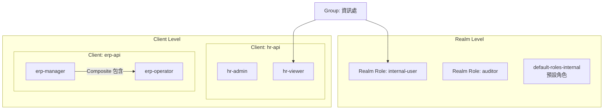
```mermaid
graph TB
    subgraph RL["Realm Level"]
        RR1[Realm Role: internal-user]
        RR2[Realm Role: auditor]
        DR[default-roles-internal<br/>預設角色]
    end

    subgraph CL["Client Level"]
        subgraph HR["Client: hr-api"]
            CR1[hr-admin]
            CR2[hr-viewer]
        end
        subgraph ERP["Client: erp-api"]
            CR3[erp-manager]
            CR4[erp-operator]
        end
    end

    G[Group: 資訊處] --> RR1
    G --> CR2
    CR3 -->|Composite 包含| CR4
```

#### 4.5.1 使用時機比較

| 項目 | Realm Role | Client Role |
| --- | --- | --- |
| **範圍** | 整個 Realm | 特定 Client（通常是 API Client） |
| **使用時機** | 跨系統通用身分 | 單一系統的功能權限 |
| **範例** | `internal-user`、`auditor` | `hr-admin`、`erp-operator` |
| **Token 位置** | `realm_access.roles` | `resource_access.{client-id}.roles` |
| **命名衝突** | 需全 Realm 唯一 | 僅需 Client 內唯一 |

#### 4.5.2 Composite Role 與預設角色

- **Composite Role**：一個角色包含其他角色（例如 `erp-manager` 包含 `erp-operator`），可簡化指派，但巢狀層級建議不超過 2 層，以免稽核困難。
- **Default roles**：每個 Realm 有 `default-roles-{realm}`，新使用者自動取得；應只保留最小權限（預設含 `offline_access`、`uma_authorization`，若不使用可移除）。

#### 4.5.3 最佳實務

```text
建議架構：
├── Realm Role：定義「身分類別」
│   ├── internal-user（內部員工）
│   ├── external-user（外部使用者）
│   └── auditor（稽核人員，唯讀）
│
└── Client Role（定義在 API Client 上）：定義「系統權限」
    ├── hr-api
    │   ├── hr-admin
    │   └── hr-viewer
    └── erp-api
        ├── erp-full-access
        └── erp-read-only
```

---

### 4.6 Client Scopes 與 Protocol Mapper

> 🆕 **v2.0 新增**

Client Scope 決定 **Token 內會出現哪些 Claims、哪些角色，以及 `aud` 對象**，是控制 Token 大小與最小權限的關鍵。

#### 4.6.1 Default 與 Optional Scope

| 類型 | 行為 | 範例 |
| --- | --- | --- |
| **Default** | 每次發 Token 都自動套用 | `profile`、`email`、`roles`、`web-origins`、`acr`、`basic` |
| **Optional** | 只有在授權請求 `scope` 參數中要求時才套用 | `offline_access`、`phone`、`address`、`organization` |

#### 4.6.2 常用 Protocol Mapper

| Mapper 類型 | 用途 | 範例 |
| --- | --- | --- |
| **Audience** | 將指定 Client 加入 `aud` | 讓 `erp-web` 取得的 Token 含 `aud: erp-api` |
| **User Attribute** | 使用者屬性轉為 Claim | `employee_id`、`department` |
| **Group Membership** | 群組路徑轉為 Claim | `groups: ["/台北分行/營業部"]` |
| **User Realm／Client Role** | 角色轉為 Claim | 自訂 Claim 名稱 |
| **Hardcoded claim** | 固定值 | `tenant: bank-a` |
| **User Session Note** | Session 資訊 | 登入 IP、認證方式 |

設定時可分別選擇是否加入 **ID Token／Access Token／UserInfo／Token introspection／Lightweight access token**。

#### 4.6.3 Audience 設計（重要）

```text
問題：Keycloak 預設 Access Token 的 aud 常為 "account"，
      API 若檢查 aud，會拒絕前端取得的 Token；若不檢查，
      任何 Client 取得的 Token 都能打任何 API（Token 混用風險）。

建議做法：
1. 為每個 API 建立 Client（例如 erp-api），作為 Audience 與 Client Role 容器
2. 建立 Client Scope「erp-api-audience」，加入 Audience mapper（Included Client Audience = erp-api）
3. 將此 Scope 設為需要呼叫 erp-api 的 Client（例如 erp-web）的 Default Scope
4. API 端驗證 aud 包含 erp-api
```

> ⚠️ **實務注意**：26.6.2 起，**Token Introspection 會檢查呼叫 Introspection 的 Client 是否在 Token 的 `aud` 中**，不在時回傳 `{"active": false}`。未正確設計 Audience 的系統升級後會出現「Token 突然無效」的問題（可暫時以已棄用的 `allow-introspection-without-audience` 選項回復舊行為）。

#### 4.6.4 Full Scope Allowed 與 Token 瘦身

| 設定 | 位置 | 建議 |
| --- | --- | --- |
| Full scope allowed | Client → Client scopes → `<client>-dedicated` → Scope | **Off**：只帶入明確設定的角色，避免 Token 夾帶使用者全部角色 |
| Role scope mappings | 同上 | 只加入此 Client 需要的 Realm／Client Role |
| Lightweight access token | Client → Advanced | 需要極小 Token 時啟用，其餘資訊改由 Introspection 取得 |
| `basic` scope | 預設 | 提供 `sub`、`auth_time` 等基本 Claim |

---

### 4.7 宣告式 User Profile

> 🆕 **v2.0 新增**（Declarative User Profile 自 24.0 起預設啟用）

**Realm settings → User profile** 以宣告方式定義使用者屬性，取代過去隨意新增屬性的做法：

| 功能 | 說明 |
| --- | --- |
| 屬性定義 | 名稱、顯示名稱、是否必填、群組（Attribute groups） |
| 驗證器（Validators） | `length`、`email`、`pattern`、`options`、`person-name-prohibited-characters`、`uri` 等 |
| 權限 | 誰可檢視／編輯：`admin`、`user` |
| 情境 | 可限定只在特定 Scope 或管理介面出現 |
| Unmanaged attributes | 未定義屬性的處理：Disabled／Enabled／Admin can view／Admin can edit |

```json
{
  "name": "employee_id",
  "displayName": "${employeeId}",
  "validations": {
    "pattern": { "pattern": "^[A-Z][0-9]{6}$", "error-message": "員工編號格式錯誤" }
  },
  "permissions": { "view": ["admin", "user"], "edit": ["admin"] },
  "required": { "roles": ["user"] }
}
```

> ⚠️ **實務注意**：26.6.3 起使用者搜尋結果不再回傳 User Profile metadata，只有以 ID 取得單一使用者時才會回傳；依賴舊行為的管理工具需調整。

---

### 4.8 Authentication Flow 與 Required Actions

> 🆕 **v2.0 新增**

#### 4.8.1 內建 Flow

| Flow | 用途 | 綁定位置 |
| --- | --- | --- |
| `browser` | 瀏覽器登入 | Realm → Authentication → Bind flow |
| `direct grant` | Direct Access Grants（不建議使用） | 同上 |
| `registration` | 自助註冊 | 同上 |
| `reset credentials` | 忘記密碼 | 同上 |
| `clients` | Client 驗證 | 同上 |
| `first broker login` | 外部 IdP 首次登入 | Identity Provider |
| `docker auth` | Docker Registry 驗證 | 同上 |

每個 Client 可在 **Advanced → Authentication flow overrides** 使用不同 Flow（例如高權限後台使用更嚴格的 Flow）。

#### 4.8.2 自訂 Browser Flow 範例（帳密 + 強制 OTP／Passkey）

```text
browser-mfa（複製自 browser 後修改）
├── Cookie                                   ALTERNATIVE
├── Identity Provider Redirector             ALTERNATIVE
└── forms                                    ALTERNATIVE
    ├── Username Password Form               REQUIRED
    └── 2FA（Sub-flow）                       REQUIRED
        ├── OTP Form                         ALTERNATIVE
        └── WebAuthn Authenticator           ALTERNATIVE
```

> ⚠️ **v2.0 更正**：v1.0 以「Conditional OTP + Condition: User Configured」作為**強制** MFA 的方法並不正確。`Condition - User Configured` 的意思是「使用者**已設定** OTP 才要求」，沒設定的使用者會直接略過。要強制所有人使用 MFA，應將 2FA Sub-flow 設為 **REQUIRED**，並在 Required actions 中把 `Configure OTP`（或 `Webauthn Register`）設為 **Default action**，讓尚未設定的使用者登入時必須完成註冊。

#### 4.8.3 Required Actions

| Required Action | 說明 |
| --- | --- |
| Verify Email | 驗證 Email |
| Update Password | 首次登入或管理員要求時更新密碼 |
| Configure OTP | 註冊 OTP |
| Webauthn Register／Webauthn Register Passwordless | 註冊 WebAuthn／Passkey |
| Recovery Authentication Codes | 產生備援碼（26.4 起可強制在 OTP 設定後產生） |
| Update Profile | 補齊 User Profile 必填欄位 |
| Terms and Conditions | 同意條款 |
| Update Email | 變更 Email（26.4 起為支援功能） |
| Delete Credential | 使用者刪除憑證 |

> ⚠️ **實務注意**：26.7 起新建立的 Realm 會將 **Configure OTP 與 Update Password 排在 Verify Email 之後**；升級的既有 Realm 維持原順序，可手動調整。

---

### 4.9 Fine-Grained Admin Permissions V2

> 🆕 **v2.0 新增**

大型企業常需要「分行 IT 只能管理自己分行的使用者」等委派管理。Keycloak 的 **Fine-Grained Admin Permissions（FGAP）V2** 以 Realm 為單位啟用：

1. **Realm settings → General → Admin Permissions** 開啟。
2. 左側選單出現 **Permissions**，可針對 **Users、Groups、Clients、Roles** 等資源類型建立權限。
3. 每個權限由 **Resource type + Scopes（view／manage／map-roles／impersonate 等）+ Policies（User、Group、Role、Client 等）** 組成。

| 需求 | 權限設計 |
| --- | --- |
| 分行 IT 只能管理本分行使用者 | Resource type: Groups，Resource: `台北分行`，Scope: `manage-members`、`view-members`；Policy: Group policy = `台北分行-IT` |
| 客服只能重設密碼、不能指派角色 | Users 的 `manage` 但不給 `map-roles` |
| 只能管理自己的 Client | Clients 資源限定特定 Client，Scope: `manage` |
| 管理成員群組歸屬（26.6） | Groups scope `manage-membership-of-members` |

> ⚠️ **實務注意**：V1（以 Authorization Services 實作的舊版 FGAP）與 V2 不相容，新設計請直接採用 V2。另外 26.7 移除了 `view-system` 管理角色，完整伺服器資訊只開放給 `master` Realm 中具 `manage-realm` 的使用者。

---

### 4.10 💡 本章實務建議

1. **新 Realm 上線前完成必設項目**：Require SSL、Unmanaged attributes Disabled、Brute force、Events、密碼與 MFA 政策。
2. **Client 最小化能力**：只開啟需要的 Flow；API Client 不啟用任何 Flow；正式 Realm 不放 localhost Redirect URI。
3. **優先使用 `private_key_jwt`、mTLS 或 Federated client authentication**，減少共享 Secret。
4. **Audience 一定要設計**：每個 API 一個 Audience，API 端驗證 `aud`；26.6.2 後 Introspection 也依賴它。
5. **關閉 Full scope allowed**，以 Role scope mappings 控制 Token 內容與大小。
6. **強制 MFA 用 REQUIRED Sub-flow + Default required action**，不要用 `Condition - User Configured`。
7. **委派管理使用 FGAP V2**，並定期稽核管理權限。

---

## 第五章：應用系統如何串接 Keycloak

### 5.1 Web 前端串接（OIDC）

#### 5.1.1 使用 keycloak-js 官方套件

keycloak-js 自 26.2.0 起移至獨立儲存庫 `keycloak/keycloak-js`，**與伺服器分開發版**，並維持與所有仍受支援的伺服器版本相容（截至 2026-09 為 26.2.x）。

```bash
npm install keycloak-js
```

#### 5.1.2 初始化設定

```javascript
// src/auth/keycloak.js
import Keycloak from 'keycloak-js';

const keycloak = new Keycloak({
  url: 'https://auth.example.com',
  realm: 'internal',
  clientId: 'erp-web'
});

export default keycloak;
```

| `init()` 選項 | 說明 | 建議 |
| --- | --- | --- |
| `onLoad` | `login-required`（未登入即導向登入）或 `check-sso`（僅檢查） | 內部系統 `login-required`；有公開頁面時 `check-sso` |
| `pkceMethod` | PKCE 方法，**預設 `S256`** | 維持預設，不要設為 `false` |
| `responseMode` | `fragment`（預設）或 `query` | 預設即可 |
| `checkLoginIframe` | 以 iframe 監控 SSO Session 狀態，預設 `true` | 瀏覽器封鎖第三方 Cookie 時會自動停用；建議明確設為 `false` 並改用 Back-channel Logout 或 Token 到期檢查 |
| `silentCheckSsoRedirectUri` | 以隱藏 iframe 靜默檢查 SSO | 受第三方 Cookie 限制影響，跨網域時可能失效 |
| `scope` | 額外請求的 scope | 例如 `openid organization` |

> ⚠️ **實務注意**：主流瀏覽器持續限制第三方 Cookie，**Session Status iframe（`checkLoginIframe`）與 silent check-sso 在 Keycloak 與應用不同網域時可能失效**。解決方式：讓 Keycloak 與應用使用同一個註冊網域（例如 `auth.example.com` 與 `app.example.com`），或改採 [BFF 模式](#26-bff-模式backend-for-frontend)。

#### 5.1.3 Vue 3 整合範例

```javascript
// src/main.js
import { createApp } from 'vue';
import App from './App.vue';
import keycloak from './auth/keycloak';

// Access Token 到期時自動換發（取代 v1.0 的 setInterval 輪詢）
keycloak.onTokenExpired = () => {
  keycloak.updateToken(30).catch(() => keycloak.login());
};

keycloak
  .init({ onLoad: 'login-required', pkceMethod: 'S256', checkLoginIframe: false })
  .then((authenticated) => {
    if (!authenticated) {
      return keycloak.login();
    }
    const app = createApp(App);
    app.provide('keycloak', keycloak);
    app.mount('#app');
  })
  .catch((error) => {
    console.error('Keycloak 初始化失敗', error);
  });
```

> ⚠️ **v2.0 更正**：v1.0 以 `setInterval` 每 30 秒呼叫 `updateToken`，在分頁背景化時可能失準，也會產生不必要的計時器。建議使用 `onTokenExpired` 事件，並在每次呼叫 API 前以 `updateToken(minValidity)` 確保 Token 有效（見 5.1.5）。

#### 5.1.4 React 整合範例

```jsx
// src/AuthProvider.jsx
import { createContext, useContext, useEffect, useRef, useState } from 'react';
import keycloak from './auth/keycloak';

const AuthContext = createContext(null);

export function AuthProvider({ children }) {
  const [ready, setReady] = useState(false);
  const initialized = useRef(false);   // 避免 React StrictMode 重複 init

  useEffect(() => {
    if (initialized.current) return;
    initialized.current = true;

    keycloak.onTokenExpired = () => {
      keycloak.updateToken(30).catch(() => keycloak.login());
    };

    keycloak
      .init({ onLoad: 'login-required', pkceMethod: 'S256', checkLoginIframe: false })
      .then(() => setReady(true))
      .catch((e) => console.error('Keycloak 初始化失敗', e));
  }, []);

  if (!ready) return <div>Loading...</div>;
  return <AuthContext.Provider value={keycloak}>{children}</AuthContext.Provider>;
}

export const useAuth = () => useContext(AuthContext);
```

```jsx
// src/App.jsx
import { useAuth } from './AuthProvider';

export default function App() {
  const keycloak = useAuth();
  return (
    <div>
      <h1>Welcome, {keycloak.tokenParsed?.preferred_username}</h1>
      <button onClick={() => keycloak.logout({ redirectUri: window.location.origin })}>
        Logout
      </button>
    </div>
  );
}
```

#### 5.1.5 API 呼叫時帶入 Token

```javascript
// src/api/client.js
import keycloak from '../auth/keycloak';

export async function apiFetch(path, options = {}) {
  // 若 Token 剩餘有效時間 < 30 秒則先換發
  await keycloak.updateToken(30);

  const response = await fetch(`https://api.example.com${path}`, {
    ...options,
    headers: {
      ...options.headers,
      Authorization: `Bearer ${keycloak.token}`,
      'Content-Type': 'application/json'
    }
  });

  if (response.status === 401) {
    await keycloak.login();          // Token 無效或 Session 已結束
    return;
  }
  if (response.status === 403) {
    throw new Error('權限不足');       // 不要因 403 重新登入
  }
  return response.json();
}
```

---

### 5.2 Backend API 驗證 Token 機制

#### 5.2.1 Token 驗證流程

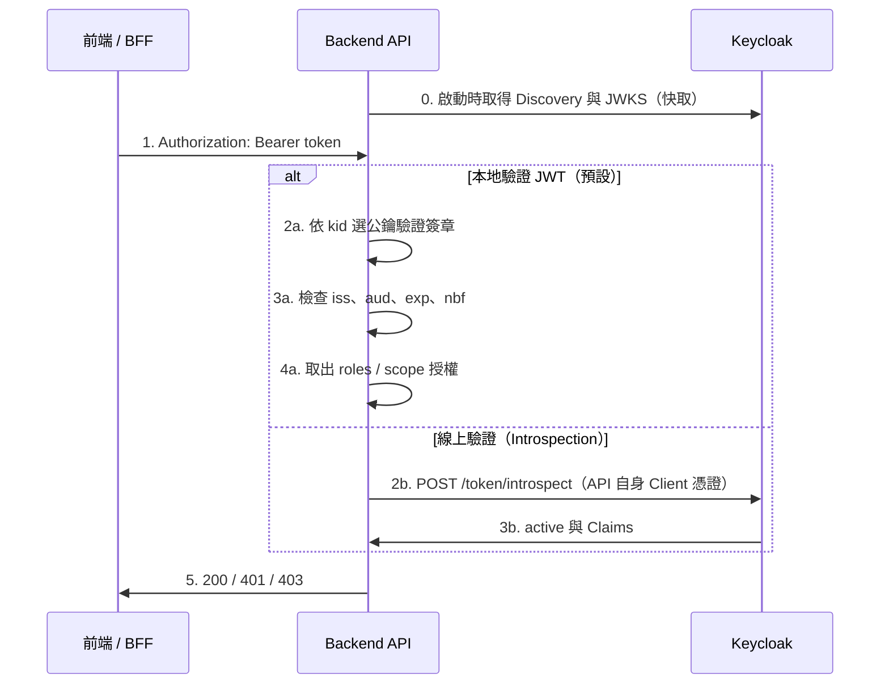
```mermaid
sequenceDiagram
    participant FE as 前端 / BFF
    participant API as Backend API
    participant KC as Keycloak

    API->>KC: 0. 啟動時取得 Discovery 與 JWKS（快取）
    FE->>API: 1. Authorization: Bearer token

    alt 本地驗證 JWT（預設）
        API->>API: 2a. 依 kid 選公鑰驗證簽章
        API->>API: 3a. 檢查 iss、aud、exp、nbf
        API->>API: 4a. 取出 roles / scope 授權
    else 線上驗證（Introspection）
        API->>KC: 2b. POST /token/introspect（API 自身 Client 憑證）
        KC->>API: 3b. active 與 Claims
    end

    API->>FE: 5. 200 / 401 / 403
```

#### 5.2.2 驗證方式比較

| 方式 | 優點 | 缺點 | 適用場景 |
| --- | --- | --- | --- |
| **本地驗證 JWT** | 效能好、Keycloak 不成瓶頸 | 撤銷需等 Token 過期（因此 Access Token 要短） | 大多數 API |
| **Token Introspection**（RFC 7662） | 可即時反映登出、停用 | 每次請求呼叫 Keycloak；需快取與容量規劃 | 轉帳、權限變更等高風險 API |
| **混合** | 一般請求本地驗證，高風險操作再 Introspection | 實作較複雜 | 金融業建議 |

> ⚠️ **實務注意**：26.6.2 起 Introspection 會檢查呼叫端 Client 是否在 Token 的 `aud` 內（見 [4.6.3](#463-audience-設計重要)）。

#### 5.2.3 JWKS 快取與金鑰輪替

- 以 `kid` 選擇公鑰；遇到未知 `kid` 時重新下載 JWKS（加上頻率限制，避免被濫用觸發大量請求）。
- Keycloak 金鑰輪替做法：新增更高優先權的金鑰 Provider → 新 Token 以新鑰簽署 → 舊鑰設為 **Passive**（仍可驗證）→ 所有舊 Token 過期後停用／刪除舊鑰。
- 不要把公鑰寫死在設定檔中。

---

### 5.3 Spring Boot 整合

> ⚠️ **v2.0 更正**：本節改以 **Spring Boot 4.1／Spring Security 7** 為準。Spring Boot 4 將 Starter 更名為 `spring-boot-starter-security-oauth2-resource-server`（舊名已棄用）。Spring Boot 3.x 專案可沿用舊 Starter 名稱，其餘程式碼幾乎相同。

#### 5.3.1 依賴設定（Maven）

```xml
<!-- pom.xml -->
<parent>
    <groupId>org.springframework.boot</groupId>
    <artifactId>spring-boot-starter-parent</artifactId>
    <version>4.1.1</version>
</parent>

<dependencies>
    <!-- OAuth2 Resource Server（Spring Boot 4 新名稱） -->
    <dependency>
        <groupId>org.springframework.boot</groupId>
        <artifactId>spring-boot-starter-security-oauth2-resource-server</artifactId>
    </dependency>

    <dependency>
        <groupId>org.springframework.boot</groupId>
        <artifactId>spring-boot-starter-webmvc</artifactId>
    </dependency>
</dependencies>
```

#### 5.3.2 應用程式設定

```yaml
# application.yml
spring:
  security:
    oauth2:
      resourceserver:
        jwt:
          # 由 issuer-uri 自動探索 JWKS，並驗證 iss
          issuer-uri: https://auth.example.com/realms/internal
          # 驗證 aud 必須包含本服務
          audiences:
            - erp-api
          jws-algorithms:
            - RS256

logging:
  level:
    org.springframework.security: INFO   # 排查時才暫時調為 DEBUG
```

> 💡 **建議**：`issuer-uri` 會在啟動時連線 Keycloak 取得 Discovery。若希望 Keycloak 暫時無法連線時服務仍能啟動，可同時設定 `jwk-set-uri`，Spring Security 會延遲到第一次請求時才下載 JWKS（仍會驗證 `iss`）。

#### 5.3.3 Security 設定類別

```java
// SecurityConfig.java
package com.example.config;

import org.springframework.context.annotation.Bean;
import org.springframework.context.annotation.Configuration;
import org.springframework.security.config.annotation.method.configuration.EnableMethodSecurity;
import org.springframework.security.config.annotation.web.builders.HttpSecurity;
import org.springframework.security.config.annotation.web.configurers.AbstractHttpConfigurer;
import org.springframework.security.config.http.SessionCreationPolicy;
import org.springframework.security.oauth2.server.resource.authentication.JwtAuthenticationConverter;
import org.springframework.security.web.SecurityFilterChain;

@Configuration
@EnableMethodSecurity
public class SecurityConfig {

    @Bean
    SecurityFilterChain filterChain(HttpSecurity http) throws Exception {
        http
            // 純 Bearer Token API 不使用 Cookie，可停用 CSRF；BFF 則不可停用
            .csrf(AbstractHttpConfigurer::disable)
            .sessionManagement(s -> s.sessionCreationPolicy(SessionCreationPolicy.STATELESS))
            .authorizeHttpRequests(auth -> auth
                .requestMatchers("/api/public/**").permitAll()
                .requestMatchers("/api/admin/**").hasRole("erp-manager")
                .requestMatchers("/api/**").authenticated()
                .anyRequest().denyAll()          // 預設拒絕
            )
            .oauth2ResourceServer(oauth2 -> oauth2
                .jwt(jwt -> jwt.jwtAuthenticationConverter(jwtAuthenticationConverter()))
            );
        return http.build();
    }

    @Bean
    JwtAuthenticationConverter jwtAuthenticationConverter() {
        JwtAuthenticationConverter converter = new JwtAuthenticationConverter();
        converter.setJwtGrantedAuthoritiesConverter(new KeycloakRoleConverter("erp-api"));
        converter.setPrincipalClaimName("preferred_username");
        return converter;
    }
}
```

> ⚠️ **v2.0 更正**：v1.0 使用 `.anyRequest().permitAll()`，未列出的路徑會被公開。企業標準應 **預設拒絕（deny by default）**。

#### 5.3.4 Keycloak 角色轉換器

```java
// KeycloakRoleConverter.java
package com.example.config;

import java.util.ArrayList;
import java.util.Collection;
import java.util.List;
import java.util.Map;

import org.springframework.core.convert.converter.Converter;
import org.springframework.security.core.GrantedAuthority;
import org.springframework.security.core.authority.SimpleGrantedAuthority;
import org.springframework.security.oauth2.jwt.Jwt;

/**
 * 將 Keycloak 的 realm_access.roles 與 resource_access.{clientId}.roles
 * 轉為 Spring Security 的 ROLE_ 權限；scope 轉為 SCOPE_ 權限。
 */
public class KeycloakRoleConverter implements Converter<Jwt, Collection<GrantedAuthority>> {

    private final String resourceClientId;

    public KeycloakRoleConverter(String resourceClientId) {
        this.resourceClientId = resourceClientId;
    }

    @Override
    public Collection<GrantedAuthority> convert(Jwt jwt) {
        List<GrantedAuthority> authorities = new ArrayList<>();

        // Realm Roles
        Map<String, Object> realmAccess = jwt.getClaimAsMap("realm_access");
        addRoles(authorities, realmAccess);

        // Client Roles（只取本 API 的角色，避免其他系統角色混入）
        Map<String, Object> resourceAccess = jwt.getClaimAsMap("resource_access");
        if (resourceAccess != null && resourceAccess.get(resourceClientId) instanceof Map<?, ?> client) {
            addRoles(authorities, client);
        }

        // Scopes
        String scope = jwt.getClaimAsString("scope");
        if (scope != null) {
            for (String s : scope.split(" ")) {
                authorities.add(new SimpleGrantedAuthority("SCOPE_" + s));
            }
        }
        return authorities;
    }

    private static void addRoles(List<GrantedAuthority> authorities, Map<?, ?> access) {
        if (access != null && access.get("roles") instanceof Collection<?> roles) {
            for (Object role : roles) {
                authorities.add(new SimpleGrantedAuthority("ROLE_" + role));
            }
        }
    }
}
```

#### 5.3.5 Controller 範例

```java
// ApiController.java
package com.example.controller;

import java.util.Map;

import org.springframework.security.access.prepost.PreAuthorize;
import org.springframework.security.core.annotation.AuthenticationPrincipal;
import org.springframework.security.oauth2.jwt.Jwt;
import org.springframework.web.bind.annotation.GetMapping;
import org.springframework.web.bind.annotation.RequestMapping;
import org.springframework.web.bind.annotation.RestController;

@RestController
@RequestMapping("/api")
public class ApiController {

    @GetMapping("/public/health")
    public String health() {
        return "OK";
    }

    @GetMapping("/user/profile")
    public Map<String, Object> profile(@AuthenticationPrincipal Jwt jwt) {
        return Map.of(
            "sub", jwt.getSubject(),
            "username", jwt.getClaimAsString("preferred_username"),
            "email", String.valueOf(jwt.getClaimAsString("email"))
        );
    }

    @GetMapping("/admin/users")
    @PreAuthorize("hasRole('erp-manager')")
    public String adminOnly() {
        return "Admin content";
    }

    @GetMapping("/reports")
    @PreAuthorize("hasAnyRole('erp-manager', 'auditor') and hasAuthority('SCOPE_profile')")
    public String reports() {
        return "Report data";
    }
}
```

#### 5.3.6 呼叫下游服務（Client Credentials）

```yaml
# application.yml（呼叫端服務）
spring:
  security:
    oauth2:
      client:
        registration:
          keycloak-batch:
            provider: keycloak
            client-id: batch-settlement
            client-secret: ${BATCH_CLIENT_SECRET}
            authorization-grant-type: client_credentials
        provider:
          keycloak:
            issuer-uri: https://auth.example.com/realms/internal
```

搭配 Spring Framework 7 的 `RestClient` 與 `OAuth2ClientHttpRequestInterceptor`，即可自動取得並快取 Client Credentials Token。

---

### 5.4 Node.js 整合

> 🆕 **v2.0 新增**

```javascript
// auth.js — Express Resource Server，使用 jose 驗證 JWT
import { createRemoteJWKSet, jwtVerify } from 'jose';

const ISSUER = 'https://auth.example.com/realms/internal';
const JWKS = createRemoteJWKSet(new URL(`${ISSUER}/protocol/openid-connect/certs`));

export function requireAuth(requiredRole) {
  return async (req, res, next) => {
    const header = req.headers.authorization ?? '';
    const [scheme, token] = header.split(' ');
    if (scheme !== 'Bearer' || !token) {
      return res.status(401).json({ error: 'missing_token' });
    }
    try {
      const { payload } = await jwtVerify(token, JWKS, {
        issuer: ISSUER,
        audience: 'erp-api',
        algorithms: ['RS256'],
        clockTolerance: 30
      });
      const roles = payload.resource_access?.['erp-api']?.roles ?? [];
      if (requiredRole && !roles.includes(requiredRole)) {
        return res.status(403).json({ error: 'insufficient_role' });
      }
      req.user = payload;
      return next();
    } catch {
      return res.status(401).json({ error: 'invalid_token' });
    }
  };
}
```

```javascript
// app.js
import express from 'express';
import { requireAuth } from './auth.js';

const app = express();
app.get('/api/orders', requireAuth('erp-operator'), (req, res) => {
  res.json({ user: req.user.preferred_username, orders: [] });
});
app.listen(3000);
```

---

### 5.5 常見錯誤與除錯方式

#### 5.5.1 常見錯誤對照表

| 錯誤訊息／現象 | 可能原因 | 解決方式 |
| --- | --- | --- |
| `Invalid token issuer` | API 的 issuer 與 Token `iss` 不同（常見於 hostname 設定錯誤、內外網網址不同） | 設定 `KC_HOSTNAME` 為完整對外 URL；用 `hostname-debug` 確認 |
| `The aud claim is not valid` | Token 未包含本 API 的 Audience | 設定 Audience mapper（見 [4.6.3](#463-audience-設計重要)） |
| `Jwt expired at ...` | Token 過期或伺服器時鐘不同步 | 前端 `updateToken`；所有主機啟用 NTP |
| `Invalid signature`／`No matching key` | 金鑰輪替後 JWKS 未更新、指向錯誤 Realm | 檢查 `jwk-set-uri`；確保 JWKS 可依 `kid` 重新下載 |
| CORS error | Web origins 未包含前端來源 | 加入精確來源（含 port）或使用 `+` |
| `Invalid parameter: redirect_uri` | Redirect URI 不符（含 26.6.3 萬用字元規則、26.7.3 參數規則） | 修正 Client 的 Valid redirect URIs |
| `invalid_grant: Code not valid` | 授權碼已使用、逾時或被重放 | 檢查前端是否重複呼叫 Token 端點 |
| `invalid_grant: PKCE verification failed` | `code_verifier` 與 challenge 不符 | 確認 verifier 在重導向期間有正確保存 |
| `invalid_grant: Session not active` | SSO Session 已過期或被登出 | 重新登入 |
| `unauthorized_client` | Client 未啟用對應 Grant | 檢查 Capability config |
| Introspection 回 `{"active": false}` | 26.6.2 起呼叫端 Client 不在 `aud` | 設計 Audience；或暫時啟用 `allow-introspection-without-audience` |
| `401` | 未帶 Token、格式錯誤、Token 無效 | 檢查 `Authorization: Bearer` |
| `403` | Token 有效但角色／scope 不足 | 檢查角色對應與 Role scope mappings |
| 登入頁出現 `HTTPS required` | Realm Require SSL 為 external／all，但以 HTTP 存取 | 經 HTTPS 存取或檢查 Proxy 標頭設定 |

#### 5.5.2 除錯技巧

```bash
# 1. 檢查 Discovery（確認 issuer 與端點網址正確）
curl -s https://auth.example.com/realms/internal/.well-known/openid-configuration | jq '.issuer, .token_endpoint'

# 2. 以 Client Credentials 取得測試 Token（取代 v1.0 的 password grant）
TOKEN=$(curl -s -X POST https://auth.example.com/realms/internal/protocol/openid-connect/token \
  -d grant_type=client_credentials \
  -d client_id=batch-settlement \
  -d client_secret="$CLIENT_SECRET" | jq -r .access_token)

# 3. 在本機解碼 Token 內容（勿將正式環境 Token 貼到第三方網站）
echo "$TOKEN" | cut -d. -f2 | tr '_-' '/+' | base64 -d 2>/dev/null | jq .

# 4. Introspection（以 API 自身的 Confidential Client 呼叫）
curl -s -X POST https://auth.example.com/realms/internal/protocol/openid-connect/token/introspect \
  -u "erp-api:$ERP_API_SECRET" \
  -d "token=$TOKEN" | jq .

# 5. 檢查 hostname 設定（需以 --hostname-debug=true 啟動）
#    瀏覽器開啟 https://auth.example.com/realms/internal/hostname-debug
```

> ⚠️ **v2.0 更正**：v1.0 建議使用 jwt.io 解碼 Token。正式環境 Token 可能含個資，應在本機解碼，避免貼到外部網站。

---

### 5.6 細粒度授權（Authorization Services）

> 🆕 **v2.0 新增**

Keycloak Authorization Services 讓授權規則集中管理（Policy Decision Point 在 Keycloak），適用於「規則頻繁變動、需要稽核授權決策」的情境。

| 元素 | 說明 | 範例 |
| --- | --- | --- |
| **Resource** | 受保護資源，可用 URI 樣板 | `/accounts/{id}` |
| **Scope** | 對資源的動作 | `view`、`transfer` |
| **Policy** | 判斷條件 | Role、Group、User、Client、Time、Aggregated、Regex、JavaScript（需部署） |
| **Permission** | 資源／Scope 與 Policy 的組合 | 「分行主管」可 `approve` 大額轉帳 |
| **Decision Strategy** | 多個 Policy 的合併方式 | Unanimous、Affirmative、Consensus |

```bash
# 以 UMA / Permission Ticket 取得 RPT，或直接要求決策結果
curl -s -X POST https://auth.example.com/realms/internal/protocol/openid-connect/token \
  -H "Authorization: Bearer $ACCESS_TOKEN" \
  -d grant_type=urn:ietf:params:oauth:grant-type:uma-ticket \
  -d audience=erp-api \
  -d permission="Transfer Resource#transfer" \
  -d response_mode=decision
```

| 選擇 | 在應用程式內授權（Spring `@PreAuthorize`） | Keycloak Authorization Services |
| --- | --- | --- |
| 規則位置 | 程式碼 | Keycloak 集中管理 |
| 資料層級規則（只能看自己的資料） | ✅ 最適合 | 需將資料屬性帶入評估內容 |
| 變更規則 | 需重新部署 | Admin Console 即時生效 |
| 效能 | 最佳 | 需呼叫 Keycloak 或快取 |

> ⚠️ **實務注意**：26.7.0／26.7.4 起，Resource URI 樣板驗證更嚴格，且比對時會正規化 matrix 參數、`..`、百分比編碼與結尾斜線；26.7.3 起以 `kc.` 開頭的 Claim 保留給伺服器使用。升級前請以 `GET /admin/realms/{realm}/clients/{id}/authz/resource-server/resource` 檢查既有資源。

---

### 5.7 Admin REST API 與 kcadm.sh

> 🆕 **v2.0 新增**

#### 5.7.1 以 Service Account 呼叫 Admin REST API

```bash
# 建議：在目標 Realm 建立專用 Confidential Client（Service accounts roles: On），
#       並只指派 realm-management 中所需的最小角色（例如 view-users、manage-users）
ADMIN_TOKEN=$(curl -s -X POST https://auth.example.com/realms/internal/protocol/openid-connect/token \
  -d grant_type=client_credentials \
  -d client_id=iam-automation \
  -d client_secret="$IAM_AUTOMATION_SECRET" | jq -r .access_token)

# 查詢使用者
curl -s -G https://auth.example.com/admin/realms/internal/users \
  -H "Authorization: Bearer $ADMIN_TOKEN" \
  --data-urlencode "search=john" \
  --data-urlencode "max=20" | jq '.[].username'
```

> ⚠️ **實務注意**：26.7.1 起 Admin API 只認「直接指派」給該帳號（或 Service Account）的管理角色。

#### 5.7.2 kcadm.sh（Admin CLI）

```bash
# 登入（Service Account 方式）
bin/kcadm.sh config credentials --server https://auth.example.com \
  --realm internal --client iam-automation --secret "$IAM_AUTOMATION_SECRET"

# 建立 Client
bin/kcadm.sh create clients -r internal -s clientId=report-web -s publicClient=true \
  -s 'redirectUris=["https://report.example.com/*"]'

# 查詢 Realm 設定
bin/kcadm.sh get realms/internal --fields accessTokenLifespan,ssoSessionIdleTimeout
```

#### 5.7.3 Java Admin Client

```xml
<dependency>
    <groupId>org.keycloak</groupId>
    <artifactId>keycloak-admin-client</artifactId>
    <version>26.0.12</version>
</dependency>
```

Admin Client（Keycloak Client Libraries）與伺服器分開發版；`keycloak-admin-client-jakarta` 已不再發佈，統一使用 `keycloak-admin-client`。

---

### 5.8 💡 本章實務建議

1. **前端使用 `onTokenExpired` + 呼叫前 `updateToken`**，不要以 `setInterval` 輪詢。
2. **API 必驗 `iss`、`aud`、`exp` 與簽章**，預設拒絕未列出的路徑。
3. **Spring Boot 4 專案改用新 Starter 名稱**，並以 `audiences` 屬性驗證 Audience。
4. **除錯改用 Client Credentials 與本機解碼**，不使用 password grant、不把正式 Token 貼到外部網站。
5. **資料層級授權放在應用程式**，跨系統共用且需集中稽核的規則才用 Authorization Services。
6. **自動化使用專用 Service Account + 最小管理角色**，不要使用 `master` Realm 的管理員帳密。

---

## 第六章：系統使用情境說明

### 6.1 SSO 登入流程實例

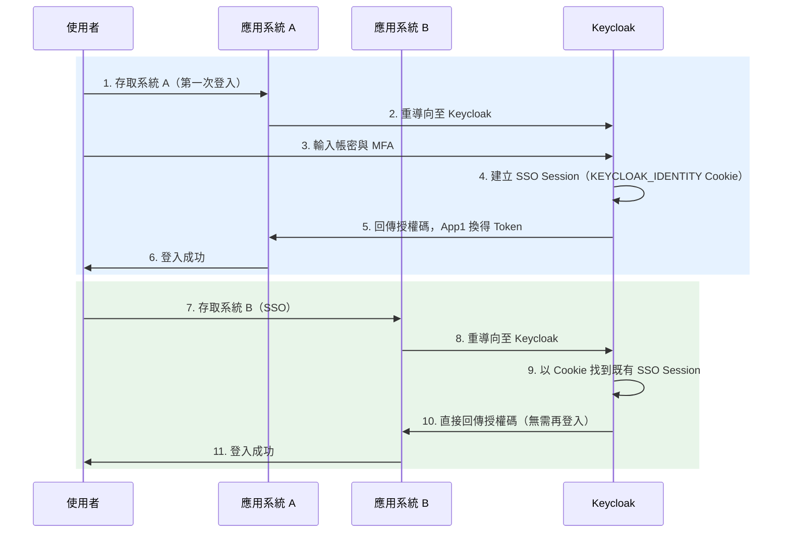
```mermaid
sequenceDiagram
    participant U as 使用者
    participant App1 as 應用系統 A
    participant App2 as 應用系統 B
    participant KC as Keycloak

    rect rgb(230, 242, 255)
    U->>App1: 1. 存取系統 A（第一次登入）
    App1->>KC: 2. 重導向至 Keycloak
    U->>KC: 3. 輸入帳密與 MFA
    KC->>KC: 4. 建立 SSO Session（KEYCLOAK_IDENTITY Cookie）
    KC->>App1: 5. 回傳授權碼，App1 換得 Token
    App1->>U: 6. 登入成功
    end

    rect rgb(232, 245, 233)
    U->>App2: 7. 存取系統 B（SSO）
    App2->>KC: 8. 重導向至 Keycloak
    KC->>KC: 9. 以 Cookie 找到既有 SSO Session
    KC->>App2: 10. 直接回傳授權碼（無需再登入）
    App2->>U: 11. 登入成功
    end
```

> 💡 **圖例**：藍色區塊為第一次登入，綠色區塊為 SSO（第二個系統免再登入）。

#### 6.1.1 SSO 實務注意事項

```text
⚠️ Keycloak SSO Session、Client Session 與 Application Session 是三件事

Keycloak SSO Session：
├── 使用者於 Keycloak 登入時建立（瀏覽器 Cookie：KEYCLOAK_IDENTITY / KEYCLOAK_SESSION）
├── 受 SSO Session Idle / Max 控制
└── 26.0 起預設為「持久化 Session」，Keycloak 重啟或升級後仍保留

Client Session：
├── 每個 Client 在 SSO Session 內的子 Session
└── 受 Client Session Idle / Max 控制（可短於 SSO Session）

Application Session：
├── 應用程式自己的 Session（BFF Cookie、前端記憶體中的 Token）
└── 需自行處理逾時，並透過 Back-channel Logout 同步登出
```

> ⚠️ **實務注意**：26.7 起 `KC_AUTH_SESSION_HASH` 與 `KEYCLOAK_SESSION` Cookie 改以 SHA-384 雜湊；舊 Cookie 會在下次請求時自動替換，Session 不受影響。若 WAF／Proxy 有依 Cookie 格式撰寫規則，需一併檢查。

---

### 6.2 使用者角色異動後的影響

#### 6.2.1 角色變更生效時機

```text
情境：管理員將使用者從 "erp-operator" 改為 "erp-manager"

影響分析：
├── 已發出的 Access Token：角色不變（JWT 內容已固定）
├── 下次 Refresh：Keycloak 依「目前」角色發新 Token → 新角色生效
└── 最長延遲 ≈ Access Token Lifespan

解決方案：
├── 方案 1：Access Token 設短（5 分鐘），等待自然換發
├── 方案 2：撤銷使用者 Session，強制重新登入（最即時）
├── 方案 3：高風險 API 使用 Introspection
└── 方案 4：Back-channel Logout 通知應用清除 Application Session
```

#### 6.2.2 企業實務建議

| 系統類型 | Access Token | 權限撤銷方式 |
| --- | --- | --- |
| 高安全（網銀交易、管理後台） | 5 分鐘 | Introspection + 撤銷 Session |
| 一般內部系統 | 5–15 分鐘 | 等待換發；必要時撤銷 Session |
| 批次／服務帳號 | 5–15 分鐘 | 停用 Client 或輪替憑證 |

```bash
# 緊急撤銷：登出某使用者的所有 Session
curl -X POST "https://auth.example.com/admin/realms/internal/users/${USER_ID}/logout" \
  -H "Authorization: Bearer ${ADMIN_TOKEN}"

# 停用帳號（同時阻止重新登入）
curl -X PUT "https://auth.example.com/admin/realms/internal/users/${USER_ID}" \
  -H "Authorization: Bearer ${ADMIN_TOKEN}" \
  -H "Content-Type: application/json" \
  -d '{"enabled": false}'
```

> ⚠️ **v2.0 更正**：v1.0 使用 `DELETE /users/{id}/sessions` 撤銷 Session，Admin REST API 並無此端點。正確做法為 `POST /admin/realms/{realm}/users/{id}/logout`（登出該使用者所有 Session）或 `DELETE /admin/realms/{realm}/sessions/{session}`（刪除單一 Session）。

---

### 6.3 Token 生命週期與 Refresh 機制

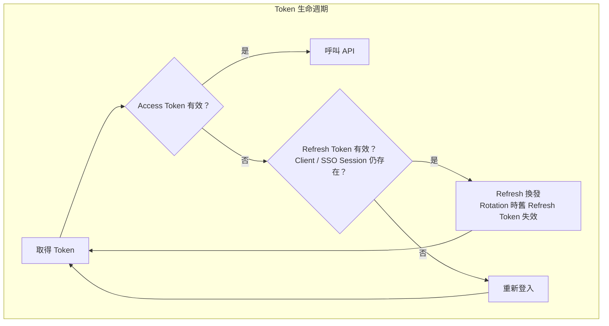
```mermaid
graph TB
    subgraph LC["Token 生命週期"]
        A[取得 Token] --> B{Access Token 有效？}
        B -->|是| C[呼叫 API]
        B -->|否| D{Refresh Token 有效？<br/>Client / SSO Session 仍存在？}
        D -->|是| E[Refresh 換發<br/>Rotation 時舊 Refresh Token 失效]
        E --> A
        D -->|否| F[重新登入]
        F --> A
    end
```

#### 6.3.1 時效設定與預設值

| 設定（Realm settings） | 預設值 | 說明 | 企業建議 |
| --- | --- | --- | --- |
| **Sessions** → SSO Session Idle | 30 分鐘 | 閒置逾時 | 內部 30 分鐘；網銀 5–10 分鐘 |
| **Sessions** → SSO Session Max | 10 小時 | 最長存活 | 內部 8–10 小時；網銀 30–60 分鐘 |
| **Sessions** → Client Session Idle／Max | 0（沿用 SSO） | Client 層級逾時 | 高風險 Client 可設更短 |
| **Sessions** → Offline Session Idle | 30 天 | Offline Token 閒置逾時 | 未使用 Offline 時移除 `offline_access` |
| **Sessions** → Offline Session Max Limited | 關閉（開啟後 Max 預設 60 天） | 是否限制 Offline 最長存活 | 若使用，應開啟並設定上限 |
| **Tokens** → Access Token Lifespan | 5 分鐘 | Access Token 有效期 | 5–15 分鐘 |
| **Tokens** → Revoke Refresh Token | 關閉 | Refresh Token Rotation | ✅ 開啟 |
| **Tokens** → Refresh Token Max Reuse | 0 | 同一 Refresh Token 可重用次數 | 0（配合 Rotation） |
| **Tokens** → Client Login Timeout | 1 分鐘 | 授權碼有效期 | 維持預設 |
| **Tokens** → Login Timeout | 30 分鐘 | 完成登入頁的時限 | 可縮短至 10 分鐘 |

> 💡 **建議**：Client 層級可在 **Client → Advanced → Advanced settings** 覆寫 Access Token Lifespan 與 Client Session Idle／Max，讓高風險系統使用更短的時效，而不影響整個 Realm。

#### 6.3.2 Offline Token

- 以 `scope=openid offline_access` 取得；**使用者登出 SSO Session 後仍有效**，適合「使用者離線時仍需代為執行」的排程情境。
- 風險高：外洩等同長期憑證。應限制可取得的 Client（僅 Confidential）、儲存於伺服器端加密，並提供使用者在 Account Console 撤銷的能力。

#### 6.3.3 前端 Token Refresh 實作

```javascript
// 呼叫前確保有效 + 到期事件自動換發（keycloak-js）
keycloak.onTokenExpired = async () => {
  try {
    await keycloak.updateToken(30);
  } catch {
    keycloak.login();
  }
};

keycloak.onAuthRefreshError = () => keycloak.login();
```

> ⚠️ **v2.0 更正**：v1.0 範例以 `setInterval` 並以錯誤公式計算間隔（`(exp - 60) * 1000 - Date.now()`，`exp` 為秒）。改用 `onTokenExpired` 事件驅動即可，無需自行計算。

---

### 6.4 Logout 流程（Single Logout）

#### 6.4.1 Logout 類型

| 類型 | 機制 | 影響範圍 | 說明 |
| --- | --- | --- | --- |
| **應用本地登出** | 清除 Application Session | 當前應用 | Keycloak SSO Session 仍在，下次會自動登入 |
| **RP-Initiated Logout** | 瀏覽器導向 `/logout`（OIDC RP-Initiated Logout 1.0） | SSO Session + 通知各 Client | 最常用 |
| **Front-Channel Logout** | Keycloak 於瀏覽器中以 iframe 呼叫各 Client 登出網址 | 已登入 Client | 受第三方 Cookie 限制影響 |
| **Back-Channel Logout** | Keycloak 伺服器直接 POST `logout_token` 給各 Client | 已登入 Client | ✅ 最可靠，建議 |
| **管理員強制登出** | Admin API／Console 刪除 Session | 指定使用者 | 資安事件處置 |
| **Token Revocation** | `/revoke`（RFC 7009） | 單一 Refresh／Offline Token | 登出時撤銷 Refresh Token |

#### 6.4.2 RP-Initiated Logout

```javascript
// 方式 1：keycloak-js
keycloak.logout({ redirectUri: 'https://erp.example.com/' });

// 方式 2：自行組合登出網址
const url = new URL('https://auth.example.com/realms/internal/protocol/openid-connect/logout');
url.searchParams.set('id_token_hint', idToken);                 // 建議帶入，避免出現確認頁
url.searchParams.set('post_logout_redirect_uri', 'https://erp.example.com/');
url.searchParams.set('client_id', 'erp-web');
window.location.href = url.toString();
```

> 💡 **建議**：`post_logout_redirect_uri` 必須列於 Client 的 **Valid post logout redirect URIs**。26.5 起可為 Client 啟用 **登出確認頁**，避免使用者被誘導登出（Logout CSRF）。

#### 6.4.3 Back-Channel Logout（建議）

```text
設定方式（Client → Settings → Logout settings）：
1. Front channel logout：Off
2. Backchannel logout URL：https://erp.example.com/logout/connect/back-channel/keycloak
3. Backchannel logout session required：On（logout_token 帶 sid）
4. Backchannel logout revoke offline sessions：依需求

運作：
使用者於任一系統登出 → Keycloak 以伺服器對伺服器 POST logout_token（JWT）
→ 應用驗證簽章、iss、aud、events 後，依 sid / sub 清除 Application Session
```

Spring Security（OAuth2 Login／BFF 應用）內建支援 OIDC Back-Channel Logout：

```java
// BffSecurityConfig.java（片段）
import org.springframework.security.config.Customizer;

@Bean
SecurityFilterChain bff(HttpSecurity http) throws Exception {
    http
        .authorizeHttpRequests(auth -> auth.anyRequest().authenticated())
        .oauth2Login(Customizer.withDefaults())
        // 接收 Keycloak 的 logout_token，預設端點 /logout/connect/back-channel/{registrationId}
        .oidcLogout(logout -> logout.backChannel(Customizer.withDefaults()));
    return http.build();
}
```

> ⚠️ **v2.0 更正**：v1.0 的 Backend `LogoutController` 只回傳登出網址，並未真正撤銷任何 Session，容易讓讀者誤以為已完成登出。Resource Server（無狀態 API）本身沒有 Session 可登出；登出應由前端／BFF 發起 RP-Initiated Logout，並以 Back-Channel Logout 同步各應用。

---

### 6.5 Step-up 認證與認證強度（ACR／LoA）

> 🆕 **v2.0 新增**

Step-up 認證讓使用者以一般強度登入，在執行高風險操作（例如約定轉帳、變更個資）時才要求更高強度的驗證。

| 步驟 | 設定位置 | 內容 |
| --- | --- | --- |
| 1. 定義 LoA | Authentication → 自訂 Browser Flow | 以 `Conditional - Level Of Authentication` 建立 LoA 1（密碼）與 LoA 2（密碼 + OTP／Passkey） |
| 2. ACR 對應 | Realm settings → General → ACR to LoA Mapping（或 Client → Advanced） | 例如 `silver` → 1、`gold` → 2 |
| 3. Client 要求 | 授權請求帶 `acr_values=gold` 或 `claims` 參數 | 高風險頁面觸發 |
| 4. 驗證結果 | Token 的 `acr` Claim | API 檢查 `acr == gold` 才允許操作 |

```javascript
// 前端在進入高風險功能前要求更高認證強度
keycloak.login({ acr: { values: ['gold'], essential: true } });
```

```java
// API 端檢查認證強度
@PreAuthorize("hasRole('ibank-customer') and principal.claims['acr'] == 'gold'")
@PostMapping("/transfers")
public TransferResult transfer(@RequestBody TransferRequest request) { ... }
```

> 💡 **建議**：Step-up 對 SAML Client 的支援在 26.7 轉為正式支援。Client 可在 Advanced 設定 **Minimum ACR value**，確保該 Client 永遠不會收到低於要求強度的登入。

---

### 6.6 服務間呼叫與 Token Exchange

> 🆕 **v2.0 新增**

#### 6.6.1 選擇方式

| 情境 | 做法 | 說明 |
| --- | --- | --- |
| 批次或服務以自身身分呼叫 | Client Credentials | 最簡單，Token 內無使用者資訊 |
| 服務 A 代表使用者呼叫服務 B | **Standard Token Exchange（RFC 8693）** | 將 A 收到的 Token 換成 `aud` 為 B、權限縮小的新 Token |
| 外部 IdP 簽發的 JWT 換 Keycloak Token | JWT Authorization Grant（RFC 7523，26.6 支援） | 取代舊的「外部換內部 Token Exchange」 |
| 直接轉傳使用者 Token 給所有下游 | ❌ 不建議 | `aud` 過寬，任一下游外洩即可冒用 |

#### 6.6.2 Standard Token Exchange 設定

1. 服務 A 的 Client 必須是 **Confidential**，並在 Capability config 開啟 **Standard token exchange**。
2. 原始 Token 的 `aud` 必須包含服務 A（否則無法交換）。
3. 以 `audience` 參數指定目標服務，`scope` 參數可請求額外 Optional Scope。

```bash
curl -s -X POST https://auth.example.com/realms/internal/protocol/openid-connect/token \
  -u "order-service:$ORDER_SERVICE_SECRET" \
  -d grant_type=urn:ietf:params:oauth:grant-type:token-exchange \
  -d subject_token="$USER_ACCESS_TOKEN" \
  -d subject_token_type=urn:ietf:params:oauth:token-type:access_token \
  -d requested_token_type=urn:ietf:params:oauth:token-type:access_token \
  -d audience=payment-service
```

| 項目 | Standard Token Exchange V2（`token-exchange-standard:v2`） | Legacy V1（`token-exchange:v1`） |
| --- | --- | --- |
| 狀態 | ✅ 正式支援，預設啟用 | ⚠️ Preview、已棄用 |
| 範圍 | 同 Realm 內部 Token 交換 | 另支援外部交換、Impersonation |
| 設定 | Client 開關 | 需 FGAP V1 權限設定 |
| `subject_token_type` | 僅 access_token | 多種 |
| `requested_token_type` | access_token（預設）、id_token、refresh_token（需啟用） | 多種 |

> ⚠️ **實務注意**：26.7 起允許 Client 以 Token Exchange 變更**自己的** sender-constrained（DPoP）Token 之 scope；由其他 Client 交換 DPoP 綁定 Token 會被拒絕（`invalid_request`）。實驗性的 `token-exchange-external-internal:v2` 已於 26.7 移除。

---

### 6.7 💡 本章實務建議

1. **區分三種 Session**，時效設計由外而內：SSO Session ≥ Client Session ≥ Access Token。
2. **開啟 Refresh Token Rotation（Revoke Refresh Token）**，Max Reuse 設為 0。
3. **登出以 RP-Initiated + Back-Channel 為主**，Front-Channel 受第三方 Cookie 限制不可靠。
4. **高風險操作使用 Step-up（ACR）**，並在 API 端檢查 `acr`。
5. **服務代表使用者呼叫下游時使用 Token Exchange 縮小權限**，不要轉傳原始 Token。
6. **權限緊急撤銷**：`POST /users/{id}/logout` + 停用帳號，再視需要輪替相關 Client 憑證。

---

## 第七章：系統維運與管理

### 7.1 使用者與權限管理最佳實務

#### 7.1.1 使用者管理原則

```text
✅ 建議做法：
├── 以 Group 批次管理角色，使用者只加入群組
├── 整合 AD / LDAP 或以 SCIM 佈建，避免重複維護
├── 建立 JML（Joiner / Mover / Leaver）流程：到職、調動、離職
├── 離職當日停用帳號並撤銷 Session
└── 定期（每季）權限審查，保留審查紀錄

❌ 避免做法：
├── 直接在 User 上指派大量角色
├── 使用共用帳號（無法稽核到個人）
├── 權限過度集中（一人同時具備開發、上線、稽核權限）
└── 以 Protocol Mapper 夾帶管理角色（26.7.1 起不再生效）
```

#### 7.1.2 JML 流程與 Keycloak 對應

| 階段 | 動作 | Keycloak 對應 |
| --- | --- | --- |
| Joiner（到職） | 建立帳號、加入部門群組、設定 MFA | AD 同步／SCIM 建立 → Group 繼承角色 → Required action：Configure OTP／Passkey |
| Mover（調動） | 移出舊群組、加入新群組 | Group 變更 → 撤銷 Session 使新權限立即生效 |
| Leaver（離職） | 停用帳號、撤銷 Session、移轉資料 | `enabled=false` → `POST /users/{id}/logout` → 保留帳號供稽核後再刪除 |

#### 7.1.3 權限審核 Checklist

```text
□ 每季匯出各 Realm 使用者與角色對應，交由業務主管確認
□ 確認離職人員已停用（比對人事系統）
□ 檢視具 realm-admin、manage-users、manage-clients 等高權限帳號
□ 確認 Service Account 權限最小化，且有負責人
□ 檢視 master Realm 管理員名單與 MFA 狀態
□ 檢視 FGAP 權限設定是否仍符合組織架構
□ 保存審查紀錄（誰、何時、審查結果）
```

---

### 7.2 Audit Log 與事件追蹤

#### 7.2.1 啟用事件記錄

```text
Realm settings → Events

Event listeners：
  jboss-logging（預設，寫入伺服器 Log）
  + 自訂 Listener（送往 Kafka / SIEM）

User events settings：
  Save events：On
  Expiration：依法規設定（金融業常見 ≥ 1 年，可改由 SIEM 長期保存）
  Saved types：預設全部；可排除高頻率事件（例如 CODE_TO_TOKEN、REFRESH_TOKEN）

Admin events settings：
  Save events：On
  Include representation：On（記錄變更內容；注意可能含敏感設定）
  Expiration：同上
```

> ⚠️ **實務注意**：事件儲存在 Keycloak 資料庫，若大量保存會影響 DB 容量與效能。正式環境建議：**資料庫保留 30–90 天供線上查詢，完整事件串流至 SIEM 長期保存**。

#### 7.2.2 重要事件類型

| 事件 | 說明 | 監控重點 |
| --- | --- | --- |
| `LOGIN` | 登入成功 | 異常時段、異常來源 |
| `LOGIN_ERROR` | 登入失敗 | 暴力破解、撞庫 |
| `LOGOUT` | 登出 | — |
| `CODE_TO_TOKEN`／`CODE_TO_TOKEN_ERROR` | 授權碼換 Token | 錯誤激增可能為攻擊或設定錯誤 |
| `REFRESH_TOKEN`／`REFRESH_TOKEN_ERROR` | Token 換發 | Rotation 啟用後的重用錯誤 = 可能 Token 外洩 |
| `INTROSPECT_TOKEN` | Introspection | 頻率過高需檢討設計 |
| `CLIENT_LOGIN`／`CLIENT_LOGIN_ERROR` | Client Credentials | Service Account 異常 |
| `UPDATE_PASSWORD`／`UPDATE_CREDENTIAL` | 更新密碼或憑證 | 帳號接管偵測 |
| `REMOVE_CREDENTIAL` | 移除憑證（例如 OTP） | MFA 被移除 |
| `USER_DISABLED_BY_PERMANENT_LOCKOUT`／`USER_DISABLED_BY_TEMPORARY_LOCKOUT` | 暴力破解鎖定 | 攻擊告警 |
| `IDENTITY_PROVIDER_LOGIN`／`_ERROR` | 外部 IdP 登入 | 聯合登入問題 |
| `USER_SESSION_DELETED` | Session 被刪除（26.5 新增） | 稽核強制登出 |
| `IMPERSONATE` | 管理員模擬使用者 | 必須告警並稽核 |

#### 7.2.3 事件查詢 API

```bash
# 查詢登入失敗事件（使用 -G 將參數放在查詢字串）
curl -s -G "https://auth.example.com/admin/realms/internal/events" \
  -H "Authorization: Bearer ${ADMIN_TOKEN}" \
  --data-urlencode "type=LOGIN_ERROR" \
  --data-urlencode "dateFrom=2026-09-01" \
  --data-urlencode "max=100" | jq '.[] | {time, ipAddress, error, details}'

# 查詢管理事件（誰改了什麼）
curl -s -G "https://auth.example.com/admin/realms/internal/admin-events" \
  -H "Authorization: Bearer ${ADMIN_TOKEN}" \
  --data-urlencode "operationTypes=UPDATE" \
  --data-urlencode "resourceTypes=CLIENT" \
  --data-urlencode "max=50" | jq .
```

> ⚠️ **v2.0 更正**：v1.0 使用 `curl -X GET ... -d "type=LOGIN_ERROR"`，`-d` 會把參數放進請求 body，GET 請求的查詢條件因此失效。應使用 `-G` 搭配 `--data-urlencode`。

#### 7.2.4 將事件送往 SIEM

| 方式 | 說明 | 適用 |
| --- | --- | --- |
| `jboss-logging` Listener + JSON Log | 事件寫入 Log，由 Log 收集器送至 SIEM | ✅ 最簡單 |
| 自訂 Event Listener SPI | 直接送 Kafka／HTTP | 需即時處理、大量事件 |
| Admin REST API 定期拉取 | 排程程式查詢 | 小規模 |
| Shared Signals Framework（SSF） | 26.7 Experimental，即時推送資安事件 | 評估中 |

```bash
# 讓成功事件也以 INFO 等級寫入 Log（預設為 DEBUG）
bin/kc.sh start --optimized --spi-events-listener--jboss-logging--success-level=info
```

---

### 7.3 Keycloak Log 說明

#### 7.3.1 Log 等級與輸出設定

```bash
# 根等級 + 類別等級（逗號分隔）
KC_LOG_LEVEL="info,org.keycloak.events:debug"

# 排查特定問題時才暫時開啟
KC_LOG_LEVEL="info,org.keycloak.authentication:debug,org.keycloak.protocol.oidc:debug"

# 輸出目的地與格式
KC_LOG="console,file"
KC_LOG_CONSOLE_OUTPUT=json
KC_LOG_CONSOLE_JSON_FORMAT=ecs          # Elastic Common Schema
KC_LOG_FILE=/opt/keycloak/data/log/keycloak.log

# 非同步 Log（提升吞吐，26.3 起）
KC_LOG_ASYNC=true

# MDC：在 Log 中加入 realm、clientId 等上下文
KC_LOG_MDC_ENABLED=true

# HTTP Access Log（26.4 起；敏感 Header / Cookie 會被遮蔽）
KC_HTTP_ACCESS_LOG_ENABLED=true
KC_HTTP_ACCESS_LOG_PATTERN=combined
```

> ⚠️ **v2.0 更正**：v1.0 的 `KC_LOG_LEVEL=org.keycloak:debug` 只設定類別而未設定根等級，建議寫成 `info,org.keycloak:debug`；且整個 `org.keycloak` 開 DEBUG 在正式環境會產生大量 Log，應只針對需要的子類別。

| 選項 | 說明 |
| --- | --- |
| `log` | `console`、`file`、`syslog` 可組合 |
| `log-level` | 根等級與類別等級 |
| `log-console-output`／`log-file-output`／`log-syslog-output` | `default` 或 `json` |
| `log-console-json-format` | `default` 或 `ecs` |
| `log-async` | 全域非同步；亦可針對各 handler 設定 |
| `log-mdc-enabled` | 啟用 MDC |
| `log-service-name`／`log-service-environment` | JSON Log 的服務名稱與環境（26.6） |
| `http-access-log-enabled`／`http-access-log-pattern`／`http-access-log-file-enabled` | HTTP Access Log |

#### 7.3.2 常見 Log 訊息解讀

```text
# 登入成功（jboss-logging listener，success-level=info）
INFO  [org.keycloak.events] type="LOGIN", realmName="internal", clientId="erp-web", userId="...", ipAddress="10.1.2.3"

# 登入失敗
WARN  [org.keycloak.events] type="LOGIN_ERROR", realmName="internal", clientId="erp-web", error="invalid_user_credentials"

# Refresh Token 重用（Rotation 開啟時）
WARN  [org.keycloak.events] type="REFRESH_TOKEN_ERROR", error="invalid_token", reason="Maximum allowed refresh token reuse exceeded"

# Session 逾時
WARN  [org.keycloak.events] type="REFRESH_TOKEN_ERROR", error="invalid_token", reason="Session not active"
```

#### 7.3.3 Log 整合建議

```text
Keycloak（JSON / ECS Log）
   → Fluent Bit / Filebeat / OpenTelemetry Collector
   → OpenSearch / Elasticsearch / Loki / SIEM
   → Dashboard 與告警

建議監控 Dashboard：
├── 登入成功 / 失敗趨勢（依 Realm、Client）
├── 登入失敗來源 IP Top N、地理分佈
├── 帳號鎖定事件
├── Refresh Token 重用錯誤
├── Admin 事件（誰改了 Client、角色、Realm 設定）
└── 系統錯誤（ERROR 等級）統計
```

---

### 7.4 可觀測性：Metrics 與 Tracing

> 🆕 **v2.0 新增**

#### 7.4.1 Metrics

| 項目 | 設定 | 說明 |
| --- | --- | --- |
| 啟用 | `metrics-enabled=true`（Build option） | 端點：`https://<host>:9000/metrics`（OpenMetrics 格式） |
| 使用者事件指標 | `event-metrics-user-enabled=true` | 產生 `keycloak_user_events_total`，可依 realm、client、idp 分類 |
| HTTP 延遲直方圖 | `http-metrics-histograms-enabled=true`、`http-metrics-slos=100,250,500` | 計算 SLI／SLO |
| 快取直方圖 | `cache-metrics-histograms-enabled=true` | 叢集快取延遲 |
| Operator | 自動建立 `ServiceMonitor`（26.4 起），26.6 起可設定 labels／annotations | Prometheus Operator 環境 |

建議 SLI：

| SLI | 指標來源 | 目標範例 |
| --- | --- | --- |
| 登入成功率 | `keycloak_user_events_total{event="login"}` vs `login_error` | ≥ 99%（排除密碼錯誤） |
| Token 端點延遲 | HTTP server request histogram（`/token`） | p95 < 250ms |
| 可用性 | `/health/ready` 與 Blackbox 探測 | ≥ 99.95% |
| DB 連線池 | Agroal 指標 | 使用率 < 80% |

官方另提供 Grafana Dashboard（`keycloak/keycloak-grafana-dashboard`），可作為起點。

#### 7.4.2 Tracing（OpenTelemetry）

```bash
bin/kc.sh build --features=opentelemetry --tracing-enabled=true
bin/kc.sh start --optimized \
  --tracing-endpoint=http://otel-collector.observability:4317 \
  --tracing-sampler-type=parentbased_traceidratio \
  --tracing-sampler-ratio=0.1
```

| 選項 | 說明 | 預設 |
| --- | --- | --- |
| `tracing-enabled` | 啟用 Tracing（Build option） | `false` |
| `tracing-endpoint` | OTLP 端點 | `http://localhost:4317` |
| `tracing-protocol` | `grpc` 或 `http/protobuf` | `grpc` |
| `tracing-sampler-type` | 取樣策略 | `traceidratio` |
| `tracing-sampler-ratio` | 取樣比例 | `1.0` |
| `telemetry-*` | 26.5 起共用的 OpenTelemetry 設定（endpoint、protocol、service name；26.6 可加自訂 Header） | — |

> 💡 **建議**：正式環境取樣比例 0.05–0.1 即可；登入流程的 Trace 可串接前端、Gateway 與後端，快速定位延遲來源。

---

### 7.5 Workflows 與 SCIM

> 🆕 **v2.0 新增**

#### 7.5.1 Workflows（26.6 起正式支援）

Workflows 以 **YAML** 描述「在什麼事件或條件下，對使用者等資源執行什麼動作」，用來取代過去以排程程式呼叫 Admin API 的做法。典型用途：

| 情境 | 觸發／條件 | 動作 |
| --- | --- | --- |
| 長期未登入帳號 | 超過 N 天未登入 | 通知 → 停用 |
| 臨時帳號到期 | 建立後 N 天 | 停用或刪除 |
| Email 變更 | 使用者申請變更 Email | Update Email 驗證流程（26.4 支援） |
| 組織邀請 | 發出邀請 | 追蹤、逾期失效 |

> 💡 **建議**：Workflow 定義屬於設定的一部分，應納入版本控制並在測試 Realm 驗證後再套用到正式 Realm；確切 YAML 結構請以官方 Server Administration Guide 的 Workflows 章節為準。

#### 7.5.2 SCIM API（26.7 Preview）

26.7 起 Keycloak 可作為 **SCIM 2.0（RFC 7643／7644）伺服器**，讓 HR 系統或身分治理平台（IGA）以標準 API 佈建使用者與群組。需以 `--features=scim-api` 啟用。

| 評估項目 | 說明 |
| --- | --- |
| 成熟度 | Preview，正式環境使用前需完整測試 |
| 與 LDAP 聯合的關係 | 兩者擇一作為使用者主要來源，避免衝突 |
| 權限 | 呼叫端 Service Account 只給必要的使用者／群組管理權限 |

---

### 7.6 常見營運問題

#### 7.6.1 問題 1：使用者無法登入

```text
排查步驟：
1. Admin Console → Users：帳號是否存在、Enabled、是否被暴力破解鎖定
2. Events：查看 LOGIN_ERROR 的 error 欄位
3. 是否有未完成的 Required actions（例如 Verify Email 但 SMTP 異常）
4. Client 設定：Redirect URI、Web origins、允許的 Flow
5. 聯合來源：LDAP 連線測試（User federation → Test connection / Test authentication）

常見 error 值：
├── invalid_user_credentials：密碼錯誤
├── user_disabled / user_temporarily_disabled：停用或鎖定
├── invalid_redirect_uri：Redirect URI 不符
├── cookie_not_found：瀏覽器封鎖 Cookie 或 hostname 設定錯誤
└── expired_code：登入頁停留過久
```

#### 7.6.2 問題 2：Token 驗證失敗

```text
排查步驟：
1. 本機解碼 Token，檢查 iss、aud、exp、azp
2. 比對 API 設定的 issuer 與 Discovery 的 issuer（完全相同，含結尾斜線）
3. 確認 API 能連到 JWKS 端點（防火牆、Proxy）
4. 檢查所有主機的 NTP 時間同步
5. 26.6.2 以後的 Introspection 失敗 → 檢查 aud

常見原因：
├── hostname 設定錯誤導致內外網 iss 不同
├── Audience 未設定
├── 金鑰輪替後 JWKS 快取未更新
└── 時鐘偏移
```

#### 7.6.3 問題 3：效能問題

```text
症狀：登入緩慢、Token 發放延遲、Admin Console 卡頓

排查與解決：
1. 資料庫
   - 連線池是否耗盡（Agroal 指標、db-pool-max-size）
   - 慢查詢、索引、事件表是否過大（清理過期事件）
2. JVM
   - 容器記憶體限制與 Heap（官方建議以容器 limit 控制，預設 Heap 為容器記憶體的 70%）
   - GC 狀況（預設 G1GC）
3. 密碼雜湊
   - Argon2 每次雜湊約需 7MB 記憶體；登入尖峰時 CPU / 記憶體需求上升
4. 外部依賴
   - Keycloak ↔ DB 延遲、Keycloak ↔ LDAP 延遲
5. 擴展
   - 水平擴展節點；確認負載平衡使用 AUTH_SESSION_ID 黏著
```

#### 7.6.4 問題 4：Hostname 或 Proxy 設定錯誤

```text
症狀：
├── 登入後導向到內部網址（http://10.x.x.x:8080）
├── 出現 "HTTPS required"
├── Token iss 為內部主機名稱
└── Cookie 無法寫入（cookie_not_found）

排查：
1. 以 --hostname-debug=true 啟動，開啟 /realms/{realm}/hostname-debug
2. 確認 KC_HOSTNAME 為完整對外 URL
3. 確認 KC_PROXY_HEADERS 與 Proxy 實際送出的標頭一致（forwarded vs xforwarded）
4. 確認 KC_PROXY_TRUSTED_ADDRESSES 包含 Proxy IP
```

#### 7.6.5 問題 5：升級後管理 API 或整合失效

```text
常見原因（26.6 → 26.7.x）：
├── 管理角色由 Protocol Mapper 帶入 → 26.7.1 起無效，改為直接指派
├── Introspection 呼叫端不在 aud → 26.6.2 起回傳 active=false
├── Redirect URI 使用主機名稱萬用字元 → 26.6.3 起拒絕
├── 使用 /broker/{provider}/link 帳號連結 → 26.7.2 起預設停用
└── 自訂主題使用舊 FreeMarker 語法 → 26.7 升級至 2.3.32 預設值
```

---

### 7.7 💡 本章實務建議

1. **事件雙軌保存**：DB 短期查詢、SIEM 長期保存；Admin events 必開。
2. **JSON／ECS Log + MDC + Access Log**，並以 Log 收集器集中。
3. **啟用 Metrics 與 Event metrics**，建立登入成功率、Token 延遲等 SLI。
4. **Tracing 以低取樣比例常態開啟**，有助於跨系統排查登入延遲。
5. **帳號生命週期自動化**：優先 AD 同步或 SCIM，搭配 Workflows 處理長期未登入帳號。
6. **每次升級前閱讀 Upgrading Guide**，並以 [7.6.5](#765-問題-5升級後管理-api-或整合失效) 清單檢查。

---

## 第八章：高可用與資安建議

### 8.1 Keycloak HA 架構概念

> ⚠️ **v2.0 更正**：v1.0 建議設定 `KC_CACHE_STACK=kubernetes`。自 26.x 起 **預設傳輸堆疊為 `jdbc-ping`**（以資料庫追蹤叢集成員），`kubernetes`、`tcp`、`udp`、`ec2`、`azure`、`google` 等舊值皆已棄用；且 **26.0 起使用者 Session 預設持久化到資料庫**，節點重啟不再導致使用者被登出。

#### 8.1.1 部署架構選擇

| 架構 | 說明 | 容錯能力 | 複雜度 | 狀態 |
| --- | --- | --- | --- | --- |
| **Single-cluster** | 一個 Kubernetes 叢集（或一組 VM）內多個節點，可跨可用區 | 節點、可用區故障 | 低，無外部依賴 | ✅ 支援，**多數企業首選** |
| **Multi-cluster v1** | 兩個叢集（兩個站台）＋外部負載平衡＋每站台外部 Infinispan | 節點、可用區、整個叢集故障 | 高 | ✅ 支援（不支援三個以上可用區） |
| **Multi-cluster v2** | 兩個以上叢集，**不需外部 Infinispan**，Session 存於資料庫 | 同上 | 中 | 🧪 26.7 Preview |

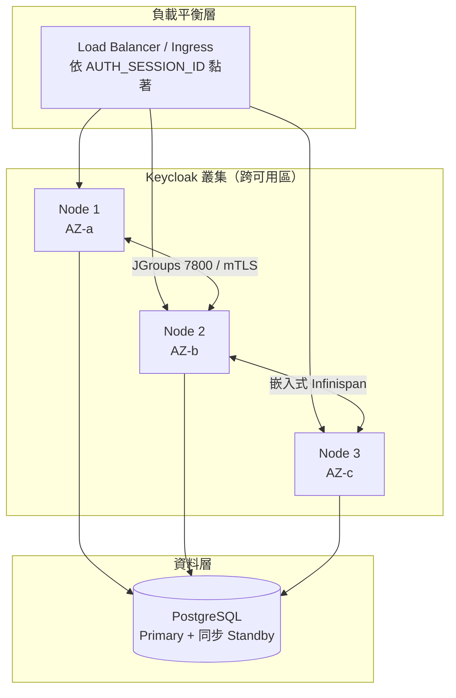
```mermaid
graph TB
    subgraph LBL["負載平衡層"]
        LB[Load Balancer / Ingress<br/>依 AUTH_SESSION_ID 黏著]
    end

    subgraph KCC["Keycloak 叢集（跨可用區）"]
        KC1[Node 1<br/>AZ-a]
        KC2[Node 2<br/>AZ-b]
        KC3[Node 3<br/>AZ-c]
    end

    subgraph DBL["資料層"]
        DB[(PostgreSQL<br/>Primary + 同步 Standby)]
    end

    LB --> KC1
    LB --> KC2
    LB --> KC3

    KC1 <-->|JGroups 7800 / mTLS| KC2
    KC2 <-->|嵌入式 Infinispan| KC3

    KC1 --> DB
    KC2 --> DB
    KC3 --> DB
```

#### 8.1.2 快取與 Session

| 快取 | 類型 | 內容 |
| --- | --- | --- |
| `realms`、`users`、`authorization`、`keys`、`crl` | Local（各節點本地） | 設定與使用者資料快取，透過 `work` 快取廣播失效 |
| `work` | Replicated | 失效通知 |
| `sessions`、`clientSessions`、`offlineSessions`、`offlineClientSessions` | Distributed | 使用者／Client Session（持久化到 DB，需要時載入） |
| `authenticationSessions`、`loginFailures`、`actionTokens` | Distributed | 登入中狀態、失敗計數、Action Token |

| 設定 | 說明 | 預設 |
| --- | --- | --- |
| `cache` | `ispn`（叢集）／`local` | 正式模式 `ispn` |
| `cache-stack` | 叢集探索方式 | `jdbc-ping` |
| `cache-embedded-mtls-enabled` | 節點間 TCP 傳輸以 TLS 加密 | `true` |
| JGroups 埠 | 7800（資料）、57800（故障偵測） | 防火牆需在節點間開放 |
| `persistent-user-sessions` 功能 | Session 持久化到 DB | 啟用 |

#### 8.1.3 容量規劃（官方 Sizing 指南）

| 項目 | 官方基準 |
| --- | --- |
| 每個 Pod 記憶體 | Request 1250 MB、Limit 1360 MB（含 Realm 快取與 10,000 個快取 Session；Heap 占 70%） |
| 密碼登入 | 每 15 次／秒需 1 vCPU |
| Client Credentials | 每 120 次／秒需 1 vCPU |
| Refresh Token | 每 120 次／秒需 1 vCPU |
| 尖峰保留 | CPU 再加 150% 餘裕（Limit = Request × 2.5） |

**計算範例**：尖峰每秒 45 次登入、360 次 Client Credentials、360 次 Refresh，以 3 個 Pod 部署：

```text
所需 vCPU = 45/15 + 360/120 + 360/120 = 3 + 3 + 3 = 9 vCPU（全叢集）
每 Pod CPU Request = 9 / 3 = 3 vCPU；Limit = 3 × 2.5 = 7.5 vCPU
每 Pod 記憶體 Request 1250 MB，Limit 1360 MB
```

> 💡 **建議**：官方數據以 Aurora PostgreSQL 與特定負載測得，僅作為起點。正式上線前務必以實際登入流程（含 MFA、LDAP）做壓力測試，並注意 Argon2 密碼雜湊的 CPU／記憶體成本。

#### 8.1.4 HA 部署要點

```text
1. 負載平衡
   - 以 AUTH_SESSION_ID Cookie 做黏著，提升本地快取命中率
   - 健康檢查使用 9000 埠 /health/ready（或 26.4 起可選擇在主埠提供）
   - 不公開 9000 埠

2. 資料庫高可用
   - Primary + 同步 Standby，自動容錯切換
   - 連線池上限 × 節點數 < DB max_connections

3. 節點
   - 至少 2 節點（基本 HA），建議 3 節點跨可用區
   - 節點間開放 7800 / 57800，並保持 mTLS（預設）

4. 升級
   - 26.6 起同一 major.minor 的 Patch 版預設支援 Rolling Update（見第九章）
   - 26.7 起預設關機逾時 10 秒，讓分散式快取重新平衡，避免資料遺失
```

---

### 8.2 Session 與 Token 設計考量

#### 8.2.1 Session 設計原則

| 系統類型 | SSO Session Idle | SSO Session Max | Access Token | Refresh 策略 |
| --- | --- | --- | --- | --- |
| 內部辦公系統 | 30 分鐘 | 8–10 小時 | 5–15 分鐘 | Rotation |
| 管理後台（高權限） | 15 分鐘 | 4 小時 | 5 分鐘 | Rotation + Step-up |
| 網路銀行（對外） | 5–10 分鐘 | 30–60 分鐘 | 5 分鐘 | Rotation + BFF |
| 行動銀行 App | 依產品設計 | 依產品設計 | 5 分鐘 | Rotation + DPoP |

#### 8.2.2 Refresh Token Rotation

```text
目的：每次 Refresh 都發放新的 Refresh Token，舊的立即失效

優點：
├── 竊得的舊 Refresh Token 無法再使用
├── 重用偵測：舊 Token 再被使用時會出現 REFRESH_TOKEN_ERROR
└── 限縮外洩後的可用時間

設定方式：
Realm settings → Tokens → Revoke Refresh Token：On
                       → Refresh Token Max Reuse：0
```

> 💡 **建議**：對 Public Client（SPA、行動 App），再搭配 **DPoP** 讓 Refresh Token 綁定用戶端金鑰（見 [8.6](#86-進階-token-安全dpoppar-與-fapi-20)），即使 Token 被竊也無法在其他裝置使用。

---

### 8.3 HTTPS 與憑證管理

#### 8.3.1 HTTPS 部署方式

| 方式 | 設定 | 說明 |
| --- | --- | --- |
| Re-encrypt（建議） | Proxy：HTTPS → Keycloak：HTTPS；`KC_HTTPS_CERTIFICATE_FILE`、`KC_HTTPS_CERTIFICATE_KEY_FILE`、`KC_PROXY_HEADERS` | 全程加密 |
| Edge termination | Proxy：HTTPS → Keycloak：HTTP；`KC_HTTP_ENABLED=true`、`KC_PROXY_HEADERS` | 僅限受控隔離網段 |
| Passthrough | Proxy 轉送 TCP；Keycloak 直接處理 TLS；`KC_PROXY_PROTOCOL_ENABLED=true` | 需要 mTLS／X.509 用戶端憑證時 |

> ⚠️ **v2.0 更正**：v1.0 以 `KC_PROXY=edge／reencrypt` 描述模式，該選項已於 26.0 移除；模式由「是否提供憑證」＋`KC_PROXY_HEADERS`（或 PROXY protocol）組合而成。

#### 8.3.2 憑證與信任庫設定

| 選項 | 說明 | 預設 |
| --- | --- | --- |
| `https-certificate-file`／`https-certificate-key-file` | PEM 格式憑證與私鑰 | — |
| `https-key-store-file`／`https-key-store-password` | PKCS12 金鑰庫（替代 PEM） | — |
| `https-certificates-reload-period` | 憑證自動重新載入週期 | `1h` |
| `https-protocols` | 允許的 TLS 版本 | `TLSv1.3,TLSv1.2` |
| `truststore-paths` | 連線外部（LDAP、IdP、DB）時信任的 CA（PEM 或 PKCS12） | — |
| `tls-hostname-verifier` | 外部連線的主機名稱驗證 | `DEFAULT`（勿改為 `ANY`） |
| `truststore-kubernetes-enabled` | 自動信任 Kubernetes／OpenShift 服務 CA（26.6） | `true` |

#### 8.3.3 憑證管理建議

```text
□ 對外憑證由受信任 CA 簽發；內部 Re-encrypt 可用企業 CA
□ 使用 cert-manager 等工具自動續期，搭配 https-certificates-reload-period 免重啟更新
□ 設定憑證到期監控（到期前 30 天告警）
□ 私鑰以 Kubernetes Secret / HSM / Vault 保管，不納入版本控制
□ 以 truststore-paths 集中管理對外連線信任的 CA，不要關閉主機名稱驗證
```

---

### 8.4 防止 Token 洩漏的設計原則

#### 8.4.1 Token 儲存原則

| 應用類型 | Access Token | Refresh Token | ID Token |
| --- | --- | --- | --- |
| **BFF（建議）** | 伺服器端 Session | 伺服器端 Session（加密） | 伺服器端 |
| **純 SPA（Public Client）** | JavaScript 記憶體 | JavaScript 記憶體（Rotation，必要時 DPoP） | 記憶體 |
| **行動 App** | 記憶體 | iOS Keychain／Android Keystore | 記憶體 |
| **伺服器端服務** | 記憶體快取（到期前換發） | Client Credentials 不發 Refresh Token | 不適用 |

> ⚠️ **v2.0 更正**：v1.0 表格寫「Web SPA 的 Refresh Token 放 HttpOnly Cookie」，但瀏覽器 JavaScript 無法存取 HttpOnly Cookie，純 SPA 做不到；要讓 Token 不被 JavaScript 讀取，必須採用 BFF。任何架構都**不應**將 Token 存入 `localStorage`／`sessionStorage`。

#### 8.4.2 安全設計 Checklist

```text
□ Token 不存入 localStorage / sessionStorage
□ 所有 Client 使用 PKCE（S256），包含 Confidential Client
□ Implicit 與 Direct Access Grants 關閉
□ Access Token 5–15 分鐘；Refresh Token Rotation 開啟
□ 高風險 Public Client 使用 DPoP
□ 正式環境全面 HTTPS，HSTS 開啟
□ Web origins 精確設定，不使用 *
□ Redirect URI 精確設定，不使用主機名稱萬用字元
□ API 驗證 aud，Full scope allowed 關閉
□ Client 憑證優先使用 private_key_jwt / mTLS，Secret 定期輪替
□ 前端設定 CSP，降低 XSS 風險
□ 不在 URL、Log 中記錄 Token
```

---

### 8.5 與企業資安政策的搭配方式

#### 8.5.1 密碼政策（依 NIST SP 800-63B-4）

> ⚠️ **v2.0 更正**：v1.0 建議「大小寫＋數字＋特殊字元」組成規則與「90 天強制更換」。**NIST SP 800-63B Revision 4（2025-08 定稿）** 已明確要求：不得強制組成規則（composition rules）、不應定期強制更換密碼（僅在疑似外洩時更換），改以**長度＋黑名單**為主。

```text
Authentication → Policies → Password policy

建議設定（依 NIST SP 800-63B-4）：
├── Minimum length：15（僅密碼單因子）/ 8 以上（搭配 MFA 時）
├── Maximum length：64 以上（允許長密碼短語）
├── Password blacklist：常見密碼、外洩密碼清單（檔案放 data/password-blacklists/，26.6 起自動重新載入）
├── Not username / Not email
├── Not recently used：5
├── Hashing algorithm：argon2（非 FIPS 環境預設）
└── 不設定：Uppercase / Lowercase / Digits / Special characters / Expire password
```

> 💡 **建議（金融業）**：若主管機關規範或內部稽核仍要求定期更換或組成規則，應依規定設定，並在資安政策中記錄與 NIST 建議的差異及補償控制（例如強制 MFA、外洩密碼比對）。

#### 8.5.2 密碼雜湊

| 項目 | 說明 |
| --- | --- |
| 預設演算法 | **Argon2**（25.0 起，非 FIPS 環境）；FIPS 環境使用 PBKDF2-SHA512（210,000 次迭代） |
| 資源需求 | Argon2 每次雜湊約 7MB 記憶體，並行數預設限制為 JVM 可用 CPU 核心數 |
| 既有密碼 | 使用者下次登入時自動以新演算法重新雜湊 |

#### 8.5.3 暴力破解防護

```text
Realm settings → Security defenses → Brute force detection
（⚠️ 新建 Realm 預設為關閉，必須手動啟用）

模式（Brute Force Mode）：
├── Lockout temporarily（建議對外 Realm）
├── Lockout permanently（需管理員解鎖）
└── Lockout permanently after temporary lockout（多次暫時鎖定後永久鎖定）

參數（Keycloak 預設 → 建議）：
├── Max login failures：30 → 5–10
├── Wait increment：1 分鐘 → 1 分鐘
├── Max wait：15 分鐘 → 15–30 分鐘
├── Failure reset time：12 小時 → 12 小時
├── Quick login check milliseconds：1000 → 維持
└── Minimum quick login wait：1 分鐘 → 維持
```

> ⚠️ **實務注意**：永久鎖定可能被攻擊者利用來「鎖死」大量合法帳號（DoS）。對外客戶 Realm 建議採暫時鎖定，搭配 WAF 速率限制與 Bot 偵測。

#### 8.5.4 Security Headers

```text
Realm settings → Security defenses → Headers（Keycloak 預設值）

├── X-Frame-Options：SAMEORIGIN
├── Content-Security-Policy：frame-src 'self'; frame-ancestors 'self'; object-src 'none';
├── X-Content-Type-Options：nosniff
├── X-Robots-Tag：none
├── Referrer-Policy：no-referrer
└── Strict-Transport-Security：max-age=31536000; includeSubDomains
```

> ⚠️ **v2.0 更正**：v1.0 列出 `X-XSS-Protection: 1; mode=block`。Keycloak 現行預設標頭已不含此項，主流瀏覽器也已移除支援，在某些情況下反而可能引入風險，不建議設定；XSS 防護應依賴 CSP。

#### 8.5.5 MFA：OTP、Passkeys 與備援碼

| 驗證方式 | 設定位置 | 建議 |
| --- | --- | --- |
| **OTP（TOTP）** | Authentication → Policies → OTP policy | Type `totp`、Digits 6、Period 30 秒、Look around 1；演算法 SHA1 相容性最佳（多數 Authenticator App 僅支援 SHA1） |
| **WebAuthn（第二因子）** | Policies → WebAuthn Policy | 企業可限制 Authenticator 認證（Attestation） |
| **Passkeys（無密碼）** | Policies → WebAuthn Passwordless Policy；26.4 起為支援功能，26.3 起可整合於預設登入表單 | ✅ 對外客戶優先推廣，可抵抗釣魚 |
| **Recovery Codes** | Required action：Recovery Authentication Codes | 26.4 起可強制在設定 OTP 後產生 |

```text
強制所有使用者 MFA（正確做法）：
1. 複製 browser flow → 2FA Sub-flow 設為 REQUIRED（OTP Form / WebAuthn 為 ALTERNATIVE）
2. Required actions：將 Configure OTP（或 Webauthn Register）設為 Default action
3. Bind flow 為新的 browser flow
4. 26.3 起若遺失 2FA 憑證，可設定以備援方式復原帳號（Account recovery）
```

> ⚠️ **實務注意**：26.7 將 WebAuthn Policy 的 `Require Discoverable Credential` 標示棄用，改用 `Discoverable credential`（`required`／`preferred`／`discouraged`）。另外 26.7 宣布 **SHA1 雜湊函式將於 Keycloak 27 移除**，是否影響 TOTP 的 HmacSHA1 請追蹤官方說明（見 [附錄 E.1](#e1-待確認事項)）。

---

### 8.6 進階 Token 安全：DPoP、PAR 與 FAPI 2.0

> 🆕 **v2.0 新增**

#### 8.6.1 DPoP（RFC 9449，26.4 起支援）

| 項目 | 說明 |
| --- | --- |
| 原理 | Client 以自有金鑰對每個請求簽署 DPoP Proof，Token 綁定該金鑰的指紋（`cnf.jkt`） |
| 設定 | Client → Capability config → **Require DPoP bound tokens** |
| Public Client | Access Token 與 Refresh Token 都綁定金鑰 |
| Confidential Client | 只綁定 Access Token |
| API 端 | `Authorization: DPoP <token>` + `DPoP` 標頭；驗證 Proof 與 `cnf.jkt` |
| 限制 | 不支援 Implicit／Hybrid 流程 |
| 政策 | Client policies 的 `dpop-bind-enforcer` executor |

#### 8.6.2 PAR（RFC 9126）

授權請求參數先以後端 POST 至 `/protocol/openid-connect/ext/par/request` 取得 `request_uri`，瀏覽器只攜帶 `request_uri`，避免參數被竄改或外洩。Client → Advanced → **Pushed authorization request required** 可強制使用。

#### 8.6.3 Client Policies 與 FAPI 2.0

Client Policies 由 **Profile（一組 Executor）** 與 **Policy（Condition 決定套用對象）** 組成：

| 內建 Profile | 用途 |
| --- | --- |
| `fapi-2-security-profile` | FAPI 2.0 Security Profile（PAR、PKCE、sender-constrained token 等） |
| `fapi-2-message-signing` | FAPI 2.0 Message Signing |
| `fapi-1-baseline`／`fapi-1-advanced`／`fapi-ciba` | FAPI 1.0 系列 |
| `oauth-2-1-for-confidential-client`／`oauth-2-1-for-public-client` | 依 OAuth 2.1 草案要求 |

```text
範例：所有「開放銀行 API」Client 套用 FAPI 2.0
Realm settings → Client policies
  Profiles：使用內建 fapi-2-security-profile
  Policies：新增 policy「open-banking」
    Condition：client-attributes（例如 attribute: segment = open-banking）
               或 client-roles / client-scopes
    Profiles：fapi-2-security-profile
```

> 💡 **建議**：Keycloak 已通過 OpenID Foundation 的 FAPI 2.0 認證測試（26.4 FAPI 2 Final）。對外開放 API（Open Banking）應直接套用 FAPI 2.0 Profile，而非自行拼湊 Executor。

---

### 8.7 機密管理與 FIPS

> 🆕 **v2.0 新增**

#### 8.7.1 Vault 整合

Keycloak 的 Vault SPI 讓敏感值不必以明文存在 Realm 設定中，改以 `${vault.<key>}` 參照：

| Vault 類型 | 設定 | 說明 |
| --- | --- | --- |
| File-based（Kubernetes Secret 掛載） | `--vault=file --vault-dir=/secrets` | 每個檔案一個值，檔名為 `<realm>_<key>` |
| Java KeyStore | `--vault=keystore --vault-file=... --vault-pass=...` | 以 KeyStore 保存 |

可使用 Vault 參照的欄位：SMTP 密碼、LDAP Bind Credential、Identity Provider Client Secret，以及 26.6 起的 **Client Secret**。

#### 8.7.2 FIPS 140 模式

```bash
# 需先將 BouncyCastle FIPS 相關 JAR 放入 providers 目錄
bin/kc.sh build --features=fips --fips-mode=strict
```

| 項目 | 說明 |
| --- | --- |
| 模式 | `non-strict`（允許部分非 FIPS 演算法）／`strict` |
| 密碼雜湊 | PBKDF2-SHA512（Argon2 非 FIPS 核准） |
| 26.4 起 | FIPS 模式支援 EdDSA |
| 容器映像 | 官方映像維持 OpenJDK 21 以確保 FIPS 相容 |

---

### 8.8 資安公告與漏洞管理

> 🆕 **v2.0 新增**

| 項目 | 建議 |
| --- | --- |
| 資訊來源 | Keycloak GitHub Security Advisories、官方 Blog 發佈公告、Red Hat 安全公告（RHBK） |
| 修補節奏 | Patch 版常含資安修補（例如 26.7.1–26.7.4 皆有安全性修正）；建議高風險漏洞 7 日內、其餘 30 日內完成 |
| 流程 | 訂閱 → 評估影響（CVSS、是否使用相關功能）→ 測試環境驗證 → Rolling Update 上線 |
| 自訂擴充 | 自訂 SPI、主題、第三方 Provider 納入 SCA（軟體組成分析）掃描 |
| 映像掃描 | 自建映像於 CI 中掃描（Trivy、Grype 等），並追蹤基底映像更新 |

---

### 8.9 💡 本章實務建議

1. **Single-cluster 跨可用區 3 節點**是多數企業的最佳平衡；跨站台才考慮 Multi-cluster。
2. **依官方 Sizing 公式估算，再以實際流程壓測**；特別注意 Argon2 與 LDAP 延遲。
3. **密碼政策改採 NIST SP 800-63B-4**：長度＋黑名單＋MFA，不強制組成規則與定期更換（監理要求例外需記錄）。
4. **強制 MFA，對外推動 Passkeys**，並提供備援碼。
5. **高安全 Client 使用 DPoP／PAR／FAPI 2.0 Client Policy**，不自行拼湊。
6. **機密走 Vault、憑證自動續期**，並建立資安公告的修補 SLA。

---

## 第九章：系統升級與版本管理

### 9.1 升級前檢查事項

#### 9.1.1 升級前 Checklist

```text
□ 閱讀目標版本（含中間所有版本）的 Release Notes 與 Upgrading Guide
□ 以 9.4 破壞性變更表比對現有設定與整合
□ 確認資料庫版本在目標版本的支援清單內（見 3.2.1）
□ 確認 Java 版本（OpenJDK 21）
□ 備份資料庫（並驗證可還原）
□ 匯出 Realm 設定（kc.sh export 或以設定即程式碼管理，見第十一章）
□ 盤點自訂 SPI、主題、第三方 Provider，於新版重新編譯與測試
□ 確認 keycloak-js、Admin Client、Terraform Provider 等相容性
□ 執行 update-compatibility 判斷能否 Rolling Update
□ 準備 Rollback 計畫與維護時段
□ 通知相關系統負責人
```

#### 9.1.2 版本資訊查詢

```bash
# 查詢執行中容器的 Keycloak 版本
docker exec keycloak /opt/keycloak/bin/kc.sh --version

# Admin Console：右上角使用者選單 → Realm info / Server info
# （26.7 起完整伺服器資訊僅開放給 master Realm 中具 manage-realm 的使用者）

# 官方 Release Notes 與 Upgrading Guide
# https://www.keycloak.org/docs/latest/release_notes/
# https://www.keycloak.org/docs/latest/upgrading/
```

> ⚠️ **v2.0 更正**：v1.0 以 `curl https://auth.example.com/` 查詢版本，該頁面不會顯示版本號。

---

### 9.2 升級策略：Rolling Update 與 Recreate

> 🆕 **v2.0 新增**

| 策略 | 說明 | 停機 | 適用 |
| --- | --- | --- | --- |
| **Rolling Update** | 逐一替換節點，新舊版本短暫共存 | 無 | 26.6 起同一 `major.minor` 內的 Patch 升級（例如 26.7.2 → 26.7.4）預設支援 |
| **Recreate** | 停止所有舊節點後啟動新版 | 有 | Minor／Major 升級（例如 26.6 → 26.7）、快取或設定不相容的變更 |

#### 9.2.1 使用 update-compatibility 判斷

```bash
# 1. 以「目前版本與設定」產生 metadata
bin/kc.sh update-compatibility metadata --file=/tmp/kc-metadata.json

# 2. 以「新版本與新設定」檢查 metadata
bin/kc.sh update-compatibility check --file=/tmp/kc-metadata.json
# 依結束代碼判斷：可 Rolling Update，或必須 Recreate
```

> 💡 **建議**：將 metadata 檔案保存在 GitOps 儲存庫中，由 CI/CD 自動執行 `check` 並決定部署策略。Keycloak Operator 也會依此機制決定更新方式。

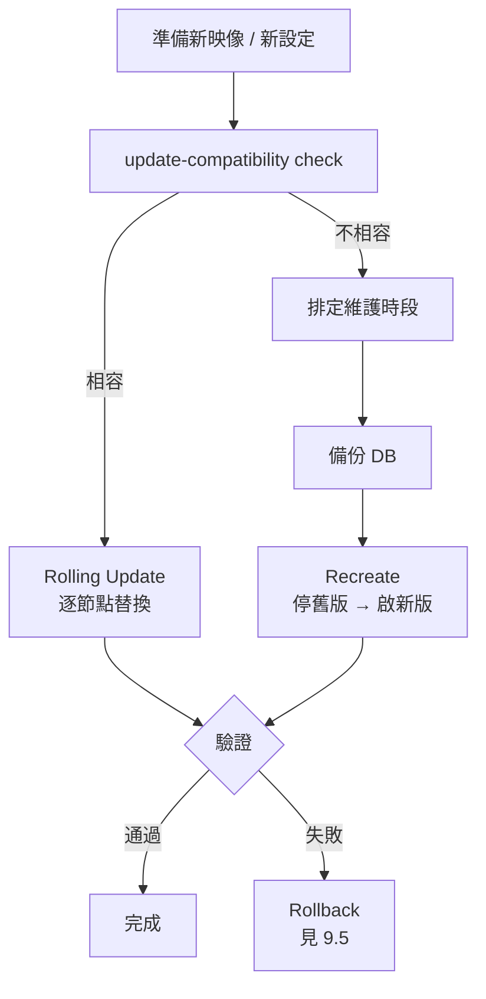
```mermaid
graph TD
    A[準備新映像 / 新設定] --> B[update-compatibility check]
    B -->|相容| C[Rolling Update<br/>逐節點替換]
    B -->|不相容| D[排定維護時段]
    D --> E[備份 DB]
    E --> F[Recreate<br/>停舊版 → 啟新版]
    C --> G{驗證}
    F --> G
    G -->|通過| H[完成]
    G -->|失敗| I[Rollback<br/>見 9.5]
```

---

### 9.3 資料庫相容性注意事項

#### 9.3.1 資料庫升級流程

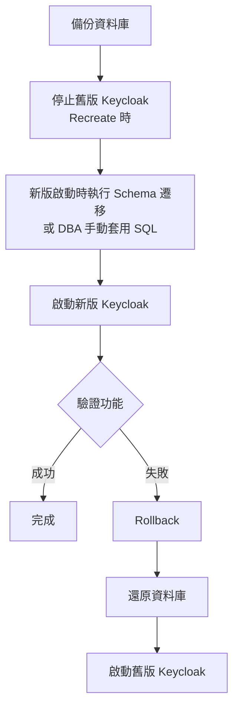
```mermaid
graph TD
    A[備份資料庫] --> B[停止舊版 Keycloak<br/>Recreate 時]
    B --> C[新版啟動時執行 Schema 遷移<br/>或 DBA 手動套用 SQL]
    C --> D[啟動新版 Keycloak]
    D --> E{驗證功能}
    E -->|成功| F[完成]
    E -->|失敗| G[Rollback]
    G --> H[還原資料庫]
    H --> I[啟動舊版 Keycloak]
```

#### 9.3.2 Schema 遷移方式

| 方式 | 設定 | 說明 |
| --- | --- | --- |
| 自動（預設） | `--spi-connections-jpa--quarkus--migration-strategy=update` | 新版首次啟動時自動遷移 |
| 手動（DBA 審核） | `--spi-connections-jpa--quarkus--migration-strategy=manual` 搭配 `--spi-connections-jpa--quarkus--migration-export=/tmp/keycloak-migration.sql` | 產生 SQL 交由 DBA 審核後執行；26.7 起會一併包含自訂 Provider 的 changeset |
| 驗證 | `migration-strategy=validate` | 只檢查不遷移 |

> ⚠️ **實務注意**：金融業通常不允許應用程式自動變更正式環境 Schema，建議採「手動」策略，並在測試環境先以相同資料量驗證遷移時間。

#### 9.3.3 26.7 資料庫相關變更

- PostgreSQL 對短暫性資料表使用 **asynchronous commit**（可用 `--spi-connections-jpa--quarkus--async-commit=false` 關閉）。
- Socket 讀取逾時與交易逾時一致；PostgreSQL 會套用查詢逾時，避免執行緒長時間卡住。
- Realm `displayName` 移為獨立欄位，超過 255 字元會被截斷。

---

### 9.4 版本變更與設定風險

#### 9.4.1 重大架構變更歷史

> ⚠️ **v2.0 更正**：v1.0 寫「Keycloak 21+ 由 WildFly 改為 Quarkus」。實際上 **Quarkus 發行版自 17 版起成為預設，WildFly 發行版於 20 版移除**，21 版則移除舊版 Keycloak Adapter 的部分支援。

| 版本 | 重大變更 |
| --- | --- |
| 17 | Quarkus 發行版成為預設 |
| 20 | 移除 WildFly 發行版 |
| 24 | 宣告式 User Profile 預設啟用；`proxy` 選項棄用；PBKDF2 迭代次數提高至 210,000 |
| 25 | Argon2 成為預設密碼雜湊；Hostname v2；健康檢查與 Metrics 移至管理埠 9000；預設 GC 改為 G1 |
| 26.0 | 移除 `proxy` 選項與 Hostname v1；持久化 User Session 預設啟用；Organizations 正式支援；`KEYCLOAK_ADMIN` 改為 `KC_BOOTSTRAP_ADMIN_*`；Java 17 棄用 |
| 26.1 | 叢集探索預設改為 `jdbc-ping`（取代 UDP multicast） |
| 26.2 | Standard Token Exchange V2、FGAP V2 正式支援；keycloak-js 獨立發版 |
| 26.3 | Rolling Update（Patch，Preview）、非同步 Log、帳號復原 |
| 26.4 | Passkeys、FAPI 2 Final、DPoP 正式支援；HTTP Access Log |
| 26.5 | OpenTelemetry、Workflows（Preview）、JWT Authorization Grant（Preview） |
| 26.6 | Patch 版零停機升級預設啟用；Workflows、JWT Authorization Grant、Federated Client Auth 正式支援；`KCRAW_` 前綴 |
| 26.7 | SCIM（Preview）、Multi-cluster v2（Preview）、Bearer-only 棄用、`view-system` 移除 |

#### 9.4.2 26.6 → 26.7.4 破壞性與行為變更

| 版本 | 變更 | 影響 | 因應 |
| --- | --- | --- | --- |
| 26.6.2 | Introspection 檢查呼叫端 Client 是否在 `aud` | Gateway／API Introspection 回傳 `active: false` | 設計 Audience；暫時可用 `allow-introspection-without-audience`（已棄用） |
| 26.6.3 | Redirect URI 不再接受主機名稱萬用字元 | `https://example.com*` 失效 | 改為 `https://example.com/*` |
| 26.6.3 | Client scope evaluation 需具 `view-users` 權限 | 委派管理員無法使用評估工具 | 補權限 |
| 26.6.3 | 無效 Origin 的 CORS 請求直接 403 | 前端 CORS 錯誤 | 修正 Web origins |
| 26.6.4 | Java KeyStore Provider 檔案需放在 `data/{realm}/` | 舊路徑金鑰庫無法更新 | 搬移或設定 `--spi-keys--java-keystore--keystores-path` |
| 26.7.0 | Identity Provider alias 不可變更 | 以 API 改 alias 回傳 400 | 命名先規劃 |
| 26.7.0 | X509 Client 驗證需設定 CA Subject DN | 未設定時 Admin Console 要求補齊 | 補上 CA Subject DN |
| 26.7.0 | `view-system` 角色移除 | 依賴此角色的監控工具失效 | 改用 master Realm `manage-realm` |
| 26.7.0 | `dynamic-scopes` 更名為 `parameterized-scopes` | `--features=dynamic-scopes` 需修改 | 更新設定 |
| 26.7.0 | 預設關機逾時 1 秒 → 10 秒 | 部署時間略增 | 調整 `terminationGracePeriodSeconds` |
| 26.7.0 | FreeMarker 升級至 2.3.32 預設值 | 自訂主題可能出錯 | 測試主題 |
| 26.7.0 | 新產生 Client Secret 為 86 字元 | 欄位長度限制的外部系統 | 檢查儲存欄位 |
| 26.7.0 | 新 AES 金鑰預設 256 bits | 僅影響新 Realm | 既有 Realm 可新增高優先權 Provider |
| 26.7.0 | Service Account 不再出現在以 ID 查詢使用者的結果 | 自動化腳本 | 改用 Client Service Account 端點 |
| 26.7.1 | Admin API 只認直接指派的管理角色 | 以 Mapper 帶入管理角色的整合失效 | 直接指派角色 |
| 26.7.2 | `/broker/{provider}/link` 預設停用 | 舊帳號連結流程失效 | 改用 `kc_action=idp_link` |
| 26.7.3 | Redirect URI 含 `state`／`code` 等參數被拒 | 特殊回呼設計失效 | 使用應用程式 callback |
| 26.7.3 | Authorization Services 保留 `kc.` Claim 前綴 | 自訂 Claim 名稱衝突 | 改名 |
| 26.7.4 | Authorization Services 資源 URI 正規化比對 | 資源比對結果可能改變 | 升級前檢查資源定義 |

#### 9.4.3 已棄用、將移除的功能

| 功能 | 狀態 | 替代方案 |
| --- | --- | --- |
| OIDC Client Bearer-only 開關 | 26.7 棄用 | 不啟用任何 Flow 的 Confidential Client |
| Identity Brokering API V1 | 26.7 棄用（預設仍啟用） | Identity Brokering API V2 |
| Twitter Identity Provider | 26.7 棄用、將移除 | 通用 OAuth v2 Provider |
| SHA1 雜湊函式 | 26.7 棄用，**預計 Keycloak 27 移除** | SHA-256 以上 |
| WebAuthn `Require Discoverable Credential` | 26.7 棄用 | `Discoverable credential` |
| `allow-introspection-without-audience` | 棄用（過渡用） | 正確設計 Audience |
| `allow-client-initiated-account-linking` | 棄用（過渡用） | `kc_action=idp_link` |
| Token Exchange V1 | Preview、已棄用 | Standard Token Exchange V2、JWT Authorization Grant |
| `cache-stack` 舊值（kubernetes、tcp、udp 等） | 棄用 | `jdbc-ping` |
| Java 17 | 棄用 | OpenJDK 21 |

#### 9.4.4 設定遷移建議

```bash
# 1. 從目前版本匯出設定（建議在獨立執行個體或停機期間執行）
docker exec keycloak /opt/keycloak/bin/kc.sh export \
  --dir /opt/keycloak/data/export --realm internal --users realm_file

# 2. 在新版測試環境匯入並驗證
docker exec keycloak-new /opt/keycloak/bin/kc.sh import \
  --dir /opt/keycloak/data/export --override true

# 3. 執行整合測試：登入、Token 驗證、Logout、LDAP、IdP、Admin API 自動化
# 4. 正式環境升級（Rolling 或 Recreate）
```

> 💡 **建議**：長期而言，應以 [第十一章](#第十一章設定即程式碼與自動化) 的設定即程式碼取代手動 Export／Import，讓各環境設定可追溯、可重現。

---

### 9.5 Rollback 建議策略

#### 9.5.1 Rollback 計畫

```text
準備事項：
├── 升級前資料庫完整備份（並確認還原時間）
├── 舊版映像保留在 Registry（不可覆寫 tag）
├── Realm 設定匯出 / 設定即程式碼版本標記
└── 記錄所有設定變更（環境變數、Feature 旗標）

Rollback 步驟（Recreate 升級失敗）：
1. 停止新版 Keycloak
2. 還原資料庫至升級前備份點（Schema 已遷移時必須還原，不可直接啟舊版）
3. 部署舊版映像與舊設定
4. 驗證登入、Token、整合功能
5. 通知相關系統；分析失敗原因

Rolling Update 中途失敗：
1. 暫停部署，將已更新節點回退至舊映像
2. 若新版尚未執行 Schema 遷移（Patch 版通常不遷移），可直接回退
```

| 項目 | 影響 |
| --- | --- |
| 升級後產生的 Session | 還原 DB 後遺失（使用者需重新登入） |
| 升級後的設定變更、新使用者 | 還原 DB 後遺失，需重新套用 |
| 升級後發出的 Token | 若金鑰未變更仍可驗證；過期後自然失效 |

#### 9.5.2 時間評估

```text
├── 停機時間（Recreate）：10–30 分鐘（依 Schema 遷移與資料量）
├── Rollback 時間：15–60 分鐘（主要為 DB 還原）
└── 建議至少安排 2 小時維護窗口；Patch 版以 Rolling Update 可免停機
```

---

### 9.6 💡 本章實務建議

1. **跟上最新 minor 版**：社群版只修補最新 minor；落後過多時，升級風險會累積。
2. **Patch 版以 Rolling Update 常態化**，Minor 版排定維護窗口並採 Recreate。
3. **以 update-compatibility 自動判斷策略**，並納入 CI/CD。
4. **Schema 遷移採手動策略**，DBA 審核 SQL，測試環境先以正式資料量驗證。
5. **以 9.4.2 表逐條比對**，尤其是 Introspection `aud`、Redirect URI、管理角色三項。
6. **Rollback 以 DB 還原為核心**，並接受 Session 遺失的影響。

---

## 第十章：最佳實務與設計建議

### 10.1 Realm / Client 命名規範

#### 10.1.1 命名規範建議

```text
Realm 命名：
├── 小寫英文、連字號分隔、表達使用者族群
├── 建立後不更名（issuer URL 內含 Realm 名稱）
└── 範例：internal、customer、partner

Client ID 命名：
├── {系統代碼}-{應用類型}
├── 小寫英文、連字號分隔
└── 範例：
    ├── hr-web（人資系統前端）
    ├── hr-bff（人資系統 BFF）
    ├── hr-api（人資系統 API，作為 Audience）
    ├── erp-mobile（ERP 行動 App）
    ├── batch-settlement（清算批次 Service Account）
    └── gateway（API Gateway）

Role 命名：
├── Realm Role：身分類別
│   ├── internal-user
│   ├── external-partner
│   └── auditor
└── Client Role：{系統}-{權限} 或 {權限}（定義在 API Client 上）
    ├── erp-read-only
    ├── erp-operator
    └── erp-manager

Client Scope 命名：
├── {api}-audience：只放 Audience mapper
└── {domain}-claims：放一組業務 Claim mapper

Identity Provider alias（26.7 起不可變更）：
└── {類型}-{對象}：oidc-entra-corp、saml-parent-group
```

---

### 10.2 多系統共用 Keycloak 的設計原則

#### 10.2.1 架構設計

```text
設計原則：
├── 依使用者族群與信任邊界劃分 Realm，不依應用劃分
├── 外部身分來源以 Identity Brokering / Organizations 整合
├── 每個 API 一個 Audience，Token 最小化
└── Token 內容標準化（全公司一致的 Claim 名稱）

效能與容量考量：
├── Client 數量本身不是主要瓶頸，但數百個 Client 時 Admin Console 與匯出會變慢，需以自動化管理
├── 大型 LDAP（數十萬使用者）考慮 Import + 定期增量同步，並限縮 Users DN
├── 高流量對外系統考慮獨立 Keycloak 叢集，避免影響內部 SSO
└── 定期清理過期事件；Offline Session 需設上限
```

#### 10.2.2 Token 內容標準

```yaml
# 全公司統一的 Access Token 內容設計
必要：
  - iss / aud / exp / iat / azp / sub / sid
  - realm_access.roles        # 身分類別
  - resource_access.{api}.roles  # 該 API 的功能權限
選用（透過 Mapper）：
  - preferred_username
  - employee_id              # User Attribute mapper
  - department               # User Attribute mapper
  - organization             # 請求 organization scope 時
不放入：
  - 身分證字號、生日、帳戶資訊等個資與業務敏感資料（改由 API 查詢）
  - 大量群組路徑（Token 膨脹）
```

> 💡 **建議**：以 `sub`（UUID）作為各系統關聯使用者的鍵值，不要以 `preferred_username` 或 Email 當主鍵（可能變更或重複）。

---

### 10.3 銀行或大型企業常見踩雷點

#### 10.3.1 踩雷案例 1：Token 過大

```text
問題：Token 超過 HTTP Header 限制（Nginx 預設 8KB、部分 Gateway 更小），出現 400 / 431

原因：
├── 使用者有大量角色，且 Full scope allowed 開啟
├── Group Membership mapper 帶出完整群組路徑
└── 自訂 Mapper 加入大量資料

解決方案：
├── 關閉 Full scope allowed，只映射必要角色（見 4.6.4）
├── 群組改用角色表達，或只帶群組 ID
├── 敏感／大量資訊改由 UserInfo 或 API 查詢
├── 必要時使用 Lightweight access token
└── 暫時調整 Proxy 的 header buffer（治標）
```

#### 10.3.2 踩雷案例 2：AD 整合效能差

```text
問題：AD 整合後登入緩慢、同步耗時

原因：
├── Users DN 設在網域根，搜尋範圍過大
├── 每次都全量同步
├── Import users 關閉且 AD 延遲高
└── 跨機房存取 AD

解決方案：
├── Users DN 限縮至實際 OU，加上 Custom User LDAP Filter
├── 啟用 Pagination，全量同步改為每日離峰，平日用增量同步
├── Import users 開啟，減少即時查詢
├── 使用 LDAPS 連線池、設定 Timeout
└── 就近連線 AD 網域控制站
```

#### 10.3.3 踩雷案例 3：Refresh Token 被盜用

```text
問題：Refresh Token 外洩後被長期使用

原因：
├── Refresh Token 存於 localStorage
├── 未啟用 Rotation
└── 使用 Offline Token 但未設上限

解決方案：
├── 採 BFF 模式，Token 不進瀏覽器
├── 啟用 Revoke Refresh Token（Rotation），Max Reuse = 0
├── Public Client 使用 DPoP 綁定金鑰
├── 監控 REFRESH_TOKEN_ERROR（重用偵測），觸發 Session 撤銷
└── 限制 offline_access 只給必要的 Confidential Client
```

#### 10.3.4 踩雷案例 4：升級後前端登入失敗

```text
問題：Keycloak 升級後，部分系統無法登入或 API 開始回 401

原因：
├── keycloak-js 版本過舊（新版 keycloak-js 相容所有受支援伺服器版本，應同步更新）
├── Redirect URI 規則收緊（26.6.3 主機名稱萬用字元、26.7.3 參數）
├── Introspection 開始檢查 aud（26.6.2）
└── 自訂主題不相容（26.7 FreeMarker 2.3.32）

解決方案：
├── 以 9.4.2 表逐項比對
├── 測試環境先升級，並執行整合測試
├── 監控升級後 LOGIN_ERROR、CODE_TO_TOKEN_ERROR 變化
└── 準備 Rollback 計畫
```

#### 10.3.5 踩雷案例 5：Hostname 設定錯誤導致 iss 不一致

> 🆕 **v2.0 新增**

```text
問題：同一個 Realm 發出的 Token，iss 有時是 https://auth.example.com，有時是 http://keycloak:8080

原因：
├── 未設定 KC_HOSTNAME，iss 依請求動態產生
├── 內部服務直接以內網位址呼叫 Token 端點
└── Proxy 標頭未正確傳遞

解決方案：
├── KC_HOSTNAME 設為完整對外 URL
├── 內部服務需經內網呼叫時，設定 hostname-backchannel-dynamic=true（iss 仍固定）
├── 設定 KC_PROXY_HEADERS 與 KC_PROXY_TRUSTED_ADDRESSES
└── 以 hostname-debug 驗證
```

#### 10.3.6 踩雷案例 6：透過 Mapper 帶入的管理角色失效

> 🆕 **v2.0 新增**

```text
問題：26.7.1 升級後，自動化工具呼叫 Admin API 回 403

原因：
└── 管理角色（例如 manage-users）是透過 Protocol Mapper / Hardcoded role 加到 Token，
    並非直接指派給 Service Account；26.7.1 起 Admin API 只認直接指派的角色

解決方案：
├── 將所需 realm-management 角色直接指派給 Service Account
└── 委派管理改用 FGAP V2
```

#### 10.3.7 踩雷案例 7：第三方 Cookie 限制導致 SSO 狀態偵測失效

> 🆕 **v2.0 新增**

```text
問題：使用者在系統 A 登出後，系統 B 仍顯示已登入；或 silent check-sso 一直失敗

原因：
└── Keycloak 與應用程式位於不同網域，瀏覽器封鎖第三方 Cookie，
    Session Status iframe 與 silent check-sso 無法讀到 Keycloak Cookie

解決方案：
├── Keycloak 與應用使用同一註冊網域（auth.example.com / app.example.com）
├── 以 Back-channel Logout 通知應用（BFF 架構）
├── 前端 checkLoginIframe 設為 false，改以 Token 到期與 401 判斷
└── 高安全系統採 BFF
```

#### 10.3.8 踩雷案例 8：Service Account 權限過大

> 🆕 **v2.0 新增**

```text
問題：某批次程式的 Client Secret 外洩，攻擊者取得整個 Realm 的管理權限

原因：
├── 為了方便，Service Account 被指派 realm-admin
├── Secret 寫在程式碼或設定檔中
└── 未輪替、未監控 CLIENT_LOGIN 事件

解決方案：
├── 最小權限：只指派必要的 Client Role 或 realm-management 子角色
├── 改用 private_key_jwt、mTLS 或 Federated client authentication（K8s Service Account）
├── Secret 存放於 Vault / Secret Manager，定期輪替
└── 監控 CLIENT_LOGIN 來源 IP 與頻率
```

---

### 10.4 開發、測試、正式環境隔離建議

#### 10.4.1 環境隔離架構

```text
方案 1：完全獨立（建議）
├── DEV：獨立 Keycloak + 獨立 DB
├── SIT：獨立 Keycloak + 獨立 DB
├── UAT：獨立 Keycloak + 獨立 DB（版本與設定與 PROD 一致）
└── PROD：獨立 Keycloak 叢集 + 獨立 DB

方案 2：非正式環境共用 Keycloak，以 Realm 區分
├── Keycloak（非正式）
│   ├── Realm: internal-dev
│   ├── Realm: internal-sit
│   └── Realm: internal-uat
└── 風險：升級、效能問題會同時影響所有非正式環境

原則：正式環境必須完全獨立（叢集、DB、網段、管理帳號、金鑰）
```

#### 10.4.2 環境設定管理

```yaml
# 以環境變數區分（同一份映像）
dev:
  KC_HOSTNAME: https://auth-dev.example.com
  KC_DB_URL: jdbc:postgresql://pg-dev:5432/keycloak
sit:
  KC_HOSTNAME: https://auth-sit.example.com
  KC_DB_URL: jdbc:postgresql://pg-sit:5432/keycloak
prod:
  KC_HOSTNAME: https://auth.example.com
  KC_DB_URL: jdbc:postgresql://pg-prod:5432/keycloak
```

#### 10.4.3 設定同步建議

```text
□ Realm 設定以「設定即程式碼」管理（見第十一章），同一份定義套用各環境
□ 環境差異（網址、Redirect URI、Secret）以變數注入
□ 不同步使用者資料
□ 不同步 Client Secret、金鑰（各環境獨立產生）
□ 正式 Realm 不包含 localhost Redirect URI
□ 變更經 PR 審核，CI 自動部署至 DEV → SIT → UAT → PROD
```

---

### 10.5 💡 本章實務建議

1. **命名一次到位**：Realm、IdP alias 建立後不應更改。
2. **Token 內容全公司標準化**，以 `sub` 為關聯鍵，不放個資。
3. **定期回顧踩雷清單**，尤其是 Token 大小、Hostname、Service Account 權限。
4. **正式環境完全獨立**，UAT 版本與設定與正式一致。
5. **設定變更走 PR 與 CI/CD**，避免手動在 Admin Console 修改正式環境。

---

## 第十一章：設定即程式碼與自動化

> 🆕 **v2.0 新增**

### 11.1 為何需要設定即程式碼

| 問題 | 手動於 Admin Console 設定 | 設定即程式碼（Configuration as Code） |
| --- | --- | --- |
| 環境一致性 | 各環境逐漸不一致（Drift） | 同一份定義套用所有環境 |
| 變更稽核 | 只能靠 Admin events | Git 歷史 + PR 審核 + Admin events |
| 災難復原 | 依賴 DB 備份 | 可從程式碼重建 Realm 設定 |
| 職責分離 | 管理員直接改正式環境 | 開發提交、審核者核准、Pipeline 部署 |

> 💡 **建議**：正式環境的 Admin Console 應以「唯讀檢視＋緊急處置」為主，日常設定變更一律經 Git。

---

### 11.2 Realm Export／Import

#### 11.2.1 CLI 匯出／匯入

```bash
# 匯出單一 Realm（含使用者，使用者寫入 Realm 檔案）
bin/kc.sh export --dir /opt/keycloak/data/export --realm internal --users realm_file

# 匯出時不含使用者
bin/kc.sh export --dir /opt/keycloak/data/export --realm internal --users skip

# 匯入（--override false：已存在的 Realm 不覆寫）
bin/kc.sh import --dir /opt/keycloak/data/export --override false

# 伺服器啟動時自動匯入 /opt/keycloak/data/import/*.json（已存在的 Realm 會略過）
bin/kc.sh start --optimized --import-realm
```

Realm JSON 可使用 `${ENV_VAR}` 或 `${ENV_VAR:預設值}` 形式的環境變數佔位字元，讓同一份檔案套用不同環境。

#### 11.2.2 Admin Console／REST API 部分匯入

```bash
# 將 Client、Role、Group 等「部分」設定匯入既有 Realm
curl -s -X POST "https://auth-admin.internal.example.com/admin/realms/internal/partialImport" \
  -H "Authorization: Bearer ${ADMIN_TOKEN}" \
  -H "Content-Type: application/json" \
  -d @partial.json
```

```json
{
  "ifResourceExists": "SKIP",
  "clients": [
    { "clientId": "report-web", "publicClient": true, "redirectUris": ["https://report.example.com/*"] }
  ],
  "roles": {
    "realm": [ { "name": "report-viewer" } ]
  }
}
```

| `ifResourceExists` | 行為 |
| --- | --- |
| `FAIL` | 遇到已存在資源即中止 |
| `SKIP` | 略過已存在資源 |
| `OVERWRITE` | 覆寫已存在資源（謹慎使用） |

> ⚠️ **實務注意**：Export／Import 適合初始化與遷移，但**不具備差異比對與刪除管理**，不適合作為長期的設定管理方式。

---

### 11.3 keycloak-config-cli

`adorsys/keycloak-config-cli` 透過 Admin REST API 以 **宣告式、冪等** 的方式套用 JSON／YAML 設定，並可追蹤「由工具管理的資源」以便刪除不再定義的項目。自 4.0 起支援最近 4 個 Keycloak 版本（請選用與伺服器版本對應的映像 tag）。

```yaml
# realms/internal.yaml
realm: internal
enabled: true
sslRequired: all
accessTokenLifespan: 300
ssoSessionIdleTimeout: 1800
ssoSessionMaxLifespan: 36000
revokeRefreshToken: true
refreshTokenMaxReuse: 0
bruteForceProtected: true
failureFactor: 10
clients:
  - clientId: erp-web
    publicClient: true
    standardFlowEnabled: true
    directAccessGrantsEnabled: false
    redirectUris:
      - "$(env:ERP_WEB_URL)/*"
    webOrigins:
      - "$(env:ERP_WEB_URL)"
    attributes:
      pkce.code.challenge.method: S256
roles:
  realm:
    - name: internal-user
    - name: auditor
```

```bash
docker run --rm \
  -e KEYCLOAK_URL=https://auth-admin.internal.example.com \
  -e KEYCLOAK_GRANTTYPE=client_credentials \
  -e KEYCLOAK_CLIENTID=config-cli \
  -e KEYCLOAK_CLIENTSECRET="$CONFIG_CLI_SECRET" \
  -e IMPORT_FILES_LOCATIONS='/config/*.yaml' \
  -e IMPORT_VARSUBSTITUTION_ENABLED=true \
  -e IMPORT_REMOTESTATE_ENABLED=true \
  -e ERP_WEB_URL=https://erp-sit.example.com \
  -v "$PWD/realms:/config" \
  adorsys/keycloak-config-cli:<工具版本>-<Keycloak版本>
```

---

### 11.4 Operator KeycloakRealmImport

```yaml
apiVersion: k8s.keycloak.org/v2beta1
kind: KeycloakRealmImport
metadata:
  name: internal-realm
  namespace: keycloak
spec:
  keycloakCRName: iam
  realm:
    realm: internal
    enabled: true
    sslRequired: all
  placeholders:
    ERP_WEB_SECRET:
      secret:
        name: erp-web-secret
        key: secret
```

| 特性 | 說明 |
| --- | --- |
| 能力 | **只能建立新 Realm**；不會更新或刪除，同名 Realm 已存在時不覆寫 |
| 佔位字元 | `spec.placeholders` 可從同命名空間的 Secret 注入值 |
| 清理 | 匯入完成後應刪除 CR，以清除相關 Job／Pod |
| 安全 | 佔位字元可存取所有環境變數，管理此 CR 的權限需限縮在命名空間管理員 |

> 💡 **建議**：KeycloakRealmImport 適合「首次建立 Realm」；後續持續變更請搭配 keycloak-config-cli 或 Terraform。

---

### 11.5 Terraform Provider

官方維護的 Terraform Provider 來源為 **`keycloak/keycloak`**（由社群版 `mrparkers/keycloak` 移交，可用 `terraform state replace-provider` 遷移），支援最近三個 Keycloak minor 版本。

```hcl
terraform {
  required_providers {
    keycloak = {
      source  = "keycloak/keycloak"
      version = ">= 5.9.0"
    }
  }
}

provider "keycloak" {
  client_id     = "terraform"
  client_secret = var.keycloak_client_secret
  url           = "https://auth-admin.internal.example.com"
  realm         = "master"
}

resource "keycloak_realm" "internal" {
  realm                  = "internal"
  enabled                = true
  ssl_required           = "all"
  access_token_lifespan  = "5m"
  sso_session_idle_timeout = "30m"
  sso_session_max_lifespan = "10h"
  revoke_refresh_token   = true
  refresh_token_max_reuse = 0
}

resource "keycloak_openid_client" "erp_web" {
  realm_id                     = keycloak_realm.internal.id
  client_id                    = "erp-web"
  access_type                  = "PUBLIC"
  standard_flow_enabled        = true
  direct_access_grants_enabled = false
  valid_redirect_uris          = ["${var.erp_web_url}/*"]
  web_origins                  = [var.erp_web_url]
  pkce_code_challenge_method   = "S256"
}
```

> ⚠️ **實務注意**：Terraform state 會包含 Client Secret 等敏感值，state 後端必須加密並限制存取。

---

### 11.6 工具選擇比較

| 工具 | 模式 | 優點 | 限制 | 適用 |
| --- | --- | --- | --- | --- |
| `kc.sh export/import` | 快照 | 內建、完整 | 無差異管理、需停機或獨立執行 | 初始化、遷移、備份 |
| partialImport API | 增量 | 無需停機 | 無刪除管理 | 小量補設定 |
| keycloak-config-cli | 宣告式（Realm JSON 格式） | 格式與匯出檔一致、可追蹤管理資源 | 需配合版本 | Realm 設定全面管理 |
| Terraform Provider | 宣告式（HCL） | 與其他基礎設施一起管理、Plan 預覽 | 需熟悉 Terraform、state 管理 | 平台團隊 IaC |
| Operator KeycloakRealmImport | 宣告式（K8s CR） | GitOps 友善 | 只能建立 | K8s 首次建立 |
| `kcadm.sh`／Admin API 腳本 | 命令式 | 彈性最高 | 難維護、易產生 Drift | 緊急處置、一次性作業 |

---

### 11.7 CI/CD 與環境升遷

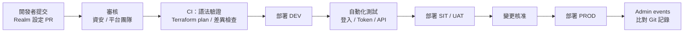
```mermaid
graph LR
    DEV[開發者提交<br/>Realm 設定 PR] --> REVIEW[審核<br/>資安 / 平台團隊]
    REVIEW --> CI[CI：語法驗證<br/>Terraform plan / 差異檢查]
    CI --> D1[部署 DEV]
    D1 --> T1[自動化測試<br/>登入 / Token / API]
    T1 --> D2[部署 SIT / UAT]
    D2 --> APPROVE[變更核准]
    APPROVE --> D3[部署 PROD]
    D3 --> AUDIT[Admin events<br/>比對 Git 記錄]
```

```text
Pipeline 建議：
├── 設定檔與環境變數檔分離（網址、Redirect URI 依環境注入）
├── Secret 從 Vault / Secret Manager 注入，不進 Git
├── 每次部署前先執行 plan / dry-run，輸出差異供審核
├── 部署後執行 Smoke Test：Discovery、Client Credentials 取 Token、登入流程（E2E）
└── 定期比對「正式環境實際設定」與 Git，偵測手動變更（Drift）
```

---

### 11.8 💡 本章實務建議

1. **Realm 設定納入 Git**，正式環境避免直接在 Admin Console 修改。
2. **選一種主要工具**：Realm 導向團隊用 keycloak-config-cli；平台 IaC 團隊用 Terraform。
3. **Operator RealmImport 只用於首次建立**。
4. **Secret 與環境差異以變數注入**，Terraform state 加密。
5. **每次部署產生差異報告並執行 Smoke Test**，定期偵測 Drift。

---

## 第十二章：新興標準與 AI Agent 授權

> 🆕 **v2.0 新增**

本章整理 Keycloak 26.5–26.7 引入的新興標準支援。多數功能仍為 **Preview 或 Experimental**，適合 PoC 與技術評估，正式環境導入前必須完成風險評估。

### 12.1 功能成熟度總覽

| 功能 | 標準 | 成熟度（26.7） | Feature 旗標 | 典型用途 |
| --- | --- | --- | --- | --- |
| MCP 授權伺服器 | MCP Authorization（OAuth 2.1 子集） | ✅ 以既有功能實現（官方指南） | — | AI Agent／MCP Client 存取 MCP Server |
| Client ID Metadata Document（CIMD） | OAuth CIMD 草案 | 🧪 Experimental | `cimd` | 以 URL 作為 Client ID，免預先註冊 |
| Identity Assertion JWT Grant（ID-JAG） | IETF 草案 | 🧪 Experimental | `identity-assertion-jwt` | 跨授權伺服器傳遞身分，免重新登入 |
| Shared Signals Framework（SSF） | OpenID SSF、CAEP 1.0、RISC 1.0 | 🧪 Experimental | `ssf` | 即時推送 Session 撤銷、帳號風險事件 |
| AuthZEN | OpenID AuthZEN Authorization API | 🧪 Experimental | `authzen` | 標準化授權決策 API（PDP） |
| Token Exchange Delegation | RFC 8693 延伸 | 🧪 Experimental | `token-exchange-delegation` | 經同意的代理（使用者授權 Agent 代為操作） |
| Parameterized Scopes | — | 🧪 Experimental | `parameterized-scopes` | 帶參數的 scope（例如 `account:12345`） |
| OID4VCI | OpenID for Verifiable Credential Issuance | 🧪 Experimental | `oid4vc-vci` 等 | 發行數位憑證（數位錢包） |
| SCIM API | RFC 7643／7644 | ⚠️ Preview | `scim-api` | 使用者／群組佈建 |
| Admin API v2（Client 管理） | — | 🧪 Experimental | `client-admin-api:v2` | 宣告式 Client 管理、OpenAPI 規格 |

---

### 12.2 Keycloak 作為 MCP 授權伺服器

**Model Context Protocol（MCP）** 規範 AI 應用（MCP Client，例如 IDE 內的 AI 助理）如何安全地呼叫 MCP Server 提供的工具。MCP 的授權機制建立在 OAuth 2.1 之上，Keycloak 可擔任其 **Authorization Server**。

#### 12.2.1 規範支援狀態

| MCP 規範版本 | Keycloak 支援 |
| --- | --- |
| 2025-03-26 | ✅ 完整支援 |
| 2025-06-18、2025-11-25、2026-07-28 | ⚠️ 部分支援：**不支援 RFC 8707 Resource Indicators**（`resource` 參數） |

Keycloak 對 MCP 授權所需規範的支援：OAuth 2.1 授權框架、RFC 8414 Authorization Server Metadata、RFC 9207 Issuer Identification、RFC 7591 Dynamic Client Registration、CIMD（Experimental）。RFC 9728 Protected Resource Metadata 屬於 MCP Server 的責任。

#### 12.2.2 設定步驟（MCP 2025-06-18 以後）

```text
1. 為 MCP Server 的能力建立 Client Scope（Type：Optional）
   例如：mcp:tools、mcp:prompts
2. 在每個 Scope 加入 Audience mapper
   Included Custom Audience = MCP Server URL（例如 https://mcp.example.com/mcp）
3. MCP Client 以 scope 參數（取代 resource 參數）請求 Token
4. MCP Server 驗證 Token 的 aud 等於自己的 URL
5. 選擇 Client 註冊方式：
   ├── Dynamic Client Registration（搭配 Client Registration Policies 限制）
   └── CIMD（--features=cimd，見 12.3）
```

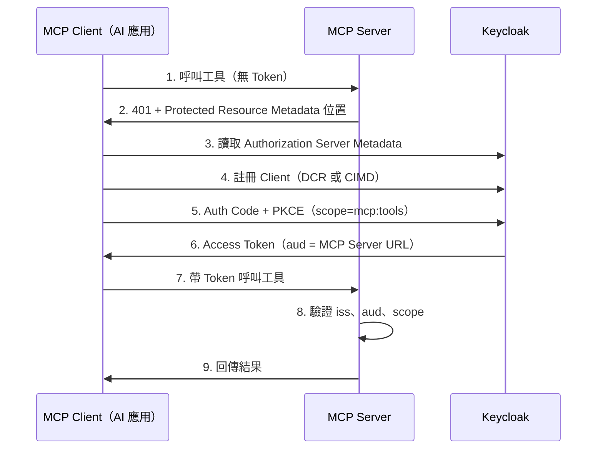
```mermaid
sequenceDiagram
    participant C as MCP Client（AI 應用）
    participant S as MCP Server
    participant KC as Keycloak

    C->>S: 1. 呼叫工具（無 Token）
    S->>C: 2. 401 + Protected Resource Metadata 位置
    C->>KC: 3. 讀取 Authorization Server Metadata
    C->>KC: 4. 註冊 Client（DCR 或 CIMD）
    C->>KC: 5. Auth Code + PKCE（scope=mcp:tools）
    KC->>C: 6. Access Token（aud = MCP Server URL）
    C->>S: 7. 帶 Token 呼叫工具
    S->>S: 8. 驗證 iss、aud、scope
    S->>C: 9. 回傳結果
```

> ⚠️ **實務注意**：AI Agent 常在使用者電腦上以 `localhost` 回呼。官方指南建議為這類 Client（例如 VS Code、Claude Code）建立專屬 Client Profile：關閉「Restrict same domain」、設定受信任網域、使用 Public Client + PKCE。企業應同時限制可取得的 scope，並監控其 Token 使用。

---

### 12.3 Client ID Metadata Document（CIMD）

CIMD 讓 Client 以一個 **HTTPS URL** 作為 `client_id`，該 URL 回傳 Client 的中繼資料（名稱、Redirect URI、Logo 等），授權伺服器即可在沒有預先註冊的情況下信任此 Client。適合「Client 數量不可預期」的 AI 生態（MCP Client）。

```text
啟用：--features=cimd
設定：
1. 建立 Client Profile，加入 client-id-metadata-document executor
2. 建立 Client Policy，Condition 使用 client-id-uri
3. 設定受信任網域與驗證規則（例如 Redirect URI 必須與 client_id 同網域）
```

---

### 12.4 Identity Assertion JWT Grant（ID-JAG）

ID-JAG 讓企業 IdP 發出「身分斷言 JWT」，由另一個授權伺服器（例如 SaaS 的 Keycloak）接受並發出 Access Token，使用者不必在每個 SaaS 重新登入或同意。Keycloak 26.7 目前只實作 **接收端授權伺服器** 角色（Experimental，`identity-assertion-jwt`）。

典型情境：企業員工在內部 AI Agent 中操作多個 SaaS，由企業 IdP 統一控管 Agent 可以代表員工存取哪些服務。

---

### 12.5 Shared Signals Framework（SSF）

Keycloak 26.7 可擔任 **SSF Transmitter**，以簽章的 Security Event Token（SET）即時通知已註冊的接收者：

| 事件類型 | 範例 |
| --- | --- |
| CAEP 1.0 | Session 撤銷、憑證變更、認證強度變更 |
| RISC 1.0 | 帳號停用、帳號遭入侵、憑證外洩 |

支援 Push 與 Poll 兩種傳遞方式，事件先寫入資料庫 Outbox，重啟後不遺失。對於需要「持續存取評估（Continuous Access Evaluation）」的零信任架構，SSF 可補足 JWT 無法即時撤銷的缺點。

---

### 12.6 AuthZEN

AuthZEN 是 OpenID Foundation 的標準授權決策 API：應用送出「主體（subject）、資源（resource）、動作（action）」，Keycloak 作為 **Policy Decision Point** 回傳 permit／deny，決策依據為 Authorization Services 中設定的政策（Experimental，`authzen`）。好處是應用程式可以用與廠商無關的 API 詢問授權結果，未來更換 PDP 時不需改程式。

---

### 12.7 OID4VCI（可驗證憑證發行）

OpenID for Verifiable Credential Issuance 讓 Keycloak 發行 **可驗證數位憑證**（例如員工證、會員資格）到使用者的數位錢包。26.7 改善了 Admin UI 設定、HAIP（High Assurance Interoperability Profile）相容性、使用者憑證管理，並可設定憑證更新間隔（`vc.refresh_interval_in_seconds`）；Pre-authorized code grant 拆為獨立的 Experimental 功能。此功能與各國數位身分錢包（例如 EUDI Wallet）的發展相關，目前適合研究與 PoC。

---

### 12.8 評估與導入建議

| 階段 | 建議做法 |
| --- | --- |
| 現在可導入 | MCP 授權（以 Audience mapper + scope 方式）、SCIM（Preview，限內部測試）、Token Exchange V2 |
| PoC 評估 | CIMD、SSF、AuthZEN、ID-JAG、OID4VCI |
| 導入前必做 | 風險評估、隔離的 Realm／叢集、Feature 旗標清單納入變更管理、追蹤每個 minor 版的行為變更 |
| AI Agent 治理 | 每個 Agent 一個 Client、最小 scope、短效 Token、Step-up 保護高風險操作、Token Exchange 縮小權限、完整事件稽核 |

---

### 12.9 💡 本章實務建議

1. **Experimental 功能不上正式環境**；Preview 功能需經風險評估。
2. **MCP Server 以 Audience + scope 驗證 Token**，在 Keycloak 支援 RFC 8707 前不依賴 `resource` 參數。
3. **AI Agent 視為一般 Client 治理**：最小權限、短效 Token、可稽核、可撤銷。
4. **零信任架構追蹤 SSF 發展**，以補足 JWT 無法即時撤銷的缺口。
5. **每次升級檢視 Feature 旗標**：Experimental 功能在 minor 版之間可能變更或移除（例如 26.7 移除 `token-exchange-external-internal:v2`）。

---

## 附錄 A：檢查清單（Checklist）

### A.1 初次部署檢查清單

**基礎建設**

- [ ] 資料庫版本在官方支援清單內，UTF-8 編碼，已建立 HA（Primary + Standby）
- [ ] 網路：Proxy → Keycloak（8080／8443）、節點間（7800／57800）、監控 → 9000 已開通，其餘封閉
- [ ] TLS 憑證已準備，並設定自動續期與到期告警
- [ ] Reverse Proxy 只公開 `/realms/`、`/resources/`、`/.well-known/`
- [ ] 所有主機 NTP 時間同步

**Keycloak 安裝**

- [ ] 使用自建最佳化映像，版本 tag 不可覆寫
- [ ] `KC_HOSTNAME` 為完整 URL；`KC_PROXY_HEADERS`、`KC_PROXY_TRUSTED_ADDRESSES` 已設定
- [ ] 健康檢查、Metrics 已啟用，管理埠未對外
- [ ] 以暫時管理員建立具名正式管理員並啟用 MFA，刪除暫時管理員
- [ ] `hostname-debug` 驗證後關閉

**Realm 設定**

- [ ] Require SSL：all requests
- [ ] Unmanaged attributes：Disabled；User Profile 已定義
- [ ] 密碼政策依 NIST SP 800-63B-4（或依監理要求並記錄差異）
- [ ] Brute force detection 已啟用
- [ ] User／Admin events 已啟用並串接 SIEM
- [ ] Session 與 Token 時效已設定；Revoke Refresh Token 已開啟
- [ ] MFA（OTP／Passkeys）強制並提供備援碼

**Client 設定**

- [ ] 只開啟必要 Flow；Implicit、Direct Access Grants 關閉
- [ ] Redirect URI、Post logout redirect URI、Web origins 精確設定
- [ ] PKCE（S256）強制
- [ ] Audience 已設計；Full scope allowed 關閉
- [ ] Confidential Client 優先使用 `private_key_jwt`／mTLS

### A.2 日常維運檢查清單

**每日**

- [ ] 健康狀態與告警（`/health/ready`、登入成功率、Token 延遲）
- [ ] ERROR Log 與異常事件（LOGIN_ERROR 激增、帳號鎖定、REFRESH_TOKEN 重用）
- [ ] Admin events 是否有非預期變更

**每週**

- [ ] 使用者活動統計、長期未登入帳號
- [ ] 資料庫容量、連線池使用率、事件表大小
- [ ] 資安公告（GitHub Security Advisories、官方 Blog）

**每月**

- [ ] Patch 版升級評估與 Rolling Update
- [ ] Service Account 與 Client Secret 盤點
- [ ] 更新 Runbook 與文件

**每季**

- [ ] 使用者權限審查（含高權限帳號、FGAP 設定）
- [ ] Minor 版升級評估
- [ ] 災難復原演練（DB 還原、Rollback）
- [ ] 設定 Drift 檢查（正式環境 vs Git）

### A.3 系統整合檢查清單

**前端應用**

- [ ] 使用最新 keycloak-js 26.2.x（或採 BFF）
- [ ] PKCE 已啟用；Token 不存 localStorage
- [ ] 使用 `onTokenExpired` + `updateToken` 換發
- [ ] Logout 使用 RP-Initiated Logout，Post logout redirect URI 已註冊
- [ ] 確認第三方 Cookie 限制對 SSO 狀態偵測的影響

**後端 API**

- [ ] 驗證簽章、`iss`、`aud`、`exp`
- [ ] 預設拒絕未列出的路徑
- [ ] 角色與 scope 授權正確；高風險操作檢查 `acr`
- [ ] JWKS 快取與金鑰輪替處理
- [ ] 服務間呼叫使用 Client Credentials／Token Exchange

**AD／LDAP 整合**

- [ ] LDAPS／StartTLS；Bind DN 最小權限
- [ ] Users DN 限縮；同步排程設定
- [ ] 密碼驗證與帳號停用同步正常
- [ ] 登入延遲在可接受範圍

### A.4 升級前檢查清單

- [ ] 閱讀目標版本與中間版本的 Release Notes、Upgrading Guide
- [ ] 以 [9.4.2](#942-266--2674-破壞性與行為變更) 比對 Introspection `aud`、Redirect URI、管理角色等變更
- [ ] 執行 `update-compatibility check` 決定 Rolling／Recreate
- [ ] 備份 DB 並驗證可還原；保留舊版映像
- [ ] 自訂 SPI、主題於新版重新編譯與測試
- [ ] 測試環境完成整合測試與效能測試
- [ ] Rollback 計畫與通知已完成

---

## 附錄 B：常見 Q&A

### B.1 Q1：忘記 Admin 密碼怎麼辦？

> ⚠️ **v2.0 更正**：v1.0 的指令 `bootstrap-admin-user --username:admin-new --password:newpassword` 語法錯誤。

```bash
# 以與正式環境相同的資料庫設定，執行 bootstrap-admin 建立暫時管理員
# （密碼由環境變數提供，避免出現在指令列歷史）
export TMP_ADMIN_PASSWORD='請使用強密碼'
bin/kc.sh bootstrap-admin user --username tmpadm --password:env TMP_ADMIN_PASSWORD

# 容器環境：以相同映像與 DB 環境變數啟動一次性容器
docker run --rm \
  -e KC_DB_URL -e KC_DB_USERNAME -e KC_DB_PASSWORD -e TMP_ADMIN_PASSWORD \
  registry.example.com/iam/keycloak:26.7.4-1 \
  bootstrap-admin user --username tmpadm --password:env TMP_ADMIN_PASSWORD --no-prompt

# 亦可建立暫時管理用 Service Account
bin/kc.sh bootstrap-admin service --client-id tmpclient --client-secret:env TMP_CLIENT_SECRET
```

登入後立即重設正式管理員的憑證，並刪除暫時帳號。

### B.2 Q2：如何批次匯入使用者？

> ⚠️ **v2.0 更正**：v1.0 將含多位使用者的 JSON 送到 `POST /admin/realms/{realm}/users`，但此端點一次只能建立**一位**使用者。

```bash
# 方式 1：partialImport（線上、可批次）
curl -s -X POST "https://auth-admin.internal.example.com/admin/realms/internal/partialImport" \
  -H "Authorization: Bearer ${ADMIN_TOKEN}" \
  -H "Content-Type: application/json" \
  -d @users.json
```

```json
{
  "ifResourceExists": "SKIP",
  "users": [
    {
      "username": "user1",
      "email": "user1@example.com",
      "enabled": true,
      "groups": ["/台北分行/營業部"],
      "requiredActions": ["UPDATE_PASSWORD", "CONFIGURE_TOTP"]
    }
  ]
}
```

```text
方式 2：kc.sh import（離線、大量，例如系統遷移）
方式 3：LDAP 同步或 SCIM 佈建（持續性來源）

注意：不要在匯入檔中放明文密碼；應要求使用者首次登入時設定密碼，
      或以已雜湊的憑證資料（credentials 中的 hashedSaltedValue）搬移。
```

### B.3 Q3：Token 過期時間如何調整？

```text
Admin Console → Realm settings
├── Tokens → Access Token Lifespan
├── Sessions → SSO Session Idle / SSO Session Max
└── Sessions → Client Session Idle / Client Session Max

單一 Client 覆寫：Clients → <client> → Advanced → Advanced settings
```

建議值見 [6.3.1](#631-時效設定與預設值) 與 [8.2.1](#821-session-設計原則)。

### B.4 Q4：如何查看目前線上使用者？

> ⚠️ **v2.0 更正**：v1.0 的 `/admin/realms/{realm}/sessions/count` 端點並不存在。

```bash
# 各 Client 的活躍 Session 數量
curl -s "https://auth-admin.internal.example.com/admin/realms/internal/client-session-stats" \
  -H "Authorization: Bearer ${ADMIN_TOKEN}" | jq .

# 指定 Client 的 Session 數與使用者 Session 清單（{id} 為 Client 的內部 UUID）
curl -s "https://auth-admin.internal.example.com/admin/realms/internal/clients/${CLIENT_UUID}/session-count" \
  -H "Authorization: Bearer ${ADMIN_TOKEN}"
curl -s "https://auth-admin.internal.example.com/admin/realms/internal/clients/${CLIENT_UUID}/user-sessions?max=50" \
  -H "Authorization: Bearer ${ADMIN_TOKEN}"
```

Admin Console：**Sessions** 選單可檢視與登出 Session。

### B.5 Q5：Client Secret 外洩怎麼辦？

```text
緊急處理步驟：
1. 立即重新產生 Secret（Clients → <client> → Credentials → Regenerate）
2. 更新使用該 Client 的應用程式（由 Vault / Secret Manager 派送）
3. 撤銷該 Client 相關 Session（Clients → <client> → Sessions，或以 Admin API）
4. 檢視 CLIENT_LOGIN 事件，確認外洩期間的異常存取來源
5. 評估改用 private_key_jwt / mTLS / Federated client authentication，徹底避免共享 Secret
6. 檢討 Secret 管理流程（程式碼掃描、Secret 掃描）
```

### B.6 Q6：如何實作 API 的細粒度授權？

```java
// 方式 1：應用程式內以 SpEL 實作資料層級授權
@PreAuthorize("hasRole('erp-manager') or #userId == authentication.token.subject")
@GetMapping("/users/{userId}")
public UserView getUser(@PathVariable String userId) {
    // 只有 erp-manager 或使用者本人可存取
}

// 方式 2：自訂 PermissionEvaluator
@PreAuthorize("hasPermission(#documentId, 'Document', 'read')")
@GetMapping("/documents/{documentId}")
public Document getDocument(@PathVariable Long documentId) {
    // 權限邏輯集中於 PermissionEvaluator
}
```

需要集中管理、跨系統共用的授權規則時，改用 Keycloak Authorization Services（見 [5.6](#56-細粒度授權authorization-services)）。

### B.7 Q7：使用者被暴力破解防護鎖定，如何解鎖？

```bash
# Admin Console：Users → <user> → 關閉「Temporarily locked」或重新 Enable

# Admin API：清除單一使用者的登入失敗紀錄
curl -X DELETE "https://auth-admin.internal.example.com/admin/realms/internal/attack-detection/brute-force/users/${USER_ID}" \
  -H "Authorization: Bearer ${ADMIN_TOKEN}"
```

解鎖前應確認是本人操作失誤，而非帳號遭攻擊（查看 LOGIN_ERROR 的來源 IP）。

### B.8 Q8：如何在不停機的情況下輪替 Client Secret？

```text
方式 1：Client Policies 的 Secret Rotation executor
  ├── 設定 Secret 有效期與「輪替後舊 Secret 仍可使用的期間」
  └── 過渡期內新舊 Secret 同時有效，應用程式分批更新

方式 2：改用 private_key_jwt
  └── Client 發佈 JWKS URL，金鑰輪替只需在 JWKS 中新增新金鑰，Keycloak 自動取得

方式 3：Federated client authentication（26.6）
  └── 以 Kubernetes Service Account Token 等外部憑證驗證，無靜態 Secret
```

### B.9 Q9：升級後登入或 API 大量失敗，如何處理？

```text
1. 立即查看 Events 與 Log：LOGIN_ERROR、CODE_TO_TOKEN_ERROR、Introspection 結果
2. 對照 9.4.2 破壞性變更表（Introspection aud、Redirect URI、管理角色、帳號連結）
3. 可暫時使用過渡選項（例如 allow-introspection-without-audience）止血，並排定修正
4. 無法快速修正時，依 9.5 執行 Rollback（DB 還原 + 舊版映像）
```

### B.10 Q10：登入後被導向內部網址或出現「HTTPS required」？

```text
原因多為 Hostname / Proxy 設定錯誤：
1. 以 --hostname-debug=true 啟動，開啟 /realms/{realm}/hostname-debug 檢視 Keycloak 解析出的網址
2. KC_HOSTNAME 設為完整對外 URL（https://auth.example.com）
3. KC_PROXY_HEADERS 與 Proxy 實際送出的標頭一致（xforwarded 或 forwarded）
4. KC_PROXY_TRUSTED_ADDRESSES 包含 Proxy 的 IP
5. Proxy 必須送出 X-Forwarded-Proto: https
```

---

## 附錄 C：版本功能對照表

| 功能 | 24 | 25 | 26.0 | 26.2 | 26.4 | 26.6 | 26.7 |
| --- | --- | --- | --- | --- | --- | --- | --- |
| 宣告式 User Profile | ✅ 預設 | ✅ | ✅ | ✅ | ✅ | ✅ | ✅ |
| Argon2 預設密碼雜湊 | — | ✅ | ✅ | ✅ | ✅ | ✅ | ✅ |
| Hostname v2 | — | ✅ | ✅（v1 移除） | ✅ | ✅ | ✅ | ✅ |
| 管理埠 9000 | — | ✅ | ✅ | ✅ | ✅ | ✅ | ✅ |
| `KC_BOOTSTRAP_ADMIN_*` | — | — | ✅ | ✅ | ✅ | ✅ | ✅ |
| 持久化 User Session | — | Preview | ✅ 預設 | ✅ | ✅ | ✅ | ✅ |
| Organizations | — | Preview | ✅ | ✅ | ✅ | ✅ | ✅ |
| Standard Token Exchange V2 | — | — | — | ✅ | ✅ | ✅ | ✅ |
| FGAP V2 | — | — | — | ✅ | ✅ | ✅ | ✅ |
| Passkeys | Preview | Preview | Preview | Preview | ✅ | ✅ | ✅ |
| DPoP | Preview | Preview | Preview | Preview | ✅ | ✅ | ✅ |
| FAPI 2.0 Final | — | — | — | — | ✅ | ✅ | ✅ |
| OpenTelemetry（Metrics／Logs） | — | — | Tracing | Tracing | Tracing | ✅ | ✅ |
| Workflows | — | — | — | — | — | ✅ | ✅ |
| JWT Authorization Grant | — | — | — | — | — | ✅ | ✅ |
| Patch 版 Rolling Update | — | — | — | — | Preview | ✅ 預設 | ✅ |
| SAML Step-up | — | — | — | — | — | Preview | ✅ |
| SCIM API | — | — | — | — | — | — | Preview |
| Multi-cluster v2 | — | — | — | — | — | — | Preview |

> 說明：「—」表示該版本尚未提供或不適用；部分 Preview 起始版本以官方 Release Notes 為準，詳見附錄 E。

---

## 附錄 D：版本紀錄

### D.1 版本歷程

| 版本 | 日期 | 內容 | 作者 |
| --- | --- | --- | --- |
| 1.0 | 2026-01-29 | 初版，適用 Keycloak 24.x／25.x | Eric Cheng |
| 2.0 | 2026-09-30 | 全面對齊 Keycloak 26.7.4；修正 v1.0 錯誤與過時內容；新增 30 餘節與 2 章；補齊附錄 | Eric Cheng |

### D.2 v1.0 → v2.0 更正表

| # | v1.0 位置 | v1.0 內容 | 問題 | v2.0 修正 | 對應章節 |
| --- | --- | --- | --- | --- | --- |
| 1 | 3.1、3.3、3.4 | `KEYCLOAK_ADMIN`／`KEYCLOAK_ADMIN_PASSWORD` | 26.0 起棄用 | `KC_BOOTSTRAP_ADMIN_USERNAME`／`KC_BOOTSTRAP_ADMIN_PASSWORD`（暫時管理員） | [3.1](#31-單機部署docker)、[3.4.2](#342-首次登入與管理員治理) |
| 2 | 3.2.2、3.3、8.3 | `KC_PROXY=edge／reencrypt／passthrough` | 24 棄用、26.0 移除 | `KC_PROXY_HEADERS` + `KC_PROXY_TRUSTED_ADDRESSES`；Passthrough 用 PROXY protocol | [3.2.6](#326-tls-部署模式)、[8.3.1](#831-https-部署方式) |
| 3 | 3.3 | `KC_HTTPS_ENABLED` | 選項不存在 | 以 `KC_HTTPS_CERTIFICATE_FILE` 等提供憑證 | [3.3.2](#332-常用選項) |
| 4 | 3.2.2、3.3 | `KC_HOSTNAME: auth.example.com` + `KC_HOSTNAME_STRICT` | 未反映 Hostname v2 | `KC_HOSTNAME` 填完整 URL；`hostname-admin`、`hostname-backchannel-dynamic`、`hostname-debug` | [3.3.3](#333-hostname-v2-設定情境) |
| 5 | 3.2.2、3.4 | `curl -f http://localhost:8080/health/ready`、`/metrics` 在主埠 | 25 起在 9000 埠；映像無 curl | bash `/dev/tcp` 呼叫 9000 埠 | [3.2.3](#323-生產環境-docker-compose)、[3.5](#35-管理介面port-9000與健康檢查) |
| 6 | 3.1、3.2.2 | Compose `version: '3.8'`、映像 `:25.0` | `version` 已過時；版本落後 | 移除 `version`；26.7.4；最佳化映像 | [3.1.2](#312-使用-docker-compose-建立開發環境含-postgresql)、[3.2.2](#322-建置最佳化映像optimized-image) |
| 7 | 3.2.1 | DB2「需測試」 | 不在支援清單 | 官方版本矩陣；DB2、CockroachDB 不支援 | [3.2.1](#321-資料庫選擇) |
| 8 | 3.2.3 | `listen 443 ssl http2`；WebSocket 標頭；公開所有路徑 | 語法過時；Admin Console 不需 WebSocket；違反公開路徑建議 | `http2 on;`、proxy buffer、只公開必要路徑 | [3.2.4](#324-nginx-reverse-proxy-設定)、[3.2.5](#325-對外公開路徑建議) |
| 9 | 4.2 | 「Keycloak 25.x 已棄用 Bearer-only」 | 版本敘述不精確 | 26.7 正式標示棄用；改用不啟用 Flow 的 Confidential Client | [4.2.1](#421-client-類型比較) |
| 10 | 4.3 | Redirect URI 萬用字元說明 | 未反映 26.6.3／26.7.3 規則 | 主機名稱萬用字元不接受；含 OIDC 參數被拒 | [4.3.1](#431-redirect-uri-設定原則) |
| 11 | 5.1、6.3 | `setInterval` 輪詢 `updateToken`；間隔公式單位錯誤 | 不可靠 | `onTokenExpired` + 呼叫前 `updateToken` | [5.1.3](#513-vue-3-整合範例)、[6.3.3](#633-前端-token-refresh-實作) |
| 12 | 2.2.1 | 推薦 `@react-keycloak/web` | 長期未維護 | keycloak-js 或 react-oidc-context；BFF | [2.2.1](#221-與-web-前端spa整合) |
| 13 | 2.1 | Gateway 每次請求向 Keycloak 驗證 Token | 效能瓶頸 | Gateway 以 JWKS 本地驗證 | [2.1](#21-keycloak-在企業系統中的角色) |
| 14 | 1.3、8.4 | SPA 將 Refresh Token 存於 HttpOnly Cookie | 純前端無法做到 | BFF 或記憶體 + Rotation／DPoP | [2.6](#26-bff-模式backend-for-frontend)、[8.4.1](#841-token-儲存原則) |
| 15 | 5.3 | `.anyRequest().permitAll()`；Controller 缺 import；Spring Boot 3 Starter | 預設開放；範例無法編譯；Boot 4 Starter 更名 | 預設拒絕；完整 import；`spring-boot-starter-security-oauth2-resource-server`；`audiences` | [5.3](#53-spring-boot-整合) |
| 16 | 5.4 | 以 `grant_type=password` 測試；使用 jwt.io | ROPC 違反 RFC 9700；外洩風險 | Client Credentials；本機解碼 | [5.5.2](#552-除錯技巧) |
| 17 | 6.1 | Mermaid 以 Note 標示階段 | 部分 Markdown 渲染環境相容性不佳 | 以 `rect` 色塊表示階段 | [6.1](#61-sso-登入流程實例) |
| 18 | 6.2 | `DELETE /users/{id}/sessions` | 端點不存在 | `POST /users/{id}/logout` | [6.2.2](#622-企業實務建議) |
| 19 | 6.4 | Backend LogoutController 只回傳網址 | 未實際登出，易誤導 | RP-Initiated + Back-Channel Logout（Spring `oidcLogout`） | [6.4.3](#643-back-channel-logout建議) |
| 20 | 7.2 | `curl -X GET ... -d type=LOGIN_ERROR` | 參數被放入 body | `-G --data-urlencode` | [7.2.3](#723-事件查詢-api) |
| 21 | 7.3 | `KC_LOG_LEVEL=org.keycloak:debug` | 缺根等級、範圍過大 | `info,org.keycloak.xxx:debug`；JSON／ECS、async、MDC、Access Log | [7.3.1](#731-log-等級與輸出設定) |
| 22 | 8.1 | `KC_CACHE_STACK=kubernetes` | 已棄用；26.1 起預設 `jdbc-ping` | `jdbc-ping`；持久化 Session；官方 Sizing | [8.1](#81-keycloak-ha-架構概念) |
| 23 | 8.5 | 密碼組成規則 + 90 天到期 | 與 NIST SP 800-63B-4 相違 | 長度 + 黑名單 + MFA；監理要求需記錄差異 | [8.5.1](#851-密碼政策依-nist-sp-800-63b-4) |
| 24 | 8.5 | `X-XSS-Protection: 1; mode=block` | 已過時 | 移除，依賴 CSP | [8.5.4](#854-security-headers) |
| 25 | 8.5 | Conditional OTP + User Configured 作為強制 MFA | 未設定 OTP 者會被略過 | REQUIRED Sub-flow + Default required action | [4.8.2](#482-自訂-browser-flow-範例帳密--強制-otppasskey)、[8.5.5](#855-mfaotppasskeys-與備援碼) |
| 26 | 9.1 | `curl https://auth.example.com/` 查版本 | 不會顯示版本 | `kc.sh --version`、Server info | [9.1.2](#912-版本資訊查詢) |
| 27 | 9.3 | 「21+ 改為 Quarkus」 | 版本錯誤 | 17 起 Quarkus 預設、20 移除 WildFly | [9.4.1](#941-重大架構變更歷史) |
| 28 | Q1 | `bootstrap-admin-user --username:admin-new --password:newpassword` | 語法錯誤 | `bootstrap-admin user --username ... --password:env ...` | [B.1](#b1-q1忘記-admin-密碼怎麼辦) |
| 29 | Q2 | 以 `POST /users` 批次匯入 | 一次只能建立一位 | `partialImport` 或 `kc.sh import` | [B.2](#b2-q2如何批次匯入使用者) |
| 30 | Q4 | `/sessions/count` | 端點不存在 | `client-session-stats`、`session-count` | [B.4](#b4-q4如何查看目前線上使用者) |
| 31 | 1.1 | 「由 Red Hat 開發並維護」 | 不精確 | CNCF Incubating 社群專案；RHBK 為商業版 | [1.1](#11-keycloak-是什麼) |
| 32 | 開頭 | 版本資訊重複、行尾空白、結尾殘留空白行、TOC 無自動標記 | 格式問題 | 文件資訊表格、TOC 自動產生、統一格式 | [文件資訊](#文件資訊) |

### D.3 v2.0 新增章節

| 章節 | 內容 |
| --- | --- |
| 1.1.3、1.6、1.7 | IAM 方案比較、版本發佈節奏與支援策略、標準協定地圖 |
| 2.2.5、2.2.6、2.4–2.7 | Identity Brokering、行動 App、Grant Type 矩陣、PKCE 深入、BFF、Organizations |
| 3.2.2、3.2.5、3.3.1、3.3.3、3.5、3.6 | 最佳化映像、公開路徑、設定來源、Hostname v2、管理介面、Operator |
| 4.1.4、4.2.2、4.2.5、4.6–4.9 | Realm 必設項目、Client 驗證方式、Service Account、Client Scopes、User Profile、Authentication Flow、FGAP V2 |
| 5.2.3、5.3.6、5.4、5.6、5.7 | JWKS 輪替、Client Credentials、Node.js、Authorization Services、Admin API／kcadm |
| 6.3.2、6.5、6.6 | Offline Token、Step-up 認證、Token Exchange |
| 7.1.2、7.2.4、7.4、7.5、7.6.4、7.6.5 | JML、SIEM、Metrics／Tracing、Workflows／SCIM、Hostname 與升級問題 |
| 8.1.1–8.1.3、8.3.2、8.5.2、8.6–8.8 | HA 架構選擇、快取、Sizing、信任庫、密碼雜湊、DPoP／PAR／FAPI 2.0、Vault／FIPS、漏洞管理 |
| 9.2、9.4.2、9.4.3 | Rolling Update、26.6→26.7.4 變更表、棄用清單 |
| 10.3.5–10.3.8 | 新增 4 個踩雷案例 |
| 第十一章 | 設定即程式碼與自動化 |
| 第十二章 | 新興標準與 AI Agent 授權 |
| 附錄 A.4、B.7–B.10、C、E | 升級檢查清單、新增 Q&A、版本對照、查證紀錄 |

---

## 附錄 E：查證紀錄

本版內容於 **2026-09-30** 依下列官方來源查證。

| # | 查證項目 | 結論 | 來源 |
| --- | --- | --- | --- |
| 1 | 最新穩定版本 | Keycloak 26.7.4（2026-09-16）；26.7.0 為 2026-07-09 | [GitHub Releases](https://github.com/keycloak/keycloak/releases)、[Keycloak Blog](https://www.keycloak.org/blog) |
| 2 | keycloak-js 版本 | 26.2.x，自 26.2.0 起獨立發版 | [keycloak-js Releases](https://github.com/keycloak/keycloak-js/releases)、[Downloads](https://www.keycloak.org/downloads) |
| 3 | 26.4–26.7 新功能與成熟度 | Passkeys／FAPI 2／DPoP（26.4）、Workflows／JWT Authorization Grant（26.6）、SCIM／Multi-cluster v2（26.7 Preview） | [Release Notes](https://www.keycloak.org/docs/latest/release_notes/index.html) |
| 4 | 26.6.2–26.7.4 破壞性變更 | Introspection `aud`、Redirect URI 規則、管理角色直接指派、帳號連結端點停用等 | [Upgrading Guide](https://www.keycloak.org/docs/latest/upgrading/index.html) |
| 5 | Bootstrap admin 選項與指令 | `KC_BOOTSTRAP_ADMIN_*`；`kc.sh bootstrap-admin user／service` | [All configuration](https://www.keycloak.org/server/all-config)、[Admin recovery](https://www.keycloak.org/server/bootstrap-admin-recovery) |
| 6 | `KEYCLOAK_ADMIN` 狀態 | 26.0 起棄用 | [RHBK 26.0 Migration](https://docs.redhat.com/en/documentation/red_hat_build_of_keycloak/26.0/html/migration_guide/other-changes) |
| 7 | Proxy 設定 | `proxy-headers`、`proxy-trusted-addresses`、`proxy-protocol-enabled`；公開路徑表 | [Reverse proxy](https://www.keycloak.org/server/reverseproxy) |
| 8 | Hostname v2 | 完整 URL、`hostname-admin`、`hostname-backchannel-dynamic`、`hostname-debug` | [Hostname](https://www.keycloak.org/server/hostname) |
| 9 | 管理介面與健康檢查 | 9000 埠；`/health/started`、`/health/live`、`/health/ready`；無 curl 的健康檢查方式 | [Management interface](https://www.keycloak.org/server/management-interface)、[Health](https://www.keycloak.org/observability/health)、[Containers](https://www.keycloak.org/server/containers) |
| 10 | 設定來源與 `KCRAW_` | CLI > env > conf > keystore；`KCRAW_` 保留 `$` | [Configuration](https://www.keycloak.org/server/configuration) |
| 11 | 支援資料庫 | PostgreSQL 14–18、MySQL 8.0／8.4、MariaDB 10.6–11.8、MSSQL 2019／2022、Oracle 19c／23 | [Database](https://www.keycloak.org/server/db) |
| 12 | 快取與叢集 | `jdbc-ping` 預設（26.1 起）；持久化 Session；7800／57800；mTLS 預設開啟 | [Caching](https://www.keycloak.org/server/caching)、[26.1.0 公告](https://www.keycloak.org/2025/01/keycloak-2610-released) |
| 13 | HA 架構 | Single-cluster、Multi-cluster v1、v2（Preview） | [HA introduction](https://www.keycloak.org/high-availability/introduction) |
| 14 | Sizing | 1250／1360 MB；15 登入／vCPU；120 CC／vCPU；150% 餘裕 | [CPU and memory sizing](https://www.keycloak.org/high-availability/single-cluster/concepts-memory-and-cpu-sizing) |
| 15 | Log 選項 | JSON／ECS、async、MDC、HTTP access log | [Logging](https://www.keycloak.org/server/logging) |
| 16 | Metrics／Tracing | 9000 埠 `/metrics`；histogram 選項；`tracing-*` | [Metrics](https://www.keycloak.org/observability/configuration-metrics)、[Tracing](https://www.keycloak.org/observability/tracing) |
| 17 | OIDC 端點與 Grant Type 建議 | Implicit SHOULD NOT、ROPC MUST NOT（RFC 9700） | [OIDC layers](https://www.keycloak.org/securing-apps/oidc-layers) |
| 18 | Standard Token Exchange V2 | 預設啟用；Confidential Client 開關；僅 access_token subject | [Token exchange](https://www.keycloak.org/securing-apps/token-exchange) |
| 19 | DPoP | Require DPoP bound tokens；Public Client 綁定 Refresh Token；不支援 Implicit／Hybrid | [DPoP](https://www.keycloak.org/securing-apps/dpop) |
| 20 | MCP 授權伺服器 | 2025-03-26 完整支援；後續版本缺 RFC 8707 | [MCP authz server](https://www.keycloak.org/securing-apps/mcp-authz-server) |
| 21 | 26.7 實驗功能旗標 | `identity-assertion-jwt`、`ssf`、`authzen`、`scim-api`、`stateless`、`client-admin-api:v2` | [26.7.0 公告](https://www.keycloak.org/2026/07/keycloak-2670-released) |
| 22 | keycloak-js 用法 | `pkceMethod` 預設 S256；第三方 Cookie 限制 | [JavaScript adapter](https://www.keycloak.org/securing-apps/javascript-adapter) |
| 23 | Operator | kustomize 安裝、Keycloak CR、`-initial-admin` Secret、RealmImport 只建立 | [Operator installation](https://www.keycloak.org/operator/installation)、[Basic deployment](https://www.keycloak.org/operator/basic-deployment)、[Realm import](https://www.keycloak.org/operator/realm-import) |
| 24 | Argon2 預設 | 25.0 起非 FIPS 預設；約 7MB／次 | [25.0.0 Release Notes](https://www.keycloak.org/docs/25.0.6/release_notes/) |
| 25 | Update compatibility | `update-compatibility metadata／check` | [Update compatibility](https://www.keycloak.org/server/update-compatibility) |
| 26 | Terraform Provider | 官方 `keycloak/keycloak`，支援最近三個 minor | [terraform-provider-keycloak](https://github.com/keycloak/terraform-provider-keycloak) |
| 27 | keycloak-config-cli | 支援最近 4 個 Keycloak 版本；環境變數 | [keycloak-config-cli](https://github.com/adorsys/keycloak-config-cli) |
| 28 | CNCF 狀態 | 2023-04 加入，Incubating | [CNCF](https://www.cncf.io/projects/keycloak/) |
| 29 | Spring Boot／Security 版本 | Spring Boot 4.1.1（2026-08-20）；Starter 更名 | [Spring Boot 4.1.1](https://spring.io/blog/2026/08/20/spring-boot-4-1-1-available-now/)、[OpenRewrite 更名清單](https://docs.openrewrite.org/recipes/java/spring/boot4/renamedeprecatedstartersmanagedversions) |
| 30 | OAuth 2.1 狀態 | draft-ietf-oauth-v2-1-16（2026-09-02），仍為草案 | [IETF Datatracker](https://datatracker.ietf.org/doc/draft-ietf-oauth-v2-1/) |
| 31 | NIST SP 800-63B-4 | 2025-08 定稿；禁止組成規則、不定期更換 | [NIST SP 800-63B](https://pages.nist.gov/800-63-4/sp800-63b.html) |
| 32 | PKCE 規格 | verifier 43–128 字元；S256 | [RFC 7636](https://datatracker.ietf.org/doc/html/rfc7636) |
| 33 | Security Headers 預設值 | X-Frame-Options、CSP（`frame-src 'self'; frame-ancestors 'self'; object-src 'none';`）、HSTS、Referrer-Policy 等；已無 X-XSS-Protection | [BrowserSecurityHeaders.java](https://github.com/keycloak/keycloak/blob/main/server-spi-private/src/main/java/org/keycloak/models/BrowserSecurityHeaders.java) |
| 34 | 暴力破解防護預設值 | 預設關閉；30 次、60 秒遞增、最長 900 秒、12 小時重置、1000ms 快速檢查 | [RealmManager.java](https://github.com/keycloak/keycloak/blob/main/services/src/main/java/org/keycloak/services/managers/RealmManager.java) |
| 35 | Session／Token 預設值 | Access Token 300 秒；SSO Idle 1800 秒、Max 36000 秒；Offline Idle 30 天、Max 60 天；Login timeout 1800 秒；授權碼 60 秒 | [Constants.java](https://github.com/keycloak/keycloak/blob/main/server-spi-private/src/main/java/org/keycloak/models/Constants.java) |
| 36 | Spring Boot 4 Starter 更名 | `spring-boot-starter-web` → `spring-boot-starter-webmvc`；Resource Server Starter 加上 `security-` 前綴 | [OpenRewrite Boot 4 遷移](https://docs.openrewrite.org/recipes/java/spring/boot4/upgradespringboot_4_0-community-edition) |

### E.1 待確認事項

| # | 項目 | 說明 | 建議追蹤方式 |
| --- | --- | --- | --- |
| 1 | SHA1 移除對 TOTP 的影響 | 26.7 宣布 SHA1 雜湊函式將於 Keycloak 27 移除，是否涵蓋 OTP HmacSHA1 尚待官方說明 | 追蹤 27.0 Upgrading Guide |
| 2 | Keycloak 27 時程與移除清單 | Twitter IdP、Identity Brokering API V1、Bearer-only 等棄用功能的實際移除版本 | 追蹤官方 Blog 與 Release Notes |
| 3 | Workflows YAML 結構 | 本版僅描述用途，確切 Schema 以官方 Server Administration Guide 為準 | 導入前以測試 Realm 驗證 |
| 4 | SCIM API 端點路徑與認證方式 | 26.7 為 Preview，端點與權限模型可能調整 | 追蹤 26.8／27 Release Notes |
| 5 | Client Secret Rotation executor 成熟度 | 需確認在 26.7 是否仍需啟用額外 Feature | 查閱 Server Administration Guide 的 Client Policies 章節 |
| 6 | 各 Preview 功能的起始版本 | 附錄 C 中 Persistent Sessions、Organizations、DPoP 等早期 Preview 版本以官方 Release Notes 為準 | 逐版比對 Release Notes |
| 7 | `update-compatibility check` 結束代碼定義 | 本版未列出各結束代碼的確切意義 | 查閱 Update Compatibility 指南 |
| 8 | keycloak-js 下一版 | 26.2.x 之後的版本規劃（是否調整 `checkLoginIframe` 預設值） | 追蹤 keycloak-js Releases |
| 9 | Spring Security 7 BFF 範例細節 | `oidcLogout` 與 Keycloak `sid` 的搭配需以實際版本測試 | 整合測試 |
| 10 | MCP 最新規範（2026-07-28）支援度 | 等待 Keycloak 支援 RFC 8707 Resource Indicators | 追蹤官方 MCP 指南 |

---

## 附錄 F：參考資料

**Keycloak 官方**

- [Keycloak 官方文件](https://www.keycloak.org/documentation)
- [Keycloak GitHub](https://github.com/keycloak/keycloak)
- [Release Notes](https://www.keycloak.org/docs/latest/release_notes/index.html)
- [Upgrading Guide](https://www.keycloak.org/docs/latest/upgrading/index.html)
- [Server Administration Guide](https://www.keycloak.org/docs/latest/server_admin/index.html)
- [Server 設定指南（All configuration）](https://www.keycloak.org/server/all-config)
- [Securing Applications 指南](https://www.keycloak.org/guides#securing-apps)
- [High Availability 指南](https://www.keycloak.org/high-availability/introduction)
- [Keycloak Operator](https://www.keycloak.org/operator/installation)
- [keycloak-js](https://github.com/keycloak/keycloak-js)
- [Keycloak Blog](https://www.keycloak.org/blog)

**標準與規範**

- [OAuth 2.0 RFC 6749](https://datatracker.ietf.org/doc/html/rfc6749)
- [OpenID Connect Core 1.0](https://openid.net/specs/openid-connect-core-1_0.html)
- [PKCE RFC 7636](https://datatracker.ietf.org/doc/html/rfc7636)
- [OAuth 2.0 Security Best Current Practice RFC 9700](https://datatracker.ietf.org/doc/html/rfc9700)
- [OAuth 2.1（draft-ietf-oauth-v2-1）](https://datatracker.ietf.org/doc/draft-ietf-oauth-v2-1/)
- [Token Exchange RFC 8693](https://datatracker.ietf.org/doc/html/rfc8693)
- [JWT Access Token Profile RFC 9068](https://datatracker.ietf.org/doc/html/rfc9068)
- [PAR RFC 9126](https://datatracker.ietf.org/doc/html/rfc9126)
- [DPoP RFC 9449](https://datatracker.ietf.org/doc/html/rfc9449)
- [OAuth 2.0 for Native Apps RFC 8252](https://datatracker.ietf.org/doc/html/rfc8252)
- [OAuth 2.0 for Browser-Based Applications（draft）](https://datatracker.ietf.org/doc/draft-ietf-oauth-browser-based-apps/)
- [FAPI 2.0 Security Profile](https://openid.net/specs/fapi-security-profile-2_0-final.html)
- [NIST SP 800-63B-4](https://pages.nist.gov/800-63-4/sp800-63b.html)

**生態系工具**

- [Spring Security OAuth2 Resource Server](https://docs.spring.io/spring-security/reference/servlet/oauth2/resource-server/index.html)
- [jose（Node.js）](https://github.com/panva/jose)
- [Terraform Provider for Keycloak](https://registry.terraform.io/providers/keycloak/keycloak/latest/docs)
- [keycloak-config-cli](https://github.com/adorsys/keycloak-config-cli)
- [Model Context Protocol Authorization](https://modelcontextprotocol.io/specification/)
