+++
date = '2026-01-30T19:39:19+08:00'
draft = false
title = 'Kong API Gateway教學手冊'

tags = ['教學', '工具', 'Kong', 'APIM', 'API Gateway']
categories = ['教學']
+++

# Kong API Gateway教學手冊

| 項目 | 內容 |
| --- | --- |
| **文件版本** | 2.0（企業標準技術白皮書版） |
| **最後更新** | 2026-09-30 |
| **版本基準（雙軌）** | Kong Gateway OSS **3.9.3**（開源最終發行版，所有實作範例的基準）／Kong Gateway Enterprise **3.16.0.0**（最新版）與 **3.14 LTS** |
| **周邊工具基準** | decK 1.67.0、Kong Operator 2.3.x、Kong Ingress Controller 3.5 LTS、Helm chart `kong/kong` 3.4.x |
| **適用對象** | 後端工程師、系統架構師、平台／DevOps／SRE 工程師、資安人員 |
| **定位** | 企業內部 API Gateway 標準教材與導入參考 |
| **文件維護** | 內部技術團隊（Created by Eric Cheng） |

> 🆕 **v2.0 改版重點**
>
> - **版本基準改為雙軌**：Kong 自 3.10 起不再發布 OSS 的 Docker image 與安裝套件，OSS 最後一版是 3.9.3。Enterprise 已經推進到 3.16，並在 3.15 起改成「沒有授權時 Admin API 唯讀」。本版把所有可以免授權執行的範例統一在 OSS 3.9.3 上，Enterprise 的差異集中在第 1.4、10、11、13 章說明。
> - **修正 v1.0 的錯誤設定**：已淘汰的 `redis_host`、`KongIngress`、`config.endpoint`（OpenTelemetry）、`flush_timeout`（HTTP Log）、decK 舊命令、Plugin 優先序規則等，完整清單請見[附錄 D.2](#d2-v10--v20-更正對照表)。
> - **新增章節**：第 11 章「安全強化」、第 13 章「AI Gateway 與 MCP」、附錄 C「常見問答」、附錄 D「版本紀錄」、附錄 E「查證紀錄」。
> - 每章結尾新增「💡 本章實務建議」；新增的段落標示為 🆕，更正的段落標示為 ⚠️。

## 閱讀指引

| 讀者角色 | 建議閱讀順序 | 重點章節 |
| --- | --- | --- |
| 初次接觸 Kong 的工程師 | 1 → 3 → 4 → 5 → 6 | [3.2 常見部署方式](#32-常見部署方式)、[5.1 建立第一個 API](#51-建立第一個-apiservice--route) |
| 系統架構師 | 1 → 2 → 10 → 11 → 12 | [1.4 產品矩陣與授權變化](#14-kong-oss--enterprise--konnect-產品矩陣與授權變化)、[2.2 部署拓樸](#22-部署拓樸traditional--hybrid--db-less--konnect) |
| 平台／SRE 工程師 | 3 → 8 → 9 → 10 → 15 | [9.1 decK 與 APIOps](#91-deck-與-apiops設定即程式碼)、[10.4 升級策略](#104-升級策略滾動--藍綠--雙叢集) |
| 資安人員 | 6 → 11 → 15.4 | [11.1 Admin API 保護](#111-admin-api-與管理平面保護) |
| AI 平台團隊 | 1.5 → 13 | [13.2 以 OSS AI Proxy 串接 LLM](#132-以-oss-ai-proxy-串接-llm) |

> 📌 **標示說明**：`OSS` 表示 Kong Gateway 開源版（3.9.3）即可使用；`EE` 表示需要 Kong Gateway Enterprise 授權或 Konnect；`DB-less ✅／❌` 表示該 Plugin 是否支援 DB-less 模式。

## 目錄

<!-- TOC-AUTO-BEGIN -->

- [1. Kong API Gateway 簡介](#1-kong-api-gateway-簡介)
  - [1.1 Kong 是什麼？解決什麼問題？](#11-kong-是什麼解決什麼問題)
    - [1.1.1 Kong 主要解決的問題](#111-kong-主要解決的問題)
    - [1.1.2 技術特性](#112-技術特性)
  - [1.2 為什麼需要 API Gateway？](#12-為什麼需要-api-gateway)
    - [1.2.1 API Gateway 核心功能](#121-api-gateway-核心功能)
    - [1.2.2 何時「不」需要 API Gateway](#122-何時不需要-api-gateway)
  - [1.3 Kong 在微服務架構中的角色](#13-kong-在微服務架構中的角色)
  - [1.4 Kong OSS / Enterprise / Konnect 產品矩陣與授權變化](#14-kong-oss--enterprise--konnect-產品矩陣與授權變化)
    - [1.4.1 三種產品形態](#141-三種產品形態)
    - [1.4.2 功能差異](#142-功能差異)
    - [1.4.3 2025–2026 授權與發行模式的重大變化](#143-20252026-授權與發行模式的重大變化)
  - [1.5 Kong 產品家族全景](#15-kong-產品家族全景)
  - [1.6 與其他 API Gateway 的比較](#16-與其他-api-gateway-的比較)
  - [1.7 💡 本章實務建議](#17--本章實務建議)
- [2. 系統架構設計](#2-系統架構設計)
  - [2.1 Kong Gateway 整體架構與請求生命週期](#21-kong-gateway-整體架構與請求生命週期)
    - [2.1.1 請求處理階段](#211-請求處理階段)
  - [2.2 部署拓樸（Traditional / Hybrid / DB-less / Konnect）](#22-部署拓樸traditional--hybrid--db-less--konnect)
    - [2.2.1 Hybrid 模式的關鍵規則](#221-hybrid-模式的關鍵規則)
    - [2.2.2 拓樸選型決策](#222-拓樸選型決策)
  - [2.3 核心元件與連接埠](#23-核心元件與連接埠)
    - [2.3.1 Admin API 範例](#231-admin-api-範例)
    - [2.3.2 Status API 範例](#232-status-api-範例)
  - [2.4 與後端微服務、LB、Auth Server 的關係](#24-與後端微服務lbauth-server-的關係)
  - [2.5 典型企業架構範例](#25-典型企業架構範例)
    - [2.5.1 情境：銀行 API 平台（對外與對內分離）](#251-情境銀行-api-平台對外與對內分離)
    - [2.5.2 高可用（HA）與災難復原（DR）設計](#252-高可用ha與災難復原dr設計)
  - [2.6 💡 本章實務建議](#26--本章實務建議)
- [3. 安裝與部署](#3-安裝與部署)
  - [3.1 安裝模式說明](#31-安裝模式說明)
    - [3.1.1 DB-less Mode（無資料庫模式）](#311-db-less-mode無資料庫模式)
    - [3.1.2 DB-backed Mode（資料庫模式，Traditional）](#312-db-backed-mode資料庫模式traditional)
    - [3.1.3 Hybrid Mode（控制平面／資料平面分離）](#313-hybrid-mode控制平面資料平面分離)
  - [3.2 常見部署方式](#32-常見部署方式)
    - [3.2.1 Docker 單機部署（DB-less）](#321-docker-單機部署db-less)
    - [3.2.2 Docker Compose 部署（含 PostgreSQL 與 Kong Manager）](#322-docker-compose-部署含-postgresql-與-kong-manager)
    - [3.2.3 Enterprise 映像檔與授權載入](#323-enterprise-映像檔與授權載入)
    - [3.2.4 Kubernetes 部署：Kong Operator + Gateway API](#324-kubernetes-部署kong-operator--gateway-api)
    - [3.2.5 Kubernetes 部署：Helm 與 KIC 3.5 LTS](#325-kubernetes-部署helm-與-kic-35-lts)
    - [3.2.6 Hybrid 模式部署](#326-hybrid-模式部署)
  - [3.3 安裝後檢查方式](#33-安裝後檢查方式)
  - [3.4 常見安裝問題](#34-常見安裝問題)
  - [3.5 💡 本章實務建議](#35--本章實務建議)
- [4. 核心物件與設定模型](#4-核心物件與設定模型)
  - [4.1 Service / Route / Upstream / Target 說明](#41-service--route--upstream--target-說明)
    - [4.1.1 Service（服務）](#411-service服務)
    - [4.1.2 Route（路由）](#412-route路由)
    - [4.1.3 Upstream / Target（上游與目標）](#413-upstream--target上游與目標)
  - [4.2 Consumer 與 Consumer Group](#42-consumer-與-consumer-group)
  - [4.3 Plugin 架構、執行順序與作用範圍](#43-plugin-架構執行順序與作用範圍)
    - [4.3.1 執行階段](#431-執行階段)
    - [4.3.2 同一階段內的執行順序：PRIORITY](#432-同一階段內的執行順序priority)
    - [4.3.3 作用範圍與優先序（Precedence）](#433-作用範圍與優先序precedence)
  - [4.4 宣告式設定（Declarative Config）](#44-宣告式設定declarative-config)
    - [4.4.1 以 Vault 參照管理 Secrets](#441-以-vault-參照管理-secrets)
  - [4.5 Admin API 使用方式概覽](#45-admin-api-使用方式概覽)
  - [4.6 Workspaces 與多租戶（EE）](#46-workspaces-與多租戶ee)
  - [4.7 💡 本章實務建議](#47--本章實務建議)
- [5. Kong API Gateway 實際使用教學](#5-kong-api-gateway-實際使用教學)
  - [5.1 建立第一個 API（Service + Route）](#51-建立第一個-apiservice--route)
    - [5.1.1 strip_path 與 path 的組合](#511-strip_path-與-path-的組合)
  - [5.2 API 路由策略](#52-api-路由策略)
    - [5.2.1 基於 Path 路由](#521-基於-path-路由)
    - [5.2.2 基於 Host 路由](#522-基於-host-路由)
    - [5.2.3 基於 Method 路由（讀寫分離）](#523-基於-method-路由讀寫分離)
    - [5.2.4 基於 Header 路由（灰度或 Beta 測試）](#524-基於-header-路由灰度或-beta-測試)
    - [5.2.5 Expressions 路由器](#525-expressions-路由器)
  - [5.3 Load Balancing 與 Health Check](#53-load-balancing-與-health-check)
    - [5.3.1 Health Check 類型](#531-health-check-類型)
    - [5.3.2 以權重實作金絲雀發布](#532-以權重實作金絲雀發布)
  - [5.4 完整請求流程範例](#54-完整請求流程範例)
  - [5.5 💡 本章實務建議](#55--本章實務建議)
- [6. 常用 Plugins 實務說明](#6-常用-plugins-實務說明)
  - [6.0 Plugin 選用總覽](#60-plugin-選用總覽)
  - [6.1 Rate Limiting（限流）](#61-rate-limiting限流)
    - [6.1.1 Policy 選擇](#611-policy-選擇)
    - [6.1.2 設計建議](#612-設計建議)
    - [6.1.3 Rate Limiting Advanced（EE）](#613-rate-limiting-advancedee)
  - [6.2 Key Authentication](#62-key-authentication)
  - [6.3 JWT Authentication](#63-jwt-authentication)
  - [6.4 OAuth 2.0 與 OpenID Connect](#64-oauth-20-與-openid-connect)
  - [6.5 ACL（存取控制清單）](#65-acl存取控制清單)
  - [6.6 CORS](#66-cors)
  - [6.7 Request / Response Transformer](#67-request--response-transformer)
  - [6.8 防護類 Plugin（IP / Bot / Size）](#68-防護類-pluginip--bot--size)
  - [6.9 Proxy Cache（回應快取）](#69-proxy-cache回應快取)
  - [6.10 Correlation ID](#610-correlation-id)
  - [6.11 Prometheus Plugin](#611-prometheus-plugin)
  - [6.12 Logging Plugins](#612-logging-plugins)
    - [6.12.1 File Log](#6121-file-log)
    - [6.12.2 HTTP Log（送到 ELK 或 OpenSearch）](#6122-http-log送到-elk-或-opensearch)
    - [6.12.3 TCP／UDP／Syslog](#6123-tcpudpsyslog)
    - [6.12.4 日誌內容的遮罩](#6124-日誌內容的遮罩)
  - [6.13 💡 本章實務建議](#613--本章實務建議)
- [7. 應用系統如何串接 Kong](#7-應用系統如何串接-kong)
  - [7.1 後端微服務如何被 Kong 管理](#71-後端微服務如何被-kong-管理)
  - [7.2 前端 / App 如何呼叫 Kong API](#72-前端--app-如何呼叫-kong-api)
    - [7.2.1 JavaScript（Fetch API）](#721-javascriptfetch-api)
    - [7.2.2 Java / Spring Boot（RestClient）](#722-java--spring-bootrestclient)
    - [7.2.3 Java / Spring Boot（WebClient）](#723-java--spring-bootwebclient)
    - [7.2.4 後端讀取 Kong 注入的身分資訊](#724-後端讀取-kong-注入的身分資訊)
  - [7.3 與 OAuth / SSO / IAM 系統整合](#73-與-oauth--sso--iam-系統整合)
    - [7.3.1 三種整合模式比較](#731-三種整合模式比較)
    - [7.3.2 模式 A 實作：OSS jwt Plugin 對接 Keycloak](#732-模式-a-實作oss-jwt-plugin-對接-keycloak)
    - [7.3.3 後端的縱深驗證（Spring Security）](#733-後端的縱深驗證spring-security)
  - [7.4 💡 本章實務建議](#74--本章實務建議)
- [8. 監控、日誌與可觀測性](#8-監控日誌與可觀測性)
  - [8.1 Kong 可觀測性總覽](#81-kong-可觀測性總覽)
  - [8.2 與 Prometheus / Grafana 整合](#82-與-prometheus--grafana-整合)
    - [8.2.1 啟用 Prometheus Plugin](#821-啟用-prometheus-plugin)
    - [8.2.2 Prometheus 設定](#822-prometheus-設定)
    - [8.2.3 主要指標（Kong 3.9.3）](#823-主要指標kong-393)
    - [8.2.4 Grafana Dashboard](#824-grafana-dashboard)
    - [8.2.5 SLO 與告警規則範例](#825-slo-與告警規則範例)
  - [8.3 Log 收集（ELK / OpenSearch）](#83-log-收集elk--opensearch)
    - [8.3.1 HTTP Log Plugin 設定](#831-http-log-plugin-設定)
    - [8.3.2 Logstash Pipeline](#832-logstash-pipeline)
    - [8.3.3 日誌欄位重點](#833-日誌欄位重點)
  - [8.4 Trace（OpenTelemetry 整合）](#84-traceopentelemetry-整合)
  - [8.5 💡 本章實務建議](#85--本章實務建議)
- [9. 系統維護與營運](#9-系統維護與營運)
  - [9.1 decK 與 APIOps（設定即程式碼）](#91-deck-與-apiops設定即程式碼)
    - [9.1.1 命令結構](#911-命令結構)
    - [9.1.2 常用操作](#912-常用操作)
    - [9.1.3 從 OpenAPI 產生 Gateway 設定](#913-從-openapi-產生-gateway-設定)
    - [9.1.4 GitOps 工作流程](#914-gitops-工作流程)
  - [9.2 Plugin 管理策略](#92-plugin-管理策略)
  - [9.3 多環境建議](#93-多環境建議)
  - [9.4 效能與容量規劃](#94-效能與容量規劃)
    - [9.4.1 容量規劃方法](#941-容量規劃方法)
    - [9.4.2 調校參數](#942-調校參數)
  - [9.5 常見營運問題與排查](#95-常見營運問題與排查)
  - [9.6 💡 本章實務建議](#96--本章實務建議)
- [10. 系統升級與版本管理](#10-系統升級與版本管理)
  - [10.1 版本編號與支援政策](#101-版本編號與支援政策)
    - [10.1.1 Enterprise 支援中的版本（截至 2026-09-30）](#1011-enterprise-支援中的版本截至-2026-09-30)
    - [10.1.2 相依元件的相容性](#1012-相依元件的相容性)
  - [10.2 升級注意事項與重大變更](#102-升級注意事項與重大變更)
    - [10.2.1 官方保證的升級路徑](#1021-官方保證的升級路徑)
    - [10.2.2 3.9 → 3.16 重大變更摘要](#1022-39--316-重大變更摘要)
    - [10.2.3 升級前準備](#1023-升級前準備)
  - [10.3 資料庫 Migration 流程](#103-資料庫-migration-流程)
  - [10.4 升級策略（滾動 / 藍綠 / 雙叢集）](#104-升級策略滾動--藍綠--雙叢集)
    - [10.4.1 滾動升級流程](#1041-滾動升級流程)
    - [10.4.2 OSS 3.9 → Enterprise 3.14 LTS 遷移路線](#1042-oss-39--enterprise-314-lts-遷移路線)
  - [10.5 Plugin 相容性風險](#105-plugin-相容性風險)
  - [10.6 💡 本章實務建議](#106--本章實務建議)
- [11. 安全強化（Security Hardening）](#11-安全強化security-hardening)
  - [11.1 Admin API 與管理平面保護](#111-admin-api-與管理平面保護)
    - [11.1.1 各版本的保護機制](#1111-各版本的保護機制)
    - [11.1.2 OSS：以 Kong 保護自己的 Admin API（Loopback 模式）](#1112-oss以-kong-保護自己的-admin-apiloopback-模式)
    - [11.1.3 管理平面強化清單](#1113-管理平面強化清單)
  - [11.2 TLS 與 mTLS](#112-tls-與-mtls)
    - [11.2.1 用戶端到 Kong（下游）](#1121-用戶端到-kong下游)
    - [11.2.2 Kong 到後端（上游）](#1122-kong-到後端上游)
  - [11.3 機密與設定資料保護](#113-機密與設定資料保護)
  - [11.4 漏洞管理與 CVE 追蹤](#114-漏洞管理與-cve-追蹤)
  - [11.5 OWASP API Security Top 10 對應](#115-owasp-api-security-top-10-對應)
  - [11.6 安全基準設定範本](#116-安全基準設定範本)
  - [11.7 💡 本章實務建議](#117--本章實務建議)
- [12. Best Practices 與常見地雷](#12-best-practices-與常見地雷)
  - [12.1 API 設計與 Gateway 設計分工](#121-api-設計與-gateway-設計分工)
  - [12.2 不建議在 Kong 做的事情](#122-不建議在-kong-做的事情)
  - [12.3 Plugin 使用過度的風險](#123-plugin-使用過度的風險)
  - [12.4 安全性與效能常見錯誤](#124-安全性與效能常見錯誤)
    - [12.4.1 安全性錯誤](#1241-安全性錯誤)
    - [12.4.2 效能與可靠性錯誤](#1242-效能與可靠性錯誤)
  - [12.5 設定範例：生產環境最佳實踐](#125-設定範例生產環境最佳實踐)
  - [12.6 💡 本章實務建議](#126--本章實務建議)
- [13. AI Gateway 與 MCP](#13-ai-gateway-與-mcp)
  - [13.1 為什麼需要 AI Gateway](#131-為什麼需要-ai-gateway)
  - [13.2 以 OSS AI Proxy 串接 LLM](#132-以-oss-ai-proxy-串接-llm)
    - [13.2.1 範例：統一的 Chat 端點，後端是地端的 vLLM](#1321-範例統一的-chat-端點後端是地端的-vllm)
    - [13.2.2 AI 用量觀測](#1322-ai-用量觀測)
  - [13.3 Enterprise AI Gateway 進階功能](#133-enterprise-ai-gateway-進階功能)
  - [13.4 MCP（Model Context Protocol）治理](#134-mcpmodel-context-protocol治理)
  - [13.5 💡 本章實務建議](#135--本章實務建議)
- [14. 總結與學習路線建議](#14-總結與學習路線建議)
  - [14.1 適合新手的學習順序](#141-適合新手的學習順序)
  - [14.2 團隊導入 Kong 的成熟度成長路線](#142-團隊導入-kong-的成熟度成長路線)
  - [14.3 推薦學習資源](#143-推薦學習資源)
  - [14.4 💡 本章實務建議](#144--本章實務建議)
- [15. 檢查清單（Checklist）](#15-檢查清單checklist)
  - [15.1 新服務上線檢查清單](#151-新服務上線檢查清單)
  - [15.2 日常維運檢查清單](#152-日常維運檢查清單)
  - [15.3 升級前檢查清單](#153-升級前檢查清單)
  - [15.4 安全性檢查清單](#154-安全性檢查清單)
- [16. 附錄](#16-附錄)
  - [A. 常用指令速查表](#a-常用指令速查表)
    - [A.1 Admin API](#a1-admin-api)
    - [A.2 Status API 與 CLI](#a2-status-api-與-cli)
    - [A.3 decK（v1.67）](#a3-deckv167)
  - [B. 環境變數參考](#b-環境變數參考)
  - [C. 常見問答（Q&A）](#c-常見問答qa)
    - [C.1 OSS 停在 3.9，現在還能用 Kong OSS 嗎？](#c1-oss-停在-39現在還能用-kong-oss-嗎)
    - [C.2 DB-less 和 Hybrid 應該怎麼選？](#c2-db-less-和-hybrid-應該怎麼選)
    - [C.3 為什麼 VIP 客戶的限流設定沒有生效？](#c3-為什麼-vip-客戶的限流設定沒有生效)
    - [C.4 Kong 的 JWT Plugin 可以直接讀取 Keycloak 的 JWKS 嗎？](#c4-kong-的-jwt-plugin-可以直接讀取-keycloak-的-jwks-嗎)
    - [C.5 多節點環境的限流總量不準確？](#c5-多節點環境的限流總量不準確)
    - [C.6 升級後出現大量 deprecated 警告，要處理嗎？](#c6-升級後出現大量-deprecated-警告要處理嗎)
    - [C.7 Kong Manager 開啟後一片空白？](#c7-kong-manager-開啟後一片空白)
    - [C.8 KIC 還能繼續用嗎？什麼時候要換 Kong Operator？](#c8-kic-還能繼續用嗎什麼時候要換-kong-operator)
  - [D. 版本紀錄](#d-版本紀錄)
    - [D.1 版本歷程](#d1-版本歷程)
    - [D.2 v1.0 → v2.0 更正對照表](#d2-v10--v20-更正對照表)
    - [D.3 v2.0 新增章節](#d3-v20-新增章節)
  - [E. 查證紀錄](#e-查證紀錄)
    - [E.1 待確認事項](#e1-待確認事項)
  - [F. 參考資料](#f-參考資料)

<!-- TOC-AUTO-END -->

---

## 1. Kong API Gateway 簡介

### 1.1 Kong 是什麼？解決什麼問題？

**Kong Gateway** 是建構在 **Nginx／OpenResty（LuaJIT）** 之上的雲原生 API Gateway。它把「每個服務都要重做一次」的橫切關注點（認證、限流、路由、觀測、轉換）集中到同一層，並透過 **Plugin** 機制讓這些能力可以宣告式地組裝。Kong 的 GitHub 專案描述目前是「The API and AI Gateway」，表示它的定位已經從傳統 REST API 閘道擴展到 LLM 與 MCP 流量治理（見[第 13 章](#13-ai-gateway-與-mcp)）。

#### 1.1.1 Kong 主要解決的問題

| 問題類型 | 傳統做法的痛點 | Kong 的解決方案 |
| --- | --- | --- |
| **API 入口分散** | 每個微服務各自暴露端點，網址、憑證、版本各自管理 | 統一入口，由 Route 集中宣告對外契約 |
| **橫切關注點重複實作** | 每個服務都要寫認證、限流、日誌，而且品質不一 | 以 Plugin 統一處理，服務專注於業務邏輯 |
| **流量治理困難** | 無法針對客戶、方案或路徑限流 | Rate Limiting、Request Size Limiting、Health Check、負載平衡 |
| **可觀測性不足** | 難以追蹤跨服務呼叫與延遲來源 | Prometheus 指標、OpenTelemetry Trace、結構化日誌 |
| **安全策略分散** | 各服務自行驗證 Token，漏洞修補時間不一致 | 集中式認證授權、TLS 終結、IP 限制 |
| **設定難以稽核** | 設定散落在各服務、各環境 | decK 宣告式設定與 GitOps，所有變更可追溯 |

#### 1.1.2 技術特性

- **高效能**：請求處理路徑在 Nginx worker 內以 LuaJIT 執行；設定存在各 worker 的記憶體快取（LMDB／shared dict）中，不會在每次請求時查詢資料庫。
- **無狀態資料平面**：Proxy 節點本身不保存業務狀態，可以水平擴展；需要共享狀態的功能（例如叢集限流）交給 PostgreSQL 或 Redis。
- **可擴充**：官方 Plugin 超過 40 個（OSS 3.9.3 原始碼的 `kong/plugins/` 目錄下有 45 個），並支援以 Lua、Go、Python、JavaScript（PDK）撰寫自訂 Plugin。
- **宣告式設定**：支援 DB-less 與 decK，可以把 Gateway 設定納入版本控制。

### 1.2 為什麼需要 API Gateway？

在微服務架構中，API Gateway 扮演「前門警衛」的角色，負責處理**南北向流量**（外部進入內部）：

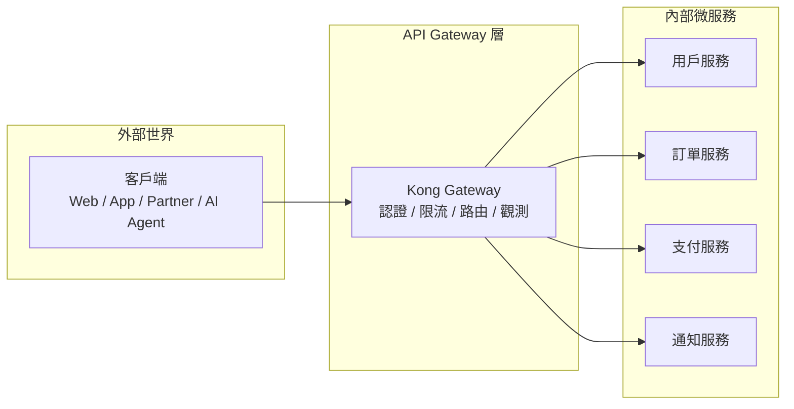
```mermaid
graph LR
    subgraph "外部世界"
        Client[客戶端<br/>Web / App / Partner / AI Agent]
    end

    subgraph "API Gateway 層"
        Kong[Kong Gateway<br/>認證 / 限流 / 路由 / 觀測]
    end

    subgraph "內部微服務"
        S1[用戶服務]
        S2[訂單服務]
        S3[支付服務]
        S4[通知服務]
    end

    Client --> Kong
    Kong --> S1
    Kong --> S2
    Kong --> S3
    Kong --> S4
```

#### 1.2.1 API Gateway 核心功能

1. **請求路由（Routing）**：依 Path、Host、Method、Header、SNI 將請求導向正確的後端。
2. **負載平衡（Load Balancing）**：把流量分散到多個後端實例，並搭配主動與被動健康檢查。
3. **認證授權（AuthN／AuthZ）**：驗證 API Key、JWT、mTLS，並用 ACL 做粗粒度授權。
4. **流量保護（Traffic Control）**：限流、請求大小限制、逾時與重試。
5. **請求與回應轉換（Transformation）**：修改 Header、Query、Body，或做協定轉換（gRPC-Web、gRPC-Gateway）。
6. **可觀測性（Observability）**：輸出 Metrics、Logs、Traces。

#### 1.2.2 何時「不」需要 API Gateway

| 情境 | 建議 |
| --- | --- |
| 單體應用、只有一個對外服務 | 使用反向代理（Nginx／雲端 LB）即可 |
| 純內部服務之間的東西向流量 | 評估 Service Mesh（例如 Istio、Kong Mesh） |
| 只需要靜態內容加速 | 使用 CDN |
| 需要完整的 API 產品化（開發者入口、訂閱、計費） | API Gateway 加上 APIM 平台（例如 Konnect Dev Portal） |

### 1.3 Kong 在微服務架構中的角色

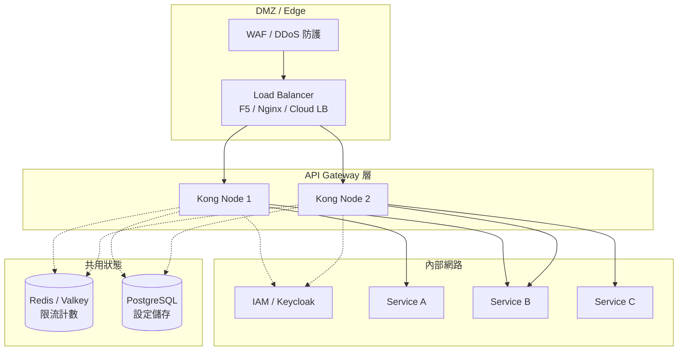
```mermaid
graph TB
    subgraph "DMZ / Edge"
        WAF[WAF / DDoS 防護]
        LB[Load Balancer<br/>F5 / Nginx / Cloud LB]
    end

    subgraph "API Gateway 層"
        Kong1[Kong Node 1]
        Kong2[Kong Node 2]
    end

    subgraph "內部網路"
        Auth[IAM / Keycloak]
        SVC1[Service A]
        SVC2[Service B]
        SVC3[Service C]
    end

    subgraph "共用狀態"
        Redis[(Redis / Valkey<br/>限流計數)]
        PG[(PostgreSQL<br/>設定儲存)]
    end

    WAF --> LB
    LB --> Kong1
    LB --> Kong2
    Kong1 --> SVC1
    Kong1 --> SVC2
    Kong2 --> SVC2
    Kong2 --> SVC3
    Kong1 -.-> Auth
    Kong2 -.-> Auth
    Kong1 -.-> Redis
    Kong2 -.-> Redis
    Kong1 -.-> PG
    Kong2 -.-> PG
```

**Kong 的定位**：

- 位於 **WAF 與 Load Balancer 之後、微服務之前**。
- 主要處理**南北向**流量。東西向流量（服務之間的呼叫）一般交給 Service Mesh；Kong 也可以作為內部 Gateway，用在跨領域（domain）的 API 呼叫。
- Kong 不取代 WAF：Kong 有基本的 IP 限制與 Bot Detection，但 OWASP 規則、DDoS 防護仍應由 WAF 或雲端邊緣服務負責。

### 1.4 Kong OSS / Enterprise / Konnect 產品矩陣與授權變化

> ⚠️ **v2.0 更正**：v1.0 把「Kong Manager（GUI）」列為 Enterprise 限定功能。實際上 OSS 從 3.4 起就內建 Kong Manager（預設監聽 `:8002`），只是 OSS 版的 Kong Manager 沒有 RBAC、Workspace 等企業功能。

#### 1.4.1 三種產品形態

| 形態 | 說明 | 授權 | 適用情境 |
| --- | --- | --- | --- |
| **Kong Gateway OSS** | 開源 Gateway（Apache 2.0），image 為 `kong:3.9.3` | 免費 | 學習、POC、預算有限但願意自行維運的團隊 |
| **Kong Gateway Enterprise** | 自建（self-managed）的商業版，image 為 `kong/kong-gateway:<版本>` | 商業授權 | 金融、政府等有合規需求，且必須在內網自建的企業 |
| **Kong Konnect** | SaaS 控制平面，資料平面可以自建或由 Kong 託管（Dedicated Cloud Gateway） | 訂閱制 | 希望降低控制平面維運成本、需要跨雲管理的組織 |

#### 1.4.2 功能差異

| 功能 | OSS 3.9.3 | Enterprise 3.14 LTS／3.16 | Konnect |
| --- | --- | --- | --- |
| 核心 Proxy、Route、Service、Upstream | ✅ | ✅ | ✅ |
| Admin API | ✅ | ✅（3.15 起沒有授權時唯讀） | 以 Konnect API 取代 |
| Kong Manager | ✅ 基本版 | ✅ 含 RBAC、Workspace、稽核 | Konnect UI |
| RBAC／Workspaces／稽核日誌 | ❌ | ✅ | ✅ |
| OpenID Connect、OAuth2 Introspection、JWT Signer | ❌ | ✅ | ✅ |
| Rate Limiting Advanced（滑動視窗、Consumer Group） | ❌ | ✅ | ✅ |
| Secrets Vault 參照 | `env` vault | ✅ HashiCorp／AWS／GCP／Azure／CyberArk | ✅ |
| Datakit、CEL 條件式 Plugin 執行 | ❌ | ✅（3.15 起支援 CEL） | ✅ |
| AI Proxy／AI Prompt Guard 等基本 AI Plugin | ✅ | ✅ | ✅ |
| AI Proxy Advanced、Semantic Cache、AI MCP Proxy | ❌ | ✅（AI Gateway 授權） | ✅ |
| FIPS 140-2／140-3 映像檔 | ❌ | ✅ | ✅ |
| 官方技術支援 | 社群 | 24×7（依合約） | 依方案 |

#### 1.4.3 2025–2026 授權與發行模式的重大變化

> 🆕 **v2.0 新增**：本節彙整截至 2026-09-30 的查證結果。規劃新專案前，務必先讀這一節。

| 時間 | 變化 | 對企業的影響 |
| --- | --- | --- |
| 2025-03（3.10） | Kong 不再發布 OSS 3.10 以後的 Docker image 與安裝套件；GitHub 的 OSS release 停在 3.9.x | 想使用 3.10 以後的功能只能選 Enterprise／Konnect，或自行從原始碼建置 OSS |
| 2025-03（3.10） | Enterprise「Free mode」標示為 deprecated | 沒有授權就使用 Enterprise image 的做法已不再可行 |
| 2026-06 | OSS 發布 3.9.2、3.9.3（安全修補） | OSS 3.9 仍然會收到修補，但沒有新功能 |
| 2026-07（3.15） | 授權過期或沒有授權時，**Admin API 與所有管理介面都變成唯讀**，Proxy 流量不受影響 | 沒有授權的 EE 節點無法再變更設定 |
| 2026-09（3.16） | CEL 引擎從 cel-rust 改為 cel-cpp | 使用條件式 Plugin 執行的設定需要重新測試 |

> 💡 **選型建議**：
>
> 1. **POC／學習**：直接使用 OSS 3.9.3，本手冊所有範例都能免授權執行。
> 2. **長期生產環境、需要企業級功能**：選 Enterprise **3.14 LTS**（支援到 2029-04-07），或上一個 LTS 3.10（支援到 2028-03-31）。
> 3. **堅持純開源**：可以使用 OSS 3.9.3，但要把「沒有新功能、只有安全修補、社群支援」列入風險登錄，並每季重新評估（例如自行建置 master 分支、改用其他開源 Gateway）。

### 1.5 Kong 產品家族全景

> 🆕 **v2.0 新增**

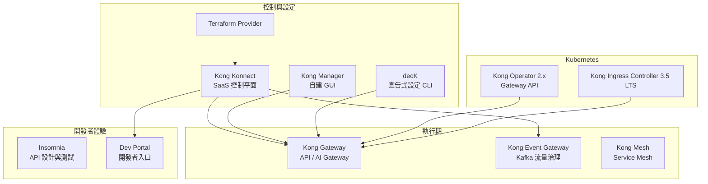
```mermaid
graph TB
    subgraph "控制與設定"
        Konnect[Kong Konnect<br/>SaaS 控制平面]
        Manager[Kong Manager<br/>自建 GUI]
        decK[decK<br/>宣告式設定 CLI]
        TF[Terraform Provider]
    end

    subgraph "執行期"
        GW[Kong Gateway<br/>API / AI Gateway]
        EGW[Kong Event Gateway<br/>Kafka 流量治理]
        Mesh[Kong Mesh<br/>Service Mesh]
    end

    subgraph "Kubernetes"
        KO[Kong Operator 2.x<br/>Gateway API]
        KIC[Kong Ingress Controller 3.5 LTS]
    end

    subgraph "開發者體驗"
        Insomnia[Insomnia<br/>API 設計與測試]
        Portal[Dev Portal<br/>開發者入口]
    end

    Konnect --> GW
    Manager --> GW
    decK --> GW
    TF --> Konnect
    KO --> GW
    KIC --> GW
    Konnect --> Portal
    Konnect --> EGW
```

| 產品 | 用途 | 本手冊涵蓋 |
| --- | --- | --- |
| **Kong Gateway** | API 與 AI 流量閘道（本手冊主體） | 全書 |
| **decK** | 宣告式設定、GitOps、OpenAPI 轉換 | [9.1](#91-deck-與-apiops設定即程式碼) |
| **Kong Operator** | Kubernetes Gateway API 控制器，2.x 已整合 KIC 的功能 | [3.2.4](#324-kubernetes-部署kong-operator--gateway-api) |
| **Kong Ingress Controller（KIC）** | 傳統 Ingress 控制器，3.5 為 LTS（支援到 2027-12-18） | [3.2.5](#325-kubernetes-部署helm-與-kic-35-lts) |
| **Konnect** | SaaS 控制平面、分析、Dev Portal | [2.2](#22-部署拓樸traditional--hybrid--db-less--konnect) |
| **Kong Event Gateway** | Kafka 協定的治理閘道 | 簡介 |
| **Kong Mesh** | 以 Kuma 為基礎的 Service Mesh | 簡介 |
| **Insomnia** | API 設計、除錯與測試工具 | 簡介 |

### 1.6 與其他 API Gateway 的比較

> 🆕 **v2.0 新增**：以下是定性比較，實際選型應依據 POC 的量測結果決定。

| 面向 | Kong Gateway | Apache APISIX | Envoy Gateway | Tyk | 雲端 APIM（Azure APIM／AWS API Gateway） |
| --- | --- | --- | --- | --- | --- |
| 核心技術 | Nginx／OpenResty | Nginx／OpenResty＋etcd | Envoy（C++） | Go | 託管服務 |
| 開源授權 | Apache 2.0（新版停止發行） | Apache 2.0 | Apache 2.0 | MPL 2.0 | 無 |
| 設定儲存 | PostgreSQL／DB-less／Konnect | etcd | Kubernetes CRD | Redis | 雲端平台 |
| Kubernetes 原生程度 | 高（Operator＋Gateway API） | 高 | 很高（Gateway API 參考實作之一） | 中 | 低 |
| Plugin 生態 | 很豐富 | 豐富 | 以 Filter／Extension 為主 | 中 | 以政策（Policy）為主 |
| AI Gateway | 完整（AI Proxy、MCP） | 有 AI Plugin | Envoy AI Gateway | 有 | 各雲自有方案 |
| 適合情境 | 混合雲、多團隊、需要 Plugin 生態 | 偏好 etcd、動態性高 | K8s 優先、Envoy 技術堆疊 | Go 技術團隊 | 單一雲端、希望全託管 |

### 1.7 💡 本章實務建議

1. **先決定產品形態，再決定架構**：OSS、Enterprise 與 Konnect 的差異會直接影響認證方案（例如有沒有 OIDC Plugin）、升級節奏與維運成本。
2. **把授權風險寫進架構決策紀錄（ADR）**：記錄「為什麼選 OSS 3.9／EE 3.14 LTS」與重新評估的時間點。
3. **不要讓 Gateway 承擔 WAF 的責任**：Kong 前面仍應有 WAF 與 DDoS 防護。
4. **POC 用 OSS、生產環境依需求決定**：本手冊的範例都能在 OSS 3.9.3 上執行，POC 成果可以直接轉移到 Enterprise。

---

## 2. 系統架構設計

### 2.1 Kong Gateway 整體架構與請求生命週期

Kong 的執行單位是 Nginx worker process。每個 worker 內嵌 LuaJIT VM，依照 OpenResty 的處理階段（phase）依序執行 Kong 核心邏輯與各個 Plugin。

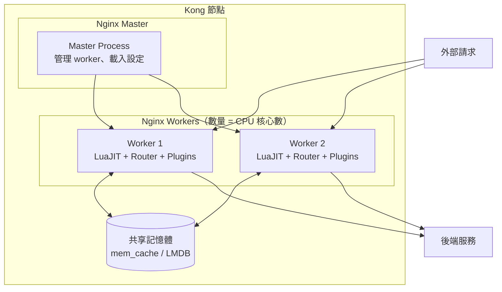
```mermaid
graph TB
    subgraph "Kong 節點"
        subgraph "Nginx Master"
            M[Master Process<br/>管理 worker、載入設定]
        end
        subgraph "Nginx Workers（數量 = CPU 核心數）"
            W1[Worker 1<br/>LuaJIT + Router + Plugins]
            W2[Worker 2<br/>LuaJIT + Router + Plugins]
        end
        Cache[(共享記憶體<br/>mem_cache / LMDB)]
    end

    Client[外部請求] --> W1
    Client --> W2
    M --> W1
    M --> W2
    W1 <--> Cache
    W2 <--> Cache
    W1 --> Upstream[後端服務]
    W2 --> Upstream
```

#### 2.1.1 請求處理階段

| 階段（phase） | 發生時機 | Kong 在此做什麼 | 代表 Plugin |
| --- | --- | --- | --- |
| `certificate` | TLS 交握（HTTPS／TLS） | 依 SNI 選擇憑證 | mTLS 類 Plugin |
| `rewrite` | 收到請求、尚未完成路由 | 只有**全域** Plugin 會在這個階段執行 | Correlation ID（全域時） |
| `access` | 路由完成、找到 Service 後 | 認證、授權、限流、請求轉換 | Key Auth、JWT、ACL、Rate Limiting、Request Transformer |
| `response` | 需要讀取完整回應時（取代 header／body filter） | 讀寫完整回應 | 部分需要緩衝的 Plugin |
| `header_filter` | 收到上游回應 Header | 修改回應 Header | Response Transformer、CORS |
| `body_filter` | 串流接收回應 Body | 修改回應 Body | Response Transformer |
| `log` | 回應已送出 | 送出日誌與指標，不影響延遲 | HTTP Log、Prometheus、OpenTelemetry |

> ⚠️ **v2.0 更正**：v1.0 把 Request Transformer 歸在 `rewrite` 階段。實際上它是在 `access` 階段執行（PRIORITY 801）。只有「沒有綁定 Route／Service／Consumer 的全域 Plugin」才會在 `rewrite` 階段執行，因為這時候還沒有完成路由。

### 2.2 部署拓樸（Traditional / Hybrid / DB-less / Konnect）

> 🆕 **v2.0 新增**：v1.0 只簡單區分了「傳統模式」和「混合模式」，本節補齊四種拓樸的比較與選型依據。

| 拓樸 | 設定來源 | 資料庫 | Admin API 位置 | 優點 | 限制 |
| --- | --- | --- | --- | --- | --- |
| **Traditional（DB-backed）** | Admin API 寫入 PostgreSQL | 每個節點都要連 DB | 每個節點都有 | 動態管理、所有 Plugin 都能使用 | DB 是單點風險；節點越多，DB 連線負擔越重 |
| **DB-less** | 啟動時讀取 YAML，或透過 `POST /config` 整份替換 | 不需要 | 唯讀（只接受 `/config`） | 不需要 DB、適合 GitOps 與 K8s | 需要 DB 的 Plugin（例如 OAuth2）無法使用；每次都要整份替換設定 |
| **Hybrid（CP／DP）** | CP 寫入 DB，再推送到 DP | 只有 CP 需要 | 只在 CP | DP 不需要連 DB，可以跨區部署；安全隔離 | 需要管理 CP／DP 憑證；DP 的版本不能比 CP 新 |
| **Konnect** | Konnect SaaS 控制平面 | 由 Kong 託管 | Konnect API | 免維運 CP、提供分析與 Dev Portal | 需要訂閱；控制平面資料在雲端（需要評估法遵） |

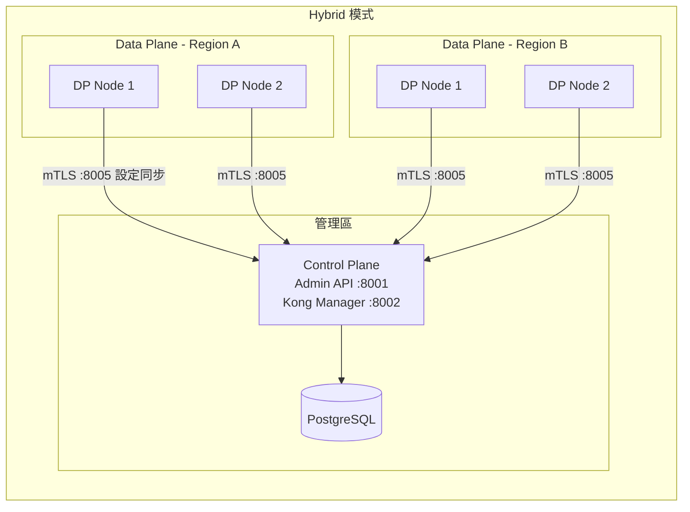
```mermaid
graph LR
    subgraph "Hybrid 模式"
        subgraph "管理區"
            CP[Control Plane<br/>Admin API :8001<br/>Kong Manager :8002]
            PG[(PostgreSQL)]
        end
        subgraph "Data Plane - Region A"
            DPA1[DP Node 1]
            DPA2[DP Node 2]
        end
        subgraph "Data Plane - Region B"
            DPB1[DP Node 1]
            DPB2[DP Node 2]
        end
    end

    CP --> PG
    DPA1 -->|mTLS :8005 設定同步| CP
    DPA2 -->|mTLS :8005| CP
    DPB1 -->|mTLS :8005| CP
    DPB2 -->|mTLS :8005| CP
```

> 📌 **連線方向**：Hybrid 模式由 **DP 主動連到 CP**（WebSocket over mTLS）。因此防火牆只需要開放「DP → CP:8005」（Enterprise 另外會用到 `:8006` 傳送遙測資料），CP 不需要能連到 DP。

#### 2.2.1 Hybrid 模式的關鍵規則

| 規則 | 說明 |
| --- | --- |
| **版本相容** | DP 的 major 版本必須和 CP 相同，minor 版本不能比 CP 新。升級時要**先升 CP、再升 DP** |
| **憑證模式** | `cluster_mtls = shared`（預設，CP 和 DP 共用同一組憑證）或 `pki`（由 CA 簽發，建議用於生產環境） |
| **DP 斷線時的行為** | DP 會繼續使用最後一次收到的設定（快取在本機），CP 暫時失效不會中斷流量 |
| **DP 上的 Admin API** | DP 不提供可寫入的 Admin API；所有設定都從 CP 下發 |

#### 2.2.2 拓樸選型決策

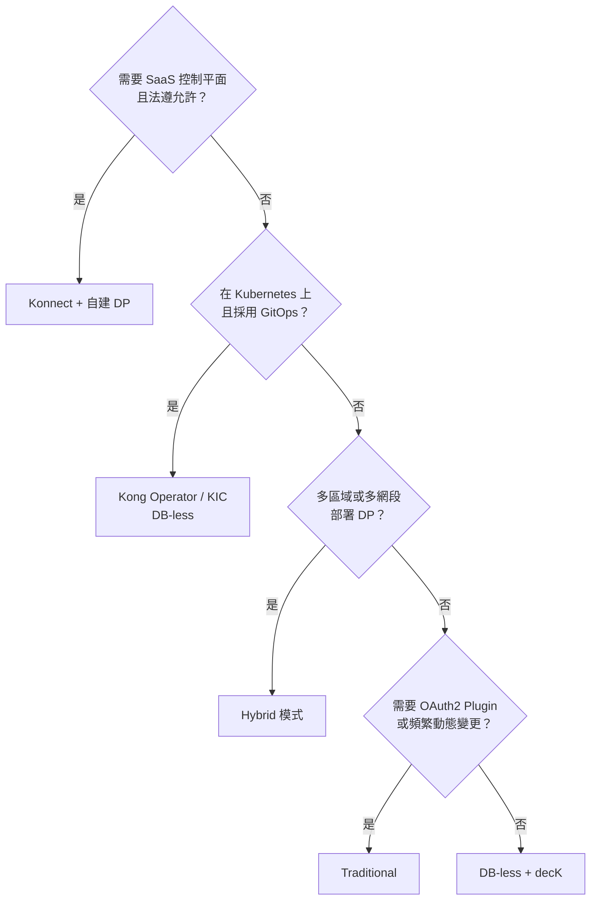
```mermaid
graph TD
    Q1{需要 SaaS 控制平面<br/>且法遵允許？}
    Q1 -->|是| Konnect[Konnect + 自建 DP]
    Q1 -->|否| Q2{在 Kubernetes 上<br/>且採用 GitOps？}
    Q2 -->|是| KO[Kong Operator / KIC<br/>DB-less]
    Q2 -->|否| Q3{多區域或多網段<br/>部署 DP？}
    Q3 -->|是| Hybrid[Hybrid 模式]
    Q3 -->|否| Q4{需要 OAuth2 Plugin<br/>或頻繁動態變更？}
    Q4 -->|是| Trad[Traditional]
    Q4 -->|否| DBless[DB-less + decK]
```

### 2.3 核心元件與連接埠

> ⚠️ **v2.0 更正**：以下的預設值已對照 Kong 3.9.3 的 `kong.conf.default` 確認。v1.0 沒有提到 Status API 與 Kong Manager 的連接埠。

| 元件 | 預設監聽 | 用途 | 生產環境建議 |
| --- | --- | --- | --- |
| **Proxy** | `0.0.0.0:8000`（HTTP）、`0.0.0.0:8443`（HTTPS，http2） | 處理 API 流量 | 只開放給 LB，並強制使用 HTTPS |
| **Admin API** | `127.0.0.1:8001`、`127.0.0.1:8444`（HTTPS） | RESTful 管理介面 | 只綁定管理網段；絕對不能對外 |
| **Kong Manager** | `0.0.0.0:8002`、`0.0.0.0:8445`（HTTPS） | Web 管理介面 | 放在 VPN／管理網段後面 |
| **Status API** | `127.0.0.1:8007`（預設）；Helm chart 使用 `8100` | 健康檢查（`/status`、`/status/ready`）與 `/metrics` | 給 K8s probe 與 Prometheus 使用 |
| **Cluster（Hybrid）** | `0.0.0.0:8005` | CP 接收 DP 的連線 | 只允許 DP 網段 |
| **Cluster Telemetry（EE）** | `0.0.0.0:8006` | DP 回傳分析資料 | 只允許 DP 網段 |

#### 2.3.1 Admin API 範例

```bash
# 查詢節點資訊（版本、已載入的 Plugin、設定摘要）
curl -s http://localhost:8001/ | jq '{version, hostname, plugins: .plugins.available_on_server | keys | length}'

# 新增一個 Service
curl -X POST http://localhost:8001/services \
  --data name=my-service \
  --data url=http://backend:8080
```

#### 2.3.2 Status API 範例

```bash
# 需要先啟用：KONG_STATUS_LISTEN=0.0.0.0:8100
curl -s http://localhost:8100/status | jq '.server'

# Readiness：設定載入完成後才回 200，適合用在 K8s readinessProbe
curl -i http://localhost:8100/status/ready
```

### 2.4 與後端微服務、LB、Auth Server 的關係

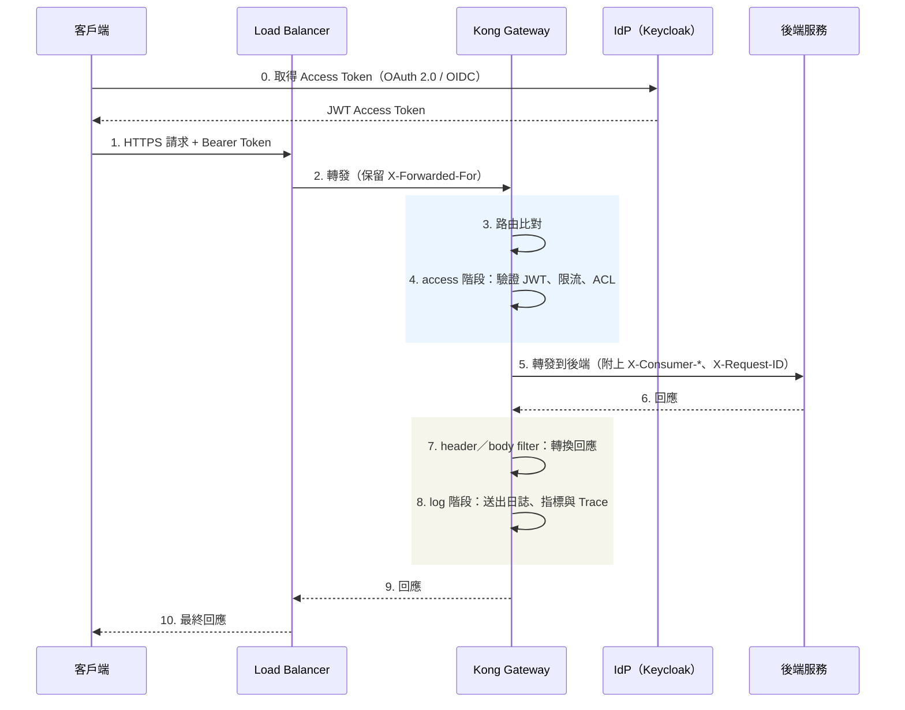
```mermaid
sequenceDiagram
    participant Client as 客戶端
    participant LB as Load Balancer
    participant Kong as Kong Gateway
    participant IdP as IdP（Keycloak）
    participant Backend as 後端服務

    Client->>IdP: 0. 取得 Access Token（OAuth 2.0 / OIDC）
    IdP-->>Client: JWT Access Token
    Client->>LB: 1. HTTPS 請求 + Bearer Token
    LB->>Kong: 2. 轉發（保留 X-Forwarded-For）
    rect rgb(235, 245, 255)
        Kong->>Kong: 3. 路由比對
        Kong->>Kong: 4. access 階段：驗證 JWT、限流、ACL
    end
    Kong->>Backend: 5. 轉發到後端（附上 X-Consumer-*、X-Request-ID）
    Backend-->>Kong: 6. 回應
    rect rgb(245, 245, 235)
        Kong->>Kong: 7. header／body filter：轉換回應
        Kong->>Kong: 8. log 階段：送出日誌、指標與 Trace
    end
    Kong-->>LB: 9. 回應
    LB-->>Client: 10. 最終回應
```

> 📌 **重點**：在「本地驗證 JWT」的模式下，Kong 在第 4 步**不需要**呼叫 IdP，而是用事先設定好的公鑰驗證簽章。若改用 Token Introspection（EE 的 OAuth2 Introspection Plugin），每個請求都會多一次網路往返，必須搭配快取。

### 2.5 典型企業架構範例

#### 2.5.1 情境：銀行 API 平台（對外與對內分離）

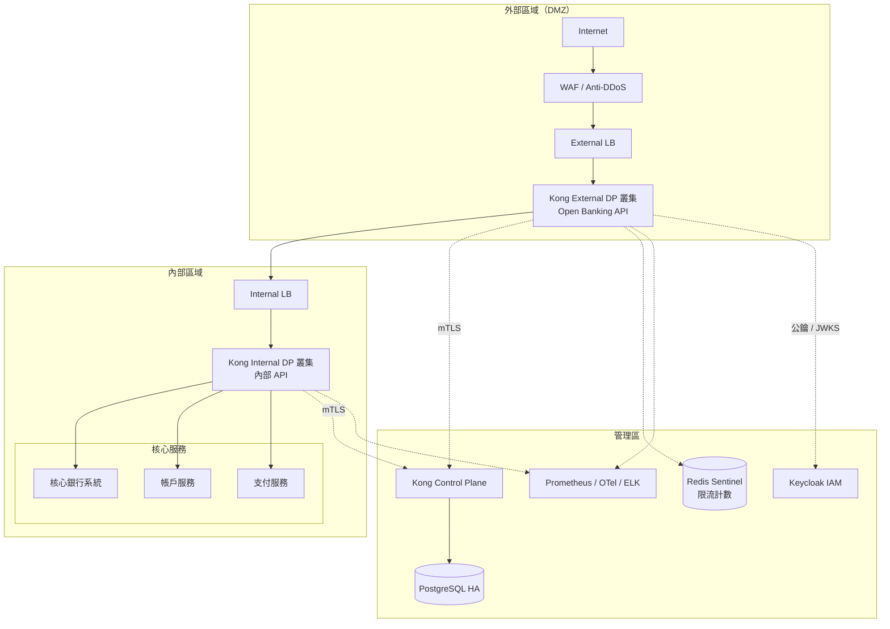
```mermaid
graph TB
    subgraph "外部區域（DMZ）"
        Internet[Internet]
        WAF[WAF / Anti-DDoS]
        ExtLB[External LB]
        KongExt[Kong External DP 叢集<br/>Open Banking API]
    end

    subgraph "內部區域"
        IntLB[Internal LB]
        KongInt[Kong Internal DP 叢集<br/>內部 API]

        subgraph "核心服務"
            CoreBanking[核心銀行系統]
            AccountSvc[帳戶服務]
            PaymentSvc[支付服務]
        end
    end

    subgraph "管理區"
        CP[Kong Control Plane]
        PG[(PostgreSQL HA)]
        Keycloak[Keycloak IAM]
        Redis[(Redis Sentinel<br/>限流計數)]
        Obs[Prometheus / OTel / ELK]
    end

    Internet --> WAF --> ExtLB --> KongExt
    KongExt --> IntLB --> KongInt
    KongInt --> CoreBanking
    KongInt --> AccountSvc
    KongInt --> PaymentSvc
    KongExt -.->|mTLS| CP
    KongInt -.->|mTLS| CP
    CP --> PG
    KongExt -.-> Redis
    KongExt -.-> Obs
    KongInt -.-> Obs
    KongExt -.->|公鑰 / JWKS| Keycloak
```

**設計要點**：

- 對外與對內使用**不同的 DP 叢集**，但共用同一個 CP，並以 Tag 或 Workspace（EE）隔離設定。
- DP 位於 DMZ 時**不連資料庫**，被入侵時的影響範圍（blast radius）較小，這是採用 Hybrid 模式的主要理由。
- 限流計數使用 Redis Sentinel 或 Cluster，避免單點故障。

#### 2.5.2 高可用（HA）與災難復原（DR）設計

> 🆕 **v2.0 新增**

| 層級 | HA 設計 | DR 設計 |
| --- | --- | --- |
| **DP** | 每區至少 2 個節點，前面放 LB，並設定 health check | 次要站點預先部署 DP，平時可以承接部分流量（Active-Active） |
| **CP** | 2 個以上 CP 共用同一個 PostgreSQL | DR 站點部署冷備 CP，DB 以串流複寫同步 |
| **PostgreSQL** | Patroni、雲端 RDS Multi-AZ | 跨區複寫＋每日 `pg_dump`＋decK dump |
| **設定** | decK 檔案存放在 Git | Git 本身就是 DR 來源，可以用 `deck gateway sync` 重建 |
| **Redis** | Sentinel／Cluster | 限流計數屬於可以遺失的資料，不需要跨區同步 |

> 💡 **RPO／RTO 參考**：因為 DP 會快取設定，CP 或 DB 中斷**不會**讓流量中斷，只會讓設定無法變更。所以 CP 的 RTO 目標可以比 DP 寬鬆（例如 DP：分鐘級；CP：小時級）。

### 2.6 💡 本章實務建議

1. **生產環境優先採用 Hybrid 或 Konnect**：讓 DP 不接觸資料庫，同時兼顧安全與擴展性。
2. **Admin API 只綁定管理網段**：預設的 `127.0.0.1:8001` 是安全的起點，改成 `0.0.0.0` 前必須先加上網路控管。
3. **K8s 探針使用 Status API**：`/status/ready` 會等設定載入完成才回應成功，比直接探測 Proxy 連接埠更準確。
4. **先升 CP、再升 DP**：這是 Hybrid 模式的鐵律，違反時 DP 會被拒絕連線。

---

## 3. 安裝與部署

### 3.1 安裝模式說明

#### 3.1.1 DB-less Mode（無資料庫模式）

**特點**：

- 以 YAML／JSON 宣告檔（`_format_version: "3.0"`）描述所有實體（entity）。
- 不需要 PostgreSQL，設定載入後存放在節點本機的 LMDB 中。
- 設定只能「整份替換」：啟動時讀取 `declarative_config`，或透過 `POST /config` 上傳整份設定。
- **適合**：Kubernetes、GitOps、邊緣節點、不可變基礎設施（immutable infrastructure）。

**限制**：

- 需要在執行期寫入資料庫的 Plugin 無法使用，例如 **OAuth2**（需要保存 Token）；`rate-limiting` 不能使用 `cluster` policy，要改用 `local` 或 `redis`。
- Admin API 只能讀取，只有 `/config` 可以寫入，因此不能用 `POST /services` 等方式逐筆新增。

#### 3.1.2 DB-backed Mode（資料庫模式，Traditional）

**特點**：

- 設定存放在 PostgreSQL（OSS 3.9 經測試支援的版本是 13–17；EE 3.14 LTS 另外支援 18）。
- 可以透過 Admin API 逐筆動態新增、修改實體；多個節點共用同一個資料庫。
- 節點每 `db_update_frequency`（預設 5 秒）輪詢資料庫的變更，所以設定變更在叢集中是**最終一致**的。
- **適合**：傳統虛擬機部署、需要 OAuth2 Plugin、需要頻繁動態調整的環境。

> ⚠️ **v2.0 更正**：Kong 3.x 已經不支援 Cassandra，v1.0 的「PostgreSQL 12+」也已經過時。PostgreSQL 12 在 2024-11 就結束社群支援，請使用 13 以上的版本，建議使用 16 或 17。

#### 3.1.3 Hybrid Mode（控制平面／資料平面分離）

- CP 使用 DB-backed 模式，DP 使用 `database = off`。
- DP 透過 mTLS 連到 CP 的 `:8005` 接收設定，詳見[3.2.6 Hybrid 模式部署](#326-hybrid-模式部署)。

### 3.2 常見部署方式

> ⚠️ **v2.0 更正**：以下範例一律使用明確的 patch 版本 `kong:3.9.3`，不再使用浮動標籤 `kong:3.9` 或 `latest`，以確保環境可以重現。

#### 3.2.1 Docker 單機部署（DB-less）

```bash
# 1. 建立宣告式設定檔 kong.yml
cat > kong.yml <<'EOF'
_format_version: "3.0"

services:
  - name: demo-service
    url: https://httpbin.konghq.com
    routes:
      - name: demo-route
        paths:
          - /demo
EOF

# 2. 建立專用網路
docker network create kong-net

# 3. 啟動 Kong OSS 3.9.3（DB-less）
docker run -d --name kong \
  --network kong-net \
  -e "KONG_DATABASE=off" \
  -e "KONG_DECLARATIVE_CONFIG=/kong/declarative/kong.yml" \
  -e "KONG_PROXY_ACCESS_LOG=/dev/stdout" \
  -e "KONG_ADMIN_ACCESS_LOG=/dev/stdout" \
  -e "KONG_PROXY_ERROR_LOG=/dev/stderr" \
  -e "KONG_ADMIN_ERROR_LOG=/dev/stderr" \
  -e "KONG_ADMIN_LISTEN=0.0.0.0:8001" \
  -e "KONG_STATUS_LISTEN=0.0.0.0:8100" \
  -v "$(pwd)/kong.yml:/kong/declarative/kong.yml:ro" \
  -p 8000:8000 \
  -p 8443:8443 \
  -p 127.0.0.1:8001:8001 \
  -p 127.0.0.1:8100:8100 \
  kong:3.9.3

# 4. 驗證
curl -i http://localhost:8000/demo/get
```

> 💡 **安全提示**：容器內的 Admin API 要綁定 `0.0.0.0`，主機才能透過 port mapping 存取；但主機端請只對應到 `127.0.0.1`（例如 `-p 127.0.0.1:8001:8001`），避免 Admin API 暴露在區域網路上。

#### 3.2.2 Docker Compose 部署（含 PostgreSQL 與 Kong Manager）

> ⚠️ **v2.0 更正**：Compose Specification 已經不使用頂層的 `version:` 欄位；指令也從 `docker-compose` 改為 Compose v2 的 `docker compose`。

```yaml
# compose.yaml
name: kong-lab

x-kong-db-env: &kong-db-env
  KONG_DATABASE: postgres
  KONG_PG_HOST: kong-database
  KONG_PG_USER: kong
  KONG_PG_PASSWORD: ${KONG_PG_PASSWORD:-kongpass}
  KONG_PG_DATABASE: kong

services:
  kong-database:
    image: postgres:17-alpine
    environment:
      POSTGRES_USER: kong
      POSTGRES_PASSWORD: ${KONG_PG_PASSWORD:-kongpass}
      POSTGRES_DB: kong
    volumes:
      - kong_data:/var/lib/postgresql/data
    healthcheck:
      test: ["CMD-SHELL", "pg_isready -U kong -d kong"]
      interval: 10s
      timeout: 5s
      retries: 5

  kong-migrations:
    image: kong:3.9.3
    command: kong migrations bootstrap
    environment:
      <<: *kong-db-env
    depends_on:
      kong-database:
        condition: service_healthy
    restart: on-failure

  kong:
    image: kong:3.9.3
    environment:
      <<: *kong-db-env
      KONG_PROXY_ACCESS_LOG: /dev/stdout
      KONG_ADMIN_ACCESS_LOG: /dev/stdout
      KONG_PROXY_ERROR_LOG: /dev/stderr
      KONG_ADMIN_ERROR_LOG: /dev/stderr
      KONG_PROXY_LISTEN: "0.0.0.0:8000, 0.0.0.0:8443 ssl"
      KONG_ADMIN_LISTEN: "0.0.0.0:8001"
      KONG_ADMIN_GUI_LISTEN: "0.0.0.0:8002"
      KONG_ADMIN_GUI_URL: "http://localhost:8002"
      KONG_STATUS_LISTEN: "0.0.0.0:8100"
    depends_on:
      kong-migrations:
        condition: service_completed_successfully
    ports:
      - "8000:8000"            # Proxy HTTP
      - "8443:8443"            # Proxy HTTPS
      - "127.0.0.1:8001:8001"  # Admin API（只開放本機）
      - "127.0.0.1:8002:8002"  # Kong Manager（只開放本機）
      - "127.0.0.1:8100:8100"  # Status API / Metrics
    healthcheck:
      test: ["CMD", "kong", "health"]
      interval: 30s
      timeout: 10s
      retries: 3
    restart: unless-stopped

volumes:
  kong_data:
```

**操作指令**：

```bash
# 啟動所有服務
docker compose up -d

# 檢查狀態
docker compose ps

# 查看 Kong 日誌
docker compose logs -f kong

# 開啟 Kong Manager（OSS 版）
# 瀏覽器前往 http://localhost:8002
```

#### 3.2.3 Enterprise 映像檔與授權載入

> 🆕 **v2.0 新增**

Enterprise 使用 `kong/kong-gateway` 映像檔，標籤格式為 `3.<minor>.<patch>.<ee-patch>`（例如 `3.14.0.15`、`3.16.0.0`），另有 `-ubuntu`、`-rhel`、`-debian`、`-distroless`、`-fips` 等變體。

```bash
# 以環境變數載入授權（授權檔為 Kong 提供的 JSON）
docker run -d --name kong-ee \
  --network kong-net \
  -e "KONG_DATABASE=off" \
  -e "KONG_DECLARATIVE_CONFIG=/kong/declarative/kong.yml" \
  -e "KONG_LICENSE_DATA=$(cat license.json)" \
  -e "KONG_ADMIN_LISTEN=0.0.0.0:8001" \
  -v "$(pwd)/kong.yml:/kong/declarative/kong.yml:ro" \
  -p 8000:8000 -p 127.0.0.1:8001:8001 \
  kong/kong-gateway:3.14.0.15

# 或在 DB-backed 模式下透過 Admin API 上傳授權
curl -X POST http://localhost:8001/licenses \
  -F "payload=@license.json"
```

| 授權狀態 | 3.10–3.14 行為 | 3.15 以後的行為 |
| --- | --- | --- |
| 有效授權 | 所有功能可用 | 所有功能可用 |
| 授權過期 | 企業功能改為唯讀，OSS 功能照常 | **Admin API 與所有管理介面都變成唯讀**，Proxy 流量照常 |
| 沒有授權 | Free mode 已 deprecated | 與「授權過期」相同 |

> ⚠️ **注意**：3.15 起授權過期時，只有 `/licenses` 與 `/keyring/*` 端點可以寫入。請把授權到期日納入監控（Prometheus 或排程腳本），並在到期前 60 天提醒。

#### 3.2.4 Kubernetes 部署：Kong Operator + Gateway API

> 🆕 **v2.0 新增**：Kong Operator 2.x 已經整合 KIC 的功能，並以 Kubernetes **Gateway API**（`GatewayClass`／`Gateway`／`HTTPRoute`）作為主要介面。新專案建議優先採用這個方式。截至 2026-09-30，最新穩定版為 v2.3.2。

```bash
# 1. 安裝 Gateway API CRD（Kong Operator 2.3 需要 Gateway API 1.5.x）
kubectl apply --server-side \
  -f https://github.com/kubernetes-sigs/gateway-api/releases/download/v1.5.1/standard-install.yaml

# 2. 安裝 Kong Operator（建議事先安裝 cert-manager，用於 webhook 憑證）
helm repo add kong https://charts.konghq.com
helm repo update
helm upgrade --install kong-operator kong/kong-operator \
  -n kong-system --create-namespace

# 3. 等待 Operator 就緒
kubectl -n kong-system wait --for=condition=Available=true --timeout=120s \
  deployment/kong-operator-kong-operator-controller-manager
```

建立 `GatewayConfiguration`、`GatewayClass` 與 `Gateway`：

```yaml
# gateway.yaml
apiVersion: gateway-operator.konghq.com/v2beta1
kind: GatewayConfiguration
metadata:
  name: kong
  namespace: kong
spec:
  dataPlaneOptions:
    deployment:
      podTemplateSpec:
        spec:
          containers:
            - name: proxy
              image: kong/kong-gateway:3.14.0.15   # Enterprise 需另外建立 KongLicense
---
apiVersion: gateway.networking.k8s.io/v1
kind: GatewayClass
metadata:
  name: kong
spec:
  controllerName: konghq.com/gateway-operator
  parametersRef:
    group: gateway-operator.konghq.com
    kind: GatewayConfiguration
    name: kong
    namespace: kong
---
apiVersion: gateway.networking.k8s.io/v1
kind: Gateway
metadata:
  name: kong
  namespace: kong
spec:
  gatewayClassName: kong
  listeners:
    - name: http
      protocol: HTTP
      port: 80
```

以 `HTTPRoute` 發布服務，並用 `KongPlugin` 掛上限流：

```yaml
# httproute.yaml
apiVersion: configuration.konghq.com/v1
kind: KongPlugin
metadata:
  name: rl-100-per-min
  namespace: demo
plugin: rate-limiting
config:
  minute: 100
  policy: local
---
apiVersion: gateway.networking.k8s.io/v1
kind: HTTPRoute
metadata:
  name: user-api
  namespace: demo
  annotations:
    konghq.com/strip-path: "true"
    konghq.com/plugins: rl-100-per-min
spec:
  parentRefs:
    - name: kong
      namespace: kong
  rules:
    - matches:
        - path:
            type: PathPrefix
            value: /api/users
      backendRefs:
        - name: user-service
          port: 80
```

> 📌 **跨命名空間**：`HTTPRoute` 所在的命名空間（`demo`）要能掛到 `kong` 命名空間的 `Gateway`，必須在 `Gateway` 的 listener 設定 `allowedRoutes.namespaces.from: All` 或 `Selector`。上面的範例使用預設的 `Same`，實際部署時請依照組織的多租戶政策調整。

#### 3.2.5 Kubernetes 部署：Helm 與 KIC 3.5 LTS

既有使用 Ingress 資源的環境，可以繼續使用 `kong/kong` Helm chart 搭配 Kong Ingress Controller（KIC）。KIC 3.5 是 LTS 版本，支援到 2027-12-18。

> ⚠️ **v2.0 更正**：
>
> - v1.0 使用的 `--set ingressController.installCRDs=false` 已經移除；chart 目前透過 `crds/` 目錄安裝 CRD。
> - v1.0 範例中的 **`KongIngress` CRD 已在 KIC 3.x 淘汰**：Route 相關設定改用 Ingress 的 `konghq.com/*` annotation，Upstream 相關設定改用 **`KongUpstreamPolicy`**。

```bash
helm repo add kong https://charts.konghq.com
helm repo update

# DB-less + KIC（chart 3.4.x 預設 image 為 kong:3.9）
helm upgrade --install kong kong/kong \
  --namespace kong --create-namespace \
  --set image.tag=3.9.3 \
  --set env.database=off \
  --set ingressController.enabled=true \
  --set admin.enabled=true \
  --set admin.http.enabled=true \
  --set admin.type=ClusterIP
```

```yaml
# ingress-with-policy.yaml
apiVersion: configuration.konghq.com/v1beta1
kind: KongUpstreamPolicy
metadata:
  name: user-upstream-policy
  namespace: demo
spec:
  algorithm: least-connections
  healthchecks:
    active:
      type: http
      httpPath: /actuator/health
      healthy:
        interval: 5
        successes: 2
      unhealthy:
        interval: 5
        httpFailures: 3
---
apiVersion: v1
kind: Service
metadata:
  name: user-service
  namespace: demo
  annotations:
    konghq.com/upstream-policy: user-upstream-policy
spec:
  selector:
    app: user-service
  ports:
    - port: 80
      targetPort: 8080
---
apiVersion: networking.k8s.io/v1
kind: Ingress
metadata:
  name: user-ingress
  namespace: demo
  annotations:
    konghq.com/strip-path: "true"
    konghq.com/protocols: "https"
    konghq.com/https-redirect-status-code: "308"
spec:
  ingressClassName: kong
  rules:
    - host: api.example.com
      http:
        paths:
          - path: /api/users
            pathType: Prefix
            backend:
              service:
                name: user-service
                port:
                  number: 80
```

| KIC 淘汰的寫法 | 替代方式 |
| --- | --- |
| `KongIngress.route.strip_path` | Ingress annotation `konghq.com/strip-path` |
| `KongIngress.route.protocols` | Ingress annotation `konghq.com/protocols` |
| `KongIngress.upstream.*` | `KongUpstreamPolicy` + Service annotation `konghq.com/upstream-policy` |
| `KongIngress.proxy.*` | Service annotation，例如 `konghq.com/read-timeout` |

#### 3.2.6 Hybrid 模式部署

```bash
# 1. 在 CP 產生叢集憑證（shared 模式：CP 與 DP 使用同一組憑證）
mkdir -p certs && cd certs
openssl req -new -x509 -nodes -newkey ec:<(openssl ecparam -name secp384r1) \
  -keyout ./cluster.key -out ./cluster.crt -days 1095 -subj "/CN=kong_clustering"
cd ..
```

```bash
# 2. Control Plane
docker run -d --name kong-cp --network kong-net \
  -e "KONG_ROLE=control_plane" \
  -e "KONG_DATABASE=postgres" \
  -e "KONG_PG_HOST=kong-database" \
  -e "KONG_PG_PASSWORD=kongpass" \
  -e "KONG_CLUSTER_CERT=/certs/cluster.crt" \
  -e "KONG_CLUSTER_CERT_KEY=/certs/cluster.key" \
  -e "KONG_ADMIN_LISTEN=0.0.0.0:8001" \
  -v "$(pwd)/certs:/certs:ro" \
  -p 127.0.0.1:8001:8001 \
  kong:3.9.3

# 3. Data Plane（不連資料庫）
docker run -d --name kong-dp1 --network kong-net \
  -e "KONG_ROLE=data_plane" \
  -e "KONG_DATABASE=off" \
  -e "KONG_CLUSTER_CONTROL_PLANE=kong-cp:8005" \
  -e "KONG_CLUSTER_CERT=/certs/cluster.crt" \
  -e "KONG_CLUSTER_CERT_KEY=/certs/cluster.key" \
  -e "KONG_LUA_SSL_TRUSTED_CERTIFICATE=system,/certs/cluster.crt" \
  -v "$(pwd)/certs:/certs:ro" \
  -p 8000:8000 \
  kong:3.9.3

# 4. 在 CP 上確認 DP 已經連線
curl -s http://localhost:8001/clustering/data-planes | jq '.data[] | {hostname, version, sync_status}'
```

> 💡 **生產環境建議**：改用 `cluster_mtls = pki`，由內部 CA 分別簽發 CP 與 DP 的憑證，並設定 `cluster_server_name`，以避免「共用私鑰」帶來的風險。Enterprise 的 DP 還需要設定 `KONG_CLUSTER_TELEMETRY_ENDPOINT=kong-cp:8006`。

### 3.3 安裝後檢查方式

```bash
# 1. 檢查 Kong 版本
curl -s http://localhost:8001/ | jq -r '.version'

# 2. 檢查節點與資料庫狀態
curl -s http://localhost:8001/status | jq '{database, server}'

# 3. 檢查節點已載入的 Plugin（由 plugins 設定決定）與叢集中實際啟用的 Plugin
curl -s http://localhost:8001/plugins/enabled | jq '.enabled_plugins | sort'
curl -s http://localhost:8001/ | jq '.plugins.enabled_in_cluster'

# 4. Readiness（Status API）
curl -i http://localhost:8100/status/ready

# 5. 在容器內檢查設定與健康狀態
docker exec kong kong health
docker exec kong kong config parse /kong/declarative/kong.yml   # DB-less 設定檔語法檢查

# 6. 測試 Proxy
curl -i http://localhost:8000/demo/get
```

> 📌 **兩種「已啟用」的差別**：`/plugins/enabled` 列出這個節點**已載入、可以使用**的 Plugin（由 `plugins = bundled,...` 設定決定）；`enabled_in_cluster` 則列出**實際有建立 Plugin 實體**的 Plugin 名稱。稽核時請以後者為準。

**預期輸出（`/status` 節錄）**：

```json
{
  "database": {
    "reachable": true
  },
  "server": {
    "connections_accepted": 10,
    "connections_active": 1,
    "connections_handled": 10,
    "connections_reading": 0,
    "connections_waiting": 0,
    "connections_writing": 1,
    "total_requests": 50
  }
}
```

### 3.4 常見安裝問題

| 症狀 | 可能原因 | 處理方式 |
| --- | --- | --- |
| `Address already in use` | 8000／8001／8443 被其他程式佔用 | 以 `ss -lntp` 確認後，更換連接埠或停止衝突的程式 |
| `Database needs bootstrapping` | 沒有先執行 migration | 執行 `kong migrations bootstrap` |
| `Database has pending migrations` | 升級後沒有執行 `migrations up`／`finish` | 參閱[10.3 資料庫 Migration 流程](#103-資料庫-migration-流程) |
| DB-less 啟動失敗：`declarative config is invalid` | YAML 語法錯誤或欄位不存在 | 使用 `kong config parse` 或 `deck file validate` 檢查 |
| DP 無法連到 CP | 憑證不一致、防火牆、版本比 CP 新 | 檢查 DP 日誌中的 `clustering` 訊息，並依[2.2.1](#221-hybrid-模式的關鍵規則)逐一排查 |
| Kong Manager 空白或無法登入 | 瀏覽器連不到 Admin API | 確認 `admin_gui_api_url` 或 `admin_listen` 從瀏覽器端可以存取 |

### 3.5 💡 本章實務建議

1. **映像檔標籤一律固定到 patch 版本**，並在 CI 中掃描漏洞（例如 Trivy）。
2. **K8s 新專案優先採用 Kong Operator + Gateway API**；既有的 Ingress 環境可以繼續使用 KIC 3.5 LTS，但要規劃在 2027 年底前完成遷移。
3. **KongIngress 要全面移除**：用 annotation 與 KongUpstreamPolicy 替代，避免升級時失效。
4. **Hybrid 模式的生產環境使用 PKI 憑證**，並把憑證到期日納入監控。

---

## 4. 核心物件與設定模型

### 4.1 Service / Route / Upstream / Target 說明

Kong 的設定模型由一組**實體（entity）**組成，彼此的關係如下：

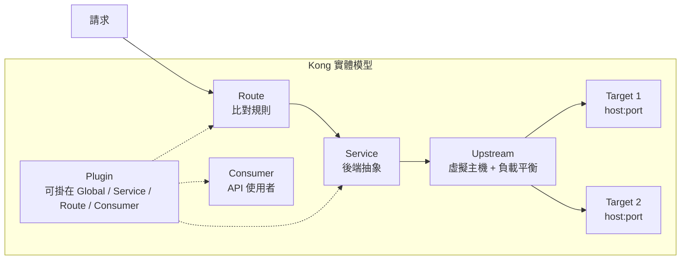
```mermaid
graph LR
    subgraph "Kong 實體模型"
        Route[Route<br/>比對規則]
        Service[Service<br/>後端抽象]
        Upstream[Upstream<br/>虛擬主機 + 負載平衡]
        Target1[Target 1<br/>host:port]
        Target2[Target 2<br/>host:port]
        Plugin[Plugin<br/>可掛在 Global / Service / Route / Consumer]
        Consumer[Consumer<br/>API 使用者]
    end

    Client[請求] --> Route
    Route --> Service
    Service --> Upstream
    Upstream --> Target1
    Upstream --> Target2
    Plugin -.-> Route
    Plugin -.-> Service
    Plugin -.-> Consumer
```

| 實體 | 一句話定義 | 關聯 |
| --- | --- | --- |
| **Service** | 後端 API 的抽象（通訊協定、主機、連接埠、路徑、逾時） | 一個 Service 可以有多個 Route |
| **Route** | 決定「哪些請求」要送到哪個 Service 的比對規則 | 通常屬於一個 Service |
| **Upstream** | 一個虛擬主機名稱，底下有多個 Target，負責負載平衡與健康檢查 | Service 的 `host` 等於 Upstream 的 `name` 時就會使用它 |
| **Target** | 實際的後端實例（`host:port` 與權重） | 屬於一個 Upstream |
| **Consumer** | API 的使用者（應用程式、合作夥伴） | 可以綁定憑證、ACL 群組與專屬 Plugin |
| **Plugin** | 可重複使用的處理邏輯 | 可掛在 Global、Service、Route、Consumer 及其組合上 |
| **Certificate／SNI** | TLS 憑證與對應的網域 | Proxy 依 SNI 選擇憑證 |
| **CA Certificate** | 驗證用戶端或上游憑證的 CA | 用於 mTLS |
| **Vault** | Secrets 參照的來源（OSS 為 `env`） | 以 `{vault://...}` 在設定中引用 |

#### 4.1.1 Service（服務）

```bash
# 以 URL 一次指定（Kong 會拆解成 protocol、host、port、path）
curl -X POST http://localhost:8001/services \
  --data name=user-service \
  --data url=http://user-backend:8080

# 指向 Upstream（host 填 Upstream 名稱）
curl -X POST http://localhost:8001/services \
  --data name=user-service-lb \
  --data host=user-upstream \
  --data port=80 \
  --data protocol=http
```

| 參數 | 說明 | 預設值（3.9.3） |
| --- | --- | --- |
| `name` | 服務名稱，建議使用 `<領域>-<服務>-<版本>` | — |
| `url` | 縮寫欄位，會拆解成以下 4 個欄位 | — |
| `protocol` | `http`、`https`、`grpc`、`grpcs`、`tcp`、`tls`、`udp` 等 | `http` |
| `host` | 後端主機名稱或 Upstream 名稱 | — |
| `port` | 後端連接埠 | `80` |
| `path` | 轉發時加在前面的路徑 | `null` |
| `retries` | 連線失敗時的重試次數 | `5` |
| `connect_timeout`／`write_timeout`／`read_timeout` | 逾時（毫秒） | `60000` |
| `tls_verify` | 是否驗證上游憑證 | `null`（沿用全域設定） |
| `enabled` | 停用時所有相關 Route 都會回 503 | `true` |

> ⚠️ **注意**：`retries` 預設為 5，對於**非冪等**的 POST 請求可能造成重複處理。支付、下單類的服務建議把 `retries` 設為 `0`，由應用層實作冪等鍵（Idempotency Key）。

#### 4.1.2 Route（路由）

```bash
curl -X POST http://localhost:8001/services/user-service/routes \
  --data name=user-route \
  --data "paths[]=/api/users" \
  --data "methods[]=GET" \
  --data "methods[]=POST" \
  --data "protocols[]=https" \
  --data strip_path=true
```

| 參數 | 說明 | 預設值（3.9.3） |
| --- | --- | --- |
| `paths` | 路徑前綴；以 `~` 開頭表示正規表示式（例如 `~/users/\d+$`） | — |
| `hosts` | Host Header，支援萬用字元（`*.example.com`） | — |
| `methods` | HTTP Method | — |
| `headers` | 以 Header 比對（例如 `x-version: v2`） | — |
| `snis` | 以 TLS SNI 比對 | — |
| `protocols` | 允許的通訊協定 | `["http","https"]`（EE 3.14 起新建 Route 預設為 `["https"]`） |
| `strip_path` | 是否移除比對到的路徑前綴 | `true` |
| `preserve_host` | 是否把原始 Host 傳給後端 | `false` |
| `https_redirect_status_code` | 協定不符時的回應碼 | `426` |
| `regex_priority` | 多條正規表示式同時比對成功時的優先序 | `0` |
| `path_handling` | 路徑組合規則（`v0`／`v1`，`v1` 已淘汰） | `v0` |
| `request_buffering`／`response_buffering` | 是否緩衝 Body | `true` |

**路由器類型（`router_flavor`）**：

| 類型 | 說明 | 建議 |
| --- | --- | --- |
| `traditional_compatible`（**預設**） | 以原本的欄位（paths、hosts…）描述，內部轉譯成 ATC 表達式 | 大多數情境 |
| `expressions` | 直接以 ATC 表達式撰寫（`expression` 與 `priority` 欄位） | 需要複雜條件（AND／OR、前綴＋Header 組合） |
| `traditional` | 舊版路由器 | 不建議；只為了相容舊行為而保留 |

> 📌 Helm chart `kong/kong` 的 `env.router_flavor` 預設值是 `traditional`，與 Kong 本身的預設值 `traditional_compatible` 不同。部署在 K8s 上時請明確設定。

#### 4.1.3 Upstream / Target（上游與目標）

```bash
# 建立 Upstream
curl -X POST http://localhost:8001/upstreams \
  --data name=user-upstream \
  --data algorithm=least-connections

# 新增 Target
curl -X POST http://localhost:8001/upstreams/user-upstream/targets \
  --data target=user-backend-1:8080 --data weight=100
curl -X POST http://localhost:8001/upstreams/user-upstream/targets \
  --data target=user-backend-2:8080 --data weight=100
```

| 負載平衡演算法 | 說明 | 適用情境 |
| --- | --- | --- |
| `round-robin`（預設） | 依權重輪流分配 | 各實例規格一致、請求耗時相近 |
| `least-connections` | 選擇進行中連線數最少的實例 | 請求耗時差異大（例如報表查詢） |
| `consistent-hashing` | 依 `hash_on`（consumer、ip、header、cookie、path、query_arg、uri_capture）雜湊 | 需要黏著性或快取命中率 |
| `latency` | 選擇回應延遲最低的實例（3.2 新增） | 跨可用區、實例效能不一 |

> 📌 權重設為 `0` 的 Target 會被視為停用，可以用在灰度下線：先把權重降為 0，等連線排空後再刪除。

### 4.2 Consumer 與 Consumer Group

**Consumer** 代表呼叫 API 的一方（應用程式、合作夥伴、內部系統），**不是**終端使用者。終端使用者的身分應該由 IdP（例如 Keycloak）管理，並透過 Token 中的 claim 傳給後端。

```bash
# 建立 Consumer
curl -X POST http://localhost:8001/consumers \
  --data username=mobile-app \
  --data custom_id=app-001 \
  --data "tags[]=team-mobile"

# 綁定 API Key 憑證（不指定 key 時，Kong 會自動產生）
curl -X POST http://localhost:8001/consumers/mobile-app/key-auth
```

**Consumer 的用途**：

- 綁定認證憑證（key-auth、jwt、basic-auth、hmac-auth、oauth2）。
- 設定個別的 Plugin 設定（例如 VIP 客戶有較高的限流上限）。
- 加入 ACL 群組做存取控制。
- 讓後端透過 `X-Consumer-ID`、`X-Consumer-Username`、`X-Consumer-Custom-ID` Header 識別呼叫方。

| 功能 | OSS 3.9.3 | EE |
| --- | --- | --- |
| Consumer | ✅ | ✅ |
| **Consumer Group**（依方案分組，套用不同的限流上限） | ❌ | ✅ |
| Kong Identity Principal（不需要 Consumer 的身分模型，3.15+） | ❌ | ✅ |

> 💡 **OSS 替代做法**：沒有 Consumer Group 時，可以在個別 Consumer 上掛 rate-limiting Plugin 來實作「方案分級」，並用 Tag 標記方案（例如 `tier-gold`），再以 decK 批次管理。

### 4.3 Plugin 架構、執行順序與作用範圍

#### 4.3.1 執行階段

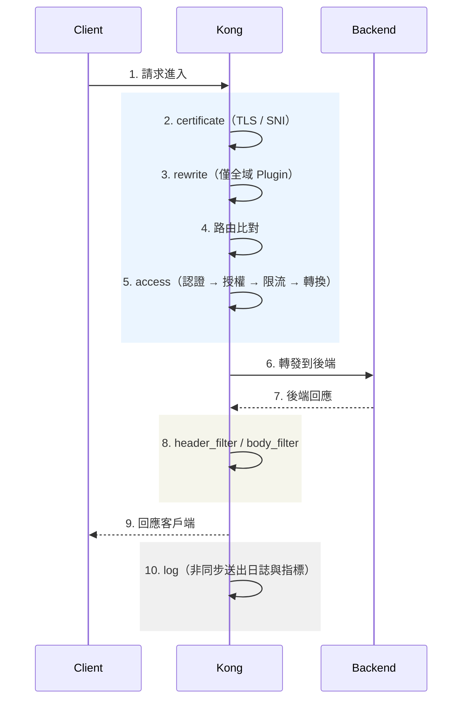
```mermaid
sequenceDiagram
    participant Client
    participant Kong
    participant Backend

    Client->>Kong: 1. 請求進入
    rect rgb(235, 245, 255)
        Kong->>Kong: 2. certificate（TLS / SNI）
        Kong->>Kong: 3. rewrite（僅全域 Plugin）
        Kong->>Kong: 4. 路由比對
        Kong->>Kong: 5. access（認證 → 授權 → 限流 → 轉換）
    end
    Kong->>Backend: 6. 轉發到後端
    Backend-->>Kong: 7. 後端回應
    rect rgb(245, 245, 235)
        Kong->>Kong: 8. header_filter / body_filter
    end
    Kong-->>Client: 9. 回應客戶端
    rect rgb(240, 240, 240)
        Kong->>Kong: 10. log（非同步送出日誌與指標）
    end
```

#### 4.3.2 同一階段內的執行順序：PRIORITY

同一個階段中，Plugin 依照 **PRIORITY 值由大到小**執行。以下數值取自 Kong 3.9.3 原始碼：

| Plugin | PRIORITY | 說明 |
| --- | --- | --- |
| `correlation-id` | 100001 | 最先執行，確保之後的日誌都帶有 Request ID |
| `bot-detection` | 2500 | |
| `cors` | 2000 | 在認證之前處理 Preflight |
| `jwt` | 1450 | 認證類 |
| `oauth2` | 1400 | 認證類 |
| `key-auth` | 1250 | 認證類 |
| `basic-auth` | 1100 | 認證類 |
| `ip-restriction` | 990 | |
| `request-size-limiting` | 951 | |
| `acl` | 950 | 授權：在認證**之後** |
| `rate-limiting` | 910 | 限流：在認證之後，所以可以依 Consumer 限流 |
| `request-transformer` | 801 | |
| `response-transformer` | 800 | |
| `ai-prompt-guard`／`ai-proxy` | 771／770 | |
| `proxy-cache` | 100 | |
| `opentelemetry` | 14 | |
| `prometheus` | 13 | |
| `http-log` | 12 | |
| `file-log` | 9 | |
| `request-termination` | 2 | |

> 📌 **動態排序（EE）**：Enterprise 可以在 Plugin 上設定 `ordering.before`／`ordering.after`，改變單一 Plugin 的執行順序（例如讓限流在認證之前執行，以抵擋暴力破解）。OSS 不支援這項功能。

#### 4.3.3 作用範圍與優先序（Precedence）

同一個 Plugin 可以在多個範圍各設定一次，但**每個請求只會套用其中一份設定**。

> ⚠️ **v2.0 更正**：v1.0 寫的是「Consumer > Route > Service > Global」，這個說法過度簡化。以下 8 層規則取自 Kong 3.9.3 的 `kong/runloop/plugins_iterator.lua`，由最具體到最寬鬆排列：

| 優先序 | 組合 | 範例 |
| --- | --- | --- |
| 1（最高） | Route + Service + Consumer | 特定客戶呼叫特定 Service 下的特定 Route |
| 2 | Route + Consumer | 特定客戶呼叫特定 Route |
| 3 | Service + Consumer | 特定客戶呼叫特定 Service |
| 4 | Route + Service | 特定 Service 的特定 Route |
| 5 | Consumer | 特定客戶的所有請求 |
| 6 | Route | 特定 Route |
| 7 | Service | 特定 Service |
| 8（最低） | Global | 所有請求 |

```bash
# 全域：所有請求每分鐘 1000 次
curl -X POST http://localhost:8001/plugins \
  --data name=rate-limiting --data config.minute=1000 --data config.policy=local

# Service 層級：user-service 每分鐘 200 次
curl -X POST http://localhost:8001/services/user-service/plugins \
  --data name=rate-limiting --data config.minute=200 --data config.policy=local

# Route 層級：寫入 API 每分鐘 50 次
curl -X POST http://localhost:8001/routes/user-route/plugins \
  --data name=rate-limiting --data config.minute=50 --data config.policy=local

# Consumer 層級：VIP 客戶每分鐘 5000 次
curl -X POST http://localhost:8001/consumers/vip-partner/plugins \
  --data name=rate-limiting --data config.minute=5000 --data config.policy=local
```

> 💡 **推論範例**：VIP 客戶呼叫 `user-route` 時，同時符合「Consumer」（第 5 層）與「Route」（第 6 層），所以套用 Consumer 的 5000 次設定，而不是 Route 的 50 次。如果希望 VIP 客戶在寫入 API 上也受限，就要建立「Route + Consumer」（第 2 層）的設定。
>
> 📌 **Consumer 層級的 Plugin 需要先完成認證**：Kong 必須先透過認證 Plugin 知道「是哪個 Consumer」，所以 Consumer 範圍的設定對認證 Plugin 本身無效。

### 4.4 宣告式設定（Declarative Config）

DB-less 模式與 decK 使用相同的 YAML 格式：

```yaml
# kong.yml
_format_version: "3.0"
_transform: true

services:
  - name: user-service
    url: http://user-backend:8080
    tags: [team-user, env-prod]
    routes:
      - name: user-route
        paths:
          - /api/users
        protocols: [https]
        strip_path: true
    plugins:
      - name: rate-limiting
        config:
          minute: 100
          policy: local

  - name: order-service
    url: http://order-backend:8080
    tags: [team-order, env-prod]
    routes:
      - name: order-route
        paths:
          - /api/orders
        methods: [GET, POST]

consumers:
  - username: mobile-app
    keyauth_credentials:
      - key: "{vault://env/mobile-app-key}"

plugins:
  - name: correlation-id
    config:
      header_name: X-Request-ID
      generator: uuid
      echo_downstream: true
  - name: prometheus
    config:
      status_code_metrics: true
      latency_metrics: true
```

| 頂層鍵 | 說明 |
| --- | --- |
| `_format_version` | 3.x 固定為 `"3.0"` |
| `_transform` | `true` 時 Kong 會處理需要轉換的欄位（例如雜湊 basic-auth 密碼） |
| `_workspace` | EE 的 Workspace 名稱 |
| `services`／`routes`／`upstreams`／`consumers`／`plugins`／`certificates`／`vaults` | 各實體，可以巢狀或平鋪 |

**載入方式**：

```bash
# 方式 1：啟動時載入
docker run -e KONG_DATABASE=off -e KONG_DECLARATIVE_CONFIG=/kong/kong.yml ...

# 方式 2：DB-less 節點執行中替換整份設定
curl -X POST http://localhost:8001/config \
  -F config=@kong.yml

# 方式 3（建議）：以 decK 同步到 DB-backed 或 Hybrid CP
deck gateway sync kong.yml
```

#### 4.4.1 以 Vault 參照管理 Secrets

> 🆕 **v2.0 新增**

設定中的敏感值（Redis 密碼、API Key、上游憑證）應該改用 **Vault 參照**，不要以明碼寫在 YAML 中：

```bash
# OSS 內建 env vault：讀取環境變數 MOBILE_APP_KEY
export MOBILE_APP_KEY='s3cr3t-value'
# 在設定中引用：{vault://env/mobile-app-key}
# 命名規則：Kong 會把名稱轉成大寫，並把 - 換成 _
```

| Vault | OSS | EE |
| --- | --- | --- |
| `env`（環境變數） | ✅ | ✅ |
| HashiCorp Vault、AWS Secrets Manager、GCP Secret Manager、Azure Key Vault、CyberArk Conjur | ❌ | ✅ |

> 📌 只有 schema 中標記為 `referenceable` 的欄位才能使用 Vault 參照，例如 rate-limiting 的 `config.redis.password`、OpenTelemetry 的 `config.traces_endpoint`。

### 4.5 Admin API 使用方式概覽

| 操作 | HTTP Method | 端點範例 |
| --- | --- | --- |
| 列出 | GET | `/services`、`/routes`、`/plugins`（每頁預設 100 筆，以 `offset` 翻頁） |
| 取得單一 | GET | `/services/{name or id}` |
| 新增 | POST | `/services` |
| 部分更新 | PATCH | `/services/{name or id}` |
| 新增或取代（Upsert） | PUT | `/services/{name or id}` |
| 刪除 | DELETE | `/services/{name or id}` |
| 以 Tag 過濾 | GET | `/services?tags=team-user,env-prod`（逗號表示 AND，`/` 表示 OR） |
| 驗證 Plugin 設定 | POST | `/schemas/plugins/validate` |
| 查詢實體 schema | GET | `/schemas/plugins/{name}` |
| 列出所有端點 | GET | `/endpoints` |

```bash
# 列出特定 Service 的 Route
curl -s http://localhost:8001/services/user-service/routes | jq '.data[].name'

# 依 Tag 查詢
curl -s "http://localhost:8001/services?tags=team-user" | jq '.data[].name'

# 在不建立的情況下驗證 Plugin 設定
curl -s -X POST http://localhost:8001/schemas/plugins/validate \
  -H 'Content-Type: application/json' \
  -d '{"name":"rate-limiting","config":{"minute":100,"policy":"local"}}'
```

> 💡 **實務建議**：
>
> - 手動呼叫 Admin API 只適合用在實驗與排錯；生產環境的設定一律透過 decK 與 Git 管理（見[9.1](#91-deck-與-apiops設定即程式碼)）。
> - 每個實體都應該加上 Tag（團隊、環境、系統代號），方便以 `deck --select-tag` 分權管理。

### 4.6 Workspaces 與多租戶（EE）

> 🆕 **v2.0 新增**

| 機制 | OSS | EE | 說明 |
| --- | --- | --- | --- |
| **Tags** | ✅ | ✅ | 標記與篩選；搭配 decK `--select-tag` 做團隊分工 |
| **Workspaces** | 只有 `default` | ✅ | 設定的邏輯隔離，搭配 RBAC 授權 |
| **RBAC** | ❌ | ✅ | Admin API 與 Kong Manager 的角色權限 |
| **Konnect 多個控制平面** | — | ✅ | 以控制平面群組隔離，治理層級更高 |

> ⚠️ **EE 3.15 注意**：Workspace 名稱不能與 Admin API 的頂層路徑相同（例如 `services`、`plugins`）。升級前請以 `GET /endpoints` 檢查是否有衝突。

### 4.7 💡 本章實務建議

1. **命名與 Tag 標準化**：Service 命名建議採用 `<domain>-<service>-<version>`，Tag 至少包含 `team-*`、`env-*`、`system-*`。
2. **非冪等 API 的 `retries` 設為 0**：避免因為重試造成重複下單或重複扣款。
3. **路由器使用 `traditional_compatible`**：有複雜條件時再個別改用 `expressions`，並明確設定 `priority`。
4. **理解 Plugin 的 8 層優先序**：設計「方案分級」時，先畫出 Consumer × Route 的矩陣，確認每個組合會套用哪一份設定。
5. **Secrets 一律使用 Vault 參照**：禁止在 Git 中出現明碼的 Key 或密碼。

---

## 5. Kong API Gateway 實際使用教學

> 📌 本章所有指令都可以在[3.2.2](#322-docker-compose-部署含-postgresql-與-kong-manager)的 Compose 環境（OSS 3.9.3，DB-backed）直接執行。DB-less 環境請改用 YAML 搭配 `deck gateway sync`，或上傳到 `/config`。

### 5.1 建立第一個 API（Service + Route）

**情境**：把 `/api/demo` 路由到 Kong 提供的 httpbin 測試服務。

```bash
# Step 1：建立 Service
curl -X POST http://localhost:8001/services \
  --data name=demo-service \
  --data url=https://httpbin.konghq.com

# Step 2：建立 Route
curl -X POST http://localhost:8001/services/demo-service/routes \
  --data name=demo-route \
  --data "paths[]=/api/demo" \
  --data strip_path=true

# Step 3：測試（/api/demo 被移除後，實際轉送到 /get）
curl -i http://localhost:8000/api/demo/get
```

**預期結果（節錄）**：

```text
HTTP/1.1 200 OK
Content-Type: application/json
X-Kong-Upstream-Latency: 85
X-Kong-Proxy-Latency: 1
Via: 1.1 kong/3.9.3
X-Kong-Request-Id: 5c3b...

{
  "headers": {
    "Host": "httpbin.konghq.com",
    "X-Forwarded-Prefix": "/api/demo",
    ...
  },
  "url": "https://httpbin.konghq.com/get"
}
```

| 回應 Header | 意義 |
| --- | --- |
| `X-Kong-Proxy-Latency` | Kong 本身處理的耗時（毫秒），包含 Plugin 執行時間 |
| `X-Kong-Upstream-Latency` | 等待後端回應的時間（毫秒） |
| `X-Kong-Request-Id` | Kong 產生的請求 ID，可以用來串接日誌 |
| `Via` | 經過的 Kong 版本；生產環境可以用 `headers = off` 隱藏 |

> 💡 **對外隱藏版本資訊**：生產環境建議設定 `KONG_HEADERS=X-Kong-Request-Id`（只保留 Request ID），避免洩漏 Kong 的版本號碼。

#### 5.1.1 strip_path 與 path 的組合

| Service `path` | Route `paths` | `strip_path` | 請求 | 後端收到的路徑 |
| --- | --- | --- | --- | --- |
| （無） | `/api/demo` | `true` | `/api/demo/get` | `/get` |
| （無） | `/api/demo` | `false` | `/api/demo/get` | `/api/demo/get` |
| `/v1` | `/api/demo` | `true` | `/api/demo/get` | `/v1/get` |
| `/v1` | `/api/demo` | `false` | `/api/demo/get` | `/v1/api/demo/get` |

### 5.2 API 路由策略

#### 5.2.1 基於 Path 路由

```bash
# /api/v1/users → user-service-v1
curl -X POST http://localhost:8001/services/user-service-v1/routes \
  --data name=users-v1 --data "paths[]=/api/v1/users"

# /api/v2/users → user-service-v2
curl -X POST http://localhost:8001/services/user-service-v2/routes \
  --data name=users-v2 --data "paths[]=/api/v2/users"

# 正規表示式：/api/orders/<數字>（以 ~ 開頭）
curl -X POST http://localhost:8001/services/order-service/routes \
  --data name=order-by-id \
  --data-urlencode 'paths[]=~/api/orders/\d+$' \
  --data regex_priority=10
```

> 📌 **比對順序**：Kong 會優先比對「條件較多」的 Route；條件數量相同時，前綴路徑以「較長者優先」，正規表示式則依 `regex_priority` 由大到小比對。

#### 5.2.2 基於 Host 路由

```bash
# api.example.com → external-api
curl -X POST http://localhost:8001/services/external-api/routes \
  --data name=ext-host --data "hosts[]=api.example.com"

# 萬用字元：*.partner.example.com → partner-api
curl -X POST http://localhost:8001/services/partner-api/routes \
  --data name=partner-wildcard --data "hosts[]=*.partner.example.com"
```

#### 5.2.3 基於 Method 路由（讀寫分離）

```bash
# GET /users → user-read-service
curl -X POST http://localhost:8001/services/user-read-service/routes \
  --data name=users-read \
  --data "paths[]=/users" \
  --data "methods[]=GET"

# POST / PUT / DELETE /users → user-write-service
curl -X POST http://localhost:8001/services/user-write-service/routes \
  --data name=users-write \
  --data "paths[]=/users" \
  --data "methods[]=POST" \
  --data "methods[]=PUT" \
  --data "methods[]=DELETE"
```

#### 5.2.4 基於 Header 路由（灰度或 Beta 測試）

> 🆕 **v2.0 新增**

```bash
# 帶有 X-Version: beta 的請求 → user-service-beta
curl -X POST http://localhost:8001/services/user-service-beta/routes \
  --data name=users-beta \
  --data "paths[]=/api/users" \
  --data "headers.x-version=beta"

# 其餘請求 → user-service（條件較少，所以比對優先序較低）
curl -X POST http://localhost:8001/services/user-service/routes \
  --data name=users-stable \
  --data "paths[]=/api/users"
```

#### 5.2.5 Expressions 路由器

> 🆕 **v2.0 新增**：需要設定 `router_flavor = expressions`（全域設定，會影響所有 Route）。

```yaml
# kong.yml（router_flavor = expressions）
_format_version: "3.0"
services:
  - name: user-service-beta
    url: http://user-beta:8080
    routes:
      - name: users-beta-expr
        expression: 'http.path ^= "/api/users" && (http.headers.x_version == "beta" || net.src.ip in 10.10.0.0/16)'
        priority: 100
```

| 常用欄位 | 說明 |
| --- | --- |
| `http.path` | 請求路徑；可用 `==`、`^=`（前綴）、`=^`（後綴）、`~`（正規表示式） |
| `http.host` | Host Header |
| `http.method` | HTTP Method |
| `http.headers.<name>` | Header（名稱全部小寫，`-` 改成 `_`） |
| `http.queries.<name>` | Query String 參數 |
| `net.src.ip`／`net.dst.port` | 來源 IP、目的連接埠 |
| `tls.sni` | TLS SNI |

> 💡 **選用建議**：`expressions` 的表達能力最強，但所有 Route 都要改寫。只有在「傳統欄位無法表達的條件很多」時才值得切換，並且應該在測試環境完整回歸。

### 5.3 Load Balancing 與 Health Check

```bash
# Step 1：建立 Upstream（含主動與被動健康檢查）
curl -X POST http://localhost:8001/upstreams \
  --data name=user-upstream \
  --data algorithm=round-robin \
  --data healthchecks.active.type=http \
  --data healthchecks.active.http_path=/actuator/health \
  --data healthchecks.active.timeout=2 \
  --data healthchecks.active.healthy.interval=5 \
  --data healthchecks.active.healthy.successes=2 \
  --data healthchecks.active.unhealthy.interval=5 \
  --data healthchecks.active.unhealthy.http_failures=3 \
  --data healthchecks.active.unhealthy.tcp_failures=3 \
  --data healthchecks.active.unhealthy.timeouts=3 \
  --data healthchecks.passive.unhealthy.http_failures=5 \
  --data healthchecks.passive.unhealthy.timeouts=5

# Step 2：新增 Targets（第三台權重較低，分配到的流量較少）
curl -X POST http://localhost:8001/upstreams/user-upstream/targets \
  --data target=user-backend-1:8080 --data weight=100
curl -X POST http://localhost:8001/upstreams/user-upstream/targets \
  --data target=user-backend-2:8080 --data weight=100
curl -X POST http://localhost:8001/upstreams/user-upstream/targets \
  --data target=user-backend-3:8080 --data weight=50

# Step 3：建立 Service 指向 Upstream
curl -X POST http://localhost:8001/services \
  --data name=user-service \
  --data host=user-upstream \
  --data port=8080

# Step 4：建立 Route
curl -X POST http://localhost:8001/services/user-service/routes \
  --data name=user-route --data "paths[]=/api/users"

# Step 5：查詢健康狀態
curl -s http://localhost:8001/upstreams/user-upstream/health | jq '.data[] | {target, health}'
```

#### 5.3.1 Health Check 類型

| 類型 | 運作方式 | 優點 | 注意事項 |
| --- | --- | --- | --- |
| **Active（主動）** | Kong 定期呼叫 `http_path` | 可以在流量進來之前發現故障，也能自動恢復 | 每個 worker、每個節點都會送出探測；節點很多時要控制頻率 |
| **Passive（被動，斷路器）** | 依實際請求的結果判斷 | 不會產生額外流量 | **只能標記為不健康、不會自動恢復**，必須搭配 Active 或手動恢復 |

> 📌 `interval = 0` 代表停用該項檢查，這也是預設值。只設定 `http_path` 而沒有設定 `interval` 時，主動健康檢查不會執行。

```yaml
# 宣告式設定範例
upstreams:
  - name: user-upstream
    algorithm: round-robin
    healthchecks:
      active:
        type: http
        http_path: /actuator/health
        timeout: 2
        healthy:
          interval: 5
          successes: 2
        unhealthy:
          interval: 5
          http_failures: 3
          tcp_failures: 3
          timeouts: 3
      passive:
        unhealthy:
          http_failures: 5
          timeouts: 5
    targets:
      - target: user-backend-1:8080
        weight: 100
      - target: user-backend-2:8080
        weight: 100
```

#### 5.3.2 以權重實作金絲雀發布

```bash
# v2 先分到 10% 流量
curl -X POST http://localhost:8001/upstreams/user-upstream/targets \
  --data target=user-backend-v2:8080 --data weight=10

# 觀察錯誤率與延遲後，逐步調高（Target 以 PUT 或 PATCH 更新）
curl -X PATCH http://localhost:8001/upstreams/user-upstream/targets/user-backend-v2:8080 \
  --data weight=50
```

> 💡 在 Kubernetes 上，建議改用 Gateway API `HTTPRoute` 的 `backendRefs[].weight` 實作流量切分，由 Operator 產生對應的 Upstream 設定。

### 5.4 完整請求流程範例

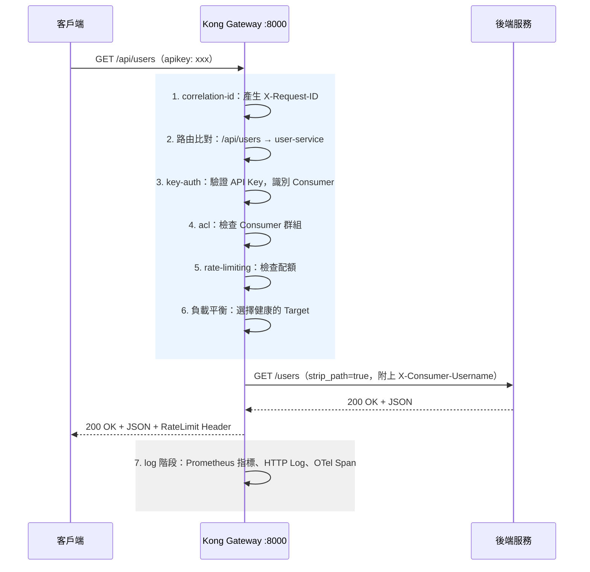
```mermaid
sequenceDiagram
    participant Client as 客戶端
    participant Kong as Kong Gateway :8000
    participant Backend as 後端服務

    Client->>Kong: GET /api/users（apikey: xxx）
    rect rgb(235, 245, 255)
        Kong->>Kong: 1. correlation-id：產生 X-Request-ID
        Kong->>Kong: 2. 路由比對：/api/users → user-service
        Kong->>Kong: 3. key-auth：驗證 API Key，識別 Consumer
        Kong->>Kong: 4. acl：檢查 Consumer 群組
        Kong->>Kong: 5. rate-limiting：檢查配額
        Kong->>Kong: 6. 負載平衡：選擇健康的 Target
    end
    Kong->>Backend: GET /users（strip_path=true，附上 X-Consumer-Username）
    Backend-->>Kong: 200 OK + JSON
    Kong-->>Client: 200 OK + JSON + RateLimit Header
    rect rgb(240, 240, 240)
        Kong->>Kong: 7. log 階段：Prometheus 指標、HTTP Log、OTel Span
    end
```

### 5.5 💡 本章實務建議

1. **一律明確設定 `protocols`**：對外 Route 只允許 `https`，避免意外以明文提供服務。
2. **正規表示式 Route 要設定 `regex_priority`**，並且盡量以前綴路徑取代，以降低比對成本。
3. **主動與被動健康檢查一起使用**：被動檢查負責快速熔斷，主動檢查負責自動恢復。
4. **金絲雀發布要搭配觀測**：調整權重之前，先在 Grafana 確認新版本的錯誤率與 P99 延遲。

---

## 6. 常用 Plugins 實務說明

### 6.0 Plugin 選用總覽

> 🆕 **v2.0 新增**：v1.0 沒有標示各個 Plugin 的授權與 DB-less 支援。以下是企業最常用的 Plugin 對照表。

| 類別 | Plugin | 版本 | DB-less | 本手冊章節 |
| --- | --- | --- | --- | --- |
| 流量控制 | `rate-limiting` | OSS | ✅（不能使用 `cluster` policy） | [6.1](#61-rate-limiting限流) |
| 流量控制 | `rate-limiting-advanced` | EE | ✅ | [6.1.3](#613-rate-limiting-advancedee) |
| 流量控制 | `request-size-limiting` | OSS | ✅ | [6.8](#68-防護類-pluginip--bot--size) |
| 流量控制 | `proxy-cache` | OSS（只有 memory） | ✅ | [6.9](#69-proxy-cache回應快取) |
| 認證 | `key-auth` | OSS | ✅ | [6.2](#62-key-authentication) |
| 認證 | `jwt` | OSS | ✅ | [6.3](#63-jwt-authentication) |
| 認證 | `basic-auth`、`hmac-auth`、`ldap-auth` | OSS | ✅ | — |
| 認證 | `oauth2`（Kong 當授權伺服器） | OSS | ❌ | [6.4](#64-oauth-20-與-openid-connect) |
| 認證 | `openid-connect`、`oauth2-introspection`、`jwt-signer` | EE | ✅ | [6.4](#64-oauth-20-與-openid-connect) |
| 授權 | `acl` | OSS | ✅ | [6.5](#65-acl存取控制清單) |
| 授權 | `opa` | EE | ✅ | [11.5](#115-owasp-api-security-top-10-對應) |
| 安全 | `cors` | OSS | ✅ | [6.6](#66-cors) |
| 安全 | `ip-restriction`、`bot-detection` | OSS | ✅ | [6.8](#68-防護類-pluginip--bot--size) |
| 安全 | `request-validator` | EE | ✅ | [11.5](#115-owasp-api-security-top-10-對應) |
| 轉換 | `request-transformer`、`response-transformer` | OSS | ✅ | [6.7](#67-request--response-transformer) |
| 轉換 | `correlation-id` | OSS | ✅ | [6.10](#610-correlation-id) |
| 觀測 | `prometheus`、`opentelemetry`、`zipkin`、`statsd`、`datadog` | OSS | ✅ | [6.11](#611-prometheus-plugin)、[8.4](#84-traceopentelemetry-整合) |
| 日誌 | `file-log`、`http-log`、`tcp-log`、`udp-log`、`syslog`、`loggly` | OSS | ✅ | [6.12](#612-logging-plugins) |
| 無伺服器 | `pre-function`、`post-function`（Lua） | OSS | ✅ | [12.3](#123-plugin-使用過度的風險) |
| AI | `ai-proxy`、`ai-prompt-guard`、`ai-prompt-template` 等 | OSS | ✅ | [13](#13-ai-gateway-與-mcp) |

### 6.1 Rate Limiting（限流）

**使用情境**：防止濫用或暴力攻擊、依客戶方案提供不同配額、保護後端容量。

> ⚠️ **v2.0 更正**：v1.0 使用的 `config.redis_host`、`config.redis_port` 自 3.8 起已經**淘汰**（Kong 會在日誌中輸出 deprecation 警告，並預計在 4.0 移除）。請改用巢狀的 `config.redis.*`。

```bash
# 全域限流：每分鐘 100 次（單節點計數）
curl -X POST http://localhost:8001/plugins \
  --data name=rate-limiting \
  --data config.minute=100 \
  --data config.policy=local

# 特定 Service：以 Redis 共享計數（多節點環境）
curl -X POST http://localhost:8001/services/user-service/plugins \
  --data name=rate-limiting \
  --data config.minute=50 \
  --data config.hour=1000 \
  --data config.limit_by=consumer \
  --data config.policy=redis \
  --data config.redis.host=redis \
  --data config.redis.port=6379 \
  --data 'config.redis.password={vault://env/redis-password}' \
  --data config.redis.timeout=2000 \
  --data config.sync_rate=-1 \
  --data config.fault_tolerant=true
```

| 參數 | 說明 | 預設值（3.9.3） |
| --- | --- | --- |
| `second`／`minute`／`hour`／`day`／`month`／`year` | 各時間單位的上限（至少要設定一個） | — |
| `limit_by` | `consumer`、`credential`、`ip`、`service`、`header`、`path` | `consumer`（找不到 Consumer 時改以 IP 計數） |
| `header_name`／`path` | `limit_by` 為 `header`／`path` 時使用 | — |
| `policy` | `local`（節點記憶體）、`cluster`（資料庫）、`redis` | `local` |
| `redis.host`／`redis.port`／`redis.password`／`redis.database`／`redis.ssl` | Redis 連線設定 | port `6379`、timeout `2000` ms |
| `sync_rate` | 與中央儲存同步的間隔（秒）；`-1` 表示每個請求都同步 | `-1` |
| `fault_tolerant` | 儲存系統故障時是否放行請求 | `true` |
| `hide_client_headers` | 是否隱藏 `RateLimit-*` Header | `false` |
| `error_code`／`error_message` | 超過上限時的回應 | `429`／`API rate limit exceeded` |

**回應 Header**：`RateLimit-Limit`、`RateLimit-Remaining`、`RateLimit-Reset`、`X-RateLimit-Limit-Minute`、`X-RateLimit-Remaining-Minute`；超過上限時另外回傳 `Retry-After`。

#### 6.1.1 Policy 選擇

| Policy | 準確度 | 效能 | 適用情境 |
| --- | --- | --- | --- |
| `local` | 叢集的總上限約為「節點數 × 設定值」 | 最好 | 單節點；或只是要保護單一節點，不在意精確的全域配額 |
| `cluster` | 準確 | 每個請求都會寫資料庫，負擔很大 | 不建議使用；DB-less 與 Hybrid 模式也不支援 |
| `redis` | 準確（`sync_rate=-1` 時） | 多一次 Redis 往返（通常小於 1 ms） | **多節點生產環境的建議選項** |

> 💡 **效能與準確度的取捨**：把 `sync_rate` 設為正數（例如 `0.5`）時，會在本機累計後再批次同步，Redis 的負擔較低，但短時間內可能超出上限。對計費類 API 請維持 `-1`。

#### 6.1.2 設計建議

- 對外 API 採用**兩層限流**：全域的 `limit_by=ip`（防濫用）加上 Service 層的 `limit_by=consumer`（依方案）。
- `fault_tolerant=true` 可以避免 Redis 故障時擋掉所有流量，但這段期間就等於沒有限流，請搭配 Redis 的監控告警。
- 由於 `rate-limiting` 在認證**之後**執行，未通過認證的暴力嘗試不會被它擋下。這類攻擊請在全域以 `limit_by=ip` 另外限制。

#### 6.1.3 Rate Limiting Advanced（EE）

| 功能 | OSS `rate-limiting` | EE `rate-limiting-advanced` |
| --- | --- | --- |
| 演算法 | 固定視窗 | 固定或**滑動視窗** |
| 多個視窗與上限 | 每個時間單位一個上限 | 可以任意組合視窗大小與上限 |
| Consumer Group 分級 | ❌ | ✅ |
| Redis Cluster／Sentinel | ❌（只支援單一 Redis 主機） | ✅ |
| 3.16 新增 | — | Principal 識別、以 CEL 決定限流上限 |

### 6.2 Key Authentication

**使用情境**：伺服器對伺服器（B2B）呼叫、內部系統整合、簡單的 API 存取控制。

```bash
# Step 1：在 Service 啟用 key-auth
curl -X POST http://localhost:8001/services/user-service/plugins \
  --data name=key-auth \
  --data "config.key_names[]=apikey" \
  --data config.key_in_query=false \
  --data config.hide_credentials=true

# Step 2：建立 Consumer
curl -X POST http://localhost:8001/consumers \
  --data username=partner-app

# Step 3：為 Consumer 產生 API Key（不指定 key 時由 Kong 產生隨機值）
curl -s -X POST http://localhost:8001/consumers/partner-app/key-auth | jq -r '.key'

# Step 4：測試
curl -i http://localhost:8000/api/users -H "apikey: <上一步取得的 key>"
```

| 參數 | 說明 | 預設值（3.9.3） |
| --- | --- | --- |
| `key_names` | 讀取 Key 的 Header／Query 名稱 | `["apikey"]` |
| `key_in_header` | 是否從 Header 讀取 | `true` |
| `key_in_query` | 是否從 Query String 讀取 | `true`（**建議改為 `false`**） |
| `key_in_body` | 是否從 Body 讀取 | `false` |
| `hide_credentials` | 轉發給後端之前是否移除 Key | `false`（EE 3.14 起新建的 Plugin 預設為 `true`） |
| `anonymous` | 認證失敗時改用的匿名 Consumer | — |
| `run_on_preflight` | 是否對 OPTIONS Preflight 驗證 | `true` |

> ⚠️ **安全注意**：放在 Query String 的 Key 會出現在 LB、Proxy 與瀏覽器歷史紀錄中，因此請關閉 `key_in_query`。另外，API Key **不應該**用在前端 SPA 或行動 App，因為使用者可以輕易取得；前端應用請改用 OAuth 2.0 + PKCE（見[7.3](#73-與-oauth--sso--iam-系統整合)）。
>
> 📌 **EE 替代方案**：`key-auth-enc` 會以 keyring 加密儲存 Key，避免資料庫外洩時連帶洩漏 Key。

### 6.3 JWT Authentication

**使用情境**：驗證由自家 IdP 或外部 IdP 簽發的 JWT；無狀態、適合分散式環境。

```bash
# Step 1：啟用 JWT Plugin
curl -X POST http://localhost:8001/services/user-service/plugins \
  --data name=jwt \
  --data "config.claims_to_verify[]=exp" \
  --data config.maximum_expiration=3600 \
  --data config.key_claim_name=iss

# Step 2：建立 Consumer
curl -X POST http://localhost:8001/consumers --data username=jwt-issuer-a

# Step 3：建立 JWT 憑證（HS256 範例；key 必須等於 Token 中 iss claim 的值）
curl -X POST http://localhost:8001/consumers/jwt-issuer-a/jwt \
  --data algorithm=HS256 \
  --data key=issuer-a \
  --data secret=please-use-a-32-byte-random-secret

# Step 4：產生 Token（範例）
#   Header : {"alg":"HS256","typ":"JWT"}
#   Payload: {"iss":"issuer-a","exp":<現在時間 + 900 秒>}
#   以 secret 簽章

# Step 5：測試
curl -i http://localhost:8000/api/users \
  -H "Authorization: Bearer <token>"
```

**使用 RS256（非對稱簽章）**：

```bash
curl -X POST http://localhost:8001/consumers/jwt-issuer-a/jwt \
  --data algorithm=RS256 \
  --data key=https://idp.example.com/realms/prod \
  --data-urlencode "rsa_public_key@public.pem"
```

| 參數 | 說明 | 預設值（3.9.3） |
| --- | --- | --- |
| `key_claim_name` | 用哪個 claim 的值去對應憑證的 `key` | `iss` |
| `claims_to_verify` | 要驗證的時間 claim（只支援 `exp`、`nbf`） | — |
| `maximum_expiration` | Token 有效期的上限（秒）；需要搭配 `exp` 驗證 | `0`（不限制） |
| `header_names`／`uri_param_names`／`cookie_names` | 讀取 Token 的位置 | `authorization`／`jwt`／— |
| `secret_is_base64` | secret 是否為 Base64 編碼 | `false` |
| `anonymous`、`run_on_preflight` | 同 key-auth | — |

**支援的演算法（3.9.3）**：HS256／384／512、RS256／384／512、ES256／384／512、PS256／384／512、EdDSA。

> ⚠️ **v2.0 更正**：v1.0 提到「可以搭配 Keycloak 的 JWKS 端點動態取得公鑰」，這是**錯誤**的。OSS 的 `jwt` Plugin 只能使用事先上傳到 Consumer 的**靜態公鑰**，**不會**讀取 JWKS，也**不會**驗證 `aud`、`scope` 等 claim。因此：
>
> - IdP 輪替簽章金鑰時，必須同步更新 Kong 的憑證（可以用 decK 自動化）。
> - 需要 JWKS 自動輪替、`aud`／`scope` 驗證時，請使用 EE 的 `openid-connect` Plugin，或在後端應用程式中再驗證一次。

### 6.4 OAuth 2.0 與 OpenID Connect

Kong 有兩種角色可以選擇：

| 模式 | Plugin | 版本 | 建議 |
| --- | --- | --- | --- |
| Kong **自己當授權伺服器**（簽發 Token） | `oauth2` | OSS（需要資料庫，不支援 DB-less） | ❌ 不建議：授權流程與使用者管理應該交給專業的 IdP |
| Kong 當**資源伺服器**，驗證外部 IdP 的 JWT | `jwt`（靜態公鑰） | OSS | ✅ OSS 環境的標準做法 |
| Kong 當資源伺服器，完整支援 OIDC（JWKS、Introspection、Scope、Claim 對應） | `openid-connect` | EE | ✅ 企業環境的首選 |
| 呼叫 IdP 驗證不透明 Token | `oauth2-introspection` | EE | 適合 Token 不是 JWT 的情況 |
| 由 Kong 重新簽發內部 Token（Token Exchange） | `jwt-signer` | EE | 零信任架構，外部 Token 不直接進入內網 |

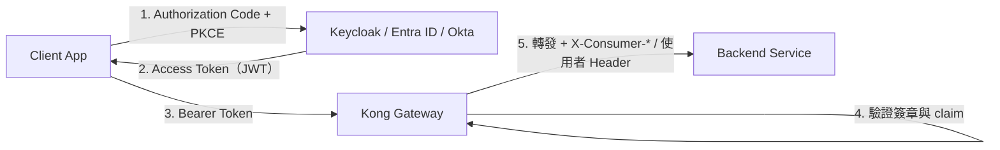
```mermaid
graph LR
    Client[Client App] -->|1. Authorization Code + PKCE| IdP[Keycloak / Entra ID / Okta]
    IdP -->|2. Access Token（JWT）| Client
    Client -->|3. Bearer Token| Kong[Kong Gateway]
    Kong -->|4. 驗證簽章與 claim| Kong
    Kong -->|5. 轉發 + X-Consumer-* / 使用者 Header| Backend[Backend Service]
```

**EE：openid-connect 最小設定範例**：

```yaml
plugins:
  - name: openid-connect
    service: user-service
    config:
      issuer: https://keycloak.example.com/realms/prod/.well-known/openid-configuration
      auth_methods:
        - bearer
      bearer_token_param_type:
        - header
      audience_required:
        - user-api
      scopes_required:
        - users:read
      upstream_headers:          # 3.14 起取代 upstream_headers_claims / upstream_headers_names
        - header: X-User-Id
          path:
            - sub
```

> 📌 Keycloak 端的設定（Realm、Client、Audience Mapper）請參考本站的《Keycloak教學手冊》。整合 Keycloak 的三種模式比較請見[7.3](#73-與-oauth--sso--iam-系統整合)。

### 6.5 ACL（存取控制清單）

**使用情境**：限制只有特定 Consumer 群組可以存取某些 API（粗粒度授權）。

```bash
# Step 1：在管理 API 上啟用 ACL（必須搭配認證 Plugin）
curl -X POST http://localhost:8001/services/admin-service/plugins \
  --data name=key-auth
curl -X POST http://localhost:8001/services/admin-service/plugins \
  --data name=acl \
  --data "config.allow[]=admin-group" \
  --data config.hide_groups_header=true

# Step 2：把 Consumer 加入群組
curl -X POST http://localhost:8001/consumers/admin-user/acls \
  --data group=admin-group
```

| 參數 | 說明 |
| --- | --- |
| `allow`／`deny` | 允許或拒絕的群組；兩者只能擇一 |
| `hide_groups_header` | 是否不把 `X-Consumer-Groups` 傳給後端 |
| `always_use_authenticated_groups` | 是否使用認證 Plugin 提供的群組（例如 LDAP 群組），而不是 Consumer 的 ACL |

> 💡 ACL 只適合做「這個客戶能不能呼叫這個 API」的判斷。細粒度的授權（例如「只能查自己的訂單」）屬於業務邏輯，應該在後端實作，或使用 EE 的 `opa` Plugin 搭配 OPA 政策。3.16 起 EE 的 ACL 另外支援以 CEL 撰寫的 `allow_when`／`deny_when` 條件。

### 6.6 CORS

**使用情境**：前端 SPA 跨網域呼叫 API。

```bash
curl -X POST http://localhost:8001/services/user-service/plugins \
  --data name=cors \
  --data "config.origins[]=https://app.example.com" \
  --data "config.methods[]=GET" \
  --data "config.methods[]=POST" \
  --data "config.methods[]=PUT" \
  --data "config.methods[]=DELETE" \
  --data "config.headers[]=Content-Type" \
  --data "config.headers[]=Authorization" \
  --data "config.exposed_headers[]=X-Request-ID" \
  --data config.credentials=true \
  --data config.max_age=3600
```

| 參數 | 說明 |
| --- | --- |
| `origins` | 允許的來源；可以使用正規表示式（例如 `https://.*\.example\.com`）；`*` 代表全部 |
| `methods` | 允許的 HTTP Method |
| `headers` | 允許的請求 Header |
| `exposed_headers` | 前端 JavaScript 可以讀取的回應 Header |
| `credentials` | 是否允許攜帶 Cookie 與認證資訊 |
| `max_age` | Preflight 結果的快取秒數 |
| `preflight_continue` | 是否把 OPTIONS 請求轉給後端處理 |
| `private_network` | 是否回應 Private Network Access 的 Preflight |

> ⚠️ **安全注意**：
>
> - 不要把 `origins: *` 和 `credentials: true` 一起使用；瀏覽器會拒絕這種組合，而且這種設定本身也代表安全政策失控。
> - CORS 的 PRIORITY（2000）高於認證類 Plugin，所以 Preflight 請求不需要帶 Token 也能得到回應，這是預期中的行為。

### 6.7 Request / Response Transformer

**使用情境**：新增或移除 Header、改寫 Query 與 Body、做 API 版本相容轉換。

```bash
# Request Transformer：加上 Header、移除敏感 Header、改寫路徑
curl -X POST http://localhost:8001/services/user-service/plugins \
  --data name=request-transformer \
  --data "config.add.headers[]=X-Request-Source:kong" \
  --data "config.remove.headers[]=Cookie" \
  --data "config.rename.querystring[]=uid:userId" \
  --data "config.replace.uri=/v2/users"

# Response Transformer：移除洩漏技術細節的 Header、加上安全 Header
curl -X POST http://localhost:8001/services/user-service/plugins \
  --data name=response-transformer \
  --data "config.remove.headers[]=Server" \
  --data "config.remove.headers[]=X-Powered-By" \
  --data "config.add.headers[]=Strict-Transport-Security:max-age=31536000; includeSubDomains" \
  --data "config.add.headers[]=X-Content-Type-Options:nosniff"
```

| 操作 | Request Transformer | Response Transformer |
| --- | --- | --- |
| 執行順序 | `remove` → `rename` → `replace` → `add` → `append` | `remove` → `rename` → `replace` → `add` → `append` |
| 目標 | `headers`、`querystring`、`body`，另有 `uri`、`http_method` | `headers`、`json`（Body） |

> ⚠️ **效能注意**：修改 Body（`body`／`json`）需要緩衝完整的請求或回應，對大型 Payload 會明顯增加記憶體與延遲。只有在必要時才轉換 Body，複雜的轉換請交給後端或 BFF。

### 6.8 防護類 Plugin（IP / Bot / Size）

> 🆕 **v2.0 新增**

```bash
# IP 白名單：管理 API 只允許內網存取
curl -X POST http://localhost:8001/services/admin-service/plugins \
  --data name=ip-restriction \
  --data "config.allow[]=10.0.0.0/8" \
  --data "config.allow[]=192.168.0.0/16" \
  --data config.status=403

# Bot Detection：擋掉常見的爬蟲 User-Agent（可以另外加入自訂規則）
curl -X POST http://localhost:8001/plugins \
  --data name=bot-detection \
  --data "config.deny[]=(?i)curl"

# 請求大小限制：上傳 API 最多 10 MB，並要求 Content-Length
curl -X POST http://localhost:8001/routes/upload-route/plugins \
  --data name=request-size-limiting \
  --data config.allowed_payload_size=10 \
  --data config.size_unit=megabytes \
  --data config.require_content_length=true
```

> 📌 **取得真實的用戶端 IP**：Kong 前面有 LB 時，必須設定 `trusted_ips`（LB 的網段）與 `real_ip_header`（例如 `X-Forwarded-For`），否則 `ip-restriction` 與 `limit_by=ip` 取得的都會是 LB 的 IP。

### 6.9 Proxy Cache（回應快取）

> 🆕 **v2.0 新增**

```bash
curl -X POST http://localhost:8001/routes/product-list/plugins \
  --data name=proxy-cache \
  --data config.strategy=memory \
  --data "config.request_method[]=GET" \
  --data "config.response_code[]=200" \
  --data "config.content_type[]=application/json" \
  --data config.cache_ttl=60 \
  --data "config.vary_headers[]=Accept-Language"
```

| 參數 | 預設值（3.9.3） | 說明 |
| --- | --- | --- |
| `strategy` | —（OSS 只有 `memory`） | EE 的 `proxy-cache-advanced` 支援 Redis |
| `cache_ttl` | `300` 秒 | |
| `response_code` | `200, 301, 404` | |
| `request_method` | `GET, HEAD` | |
| `content_type` | `text/plain, application/json` | |
| `cache_control` | `false` | `true` 時遵守 `Cache-Control` 標頭 |

回應會附上 `X-Cache-Status`（`Hit`／`Miss`／`Bypass`／`Refresh`），可以用來觀察快取命中率。

> ⚠️ **注意**：`memory` 策略的快取存放在各節點自己的記憶體，節點之間不共享。**有個人化內容的 API（例如依 Token 回傳不同資料）不要快取**，否則可能把 A 的資料回給 B；真的需要時，請把識別使用者的 Header 加進 `vary_headers`。

### 6.10 Correlation ID

```bash
curl -X POST http://localhost:8001/plugins \
  --data name=correlation-id \
  --data config.header_name=X-Request-ID \
  --data config.generator=uuid \
  --data config.echo_downstream=true
```

| 參數 | 預設值（3.9.3） | 說明 |
| --- | --- | --- |
| `header_name` | `Kong-Request-ID` | 建議改成組織的標準名稱（例如 `X-Request-ID`） |
| `generator` | `uuid#counter` | `uuid`、`uuid#counter`、`tracker` |
| `echo_downstream` | `false` | 是否把 ID 回傳給用戶端，方便客服追查 |

> 💡 用戶端已經帶有同名 Header 時，Kong 會沿用原本的值。若採用 W3C Trace Context，建議以 OpenTelemetry 的 `traceparent` 作為主要的追蹤 ID，Correlation ID 則作為面向客服的輔助識別碼。

### 6.11 Prometheus Plugin

```bash
# 全域啟用；各類指標預設都是關閉的，必須明確開啟
curl -X POST http://localhost:8001/plugins \
  --data name=prometheus \
  --data config.status_code_metrics=true \
  --data config.latency_metrics=true \
  --data config.bandwidth_metrics=true \
  --data config.upstream_health_metrics=true \
  --data config.per_consumer=false

# 指標端點（建議從 Status API 抓取）
curl -s http://localhost:8100/metrics | head
```

> ⚠️ **v2.0 更正**：
>
> - `per_consumer=true` 會讓指標的基數（cardinality）隨 Consumer 數量成長，Consumer 很多時可能拖垮 Prometheus。v1.0 的範例直接開啟這個選項，本版改為預設關閉，只在有需要時開啟。
> - 完整的指標清單與告警建議請見[8.2](#82-與-prometheus--grafana-整合)。

### 6.12 Logging Plugins

#### 6.12.1 File Log

```bash
curl -X POST http://localhost:8001/plugins \
  --data name=file-log \
  --data config.path=/dev/stdout \
  --data config.reopen=false
```

> 💡 在容器環境中，寫到 `/dev/stdout` 並交給 Fluent Bit 或 Vector 收集，比寫到檔案更容易維運。寫到實體檔案時請設定 `reopen=true`，並搭配 logrotate。

#### 6.12.2 HTTP Log（送到 ELK 或 OpenSearch）

> ⚠️ **v2.0 更正**：`config.flush_timeout`、`config.queue_size`、`config.retry_count` 自 3.3 起改由統一的 **`config.queue.*`** 取代（`retry_count` 已經完全失效）。

```bash
curl -X POST http://localhost:8001/plugins \
  --data name=http-log \
  --data config.http_endpoint=http://logstash:8080 \
  --data config.method=POST \
  --data config.content_type=application/json \
  --data config.timeout=10000 \
  --data config.keepalive=60000 \
  --data config.queue.max_batch_size=100 \
  --data config.queue.max_coalescing_delay=2 \
  --data config.queue.max_retry_time=60
```

| `queue.*` 參數 | 說明 |
| --- | --- |
| `max_batch_size` | 每批最多送出幾筆（對方要能接受 JSON 陣列） |
| `max_coalescing_delay` | 累積多久（秒）後就送出，即使還沒有滿批 |
| `max_entries` | 佇列上限；超過時丟棄最舊的紀錄 |
| `max_retry_time` | 送出失敗時的重試總時間（秒） |

#### 6.12.3 TCP／UDP／Syslog

```bash
curl -X POST http://localhost:8001/plugins \
  --data name=tcp-log \
  --data config.host=logstash \
  --data config.port=5000 \
  --data config.tls=true
```

#### 6.12.4 日誌內容的遮罩

所有 Logging Plugin 都支援 `custom_fields_by_lua`，可以在送出前移除或遮罩敏感欄位：

```yaml
plugins:
  - name: http-log
    config:
      http_endpoint: http://logstash:8080
      custom_fields_by_lua:
        request.headers.authorization: "return nil"
        request.headers.apikey: "return nil"
        request.querystring.token: "return nil"
```

> ⚠️ `custom_fields_by_lua` 會執行 Lua 程式碼，受 `untrusted_lua` 設定（預設 `sandbox`）限制。這類設定請經過程式碼審查後再上線。

### 6.13 💡 本章實務建議

1. **每個 Plugin 上線前先查授權與 DB-less 支援**：可以參考[6.0 總覽表](#60-plugin-選用總覽)，避免 POC 用了 OSS 做不到的功能。
2. **限流一律使用 `redis` policy 與巢狀 `config.redis.*`**，並設定 `fault_tolerant`，以及 Redis 的監控告警。
3. **OSS 的 JWT Plugin 不會驗證 `aud`／`scope`**：需要時使用 EE 的 OIDC，或由後端補驗證。
4. **API Key 關閉 `key_in_query`、開啟 `hide_credentials`**。
5. **日誌一定要遮罩 Authorization、apikey、Cookie 等欄位**，避免憑證外洩到日誌系統。

---

## 7. 應用系統如何串接 Kong

### 7.1 後端微服務如何被 Kong 管理

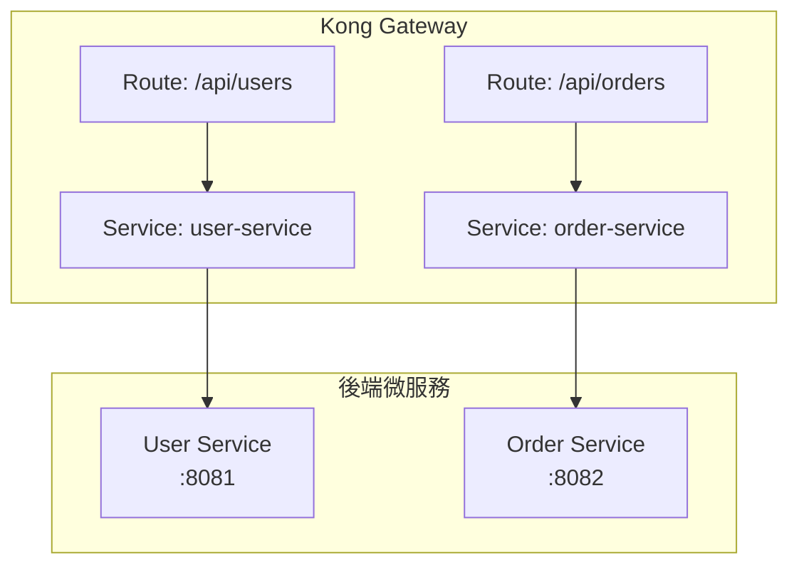
```mermaid
graph TB
    subgraph "Kong Gateway"
        Route1[Route: /api/users]
        Route2[Route: /api/orders]
        Service1[Service: user-service]
        Service2[Service: order-service]
    end

    subgraph "後端微服務"
        UserSvc[User Service<br/>:8081]
        OrderSvc[Order Service<br/>:8082]
    end

    Route1 --> Service1 --> UserSvc
    Route2 --> Service2 --> OrderSvc
```

後端服務**不需要修改程式碼**就能放到 Kong 後面，但要符合以下約定：

| 約定 | 說明 | Spring Boot 的做法 |
| --- | --- | --- |
| **健康檢查端點** | 提供 Kong 主動健康檢查使用的端點 | `/actuator/health`（建議使用 readiness 群組） |
| **正確處理轉發 Header** | Kong 會加上 `X-Forwarded-For`／`-Proto`／`-Host`／`-Port`／`-Prefix` | `server.forward-headers-strategy=framework` |
| **只信任來自 Kong 的流量** | 後端不應該可以從 Kong 以外的地方直接存取 | 網路政策（K8s NetworkPolicy）或 mTLS |
| **讀取 Consumer 身分** | Kong 認證成功後會加上 `X-Consumer-ID`、`X-Consumer-Username`、`X-Consumer-Custom-ID`、`X-Consumer-Groups`（ACL）；匿名時為 `X-Anonymous-Consumer: true` | 以 Filter 讀取，寫入 MDC 供日誌使用 |
| **傳遞追蹤資訊** | 保留並往下傳遞 `traceparent`、`X-Request-ID` | Micrometer Tracing 會自動處理 `traceparent` |

> ⚠️ **安全注意**：只有在「後端無法繞過 Kong 直接存取」的前提下，`X-Consumer-*` Header 才可以信任。否則攻擊者可以自行偽造這些 Header。

### 7.2 前端 / App 如何呼叫 Kong API

#### 7.2.1 JavaScript（Fetch API）

```javascript
// 前端 SPA：使用 OAuth 2.0 + PKCE 取得的 Access Token（不要在前端放 API Key）
async function getUsers(accessToken) {
  const response = await fetch('https://api.example.com/api/users', {
    method: 'GET',
    headers: {
      'Accept': 'application/json',
      'Authorization': `Bearer ${accessToken}`
    }
  });

  if (response.status === 429) {
    const retryAfter = response.headers.get('Retry-After');
    throw new Error(`Rate limited, retry after ${retryAfter}s`);
  }
  if (!response.ok) {
    throw new Error(`API error: ${response.status}`);
  }
  return response.json();
}
```

> 📌 前端要讀取 `Retry-After`、`X-Request-ID` 等回應 Header 時，必須在 CORS Plugin 的 `exposed_headers` 中列出這些 Header。

#### 7.2.2 Java / Spring Boot（RestClient）

> ⚠️ **v2.0 更正**：`RestTemplate` 已經處於維護模式，Spring Framework 7／Spring Boot 4 建議使用同步的 **`RestClient`** 或反應式的 **`WebClient`**。

```java
@Configuration
public class KongClientConfig {

    @Bean
    RestClient kongRestClient(RestClient.Builder builder,
                              @Value("${kong.api.base-url}") String baseUrl,
                              @Value("${kong.api.key}") String apiKey) {
        return builder
            .baseUrl(baseUrl)
            .defaultHeader("apikey", apiKey)          // 伺服器對伺服器呼叫才使用 API Key
            .defaultHeader(HttpHeaders.ACCEPT, MediaType.APPLICATION_JSON_VALUE)
            .build();
    }
}

@Service
public class UserApiClient {

    private final RestClient kongRestClient;

    public UserApiClient(RestClient kongRestClient) {
        this.kongRestClient = kongRestClient;
    }

    public List<UserResponse> getUsers() {
        return kongRestClient.get()
            .uri("/api/users")
            .retrieve()
            .onStatus(status -> status.value() == 429, (req, res) -> {
                throw new RateLimitedException(res.getHeaders().getFirst("Retry-After"));
            })
            .body(new ParameterizedTypeReference<>() {});
    }
}
```

```yaml
# application.yml
kong:
  api:
    base-url: https://api.example.com
    key: ${KONG_API_KEY}          # 從 Secret 注入，不要寫進程式碼或 Git
```

#### 7.2.3 Java / Spring Boot（WebClient）

```java
@Service
public class ReactiveUserApiClient {

    private final WebClient webClient;

    public ReactiveUserApiClient(WebClient.Builder builder,
                                 @Value("${kong.api.base-url}") String baseUrl,
                                 @Value("${kong.api.key}") String apiKey) {
        this.webClient = builder
            .baseUrl(baseUrl)
            .defaultHeader("apikey", apiKey)
            .build();
    }

    public Flux<UserResponse> getUsers() {
        return webClient.get()
            .uri("/api/users")
            .retrieve()
            .bodyToFlux(UserResponse.class)
            .retryWhen(Retry.backoff(3, Duration.ofMillis(200))
                .filter(ex -> ex instanceof WebClientResponseException.ServiceUnavailable));
    }
}
```

> 💡 **重試與冪等**：用戶端的重試只能針對冪等請求（GET、PUT、DELETE）；再加上 Kong Service 的 `retries`，可能形成「重試風暴」。建議由其中一層負責重試，並加上退避（backoff）與抖動（jitter）。

#### 7.2.4 後端讀取 Kong 注入的身分資訊

```java
@Component
public class KongConsumerFilter extends OncePerRequestFilter {

    @Override
    protected void doFilterInternal(HttpServletRequest request,
                                    HttpServletResponse response,
                                    FilterChain chain) throws ServletException, IOException {
        String consumer = request.getHeader("X-Consumer-Username");
        String requestId = request.getHeader("X-Request-ID");
        try {
            if (consumer != null) MDC.put("consumer", consumer);
            if (requestId != null) MDC.put("requestId", requestId);
            chain.doFilter(request, response);
        } finally {
            MDC.remove("consumer");
            MDC.remove("requestId");
        }
    }
}
```

### 7.3 與 OAuth / SSO / IAM 系統整合

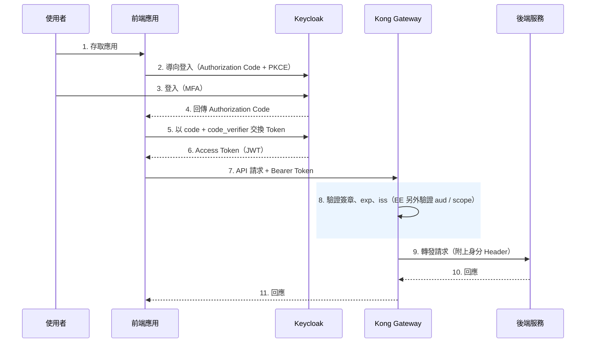
```mermaid
sequenceDiagram
    participant User as 使用者
    participant App as 前端應用
    participant Keycloak as Keycloak
    participant Kong as Kong Gateway
    participant Backend as 後端服務

    User->>App: 1. 存取應用
    App->>Keycloak: 2. 導向登入（Authorization Code + PKCE）
    User->>Keycloak: 3. 登入（MFA）
    Keycloak-->>App: 4. 回傳 Authorization Code
    App->>Keycloak: 5. 以 code + code_verifier 交換 Token
    Keycloak-->>App: 6. Access Token（JWT）
    App->>Kong: 7. API 請求 + Bearer Token
    rect rgb(235, 245, 255)
        Kong->>Kong: 8. 驗證簽章、exp、iss（EE 另外驗證 aud / scope）
    end
    Kong->>Backend: 9. 轉發請求（附上身分 Header）
    Backend-->>Kong: 10. 回應
    Kong-->>App: 11. 回應
```

#### 7.3.1 三種整合模式比較

> 🆕 **v2.0 新增**

| 模式 | 版本 | 金鑰輪替 | 驗證項目 | 效能 | 建議情境 |
| --- | --- | --- | --- | --- | --- |
| **A. `jwt` Plugin + 靜態公鑰** | OSS | 手動或以 decK 自動化 | 簽章、`exp`、`nbf`、`iss`（對應憑證的 key） | 最好（本地驗證） | OSS 環境；後端要自行驗證 `aud`、`scope` |
| **B. `openid-connect` Plugin** | EE | 自動（JWKS 快取） | 簽章、所有標準 claim、`aud`、`scope`，可以做 claim 對應 | 很好（JWKS 快取在本地） | 企業標準做法 |
| **C. Token Introspection** | EE（`oauth2-introspection` 或 OIDC 的 introspection） | 不需要 | 由 IdP 判斷 Token 是否有效（可以即時撤銷） | 較差（每次都呼叫 IdP，需要快取） | 高敏感交易、需要即時撤銷 |

#### 7.3.2 模式 A 實作：OSS `jwt` Plugin 對接 Keycloak

> ⚠️ **v2.0 更正**：v1.0 的 `config.key_claim_name=iss` 範例本身沒有錯，但它的註解寫著「使用 Keycloak 的 JWKS 端點驗證」，這是錯誤的。OSS 的 `jwt` Plugin 不會讀取 JWKS，必須事先把公鑰轉成 PEM 上傳到 Consumer。

```bash
KC=https://keycloak.example.com
REALM=myrealm
ISSUER="$KC/realms/$REALM"

# 1. 從 Realm 端點取得目前使用中的 RS256 公鑰（Base64 DER），並包成 PEM
curl -s "$ISSUER" | jq -r '.public_key' | fold -w 64 | \
  { echo "-----BEGIN PUBLIC KEY-----"; cat; echo "-----END PUBLIC KEY-----"; } > keycloak-$REALM.pem

# 2. 建立代表這個 Realm 的 Consumer
curl -X POST http://localhost:8001/consumers \
  --data username=keycloak-$REALM

# 3. 建立 JWT 憑證：key 必須等於 Token 的 iss（Keycloak 的 issuer URL）
curl -X POST http://localhost:8001/consumers/keycloak-$REALM/jwt \
  --data algorithm=RS256 \
  --data key="$ISSUER" \
  --data-urlencode "rsa_public_key@keycloak-$REALM.pem"

# 4. 在 Service 上啟用 jwt Plugin，以 iss 對應憑證
curl -X POST http://localhost:8001/services/user-service/plugins \
  --data name=jwt \
  --data config.key_claim_name=iss \
  --data "config.claims_to_verify[]=exp" \
  --data config.maximum_expiration=3600
```

**模式 A 的限制與補強**：

| 限制 | 補強方式 |
| --- | --- |
| 所有使用者都對應到同一個 Consumer（Realm），無法依使用者限流 | 以 `limit_by=header` 搭配由後端或 Lua 注入的使用者 Header；或改用 EE 的 OIDC |
| 不會驗證 `aud`、`scope` | 後端以 Spring Security Resource Server 再驗證一次（縱深防禦） |
| Keycloak 金鑰輪替後會驗證失敗 | 排程比對 `/realms/{realm}` 的公鑰，發現變更時以 decK 更新；輪替期間同時保留新舊兩把金鑰（兩個 Consumer 或兩個憑證） |

#### 7.3.3 後端的縱深驗證（Spring Security）

```yaml
# application.yml：後端再次驗證 Token（即使 Kong 已經驗證過）
spring:
  security:
    oauth2:
      resourceserver:
        jwt:
          issuer-uri: https://keycloak.example.com/realms/myrealm
          audiences: user-api
```

> 💡 **零信任原則**：Gateway 驗證「這個請求可以進來」，後端驗證「這個使用者可以做這件事」。兩層都要驗證，不要因為有 Gateway 就省略後端的授權檢查。

### 7.4 💡 本章實務建議

1. **前端一律使用 OAuth 2.0 + PKCE**：API Key 只用在伺服器對伺服器的呼叫。
2. **後端必須無法繞過 Kong**：以 NetworkPolicy 或 mTLS 限制來源，`X-Consumer-*` Header 才能信任。
3. **OSS 環境要自動化 Keycloak 金鑰輪替**，並在後端補上 `aud`／`scope` 驗證。
4. **重試只在一層實作**，並加上退避與抖動，避免重試風暴。
5. **把 `X-Request-ID`／`traceparent` 寫進後端日誌**，讓 Gateway 與服務日誌可以互相對照。

---

## 8. 監控、日誌與可觀測性

### 8.1 Kong 可觀測性總覽

| 訊號 | 來源 | 用途 |
| --- | --- | --- |
| **健康狀態** | Status API：`/status`、`/status/ready` | K8s probe、LB 健康檢查 |
| **Metrics** | Prometheus Plugin → `/metrics`（Status API 或 Admin API） | SLO、容量規劃、告警 |
| **Logs** | Logging Plugins（http-log、file-log、tcp-log…） | 稽核、除錯、安全分析 |
| **Traces** | OpenTelemetry Plugin（OTLP/HTTP） | 跨服務延遲分析、找出瓶頸 |
| **Kong 自身的錯誤日誌** | Nginx error log（`proxy_error_log`） | Kong 內部錯誤、Plugin 例外 |

> ⚠️ **v2.0 更正**：v1.0 把 `/metrics` 寫成必須透過 Admin API（`:8001`）存取。實際上 Prometheus Plugin 也會在 **Status API** 上提供 `/metrics`。建議讓 Prometheus 從 Status API 抓取指標，這樣就不需要把 Admin API 開放給監控網段。

### 8.2 與 Prometheus / Grafana 整合

#### 8.2.1 啟用 Prometheus Plugin

```bash
curl -X POST http://localhost:8001/plugins \
  --data name=prometheus \
  --data config.status_code_metrics=true \
  --data config.latency_metrics=true \
  --data config.bandwidth_metrics=true \
  --data config.upstream_health_metrics=true
```

#### 8.2.2 Prometheus 設定

```yaml
# prometheus.yml
scrape_configs:
  - job_name: kong
    scrape_interval: 15s
    metrics_path: /metrics
    static_configs:
      - targets: ['kong-1:8100', 'kong-2:8100']   # Status API
```

在 Kubernetes 上，Helm chart 可以透過 `serviceMonitor.enabled=true` 建立 Prometheus Operator 的 `ServiceMonitor`。

#### 8.2.3 主要指標（Kong 3.9.3）

> ⚠️ **v2.0 更正**：以下指標名稱已對照 3.9.3 的 `kong/plugins/prometheus/exporter.lua`。v1.0 的告警範例 `kong_http_requests_total{code="5xx"}` 無法運作，因為 `code` 標籤的值是實際的狀態碼（例如 `502`），必須改用正規表示式比對 `code=~"5.."`。

| 指標 | 類型 | 啟用條件 | 主要標籤 |
| --- | --- | --- | --- |
| `kong_http_requests_total` | Counter | `status_code_metrics` | `service`、`route`、`code`、`source`、`workspace`、`consumer` |
| `kong_request_latency_ms` | Histogram | `latency_metrics` | `service`、`route`、`workspace` |
| `kong_upstream_latency_ms` | Histogram | `latency_metrics` | 同上 |
| `kong_kong_latency_ms` | Histogram | `latency_metrics` | 同上（Kong 自身與 Plugin 的耗時） |
| `kong_bandwidth_bytes` | Counter | `bandwidth_metrics` | `service`、`route`、`direction`（`ingress`／`egress`） |
| `kong_upstream_target_health` | Gauge | `upstream_health_metrics` | `upstream`、`target`、`address`、`state` |
| `kong_datastore_reachable` | Gauge | 一律提供 | — |
| `kong_nginx_connections_total` | Gauge | 一律提供 | `state` |
| `kong_memory_lua_shared_dict_bytes` | Gauge | 一律提供 | `shared_dict` |
| `kong_memory_workers_lua_vms_bytes` | Gauge | 一律提供 | `pid` |
| `kong_node_info` | Gauge | 一律提供 | `node_id`、`version` |
| `kong_data_plane_last_seen`、`kong_data_plane_version_compatible`、`kong_data_plane_cluster_cert_expiry_timestamp` | Gauge | 只在 Hybrid CP 上提供 | `node_id`、`hostname` |
| `kong_ai_llm_requests_total`、`kong_ai_llm_tokens_total`、`kong_ai_llm_cost_total` | Counter | `ai_metrics` | `ai_provider`、`ai_model` |

> 📌 `source` 標籤可以區分回應的來源：`kong`（Kong 自己產生，例如 401、429）或 `service`（來自後端）。判斷 5xx 是 Gateway 還是後端的問題時非常有用。

#### 8.2.4 Grafana Dashboard

官方 Dashboard：[Kong (official) #7424](https://grafana.com/grafana/dashboards/7424)（由 konghq 維護，最新修訂為 revision 11）。可以直接匯入，再依組織需求加上 SLO 面板。

#### 8.2.5 SLO 與告警規則範例

> 🆕 **v2.0 新增**

```yaml
# kong-alerts.yaml（Prometheus rule）
groups:
  - name: kong-slo
    rules:
      - alert: KongHigh5xxRatio
        expr: |
          sum by (service) (rate(kong_http_requests_total{code=~"5.."}[5m]))
            /
          sum by (service) (rate(kong_http_requests_total[5m])) > 0.01
        for: 5m
        labels:
          severity: critical
        annotations:
          summary: "Service {{ $labels.service }} 的 5xx 比例超過 1%"

      - alert: KongHighP99Latency
        expr: |
          histogram_quantile(0.99,
            sum by (service, le) (rate(kong_request_latency_ms_bucket[5m]))) > 1000
        for: 10m
        labels:
          severity: warning

      - alert: KongProxyOverhead
        expr: |
          histogram_quantile(0.99,
            sum by (le) (rate(kong_kong_latency_ms_bucket[5m]))) > 50
        for: 10m
        labels:
          severity: warning
        annotations:
          summary: "Kong 自身（含 Plugin）的 P99 耗時超過 50ms"

      - alert: KongUpstreamTargetUnhealthy
        expr: kong_upstream_target_health{state="unhealthy"} == 1
        for: 2m
        labels:
          severity: warning

      - alert: KongDatastoreUnreachable
        expr: kong_datastore_reachable == 0
        for: 1m
        labels:
          severity: critical

      - alert: KongClusterCertExpiringSoon
        expr: (kong_data_plane_cluster_cert_expiry_timestamp - time()) < 30 * 86400
        labels:
          severity: warning
```

| 指標 | 建議 SLO／告警門檻 | 說明 |
| --- | --- | --- |
| 可用性（非 5xx 的比例） | ≥ 99.9%（依服務等級調整） | 以 `source` 區分 Kong 與後端 |
| P99 端到端延遲 | < 1000 ms | `kong_request_latency_ms` |
| P99 Kong 自身延遲 | < 50 ms | `kong_kong_latency_ms`；過高通常代表 Plugin 太多或 Redis 太慢 |
| 後端健康 | 不健康的 Target 為 0 | `kong_upstream_target_health` |
| Shared dict 使用率 | < 80% | `kong_memory_lua_shared_dict_bytes / kong_memory_lua_shared_dict_total_bytes` |

### 8.3 Log 收集（ELK / OpenSearch）

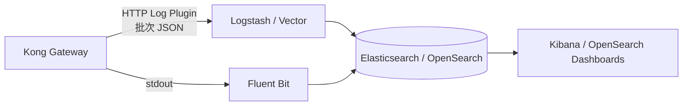
```mermaid
graph LR
    Kong[Kong Gateway] -->|HTTP Log Plugin<br/>批次 JSON| Logstash[Logstash / Vector]
    Kong -->|stdout| Agent[Fluent Bit]
    Logstash --> ES[(Elasticsearch / OpenSearch)]
    Agent --> ES
    ES --> Kibana[Kibana / OpenSearch Dashboards]
```

#### 8.3.1 HTTP Log Plugin 設定

```bash
curl -X POST http://localhost:8001/plugins \
  --data name=http-log \
  --data config.http_endpoint=http://logstash:8080 \
  --data config.method=POST \
  --data config.content_type=application/json \
  --data config.queue.max_batch_size=100 \
  --data config.queue.max_coalescing_delay=2
```

#### 8.3.2 Logstash Pipeline

```ruby
# logstash.conf
input {
  http {
    port  => 8080
    codec => json          # 批次送出的 JSON 陣列會拆成多筆事件
  }
}

filter {
  date {
    match  => [ "started_at", "UNIX_MS" ]
    target => "@timestamp"
  }
  mutate {
    remove_field => [ "[request][headers][authorization]", "[request][headers][apikey]" ]
  }
}

output {
  elasticsearch {
    hosts => ["https://elasticsearch:9200"]
    index => "kong-logs-%{+YYYY.MM.dd}"
  }
}
```

#### 8.3.3 日誌欄位重點

| 欄位 | 說明 |
| --- | --- |
| `started_at` | 請求開始時間（毫秒 epoch） |
| `client_ip` | 用戶端 IP（受 `trusted_ips`／`real_ip_header` 影響） |
| `request.method`／`request.uri`／`request.headers` | 請求資訊 |
| `response.status`／`response.size` | 回應資訊 |
| `latencies.request`／`latencies.proxy`／`latencies.kong` | 總耗時／後端耗時／Kong 耗時（毫秒） |
| `service.name`／`route.name`／`consumer.username` | 路由與身分 |
| `upstream_uri`、`tries` | 實際轉送的 URI、重試紀錄 |

> ⚠️ **個資與法遵**：日誌中可能包含 Header、Query 與 IP 等個人資料。請依個資法與內部規範設定保存期限，並在 Kong 端（`custom_fields_by_lua`）或收集端遮罩敏感欄位。

### 8.4 Trace（OpenTelemetry 整合）

> ⚠️ **v2.0 更正**：
>
> - OpenTelemetry Plugin 的 `config.endpoint` 已經淘汰，請改用 **`config.traces_endpoint`**（3.8 起另外提供 `config.logs_endpoint`）。
> - 只啟用 Plugin 還不夠，必須在 `kong.conf` 開啟 **`tracing_instrumentations`**（預設 `off`）與 **`tracing_sampling_rate`**（預設 `0.01`，也就是 1%），Kong 內部的 Span 才會產生。

```bash
# 1. Kong 節點設定（環境變數）
KONG_TRACING_INSTRUMENTATIONS=all        # 或 request,balancer,db_query,http_client,plugin_rewrite,plugin_access...
KONG_TRACING_SAMPLING_RATE=0.1           # 取樣 10%；Plugin 的 config.sampling_rate 可以覆蓋這個值

# 2. 啟用 OpenTelemetry Plugin（OTLP/HTTP，Collector 的 4318 連接埠）
curl -X POST http://localhost:8001/plugins \
  -H 'Content-Type: application/json' \
  -d '{
    "name": "opentelemetry",
    "config": {
      "traces_endpoint": "http://otel-collector:4318/v1/traces",
      "logs_endpoint": "http://otel-collector:4318/v1/logs",
      "resource_attributes": {
        "service.name": "kong-gateway",
        "deployment.environment": "prod"
      },
      "propagation": {
        "default_format": "w3c",
        "extract": ["w3c", "b3", "jaeger"],
        "inject": ["preserve"]
      }
    }
  }'
```

| 參數 | 說明 |
| --- | --- |
| `traces_endpoint`／`logs_endpoint` | OTLP/HTTP 端點（Kong 不支援 OTLP/gRPC） |
| `resource_attributes` | 資源屬性，至少要設定 `service.name` |
| `propagation.extract`／`inject`／`default_format` | 追蹤標頭的讀取與寫入格式（W3C、B3、Jaeger、OT、AWS、GCP、Datadog） |
| `sampling_rate` | Plugin 層級的取樣率，會覆蓋全域的 `tracing_sampling_rate` |
| `queue.*` | 批次送出設定（取代已淘汰的 `batch_span_count`／`batch_flush_delay`） |
| `headers` | 送往 Collector 時附加的 Header（例如認證資訊；可以使用 Vault 參照） |

**完整可觀測性架構**：

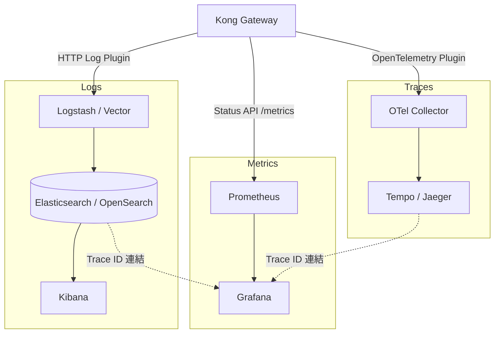
```mermaid
graph TB
    Kong[Kong Gateway]

    subgraph "Metrics"
        Prometheus[Prometheus]
        Grafana[Grafana]
    end

    subgraph "Logs"
        Logstash[Logstash / Vector]
        ES[(Elasticsearch / OpenSearch)]
        Kibana[Kibana]
    end

    subgraph "Traces"
        OTel[OTel Collector]
        Tempo[Tempo / Jaeger]
    end

    Kong -->|Status API /metrics| Prometheus --> Grafana
    Kong -->|HTTP Log Plugin| Logstash --> ES --> Kibana
    Kong -->|OpenTelemetry Plugin| OTel --> Tempo
    Tempo -.->|Trace ID 連結| Grafana
    ES -.->|Trace ID 連結| Grafana
```

> 💡 **三種訊號的關聯**：把 `trace_id` 寫進日誌（OpenTelemetry Plugin 的 logs 會自動帶上），並在 Grafana 設定 Loki／Elasticsearch 與 Tempo 之間的 data link，就能從指標告警一路追到單一請求的 Trace 與日誌。

### 8.5 💡 本章實務建議

1. **Prometheus 從 Status API 抓取指標**，不要為了監控而開放 Admin API。
2. **謹慎開啟 `per_consumer`**：Consumer 數量很多時，請改用日誌分析來取得各客戶的用量。
3. **區分 Kong 延遲與後端延遲**：告警要分別依 `kong_kong_latency_ms` 與 `kong_upstream_latency_ms` 設定，才能快速判斷該由誰處理。
4. **生產環境的 Trace 取樣率從 1%–10% 開始**，錯誤請求再搭配 Collector 的 tail sampling 保留。
5. **日誌要遮罩憑證與個資**，並設定保存期限。

---

## 9. 系統維護與營運

### 9.1 decK 與 APIOps（設定即程式碼）

[decK](https://developer.konghq.com/deck/) 是 Kong 官方的宣告式設定工具，可以把 Gateway 設定當成程式碼管理（APIOps）。截至 2026-09-30，最新版為 **v1.67.0**。

> ⚠️ **v2.0 更正**：v1.0 使用的 `deck dump`、`deck diff`、`deck sync -s`、`deck validate` 等**頂層命令已經標示為 deprecated**（從 decK 原始碼 `cmd/root.go` 確認），新的寫法是 `deck gateway <動作>` 與 `deck file <動作>`，而且設定檔改用**位置參數**傳入，不再使用 `-s`。

#### 9.1.1 命令結構

| 群組 | 命令 | 用途 |
| --- | --- | --- |
| `deck gateway` | `ping` | 測試能否連到 Admin API |
| | `dump` | 把目前的設定匯出成檔案 |
| | `diff` | 比較檔案與線上設定的差異 |
| | `sync` | 讓線上設定與檔案**完全一致**（包含刪除檔案中沒有的實體） |
| | `apply` | 只新增或更新，**不刪除**（適合增量套用） |
| | `validate` | 連線到 Gateway，做線上驗證 |
| | `reset` | 刪除所有設定（高風險，請謹慎使用） |
| `deck file` | `validate` | 離線驗證檔案 |
| | `openapi2kong` | 把 OpenAPI 規格轉成 Kong 設定 |
| | `openapi2mcp` | 把 OpenAPI 規格轉成 MCP 工具設定（配合 AI MCP Proxy） |
| | `lint` | 以規則集（Spectral 格式）檢查設定 |
| | `patch` | 以 JSONPath 選擇器批次修改欄位 |
| | `merge` | 合併多個設定檔 |
| | `add-tags`／`remove-tags`／`list-tags` | 批次管理 Tag |
| | `add-plugins` | 批次加入 Plugin |
| | `namespace` | 為 Route 加上路徑前綴或 Host，避免團隊之間衝突 |
| | `render` | 展開環境變數等內容，產生最終的設定檔 |
| | `convert` | 轉換設定格式（例如 LTS 升級時 3.10 → 3.14） |
| | `kong2kic`／`kong2tf` | 轉換成 KIC 的 K8s 資源或 Terraform |

#### 9.1.2 常用操作

```bash
# 安裝（macOS；其他平台請使用 GitHub Releases 或 Docker image kong/deck）
brew tap kong/deck && brew install deck
deck version

# 連線設定：以環境變數設定，避免每次都要帶旗標
export DECK_KONG_ADDR=http://localhost:8001

# 測試連線
deck gateway ping

# 匯出目前設定
deck gateway dump -o kong.yaml

# 離線驗證 → 比較差異 → 同步
deck file validate kong.yaml
deck gateway diff kong.yaml
deck gateway sync kong.yaml

# 只處理自己團隊的實體（以 Tag 分權）
deck gateway sync team-user.yaml --select-tag team-user
```

#### 9.1.3 從 OpenAPI 產生 Gateway 設定

```bash
# 1. 由 OpenAPI 規格產生 Service / Route
deck file openapi2kong -s user-api.openapi.yaml -o user-api.kong.yaml

# 2. 統一加上團隊 Tag
deck file add-tags -s user-api.kong.yaml -o user-api.kong.yaml team-user env-prod

# 3. 以 patch 修改所有 Service 的逾時
deck file patch -s user-api.kong.yaml -o user-api.kong.yaml \
  --selector '$..services[*]' --value 'read_timeout:10000'

# 4. 加上路徑前綴，避免與其他團隊衝突
deck file namespace -s user-api.kong.yaml -o user-api.kong.yaml --path-prefix /user

# 5. 與共用的 Plugin 設定合併
deck file merge user-api.kong.yaml common-plugins.yaml -o final.yaml

# 6. 依組織規則檢查（例如：Route 必須只允許 https）
deck file lint -s final.yaml governance-ruleset.yaml
```

**治理規則範例（Spectral 格式）**：

```yaml
# governance-ruleset.yaml
rules:
  route-must-be-https:
    description: 所有 Route 只能允許 https
    given: $.services[*].routes[*]
    severity: error
    then:
      field: protocols
      function: schema
      functionOptions:
        schema:
          type: array
          items:
            const: https
  service-must-have-team-tag:
    description: Service 必須有 team- 開頭的 Tag
    given: $.services[*].tags
    severity: error
    then:
      function: schema
      functionOptions:
        schema:
          type: array
          contains:
            pattern: "^team-"
```

#### 9.1.4 GitOps 工作流程

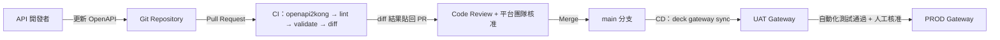
```mermaid
graph LR
    Dev[API 開發者] -->|更新 OpenAPI| Git[Git Repository]
    Git -->|Pull Request| CI[CI：openapi2kong → lint → validate → diff]
    CI -->|diff 結果貼回 PR| Review[Code Review + 平台團隊核准]
    Review -->|Merge| Main[main 分支]
    Main -->|CD：deck gateway sync| UAT[UAT Gateway]
    UAT -->|自動化測試通過 + 人工核准| Prod[PROD Gateway]
```

**CI 範例（GitHub Actions）**：

```yaml
# .github/workflows/kong-apiops.yaml
name: kong-apiops
on:
  pull_request:
    paths: ['kong/**']
  push:
    branches: [main]
    paths: ['kong/**']

jobs:
  validate-and-diff:
    runs-on: ubuntu-latest
    container: kong/deck:v1.67.0
    steps:
      - uses: actions/checkout@v4
      - name: Lint
        run: deck file lint -s kong/final.yaml kong/governance-ruleset.yaml
      - name: Offline validate
        run: deck file validate kong/final.yaml
      - name: Diff against UAT
        env:
          DECK_KONG_ADDR: ${{ secrets.KONG_UAT_ADMIN_URL }}
          DECK_HEADERS: "Kong-Admin-Token:${{ secrets.KONG_UAT_ADMIN_TOKEN }}"
        run: deck gateway diff kong/final.yaml

  sync-uat:
    if: github.event_name == 'push'
    needs: validate-and-diff
    runs-on: ubuntu-latest
    container: kong/deck:v1.67.0
    steps:
      - uses: actions/checkout@v4
      - name: Sync UAT
        env:
          DECK_KONG_ADDR: ${{ secrets.KONG_UAT_ADMIN_URL }}
          DECK_HEADERS: "Kong-Admin-Token:${{ secrets.KONG_UAT_ADMIN_TOKEN }}"
        run: deck gateway sync kong/final.yaml --select-tag team-user
```

> 📌 `Kong-Admin-Token` 是 EE RBAC 的認證 Header。OSS 沒有 RBAC，Admin API 的保護方式請見[11.1](#111-admin-api-與管理平面保護)。

### 9.2 Plugin 管理策略

| 策略 | 說明 |
| --- | --- |
| **最小化原則** | 只載入需要的 Plugin：`plugins = bundled` 改為明確列出，例如 `plugins = key-auth,jwt,acl,rate-limiting,prometheus,...` |
| **分層管理** | 全域：觀測（Prometheus、OTel、Correlation ID）；Service：認證、限流；Route：例外設定 |
| **平台與團隊分工** | 全域 Plugin 由平台團隊以 `platform` Tag 管理；Service 層級由各團隊以自己的 Tag 管理 |
| **版本控制** | 所有 Plugin 設定都放在 Git，禁止直接改線上設定（定期以 `deck gateway diff` 偵測漂移） |
| **變更驗證** | 上線前以 `/schemas/plugins/validate` 或 `deck file validate` 驗證 |
| **自訂 Plugin** | 必須有單元測試（Pongo／busted）、效能測試與程式碼審查 |

### 9.3 多環境建議

| 環境 | Kong 設定建議 |
| --- | --- |
| **DEV** | 單節點、DB-less、寬鬆限流、開啟除錯 Header |
| **SIT/UAT** | 與生產環境相同的拓樸（Hybrid），限流等參數與生產一致 |
| **PROD** | 多節點 HA、Hybrid 或 Konnect、嚴格限流、隱藏版本資訊 |

以同一份設定檔加上環境變數產生各環境的設定：

```yaml
# kong/final.yaml（decK 只會替換 DECK_ 開頭的環境變數）
services:
  - name: user-service
    url: ${{ env "DECK_USER_SERVICE_URL" }}
    plugins:
      - name: rate-limiting
        config:
          minute: ${{ env "DECK_USER_RATE_LIMIT" }}
          policy: redis
          redis:
            host: ${{ env "DECK_REDIS_HOST" }}
```

```bash
# 依環境套用
DECK_USER_SERVICE_URL=http://user.uat.svc:8080 DECK_USER_RATE_LIMIT=100 DECK_REDIS_HOST=redis-uat \
  deck gateway sync kong/final.yaml --kong-addr http://kong-uat-cp:8001

# 產出展開後的檔案供稽核
deck file render kong/final.yaml -o rendered-uat.yaml
```

### 9.4 效能與容量規劃

> ⚠️ **v2.0 更正**：v1.0 把 Nginx 指令與環境變數混在同一個 `nginx` 程式碼區塊中，本版將兩者分開。另外，下表的硬體規格只是**起始參考值**，實際容量要以符合自己 Plugin 組合的壓力測試結果為準。

#### 9.4.1 容量規劃方法

1. **定義工作負載**：尖峰 RPS、Payload 大小、HTTPS 比例、Plugin 組合（認證、限流、日誌）。
2. **以 k6 或 wrk 壓測**：分別量測「沒有 Plugin」與「完整 Plugin 組合」的吞吐量，以及 `kong_kong_latency_ms` 的 P99。
3. **找出單節點上限**：CPU 使用率達 70% 時的 RPS，當作單節點的容量。
4. **計算節點數**：`節點數 = ⌈尖峰 RPS ÷ 單節點容量⌉ + N+1 備援`。

| 規模（起始參考值） | CPU | Memory | 建議 |
| --- | --- | --- | --- |
| 小型（< 1K RPS） | 2 vCPU | 4 GB | 至少 2 個節點（HA） |
| 中型（1K–10K RPS） | 4 vCPU | 8 GB | 3 個以上節點，限流改用 Redis |
| 大型（> 10K RPS） | 8 vCPU 以上 | 16 GB 以上 | 水平擴展；分離對外與對內叢集 |

#### 9.4.2 調校參數

**kong.conf／環境變數**：

```bash
KONG_NGINX_WORKER_PROCESSES=auto            # 預設 auto：與 CPU 核心數相同
KONG_MEM_CACHE_SIZE=256m                    # 預設 128m；實體很多時調高
KONG_UPSTREAM_KEEPALIVE_POOL_SIZE=512       # 預設 512：與上游的長連線池
KONG_NGINX_EVENTS_WORKER_CONNECTIONS=auto   # 預設 auto
KONG_NGINX_PROXY_PROXY_BUFFER_SIZE=160k     # 以 nginx_proxy_ 前綴注入 Nginx 指令
KONG_NGINX_PROXY_PROXY_BUFFERS="64 160k"
KONG_HEADERS=X-Kong-Request-Id              # 不回傳版本與延遲 Header
```

**作業系統**：

```bash
# 檔案描述元上限（每個連線都佔用一個）
ulimit -n 65536

# 核心參數
sysctl -w net.core.somaxconn=65535
sysctl -w net.ipv4.ip_local_port_range="1024 65000"
```

| 調校重點 | 說明 |
| --- | --- |
| **長連線** | 確認 LB → Kong 與 Kong → 後端都使用 keepalive，避免 TLS 交握成為瓶頸 |
| **Plugin 數量** | 每個 Plugin 都會增加 `kong_kong_latency_ms`；日誌類 Plugin 請使用批次佇列 |
| **Redis 延遲** | `policy=redis` 且 `sync_rate=-1` 時，Redis 延遲會直接反映到每個請求上 |
| **DNS** | 以 Upstream 取代 DNS 名稱，或調整 `dns_stale_ttl`，避免 DNS 查詢拖慢請求 |

### 9.5 常見營運問題與排查

| 問題 | 可能原因 | 排查方式 |
| --- | --- | --- |
| **502 Bad Gateway** | 後端拒絕連線、連線被重設 | 看 `kong_upstream_target_health` 與 error log 中的 `upstream prematurely closed` |
| **503 Service Unavailable** | 沒有健康的 Target、Service 被停用 | `GET /upstreams/{name}/health` |
| **504 Gateway Timeout** | 後端回應超過 `read_timeout` | 比較 `latencies.proxy` 與逾時設定，再檢查後端效能 |
| **429 Too Many Requests** | 觸發限流 | 查看回應的 `RateLimit-*` Header 與 `source="kong"` 的指標 |
| **401／403** | 憑證錯誤、ACL 群組不符 | 查看回應 Body 的訊息；確認 `iss` 與 JWT 憑證的 `key` 一致 |
| **404 no Route matched** | 沒有符合的 Route | 檢查 Host、Path、Method 與 `protocols` |
| **高延遲** | Plugin 太多、Redis 慢、DNS 慢 | 比較 `kong_kong_latency_ms` 與 `kong_upstream_latency_ms` |
| **設定沒有生效（Hybrid）** | DP 與 CP 斷線或版本不相容 | `GET /clustering/data-planes` 查看 `sync_status` |

```bash
# 查看 Kong 錯誤日誌
docker logs kong 2>&1 | grep -E '\[(error|crit|alert)\]'

# 暫時調高日誌等級（不需要重新啟動；3.1 起提供）
curl -X PUT http://localhost:8001/debug/node/log-level/debug
# 一段時間後改回
curl -X PUT http://localhost:8001/debug/node/log-level/notice

# 檢查 Upstream 健康狀態
curl -s http://localhost:8001/upstreams/user-upstream/health | jq '.data[] | {target, health}'

# 列出 Plugin 的啟用狀態
curl -s http://localhost:8001/plugins | jq '.data[] | {name, enabled, service: .service.id, route: .route.id}'

# 偵測設定漂移
deck gateway diff kong/final.yaml
```

### 9.6 💡 本章實務建議

1. **全面改用 `deck gateway`／`deck file` 新命令**，並把 decK 版本固定在 CI 的容器映像中。
2. **以 `--select-tag` 做團隊分權**，由平台團隊管理全域設定，各團隊只能同步自己的實體。
3. **CI 一定要包含 lint、validate、diff 三個步驟**，並把 diff 結果貼回 PR，讓審查者看得到實際的變更。
4. **容量以壓測結果為準**，並用 `kong_kong_latency_ms` 監控 Plugin 帶來的額外耗時。
5. **排錯時用 `/debug/node/log-level` 暫時調高日誌等級**，排查完畢務必改回。

---

## 10. 系統升級與版本管理

### 10.1 版本編號與支援政策

| 項目 | OSS | Enterprise |
| --- | --- | --- |
| 版本格式 | `3.<minor>.<patch>`，例如 `3.9.3` | `3.<minor>.<patch>.<ee-patch>`，例如 `3.14.0.15` |
| 發行節奏 | 3.9 之後沒有新的 minor 版本，只有安全修補 | 每年 4 個 minor 版本，每年第一個版本（3 月）為 LTS |
| 一般版本支援期 | 社群支援 | 1 年 |
| LTS 支援期 | — | 3 年，相鄰的兩個 LTS 有 2 年重疊 |

#### 10.1.1 Enterprise 支援中的版本（截至 2026-09-30）

| 版本 | 發行日 | 結束支援 | LTS | 最新 patch |
| --- | --- | --- | --- | --- |
| **3.16** | 2026-09-15 | 2027-09-15 | | 3.16.0.0 |
| 3.15 | 2026-07-02 | 2027-07-02 | | 3.15.0.6 |
| **3.14** | 2026-04-07 | **2029-04-07** | ✅ | 3.14.0.15 |
| 3.13 | 2025-12-18 | 2026-12-18 | | 3.13.0.11 |
| 3.12 | 2025-10-01 | 2026-10-01（**即將到期**） | | 3.12.0.12 |
| **3.10** | 2025-03-27 | **2028-03-31** | ✅ | 3.10.0.19 |

> ⚠️ **v2.0 更正**：v1.0 的版本相容表只列到 3.9，而且把 3.9 標示為「當前穩定版」。EE 3.9 已在 2025-12-12 結束支援，OSS 3.9.3 則是目前唯一持續收到安全修補的 OSS 版本。

#### 10.1.2 相依元件的相容性

| Kong 版本 | PostgreSQL（經過測試） | Redis／Valkey | 備註 |
| --- | --- | --- | --- |
| OSS 3.9.3 | 13、14、15、16、17 | Redis 6、7；Valkey 8 | 內建 OpenResty 1.25.3.x |
| EE 3.14 LTS | 13–18 | Redis 6、7；Valkey 8 | Route 預設協定改為 `https` |
| EE 3.16 | 13–17 | Redis 6、7；Valkey 8 | CEL 引擎改為 cel-cpp |

> 📌 資料來源：Kong 官方文件 repo 的 `app/_data/products/gateway.yml`（Third-party support）。部署前請再以官方頁面確認，因為各作業系統發行版的支援期可能不同。

### 10.2 升級注意事項與重大變更

#### 10.2.1 官方保證的升級路徑

Kong 只保證以下三種路徑有經過 migration 測試：

1. **同一個 minor 版本的 patch 升級**（例如 3.14.0.3 → 3.14.0.15）。
2. **相鄰的 minor 版本**（例如 3.13 → 3.14）。
3. **相鄰的 LTS 版本**（2.8 → 3.4 → 3.10 → 3.14）。

跨越多個版本時，雖然可以直接升級，但要自行評估中間每個版本的 breaking changes。建議先在測試環境完整演練。

#### 10.2.2 3.9 → 3.16 重大變更摘要

| 版本 | 重大變更 | 影響與處置 |
| --- | --- | --- |
| 3.10 | Free mode 標示為 deprecated；AI Plugin 的 `preserve` route type 改為 `llm_format` | 確認授權；更新 AI Plugin 設定 |
| 3.10 | AI 指標的日誌鍵從 `ai.ai-proxy` 改為 `ai.proxy` | 更新日誌分析管線 |
| 3.11 | WASM（filter chains）標示為 deprecated | 評估替代方案（例如 Datakit） |
| 3.12 | Kafka Consume Plugin 移除 Service 範圍 | 改掛在 Route 上 |
| 3.13 | Admin API 空值的編碼方式改變 | 檢查自動化腳本 |
| 3.14 | **新建 Route 的預設協定從 `http,https` 改為 `https`** | 自動化建立 Route 時要明確設定 `protocols` |
| 3.14 | **認證類 Plugin 的 `hide_credentials` 預設改為 `true`**（只影響新建的 Plugin） | 後端若依賴原始憑證 Header，要明確設為 `false` |
| 3.14 | **`tls_certificate_verify` 預設改為 `on`** | 上游使用自簽憑證時要設定 CA，否則連線失敗 |
| 3.14 | SHA1 移除或改為 SHA256（Event Hooks 改用 HMAC-SHA256） | 更新接收 Event Hook 的驗證邏輯 |
| 3.14 | OIDC 的 `consumer_claim` 改為 `consumer_claims`；Header claim 欄位改為 `upstream_headers`／`downstream_headers` | 以 `deck file convert` 轉換 |
| 3.14 | OpenTelemetry 的 `access_logs_endpoint` 改為 `access_logs.endpoint` | 更新設定 |
| 3.15 | **授權過期或沒有授權時，Admin API 與所有管理介面都變成唯讀** | 監控授權到期日 |
| 3.15 | Workspace 名稱不能與 Admin API 的頂層路徑相同 | 升級前以 `GET /endpoints` 檢查 |
| 3.16 | **CEL 引擎從 cel-rust 改為 cel-cpp**：跳脫字元與「map 缺少 key」的行為改變 | 條件式 Plugin 執行的運算式要重新測試 |
| 3.16 | FIPS 模式不再產生預設的 EdDSA JWKS 金鑰 | 改用 RSA-PSS 或 ECDSA |

> 💡 **LTS 升級工具**：`deck file convert --from 3.10 --to 3.14` 可以自動轉換 3.10 → 3.14 之間已知的設定變更（3.4 → 3.10 也有對應的轉換）。

#### 10.2.3 升級前準備

1. **閱讀目標版本與中間所有版本的 [Breaking Changes](https://developer.konghq.com/gateway/breaking-changes/) 與 [Changelog](https://developer.konghq.com/gateway/changelog/)**。
2. **備份設定**：`deck gateway dump -o backup-$(date +%Y%m%d).yaml`（包含所有 Workspace 時要加上 `--all-workspaces`）。
3. **備份資料庫**：`pg_dump -Fc -h <host> -U kong kong > kong_$(date +%Y%m%d).dump`。
4. **盤點自訂 Plugin**：確認 PDK 與相依的 Lua 函式庫是否相容。
5. **在測試環境演練**：包含 migration、回滾與效能測試。

> 📌 完整的升級前檢查清單請見[15.3 升級前檢查清單](#153-升級前檢查清單)。

### 10.3 資料庫 Migration 流程

```bash
# 1. 以新版映像檔查看待執行的 migration
docker run --rm --network kong-net \
  -e KONG_DATABASE=postgres -e KONG_PG_HOST=kong-database -e KONG_PG_PASSWORD=kongpass \
  kong:3.9.3 kong migrations list

# 2. 執行 migrations up（只需要在一個節點執行；新舊版本節點在這之後仍可共存）
docker run --rm --network kong-net \
  -e KONG_DATABASE=postgres -e KONG_PG_HOST=kong-database -e KONG_PG_PASSWORD=kongpass \
  kong:3.9.3 kong migrations up

# 3. 以滾動或藍綠方式把所有節點換成新版本（見 10.4）

# 4. 所有舊版節點都下線之後，才執行 migrations finish
docker run --rm --network kong-net \
  -e KONG_DATABASE=postgres -e KONG_PG_HOST=kong-database -e KONG_PG_PASSWORD=kongpass \
  kong:3.9.3 kong migrations finish
```

> ⚠️ **關鍵順序**：`migrations up` 之後，新舊節點可以暫時共用同一個資料庫；但 `migrations finish` 會移除舊版需要的結構，**一定要等所有舊節點都下線後才能執行**。執行 `finish` 之後，就只能透過還原資料庫備份來回滾。

| 部署模式 | Migration 注意事項 |
| --- | --- |
| Traditional | 依照上面的 up → 換節點 → finish 流程 |
| Hybrid | 只有 CP 需要 migration；**先升 CP、再升 DP** |
| DB-less | 沒有 migration；以新版節點載入（必要時先以 `deck file convert` 轉換）宣告檔即可 |
| Konnect | 控制平面由 Kong 升級；DP 依 Konnect 顯示的相容性逐步更換 |

### 10.4 升級策略（滾動 / 藍綠 / 雙叢集）

> 🆕 **v2.0 新增**：v1.0 只介紹滾動升級，本節補充三種策略的比較。

| 策略 | 做法 | 優點 | 缺點 | 適用情境 |
| --- | --- | --- | --- | --- |
| **滾動（Rolling）** | 同一個資料庫，逐台更換節點 | 資源成本低 | 新舊版本並存一段時間；回滾比較複雜 | 相鄰 minor 或 patch 升級 |
| **藍綠（Blue-Green）** | 複製資料庫建立新叢集，以 LB 切換流量 | 可以快速回滾 | 切換期間的設定變更要凍結 | 風險較高的升級 |
| **雙叢集（Dual-cluster）** | 建立全新的新版叢集，以 decK 同步設定，再逐步轉移流量 | 最安全，可以依 Route 分批切換 | 需要兩套基礎設施 | 跨多個版本、OSS → EE、LTS 之間升級 |

#### 10.4.1 滾動升級流程

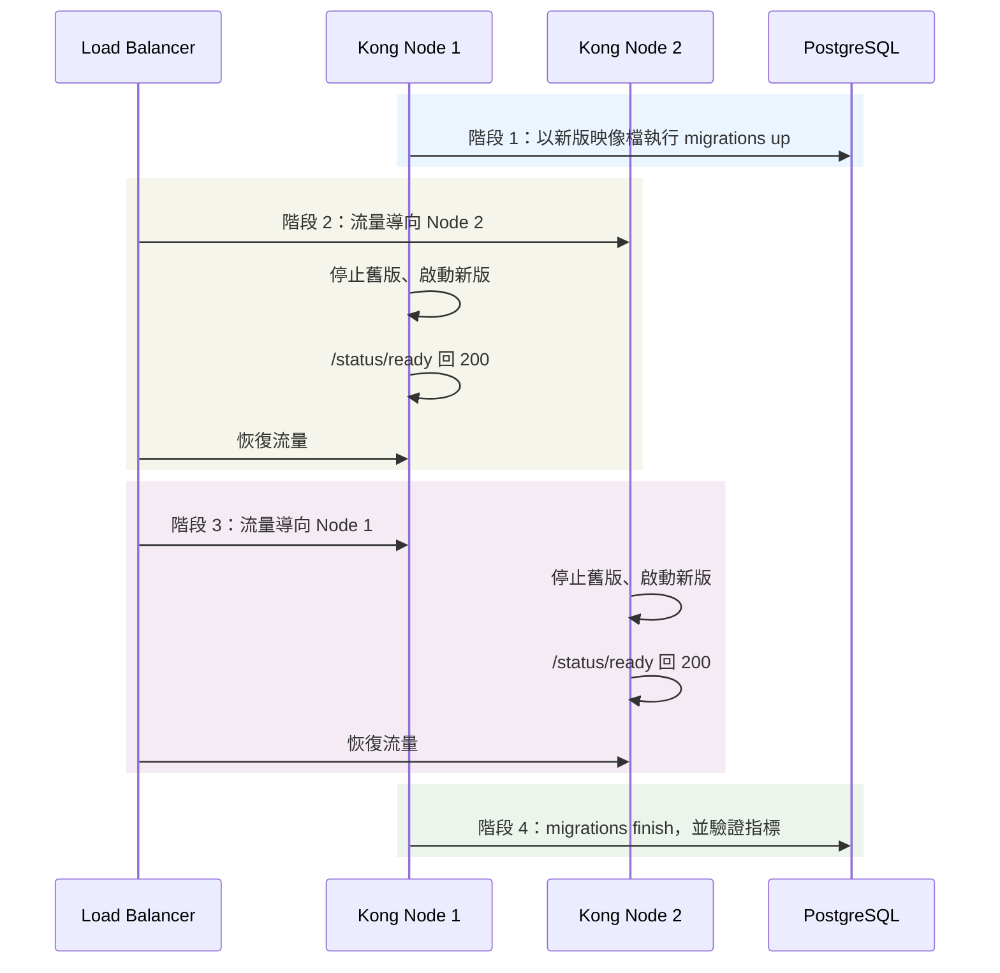
```mermaid
sequenceDiagram
    participant LB as Load Balancer
    participant Kong1 as Kong Node 1
    participant Kong2 as Kong Node 2
    participant DB as PostgreSQL

    rect rgb(235, 245, 255)
        Kong1->>DB: 階段 1：以新版映像檔執行 migrations up
    end
    rect rgb(245, 245, 235)
        LB->>Kong2: 階段 2：流量導向 Node 2
        Kong1->>Kong1: 停止舊版、啟動新版
        Kong1->>Kong1: /status/ready 回 200
        LB->>Kong1: 恢復流量
    end
    rect rgb(245, 235, 245)
        LB->>Kong1: 階段 3：流量導向 Node 1
        Kong2->>Kong2: 停止舊版、啟動新版
        Kong2->>Kong2: /status/ready 回 200
        LB->>Kong2: 恢復流量
    end
    rect rgb(235, 245, 235)
        Kong1->>DB: 階段 4：migrations finish，並驗證指標
    end
```

**Kubernetes 上的滾動升級**：

```bash
# Helm：更新映像檔版本（chart 會以 Job 執行 migrations）
helm upgrade kong kong/kong -n kong --reuse-values --set image.tag=3.9.3

# 觀察更新狀態
kubectl -n kong rollout status deployment/kong-kong
```

#### 10.4.2 OSS 3.9 → Enterprise 3.14 LTS 遷移路線

> 🆕 **v2.0 新增**

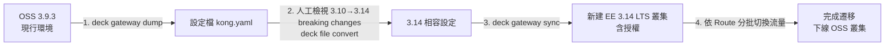
```mermaid
graph LR
    A[OSS 3.9.3<br/>現行環境] -->|1. deck gateway dump| B[設定檔 kong.yaml]
    B -->|2. 人工檢視 3.10→3.14 breaking changes<br/>deck file convert| C[3.14 相容設定]
    C -->|3. deck gateway sync| D[新建 EE 3.14 LTS 叢集<br/>含授權]
    D -->|4. 依 Route 分批切換流量| E[完成遷移<br/>下線 OSS 叢集]
```

1. **盤點**：列出所有使用中的 Plugin（`GET /` 的 `plugins.enabled_in_cluster`），確認在 EE 3.14 的行為變化（特別是 `hide_credentials`、`protocols`、`tls_certificate_verify` 的新預設值）。
2. **轉換設定**：以 decK 匯出；依[10.2.2](#1022-39--316-重大變更摘要)逐項確認；3.10 → 3.14 可以使用 `deck file convert`。
3. **建立新叢集**：採用雙叢集策略，新叢集載入授權後，以 decK 同步設定。
4. **分批切流**：從低風險的內部 API 開始，逐步把 DNS 或 LB 指向新叢集。
5. **善用 EE 功能**：遷移完成後，再逐步把 `jwt` 換成 `openid-connect`、把 `rate-limiting` 換成 `rate-limiting-advanced`。

> 📌 OSS 資料庫能否就地升級成 EE 資料庫、需要哪些版本的中繼步驟，請先向 Kong 原廠確認（列於[附錄 E.1](#e1-待確認事項)）。雙叢集搭配 decK 的做法不需要依賴資料庫的就地遷移，是風險最低的路線。

### 10.5 Plugin 相容性風險

| 類型 | 風險 | 對策 |
| --- | --- | --- |
| 官方 Plugin | 欄位淘汰、預設值改變（例如 3.14 的 `hide_credentials`） | 閱讀 breaking changes；以 `deck gateway diff` 比對升級前後的設定 |
| 淘汰欄位（例如 `redis_host`） | 在 4.0 移除 | 升級前先改成新的欄位，避免在 4.0 一次爆發 |
| 第三方 Plugin | 可能沒有跟上新版本 | 確認維護狀態；必要時自行 fork |
| 自訂 Plugin | PDK 變動、OpenResty 升級 | 以 Pongo 對新版本執行完整測試 |

```bash
# 找出使用淘汰欄位的設定（以 Kong 的 deprecation 日誌為線索）
docker logs kong 2>&1 | grep -i "deprecated"

# 列出叢集中實際使用的 Plugin
curl -s http://localhost:8001/ | jq '.plugins.enabled_in_cluster'
```

### 10.6 💡 本章實務建議

1. **生產環境選 LTS**：EE 建議採用 3.14 LTS；OSS 使用者至少要追上 3.9.3（包含 2026 年的 Nginx CVE 修補）。
2. **`migrations finish` 是不可逆的分界點**：執行前確認所有舊節點都已下線，並保留資料庫備份。
3. **跨版本或換產品線（OSS → EE）採用雙叢集 + decK**，以 Route 為單位分批切換。
4. **把淘汰欄位的清理列為例行工作**，不要等到 4.0 才一次處理。
5. **12 個月內規劃一次 LTS 升級演練**，並把演練結果寫成 Runbook。

---

## 11. 安全強化（Security Hardening）

> 🆕 **v2.0 新增**：本章由 v1.0 的「11.4 安全性常見錯誤」擴充而成，依「管理平面 → 傳輸 → 機密 → 漏洞 → 應用層威脅」的順序整理 Gateway 的安全基準。

### 11.1 Admin API 與管理平面保護

Admin API 擁有 Gateway 的**完整控制權**：可以新增 Route 把流量導到任意位置、讀取所有憑證，甚至以 `pre-function` 執行程式碼。**Admin API 外洩等於整個 Gateway 失守。**

#### 11.1.1 各版本的保護機制

| 機制 | OSS 3.9.3 | EE |
| --- | --- | --- |
| 網路層綁定（`admin_listen`） | ✅ 預設只綁定 `127.0.0.1` | ✅ |
| Admin API 認證 | ❌ **沒有內建認證** | ✅ RBAC（`enforce_rbac = on`，以 `Kong-Admin-Token` 認證） |
| Kong Manager 登入 | ❌ **沒有登入機制** | ✅ basic-auth／LDAP／OIDC（`admin_gui_auth`） |
| 稽核日誌 | ❌ | ✅ Audit Log |

> ⚠️ **OSS 的 Kong Manager 沒有任何登入驗證**。能連上 `:8002` 的人，就能透過瀏覽器完整操作 Admin API。OSS 環境的 Kong Manager 只能放在嚴格控管的管理網段（例如跳板機或 VPN）。

#### 11.1.2 OSS：以 Kong 保護自己的 Admin API（Loopback 模式）

Admin API 只綁定在 `127.0.0.1`，再透過 Kong 自己的 Proxy 對內提供，並加上認證、ACL 與 IP 限制：

```yaml
# admin-api-loopback.yaml（部署在 Traditional 模式的管理節點）
_format_version: "3.0"
services:
  - name: admin-api
    url: http://127.0.0.1:8001
    tags: [platform]
    routes:
      - name: admin-api-route
        paths: [/admin-api]
        protocols: [https]
        hosts: [kong-admin.internal.example.com]
    plugins:
      - name: key-auth
        config:
          key_in_query: false
          hide_credentials: true
      - name: acl
        config:
          allow: [kong-admins]
          hide_groups_header: true
      - name: ip-restriction
        config:
          allow: [10.10.20.0/24]      # 維運跳板機網段

consumers:
  - username: platform-ci
    tags: [platform]
    keyauth_credentials:
      - key: "{vault://env/platform-ci-admin-key}"
    acls:
      - group: kong-admins
```

```bash
# decK 透過受保護的端點操作（--headers 帶入 API Key）
deck gateway diff kong.yaml \
  --kong-addr https://kong-admin.internal.example.com/admin-api \
  --headers "apikey:${PLATFORM_CI_ADMIN_KEY}"
```

#### 11.1.3 管理平面強化清單

| 項目 | 建議設定 |
| --- | --- |
| `admin_listen` | 只綁定管理網段的介面，或 `127.0.0.1`；**禁止** `0.0.0.0` 直接對外 |
| Admin API 的 TLS | 使用 `:8444 ssl`，並關閉明文的 `:8001` |
| Hybrid 模式 | DP 上不要開 Admin API（預設即是如此） |
| K8s | Admin Service 使用 `ClusterIP`，並以 NetworkPolicy 限制來源 |
| `pre-function`／`post-function` | 視為「可以執行任意程式碼」的高風險功能；以 `plugins` 設定排除，或納入嚴格的審查 |
| `untrusted_lua` | 維持預設的 `sandbox`；不要設成 `on` |
| 匿名統計 | 內網環境可以設定 `anonymous_reports = off`（預設 `on`） |

### 11.2 TLS 與 mTLS

#### 11.2.1 用戶端到 Kong（下游）

| 設定 | 預設值（3.9.3） | 建議 |
| --- | --- | --- |
| `ssl_protocols` | `TLSv1.2 TLSv1.3` | 維持預設；金融業可以只允許 TLS 1.3 |
| `ssl_cipher_suite` | `intermediate` | 對外服務維持 `intermediate`；內部服務可以使用 `modern` |
| 憑證 | Certificate＋SNI 實體 | 以 cert-manager 或 ACME Plugin 自動更新；監控到期日 |
| HSTS | — | 以 Response Transformer 加上 `Strict-Transport-Security` |
| Route `protocols` | OSS 為 `http,https` | 對外 Route 只允許 `https` |

```bash
# 上傳憑證並綁定 SNI
curl -X POST http://localhost:8001/certificates \
  -F "cert=@api.example.com.crt" \
  -F "key=@api.example.com.key" \
  -F "snis[]=api.example.com"
```

#### 11.2.2 Kong 到後端（上游）

| 設定 | 說明 |
| --- | --- |
| Service `protocol: https` | 以 TLS 連線到後端 |
| Service `tls_verify: true` | 驗證後端憑證（OSS 預設不驗證；EE 3.14 起全域的 `tls_certificate_verify` 預設為 `on`） |
| Service `ca_certificates` | 指定驗證後端憑證用的 CA |
| Service `client_certificate` | Kong 以用戶端憑證連線到後端（**上游 mTLS**，OSS 可用） |
| `lua_ssl_trusted_certificate` | Kong 內部 HTTP 用戶端（例如呼叫 IdP）信任的 CA，預設為 `system` |

```bash
# 上游 mTLS：Kong 以用戶端憑證連線到後端，並驗證後端的憑證
CERT_ID=$(curl -s -X POST http://localhost:8001/certificates \
  -F "cert=@kong-client.crt" -F "key=@kong-client.key" | jq -r '.id')
CA_ID=$(curl -s -X POST http://localhost:8001/ca_certificates \
  -F "cert=@internal-ca.crt" | jq -r '.id')

curl -X PATCH http://localhost:8001/services/payment-service \
  --data protocol=https \
  --data tls_verify=true \
  --data "ca_certificates[]=$CA_ID" \
  --data "client_certificate.id=$CERT_ID"
```

> 📌 **下游 mTLS**（由 Kong 驗證用戶端憑證）需要 EE 的 `mtls-auth` Plugin。OSS 環境可以讓前端 LB 驗證用戶端憑證，再把憑證資訊以 Header 轉給 Kong。

### 11.3 機密與設定資料保護

| 風險 | 對策 |
| --- | --- |
| decK 檔案中出現明碼的 Key 或密碼 | 使用 Vault 參照 `{vault://...}`；Git 設定 pre-commit 掃描（例如 gitleaks） |
| 資料庫外洩導致憑證外洩 | EE：`keyring` 加密敏感欄位、`key-auth-enc`；OSS：限制 DB 存取、啟用 DB 加密 |
| 備份檔外洩 | `deck gateway dump` 與 `pg_dump` 的輸出都要視為機密，加密保存 |
| 日誌中出現 Token | 以 `custom_fields_by_lua` 或收集端遮罩（見[6.12.4](#6124-日誌內容的遮罩)） |
| 回應洩漏版本資訊 | `headers = X-Kong-Request-Id`（不送 `Server`、`Via`、延遲 Header） |
| 除錯 Header 被濫用 | 維持 `allow_debug_header = off`（預設） |

### 11.4 漏洞管理與 CVE 追蹤

| 版本 | 安全修補（節錄） |
| --- | --- |
| OSS 3.9.2（2026-06） | 套用 Nginx 上游的安全修補：CVE-2026-40701、CVE-2026-40460、CVE-2026-42934、CVE-2026-42946、CVE-2026-42945、CVE-2026-9256 |
| OSS 3.9.3（2026-06） | 套用 Nginx 上游修補，限制 Header 的最大數量（CVE-2026-49975） |
| EE 3.16.0.0（2026-09） | 修正 Datakit `jwt_verify` 節點的認證繞過問題（CVE-2026-14916），把 JWT 演算法綁定到驗證金鑰的類型 |

**Kong 原廠的修補 SLA（Enterprise）**：Kong 依 CVSS 3.0 分數，對仍在支援期內的 Enterprise 版本提供修補，時程從評分確定（或上游公布修補）當天起算：

| 嚴重度 | CVSS 3.0 | 原廠 SLA |
| --- | --- | --- |
| Critical | 9.0–10.0 | 15 天（會儘快提供暫時的緩解建議） |
| High | 7.0–8.9 | 30 天 |
| Medium | 4.0–6.9 | 90 天 |
| Low | 0.1–3.9 | 180 天 |

> 📌 Docker 映像檔中與 Kong 無關的第三方元件（例如 Python、Perl、cURL）只會隨一般發行一起修補，不在上述 SLA 範圍內。OSS 沒有任何修補 SLA。

**漏洞管理流程建議**：

1. **訂閱資訊來源**：GitHub `Kong/kong` 的 Security Advisories、Kong 的[漏洞修補流程頁面](https://developer.konghq.com/gateway/vulnerabilities/)、Kong 官方部落格。
2. **映像檔掃描**：在 CI 以 Trivy 或 Grype 掃描 `kong:3.9.3`、`kong/kong-gateway:<版本>`，並設定每週重新掃描。
3. **內部修補 SLA**：原廠發布修補後，Critical 7 天內、High 30 天內完成部署（依組織政策調整）。
4. **OSS 的額外風險**：OSS 只剩 3.9.x 在修補，如果 Kong 停止修補 3.9，就必須儘速遷移。這項風險應該列入風險登錄，每季檢視。

### 11.5 OWASP API Security Top 10 對應

以 **OWASP API Security Top 10（2023）** 為基準，整理 Gateway 能承擔的防護責任：

| 風險 | Gateway 的角色 | OSS 做法 | EE 補強 | 後端仍需負責 |
| --- | --- | --- | --- | --- |
| API1 物件層級授權失效（BOLA） | 有限 | 無法判斷物件的擁有者 | OPA Plugin（依 Token claim 做政策判斷） | ✅ 主要責任 |
| API2 認證失效 | **主要** | key-auth、jwt；對登入端點以 IP 限流 | OIDC、mTLS | 帳號鎖定、MFA（由 IdP 負責） |
| API3 物件屬性層級授權失效 | 有限 | Response Transformer 移除敏感欄位 | Request Validator、Datakit | ✅ 主要責任 |
| API4 資源無限制消耗 | **主要** | rate-limiting、request-size-limiting、逾時設定 | rate-limiting-advanced、Service Protection | 分頁上限 |
| API5 功能層級授權失效 | 部分 | ACL（依群組限制管理 API） | OPA、OIDC scope 驗證 | ✅ |
| API6 敏感業務流程的無限制存取 | 部分 | 以 Consumer 限流、bot-detection | 進階限流 | 業務風控 |
| API7 伺服器端請求偽造（SSRF） | 部分 | 不讓用戶端控制上游 URL | — | ✅ 驗證輸入的 URL |
| API8 安全設定錯誤 | **主要** | CORS、TLS、隱藏版本資訊、安全 Header | — | — |
| API9 資產清冊管理不當 | **主要** | decK＋Tag 形成 API 清冊；以 lint 規範命名與版本 | Konnect Service Catalog、Dev Portal | 下線舊版 API |
| API10 不安全地使用第三方 API | 部分 | 對外呼叫也經過 Egress Gateway 集中管理 | — | ✅ 驗證第三方回應 |

### 11.6 安全基準設定範本

```bash
# kong.conf（以環境變數表示）— 生產環境安全基準
KONG_ADMIN_LISTEN="10.10.20.5:8444 ssl"          # 只綁定管理網段，只提供 TLS
KONG_ADMIN_GUI_LISTEN="off"                      # OSS 不需要 GUI 時直接關閉
KONG_STATUS_LISTEN="0.0.0.0:8100"                # 只提供健康檢查與 metrics
KONG_HEADERS="X-Kong-Request-Id"                 # 不回傳版本資訊
KONG_TRUSTED_IPS="10.0.0.0/8"                    # 只信任 LB 網段傳來的 X-Forwarded-For
KONG_REAL_IP_HEADER="X-Forwarded-For"
KONG_SSL_PROTOCOLS="TLSv1.2 TLSv1.3"
KONG_UNTRUSTED_LUA="sandbox"
KONG_ALLOW_DEBUG_HEADER="off"
KONG_ANONYMOUS_REPORTS="off"
# 明確列出需要的 Plugin（不含 pre-function / post-function 等可以執行任意程式碼的 Plugin）
KONG_PLUGINS="correlation-id,cors,key-auth,jwt,acl,ip-restriction,bot-detection,request-size-limiting,rate-limiting,request-transformer,response-transformer,proxy-cache,prometheus,opentelemetry,http-log,file-log"
```

> ⚠️ **變更 `plugins` 前的檢查**：資料庫中已經有某個 Plugin 的設定，而 `plugins` 又沒有載入它時，Kong 會**拒絕啟動**。請先以 `curl localhost:8001/ | jq '.plugins.enabled_in_cluster'` 確認，並移除不再使用的 Plugin 設定，再調整 `plugins`。縮減 Plugin 清單也能降低快取壓力，對 P99 延遲有幫助。

### 11.7 💡 本章實務建議

1. **OSS 的 Admin API 與 Kong Manager 沒有認證**，只能靠網路隔離與 Loopback 模式保護；這一點要寫進架構文件與稽核說明。
2. **上游連線也要加密並驗證憑證**，特別是金流、個資類的服務。
3. **漏洞管理要有明確的 SLA**，並把「OSS 3.9 的修補期限」列為需要持續追蹤的風險。
4. **以 OWASP API Top 10 做職責分工**：Gateway 負責認證、限流與設定安全；物件層級授權一定要由後端負責。

---

## 12. Best Practices 與常見地雷

### 12.1 API 設計與 Gateway 設計分工

| 職責 | 應該在哪裡處理 | 說明 |
| --- | --- | --- |
| **認證（Authentication）** | Kong | JWT、Key Auth、OIDC（EE） |
| **粗粒度授權**（能否呼叫這個 API） | Kong | ACL、OIDC scope |
| **細粒度授權**（能否存取這筆資料） | 後端服務 | 業務規則，Gateway 不知道資料的擁有者 |
| **限流與配額** | Kong | 依 Consumer、IP、方案 |
| **路由與版本** | Kong | Path／Header 路由 |
| **輸入格式驗證** | 後端為主；EE 可以用 Request Validator 做 Schema 預檢 | 業務規則的驗證只能在後端 |
| **業務邏輯與錯誤處理** | 後端服務 | — |
| **跨服務聚合（BFF）** | 獨立的 BFF 服務 | 不要在 Gateway 中寫聚合邏輯 |

### 12.2 不建議在 Kong 做的事情

| ❌ 不建議 | 原因 | ✅ 替代方案 |
| --- | --- | --- |
| 以 `pre-function` 撰寫複雜業務邏輯 | 難以測試與維護，而且具有執行任意程式碼的風險 | 在後端或 BFF 實作；確實需要時開發有測試的自訂 Plugin |
| 在 Plugin 中查詢業務資料庫 | 違反單一職責，會拖慢所有請求 | 由後端處理 |
| 大量的 Body 轉換 | 需要緩衝完整 Body，增加記憶體用量與延遲 | 後端或專用的轉換服務 |
| Session 管理 | Gateway 應該保持無狀態 | 使用 Token（JWT）或外部 Session Store |
| 大檔案上傳 | 佔用 Gateway 的連線與緩衝區 | 直接上傳到物件儲存（Pre-signed URL） |
| 用 Kong 當作 Service Mesh | 東西向流量量大，而且需要 sidecar 等級的治理 | Kong Mesh、Istio |
| 在 Kong 上實作 OAuth2 授權伺服器 | 使用者管理與授權流程應該由 IdP 負責 | Keycloak、Entra ID、Okta |

### 12.3 Plugin 使用過度的風險

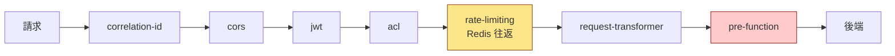
```mermaid
graph LR
    Request[請求] --> P1[correlation-id]
    P1 --> P2[cors]
    P2 --> P3[jwt]
    P3 --> P4[acl]
    P4 --> P5[rate-limiting<br/>Redis 往返]
    P5 --> P6[request-transformer]
    P6 --> P7[pre-function]
    P7 --> Backend[後端]

    style P5 fill:#fde68a,stroke:#92400e
    style P7 fill:#fecaca,stroke:#991b1b
```

**每增加一個 Plugin，都會**：

- 增加 `kong_kong_latency_ms`：純記憶體運算的 Plugin 通常只增加少量延遲；需要外部 I/O 的 Plugin（Redis 限流、Token Introspection、同步的日誌）影響明顯較大。實際數值請以壓測量測。
- 增加記憶體用量與除錯的複雜度。
- 增加升級時的相容性風險。

> 💡 **建議**：不要只看「Plugin 的數量」，而要看「**同步外部 I/O 的次數**」。一個 Route 上最好不超過 1 次同步的外部呼叫，而且要設定逾時與 `fault_tolerant`。定期以 `kong_kong_latency_ms` 的 P99 檢視 Plugin 帶來的額外耗時。

### 12.4 安全性與效能常見錯誤

#### 12.4.1 安全性錯誤

| ❌ 錯誤做法 | ✅ 正確做法 |
| --- | --- |
| Admin API 綁定 `0.0.0.0` 並且可以從外部存取 | 只綁定管理網段；OSS 使用 Loopback 模式保護（見[11.1.2](#1112-oss以-kong-保護自己的-admin-apiloopback-模式)） |
| OSS 的 Kong Manager 開放給一般網段 | 放在 VPN 或跳板機之後；不需要時設定 `admin_gui_listen = off` |
| 對外 Route 同時允許 HTTP | Route 的 `protocols` 只允許 `https` |
| API Key 放在 Query String | `key_in_query = false` |
| API Key 寫在前端程式碼 | 前端改用 OAuth 2.0 + PKCE |
| 以為 OSS 的 `jwt` Plugin 會驗證 `aud` | 後端補驗證，或改用 EE 的 OIDC |
| CORS `origins: *` 搭配 `credentials: true` | 明確列出允許的來源 |
| 沒有設定 `trusted_ips` | 設定 LB 網段，讓 IP 限制與 IP 限流取得真實的用戶端 IP |
| 日誌中保留 Authorization Header | 以 `custom_fields_by_lua` 遮罩 |

#### 12.4.2 效能與可靠性錯誤

| ❌ 錯誤做法 | ✅ 正確做法 |
| --- | --- |
| 多節點環境使用 `local` 限流，卻期待精確的全域配額 | 使用 `redis` policy |
| 限流使用 `cluster` policy | 每個請求都會寫資料庫；改用 `redis` |
| 非冪等 API 沿用預設的 `retries = 5` | 設為 `0`，並由應用層處理冪等 |
| 過短的主動健康檢查間隔（每個 worker、每個節點都會探測） | 5–10 秒；節點很多時再拉長 |
| 只設定被動健康檢查 | 被動檢查不會自動恢復，要搭配主動檢查 |
| 同步呼叫外部服務驗證每個 Token | 使用 JWT 本地驗證；Introspection 一定要開啟快取 |
| 沒有設定逾時 | 依照後端的 SLO 設定 `connect_timeout`／`read_timeout` |
| 開啟 `per_consumer` 指標，而 Consumer 有數萬個 | 關閉；改用日誌分析 |
| 使用浮動的映像檔標籤（`kong:latest`） | 固定到 patch 版本 |

### 12.5 設定範例：生產環境最佳實踐

> ⚠️ **v2.0 更正**：v1.0 的生產環境範例有以下問題，本版已全部修正：
>
> - rate-limiting 使用已淘汰的 `redis_host`／`redis_port`，而且把 Redis 位址寫死在設定中。
> - http-log 使用已淘汰的 `flush_timeout`。
> - Route 沒有限制 `protocols`，Service 對所有請求沿用 `retries: 3`。
> - `jwt` Plugin 沒有搭配 Consumer 憑證的說明。
> - Prometheus 在全域開啟 `per_consumer`。

```yaml
# kong-production.yaml（decK 格式；以 DECK_ 環境變數注入各環境的值）
_format_version: "3.0"

services:
  # 讀取類：允許重試
  - name: user-read-service
    host: user-upstream
    port: 8080
    protocol: http
    connect_timeout: 5000
    write_timeout: 30000
    read_timeout: 30000
    retries: 2
    tags: [team-user, env-prod, system-crm]
    routes:
      - name: user-read
        paths: [/api/users]
        methods: [GET]
        protocols: [https]
        strip_path: true
    plugins:
      - name: jwt                    # Consumer 與 RS256 公鑰另外以 consumers 區塊管理
        config:
          key_claim_name: iss
          claims_to_verify: [exp]
          maximum_expiration: 3600
          uri_param_names: []        # 不接受以 Query String 傳遞 Token
      - name: response-transformer
        config:
          remove:
            headers: [Server, X-Powered-By]
          add:
            headers:
              - "Strict-Transport-Security:max-age=31536000; includeSubDomains"
              - "X-Content-Type-Options:nosniff"
      - name: rate-limiting
        config:
          minute: 300
          limit_by: consumer
          policy: redis
          redis:
            host: ${{ env "DECK_REDIS_HOST" }}
            port: 6379
            password: "{vault://env/redis-password}"
            timeout: 2000
          fault_tolerant: true

  # 寫入類：不重試（非冪等），限流較嚴格
  - name: user-write-service
    host: user-upstream
    port: 8080
    protocol: http
    connect_timeout: 5000
    write_timeout: 30000
    read_timeout: 30000
    retries: 0
    tags: [team-user, env-prod, system-crm]
    routes:
      - name: user-write
        paths: [/api/users]
        methods: [POST, PUT, PATCH, DELETE]
        protocols: [https]
        strip_path: true
    plugins:
      - name: jwt
        config:
          key_claim_name: iss
          claims_to_verify: [exp]
          maximum_expiration: 3600
          uri_param_names: []
      - name: response-transformer
        config:
          remove:
            headers: [Server, X-Powered-By]
          add:
            headers:
              - "Strict-Transport-Security:max-age=31536000; includeSubDomains"
              - "X-Content-Type-Options:nosniff"
      - name: rate-limiting
        config:
          minute: 30
          limit_by: consumer
          policy: redis
          redis:
            host: ${{ env "DECK_REDIS_HOST" }}
            port: 6379
            password: "{vault://env/redis-password}"
            timeout: 2000
          fault_tolerant: true

upstreams:
  - name: user-upstream
    algorithm: least-connections
    tags: [team-user, env-prod]
    healthchecks:
      active:
        type: http
        http_path: /actuator/health/readiness
        timeout: 2
        healthy:
          interval: 5
          successes: 2
        unhealthy:
          interval: 5
          http_failures: 3
          tcp_failures: 3
          timeouts: 3
      passive:
        unhealthy:
          http_failures: 5
          timeouts: 5
    targets:
      - target: user-service-1.internal:8080
        weight: 100
      - target: user-service-2.internal:8080
        weight: 100

plugins:
  - name: correlation-id
    tags: [platform]
    config:
      header_name: X-Request-ID
      generator: uuid
      echo_downstream: true
  - name: prometheus
    tags: [platform]
    config:
      status_code_metrics: true
      latency_metrics: true
      bandwidth_metrics: true
      upstream_health_metrics: true
  - name: opentelemetry
    tags: [platform]
    config:
      traces_endpoint: ${{ env "DECK_OTEL_TRACES_ENDPOINT" }}
      resource_attributes:
        service.name: kong-gateway
      propagation:
        default_format: w3c
        extract: [w3c, b3]
        inject: [preserve]
  - name: http-log
    tags: [platform]
    config:
      http_endpoint: ${{ env "DECK_LOG_ENDPOINT" }}
      method: POST
      content_type: application/json
      queue:
        max_batch_size: 100
        max_coalescing_delay: 2
      custom_fields_by_lua:
        request.headers.authorization: "return nil"
```

> 📌 **為什麼拆成兩個 Service？** `retries`、逾時等屬性是 Service 層級的設定，會套用到該 Service 底下的所有 Route。讀寫兩個 Service 共用同一個 Upstream，就能讓讀取請求可以重試、寫入請求不重試，同時分別設定限流上限。

### 12.6 💡 本章實務建議

1. **Gateway 只做橫切關注點**：認證、粗粒度授權、限流、路由、觀測；業務邏輯留在後端。
2. **以「同步外部 I/O 次數」衡量 Plugin 成本**，並以 `kong_kong_latency_ms` 持續監控。
3. **讀寫分開建立 Route**，才能分別設定重試、限流與逾時。
4. **把本章的錯誤清單納入 decK lint 規則**，在 CI 階段就擋下常見的錯誤設定。

---

## 13. AI Gateway 與 MCP

> 🆕 **v2.0 新增**：企業導入生成式 AI 之後，LLM 呼叫也需要和一般 API 相同的治理：統一入口、憑證管理、用量控管、內容防護與成本觀測。Kong 從 3.6 起提供 AI Plugin，並把 Gateway 定位為「API 與 AI Gateway」。

### 13.1 為什麼需要 AI Gateway

| 痛點 | 沒有 Gateway 時 | 經過 AI Gateway 之後 |
| --- | --- | --- |
| **模型供應商的金鑰分散** | 每個應用程式都持有 OpenAI、Anthropic 等金鑰 | 金鑰只放在 Gateway（Vault 參照），應用程式使用內部憑證 |
| **供應商鎖定** | 各家 API 格式不同，換供應商就要改程式 | 以統一格式（OpenAI 相容）呼叫，Gateway 負責轉換 |
| **成本失控** | 無法依團隊、專案統計 Token 用量 | 以 Prometheus 的 `kong_ai_llm_tokens_total`、`kong_ai_llm_cost_total` 分析 |
| **提示詞風險** | 使用者可能輸入機密資料或越獄（jailbreak）指令 | Prompt Guard 以規則阻擋；系統提示詞統一注入 |
| **資料落地** | 難以強制使用內部部署的模型 | 以路由規則把敏感流量導向地端模型（例如 vLLM） |

### 13.2 以 OSS AI Proxy 串接 LLM

OSS 3.9.3 內建的 AI Plugin：

| Plugin | 用途 |
| --- | --- |
| `ai-proxy` | 把請求轉送到 LLM 供應商，並做格式轉換（支援 openai、azure、anthropic、cohere、mistral、llama2、gemini、bedrock、huggingface） |
| `ai-prompt-decorator` | 在對話前後加上固定的 system／user 提示詞 |
| `ai-prompt-template` | 只允許以事先定義的範本呼叫 LLM |
| `ai-prompt-guard` | 以正規表示式白名單／黑名單過濾提示詞 |
| `ai-request-transformer`／`ai-response-transformer` | 以 LLM 轉換一般 API 的請求或回應 |

#### 13.2.1 範例：統一的 Chat 端點，後端是地端的 vLLM

```yaml
# ai-gateway.yaml
_format_version: "3.0"
services:
  - name: llm-chat
    url: http://localhost:32000        # ai-proxy 會改寫實際的上游位址
    tags: [platform-ai]
    routes:
      - name: llm-chat-route
        paths: [/ai/chat]
        methods: [POST]
        protocols: [https]
    plugins:
      - name: key-auth                 # 呼叫方用內部 API Key（或 JWT）認證
        config:
          key_in_query: false
          hide_credentials: true
      - name: ai-proxy
        config:
          route_type: llm/v1/chat
          model:
            provider: openai           # vLLM 提供 OpenAI 相容 API
            name: internal-llm-v1
            options:
              upstream_url: http://vllm.ai.svc:8000/v1/chat/completions
              max_tokens: 1024
          auth:
            header_name: Authorization
            header_value: "Bearer {vault://env/vllm-token}"
          logging:
            log_statistics: true       # 在日誌中記錄 Token 用量
            log_payloads: false        # 不記錄提示詞與回答內容（個資考量）
      - name: ai-prompt-guard
        config:
          deny_patterns:
            - "(?i).*(身分證|信用卡號|password).*"
            - "(?i).*ignore (all )?previous instructions.*"
      - name: ai-prompt-decorator
        config:
          prompts:
            prepend:
              - role: system
                content: "你是公司內部助理。不得提供個人資料，回答請使用繁體中文。"
      - name: rate-limiting
        config:
          minute: 20
          limit_by: consumer
          policy: local
```

```bash
# 呼叫方只需要使用 OpenAI 相容的格式
curl -s https://api.example.com/ai/chat \
  -H "apikey: ${INTERNAL_KEY}" \
  -H "Content-Type: application/json" \
  -d '{"messages":[{"role":"user","content":"請摘要這份會議紀錄的三個重點"}]}'
```

> 📌 **更換供應商**：只要修改 `model.provider`、`model.name` 與 `auth`，應用程式完全不需要改動。例如改用 Anthropic 時，`provider: anthropic`，並設定 `options.anthropic_version` 與 `auth.header_name: x-api-key`。

#### 13.2.2 AI 用量觀測

```bash
# Prometheus Plugin 開啟 AI 指標
curl -X POST http://localhost:8001/plugins \
  --data name=prometheus \
  --data config.ai_metrics=true
```

```promql
# 各模型每小時的 Token 用量
sum by (ai_provider, ai_model, token_type) (increase(kong_ai_llm_tokens_total[1h]))

# 各模型的估計成本（需要在 model.options 設定 input_cost / output_cost）
sum by (ai_model) (increase(kong_ai_llm_cost_total[1d]))
```

### 13.3 Enterprise AI Gateway 進階功能

| Plugin／功能 | 版本 | 用途 |
| --- | --- | --- |
| `ai-proxy-advanced` | EE（AI Gateway） | 多模型負載平衡、故障轉移、依語意選擇模型 |
| `ai-semantic-cache` | EE | 以向量相似度快取回答，降低成本與延遲 |
| `ai-semantic-prompt-guard`／`ai-semantic-response-guard` | EE | 以語意（而不是正規表示式）過濾提示詞與回答 |
| `ai-rate-limiting-advanced` | EE | 依 Token 數量（而不是請求次數）限流 |
| `ai-prompt-compressor` | EE | 壓縮提示詞以節省 Token |
| `ai-sanitizer`、`ai-azure-content-safety`、`ai-aws-guardrails`、`ai-gcp-model-armor` | EE | 送出前遮罩個資、呼叫外部內容安全服務 |

> 📌 Kong 的 AI Gateway 已經有獨立的版本支援政策與產品頁面（developer.konghq.com/ai-gateway）。授權方式請以原廠報價為準。

### 13.4 MCP（Model Context Protocol）治理

**MCP** 是 AI Agent 呼叫外部工具的標準協定。當企業開始讓 Agent 存取內部系統，MCP 流量就需要和 API 一樣受到治理。

| Plugin | 最低版本 | 用途 |
| --- | --- | --- |
| `ai-mcp-proxy` | EE 3.12 | 把既有的 REST API 轉成 MCP 工具、代理 MCP Server、彙整多個 MCP 工具、即時觀測 MCP 流量 |
| `ai-mcp-oauth2` | EE 3.12（技術預覽） | 以 OAuth 2.0 保護 MCP Server 的存取 |
| decK `file openapi2mcp` | decK 1.57.0 | 由 OpenAPI 規格產生 MCP 工具設定 |

```mermaid
graph LR
    Agent[AI Agent<br/>Claude / Copilot / 內部 Agent] -->|MCP over HTTP| Kong[Kong Gateway<br/>ai-mcp-proxy + ai-mcp-oauth2]
    Kong -->|REST 轉成 MCP 工具| API1[既有 REST API]
    Kong -->|代理| MCP1[內部 MCP Server]
    Kong -->|OAuth 2.0 驗證| IdP[Keycloak / Entra ID]
    Kong -.->|指標與日誌| Obs[觀測平台]
```

**MCP 治理重點**：

1. **身分**：Agent 以 OAuth 2.0 取得 Token，Gateway 驗證後才允許呼叫工具（3.16 的 OIDC Plugin 也支援 RFC 9728 Protected Resource Metadata）。
2. **最小權限**：以 ACL 或 scope 限制每個 Agent 可以使用的工具。
3. **限流與稽核**：Agent 可能在短時間內大量呼叫工具，必須限流，並完整記錄「哪個 Agent、呼叫了哪個工具、帶了什麼參數」。
4. **把既有 API 轉成工具**：以 `deck file openapi2mcp` 由 OpenAPI 產生工具定義，並沿用既有 API 的認證與限流政策。

> ⚠️ **OSS 限制**：OSS 3.9.3 沒有 MCP 相關的 Plugin。OSS 環境可以把 MCP Server 當作一般的 HTTP 服務放在 Kong 後面，套用 JWT、ACL、限流與日誌，但無法做 REST 到 MCP 的轉換與 MCP 協定層級的觀測。

### 13.5 💡 本章實務建議

1. **LLM 金鑰只放在 Gateway**：應用程式使用內部憑證呼叫 Gateway，並以 Vault 參照管理供應商金鑰。
2. **預設不記錄提示詞內容**（`log_payloads: false`），只記錄 Token 統計；需要稽核時再依法遵要求開啟並遮罩。
3. **限流要同時考慮請求數與 Token 數**：OSS 只能依請求數限流，Token 預算請以指標告警輔助控管。
4. **MCP 流量視同外部 API 治理**：身分、授權、限流、稽核缺一不可。

---

## 14. 總結與學習路線建議

### 14.1 適合新手的學習順序

```mermaid
graph TD
    A[1. 理解 API Gateway 與 Kong 產品版圖<br/>第 1 章] --> B[2. 本機以 Docker 安裝 OSS 3.9.3<br/>第 3 章]
    B --> C[3. 建立 Service + Route<br/>第 4、5 章]
    C --> D[4. 核心 Plugin：Key Auth、Rate Limiting<br/>第 6 章]
    D --> E[5. Consumer 與 Plugin 優先序<br/>第 4.2、4.3 章]
    E --> F[6. JWT、ACL、CORS 與 Keycloak 整合<br/>第 6、7 章]
    F --> G[7. decK 與 GitOps<br/>第 9 章]
    G --> H[8. 監控、日誌與 Trace<br/>第 8 章]
    H --> I[9. Hybrid／K8s 生產部署與安全強化<br/>第 2、3、11 章]
    I --> J[10. 升級演練與 AI Gateway<br/>第 10、13 章]
```

| 階段 | 預估時間 | 驗收方式 |
| --- | --- | --- |
| 1–3 | 1 天 | 能以 Docker Compose 啟動 Kong，並建立可以存取的 Route |
| 4–6 | 3 天 | 能以 Keycloak 簽發的 JWT 呼叫受保護的 API，並觸發 429 |
| 7–8 | 3 天 | 以 decK 在 CI 中完成 diff／sync；在 Grafana 看到指標與告警 |
| 9–10 | 1–2 週 | 完成 Hybrid 或 K8s 部署、安全基準檢查，以及一次升級演練 |

### 14.2 團隊導入 Kong 的成熟度成長路線

| 階段 | 特徵 | 目標 | 關鍵產出 |
| --- | --- | --- | --- |
| **Level 1：入門** | 單一服務、手動呼叫 Admin API | 理解概念、完成 POC | POC 報告、產品形態決策（OSS／EE／Konnect） |
| **Level 2：基礎** | 多個服務、基本的認證與限流 | 穩定運作、基本監控 | 命名與 Tag 規範、Prometheus 指標 |
| **Level 3：進階** | decK + GitOps、完整的可觀測性 | 設定全面程式碼化、告警完善 | CI 流程（lint／validate／diff）、SLO 告警 |
| **Level 4：成熟** | 多環境、Hybrid／K8s、HA 與 DR | 零停機升級、災難復原演練 | 升級 Runbook、DR 演練紀錄、安全基準稽核 |
| **Level 5：平台化** | API 平台自助服務、治理自動化、AI Gateway | 各團隊自助上線 API、統一治理 LLM／MCP 流量 | 平台服務目錄、Dev Portal、AI 用量報表 |

### 14.3 推薦學習資源

> ⚠️ **v2.0 更正**：Kong 官方文件已經從 `docs.konghq.com` 遷移到 **`developer.konghq.com`**，舊網址會轉址，但建議直接使用新網址。

| 資源 | 連結 | 用途 |
| --- | --- | --- |
| Kong 官方文件（新站） | <https://developer.konghq.com> | 所有產品文件的入口 |
| Kong Gateway 文件 | <https://developer.konghq.com/gateway/> | 安裝、設定、實體參考 |
| Kong Gateway Changelog | <https://developer.konghq.com/gateway/changelog/> | 版本變更 |
| Breaking Changes | <https://developer.konghq.com/gateway/breaking-changes/> | 升級前必讀 |
| 版本支援政策 | <https://developer.konghq.com/gateway/version-support-policy/> | LTS 與支援期 |
| Kong Plugin Hub | <https://developer.konghq.com/plugins/> | 所有 Plugin 的參數與範例 |
| decK 文件 | <https://developer.konghq.com/deck/> | APIOps |
| Kong Operator 文件 | <https://developer.konghq.com/operator/> | Kubernetes Gateway API |
| Kong 官方部落格 | <https://konghq.com/blog> | 產品動態、最佳實務 |
| Kong GitHub | <https://github.com/Kong/kong> | 原始碼、Issue、Security Advisory |
| decK GitHub | <https://github.com/Kong/deck> | CLI 原始碼與 Release |
| 官方文件原始碼 | <https://github.com/Kong/developer.konghq.com> | 查證文件內容與支援矩陣的最佳來源 |
| Kong Academy | <https://education.konghq.com> | 官方訓練課程 |
| Kong 社群論壇 | <https://discuss.konghq.com> | 社群問答 |
| OWASP API Security Top 10 | <https://owasp.org/API-Security/> | API 安全基準 |

### 14.4 💡 本章實務建議

1. **先 POC、再決定產品形態**：以 OSS 驗證架構，再依企業需求（OIDC、RBAC、AI Gateway）決定是否採用 EE 或 Konnect。
2. **以成熟度模型規劃導入里程碑**，每個階段都要有可以驗收的產出。
3. **查證時以 `developer.konghq.com` 與 GitHub 原始碼為準**，不要依賴第三方的舊文章。

---

## 15. 檢查清單（Checklist）

> ⚠️ **v2.0 更正**：v1.0 把檢查清單包在 ```` ```markdown ```` 程式碼區塊中，所以清單內的標題與核取方塊不會被渲染；第 10.3 節與第 13 章的升級清單內容也重複。本版改為可以直接勾選的清單，升級清單只保留在本章。

### 15.1 新服務上線檢查清單

**前置準備**

- [ ] 後端服務已部署，而且只能從 Kong 存取（NetworkPolicy／防火牆）
- [ ] 後端提供健康檢查端點（例如 `/actuator/health/readiness`）
- [ ] 已確認 API 規格（OpenAPI）、路徑、Method、認證方式
- [ ] 已確認限流需求（每個 Consumer、每個 IP）與逾時需求
- [ ] 已確認 API 是否冪等，以決定 `retries`

**Kong 設定（以 decK 提交 PR）**

- [ ] Service：`host`／`port`／`protocol`、逾時、`retries`（非冪等為 0）
- [ ] Route：Path／Host／Method，`protocols: [https]`，並確認 `strip_path`
- [ ] Upstream：主動與被動健康檢查（如果使用 Upstream）
- [ ] 認證 Plugin（key-auth／jwt／OIDC），`hide_credentials: true`
- [ ] 授權：ACL 群組或 scope
- [ ] Rate Limiting（`policy: redis`，使用 `config.redis.*`）
- [ ] CORS（前端會呼叫時），明確列出允許的來源
- [ ] 實體加上 `team-*`、`env-*`、`system-*` Tag
- [ ] 機密使用 Vault 參照，沒有明碼

**測試驗證**

- [ ] 正常請求成功，回應 Header 符合預期
- [ ] 沒有憑證或憑證錯誤時回 401；權限不足時回 403
- [ ] 超過上限時回 429，並帶有 `Retry-After`
- [ ] 後端停止時回 503，恢復後自動回到健康狀態
- [ ] Prometheus 指標、日誌、Trace 都能看到這個 Service
- [ ] `deck gateway diff` 沒有非預期的差異

**文件與溝通**

- [ ] 更新 API 文件（Dev Portal／內部 Wiki）
- [ ] 通知呼叫方：網址、認證方式、限流上限、錯誤碼
- [ ] 設定告警的負責人與值班聯絡方式

### 15.2 日常維運檢查清單

**每日**

- [ ] 所有節點的 `/status/ready` 都正常；Hybrid 模式下 DP 的 `sync_status` 正常
- [ ] 5xx 比例、P99 延遲在 SLO 內（以 `source` 區分 Kong 與後端）
- [ ] 沒有不健康的 Upstream Target
- [ ] Redis 與 PostgreSQL 可以連線（`kong_datastore_reachable`）

**每週**

- [ ] 檢視 Rate Limiting 觸發統計，確認上限是否合理
- [ ] 檢視 Consumer 用量的前 10 名，並確認是否有異常
- [ ] `deck gateway diff` 檢查設定漂移
- [ ] 備份設定（`deck gateway dump`）與資料庫
- [ ] 檢查日誌磁碟空間與保存期限

**每月**

- [ ] 檢查 Kong、decK、Operator 是否有新版本或安全公告
- [ ] 映像檔重新掃描漏洞
- [ ] 檢視 Plugin 使用狀況，移除不再使用的設定
- [ ] 檢查憑證到期日（TLS、Hybrid 叢集憑證、EE 授權）
- [ ] 容量規劃檢討（尖峰 RPS、CPU 使用率）

### 15.3 升級前檢查清單

**準備階段**

- [ ] 確認目前版本（`curl -s localhost:8001/ | jq -r .version`）與目標版本
- [ ] 閱讀目標版本與所有中間版本的 Breaking Changes 與 Changelog
- [ ] 確認 PostgreSQL 版本在目標版本的支援清單內
- [ ] 確認所有 Plugin（含自訂 Plugin）相容
- [ ] 清理已淘汰的欄位（例如 `redis_host` → `redis.host`）
- [ ] 備份設定：`deck gateway dump -o backup-$(date +%Y%m%d).yaml`
- [ ] 備份資料庫：`pg_dump -Fc ... > kong_$(date +%Y%m%d).dump`
- [ ] 決定升級策略（滾動／藍綠／雙叢集）並寫好回滾計畫

**測試階段**

- [ ] 在測試環境完成 `migrations up` → 換節點 → `migrations finish`
- [ ] 執行功能回歸測試（認證、限流、路由）
- [ ] 執行效能測試，比較 `kong_kong_latency_ms`
- [ ] 演練回滾程序

**執行階段**

- [ ] 選擇離峰時段，並通知相關團隊
- [ ] 凍結設定變更
- [ ] Hybrid 模式：先升 CP、再升 DP
- [ ] 逐台更換節點，並監控錯誤率與延遲
- [ ] 所有舊節點下線後，才執行 `migrations finish`

**驗證階段**

- [ ] 所有節點版本一致
- [ ] 健康檢查、指標、日誌、Trace 都正常
- [ ] 執行 Smoke Test
- [ ] 解除設定凍結，更新文件與版本紀錄

### 15.4 安全性檢查清單

**管理平面**

- [ ] Admin API 只綁定管理網段或 `127.0.0.1`，並只提供 TLS
- [ ] OSS：Kong Manager 不對一般網段開放；不需要時設定 `admin_gui_listen = off`
- [ ] EE：啟用 RBAC，並定期檢視管理員帳號
- [ ] `plugins` 只載入需要的 Plugin；`pre-function`／`post-function` 受到管控
- [ ] `untrusted_lua = sandbox`、`allow_debug_header = off`

**傳輸安全**

- [ ] 對外 Route 只允許 `https`
- [ ] 只允許 TLS 1.2 以上
- [ ] 上游連線使用 TLS，並驗證憑證（`tls_verify`）
- [ ] 回應移除 `Server`、`Via` 等版本資訊

**認證授權**

- [ ] 所有對外 API 都有認證
- [ ] API Key 關閉 `key_in_query`，開啟 `hide_credentials`
- [ ] JWT 使用非對稱演算法（RS256／ES256），並設定 `maximum_expiration`
- [ ] 後端補驗證 `aud`、`scope` 與物件層級授權
- [ ] 設定合理的 Rate Limiting（IP 層級＋Consumer 層級）
- [ ] CORS 明確列出允許的來源

**機密與日誌**

- [ ] 設定檔中沒有明碼的機密（全部使用 Vault 參照）
- [ ] 日誌遮罩 Authorization、apikey、Cookie
- [ ] 日誌保存期限符合法規
- [ ] 異常告警（大量 401／429、Admin API 異常存取）已設定

---

## 16. 附錄

### A. 常用指令速查表

#### A.1 Admin API

```bash
# ===== 查詢 =====
curl -s localhost:8001/ | jq -r '.version'                      # Kong 版本
curl -s localhost:8001/status | jq                              # 節點狀態
curl -s localhost:8001/services | jq '.data[].name'             # 所有 Service
curl -s localhost:8001/routes | jq '.data[].name'               # 所有 Route
curl -s localhost:8001/plugins | jq '.data[] | {name, enabled}' # 所有 Plugin 實體
curl -s localhost:8001/plugins/enabled | jq                     # 節點已載入的 Plugin
curl -s localhost:8001/consumers | jq '.data[].username'        # 所有 Consumer
curl -s localhost:8001/upstreams/{upstream}/health | jq         # Upstream 健康狀態
curl -s "localhost:8001/services?tags=team-user" | jq           # 依 Tag 查詢
curl -s localhost:8001/clustering/data-planes | jq              # Hybrid：已連線的 DP

# ===== 建立 =====
curl -X POST localhost:8001/services \
  --data name=my-service \
  --data url=http://backend:8080

curl -X POST localhost:8001/services/my-service/routes \
  --data name=my-route \
  --data "paths[]=/api" \
  --data "protocols[]=https"

curl -X POST localhost:8001/consumers \
  --data username=my-consumer

curl -X POST localhost:8001/services/my-service/plugins \
  --data name=rate-limiting \
  --data config.minute=100 \
  --data config.policy=local

# ===== 驗證 =====
curl -s -X POST localhost:8001/schemas/plugins/validate \
  -H 'Content-Type: application/json' \
  -d '{"name":"key-auth","config":{"key_in_query":false}}'

# ===== 刪除 =====
curl -X DELETE localhost:8001/services/my-service
curl -X DELETE localhost:8001/routes/my-route
curl -X DELETE localhost:8001/plugins/{plugin-id}

# ===== 除錯 =====
curl -X PUT localhost:8001/debug/node/log-level/debug           # 暫時調高日誌等級
curl -X PUT localhost:8001/debug/node/log-level/notice          # 恢復
```

#### A.2 Status API 與 CLI

```bash
curl -s localhost:8100/status | jq                  # 節點狀態（Status API）
curl -i localhost:8100/status/ready                 # Readiness
curl -s localhost:8100/metrics | head               # Prometheus 指標

kong health                                         # 節點健康狀態
kong config parse /kong/declarative/kong.yml        # 檢查宣告檔語法
kong migrations list                                # 查看 migration 狀態
kong migrations up                                  # 升級前半段
kong migrations finish                              # 升級後半段（不可逆）
kong reload                                         # 重新載入 Nginx 設定
```

#### A.3 decK（v1.67）

```bash
export DECK_KONG_ADDR=http://localhost:8001

deck gateway ping                                   # 測試連線
deck gateway dump -o kong.yaml                      # 匯出設定
deck file validate kong.yaml                        # 離線驗證
deck gateway validate kong.yaml                     # 線上驗證
deck gateway diff kong.yaml                         # 比較差異
deck gateway sync kong.yaml                         # 同步（會刪除多餘的實體）
deck gateway apply kong.yaml                        # 只新增或更新
deck gateway sync kong.yaml --select-tag team-user  # 只處理特定 Tag

deck file openapi2kong -s api.yaml -o kong.yaml     # OpenAPI 轉 Kong 設定
deck file lint -s kong.yaml ruleset.yaml            # 治理規則檢查
deck file merge a.yaml b.yaml -o merged.yaml        # 合併檔案
deck file convert --from 3.10 --to 3.14 kong.yaml   # LTS 設定轉換
deck file kong2kic -s kong.yaml -o k8s.yaml         # 轉成 KIC 資源
```

### B. 環境變數參考

> ⚠️ **v2.0 更正**：以下預設值取自 Kong 3.9.3 的 `kong.conf.default`。v1.0 把 `KONG_PROXY_ACCESS_LOG` 的預設值寫成 `/dev/stdout`，實際的預設值是 `logs/access.log`；只是官方 Docker 範例通常會把它設定成 `/dev/stdout`。

任何 `kong.conf` 設定都可以用 `KONG_` 前綴加上大寫名稱的環境變數覆蓋（例如 `pg_host` → `KONG_PG_HOST`）。

| 變數 | 說明 | 預設值（3.9.3） |
| --- | --- | --- |
| `KONG_ROLE` | `traditional`／`control_plane`／`data_plane` | `traditional` |
| `KONG_DATABASE` | `postgres` 或 `off`（DB-less） | `postgres` |
| `KONG_PG_HOST`／`KONG_PG_PORT` | PostgreSQL 主機與連接埠 | `127.0.0.1`／`5432` |
| `KONG_PG_USER`／`KONG_PG_DATABASE` | PostgreSQL 使用者與資料庫 | `kong`／`kong` |
| `KONG_PG_PASSWORD` | PostgreSQL 密碼（建議使用 Secret 注入） | — |
| `KONG_DECLARATIVE_CONFIG` | DB-less 宣告檔路徑 | — |
| `KONG_PROXY_LISTEN` | Proxy 監聽位址 | `0.0.0.0:8000 reuseport backlog=16384, 0.0.0.0:8443 http2 ssl reuseport backlog=16384` |
| `KONG_ADMIN_LISTEN` | Admin API 監聽位址 | `127.0.0.1:8001 reuseport backlog=16384, 127.0.0.1:8444 http2 ssl reuseport backlog=16384` |
| `KONG_ADMIN_GUI_LISTEN` | Kong Manager 監聽位址 | `0.0.0.0:8002, 0.0.0.0:8445 ssl` |
| `KONG_STATUS_LISTEN` | Status API 監聽位址 | `127.0.0.1:8007 reuseport backlog=16384` |
| `KONG_CLUSTER_LISTEN` | Hybrid CP 監聽位址 | `0.0.0.0:8005` |
| `KONG_CLUSTER_MTLS` | CP／DP 憑證模式 | `shared` |
| `KONG_LOG_LEVEL` | 日誌等級 | `notice` |
| `KONG_PROXY_ACCESS_LOG`／`KONG_PROXY_ERROR_LOG` | Proxy 日誌路徑 | `logs/access.log`／`logs/error.log` |
| `KONG_PLUGINS` | 要載入的 Plugin | `bundled` |
| `KONG_ROUTER_FLAVOR` | 路由器類型 | `traditional_compatible` |
| `KONG_HEADERS` | Kong 附加的回應 Header | `server_tokens, latency_tokens, X-Kong-Request-Id` |
| `KONG_TRUSTED_IPS`／`KONG_REAL_IP_HEADER` | 信任的代理 IP 與真實 IP Header | —／`X-Real-IP` |
| `KONG_MEM_CACHE_SIZE` | 實體快取大小 | `128m` |
| `KONG_NGINX_WORKER_PROCESSES` | Worker 數量 | `auto` |
| `KONG_UPSTREAM_KEEPALIVE_POOL_SIZE` | 上游長連線池 | `512` |
| `KONG_DB_UPDATE_FREQUENCY` | Traditional 模式輪詢設定變更的間隔（秒） | `5` |
| `KONG_SSL_PROTOCOLS`／`KONG_SSL_CIPHER_SUITE` | 下游 TLS 設定 | `TLSv1.2 TLSv1.3`／`intermediate` |
| `KONG_LUA_SSL_TRUSTED_CERTIFICATE` | Kong 內部 HTTP 用戶端信任的 CA | `system` |
| `KONG_TRACING_INSTRUMENTATIONS`／`KONG_TRACING_SAMPLING_RATE` | 追蹤設定 | `off`／`0.01` |
| `KONG_VAULTS` | 要載入的 Vault | `bundled` |
| `KONG_UNTRUSTED_LUA` | 使用者提供的 Lua 程式碼的執行模式 | `sandbox` |
| `KONG_ALLOW_DEBUG_HEADER` | 是否允許 `Kong-Debug` Header | `off` |
| `KONG_ANONYMOUS_REPORTS` | 是否傳送匿名使用統計 | `on` |
| `KONG_LICENSE_DATA`（EE） | Enterprise 授權內容 | — |

### C. 常見問答（Q&A）

> 🆕 **v2.0 新增**

#### C.1 OSS 停在 3.9，現在還能用 Kong OSS 嗎？

可以。OSS 3.9.3 在 2026-06 仍然有安全修補，功能也足以支撐大多數 API Gateway 的需求。但要把「沒有新功能、修補期限不明確」列入風險登錄，並每季重新評估。需要 OIDC、RBAC、AI Gateway 等功能時，請評估 EE 3.14 LTS 或 Konnect（見[1.4.3](#143-20252026-授權與發行模式的重大變化)）。

#### C.2 DB-less 和 Hybrid 應該怎麼選？

K8s 環境且採用 GitOps 時選 DB-less（Operator／KIC）；VM 環境、需要跨區部署 DP、希望 DP 不接觸資料庫時選 Hybrid。兩者的 DP 都不連資料庫，差別在於設定是由 CP 推送，還是由檔案或控制器載入（見[2.2](#22-部署拓樸traditional--hybrid--db-less--konnect)）。

#### C.3 為什麼 VIP 客戶的限流設定沒有生效？

請依照[4.3.3](#433-作用範圍與優先序precedence)的 8 層優先序檢查：Consumer 層級的設定必須先完成認證才會生效；如果同時存在「Route + Consumer」的設定，會優先套用它。

#### C.4 Kong 的 JWT Plugin 可以直接讀取 Keycloak 的 JWKS 嗎？

OSS 的 `jwt` Plugin 不行，必須事先上傳公鑰（見[7.3.2](#732-模式-a-實作oss-jwt-plugin-對接-keycloak)）。EE 的 `openid-connect` Plugin 會自動讀取並快取 JWKS。

#### C.5 多節點環境的限流總量不準確？

`policy: local` 會讓每個節點各自計數，總上限約為「節點數 × 設定值」。請改用 `policy: redis`（見[6.1.1](#611-policy-選擇)）。

#### C.6 升級後出現大量 deprecated 警告，要處理嗎？

要。淘汰欄位（例如 `redis_host`、OpenTelemetry 的 `endpoint`、HTTP Log 的 `flush_timeout`）預計在 4.0 移除。建議現在就改成新的欄位（見[10.5](#105-plugin-相容性風險)）。

#### C.7 Kong Manager 開啟後一片空白？

瀏覽器必須能直接連到 Admin API。請確認 `admin_listen` 或 `admin_gui_api_url` 從瀏覽器端可以存取，並且沒有被 CORS 或 Proxy 擋住。OSS 的 Kong Manager 沒有登入機制，請只在管理網段使用。

#### C.8 KIC 還能繼續用嗎？什麼時候要換 Kong Operator？

KIC 3.5 是 LTS，支援到 2027-12-18。新專案建議直接採用 Kong Operator 2.x + Gateway API；既有專案請在 2027 年前規劃遷移，官方提供 KIC → Kong Operator 的遷移指南。

### D. 版本紀錄

#### D.1 版本歷程

| 版本 | 日期 | 說明 |
| --- | --- | --- |
| 1.0 | 2026-01-29 | 初版，以 Kong 3.9.x 為基準 |
| 2.0 | 2026-09-30 | 企業白皮書版：雙軌基準（OSS 3.9.3／EE 3.16、3.14 LTS）；逐章查證並更正；新增第 11 章「安全強化」、第 13 章「AI Gateway 與 MCP」、附錄 C～F |

#### D.2 v1.0 → v2.0 更正對照表

| # | v1.0 章節 | v1.0 內容 | v2.0 更正 | 依據 |
| --- | --- | --- | --- | --- |
| 1 | 卷首 | 「Kong 3.9.x（2026 年最新穩定版）」 | OSS 最後一版是 3.9.3；EE 最新為 3.16.0.0，LTS 為 3.14 | GitHub Releases、Docker Hub、版本支援政策 |
| 2 | 卷首 | 同時有兩個「最後更新」欄位，日期不一致 | 改為單一的中繼資料表格 | — |
| 3 | 1.4 | Kong Manager 為 Enterprise 限定 | OSS 3.4 起內建 Kong Manager（沒有 RBAC） | `kong.conf.default` 的 `admin_gui_listen` |
| 4 | 1.4 | 沒有提到授權與發行模式的變化 | 新增 3.10 停止 OSS 發行、free mode 淘汰、3.15 Admin API 唯讀 | Breaking Changes 3.10／3.15 |
| 5 | 4.3 | Request Transformer 在 `rewrite` 階段執行 | 在 `access` 階段執行；只有全域 Plugin 會在 `rewrite` 階段執行 | 原始碼 handler PRIORITY 801 |
| 6 | 3.3 | PostgreSQL 12+ | 3.9 經測試的版本是 13–17；EE 3.14 另外支援 18 | 官方文件 `gateway.yml` |
| 7 | 3.2 | 映像檔使用 `kong:3.9` | 固定為 `kong:3.9.3` | 可重現性 |
| 8 | 3.2.2 | Compose 使用 `version: '3.8'` 與 `docker-compose` | 移除 `version:`，改用 `docker compose` | Compose Specification |
| 9 | 3.2.3 | Helm 使用 `ingressController.installCRDs=false` | 該參數已移除，CRD 由 chart 的 `crds/` 安裝 | chart `values.yaml` |
| 10 | 3.2.3 | 使用 `KongIngress` CRD | KIC 3.x 已淘汰；改用 annotation 與 `KongUpstreamPolicy` | KIC 3.5 原始碼 |
| 11 | 3.2.3 | 只介紹 Helm + KIC | 新增 Kong Operator 2.x + Gateway API | Kong Operator v2.3.2 |
| 12 | 4.3 | Plugin 優先序「Consumer > Route > Service > Global」 | 8 層組合規則 | `kong/runloop/plugins_iterator.lua` |
| 13 | 6.1、11.5 | `config.redis_host`／`config.redis_port` | 改為 `config.redis.host`／`config.redis.port`（舊欄位已淘汰） | rate-limiting `schema.lua` |
| 14 | 6.1 | `limit_by` 只列出 4 個值 | 3.9.3 有 `consumer`、`credential`、`ip`、`service`、`header`、`path` | rate-limiting `schema.lua` |
| 15 | 6.3 | 「可以搭配 Keycloak 的 JWKS 端點動態取得公鑰」 | OSS `jwt` Plugin 只能使用靜態公鑰，不會讀取 JWKS | jwt `schema.lua` |
| 16 | 6.4 | 以 `config.uri_param_names=access_token` 對接 Keycloak | 不建議從 Query String 讀取 Token；生產範例設定為 `[]` | 安全最佳實務 |
| 17 | 6.8、8.2 | Prometheus 範例預設開啟 `per_consumer=true` | 預設關閉，避免指標基數爆增 | Prometheus 最佳實務 |
| 18 | 6.9、8.3、11.5 | HTTP Log 使用 `flush_timeout`、`retry_count` | 改用 `config.queue.*`（`retry_count` 已失效） | http-log `schema.lua` |
| 19 | 6.9、8.3 | HTTP Log 送到 `logstash:5044`（Beats 連接埠） | 改為 Logstash `http` input 的連接埠 | Logstash 設定慣例 |
| 20 | 7.2 | Spring 使用 `RestTemplate` | 改用 `RestClient`／`WebClient` | Spring Framework 7 |
| 21 | 7.3 | 以 `config.key_claim_name=iss` 範例宣稱「使用 JWKS 驗證」 | 補上公鑰轉 PEM 的實作與模式比較 | — |
| 22 | 8.1 | `/metrics` 只能透過 Admin API 存取 | 建議改從 Status API 抓取 | Prometheus Plugin |
| 23 | 8.2 | 告警使用 `code="5xx"` | 改為 `code=~"5.."` | exporter 標籤定義 |
| 24 | 8.4 | OpenTelemetry 使用 `config.endpoint` | 改為 `config.traces_endpoint`，並補上 `tracing_instrumentations` | opentelemetry `schema.lua` |
| 25 | 4.5、9.1、14.A | `deck dump`／`deck sync -s` 等頂層命令 | 改為 `deck gateway …`／`deck file …`，檔案以位置參數傳入 | decK `cmd/root.go` |
| 26 | 9.4 | Nginx 指令與環境變數寫在同一個 `nginx` 區塊 | 分開撰寫，並補上 OS 調校 | — |
| 27 | 10.1 | 版本相容表只列到 3.9 | 改為 EE 支援期表與相依元件表 | 版本支援政策 |
| 28 | 10.3、13 | 升級清單重複出現，而且包在 markdown 程式碼區塊中 | 合併到第 15.3 節，改為可以勾選的清單 | — |
| 29 | 11.3 | 「每個 Plugin 增加約 0.5–2 ms」 | 改為以同步外部 I/O 次數評估，並以指標量測 | — |
| 30 | 11.5 | 生產範例的 Route 沒有限制協定，寫入 API 也會重試 | 讀寫拆成兩個 Service、`protocols: [https]`、寫入 `retries: 0` | — |
| 31 | 12.3 | 推薦資源使用 `docs.konghq.com` | 改為 `developer.konghq.com` | 官方文件遷移 |
| 32 | 14.B | `KONG_PROXY_ACCESS_LOG` 預設值為 `/dev/stdout` | 預設值為 `logs/access.log` | `kong.conf.default` |

#### D.3 v2.0 新增章節

| 章節 | 內容 |
| --- | --- |
| 1.4.3、1.5、1.6 | 授權變化、產品家族、與其他 Gateway 的比較 |
| 2.2、2.5.2 | 四種部署拓樸、HA／DR |
| 3.2.3～3.2.6 | Enterprise 授權、Kong Operator、KIC 3.5 LTS、Hybrid 部署 |
| 4.4.1、4.6 | Vault 參照、Workspaces 與多租戶 |
| 5.2.4、5.2.5、5.3.2 | Header 路由、Expressions 路由器、金絲雀發布 |
| 6.0、6.8～6.10 | Plugin 總覽表、防護類 Plugin、Proxy Cache、Correlation ID |
| 8.2.5 | SLO 與告警規則 |
| 9.1.3 | OpenAPI → Kong 與治理規則 |
| 10.2.2、10.4 | 3.9 → 3.16 重大變更、三種升級策略、OSS → EE 遷移路線 |
| 11 | 安全強化（整章） |
| 13 | AI Gateway 與 MCP（整章） |
| 附錄 C～F | 常見問答、版本紀錄、查證紀錄、參考資料 |

### E. 查證紀錄

以下事實於 **2026-09-30** 查證。

| # | 查證項目 | 結論 | 來源 |
| --- | --- | --- | --- |
| 1 | OSS 最新版本 | 3.9.3（2026-06-17）；GitHub 沒有 3.10 以後的 OSS tag | `gh api repos/Kong/kong/releases` |
| 2 | OSS Docker image | `kong:3.9.3`（Docker Official Image，2026-09-16 重建） | Docker Hub `library/kong` |
| 3 | EE 最新版本 | 3.16.0.0（2026-09-15） | Docker Hub `kong/kong-gateway`、Changelog |
| 4 | EE 支援期 | 3.14 LTS 到 2029-04-07；3.10 LTS 到 2028-03-31；3.12 到 2026-10-01 | 版本支援政策 |
| 5 | 3.15 授權行為 | 沒有授權或授權過期時，Admin API 唯讀，Proxy 不受影響 | Breaking Changes 3.15 |
| 6 | 3.16 CEL | cel-rust → cel-cpp，跳脫與缺少 key 的行為改變 | Breaking Changes 3.16 |
| 7 | 3.14 預設值 | Route 協定改為 `https`、`hide_credentials` 改為 `true`、`tls_certificate_verify` 改為 `on` | Breaking Changes 3.14 |
| 8 | 連接埠預設值 | Proxy 8000／8443、Admin 127.0.0.1:8001／8444、GUI 8002／8445、Status 127.0.0.1:8007、Cluster 8005 | `kong.conf.default`（3.9.3） |
| 9 | Plugin 優先序 | 8 層組合 | `kong/runloop/plugins_iterator.lua`（3.9.3） |
| 10 | Plugin PRIORITY | 例如 correlation-id 100001、cors 2000、jwt 1450、key-auth 1250、acl 950、rate-limiting 910 | 各 Plugin 的 `handler.lua`（3.9.3） |
| 11 | rate-limiting 的 Redis 欄位 | `config.redis.*`；舊欄位標示為 deprecated，預計在 4.0 移除 | rate-limiting `schema.lua`（3.9.3） |
| 12 | OSS 沒有 Consumer Group | `kong/db/schema/entities` 下沒有 `consumer_groups` | 原始碼（3.9.3） |
| 13 | Upstream 演算法 | round-robin、consistent-hashing、least-connections、latency（3.2 新增） | `upstreams.lua`、CHANGELOG |
| 14 | `/plugins/enabled` | 3.9.3 仍然存在，回傳 `enabled_plugins` | `kong/api/routes/plugins.lua` |
| 15 | Prometheus 指標 | 名稱與標籤如第 8.2.3 節 | `exporter.lua`（3.9.3） |
| 16 | OpenTelemetry | `traces_endpoint`／`logs_endpoint`（3.8 新增 logs）；`endpoint` 已淘汰 | opentelemetry `schema.lua`、CHANGELOG |
| 17 | HTTP Log 佇列 | `queue.*` 取代 `flush_timeout`／`queue_size`；`retry_count` 已失效 | http-log `schema.lua` |
| 18 | OSS 內建的 AI Plugin | ai-proxy、ai-prompt-decorator、ai-prompt-guard、ai-prompt-template、ai-request/response-transformer | `kong/plugins/`（3.9.3） |
| 19 | MCP Plugin | `ai-mcp-proxy`、`ai-mcp-oauth2`（技術預覽）最低版本為 3.12，屬 AI Gateway Enterprise | developer.konghq.com 原始碼 |
| 20 | decK | v1.67.0；頂層命令已 deprecated；`file convert` 支援 `3.10` → `3.14`；`openapi2mcp` 於 1.57.0 新增 | decK 原始碼與 CHANGELOG |
| 21 | Kong Operator | v2.3.2（穩定版）；GatewayConfiguration API 版本 `v2beta1`；Helm chart `kong/kong-operator` | kong-operator Releases、`config/samples` |
| 22 | KIC | 3.5 為 LTS，支援到 2027-12-18；最新 v3.5.13 | KIC 版本支援政策 |
| 23 | Helm chart | `kong/kong` 3.4.x，預設 image `kong:3.9`、`router_flavor: traditional` | Kong/charts `values.yaml` |
| 24 | PostgreSQL 支援 | 3.9：13–17；3.14：13–18；3.16：13–17 | `app/_data/products/gateway.yml` |
| 25 | OpenResty | 3.9.3 使用 OpenResty 1.25.3.2、OpenSSL 3.2.3 | `.requirements`（3.9.3） |
| 26 | OSS 3.9.x 安全修補 | 3.9.2 與 3.9.3 套用 2026 年的 Nginx CVE 修補 | CHANGELOG（3.9.3） |
| 27 | Grafana Dashboard | #7424「Kong (official)」由 konghq 維護，最新為 revision 11（2023-03） | grafana.com API |
| 28 | Hybrid 版本規則 | DP 的 major 版本必須相同，minor 版本不能比 CP 新 | `hybrid-mode.md` |
| 29 | 原廠漏洞修補 SLA | Critical 15 天、High 30 天、Medium 90 天、Low 180 天（只適用於支援期內的 Enterprise 版本） | `gateway/vulnerabilities.md` |

#### E.1 待確認事項

| # | 項目 | 說明 | 建議的確認方式 |
| --- | --- | --- | --- |
| 1 | OSS 3.9.x 的修補期限 | Kong 沒有公告 OSS 3.9 的 EOL；EE 3.9 已在 2025-12-12 結束支援 | 追蹤 GitHub Releases 與官方公告 |
| 2 | OSS 資料庫就地升級為 EE | OSS 3.9 資料庫能否直接以 EE 映像檔執行 migration，以及需要的中繼版本 | 向 Kong 原廠確認；在那之前採用雙叢集 + decK |
| 3 | Kong Operator + OSS 映像檔 | Operator 2.x 官方範例使用 `kong/kong-gateway`；搭配 `kong:3.9.3` 的支援狀態 | Operator 版本相容性文件 |
| 4 | EE 3.15+ 無授權的 DB-less | 沒有授權時，`/config` 是否也被視為唯讀（影響 Operator 推送設定） | 在測試環境驗證 |
| 5 | EE 3.16 的 PostgreSQL 18 | 官方資料中 3.14 列出 18，但 3.16 沒有 | 以官方 Third-party support 頁面確認 |
| 6 | Kong 4.0 的時程 | 淘汰欄位預計在 4.0 移除，目前沒有公告時程 | 追蹤 Kong 部落格與 Roadmap |
| 7 | `ai-mcp-oauth2` 正式版 | 目前為技術預覽 | 追蹤 Changelog |
| 8 | Grafana 7424 與新指標 | Dashboard 最後更新於 2023，可能沒有 AI 指標等新面板 | 匯入後自行補充面板 |
| 9 | `kong/kong` Helm chart 的定位 | Kong 目前主推 Kong Operator，`kong/kong` chart 的長期維護計畫未明 | 追蹤 Kong/charts Release |

### F. 參考資料

**官方文件**

- Kong 官方文件：<https://developer.konghq.com>
- Kong Gateway Changelog：<https://developer.konghq.com/gateway/changelog/>
- Kong Gateway Breaking Changes：<https://developer.konghq.com/gateway/breaking-changes/>
- Kong Gateway 版本支援政策：<https://developer.konghq.com/gateway/version-support-policy/>
- Kong Gateway 升級指南：<https://developer.konghq.com/gateway/upgrade/>
- Hybrid 模式：<https://developer.konghq.com/gateway/hybrid-mode/>
- Kong Plugin Hub：<https://developer.konghq.com/plugins/>
- decK：<https://developer.konghq.com/deck/>
- Kong Operator：<https://developer.konghq.com/operator/>
- Kong 漏洞修補流程：<https://developer.konghq.com/gateway/vulnerabilities/>
- Kong 官方部落格：<https://konghq.com/blog>

**原始碼與發行資訊**

- Kong Gateway（OSS）：<https://github.com/Kong/kong>（本手冊查證以 tag `3.9.3` 為準）
- decK：<https://github.com/Kong/deck>（v1.67.0）
- Kong Operator：<https://github.com/Kong/kong-operator>（v2.3.2）
- Kong Ingress Controller：<https://github.com/Kong/kubernetes-ingress-controller>（v3.5.13）
- Kong Helm Charts：<https://github.com/Kong/charts>
- Kong 官方文件原始碼：<https://github.com/Kong/developer.konghq.com>
- Docker Hub：<https://hub.docker.com/_/kong>、<https://hub.docker.com/r/kong/kong-gateway>

**標準與其他**

- Kubernetes Gateway API：<https://gateway-api.sigs.k8s.io>
- OpenTelemetry：<https://opentelemetry.io>
- OWASP API Security Top 10（2023）：<https://owasp.org/API-Security/>
- Model Context Protocol：<https://modelcontextprotocol.io>

---

> 📝 **文件維護說明**
>
> - 本文件以 Kong Gateway OSS 3.9.3 與 Enterprise 3.16／3.14 LTS 為基準，並隨 Kong 版本更新而更新。
> - 下一次改版請從[附錄 E.1 待確認事項](#e1-待確認事項)開始檢查。
> - 如有問題或建議，請聯繫平台團隊。
> - 最後更新：2026-09-30
