+++
date = '2026-01-30T19:39:44+08:00'
draft = false
title = 'Kubernetes教學手冊'
tags = ['教學', '工具', 'Kubernetes','容器編排平台']
categories = ['教學']
+++

# Kubernetes教學手冊

> **版本**：1.0  
> **最後更新**：2026 年 1 月  
> **適用對象**：後端工程師、DevOps / SRE、系統架構師 
> **定位**：企業內部標準教材 
> **最後更新**: 2026年1月29日  
> **適用於**: 對應 Kubernetes v1.29+ 
> **Created by**: Eric Cheng

## 📚 目錄

### 第一章：Kubernetes 系統架構
- [1.1 Kubernetes 核心設計理念](#11-kubernetes-核心設計理念)
  - [宣告式配置（Declarative Configuration）](#-宣告式配置declarative-configuration)
  - [控制迴圈（Control Loop）](#-控制迴圈control-loop)
  - [鬆耦合與可擴展性](#-鬆耦合與可擴展性)
- [1.2 Cluster 架構說明](#12-cluster-架構說明)
  - [整體架構圖](#整體架構圖)
  - [Control Plane 元件說明](#control-plane-元件說明)
  - [Worker Node 元件說明](#worker-node-元件說明)
- [1.3 核心物件概念](#13-核心物件概念)
  - [Pod](#pod)
  - [Node](#node)
  - [Namespace](#namespace)
  - [Label 與 Selector](#label-與-selector)
  - [Annotation](#annotation)
- [1.4 Kubernetes 與傳統部署差異](#14-kubernetes-與傳統部署差異)

### 第二章：Kubernetes 安裝與環境建置
- [2.1 常見安裝方式比較](#21-常見安裝方式比較)
  - [kubeadm 安裝](#kubeadm-安裝適用於自建環境)
  - [Managed Kubernetes 比較](#managed-kubernetes-比較)
  - [本地開發環境（kind）](#本地開發環境kind)
- [2.2 基本環境需求](#22-基本環境需求)
  - [硬體需求](#硬體需求)
  - [作業系統需求](#作業系統需求)
  - [網路需求](#網路需求)
- [2.3 Cluster 初始化流程](#23-cluster-初始化流程)
  - [Container Runtime 安裝](#container-runtime-安裝containerd)
- [2.4 安裝後驗證](#24-安裝後驗證)

### 第三章：Kubernetes 核心資源設定
- [3.1 Pod / Deployment / ReplicaSet](#31-pod--deployment--replicaset)
  - [Pod 生命週期](#pod-生命週期)
  - [Deployment 完整範例](#deployment-完整範例)
- [3.2 Service 類型說明](#32-service-類型說明)
  - [Service 類型比較](#service-類型比較)
  - [Service YAML 範例](#service-yaml-範例)
- [3.3 Ingress 與 Ingress Controller](#33-ingress-與-ingress-controller)
  - [Ingress 架構](#ingress-架構)
  - [Ingress 設定範例](#ingress-設定範例)
  - [常用 Ingress Controller](#常用-ingress-controller)
- [3.4 ConfigMap / Secret](#34-configmap--secret)
  - [ConfigMap 使用方式](#configmap-使用方式)
  - [Secret 使用方式](#secret-使用方式)
- [3.5 Resource Request / Limit](#35-resource-request--limit)
  - [資源設定說明](#資源設定說明)
  - [CPU 與 Memory 單位](#cpu-與-memory-單位)
  - [資源設定最佳實踐](#資源設定最佳實踐)
- [3.6 Health Check（Liveness / Readiness / Startup）](#36-health-checkliveness--readiness--startup)
  - [三種 Probe 比較](#三種-probe-比較)
  - [完整 Probe 設定範例](#完整-probe-設定範例)
  - [Probe 方式](#probe-方式)

### 第四章：Kubernetes 系統使用（實務操作）
- [4.1 kubectl 常用指令](#41-kubectl-常用指令)
  - [基本指令速查表](#基本指令速查表)
  - [kubectl 輸出格式](#kubectl-輸出格式)
- [4.2 Deployment 發佈流程](#42-deployment-發佈流程)
  - [發佈流程指令](#發佈流程指令)
- [4.3 滾動更新與回滾](#43-滾動更新與回滾)
  - [滾動更新策略](#滾動更新策略)
  - [回滾操作](#回滾操作)
  - [藍綠部署（Blue-Green Deployment）](#藍綠部署blue-green-deployment)
- [4.4 Scaling（Manual / HPA）](#44-scalingmanual--hpa)
  - [手動擴縮容](#手動擴縮容)
  - [HPA（Horizontal Pod Autoscaler）](#hpahorizontal-pod-autoscaler)
- [4.5 Debug 與故障排查](#45-debug-與故障排查)
  - [故障排查流程](#故障排查流程)
  - [常見問題診斷](#常見問題診斷)
  - [進階除錯技巧](#進階除錯技巧)

### 第五章：Kubernetes 維運與管理
- [5.1 Namespace 與多團隊隔離](#51-namespace-與多團隊隔離)
  - [Namespace 設計策略](#namespace-設計策略)
  - [Namespace 建立與管理](#namespace-建立與管理)
- [5.2 RBAC 權限控管](#52-rbac-權限控管)
  - [RBAC 架構](#rbac-架構)
  - [RBAC 設定範例](#rbac-設定範例)
- [5.3 日誌與監控策略](#53-日誌與監控策略)
  - [日誌收集架構](#日誌收集架構)
  - [日誌最佳實踐](#日誌最佳實踐)
  - [應用程式日誌建議](#應用程式日誌建議)
- [5.4 常見營運風險與因應](#54-常見營運風險與因應)
  - [憑證管理](#憑證管理)
- [5.5 Cluster 容量與資源管理](#55-cluster-容量與資源管理)
  - [資源監控指標](#資源監控指標)
  - [容量規劃建議](#容量規劃建議)

### 第六章：Kubernetes 升級策略
- [6.1 升級原則](#61-升級原則)
  - [版本支援政策](#版本支援政策)
  - [升級順序](#升級順序)
- [6.2 Control Plane 與 Node 升級順序](#62-control-plane-與-node-升級順序)
  - [kubeadm 升級流程](#kubeadm-升級流程)
- [6.3 應用程式升級注意事項](#63-應用程式升級注意事項)
  - [PodDisruptionBudget（PDB）](#poddisruptionbudgetpdb)
- [6.4 升級前檢查清單](#64-升級前檢查清單)

### 第七章：應用系統串接 Kubernetes
- [7.1 CI/CD 整合流程](#71-cicd-整合流程)
  - [GitLab CI 範例](#gitlab-ci-範例)
- [7.2 容器映像管理策略](#72-容器映像管理策略)
  - [映像命名規範](#映像命名規範)
  - [映像標籤策略](#映像標籤策略)
  - [映像安全掃描](#映像安全掃描)
- [7.3 Helm 基本概念與使用](#73-helm-基本概念與使用)
  - [Helm 架構](#helm-架構)
  - [Helm 常用指令](#helm-常用指令)
  - [values.yaml 範例](#valuesyaml-範例)
- [7.4 外部系統整合](#74-外部系統整合)
  - [資料庫連線](#資料庫連線)
  - [Prometheus 整合](#prometheus-整合)

### 第八章：最佳實踐與常見反模式
- [8.1 建議遵循的設計原則](#81-建議遵循的設計原則)
  - [最佳實踐清單](#-最佳實踐清單)
  - [安全設定範例](#安全設定範例)
- [8.2 常見錯誤與踩雷經驗](#82-常見錯誤與踩雷經驗)
  - [常見反模式](#-常見反模式)
  - [Graceful Shutdown 實作](#graceful-shutdown-實作)
- [8.3 企業環境實務建議](#83-企業環境實務建議)
  - [金融業特殊考量](#金融業特殊考量)
  - [NetworkPolicy 範例](#networkpolicy-範例)

### 附錄
- [附錄 A：新服務部署檢查清單](#-新服務部署檢查清單)
- [附錄 B：日常維運檢查清單](#-日常維運檢查清單)
- [附錄 C：升級前檢查清單](#-升級前檢查清單)
- [參考資源](#-參考資源)

---

## 第一章：Kubernetes 系統架構

### 1.1 Kubernetes 核心設計理念

Kubernetes（簡稱 K8s）是由 Google 開源的容器編排平台，其核心設計理念包括：

#### 🎯 宣告式配置（Declarative Configuration）

- **核心概念**：使用者描述「期望狀態」（Desired State），Kubernetes 負責將實際狀態調整至期望狀態
- **優點**：可版本控制、可重複執行、易於審計

```yaml
# 宣告式範例：我要 3 個 nginx Pod
apiVersion: apps/v1
kind: Deployment
metadata:
  name: nginx-deployment
spec:
  replicas: 3  # 期望狀態：3 個副本
  selector:
    matchLabels:
      app: nginx
  template:
    metadata:
      labels:
        app: nginx
    spec:
      containers:
      - name: nginx
        image: nginx:1.25
```

#### 🔄 控制迴圈（Control Loop）

Kubernetes 持續監控實際狀態與期望狀態的差異，並自動調整：

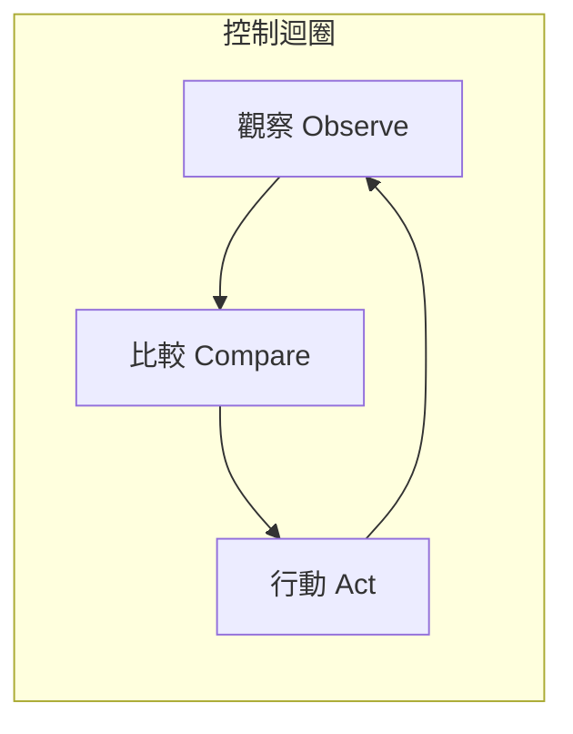

#### 🧩 鬆耦合與可擴展性

- **API 驅動**：所有操作透過 API Server 進行
- **Plugin 架構**：CNI（網路）、CSI（儲存）、CRI（容器執行環境）皆可替換
- **CRD（Custom Resource Definition）**：可自定義資源類型

---

### 1.2 Cluster 架構說明

#### 整體架構圖

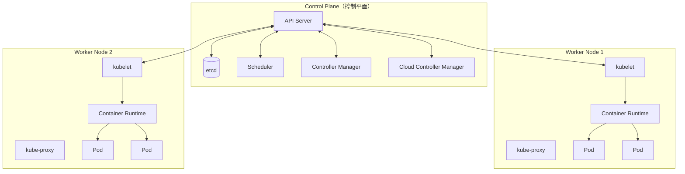

#### Control Plane 元件說明

| 元件 | 功能 | 重要性 |
|------|------|--------|
| **API Server** | Kubernetes 的前端入口，所有請求都透過它處理 | 核心 |
| **etcd** | 分散式鍵值儲存，儲存所有 Cluster 狀態資料 | 核心 |
| **Scheduler** | 決定 Pod 應該運行在哪個 Node | 核心 |
| **Controller Manager** | 執行各種控制器（Deployment、ReplicaSet 等） | 核心 |
| **Cloud Controller Manager** | 與雲端供應商 API 整合（Load Balancer、Storage） | 選用 |

#### Worker Node 元件說明

| 元件 | 功能 | 說明 |
|------|------|------|
| **kubelet** | Node 上的代理程式，負責管理 Pod 生命週期 | 每個 Node 必須有 |
| **kube-proxy** | 維護 Node 上的網路規則，實現 Service 功能 | 每個 Node 必須有 |
| **Container Runtime** | 執行容器（containerd、CRI-O） | 每個 Node 必須有 |

#### ⚠️ 實務注意事項

> **etcd 備份至關重要**：etcd 包含所有 Cluster 資料，務必定期備份。
> 
> ```bash
> # etcd 備份指令
> ETCDCTL_API=3 etcdctl snapshot save /backup/etcd-snapshot.db \
>   --endpoints=https://127.0.0.1:2379 \
>   --cacert=/etc/kubernetes/pki/etcd/ca.crt \
>   --cert=/etc/kubernetes/pki/etcd/server.crt \
>   --key=/etc/kubernetes/pki/etcd/server.key
> ```

---

### 1.3 核心物件概念

#### Pod

- Kubernetes 最小部署單位
- 一個 Pod 可包含一或多個 Container
- 同一 Pod 內的 Container 共享網路與儲存

```yaml
apiVersion: v1
kind: Pod
metadata:
  name: multi-container-pod
  labels:
    app: myapp
spec:
  containers:
  - name: main-app
    image: myapp:1.0
    ports:
    - containerPort: 8080
  - name: sidecar-log
    image: fluentd:latest
    volumeMounts:
    - name: shared-logs
      mountPath: /var/log
  volumes:
  - name: shared-logs
    emptyDir: {}
```

#### Node

- 實際運行 Pod 的機器（VM 或實體機）
- 由 kubelet 向 API Server 註冊

```bash
# 查看所有 Node
kubectl get nodes -o wide

# 查看 Node 詳細資訊
kubectl describe node <node-name>

# 標記 Node 不可調度（維護用）
kubectl cordon <node-name>

# 驅逐 Node 上所有 Pod
kubectl drain <node-name> --ignore-daemonsets --delete-emptydir-data
```

#### Namespace

- 用於邏輯隔離資源
- 適合多團隊、多環境使用

```yaml
apiVersion: v1
kind: Namespace
metadata:
  name: production
  labels:
    environment: prod
    team: backend
```

#### Label 與 Selector

- **Label**：附加在物件上的鍵值對，用於識別與分類
- **Selector**：用於篩選特定 Label 的物件

```yaml
# Label 設計建議
metadata:
  labels:
    app: order-service          # 應用名稱
    version: v1.2.3             # 版本
    environment: production     # 環境
    team: backend               # 負責團隊
    tier: backend               # 層級（frontend/backend/database）
```

#### Annotation

- 用於儲存非識別性的元資料
- 常用於工具整合（如 CI/CD、監控）

```yaml
metadata:
  annotations:
    kubernetes.io/change-cause: "Update image to v1.2.3"
    prometheus.io/scrape: "true"
    prometheus.io/port: "8080"
    deployment.kubernetes.io/revision: "3"
```

---

### 1.4 Kubernetes 與傳統部署差異

| 面向 | 傳統 VM / 單機部署 | Kubernetes |
|------|-------------------|------------|
| **部署單位** | VM 或實體機 | Container（Pod） |
| **擴展方式** | 手動增加機器 | 自動水平擴展（HPA） |
| **高可用** | 需自行設計 | 內建自動重啟、調度 |
| **服務發現** | DNS / Load Balancer | 內建 Service Discovery |
| **配置管理** | 設定檔散落各處 | ConfigMap / Secret 集中管理 |
| **版本回滾** | 複雜且風險高 | 一鍵回滾 |
| **資源利用** | 較低（VM 開銷大） | 較高（容器共享 OS Kernel） |

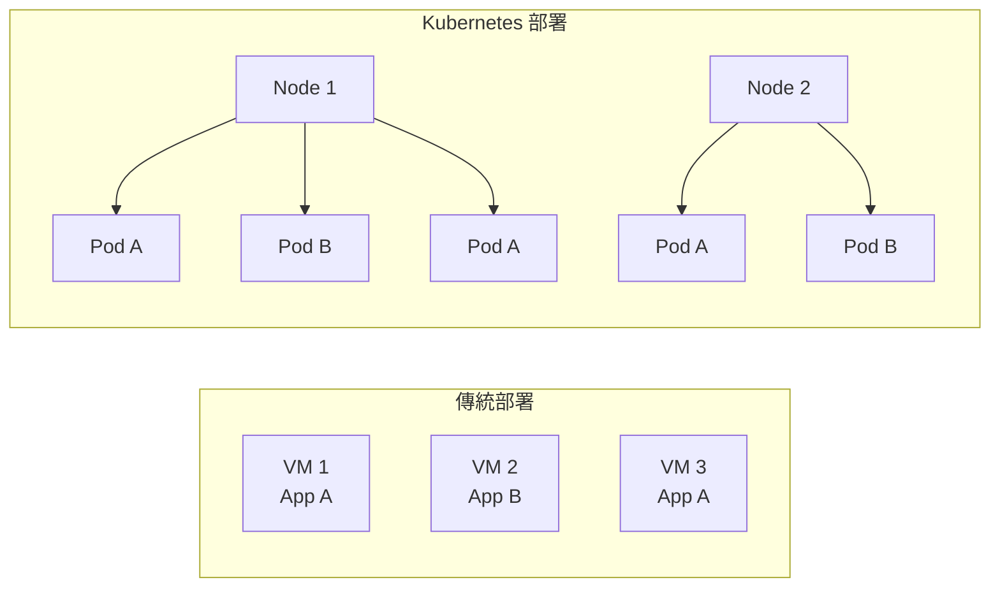

#### 💡 實務案例

**某金融系統導入 Kubernetes 前後對比**：

| 指標 | 導入前 | 導入後 |
|------|--------|--------|
| 部署時間 | 2-4 小時 | 5-10 分鐘 |
| 資源利用率 | 30-40% | 60-70% |
| 系統恢復時間 | 30+ 分鐘 | 1-3 分鐘 |
| 環境一致性 | 經常有差異 | 完全一致 |

---

## 第二章：Kubernetes 安裝與環境建置

### 2.1 常見安裝方式比較

| 安裝方式 | 適用場景 | 複雜度 | 維運負擔 |
|----------|----------|--------|----------|
| **kubeadm** | 自建 Cluster（地端/私有雲） | 中 | 高 |
| **Managed K8s**（GKE/EKS/AKS） | 公有雲環境 | 低 | 低 |
| **kind** | 本機開發測試 | 低 | 無 |
| **minikube** | 本機學習、開發 | 低 | 無 |
| **k3s** | 邊緣運算、IoT | 低 | 中 |
| **Rancher/OpenShift** | 企業級多 Cluster 管理 | 高 | 中 |

#### kubeadm 安裝（適用於自建環境）

```bash
# 1. 所有節點：安裝前置套件
sudo apt-get update
sudo apt-get install -y apt-transport-https ca-certificates curl gpg

# 2. 新增 Kubernetes apt repository
curl -fsSL https://pkgs.k8s.io/core:/stable:/v1.29/deb/Release.key | sudo gpg --dearmor -o /etc/apt/keyrings/kubernetes-apt-keyring.gpg
echo 'deb [signed-by=/etc/apt/keyrings/kubernetes-apt-keyring.gpg] https://pkgs.k8s.io/core:/stable:/v1.29/deb/ /' | sudo tee /etc/apt/sources.list.d/kubernetes.list

# 3. 安裝 kubelet、kubeadm、kubectl
sudo apt-get update
sudo apt-get install -y kubelet kubeadm kubectl
sudo apt-mark hold kubelet kubeadm kubectl

# 4. Master Node：初始化 Cluster
sudo kubeadm init --pod-network-cidr=10.244.0.0/16

# 5. 設定 kubectl
mkdir -p $HOME/.kube
sudo cp -i /etc/kubernetes/admin.conf $HOME/.kube/config
sudo chown $(id -u):$(id -g) $HOME/.kube/config

# 6. 安裝 CNI（以 Flannel 為例）
kubectl apply -f https://github.com/flannel-io/flannel/releases/latest/download/kube-flannel.yml

# 7. Worker Node：加入 Cluster
sudo kubeadm join <master-ip>:6443 --token <token> --discovery-token-ca-cert-hash sha256:<hash>
```

#### Managed Kubernetes 比較

| 雲端服務 | 特色 | 建議使用情境 |
|----------|------|--------------|
| **GKE**（Google） | 最成熟、Autopilot 模式 | 需要最佳 K8s 體驗 |
| **EKS**（AWS） | 與 AWS 生態系整合佳 | 已使用 AWS 服務 |
| **AKS**（Azure） | 免收 Control Plane 費用 | 已使用 Azure 服務 |

#### 本地開發環境（kind）

```bash
# 安裝 kind
go install sigs.k8s.io/kind@latest

# 建立 Cluster
kind create cluster --name dev-cluster

# 使用設定檔建立多節點 Cluster
cat <<EOF | kind create cluster --config=-
kind: Cluster
apiVersion: kind.x-k8s.io/v1alpha4
nodes:
- role: control-plane
- role: worker
- role: worker
EOF

# 刪除 Cluster
kind delete cluster --name dev-cluster
```

---

### 2.2 基本環境需求

#### 硬體需求

| 角色 | CPU | Memory | Disk |
|------|-----|--------|------|
| Control Plane | 2+ cores | 2+ GB | 50+ GB |
| Worker Node | 2+ cores | 2+ GB | 50+ GB |
| **生產環境建議** | 4+ cores | 8+ GB | 100+ GB SSD |

#### 作業系統需求

- Linux（Ubuntu 22.04+、RHEL 8+、CentOS Stream 9+）
- Kernel 4.15+
- 停用 Swap

```bash
# 停用 Swap
sudo swapoff -a
sudo sed -i '/ swap / s/^\(.*\)$/#\1/g' /etc/fstab
```

#### 網路需求

| 連接埠 | 元件 | 用途 |
|--------|------|------|
| 6443 | API Server | Kubernetes API |
| 2379-2380 | etcd | etcd 客戶端與對等通訊 |
| 10250 | kubelet | kubelet API |
| 10259 | kube-scheduler | Scheduler |
| 10257 | kube-controller-manager | Controller Manager |
| 30000-32767 | NodePort Services | 對外服務 |

---

### 2.3 Cluster 初始化流程

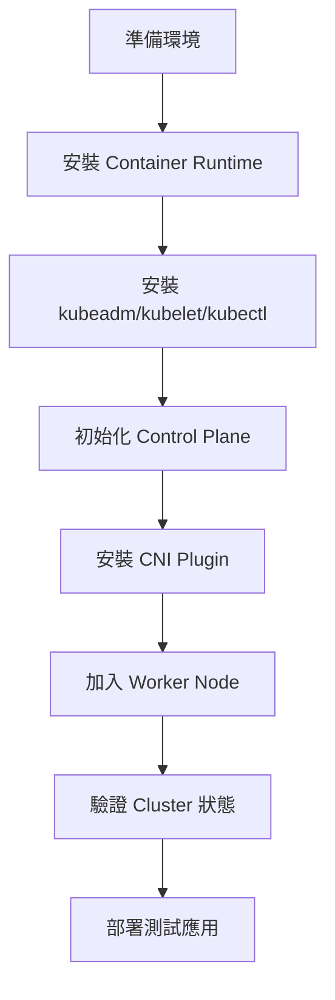

#### Container Runtime 安裝（containerd）

```bash
# 安裝 containerd
sudo apt-get update
sudo apt-get install -y containerd

# 產生預設設定
sudo mkdir -p /etc/containerd
containerd config default | sudo tee /etc/containerd/config.toml

# 啟用 SystemdCgroup
sudo sed -i 's/SystemdCgroup = false/SystemdCgroup = true/g' /etc/containerd/config.toml

# 重啟 containerd
sudo systemctl restart containerd
sudo systemctl enable containerd
```

---

### 2.4 安裝後驗證

```bash
# 1. 檢查 Node 狀態
kubectl get nodes
# 預期輸出：所有 Node 狀態為 Ready

# 2. 檢查系統 Pod
kubectl get pods -n kube-system
# 預期輸出：所有 Pod 狀態為 Running

# 3. 檢查 Cluster 資訊
kubectl cluster-info
kubectl version

# 4. 部署測試應用
kubectl create deployment nginx-test --image=nginx:latest
kubectl expose deployment nginx-test --port=80 --type=NodePort
kubectl get svc nginx-test

# 5. 測試存取
curl http://<node-ip>:<node-port>

# 6. 清理測試
kubectl delete deployment nginx-test
kubectl delete svc nginx-test
```

#### ⚠️ 常見安裝問題排查

| 問題 | 可能原因 | 解決方式 |
|------|----------|----------|
| Node 狀態 NotReady | CNI 未安裝 | 安裝 CNI Plugin |
| Pod 無法啟動 | 資源不足 | 檢查 Node 資源 |
| API Server 無法連線 | 防火牆阻擋 | 開放 6443 Port |
| kubelet 啟動失敗 | Swap 未關閉 | 執行 `swapoff -a` |

---

## 第三章：Kubernetes 核心資源設定

### 3.1 Pod / Deployment / ReplicaSet

#### Pod 生命週期

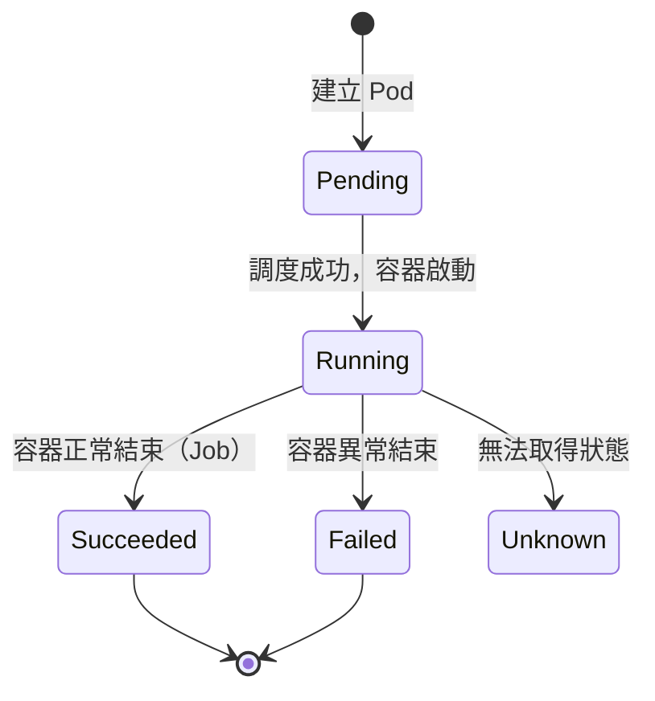

#### Deployment 完整範例

```yaml
apiVersion: apps/v1
kind: Deployment
metadata:
  name: order-service
  namespace: production
  labels:
    app: order-service
    version: v1.0.0
spec:
  replicas: 3
  selector:
    matchLabels:
      app: order-service
  strategy:
    type: RollingUpdate
    rollingUpdate:
      maxSurge: 1        # 更新時最多多出 1 個 Pod
      maxUnavailable: 0  # 更新時不允許有 Pod 不可用
  template:
    metadata:
      labels:
        app: order-service
        version: v1.0.0
      annotations:
        prometheus.io/scrape: "true"
        prometheus.io/port: "8080"
    spec:
      affinity:
        podAntiAffinity:
          preferredDuringSchedulingIgnoredDuringExecution:
          - weight: 100
            podAffinityTerm:
              labelSelector:
                matchLabels:
                  app: order-service
              topologyKey: kubernetes.io/hostname
      containers:
      - name: order-service
        image: myregistry/order-service:v1.0.0
        ports:
        - containerPort: 8080
          name: http
        env:
        - name: SPRING_PROFILES_ACTIVE
          value: "production"
        - name: DB_PASSWORD
          valueFrom:
            secretKeyRef:
              name: db-credentials
              key: password
        resources:
          requests:
            cpu: "250m"
            memory: "512Mi"
          limits:
            cpu: "1000m"
            memory: "1Gi"
        livenessProbe:
          httpGet:
            path: /actuator/health/liveness
            port: 8080
          initialDelaySeconds: 30
          periodSeconds: 10
        readinessProbe:
          httpGet:
            path: /actuator/health/readiness
            port: 8080
          initialDelaySeconds: 10
          periodSeconds: 5
        volumeMounts:
        - name: config
          mountPath: /app/config
          readOnly: true
      volumes:
      - name: config
        configMap:
          name: order-service-config
      terminationGracePeriodSeconds: 60
```

---

### 3.2 Service 類型說明

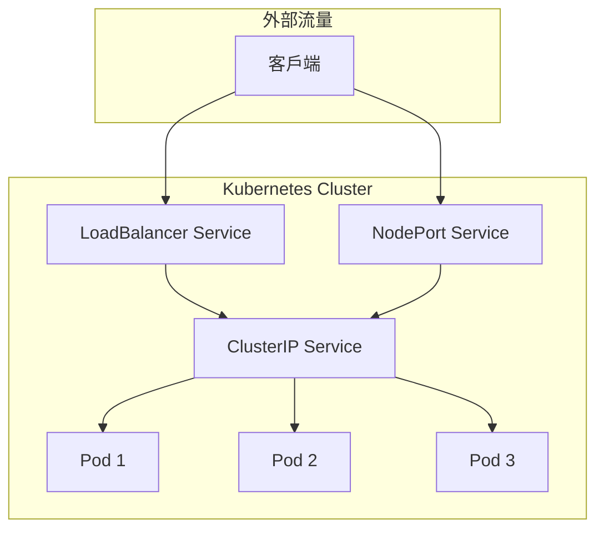

#### Service 類型比較

| 類型 | 用途 | 存取方式 |
|------|------|----------|
| **ClusterIP** | Cluster 內部通訊 | `service-name.namespace.svc.cluster.local` |
| **NodePort** | 對外暴露（測試用） | `<NodeIP>:<NodePort>` |
| **LoadBalancer** | 對外暴露（生產用） | 雲端 LB IP |
| **ExternalName** | 對應外部 DNS | DNS CNAME |

#### Service YAML 範例

```yaml
# ClusterIP Service
apiVersion: v1
kind: Service
metadata:
  name: order-service
  namespace: production
spec:
  type: ClusterIP
  selector:
    app: order-service
  ports:
  - name: http
    port: 80
    targetPort: 8080
    protocol: TCP
---
# LoadBalancer Service
apiVersion: v1
kind: Service
metadata:
  name: api-gateway
  namespace: production
  annotations:
    # AWS ALB 範例
    service.beta.kubernetes.io/aws-load-balancer-type: "nlb"
    service.beta.kubernetes.io/aws-load-balancer-internal: "true"
spec:
  type: LoadBalancer
  selector:
    app: api-gateway
  ports:
  - name: https
    port: 443
    targetPort: 8443
```

---

### 3.3 Ingress 與 Ingress Controller

#### Ingress 架構

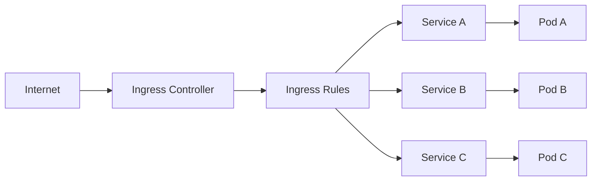

#### Ingress 設定範例

```yaml
apiVersion: networking.k8s.io/v1
kind: Ingress
metadata:
  name: main-ingress
  namespace: production
  annotations:
    nginx.ingress.kubernetes.io/ssl-redirect: "true"
    nginx.ingress.kubernetes.io/proxy-body-size: "50m"
    nginx.ingress.kubernetes.io/proxy-read-timeout: "60"
    cert-manager.io/cluster-issuer: "letsencrypt-prod"
spec:
  ingressClassName: nginx
  tls:
  - hosts:
    - api.example.com
    secretName: api-tls-secret
  rules:
  - host: api.example.com
    http:
      paths:
      - path: /orders
        pathType: Prefix
        backend:
          service:
            name: order-service
            port:
              number: 80
      - path: /users
        pathType: Prefix
        backend:
          service:
            name: user-service
            port:
              number: 80
      - path: /
        pathType: Prefix
        backend:
          service:
            name: api-gateway
            port:
              number: 80
```

#### 常用 Ingress Controller

| Controller | 特色 | 建議場景 |
|------------|------|----------|
| **NGINX Ingress** | 最普及、功能完整 | 通用場景 |
| **Traefik** | 設定簡單、自動 Let's Encrypt | 中小型專案 |
| **Kong Ingress** | 具備 API Gateway 功能 | 需要 API 管理 |
| **AWS ALB Ingress** | 與 AWS ALB 整合 | AWS 環境 |

---

### 3.4 ConfigMap / Secret

#### ConfigMap 使用方式

```yaml
# ConfigMap 定義
apiVersion: v1
kind: ConfigMap
metadata:
  name: app-config
  namespace: production
data:
  # 簡單鍵值
  LOG_LEVEL: "INFO"
  MAX_CONNECTIONS: "100"
  
  # 檔案內容
  application.yaml: |
    server:
      port: 8080
    spring:
      datasource:
        url: jdbc:postgresql://db-service:5432/mydb
---
# Pod 中使用 ConfigMap
apiVersion: v1
kind: Pod
metadata:
  name: app-pod
spec:
  containers:
  - name: app
    image: myapp:latest
    env:
    # 方式一：單一環境變數
    - name: LOG_LEVEL
      valueFrom:
        configMapKeyRef:
          name: app-config
          key: LOG_LEVEL
    # 方式二：所有 key 作為環境變數
    envFrom:
    - configMapRef:
        name: app-config
    # 方式三：掛載為檔案
    volumeMounts:
    - name: config-volume
      mountPath: /app/config
  volumes:
  - name: config-volume
    configMap:
      name: app-config
      items:
      - key: application.yaml
        path: application.yaml
```

#### Secret 使用方式

```yaml
# Secret 定義（Base64 編碼）
apiVersion: v1
kind: Secret
metadata:
  name: db-credentials
  namespace: production
type: Opaque
data:
  username: YWRtaW4=          # echo -n 'admin' | base64
  password: cGFzc3dvcmQxMjM=  # echo -n 'password123' | base64
---
# 使用 stringData（自動編碼）
apiVersion: v1
kind: Secret
metadata:
  name: db-credentials
type: Opaque
stringData:
  username: admin
  password: password123
```

#### ⚠️ Secret 安全建議

1. **啟用 etcd 加密**：預設 Secret 在 etcd 中未加密
2. **使用外部 Secret 管理**：HashiCorp Vault、AWS Secrets Manager
3. **限制 RBAC 權限**：最小權限原則
4. **不要在 Git 中存放 Secret**：使用 Sealed Secrets 或 SOPS

---

### 3.5 Resource Request / Limit

#### 資源設定說明

```yaml
resources:
  requests:
    cpu: "250m"      # 最低需求：0.25 CPU
    memory: "256Mi"  # 最低需求：256 MB
  limits:
    cpu: "1000m"     # 上限：1 CPU
    memory: "512Mi"  # 上限：512 MB
```

#### CPU 與 Memory 單位

| 資源 | 單位 | 說明 |
|------|------|------|
| CPU | `m`（毫核） | 1000m = 1 CPU |
| Memory | `Mi`（MiB）、`Gi`（GiB） | 二進位單位 |

#### 資源設定最佳實踐


| 情境 | Request 建議 | Limit 建議 |
|------|-------------|------------|
| **Java 應用** | 實際用量的 80% | Request 的 1.5-2 倍 |
| **Node.js 應用** | 實際用量的 80% | Request 的 1.2-1.5 倍 |
| **批次作業** | 可較低 | 與 Request 相同 |

---

### 3.6 Health Check（Liveness / Readiness / Startup）

#### 三種 Probe 比較

| Probe 類型 | 用途 | 失敗後果 |
|------------|------|----------|
| **Liveness** | 檢查容器是否存活 | 重啟容器 |
| **Readiness** | 檢查容器是否準備好接收流量 | 從 Service 移除 |
| **Startup** | 檢查應用是否啟動完成 | 阻擋其他 Probe |

#### 完整 Probe 設定範例

```yaml
spec:
  containers:
  - name: app
    image: myapp:latest
    # Startup Probe：用於啟動較慢的應用
    startupProbe:
      httpGet:
        path: /actuator/health
        port: 8080
      failureThreshold: 30
      periodSeconds: 10
    # Liveness Probe：存活檢查
    livenessProbe:
      httpGet:
        path: /actuator/health/liveness
        port: 8080
      initialDelaySeconds: 0
      periodSeconds: 10
      timeoutSeconds: 5
      failureThreshold: 3
    # Readiness Probe：就緒檢查
    readinessProbe:
      httpGet:
        path: /actuator/health/readiness
        port: 8080
      initialDelaySeconds: 0
      periodSeconds: 5
      timeoutSeconds: 3
      failureThreshold: 3
```

#### Probe 方式

```yaml
# HTTP GET
livenessProbe:
  httpGet:
    path: /health
    port: 8080
    httpHeaders:
    - name: Authorization
      value: Bearer xxx

# TCP Socket
livenessProbe:
  tcpSocket:
    port: 3306

# Exec Command
livenessProbe:
  exec:
    command:
    - cat
    - /tmp/healthy

# gRPC（Kubernetes 1.24+）
livenessProbe:
  grpc:
    port: 50051
```

#### ⚠️ 常見 Probe 設定錯誤

| 錯誤 | 後果 | 建議 |
|------|------|------|
| `initialDelaySeconds` 太短 | 啟動時不斷重啟 | 使用 Startup Probe |
| Liveness 檢查外部依賴 | 連鎖重啟 | Liveness 只檢查自身 |
| 未設定 Readiness | 啟動期間收到流量 | 務必設定 |
| `timeoutSeconds` 太短 | 高負載時誤判 | 設為 3-5 秒 |

---

## 第四章：Kubernetes 系統使用（實務操作）

### 4.1 kubectl 常用指令

#### 基本指令速查表

```bash
# ===== 查詢類 =====
# 查看所有資源（指定 namespace）
kubectl get all -n <namespace>

# 查看 Pod（含更多資訊）
kubectl get pods -o wide
kubectl get pods -o yaml
kubectl get pods -o json

# 查看資源詳情
kubectl describe pod <pod-name>
kubectl describe deployment <deployment-name>

# 查看 Label
kubectl get pods --show-labels
kubectl get pods -l app=myapp

# ===== 建立與刪除 =====
# 從 YAML 建立
kubectl apply -f deployment.yaml

# 快速建立（測試用）
kubectl create deployment nginx --image=nginx:latest

# 刪除資源
kubectl delete -f deployment.yaml
kubectl delete pod <pod-name>
kubectl delete pod <pod-name> --force --grace-period=0  # 強制刪除

# ===== 執行與除錯 =====
# 進入 Pod
kubectl exec -it <pod-name> -- /bin/bash

# 查看 Log
kubectl logs <pod-name>
kubectl logs <pod-name> -f              # 持續追蹤
kubectl logs <pod-name> --previous      # 前一個容器
kubectl logs <pod-name> -c <container>  # 指定容器

# 複製檔案
kubectl cp <pod-name>:/path/to/file ./local-file
kubectl cp ./local-file <pod-name>:/path/to/file

# ===== 資源管理 =====
# 擴縮容
kubectl scale deployment <name> --replicas=5

# 編輯資源
kubectl edit deployment <name>

# 打補丁
kubectl patch deployment <name> -p '{"spec":{"replicas":3}}'

# ===== 除錯工具 =====
# 執行臨時除錯 Pod
kubectl run debug --image=busybox -it --rm -- sh
kubectl run debug --image=nicolaka/netshoot -it --rm -- bash

# 端口轉發
kubectl port-forward pod/<pod-name> 8080:8080
kubectl port-forward svc/<service-name> 8080:80
```

#### kubectl 輸出格式

```bash
# JSON Path 查詢
kubectl get pods -o jsonpath='{.items[*].metadata.name}'
kubectl get pods -o jsonpath='{range .items[*]}{.metadata.name}{"\n"}{end}'

# Custom Columns
kubectl get pods -o custom-columns=NAME:.metadata.name,STATUS:.status.phase

# 排序
kubectl get pods --sort-by=.metadata.creationTimestamp
```

---

### 4.2 Deployment 發佈流程

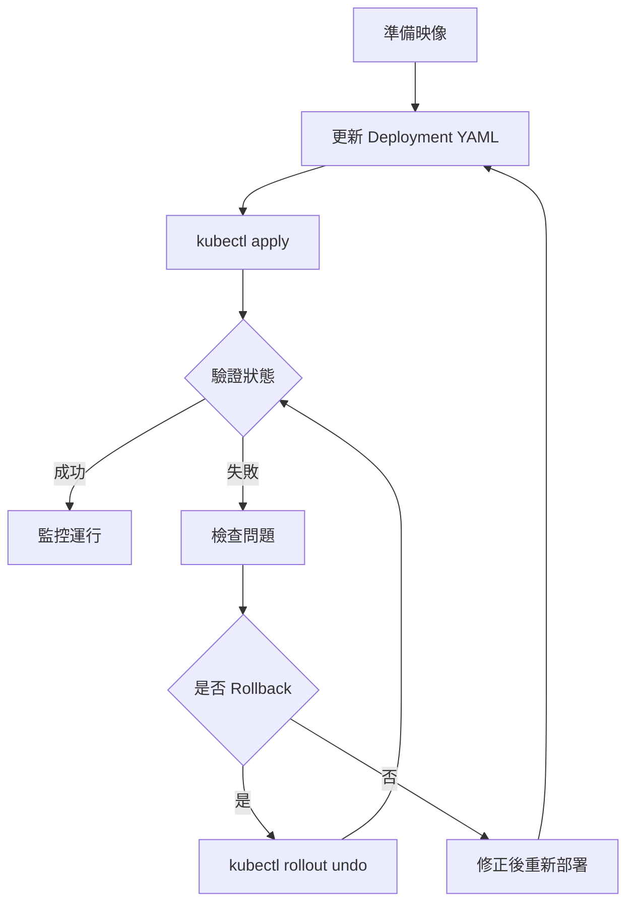

#### 發佈流程指令

```bash
# 1. 更新映像版本
kubectl set image deployment/order-service order-service=myregistry/order-service:v1.2.0

# 2. 或使用 apply
kubectl apply -f deployment.yaml

# 3. 查看發佈狀態
kubectl rollout status deployment/order-service

# 4. 查看發佈歷史
kubectl rollout history deployment/order-service
kubectl rollout history deployment/order-service --revision=2

# 5. 暫停/恢復發佈
kubectl rollout pause deployment/order-service
kubectl rollout resume deployment/order-service
```

---

### 4.3 滾動更新與回滾

#### 滾動更新策略

```yaml
spec:
  strategy:
    type: RollingUpdate
    rollingUpdate:
      maxSurge: 25%        # 更新時最多超出 25% Pod
      maxUnavailable: 25%  # 更新時最多 25% Pod 不可用
```

#### 回滾操作

```bash
# 回滾到上一版本
kubectl rollout undo deployment/order-service

# 回滾到指定版本
kubectl rollout undo deployment/order-service --to-revision=2

# 設定變更原因（方便追蹤）
kubectl annotate deployment/order-service kubernetes.io/change-cause="Rollback due to bug"
```

#### 藍綠部署（Blue-Green Deployment）

```yaml
# Blue 版本
apiVersion: apps/v1
kind: Deployment
metadata:
  name: app-blue
spec:
  replicas: 3
  selector:
    matchLabels:
      app: myapp
      version: blue
  template:
    metadata:
      labels:
        app: myapp
        version: blue
    spec:
      containers:
      - name: app
        image: myapp:v1
---
# Service 指向 Blue
apiVersion: v1
kind: Service
metadata:
  name: myapp
spec:
  selector:
    app: myapp
    version: blue  # 切換到 green 即可
  ports:
  - port: 80
```

---

### 4.4 Scaling（Manual / HPA）

#### 手動擴縮容

```bash
# 擴展到 5 個副本
kubectl scale deployment/order-service --replicas=5

# 根據條件擴展（只有在目前少於 5 個時才擴展）
kubectl scale deployment/order-service --current-replicas=3 --replicas=5
```

#### HPA（Horizontal Pod Autoscaler）

```yaml
apiVersion: autoscaling/v2
kind: HorizontalPodAutoscaler
metadata:
  name: order-service-hpa
  namespace: production
spec:
  scaleTargetRef:
    apiVersion: apps/v1
    kind: Deployment
    name: order-service
  minReplicas: 3
  maxReplicas: 10
  metrics:
  # CPU 使用率
  - type: Resource
    resource:
      name: cpu
      target:
        type: Utilization
        averageUtilization: 70
  # Memory 使用率
  - type: Resource
    resource:
      name: memory
      target:
        type: Utilization
        averageUtilization: 80
  # 自定義指標（需要 Prometheus Adapter）
  - type: Pods
    pods:
      metric:
        name: requests_per_second
      target:
        type: AverageValue
        averageValue: "1000"
  behavior:
    scaleDown:
      stabilizationWindowSeconds: 300  # 縮容冷卻期
      policies:
      - type: Percent
        value: 10
        periodSeconds: 60
    scaleUp:
      stabilizationWindowSeconds: 0
      policies:
      - type: Percent
        value: 100
        periodSeconds: 15
      - type: Pods
        value: 4
        periodSeconds: 15
```

```bash
# 查看 HPA 狀態
kubectl get hpa
kubectl describe hpa order-service-hpa
```

---

### 4.5 Debug 與故障排查

#### 故障排查流程

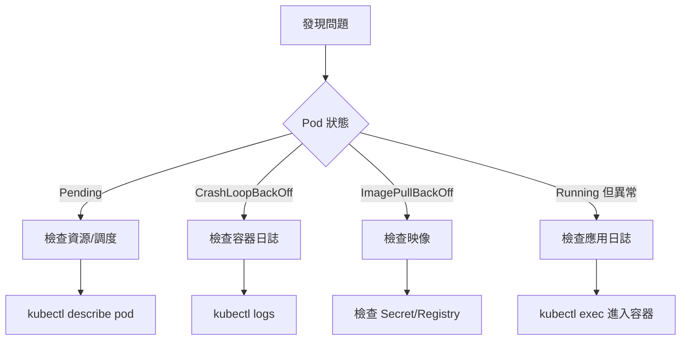

#### 常見問題診斷

```bash
# ===== Pod Pending =====
# 檢查事件
kubectl describe pod <pod-name> | grep -A 10 Events

# 常見原因：
# - Insufficient cpu/memory：資源不足
# - No nodes are available：沒有可用節點
# - PersistentVolumeClaim not found：PVC 問題

# ===== CrashLoopBackOff =====
# 查看當前日誌
kubectl logs <pod-name>

# 查看前一次日誌
kubectl logs <pod-name> --previous

# ===== ImagePullBackOff =====
# 檢查映像名稱是否正確
# 檢查 imagePullSecrets
kubectl get secret <secret-name> -o yaml

# ===== 網路問題 =====
# 使用 debug Pod 測試
kubectl run debug --image=nicolaka/netshoot -it --rm -- bash

# 在 debug Pod 中
nslookup <service-name>
curl http://<service-name>:<port>

# ===== 資源使用狀況 =====
kubectl top nodes
kubectl top pods
```

#### 進階除錯技巧

```bash
# 複製問題 Pod 進行除錯（Kubernetes 1.25+）
kubectl debug <pod-name> -it --image=busybox --copy-to=debug-pod

# 以特權模式除錯 Node
kubectl debug node/<node-name> -it --image=ubuntu

# 查看完整 YAML（含預設值）
kubectl get pod <pod-name> -o yaml

# 匯出 Event
kubectl get events --sort-by='.lastTimestamp' -n <namespace>
```

---

## 第五章：Kubernetes 維運與管理

### 5.1 Namespace 與多團隊隔離

#### Namespace 設計策略

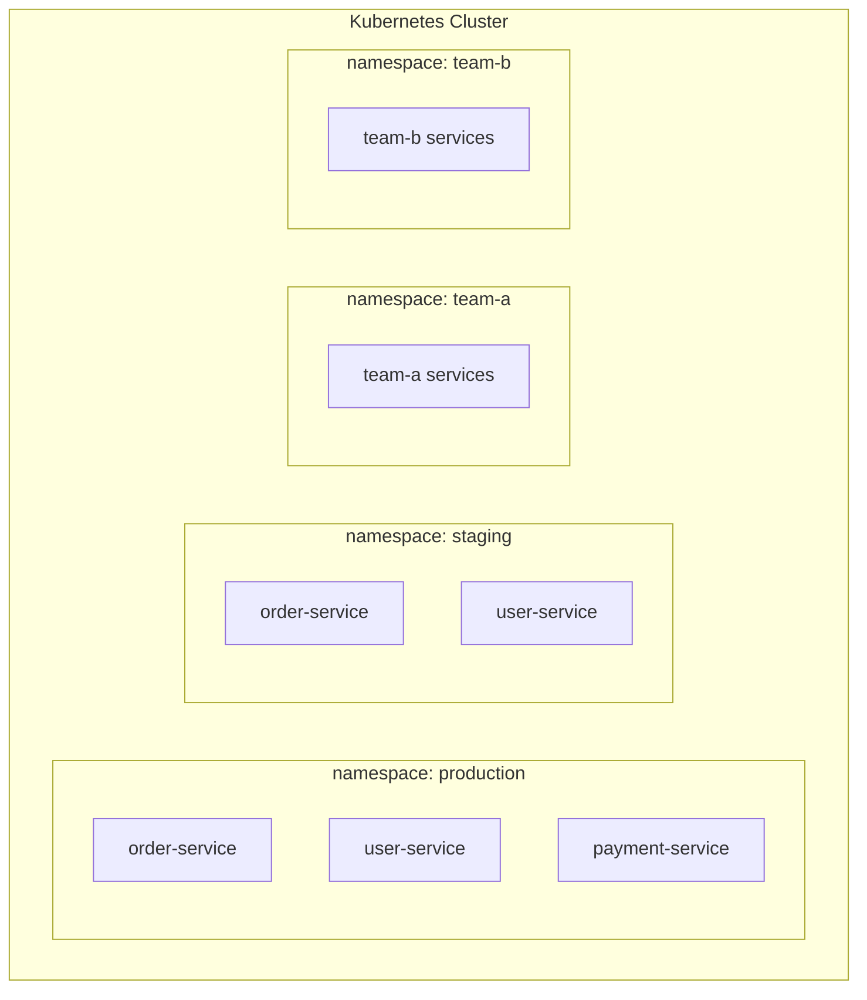

#### Namespace 建立與管理

```yaml
apiVersion: v1
kind: Namespace
metadata:
  name: production
  labels:
    environment: production
    team: platform
  annotations:
    description: "Production environment for core services"
---
# ResourceQuota：限制 Namespace 資源
apiVersion: v1
kind: ResourceQuota
metadata:
  name: production-quota
  namespace: production
spec:
  hard:
    requests.cpu: "20"
    requests.memory: "40Gi"
    limits.cpu: "40"
    limits.memory: "80Gi"
    pods: "100"
    services: "20"
    secrets: "50"
    configmaps: "50"
---
# LimitRange：設定預設資源限制
apiVersion: v1
kind: LimitRange
metadata:
  name: production-limits
  namespace: production
spec:
  limits:
  - default:
      cpu: "500m"
      memory: "512Mi"
    defaultRequest:
      cpu: "100m"
      memory: "128Mi"
    max:
      cpu: "2"
      memory: "4Gi"
    min:
      cpu: "50m"
      memory: "64Mi"
    type: Container
```

---

### 5.2 RBAC 權限控管

#### RBAC 架構

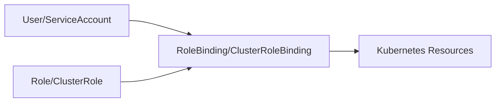

#### RBAC 設定範例

```yaml
# Role：Namespace 級別權限
apiVersion: rbac.authorization.k8s.io/v1
kind: Role
metadata:
  name: developer-role
  namespace: development
rules:
- apiGroups: [""]
  resources: ["pods", "pods/log", "services", "configmaps"]
  verbs: ["get", "list", "watch"]
- apiGroups: ["apps"]
  resources: ["deployments", "replicasets"]
  verbs: ["get", "list", "watch", "create", "update", "patch"]
---
# RoleBinding：綁定角色到使用者
apiVersion: rbac.authorization.k8s.io/v1
kind: RoleBinding
metadata:
  name: developer-binding
  namespace: development
subjects:
- kind: User
  name: developer@example.com
  apiGroup: rbac.authorization.k8s.io
- kind: Group
  name: developers
  apiGroup: rbac.authorization.k8s.io
roleRef:
  kind: Role
  name: developer-role
  apiGroup: rbac.authorization.k8s.io
---
# ClusterRole：叢集級別權限
apiVersion: rbac.authorization.k8s.io/v1
kind: ClusterRole
metadata:
  name: readonly-clusterrole
rules:
- apiGroups: [""]
  resources: ["*"]
  verbs: ["get", "list", "watch"]
- apiGroups: ["apps", "batch"]
  resources: ["*"]
  verbs: ["get", "list", "watch"]
---
# ServiceAccount（供應用程式使用）
apiVersion: v1
kind: ServiceAccount
metadata:
  name: order-service-sa
  namespace: production
---
# 綁定 ServiceAccount 到 Role
apiVersion: rbac.authorization.k8s.io/v1
kind: RoleBinding
metadata:
  name: order-service-binding
  namespace: production
subjects:
- kind: ServiceAccount
  name: order-service-sa
  namespace: production
roleRef:
  kind: Role
  name: service-role
  apiGroup: rbac.authorization.k8s.io
```

---

### 5.3 日誌與監控策略

#### 日誌收集架構

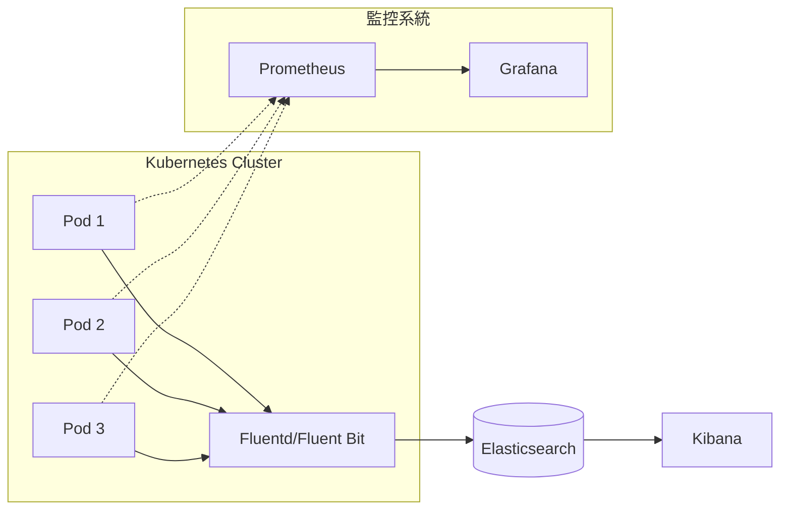

#### 日誌最佳實踐

```yaml
# Fluent Bit DaemonSet 範例
apiVersion: apps/v1
kind: DaemonSet
metadata:
  name: fluent-bit
  namespace: logging
spec:
  selector:
    matchLabels:
      app: fluent-bit
  template:
    metadata:
      labels:
        app: fluent-bit
    spec:
      serviceAccountName: fluent-bit
      containers:
      - name: fluent-bit
        image: fluent/fluent-bit:latest
        volumeMounts:
        - name: varlog
          mountPath: /var/log
        - name: varlibdockercontainers
          mountPath: /var/lib/docker/containers
          readOnly: true
        - name: config
          mountPath: /fluent-bit/etc/
      volumes:
      - name: varlog
        hostPath:
          path: /var/log
      - name: varlibdockercontainers
        hostPath:
          path: /var/lib/docker/containers
      - name: config
        configMap:
          name: fluent-bit-config
```

#### 應用程式日誌建議

```java
// Java 日誌格式建議（JSON 格式方便 ELK 解析）
{
  "timestamp": "2026-01-30T10:15:30.123Z",
  "level": "INFO",
  "logger": "com.example.OrderService",
  "message": "Order created successfully",
  "traceId": "abc123",
  "spanId": "def456",
  "orderId": "ORD-12345",
  "userId": "USR-67890"
}
```

---

### 5.4 常見營運風險與因應

| 風險 | 影響 | 因應措施 |
|------|------|----------|
| **etcd 故障** | 整個 Cluster 無法運作 | 定期備份、高可用部署 |
| **Node 故障** | 該 Node 上的 Pod 無法運作 | Pod Anti-affinity、多副本 |
| **資源耗盡** | 新 Pod 無法調度 | ResourceQuota、監控告警 |
| **憑證過期** | API Server 無法存取 | 憑證輪替自動化、監控到期日 |
| **映像拉取失敗** | Pod 無法啟動 | 私有 Registry、映像快取 |

#### 憑證管理

```bash
# 檢查憑證到期日
kubeadm certs check-expiration

# 更新憑證
kubeadm certs renew all

# 重啟 Control Plane 元件
systemctl restart kubelet
```

---

### 5.5 Cluster 容量與資源管理

#### 資源監控指標

```bash
# 查看 Node 資源使用
kubectl top nodes

# 查看 Pod 資源使用
kubectl top pods -A

# 查看資源配額使用狀況
kubectl describe resourcequota -n production
```

#### 容量規劃建議

| 場景 | CPU 預留 | Memory 預留 |
|------|----------|-------------|
| 系統元件 | 10-15% | 10-15% |
| 突發流量 | 20-30% | 20-30% |
| 建議可用 | 55-70% | 55-70% |

---

## 第六章：Kubernetes 升級策略

### 6.1 升級原則

#### 版本支援政策

- Kubernetes 每年發布 3 個 Minor 版本
- 每個版本支援約 14 個月
- **升級規則**：僅支援相鄰 Minor 版本升級（如 1.27 → 1.28）

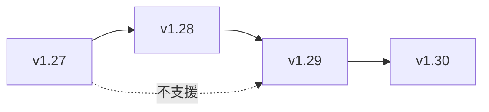

#### 升級順序

1. **etcd**（如果獨立部署）
2. **Control Plane**（API Server → Controller Manager → Scheduler）
3. **Worker Nodes**（逐一升級）
4. **kubelet / kubectl**

---

### 6.2 Control Plane 與 Node 升級順序

#### kubeadm 升級流程

```bash
# ===== 1. 升級 Control Plane =====
# 1.1 檢查可用版本
apt-cache madison kubeadm

# 1.2 升級 kubeadm
sudo apt-mark unhold kubeadm
sudo apt-get update
sudo apt-get install -y kubeadm=1.29.0-*
sudo apt-mark hold kubeadm

# 1.3 檢查升級計畫
sudo kubeadm upgrade plan

# 1.4 執行升級
sudo kubeadm upgrade apply v1.29.0

# 1.5 升級 kubelet 和 kubectl
sudo apt-mark unhold kubelet kubectl
sudo apt-get install -y kubelet=1.29.0-* kubectl=1.29.0-*
sudo apt-mark hold kubelet kubectl

# 1.6 重啟 kubelet
sudo systemctl daemon-reload
sudo systemctl restart kubelet

# ===== 2. 升級 Worker Nodes =====
# 2.1 標記 Node 不可調度
kubectl cordon <node-name>

# 2.2 驅逐 Pod
kubectl drain <node-name> --ignore-daemonsets --delete-emptydir-data

# 2.3 在 Worker Node 上升級
sudo apt-get update
sudo apt-get install -y kubeadm=1.29.0-*
sudo kubeadm upgrade node

sudo apt-get install -y kubelet=1.29.0-* kubectl=1.29.0-*
sudo systemctl daemon-reload
sudo systemctl restart kubelet

# 2.4 恢復調度
kubectl uncordon <node-name>
```

---

### 6.3 應用程式升級注意事項

#### PodDisruptionBudget（PDB）

```yaml
apiVersion: policy/v1
kind: PodDisruptionBudget
metadata:
  name: order-service-pdb
  namespace: production
spec:
  minAvailable: 2  # 最少保持 2 個 Pod
  # 或使用 maxUnavailable: 1
  selector:
    matchLabels:
      app: order-service
```

---

### 6.4 升級前檢查清單

```markdown
## Kubernetes 升級前檢查清單

### 事前準備
- [ ] 確認目標版本的 Release Notes
- [ ] 確認目標版本與現有版本相容（僅差一個 Minor 版本）
- [ ] 備份 etcd
- [ ] 備份所有 Kubernetes 資源（YAML）
- [ ] 確認 PDB 已設定
- [ ] 通知相關團隊

### 升級執行
- [ ] 升級 Control Plane
- [ ] 驗證 Control Plane 運作正常
- [ ] 逐一升級 Worker Node
- [ ] 每升級一個 Node 後驗證服務正常

### 升級後驗證
- [ ] 所有 Node 版本正確
- [ ] 所有系統 Pod 運作正常
- [ ] 應用程式運作正常
- [ ] 監控指標正常
- [ ] 執行 E2E 測試
```

---

## 第七章：應用系統串接 Kubernetes

### 7.1 CI/CD 整合流程

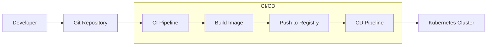

#### GitLab CI 範例

```yaml
# .gitlab-ci.yml
stages:
  - build
  - test
  - deploy

variables:
  IMAGE_TAG: $CI_REGISTRY_IMAGE:$CI_COMMIT_SHA

build:
  stage: build
  image: docker:latest
  services:
    - docker:dind
  script:
    - docker build -t $IMAGE_TAG .
    - docker push $IMAGE_TAG

deploy-staging:
  stage: deploy
  image: bitnami/kubectl:latest
  script:
    - kubectl config use-context staging
    - kubectl set image deployment/myapp myapp=$IMAGE_TAG -n staging
    - kubectl rollout status deployment/myapp -n staging
  environment:
    name: staging

deploy-production:
  stage: deploy
  image: bitnami/kubectl:latest
  script:
    - kubectl config use-context production
    - kubectl set image deployment/myapp myapp=$IMAGE_TAG -n production
    - kubectl rollout status deployment/myapp -n production
  environment:
    name: production
  when: manual  # 手動觸發
```

---

### 7.2 容器映像管理策略

#### 映像命名規範

```
<registry>/<project>/<image>:<tag>

範例：
myregistry.example.com/backend/order-service:v1.2.3
myregistry.example.com/backend/order-service:20260130-abc1234
```

#### 映像標籤策略

| 標籤類型 | 範例 | 用途 |
|----------|------|------|
| **語意版本** | `v1.2.3` | 正式發佈 |
| **Git SHA** | `abc1234` | 可追溯性 |
| **日期+SHA** | `20260130-abc1234` | 結合兩者 |
| **latest** | `latest` | **不建議用於生產** |

#### 映像安全掃描

```yaml
# 使用 Trivy 掃描映像
trivy image myregistry/order-service:v1.2.3

# 在 CI 中整合
scan:
  stage: test
  script:
    - trivy image --exit-code 1 --severity HIGH,CRITICAL $IMAGE_TAG
```

---

### 7.3 Helm 基本概念與使用

#### Helm 架構

```
mychart/
├── Chart.yaml          # Chart 元資料
├── values.yaml         # 預設值
├── values-prod.yaml    # 生產環境值
├── templates/          # Kubernetes 資源模板
│   ├── deployment.yaml
│   ├── service.yaml
│   ├── ingress.yaml
│   ├── configmap.yaml
│   └── _helpers.tpl    # 模板輔助函式
└── charts/             # 依賴的 Chart
```

#### Helm 常用指令

```bash
# 安裝 Chart
helm install myapp ./mychart -f values-prod.yaml -n production

# 升級
helm upgrade myapp ./mychart -f values-prod.yaml -n production

# 回滾
helm rollback myapp 1 -n production

# 查看歷史
helm history myapp -n production

# 查看渲染後的 YAML
helm template myapp ./mychart -f values-prod.yaml
```

#### values.yaml 範例

```yaml
# values.yaml
replicaCount: 3

image:
  repository: myregistry/order-service
  tag: "v1.0.0"
  pullPolicy: IfNotPresent

resources:
  requests:
    cpu: 250m
    memory: 512Mi
  limits:
    cpu: 1000m
    memory: 1Gi

service:
  type: ClusterIP
  port: 80

ingress:
  enabled: true
  hosts:
    - host: api.example.com
      paths:
        - path: /orders
          pathType: Prefix

env:
  SPRING_PROFILES_ACTIVE: production
```

---

### 7.4 外部系統整合

#### 資料庫連線

```yaml
# 使用 ExternalName Service 連接外部資料庫
apiVersion: v1
kind: Service
metadata:
  name: external-db
  namespace: production
spec:
  type: ExternalName
  externalName: db.example.com
---
# 或使用 Endpoints 指向固定 IP
apiVersion: v1
kind: Service
metadata:
  name: external-db
spec:
  ports:
  - port: 5432
---
apiVersion: v1
kind: Endpoints
metadata:
  name: external-db
subsets:
- addresses:
  - ip: 10.0.0.100
  ports:
  - port: 5432
```

#### Prometheus 整合

```yaml
# ServiceMonitor（需要 Prometheus Operator）
apiVersion: monitoring.coreos.com/v1
kind: ServiceMonitor
metadata:
  name: order-service-monitor
  namespace: monitoring
spec:
  selector:
    matchLabels:
      app: order-service
  namespaceSelector:
    matchNames:
    - production
  endpoints:
  - port: http
    path: /actuator/prometheus
    interval: 15s
```

---

## 第八章：最佳實踐與常見反模式

### 8.1 建議遵循的設計原則

#### ✅ 最佳實踐清單

| 類別 | 實踐 | 說明 |
|------|------|------|
| **資源管理** | 設定 Request/Limit | 確保資源可預測 |
| **高可用** | 設定 PDB | 避免升級時服務中斷 |
| **高可用** | Pod Anti-affinity | 分散 Pod 到不同 Node |
| **健康檢查** | 設定 Liveness/Readiness | 自動恢復異常 Pod |
| **安全性** | 使用 non-root 使用者 | 減少攻擊面 |
| **安全性** | 設定 NetworkPolicy | 限制 Pod 間通訊 |
| **可觀測性** | 結構化日誌（JSON） | 方便 ELK 解析 |
| **版本控制** | GitOps 管理 YAML | 可追溯、可審計 |

#### 安全設定範例

```yaml
spec:
  containers:
  - name: app
    image: myapp:latest
    securityContext:
      runAsNonRoot: true
      runAsUser: 1000
      readOnlyRootFilesystem: true
      allowPrivilegeEscalation: false
      capabilities:
        drop:
        - ALL
```

---

### 8.2 常見錯誤與踩雷經驗

#### ❌ 常見反模式

| 反模式 | 問題 | 建議做法 |
|--------|------|----------|
| 使用 `latest` 標籤 | 版本不可控 | 使用明確版本標籤 |
| 未設定 Resource Limit | 資源爭搶 | 必須設定 |
| Liveness 檢查外部依賴 | 連鎖重啟 | 只檢查自身 |
| 單一副本部署 | 無高可用 | 至少 2-3 副本 |
| Secret 存入 Git | 安全風險 | 使用 Sealed Secrets |
| 忽略 Pod 終止訊號 | 資料遺失 | 實作 Graceful Shutdown |

#### Graceful Shutdown 實作

```yaml
spec:
  terminationGracePeriodSeconds: 60
  containers:
  - name: app
    lifecycle:
      preStop:
        exec:
          command: ["/bin/sh", "-c", "sleep 10"]
```

```java
// Java Spring Boot 範例
@PreDestroy
public void onShutdown() {
    log.info("Received shutdown signal, completing in-flight requests...");
    // 完成進行中的請求
}
```

---

### 8.3 企業環境實務建議

#### 金融業特殊考量

| 需求 | 建議做法 |
|------|----------|
| **資料保護** | 啟用 etcd 加密、使用 Vault |
| **稽核日誌** | 啟用 API Server Audit Log |
| **網路隔離** | 使用 NetworkPolicy、Service Mesh |
| **合規性** | Pod Security Standards、OPA Gatekeeper |
| **災難復原** | 多 Cluster、跨機房部署 |

#### NetworkPolicy 範例

```yaml
# 只允許特定 Pod 存取資料庫
apiVersion: networking.k8s.io/v1
kind: NetworkPolicy
metadata:
  name: db-access-policy
  namespace: production
spec:
  podSelector:
    matchLabels:
      app: database
  policyTypes:
  - Ingress
  ingress:
  - from:
    - podSelector:
        matchLabels:
          access: database
    ports:
    - protocol: TCP
      port: 5432
```

---

## 附錄：檢查清單（Checklist）

### 🚀 附錄 A：新服務部署檢查清單

```markdown
## 部署前檢查
- [ ] Deployment YAML 已設定
  - [ ] replicas >= 2
  - [ ] Resource Request/Limit 已設定
  - [ ] Liveness/Readiness Probe 已設定
  - [ ] Pod Anti-affinity 已設定
- [ ] Service YAML 已設定
- [ ] ConfigMap/Secret 已建立
- [ ] Ingress 已設定（如需要）
- [ ] PodDisruptionBudget 已設定
- [ ] HPA 已設定（如需要）
- [ ] 映像已推送到 Registry
- [ ] 映像安全掃描已通過

## 部署後驗證
- [ ] Pod 狀態正常（Running）
- [ ] Service 可正常存取
- [ ] Ingress 可從外部存取
- [ ] 日誌正常輸出
- [ ] 監控指標正常
- [ ] 健康檢查端點正常
```

---

### 🔧 附錄 B：日常維運檢查清單

```markdown
## 每日檢查
- [ ] 檢查所有 Node 狀態
- [ ] 檢查 Pod 異常重啟
- [ ] 檢查資源使用率
- [ ] 檢查告警通知

## 每週檢查
- [ ] 檢查憑證到期日
- [ ] 檢查 etcd 備份
- [ ] 檢查 PVC 使用率
- [ ] 清理無用的映像

## 每月檢查
- [ ] 檢查 Kubernetes 版本更新
- [ ] 審視 RBAC 權限設定
- [ ] 審視 ResourceQuota 設定
- [ ] 災難復原演練
```

---

### 🔄 附錄 C：升級前檢查清單

```markdown
## 升級準備
- [ ] 閱讀目標版本 Release Notes
- [ ] 確認版本相容性
- [ ] 備份 etcd
- [ ] 備份所有 Kubernetes YAML
- [ ] 確認 PDB 已設定
- [ ] 安排維護時間窗口
- [ ] 通知相關團隊

## 升級執行
- [ ] 升級 Control Plane
- [ ] 驗證 Control Plane 正常
- [ ] 逐一升級 Worker Node
- [ ] 每個 Node 升級後驗證

## 升級後驗證
- [ ] 所有 Node 版本正確
- [ ] 系統 Pod 正常運作
- [ ] 應用服務正常運作
- [ ] 監控指標正常
- [ ] E2E 測試通過
```

---

## 📖 參考資源

- [Kubernetes 官方文件](https://kubernetes.io/docs/)
- [Kubernetes GitHub](https://github.com/kubernetes/kubernetes)
- [CNCF Landscape](https://landscape.cncf.io/)
- [Kubernetes Patterns（O'Reilly）](https://www.oreilly.com/library/view/kubernetes-patterns/9781492050278/)


