+++
date = '2026-01-26T21:17:47+08:00'
draft = false
title = 'Logs Visualization教學手冊'
+++
tags = ['教學', '工具', 'Visualization','ELK stack']
categories = ['教學']
+++


# Logs Visualization 教學手冊（ELK Stack）

> **版本**：1.0  
> **最後更新**：2026 年 1 月  
> **適用對象**：資深軟體工程師、系統架構師、SRE / DevOps 工程師 
> **最後更新**: 2026年1月26日  
> **適用於**: Logs Visualization 
> **Created by**: Eric Cheng


## 📋 目錄

1. [Logs Visualization 在企業系統中的定位](#1-logs-visualization-在企業系統中的定位)
   - [1.1 為什麼 Logs 是「第二套真實系統」](#11-為什麼-logs-是第二套真實系統)
   - [1.2 Logs vs Metrics vs Tracing](#12-logs-vs-metrics-vs-tracing)
   - [1.3 Logs 在 Dev / QA / Prod 的不同價值](#13-logs-在-dev--qa--prod-的不同價值)
2. [ELK Stack 整體架構設計](#2-elk-stack-整體架構設計)
   - [2.1 Log 產生端（Application / Middleware / OS）](#21-log-產生端application--middleware--os)
   - [2.2 Logstash Pipeline 設計原則](#22-logstash-pipeline-設計原則)
   - [2.3 Elasticsearch Index / Shard / Replica 設計](#23-elasticsearch-index--shard--replica-設計)
   - [2.4 Kibana 在視覺化與分析上的角色](#24-kibana-在視覺化與分析上的角色)
3. [Logstash 深度實務](#3-logstash-深度實務)
   - [3.1 Pipeline 架構設計（Input / Filter / Output）](#31-pipeline-架構設計input--filter--output)
   - [3.2 Grok / JSON / Mutate 實務技巧](#32-grok--json--mutate-實務技巧)
   - [3.3 效能調校與常見瓶頸](#33-效能調校與常見瓶頸)
   - [3.4 多來源 Log（App / DB / MQ / Batch）](#34-多來源-logapp--db--mq--batch)
4. [Elasticsearch 架構與效能設計](#4-elasticsearch-架構與效能設計)
   - [4.1 Index 設計策略](#41-index-設計策略)
   - [4.2 Mapping 與效能影響](#42-mapping-與效能影響)
   - [4.3 Hot / Warm / Cold 架構](#43-hot--warm--cold-架構)
   - [4.4 查詢效能與資源規劃](#44-查詢效能與資源規劃)
5. [Kibana 視覺化與分析設計](#5-kibana-視覺化與分析設計)
   - [5.1 Dashboard 設計原則（給誰看？看什麼？）](#51-dashboard-設計原則給誰看看什麼)
   - [5.2 Discover、Lens、Alerting 實務](#52-discoverlensalerting-實務)
   - [5.3 常見企業 Dashboard 範例](#53-常見企業-dashboard-範例)
6. [AI 輔助 Logs Visualization 的實戰應用](#6-ai-輔助-logs-visualization-的實戰應用)
   - [6.1 用 AI 協助撰寫 Elasticsearch Query](#61-用-ai-協助撰寫-elasticsearch-query)
   - [6.2 用 AI 分析錯誤 Log 與異常模式](#62-用-ai-分析錯誤-log-與異常模式)
   - [6.3 將 Logs 整理成 AI 可理解的 Prompt](#63-將-logs-整理成-ai-可理解的-prompt)
   - [6.4 AI 在 Incident Response 中的角色](#64-ai-在-incident-response-中的角色)
7. [常見問題、陷阱與最佳實務](#7-常見問題陷阱與最佳實務)
   - [7.1 Log 爆量的處理方式](#71-log-爆量的處理方式)
   - [7.2 Index 成長失控怎麼辦](#72-index-成長失控怎麼辦)
   - [7.3 資安與個資（PII）處理](#73-資安與個資pii處理)
   - [7.4 金融業常見稽核與法遵需求](#74-金融業常見稽核與法遵需求)
8. [企業級導入與治理建議](#8-企業級導入與治理建議)
   - [8.1 Log 規範與命名標準](#81-log-規範與命名標準)
   - [8.2 團隊分工與權限設計](#82-團隊分工與權限設計)
   - [8.3 與 CI/CD、APM、SIEM 的整合](#83-與-cicdapmsiem-的整合)
9. [檢查清單（Checklist）](#9-檢查清單checklist)
10. [附錄](#附錄)
    - [A. 常用 Elasticsearch Query 範例](#a-常用-elasticsearch-query-範例)
    - [B. 常用 KQL 查詢範例](#b-常用-kql-查詢範例)
    - [C. 參考資源](#c-參考資源)

---

## 1. Logs Visualization 在企業系統中的定位

### 1.1 為什麼 Logs 是「第二套真實系統」

在企業級系統中，**Logs 不只是除錯工具，而是系統行為的完整記錄**。當生產環境發生問題時，Logs 往往是唯一能還原「當時到底發生什麼事」的證據。

#### 核心觀念

```text
┌─────────────────────────────────────────────────────────────────┐
│                      系統的兩套真實                              │
├─────────────────────────────────────────────────────────────────┤
│  第一套真實：程式碼（Code）                                      │
│  ├── 定義系統「應該」如何運作                                    │
│  └── 靜態、可控、可版本管理                                      │
│                                                                 │
│  第二套真實：日誌（Logs）                                        │
│  ├── 記錄系統「實際」如何運作                                    │
│  └── 動態、即時、反映真實行為                                    │
└─────────────────────────────────────────────────────────────────┘
```

#### 為什麼這個觀念重要？

| 情境 | 程式碼告訴你 | Logs 告訴你 |
|------|-------------|-------------|
| 交易失敗 | 應該會重試 3 次 | 實際重試了 5 次，第 3 次 timeout |
| 效能問題 | 查詢應該 < 100ms | 實際 P99 是 2.3 秒 |
| 資安事件 | 應該會擋掉非法請求 | 有 500 筆異常請求來自同一 IP |
| 系統整合 | API 應該回傳 200 | 下游系統回傳 503，但沒有被正確處理 |

💡 **實戰建議**：把 Logs 視為「系統的黑盒子記錄器」，而非事後補救的工具。設計系統時，應該同時設計 Log 策略。

#### 金融業特殊考量

在銀行與金融系統中，Logs 還承擔以下責任：

1. **稽核軌跡（Audit Trail）**：每筆交易必須可追溯
2. **法遵要求（Compliance）**：主管機關要求保留特定年限
3. **事故調查（Incident Investigation）**：資安事件的法律證據
4. **營運報表（Operational Reporting）**：交易量、錯誤率等 KPI

⚠️ **常見錯誤**：許多團隊把 Logs 當成「開發階段的除錯工具」，上線後就關掉或降低 Log Level。這在金融業是嚴重的合規風險。

---

### 1.2 Logs vs Metrics vs Tracing

現代可觀測性（Observability）由三大支柱組成，各有不同用途：

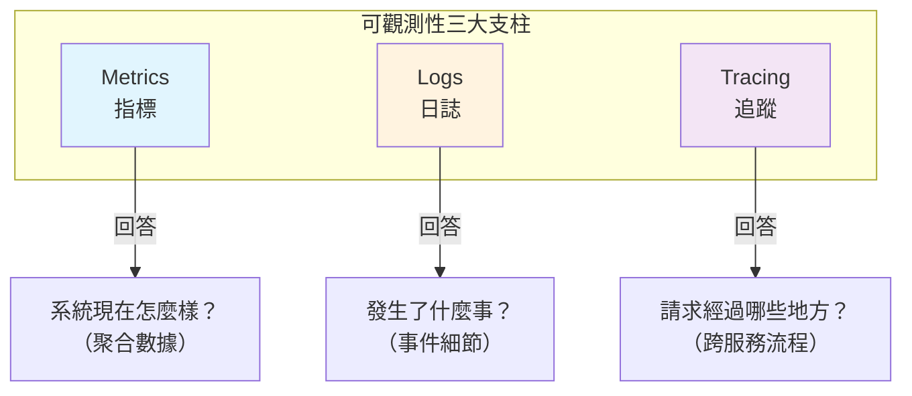

#### 三者比較

| 維度 | Metrics | Logs | Tracing |
|------|---------|------|---------|
| **資料型態** | 數值（可聚合） | 文字（事件） | 結構化 Span |
| **資料量** | 低（壓縮後） | 高（原始文字） | 中（採樣） |
| **查詢速度** | 極快 | 中等 | 中等 |
| **適用場景** | 監控、告警、趨勢 | 除錯、稽核、分析 | 分散式追蹤 |
| **典型工具** | Prometheus, Grafana | ELK, Splunk | Jaeger, Zipkin |
| **保留期限** | 長（壓縮儲存） | 中（依法規） | 短（採樣儲存） |

#### 實務應用場景

```text
問題：「為什麼今天下午 3 點交易失敗率突然上升？」

Step 1: Metrics（發現問題）
         └── Grafana 看到 error_rate 從 0.1% 跳到 5%

Step 2: Logs（定位原因）
         └── Kibana 搜尋該時段 ERROR logs
         └── 發現大量 "Connection timeout to payment-gateway"

Step 3: Tracing（追蹤路徑）
         └── Jaeger 查看失敗請求的完整呼叫鏈
         └── 發現 payment-gateway → bank-api 這段耗時異常
```

💡 **實戰建議**：不要期待單一工具解決所有問題。建立 Metrics → Logs → Tracing 的關聯機制（如 Trace ID），讓三者可以互相跳轉。

---

### 1.3 Logs 在 Dev / QA / Prod 的不同價值

不同環境對 Logs 的需求差異很大：

#### 環境比較表

| 維度 | Development | QA / Staging | Production |
|------|-------------|--------------|------------|
| **主要用途** | 除錯、開發驗證 | 功能測試、整合測試 | 監控、稽核、事故處理 |
| **Log Level** | DEBUG / TRACE | INFO / DEBUG | INFO / WARN / ERROR |
| **資料敏感度** | 低（測試資料） | 中（可能有真實資料） | 高（真實客戶資料） |
| **效能考量** | 不重要 | 中等 | 關鍵（不能影響效能） |
| **保留期限** | 短（幾天） | 中（數週） | 長（依法規，可能數年） |
| **存取權限** | 開發人員皆可 | 測試團隊 + 開發 | 嚴格管控 |

#### 各環境 Log 策略範例

#### Development 環境

```yaml
# log4j2.xml 範例
<Root level="DEBUG">
    <AppenderRef ref="Console"/>
    <AppenderRef ref="File"/>
</Root>

# 特點：
# - 輸出完整堆疊追蹤
# - 包含 SQL 查詢、HTTP 請求/回應 body
# - 可輸出到 Console 方便即時查看
```

#### Production 環境

```yaml
# log4j2.xml 範例
<Root level="INFO">
    <AppenderRef ref="AsyncFile"/>
    <AppenderRef ref="Logstash"/>
</Root>

# 特點：
# - 使用 Async Appender 避免阻塞
# - 敏感資料必須遮蔽
# - 結構化 JSON 格式方便解析
# - 直接送到 Logstash/Kafka
```

⚠️ **常見錯誤**：

1. **Dev 習慣帶到 Prod**：DEBUG level 在 Prod 開啟，造成 Log 爆量
2. **敏感資料外洩**：Dev 環境的 Log 格式（含完整資料）直接用在 Prod
3. **效能忽視**：同步寫 Log 造成 Latency 上升

---

## 2. ELK Stack 整體架構設計

### 2.1 Log 產生端（Application / Middleware / OS）

#### 企業級 Log 來源全景圖

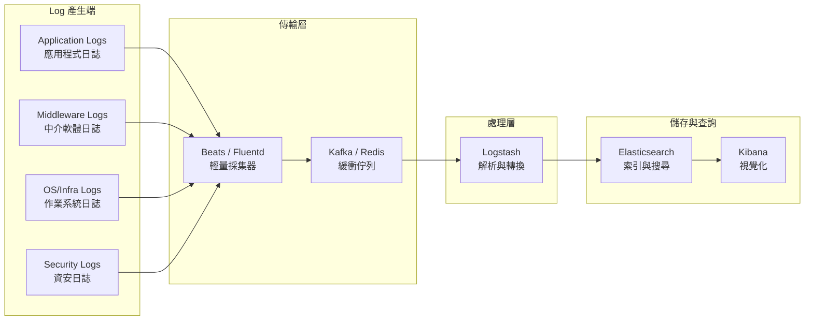

#### 各類 Log 來源詳解

| 類別 | 來源範例 | Log 內容 | 重要性 |
|------|---------|----------|--------|
| **Application** | Spring Boot, .NET, Node.js | 業務邏輯、交易記錄、例外 | ⭐⭐⭐⭐⭐ |
| **Middleware** | Nginx, Tomcat, WildFly | 存取日誌、錯誤、效能 | ⭐⭐⭐⭐ |
| **Database** | Oracle, PostgreSQL, MongoDB | 慢查詢、錯誤、連線 | ⭐⭐⭐⭐ |
| **Message Queue** | Kafka, RabbitMQ, IBM MQ | 訊息處理、延遲、失敗 | ⭐⭐⭐⭐ |
| **OS/Infra** | Linux syslog, Windows Event | 系統錯誤、資源警告 | ⭐⭐⭐ |
| **Security** | WAF, IDS, Firewall | 攻擊偵測、存取違規 | ⭐⭐⭐⭐⭐ |
| **Container** | Docker, Kubernetes | Pod 事件、容器日誌 | ⭐⭐⭐⭐ |

#### Application Log 結構化設計

#### ❌ 不好的 Log 格式（非結構化）

```text
2026-01-26 10:30:45 ERROR PaymentService - Payment failed for user john@example.com, amount 50000, card ending 1234
```

#### ✅ 好的 Log 格式（結構化 JSON）

```json
{
  "timestamp": "2026-01-26T10:30:45.123Z",
  "level": "ERROR",
  "logger": "com.bank.payment.PaymentService",
  "thread": "http-nio-8080-exec-15",
  "traceId": "abc123def456",
  "spanId": "789xyz",
  "service": "payment-service",
  "environment": "prod",
  "message": "Payment processing failed",
  "context": {
    "userId": "USR-78901",
    "transactionId": "TXN-20260126-001234",
    "amount": 50000,
    "currency": "TWD",
    "cardLast4": "****",
    "errorCode": "GATEWAY_TIMEOUT",
    "errorMessage": "Connection timeout after 30s"
  },
  "exception": {
    "class": "java.net.SocketTimeoutException",
    "message": "Read timed out",
    "stackTrace": "..."
  }
}
```

💡 **實戰建議**：

1. **必備欄位**：timestamp, level, traceId, service, message
2. **敏感資料遮蔽**：卡號、身分證、密碼等一律遮蔽
3. **使用 MDC**：利用 Mapped Diagnostic Context 自動注入 traceId
4. **避免 Log 模板變數**：`log.info("User {} login", userId)` 優於字串串接

---

### 2.2 Logstash Pipeline 設計原則

#### Pipeline 架構概念

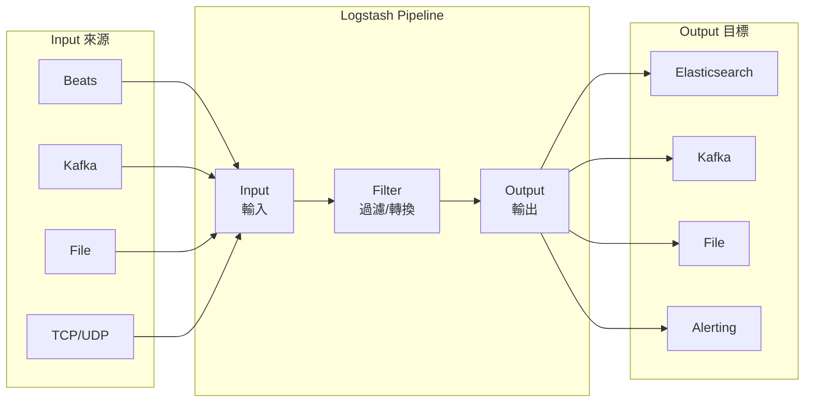

#### Pipeline 設計原則

| 原則 | 說明 | 範例 |
|------|------|------|
| **單一職責** | 每個 Pipeline 處理一種 Log 類型 | app-logs.conf, nginx-logs.conf |
| **解耦輸入輸出** | 使用 Kafka 作為緩衝，解耦生產與消費 | Input: Kafka → Output: ES |
| **失敗處理** | 定義 Dead Letter Queue | 無法解析的送到 DLQ |
| **效能優先** | 善用 Worker、Batch、Pipeline 並行 | workers: 4, batch_size: 1000 |

#### 基本 Pipeline 範例

```ruby
# /etc/logstash/conf.d/application-logs.conf

input {
  kafka {
    bootstrap_servers => "kafka-1:9092,kafka-2:9092,kafka-3:9092"
    topics => ["app-logs"]
    group_id => "logstash-app-logs"
    consumer_threads => 3
    codec => json
    decorate_events => true
  }
}

filter {
  # 解析 JSON（如果還不是）
  if [message] =~ /^\{/ {
    json {
      source => "message"
      target => "parsed"
    }
    mutate {
      rename => { "[parsed][timestamp]" => "@timestamp" }
      rename => { "[parsed][level]" => "level" }
      rename => { "[parsed][service]" => "service" }
      rename => { "[parsed][traceId]" => "traceId" }
    }
  }
  
  # 敏感資料遮蔽
  mutate {
    gsub => [
      "[parsed][context][email]", "(?<=.{3}).(?=.*@)", "*",
      "[parsed][context][phone]", "(?<=.{4}).(?=.{4})", "*"
    ]
  }
  
  # 添加處理時間戳
  ruby {
    code => "event.set('processed_at', Time.now.utc.iso8601(3))"
  }
  
  # 移除不需要的欄位
  mutate {
    remove_field => ["message", "@version", "host"]
  }
}

output {
  elasticsearch {
    hosts => ["es-1:9200", "es-2:9200", "es-3:9200"]
    index => "app-logs-%{[service]}-%{+YYYY.MM.dd}"
    user => "${ES_USER}"
    password => "${ES_PASSWORD}"
    ssl => true
    cacert => "/etc/logstash/certs/ca.crt"
  }
  
  # Dead Letter Queue for failed events
  if "_jsonparsefailure" in [tags] or "_grokparsefailure" in [tags] {
    elasticsearch {
      hosts => ["es-1:9200"]
      index => "dlq-app-logs-%{+YYYY.MM.dd}"
    }
  }
}
```

⚠️ **常見錯誤**：

1. **沒有 DLQ**：解析失敗的 Log 直接丟失
2. **單一 Pipeline 處理所有 Log**：難以維護、效能差
3. **沒有使用 Kafka 緩衝**：Logstash 重啟或 ES 壓力大時會丟 Log

---

### 2.3 Elasticsearch Index / Shard / Replica 設計

#### Index 命名策略

```text
索引命名規則：{類型}-{服務}-{日期}

範例：
├── app-logs-payment-service-2026.01.26
├── app-logs-user-service-2026.01.26
├── access-logs-nginx-2026.01.26
├── audit-logs-all-2026.01
└── security-logs-waf-2026.01.26
```

#### Shard 與 Replica 設計

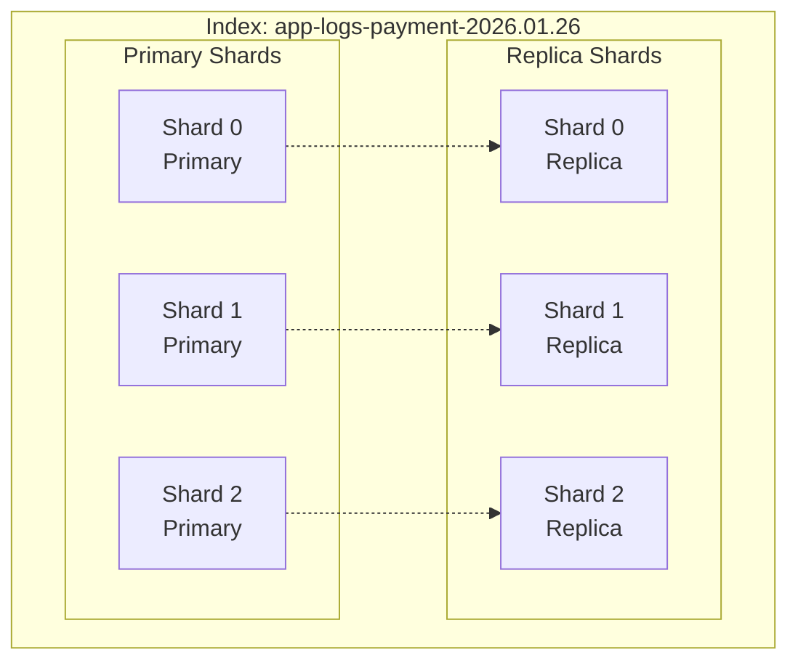

#### Shard 數量設計指南

| 單一 Shard 建議大小 | 情境 |
|---------------------|------|
| 10-30 GB | 時序資料（Logs） |
| 30-50 GB | 搜尋導向資料 |

**計算範例**：

```text
每日 Log 量：100 GB
建議 Shard 數：100 GB ÷ 25 GB = 4 Primary Shards
Replica：1（生產環境至少 1）
總 Shard 數：4 × 2 = 8 Shards
```

#### Index Template 設計

```json
PUT _index_template/app-logs-template
{
  "index_patterns": ["app-logs-*"],
  "priority": 100,
  "template": {
    "settings": {
      "number_of_shards": 3,
      "number_of_replicas": 1,
      "refresh_interval": "5s",
      "index.lifecycle.name": "logs-policy",
      "index.lifecycle.rollover_alias": "app-logs"
    },
    "mappings": {
      "dynamic": "strict",
      "properties": {
        "@timestamp": { "type": "date" },
        "level": { "type": "keyword" },
        "service": { "type": "keyword" },
        "traceId": { "type": "keyword" },
        "message": { "type": "text" },
        "context": {
          "type": "object",
          "dynamic": true
        },
        "exception": {
          "properties": {
            "class": { "type": "keyword" },
            "message": { "type": "text" },
            "stackTrace": { "type": "text", "index": false }
          }
        }
      }
    }
  }
}
```

💡 **實戰建議**：

1. **使用 Index Lifecycle Management（ILM）**：自動管理 Hot/Warm/Cold/Delete
2. **避免動態 Mapping**：使用 `"dynamic": "strict"` 防止 Mapping 爆炸
3. **Keyword vs Text**：用於過濾的欄位用 keyword，全文搜尋用 text

---

### 2.4 Kibana 在視覺化與分析上的角色

#### Kibana 核心功能定位

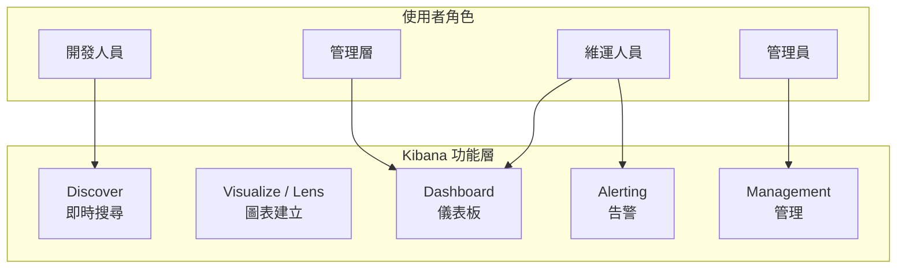

#### 各功能使用場景

| 功能 | 主要用途 | 適用角色 | 使用頻率 |
|------|---------|---------|---------|
| **Discover** | 即時 Log 搜尋、除錯 | 開發、維運 | 高 |
| **Lens/Visualize** | 建立圖表元件 | 維運、分析師 | 中 |
| **Dashboard** | 整合視圖、監控牆 | 全體 | 高 |
| **Alerting** | 異常告警、通知 | 維運、SRE | 持續 |
| **Dev Tools** | Query 測試、除錯 | 開發、維運 | 中 |

⚠️ **常見錯誤**：

1. **把 Kibana 當成唯一監控工具**：Kibana 適合深度分析，即時監控應搭配 Grafana
2. **Dashboard 過度複雜**：單一 Dashboard 塞太多圖表，反而看不到重點
3. **沒有設定 RBAC**：所有人都能看到所有 Log，造成資安風險

---

## 3. Logstash 深度實務

### 3.1 Pipeline 架構設計（Input / Filter / Output）

#### 多 Pipeline 架構

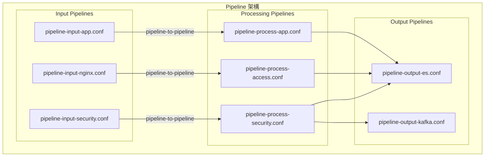

#### pipelines.yml 配置

```yaml
# /etc/logstash/pipelines.yml

# Application Logs Pipeline
- pipeline.id: app-logs
  path.config: "/etc/logstash/conf.d/app-logs.conf"
  pipeline.workers: 4
  pipeline.batch.size: 1000
  pipeline.batch.delay: 50
  queue.type: persisted
  queue.max_bytes: 4gb

# Access Logs Pipeline
- pipeline.id: access-logs
  path.config: "/etc/logstash/conf.d/access-logs.conf"
  pipeline.workers: 2
  pipeline.batch.size: 2000

# Security Logs Pipeline（高優先級）
- pipeline.id: security-logs
  path.config: "/etc/logstash/conf.d/security-logs.conf"
  pipeline.workers: 2
  pipeline.batch.size: 500
  queue.type: persisted
```

#### Input 設計考量

| Input Type | 適用場景 | 優點 | 缺點 |
|------------|---------|------|------|
| **Beats** | 輕量採集 | 資源佔用低 | 功能有限 |
| **Kafka** | 高流量、解耦 | 緩衝、重播 | 需維護 Kafka |
| **File** | 檔案型 Log | 簡單 | 不適合大量 |
| **TCP/UDP** | Syslog | 標準協定 | 可能丟失 |
| **HTTP** | Webhook、API | 靈活 | 需處理認證 |

---

### 3.2 Grok / JSON / Mutate 實務技巧

#### Grok Pattern 實務

#### Nginx Access Log 解析

```ruby
filter {
  grok {
    match => {
      "message" => '%{IPORHOST:client_ip} - %{DATA:user} \[%{HTTPDATE:timestamp}\] "%{WORD:method} %{URIPATHPARAM:request} HTTP/%{NUMBER:http_version}" %{NUMBER:status:int} %{NUMBER:bytes:int} "%{DATA:referrer}" "%{DATA:user_agent}" %{NUMBER:request_time:float}'
    }
    tag_on_failure => ["_grokparsefailure_nginx"]
  }
  
  # 解析時間戳
  date {
    match => ["timestamp", "dd/MMM/yyyy:HH:mm:ss Z"]
    target => "@timestamp"
    remove_field => ["timestamp"]
  }
  
  # GeoIP 解析
  geoip {
    source => "client_ip"
    target => "geo"
    fields => ["country_name", "city_name", "location"]
  }
  
  # User-Agent 解析
  useragent {
    source => "user_agent"
    target => "ua"
  }
}
```

#### 自訂 Grok Pattern

```ruby
# /etc/logstash/patterns/custom

# 銀行交易格式
BANK_TXN_ID TXN-%{YEAR}%{MONTHNUM}%{MONTHDAY}-%{NUMBER:6}
BANK_ACCOUNT [0-9]{3}-[0-9]{2}-[0-9]{7}-[0-9]
MASKED_CARD \*{12}[0-9]{4}

# 使用範例
filter {
  grok {
    patterns_dir => ["/etc/logstash/patterns"]
    match => {
      "message" => "%{BANK_TXN_ID:txn_id} %{BANK_ACCOUNT:account} %{MASKED_CARD:card}"
    }
  }
}
```

#### JSON 處理技巧

```ruby
filter {
  # 解析 JSON
  json {
    source => "message"
    target => "data"
    skip_on_invalid_json => true
    tag_on_failure => ["_jsonparsefailure"]
  }
  
  # 處理巢狀 JSON
  if [data][nested_json] {
    json {
      source => "[data][nested_json]"
      target => "[data][parsed_nested]"
    }
  }
  
  # 扁平化（flatten）
  ruby {
    code => '
      def flatten_hash(hash, parent_key = "", sep = "_")
        hash.each_with_object({}) do |(k, v), h|
          new_key = parent_key.empty? ? k : "#{parent_key}#{sep}#{k}"
          if v.is_a?(Hash)
            h.merge!(flatten_hash(v, new_key, sep))
          else
            h[new_key] = v
          end
        end
      end
      
      if event.get("[data]").is_a?(Hash)
        flattened = flatten_hash(event.get("[data]"))
        event.set("[flat]", flattened)
      end
    '
  }
}
```

#### Mutate 實務技巧

```ruby
filter {
  mutate {
    # 重新命名欄位
    rename => {
      "[data][userName]" => "[user][name]"
      "[data][userEmail]" => "[user][email]"
    }
    
    # 型別轉換
    convert => {
      "[data][amount]" => "float"
      "[data][count]" => "integer"
      "[data][success]" => "boolean"
    }
    
    # 字串處理
    lowercase => ["[user][email]"]
    strip => ["[data][message]"]
    gsub => [
      # 遮蔽信用卡號
      "[data][card_number]", "^(\d{4})\d{8}(\d{4})$", "\1********\2",
      # 遮蔽 Email
      "[user][email]", "(?<=.{3}).(?=.*@)", "*"
    ]
    
    # 移除欄位
    remove_field => ["message", "host", "@version"]
    
    # 添加欄位
    add_field => {
      "[meta][processed_by]" => "logstash-prod-01"
      "[meta][pipeline_version]" => "2.1.0"
    }
  }
}
```

💡 **實戰建議**：

1. **Grok 效能殺手**：複雜的 Grok pattern 會嚴重影響效能，優先使用 JSON 格式
2. **測試 Grok**：使用 Kibana Dev Tools 的 Grok Debugger 測試
3. **避免過度處理**：不是所有欄位都需要解析，只處理會查詢的欄位

---

### 3.3 效能調校與常見瓶頸

#### 效能參數調校

```yaml
# /etc/logstash/logstash.yml

# Worker 數量（建議 = CPU 核心數）
pipeline.workers: 8

# Batch 設定
pipeline.batch.size: 1000
pipeline.batch.delay: 50

# 記憶體設定
# /etc/logstash/jvm.options
-Xms4g
-Xmx4g

# 持久化 Queue（防止資料丟失）
queue.type: persisted
queue.max_bytes: 8gb
queue.checkpoint.writes: 1024
```

#### 常見瓶頸與解法

| 瓶頸 | 症狀 | 解法 |
|------|------|------|
| **Grok 過慢** | CPU 使用率高、吞吐量低 | 改用 JSON、簡化 Pattern |
| **ES 寫入慢** | Queue 堆積、背壓 | 增加 ES 節點、調整 Bulk 大小 |
| **記憶體不足** | OOM、頻繁 GC | 增加 Heap、使用持久化 Queue |
| **單一 Pipeline 瓶頸** | 某類 Log 處理慢影響其他 | 拆分多 Pipeline |
| **網路瓶頸** | Beats 傳輸延遲 | 使用 Kafka 緩衝、壓縮 |

#### 監控 Logstash 效能

```bash
# 查看 Pipeline 統計
curl -s localhost:9600/_node/stats/pipelines?pretty

# 關鍵指標
{
  "pipelines": {
    "app-logs": {
      "events": {
        "in": 1000000,           # 輸入事件數
        "filtered": 1000000,     # 過濾後事件數
        "out": 999500,           # 輸出事件數
        "duration_in_millis": 60000,
        "queue_push_duration_in_millis": 5000
      },
      "queue": {
        "events_count": 500,     # Queue 中等待的事件
        "max_queue_size_in_bytes": 8589934592
      }
    }
  }
}
```

---

### 3.4 多來源 Log（App / DB / MQ / Batch）

#### 多來源整合架構

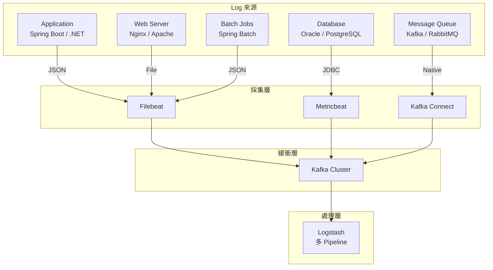

#### 各來源 Log 處理範例

#### Oracle 慢查詢 Log

```ruby
# oracle-slow-query.conf
input {
  jdbc {
    jdbc_driver_library => "/opt/oracle/ojdbc8.jar"
    jdbc_driver_class => "Java::oracle.jdbc.OracleDriver"
    jdbc_connection_string => "jdbc:oracle:thin:@//db-host:1521/ORCL"
    jdbc_user => "${ORACLE_USER}"
    jdbc_password => "${ORACLE_PASSWORD}"
    schedule => "*/5 * * * *"
    statement => "
      SELECT 
        sql_id,
        sql_text,
        elapsed_time/1000000 as elapsed_seconds,
        executions,
        buffer_gets,
        disk_reads,
        TO_CHAR(last_active_time, 'YYYY-MM-DD HH24:MI:SS') as last_active_time
      FROM v$sql 
      WHERE elapsed_time/1000000 > 5
      AND last_active_time > SYSDATE - 1/24
    "
    tracking_column => "last_active_time"
    use_column_value => true
  }
}

filter {
  mutate {
    add_field => { "log_type" => "oracle_slow_query" }
    add_field => { "database" => "ORCL" }
  }
}
```

#### Kafka Consumer Lag 監控

```ruby
# kafka-consumer-lag.conf
input {
  exec {
    command => "/opt/kafka/bin/kafka-consumer-groups.sh --bootstrap-server kafka:9092 --describe --all-groups 2>/dev/null | grep -v CONSUMER-ID"
    interval => 60
    codec => plain
  }
}

filter {
  split { field => "message" }
  
  grok {
    match => {
      "message" => "%{NOTSPACE:consumer_group}\s+%{NOTSPACE:topic}\s+%{NUMBER:partition:int}\s+%{NUMBER:current_offset:int}\s+%{NUMBER:log_end_offset:int}\s+%{NUMBER:lag:int}\s+%{NOTSPACE:consumer_id}\s+%{NOTSPACE:host}\s+%{NOTSPACE:client_id}"
    }
  }
  
  mutate {
    add_field => { "log_type" => "kafka_consumer_lag" }
  }
  
  # Lag 超過閾值標記
  if [lag] > 10000 {
    mutate {
      add_tag => ["high_lag"]
      add_field => { "alert_level" => "warning" }
    }
  }
}
```

⚠️ **常見錯誤**：

1. **沒有統一時間戳格式**：不同來源的時間格式不一致，難以關聯分析
2. **缺少 Log Type 標記**：混在一起的 Log 難以區分來源
3. **忽略時區問題**：尤其跨國系統，務必統一使用 UTC

---

## 4. Elasticsearch 架構與效能設計

### 4.1 Index 設計策略

#### 時序資料 Index 策略

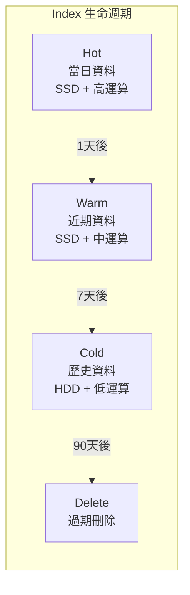

#### Index 命名規範

```text
格式：{環境}-{類型}-{服務}-{時間粒度}

範例：
├── prod-app-logs-payment-service-2026.01.26    # 每日
├── prod-app-logs-user-service-2026.01.26       # 每日
├── prod-audit-logs-all-2026.01                 # 每月（稽核需長期保留）
├── prod-metrics-system-2026.01.26              # 每日
└── prod-security-logs-waf-2026.01.26           # 每日
```

#### Index Lifecycle Management (ILM) 設計

```json
PUT _ilm/policy/logs-lifecycle-policy
{
  "policy": {
    "phases": {
      "hot": {
        "min_age": "0ms",
        "actions": {
          "rollover": {
            "max_age": "1d",
            "max_size": "30gb",
            "max_docs": 10000000
          },
          "set_priority": {
            "priority": 100
          }
        }
      },
      "warm": {
        "min_age": "1d",
        "actions": {
          "shrink": {
            "number_of_shards": 1
          },
          "forcemerge": {
            "max_num_segments": 1
          },
          "set_priority": {
            "priority": 50
          },
          "allocate": {
            "require": {
              "data": "warm"
            }
          }
        }
      },
      "cold": {
        "min_age": "7d",
        "actions": {
          "set_priority": {
            "priority": 0
          },
          "allocate": {
            "require": {
              "data": "cold"
            }
          },
          "freeze": {}
        }
      },
      "delete": {
        "min_age": "90d",
        "actions": {
          "delete": {}
        }
      }
    }
  }
}
```

---

### 4.2 Mapping 與效能影響

#### Mapping 設計原則

| 資料類型 | ES Type | 適用場景 | 效能影響 |
|---------|---------|---------|---------|
| 精確匹配 | `keyword` | status, level, traceId | 低，適合聚合 |
| 全文搜尋 | `text` | message, description | 高，建立倒排索引 |
| 時間 | `date` | @timestamp | 低，範圍查詢高效 |
| 數值 | `long/double` | amount, count | 低 |
| 布林 | `boolean` | success, enabled | 極低 |
| 不索引 | `enabled: false` | stackTrace（只存不查） | 無 |

#### 最佳化 Mapping 範例

```json
PUT _index_template/optimized-logs-template
{
  "index_patterns": ["prod-app-logs-*"],
  "template": {
    "settings": {
      "number_of_shards": 3,
      "number_of_replicas": 1,
      "index.mapping.total_fields.limit": 500,
      "index.mapping.depth.limit": 5,
      "index.mapping.nested_fields.limit": 20
    },
    "mappings": {
      "dynamic": "strict",
      "_source": {
        "enabled": true,
        "excludes": ["stackTrace"]
      },
      "properties": {
        "@timestamp": {
          "type": "date",
          "format": "strict_date_optional_time||epoch_millis"
        },
        "level": {
          "type": "keyword",
          "ignore_above": 16
        },
        "service": {
          "type": "keyword",
          "ignore_above": 64
        },
        "traceId": {
          "type": "keyword",
          "ignore_above": 64
        },
        "message": {
          "type": "text",
          "analyzer": "standard",
          "fields": {
            "keyword": {
              "type": "keyword",
              "ignore_above": 256
            }
          }
        },
        "context": {
          "type": "object",
          "dynamic": true
        },
        "exception": {
          "properties": {
            "class": { "type": "keyword" },
            "message": { "type": "text" },
            "stackTrace": {
              "type": "text",
              "index": false,
              "doc_values": false
            }
          }
        }
      }
    }
  }
}
```

⚠️ **Mapping 常見錯誤**：

1. **Mapping Explosion**：動態 Mapping 導致欄位數爆炸
2. **Text 過度使用**：所有字串都用 text，浪費資源
3. **沒有 ignore_above**：長字串超過限制導致錯誤
4. **巢狀過深**：超過 5 層的巢狀結構效能差

---

### 4.3 Hot / Warm / Cold 架構

#### 節點角色設計

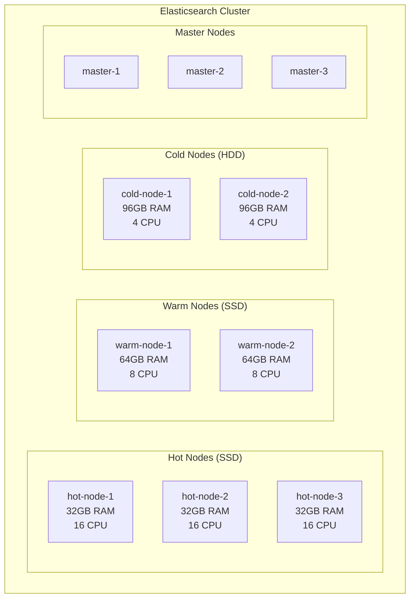

#### 節點配置

```yaml
# Hot Node 配置
# elasticsearch.yml
node.name: hot-node-1
node.roles: [data_hot, data_content]
node.attr.data: hot
path.data: /ssd/elasticsearch/data

# Warm Node 配置
node.name: warm-node-1
node.roles: [data_warm]
node.attr.data: warm
path.data: /ssd/elasticsearch/data

# Cold Node 配置
node.name: cold-node-1
node.roles: [data_cold, data_frozen]
node.attr.data: cold
path.data: /hdd/elasticsearch/data

# Master Node 配置
node.name: master-1
node.roles: [master]
```

#### 硬體規劃指南

| 節點類型 | CPU | RAM | 儲存 | 網路 |
|---------|-----|-----|------|------|
| **Hot** | 高（16+ cores） | 32-64 GB | NVMe SSD | 10 Gbps |
| **Warm** | 中（8 cores） | 64-128 GB | SSD | 10 Gbps |
| **Cold** | 低（4 cores） | 64-128 GB | HDD | 1 Gbps |
| **Master** | 中（4 cores） | 16-32 GB | SSD（小容量） | 10 Gbps |

💡 **實戰建議**：

1. **RAM 與 Heap**：Heap 設為 RAM 的 50%，最大不超過 31 GB
2. **儲存計算**：Hot 節點資料量 = 每日寫入量 × Hot 天數 × 1.2（overhead）
3. **最少節點數**：生產環境至少 3 個 Master、3 個 Hot、2 個 Warm

---

### 4.4 查詢效能與資源規劃

#### 查詢效能最佳化

#### 高效查詢範例

```json
// ✅ 好的查詢：使用 filter context（可快取）
GET app-logs-*/_search
{
  "query": {
    "bool": {
      "filter": [
        { "term": { "level": "ERROR" } },
        { "term": { "service": "payment-service" } },
        { "range": { "@timestamp": { "gte": "now-1h" } } }
      ],
      "must": [
        { "match": { "message": "timeout" } }
      ]
    }
  },
  "size": 100,
  "_source": ["@timestamp", "level", "service", "message", "traceId"],
  "sort": [{ "@timestamp": "desc" }]
}

// ❌ 不好的查詢：wildcard 開頭、未限制時間範圍
GET app-logs-*/_search
{
  "query": {
    "wildcard": { "message": "*timeout*" }
  }
}
```

#### 聚合查詢最佳化

```json
// 錯誤率統計（按服務、每小時）
GET app-logs-*/_search
{
  "size": 0,
  "query": {
    "bool": {
      "filter": [
        { "range": { "@timestamp": { "gte": "now-24h" } } }
      ]
    }
  },
  "aggs": {
    "by_service": {
      "terms": {
        "field": "service",
        "size": 20
      },
      "aggs": {
        "by_hour": {
          "date_histogram": {
            "field": "@timestamp",
            "calendar_interval": "hour"
          },
          "aggs": {
            "error_count": {
              "filter": { "term": { "level": "ERROR" } }
            },
            "total_count": {
              "value_count": { "field": "_id" }
            },
            "error_rate": {
              "bucket_script": {
                "buckets_path": {
                  "errors": "error_count._count",
                  "total": "total_count"
                },
                "script": "params.total > 0 ? params.errors / params.total * 100 : 0"
              }
            }
          }
        }
      }
    }
  }
}
```

#### 資源規劃計算

#### 容量規劃公式

```text
日寫入量（原始）：R GB/day
壓縮比：約 10:1（JSON Log）
索引 Overhead：約 1.5x

每日儲存需求 = R × 0.1 × 1.5 = R × 0.15 GB

範例：
- 每日原始 Log：1 TB
- 壓縮後：100 GB
- 含索引：150 GB
- 保留 90 天：150 × 90 = 13.5 TB
- 含 Replica：13.5 × 2 = 27 TB
```

---

## 5. Kibana 視覺化與分析設計

### 5.1 Dashboard 設計原則（給誰看？看什麼？）

#### Dashboard 分層設計

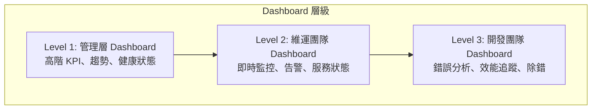

#### 各角色 Dashboard 設計

| 角色 | 關注重點 | 更新頻率 | 複雜度 |
|------|---------|---------|--------|
| **管理層** | 可用性、SLA、趨勢 | 每小時/每日 | 簡單 |
| **維運/SRE** | 即時狀態、告警、資源 | 即時（5s-1min） | 中等 |
| **開發團隊** | 錯誤細節、Trace、除錯 | 即時 | 複雜 |
| **資安團隊** | 異常存取、攻擊偵測 | 即時 | 中等 |

#### Dashboard 設計最佳實務

```text
✅ 好的 Dashboard：
├── 清楚的標題與說明
├── 從高階到細節的資訊流
├── 一致的顏色編碼（紅=錯誤、黃=警告、綠=正常）
├── 合理的時間範圍預設
├── 可點擊深入（Drill-down）
└── 不超過 15 個視覺化元件

❌ 不好的 Dashboard：
├── 塞滿整個螢幕的圖表
├── 沒有上下文的數字
├── 不一致的時間範圍
├── 過度複雜的聚合
└── 沒有標示單位
```

---

### 5.2 Discover、Lens、Alerting 實務

#### Discover 高效搜尋技巧

#### KQL（Kibana Query Language）範例

```text
# 基本搜尋
level: ERROR and service: payment-service

# 時間範圍
@timestamp >= "2026-01-26T00:00:00" and @timestamp < "2026-01-27T00:00:00"

# 萬用字元
message: *timeout* and service: payment*

# 排除
level: ERROR and not service: test-service

# 組合條件
(level: ERROR or level: WARN) and service: (payment-service or user-service)

# 存在性檢查
exception.class: * and level: ERROR

# 數值範圍
context.response_time > 1000 and context.response_time <= 5000
```

#### Lucene Query 範例（進階）

```text
# 正規表達式
message: /.*Connection refused.*/

# 模糊搜尋（容錯 1 個字元）
message: timout~1

# 鄰近搜尋（timeout 和 connection 相距 5 個字以內）
message: "timeout connection"~5

# 欄位存在
_exists_: exception.stackTrace

# 範圍查詢
context.amount: [1000 TO 50000]
```

#### Lens 視覺化建立

#### 常用視覺化類型選擇

| 資料類型 | 推薦視覺化 | 適用場景 |
|---------|-----------|---------|
| 時序計數 | Line Chart | 錯誤率趨勢、請求量 |
| 分類計數 | Bar Chart (Vertical) | 各服務錯誤數 |
| 佔比 | Pie / Donut | 錯誤類型分布 |
| 單一數值 | Metric | 總錯誤數、可用性 |
| 表格資料 | Data Table | Top N 錯誤、慢查詢 |
| 地理分布 | Map | 請求來源地區 |
| 熱度 | Heatmap | 時段 × 服務 錯誤分布 |

#### Alerting 規則設計

```json
// Kibana Alerting Rule 範例：錯誤率超標告警
{
  "name": "Payment Service High Error Rate",
  "consumer": "alerts",
  "rule_type_id": ".es-query",
  "schedule": { "interval": "1m" },
  "params": {
    "index": ["app-logs-payment-service-*"],
    "timeField": "@timestamp",
    "searchType": "esQuery",
    "esQuery": {
      "query": {
        "bool": {
          "filter": [
            { "term": { "service": "payment-service" } },
            { "term": { "level": "ERROR" } },
            { "range": { "@timestamp": { "gte": "now-5m" } } }
          ]
        }
      }
    },
    "threshold": [50],
    "thresholdComparator": ">"
  },
  "actions": [
    {
      "group": "threshold met",
      "id": "slack-connector-id",
      "params": {
        "message": "🚨 Payment Service 錯誤率過高！\n過去 5 分鐘錯誤數：{{context.value}}\n請立即檢查：{{context.link}}"
      }
    },
    {
      "group": "threshold met",
      "id": "pagerduty-connector-id",
      "params": {
        "severity": "critical",
        "summary": "Payment Service High Error Rate Alert"
      }
    }
  ]
}
```

---

### 5.3 常見企業 Dashboard 範例

#### 範例 1：服務健康總覽 Dashboard

```text
┌────────────────────────────────────────────────────────────────┐
│  Service Health Overview                    [Last 24 hours ▼] │
├────────────────────────────────────────────────────────────────┤
│  ┌──────────┐  ┌──────────┐  ┌──────────┐  ┌──────────┐       │
│  │ 99.95%   │  │  1.2M    │  │  0.05%   │  │  125ms   │       │
│  │ Uptime   │  │ Requests │  │ Error %  │  │ P95 Lat  │       │
│  └──────────┘  └──────────┘  └──────────┘  └──────────┘       │
├────────────────────────────────────────────────────────────────┤
│  [Request Volume & Error Rate - Line Chart]                    │
│  ▁▂▃▄▅▆▇█▇▆▅▄▃▂▁▂▃▄▅▆▇█▇▆▅▄▃▂▁                               │
├────────────────────────────────────────────────────────────────┤
│  ┌─────────────────────────┐  ┌─────────────────────────────┐ │
│  │ Error by Service        │  │ Error by Type               │ │
│  │ [Bar Chart]             │  │ [Donut Chart]               │ │
│  │ payment: ████████ 450   │  │  Timeout: 45%               │ │
│  │ user:    ████ 200       │  │  DB Error: 30%              │ │
│  │ order:   ██ 100         │  │  Validation: 25%            │ │
│  └─────────────────────────┘  └─────────────────────────────┘ │
├────────────────────────────────────────────────────────────────┤
│  [Top 10 Errors - Data Table]                                  │
│  Exception                  | Service  | Count | Last Seen    │
│  ───────────────────────────┼──────────┼───────┼─────────────  │
│  SocketTimeoutException     │ payment  │  230  │ 2 min ago    │
│  DataIntegrityViolation     │ order    │   85  │ 5 min ago    │
└────────────────────────────────────────────────────────────────┘
```

#### 範例 2：交易監控 Dashboard（金融業）

```text
┌────────────────────────────────────────────────────────────────┐
│  Transaction Monitoring                     [Last 1 hour ▼]   │
├────────────────────────────────────────────────────────────────┤
│  ┌──────────┐  ┌──────────┐  ┌──────────┐  ┌──────────┐       │
│  │  15,234  │  │ NT$ 2.3B │  │  99.8%   │  │    12    │       │
│  │ Total Tx │  │  Amount  │  │ Success  │  │ Failures │       │
│  └──────────┘  └──────────┘  └──────────┘  └──────────┘       │
├────────────────────────────────────────────────────────────────┤
│  [Transaction Volume by Channel - Stacked Area]                │
│  █ Mobile  █ Web  █ ATM  █ Branch                             │
│  ▁▂▃▄▅▆▇█▇▆▅▄▃▂▁▂▃▄▅▆▇█▇▆▅▄▃▂▁                               │
├────────────────────────────────────────────────────────────────┤
│  ┌─────────────────────────┐  ┌─────────────────────────────┐ │
│  │ Tx by Type              │  │ Response Time Distribution  │ │
│  │ Transfer:  ████████ 45% │  │ [Histogram]                 │ │
│  │ Payment:   ██████ 30%   │  │ < 100ms:  ████████████ 80%  │ │
│  │ Inquiry:   ████ 20%     │  │ 100-500ms: ████ 15%         │ │
│  │ Other:     █ 5%         │  │ > 500ms:   █ 5%             │ │
│  └─────────────────────────┘  └─────────────────────────────┘ │
├────────────────────────────────────────────────────────────────┤
│  [Failed Transactions - Table with drill-down]                 │
│  Time        | TxnId          | Type     | Error      | Amount │
│  ────────────┼────────────────┼──────────┼────────────┼─────── │
│  10:35:22    │ TXN-2026012... │ Transfer │ TIMEOUT    │ 50,000 │
│  10:33:15    │ TXN-2026012... │ Payment  │ DECLINED   │ 12,000 │
└────────────────────────────────────────────────────────────────┘
```

---

## 6. AI 輔助 Logs Visualization 的實戰應用

### 6.1 用 AI 協助撰寫 Elasticsearch Query

#### 使用情境

當需要撰寫複雜的 ES Query 時，可以請 AI 協助：

#### Prompt 範例 1：基本查詢

```text
我需要一個 Elasticsearch 查詢，條件如下：
- Index: app-logs-*
- 時間範圍: 過去 24 小時
- 條件: level 是 ERROR，service 是 payment-service
- 排序: 按時間降序
- 只回傳: @timestamp, level, message, traceId
- 最多 100 筆

請給我完整的 ES Query JSON。
```

#### AI 回應範例

```json
GET app-logs-*/_search
{
  "query": {
    "bool": {
      "filter": [
        { "term": { "level": "ERROR" } },
        { "term": { "service": "payment-service" } },
        { "range": { "@timestamp": { "gte": "now-24h" } } }
      ]
    }
  },
  "size": 100,
  "_source": ["@timestamp", "level", "message", "traceId"],
  "sort": [{ "@timestamp": "desc" }]
}
```

#### Prompt 範例 2：複雜聚合

```text
我需要分析過去 7 天的錯誤趨勢：
1. 按服務分組
2. 每個服務按小時統計錯誤數
3. 計算每小時的錯誤率（錯誤數/總數）
4. 只看錯誤率超過 1% 的時段

請給我 ES Query。
```

#### AI 輔助的限制與注意事項

⚠️ **注意事項**：

1. **驗證 Query**：AI 產生的 Query 需要在 Dev Tools 測試
2. **效能檢查**：AI 可能不考慮效能，需人工確認
3. **版本差異**：確認 Query 語法與 ES 版本相容
4. **敏感資料**：不要把真實 Log 內容貼給外部 AI

---

### 6.2 用 AI 分析錯誤 Log 與異常模式

#### 錯誤分析 Prompt 範例

```text
以下是過去 1 小時 payment-service 的 ERROR logs 摘要：

1. SocketTimeoutException - 230 次
   - 主要發生在 10:30-10:45
   - 都是連接 payment-gateway.bank.com:443

2. DataIntegrityViolationException - 85 次
   - 分散在整個小時
   - duplicate key value violates unique constraint "pk_transaction"

3. IllegalArgumentException - 45 次
   - Invalid currency code: null

請分析：
1. 這些錯誤的可能根本原因
2. 優先處理順序
3. 建議的排查步驟
```

#### AI 分析結果範例

```text
## 錯誤分析報告

### 1. SocketTimeoutException（最高優先）
**可能原因**：
- payment-gateway 在 10:30-10:45 期間發生問題
- 可能是網路問題、下游服務過載或部署

**排查步驟**：
1. 檢查該時段 payment-gateway 的 metrics/logs
2. 確認網路連線狀態（ping, traceroute）
3. 檢查是否有該時段的變更部署

### 2. DataIntegrityViolationException（中優先）
**可能原因**：
- 重複交易 ID 產生邏輯有問題
- 可能有重試機制未正確處理

**排查步驟**：
1. 檢查交易 ID 產生邏輯（是否有 race condition）
2. 確認重試機制是否有 idempotency key

### 3. IllegalArgumentException（低優先）
**可能原因**：
- 上游傳入的資料缺少 currency code
- 輸入驗證不完整

**排查步驟**：
1. 追蹤這些請求的來源（traceId）
2. 確認 API contract 是否清楚定義 currency 必填
```

---

### 6.3 將 Logs 整理成 AI 可理解的 Prompt

#### Log 整理技巧

#### 原始 Log（雜亂、資訊過多）

```text
{"@timestamp":"2026-01-26T10:30:45.123Z","level":"ERROR","logger":"com.bank.payment.service.PaymentGatewayClient","thread":"http-nio-8080-exec-15","traceId":"abc123","spanId":"def456","service":"payment-service","environment":"prod","message":"Failed to process payment","context":{"userId":"USR-78901","transactionId":"TXN-20260126-001234","amount":50000,"currency":"TWD","merchantId":"MER-001","channel":"MOBILE","retryCount":3},"exception":{"class":"java.net.SocketTimeoutException","message":"Read timed out","stackTrace":"java.net.SocketTimeoutException: Read timed out\n\tat java.base/sun.nio.ch.NioSocketImpl.timedRead...(省略 50 行)"}}
```

#### 整理後的 Prompt 輸入

```text
## 錯誤摘要
- 時間: 2026-01-26 10:30:45
- 服務: payment-service
- 錯誤類型: SocketTimeoutException
- TraceId: abc123

## 關鍵上下文
- 交易ID: TXN-20260126-001234
- 金額: 50,000 TWD
- 通路: MOBILE
- 已重試: 3 次

## 錯誤訊息
Read timed out（連接 payment gateway 逾時）

## 我需要知道
1. 這個錯誤的可能原因
2. 如何進一步診斷
3. 暫時緩解措施
```

#### 批量 Log 分析 Prompt 模板

```text
請分析以下 Log 模式：

## 時間範圍
2026-01-26 10:00 - 11:00

## Log 統計
| 錯誤類型 | 數量 | 首次出現 | 最後出現 |
|---------|------|---------|---------|
| SocketTimeoutException | 230 | 10:30:12 | 10:45:33 |
| NullPointerException | 45 | 10:15:00 | 10:55:00 |
| SQLException | 12 | 10:20:00 | 10:22:00 |

## 關聯事件
- 10:28: payment-gateway 開始回應變慢（從 P95 100ms → 2000ms）
- 10:30: 部署 payment-service v2.3.1
- 10:45: 手動重啟 payment-gateway

## 問題
1. 這些錯誤是否相關？
2. 根本原因可能是什麼？
3. 如何避免再次發生？
```

---

### 6.4 AI 在 Incident Response 中的角色

#### Incident Response 流程中的 AI 應用

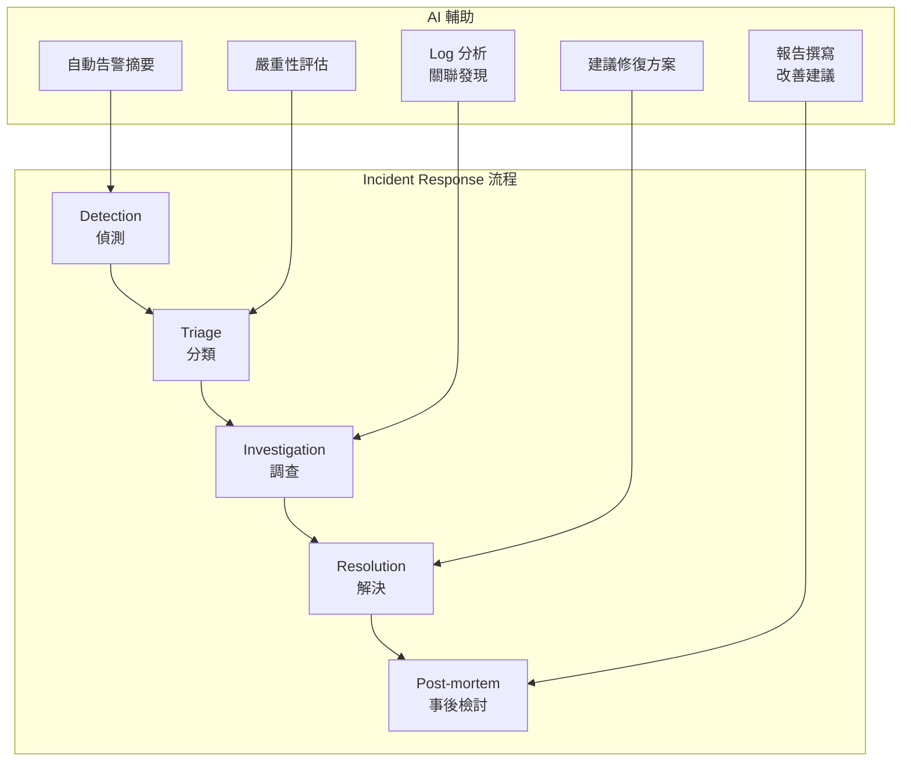

#### 實戰案例：AI 輔助 Incident 調查

**情境**：凌晨 3:00 收到告警，支付成功率從 99.9% 降到 85%

#### Step 1: 請 AI 整理告警摘要

```text
告警內容：
- 時間: 2026-01-26 03:00
- 告警: Payment Success Rate < 90%
- 當前值: 85%
- 影響服務: payment-service, order-service

請整理成 Incident Summary，包含：
1. 影響範圍
2. 時間線
3. 關鍵指標變化
```

#### Step 2: 請 AI 分析相關 Log

```text
以下是 payment-service 在 02:55-03:10 的 ERROR logs 統計：

| 時間 | SocketTimeout | DBConnection | Validation |
|------|---------------|--------------|------------|
| 02:55 | 5 | 0 | 2 |
| 03:00 | 150 | 0 | 3 |
| 03:05 | 200 | 45 | 2 |
| 03:10 | 180 | 80 | 1 |

同時段的基礎設施事件：
- 02:58: DB failover 開始
- 03:02: DB failover 完成
- 03:08: DB connection pool 重建完成

請分析錯誤模式與事件的關聯。
```

#### Step 3: 請 AI 撰寫 Post-mortem

```text
請根據以下資訊撰寫 Post-mortem 報告：

## 事件摘要
- 時間: 2026-01-26 03:00-03:15
- 影響: 支付成功率下降到 85%
- 根本原因: 資料庫 failover 導致連線中斷

## 時間線
（詳細時間線...）

## 需要涵蓋的章節
1. Executive Summary
2. Impact Analysis
3. Root Cause
4. Resolution
5. Action Items
6. Lessons Learned
```

💡 **實戰建議**：

1. **AI 是輔助，不是決策者**：AI 分析結果需要人工驗證
2. **建立 Prompt 模板**：團隊共用標準化的 Prompt 模板
3. **保護敏感資訊**：使用內部 AI 或遮蔽敏感資料
4. **記錄 AI 輔助過程**：作為 Post-mortem 的一部分

---

## 7. 常見問題、陷阱與最佳實務

### 7.1 Log 爆量的處理方式

#### 常見原因與解法

| 原因 | 症狀 | 解法 |
|------|------|------|
| **DEBUG 忘記關** | Log 量突然暴增 10x | 建立環境別 Log Level 控管 |
| **無限迴圈 Log** | 相同訊息大量重複 | 實作 Log 限流（Rate Limiting） |
| **Trace Log 外洩** | HTTP Body 完整記錄 | 敏感資料 Log 規範 |
| **異常風暴** | 同一錯誤重複發生 | Circuit Breaker + 聚合告警 |
| **外部攻擊** | Access Log 暴增 | WAF + Log 採樣 |

#### Log 限流實作（Java）

```java
@Component
public class RateLimitedLogger {
    
    private final Logger log = LoggerFactory.getLogger(this.getClass());
    private final LoadingCache<String, RateLimiter> limiters = CacheBuilder.newBuilder()
        .expireAfterAccess(10, TimeUnit.MINUTES)
        .build(new CacheLoader<>() {
            @Override
            public RateLimiter load(String key) {
                return RateLimiter.create(1.0); // 每秒最多 1 條
            }
        });
    
    public void error(String key, String message, Object... args) {
        try {
            RateLimiter limiter = limiters.get(key);
            if (limiter.tryAcquire()) {
                log.error(message, args);
            } else {
                // 可選：記錄被限流的次數
                log.debug("Log rate limited for key: {}", key);
            }
        } catch (ExecutionException e) {
            log.error(message, args);
        }
    }
}

// 使用方式
@Service
public class PaymentService {
    
    @Autowired
    private RateLimitedLogger rateLimitedLogger;
    
    public void processPayment() {
        try {
            // 業務邏輯
        } catch (SocketTimeoutException e) {
            // 同類錯誤每秒最多記錄 1 次
            rateLimitedLogger.error(
                "payment-gateway-timeout",
                "Payment gateway timeout: {}",
                e.getMessage()
            );
        }
    }
}
```

#### 緊急處置 SOP

```text
1. 立即確認影響範圍
   └── ES Cluster 健康狀態、磁碟空間、Index 狀態

2. 暫時緩解
   ├── 動態調高 Log Level（INFO → WARN）
   ├── Logstash 啟動 Sampling（每 10 筆取 1 筆）
   └── 關閉非必要的 Log 來源

3. 根本解決
   ├── 找出爆量的 Log 來源（哪個服務、哪種類型）
   ├── 修正程式（關閉 Debug、修復迴圈）
   └── 部署修正版本

4. 事後處理
   ├── 清理多餘的 Index
   ├── 檢討 Log 規範
   └── 建立監控告警（Log Volume Alert）
```

---

### 7.2 Index 成長失控怎麼辦

#### 診斷指令

```bash
# 查看各 Index 大小
GET _cat/indices?v&s=store.size:desc&h=index,docs.count,store.size

# 查看 Shard 分布
GET _cat/shards?v&s=store:desc

# 查看 Mapping 欄位數
GET app-logs-*/_mapping?pretty | jq 'to_entries | .[0].value.mappings.properties | keys | length'

# 查看 Index 設定
GET app-logs-*/_settings
```

#### 常見問題與解法

| 問題 | 診斷方式 | 解法 |
|------|---------|------|
| **Mapping Explosion** | 欄位數 > 1000 | 設定 `dynamic: strict`，清理動態欄位 |
| **Shard 過多** | Total Shards > 1000/node | 合併小 Index，調整 Shard 數 |
| **未啟用 ILM** | 舊 Index 沒有刪除 | 設定 ILM Policy |
| **Replica 過多** | 每個 Index 3+ Replica | 調整為 1 Replica |
| **未壓縮** | 儲存效率低 | 啟用 `best_compression` |

#### 緊急清理步驟

```bash
# 1. 刪除過舊的 Index（謹慎操作！）
DELETE app-logs-*-2025.10.*

# 2. 強制合併 Segment（Warm/Cold Index）
POST app-logs-2025.11.*/_forcemerge?max_num_segments=1

# 3. 縮減 Shard 數（需要先設定 read-only）
PUT app-logs-2025.11.01/_settings
{
  "index.blocks.write": true
}

POST app-logs-2025.11.01/_shrink/app-logs-2025.11.01-shrunk
{
  "settings": {
    "index.number_of_shards": 1,
    "index.number_of_replicas": 1,
    "index.codec": "best_compression"
  }
}

# 4. 套用 ILM Policy 到現有 Index
PUT app-logs-*/_settings
{
  "index.lifecycle.name": "logs-policy"
}
```

---

### 7.3 資安與個資（PII）處理

#### 敏感資料分類

| 類別 | 資料範例 | 處理方式 |
|------|---------|---------|
| **禁止記錄** | 密碼、CVV、完整卡號 | 永不記錄 |
| **遮蔽** | Email、電話、身分證 | 部分遮蔽 |
| **加密** | 帳號、姓名（如需查詢） | 加密儲存 |
| **限制存取** | 交易金額、IP | RBAC 控管 |

#### Logstash 敏感資料遮蔽

```ruby
filter {
  # 信用卡號遮蔽
  mutate {
    gsub => [
      # 保留前 4 後 4
      "[context][card_number]", "^(\d{4})\d{8}(\d{4})$", "\1********\2",
      # 完整遮蔽
      "[context][cvv]", ".*", "***"
    ]
  }
  
  # Email 遮蔽
  mutate {
    gsub => [
      "[user][email]", "(?<=.{3}).(?=.*@)", "*"
    ]
  }
  
  # 身分證字號遮蔽（台灣）
  mutate {
    gsub => [
      "[user][id_number]", "^([A-Z])(\d{2})\d{5}(\d{2})$", "\1\2*****\3"
    ]
  }
  
  # 移除絕對不應記錄的欄位
  mutate {
    remove_field => [
      "[context][password]",
      "[context][cvv]",
      "[context][pin]",
      "[request][body][password]"
    ]
  }
}
```

#### Application 層遮蔽（Java）

```java
@Component
public class SensitiveDataMasker {
    
    private static final Pattern CARD_PATTERN = 
        Pattern.compile("\\b(\\d{4})\\d{8}(\\d{4})\\b");
    private static final Pattern EMAIL_PATTERN = 
        Pattern.compile("(?<=.{3}).(?=.*@)");
    private static final Pattern TW_ID_PATTERN = 
        Pattern.compile("\\b([A-Z])(\\d{2})\\d{5}(\\d{2})\\b");
    
    public String mask(String input) {
        if (input == null) return null;
        
        String result = input;
        result = CARD_PATTERN.matcher(result).replaceAll("$1********$2");
        result = EMAIL_PATTERN.matcher(result).replaceAll("*");
        result = TW_ID_PATTERN.matcher(result).replaceAll("$1$2*****$3");
        
        return result;
    }
}

// Log4j2 Layout 整合
@Plugin(name = "MaskingPatternLayout", category = Node.CATEGORY, 
        elementType = Layout.ELEMENT_TYPE, printObject = true)
public class MaskingPatternLayout extends AbstractStringLayout {
    
    private final SensitiveDataMasker masker = new SensitiveDataMasker();
    
    @Override
    public String toSerializable(LogEvent event) {
        String message = event.getMessage().getFormattedMessage();
        return masker.mask(message);
    }
}
```

---

### 7.4 金融業常見稽核與法遵需求

#### 法規要求對照表

| 法規/標準 | Log 相關要求 | 實作建議 |
|----------|-------------|---------|
| **金管會資安規範** | 重要系統保留 5 年 | ILM 設定長期保留 + 歸檔 |
| **PCI-DSS** | 稽核軌跡不可竄改 | 唯寫權限 + 完整性檢查 |
| **個資法** | 存取紀錄可追溯 | 記錄誰、何時、存取什麼 |
| **ISO 27001** | 日誌完整性保護 | 數位簽章 + 異地備份 |

#### 稽核 Log 設計

```json
// 稽核 Log 範例結構
{
  "@timestamp": "2026-01-26T10:30:45.123Z",
  "audit": {
    "event_type": "DATA_ACCESS",
    "action": "READ",
    "result": "SUCCESS",
    "actor": {
      "user_id": "EMP-001234",
      "user_name": "王小明",
      "department": "財務部",
      "ip_address": "10.1.2.100",
      "session_id": "sess-abc123"
    },
    "resource": {
      "type": "CUSTOMER_ACCOUNT",
      "id": "ACC-78901234",
      "fields_accessed": ["balance", "transaction_history"]
    },
    "context": {
      "application": "core-banking",
      "module": "account-inquiry",
      "transaction_id": "TXN-20260126-001234",
      "reason": "客戶臨櫃查詢",
      "ticket_number": "SR-2026012600123"
    }
  },
  "integrity": {
    "hash": "sha256:abc123...",
    "previous_hash": "sha256:xyz789..."
  }
}
```

#### Log 完整性保護

```java
@Service
public class AuditLogService {
    
    private final MessageDigest digest = MessageDigest.getInstance("SHA-256");
    private String previousHash = "";
    
    public void writeAuditLog(AuditEvent event) {
        // 計算 Hash Chain
        String content = objectMapper.writeValueAsString(event);
        String currentHash = calculateHash(previousHash + content);
        
        event.getIntegrity().setHash(currentHash);
        event.getIntegrity().setPreviousHash(previousHash);
        
        // 寫入 Log
        auditLogger.info(objectMapper.writeValueAsString(event));
        
        // 更新 Chain
        previousHash = currentHash;
        
        // 同時寫入不可竄改的儲存（如 WORM Storage）
        wormStorage.append(event);
    }
    
    private String calculateHash(String input) {
        byte[] hash = digest.digest(input.getBytes(StandardCharsets.UTF_8));
        return "sha256:" + bytesToHex(hash);
    }
}
```

---

## 8. 企業級導入與治理建議

### 8.1 Log 規範與命名標準

#### Log Level 使用規範

| Level | 使用情境 | 範例 |
|-------|---------|------|
| **ERROR** | 需要立即處理的錯誤 | 交易失敗、資料庫連線失敗 |
| **WARN** | 潛在問題，但系統仍可運作 | 重試成功、接近閾值 |
| **INFO** | 重要業務事件 | 交易完成、使用者登入 |
| **DEBUG** | 開發除錯用（生產環境關閉） | 方法進出、變數值 |
| **TRACE** | 極細節追蹤（僅開發用） | 每行執行、完整 payload |

#### Log 欄位命名規範

```yaml
# 標準欄位命名（團隊共用）

# 時間相關
timestamp: ISO 8601 格式，UTC 時區
processed_at: Logstash 處理時間

# 識別相關
trace_id: 分散式追蹤 ID（小寫底線）
span_id: Span ID
request_id: 請求 ID
transaction_id: 交易 ID
session_id: Session ID

# 來源相關
service: 服務名稱（小寫橫線，如 payment-service）
environment: 環境（prod, staging, dev）
version: 服務版本
host: 主機名稱
instance: 實例 ID

# 使用者相關
user.id: 使用者 ID
user.type: 使用者類型（customer, employee, system）
user.ip: 來源 IP

# 業務相關
context.*: 業務上下文（自由定義）

# 錯誤相關
error.type: 錯誤類型
error.code: 錯誤代碼
error.message: 錯誤訊息
error.stack_trace: 堆疊追蹤（僅 ERROR level）
```

#### Log 格式範本（Java）

```java
// logback-spring.xml
<configuration>
    <springProperty name="SERVICE_NAME" source="spring.application.name"/>
    <springProperty name="ENV" source="spring.profiles.active"/>
    
    <appender name="JSON" class="ch.qos.logback.core.ConsoleAppender">
        <encoder class="net.logstash.logback.encoder.LogstashEncoder">
            <includeMdcKeyName>traceId</includeMdcKeyName>
            <includeMdcKeyName>spanId</includeMdcKeyName>
            <includeMdcKeyName>userId</includeMdcKeyName>
            <customFields>
                {"service":"${SERVICE_NAME}","environment":"${ENV}"}
            </customFields>
            <fieldNames>
                <timestamp>@timestamp</timestamp>
                <version>[ignore]</version>
                <levelValue>[ignore]</levelValue>
            </fieldNames>
        </encoder>
    </appender>
    
    <root level="INFO">
        <appender-ref ref="JSON"/>
    </root>
</configuration>
```

---

### 8.2 團隊分工與權限設計

#### RBAC 角色定義

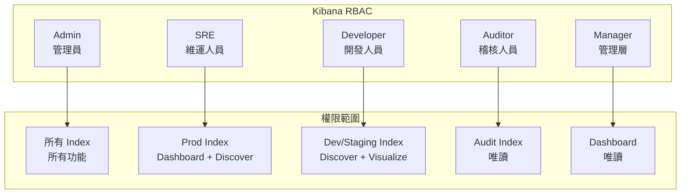

#### Elasticsearch Security 設定

```json
// 建立角色
PUT _security/role/developer
{
  "cluster": ["monitor"],
  "indices": [
    {
      "names": ["dev-*", "staging-*"],
      "privileges": ["read", "view_index_metadata"],
      "field_security": {
        "except": ["user.password", "context.card_number"]
      }
    }
  ],
  "applications": [
    {
      "application": "kibana-.kibana",
      "privileges": ["feature_discover.read", "feature_visualize.all"],
      "resources": ["space:dev-space"]
    }
  ]
}

// 建立使用者
PUT _security/user/dev_user_001
{
  "password": "...",
  "roles": ["developer"],
  "full_name": "Developer 001",
  "email": "dev001@company.com",
  "metadata": {
    "department": "Engineering",
    "team": "Payment"
  }
}
```

---

### 8.3 與 CI/CD、APM、SIEM 的整合

#### 整合架構圖

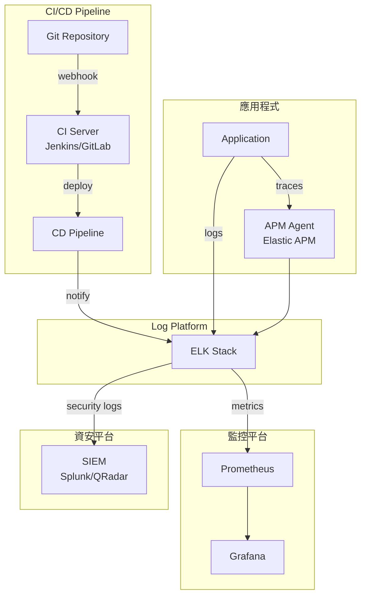

#### CI/CD 整合：部署事件標記

```yaml
# GitLab CI 範例
deploy_production:
  stage: deploy
  script:
    - kubectl apply -f k8s/
    # 發送部署事件到 Elasticsearch
    - |
      curl -X POST "https://es-cluster:9200/deploy-events/_doc" \
        -H "Content-Type: application/json" \
        -d '{
          "@timestamp": "'$(date -u +%Y-%m-%dT%H:%M:%SZ)'",
          "event_type": "deployment",
          "service": "'$CI_PROJECT_NAME'",
          "version": "'$CI_COMMIT_TAG'",
          "environment": "production",
          "deployer": "'$GITLAB_USER_LOGIN'",
          "commit_sha": "'$CI_COMMIT_SHA'",
          "pipeline_url": "'$CI_PIPELINE_URL'"
        }'
```

#### APM 整合：Trace-Log 關聯

```java
// 確保 TraceId 傳遞到 Log
@Configuration
public class TracingConfig {
    
    @Bean
    public Filter traceIdFilter() {
        return (request, response, chain) -> {
            String traceId = tracer.currentSpan().context().traceId();
            MDC.put("traceId", traceId);
            MDC.put("spanId", tracer.currentSpan().context().spanId());
            try {
                chain.doFilter(request, response);
            } finally {
                MDC.clear();
            }
        };
    }
}
```

#### SIEM 整合：安全事件轉發

```ruby
# Logstash: 安全事件轉發到 SIEM
output {
  if [level] == "ERROR" and [context][security_event] {
    # 發送到 SIEM
    syslog {
      host => "siem.company.com"
      port => 514
      protocol => "tcp"
      severity => "warning"
      facility => "local0"
      message => "%{message}"
    }
  }
  
  # 同時保留在 ES
  elasticsearch {
    hosts => ["es-cluster:9200"]
    index => "security-logs-%{+YYYY.MM.dd}"
  }
}
```

---

## 9. 檢查清單（Checklist）

### 📋 新專案導入 ELK 檢查清單

#### 階段一：規劃與設計

- [ ] 確認 Log 類型與來源（Application, Middleware, OS, Security）
- [ ] 定義 Log Level 使用規範
- [ ] 設計 Log 欄位命名標準
- [ ] 確認敏感資料處理策略（遮蔽、加密、不記錄）
- [ ] 估算每日 Log 量與儲存需求
- [ ] 設計 Index 命名與生命週期策略
- [ ] 確認法規與稽核要求（保留年限、完整性）

#### 階段二：基礎設施

- [ ] 部署 Elasticsearch Cluster（Hot/Warm/Cold）
- [ ] 設定 Index Template 與 Mapping
- [ ] 設定 ILM Policy
- [ ] 部署 Logstash（多 Pipeline）
- [ ] 設定 Kafka 作為緩衝層
- [ ] 部署 Kibana 並設定 RBAC
- [ ] 設定 TLS/SSL 加密
- [ ] 設定備份與災難復原

#### 階段三：應用程式整合

- [ ] 設定 Application Log 格式（JSON）
- [ ] 整合 TraceId（分散式追蹤）
- [ ] 實作敏感資料遮蔽
- [ ] 部署 Filebeat/Log Agent
- [ ] 驗證 Log 正確傳輸到 ES
- [ ] 建立 Discover Index Pattern

#### 階段四：視覺化與告警

- [ ] 建立服務健康 Dashboard
- [ ] 建立錯誤分析 Dashboard
- [ ] 設定關鍵告警規則（錯誤率、可用性）
- [ ] 整合告警通知管道（Slack, PagerDuty）
- [ ] 設定 CI/CD 部署事件標記

#### 階段五：維運與治理

- [ ] 建立 Log 監控 Dashboard（Volume, Latency）
- [ ] 設定 ES Cluster 監控
- [ ] 建立緊急處置 SOP
- [ ] 完成團隊教育訓練
- [ ] 文件化並納入內部 Wiki

---

### 📋 日常維運檢查清單

#### 每日檢查

- [ ] ES Cluster 健康狀態（Green/Yellow/Red）
- [ ] Index 寫入正常（無 rejected requests）
- [ ] Logstash Pipeline 無堆積
- [ ] 關鍵服務無異常 ERROR 爆量
- [ ] 磁碟使用率 < 80%

#### 每週檢查

- [ ] ILM 正常執行（Index 有正確輪轉）
- [ ] Shard 分布均衡
- [ ] 查詢效能正常（P95 < 3s）
- [ ] 告警規則有效（無誤報/漏報）
- [ ] 備份成功執行

#### 每月檢查

- [ ] 容量規劃 Review（是否需要擴容）
- [ ] Mapping 欄位數 Review（避免 Explosion）
- [ ] RBAC 權限 Review
- [ ] Dashboard 使用率 Review
- [ ] 法規合規性 Review

---

### 📋 Incident Response 檢查清單

#### 收到告警時

- [ ] 確認告警有效性（非誤報）
- [ ] 開啟 Incident Ticket
- [ ] 通知相關團隊

#### 調查階段

- [ ] 確認影響範圍（服務、使用者數）
- [ ] 查看 Kibana Discover 錯誤 Log
- [ ] 查看 Grafana Metrics（相關時間點）
- [ ] 確認最近變更（部署、設定變更）
- [ ] 建立時間線

#### 解決階段

- [ ] 實施緩解措施
- [ ] 驗證問題解決
- [ ] 通知 Stakeholders

#### 事後處理

- [ ] 撰寫 Post-mortem
- [ ] 建立 Action Items
- [ ] 更新告警規則（如需要）
- [ ] 分享 Lessons Learned

---

## 附錄

### A. 常用 Elasticsearch Query 範例

```json
// 1. 搜尋特定時間範圍的 ERROR
GET app-logs-*/_search
{
  "query": {
    "bool": {
      "filter": [
        { "term": { "level": "ERROR" } },
        { "range": { "@timestamp": { "gte": "now-1h" } } }
      ]
    }
  }
}

// 2. 統計各服務錯誤數
GET app-logs-*/_search
{
  "size": 0,
  "query": {
    "bool": {
      "filter": [
        { "term": { "level": "ERROR" } },
        { "range": { "@timestamp": { "gte": "now-24h" } } }
      ]
    }
  },
  "aggs": {
    "by_service": {
      "terms": { "field": "service", "size": 20 }
    }
  }
}

// 3. 追蹤特定 TraceId
GET app-logs-*/_search
{
  "query": {
    "term": { "traceId": "abc123def456" }
  },
  "sort": [{ "@timestamp": "asc" }]
}

// 4. 搜尋特定異常類型
GET app-logs-*/_search
{
  "query": {
    "bool": {
      "filter": [
        { "term": { "exception.class": "java.net.SocketTimeoutException" } }
      ]
    }
  }
}
```

### B. 常用 KQL 查詢範例

```text
# 基本條件
level: ERROR and service: payment-service

# 時間範圍
@timestamp >= "2026-01-26" and @timestamp < "2026-01-27"

# 模糊搜尋
message: *timeout* and service: payment*

# 組合條件
(level: ERROR or level: WARN) and context.amount > 10000

# 排除
level: ERROR and not exception.class: "ValidationException"

# 存在性
exception.stackTrace: * and level: ERROR
```

### C. 參考資源

- [Elastic 官方文件](https://www.elastic.co/guide/index.html)
- [Logstash Filter Plugins](https://www.elastic.co/guide/en/logstash/current/filter-plugins.html)
- [Elasticsearch Query DSL](https://www.elastic.co/guide/en/elasticsearch/reference/current/query-dsl.html)
- [Kibana User Guide](https://www.elastic.co/guide/en/kibana/current/index.html)
- [ELK Stack 最佳實務](https://www.elastic.co/guide/en/elasticsearch/reference/current/tune-for-indexing-speed.html)


