+++
date = '2026-07-28T23:28:41+08:00'
draft = false
title = 'Maven 4.x 教學手冊'
tags = ['教學', '工具']
categories = ['教學']
+++

# Maven 4.x 教學手冊

> **文件性質**：企業內部教育訓練教材／團隊開發規範文件
> **適用對象**：資深 Java 工程師、軟體架構師、DevOps／SRE、平台工程團隊、Tech Lead、建置與發布負責人
> **內容取向**：實戰與維運導向，可直接作為專案團隊內部規範採用
> **技術基準**：Apache Maven 4.0.0-rc-5（2025-11-13）／Apache Maven 3.9.16（2026-05-13）
> **查證基準日**：2026-07-28（全書所有「截至目前」均指此日）
> **主要參考來源**：
>
> - Apache Maven 官方網站：<https://maven.apache.org/>
> - What's new in Maven 4：<https://maven.apache.org/whatsnewinmaven4.html>
> - Maven 3 至 Maven 4 遷移指南：<https://maven.apache.org/guides/mini/guide-migration-to-mvn4.html>
> - Maven 版本歷史：<https://maven.apache.org/docs/history.html>
> - Maven 4.0.0-rc-5 Release Notes：<https://maven.apache.org/docs/4.0.0-rc-5/release-notes.html>

---

## ⚠️ 版本狀態重要聲明

**請務必先讀完本節，再決定你的團隊要如何使用本手冊。**

截至 **2026-07-28**，經查證 Apache Maven 官方網站，事實如下：

| 項目 | 現況 | 佐證來源 |
|---|---|---|
| Maven 4 最新版本 | **4.0.0-rc-5**，發布於 **2025-11-13** | Maven Releases History |
| Maven 4 是否已 GA | **尚未正式發布（Not GA）** | Maven Releases History |
| 官方對生產環境的立場 | 原文：*"Maven 4.x is currently under development, so while we are encouraging users to try it and report any issues, it is **NOT** safe for production use."* | Maven Download 頁面 |
| Maven 3 現行穩定版 | **3.9.16**，發布於 **2026-05-13** | Maven Releases History |
| Maven 3 新分支 | **3.10.0-rc-1**，發布於 **2026-07-09** | Maven Releases History |
| 執行 Maven 4 的最低需求 | **Java 17**（僅「執行 Maven 本身」需要，專案仍可編譯至 Java 8） | What's new in Maven 4 |

此外，官方的 *What's new in Maven 4* 頁面（最後發布日 2026-07-27）內文仍寫著 *"This article will continuously be updated at least until Maven 4.0.0 is released."*，是 Maven 4.0.0 尚未 GA 的第二個獨立佐證。

### 這對你的團隊代表什麼

本手冊的定位因此是 **「評估、試點、遷移準備」**，而非「立即全面導入」。具體建議如下：

| 用途 | 建議版本 | 理由 |
|---|---|---|
| 正式生產建置（CI 發布、對外交付） | **Maven 3.9.16** | 官方唯一標示為穩定的版本 |
| Maven 4 相容性掃描與試點 | **Maven 4.0.0-rc-5** | 提早發現破壞性變更，降低 GA 後的遷移風險 |
| 開發者本機日常建置 | 以 Maven Wrapper 綁定 **3.9.16**，另備 4.0.0-rc-5 側試 | 團隊版本一致，同時保留試驗空間 |

> 💡 **本手冊反覆出現的「雙軌（Dual-Track）」建議**即源自於此：**生產走 3.9.16，試點走 4.0.0-rc-5**。這不是保守，而是在 GA 尚未到來前唯一負責任的作法。等 Maven 4.0.0 GA 發布後，本手冊第15章的遷移流程即可直接套用。

### 內容可信度標記

本手冊區分「官方已確認事實」與「作者實務經驗補充」。凡非官方明文者，一律標記：

| 標記 | 意義 |
|---|---|
| （作者建議） | 來自大型企業導入實務的做法，官方未表態 |
| （作者推論） | 由官方公開資訊外推的判斷，非官方保證 |
| （未經 GA 驗證） | 僅在 4.0.0-rc-5 觀察到的行為，GA 版可能改變 |
| > 🔍 **待官方確認** | 撰稿時查證未果，刻意不給出版本號或斷言 |

---

## 📖 本書使用方式

### 與既有《Maven使用教學》的分工

本 repo 的 `.github/教學/工具/` 目錄下已有一份 [Maven使用教學.md](Maven使用教學.md)。兩份文件的分工如下，**請勿混用版本資訊**：

| 文件 | 涵蓋範圍 | 適用時機 |
|---|---|---|
| 《Maven使用教學》（既有） | Maven 3.9.x 基礎操作、指令、專案建立 | 新人入門、日常 Maven 3 操作查詢 |
| **《Maven 4.x 教學手冊》（本書）** | Maven 4 架構、Consumer POM 與 Build POM、Model 4.1.0、新 Lifecycle 樹、Maven 3 至 4 遷移、AI Agent 整合 | 升級評估、架構設計、遷移規劃、企業規範制定 |

> ⚠️ 既有《Maven使用教學》內文鎖定於 Maven 3.9.4，該版本已非現行穩定版（現為 3.9.16）。查閱該文件的版本號與下載連結時請自行對照官方最新版。

### 建議閱讀路徑

| 角色 | 建議章節 |
|---|---|
| 想快速了解 Maven 4 有什麼不同 | 第2章 → 第3章 → 第25章 Cheat Sheet |
| 負責升級評估的架構師 | 第2章 → 第8章 → 第10章 → 第15章 → 第16章 |
| 日常開發工程師 | 第4章 → 第5章 → 第7章 → 第9章 → 第11章 → 第17章 |
| CI／CD 與平台工程 | 第6章 → 第12章 → 第14章 → 第19章 → 第20章 |
| 導入 AI Agent 協助建置 | 第13章 → 第21章 → 附錄L |
| 遇到問題要查解法 | 第17章（100 個常見錯誤）→ 第18章（100 題 FAQ）→ 附錄P |
| 制定團隊規範 | 第24章（100 條最佳實務）→ 附錄H → 附錄N |

### 排版約定

- 所有英文專有名詞**首次出現**時附中文注解，例如：專案物件模型（Project Object Model，POM）
- 指令、檔名、XML 元素、屬性名一律以 `等寬字體` 標示
- 每章結尾固定附四段：本章重點整理、本章最佳實務、本章注意事項、本章企業建議
- 除非特別註明，所有 XML 範例均符合 **POM Model 4.1.0**，命名空間為 `http://maven.apache.org/POM/4.1.0`

**導覽機制**——本書篇幅較長，提供三層導覽：

| 機制 | 位置 | 用途 |
|---|---|---|
| 三層目錄 | 本節之後的「📖 目錄」 | 章 → 節 → 小節，全部可點擊 |
| 章內條目速查 | 第17、18、24 章與附錄L 的**章首** | 各 100 條條目（E-／Q-／BP-／AP-）逐項可點擊 |
| 術語分段導覽 | 附錄Q 開頭 | 300 個術語依十個主題分段跳轉 |
| 回目錄連結 | 每章與每個附錄的**結尾** | `[↑ 回目錄]` 一鍵返回總目錄 |

---

## 📖 目錄

> 本目錄為三層結構（章 → 節 → 小節），每一項皆可點擊跳轉至對應段落。
>
> 第17、18、24 章與附錄L 另於**章首**提供 100 條條目的可點擊速查表；附錄Q 提供 300 個術語的分段導覽。每章結尾均有 `[↑ 回目錄]` 連結可返回本處。

- [⚠️ 版本狀態重要聲明](#-版本狀態重要聲明)
  - [這對你的團隊代表什麼](#這對你的團隊代表什麼)
  - [內容可信度標記](#內容可信度標記)
- [📖 本書使用方式](#-本書使用方式)
  - [與既有《Maven使用教學》的分工](#與既有maven使用教學的分工)
  - [建議閱讀路徑](#建議閱讀路徑)
  - [排版約定](#排版約定)
- [第1章 Maven 是什麼](#第1章-maven-是什麼)
  - [1.1 一句話定義](#11-一句話定義)
  - [1.2 歷史與發展脈絡](#12-歷史與發展脈絡)
  - [1.3 為何 Java 世界需要 Maven](#13-為何-java-世界需要-maven)
  - [1.4 Maven 解決與未解決的問題](#14-maven-解決與未解決的問題)
  - [1.5 Maven 與其他建置工具的比較](#15-maven-與其他建置工具的比較)
    - [1.5.1 Maven 與 Ant](#151-maven-與-ant)
    - [1.5.2 Maven 與 Gradle](#152-maven-與-gradle)
    - [1.5.3 Maven 與 Bazel](#153-maven-與-bazel)
    - [1.5.4 Maven 與 Buck2 及 Pants](#154-maven-與-buck2-及-pants)
  - [1.6 2026 年的選型結論](#16-2026-年的選型結論)
- [第2章 Maven 4 新架構](#第2章-maven-4-新架構)
  - [2.1 架構總覽](#21-架構總覽)
  - [2.2 Maven Core 核心元件](#22-maven-core-核心元件)
  - [2.3 Build POM 與 Consumer POM 的分裂](#23-build-pom-與-consumer-pom-的分裂)
    - [2.3.1 關於 Consumer POM 扁平化的重要更正](#231-關於-consumer-pom-扁平化的重要更正)
  - [2.4 POM Model 4.1.0](#24-pom-model-410)
    - [2.4.1 ModelParser SPI：POM 不再只能是 XML](#241-modelparser-spipom-不再只能是-xml)
  - [2.5 Maven Resolver 2.0](#25-maven-resolver-20)
  - [2.6 三種圖的區別](#26-三種圖的區別)
  - [2.7 周邊工具鏈](#27-周邊工具鏈)
  - [2.8 一次建置的完整流程](#28-一次建置的完整流程)
- [第3章 Maven 4 五大核心新特性](#第3章-maven-4-五大核心新特性)
  - [3.0 五大特性總覽](#30-五大特性總覽)
  - [3.1 特性一：JDK 17 執行需求與 Toolchains](#31-特性一jdk-17-執行需求與-toolchains)
    - [3.1.1 最重要的一個觀念](#311-最重要的一個觀念)
    - [3.1.2 兩種控制編譯目標的方式](#312-兩種控制編譯目標的方式)
    - [3.1.3 五種 JDK 目標的設定範本](#313-五種-jdk-目標的設定範本)
  - [3.2 特性二：Consumer POM 與 Build POM](#32-特性二consumer-pom-與-build-pom)
    - [3.2.1 對企業的四個實際影響](#321-對企業的四個實際影響)
    - [3.2.2 如何實際檢視 Consumer POM](#322-如何實際檢視-consumer-pom)
    - [3.2.3 扁平化的啟用與風險](#323-扁平化的啟用與風險)
    - [3.2.4 AI Agent 的使用情境](#324-ai-agent-的使用情境)
  - [3.3 特性三：POM Model 4.1.0](#33-特性三pom-model-410)
    - [3.3.1 三個設計原則](#331-三個設計原則)
    - [3.3.2 新增、棄用與移除一覽](#332-新增棄用與移除一覽)
    - [3.3.3 採用策略（作者建議）](#333-採用策略作者建議)
  - [3.4 特性四：Maven Daemon（mvnd）](#34-特性四maven-daemonmvnd)
    - [3.4.1 運作原理](#341-運作原理)
    - [3.4.2 版本線的重要區別](#342-版本線的重要區別)
    - [3.4.3 效能效益的正確預期](#343-效能效益的正確預期)
    - [3.4.4 平行建置](#344-平行建置)
  - [3.5 特性五：Maven Upgrade Tool（mvnup）](#35-特性五maven-upgrade-toolmvnup)
    - [3.5.1 定位](#351-定位)
    - [3.5.2 兩個核心指令](#352-兩個核心指令)
    - [3.5.3 升級選項](#353-升級選項)
    - [3.5.4 使用流程與紀律](#354-使用流程與紀律)
    - [3.5.5 mvnup 不會做的事](#355-mvnup-不會做的事)
- [第4章 Maven 安裝](#第4章-maven-安裝)
  - [4.1 安裝前置需求](#41-安裝前置需求)
  - [4.2 安裝方式決策](#42-安裝方式決策)
  - [4.3 SDKMAN 安裝（Linux 與 macOS 首選）](#43-sdkman-安裝linux-與-macos-首選)
  - [4.4 Windows 安裝](#44-windows-安裝)
    - [4.4.1 Chocolatey](#441-chocolatey)
    - [4.4.2 Scoop](#442-scoop)
    - [4.4.3 ZIP 手動安裝（企業環境建議）](#443-zip-手動安裝企業環境建議)
  - [4.5 macOS 安裝](#45-macos-安裝)
  - [4.6 Linux 安裝](#46-linux-安裝)
  - [4.7 環境變數說明](#47-環境變數說明)
  - [4.8 安裝驗證](#48-安裝驗證)
  - [4.9 企業大量部署建議](#49-企業大量部署建議)
- [第5章 Maven Wrapper](#第5章-maven-wrapper)
  - [5.1 Wrapper 解決什麼問題](#51-wrapper-解決什麼問題)
  - [5.2 Wrapper 的核心價值](#52-wrapper-的核心價值)
  - [5.3 建立 Wrapper](#53-建立-wrapper)
  - [5.4 四種 distributionType](#54-四種-distributiontype)
  - [5.5 maven-wrapper.properties 詳解](#55-maven-wrapperproperties-詳解)
    - [5.5.1 企業內部倉庫](#551-企業內部倉庫)
  - [5.6 使用 Wrapper](#56-使用-wrapper)
  - [5.7 升級 Wrapper 綁定的版本](#57-升級-wrapper-綁定的版本)
  - [5.8 Maven 4 試點的標準作法](#58-maven-4-試點的標準作法)
  - [5.9 CI 中使用 Wrapper](#59-ci-中使用-wrapper)
- [第6章 Maven Toolchains](#第6章-maven-toolchains)
  - [6.1 為什麼需要 Toolchains](#61-為什麼需要-toolchains)
  - [6.2 toolchains.xml 的位置與結構](#62-toolchainsxml-的位置與結構)
  - [6.3 完整的五 JDK 設定範本](#63-完整的五-jdk-設定範本)
  - [6.4 在 POM 中使用 Toolchains](#64-在-pom-中使用-toolchains)
  - [6.5 企業多模組專案的實戰配置](#65-企業多模組專案的實戰配置)
  - [6.6 CI 環境的 Toolchains](#66-ci-環境的-toolchains)
  - [6.7 AI Agent 如何運用 Toolchains](#67-ai-agent-如何運用-toolchains)
  - [6.8 常見設定陷阱](#68-常見設定陷阱)
- [第7章 Maven 專案建立](#第7章-maven-專案建立)
  - [7.1 專案型態總覽](#71-專案型態總覽)
  - [7.2 用 Archetype 建立專案](#72-用-archetype-建立專案)
  - [7.3 Spring Boot 專案](#73-spring-boot-專案)
  - [7.4 多專案設定](#74-多專案設定)
  - [7.5 Parent 與 Aggregator 的區別](#75-parent-與-aggregator-的區別)
  - [7.6 BOM 專案](#76-bom-專案)
  - [7.7 常用建置指令](#77-常用建置指令)
- [第8章 Maven POM 完整解析](#第8章-maven-pom-完整解析)
  - [8.1 POM 骨架](#81-pom-骨架)
  - [8.2 `<project>` 的屬性（4.1.0 新增）](#82-project-的屬性410-新增)
  - [8.3 座標與 `modelVersion`](#83-座標與-modelversion)
  - [8.4 `<parent>` 與繼承](#84-parent-與繼承)
    - [8.4.1 Mixins：突破單一繼承（Model 4.2.0）](#841-mixins突破單一繼承model-420)
  - [8.5 `<properties>` 與內建變數](#85-properties-與內建變數)
  - [8.6 `<dependencies>` 與 `<dependencyManagement>`](#86-dependencies-與-dependencymanagement)
  - [8.7 `<build>` 與 4.1.0 的 `<sources>`](#87-build-與-410-的-sources)
  - [8.8 `<pluginManagement>` 與 `<plugins>`](#88-pluginmanagement-與-plugins)
  - [8.9 `<profiles>` 與 4.1.0 的 `<condition>`](#89-profiles-與-410-的-condition)
  - [8.10 CI 友善變數](#810-ci-友善變數)
  - [8.11 其他常用元素](#811-其他常用元素)
  - [8.12 Model 4.0.0 與 4.1.0 完整對照表](#812-model-400-與-410-完整對照表)
  - [8.13 檢視有效 POM](#813-檢視有效-pom)
- [第9章 依賴管理](#第9章-依賴管理)
  - [9.1 依賴座標](#91-依賴座標)
    - [9.1.1 Maven 4 的新 artifact type：明確控制 classpath 與 module-path](#911-maven-4-的新-artifact-type明確控制-classpath-與-module-path)
  - [9.2 Dependency Scope](#92-dependency-scope)
  - [9.3 傳遞依賴與衝突調解](#93-傳遞依賴與衝突調解)
  - [9.4 診斷依賴問題](#94-診斷依賴問題)
  - [9.5 Optional 與 Exclusion](#95-optional-與-exclusion)
  - [9.6 用 dependencyManagement 統一版本](#96-用-dependencymanagement-統一版本)
  - [9.7 BOM 與 import scope](#97-bom-與-import-scope)
  - [9.8 依賴管理最佳實務](#98-依賴管理最佳實務)
- [第10章 Build Lifecycle](#第10章-build-lifecycle)
  - [10.1 三個生命週期](#101-三個生命週期)
  - [10.2 Default 生命週期的完整階段](#102-default-生命週期的完整階段)
  - [10.3 Maven 4 的最大變革：從清單到樹](#103-maven-4-的最大變革從清單到樹)
    - [10.3.1 樹結構的實際兌現：Concurrent Builder](#1031-樹結構的實際兌現concurrent-builder)
  - [10.4 before 與 after 階段的用法](#104-before-與-after-階段的用法)
  - [10.5 all 與 each 階段](#105-all-與-each-階段)
  - [10.6 預設外掛綁定](#106-預設外掛綁定)
  - [10.7 為什麼官方說「不要用 mvn clean install」](#107-為什麼官方說不要用-mvn-clean-install)
  - [10.8 常用生命週期指令](#108-常用生命週期指令)
  - [10.9 Maven 4 的建置狀態與 resume](#109-maven-4-的建置狀態與-resume)
- [第11章 常用 Plugin](#第11章-常用-plugin)
  - [11.1 外掛版本速查表](#111-外掛版本速查表)
  - [11.2 編譯與測試](#112-編譯與測試)
    - [11.2.1 maven-compiler-plugin](#1121-maven-compiler-plugin)
    - [11.2.2 Surefire 與 Failsafe](#1122-surefire-與-failsafe)
  - [11.3 打包](#113-打包)
    - [11.3.1 Shade 與 Assembly 的選擇](#1131-shade-與-assembly-的選擇)
  - [11.4 品質與規則強制](#114-品質與規則強制)
    - [11.4.1 maven-enforcer-plugin](#1141-maven-enforcer-plugin)
    - [11.4.2 versions-maven-plugin](#1142-versions-maven-plugin)
  - [11.5 診斷與分析](#115-診斷與分析)
  - [11.6 發布相關](#116-發布相關)
  - [11.7 Spring Boot Maven Plugin](#117-spring-boot-maven-plugin)
  - [11.8 外掛管理最佳實務](#118-外掛管理最佳實務)
- [第12章 Repository 倉庫管理](#第12章-repository-倉庫管理)
  - [12.1 三種倉庫](#121-三種倉庫)
  - [12.2 為什麼企業必須有私有倉庫](#122-為什麼企業必須有私有倉庫)
  - [12.3 四大倉庫管理器比較](#123-四大倉庫管理器比較)
  - [12.4 settings.xml 設定](#124-settingsxml-設定)
  - [12.5 密碼管理](#125-密碼管理)
  - [12.6 部署設定](#126-部署設定)
  - [12.7 企業倉庫最佳實務](#127-企業倉庫最佳實務)
  - [12.8 Maven 4 的部署行為變更](#128-maven-4-的部署行為變更)
- [第13章 Maven 與 AI Agent](#第13章-maven-與-ai-agent)
  - [13.1 核心洞見：Maven 是 Agent 最好的朋友](#131-核心洞見maven-是-agent-最好的朋友)
  - [13.2 給 Agent 的四個關鍵指令](#132-給-agent-的四個關鍵指令)
  - [13.3 讓 Maven 的輸出對 Agent 友善](#133-讓-maven-的輸出對-agent-友善)
  - [13.4 主流 AI Coding Agent 的定位](#134-主流-ai-coding-agent-的定位)
  - [13.5 AI Agent 的 Maven 工作流程](#135-ai-agent-的-maven-工作流程)
  - [13.6 適合與不適合交給 Agent 的 Maven 任務](#136-適合與不適合交給-agent-的-maven-任務)
  - [13.7 Maven 4 對 Agent 的特殊價值](#137-maven-4-對-agent-的特殊價值)
  - [13.8 給 Agent 的護欄設計](#138-給-agent-的護欄設計)
- [第14章 Maven 與 CI/CD](#第14章-maven-與-cicd)
  - [14.1 CI 建置的通用原則](#141-ci-建置的通用原則)
  - [14.2 雙軌管線設計](#142-雙軌管線設計)
  - [14.3 GitHub Actions](#143-github-actions)
  - [14.4 GitLab CI](#144-gitlab-ci)
  - [14.5 Jenkins](#145-jenkins)
  - [14.6 Azure DevOps](#146-azure-devops)
  - [14.7 Bitbucket Pipelines](#147-bitbucket-pipelines)
  - [14.8 容器化建置](#148-容器化建置)
  - [14.9 Kubernetes 部署](#149-kubernetes-部署)
  - [14.10 CI 中的品質閘門](#1410-ci-中的品質閘門)
- [第15章 Maven 3 升級至 Maven 4](#第15章-maven-3-升級至-maven-4)
  - [15.1 遷移的四個階段](#151-遷移的四個階段)
  - [15.2 階段一：準備（現在就該做）](#152-階段一準備現在就該做)
  - [15.3 階段二：測試（現在就該做，非阻斷）](#153-階段二測試現在就該做非阻斷)
  - [15.4 破壞性變更完整清單](#154-破壞性變更完整清單)
  - [15.5 階段三：修正](#155-階段三修正)
    - [15.5.1 修正重複外掛宣告](#1551-修正重複外掛宣告)
    - [15.5.2 修正已移除的目錄屬性](#1552-修正已移除的目錄屬性)
    - [15.5.3 標示專案根目錄](#1553-標示專案根目錄)
    - [15.5.4 處理安裝與部署時機變更](#1554-處理安裝與部署時機變更)
    - [15.5.5 自建外掛與核心擴充的相容性處理](#1555-自建外掛與核心擴充的相容性處理)
  - [15.6 階段四：切換（GA 後）](#156-階段四切換ga-後)
  - [15.7 採用 Model 4.1.0（切換後的可選步驟）](#157-採用-model-410切換後的可選步驟)
  - [15.8 企業級遷移專案規劃](#158-企業級遷移專案規劃)
  - [15.9 相容性速查](#159-相容性速查)
- [第16章 大型企業最佳實務](#第16章-大型企業最佳實務)
  - [16.1 企業 Maven 治理的三層架構](#161-企業-maven-治理的三層架構)
  - [16.2 企業 Parent POM 設計原則](#162-企業-parent-pom-設計原則)
  - [16.3 模組切分策略](#163-模組切分策略)
  - [16.4 各架構風格的模組映射](#164-各架構風格的模組映射)
  - [16.5 產業別建議](#165-產業別建議)
    - [16.5.1 銀行與金融](#1651-銀行與金融)
    - [16.5.2 政府與公部門](#1652-政府與公部門)
    - [16.5.3 保險業](#1653-保險業)
  - [16.6 Monorepo 的 Maven 實踐](#166-monorepo-的-maven-實踐)
  - [16.7 版本策略](#167-版本策略)
- [第17章 100 個常見錯誤與解法](#第17章-100-個常見錯誤與解法)
  - [17.1 錯誤分類索引](#171-錯誤分類索引)
  - [17.2 類別一：POM 解析與語法](#172-類別一pom-解析與語法)
  - [17.3 類別二：依賴解析](#173-類別二依賴解析)
  - [17.4 類別三：版本衝突](#174-類別三版本衝突)
  - [17.5 類別四：Plugin 設定與執行](#175-類別四plugin-設定與執行)
  - [17.6 類別五：Lifecycle 與建置流程](#176-類別五lifecycle-與建置流程)
  - [17.7 類別六：編譯](#177-類別六編譯)
  - [17.8 類別七：測試](#178-類別七測試)
  - [17.9 類別八：打包與部署](#179-類別八打包與部署)
  - [17.10 類別九：倉庫、網路與認證](#1710-類別九倉庫網路與認證)
  - [17.11 類別十：Maven 4 專屬](#1711-類別十maven-4-專屬)
- [第18章 100 題 FAQ](#第18章-100-題-faq)
  - [18.1 FAQ 分類索引](#181-faq-分類索引)
  - [18.2 類別一：基礎觀念與版本選擇](#182-類別一基礎觀念與版本選擇)
  - [18.3 類別二：安裝與環境](#183-類別二安裝與環境)
  - [18.4 類別三：POM 與專案結構](#184-類別三pom-與專案結構)
  - [18.5 類別四：依賴管理](#185-類別四依賴管理)
  - [18.6 類別五：Lifecycle 與建置](#186-類別五lifecycle-與建置)
  - [18.7 類別六：Plugin](#187-類別六plugin)
  - [18.8 類別七：倉庫與發布](#188-類別七倉庫與發布)
  - [18.9 類別八：Maven 4 與遷移](#189-類別八maven-4-與遷移)
  - [18.10 類別九：CI/CD 與效能](#1810-類別九cicd-與效能)
  - [18.11 類別十：AI Agent、安全與其他](#1811-類別十ai-agent安全與其他)
- [第19章 效能調校](#第19章-效能調校)
  - [19.1 先量測，再最佳化](#191-先量測再最佳化)
  - [19.2 量測方法](#192-量測方法)
  - [19.3 依賴與倉庫最佳化](#193-依賴與倉庫最佳化)
  - [19.4 平行建置](#194-平行建置)
    - [19.4.1 `-T` 與 `-b concurrent` 的關係](#1941--t-與--b-concurrent-的關係)
  - [19.5 測試效能（最常見的真正瓶頸）](#195-測試效能最常見的真正瓶頸)
  - [19.6 常駐程序：mvnd 與 mvnsh](#196-常駐程序mvnd-與-mvnsh)
    - [19.6.1 mvnd](#1961-mvnd)
    - [19.6.2 mvnsh](#1962-mvnsh)
  - [19.7 記憶體與 JVM 調校](#197-記憶體與-jvm-調校)
  - [19.8 增量建置的現實](#198-增量建置的現實)
  - [19.9 效能調校速查](#199-效能調校速查)
- [第20章 安全性與供應鏈](#第20章-安全性與供應鏈)
  - [20.1 Maven 的供應鏈威脅模型](#201-maven-的供應鏈威脅模型)
  - [20.2 Checksum 驗證](#202-checksum-驗證)
  - [20.3 Maven Wrapper 的完整性驗證](#203-maven-wrapper-的完整性驗證)
  - [20.4 GPG 簽章](#204-gpg-簽章)
  - [20.5 漏洞掃描](#205-漏洞掃描)
  - [20.6 SBOM 產生](#206-sbom-產生)
  - [20.7 授權合規](#207-授權合規)
  - [20.8 SLSA 與供應鏈等級](#208-slsa-與供應鏈等級)
  - [20.9 可重現建置](#209-可重現建置)
  - [20.10 Sigstore 與構件簽章](#2010-sigstore-與構件簽章)
  - [20.11 企業安全檢查清單](#2011-企業安全檢查清單)
- [第21章 AI Agent 最佳實務](#第21章-ai-agent-最佳實務)
  - [21.1 Prompt 設計的四個要素](#211-prompt-設計的四個要素)
  - [21.2 情境供給策略](#212-情境供給策略)
  - [21.3 Prompt 範本結構](#213-prompt-範本結構)
  - [21.4 十類任務的 Prompt 範例](#214-十類任務的-prompt-範例)
    - [21.4.1 依賴分析](#2141-依賴分析)
    - [21.4.2 版本衝突診斷](#2142-版本衝突診斷)
    - [21.4.3 Maven 4 相容性評估](#2143-maven-4-相容性評估)
    - [21.4.4 建置失敗修復](#2144-建置失敗修復)
    - [21.4.5 依賴升級](#2145-依賴升級)
    - [21.4.6 POM 規範稽核](#2146-pom-規範稽核)
    - [21.4.7 測試效能分析](#2147-測試效能分析)
    - [21.4.8 安全掃描](#2148-安全掃描)
    - [21.4.9 模組相依關係審查](#2149-模組相依關係審查)
    - [21.4.10 產生企業 Parent POM 草稿](#21410-產生企業-parent-pom-草稿)
  - [21.5 Agent 使用的反模式](#215-agent-使用的反模式)
  - [21.6 成本控制](#216-成本控制)
- [第22章 Maven 與 Spring Boot 4](#第22章-maven-與-spring-boot-4)
  - [22.1 Spring Boot 4 的關鍵事實](#221-spring-boot-4-的關鍵事實)
  - [22.2 破壞性變更](#222-破壞性變更)
  - [22.3 Maven 面的設定](#223-maven-面的設定)
  - [22.4 Spring Boot 4 與 Maven 4 的組合](#224-spring-boot-4-與-maven-4-的組合)
  - [22.5 Virtual Threads、AOT 與 Native Image](#225-virtual-threadsaot-與-native-image)
  - [22.6 Spring AI](#226-spring-ai)
- [第23章 與現代 Java 生態整合](#第23章-與現代-java-生態整合)
  - [23.1 Java 版本現況](#231-java-版本現況)
  - [23.2 Java 版本與 Maven 的關係總表](#232-java-版本與-maven-的關係總表)
  - [23.3 測試框架](#233-測試框架)
    - [23.3.1 JUnit 的版本現況（重要更新）](#2331-junit-的版本現況重要更新)
    - [23.3.2 Testcontainers](#2332-testcontainers)
  - [23.4 靜態分析與品質工具](#234-靜態分析與品質工具)
  - [23.5 SonarQube 整合](#235-sonarqube-整合)
  - [23.6 其他 JVM 框架](#236-其他-jvm-框架)
  - [23.7 可觀測性](#237-可觀測性)
  - [23.8 生態全景](#238-生態全景)
- [第24章 100 條 Maven 最佳實務](#第24章-100-條-maven-最佳實務)
  - [24.1 分類索引](#241-分類索引)
  - [24.2 類別一：版本與相容性](#242-類別一版本與相容性)
  - [24.3 類別二：POM 結構](#243-類別二pom-結構)
  - [24.4 類別三：依賴管理](#244-類別三依賴管理)
  - [24.5 類別四：外掛管理](#245-類別四外掛管理)
  - [24.6 類別五：建置流程](#246-類別五建置流程)
  - [24.7 類別六：多專案設定](#247-類別六多專案設定)
  - [24.8 類別七：測試](#248-類別七測試)
  - [24.9 類別八：倉庫與發布](#249-類別八倉庫與發布)
  - [24.10 類別九：安全與合規](#2410-類別九安全與合規)
  - [24.11 類別十：CI/CD、效能與 AI](#2411-類別十cicd效能與-ai)
  - [24.12 強制項總覽](#2412-強制項總覽)
- [第25章 Cheat Sheet 快速查詢](#第25章-cheat-sheet-快速查詢)
  - [25.1 最常用指令](#251-最常用指令)
  - [25.2 常用旗標](#252-常用旗標)
  - [25.3 Lifecycle 速查](#253-lifecycle-速查)
  - [25.4 預設外掛綁定（jar packaging）](#254-預設外掛綁定jar-packaging)
  - [25.5 Dependency Scope 速查](#255-dependency-scope-速查)
  - [25.6 內建屬性速查](#256-內建屬性速查)
  - [25.7 Model 4.0.0 與 4.1.0 語法對照](#257-model-400-與-410-語法對照)
  - [25.8 Wrapper 速查](#258-wrapper-速查)
  - [25.9 Toolchains 速查](#259-toolchains-速查)
  - [25.10 mvnd 速查](#2510-mvnd-速查)
  - [25.11 版本速查（2026-07-28）](#2511-版本速查2026-07-28)
- [第26章 結論與展望](#第26章-結論與展望)
  - [26.1 三個核心結論](#261-三個核心結論)
  - [26.2 企業導入路線圖](#262-企業導入路線圖)
  - [26.3 不同角色的下一步](#263-不同角色的下一步)
  - [26.4 AI Agent 時代的建議](#264-ai-agent-時代的建議)
  - [26.5 未來展望](#265-未來展望)
  - [26.6 最後的提醒](#266-最後的提醒)
- [附錄A Maven 指令大全](#附錄a-maven-指令大全)
  - [A.1 生命週期指令](#a1-生命週期指令)
  - [A.2 依賴相關](#a2-依賴相關)
  - [A.3 診斷與資訊](#a3-診斷與資訊)
  - [A.4 版本管理](#a4-版本管理)
  - [A.5 多專案設定](#a5-多專案設定)
  - [A.6 Maven 4 專屬](#a6-maven-4-專屬)
  - [A.7 專案建立與 Wrapper](#a7-專案建立與-wrapper)
  - [A.8 測試相關](#a8-測試相關)
  - [A.9 發布相關](#a9-發布相關)
  - [A.10 品質與安全](#a10-品質與安全)
- [附錄B Plugin 一覽表](#附錄b-plugin-一覽表)
  - [B.1 Apache 官方外掛](#b1-apache-官方外掛)
  - [B.2 常用第三方外掛](#b2-常用第三方外掛)
- [附錄C Lifecycle 對照表](#附錄c-lifecycle-對照表)
  - [C.1 三大生命週期完整階段](#c1-三大生命週期完整階段)
  - [C.2 Maven 3 與 Maven 4 階段對照](#c2-maven-3-與-maven-4-階段對照)
  - [C.3 預設外掛綁定對照](#c3-預設外掛綁定對照)
- [附錄D Dependency Scope 對照](#附錄d-dependency-scope-對照)
  - [D.1 Scope 能力矩陣](#d1-scope-能力矩陣)
  - [D.2 傳遞 Scope 推導表](#d2-傳遞-scope-推導表)
  - [D.3 選用時機](#d3-選用時機)
- [附錄E Plugin Management 範例](#附錄e-plugin-management-範例)
- [附錄F Parent POM 範例](#附錄f-parent-pom-範例)
- [附錄G Multi Module 範例](#附錄g-multi-module-範例)
- [附錄H 企業 Parent POM 範例](#附錄h-企業-parent-pom-範例)
- [附錄I Java 25 專案範例](#附錄i-java-25-專案範例)
- [附錄J Spring Boot 4 範例](#附錄j-spring-boot-4-範例)
- [附錄K Jakarta EE 範例](#附錄k-jakarta-ee-範例)
- [附錄L AI Agent Prompt 集](#附錄l-ai-agent-prompt-集)
  - [L.1 專案建立與初始化（AP-001 ~ AP-010）](#l1-專案建立與初始化ap-001--ap-010)
  - [L.2 POM 分析與稽核（AP-011 ~ AP-020）](#l2-pom-分析與稽核ap-011--ap-020)
  - [L.3 依賴管理（AP-021 ~ AP-030）](#l3-依賴管理ap-021--ap-030)
  - [L.4 建置問題診斷（AP-031 ~ AP-040）](#l4-建置問題診斷ap-031--ap-040)
  - [L.5 Maven 4 遷移（AP-041 ~ AP-050）](#l5-maven-4-遷移ap-041--ap-050)
  - [L.6 重構與架構（AP-051 ~ AP-060）](#l6-重構與架構ap-051--ap-060)
  - [L.7 測試（AP-061 ~ AP-070）](#l7-測試ap-061--ap-070)
  - [L.8 安全與合規（AP-071 ~ AP-080）](#l8-安全與合規ap-071--ap-080)
  - [L.9 CI/CD 與效能（AP-081 ~ AP-090）](#l9-cicd-與效能ap-081--ap-090)
  - [L.10 逆向工程與文件（AP-091 ~ AP-100）](#l10-逆向工程與文件ap-091--ap-100)
- [附錄M Migration Checklist](#附錄m-migration-checklist)
  - [M.1 階段一：準備（現在執行）](#m1-階段一準備現在執行)
  - [M.2 階段二：測試（現在執行，非阻斷）](#m2-階段二測試現在執行非阻斷)
  - [M.3 階段三：修正（持續進行）](#m3-階段三修正持續進行)
  - [M.4 階段四：切換（必須等 Maven 4.0.0 GA）](#m4-階段四切換必須等-maven-400-ga)
  - [M.5 階段五：採用 Model 4.1.0（可選，GA 後）](#m5-階段五採用-model-410可選ga-後)
- [附錄N Review Checklist](#附錄n-review-checklist)
  - [N.1 POM 基本結構](#n1-pom-基本結構)
  - [N.2 依賴](#n2-依賴)
  - [N.3 外掛](#n3-外掛)
  - [N.4 建置流程](#n4-建置流程)
  - [N.5 多專案設定](#n5-多專案設定)
  - [N.6 安全](#n6-安全)
  - [N.7 Maven 4 就緒度](#n7-maven-4-就緒度)
- [附錄O Build Checklist](#附錄o-build-checklist)
  - [O.1 建置前](#o1-建置前)
  - [O.2 建置執行](#o2-建置執行)
  - [O.3 安全驗證](#o3-安全驗證)
  - [O.4 產物驗證](#o4-產物驗證)
  - [O.5 發布](#o5-發布)
  - [O.6 Maven 4 試點專用](#o6-maven-4-試點專用)
- [附錄P Troubleshooting Checklist](#附錄p-troubleshooting-checklist)
  - [P.1 第一步：取得完整資訊](#p1-第一步取得完整資訊)
  - [P.2 第二步：依症狀分流](#p2-第二步依症狀分流)
  - [P.3 第三步：三個萬用診斷指令](#p3-第三步三個萬用診斷指令)
  - [P.4 常見快速修復](#p4-常見快速修復)
  - [P.5 絕對不可以用來「解決」問題的做法](#p5-絕對不可以用來解決問題的做法)
  - [P.6 升級 Maven 4 後的專屬排查](#p6-升級-maven-4-後的專屬排查)
  - [P.7 升級求助前的準備](#p7-升級求助前的準備)
- [附錄Q Glossary 術語表](#附錄q-glossary-術語表)
  - [Q.1 核心概念（G-001 ~ G-030）](#q1-核心概念g-001--g-030)
  - [Q.2 POM 元素（G-031 ~ G-070）](#q2-pom-元素g-031--g-070)
  - [Q.3 依賴管理（G-071 ~ G-100）](#q3-依賴管理g-071--g-100)
  - [Q.4 生命週期與建置（G-101 ~ G-130）](#q4-生命週期與建置g-101--g-130)
  - [Q.5 外掛（G-131 ~ G-150）](#q5-外掛g-131--g-150)
  - [Q.6 倉庫與發布（G-151 ~ G-185）](#q6-倉庫與發布g-151--g-185)
  - [Q.7 Maven 4 專屬（G-186 ~ G-215）](#q7-maven-4-專屬g-186--g-215)
  - [Q.8 CLI 與工具（G-216 ~ G-245）](#q8-cli-與工具g-216--g-245)
  - [Q.9 安全與合規（G-246 ~ G-275）](#q9-安全與合規g-246--g-275)
  - [Q.10 生態系與相關技術（G-276 ~ G-300）](#q10-生態系與相關技術g-276--g-300)
- [附錄R Reference 參考資料](#附錄r-reference-參考資料)
  - [R.1 Apache Maven 官方（最高權威）](#r1-apache-maven-官方最高權威)
  - [R.2 Maven 工具](#r2-maven-工具)
  - [R.3 社群與追蹤](#r3-社群與追蹤)
  - [R.4 相關生態](#r4-相關生態)
  - [R.5 安全與合規](#r5-安全與合規)
  - [R.6 本 repo 內的相關教材](#r6-本-repo-內的相關教材)
- [全書總檢查清單](#全書總檢查清單)
  - [個人環境就緒](#個人環境就緒)
  - [專案就緒](#專案就緒)
  - [建置流程就緒](#建置流程就緒)
  - [CI 就緒](#ci-就緒)
  - [安全就緒](#安全就緒)
  - [Maven 4 遷移就緒](#maven-4-遷移就緒)
  - [AI Agent 使用就緒](#ai-agent-使用就緒)
  - [團隊規範就緒](#團隊規範就緒)
- [結語](#結語)

## 第1章 Maven 是什麼

本章不做入門介紹，而是回答一個更實際的問題：**在 2026 年，一個 Java 團隊為什麼還要選 Maven？** 要回答它，必須先理解 Maven 當初解決了什麼問題，以及今天的競爭者各自強在哪裡。

### 1.1 一句話定義

Apache Maven 是一套以**專案物件模型**（Project Object Model，POM）為核心的**建置管理與專案理解工具**。

注意這個定義的兩個關鍵：

1. **它不只是建置工具**。Ant 是建置工具，Make 是建置工具。Maven 從第一天起就自我定位為「專案管理」工具——建置只是其中一環，它同時管理依賴、文件、報表、發布流程。
2. **它以宣告式模型為核心**。你在 `pom.xml` 中描述「這個專案是什麼」，而不是「怎麼建置它」。建置步驟由**約定**（Convention）與**外掛**（Plugin）提供。

這個設計哲學有個名字：**約定優於配置**（Convention over Configuration，CoC）。

### 1.2 歷史與發展脈絡

| 時期 | 版本 | 關鍵事件與意義 |
|---|---|---|
| 2002 年 | 前身 | Jason van Zyl 於 Apache Turbine 專案中發起，起因是受夠了每個子專案各寫一份 Ant script |
| 2004 年 | Maven 1.0 | 首個正式版。以 Jelly 作為腳本引擎，外掛體系尚不成熟 |
| 2005 年 | Maven 2.0 | **架構全部重寫**。引入至今仍在使用的生命週期（Lifecycle）模型、傳遞依賴（Transitive Dependency）、`pom.xml` 格式。這是 Maven 真正定型的版本 |
| 2010 年 | Maven 3.0 | 核心重構，引入 Aether（後改名 Resolver）作為依賴解析引擎，大幅提升解析正確性與速度 |
| 2015 至 2025 年 | Maven 3.1 至 3.9 | 長達十年的穩定期。POM 格式維持 `modelVersion` 4.0.0 不變，成為整個 Java 生態的事實標準 |
| 2023 年起 | Maven 4 alpha 至 rc | 二十年來最大幅度的改版：Consumer POM 分離、Model 4.1.0、Lifecycle 樹狀化、Resolver 2.0 |
| **2026-07-28（現在）** | **4.0.0-rc-5** | **仍在 RC 階段，尚未 GA** |

> 📌 值得注意的是：**`modelVersion` 4.0.0 從 2005 年沿用至今，超過二十年未變**。這是 Maven 最大的優點（穩定、相容），也是最大的包袱（想改的東西改不動）。Maven 4 引入 Model 4.1.0，正是為了在**不破壞既有生態**的前提下打破這個僵局——這也是理解整個 Maven 4 設計的鑰匙。

### 1.3 為何 Java 世界需要 Maven

要理解 Maven 的價值，最快的方式是想像沒有它的世界。

**問題一：依賴地獄（Dependency Hell）**

Maven 之前，Java 專案的函式庫管理方式是「把 jar 檔丟進 `lib/` 目錄，然後 commit 進版控」。這帶來的後果：

- 沒人知道 `commons-lang.jar` 到底是哪個版本
- 函式庫自己的依賴（傳遞依賴）要手動一層層找齊
- 版本升級等於重新走一次上述流程
- repo 體積因為塞滿 binary 而膨脹

Maven 用**座標**（Coordinates）解決了這件事。`groupId:artifactId:version`（合稱 GAV）唯一識別一個構件（Artifact），中央倉庫（Central Repository）負責供應，傳遞依賴自動解析。

**問題二：建置腳本各行其是**

Ant 給你完全的自由，代價是每個專案的 `build.xml` 都不一樣。新人到職第一週都在讀建置腳本，換一個專案又要重讀一次。

Maven 用**標準目錄結構**與**標準生命週期**解決：任何 Maven 專案，`src/main/java` 放程式碼、`src/test/java` 放測試、`mvn verify` 跑完整驗證。這個約定的價值在大型組織裡會被放大——**當你有 200 個微服務時，「每個專案都長一樣」本身就是巨大的生產力**。

**問題三：無法描述專案本身**

Ant script 描述「怎麼做」，卻無法描述「這是什麼」。誰是維護者？授權是什麼？原始碼在哪？依賴了誰？

POM 讓專案的**後設資料**（Metadata）成為一等公民。這件事的下游效益極大：SBOM 產生、授權掃描、漏洞掃描、相依性分析——全部建立在「POM 是機器可讀的專案描述」這個基礎上。第20章與第13章會大量利用這個特性。

### 1.4 Maven 解決與未解決的問題

誠實地說，Maven 並非萬能。以下是它的能力邊界：

| Maven 解決得好 | Maven 解決得不好 |
|---|---|
| 依賴管理與傳遞依賴解析 | 增量建置（Incremental Build）——長年弱項 |
| 標準化的專案結構與生命週期 | 極大型 Monorepo 的建置效能 |
| 多模組專案的版本與依賴一致性 | 需要高度客製的非標準建置流程 |
| 可重現的發布流程 | 跨語言建置（Java 以外的支援薄弱） |
| 豐富且穩定的外掛生態 | 動態、條件式的建置邏輯 |
| 機器可讀的專案後設資料 | 建置快取與遠端執行 |

Maven 4 對右欄有部分改善（Resolver 2.0 提升解析效能、Lifecycle 樹提供更細的控制點、mvnd 提供常駐程序），但**架構上的根本限制仍在**。如果你的痛點落在右欄且無法妥協，第1.5 節的比較會更有意義。

### 1.5 Maven 與其他建置工具的比較

> ⚠️ **版本快照（2026-07-28）**：以下他家工具版本為撰稿時查證所得，僅列大版本線。這些專案發版節奏各異，選型前請自行確認最新狀態。

| 面向 | Maven | Ant | Gradle | Bazel | Buck2 | Pants |
|---|---|---|---|---|---|---|
| 現行版本線 | 3.9.x 穩定／4.0.0-rc | 1.10.x（維護模式） | 9.x | 9.x LTS | 持續發布 | 2.x |
| 設定語言 | XML（宣告式） | XML（命令式） | Kotlin／Groovy DSL | Starlark | Starlark | Python 風格 |
| 核心哲學 | 約定優於配置 | 完全自由 | 約定 + 可程式化 | 正確性與可重現性 | 同 Bazel，強調速度 | 依賴自動推導 |
| 依賴管理 | 內建、成熟 | 需搭配 Ivy | 內建（相容 Maven 座標） | 需明確宣告 | 需明確宣告 | 自動推導 |
| 增量建置 | 弱 | 無 | 強 | 極強 | 極強 | 強 |
| 建置快取 | 需外掛 | 無 | 內建（本地＋遠端） | 內建（本地＋遠端） | 內建 | 內建 |
| 遠端執行 | 無 | 無 | 有（Develocity） | 有 | 有 | 有 |
| 跨語言支援 | 弱 | 中 | 中 | 極強 | 極強 | 強 |
| 學習曲線 | 低 | 中 | 中高 | 高 | 高 | 中高 |
| 建置腳本可除錯性 | 高（宣告式，無邏輯） | 低 | 低（可寫任意程式碼） | 中 | 中 | 中 |
| 企業採用度（Java） | **極高** | 低（多為 legacy） | 高（Android 為主） | 中（大型科技公司） | 低 | 低 |
| 人才可得性 | **極高** | 中 | 高 | 低 | 極低 | 極低 |

#### 1.5.1 Maven 與 Ant

這場比較在 2026 年基本已無懸念。Ant 是**命令式**（Imperative）的——你寫 target、寫 task、寫執行順序。Maven 是**宣告式**（Declarative）的——你描述專案，建置流程由約定產生。

Ant 的自由是雙面刃：能做任何事，也意味著每個專案都可以做得不一樣。實務上，**遇到 Ant 專案通常代表你在維護 2010 年之前的系統**。若該系統仍在演進，遷移到 Maven 的投資通常在一年內回收（人才可得性、工具鏈整合、資安掃描支援）。

#### 1.5.2 Maven 與 Gradle

這是最常被拿來比較，也最容易失焦的一組。

**Gradle 的優勢是真實的**：增量建置與建置快取讓大型專案的重複建置快上數倍；Kotlin DSL 有型別檢查與 IDE 自動完成；建置邏輯可以寫成真正的程式碼。

**Maven 的優勢也是真實的**：`pom.xml` 沒有邏輯，因此任何人都能讀懂，五年後也還讀得懂；不會出現「建置腳本本身有 bug」；升級 Maven 版本很少破壞既有建置。

實務上的選擇準則（作者建議）：

| 情境 | 建議 |
|---|---|
| 企業後端服務、微服務群、金融／政府系統 | **Maven**。可維護性與人才可得性壓過建置速度 |
| Android 專案 | **Gradle**。生態綁定，沒有選擇 |
| 建置時間已成為團隊主要瓶頸，且無法用模組切分解決 | **Gradle** 或評估 Bazel |
| 建置流程需要大量條件邏輯與客製 | **Gradle** |
| 團隊規模大、人員流動率高 | **Maven**。宣告式設定的交接成本遠低於 DSL |

> 💡 **一個常被忽略的觀點（作者建議）**：「Maven 建置太慢」的抱怨，有相當比例的根因不是 Maven，而是**模組切分不當**與**測試策略失控**。在換建置工具之前，先量測 `mvn verify` 的時間分布——多數團隊會發現 70% 以上的時間花在測試而非編譯。換成 Gradle 不會讓測試變快。第19章會提供具體的量測與調校方法。

#### 1.5.3 Maven 與 Bazel

Bazel 來自 Google 內部的 Blaze，核心訴求是**正確性**（Correctness）與**可重現性**（Reproducibility）：每個建置動作的輸入輸出都被精確宣告，因此可以安全地做增量建置、平行建置、遠端快取與遠端執行。

代價同樣明確：

- 依賴必須**手動精確宣告**，不能靠傳遞依賴自動帶入
- Java 生態的整合需要額外的 rules 與維護
- 學習曲線陡峭，且組織內能維護 Bazel 建置的人極少

**適用判準（作者建議）**：當你的 Monorepo 已達數千個模組、建置時間以小時計、且組織有專職的建置工程團隊時，Bazel 的投資才會回收。**若沒有專職團隊，不要碰 Bazel**——它會變成組織內只有一兩個人懂的單點故障。

#### 1.5.4 Maven 與 Buck2 及 Pants

這兩者放在一起談，因為它們對絕大多數企業 Java 團隊而言是同一個結論。

- **Buck2**：Meta 開發，以 Rust 重寫 Buck1，設計上大量借鏡 Bazel 並強調執行速度。已開源，但官方文件本身即說明它「早期階段軟體，使用者可能遇到未預期的問題」。Java 生態的社群支援相對稀薄。
- **Pants**：設計亮點是**依賴自動推導**（分析原始碼推導依賴，不需手寫），對 Python 生態支援最好。Java／JVM 支援存在但非其重心。

**結論（作者建議）**：兩者都是優秀的工程作品，但對企業 Java 團隊而言，**人才可得性與長期維護風險是決定性因素**。除非你有明確且無法用其他方式解決的技術需求，否則不建議在 Java 專案上採用。列入本章比較，是為了讓你在選型會議上能有依據地「排除」它們，而不是留下「好像沒評估過」的疑慮。

### 1.6 2026 年的選型結論

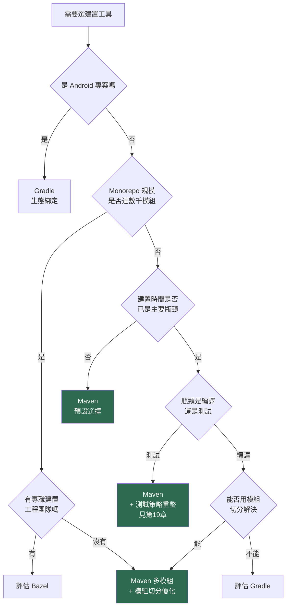

**對絕大多數企業 Java 團隊，Maven 仍是 2026 年的正確預設選擇。** 它的競爭力不在於任何單項指標最優，而在於：生態最成熟、人才最好找、與資安／合規工具鏈整合最完整、五年後仍然讀得懂。

---

#### 📌 本章重點整理

- Maven 的核心是宣告式的 POM 模型與「約定優於配置」，建置只是它的一部分職責。
- `modelVersion` 4.0.0 自 2005 年沿用逾二十年，是 Maven 的最大優點也是最大包袱；Model 4.1.0 是打破僵局的方案。
- Maven 三大原始價值：依賴管理、標準化結構、機器可讀的專案後設資料。
- Maven 的能力邊界在增量建置、建置快取與跨語言支援；Maven 4 有改善但未根本解決。
- 對企業 Java 團隊，選型的決定性因素通常是可維護性與人才可得性，而非建置速度。

#### ✅ 本章最佳實務

- 抱怨建置慢之前，先量測時間分布——多數瓶頸在測試而非編譯。
- 選型會議上，把 Bazel／Buck2／Pants 的「排除理由」寫清楚，而非略過不談。
- 遇到 Ant legacy 專案，若系統仍在演進，優先評估遷移到 Maven。
- 把「五年後還讀不讀得懂」列為建置工具的正式評估項目。

#### ⚠️ 本章注意事項

- 本章他家工具版本為 2026-07-28 查證快照，發版節奏各異，選型前請重新確認。
- 不要因為單一技術指標（如建置速度）就決定換建置工具，遷移成本通常被嚴重低估。
- 沒有專職建置工程團隊時採用 Bazel，會製造組織內的單點故障。

#### 🏢 本章企業建議

- **生產環境使用 Maven 3.9.16，Maven 4.0.0-rc-5 僅用於試點與相容性掃描**——這是本書貫穿全書的雙軌原則。
- 在企業技術雷達（Technology Radar）中，將 Maven 4 列為「評估中（Assess）」而非「採用（Adopt）」，待 GA 後再調整。
- 建置工具的選型決策應留下書面記錄（含排除理由），避免每兩年重新爭論一次。

[↑ 回目錄](#-目錄)

---

## 第2章 Maven 4 新架構

理解 Maven 4 的關鍵，是理解它**把一件事拆成了兩件事**：你在版控中維護的 POM，與你發布到倉庫的 POM，從此不再是同一份檔案。本章從這個核心分裂出發，逐層拆解整體架構。

### 2.1 架構總覽

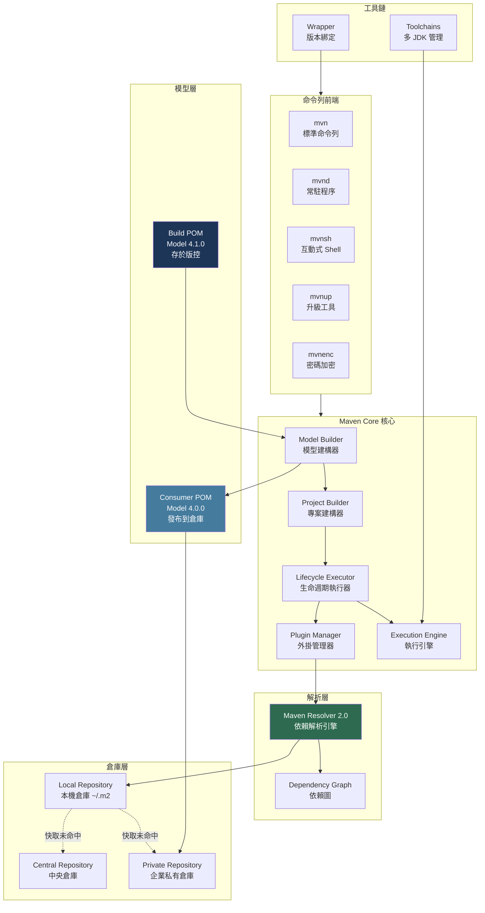

原始需求指定另附 ASCII 架構圖，以下為同一架構的純文字版本，方便貼入不支援 Mermaid 的環境（如終端機、純文字郵件、部分 Wiki）：

```text
┌──────────────────────────────────────────────────────────────────┐
│                        命令列前端 (CLI)                           │
│   mvn        mvnd        mvnsh       mvnup       mvnenc          │
│  (標準)    (常駐程序)   (互動式)   (升級工具)   (密碼加密)        │
└────────────────────────────┬─────────────────────────────────────┘
                             │
┌────────────────────────────▼─────────────────────────────────────┐
│                     Maven Core (核心)                             │
│  ┌────────────────┐  ┌────────────────┐  ┌────────────────────┐ │
│  │ Model Builder  │─▶│ Project Builder│─▶│ Lifecycle Executor │ │
│  │  模型建構器     │  │  專案建構器     │  │  生命週期執行器     │ │
│  └───────▲────────┘  └────────────────┘  └─────────┬──────────┘ │
│          │                                          │            │
│          │           ┌────────────────┐  ┌─────────▼──────────┐ │
│          │           │ Plugin Manager │◀─│  Execution Engine  │ │
│          │           │  外掛管理器     │  │    執行引擎         │ │
│          │           └───────┬────────┘  └────────────────────┘ │
└──────────┼───────────────────┼───────────────────────────────────┘
           │                   │
┌──────────┴──────────┐        │
│      模型層          │        │
│  ┌───────────────┐  │        │
│  │  Build POM    │  │        │      ┌─────────────────────────┐
│  │  Model 4.1.0  │  │        └─────▶│  Maven Resolver 2.0     │
│  │  (存於版控)    │  │               │   依賴解析引擎           │
│  └───────┬───────┘  │               └───────────┬─────────────┘
│          │ 轉換      │                           │
│  ┌───────▼───────┐  │               ┌───────────▼─────────────┐
│  │ Consumer POM  │  │               │   Dependency Graph      │
│  │ Model 4.0.0   │──┼──────┐        │      依賴圖              │
│  │ (發布到倉庫)   │  │      │        └───────────┬─────────────┘
│  └───────────────┘  │      │                    │
└─────────────────────┘      │                    │
                             │        ┌───────────▼─────────────┐
┌─────────────────────┐      │        │  Local Repository       │
│      工具鏈          │      │        │  本機倉庫 (~/.m2)        │
│  ┌───────────────┐  │      │        └───────────┬─────────────┘
│  │  Toolchains   │  │      │                    │ 快取未命中
│  │   多 JDK 管理  │  │      │        ┌───────────▼─────────────┐
│  └───────────────┘  │      └───────▶│  Central / Private      │
│  ┌───────────────┐  │               │  中央倉庫 / 企業私有倉庫  │
│  │   Wrapper     │  │               └─────────────────────────┘
│  │   版本綁定     │  │
│  └───────────────┘  │
└─────────────────────┘
```

### 2.2 Maven Core 核心元件

| 元件 | 職責 | Maven 4 的變化 |
|---|---|---|
| Model Builder（模型建構器） | 讀取 POM、套用繼承（Inheritance）與插值（Interpolation），產生有效 POM（Effective POM） | 支援 Model 4.1.0；新增 Consumer POM 產生邏輯；新增 Model Parser SPI 允許替代語法 |
| Project Builder（專案建構器） | 將 Model 轉為 MavenProject 物件，建立專案圖（Project Graph） | 支援子專案自動探索（Subprojects Discovery） |
| Lifecycle Executor（生命週期執行器） | 依生命週期決定執行哪些外掛目標（Goal） | **從有序清單改為樹狀結構**，這是 Maven 4 最深層的改動，詳見第10章 |
| Plugin Manager（外掛管理器） | 載入外掛、注入設定、管理類別載入器（ClassLoader） | 新增 Maven 4 API；外掛不再直接使用 Resolver |
| Execution Engine（執行引擎） | 實際執行外掛目標，管理反應器（Reactor）與平行度 | `--resume` 可從失敗處續建；SNAPSHOT 時間戳一致化 |

### 2.3 Build POM 與 Consumer POM 的分裂

這是 Maven 4 最重要的架構決策，也是最容易被誤解的部分。

**問題背景**：`pom.xml` 一直身兼兩個互相衝突的角色。

1. 對**你的團隊**而言，它是建置設定檔——需要 parent、properties、profiles、plugin 設定
2. 對**你的使用者**而言（下游依賴你的人），它是依賴描述檔——他們只關心「用這個 artifact 要連帶抓哪些依賴」

這兩個角色的需求相反。建置需要豐富的結構（繼承、變數、條件），消費只需要扁平的事實。過去二十年，這個矛盾靠 `flatten-maven-plugin` 之類的外掛勉強調和。

**Maven 4 的解法**：正式拆成兩份。

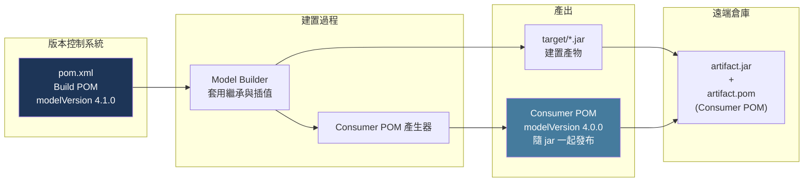

| 面向 | Build POM | Consumer POM |
|---|---|---|
| 存放位置 | 版本控制系統（你的 repo） | 遠端倉庫（隨 artifact 發布） |
| modelVersion | **4.1.0**（可用新特性） | **4.0.0**（確保 Maven 3 相容） |
| 內容 | 完整：parent、properties、profiles、build、plugins | 精簡：座標、依賴、授權等消費端需要的資訊 |
| 誰會讀 | 你的團隊、你的 CI | 下游使用者、倉庫管理器、掃描工具 |
| 是否可用 4.1.0 新語法 | 是 | 否（刻意維持 4.0.0 以相容整個既有生態） |

**這個設計最大的價值**：讓 Maven 得以演進 POM 格式，而**不需要整個生態同步升級**。你的專案可以用 Model 4.1.0 的新語法，但發布出去的仍是所有 Maven 3 使用者都讀得懂的 4.0.0。這是相容性設計的教科書級範例。

#### 2.3.1 關於 Consumer POM 扁平化的重要更正

網路上（含部分技術部落格）流傳「Maven 4 的 Consumer POM 會自動扁平化，移除 parent 參照、展開 BOM import」的說法。**這在 4.0.0-rc-5 已不成立**。

依據 Maven 4.0.0-rc-5 Release Notes，扁平化（Flattening）因為在 rc-4 造成依賴樹計算問題而被**回退（reverted）**，現況為：

- **預設不啟用扁平化**
- 需明確設定 `maven.consumer.pom.flatten=true` 才會啟用（opt-in）

> ⚠️ **版本快照（2026-07-28）**：此行為在 rc-4 與 rc-5 之間變動過一次，GA 版可能再調整。**企業導入時請以你實際安裝的版本實測為準**，不要照抄任何文章（包含本手冊）的描述。實測方法：執行 `mvn install`，然後檢視 `~/.m2/repository/` 下產生的 `.pom` 檔案內容。

### 2.4 POM Model 4.1.0

Model 4.1.0 是 Maven 4 新特性的載體。核心原則：**完全可選（Opt-in）**。

> Maven 4 will continue to build your Maven 3's model version 4.0.0 project. There is no need to update your (build) POMs to 4.1.0 if you don't need to use the new features.
> —— Maven 官方 *What's new in Maven 4*

宣告方式：

```xml
<?xml version="1.0" encoding="UTF-8"?>
<project xmlns="http://maven.apache.org/POM/4.1.0"
         xmlns:xsi="http://www.w3.org/2001/XMLSchema-instance"
         xsi:schemaLocation="http://maven.apache.org/POM/4.1.0 https://maven.apache.org/xsd/maven-4.1.0.xsd"
         root="true">
  <modelVersion>4.1.0</modelVersion>
  <groupId>com.example.acme</groupId>
  <artifactId>acme-parent</artifactId>
  <version>1.0.0-SNAPSHOT</version>
  <packaging>pom</packaging>
</project>
```

Model 4.1.0 帶來的主要能力（完整解析見第8章）：

| 能力 | 說明 |
|---|---|
| `<subprojects>` | 取代 `<modules>`，術語更精確（避免與 Java 模組系統混淆） |
| `root="true"` 屬性 | 明確標示專案根目錄，解決 `${project.rootDirectory}` 的定位問題 |
| 自動版本推導 | `<parent>` 可省略 `groupId`／`artifactId`／`version` |
| `bom` packaging | 專用於物料清單（Bill of Materials，BOM），與 parent POM 明確區分 |
| `<build><sources>` | 取代 `<sourceDirectory>`，支援多來源目錄與 scope 標註 |
| 新 artifact types | `classpath-jar`、`modular-jar`、`processor` 等，精確控制類別路徑與模組路徑（見第9.1.1 節） |
| `<bomClassifier>` | 匯入同一 BOM 的不同變體（見第7.6 節） |

#### 2.4.1 ModelParser SPI：POM 不再只能是 XML

Build POM 與 Consumer POM 的分裂（第2.3 節）帶來一個容易被忽略、卻是整個設計最激進的後果：**既然 Build POM 只有 Maven 自己會讀，它就不必再是 XML。**

Maven 4 透過 [MNG-7836](https://issues.apache.org/jira/browse/MNG-7836) 引入了 **ModelParser SPI**（Service Provider Interface，服務提供者介面）。任何人都可以實作這個介面，讓 Maven 以其他語法讀取 Build POM。官方自己就示範了一個：[Apache Maven Hocon Extension](https://github.com/apache/maven-hocon-extension)，以 HOCON 格式撰寫 POM。

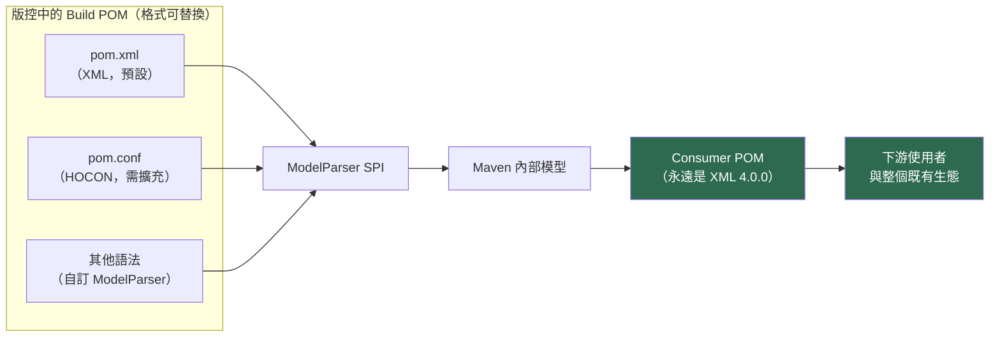

**關鍵在於這張圖的右半邊：無論你的 Build POM 用什麼語法寫，發布到倉庫的 Consumer POM 永遠是 XML、永遠是 Model 4.0.0。** 因此不會有任何下游使用者、倉庫管理器、IDE、掃描工具因為你換了 POM 語法而壞掉。

這正是 Build／Consumer POM 分裂的價值兌現——**Maven 終於能夠演進 POM 的格式，而不必先說服整個生態系一起升級**。理解這一點，也就理解了 Maven 4 為何要付出「同一個專案有兩份 POM」這麼大的架構代價。

> ⚠️ **企業立場（作者建議）：現階段不要採用替代語法。** 理由與技術好壞無關：
>
> 1. 所有 IDE、程式碼審查工具、靜態掃描器、AI Agent 對 `pom.xml` 的支援都是數十年累積的；換成 HOCON 等於放棄這整套工具鏈。
> 2. 團隊新成員的學習成本會突然變高，而收益（少打幾個角括號）與之完全不成比例。
> 3. **（未經 GA 驗證）** SPI 本身在 GA 前仍可能調整。
>
> **但你仍應該知道它存在**——因為它是解釋「為什麼 Maven 4 要做 POM 分裂」最有力的一個答案，在向管理層或團隊說明升級價值時特別有用。

### 2.5 Maven Resolver 2.0

Resolver 是 Maven 的依賴解析引擎（Maven 3.0 時代名為 Aether）。2.0 版包含 150 項以上的修正與改進，其中對使用者最有感的兩點：

1. **Java 17 原生 HttpClient**：不再依賴外部 HTTP 函式庫，減少依賴衝突與資安面
2. **隱藏於新 Maven API 之後**：外掛不再直接使用 Resolver，Maven 得以在未來改變解析實作而不破壞外掛

> 📌 依 4.0.0-rc-5 Release Notes，該版本內含的 Resolver 版本為 **2.0.13**。此版號會隨 Maven 版本更新，請以實際安裝版本的 release notes 為準。

### 2.6 三種圖的區別

Maven 4 的文件與討論中會出現三種「圖」，容易混淆，此處一次釐清：

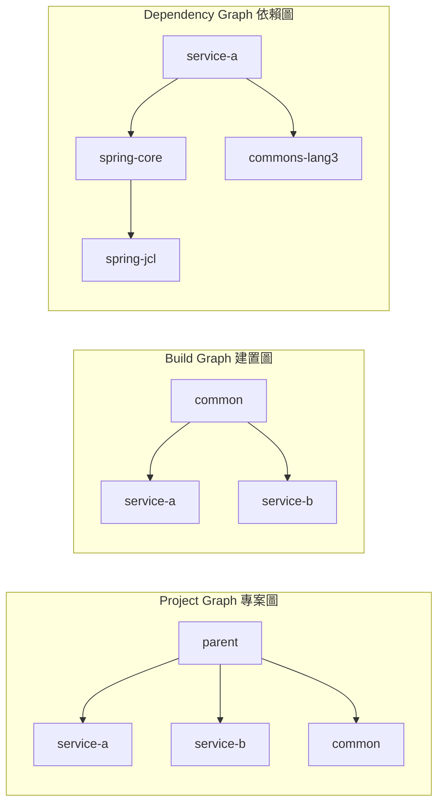

| 圖 | 描述什麼 | 由誰產生 | 用途 |
|---|---|---|---|
| Project Graph（專案圖） | 多專案設定中「誰是誰的子專案」的**聚合關係** | Project Builder 依 `<subprojects>` 或自動探索 | 決定哪些專案納入本次建置 |
| Build Graph（建置圖） | 子專案之間的**建置順序依賴** | 反應器（Reactor）依專案間的依賴宣告推導 | 決定建置順序與可平行化的部分 |
| Dependency Graph（依賴圖） | 一個 artifact 的**傳遞依賴關係** | Maven Resolver | 決定類別路徑內容、衝突調解 |

**實務上最常搞混的是專案圖與建置圖**。`<subprojects>` 只宣告「這些是我的子專案」，**不決定建置順序**；順序由子專案之間的 `<dependency>` 宣告推導。這也是為什麼「調整 `<subprojects>` 的排列順序」對建置順序毫無影響——這是新手最常見的誤解之一。

### 2.7 周邊工具鏈

Maven 4 時代的工具比 Maven 3 豐富許多。**注意：這些是獨立發布的工具，不是隨 Maven 核心一起安裝的**。

| 工具 | 用途 | 現況（2026-07-28） |
|---|---|---|
| `mvnd`（Maven Daemon） | 常駐 JVM 程序池，消除重複的 JVM 啟動與 JIT 暖機成本 | **1.x 線包裝 Maven 3**（最新 1.0.6，2026-05-30，內含 Maven 3.9.16）；**2.x 線包裝 Maven 4**（2.0.0-rc-3） |
| `mvnup`（Maven Upgrade Tool） | 自動化 Maven 3 至 4 的遷移檢查與修正 | 自 4.0.0-rc-4 起**內建於 Maven 4 發行版** |
| `mvnenc`（Maven Encryption） | 取代 Maven 3 的密碼混淆，提供真正的加密與外部 vault 支援 | 隨 Maven 4 發行版提供 |
| `mvnsh`（Maven Shell） | 互動式 shell，維持單一 Maven 程序 | 隨 Maven 4 發行版提供；**與早年 Sonatype 的同名工具無關**（見第19.6.2 節） |
| Maven Wrapper | 將 Maven 版本綁定於專案，確保全隊與 CI 版本一致 | 最新 3.3.4（2025-09-08），獨立發布，Maven 3／4 皆可用 |

> ⚠️ **常見誤解澄清**：不少文章寫「Maven 4 內建 Maven Daemon」。更精確的說法是——**mvnd 是獨立專案（apache/maven-mvnd），有自己的版本線與發布節奏**。要用 Maven 4 搭配 mvnd，需安裝 mvnd 的 **2.x 線**；1.x 線包裝的是 Maven 3。這個區別在企業安裝腳本中很重要，裝錯線會得到 Maven 3 的行為。

### 2.8 一次建置的完整流程

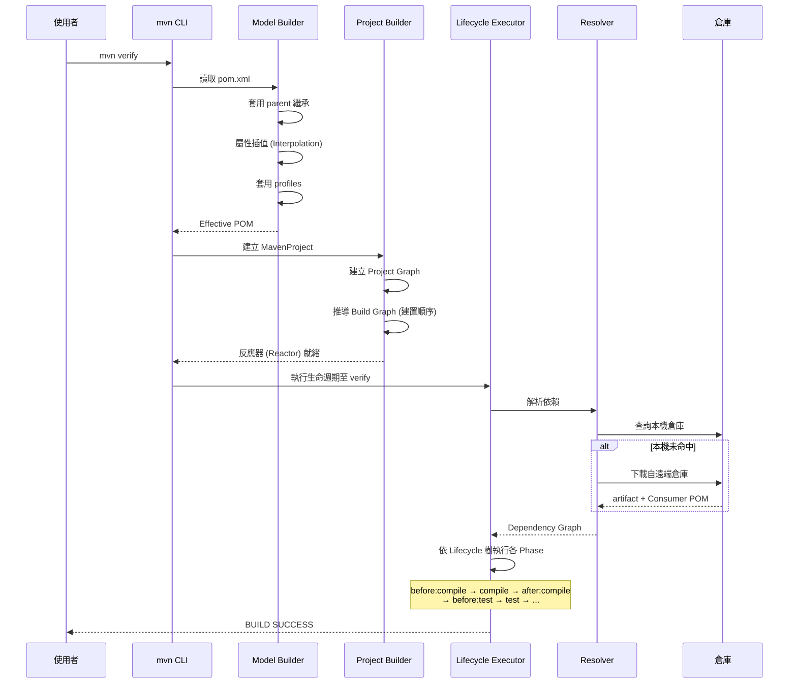

---

#### 📌 本章重點整理

- Maven 4 最核心的架構決策是把 POM 拆成 Build POM（4.1.0，版控）與 Consumer POM（4.0.0，發布），讓格式得以演進而不破壞既有生態。
- Consumer POM 扁平化在 rc-5 是**預設關閉的 opt-in 特性**，網路上「自動扁平化」的說法已過時。
- Model 4.1.0 完全可選；Maven 4 仍能正常建置 modelVersion 4.0.0 的專案。
- Project Graph（誰是子專案）、Build Graph（建置順序）、Dependency Graph（傳遞依賴）是三件不同的事，最常被混淆的是前兩者。
- mvnd 是獨立專案：**1.x 包裝 Maven 3、2.x 包裝 Maven 4**，不是「Maven 4 內建」。
- ModelParser SPI 讓 Build POM 可以不是 XML，而 Consumer POM 永遠是 XML——這是 POM 分裂最有力的價值證明（第2.4.1 節）。

#### ✅ 本章最佳實務

- 導入 Consumer POM 相關特性前，務必實測 `~/.m2/repository/` 下產生的 `.pom` 實際內容，不要照抄文件描述。
- 在企業安裝腳本中明確指定 mvnd 的版本線（2.x 才是 Maven 4），避免裝錯。
- 先用 Model 4.0.0 完成 Maven 4 遷移，確認建置穩定後再逐步採用 4.1.0 新語法。
- 教育團隊釐清三種圖的差異，可省下大量「為什麼調整 subprojects 順序沒用」的除錯時間。

#### ⚠️ 本章注意事項

- Consumer POM 扁平化行為在 rc-4 與 rc-5 之間變動過，GA 版仍可能再改，勿寫死於企業規範中。
- Resolver 版本（rc-5 為 2.0.13）會隨 Maven 版本更動，引用時請標註對應的 Maven 版本。
- `<subprojects>` 的排列順序不影響建置順序——順序由子專案間的依賴宣告決定。

#### 🏢 本章企業建議

- **生產建置維持 Maven 3.9.16；以 Maven 4.0.0-rc-5 在非生產環境跑相容性掃描**，提早暴露 Consumer POM 與 Lifecycle 變更帶來的影響。
- 將本章的架構圖納入新人訓練教材，Maven 4 的多數困惑源於不理解 Build POM 與 Consumer POM 的分裂。
- 企業內部若有自建外掛或核心擴充（Core Extension），應優先驗證其與 Maven 4 API 的相容性——這通常是升級路上最大的未知數。

[↑ 回目錄](#-目錄)

---

## 第3章 Maven 4 五大核心新特性

Maven 4 的變更清單很長，但真正會改變你日常工作方式的只有五項。本章逐一深入，並評估各自的成熟度與導入風險。

### 3.0 五大特性總覽

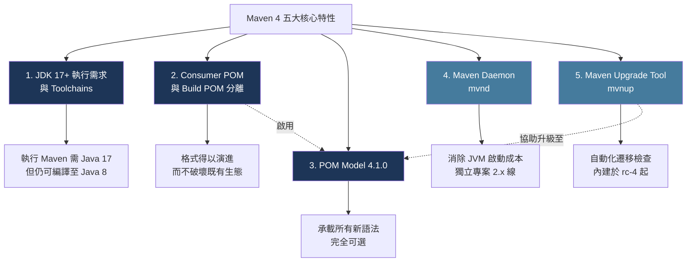

| 特性 | 成熟度 | 導入風險 | 是否強制 | 建議導入時機 |
|---|---|---|---|---|
| JDK 17+ 執行需求 | 高 | 低 | **強制** | 遷移 Maven 4 的第一步 |
| Consumer POM 分離 | 中（rc 期間行為變動過） | 中 | 自動生效 | GA 後再依賴其行為 |
| Model 4.1.0 | 中 | 低（可選） | 否 | Maven 4 建置穩定後再逐步採用 |
| mvnd | 高（1.x 線已成熟） | 低 | 否 | 隨時可用於本機開發 |
| mvnup | 中 | 低（產出可審閱） | 否 | 遷移評估階段立即使用 |

### 3.1 特性一：JDK 17 執行需求與 Toolchains

#### 3.1.1 最重要的一個觀念

**Maven 4 需要 Java 17 才能「執行 Maven 本身」，這與「你的專案編譯到哪個 Java 版本」是兩件完全獨立的事。**

官方原文說得很清楚：

> Java 17 is only needed to **run Maven**! You can still compile against older Java versions using the same compiler plugin configuration as before.

這個區別在企業環境中至關重要。許多銀行與政府系統仍運行在 Java 8 上，第一反應往往是「那我們不能升 Maven 4」。**這是錯的**——你完全可以用跑在 JDK 17 上的 Maven 4，編譯出 Java 8 的位元組碼。

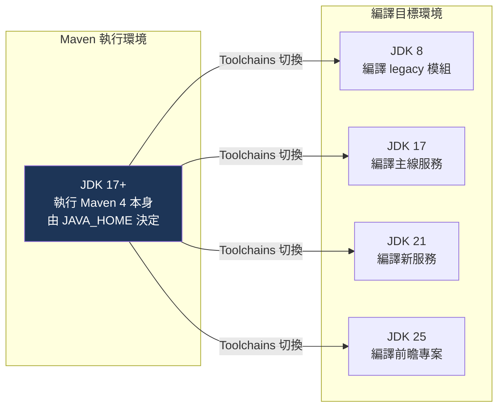

#### 3.1.2 兩種控制編譯目標的方式

| 方式 | 適用情境 | 限制 |
|---|---|---|
| `maven.compiler.release` 屬性 | 目標 JDK 版本 **低於或等於** 執行 Maven 的 JDK | 只保證 API 相容，不保證用到的是真正的舊 JDK |
| **Toolchains** | 需要用**真正的**目標 JDK 編譯、測試、產生 Javadoc | 需在每台機器設定 `toolchains.xml` |

**方式一：`release` 屬性（簡單情境）**

```xml
<properties>
  <maven.compiler.release>17</maven.compiler.release>
  <project.build.sourceEncoding>UTF-8</project.build.sourceEncoding>
</properties>
```

`release` 優於舊的 `source`／`target` 組合，因為它會同時限制**可用的 API**。用 `source`/`target` 設 8 但跑在 JDK 17 上，你仍可能誤用 Java 9+ 才有的 API，執行期才爆 `NoSuchMethodError`。

**方式二：Toolchains（企業建議）**

當你需要「真的用 JDK 8 編譯並用 JDK 8 跑測試」時，只有 Toolchains 做得到。完整說明見第6章。

#### 3.1.3 五種 JDK 目標的設定範本

以下為 Maven 4 環境下，針對五個 JDK 目標的 `maven-compiler-plugin` 設定。**執行 Maven 的 JDK 一律為 17 以上**。

```xml
<!-- 目標 Java 8：必須搭配 Toolchains，因為 JDK 17 的 javac 已不支援 release 8 之下的部分行為 -->
<properties>
  <maven.compiler.release>8</maven.compiler.release>
</properties>
```

```xml
<!-- 目標 Java 11 -->
<properties>
  <maven.compiler.release>11</maven.compiler.release>
</properties>
```

```xml
<!-- 目標 Java 17 -->
<properties>
  <maven.compiler.release>17</maven.compiler.release>
</properties>
```

```xml
<!-- 目標 Java 21 -->
<properties>
  <maven.compiler.release>21</maven.compiler.release>
</properties>
```

```xml
<!-- 目標 Java 25 -->
<properties>
  <maven.compiler.release>25</maven.compiler.release>
</properties>
```

> ⚠️ **JDK 17 的 javac 對舊 release 的支援有下限**。以 JDK 17 執行時，`release 7` 及以下會產生警告或直接失敗；`release 8` 仍可用但已被標示為 deprecated，未來的 JDK 會移除。**若你的目標是 Java 8，強烈建議走 Toolchains 路線，用真正的 JDK 8 編譯**——這同時解決了「編譯得出來但執行期出錯」的風險。（作者建議）

### 3.2 特性二：Consumer POM 與 Build POM

架構層面的說明已在第2.3 節完成，本節聚焦**實務影響**。

#### 3.2.1 對企業的四個實際影響

| 影響面 | 說明 | 因應作法 |
|---|---|---|
| 發布產物內容改變 | 上傳到倉庫的 `.pom` 不再等同於你 repo 內的 `pom.xml` | 發布流程新增一步：驗證 Consumer POM 內容符合預期 |
| 倉庫管理器相容性 | Nexus／Artifactory 等需正確處理新產生的 POM | 升級前在測試倉庫實測一次完整 deploy |
| 稽核與合規流程 | 若稽核流程比對「repo 內 POM」與「發布的 POM」，兩者將不再一致 | 更新稽核程序，說明兩者的合法差異 |
| `flatten-maven-plugin` 的定位 | Maven 4 原生支援 CI 友善變數，該外掛的主要用途消失 | 遷移時評估移除，但需先確認無其他用途 |

#### 3.2.2 如何實際檢視 Consumer POM

**不要相信任何文件（包含本手冊）對 Consumer POM 內容的描述——自己實測。**

```bash
# 步驟 1：以 Maven 4 安裝專案到本機倉庫
mvn install

# 步驟 2：找到產生的 POM
# 路徑規則：~/.m2/repository/<groupId 以 / 分隔>/<artifactId>/<version>/
find ~/.m2/repository/com/example/acme -name "*.pom" -newermt "-5 minutes"

# 步驟 3：直接檢視內容，與你的 pom.xml 比對
cat ~/.m2/repository/com/example/acme/acme-service/1.0.0-SNAPSHOT/acme-service-1.0.0-SNAPSHOT.pom
```

Windows PowerShell 版本：

```powershell
# 步驟 1
mvn install

# 步驟 2 與 3
$repo = "$env:USERPROFILE\.m2\repository\com\example\acme"
Get-ChildItem -Path $repo -Filter *.pom -Recurse |
    Where-Object { $_.LastWriteTime -gt (Get-Date).AddMinutes(-5) } |
    ForEach-Object { Write-Host "=== $($_.FullName) ==="; Get-Content $_.FullName }
```

#### 3.2.3 扁平化的啟用與風險

如第2.3.1 節所述，扁平化在 rc-5 為**預設關閉**。若要啟用：

```bash
mvn install -Dmaven.consumer.pom.flatten=true
```

或寫入 `.mvn/maven.config`：

```text
-Dmaven.consumer.pom.flatten=true
```

> ⚠️ **（未經 GA 驗證）** 此特性在 rc-4 曾預設啟用、後因造成依賴樹計算問題而在 rc-5 回退為 opt-in。**在 GA 之前，不建議在企業發布流程中依賴此行為**。若你的目的只是「讓下游看到乾淨的依賴」，現階段風險較低的作法是維持預設值，等 GA 後再評估。

#### 3.2.4 AI Agent 的使用情境

Consumer POM 對 AI Agent 分析特別有價值（作者建議）：

- 分析**下游影響**時，Consumer POM 才是使用者真正看到的內容，比 Build POM 更準確
- Build POM 含大量 profile 與變數，Agent 容易誤判；Consumer POM 已解析完畢，是「事實」而非「規則」
- 進行授權合規（License Compliance）與 SBOM 產生時，應以 Consumer POM 為基準

實務作法：讓 Agent 分析前先執行 `mvn help:effective-pom`，或直接讀取本機倉庫中的 `.pom`，而非讓它讀原始 `pom.xml`。第13章與第21章會深入這個主題。

### 3.3 特性三：POM Model 4.1.0

Model 4.1.0 的完整元素解析在第8章，本節僅說明**設計理念與採用策略**。

#### 3.3.1 三個設計原則

1. **完全可選**：不改 `modelVersion` 也能用 Maven 4 建置，新特性一個都不會缺（除了 4.1.0 專屬語法）
2. **只增不減**：4.1.0 沒有移除 4.0.0 的任何元素，`<modules>` 等舊語法仍可用（僅標示為 deprecated）
3. **不外洩**：4.1.0 的新語法不會出現在發布的 Consumer POM 中，下游 Maven 3 使用者完全無感

#### 3.3.2 新增、棄用與移除一覽

| 類別 | 項目 | 說明 |
|---|---|---|
| **新增** | `<subprojects>` / `<subproject>` | 取代 `<modules>` / `<module>` |
| **新增** | `root="true"` 專案屬性 | 標示專案根目錄 |
| **新增** | `bom` packaging | 專用於 BOM，與 parent POM 區分 |
| **新增** | `<build><sources><source>` | 取代 `<sourceDirectory>` / `<testSourceDirectory>` |
| **新增** | 新 artifact types | `classpath-jar`、`modular-jar`、`processor` 等 |
| **新增** | 自動版本推導 | `<parent>` 可省略座標；子專案可省略 `<version>` |
| **新增** | `<activation><condition>` | Profile 條件式啟用 |
| **棄用** | `<modules>` / `<module>` | 4.1.0 中仍可用，但建議改用 `<subprojects>` |
| **棄用** | `<sourceDirectory>` | 改用 `<build><sources>` |
| **移除（屬性）** | `${executionRootDirectory}` | 改用 `${session.topDirectory}` |
| **移除（屬性）** | `${multiModuleProjectDirectory}` | 改用 `${session.rootDirectory}` |
| **棄用（Phase）** | `pre-*` / `post-*` | 降級為 `before:` / `after:` 的別名 |

> 📌 **注意「移除」的兩個屬性**：這是遷移時最容易踩到的地雷之一，因為它們常出現在企業自建的 parent POM 或 CI 腳本中，且失敗訊息不見得直指問題。第15章與第17章會有專門處理。

#### 3.3.3 採用策略（作者建議）

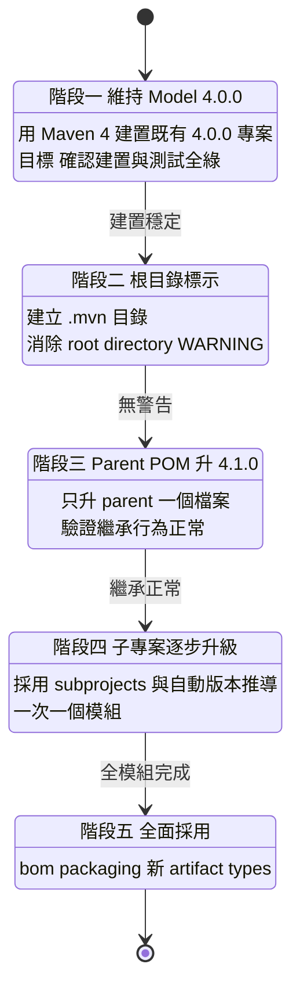

**關鍵原則：不要一次全改。** Model 4.1.0 的採用可以精確到單一模組，善用這個彈性。

### 3.4 特性四：Maven Daemon（mvnd）

#### 3.4.1 運作原理

Maven 每次執行都要啟動一個新的 JVM，這代表每次都要付出：

- JVM 啟動成本（約 0.2 至 0.5 秒）
- Maven 核心類別載入（數千個類別）
- JIT 編譯器暖機（熱點程式碼需執行多次才會被最佳化）
- 外掛類別載入與 Guice／Sisu 容器初始化

`mvnd` 的解法是維持一個**常駐 JVM 程序池**：

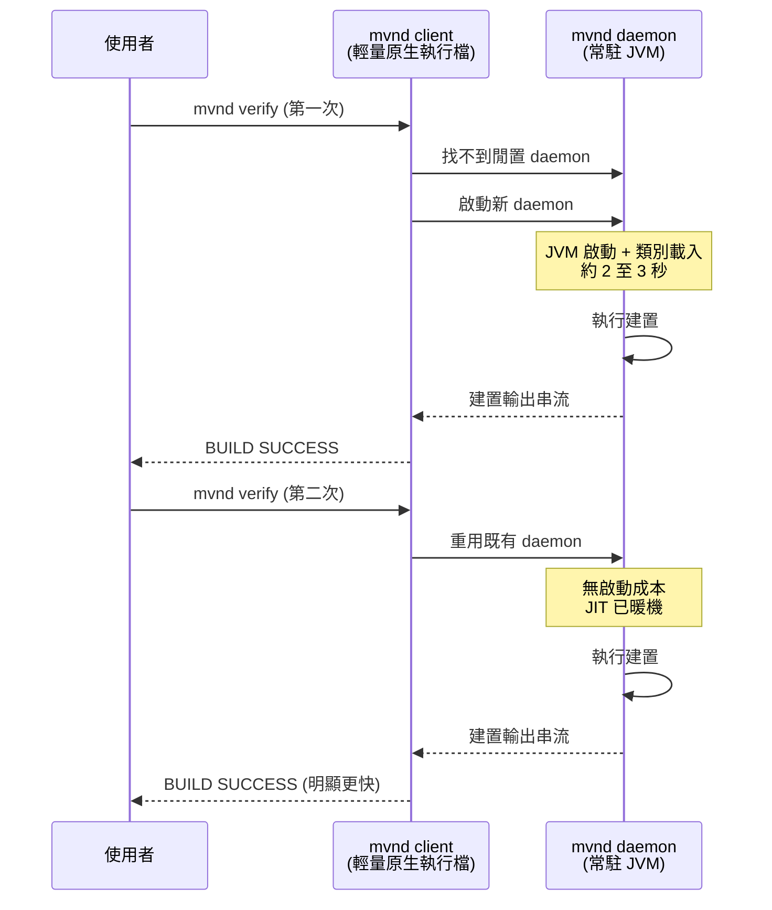

#### 3.4.2 版本線的重要區別

**這是最容易裝錯的地方，請務必看清楚：**

| mvnd 版本線 | 包裝的 Maven 版本 | 最新版本（2026-07-28） | 適用情境 |
|---|---|---|---|
| **1.x** | Maven **3**.x | 1.0.6（2026-05-30，內含 Maven 3.9.16） | 目前生產環境加速 |
| **2.x** | Maven **4**.x | 2.0.0-rc-3 | Maven 4 試點加速 |

> ⚠️ 若你 `brew install mvnd` 或 `sdk install mvnd` 而未指定版本，**極可能裝到 1.x 線，得到的是 Maven 3 的行為**。安裝後務必以 `mvnd --version` 確認實際的 Maven 版本。

#### 3.4.3 效能效益的正確預期

> ⚠️ **本節不提供具體加速倍數。** 網路上流傳的「快 3 倍」「快 5 倍」數字缺乏可比較的基準，且高度依賴專案結構、測試比重、硬體與快取狀態。**請自行量測。**（作者建議）

量測方法：

```bash
# 基準：清空 daemon，量測 Maven 原生執行時間
mvnd --stop
time mvn verify

# 對照：第一次 mvnd（含 daemon 啟動成本）
time mvnd verify

# 對照：第二次以後 mvnd（daemon 已暖機，這才是日常體感）
time mvnd verify
time mvnd verify
```

**效益的來源與大小取決於你的專案特性**：

| 專案特性 | mvnd 效益 |
|---|---|
| 建置時間短（10 秒內），頻繁重複執行 | **效益最大**，啟動成本佔比高 |
| 多模組專案，模組數多 | 效益大，平行建置搭配暖機 JIT |
| 建置時間長（10 分鐘以上），以測試為主 | **效益有限**，瓶頸不在啟動 |
| CI 環境，每次都是全新容器 | **效益接近零**，daemon 無法跨 job 重用 |

**最後一列很重要**：mvnd 的價值主要在**開發者本機**，不在 CI。在 CI 中導入 mvnd 通常是浪費——每個 job 都是新容器，daemon 建立後立刻就被銷毀。（作者建議）

#### 3.4.4 平行建置

mvnd 預設啟用平行建置。原生 Maven 也可以：

```bash
# 依 CPU 核心數自動決定執行緒數
mvn -T 1C verify

# 固定 4 執行緒
mvn -T 4 verify

# mvnd 預設已平行，也可明確指定
mvnd -T 1C verify
```

> ⚠️ **平行建置的前提是模組間依賴宣告正確**。若模組 A 實際上需要模組 B 的產物卻未宣告依賴，序列建置可能「碰巧成功」，平行建置則會隨機失敗。**平行建置失敗往往不是平行建置的錯，而是它暴露了既有的依賴宣告缺陷**。這類問題見第17章。

### 3.5 特性五：Maven Upgrade Tool（mvnup）

#### 3.5.1 定位

`mvnup` 自 **4.0.0-rc-4** 起內建於 Maven 4 發行版，用於自動化 Maven 3 至 4 的遷移檢查與修正。

它的價值不在於「全自動升級」——**沒有工具能做到全自動**——而在於**把人工排查的範圍從整個專案縮小到少數需要判斷的點**。

#### 3.5.2 兩個核心指令

```bash
# 檢查：偵測專案中可能的 Maven 4 相容性問題，不修改任何檔案
mvnup check

# 套用：自動修正可安全處理的問題
mvnup apply
```

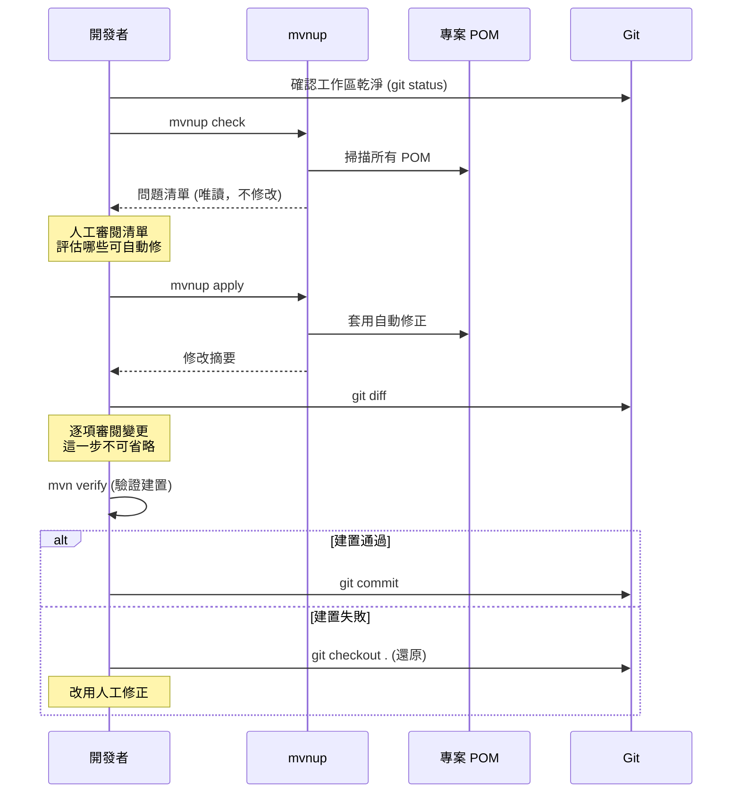

#### 3.5.3 升級選項

`mvnup` 的選項分為兩類——**目標設定**與**升級範圍**：

**目標設定**：

| 選項 | 作用 |
|---|---|
| `--model-version` | 目標 model 版本：`4.0.0`（相容 Maven 3）或 `4.1.0`（Maven 4 專屬）。**未指定時預設為 4.0.0** |
| `--directory` | 指定專案目錄（預設為目前目錄） |
| `--help` | 顯示說明 |

**升級範圍**（未指定任何一項時，預設等同 `--all`）：

| 選項 | 作用 |
|---|---|
| `--all` | 更新 Build POM 的所有部分 |
| `--model` | 只修正與 Maven 4 不相容的部分（XML 元素、運算式） |
| `--plugins` | 只更新 `plugins` 與 `pluginManagement` 區段 |
| `--infer` | 移除 Maven 可自行推導的重複依賴與外掛資訊 |

```bash
# 檢查升級到 model 4.1.0 是否可行（不修改任何檔案）
mvnup check --model-version 4.1.0 --all

# 只修正 Maven 4 不相容處，維持 model 4.0.0（風險最低，建議第一步）
mvnup apply --model

# 升級全部到 model 4.1.0（風險較高，務必逐行審閱 git diff）
mvnup apply --model-version 4.1.0 --all

# 只檢查可省略的重複宣告，指定專案目錄
mvnup check --infer --directory /path/to/project
```

`mvnup apply` 的輸出形如：

```text
[INFO] Maven Upgrade Tool - Apply
[INFO]
[INFO] Discovering POM files...
[INFO] Found 1 POM file(s)
[INFO]
[INFO] Overall Upgrade Summary:
[INFO]   1 POM(s) processed
[INFO]   0 POM(s) modified
[INFO]   1 POM(s) needed no changes
[INFO]   0 error(s) encountered
[INFO]
[INFO] Executed Strategies:
[INFO]   • Upgrading POM model version
[INFO]   • Applying Maven inference optimizations
[INFO]   • Applying Maven 4 compatibility fixes
[INFO]   • Upgrading Maven plugins to recommended versions
```

> ⚠️ **注意 `--model-version` 預設值是 `4.0.0` 而非 `4.1.0`**。這代表你單純執行 `mvnup apply` **不會**把專案升到 4.1.0，只會做 Maven 4 相容性修正並保持 4.0.0。這個預設值選得很保守，也很合理——但容易讓人誤以為「工具沒作用」。要升到 4.1.0 必須明確指定。

#### 3.5.4 使用流程與紀律

**鐵則：`mvnup apply` 之前，工作區必須乾淨（`git status` 無變更）。**

理由很簡單——你需要用 `git diff` 精確看出它改了什麼。若工作區本來就有未提交的變更，兩者混在一起，審閱會變成惡夢。

建議流程：

```bash
# 1. 確認工作區乾淨
git status

# 2. 建立專用分支
git switch -c chore/maven4-migration

# 3. 先檢查，不修改
mvnup check | tee mvnup-check-report.txt

# 4. 人工審閱報告，決定範圍

# 5. 分步套用，每步各自 commit
# 第一步：只修 Maven 4 不相容處，維持 model 4.0.0（風險最低）
mvnup apply --model
git diff                      # 逐行審閱
mvn verify                    # 驗證建置
git commit -am "chore: 修正 Maven 4 相容性問題"

# 6. 第二步：確認穩定後，才升級 model 版本
mvnup apply --model-version 4.1.0 --model
git diff
mvn verify
git commit -am "chore: 升級 POM model 至 4.1.0"

# 7. 第三步：套用推導最佳化，移除可省略的宣告
mvnup apply --model-version 4.1.0 --infer
git diff
mvn verify
git commit -am "chore: 套用 POM 自動版本推導"
```

> 💡 **分步套用、分步 commit** 是本節最重要的建議。一次 `--all` 然後建置失敗，你會不知道是哪一項造成的。分步進行時，任何一步失敗都可以單獨還原。（作者建議）

#### 3.5.5 mvnup 不會做的事

| mvnup 不處理 | 需人工處理的原因 |
|---|---|
| 自建外掛與核心擴充的相容性 | 需要理解你的擴充在做什麼 |
| 第三方外掛的版本升級決策 | 涉及功能與相容性取捨 |
| CI 腳本中的 Maven 指令調整 | 不在 POM 範圍內 |
| `installAtEnd` / `deployAtEnd` 預設值翻轉的影響 | 需理解你的發布流程 |
| Lifecycle 綁定的語意變更 | 需理解你的建置意圖 |

---

#### 📌 本章重點整理

- **Java 17 只是「執行 Maven 4」的需求，與專案編譯目標完全無關**——這是全章最重要的一句話。
- Consumer POM 扁平化在 rc-5 為預設關閉的 opt-in，且行為在 rc 期間變動過，GA 前不應依賴。
- Model 4.1.0 完全可選、只增不減、不外洩到 Consumer POM，可精確到單一模組逐步採用。
- mvnd 分 1.x（Maven 3）與 2.x（Maven 4）兩線，安裝後務必用 `mvnd --version` 確認。
- mvnd 的價值在開發者本機，在 CI 中效益接近零。
- `mvnup` 的價值是縮小人工排查範圍，不是全自動升級；務必分步套用、分步 commit。

#### ✅ 本章最佳實務

- 用 `maven.compiler.release` 取代 `source`／`target`，避免誤用高版本 API。
- 目標 Java 8 時走 Toolchains 路線，用真正的 JDK 8 編譯與測試。
- 實測 `~/.m2/repository/` 下的 `.pom` 內容，不要相信任何文件對 Consumer POM 的描述。
- `mvnup apply` 前確保工作區乾淨並開專用分支，每一步都 `git diff` 審閱後再 commit。
- 自行量測 mvnd 的效益，不要引用網路上的加速倍數。

#### ⚠️ 本章注意事項

- JDK 17 的 javac 對 `release 8` 已標示 deprecated，未來 JDK 會移除，Java 8 專案應規劃 Toolchains。
- 平行建置失敗多半是暴露了既有的依賴宣告缺陷，不要單純歸咎於平行機制。
- `${executionRootDirectory}` 與 `${multiModuleProjectDirectory}` 已移除，常藏在企業 parent POM 中。
- `mvnup apply --all` 一次套用會讓失敗難以定位，務必分步。

#### 🏢 本章企業建議

- **生產仍用 Maven 3.9.16；在 CI 中新增一條非阻斷（non-blocking）的 Maven 4.0.0-rc-5 建置管線**，持續累積相容性資訊而不影響交付。
- mvnd 可以現在就導入開發者本機（用 1.x 線搭配 Maven 3.9.16），效益立即可得且風險極低。
- 將 `mvnup check` 的報告納入升級評估文件，作為工作量估算的依據。
- 盤點企業自建外掛與核心擴充，這是遷移路上最大的未知數，且 mvnup 幫不上忙。

[↑ 回目錄](#-目錄)

---

## 第4章 Maven 安裝

本章涵蓋各作業系統與套件管理器的安裝方式。**因為本書採雙軌原則，多數情境下你會需要「同時安裝 Maven 3.9.16 與 Maven 4.0.0-rc-5」**，因此本章也會說明如何共存與切換。

### 4.1 安裝前置需求

| 項目 | Maven 3.9.16 | Maven 4.0.0-rc-5 |
|---|---|---|
| 最低 JDK | Java 8 | **Java 17** |
| 建議 JDK | Java 17 或 21 | Java 21 或 25 |
| 磁碟空間 | 約 10 MB（不含本機倉庫） | 約 15 MB（不含本機倉庫） |
| 本機倉庫空間 | 視專案而定，企業環境常達 5 至 20 GB | 同左 |

先確認 JDK：

```bash
java -version
echo $JAVA_HOME
```

PowerShell：

```powershell
java -version
$env:JAVA_HOME
```

### 4.2 安裝方式決策

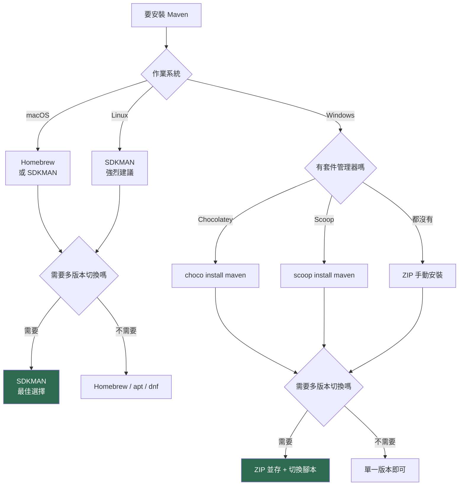

> 💡 **企業環境的通則（作者建議）**：因為需要雙軌並行（3.9.16 生產、4.0.0-rc-5 試點），**能做版本切換的方式優先**。Linux／macOS 首選 SDKMAN；Windows 則建議 ZIP 並存搭配切換腳本。而在**專案層級**，一律用 Maven Wrapper 綁定版本（見第5章）——這才是真正保證團隊一致性的機制。

### 4.3 SDKMAN 安裝（Linux 與 macOS 首選）

SDKMAN 是管理 JDK 與 Maven 多版本的最佳工具。

```bash
# 安裝 SDKMAN 本身
curl -s "https://get.sdkman.io" | bash
source "$HOME/.sdkman/bin/sdkman-init.sh"

# 查看可安裝的 Maven 版本
sdk list maven

# 安裝 Maven 3.9.16（生產用）
sdk install maven 3.9.16

# 安裝 Maven 4.0.0-rc-5（試點用）
sdk install maven 4.0.0-rc-5

# 切換當前 shell 的版本
sdk use maven 4.0.0-rc-5

# 設定預設版本（新開的 shell 會使用）
sdk default maven 3.9.16

# 確認目前版本
mvn -version
```

同時管理 JDK：

```bash
# 查看可安裝的 JDK
sdk list java

# 安裝多個 JDK 供 Toolchains 使用
sdk install java 17.0.13-tem
sdk install java 21.0.5-tem
sdk install java 25-tem

# 切換
sdk use java 21.0.5-tem
```

> 💡 SDKMAN 安裝的 JDK 位於 `~/.sdkman/candidates/java/<version>/`，這個路徑可直接填入 `toolchains.xml` 的 `<jdkHome>`（見第6章）。

### 4.4 Windows 安裝

#### 4.4.1 Chocolatey

```powershell
# 以系統管理員身分執行 PowerShell

# 安裝 Maven（預設安裝最新穩定版）
choco install maven

# 指定版本
choco install maven --version=3.9.16

# 升級
choco upgrade maven

# 確認
mvn -version
```

#### 4.4.2 Scoop

```powershell
# 安裝 Scoop（若尚未安裝）
Set-ExecutionPolicy -ExecutionPolicy RemoteSigned -Scope CurrentUser
Invoke-RestMethod -Uri https://get.scoop.sh | Invoke-Expression

# 加入 main bucket 並安裝
scoop bucket add main
scoop install maven

# 確認
mvn -version
```

#### 4.4.3 ZIP 手動安裝（企業環境建議）

企業環境常因網路管制無法使用套件管理器，ZIP 安裝是最可控的方式，也最適合雙版本並存。

**步驟一：下載**

從 <https://maven.apache.org/download.cgi> 下載：

- `apache-maven-3.9.16-bin.zip`（生產用）
- `apache-maven-4.0.0-rc-5-bin.zip`（試點用）

**步驟二：解壓縮至統一位置**

```powershell
# 建立統一的 Maven 安裝目錄
New-Item -ItemType Directory -Force "C:\tools\maven"

# 解壓縮兩個版本（假設 ZIP 在 Downloads）
Expand-Archive -Path "$env:USERPROFILE\Downloads\apache-maven-3.9.16-bin.zip" -DestinationPath "C:\tools\maven"
Expand-Archive -Path "$env:USERPROFILE\Downloads\apache-maven-4.0.0-rc-5-bin.zip" -DestinationPath "C:\tools\maven"

# 結果：
# C:\tools\maven\apache-maven-3.9.16\
# C:\tools\maven\apache-maven-4.0.0-rc-5\
Get-ChildItem "C:\tools\maven"
```

**步驟三：設定環境變數**

```powershell
# 設定 JAVA_HOME（使用者層級）
[Environment]::SetEnvironmentVariable("JAVA_HOME", "C:\tools\java\jdk-21", "User")

# 設定 MAVEN_HOME 指向預設版本（生產用 3.9.16）
[Environment]::SetEnvironmentVariable("MAVEN_HOME", "C:\tools\maven\apache-maven-3.9.16", "User")

# 將 Maven 的 bin 加入 PATH
$path = [Environment]::GetEnvironmentVariable("Path", "User")
if ($path -notlike "*%MAVEN_HOME%\bin*") {
    [Environment]::SetEnvironmentVariable("Path", "$path;%MAVEN_HOME%\bin", "User")
}

# 重開 PowerShell 後確認
mvn -version
```

**步驟四：版本切換腳本**

建立 `C:\tools\maven\switch-maven.ps1`：

```powershell
<#
.SYNOPSIS
    切換目前使用的 Maven 版本
.EXAMPLE
    .\switch-maven.ps1 -Version 4.0.0-rc-5
#>
param(
    [Parameter(Mandatory=$true)]
    [ValidateSet("3.9.16", "4.0.0-rc-5")]
    [string]$Version
)

$mavenHome = "C:\tools\maven\apache-maven-$Version"

if (-not (Test-Path $mavenHome)) {
    Write-Error "找不到 Maven 安裝目錄：$mavenHome"
    exit 1
}

[Environment]::SetEnvironmentVariable("MAVEN_HOME", $mavenHome, "User")
$env:MAVEN_HOME = $mavenHome
$env:Path = "$mavenHome\bin;" + ($env:Path -replace [regex]::Escape("C:\tools\maven\apache-maven-3.9.16\bin;"), "" -replace [regex]::Escape("C:\tools\maven\apache-maven-4.0.0-rc-5\bin;"), "")

Write-Host "已切換至 Maven $Version" -ForegroundColor Green
mvn -version
```

### 4.5 macOS 安裝

```bash
# Homebrew（安裝最新穩定版，目前為 Maven 3.x）
brew install maven

# 確認
mvn -version

# 若需要 Maven 4，Homebrew 通常沒有 RC 版本，改用 SDKMAN
sdk install maven 4.0.0-rc-5
```

> ⚠️ **macOS 使用 Maven 4.0.0-rc-5 的已知問題**：依 rc-5 Release Notes，首次執行可能因 macOS Gatekeeper 阻擋 JLine 原生函式庫而拋出 `UnsatisfiedLinkError`。官方提供的解法：
>
> ```bash
> xattr -r -d com.apple.quarantine /path/to/apache-maven-4.0.0-rc-5/lib/jline-native
> ```

### 4.6 Linux 安裝

```bash
# Debian / Ubuntu（版本通常較舊，僅適合快速試用）
sudo apt update
sudo apt install maven

# RHEL / Rocky / Fedora
sudo dnf install maven

# 確認
mvn -version
```

> ⚠️ **發行版套件庫的 Maven 版本通常落後官方數個版本**。企業環境建議改用 SDKMAN 或 tar.gz 手動安裝，以精確控制版本。

tar.gz 手動安裝：

```bash
# 下載並解壓縮至 /opt
cd /tmp
curl -LO https://archive.apache.org/dist/maven/maven-3/3.9.16/binaries/apache-maven-3.9.16-bin.tar.gz
sudo tar -xzf apache-maven-3.9.16-bin.tar.gz -C /opt

# 設定環境變數（寫入 ~/.bashrc 或 /etc/profile.d/maven.sh）
cat << 'EOF' | sudo tee /etc/profile.d/maven.sh
export JAVA_HOME=/opt/jdk-21
export MAVEN_HOME=/opt/apache-maven-3.9.16
export PATH=$MAVEN_HOME/bin:$JAVA_HOME/bin:$PATH
EOF

sudo chmod +x /etc/profile.d/maven.sh
source /etc/profile.d/maven.sh

mvn -version
```

### 4.7 環境變數說明

| 變數 | 用途 | 是否必要 |
|---|---|---|
| `JAVA_HOME` | 指向 JDK 根目錄，Maven 用它找 `java` 與 `javac` | **必要** |
| `MAVEN_HOME` | 指向 Maven 安裝根目錄 | 建議設定（部分工具會讀取） |
| `M2_HOME` | Maven 2 時代的舊變數名 | **不需要**，Maven 3.5+ 已不使用，設錯反而造成問題 |
| `PATH` | 需包含 `$MAVEN_HOME/bin` | **必要** |
| `MAVEN_OPTS` | 傳給 Maven JVM 的參數（如記憶體設定） | 選用 |
| `MAVEN_ARGS` | 每次執行都會附加的 Maven 參數 | 選用 |

> ⚠️ **`M2_HOME` 是常見的陳年錯誤**。許多舊教學仍教人設定它，但 Maven 3.5 之後已完全不使用；若設定到錯誤的路徑，反而可能造成難以診斷的問題。**若你的環境有 `M2_HOME`，建議移除。**

`MAVEN_OPTS` 範例：

```bash
# 增加堆積記憶體（大型多模組專案常需要）
export MAVEN_OPTS="-Xmx2g -XX:+UseG1GC"
```

```powershell
[Environment]::SetEnvironmentVariable("MAVEN_OPTS", "-Xmx2g -XX:+UseG1GC", "User")
```

### 4.8 安裝驗證

```bash
# 基本版本確認
mvn -version
```

預期輸出（Maven 3.9.16 為例）：

```text
Apache Maven 3.9.16 (...)
Maven home: /opt/apache-maven-3.9.16
Java version: 21.0.5, vendor: Eclipse Adoptium, runtime: /opt/jdk-21
Default locale: zh_TW, platform encoding: UTF-8
OS name: "linux", version: "6.8.0", arch: "amd64", family: "unix"
```

**驗證檢查點**：

| 檢查項 | 應確認的內容 |
|---|---|
| Maven 版本號 | 是你預期的版本（3.9.16 或 4.0.0-rc-5） |
| Maven home | 指向正確的安裝目錄 |
| Java version | Maven 4 必須是 17 以上 |
| platform encoding | 應為 **UTF-8**，否則中文註解與資源檔會亂碼 |

完整驗證（實際跑一次建置）：

```bash
# 建立測試專案並建置，確認整條工具鏈可用
cd /tmp
mvn archetype:generate \
  -DgroupId=com.example.acme \
  -DartifactId=install-verify \
  -DarchetypeArtifactId=maven-archetype-quickstart \
  -DarchetypeVersion=1.5 \
  -DinteractiveMode=false

cd install-verify
mvn verify
```

> 💡 **注意這裡用的是 `mvn verify` 而非 `mvn clean install`**。這是 Maven 官方明確的建議：
>
> > Do not use `mvn clean install` for your regular builds. Instead, use `mvn verify`!
>
> 理由與詳細說明見第10章與第24章。

### 4.9 企業大量部署建議

| 情境 | 建議作法 |
|---|---|
| 開發者工作站 | 提供標準化安裝腳本（PowerShell／Bash），統一安裝路徑與版本 |
| CI 建置節點 | 容器映像檔預先安裝，或由 CI 工具的 Maven 外掛管理（見第14章） |
| 網路隔離環境 | 內部檔案伺服器託管 ZIP／tar.gz，安裝腳本從內部來源下載 |
| 專案層級版本一致性 | **一律使用 Maven Wrapper**（見第5章），這比任何安裝方式都重要 |

> 💡 **最重要的一句話**：在企業環境中，**Maven Wrapper 比 Maven 安裝方式重要得多**。無論開發者本機裝的是哪個版本，只要專案有 Wrapper 且大家用 `./mvnw`，建置版本就是一致的。本機安裝的 Maven 主要用途反而是「執行 `mvn wrapper:wrapper` 來產生 Wrapper」。

---

#### 📌 本章重點整理

- Maven 4.0.0-rc-5 需要 Java 17 以上才能執行；Maven 3.9.16 仍支援 Java 8。
- 企業環境因需雙軌並行，應選擇支援多版本切換的安裝方式：Linux／macOS 用 SDKMAN，Windows 用 ZIP 並存加切換腳本。
- `M2_HOME` 是 Maven 2 時代的遺物，Maven 3.5 之後不再使用，設定錯誤反而有害。
- 驗證安裝時務必檢查 platform encoding 為 UTF-8，否則中文資源會亂碼。
- 專案層級的版本一致性靠 Maven Wrapper 保證，而非靠本機安裝方式。

#### ✅ 本章最佳實務

- 企業提供標準化安裝腳本，統一安裝路徑（如 `C:\tools\maven` 或 `/opt`）。
- 同時安裝 3.9.16 與 4.0.0-rc-5，並建立切換機制，方便相容性測試。
- 驗證安裝時實際跑一次 `mvn verify`，而非只看 `mvn -version`。
- 用 SDKMAN 同時管理多個 JDK，其安裝路徑可直接供 Toolchains 使用。

#### ⚠️ 本章注意事項

- Linux 發行版套件庫的 Maven 版本通常明顯落後，企業環境不建議使用。
- macOS 首次執行 Maven 4.0.0-rc-5 可能遭 Gatekeeper 阻擋 JLine，需執行 `xattr` 解除隔離。
- Homebrew 通常不提供 RC 版本，需要 Maven 4 時改用 SDKMAN。
- 若環境中存在舊的 `M2_HOME`，建議移除以免干擾。

#### 🏢 本章企業建議

- **標準工作站映像檔預裝 Maven 3.9.16 為預設版本，另備 4.0.0-rc-5 供試點**，符合全書雙軌原則。
- 網路隔離環境應在內部檔案伺服器託管安裝包，並在安裝腳本中驗證 SHA-512 檢查碼（見第20章）。
- 將「專案必須有 Maven Wrapper」列入企業開發規範的強制項目。
- 安裝腳本應同時設定 `MAVEN_OPTS` 的記憶體參數，避免大型多模組專案在預設堆積下失敗。

[↑ 回目錄](#-目錄)

---

## 第5章 Maven Wrapper

如果本書只能推薦一項實務，那就是 **Maven Wrapper**。它是遷移期最重要的單一工具，也是企業建置一致性的基礎。

### 5.1 Wrapper 解決什麼問題

**問題**：你的團隊有 20 個人，每個人本機的 Maven 版本都不同。CI 上的又是另一個版本。某天建置在 A 的機器上成功、在 B 的機器上失敗、在 CI 上又成功。

這不是假設，這是每個沒有 Wrapper 的團隊的日常。

**Wrapper 的解法**：把「要用哪個版本的 Maven」變成**專案的一部分**，隨程式碼一起進版控。

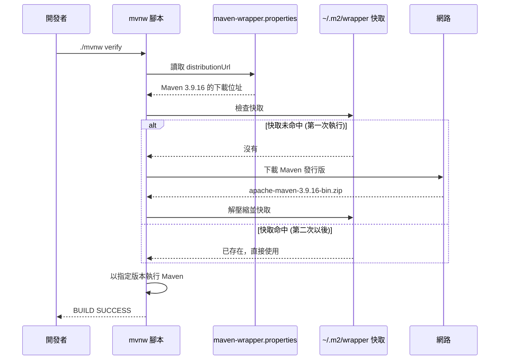

### 5.2 Wrapper 的核心價值

| 價值 | 說明 |
|---|---|
| **版本一致性** | 全隊與 CI 使用完全相同的 Maven 版本，消除「在我機器上可以」 |
| **零安裝上手** | 新人 clone 專案後直接 `./mvnw verify`，不需先安裝 Maven |
| **版本升級可控** | 升級 Maven 版本變成一次 commit，可審閱、可回退、可追溯 |
| **雙軌試點的載體** | 開一條分支把 Wrapper 指向 Maven 4，即可安全試點（**本書情境下最重要的用途**） |
| **CI 設定簡化** | CI 不需安裝 Maven，只需 JDK |

> 💡 **對本書的雙軌原則而言，Wrapper 是關鍵基礎設施**。要試點 Maven 4，你不需要說服任何人改變本機環境——開一條分支，改一行 `distributionUrl`，CI 就會用 Maven 4 建置。試完就刪分支，零風險。

### 5.3 建立 Wrapper

> 📌 **版本資訊（2026-07-28）**：Maven Wrapper 最新版為 **3.3.4**（發布於 2025-09-08）。它是獨立於 Maven 核心的專案，Maven 3 與 Maven 4 皆可使用。

```bash
# 最簡單的方式：在專案根目錄執行
mvn wrapper:wrapper

# 指定要綁定的 Maven 版本（企業建議明確指定）
mvn wrapper:wrapper -Dmaven=3.9.16

# 綁定 Maven 4 進行試點
mvn wrapper:wrapper -Dmaven=4.0.0-rc-5
```

執行後產生的檔案：

```text
專案根目錄/
├── mvnw                              # Unix / macOS 執行腳本
├── mvnw.cmd                          # Windows 執行腳本
└── .mvn/
    └── wrapper/
        ├── maven-wrapper.properties  # 版本設定（核心檔案）
        └── maven-wrapper.jar         # 僅在 type=bin 時產生
```

**這些檔案全部都要 commit 進版控**，包含 `mvnw` 與 `mvnw.cmd`。

### 5.4 四種 distributionType

Wrapper 支援四種發行類型，選擇會影響 repo 內容與網路需求。

| type | 說明 | 是否含 binary | 適用情境 |
|---|---|---|---|
| `only-script` | **預設值**。純腳本，透過 wget／curl（Unix）或 PowerShell（Windows）直接下載 Maven | 否 | 一般情境的最佳選擇 |
| `bin` | 包含 `maven-wrapper.jar` 作為 bootstrap | **是** | 需要更穩定的下載行為時 |
| `source` | 以 `MavenWrapperDownloader.java` 原始碼取代 jar | 否 | **repo 政策禁止 binary 檔案時** |
| `script` | 僅產生 wrapper 腳本，不含其他資源 | 否 | 最精簡，進階用途 |

```bash
# 預設（only-script）
mvn wrapper:wrapper

# 明確指定類型
mvn wrapper:wrapper -Dtype=only-script
mvn wrapper:wrapper -Dtype=bin
mvn wrapper:wrapper -Dtype=source
```

> 💡 **企業選擇建議（作者建議）**：多數企業用預設的 `only-script` 即可。若貴公司的版控政策禁止 commit binary 檔案（金融業常見），改用 `source`。**避免無意識地用 `bin`**——那會在每個 repo 塞一個 jar，且該 jar 本身也需納入資安掃描範圍。

### 5.5 maven-wrapper.properties 詳解

這是 Wrapper 的核心設定檔：

```properties
# Maven 發行版的下載位址（決定使用哪個版本）
distributionUrl=https://repo.maven.apache.org/maven2/org/apache/maven/apache-maven/3.9.16/apache-maven-3.9.16-bin.zip

# Wrapper 自身 jar 的下載位址（僅 type=bin 需要）
wrapperUrl=https://repo.maven.apache.org/maven2/org/apache/maven/wrapper/maven-wrapper/3.3.4/maven-wrapper-3.3.4.jar

# 選用：發行版的 SHA-256 檢查碼（強烈建議設定，見第20章）
distributionSha256Sum=<實際的 SHA-256 值>
```

切換到 Maven 4 只需改一行：

```properties
distributionUrl=https://repo.maven.apache.org/maven2/org/apache/maven/apache-maven/4.0.0-rc-5/apache-maven-4.0.0-rc-5-bin.zip
```

#### 5.5.1 企業內部倉庫

網路隔離環境中，將 `distributionUrl` 指向企業內部倉庫：

```properties
distributionUrl=https://nexus.acme-financial.internal/repository/maven-public/org/apache/maven/apache-maven/3.9.16/apache-maven-3.9.16-bin.zip
```

> ⚠️ **這一行是供應鏈安全的關鍵控制點**。指向外部網址代表每台建置機器都會從網際網路下載並執行一個 Maven 發行版。企業環境應：（1）指向內部倉庫，（2）設定 `distributionSha256Sum` 驗證完整性。詳見第20章。

### 5.6 使用 Wrapper

```bash
# Unix / macOS / Linux
./mvnw verify
./mvnw clean package
./mvnw -T 1C verify

# Windows PowerShell 或 CMD
.\mvnw.cmd verify
```

> ⚠️ **Unix 系統的執行權限問題**：從 Windows 環境 commit 的 `mvnw` 可能缺少執行權限，導致 Linux／macOS 上出現 `Permission denied`。修正方式：
>
> ```bash
> git update-index --chmod=+x mvnw
> git commit -m "fix: 修正 mvnw 執行權限"
> ```
>
> 這是跨平台團隊最常見的 Wrapper 問題，見第17章。

### 5.7 升級 Wrapper 綁定的版本

```bash
# 方式一：重新產生（會同時更新 wrapper 自身版本）
./mvnw wrapper:wrapper -Dmaven=3.9.16

# 方式二：直接編輯 .mvn/wrapper/maven-wrapper.properties 的 distributionUrl
```

**企業升級流程建議**（作者建議）：

```bash
# 1. 開專用分支
git switch -c chore/upgrade-maven-3.9.16

# 2. 更新 Wrapper
./mvnw wrapper:wrapper -Dmaven=3.9.16

# 3. 驗證建置
./mvnw verify

# 4. 檢視變更（應該只有 wrapper 相關檔案）
git status
git diff

# 5. 提交並發 PR，讓 CI 驗證
git commit -am "chore: 升級 Maven Wrapper 至 3.9.16"
```

### 5.8 Maven 4 試點的標準作法

這是本書雙軌原則在 Wrapper 上的具體落實：

```bash
# 1. 從主線開一條試點分支
git switch -c spike/maven4-compat-check

# 2. 將 Wrapper 指向 Maven 4.0.0-rc-5
./mvnw wrapper:wrapper -Dmaven=4.0.0-rc-5

# 3. 執行建置，觀察警告與錯誤
./mvnw verify --fail-on-severity WARN 2>&1 | tee maven4-report.txt

# 4. 執行升級檢查工具
./mvnw -v    # 確認確實是 4.0.0-rc-5
mvnup check | tee mvnup-report.txt

# 5. 整理報告，評估工作量

# 6. 試點結束，分支可保留供追蹤，主線完全不受影響
```

> 💡 **這個流程的價值在於「零風險」**：主線的 `distributionUrl` 完全沒動，生產建置仍走 Maven 3.9.16。試點分支的存在不影響任何人。這正是雙軌原則要達到的效果。

### 5.9 CI 中使用 Wrapper

```yaml
# GitHub Actions 範例：只需 JDK，不需安裝 Maven
- uses: actions/setup-java@v4
  with:
    distribution: 'temurin'
    java-version: '21'
    cache: 'maven'

- name: Build
  run: ./mvnw -B verify
```

`-B`（`--batch-mode`）在 CI 中應一律加上，關閉互動式輸出與彩色碼，讓 log 可讀。完整 CI 設定見第14章。

---

#### 📌 本章重點整理

- Wrapper 把「用哪個 Maven 版本」變成專案的一部分，是消除「在我機器上可以」的根本解法。
- `mvnw`、`mvnw.cmd`、`.mvn/wrapper/` 全部都要 commit 進版控。
- 四種 distributionType 中，`only-script`（預設）適合多數情境；版控禁止 binary 時用 `source`。
- 切換 Maven 版本只需改 `maven-wrapper.properties` 的一行 `distributionUrl`。
- Wrapper 是 Maven 4 零風險試點的載體：開分支、改一行、跑 CI、看報告。

#### ✅ 本章最佳實務

- 企業規範中將「專案必須有 Maven Wrapper」列為強制項目。
- `distributionUrl` 指向企業內部倉庫，並設定 `distributionSha256Sum` 驗證完整性。
- 升級 Wrapper 版本走專用分支與 PR，讓 CI 先驗證。
- CI 中一律使用 `./mvnw -B`，而非依賴 CI 節點預裝的 Maven。

#### ⚠️ 本章注意事項

- 從 Windows commit 的 `mvnw` 常缺執行權限，需 `git update-index --chmod=+x mvnw` 修正。
- 避免無意識使用 `-Dtype=bin`，那會在每個 repo 塞入需納入資安掃描的 jar。
- `distributionUrl` 指向外部網址等於每台建置機從網際網路下載並執行程式，是供應鏈風險點。

#### 🏢 本章企業建議

- **這是全書最容易立即執行、效益最高的一項建議：今天就為所有專案加上 Wrapper 並綁定 3.9.16。** 這件事不需要等 Maven 4 GA。
- 建立企業標準的 Wrapper 設定範本，含內部倉庫位址與檢查碼。
- Maven 4 的相容性試點一律透過 Wrapper 分支進行，主線不受影響。
- 將 Wrapper 版本納入定期盤點，避免各專案版本長期分歧。

[↑ 回目錄](#-目錄)

---

## 第6章 Maven Toolchains

Toolchains 是「用 JDK 17 執行 Maven，卻用 JDK 8 編譯專案」的官方解法。對仍有大量 Java 8 系統的企業而言，這是升級 Maven 4 的必經之路。

### 6.1 為什麼需要 Toolchains

回顧第3.1 節的核心觀念：**執行 Maven 的 JDK 與編譯專案的 JDK 是兩件事**。

沒有 Toolchains 時，你只有兩個選擇：

1. 用 `maven.compiler.release` — 只保證 API 相容，實際仍用執行 Maven 的 JDK 編譯
2. 為每個 JDK 版本各準備一台建置機 — 顯然不可行

Toolchains 提供第三條路：**一台機器裝多個 JDK，由 Maven 依專案需求選用**。

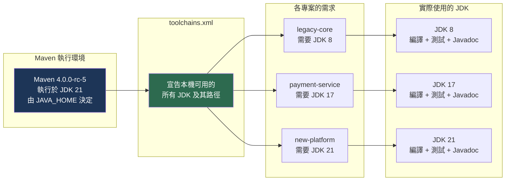

### 6.2 toolchains.xml 的位置與結構

**預設位置**：`${user.home}/.m2/toolchains.xml`

- Linux／macOS：`~/.m2/toolchains.xml`
- Windows：`%USERPROFILE%\.m2\toolchains.xml`

也可用 `--global-toolchains` 指定其他位置，但官方建議使用預設路徑。

### 6.3 完整的五 JDK 設定範本

以下是涵蓋 Java 8、11、17、21、25 的完整 `toolchains.xml`。**請依你實際的 JDK 安裝路徑調整 `<jdkHome>`**。

**Linux／macOS 版本**（路徑以 SDKMAN 安裝為例）：

```xml
<?xml version="1.0" encoding="UTF-8"?>
<toolchains xmlns="http://maven.apache.org/TOOLCHAINS/1.1.0"
            xmlns:xsi="http://www.w3.org/2001/XMLSchema-instance"
            xsi:schemaLocation="http://maven.apache.org/TOOLCHAINS/1.1.0 https://maven.apache.org/xsd/toolchains-1.1.0.xsd">

  <toolchain>
    <type>jdk</type>
    <provides>
      <version>8</version>
      <vendor>temurin</vendor>
    </provides>
    <configuration>
      <jdkHome>/home/build/.sdkman/candidates/java/8.0.432-tem</jdkHome>
    </configuration>
  </toolchain>

  <toolchain>
    <type>jdk</type>
    <provides>
      <version>11</version>
      <vendor>temurin</vendor>
    </provides>
    <configuration>
      <jdkHome>/home/build/.sdkman/candidates/java/11.0.25-tem</jdkHome>
    </configuration>
  </toolchain>

  <toolchain>
    <type>jdk</type>
    <provides>
      <version>17</version>
      <vendor>temurin</vendor>
    </provides>
    <configuration>
      <jdkHome>/home/build/.sdkman/candidates/java/17.0.13-tem</jdkHome>
    </configuration>
  </toolchain>

  <toolchain>
    <type>jdk</type>
    <provides>
      <version>21</version>
      <vendor>temurin</vendor>
    </provides>
    <configuration>
      <jdkHome>/home/build/.sdkman/candidates/java/21.0.5-tem</jdkHome>
    </configuration>
  </toolchain>

  <toolchain>
    <type>jdk</type>
    <provides>
      <version>25</version>
      <vendor>temurin</vendor>
    </provides>
    <configuration>
      <jdkHome>/home/build/.sdkman/candidates/java/25-tem</jdkHome>
    </configuration>
  </toolchain>

</toolchains>
```

**Windows 版本**：

```xml
<?xml version="1.0" encoding="UTF-8"?>
<toolchains xmlns="http://maven.apache.org/TOOLCHAINS/1.1.0"
            xmlns:xsi="http://www.w3.org/2001/XMLSchema-instance"
            xsi:schemaLocation="http://maven.apache.org/TOOLCHAINS/1.1.0 https://maven.apache.org/xsd/toolchains-1.1.0.xsd">

  <toolchain>
    <type>jdk</type>
    <provides>
      <version>8</version>
      <vendor>temurin</vendor>
    </provides>
    <configuration>
      <jdkHome>C:\tools\java\jdk-8</jdkHome>
    </configuration>
  </toolchain>

  <toolchain>
    <type>jdk</type>
    <provides>
      <version>17</version>
      <vendor>temurin</vendor>
    </provides>
    <configuration>
      <jdkHome>C:\tools\java\jdk-17</jdkHome>
    </configuration>
  </toolchain>

  <toolchain>
    <type>jdk</type>
    <provides>
      <version>21</version>
      <vendor>temurin</vendor>
    </provides>
    <configuration>
      <jdkHome>C:\tools\java\jdk-21</jdkHome>
    </configuration>
  </toolchain>

</toolchains>
```

> 💡 **`<vendor>` 的實務建議**：`<vendor>` 是選用的比對條件。若你的環境只裝一種 JDK 廠牌，**建議在 POM 中不要指定 vendor**，只比對 version。這樣同一份 POM 在不同開發者的機器上（有人用 Temurin、有人用 Corretto）都能運作。過度指定 vendor 是 Toolchains 設定失敗的常見原因。（作者建議）

### 6.4 在 POM 中使用 Toolchains

```xml
<build>
  <plugins>
    <plugin>
      <groupId>org.apache.maven.plugins</groupId>
      <artifactId>maven-toolchains-plugin</artifactId>
      <version>3.3.0</version>
      <executions>
        <execution>
          <id>select-jdk-toolchain</id>
          <goals>
            <goal>toolchain</goal>
          </goals>
        </execution>
      </executions>
      <configuration>
        <toolchains>
          <jdk>
            <version>17</version>
          </jdk>
        </toolchains>
      </configuration>
    </plugin>
  </plugins>
</build>
```

設定後，**所有支援 Toolchains 的外掛都會自動使用選定的 JDK**，包含：

| 外掛 | 使用 Toolchain 做什麼 |
|---|---|
| `maven-compiler-plugin` | 用指定 JDK 的 `javac` 編譯 |
| `maven-surefire-plugin` | 用指定 JDK 的 `java` 執行單元測試 |
| `maven-failsafe-plugin` | 用指定 JDK 執行整合測試 |
| `maven-javadoc-plugin` | 用指定 JDK 的 `javadoc` 產生文件 |
| `maven-jarsigner-plugin` | 用指定 JDK 的 `jarsigner` 簽章 |

> 💡 **這就是 Toolchains 勝過 `release` 屬性的地方**：`release` 只影響編譯，測試仍跑在執行 Maven 的 JDK 上。用 Toolchains，**測試也真的跑在目標 JDK 上**——這才是真正驗證了「這個程式在 Java 8 上能跑」。

### 6.5 企業多模組專案的實戰配置

真實企業場景：一個多專案設定中，不同子專案需要不同 JDK。

**父 POM**（統一管理外掛版本，不強制 JDK）：

```xml
<?xml version="1.0" encoding="UTF-8"?>
<project xmlns="http://maven.apache.org/POM/4.1.0"
         xmlns:xsi="http://www.w3.org/2001/XMLSchema-instance"
         xsi:schemaLocation="http://maven.apache.org/POM/4.1.0 https://maven.apache.org/xsd/maven-4.1.0.xsd"
         root="true">
  <modelVersion>4.1.0</modelVersion>
  <groupId>com.example.acme</groupId>
  <artifactId>acme-parent</artifactId>
  <version>1.0.0-SNAPSHOT</version>
  <packaging>pom</packaging>

  <subprojects>
    <subproject>legacy-core</subproject>
    <subproject>payment-service</subproject>
    <subproject>new-platform</subproject>
  </subprojects>

  <build>
    <pluginManagement>
      <plugins>
        <plugin>
          <groupId>org.apache.maven.plugins</groupId>
          <artifactId>maven-toolchains-plugin</artifactId>
          <version>3.3.0</version>
          <executions>
            <execution>
              <id>select-jdk-toolchain</id>
              <goals>
                <goal>toolchain</goal>
              </goals>
            </execution>
          </executions>
        </plugin>
      </plugins>
    </pluginManagement>
  </build>
</project>
```

**子專案 `legacy-core`**（需要 JDK 8）：

```xml
<?xml version="1.0" encoding="UTF-8"?>
<project xmlns="http://maven.apache.org/POM/4.1.0"
         xmlns:xsi="http://www.w3.org/2001/XMLSchema-instance"
         xsi:schemaLocation="http://maven.apache.org/POM/4.1.0 https://maven.apache.org/xsd/maven-4.1.0.xsd">
  <modelVersion>4.1.0</modelVersion>
  <parent>
    <relativePath>..</relativePath>
  </parent>
  <artifactId>legacy-core</artifactId>

  <properties>
    <maven.compiler.release>8</maven.compiler.release>
  </properties>

  <build>
    <plugins>
      <plugin>
        <groupId>org.apache.maven.plugins</groupId>
        <artifactId>maven-toolchains-plugin</artifactId>
        <configuration>
          <toolchains>
            <jdk>
              <version>8</version>
            </jdk>
          </toolchains>
        </configuration>
      </plugin>
    </plugins>
  </build>
</project>
```

**子專案 `new-platform`**（需要 JDK 21）：

```xml
<?xml version="1.0" encoding="UTF-8"?>
<project xmlns="http://maven.apache.org/POM/4.1.0"
         xmlns:xsi="http://www.w3.org/2001/XMLSchema-instance"
         xsi:schemaLocation="http://maven.apache.org/POM/4.1.0 https://maven.apache.org/xsd/maven-4.1.0.xsd">
  <modelVersion>4.1.0</modelVersion>
  <parent>
    <relativePath>..</relativePath>
  </parent>
  <artifactId>new-platform</artifactId>

  <properties>
    <maven.compiler.release>21</maven.compiler.release>
  </properties>

  <build>
    <plugins>
      <plugin>
        <groupId>org.apache.maven.plugins</groupId>
        <artifactId>maven-toolchains-plugin</artifactId>
        <configuration>
          <toolchains>
            <jdk>
              <version>21</version>
            </jdk>
          </toolchains>
        </configuration>
      </plugin>
    </plugins>
  </build>
</project>
```

> 📌 **注意 `<parent>` 的寫法**：在 Model 4.1.0 中，子專案的 `<parent>` 可以只寫 `<relativePath>`，`groupId`／`artifactId`／`version` 全部由 Maven 自動推導。這是 4.1.0 最實用的特性之一，詳見第8章。

### 6.6 CI 環境的 Toolchains

CI 環境需要動態產生 `toolchains.xml`，因為 JDK 路徑由 CI 工具決定。

**GitHub Actions 範例**：

```yaml
name: Build with Toolchains

on: [push, pull_request]

jobs:
  build:
    runs-on: ubuntu-latest
    steps:
      - uses: actions/checkout@v4

      # 安裝多個 JDK
      - name: Setup JDK 8
        uses: actions/setup-java@v4
        with:
          distribution: 'temurin'
          java-version: '8'

      - name: Setup JDK 17
        uses: actions/setup-java@v4
        with:
          distribution: 'temurin'
          java-version: '17'

      # 最後安裝的成為 JAVA_HOME，用來執行 Maven
      - name: Setup JDK 21 (執行 Maven 用)
        uses: actions/setup-java@v4
        with:
          distribution: 'temurin'
          java-version: '21'
          cache: 'maven'

      # 動態產生 toolchains.xml
      - name: Generate toolchains.xml
        run: |
          mkdir -p ~/.m2
          cat > ~/.m2/toolchains.xml << EOF
          <?xml version="1.0" encoding="UTF-8"?>
          <toolchains>
            <toolchain>
              <type>jdk</type>
              <provides><version>8</version></provides>
              <configuration><jdkHome>${JAVA_HOME_8_X64}</jdkHome></configuration>
            </toolchain>
            <toolchain>
              <type>jdk</type>
              <provides><version>17</version></provides>
              <configuration><jdkHome>${JAVA_HOME_17_X64}</jdkHome></configuration>
            </toolchain>
            <toolchain>
              <type>jdk</type>
              <provides><version>21</version></provides>
              <configuration><jdkHome>${JAVA_HOME_21_X64}</jdkHome></configuration>
            </toolchain>
          </toolchains>
          EOF

      - name: Build
        run: ./mvnw -B verify
```

> 💡 `actions/setup-java` 會為每個安裝的 JDK 設定 `JAVA_HOME_<版本>_<架構>` 環境變數（如 `JAVA_HOME_8_X64`），這正是動態產生 `toolchains.xml` 所需要的。

### 6.7 AI Agent 如何運用 Toolchains

（作者建議）AI Agent 在協助 JDK 升級時，Toolchains 提供了一個安全的實驗機制：

| 情境 | Agent 可執行的動作 |
|---|---|
| 評估升級到新 JDK 的可行性 | 修改 `<toolchains><jdk><version>`，執行 `mvn verify`，收集錯誤 |
| 逐模組升級 | 一次只改一個子專案的 toolchain 版本，驗證後再下一個 |
| 相容性回歸測試 | 對同一份程式碼跑多個 JDK 版本，比對測試結果 |
| 定位版本相關問題 | 二分搜尋：在 8／11／17／21 之間找出問題首次出現的版本 |

**給 Agent 的提示範例**：

```text
專案根目錄有多專案設定。請執行以下 JDK 升級可行性評估：

1. 先執行 ./mvnw -B verify 確認目前建置正常，記錄基準
2. 讀取 ~/.m2/toolchains.xml，列出本機可用的 JDK 版本
3. 對子專案 payment-service，將 maven-toolchains-plugin 的
   <jdk><version> 從 17 改為 21，並將 maven.compiler.release 改為 21
4. 執行 ./mvnw -B -pl payment-service -am verify
5. 若失敗，完整記錄錯誤訊息與失敗的測試類別，不要嘗試修正
6. 無論成功失敗，最後執行 git checkout . 還原變更
7. 輸出報告：基準狀態、變更內容、結果、若失敗則列出所有錯誤

限制：不得修改 ~/.m2/toolchains.xml，不得 commit 任何變更。
```

第21章與附錄L 會提供更完整的 Prompt 集合。

### 6.8 常見設定陷阱

| 陷阱 | 症狀 | 解法 |
|---|---|---|
| POM 指定了 vendor，但本機 JDK 廠牌不同 | `No toolchain found for type jdk` | POM 中移除 `<vendor>`，只比對 version |
| 版本字串寫法不一致 | 同上 | Java 8 在不同環境可能是 `8` 或 `1.8`，統一團隊寫法並在 toolchains.xml 中兩者都提供 |
| 忘記設定 `maven.compiler.release` | 編譯成功但位元組碼版本錯誤 | Toolchains 與 `release` 應同時設定 |
| `toolchains.xml` 只在本機有，CI 沒有 | CI 建置失敗 | CI 中動態產生（見 6.6） |
| `<jdkHome>` 路徑錯誤或 JDK 已移除 | `No toolchain found` 或執行期錯誤 | 定期驗證路徑有效性 |

**Java 8 版本字串問題的實務解法**——同時提供兩種寫法：

```xml
<toolchain>
  <type>jdk</type>
  <provides>
    <version>8</version>
  </provides>
  <configuration>
    <jdkHome>/opt/jdk-8</jdkHome>
  </configuration>
</toolchain>

<toolchain>
  <type>jdk</type>
  <provides>
    <version>1.8</version>
  </provides>
  <configuration>
    <jdkHome>/opt/jdk-8</jdkHome>
  </configuration>
</toolchain>
```

---

#### 📌 本章重點整理

- Toolchains 讓「用 JDK 17 執行 Maven、用 JDK 8 編譯與測試」成為可能，是 Java 8 企業升級 Maven 4 的關鍵。
- 相較 `maven.compiler.release` 只影響編譯，Toolchains 讓**測試也真的跑在目標 JDK 上**。
- `toolchains.xml` 預設位於 `~/.m2/toolchains.xml`，是機器層級設定，不進版控。
- 支援 Toolchains 的外掛包含 compiler、surefire、failsafe、javadoc、jarsigner。
- Model 4.1.0 讓子專案的 `<parent>` 可省略座標，只寫 `<relativePath>`。

#### ✅ 本章最佳實務

- POM 中**不要指定 `<vendor>`**，只比對版本，讓設定能跨不同開發者環境運作。
- `toolchains.xml` 中為 Java 8 同時提供 `8` 與 `1.8` 兩種版本字串。
- Toolchains 與 `maven.compiler.release` 應同時設定，前者控實際 JDK，後者控 API 邊界。
- CI 中動態產生 `toolchains.xml`，利用 `actions/setup-java` 設定的 `JAVA_HOME_*` 變數。

#### ⚠️ 本章注意事項

- `toolchains.xml` 是機器層級設定，新開發者入職與新 CI 節點建置時都必須設定，容易遺漏。
- `<jdkHome>` 路徑會因 JDK 升級而失效，需納入定期檢查。
- 過度指定 `<vendor>` 是 Toolchains 設定失敗最常見的原因。

#### 🏢 本章企業建議

- **生產建置以 Maven 3.9.16 搭配 Toolchains 執行；同一份 `toolchains.xml` 可直接沿用於 Maven 4.0.0-rc-5 試點**，這讓雙軌並行的成本極低。
- 提供企業標準 `toolchains.xml` 範本與自動產生腳本，納入工作站標準化流程。
- 對仍有 Java 8 系統的企業，Toolchains 是「先升 Maven、再升 JDK」這條漸進路線的關鍵前置條件，應優先建置。
- 將 `toolchains.xml` 的產生納入 CI 的共用 workflow／template，避免每個專案各自實作。

[↑ 回目錄](#-目錄)

---

## 第7章 Maven 專案建立

### 7.1 專案型態總覽

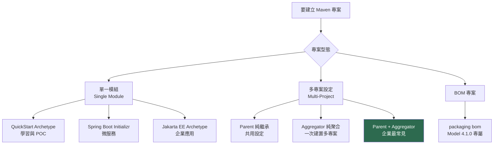

| 型態 | 適用情境 | packaging |
|---|---|---|
| 單一模組 | 函式庫、小型服務、POC | `jar` / `war` |
| Parent（父專案） | 統一管理版本與設定，供子專案繼承 | `pom` |
| Aggregator（聚合專案） | 一次建置多個子專案 | `pom` |
| BOM（物料清單） | 只提供 `dependencyManagement`，供他人 import | `bom`（4.1.0）或 `pom`（4.0.0） |

### 7.2 用 Archetype 建立專案

```bash
# 互動模式（會逐步詢問）
mvn archetype:generate

# 非互動模式（CI 與腳本用，建議明確指定所有參數）
mvn archetype:generate \
  -DgroupId=com.example.acme \
  -DartifactId=acme-service \
  -Dversion=1.0.0-SNAPSHOT \
  -Dpackage=com.example.acme.service \
  -DarchetypeGroupId=org.apache.maven.archetypes \
  -DarchetypeArtifactId=maven-archetype-quickstart \
  -DarchetypeVersion=1.5 \
  -DinteractiveMode=false
```

| 常用 Archetype | 產出 |
|---|---|
| `maven-archetype-quickstart` | 最基本的 jar 專案，含一個 App 類別與 JUnit 測試 |
| `maven-archetype-webapp` | 基本 war 專案，含 `web.xml` |
| `maven-archetype-site` | Maven Site 文件專案 |
| `maven-archetype-archetype` | 用來建立你自己的 Archetype |

> 💡 **企業建議**：與其讓每個團隊各自 `archetype:generate`，不如**建立企業自己的 Archetype**，內建企業 parent POM、標準目錄結構、必要的外掛設定與資安掃描。新專案 `mvn archetype:generate -DarchetypeGroupId=com.example.acme.archetypes` 即可符合所有規範。這是大型組織落實建置規範最有效的手段。（作者建議）

### 7.3 Spring Boot 專案

Spring Boot 專案通常不用 Archetype，改用 Spring Initializr：

```bash
# 用 curl 從 Initializr 產生專案
curl https://start.spring.io/starter.zip \
  -d type=maven-project \
  -d language=java \
  -d javaVersion=21 \
  -d groupId=com.example.acme \
  -d artifactId=acme-service \
  -d dependencies=web,actuator,validation \
  -o acme-service.zip

unzip acme-service.zip -d acme-service
```

Spring Boot 專案有兩種整合方式，**企業環境建議第二種**：

**方式一：繼承 Spring Boot Parent（簡單但限制多）**

```xml
<parent>
  <groupId>org.springframework.boot</groupId>
  <artifactId>spring-boot-starter-parent</artifactId>
  <version>4.1.0</version>
  <relativePath/>
</parent>
```

**方式二：import Spring Boot BOM（企業建議）**

```xml
<parent>
  <groupId>com.example.acme</groupId>
  <artifactId>acme-parent</artifactId>
  <version>1.0.0-SNAPSHOT</version>
</parent>

<dependencyManagement>
  <dependencies>
    <dependency>
      <groupId>org.springframework.boot</groupId>
      <artifactId>spring-boot-dependencies</artifactId>
      <version>4.1.0</version>
      <type>pom</type>
      <scope>import</scope>
    </dependency>
  </dependencies>
</dependencyManagement>
```

> 💡 **為什麼企業該用方式二**：`<parent>` 在 Maven 中只能有一個。若你繼承了 Spring Boot Parent，就**無法再繼承企業自己的 parent POM**——而企業 parent 通常承載了資安掃描、授權檢查、發布設定等強制規範。用 `import` scope 引入 Spring Boot 的版本管理，同時保留 `<parent>` 給企業 parent，兩者兼得。這是本書最重要的企業實務建議之一。

### 7.4 多專案設定

Maven 4 的術語從「多模組（Multi-Module）」改為「多專案（Multi-Project）」，以避免與 Java 平台模組系統（Java Platform Module System，JPMS）混淆。

**目錄結構**：

```text
acme-platform/
├── .mvn/                      # 標示根目錄（重要）
├── pom.xml                    # 根 POM：parent + aggregator
├── acme-bom/
│   └── pom.xml                # BOM：統一對外的版本宣告
├── acme-common/
│   └── pom.xml                # 共用工具
├── acme-domain/
│   └── pom.xml                # 領域模型
└── acme-service/
    └── pom.xml                # 應用服務
```

**根 POM**（Model 4.1.0）：

```xml
<?xml version="1.0" encoding="UTF-8"?>
<project xmlns="http://maven.apache.org/POM/4.1.0"
         xmlns:xsi="http://www.w3.org/2001/XMLSchema-instance"
         xsi:schemaLocation="http://maven.apache.org/POM/4.1.0 https://maven.apache.org/xsd/maven-4.1.0.xsd"
         root="true">
  <modelVersion>4.1.0</modelVersion>

  <groupId>com.example.acme</groupId>
  <artifactId>acme-platform</artifactId>
  <version>1.0.0-SNAPSHOT</version>
  <packaging>pom</packaging>

  <subprojects>
    <subproject>acme-bom</subproject>
    <subproject>acme-common</subproject>
    <subproject>acme-domain</subproject>
    <subproject>acme-service</subproject>
  </subprojects>

  <properties>
    <maven.compiler.release>21</maven.compiler.release>
    <project.build.sourceEncoding>UTF-8</project.build.sourceEncoding>
  </properties>

  <dependencyManagement>
    <dependencies>
      <dependency>
        <groupId>com.example.acme</groupId>
        <artifactId>acme-common</artifactId>
        <version>${project.version}</version>
      </dependency>
      <dependency>
        <groupId>com.example.acme</groupId>
        <artifactId>acme-domain</artifactId>
        <version>${project.version}</version>
      </dependency>
    </dependencies>
  </dependencyManagement>
</project>
```

**子專案**（享受 4.1.0 的自動版本推導）：

```xml
<?xml version="1.0" encoding="UTF-8"?>
<project xmlns="http://maven.apache.org/POM/4.1.0"
         xmlns:xsi="http://www.w3.org/2001/XMLSchema-instance"
         xsi:schemaLocation="http://maven.apache.org/POM/4.1.0 https://maven.apache.org/xsd/maven-4.1.0.xsd">
  <modelVersion>4.1.0</modelVersion>

  <parent>
    <relativePath>..</relativePath>
  </parent>

  <artifactId>acme-service</artifactId>

  <dependencies>
    <dependency>
      <groupId>com.example.acme</groupId>
      <artifactId>acme-domain</artifactId>
    </dependency>
  </dependencies>
</project>
```

**對比 Model 4.0.0 需要寫的內容**：

```xml
<!-- Model 4.0.0 的等價寫法，注意多出來的宣告 -->
<parent>
  <groupId>com.example.acme</groupId>
  <artifactId>acme-platform</artifactId>
  <version>1.0.0-SNAPSHOT</version>
  <relativePath>../pom.xml</relativePath>
</parent>

<groupId>com.example.acme</groupId>
<artifactId>acme-service</artifactId>
<version>1.0.0-SNAPSHOT</version>
```

> 💡 **這就是 4.1.0 最實用的日常效益**：版本號從此只需在根 POM 寫一次。過去每次改版本都要改動 N 個檔案（或依賴 `versions:set` 外掛），現在不必了。

### 7.5 Parent 與 Aggregator 的區別

這是新手最常混淆的概念，兩者**完全獨立**：

| 概念 | 作用 | 用什麼元素 | 方向 |
|---|---|---|---|
| **Parent（繼承）** | 子專案繼承父專案的設定（properties、dependencyManagement、pluginManagement） | 子專案宣告 `<parent>` | **子 → 父**（子專案指向父） |
| **Aggregator（聚合）** | 一次建置多個子專案 | 父專案宣告 `<subprojects>` | **父 → 子**（父專案列出子） |

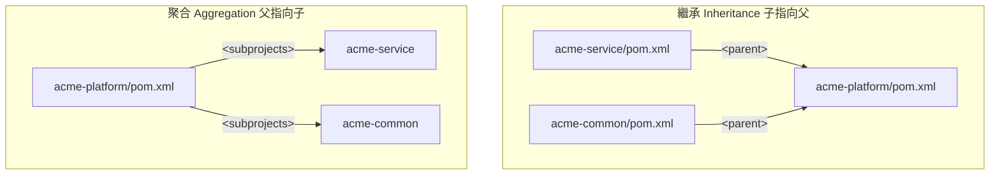

**三種組合都合法**：

1. **只有 Parent**：企業 parent POM 獨立發布，各專案繼承它但不在同一個 repo
2. **只有 Aggregator**：一次建置多個彼此無繼承關係的專案
3. **Parent + Aggregator**：同一個 POM 兼任兩者，**這是多專案設定最常見的作法**

> ⚠️ **關鍵觀念重申**：`<subprojects>` 的**排列順序不決定建置順序**。建置順序由子專案之間的 `<dependency>` 宣告推導。這在第2.6 節已說明，此處再次強調因為它是最常見的誤解。

### 7.6 BOM 專案

BOM（Bill of Materials，物料清單）是「只提供版本宣告、不提供程式碼」的專案，供他人以 `import` scope 引入。

**Model 4.1.0 的 `bom` packaging**：

```xml
<?xml version="1.0" encoding="UTF-8"?>
<project xmlns="http://maven.apache.org/POM/4.1.0"
         xmlns:xsi="http://www.w3.org/2001/XMLSchema-instance"
         xsi:schemaLocation="http://maven.apache.org/POM/4.1.0 https://maven.apache.org/xsd/maven-4.1.0.xsd">
  <modelVersion>4.1.0</modelVersion>

  <parent>
    <relativePath>..</relativePath>
  </parent>

  <artifactId>acme-bom</artifactId>
  <packaging>bom</packaging>

  <dependencyManagement>
    <dependencies>
      <dependency>
        <groupId>com.example.acme</groupId>
        <artifactId>acme-common</artifactId>
        <version>${project.version}</version>
      </dependency>
      <dependency>
        <groupId>com.example.acme</groupId>
        <artifactId>acme-domain</artifactId>
        <version>${project.version}</version>
      </dependency>
    </dependencies>
  </dependencyManagement>
</project>
```

**使用端**：

```xml
<dependencyManagement>
  <dependencies>
    <dependency>
      <groupId>com.example.acme</groupId>
      <artifactId>acme-bom</artifactId>
      <version>1.0.0-SNAPSHOT</version>
      <type>pom</type>
      <scope>import</scope>
    </dependency>
  </dependencies>
</dependencyManagement>
```

> 📌 **`bom` packaging 的價值**：在 Model 4.0.0 時代，BOM 與 parent POM 都用 `packaging=pom`，工具無法區分兩者意圖。4.1.0 的 `bom` packaging 讓語意明確，且 Maven 會自動產生 Maven 3 相容的 Consumer POM（packaging 轉為 `pom`），下游無感。
>
> ⚠️ 依 4.0.0-rc-5 Release Notes，`bom` packaging 的 Consumer POM 轉換曾有缺陷（issue #11427）。**GA 前使用此特性請務必實測發布產物**。

**`bom` packaging 與 `pom` packaging 的實際差異**：

| 面向 | `<packaging>pom</packaging>`（傳統 BOM） | `<packaging>bom</packaging>`（4.1.0） |
|---|---|---|
| 可否被 `<parent>` 繼承 | 可以（與 parent POM 無法區分） | **不可以**——它就是 BOM，不是 parent |
| 可否含 `<build>`／`<plugins>` | 可以（常被誤用成半個 parent） | 語意上不該有 |
| 工具能否辨識意圖 | 否 | **是** |
| 下游 Maven 3 專案能否 import | 可以 | 可以（Consumer POM 轉為 `pom`） |
| 需要的 modelVersion | 4.0.0 即可 | **4.1.0** |

> ⚠️ **一個對企業 monorepo 影響很大的官方警告：BOM 不應來自同一個反應器（reactor）。**
>
> 若你的 BOM 專案與使用它的專案在**同一次建置**中（也就是同一個多專案設定內），Maven 4.0 會發出警告，且官方明示**未來版本將直接失敗**。
>
> 原因是循環：要解析 BOM 就必須先建置 BOM，但 BOM 的版本又可能來自這次建置本身。Maven 3 靠特殊處理勉強支撐，Maven 4 決定收斂這個行為。
>
> **因應作法**：把 BOM 拆成獨立的版控專案與獨立的發布節奏，讓使用端以「已發布的版本號」引用它。這與第16.2 節建議「企業 Parent POM 獨立於業務專案」是同一個原則——**共用的版本契約不該和消費它的程式碼綁在同一次建置裡**。

**`<bomClassifier>`：帶 classifier 的 BOM 匯入（4.1.0）**

同一個 BOM 有時需要提供多個變體，例如「完整版」與「精簡版」、或不同執行環境對應不同的版本組合。Model 4.1.0 允許在匯入時指定 classifier：

```xml
<dependencyManagement>
  <dependencies>
    <dependency>
      <groupId>com.example.acme</groupId>
      <artifactId>acme-bom</artifactId>
      <version>1.0.0</version>
      <type>pom</type>
      <scope>import</scope>
      <!-- 匯入 acme-bom 的 jakarta 變體，而非預設變體 -->
      <bomClassifier>jakarta</bomClassifier>
    </dependency>
  </dependencies>
</dependencyManagement>
```

> ⚠️ **（未經 GA 驗證）** `<bomClassifier>` 僅存在於 Model 4.1.0，且下游若以 Maven 3 建置，看到的是 Consumer POM 而非此宣告。**採用前務必實測「Maven 3 使用端」看到的依賴管理結果是否正確**——這正是第2.3 節 Build／Consumer POM 分裂在實務上最容易出錯的地方。

### 7.7 常用建置指令

```bash
# 建置全部子專案
mvn verify

# 只建置指定子專案（-pl = --projects）
mvn verify -pl acme-service

# 建置指定子專案「及其依賴的專案」（-am = --also-make）
mvn verify -pl acme-service -am

# 建置指定子專案「及依賴它的專案」（-amd = --also-make-dependents）
mvn verify -pl acme-common -amd

# 從指定專案開始往後建置（-rf = --resume-from）
mvn verify -rf acme-domain

# Maven 4 專屬：從上次失敗處續建
mvn verify --resume
```

> 💡 **`-pl acme-service -am` 是日常最實用的組合**：只建置你正在改的服務與它依賴的專案，跳過無關的子專案。在大型多專案設定中可省下大量時間。

---

#### 📌 本章重點整理

- Parent（繼承，子指向父）與 Aggregator（聚合，父指向子）是完全獨立的兩件事，常被混淆。
- Model 4.1.0 的自動版本推導讓子專案的 `<parent>` 只需寫 `<relativePath>`，版本號只在根 POM 維護一次。
- Spring Boot 專案在企業環境應以 `import` scope 引入 BOM，把 `<parent>` 留給企業 parent POM。
- `bom` packaging 是 4.1.0 新增，讓 BOM 與 parent POM 語意明確區分；`<bomClassifier>` 則讓同一 BOM 能提供多個變體。
- **BOM 不應與使用它的專案在同一個反應器內**——Maven 4.0 警告，未來版本會直接失敗。
- `-pl <專案> -am` 是多專案設定中最實用的建置指令組合。

#### ✅ 本章最佳實務

- 建立企業專屬 Archetype，內建 parent POM、標準結構與資安設定，落實建置規範。
- 多專案設定的根 POM 同時兼任 Parent 與 Aggregator，這是最常見也最實用的作法。
- 根目錄建立 `.mvn` 目錄或設定 `root="true"`，明確標示專案根。
- 用 `${project.version}` 宣告子專案間的依賴版本，避免版本不同步。

#### ⚠️ 本章注意事項

- `<subprojects>` 的排列順序不影響建置順序，順序由依賴宣告推導。
- 繼承 Spring Boot Parent 會佔用唯一的 `<parent>` 位置，導致無法繼承企業 parent。
- `bom` packaging 的 Consumer POM 轉換在 rc-5 曾有缺陷，GA 前務必實測發布產物。
- `<bomClassifier>` 是 4.1.0 專屬；下游 Maven 3 使用端看到的是 Consumer POM，務必兩端都實測。

#### 🏢 本章企業建議

- **生產專案維持 Model 4.0.0 搭配 Maven 3.9.16；在試點分支上以 Maven 4.0.0-rc-5 驗證 4.1.0 語法**，確認自動版本推導與 `bom` packaging 的實際行為。
- **企業 monorepo 應盤點是否有「BOM 與業務模組同屬一個 aggregator」的結構**——這在 Maven 4 是必須先處理的架構問題，不是改設定就能繞過的警告。
- 企業 Archetype 應納入版本治理，與企業 parent POM 同步更新。
- 對外發布的函式庫務必提供 BOM，這是降低使用者版本衝突的最有效手段。
- 多專案設定的模組切分應依領域邊界而非技術分層，詳見第16章。

[↑ 回目錄](#-目錄)

---

## 第8章 Maven POM 完整解析

POM 是 Maven 的核心。本章逐元素解析，並以 **Model 4.1.0 為主敘、4.0.0 為對照**。

> 📌 **本章的事實來源**：以下所有元素的存在性、版本標記與棄用狀態，均直接查證自官方 schema `https://maven.apache.org/xsd/maven-4.1.0.xsd`（查證日 2026-07-28），而非二手文章。

### 8.1 POM 骨架

```xml
<?xml version="1.0" encoding="UTF-8"?>
<project xmlns="http://maven.apache.org/POM/4.1.0"
         xmlns:xsi="http://www.w3.org/2001/XMLSchema-instance"
         xsi:schemaLocation="http://maven.apache.org/POM/4.1.0 https://maven.apache.org/xsd/maven-4.1.0.xsd"
         root="true">

  <modelVersion>4.1.0</modelVersion>

  <!-- 座標 -->
  <groupId>com.example.acme</groupId>
  <artifactId>acme-platform</artifactId>
  <version>1.0.0-SNAPSHOT</version>
  <packaging>pom</packaging>

  <!-- 專案資訊 -->
  <name>ACME Platform</name>
  <description>ACME 金控核心平台</description>
  <url>https://acme-financial.example.com</url>
  <inceptionYear>2026</inceptionYear>

</project>
```

### 8.2 `<project>` 的屬性（4.1.0 新增）

Model 4.1.0 在 `<project>` 根元素上新增三個屬性——這是 4.0.0 完全沒有的能力：

| 屬性 | 型別 | 預設值 | 版本 | 用途 |
|---|---|---|---|---|
| `root` | boolean | `false` | **4.1.0+** | 標示此專案為原始碼樹的根目錄（可含 `.mvn` 目錄） |
| `preserve.model.version` | boolean | `false` | **4.1.0+** | 控制發布時是否保留原始 model 版本 |
| `child.project.url.inherit.append.path` | string | — | 4.0.0+ | 控制子專案 URL 繼承時是否附加路徑 |

```xml
<project xmlns="http://maven.apache.org/POM/4.1.0"
         xmlns:xsi="http://www.w3.org/2001/XMLSchema-instance"
         xsi:schemaLocation="http://maven.apache.org/POM/4.1.0 https://maven.apache.org/xsd/maven-4.1.0.xsd"
         root="true">
  <!-- ...POM 其餘內容... -->
</project>
```

**為什麼需要 `root="true"`**：Maven 4 需要知道「專案樹的根在哪裡」，才能解析 `${project.rootDirectory}`。若未標示，會出現警告：

```text
[WARNING] Unable to find the root directory. Create a .mvn directory in the root
directory or add the root="true" attribute on the root project's model to identify it.
```

**兩種解法，擇一即可**：

| 解法 | 作法 | 適用 |
|---|---|---|
| 建立 `.mvn` 目錄 | 在根目錄 `mkdir .mvn`（可放一個空檔案讓版控留住它） | **Model 4.0.0 專案也適用**，相容性最好 |
| `root="true"` 屬性 | 在根 POM 的 `<project>` 加上屬性 | 僅 Model 4.1.0 可用 |

> 💡 **（作者建議）建議兩者都做**。`.mvn` 目錄本來就常用來放 `maven.config` 與 `jvm.config`，且對 4.0.0 專案同樣有效；`root="true"` 則讓意圖在 POM 中一目了然。

### 8.3 座標與 `modelVersion`

| 元素 | 必要性 | 說明 |
|---|---|---|
| `modelVersion` | **必要** | `4.0.0` 或 `4.1.0` |
| `groupId` | 必要（4.1.0 可繼承推導） | 組織識別，慣例為反向網域 |
| `artifactId` | **必要** | 專案識別，同一 groupId 下唯一 |
| `version` | 必要（4.1.0 可繼承推導） | 版本號 |
| `packaging` | 選用，預設 `jar` | `jar`／`war`／`ear`／`pom`／`bom`（4.1.0）／外掛自訂 |

**版本號慣例**：

| 形式 | 意義 |
|---|---|
| `1.0.0-SNAPSHOT` | 開發中版本，每次 deploy 會更新時間戳 |
| `1.0.0` | 正式發布版本，**永不可變更** |
| `1.0.0-RC1` | 發布候選 |
| `${revision}` | CI 友善變數，Maven 4 原生支援（見 8.10） |

> ⚠️ **鐵則：已發布的正式版本永不可覆蓋**。若 `1.0.0` 已上傳倉庫，要修正就發 `1.0.1`。覆蓋已發布版本會讓所有下游的建置變得不可重現，是供應鏈安全的重大違規。企業倉庫應在伺服器端強制禁止覆蓋（見第12章）。

### 8.4 `<parent>` 與繼承

**Model 4.1.0 的自動推導**：

```xml
<!-- 最簡形式：全部自動推導 -->
<parent>
  <relativePath>..</relativePath>
</parent>

<!-- 若父 POM 就在上層目錄，甚至可以完全省略 -->
<parent/>
```

**Model 4.0.0 的完整形式**：

```xml
<parent>
  <groupId>com.example.acme</groupId>
  <artifactId>acme-platform</artifactId>
  <version>1.0.0-SNAPSHOT</version>
  <relativePath>../pom.xml</relativePath>
</parent>
```

**哪些元素會被繼承**：

| 會繼承 | 不會繼承 |
|---|---|
| `groupId`、`version` | `artifactId` |
| `properties` | `name`、`description` |
| `dependencyManagement` | `subprojects` / `modules` |
| `dependencies` | `packaging` |
| `pluginManagement` | `profiles` 的啟用狀態 |
| `build` 的多數設定 | — |
| `repositories`、`pluginRepositories` | — |
| `distributionManagement` | — |
| `scm`、`url`、`organization`、`licenses`、`developers` | — |

> ⚠️ **`<dependencies>` 會被繼承，`<dependencyManagement>` 只是「宣告版本」**。這是兩者最重要的差異：寫在 `<dependencies>` 的東西，**所有子專案都會真的拿到**；寫在 `<dependencyManagement>` 的只是「如果你要用，版本用這個」。企業 parent POM 應**極度克制**地使用 `<dependencies>`——只放真正所有子專案都需要的（如 logging API、測試框架），其餘一律放 `<dependencyManagement>`。

#### 8.4.1 Mixins：突破單一繼承（Model 4.2.0）

> ⚠️ **（未經 GA 驗證）本節內容不可用於現行專案。** Mixins 需要 `<modelVersion>4.2.0</modelVersion>`，而 **Maven 4.0.0 支援的是 4.0.0 與 4.1.0**。本節的定位是「架構規劃時值得知道的路線圖」，不是可執行的操作指南。依據為官方 [Maven Mixins Guide](https://maven.apache.org/guides/mini/guide-mixins.html)。

**這一節要解決的，是上面那張繼承表隱含的一個根本限制：一個 POM 只能有一個 parent。**

在企業實務中，這個限制的代價非常具體。假設你有三組橫切設定：Java 編譯與版本規範、測試與覆蓋率設定、安全掃描與合規設定。理想上它們應該能自由組合——但單一繼承逼你必須做出以下三選一：

| 變通作法 | 代價 |
|---|---|
| 把三組全塞進同一個企業 Parent POM | Parent POM 膨脹；不需要安全掃描的專案也被迫繼承 |
| 拉出繼承鏈（安全 → 測試 → 編譯 → 專案） | 繼承鏈過深；改動中間層會波及所有下游，且順序寫死無法重組 |
| 每個專案各自複製貼上 | 設定重複，版本永遠不同步 |

Mixins 的作法是讓 POM 可以**組合**多份設定，而不是只能**繼承**一份：

```xml
<project xmlns="http://maven.apache.org/POM/4.2.0">
  <modelVersion>4.2.0</modelVersion>

  <groupId>com.example.acme</groupId>
  <artifactId>acme-service</artifactId>
  <version>1.0.0</version>

  <!-- parent 仍可保留，mixins 是額外的組合機制 -->
  <mixins>
    <mixin>
      <groupId>com.example.acme.mixins</groupId>
      <artifactId>java-baseline-mixin</artifactId>
      <version>1.0.0</version>
    </mixin>
    <mixin>
      <groupId>com.example.acme.mixins</groupId>
      <artifactId>security-scan-mixin</artifactId>
      <version>1.0.0</version>
    </mixin>
  </mixins>
</project>
```

mixin 本身就是一個 `pom` packaging 的普通專案：

```xml
<project xmlns="http://maven.apache.org/POM/4.2.0">
  <modelVersion>4.2.0</modelVersion>

  <groupId>com.example.acme.mixins</groupId>
  <artifactId>java-baseline-mixin</artifactId>
  <version>1.0.0</version>
  <packaging>pom</packaging>

  <properties>
    <maven.compiler.release>21</maven.compiler.release>
    <project.build.sourceEncoding>UTF-8</project.build.sourceEncoding>
  </properties>

  <build>
    <pluginManagement>
      <plugins>
        <plugin>
          <groupId>org.apache.maven.plugins</groupId>
          <artifactId>maven-compiler-plugin</artifactId>
          <version>3.15.0</version>
        </plugin>
      </plugins>
    </pluginManagement>
  </build>
</project>
```

**版本可用 `<mixinManagement>` 集中管理**，用法與 `dependencyManagement` 完全對稱：

```xml
<mixinManagement>
  <mixins>
    <mixin>
      <groupId>com.example.acme.mixins</groupId>
      <artifactId>java-baseline-mixin</artifactId>
      <version>1.0.0</version>
    </mixin>
  </mixins>
</mixinManagement>

<mixins>
  <mixin>
    <groupId>com.example.acme.mixins</groupId>
    <artifactId>java-baseline-mixin</artifactId>
    <!-- 版本由 mixinManagement 提供 -->
  </mixin>
</mixins>
```

**解析順序（衝突時後者覆蓋前者）**：

```text
1. Parent POM
2. Mixins —— 依 <mixins> 中的宣告順序，後宣告者覆蓋先宣告者
3. 本 POM 自己的宣告（最高優先權）
```

> 💡 **與 `dependencyManagement` 匯入 BOM 的差異**：BOM 只能帶 `<dependencyManagement>`，mixin 則可以帶 `<properties>`、`<build>`、`<pluginManagement>` 等完整設定。可以把 mixin 理解為「可組合、可多重套用的 parent POM 片段」。

**企業規劃建議（作者推論）**：現階段不需要為 Mixins 做任何事，但在設計企業 Parent POM 時（第16.2 節），若你正在為「該不該把某組設定塞進 Parent」而糾結，可以把它**獨立成一個 `pom` packaging 專案**——這樣的結構在 Model 4.2.0 落地後可以直接轉為 mixin，現階段則仍能用 `import` 或多層 parent 勉強使用。反之，若現在把所有東西糊在單一巨大 Parent POM 裡，未來拆解的成本會非常高。

### 8.5 `<properties>` 與內建變數

```xml
<properties>
  <!-- 編碼（必設，否則不同平台建置結果不同） -->
  <project.build.sourceEncoding>UTF-8</project.build.sourceEncoding>
  <project.reporting.outputEncoding>UTF-8</project.reporting.outputEncoding>

  <!-- 編譯目標 -->
  <maven.compiler.release>21</maven.compiler.release>

  <!-- 自訂版本屬性（集中管理依賴版本） -->
  <spring.boot.version>4.1.0</spring.boot.version>
  <junit.version>5.11.4</junit.version>
</properties>
```

**Maven 4 的目錄相關內建屬性（重要變更）**：

| 屬性 | 意義 | 狀態 |
|---|---|---|
| `${project.basedir}` | 目前專案的目錄 | 沿用 |
| `${project.rootDirectory}` | 專案樹的根目錄（由 `.mvn` 或 `root="true"` 決定） | **Maven 4 新增** |
| `${session.topDirectory}` | 執行 Maven 的目錄，或 `--file` 指定的目錄 | **Maven 4 新增** |
| `${session.rootDirectory}` | 本次 session 頂層專案的根目錄 | **Maven 4 新增** |
| `${executionRootDirectory}` | — | **已移除** |
| `${multiModuleProjectDirectory}` | — | **已移除** |

> ⚠️ **這是遷移時的高頻地雷**。後兩個屬性常出現在企業 parent POM、`maven-antrun-plugin` 設定與 CI 腳本中。移除後的失敗訊息不一定直指問題（可能只是路徑變成字面值 `${multiModuleProjectDirectory}`，導致檔案找不到）。遷移前務必全域搜尋：
>
> ```bash
> grep -rn "executionRootDirectory\|multiModuleProjectDirectory" --include="*.xml" --include="*.sh" --include="*.yml" .
> ```

### 8.6 `<dependencies>` 與 `<dependencyManagement>`

```xml
<!-- dependencyManagement：只宣告版本，不引入依賴 -->
<dependencyManagement>
  <dependencies>
    <dependency>
      <groupId>org.springframework.boot</groupId>
      <artifactId>spring-boot-dependencies</artifactId>
      <version>${spring.boot.version}</version>
      <type>pom</type>
      <scope>import</scope>
    </dependency>
  </dependencies>
</dependencyManagement>

<!-- dependencies：真正引入依賴，版本可省略（由 dependencyManagement 決定） -->
<dependencies>
  <dependency>
    <groupId>org.springframework.boot</groupId>
    <artifactId>spring-boot-starter-web</artifactId>
  </dependency>

  <dependency>
    <groupId>org.junit.jupiter</groupId>
    <artifactId>junit-jupiter</artifactId>
    <scope>test</scope>
  </dependency>
</dependencies>
```

完整的依賴管理說明見第9章。

### 8.7 `<build>` 與 4.1.0 的 `<sources>`

這是 Model 4.1.0 最被低估的新特性——而且它比官方 *What's new* 頁面所展示的**豐富得多**。

**Model 4.0.0 的舊寫法**：

```xml
<build>
  <sourceDirectory>src/main/java</sourceDirectory>
  <testSourceDirectory>src/test/java</testSourceDirectory>
  <resources>
    <resource>
      <directory>src/main/resources</directory>
      <filtering>true</filtering>
    </resource>
  </resources>
  <testResources>
    <testResource>
      <directory>src/test/resources</directory>
    </testResource>
  </testResources>
</build>
```

**Model 4.1.0 的 `<sources>` 統一寫法**：

```xml
<build>
  <sources>
    <source>
      <scope>main</scope>
      <lang>java</lang>
      <directory>src/main/java</directory>
    </source>
    <source>
      <scope>test</scope>
      <lang>java</lang>
      <directory>src/test/java</directory>
    </source>
    <source>
      <scope>main</scope>
      <lang>resources</lang>
      <directory>src/main/resources</directory>
      <stringFiltering>true</stringFiltering>
    </source>
  </sources>
</build>
```

**`<source>` 的完整子元素**（直接取自 4.1.0 schema，全部標記為 `4.1.0+`，除 `directory` 為 `3.0.0+`）：

| 子元素 | 型別 | 預設值 | 用途 |
|---|---|---|---|
| `scope` | string | `main` | `main` 或 `test` |
| `lang` | string | `java` | 語言標識，`resources` 表示資源檔 |
| `module` | string | — | 對應的 Java 模組名稱（JPMS） |
| `targetVersion` | string | — | 此來源目錄的目標 Java 版本 |
| `targetPath` | string | — | 輸出路徑 |
| `stringFiltering` | boolean | `false` | 是否進行變數替換（等同舊的 `filtering`） |
| `enabled` | boolean | `true` | 是否啟用此來源 |
| `directory` | string | — | 來源目錄（相對於 POM） |
| `includes` / `excludes` | list | — | 檔案篩選 |

> 📌 **`<testResources>` 已被標記為 deprecated**。schema 中的原文：*"@deprecated Replaced by `<Source>` with `test` scope and `resources` language."*。注意 `<resources>` **尚未**被標記為 deprecated，只有 `<testResources>` 被標記——這個不對稱可能是過渡期狀態。（作者推論）

**`targetVersion` 的實戰價值**：這個元素讓**多版本 JAR（Multi-Release JAR）**的設定大幅簡化：

```xml
<build>
  <sources>
    <source>
      <scope>main</scope>
      <directory>src/main/java</directory>
      <targetVersion>17</targetVersion>
    </source>
    <source>
      <scope>main</scope>
      <directory>src/main/java21</directory>
      <targetVersion>21</targetVersion>
    </source>
  </sources>
</build>
```

過去這需要複雜的 `maven-compiler-plugin` 多 execution 設定加上 `maven-jar-plugin` 的 manifest 調整。

### 8.8 `<pluginManagement>` 與 `<plugins>`

與依賴管理同理：`<pluginManagement>` 宣告版本與預設設定，`<plugins>` 真正啟用。

```xml
<build>
  <pluginManagement>
    <plugins>
      <plugin>
        <groupId>org.apache.maven.plugins</groupId>
        <artifactId>maven-compiler-plugin</artifactId>
        <version>3.15.0</version>
      </plugin>
      <plugin>
        <groupId>org.apache.maven.plugins</groupId>
        <artifactId>maven-surefire-plugin</artifactId>
        <version>3.6.0-M1</version>
      </plugin>
    </plugins>
  </pluginManagement>

  <plugins>
    <plugin>
      <groupId>org.apache.maven.plugins</groupId>
      <artifactId>maven-surefire-plugin</artifactId>
      <!-- 版本由 pluginManagement 決定，此處不寫 -->
      <configuration>
        <argLine>-Xmx1g</argLine>
      </configuration>
    </plugin>
  </plugins>
</build>
```

> ⚠️ **Maven 4 會對「未明確指定外掛版本」發出警告**。Maven 3 時代，未指定版本會使用 Super POM 的預設值，導致「同一份 POM 在不同 Maven 版本下建置出不同結果」。**企業規範應強制所有外掛在 `<pluginManagement>` 中明確指定版本**，這也是可重現建置（Reproducible Build）的前提。
>
> ⚠️ **重複宣告同一個外掛在 Maven 4 是硬錯誤**，訊息形如：`'build.plugins.plugin.(groupId:artifactId)' must be unique but found duplicate declaration of plugin ...`。Maven 3 只給警告。這是遷移時最常見的第一個失敗，詳見第15章與第17章。

### 8.9 `<profiles>` 與 4.1.0 的 `<condition>`

```xml
<profiles>
  <profile>
    <id>integration-test</id>
    <activation>
      <property>
        <name>runIT</name>
        <value>true</value>
      </property>
    </activation>
    <build>
      <plugins>
        <plugin>
          <groupId>org.apache.maven.plugins</groupId>
          <artifactId>maven-failsafe-plugin</artifactId>
        </plugin>
      </plugins>
    </build>
  </profile>
</profiles>
```

**Model 4.1.0 新增 `<condition>`**（schema 中標記為 `4.1.0+`）：

```xml
<profiles>
  <profile>
    <id>release</id>
    <activation>
      <condition>${project.version.matches('.*[^-SNAPSHOT]$')}</condition>
    </activation>
  </profile>
</profiles>
```

> 🔍 **待官方確認（2026-07-28）**：`<condition>` 元素確實存在於 4.1.0 schema 中，但其**運算式語法的完整規格**在撰稿時未能於官方文件找到權威說明。上方範例僅示意用途，**請勿直接複製到生產環境**。實際使用前請查閱你所安裝版本的官方文件並實測。

**Maven 4 的可選 Profile**：

```bash
# Maven 3：profile 不存在會導致建置失敗
mvn compile -P nonexistent

# Maven 4：加 ? 前綴，profile 不存在時不失敗
mvn compile -P?nonexistent
```

輸出：

```text
[INFO] The requested optional profiles [nonexistent] could not be activated or deactivated because they do not exist.
[INFO] BUILD SUCCESS
```

> 💡 這對**共用 CI 腳本**特別有用：同一份 pipeline 套用到多個專案時，某些專案可能沒有定義該 profile，用 `?` 前綴即可避免失敗。

### 8.10 CI 友善變數

Maven 4 原生支援 `${revision}` 等 CI 友善變數，**不再需要 `flatten-maven-plugin`**。

```xml
<project xmlns="http://maven.apache.org/POM/4.1.0"
         xmlns:xsi="http://www.w3.org/2001/XMLSchema-instance"
         xsi:schemaLocation="http://maven.apache.org/POM/4.1.0 https://maven.apache.org/xsd/maven-4.1.0.xsd">
  <modelVersion>4.1.0</modelVersion>
  <groupId>com.example.acme</groupId>
  <artifactId>acme-platform</artifactId>
  <version>${revision}</version>
  <packaging>pom</packaging>

  <properties>
    <revision>1.0.0-SNAPSHOT</revision>
  </properties>
</project>
```

建置時覆寫：

```bash
# 命令列
mvn verify -Drevision=1.2.3

# 或寫入 .mvn/maven.config
echo "-Drevision=1.2.3" > .mvn/maven.config
```

可用的三個保留屬性：`${revision}`、`${sha1}`、`${changelist}`。

### 8.11 其他常用元素

```xml
<!-- 版本控制資訊 -->
<scm>
  <connection>scm:git:https://github.com/acme/acme-platform.git</connection>
  <developerConnection>scm:git:git@github.com:acme/acme-platform.git</developerConnection>
  <url>https://github.com/acme/acme-platform</url>
  <tag>HEAD</tag>
</scm>

<!-- 授權（授權掃描工具會讀取） -->
<licenses>
  <license>
    <name>Apache License, Version 2.0</name>
    <url>https://www.apache.org/licenses/LICENSE-2.0.txt</url>
    <distribution>repo</distribution>
  </license>
</licenses>

<!-- 組織 -->
<organization>
  <name>ACME 金控</name>
  <url>https://acme-financial.example.com</url>
</organization>

<!-- 開發者 -->
<developers>
  <developer>
    <id>platform-team</id>
    <name>平台工程團隊</name>
    <email>platform@acme-financial.example.com</email>
    <organization>ACME 金控</organization>
    <roles>
      <role>maintainer</role>
    </roles>
  </developer>
</developers>

<!-- 發布目標倉庫 -->
<distributionManagement>
  <repository>
    <id>acme-releases</id>
    <url>https://nexus.acme-financial.internal/repository/maven-releases/</url>
  </repository>
  <snapshotRepository>
    <id>acme-snapshots</id>
    <url>https://nexus.acme-financial.internal/repository/maven-snapshots/</url>
  </snapshotRepository>
</distributionManagement>
```

> 💡 **`<licenses>` 不是裝飾品**。授權合規掃描工具（如 `license-maven-plugin`）、SBOM 產生器與企業法務稽核都會讀取這個欄位。企業內部專案也應正確填寫，否則下游的 SBOM 會出現大量 "Unknown License"，在金融與政府稽核中會成為缺失項。

### 8.12 Model 4.0.0 與 4.1.0 完整對照表

這是本章最重要的一張表。所有資料直接取自官方 schema。

| 元素／屬性 | 4.0.0 | 4.1.0 | 狀態與說明 |
|---|---|---|---|
| `modelVersion` | `4.0.0` | `4.1.0` | 命名空間與 XSD 位址同步變更 |
| `<modules>` / `<module>` | ✅ 可用 | ⚠️ **deprecated** | schema 原文：`@deprecated Use subprojects instead` |
| `<subprojects>` / `<subproject>` | ❌ 無 | ✅ **新增** | schema 標記 `4.1.0` |
| `root` 屬性 | ❌ 無 | ✅ **新增** | schema 標記 `4.1.0+`，boolean，預設 `false` |
| `preserve.model.version` 屬性 | ❌ 無 | ✅ **新增** | schema 標記 `4.1.0+`，boolean，預設 `false` |
| `<build><sources>` | ❌ 無 | ✅ **新增** | schema 標記 `4.1.0+` |
| `<source><scope>` | ❌ 無 | ✅ **新增** | 預設 `main` |
| `<source><lang>` | ❌ 無 | ✅ **新增** | 預設 `java` |
| `<source><module>` | ❌ 無 | ✅ **新增** | JPMS 模組名 |
| `<source><targetVersion>` | ❌ 無 | ✅ **新增** | 多版本 JAR 的關鍵 |
| `<source><targetPath>` | ❌ 無 | ✅ **新增** | — |
| `<source><stringFiltering>` | ❌ 無 | ✅ **新增** | 預設 `false` |
| `<source><enabled>` | ❌ 無 | ✅ **新增** | 預設 `true` |
| `<build><testResources>` | ✅ 可用 | ⚠️ **deprecated** | 改用 `<source>` 搭配 `test` scope 與 `resources` lang |
| `<build><resources>` | ✅ 可用 | ✅ 可用 | **未標記 deprecated** |
| `<activation><condition>` | ❌ 無 | ✅ **新增** | 語法規格待官方確認 |
| `packaging` 值 `bom` | ❌ 無 | ✅ **新增** | 與 parent POM 語意區分（見第7.6 節） |
| `<bomClassifier>` | ❌ 無 | ✅ **新增** | 匯入 BOM 的特定變體（見第7.6 節） |
| `<parent>` 座標省略 | ❌ 必填 | ✅ **可推導** | 自動版本推導 |
| `<type>` 值 `classpath-jar`／`modular-jar` | ❌ 無 | ✅ **新增** | 明確控制 classpath 與 module-path（見第9.1.1 節） |
| `<type>` 值 `processor` 系列 | ❌ 無 | ✅ **新增** | annotation processor 三型別（見第9.1.1 節） |
| `${executionRootDirectory}` | ✅ 可用 | ❌ **已移除** | 改用 `${session.topDirectory}` |
| `${multiModuleProjectDirectory}` | ✅ 可用 | ❌ **已移除** | 改用 `${session.rootDirectory}` |
| `${pom.*}` 運算式 | ⚠️ 已棄用但可用 | ❌ **已移除** | 改用 `${project.*}`（見第15.4 節） |
| `<developer><address>` | ✅ 可用 | ⚠️ **deprecated** | — |
| `<mixins>` / `<mixinManagement>` | ❌ 無 | ❌ 無 | **需 Model 4.2.0**，Maven 4.0.0 不支援（見第8.4.1 節） |

> 📌 **表格最後一列不是筆誤**：Mixins 是官方文件已載明、但**尚未進入 4.1.0** 的特性，它屬於 Model 4.2.0。之所以列在這裡，是因為企業在規劃 Parent POM 架構時值得知道這條路線的存在——詳見第8.4.1 節。

### 8.13 檢視有效 POM

繼承與插值的結果並不總是直覺的。**遇到 POM 相關問題，第一件事就是看 Effective POM**：

```bash
# 輸出有效 POM 到終端機
mvn help:effective-pom

# 輸出到檔案（大型專案建議）
mvn help:effective-pom -Doutput=effective-pom.xml

# 只看指定子專案
mvn help:effective-pom -pl acme-service

# 檢視有效 settings
mvn help:effective-settings
```

> 💡 **這也是給 AI Agent 分析 POM 時最重要的一個指令**。原始 `pom.xml` 充滿繼承與變數，Agent 容易誤判；Effective POM 是已解析完成的「事實」。第13章與第21章會深入這個作法。

---

#### 📌 本章重點整理

- Model 4.1.0 在 `<project>` 新增 `root`、`preserve.model.version` 兩個屬性。
- `<build><sources>` 確實存在於 4.1.0 schema，且子元素比官方 What's new 頁面展示的豐富得多，含 `lang`、`module`、`targetVersion`、`enabled` 等。
- `<testResources>` 已標記 deprecated，但 `<resources>` 尚未——這個不對稱可能是過渡狀態。
- `${executionRootDirectory}` 與 `${multiModuleProjectDirectory}` 已移除，是遷移高頻地雷。
- 重複宣告同一外掛在 Maven 4 是**硬錯誤**，Maven 3 只是警告。
- Maven 4 原生支援 `${revision}`，不再需要 `flatten-maven-plugin`。
- **Mixins（`<mixins>` / `<mixinManagement>`）需要 Model 4.2.0，Maven 4.0.0 不支援**；它是解決 POM 單一繼承限制的官方路線，現階段只影響架構規劃（第8.4.1 節）。

#### ✅ 本章最佳實務

- 根目錄同時建立 `.mvn` 目錄與設定 `root="true"`，兼顧相容性與可讀性。
- 所有外掛版本一律在 `<pluginManagement>` 明確指定，這是可重現建置的前提。
- 企業 parent POM 極度克制使用 `<dependencies>`，優先用 `<dependencyManagement>`。
- 遇到 POM 問題先跑 `mvn help:effective-pom`，不要憑空推測繼承結果。
- 正確填寫 `<licenses>`，這會影響 SBOM 與合規稽核結果。

#### ⚠️ 本章注意事項

- 已發布的正式版本永不可覆蓋，企業倉庫應在伺服器端強制禁止。
- 遷移前務必全域搜尋兩個已移除的目錄屬性，它們常藏在 CI 腳本與 antrun 設定中。
- `<condition>` 的運算式語法規格未經官方文件確認，勿直接用於生產。
- `bom` packaging 的 Consumer POM 轉換在 rc-5 曾有缺陷，需實測。

#### 🏢 本章企業建議

- **生產 POM 維持 Model 4.0.0；在試點分支驗證 4.1.0 元素的實際行為**，特別是 `<sources>` 與 `bom` packaging。
- 將「外掛必須明確指定版本」「不得重複宣告外掛」列入企業 POM 規範與 CI 檢查（可用 Enforcer 強制，見第11章）。
- 建立企業 parent POM 的變更審查流程——它影響所有子專案，變更風險極高。
- 把 `mvn help:effective-pom` 納入新人訓練，這是排查 POM 問題最有效的單一工具。

[↑ 回目錄](#-目錄)

---

## 第9章 依賴管理

依賴管理是 Maven 最核心的價值，也是最容易出問題的地方。本章的目標是讓你能**預測** Maven 的行為，而不是靠試誤。

### 9.1 依賴座標

```xml
<dependency>
  <groupId>org.apache.commons</groupId>
  <artifactId>commons-lang3</artifactId>
  <version>3.17.0</version>
  <type>jar</type>
  <classifier>sources</classifier>
  <scope>compile</scope>
  <optional>false</optional>
</dependency>
```

| 元素 | 必要性 | 說明 |
|---|---|---|
| `groupId` | 必要 | 組織識別 |
| `artifactId` | 必要 | 構件識別 |
| `version` | 視情況 | 若 `dependencyManagement` 已宣告則可省略 |
| `type` | 選用，預設 `jar` | 構件類型 |
| `classifier` | 選用 | 同一構件的不同變體（如 `sources`、`javadoc`） |
| `scope` | 選用，預設 `compile` | 見 9.2 |
| `optional` | 選用，預設 `false` | 見 9.5 |

#### 9.1.1 Maven 4 的新 artifact type：明確控制 classpath 與 module-path

**這是 Maven 4 中最少被討論、但對已導入 JPMS（Java Platform Module System，Java 平台模組系統）的專案影響最直接的變更。**

自 Java 9 引入模組系統後，每一個 jar 在編譯與執行時都面臨一個問題：**它該被放到類別路徑（classpath）還是模組路徑（module path）？** Maven 3 與預設的 `jar` 型別是靠**啟發式規則**（heuristic）判斷的——大致上是「jar 內有 `module-info.class` 就放模組路徑」。

問題在於這個猜測經常猜錯。典型的失敗場景：

- 某個依賴有 `module-info.class`，但你其實想把它當 classpath 上的一般 jar 用（例如它的模組宣告與你的專案衝突）
- 某個依賴沒有 `module-info.class`（自動模組），你希望它上模組路徑，Maven 卻放到了 classpath
- annotation processor 被誤放到編譯類別路徑，或反之

這正是 Apache JIRA 上 [MNG-8015](https://issues.apache.org/jira/browse/MNG-8015)（Control the type of path where each dependency can be placed）與 [MCOMPILER-336](https://issues.apache.org/jira/browse/MCOMPILER-336) 長年追蹤的問題。Maven 4 的解法很直接：**新增帶前綴的 artifact type，把決定權交還給開發者**。

| `<type>` | 放置位置 | 說明 |
|---|---|---|
| `jar` | **啟發式判斷** | 預設值，維持 Maven 3 行為 |
| `classpath-jar` | **無條件**放類別路徑 | 明確覆寫啟發式判斷 |
| `modular-jar` | **無條件**放模組路徑 | 明確覆寫啟發式判斷 |
| `processor` | 啟發式判斷 | annotation processor，簡化註冊 |
| `classpath-processor` | **無條件**放 annotation processor 類別路徑 | — |
| `modular-processor` | **無條件**放 annotation processor 模組路徑 | — |

實際用法——就是把 `<type>` 換掉，其餘不變：

```xml
<dependencies>
  <!-- 強制上模組路徑：即使 Maven 的啟發式規則不這麼認為 -->
  <dependency>
    <groupId>com.example</groupId>
    <artifactId>acme-domain</artifactId>
    <version>1.0.0</version>
    <type>modular-jar</type>
  </dependency>

  <!-- 強制留在類別路徑：這個依賴雖有 module-info，但我們不要它進模組圖 -->
  <dependency>
    <groupId>com.thirdparty</groupId>
    <artifactId>legacy-adapter</artifactId>
    <version>2.4.1</version>
    <type>classpath-jar</type>
  </dependency>

  <!-- annotation processor：不必再手寫 annotationProcessorPaths -->
  <dependency>
    <groupId>org.mapstruct</groupId>
    <artifactId>mapstruct-processor</artifactId>
    <version>1.6.3</version>
    <type>processor</type>
  </dependency>
</dependencies>
```

**`processor` 三型別解決的是另一個長年痛點。** Maven 3 中註冊 annotation processor 要在 `maven-compiler-plugin` 裡另外維護一份 `<annotationProcessorPaths>`，與 `<dependencies>` 各寫一次、版本各管一套，極易不同步（這也是第17.7 節多個編譯錯誤的根源）。用 `<type>processor</type>` 後，processor 就是一個普通依賴，版本統一由 `dependencyManagement` 管理。

> ⚠️ **採用前必須確認外掛支援度**：截至查證日 2026-07-28，**只有 `maven-compiler-plugin` 4.0.0-beta-3 以上支援這組新型別**（見第11.1 節的版本線說明），其他外掛正陸續跟進。這代表：
>
> 1. 你必須同時採用 compiler plugin 的 **4.x 線**——而它本身還是 beta。
> 2. 若專案還會經過其他會讀取依賴型別的外掛（shade、assembly、部分打包外掛），需逐一實測。
> 3. **（未經 GA 驗證）** 型別名稱與語意在 GA 前仍可能調整。

**企業建議（作者建議）**：**除非你的專案已經真正導入 JPMS 且正在被路徑判斷問題困擾，否則現階段不需要動這組型別。** 大多數企業 Java 專案仍然全程走 classpath，`jar` 的啟發式判斷從來沒出過問題。這個特性的正確定位是「**為 JPMS 專案準備的逃生口**」，而不是所有專案都該升級的新語法。

### 9.2 Dependency Scope

Scope 決定依賴在**哪些類別路徑**可用，以及**是否傳遞**給下游。

| Scope | 編譯期 | 測試期 | 執行期 | 是否傳遞 | 典型用途 |
|---|---|---|---|---|---|
| `compile`（預設） | ✅ | ✅ | ✅ | ✅ | 一般函式庫 |
| `provided` | ✅ | ✅ | ❌ | ❌ | Servlet API、Lombok（由容器或編譯期提供） |
| `runtime` | ❌ | ✅ | ✅ | ✅ | JDBC 驅動、SLF4J 實作 |
| `test` | ❌ | ✅ | ❌ | ❌ | JUnit、Mockito、Testcontainers |
| `system` | ✅ | ✅ | ❌ | ❌ | **已棄用，請勿使用** |
| `import` | — | — | — | — | 僅用於 `dependencyManagement` 引入 BOM |

**傳遞規則對照表**——當 A 依賴 B、B 依賴 C 時，C 在 A 的 scope 為何：

| B→C 的 scope ↓ ／ A→B 的 scope → | `compile` | `provided` | `runtime` | `test` |
|---|---|---|---|---|
| `compile` | `compile` | `provided` | `runtime` | `test` |
| `provided` | — | — | — | — |
| `runtime` | `runtime` | `provided` | `runtime` | `test` |
| `test` | — | — | — | — |

> 💡 **讀表重點**：`provided` 與 `test` 那兩列全是「—」，代表**它們不會傳遞**。這解釋了一個常見困惑：「為什麼我依賴的函式庫用了 Lombok，我卻拿不到 Lombok？」——因為對方把 Lombok 宣告為 `provided`。
>
> ⚠️ **`system` scope 已棄用，且是資安與可重現性的重大風險**。它指向本機檔案系統的絕對路徑，導致建置無法在其他機器重現，且該 jar 不會被納入任何依賴掃描。若你的專案還在用，正確作法是**把該 jar 上傳到企業私有倉庫**，改以正常座標引用（見第12章）。

### 9.3 傳遞依賴與衝突調解

**傳遞依賴**（Transitive Dependency）是 Maven 的核心能力：你宣告 A，Maven 自動帶入 A 需要的 B、C、D。

問題來了——當不同路徑帶入**同一個 artifact 的不同版本**時，Maven 選哪一個？

**規則一：最近者優先（Nearest Definition Wins）**

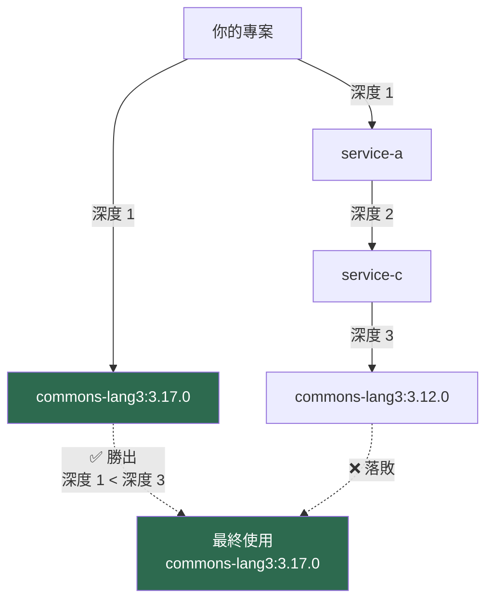

**規則二：深度相同時，先宣告者優先（First Declaration Wins）**

若兩條路徑深度相同，POM 中**先出現**的那個勝出。

> ⚠️ **這是 Maven 最反直覺的行為**：它選的**不是最新版本**，而是**路徑最短的版本**。新手常以為 Maven 會自動選最新版——不會。這也是「明明宣告了 3.17.0，執行期卻是 3.12.0」這類問題的根源（通常是因為某個更淺的路徑帶入了舊版）。

### 9.4 診斷依賴問題

**依賴樹是排查一切依賴問題的起點**：

```bash
# 完整依賴樹
mvn dependency:tree

# 只看特定 artifact 的來源（最實用）
mvn dependency:tree -Dincludes=org.apache.commons:commons-lang3

# 顯示被省略的重複與衝突（診斷衝突必用）
mvn dependency:tree -Dverbose

# 輸出到檔案，方便比對與給 AI Agent 分析
mvn dependency:tree -DoutputFile=deps.txt -DoutputType=text

# 分析未使用與未宣告的依賴
mvn dependency:analyze
```

`-Dverbose` 的輸出會標示衝突：

```text
[INFO] +- com.example.acme:acme-service:jar:1.0.0:compile
[INFO] |  \- (org.apache.commons:commons-lang3:jar:3.12.0:compile - omitted for conflict with 3.17.0)
[INFO] \- org.apache.commons:commons-lang3:jar:3.17.0:compile
```

> 💡 **`mvn dependency:analyze` 是被嚴重低估的指令**。它會告訴你：
>
> - **Used undeclared dependencies**：你的程式碼直接用了某個函式庫，卻沒有明確宣告它（靠傳遞依賴拿到）。這很危險——哪天上游移除該依賴，你就編不過了。
> - **Unused declared dependencies**：你宣告了卻沒用到的依賴，是純粹的技術債與攻擊面。
>
> 企業建議把它納入 CI，見第14章。

### 9.5 Optional 與 Exclusion

**`<optional>true</optional>`**——「我用得到，但你不一定用得到」：

```xml
<dependency>
  <groupId>com.example.acme</groupId>
  <artifactId>acme-cache-redis</artifactId>
  <version>1.0.0</version>
  <optional>true</optional>
</dependency>
```

optional 依賴**不會傳遞**給下游。適用於「函式庫支援多種實作，但使用者只會選一種」的情境。

**`<exclusions>`**——「我不要這個傳遞依賴」：

```xml
<dependency>
  <groupId>org.springframework.boot</groupId>
  <artifactId>spring-boot-starter-web</artifactId>
  <exclusions>
    <exclusion>
      <groupId>org.springframework.boot</groupId>
      <artifactId>spring-boot-starter-tomcat</artifactId>
    </exclusion>
  </exclusions>
</dependency>

<dependency>
  <groupId>org.springframework.boot</groupId>
  <artifactId>spring-boot-starter-jetty</artifactId>
</dependency>
```

典型用途：換掉預設的內嵌容器、排除有漏洞的傳遞依賴、解決 SLF4J 多重綁定。

**排除所有傳遞依賴**（Maven 3.2.1+ 支援萬用字元）：

```xml
<exclusions>
  <exclusion>
    <groupId>*</groupId>
    <artifactId>*</artifactId>
  </exclusion>
</exclusions>
```

> ⚠️ **慎用萬用字元排除**。它會排除**所有**傳遞依賴，包含該函式庫真正需要的。除非你完全清楚後果（例如你會自己宣告所有需要的依賴），否則會在執行期得到 `NoClassDefFoundError`。

### 9.6 用 dependencyManagement 統一版本

**強制版本的正確作法**：

```xml
<dependencyManagement>
  <dependencies>
    <!-- 強制所有傳遞依賴都用這個版本 -->
    <dependency>
      <groupId>org.apache.commons</groupId>
      <artifactId>commons-lang3</artifactId>
      <version>3.17.0</version>
    </dependency>
  </dependencies>
</dependencyManagement>
```

> 💡 **`dependencyManagement` 的優先權高於「最近者優先」規則**。這是統一版本最可靠的手段——不管傳遞依賴帶入什麼版本，`dependencyManagement` 說了算。企業 parent POM 應用它來釘住有資安疑慮或相容性問題的函式庫版本。

### 9.7 BOM 與 import scope

```xml
<dependencyManagement>
  <dependencies>
    <dependency>
      <groupId>org.springframework.boot</groupId>
      <artifactId>spring-boot-dependencies</artifactId>
      <version>4.1.0</version>
      <type>pom</type>
      <scope>import</scope>
    </dependency>
    <dependency>
      <groupId>org.junit</groupId>
      <artifactId>junit-bom</artifactId>
      <version>5.11.4</version>
      <type>pom</type>
      <scope>import</scope>
    </dependency>
  </dependencies>
</dependencyManagement>
```

**`import` scope 的三個規則**：

1. 只能用在 `<dependencyManagement>` 內
2. 必須搭配 `<type>pom</type>`
3. **多個 BOM 之間，先宣告的優先**——與依賴的「最近者優先」不同

> ⚠️ **多 BOM 衝突是企業專案的常見問題**。當 Spring Boot BOM 與 JUnit BOM 都管理了 `junit-jupiter` 版本時，**先宣告的 BOM 勝出**。若結果不如預期，用 `mvn help:effective-pom` 檢視實際生效的版本，或在自己的 `dependencyManagement` 中明確宣告以覆蓋兩者。

**Maven 4 為 BOM 帶來的兩項變更**，兩者都在第7.6 節有完整說明與範例，此處列出對依賴管理的實際影響：

| 變更 | 對依賴管理的影響 |
|---|---|
| `<packaging>bom</packaging>`（Model 4.1.0） | BOM 與 parent POM 的意圖終於能被工具區分；但**匯入端的寫法完全不變**，仍是 `<type>pom</type>` + `<scope>import</scope>` |
| `<bomClassifier>`（Model 4.1.0） | 可匯入同一 BOM 的不同變體，讓「一個 BOM 對應多組版本組合」不必再拆成多個 artifactId |

> ⚠️ **同反應器 BOM 將成為錯誤**：若 BOM 與匯入它的專案在同一次建置中，Maven 4.0 會警告，未來版本會直接失敗。企業 monorepo 若目前是「BOM 模組和業務模組放在同一個 aggregator 下」的結構，**這是遷移時必須先處理的架構問題，而不是改個設定就能繞過的警告**。完整說明見第7.6 節。

### 9.8 依賴管理最佳實務

| 實務 | 理由 |
|---|---|
| 所有版本集中在 parent 或 BOM 的 `dependencyManagement` | 避免各子專案版本分歧 |
| 子專案的 `<dependency>` 不寫 `<version>` | 版本單一來源 |
| 定期執行 `mvn dependency:analyze` | 找出隱性依賴與無用依賴 |
| 明確宣告直接使用的依賴，不依賴傳遞取得 | 上游變更不會波及你 |
| 用 Enforcer 的 `banDuplicatePomDependencyVersions` 等規則 | CI 自動把關 |
| 用 `dependency:tree -Dverbose` 診斷衝突 | 看得到被省略的版本 |
| 避免 `system` scope | 不可重現、無法掃描 |
| 慎用萬用字元 exclusion | 易造成執行期錯誤 |

---

#### 📌 本章重點整理

- Maven 的衝突調解是「**最近者優先**」，不是「最新版本優先」——這是最反直覺也最常誤解的規則。
- `provided` 與 `test` scope **不會傳遞**給下游。
- `dependencyManagement` 的優先權高於最近者優先，是統一版本最可靠的手段。
- 多個 BOM 之間是「先宣告者優先」，與依賴的規則不同。
- `mvn dependency:analyze` 能找出隱性依賴與無用依賴，是被低估的指令。
- Maven 4 新增六種 artifact type（`classpath-jar`／`modular-jar`／`processor` 系列），把 classpath 與 module-path 的決定權從啟發式規則交還給開發者——但目前僅 compiler plugin 4.x 線支援。

#### ✅ 本章最佳實務

- 版本集中在 parent 或 BOM 的 `dependencyManagement`，子專案不寫版本號。
- 明確宣告程式碼直接使用的每個依賴，不靠傳遞依賴取得。
- 用 `mvn dependency:tree -Dverbose` 診斷衝突，看得到被省略的版本。
- 把 `dependency:analyze` 納入 CI，持續控制依賴衛生。

#### ⚠️ 本章注意事項

- `system` scope 已棄用，會破壞可重現建置且逃過資安掃描，應改上傳私有倉庫。
- 萬用字元 exclusion 會排除所有傳遞依賴，常導致執行期 `NoClassDefFoundError`。
- 多 BOM 並存時的版本結果不直覺，務必用 `help:effective-pom` 驗證。

#### 🏢 本章企業建議

- **企業 parent POM 應以 `dependencyManagement` 釘住有已知漏洞的函式庫版本**，這是最快速的組織級漏洞緩解手段。
- 對外發布的函式庫務必提供 BOM，降低使用者的版本衝突成本。
- 將 `dependency:analyze` 與 Enforcer 規則納入 CI 必過項目。
- 建立「依賴引入審查」流程：新增第三方依賴需評估授權、維護狀態與漏洞紀錄。

[↑ 回目錄](#-目錄)

---

## 第10章 Build Lifecycle

這是 Maven 4 變動最深、也最需要推翻既有認知的一章：**生命週期從「有序清單」變成了「樹」**。

### 10.1 三個生命週期

Maven 有三個彼此獨立的生命週期：

| 生命週期 | 用途 | 觸發指令 |
|---|---|---|
| `clean` | 清理前次建置產物 | `mvn clean` |
| `default` | 建置、測試、打包、安裝、部署 | `mvn verify`、`mvn install` 等 |
| `site` | 產生專案文件網站 | `mvn site` |

### 10.2 Default 生命週期的完整階段

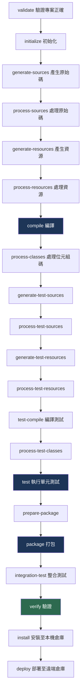

**關鍵觀念：執行某個階段，會執行它之前的所有階段。** `mvn package` 會依序跑完 `validate` 到 `package`。

### 10.3 Maven 4 的最大變革：從清單到樹

**Maven 3 的模型**：生命週期是一個有序清單，階段一個接一個執行。要在 `integration-test` 前後做事，只能用 `pre-integration-test` 與 `post-integration-test` 這兩個**寫死的**階段。

**Maven 4 的模型**：每個階段都自動擁有 `before:` 與 `after:` 變體。

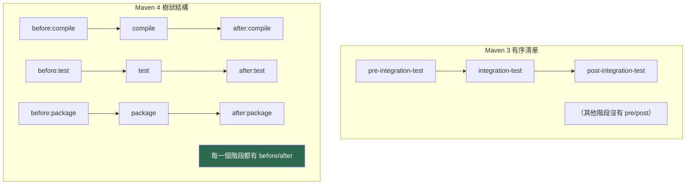

| 面向 | Maven 3 | Maven 4 |
|---|---|---|
| 結構 | 有序清單 | 樹 |
| 前後掛載點 | 只有 `pre-*` / `post-*` 少數幾個 | **每個階段都有** `before:` / `after:` |
| `pre-*` / `post-*` | 正式階段 | **降級為別名（alias），建議停用** |
| 執行保證 | `post-*` 只在下一個主要階段執行時才跑 | **`before:` 與 `after:` 一定成對執行** |
| 同階段內排序 | 依宣告順序 | 可用 `[100]` 括號明確排序 |
| 跨專案掛載點 | 無 | 新增 `all` / `each` 及其 before/after |

**執行保證的差異很重要**：Maven 3 中，`post-integration-test` 只有在建置繼續往下走時才會執行；若建置在 `integration-test` 就失敗了，清理動作不會執行。Maven 4 的 `after:integration-test` **一定會執行**——這讓「啟動測試容器、跑測試、關閉容器」這類需要保證清理的場景終於可靠。

#### 10.3.1 樹結構的實際兌現：Concurrent Builder

**把生命週期從清單改成樹，不只是為了多幾個掛載點——真正的目的是讓建置能夠正確地平行化。** 這是官方 *What's new in Maven 4* 明確指出的設計動機，也是本節所有結構改變的最終成果。

理由是這樣的：當生命週期是一個**有序清單**時，Maven 只知道「`compile` 排在 `test` 前面」，卻不知道「`test` 到底在等什麼」。要安全地平行化，唯一能做的假設是「整個專案的所有階段都跑完，下游專案才能開始」——這就是 Maven 3 `-T` 的模型，**平行的單位是「專案」**。

當生命週期是一棵**帶有前置條件的樹**時，Maven 知道的是「`compile` 這一步需要它的 `compile-only` 依賴到達 `ready` 狀態」。前置條件一滿足就可以動工，不必等整個上游專案結束。**平行的單位變成「階段步驟」**。

| 面向 | Maven 3 `-T`（multithreaded builder） | Maven 4 `-b concurrent`（concurrent builder） |
|---|---|---|
| 平行單位 | 專案（一個專案佔用一個執行緒直到跑完） | 階段步驟（step） |
| 排程依據 | 專案間的依賴（Build Graph） | 每個步驟自己的前置條件 |
| 上游專案未完成時 | 下游完全不能開始 | 下游只要所需的上游步驟完成即可開始 |
| 建置失敗時的 `after:` 階段 | 不保證執行 | **保證執行**（資源清理可靠） |
| 執行緒池大小 | `-T` | 仍由 `-T` 決定 |

```bash
# Maven 4：啟用 concurrent builder，執行緒數仍由 -T 指定
mvn -b concurrent -T 1C verify

# 長旗標寫法（意義相同）
mvn --builder concurrent -T 1C verify

# 對照組：只給 -T，使用預設 builder
mvn -T 1C verify
```

> ⚠️ **採用前必須知道的兩件事**：
>
> 1. **`-b` / `--builder` 不是 Maven 4 新增的旗標**——Maven 3 就有（用來指定建置策略 id），Maven 4 新增的是 `concurrent` 這個**策略實作**。因此在 Maven 3 上打 `-b concurrent` 會得到「找不到該 builder」的錯誤，而不是被忽略。撰寫跨版本的 CI 腳本時要注意這個差異。
> 2. **（未經 GA 驗證）** concurrent builder 是 Maven 4 中與平行化相關的最新機制，rc 階段的行為與預設值仍可能調整。**現階段的建議是：在試點管線中量測它與 `-T` 的差異並記錄數據，但不要寫進企業生產建置規範。** 效能量測的正確方法見第19.2 節；先確認你的專案圖形狀真的能受益（第19.4 節），再談 builder 策略。

### 10.4 before 與 after 階段的用法

```xml
<build>
  <plugins>
    <plugin>
      <groupId>org.apache.maven.plugins</groupId>
      <artifactId>maven-antrun-plugin</artifactId>
      <version>3.2.0</version>
      <executions>
        <execution>
          <id>start-test-database</id>
          <phase>before:integration-test</phase>
          <goals><goal>run</goal></goals>
          <configuration>
            <target>
              <echo message="啟動測試資料庫容器"/>
            </target>
          </configuration>
        </execution>
        <execution>
          <id>stop-test-database</id>
          <phase>after:integration-test</phase>
          <goals><goal>run</goal></goals>
          <configuration>
            <target>
              <echo message="關閉測試資料庫容器"/>
            </target>
          </configuration>
        </execution>
      </executions>
    </plugin>
  </plugins>
</build>
```

**同一階段內多個執行的排序**——用方括號指定優先權：

```text
before:integration-test[100]
before:integration-test[200]
```

數字小的先執行。這解決了 Maven 3 中「同階段多個 execution 的順序只能靠宣告位置」的脆弱性。

### 10.5 all 與 each 階段

Maven 4 新增了**跨專案**的掛載點，這在多專案設定中特別有用：

| 階段 | 涵蓋範圍 | 典型用途 |
|---|---|---|
| `before:all` | 整個建置（所有子專案）開始前，執行一次 | 啟動共用的測試基礎設施 |
| `after:all` | 整個建置結束後，執行一次 | 關閉共用基礎設施、產生彙總報告 |
| `before:each` | 每個子專案的標準生命週期前 | 每個專案的前置檢查 |
| `after:each` | 每個子專案的標準生命週期後 | 每個專案的後置驗證 |

> 💡 **`before:all` / `after:all` 解決了一個長年痛點**：在 Maven 3 中，若要在多專案建置的最開始啟動一個 Docker 容器、最後關閉它，只能靠「在第一個和最後一個模組上掛載」這種脆弱的作法（模組順序一變就壞）。Maven 4 提供了正確的掛載點。

### 10.6 預設外掛綁定

不同 packaging 有不同的預設綁定。以下為 `jar` packaging：

| Phase | Plugin Goal |
|---|---|
| `process-resources` | `resources:resources` |
| `compile` | `compiler:compile` |
| `process-test-resources` | `resources:testResources` |
| `test-compile` | `compiler:testCompile` |
| `test` | `surefire:test` |
| `package` | `jar:jar` |
| `install` | `install:install` |
| `deploy` | `deploy:deploy` |

`war` packaging 除了 `package` 綁定 `war:war` 外，其餘相同。`pom` packaging 只綁定 `install:install` 與 `deploy:deploy`。

### 10.7 為什麼官方說「不要用 mvn clean install」

這是 Maven 官方明確的建議：

> Do not use `mvn clean install` for your regular builds. Instead, use `mvn verify`!

**理由**：

| 指令 | 做了什麼 | 問題 |
|---|---|---|
| `mvn clean install` | 清空 target、跑到 install（寫入本機倉庫） | 1. `clean` 讓每次都全量重建，浪費時間<br/>2. `install` 汙染本機倉庫，掩蓋依賴宣告錯誤 |
| **`mvn verify`** | 跑完所有測試與驗證，但**不寫入本機倉庫** | 反應器內的專案直接互相引用，不需經過本機倉庫 |

**`install` 汙染本機倉庫的具體危害**：假設模組 A 依賴模組 B，但你忘了在 A 的 POM 宣告這個依賴。因為 B 曾被 `install` 到本機倉庫，A 在你的機器上「碰巧」編得過。到了 CI 上（乾淨的倉庫），建置就失敗了。用 `mvn verify`，這個錯誤在你本機就會立刻暴露。

**什麼時候該用 `install`**：當你要讓**另一個獨立的專案**（不在同一個反應器內）使用剛建好的產物時。

**什麼時候該用 `clean`**：當你懷疑有陳舊產物殘留，或變更了會影響產出的設定時。**不需要每次都 clean**。

### 10.8 常用生命週期指令

```bash
# 日常開發：跑完所有驗證，不寫入本機倉庫（推薦）
mvn verify

# 只編譯
mvn compile

# 只跑測試
mvn test

# 跳過測試（僅在明確知道為何跳過時使用）
mvn verify -DskipTests          # 編譯測試但不執行
mvn verify -Dmaven.test.skip=true   # 連測試都不編譯

# 只執行單一 goal，不走生命週期
mvn dependency:tree
mvn help:effective-pom

# 執行指定 goal 並綁定到 phase
mvn clean verify

# Maven 4：從上次失敗處續建
mvn verify --resume
mvn verify -r

# Maven 4：警告即視為失敗（相容性掃描必用）
mvn verify --fail-on-severity WARN
mvn verify -fos WARN
```

> ⚠️ **`-DskipTests` 與 `-Dmaven.test.skip=true` 的差別**：前者會編譯測試程式碼但不執行；後者連編譯都跳過。**後者更危險**——測試程式碼可能早已編譯不過而你毫無所覺。CI 中兩者都不應出現。

### 10.9 Maven 4 的建置狀態與 resume

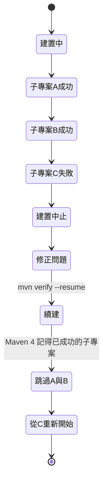

Maven 3 中，建置失敗後只能用 `-rf`（`--resume-from`）手動指定從哪個模組重來。Maven 4 的 `--resume` **自動記住已成功的子專案**，直接從失敗處續建。在大型多專案設定中，這能省下大量時間。

---

#### 📌 本章重點整理

- Maven 4 把生命週期從有序清單改為樹，**每個階段都有 `before:` 與 `after:` 變體**。
- `after:` 階段**保證執行**，Maven 3 的 `post-*` 則不保證——這讓資源清理終於可靠。
- `pre-*` / `post-*` 在 Maven 4 降級為別名，應停止使用。
- 新增 `all` / `each` 跨專案掛載點，解決多專案建置的前後置需求。
- **樹結構的真正目的是讓建置能正確平行化**：`-b concurrent` 把平行單位從「專案」細化到「階段步驟」。
- 官方明確建議日常用 `mvn verify` 而非 `mvn clean install`。

#### ✅ 本章最佳實務

- 日常建置一律用 `mvn verify`，只在需要跨反應器共用產物時才 `install`。
- 需要保證清理的場景（測試容器、暫存資源）改用 `after:` 階段。
- 同階段多個 execution 用 `[數字]` 明確排序，不依賴宣告位置。
- 多專案的共用基礎設施用 `before:all` / `after:all` 掛載。

#### ⚠️ 本章注意事項

- `mvn install` 會汙染本機倉庫，掩蓋依賴宣告錯誤，讓問題延後到 CI 才爆發。
- `-Dmaven.test.skip=true` 連測試編譯都跳過，可能長期掩蓋測試程式碼的編譯錯誤。
- `pre-*` / `post-*` 雖仍可用（別名），但語意已與 Maven 3 不同，遷移時需重新檢視意圖。
- `-b concurrent` 只在 Maven 4 存在；在 Maven 3 上會直接報錯而非被忽略，跨版本 CI 腳本需分流。

#### 🏢 本章企業建議

- **企業 CI 標準指令定為 `mvn -B verify`**（生產用 Maven 3.9.16 執行）；試點管線另跑 `mvn -B verify --fail-on-severity WARN`（Maven 4.0.0-rc-5）收集相容性資訊。
- Concurrent Builder 現階段列為**試點量測項目**，不寫入生產建置規範（見第10.3.1、19.4.1 節）。
- 將「不得在 CI 中使用 `-DskipTests`」列入建置規範。
- 盤點既有專案中所有 `pre-*` / `post-*` 階段的使用，遷移時逐一確認語意是否仍正確。
- 大型多專案設定應善用 `--resume`，可顯著縮短失敗後的重試時間。

[↑ 回目錄](#-目錄)

---

## 第11章 常用 Plugin

Maven 本身幾乎不做事——**所有實際工作都由外掛完成**。本章介紹企業專案最常用的外掛。

> 📌 **版本資訊查證日：2026-07-28**，取自 Apache Maven 官方外掛列表。外掛發版頻繁，**採用前請確認最新版本**。

### 11.1 外掛版本速查表

| 外掛 | 最新版本 | 發布日 | 用途 |
|---|---|---|---|
| `maven-compiler-plugin` | **3.15.0** | 2026-01-27 | 編譯（Maven 3 線） |
| `maven-compiler-plugin`（4.x 線） | **4.0.0-beta-4** | 2026-01-27 | 編譯（Maven 4 專屬，支援新 artifact type） |
| `maven-surefire-plugin` | **3.6.0-M1** | 2026-06-02 | 單元測試 |
| `maven-failsafe-plugin` | **3.6.0-M1** | 2026-06-02 | 整合測試 |
| `maven-resources-plugin` | **3.5.0** | 2026-03-02 | 資源處理 |
| `maven-jar-plugin` | **3.5.1** | 2026-07-19 | 打包 jar |
| `maven-war-plugin` | **3.5.1** | 2025-11-24 | 打包 war |
| `maven-shade-plugin` | **3.6.2** | 2026-03-02 | 打包 uber-jar 與重定位 |
| `maven-assembly-plugin` | **3.8.0** | 2025-11-22 | 自訂封裝格式 |
| `maven-source-plugin` | **3.4.0** | 2025-11-22 | 產生原始碼 jar |
| `maven-javadoc-plugin` | **3.12.0** | 2025-09-16 | 產生 Javadoc |
| `maven-enforcer-plugin` | **3.6.3** | 2026-05-15 | 建置規則強制 |
| `maven-dependency-plugin` | **3.11.0** | 2026-05-24 | 依賴分析與操作 |
| `maven-install-plugin` | **3.1.4** | 2025-02-24 | 安裝至本機倉庫 |
| `maven-deploy-plugin` | **3.1.4** | 2025-02-23 | 部署至遠端倉庫 |
| `maven-release-plugin` | **3.3.1** | 2025-12-09 | 發布流程自動化 |
| `maven-scm-plugin` | **2.2.1** | 2025-09-19 | 版控操作 |
| `maven-gpg-plugin` | **3.2.8** | 2025-06-28 | GPG 簽章 |
| `maven-site-plugin` | **3.22.0** | 2026-05-20 | 產生專案網站 |
| `maven-clean-plugin` | **3.5.0** | 2025-05-27 | 清理 target |
| `maven-antrun-plugin` | **3.2.0** | 2025-10-17 | 執行 Ant 任務 |
| `maven-help-plugin` | **3.5.2** | 2026-06-30 | 診斷與資訊查詢 |
| `maven-toolchains-plugin` | **3.3.0** | 2026-07-21 | Toolchains 選擇 |
| `maven-wrapper-plugin` | **3.3.4** | 2025-09-08 | 產生 Wrapper |
| `maven-invoker-plugin` | **3.10.1** | 2026-05-02 | 整合測試 Maven 專案 |
| `maven-plugin-plugin` | **3.15.2** | 2025-10-20 | 開發自訂外掛 |

> ⚠️ **注意 `maven-compiler-plugin` 有兩條版本線**：3.x 線（3.15.0）適用 Maven 3 與 Maven 4；**4.x 線（4.0.0-beta-4）是 Maven 4 專屬**，且截至查證日，它是**唯一支援 Maven 4 新 artifact type**（`classpath-jar`、`modular-jar`、`processor` 等）的外掛。其他外掛正在陸續跟進。若你不需要新 artifact type，用 3.15.0 即可。

### 11.2 編譯與測試

#### 11.2.1 maven-compiler-plugin

```xml
<plugin>
  <groupId>org.apache.maven.plugins</groupId>
  <artifactId>maven-compiler-plugin</artifactId>
  <version>3.15.0</version>
  <configuration>
    <release>21</release>
    <encoding>UTF-8</encoding>
    <parameters>true</parameters>
    <compilerArgs>
      <arg>-Xlint:all</arg>
      <arg>-Werror</arg>
    </compilerArgs>
  </configuration>
</plugin>
```

| 參數 | 用途 |
|---|---|
| `release` | 目標 Java 版本（優於 `source`／`target`） |
| `parameters` | 保留參數名稱到位元組碼，Spring 與 Jackson 需要 |
| `-Xlint:all` | 開啟所有編譯警告 |
| `-Werror` | 警告視為錯誤（企業建議，但需先清乾淨既有警告） |

#### 11.2.2 Surefire 與 Failsafe

**兩者的分工是新手最常搞混的**：

| 外掛 | 執行階段 | 檔名慣例 | 失敗行為 |
|---|---|---|---|
| **Surefire** | `test` | `*Test.java`、`Test*.java`、`*Tests.java` | **立即中止建置** |
| **Failsafe** | `integration-test` 執行、`verify` 驗證 | `*IT.java`、`IT*.java`、`*ITCase.java` | **先記錄，到 `verify` 才失敗** |

> 💡 **為什麼 Failsafe 要「延後失敗」**：整合測試通常需要啟動外部資源（資料庫、容器）。若測試一失敗就立刻中止，`after:integration-test` 的清理動作就不會執行，資源會殘留。Failsafe 把失敗判定延到 `verify`，確保清理一定發生。**這也是為什麼日常要用 `mvn verify` 而非 `mvn integration-test`**——後者不會檢查整合測試結果。

```xml
<plugin>
  <groupId>org.apache.maven.plugins</groupId>
  <artifactId>maven-surefire-plugin</artifactId>
  <version>3.6.0-M1</version>
  <configuration>
    <argLine>-Xmx1g -Duser.language=zh -Duser.country=TW</argLine>
    <parallel>classes</parallel>
    <threadCount>4</threadCount>
  </configuration>
</plugin>

<plugin>
  <groupId>org.apache.maven.plugins</groupId>
  <artifactId>maven-failsafe-plugin</artifactId>
  <version>3.6.0-M1</version>
  <executions>
    <execution>
      <goals>
        <goal>integration-test</goal>
        <goal>verify</goal>
      </goals>
    </execution>
  </executions>
</plugin>
```

> ⚠️ **Failsafe 必須同時綁定 `integration-test` 與 `verify` 兩個 goal**。只綁 `integration-test` 的話，測試會執行但失敗永遠不會讓建置失敗——這是非常危險的靜默失效，且在 CI 上很難察覺。

### 11.3 打包

#### 11.3.1 Shade 與 Assembly 的選擇

| 外掛 | 產出 | 適用 |
|---|---|---|
| **Shade** | uber-jar（所有依賴解壓後合併） | CLI 工具、需要重定位套件避免衝突 |
| **Assembly** | 自訂格式（zip、tar.gz、含目錄結構） | 企業發布包（含設定檔、啟動腳本、文件） |

```xml
<!-- Shade：產生可執行 uber-jar，並重定位套件避免衝突 -->
<plugin>
  <groupId>org.apache.maven.plugins</groupId>
  <artifactId>maven-shade-plugin</artifactId>
  <version>3.6.2</version>
  <executions>
    <execution>
      <phase>package</phase>
      <goals><goal>shade</goal></goals>
      <configuration>
        <transformers>
          <transformer implementation="org.apache.maven.plugins.shade.resource.ManifestResourceTransformer">
            <mainClass>com.example.acme.Application</mainClass>
          </transformer>
          <transformer implementation="org.apache.maven.plugins.shade.resource.ServicesResourceTransformer"/>
        </transformers>
        <relocations>
          <relocation>
            <pattern>com.google.common</pattern>
            <shadedPattern>com.example.acme.shaded.guava</shadedPattern>
          </relocation>
        </relocations>
        <filters>
          <filter>
            <artifact>*:*</artifact>
            <excludes>
              <exclude>META-INF/*.SF</exclude>
              <exclude>META-INF/*.DSA</exclude>
              <exclude>META-INF/*.RSA</exclude>
            </excludes>
          </filter>
        </filters>
      </configuration>
    </execution>
  </executions>
</plugin>
```

> ⚠️ **Shade 的兩個必備設定**：（1）`ServicesResourceTransformer` — 否則多個 jar 的 `META-INF/services/` 會互相覆蓋，導致 SPI 機制失效（JDBC 驅動、SLF4J 綁定常因此壞掉）。（2）排除 `META-INF/*.SF` 等簽章檔 — 否則會出現 `Invalid signature file digest` 錯誤。

### 11.4 品質與規則強制

#### 11.4.1 maven-enforcer-plugin

**這是企業落實建置規範最有力的工具**。

```xml
<plugin>
  <groupId>org.apache.maven.plugins</groupId>
  <artifactId>maven-enforcer-plugin</artifactId>
  <version>3.6.3</version>
  <executions>
    <execution>
      <id>enforce-build-rules</id>
      <phase>validate</phase>
      <goals><goal>enforce</goal></goals>
      <configuration>
        <rules>
          <!-- 強制 Maven 版本 -->
          <requireMavenVersion>
            <version>[3.9.16,)</version>
          </requireMavenVersion>

          <!-- 強制 JDK 版本 -->
          <requireJavaVersion>
            <version>[21,)</version>
          </requireJavaVersion>

          <!-- 禁止依賴版本衝突（強制明確解決） -->
          <dependencyConvergence/>

          <!-- 禁止 SNAPSHOT 依賴（發布時必開） -->
          <requireReleaseDeps>
            <onlyWhenRelease>true</onlyWhenRelease>
          </requireReleaseDeps>

          <!-- 禁止重複宣告依賴版本 -->
          <banDuplicatePomDependencyVersions/>

          <!-- 禁止特定有漏洞的函式庫 -->
          <bannedDependencies>
            <excludes>
              <exclude>log4j:log4j</exclude>
              <exclude>commons-collections:commons-collections:[,3.2.1]</exclude>
            </excludes>
          </bannedDependencies>
        </rules>
        <fail>true</fail>
      </configuration>
    </execution>
  </executions>
</plugin>
```

> 💡 **`<dependencyConvergence/>` 是最有價值也最痛苦的規則**。它要求所有傳遞依賴的版本必須收斂到單一版本，否則建置失敗。**初次啟用時通常會爆出數十個衝突**——但每一個都是潛在的執行期問題。建議作法：新專案一開始就啟用；既有專案則先設 `<fail>false</fail>` 收集清單，逐步修正後再改為 `true`。（作者建議）

#### 11.4.2 versions-maven-plugin

**注意：這不是 Apache 官方外掛，屬於 MojoHaus 專案**（`org.codehaus.mojo`）。

```bash
# 檢查依賴是否有新版本
mvn versions:display-dependency-updates

# 檢查外掛是否有新版本
mvn versions:display-plugin-updates

# 檢查 properties 中的版本是否有更新
mvn versions:display-property-updates

# 設定專案版本（多專案設定會一起改）
mvn versions:set -DnewVersion=1.1.0-SNAPSHOT

# 還原上一次 set
mvn versions:revert

# 確認變更
mvn versions:commit
```

> 💡 `versions:display-plugin-updates` 是 **Maven 4 遷移的第一步**——官方遷移指南明確建議先把外掛升到最新的 Maven 3 相容版本，再開始遷移。

### 11.5 診斷與分析

```bash
# 依賴分析（見第9章）
mvn dependency:tree -Dverbose
mvn dependency:analyze

# 把所有依賴複製到指定目錄（打包或稽核用）
mvn dependency:copy-dependencies -DoutputDirectory=target/libs

# 有效 POM（排查繼承問題的第一工具）
mvn help:effective-pom

# 有效 settings
mvn help:effective-settings

# 查看啟用的 profiles
mvn help:active-profiles

# 查看外掛有哪些 goal 與參數
mvn help:describe -Dplugin=org.apache.maven.plugins:maven-compiler-plugin -Ddetail
```

### 11.6 發布相關

```xml
<!-- 產生 sources jar（發布函式庫必備） -->
<plugin>
  <groupId>org.apache.maven.plugins</groupId>
  <artifactId>maven-source-plugin</artifactId>
  <version>3.4.0</version>
  <executions>
    <execution>
      <id>attach-sources</id>
      <goals><goal>jar-no-fork</goal></goals>
    </execution>
  </executions>
</plugin>

<!-- 產生 javadoc jar -->
<plugin>
  <groupId>org.apache.maven.plugins</groupId>
  <artifactId>maven-javadoc-plugin</artifactId>
  <version>3.12.0</version>
  <executions>
    <execution>
      <id>attach-javadocs</id>
      <goals><goal>jar</goal></goals>
    </execution>
  </executions>
</plugin>

<!-- GPG 簽章（發布到公開倉庫必備） -->
<plugin>
  <groupId>org.apache.maven.plugins</groupId>
  <artifactId>maven-gpg-plugin</artifactId>
  <version>3.2.8</version>
  <executions>
    <execution>
      <id>sign-artifacts</id>
      <phase>verify</phase>
      <goals><goal>sign</goal></goals>
    </execution>
  </executions>
</plugin>
```

> ⚠️ **`jar-no-fork` 而非 `jar`**：`source:jar` 會 fork 一個新的生命週期，導致部分階段重複執行。發布流程中一律用 `jar-no-fork`。

### 11.7 Spring Boot Maven Plugin

```xml
<plugin>
  <groupId>org.springframework.boot</groupId>
  <artifactId>spring-boot-maven-plugin</artifactId>
  <version>4.1.0</version>
  <configuration>
    <layers>
      <enabled>true</enabled>
    </layers>
  </configuration>
  <executions>
    <execution>
      <goals><goal>repackage</goal></goals>
    </execution>
  </executions>
</plugin>
```

| Goal | 用途 |
|---|---|
| `repackage` | 把一般 jar 重新打包為可執行的 Spring Boot jar |
| `run` | 直接執行應用（開發用） |
| `build-image` | 用 Cloud Native Buildpacks 建置容器映像檔 |
| `build-info` | 產生 `build-info.properties` 供 Actuator 使用 |

> 💡 **`<layers>` 對容器化很重要**：啟用後 jar 會分層（依賴、快照依賴、應用程式碼），Docker 建置時變動頻繁的應用層在最上層，可大幅提升映像檔快取命中率。詳見第14章。

### 11.8 外掛管理最佳實務

| 實務 | 理由 |
|---|---|
| 所有外掛在 `<pluginManagement>` 明確指定版本 | 可重現建置的前提；Maven 4 會對未指定版本發警告 |
| 企業 parent POM 統一管理外掛版本 | 集中升級，各專案不需各自維護 |
| 定期跑 `versions:display-plugin-updates` | 掌握可升級項目 |
| Enforcer 規則從寬鬆開始，逐步收緊 | 一次全開會讓團隊直接關掉它 |
| 不要重複宣告同一外掛 | Maven 4 是硬錯誤 |

---

#### 📌 本章重點整理

- `maven-compiler-plugin` 有兩條線：3.15.0（通用）與 4.0.0-beta-4（Maven 4 專屬，唯一支援新 artifact type）。
- Surefire 跑單元測試（`*Test`）立即失敗；Failsafe 跑整合測試（`*IT`）延後到 `verify` 才失敗，以保證資源清理。
- Failsafe 必須同時綁定 `integration-test` 與 `verify` 兩個 goal，否則失敗會被靜默忽略。
- Enforcer 是企業落實建置規範最有力的工具，`dependencyConvergence` 最有價值也最痛苦。
- `versions-maven-plugin` 屬 MojoHaus 而非 Apache 官方。

#### ✅ 本章最佳實務

- Shade 打包務必加上 `ServicesResourceTransformer` 並排除簽章檔。
- 發布用 `source:jar-no-fork` 而非 `source:jar`，避免生命週期重複執行。
- Enforcer 對既有專案先設 `<fail>false</fail>` 收集清單，修正後再收緊。
- Spring Boot 容器化啟用 `<layers>`，大幅提升映像檔快取命中率。

#### ⚠️ 本章注意事項

- 外掛版本更新頻繁，本章版本為 2026-07-28 快照，採用前請確認最新版。
- Failsafe 只綁 `integration-test` 是靜默失效，CI 上極難察覺。
- `-Werror` 會讓所有編譯警告變成錯誤，既有專案啟用前需先清乾淨。

#### 🏢 本章企業建議

- **企業 parent POM 統一管理所有外掛版本**，配合生產（Maven 3.9.16）與試點（4.0.0-rc-5）雙軌驗證外掛相容性。
- 以 Enforcer 強制 `requireMavenVersion`、`bannedDependencies`、`banDuplicatePomDependencyVersions`，把規範變成建置時的硬約束。
- 遷移 Maven 4 前先執行 `versions:display-plugin-updates`，把外掛升到最新的 Maven 3 相容版本。
- 建立外掛升級的定期節奏（如每季），避免版本落後過多後一次升級風險過高。

[↑ 回目錄](#-目錄)

---

## 第12章 Repository 倉庫管理

### 12.1 三種倉庫

```mermaid
graph TB
    subgraph LOCAL["本機倉庫 Local"]
        L["~/.m2/repository<br/>所有下載過的構件快取"]
    end

    subgraph REMOTE["遠端倉庫 Remote"]
        P["企業私有倉庫<br/>Nexus / Artifactory"]
        C["Maven Central<br/>中央倉庫"]
        T["第三方倉庫"]
    end

    subgraph BUILD["建置"]
        B["mvn verify"]
    end

    B -->|"1. 先查本機"| L
    L -->|"2. 未命中則向上游要"| P
    P -->|"3. 代理快取"| C
    P -->|"3. 代理快取"| T
    P -->|"4. 回傳並快取"| L

    style P fill:#2d6a4f,color:#fff
```

| 倉庫類型 | 位置 | 說明 |
|---|---|---|
| **Local（本機）** | `~/.m2/repository` | 所有下載過的構件快取，也是 `mvn install` 的目標 |
| **Central（中央）** | `https://repo.maven.apache.org/maven2` | Maven 官方公共倉庫，預設上游 |
| **Remote（遠端）** | 企業自建或第三方 | 私有構件發布地，同時代理公共倉庫 |

### 12.2 為什麼企業必須有私有倉庫

| 理由 | 說明 |
|---|---|
| **供應鏈安全** | 所有外部依賴經單一入口，可掃描、可阻擋、可稽核 |
| **可用性** | 公共倉庫故障或構件被刪除時，企業快取仍可用 |
| **建置速度** | 內網下載遠快於外網 |
| **內部構件發布** | 企業自己的函式庫需要地方存放 |
| **合規稽核** | 完整記錄「誰在何時引入了什麼依賴」 |
| **網路隔離** | 金融與政府環境常禁止建置機直連網際網路 |

> ⚠️ **沒有私有倉庫的企業，等於把建置的可用性與安全性完全託付給公共基礎設施**。2016 年的 `left-pad` 事件（npm 生態一個小套件被移除導致全球大量建置失敗）在 Maven 生態同樣可能發生。私有倉庫的快取是最實際的保險。

### 12.3 四大倉庫管理器比較

| 產品 | 授權 | 特點 | 適用 |
|---|---|---|---|
| **Sonatype Nexus** | 開源版 + 商業版 | 最普及，設定直覺，開源版功能已足夠多數企業 | 一般企業首選 |
| **JFrog Artifactory** | 開源版 + 商業版 | 多語言支援最強，高可用與複寫功能完整 | 多語言、多站點的大型企業 |
| **GitHub Packages** | 隨 GitHub 方案 | 與 GitHub 深度整合，設定簡單 | 已全面使用 GitHub 的團隊 |
| **Azure Artifacts** | 隨 Azure DevOps | 與 Azure DevOps 整合，上游來源功能好用 | Azure 生態的企業 |

> 🔍 **待官方確認（2026-07-28）**：各倉庫管理器對 **Maven 4 Consumer POM** 的支援狀態，撰稿時未能於各家官方文件取得明確聲明。**這是企業升級 Maven 4 前必須實測的項目**——建議在測試倉庫完整跑一次 `mvn deploy`，確認產生的 POM 能被正確索引與提供。本手冊不對各家支援狀態做斷言。

### 12.4 settings.xml 設定

`settings.xml` 位於 `~/.m2/settings.xml`（使用者層級）或 `$MAVEN_HOME/conf/settings.xml`（全域）。

```xml
<?xml version="1.0" encoding="UTF-8"?>
<settings xmlns="http://maven.apache.org/SETTINGS/1.2.0"
          xmlns:xsi="http://www.w3.org/2001/XMLSchema-instance"
          xsi:schemaLocation="http://maven.apache.org/SETTINGS/1.2.0 https://maven.apache.org/xsd/settings-1.2.0.xsd">

  <!-- 本機倉庫位置（選用，預設 ~/.m2/repository） -->
  <localRepository>${user.home}/.m2/repository</localRepository>

  <!-- 認證資訊 -->
  <servers>
    <server>
      <id>acme-releases</id>
      <username>${env.NEXUS_USER}</username>
      <password>${env.NEXUS_PASSWORD}</password>
    </server>
    <server>
      <id>acme-snapshots</id>
      <username>${env.NEXUS_USER}</username>
      <password>${env.NEXUS_PASSWORD}</password>
    </server>
  </servers>

  <!-- 鏡像：把所有請求導向企業倉庫 -->
  <mirrors>
    <mirror>
      <id>acme-nexus</id>
      <name>ACME 企業倉庫</name>
      <url>https://nexus.acme-financial.internal/repository/maven-public/</url>
      <mirrorOf>*</mirrorOf>
    </mirror>
  </mirrors>

  <profiles>
    <profile>
      <id>acme-repositories</id>
      <repositories>
        <repository>
          <id>acme-public</id>
          <url>https://nexus.acme-financial.internal/repository/maven-public/</url>
          <releases><enabled>true</enabled></releases>
          <snapshots><enabled>true</enabled></snapshots>
        </repository>
      </repositories>
    </profile>
  </profiles>

  <activeProfiles>
    <activeProfile>acme-repositories</activeProfile>
  </activeProfiles>

</settings>
```

**`<mirrorOf>` 的常用寫法**：

| 值 | 意義 |
|---|---|
| `*` | 攔截所有倉庫請求（企業最常用） |
| `central` | 只攔截中央倉庫 |
| `external:*` | 攔截所有非本機的倉庫 |
| `*,!internal-repo` | 攔截所有，但排除 `internal-repo` |

> 💡 **`<mirrorOf>*</mirrorOf>` 是企業標準作法**。它確保**無論專案 POM 中宣告了什麼倉庫，所有請求都會導向企業倉庫**——這是供應鏈控制的關鍵。若允許專案自行宣告外部倉庫，資安控制就形同虛設。

### 12.5 密碼管理

**Maven 3 的作法（混淆，非真正加密）**：

```bash
mvn --encrypt-master-password
mvn --encrypt-password
```

**Maven 4 的作法（`mvnenc`，真正的加密）**：

```bash
# 初始化加密設定
mvnenc init

# 加密一個密碼
mvnenc encrypt

# 解密（驗證用）
mvnenc decrypt
```

> ⚠️ **Maven 3 的密碼「加密」實為混淆（obfuscation）**——master password 就存在同一台機器上，任何能讀取檔案的人都能還原。**它防的是肩窺，不是攻擊者**。Maven 4 的 `mvnenc` 提供真正的加密並支援外部 vault。
>
> 💡 **（作者建議）企業環境的最佳解是根本不要把密碼放在 `settings.xml`**。改用環境變數（如上方範例的 `${env.NEXUS_USER}`）配合 CI 的 secret 管理，或使用 HashiCorp Vault、AWS Secrets Manager 等專用方案。

### 12.6 部署設定

```xml
<distributionManagement>
  <repository>
    <id>acme-releases</id>
    <name>ACME Releases</name>
    <url>https://nexus.acme-financial.internal/repository/maven-releases/</url>
  </repository>
  <snapshotRepository>
    <id>acme-snapshots</id>
    <name>ACME Snapshots</name>
    <url>https://nexus.acme-financial.internal/repository/maven-snapshots/</url>
  </snapshotRepository>
</distributionManagement>
```

> ⚠️ **`<id>` 必須與 `settings.xml` 中 `<server><id>` 完全一致**，否則認證資訊對不上，會得到 401 或 403。這是部署失敗最常見的原因。

### 12.7 企業倉庫最佳實務

| 實務 | 說明 |
|---|---|
| **Release 倉庫禁止覆蓋** | 伺服器端強制設定，已發布版本永不可變 |
| **Snapshot 定期清理** | 設定保留策略（如保留最近 10 個），否則磁碟會爆 |
| **分離 release 與 snapshot** | 不同倉庫、不同權限 |
| **代理而非直連** | 所有外部倉庫都透過企業倉庫代理，不允許專案直連 |
| **啟用漏洞掃描** | Nexus IQ、Artifactory Xray 或整合 OWASP Dependency-Check |
| **設定授權政策** | 阻擋 GPL 等不符企業政策的授權 |
| **定期備份** | 企業自建構件無法從外部重新取得，備份是必要的 |
| **監控磁碟使用** | 倉庫成長速度常被低估 |

### 12.8 Maven 4 的部署行為變更

> ⚠️ **這是遷移時的重要行為變更**：

| 設定 | Maven 3 預設 | Maven 4 預設 |
|---|---|---|
| `installAtEnd` | `false` | **`true`** |
| `deployAtEnd` | `false` | **`true`** |

**意義**：Maven 3 中，多專案建置會**逐一**安裝／部署每個子專案——若第 5 個子專案失敗，前 4 個已經被發布出去了，造成不一致狀態。Maven 4 改為**全部成功後才一起發布**。

**因應作法**：

- 若你原本明確設定了 `<installAtEnd>true</installAtEnd>`，現在可以移除（已是預設）
- 若你的流程**依賴逐一部署的行為**，需明確設為 `false`——但**請先想清楚為什麼需要**，這通常是設計問題

---

#### 📌 本章重點整理

- 企業必須有私有倉庫，理由涵蓋供應鏈安全、可用性、建置速度與合規稽核。
- `<mirrorOf>*</mirrorOf>` 確保所有倉庫請求導向企業倉庫，是供應鏈控制的關鍵。
- Maven 3 的密碼「加密」實為混淆；Maven 4 的 `mvnenc` 提供真正加密。
- `distributionManagement` 的 `<id>` 必須與 `settings.xml` 的 `<server><id>` 一致。
- Maven 4 的 `installAtEnd` 與 `deployAtEnd` 預設翻轉為 `true`，避免部分發布的不一致狀態。

#### ✅ 本章最佳實務

- Release 倉庫在伺服器端強制禁止覆蓋，Snapshot 設定保留策略定期清理。
- 密碼不寫入 `settings.xml`，改用環境變數配合 CI secret 或專用 vault。
- 所有外部倉庫透過企業倉庫代理，不允許專案 POM 直連外部。
- 企業自建構件定期備份——它們無法從外部重新取得。

#### ⚠️ 本章注意事項

- 各倉庫管理器對 Maven 4 Consumer POM 的支援狀態未經官方確認，升級前務必實測完整 deploy 流程。
- 允許專案 POM 自行宣告外部倉庫，會讓企業的供應鏈資安控制形同虛設。
- Snapshot 倉庫的磁碟成長常被低估，需主動監控。

#### 🏢 本章企業建議

- **生產發布走 Maven 3.9.16；在測試倉庫用 Maven 4.0.0-rc-5 完整驗證 deploy 流程與 Consumer POM 產物**，這是升級前最關鍵的驗證項目之一。
- 建立倉庫的角色權限模型：開發者可讀、CI 可寫 snapshot、僅發布流程可寫 release。
- 將倉庫的漏洞掃描結果納入定期資安會議，而非僅作為建置時的阻斷。
- 制定第三方依賴引入的審批流程，並在倉庫層級以政策強制執行。

[↑ 回目錄](#-目錄)

---

## 第13章 Maven 與 AI Agent

> 📢 **本章性質聲明**：AI 編碼工具（AI Coding Agent）的市場變動極快，各家 CLI 的旗標、設定檔格式與功能每月都在變。**因此本章刻意寫在「工具無關」的層次**——聚焦於「Maven 該提供什麼給 Agent」，而非「某家工具的具體用法」。各家工具的比較僅做定位，不列版本化的指令細節。本章多數內容為（作者建議）。

### 13.1 核心洞見：Maven 是 Agent 最好的朋友

AI Agent 在 Java 專案上最大的困難是**缺乏可靠的事實來源**。它讀得到程式碼，但不知道：

- 這個類別實際依賴哪些函式庫的哪個版本
- 這個專案編譯到哪個 Java 版本
- 改了這行會不會壞掉

**Maven 恰好把這些都變成了機器可讀的輸出**。這是 Java 生態相對其他語言的一大優勢。

```mermaid
graph TD
    A["AI Agent"] --> B["需要事實"]
    B --> C["專案結構是什麼"]
    B --> D["依賴關係如何"]
    B --> E["改動是否安全"]

    C --> F["mvn help:effective-pom<br/>已解析的完整專案模型"]
    D --> G["mvn dependency:tree<br/>完整依賴圖"]
    D --> H["mvn dependency:analyze<br/>宣告與實際使用的落差"]
    E --> I["mvn verify<br/>可驗證的成功/失敗訊號"]

    F --> J["Agent 基於事實工作<br/>而非猜測"]
    G --> J
    H --> J
    I --> J

    style J fill:#2d6a4f,color:#fff
```

### 13.2 給 Agent 的四個關鍵指令

| 指令 | 提供什麼 | 為何對 Agent 重要 |
|---|---|---|
| `mvn help:effective-pom` | 已套用繼承與插值的完整 POM | **原始 `pom.xml` 充滿變數與繼承，Agent 容易誤判**；Effective POM 是事實 |
| `mvn dependency:tree -Dverbose` | 完整依賴圖含衝突標示 | 回答「這個類別從哪來」「為什麼是這個版本」 |
| `mvn dependency:analyze` | 隱性依賴與無用依賴 | 重構時判斷「移除這個依賴安全嗎」 |
| `mvn -B verify` | 明確的成功／失敗訊號 | **這是 Agent 的驗證迴圈基礎** |

> 💡 **最重要的一條建議**：讓 Agent 分析 POM 時，**先跑 `mvn help:effective-pom` 並讓它讀輸出，而不是直接讀 `pom.xml`**。這一個動作能消除大部分因繼承與變數導致的誤判。

### 13.3 讓 Maven 的輸出對 Agent 友善

Maven 預設的輸出對人類友善，對 Agent 則過於冗長。以下設定能大幅提升 Agent 的處理效率：

```bash
# -B：批次模式，關閉互動與彩色碼（Agent 必用）
# -q：安靜模式，只輸出警告與錯誤
mvn -B -q verify

# 輸出到檔案，讓 Agent 讀檔而非解析大量 stdout
mvn -B dependency:tree -DoutputFile=target/deps.txt

# Maven 4：警告即失敗，給 Agent 明確的品質訊號
mvn -B verify --fail-on-severity WARN

# 只建置受影響的子專案，縮短 Agent 的驗證迴圈
mvn -B verify -pl acme-service -am
```

| 旗標 | 對 Agent 的價值 |
|---|---|
| `-B` / `--batch-mode` | 消除 ANSI 碼與進度動畫，log 可解析 |
| `-q` / `--quiet` | 大幅減少 token 消耗 |
| `-e` / `--errors` | 失敗時提供完整堆疊，Agent 才能診斷 |
| `-o` / `--offline` | 離線模式，避免 Agent 因網路問題卡住 |
| `--fail-on-severity WARN` | 把「警告」變成 Agent 可偵測的明確訊號 |
| `-pl <專案> -am` | 縮短驗證迴圈，Agent 迭代更快 |

> 💡 **`-q` 對成本的影響常被低估**。一次多專案 `mvn verify` 的完整輸出可能上萬行；加上 `-q` 後可能只剩數十行。對按 token 計費的 Agent 而言，這是數量級的差異。（作者建議）

### 13.4 主流 AI Coding Agent 的定位

> ⚠️ **以下僅為定位比較，不含版本化的指令細節**。各工具功能演進極快，實際使用請查閱各自的官方文件。

| 工具 | 型態 | 與 Maven 的互動特性 |
|---|---|---|
| **Claude Code** | 終端機 CLI／IDE 擴充 | 可直接執行 Maven 指令並讀取輸出，適合建置修復迴圈 |
| **GitHub Copilot** | IDE 內建／CLI | IDE 整合深，可讀取 IDE 的專案模型 |
| **Gemini CLI** | 終端機 CLI | 可執行指令，適合腳本化任務 |
| **OpenAI Codex** | CLI／雲端 | 適合較長的自主任務 |
| **Cursor** | AI 原生 IDE | 有專案全域索引，適合跨檔案重構 |
| **Windsurf** | AI 原生 IDE | 同上 |
| **Cline** | VS Code 擴充 | 可執行終端指令，人在迴圈中審核 |
| **Roo Code** | VS Code 擴充 | Cline 的分支，模式切換較細緻 |
| **Continue** | IDE 擴充 | 可自訂模型與情境提供方式 |
| **OpenHands** | 自主 Agent 平台 | 適合較大範圍的自動化任務 |
| **Aider** | 終端機 CLI | 與 Git 深度整合，變更以 commit 呈現 |

**選擇的判準不是「哪個最強」，而是「哪個符合你的治理需求」**（作者建議）：

| 治理需求 | 適合的型態 |
|---|---|
| 每個變更都需人工審核 | IDE 擴充類（Cline、Continue、Copilot） |
| 需要完整稽核軌跡 | 與 Git 深度整合的工具（Aider、Claude Code） |
| 金融／政府的資料不出境要求 | 需確認各工具的資料處理政策，或選可自架的方案 |
| 大範圍自動化重構 | 自主 Agent 平台，但**必須有嚴格的護欄** |

### 13.5 AI Agent 的 Maven 工作流程

```mermaid
sequenceDiagram
    participant U as 工程師
    participant A as AI Agent
    participant M as Maven
    participant G as Git

    U->>A: 指派任務（含明確驗收條件）
    A->>G: git status（確認工作區乾淨）
    A->>M: mvn -B -q verify
    M-->>A: 建立基準（成功／失敗）

    A->>M: mvn help:effective-pom
    M-->>A: 已解析的專案事實
    A->>M: mvn dependency:tree -Dverbose
    M-->>A: 完整依賴圖

    loop 修改與驗證迴圈
        A->>A: 修改程式碼或 POM
        A->>M: mvn -B -q verify -pl <受影響專案> -am
        alt 建置失敗
            M-->>A: 錯誤訊息
            A->>A: 分析並修正
        else 建置成功
            M-->>A: BUILD SUCCESS
        end
    end

    A->>G: git diff
    A-->>U: 提出變更供審核
    U->>U: 人工審核（不可省略）
    U->>G: 核可後才 commit
```

### 13.6 適合與不適合交給 Agent 的 Maven 任務

| ✅ 適合 | ⚠️ 需人工把關 | ❌ 不該交給 Agent |
|---|---|---|
| 依賴樹分析與衝突診斷 | 依賴版本升級 | 修改企業 parent POM |
| 找出未使用的依賴 | 移除依賴 | 變更發布與部署設定 |
| 產生依賴報告與 SBOM 草稿 | 新增第三方依賴 | 修改 `settings.xml` 認證資訊 |
| 分析建置錯誤訊息 | 外掛設定變更 | 執行 `mvn deploy` |
| 產生測試案例骨架 | 重構模組結構 | 變更 GPG 簽章設定 |
| 補齊 Javadoc | Java 版本升級 | 停用 Enforcer 規則 |
| 統一程式碼風格 | 修改 Lifecycle 綁定 | 任何觸及生產憑證的操作 |

> ⚠️ **最後一欄是紅線**。Agent 可以「建議」修改 parent POM，但實際變更必須經過人工審核與正式流程——parent POM 影響所有子專案，一個錯誤會擴散到整個組織。同理，任何會**對外發布**的操作（`deploy`）都不該由 Agent 自主執行。

### 13.7 Maven 4 對 Agent 的特殊價值

| Maven 4 特性 | 對 Agent 的價值 |
|---|---|
| `--fail-on-severity WARN` | 把模糊的「警告」變成明確的二元訊號，Agent 能自動判斷 |
| Consumer POM | 提供「下游實際看到什麼」的準確視圖，比 Build POM 更適合影響分析 |
| `--resume` | Agent 的修改迴圈中，失敗後續建可大幅縮短迭代時間 |
| `mvnup check` | 產生結構化的遷移問題清單，Agent 可據以規劃工作 |
| Lifecycle 的 `before:`／`after:` | Agent 要加入檢查步驟時，掛載點更明確 |

### 13.8 給 Agent 的護欄設計

（作者建議）在讓 Agent 操作 Maven 專案時，建議設定以下護欄：

```text
【環境護欄】
- 只在專用分支上工作，禁止直接改 main／master
- 禁止執行 mvn deploy、mvn release:*
- 禁止修改 ~/.m2/settings.xml 與 toolchains.xml
- 禁止修改企業 parent POM（唯讀掛載或明確禁止）

【流程護欄】
- 每次修改前先執行 mvn -B -q verify 建立基準
- 每次修改後必須驗證，失敗即回報，不得連續盲改
- 所有變更以 git diff 呈現供人工審核
- 不得自行 commit 到共用分支

【範圍護欄】
- 單次任務的變更檔案數上限（如 20 個）
- 不得同時修改超過 N 個子專案
- 不得新增未在允許清單中的第三方依賴
```

第21章會提供更完整的 Prompt 設計方法，附錄L 提供 100 個可直接使用的 Prompt。

---

#### 📌 本章重點整理

- Maven 把專案事實變成機器可讀的輸出，這是 Java 生態對 AI Agent 的關鍵優勢。
- 讓 Agent 讀 `mvn help:effective-pom` 的輸出，而非原始 `pom.xml`——這一個動作能消除多數誤判。
- `-B -q` 是 Agent 使用 Maven 的基本組合，對 token 成本有數量級影響。
- AI 工具選擇的判準是「符合治理需求」而非「哪個最強」。
- 觸及 parent POM、發布流程、認證資訊的操作是 Agent 的紅線。

#### ✅ 本章最佳實務

- Agent 工作流程一律以 `mvn -B -q verify` 建立基準，改完再驗證。
- 用 `-pl <專案> -am` 縮短 Agent 的驗證迴圈。
- 依賴分析結果輸出到檔案，讓 Agent 讀檔而非解析大量 stdout。
- 為 Agent 設定環境、流程、範圍三層護欄。

#### ⚠️ 本章注意事項

- 各家 AI 工具功能演進極快，本章的定位比較會過時，實際使用請查官方文件。
- Agent 產生的依賴升級建議務必人工審核——版本升級的相容性風險它未必看得出來。
- 不要讓 Agent 在共用分支上直接工作。

#### 🏢 本章企業建議

- **在 Maven 3.9.16 的生產專案上導入 Agent 輔助；同時可讓 Agent 執行 Maven 4.0.0-rc-5 的 `mvnup check` 產生遷移評估報告**——這是 Agent 在雙軌情境下最直接的價值。
- 制定企業層級的「AI Agent 可執行的 Maven 操作」白名單，並以工具設定強制。
- 要求所有 Agent 產生的變更走正常的 PR 審核流程，不得繞過。
- 金融與政府單位導入前，須先確認所選工具的資料處理與留存政策符合法遵要求。

[↑ 回目錄](#-目錄)

---

## 第14章 Maven 與 CI/CD

### 14.1 CI 建置的通用原則

無論用哪個平台，以下原則都適用：

| 原則 | 作法 | 理由 |
|---|---|---|
| **用 Wrapper** | `./mvnw` 而非 `mvn` | 版本一致性，CI 節點不需裝 Maven |
| **批次模式** | 加 `-B` | log 可讀，無 ANSI 碼 |
| **用 verify** | `mvn verify` 而非 `clean install` | 不汙染倉庫，官方建議 |
| **快取本機倉庫** | 各平台的 cache 機制 | 大幅縮短建置時間 |
| **不跳過測試** | 禁用 `-DskipTests` | 跳過測試的 CI 沒有意義 |
| **失敗即停** | 不要用 `\|\| true` 吞掉錯誤 | 靜默失敗比失敗更危險 |
| **鎖定版本** | Wrapper 綁定明確版本 | 可重現建置 |

### 14.2 雙軌管線設計

這是本書雙軌原則在 CI 上的具體落實，**也是本章最重要的一節**：

```mermaid
graph TD
    A["Git Push / PR"] --> B["主管線 Primary"]
    A --> C["相容性管線 Compatibility"]

    B --> B1["Maven 3.9.16<br/>生產基準"]
    B1 --> B2["mvn -B verify"]
    B2 --> B3{通過?}
    B3 -->|否| B4["❌ 阻斷合併"]
    B3 -->|是| B5["✅ 允許合併"]

    C --> C1["Maven 4.0.0-rc-5<br/>試點驗證"]
    C1 --> C2["mvn -B verify<br/>--fail-on-severity WARN"]
    C2 --> C3{通過?}
    C3 -->|否| C4["⚠️ 僅記錄<br/>不阻斷合併"]
    C3 -->|是| C5["✅ 記錄通過"]

    C4 --> D["相容性報告<br/>累積遷移待辦"]
    C5 --> D

    style B4 fill:#9d0208,color:#fff
    style B5 fill:#2d6a4f,color:#fff
    style C4 fill:#e85d04,color:#fff
    style D fill:#1d3557,color:#fff
```

**關鍵設計**：相容性管線設為**非阻斷（non-blocking）**。它持續累積 Maven 4 的相容性資訊，但**永遠不會擋住交付**。這讓你在零風險的前提下，隨時掌握「離 Maven 4 還有多遠」。

### 14.3 GitHub Actions

```yaml
name: CI

on:
  push:
    branches: [ master, main ]
  pull_request:

jobs:
  # 主管線：生產基準，阻斷式
  build:
    name: Build (Maven 3.9.16)
    runs-on: ubuntu-latest
    steps:
      - uses: actions/checkout@v4

      - name: Set up JDK 21
        uses: actions/setup-java@v4
        with:
          distribution: 'temurin'
          java-version: '21'
          cache: 'maven'

      - name: Build and verify
        run: ./mvnw -B verify

      - name: Upload test reports
        if: always()
        uses: actions/upload-artifact@v4
        with:
          name: test-reports
          path: '**/target/surefire-reports/*.xml'

  # 相容性管線：Maven 4 試點，非阻斷
  maven4-compatibility:
    name: Maven 4 Compatibility (non-blocking)
    runs-on: ubuntu-latest
    continue-on-error: true          # 關鍵：失敗不阻斷
    steps:
      - uses: actions/checkout@v4

      - name: Set up JDK 21
        uses: actions/setup-java@v4
        with:
          distribution: 'temurin'
          java-version: '21'
          cache: 'maven'

      - name: Install Maven 4.0.0-rc-5
        run: |
          curl -fsSL -o maven4.tar.gz \
            https://archive.apache.org/dist/maven/maven-4/4.0.0-rc-5/binaries/apache-maven-4.0.0-rc-5-bin.tar.gz
          tar -xzf maven4.tar.gz -C "$HOME"
          echo "$HOME/apache-maven-4.0.0-rc-5/bin" >> "$GITHUB_PATH"

      - name: Verify Maven 4 version
        run: mvn -version

      - name: Build with warnings as failures
        run: mvn -B verify --fail-on-severity WARN 2>&1 | tee maven4-build.log

      - name: Run upgrade check
        if: always()
        run: mvnup check 2>&1 | tee mvnup-check.log

      - name: Upload compatibility report
        if: always()
        uses: actions/upload-artifact@v4
        with:
          name: maven4-compatibility-report
          path: |
            maven4-build.log
            mvnup-check.log
```

> 💡 **`cache: 'maven'` 會自動快取 `~/.m2/repository`**，通常能把建置時間縮短一半以上。快取鍵預設依 `pom.xml` 的雜湊值計算。

### 14.4 GitLab CI

```yaml
variables:
  MAVEN_OPTS: "-Dmaven.repo.local=$CI_PROJECT_DIR/.m2/repository -Xmx2g"
  MAVEN_CLI_OPTS: "-B --no-transfer-progress"

cache:
  key: "$CI_COMMIT_REF_SLUG"
  paths:
    - .m2/repository

stages:
  - build
  - compatibility

build:
  stage: build
  image: eclipse-temurin:21-jdk
  script:
    - ./mvnw $MAVEN_CLI_OPTS verify
  artifacts:
    when: always
    reports:
      junit:
        - "**/target/surefire-reports/TEST-*.xml"
    paths:
      - "**/target/*.jar"
    expire_in: 1 week

maven4-compatibility:
  stage: compatibility
  image: eclipse-temurin:21-jdk
  allow_failure: true              # 關鍵：非阻斷
  script:
    - curl -fsSL -o maven4.tar.gz
        https://archive.apache.org/dist/maven/maven-4/4.0.0-rc-5/binaries/apache-maven-4.0.0-rc-5-bin.tar.gz
    - tar -xzf maven4.tar.gz -C /opt
    - export PATH="/opt/apache-maven-4.0.0-rc-5/bin:$PATH"
    - mvn -version
    - mvn $MAVEN_CLI_OPTS verify --fail-on-severity WARN | tee maven4-build.log
    - mvnup check | tee mvnup-check.log
  artifacts:
    when: always
    paths:
      - maven4-build.log
      - mvnup-check.log
```

> 💡 **`--no-transfer-progress` 在 CI 中很有用**：關閉下載進度輸出，可讓 log 減少數千行。

### 14.5 Jenkins

```groovy
pipeline {
    agent any

    tools {
        jdk 'temurin-21'
        maven 'maven-3.9.16'
    }

    options {
        timeout(time: 30, unit: 'MINUTES')
        buildDiscarder(logRotator(numToKeepStr: '20'))
    }

    stages {
        stage('Build') {
            steps {
                sh './mvnw -B verify'
            }
            post {
                always {
                    junit '**/target/surefire-reports/TEST-*.xml'
                }
            }
        }

        stage('Maven 4 Compatibility') {
            steps {
                catchError(buildResult: 'SUCCESS', stageResult: 'UNSTABLE') {
                    sh '''
                        curl -fsSL -o maven4.tar.gz \
                          https://archive.apache.org/dist/maven/maven-4/4.0.0-rc-5/binaries/apache-maven-4.0.0-rc-5-bin.tar.gz
                        tar -xzf maven4.tar.gz -C "$WORKSPACE"
                        export PATH="$WORKSPACE/apache-maven-4.0.0-rc-5/bin:$PATH"
                        mvn -version
                        mvn -B verify --fail-on-severity WARN | tee maven4-build.log
                    '''
                }
            }
        }
    }

    post {
        always {
            archiveArtifacts artifacts: '**/target/*.jar,maven4-build.log',
                             allowEmptyArchive: true
        }
    }
}
```

> 💡 **`catchError(buildResult: 'SUCCESS', stageResult: 'UNSTABLE')`** 是 Jenkins 實作非阻斷階段的標準寫法：該階段失敗時標示為 UNSTABLE，但整體建置仍為 SUCCESS。

### 14.6 Azure DevOps

```yaml
trigger:
  branches:
    include: [ master, main ]

pool:
  vmImage: 'ubuntu-latest'

jobs:
  - job: Build
    displayName: 'Build (Maven 3.9.16)'
    steps:
      - task: JavaToolInstaller@0
        inputs:
          versionSpec: '21'
          jdkArchitectureOption: 'x64'
          jdkSourceOption: 'PreInstalled'

      - task: Cache@2
        inputs:
          key: 'maven | "$(Agent.OS)" | **/pom.xml'
          restoreKeys: 'maven | "$(Agent.OS)"'
          path: $(HOME)/.m2/repository

      - script: ./mvnw -B verify
        displayName: 'Maven verify'

      - task: PublishTestResults@2
        condition: always()
        inputs:
          testResultsFormat: 'JUnit'
          testResultsFiles: '**/surefire-reports/TEST-*.xml'

  - job: Maven4Compatibility
    displayName: 'Maven 4 Compatibility (non-blocking)'
    continueOnError: true
    steps:
      - task: JavaToolInstaller@0
        inputs:
          versionSpec: '21'
          jdkArchitectureOption: 'x64'
          jdkSourceOption: 'PreInstalled'

      - script: |
          curl -fsSL -o maven4.tar.gz \
            https://archive.apache.org/dist/maven/maven-4/4.0.0-rc-5/binaries/apache-maven-4.0.0-rc-5-bin.tar.gz
          tar -xzf maven4.tar.gz -C "$HOME"
          export PATH="$HOME/apache-maven-4.0.0-rc-5/bin:$PATH"
          mvn -version
          mvn -B verify --fail-on-severity WARN
        displayName: 'Maven 4 verify'
```

### 14.7 Bitbucket Pipelines

```yaml
image: eclipse-temurin:21-jdk

definitions:
  caches:
    maven-repo: ~/.m2/repository

pipelines:
  default:
    - parallel:
        - step:
            name: Build (Maven 3.9.16)
            caches: [ maven-repo ]
            script:
              - ./mvnw -B verify
            artifacts:
              - '**/target/*.jar'

        - step:
            name: Maven 4 Compatibility
            caches: [ maven-repo ]
            script:
              - curl -fsSL -o maven4.tar.gz https://archive.apache.org/dist/maven/maven-4/4.0.0-rc-5/binaries/apache-maven-4.0.0-rc-5-bin.tar.gz
              - tar -xzf maven4.tar.gz -C /opt
              - export PATH="/opt/apache-maven-4.0.0-rc-5/bin:$PATH"
              - mvn -B verify --fail-on-severity WARN || echo "Maven 4 相容性問題已記錄"
```

### 14.8 容器化建置

**多階段 Dockerfile**（善用快取層）：

```dockerfile
# ---- 建置階段 ----
FROM eclipse-temurin:21-jdk AS build
WORKDIR /build

# 先只複製 POM，讓依賴下載成為獨立的快取層
COPY mvnw .
COPY .mvn/ .mvn/
COPY pom.xml .
COPY acme-common/pom.xml acme-common/
COPY acme-domain/pom.xml acme-domain/
COPY acme-service/pom.xml acme-service/

# 預先下載依賴（此層只在 POM 變動時失效）
RUN ./mvnw -B -q dependency:go-offline

# 再複製原始碼並建置
COPY . .
RUN ./mvnw -B -q verify -DskipTests=false

# ---- 執行階段 ----
FROM eclipse-temurin:21-jre AS runtime
WORKDIR /app

RUN groupadd -r appuser && useradd -r -g appuser appuser

COPY --from=build /build/acme-service/target/acme-service-*.jar app.jar

USER appuser
EXPOSE 8080
ENTRYPOINT ["java", "-jar", "/app/app.jar"]
```

> 💡 **「先複製 POM、下載依賴、再複製原始碼」是 Docker 建置最重要的最佳化**。程式碼變動遠比依賴變動頻繁；分開後，改程式碼不會觸發依賴重新下載，映像檔建置時間可從數分鐘降到數十秒。

**Podman**：指令與 Docker 幾乎完全相容：

```bash
podman build -t acme-service:1.0.0 .
podman run --rm -p 8080:8080 acme-service:1.0.0
```

**用 Spring Boot 直接建置映像檔**（不需 Dockerfile）：

```bash
./mvnw -B spring-boot:build-image -Dspring-boot.build-image.imageName=acme-service:1.0.0
```

### 14.9 Kubernetes 部署

```yaml
apiVersion: apps/v1
kind: Deployment
metadata:
  name: acme-service
  labels:
    app: acme-service
spec:
  replicas: 3
  selector:
    matchLabels:
      app: acme-service
  template:
    metadata:
      labels:
        app: acme-service
    spec:
      containers:
        - name: acme-service
          image: nexus.acme-financial.internal/acme-service:1.0.0
          ports:
            - containerPort: 8080
          resources:
            requests:
              memory: "512Mi"
              cpu: "250m"
            limits:
              memory: "1Gi"
              cpu: "1000m"
          livenessProbe:
            httpGet:
              path: /actuator/health/liveness
              port: 8080
            initialDelaySeconds: 30
          readinessProbe:
            httpGet:
              path: /actuator/health/readiness
              port: 8080
            initialDelaySeconds: 10
```

> ⚠️ **映像檔標籤絕不可用 `latest`**。生產部署必須用明確版本（最好是不可變的 digest），否則無法重現、無法回退、無法稽核。這與「已發布版本不可覆蓋」是同一個原則。

### 14.10 CI 中的品質閘門

```bash
# 依賴衛生檢查
./mvnw -B dependency:analyze -DfailOnWarning=true

# Enforcer 規則
./mvnw -B enforcer:enforce

# 漏洞掃描（見第20章）
./mvnw -B org.owasp:dependency-check-maven:check

# 程式碼品質（見第23章）
./mvnw -B verify sonar:sonar

# 可重現建置：靜態檢查（快，可放 PR 管線；見第20.9 節）
./mvnw -B artifact:check-buildplan

# 可重現建置：逐位元比對（需建置兩次，建議只放發布管線）
./mvnw -B clean install -DskipTests && ./mvnw -B clean verify artifact:compare -DskipTests

# 自建外掛與擴充的 Maven 4 就緒度（Maven 3.9.x 即可執行；見第15.5.5 節）
./mvnw -B verify -Dmaven.plugin.validation=verbose
```

**閘門該放在哪一條管線**，比「有沒有這個閘門」更重要：

| 閘門 | PR 管線 | 發布管線 | 理由 |
|---|---|---|---|
| `dependency:analyze` | ✅ | ✅ | 快，且問題愈早發現愈好 |
| `enforcer:enforce` | ✅ | ✅ | 快 |
| 漏洞掃描 | ✅（可用快取的 NVD 資料） | ✅ | PR 階段擋住新引入的漏洞依賴 |
| `artifact:check-buildplan` | ✅ | ✅ | 純靜態分析，成本極低 |
| **`artifact:compare`** | ❌ | ✅ | **需完整建置兩次**，放 PR 會讓每個 PR 的等待時間翻倍 |
| `-Dmaven.plugin.validation=verbose` | ❌ | ❌ | 屬**遷移盤點**用途，放在相容性管線（第14.2 節）而非品質閘門 |

---

#### 📌 本章重點整理

- CI 通用原則：用 Wrapper、加 `-B`、用 `verify`、快取本機倉庫、不跳過測試。
- **雙軌管線是本章核心**：主管線用 Maven 3.9.16 阻斷式驗證，相容性管線用 4.0.0-rc-5 非阻斷式累積資訊。
- 各平台的非阻斷寫法：GitHub `continue-on-error`、GitLab `allow_failure`、Jenkins `catchError`、Azure `continueOnError`。
- Docker 建置務必「先複製 POM 下載依賴、再複製原始碼」，這是最重要的最佳化。
- 生產映像檔標籤絕不可用 `latest`。
- **品質閘門要分流**：靜態檢查放 PR 管線，需重複建置的 `artifact:compare` 只放發布管線，遷移盤點類指令放相容性管線。

#### ✅ 本章最佳實務

- 快取 `~/.m2/repository`，通常能把 CI 建置時間縮短一半以上。
- 加 `--no-transfer-progress` 減少數千行下載進度 log。
- 測試報告一律 `if: always()` 上傳，失敗時才更需要看。
- 相容性管線的報告存為 artifact，作為遷移評估的持續輸入。

#### ⚠️ 本章注意事項

- 相容性管線務必設為非阻斷，否則 RC 版的問題會擋住正常交付。
- 不要在 CI 中使用 `-DskipTests`，跳過測試的 CI 沒有意義。
- 不要用 `|| true` 吞掉失敗，靜默失敗比明確失敗危險得多。

#### 🏢 本章企業建議

- **建立企業共用的 CI 範本（GitHub reusable workflow／GitLab include／Jenkins shared library）**，內含雙軌管線設定，讓各專案直接引用而非各自實作。
- 相容性管線的結果應定期彙整成組織層級的「Maven 4 就緒度儀表板」，作為升級決策依據。
- CI 節點的映像檔應預裝 JDK 但不預裝 Maven，強制專案使用 Wrapper。
- 將依賴掃描與 Enforcer 規則納入 PR 必過條件，把治理前移到開發階段。

[↑ 回目錄](#-目錄)

---

## 第15章 Maven 3 升級至 Maven 4

> ⚠️ **本章的前提**：截至 2026-07-28，Maven 4.0.0 **尚未 GA**。本章的遷移流程設計為「**現在就開始準備，GA 後才正式切換**」。所有步驟中，**只有第一階段（準備）是現在就該做的**，且它本身對 Maven 3 也有益。

### 15.1 遷移的四個階段

```mermaid
flowchart TD
    A["現況：Maven 3.9.x"] --> B["階段一 準備<br/>現在就做"]
    B --> B1["升級到 Maven 3.9.16"]
    B --> B2["外掛升到最新的 Maven 3 相容版"]
    B --> B3["導入 Maven Wrapper"]
    B --> B4["清理既有警告"]

    B1 --> C["階段二 測試<br/>現在就做（非阻斷）"]
    B2 --> C
    B3 --> C
    B4 --> C

    C --> C1["建立 Maven 4 相容性管線"]
    C --> C2["mvnup check 產生問題清單"]
    C --> C3["--fail-on-severity WARN 收集警告"]

    C1 --> D["階段三 修正<br/>持續進行"]
    C2 --> D
    C3 --> D

    D --> D1["修正破壞性變更"]
    D --> D2["驗證外掛與擴充相容性"]

    D1 --> E{"Maven 4.0.0 GA 了嗎"}
    D2 --> E
    E -->|尚未| D
    E -->|已 GA| F["階段四 切換<br/>GA 後"]

    F --> F1["Wrapper 切換到 GA 版"]
    F --> F2["逐步採用 Model 4.1.0"]

    style B fill:#2d6a4f,color:#fff
    style C fill:#2d6a4f,color:#fff
    style F fill:#457b9d,color:#fff
```

### 15.2 階段一：準備（現在就該做）

**這個階段的所有工作對 Maven 3 本身也有益，因此沒有任何理由延後。**

| 步驟 | 動作 | 驗證方式 |
|---|---|---|
| 1 | 升級到 Maven 3.9.16 | `mvn -version` |
| 2 | 確認建置在 3.9.16 下完全通過 | `mvn -B verify` |
| 3 | 外掛升到最新的 **Maven 3 相容**版本 | `mvn versions:display-plugin-updates` |
| 4 | 依賴升到最新穩定版 | `mvn versions:display-dependency-updates` |
| 5 | 導入 Maven Wrapper 並綁定 3.9.16 | `./mvnw -version` |
| 6 | 建置環境 JDK 升到 17 以上 | `java -version` |
| 7 | 清理所有既有警告 | `mvn -B verify 2>&1 \| grep WARNING` |

> ⚠️ **第 3 步的關鍵細節**：官方遷移指南明確指出，此時**不要**升級到「需要 Maven 4 才能用」的外掛版本。目標是「在 Maven 3 上跑最新的 Maven 3 相容版本」，把版本落差先補上。

```bash
# 檢查外掛更新
mvn versions:display-plugin-updates

# 檢查依賴更新
mvn versions:display-dependency-updates

# 檢查 properties 中的版本
mvn versions:display-property-updates
```

### 15.3 階段二：測試（現在就該做，非阻斷）

建立第14.2 節的相容性管線，開始持續收集資訊。

```bash
# 1. 開試點分支
git switch -c spike/maven4-readiness

# 2. Wrapper 指向 Maven 4.0.0-rc-5
./mvnw wrapper:wrapper -Dmaven=4.0.0-rc-5

# 3. 確認版本
./mvnw -version

# 4. 建置並收集所有警告
./mvnw -B verify --fail-on-severity WARN 2>&1 | tee maven4-build.log

# 5. 執行升級檢查
mvnup check 2>&1 | tee mvnup-check.log

# 6. 整理報告後，分支可保留追蹤，主線不受影響
```

### 15.4 破壞性變更完整清單

這是本章最重要的一張表。**每一項都附偵測方式**。

| # | 破壞性變更 | 症狀 | 偵測方式 | 修正方式 |
|---|---|---|---|---|
| 1 | **重複宣告外掛成為硬錯誤** | 建置失敗，訊息形如 `'build.plugins.plugin.(groupId:artifactId)' must be unique but found duplicate declaration of plugin ...` | `mvn -B verify --fail-on-severity WARN`（Maven 3 下即為警告） | 移除重複的 `<plugin>` 宣告，合併其設定 |
| 2 | **執行 Maven 需 Java 17** | Maven 無法啟動 | `java -version` | 建置環境（本機與 CI）升級 JDK；專案編譯目標不受影響 |
| 3 | **`${executionRootDirectory}` 已移除** | 路徑解析錯誤或變成字面值 | 全域搜尋 | 改用 `${session.topDirectory}` |
| 4 | **`${multiModuleProjectDirectory}` 已移除** | 同上 | 全域搜尋 | 改用 `${session.rootDirectory}` |
| 5 | **`installAtEnd` 預設變 `true`** | 多專案建置的安裝時機改變 | 檢視 POM 中是否明確設定過 | 若原本設 `true` 可移除；需舊行為則明確設 `false` |
| 6 | **`deployAtEnd` 預設變 `true`** | 同上，部署時機改變 | 同上 | 同上 |
| 7 | **`pre-*` / `post-*` 降為別名** | 執行時機的語意改變 | 搜尋 POM 中的 phase 宣告 | 改用 `before:` / `after:` |
| 8 | **根目錄未標示會警告** | `[WARNING] Unable to find the root directory...` | 建置輸出 | 建立 `.mvn` 目錄或加 `root="true"` |
| 9 | **未指定外掛版本會警告** | 建置輸出出現警告 | `--fail-on-severity WARN` | 所有外掛在 `<pluginManagement>` 明確指定版本 |
| 10 | **使用 Maven 2 舊 API 的外掛不相容** | 外掛執行失敗 | `mvn -B verify -Dmaven.plugin.validation=verbose`（Maven 3.9.x 即可執行） | 升級外掛；自建外掛需改寫 |
| 11 | **核心擴充（Core Extension）相容性** | Maven 啟動失敗 | 相容性管線 | 聯絡擴充開發者或自行改寫 |
| 12 | **Plexus Containers 依賴注入已移除** | 自建外掛／擴充啟動時元件注入失敗 | 同第 10 項，並搜尋原始碼中的 Plexus 註解 | 改用 JSR-330（`@Named` / `@Inject` / `@Singleton`）；見第15.5.5 節 |
| 13 | **`${pom.*}` 運算式已移除** | 屬性未被插值，變成字面值 `${pom.version}` | 全域搜尋 `${pom.` | 改用 `${project.*}` |
| 14 | **Model 4.1.0 的 aggregator 必須是 `pom` packaging** | 建置驗證失敗 | 升級 modelVersion 後的建置輸出 | 含 `<subprojects>` 的 POM 其 packaging 必須為 `pom`（或 `bom`） |

**偵測腳本**——一次檢查最容易遺漏的三組運算式：

```bash
# 搜尋已移除的目錄屬性與 ${pom.*} 運算式（含 CI 腳本與 shell script）
grep -rn "executionRootDirectory\|multiModuleProjectDirectory\|\${pom\." \
  --include="*.xml" --include="*.sh" --include="*.yml" \
  --include="*.yaml" --include="*.properties" --include="Jenkinsfile" .
```

PowerShell 版本：

```powershell
Get-ChildItem -Recurse -Include *.xml,*.sh,*.yml,*.yaml,*.properties,Jenkinsfile |
    Select-String -Pattern 'executionRootDirectory|multiModuleProjectDirectory|\$\{pom\.' |
    Format-Table Path, LineNumber, Line -AutoSize
```

> 💡 **`${pom.version}` 這類寫法在 Maven 3 早已棄用但仍能運作**，因此它在老專案中的存活率意外地高——尤其是十年以上的 POM 與 antrun 設定。它與前兩個目錄屬性一樣，**失敗方式是「安靜地變成字面值」而不是報錯**，所以務必納入搜尋。

### 15.5 階段三：修正

#### 15.5.1 修正重複外掛宣告

**這通常是遷移遇到的第一個失敗。** Maven 3 只警告，Maven 4 直接失敗。

```xml
<!-- ❌ 錯誤：同一外掛宣告兩次 -->
<plugins>
  <plugin>
    <groupId>org.apache.maven.plugins</groupId>
    <artifactId>maven-surefire-plugin</artifactId>
    <configuration>
      <argLine>-Xmx1g</argLine>
    </configuration>
  </plugin>
  <plugin>
    <groupId>org.apache.maven.plugins</groupId>
    <artifactId>maven-surefire-plugin</artifactId>
    <configuration>
      <skipTests>false</skipTests>
    </configuration>
  </plugin>
</plugins>
```

```xml
<!-- ✅ 正確：合併為單一宣告 -->
<plugins>
  <plugin>
    <groupId>org.apache.maven.plugins</groupId>
    <artifactId>maven-surefire-plugin</artifactId>
    <version>3.6.0-M1</version>
    <configuration>
      <argLine>-Xmx1g</argLine>
      <skipTests>false</skipTests>
    </configuration>
  </plugin>
</plugins>
```

#### 15.5.2 修正已移除的目錄屬性

```xml
<!-- ❌ Maven 3 寫法 -->
<properties>
  <report.dir>${multiModuleProjectDirectory}/target/reports</report.dir>
</properties>

<!-- ✅ Maven 4 寫法 -->
<properties>
  <report.dir>${session.rootDirectory}/target/reports</report.dir>
</properties>
```

**對照表**：

| Maven 3（已移除） | Maven 4 替代 | 語意 |
|---|---|---|
| `${executionRootDirectory}` | `${session.topDirectory}` | 執行 Maven 的目錄 |
| `${multiModuleProjectDirectory}` | `${session.rootDirectory}` | 專案樹的根目錄 |
| — | `${project.rootDirectory}` | 目前專案所屬樹的根目錄 |

#### 15.5.3 標示專案根目錄

```bash
# 最簡單的作法：建立 .mvn 目錄（Model 4.0.0 也適用）
mkdir -p .mvn
touch .mvn/.gitkeep
git add .mvn/.gitkeep
```

或在 Model 4.1.0 的根 POM 加上屬性：

```xml
<project xmlns="http://maven.apache.org/POM/4.1.0"
         xmlns:xsi="http://www.w3.org/2001/XMLSchema-instance"
         xsi:schemaLocation="http://maven.apache.org/POM/4.1.0 https://maven.apache.org/xsd/maven-4.1.0.xsd"
         root="true">
  <!-- ...POM 其餘內容... -->
</project>
```

#### 15.5.4 處理安裝與部署時機變更

```xml
<!-- 若你的流程真的需要舊行為（逐一部署），明確設定 -->
<plugin>
  <groupId>org.apache.maven.plugins</groupId>
  <artifactId>maven-deploy-plugin</artifactId>
  <version>3.1.4</version>
  <configuration>
    <deployAtEnd>false</deployAtEnd>
  </configuration>
</plugin>
```

> ⚠️ **設 `false` 之前請先想清楚為什麼**。Maven 4 改預設為 `true` 是為了避免「第 5 個子專案失敗，但前 4 個已發布出去」的不一致狀態。若你的流程依賴舊行為，多半代表流程本身有設計問題。

#### 15.5.5 自建外掛與核心擴充的相容性處理

**這是整個遷移中風險最高、也最容易被低估的一項。** 前面四小節的問題 `mvnup` 都能協助偵測甚至自動修正（第3.5 節），但**自建外掛與核心擴充完全在 `mvnup` 的能力範圍之外**——它只讀 POM，不會分析你的 Java 原始碼。

**問題的根源：Plexus 依賴注入已被移除。**

Maven 從 2.x 時代就使用 Plexus Containers 作為依賴注入（Dependency Injection，DI）容器。它在 2010 年就被標記為棄用，官方建議改用 JSR-330（Java 的標準 DI 註解規範）。**這個「建議」在 Maven 4 變成了強制**：Plexus DI 已從核心移除，任何仍依賴它的外掛與擴充都會失敗。

| 舊寫法（Plexus） | 新寫法（JSR-330） |
|---|---|
| `@Component(role = MyThing.class)` | `@Named` + `@Singleton` |
| `@Requirement` | `@Inject` |
| `components.xml` 描述檔 | 不需要（由註解與 `sisu-maven-plugin` 產生索引） |

**第一步永遠是先量出你的曝險範圍**，而這件事在 Maven 3.9.x 上就能做，不必等到裝了 Maven 4：

```bash
# 在 Maven 3.9.16 上執行即可——這正是官方建議「先在 3.9.x 驗證外掛」的原因
./mvnw -B verify -Dmaven.plugin.validation=verbose 2>&1 | tee plugin-validation.log
```

`maven.plugin.validation` 的四個等級：

| 等級 | 行為 |
|---|---|
| `none` | 完全關閉驗證 |
| `inline` | 建置過程中即時輸出（預設） |
| `summary` | 只在建置結束時輸出摘要 |
| `verbose` | **輸出每個問題的完整細節與來源外掛**——遷移盤點時要用這個 |

**接著依外掛來源分流處理**：

| 外掛來源 | 處理方式 |
|---|---|
| Apache 官方外掛 | 升級到第11.1 節表列的最新版本，多數已完成改寫 |
| 知名第三方（MojoHaus、Spring、JaCoCo 等） | 查其 issue tracker 是否已有 Maven 4 相容版本；通常有 |
| **企業自建外掛** | **必須自行改寫**——這是唯一沒有人能代勞的部分 |
| **核心擴充（Core Extension）** | 風險最高：它在 Maven 啟動時載入，不相容會導致**整個 Maven 起不來**，而非單一目標失敗 |

> ⚠️ **核心擴充要最早評估，不是最後。** 一般外掛不相容時，你至少還能建置到出錯那一步、拿到有用的訊息；核心擴充（`.mvn/extensions.xml` 中宣告者）不相容時 Maven 直接無法啟動，你連錯誤脈絡都拿不到。**若你的企業有自建核心擴充，它應該排在整個遷移評估的第一項**，而不是等到階段三才發現。
>
> 💡 **企業建議（作者建議）**：把「盤點自建外掛與核心擴充」排進第15.2 節的**階段一（準備）**，而非階段三。原因是改寫外掛需要的是**開發資源與排程**，不是幾個小時的設定調整——愈早知道要投入多少人月，愈能安排。至於盤點方式，`-Dmaven.plugin.validation=verbose` 的輸出就是最好的起點。

### 15.6 階段四：切換（GA 後）

> ⚠️ **在 Maven 4.0.0 GA 之前，不要執行此階段。**

```bash
# 1. Wrapper 切換到 GA 版本（版本號待 GA 後確認）
./mvnw wrapper:wrapper -Dmaven=<GA 版本>

# 2. 完整驗證
./mvnw -B verify

# 3. 更新 Enforcer 的 Maven 版本要求
# 4. 更新 CI 設定
# 5. 更新企業標準工作站映像檔
```

### 15.7 採用 Model 4.1.0（切換後的可選步驟）

**重申：Model 4.1.0 完全可選**。Maven 4 能正常建置 Model 4.0.0 專案。建議在 Maven 4 建置穩定運行一段時間後，再逐步採用。

```bash
# 一次一步，每步驗證與 commit
mvnup apply --model-version 4.1.0 --model
./mvnw -B verify
git diff && git commit -am "chore: 升級 POM model 至 4.1.0"
```

**採用順序建議**（作者建議）：

```mermaid
stateDiagram-v2
    [*] --> A
    A: 1. 根 POM 加 root=true
    B: 2. modules 改 subprojects
    C: 3. 子專案採用自動版本推導
    D: 4. BOM 改用 bom packaging
    E: 5. 採用 build sources 語法

    A --> B: 驗證通過
    B --> C: 驗證通過
    C --> D: 驗證通過
    D --> E: 驗證通過
    E --> [*]

    note right of C: 效益最大的一步<br/>版本號從此只維護一份
    note right of E: 風險較高<br/>建議最後再做
```

### 15.8 企業級遷移專案規劃

**（作者建議）** 大型企業的 Maven 4 遷移不是技術問題，是專案管理問題。

| 階段 | 工作項 | 建議時機 |
|---|---|---|
| **盤點** | 統計專案數、外掛清單、自建擴充清單 | 現在 |
| **試點選定** | 挑 2 至 3 個中等複雜度、非關鍵的專案 | 現在 |
| **準備** | 全組織執行階段一（升 3.9.16、補外掛版本、導入 Wrapper） | 現在 |
| **相容性掃描** | 建立非阻斷管線，持續累積資料 | 現在 |
| **自建擴充改寫** | 這是最大的未知數，需最早開始 | 現在 |
| **正式遷移** | 分批切換，關鍵系統最後 | **GA 後** |

> 💡 **最容易被低估的風險是「自建外掛與核心擴充」**。企業內部常有自行開發的 Maven 外掛（發布流程、程式碼產生、合規檢查），這些**不在 `mvnup` 的處理範圍內**，且往往原作者已離職。**這項工作應該最早開始評估**。

**盤點腳本範例**：

```bash
# 統計所有專案使用的外掛（找出需要驗證相容性的清單）
find . -name "pom.xml" -not -path "*/target/*" -exec \
  grep -h "<artifactId>" {} \; | \
  grep -i "plugin" | \
  sed 's/.*<artifactId>\(.*\)<\/artifactId>.*/\1/' | \
  sort | uniq -c | sort -rn
```

### 15.9 相容性速查

| 項目 | Maven 3.9.16 | Maven 4.0.0-rc-5 |
|---|---|---|
| 執行所需 JDK | 8+ | **17+** |
| Model 4.0.0 專案 | ✅ | ✅ |
| Model 4.1.0 專案 | ❌ | ✅ |
| 重複外掛宣告 | ⚠️ 警告 | ❌ **失敗** |
| `${multiModuleProjectDirectory}` | ✅ | ❌ **已移除** |
| `pre-*` / `post-*` phase | ✅ 正式階段 | ⚠️ 別名 |
| `before:` / `after:` phase | ❌ | ✅ |
| `--resume` | ❌（只有 `-rf`） | ✅ |
| `--fail-on-severity` | ❌ | ✅ |
| 可選 profile（`-P?name`） | ❌ | ✅ |
| `mvnup` / `mvnenc` / `mvnsh` | ❌ | ✅ |
| 生產環境可用 | ✅ | ❌ **官方明示不可** |

---

#### 📌 本章重點整理

- 遷移分四階段，**只有階段一與階段二是現在該做的**；正式切換必須等 GA。
- 階段一的所有工作對 Maven 3 本身也有益，沒有理由延後。
- 最常見的第一個失敗是**重複外掛宣告**——Maven 3 只警告，Maven 4 直接失敗。
- `${executionRootDirectory}`、`${multiModuleProjectDirectory}` 與 `${pom.*}` 已移除，常藏在 CI 腳本中，且**失敗方式是安靜地變成字面值**。
- `installAtEnd`／`deployAtEnd` 預設翻轉為 `true`，避免部分發布的不一致狀態。
- **自建外掛與核心擴充是最大的未知數**，`mvnup` 幫不上忙，應最早評估。
- **Plexus 依賴注入已從核心移除**，外掛與擴充必須改用 JSR-330；核心擴充不相容會讓 Maven 完全無法啟動。

#### ✅ 本章最佳實務

- 立即執行階段一：升 3.9.16、外掛補到最新 Maven 3 相容版、導入 Wrapper、清乾淨警告。
- 用 `--fail-on-severity WARN` 在 Maven 3 環境就先抓出未來會失敗的問題。
- 用 `-Dmaven.plugin.validation=verbose`（Maven 3.9.x 即可執行）盤點所有使用舊 API 的外掛。
- 全域搜尋三組已移除的運算式，含 `.sh`、`.yml`、`Jenkinsfile`。
- Model 4.1.0 分步採用，每步 `git diff` 審閱並驗證後才 commit。

#### ⚠️ 本章注意事項

- 階段一**不要**升級到需要 Maven 4 的外掛版本，那會讓 Maven 3 建置失敗。
- 設定 `deployAtEnd=false` 恢復舊行為前，先確認流程本身沒有設計問題。
- Model 4.1.0 的 `<sources>` 語法變動較大，建議放在採用順序的最後。
- 核心擴充不相容的症狀與「JDK 版本不對」完全相同（Maven 起不來），排查時容易誤判。

#### 🏢 本章企業建議

- **現在就全組織推動階段一與階段二；正式切換排程在 Maven 4.0.0 GA 之後**——這是本書雙軌原則在遷移規劃上的完整體現。
- 立即啟動自建外掛與核心擴充的相容性評估，這項工作的前置期最長。
- 建立組織層級的「Maven 4 就緒度」追蹤機制，以相容性管線的結果為輸入。
- 遷移順序：非關鍵內部工具 → 一般業務系統 → 核心關鍵系統，關鍵系統務必最後。

[↑ 回目錄](#-目錄)

---

## 第16章 大型企業最佳實務

> 📢 **本章性質聲明**：本章內容以大型企業導入實務經驗為主，官方文件對這些議題多無明文規範。**除非特別註明，本章建議均屬（作者建議）**，請依貴組織實際情況調整。

### 16.1 企業 Maven 治理的三層架構

```mermaid
graph TB
    subgraph L1["第一層 組織治理"]
        A1["企業 Parent POM<br/>強制規範的載體"]
        A2["企業私有倉庫<br/>供應鏈單一入口"]
        A3["企業 Archetype<br/>新專案的起點"]
        A4["共用 CI 範本<br/>建置流程標準化"]
    end

    subgraph L2["第二層 專案自治"]
        B1["專案 POM<br/>繼承企業 Parent"]
        B2["Maven Wrapper<br/>版本綁定"]
        B3["專案專屬設定"]
    end

    subgraph L3["第三層 開發者環境"]
        C1["settings.xml<br/>認證與鏡像"]
        C2["toolchains.xml<br/>多 JDK"]
    end

    A1 --> B1
    A2 --> C1
    A3 --> B1
    A4 --> B1

    style A1 fill:#1d3557,color:#fff
    style A2 fill:#1d3557,color:#fff
```

| 層級 | 誰維護 | 變更頻率 | 變更風險 |
|---|---|---|---|
| 組織治理 | 平台工程／架構團隊 | 低（每季） | **極高**（影響所有專案） |
| 專案自治 | 各專案團隊 | 中 | 中（僅影響該專案） |
| 開發者環境 | 個別開發者／自動化腳本 | 低 | 低 |

> ⚠️ **企業 Parent POM 的變更必須有正式審查流程**。它是所有專案的共同上游，一個錯誤會在下次建置時擴散到整個組織。建議：獨立 repo、PR 審核、版本化發布、變更前先在試點專案驗證。

### 16.2 企業 Parent POM 設計原則

| 原則 | 說明 |
|---|---|
| **只放真正共通的東西** | 只有 5% 專案需要的設定，不該進 parent |
| **優先用 `pluginManagement` 而非 `plugins`** | 宣告版本，讓專案決定是否啟用 |
| **極度克制使用 `<dependencies>`** | 它會強加給所有子專案；優先用 `dependencyManagement` |
| **版本化並語意化** | parent 本身要有版本，變更遵循語意化版本 |
| **提供逃生門** | 用 property 讓專案能覆寫預設值 |
| **不要層層疊疊** | parent 繼承鏈超過 3 層就很難維護 |

**逃生門設計範例**：

```xml
<!-- 企業 parent POM：提供預設值，但允許專案覆寫 -->
<properties>
  <acme.compiler.release>21</acme.compiler.release>
  <acme.enforcer.skip>false</acme.enforcer.skip>
  <maven.compiler.release>${acme.compiler.release}</maven.compiler.release>
</properties>

<build>
  <pluginManagement>
    <plugins>
      <plugin>
        <groupId>org.apache.maven.plugins</groupId>
        <artifactId>maven-enforcer-plugin</artifactId>
        <version>3.6.3</version>
        <configuration>
          <skip>${acme.enforcer.skip}</skip>
        </configuration>
      </plugin>
    </plugins>
  </pluginManagement>
</build>
```

> 💡 **為什麼需要逃生門**：沒有逃生門的 parent POM，遇到例外情況時團隊只能「不繼承 parent」——結果是規範完全失效。**給一個受控的例外機制（且該例外可被稽核），遠好過逼人繞過整個體系**。

**「不要層層疊疊」與「只放真正共通的東西」這兩條原則是互相拉扯的**——設定一多，你就會想拉出繼承鏈；不拉繼承鏈，parent 就會膨脹。這個張力來自 POM 的**單一繼承**限制，而 Maven 未來的 Mixins（Model 4.2.0，見第8.4.1 節）正是為此設計的解法。

**現階段可以做的準備（作者推論）**：規劃企業 Parent POM 時，把橫切關注點（編譯基準、測試與覆蓋率、安全掃描與合規、發布設定）**各自寫成獨立的 `pom` packaging 專案**，再由企業 Parent POM 統合，而不是全部糊在單一巨大的 Parent 檔案裡。

| 現在的結構 | Model 4.2.0 落地後 | 若現在糊成一團 |
|---|---|---|
| 多個獨立的 `pom` 專案，由 Parent 統合 | 直接改宣告為 `<mixins>`，幾乎零成本 | 必須先做一次大拆解才能享受 Mixins |

這條建議即使 Mixins 最終延後或改變，也不會白做——**設定分檔本身就讓 Parent POM 的變更影響範圍更容易審查**，這正是上表「版本化並語意化」原則要達成的效果。

### 16.3 模組切分策略

**最重要的原則：依領域邊界切分，不要依技術分層切分。**

```mermaid
graph LR
    subgraph BAD["❌ 依技術分層（反模式）"]
        B1["acme-controller"] --> B2["acme-service"]
        B2 --> B3["acme-repository"]
        B3 --> B4["acme-entity"]
    end

    subgraph GOOD["✅ 依領域邊界"]
        G1["acme-payment<br/>含完整分層"]
        G2["acme-account<br/>含完整分層"]
        G3["acme-shared<br/>真正共用的部分"]
        G1 --> G3
        G2 --> G3
    end

    style BAD fill:#9d0208,color:#fff
    style GOOD fill:#2d6a4f,color:#fff
```

**為什麼技術分層是反模式**：

| 問題 | 說明 |
|---|---|
| 每個功能都要改多個模組 | 加一個欄位要改 entity、repository、service、controller 四個模組 |
| 無法平行建置 | 分層之間是嚴格的線性依賴，反應器無法平行化 |
| 無法獨立部署 | 每個模組都不是完整的功能單元 |
| 團隊邊界不清 | 兩個團隊同時改同一個模組 |

**依領域切分的效益**：每個模組是完整的功能單元，可獨立建置、獨立測試、獨立演進，且模組邊界與團隊邊界一致（康威定律的正面應用）。

### 16.4 各架構風格的模組映射

| 架構風格 | 模組切分建議 |
|---|---|
| **DDD（領域驅動設計）** | 一個限界上下文（Bounded Context）= 一個模組群 |
| **Hexagonal（六角架構）** | `<domain>`（純領域）、`<application>`（用例）、`<adapter-in>`、`<adapter-out>` |
| **Clean Architecture** | 同六角，強調依賴方向由外向內 |
| **微服務** | 一個服務 = 一個獨立 repo（不建議塞在同一個多專案設定中） |
| **Monorepo** | 依領域分群，每群一個多專案設定 |

**六角架構的模組結構範例**：

```text
acme-payment/
├── pom.xml                        # aggregator + parent
├── payment-domain/                # 純領域模型，零框架依賴
│   └── pom.xml
├── payment-application/           # 用例，依賴 domain
│   └── pom.xml
├── payment-adapter-rest/          # 進入端，依賴 application
│   └── pom.xml
├── payment-adapter-persistence/   # 輸出端，依賴 application
│   └── pom.xml
└── payment-bootstrap/             # 組裝，依賴全部
    └── pom.xml
```

**用 Enforcer 強制依賴方向**（這是六角架構在 Maven 中真正落地的關鍵）：

```xml
<!-- payment-domain 的 POM：禁止依賴任何框架 -->
<plugin>
  <groupId>org.apache.maven.plugins</groupId>
  <artifactId>maven-enforcer-plugin</artifactId>
  <version>3.6.3</version>
  <executions>
    <execution>
      <id>enforce-domain-purity</id>
      <goals><goal>enforce</goal></goals>
      <configuration>
        <rules>
          <bannedDependencies>
            <excludes>
              <exclude>org.springframework:*</exclude>
              <exclude>jakarta.persistence:*</exclude>
              <exclude>org.hibernate:*</exclude>
            </excludes>
            <message>領域模組不得依賴任何框架，請將框架相依移至 adapter 層</message>
          </bannedDependencies>
        </rules>
      </configuration>
    </execution>
  </executions>
</plugin>
```

> 💡 **這是本章最實用的一個技巧**：架構規範若只寫在文件裡，半年後必然腐化。**用 Enforcer 把架構約束變成建置時的硬失敗**，違反就編不過——這才是真正可持續的架構治理。搭配 ArchUnit（見第23章）可覆蓋更細的類別層級規則。

### 16.5 產業別建議

#### 16.5.1 銀行與金融

| 需求 | Maven 對應作法 |
|---|---|
| 供應鏈管控 | 私有倉庫 + `<mirrorOf>*</mirrorOf>` + 白名單政策 |
| 可重現建置 | Wrapper 綁版本、所有外掛明確版本、禁用版本範圍 |
| 稽核軌跡 | 建置產出 SBOM、保留建置 log、倉庫記錄完整 |
| 漏洞管理 | OWASP Dependency-Check 納入 CI 阻斷條件 |
| 授權合規 | 授權掃描 + Enforcer 阻擋不合規授權 |
| 職責分離 | 開發者無 release 倉庫寫入權，僅發布流程有 |
| 舊系統並存 | Toolchains 支援 Java 8 至 25 並存 |

> ⚠️ **金融業對 Maven 4 的建議**：因法遵要求，**在 GA 且經過至少一個穩定版週期前，不應用於生產**。但相容性掃描應現在就開始——遷移評估本身需要時間，且不涉及生產風險。

#### 16.5.2 政府與公部門

| 需求 | Maven 對應作法 |
|---|---|
| 網路完全隔離 | 倉庫離線同步、Wrapper `distributionUrl` 指向內網 |
| 長期維護（10 年以上） | 選用長期穩定的技術；避免小眾外掛 |
| 交付物完整性 | Assembly 打包含完整文件與部署腳本 |
| 廠商交接 | POM 即文件；避免自訂建置邏輯 |
| 資安檢測 | SBOM、簽章、checksum 驗證 |

#### 16.5.3 保險業

保險業的特徵是**核心系統極為長壽、規則複雜、變更謹慎**：

| 需求 | Maven 對應作法 |
|---|---|
| 核心系統 Java 版本老舊 | Toolchains 讓新舊模組並存於同一建置 |
| 精算與規則引擎模組 | 獨立模組 + 嚴格的版本管理 + 完整測試覆蓋 |
| 長期分支並存 | 用 `${revision}` 管理多分支版本號 |
| 監理報表 | 建置產出可稽核的依賴清單 |

### 16.6 Monorepo 的 Maven 實踐

**何時該用 Monorepo**：

| 適合 | 不適合 |
|---|---|
| 模組間變更常需同步 | 團隊間完全獨立 |
| 需要跨模組的一致性重構 | 各系統發布週期差異大 |
| 團隊規模中等（單一組織） | 需要細緻的權限隔離 |

**Maven Monorepo 的效能關鍵**：

```bash
# 只建置受影響的部分（結合 Git diff）
CHANGED=$(git diff --name-only origin/main... | \
          grep -oP '^[^/]+' | sort -u | tr '\n' ',' | sed 's/,$//')
./mvnw -B verify -pl "$CHANGED" -am

# 平行建置
./mvnw -B -T 1C verify

# Maven 4：失敗後續建
./mvnw -B verify --resume
```

> ⚠️ **Maven 對超大型 Monorepo（數千模組）的支援有限**。若你的建置時間已達小時級且無法用模組切分解決，這是少數該認真評估 Bazel 的情境（見第1.5.3 節）。但請先確認瓶頸真的在編譯而非測試。

### 16.7 版本策略

| 策略 | 適用 | 說明 |
|---|---|---|
| **統一版本** | 多專案設定內的所有模組 | 所有模組同版號，用 `${revision}` 管理 |
| **獨立版本** | 對外發布的函式庫 | 各自遵循語意化版本 |
| **日期版本** | 內部工具 | 如 `2026.07.28` |

**語意化版本（Semantic Versioning）在企業的實務解讀**：

| 版號變動 | 意義 | 下游該做什麼 |
|---|---|---|
| MAJOR（1.x.x → 2.0.0） | 破壞性變更 | 需要修改程式碼，排入計畫 |
| MINOR（1.1.x → 1.2.0） | 新增功能，向後相容 | 可直接升級 |
| PATCH（1.1.1 → 1.1.2） | 修正缺陷，向後相容 | **應盡快升級**（可能含資安修正） |

> ⚠️ **禁止在企業專案中使用版本範圍**（如 `[1.0,2.0)`）。它會讓建置不可重現——同一份程式碼在不同時間建置可能得到不同結果。應以 Enforcer 的 `requireReleaseDeps` 與明確版本號取代。

---

#### 📌 本章重點整理

- 企業 Maven 治理分三層：組織治理（parent POM、倉庫、Archetype、CI 範本）、專案自治、開發者環境。
- 企業 Parent POM 必須提供**逃生門**，否則團隊只會選擇不繼承它，規範完全失效。
- 模組切分依**領域邊界**而非技術分層——技術分層是反模式。
- 用 Enforcer 的 `bannedDependencies` 把架構約束變成建置時硬失敗，是可持續的架構治理手段。
- 企業專案禁止使用版本範圍，它破壞可重現建置。
- **橫切設定應各自獨立成 `pom` 專案而非糊進單一巨大 Parent**——這既讓變更影響範圍可審查，也為未來的 Mixins（第8.4.1 節）預留了轉換路徑。

#### ✅ 本章最佳實務

- 企業 Parent POM 獨立 repo、PR 審核、版本化發布，變更前先在試點專案驗證。
- Parent POM 優先用 `pluginManagement` 與 `dependencyManagement`，克制使用 `plugins` 與 `dependencies`。
- 六角架構用 Enforcer 強制領域模組零框架依賴。
- Monorepo 結合 Git diff 只建置受影響的模組。

#### ⚠️ 本章注意事項

- Parent 繼承鏈超過 3 層就很難維護與除錯。
- Maven 對數千模組的超大型 Monorepo 支援有限，但換工具前先確認瓶頸在編譯而非測試。
- 微服務不建議塞在同一個多專案設定中，各自獨立 repo 較合適。

#### 🏢 本章企業建議

- **金融業與政府單位：Maven 4 在 GA 且經過至少一個穩定版週期前，不應用於生產；但相容性掃描應現在就開始**，因為遷移評估本身需要數月前置期。
- 企業 Parent POM 的 Maven 4 相容性應優先驗證，它是所有專案的共同上游。
- 將架構規範以 Enforcer 規則編碼，讓違規在建置時就被擋下，而非靠 code review。
- 建立跨專案的依賴版本治理機制，特別是有已知漏洞的函式庫要能快速全組織封鎖。

[↑ 回目錄](#-目錄)

---

## 第17章 100 個常見錯誤與解法

本章整理 100 個 Maven 實務中最常遇到的錯誤，分為十大類。**每則固定四段：症狀、原因、解法、最佳實務。**

> ⚠️ **關於錯誤訊息的引用**：本章中，只有經官方文件明確記載的訊息才逐字引用（以 `` ` `` 標示）；其餘均以「訊息形如」描述其特徵，避免因版本差異造成誤導。實際訊息請以你的 Maven 版本為準。

### 17.1 錯誤分類索引

```mermaid
flowchart TD
    A["建置出錯了"] --> B{錯在哪個階段}
    B -->|Maven 還沒開始跑| C["17.2 POM 解析與語法<br/>E-001 ~ E-010"]
    B -->|下載依賴時| D["17.3 依賴解析<br/>E-011 ~ E-020"]
    B -->|執行期 ClassNotFound| E["17.4 版本衝突<br/>E-021 ~ E-030"]
    B -->|外掛執行失敗| F["17.5 Plugin<br/>E-031 ~ E-040"]
    B -->|階段順序不對| G["17.6 Lifecycle<br/>E-041 ~ E-050"]
    B -->|編譯錯誤| H["17.7 編譯<br/>E-051 ~ E-060"]
    B -->|測試失敗| I["17.8 測試<br/>E-061 ~ E-070"]
    B -->|打包或部署| J["17.9 打包與部署<br/>E-071 ~ E-080"]
    B -->|網路或認證| K["17.10 倉庫與網路<br/>E-081 ~ E-090"]
    B -->|升級 Maven 4 後| L["17.11 Maven 4 專屬<br/>E-091 ~ E-100"]
```

| 類別 | 編號範圍 | 主題 |
|---|---|---|
| 一 | E-001 ~ E-010 | POM 解析與語法 |
| 二 | E-011 ~ E-020 | 依賴解析 |
| 三 | E-021 ~ E-030 | 版本衝突 |
| 四 | E-031 ~ E-040 | Plugin 設定與執行 |
| 五 | E-041 ~ E-050 | Lifecycle 與建置流程 |
| 六 | E-051 ~ E-060 | 編譯 |
| 七 | E-061 ~ E-070 | 測試 |
| 八 | E-071 ~ E-080 | 打包與部署 |
| 九 | E-081 ~ E-090 | 倉庫、網路與認證 |
| 十 | E-091 ~ E-100 | Maven 4 專屬 |

**條目速查**——下表 100 個編號皆可直接點擊跳轉：

| 編號 | 主題 | 編號 | 主題 |
|---|---|---|---|
| [E-001](#e-001-pom-檔案-xml-格式錯誤) | POM 檔案 XML 格式錯誤 | [E-051](#e-051-中文註解或字串編譯後亂碼) | 中文註解或字串編譯後亂碼 |
| [E-002](#e-002-找不到父-pom) | 找不到父 POM | [E-052](#e-052-release-與-source-target-混用造成困惑) | release 與 source target 混用造成困惑 |
| [E-003](#e-003-modelversion-缺失或錯誤) | modelVersion 缺失或錯誤 | [E-053](#e-053-jdk-17-編譯-release-8-出現警告) | JDK 17 編譯 release 8 出現警告 |
| [E-004](#e-004-命名空間與-modelversion-不一致) | 命名空間與 modelVersion 不一致 | [E-054](#e-054-找不到符號但依賴確實存在) | 找不到符號但依賴確實存在 |
| [E-005](#e-005-groupid-或-artifactid-缺失) | groupId 或 artifactId 缺失 | [E-055](#e-055-註解處理器未執行) | 註解處理器未執行 |
| [E-006](#e-006-版本號含不合法字元) | 版本號含不合法字元 | [E-056](#e-056-模組路徑與類別路徑放置錯誤) | 模組路徑與類別路徑放置錯誤 |
| [E-007](#e-007-屬性未被替換而保留字面值) | 屬性未被替換而保留字面值 | [E-057](#e-057-編譯記憶體不足) | 編譯記憶體不足 |
| [E-008](#e-008-循環繼承或循環依賴) | 循環繼承或循環依賴 | [E-058](#e-058-增量編譯未偵測到變更) | 增量編譯未偵測到變更 |
| [E-009](#e-009-子專案路徑錯誤) | 子專案路徑錯誤 | [E-059](#e-059-werror-讓既有專案無法編譯) | Werror 讓既有專案無法編譯 |
| [E-010](#e-010-pom-檔案編碼造成中文亂碼) | POM 檔案編碼造成中文亂碼 | [E-060](#e-060-測試程式碼編譯失敗但主程式正常) | 測試程式碼編譯失敗但主程式正常 |
| [E-011](#e-011-找不到依賴構件) | 找不到依賴構件 | [E-061](#e-061-測試類別未被執行) | 測試類別未被執行 |
| [E-012](#e-012-snapshot-依賴無法更新) | SNAPSHOT 依賴無法更新 | [E-062](#e-062-整合測試被-surefire-當成單元測試執行) | 整合測試被 Surefire 當成單元測試執行 |
| [E-013](#e-013-本機倉庫構件損毀) | 本機倉庫構件損毀 | [E-063](#e-063-junit-5-測試未被識別) | JUnit 5 測試未被識別 |
| [E-014](#e-014-依賴標記為-not-found-後被快取) | 依賴標記為 not found 後被快取 | [E-064](#e-064-測試在-ci-上失敗但本機通過) | 測試在 CI 上失敗但本機通過 |
| [E-015](#e-015-傳遞依賴帶入非預期的函式庫) | 傳遞依賴帶入非預期的函式庫 | [E-065](#e-065-測試順序依賴導致隨機失敗) | 測試順序依賴導致隨機失敗 |
| [E-016](#e-016-optional-依賴在下游不可用) | optional 依賴在下游不可用 | [E-066](#e-066-平行測試造成資源競爭) | 平行測試造成資源競爭 |
| [E-017](#e-017-provided-scope-依賴在執行期缺失) | provided scope 依賴在執行期缺失 | [E-067](#e-067-測試記憶體不足) | 測試記憶體不足 |
| [E-018](#e-018-system-scope-導致建置無法重現) | system scope 導致建置無法重現 | [E-068](#e-068-jacoco-覆蓋率報告為空) | JaCoCo 覆蓋率報告為空 |
| [E-019](#e-019-多個-bom-的版本管理互相覆蓋) | 多個 BOM 的版本管理互相覆蓋 | [E-069](#e-069-測試資源檔案找不到) | 測試資源檔案找不到 |
| [E-020](#e-020-依賴下載極慢或逾時) | 依賴下載極慢或逾時 | [E-070](#e-070-測試逾時且無明確錯誤) | 測試逾時且無明確錯誤 |
| [E-021](#e-021-nosuchmethoderror) | NoSuchMethodError | [E-071](#e-071-jar-無法執行找不到主類別) | jar 無法執行找不到主類別 |
| [E-022](#e-022-noclassdeffounderror) | NoClassDefFoundError | [E-072](#e-072-uber-jar-執行時-spi-機制失效) | uber-jar 執行時 SPI 機制失效 |
| [E-023](#e-023-選到的版本不是最新版) | 選到的版本不是最新版 | [E-073](#e-073-uber-jar-出現簽章驗證錯誤) | uber-jar 出現簽章驗證錯誤 |
| [E-024](#e-024-依賴收斂檢查大量失敗) | 依賴收斂檢查大量失敗 | [E-074](#e-074-部署時認證失敗) | 部署時認證失敗 |
| [E-025](#e-025-slf4j-多重綁定警告) | SLF4J 多重綁定警告 | [E-075](#e-075-無法覆蓋已發布的-release-版本) | 無法覆蓋已發布的 release 版本 |
| [E-026](#e-026-jakarta-與-javax-命名空間並存) | Jakarta 與 javax 命名空間並存 | [E-076](#e-076-snapshot-部署到-release-倉庫) | SNAPSHOT 部署到 release 倉庫 |
| [E-027](#e-027-同一函式庫的不同-groupid) | 同一函式庫的不同 groupId | [E-077](#e-077-多專案部分部署造成不一致) | 多專案部分部署造成不一致 |
| [E-028](#e-028-傳遞依賴版本被意外降級) | 傳遞依賴版本被意外降級 | [E-078](#e-078-war-缺少必要的依賴) | war 缺少必要的依賴 |
| [E-029](#e-029-版本範圍導致建置不可重現) | 版本範圍導致建置不可重現 | [E-079](#e-079-assembly-產出的檔案結構錯誤) | Assembly 產出的檔案結構錯誤 |
| [E-030](#e-030-uber-jar-中的類別重複) | uber-jar 中的類別重複 | [E-080](#e-080-gpg-簽章失敗) | GPG 簽章失敗 |
| [E-031](#e-031-找不到外掛) | 找不到外掛 | [E-081](#e-081-企業鏡像未生效) | 企業鏡像未生效 |
| [E-032](#e-032-外掛版本未指定) | 外掛版本未指定 | [E-082](#e-082-proxy-設定造成連線失敗) | proxy 設定造成連線失敗 |
| [E-033](#e-033-重複宣告同一外掛) | 重複宣告同一外掛 | [E-083](#e-083-ssl-憑證驗證失敗) | SSL 憑證驗證失敗 |
| [E-034](#e-034-外掛設定參數不被識別) | 外掛設定參數不被識別 | [E-084](#e-084-settingsxml-中的密碼外洩風險) | settings.xml 中的密碼外洩風險 |
| [E-035](#e-035-pluginmanagement-中的設定未生效) | pluginManagement 中的設定未生效 | [E-085](#e-085-本機倉庫磁碟空間耗盡) | 本機倉庫磁碟空間耗盡 |
| [E-036](#e-036-外掛-execution-未執行) | 外掛 execution 未執行 | [E-086](#e-086-離線模式無法建置) | 離線模式無法建置 |
| [E-037](#e-037-多個-execution-的執行順序不如預期) | 多個 execution 的執行順序不如預期 | [E-087](#e-087-ci-每次都重新下載所有依賴) | CI 每次都重新下載所有依賴 |
| [E-038](#e-038-外掛需要更高版本的-maven) | 外掛需要更高版本的 Maven | [E-088](#e-088-倉庫回傳-html-而非構件) | 倉庫回傳 HTML 而非構件 |
| [E-039](#e-039-外掛與-jdk-版本不相容) | 外掛與 JDK 版本不相容 | [E-089](#e-089-checksum-驗證失敗) | checksum 驗證失敗 |
| [E-040](#e-040-自建外掛在-maven-4-無法載入) | 自建外掛在 Maven 4 無法載入 | [E-090](#e-090-內部構件被外部倉庫的同名構件取代) | 內部構件被外部倉庫的同名構件取代 |
| [E-041](#e-041-mvn-install-掩蓋了依賴宣告錯誤) | mvn install 掩蓋了依賴宣告錯誤 | [E-091](#e-091-maven-4-無法啟動) | Maven 4 無法啟動 |
| [E-042](#e-042-整合測試失敗卻沒讓建置失敗) | 整合測試失敗卻沒讓建置失敗 | [E-092](#e-092-找不到根目錄的警告) | 找不到根目錄的警告 |
| [E-043](#e-043-執行-mvn-integration-test-未檢查結果) | 執行 mvn integration-test 未檢查結果 | [E-093](#e-093-已移除的目錄屬性造成路徑錯誤) | 已移除的目錄屬性造成路徑錯誤 |
| [E-044](#e-044-clean-導致每次都全量重建) | clean 導致每次都全量重建 | [E-094](#e-094-model-410-專案無法用-maven-3-建置) | Model 4.1.0 專案無法用 Maven 3 建置 |
| [E-045](#e-045-post-階段的清理動作未執行) | post 階段的清理動作未執行 | [E-095](#e-095-consumer-pom-內容與預期不符) | Consumer POM 內容與預期不符 |
| [E-046](#e-046-反應器中的建置順序不如預期) | 反應器中的建置順序不如預期 | [E-096](#e-096-consumer-pom-扁平化行為與文件描述不符) | Consumer POM 扁平化行為與文件描述不符 |
| [E-047](#e-047-平行建置隨機失敗) | 平行建置隨機失敗 | [E-097](#e-097-bom-packaging-的-consumer-pom-轉換異常) | bom packaging 的 Consumer POM 轉換異常 |
| [E-048](#e-048-跳過測試導致問題延後爆發) | 跳過測試導致問題延後爆發 | [E-098](#e-098-macos-首次執行-maven-4-失敗) | macOS 首次執行 Maven 4 失敗 |
| [E-049](#e-049-建置失敗後需從頭重跑) | 建置失敗後需從頭重跑 | [E-099](#e-099-mvnup-執行後專案沒有變化) | mvnup 執行後專案沒有變化 |
| [E-050](#e-050-pre-與-post-階段語意在-maven-4-改變) | pre 與 post 階段語意在 Maven 4 改變 | [E-100](#e-100-mvnd-安裝後仍是-maven-3-行為) | mvnd 安裝後仍是 Maven 3 行為 |

### 17.2 類別一：POM 解析與語法

#### E-001 POM 檔案 XML 格式錯誤

**症狀**：建置立即失敗，訊息形如 `Non-parseable POM ... expected START_TAG or END_TAG not TEXT`，並指出行號與欄號。
**原因**：`pom.xml` 有 XML 語法錯誤——標籤未關閉、標籤錯位、特殊字元未跳脫、複製貼上帶入不可見字元。
**解法**：依訊息指出的行號檢查；用 IDE 的 XML 驗證功能或 `xmllint --noout pom.xml` 定位；注意 `&` 必須寫成 `&amp;`。
**最佳實務**：在 POM 中宣告 `xsi:schemaLocation`，讓 IDE 能即時驗證並提供自動完成。

#### E-002 找不到父 POM

**症狀**：訊息形如 `Non-resolvable parent POM ... and 'parent.relativePath' points at no local POM`。
**原因**：`<parent>` 的 `<relativePath>` 路徑錯誤，或父 POM 尚未安裝到倉庫。
**解法**：確認 `<relativePath>` 相對路徑正確（預設為 `../pom.xml`）；若父 POM 在遠端倉庫，設 `<relativePath/>`（空值）強制從倉庫解析。
**最佳實務**：Model 4.1.0 可只寫 `<relativePath>..</relativePath>` 讓 Maven 自動推導座標，減少出錯機會。

#### E-003 modelVersion 缺失或錯誤

**症狀**：訊息形如 `'modelVersion' is missing`，或指出不支援的 model 版本。
**原因**：POM 缺少 `<modelVersion>`，或宣告了 4.1.0 但用 Maven 3 建置。
**解法**：補上 `<modelVersion>4.0.0</modelVersion>`；若使用 4.1.0，確認執行的是 Maven 4。
**最佳實務**：企業 Archetype 應內建正確的 modelVersion 與對應的命名空間宣告，避免手寫出錯。

#### E-004 命名空間與 modelVersion 不一致

**症狀**：schema 驗證警告，或 4.1.0 的新元素不被識別。
**原因**：`<modelVersion>` 寫 4.1.0，但 `xmlns` 仍是 `http://maven.apache.org/POM/4.0.0`（或反之）。
**解法**：三者必須一致——`xmlns`、`xsi:schemaLocation`、`<modelVersion>`。
**最佳實務**：升級 model 版本用 `mvnup apply --model-version 4.1.0`，它會同步更新三者。

#### E-005 groupId 或 artifactId 缺失

**症狀**：訊息形如 `'groupId' is missing` 或 `'artifactId' is missing`。
**原因**：POM 未宣告座標，且無父 POM 可繼承（或父 POM 也沒有）。
**解法**：補上 `<artifactId>`（永不繼承，必填）；`<groupId>` 與 `<version>` 可從 parent 繼承。
**最佳實務**：`<artifactId>` 用小寫加連字號（如 `acme-payment-service`），與目錄名一致。

#### E-006 版本號含不合法字元

**症狀**：解析失敗或依賴無法解析。
**原因**：版本號含空白、中文或倉庫路徑不允許的字元。
**解法**：版本號限用英數字、點、連字號；遵循語意化版本。
**最佳實務**：以 Enforcer 的 `requireReleaseVersion` 等規則在 CI 把關版本格式。

#### E-007 屬性未被替換而保留字面值

**症狀**：路徑或設定中出現字面的 `${some.property}`，導致檔案找不到。
**原因**：屬性未定義、拼字錯誤，或使用了已被移除的內建屬性。
**解法**：`mvn help:effective-pom` 檢視實際解析結果；確認屬性確實有定義。
**最佳實務**：Maven 4 遷移時特別注意 `${executionRootDirectory}` 與 `${multiModuleProjectDirectory}` 已移除。

#### E-008 循環繼承或循環依賴

**症狀**：訊息形如 `The projects in the reactor contain a cyclic reference`。
**原因**：模組 A 依賴 B、B 又依賴 A；或 parent 關係形成環。
**解法**：用 `mvn dependency:tree` 找出環；抽出共用部分成獨立模組打破循環。
**最佳實務**：模組依賴應形成有向無環圖；用架構測試工具（ArchUnit）持續驗證。

#### E-009 子專案路徑錯誤

**症狀**：訊息形如 `Child module ... of ... does not exist`。
**原因**：`<subprojects>` 或 `<modules>` 中列出的目錄不存在或拼字錯誤。
**解法**：確認目錄名稱與大小寫（Linux 區分大小寫，Windows 不區分——這是跨平台團隊的經典陷阱）。
**最佳實務**：Model 4.1.0 的子專案自動探索可免除手動維護清單。

#### E-010 POM 檔案編碼造成中文亂碼

**症狀**：中文註解或資源顯示為亂碼，或建置時報編碼錯誤。
**原因**：POM 未宣告 UTF-8，或檔案實際編碼與宣告不符。
**解法**：POM 第一行宣告 `<?xml version="1.0" encoding="UTF-8"?>`；設定 `<project.build.sourceEncoding>UTF-8</project.build.sourceEncoding>`。
**最佳實務**：`.gitattributes` 中設定 `*.xml text eol=lf`，並在 CI 驗證 `mvn -version` 的 platform encoding 為 UTF-8。

### 17.3 類別二：依賴解析

#### E-011 找不到依賴構件

**症狀**：訊息形如 `Could not resolve dependencies ... Could not find artifact com.example:foo:jar:1.0.0`。
**原因**：座標錯誤、版本不存在、倉庫未設定，或該構件不在已設定的倉庫中。
**解法**：到倉庫網頁確認座標與版本確實存在；檢查 `settings.xml` 的 mirror 設定是否攔截了必要倉庫。
**最佳實務**：企業倉庫應代理所有需要的上游來源，避免專案各自宣告外部倉庫。

#### E-012 SNAPSHOT 依賴無法更新

**症狀**：明明上游已發布新 SNAPSHOT，本機仍使用舊版。
**原因**：Maven 預設每日只檢查一次 SNAPSHOT 更新。
**解法**：加 `-U`（`--update-snapshots`）強制檢查更新。
**最佳實務**：CI 中對 SNAPSHOT 依賴一律加 `-U`；但正式發布版本不應依賴 SNAPSHOT。

#### E-013 本機倉庫構件損毀

**症狀**：訊息形如 `Invalid checksum`、`error in opening zip file`，或明顯不合理的解析失敗。
**原因**：下載中斷造成本機倉庫留下不完整的檔案。
**解法**：刪除該構件的本機目錄後重新建置；或用 `-U` 強制重新下載。
**最佳實務**：不要整個刪除 `~/.m2/repository`（重下載耗時極長），只刪有問題的那個座標目錄。

#### E-014 依賴標記為 not found 後被快取

**症狀**：構件明明已上傳倉庫，本機仍持續報找不到。
**原因**：Maven 快取了「解析失敗」的結果（`_remote.repositories` 或 `*.lastUpdated` 檔案）。
**解法**：刪除該目錄下的 `*.lastUpdated` 檔案，或加 `-U` 強制重試。
**最佳實務**：CI 環境使用乾淨的倉庫快取，避免累積失敗記錄。

#### E-015 傳遞依賴帶入非預期的函式庫

**症狀**：依賴樹出現你從未宣告的函式庫，可能含有漏洞。
**原因**：某個直接依賴透過傳遞依賴帶入。
**解法**：`mvn dependency:tree -Dincludes=<座標>` 找出來源；用 `<exclusions>` 排除，或以 `dependencyManagement` 強制版本。
**最佳實務**：定期執行 `dependency:analyze` 與漏洞掃描，把依賴衛生納入常態管理。

#### E-016 optional 依賴在下游不可用

**症狀**：使用某函式庫時出現 `NoClassDefFoundError`，但該類別明明在依賴樹中看得到。
**原因**：上游把該依賴標記為 `<optional>true</optional>`，不會傳遞給你。
**解法**：在自己的 POM 中明確宣告該依賴。
**最佳實務**：使用有大量 optional 依賴的函式庫時，詳讀其文件說明需要自行補上哪些依賴。

#### E-017 provided scope 依賴在執行期缺失

**症狀**：本機測試正常，部署到伺服器後 `ClassNotFoundException`。
**原因**：`provided` scope 假設執行環境會提供該函式庫，但實際環境並沒有。
**解法**：確認執行環境確實提供；若否，改為 `compile` scope。
**最佳實務**：只對真正由容器提供的 API（如 Servlet API）使用 `provided`，並在部署文件中明列環境需求。

#### E-018 system scope 導致建置無法重現

**症狀**：在其他機器或 CI 上建置失敗，找不到 jar 檔。
**原因**：`system` scope 指向本機絕對路徑，該路徑在其他環境不存在。
**解法**：把該 jar 上傳到企業私有倉庫，改用正常座標引用。
**最佳實務**：`system` scope 已棄用，且該 jar 會逃過所有依賴掃描，應全面禁用。

#### E-019 多個 BOM 的版本管理互相覆蓋

**症狀**：實際使用的版本與預期不符。
**原因**：多個 BOM 都管理同一個構件，**先宣告的 BOM 勝出**（與依賴的最近者優先規則不同）。
**解法**：`mvn help:effective-pom` 檢視實際生效版本；調整 BOM 宣告順序，或在自己的 `dependencyManagement` 明確覆蓋。
**最佳實務**：企業 parent POM 統一管理 BOM 的引入順序，避免各專案各自為政。

#### E-020 依賴下載極慢或逾時

**症狀**：建置卡在下載階段，或出現連線逾時。
**原因**：直連公共倉庫、網路頻寬不足、未設定企業鏡像。
**解法**：設定 `settings.xml` 的 mirror 指向企業倉庫；確認防火牆與 proxy 設定。
**最佳實務**：企業所有建置環境統一使用內網倉庫；CI 快取本機倉庫目錄。

---

### 17.4 類別三：版本衝突

#### E-021 NoSuchMethodError

**症狀**：編譯通過，執行期拋出 `NoSuchMethodError`，指出某方法不存在。
**原因**：編譯時用的是新版函式庫，執行期類別路徑上卻是舊版——典型的版本衝突。
**解法**：`mvn dependency:tree -Dverbose -Dincludes=<座標>` 找出所有版本來源；用 `dependencyManagement` 強制統一版本。
**最佳實務**：啟用 Enforcer 的 `<dependencyConvergence/>`，讓版本不收斂在建置時就失敗。

#### E-022 NoClassDefFoundError

**症狀**：執行期找不到類別，但編譯時明明存在。
**原因**：該依賴的 scope 為 `provided` 或 `test`；或被 `<exclusions>` 排除；或打包時未包含。
**解法**：檢查 scope 設定；用 `mvn dependency:tree` 確認該依賴確實在 runtime 類別路徑上。
**最佳實務**：明確宣告程式碼直接使用的每個依賴，不依賴傳遞取得。

#### E-023 選到的版本不是最新版

**症狀**：宣告了 3.17.0，實際使用的卻是 3.12.0。
**原因**：Maven 採「**最近者優先**」而非「最新版優先」——某條更淺的路徑帶入了舊版。
**解法**：用 `dependencyManagement` 明確指定版本（其優先權高於最近者優先規則）。
**最佳實務**：企業 parent POM 以 `dependencyManagement` 釘住關鍵函式庫版本。

#### E-024 依賴收斂檢查大量失敗

**症狀**：啟用 Enforcer 的 `dependencyConvergence` 後爆出數十個錯誤。
**原因**：既有專案長期累積的傳遞依賴版本不一致。
**解法**：先設 `<fail>false</fail>` 收集完整清單，排序後逐批修正，最後再改為 `true`。
**最佳實務**：新專案一開始就啟用此規則，避免技術債累積。

#### E-025 SLF4J 多重綁定警告

**症狀**：啟動時出現 `SLF4J: Class path contains multiple SLF4J bindings`。
**原因**：類別路徑上有多個 SLF4J 實作（如同時有 logback 與 log4j-slf4j-impl）。
**解法**：用 `<exclusions>` 排除不要的實作，只保留一個。
**最佳實務**：企業 parent POM 統一日誌實作，並用 Enforcer 的 `bannedDependencies` 封鎖其他實作。

#### E-026 Jakarta 與 javax 命名空間並存

**症狀**：`ClassNotFoundException` 指向 `javax.*` 或 `jakarta.*`，或兩者混用導致注入失敗。
**原因**：部分依賴仍使用 `javax.*`，部分已遷移至 `jakarta.*`。
**解法**：統一到單一命名空間；排除仍使用舊命名空間的傳遞依賴。
**最佳實務**：升級 Jakarta EE 時整批遷移，不要半新半舊；用 Enforcer 封鎖 `javax.*` 的 API 構件。

#### E-027 同一函式庫的不同 groupId

**症狀**：同一個函式庫出現兩份，類別重複。
**原因**：函式庫更換過 groupId（如 `commons-logging` 與 `org.apache.commons`），兩者被視為不同構件。
**解法**：排除舊 groupId 的版本，統一使用新的。
**最佳實務**：用 `dependency:tree` 定期檢視是否有此類重複。

#### E-028 傳遞依賴版本被意外降級

**症狀**：升級某依賴後，另一個不相關的函式庫版本反而降低。
**原因**：新版依賴帶入了較舊的傳遞依賴，且路徑更淺。
**解法**：`dependencyManagement` 明確釘住被降級的函式庫版本。
**最佳實務**：升級依賴後執行 `dependency:tree` 比對前後差異，不要只看建置是否通過。

#### E-029 版本範圍導致建置不可重現

**症狀**：同一份程式碼在不同時間建置得到不同結果。
**原因**：POM 使用了版本範圍（如 `[1.0,2.0)`），Maven 每次解析可能選到不同版本。
**解法**：改用明確版本號。
**最佳實務**：企業規範全面禁用版本範圍；以 Enforcer 規則在 CI 阻擋。

#### E-030 uber-jar 中的類別重複

**症狀**：Shade 打包後執行行為異常，或出現重複類別警告。
**原因**：多個依賴含有相同的類別（如不同版本的同一函式庫）。
**解法**：先解決依賴版本衝突；必要時用 Shade 的 `<relocation>` 重定位套件。
**最佳實務**：打包前先確保依賴樹乾淨，不要用 Shade 掩蓋依賴問題。

### 17.5 類別四：Plugin 設定與執行

#### E-031 找不到外掛

**症狀**：訊息形如 `Plugin ... or one of its dependencies could not be resolved`。
**原因**：外掛座標或版本錯誤；或 `pluginRepositories` 未設定。
**解法**：確認外掛座標與版本；檢查 `settings.xml` 的 mirror 是否也涵蓋外掛倉庫。
**最佳實務**：企業倉庫必須同時代理 artifact 與 plugin 倉庫。

#### E-032 外掛版本未指定

**症狀**：Maven 4 發出警告；不同環境建置結果不一致。
**原因**：未指定版本時，Maven 會使用 Super POM 的預設值，該值隨 Maven 版本而異。
**解法**：在 `<pluginManagement>` 中明確指定所有外掛版本。
**最佳實務**：以 Enforcer 的 `requirePluginVersions` 規則強制此要求。

#### E-033 重複宣告同一外掛

**症狀**：Maven 3 為警告；**Maven 4 建置直接失敗**，訊息為 `'build.plugins.plugin.(groupId:artifactId)' must be unique but found duplicate declaration of plugin ...`。
**原因**：同一個 `<plugin>` 在同一個 `<plugins>` 區段中出現多次。
**解法**：合併為單一宣告，把兩處的 `<configuration>` 與 `<executions>` 併在一起。
**最佳實務**：遷移 Maven 4 前，用 `mvn -B verify --fail-on-severity WARN` 在 Maven 3 環境先抓出來。

#### E-034 外掛設定參數不被識別

**症狀**：設定了參數卻毫無效果，或報參數不存在。
**原因**：參數名稱拼錯、該版本外掛不支援該參數，或設定放錯層級。
**解法**：`mvn help:describe -Dplugin=<座標> -Ddetail` 查看該版本支援的所有參數。
**最佳實務**：升級外掛版本後，檢視其 release notes 確認參數有無變更。

#### E-035 pluginManagement 中的設定未生效

**症狀**：在 `<pluginManagement>` 設定了參數，但建置時沒作用。
**原因**：`<pluginManagement>` 只宣告「若使用此外掛則用這些設定」，並不會啟用它。
**解法**：在 `<build><plugins>` 中宣告該外掛（可不寫版本與重複設定）。
**最佳實務**：理解 `pluginManagement` 與 `plugins` 的關係，等同 `dependencyManagement` 與 `dependencies`。

#### E-036 外掛 execution 未執行

**症狀**：設定了 `<execution>` 但對應動作沒發生。
**原因**：未綁定 `<phase>`，或綁定的 phase 不在本次建置範圍內。
**解法**：確認 `<phase>` 設定正確，且執行的指令會跑到該 phase。
**最佳實務**：用 `mvn -X` 檢視實際的 goal 執行順序。

#### E-037 多個 execution 的執行順序不如預期

**症狀**：同一 phase 的多個動作順序錯誤。
**原因**：Maven 3 中同 phase 的 execution 依宣告順序執行，跨外掛時順序不易控制。
**解法**：Maven 4 可用 `phase[數字]` 明確排序，如 `before:integration-test[100]`。
**最佳實務**：不要依賴宣告位置決定順序，明確指定優先權。

#### E-038 外掛需要更高版本的 Maven

**症狀**：訊息形如 `requires Maven version 4.0.0` 或類似的版本要求錯誤。
**原因**：升級到了需要 Maven 4 的外掛版本，但仍用 Maven 3 建置。
**解法**：降回 Maven 3 相容的外掛版本，或升級 Maven。
**最佳實務**：遷移階段一時**不要**升到需要 Maven 4 的外掛版本（見第15.2 節）。

#### E-039 外掛與 JDK 版本不相容

**症狀**：外掛執行時拋出 `UnsupportedClassVersionError` 或反射相關錯誤。
**原因**：舊版外掛不支援新 JDK（特別是 JDK 17 之後的模組封裝限制）。
**解法**：升級外掛到支援該 JDK 的版本。
**最佳實務**：升級 JDK 前先執行 `versions:display-plugin-updates`，把外掛一併升級。

#### E-040 自建外掛在 Maven 4 無法載入

**症狀**：Maven 4 啟動或執行該外掛時失敗。
**原因**：外掛使用了 Maven 2 時代的舊 API，Maven 4 已移除。
**解法**：改寫外掛使用 Maven 4 API；這不在 `mvnup` 的處理範圍內。
**最佳實務**：企業自建外掛與核心擴充的相容性評估應在遷移專案中最早啟動。

### 17.6 類別五：Lifecycle 與建置流程

#### E-041 mvn install 掩蓋了依賴宣告錯誤

**症狀**：本機建置成功，CI 上失敗。
**原因**：模組 A 未宣告對 B 的依賴，但 B 曾被 `install` 到本機倉庫，A 在本機「碰巧」找得到。
**解法**：日常改用 `mvn verify`；必要時清除本機倉庫中的該專案構件重新驗證。
**最佳實務**：官方明確建議日常建置用 `mvn verify` 而非 `mvn clean install`。

#### E-042 整合測試失敗卻沒讓建置失敗

**症狀**：整合測試明明有失敗，建置仍顯示 SUCCESS。
**原因**：Failsafe 只綁定了 `integration-test` goal，未綁定 `verify` goal。
**解法**：兩個 goal 都要綁定；且執行指令要跑到 `verify`。
**最佳實務**：這是**靜默失效**，CI 上極難察覺，應在 parent POM 統一正確設定。

#### E-043 執行 mvn integration-test 未檢查結果

**症狀**：同上，測試跑了但結果沒被檢查。
**原因**：Failsafe 的設計是「執行在 `integration-test`、驗證在 `verify`」。
**解法**：一律執行到 `mvn verify`。
**最佳實務**：CI 指令標準化為 `mvn -B verify`，禁止使用 `mvn integration-test`。

#### E-044 clean 導致每次都全量重建

**症狀**：建置時間過長，即使只改一行程式碼。
**原因**：習慣性使用 `mvn clean install`。
**解法**：日常開發用 `mvn verify`；只在懷疑有陳舊產物時才 `clean`。
**最佳實務**：CI 中因為是乾淨環境，`clean` 本來就沒有意義。

#### E-045 post 階段的清理動作未執行

**症狀**：建置失敗後，測試容器或暫存資源未被清理。
**原因**：Maven 3 的 `post-*` 階段只在建置繼續往下走時才執行。
**解法**：Maven 4 改用 `after:` 階段，它**保證執行**。
**最佳實務**：需要保證清理的場景一律用 `after:`，這是 Maven 4 的重要改善。

#### E-046 反應器中的建置順序不如預期

**症狀**：模組 B 先於它依賴的模組 A 建置。
**原因**：誤以為 `<subprojects>` 的排列順序決定建置順序。
**解法**：建置順序由模組間的 `<dependency>` 宣告推導；補上缺失的依賴宣告。
**最佳實務**：這是最常見的誤解之一，應納入團隊教育。

#### E-047 平行建置隨機失敗

**症狀**：`-T 1C` 時有時成功有時失敗，序列建置則正常。
**原因**：模組間有實際依賴但未宣告，序列建置碰巧成功。
**解法**：補上缺失的依賴宣告。
**最佳實務**：平行建置失敗通常是**暴露**了既有缺陷，而非平行機制的問題。

#### E-048 跳過測試導致問題延後爆發

**症狀**：CI 通過但生產出問題。
**原因**：使用了 `-DskipTests` 或 `-Dmaven.test.skip=true`。
**解法**：移除跳過測試的參數。
**最佳實務**：CI 規範明訂禁止跳過測試；`-Dmaven.test.skip=true` 更危險，連測試編譯都跳過。

#### E-049 建置失敗後需從頭重跑

**症狀**：大型多專案設定中，修正一個模組的問題後要重跑全部。
**原因**：Maven 3 沒有自動續建機制。
**解法**：Maven 3 用 `-rf <模組>` 手動指定；Maven 4 用 `--resume` 自動續建。
**最佳實務**：大型專案善用 `--resume`，可顯著縮短迭代時間。

#### E-050 pre 與 post 階段語意在 Maven 4 改變

**症狀**：遷移後建置流程的執行時機與預期不符。
**原因**：`pre-*` / `post-*` 在 Maven 4 降級為 `before:` / `after:` 的別名，執行保證不同。
**解法**：改用 `before:` / `after:`，並重新確認原本的意圖是否仍正確。
**最佳實務**：遷移時逐一盤點所有 `pre-*` / `post-*` 的使用，不要假設語意不變。

### 17.7 類別六：編譯

#### E-051 中文註解或字串編譯後亂碼

**症狀**：編譯警告 `unmappable character`，或執行期中文顯示為問號。
**原因**：未設定原始碼編碼，Maven 使用平台預設編碼（Windows 中文版常為 MS950／Big5）。
**解法**：設定 `<project.build.sourceEncoding>UTF-8</project.build.sourceEncoding>`。
**最佳實務**：這應是企業 parent POM 的必備設定；CI 中驗證 `mvn -version` 的 platform encoding。

#### E-052 release 與 source target 混用造成困惑

**症狀**：設定了 `source`／`target` 卻仍能使用高版本 API，執行期出錯。
**原因**：`source`／`target` 只控制語法與位元組碼版本，**不限制可用的 API**。
**解法**：改用 `<maven.compiler.release>`，它會同時限制 API。
**最佳實務**：一律使用 `release`，除非有特殊理由。

#### E-053 JDK 17 編譯 release 8 出現警告

**症狀**：`source value 8 is obsolete and will be removed in a future release`。
**原因**：新版 JDK 逐步淘汰對舊 release 的支援。
**解法**：短期可用 `-Xlint:-options` 抑制警告；長期應改用 Toolchains 以真正的 JDK 8 編譯。
**最佳實務**：Java 8 專案應規劃 Toolchains，這也是升級 Maven 4 的必要準備。

#### E-054 找不到符號但依賴確實存在

**症狀**：`cannot find symbol`，但該類別在依賴樹中看得到。
**原因**：該依賴的 scope 為 `runtime` 或 `test`，編譯期不可用。
**解法**：調整 scope 為 `compile`（或 `provided`）。
**最佳實務**：理解各 scope 在編譯、測試、執行三個階段的可用性（見第9.2 節）。

#### E-055 註解處理器未執行

**症狀**：Lombok、MapStruct 等產生的程式碼不存在，編譯失敗。
**原因**：JDK 23 之後，註解處理需明確啟用；或 `annotationProcessorPaths` 未設定。
**解法**：在 `maven-compiler-plugin` 中設定 `<annotationProcessorPaths>`，並確認 `-proc:full` 或對應設定。
**最佳實務**：明確宣告 `<annotationProcessorPaths>` 而非依賴類別路徑上的自動探索，這在新版 JDK 更可靠。Maven 4 另提供 `<type>processor</type>` 讓 processor 回歸一般依賴宣告，免除兩處版本各管一套的不同步風險（見第9.1.1 節）。

#### E-056 模組路徑與類別路徑放置錯誤

**症狀**：JPMS 專案出現模組解析錯誤。
**原因**：Maven 用啟發式規則決定 jar 放模組路徑或類別路徑，判斷可能不符預期。
**解法**：Maven 4 的新 artifact type（`classpath-jar`、`modular-jar`）可精確控制，六種型別的完整說明與範例見**第9.1.1 節**。
**最佳實務**：注意截至查證日，僅 `maven-compiler-plugin` 4.0.0-beta-4 以上支援這些新類型。

#### E-057 編譯記憶體不足

**症狀**：`OutOfMemoryError` 或 `GC overhead limit exceeded`。
**原因**：大型專案的編譯超出預設堆積大小。
**解法**：設定 `MAVEN_OPTS="-Xmx2g"`；或在 compiler plugin 中設 `<fork>true</fork>` 與 `<meminitial>`／`<maxmem>`。
**最佳實務**：企業安裝腳本統一設定 `MAVEN_OPTS`，避免每個開發者各自踩坑。

#### E-058 增量編譯未偵測到變更

**症狀**：改了程式碼但編譯結果沒更新。
**原因**：Maven 的增量編譯偵測有已知限制。
**解法**：執行 `mvn clean compile` 強制全量編譯。
**最佳實務**：這是 Maven 的長年弱項，遇到詭異的編譯問題優先嘗試 `clean`。

#### E-059 Werror 讓既有專案無法編譯

**症狀**：啟用 `-Werror` 後大量既有警告變成錯誤。
**原因**：既有程式碼累積了大量未處理的編譯警告。
**解法**：先用 `-Xlint:all` 收集清單，逐批修正後再啟用 `-Werror`。
**最佳實務**：新專案一開始就啟用；既有專案分階段導入。

#### E-060 測試程式碼編譯失敗但主程式正常

**症狀**：`mvn compile` 成功，`mvn test-compile` 失敗。
**原因**：測試程式碼引用的依賴 scope 設定錯誤，或測試程式碼本身有錯。
**解法**：確認測試專用依賴的 scope 為 `test` 且確實宣告。
**最佳實務**：不要用 `-Dmaven.test.skip=true` 迴避，那會讓問題長期潛伏。

---

### 17.8 類別七：測試

#### E-061 測試類別未被執行

**症狀**：`mvn test` 顯示 `Tests run: 0`。
**原因**：測試類別命名不符 Surefire 的預設慣例（`*Test`、`Test*`、`*Tests`）。
**解法**：改名符合慣例，或在 Surefire 設定 `<includes>`。
**最佳實務**：團隊統一測試命名慣例：單元測試 `*Test`、整合測試 `*IT`。

#### E-062 整合測試被 Surefire 當成單元測試執行

**症狀**：`mvn test` 階段就嘗試執行整合測試並失敗（外部資源尚未啟動）。
**原因**：整合測試命名為 `*Test` 而非 `*IT`。
**解法**：整合測試改名為 `*IT`，由 Failsafe 在 `integration-test` 階段執行。
**最佳實務**：命名慣例是分離兩類測試最簡單可靠的手段。

#### E-063 JUnit 5 測試未被識別

**症狀**：JUnit 5 測試不執行，或報找不到引擎。
**原因**：Surefire 版本過舊，或缺少 JUnit Platform 引擎依賴。
**解法**：使用較新的 Surefire 版本；確認 `junit-jupiter` 依賴完整（含 engine）。
**最佳實務**：用 `junit-bom` 統一管理 JUnit 相關構件版本。

#### E-064 測試在 CI 上失敗但本機通過

**症狀**：本機全綠，CI 上部分測試失敗。
**原因**：時區、語系、檔案編碼、預設 Locale 差異；或測試間有隱性順序依賴。
**解法**：在 Surefire 的 `<argLine>` 明確設定 `-Duser.timezone`、`-Duser.language`、`-Dfile.encoding`。
**最佳實務**：測試應對環境無假設；用 Testcontainers 消除外部資源的環境差異。

#### E-065 測試順序依賴導致隨機失敗

**症狀**：單獨執行某測試通過，整批執行時失敗。
**原因**：測試之間共用了狀態（靜態變數、資料庫記錄、檔案）。
**解法**：找出共用狀態並隔離；每個測試自行準備與清理資料。
**最佳實務**：定期以隨機順序執行測試，主動暴露此類問題。

#### E-066 平行測試造成資源競爭

**症狀**：啟用 Surefire 平行測試後隨機失敗。
**原因**：測試共用資料庫、通訊埠或檔案等資源。
**解法**：資源隔離（每個執行緒獨立的資料庫 schema 或容器）；或對衝突的測試停用平行。
**最佳實務**：先確保測試彼此獨立，再啟用平行。

#### E-067 測試記憶體不足

**症狀**：測試階段 `OutOfMemoryError`。
**原因**：Surefire 預設 fork 的 JVM 記憶體不足。
**解法**：在 Surefire 設定 `<argLine>-Xmx2g</argLine>`。
**最佳實務**：注意 `<argLine>` 會覆蓋 JaCoCo 等工具注入的參數，需用 `@{argLine}` 保留。

#### E-068 JaCoCo 覆蓋率報告為空

**症狀**：測試有執行，覆蓋率報告卻是 0%。
**原因**：Surefire 的 `<argLine>` 覆蓋了 JaCoCo 注入的 agent 參數。
**解法**：改寫為 `<argLine>@{argLine} -Xmx2g</argLine>`，保留 JaCoCo 的注入。
**最佳實務**：這是覆蓋率工具最經典的陷阱，應在企業 parent POM 統一正確設定。

#### E-069 測試資源檔案找不到

**症狀**：測試中讀取 `src/test/resources` 的檔案失敗。
**原因**：資源目錄設定錯誤，或檔案未被複製到 `target/test-classes`。
**解法**：確認 `<testResources>` 設定；檢查 `target/test-classes` 下是否有該檔案。
**最佳實務**：Model 4.1.0 中 `<testResources>` 已 deprecated，改用 `<sources>` 搭配 `test` scope。

#### E-070 測試逾時且無明確錯誤

**症狀**：測試卡住直到 CI 逾時。
**原因**：等待外部資源、死鎖，或未關閉的執行緒。
**解法**：設定測試逾時（JUnit 5 的 `@Timeout`）；Surefire 設 `<forkedProcessTimeoutInSeconds>`。
**最佳實務**：所有整合測試都應設定合理逾時，避免 CI 資源被長期佔用。

### 17.9 類別八：打包與部署

#### E-071 jar 無法執行找不到主類別

**症狀**：`java -jar` 報 `no main manifest attribute`。
**原因**：未設定 manifest 的 `Main-Class`。
**解法**：在 `maven-jar-plugin` 設定 `<mainClass>`，或用 Shade／Spring Boot plugin。
**最佳實務**：可執行 jar 用 Shade 或 Spring Boot plugin，比手動設定 manifest 可靠。

#### E-072 uber-jar 執行時 SPI 機制失效

**症狀**：JDBC 驅動或 SLF4J 綁定找不到。
**原因**：多個 jar 的 `META-INF/services/` 檔案在合併時互相覆蓋。
**解法**：Shade 設定加上 `ServicesResourceTransformer`。
**最佳實務**：這是 Shade 的必備設定，應納入企業標準範本。

#### E-073 uber-jar 出現簽章驗證錯誤

**症狀**：`Invalid signature file digest for Manifest main attributes`。
**原因**：被合併的 jar 含有數位簽章檔，合併後簽章失效。
**解法**：Shade 設定中排除 `META-INF/*.SF`、`*.DSA`、`*.RSA`。
**最佳實務**：同上，應為企業標準範本的一部分。

#### E-074 部署時認證失敗

**症狀**：`mvn deploy` 得到 401 或 403。
**原因**：`distributionManagement` 的 `<id>` 與 `settings.xml` 的 `<server><id>` 不一致；或憑證錯誤／權限不足。
**解法**：確認兩處 `<id>` 完全相同；驗證帳號有該倉庫的寫入權限。
**最佳實務**：這是部署失敗最常見的原因，應列入部署檢查清單第一項。

#### E-075 無法覆蓋已發布的 release 版本

**症狀**：部署相同版本號時被倉庫拒絕。
**原因**：倉庫正確地禁止覆蓋 release 版本。
**解法**：**不要嘗試繞過**——遞增版本號重新發布。
**最佳實務**：這是正確的行為而非錯誤；企業倉庫應強制此設定。

#### E-076 SNAPSHOT 部署到 release 倉庫

**症狀**：部署被拒，或 SNAPSHOT 出現在 release 倉庫中。
**原因**：`<snapshotRepository>` 未設定，或版本號未帶 `-SNAPSHOT` 後綴。
**解法**：正確設定 `<repository>` 與 `<snapshotRepository>` 兩者。
**最佳實務**：release 與 snapshot 應為不同倉庫、不同保留政策、不同權限。

#### E-077 多專案部分部署造成不一致

**症狀**：多專案建置中途失敗，前面的模組已被發布。
**原因**：Maven 3 預設 `deployAtEnd=false`，逐一部署。
**解法**：設定 `deployAtEnd=true`；Maven 4 已改為預設。
**最佳實務**：這正是 Maven 4 翻轉此預設值的理由。

#### E-078 war 缺少必要的依賴

**症狀**：部署到容器後 `ClassNotFoundException`。
**原因**：依賴被標記為 `provided`，但容器並未提供。
**解法**：確認容器實際提供哪些函式庫，調整 scope。
**最佳實務**：容器提供的函式庫清單應納入部署文件並定期核對。

#### E-079 Assembly 產出的檔案結構錯誤

**症狀**：解壓縮後目錄結構不符預期。
**原因**：Assembly descriptor 的 `<fileSets>` 或 `<includeBaseDirectory>` 設定不當。
**解法**：檢視 descriptor 設定；用 `unzip -l` 或 `tar -tzf` 檢查實際結構。
**最佳實務**：企業交付包的 Assembly descriptor 應納入版控並有對應的驗證測試。

#### E-080 GPG 簽章失敗

**症狀**：`gpg: signing failed` 或要求輸入 passphrase 卻卡住。
**原因**：CI 環境無互動終端，GPG 無法提示輸入。
**解法**：設定 `--batch --pinentry-mode loopback` 並以 `-Dgpg.passphrase` 或環境變數提供。
**最佳實務**：簽章金鑰以 CI secret 管理，絕不進版控。

### 17.10 類別九：倉庫、網路與認證

#### E-081 企業鏡像未生效

**症狀**：仍然直接連往公共倉庫。
**原因**：`<mirrorOf>` 設定範圍不足，或 `settings.xml` 位置錯誤。
**解法**：使用 `<mirrorOf>*</mirrorOf>`；確認 `settings.xml` 在 `~/.m2/` 下。
**最佳實務**：用 `mvn help:effective-settings` 驗證實際生效的設定。

#### E-082 proxy 設定造成連線失敗

**症狀**：無法下載任何依賴。
**原因**：企業 proxy 未設定，或 `<nonProxyHosts>` 未涵蓋內網倉庫。
**解法**：在 `settings.xml` 設定 `<proxies>`，並將內網主機加入 `<nonProxyHosts>`。
**最佳實務**：企業提供標準 `settings.xml` 範本，統一 proxy 與 mirror 設定。

#### E-083 SSL 憑證驗證失敗

**症狀**：`PKIX path building failed` 或 `unable to find valid certification path`。
**原因**：企業內部倉庫使用自簽憑證，JDK 信任庫中沒有該 CA。
**解法**：將企業 CA 憑證匯入 JDK 的 truststore，或指定自訂 truststore。
**最佳實務**：**絕不要用停用 SSL 驗證的方式繞過**，那會完全破壞傳輸安全。應正確匯入企業 CA。

#### E-084 settings.xml 中的密碼外洩風險

**症狀**：明文密碼被 commit 進版控或被他人讀取。
**原因**：直接把密碼寫在 `settings.xml`。
**解法**：改用環境變數 `${env.VAR}`；或用 Maven 4 的 `mvnenc`。
**最佳實務**：Maven 3 的密碼「加密」實為混淆，防不了攻擊者；最佳解是根本不放密碼。

#### E-085 本機倉庫磁碟空間耗盡

**症狀**：建置失敗，磁碟寫入錯誤。
**原因**：本機倉庫長期累積，企業環境常達數十 GB。
**解法**：清理舊版本；或用 `dependency:purge-local-repository` 針對性清除。
**最佳實務**：定期清理策略；不要整個刪除 `~/.m2/repository`（重下載耗時極長）。

#### E-086 離線模式無法建置

**症狀**：`-o` 模式下報找不到依賴。
**原因**：本機倉庫沒有完整的依賴快取。
**解法**：先在連線狀態執行 `mvn dependency:go-offline` 預先下載。
**最佳實務**：網路隔離環境應建立完整的內部倉庫，而非依賴開發者本機快取。

#### E-087 CI 每次都重新下載所有依賴

**症狀**：CI 建置時間過長，大部分花在下載。
**原因**：未設定本機倉庫快取。
**解法**：各 CI 平台的 cache 機制快取 `~/.m2/repository`。
**最佳實務**：這通常能把 CI 建置時間縮短一半以上，是投報率最高的最佳化之一。

#### E-088 倉庫回傳 HTML 而非構件

**症狀**：解壓縮失敗，或 checksum 驗證錯誤。
**原因**：proxy 或倉庫回傳了錯誤頁面／登入頁面，被當成構件下載。
**解法**：檢查該檔案內容（`head -c 200`）；修正倉庫設定或認證。
**最佳實務**：刪除損毀的快取檔案後重試。

#### E-089 checksum 驗證失敗

**症狀**：`Checksum validation failed`。
**原因**：下載不完整、倉庫資料損毀，或**遭到竄改**。
**解法**：刪除本機快取重新下載；若持續失敗，需查明倉庫端問題。
**最佳實務**：**不要用 `-Dmaven.wagon.http.ssl.insecure` 或關閉 checksum 驗證繞過**——checksum 是供應鏈安全的基本防線。

#### E-090 內部構件被外部倉庫的同名構件取代

**症狀**：拿到的不是預期的企業內部版本（依賴混淆攻擊，Dependency Confusion）。
**原因**：企業內部座標與公共倉庫上的座標相同，解析時選到了外部的。
**解法**：企業倉庫設定路由規則，內部 groupId 只從內部來源解析。
**最佳實務**：企業 groupId 應使用組織擁有的網域反寫；倉庫層級設定明確的來源路由，這是防範依賴混淆攻擊的關鍵。

### 17.11 類別十：Maven 4 專屬

#### E-091 Maven 4 無法啟動

**症狀**：`UnsupportedClassVersionError` 或直接無法執行。
**原因**：JAVA_HOME 指向低於 17 的 JDK。
**解法**：升級 JAVA_HOME 至 JDK 17 以上（僅影響執行 Maven，專案編譯目標不變）。
**最佳實務**：這是遷移 Maven 4 的第一個必要條件，應在階段一完成。

> ⚠️ **同樣症狀的另一個成因**：若 JDK 版本無誤，Maven 仍在啟動階段就死掉，下一個要懷疑的是 **`.mvn/extensions.xml` 中的核心擴充（Core Extension）**。Maven 4 已移除 Plexus 依賴注入，仍使用它的擴充會讓 Maven 根本起不來——注意這與外掛不相容不同，後者至少能建置到出錯的那一步。診斷與改寫方式見**第15.5.5 節**。

#### E-092 找不到根目錄的警告

**症狀**：`[WARNING] Unable to find the root directory. Create a .mvn directory in the root directory or add the root="true" attribute on the root project's model to identify it.`
**原因**：Maven 4 需要知道專案樹的根在哪，才能解析 `${project.rootDirectory}`。
**解法**：在根目錄建立 `.mvn` 目錄，或在 Model 4.1.0 的根 POM 加 `root="true"`。
**最佳實務**：建議兩者都做——`.mvn` 對 4.0.0 專案也有效，`root="true"` 讓意圖明確。

#### E-093 已移除的目錄屬性造成路徑錯誤

**症狀**：路徑變成字面值 `${multiModuleProjectDirectory}`，檔案找不到。
**原因**：`${executionRootDirectory}` 與 `${multiModuleProjectDirectory}` 在 Maven 4 已移除。**同類問題還有 `${pom.*}` 系列運算式**（如 `${pom.version}`），它們在 Maven 3 早已棄用但仍可運作，Maven 4 才真正移除。
**解法**：分別改用 `${session.topDirectory}`、`${session.rootDirectory}`；`${pom.*}` 改用 `${project.*}`。
**最佳實務**：遷移前全域搜尋這三組運算式，含 `.sh`、`.yml`、`Jenkinsfile` 等非 POM 檔案。它們的共同危險是**失敗方式為安靜地變成字面值而非報錯**，偵測腳本見第15.4 節。

#### E-094 Model 4.1.0 專案無法用 Maven 3 建置

**症狀**：Maven 3 報不支援的 modelVersion。
**原因**：Model 4.1.0 是 Maven 4 專屬。
**解法**：這是預期行為；需要 Maven 3 相容就維持 Model 4.0.0。
**最佳實務**：遷移期間維持 4.0.0，讓兩個版本都能建置，降低風險。

#### E-095 Consumer POM 內容與預期不符

**症狀**：發布到倉庫的 `.pom` 與 repo 中的 `pom.xml` 不同。
**原因**：這是 Maven 4 的正常設計——Build POM 與 Consumer POM 是兩份。
**解法**：檢視 `~/.m2/repository/` 下實際產生的 `.pom` 確認內容正確。
**最佳實務**：更新稽核程序，說明兩者的差異是合法的，避免被誤判為異常。

#### E-096 Consumer POM 扁平化行為與文件描述不符

**症狀**：文章說會自動扁平化，實際卻沒有。
**原因**：扁平化在 rc-4 曾預設啟用，rc-5 因造成依賴樹計算問題而回退為 opt-in。
**解法**：需要時明確設定 `-Dmaven.consumer.pom.flatten=true`。
**最佳實務**：此行為在 RC 期間變動過，**GA 前不應在企業流程中依賴它**。

#### E-097 bom packaging 的 Consumer POM 轉換異常

**症狀**：發布的 BOM 無法被下游正確 import。
**原因**：`bom` packaging 的 Consumer POM 轉換在 rc-5 曾有已知缺陷。
**解法**：實測發布產物；必要時暫時改用 `packaging=pom`。
**最佳實務**：GA 前使用 `bom` packaging 務必完整驗證發布與消費兩端。

#### E-098 macOS 首次執行 Maven 4 失敗

**症狀**：`UnsatisfiedLinkError`，與 JLine 原生函式庫相關。
**原因**：macOS Gatekeeper 阻擋未簽章的原生函式庫。
**解法**：`xattr -r -d com.apple.quarantine /path/to/apache-maven-4.0.0-rc-5/lib/jline-native`
**最佳實務**：這是 rc-5 的已知問題，官方 release notes 有記載；企業 macOS 安裝腳本應內建此步驟。

#### E-099 mvnup 執行後專案沒有變化

**症狀**：執行 `mvnup apply` 後 `git diff` 是空的。
**原因**：`--model-version` 預設為 **4.0.0** 而非 4.1.0，因此只做相容性修正；若專案本來就相容，就不會有變更。
**解法**：要升到 4.1.0 需明確指定 `mvnup apply --model-version 4.1.0 --all`。
**最佳實務**：先用 `mvnup check` 看清楚會改什麼，再決定要套用哪些選項。

#### E-100 mvnd 安裝後仍是 Maven 3 行為

**症狀**：裝了 mvnd 但 `mvnd --version` 顯示 Maven 3.x。
**原因**：mvnd 有兩條版本線——**1.x 包裝 Maven 3、2.x 包裝 Maven 4**；套件管理器預設安裝 1.x。
**解法**：明確安裝 mvnd 的 2.x 線。
**最佳實務**：安裝後一律以 `mvnd --version` 確認內含的 Maven 版本，不要假設。

---

#### 📌 本章重點整理

- 100 個錯誤分十大類，其中類別十（E-091 ~ E-100）為 Maven 4 專屬，是遷移時最需關注的。
- 最常見的 Maven 4 首次失敗是**重複外掛宣告**（E-033），Maven 3 只是警告。
- 兩個已移除的目錄屬性（E-093）常藏在 CI 腳本而非 POM 中，最容易遺漏。
- 靜默失效類問題最危險：Failsafe 未綁 `verify`（E-042）、JaCoCo 被 `argLine` 覆蓋（E-068）。
- 平行建置隨機失敗（E-047）通常是暴露既有的依賴宣告缺陷。

#### ✅ 本章最佳實務

- 遇到依賴問題，第一步永遠是 `mvn dependency:tree -Dverbose`。
- 遇到 POM 繼承或屬性問題，第一步永遠是 `mvn help:effective-pom`。
- 遇到外掛設定問題，用 `mvn help:describe -Dplugin=<座標> -Ddetail` 查參數。
- 在 Maven 3 環境先跑 `--fail-on-severity WARN`，提早抓出 Maven 4 會失敗的問題。

#### ⚠️ 本章注意事項

- 絕不要用停用 SSL 驗證（E-083）或關閉 checksum 驗證（E-089）的方式繞過問題，那會破壞供應鏈安全。
- 不要整個刪除 `~/.m2/repository`，只刪有問題的座標目錄。
- 依賴混淆攻擊（E-090）是真實威脅，企業倉庫必須設定來源路由規則。

#### 🏢 本章企業建議

- 將本章整理為企業內部的 Maven 疑難排解知識庫，並補上貴組織實際遇過的案例。
- **類別十的十個問題應納入 Maven 4 遷移的驗收檢查清單**，在 4.0.0-rc-5 試點時逐項確認。
- 把 E-042、E-068 這類靜默失效問題的正確設定寫進企業 parent POM，從源頭消除。
- 新人訓練涵蓋 `dependency:tree`、`help:effective-pom`、`help:describe` 三個診斷指令。

[↑ 回目錄](#-目錄)

---

## 第18章 100 題 FAQ

> 💡 **本章與第17章的分工**：第17章回答「**壞了怎麼修**」，本章回答「**該怎麼決定**」。若你正在排查錯誤，請看第17章；若你在做技術選擇，看本章。

### 18.1 FAQ 分類索引

| 類別 | 編號範圍 | 主題 |
|---|---|---|
| 一 | Q-001 ~ Q-010 | 基礎觀念與版本選擇 |
| 二 | Q-011 ~ Q-020 | 安裝與環境 |
| 三 | Q-021 ~ Q-030 | POM 與專案結構 |
| 四 | Q-031 ~ Q-040 | 依賴管理 |
| 五 | Q-041 ~ Q-050 | Lifecycle 與建置 |
| 六 | Q-051 ~ Q-060 | Plugin |
| 七 | Q-061 ~ Q-070 | 倉庫與發布 |
| 八 | Q-071 ~ Q-080 | Maven 4 與遷移 |
| 九 | Q-081 ~ Q-090 | CI/CD 與效能 |
| 十 | Q-091 ~ Q-100 | AI Agent、安全與其他 |

**條目速查**——下表 100 個編號皆可直接點擊跳轉：

| 編號 | 主題 | 編號 | 主題 |
|---|---|---|---|
| [Q-001](#q-001-現在該用-maven-3-還是-maven-4) | 現在該用 Maven 3 還是 Maven 4？ | [Q-051](#q-051-外掛版本一定要指定嗎) | 外掛版本一定要指定嗎？ |
| [Q-002](#q-002-maven-4-什麼時候會-ga) | Maven 4 什麼時候會 GA？ | [Q-052](#q-052-pluginmanagement-和-plugins-差在哪) | pluginManagement 和 plugins 差在哪？ |
| [Q-003](#q-003-maven-310-是什麼我該用嗎) | Maven 3.10 是什麼？我該用嗎？ | [Q-053](#q-053-surefire-和-failsafe-該怎麼分工) | Surefire 和 Failsafe 該怎麼分工？ |
| [Q-004](#q-004-我還在用-java-8能升級-maven-4-嗎) | 我還在用 Java 8，能升級 Maven 4 嗎？ | [Q-054](#q-054-failsafe-設定了但測試失敗沒讓建置失敗) | Failsafe 設定了但測試失敗沒讓建置失敗？ |
| [Q-005](#q-005-maven-與-gradle-該選哪個) | Maven 與 Gradle 該選哪個？ | [Q-055](#q-055-shade-和-assembly-該用哪個) | Shade 和 Assembly 該用哪個？ |
| [Q-006](#q-006-我們該從-ant-遷移到-maven-嗎) | 我們該從 Ant 遷移到 Maven 嗎？ | [Q-056](#q-056-shade-打包後-jdbc-驅動找不到) | Shade 打包後 JDBC 驅動找不到？ |
| [Q-007](#q-007-maven-適合超大型-monorepo-嗎) | Maven 適合超大型 Monorepo 嗎？ | [Q-057](#q-057-enforcer-該啟用哪些規則) | Enforcer 該啟用哪些規則？ |
| [Q-008](#q-008-maven-的-modelversion-為什麼二十年沒變) | Maven 的 modelVersion 為什麼二十年沒變？ | [Q-058](#q-058-怎麼知道某個外掛支援哪些參數) | 怎麼知道某個外掛支援哪些參數？ |
| [Q-009](#q-009-學-maven-需要多久) | 學 Maven 需要多久？ | [Q-059](#q-059-versions-maven-plugin-是官方的嗎) | versions-maven-plugin 是官方的嗎？ |
| [Q-010](#q-010-maven-5-有消息嗎) | Maven 5 有消息嗎？ | [Q-060](#q-060-自建外掛在-maven-4-還能用嗎) | 自建外掛在 Maven 4 還能用嗎？ |
| [Q-011](#q-011-該用哪種方式安裝-maven) | 該用哪種方式安裝 Maven？ | [Q-061](#q-061-企業一定要自建私有倉庫嗎) | 企業一定要自建私有倉庫嗎？ |
| [Q-012](#q-012-m2_home-要設定嗎) | M2_HOME 要設定嗎？ | [Q-062](#q-062-nexus-和-artifactory-該選哪個) | Nexus 和 Artifactory 該選哪個？ |
| [Q-013](#q-013-maven_opts-該設多少記憶體) | MAVEN_OPTS 該設多少記憶體？ | [Q-063](#q-063-mirrorof-該設什麼) | mirrorOf 該設什麼？ |
| [Q-014](#q-014-可以同時安裝-maven-3-和-maven-4-嗎) | 可以同時安裝 Maven 3 和 Maven 4 嗎？ | [Q-064](#q-064-已發布的版本可以覆蓋嗎) | 已發布的版本可以覆蓋嗎？ |
| [Q-015](#q-015-maven-wrapper-一定要用嗎) | Maven Wrapper 一定要用嗎？ | [Q-065](#q-065-settingsxml-的密碼怎麼保護) | settings.xml 的密碼怎麼保護？ |
| [Q-016](#q-016-mvnw-檔案要-commit-進版控嗎) | mvnw 檔案要 commit 進版控嗎？ | [Q-066](#q-066-deploy-時-401-或-403-怎麼辦) | deploy 時 401 或 403 怎麼辦？ |
| [Q-017](#q-017-wrapper-的-distributiontype-該選哪個) | Wrapper 的 distributionType 該選哪個？ | [Q-067](#q-067-snapshot-倉庫要清理嗎) | Snapshot 倉庫要清理嗎？ |
| [Q-018](#q-018-toolchainsxml-該放哪裡要進版控嗎) | toolchains.xml 該放哪裡？要進版控嗎？ | [Q-068](#q-068-什麼是依賴混淆攻擊怎麼防) | 什麼是依賴混淆攻擊？怎麼防？ |
| [Q-019](#q-019-settingsxml-該放使用者層級還是全域) | settings.xml 該放使用者層級還是全域？ | [Q-069](#q-069-maven-4-的-consumer-pom-會影響倉庫嗎) | Maven 4 的 Consumer POM 會影響倉庫嗎？ |
| [Q-020](#q-020-開發者本機還需要裝-maven-嗎) | 開發者本機還需要裝 Maven 嗎？ | [Q-070](#q-070-網路隔離環境怎麼用-maven) | 網路隔離環境怎麼用 Maven？ |
| [Q-021](#q-021-parent-和-aggregator-有什麼不同) | Parent 和 Aggregator 有什麼不同？ | [Q-071](#q-071-遷移-maven-4-該從哪裡開始) | 遷移 Maven 4 該從哪裡開始？ |
| [Q-022](#q-022-modules-和-subprojects-該用哪個) | modules 和 subprojects 該用哪個？ | [Q-072](#q-072-遷移會遇到的第一個失敗通常是什麼) | 遷移會遇到的第一個失敗通常是什麼？ |
| [Q-023](#q-023-subprojects-的順序會影響建置順序嗎) | subprojects 的順序會影響建置順序嗎？ | [Q-073](#q-073-mvnup-能自動完成遷移嗎) | mvnup 能自動完成遷移嗎？ |
| [Q-024](#q-024-該用-model-400-還是-410) | 該用 Model 4.0.0 還是 4.1.0？ | [Q-074](#q-074-執行-mvnup-apply-後沒有任何變化) | 執行 mvnup apply 後沒有任何變化？ |
| [Q-025](#q-025-model-410-最值得先採用的特性是什麼) | Model 4.1.0 最值得先採用的特性是什麼？ | [Q-075](#q-075-installatend-和-deployatend-預設值變了會怎樣) | installAtEnd 和 deployAtEnd 預設值變了會怎樣？ |
| [Q-026](#q-026-為什麼要建立-mvn-目錄) | 為什麼要建立 .mvn 目錄？ | [Q-076](#q-076-哪些屬性在-maven-4-被移除了) | 哪些屬性在 Maven 4 被移除了？ |
| [Q-027](#q-027-spring-boot-專案該繼承-boot-parent-還是-import-bom) | Spring Boot 專案該繼承 Boot Parent 還是 import BOM？ | [Q-077](#q-077-pre-和-post-階段還能用嗎) | pre 和 post 階段還能用嗎？ |
| [Q-028](#q-028-dependencies-和-dependencymanagement-差在哪) | dependencies 和 dependencyManagement 差在哪？ | [Q-078](#q-078-maven-4-建置速度會比較快嗎) | Maven 4 建置速度會比較快嗎？ |
| [Q-029](#q-029-企業-parent-pom-該放哪些東西) | 企業 Parent POM 該放哪些東西？ | [Q-079](#q-079-我該現在就升級-maven-4-嗎) | 我該現在就升級 Maven 4 嗎？ |
| [Q-030](#q-030-模組該怎麼切分) | 模組該怎麼切分？ | [Q-080](#q-080-企業遷移該怎麼排程) | 企業遷移該怎麼排程？ |
| [Q-031](#q-031-maven-衝突時會選最新版嗎) | Maven 衝突時會選最新版嗎？ | [Q-081](#q-081-ci-該用什麼-maven-指令) | CI 該用什麼 Maven 指令？ |
| [Q-032](#q-032-該用哪個-scope) | 該用哪個 scope？ | [Q-082](#q-082-ci-建置太慢怎麼辦) | CI 建置太慢怎麼辦？ |
| [Q-033](#q-033-為什麼我拿不到依賴的依賴) | 為什麼我拿不到依賴的依賴？ | [Q-083](#q-083-mvnd-適合用在-ci-嗎) | mvnd 適合用在 CI 嗎？ |
| [Q-034](#q-034-子專案的-dependency-要不要寫版本) | 子專案的 dependency 要不要寫版本？ | [Q-084](#q-084-mvnd-到底能快多少) | mvnd 到底能快多少？ |
| [Q-035](#q-035-多個-bom-衝突時誰勝出) | 多個 BOM 衝突時誰勝出？ | [Q-085](#q-085-怎麼在-ci-同時驗證-maven-3-和-maven-4) | 怎麼在 CI 同時驗證 Maven 3 和 Maven 4？ |
| [Q-036](#q-036-該不該啟用-dependencyconvergence) | 該不該啟用 dependencyConvergence？ | [Q-086](#q-086-docker-建置怎麼最佳化) | Docker 建置怎麼最佳化？ |
| [Q-037](#q-037-怎麼知道哪些依賴是多餘的) | 怎麼知道哪些依賴是多餘的？ | [Q-087](#q-087-容器映像檔可以用-latest-標籤嗎) | 容器映像檔可以用 latest 標籤嗎？ |
| [Q-038](#q-038-可以用版本範圍嗎) | 可以用版本範圍嗎？ | [Q-088](#q-088-建置時間該怎麼分析) | 建置時間該怎麼分析？ |
| [Q-039](#q-039-怎麼快速封鎖有漏洞的函式庫) | 怎麼快速封鎖有漏洞的函式庫？ | [Q-089](#q-089-增量建置在-maven-可靠嗎) | 增量建置在 Maven 可靠嗎？ |
| [Q-040](#q-040-傳遞依賴帶進不想要的東西怎麼辦) | 傳遞依賴帶進不想要的東西怎麼辦？ | [Q-090](#q-090-離線建置怎麼做) | 離線建置怎麼做？ |
| [Q-041](#q-041-為什麼官方說不要用-mvn-clean-install) | 為什麼官方說不要用 mvn clean install？ | [Q-091](#q-091-該讓-ai-agent-讀-pomxml-還是別的) | 該讓 AI Agent 讀 pom.xml 還是別的？ |
| [Q-042](#q-042-那什麼時候該用-install) | 那什麼時候該用 install？ | [Q-092](#q-092-ai-agent-用-maven-該加什麼參數) | AI Agent 用 Maven 該加什麼參數？ |
| [Q-043](#q-043-什麼時候該用-clean) | 什麼時候該用 clean？ | [Q-093](#q-093-哪些-maven-操作不該交給-ai-agent) | 哪些 Maven 操作不該交給 AI Agent？ |
| [Q-044](#q-044-mvn-test-和-mvn-verify-差在哪) | mvn test 和 mvn verify 差在哪？ | [Q-094](#q-094-maven-4-對-ai-agent-有什麼特別價值) | Maven 4 對 AI Agent 有什麼特別價值？ |
| [Q-045](#q-045-before-和-after-階段跟-pre-和-post-有何不同) | before 和 after 階段跟 pre 和 post 有何不同？ | [Q-095](#q-095-怎麼產生-sbom) | 怎麼產生 SBOM？ |
| [Q-046](#q-046-可以跳過測試嗎) | 可以跳過測試嗎？ | [Q-096](#q-096-checksum-驗證失敗可以繞過嗎) | checksum 驗證失敗可以繞過嗎？ |
| [Q-047](#q-047-怎麼只建置我改的模組) | 怎麼只建置我改的模組？ | [Q-097](#q-097-ssl-憑證錯誤可以關掉驗證嗎) | SSL 憑證錯誤可以關掉驗證嗎？ |
| [Q-048](#q-048-建置失敗後怎麼從失敗處繼續) | 建置失敗後怎麼從失敗處繼續？ | [Q-098](#q-098-怎麼確保建置可重現) | 怎麼確保建置可重現？ |
| [Q-049](#q-049-平行建置安全嗎) | 平行建置安全嗎？ | [Q-099](#q-099-這份手冊多久該更新一次) | 這份手冊多久該更新一次？ |
| [Q-050](#q-050-怎麼看某個-goal-實際做了什麼) | 怎麼看某個 goal 實際做了什麼？ | [Q-100](#q-100-從哪裡取得最權威的資訊) | 從哪裡取得最權威的資訊？ |

### 18.2 類別一：基礎觀念與版本選擇

#### Q-001 現在該用 Maven 3 還是 Maven 4？

**生產環境用 Maven 3.9.16，試點與相容性掃描用 Maven 4.0.0-rc-5。** 截至 2026-07-28，Maven 4.0.0 尚未 GA，官方明示 4.x「NOT safe for production use」。但相容性評估應現在就開始，因為遷移準備本身需要數月前置期。

#### Q-002 Maven 4 什麼時候會 GA？

**官方未給出日期。** Maven 專案的立場是「準備好了就發布」。追蹤方式：訂閱 announce@maven.apache.org 郵件列表，或定期查看 <https://maven.apache.org/docs/history.html>。不要根據任何非官方來源的預測做規劃。

#### Q-003 Maven 3.10 是什麼？我該用嗎？

3.10.0-rc-1 於 2026-07-09 發布，是 Maven 3 線的新分支（仍支援 Java 8）。**它同樣是 RC，不建議生產使用**。現階段生產環境的正解仍是 3.9.16。

#### Q-004 我還在用 Java 8，能升級 Maven 4 嗎？

**能。** Maven 4 需要 JDK 17 來「執行 Maven 本身」，但你的專案仍可編譯到 Java 8。搭配 Toolchains（第6章），甚至可以用真正的 JDK 8 編譯與測試。這是 Java 8 企業常見的誤解。

#### Q-005 Maven 與 Gradle 該選哪個？

企業後端服務、金融政府系統選 **Maven**（可維護性與人才可得性）；Android 專案選 **Gradle**（生態綁定）。若建置速度已是主要瓶頸，**先量測時間分布**——多數團隊會發現瓶頸在測試而非編譯，換工具解決不了。詳見第1.5.2 節。

#### Q-006 我們該從 Ant 遷移到 Maven 嗎？

若該系統仍在演進，**應該**。投資通常在一年內回收（人才可得性、工具鏈整合、資安掃描支援）。若系統已凍結只做維護，遷移的效益有限。

#### Q-007 Maven 適合超大型 Monorepo 嗎？

數千模組、建置時間以小時計的規模，Maven 的支援有限。但**在換工具前，先確認瓶頸在編譯還是測試**，並嘗試模組切分優化。只有在有專職建置工程團隊的前提下，才建議評估 Bazel。

#### Q-008 Maven 的 modelVersion 為什麼二十年沒變？

`4.0.0` 自 2005 年沿用至今，這是 Maven 最大的優點（穩定、整個生態相容）也是最大的包袱（想改的改不動）。Maven 4 用 Consumer POM 與 Build POM 分離解決了這個兩難——你可以用 4.1.0 的新語法，但發布出去的仍是 4.0.0。

#### Q-009 學 Maven 需要多久？

基本使用（建專案、加依賴、跑建置）約一天。**真正的難點在依賴解析規則與生命週期綁定**——這需要實際踩過幾次坑。本書第9章與第10章是這兩個主題的濃縮。

#### Q-010 Maven 5 有消息嗎？

> 🔮 **前瞻（作者推論）**：Maven 4.0.0 尚未 GA，社群焦點仍在完成 4.0.0。**任何關於 Maven 5 的時程、版本號或特性清單目前都屬臆測**，本書不做預測。合理的推論是 Model 4.1.0 會在未來版本成為必要（官方遷移指南已提及），但這與 Maven 5 是否存在無關。

### 18.3 類別二：安裝與環境

#### Q-011 該用哪種方式安裝 Maven？

需要多版本切換（企業雙軌情境）：Linux／macOS 用 **SDKMAN**，Windows 用 **ZIP 並存加切換腳本**。不需切換：套件管理器即可。**但最重要的是專案層級用 Maven Wrapper**，那才是真正保證團隊一致性的機制。

#### Q-012 M2_HOME 要設定嗎？

**不要。** 它是 Maven 2 時代的遺物，Maven 3.5 之後已完全不使用。若環境中有殘留且指向錯誤路徑，反而可能造成難以診斷的問題，建議移除。

#### Q-013 MAVEN_OPTS 該設多少記憶體？

一般專案不需設定。大型多專案設定建議 `-Xmx2g`。若遇到 `OutOfMemoryError` 再往上調。**企業安裝腳本應統一設定**，避免每個開發者各自踩坑。

#### Q-014 可以同時安裝 Maven 3 和 Maven 4 嗎？

**可以，而且企業環境建議這麼做。** 兩者是獨立的目錄，透過 `MAVEN_HOME` 與 `PATH` 切換，或用 SDKMAN 的 `sdk use maven <版本>`。專案層級則用 Wrapper 各自綁定。

#### Q-015 Maven Wrapper 一定要用嗎？

**強烈建議，且應列為企業強制規範。** 它消除「在我機器上可以」，讓新人零安裝上手，讓版本升級變成一次可審閱的 commit，也是 Maven 4 零風險試點的載體。這是本書投報率最高的單一建議。

#### Q-016 mvnw 檔案要 commit 進版控嗎？

**要，全部都要**——`mvnw`、`mvnw.cmd`、`.mvn/wrapper/maven-wrapper.properties`。這正是 Wrapper 發揮作用的前提。注意從 Windows commit 的 `mvnw` 可能缺執行權限，需 `git update-index --chmod=+x mvnw` 修正。

#### Q-017 Wrapper 的 distributionType 該選哪個？

多數情況用預設的 `only-script`。若貴公司版控政策禁止 binary 檔案（金融業常見），改用 `source`。**避免無意識使用 `bin`**——那會在每個 repo 塞一個需納入資安掃描的 jar。

#### Q-018 toolchains.xml 該放哪裡？要進版控嗎？

放 `~/.m2/toolchains.xml`，**不進版控**——它是機器層級設定，各機器的 JDK 路徑不同。CI 中應動態產生（見第6.6 節）。

#### Q-019 settings.xml 該放使用者層級還是全域？

**使用者層級（`~/.m2/settings.xml`）**。全域設定（`$MAVEN_HOME/conf/`）會在 Maven 升級時被覆蓋。企業可提供標準範本，由安裝腳本部署到使用者層級。

#### Q-020 開發者本機還需要裝 Maven 嗎？

若所有專案都有 Wrapper，本機 Maven 的主要用途只剩「執行 `mvn wrapper:wrapper` 產生新專案的 Wrapper」。**但仍建議安裝**，作為排查問題與建立新專案的工具。

### 18.4 類別三：POM 與專案結構

#### Q-021 Parent 和 Aggregator 有什麼不同？

**Parent 是繼承（子指向父），Aggregator 是聚合（父指向子），兩者完全獨立。** 子專案用 `<parent>` 宣告繼承；父專案用 `<subprojects>` 宣告聚合。實務上同一個 POM 常兼任兩者，這是多專案設定最常見的作法。

#### Q-022 modules 和 subprojects 該用哪個？

Model 4.0.0 只能用 `<modules>`；Model 4.1.0 建議用 `<subprojects>`（`<modules>` 仍可用但已標記 deprecated）。改名的原因是避免與 Java 平台模組系統（JPMS）混淆。

#### Q-023 subprojects 的順序會影響建置順序嗎？

**不會。** 建置順序完全由子專案之間的 `<dependency>` 宣告推導。這是最常見的誤解之一——調整排列順序對建置順序毫無影響。

#### Q-024 該用 Model 4.0.0 還是 4.1.0？

**遷移期維持 4.0.0**，讓 Maven 3 與 Maven 4 都能建置，風險最低。等 Maven 4 GA 且建置穩定運行一段時間後，再逐步採用 4.1.0。4.1.0 完全可選，且可以精確到單一模組逐步採用。

#### Q-025 Model 4.1.0 最值得先採用的特性是什麼？

**自動版本推導**。子專案的 `<parent>` 只需寫 `<relativePath>`，版本號從此只在根 POM 維護一份。這是日常效益最直接、風險最低的一項。

#### Q-026 為什麼要建立 .mvn 目錄？

Maven 4 需要知道專案樹的根在哪，才能解析 `${project.rootDirectory}`。沒有標示會出現警告。`.mvn` 目錄的好處是**對 Model 4.0.0 專案也有效**，且本來就常用來放 `maven.config` 與 `jvm.config`。

#### Q-027 Spring Boot 專案該繼承 Boot Parent 還是 import BOM？

**企業環境用 import BOM。** `<parent>` 只能有一個，繼承了 Spring Boot Parent 就無法繼承企業 parent POM（而企業 parent 通常承載資安掃描、授權檢查、發布設定等強制規範）。用 `import` scope 兩者兼得。

#### Q-028 dependencies 和 dependencyManagement 差在哪？

`<dependencies>` **真的引入依賴**，且會被所有子專案繼承；`<dependencyManagement>` **只宣告版本**，不引入任何東西。企業 parent POM 應極度克制使用前者。

#### Q-029 企業 Parent POM 該放哪些東西？

只放**真正共通**的：外掛版本（`pluginManagement`）、依賴版本（`dependencyManagement`）、編碼與編譯設定、Enforcer 規則、發布設定。**只有 5% 專案需要的東西不該進 parent**，且務必提供逃生門讓專案能覆寫。

#### Q-030 模組該怎麼切分？

**依領域邊界，不要依技術分層。** 技術分層（controller／service／repository 各一個模組）是反模式——每個功能都要改多個模組、無法平行建置、無法獨立部署。詳見第16.3 節。

### 18.5 類別四：依賴管理

#### Q-031 Maven 衝突時會選最新版嗎？

**不會，它選路徑最短的版本（最近者優先）。** 這是 Maven 最反直覺的行為，也是「明明宣告了新版，執行期卻是舊版」的根源。要強制版本，用 `dependencyManagement`（其優先權高於最近者優先）。

#### Q-032 該用哪個 scope？

預設 `compile` 適用多數情況。`provided` 只用於真正由容器提供的 API（如 Servlet API）；`runtime` 用於 JDBC 驅動等編譯期不需要的實作；`test` 用於測試框架。**`system` 已棄用，全面禁用**。

#### Q-033 為什麼我拿不到依賴的依賴？

可能原因：（1）上游把它標記為 `<optional>true</optional>`；（2）它的 scope 是 `provided` 或 `test`（兩者都不傳遞）；（3）被 `<exclusions>` 排除了。用 `mvn dependency:tree -Dverbose` 確認。

#### Q-034 子專案的 dependency 要不要寫版本？

**不要寫。** 版本應集中在 parent 或 BOM 的 `dependencyManagement`。這樣版本只有單一來源，升級時只改一處。

#### Q-035 多個 BOM 衝突時誰勝出？

**先宣告的 BOM 勝出**——注意這與依賴的「最近者優先」規則不同。若結果不如預期，用 `mvn help:effective-pom` 檢視實際生效版本，或在自己的 `dependencyManagement` 明確覆蓋。

#### Q-036 該不該啟用 dependencyConvergence？

**新專案應該一開始就啟用**；既有專案先設 `<fail>false</fail>` 收集清單，逐批修正後再收緊。它最有價值也最痛苦——初次啟用通常會爆出數十個衝突，但每一個都是潛在的執行期問題。

#### Q-037 怎麼知道哪些依賴是多餘的？

`mvn dependency:analyze`。它會列出「宣告了但沒用到」（技術債與攻擊面）與「用了但沒宣告」（靠傳遞依賴取得，上游一變就壞）。這是被嚴重低估的指令，建議納入 CI。

#### Q-038 可以用版本範圍嗎？

**企業專案應全面禁用。** 版本範圍（如 `[1.0,2.0)`）會讓同一份程式碼在不同時間建置得到不同結果，破壞可重現建置。用明確版本號，並以 Enforcer 在 CI 阻擋。

#### Q-039 怎麼快速封鎖有漏洞的函式庫？

兩層作法：（1）企業 parent POM 的 `dependencyManagement` 釘住安全版本——這是最快的組織級緩解；（2）Enforcer 的 `bannedDependencies` 明確封鎖有問題的座標。倉庫層級也可設定政策阻擋。

#### Q-040 傳遞依賴帶進不想要的東西怎麼辦？

用 `<exclusions>` 排除。**慎用萬用字元排除**（`<groupId>*</groupId>`）——它會排除所有傳遞依賴，常導致執行期 `NoClassDefFoundError`。優先考慮用 `dependencyManagement` 強制版本而非排除。

### 18.6 類別五：Lifecycle 與建置

#### Q-041 為什麼官方說不要用 mvn clean install？

兩個理由：（1）`clean` 讓每次都全量重建，浪費時間；（2）`install` 汙染本機倉庫，會**掩蓋依賴宣告錯誤**——模組 A 忘了宣告對 B 的依賴，卻因為 B 曾被 install 而在本機「碰巧」編得過，到 CI 才爆炸。**日常用 `mvn verify`**。

#### Q-042 那什麼時候該用 install？

當你要讓**另一個獨立的專案**（不在同一個反應器內）使用剛建好的產物時。同一個多專案設定內的模組會直接互相引用，不需經過本機倉庫。

#### Q-043 什麼時候該用 clean？

懷疑有陳舊產物殘留，或變更了會影響產出的設定時。**不需要每次都 clean**。CI 因為是乾淨環境，`clean` 本來就沒有意義。

#### Q-044 mvn test 和 mvn verify 差在哪？

`mvn test` 只跑到單元測試（Surefire）；`mvn verify` 會繼續執行打包、整合測試（Failsafe）與驗證。**整合測試的失敗判定發生在 `verify` 階段**，所以只跑 `mvn integration-test` 不會檢查整合測試結果。

#### Q-045 before 和 after 階段跟 pre 和 post 有何不同？

Maven 4 中**每個階段**都有 `before:` / `after:` 變體（Maven 3 只有少數 `pre-*` / `post-*`），且 **`after:` 保證執行**（Maven 3 的 `post-*` 只在建置繼續往下走時才跑）。這讓「啟動容器、跑測試、關閉容器」終於可靠。

#### Q-046 可以跳過測試嗎？

**CI 中絕對不行。** 本機除錯時可用 `-DskipTests`（編譯測試但不執行）。避免 `-Dmaven.test.skip=true`——它連測試編譯都跳過，可能長期掩蓋測試程式碼的編譯錯誤。

#### Q-047 怎麼只建置我改的模組？

`mvn verify -pl <模組> -am`。`-pl` 指定模組，`-am`（`--also-make`）連帶建置它依賴的模組。這是多專案設定中最實用的指令組合。

#### Q-048 建置失敗後怎麼從失敗處繼續？

Maven 3 用 `-rf <模組>` 手動指定；**Maven 4 用 `--resume`（或 `-r`）自動記住已成功的子專案**，直接從失敗處續建。大型專案可省下大量時間。

#### Q-049 平行建置安全嗎？

前提是**模組間依賴宣告正確**。`mvn -T 1C verify` 依 CPU 核心數平行。若平行建置隨機失敗，通常是暴露了既有的依賴宣告缺陷——序列建置只是碰巧成功。

#### Q-050 怎麼看某個 goal 實際做了什麼？

`mvn -X <goal>` 顯示完整 debug 輸出（含實際執行順序）；`mvn help:describe -Dplugin=<座標> -Ddetail` 查看外掛的所有 goal 與參數。

---

### 18.7 類別六：Plugin

#### Q-051 外掛版本一定要指定嗎？

**要，而且應列為企業強制規範。** 未指定時 Maven 會用 Super POM 的預設值，該值隨 Maven 版本而異——同一份 POM 在不同環境會建出不同結果。Maven 4 已會對此發出警告。

#### Q-052 pluginManagement 和 plugins 差在哪？

與 `dependencyManagement` 和 `dependencies` 完全同理：`<pluginManagement>` **只宣告版本與預設設定，不啟用**；`<plugins>` 才真正啟用。在 `pluginManagement` 設定卻沒在 `plugins` 宣告，設定不會生效。

#### Q-053 Surefire 和 Failsafe 該怎麼分工？

**Surefire 跑單元測試（`*Test`），失敗立即中止；Failsafe 跑整合測試（`*IT`），失敗延後到 `verify` 才判定**——這是為了確保 `after:integration-test` 的清理動作一定會執行。

#### Q-054 Failsafe 設定了但測試失敗沒讓建置失敗？

因為只綁定了 `integration-test` goal，沒綁 `verify` goal。**兩個都要綁**。這是靜默失效，CI 上極難察覺，應在企業 parent POM 統一正確設定。

#### Q-055 Shade 和 Assembly 該用哪個？

需要**單一可執行 jar**（CLI 工具、需要套件重定位）用 **Shade**；需要**自訂發布包格式**（zip／tar.gz，含設定檔、啟動腳本、文件）用 **Assembly**。Spring Boot 應用則用 `spring-boot-maven-plugin`。

#### Q-056 Shade 打包後 JDBC 驅動找不到？

缺少 `ServicesResourceTransformer`。多個 jar 的 `META-INF/services/` 檔案在合併時互相覆蓋，導致 SPI 機制失效。這是 Shade 的必備設定。

#### Q-057 Enforcer 該啟用哪些規則？

建議基本組合：`requireMavenVersion`、`requireJavaVersion`、`banDuplicatePomDependencyVersions`、`bannedDependencies`（封鎖有漏洞的函式庫）。進階：`dependencyConvergence`（最有價值但最痛苦）、`requireReleaseDeps`（發布時）。

#### Q-058 怎麼知道某個外掛支援哪些參數？

`mvn help:describe -Dplugin=<groupId>:<artifactId> -Ddetail`。這會列出該版本的所有 goal 與參數。升級外掛後若設定失效，優先用這個指令確認參數有無變更。

#### Q-059 versions-maven-plugin 是官方的嗎？

**不是**，它屬於 MojoHaus 專案（`org.codehaus.mojo`），不是 Apache Maven 官方外掛。但它是事實上的標準工具，`versions:display-plugin-updates` 更是官方遷移指南建議的第一步。

#### Q-060 自建外掛在 Maven 4 還能用嗎？

**需要驗證。** 使用 Maven 2 舊 API 的外掛在 Maven 4 會失敗，且 `mvnup` **不處理**這類問題。企業自建外掛與核心擴充的相容性評估應在遷移專案中最早啟動——這通常是最大的未知數。

### 18.8 類別七：倉庫與發布

#### Q-061 企業一定要自建私有倉庫嗎？

**是。** 理由涵蓋供應鏈安全（單一入口可掃描可阻擋）、可用性（公共倉庫故障時仍可建置）、建置速度、內部構件存放、合規稽核，以及網路隔離環境的必要性。

#### Q-062 Nexus 和 Artifactory 該選哪個？

一般企業選 **Nexus**（最普及、設定直覺、開源版功能已足夠）；多語言、多站點、需要高可用與複寫的大型企業選 **Artifactory**。已全面使用 GitHub／Azure DevOps 的團隊可考慮其內建方案。

#### Q-063 mirrorOf 該設什麼？

**`<mirrorOf>*</mirrorOf>`**。這確保無論專案 POM 宣告了什麼倉庫，所有請求都導向企業倉庫。若允許專案自行宣告外部倉庫，企業的供應鏈資安控制就形同虛設。

#### Q-064 已發布的版本可以覆蓋嗎？

**絕對不可以，且企業倉庫應在伺服器端強制禁止。** 覆蓋已發布版本會讓所有下游的建置變得不可重現，是供應鏈安全的重大違規。要修正就遞增版本號。

#### Q-065 settings.xml 的密碼怎麼保護？

**最佳解是根本不放密碼**——用環境變數 `${env.NEXUS_PASSWORD}` 配合 CI secret 管理，或 HashiCorp Vault 等專用方案。Maven 3 的密碼「加密」實為混淆，master password 就在同一台機器上，防不了攻擊者。Maven 4 的 `mvnenc` 才是真正的加密。

#### Q-066 deploy 時 401 或 403 怎麼辦？

九成的原因是 `distributionManagement` 的 `<id>` 與 `settings.xml` 的 `<server><id>` **不一致**。確認兩者完全相同，再檢查帳號是否有該倉庫的寫入權限。

#### Q-067 Snapshot 倉庫要清理嗎？

**要，而且要設自動保留策略**（如保留最近 10 個版本）。Snapshot 每次 deploy 都產生新的時間戳版本，成長速度常被嚴重低估，不清理磁碟很快就會滿。

#### Q-068 什麼是依賴混淆攻擊？怎麼防？

攻擊者在公共倉庫上傳與你內部座標同名的構件，讓解析時選到惡意版本。**防範**：企業 groupId 使用組織擁有的網域反寫；倉庫層級設定路由規則，內部 groupId **只**從內部來源解析。

#### Q-069 Maven 4 的 Consumer POM 會影響倉庫嗎？

**會，且這是升級前必須實測的項目。** 發布到倉庫的 `.pom` 不再等同於 repo 中的 `pom.xml`。各倉庫管理器對此的支援狀態撰稿時未經官方確認，**務必在測試倉庫完整跑一次 `mvn deploy` 驗證**。

#### Q-070 網路隔離環境怎麼用 Maven？

建立完整的內部倉庫（離線同步公共倉庫）；Wrapper 的 `distributionUrl` 指向內網；`settings.xml` 的 mirror 指向內部倉庫。**不要依賴開發者本機的倉庫快取**，那不可重現也不可稽核。

### 18.9 類別八：Maven 4 與遷移

#### Q-071 遷移 Maven 4 該從哪裡開始？

**階段一（準備）現在就該做，且它對 Maven 3 本身也有益**：升級到 3.9.16、外掛升到最新的 Maven 3 相容版、導入 Wrapper、建置環境 JDK 升到 17、清乾淨所有既有警告。詳見第15.2 節。

#### Q-072 遷移會遇到的第一個失敗通常是什麼？

**重複宣告同一個外掛。** Maven 3 只給警告，Maven 4 直接失敗。可以在 Maven 3 環境用 `mvn -B verify --fail-on-severity WARN` 提早抓出來。

#### Q-073 mvnup 能自動完成遷移嗎？

**不能，也沒有工具能做到。** 它的價值是把人工排查的範圍從整個專案縮小到少數需要判斷的點。它不處理自建外掛相容性、外掛版本升級決策、CI 腳本調整、發布流程語意變更。

#### Q-074 執行 mvnup apply 後沒有任何變化？

因為 `--model-version` 預設是 **4.0.0** 而非 4.1.0——單純執行 `mvnup apply` 只做 Maven 4 相容性修正。要升到 4.1.0 必須明確指定：`mvnup apply --model-version 4.1.0 --all`。

#### Q-075 installAtEnd 和 deployAtEnd 預設值變了會怎樣？

Maven 3 是 `false`（逐一安裝／部署），Maven 4 改為 `true`（全部成功後才一起發布）。這避免了「第 5 個模組失敗但前 4 個已發布」的不一致狀態。**若你的流程依賴舊行為，先想清楚為什麼**——那多半是設計問題。

#### Q-076 哪些屬性在 Maven 4 被移除了？

`${executionRootDirectory}`（改用 `${session.topDirectory}`）與 `${multiModuleProjectDirectory}`（改用 `${session.rootDirectory}`）。**這是遷移高頻地雷**，因為它們常藏在 CI 腳本與 antrun 設定中，而非 POM 裡。務必全域搜尋。

#### Q-077 pre 和 post 階段還能用嗎？

能，但已降級為 `before:` / `after:` 的**別名**，且執行保證的語意不同。遷移時應逐一盤點所有使用處，確認原本的意圖是否仍正確，並改用新寫法。

#### Q-078 Maven 4 建置速度會比較快嗎？

Resolver 2.0 有效能改進，`--resume` 能省下失敗重試的時間。但**不要期待數量級的提升**——真正的加速來自 mvnd（消除 JVM 啟動成本）與平行建置，而這兩者在 Maven 3 也能用。

#### Q-079 我該現在就升級 Maven 4 嗎？

**生產環境：不。** 官方明示 4.x「NOT safe for production use」。**評估與試點：應該現在就開始**——建立非阻斷的相容性管線持續累積資訊，遷移準備本身需要數月前置期。

#### Q-080 企業遷移該怎麼排程？

現在：盤點、試點選定、全組織執行階段一、建立相容性管線、**啟動自建外掛相容性評估**（前置期最長）。GA 後：分批切換，順序為非關鍵內部工具 → 一般業務系統 → 核心關鍵系統。

### 18.10 類別九：CI/CD 與效能

#### Q-081 CI 該用什麼 Maven 指令？

**`./mvnw -B verify`**。用 Wrapper（版本一致）、加 `-B`（log 可讀）、用 `verify`（不汙染倉庫）。加 `--no-transfer-progress` 可再減少數千行下載進度輸出。

#### Q-082 CI 建置太慢怎麼辦？

投報率排序：（1）**快取 `~/.m2/repository`**——通常直接縮短一半以上；（2）平行建置 `-T 1C`；（3）只建置受影響模組 `-pl ... -am`；（4）檢視測試時間分布，多數專案的瓶頸在測試。

#### Q-083 mvnd 適合用在 CI 嗎？

**不適合，效益接近零。** 每個 CI job 都是新容器，daemon 建立後立刻被銷毀，完全得不到重用的好處。**mvnd 的價值在開發者本機**。

#### Q-084 mvnd 到底能快多少？

**請自行量測，不要引用網路上的倍數。** 效益高度依賴專案結構與測試比重：建置時間短且頻繁重複執行的專案效益最大；以長時間測試為主的專案效益有限。量測方法見第3.4.3 節。

#### Q-085 怎麼在 CI 同時驗證 Maven 3 和 Maven 4？

**雙軌管線**：主管線用 Maven 3.9.16 阻斷式驗證；相容性管線用 4.0.0-rc-5 且設為**非阻斷**（GitHub `continue-on-error`、GitLab `allow_failure`、Jenkins `catchError`、Azure `continueOnError`）。詳見第14.2 節。

#### Q-086 Docker 建置怎麼最佳化？

**先複製 POM、下載依賴、再複製原始碼**。程式碼變動遠比依賴頻繁；分開後改程式碼不會觸發依賴重新下載，建置時間可從數分鐘降到數十秒。Spring Boot 另可啟用 `<layers>` 提升映像檔快取命中率。

#### Q-087 容器映像檔可以用 latest 標籤嗎？

**生產絕對不可以。** 必須用明確版本（最好是不可變的 digest），否則無法重現、無法回退、無法稽核。這與「已發布版本不可覆蓋」是同一個原則。

#### Q-088 建置時間該怎麼分析？

先量測**時間分布**而非總時間。`mvn -X` 或各 CI 平台的階段時間報告可看出各 phase 耗時。多數團隊會發現 70% 以上時間在測試——這時換建置工具或加機器都沒用，該檢討的是測試策略。

#### Q-089 增量建置在 Maven 可靠嗎？

**這是 Maven 的長年弱項。** 偵測有已知限制，遇到詭異的編譯問題優先嘗試 `mvn clean compile`。若增量建置是你的核心需求且無法妥協，這是少數該評估 Gradle 的情境。

#### Q-090 離線建置怎麼做？

先在連線狀態執行 `mvn dependency:go-offline` 預先下載，之後用 `mvn -o` 離線建置。但**網路隔離環境的正解是建立完整的內部倉庫**，而非依賴本機快取。

### 18.11 類別十：AI Agent、安全與其他

#### Q-091 該讓 AI Agent 讀 pom.xml 還是別的？

**讓它讀 `mvn help:effective-pom` 的輸出。** 原始 `pom.xml` 充滿繼承與變數，Agent 容易誤判；Effective POM 是已解析完成的事實。這一個動作能消除大部分誤判。

#### Q-092 AI Agent 用 Maven 該加什麼參數？

**`-B -q`** 是基本組合：`-B` 消除 ANSI 碼讓 log 可解析，`-q` 大幅減少 token 消耗（對按 token 計費的 Agent 是數量級差異）。診斷時加 `-e` 取得完整堆疊。

#### Q-093 哪些 Maven 操作不該交給 AI Agent？

**紅線**：修改企業 parent POM、變更發布與部署設定、修改 `settings.xml` 認證資訊、執行 `mvn deploy`、變更 GPG 簽章設定、停用 Enforcer 規則。Agent 可以「建議」，但實際變更必須經人工審核與正式流程。

#### Q-094 Maven 4 對 AI Agent 有什麼特別價值？

`--fail-on-severity WARN` 把模糊的警告變成明確的二元訊號；Consumer POM 提供準確的下游影響視圖；`--resume` 縮短修改迭代；`mvnup check` 產生結構化的遷移待辦清單。

#### Q-095 怎麼產生 SBOM？

用 CycloneDX 或 SPDX 的 Maven 外掛。**應以 Consumer POM／Effective POM 為基準**，因為那才是下游實際看到的依賴。SBOM 是金融與政府稽核的常見要求，詳見第20章。

#### Q-096 checksum 驗證失敗可以繞過嗎？

**不可以。** checksum 是供應鏈安全的基本防線。失敗的正確處理是刪除本機快取重新下載；若持續失敗，需查明倉庫端問題——也可能是**遭到竄改**的訊號。

#### Q-097 SSL 憑證錯誤可以關掉驗證嗎？

**絕對不可以。** 企業內部倉庫用自簽憑證時，正確作法是將企業 CA 憑證匯入 JDK truststore。關閉 SSL 驗證會完全破壞傳輸安全。

#### Q-098 怎麼確保建置可重現？

四個條件：（1）Wrapper 綁定明確 Maven 版本；（2）所有外掛明確指定版本；（3）禁用版本範圍；（4）依賴來源固定（企業倉庫）。進階可設定 `project.build.outputTimestamp` 達成位元組層級可重現。

#### Q-099 這份手冊多久該更新一次？

**至少每季核對一次官方文件**，並在 Maven 4.0.0 GA 時做一次完整修訂。本書所有版本資訊的查證基準日為 2026-07-28，RC 版本的行為在 GA 前仍可能改變。

#### Q-100 從哪裡取得最權威的資訊？

官方網站 <https://maven.apache.org/>、版本歷史 <https://maven.apache.org/docs/history.html>、各版本的 release notes，以及 announce@maven.apache.org 郵件列表。**技術部落格（包含本手冊）都可能過時，重要決策前請以官方為準**。

---

#### 📌 本章重點整理

- 生產用 Maven 3.9.16、試點用 4.0.0-rc-5 是本書貫穿全書的答案（Q-001、Q-079）。
- Java 8 專案**可以**升級 Maven 4——JDK 17 只是執行 Maven 的需求（Q-004）。
- Maven 選「最近者」而非「最新版」，是最反直覺的行為（Q-031）。
- `mvn verify` 而非 `mvn clean install`，因為 `install` 會掩蓋依賴宣告錯誤（Q-041）。
- Wrapper 是投報率最高的單一建議（Q-015）。

#### ✅ 本章最佳實務

- 技術決策前先查官方來源，不要依賴技術部落格（含本手冊）。
- 遷移評估現在就開始，正式切換等 GA——兩件事不衝突。
- AI Agent 分析 POM 前先跑 `help:effective-pom`。
- 至少每季核對官方文件更新本手冊內容。

#### ⚠️ 本章注意事項

- Maven 5 相關資訊目前全屬臆測，不應納入規劃。
- 絕不繞過 checksum 或 SSL 驗證，那是供應鏈安全的基本防線。
- mvnd 在 CI 中效益接近零，不要為此投入成本。

#### 🏢 本章企業建議

- 將本章整理為企業內部 Wiki 的 Maven 決策問答，並補上貴組織的具體政策。
- **類別八（Q-071 ~ Q-080）可直接作為 Maven 4 遷移的決策依據**與對管理層的說明材料。
- 建立「Maven 官方更新追蹤」的定期任務，指派負責人訂閱 announce 郵件列表。
- 把 Q-093 的紅線清單納入企業 AI 使用規範。

[↑ 回目錄](#-目錄)

---

## 第19章 效能調校

### 19.1 先量測，再最佳化

**本章最重要的一句話：不要在量測之前做任何最佳化。**

多數團隊抱怨「Maven 建置太慢」時，並不知道時間實際花在哪裡。經驗上，**中大型專案有 70% 以上的建置時間花在測試而非編譯**——這種情況下，換建置工具、加 CPU、開平行編譯全都幫不上忙。

```mermaid
flowchart TD
    A["建置太慢"] --> B["先量測時間分布"]
    B --> C{瓶頸在哪}

    C -->|"測試 (最常見)"| D["19.5 測試策略調整"]
    C -->|"依賴下載"| E["19.3 倉庫與快取"]
    C -->|"編譯"| F["19.4 平行與增量"]
    C -->|"JVM 啟動"| G["19.6 mvnd"]

    D --> D1["分離單元測試與整合測試"]
    D --> D2["Testcontainers 重用"]
    D --> D3["平行測試"]

    E --> E1["企業內網倉庫"]
    E --> E2["CI 快取 ~/.m2"]

    F --> F1["-T 1C 平行建置"]
    F --> F2["-pl -am 只建受影響模組"]

    G --> G1["mvnd（僅本機有效）"]

    style B fill:#1d3557,color:#fff
    style D fill:#2d6a4f,color:#fff
```

### 19.2 量測方法

```bash
# 基本計時
time ./mvnw -B verify

# 各外掛執行時間（Maven 內建的效能分析）
./mvnw -B verify -Dorg.slf4j.simpleLogger.showDateTime=true \
                 -Dorg.slf4j.simpleLogger.dateTimeFormat=HH:mm:ss.SSS

# 分階段量測，找出真正的瓶頸
time ./mvnw -B -o compile          # 只編譯（離線，排除下載干擾）
time ./mvnw -B -o test-compile     # 加測試編譯
time ./mvnw -B -o test             # 加單元測試
time ./mvnw -B -o verify           # 加打包與整合測試
```

用相減法就能得出各階段的實際耗時。**先做這件事，再讀本章其餘內容。**

| 觀察結果 | 應該優先做的事 |
|---|---|
| `compile` 就很慢 | 平行建置、模組切分、檢查註解處理器 |
| `test` 佔大部分 | **測試策略調整**（19.5） |
| 第一次慢、之後快 | 依賴下載問題 → 內網倉庫、CI 快取 |
| 每次都慢且時間穩定 | 檢查是否習慣性使用 `clean` |

### 19.3 依賴與倉庫最佳化

| 手段 | 效益 | 風險 |
|---|---|---|
| **CI 快取 `~/.m2/repository`** | **極高**（常縮短一半以上） | 低 |
| 企業內網倉庫 | 高（內網頻寬遠優於外網） | 低 |
| `--no-transfer-progress` | 減少數千行 log | 無 |
| `-o` 離線模式 | 消除所有網路檢查 | 依賴需已完整快取 |
| `dependency:go-offline` 預熱 | 讓離線模式可行 | 無 |

```bash
# 預先下載所有依賴（容器映像檔建置時特別有用）
./mvnw -B dependency:go-offline

# 之後可完全離線建置
./mvnw -B -o verify
```

> 💡 **CI 快取本機倉庫是投報率最高的單一最佳化**，且風險極低。若你的 CI 還沒設定，這應該是今天就做的事。設定方式見第14章各平台範例。

### 19.4 平行建置

```bash
# 依 CPU 核心數自動決定（建議起手式）
./mvnw -B -T 1C verify

# 每個核心 2 個執行緒（I/O 密集型專案可試）
./mvnw -B -T 2C verify

# 固定執行緒數
./mvnw -B -T 4 verify
```

**平行建置的效益取決於專案圖的形狀**：

```mermaid
graph LR
    subgraph BAD["❌ 線性依賴：平行無效"]
        A1["common"] --> A2["domain"] --> A3["service"] --> A4["web"]
    end

    subgraph GOOD["✅ 寬扁結構：平行有效"]
        B1["common"] --> B2["payment"]
        B1 --> B3["account"]
        B1 --> B4["notification"]
        B1 --> B5["reporting"]
    end

    style BAD fill:#9d0208,color:#fff
    style GOOD fill:#2d6a4f,color:#fff
```

若你的模組是一條直線，平行建置**完全沒有效果**——這也是第16.3 節「依領域切分而非技術分層」在效能上的直接理由。

> ⚠️ **平行建置隨機失敗通常不是平行機制的問題**，而是它暴露了「模組間有實際依賴但未宣告」的既有缺陷。序列建置只是碰巧成功。修法是補上依賴宣告，不是關掉平行。

#### 19.4.1 `-T` 與 `-b concurrent` 的關係

這兩個旗標常被誤以為是二選一，實際上它們**回答的是不同問題**：

| 旗標 | 回答的問題 | 版本 |
|---|---|---|
| `-T` | 用**幾個**執行緒 | Maven 3 與 4 皆可用 |
| `-b` / `--builder` | 用**哪種策略**分配這些執行緒 | 旗標本身 Maven 3 即有；`concurrent` 策略為 Maven 4 新增 |

也就是說，`-b concurrent` **不會取代 `-T`**，兩者要一起下：

```bash
# Maven 3.9.16（生產）：預設 builder，以專案為平行單位
./mvnw -B -T 1C verify

# Maven 4.0.0-rc-5（試點）：concurrent builder，以階段步驟為平行單位
./mvnw -B -b concurrent -T 1C verify
```

**什麼樣的專案會從 `concurrent` 額外受益？** 承上一段「專案圖形狀決定效益」的結論再進一步：

| 專案圖形狀 | `-T` 的效益 | `-b concurrent` 的額外效益 |
|---|---|---|
| 線性依賴鏈（common → domain → service → web） | 幾乎為零 | **仍然有限但不再是零**：下游的 `compile` 只需等上游到 `ready`，不必等上游跑完 `test` 與 `package` |
| 寬扁結構（一個 common 下掛多個平行領域模組） | 高 | 增益較小（`-T` 已吃到大部分紅利） |
| 測試極慢的模組位於依賴鏈中段 | 低（下游全被卡住） | **最明顯**：下游編譯不必等中段模組的測試跑完 |

> 💡 **這解釋了一個常見的困惑**：有些團隊發現 `-T 1C` 幾乎沒有加速，於是認為「平行建置沒用」。真正的原因往往是依賴鏈中段有一個測試很慢的模組，把所有下游都堵住了。在 Maven 3 下，正解是**重新切分模組**（第16.3 節）；Maven 4 的 concurrent builder 則能在不改架構的前提下先取回一部分損失——但這不該成為放任架構劣化的藉口。
>
> ⚠️ **（未經 GA 驗證）** 量測時務必比較三組數據：`-T 1C`、`-b concurrent -T 1C`、以及不加任何旗標的基準。只比較後兩者會把 `-T` 的功勞記到 `concurrent` 頭上。量測方法見第19.2 節。

### 19.5 測試效能（最常見的真正瓶頸）

| 手段 | 說明 |
|---|---|
| **分離單元測試與整合測試** | 用命名慣例（`*Test` vs `*IT`）讓快的先跑、慢的後跑 |
| **Surefire 平行測試** | `<parallel>classes</parallel>` + `<threadCount>` |
| **Testcontainers 容器重用** | 設定 `testcontainers.reuse.enable=true`，避免每個測試類別重啟容器 |
| **減少 Spring Context 重載** | 統一測試設定，讓 Spring 快取 context |
| **移除重複測試** | 同一邏輯在單元、整合、端對端測試中重複驗證 |

```xml
<plugin>
  <groupId>org.apache.maven.plugins</groupId>
  <artifactId>maven-surefire-plugin</artifactId>
  <version>3.6.0-M1</version>
  <configuration>
    <parallel>classes</parallel>
    <threadCount>4</threadCount>
    <forkCount>1C</forkCount>
    <reuseForks>true</reuseForks>
    <argLine>@{argLine} -Xmx2g</argLine>
  </configuration>
</plugin>
```

> ⚠️ **注意 `<argLine>` 中的 `@{argLine}`**：JaCoCo 等覆蓋率工具會注入 agent 參數到 `argLine`。直接寫 `<argLine>-Xmx2g</argLine>` 會覆蓋掉它，導致覆蓋率報告為 0%。這是最經典的陷阱（見 E-068）。

**Spring Boot 測試最大的隱形成本是 Context 重載**（作者建議）：每一種不同的 `@SpringBootTest` 設定組合都會建立一個新的 Application Context。若你的測試有 20 種不同組合，就會啟動 20 次 Spring。統一測試設定、善用 `@TestConfiguration` 與測試切片（`@WebMvcTest`、`@DataJpaTest`），效果常比任何建置參數調整都大。

### 19.6 常駐程序：mvnd 與 mvnsh

Maven 每次執行都要付出一次 JVM 啟動與 JIT 暖機的成本。**消除這筆成本的思路只有一個——讓程序留下來**，而 Maven 生態提供了兩種形態不同的實作：`mvnd` 讓一個 daemon 在背景常駐，`mvnsh` 讓你在一個互動式 shell 內反覆下指令。

| 面向 | `mvnd`（Maven Daemon） | `mvnsh`（Maven Shell） |
|---|---|---|
| 形態 | 背景常駐的 daemon 程序池 | 前景互動式 shell |
| 呼叫方式 | 照常在你的 shell 打 `mvnd verify` | 先進入 `mvnsh`，再打 `verify` |
| 可否寫進腳本 | **可以**（就是一個指令） | **不適合**（互動式） |
| 適合對象 | 開發者本機的日常建置、Git hook | 人工反覆試錯、教學示範、除錯 |
| 版本線 | 獨立專案，1.x 包 Maven 3、2.x 包 Maven 4 | **隨 Maven 4 發行版提供** |

#### 19.6.1 mvnd

**適用範圍必須說清楚**：

| 環境 | mvnd 效益 |
|---|---|
| **開發者本機，頻繁重複建置** | **高**——這是 mvnd 的主場 |
| 建置時間短（10 秒內） | 高——啟動成本佔比大 |
| 建置時間長且以測試為主 | 有限 |
| **CI（每次新容器）** | **接近零**——daemon 無法跨 job 重用 |

```bash
# 常用指令
mvnd verify
mvnd --status          # 查看 daemon 狀態
mvnd --stop            # 停止所有 daemon

# 確認實際使用的 Maven 版本（重要！）
mvnd --version
```

> ⚠️ **再次提醒版本線**：mvnd **1.x 包裝 Maven 3**（最新 1.0.6，內含 Maven 3.9.16）、**2.x 包裝 Maven 4**（2.0.0-rc-3）。套件管理器預設多半安裝 1.x。

#### 19.6.2 mvnsh

`mvnsh` 進入一個互動式 shell，Maven 程序在其中常駐；你在提示符下輸入的每個指令都直接執行，不再重新啟動 JVM。

```bash
# 進入 Maven Shell
mvnsh

# 進入後，直接下 Maven 指令（不必再打 mvn）
> verify
> dependency:tree
> help:effective-pom
> exit
```

**它真正的價值不在「快」，而在「情境保留」。** 排查依賴衝突時，典型的動作是 `dependency:tree` → 改 POM → 再 `dependency:tree` → 再改，來回十幾次。每一輪在一般 `mvn` 下都要重付一次啟動成本，而這正是人工除錯最容易分心的空檔。

> ⚠️ **`mvnsh` 這個名字被用過兩次，網路資料極易誤導**：
>
> 1. **Maven 4 的 `mvnsh`**——Apache Maven 專案的一部分，隨 Maven 4 發行版提供，即本節所述者。
> 2. **Sonatype／jdillon 的 `mvnsh`**——一個基於 GShell 的**獨立舊專案**，需求為 Maven 3.3+ 與 Java 8，功能包含 archetype 整合、Windows ANSI 色彩等。它與 Apache Maven 4 **毫無關係**。
>
> 搜尋引擎上關於 mvnsh 的教學文章，**絕大多數指的是第 2 種**。查資料時請先確認來源年份與所屬專案，這與第2.7 節提醒的 mvnd 版本線問題是同一類陷阱。

這個命名重疊也直接影響了本節能寫到多深：

> 🔍 **待官方確認（2026-07-28）**：`mvnsh` 的**完整指令集與設定選項**，撰稿時官方尚無獨立的參考文件頁（僅在 *What's new in Maven 4* 中列名）。**採用前請以你手上 Maven 4 發行版 `bin/` 目錄的實際內容與 `mvnsh --help` 輸出為準**，不要照抄任何第三方文章的指令清單。

**企業建議（作者建議）**：`mvnsh` 不需要納入企業標準工具鏈或 CI 規範——它是個人生產力工具。真正該進規範的是 `mvnd`（見第19.6.1 節）與 Wrapper（第5章）。若團隊成員想用 `mvnsh`，只需提醒一點：**它跑的是 Maven 4，在 GA 前不得用來產出任何要發布的產物**。

### 19.7 記憶體與 JVM 調校

```bash
# 一般專案不需設定；大型多專案設定建議
export MAVEN_OPTS="-Xmx2g -XX:+UseG1GC"
```

也可用 `.mvn/jvm.config`（專案層級，會進版控）：

```text
-Xmx2g
-XX:+UseG1GC
```

> 💡 **`.mvn/jvm.config` 的好處**：記憶體設定隨專案走，新成員 clone 下來就有正確設定，不需各自設環境變數。這是 `.mvn` 目錄的實用用途之一（另一個是標示專案根目錄）。

### 19.8 增量建置的現實

**Maven 的增量建置是長年弱項**，需誠實面對：

| 現況 | 說明 |
|---|---|
| 編譯器外掛的增量偵測 | 存在但有已知限制，偶爾會漏偵測 |
| 建置快取 | Maven 核心無內建；需第三方擴充 |
| 遇到詭異編譯問題 | 優先嘗試 `mvn clean compile` |

若**增量建置是你的核心需求且無法妥協**，這是少數該認真評估 Gradle 的情境（見第1.5.2 節）。但在做出這個決定前，請先確認你的瓶頸真的在編譯。

### 19.9 效能調校速查

| 手段 | 效益 | 風險 | 適用 |
|---|---|---|---|
| CI 快取本機倉庫 | **極高** | 低 | CI |
| 企業內網倉庫 | 高 | 低 | 全部 |
| `-T 1C` 平行建置 | 中至高 | 中（暴露依賴缺陷） | 寬扁的模組結構 |
| `-pl <模組> -am` | 高 | 低 | 開發者本機 |
| 停止習慣性 `clean` | 中 | 低 | 開發者本機 |
| `mvn verify` 取代 `clean install` | 中 | 低 | 全部 |
| mvnd | 中至高 | 低 | **僅開發者本機** |
| 測試策略調整 | **極高** | 中 | 測試佔比高的專案 |
| Testcontainers 重用 | 高 | 低 | 用容器的整合測試 |
| `--resume`（Maven 4） | 中 | 低 | 大型多專案的失敗重試 |

---

#### 📌 本章重點整理

- **不要在量測之前最佳化**——多數專案的瓶頸在測試而非編譯。
- CI 快取 `~/.m2/repository` 是投報率最高的單一最佳化，常縮短一半以上時間。
- 平行建置的效益取決於模組圖形狀；線性依賴的模組結構完全得不到好處。
- `-T` 決定「用幾個執行緒」，`-b concurrent` 決定「用哪種策略分配」，兩者要一起下而非二選一。
- mvnd 的價值在開發者本機，**在 CI 中效益接近零**；mvnsh 則是互動式除錯用的個人生產力工具。
- Maven 的增量建置是長年弱項，遇到詭異問題優先 `clean`。

#### ✅ 本章最佳實務

- 用分階段計時（`compile`／`test-compile`／`test`／`verify` 相減）找出真正瓶頸。
- Surefire 的 `<argLine>` 一律寫成 `@{argLine} -Xmx2g`，保留覆蓋率工具的注入。
- 用 `.mvn/jvm.config` 讓記憶體設定隨專案走。
- Spring Boot 專案優先統一測試設定，減少 Application Context 重載。

#### ⚠️ 本章注意事項

- 平行建置隨機失敗是暴露既有依賴缺陷，修法是補宣告而非關掉平行。
- 直接覆寫 `<argLine>` 會讓 JaCoCo 覆蓋率報告變成 0%。
- 不要為了 CI 效能而導入 mvnd，那是投錯方向。
- 搜尋 `mvnsh` 時務必確認來源，網路上多數文章講的是與 Apache Maven 4 無關的同名舊專案。

#### 🏢 本章企業建議

- **CI 快取設定應納入企業共用 CI 範本**，讓所有專案自動受惠，不需各自實作。
- mvnd 可以現在就推廣到開發者本機（用 1.x 線搭配 Maven 3.9.16），效益立即可得且與 Maven 4 遷移無關。
- `mvnsh` 屬個人工具，不需進企業標準工具鏈；但要提醒使用者它跑的是 Maven 4，GA 前不得用於產出發布物。
- Concurrent Builder 的量測須含三組對照（基準／`-T`／`-T` + `-b concurrent`），否則會把 `-T` 的效益誤記給 `concurrent`。
- 建立建置時間的持續監控，把「建置時間」當成需要管理的工程指標。
- 模組切分的效能影響應在架構設計階段就納入考量，事後重構成本極高。

[↑ 回目錄](#-目錄)

---

## 第20章 安全性與供應鏈

### 20.1 Maven 的供應鏈威脅模型

```mermaid
graph TD
    subgraph T["威脅面"]
        T1["惡意依賴<br/>直接引入有害套件"]
        T2["依賴混淆<br/>Dependency Confusion"]
        T3["構件竄改<br/>傳輸或倉庫遭入侵"]
        T4["上游帳號被盜<br/>合法套件被植入後門"]
        T5["建置環境遭入侵<br/>建置過程被竄改"]
        T6["憑證外洩<br/>發布權限被盜用"]
    end

    subgraph D["對策"]
        D1["依賴審查流程<br/>+ 倉庫白名單"]
        D2["企業 groupId<br/>+ 倉庫路由規則"]
        D3["Checksum 驗證<br/>+ HTTPS + GPG"]
        D4["漏洞掃描<br/>+ 版本釘選"]
        D5["建置環境隔離<br/>+ SLSA 等級提升"]
        D6["Secret 管理<br/>+ 職責分離"]
    end

    T1 --> D1
    T2 --> D2
    T3 --> D3
    T4 --> D4
    T5 --> D5
    T6 --> D6

    style T2 fill:#9d0208,color:#fff
    style D2 fill:#2d6a4f,color:#fff
```

### 20.2 Checksum 驗證

Maven 預設會驗證下載構件的 checksum。

```bash
# 嚴格模式：checksum 不符即失敗（企業建議）
./mvnw -B --strict-checksums verify

# 或設定在 settings.xml 的 repository 層級
```

```xml
<repository>
  <id>acme-public</id>
  <url>https://nexus.acme-financial.internal/repository/maven-public/</url>
  <releases>
    <enabled>true</enabled>
    <checksumPolicy>fail</checksumPolicy>
  </releases>
</repository>
```

> ⚠️ **絕不要關閉 checksum 驗證來「解決」下載問題。** checksum 失敗代表三種可能：下載不完整、倉庫資料損毀，或**構件遭到竄改**。正確處理是刪除本機快取重試；持續失敗則需查明倉庫端問題。關閉驗證等於自願放棄供應鏈的基本防線。

### 20.3 Maven Wrapper 的完整性驗證

Wrapper 會從網路下載並**執行**一個 Maven 發行版——這是常被忽略的攻擊面。

```properties
# .mvn/wrapper/maven-wrapper.properties
distributionUrl=https://nexus.acme-financial.internal/repository/maven-public/org/apache/maven/apache-maven/3.9.16/apache-maven-3.9.16-bin.zip
distributionSha256Sum=<官方公布的 SHA-256 值>
```

**兩層防護**：（1）`distributionUrl` 指向企業內部倉庫，不從外網下載；（2）`distributionSha256Sum` 驗證完整性。

### 20.4 GPG 簽章

```xml
<plugin>
  <groupId>org.apache.maven.plugins</groupId>
  <artifactId>maven-gpg-plugin</artifactId>
  <version>3.2.8</version>
  <executions>
    <execution>
      <id>sign-artifacts</id>
      <phase>verify</phase>
      <goals><goal>sign</goal></goals>
      <configuration>
        <gpgArguments>
          <arg>--batch</arg>
          <arg>--pinentry-mode</arg>
          <arg>loopback</arg>
        </gpgArguments>
      </configuration>
    </execution>
  </executions>
</plugin>
```

```bash
# CI 中提供 passphrase（絕不寫進 POM 或版控）
./mvnw -B deploy -Dgpg.passphrase="$GPG_PASSPHRASE"
```

> ⚠️ **簽章金鑰管理是安全的核心**：私鑰以 CI secret 管理、絕不進版控、定期輪替、設定到期日。金鑰外洩等於攻擊者可以冒名發布構件。

### 20.5 漏洞掃描

```xml
<plugin>
  <groupId>org.owasp</groupId>
  <artifactId>dependency-check-maven</artifactId>
  <version>12.1.0</version>
  <configuration>
    <failBuildOnCVSS>7</failBuildOnCVSS>
    <suppressionFiles>
      <suppressionFile>owasp-suppressions.xml</suppressionFile>
    </suppressionFiles>
  </configuration>
  <executions>
    <execution>
      <goals><goal>check</goal></goals>
    </execution>
  </executions>
</plugin>
```

> 📌 **版本說明**：OWASP Dependency-Check 屬第三方專案，版本更新頻繁，請以其官方頁面的最新版為準。

**抑制檔（Suppression）的正確使用**：

```xml
<?xml version="1.0" encoding="UTF-8"?>
<suppressions xmlns="https://jeremylong.github.io/DependencyCheck/dependency-suppression.1.3.xsd">
  <suppress until="2026-12-31Z">
    <notes>
      CVE-2026-XXXXX 影響的是 XML 解析功能，本專案未使用該路徑。
      已評估：無實際風險。負責人：張三。複審日期：2026-12-31。
    </notes>
    <packageUrl regex="true">^pkg:maven/com\.example/some-lib@.*$</packageUrl>
    <cve>CVE-2026-XXXXX</cve>
  </suppress>
</suppressions>
```

> 💡 **抑制項必須設定 `until` 到期日與說明**（作者建議）。沒有到期日的抑制項會永遠存在，最終讓整個掃描形同虛設。企業應規定：每個抑制項必須有評估理由、負責人與複審日期。

### 20.6 SBOM 產生

軟體物料清單（Software Bill of Materials，SBOM）是金融與政府稽核的常見要求。

```xml
<plugin>
  <groupId>org.cyclonedx</groupId>
  <artifactId>cyclonedx-maven-plugin</artifactId>
  <version>2.9.1</version>
  <executions>
    <execution>
      <phase>package</phase>
      <goals><goal>makeAggregateBom</goal></goals>
    </execution>
  </executions>
  <configuration>
    <outputFormat>all</outputFormat>
    <schemaVersion>1.6</schemaVersion>
  </configuration>
</plugin>
```

| 格式 | 說明 |
|---|---|
| **CycloneDX** | OWASP 主導，資安導向，Maven 生態支援最好 |
| **SPDX** | Linux Foundation 主導，授權合規導向 |

> 💡 **SBOM 應以 Consumer POM／Effective POM 為基準**，因為那才是下游實際看到的依賴。這也是 Maven 4 的 Consumer POM 對合規流程的價值所在。

### 20.7 授權合規

```xml
<plugin>
  <groupId>org.apache.maven.plugins</groupId>
  <artifactId>maven-enforcer-plugin</artifactId>
  <version>3.6.3</version>
  <executions>
    <execution>
      <id>ban-problematic-licenses</id>
      <goals><goal>enforce</goal></goals>
      <configuration>
        <rules>
          <bannedDependencies>
            <excludes>
              <!-- 依貴組織法務政策調整 -->
              <exclude>com.example.gpl-licensed:*</exclude>
            </excludes>
            <message>此依賴的授權不符合企業政策，請洽法務部門</message>
          </bannedDependencies>
        </rules>
      </configuration>
    </execution>
  </executions>
</plugin>
```

> ⚠️ **授權合規是法律問題而非技術問題**。哪些授權可接受應由法務部門決定，工程團隊負責執行。常見的高風險授權（GPL、AGPL）在商業產品中可能造成開源義務，務必先諮詢法務。

### 20.8 SLSA 與供應鏈等級

SLSA（Supply-chain Levels for Software Artifacts）是供應鏈安全的成熟度框架。

> 🔍 **待官方確認（2026-07-28）**：SLSA 規範持續演進，各等級的**具體要求細節**請以 <https://slsa.dev/> 的當前版本為準。以下為概念性說明，不代表任何特定版本的正式定義。

**概念上的成熟度階梯**（作者整理）：

| 成熟度 | 大致特徵 | Maven 對應作法 |
|---|---|---|
| 基礎 | 有版控、有自動建置 | Git + CI |
| 中階 | 建置來源可追溯、產生來源證明（Provenance） | CI 產生建置後設資料、SBOM |
| 進階 | 建置環境隔離、不可竄改、可重現 | 容器化建置、可重現建置設定、簽章 |

### 20.9 可重現建置

**可重現建置（Reproducible Build）**：同樣的原始碼，在任何時間、任何機器上，都能建置出**位元組完全相同**的產物。

```xml
<properties>
  <!-- 固定所有產物的時間戳（關鍵設定） -->
  <project.build.outputTimestamp>2026-07-28T00:00:00Z</project.build.outputTimestamp>
</properties>
```

**達成可重現建置的五個條件**：

| 條件 | 作法 |
|---|---|
| 固定 Maven 版本 | Wrapper 綁定明確版本 |
| 固定所有外掛版本 | `pluginManagement` 明確指定，禁用版本範圍 |
| 固定依賴版本 | 明確版本號，禁用版本範圍與 SNAPSHOT |
| 固定時間戳 | `project.build.outputTimestamp` |
| **實測驗證** | **`maven-artifact-plugin`——前四項是「應該可重現」，這一項才是「確認真的可重現」** |

> 💡 **可重現建置的價值在於「可驗證」**：任何第三方都能從原始碼重建出與你發布的完全相同的產物，藉此證明產物未被竄改。這在金融與政府的稽核中價值極高。

**用 `maven-artifact-plugin` 實際驗證**

前四個條件都是「設定層面的必要條件」，但它們**不保證結果**——只要有任何一個外掛在產物中寫入了時間、主機名、絕對路徑或雜湊順序不定的內容，可重現性就破功了，而你從 POM 上完全看不出來。Apache 官方為此提供了 `maven-artifact-plugin`（版本 3.6.1，見附錄B.1）：

```bash
# 1. 靜態檢查：分析建置計畫，指出哪些外掛設定會破壞可重現性
#    這一步不需要真的建置，速度快，適合放進 PR 檢查
mvn -B artifact:check-buildplan

# 2. 動態驗證：先建置並安裝一次，再重建並逐位元比對
mvn -B clean install
mvn -B clean verify artifact:compare
```

`artifact:compare` 會產生一份 `.buildcompare` 報告，列出每個產物是相同（`ok`）還是有差異（`ko`）。**只要出現任何一個 `ko`，你的建置就不是可重現的**，報告會指出是哪個檔案。

CI 中的用法——建議放在**發布管線**而非每次 PR（`compare` 需要建置兩次，成本較高）：

```yaml
# GitHub Actions 片段：發布前驗證可重現性
- name: 驗證可重現建置
  run: |
    ./mvnw -B clean install -DskipTests
    ./mvnw -B clean verify artifact:compare -DskipTests
```

> ⚠️ **最常見的三個破功原因**，都不是設定錯誤而是「有東西偷偷寫入了變動內容」：
>
> 1. **`MANIFEST.MF` 寫入了 `Build-Jdk` 或 `Built-By`**——不同機器的 JDK 小版本或使用者名稱不同。用 `maven-jar-plugin` 的 `<archive>` 設定關掉。
> 2. **產物中含有絕對路徑**——例如某些程式碼產生器把 `/home/jenkins/workspace/...` 寫進了輸出。
> 3. **檔案順序不固定**——舊版外掛在打包時未排序目錄項目。升級到附錄B.1 表列的版本通常即可解決。
>
> 這正是為什麼**必須實測**：這三項在 POM 上都看不出來。
>
> 💡 **企業建議（作者建議）**：可重現建置的導入順序應該是「先量測、再修正」。第一次跑 `artifact:compare` 幾乎一定會失敗，**這是正常的**。把它當成一個待改善的指標而非上線門檻，逐一清掉 `ko` 項目，再把它升級為發布管線的硬性閘門（見第14.10 節）。

### 20.10 Sigstore 與構件簽章

Sigstore 提供免金鑰管理的簽章機制（以短期憑證與公開透明日誌取代長期私鑰）。

> 🔍 **待官方確認（2026-07-28）**：Sigstore 在 **Maven 生態的整合成熟度**，撰稿時未能取得權威的官方說明。**企業導入前請查閱 <https://www.sigstore.dev/> 的當前狀態與 Maven 相關工具鏈**。目前 Maven 生態的主流簽章方式仍是 GPG。

### 20.11 企業安全檢查清單

| 層面 | 檢查項 |
|---|---|
| 傳輸 | 全程 HTTPS；企業 CA 正確匯入 truststore（**不可關閉 SSL 驗證**） |
| 完整性 | Checksum 驗證啟用；Wrapper 設定 `distributionSha256Sum` |
| 來源 | `<mirrorOf>*</mirrorOf>` 導向企業倉庫；倉庫路由防依賴混淆 |
| 依賴 | 漏洞掃描納入 CI 阻斷；抑制項有到期日與負責人 |
| 授權 | 授權掃描；Enforcer 封鎖不合規授權 |
| 產物 | GPG 簽章；SBOM 產生；可重現建置設定 |
| 憑證 | 密碼不進版控；用環境變數或 vault；金鑰定期輪替 |
| 權限 | 職責分離：開發者不可寫 release 倉庫 |
| 稽核 | 建置 log 保留；倉庫存取記錄完整 |

---

#### 📌 本章重點整理

- Maven Wrapper 會從網路下載並執行 Maven 發行版，是常被忽略的攻擊面，應設 `distributionSha256Sum`。
- **絕不關閉 checksum 或 SSL 驗證來繞過問題**——那是供應鏈的基本防線。
- 依賴混淆攻擊的防範靠企業 groupId 與倉庫層級的來源路由規則。
- 漏洞抑制項必須有到期日、理由與負責人，否則掃描終將形同虛設。
- SBOM 應以 Consumer POM／Effective POM 為基準，那才是下游看到的內容。
- **可重現建置的四個設定條件只是必要條件；唯一能確認的方式是用 `maven-artifact-plugin` 實測。**

#### ✅ 本章最佳實務

- Wrapper 的 `distributionUrl` 指向企業內部倉庫並驗證 SHA-256。
- 漏洞掃描設定 `failBuildOnCVSS` 納入 CI 阻斷條件。
- 設定 `project.build.outputTimestamp`，並以 `artifact:check-buildplan` 與 `artifact:compare` 驗證結果。
- 密碼與簽章金鑰以 CI secret 或專用 vault 管理，絕不進版控。

#### ⚠️ 本章注意事項

- SLSA 與 Sigstore 的規範持續演進，本章僅作概念說明，導入前務必查閱官方當前版本。
- 授權合規是法律問題，可接受的授權清單應由法務部門決定。
- Maven 3 的密碼「加密」實為混淆，不能視為真正的保護。
- 第一次跑 `artifact:compare` 幾乎必定失敗，這是正常的；應先當成待改善指標，清乾淨後再升級為發布閘門。

#### 🏢 本章企業建議

- **生產環境（Maven 3.9.16）的安全設定應完整到位；Maven 4 試點時額外驗證 `mvnenc` 與 Consumer POM 對稽核流程的影響**。
- 將本章的檢查清單納入資安稽核的正式項目，並指定各項的責任單位。
- 建立漏洞的組織級快速反應機制：企業 parent POM 的 `dependencyManagement` 是最快的全組織緩解手段。
- 金融與政府單位應優先建立 SBOM 產生與保存流程，這通常是監理要求的一部分。

[↑ 回目錄](#-目錄)

---

## 第21章 AI Agent 最佳實務

> 📢 **本章性質聲明**：本章內容為（作者建議），來自實務經驗整理，官方文件對此無規範。附錄L 提供 100 個可直接使用的 Prompt。

### 21.1 Prompt 設計的四個要素

```mermaid
graph TD
    A["有效的 Maven Agent Prompt"] --> B["1. 情境<br/>Agent 需要知道什麼"]
    A --> C["2. 任務<br/>具體要做什麼"]
    A --> D["3. 驗收<br/>怎樣算成功"]
    A --> E["4. 護欄<br/>什麼不能做"]

    B --> B1["先跑 help:effective-pom<br/>而非直接讀 pom.xml"]
    C --> C1["單一明確目標<br/>不要一次交代五件事"]
    D --> D1["可執行的驗證指令<br/>mvn -B -q verify"]
    E --> E1["禁止事項明確列出<br/>不得 commit、不得改 parent"]

    style D fill:#2d6a4f,color:#fff
    style E fill:#9d0208,color:#fff
```

**多數失敗的 Prompt 缺的是第 3 與第 4 項**——沒有明確的驗收條件，Agent 會自認完成；沒有護欄，Agent 會做出超出預期的變更。

### 21.2 情境供給策略

| 需求 | 該給 Agent 什麼 | 不該給什麼 |
|---|---|---|
| 理解專案結構 | `mvn help:effective-pom` 的輸出 | 原始 `pom.xml`（充滿變數與繼承） |
| 分析依賴 | `mvn dependency:tree -Dverbose` 輸出檔 | 讓它自己猜依賴關係 |
| 判斷依賴是否可移除 | `mvn dependency:analyze` 輸出 | 只給程式碼讓它推測 |
| 診斷建置失敗 | `mvn -B -e verify` 的完整錯誤 | 截斷的錯誤片段 |
| 評估 Maven 4 遷移 | `mvnup check` 的報告 | 讓它自行判斷相容性 |

> 💡 **這張表是本章最實用的內容**。多數 Agent 在 Maven 專案上的錯誤判斷，根源都是「給了原始 POM 而非解析後的事實」。

### 21.3 Prompt 範本結構

```text
【情境】
專案位於 <路徑>，是一個 Maven 多專案設定，共 N 個子專案。
生產建置使用 Maven 3.9.16（透過 ./mvnw）。
執行以下指令取得專案事實後再開始：
  ./mvnw -B -q help:effective-pom -Doutput=/tmp/effective-pom.xml
  ./mvnw -B -q dependency:tree -DoutputFile=/tmp/deps.txt

【任務】
<單一、具體、可驗證的目標>

【驗收條件】
1. ./mvnw -B -q verify 必須通過
2. <其他可機器驗證的條件>

【護欄】
- 只在分支 <branch> 上工作，不得切換或建立其他分支
- 不得執行 mvn deploy、mvn install、mvn release:*
- 不得修改 ~/.m2/settings.xml 或 toolchains.xml
- 不得修改企業 parent POM（<路徑>）
- 不得 commit，變更留在工作區供人工審核
- 若連續兩次修正仍失敗，停止並回報，不要繼續嘗試

【輸出】
1. 變更摘要（改了哪些檔案、為什麼）
2. git diff 的完整內容
3. 驗收條件的執行結果
4. 未解決的問題與建議
```

### 21.4 十類任務的 Prompt 範例

#### 21.4.1 依賴分析

```text
【情境】
專案位於 ./acme-platform，使用 ./mvnw（Maven 3.9.16）。
先執行：./mvnw -B -q dependency:analyze -DoutputFile=/tmp/analyze.txt

【任務】
分析所有子專案的依賴衛生，找出：
1. Used undeclared dependencies（用了但沒宣告）
2. Unused declared dependencies（宣告了但沒用）

【驗收條件】
產出報告，不修改任何檔案。

【護欄】
本任務為唯讀分析，不得修改任何檔案。

【輸出】
以 Markdown 表格呈現：子專案 | 問題類型 | 座標 | 建議動作 | 風險評估
並依風險由高到低排序。
```

#### 21.4.2 版本衝突診斷

```text
【情境】
執行 ./mvnw -B verify 後，執行期出現 NoSuchMethodError，
訊息指向 org.apache.commons.lang3.StringUtils。

【任務】
1. 執行 ./mvnw -B dependency:tree -Dverbose -Dincludes=org.apache.commons:commons-lang3
2. 找出所有引入該函式庫的路徑與版本
3. 說明 Maven 為何選了目前這個版本（依「最近者優先」規則解釋）
4. 提出修正方案

【驗收條件】
不修改檔案，只產出診斷報告與建議。

【護欄】
唯讀任務，不得修改任何檔案。

【輸出】
1. 完整的版本來源清單（路徑、深度、版本）
2. Maven 選擇邏輯的說明
3. 建議方案（dependencyManagement 或 exclusion，並說明取捨）
```

#### 21.4.3 Maven 4 相容性評估

```text
【情境】
專案位於 ./acme-platform，目前使用 Maven 3.9.16。
本機已安裝 Maven 4.0.0-rc-5 於 /opt/apache-maven-4.0.0-rc-5。

【任務】
評估此專案升級到 Maven 4 的工作量，不做任何修改。
1. 用 Maven 4 執行：mvn -B verify --fail-on-severity WARN
2. 執行：mvnup check
3. 全域搜尋已移除的屬性：
   grep -rn "executionRootDirectory\|multiModuleProjectDirectory" \
     --include="*.xml" --include="*.sh" --include="*.yml" .
4. 檢查是否有重複的外掛宣告

【驗收條件】
產出評估報告，專案檔案零修改（以 git status 確認）。

【護欄】
- 嚴禁修改任何檔案
- 不得執行 mvnup apply
- 完成後執行 git status 確認工作區乾淨

【輸出】
1. 阻斷性問題清單（會導致建置失敗）
2. 警告清單（不阻斷但應處理）
3. 每項的預估工作量（小時）
4. 建議的修正順序
```

#### 21.4.4 建置失敗修復

```text
【情境】
./mvnw -B verify 失敗。分支：fix/build-failure。

【任務】
1. 執行 ./mvnw -B -e verify 取得完整錯誤
2. 診斷根因（不要只看表面錯誤訊息）
3. 提出並實作最小修正

【驗收條件】
./mvnw -B verify 通過。

【護欄】
- 只在 fix/build-failure 分支工作
- 修正必須是最小範圍，不得順手重構
- 不得修改測試來讓測試通過（除非測試本身有錯，且需說明理由）
- 不得使用 -DskipTests 或 -Dmaven.test.skip 迴避
- 不得 commit
- 連續兩次修正仍失敗則停止回報

【輸出】
1. 根因分析
2. 修正內容與理由
3. git diff
4. 驗證結果
```

#### 21.4.5 依賴升級

```text
【情境】
專案位於 ./acme-platform，分支 chore/dependency-upgrade。

【任務】
1. 執行 ./mvnw -B versions:display-dependency-updates
2. 只升級 PATCH 版本（如 3.17.0 → 3.17.1），不動 MINOR 與 MAJOR
3. 每升級一個依賴就執行一次驗證

【驗收條件】
./mvnw -B verify 通過；git diff 只含版本號變更。

【護欄】
- 禁止升級 MAJOR 或 MINOR 版本
- 禁止新增或移除任何依賴
- 一次只改一個依賴，驗證通過才改下一個
- 任何一個升級導致失敗，就還原該項並記錄
- 不得 commit

【輸出】
表格：依賴 | 原版本 | 新版本 | 驗證結果 | 若失敗則附錯誤摘要
另列出「建議由人工評估的 MINOR/MAJOR 升級」清單。
```

#### 21.4.6 POM 規範稽核

```text
【任務】
稽核所有子專案的 POM 是否符合以下企業規範：
1. 所有外掛都在 pluginManagement 明確指定版本
2. 沒有重複宣告的外掛
3. 子專案的 dependency 不寫 version（版本由 dependencyManagement 管理）
4. 沒有使用版本範圍（如 [1.0,2.0)）
5. 沒有 system scope 的依賴
6. 有設定 project.build.sourceEncoding=UTF-8

【驗收條件】
唯讀稽核，不修改檔案。

【護欄】
嚴禁修改任何檔案。

【輸出】
表格：子專案 | 規範項 | 是否符合 | 違規細節 | 修正建議
最後給出整體符合率統計。
```

#### 21.4.7 測試效能分析

```text
【任務】
分析建置時間分布，找出效能瓶頸。
依序執行並記錄各自耗時：
  time ./mvnw -B -o compile
  time ./mvnw -B -o test-compile
  time ./mvnw -B -o test
  time ./mvnw -B -o verify
用相減法算出各階段實際耗時。
再從 target/surefire-reports/ 找出最慢的 10 個測試類別。

【驗收條件】
唯讀分析。

【護欄】
不得修改任何檔案或設定。

【輸出】
1. 各階段耗時與佔比
2. 最慢的 10 個測試類別及其耗時
3. 瓶頸判定（編譯 vs 測試 vs 下載）
4. 針對該瓶頸的具體最佳化建議（引用本手冊第19章對應節次）
```

#### 21.4.8 安全掃描

```text
【任務】
1. 執行 ./mvnw -B org.owasp:dependency-check-maven:check
2. 整理所有 CVSS 7.0 以上的漏洞
3. 對每個漏洞，用 dependency:tree 找出引入路徑
4. 判斷是直接依賴還是傳遞依賴

【驗收條件】
唯讀分析，不修改任何檔案。

【護欄】
- 不得修改任何檔案
- 不得新增 suppression 項目（那需要人工評估與簽核）

【輸出】
表格：CVE | CVSS | 受影響座標 | 引入路徑 | 直接/傳遞 | 有無修復版本 | 建議動作
依 CVSS 由高到低排序。
```

#### 21.4.9 模組相依關係審查

```text
【任務】
審查多專案設定的模組依賴結構是否健康：
1. 產生模組依賴圖（用 dependency:tree 的 reactor 部分）
2. 檢查是否有循環依賴
3. 檢查是否有跨層違規（如 domain 模組依賴 adapter 模組）
4. 評估平行建置的可行性（模組圖是線性還是寬扁）

【驗收條件】
唯讀分析。

【護欄】
不得修改任何檔案。

【輸出】
1. Mermaid 格式的模組依賴圖
2. 循環依賴清單（若有）
3. 架構違規清單
4. 平行建置效益評估
```

#### 21.4.10 產生企業 Parent POM 草稿

```text
【情境】
需要為新的企業標準建立 parent POM 草稿。
參考現有的三個專案：./proj-a、./proj-b、./proj-c

【任務】
1. 分析三個專案 POM 的共同設定
2. 產生 parent POM 草稿，包含共通的 properties、
   pluginManagement、dependencyManagement、Enforcer 規則
3. 為每個可能需要例外的設定提供 property 逃生門

【驗收條件】
產出草稿檔案至 /tmp/acme-parent-draft.xml，不修改任何既有專案。

【護欄】
- 不得修改三個既有專案的任何檔案
- 產出僅為草稿，明確標註「需人工審核後才可採用」
- 對不確定是否該納入 parent 的項目，列在「待討論」而非直接加入

【輸出】
1. parent POM 草稿
2. 每個納入項目的理由
3. 「待討論」清單及各自的取捨說明
```

### 21.5 Agent 使用的反模式

| ❌ 反模式 | 為什麼有害 | ✅ 正確作法 |
|---|---|---|
| 讓 Agent 直接讀 `pom.xml` 做判斷 | 繼承與變數未解析，容易誤判 | 先跑 `help:effective-pom` |
| 一個 Prompt 交代五件事 | Agent 會做一半、跳過驗證 | 拆成多個單一目標任務 |
| 沒有驗收條件 | Agent 會自認完成 | 給可執行的驗證指令 |
| 沒有護欄 | 變更範圍失控 | 明確列出禁止事項 |
| 允許 Agent 自行 commit | 失去人工審核關卡 | 變更留工作區供審核 |
| 讓 Agent 修測試來讓建置過 | 掩蓋真正的問題 | 明確禁止，除非測試本身有錯 |
| 讓 Agent 用 `-DskipTests` 繞過 | 同上 | 明確禁止 |
| 失敗後讓 Agent 無限重試 | 消耗成本且可能越改越糟 | 設定重試上限（如兩次） |

### 21.6 成本控制

（作者建議）AI Agent 在 Maven 專案上的成本主要來自**輸出解析**：

| 手段 | 效果 |
|---|---|
| `-q` 安靜模式 | 一次多專案建置的輸出可從上萬行降到數十行 |
| `--no-transfer-progress` | 減少數千行下載進度 |
| 輸出到檔案再讓 Agent 讀 | 避免大量 stdout 進入對話 |
| `-pl <模組> -am` | 縮小建置範圍，輸出更短 |
| 明確的重試上限 | 避免失控的迭代迴圈 |

---

#### 📌 本章重點整理

- 有效的 Prompt 需要四個要素：情境、任務、**驗收條件、護欄**——後兩者最常被省略。
- 給 Agent 的應該是 `help:effective-pom` 與 `dependency:tree` 的輸出，而非原始 POM。
- 一個 Prompt 只交代一件事；多目標會導致 Agent 做一半就宣稱完成。
- 明確禁止「修改測試讓建置通過」與「用 `-DskipTests` 繞過」。
- 設定重試上限，避免失控的迭代迴圈。

#### ✅ 本章最佳實務

- 所有 Agent 任務都以可執行的驗證指令作為驗收條件。
- 變更一律留在工作區供人工審核，不讓 Agent 自行 commit。
- 依賴升級任務限制在 PATCH 版本，MINOR 與 MAJOR 交人工評估。
- 用 `-q` 與輸出到檔案控制 token 成本。

#### ⚠️ 本章注意事項

- Agent 產生的 parent POM 草稿必須經人工審核，它影響整個組織。
- 唯讀分析任務要明確寫「嚴禁修改任何檔案」並在最後驗證 `git status`。
- 不要讓 Agent 自行決定新增 OWASP suppression，那需要人工評估與簽核。

#### 🏢 本章企業建議

- **把本章的 Prompt 範本納入企業內部的 AI 使用規範**，特別是護欄段落應標準化。
- Maven 4 相容性評估（21.4.3）是 Agent 在雙軌情境下最直接的價值，可在生產不受影響的前提下累積遷移資訊。
- 建立 Agent 可執行的 Maven 操作白名單，並以工具設定強制而非僅靠 Prompt 約束。
- 金融與政府單位使用 Agent 前，須確認所選工具的資料處理政策符合法遵要求。

[↑ 回目錄](#-目錄)

---

## 第22章 Maven 與 Spring Boot 4

> 📌 **版本查證（2026-07-28）**：Spring Boot **4.0 於 2025-11-20 發布**，最新 GA 為 **4.1.0**。以下事實均查證自官方與權威來源。

### 22.1 Spring Boot 4 的關鍵事實

| 項目 | 內容 |
|---|---|
| 4.0 發布日 | **2025-11-20** |
| 最新 GA | **4.1.0** |
| **Java 最低需求** | **17**（與 Spring Boot 3 相同，**沒有提高**） |
| Java 25 支援 | 一級支援（first-class support） |
| **Jakarta EE 基準** | **Jakarta EE 11**（**不是 EE 12**） |
| 底層框架 | Spring Framework 7 |
| 模組化 | 拆分為 70 個以上的聚焦模組 |

> ⚠️ **兩個常見誤解要澄清**：
>
> 1. **Spring Boot 4 沒有把 Java 最低需求提高到 21 或 25**——仍是 **Java 17**，與 Spring Boot 3 相同。這對企業是好消息，升級門檻比預期低。
> 2. **Spring Boot 4 的 Jakarta EE 基準是 11 而非 12**。截至 2026-07-28，Jakarta EE 12 **尚未發布**（仍在開發中），最新正式版是 **Jakarta EE 11（2025-06-26）**。

### 22.2 破壞性變更

| 變更 | 影響 |
|---|---|
| **Jackson 3 為必要** | Jackson 2 的 API 有變更，自訂序列化器需調整 |
| **JUnit 4 已移除** | 仍用 JUnit 4 的測試必須遷移到 JUnit 5 或 6 |
| **Undertow 已移除** | 使用 Undertow 的專案需改用 Tomcat 或 Jetty |
| **Spring Boot 3 的所有 deprecation 已清除** | 升級前應先在 3.x 最新版清乾淨所有 deprecation 警告 |
| 自動組態 JAR 拆分 | 依賴宣告可能需調整 |

> 💡 **升級路徑建議（作者建議）**：先在 Spring Boot 3 的最新版把所有 deprecation 警告清乾淨，再升級到 4.x。這是官方一貫的升級策略，能大幅降低一次性遷移的風險。

### 22.3 Maven 面的設定

**企業建議：用 import BOM 而非繼承 Parent**（理由見第7.3 節）：

```xml
<project xmlns="http://maven.apache.org/POM/4.1.0"
         xmlns:xsi="http://www.w3.org/2001/XMLSchema-instance"
         xsi:schemaLocation="http://maven.apache.org/POM/4.1.0 https://maven.apache.org/xsd/maven-4.1.0.xsd">
  <modelVersion>4.1.0</modelVersion>

  <parent>
    <relativePath>..</relativePath>
  </parent>

  <artifactId>acme-payment-service</artifactId>

  <properties>
    <maven.compiler.release>25</maven.compiler.release>
    <spring.boot.version>4.1.0</spring.boot.version>
  </properties>

  <dependencyManagement>
    <dependencies>
      <dependency>
        <groupId>org.springframework.boot</groupId>
        <artifactId>spring-boot-dependencies</artifactId>
        <version>${spring.boot.version}</version>
        <type>pom</type>
        <scope>import</scope>
      </dependency>
    </dependencies>
  </dependencyManagement>

  <dependencies>
    <dependency>
      <groupId>org.springframework.boot</groupId>
      <artifactId>spring-boot-starter-web</artifactId>
    </dependency>
    <dependency>
      <groupId>org.springframework.boot</groupId>
      <artifactId>spring-boot-starter-actuator</artifactId>
    </dependency>
    <dependency>
      <groupId>org.springframework.boot</groupId>
      <artifactId>spring-boot-starter-test</artifactId>
      <scope>test</scope>
    </dependency>
  </dependencies>

  <build>
    <plugins>
      <plugin>
        <groupId>org.springframework.boot</groupId>
        <artifactId>spring-boot-maven-plugin</artifactId>
        <version>${spring.boot.version}</version>
        <configuration>
          <layers>
            <enabled>true</enabled>
          </layers>
        </configuration>
        <executions>
          <execution>
            <goals><goal>repackage</goal></goals>
          </execution>
        </executions>
      </plugin>
    </plugins>
  </build>
</project>
```

### 22.4 Spring Boot 4 與 Maven 4 的組合

> 🔍 **待官方確認（2026-07-28）**：**Spring Boot 4 對 Maven POM Model 4.1.0 的官方支援聲明**，撰稿時未能於 Spring 官方文件取得明確說明。
>
> **（作者推論）**：由於 Model 4.1.0 的新語法**不會外洩到 Consumer POM**（見第2.3 節），`spring-boot-maven-plugin` 讀取的仍是標準的專案模型，理論上不受影響。**但這是推論而非官方保證**。
>
> **實務建議**：在 Maven 4 GA 之前，Spring Boot 專案維持 **Model 4.0.0**。要驗證 4.1.0 相容性，請在試點分支上實測，特別確認 `spring-boot:repackage` 與 `spring-boot:build-image` 的行為。

| 組合 | 建議 |
|---|---|
| Spring Boot 4.1 + Maven 3.9.16 + Model 4.0.0 | ✅ **生產建議組合** |
| Spring Boot 4.1 + Maven 4.0.0-rc-5 + Model 4.0.0 | ⚠️ 試點可行 |
| Spring Boot 4.1 + Maven 4.0.0-rc-5 + Model 4.1.0 | ⚠️ 需實測，官方無明確聲明 |

### 22.5 Virtual Threads、AOT 與 Native Image

| 技術 | Maven 面的作法 |
|---|---|
| **Virtual Threads** | 純執行期設定（`spring.threads.virtual.enabled=true`），Maven 無需特別設定；但需 Java 21+ |
| **AOT 處理** | `spring-boot-maven-plugin` 的 `process-aot` goal |
| **Native Image** | `native-maven-plugin`（GraalVM）搭配 `native` profile |
| **CRaC** | 需要支援 CRaC 的 JDK 與執行環境；Maven 面主要是依賴宣告 |

```xml
<!-- Native Image 建置 profile -->
<profiles>
  <profile>
    <id>native</id>
    <build>
      <plugins>
        <plugin>
          <groupId>org.graalvm.buildtools</groupId>
          <artifactId>native-maven-plugin</artifactId>
          <executions>
            <execution>
              <id>build-native</id>
              <phase>package</phase>
              <goals><goal>compile-no-fork</goal></goals>
            </execution>
          </executions>
        </plugin>
      </plugins>
    </build>
  </profile>
</profiles>
```

```bash
# 一般 JVM 建置
./mvnw -B verify

# Native Image 建置（需要 GraalVM）
./mvnw -B -Pnative package
```

> ⚠️ **Native Image 的建置成本極高**（時間與記憶體），不應納入日常 CI 的每次建置。建議獨立為夜間管線或發布前的專門階段。

### 22.6 Spring AI

> 🔍 **待官方確認（2026-07-28）**：Spring AI 的版本線與 Spring Boot 4 的對應關係，撰稿時未取得權威說明。**採用前請查閱 <https://spring.io/projects/spring-ai> 的當前狀態**，並以其官方 BOM 管理版本。

Maven 面的通則作法是透過 BOM 引入：

```xml
<dependencyManagement>
  <dependencies>
    <dependency>
      <groupId>org.springframework.ai</groupId>
      <artifactId>spring-ai-bom</artifactId>
      <version><!-- 請查閱官方最新版本 --></version>
      <type>pom</type>
      <scope>import</scope>
    </dependency>
  </dependencies>
</dependencyManagement>
```

---

#### 📌 本章重點整理

- **Spring Boot 4 的 Java 最低需求仍是 17**，沒有提高——企業升級門檻比預期低。
- **Spring Boot 4 的 Jakarta EE 基準是 11 而非 12**；Jakarta EE 12 截至 2026-07-28 尚未發布。
- 破壞性變更：Jackson 3 為必要、JUnit 4 移除、Undertow 移除、所有 3.x deprecation 清除。
- Spring Boot 4 對 Maven Model 4.1.0 的官方支援未有明確聲明，生產建議維持 Model 4.0.0。
- Native Image 建置成本極高，不應納入日常 CI。

#### ✅ 本章最佳實務

- 升級前先在 Spring Boot 3 最新版清乾淨所有 deprecation 警告。
- 企業專案用 `import` BOM 而非繼承 Spring Boot Parent，保留 `<parent>` 給企業 parent。
- 容器化啟用 `<layers>`，大幅提升映像檔快取命中率。
- Native Image 獨立為 profile 與專門的建置管線。

#### ⚠️ 本章注意事項

- 不要假設 Spring Boot 4 需要 Java 21 或 25——它仍支援 Java 17。
- 不要假設 Spring Boot 4 對應 Jakarta EE 12，實際是 EE 11。
- Spring AI 版本對應關係請查官方，本書不做斷言。

#### 🏢 本章企業建議

- **生產組合建議：Spring Boot 4.1 + Maven 3.9.16 + Model 4.0.0**，這是目前風險最低且功能完整的搭配。
- Spring Boot 3 到 4 的升級與 Maven 3 到 4 的升級**應分開進行**，不要同時變動兩個變數，否則問題難以歸因。
- Jackson 2 到 3 的遷移是 Spring Boot 4 升級中最容易被低估的工作，應優先盤點自訂序列化器。
- 仍使用 Undertow 或 JUnit 4 的專案需提前規劃替換，這是硬性阻斷項。

[↑ 回目錄](#-目錄)

---

## 第23章 與現代 Java 生態整合

> 📌 **版本查證日：2026-07-28**。本章所有版本資訊均為當日查證快照，各專案發版節奏不同，採用前請確認最新狀態。

### 23.1 Java 版本現況

| 版本 | 狀態 | GA 日期 | 說明 |
|---|---|---|---|
| **Java 25** | **LTS** | **2025-09-16** | 目前最新的 LTS，支援至 2028 年 9 月 |
| Java 26 | 非 LTS | **2026-03-17** | 六個月支援期 |
| Java 21 | LTS | 2023-09 | 前一個 LTS，企業大量使用中 |
| Java 17 | LTS | 2021-09 | **執行 Maven 4 的最低需求** |
| Java 11 / 8 | LTS（舊） | — | 大量企業系統仍在使用 |

> 💡 **企業選版建議（作者建議）**：新專案用 **Java 25**（最新 LTS，支援到 2028）；既有專案至少升到 **Java 17**（Maven 4 的執行需求，也是 Spring Boot 4 的最低需求）。**不要用非 LTS 版本（如 Java 26）於生產**——六個月後就沒有安全更新。

### 23.2 Java 版本與 Maven 的關係總表

| 用途 | 版本需求 |
|---|---|
| 執行 Maven 3.9.16 | Java 8+ |
| **執行 Maven 4.0.0-rc-5** | **Java 17+** |
| 執行 Spring Boot 4.1 應用 | Java 17+ |
| 編譯目標 | 由 `maven.compiler.release` 或 Toolchains 決定，**與上述完全獨立** |

### 23.3 測試框架

#### 23.3.1 JUnit 的版本現況（重要更新）

| 版本 | 狀態 | 說明 |
|---|---|---|
| **JUnit 6** | **GA（2025-09-30）**，最新 **6.1.2（2026-07-12）** | 最低需求 **Java 17**；**所有模組共用同一版本號** |
| **JUnit 5** | 最新 **5.14.4**，仍受支援約一年 | 供尚未升到 Java 17 的專案使用 |
| JUnit 4 | 舊版 | **Spring Boot 4 已移除支援** |

> ⚠️ **JUnit 6 的重要變更**：Platform、Jupiter、Vintage **三個模組現在共用同一個版本號**（如 `6.1.2`）。JUnit 5 時代三者版本號不同（Platform 1.x、Jupiter 5.x），是長年的困惑來源。JUnit 6 統一後，BOM 使用大幅簡化。

**JUnit 6 設定**：

```xml
<dependencyManagement>
  <dependencies>
    <dependency>
      <groupId>org.junit</groupId>
      <artifactId>junit-bom</artifactId>
      <version>6.1.2</version>
      <type>pom</type>
      <scope>import</scope>
    </dependency>
  </dependencies>
</dependencyManagement>

<dependencies>
  <dependency>
    <groupId>org.junit.jupiter</groupId>
    <artifactId>junit-jupiter</artifactId>
    <scope>test</scope>
  </dependency>
</dependencies>
```

> 💡 **一律使用 `junit-bom`**。手動指定各模組版本是 JUnit 相關問題的最大來源（特別是 Platform 與 Jupiter 版本不匹配）。

#### 23.3.2 Testcontainers

```xml
<dependencyManagement>
  <dependencies>
    <dependency>
      <groupId>org.testcontainers</groupId>
      <artifactId>testcontainers-bom</artifactId>
      <version><!-- 查閱官方最新版 --></version>
      <type>pom</type>
      <scope>import</scope>
    </dependency>
  </dependencies>
</dependencyManagement>

<dependencies>
  <dependency>
    <groupId>org.testcontainers</groupId>
    <artifactId>postgresql</artifactId>
    <scope>test</scope>
  </dependency>
  <dependency>
    <groupId>org.testcontainers</groupId>
    <artifactId>junit-jupiter</artifactId>
    <scope>test</scope>
  </dependency>
</dependencies>
```

**容器重用設定**（效能關鍵，見第19.5 節）：

```properties
# ~/.testcontainers.properties
testcontainers.reuse.enable=true
```

> 💡 Testcontainers 讓整合測試不再依賴共用的測試資料庫，是消除「本機過 CI 不過」這類環境差異問題最有效的手段。搭配 Failsafe 與 `after:integration-test` 的保證清理（Maven 4），可靠性大幅提升。

### 23.4 靜態分析與品質工具

| 工具 | 用途 | Maven 整合 |
|---|---|---|
| **SpotBugs** | 位元組碼層級的缺陷偵測 | `spotbugs-maven-plugin` |
| **PMD** | 原始碼層級的規則檢查與重複程式碼偵測 | `maven-pmd-plugin` |
| **Checkstyle** | 程式碼風格一致性 | `maven-checkstyle-plugin` |
| **ArchUnit** | **架構規則的單元測試** | 一般測試依賴，由 Surefire 執行 |
| **SonarQube** | 綜合品質平台，彙整上述結果 | `sonar-maven-plugin` |
| **JaCoCo** | 測試覆蓋率 | `jacoco-maven-plugin` |

**ArchUnit 是被低估的工具**——它讓架構規則變成可執行的測試：

```java
package com.example.acme.arch;

import com.tngtech.archunit.junit.AnalyzeClasses;
import com.tngtech.archunit.junit.ArchTest;
import com.tngtech.archunit.lang.ArchRule;

import static com.tngtech.archunit.library.Architectures.layeredArchitecture;

@AnalyzeClasses(packages = "com.example.acme")
class ArchitectureTest {

    @ArchTest
    static final ArchRule 六角架構的依賴方向 = layeredArchitecture()
            .consideringOnlyDependenciesInLayers()
            .layer("Domain").definedBy("..domain..")
            .layer("Application").definedBy("..application..")
            .layer("Adapter").definedBy("..adapter..")
            // 領域層不可被任何層以外的東西依賴，且自己不依賴任何上層
            .whereLayer("Adapter").mayNotBeAccessedByAnyLayer()
            .whereLayer("Application").mayOnlyBeAccessedByLayers("Adapter");
}
```

> 💡 **Enforcer 與 ArchUnit 的分工**（作者建議）：
>
> - **Enforcer** 管**模組層級**的依賴（哪個 Maven 模組可以依賴哪個）——見第16.4 節
> - **ArchUnit** 管**類別與套件層級**的依賴（哪個 package 可以 import 哪個）
>
> 兩者互補，一起使用才能完整覆蓋架構約束。

**JaCoCo 的正確設定**（注意 `@{argLine}`）：

```xml
<plugin>
  <groupId>org.jacoco</groupId>
  <artifactId>jacoco-maven-plugin</artifactId>
  <version><!-- 查閱官方最新版 --></version>
  <executions>
    <execution>
      <id>prepare-agent</id>
      <goals><goal>prepare-agent</goal></goals>
    </execution>
    <execution>
      <id>report</id>
      <phase>verify</phase>
      <goals><goal>report</goal></goals>
    </execution>
    <execution>
      <id>check-coverage</id>
      <goals><goal>check</goal></goals>
      <configuration>
        <rules>
          <rule>
            <element>BUNDLE</element>
            <limits>
              <limit>
                <counter>LINE</counter>
                <value>COVEREDRATIO</value>
                <minimum>0.70</minimum>
              </limit>
            </limits>
          </rule>
        </rules>
      </configuration>
    </execution>
  </executions>
</plugin>
```

### 23.5 SonarQube 整合

```bash
# 先執行測試與覆蓋率，再送 Sonar 分析
./mvnw -B verify sonar:sonar \
  -Dsonar.projectKey=acme-platform \
  -Dsonar.host.url=https://sonar.acme-financial.internal \
  -Dsonar.token="$SONAR_TOKEN"
```

> ⚠️ **順序很重要**：必須先跑 `verify`（產生測試與覆蓋率報告），Sonar 才有資料可分析。單獨執行 `sonar:sonar` 會得到零覆蓋率。

### 23.6 其他 JVM 框架

| 框架 | 定位 | Maven 特點 |
|---|---|---|
| **Quarkus** | 雲原生、快速啟動、Native 優先 | `quarkus-maven-plugin`；有自己的 BOM 與 dev mode |
| **Micronaut** | 編譯期 DI，低反射 | `micronaut-maven-plugin`；大量依賴註解處理器 |
| **Helidon** | Oracle 主導，輕量 | 提供 SE 與 MP 兩種模型 |

> 🔍 **待官方確認（2026-07-28）**：Quarkus、Micronaut、Helidon 的**當前版本號與其對 Maven 4 的支援狀態**，撰稿時未取得權威說明。**本書不對此做斷言**，採用前請查閱各自官網。

**三者的共通 Maven 注意事項**（作者建議）：

1. 都大量使用**註解處理器**（Annotation Processor）——需正確設定 `<annotationProcessorPaths>`，且在新版 JDK 上需注意註解處理的啟用設定（見 E-055）
2. 都提供**自己的 BOM**——應以 `import` scope 引入，不要手動指定各構件版本
3. 都有 **Native Image 建置 profile**——建置成本高，應獨立於日常 CI

### 23.7 可觀測性

```xml
<dependencyManagement>
  <dependencies>
    <dependency>
      <groupId>io.opentelemetry</groupId>
      <artifactId>opentelemetry-bom</artifactId>
      <version><!-- 查閱官方最新版 --></version>
      <type>pom</type>
      <scope>import</scope>
    </dependency>
  </dependencies>
</dependencyManagement>
```

> 💡 **OpenTelemetry 的 Java Agent 方式不需要改 POM**——以 `-javaagent` 掛載即可，這對既有系統導入可觀測性的門檻極低。需要手動埋點時才需引入 SDK 依賴。

### 23.8 生態全景

```mermaid
graph TB
    subgraph BUILD["建置層"]
        M["Maven 3.9.16 (生產)<br/>Maven 4.0.0-rc-5 (試點)"]
    end

    subgraph LANG["語言層"]
        J["Java 25 LTS<br/>最低 Java 17"]
    end

    subgraph FW["框架層"]
        SB["Spring Boot 4.1<br/>Jakarta EE 11 基準"]
        Q["Quarkus"]
        MN["Micronaut"]
        H["Helidon"]
    end

    subgraph TEST["測試層"]
        JU["JUnit 6.1.2<br/>(JUnit 5.14.4 仍受支援)"]
        TC["Testcontainers"]
        AU["ArchUnit"]
    end

    subgraph QA["品質層"]
        SB2["SpotBugs"]
        PMD["PMD"]
        CS["Checkstyle"]
        JC["JaCoCo"]
        SQ["SonarQube"]
    end

    subgraph OPS["維運層"]
        OT["OpenTelemetry"]
    end

    M --> LANG
    LANG --> FW
    FW --> TEST
    TEST --> QA
    QA --> OPS

    SB2 --> SQ
    PMD --> SQ
    CS --> SQ
    JC --> SQ

    style M fill:#1d3557,color:#fff
    style J fill:#2d6a4f,color:#fff
```

---

#### 📌 本章重點整理

- **Java 25 是最新 LTS（2025-09-16，支援至 2028-09）**；Java 26（2026-03-17）是非 LTS，不應用於生產。
- **JUnit 6 已 GA**（最新 6.1.2），最低需求 Java 17，**所有模組共用同一版本號**——這解決了 JUnit 5 時代 Platform 1.x 與 Jupiter 5.x 版本不一致的長年困惑。
- JUnit 5（5.14.4）仍受支援約一年，供尚未升到 Java 17 的專案使用。
- Enforcer 管模組層級依賴、ArchUnit 管類別層級依賴，兩者互補。
- Quarkus／Micronaut／Helidon 對 Maven 4 的支援狀態未經官方確認，本書不做斷言。

#### ✅ 本章最佳實務

- 所有多構件的函式庫一律用其 BOM 以 `import` scope 引入，不手動指定各構件版本。
- JaCoCo 搭配 Surefire 時，`<argLine>` 必須寫成 `@{argLine} ...`。
- SonarQube 分析前必須先跑 `verify`，否則覆蓋率為零。
- Testcontainers 啟用容器重用，可顯著縮短整合測試時間。

#### ⚠️ 本章注意事項

- 不要在生產使用非 LTS 的 Java 版本，六個月後就沒有安全更新。
- Quarkus／Micronaut 大量使用註解處理器，新版 JDK 上需注意啟用設定。
- Native Image 建置成本極高，不應納入日常 CI 的每次建置。

#### 🏢 本章企業建議

- **企業標準組合建議：Java 25（或至少 17）+ Maven 3.9.16 生產 + Spring Boot 4.1 + JUnit 6**，Maven 4.0.0-rc-5 僅用於試點。
- JUnit 4 到 5/6 的遷移應提前規劃——Spring Boot 4 已移除 JUnit 4 支援，這是硬性阻斷項。
- 把 ArchUnit 架構測試納入企業 Archetype，讓新專案從第一天就有架構約束。
- 各框架版本應在企業 parent POM 的 `dependencyManagement` 統一管理，避免各專案分歧。

[↑ 回目錄](#-目錄)

---

## 第24章 100 條 Maven 最佳實務

本章彙整 100 條可直接採用的實務規範，分十大類。**每條包含建議、理由、反例三段。** 標示 🔴 者為建議列入企業強制規範。

### 24.1 分類索引

| 類別 | 編號 | 主題 |
|---|---|---|
| 一 | BP-001 ~ BP-010 | 版本與相容性 |
| 二 | BP-011 ~ BP-020 | POM 結構 |
| 三 | BP-021 ~ BP-030 | 依賴管理 |
| 四 | BP-031 ~ BP-040 | 外掛管理 |
| 五 | BP-041 ~ BP-050 | 建置流程 |
| 六 | BP-051 ~ BP-060 | 多專案設定 |
| 七 | BP-061 ~ BP-070 | 測試 |
| 八 | BP-071 ~ BP-080 | 倉庫與發布 |
| 九 | BP-081 ~ BP-090 | 安全與合規 |
| 十 | BP-091 ~ BP-100 | CI/CD、效能與 AI |

**條目速查**——下表 100 個編號皆可直接點擊跳轉（🔴 標記者為強制項，總覽見第24.12 節）：

| 編號 | 主題 | 編號 | 主題 |
|---|---|---|---|
| [BP-001](#bp-001--每個專案都必須有-maven-wrapper) | 🔴 每個專案都必須有 Maven Wrapper | [BP-051](#bp-051--依領域邊界切分模組) | 🔴 依領域邊界切分模組 |
| [BP-002](#bp-002--生產建置使用-maven-3916) | 🔴 生產建置使用 Maven 3.9.16 | [BP-052](#bp-052-根-pom-同時擔任-parent-與-aggregator) | 根 POM 同時擔任 parent 與 aggregator |
| [BP-003](#bp-003-maven-4-試點與生產雙軌並行) | Maven 4 試點與生產雙軌並行 | [BP-053](#bp-053-用-projectversion-宣告內部模組依賴) | 用 project.version 宣告內部模組依賴 |
| [BP-004](#bp-004--建置環境-jdk-至少-17) | 🔴 建置環境 JDK 至少 17 | [BP-054](#bp-054-理解-subprojects-不決定建置順序) | 理解 subprojects 不決定建置順序 |
| [BP-005](#bp-005-用-toolchains-而非只靠-release-屬性) | 用 Toolchains 而非只靠 release 屬性 | [BP-055](#bp-055-用-enforcer-強制模組依賴方向) | 用 Enforcer 強制模組依賴方向 |
| [BP-006](#bp-006--用-mavencompilerrelease-取代-source-與-target) | 🔴 用 maven.compiler.release 取代 source 與 target | [BP-056](#bp-056-用-archunit-補足類別層級約束) | 用 ArchUnit 補足類別層級約束 |
| [BP-007](#bp-007-生產不使用非-lts-的-java-版本) | 生產不使用非 LTS 的 Java 版本 | [BP-057](#bp-057-微服務各自獨立-repo) | 微服務各自獨立 repo |
| [BP-008](#bp-008-語意化版本並嚴格遵守) | 語意化版本並嚴格遵守 | [BP-058](#bp-058-monorepo-結合-git-diff-建置) | Monorepo 結合 Git diff 建置 |
| [BP-009](#bp-009--禁止使用版本範圍) | 🔴 禁止使用版本範圍 | [BP-059](#bp-059-避免循環依賴) | 避免循環依賴 |
| [BP-010](#bp-010--正式版本發布後永不覆蓋) | 🔴 正式版本發布後永不覆蓋 | [BP-060](#bp-060-模組結構影響平行建置效益) | 模組結構影響平行建置效益 |
| [BP-011](#bp-011--pom-宣告-utf-8-編碼) | 🔴 POM 宣告 UTF-8 編碼 | [BP-061](#bp-061--用命名慣例分離單元與整合測試) | 🔴 用命名慣例分離單元與整合測試 |
| [BP-012](#bp-012--專案根目錄明確標示) | 🔴 專案根目錄明確標示 | [BP-062](#bp-062-一律執行到-mvn-verify) | 一律執行到 mvn verify |
| [BP-013](#bp-013-遷移期維持-model-400) | 遷移期維持 Model 4.0.0 | [BP-063](#bp-063--jacoco-搭配-surefire-時保留-argline) | 🔴 JaCoCo 搭配 Surefire 時保留 argLine |
| [BP-014](#bp-014-model-410-分步採用) | Model 4.1.0 分步採用 | [BP-064](#bp-064-用-junit-bom-管理-junit-版本) | 用 junit-bom 管理 JUnit 版本 |
| [BP-015](#bp-015-artifactid-使用小寫加連字號) | artifactId 使用小寫加連字號 | [BP-065](#bp-065-測試不對環境做假設) | 測試不對環境做假設 |
| [BP-016](#bp-016--正確填寫-licenses-欄位) | 🔴 正確填寫 licenses 欄位 | [BP-066](#bp-066-用-testcontainers-消除環境差異) | 用 Testcontainers 消除環境差異 |
| [BP-017](#bp-017-填寫-scm-與-url-資訊) | 填寫 scm 與 url 資訊 | [BP-067](#bp-067-啟用-testcontainers-容器重用) | 啟用 Testcontainers 容器重用 |
| [BP-018](#bp-018-properties-集中管理版本號) | properties 集中管理版本號 | [BP-068](#bp-068-測試之間必須互相獨立) | 測試之間必須互相獨立 |
| [BP-019](#bp-019-parent-繼承鏈不超過三層) | parent 繼承鏈不超過三層 | [BP-069](#bp-069-整合測試設定逾時) | 整合測試設定逾時 |
| [BP-020](#bp-020-善用-helpeffective-pom-驗證) | 善用 help:effective-pom 驗證 | [BP-070](#bp-070-減少-spring-context-重載) | 減少 Spring Context 重載 |
| [BP-021](#bp-021--版本集中在-dependencymanagement) | 🔴 版本集中在 dependencyManagement | [BP-071](#bp-071--企業必須自建私有倉庫) | 🔴 企業必須自建私有倉庫 |
| [BP-022](#bp-022--明確宣告直接使用的依賴) | 🔴 明確宣告直接使用的依賴 | [BP-072](#bp-072--mirrorof-設為萬用字元) | 🔴 mirrorOf 設為萬用字元 |
| [BP-023](#bp-023-定期執行-dependencyanalyze) | 定期執行 dependency:analyze | [BP-073](#bp-073--release-倉庫伺服器端禁止覆蓋) | 🔴 Release 倉庫伺服器端禁止覆蓋 |
| [BP-024](#bp-024--全面禁用-system-scope) | 🔴 全面禁用 system scope | [BP-074](#bp-074-release-與-snapshot-分離管理) | Release 與 Snapshot 分離管理 |
| [BP-025](#bp-025-對外函式庫務必提供-bom) | 對外函式庫務必提供 BOM | [BP-075](#bp-075-snapshot-設定自動保留策略) | Snapshot 設定自動保留策略 |
| [BP-026](#bp-026-慎用萬用字元-exclusion) | 慎用萬用字元 exclusion | [BP-076](#bp-076--distributionmanagement-的-id-與-settings-一致) | 🔴 distributionManagement 的 id 與 settings 一致 |
| [BP-027](#bp-027-新專案啟用-dependencyconvergence) | 新專案啟用 dependencyConvergence | [BP-077](#bp-077--職責分離開發者不可寫-release-倉庫) | 🔴 職責分離：開發者不可寫 release 倉庫 |
| [BP-028](#bp-028-既有專案分階段收緊依賴規則) | 既有專案分階段收緊依賴規則 | [BP-078](#bp-078-企業自建構件定期備份) | 企業自建構件定期備份 |
| [BP-029](#bp-029--企業-parent-釘住有漏洞的函式庫版本) | 🔴 企業 parent 釘住有漏洞的函式庫版本 | [BP-079](#bp-079-部署前實測-consumer-pom-產物) | 部署前實測 Consumer POM 產物 |
| [BP-030](#bp-030-升級依賴後比對依賴樹) | 升級依賴後比對依賴樹 | [BP-080](#bp-080-更新稽核程序涵蓋-pom-差異) | 更新稽核程序涵蓋 POM 差異 |
| [BP-031](#bp-031--所有外掛明確指定版本) | 🔴 所有外掛明確指定版本 | [BP-081](#bp-081--絕不關閉-checksum-驗證) | 🔴 絕不關閉 checksum 驗證 |
| [BP-032](#bp-032--不重複宣告同一外掛) | 🔴 不重複宣告同一外掛 | [BP-082](#bp-082--絕不關閉-ssl-憑證驗證) | 🔴 絕不關閉 SSL 憑證驗證 |
| [BP-033](#bp-033-企業-parent-統一管理外掛版本) | 企業 parent 統一管理外掛版本 | [BP-083](#bp-083--wrapper-設定-distributionsha256sum) | 🔴 Wrapper 設定 distributionSha256Sum |
| [BP-034](#bp-034-遷移前先升外掛到最新-maven-3-相容版) | 遷移前先升外掛到最新 Maven 3 相容版 | [BP-084](#bp-084--密碼不寫入-settingsxml) | 🔴 密碼不寫入 settings.xml |
| [BP-035](#bp-035--failsafe-必須綁定-integration-test-與-verify) | 🔴 Failsafe 必須綁定 integration-test 與 verify | [BP-085](#bp-085--漏洞掃描納入-ci-阻斷條件) | 🔴 漏洞掃描納入 CI 阻斷條件 |
| [BP-036](#bp-036-shade-打包必備兩個設定) | Shade 打包必備兩個設定 | [BP-086](#bp-086-漏洞抑制項必須有到期日與負責人) | 漏洞抑制項必須有到期日與負責人 |
| [BP-037](#bp-037-source-使用-jar-no-fork) | source 使用 jar-no-fork | [BP-087](#bp-087--防範依賴混淆攻擊) | 🔴 防範依賴混淆攻擊 |
| [BP-038](#bp-038-用-helpdescribe-查外掛參數) | 用 help:describe 查外掛參數 | [BP-088](#bp-088-產生並保存-sbom) | 產生並保存 SBOM |
| [BP-039](#bp-039-升級外掛後檢視-release-notes) | 升級外掛後檢視 release notes | [BP-089](#bp-089-設定可重現建置) | 設定可重現建置 |
| [BP-040](#bp-040-自建外掛納入相容性評估) | 自建外掛納入相容性評估 | [BP-090](#bp-090-授權合規由法務決定政策) | 授權合規由法務決定政策 |
| [BP-041](#bp-041--日常建置使用-mvn-verify) | 🔴 日常建置使用 mvn verify | [BP-091](#bp-091--ci-快取本機倉庫) | 🔴 CI 快取本機倉庫 |
| [BP-042](#bp-042--ci-中禁止跳過測試) | 🔴 CI 中禁止跳過測試 | [BP-092](#bp-092-建立企業共用-ci-範本) | 建立企業共用 CI 範本 |
| [BP-043](#bp-043--ci-建置一律加--b) | 🔴 CI 建置一律加 -B | [BP-093](#bp-093-maven-4-相容性管線設為非阻斷) | Maven 4 相容性管線設為非阻斷 |
| [BP-044](#bp-044-不要用--true-吞掉失敗) | 不要用 `\|\|` true 吞掉失敗 | [BP-094](#bp-094-先量測再最佳化) | 先量測再最佳化 |
| [BP-045](#bp-045-需要保證清理時用-after-階段) | 需要保證清理時用 after 階段 | [BP-095](#bp-095-mvnd-只用於開發者本機) | mvnd 只用於開發者本機 |
| [BP-046](#bp-046-同階段多執行明確排序) | 同階段多執行明確排序 | [BP-096](#bp-096-容器建置先複製-pom-再複製原始碼) | 容器建置先複製 POM 再複製原始碼 |
| [BP-047](#bp-047-善用--pl-與--am-縮小建置範圍) | 善用 -pl 與 -am 縮小建置範圍 | [BP-097](#bp-097--生產映像檔禁用-latest-標籤) | 🔴 生產映像檔禁用 latest 標籤 |
| [BP-048](#bp-048-大型專案善用---resume) | 大型專案善用 --resume | [BP-098](#bp-098-給-ai-agent-的是-effective-pom-而非-pomxml) | 給 AI Agent 的是 effective-pom 而非 pom.xml |
| [BP-049](#bp-049-不要習慣性使用-clean) | 不要習慣性使用 clean | [BP-099](#bp-099--ai-agent-的變更必須人工審核) | 🔴 AI Agent 的變更必須人工審核 |
| [BP-050](#bp-050-遷移時盤點所有-pre-與-post-階段) | 遷移時盤點所有 pre 與 post 階段 | [BP-100](#bp-100-定期複審本手冊與官方文件) | 定期複審本手冊與官方文件 |

### 24.2 類別一：版本與相容性

#### BP-001 🔴 每個專案都必須有 Maven Wrapper

**建議**：所有專案納入 `mvnw`、`mvnw.cmd`、`.mvn/wrapper/` 並 commit 進版控。
**理由**：消除「在我機器上可以」，新人零安裝上手，版本升級變成可審閱的 commit。
**反例**：依賴開發者本機安裝的 Maven，導致同一份程式碼在不同機器建置結果不同。

#### BP-002 🔴 生產建置使用 Maven 3.9.16

**建議**：截至 2026-07-28，生產環境的 Maven 版本統一為 3.9.16。
**理由**：Maven 4.0.0 尚未 GA，官方明示 4.x「NOT safe for production use」。
**反例**：因為想用新特性而在生產導入 RC 版本，承擔不必要的風險。

#### BP-003 Maven 4 試點與生產雙軌並行

**建議**：建立非阻斷的 Maven 4 相容性管線，持續累積遷移資訊。
**理由**：遷移評估需要數月前置期，且不涉及生產風險，沒有理由延後。
**反例**：等到 GA 才開始評估，導致升級時程被大幅拉長。

#### BP-004 🔴 建置環境 JDK 至少 17

**建議**：所有建置環境（本機與 CI）的 JDK 升到 17 以上。
**理由**：Maven 4 與 Spring Boot 4 的執行需求；且與專案編譯目標完全獨立。
**反例**：誤以為「專案是 Java 8 就不能升 JDK」，錯失升級路徑。

#### BP-005 用 Toolchains 而非只靠 release 屬性

**建議**：需要真正以目標 JDK 編譯與測試時，使用 Toolchains。
**理由**：`release` 只影響編譯，測試仍跑在執行 Maven 的 JDK 上；Toolchains 讓測試也跑在目標 JDK。
**反例**：設定 `release=8` 就以為驗證了 Java 8 相容性，實際測試跑在 JDK 21 上。

#### BP-006 🔴 用 maven.compiler.release 取代 source 與 target

**建議**：一律使用 `<maven.compiler.release>`。
**理由**：`release` 會同時限制可用的 API；`source`/`target` 只限制語法與位元組碼版本。
**反例**：設 `source=8` 卻誤用 Java 11 才有的 API，執行期才爆 `NoSuchMethodError`。

#### BP-007 生產不使用非 LTS 的 Java 版本

**建議**：生產環境使用 LTS 版本（目前為 Java 25、21、17）。
**理由**：非 LTS 版本僅六個月支援期，之後無安全更新。
**反例**：為了新語言特性在生產使用 Java 26，半年後被迫緊急升級。

#### BP-008 語意化版本並嚴格遵守

**建議**：MAJOR 破壞相容、MINOR 新增功能、PATCH 修正缺陷。
**理由**：下游才能據此判斷升級風險。
**反例**：在 PATCH 版本中加入破壞性變更，導致下游自動升級後崩潰。

#### BP-009 🔴 禁止使用版本範圍

**建議**：所有依賴與外掛使用明確版本號。
**理由**：版本範圍讓同一份程式碼在不同時間建置得到不同結果，破壞可重現建置。
**反例**：使用 `[1.0,2.0)`，某天上游發布 1.9.0 引入破壞性變更，建置無預警失敗。

#### BP-010 🔴 正式版本發布後永不覆蓋

**建議**：已發布的 release 版本永不修改；要修正就遞增版本號。
**理由**：覆蓋會讓所有下游的建置變得不可重現，是供應鏈安全的重大違規。
**反例**：「只是改個小東西」而重新發布同版本，導致部分使用者拿到舊版、部分拿到新版。

### 24.3 類別二：POM 結構

#### BP-011 🔴 POM 宣告 UTF-8 編碼

**建議**：設定 `<project.build.sourceEncoding>UTF-8</project.build.sourceEncoding>`。
**理由**：未設定時 Maven 使用平台預設編碼，Windows 中文環境會導致中文亂碼。
**反例**：在 Windows 開發、Linux 建置，中文註解與資源檔全部亂碼。

#### BP-012 🔴 專案根目錄明確標示

**建議**：建立 `.mvn` 目錄，Model 4.1.0 另加 `root="true"` 屬性。
**理由**：Maven 4 需據此解析 `${project.rootDirectory}`；`.mvn` 對 4.0.0 專案也有效。
**反例**：Maven 4 建置時持續出現找不到根目錄的警告。

#### BP-013 遷移期維持 Model 4.0.0

**建議**：Maven 4 GA 前，POM 維持 `modelVersion 4.0.0`。
**理由**：讓 Maven 3 與 Maven 4 都能建置，遷移風險最低。
**反例**：過早升到 4.1.0，導致無法回退到 Maven 3 建置。

#### BP-014 Model 4.1.0 分步採用

**建議**：GA 後逐步採用，順序為 `root` → `subprojects` → 自動版本推導 → `bom` packaging → `sources`。
**理由**：每步可獨立驗證與回退，失敗易於定位。
**反例**：一次 `mvnup apply --all` 然後建置失敗，不知是哪一項造成的。

#### BP-015 artifactId 使用小寫加連字號

**建議**：如 `acme-payment-service`，且與目錄名一致。
**理由**：符合生態慣例；目錄名一致讓多專案設定更易理解。
**反例**：`AcmePaymentService` 與目錄 `payment` 不一致，造成混淆。

#### BP-016 🔴 正確填寫 licenses 欄位

**建議**：所有專案（含內部專案）正確填寫 `<licenses>`。
**理由**：授權掃描工具、SBOM 產生器與法務稽核都會讀取此欄位。
**反例**：SBOM 出現大量 "Unknown License"，在金融稽核中成為缺失項。

#### BP-017 填寫 scm 與 url 資訊

**建議**：正確填寫 `<scm>`、`<url>`、`<organization>`、`<developers>`。
**理由**：POM 是專案的機器可讀描述；這些資訊讓下游能找到來源與維護者。
**反例**：發現函式庫有問題卻找不到原始碼在哪、該找誰。

#### BP-018 properties 集中管理版本號

**建議**：依賴版本以 property 定義，如 `<spring.boot.version>`。
**理由**：升級時只需改一處，且易於用工具掃描。
**反例**：版本號散落在數十處，升級時漏改造成版本不一致。

#### BP-019 parent 繼承鏈不超過三層

**建議**：企業 parent → 產品線 parent → 專案，最多三層。
**理由**：層數過多時，追查某個設定從哪來會變得極為困難。
**反例**：五層繼承，排查一個 property 的來源要開五個檔案。

#### BP-020 善用 help:effective-pom 驗證

**建議**：POM 有疑問時先跑 `mvn help:effective-pom`。
**理由**：繼承與插值的結果並不總是直覺的。
**反例**：憑空推測繼承結果，花數小時排查一個看 Effective POM 三分鐘就能發現的問題。

---

### 24.4 類別三：依賴管理

#### BP-021 🔴 版本集中在 dependencyManagement

**建議**：所有依賴版本在 parent 或 BOM 的 `dependencyManagement` 宣告，子專案不寫版本。
**理由**：版本單一來源，升級只改一處，避免各子專案版本分歧。
**反例**：十個子專案各自宣告 `commons-lang3` 版本，其中三個是舊版且含漏洞。

#### BP-022 🔴 明確宣告直接使用的依賴

**建議**：程式碼直接 import 的每個函式庫都要在 POM 明確宣告。
**理由**：靠傳遞依賴取得時，上游一改變你就編不過。
**反例**：用了 Guava 卻沒宣告，某天上游移除該依賴，建置突然失敗。

#### BP-023 定期執行 dependency:analyze

**建議**：把 `mvn dependency:analyze` 納入 CI 或定期檢查。
**理由**：找出隱性依賴（用了沒宣告）與無用依賴（宣告了沒用，是技術債與攻擊面）。
**反例**：POM 累積數十個早已不用的依賴，每個都是漏洞掃描的雜訊來源。

#### BP-024 🔴 全面禁用 system scope

**建議**：不使用 `system` scope；需要的 jar 上傳企業私有倉庫。
**理由**：`system` 指向本機絕對路徑，破壞可重現建置，且該 jar 逃過所有依賴掃描。
**反例**：專案在原作者機器上能建，換人接手後完全建不起來。

#### BP-025 對外函式庫務必提供 BOM

**建議**：發布給他人使用的多構件專案，一併提供 BOM。
**理由**：讓使用者能一次引入一致的版本組合，大幅降低版本衝突。
**反例**：使用者手動指定十個構件版本，其中兩個不匹配導致執行期錯誤。

#### BP-026 慎用萬用字元 exclusion

**建議**：優先用 `dependencyManagement` 強制版本，而非用 `<exclusion>` 排除。
**理由**：萬用字元排除會移除所有傳遞依賴，包含真正需要的。
**反例**：排除後執行期出現 `NoClassDefFoundError`，且難以判斷缺了什麼。

#### BP-027 新專案啟用 dependencyConvergence

**建議**：新專案一開始就啟用 Enforcer 的 `<dependencyConvergence/>`。
**理由**：從第一天就避免版本不收斂的技術債累積。
**反例**：三年後才啟用，爆出兩百個衝突，最後選擇關掉它。

#### BP-028 既有專案分階段收緊依賴規則

**建議**：先設 `<fail>false</fail>` 收集清單，逐批修正後再改 `true`。
**理由**：一次全開會讓團隊直接關掉規則，規範完全失效。
**反例**：強制開啟導致所有專案建置失敗，最後被要求全面停用 Enforcer。

#### BP-029 🔴 企業 parent 釘住有漏洞的函式庫版本

**建議**：發現組織級漏洞時，在企業 parent 的 `dependencyManagement` 釘住安全版本。
**理由**：這是最快的全組織緩解手段，不需各專案逐一修改。
**反例**：發漏洞通知信要求各團隊自行升級，三個月後仍有一半專案沒改。

#### BP-030 升級依賴後比對依賴樹

**建議**：升級依賴後執行 `dependency:tree` 比對前後差異。
**理由**：新版可能帶入不同的傳遞依賴，甚至降級其他函式庫。
**反例**：只看建置是否通過，沒發現某個關鍵函式庫被意外降級。

### 24.5 類別四：外掛管理

#### BP-031 🔴 所有外掛明確指定版本

**建議**：所有外掛在 `<pluginManagement>` 中明確指定版本。
**理由**：未指定時使用 Super POM 預設值，該值隨 Maven 版本而異；這是可重現建置的前提。
**反例**：升級 Maven 版本後，建置產物突然改變且找不到原因。

#### BP-032 🔴 不重複宣告同一外掛

**建議**：同一個外掛在同一 `<plugins>` 區段只宣告一次。
**理由**：Maven 3 只給警告，**Maven 4 直接失敗**——這是遷移時最常見的第一個錯誤。
**反例**：兩處分別設定 surefire 的不同參數，Maven 4 建置立即失敗。

#### BP-033 企業 parent 統一管理外掛版本

**建議**：外掛版本在企業 parent 的 `pluginManagement` 集中管理。
**理由**：集中升級，各專案不需各自維護，也確保組織內建置行為一致。
**反例**：五十個專案各自使用不同版本的 compiler plugin，行為不一致。

#### BP-034 遷移前先升外掛到最新 Maven 3 相容版

**建議**：`mvn versions:display-plugin-updates` 後升級，但**不要**升到需要 Maven 4 的版本。
**理由**：這是官方遷移指南的明確建議，先補上版本落差再遷移。
**反例**：升到需要 Maven 4 的外掛版本，導致現行 Maven 3 建置直接壞掉。

#### BP-035 🔴 Failsafe 必須綁定 integration-test 與 verify

**建議**：兩個 goal 都要綁定。
**理由**：只綁 `integration-test` 時，測試會執行但失敗**永遠不會讓建置失敗**——靜默失效。
**反例**：整合測試紅了半年，CI 一直顯示綠燈。

#### BP-036 Shade 打包必備兩個設定

**建議**：加上 `ServicesResourceTransformer`，並排除 `META-INF/*.SF`、`*.DSA`、`*.RSA`。
**理由**：前者避免 SPI 機制失效（JDBC 驅動、SLF4J 綁定），後者避免簽章驗證錯誤。
**反例**：uber-jar 打包成功，執行時找不到 JDBC 驅動。

#### BP-037 source 使用 jar-no-fork

**建議**：發布流程用 `source:jar-no-fork` 而非 `source:jar`。
**理由**：`source:jar` 會 fork 新的生命週期，導致部分階段重複執行。
**反例**：發布時測試被跑了兩次，建置時間翻倍。

#### BP-038 用 help:describe 查外掛參數

**建議**：設定外掛前用 `mvn help:describe -Dplugin=<座標> -Ddetail` 確認參數。
**理由**：參數名稱與可用性隨版本變化，猜測往往無效。
**反例**：設定了一個該版本不存在的參數，靜默無效卻以為已生效。

#### BP-039 升級外掛後檢視 release notes

**建議**：外掛版本升級後，檢視其 release notes 確認參數與行為變更。
**理由**：外掛的破壞性變更常被忽略，直到建置行為異常才發現。
**反例**：升級後某個設定被靜默忽略，產物少了關鍵內容。

#### BP-040 自建外掛納入相容性評估

**建議**：企業自建外掛與核心擴充的 Maven 4 相容性評估**最早啟動**。
**理由**：`mvnup` 不處理這類問題，且原作者可能已離職，前置期最長。
**反例**：遷移到最後一步才發現核心擴充完全不相容，整個專案延期半年。

### 24.6 類別五：建置流程

#### BP-041 🔴 日常建置使用 mvn verify

**建議**：日常與 CI 建置使用 `mvn verify`，而非 `mvn clean install`。
**理由**：官方明確建議；`install` 汙染本機倉庫會掩蓋依賴宣告錯誤，`clean` 造成不必要的全量重建。
**反例**：本機建置成功，CI 上失敗——因為模組間漏宣告的依賴被本機倉庫掩蓋了。

#### BP-042 🔴 CI 中禁止跳過測試

**建議**：CI 建置不得使用 `-DskipTests` 或 `-Dmaven.test.skip=true`。
**理由**：跳過測試的 CI 沒有意義；後者更危險，連測試編譯都跳過。
**反例**：為了讓 pipeline 變綠而加上 `-DskipTests`，問題延後到生產爆發。

#### BP-043 🔴 CI 建置一律加 -B

**建議**：CI 中使用 `./mvnw -B verify`。
**理由**：批次模式消除 ANSI 碼與進度動畫，讓 log 可讀且可被工具解析。
**反例**：CI log 充滿控制字元，搜尋錯誤訊息時完全無法閱讀。

#### BP-044 不要用 `||` true 吞掉失敗

**建議**：CI 步驟不得以任何方式忽略 Maven 的失敗回傳碼。
**理由**：靜默失敗比明確失敗危險得多。
**反例**：建置實際失敗但 pipeline 顯示成功，錯誤產物被部署到生產。

#### BP-045 需要保證清理時用 after 階段

**建議**：Maven 4 中，資源清理掛在 `after:` 階段而非 `post-*`。
**理由**：`after:` 保證執行；Maven 3 的 `post-*` 只在建置繼續往下走時才執行。
**反例**：整合測試失敗後測試容器未被清理，累積佔滿 CI 節點資源。

#### BP-046 同階段多執行明確排序

**建議**：Maven 4 中用 `phase[數字]` 指定優先權。
**理由**：不依賴宣告位置決定順序，設定更明確也更穩固。
**反例**：調整 POM 中外掛的宣告順序後，建置行為意外改變。

#### BP-047 善用 -pl 與 -am 縮小建置範圍

**建議**：開發時用 `mvn verify -pl <模組> -am`。
**理由**：只建置你正在改的模組與其依賴，大型專案可省下大量時間。
**反例**：每次改一行都全專案重建，開發迴圈長達十分鐘。

#### BP-048 大型專案善用 --resume

**建議**：Maven 4 建置失敗後用 `mvn verify --resume` 續建。
**理由**：自動跳過已成功的子專案，大幅縮短失敗後的重試時間。
**反例**：五十個模組建到第四十八個失敗，修正後從頭重跑。

#### BP-049 不要習慣性使用 clean

**建議**：只在懷疑有陳舊產物或變更了影響產出的設定時才 `clean`。
**理由**：`clean` 讓每次都全量重建，是最常見的無謂時間浪費。
**反例**：養成 `mvn clean install` 的肌肉記憶，每次建置多花數分鐘。

#### BP-050 遷移時盤點所有 pre 與 post 階段

**建議**：Maven 4 遷移時逐一檢視 `pre-*` / `post-*` 的使用，確認語意仍正確。
**理由**：它們已降級為別名，執行保證的語意與 Maven 3 不同。
**反例**：假設語意不變，導致清理動作的執行時機改變而未察覺。

### 24.7 類別六：多專案設定

#### BP-051 🔴 依領域邊界切分模組

**建議**：模組切分依領域邊界，不依技術分層。
**理由**：技術分層導致每個功能都要改多個模組、無法平行建置、無法獨立部署。
**反例**：controller／service／repository 各一個模組，加一個欄位要改四個模組。

#### BP-052 根 POM 同時擔任 parent 與 aggregator

**建議**：多專案設定的根 POM 同時宣告 `<subprojects>` 與供子專案繼承。
**理由**：這是最常見也最實用的作法，減少檔案數量。
**反例**：parent 與 aggregator 分成兩個 POM，維護成本加倍卻無實質好處。

#### BP-053 用 project.version 宣告內部模組依賴

**建議**：子專案間的依賴版本用 `${project.version}`。
**理由**：版本自動同步，不需在改版時逐一修改。
**反例**：硬編版本號，改版時漏改造成模組間版本不一致。

#### BP-054 理解 subprojects 不決定建置順序

**建議**：建置順序由模組間的 `<dependency>` 宣告推導，需要順序就補上依賴。
**理由**：這是最常見的誤解，浪費大量除錯時間。
**反例**：反覆調整 `<subprojects>` 順序試圖改變建置順序，完全無效。

#### BP-055 用 Enforcer 強制模組依賴方向

**建議**：以 `bannedDependencies` 禁止領域模組依賴框架或上層模組。
**理由**：架構規範若只寫在文件裡，半年後必然腐化；變成建置時硬失敗才可持續。
**反例**：六角架構的文件寫得很完整，但領域層早已充滿 Spring 註解。

#### BP-056 用 ArchUnit 補足類別層級約束

**建議**：Enforcer 管模組層級，ArchUnit 管類別與套件層級。
**理由**：兩者互補，一起使用才能完整覆蓋架構約束。
**反例**：模組依賴正確，但同一模組內的套件互相糾纏。

#### BP-057 微服務各自獨立 repo

**建議**：微服務不要塞在同一個多專案設定中。
**理由**：微服務的核心價值是獨立演進與獨立部署，共用反應器會破壞這一點。
**反例**：二十個微服務共用一個 reactor，改一個服務要跑全部的建置。

#### BP-058 Monorepo 結合 Git diff 建置

**建議**：Monorepo 中結合 `git diff` 判斷受影響模組，只建置必要的部分。
**理由**：全量建置在大型 Monorepo 中不可行。
**反例**：每次 PR 都跑完整建置，CI 佇列永遠塞車。

#### BP-059 避免循環依賴

**建議**：模組依賴應形成有向無環圖；發現循環就抽出共用部分成獨立模組。
**理由**：循環依賴讓 Maven 無法決定建置順序，且是架構腐化的明確訊號。
**反例**：A 依賴 B、B 依賴 A，只好把兩者合併成一個巨大模組。

#### BP-060 模組結構影響平行建置效益

**建議**：設計模組結構時考慮平行建置的可行性（寬扁優於線性）。
**理由**：線性依賴的模組鏈完全得不到平行建置的好處。
**反例**：導入平行建置後發現毫無改善，因為模組是一條直線。

### 24.8 類別七：測試

#### BP-061 🔴 用命名慣例分離單元與整合測試

**建議**：單元測試 `*Test`（Surefire）、整合測試 `*IT`（Failsafe）。
**理由**：讓快的先跑、慢的後跑；且整合測試的失敗判定延後可保證資源清理。
**反例**：整合測試命名為 `*Test`，在 `test` 階段就執行且外部資源尚未就緒。

#### BP-062 一律執行到 mvn verify

**建議**：CI 與本機驗證都執行到 `verify`。
**理由**：整合測試的失敗判定發生在 `verify`；只跑 `integration-test` 不會檢查結果。
**反例**：CI 跑 `mvn integration-test`，整合測試失敗完全沒被發現。

#### BP-063 🔴 JaCoCo 搭配 Surefire 時保留 argLine

**建議**：`<argLine>@{argLine} -Xmx2g</argLine>`，不要直接覆寫。
**理由**：直接覆寫會清掉 JaCoCo 注入的 agent 參數，覆蓋率變成 0%。
**反例**：覆蓋率報告一直是 0%，團隊以為 JaCoCo 壞了。

#### BP-064 用 junit-bom 管理 JUnit 版本

**建議**：一律透過 `junit-bom` 以 `import` scope 引入。
**理由**：手動指定各模組版本是 JUnit 問題的最大來源（Platform 與 Jupiter 版本不匹配）。
**反例**：Platform 1.10 搭配 Jupiter 5.11，測試完全無法執行。

#### BP-065 測試不對環境做假設

**建議**：在 Surefire 的 `<argLine>` 明確設定時區、語系與檔案編碼。
**理由**：本機與 CI 的預設值不同，是「本機過 CI 不過」的常見原因。
**反例**：日期格式測試在開發者的台北時區通過，在 CI 的 UTC 環境失敗。

#### BP-066 用 Testcontainers 消除環境差異

**建議**：整合測試用 Testcontainers 而非共用的測試資料庫。
**理由**：每次測試都是乾淨且一致的環境，消除環境相關的隨機失敗。
**反例**：多個 PR 同時測試，共用資料庫的資料互相干擾。

#### BP-067 啟用 Testcontainers 容器重用

**建議**：設定 `testcontainers.reuse.enable=true`。
**理由**：避免每個測試類別都重啟容器，可顯著縮短整合測試時間。
**反例**：三十個整合測試類別各啟動一次資料庫容器，測試耗時三十分鐘。

#### BP-068 測試之間必須互相獨立

**建議**：每個測試自行準備與清理資料，不共用可變狀態。
**理由**：順序依賴會導致隨機失敗，且難以除錯。
**反例**：單獨跑測試通過，整批跑就失敗，因為前一個測試留下了資料。

#### BP-069 整合測試設定逾時

**建議**：所有整合測試設定合理的逾時（JUnit `@Timeout` 或 Surefire 設定）。
**理由**：避免測試卡住直到 CI 逾時，佔用資源且無明確錯誤訊息。
**反例**：測試等待一個永遠不會回應的服務，CI job 跑滿一小時才被強制終止。

#### BP-070 減少 Spring Context 重載

**建議**：統一測試設定，善用測試切片（`@WebMvcTest`、`@DataJpaTest`）。
**理由**：每種不同的 `@SpringBootTest` 設定組合都會建立新的 Context，是最大的隱形成本。
**反例**：二十種測試設定組合導致 Spring 啟動二十次，測試時間翻倍。

---

### 24.9 類別八：倉庫與發布

#### BP-071 🔴 企業必須自建私有倉庫

**建議**：所有企業建立 Nexus、Artifactory 或同等的私有倉庫。
**理由**：供應鏈安全、可用性、建置速度、內部構件存放、合規稽核，缺一不可。
**反例**：完全依賴公共倉庫，某次公共倉庫故障導致全公司無法建置。

#### BP-072 🔴 mirrorOf 設為萬用字元

**建議**：`<mirrorOf>*</mirrorOf>` 將所有倉庫請求導向企業倉庫。
**理由**：若允許專案自行宣告外部倉庫，企業的供應鏈資安控制形同虛設。
**反例**：某專案 POM 宣告了一個第三方倉庫，繞過所有資安掃描引入惡意套件。

#### BP-073 🔴 Release 倉庫伺服器端禁止覆蓋

**建議**：在倉庫管理器設定中強制禁止覆蓋 release 版本。
**理由**：僅靠流程規範不夠，必須有技術強制。
**反例**：有人為了「修個小問題」覆蓋了已發布版本，導致下游建置結果不一致。

#### BP-074 Release 與 Snapshot 分離管理

**建議**：不同倉庫、不同權限、不同保留政策。
**理由**：兩者的生命週期與治理需求完全不同。
**反例**：SNAPSHOT 與 release 混在同一倉庫，清理政策無法套用。

#### BP-075 Snapshot 設定自動保留策略

**建議**：設定保留最近 N 個版本，自動清理更舊的。
**理由**：Snapshot 每次 deploy 都產生新時間戳版本，成長速度常被嚴重低估。
**反例**：倉庫磁碟在半夜爆滿，隔天全公司無法建置。

#### BP-076 🔴 distributionManagement 的 id 與 settings 一致

**建議**：`<repository><id>` 必須與 `settings.xml` 的 `<server><id>` 完全相同。
**理由**：不一致會導致認證資訊對不上，這是部署失敗最常見的原因。
**反例**：deploy 一直 401，花半天才發現是 id 拼錯一個字。

#### BP-077 🔴 職責分離：開發者不可寫 release 倉庫

**建議**：只有正式發布流程（CI 的特定 job）有 release 倉庫的寫入權限。
**理由**：避免繞過流程的手動發布，也降低憑證外洩的影響範圍。
**反例**：開發者本機手動 `mvn deploy` 發布了一個未經測試的版本。

#### BP-078 企業自建構件定期備份

**建議**：私有倉庫的內部構件納入備份機制並定期驗證還原。
**理由**：企業自建構件無法從外部重新取得，遺失即永久遺失。
**反例**：倉庫磁碟損毀，五年份的內部函式庫全部消失。

#### BP-079 部署前實測 Consumer POM 產物

**建議**：Maven 4 遷移前，在測試倉庫完整跑一次 `mvn deploy` 並檢視產生的 `.pom`。
**理由**：Consumer POM 改變了「被發布的東西」，各倉庫管理器的支援狀態未有官方確認。
**反例**：正式切換後才發現倉庫無法正確索引新格式的 POM。

#### BP-080 更新稽核程序涵蓋 POM 差異

**建議**：說明 Build POM 與 Consumer POM 的差異是合法的。
**理由**：若稽核流程比對「repo 內 POM」與「發布的 POM」，Maven 4 下兩者本來就不同。
**反例**：稽核人員把正常的 Consumer POM 差異判定為異常，發布流程被卡住。

### 24.10 類別九：安全與合規

#### BP-081 🔴 絕不關閉 checksum 驗證

**建議**：保持 checksum 驗證啟用，企業環境可設為 `fail` 模式。
**理由**：checksum 失敗可能代表**構件遭到竄改**，是供應鏈的基本防線。
**反例**：為了「解決」下載問題而關閉驗證，等於自願放棄防護。

#### BP-082 🔴 絕不關閉 SSL 憑證驗證

**建議**：自簽憑證的正確作法是匯入企業 CA 到 JDK truststore。
**理由**：關閉 SSL 驗證會完全破壞傳輸安全，讓中間人攻擊變得可行。
**反例**：為了圖方便設定忽略憑證錯誤，內網流量可被任意竄改。

#### BP-083 🔴 Wrapper 設定 distributionSha256Sum

**建議**：`maven-wrapper.properties` 中設定 SHA-256 檢查碼，且 URL 指向內網。
**理由**：Wrapper 會下載並**執行**一個 Maven 發行版，是常被忽略的攻擊面。
**反例**：`distributionUrl` 指向被劫持的外部網址，每台建置機都執行了惡意程式。

#### BP-084 🔴 密碼不寫入 settings.xml

**建議**：用環境變數 `${env.VAR}` 配合 CI secret，或專用 vault。
**理由**：Maven 3 的密碼「加密」實為混淆，master password 就在同一台機器上。
**反例**：`settings.xml` 被誤 commit 進版控，倉庫憑證外洩。

#### BP-085 🔴 漏洞掃描納入 CI 阻斷條件

**建議**：設定 `failBuildOnCVSS` 讓高風險漏洞阻斷建置。
**理由**：只產報告而不阻斷，實務上等同沒有掃描。
**反例**：漏洞報告每週寄出，半年來沒有任何一項被處理。

#### BP-086 漏洞抑制項必須有到期日與負責人

**建議**：每個 suppression 加上 `until` 日期、評估理由與負責人。
**理由**：沒有到期日的抑制項會永遠存在，最終讓整個掃描形同虛設。
**反例**：抑制清單累積兩百項，沒人知道每一項當初為什麼被抑制。

#### BP-087 🔴 防範依賴混淆攻擊

**建議**：企業 groupId 使用組織擁有的網域反寫；倉庫層級設定路由規則，內部 groupId 只從內部來源解析。
**理由**：攻擊者可在公共倉庫上傳同名構件，讓解析時選到惡意版本。
**反例**：內部使用 `com.company` 但該網域非組織所有，攻擊者搶先在公共倉庫註冊同名座標。

#### BP-088 產生並保存 SBOM

**建議**：建置產出 CycloneDX 或 SPDX 格式的 SBOM 並隨版本保存。
**理由**：金融與政府稽核的常見要求；也是漏洞爆發時快速盤點影響範圍的依據。
**反例**：重大漏洞爆發，花兩週才盤點完哪些系統受影響。

#### BP-089 設定可重現建置

**建議**：設定 `project.build.outputTimestamp`，並固定 Maven、外掛與依賴版本。
**理由**：讓第三方能從原始碼重建出相同產物，證明產物未被竄改。
**反例**：無法證明生產環境跑的 jar 就是版控中那份程式碼建出來的。

#### BP-090 授權合規由法務決定政策

**建議**：可接受的授權清單由法務部門決定，工程團隊以 Enforcer 執行。
**理由**：授權合規是法律問題，工程師不應自行判斷。
**反例**：引入 AGPL 函式庫到商業產品，觸發開源義務造成法律風險。

### 24.11 類別十：CI/CD、效能與 AI

#### BP-091 🔴 CI 快取本機倉庫

**建議**：所有 CI 平台設定快取 `~/.m2/repository`。
**理由**：這是投報率最高的單一最佳化，通常縮短一半以上建置時間，風險極低。
**反例**：每次 CI 都重新下載數百 MB 依賴，建置時間有一半花在等下載。

#### BP-092 建立企業共用 CI 範本

**建議**：以 GitHub reusable workflow、GitLab include 或 Jenkins shared library 提供標準範本。
**理由**：讓所有專案自動獲得正確設定，不需各自實作也不會各自出錯。
**反例**：五十個專案的 CI 設定各不相同，其中三十個沒有快取。

#### BP-093 Maven 4 相容性管線設為非阻斷

**建議**：GitHub `continue-on-error`、GitLab `allow_failure`、Jenkins `catchError`。
**理由**：RC 版的問題不應擋住正常交付；管線的目的是累積資訊而非把關。
**反例**：Maven 4 管線設為阻斷，RC 的已知問題導致所有 PR 都無法合併。

#### BP-094 先量測再最佳化

**建議**：用分階段計時找出真正瓶頸，再決定最佳化方向。
**理由**：多數專案的瓶頸在測試而非編譯，最佳化錯方向完全無效。
**反例**：花三個月導入新建置工具，結果建置時間只縮短 5%，因為瓶頸在測試。

#### BP-095 mvnd 只用於開發者本機

**建議**：mvnd 推廣到開發者本機，不要導入 CI。
**理由**：CI 每個 job 都是新容器，daemon 建立後立刻銷毀，效益接近零。
**反例**：在 CI 導入 mvnd，增加複雜度卻沒有任何效能提升。

#### BP-096 容器建置先複製 POM 再複製原始碼

**建議**：Dockerfile 中先 COPY POM、下載依賴、再 COPY 原始碼。
**理由**：程式碼變動遠比依賴頻繁；分層後改程式碼不觸發依賴重下載。
**反例**：每次改一行程式碼都重新下載所有依賴，映像檔建置耗時五分鐘。

#### BP-097 🔴 生產映像檔禁用 latest 標籤

**建議**：使用明確版本，最好是不可變的 digest。
**理由**：`latest` 讓部署無法重現、無法回退、無法稽核。
**反例**：回退時發現 `latest` 已被覆蓋，根本不知道上一版是什麼。

#### BP-098 給 AI Agent 的是 effective-pom 而非 pom.xml

**建議**：Agent 分析前先跑 `mvn help:effective-pom` 並讓它讀輸出。
**理由**：原始 POM 充滿繼承與變數，Agent 容易誤判；Effective POM 是已解析的事實。
**反例**：Agent 根據原始 POM 判斷版本，完全忽略 parent 中的 `dependencyManagement`。

#### BP-099 🔴 AI Agent 的變更必須人工審核

**建議**：Agent 的變更留在工作區，經人工審核後才 commit；紅線操作完全禁止。
**理由**：修改 parent POM、發布流程、認證資訊的錯誤會擴散到整個組織。
**反例**：Agent 自主修改企業 parent POM 並 commit，隔天所有專案建置失敗。

#### BP-100 定期複審本手冊與官方文件

**建議**：至少每季核對官方文件；Maven 4.0.0 GA 時做完整修訂。
**理由**：本書所有版本資訊的查證基準日為 2026-07-28，RC 行為在 GA 前仍可能改變。
**反例**：兩年後仍照本手冊的 RC 版描述設定生產環境。

### 24.12 強制項總覽

以下 **30 條標示 🔴 者建議列為企業強制規範**，可直接納入開發規範文件：

| 編號 | 強制項摘要 |
|---|---|
| BP-001 | 每個專案必須有 Maven Wrapper |
| BP-002 | 生產建置使用 Maven 3.9.16 |
| BP-004 | 建置環境 JDK 至少 17 |
| BP-006 | 用 `maven.compiler.release` 取代 `source`／`target` |
| BP-009 | 禁止使用版本範圍 |
| BP-010 | 正式版本發布後永不覆蓋 |
| BP-011 | POM 宣告 UTF-8 編碼 |
| BP-012 | 專案根目錄明確標示 |
| BP-016 | 正確填寫 `licenses` 欄位 |
| BP-021 | 版本集中在 `dependencyManagement` |
| BP-022 | 明確宣告直接使用的依賴 |
| BP-024 | 全面禁用 `system` scope |
| BP-029 | 企業 parent 釘住有漏洞的函式庫版本 |
| BP-031 | 所有外掛明確指定版本 |
| BP-032 | 不重複宣告同一外掛 |
| BP-035 | Failsafe 必須綁定 `integration-test` 與 `verify` |
| BP-041 | 日常建置使用 `mvn verify` |
| BP-042 | CI 中禁止跳過測試 |
| BP-043 | CI 建置一律加 `-B` |
| BP-051 | 依領域邊界切分模組 |
| BP-061 | 用命名慣例分離單元與整合測試 |
| BP-063 | JaCoCo 搭配 Surefire 時保留 `argLine` |
| BP-071 | 企業必須自建私有倉庫 |
| BP-072 | `mirrorOf` 設為萬用字元 |
| BP-073 | Release 倉庫伺服器端禁止覆蓋 |
| BP-076 | `distributionManagement` 的 id 與 settings 一致 |
| BP-077 | 職責分離：開發者不可寫 release 倉庫 |
| BP-081 | 絕不關閉 checksum 驗證 |
| BP-082 | 絕不關閉 SSL 憑證驗證 |
| BP-083 | Wrapper 設定 `distributionSha256Sum` |
| BP-084 | 密碼不寫入 `settings.xml` |
| BP-085 | 漏洞掃描納入 CI 阻斷條件 |
| BP-087 | 防範依賴混淆攻擊 |
| BP-091 | CI 快取本機倉庫 |
| BP-097 | 生產映像檔禁用 `latest` 標籤 |
| BP-099 | AI Agent 的變更必須人工審核 |

---

#### 📌 本章重點整理

- 100 條實務分十大類，其中 30 餘條標示 🔴 建議列為企業強制規範。
- 最高投報率的三條：BP-001（Wrapper）、BP-091（CI 快取）、BP-041（用 verify）。
- 最容易造成靜默失效的兩條：BP-035（Failsafe 綁定）、BP-063（JaCoCo argLine）。
- 供應鏈安全的三條紅線：BP-081（checksum）、BP-082（SSL）、BP-087（依賴混淆）。
- BP-100 提醒本書內容有查證基準日，需定期複審。

#### ✅ 本章最佳實務

- 把 24.12 的強制項總覽直接納入企業開發規範文件。
- 強制項應盡可能以技術手段執行（Enforcer、CI 檢查、倉庫政策），而非僅靠 code review。
- 規範導入採漸進式：先收集現況、再逐批修正、最後才強制。
- 每條規範都應有明確的理由說明，讓團隊理解而非盲從。

#### ⚠️ 本章注意事項

- 一次強制所有規範會讓團隊選擇繞過整個體系，務必分階段導入。
- 規範需要逃生門機制（見第16.2 節），且例外應可被稽核。
- 本章的版本相關建議（BP-002）會隨 Maven 4 GA 而改變，需定期複審。

#### 🏢 本章企業建議

- **以本章為基礎制定企業《Maven 開發規範》**，並將強制項編碼進企業 parent POM 與 CI 範本。
- 建立規範的例外申請流程，讓合理的例外可被記錄與追蹤，而非私下繞過。
- 新專案透過企業 Archetype 自動符合多數規範，降低落實成本。
- 每季檢視規範的實際遵循率，找出「規範存在但沒人遵守」的項目並檢討原因。

[↑ 回目錄](#-目錄)

---

## 第25章 Cheat Sheet 快速查詢

本章為純速查內容，可單獨列印張貼。

### 25.1 最常用指令

```bash
# ===== 日常開發 =====
./mvnw verify                       # 完整驗證（最常用，取代 clean install）
./mvnw compile                      # 只編譯
./mvnw test                         # 跑單元測試
./mvnw package                      # 打包
./mvnw clean                        # 清理 target

# ===== 多專案設定 =====
./mvnw verify -pl acme-service      # 只建置指定子專案
./mvnw verify -pl acme-service -am  # 加上它依賴的專案（最實用）
./mvnw verify -pl acme-common -amd  # 加上依賴它的專案
./mvnw verify -rf acme-domain       # 從指定專案往後建置

# ===== 診斷 =====
./mvnw help:effective-pom           # 有效 POM（排查繼承問題第一招）
./mvnw help:effective-settings      # 有效 settings
./mvnw help:active-profiles         # 目前啟用的 profiles
./mvnw dependency:tree              # 依賴樹
./mvnw dependency:tree -Dverbose    # 含衝突標示（診斷版本衝突必用）
./mvnw dependency:analyze           # 隱性與無用依賴
./mvnw -X verify                    # 完整 debug 輸出

# ===== 版本管理 =====
./mvnw versions:display-dependency-updates
./mvnw versions:display-plugin-updates
./mvnw versions:set -DnewVersion=1.1.0-SNAPSHOT

# ===== Maven 4 專屬 =====
mvn verify --resume                 # 從失敗處續建（-r）
mvn verify --fail-on-severity WARN  # 警告即失敗（-fos）
mvn compile -P?optional-profile     # 可選 profile，不存在不失敗
mvnup check                         # 相容性檢查
mvnup apply --model-version 4.1.0 --all
mvnenc init                         # 初始化密碼加密
```

### 25.2 常用旗標

| 旗標 | 長格式 | 用途 |
|---|---|---|
| `-B` | `--batch-mode` | 批次模式（CI 與 AI Agent 必用） |
| `-q` | `--quiet` | 只顯示警告與錯誤 |
| `-X` | `--debug` | 完整 debug 輸出 |
| `-e` | `--errors` | 顯示完整錯誤堆疊 |
| `-o` | `--offline` | 離線模式 |
| `-U` | `--update-snapshots` | 強制檢查 SNAPSHOT 更新 |
| `-T 1C` | `--threads 1C` | 平行建置（每核心 1 執行緒） |
| `-pl` | `--projects` | 指定子專案 |
| `-am` | `--also-make` | 一併建置依賴的專案 |
| `-amd` | `--also-make-dependents` | 一併建置依賴它的專案 |
| `-rf` | `--resume-from` | 從指定專案往後建置 |
| `-P` | `--activate-profiles` | 啟用 profile |
| `-D` | — | 設定屬性 |
| `-f` | `--file` | 指定 POM 檔案 |
| `-s` | `--settings` | 指定 settings.xml |
| `-r` | `--resume` | **Maven 4**：從失敗處續建 |
| `-fos` | `--fail-on-severity` | **Maven 4**：指定嚴重度即失敗 |
| `-b` | `--builder` | 指定建置策略；**`concurrent` 策略為 Maven 4 新增**（旗標本身 Maven 3 即有） |
| — | `--no-transfer-progress` | 關閉下載進度輸出 |
| — | `--strict-checksums` | 嚴格 checksum 驗證 |
| — | `-Dmaven.plugin.validation=verbose` | 輸出外掛使用舊 API 的完整警告（遷移必用，見第15.5.5 節） |

### 25.3 Lifecycle 速查

**Default 生命週期**（依序）：

```text
validate → initialize → generate-sources → process-sources
→ generate-resources → process-resources → compile → process-classes
→ generate-test-sources → process-test-sources → generate-test-resources
→ process-test-resources → test-compile → process-test-classes → test
→ prepare-package → package → integration-test → verify → install → deploy
```

**Clean 生命週期**：`pre-clean` → `clean` → `post-clean`

**Site 生命週期**：`pre-site` → `site` → `post-site` → `site-deploy`

**Maven 4 新增**：每個階段皆有 `before:<phase>` 與 `after:<phase>`；另有 `all`／`each` 及其 before/after 變體；同階段內可用 `<phase>[數字]` 排序。

### 25.4 預設外掛綁定（jar packaging）

| Phase | Goal |
|---|---|
| `process-resources` | `resources:resources` |
| `compile` | `compiler:compile` |
| `process-test-resources` | `resources:testResources` |
| `test-compile` | `compiler:testCompile` |
| `test` | `surefire:test` |
| `package` | `jar:jar` |
| `install` | `install:install` |
| `deploy` | `deploy:deploy` |

### 25.5 Dependency Scope 速查

| Scope | 編譯 | 測試 | 執行 | 傳遞 |
|---|---|---|---|---|
| `compile`（預設） | ✅ | ✅ | ✅ | ✅ |
| `provided` | ✅ | ✅ | ❌ | ❌ |
| `runtime` | ❌ | ✅ | ✅ | ✅ |
| `test` | ❌ | ✅ | ❌ | ❌ |
| `system` | ✅ | ✅ | ❌ | ❌ **（已棄用）** |
| `import` | 僅用於 `dependencyManagement` 引入 BOM | | | |

### 25.6 內建屬性速查

| 屬性 | 意義 |
|---|---|
| `${project.groupId}` / `${project.artifactId}` / `${project.version}` | 專案座標 |
| `${project.basedir}` | 目前專案目錄 |
| `${project.build.directory}` | `target` 目錄 |
| `${project.build.outputDirectory}` | `target/classes` |
| `${project.rootDirectory}` | **Maven 4**：專案樹根目錄 |
| `${session.topDirectory}` | **Maven 4**：執行 Maven 的目錄 |
| `${session.rootDirectory}` | **Maven 4**：session 頂層專案的根目錄 |
| `${executionRootDirectory}` | **Maven 4 已移除** → 用 `${session.topDirectory}` |
| `${multiModuleProjectDirectory}` | **Maven 4 已移除** → 用 `${session.rootDirectory}` |
| `${maven.compiler.release}` | 編譯目標版本 |
| `${revision}` / `${sha1}` / `${changelist}` | CI 友善變數 |

### 25.7 Model 4.0.0 與 4.1.0 語法對照

| 用途 | Model 4.0.0 | Model 4.1.0 |
|---|---|---|
| 命名空間 | `http://maven.apache.org/POM/4.0.0` | `http://maven.apache.org/POM/4.1.0` |
| 子專案宣告 | `<modules><module>` | `<subprojects><subproject>` |
| 根目錄標示 | 建立 `.mvn` 目錄 | `root="true"` 屬性（或 `.mvn`） |
| Parent 座標 | 必填 groupId/artifactId/version | 可省略，只寫 `<relativePath>` |
| BOM packaging | `<packaging>pom</packaging>` | `<packaging>bom</packaging>` |
| BOM 變體匯入 | 無（需拆多個 artifactId） | `<bomClassifier>` |
| 來源目錄 | `<sourceDirectory>` | `<build><sources><source>` |
| 測試資源 | `<testResources>` | `<source>` + `scope=test` + `lang=resources` |
| Profile 條件 | `<property>` / `<file>` / `<os>` | 另增 `<condition>` |
| 依賴放置控制 | 只有 `jar`（啟發式） | 另增 `classpath-jar`／`modular-jar`／`processor` 系列 |
| 突破單一繼承 | 無 | **需 Model 4.2.0** 的 `<mixins>`（Maven 4.0.0 尚不支援） |

### 25.8 Wrapper 速查

```bash
# 建立 / 更新 Wrapper
mvn wrapper:wrapper -Dmaven=3.9.16
mvn wrapper:wrapper -Dmaven=4.0.0-rc-5    # 試點用
mvn wrapper:wrapper -Dtype=source          # 版控禁止 binary 時

# 使用
./mvnw verify           # Unix / macOS / Linux
.\mvnw.cmd verify       # Windows

# 修正執行權限（跨平台常見問題）
git update-index --chmod=+x mvnw
```

`.mvn/wrapper/maven-wrapper.properties` 關鍵設定：

```properties
distributionUrl=https://<企業倉庫>/.../apache-maven-3.9.16-bin.zip
distributionSha256Sum=<SHA-256 檢查碼>
```

### 25.9 Toolchains 速查

```xml
<!-- ~/.m2/toolchains.xml -->
<toolchain>
  <type>jdk</type>
  <provides><version>17</version></provides>
  <configuration><jdkHome>/path/to/jdk-17</jdkHome></configuration>
</toolchain>
```

```xml
<!-- POM 中使用（注意：不指定 vendor，跨環境更穩） -->
<plugin>
  <groupId>org.apache.maven.plugins</groupId>
  <artifactId>maven-toolchains-plugin</artifactId>
  <version>3.3.0</version>
  <executions>
    <execution><goals><goal>toolchain</goal></goals></execution>
  </executions>
  <configuration>
    <toolchains><jdk><version>17</version></jdk></toolchains>
  </configuration>
</plugin>
```

### 25.10 mvnd 速查

```bash
mvnd verify             # 建置
mvnd --status           # 查看 daemon 狀態
mvnd --stop             # 停止所有 daemon
mvnd --version          # 確認內含的 Maven 版本（重要！）
```

| mvnd 版本線 | 內含 Maven |
|---|---|
| **1.x**（如 1.0.6） | Maven **3**.9.16 |
| **2.x**（如 2.0.0-rc-3） | Maven **4**.x |

### 25.11 版本速查（2026-07-28）

| 項目 | 版本 |
|---|---|
| Maven 生產建議 | **3.9.16**（2026-05-13） |
| Maven 4 最新 | **4.0.0-rc-5**（2025-11-13，**非 GA**） |
| Maven 3 新分支 | 3.10.0-rc-1（2026-07-09） |
| Java 最新 LTS | **25**（2025-09-16） |
| Java 最新版 | 26（2026-03-17，非 LTS） |
| 執行 Maven 4 需求 | **Java 17+** |
| Spring Boot 最新 | **4.1.0**（Java 17 起，Jakarta EE 11 基準） |
| Jakarta EE 最新 | **11**（2025-06-26）；EE 12 開發中 |
| JUnit 最新 | **6.1.2**（2026-07-12）；JUnit 5.14.4 仍支援 |
| Maven Wrapper | 3.3.4（2025-09-08） |
| mvnd（Maven 3 線） | 1.0.6（2026-05-30） |
| mvnd（Maven 4 線） | 2.0.0-rc-3 |

---

#### 📌 本章重點整理

- 本章為純速查內容，建議單獨列印張貼於工作區。
- 最該記住的三個指令：`mvn verify`（日常）、`mvn dependency:tree -Dverbose`（依賴問題）、`mvn help:effective-pom`（POM 問題）。
- Maven 4 專屬旗標：`--resume`（續建）、`--fail-on-severity`（警告即失敗）、`-P?`（可選 profile）。
- 25.7 的 Model 4.0.0 與 4.1.0 語法對照表是遷移時最常翻閱的一頁。
- 25.11 的版本速查表有明確的查證基準日，過期後需重新核對。

#### ✅ 本章最佳實務

- 把 25.1（常用指令）與 25.5（Scope 對照）印出來給新進成員。
- 25.6 的內建屬性表特別標示了兩個已在 Maven 4 移除的屬性，遷移前務必核對。
- 團隊可依此章格式，補上貴組織專屬的指令與設定速查。

#### ⚠️ 本章注意事項

- 25.11 的版本資訊查證基準日為 2026-07-28，**版本會過時**，引用前請確認。
- mvnd 的版本線區別（1.x 對應 Maven 3、2.x 對應 Maven 4）是最容易裝錯的一項。
- 速查表為摘要，完整說明請回到對應章節，勿只憑速查表做決策。

#### 🏢 本章企業建議

- **將 25.11 的版本速查表納入企業技術標準文件**，並明訂生產（3.9.16）與試點（4.0.0-rc-5）的雙軌基準。
- 指派負責人每季更新此章的版本資訊，避免速查表成為錯誤資訊的來源。
- 可將本章改編為單頁的團隊「Maven 一頁通」，降低新人上手成本。

[↑ 回目錄](#-目錄)

---

## 第26章 結論與展望

### 26.1 三個核心結論

**結論一：Maven 4 是二十年來最重要的一次演進，但現在還不是導入的時候。**

Consumer POM 與 Build POM 的分離、Lifecycle 的樹狀化、Model 4.1.0 的自動版本推導——這些都是實質的改善，解決了長年的結構性問題。但截至 2026-07-28，Maven 4.0.0 仍在 rc-5，官方明示不可用於生產。**技術上令人期待，時程上必須耐心。**

**結論二：遷移準備與正式導入是兩件事，前者現在就該做。**

本書第15章的階段一（升級到 3.9.16、外掛補到最新 Maven 3 相容版、導入 Wrapper、JDK 升到 17、清乾淨警告）**對 Maven 3 本身也全部有益**。這些工作沒有任何理由延後，且完成後你的組織就處於「GA 一到就能切換」的位置。

**結論三：多數 Maven 的痛，根源不在 Maven。**

建置太慢通常是測試策略問題；依賴衝突通常是缺乏版本治理；「在我機器上可以」通常是沒用 Wrapper；架構腐化通常是規範沒有變成建置時的硬約束。**Maven 4 不會自動解決這些——但它提供了更好的工具讓你去解決。**

### 26.2 企業導入路線圖

```mermaid
gantt
    title 企業 Maven 4 導入路線（相對時程，非絕對日期）
    dateFormat X
    axisFormat %s

    section 現在就做
    升級至 Maven 3.9.16          :done, a1, 0, 2
    外掛升到最新 M3 相容版        :done, a2, 0, 3
    全面導入 Maven Wrapper        :active, a3, 0, 3
    建置環境 JDK 升至 17          :active, a4, 1, 3
    清除既有建置警告              :a5, 2, 4

    section 持續進行
    建立非阻斷相容性管線          :b1, 3, 6
    自建外掛與擴充相容性評估      :crit, b2, 2, 8
    累積 mvnup check 報告         :b3, 4, 8

    section GA 之後
    試點專案正式切換              :c1, 9, 11
    一般業務系統切換              :c2, 11, 14
    核心關鍵系統切換              :crit, c3, 14, 17
    逐步採用 Model 4.1.0          :c4, 15, 18
```

> ⚠️ **上圖為相對時程示意，不代表任何絕對日期**。GA 之後的階段起點取決於 Maven 4.0.0 的實際發布時間，官方未給出承諾。

### 26.3 不同角色的下一步

| 角色 | 現在該做的第一件事 |
|---|---|
| **開發者** | 確認你的專案有 Maven Wrapper；把 `mvn clean install` 的習慣改成 `mvn verify` |
| **Tech Lead** | 建立非阻斷的 Maven 4 相容性管線，開始累積資料 |
| **架構師** | 盤點企業自建外掛與核心擴充——這是前置期最長的工作 |
| **平台工程** | CI 範本加入本機倉庫快取；準備企業 parent POM 的 Maven 4 驗證 |
| **資安／合規** | 檢視第20章清單；確認 Consumer POM 對稽核流程的影響 |
| **管理者** | 把 Maven 4 列入技術雷達的「評估中」，編列遷移評估的人力 |

### 26.4 AI Agent 時代的建議

AI Agent 的普及讓 Maven 的一項長期優勢變得更有價值：**它把專案的一切都變成了機器可讀的事實**。

`help:effective-pom`、`dependency:tree`、`dependency:analyze`、`mvn verify` 的二元成功訊號——這些讓 Agent 能基於事實工作，而非猜測。相較於設定分散在多處或以任意程式碼描述建置邏輯的生態，這是結構性的優勢。

但也要清楚邊界（第13.6 節）：**Agent 適合分析與診斷，不適合觸及 parent POM、發布流程與認證資訊**。護欄的設計比 Prompt 的巧妙更重要。

### 26.5 未來展望

> 🔮 **前瞻（作者推論）**
>
> 以下為基於公開資訊的推論，**不是官方聲明，不含任何時程或版本承諾**。
>
> **關於 Model 4.1.0 的未來地位**：官方遷移指南提到 Model 4.1.0「將在未來的 Maven 版本中成為必要」。這意味著現在的「完全可選」是過渡期安排。合理的準備是：GA 後不要無限期停留在 4.0.0。
>
> **關於 Consumer POM 的成熟**：扁平化功能在 rc-4 與 rc-5 之間反覆過一次，顯示這部分的設計仍在收斂。GA 後仍需觀察一段時間，再決定是否納入企業發布流程。
>
> **關於工具鏈**：`mvnd`、`mvnup`、`mvnenc`、`mvnsh` 這組工具的出現，顯示 Maven 專案正在把「Maven 不只是一個指令」當成方向。企業的安裝與訓練材料應相應調整。
>
> **關於 Maven 5**：Maven 4.0.0 尚未 GA，社群焦點完全在完成 4.0.0 上。**任何關於 Maven 5 的時程、版本號或特性清單目前都屬臆測，本書不做預測。**

### 26.6 最後的提醒

本書所有版本資訊、行為描述與官方引文的**查證基準日為 2026-07-28**。

Maven 4 處於 RC 階段，**其行為在 GA 前仍可能改變**——本書已記錄至少一個實際案例（Consumer POM 扁平化在 rc-4 與 rc-5 之間的反覆）。

因此：

- 重要決策前，請以 <https://maven.apache.org/> 的當前內容為準
- 本書標示 `🔍 待官方確認` 之處，代表撰稿時查證未果，**請勿當作事實引用**
- 標示 `（作者建議）`／`（作者推論）` 之處為實務經驗與推論，非官方保證
- 建議每季複審，並在 Maven 4.0.0 GA 時做一次完整修訂

---

#### 📌 本章重點整理

- Maven 4 技術上值得期待，但截至 2026-07-28 仍非生產可用；遷移準備與正式導入是兩件事。
- 第15章階段一的所有工作對 Maven 3 也有益，現在就該做，沒有理由延後。
- 多數 Maven 的痛（建置慢、依賴衝突、環境不一致、架構腐化）根源不在 Maven 本身。
- AI Agent 時代，Maven「一切皆機器可讀事實」的特性成為結構性優勢。
- Maven 5 相關資訊目前全屬臆測，不應納入任何規劃。

#### ✅ 本章最佳實務

- 依 26.3 的角色對照表，各角色立即執行自己的第一件事。
- 自建外掛與核心擴充的評估最早啟動——它的前置期最長且無工具可協助。
- 建立本手冊的季度複審機制，並指定維護負責人。

#### ⚠️ 本章注意事項

- 26.2 的路線圖是相對時程，GA 後的階段起點取決於官方實際發布時間。
- 本書標示「待官方確認」之處請勿當作事實引用。
- RC 版行為可能改變，本書已有實例佐證。

#### 🏢 本章企業建議

- **將 Maven 4 列入企業技術雷達的「評估中（Assess）」而非「採用（Adopt）」**，GA 後再依實際狀況調整。
- 編列遷移評估的人力預算，特別是自建外掛改寫這項最容易被低估。
- 把本手冊納入企業知識庫，指定 owner 維護，並補上貴組織的實際環境設定與案例。
- 遷移完成的定義應包含「文件更新」與「團隊訓練」，而非只有「建置通過」。

[↑ 回目錄](#-目錄)

---

## 附錄A Maven 指令大全

### A.1 生命週期指令

```bash
mvn validate            # 驗證專案正確性
mvn compile             # 編譯主程式
mvn test                # 執行單元測試
mvn package             # 打包
mvn integration-test    # 執行整合測試（不檢查結果！）
mvn verify              # 完整驗證（推薦的日常指令）
mvn install             # 安裝至本機倉庫
mvn deploy              # 部署至遠端倉庫
mvn clean               # 清理 target
mvn site                # 產生專案網站
```

### A.2 依賴相關

```bash
mvn dependency:tree                          # 依賴樹
mvn dependency:tree -Dverbose                # 含衝突與省略標示
mvn dependency:tree -Dincludes=<groupId>:<artifactId>   # 只看特定構件
mvn dependency:tree -DoutputFile=deps.txt    # 輸出到檔案
mvn dependency:analyze                       # 隱性與無用依賴分析
mvn dependency:analyze-duplicate             # 重複宣告的依賴
mvn dependency:list                          # 依賴清單
mvn dependency:resolve                       # 解析所有依賴
mvn dependency:go-offline                    # 預先下載，供離線建置
mvn dependency:copy-dependencies -DoutputDirectory=target/libs
mvn dependency:purge-local-repository        # 清除本專案的本機快取
mvn dependency:get -Dartifact=<g>:<a>:<v>    # 下載單一構件
```

### A.3 診斷與資訊

```bash
mvn help:effective-pom                       # 有效 POM
mvn help:effective-pom -Doutput=eff.xml      # 輸出到檔案
mvn help:effective-settings                  # 有效 settings
mvn help:active-profiles                     # 啟用中的 profiles
mvn help:all-profiles                        # 所有 profiles
mvn help:system                              # 系統屬性與環境變數
mvn help:describe -Dplugin=<groupId>:<artifactId> -Ddetail
mvn help:evaluate -Dexpression=project.version -q -DforceStdout
mvn -version                                 # Maven 與 JDK 版本
mvn -X verify                                # 完整 debug 輸出
```

### A.4 版本管理

```bash
mvn versions:display-dependency-updates      # 可升級的依賴
mvn versions:display-plugin-updates          # 可升級的外掛
mvn versions:display-property-updates        # 可升級的 property 版本
mvn versions:set -DnewVersion=1.1.0-SNAPSHOT # 設定版本
mvn versions:set-property -Dproperty=spring.boot.version -DnewVersion=4.1.0
mvn versions:revert                          # 還原上次 set
mvn versions:commit                          # 確認變更
mvn versions:use-latest-releases             # 升到最新 release（慎用）
```

### A.5 多專案設定

```bash
mvn verify -pl <模組>                 # 只建置指定模組
mvn verify -pl <模組> -am             # 加上它依賴的模組
mvn verify -pl <模組> -amd            # 加上依賴它的模組
mvn verify -pl <模組A>,<模組B>        # 多個模組
mvn verify -rf <模組>                 # 從指定模組往後
mvn verify -T 1C                      # 平行建置
mvn verify -N                         # 只建置根 POM，不含子專案
```

### A.6 Maven 4 專屬

```bash
mvn verify --resume                   # 從失敗處續建（-r）
mvn verify --fail-on-severity WARN    # 警告即失敗（-fos）
mvn compile -P?optional-profile       # 可選 profile
mvn verify -b concurrent -T 1C        # Concurrent Builder（見第10.3.1 節）
mvn verify -Dmaven.plugin.validation=verbose   # 外掛舊 API 完整警告

mvnup check                           # 相容性檢查（唯讀）
mvnup check --model-version 4.1.0 --all
mvnup apply --model                   # 只修相容性問題
mvnup apply --model-version 4.1.0 --all
mvnup apply --infer                   # 移除可推導的重複宣告
mvnup --help

mvnenc init                           # 初始化加密設定
mvnenc encrypt                        # 加密密碼
mvnenc decrypt                        # 解密驗證

mvnd verify                           # Daemon 建置
mvnd --status                         # Daemon 狀態
mvnd --stop                           # 停止 Daemon
mvnd --version                        # 確認內含 Maven 版本

mvnsh                                 # 進入互動式 Maven Shell
mvnsh --help                          # 確認實際可用的指令集
```

### A.7 專案建立與 Wrapper

```bash
# Archetype
mvn archetype:generate
mvn archetype:generate -DgroupId=com.example.acme -DartifactId=demo \
  -DarchetypeArtifactId=maven-archetype-quickstart \
  -DarchetypeVersion=1.5 -DinteractiveMode=false

# Wrapper
mvn wrapper:wrapper                          # 產生 Wrapper
mvn wrapper:wrapper -Dmaven=3.9.16           # 指定版本
mvn wrapper:wrapper -Dtype=source            # 不含 binary
```

### A.8 測試相關

```bash
mvn test -Dtest=PaymentServiceTest           # 只跑單一測試類別
mvn test -Dtest=PaymentServiceTest#shouldPay # 只跑單一測試方法
mvn test -Dtest='*ServiceTest'               # 萬用字元
mvn verify -DskipTests                       # 編譯測試但不執行（CI 禁用）
mvn verify -Dmaven.test.skip=true            # 連編譯都跳過（更危險）
mvn verify -Dmaven.test.failure.ignore=true  # 測試失敗不中止（慎用）
mvn surefire-report:report                   # 產生測試報告
```

### A.9 發布相關

```bash
mvn deploy                                   # 部署
mvn deploy -DskipTests                       # 部署但不測試（不建議）
mvn release:prepare                          # 準備發布（打 tag、改版號）
mvn release:perform                          # 執行發布
mvn release:rollback                         # 回退
mvn release:clean                            # 清理發布暫存檔
mvn gpg:sign                                 # GPG 簽章
```

### A.10 品質與安全

```bash
mvn enforcer:enforce                                     # 執行 Enforcer 規則
mvn org.owasp:dependency-check-maven:check               # 漏洞掃描
mvn org.cyclonedx:cyclonedx-maven-plugin:makeAggregateBom  # 產生 SBOM
mvn jacoco:report                                        # 覆蓋率報告
mvn checkstyle:check                                     # 程式碼風格
mvn pmd:check                                            # PMD 檢查
mvn spotbugs:check                                       # SpotBugs 檢查
mvn verify sonar:sonar                                   # SonarQube 分析
```

[↑ 回目錄](#-目錄)

---

## 附錄B Plugin 一覽表

> 📌 版本查證日：**2026-07-28**，取自 Apache Maven 官方外掛列表（<https://maven.apache.org/plugins/index.html>）。外掛發版頻繁，採用前請確認最新版本。
>
> 本附錄的 B.1 涵蓋**官方列表上的全部外掛**（含第11章未展開的冷門項目），groupId 一律為 `org.apache.maven.plugins`。第11.1 節則只收錄企業專案高頻使用者，兩表的版本號一致。

### B.1 Apache 官方外掛

**核心外掛**——綁定在預設生命週期上，多數專案不需明確宣告即會執行：

| 外掛 | 版本 | 發布日 | 主要 Goal | 用途 |
|---|---|---|---|---|
| `maven-compiler-plugin` | 3.15.0 | 2026-01-27 | `compile`、`testCompile` | 編譯（通用線） |
| `maven-compiler-plugin`（4.x） | 4.0.0-beta-4 | 2026-01-27 | 同上 | Maven 4 專屬，支援新 artifact type（見第9.1.1 節） |
| `maven-surefire-plugin` | 3.6.0-M1 | 2026-06-02 | `test` | 單元測試 |
| `maven-failsafe-plugin` | 3.6.0-M1 | 2026-06-02 | `integration-test`、`verify` | 整合測試 |
| `maven-resources-plugin` | 3.5.0 | 2026-03-02 | `resources`、`testResources` | 資源處理 |
| `maven-clean-plugin` | 3.5.0 | 2025-05-27 | `clean` | 清理 |
| `maven-install-plugin` | 3.1.4 | 2025-02-24 | `install` | 安裝至本機倉庫 |
| `maven-deploy-plugin` | 3.1.4 | 2025-02-23 | `deploy` | 部署至遠端倉庫 |
| `maven-site-plugin` | 3.22.0 | 2026-05-20 | `site` | 專案網站 |
| `maven-verifier-plugin` | 1.1 | 2015-04-14 | `verify` | 檔案存在性驗證，**十年未更新，勿用於新專案** |

**打包與封裝**：

| 外掛 | 版本 | 發布日 | 主要 Goal | 用途 |
|---|---|---|---|---|
| `maven-jar-plugin` | 3.5.1 | 2026-07-19 | `jar` | 打包 jar |
| `maven-war-plugin` | 3.5.1 | 2025-11-24 | `war` | 打包 war |
| `maven-ear-plugin` | 3.4.0 | 2025-06-16 | `ear` | 打包 ear（Jakarta EE） |
| `maven-ejb-plugin` | 3.3.0 | 2025-11-16 | `ejb` | 打包 EJB 模組 |
| `maven-rar-plugin` | 3.1.0 | 2025-11-15 | `rar` | 打包資源配接器 |
| `maven-acr-plugin` | 3.2.0 | 2025-11-25 | `acr` | 打包 Application Client |
| `maven-shade-plugin` | 3.6.2 | 2026-03-02 | `shade` | uber-jar 與套件重定位 |
| `maven-assembly-plugin` | 3.8.0 | 2025-11-22 | `single` | 自訂封裝格式 |
| `maven-source-plugin` | 3.4.0 | 2025-11-22 | `jar-no-fork` | 原始碼 jar |
| `maven-jlink-plugin` | 3.3.0 | 2026-03-09 | `jlink` | 產生自訂 Java 執行期映像（JPMS） |
| `maven-jmod-plugin` | 3.0.0 | 2025-12-22 | `jmod` | 產生 JMOD 檔（JPMS） |

**報表與文件**：

| 外掛 | 版本 | 發布日 | 主要 Goal | 用途 |
|---|---|---|---|---|
| `maven-javadoc-plugin` | 3.12.0 | 2025-09-16 | `jar`、`javadoc` | API 文件 |
| `maven-checkstyle-plugin` | 3.6.0 | 2024-10-22 | `check` | 程式碼風格檢查 |
| `maven-pmd-plugin` | 3.28.0 | 2025-10-07 | `check`、`cpd-check` | PMD 靜態分析與重複碼偵測 |
| `maven-jxr-plugin` | 3.6.0 | 2024-10-22 | `jxr` | 原始碼交叉索引 HTML |
| `maven-project-info-reports-plugin` | 3.9.0 | 2025-02-23 | 多種 | 專案資訊報表 |
| `maven-surefire-report-plugin` | 3.6.0-M1 | 2026-06-02 | `report` | 測試結果報表 |
| `maven-plugin-report-plugin` | 3.15.2 | 2025-10-20 | `report` | 自訂外掛的文件報表 |
| `maven-changes-plugin` | 3.0.0-M3 | 2025-05-12 | `announcement-generate` | 變更紀錄報表 |
| `maven-changelog-plugin` | 3.0.0-M2 | 2026-05-19 | `changelog` | 版控變更報表 |
| `maven-doap-plugin` | 3.0.0-M1 | 2025-11-24 | `generate` | 產生 DOAP 描述檔 |

**工具與診斷**：

| 外掛 | 版本 | 發布日 | 主要 Goal | 用途 |
|---|---|---|---|---|
| `maven-enforcer-plugin` | 3.6.3 | 2026-05-15 | `enforce` | 建置規則強制 |
| `maven-dependency-plugin` | 3.11.0 | 2026-05-24 | `tree`、`analyze` | 依賴分析 |
| `maven-help-plugin` | 3.5.2 | 2026-06-30 | `effective-pom`、`describe` | 診斷資訊 |
| `maven-toolchains-plugin` | 3.3.0 | 2026-07-21 | `toolchain` | 多 JDK 選擇 |
| `maven-wrapper-plugin` | 3.3.4 | 2025-09-08 | `wrapper` | 產生 Wrapper |
| `maven-archetype-plugin` | 3.4.1 | 2025-10-03 | `generate`、`create-from-project` | 專案範本 |
| `maven-antrun-plugin` | 3.2.0 | 2025-10-17 | `run` | 執行 Ant 任務 |
| `maven-scripting-plugin` | 3.1.0 | 2025-12-22 | `eval` | 執行 JSR-223 腳本 |
| `maven-invoker-plugin` | 3.10.1 | 2026-05-02 | `run` | 整合測試 Maven 專案 |
| `maven-plugin-plugin` | 3.15.2 | 2025-10-20 | `descriptor` | 開發自訂外掛 |
| `maven-jdeps-plugin` | 3.2.0 | 2025-12-28 | `jdkinternals` | 偵測使用 JDK 內部 API |
| `maven-jdeprscan-plugin` | 3.0.0 | 2025-12-22 | `jdeprscan` | 掃描已棄用的 JDK API |
| `maven-remote-resources-plugin` | 3.3.0 | 2024-12-30 | `process` | 跨專案共享資源 |

**發布、簽章與供應鏈**：

| 外掛 | 版本 | 發布日 | 主要 Goal | 用途 |
|---|---|---|---|---|
| `maven-release-plugin` | 3.3.1 | 2025-12-09 | `prepare`、`perform` | 發布流程 |
| `maven-scm-plugin` | 2.2.1 | 2025-09-19 | 多種 | 版控操作 |
| `maven-scm-publish-plugin` | 3.3.0 | 2024-06-16 | `publish-scm` | 發布網站至版控 |
| `maven-gpg-plugin` | 3.2.8 | 2025-06-28 | `sign` | GPG 簽章 |
| `maven-jarsigner-plugin` | 3.1.0 | 2024-09-03 | `sign`、`verify` | JAR 簽章與驗證 |
| `maven-artifact-plugin` | 3.6.1 | 2025-09-29 | `check-buildplan`、`compare` | **可重現建置驗證**（見第20.9 節） |
| `maven-stage-plugin` | 1.0 | 2015-03-03 | `copy` | 暫存倉庫搬移，**十年未更新** |

> ⚠️ **`maven-verifier-plugin`（2015）與 `maven-stage-plugin`（2015）雖仍列在官方頁面，但已十年以上未發版。** 新專案不應採用；既有專案若還在用，遷移 Maven 4 時應列為優先汰換對象（它們極可能屬於第15.5.5 節所述的「使用舊 API」類別）。

### B.2 常用第三方外掛

> 📌 本表只收錄**非 Apache Maven 專案**的外掛。`maven-checkstyle-plugin` 與 `maven-pmd-plugin` 雖然名稱與其他工具重疊，但它們是 Apache 官方外掛，已移至 B.1 的「報表與文件」。

| 外掛 | groupId | 用途 | 備註 |
|---|---|---|---|
| `versions-maven-plugin` | `org.codehaus.mojo` | 版本檢查與更新 | **MojoHaus，非 Apache 官方** |
| `flatten-maven-plugin` | `org.codehaus.mojo` | POM 扁平化 | **Maven 4 已原生支援 CI 變數，多數用途消失** |
| `build-helper-maven-plugin` | `org.codehaus.mojo` | 附加來源目錄與構件 | MojoHaus；Maven 4 的 `<build><sources>` 可取代部分用途 |
| `exec-maven-plugin` | `org.codehaus.mojo` | 執行外部程式 | MojoHaus |
| `jacoco-maven-plugin` | `org.jacoco` | 測試覆蓋率 | 注意 `@{argLine}` |
| `spring-boot-maven-plugin` | `org.springframework.boot` | Spring Boot 打包與執行 | — |
| `dependency-check-maven` | `org.owasp` | 漏洞掃描 | — |
| `cyclonedx-maven-plugin` | `org.cyclonedx` | SBOM 產生 | — |
| `sonar-maven-plugin` | `org.sonarsource.scanner.maven` | SonarQube 分析 | — |
| `spotbugs-maven-plugin` | `com.github.spotbugs` | 靜態分析 | — |
| `native-maven-plugin` | `org.graalvm.buildtools` | Native Image 建置 | — |
| `quarkus-maven-plugin` | `io.quarkus` | Quarkus 建置與 dev mode | — |
| `micronaut-maven-plugin` | `io.micronaut.maven` | Micronaut 建置 | — |

[↑ 回目錄](#-目錄)

---

## 附錄C Lifecycle 對照表

### C.1 三大生命週期完整階段

| # | Clean | Default | Site |
|---|---|---|---|
| 1 | `pre-clean` | `validate` | `pre-site` |
| 2 | `clean` | `initialize` | `site` |
| 3 | `post-clean` | `generate-sources` | `post-site` |
| 4 | — | `process-sources` | `site-deploy` |
| 5 | — | `generate-resources` | — |
| 6 | — | `process-resources` | — |
| 7 | — | `compile` | — |
| 8 | — | `process-classes` | — |
| 9 | — | `generate-test-sources` | — |
| 10 | — | `process-test-sources` | — |
| 11 | — | `generate-test-resources` | — |
| 12 | — | `process-test-resources` | — |
| 13 | — | `test-compile` | — |
| 14 | — | `process-test-classes` | — |
| 15 | — | `test` | — |
| 16 | — | `prepare-package` | — |
| 17 | — | `package` | — |
| 18 | — | `integration-test` | — |
| 19 | — | `verify` | — |
| 20 | — | `install` | — |
| 21 | — | `deploy` | — |

### C.2 Maven 3 與 Maven 4 階段對照

| Maven 3 | Maven 4 | 說明 |
|---|---|---|
| `pre-clean` | `before:clean` | Maven 4 中 `pre-clean` 降為別名 |
| `post-clean` | `after:clean` | 同上 |
| `pre-integration-test` | `before:integration-test` | 同上 |
| `post-integration-test` | `after:integration-test` | 同上；**Maven 4 保證執行** |
| （無對應） | `before:<任何階段>` | Maven 4：每個階段都有 |
| （無對應） | `after:<任何階段>` | 同上 |
| （無對應） | `all` / `before:all` / `after:all` | Maven 4：整個建置範圍 |
| （無對應） | `each` / `before:each` / `after:each` | Maven 4：每個子專案 |
| （無對應） | `<phase>[數字]` | Maven 4：同階段內排序 |

### C.3 預設外掛綁定對照

| Phase | jar packaging | war packaging | pom packaging |
|---|---|---|---|
| `process-resources` | `resources:resources` | `resources:resources` | — |
| `compile` | `compiler:compile` | `compiler:compile` | — |
| `process-test-resources` | `resources:testResources` | `resources:testResources` | — |
| `test-compile` | `compiler:testCompile` | `compiler:testCompile` | — |
| `test` | `surefire:test` | `surefire:test` | — |
| `package` | `jar:jar` | `war:war` | — |
| `install` | `install:install` | `install:install` | `install:install` |
| `deploy` | `deploy:deploy` | `deploy:deploy` | `deploy:deploy` |

[↑ 回目錄](#-目錄)

---

## 附錄D Dependency Scope 對照

### D.1 Scope 能力矩陣

| Scope | 編譯主程式 | 編譯測試 | 執行測試 | 執行主程式 | 傳遞給下游 | 納入打包 |
|---|---|---|---|---|---|---|
| `compile` | ✅ | ✅ | ✅ | ✅ | ✅ | ✅ |
| `provided` | ✅ | ✅ | ✅ | ❌ | ❌ | ❌ |
| `runtime` | ❌ | ✅ | ✅ | ✅ | ✅ | ✅ |
| `test` | ❌ | ✅ | ✅ | ❌ | ❌ | ❌ |
| `system` | ✅ | ✅ | ✅ | ❌ | ❌ | ❌ |
| `import` | 僅用於 `dependencyManagement`，不引入任何構件 | | | | | |

### D.2 傳遞 Scope 推導表

當 A 依賴 B、B 依賴 C 時，C 在 A 中的實際 scope：

| B→C ↓ ／ A→B → | `compile` | `provided` | `runtime` | `test` |
|---|---|---|---|---|
| `compile` | `compile` | `provided` | `runtime` | `test` |
| `provided` | — | — | — | — |
| `runtime` | `runtime` | `provided` | `runtime` | `test` |
| `test` | — | — | — | — |

「—」表示**不傳遞**。

### D.3 選用時機

| 情境 | Scope |
|---|---|
| 一般函式庫（Spring、Commons） | `compile` |
| Servlet API、Jakarta EE API（由容器提供） | `provided` |
| Lombok（編譯期產生程式碼） | `provided` |
| JDBC 驅動、SLF4J 實作（執行期才需要） | `runtime` |
| JUnit、Mockito、Testcontainers、AssertJ | `test` |
| 引入 BOM 統一版本 | `import`（限 `dependencyManagement`） |
| 本機 jar 檔 | **不要用 `system`**，上傳私有倉庫改用正常座標 |

[↑ 回目錄](#-目錄)

---

## 附錄E Plugin Management 範例

以下為可直接使用的企業標準 `pluginManagement` 區段，版本為 2026-07-28 查證所得。

```xml
<build>
  <pluginManagement>
    <plugins>

      <!-- ===== 編譯 ===== -->
      <plugin>
        <groupId>org.apache.maven.plugins</groupId>
        <artifactId>maven-compiler-plugin</artifactId>
        <version>3.15.0</version>
        <configuration>
          <release>${maven.compiler.release}</release>
          <encoding>${project.build.sourceEncoding}</encoding>
          <parameters>true</parameters>
          <compilerArgs>
            <arg>-Xlint:all</arg>
          </compilerArgs>
        </configuration>
      </plugin>

      <!-- ===== 測試 ===== -->
      <plugin>
        <groupId>org.apache.maven.plugins</groupId>
        <artifactId>maven-surefire-plugin</artifactId>
        <version>3.6.0-M1</version>
        <configuration>
          <!-- 注意 @{argLine}：保留 JaCoCo 注入的 agent 參數 -->
          <argLine>@{argLine} -Xmx1g -Duser.timezone=Asia/Taipei -Dfile.encoding=UTF-8</argLine>
        </configuration>
      </plugin>

      <plugin>
        <groupId>org.apache.maven.plugins</groupId>
        <artifactId>maven-failsafe-plugin</artifactId>
        <version>3.6.0-M1</version>
        <configuration>
          <argLine>@{argLine} -Xmx2g</argLine>
        </configuration>
        <executions>
          <execution>
            <id>integration-tests</id>
            <goals>
              <!-- 兩個 goal 都必須綁定，否則失敗會被靜默忽略 -->
              <goal>integration-test</goal>
              <goal>verify</goal>
            </goals>
          </execution>
        </executions>
      </plugin>

      <!-- ===== 打包 ===== -->
      <plugin>
        <groupId>org.apache.maven.plugins</groupId>
        <artifactId>maven-jar-plugin</artifactId>
        <version>3.5.1</version>
      </plugin>

      <plugin>
        <groupId>org.apache.maven.plugins</groupId>
        <artifactId>maven-war-plugin</artifactId>
        <version>3.5.1</version>
      </plugin>

      <plugin>
        <groupId>org.apache.maven.plugins</groupId>
        <artifactId>maven-shade-plugin</artifactId>
        <version>3.6.2</version>
        <configuration>
          <createDependencyReducedPom>false</createDependencyReducedPom>
          <transformers>
            <!-- 必備：避免 SPI 機制失效 -->
            <transformer implementation="org.apache.maven.plugins.shade.resource.ServicesResourceTransformer"/>
          </transformers>
          <filters>
            <filter>
              <artifact>*:*</artifact>
              <excludes>
                <!-- 必備：避免簽章驗證錯誤 -->
                <exclude>META-INF/*.SF</exclude>
                <exclude>META-INF/*.DSA</exclude>
                <exclude>META-INF/*.RSA</exclude>
              </excludes>
            </filter>
          </filters>
        </configuration>
      </plugin>

      <!-- ===== 發布 ===== -->
      <plugin>
        <groupId>org.apache.maven.plugins</groupId>
        <artifactId>maven-source-plugin</artifactId>
        <version>3.4.0</version>
        <executions>
          <execution>
            <id>attach-sources</id>
            <goals><goal>jar-no-fork</goal></goals>
          </execution>
        </executions>
      </plugin>

      <plugin>
        <groupId>org.apache.maven.plugins</groupId>
        <artifactId>maven-javadoc-plugin</artifactId>
        <version>3.12.0</version>
        <configuration>
          <doclint>none</doclint>
          <quiet>true</quiet>
        </configuration>
      </plugin>

      <plugin>
        <groupId>org.apache.maven.plugins</groupId>
        <artifactId>maven-install-plugin</artifactId>
        <version>3.1.4</version>
      </plugin>

      <plugin>
        <groupId>org.apache.maven.plugins</groupId>
        <artifactId>maven-deploy-plugin</artifactId>
        <version>3.1.4</version>
      </plugin>

      <plugin>
        <groupId>org.apache.maven.plugins</groupId>
        <artifactId>maven-gpg-plugin</artifactId>
        <version>3.2.8</version>
        <configuration>
          <gpgArguments>
            <arg>--batch</arg>
            <arg>--pinentry-mode</arg>
            <arg>loopback</arg>
          </gpgArguments>
        </configuration>
      </plugin>

      <!-- ===== 品質與規則 ===== -->
      <plugin>
        <groupId>org.apache.maven.plugins</groupId>
        <artifactId>maven-enforcer-plugin</artifactId>
        <version>3.6.3</version>
      </plugin>

      <plugin>
        <groupId>org.apache.maven.plugins</groupId>
        <artifactId>maven-dependency-plugin</artifactId>
        <version>3.11.0</version>
      </plugin>

      <!-- ===== 工具 ===== -->
      <plugin>
        <groupId>org.apache.maven.plugins</groupId>
        <artifactId>maven-toolchains-plugin</artifactId>
        <version>3.3.0</version>
      </plugin>

      <plugin>
        <groupId>org.apache.maven.plugins</groupId>
        <artifactId>maven-wrapper-plugin</artifactId>
        <version>3.3.4</version>
      </plugin>

      <plugin>
        <groupId>org.apache.maven.plugins</groupId>
        <artifactId>maven-clean-plugin</artifactId>
        <version>3.5.0</version>
      </plugin>

      <plugin>
        <groupId>org.apache.maven.plugins</groupId>
        <artifactId>maven-resources-plugin</artifactId>
        <version>3.5.0</version>
      </plugin>

      <plugin>
        <groupId>org.apache.maven.plugins</groupId>
        <artifactId>maven-help-plugin</artifactId>
        <version>3.5.2</version>
      </plugin>

    </plugins>
  </pluginManagement>
</build>
```

[↑ 回目錄](#-目錄)

---

## 附錄F Parent POM 範例

適用於單一團隊的基礎 parent POM（Model 4.0.0，遷移期建議）：

```xml
<?xml version="1.0" encoding="UTF-8"?>
<project xmlns="http://maven.apache.org/POM/4.0.0"
         xmlns:xsi="http://www.w3.org/2001/XMLSchema-instance"
         xsi:schemaLocation="http://maven.apache.org/POM/4.0.0 https://maven.apache.org/xsd/maven-4.0.0.xsd">

  <modelVersion>4.0.0</modelVersion>

  <groupId>com.example.acme</groupId>
  <artifactId>acme-parent</artifactId>
  <version>1.0.0-SNAPSHOT</version>
  <packaging>pom</packaging>

  <name>ACME Parent</name>
  <description>ACME 團隊共用的父專案設定</description>

  <properties>
    <maven.compiler.release>21</maven.compiler.release>
    <project.build.sourceEncoding>UTF-8</project.build.sourceEncoding>
    <project.reporting.outputEncoding>UTF-8</project.reporting.outputEncoding>
    <project.build.outputTimestamp>2026-07-28T00:00:00Z</project.build.outputTimestamp>

    <junit.version>6.1.2</junit.version>
    <maven.compiler.plugin.version>3.15.0</maven.compiler.plugin.version>
    <surefire.plugin.version>3.6.0-M1</surefire.plugin.version>
  </properties>

  <dependencyManagement>
    <dependencies>
      <dependency>
        <groupId>org.junit</groupId>
        <artifactId>junit-bom</artifactId>
        <version>${junit.version}</version>
        <type>pom</type>
        <scope>import</scope>
      </dependency>
    </dependencies>
  </dependencyManagement>

  <dependencies>
    <!-- 極度克制：只放所有子專案都真正需要的 -->
    <dependency>
      <groupId>org.junit.jupiter</groupId>
      <artifactId>junit-jupiter</artifactId>
      <scope>test</scope>
    </dependency>
  </dependencies>

  <build>
    <pluginManagement>
      <plugins>
        <plugin>
          <groupId>org.apache.maven.plugins</groupId>
          <artifactId>maven-compiler-plugin</artifactId>
          <version>${maven.compiler.plugin.version}</version>
          <configuration>
            <release>${maven.compiler.release}</release>
            <parameters>true</parameters>
          </configuration>
        </plugin>
        <plugin>
          <groupId>org.apache.maven.plugins</groupId>
          <artifactId>maven-surefire-plugin</artifactId>
          <version>${surefire.plugin.version}</version>
          <configuration>
            <argLine>@{argLine} -Duser.timezone=Asia/Taipei -Dfile.encoding=UTF-8</argLine>
          </configuration>
        </plugin>
      </plugins>
    </pluginManagement>
  </build>

</project>
```

[↑ 回目錄](#-目錄)

---

## 附錄G Multi Module 範例

完整的多專案設定（Model 4.1.0，GA 後採用）。

**目錄結構**：

```text
acme-platform/
├── .mvn/
│   ├── maven.config
│   └── jvm.config
├── pom.xml                  # 根 POM（parent + aggregator）
├── acme-bom/pom.xml         # 對外的版本清單
├── acme-common/pom.xml      # 共用工具
├── acme-domain/pom.xml      # 領域模型（零框架依賴）
└── acme-service/pom.xml     # 應用服務
```

**根 POM**：

```xml
<?xml version="1.0" encoding="UTF-8"?>
<project xmlns="http://maven.apache.org/POM/4.1.0"
         xmlns:xsi="http://www.w3.org/2001/XMLSchema-instance"
         xsi:schemaLocation="http://maven.apache.org/POM/4.1.0 https://maven.apache.org/xsd/maven-4.1.0.xsd"
         root="true">

  <modelVersion>4.1.0</modelVersion>

  <groupId>com.example.acme</groupId>
  <artifactId>acme-platform</artifactId>
  <version>${revision}</version>
  <packaging>pom</packaging>

  <subprojects>
    <subproject>acme-bom</subproject>
    <subproject>acme-common</subproject>
    <subproject>acme-domain</subproject>
    <subproject>acme-service</subproject>
  </subprojects>

  <properties>
    <revision>1.0.0-SNAPSHOT</revision>
    <maven.compiler.release>25</maven.compiler.release>
    <project.build.sourceEncoding>UTF-8</project.build.sourceEncoding>
  </properties>

  <dependencyManagement>
    <dependencies>
      <dependency>
        <groupId>com.example.acme</groupId>
        <artifactId>acme-common</artifactId>
        <version>${project.version}</version>
      </dependency>
      <dependency>
        <groupId>com.example.acme</groupId>
        <artifactId>acme-domain</artifactId>
        <version>${project.version}</version>
      </dependency>
    </dependencies>
  </dependencyManagement>

</project>
```

**子專案 `acme-service`**（享受自動版本推導）：

```xml
<?xml version="1.0" encoding="UTF-8"?>
<project xmlns="http://maven.apache.org/POM/4.1.0"
         xmlns:xsi="http://www.w3.org/2001/XMLSchema-instance"
         xsi:schemaLocation="http://maven.apache.org/POM/4.1.0 https://maven.apache.org/xsd/maven-4.1.0.xsd">

  <modelVersion>4.1.0</modelVersion>

  <parent>
    <relativePath>..</relativePath>
  </parent>

  <artifactId>acme-service</artifactId>

  <dependencies>
    <dependency>
      <groupId>com.example.acme</groupId>
      <artifactId>acme-domain</artifactId>
    </dependency>
    <dependency>
      <groupId>com.example.acme</groupId>
      <artifactId>acme-common</artifactId>
    </dependency>
  </dependencies>

</project>
```

**`.mvn/maven.config`**：

```text
-Drevision=1.0.0-SNAPSHOT
--no-transfer-progress
```

**`.mvn/jvm.config`**：

```text
-Xmx2g
-XX:+UseG1GC
```

[↑ 回目錄](#-目錄)

---

## 附錄H 企業 Parent POM 範例

金融業等級的完整企業 parent POM，含資安、合規與治理設定。

```xml
<?xml version="1.0" encoding="UTF-8"?>
<project xmlns="http://maven.apache.org/POM/4.0.0"
         xmlns:xsi="http://www.w3.org/2001/XMLSchema-instance"
         xsi:schemaLocation="http://maven.apache.org/POM/4.0.0 https://maven.apache.org/xsd/maven-4.0.0.xsd">

  <modelVersion>4.0.0</modelVersion>

  <groupId>com.acmefinancial.platform</groupId>
  <artifactId>acme-enterprise-parent</artifactId>
  <version>3.2.0</version>
  <packaging>pom</packaging>

  <name>ACME 金控企業標準 Parent POM</name>
  <description>所有 ACME 金控 Java 專案的共同上游，內含建置規範、資安與合規設定</description>

  <organization>
    <name>ACME 金控</name>
    <url>https://acme-financial.example.com</url>
  </organization>

  <licenses>
    <license>
      <name>Proprietary</name>
      <comments>ACME 金控內部使用，未經授權不得散布</comments>
    </license>
  </licenses>

  <properties>
    <!-- ===== 建置基準 ===== -->
    <maven.compiler.release>21</maven.compiler.release>
    <project.build.sourceEncoding>UTF-8</project.build.sourceEncoding>
    <project.reporting.outputEncoding>UTF-8</project.reporting.outputEncoding>
    <project.build.outputTimestamp>2026-07-28T00:00:00Z</project.build.outputTimestamp>

    <!-- ===== 逃生門：專案可覆寫（例外需申請並記錄） ===== -->
    <acme.enforcer.skip>false</acme.enforcer.skip>
    <acme.owasp.skip>false</acme.owasp.skip>
    <acme.coverage.minimum>0.70</acme.coverage.minimum>
    <acme.maven.minVersion>3.9.16</acme.maven.minVersion>
    <acme.java.minVersion>21</acme.java.minVersion>

    <!-- ===== 版本集中管理 ===== -->
    <junit.version>6.1.2</junit.version>
    <spring.boot.version>4.1.0</spring.boot.version>
    <slf4j.version>2.0.16</slf4j.version>

    <!-- ===== 外掛版本（查證日 2026-07-28） ===== -->
    <plugin.compiler.version>3.15.0</plugin.compiler.version>
    <plugin.surefire.version>3.6.0-M1</plugin.surefire.version>
    <plugin.failsafe.version>3.6.0-M1</plugin.failsafe.version>
    <plugin.enforcer.version>3.6.3</plugin.enforcer.version>
    <plugin.dependency.version>3.11.0</plugin.dependency.version>
    <plugin.jar.version>3.5.1</plugin.jar.version>
    <plugin.source.version>3.4.0</plugin.source.version>
    <plugin.javadoc.version>3.12.0</plugin.javadoc.version>
    <plugin.deploy.version>3.1.4</plugin.deploy.version>
    <plugin.toolchains.version>3.3.0</plugin.toolchains.version>
  </properties>

  <dependencyManagement>
    <dependencies>
      <dependency>
        <groupId>org.springframework.boot</groupId>
        <artifactId>spring-boot-dependencies</artifactId>
        <version>${spring.boot.version}</version>
        <type>pom</type>
        <scope>import</scope>
      </dependency>
      <dependency>
        <groupId>org.junit</groupId>
        <artifactId>junit-bom</artifactId>
        <version>${junit.version}</version>
        <type>pom</type>
        <scope>import</scope>
      </dependency>
    </dependencies>
  </dependencyManagement>

  <build>
    <pluginManagement>
      <plugins>
        <plugin>
          <groupId>org.apache.maven.plugins</groupId>
          <artifactId>maven-compiler-plugin</artifactId>
          <version>${plugin.compiler.version}</version>
          <configuration>
            <release>${maven.compiler.release}</release>
            <parameters>true</parameters>
          </configuration>
        </plugin>
        <plugin>
          <groupId>org.apache.maven.plugins</groupId>
          <artifactId>maven-surefire-plugin</artifactId>
          <version>${plugin.surefire.version}</version>
          <configuration>
            <argLine>@{argLine} -Duser.timezone=Asia/Taipei -Dfile.encoding=UTF-8</argLine>
          </configuration>
        </plugin>
        <plugin>
          <groupId>org.apache.maven.plugins</groupId>
          <artifactId>maven-failsafe-plugin</artifactId>
          <version>${plugin.failsafe.version}</version>
          <executions>
            <execution>
              <id>integration-tests</id>
              <goals>
                <goal>integration-test</goal>
                <goal>verify</goal>
              </goals>
            </execution>
          </executions>
        </plugin>
        <plugin>
          <groupId>org.apache.maven.plugins</groupId>
          <artifactId>maven-toolchains-plugin</artifactId>
          <version>${plugin.toolchains.version}</version>
        </plugin>
      </plugins>
    </pluginManagement>

    <plugins>
      <!-- ===== 建置規範強制（企業治理核心） ===== -->
      <plugin>
        <groupId>org.apache.maven.plugins</groupId>
        <artifactId>maven-enforcer-plugin</artifactId>
        <version>${plugin.enforcer.version}</version>
        <executions>
          <execution>
            <id>acme-enterprise-rules</id>
            <phase>validate</phase>
            <goals><goal>enforce</goal></goals>
            <configuration>
              <skip>${acme.enforcer.skip}</skip>
              <rules>
                <requireMavenVersion>
                  <version>[${acme.maven.minVersion},)</version>
                  <message>ACME 規範：Maven 版本須為 ${acme.maven.minVersion} 以上</message>
                </requireMavenVersion>

                <requireJavaVersion>
                  <version>[${acme.java.minVersion},)</version>
                  <message>ACME 規範：JDK 版本須為 ${acme.java.minVersion} 以上</message>
                </requireJavaVersion>

                <banDuplicatePomDependencyVersions/>

                <bannedDependencies>
                  <excludes>
                    <!-- 已知漏洞：依資安通報維護此清單 -->
                    <exclude>log4j:log4j</exclude>
                    <exclude>commons-collections:commons-collections:[,3.2.1]</exclude>
                    <!-- 統一日誌實作，禁止其他綁定 -->
                    <exclude>org.slf4j:slf4j-log4j12</exclude>
                    <exclude>org.slf4j:slf4j-jdk14</exclude>
                  </excludes>
                  <message>此依賴不符 ACME 資安或技術政策，請洽平台工程團隊</message>
                </bannedDependencies>

                <requireReleaseDeps>
                  <onlyWhenRelease>true</onlyWhenRelease>
                  <message>ACME 規範：release 版本不得依賴 SNAPSHOT</message>
                </requireReleaseDeps>
              </rules>
              <fail>true</fail>
            </configuration>
          </execution>
        </executions>
      </plugin>

      <!-- ===== 依賴衛生 ===== -->
      <plugin>
        <groupId>org.apache.maven.plugins</groupId>
        <artifactId>maven-dependency-plugin</artifactId>
        <version>${plugin.dependency.version}</version>
        <executions>
          <execution>
            <id>analyze-dependencies</id>
            <phase>verify</phase>
            <goals><goal>analyze-only</goal></goals>
            <configuration>
              <failOnWarning>false</failOnWarning>
              <ignoreNonCompile>true</ignoreNonCompile>
            </configuration>
          </execution>
        </executions>
      </plugin>
    </plugins>
  </build>

  <profiles>
    <!-- ===== 資安掃描：CI 中啟用 ===== -->
    <profile>
      <id>security-scan</id>
      <build>
        <plugins>
          <plugin>
            <groupId>org.owasp</groupId>
            <artifactId>dependency-check-maven</artifactId>
            <configuration>
              <skip>${acme.owasp.skip}</skip>
              <failBuildOnCVSS>7</failBuildOnCVSS>
              <suppressionFiles>
                <suppressionFile>owasp-suppressions.xml</suppressionFile>
              </suppressionFiles>
            </configuration>
            <executions>
              <execution>
                <goals><goal>check</goal></goals>
              </execution>
            </executions>
          </plugin>
          <plugin>
            <groupId>org.cyclonedx</groupId>
            <artifactId>cyclonedx-maven-plugin</artifactId>
            <executions>
              <execution>
                <phase>package</phase>
                <goals><goal>makeAggregateBom</goal></goals>
              </execution>
            </executions>
          </plugin>
        </plugins>
      </build>
    </profile>
  </profiles>

  <distributionManagement>
    <repository>
      <id>acme-releases</id>
      <name>ACME Releases</name>
      <url>https://nexus.acme-financial.internal/repository/maven-releases/</url>
    </repository>
    <snapshotRepository>
      <id>acme-snapshots</id>
      <name>ACME Snapshots</name>
      <url>https://nexus.acme-financial.internal/repository/maven-snapshots/</url>
    </snapshotRepository>
  </distributionManagement>

</project>
```

> 💡 **注意本範例的三個設計要點**：（1）每個強制規則都有 `<message>` 說明違規原因與求助管道；（2）所有可能需要例外的設定都有 `acme.*` property 逃生門；（3）資安掃描放在 profile 中，讓本機開發不受影響、CI 中才啟用。

[↑ 回目錄](#-目錄)

---

## 附錄I Java 25 專案範例

```xml
<?xml version="1.0" encoding="UTF-8"?>
<project xmlns="http://maven.apache.org/POM/4.0.0"
         xmlns:xsi="http://www.w3.org/2001/XMLSchema-instance"
         xsi:schemaLocation="http://maven.apache.org/POM/4.0.0 https://maven.apache.org/xsd/maven-4.0.0.xsd">

  <modelVersion>4.0.0</modelVersion>

  <groupId>com.example.acme</groupId>
  <artifactId>acme-java25-demo</artifactId>
  <version>1.0.0-SNAPSHOT</version>

  <properties>
    <maven.compiler.release>25</maven.compiler.release>
    <project.build.sourceEncoding>UTF-8</project.build.sourceEncoding>
    <junit.version>6.1.2</junit.version>
  </properties>

  <dependencyManagement>
    <dependencies>
      <dependency>
        <groupId>org.junit</groupId>
        <artifactId>junit-bom</artifactId>
        <version>${junit.version}</version>
        <type>pom</type>
        <scope>import</scope>
      </dependency>
    </dependencies>
  </dependencyManagement>

  <dependencies>
    <dependency>
      <groupId>org.junit.jupiter</groupId>
      <artifactId>junit-jupiter</artifactId>
      <scope>test</scope>
    </dependency>
  </dependencies>

  <build>
    <plugins>
      <plugin>
        <groupId>org.apache.maven.plugins</groupId>
        <artifactId>maven-compiler-plugin</artifactId>
        <version>3.15.0</version>
        <configuration>
          <release>25</release>
          <parameters>true</parameters>
          <compilerArgs>
            <arg>-Xlint:all</arg>
          </compilerArgs>
        </configuration>
      </plugin>

      <!-- 用 Toolchains 確保真的以 JDK 25 編譯與測試 -->
      <plugin>
        <groupId>org.apache.maven.plugins</groupId>
        <artifactId>maven-toolchains-plugin</artifactId>
        <version>3.3.0</version>
        <executions>
          <execution>
            <goals><goal>toolchain</goal></goals>
          </execution>
        </executions>
        <configuration>
          <toolchains>
            <jdk><version>25</version></jdk>
          </toolchains>
        </configuration>
      </plugin>
    </plugins>
  </build>

</project>
```

> 📌 **Java 25 是目前最新的 LTS**（GA 2025-09-16，支援至 2028 年 9 月），是新專案的建議選擇。

[↑ 回目錄](#-目錄)

---

## 附錄J Spring Boot 4 範例

```xml
<?xml version="1.0" encoding="UTF-8"?>
<project xmlns="http://maven.apache.org/POM/4.0.0"
         xmlns:xsi="http://www.w3.org/2001/XMLSchema-instance"
         xsi:schemaLocation="http://maven.apache.org/POM/4.0.0 https://maven.apache.org/xsd/maven-4.0.0.xsd">

  <modelVersion>4.0.0</modelVersion>

  <!-- 企業建議：繼承企業 parent，用 import 引入 Spring Boot BOM -->
  <parent>
    <groupId>com.acmefinancial.platform</groupId>
    <artifactId>acme-enterprise-parent</artifactId>
    <version>3.2.0</version>
    <relativePath/>
  </parent>

  <groupId>com.example.acme</groupId>
  <artifactId>acme-payment-service</artifactId>
  <version>1.0.0-SNAPSHOT</version>

  <properties>
    <!-- Spring Boot 4 的 Java 最低需求為 17；此處使用 21 -->
    <maven.compiler.release>21</maven.compiler.release>
    <spring.boot.version>4.1.0</spring.boot.version>
  </properties>

  <dependencyManagement>
    <dependencies>
      <dependency>
        <groupId>org.springframework.boot</groupId>
        <artifactId>spring-boot-dependencies</artifactId>
        <version>${spring.boot.version}</version>
        <type>pom</type>
        <scope>import</scope>
      </dependency>
    </dependencies>
  </dependencyManagement>

  <dependencies>
    <dependency>
      <groupId>org.springframework.boot</groupId>
      <artifactId>spring-boot-starter-web</artifactId>
    </dependency>
    <dependency>
      <groupId>org.springframework.boot</groupId>
      <artifactId>spring-boot-starter-validation</artifactId>
    </dependency>
    <dependency>
      <groupId>org.springframework.boot</groupId>
      <artifactId>spring-boot-starter-actuator</artifactId>
    </dependency>
    <dependency>
      <groupId>org.springframework.boot</groupId>
      <artifactId>spring-boot-starter-data-jpa</artifactId>
    </dependency>
    <dependency>
      <groupId>org.postgresql</groupId>
      <artifactId>postgresql</artifactId>
      <scope>runtime</scope>
    </dependency>

    <dependency>
      <groupId>org.springframework.boot</groupId>
      <artifactId>spring-boot-starter-test</artifactId>
      <scope>test</scope>
    </dependency>
    <dependency>
      <groupId>org.testcontainers</groupId>
      <artifactId>postgresql</artifactId>
      <scope>test</scope>
    </dependency>
    <dependency>
      <groupId>org.testcontainers</groupId>
      <artifactId>junit-jupiter</artifactId>
      <scope>test</scope>
    </dependency>
  </dependencies>

  <build>
    <plugins>
      <plugin>
        <groupId>org.springframework.boot</groupId>
        <artifactId>spring-boot-maven-plugin</artifactId>
        <version>${spring.boot.version}</version>
        <configuration>
          <!-- 分層 jar：大幅提升容器映像檔快取命中率 -->
          <layers>
            <enabled>true</enabled>
          </layers>
        </configuration>
        <executions>
          <execution>
            <goals><goal>repackage</goal></goals>
          </execution>
        </executions>
      </plugin>
    </plugins>
  </build>

  <profiles>
    <!-- Native Image：建置成本極高，獨立為 profile -->
    <profile>
      <id>native</id>
      <build>
        <plugins>
          <plugin>
            <groupId>org.graalvm.buildtools</groupId>
            <artifactId>native-maven-plugin</artifactId>
            <executions>
              <execution>
                <id>build-native</id>
                <phase>package</phase>
                <goals><goal>compile-no-fork</goal></goals>
              </execution>
            </executions>
          </plugin>
        </plugins>
      </build>
    </profile>
  </profiles>

</project>
```

> ⚠️ **Spring Boot 4 的三個提醒**：（1）Java 最低需求仍是 **17**，沒有提高；（2）Jakarta EE 基準是 **11** 而非 12；（3）Jackson 3 為必要、JUnit 4 與 Undertow 已移除。

[↑ 回目錄](#-目錄)

---

## 附錄K Jakarta EE 範例

> ⚠️ **版本狀態說明（2026-07-28）**：原始需求指定「Jakarta EE 12」，但經查證 <https://jakarta.ee/release/>，**Jakarta EE 12 尚未發布，仍在開發中**。目前最新正式版為 **Jakarta EE 11（2025-06-26）**。因此本附錄以 **Jakarta EE 11** 為準——這也是 Spring Boot 4 所採用的基準。Jakarta EE 12 發布後，主要變動預期為最低 JDK 提升至 21 與若干規格更新，屆時請以官方規格為準。

```xml
<?xml version="1.0" encoding="UTF-8"?>
<project xmlns="http://maven.apache.org/POM/4.0.0"
         xmlns:xsi="http://www.w3.org/2001/XMLSchema-instance"
         xsi:schemaLocation="http://maven.apache.org/POM/4.0.0 https://maven.apache.org/xsd/maven-4.0.0.xsd">

  <modelVersion>4.0.0</modelVersion>

  <groupId>com.example.acme</groupId>
  <artifactId>acme-jakarta-app</artifactId>
  <version>1.0.0-SNAPSHOT</version>
  <packaging>war</packaging>

  <properties>
    <maven.compiler.release>21</maven.compiler.release>
    <project.build.sourceEncoding>UTF-8</project.build.sourceEncoding>
    <jakartaee.version>11.0.0</jakartaee.version>
    <junit.version>6.1.2</junit.version>
  </properties>

  <dependencyManagement>
    <dependencies>
      <dependency>
        <groupId>org.junit</groupId>
        <artifactId>junit-bom</artifactId>
        <version>${junit.version}</version>
        <type>pom</type>
        <scope>import</scope>
      </dependency>
    </dependencies>
  </dependencyManagement>

  <dependencies>
    <!-- Jakarta EE API 由應用伺服器提供，因此為 provided scope -->
    <dependency>
      <groupId>jakarta.platform</groupId>
      <artifactId>jakarta.jakartaee-api</artifactId>
      <version>${jakartaee.version}</version>
      <scope>provided</scope>
    </dependency>

    <dependency>
      <groupId>org.junit.jupiter</groupId>
      <artifactId>junit-jupiter</artifactId>
      <scope>test</scope>
    </dependency>
  </dependencies>

  <build>
    <finalName>acme-jakarta-app</finalName>
    <plugins>
      <plugin>
        <groupId>org.apache.maven.plugins</groupId>
        <artifactId>maven-war-plugin</artifactId>
        <version>3.5.1</version>
        <configuration>
          <!-- Jakarta EE 10+ 不再需要 web.xml -->
          <failOnMissingWebXml>false</failOnMissingWebXml>
        </configuration>
      </plugin>
    </plugins>
  </build>

</project>
```

> ⚠️ **`provided` scope 的前提是應用伺服器真的提供該 API**。部署前務必核對目標伺服器（WildFly、Payara、Open Liberty、TomEE 等）實際支援的 Jakarta EE 版本，版本不符會在執行期出現 `ClassNotFoundException`（見 E-017）。

[↑ 回目錄](#-目錄)

---

## 附錄L AI Agent Prompt 集

100 個可直接使用的 Prompt。**使用前請依第21.3 節補上你的專案路徑、分支名稱與護欄。**

> ⚠️ **通用護欄**（建議附加在每個 Prompt 後）：
>
> ```text
> 【通用護欄】
> - 只在指定分支工作，不得 commit
> - 不得執行 mvn deploy / install / release:*
> - 不得修改 ~/.m2/settings.xml、toolchains.xml、企業 parent POM
> - 不得用 -DskipTests 或修改測試來讓建置通過
> - 連續兩次修正仍失敗則停止並回報
> ```

**Prompt 速查**——下表 100 個編號皆可直接點擊跳轉：

| 編號 | 主題 | 編號 | 主題 |
|---|---|---|---|
| [AP-001](#ap-001-建立標準多專案設定) | 建立標準多專案設定 | [AP-051](#ap-051-模組依賴關係分析) | 模組依賴關係分析 |
| [AP-002](#ap-002-為既有專案加上-maven-wrapper) | 為既有專案加上 Maven Wrapper | [AP-052](#ap-052-六角架構依賴方向稽核) | 六角架構依賴方向稽核 |
| [AP-003](#ap-003-建立企業-archetype-草稿) | 建立企業 Archetype 草稿 | [AP-053](#ap-053-產生-archunit-架構測試) | 產生 ArchUnit 架構測試 |
| [AP-004](#ap-004-初始化-spring-boot-專案-pom) | 初始化 Spring Boot 專案 POM | [AP-054](#ap-054-技術分層改為領域切分的評估) | 技術分層改為領域切分的評估 |
| [AP-005](#ap-005-建立-bom-專案) | 建立 BOM 專案 | [AP-055](#ap-055-拆分過大的模組) | 拆分過大的模組 |
| [AP-006](#ap-006-補齊專案後設資料) | 補齊專案後設資料 | [AP-056](#ap-056-解除循環依賴) | 解除循環依賴 |
| [AP-007](#ap-007-建立-mvn-設定目錄) | 建立 .mvn 設定目錄 | [AP-057](#ap-057-統一多專案的重複設定) | 統一多專案的重複設定 |
| [AP-008](#ap-008-設定-toolchains) | 設定 Toolchains | [AP-058](#ap-058-移除已無用的模組) | 移除已無用的模組 |
| [AP-009](#ap-009-從-gradle-專案轉換-pom-草稿) | 從 Gradle 專案轉換 POM 草稿 | [AP-059](#ap-059-評估-monorepo-建置最佳化) | 評估 Monorepo 建置最佳化 |
| [AP-010](#ap-010-建立-docker-多階段建置檔) | 建立 Docker 多階段建置檔 | [AP-060](#ap-060-產生模組職責文件) | 產生模組職責文件 |
| [AP-011](#ap-011-產生專案結構總覽) | 產生專案結構總覽 | [AP-061](#ap-061-測試分類稽核) | 測試分類稽核 |
| [AP-012](#ap-012-pom-規範稽核) | POM 規範稽核 | [AP-062](#ap-062-建置時間分布分析) | 建置時間分布分析 |
| [AP-013](#ap-013-找出重複的外掛宣告) | 找出重複的外掛宣告 | [AP-063](#ap-063-找出測試順序依賴) | 找出測試順序依賴 |
| [AP-014](#ap-014-分析繼承結構) | 分析繼承結構 | [AP-064](#ap-064-補齊測試覆蓋率) | 補齊測試覆蓋率 |
| [AP-015](#ap-015-比對兩個-pom-的有效設定差異) | 比對兩個 POM 的有效設定差異 | [AP-065](#ap-065-遷移-junit-4-到-junit-5) | 遷移 JUnit 4 到 JUnit 5 |
| [AP-016](#ap-016-找出未使用的-properties) | 找出未使用的 properties | [AP-066](#ap-066-導入-testcontainers) | 導入 Testcontainers |
| [AP-017](#ap-017-檢查版本範圍的使用) | 檢查版本範圍的使用 | [AP-067](#ap-067-設定測試平行化) | 設定測試平行化 |
| [AP-018](#ap-018-稽核-profile-使用情形) | 稽核 profile 使用情形 | [AP-068](#ap-068-消除測試的環境假設) | 消除測試的環境假設 |
| [AP-019](#ap-019-產生-pom-說明文件) | 產生 POM 說明文件 | [AP-069](#ap-069-設定測試逾時) | 設定測試逾時 |
| [AP-020](#ap-020-檢查-licenses-欄位完整性) | 檢查 licenses 欄位完整性 | [AP-070](#ap-070-減少-spring-context-重載) | 減少 Spring Context 重載 |
| [AP-021](#ap-021-依賴衛生分析) | 依賴衛生分析 | [AP-071](#ap-071-漏洞掃描與分析) | 漏洞掃描與分析 |
| [AP-022](#ap-022-版本衝突診斷) | 版本衝突診斷 | [AP-072](#ap-072-產生-sbom) | 產生 SBOM |
| [AP-023](#ap-023-追蹤特定構件的來源) | 追蹤特定構件的來源 | [AP-073](#ap-073-授權合規盤點) | 授權合規盤點 |
| [AP-024](#ap-024-依賴收斂檢查) | 依賴收斂檢查 | [AP-074](#ap-074-稽核-owasp-suppression-清單) | 稽核 OWASP suppression 清單 |
| [AP-025](#ap-025-patch-版本安全升級) | PATCH 版本安全升級 | [AP-075](#ap-075-供應鏈設定稽核) | 供應鏈設定稽核 |
| [AP-026](#ap-026-評估移除某個依賴的影響) | 評估移除某個依賴的影響 | [AP-076](#ap-076-檢查憑證外洩風險) | 檢查憑證外洩風險 |
| [AP-027](#ap-027-slf4j-多重綁定排查) | SLF4J 多重綁定排查 | [AP-077](#ap-077-設定可重現建置) | 設定可重現建置 |
| [AP-028](#ap-028-bom-衝突分析) | BOM 衝突分析 | [AP-078](#ap-078-設定-enforcer-資安規則) | 設定 Enforcer 資安規則 |
| [AP-029](#ap-029-產生依賴清單報告) | 產生依賴清單報告 | [AP-079](#ap-079-依賴混淆風險評估) | 依賴混淆風險評估 |
| [AP-030](#ap-030-排查-system-scope-依賴) | 排查 system scope 依賴 | [AP-080](#ap-080-gpg-簽章設定檢查) | GPG 簽章設定檢查 |
| [AP-031](#ap-031-建置失敗根因分析) | 建置失敗根因分析 | [AP-081](#ap-081-建立標準-ci-設定) | 建立標準 CI 設定 |
| [AP-032](#ap-032-修復建置失敗) | 修復建置失敗 | [AP-082](#ap-082-稽核既有-ci-設定) | 稽核既有 CI 設定 |
| [AP-033](#ap-033-診斷本機過-ci-不過) | 診斷「本機過 CI 不過」 | [AP-083](#ap-083-加入-ci-快取設定) | 加入 CI 快取設定 |
| [AP-034](#ap-034-診斷平行建置失敗) | 診斷平行建置失敗 | [AP-084](#ap-084-建立-maven-4-相容性管線) | 建立 Maven 4 相容性管線 |
| [AP-035](#ap-035-診斷測試未被執行) | 診斷測試未被執行 | [AP-085](#ap-085-最佳化-docker-建置) | 最佳化 Docker 建置 |
| [AP-036](#ap-036-診斷整合測試靜默失效) | 診斷整合測試靜默失效 | [AP-086](#ap-086-效能瓶頸診斷) | 效能瓶頸診斷 |
| [AP-037](#ap-037-診斷-jacoco-覆蓋率為零) | 診斷 JaCoCo 覆蓋率為零 | [AP-087](#ap-087-評估平行建置效益) | 評估平行建置效益 |
| [AP-038](#ap-038-診斷編碼亂碼問題) | 診斷編碼亂碼問題 | [AP-088](#ap-088-建立-k8s-部署設定) | 建立 K8s 部署設定 |
| [AP-039](#ap-039-診斷依賴下載失敗) | 診斷依賴下載失敗 | [AP-089](#ap-089-設定-ci-品質閘門) | 設定 CI 品質閘門 |
| [AP-040](#ap-040-分析建置-log-找出所有警告) | 分析建置 log 找出所有警告 | [AP-090](#ap-090-建立企業共用-ci-範本) | 建立企業共用 CI 範本 |
| [AP-041](#ap-041-maven-4-相容性總評估) | Maven 4 相容性總評估 | [AP-091](#ap-091-未知專案快速理解) | 未知專案快速理解 |
| [AP-042](#ap-042-執行遷移階段一準備) | 執行遷移階段一準備 | [AP-092](#ap-092-legacy-專案現代化評估) | Legacy 專案現代化評估 |
| [AP-043](#ap-043-修正重複外掛宣告) | 修正重複外掛宣告 | [AP-093](#ap-093-產生專案-readme) | 產生專案 README |
| [AP-044](#ap-044-替換已移除的目錄屬性) | 替換已移除的目錄屬性 | [AP-094](#ap-094-產生建置說明文件) | 產生建置說明文件 |
| [AP-045](#ap-045-標示專案根目錄) | 標示專案根目錄 | [AP-095](#ap-095-產生依賴決策記錄) | 產生依賴決策記錄 |
| [AP-046](#ap-046-執行-mvnup-分步升級) | 執行 mvnup 分步升級 | [AP-096](#ap-096-產生模組依賴圖) | 產生模組依賴圖 |
| [AP-047](#ap-047-建立雙軌-ci-管線) | 建立雙軌 CI 管線 | [AP-097](#ap-097-從-ant-遷移評估) | 從 Ant 遷移評估 |
| [AP-048](#ap-048-盤點自建外掛與核心擴充) | 盤點自建外掛與核心擴充 | [AP-098](#ap-098-產生升級影響分析) | 產生升級影響分析 |
| [AP-049](#ap-049-評估-model-410-採用效益) | 評估 Model 4.1.0 採用效益 | [AP-099](#ap-099-建立團隊-maven-規範文件) | 建立團隊 Maven 規範文件 |
| [AP-050](#ap-050-驗證-consumer-pom-產物) | 驗證 Consumer POM 產物 | [AP-100](#ap-100-產生新人上手檢查清單) | 產生新人上手檢查清單 |

### L.1 專案建立與初始化（AP-001 ~ AP-010）

#### AP-001 建立標準多專案設定

```text
在 ./acme-platform 建立 Maven 多專案設定：根 POM（parent + aggregator）
加上 acme-common、acme-domain、acme-service 三個子專案。
使用 modelVersion 4.0.0、Java 21、UTF-8 編碼。
版本集中於根 POM 的 dependencyManagement。完成後執行 ./mvnw -B verify 驗證。
```

#### AP-002 為既有專案加上 Maven Wrapper

```text
為此專案加上 Maven Wrapper，綁定 Maven 3.9.16，distributionType 使用 only-script。
完成後確認 mvnw、mvnw.cmd、.mvn/wrapper/ 都已產生，
並執行 ./mvnw -version 確認版本正確。若在 Unix 環境，一併確認 mvnw 有執行權限。
```

#### AP-003 建立企業 Archetype 草稿

```text
分析 ./proj-a、./proj-b、./proj-c 三個專案的共同結構，
產生一個企業 Archetype 的草稿到 /tmp/acme-archetype/。
不得修改三個既有專案。產出需標註「草稿，需人工審核」。
```

#### AP-004 初始化 Spring Boot 專案 POM

```text
建立 Spring Boot 4.1.0 的服務專案 POM。
要求：用 import scope 引入 spring-boot-dependencies BOM（不要繼承 Boot Parent），
Java 21，啟用 spring-boot-maven-plugin 的 layers，
測試依賴含 spring-boot-starter-test 與 Testcontainers。
```

#### AP-005 建立 BOM 專案

```text
為 ./acme-platform 的所有對外構件建立一個 BOM 子專案 acme-bom。
使用 packaging=pom（Model 4.0.0），dependencyManagement 列出所有子專案，
版本用 ${project.version}。完成後驗證建置通過。
```

#### AP-006 補齊專案後設資料

```text
檢查所有子專案的 POM 是否有 name、description、url、licenses、scm、organization、developers。
缺少的請依現有資訊補齊（scm 可從 git remote 取得）。
licenses 若不確定請列為待確認，不要自行猜測。
```

#### AP-007 建立 .mvn 設定目錄

```text
在專案根目錄建立 .mvn/，內含：
- maven.config：加入 --no-transfer-progress
- jvm.config：設定 -Xmx2g
並確認 .mvn 目錄有被 git 追蹤（必要時加 .gitkeep）。
說明這個目錄同時具有「標示專案根目錄」的作用。
```

#### AP-008 設定 Toolchains

```text
1. 讀取 ~/.m2/toolchains.xml，列出本機可用的 JDK
2. 為本專案設定 maven-toolchains-plugin 3.3.0，指定 JDK 17
3. 不要指定 vendor（讓設定能跨不同開發者環境運作）
4. 執行 ./mvnw -B verify 驗證
```

#### AP-009 從 Gradle 專案轉換 POM 草稿

```text
分析 ./legacy-app/build.gradle，產生對應的 pom.xml 草稿到 /tmp/converted-pom.xml。
不得修改原專案。對於無法直接對應的 Gradle 自訂邏輯，
請列在「需人工處理」清單中，不要臆造 Maven 等價設定。
```

#### AP-010 建立 Docker 多階段建置檔

```text
為此 Spring Boot 專案建立 Dockerfile（多階段建置）。
要求：先 COPY POM 執行 dependency:go-offline，再 COPY 原始碼，
以最大化 Docker 層快取；執行階段使用 JRE 映像檔並以非 root 使用者執行。
```

### L.2 POM 分析與稽核（AP-011 ~ AP-020）

#### AP-011 產生專案結構總覽

```text
執行 ./mvnw -B -q help:effective-pom -Doutput=/tmp/eff.xml 後分析，
產出專案總覽：子專案清單、模組依賴關係（Mermaid 圖）、
Java 版本、主要框架、外掛清單。唯讀任務，不得修改任何檔案。
```

#### AP-012 POM 規範稽核

```text
稽核所有 POM 是否符合：(1) 外掛都在 pluginManagement 明確指定版本
(2) 無重複外掛宣告 (3) 子專案 dependency 不寫 version
(4) 無版本範圍 (5) 無 system scope (6) 有設定 UTF-8 編碼。
唯讀，輸出表格：子專案 | 規範項 | 符合與否 | 違規細節 | 修正建議。
```

#### AP-013 找出重複的外掛宣告

```text
掃描所有 POM，找出同一個 <plugins> 區段中重複宣告的外掛。
說明這在 Maven 3 只是警告，但在 Maven 4 會直接導致建置失敗。
唯讀任務，只產出清單與合併建議，不要實際修改。
```

#### AP-014 分析繼承結構

```text
分析此專案的 parent 繼承鏈，畫出 Mermaid 圖。
標示每一層各自貢獻了哪些 properties、dependencyManagement、pluginManagement。
若繼承鏈超過三層，請指出並說明維護風險。唯讀任務。
```

#### AP-015 比對兩個 POM 的有效設定差異

```text
分別對 acme-service-a 與 acme-service-b 執行 help:effective-pom，
比對兩者的差異（properties、依賴、外掛設定）。
輸出差異表，並指出哪些差異可能是無意造成的不一致。唯讀任務。
```

#### AP-016 找出未使用的 properties

```text
掃描所有 POM，找出定義了但從未被引用的 property。
注意要檢查所有子專案，因為 parent 定義的 property 可能只被特定子專案使用。
唯讀任務，輸出清單與移除建議。
```

#### AP-017 檢查版本範圍的使用

```text
掃描所有 POM，找出任何使用版本範圍（如 [1.0,2.0)、(,1.0]、LATEST、RELEASE）的宣告。
說明版本範圍為何破壞可重現建置，並為每一處建議一個明確版本號
（以目前實際解析到的版本為準，用 dependency:tree 確認）。唯讀任務。
```

#### AP-018 稽核 profile 使用情形

```text
執行 ./mvnw help:all-profiles 與 help:active-profiles，
列出所有 profile 及其啟用條件。標示出：
(1) 從未被啟用的 profile (2) 預設啟用的 profile
(3) 依賴環境變數或系統屬性的 profile。唯讀任務。
```

#### AP-019 產生 POM 說明文件

```text
為此專案的 POM 產生一份說明文件到 /tmp/pom-guide.md，
說明每個重要設定的用途、為何這樣設定、修改時要注意什麼。
目標讀者是剛加入團隊的工程師。不得修改任何專案檔案。
```

#### AP-020 檢查 licenses 欄位完整性

```text
檢查所有子專案是否正確填寫 <licenses>。
說明此欄位會影響 SBOM 產生與授權合規稽核結果。
對缺漏處提出建議，但不要自行猜測授權類型——列為待確認由人工填寫。
```

### L.3 依賴管理（AP-021 ~ AP-030）

#### AP-021 依賴衛生分析

```text
執行 ./mvnw -B dependency:analyze -DoutputFile=/tmp/analyze.txt，
整理出：(1) Used undeclared（用了沒宣告，上游一變就壞）
(2) Unused declared（宣告了沒用，是技術債與攻擊面）。
唯讀任務。輸出表格並依風險排序，說明每項的修正動作與風險。
```

#### AP-022 版本衝突診斷

```text
執行 ./mvnw -B dependency:tree -Dverbose，找出所有版本衝突。
對每個衝突說明：所有版本來源路徑與深度、Maven 依「最近者優先」規則
選了哪個、這個選擇是否安全、建議的修正方式。唯讀任務。
```

#### AP-023 追蹤特定構件的來源

```text
執行 ./mvnw -B dependency:tree -Dverbose -Dincludes=<groupId>:<artifactId>，
找出這個構件是從哪些路徑被引入的、各是什麼版本。
說明它是直接依賴還是傳遞依賴。唯讀任務。
```

#### AP-024 依賴收斂檢查

```text
在 POM 中暫時加入 Enforcer 的 <dependencyConvergence/> 規則並設 <fail>false</fail>，
執行後收集所有不收斂的依賴清單。
完成後執行 git checkout . 還原 POM 變更。
輸出：不收斂的構件清單、各自的版本分歧情況、建議統一的版本。
```

#### AP-025 PATCH 版本安全升級

```text
1. 執行 ./mvnw -B versions:display-dependency-updates
2. 只升級 PATCH 版本（如 3.17.0 → 3.17.1），不動 MINOR 與 MAJOR
3. 一次只改一個依賴，每次都執行 ./mvnw -B verify 驗證
4. 任一升級失敗就還原該項並記錄
輸出表格：依賴 | 原版本 | 新版本 | 驗證結果。
另列出建議由人工評估的 MINOR/MAJOR 升級。
```

#### AP-026 評估移除某個依賴的影響

```text
評估移除 <groupId>:<artifactId> 的可行性：
1. 用 dependency:tree 確認它是否為傳遞依賴的來源
2. 用 grep 找出程式碼中所有 import 該函式庫的位置
3. 評估移除後會缺少什麼
唯讀分析，不要實際移除。輸出影響評估報告。
```

#### AP-027 SLF4J 多重綁定排查

```text
專案啟動時出現 SLF4J multiple bindings 警告。
1. 用 dependency:tree 找出所有 SLF4J 實作
2. 判斷哪一個是專案真正要用的
3. 為其餘的產生 <exclusions> 設定
輸出診斷結果與建議設定，先不要實際修改。
```

#### AP-028 BOM 衝突分析

```text
此專案 import 了多個 BOM。請分析：
1. 列出所有 import scope 的 BOM
2. 找出被多個 BOM 同時管理的構件
3. 依「先宣告的 BOM 勝出」規則說明實際生效的版本
4. 用 help:effective-pom 驗證你的判斷
唯讀任務。
```

#### AP-029 產生依賴清單報告

```text
執行 ./mvnw -B dependency:list -DoutputFile=/tmp/deps.txt，
產生完整依賴清單報告，包含：座標、版本、scope、授權（若 POM 中有）、
是直接還是傳遞依賴。輸出為 Markdown 表格。唯讀任務。
```

#### AP-030 排查 system scope 依賴

```text
掃描所有 POM 找出 system scope 的依賴。
對每一個說明：為何 system scope 破壞可重現建置、
為何該 jar 會逃過所有依賴掃描、
以及「上傳到企業私有倉庫改用正常座標」的具體遷移步驟。唯讀任務。
```

### L.4 建置問題診斷（AP-031 ~ AP-040）

#### AP-031 建置失敗根因分析

```text
./mvnw -B verify 失敗。請：
1. 執行 ./mvnw -B -e verify 取得完整錯誤堆疊
2. 診斷根因（不要只看表面錯誤訊息）
3. 對照本手冊第17章找出對應的錯誤編號（若有）
先只做診斷，提出修正方案後等待確認再實作。
```

#### AP-032 修復建置失敗

```text
修復 ./mvnw -B verify 的失敗。
驗收條件：./mvnw -B verify 通過。
額外限制：修正必須是最小範圍，不得順手重構；
不得修改測試來讓測試通過（除非測試本身有錯，需說明理由）；
不得使用 -DskipTests 迴避。連續兩次失敗則停止回報。
```

#### AP-033 診斷「本機過 CI 不過」

```text
此專案在本機建置成功但 CI 失敗。請排查以下常見原因：
1. 是否用了 mvn install 導致本機倉庫掩蓋依賴宣告錯誤
2. 模組間是否有未宣告的依賴
3. 時區、語系、檔案編碼是否有環境假設
4. 是否有測試順序依賴
輸出排查結果與修正建議。
```

#### AP-034 診斷平行建置失敗

```text
./mvnw -B -T 1C verify 隨機失敗，但序列建置正常。
請排查模組間是否有「實際依賴但未宣告」的情況——
序列建置可能只是碰巧成功。
用 dependency:tree 與程式碼的 import 分析交叉比對。輸出診斷報告。
```

#### AP-035 診斷測試未被執行

```text
mvn test 顯示 Tests run: 0。請檢查：
1. 測試類別命名是否符合 Surefire 慣例（*Test、Test*、*Tests）
2. Surefire 的 includes/excludes 設定
3. 測試類別是否在正確的目錄（src/test/java）
4. JUnit 依賴是否完整（含 engine）
輸出診斷結果與修正建議。
```

#### AP-036 診斷整合測試靜默失效

```text
懷疑整合測試失敗但建置仍顯示成功。請檢查：
1. maven-failsafe-plugin 是否同時綁定了 integration-test 與 verify 兩個 goal
2. CI 執行的指令是否跑到 verify（而非只到 integration-test）
說明只綁 integration-test 會導致失敗被靜默忽略。輸出檢查結果。
```

#### AP-037 診斷 JaCoCo 覆蓋率為零

```text
JaCoCo 報告顯示 0% 覆蓋率，但測試確實有執行。
請檢查 maven-surefire-plugin 的 <argLine> 是否覆蓋了 JaCoCo 注入的 agent 參數。
正確寫法應為 @{argLine} 開頭。輸出診斷與修正建議。
```

#### AP-038 診斷編碼亂碼問題

```text
建置產物中的中文出現亂碼。請檢查：
1. POM 是否設定 project.build.sourceEncoding=UTF-8
2. mvn -version 顯示的 platform encoding
3. 資源檔案的實際編碼
4. Surefire 的 argLine 是否設定 -Dfile.encoding
輸出診斷結果與修正建議。
```

#### AP-039 診斷依賴下載失敗

```text
建置時出現依賴下載失敗。請依序排查：
1. 執行 mvn help:effective-settings 確認實際生效的 mirror 與 proxy
2. 確認該構件座標與版本確實存在
3. 檢查本機倉庫是否有損毀檔案或 *.lastUpdated 快取
4. 檢查是否為 SSL 憑證問題
注意：任何情況下都不得建議關閉 SSL 或 checksum 驗證。
```

#### AP-040 分析建置 log 找出所有警告

```text
執行 ./mvnw -B verify 2>&1 | tee /tmp/build.log，
從 log 中萃取所有 WARNING，分類整理：
(1) 外掛版本未指定 (2) 已棄用的設定 (3) 依賴相關 (4) 編譯警告 (5) 其他。
說明哪些在 Maven 4 會升級為錯誤。唯讀分析。
```

### L.5 Maven 4 遷移（AP-041 ~ AP-050）

#### AP-041 Maven 4 相容性總評估

```text
用 Maven 4.0.0-rc-5 評估此專案的升級工作量，不做任何修改：
1. mvn -B verify --fail-on-severity WARN
2. mvnup check
3. grep -rn "executionRootDirectory\|multiModuleProjectDirectory" \
     --include="*.xml" --include="*.sh" --include="*.yml" .
4. 檢查重複外掛宣告
嚴禁修改任何檔案，完成後以 git status 確認工作區乾淨。
輸出：阻斷性問題、警告、各項預估工時、建議修正順序。
```

#### AP-042 執行遷移階段一準備

```text
執行本手冊第15.2 節的遷移階段一（這些工作對 Maven 3 本身也有益）：
1. 確認 Wrapper 綁定 Maven 3.9.16
2. 執行 versions:display-plugin-updates，升級外掛到最新的 Maven 3 相容版
   （注意：不要升到需要 Maven 4 的版本）
3. 每次升級後執行 ./mvnw -B verify 驗證
輸出：升級清單與驗證結果。不得 commit。
```

#### AP-043 修正重複外掛宣告

```text
找出並修正所有重複的外掛宣告（Maven 4 的硬錯誤）。
修正方式：合併為單一 <plugin>，把兩處的 <configuration> 與 <executions> 併在一起。
每修正一個子專案就執行 ./mvnw -B verify 驗證。
輸出 git diff 供審核。不得 commit。
```

#### AP-044 替換已移除的目錄屬性

```text
全域搜尋 ${executionRootDirectory} 與 ${multiModuleProjectDirectory}
（含 *.xml、*.sh、*.yml、*.yaml、Jenkinsfile、*.properties），
分別替換為 ${session.topDirectory} 與 ${session.rootDirectory}。
每處替換都要說明其所在的語境與替換理由。
執行 ./mvnw -B verify 驗證。輸出 git diff。不得 commit。
```

#### AP-045 標示專案根目錄

```text
建立 .mvn 目錄以標示專案根目錄（消除 Maven 4 的根目錄警告）。
說明為何 .mvn 目錄的作法優於 root="true"（前者對 Model 4.0.0 專案也有效）。
確認 .mvn 有被 git 追蹤。用 Maven 4 執行建置確認警告消失。
```

#### AP-046 執行 mvnup 分步升級

```text
在乾淨的工作區上分步執行 mvnup（每步都要 git diff 審閱並驗證）：
步驟一：mvnup apply --model（只修相容性，維持 model 4.0.0）
步驟二：驗證通過後才 mvnup apply --model-version 4.1.0 --model
步驟三：驗證通過後才 mvnup apply --model-version 4.1.0 --infer
注意 --model-version 預設是 4.0.0 而非 4.1.0。
每步輸出 git diff 與驗證結果。不得 commit。
```

#### AP-047 建立雙軌 CI 管線

```text
為此專案建立雙軌 CI 設定（GitHub Actions）：
- 主管線：Maven 3.9.16，./mvnw -B verify，阻斷式
- 相容性管線：Maven 4.0.0-rc-5，--fail-on-severity WARN，
  設 continue-on-error: true（非阻斷）
兩者都要快取 ~/.m2/repository。
相容性管線的 log 需上傳為 artifact。輸出完整 workflow 檔案。
```

#### AP-048 盤點自建外掛與核心擴充

```text
盤點此 repo（及 .mvn/extensions.xml）中使用的所有非 Apache 官方外掛與核心擴充。
對每一個判斷：是第三方公開外掛還是企業自建？
說明自建外掛的 Maven 4 相容性不在 mvnup 處理範圍內，
且通常是遷移專案中前置期最長的工作。輸出盤點清單與風險評級。唯讀任務。
```

#### AP-049 評估 Model 4.1.0 採用效益

```text
評估此專案採用 Model 4.1.0 的效益，不做修改：
1. 統計若採用自動版本推導，可省下多少行重複宣告
2. 找出所有 <modules> 可改為 <subprojects> 的位置
3. 找出可改用 bom packaging 的 BOM 專案
輸出效益評估與建議的採用順序。唯讀任務。
```

#### AP-050 驗證 Consumer POM 產物

```text
用 Maven 4.0.0-rc-5 執行 mvn install 後：
1. 找出 ~/.m2/repository 下剛產生的 .pom 檔案
2. 與 repo 中的 pom.xml 逐項比對
3. 說明兩者的差異哪些是 Consumer POM 的正常設計
4. 確認發布產物符合預期
輸出比對報告。注意：這是驗證任務，不要修改任何 POM。
```

---

### L.6 重構與架構（AP-051 ~ AP-060）

#### AP-051 模組依賴關係分析

```text
分析多專案設定的模組依賴結構：
1. 產生 Mermaid 格式的模組依賴圖
2. 檢查是否有循環依賴
3. 評估平行建置的可行性（模組圖是線性還是寬扁）
4. 判斷模組切分是依領域邊界還是技術分層
唯讀任務。輸出分析報告與改善建議。
```

#### AP-052 六角架構依賴方向稽核

```text
稽核此專案是否符合六角架構的依賴方向：
1. 檢查 domain 模組是否依賴任何框架（Spring、JPA、Jackson 等）
2. 檢查 adapter 模組是否被 application 或 domain 依賴（不應該）
3. 對每個違規提出修正建議
唯讀任務。另請產生一段 Enforcer 的 bannedDependencies 設定草稿以強制此約束。
```

#### AP-053 產生 ArchUnit 架構測試

```text
依此專案的套件結構，產生 ArchUnit 架構測試類別到
src/test/java/.../arch/ArchitectureTest.java。
規則需涵蓋：分層依賴方向、domain 不得依賴框架、
adapter 不得被內層依賴。完成後執行 ./mvnw -B test 驗證測試會通過。
```

#### AP-054 技術分層改為領域切分的評估

```text
此專案模組依技術分層切分（controller/service/repository）。
評估改為依領域邊界切分的可行性：
1. 分析程式碼找出可能的領域邊界
2. 評估遷移工作量
3. 說明改動後對建置時間與平行建置的效益
唯讀評估，不要實際重構。輸出評估報告與建議的切分方案。
```

#### AP-055 拆分過大的模組

```text
模組 acme-monolith 過大（超過 500 個類別）。
分析其內部套件依賴，提出拆分方案：
1. 找出內聚性高、耦合度低的套件群
2. 提出 2 至 4 個子模組的拆分建議
3. 標示出會產生循環依賴的部分
唯讀分析。輸出拆分方案與遷移步驟。
```

#### AP-056 解除循環依賴

```text
模組 A 與模組 B 之間存在循環依賴。
1. 用 dependency:tree 與程式碼分析找出造成循環的具體類別
2. 提出解除方案（抽出共用模組、依賴反轉、或合併）
3. 評估各方案的工作量與影響
先只做分析與提案，等確認後再實作。
```

#### AP-057 統一多專案的重複設定

```text
分析所有子專案 POM，找出重複出現三次以上的設定
（properties、外掛設定、依賴宣告）。
評估哪些應該上提到 parent POM。
注意：只有 5% 專案需要的設定不該進 parent。
唯讀分析。輸出上提建議與各自的理由。
```

#### AP-058 移除已無用的模組

```text
找出 reactor 中沒有任何其他模組依賴、且沒有被打包進最終產物的模組。
對每一個確認：是真的無用，還是它本身就是一個發布目標？
唯讀分析，不要實際移除。輸出候選清單與確認方法。
```

#### AP-059 評估 Monorepo 建置最佳化

```text
此 Monorepo 有 N 個模組，全量建置耗時過長。
1. 分析模組依賴圖找出建置關鍵路徑
2. 設計一個結合 git diff 只建置受影響模組的 CI 腳本
3. 評估平行建置的可行性
輸出最佳化方案與 CI 腳本草稿。
```

#### AP-060 產生模組職責文件

```text
為多專案設定中的每個模組產生職責說明文件到 /tmp/module-guide.md：
模組名稱、職責、對外提供什麼、依賴哪些模組、誰依賴它。
資訊來源以 POM 與程式碼結構為準，不要臆測。唯讀任務。
```

### L.7 測試（AP-061 ~ AP-070）

#### AP-061 測試分類稽核

```text
稽核測試命名是否符合分離慣例：
單元測試應為 *Test（Surefire），整合測試應為 *IT（Failsafe）。
找出命名不符的測試類別，判斷其實際性質（是否需要外部資源），
並提出改名建議。唯讀任務。
```

#### AP-062 建置時間分布分析

```text
依序執行並記錄耗時：
  time ./mvnw -B -o compile
  time ./mvnw -B -o test-compile
  time ./mvnw -B -o test
  time ./mvnw -B -o verify
用相減法算出各階段實際耗時，再從 target/surefire-reports/
找出最慢的 10 個測試類別。
輸出：各階段耗時與佔比、最慢測試清單、瓶頸判定、對應的最佳化建議。
```

#### AP-063 找出測試順序依賴

```text
排查測試之間是否有隱性的順序依賴：
1. 找出使用 static 可變欄位的測試類別
2. 找出未清理資料庫或檔案狀態的測試
3. 找出依賴其他測試產生的資料的測試
唯讀分析。輸出風險清單與隔離建議。
```

#### AP-064 補齊測試覆蓋率

```text
執行 ./mvnw -B verify jacoco:report 後，找出覆蓋率低於 50% 的類別。
對其中商業邏輯較重要的前 5 個，撰寫單元測試。
限制：只新增測試，不得修改主程式；
測試必須真的驗證行為，不得只為提高覆蓋率而寫空斷言。
完成後執行 ./mvnw -B verify 確認全部通過。
```

#### AP-065 遷移 JUnit 4 到 JUnit 5

```text
將此專案的 JUnit 4 測試遷移到 JUnit 5：
註解替換（@Before→@BeforeEach 等）、斷言 API 替換、
Runner 改為 Extension。用 junit-bom 管理版本。
一次遷移一個測試類別並執行驗證。輸出 git diff。不得 commit。
說明 Spring Boot 4 已移除 JUnit 4 支援，此遷移是必要的。
```

#### AP-066 導入 Testcontainers

```text
將依賴外部測試資料庫的整合測試改用 Testcontainers：
1. 加入 testcontainers-bom 與所需模組（scope=test）
2. 改寫測試使用容器
3. 測試類別改名為 *IT 由 Failsafe 執行
4. 確認 failsafe 同時綁定 integration-test 與 verify
完成後執行 ./mvnw -B verify 驗證。
```

#### AP-067 設定測試平行化

```text
為 Surefire 設定平行測試（parallel=classes）。
但先執行以下前置檢查：
1. 確認測試之間沒有共用可變狀態
2. 確認沒有固定通訊埠或固定檔案路徑的衝突
若發現風險，先列出需要修正的測試，不要貿然啟用平行。
```

#### AP-068 消除測試的環境假設

```text
找出對環境有隱性假設的測試（時區、語系、檔案編碼、路徑分隔符號、
預設 Locale）。為每一處提出修正，並在 Surefire 的 argLine
明確設定 -Duser.timezone、-Duser.language、-Dfile.encoding。
注意 argLine 要用 @{argLine} 開頭以保留 JaCoCo 注入。
```

#### AP-069 設定測試逾時

```text
為所有整合測試設定合理的逾時（JUnit @Timeout 或 Surefire 的
forkedProcessTimeoutInSeconds），避免測試卡住直到 CI 逾時。
先分析現有測試的實際執行時間，據此訂定逾時值（建議為平均值的 3 倍）。
```

#### AP-070 減少 Spring Context 重載

```text
分析所有 @SpringBootTest 測試，統計有多少種不同的設定組合
（每種組合都會建立一個新的 Application Context）。
提出統一設定的方案，並評估改用測試切片
（@WebMvcTest、@DataJpaTest）的可行性。唯讀分析。
```

### L.8 安全與合規（AP-071 ~ AP-080）

#### AP-071 漏洞掃描與分析

```text
執行 ./mvnw -B org.owasp:dependency-check-maven:check，
整理所有 CVSS 7.0 以上的漏洞。
對每個用 dependency:tree 找出引入路徑，判斷是直接還是傳遞依賴。
唯讀任務，不得新增 suppression（那需要人工評估與簽核）。
輸出表格：CVE | CVSS | 座標 | 引入路徑 | 直接/傳遞 | 有無修復版本 | 建議動作。
```

#### AP-072 產生 SBOM

```text
設定 cyclonedx-maven-plugin 並產生 SBOM。
說明 SBOM 應以 Consumer POM／Effective POM 為基準的理由。
產出後驗證 SBOM 內容涵蓋所有子專案的依賴。
輸出設定與產出的 SBOM 摘要。
```

#### AP-073 授權合規盤點

```text
盤點所有依賴（含傳遞依賴）的授權類型。
標示出可能有商業使用限制的授權（GPL、AGPL、SSPL 等）。
唯讀任務。注意：授權合規是法律問題，
本任務只做盤點，可否使用需由法務部門判斷——不要自行下結論。
```

#### AP-074 稽核 OWASP suppression 清單

```text
檢視 owasp-suppressions.xml，對每個抑制項檢查：
是否有 until 到期日、是否有評估理由說明、是否有負責人。
標示出已過期或缺少必要資訊的項目。
說明沒有到期日的抑制項會讓整個掃描終將形同虛設。唯讀任務。
```

#### AP-075 供應鏈設定稽核

```text
稽核此專案的供應鏈安全設定：
1. Wrapper 的 distributionUrl 是否指向企業內部倉庫
2. 是否設定 distributionSha256Sum
3. settings.xml 的 mirrorOf 是否為 *
4. 是否有任何關閉 checksum 或 SSL 驗證的設定（這是紅線）
5. POM 中是否有直連外部倉庫的宣告
唯讀稽核。輸出檢查結果與風險評級。
```

#### AP-076 檢查憑證外洩風險

```text
掃描 repo 中是否有明文憑證：
settings.xml、POM、CI 設定檔、shell script 中的密碼、token、金鑰。
一併檢查 git 歷史中是否曾經 commit 過憑證。
唯讀任務。**不要在輸出中重複任何實際的憑證值**，只標示位置與類型。
```

#### AP-077 設定可重現建置

```text
為此專案設定可重現建置：
1. 設定 project.build.outputTimestamp
2. 確認所有外掛都明確指定版本
3. 確認沒有版本範圍與 SNAPSHOT 依賴
4. 建置兩次並比對產物的 SHA-256 是否相同
輸出設定與驗證結果。
```

#### AP-078 設定 Enforcer 資安規則

```text
為此專案加入 Enforcer 的資安相關規則：
bannedDependencies（封鎖已知有漏洞的座標）、
requireReleaseDeps（發布時禁止 SNAPSHOT 依賴）、
banDuplicatePomDependencyVersions。
每個規則都要加 <message> 說明違規原因與求助管道。
先設 <fail>false</fail> 收集現況，輸出違規清單。
```

#### AP-079 依賴混淆風險評估

```text
評估此專案的依賴混淆（Dependency Confusion）攻擊風險：
1. 列出所有內部使用的 groupId
2. 判斷這些 groupId 對應的網域是否為組織所有
3. 檢查企業倉庫是否有設定內部 groupId 的來源路由規則
唯讀評估。輸出風險清單與緩解建議。
```

#### AP-080 GPG 簽章設定檢查

```text
檢查發布流程的 GPG 簽章設定：
1. maven-gpg-plugin 是否正確設定 --batch 與 --pinentry-mode loopback
2. passphrase 是否透過環境變數或 CI secret 提供（不得寫在 POM）
3. 金鑰是否有設定到期日
唯讀檢查。不要輸出任何實際的金鑰或 passphrase 值。
```

### L.9 CI/CD 與效能（AP-081 ~ AP-090）

#### AP-081 建立標準 CI 設定

```text
為此專案建立 GitHub Actions CI 設定：
使用 ./mvnw -B verify、快取 ~/.m2/repository、
JDK 21（temurin）、測試報告以 if: always() 上傳為 artifact。
禁止使用 -DskipTests。輸出完整 workflow 檔案。
```

#### AP-082 稽核既有 CI 設定

```text
稽核此專案的 CI 設定是否符合最佳實務：
是否用 Wrapper、是否加 -B、是否用 verify（而非 clean install）、
是否快取本機倉庫、是否有跳過測試、是否有用 || true 吞掉失敗。
唯讀稽核。輸出檢查表與修正建議，依效益排序。
```

#### AP-083 加入 CI 快取設定

```text
此專案的 CI 沒有快取本機倉庫，每次都重新下載所有依賴。
請加入快取設定，並說明這通常能縮短一半以上的建置時間。
完成後估算預期的時間節省。輸出修改後的 CI 設定。
```

#### AP-084 建立 Maven 4 相容性管線

```text
新增一條非阻斷的 Maven 4 相容性管線（不影響現有的主管線）：
安裝 Maven 4.0.0-rc-5、執行 mvn -B verify --fail-on-severity WARN、
執行 mvnup check、log 上傳為 artifact。
關鍵：必須設為非阻斷（continue-on-error / allow_failure / catchError）。
輸出完整設定並說明非阻斷設定的理由。
```

#### AP-085 最佳化 Docker 建置

```text
分析此專案的 Dockerfile，最佳化建置時間：
1. 檢查是否「先 COPY POM 下載依賴、再 COPY 原始碼」
2. 檢查是否使用多階段建置
3. Spring Boot 專案檢查是否啟用 layers
輸出最佳化後的 Dockerfile 與預期效益說明。
```

#### AP-086 效能瓶頸診斷

```text
建置時間過長。請依本手冊第19章的方法：
1. 先用分階段計時量測時間分布（不要在量測前做任何最佳化）
2. 判定瓶頸類別（編譯 / 測試 / 下載 / JVM 啟動）
3. 針對該瓶頸提出具體方案，引用手冊對應節次
唯讀分析。輸出診斷報告與依效益排序的最佳化建議。
```

#### AP-087 評估平行建置效益

```text
評估此專案啟用 -T 1C 平行建置的效益：
1. 分析模組依賴圖，判斷是線性還是寬扁結構
2. 若為線性，說明平行建置不會有效果
3. 若為寬扁，實測 -T 1C 與序列建置的時間差
4. 檢查是否有未宣告的模組依賴（平行建置會暴露此問題）
輸出評估報告。
```

#### AP-088 建立 K8s 部署設定

```text
為此 Spring Boot 服務建立 Kubernetes Deployment 與 Service 設定。
要求：映像檔用明確版本標籤（禁止 latest）、
設定 resources requests/limits、
liveness 與 readiness probe 指向 Actuator 端點。
輸出完整 YAML。
```

#### AP-089 設定 CI 品質閘門

```text
為 CI 加入品質閘門，作為 PR 的必過條件：
dependency:analyze、enforcer:enforce、
JaCoCo 覆蓋率下限、OWASP 漏洞掃描（CVSS 7 以上阻斷）。
建議先以警告模式導入，收集現況後再逐步收緊為阻斷。
輸出設定與分階段導入計畫。
```

#### AP-090 建立企業共用 CI 範本

```text
將此專案的 CI 設定抽取為可重用的範本
（GitHub reusable workflow / GitLab include / Jenkins shared library）。
範本需包含：雙軌管線、本機倉庫快取、測試報告上傳、品質閘門。
參數化：JDK 版本、Maven 版本、是否啟用資安掃描。
輸出範本與使用說明。
```

### L.10 逆向工程與文件（AP-091 ~ AP-100）

#### AP-091 未知專案快速理解

```text
這是一個你沒看過的 Maven 專案。請在不修改任何檔案的前提下產出理解報告：
1. mvn help:effective-pom 取得專案事實
2. 判斷專案類型、技術棧、Java 版本、主要框架
3. 模組結構與依賴關係（Mermaid 圖）
4. 建置與測試方式
5. 對外提供什麼、依賴什麼外部系統
唯讀任務。
```

#### AP-092 Legacy 專案現代化評估

```text
評估此 legacy Maven 專案的現代化工作量，不做修改：
1. 目前的 Java 版本與可升級的目標
2. 過時或已停止維護的依賴
3. 已知漏洞
4. 建置設定的技術債（未指定版本的外掛、system scope、版本範圍等）
5. 測試覆蓋率現況
輸出評估報告，各項附預估工時與風險評級。唯讀任務。
```

#### AP-093 產生專案 README

```text
依專案的實際內容產生 README.md 草稿到 /tmp/README-draft.md：
專案用途、技術棧與版本、環境需求、建置指令、
測試指令、模組說明、常見問題。
所有資訊必須來自實際的 POM 與程式碼，不得臆測。
標註「草稿，需人工補充業務說明」。
```

#### AP-094 產生建置說明文件

```text
為此專案產生建置說明文件，涵蓋：
環境需求（JDK 版本、Maven 版本）、
常用建置指令、各 profile 的用途與啟用方式、
如何只建置單一模組、如何跑整合測試、常見建置問題排解。
目標讀者是新加入的工程師。輸出到 /tmp/build-guide.md。
```

#### AP-095 產生依賴決策記錄

```text
為專案的主要依賴產生決策記錄（ADR）草稿：
每個主要依賴的用途、為何選它、有無替代方案、授權類型、維護狀態。
資訊來源以 POM、程式碼使用情況與公開資訊為準。
不確定的部分明確標示為「待補充」，不要臆造理由。
```

#### AP-096 產生模組依賴圖

```text
產生此多專案設定的模組依賴圖（Mermaid graph 格式），
標示每個模組的職責。同時產生一份文字版的建置順序說明，
解釋 Maven 如何從依賴宣告推導建置順序
（提醒：不是由 subprojects 的排列順序決定）。唯讀任務。
```

#### AP-097 從 Ant 遷移評估

```text
分析 ./legacy-ant-app/build.xml，評估遷移到 Maven 的工作量：
1. 對應到 Maven 標準生命週期的部分
2. 需要用外掛實作的自訂邏輯
3. 無法直接對應、需要重新設計的部分
4. 目錄結構調整的工作量
唯讀評估，不要實際遷移。對無法對應的部分不要臆造 Maven 等價設定。
```

#### AP-098 產生升級影響分析

```text
分析將 <依賴座標> 從 <目前版本> 升級到 <目標版本> 的影響：
1. 查閱該版本的 release notes 找出破壞性變更
2. 用 grep 找出專案中所有使用該函式庫 API 的位置
3. 評估哪些使用處會受影響
4. 用 dependency:tree 檢查升級後傳遞依賴的變化
唯讀分析，不要實際升級。輸出影響評估與遷移步驟建議。
```

#### AP-099 建立團隊 Maven 規範文件

```text
依本手冊第24章的最佳實務，並對照此專案的實際現況，
產生團隊 Maven 開發規範草稿到 /tmp/maven-standards.md。
每條規範需標示：目前是否已符合、若未符合則列出修正工作量。
優先列出標示為強制項的規則。唯讀分析。
```

#### AP-100 產生新人上手檢查清單

```text
為此專案產生新人上手檢查清單到 /tmp/onboarding-checklist.md：
環境安裝（JDK、Maven 版本）、settings.xml 設定、
toolchains.xml 設定（若需要）、第一次建置的步驟與預期結果、
如何跑測試、如何除錯建置問題、團隊的 Maven 規範重點。
所有指令必須是此專案實際可執行的。唯讀任務。
```

[↑ 回目錄](#-目錄)

---

## 附錄M Migration Checklist

Maven 3 遷移至 Maven 4 的完整檢查清單。**階段一與階段二現在就該執行；階段四必須等 GA。**

### M.1 階段一：準備（現在執行）

- [ ] 所有專案已升級至 Maven 3.9.16
- [ ] 所有專案的建置在 3.9.16 下完全通過
- [ ] 已執行 `versions:display-plugin-updates` 並升級外掛至最新的 **Maven 3 相容**版本
- [ ] **未**升級至任何需要 Maven 4 的外掛版本
- [ ] 已執行 `versions:display-dependency-updates` 並評估依賴升級
- [ ] 所有專案已導入 Maven Wrapper 並綁定 3.9.16
- [ ] `mvnw` 在 Unix 環境有正確的執行權限
- [ ] 建置環境（本機與 CI）的 JDK 已升至 17 以上
- [ ] `mvn -B verify` 的輸出已無 WARNING
- [ ] 已移除環境中殘留的 `M2_HOME` 變數

### M.2 階段二：測試（現在執行，非阻斷）

- [ ] 已在非生產環境安裝 Maven 4.0.0-rc-5
- [ ] 已建立**非阻斷**的 Maven 4 相容性 CI 管線
- [ ] 已執行 `mvn -B verify --fail-on-severity WARN` 並保存報告
- [ ] 已執行 `mvnup check` 並保存報告
- [ ] 已全域搜尋 `executionRootDirectory` 與 `multiModuleProjectDirectory`
- [ ] 已檢查所有 POM 是否有重複的外掛宣告
- [ ] 已盤點所有自建外掛與核心擴充（**前置期最長，最早啟動**）
- [ ] 已在測試倉庫完整驗證 `mvn deploy` 與 Consumer POM 產物
- [ ] 已確認倉庫管理器能正確處理 Maven 4 的發布產物

### M.3 階段三：修正（持續進行）

- [ ] 所有重複的外掛宣告已合併
- [ ] 所有外掛都在 `pluginManagement` 明確指定版本
- [ ] `${executionRootDirectory}` 已改為 `${session.topDirectory}`
- [ ] `${multiModuleProjectDirectory}` 已改為 `${session.rootDirectory}`
- [ ] 已建立 `.mvn` 目錄標示專案根目錄
- [ ] 已檢視所有 `pre-*` / `post-*` 階段的使用並確認語意仍正確
- [ ] 已評估 `installAtEnd` / `deployAtEnd` 預設值翻轉的影響
- [ ] 自建外掛已完成 Maven 4 相容性改寫或已有替代方案
- [ ] 核心擴充已確認相容或已有替代方案
- [ ] CI 腳本中的 Maven 指令已檢視

### M.4 階段四：切換（**必須等 Maven 4.0.0 GA**）

- [ ] Maven 4.0.0 已正式 GA（非 RC）
- [ ] 已評估 GA 版與 rc-5 之間的行為差異
- [ ] 試點專案的 Wrapper 已切換至 GA 版本並驗證通過
- [ ] 一般業務系統已分批切換
- [ ] 核心關鍵系統已切換（**最後執行**）
- [ ] Enforcer 的 `requireMavenVersion` 已更新
- [ ] CI 設定已更新
- [ ] 企業標準工作站映像檔已更新
- [ ] 團隊訓練已完成
- [ ] 相關文件已更新

### M.5 階段五：採用 Model 4.1.0（可選，GA 後）

- [ ] Maven 4 建置已穩定運行一段時間
- [ ] 根 POM 已加上 `root="true"`
- [ ] `<modules>` 已改為 `<subprojects>`
- [ ] 子專案已採用自動版本推導
- [ ] BOM 專案已評估改用 `bom` packaging（並驗證發布產物）
- [ ] 已評估 `<build><sources>` 語法（風險較高，建議最後）
- [ ] 每一步都經過 `git diff` 審閱與 `mvn verify` 驗證

[↑ 回目錄](#-目錄)

---

## 附錄N Review Checklist

POM 與建置設定的 Code Review 檢查清單。**建議納入 PR 範本。**

### N.1 POM 基本結構

- [ ] `modelVersion` 正確，且與命名空間、`xsi:schemaLocation` 三者一致
- [ ] 有設定 `project.build.sourceEncoding` 為 UTF-8
- [ ] `artifactId` 使用小寫加連字號，且與目錄名一致
- [ ] 版本號符合語意化版本，且未使用版本範圍
- [ ] `<licenses>`、`<scm>`、`<organization>` 等後設資料完整
- [ ] 若為多專案設定，根目錄有 `.mvn` 目錄或 `root="true"`

### N.2 依賴

- [ ] 新增的依賴確實必要（不是已有替代品）
- [ ] 依賴版本由 `dependencyManagement` 管理，子專案未硬編版本
- [ ] 程式碼直接使用的函式庫都有明確宣告（未依賴傳遞取得）
- [ ] scope 設定正確（測試用 `test`、容器提供用 `provided`、驅動用 `runtime`）
- [ ] **未使用 `system` scope**
- [ ] 新依賴的授權符合企業政策
- [ ] 新依賴無已知的高風險漏洞
- [ ] 新依賴的維護狀態良好（近期有更新、有活躍社群）
- [ ] 若使用 `<exclusions>`，已確認排除後不會造成執行期錯誤
- [ ] 未使用萬用字元 exclusion（除非有明確理由並已說明）

### N.3 外掛

- [ ] 所有外掛在 `pluginManagement` 明確指定版本
- [ ] **同一外掛未重複宣告**（Maven 4 的硬錯誤）
- [ ] 外掛的 `<executions>` 綁定到正確的 phase
- [ ] Failsafe 同時綁定 `integration-test` 與 `verify` 兩個 goal
- [ ] Surefire 的 `<argLine>` 以 `@{argLine}` 開頭（保留 JaCoCo 注入）
- [ ] Shade 設定含 `ServicesResourceTransformer` 與簽章檔排除
- [ ] Source plugin 使用 `jar-no-fork` 而非 `jar`

### N.4 建置流程

- [ ] CI 指令使用 `./mvnw -B verify`（非 `mvn clean install`）
- [ ] **CI 中無 `-DskipTests` 或 `-Dmaven.test.skip`**
- [ ] CI 中無 `|| true` 之類吞掉失敗的寫法
- [ ] CI 有快取 `~/.m2/repository`
- [ ] 若使用平行建置，模組間依賴宣告完整
- [ ] Profile 的啟用條件明確且有文件說明

### N.5 多專案設定

- [ ] 模組切分依領域邊界，而非技術分層
- [ ] 無循環依賴
- [ ] 子專案間的依賴版本使用 `${project.version}`
- [ ] 新增子專案已加入 `<subprojects>` 或 `<modules>`
- [ ] 架構約束已用 Enforcer 或 ArchUnit 編碼（而非只寫在文件）

### N.6 安全

- [ ] POM 或 CI 設定中無明文憑證
- [ ] 未關閉 checksum 驗證
- [ ] 未關閉 SSL 憑證驗證
- [ ] 未宣告直連外部倉庫（應透過企業倉庫代理）
- [ ] Wrapper 的 `distributionUrl` 指向企業內部倉庫
- [ ] 新增的 OWASP suppression 有到期日、理由與負責人

### N.7 Maven 4 就緒度

- [ ] 未使用 `${executionRootDirectory}` 或 `${multiModuleProjectDirectory}`
- [ ] 未新增 `pre-*` / `post-*` 階段的綁定（改用 `before:` / `after:`）
- [ ] 在 Maven 3 環境執行 `--fail-on-severity WARN` 無新增警告

[↑ 回目錄](#-目錄)

---

## 附錄O Build Checklist

發布前的建置驗證清單。**每次正式發布前逐項確認。**

### O.1 建置前

- [ ] 工作區乾淨（`git status` 無未提交變更）
- [ ] 位於正確的分支且已與主線同步
- [ ] Wrapper 綁定的 Maven 版本正確（生產為 3.9.16）
- [ ] `JAVA_HOME` 指向正確的 JDK 版本
- [ ] `toolchains.xml` 設定正確（若專案使用 Toolchains）
- [ ] 本機倉庫無異常的 SNAPSHOT 殘留

### O.2 建置執行

- [ ] `./mvnw -B clean verify` 完全通過
- [ ] 建置輸出無 WARNING（或所有 WARNING 已知且已評估）
- [ ] 所有單元測試通過（Surefire）
- [ ] 所有整合測試通過（Failsafe，且確認執行到 `verify`）
- [ ] 測試覆蓋率達到門檻
- [ ] Enforcer 規則全部通過
- [ ] `dependency:analyze` 無新增的隱性依賴

### O.3 安全驗證

- [ ] OWASP 漏洞掃描通過（或所有例外已簽核）
- [ ] 授權掃描通過
- [ ] SBOM 已產生並保存
- [ ] 產物已完成 GPG 簽章（若需要）
- [ ] 無 SNAPSHOT 依賴（release 版本）

### O.4 產物驗證

- [ ] 產物版本號正確
- [ ] jar／war 內容符合預期（`unzip -l` 檢視）
- [ ] manifest 資訊正確（`Main-Class`、版本、建置時間）
- [ ] 若為 uber-jar，`META-INF/services/` 內容完整
- [ ] 若為容器映像檔，標籤為明確版本（**非 `latest`**）
- [ ] `mvn artifact:check-buildplan` 無警告（建置計畫具備可重現性；見第20.9 節）
- [ ] `mvn artifact:compare` 全數 `ok`，`.buildcompare` 報告中沒有任何 `ko`
- [ ] `MANIFEST.MF` 未寫入 `Build-Jdk`、`Built-By` 等隨環境變動的欄位
- [ ] 產物中不含絕對路徑（建置機的工作目錄未被寫入輸出）

### O.5 發布

- [ ] 目標倉庫正確（release 與 snapshot 未混用）
- [ ] `distributionManagement` 的 `<id>` 與 `settings.xml` 的 `<server><id>` 一致
- [ ] 發布帳號有正確權限
- [ ] **確認此版本號未曾發布過**（release 版本不可覆蓋）
- [ ] 發布後驗證構件可從倉庫正常下載
- [ ] 發布後驗證下游可正常解析（特別是 Maven 4 的 Consumer POM）
- [ ] 已打上對應的 Git tag
- [ ] Release notes 已撰寫

### O.6 Maven 4 試點專用

- [ ] 已用 Maven 4.0.0-rc-5 執行完整建置並保存 log
- [ ] `mvnup check` 報告已保存
- [ ] Consumer POM 產物已檢視並確認符合預期
- [ ] 相容性問題已記錄至遷移待辦清單
- [ ] **確認此建置未被用於生產發布**

[↑ 回目錄](#-目錄)

---

## 附錄P Troubleshooting Checklist

排查建置問題的標準流程。**依序執行，多數問題在前三步就能定位。**

### P.1 第一步：取得完整資訊

```bash
# 1. 確認環境
mvn -version                      # Maven 版本、JDK 版本、平台編碼
echo $JAVA_HOME                   # JDK 路徑

# 2. 取得完整錯誤
./mvnw -B -e verify 2>&1 | tee /tmp/build.log

# 3. 若仍不明確，開啟 debug
./mvnw -B -X verify 2>&1 | tee /tmp/build-debug.log
```

- [ ] 已記錄完整的錯誤訊息（非截斷片段）
- [ ] 已確認 Maven 與 JDK 版本符合專案需求
- [ ] 已確認 platform encoding 為 UTF-8

### P.2 第二步：依症狀分流

| 症狀 | 先執行 | 對應章節 |
|---|---|---|
| POM 解析失敗 | `mvn help:effective-pom` | 第17.2 節（E-001 ~ E-010） |
| 找不到依賴 | `mvn dependency:tree -Dverbose` | 第17.3 節（E-011 ~ E-020） |
| 執行期 `NoSuchMethodError` | `mvn dependency:tree -Dverbose -Dincludes=<座標>` | 第17.4 節（E-021 ~ E-030） |
| 外掛執行失敗 | `mvn help:describe -Dplugin=<座標> -Ddetail` | 第17.5 節（E-031 ~ E-040） |
| 階段順序不對 | `mvn -X <goal>` 看實際執行順序 | 第17.6 節（E-041 ~ E-050） |
| 編譯錯誤 | 檢查 `release`、encoding、註解處理器 | 第17.7 節（E-051 ~ E-060） |
| 測試問題 | 檢查命名慣例、`argLine`、Failsafe 綁定 | 第17.8 節（E-061 ~ E-070） |
| 打包或部署失敗 | 檢查 `<id>` 一致性、manifest、transformer | 第17.9 節（E-071 ~ E-080） |
| 網路或認證 | `mvn help:effective-settings` | 第17.10 節（E-081 ~ E-090） |
| 升級 Maven 4 後才發生 | `mvnup check` | 第17.11 節（E-091 ~ E-100） |

### P.3 第三步：三個萬用診斷指令

- [ ] `mvn help:effective-pom` — 排查繼承、屬性、版本問題
- [ ] `mvn dependency:tree -Dverbose` — 排查一切依賴問題
- [ ] `mvn help:effective-settings` — 排查倉庫、mirror、認證問題

> 💡 **這三個指令能定位絕大多數 Maven 問題。** 若你還沒跑過它們就開始猜測，通常會浪費更多時間。

### P.4 常見快速修復

- [ ] 本機倉庫檔案損毀 → 刪除**該座標**的目錄（不要刪整個 `~/.m2/repository`）
- [ ] 依賴標記為 not found 被快取 → 刪除該目錄下的 `*.lastUpdated`，或加 `-U`
- [ ] SNAPSHOT 未更新 → 加 `-U`
- [ ] 懷疑陳舊產物 → `mvn clean verify`
- [ ] 增量編譯異常 → `mvn clean compile`
- [ ] 記憶體不足 → 設定 `MAVEN_OPTS="-Xmx2g"`
- [ ] `mvnw` 權限錯誤 → `git update-index --chmod=+x mvnw`

### P.5 絕對不可以用來「解決」問題的做法

- [ ] ❌ 關閉 checksum 驗證 — 那是供應鏈的基本防線（見 E-089）
- [ ] ❌ 關閉 SSL 憑證驗證 — 正確做法是匯入企業 CA（見 E-083）
- [ ] ❌ 加 `-DskipTests` 讓 CI 變綠 — 問題只是延後爆發（見 E-048）
- [ ] ❌ 修改測試來配合錯誤的程式碼 — 掩蓋真正的缺陷
- [ ] ❌ 用 `|| true` 吞掉失敗 — 靜默失敗比失敗危險
- [ ] ❌ 覆蓋已發布的 release 版本 — 破壞所有下游的可重現性（見 E-075）
- [ ] ❌ 刪除整個 `~/.m2/repository` — 重下載耗時極長且通常無必要

### P.6 升級 Maven 4 後的專屬排查

- [ ] Maven 無法啟動 → 檢查 `JAVA_HOME` 是否為 JDK 17 以上（E-091）
- [ ] 重複外掛宣告錯誤 → 合併宣告（E-033，Maven 3 只是警告）
- [ ] 路徑變成字面值 `${...}` → 檢查兩個已移除的目錄屬性（E-093）
- [ ] 根目錄警告 → 建立 `.mvn` 目錄（E-092）
- [ ] 發布的 POM 與 repo 不同 → 這是 Consumer POM 的正常設計（E-095）
- [ ] `mvnup apply` 沒有變化 → `--model-version` 預設是 4.0.0（E-099）
- [ ] mvnd 仍是 Maven 3 行為 → 需安裝 mvnd 的 **2.x** 線（E-100）
- [ ] macOS 首次執行失敗 → `xattr -r -d com.apple.quarantine .../lib/jline-native`（E-098）

### P.7 升級求助前的準備

若要向團隊或社群求助，請先準備以下資訊：

- [ ] `mvn -version` 的完整輸出
- [ ] 完整的錯誤訊息（`-e` 或 `-X` 的輸出）
- [ ] 最小可重現的範例（若可能）
- [ ] 已嘗試過哪些排查步驟
- [ ] `mvn help:effective-pom` 的相關片段
- [ ] 問題是否可在乾淨的環境重現

[↑ 回目錄](#-目錄)

---

## 附錄Q Glossary 術語表

300 個 Maven 及相關生態術語。

**分段導覽**——術語依主題分為十段，編號連續：

| 段落 | 編號範圍 | 主題 |
|---|---|---|
| [Q.1](#q1-核心概念g-001--g-030) | G-001 ~ G-030 | 核心概念 |
| [Q.2](#q2-pom-元素g-031--g-070) | G-031 ~ G-070 | POM 元素 |
| [Q.3](#q3-依賴管理g-071--g-100) | G-071 ~ G-100 | 依賴管理 |
| [Q.4](#q4-生命週期與建置g-101--g-130) | G-101 ~ G-130 | 生命週期與建置 |
| [Q.5](#q5-外掛g-131--g-150) | G-131 ~ G-150 | 外掛 |
| [Q.6](#q6-倉庫與發布g-151--g-185) | G-151 ~ G-185 | 倉庫與發布 |
| [Q.7](#q7-maven-4-專屬g-186--g-215) | G-186 ~ G-215 | Maven 4 專屬 |
| [Q.8](#q8-cli-與工具g-216--g-245) | G-216 ~ G-245 | CLI 與工具 |
| [Q.9](#q9-安全與合規g-246--g-275) | G-246 ~ G-275 | 安全與合規 |
| [Q.10](#q10-生態系與相關技術g-276--g-300) | G-276 ~ G-300 | 生態系與相關技術 |

### Q.1 核心概念（G-001 ~ G-030）

| 編號 | 術語 | 說明 |
|---|---|---|
| G-001 | Apache Maven | 以 POM 為核心的 Java 建置管理與專案理解工具 |
| G-002 | POM（Project Object Model，專案物件模型） | 描述專案的 XML 檔案，Maven 的核心 |
| G-003 | `pom.xml` | POM 的實體檔案，位於專案根目錄 |
| G-004 | Convention over Configuration（約定優於配置） | Maven 的核心設計哲學，遵循約定即可免除大量設定 |
| G-005 | Artifact（構件） | Maven 建置產出或依賴的檔案，如 jar、war、pom |
| G-006 | Coordinates（座標） | 唯一識別構件的三元組 groupId:artifactId:version |
| G-007 | GAV | groupId、artifactId、version 的簡稱 |
| G-008 | groupId | 組織識別，慣例為反向網域名稱 |
| G-009 | artifactId | 專案識別，同一 groupId 下必須唯一 |
| G-010 | version | 版本號，區分 SNAPSHOT 與 release |
| G-011 | packaging | 專案產出的構件類型，如 jar、war、pom、bom |
| G-012 | classifier | 同一構件的不同變體，如 sources、javadoc |
| G-013 | Lifecycle（生命週期） | 一連串有序的建置階段 |
| G-014 | Phase（階段） | 生命週期中的一個步驟，如 compile、test |
| G-015 | Goal（目標） | 外掛提供的一個具體任務 |
| G-016 | Plugin（外掛） | 提供 goal 的元件，Maven 的實際工作都由外掛完成 |
| G-017 | Execution（執行） | 外掛 goal 與生命週期階段的綁定設定 |
| G-018 | Binding（綁定） | 把 goal 掛載到某個 phase 的動作 |
| G-019 | Repository（倉庫） | 儲存構件的地方，分本機、中央與遠端 |
| G-020 | Reactor（反應器） | Maven 決定多專案建置順序的機制 |
| G-021 | Effective POM（有效 POM） | 套用繼承與插值後的完整 POM |
| G-022 | Super POM | Maven 內建的最上層 POM，所有 POM 的隱含 parent |
| G-023 | Inheritance（繼承） | 子專案繼承父專案設定的機制 |
| G-024 | Aggregation（聚合） | 父專案一次建置多個子專案的機制 |
| G-025 | Interpolation（插值） | 把 `${property}` 替換為實際值的過程 |
| G-026 | SNAPSHOT | 開發中版本，每次 deploy 產生新時間戳 |
| G-027 | Release | 正式發布版本，發布後永不可變更 |
| G-028 | Multi-Module Project（多模組專案） | Maven 3 用語，Maven 4 改稱多專案設定 |
| G-029 | Multi-Project Setup（多專案設定） | Maven 4 的新用語，避免與 JPMS 混淆 |
| G-030 | Build（建置） | 從原始碼產生可執行產物的完整過程 |

### Q.2 POM 元素（G-031 ~ G-070）

| 編號 | 術語 | 說明 |
|---|---|---|
| G-031 | `<modelVersion>` | POM 模型版本，值為 4.0.0 或 4.1.0 |
| G-032 | `<parent>` | 宣告父專案，用於繼承 |
| G-033 | `<relativePath>` | 父 POM 的相對路徑，預設 `../pom.xml` |
| G-034 | `<modules>` | 子專案清單（Model 4.1.0 已標記 deprecated） |
| G-035 | `<subprojects>` | Model 4.1.0 新增，取代 `<modules>` |
| G-036 | `<subproject>` | `<subprojects>` 下的單一子專案項目 |
| G-037 | `<properties>` | 自訂屬性，可在 POM 中以 `${name}` 引用 |
| G-038 | `<dependencies>` | 實際引入的依賴清單 |
| G-039 | `<dependencyManagement>` | 只宣告版本，不引入依賴 |
| G-040 | `<dependency>` | 單一依賴宣告 |
| G-041 | `<exclusions>` | 排除特定傳遞依賴 |
| G-042 | `<optional>` | 標示依賴為選用，不會傳遞給下游 |
| G-043 | `<build>` | 建置相關設定的容器 |
| G-044 | `<plugins>` | 實際啟用的外掛清單 |
| G-045 | `<pluginManagement>` | 只宣告外掛版本與預設設定，不啟用 |
| G-046 | `<sourceDirectory>` | 主程式原始碼目錄（4.1.0 建議改用 `<sources>`） |
| G-047 | `<testSourceDirectory>` | 測試原始碼目錄 |
| G-048 | `<resources>` | 資源檔設定 |
| G-049 | `<testResources>` | 測試資源設定（4.1.0 已標記 deprecated） |
| G-050 | `<sources>` | Model 4.1.0 新增，統一的來源目錄宣告 |
| G-051 | `<source>` | `<sources>` 下的單一來源設定 |
| G-052 | `<scope>`（Source） | Model 4.1.0 中標示來源為 main 或 test |
| G-053 | `<lang>` | Model 4.1.0 中標示來源語言，預設 java |
| G-054 | `<targetVersion>` | Model 4.1.0 中指定該來源的目標 Java 版本 |
| G-055 | `<stringFiltering>` | Model 4.1.0 中是否對來源進行變數替換 |
| G-056 | `<profiles>` | 條件式設定的容器 |
| G-057 | `<profile>` | 單一條件式設定 |
| G-058 | `<activation>` | Profile 的啟用條件 |
| G-059 | `<condition>` | Model 4.1.0 新增的 profile 條件運算式 |
| G-060 | `<repositories>` | 專案專屬的構件倉庫宣告 |
| G-061 | `<pluginRepositories>` | 專案專屬的外掛倉庫宣告 |
| G-062 | `<distributionManagement>` | 發布目標倉庫設定 |
| G-063 | `<snapshotRepository>` | SNAPSHOT 版本的發布目標 |
| G-064 | `<scm>` | 版本控制系統資訊 |
| G-065 | `<licenses>` | 授權資訊，影響 SBOM 與合規稽核 |
| G-066 | `<developers>` | 開發者資訊 |
| G-067 | `<organization>` | 組織資訊 |
| G-068 | `<reporting>` | 報表產生設定 |
| G-069 | `root` 屬性 | Model 4.1.0 新增，標示專案樹根目錄 |
| G-070 | `preserve.model.version` | Model 4.1.0 新增屬性，控制發布時的模型版本保留 |

### Q.3 依賴管理（G-071 ~ G-100）

| 編號 | 術語 | 說明 |
|---|---|---|
| G-071 | Dependency（依賴） | 專案需要的外部函式庫 |
| G-072 | Transitive Dependency（傳遞依賴） | 依賴的依賴，由 Maven 自動帶入 |
| G-073 | Direct Dependency（直接依賴） | POM 中明確宣告的依賴 |
| G-074 | Scope（範圍） | 決定依賴在哪些類別路徑可用及是否傳遞 |
| G-075 | `compile` scope | 預設範圍，編譯、測試、執行皆可用且傳遞 |
| G-076 | `provided` scope | 編譯與測試可用，執行期由容器提供，**不傳遞** |
| G-077 | `runtime` scope | 編譯期不可用，測試與執行可用且傳遞 |
| G-078 | `test` scope | 僅測試可用，**不傳遞** |
| G-079 | `system` scope | 指向本機檔案路徑，**已棄用** |
| G-080 | `import` scope | 僅用於 `dependencyManagement` 引入 BOM |
| G-081 | Nearest Definition Wins（最近者優先） | Maven 衝突調解規則：選路徑最短的版本 |
| G-082 | First Declaration Wins（先宣告者優先） | 深度相同時的次要規則 |
| G-083 | Dependency Mediation（依賴調解） | Maven 解決版本衝突的過程 |
| G-084 | Dependency Convergence（依賴收斂） | 要求所有傳遞依賴版本統一的 Enforcer 規則 |
| G-085 | BOM（Bill of Materials，物料清單） | 只提供版本宣告的 POM，供他人 import |
| G-086 | Dependency Tree（依賴樹） | 專案所有依賴的階層結構 |
| G-087 | Dependency Graph（依賴圖） | 構件的傳遞依賴關係圖 |
| G-088 | Dependency Hell（依賴地獄） | 依賴版本互相衝突難以解決的狀態 |
| G-089 | Diamond Dependency（菱形依賴） | 兩條路徑帶入同一構件不同版本的情況 |
| G-090 | Version Range（版本範圍） | 如 `[1.0,2.0)`，**破壞可重現建置，企業應禁用** |
| G-091 | Dependency Confusion（依賴混淆） | 攻擊者在公共倉庫上傳同名構件的攻擊手法 |
| G-092 | Used Undeclared Dependency | 程式碼用了但 POM 未宣告的依賴 |
| G-093 | Unused Declared Dependency | POM 宣告了但程式碼未使用的依賴 |
| G-094 | Classpath（類別路徑） | JVM 尋找類別的路徑 |
| G-095 | Module Path（模組路徑） | JPMS 模組的載入路徑 |
| G-096 | Shading | 把依賴打包進同一個 jar 並可重定位套件 |
| G-097 | Relocation（重定位） | Shade 外掛改寫套件名稱以避免衝突 |
| G-098 | Uber-JAR / Fat JAR | 包含所有依賴的單一可執行 jar |
| G-099 | Dependency Resolution（依賴解析） | Maven 決定實際使用哪些構件與版本的過程 |
| G-100 | Maven Resolver | Maven 的依賴解析引擎，前身為 Aether |

### Q.4 生命週期與建置（G-101 ~ G-130）

| 編號 | 術語 | 說明 |
|---|---|---|
| G-101 | Default Lifecycle | 主要生命週期，涵蓋編譯到部署 |
| G-102 | Clean Lifecycle | 清理生命週期 |
| G-103 | Site Lifecycle | 文件網站產生生命週期 |
| G-104 | `validate` | 驗證專案正確性的階段 |
| G-105 | `compile` | 編譯主程式的階段 |
| G-106 | `test` | 執行單元測試的階段 |
| G-107 | `package` | 打包的階段 |
| G-108 | `integration-test` | 執行整合測試的階段 |
| G-109 | `verify` | 驗證的階段，**日常建置的建議終點** |
| G-110 | `install` | 安裝至本機倉庫的階段 |
| G-111 | `deploy` | 部署至遠端倉庫的階段 |
| G-112 | `before:` phase | Maven 4 新增，每個階段的前置掛載點 |
| G-113 | `after:` phase | Maven 4 新增，每個階段的後置掛載點，**保證執行** |
| G-114 | `all` phase | Maven 4 新增，涵蓋整個建置 |
| G-115 | `each` phase | Maven 4 新增，涵蓋每個子專案 |
| G-116 | Phase Priority（階段優先權） | Maven 4 的 `phase[數字]` 排序機制 |
| G-117 | Default Bindings（預設綁定） | 各 packaging 類型內建的 goal 綁定 |
| G-118 | Forked Lifecycle（分支生命週期） | 某些 goal 會另外執行一次生命週期 |
| G-119 | Incremental Build（增量建置） | 只重建變更部分，Maven 的長年弱項 |
| G-120 | Parallel Build（平行建置） | 用 `-T` 同時建置多個模組 |
| G-121 | Reproducible Build（可重現建置） | 同樣原始碼永遠產出位元組相同的產物 |
| G-122 | Build Graph（建置圖） | 子專案間的建置順序依賴 |
| G-123 | Project Graph（專案圖） | 多專案設定中的聚合關係 |
| G-124 | Execution Engine（執行引擎） | 實際執行外掛 goal 的元件 |
| G-125 | Model Builder（模型建構器） | 讀取並解析 POM 的元件 |
| G-126 | Project Builder（專案建構器） | 把 Model 轉為 MavenProject 的元件 |
| G-127 | Lifecycle Executor（生命週期執行器） | 決定執行哪些 goal 的元件 |
| G-128 | Plugin Manager（外掛管理器） | 載入與設定外掛的元件 |
| G-129 | Core Extension（核心擴充） | 擴充 Maven 核心行為的元件，遷移時的高風險項 |
| G-130 | Model Parser SPI | Maven 4 新增，允許替代的 POM 語法 |

### Q.5 外掛（G-131 ~ G-150）

| 編號 | 術語 | 說明 |
|---|---|---|
| G-131 | maven-compiler-plugin | 編譯外掛，有 3.x 與 4.x 兩條版本線 |
| G-132 | maven-surefire-plugin | 單元測試外掛，失敗立即中止建置 |
| G-133 | maven-failsafe-plugin | 整合測試外掛，失敗延後至 `verify` 判定 |
| G-134 | maven-jar-plugin | 打包 jar |
| G-135 | maven-war-plugin | 打包 war |
| G-136 | maven-shade-plugin | 產生 uber-jar 並可重定位套件 |
| G-137 | maven-assembly-plugin | 自訂封裝格式 |
| G-138 | maven-enforcer-plugin | 建置規則強制，企業治理的核心工具 |
| G-139 | maven-dependency-plugin | 依賴分析與操作 |
| G-140 | maven-source-plugin | 產生原始碼 jar |
| G-141 | maven-javadoc-plugin | 產生 API 文件 |
| G-142 | maven-release-plugin | 發布流程自動化 |
| G-143 | maven-gpg-plugin | GPG 簽章 |
| G-144 | maven-toolchains-plugin | 多 JDK 選擇 |
| G-145 | maven-wrapper-plugin | 產生 Maven Wrapper |
| G-146 | maven-help-plugin | 診斷與資訊查詢 |
| G-147 | versions-maven-plugin | 版本檢查與更新，**屬 MojoHaus 非 Apache 官方** |
| G-148 | flatten-maven-plugin | POM 扁平化，**Maven 4 原生支援後多數用途消失** |
| G-149 | jacoco-maven-plugin | 測試覆蓋率，注意 `@{argLine}` 陷阱 |
| G-150 | spring-boot-maven-plugin | Spring Boot 打包與執行 |

---

### Q.6 倉庫與發布（G-151 ~ G-185）

| 編號 | 術語 | 說明 |
|---|---|---|
| G-151 | Local Repository（本機倉庫） | `~/.m2/repository`，所有下載構件的快取 |
| G-152 | Central Repository（中央倉庫） | Maven 官方公共倉庫 |
| G-153 | Remote Repository（遠端倉庫） | 中央倉庫以外的外部倉庫 |
| G-154 | Private Repository（私有倉庫） | 企業自建的倉庫 |
| G-155 | Repository Manager（倉庫管理器） | 管理與代理倉庫的伺服器軟體 |
| G-156 | Nexus | Sonatype 的倉庫管理器，企業最普及 |
| G-157 | Artifactory | JFrog 的倉庫管理器，多語言支援強 |
| G-158 | GitHub Packages | GitHub 提供的套件倉庫服務 |
| G-159 | Azure Artifacts | Azure DevOps 的套件倉庫服務 |
| G-160 | Mirror（鏡像） | 攔截倉庫請求並導向指定位址 |
| G-161 | `<mirrorOf>` | 指定鏡像涵蓋哪些倉庫，企業通常設為 `*` |
| G-162 | Proxy Repository（代理倉庫） | 代理外部倉庫並快取其內容 |
| G-163 | Hosted Repository（託管倉庫） | 存放自有構件的倉庫 |
| G-164 | Group Repository（群組倉庫） | 把多個倉庫聚合為單一存取端點 |
| G-165 | `settings.xml` | Maven 的使用者層級設定檔 |
| G-166 | `<servers>` | `settings.xml` 中的倉庫認證設定 |
| G-167 | `<proxies>` | `settings.xml` 中的網路代理設定 |
| G-168 | `<nonProxyHosts>` | 不經過 proxy 的主機清單 |
| G-169 | Checksum（檢查碼） | 驗證構件完整性的雜湊值 |
| G-170 | `checksumPolicy` | 檢查碼驗證失敗時的處理策略 |
| G-171 | `_remote.repositories` | 本機倉庫記錄構件來源的檔案 |
| G-172 | `*.lastUpdated` | 記錄解析失敗的快取檔案 |
| G-173 | Deploy（部署） | 把構件上傳至遠端倉庫 |
| G-174 | `deployAtEnd` | 是否全部成功後才部署，**Maven 4 預設改為 true** |
| G-175 | `installAtEnd` | 是否全部成功後才安裝，**Maven 4 預設改為 true** |
| G-176 | Staging Repository（暫存倉庫） | 發布前的暫存區，供驗證後再正式發布 |
| G-177 | Snapshot Timestamp（快照時間戳） | SNAPSHOT 部署時附加的唯一識別 |
| G-178 | Retention Policy（保留策略） | 倉庫自動清理舊版本的規則 |
| G-179 | Immutable Release（不可變發布） | 已發布版本永不可覆蓋的原則 |
| G-180 | Provenance（來源證明） | 證明構件由何處、如何建置的後設資料 |
| G-181 | Consumer POM | Maven 4 中發布到倉庫的精簡 POM（Model 4.0.0） |
| G-182 | Build POM | Maven 4 中存於版控的完整 POM（Model 4.1.0） |
| G-183 | POM Flattening（POM 扁平化） | 展開繼承與 BOM 的過程，rc-5 中為 opt-in |
| G-184 | `maven.consumer.pom.flatten` | 控制 Consumer POM 是否扁平化的屬性 |
| G-185 | Artifact Resolution（構件解析） | 從座標找到實際檔案的過程 |

### Q.7 Maven 4 專屬（G-186 ~ G-215）

| 編號 | 術語 | 說明 |
|---|---|---|
| G-186 | Maven 4.0.0-rc-5 | 撰稿時最新的 Maven 4 版本，**尚未 GA** |
| G-187 | Model 4.1.0 | Maven 4 的新 POM 模型，完全可選 |
| G-188 | `mvnd`（Maven Daemon） | 常駐程序建置工具，**1.x 包 Maven 3、2.x 包 Maven 4** |
| G-189 | `mvnup`（Maven Upgrade Tool） | Maven 3 至 4 的遷移工具，自 rc-4 起內建 |
| G-190 | `mvnenc`（Maven Encryption） | Maven 4 的密碼加密工具，取代 Maven 3 的混淆 |
| G-191 | `mvnsh`（Maven Shell） | Maven 4 的互動式 shell |
| G-192 | `mvnup check` | 唯讀的相容性檢查 |
| G-193 | `mvnup apply` | 套用自動修正 |
| G-194 | `--model-version` | mvnup 的目標模型版本選項，**預設為 4.0.0** |
| G-195 | `--infer` | mvnup 選項，移除可推導的重複宣告 |
| G-196 | `--resume` / `-r` | Maven 4 從失敗處續建 |
| G-197 | `--fail-on-severity` / `-fos` | Maven 4 指定嚴重度即失敗 |
| G-198 | Optional Profile（可選 Profile） | Maven 4 的 `-P?name`，不存在時不失敗 |
| G-199 | POM Inference（POM 推導） | Model 4.1.0 自動推導 parent 座標與版本 |
| G-200 | Automatic Parent Versioning | 自動版本推導，MNG-624 的實現 |
| G-201 | Subprojects Discovery（子專案自動探索） | 無需明列即自動發現子專案 |
| G-202 | `bom` packaging | Model 4.1.0 專用於 BOM 的封裝類型 |
| G-203 | `classpath-jar` | Maven 4 artifact type，強制放類別路徑 |
| G-204 | `modular-jar` | Maven 4 artifact type，強制放模組路徑 |
| G-205 | `processor` | Maven 4 artifact type，註解處理器 |
| G-206 | `classpath-processor` | 註解處理器，強制放類別路徑 |
| G-207 | `modular-processor` | 註解處理器，強制放模組路徑 |
| G-208 | `${project.rootDirectory}` | Maven 4 新增，專案樹根目錄 |
| G-209 | `${session.topDirectory}` | Maven 4 新增，執行 Maven 的目錄 |
| G-210 | `${session.rootDirectory}` | Maven 4 新增，session 頂層專案的根目錄 |
| G-211 | `${executionRootDirectory}` | **Maven 4 已移除**，改用 `${session.topDirectory}` |
| G-212 | `${multiModuleProjectDirectory}` | **Maven 4 已移除**，改用 `${session.rootDirectory}` |
| G-213 | Lifecycle Tree（生命週期樹） | Maven 4 把生命週期從清單改為樹狀結構 |
| G-214 | Maven Resolver 2.0 | Maven 4 的解析引擎，含 Java 17 原生 HttpClient |
| G-215 | `.mvn` 目錄 | 標示專案根目錄，並可放 `maven.config`、`jvm.config` |

### Q.8 CLI 與工具（G-216 ~ G-245）

| 編號 | 術語 | 說明 |
|---|---|---|
| G-216 | Maven Wrapper | 把 Maven 版本綁定於專案的機制 |
| G-217 | `mvnw` / `mvnw.cmd` | Wrapper 的執行腳本 |
| G-218 | `maven-wrapper.properties` | Wrapper 的版本設定檔 |
| G-219 | `distributionUrl` | Wrapper 下載 Maven 發行版的位址 |
| G-220 | `distributionSha256Sum` | Wrapper 驗證發行版完整性的檢查碼 |
| G-221 | `distributionType` | Wrapper 類型：only-script、bin、source、script |
| G-222 | Toolchains | 讓 Maven 使用不同於執行環境的 JDK |
| G-223 | `toolchains.xml` | Toolchains 的機器層級設定檔 |
| G-224 | `<jdkHome>` | Toolchains 中指定 JDK 的安裝路徑 |
| G-225 | `-B` / `--batch-mode` | 批次模式，CI 與 AI Agent 必用 |
| G-226 | `-q` / `--quiet` | 安靜模式，只顯示警告與錯誤 |
| G-227 | `-X` / `--debug` | 完整 debug 輸出 |
| G-228 | `-e` / `--errors` | 顯示完整錯誤堆疊 |
| G-229 | `-o` / `--offline` | 離線模式 |
| G-230 | `-U` / `--update-snapshots` | 強制檢查 SNAPSHOT 更新 |
| G-231 | `-T` / `--threads` | 平行建置的執行緒設定 |
| G-232 | `-pl` / `--projects` | 指定要建置的子專案 |
| G-233 | `-am` / `--also-make` | 一併建置所依賴的專案 |
| G-234 | `-amd` / `--also-make-dependents` | 一併建置依賴它的專案 |
| G-235 | `-rf` / `--resume-from` | 從指定專案往後建置 |
| G-236 | `-P` / `--activate-profiles` | 啟用指定 profile |
| G-237 | `-N` / `--non-recursive` | 只建置根 POM，不含子專案 |
| G-238 | `--no-transfer-progress` | 關閉下載進度輸出 |
| G-239 | `--strict-checksums` | 嚴格檢查碼驗證 |
| G-240 | `MAVEN_OPTS` | 傳給 Maven JVM 的參數 |
| G-241 | `MAVEN_ARGS` | 每次執行都附加的 Maven 參數 |
| G-242 | `maven.config` | 專案層級的固定 CLI 參數檔 |
| G-243 | `jvm.config` | 專案層級的 JVM 參數檔 |
| G-244 | `M2_HOME` | Maven 2 時代的環境變數，**Maven 3.5+ 已不使用** |
| G-245 | Archetype | Maven 的專案範本機制 |

### Q.9 安全與合規（G-246 ~ G-275）

| 編號 | 術語 | 說明 |
|---|---|---|
| G-246 | Supply Chain Security（供應鏈安全） | 保障依賴來源與建置過程可信的措施 |
| G-247 | SBOM（Software Bill of Materials） | 軟體物料清單，列出所有組成元件 |
| G-248 | CycloneDX | OWASP 主導的 SBOM 格式，資安導向 |
| G-249 | SPDX | Linux Foundation 主導的 SBOM 格式，授權導向 |
| G-250 | CVE（Common Vulnerabilities and Exposures） | 公開的漏洞編號 |
| G-251 | CVSS（Common Vulnerability Scoring System） | 漏洞嚴重程度評分 |
| G-252 | OWASP Dependency-Check | 掃描依賴已知漏洞的工具 |
| G-253 | Suppression（抑制） | 對已評估過的漏洞標記為可接受 |
| G-254 | SLSA | 供應鏈安全的成熟度框架 |
| G-255 | Sigstore | 免長期金鑰管理的簽章機制 |
| G-256 | GPG（GNU Privacy Guard） | 構件簽章的主流工具 |
| G-257 | Detached Signature（分離式簽章） | 與構件分開存放的 `.asc` 簽章檔 |
| G-258 | Truststore | JDK 儲存受信任 CA 憑證的檔案 |
| G-259 | Keystore | 儲存私鑰與憑證的檔案 |
| G-260 | PKIX Path Building Failed | 憑證鏈驗證失敗的典型錯誤訊息 |
| G-261 | Password Obfuscation（密碼混淆） | Maven 3 的密碼「加密」實質，**非真正加密** |
| G-262 | Master Password | Maven 3 用於解密其他密碼的主密碼 |
| G-263 | Secret Management（機密管理） | 以 vault 或 CI secret 管理憑證 |
| G-264 | Vault | 專用的機密管理系統，如 HashiCorp Vault |
| G-265 | License Compliance（授權合規） | 確保依賴授權符合企業政策 |
| G-266 | Copyleft | 要求衍生作品同樣開源的授權特性 |
| G-267 | GPL / AGPL | 具強 copyleft 特性的授權，商業使用需謹慎 |
| G-268 | Apache License 2.0 | 寬鬆授權，企業常用 |
| G-269 | MIT License | 極寬鬆授權 |
| G-270 | `project.build.outputTimestamp` | 固定產物時間戳，可重現建置的關鍵設定 |
| G-271 | Separation of Duties（職責分離） | 開發者與發布者權限分離的原則 |
| G-272 | Least Privilege（最小權限） | 只授予完成任務所需的最小權限 |
| G-273 | Audit Trail（稽核軌跡） | 可追溯的操作記錄 |
| G-274 | Attestation（證明） | 對建置過程或產物的可驗證聲明 |
| G-275 | Typosquatting | 以近似名稱誘導誤用的攻擊手法 |

### Q.10 生態系與相關技術（G-276 ~ G-300）

| 編號 | 術語 | 說明 |
|---|---|---|
| G-276 | JDK（Java Development Kit） | Java 開發套件 |
| G-277 | LTS（Long-Term Support） | 長期支援版本，目前最新為 Java 25 |
| G-278 | JPMS（Java Platform Module System） | Java 9 引入的模組系統 |
| G-279 | `module-info.java` | JPMS 的模組宣告檔 |
| G-280 | Multi-Release JAR | 可包含多個 Java 版本位元組碼的 jar |
| G-281 | Annotation Processor（註解處理器） | 編譯期產生程式碼的機制 |
| G-282 | `annotationProcessorPaths` | 明確宣告註解處理器路徑的設定 |
| G-283 | Spring Boot | 主流 Java 應用框架，最新為 4.1.0 |
| G-284 | Spring Framework | Spring Boot 的底層框架，Boot 4 對應 Framework 7 |
| G-285 | Jakarta EE | 企業 Java 規格，最新正式版為 **11**（EE 12 開發中） |
| G-286 | `jakarta.*` | Jakarta EE 的命名空間，取代舊的 `javax.*` |
| G-287 | Quarkus | 雲原生 Java 框架，Native Image 優先 |
| G-288 | Micronaut | 編譯期 DI 的 Java 框架，低反射 |
| G-289 | Helidon | Oracle 主導的輕量 Java 框架 |
| G-290 | GraalVM Native Image | 把 Java 應用編譯為原生執行檔 |
| G-291 | AOT（Ahead-Of-Time Compilation） | 提前編譯，Native Image 的基礎 |
| G-292 | CRaC（Coordinated Restore at Checkpoint） | JVM 檢查點與還原機制，加速啟動 |
| G-293 | Virtual Threads（虛擬執行緒） | Java 21+ 的輕量執行緒，需執行期設定 |
| G-294 | JUnit 6 | 最新測試框架，最低 Java 17，**所有模組共用版本號** |
| G-295 | JUnit 5 | 前一代測試框架，Platform 1.x 與 Jupiter 5.x 版本號不同 |
| G-296 | Testcontainers | 以容器提供測試依賴的框架 |
| G-297 | ArchUnit | 把架構規則寫成單元測試的工具 |
| G-298 | JaCoCo | Java 測試覆蓋率工具 |
| G-299 | SonarQube | 綜合程式碼品質平台 |
| G-300 | OpenTelemetry | 可觀測性的開放標準 |

[↑ 回目錄](#-目錄)

---

## 附錄R Reference 參考資料

> ⚠️ **所有連結的查證日為 2026-07-28**。技術文件位址可能變動，若連結失效請從官方首頁重新尋找。

### R.1 Apache Maven 官方（最高權威）

| 資源 | 位址 |
|---|---|
| Maven 官方網站 | <https://maven.apache.org/> |
| **版本歷史（判斷現行版本的權威來源）** | <https://maven.apache.org/docs/history.html> |
| **下載頁（含生產可用性聲明）** | <https://maven.apache.org/download.cgi> |
| What's new in Maven 4 | <https://maven.apache.org/whatsnewinmaven4.html> |
| Maven 3 至 4 遷移指南 | <https://maven.apache.org/guides/mini/guide-migration-to-mvn4.html> |
| Maven 4.0.0-rc-5 Release Notes | <https://maven.apache.org/docs/4.0.0-rc-5/release-notes.html> |
| POM Reference | <https://maven.apache.org/pom.html> |
| Settings Reference | <https://maven.apache.org/settings.html> |
| 生命週期介紹 | <https://maven.apache.org/guides/introduction/introduction-to-the-lifecycle.html> |
| 依賴機制介紹 | <https://maven.apache.org/guides/introduction/introduction-to-dependency-mechanism.html> |
| Toolchains 指南 | <https://maven.apache.org/guides/mini/guide-using-toolchains.html> |
| 密碼加密（Maven 4） | <https://maven.apache.org/guides/mini/guide-encryption-4.html> |
| **Maven Mixins 指南（Model 4.2.0，見第8.4.1 節）** | <https://maven.apache.org/guides/mini/guide-mixins.html> |
| 外掛設定指南 | <https://maven.apache.org/guides/mini/guide-configuring-plugins.html> |
| CI 友善版本指南 | <https://maven.apache.org/maven-ci-friendly.html> |
| Model Builder 插值參考 | <https://maven.apache.org/ref/4-LATEST/maven-compat-modules/maven-model-builder/> |
| **Model 4.1.0 XSD（元素定義的權威來源）** | <https://maven.apache.org/xsd/maven-4.1.0.xsd> |
| Model 4.0.0 XSD | <https://maven.apache.org/xsd/maven-4.0.0.xsd> |

### R.2 Maven 工具

| 資源 | 位址 |
|---|---|
| **官方外掛列表（版本查詢的權威來源，見附錄B）** | <https://maven.apache.org/plugins/index.html> |
| Maven Wrapper | <https://maven.apache.org/wrapper/> |
| Maven Upgrade Tool（mvnup） | <https://maven.apache.org/tools/mvnup.html> |
| Maven Resolver | <https://maven.apache.org/resolver/> |
| Maven Daemon（mvnd） | <https://github.com/apache/maven-mvnd> |
| Maven Archetype | <https://maven.apache.org/archetype/> |
| **maven-artifact-plugin（可重現建置驗證，見第20.9 節）** | <https://maven.apache.org/plugins/maven-artifact-plugin/> |
| maven-compiler-plugin 4.x（新 artifact type，見第9.1.1 節） | <https://maven.apache.org/plugins/maven-compiler-plugin/> |
| Apache Maven Hocon Extension（ModelParser SPI 示範，見第2.4.1 節） | <https://github.com/apache/maven-hocon-extension> |
| Maven 原始碼 | <https://github.com/apache/maven> |

### R.3 社群與追蹤

| 資源 | 位址 |
|---|---|
| **announce 郵件列表（追蹤新版本發布）** | <https://maven.apache.org/mailing-lists.html> |
| JIRA 議題追蹤（MNG 專案） | <https://issues.apache.org/jira/projects/MNG> |
| Maven Wiki | <https://cwiki.apache.org/confluence/display/MAVEN/> |
| GitHub Issues | <https://github.com/apache/maven/issues> |

### R.4 相關生態

| 資源 | 位址 |
|---|---|
| Spring Boot | <https://spring.io/projects/spring-boot> |
| Jakarta EE 版本頁 | <https://jakarta.ee/release/> |
| OpenJDK | <https://openjdk.org/projects/jdk/> |
| JUnit | <https://junit.org/> |
| Testcontainers | <https://java.testcontainers.org/> |
| ArchUnit | <https://www.archunit.org/> |
| SonarQube | <https://www.sonarsource.com/products/sonarqube/> |
| OpenTelemetry Java | <https://opentelemetry.io/docs/languages/java/> |

### R.5 安全與合規

| 資源 | 位址 |
|---|---|
| OWASP Dependency-Check | <https://jeremylong.github.io/DependencyCheck/> |
| CycloneDX | <https://cyclonedx.org/> |
| SPDX | <https://spdx.dev/> |
| SLSA | <https://slsa.dev/> |
| Sigstore | <https://www.sigstore.dev/> |
| Reproducible Builds | <https://reproducible-builds.org/> |

### R.6 本 repo 內的相關教材

| 文件 | 說明 |
|---|---|
| [Maven使用教學.md](Maven使用教學.md) | Maven 3.9.x 基礎操作（注意：內文鎖定 3.9.4，版本資訊已過時） |
| [Jenkins CI_CD 教學手冊.md](Jenkins%20CI_CD%20教學手冊.md) | 含 Maven 建置整合章節 |
| [SonarQube教學手冊.md](SonarQube教學手冊.md) | 程式碼品質平台整合 |
| [GitLab使用教學.md](GitLab使用教學.md) | GitLab CI 設定參考 |
| [../framework/Spring Boot 教學.md](../framework/Spring%20Boot%20教學.md) | Spring Boot 開發 |
| [../framework/Spring boot 4.x升版教學.md](../framework/Spring%20boot%204.x升版教學.md) | Spring Boot 4 升級 |
| [../framework/Jakarta EE 12 教學手冊.md](../framework/Jakarta%20EE%2012%20教學手冊.md) | Jakarta EE |
| [../程式語言/Java25升版教學.md](../程式語言/Java25升版教學.md) | Java 25 升級 |
| [../分析與設計/Hexagonal Architecture設計教學.md](../分析與設計/Hexagonal%20Architecture設計教學.md) | 六角架構 |
| [../分析與設計/Clean Architecture教學.md](../分析與設計/Clean%20Architecture教學.md) | Clean Architecture |

[↑ 回目錄](#-目錄)

---

## 全書總檢查清單

新進成員可依此清單快速確認自己與專案的 Maven 就緒度。**括號中為對應章節。**

### 個人環境就緒

- [ ] 已安裝 JDK 17 以上並正確設定 `JAVA_HOME`（第4章）
- [ ] 已移除環境中殘留的 `M2_HOME` 變數（第4.7 節）
- [ ] `mvn -version` 顯示的 platform encoding 為 UTF-8（第4.8 節）
- [ ] 已設定 `MAVEN_OPTS` 的記憶體參數（第4.7 節）
- [ ] `~/.m2/settings.xml` 已設定企業倉庫鏡像（第12.4 節）
- [ ] `settings.xml` 中**沒有明文密碼**（第12.5 節）
- [ ] 若專案需要多 JDK，已設定 `~/.m2/toolchains.xml`（第6章）
- [ ] 已理解「執行 Maven 的 JDK」與「編譯目標 JDK」是兩件事（第3.1 節）

### 專案就緒

- [ ] 專案有 Maven Wrapper，且 `mvnw`、`mvnw.cmd`、`.mvn/wrapper/` 都已 commit（第5章）
- [ ] Wrapper 綁定 Maven 3.9.16（生產基準）（第5.3 節）
- [ ] Wrapper 的 `distributionUrl` 指向企業內部倉庫並設定 SHA-256（第20.3 節）
- [ ] Unix 環境下 `mvnw` 有執行權限（第5.6 節）
- [ ] 專案根目錄有 `.mvn` 目錄（第8.2 節）
- [ ] POM 設定 `project.build.sourceEncoding` 為 UTF-8（第8.5 節）
- [ ] 所有外掛在 `pluginManagement` 明確指定版本（第8.8 節）
- [ ] **沒有重複宣告的外掛**（Maven 4 硬錯誤）（第17.5 節 E-033）
- [ ] 依賴版本集中於 `dependencyManagement`，子專案不寫版本（第9.6 節）
- [ ] **沒有使用版本範圍**（第24.2 節 BP-009）
- [ ] **沒有使用 `system` scope**（第9.2 節）
- [ ] `<licenses>` 已正確填寫（第8.11 節）

### 建置流程就緒

- [ ] 日常建置使用 `./mvnw verify`，而非 `mvn clean install`（第10.7 節）
- [ ] 單元測試命名為 `*Test`、整合測試為 `*IT`（第11.2 節）
- [ ] Failsafe **同時綁定** `integration-test` 與 `verify` 兩個 goal（第11.2 節）
- [ ] Surefire 的 `<argLine>` 以 `@{argLine}` 開頭（第19.5 節）
- [ ] `./mvnw -B verify` 的輸出無 WARNING（第15.2 節）
- [ ] 已執行 `dependency:analyze` 確認依賴衛生（第9.4 節）
- [ ] 理解 `<subprojects>` 順序不決定建置順序（第7.5 節）

### CI 就緒

- [ ] CI 使用 `./mvnw -B verify`（第14.1 節）
- [ ] CI 有快取 `~/.m2/repository`（第19.3 節）
- [ ] CI 中**沒有** `-DskipTests` 或 `-Dmaven.test.skip`（第10.8 節）
- [ ] CI 中**沒有** `|| true` 之類吞掉失敗的寫法（第14.1 節）
- [ ] 測試報告以 `if: always()` 上傳（第14.3 節）
- [ ] 漏洞掃描已納入 CI 阻斷條件（第20.5 節）

### 安全就緒

- [ ] **未關閉 checksum 驗證**（第20.2 節）
- [ ] **未關閉 SSL 憑證驗證**（第17.10 節 E-083）
- [ ] 企業 CA 憑證已正確匯入 JDK truststore（第17.10 節 E-083）
- [ ] POM 中未宣告直連外部倉庫（第12.4 節）
- [ ] 憑證以環境變數或 CI secret 管理（第12.5 節）
- [ ] 已產生並保存 SBOM（第20.6 節）
- [ ] 已設定 `project.build.outputTimestamp`（第20.9 節）
- [ ] 企業 groupId 使用組織擁有的網域反寫（第20.1 節）

### Maven 4 遷移就緒

- [ ] 已升級至 Maven 3.9.16 且建置完全通過（第15.2 節）
- [ ] 外掛已升至最新的 **Maven 3 相容**版本（未升到需要 Maven 4 的版本）（第15.2 節）
- [ ] 已建立**非阻斷**的 Maven 4 相容性 CI 管線（第14.2 節）
- [ ] 已執行 `mvnup check` 並保存報告（第3.5 節）
- [ ] 已全域搜尋 `executionRootDirectory` 與 `multiModuleProjectDirectory`（第15.4 節）
- [ ] **已盤點自建外掛與核心擴充**（前置期最長，最早啟動）（第15.8 節）
- [ ] 已在測試倉庫驗證 `mvn deploy` 與 Consumer POM 產物（第12.3 節）
- [ ] 理解 Maven 4.0.0 **尚未 GA**，不可用於生產（版本狀態重要聲明）

### AI Agent 使用就緒

- [ ] Agent 分析 POM 前先執行 `help:effective-pom`（第13.2 節）
- [ ] Agent 指令使用 `-B -q` 控制輸出與成本（第13.3 節）
- [ ] 已設定環境、流程、範圍三層護欄（第13.8 節）
- [ ] Agent 的變更留在工作區，經人工審核後才 commit（第21.5 節）
- [ ] 已明確禁止 Agent 觸及 parent POM、發布流程與認證資訊（第13.6 節）

### 團隊規範就緒

- [ ] 已依第24章制定團隊 Maven 開發規範
- [ ] 強制項已編碼進企業 parent POM 與 CI 範本（第16.1 節）
- [ ] 企業 Parent POM 有逃生門機制（第16.2 節）
- [ ] 架構約束已用 Enforcer 或 ArchUnit 編碼（第16.4 節）
- [ ] 規範有例外申請流程且例外可被稽核（第24.12 節）
- [ ] 已安排本手冊的季度複審機制（第26.6 節）

[↑ 回目錄](#-目錄)

---

## 結語

Maven 4 是這套工具二十年來最大幅度的一次演進。Consumer POM 與 Build POM 的分離讓 POM 格式終於能夠向前演進，而不必要求整個 Java 生態同步升級；生命週期從有序清單改為樹狀結構，讓「保證執行的清理動作」這種基本需求終於有了正確的掛載點；Model 4.1.0 的自動版本推導，則消除了多專案設定中長年的重複宣告負擔。

但技術上的成熟與時程上的就緒是兩回事。截至本手冊查證基準日 **2026-07-28**，Maven 4.0.0 仍停留在 **4.0.0-rc-5**，官方明白寫著它 *"is NOT safe for production use"*。這不是保守，這是事實。

**所以本手冊從第一頁到最後一頁只主張同一件事：現在就開始準備，GA 之後才正式導入。**

而準備工作本身，幾乎全部都對你現在的 Maven 3 環境有益——升級到 3.9.16、把外掛版本補齊、導入 Wrapper、把 JDK 升到 17、清乾淨那些一直被忽略的警告。這些事情不需要等任何人批准，也不需要承擔任何 RC 版本的風險。它們只是把你的專案帶到一個更健康的狀態，順便讓你在 GA 到來的那一天，能夠從容地把 `distributionUrl` 改掉一行。

還有一件事值得再說一次：本手冊整理了 100 個常見錯誤、100 題 FAQ、100 條最佳實務，而其中相當高的比例，根源都不在 Maven。建置太慢通常是測試策略問題，依賴衝突通常是缺乏版本治理，「在我機器上可以」通常只是沒有用 Wrapper，架構腐化通常是因為規範停留在文件裡而沒有變成建置時的硬失敗。

Maven 4 不會自動解決這些問題。但它——以及它一直以來把專案的一切都變成機器可讀事實的特性——會給你更好的工具去解決。在 AI Agent 逐漸參與日常開發的今天，這個特性的價值只會更高。

願這本手冊能幫助你的團隊，在 Maven 4 真正到來之前，先把該做的事做好。

---

> 📘 **手冊維護說明**
>
> - **查證基準日**：2026-07-28。所有版本號、官方引文與行為描述均以此日的官方資訊為準。
> - **版本狀態**：Maven 4.0.0 於此日尚未 GA（最新為 4.0.0-rc-5）。RC 版本的行為在 GA 前**仍可能改變**——本書已記錄實際案例（Consumer POM 扁平化在 rc-4 與 rc-5 之間的反覆）。
> - **內容分級**：凡標示 `🔍 待官方確認` 之處，代表撰稿時查證未果，**請勿當作事實引用**；標示 `（作者建議）`／`（作者推論）`／`（未經 GA 驗證）` 之處為實務經驗與推論，非官方保證。
> - **複審建議**：至少每季核對一次官方文件；Maven 4.0.0 GA 時應進行一次完整修訂。
> - **權威來源**：重要決策前請以 <https://maven.apache.org/> 的當前內容為準（見附錄R）。

---

*本手冊為企業內部教育訓練與開發規範用途。*
*建立日期：2026-07-28｜版本：v1.1｜技術基準：Apache Maven 3.9.16（生產）／4.0.0-rc-5（試點）*

---

[↑ 回目錄](#-目錄)

