+++
date = '2026-01-26T20:22:55+08:00'
draft = false
title = 'Metrics Visualization 教學手冊'
tags = ['教學', '工具', 'Metrics','Visualization','Prometheus + Grafana']
categories = ['教學']
+++


# Metrics Visualization 教學手冊

> **版本**：1.0  
> **最後更新**：2026 年 1 月  
> **適用對象**：資深工程師 / Tech Lead / Architect
> **最後更新**: 2026年1月26日  
> **適用於**: Metrics Visualization 
> **Created by**: Eric Cheng

# Metrics Visualization 教學手冊（Prometheus + Grafana）

> **版本**：v1.0  
> **最後更新**：2026-01-26  
> **適用對象**：資深後端工程師、系統架構師、SRE / DevOps 工程師  
> **前置知識**：Linux / Container / Kubernetes 概念、RESTful API、微服務架構、基本監控概念

---

## 📑 目錄

1. [前言：為什麼你需要這份手冊](#1-前言為什麼你需要這份手冊)
   - [1.1 這份手冊的定位](#11-這份手冊的定位)
   - [1.2 讀者應具備的心態](#12-讀者應具備的心態)
2. [Metrics 與 Observability 基礎](#2-metrics-與-observability-基礎)
   - [2.1 Metrics vs Logs vs Traces：架構視角](#21-metrics-vs-logs-vs-traces架構視角)
   - [2.2 為什麼 Metrics 是「第一層防線」](#22-為什麼-metrics-是第一層防線)
   - [2.3 RED / USE / Golden Signals 模型](#23-red--use--golden-signals-模型)
   - [2.4 Metrics 過度蒐集的反模式（Anti-pattern）](#24-metrics-過度蒐集的反模式anti-pattern)
3. [Prometheus 深入解析](#3-prometheus-深入解析)
   - [3.1 Prometheus 架構與資料流](#31-prometheus-架構與資料流)
   - [3.2 Pull Model 的設計哲學](#32-pull-model-的設計哲學)
   - [3.3 Target / Job / Instance 設計原則](#33-target--job--instance-設計原則)
   - [3.4 Label 設計 Best Practices](#34-label-設計-best-practices)
   - [3.5 常見 Exporter 類型](#35-常見-exporter-類型)
   - [3.6 Recording Rules 與 Alert Rules 設計思維](#36-recording-rules-與-alert-rules-設計思維)
   - [3.7 PromQL 思考模型](#37-promql-思考模型)
4. [Grafana 視覺化設計](#4-grafana-視覺化設計)
   - [4.1 Dashboard 設計的「故事線」概念](#41-dashboard-設計的故事線概念)
   - [4.2 不同角色的 Dashboard 設計](#42-不同角色的-dashboard-設計)
   - [4.3 指標選擇與視覺化類型對應](#43-指標選擇與視覺化類型對應)
   - [4.4 Anti-pattern Dashboard 範例](#44-anti-pattern-dashboard-範例)
   - [4.5 Grafana 與 Prometheus 的責任邊界](#45-grafana-與-prometheus-的責任邊界)
5. [Metrics 與架構決策](#5-metrics-與架構決策)
   - [5.1 用 Metrics 驗證架構假設](#51-用-metrics-驗證架構假設)
   - [5.2 Scaling / Bottleneck / Capacity Planning](#52-scaling--bottleneck--capacity-planning)
   - [5.3 SLA / SLO / Error Budget 與 Metrics](#53-sla--slo--error-budget-與-metrics)
   - [5.4 Metrics 如何影響系統設計](#54-metrics-如何影響系統設計)
6. [AI 輔助 Metrics 分析](#6-ai-輔助-metrics-分析)
   - [6.1 適合交給 AI 分析的 Metrics 類型](#61-適合交給-ai-分析的-metrics-類型)
   - [6.2 Prompt 設計範例](#62-prompt-設計範例)
   - [6.3 AI 在 Metrics 分析的限制與風險](#63-ai-在-metrics-分析的限制與風險)
   - [6.4 人與 AI 的責任分工](#64-人與-ai-的責任分工)
7. [實戰案例](#7-實戰案例)
   - [7.1 案例 1：流量暴增導致服務降級](#71-案例-1流量暴增導致服務降級)
   - [7.2 案例 2：記憶體洩漏導致週期性重啟](#72-案例-2記憶體洩漏導致週期性重啟)
   - [7.3 案例 3：快取穿透導致 DB 過載](#73-案例-3快取穿透導致-db-過載)
8. [檢查清單（Checklist）](#8-檢查清單checklist)
   - [8.1 Prometheus 部署檢查清單](#81--prometheus-部署檢查清單)
   - [8.2 Metrics 設計檢查清單](#82--metrics-設計檢查清單)
   - [8.3 Dashboard 設計檢查清單](#83--dashboard-設計檢查清單)
   - [8.4 告警設計檢查清單](#84--告警設計檢查清單)
   - [8.5 SLO 設計檢查清單](#85--slo-設計檢查清單)
   - [8.6 AI 輔助使用檢查清單](#86--ai-輔助使用檢查清單)
9. [附錄：常用 PromQL 速查表](#9-附錄常用-promql-速查表)
10. [參考資源](#10-參考資源)

---

## 1. 前言：為什麼你需要這份手冊

### 1.1 這份手冊的定位

這**不是入門手冊**。市面上已有太多「如何安裝 Prometheus」、「Grafana 快速上手」的教學。

本手冊聚焦於：

| 面向 | 說明 |
|------|------|
| **設計思維** | 為什麼要這樣設計，而不是只說怎麼做 |
| **實務經驗** | 踩過的坑、真實世界的 trade-off |
| **架構決策** | 如何讓 Metrics 成為架構師的決策工具 |
| **企業級考量** | 高可用、可維運、資安、成本 |

### 1.2 讀者應具備的心態

```text
❌ 「我要監控系統」
✅ 「我要建立可量化、可預測、可回饋的觀測能力」
```

Metrics 不是「出事後看一下」的工具，而是：

- **架構決策的驗證器**：你的設計假設是否正確？
- **效能瓶頸的定位器**：問題出在哪一層？
- **容量規劃的依據**：何時該 scale？
- **事故回溯的證據鏈**：Postmortem 的核心素材

---

## 2. Metrics 與 Observability 基礎

### 2.1 Metrics vs Logs vs Traces：架構視角

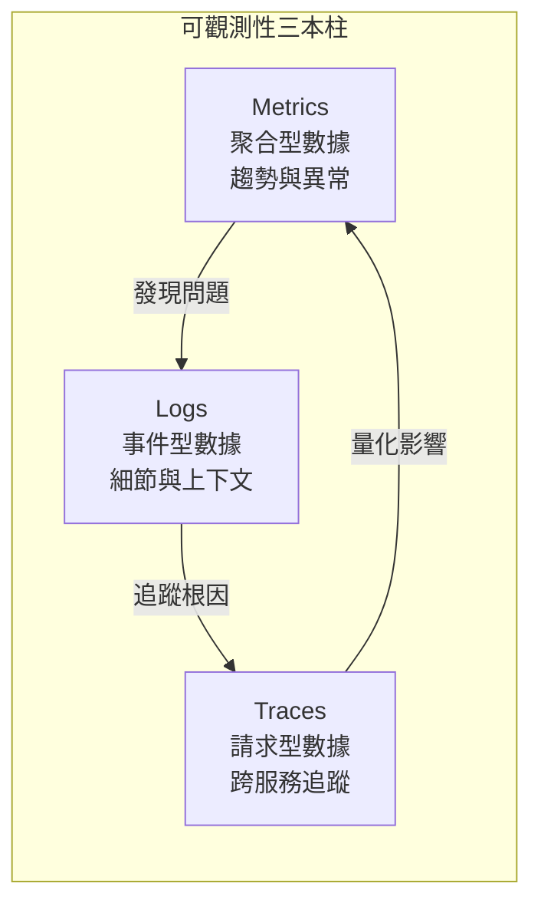

#### 三者的本質差異

| 維度 | Metrics | Logs | Traces |
|------|---------|------|--------|
| **資料型態** | 數值（聚合） | 文字（事件） | 結構化（Span） |
| **儲存成本** | 低 | 高 | 中 |
| **查詢速度** | 快（時序 DB） | 慢（全文搜尋） | 中（索引） |
| **適用場景** | 趨勢、警報、SLA | Debug、Audit | 跨服務追蹤 |
| **保留週期** | 長（15 天~2 年） | 中（7~30 天） | 短（3~7 天） |

#### 架構師的思考方式

```text
問題發生時的調查順序：
1. Metrics 告訴你「哪裡出問題」（告警觸發）
2. Logs 告訴你「發生什麼事」（錯誤訊息）
3. Traces 告訴你「問題怎麼傳播」（跨服務影響）
```

> ⚠️ **常見誤區**：很多團隊把 Logs 當成 Metrics 用（從 Log 計算 QPS），這會導致：
>
> - 查詢效能差
> - 儲存成本暴增
> - 告警延遲過高

### 2.2 為什麼 Metrics 是「第一層防線」

#### Metrics 的獨特價值

1. **即時性**：通常 15 秒內可發現異常
2. **低成本**：每個指標每分鐘約 4 個數據點，壓縮後極小
3. **可聚合**：可跨時間、跨維度聚合分析
4. **可預測**：歷史趨勢可用於容量預測

#### 事故時間軸示意

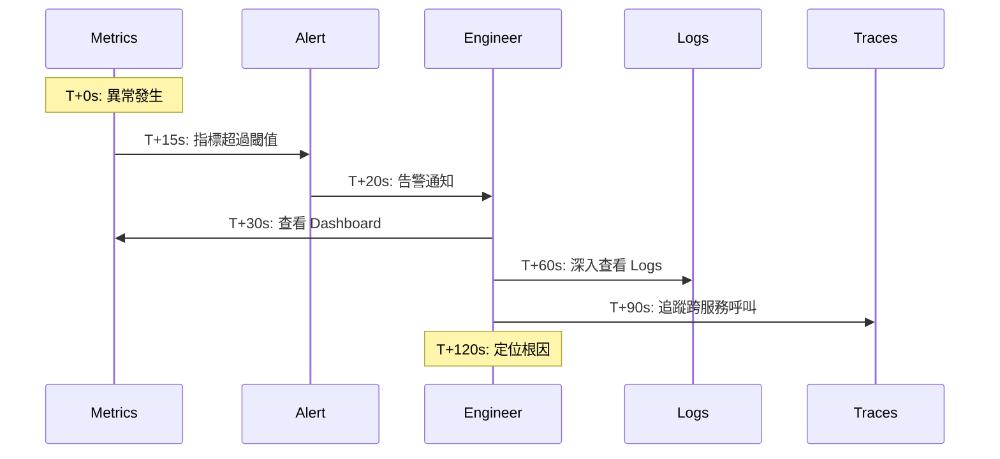

### 2.3 RED / USE / Golden Signals 模型

這三個模型是設計 Metrics 的指導框架，適用於不同場景。

#### RED 模型（面向服務/請求）

適用於：**微服務、API Gateway、Web Application**

| 指標 | 說明 | PromQL 範例 |
|------|------|-------------|
| **R**ate | 每秒請求數 | `rate(http_requests_total[5m])` |
| **E**rrors | 錯誤率 | `rate(http_requests_total{status=~"5.."}[5m]) / rate(http_requests_total[5m])` |
| **D**uration | 請求延遲 | `histogram_quantile(0.99, rate(http_request_duration_seconds_bucket[5m]))` |

#### USE 模型（面向資源/基礎設施）

適用於：**CPU、Memory、Disk、Network、DB Connection Pool**

| 指標 | 說明 | 範例 |
|------|------|------|
| **U**tilization | 資源使用率 | CPU 使用率 80% |
| **S**aturation | 飽和度（排隊程度） | Load Average、Queue Length |
| **E**rrors | 錯誤數 | Disk I/O Error、Network Packet Loss |

#### Golden Signals（Google SRE）

Google SRE 書籍提出的四個黃金指標：

```text
Latency    → 請求延遲（區分成功/失敗）
Traffic    → 流量（QPS、Bandwidth）
Errors     → 錯誤率
Saturation → 飽和度（資源吃緊程度）
```

#### 模型選擇指南

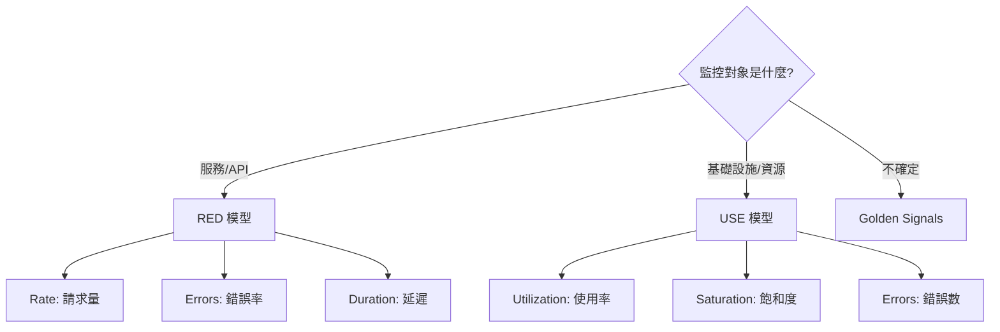

### 2.4 Metrics 過度蒐集的反模式（Anti-pattern）

#### ❌ Anti-pattern 1：蒐集所有能蒐集的指標

```yaml
# 錯誤示範：開啟所有 JVM Metrics
- job_name: 'java-app'
  static_configs:
    - targets: ['app:8080']
  # 結果：每個 App 產生 500+ 指標，90% 從未使用
```

**正確做法**：

- 先定義 SLO，再決定需要哪些指標
- 採用「需要時再加」而非「先加再說」

#### ❌ Anti-pattern 2：高基數標籤（Cardinality Explosion）

```yaml
# 錯誤示範：用 user_id 當 Label
http_requests_total{user_id="12345", path="/api/v1/users", method="GET"}
# 若有 100 萬用戶 × 100 個 API × 4 個方法 = 4 億條時序！
```

**正確做法**：

- Label 只用於「低基數」維度（region、service、status_code）
- 高基數資訊放 Logs 或 Traces

#### ❌ Anti-pattern 3：指標命名不一致

```yaml
# 錯誤示範：團隊各自命名
service_a_request_count
serviceB_requests_total
svc_c_req_num
```

**正確做法**：

遵循 Prometheus 命名規範：

```text
<namespace>_<name>_<unit>_<suffix>
範例：http_requests_total, http_request_duration_seconds
```

#### ❌ Anti-pattern 4：每個環境獨立的 Dashboard

**問題**：Dev、Staging、Prod 各有一套 Dashboard，維護成本高

**正確做法**：

- 使用 Grafana 變數（Variables）實現環境切換
- Dashboard as Code（JSON 版控）

---

## 3. Prometheus 深入解析

### 3.1 Prometheus 架構與資料流

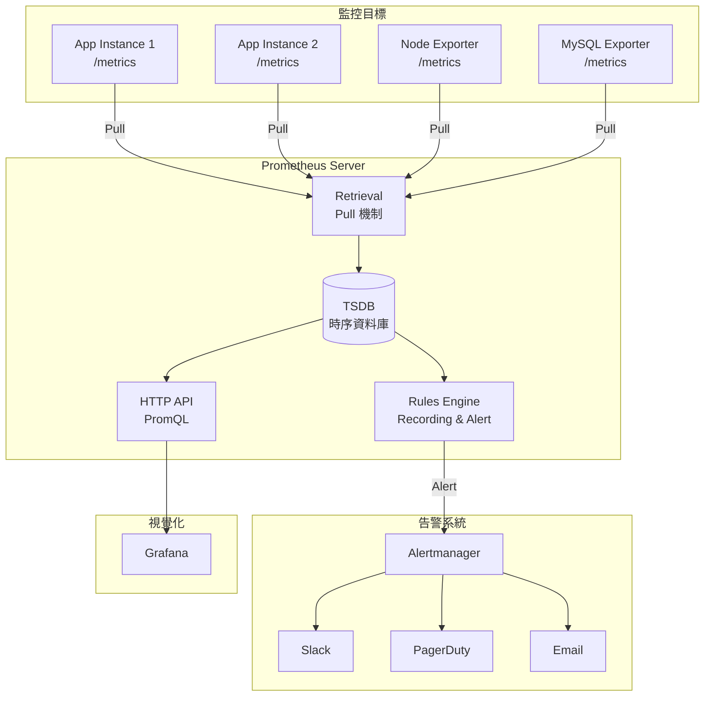

#### 核心組件說明

| 組件 | 職責 | 設計考量 |
|------|------|----------|
| **Retrieval** | 定期拉取指標 | Pull vs Push 的權衡 |
| **TSDB** | 時序資料儲存 | 壓縮率、查詢效能 |
| **Rules Engine** | 預計算、告警 | 減少查詢負載 |
| **HTTP API** | 對外查詢介面 | PromQL 執行 |
| **Alertmanager** | 告警路由、抑制、靜默 | 告警疲勞控制 |

### 3.2 Pull Model 的設計哲學

#### 為什麼 Prometheus 選擇 Pull？

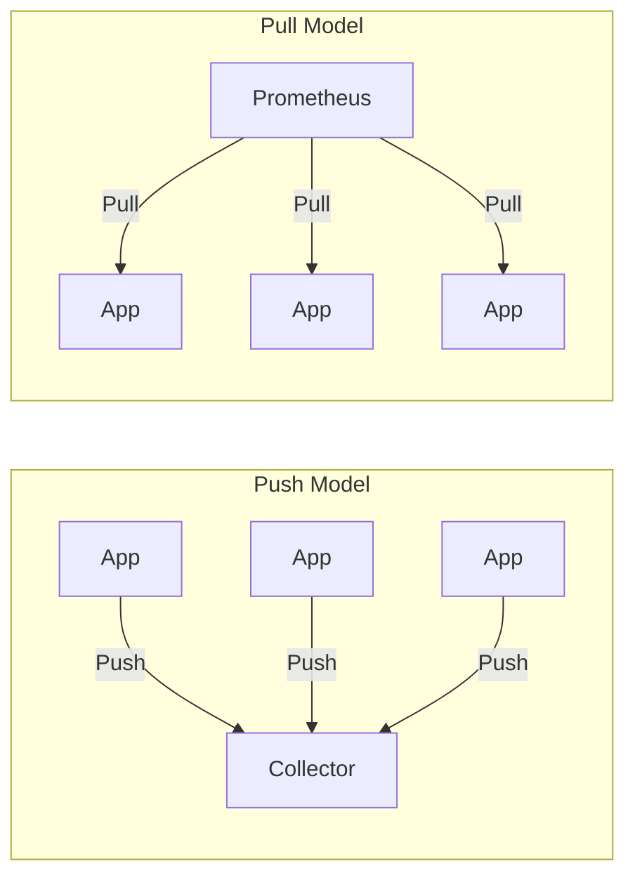

| 面向 | Pull Model | Push Model |
|------|------------|------------|
| **服務發現** | 集中管理 | 分散設定 |
| **健康檢查** | 內建（拉不到=掛了） | 需額外機制 |
| **背壓控制** | 由 Prometheus 控制 | 可能壓垮 Collector |
| **短生命週期 Job** | 較難處理 | 較適合 |
| **防火牆友善** | 需開放 Target Port | 只需開放 Collector |

#### 何時需要 Push？

使用 **Pushgateway** 的場景：

- Batch Job（短生命週期）
- 無法被 Pull 的環境（嚴格防火牆內）

```bash
# Pushgateway 使用範例
# 在 Batch Job 結束時推送指標
echo "batch_job_duration_seconds 42" | curl --data-binary @- http://pushgateway:9091/metrics/job/nightly_backup
```

> ⚠️ **注意**：Pushgateway 不會自動清除舊資料，需要手動管理或設定 TTL

### 3.3 Target / Job / Instance 設計原則

#### 概念釐清

```yaml
scrape_configs:
  - job_name: 'payment-service'      # Job: 一組相同用途的 Target
    static_configs:
      - targets:                      # Target: 被監控端點
          - 'payment-1:8080'          # Instance: 具體的 host:port
          - 'payment-2:8080'
          - 'payment-3:8080'
```

#### 設計原則

**1. Job 的粒度**

```yaml
# ❌ 錯誤：把所有服務放同一個 Job
- job_name: 'all-services'
  static_configs:
    - targets: ['user:8080', 'order:8080', 'payment:8080']

# ✅ 正確：每個服務一個 Job
- job_name: 'user-service'
  static_configs:
    - targets: ['user-1:8080', 'user-2:8080']
    
- job_name: 'order-service'
  static_configs:
    - targets: ['order-1:8080', 'order-2:8080']
```

**2. 使用 relabel_configs 標準化標籤**

```yaml
scrape_configs:
  - job_name: 'kubernetes-pods'
    kubernetes_sd_configs:
      - role: pod
    relabel_configs:
      # 只抓有特定 annotation 的 Pod
      - source_labels: [__meta_kubernetes_pod_annotation_prometheus_io_scrape]
        action: keep
        regex: true
      # 從 annotation 取得 port
      - source_labels: [__meta_kubernetes_pod_annotation_prometheus_io_port]
        action: replace
        target_label: __address__
        regex: (.+)
        replacement: $1
      # 加上自訂標籤
      - source_labels: [__meta_kubernetes_namespace]
        target_label: namespace
      - source_labels: [__meta_kubernetes_pod_name]
        target_label: pod
```

### 3.4 Label 設計 Best Practices

#### Label 是 Prometheus 的靈魂

Label 決定了：

- 你能用什麼維度聚合資料
- 你的 Cardinality（基數）有多大
- 查詢效能的好壞

#### 黃金法則

```text
✅ Label 應該是「低基數」且「有分析價值」的維度
❌ Label 不應該包含「高基數」或「會無限增長」的值
```

#### 好的 Label vs 壞的 Label

| ✅ 好的 Label | ❌ 壞的 Label |
|--------------|--------------|
| `region="ap-east-1"` | `user_id="12345678"` |
| `service="payment"` | `request_id="uuid-xxx"` |
| `status_code="200"` | `timestamp="2024..."` |
| `method="POST"` | `email="user@example.com"` |
| `env="prod"` | `session_id="xxx"` |

#### Cardinality 計算公式

```text
總 Cardinality = Label1 可能值 × Label2 可能值 × ... × LabelN 可能值

範例：
http_requests_total{
  service,      # 10 個服務
  method,       # 4 種方法
  status_code,  # 20 種狀態碼
  region        # 3 個區域
}
→ 10 × 4 × 20 × 3 = 2,400 條時序（可接受）

若加上 user_id（100 萬用戶）：
→ 2,400 × 1,000,000 = 24 億條（災難！）
```

#### 監控 Cardinality

```yaml
# Recording Rule: 計算每個指標的 Cardinality
- record: prometheus:metric_cardinality
  expr: count by (__name__) ({__name__=~".+"})
```

```promql
# 找出高基數指標
topk(10, count by (__name__) ({__name__=~".+"}))
```

### 3.5 常見 Exporter 類型

#### Exporter 生態系統

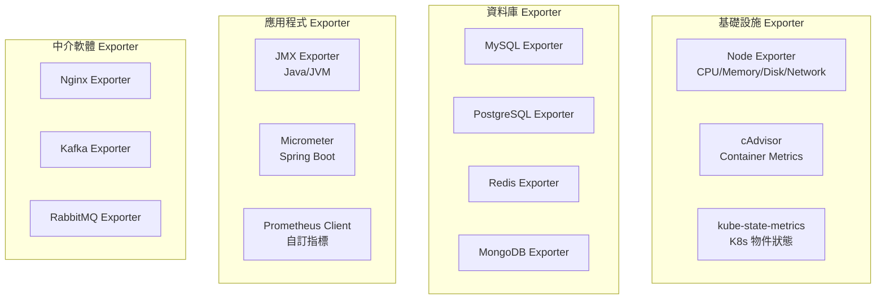

#### 重要 Exporter 一覽

| Exporter | 用途 | 關鍵指標 |
|----------|------|----------|
| **Node Exporter** | 主機層級指標 | `node_cpu_seconds_total`, `node_memory_MemAvailable_bytes` |
| **cAdvisor** | Container 指標 | `container_cpu_usage_seconds_total`, `container_memory_usage_bytes` |
| **kube-state-metrics** | K8s 物件狀態 | `kube_pod_status_phase`, `kube_deployment_status_replicas` |
| **JMX Exporter** | JVM 指標 | `jvm_memory_bytes_used`, `jvm_gc_collection_seconds` |
| **MySQL Exporter** | MySQL 指標 | `mysql_global_status_threads_connected`, `mysql_global_status_slow_queries` |

#### 自訂應用程式指標（以 Java + Micrometer 為例）

```java
// 1. Counter：計數器（只增不減）
Counter requestCounter = Counter.builder("api_requests_total")
    .description("Total API requests")
    .tag("endpoint", "/users")
    .tag("method", "GET")
    .register(meterRegistry);

requestCounter.increment();

// 2. Gauge：瞬時值
Gauge.builder("queue_size", queue, Queue::size)
    .description("Current queue size")
    .register(meterRegistry);

// 3. Histogram：分布（用於計算百分位數）
Timer requestTimer = Timer.builder("api_request_duration_seconds")
    .description("API request duration")
    .publishPercentiles(0.5, 0.95, 0.99)  // p50, p95, p99
    .publishPercentileHistogram()          // 用於 Prometheus histogram_quantile
    .register(meterRegistry);

requestTimer.record(() -> {
    // 業務邏輯
});

// 4. Summary：摘要（Client 端計算百分位）
DistributionSummary.builder("response_size_bytes")
    .description("Response size in bytes")
    .publishPercentiles(0.5, 0.95, 0.99)
    .register(meterRegistry);
```

### 3.6 Recording Rules 與 Alert Rules 設計思維

#### Recording Rules：預計算的藝術

**為什麼需要 Recording Rules？**

```promql
# 這個查詢很常用，但每次都要計算
sum(rate(http_requests_total[5m])) by (service)

# 如果 Dashboard 有 10 個 Panel 都用到，Prometheus 要算 10 次
# 如果 5 個人同時看 Dashboard，要算 50 次
```

**解決方案：Recording Rule**

```yaml
# prometheus-rules.yaml
groups:
  - name: service-metrics
    interval: 15s  # 計算頻率
    rules:
      # 預計算：每個服務的 QPS
      - record: service:http_requests:rate5m
        expr: sum(rate(http_requests_total[5m])) by (service)
      
      # 預計算：每個服務的錯誤率
      - record: service:http_errors:rate5m
        expr: |
          sum(rate(http_requests_total{status=~"5.."}[5m])) by (service)
          /
          sum(rate(http_requests_total[5m])) by (service)
      
      # 預計算：P99 延遲
      - record: service:http_request_duration_seconds:p99
        expr: |
          histogram_quantile(0.99,
            sum(rate(http_request_duration_seconds_bucket[5m])) by (service, le)
          )
```

**Recording Rule 命名規範**

```
level:metric_name:operations

level    → 聚合層級（service, cluster, global）
metric   → 原始指標名稱
operations → 執行的操作（rate5m, sum, p99）
```

#### Alert Rules：告警的設計思維

```yaml
groups:
  - name: service-alerts
    rules:
      # 1. 錯誤率告警
      - alert: HighErrorRate
        expr: service:http_errors:rate5m > 0.05
        for: 5m  # 持續 5 分鐘才告警（避免抖動）
        labels:
          severity: critical
          team: backend
        annotations:
          summary: "服務 {{ $labels.service }} 錯誤率過高"
          description: "錯誤率 {{ $value | printf \"%.2f\" }}%，超過 5% 閾值"
          runbook_url: "https://wiki.internal/runbook/high-error-rate"
      
      # 2. 延遲告警（分級）
      - alert: HighLatencyWarning
        expr: service:http_request_duration_seconds:p99 > 0.5
        for: 5m
        labels:
          severity: warning
        annotations:
          summary: "服務 {{ $labels.service }} P99 延遲偏高"
      
      - alert: HighLatencyCritical
        expr: service:http_request_duration_seconds:p99 > 2
        for: 2m
        labels:
          severity: critical
        annotations:
          summary: "服務 {{ $labels.service }} P99 延遲嚴重"
      
      # 3. 容量告警（預測型）
      - alert: DiskWillFillIn24Hours
        expr: |
          predict_linear(node_filesystem_avail_bytes[6h], 24*3600) < 0
        for: 30m
        labels:
          severity: warning
        annotations:
          summary: "預測磁碟將在 24 小時內用盡"
```

#### Alert Rules 設計原則

| 原則 | 說明 | 範例 |
|------|------|------|
| **可行動** | 收到告警後要能做什麼 | 附上 runbook URL |
| **分級** | 區分 severity（info/warning/critical） | 避免狼來了 |
| **去抖動** | 使用 `for` 避免瞬間波動觸發 | `for: 5m` |
| **有上下文** | annotation 要包含足夠資訊 | 當前值、閾值、受影響服務 |

### 3.7 PromQL 思考模型

#### PromQL 不是語法，是思考方式

```text
核心思維：
1. 選擇時序（Selector）
2. 轉換資料（Functions）
3. 聚合維度（Aggregation）
4. 跨時序運算（Binary Operators）
```

#### 思考模型圖示

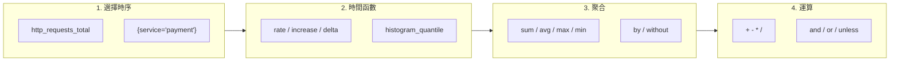

#### 常見查詢模式

**1. 計算 QPS（每秒請求數）**

```promql
# rate() 計算每秒增長率，適用於 Counter
rate(http_requests_total[5m])

# 按服務聚合
sum(rate(http_requests_total[5m])) by (service)
```

**2. 計算錯誤率**

```promql
# 分子：5xx 錯誤數
# 分母：總請求數
sum(rate(http_requests_total{status=~"5.."}[5m])) by (service)
/
sum(rate(http_requests_total[5m])) by (service)
```

**3. 計算百分位延遲（從 Histogram）**

```promql
# P99 延遲
histogram_quantile(0.99,
  sum(rate(http_request_duration_seconds_bucket[5m])) by (le, service)
)

# P50、P95、P99 一起算
histogram_quantile(0.50, sum(rate(http_request_duration_seconds_bucket[5m])) by (le))
histogram_quantile(0.95, sum(rate(http_request_duration_seconds_bucket[5m])) by (le))
histogram_quantile(0.99, sum(rate(http_request_duration_seconds_bucket[5m])) by (le))
```

**4. 資源使用率**

```promql
# CPU 使用率
1 - avg(rate(node_cpu_seconds_total{mode="idle"}[5m])) by (instance)

# Memory 使用率
1 - (node_memory_MemAvailable_bytes / node_memory_MemTotal_bytes)

# Disk 使用率
1 - (node_filesystem_avail_bytes / node_filesystem_size_bytes)
```

**5. 趨勢預測**

```promql
# 預測 4 小時後的值
predict_linear(node_filesystem_avail_bytes[1h], 4*3600)

# 預測磁碟何時用完
predict_linear(node_filesystem_avail_bytes[6h], 24*3600) < 0
```

#### PromQL 常見陷阱

| 陷阱 | 說明 | 解法 |
|------|------|------|
| `rate()` 用於 Gauge | Counter 專用，Gauge 會得到錯誤結果 | Gauge 用 `delta()` 或直接用 |
| 時間範圍太短 | `rate(x[30s])` 可能沒有足夠資料點 | 至少 4 個資料點：`[2m]` for 30s scrape |
| Label 不對齊 | 除法時兩邊 Label 不一致 | 用 `on()` / `ignoring()` 處理 |
| Counter 重置 | 應用重啟會歸零 | `rate()` / `increase()` 自動處理 |

---

## 4. Grafana 視覺化設計

### 4.1 Dashboard 設計的「故事線」概念

#### Dashboard 是一個「故事」

```text
好的 Dashboard = 能在 30 秒內回答「系統現在好不好？」
```

**故事線結構**

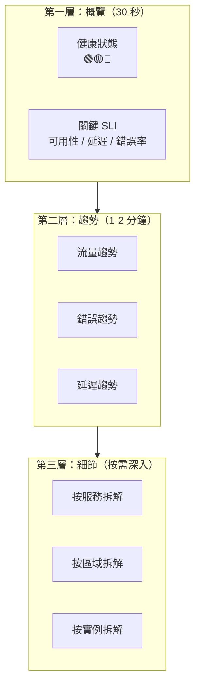

#### Dashboard 設計原則

| 原則 | 說明 |
|------|------|
| **金字塔結構** | 上方放概覽，下方放細節 |
| **左重要右次要** | 閱讀習慣是從左到右 |
| **關聯性分組** | 相關指標放在一起 |
| **一致的時間範圍** | 所有 Panel 同步 |
| **明確的閾值線** | 紅線標示 SLO/閾值 |

### 4.2 不同角色的 Dashboard 設計

#### 角色需求矩陣

| 角色 | 關注點 | 更新頻率 | 複雜度 |
|------|--------|----------|--------|
| **Manager/Director** | 整體健康、SLA 達成率 | Daily/Weekly | 低 |
| **Ops/SRE** | 即時狀態、告警、資源用量 | 即時 | 中 |
| **Developer** | API 效能、錯誤細節、依賴狀態 | 即時/Debug | 高 |

#### Manager Dashboard 範例

```
┌─────────────────────────────────────────────────────────────┐
│                    系統健康概覽                               │
├─────────────────┬─────────────────┬─────────────────────────┤
│  🟢 可用性       │  🟢 延遲         │  🟢 錯誤率              │
│  99.95%         │  P99: 120ms     │  0.02%                  │
│  SLO: 99.9%     │  SLO: <200ms    │  SLO: <0.1%            │
├─────────────────┴─────────────────┴─────────────────────────┤
│                    本月 SLA 趨勢                             │
│  [====================================----] 99.95%          │
├─────────────────────────────────────────────────────────────┤
│  事故統計        │  P1: 0  │  P2: 2  │  MTTR: 15min        │
└─────────────────────────────────────────────────────────────┘
```

#### Ops/SRE Dashboard 範例

```
┌──────────────────────────────────────────────────────────────┐
│  [Region: ap-east-1 ▼]  [Service: All ▼]  [Last 1h ▼]        │
├─────────────────┬─────────────────┬──────────────────────────┤
│  Active Alerts  │  QPS            │  Error Rate              │
│  🔴 2 Critical  │  📈 15,234/s    │  📉 0.03%                │
│  🟡 5 Warning   │  +12% vs avg    │  -0.01% vs 1h ago       │
├─────────────────┴─────────────────┴──────────────────────────┤
│                    Request Rate by Service                    │
│  [折線圖：顯示各服務 QPS 趨勢]                                  │
├──────────────────────────────────────────────────────────────┤
│                    Latency Distribution (P50/P95/P99)         │
│  [折線圖：顯示延遲百分位趨勢]                                   │
├─────────────────────────────────────────────────────────────┤
│  CPU Usage      │  Memory Usage   │  Disk I/O               │
│  [Gauge: 65%]   │  [Gauge: 72%]   │  [Gauge: 45%]           │
└─────────────────────────────────────────────────────────────┘
```

#### Developer Dashboard 範例

```
┌──────────────────────────────────────────────────────────────┐
│  Service: payment-service  [Instance: All ▼]  [Last 1h ▼]    │
├──────────────────────────────────────────────────────────────┤
│                    Endpoint Performance                       │
│  ┌────────────────┬─────────┬─────────┬─────────┬─────────┐ │
│  │ Endpoint       │ QPS     │ P99     │ Error%  │ Trend   │ │
│  ├────────────────┼─────────┼─────────┼─────────┼─────────┤ │
│  │ POST /pay      │ 1,234   │ 89ms    │ 0.01%   │ 🟢      │ │
│  │ GET /status    │ 5,678   │ 12ms    │ 0.00%   │ 🟢      │ │
│  │ POST /refund   │ 234     │ 156ms   │ 0.05%   │ 🟡      │ │
│  └────────────────┴─────────┴─────────┴─────────┴─────────┘ │
├──────────────────────────────────────────────────────────────┤
│                    Downstream Dependencies                    │
│  [依賴服務延遲/錯誤率矩陣]                                      │
├──────────────────────────────────────────────────────────────┤
│  JVM Metrics: Heap │ GC Pause │ Thread Pool                  │
└──────────────────────────────────────────────────────────────┘
```

### 4.3 指標選擇與視覺化類型對應

| 指標類型 | 適合的視覺化 | Grafana Panel |
|----------|--------------|---------------|
| 即時狀態（單一值） | Stat / Gauge | Stat Panel |
| 時間趨勢 | 折線圖 | Time Series |
| 分布比較 | 長條圖 | Bar Chart |
| 百分位分布 | 熱力圖 | Heatmap |
| 狀態矩陣 | 表格 + 顏色 | Table Panel |
| 比例組成 | 堆疊圖 / 圓餅 | Time Series (stacked) |

#### 視覺化選擇決策樹

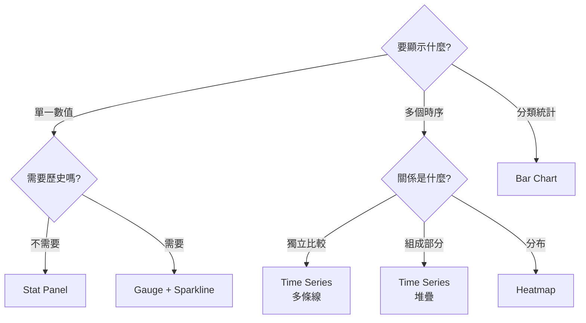

### 4.4 Anti-pattern Dashboard 範例

#### ❌ Anti-pattern 1：資訊過載

```
問題：一個 Dashboard 塞 50 個 Panel
結果：
- 載入時間 > 30 秒
- 看不出重點
- 記憶體爆炸
```

**解法**：

- 單一 Dashboard 最多 15-20 個 Panel
- 用 Row 摺疊不常看的區塊
- 拆分多個 Dashboard，用 Link 連接

#### ❌ Anti-pattern 2：沒有上下文的數字

```text
問題：顯示「QPS: 12,345」但不知道這是好是壞
```

**解法**：

- 加入閾值線（紅/黃/綠）
- 顯示與基準的比較（vs 上週 / vs 平均）
- 使用 Stat Panel 的 Color Mode

#### ❌ Anti-pattern 3：誤導性的 Y 軸

```text
問題：Y 軸從 99% 開始，讓 0.1% 的波動看起來像大災難
```

**解法**：

- Y 軸從 0 開始（或明確標示）
- 使用固定 Y 軸範圍（避免自動縮放誤導）

#### ❌ Anti-pattern 4：每個環境一套 Dashboard

```text
問題：Dev / Staging / Prod 各有一套，維護成本 x3
```

**解法**：

使用 Grafana Variables

```text
Variables:
- env: prod, staging, dev
- region: ap-east-1, us-west-2

Query: rate(http_requests_total{env="$env", region="$region"}[5m])
```

### 4.5 Grafana 與 Prometheus 的責任邊界

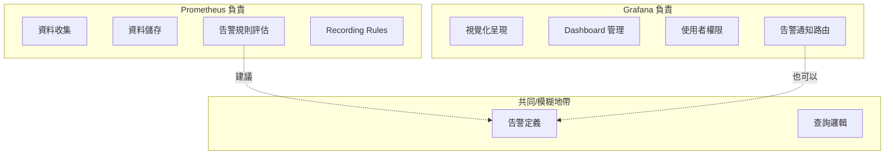

#### 責任劃分建議

| 功能 | Prometheus | Grafana | 建議 |
|------|------------|---------|------|
| 資料收集 | ✅ | ❌ | Prometheus |
| 時序儲存 | ✅ | ❌ | Prometheus |
| 告警規則 | ✅ | ✅ | **Prometheus**（集中管理） |
| 告警通知 | Alertmanager | ✅ | 擇一，推薦 Alertmanager |
| Dashboard | ❌ | ✅ | Grafana |
| 權限控管 | 基本 | ✅ | Grafana |
| 報表匯出 | ❌ | ✅ | Grafana |

> 💡 **最佳實務**：告警規則放 Prometheus（版控、CI/CD），Grafana 只用於視覺化

---

## 5. Metrics 與架構決策

### 5.1 用 Metrics 驗證架構假設

#### 架構決策需要資料支撐

```text
❌ 「我覺得應該加快取」
✅ 「資料庫 P99 延遲是 200ms，快取命中率只有 30%，加快取可降至 20ms」
```

#### 常見架構假設與驗證指標

| 架構假設 | 驗證指標 | PromQL 範例 |
|----------|----------|-------------|
| 「API 延遲是資料庫造成的」 | DB Query Time vs Total Latency | `http_request_duration_seconds - db_query_duration_seconds` |
| 「快取能解決效能問題」 | Cache Hit Rate, Miss Penalty | `cache_hits_total / (cache_hits_total + cache_misses_total)` |
| 「水平擴展能解決效能」 | Per-Instance CPU/Memory | `avg(container_cpu_usage) by (pod)` |
| 「某服務是瓶頸」 | Service Dependency Latency | 各下游服務的 P99 比較 |

#### 案例：驗證「加 Redis 快取能提升效能」

**假設**：加入 Redis 快取後，API 延遲可降低 50%

**驗證步驟**：

```promql
# 1. 目前 API 延遲
histogram_quantile(0.99, sum(rate(http_request_duration_seconds_bucket[5m])) by (le))
→ 結果：200ms

# 2. 目前 DB 查詢延遲
histogram_quantile(0.99, sum(rate(db_query_duration_seconds_bucket[5m])) by (le))
→ 結果：150ms

# 3. 快取命中率
sum(rate(cache_hits_total[5m])) / sum(rate(cache_requests_total[5m]))
→ 結果：30%（命中）/ 70%（穿透到 DB）

# 4. 預估效益
# 若命中率提升到 80%，DB 延遲佔比從 70% 降到 20%
# 預估延遲：200ms - (150ms × 0.5) = 125ms（降低 37.5%）
```

**結論**：假設部分成立，但無法達到 50% 改善，需同時優化 DB 查詢

### 5.2 Scaling / Bottleneck / Capacity Planning

#### Scaling 決策框架

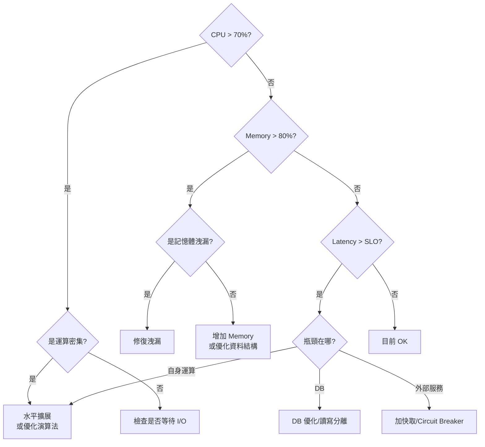

#### 容量規劃指標

```promql
# 1. 目前使用率
avg(rate(container_cpu_usage_seconds_total[5m])) by (deployment) 
/ 
avg(kube_pod_container_resource_limits{resource="cpu"}) by (deployment)

# 2. 峰值使用率（過去 7 天最大值）
max_over_time(
  avg(rate(container_cpu_usage_seconds_total[5m])) by (deployment)[7d:1h]
)

# 3. 增長趨勢（線性預測）
predict_linear(
  avg(rate(container_cpu_usage_seconds_total[5m])) by (deployment)[30d],
  86400 * 30  # 預測 30 天後
)
```

#### 容量規劃計算範例

```
目前狀態：
- 3 個 Pod，每個 2 CPU
- 平均 CPU 使用率：60%
- 峰值 CPU 使用率：85%
- 月增長率：10%

計算：
- 目前緩衝：(1 - 0.85) = 15%
- 若維持 30% 緩衝，需要：0.85 / 0.7 = 1.21 倍 → 需擴至 4 Pod
- 預測 3 個月後：85% × 1.1³ = 113% → 需提前擴容
```

### 5.3 SLA / SLO / Error Budget 與 Metrics

#### 概念釐清

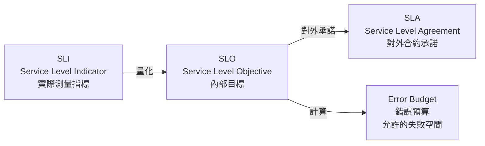

| 概念 | 定義 | 範例 |
|------|------|------|
| **SLI** | 實際測量的指標 | 可用性 = 成功請求數 / 總請求數 |
| **SLO** | 內部設定的目標 | 可用性 SLO = 99.9% |
| **SLA** | 對客戶的承諾 | 可用性 SLA = 99.5%（違反則賠償） |
| **Error Budget** | 允許的錯誤空間 | 100% - 99.9% = 0.1% |

#### SLO 與 Metrics 對應

```yaml
# SLO 定義檔範例
slos:
  - name: api-availability
    description: API 可用性
    sli:
      metric: sum(rate(http_requests_total{status!~"5.."}[5m])) / sum(rate(http_requests_total[5m]))
    objective: 0.999  # 99.9%
    window: 30d       # 30 天滾動窗口
    
  - name: api-latency
    description: API 延遲（P99 < 200ms）
    sli:
      metric: histogram_quantile(0.99, sum(rate(http_request_duration_seconds_bucket[5m])) by (le)) < 0.2
    objective: 0.99   # 99% 的時間 P99 < 200ms
    window: 30d
```

#### Error Budget 計算與視覺化

```promql
# Error Budget 消耗率（30 天窗口）
1 - (
  sum(increase(http_requests_total{status!~"5.."}[30d]))
  /
  sum(increase(http_requests_total[30d]))
) / (1 - 0.999)

# 若結果 > 1，表示 Error Budget 已用完
```

**Error Budget Dashboard 設計**

```text
┌─────────────────────────────────────────────────────────┐
│  Error Budget: api-availability (30d rolling)            │
├─────────────────────────────────────────────────────────┤
│  SLO: 99.9%  │  Current: 99.95%  │  Budget: 72% remaining │
│  [████████████████████░░░░░░░░░░] 72%                    │
├─────────────────────────────────────────────────────────┤
│  Burn Rate (過去 1h): 0.5x  🟢 健康                       │
│  Burn Rate (過去 6h): 1.2x  🟡 注意                       │
│  預計耗盡時間: 15 天                                      │
└─────────────────────────────────────────────────────────┘
```

### 5.4 Metrics 如何影響系統設計

#### Metrics-Driven Development

```text
傳統做法：設計 → 開發 → 測試 → 上線 → 補 Metrics
正確做法：設計（含 Metrics）→ 開發（含 Metrics）→ 測試（驗證 Metrics）→ 上線
```

#### 設計階段就該定義的 Metrics

| 設計決策 | 該定義的 Metrics |
|----------|------------------|
| 新增 API Endpoint | 延遲、錯誤率、QPS |
| 引入新依賴（DB/Cache/API） | 連線數、延遲、錯誤率 |
| 實作重試機制 | 重試次數、成功率 |
| 實作 Circuit Breaker | 狀態變化、觸發次數 |
| 實作 Rate Limiting | 被拒絕請求數、佇列深度 |

#### 案例：設計 Circuit Breaker 的 Metrics

```java
// Circuit Breaker 狀態 Metrics
Gauge.builder("circuit_breaker_state", circuitBreaker, cb -> {
    switch (cb.getState()) {
        case CLOSED: return 0;
        case HALF_OPEN: return 1;
        case OPEN: return 2;
        default: return -1;
    }
})
.tag("name", "payment-service")
.register(registry);

// 呼叫結果 Metrics
Counter.builder("circuit_breaker_calls_total")
    .tag("name", "payment-service")
    .tag("result", "success")  // success, failure, rejected
    .register(registry);
```

對應的告警規則：

```yaml
- alert: CircuitBreakerOpen
  expr: circuit_breaker_state == 2
  for: 1m
  labels:
    severity: critical
  annotations:
    summary: "Circuit Breaker {{ $labels.name }} 已開啟"
    description: "下游服務可能故障，請檢查"
```

---

## 6. AI 輔助 Metrics 分析

### 6.1 適合交給 AI 分析的 Metrics 類型

#### AI 擅長的分析任務

| 任務類型 | 適合度 | 說明 |
|----------|--------|------|
| 異常模式識別 | ⭐⭐⭐⭐⭐ | 識別不尋常的波動或趨勢 |
| PromQL 解讀 | ⭐⭐⭐⭐ | 解釋查詢的含義和結果 |
| 根因假設 | ⭐⭐⭐ | 提供可能的原因，需人類驗證 |
| Dashboard 優化建議 | ⭐⭐⭐⭐ | 建議更好的視覺化方式 |
| 容量預測 | ⭐⭐⭐ | 基於趨勢的預測，需人類校正 |
| 即時決策 | ⭐ | **不適合**，需要人類判斷 |

#### 不適合交給 AI 的任務

```text
❌ 緊急事故處理決策
❌ 服務上下線決定
❌ 資安相關告警處置
❌ 影響生產環境的操作
```

### 6.2 Prompt 設計範例

#### Prompt 1：解讀 PromQL 查詢

```markdown
## 請幫我解讀以下 PromQL 查詢

### 查詢語法
```promql
sum(rate(http_requests_total{status=~"5.."}[5m])) by (service)
/
sum(rate(http_requests_total[5m])) by (service)
```

### 請回答
1. 這個查詢在計算什麼？
2. 各部分的作用是什麼？
3. 結果的單位是什麼？
4. 使用時有什麼注意事項？
```

#### Prompt 2：分析 Metrics 異常

```markdown
## 請分析以下 Metrics 異常

### 現象描述
- 時間：2024-01-15 14:30 UTC
- 服務：payment-service
- 異常指標：
  - P99 延遲從 100ms 飆升至 2000ms
  - 錯誤率從 0.01% 上升至 5%
  - QPS 維持穩定（約 1000/s）

### 同時間其他觀察
- DB 連線數正常
- CPU 使用率從 40% 升至 90%
- Memory 無明顯變化

### 請提供
1. 可能的根因假設（列出 3-5 個）
2. 每個假設的驗證方法
3. 建議的排查步驟
```

#### Prompt 3：Dashboard 優化建議

```markdown
## 請幫我優化這個 Dashboard

### 目前 Dashboard 配置
- Panel 1: QPS（折線圖）
- Panel 2: 錯誤數（折線圖）
- Panel 3: P50 延遲（折線圖）
- Panel 4: P95 延遲（折線圖）
- Panel 5: P99 延遲（折線圖）
- Panel 6-15: 各個 Endpoint 的 QPS（10 個折線圖）

### 使用情境
- 使用者：SRE 團隊
- 目的：日常監控、事故排查

### 請提供
1. 目前設計的問題
2. 改善建議
3. 優化後的 Panel 配置
```

#### Prompt 4：容量規劃分析

```markdown
## 請幫我進行容量規劃分析

### 歷史資料摘要（過去 90 天）
- 平均 CPU 使用率：45%
- 峰值 CPU 使用率：78%（每日 14:00-16:00）
- 月增長率：8%
- 目前配置：5 Pod × 2 CPU = 10 CPU

### 約束條件
- 峰值使用率不得超過 70%（預留 30% 緩衝）
- 擴容需 2 週前置時間
- 成本考量：每增加 1 Pod = $200/月

### 請提供
1. 目前容量風險評估
2. 預測何時需要擴容
3. 建議的擴容方案
4. 成本影響分析
```

### 6.3 AI 在 Metrics 分析的限制與風險

#### 限制

| 限制 | 說明 | 因應方式 |
|------|------|----------|
| **缺乏即時資料** | AI 無法直接查詢 Prometheus | 人工提供資料摘要 |
| **不懂業務脈絡** | 不知道「這個服務很重要」 | 在 Prompt 中說明 |
| **可能幻覺** | 可能編造不存在的指標 | 驗證建議的可行性 |
| **時效性** | 無法處理「現在」的狀況 | 僅用於分析，非即時操作 |

#### 風險控管

```yaml
# AI 分析結果的驗證 Checklist
checklist:
  - 建議的 PromQL 是否語法正確？
  - 建議的指標在我們環境中是否存在？
  - 根因假設是否符合系統架構？
  - 是否需要額外資訊才能下結論？
  - 建議的行動是否可逆？
```

### 6.4 人與 AI 的責任分工

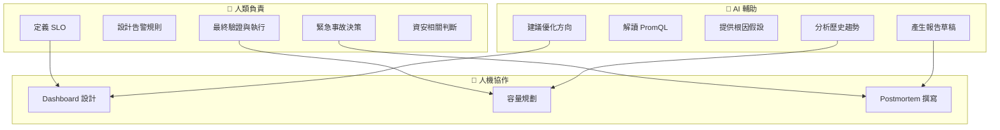

---

## 7. 實戰案例

### 7.1 案例 1：流量暴增導致服務降級

#### 情境

```text
時間：週五晚間 20:00
現象：
- 用戶反映「付款很慢」
- 告警：payment-service P99 > 2s
```

#### 排查過程

```promql
# Step 1: 確認延遲飆升
histogram_quantile(0.99, sum(rate(http_request_duration_seconds_bucket{service="payment"}[5m])) by (le))
→ 結果：2.5s（正常值：100ms）

# Step 2: 確認 QPS
sum(rate(http_requests_total{service="payment"}[5m]))
→ 結果：5000/s（正常值：1000/s）← 流量是平時 5 倍！

# Step 3: 確認資源使用
avg(rate(container_cpu_usage_seconds_total{pod=~"payment.*"}[5m])) 
→ 結果：95%（正常值：40%）

# Step 4: 確認下游
histogram_quantile(0.99, sum(rate(db_query_duration_seconds_bucket[5m])) by (le))
→ 結果：正常（DB 不是瓶頸）
```

#### 根因

促銷活動導致流量暴增，CPU 成為瓶頸

#### 處置

1. 緊急擴容：3 Pod → 10 Pod
2. 啟用 Rate Limiting
3. 事後：建立流量異常告警

### 7.2 案例 2：記憶體洩漏導致週期性重啟

#### 情境

```text
現象：
- Pod 每 3-4 天重啟一次
- 重啟前無明顯告警
```

#### 排查過程

```promql
# Step 1: 查看 Memory 長期趨勢
container_memory_usage_bytes{pod=~"order-service.*"}
→ 發現記憶體使用呈線性增長

# Step 2: 計算增長率
deriv(container_memory_usage_bytes{pod=~"order-service.*"}[1h])
→ 每小時增長約 50MB

# Step 3: 對比 GC 行為
rate(jvm_gc_collection_seconds_count[5m])
→ GC 頻率正常，但無法回收記憶體
```

#### 根因

程式碼存在記憶體洩漏（某個 Map 持續增長）

#### 處置

1. 短期：設定定期重啟 + Memory 告警
2. 長期：修復程式碼洩漏
3. 新增監控：`jvm_memory_bytes_used` 增長率告警

### 7.3 案例 3：快取穿透導致 DB 過載

#### 情境

```text
現象：
- DB CPU 飆升至 100%
- 多個服務延遲上升
```

#### 排查過程

```promql
# Step 1: 確認 DB 負載來源
topk(5, sum(rate(db_query_duration_seconds_count[5m])) by (query_type))
→ SELECT 查詢暴增

# Step 2: 檢查 Cache 命中率
sum(rate(cache_hits_total[5m])) / sum(rate(cache_requests_total[5m]))
→ 命中率從 90% 降至 10%

# Step 3: 確認 Cache 狀態
redis_connected_clients
→ 正常

redis_memory_used_bytes
→ 正常，但...

redis_keys_total
→ 從 100 萬降至 1000 ← Cache 被清空！
```

#### 根因

Redis 配置錯誤導致資料被意外清除

#### 處置

1. 緊急：從 DB 重建 Cache
2. 修復：修正 Redis 配置
3. 新增監控：`redis_keys_total` 異常下降告警

---

## 8. 檢查清單（Checklist）

### 8.1 🚀 Prometheus 部署檢查清單

```markdown
□ Prometheus 版本是否為 LTS 或穩定版？
□ 資料保留期（retention）是否符合需求？
□ 是否設定適當的 scrape_interval（建議 15-30s）？
□ 是否啟用高可用（多副本 + Thanos/Cortex）？
□ 是否設定資源限制（CPU/Memory）？
□ 是否有備份機制？
□ 是否設定 Alertmanager？
□ 告警通知管道是否已測試？
```

### 8.2 📊 Metrics 設計檢查清單

```markdown
□ 是否遵循 RED/USE 模型？
□ 指標命名是否符合規範？
□ Label 基數是否可控（< 10,000）？
□ 是否有過度蒐集的指標？
□ 是否設定 Recording Rules 預計算常用查詢？
□ 新服務是否包含基本指標（延遲/錯誤/流量）？
```

### 8.3 🎨 Dashboard 設計檢查清單

```markdown
□ Dashboard 是否有清楚的「故事線」？
□ 第一眼能否判斷系統健康狀態？
□ 是否使用 Variables 支援環境/服務切換？
□ 是否有明確的閾值標示？
□ Panel 數量是否適中（< 20）？
□ 是否使用 Dashboard as Code 版控？
```

### 8.4 🚨 告警設計檢查清單

```markdown
□ 每個告警是否可行動（收到後知道要做什麼）？
□ 是否設定適當的 `for` 避免抖動？
□ 是否區分 severity（info/warning/critical）？
□ annotation 是否包含足夠上下文？
□ 是否有 runbook URL？
□ 告警是否經過測試？
□ 是否定期審視告警有效性（避免狼來了）？
```

### 8.5 📈 SLO 設計檢查清單

```markdown
□ 是否定義明確的 SLI？
□ SLO 目標是否合理（不要追求 100%）？
□ 是否設定 Error Budget？
□ 是否有 Error Budget Burn Rate 告警？
□ 是否定期 Review SLO 達成狀況？
```

### 8.6 🤖 AI 輔助使用檢查清單

```markdown
□ 是否在 Prompt 中提供足夠上下文？
□ AI 建議的 PromQL 是否經過驗證？
□ AI 提供的根因假設是否經過人工檢驗？
□ 是否避免讓 AI 做即時決策？
□ 敏感資訊是否已脫敏後再提供給 AI？
```

---

## 9. 附錄：常用 PromQL 速查表

### 基礎查詢

| 用途 | PromQL |
|------|--------|
| 選擇指標 | `http_requests_total` |
| Label 過濾 | `http_requests_total{status="200"}` |
| 正則過濾 | `http_requests_total{status=~"2.."}` |
| 排除過濾 | `http_requests_total{status!="500"}` |

### 時間函數

| 用途 | PromQL |
|------|--------|
| 計算速率（Counter） | `rate(http_requests_total[5m])` |
| 計算增量（Counter） | `increase(http_requests_total[1h])` |
| 計算變化（Gauge） | `delta(temperature[1h])` |
| 計算導數 | `deriv(temperature[1h])` |

### 聚合函數

| 用途 | PromQL |
|------|--------|
| 加總 | `sum(rate(http_requests_total[5m]))` |
| 平均 | `avg(rate(http_requests_total[5m]))` |
| 最大/最小 | `max(...) / min(...)` |
| 計數 | `count(up == 1)` |
| 分組聚合 | `sum(...) by (service)` |
| 排除維度聚合 | `sum(...) without (instance)` |

### 百分位計算

| 用途 | PromQL |
|------|--------|
| P50 | `histogram_quantile(0.50, sum(rate(http_request_duration_seconds_bucket[5m])) by (le))` |
| P95 | `histogram_quantile(0.95, ...)` |
| P99 | `histogram_quantile(0.99, ...)` |

### 進階查詢

| 用途 | PromQL |
|------|--------|
| Top K | `topk(5, sum(rate(http_requests_total[5m])) by (service))` |
| 時間範圍最大值 | `max_over_time(cpu_usage[1h])` |
| 線性預測 | `predict_linear(disk_free_bytes[6h], 3600*24)` |
| Label 替換 | `label_replace(up, "host", "$1", "instance", "(.*):.*")` |

### 運算子

| 用途 | PromQL |
|------|--------|
| 錯誤率 | `sum(rate(http_errors[5m])) / sum(rate(http_requests_total[5m]))` |
| 比較 | `http_requests_total > 1000` |
| 布林運算 | `up == 1 and on(instance) memory_usage > 0.8` |
| 向量匹配 | `a * on(instance) b` |

---

## 10. 參考資源

### 官方文件
- [Prometheus Documentation](https://prometheus.io/docs/)
- [Grafana Documentation](https://grafana.com/docs/)
- [PromQL Cheat Sheet](https://prometheus.io/docs/prometheus/latest/querying/basics/)

### 推薦書籍
- 《Prometheus: Up & Running》 - Brian Brazil
- 《Site Reliability Engineering》 - Google SRE Team
- 《Observability Engineering》 - Charity Majors

### 社群資源
- [Awesome Prometheus Alerts](https://awesome-prometheus-alerts.grep.to/)
- [Grafana Dashboard Library](https://grafana.com/grafana/dashboards/)

---

> **文件維護**
> - 負責團隊：SRE / Platform Team
> - 更新頻率：每季度 Review
> - 問題回報：請至內部 Wiki 提 Issue


