+++
date = '2026-01-26T20:22:55+08:00'
draft = false
title = 'Metrics Visualization 教學手冊'
tags = ['教學', '工具', 'Metrics', 'Visualization', 'Prometheus + Grafana', 'Prometheus', 'Grafana', 'PromQL', 'SLO']
categories = ['教學']
+++

# Metrics Visualization 教學手冊（Prometheus + Grafana）

## 文件資訊

| 項目 | 內容 |
| --- | --- |
| **文件版本** | 2.0 |
| **最後更新** | 2026-10-01 |
| **版本基準** | Prometheus 3.15.0（2026-09-24）、Prometheus LTS 3.13.x（支援至 2027-07-31）、Grafana 13.2.3（2026-09-29）、Alertmanager 0.34.1；完整矩陣見 [1.3 版本基準與相容性矩陣](#13-版本基準與相容性矩陣) |
| **文件定位** | 企業標準技術白皮書／內部標準教材：**指標設計、PromQL 分析、儀表板、告警與 SLO、架構決策與治理** |
| **適用對象** | 資深後端工程師、系統架構師、SRE／DevOps 工程師、技術主管、資安與稽核人員 |
| **前置知識** | Linux 與容器、Kubernetes 基本概念、RESTful API、微服務架構、基本監控概念 |
| **姊妹文件** | 《Prometheus與Grafana教學手冊》：安裝、設定檔、維護、升級操作步驟；《OpenTelemetry教學手冊》：OTel SDK 與 Collector |
| **前一版本** | 1.0（2026-01-26，以 Prometheus 2.x／Grafana 11 時期做法為主） |
| **Created by** | Eric Cheng |

> 📌 **v2.0 改版重點**：全面對齊 Prometheus 3.x 與 Grafana 13。修正 v1.0 中無法執行或結果錯誤的範例，例如 relabel 位址改寫、`predict_linear` 子查詢語法、錯誤率告警百分比顯示、不存在的指標名稱 `redis_keys_total`、Pushgateway「TTL」說法、以「P99 達標時間比例」定義延遲 SLO 等。新增原生直方圖、OTLP 與 UTF-8、Kubernetes Operator、Alertmanager 設計、規則單元測試、Dynamic dashboards、Dashboard as Code（Git Sync）、Grafana Alerting、多視窗多燃燒率告警、SLO 工具鏈、Grafana Assistant 與 MCP、AI 治理，以及第 9 章「企業級部署、容量與治理」。完整差異見 [D.2 v1.0 → v2.0 更正對照表](#d2-v10--v20-更正對照表)，查證依據見 [附錄 E：查證紀錄](#附錄-e查證紀錄)。

### 閱讀指引

| 讀者角色 | 建議閱讀章節 |
| --- | --- |
| 初次接觸 Prometheus／Grafana | 第 1 章 → 第 2 章 → 3.1–3.4 → 3.7 → 附錄 A |
| 應用程式開發人員 | 2.3 → 2.5 → 3.4 → 3.5 → 3.8 → 5.4 → 8.2 |
| 架構師 | 第 2 章 → 3.1–3.2 → 3.9 → 第 5 章 → 9.1–9.3 |
| SRE／DevOps | 第 3 章 → 4.6–4.9 → 5.3–5.6 → 第 7 章 → 第 9 章 |
| Dashboard 設計者 | 4.1–4.4 → 4.6–4.8 → 4.11 → 8.3 |
| 資安／稽核人員 | 6.6 → 8.7 → 9.4 → 9.7 |
| 技術主管／決策者 | 第 1 章 → 5.3 → 6.4–6.6 → 9.1 → 9.6 |

### 本文慣例

| 標記 | 意義 |
| --- | --- |
| ✅／❌ | 建議做法／不建議做法 |
| ⚠️ | 容易出錯或有風險的地方 |
| 💡 | 實務技巧 |
| 🧪 | 實驗性功能：需 `--enable-feature` 或 feature toggle，行為可能在後續版本變更，不納入 LTS 支援範圍 |
| 📌 | 版本差異或改版說明 |
| `$變數` | Grafana 範本變數 |
| `<尖括號>` | 需依環境替換的值 |

> ⚠️ 本手冊所有 PromQL 均以 Prometheus 3.15 語法撰寫。若在 2.x 執行，請先閱讀 [9.6 版本策略與升級摘要](#96-版本策略與升級摘要) 的相容性說明。

## 📑 目錄

<!-- TOC-AUTO-BEGIN -->

- [1. 前言：為什麼你需要這份手冊](#1-前言為什麼你需要這份手冊)
  - [1.1 這份手冊的定位](#11-這份手冊的定位)
  - [1.2 讀者應具備的心態](#12-讀者應具備的心態)
  - [1.3 版本基準與相容性矩陣](#13-版本基準與相容性矩陣)
  - [1.4 範圍、閱讀路徑與姊妹手冊分工](#14-範圍閱讀路徑與姊妹手冊分工)
- [2. Metrics 與 Observability 基礎](#2-metrics-與-observability-基礎)
  - [2.1 Metrics vs Logs vs Traces：架構視角](#21-metrics-vs-logs-vs-traces架構視角)
  - [2.2 為什麼 Metrics 是「第一層防線」](#22-為什麼-metrics-是第一層防線)
  - [2.3 RED / USE / Golden Signals 模型](#23-red--use--golden-signals-模型)
  - [2.4 Metrics 過度蒐集的反模式（Anti-pattern）](#24-metrics-過度蒐集的反模式anti-pattern)
  - [2.5 指標型別：Counter、Gauge、Histogram、Summary](#25-指標型別countergaugehistogramsummary)
  - [2.6 OpenTelemetry Metrics 與 Prometheus 的關係](#26-opentelemetry-metrics-與-prometheus-的關係)
- [3. Prometheus 深入解析](#3-prometheus-深入解析)
  - [3.1 Prometheus 架構與資料流](#31-prometheus-架構與資料流)
  - [3.2 Pull Model 的設計哲學](#32-pull-model-的設計哲學)
  - [3.3 Target / Job / Instance 設計原則](#33-target--job--instance-設計原則)
  - [3.4 Label 設計 Best Practices](#34-label-設計-best-practices)
  - [3.5 常見 Exporter 類型](#35-常見-exporter-類型)
  - [3.6 Recording Rules 與 Alert Rules 設計思維](#36-recording-rules-與-alert-rules-設計思維)
  - [3.7 PromQL 思考模型](#37-promql-思考模型)
  - [3.8 原生直方圖（Native Histograms）與 NHCB](#38-原生直方圖native-histograms與-nhcb)
  - [3.9 Prometheus 3.x 新能力](#39-prometheus-3x-新能力)
  - [3.10 Kubernetes 上的指標收集](#310-kubernetes-上的指標收集)
  - [3.11 Alertmanager 設計](#311-alertmanager-設計)
  - [3.12 規則測試與 CI](#312-規則測試與-ci)
- [4. Grafana 視覺化設計](#4-grafana-視覺化設計)
  - [4.1 Dashboard 設計的「故事線」概念](#41-dashboard-設計的故事線概念)
  - [4.2 不同角色的 Dashboard 設計](#42-不同角色的-dashboard-設計)
  - [4.3 指標選擇與視覺化類型對應](#43-指標選擇與視覺化類型對應)
  - [4.4 Anti-pattern Dashboard 範例](#44-anti-pattern-dashboard-範例)
  - [4.5 Grafana 與 Prometheus 的責任邊界](#45-grafana-與-prometheus-的責任邊界)
  - [4.6 Variables、Transformations 與 SQL Expressions](#46-variablestransformations-與-sql-expressions)
  - [4.7 Dynamic Dashboards 與 Schema v2](#47-dynamic-dashboards-與-schema-v2)
  - [4.8 Dashboard as Code](#48-dashboard-as-code)
  - [4.9 Grafana Alerting](#49-grafana-alerting)
  - [4.10 Drilldown、Explore 與 Exemplars](#410-drilldownexplore-與-exemplars)
  - [4.11 Dashboard 成熟度模型與治理](#411-dashboard-成熟度模型與治理)
- [5. Metrics 與架構決策](#5-metrics-與架構決策)
  - [5.1 用 Metrics 驗證架構假設](#51-用-metrics-驗證架構假設)
  - [5.2 Scaling / Bottleneck / Capacity Planning](#52-scaling--bottleneck--capacity-planning)
  - [5.3 SLA / SLO / Error Budget 與 Metrics](#53-sla--slo--error-budget-與-metrics)
  - [5.4 Metrics 如何影響系統設計](#54-metrics-如何影響系統設計)
  - [5.5 多視窗多燃燒率 SLO 告警](#55-多視窗多燃燒率-slo-告警)
  - [5.6 SLO 工具鏈](#56-slo-工具鏈)
- [6. AI 輔助 Metrics 分析](#6-ai-輔助-metrics-分析)
  - [6.1 適合交給 AI 分析的 Metrics 類型](#61-適合交給-ai-分析的-metrics-類型)
  - [6.2 Prompt 設計範例](#62-prompt-設計範例)
  - [6.3 AI 在 Metrics 分析的限制與風險](#63-ai-在-metrics-分析的限制與風險)
  - [6.4 人與 AI 的責任分工](#64-人與-ai-的責任分工)
  - [6.5 Grafana Assistant、Investigations 與 MCP](#65-grafana-assistantinvestigations-與-mcp)
  - [6.6 AI 使用治理](#66-ai-使用治理)
- [7. 實戰案例](#7-實戰案例)
  - [7.1 案例 1：流量暴增導致服務降級](#71-案例-1流量暴增導致服務降級)
  - [7.2 案例 2：記憶體洩漏導致週期性重啟](#72-案例-2記憶體洩漏導致週期性重啟)
  - [7.3 案例 3：快取被清空導致 DB 過載](#73-案例-3快取被清空導致-db-過載)
  - [7.4 案例 4：基數爆炸拖垮 Prometheus](#74-案例-4基數爆炸拖垮-prometheus)
  - [7.5 案例 5：告警風暴與 Alertmanager 收斂](#75-案例-5告警風暴與-alertmanager-收斂)
- [8. 檢查清單（Checklist）](#8-檢查清單checklist)
  - [8.1 🚀 Prometheus 部署檢查清單](#81--prometheus-部署檢查清單)
  - [8.2 📊 Metrics 設計檢查清單](#82--metrics-設計檢查清單)
  - [8.3 🎨 Dashboard 設計檢查清單](#83--dashboard-設計檢查清單)
  - [8.4 🚨 告警設計檢查清單](#84--告警設計檢查清單)
  - [8.5 📈 SLO 設計檢查清單](#85--slo-設計檢查清單)
  - [8.6 🤖 AI 輔助使用檢查清單](#86--ai-輔助使用檢查清單)
  - [8.7 🔐 安全與治理檢查清單](#87--安全與治理檢查清單)
  - [8.8 ⬆️ 版本升級檢查清單](#88--版本升級檢查清單)
- [9. 企業級部署、容量與治理](#9-企業級部署容量與治理)
  - [9.1 高可用與長期儲存](#91-高可用與長期儲存)
  - [9.2 容量規劃與 Sizing](#92-容量規劃與-sizing)
  - [9.3 基數治理與成本控制](#93-基數治理與成本控制)
  - [9.4 安全](#94-安全)
  - [9.5 自我監控與 Meta-monitoring](#95-自我監控與-meta-monitoring)
  - [9.6 版本策略與升級摘要](#96-版本策略與升級摘要)
  - [9.7 臺灣法規與稽核對應（精簡版）](#97-臺灣法規與稽核對應精簡版)
- [附錄 A：PromQL 速查表](#附錄-apromql-速查表)
  - [A.1 選擇器與修飾子](#a1-選擇器與修飾子)
  - [A.2 Counter 與 Gauge 函式](#a2-counter-與-gauge-函式)
  - [A.3 *_over_time 函式](#a3-_over_time-函式)
  - [A.4 聚合運算子](#a4-聚合運算子)
  - [A.5 Histogram 函式](#a5-histogram-函式)
  - [A.6 二元運算與向量匹配](#a6-二元運算與向量匹配)
  - [A.7 標籤處理與其他](#a7-標籤處理與其他)
  - [A.8 常用情境速查](#a8-常用情境速查)
- [附錄 B：設定範本](#附錄-b設定範本)
  - [B.1 prometheus.yml 基準範本](#b1-prometheusyml-基準範本)
  - [B.2 RED 與 USE Recording Rules 範本](#b2-red-與-use-recording-rules-範本)
  - [B.3 Terraform：資料夾、權限與 Dashboard](#b3-terraform資料夾權限與-dashboard)
  - [B.4 SLO 規格範本（Sloth，延遲）](#b4-slo-規格範本sloth延遲)
- [附錄 C：參考資源](#附錄-c參考資源)
  - [C.1 Prometheus 官方文件](#c1-prometheus-官方文件)
  - [C.2 Grafana 官方文件](#c2-grafana-官方文件)
  - [C.3 SRE 與 SLO](#c3-sre-與-slo)
  - [C.4 工具與社群資源](#c4-工具與社群資源)
  - [C.5 推薦書籍](#c5-推薦書籍)
  - [C.6 臺灣法規與指引](#c6-臺灣法規與指引)
- [附錄 D：版本紀錄](#附錄-d版本紀錄)
  - [D.1 版本歷程](#d1-版本歷程)
  - [D.2 v1.0 → v2.0 更正對照表](#d2-v10--v20-更正對照表)
- [附錄 E：查證紀錄](#附錄-e查證紀錄)
  - [E.1 待確認事項](#e1-待確認事項)
- [附錄 F：術語表](#附錄-f術語表)

<!-- TOC-AUTO-END -->

---

## 1. 前言：為什麼你需要這份手冊

### 1.1 這份手冊的定位

這**不是入門手冊**。安裝 Prometheus、啟動 Grafana 的步驟，官方文件與姊妹文件《Prometheus與Grafana教學手冊》已有完整說明。本手冊回答的是另一類問題：**指標該怎麼設計、該怎麼查、該怎麼呈現、該怎麼告警，以及如何讓這些數據成為架構與營運決策的依據。**

| 面向 | 說明 | 對應章節 |
| --- | --- | --- |
| **設計思維** | 為什麼要這樣設計，而不只是怎麼做 | 第 2、3 章 |
| **視覺化方法** | 以讀者與問題為中心的儀表板設計 | 第 4 章 |
| **可靠性工程** | SLI／SLO、Error Budget、燃燒率告警 | 第 5 章 |
| **AI 協作** | AI 輔助分析的適用範圍、風險與治理 | 第 6 章 |
| **實務經驗** | 事故排查步驟與常見陷阱 | 第 7、8 章 |
| **企業級考量** | 高可用、長期儲存、容量、成本、資安、稽核 | 第 9 章 |

本手冊的寫作原則：

1. **每個範例都必須可執行**。PromQL、規則檔與設定片段都以 [1.3 版本基準與相容性矩陣](#13-版本基準與相容性矩陣) 所列版本為準；實驗性功能一律標示 🧪。
2. **先講取捨，再講做法**。同一問題常有多種解法（例如告警放 Prometheus 或 Grafana），本手冊會說明判斷條件，而不是只給單一答案。
3. **可追溯**。版本號、預設值與行為描述都可在 [附錄 E：查證紀錄](#附錄-e查證紀錄) 找到查證依據；尚未能確認的項目列於 [E.1 待確認事項](#e1-待確認事項)。

### 1.2 讀者應具備的心態

```text
❌ 「我要監控系統」
✅ 「我要建立可量化、可預測、可回饋的觀測能力」
```

Metrics 不是「出事後看一下」的工具，而是：

- **架構決策的驗證器**：你的設計假設是否正確？
- **效能瓶頸的定位器**：問題出在哪一層？
- **容量規劃的依據**：何時該擴容？擴多少？
- **可靠性的量尺**：服務對使用者的承諾（SLO）是否守住？
- **事故回溯的證據鏈**：Postmortem 的核心素材

三個常見的認知轉換：

| 舊觀念 | 新觀念 | 原因 |
| --- | --- | --- |
| 監控 CPU、記憶體就夠了 | 先監控使用者感受到的症狀（延遲、錯誤） | 資源飽和不一定影響使用者；使用者受影響時資源未必異常 |
| 告警越多越安全 | 每個告警都必須可行動 | 告警疲勞會讓真正的事故被忽略 |
| Dashboard 是給人「看」的 | Dashboard 是回答特定問題的工具 | 沒有目標讀者的 Dashboard 最後沒人看 |

### 1.3 版本基準與相容性矩陣

本手冊以 2026-10-01 各專案的最新穩定版為基準。版本號皆以 GitHub Releases 與官方 CHANGELOG 查證。

#### 核心元件

| 元件 | 基準版本 | 發佈日期 | 支援說明 |
| --- | --- | --- | --- |
| Prometheus | **3.15.0** | 2026-09-24 | 每 6 週一個 minor 版；一般 minor 版只在下一版發佈前修正錯誤 |
| Prometheus LTS | **3.13.x**（3.13.3） | 3.13.0 於 2026-07-01 | LTS 支援至 2027-07-31；前一個 LTS 3.5 已於 2026-07-31 結束 |
| Alertmanager | 0.34.1 | 2026-09-17 | 仍為 0.x 版號，但已廣泛用於生產環境 |
| Grafana | **13.2.3** | 2026-09-29 | 每兩個月一個 minor 版；13.1.7、13.0.10 同日發佈修補；13.3 預定 2026-10-20 |
| Pushgateway | 1.11.3 | 2026-05-27 | 只用於批次工作，見 3.2 |

#### 收集與生態系元件

| 元件 | 基準版本 | 用途 |
| --- | --- | --- |
| node_exporter | 1.12.1 | 主機指標 |
| blackbox_exporter | 0.28.0 | 外部探測（HTTP、TCP、ICMP、DNS） |
| kube-state-metrics | 2.20.0 | Kubernetes 物件狀態 |
| Prometheus Operator | 0.94.1 | Kubernetes 上以 CRD 管理 Prometheus |
| kube-prometheus-stack（Helm chart） | 91.8.2 | Operator＋Prometheus＋Alertmanager＋Grafana 一站式部署 |
| Grafana Alloy | 1.20.1 | Grafana 的 OTel Collector 發行版；取代已於 2025-11-01 結束支援的 Grafana Agent |
| OpenTelemetry Collector（releases） | 0.162.0 | OTLP 收集與轉送 |
| Prometheus client_java | 1.9.0 | Java 原生 instrumentation |
| Micrometer | 1.17.1 | Spring Boot 指標門面 |
| jmx_exporter | 1.6.0 | 以 JMX 暴露 JVM 與中介軟體指標 |
| redis_exporter | 1.93.0 | Redis／Valkey 指標 |

#### 長期儲存、SLO 與工具

| 元件 | 基準版本 | 用途 |
| --- | --- | --- |
| Thanos | 0.42.4 | 長期儲存與全域查詢 |
| Grafana Mimir | 3.2.1 | 多租戶長期儲存 |
| VictoriaMetrics | 1.153.0 | 高壓縮率的相容時序資料庫 |
| Sloth | 0.16.0 | 由 SLO 規格產生 Prometheus 規則 |
| Pyrra | 0.10.2 | SLO CRD、規則產生與 UI |
| gcx | 1.3.1 | Grafana 官方 CLI（取代 grafanactl，後者已宣告於 2026-06-01 封存） |
| terraform-provider-grafana | 4.47.0 | 以 Terraform 管理 Grafana 資源 |
| mcp-grafana | 1.6.3 | Grafana 官方 MCP server |

#### Prometheus 3.x 重大變化速覽

| 版本 | 變化 | 本手冊章節 |
| --- | --- | --- |
| 3.0 | 新 UI、UTF-8 指標與標籤名稱、OTLP receiver 改用 `--web.enable-otlp-receiver`、Agent mode 轉為穩定（`--agent`） | 3.9 |
| 3.8／3.9 | **原生直方圖（Native Histograms）轉為穩定**；改以 `scrape_native_histograms` 設定啟用，舊 feature flag 成為 no-op | 3.8 |
| 3.10 | 🧪 `fill()`／`fill_left()`／`fill_right()` 二元運算修飾子；`/api/v1/openapi.yaml` | 3.9、附錄 A |
| 3.11 | 🧪 `histogram_quantiles()`；🧪 `storage.tsdb.retention.percentage` | 3.8、9.2 |
| 3.13（LTS） | 跨主機轉址不再轉送認證資訊；🧪 搜尋 API | 9.4 |
| 3.14 | Duration expressions 預設啟用；`first_over_time` 轉為穩定 | 3.9 |
| 3.15 | `--log.level` 棄用，改用設定檔 `runtime.log_level`；🧪 OpenMetrics 2.0 抓取；🧪 zstd 壓縮抓取 | 3.9 |

#### Grafana 12～13 重大變化速覽

| 版本 | 變化 | 本手冊章節 |
| --- | --- | --- |
| 12.0 | 移除 AngularJS 外掛支援；Dashboard schema v2 與 Git Sync（實驗）；SQL expressions；Drilldown 系列應用 | 4.6–4.10 |
| 13.0 | **Dynamic dashboards GA**（rows／tabs／auto grid／show-hide 規則）、**Git Sync GA**、資料夾與儀表板遷移到 unified storage、移除 `grafana-cli`／`grafana-server` 指令、移除 Image Renderer「外掛」模式、Grafana Assistant 可用於地端（需連接 Grafana Cloud stack） | 4.7、4.8、6.5、9.6 |
| 13.1 | 變數可放在 rows／tabs、Git Sync 驗證簽章 commit 等 | 4.7 |
| 13.2 | Saved queries GA（Enterprise／Cloud）、Git Sync 支援 GitHub Enterprise 與 GitLab／Bitbucket webhook | 4.8 |

> 📌 **LTS 選擇建議**：受監理、變更窗口有限的環境建議採用 Prometheus 3.13 LTS，搭配 Grafana 最新 minor 版的最新修補版。功能需求優先的團隊可追最新 minor 版，但要接受每 6 週升級一次的節奏。

### 1.4 範圍、閱讀路徑與姊妹手冊分工

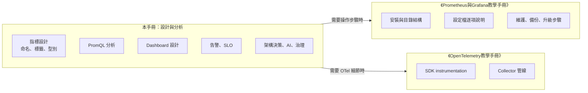
```mermaid
flowchart LR
    subgraph This["本手冊：設計與分析"]
        A1["指標設計<br/>命名、標籤、型別"]
        A2["PromQL 分析"]
        A3["Dashboard 設計"]
        A4["告警、SLO"]
        A5["架構決策、AI、治理"]
    end
    subgraph Sister["《Prometheus與Grafana教學手冊》"]
        B1["安裝與目錄結構"]
        B2["設定檔逐項說明"]
        B3["維護、備份、升級步驟"]
    end
    subgraph OTel["《OpenTelemetry教學手冊》"]
        C1["SDK instrumentation"]
        C2["Collector 管線"]
    end
    This -->|"需要操作步驟時"| Sister
    This -->|"需要 OTel 細節時"| OTel
```

| 主題 | 本手冊 | 姊妹手冊 |
| --- | --- | --- |
| Prometheus／Grafana 安裝 | 不涵蓋 | 《Prometheus與Grafana教學手冊》 |
| `prometheus.yml` 欄位說明 | 只說明與設計有關的欄位 | 完整說明 |
| 升級操作步驟 | 只列重大變更與風險（9.6） | 逐步操作 |
| OTel SDK 寫法 | 只說明與 Prometheus 的介接（2.6、3.9） | 《OpenTelemetry教學手冊》 |
| Logs 視覺化 | 不涵蓋 | 《Logs Visualization 教學手冊》 |

**建議的導入順序**：


```mermaid
flowchart LR
    S1["1 定義 SLI／SLO<br/>（第 5 章）"] --> S2["2 設計指標與標籤<br/>（第 2、3 章）"]
    S2 --> S3["3 建立 Recording Rules<br/>（3.6）"]
    S3 --> S4["4 建立 Dashboard<br/>（第 4 章）"]
    S4 --> S5["5 燃燒率告警<br/>（5.5）"]
    S5 --> S6["6 治理與容量<br/>（第 9 章）"]
```

---

## 2. Metrics 與 Observability 基礎

### 2.1 Metrics vs Logs vs Traces：架構視角

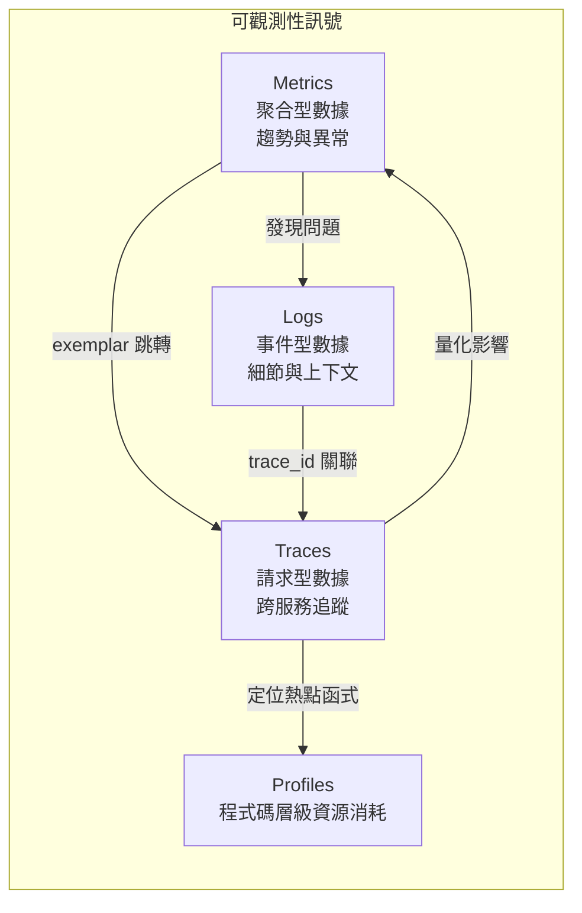
```mermaid
flowchart LR
    subgraph Observability["可觀測性訊號"]
        M["Metrics<br/>聚合型數據<br/>趨勢與異常"]
        L["Logs<br/>事件型數據<br/>細節與上下文"]
        T["Traces<br/>請求型數據<br/>跨服務追蹤"]
        P["Profiles<br/>程式碼層級資源消耗"]
    end

    M -->|"發現問題"| L
    M -->|"exemplar 跳轉"| T
    L -->|"trace_id 關聯"| T
    T -->|"量化影響"| M
    T -->|"定位熱點函式"| P
```

> 📌 業界常說的「三本柱」已逐步擴充為四種訊號：Metrics、Logs、Traces、Profiles。OpenTelemetry 也把 Profiles 列為新的訊號類型。本手冊聚焦 Metrics，並說明它如何透過 exemplar 與 trace 串接（見 [4.10 Drilldown、Explore 與 Exemplars](#410-drilldownexplore-與-exemplars)）。

#### 四者的本質差異

| 維度 | Metrics | Logs | Traces | Profiles |
| --- | --- | --- | --- | --- |
| **資料型態** | 數值時間序列（聚合） | 文字或結構化事件 | Span 樹狀結構 | 堆疊取樣 |
| **單位成本** | 低（每個 sample 約 1–2 bytes） | 高 | 中至高（通常需取樣） | 中 |
| **查詢速度** | 快 | 視索引而定 | 中 | 中 |
| **基數容忍度** | 低：每個標籤組合都是一條序列 | 高 | 高 | 中 |
| **適用場景** | 趨勢、告警、SLO、容量 | 除錯、稽核 | 跨服務延遲分析 | CPU／記憶體熱點 |
| **典型保留** | 本機 15 天（Prometheus 預設）；長期儲存 13 個月至數年 | 7–180 天，依法規 | 3–30 天 | 7–30 天 |

#### 架構師的思考方式

```text
問題發生時的調查順序：
1. Metrics 告訴你「哪裡出問題、影響多大」（告警觸發、SLO 燃燒）
2. Traces 告訴你「問題怎麼傳播」（哪個下游、哪個 span 變慢）
3. Logs 告訴你「發生什麼事」（錯誤訊息、參數）
4. Profiles 告訴你「哪段程式碼吃資源」（CPU、配置熱點）
```

> ⚠️ **常見誤區**：很多團隊從 Logs 計算 QPS 或錯誤率，這會導致：
>
> - 查詢效能差，且隨流量線性變慢
> - 儲存成本暴增
> - 告警延遲過高，且難以做長期趨勢
>
> 正確做法是在程式內直接記錄 Counter 與 Histogram（見 [2.5 指標型別：Counter、Gauge、Histogram、Summary](#25-指標型別countergaugehistogramsummary)）。

### 2.2 為什麼 Metrics 是「第一層防線」

#### Metrics 的獨特價值

1. **即時性**：以 15 秒抓取間隔計，異常通常在 1–3 分鐘內觸發告警（見下方時間軸）
2. **低成本**：抓取間隔 15 秒時，每條序列每分鐘只有 4 個 sample；壓縮後每個 sample 平均約 1–2 bytes
3. **可聚合**：可跨時間、跨維度（服務、區域、版本）聚合分析
4. **可預測**：歷史趨勢可用於容量預測與異常偵測

#### 事故時間軸示意

從異常發生到通知送達的延遲，大致等於：

```text
告警延遲 ≈ scrape_interval + evaluation_interval + for + group_wait (+ 通知管道延遲)
範例：      15s            + 15s                 + 2m  + 30s       ≈ 3 分鐘
```

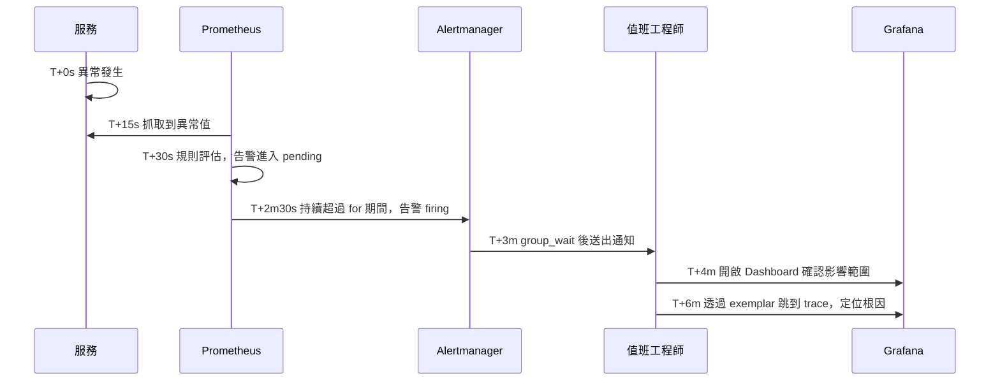
```mermaid
sequenceDiagram
    participant S as 服務
    participant P as Prometheus
    participant AM as Alertmanager
    participant E as 值班工程師
    participant G as Grafana

    S->>S: T+0s 異常發生
    P->>S: T+15s 抓取到異常值
    P->>P: T+30s 規則評估，告警進入 pending
    P->>AM: T+2m30s 持續超過 for 期間，告警 firing
    AM->>E: T+3m group_wait 後送出通知
    E->>G: T+4m 開啟 Dashboard 確認影響範圍
    E->>G: T+6m 透過 exemplar 跳到 trace，定位根因
```

> 💡 想縮短告警延遲時，請優先調整 `for` 與 `group_wait`，而不是把抓取間隔改成 1–5 秒。抓取間隔減半會讓 sample 數與儲存成本加倍。

### 2.3 RED / USE / Golden Signals 模型

這三個模型是設計 Metrics 的指導框架，適用於不同對象。

#### RED 模型（面向服務／請求）

適用於：**微服務、API Gateway、Web Application**

| 指標 | 說明 | PromQL 範例 |
| --- | --- | --- |
| **R**ate | 每秒請求數 | `sum by (service) (rate(http_requests_total[5m]))` |
| **E**rrors | 錯誤比例 | `sum by (service) (rate(http_requests_total{status=~"5.."}[5m])) / sum by (service) (rate(http_requests_total[5m]))` |
| **D**uration | 請求延遲分布 | `histogram_quantile(0.99, sum by (service, le) (rate(http_request_duration_seconds_bucket[5m])))` |

#### USE 模型（面向資源／基礎設施）

適用於：**CPU、Memory、Disk、Network、DB Connection Pool、Thread Pool**

| 指標 | 說明 | 範例 |
| --- | --- | --- |
| **U**tilization | 資源忙碌時間比例 | CPU 使用率、連線池使用中連線比例 |
| **S**aturation | 飽和度（排隊、等待） | Load average、執行緒池佇列長度、CPU throttling |
| **E**rrors | 錯誤數 | 磁碟 I/O 錯誤、網路丟包、連線池取得逾時 |

#### Golden Signals（Google SRE）

Google SRE 書籍提出的四個黃金指標：

```text
Latency    → 請求延遲（成功與失敗請求要分開看）
Traffic    → 流量（QPS、頻寬、交易數）
Errors     → 錯誤率（含「回應成功但內容錯誤」）
Saturation → 飽和度（最受限資源的吃緊程度）
```

#### 模型選擇指南

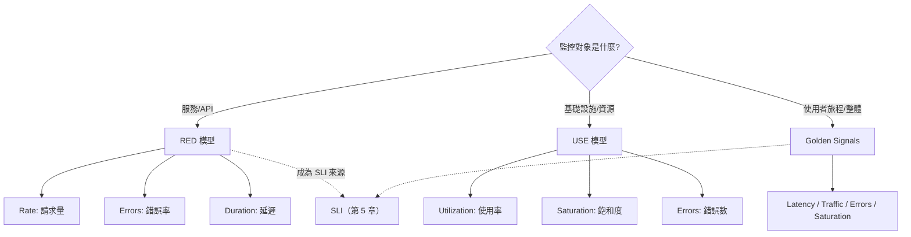
```mermaid
flowchart TD
    Q{"監控對象是什麼?"}
    Q -->|"服務/API"| RED["RED 模型"]
    Q -->|"基礎設施/資源"| USE["USE 模型"]
    Q -->|"使用者旅程/整體"| GS["Golden Signals"]

    RED --> R1["Rate: 請求量"]
    RED --> R2["Errors: 錯誤率"]
    RED --> R3["Duration: 延遲"]

    USE --> U1["Utilization: 使用率"]
    USE --> U2["Saturation: 飽和度"]
    USE --> U3["Errors: 錯誤數"]

    GS --> G1["Latency / Traffic / Errors / Saturation"]
    RED -.->|"成為 SLI 來源"| SLI["SLI（第 5 章）"]
    GS -.-> SLI
```

> 💡 實務上三者並用：服務層用 RED 建立 SLI，資源層用 USE 找瓶頸，對管理層報告時用 Golden Signals 的語言。

### 2.4 Metrics 過度蒐集的反模式（Anti-pattern）

#### ❌ Anti-pattern 1：蒐集所有能蒐集的指標

```yaml
# 錯誤示範：不加篩選地抓取整個 JVM 與框架指標
- job_name: 'java-app'
  static_configs:
    - targets: ['app:8080']
# 結果：每個實例 500+ 個指標名稱、數千條序列，90% 從未被查詢
```

**正確做法**：

- 先定義 SLO 與 Dashboard 需要回答的問題，再決定要哪些指標
- 以 `metric_relabel_configs` 丟棄確定不用的指標（見 [9.3 基數治理與成本控制](#93-基數治理與成本控制)）
- 以 Grafana Explore 或 Prometheus TSDB Status 頁定期檢查「從未被查詢」的指標

#### ❌ Anti-pattern 2：高基數標籤（Cardinality Explosion）

```text
# 錯誤示範：用 user_id 當標籤
http_requests_total{user_id="12345", path="/api/v1/users/12345", method="GET"}
# 100 萬使用者 × 100 個 API × 4 個方法 = 4 億條序列
```

**正確做法**：

- 標籤只用於「低基數、有分析價值」的維度（region、service、status_code、route 樣板）
- 路徑請使用**路由樣板**（`/api/v1/users/{id}`），不要用實際 URL
- 高基數資訊（user_id、request_id、trace_id）放到 Logs、Traces，或以 exemplar 附掛

#### ❌ Anti-pattern 3：指標命名不一致

```text
# 錯誤示範：團隊各自命名
service_a_request_count
serviceB_requests_total
svc_c_req_num
```

**正確做法**：遵循 Prometheus 命名慣例（詳見 [3.4 Label 設計 Best Practices](#34-label-設計-best-practices)）：

```text
<namespace>_<name>_<base_unit>_<suffix>
範例：http_requests_total、http_request_duration_seconds、process_resident_memory_bytes
```

- 使用**基本單位**：秒（seconds）、位元組（bytes）、比例（ratio，0–1）
- Counter 以 `_total` 結尾；單位放在型別後綴之前
- 同一個指標名稱下，所有序列要量測同一件事、同一個單位

#### ❌ Anti-pattern 4：每個環境獨立的 Dashboard

**問題**：Dev、Staging、Prod 各有一套 Dashboard，修改要做三次，最後內容逐漸不一致。

**正確做法**：

- 使用 Grafana 變數（Variables）切換環境與叢集
- Dashboard as Code（見 [4.8 Dashboard as Code](#48-dashboard-as-code)），由同一份來源部署到各環境

#### ❌ Anti-pattern 5：把 Summary 的分位數拿來平均

```promql
# 錯誤示範：平均各實例的 p99（數學上無意義）
avg(http_request_duration_seconds{quantile="0.99"})
```

**正確做法**：需要跨實例聚合時使用 Histogram（classic 或 native），再以 `histogram_quantile()` 計算（見 [2.5 指標型別：Counter、Gauge、Histogram、Summary](#25-指標型別countergaugehistogramsummary)）。

### 2.5 指標型別：Counter、Gauge、Histogram、Summary

Prometheus 有四種核心型別。選錯型別是後續查詢錯誤的最大來源。

| 型別 | 語意 | 典型用途 | 正確查詢方式 | 不要做 |
| --- | --- | --- | --- | --- |
| **Counter** | 只增不減，重啟歸零 | 請求數、錯誤數、處理位元組 | `rate()`、`increase()` | 直接看原始值、用 `delta()` |
| **Gauge** | 可增可減的瞬時值 | 佇列長度、記憶體、溫度、連線數 | 直接使用、`avg_over_time()`、`deriv()` | 用 `rate()` |
| **Histogram** | 將觀測值放入 bucket 累計 | 延遲、回應大小 | `histogram_quantile()`、`histogram_fraction()` | 在 bucket 上做 `avg` |
| **Summary** | 用戶端計算分位數 | 單一實例的延遲（舊系統） | 直接讀 `quantile` 標籤 | 跨實例聚合分位數 |

#### Classic Histogram 與 Native Histogram

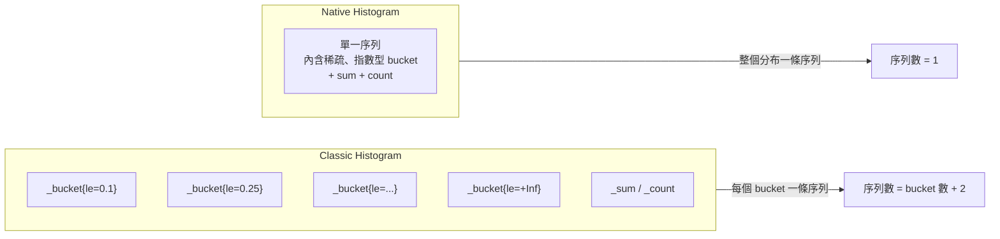
```mermaid
flowchart LR
    subgraph Classic["Classic Histogram"]
        C1["_bucket{le=0.1}"]
        C2["_bucket{le=0.25}"]
        C3["_bucket{le=...}"]
        C4["_bucket{le=+Inf}"]
        C5["_sum / _count"]
    end
    subgraph Native["Native Histogram"]
        N1["單一序列<br/>內含稀疏、指數型 bucket<br/>+ sum + count"]
    end
    Classic -->|"每個 bucket 一條序列"| Cost1["序列數 = bucket 數 + 2"]
    Native -->|"整個分布一條序列"| Cost2["序列數 = 1"]
```

| 比較 | Classic Histogram | Native Histogram |
| --- | --- | --- |
| 狀態 | 穩定 | Prometheus 3.8 起穩定、但需選擇性啟用 |
| bucket 邊界 | 程式內預先定義 | 依 `schema` 自動以指數比例產生 |
| 序列數 | bucket 數 + 2 | 1 |
| 精確度 | 取決於 bucket 設計，邊界外誤差大 | 相對誤差有上界，與資料範圍無關 |
| 需要的抓取格式 | 文字格式即可 | 需 protobuf 抓取格式（Prometheus 會自動協商） |
| 查詢 | `histogram_quantile(0.99, sum by (le) (rate(x_bucket[5m])))` | `histogram_quantile(0.99, sum(rate(x[5m])))` |

詳細設定與遷移策略見 [3.8 原生直方圖（Native Histograms）與 NHCB](#38-原生直方圖native-histograms與-nhcb)。

#### 何時用 Summary？

只在以下情況考慮 Summary：

- 無法預先知道合理 bucket 範圍，又不能使用 native histogram 的舊系統
- 只需要**單一實例**的分位數，且不需要跨實例聚合

> ⚠️ Micrometer 的 `publishPercentiles(0.5, 0.95, 0.99)` 產生的是用戶端計算的分位數，性質等同 Summary，**不能**跨實例聚合。需要聚合時請使用 `publishPercentileHistogram()`（見 [3.5 常見 Exporter 類型](#35-常見-exporter-類型)）。

#### Info 與 StateSet 型別

OpenMetrics 另外定義了兩種輔助型別：

- **Info**：值固定為 1，用標籤攜帶中繼資料，例如 `build_info{version="1.4.2",commit="abc123"} 1`。可用 `group_left` 或 `info()` 把版本資訊附加到其他指標上。
- **StateSet**：以多條值為 0／1 的序列表達列舉狀態，例如斷路器狀態 `state="open|closed|half_open"`（見 [5.4 Metrics 如何影響系統設計](#54-metrics-如何影響系統設計)）。

### 2.6 OpenTelemetry Metrics 與 Prometheus 的關係

OpenTelemetry（OTel）已成為跨語言 instrumentation 的業界標準。企業常見的情況是：應用程式用 OTel SDK，而後端仍是 Prometheus 相容系統。兩者的對接方式如下。

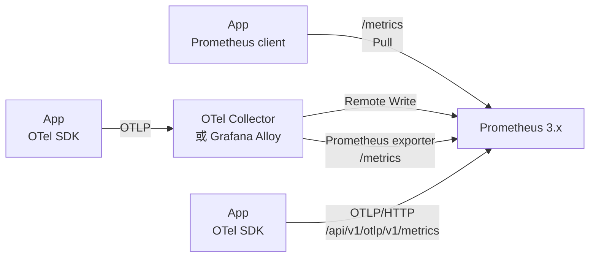
```mermaid
flowchart LR
    App1["App<br/>Prometheus client"] -->|"/metrics<br/>Pull"| Prom["Prometheus 3.x"]
    App2["App<br/>OTel SDK"] -->|"OTLP"| Col["OTel Collector<br/>或 Grafana Alloy"]
    Col -->|"Remote Write"| Prom
    App3["App<br/>OTel SDK"] -->|"OTLP/HTTP<br/>/api/v1/otlp/v1/metrics"| Prom
    Col -->|"Prometheus exporter<br/>/metrics"| Prom
```

#### 概念對照

| OpenTelemetry | Prometheus | 轉換重點 |
| --- | --- | --- |
| Sum（monotonic, cumulative） | Counter | 預設加上 `_total` 後綴 |
| Gauge | Gauge | 直接對應 |
| Histogram（explicit buckets） | Classic histogram | 可設定 `convert_histograms_to_nhcb` 轉成 NHCB |
| Exponential Histogram | Native histogram | 直接對應 |
| Resource attributes | `target_info` 與 `job`／`instance` | `service.namespace/service.name` → `job`；`service.instance.id` → `instance` |
| Delta temporality | 不原生支援 | 🧪 需 `otlp-deltatocumulative` 或 `otlp-native-delta-ingestion` |
| 名稱中的 `.` | UTF-8 名稱或轉為 `_` | 由 `otlp.translation_strategy` 決定 |

#### 關鍵設計決策

1. **Cumulative 優先**：請讓 SDK 輸出 cumulative temporality。Delta 的支援在 Prometheus 仍屬實驗性，且 `rate()`、`increase()` 不能直接用於 delta 指標。
2. **資源屬性要「提升」還是「關聯」**：常用的屬性（例如 `k8s.namespace.name`、`service.version`）建議以 `otlp.promote_resource_attributes` 提升為標籤；其餘留在 `target_info`，需要時以 `info()` 或 join 取得（見 [3.9 Prometheus 3.x 新能力](#39-prometheus-3x-新能力)）。
3. **命名策略**：`translation_strategy` 的預設值是 `UnderscoreEscapingWithSuffixes`，會把 `http.server.request.duration` 轉成 `http_server_request_duration_seconds`。企業若已有大量 PromQL 資產，**建議維持預設**，避免同一指標出現兩種名稱。

> 💡 OTel 的語意慣例（Semantic Conventions）規定 HTTP 伺服器延遲指標為 `http.server.request.duration`，單位為秒。新服務若用 OTel instrumentation，Dashboard 中的 `http_request_duration_seconds` 就要改為 `http_server_request_duration_seconds`。導入前應先統一命名，或以 recording rule 提供相容名稱。

---

## 3. Prometheus 深入解析

### 3.1 Prometheus 架構與資料流

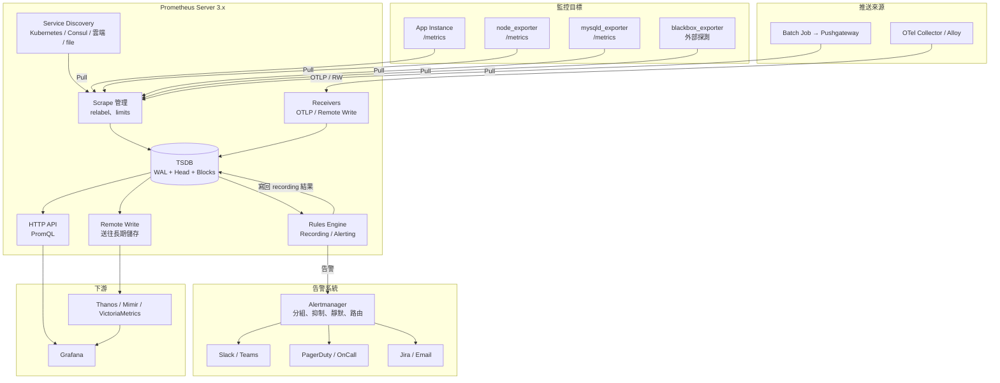
```mermaid
flowchart TB
    subgraph Targets["監控目標"]
        App1["App Instance<br/>/metrics"]
        Node["node_exporter<br/>/metrics"]
        DB["mysqld_exporter<br/>/metrics"]
        BB["blackbox_exporter<br/>外部探測"]
    end

    subgraph Push["推送來源"]
        OTel["OTel Collector / Alloy"]
        Batch["Batch Job → Pushgateway"]
    end

    subgraph Prometheus["Prometheus Server 3.x"]
        SD["Service Discovery<br/>Kubernetes / Consul / 雲端 / file"]
        Retrieval["Scrape 管理<br/>relabel、limits"]
        Recv["Receivers<br/>OTLP / Remote Write"]
        TSDB[("TSDB<br/>WAL + Head + Blocks")]
        Rules["Rules Engine<br/>Recording / Alerting"]
        API["HTTP API<br/>PromQL"]
        RW["Remote Write<br/>送往長期儲存"]
    end

    subgraph Alerting["告警系統"]
        AM["Alertmanager<br/>分組、抑制、靜默、路由"]
        Chat["Slack / Teams"]
        Page["PagerDuty / OnCall"]
        Ticket["Jira / Email"]
    end

    subgraph Downstream["下游"]
        Grafana["Grafana"]
        LTS["Thanos / Mimir / VictoriaMetrics"]
    end

    SD --> Retrieval
    App1 -->|"Pull"| Retrieval
    Node -->|"Pull"| Retrieval
    DB -->|"Pull"| Retrieval
    BB -->|"Pull"| Retrieval
    Batch -->|"Pull"| Retrieval
    OTel -->|"OTLP / RW"| Recv

    Retrieval --> TSDB
    Recv --> TSDB
    TSDB --> Rules
    Rules -->|"寫回 recording 結果"| TSDB
    Rules -->|"告警"| AM
    AM --> Chat
    AM --> Page
    AM --> Ticket

    TSDB --> API
    API --> Grafana
    TSDB --> RW
    RW --> LTS
    LTS --> Grafana
```

#### 核心組件說明

| 組件 | 職責 | 設計考量 |
| --- | --- | --- |
| **Service Discovery** | 動態找出抓取目標 | 在 Kubernetes 上優先使用 Operator 的 ServiceMonitor／PodMonitor（3.10） |
| **Scrape 管理** | 定期拉取、relabel、套用限制 | `sample_limit`、`label_limit` 是防止基數爆炸的最後防線（9.3） |
| **Receivers** | 接收 OTLP 與 Remote Write | 預設關閉；開啟前必須先做認證（9.4） |
| **TSDB** | WAL、記憶體 Head、2 小時區塊、壓縮 | 記憶體用量主要取決於 active series 數（9.2） |
| **Rules Engine** | 預先計算、告警評估 | 規則群組內依序執行，群組間平行 |
| **HTTP API** | PromQL 查詢、狀態、管理 | `/api/v1/status/tsdb` 可看基數排行 |
| **Remote Write** | 將樣本送往長期儲存 | 需調整佇列參數，並監控送出延遲（9.1） |
| **Alertmanager** | 告警分組、抑制、靜默、路由 | 以叢集模式部署多副本（3.11） |

#### 執行模式

| 模式 | 啟動方式 | 適用情境 |
| --- | --- | --- |
| Server（預設） | `prometheus` | 本機查詢、規則評估、告警 |
| Agent | `prometheus --agent` | 邊緣、分支機構、每個叢集只負責收集並 Remote Write 到中央；不提供查詢與規則 |

> 📌 Agent mode 從 Prometheus 3.0 起轉為穩定，啟動參數由舊的 `--enable-feature=agent` 改為 `--agent`。

### 3.2 Pull Model 的設計哲學

#### 為什麼 Prometheus 選擇 Pull？

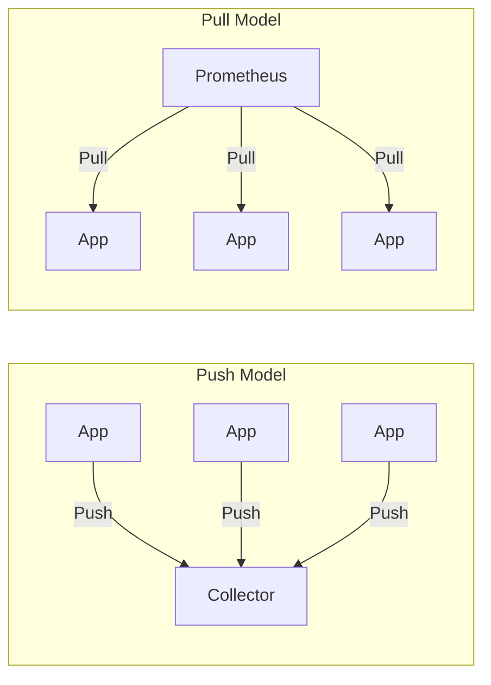
```mermaid
flowchart LR
    subgraph PushModel["Push Model"]
        A1["App"] -->|"Push"| C1["Collector"]
        A2["App"] -->|"Push"| C1
        A3["App"] -->|"Push"| C1
    end

    subgraph PullModel["Pull Model"]
        C2["Prometheus"] -->|"Pull"| B1["App"]
        C2 -->|"Pull"| B2["App"]
        C2 -->|"Pull"| B3["App"]
    end
```

| 面向 | Pull Model | Push Model |
| --- | --- | --- |
| **服務發現** | 集中管理，Prometheus 知道「應該有誰」 | 分散設定，Collector 只知道「誰送過來」 |
| **健康檢查** | 內建：抓不到就是 `up == 0` | 需要另外處理「沒送資料」的情況 |
| **背壓控制** | 由 Prometheus 控制抓取頻率 | 流量突增可能壓垮 Collector |
| **短生命週期 Job** | 較難處理 | 較適合 |
| **網路拓撲** | Prometheus 必須能連到 Target | Target 只需能連到 Collector |
| **除錯** | 可直接 `curl` Target 的 `/metrics` 看當下值 | 需查看 Collector 端 |

#### 何時需要 Push？

| 場景 | 建議做法 |
| --- | --- |
| 服務層級的批次工作（每日備份、報表） | Pushgateway |
| 使用 OTel SDK 的應用程式 | OTLP → OTel Collector／Alloy → Remote Write，或直接送到 Prometheus OTLP receiver（3.9） |
| 分支機構、邊緣節點無法被中央連入 | 在當地執行 Prometheus Agent mode，Remote Write 到中央 |
| 每個實例各自產生的短命工作（例如 serverless） | 不要用 Pushgateway，改用 OTLP |

```bash
# Pushgateway 使用範例：批次工作結束時推送「最後成功時間」與「執行耗時」
cat <<EOF | curl --data-binary @- http://pushgateway:9091/metrics/job/nightly_backup
# TYPE backup_last_success_timestamp_seconds gauge
backup_last_success_timestamp_seconds $(date +%s)
# TYPE backup_duration_seconds gauge
backup_duration_seconds 42
EOF

# 不再需要時，主動刪除整個 group
curl -X DELETE http://pushgateway:9091/metrics/job/nightly_backup
```

Prometheus 端抓取 Pushgateway 時必須保留推送者設定的 `job` 與 `instance` 標籤：

```yaml
scrape_configs:
  - job_name: pushgateway
    honor_labels: true
    static_configs:
      - targets: ['pushgateway:9091']
```

> ⚠️ **注意**：Pushgateway **沒有 TTL 或自動過期機制**。官方文件明確指出，推送的序列會一直被暴露，直到你以 API 手動刪除。因此：
>
> - 只推送「服務層級」的結果，不要把 `instance` 或主機名稱放進 grouping key
> - 告警要以「最後成功時間」判斷，例如 `time() - backup_last_success_timestamp_seconds > 26 * 3600`，而不是看推送值本身
> - 退役的批次工作，要在下線流程中刪除對應 group

### 3.3 Target / Job / Instance 設計原則

#### 概念釐清

```yaml
scrape_configs:
  - job_name: 'payment-service'      # Job：同一用途的一組 Target，成為 job 標籤
    static_configs:
      - targets:                      # Target：被抓取的端點
          - 'payment-1:8080'          # Instance：<host>:<port>，成為 instance 標籤
          - 'payment-2:8080'
          - 'payment-3:8080'
```

每次抓取，Prometheus 都會自動產生下列序列，是監控「監控本身」的基礎：

| 自動序列 | 意義 |
| --- | --- |
| `up` | 1 = 抓取成功；0 = 失敗 |
| `scrape_duration_seconds` | 抓取耗時 |
| `scrape_samples_scraped` | 抓到的樣本數 |
| `scrape_samples_post_metric_relabeling` | relabel 後保留的樣本數 |
| `scrape_series_added` | 本次新增的序列數（觀察 churn） |

#### 設計原則

##### 1. Job 的粒度

```yaml
# ❌ 錯誤：把所有服務放同一個 Job，無法分別設定抓取間隔與限制
- job_name: 'all-services'
  static_configs:
    - targets: ['user:8080', 'order:8080', 'payment:8080']

# ✅ 正確：每個服務一個 Job
- job_name: 'user-service'
  static_configs:
    - targets: ['user-1:8080', 'user-2:8080']

- job_name: 'order-service'
  static_configs:
    - targets: ['order-1:8080', 'order-2:8080']
```

##### 2. 使用 relabel_configs 標準化標籤

以下是不使用 Operator、直接用 Kubernetes SD 時，依 Pod annotation 決定抓取對象的寫法：

```yaml
scrape_configs:
  - job_name: 'kubernetes-pods'
    kubernetes_sd_configs:
      - role: pod
    relabel_configs:
      # 只抓 annotation prometheus.io/scrape=true 的 Pod
      - source_labels: [__meta_kubernetes_pod_annotation_prometheus_io_scrape]
        action: keep
        regex: "true"
      # 自訂 metrics 路徑（annotation prometheus.io/path）
      - source_labels: [__meta_kubernetes_pod_annotation_prometheus_io_path]
        action: replace
        regex: (.+)
        target_label: __metrics_path__
      # 以 annotation 指定的 port 取代原本位址中的 port
      - source_labels: [__address__, __meta_kubernetes_pod_annotation_prometheus_io_port]
        action: replace
        regex: ([^:]+)(?::\d+)?;(\d+)
        replacement: $1:$2
        target_label: __address__
      # 加上業務常用標籤
      - source_labels: [__meta_kubernetes_namespace]
        target_label: namespace
      - source_labels: [__meta_kubernetes_pod_name]
        target_label: pod
      # Prometheus 3.11 起可直接取得 Deployment 名稱
      - source_labels: [__meta_kubernetes_pod_deployment_name]
        target_label: deployment
```

> ⚠️ v1.0 的寫法只以 port annotation 的值（`$1`）取代 `__address__`，結果位址會變成只剩 port，例如 `8080`，所有抓取都會失敗。正確做法是同時讀取 `__address__` 與 port，再組合成 `$1:$2`。

> 💡 在 Kubernetes 上，建議改用 Prometheus Operator 的 `PodMonitor`／`ServiceMonitor`（見 [3.10 Kubernetes 上的指標收集](#310-kubernetes-上的指標收集)），由平台團隊統一管理 relabel 規則，應用團隊只需宣告要抓哪個 port。

### 3.4 Label 設計 Best Practices

#### Label 是 Prometheus 的靈魂

Label 決定了：

- 你能用什麼維度聚合資料
- 你的 Cardinality（基數，即序列數）有多大
- 查詢效能與記憶體用量

#### 黃金法則

```text
✅ Label 應該是「低基數」且「有分析價值」的維度
❌ Label 不應該包含「高基數」或「會無限增長」的值
```

#### 好的 Label vs 壞的 Label

| ✅ 好的 Label | ❌ 壞的 Label | 壞的原因 |
| --- | --- | --- |
| `region="ap-east-1"` | `user_id="12345678"` | 隨使用者數無限增長 |
| `service="payment"` | `request_id="uuid-xxx"` | 每個請求一條序列 |
| `status_code="200"` | `timestamp="2026-10-01..."` | 時間本來就是序列的軸 |
| `method="POST"` | `email="user@example.com"` | 高基數且是個資 |
| `route="/api/v1/users/{id}"` | `path="/api/v1/users/12345"` | 未正規化的路徑 |
| `env="prod"` | `error_message="..."` | 自由文字，值無法預測 |

#### 命名規範速查

| 規則 | ✅ 範例 | ❌ 範例 |
| --- | --- | --- |
| 使用基本單位 | `http_request_duration_seconds` | `http_request_duration_ms` |
| Counter 加 `_total` | `http_requests_total` | `http_requests_count` |
| 比例使用 `_ratio`（0–1） | `cache_hit_ratio` | `cache_hit_percent` |
| 單位在型別後綴前 | `process_cpu_seconds_total` | `process_cpu_total_seconds` |
| 前綴代表所屬領域或系統 | `payment_transactions_total` | `transactions_total`（太泛） |
| 不把標籤值放進名稱 | `http_requests_total{method="GET"}` | `http_get_requests_total` |
| 名稱只用 `[a-zA-Z0-9_:]` | `http_requests_total` | `http.requests.total`（雖然 3.x 允許 UTF-8，見 3.9） |

> 📌 冒號 `:` 保留給 recording rule 使用（見 [3.6 Recording Rules 與 Alert Rules 設計思維](#36-recording-rules-與-alert-rules-設計思維)），應用程式暴露的指標不要用冒號。

#### Cardinality 計算公式

```text
單一指標的序列數 ≈ Label1 值數 × Label2 值數 × ... × LabelN 值數（只計實際出現的組合）

範例：
http_requests_total{
  service,      # 10 個服務
  method,       # 4 種方法
  status_code,  # 20 種狀態碼
  region        # 3 個區域
}
→ 最多 10 × 4 × 20 × 3 = 2,400 條序列（可接受）

如果是 classic histogram，再乘上 bucket 數 + 2：
→ 2,400 × (12 + 2) = 33,600 條序列

若再加上 user_id（100 萬使用者）：
→ 2,400 × 1,000,000 = 24 億條（Prometheus 會耗盡記憶體）
```

#### 監控 Cardinality

❌ v1.0 曾建議把 `count by (__name__) ({__name__=~".+"})` 寫成 recording rule。這個查詢每次評估都要掃描全部序列，在大型環境中可能耗費數 GB 記憶體並拖慢整台 Prometheus。**不要把它放進規則**。

✅ 建議做法：

| 方法 | 用途 | 成本 |
| --- | --- | --- |
| Prometheus UI：**Status → TSDB Status** | 依指標名稱、標籤名稱、標籤值數量排出前 10 名 | 極低（讀取 Head 統計） |
| `GET /api/v1/status/tsdb?limit=20` | 同上，可自動化收集 | 極低 |
| `prometheus_tsdb_head_series` | 整體 active series 數趨勢 | 極低 |
| `sum by (job) (scrape_series_added)` | 找出 churn 最嚴重的 job | 低 |
| `sum by (job) (scrape_samples_post_metric_relabeling)` | 每個 job 的樣本數 | 低 |
| `count by (__name__) ({job="payment-service"})` | 臨時調查**單一 job**的指標分布 | 中，僅限手動執行 |

```promql
# 每個 job 的序列數排行（適合放在平台團隊的 Dashboard）
topk(10, sum by (job) (scrape_samples_post_metric_relabeling))

# 過去 1 小時新增序列最多的 job（找出 churn 來源）
topk(10, sum by (job) (sum_over_time(scrape_series_added[1h])))

# 接近 sample_limit 的 target（需啟用 extra_scrape_metrics）
scrape_samples_post_metric_relabeling / (scrape_sample_limit > 0) > 0.8
```

### 3.5 常見 Exporter 類型

#### Exporter 生態系統

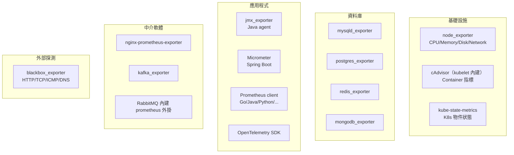
```mermaid
flowchart TB
    subgraph Infrastructure["基礎設施"]
        Node["node_exporter<br/>CPU/Memory/Disk/Network"]
        cAdvisor["cAdvisor（kubelet 內建）<br/>Container 指標"]
        Kube["kube-state-metrics<br/>K8s 物件狀態"]
    end

    subgraph Database["資料庫"]
        MySQL["mysqld_exporter"]
        Postgres["postgres_exporter"]
        Redis["redis_exporter"]
        MongoDB["mongodb_exporter"]
    end

    subgraph Application["應用程式"]
        JMX["jmx_exporter<br/>Java agent"]
        Micrometer["Micrometer<br/>Spring Boot"]
        Client["Prometheus client<br/>Go/Java/Python/..."]
        OTelSDK["OpenTelemetry SDK"]
    end

    subgraph Middleware["中介軟體"]
        Nginx["nginx-prometheus-exporter"]
        Kafka["kafka_exporter"]
        RabbitMQ["RabbitMQ 內建 prometheus 外掛"]
    end

    subgraph Probe["外部探測"]
        Blackbox["blackbox_exporter<br/>HTTP/TCP/ICMP/DNS"]
    end
```

#### 重要 Exporter 一覽

| Exporter | 用途 | 關鍵指標 |
| --- | --- | --- |
| **node_exporter** | 主機層級 | `node_cpu_seconds_total`、`node_memory_MemAvailable_bytes`、`node_filesystem_avail_bytes` |
| **cAdvisor** | 容器資源 | `container_cpu_usage_seconds_total`、`container_memory_working_set_bytes`、`container_cpu_cfs_throttled_periods_total` |
| **kube-state-metrics** | K8s 物件狀態 | `kube_pod_status_phase`、`kube_deployment_status_replicas_available`、`kube_pod_container_status_restarts_total` |
| **client_java 1.x／jmx_exporter 1.x** | JVM | `jvm_memory_used_bytes{area="heap"}`、`jvm_gc_collection_seconds_count`、`jvm_threads_current` |
| **Micrometer（Spring Boot）** | JVM 與 HTTP | `jvm_memory_used_bytes`、`jvm_gc_pause_seconds_count`、`http_server_requests_seconds_bucket` |
| **mysqld_exporter** | MySQL | `mysql_global_status_threads_connected`、`mysql_global_status_slow_queries` |
| **redis_exporter** | Redis／Valkey | `redis_db_keys{db="db0"}`、`redis_memory_used_bytes`、`redis_keyspace_hits_total`、`redis_evicted_keys_total` |
| **blackbox_exporter** | 外部可用性 | `probe_success`、`probe_duration_seconds`、`probe_ssl_earliest_cert_expiry` |

> ⚠️ **容器記憶體請看 `container_memory_working_set_bytes`**。`container_memory_usage_bytes` 包含可回收的檔案快取，數值偏高；kubelet 判斷 OOM 與驅逐時使用的是 working set。

> ⚠️ **JVM 指標名稱依函式庫而異**。舊版 simpleclient（client_java 0.x）的 `jvm_memory_bytes_used` 在 client_java 1.x 改為 `jvm_memory_used_bytes`；Micrometer 的 GC 指標則是 `jvm_gc_pause_seconds`。升級函式庫前，請先搜尋 Dashboard 與規則中的舊名稱。

#### 自訂應用程式指標（以 Java + Micrometer 為例）

Micrometer 建議使用**點分隔、無單位的名稱**，由 registry 自動轉換為 Prometheus 慣例。例如 `api.requests` 會轉成 `api_requests_total`，`api.request.duration` 的 Timer 則轉成 `api_request_duration_seconds`。

```java
// 1. Counter：計數器（只增不減）
Counter requestCounter = Counter.builder("api.requests")
    .description("Total API requests")
    .tag("route", "/users/{id}")      // 使用路由樣板，而非實際路徑
    .tag("method", "GET")
    .register(meterRegistry);

requestCounter.increment();

// 2. Gauge：瞬時值（Micrometer 只保留弱參照，queue 物件必須另有強參照）
Gauge.builder("work.queue.size", queue, Queue::size)
    .description("Current queue size")
    .register(meterRegistry);

// 3. Timer + Histogram：可跨實例聚合的延遲分布
Timer requestTimer = Timer.builder("api.request.duration")
    .description("API request duration")
    .publishPercentileHistogram()                        // 輸出 _bucket，供 histogram_quantile 使用
    .serviceLevelObjectives(Duration.ofMillis(200),      // 額外加入與 SLO 對齊的 bucket 邊界
                            Duration.ofMillis(500))
    .minimumExpectedValue(Duration.ofMillis(5))
    .maximumExpectedValue(Duration.ofSeconds(10))
    .register(meterRegistry);

requestTimer.record(() -> {
    // 業務邏輯
});

// 4. DistributionSummary：非時間的分布，例如回應大小
DistributionSummary.builder("api.response.size")
    .baseUnit("bytes")
    .publishPercentileHistogram()
    .register(meterRegistry);
```

Spring Boot 的 HTTP 伺服器指標，可用設定檔開啟 histogram 與 SLO bucket：

```yaml
# application.yml
management:
  endpoints:
    web:
      exposure:
        include: health,prometheus
  metrics:
    distribution:
      percentiles-histogram:
        http.server.requests: true
      slo:
        http.server.requests: 200ms,500ms,1s
    tags:
      application: ${spring.application.name}
```

> ⚠️ 不要同時依賴 `publishPercentiles(0.5, 0.95, 0.99)`。它在用戶端計算分位數，性質等同 Summary，**無法跨實例聚合**。v1.0 範例同時開啟兩者，容易讓讀者在 Dashboard 中誤用無法聚合的 `quantile` 序列。

### 3.6 Recording Rules 與 Alert Rules 設計思維

#### Recording Rules：預計算的藝術

##### 為什麼需要 Recording Rules？

```promql
# 這個查詢很常用，但每次都要重新計算
sum by (service) (rate(http_requests_total[5m]))

# 如果 Dashboard 有 10 個 Panel 都用到，每次重新整理就算 10 次
# 如果 5 個人同時開著 Dashboard，每 30 秒就要算 50 次
```

##### 解決方案：Recording Rule

```yaml
# rules/http-red.rules.yml
groups:
  - name: http-red.rules
    interval: 30s                 # 評估頻率；省略時使用 global.evaluation_interval
    rules:
      # 每個服務的 QPS
      - record: service:http_requests:rate5m
        expr: sum by (service) (rate(http_requests_total[5m]))

      # 每個服務的 5xx 速率
      - record: service:http_request_errors:rate5m
        expr: sum by (service) (rate(http_requests_total{status=~"5.."}[5m]))

      # 錯誤比例：分子與分母分別聚合後再相除
      - record: service:http_request_errors_per_requests:ratio_rate5m
        expr: |2
            service:http_request_errors:rate5m
          /
            service:http_requests:rate5m

      # 保留 bucket 速率，之後仍可再聚合
      - record: service_le:http_request_duration_seconds_bucket:rate5m
        expr: sum by (service, le) (rate(http_request_duration_seconds_bucket[5m]))

      # P99 延遲（結果無法再聚合，只供顯示與告警）
      - record: service:http_request_duration_seconds:histogram_quantile
        expr: histogram_quantile(0.99, service_le:http_request_duration_seconds_bucket:rate5m)
        labels:
          quantile: "0.99"
```

**Recording Rule 命名規範**（Prometheus 官方慣例）

```text
level:metric:operations

level      → 聚合層級與保留的標籤（service、service_le、cluster、job）
metric     → 原始指標名稱；對 Counter 做 rate 時去掉 _total
operations → 套用的操作，最新的操作放最前面（rate5m、ratio_rate5m、sum）

相除時以 _per_ 連接兩個指標，操作名稱用 ratio：
service:http_request_errors_per_requests:ratio_rate5m
```

> ⚠️ **聚合比例的正確方式**：先分別聚合分子與分母，再相除。不要對比例取平均，也不要對平均再取平均，兩者在統計上都不成立。

#### Alert Rules：告警的設計思維

```yaml
groups:
  - name: service-alerts
    rules:
      # 1. 錯誤率告警：加上流量下限，避免低流量時 1 個錯誤就觸發
      - alert: HighErrorRate
        expr: |
          service:http_request_errors_per_requests:ratio_rate5m > 0.05
          and on (service)
          service:http_requests:rate5m > 1
        for: 5m                 # 持續 5 分鐘才觸發，避免抖動
        keep_firing_for: 5m     # 恢復後再維持 5 分鐘，避免反覆觸發與解除
        labels:
          severity: critical
          team: backend
        annotations:
          summary: "服務 {{ $labels.service }} 錯誤率過高"
          description: "錯誤率 {{ $value | humanizePercentage }}，超過 5% 閾值"
          runbook_url: "https://wiki.example.internal/runbook/high-error-rate"
          dashboard_url: "https://grafana.example.internal/d/svc-red?var-service={{ $labels.service }}"

      # 2. 延遲告警（分級）
      - alert: HighLatencyWarning
        expr: service:http_request_duration_seconds:histogram_quantile{quantile="0.99"} > 0.5
        for: 10m
        labels:
          severity: warning
        annotations:
          summary: "服務 {{ $labels.service }} P99 延遲偏高：{{ $value | humanizeDuration }}"

      - alert: HighLatencyCritical
        expr: service:http_request_duration_seconds:histogram_quantile{quantile="0.99"} > 2
        for: 5m
        labels:
          severity: critical
        annotations:
          summary: "服務 {{ $labels.service }} P99 延遲嚴重：{{ $value | humanizeDuration }}"

      # 3. 容量告警（預測型）：同時要求「已經偏低」與「預測會用完」，減少誤報
      - alert: DiskWillFillIn24Hours
        expr: |
          (
            node_filesystem_avail_bytes{fstype!~"tmpfs|overlay"}
              / node_filesystem_size_bytes{fstype!~"tmpfs|overlay"} < 0.4
          )
          and
          predict_linear(node_filesystem_avail_bytes{fstype!~"tmpfs|overlay"}[6h], 24 * 3600) < 0
          and
          node_filesystem_readonly{fstype!~"tmpfs|overlay"} == 0
        for: 1h
        labels:
          severity: warning
        annotations:
          summary: "{{ $labels.instance }} 的 {{ $labels.mountpoint }} 預測將在 24 小時內用盡"
```

> ⚠️ **v1.0 的顯示錯誤**：錯誤率是 0–1 的比例。v1.0 以 `printf "%.2f"` 後面加上 `%` 顯示，0.05 會顯示成「0.05%」，與實際的 5% 差了 100 倍。請使用 `humanizePercentage`，延遲則用 `humanizeDuration`。

#### Alert Rules 設計原則

| 原則 | 說明 | 範例 |
| --- | --- | --- |
| **以症狀為主** | 優先對使用者感受到的現象告警 | 錯誤率、延遲、SLO 燃燒率，而不是 CPU |
| **可行動** | 收到告警後要知道該做什麼 | 附上 `runbook_url`、`dashboard_url` |
| **分級** | 區分 `critical`（立即處理）與 `warning`（上班時間處理） | 由 Alertmanager 路由到不同管道 |
| **去抖動** | 以 `for` 過濾瞬間波動；以 `keep_firing_for` 避免反覆觸發 | `for: 5m`、`keep_firing_for: 5m` |
| **有上下文** | annotation 要包含目前數值、閾值與影響範圍 | `{{ $value \| humanizePercentage }}` |
| **可測試** | 規則要有單元測試 | `promtool test rules`（見 [3.12 規則測試與 CI](#312-規則測試與-ci)） |

> 💡 規則群組可設定 `query_offset`（全域為 `rule_query_offset`），讓評估時間點往前偏移。當資料經由 Remote Write 或 OTLP 延遲寫入時，可避免規則看到「尚未到齊」的資料而誤判。

### 3.7 PromQL 思考模型

#### PromQL 不是語法，是思考方式

```text
核心思維：
1. 選擇序列（Selector）       → 我要看哪些資料？
2. 轉換資料（Range Functions） → Counter 轉速率、Gauge 取平滑
3. 聚合維度（Aggregation）     → 要保留哪些維度？
4. 跨序列運算（Binary Ops）    → 比例、比較、關聯
```

#### 思考模型圖示

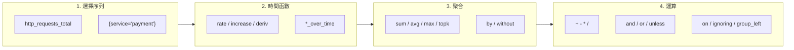
```mermaid
flowchart LR
    subgraph Step1["1. 選擇序列"]
        S1["http_requests_total"]
        S2["{service='payment'}"]
    end

    subgraph Step2["2. 時間函數"]
        F1["rate / increase / deriv"]
        F2["*_over_time"]
    end

    subgraph Step3["3. 聚合"]
        A1["sum / avg / max / topk"]
        A2["by / without"]
    end

    subgraph Step4["4. 運算"]
        O1["+ - * /"]
        O2["and / or / unless"]
        O3["on / ignoring / group_left"]
    end

    Step1 --> Step2 --> Step3 --> Step4
```

#### 兩條鐵律

```text
鐵律 1：先 rate，再 sum
  ✅ sum by (service) (rate(http_requests_total[5m]))
  ❌ rate(sum by (service) (http_requests_total)[5m:])   ← 實例重啟時的 Counter 歸零會被誤判

鐵律 2：histogram_quantile 前要保留 le
  ✅ histogram_quantile(0.99, sum by (service, le) (rate(x_bucket[5m])))
  ❌ histogram_quantile(0.99, sum by (service) (rate(x_bucket[5m])))   ← 少了 le，結果為空
```

#### 常見查詢模式

##### 1. 計算 QPS（每秒請求數）

```promql
# rate() 計算每秒平均增長率，只適用於 Counter
rate(http_requests_total[5m])

# 按服務聚合
sum by (service) (rate(http_requests_total[5m]))
```

##### 2. 計算錯誤率

```promql
# 分子：5xx 錯誤速率；分母：總請求速率
  sum by (service) (rate(http_requests_total{status=~"5.."}[5m]))
/
  sum by (service) (rate(http_requests_total[5m]))
```

##### 3. 計算百分位延遲（從 Histogram）

```promql
# Classic histogram 的 P99
histogram_quantile(0.99,
  sum by (service, le) (rate(http_request_duration_seconds_bucket[5m]))
)

# Native histogram 的 P99（不需要 le）
histogram_quantile(0.99, sum by (service) (rate(http_request_duration_seconds[5m])))

# 🧪 一次計算多個分位數（3.11 起，需 promql-experimental-functions）
histogram_quantiles(
  sum by (le) (rate(http_request_duration_seconds_bucket[5m])),
  "quantile", 0.5, 0.95, 0.99
)

# 平均延遲：sum 除以 count
  sum by (service) (rate(http_request_duration_seconds_sum[5m]))
/
  sum by (service) (rate(http_request_duration_seconds_count[5m]))
```

##### 4. 資源使用率

```promql
# CPU 使用率（每台主機，0–1）
1 - avg by (instance) (rate(node_cpu_seconds_total{mode="idle"}[5m]))

# Memory 使用率
1 - (node_memory_MemAvailable_bytes / node_memory_MemTotal_bytes)

# Disk 使用率（排除虛擬檔案系統）
1 - (
  node_filesystem_avail_bytes{fstype!~"tmpfs|overlay"}
  / node_filesystem_size_bytes{fstype!~"tmpfs|overlay"}
)

# 容器 CPU throttling 比例（> 0.25 通常代表 CPU limit 太低）
  sum by (namespace, pod) (rate(container_cpu_cfs_throttled_periods_total[5m]))
/
  sum by (namespace, pod) (rate(container_cpu_cfs_periods_total[5m]))
```

##### 5. 趨勢預測

```promql
# 預測 4 小時後的可用空間
predict_linear(node_filesystem_avail_bytes[1h], 4 * 3600)

# 預測 24 小時內是否會用完（傳回 < 0 的序列）
predict_linear(node_filesystem_avail_bytes[6h], 24 * 3600) < 0
```

##### 6. 關聯中繼資料（向量匹配）

```promql
# 把版本資訊附加到錯誤率上：group_left 取右側的 version 標籤
  sum by (service) (rate(http_requests_total{status=~"5.."}[5m]))
* on (service) group_left (version)
  max by (service, version) (app_build_info)

# 偵測「應該存在卻不見了」的指標
absent(up{job="payment-service"})
```

##### 7. 時間位移與比較

```promql
# 與一週前同時段比較（> 1.5 代表流量比上週多 50%）
  sum(rate(http_requests_total[5m]))
/
  sum(rate(http_requests_total[5m] offset 1w))

# 子查詢：過去 7 天內，每小時取一次 5 分鐘 QPS，再取最大值
max_over_time(sum(rate(http_requests_total[5m]))[7d:1h])
```

#### PromQL 常見陷阱

| 陷阱 | 說明 | 解法 |
| --- | --- | --- |
| 對 Gauge 用 `rate()` | `rate()` 會把下降視為 Counter 重置，結果錯誤 | Gauge 用 `deriv()`、`delta()` 或 `*_over_time()` |
| 範圍太短 | `rate(x[30s])` 在 15 秒抓取下可能只有 1–2 個點 | 範圍至少 4 倍抓取間隔；Grafana 中使用 `$__rate_interval` |
| 先聚合再 rate | Counter 重置會被誤判為巨大下降 | 先 `rate()` 再 `sum()` |
| 標籤不對齊 | 二元運算兩側標籤不同，結果為空 | 用 `on()`／`ignoring()`，多對一時加 `group_left` |
| 對比例取平均 | `avg(error_ratio)` 忽略各實例流量權重 | 分子、分母分別 `sum` 再相除 |
| 平均 Summary 分位數 | 數學上無意義 | 改用 Histogram |
| `increase()` 出現小數 | 外插計算的結果，不是錯誤 | 需要精確整數時，可評估 🧪 `anchored` 修飾子 |
| 忽略 staleness | 序列消失後最多 5 分鐘內仍查得到最後值 | 了解 lookback delta；告警搭配 `absent()` |
| `topk` 在範圍查詢中跳動 | 每個時間點各自取前 K 名 | Dashboard 改用 Instant 查詢的 Table，或先以變數選定成員再畫趨勢 |

---

### 3.8 原生直方圖（Native Histograms）與 NHCB

Classic histogram 每個 bucket 都是一條獨立序列。為了精確，bucket 越多，序列數就越多；bucket 太少，分位數誤差又很大。原生直方圖把整個分布存成**一條序列**，bucket 依指數比例自動產生，同時解決精確度與基數兩個問題。

#### 三種直方圖表示法

| 表示法 | 說明 | 產生方式 | 適用情境 |
| --- | --- | --- | --- |
| Classic histogram | 每個 `le` 一條序列 | 所有 client library | 相容性最佳；舊系統 |
| Native histogram（指數 bucket） | 一條序列，bucket 依 `schema` 指數成長 | client_golang、client_java 1.x、OTel exponential histogram | 新服務的延遲與大小分布 |
| NHCB（Native Histogram with Custom Buckets） | 一條序列，但沿用 classic 的自訂 bucket 邊界 | Prometheus 抓取時以 `convert_classic_histograms_to_nhcb` 轉換 | 無法修改程式，但想降低序列數 |

#### 啟用設定（Prometheus 3.9 起）

```yaml
global:
  scrape_native_histograms: true          # 3.9 起取代 --enable-feature=native-histograms

scrape_configs:
  - job_name: payment-service
    # 遷移期：同時保留 classic 版本，讓舊 Dashboard 與規則繼續可用
    always_scrape_classic_histograms: true
    # 限制單一直方圖的 bucket 數；超過時自動降低解析度
    native_histogram_bucket_limit: 160
    static_configs:
      - targets: ['payment-1:8080', 'payment-2:8080']

  - job_name: legacy-app
    # 程式無法修改：把 classic histogram 轉成 NHCB
    convert_classic_histograms_to_nhcb: true
    static_configs:
      - targets: ['legacy:9100']
```

> 📌 原生直方圖需要 protobuf 抓取格式。啟用 `scrape_native_histograms` 後，Prometheus 會自動優先協商 protobuf；Target 不支援時會退回文字格式並只取得 classic 部分。client_java 1.x 預設同時維護 classic 與 native 兩種表示，由 Prometheus 的抓取請求決定取得哪一種。

#### 查詢方式對照

| 目的 | Classic histogram | Native histogram |
| --- | --- | --- |
| P99 | `histogram_quantile(0.99, sum by (le) (rate(x_bucket[5m])))` | `histogram_quantile(0.99, sum(rate(x[5m])))` |
| 請求速率 | `sum(rate(x_count[5m]))` | `histogram_count(sum(rate(x[5m])))` |
| 平均值 | `sum(rate(x_sum[5m])) / sum(rate(x_count[5m]))` | `histogram_avg(sum(rate(x[5m])))` |
| 低於 200ms 的比例 | `sum(rate(x_bucket{le="0.2"}[5m])) / sum(rate(x_count[5m]))` | `histogram_fraction(0, 0.2, sum(rate(x[5m])))` |
| 標準差 | 無法計算 | `histogram_stddev(sum(rate(x[5m])))` |

> 💡 `histogram_fraction()` 對延遲型 SLO 特別有用：不必事先在程式中設定剛好 0.2 秒的 bucket 邊界，就能算出「低於 200ms 的請求比例」。但它對指數 bucket 的結果是內插估計值；若 SLO 需要精確邊界，仍建議用 classic 或 NHCB 並設定對應的 bucket（見 [5.3 SLA / SLO / Error Budget 與 Metrics](#53-sla--slo--error-budget-與-metrics)）。

#### 遷移策略

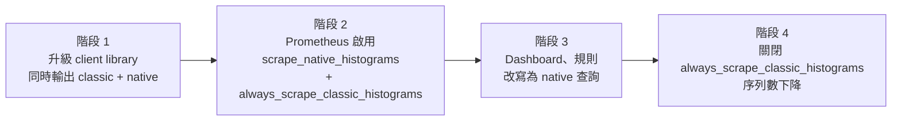
```mermaid
flowchart LR
    P1["階段 1<br/>升級 client library<br/>同時輸出 classic + native"] --> P2["階段 2<br/>Prometheus 啟用<br/>scrape_native_histograms<br/>+ always_scrape_classic_histograms"]
    P2 --> P3["階段 3<br/>Dashboard、規則<br/>改寫為 native 查詢"]
    P3 --> P4["階段 4<br/>關閉 always_scrape_classic_histograms<br/>序列數下降"]
```

遷移前請確認下游元件也支援原生直方圖：Remote Write 接收端（Thanos、Mimir、VictoriaMetrics 的版本）、Grafana 的 Heatmap 與 Histogram 面板，以及任何直接讀取 TSDB 的工具。

### 3.9 Prometheus 3.x 新能力

#### UTF-8 指標與標籤名稱

Prometheus 3.0 起，`metric_name_validation_scheme` 預設為 `utf8`，允許名稱包含 `.` 等字元，以便與 OpenTelemetry 名稱直接對應。查詢時，名稱必須加引號並放進大括號：

```promql
# 傳統名稱：照舊
http_server_request_duration_seconds_count

# UTF-8 名稱：引號 + 放入大括號
{"http.server.request.duration"}

# 標籤名稱含特殊字元時也要加引號
{"http.server.request.duration", "service.name"="payment"}
```

> 💡 **企業建議**：除非有明確需求，仍以傳統名稱（`[a-zA-Z_:][a-zA-Z0-9_:]*`）為主。大量既有的 Dashboard、告警規則、HPA 設定與第三方工具，都以傳統名稱撰寫。

#### OTLP Receiver

```bash
# 啟用 OTLP 接收（預設關閉）
prometheus --config.file=prometheus.yml --web.enable-otlp-receiver
# 接收路徑：POST /api/v1/otlp/v1/metrics
```

```yaml
# prometheus.yml 中與 OTLP 相關的設定
otlp:
  promote_resource_attributes:        # 官方建議提升為標籤的常用屬性（節錄）
    - service.instance.id
    - service.name
    - service.namespace
    - service.version
    - deployment.environment.name
    - k8s.cluster.name
    - k8s.namespace.name
    - k8s.deployment.name
    - k8s.pod.name
  translation_strategy: UnderscoreEscapingWithSuffixes   # 預設值
  keep_identifying_resource_attributes: false

storage:
  tsdb:
    out_of_order_time_window: 30m     # OTel Collector 批次與多副本可能造成亂序
```

未提升為標籤的資源屬性，會成為 `target_info` 序列的標籤。查詢時可用 🧪 `info()` 取得：

```promql
# 🧪 需 --enable-feature=promql-experimental-functions
info(
  sum by (job, instance) (rate(http_server_request_duration_seconds_count[5m])),
  {k8s_cluster_name=~".+"}
)

# 不使用實驗功能的等價寫法（join target_info）
  sum by (job, instance) (rate(http_server_request_duration_seconds_count[5m]))
* on (job, instance) group_left (k8s_cluster_name)
  target_info
```

> ⚠️ OTLP receiver 與 Remote Write receiver 本身不做認證。開啟前必須在前方加上反向代理或 `--web.config.file` 的認證設定（見 [9.4 安全](#94-安全)）。

#### Remote Write 2.0

| 項目 | Remote Write 1.0 | Remote Write 2.0 |
| --- | --- | --- |
| 狀態 | 穩定 | 規格仍為 release candidate；Prometheus 已可傳送與接收 |
| 標籤傳輸 | 每個 sample 重複傳送字串 | 字串表（symbol table），顯著降低頻寬 |
| 中繼資料 | 另外傳送 | 與 sample 一起傳送（型別、單位、說明） |
| 原生直方圖 | 支援 | 支援，並可帶 start timestamp |
| Exemplar | 支援 | 支援 |

```yaml
remote_write:
  - url: https://mimir.example.internal/api/v1/push
    protobuf_message: io.prometheus.write.v2.Request   # 改用 2.0；接收端必須支援
```

> ⚠️ 只有在接收端確認支援 2.0 時才切換。否則請維持預設的 1.0（`prometheus.WriteRequest`）。

#### 其他值得採用的新功能

| 功能 | 版本與狀態 | 用途 |
| --- | --- | --- |
| `keep_firing_for` | 穩定 | 告警恢復後再維持一段時間，減少反覆觸發 |
| Duration expressions | 3.14 起預設啟用 | 範圍與 offset 可用運算式，例如 `rate(x[5m * 2])`、`x offset (1h / 2)` |
| `step()`、`range()`、`min_of()`、`max_of()` | 🧪 實驗 | 在 duration expression 中引用查詢的 step 與範圍 |
| `first_over_time()` | 3.14 起穩定 | 取得範圍內最早的樣本 |
| `fill()`／`fill_left()`／`fill_right()` | 🧪 3.10 起，需 `promql-binop-fill-modifiers` | 二元運算一側缺序列時補預設值，例如 `a + fill(0) b` |
| `anchored`／`smoothed` 修飾子 | 🧪 需 `promql-extended-range-selectors` | 控制 `rate`／`increase` 的邊界處理 |
| `limitk()`／`limit_ratio()` | 🧪 實驗 | 取樣部分序列，適合大量序列的概觀圖 |
| `query_offset`／`rule_query_offset` | 穩定 | 延遲評估規則，容忍資料延遲到達 |
| `storage.tsdb.retention.*` 設定檔欄位 | 3.x；`--storage.tsdb.retention.time/size` 旗標已標示為 deprecated | 保留期設定可熱重載；`percentage` 為 🧪 實驗 |
| `runtime.log_level` | 3.15 起；`--log.level` 標示為 deprecated | 熱重載時可調整日誌等級 |
| OpenMetrics 2.0 抓取 | 🧪 3.15 起，需 `openmetrics2` | 新一代暴露格式 |
| `/api/v1/openapi.yaml` | 3.10 起 | HTTP API 的 OpenAPI 規格 |

### 3.10 Kubernetes 上的指標收集

在 Kubernetes 上，直接手寫 `kubernetes_sd_configs` 與 relabel 規則難以維護。業界主流做法是 **Prometheus Operator**，通常以 Helm chart **kube-prometheus-stack** 部署。

#### Operator CRD 一覽

| CRD | API 版本 | 用途 | 通常由誰維護 |
| --- | --- | --- | --- |
| `Prometheus` | v1（穩定） | 定義 Prometheus 部署（副本、保留期、選擇器） | 平台團隊 |
| `PrometheusAgent` | v1alpha1 | Agent mode 部署 | 平台團隊 |
| `Alertmanager` | v1 | Alertmanager 叢集 | 平台團隊 |
| `ServiceMonitor` | v1 | 依 Service 選取抓取目標 | 應用團隊 |
| `PodMonitor` | v1 | 直接依 Pod 選取抓取目標 | 應用團隊 |
| `Probe` | v1 | 透過 blackbox_exporter 探測 | 應用或 SRE 團隊 |
| `ScrapeConfig` | v1alpha1 | 叢集外目標、其他 SD 機制 | 平台團隊 |
| `PrometheusRule` | v1 | Recording 與 Alerting 規則 | 應用團隊 |
| `AlertmanagerConfig` | v1alpha1／v1beta1 | 命名空間層級的路由與接收者 | 應用團隊 |
| `ThanosRuler` | v1 | Thanos 規則評估 | 平台團隊 |

#### ServiceMonitor 範例

```yaml
apiVersion: monitoring.coreos.com/v1
kind: ServiceMonitor
metadata:
  name: payment-service
  namespace: payment
  labels:
    release: kube-prometheus-stack     # 必須符合 Prometheus CR 的 serviceMonitorSelector
spec:
  selector:
    matchLabels:
      app.kubernetes.io/name: payment-service
  endpoints:
    - port: http-metrics               # Service 中 port 的名稱，而非數字
      path: /actuator/prometheus
      interval: 30s
      scrapeTimeout: 10s
      metricRelabelings:
        - sourceLabels: [__name__]
          regex: 'jvm_buffer_.*|tomcat_sessions_.*'
          action: drop
  sampleLimit: 20000                   # 超過即本次抓取失敗，保護 Prometheus
  labelLimit: 40
```

#### PrometheusRule 範例

```yaml
apiVersion: monitoring.coreos.com/v1
kind: PrometheusRule
metadata:
  name: payment-red
  namespace: payment
  labels:
    release: kube-prometheus-stack
spec:
  groups:
    - name: payment-red.rules
      rules:
        - record: service:http_requests:rate5m
          expr: sum by (service) (rate(http_requests_total{namespace="payment"}[5m]))
```

> ⚠️ **最常見的「抓不到」原因**：kube-prometheus-stack 預設只選取帶有 `release: <Helm release 名稱>` 標籤的 ServiceMonitor 與 PrometheusRule。若要讓所有命名空間的資源都生效，需在 values 中設定 `prometheus.prometheusSpec.serviceMonitorSelectorNilUsesHelmValues: false`（PodMonitor、PrometheusRule 也有對應設定），並以命名空間選擇器或准入政策控管。

#### 多租戶治理建議

| 做法 | 說明 |
| --- | --- |
| 平台團隊在 `Prometheus` CR 設定 `enforcedSampleLimit`、`enforcedLabelLimit` | 防止單一團隊的 ServiceMonitor 拖垮共用 Prometheus |
| 以命名空間標籤限制 `serviceMonitorNamespaceSelector` | 只收錄已登記的命名空間 |
| 以 OPA Gatekeeper／Kyverno 檢查 PrometheusRule | 例如強制每條告警都要有 `severity` 與 `runbook_url` |
| 共用 Prometheus 依領域分片 | 基礎設施、平台元件、業務應用分開，避免互相影響 |

#### Monitoring Mixins

Mixin 是把「Dashboard + 告警規則 + Recording Rules」打包的 Jsonnet 套件，由各元件的維護者提供：

| Mixin | 內容 |
| --- | --- |
| kubernetes-mixin | 叢集、節點、工作負載的 Dashboard 與告警（kube-prometheus-stack 內建） |
| node-mixin | 主機層級的 USE Dashboard 與告警 |
| prometheus-mixin、alertmanager-mixin | 監控 Prometheus 與 Alertmanager 本身 |
| 各 exporter 的 mixin | 例如 redis_exporter 的 `contrib/redis-mixin` |

> 💡 kube-prometheus-stack 內建的 `namespace_workload_pod:kube_pod_owner:relabel` recording rule，可把 Pod 對應到 Deployment／StatefulSet，是「以工作負載為單位」計算容量的關鍵（見 [5.2 Scaling / Bottleneck / Capacity Planning](#52-scaling--bottleneck--capacity-planning)）。

### 3.11 Alertmanager 設計

Prometheus 只負責「判斷是否該告警」，Alertmanager 負責「通知誰、怎麼通知、何時不通知」。

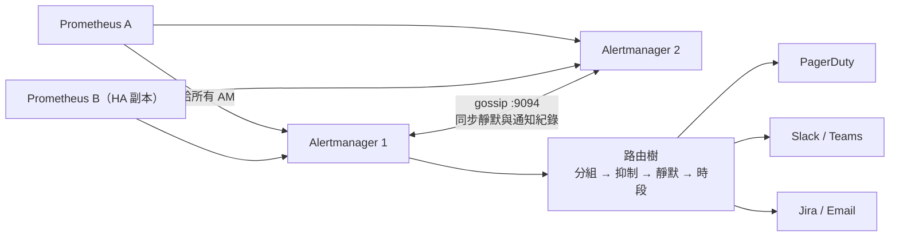
```mermaid
flowchart LR
    P1["Prometheus A"] -->|"送給所有 AM"| AM1["Alertmanager 1"]
    P1 --> AM2["Alertmanager 2"]
    P2["Prometheus B（HA 副本）"] --> AM1
    P2 --> AM2
    AM1 <-->|"gossip :9094<br/>同步靜默與通知紀錄"| AM2
    AM1 --> R["路由樹<br/>分組 → 抑制 → 靜默 → 時段"]
    R --> N1["PagerDuty"]
    R --> N2["Slack / Teams"]
    R --> N3["Jira / Email"]
```

#### 處理流程

| 階段 | 作用 | 關鍵設定 |
| --- | --- | --- |
| **Grouping** | 把相關告警合併成一則通知 | `group_by`、`group_wait`（預設 30s）、`group_interval`（預設 5m） |
| **Inhibition** | 上游告警存在時，抑制下游告警 | `inhibit_rules` 的 `source_matchers`／`target_matchers`／`equal` |
| **Silences** | 維護期間暫停通知 | UI、API 或 `amtool silence add` |
| **Time intervals** | 只在特定時段通知或靜音 | `time_intervals` 搭配 `active_time_intervals`／`mute_time_intervals` |
| **Repeat** | 尚未解除時重複提醒 | `repeat_interval`（預設 4h） |

#### 設定範例

```yaml
# alertmanager.yml
route:
  receiver: default-chat
  group_by: ['alertname', 'cluster', 'service']
  group_wait: 30s
  group_interval: 5m
  repeat_interval: 4h
  routes:
    # Watchdog：死人開關，送到外部心跳服務（見 9.5）
    - matchers: ['alertname="Watchdog"']
      receiver: deadmans-switch
      group_wait: 0s
      group_interval: 1m
      repeat_interval: 1m

    # 嚴重告警：值班呼叫
    - matchers: ['severity="critical"']
      receiver: oncall-pager

    # 一般告警：只在上班時間送到團隊頻道
    - matchers: ['severity="warning"']
      receiver: team-chat
      active_time_intervals: ['business-hours']

inhibit_rules:
  # 同一服務已有 critical 時，抑制同名的 warning
  - source_matchers: ['severity="critical"']
    target_matchers: ['severity="warning"']
    equal: ['alertname', 'service']
  # 整個叢集失聯時，抑制該叢集內的所有其他告警
  - source_matchers: ['alertname="ClusterUnreachable"']
    target_matchers: ['alertname!="ClusterUnreachable"']
    equal: ['cluster']

time_intervals:
  - name: business-hours
    time_intervals:
      - weekdays: ['monday:friday']
        times:
          - start_time: '09:00'
            end_time: '18:00'
        location: 'Asia/Taipei'

receivers:
  - name: default-chat
    slack_configs:
      - api_url_file: /etc/alertmanager/secrets/slack-webhook
        channel: '#alerts'
        send_resolved: true
  - name: team-chat
    msteamsv2_configs:                 # Teams 舊式 connector 已被 Microsoft 淘汰，改用 Workflows
      - webhook_url_file: /etc/alertmanager/secrets/teams-workflow-url
  - name: oncall-pager
    pagerduty_configs:
      - routing_key_file: /etc/alertmanager/secrets/pagerduty-key
  - name: deadmans-switch
    webhook_configs:
      - url_file: /etc/alertmanager/secrets/heartbeat-url
```

> 💡 祕密值一律使用 `*_file` 欄位從檔案讀取（Kubernetes 上以 Secret 掛載），不要寫在設定檔中。

#### 高可用部署要點

- 至少 2–3 個副本，以 `--cluster.peer` 互相連線（預設 port 9094），透過 gossip 同步靜默與通知紀錄
- **Prometheus 必須設定送往「每一個」Alertmanager 實例，不要經過負載平衡器**（官方文件明確要求）
- 重啟後等待叢集同步（`--cluster.settle-timeout`），避免重複通知或遺失靜默
- 以 `amtool check-config alertmanager.yml` 驗證設定；以 `amtool config routes test` 驗證路由（見 [3.12 規則測試與 CI](#312-規則測試與-ci)）

#### 0.3x 版重要變化

| 版本 | 變化 |
| --- | --- |
| 0.32 | 靜默可附加 annotation；支援多組 matcher 的靜默；Slack 可更新既有訊息；webhook 支援完整 payload 範本 |
| 0.33 | 🧪 結構化事件紀錄（event recorder）；移除 `alertmanager_marked_alerts` 指標 |
| 0.34 | 路由可加上可範本化的標籤；`alertmanager_notifications_failed_total` 的 `reason` 區分 `authError`、`rateLimited` |
| 接收者 | 已內建 `msteamsv2_configs`、`jira_configs`、`incidentio_configs`、`rocketchat_configs` 等 |

### 3.12 規則測試與 CI

規則與告警是「程式碼」，應該有測試與 CI。

#### 靜態檢查

```bash
# 設定檔與規則語法
promtool check config prometheus.yml
promtool check rules rules/*.yml

# Alertmanager 設定
amtool check-config alertmanager.yml

# 驗證路由：這組標籤會送到哪個 receiver？
amtool config routes test --config.file=alertmanager.yml severity=critical service=payment
```

#### 規則單元測試

```yaml
# tests/http-red.test.yml
rule_files:
  - ../rules/http-red.rules.yml
  - ../rules/service-alerts.yml

evaluation_interval: 30s

tests:
  - interval: 30s
    input_series:
      # 每 30 秒 100 個請求，其中 10 個 5xx → 錯誤率 10%，QPS ≈ 3.33
      - series: 'http_requests_total{service="payment", status="200"}'
        values: '0+90x40'
      - series: 'http_requests_total{service="payment", status="500"}'
        values: '0+10x40'

    promql_expr_test:
      - expr: service:http_request_errors_per_requests:ratio_rate5m
        eval_time: 10m
        exp_samples:
          - labels: 'service:http_request_errors_per_requests:ratio_rate5m{service="payment"}'
            value: 0.1

    alert_rule_test:
      - eval_time: 15m
        alertname: HighErrorRate
        exp_alerts:
          - exp_labels:
              severity: critical
              team: backend
              service: payment
            exp_annotations:
              summary: "服務 payment 錯誤率過高"
              description: "錯誤率 10%，超過 5% 閾值"
              runbook_url: "https://wiki.example.internal/runbook/high-error-rate"
              dashboard_url: "https://grafana.example.internal/d/svc-red?var-service=payment"
```

```bash
promtool test rules tests/*.test.yml
```

#### CI 管線建議

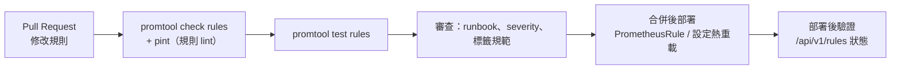
```mermaid
flowchart LR
    PR["Pull Request<br/>修改規則"] --> L["promtool check rules<br/>+ pint（規則 lint）"]
    L --> T["promtool test rules"]
    T --> R["審查：runbook、severity、<br/>標籤規範"]
    R --> D["合併後部署<br/>PrometheusRule / 設定熱重載"]
    D --> V["部署後驗證<br/>/api/v1/rules 狀態"]
```

> 💡 開源工具 **pint**（Cloudflare）可檢查規則中的常見問題，例如引用不存在的指標、`rate()` 範圍太短、缺少必要標籤等，適合放在 CI 中。

---

## 4. Grafana 視覺化設計

### 4.1 Dashboard 設計的「故事線」概念

#### Dashboard 是一個「故事」

```text
好的 Dashboard = 能在 30 秒內回答「系統現在好不好？影響誰？從哪裡開始查？」
```

Grafana 官方最佳實務也強調：**Dashboard 應該講一個故事或回答一個問題，並且降低而不是增加認知負擔。** 在動手建立 Panel 之前，先寫下三件事：這個 Dashboard 給誰看、要回答什麼問題、看完之後下一步要做什麼。

##### 故事線結構

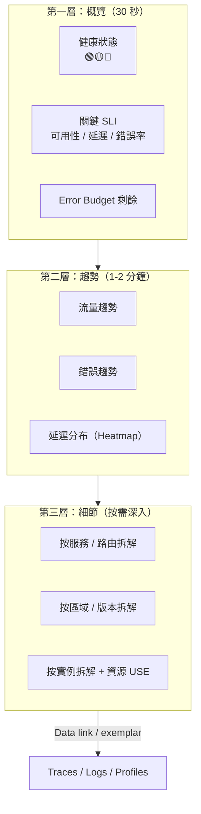
```mermaid
flowchart TB
    subgraph L1["第一層：概覽（30 秒）"]
        H1["健康狀態<br/>🟢🟡🔴"]
        H2["關鍵 SLI<br/>可用性 / 延遲 / 錯誤率"]
        H3["Error Budget 剩餘"]
    end

    subgraph L2["第二層：趨勢（1-2 分鐘）"]
        T1["流量趨勢"]
        T2["錯誤趨勢"]
        T3["延遲分布（Heatmap）"]
    end

    subgraph L3["第三層：細節（按需深入）"]
        D1["按服務 / 路由拆解"]
        D2["按區域 / 版本拆解"]
        D3["按實例拆解 + 資源 USE"]
    end

    L1 --> L2 --> L3
    L3 -->|"Data link / exemplar"| X["Traces / Logs / Profiles"]
```

#### Dashboard 設計原則

| 原則 | 說明 |
| --- | --- |
| **金字塔結構** | 上方放概覽，下方放細節；在 Grafana 13 可用 rows 或 tabs 分層 |
| **左重要右次要** | 閱讀習慣由左至右、由上至下；RED 方法建議請求與錯誤在左、延遲在右 |
| **關聯性分組** | 相關指標放在同一 row，並共用相同的時間軸與單位 |
| **一致的時間範圍** | 所有 Panel 同步；需要不同範圍時明確標示（例如「過去 30 天」的 SLO） |
| **明確的閾值** | 以 thresholds 顯示 SLO 或容量上限，顏色要有意義（綠＝正常、紅＝異常） |
| **正規化座標軸** | 例如 CPU 以「使用率」而非「核心秒數」呈現，不同規格的機器才能比較 |
| **導引式瀏覽** | 以 data links 與 dashboard links 連到下一層，並讓告警直接連到對應 Dashboard |

### 4.2 不同角色的 Dashboard 設計

#### 角色需求矩陣

| 角色 | 關注點 | 時間範圍 | 更新頻率 | 複雜度 |
| --- | --- | --- | --- | --- |
| **管理層** | SLO 達成率、Error Budget、事故趨勢 | 30 天／季 | 每日／每週 | 低 |
| **Ops／SRE** | 即時狀態、告警、資源用量 | 1–6 小時 | 30 秒–1 分鐘 | 中 |
| **Developer** | API 效能、錯誤細節、依賴狀態、JVM | 15 分鐘–24 小時 | 即時／除錯 | 高 |
| **容量規劃** | 峰值、成長率、飽和度 | 30–90 天 | 每週 | 中 |

#### 管理層 Dashboard 範例

```text
┌─────────────────────────────────────────────────────────────┐
│                    服務可靠性概覽（過去 30 天）               │
├─────────────────┬─────────────────┬─────────────────────────┤
│  🟢 可用性       │  🟢 延遲 SLI      │  🟡 Error Budget        │
│  99.95%         │  99.4% < 200ms  │  剩餘 38%               │
│  SLO: 99.9%     │  SLO: 99%       │  燃燒率 1.3x            │
├─────────────────┴─────────────────┴─────────────────────────┤
│                    每週 SLO 達成趨勢                          │
│  [長條圖：各週可用性與 SLO 目標線]                             │
├─────────────────────────────────────────────────────────────┤
│  事故統計        │  P1: 0  │  P2: 2  │  MTTR: 15min         │
└─────────────────────────────────────────────────────────────┘
```

#### Ops／SRE Dashboard 範例

```text
┌──────────────────────────────────────────────────────────────┐
│  [Cluster ▼] [Namespace ▼] [Service: All ▼] [Last 1h ▼]      │
├─────────────────┬─────────────────┬──────────────────────────┤
│  Active Alerts  │  QPS            │  Error Rate              │
│  🔴 2 Critical  │  📈 15,234/s    │  📉 0.03%                │
│  🟡 5 Warning   │  +12% vs 上週   │  -0.01% vs 1h 前          │
├─────────────────┴─────────────────┴──────────────────────────┤
│  ▸ Row：Request Rate by Service（Time series）               │
│  ▸ Row：Latency（Heatmap + P50/P95/P99）                     │
│  ▸ Row：Saturation（CPU throttling / Memory working set）    │
└──────────────────────────────────────────────────────────────┘
```

#### Developer Dashboard 範例

```text
┌──────────────────────────────────────────────────────────────┐
│  Service: payment-service  [Version ▼] [Pod: All ▼] [1h ▼]   │
├──────────────────────────────────────────────────────────────┤
│                    Endpoint Performance（Table）              │
│  ┌────────────────┬─────────┬─────────┬─────────┬─────────┐  │
│  │ Route          │ QPS     │ P99     │ Error%  │ Trend   │  │
│  ├────────────────┼─────────┼─────────┼─────────┼─────────┤  │
│  │ POST /pay      │ 1,234   │ 89ms    │ 0.01%   │ 🟢      │  │
│  │ GET /status    │ 5,678   │ 12ms    │ 0.00%   │ 🟢      │  │
│  │ POST /refund   │ 234     │ 156ms   │ 0.05%   │ 🟡      │  │
│  └────────────────┴─────────┴─────────┴─────────┴─────────┘  │
├──────────────────────────────────────────────────────────────┤
│  Downstream Dependencies（延遲／錯誤率矩陣）                   │
├──────────────────────────────────────────────────────────────┤
│  JVM: Heap │ GC Pause │ Thread Pool │ Connection Pool        │
└──────────────────────────────────────────────────────────────┘
```

> 💡 在 Grafana 13，可將同一個服務的三種視角放在同一個 Dashboard 的不同 **tabs**，並把 `Pod`、`Version` 這類只在 Developer 視角需要的變數設為 **section-level variables**，只在該 tab 顯示（見 [4.7 Dynamic Dashboards 與 Schema v2](#47-dynamic-dashboards-與-schema-v2)）。

### 4.3 指標選擇與視覺化類型對應

| 要回答的問題 | 適合的視覺化 | Grafana Panel | 注意事項 |
| --- | --- | --- | --- |
| 現在的值是多少？好不好？ | 大數字＋顏色 | **Stat**（可加 sparkline） | 設定 thresholds 與單位 |
| 距離上限還有多遠？ | 儀表 | **Gauge**、**Bar gauge** | 需有明確的最小值與最大值 |
| 隨時間怎麼變化？ | 折線 | **Time series** | 單位一致；必要時用雙 Y 軸 |
| 延遲怎麼分布？ | 熱力圖 | **Heatmap** | 可直接顯示 classic 或 native histogram |
| 數值落在哪些區間？ | 直方圖 | **Histogram** | 適合非時間序列的分布 |
| 狀態何時改變？ | 狀態時間軸 | **State timeline**、**Status history** | 適合斷路器、部署、健康檢查 |
| 多個項目的排行或明細？ | 表格 | **Table**（可加儲存格顏色、迷你圖） | 用 Instant 查詢 |
| 類別之間比較？ | 長條圖 | **Bar chart** | 類別數不要超過 15 |
| 組成比例？ | 堆疊圖／圓餅圖 | **Time series**（stacked）、**Pie chart** | 圓餅圖只適合 2–5 個類別 |
| 服務依賴關係？ | 節點圖 | **Node graph** | 通常搭配 traces 資料 |
| 地理分布？ | 地圖 | **Geomap** | 需經緯度或地區代碼 |

#### 視覺化選擇決策樹

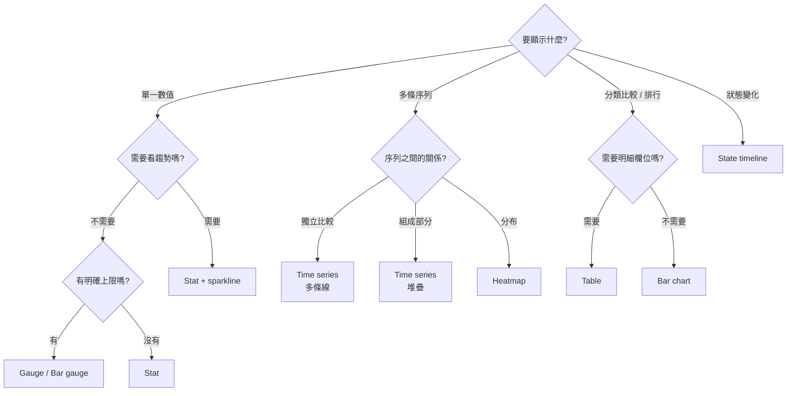
```mermaid
flowchart TD
    Q1{"要顯示什麼?"}
    Q1 -->|"單一數值"| Q2{"需要看趨勢嗎?"}
    Q1 -->|"多條序列"| Q3{"序列之間的關係?"}
    Q1 -->|"分類比較 / 排行"| Q5{"需要明細欄位嗎?"}
    Q1 -->|"狀態變化"| ST["State timeline"]

    Q2 -->|"不需要"| Q4{"有明確上限嗎?"}
    Q2 -->|"需要"| StatSpark["Stat + sparkline"]
    Q4 -->|"有"| Gauge["Gauge / Bar gauge"]
    Q4 -->|"沒有"| Stat["Stat"]

    Q3 -->|"獨立比較"| TS1["Time series<br/>多條線"]
    Q3 -->|"組成部分"| TS2["Time series<br/>堆疊"]
    Q3 -->|"分布"| Heat["Heatmap"]

    Q5 -->|"需要"| Table["Table"]
    Q5 -->|"不需要"| Bar["Bar chart"]
```

> ⚠️ v1.0 的決策樹寫「需要歷史 → Gauge + Sparkline」，但 sparkline 是 **Stat** panel 的功能（Graph mode），Gauge 並不提供。

### 4.4 Anti-pattern Dashboard 範例

#### ❌ Anti-pattern 1：資訊過載

```text
問題：一個 Dashboard 塞 50 個 Panel
結果：
- 載入時間 > 30 秒，對 Prometheus 造成大量查詢負載
- 看不出重點
- 瀏覽器記憶體爆炸
```

**解法**：

- 單一畫面以 15–20 個 Panel 為上限
- 用 rows 或 tabs 分組，不常看的區塊預設摺疊（摺疊的 row 不會發出查詢）
- 拆成多個 Dashboard，以 dashboard links 串接成「總覽 → 服務 → 實例」的階層

#### ❌ Anti-pattern 2：沒有上下文的數字

```text
問題：顯示「QPS: 12,345」但不知道這是好是壞
```

**解法**：

- 加入閾值（綠／黃／紅）
- 顯示與基準的比較（vs 上週同時段、vs 7 天平均）
- 使用 Stat panel 的 Color mode，並在 description 說明判讀方式

#### ❌ Anti-pattern 3：誤導性的 Y 軸

```text
問題：Y 軸從 99% 開始，讓 0.1% 的波動看起來像大災難
```

**解法**：

- 比例類指標設定固定的 min／max（0–1 或 0–100%）
- 若必須放大局部，在標題或描述中明確標示
- 以 SLO 目標線作為視覺錨點

#### ❌ Anti-pattern 4：每個環境一套 Dashboard

```text
問題：Dev / Staging / Prod 各有一套，維護成本 x3，且內容逐漸不一致
```

**解法**：使用 Grafana Variables

```text
Variables:
- datasource: 類型為 Prometheus 的資料來源變數（切換不同叢集或環境）
- env:        label_values(up, env)
- service:    label_values(up{env="$env"}, service)

Query: sum by (service) (rate(http_requests_total{env="$env", service=~"$service"}[$__rate_interval]))
```

#### ❌ Anti-pattern 5：固定的 rate 範圍

```text
問題：所有 Panel 都寫死 rate(x[1m])
結果：放大到 7 天時，每個點只代表 1 分鐘，畫面出現大量雜訊；
      抓取間隔改為 30 秒後，1m 範圍內只剩 2 個點，圖形出現斷點
```

**解法**：Grafana 中一律使用 `$__rate_interval`。它會依目前的時間範圍與資料來源的抓取間隔，自動取「至少 4 倍抓取間隔」的範圍。前提是資料來源設定中的 **Scrape interval** 要與 Prometheus 實際設定一致。

#### ❌ Anti-pattern 6：Dashboard 只存在 UI 中

```text
問題：Dashboard 只在 UI 中編輯，沒有版本控制
結果：誤刪、誤改無法追溯；各環境內容不一致
```

**解法**：Dashboard as Code（見 [4.8 Dashboard as Code](#48-dashboard-as-code)）。Grafana 13 雖已提供「還原已刪除 Dashboard」功能，但仍不能取代版本控制與審查流程。

### 4.5 Grafana 與 Prometheus 的責任邊界

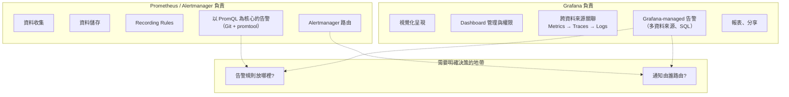
```mermaid
flowchart TB
    subgraph Prometheus["Prometheus / Alertmanager 負責"]
        P1["資料收集"]
        P2["資料儲存"]
        P3["Recording Rules"]
        P4["以 PromQL 為核心的告警（Git + promtool）"]
        P5["Alertmanager 路由"]
    end

    subgraph Grafana["Grafana 負責"]
        G1["視覺化呈現"]
        G2["Dashboard 管理與權限"]
        G3["跨資料來源關聯<br/>Metrics → Traces → Logs"]
        G4["Grafana-managed 告警<br/>（多資料來源、SQL）"]
        G5["報表、分享"]
    end

    subgraph Shared["需要明確決策的地帶"]
        S1["告警規則放哪裡?"]
        S2["通知由誰路由?"]
    end

    P4 -.-> S1
    G4 -.-> S1
    P5 -.-> S2
    G4 -.-> S2
```

#### 責任劃分建議

| 功能 | Prometheus 生態 | Grafana | 建議 |
| --- | --- | --- | --- |
| 資料收集 | ✅ | ❌ | Prometheus（或 Alloy／OTel Collector） |
| 時序儲存 | ✅ | ❌ | Prometheus＋長期儲存 |
| Recording rules | ✅ | ✅（Grafana-managed recording rules） | 以 Prometheus 為主；跨資料來源時用 Grafana |
| 告警規則 | ✅ Prometheus rules | ✅ Grafana-managed rules | **依組織情境選擇**，見下方決策表 |
| 告警通知 | Alertmanager | Grafana 內建 Alertmanager | 同一類告警只選一個，避免重複通知 |
| Dashboard | ❌ | ✅ | Grafana |
| 權限控管 | 只有基本認證 | ✅ RBAC、Teams、資料夾 | Grafana |
| 報表匯出 | ❌ | ✅（Enterprise／Cloud 的 Reporting） | Grafana |

#### 告警規則放哪裡？

Grafana 官方文件目前**建議優先使用 Grafana-managed alert rules**，因為它可以查詢多種資料來源、處理 No Data／Error 狀態，並與通知政策整合；但對以 Prometheus 為核心、重視 GitOps 的團隊，Prometheus 規則仍有其優勢。

| 判斷條件 | 選 Prometheus rules＋Alertmanager | 選 Grafana-managed rules |
| --- | --- | --- |
| 資料來源 | 只有 Prometheus 相容資料 | 需結合 Loki、SQL、雲端監控等多種來源 |
| 管理方式 | 規則與程式碼放在同一個 Git repo，以 `promtool test rules` 測試 | 以 Terraform、provisioning 或 Git Sync 管理 |
| 可用性要求 | Grafana 停機時告警仍須運作 | 可接受 Grafana 為告警路徑的一部分（需 HA 部署） |
| Kubernetes | 以 PrometheusRule CRD 由應用團隊自行維護 | 由平台團隊集中管理 |
| 使用者 | 熟悉 PromQL 的 SRE | 需要 UI 操作的開發與維運人員 |

> ⚠️ Grafana 只能**檢視**一般 Prometheus 的規則，不能建立或編輯。可在 Grafana UI 中建立與編輯的 data source-managed 規則，僅限具備 ruler API 的 Mimir 與 Loki。Grafana 也提供工具，可將 Prometheus、Mimir、Loki 規則匯入成 Grafana-managed 規則（見 [4.9 Grafana Alerting](#49-grafana-alerting)）。

> 💡 **最佳實務**：選定一種作為「主要告警路徑」，另一種只用於特殊情境；並在 runbook 中寫清楚某類告警由哪個系統負責，避免同一事件在兩個系統各通知一次。

---

### 4.6 Variables、Transformations 與 SQL Expressions

#### 常用變數類型

| 類型 | 用途 | 範例 |
| --- | --- | --- |
| **Data source** | 切換叢集、環境或租戶 | 類型：Prometheus；名稱：`datasource` |
| **Query** | 由資料動態產生選項 | `label_values(up{env="$env"}, service)` |
| **Custom** | 固定清單 | `p50 : 0.5, p95 : 0.95, p99 : 0.99` |
| **Interval** | 讓使用者選擇聚合粒度 | `1m,5m,15m,1h` |
| **Filters**（原 Ad hoc filters） | 對所有查詢自動附加標籤條件 | Grafana 13.0 起更名為 Filters |
| **Constant**／**Text box** | 固定值或自由輸入 | 例如輸入 trace ID |

#### Prometheus 範本函式

| 函式 | 用途 |
| --- | --- |
| `label_values(label)` | 列出某標籤的所有值 |
| `label_values(metric{selector}, label)` | 在特定條件下列出標籤值（建議一律加上 selector，避免掃描全部序列） |
| `label_names()` | 列出標籤名稱 |
| `query_result(query)` | 以任意查詢結果作為選項，例如 `query_result(topk(10, sum by (service) (rate(http_requests_total[1h]))))` |

#### 內建時間變數

| 變數 | 意義 | 使用時機 |
| --- | --- | --- |
| `$__rate_interval` | 取「4 倍抓取間隔」與「`$__interval` 加一個抓取間隔」兩者中較大者 | **所有 `rate()`、`increase()` 一律使用** |
| `$__interval` | 依時間範圍與面板寬度計算的 step | `*_over_time()` 的範圍 |
| `$__range` | 整個時間範圍的長度 | 「選取期間的總數」，例如 `increase(x[$__range])` |

#### 多值變數的寫法

```promql
# 多選或 All 時，Grafana 會展開為 regex，因此要用 =~
sum by (service) (rate(http_requests_total{env="$env", service=~"$service"}[$__rate_interval]))
```

> 💡 為「All」設定自訂值 `.*`，可避免選項很多時展開成超長的 regex。

#### Transformations

Transformations 在 Grafana 端處理查詢結果，適合「PromQL 不好做、但只是呈現需要」的情境：

| 轉換 | 常見用途 |
| --- | --- |
| **Join by field**／**Outer join** | 把 QPS、P99、錯誤率三個查詢合併成同一張表 |
| **Organize fields** | 重新命名、排序、隱藏欄位 |
| **Group by** | 以欄位分組並計算 |
| **Time series to table** | 在表格中顯示每列的迷你趨勢（13.1 GA） |
| **Add field from calculation** | 由既有欄位計算新欄位，例如兩個查詢相除 |
| **Filter data by values** | 只顯示超過閾值的列 |

> ⚠️ Transformation 不會減少 Prometheus 的查詢成本。需要重複使用的計算，請寫成 recording rule。

#### SQL Expressions

Grafana 12 起提供 SQL expressions：先執行一般查詢，再以 SQL 對結果做 JOIN、彙總或運算，並可用於告警條件。適合把 Prometheus 指標與 MySQL、PostgreSQL 等業務資料庫的結果放在一起比較，例如「每筆訂單的基礎設施成本」。功能目前由預設啟用的 `sqlExpressions` feature toggle 控制。

#### Saved Queries

Grafana 13.2 起，**Saved queries** 在 Enterprise 與 Cloud 正式提供（GA）。團隊可把驗證過的 PromQL 存成可共用、可透過命令面板（`Ctrl/Cmd + K`）搜尋、可用 Terraform 管理的查詢庫，降低新成員寫錯查詢的機率。

### 4.7 Dynamic Dashboards 與 Schema v2

Grafana 13.0 起，**Dynamic dashboards**（新一代儀表板體驗）正式 GA，背後的資料模型是 **dashboard schema v2**。主要能力如下：

| 能力 | 說明 | 設計用途 |
| --- | --- | --- |
| **Rows 與 Tabs** | 兩種分組方式，可巢狀使用 | 以 tabs 區分角色視角（總覽／SRE／Developer） |
| **Custom layout** | 自由拖拉、調整大小（預設） | 需要精確排版的總覽頁 |
| **Auto grid layout** | 依最小欄寬、最大欄數、列高自動排列 | 服務數量會變動的清單型頁面 |
| **Show/hide 規則** | 依變數值、資料是否存在等條件顯示或隱藏 Panel（僅 Auto grid 支援） | 只有選擇特定服務時才顯示對應 Panel |
| **Section-level variables** | 變數可放在 row 或 tab 層級（13.1 起） | 減少單一 Dashboard 頂部的變數數量 |
| **Content outline** | 樹狀結構快速導覽 Dashboard 元素 | 大型 Dashboard 的導覽 |
| **編輯側邊欄** | 所有設定集中在右側面板 | 減少切換頁面 |

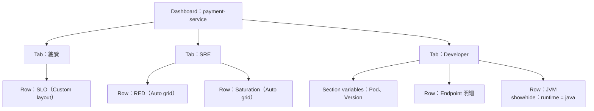
```mermaid
flowchart TB
    D["Dashboard：payment-service"] --> T1["Tab：總覽"]
    D --> T2["Tab：SRE"]
    D --> T3["Tab：Developer"]
    T1 --> R1["Row：SLO（Custom layout）"]
    T2 --> R2["Row：RED（Auto grid）"]
    T2 --> R3["Row：Saturation（Auto grid）"]
    T3 --> V["Section variables：Pod、Version"]
    T3 --> R4["Row：Endpoint 明細"]
    T3 --> R5["Row：JVM<br/>show/hide：runtime = java"]
```

> ⚠️ **相容性注意事項**
>
> - 以檔案 provisioning 部署 v2 Dashboard 時，必須使用 Kubernetes 資源格式（`apiVersion`、`kind`、`metadata`、`spec`），不能直接放舊版 JSON model。
> - 依賴舊版 Dashboard JSON 結構的外部工具（自製腳本、舊版匯出入流程）需要重新驗證。
> - Grafana 13 起，HTTP API 逐步遷移到 Kubernetes 風格的 `/apis` 路徑；舊的 `/api` 路徑標示為 deprecated，但尚未停用。新開發的自動化腳本請直接使用新 API 或 gcx CLI。

### 4.8 Dashboard as Code

#### 方案比較

| 方案 | 形式 | 雙向同步 | 適用情境 |
| --- | --- | --- | --- |
| **檔案 provisioning** | YAML＋JSON 檔案放在 Grafana 主機 | 否（UI 修改不會回寫） | 小型、單一 Grafana、以設定管理工具部署 |
| **Git Sync**（13.0 GA） | Grafana 直接連接 Git repo | **是**：UI 儲存可直接 commit 或開 PR | 希望開發者在 UI 編輯、同時保有 Git 審查流程 |
| **Foundation SDK** | 以 Go、TypeScript、Python、Java、PHP 程式產生 Dashboard | 否 | 大量相似 Dashboard、需要程式化產生 |
| **Grafonnet** | Jsonnet 函式庫 | 否 | 既有 Jsonnet／mixin 生態 |
| **Terraform provider** | HCL | 否 | 與雲端基礎設施一起管理（資料夾、資料來源、權限、告警） |
| **grafana-operator** | Kubernetes CRD（`GrafanaDashboard` 等） | 否 | GitOps（Argo CD／Flux）管理 Grafana |
| **gcx CLI** | 命令列推送與拉取資源 | 手動 | CI/CD 腳本、Git Sync 的 as-code 設定 |

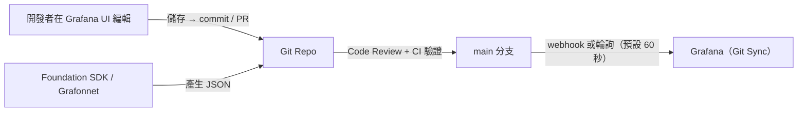
```mermaid
flowchart LR
    Dev["開發者在 Grafana UI 編輯"] -->|"儲存 → commit / PR"| Git["Git Repo"]
    Git -->|"Code Review + CI 驗證"| Main["main 分支"]
    Main -->|"webhook 或輪詢（預設 60 秒）"| Graf["Grafana（Git Sync）"]
    SDK["Foundation SDK / Grafonnet"] -->|"產生 JSON"| Git
```

#### Git Sync 重點

- 支援 GitHub、GitHub Enterprise、GitLab、Bitbucket 與一般 Git（Pure Git）；13.2 起 GitLab 與 Bitbucket 也支援 webhook
- 自管版（OSS／Enterprise）預設每個實例最多 10 個 repository 連線，可調整；每個 repository 同步的資源數沒有上限
- Grafana Cloud 免費方案只能 1 個 repository、20 個資源；其他 Cloud 方案為 10 個 repository、每個 1,000 個資源
- 可設定 UI 儲存時**必須開 PR**，讓正式環境的 Dashboard 一律經過審查

> ⚠️ Grafana 13.0.0 曾有遷移錯誤：從 12.x 升級且啟用 Git Sync 實驗功能的自管環境，可能遺失或還原 Dashboard。13.0.0 已下架，修正於 13.0.1。升級前務必備份資料庫（見 [9.6 版本策略與升級摘要](#96-版本策略與升級摘要)）。

#### 檔案 provisioning 範例

```yaml
# /etc/grafana/provisioning/datasources/prometheus.yaml
apiVersion: 1
datasources:
  - name: Prometheus
    uid: prometheus-main              # 固定 uid，Dashboard 才能穩定引用
    type: prometheus
    access: proxy
    url: http://prometheus:9090
    isDefault: true
    jsonData:
      httpMethod: POST
      prometheusType: Prometheus
      prometheusVersion: 3.13.0
      timeInterval: 15s               # 必須與實際 scrape_interval 一致，$__rate_interval 才正確
      cacheLevel: Medium
      exemplarTraceIdDestinations:
        - name: trace_id
          datasourceUid: tempo-main
```

```yaml
# /etc/grafana/provisioning/dashboards/platform.yaml
apiVersion: 1
providers:
  - name: platform-dashboards
    orgId: 1
    type: file
    disableDeletion: true
    allowUiUpdates: false             # 禁止在 UI 修改 provisioned Dashboard
    updateIntervalSeconds: 30
    options:
      path: /var/lib/grafana/dashboards/platform
      foldersFromFilesStructure: true # 以目錄結構建立資料夾
```

> 📌 Grafana 13 移除了獨立的 `grafana-cli` 與 `grafana-server` 指令，請改用 `grafana cli` 與 `grafana server` 子指令。自動化腳本與容器啟動指令需要一併修改。

### 4.9 Grafana Alerting

#### 告警規則類型

| 類型 | 儲存位置 | 可查詢的資料來源 | 適用情境 |
| --- | --- | --- | --- |
| **Grafana-managed alert rules**（官方建議） | Grafana 資料庫 | 所有支援告警的資料來源，可多來源混合，可搭配 SQL expressions | 多資料來源、需要 UI 管理 |
| **Grafana-managed recording rules** | Grafana 評估，結果寫入 Prometheus 相容資料來源 | 同上 | 跨資料來源的預先計算 |
| **Data source-managed rules** | Mimir／Loki 的 ruler | 單一資料來源 | 大規模、需要水平擴展的規則評估 |

#### 通知架構

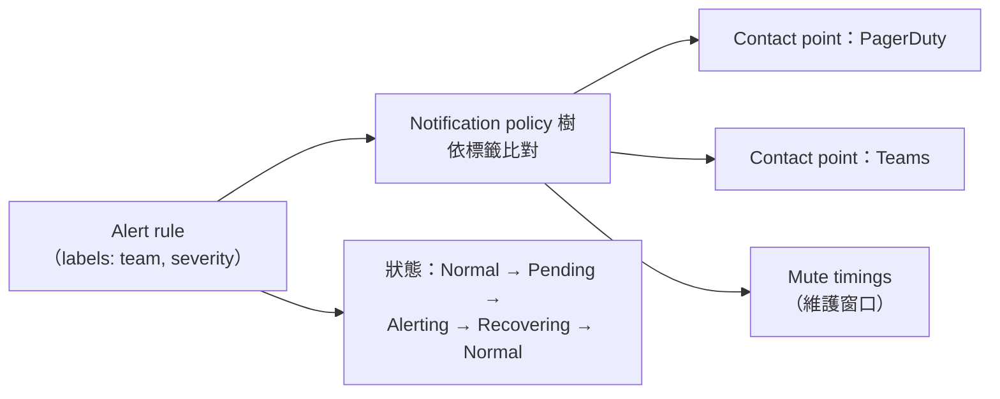
```mermaid
flowchart LR
    Rule["Alert rule<br/>（labels: team, severity）"] --> NP["Notification policy 樹<br/>依標籤比對"]
    NP --> CP1["Contact point：PagerDuty"]
    NP --> CP2["Contact point：Teams"]
    NP --> MT["Mute timings<br/>（維護窗口）"]
    Rule --> State["狀態：Normal → Pending →<br/>Alerting → Recovering → Normal"]
```

| 元件 | 說明 |
| --- | --- |
| **Contact points** | 通知目的地與訊息範本 |
| **Notification policies** | 依標籤路由的樹狀政策，等同 Alertmanager 的 route |
| **Mute timings**／**Active time intervals** | 定期靜音或只在特定時段通知 |
| **Silences** | 臨時靜音 |
| **No Data／Error 處理** | 可設定為 Alerting、Normal、Keep last state 等 |
| **Recovering 狀態**（Grafana 12 起） | 恢復後的觀察期，等同 Prometheus 的 `keep_firing_for` |

#### 選擇 Alertmanager

Grafana 可以把告警送到：

1. **Grafana 內建 Alertmanager**（預設）
2. **外部 Alertmanager**：把既有的 Prometheus Alertmanager 加為資料來源，並設定為接收 Grafana 告警

> 💡 已建立完整 Alertmanager 路由樹的企業，可讓 Grafana-managed 規則也送往同一個外部 Alertmanager，統一通知路由、靜默與抑制規則。

#### 從 Prometheus 規則遷移

Grafana 提供兩種方式把 data source-managed 規則轉為 Grafana-managed 規則：

- UI：從已連接、具 ruler API 的 Mimir／Loki 資料來源匯入，或直接上傳 Prometheus 規則 YAML 檔
- 命令列：以 `mimirtool`（Mimir、Prometheus 規則）或 `cortextool`（Loki 規則）匯入

匯入時 Grafana 會自動保留 Prometheus 語意：套用 `query_offset`（未設定時為 Grafana 的 `rule_query_offset`，預設 1m）、群組內依序評估、無資料時維持 Normal。原本的規則不會被刪除。

> ⚠️ 規則群組若設定了 `limit`，匯入會失敗；需先移除該設定。

> ⚠️ 遷移前先確認：規則評估從 Prometheus 移到 Grafana 後，Grafana 的可用性就成為告警路徑的一部分，必須以 HA 方式部署（多副本＋共用資料庫）。

### 4.10 Drilldown、Explore 與 Exemplars

#### Metrics Drilldown

Grafana 的 **Metrics Drilldown**（前身為 Explore Metrics）提供「免寫 PromQL」的指標瀏覽方式：先列出所有指標，再依標籤拆解、找出相關指標，最後一鍵轉成 Dashboard Panel 或 Explore 查詢。適合：

- 新成員熟悉系統中有哪些指標
- 事故時快速找出「哪個標籤值與異常相關」
- 清查不再使用、可刪除的指標

#### Explore

Explore 用於臨時查詢與事故調查：

- 左右分割，同時比對 Metrics 與 Logs／Traces
- 查詢歷史與 Saved queries
- 可把結果加入事故調查紀錄或 Dashboard

#### Exemplars：從指標跳到 Trace

Exemplar 是附掛在 Histogram 或 Counter 樣本上的「範例請求」，最常見的內容是 `trace_id`。它讓你能從 Dashboard 上的一個延遲高點，直接跳到造成這個高點的 trace。

```mermaid
sequenceDiagram
    participant App as 應用程式
    participant P as Prometheus
    participant G as Grafana
    participant T as Tempo / Jaeger

    App->>P: /metrics（OpenMetrics 格式，附 exemplar trace_id）
    P->>P: 儲存 exemplar（需 exemplar-storage）
    G->>P: 查詢 histogram 與 exemplars
    G->>G: 在 Time series / Heatmap 上顯示 exemplar 點
    G->>T: 點擊 exemplar，以 trace_id 開啟 trace
```

啟用步驟：

1. 應用程式：client library 開啟 exemplar（例如 client_java 1.x 在偵測到 OpenTelemetry trace context 時會自動附加；Spring Boot 搭配 Micrometer Tracing）
2. Prometheus：`--enable-feature=exemplar-storage`，並以 `storage.exemplars.max_exemplars` 控制記憶體（每個 exemplar 約 100 bytes）
3. Grafana：在 Prometheus 資料來源設定 `exemplarTraceIdDestinations`（見 [4.8 Dashboard as Code](#48-dashboard-as-code) 範例）
4. Panel：在查詢選項中開啟 **Exemplars**

> 🧪 Exemplar storage 在 Prometheus 中仍是 feature flag。若使用 Remote Write 送往 Mimir 或 Thanos，需另外確認 `send_exemplars: true` 與接收端設定。

### 4.11 Dashboard 成熟度模型與治理

Grafana 官方把 Dashboard 管理成熟度分為三級：

| 等級 | 特徵 | 下一步 |
| --- | --- | --- |
| **低（預設狀態）** | 所有人都能改；大量複製、一次性 Dashboard；沒有版本控制；常常找不到需要的 Dashboard；告警沒有連到 Dashboard | 建立資料夾結構與權限；導入變數取代複製 |
| **中（有方法的 Dashboard）** | 以 RED／USE 方法建立；階層式 drill-down；以變數防止擴散；告警連到 Dashboard；JSON 已納入版本控制 | 導入 Dashboard as Code 與審查流程 |
| **高（最佳化使用）** | 主動清理不再使用的 Dashboard；以程式庫產生、風格一致；正式環境禁止在瀏覽器中編輯；在獨立環境試驗後才上線 | 以用量數據持續治理 |

#### 企業治理建議

| 面向 | 建議 |
| --- | --- |
| **資料夾結構** | 依「領域／團隊／用途」三層，例如 `Platform/Kubernetes/`、`Payment/Service/` |
| **權限** | 以 Teams 授權資料夾；一般使用者為 Viewer；正式 Dashboard 只允許 CI 帳號（service account）寫入 |
| **命名** | `[層級] 服務名稱 - 用途`，例如 `[L2] payment-service - RED` |
| **標籤（tags）** | 標示擁有團隊、層級、資料來源，方便搜尋與清理 |
| **生命週期** | 每季檢視；90 天無人開啟的 Dashboard 先封存再刪除（Enterprise 可用 Usage insights） |
| **標準範本** | 由平台團隊提供 RED、USE、SLO 標準範本，應用團隊以變數套用 |
| **對外分享** | 外部分享（Shared dashboards）需經資安審查，且只能使用不含敏感資訊的資料來源 |

---

## 5. Metrics 與架構決策

### 5.1 用 Metrics 驗證架構假設

#### 架構決策需要資料支撐

```text
❌ 「我覺得應該加快取」
✅ 「每個請求平均花 70ms 在資料庫，佔總時間 58%；快取命中率只有 30%。
    命中率提升到 80% 後，平均延遲預估下降 41%，但 P99 幾乎不變。」
```

#### 常見架構假設與驗證指標

| 架構假設 | 驗證指標 | PromQL 範例 |
| --- | --- | --- |
| 「API 延遲主要來自資料庫」 | DB 時間佔請求總時間的比例 | `sum(rate(db_query_duration_seconds_sum[5m])) / sum(rate(http_request_duration_seconds_sum[5m]))` |
| 「快取能解決效能問題」 | 命中率與未命中時的成本 | `sum(rate(cache_hits_total[5m])) / (sum(rate(cache_hits_total[5m])) + sum(rate(cache_misses_total[5m])))` |
| 「水平擴展能解決效能」 | 每個 Pod 的 CPU 是否均勻且接近上限 | `sum by (pod) (rate(container_cpu_usage_seconds_total{container!=""}[5m]))` |
| 「某服務是瓶頸」 | 各下游呼叫的延遲與錯誤 | `histogram_quantile(0.99, sum by (peer_service, le) (rate(client_request_duration_seconds_bucket[5m])))` |
| 「CPU limit 設太低」 | CPU throttling 比例 | 見 [3.7 PromQL 思考模型](#37-promql-思考模型) 容器 throttling 查詢 |
| 「連線池太小」 | 等待取得連線的時間與排隊數 | `hikaricp_connections_pending`、`hikaricp_connections_acquire_seconds` |

> ⚠️ **分位數不能相加或相減**。v1.0 曾以「API P99 減去 DB P99」估算其他部分的延遲，這在數學上不成立。要分析「時間花在哪裡」，請用 `_sum` 計算平均時間佔比，或用 traces 分析單一請求的組成。

#### 案例：驗證「加 Redis 快取能讓延遲降低 50%」

**假設**：提高快取命中率後，API 延遲可降低 50%。

##### 步驟 1：量測現況

```promql
# 1. API 平均延遲
  sum(rate(http_request_duration_seconds_sum{service="catalog"}[1h]))
/
  sum(rate(http_request_duration_seconds_count{service="catalog"}[1h]))
# → 120ms

# 2. 每次快取未命中時的 DB 查詢平均時間
  sum(rate(db_query_duration_seconds_sum{service="catalog"}[1h]))
/
  sum(rate(db_query_duration_seconds_count{service="catalog"}[1h]))
# → 100ms

# 3. 快取命中率
  sum(rate(cache_hits_total{service="catalog"}[1h]))
/
  sum(rate(cache_requests_total{service="catalog"}[1h]))
# → 30%（每次快取命中約 2ms）

# 4. API P99
histogram_quantile(0.99, sum by (le) (rate(http_request_duration_seconds_bucket{service="catalog"}[1h])))
# → 180ms
```

##### 步驟 2：建立模型

以平均值計算，因為平均值可以相加：

```text
平均延遲 = 其他處理時間 + 未命中率 × DB 時間 + 命中率 × 快取時間
120ms    = 其他          + 0.7 × 100ms       + 0.3 × 2ms
→ 其他處理時間 ≈ 49.4ms

命中率提升到 80% 後：
平均延遲 ≈ 49.4 + 0.2 × 100 + 0.8 × 2 = 71ms   → 下降約 41%
```

##### 步驟 3：檢查尾端延遲

```text
P99 代表最慢的 1% 請求。
命中率 80% 時，仍有 20% 的請求要查 DB；20% 遠大於 1%，
所以 P99 仍然落在「需要查 DB 的請求」之中，預期幾乎不變（約 150–180ms）。
```

**結論**：

- 假設**部分成立**：平均延遲可降約 41%，未達 50%
- 若 SLO 是以 P99 或「低於 200ms 的比例」定義，加快取**無法**改善 SLO，必須同時優化 DB 查詢本身
- 上線後以相同查詢驗證；並用 exemplar 抽查 P99 請求的 trace，確認瓶頸確實在 DB

### 5.2 Scaling / Bottleneck / Capacity Planning

#### Scaling 決策框架

```mermaid
flowchart TD
    Q0{"延遲或錯誤超出 SLO?"}
    Q0 -->|"否"| OK["目前 OK<br/>持續觀察趨勢"]
    Q0 -->|"是"| Q1{"CPU throttling > 25%<br/>或 CPU 使用率 > 70%?"}

    Q1 -->|"是"| Q2{"是運算密集嗎?"}
    Q1 -->|"否"| Q3{"Memory working set<br/>接近 limit?"}

    Q2 -->|"是"| A1["水平擴展 / 調高 limit<br/>或優化演算法"]
    Q2 -->|"否"| A2["檢查 GC、鎖競爭、<br/>同步 I/O"]

    Q3 -->|"是"| Q4{"記憶體持續線性成長?"}
    Q3 -->|"否"| Q6{"瓶頸在哪一層?"}

    Q4 -->|"是"| A3["修復記憶體洩漏<br/>（見 7.2）"]
    Q4 -->|"否"| A4["調整 limit<br/>或優化資料結構"]

    Q6 -->|"DB"| A6["索引、查詢優化、<br/>讀寫分離、快取"]
    Q6 -->|"外部服務"| A7["快取、逾時、<br/>Circuit Breaker、重試預算"]
    Q6 -->|"連線池 / 執行緒池"| A8["以 Little's Law<br/>重新估算池大小"]
```

#### Little's Law：估算並行度

```text
平均並行數 L = 到達率 λ × 平均停留時間 W

範例：QPS 500、平均回應時間 80ms
L = 500 × 0.08 = 40 個並行請求

若每個請求都要占用一條 DB 連線約 50ms：
DB 連線並行數 = 500 × 0.05 = 25
→ 連線池至少需 25 條，再加上突發緩衝（例如 × 1.5 ≈ 38）
```

對應的 PromQL：

```promql
# 估算平均並行請求數（λ × W）
  sum(rate(http_request_duration_seconds_count{service="payment"}[5m]))
*
  (
    sum(rate(http_request_duration_seconds_sum{service="payment"}[5m]))
  /
    sum(rate(http_request_duration_seconds_count{service="payment"}[5m]))
  )
# 化簡後等於：sum(rate(http_request_duration_seconds_sum{service="payment"}[5m]))
```

#### 容量規劃指標（Kubernetes）

cAdvisor 與 kube-state-metrics 的指標都**沒有** `deployment` 標籤。要以工作負載為單位計算，需透過 kube-prometheus-stack 內建的 `namespace_workload_pod:kube_pod_owner:relabel` 把 Pod 對應到工作負載：

```yaml
# 建議先寫成 recording rules，之後的長期查詢才不會太昂貴
groups:
  - name: capacity.rules
    interval: 1m
    rules:
      - record: namespace_workload:container_cpu_usage_seconds:sum_rate5m
        expr: |
          sum by (namespace, workload) (
              rate(container_cpu_usage_seconds_total{container!="", image!=""}[5m])
            * on (namespace, pod) group_left (workload)
              namespace_workload_pod:kube_pod_owner:relabel{workload_type="deployment"}
          )

      - record: namespace_workload:kube_pod_container_resource_requests_cpu:sum
        expr: |
          sum by (namespace, workload) (
              kube_pod_container_resource_requests{resource="cpu"}
            * on (namespace, pod) group_left (workload)
              namespace_workload_pod:kube_pod_owner:relabel{workload_type="deployment"}
          )

      - record: namespace_workload:cpu_usage_per_request:ratio
        expr: |2
            namespace_workload:container_cpu_usage_seconds:sum_rate5m
          /
            namespace_workload:kube_pod_container_resource_requests_cpu:sum
```

```promql
# 1. 目前使用率（相對於 CPU request）
namespace_workload:cpu_usage_per_request:ratio{namespace="payment"}

# 2. 過去 7 天的峰值
max_over_time(namespace_workload:cpu_usage_per_request:ratio{namespace="payment"}[7d])

# 3. 依過去 30 天趨勢，預測 30 天後的 CPU 使用量（核心數）
predict_linear(
  namespace_workload:container_cpu_usage_seconds:sum_rate5m{namespace="payment"}[30d],
  30 * 86400
)

# 若沒有 recording rule，必須改用子查詢（注意冒號後的解析度）
max_over_time(
  sum by (namespace, pod) (rate(container_cpu_usage_seconds_total{namespace="payment", container!=""}[5m]))[7d:5m]
)
```

> ⚠️ v1.0 寫成 `predict_linear(avg(...) by (deployment)[30d], ...)`。對運算式取範圍必須使用子查詢語法 `[30d:<解析度>]`，原寫法會直接語法錯誤；而且 `deployment` 標籤本來就不存在，結果必定為空。

> 💡 `predict_linear` 只做線性迴歸。業務有明顯週期（例如月底結帳、週末高峰）時，請以「去年同期 × 成長率」或業務預測輔助，不要只依賴線性外插。

#### 容量規劃計算範例

```text
目前狀態：
- 3 個 Pod，每個 CPU request 2 核
- 平均 CPU 使用率：60%
- 峰值 CPU 使用率：85%
- 月成長率：10%

計算：
- 目前緩衝：1 - 0.85 = 15%
- 若峰值要維持在 70% 以下：0.85 / 0.70 = 1.21 倍 → 3 × 1.21 = 3.64 → 需 4 個 Pod
- 3 個月後的峰值需求：85% × 1.1³ ≈ 113%（以目前 3 個 Pod 為基準）
  → 113% / 70% × 3 ≈ 4.85 → 需 5 個 Pod
- 結論：立即擴到 4 個 Pod；HPA maxReplicas 至少設 6，並在 2 個月後重新評估
```

### 5.3 SLA / SLO / Error Budget 與 Metrics

#### 概念釐清

```mermaid
flowchart LR
    SLI["SLI<br/>Service Level Indicator<br/>實際量測的指標"]
    SLO["SLO<br/>Service Level Objective<br/>內部目標"]
    SLA["SLA<br/>Service Level Agreement<br/>對外合約承諾"]
    EB["Error Budget<br/>允許的失敗空間"]
    Policy["Error Budget Policy<br/>預算耗盡時的行動"]

    SLI -->|"量化"| SLO
    SLO -->|"較寬鬆的版本"| SLA
    SLO -->|"1 - SLO"| EB
    EB --> Policy
```

| 概念 | 定義 | 範例 |
| --- | --- | --- |
| **SLI** | 好事件 ÷ 有效事件 | 可用性 = 非 5xx 請求數 ÷ 總請求數 |
| **SLO** | SLI 在時間窗口內的目標 | 30 天滾動窗口，可用性 ≥ 99.9% |
| **SLA** | 對客戶的承諾與罰則 | 月可用性 99.5%，未達成則退費 10% |
| **Error Budget** | 1 − SLO | 0.1% 的請求可以失敗 |
| **Error Budget Policy** | 預算耗盡時的約定 | 凍結功能發佈，優先修可靠性問題 |

> 💡 SLA 應比 SLO 寬鬆，讓內部有提早反應的空間。SLO 也不應追求 100%：使用者的網路與裝置本身就有失敗率，100% 只會讓團隊永遠無法發佈。

#### 常見 SLI 類型

| SLI 類型 | 好事件的定義 | PromQL（比例） |
| --- | --- | --- |
| **可用性** | 非 5xx 的請求 | `sum(rate(http_requests_total{status!~"5.."}[5m])) / sum(rate(http_requests_total[5m]))` |
| **延遲** | 低於門檻的請求 | `sum(rate(http_request_duration_seconds_bucket{le="0.2"}[5m])) / sum(rate(http_request_duration_seconds_count[5m]))` |
| **新鮮度** | 資料延遲低於門檻的時間比例 | `avg_over_time((time() - last_sync_timestamp_seconds < bool 300)[1h:1m])` |
| **正確性** | 驗證通過的處理結果 | `sum(rate(jobs_validated_total{result="ok"}[5m])) / sum(rate(jobs_validated_total[5m]))` |

> ⚠️ **延遲 SLO 請以「請求比例」定義**，例如「99% 的請求低於 200ms」，不要定義成「99% 的時間 P99 低於 200ms」。後者把一段時間壓縮成一個分位數，流量高峰與低谷的權重相同，也無法換算成 Error Budget。

> ⚠️ **`le` 標籤值要和實際 bucket 完全一致**。Prometheus 3.x 會把 `le` 正規化為浮點數表示，因此整數邊界 `le="1"` 在 3.x 中會變成 `le="1.0"`。從 2.x 升級後，以 `le="1"` 撰寫的規則會查不到資料（見 [9.6 版本策略與升級摘要](#96-版本策略與升級摘要)）。

#### Error Budget 換算表（30 天窗口）

| SLO | 允許失敗比例 | 30 天可停機時間 | 每週約當 |
| --- | --- | --- | --- |
| 99% | 1% | 7.2 小時 | 1.68 小時 |
| 99.5% | 0.5% | 3.6 小時 | 50.4 分鐘 |
| 99.9% | 0.1% | 43.2 分鐘 | 10.1 分鐘 |
| 99.95% | 0.05% | 21.6 分鐘 | 5 分鐘 |
| 99.99% | 0.01% | 4.32 分鐘 | 1 分鐘 |

#### 以 recording rule 計算 30 天 SLI

直接查 `increase(...[30d])` 每次都要讀 30 天的原始樣本，成本很高。建議先記錄 5 分鐘速率，再對其做長窗口加總：

```yaml
groups:
  - name: slo-payment-availability.rules
    rules:
      - record: service:slo_requests:rate5m
        expr: sum by (service) (rate(http_requests_total{service="payment"}[5m]))
      - record: service:slo_request_errors:rate5m
        expr: sum by (service) (rate(http_requests_total{service="payment", status=~"5.."}[5m]))
```

```promql
# 30 天錯誤比例（依流量加權，結果正確）
  sum_over_time(service:slo_request_errors:rate5m{service="payment"}[30d])
/
  sum_over_time(service:slo_requests:rate5m{service="payment"}[30d])

# Error Budget 已消耗比例（> 1 代表已用完）
(
    sum_over_time(service:slo_request_errors:rate5m{service="payment"}[30d])
  /
    sum_over_time(service:slo_requests:rate5m{service="payment"}[30d])
) / (1 - 0.999)

# Error Budget 剩餘比例
1 - (
  (
      sum_over_time(service:slo_request_errors:rate5m{service="payment"}[30d])
    /
      sum_over_time(service:slo_requests:rate5m{service="payment"}[30d])
  ) / (1 - 0.999)
)
```

> ⚠️ 不要用 `avg_over_time(error_ratio[30d])` 計算長期 SLI。那是把每 5 分鐘的比例「不分流量」平均，離峰時段的少量錯誤會被放大。

#### Error Budget Dashboard 設計

```text
┌─────────────────────────────────────────────────────────┐
│  Error Budget: payment-availability（30 天滾動）          │
├─────────────────────────────────────────────────────────┤
│  SLO: 99.9%  │  目前 SLI: 99.95%  │  預算剩餘: 50%        │
│  [███████████████░░░░░░░░░░░░░░░] 50%                    │
├─────────────────────────────────────────────────────────┤
│  燃燒率（1 小時）: 0.5x  🟢                                │
│  燃燒率（6 小時）: 1.2x  🟡                                │
│  以目前 6 小時燃燒率估計，預算約 12.5 天後耗盡              │
└─────────────────────────────────────────────────────────┘
```

### 5.4 Metrics 如何影響系統設計

#### Metrics-Driven Development

```text
傳統做法：設計 → 開發 → 測試 → 上線 → 出事後才補 Metrics
正確做法：設計（含 SLI/SLO 與 Metrics）→ 開發（含 instrumentation）
         → 測試（驗證 Metrics 與告警）→ 上線（Dashboard 與告警同時上線）
```

#### 設計階段就該定義的 Metrics

| 設計決策 | 該定義的 Metrics |
| --- | --- |
| 新增 API Endpoint | 請求數、錯誤數、延遲 histogram（含 SLO 邊界的 bucket） |
| 引入新依賴（DB／Cache／外部 API） | 呼叫數、錯誤數、延遲、連線池使用率與等待時間 |
| 實作重試機制 | 重試次數、最終成功率、重試預算耗用 |
| 實作 Circuit Breaker | 狀態、被拒絕的呼叫數、失敗率 |
| 實作 Rate Limiting | 被拒絕的請求數、目前的配額使用率 |
| 非同步佇列 | 佇列深度、最舊訊息的年齡、處理延遲、consumer lag |
| 批次工作 | 最後成功時間、處理筆數、耗時 |

#### 案例：Circuit Breaker 的 Metrics

若使用 Resilience4j，搭配 `resilience4j-micrometer` 即可直接取得標準化指標，不需要自行撰寫：

| Prometheus 指標 | 說明 |
| --- | --- |
| `resilience4j_circuitbreaker_state{name, state}` | 每個狀態一條序列，目前狀態值為 1，其餘為 0（StateSet 形式） |
| `resilience4j_circuitbreaker_calls_seconds_count{name, kind}` | `kind` 為 `successful`、`failed`、`ignored` |
| `resilience4j_circuitbreaker_not_permitted_calls_total{name}` | 斷路器開啟期間被拒絕的呼叫 |
| `resilience4j_circuitbreaker_failure_rate{name}` | 目前的失敗率（%） |

自行實作時，請採用相同的 StateSet 形式，而不是把狀態編碼成 0／1／2 的單一 Gauge：

```java
// 每個狀態一條序列：目前狀態為 1，其他為 0
for (State s : List.of(State.CLOSED, State.OPEN, State.HALF_OPEN)) {
    Gauge.builder("circuitbreaker.state", circuitBreaker,
                  cb -> cb.getState() == s ? 1 : 0)
        .tag("name", "payment-gateway")
        .tag("state", s.name().toLowerCase())
        .register(registry);
}
```

> 💡 為什麼不用 0／1／2 的單一 Gauge？因為在 Dashboard 上看到的平均值（例如 0.7）沒有意義，而且 State timeline 面板與告警都比較容易處理「每個狀態一條序列」的格式。

對應的告警規則：

```yaml
- alert: CircuitBreakerOpen
  expr: max by (name) (resilience4j_circuitbreaker_state{state="open"}) == 1
  for: 1m
  labels:
    severity: critical
  annotations:
    summary: "Circuit Breaker {{ $labels.name }} 已開啟"
    description: "下游服務可能故障；被拒絕的呼叫會直接回傳 fallback，請檢查下游狀態"
```

### 5.5 多視窗多燃燒率 SLO 告警

#### 為什麼不用固定閾值？

| 告警方式 | 問題 |
| --- | --- |
| 「錯誤率 > 1% 持續 5 分鐘」 | 對 99.9% SLO 而言，0.5% 的錯誤持續一整天會耗盡預算，卻永遠不會觸發 |
| 「30 天 SLI < 99.9%」 | 等觸發時預算早已用完，太晚 |
| 只用單一長窗口 | 問題修好後要等很久才恢復（reset time 太長） |

**燃燒率（burn rate）**＝目前錯誤率 ÷ SLO 允許的錯誤率。燃燒率 1 代表剛好在 30 天窗口結束時用完預算；燃燒率 14.4 代表 30 天的預算會在 50 小時內用完。

#### Google SRE Workbook 建議參數

以 99.9% SLO、30 天窗口為例：

| 嚴重度 | 長窗口 | 短窗口 | 燃燒率 | 觸發時已消耗的預算 |
| --- | --- | --- | --- | --- |
| Page | 1 小時 | 5 分鐘 | 14.4 | 2% |
| Page | 6 小時 | 30 分鐘 | 6 | 5% |
| Ticket | 3 天 | 6 小時 | 1 | 10% |

短窗口建議為長窗口的 1/12。只有長、短窗口**同時**超過門檻才觸發：長窗口確保問題夠嚴重，短窗口確保問題「現在仍在發生」，修復後告警能迅速解除。

```mermaid
flowchart LR
    E["錯誤比例<br/>各窗口 recording rules"] --> P1{"1h > 14.4x<br/>且 5m > 14.4x"}
    E --> P2{"6h > 6x<br/>且 30m > 6x"}
    E --> T1{"3d > 1x<br/>且 6h > 1x"}
    P1 -->|"是"| Page["Page：立即處理"]
    P2 -->|"是"| Page
    T1 -->|"是"| Ticket["Ticket：上班時間處理"]
```

#### Recording Rules

```yaml
groups:
  - name: slo-payment-burnrate.rules
    rules:
      - record: service:slo_errors_per_requests:ratio_rate5m
        expr: |2
            sum by (service) (rate(http_requests_total{service="payment", status=~"5.."}[5m]))
          /
            sum by (service) (rate(http_requests_total{service="payment"}[5m]))
      - record: service:slo_errors_per_requests:ratio_rate30m
        expr: |2
            sum by (service) (rate(http_requests_total{service="payment", status=~"5.."}[30m]))
          /
            sum by (service) (rate(http_requests_total{service="payment"}[30m]))
      - record: service:slo_errors_per_requests:ratio_rate1h
        expr: |2
            sum by (service) (rate(http_requests_total{service="payment", status=~"5.."}[1h]))
          /
            sum by (service) (rate(http_requests_total{service="payment"}[1h]))
      - record: service:slo_errors_per_requests:ratio_rate6h
        expr: |2
            sum by (service) (rate(http_requests_total{service="payment", status=~"5.."}[6h]))
          /
            sum by (service) (rate(http_requests_total{service="payment"}[6h]))
      - record: service:slo_errors_per_requests:ratio_rate3d
        expr: |2
            sum by (service) (rate(http_requests_total{service="payment", status=~"5.."}[3d]))
          /
            sum by (service) (rate(http_requests_total{service="payment"}[3d]))
```

#### Alert Rules

```yaml
groups:
  - name: slo-payment-burnrate.alerts
    rules:
      - alert: PaymentErrorBudgetBurnFast
        expr: |
          (
            service:slo_errors_per_requests:ratio_rate1h{service="payment"} > (14.4 * 0.001)
            and
            service:slo_errors_per_requests:ratio_rate5m{service="payment"} > (14.4 * 0.001)
          )
          or
          (
            service:slo_errors_per_requests:ratio_rate6h{service="payment"} > (6 * 0.001)
            and
            service:slo_errors_per_requests:ratio_rate30m{service="payment"} > (6 * 0.001)
          )
        labels:
          severity: critical
          slo: payment-availability
        annotations:
          summary: "payment 可用性 Error Budget 快速燃燒"
          description: "目前錯誤比例 {{ $value | humanizePercentage }}，超過 99.9% SLO 的允許速率"
          runbook_url: "https://wiki.example.internal/runbook/slo-burn"

      - alert: PaymentErrorBudgetBurnSlow
        expr: |
          service:slo_errors_per_requests:ratio_rate3d{service="payment"} > (1 * 0.001)
          and
          service:slo_errors_per_requests:ratio_rate6h{service="payment"} > (1 * 0.001)
        labels:
          severity: warning
          slo: payment-availability
        annotations:
          summary: "payment 可用性 Error Budget 持續緩慢消耗"
```

> 💡 燃燒率告警**不需要** `for`：長窗口本身已提供足夠的平滑效果。低流量服務（例如每分鐘少於數十個請求）則要另外加上最小流量條件，或改用較長的窗口，避免少數錯誤就觸發。

### 5.6 SLO 工具鏈

手寫上面的規則容易出錯，而且每個 SLO 都要重複一次。建議以宣告式規格產生規則：

| 工具 | 形式 | 特色 | 適用情境 |
| --- | --- | --- | --- |
| **Sloth** 0.16 | YAML 規格或 Kubernetes CRD → Prometheus 規則 | 自動產生多視窗多燃燒率告警；支援 OpenSLO 格式與外掛 | 以 GitOps 管理、只需要規則 |
| **Pyrra** 0.10 | Kubernetes CRD 或檔案 → 規則＋內建 UI | 提供 SLO 清單與燃燒率圖表 | 需要獨立的 SLO 檢視介面 |
| **Grafana SLO** | Grafana Cloud 應用 | UI 建立、內建 Dashboard 與告警 | 使用 Grafana Cloud |
| **OpenSLO** | 廠商中立的 SLO 規格 | 可由 Sloth 等工具轉換 | 希望 SLO 定義不綁定工具 |

#### Sloth 範例（可用性）

```yaml
version: "prometheus/v1"
service: "payment"
labels:
  owner: "payment-team"
  tier: "1"
slos:
  - name: "requests-availability"
    objective: 99.9
    description: "99.9% 的付款 API 請求不回傳 5xx"
    sli:
      events:
        error_query: sum(rate(http_requests_total{service="payment", status=~"5.."}[{{.window}}]))
        total_query: sum(rate(http_requests_total{service="payment"}[{{.window}}]))
    alerting:
      name: PaymentHighErrorRate
      labels:
        category: "availability"
      page_alert:
        labels:
          severity: critical
      ticket_alert:
        labels:
          severity: warning
```

```bash
sloth generate -i slos/payment.yml -o rules/payment-slo.rules.yml
promtool check rules rules/payment-slo.rules.yml
```

#### Pyrra 範例（延遲）

```yaml
apiVersion: pyrra.dev/v1alpha1
kind: ServiceLevelObjective
metadata:
  name: payment-latency
  namespace: payment
  labels:
    prometheus: k8s
    role: alert-rules
spec:
  target: "99"              # 99% 的請求
  window: 4w
  description: "99% 的付款 API 請求在 200ms 內完成"
  indicator:
    latency:
      success:
        metric: http_request_duration_seconds_bucket{service="payment", le="0.2"}
      total:
        metric: http_request_duration_seconds_count{service="payment"}
```

> ⚠️ 延遲 SLO 依賴 bucket 邊界剛好等於門檻（此例為 0.2 秒）。請在 instrumentation 時就加入對應的 bucket（例如 Micrometer 的 `serviceLevelObjectives(Duration.ofMillis(200))`，見 [3.5 常見 Exporter 類型](#35-常見-exporter-類型)）。

---

## 6. AI 輔助 Metrics 分析

> 📌 v1.0 撰寫時，AI 多半只能分析「人工貼上的資料摘要」。到了 2026 年，AI 代理可透過 **MCP（Model Context Protocol）server** 直接查詢 Prometheus 與 Grafana，Grafana 也內建 **Grafana Assistant**。能力變強的同時，權限、資料外送與提示注入等風險也隨之增加，本章依此重新整理。

### 6.1 適合交給 AI 分析的 Metrics 類型

#### AI 擅長的分析任務

| 任務類型 | 適合度 | 說明 |
| --- | --- | --- |
| PromQL 撰寫與解讀 | ⭐⭐⭐⭐⭐ | 解釋查詢含義、改寫成 recording rule、找出語法錯誤 |
| Dashboard 優化建議 | ⭐⭐⭐⭐ | 依 RED／USE 方法建議 Panel 配置與視覺化類型 |
| 異常模式識別 | ⭐⭐⭐⭐ | 指出不尋常的波動、週期與相關性；需搭配實際查詢驗證 |
| 事故時間軸整理 | ⭐⭐⭐⭐ | 彙整告警、部署事件與指標變化，草擬 Postmortem |
| 根因假設 | ⭐⭐⭐ | 提出可能原因與驗證步驟；結論必須由人確認 |
| 容量預測 | ⭐⭐⭐ | 依趨勢估算，需人工校正業務週期與特殊事件 |
| 即時處置決策 | ⭐ | **不適合**：需要人類判斷與授權 |

#### 不適合交給 AI 的任務

```text
❌ 緊急事故的處置決策（是否回滾、是否切換機房）
❌ 服務上下線、擴縮容等直接影響生產環境的操作
❌ 資安告警的處置與對外說明
❌ 調整 SLO、告警閾值後直接生效（未經審查）
❌ 在未脫敏的情況下分析含個資或機敏資訊的資料
```

### 6.2 Prompt 設計範例

> 💡 好的 Prompt 包含四個部分：**角色與目標、背景資料、限制條件、輸出格式**。下列範例以 4 個反引號包住，內含的程式碼區塊才能正確顯示。

#### Prompt 1：解讀與改寫 PromQL

````markdown
## 角色
你是熟悉 Prometheus 3.x 的 SRE。

## 請解讀以下 PromQL，並改寫成 recording rule
```promql
sum by (service) (rate(http_requests_total{status=~"5.."}[5m]))
/
sum by (service) (rate(http_requests_total[5m]))
```

## 請回答
1. 這個查詢在計算什麼？結果的單位是什麼？
2. 各部分的作用是什麼？
3. 依 Prometheus 官方命名慣例（level:metric:operations）改寫成 recording rule
4. 低流量時有什麼陷阱？告警時該如何處理？
````

#### Prompt 2：分析 Metrics 異常

````markdown
## 請分析以下 Metrics 異常

### 現象描述
- 時間：2026-09-15 14:30（UTC+8）
- 服務：payment-service（Spring Boot，部署於 Kubernetes）
- 異常指標：
  - P99 延遲從 100ms 升至 2,000ms
  - 錯誤率從 0.01% 升至 5%
  - QPS 維持穩定（約 1,000/s）

### 同時間的其他觀察
- 14:25 有一次部署（版本 v1.42.0 → v1.43.0）
- DB 連線數正常；HikariCP pending 從 0 升至 40
- 容器 CPU 使用率從 40% 升至 90%，CPU throttling 比例 35%
- Memory working set 無明顯變化

### 限制
- 只能使用上述資料推論；若需要更多資料，請列出要查詢的 PromQL
- 指標名稱以 Micrometer 預設命名為準

### 請提供
1. 可能的根因假設（3–5 個，依可能性排序）
2. 每個假設的驗證 PromQL
3. 建議的排查步驟與暫時緩解措施
````

#### Prompt 3：Dashboard 優化建議

````markdown
## 請幫我優化這個 Dashboard

### 目前配置
- Panel 1：QPS（Time series）
- Panel 2：錯誤數（Time series，顯示原始 Counter 值）
- Panel 3–5：P50、P95、P99 延遲（三個獨立的 Time series）
- Panel 6–15：各 Endpoint 的 QPS（10 個 Time series）

### 使用情境
- 使用者：SRE 團隊
- 目的：日常監控、事故排查
- 平台：Grafana 13（可使用 rows、tabs、auto grid、show/hide 規則）

### 請提供
1. 目前設計的問題（含 PromQL 錯誤）
2. 改善建議與理由
3. 優化後的 Panel 配置（含視覺化類型、查詢與單位）
````

#### Prompt 4：容量規劃分析

````markdown
## 請幫我進行容量規劃分析

### 歷史資料摘要（過去 90 天）
- 平均 CPU 使用率（相對於 request）：45%
- 峰值 CPU 使用率：78%（每日 14:00–16:00）
- 月成長率：8%
- 目前配置：5 Pod × 2 CPU request = 10 CPU

### 約束條件
- 峰值使用率不得超過 70%
- 擴容需 2 週前置時間
- 每增加 1 個 Pod 約增加 NT$6,000／月

### 請提供
1. 目前容量風險評估
2. 預測何時需要擴容（列出計算過程）
3. 建議的擴容方案與 HPA 設定
4. 成本影響分析
````

#### Prompt 5：給具備 MCP 工具的 AI 代理

````markdown
## 任務
調查 payment-service 過去 1 小時錯誤率上升的原因。

## 工具使用規則
- 只能使用唯讀工具（查詢 Prometheus、讀取 Dashboard、列出告警）
- 撰寫任何 PromQL 前，先以「列出指標名稱／標籤值」工具確認指標存在
- 每個查詢的時間範圍不得超過 6 小時，step 不得小於 30 秒
- 不得建立、修改或刪除任何 Dashboard、告警或靜默

## 輸出
1. 調查步驟與每一步使用的 PromQL（可讓人重現）
2. 觀察到的事實（附數值）與推論（明確標示為推論）
3. 建議的下一步，由人類決定是否執行
````

### 6.3 AI 在 Metrics 分析的限制與風險

#### 限制

| 限制 | 說明 | 因應方式 |
| --- | --- | --- |
| **資料存取範圍** | 沒有 MCP 時只能看到人工提供的摘要；有 MCP 時可能查到超出需要的資料 | 摘要提供；或以唯讀、最小權限的 service account 連線 |
| **不懂業務脈絡** | 不知道哪個服務最重要、哪些波動是正常的業務週期 | 在 Prompt 中說明；提供 SLO 與服務分級 |
| **幻覺** | 可能編造不存在的指標或函式，或混用 Prometheus 2.x 與 3.x 語法 | 要求先列出指標確認；以 `promtool` 或實際查詢驗證 |
| **統計誤用** | 平均分位數、對比例取平均等常見錯誤 | 在 Prompt 中列出規則（見 [3.7 PromQL 思考模型](#37-promql-思考模型)） |
| **查詢成本** | 代理可能發出大範圍、高基數查詢，拖慢 Prometheus | 限制時間範圍與 step；Prometheus 設定 `--query.max-samples`、`--query.timeout` |
| **時效性** | 模型知識有截止日期，不知道最新版本的變化 | 提供版本資訊；以官方文件驗證 |

#### 風險控管

```yaml
# AI 分析結果的驗證 Checklist
checklist:
  - 建議的 PromQL 是否語法正確？是否以 promtool 或實際查詢驗證過？
  - 建議的指標與標籤在我們環境中是否存在？
  - 統計方法是否正確？（先 rate 再 sum、不平均分位數、比例分子分母分別聚合）
  - 根因假設是否符合系統架構與部署事件時間軸？
  - 是否區分「觀察到的事實」與「推論」？
  - 建議的行動是否可逆？是否需要變更審查？
```

### 6.4 人與 AI 的責任分工

```mermaid
flowchart TB
    subgraph Human["👤 人類負責"]
        H1["定義 SLO 與服務分級"]
        H2["核准告警規則與閾值"]
        H3["事故處置決策"]
        H4["最終驗證與執行變更"]
        H5["資安與個資判斷"]
    end

    subgraph AI["🤖 AI 輔助"]
        A1["撰寫與解讀 PromQL"]
        A2["唯讀查詢與趨勢分析"]
        A3["提出根因假設與驗證步驟"]
        A4["建議 Dashboard 與規則"]
        A5["草擬報告與 Postmortem"]
    end

    subgraph Collaboration["🤝 人機協作（AI 提案、人類核准）"]
        C1["Dashboard as Code PR"]
        C2["容量規劃"]
        C3["Postmortem"]
        C4["告警規則 PR"]
    end

    H2 --> C4
    A4 --> C4
    A4 --> C1
    H4 --> C1
    H4 --> C2
    A2 --> C2
    H3 --> C3
    A5 --> C3
```

> 💡 **協作原則**：AI 產出的變更一律以 Pull Request 形式進入 Dashboard as Code 或規則 repo，經過 `promtool test rules` 與人工審查後才生效。不要讓 AI 直接在正式環境的 Grafana UI 中修改。

### 6.5 Grafana Assistant、Investigations 與 MCP

#### Grafana Assistant

| 項目 | 說明 |
| --- | --- |
| 功能 | 以自然語言產生與解釋查詢、建立與修改 Dashboard、在 Grafana 資源間導航；可使用 MCP 整合 |
| Grafana Cloud | 完整功能，包含 **Assistant Investigations**（多代理事故調查） |
| 自管 Grafana（13.0 起） | 安裝 Assistant app 並**連接一個 Grafana Cloud stack**；13.1 起 Enterprise 版預先安裝 |
| 地端版不提供的功能 | Investigations、基礎設施記憶、Grafana Cloud MCP 連線、SQL 資料表探索、自動化等 |
| 資料流向 | UI 在自管 Grafana 中執行，但 **Assistant 後端、用量限制與計費都在 Grafana Cloud** |

> ⚠️ **治理重點**：即使 Grafana 部署在地端，啟用 Assistant 仍代表查詢內容與結果會送往 Grafana Cloud 處理。受監理產業必須先完成資料分類、委外與跨境傳輸評估（見 [6.6 AI 使用治理](#66-ai-使用治理) 與 [9.7 臺灣法規與稽核對應（精簡版）](#97-臺灣法規與稽核對應精簡版)）。

#### MCP Server

MCP 讓 Claude、Copilot 等 AI 代理以標準化方式呼叫外部工具。與指標分析相關的 MCP server：

| MCP Server | 維護者 | 基準版本 | 主要工具 |
| --- | --- | --- | --- |
| **mcp-grafana** | Grafana Labs（官方） | 1.6.3 | 搜尋與讀寫 Dashboard、查詢 Prometheus／Loki 等資料來源、告警、Incident、Sift、OnCall、產生深層連結 |
| prometheus-mcp-server | 社群（pab1it0） | 1.6.2 | 直接執行 PromQL、列出指標與中繼資料 |
| prometheus-mcp-server | 社群（tjhop） | 0.18.0 | 同上，另提供 TSDB 狀態等工具 |

> ⚠️ Prometheus 專案本身目前沒有官方 MCP server。採用社群版本前，請比照一般開源元件進行原始碼審查、版本鎖定與漏洞掃描。

mcp-grafana 的安全設定重點：

| 設定 | 作用 |
| --- | --- |
| `--disable-write` | 唯讀模式，停用所有建立、修改工具 |
| `--disable-<category>` | 停用整類工具，例如 `--disable-oncall`、`--disable-admin` |
| Service account token（Viewer） | 以最小權限連線；Token 只給必要的資料夾與資料來源 |
| `-t streamable-http` + `--server-auth-token` | 以 HTTP 提供服務時必須設定呼叫端認證；未設定且監聽非本機位址時，伺服器會記錄安全錯誤 |
| `--metrics` | 暴露 MCP server 自身的 Prometheus 指標，納入監控與稽核 |

```json
{
  "mcpServers": {
    "grafana": {
      "command": "mcp-grafana",
      "args": ["--disable-write", "--disable-admin", "--disable-oncall"],
      "env": {
        "GRAFANA_URL": "https://grafana.example.internal",
        "GRAFANA_SERVICE_ACCOUNT_TOKEN": "<Viewer 權限的 service account token>"
      }
    }
  }
}
```

#### 典型使用流程

```mermaid
sequenceDiagram
    participant U as 值班工程師
    participant A as AI 代理
    participant M as mcp-grafana（唯讀）
    participant G as Grafana
    participant P as Prometheus

    U->>A: 調查 payment 錯誤率上升
    A->>M: 列出相關 Dashboard 與告警
    M->>G: 查詢（Viewer token）
    A->>M: 執行 PromQL（限定範圍）
    M->>P: 透過 Grafana 資料來源查詢
    A->>U: 事實、推論、建議的下一步（附 PromQL 與深層連結）
    U->>U: 驗證並決定是否處置
```

### 6.6 AI 使用治理

| 風險 | 說明 | 控制措施 |
| --- | --- | --- |
| **資料外送** | 查詢結果中的主機名稱、IP、客戶代碼、標籤值可能屬於機敏資訊 | 資料分類；使用企業版或地端模型；Assistant 需評估 Cloud 後端 |
| **提示注入** | 標籤值、告警 annotation、Dashboard 描述都可能被惡意寫入指令 | 把工具回傳內容視為資料而非指令；寫入工具預設停用 |
| **過度授權** | 代理擁有 Admin 權限時，可能刪除 Dashboard 或建立靜默 | Viewer service account；`--disable-write`；寫入只能透過 PR |
| **查詢資源耗用** | 大範圍、高基數查詢拖慢 Prometheus | `--query.max-samples`、`--query.timeout`、`--query.max-concurrency`；限制代理的查詢範圍 |
| **結果不可追溯** | 無法說明 AI 的結論從何而來 | 要求輸出所用 PromQL 與深層連結；保留對話與工具呼叫紀錄 |
| **過度依賴** | 團隊失去自行分析的能力 | AI 產出需經人工驗證；定期進行無 AI 的事故演練 |

#### 臺灣相關指引

| 文件 | 發布 | 與本章的關聯 |
| --- | --- | --- |
| 行政院及所屬機關（構）使用生成式 AI 參考指引 | 2023-08-31 行政院會議通過 | 公部門不得將機密資訊輸入生成式 AI；產出需由人工判斷 |
| 金融業運用人工智慧（AI）指引 | 金管會 2024-06 發布 | 金融業導入 AI 的治理、風險管理、可解釋性與委外管理 |
| 個人資料保護法 | — | 指標標籤中若含可識別個人的資訊（例如帳號、電子郵件），即受個資法規範 |

> 💡 實務上最簡單有效的控制，是**從源頭避免標籤中出現個資與機敏資訊**（見 [3.4 Label 設計 Best Practices](#34-label-設計-best-practices)）。指標本身乾淨，後續無論交給 Dashboard、長期儲存或 AI，風險都大幅降低。

---

## 7. 實戰案例

> 每個案例都依「情境 → 排查 → 根因 → 處置 → 預防」的順序撰寫，並列出可直接使用的 PromQL。指標名稱以 Micrometer（Spring Boot）、cAdvisor、kube-state-metrics 與 redis_exporter 的預設名稱為準。

### 7.1 案例 1：流量暴增導致服務降級

#### 情境

```text
時間：週五晚間 20:00（促銷活動開始）
現象：
- 使用者反映「付款很慢」
- 告警：PaymentErrorBudgetBurnFast（1 小時燃燒率 > 14.4）
```

#### 排查過程

```promql
# Step 1：確認延遲飆升
histogram_quantile(0.99,
  sum by (le) (rate(http_server_requests_seconds_bucket{application="payment"}[5m]))
)
# → 2.5s（平常約 100ms）

# Step 2：確認流量
sum(rate(http_server_requests_seconds_count{application="payment"}[5m]))
# → 5,000/s（平常約 1,000/s），是平常的 5 倍

# Step 3：確認資源與 throttling
  sum(rate(container_cpu_cfs_throttled_periods_total{namespace="payment", container="payment"}[5m]))
/
  sum(rate(container_cpu_cfs_periods_total{namespace="payment", container="payment"}[5m]))
# → 0.62：62% 的 CPU 週期被限流

# Step 4：確認下游
histogram_quantile(0.99,
  sum by (le) (rate(db_query_duration_seconds_bucket{application="payment"}[5m]))
)
# → 正常：DB 不是瓶頸

# Step 5：確認 HPA 是否已達上限
kube_horizontalpodautoscaler_status_current_replicas{namespace="payment"}
  == on (namespace, horizontalpodautoscaler)
kube_horizontalpodautoscaler_spec_max_replicas{namespace="payment"}
# → 有結果：HPA 已經擴到 maxReplicas = 3
```

#### 根因

促銷活動使流量變成平常的 5 倍，但 HPA 的 `maxReplicas` 只有 3，CPU limit 也偏低，造成大量 CPU throttling。

#### 處置

1. 緊急：調高 HPA `maxReplicas` 為 10，Pod 擴到 10 個
2. 啟用 API Gateway 的 rate limiting，保護後端
3. 事後：
   - 新增「HPA 已達上限」告警
   - 活動前以 k6 進行負載測試，依結果設定容量
   - 檢討 CPU limit 政策（延遲敏感服務可只設 request 不設 limit，需依組織政策決定）

#### 預防用告警

```yaml
- alert: HPAMaxedOut
  expr: |
    kube_horizontalpodautoscaler_status_current_replicas
      == on (namespace, horizontalpodautoscaler)
    kube_horizontalpodautoscaler_spec_max_replicas
  for: 15m
  labels:
    severity: warning
  annotations:
    summary: "HPA {{ $labels.namespace }}/{{ $labels.horizontalpodautoscaler }} 已達 maxReplicas"
```

### 7.2 案例 2：記憶體洩漏導致週期性重啟

#### 情境

```text
現象：
- order-service 的 Pod 每 3–4 天重啟一次
- 重啟前沒有任何告警
```

#### 排查過程

```promql
# Step 1：確認重啟原因
kube_pod_container_status_last_terminated_reason{namespace="order", reason="OOMKilled"}
# → 有結果：容器被 OOMKilled

increase(kube_pod_container_status_restarts_total{namespace="order"}[7d])
# → 每個 Pod 7 天內重啟 2 次

# Step 2：查看記憶體長期趨勢（working set 才是 OOM 的判斷依據）
container_memory_working_set_bytes{namespace="order", container="order-service"}
# → 呈線性增長

# Step 3：計算增長速度（bytes/秒 × 3600 = bytes/小時）
deriv(container_memory_working_set_bytes{namespace="order", container="order-service"}[6h]) * 3600
# → 每小時約增加 50MB

# Step 4：區分 Heap 與 Non-heap
sum by (pod, area) (jvm_memory_used_bytes{application="order"})
# → heap 持續增長；non-heap 穩定

# Step 5：GC 後仍存活的資料量（判斷洩漏的關鍵指標）
jvm_gc_live_data_size_bytes{application="order"}
# → Full GC 後的存活資料量持續上升 → 物件無法回收

rate(jvm_gc_pause_seconds_count{application="order"}[5m])
# → GC 頻率逐漸升高，但回收不了記憶體
```

#### 根因

程式碼中有一個以請求 ID 為 key 的 `Map` 只放不清，物件持續累積。

#### 處置

1. 短期：在修正版上線前，安排每日低峰時段滾動重啟
2. 長期：修正程式碼（改用有上限與過期機制的快取）
3. 新增監控：記憶體預測型告警

#### 預防用告警

```yaml
- alert: ContainerMemoryWillHitLimit
  expr: |
    max by (namespace, pod, container) (
      predict_linear(container_memory_working_set_bytes{container!="", image!=""}[6h], 24 * 3600)
    )
    >
    max by (namespace, pod, container) (
      kube_pod_container_resource_limits{resource="memory"}
    )
  for: 1h
  labels:
    severity: warning
  annotations:
    summary: "{{ $labels.namespace }}/{{ $labels.pod }} 的記憶體預計在 24 小時內達到 limit"
```

### 7.3 案例 3：快取被清空導致 DB 過載

#### 情境

```text
現象：
- DB CPU 飆升至 100%
- 多個服務的延遲同時上升
```

#### 排查過程

```promql
# Step 1：確認 DB 負載來源
topk(5, sum by (application) (rate(db_query_duration_seconds_count[5m])))
# → catalog 服務的查詢量暴增 10 倍

# Step 2：檢查 Redis 命中率
  sum(rate(redis_keyspace_hits_total[5m]))
/
  (sum(rate(redis_keyspace_hits_total[5m])) + sum(rate(redis_keyspace_misses_total[5m])))
# → 從 90% 降至 10%

# Step 3：確認 Redis 狀態
redis_connected_clients
# → 正常

redis_memory_used_bytes
# → 大幅下降

sum(redis_db_keys)
# → 從 100 萬降到 1,000：快取被清空了

rate(redis_evicted_keys_total[5m])
# → 0：不是記憶體不足造成的驅逐
```

#### 根因

維運腳本在錯誤的環境執行了 `FLUSHALL`，所有快取被清空，大量請求直接穿透到 DB（cache stampede）。

#### 處置

1. 緊急：對熱門資料預熱快取；在應用端啟用請求合併（single-flight），避免同一個 key 同時查 DB
2. 修復：在 Redis 以 ACL 或 `rename-command` 停用 `FLUSHALL`／`FLUSHDB`；維運腳本加上環境確認
3. 新增監控：快取 key 數量異常下降告警

> ⚠️ v1.0 使用的 `redis_keys_total` 並不存在。redis_exporter 的 key 數量指標是 `redis_db_keys`，以 `db` 標籤區分資料庫。

#### 預防用告警

```yaml
- alert: RedisKeysDropped
  expr: |
    sum by (instance) (redis_db_keys)
      < 0.5 * sum by (instance) (redis_db_keys offset 1h)
  for: 5m
  labels:
    severity: critical
  annotations:
    summary: "Redis {{ $labels.instance }} 的 key 數量 1 小時內減少超過 50%"
```

### 7.4 案例 4：基數爆炸拖垮 Prometheus

#### 情境

```text
現象：
- 某次例行部署後 30 分鐘，Prometheus 記憶體用量從 8GB 升到 30GB，接著 OOM 重啟
- 重啟後 WAL replay 很久，期間沒有任何資料與告警
```

#### 排查過程

```promql
# Step 1：確認 active series 暴增
prometheus_tsdb_head_series
# → 從 120 萬增加到 900 萬

# Step 2：找出新增序列最多的 job
topk(5, sum by (job) (sum_over_time(scrape_series_added[1h])))
# → job="checkout-service" 遠高於其他

# Step 3：找出該 job 中序列最多的指標（只對單一 job 執行）
topk(10, count by (__name__) ({job="checkout-service"}))
# → http_server_requests_seconds_bucket 佔絕大多數
```

接著在 Prometheus UI 的 **Status → TSDB Status** 查看「Label names with highest cumulative label value count」，發現 `uri` 標籤有數十萬個不同值，內容像 `/api/orders/8f14e45f-...`。

#### 根因

新版本把 Spring MVC 的路由改為自行處理，Micrometer 無法取得路由樣板，`uri` 標籤因此變成實際路徑（含訂單 UUID）。每個訂單都產生一組新的 histogram 序列（bucket 數 × 狀態碼 × 方法）。

#### 處置

1. 緊急：以 `metric_relabel_configs` 把 `uri` 正規化，或直接丟棄該標籤，先保護 Prometheus
2. 修復：恢復使用路由樣板，或在 Micrometer 設定 `MeterFilter` 限制 `uri` 的值數量
3. 預防：設定 `sample_limit`；新增基數告警；在 CI 加入「新指標與標籤審查」

```yaml
scrape_configs:
  - job_name: checkout-service
    sample_limit: 20000          # 超過時整次抓取失敗，避免拖垮整台 Prometheus
    label_value_length_limit: 200
    metric_relabel_configs:
      # 把 UUID 正規化為 {id}
      - source_labels: [uri]
        regex: '(.*)/[0-9a-f]{8}-[0-9a-f]{4}-[0-9a-f]{4}-[0-9a-f]{4}-[0-9a-f]{12}(.*)'
        replacement: '${1}/{id}${2}'
        target_label: uri
```

```java
// Micrometer：限制 uri 標籤最多 100 個不同值，超過時停止記錄新值並記錄警告
@Bean
MeterFilter uriTagLimit() {
    return MeterFilter.maximumAllowableTags(
        "http.server.requests", "uri", 100, MeterFilter.deny());
}
```

#### 預防用告警

```yaml
- alert: PrometheusHeadSeriesGrowth
  expr: |
    prometheus_tsdb_head_series
      > 1.5 * max_over_time(prometheus_tsdb_head_series[1d] offset 1d)
  for: 15m
  labels:
    severity: warning
  annotations:
    summary: "Prometheus {{ $labels.instance }} 的 active series 比昨天峰值多 50% 以上"

- alert: ScrapeSampleLimitExceeded
  expr: increase(prometheus_target_scrapes_exceeded_sample_limit_total[10m]) > 0
  labels:
    severity: warning
  annotations:
    summary: "有 target 超過 sample_limit，抓取被拒絕"
```

### 7.5 案例 5：告警風暴與 Alertmanager 收斂

#### 情境

```text
現象：
- 某個可用區的網路中斷 10 分鐘
- 值班人員在 10 分鐘內收到 600 則通知，真正的根因告警被淹沒
```

#### 排查過程

```promql
# Step 1：事件期間有哪些告警在觸發
count by (alertname) (ALERTS{alertstate="firing"})
# → TargetDown 420 則、HighLatency 120 則、HighErrorRate 50 則、ZoneNetworkDown 1 則

# Step 2：Alertmanager 實際送出的通知量
sum by (integration) (increase(alertmanager_notifications_total[30m]))
# → slack 580、pagerduty 20

# Step 3：通知是否失敗或被限流
sum by (integration, reason) (increase(alertmanager_notifications_failed_total[30m]))
# → slack 的 reason="rateLimited" 有 120 筆
```

#### 根因

1. `group_by` 設為 `['alertname', 'instance']`，每個實例各自成為一組通知
2. 沒有抑制規則：可用區網路中斷時，下游的 `TargetDown`、延遲、錯誤告警全部各自通知
3. 以原因（`TargetDown`）告警的規則過多，以症狀告警的規則太少

#### 處置

1. 調整 `group_by` 為 `['alertname', 'cluster', 'zone']`，同一區域的同類告警合併為一則
2. 新增抑制規則：`ZoneNetworkDown` 觸發時，抑制同一 `zone` 的其他告警

```yaml
inhibit_rules:
  - source_matchers: ['alertname="ZoneNetworkDown"']
    target_matchers: ['alertname!="ZoneNetworkDown"']
    equal: ['zone']
```

3. 把 `TargetDown` 改為 `warning`，只送團隊頻道；以 SLO 燃燒率告警作為主要的 Page 來源
4. 每月檢視告警品質：通知量、可行動比例、誤報率

#### 告警品質指標

```promql
# 過去 7 天每個告警觸發的次數（找出最吵的告警）
topk(10, sum by (alertname) (changes(ALERTS_FOR_STATE[7d])))

# 每天送出的通知數
sum by (integration) (increase(alertmanager_notifications_total[1d]))
```

> 💡 告警品質的經驗法則：每位值班人員每班的 Page 應少於 2 次；收到 Page 後若「不需要任何行動」的比例超過 30%，就該調整或刪除該告警。

---

## 8. 檢查清單（Checklist）

> 📌 v2.0 將清單由程式碼區塊改為 Markdown 任務清單，可直接複製到 Issue、PR 或上線審查文件中勾選。

### 8.1 🚀 Prometheus 部署檢查清單

- [ ] 版本：採用 Prometheus 3.13 LTS，或最新 minor 版的最新修補版（見 1.3）
- [ ] 保留期：以設定檔 `storage.tsdb.retention.time`／`size` 設定，不再依賴已 deprecated 的命令列旗標
- [ ] 抓取間隔：一般 15–30 秒；同一個 Prometheus 內保持一致
- [ ] 高可用：至少 2 個相同設定的副本，以 `external_labels` 區分副本，查詢端去重（Thanos、Mimir 或 VictoriaMetrics）
- [ ] 長期儲存：Remote Write 或 Thanos sidecar，並監控送出延遲與失敗
- [ ] 資源：依 active series 估算記憶體並設定 container limit（見 9.2）；確認 `GOMEMLIMIT` 自動設定未被停用
- [ ] 保護機制：設定 `sample_limit`、`label_limit`、`target_limit`、`--query.max-samples`、`--query.timeout`
- [ ] 安全：啟用 TLS 與認證（`--web.config.file`）；OTLP 與 Remote Write receiver 只在需要時開啟（見 9.4）
- [ ] Alertmanager：至少 2–3 個副本的叢集；Prometheus 直接設定所有實例，不經負載平衡器
- [ ] 自我監控：Watchdog 死人開關、prometheus-mixin 告警（見 9.5）
- [ ] 告警通知管道已實際測試（含假日與夜間的升級路徑）
- [ ] 規則與設定已納入版本控制，並有 `promtool check`／`test` 的 CI

### 8.2 📊 Metrics 設計檢查清單

- [ ] 每個服務都有 RED 指標；每個關鍵資源都有 USE 指標
- [ ] 命名符合規範：基本單位、Counter 以 `_total` 結尾、不使用冒號
- [ ] 標籤皆為低基數；路徑使用路由樣板；沒有 user_id、request_id、email 等標籤
- [ ] 單一服務的序列數有預估與上限（例如每個實例 < 10,000）
- [ ] 延遲使用 Histogram（classic 或 native），並包含與 SLO 門檻相同的 bucket 邊界
- [ ] 不使用 Summary 或用戶端分位數作為跨實例聚合的依據
- [ ] 常用查詢已寫成 recording rule，並遵循 `level:metric:operations` 命名
- [ ] 新指標上線前經過審查（名稱、型別、標籤、預估基數）
- [ ] 不需要的指標以 `metric_relabel_configs` 丟棄

### 8.3 🎨 Dashboard 設計檢查清單

- [ ] 明確的目標讀者與要回答的問題（寫在 Dashboard 描述中）
- [ ] 第一屏能在 30 秒內判斷系統健康狀態
- [ ] 使用變數切換環境、叢集、服務，不複製 Dashboard
- [ ] 所有 `rate()` 使用 `$__rate_interval`；資料來源的 Scrape interval 設定正確
- [ ] 有明確的閾值與單位；比例類 Y 軸固定 0–100%
- [ ] 單一畫面 Panel 數 < 20；不常看的區塊放在摺疊的 row 或其他 tab
- [ ] 有連到下一層 Dashboard、Explore 或 traces 的連結
- [ ] 告警的 `dashboard_url` 能直接開到對應 Dashboard
- [ ] Dashboard 以程式碼管理（Git Sync、provisioning、Foundation SDK 或 Terraform）
- [ ] 指定擁有團隊，並定期檢視使用率

### 8.4 🚨 告警設計檢查清單

- [ ] 以症狀（SLO 燃燒率、錯誤率、延遲）為主要 Page 來源
- [ ] 每個告警都可行動，並附 `runbook_url`
- [ ] 區分 `critical`（立即處理）與 `warning`（上班時間處理）
- [ ] 適當的 `for`；需要時加上 `keep_firing_for`
- [ ] 低流量服務有最小流量條件，避免少數錯誤觸發
- [ ] annotation 使用 `humanizePercentage`、`humanizeDuration` 等正確格式
- [ ] Alertmanager 的 `group_by` 與 `inhibit_rules` 能收斂大規模事件
- [ ] 規則有 `promtool test rules` 單元測試
- [ ] 每月檢視告警品質（通知量、誤報率、可行動比例）
- [ ] 同一類告警只由一個系統（Prometheus 或 Grafana）負責通知

### 8.5 📈 SLO 設計檢查清單

- [ ] SLI 以「好事件 ÷ 有效事件」定義，並排除不屬於服務責任的錯誤（例如 4xx）
- [ ] 延遲 SLO 以請求比例定義，例如「99% 請求 < 200ms」
- [ ] SLO 目標合理，不追求 100%；SLA 比 SLO 寬鬆
- [ ] 已計算 Error Budget，並訂定 Error Budget Policy（預算耗盡時的行動）
- [ ] 使用多視窗多燃燒率告警，而非固定閾值
- [ ] 長期 SLI 以 recording rule 計算，且依流量加權
- [ ] 以 Sloth、Pyrra 或 Grafana SLO 等工具產生規則
- [ ] 每月或每季與產品負責人檢視 SLO 達成狀況

### 8.6 🤖 AI 輔助使用檢查清單

- [ ] Prompt 中提供足夠上下文：版本、指標命名、SLO、服務分級
- [ ] AI 建議的 PromQL 已實際執行或以 `promtool` 驗證
- [ ] AI 提出的根因假設已由人工以資料驗證
- [ ] AI 不直接做即時處置決策；變更一律走 PR
- [ ] 提供給外部 AI 服務的資料已完成分類與脫敏
- [ ] MCP server 使用唯讀模式與 Viewer 權限的 service account
- [ ] 保留 AI 工具呼叫與查詢的紀錄，可供稽核

### 8.7 🔐 安全與治理檢查清單

- [ ] Prometheus、Alertmanager、Pushgateway、exporter 的端點都在內部網路，並啟用 TLS 與認證
- [ ] Admin API（`--web.enable-admin-api`）與 lifecycle API 只在必要時開啟，且受認證保護
- [ ] Grafana 使用 SSO（OIDC／SAML），並停用或改名預設的 admin 帳號
- [ ] Grafana 權限以 Teams 與資料夾管理；自動化使用 service account，而非個人帳號
- [ ] 資料來源權限（Enterprise）或多租戶隔離（Mimir）已依資料敏感度設定
- [ ] 標籤中沒有個資、密碼、Token 或客戶機敏資訊
- [ ] 告警通知的祕密值以 `*_file` 從檔案讀取
- [ ] 外部分享的 Dashboard 經資安審查
- [ ] Grafana 稽核紀錄（Enterprise／Cloud）或反向代理存取紀錄已保存，保存期限符合法規要求
- [ ] 所有元件納入弱點管理與修補流程（含 exporter 與 Grafana 外掛）

### 8.8 ⬆️ 版本升級檢查清單

#### Prometheus 2.x → 3.x

- [ ] 已閱讀官方 Migration guide，並在測試環境以正式規則與 Dashboard 驗證
- [ ] 搜尋 `le="<整數>"`、`quantile="<整數>"` 寫法，改為浮點數表示（例如 `le="1.0"`）
- [ ] 檢查 regex：3.x 的 `.` 會匹配換行
- [ ] 檢查子查詢：範圍與 lookback 改為「左開右閉」，`foo[1m:1m]` 這類子查詢可能只剩一個點
- [ ] `holt_winters` 已改名為 🧪 `double_exponential_smoothing`
- [ ] 移除已併入預設行為的 feature flag；`--enable-feature=agent` 改為 `--agent`
- [ ] `scrape_classic_histograms` 改名為 `always_scrape_classic_histograms`
- [ ] Remote Write 的 HTTP/2 預設改為關閉，必要時明確設定
- [ ] 未設定 port 的 target 不再自動補 `:80`／`:443`，檢查依賴 `instance` 標籤的 Dashboard
- [ ] 抓取時對 `Content-Type` 更嚴格：回應標頭缺漏或錯誤的 exporter 會抓取失敗，需修正或設定 `fallback_scrape_protocol`
- [ ] 先升到 2.55 再升 3.x，以便在需要時回退（3.x 寫入的 TSDB 只能由 2.55 以上讀取）

#### Grafana 12 → 13

- [ ] 備份資料庫；資料夾與 Dashboard 會遷移到 unified storage，降版需還原備份
- [ ] 跳過已下架的 13.0.0，直接升到 13.0.1 以上（Git Sync 遷移錯誤）
- [ ] 將 `grafana-cli`／`grafana-server` 改為 `grafana cli`／`grafana server`
- [ ] Image Renderer 改為獨立服務部署，並設定 `[rendering] renderer_token`
- [ ] 以 `uid` 取代數字 `id` 呼叫資料來源 API
- [ ] 所有外掛升到支援 React 19 的版本
- [ ] 確認 RBAC 行為變更與 Alertmanager 狀態端點的新權限需求

---

## 9. 企業級部署、容量與治理

> 本章說明架構層級的決策與治理原則。實際的安裝、設定檔逐項說明與升級操作步驟，請參考姊妹文件《Prometheus與Grafana教學手冊》。

### 9.1 高可用與長期儲存

單一 Prometheus 的限制：

- 單機儲存，本機保留期通常只有 15–30 天
- 沒有內建複寫；故障期間的資料會遺失
- 垂直擴展有上限，一般單機以數百萬至一千多萬 active series 為實務上限
- 多個 Prometheus 之間沒有全域查詢

#### 架構選項比較

| 方案 | 架構 | 優點 | 代價 | 適用情境 |
| --- | --- | --- | --- | --- |
| **HA 雙副本** | 兩個相同設定的 Prometheus，查詢端去重 | 最簡單 | 沒有長期儲存與全域查詢 | 小型、單一叢集 |
| **Federation** | 上層 Prometheus 抓取下層的彙總指標 | 不需額外元件 | 只能傳彙總資料；上層成為瓶頸 | 少量跨叢集彙總 |
| **Thanos** 0.42 | Sidecar 或 Receive → 物件儲存；Querier 全域查詢；Compactor 降採樣 | 保留原有 Prometheus；物件儲存成本低 | 元件多，需維運 | 已有多個 Prometheus，想加上長期儲存與全域查詢 |
| **Grafana Mimir** 3.2 | Remote Write 寫入；水平擴展；物件儲存 | 原生多租戶、可擴展到極大規模 | 架構較重 | 平台團隊提供「指標即服務」給多個租戶 |
| **VictoriaMetrics** 1.153 | 單機或叢集版；Remote Write 寫入 | 壓縮率高、資源效率佳；MetricsQL 相容 PromQL 並擴充 | 部分行為與 PromQL 不同，需驗證 | 成本敏感、高基數場景 |
| **託管服務** | Grafana Cloud、Amazon Managed Service for Prometheus 等 | 免維運 | 費用、資料駐留與合規評估 | 不想自建平台 |

#### 建議的參考架構

```mermaid
flowchart TB
    subgraph ClusterA["叢集 A"]
        PA1["Prometheus A-0"]
        PA2["Prometheus A-1"]
    end
    subgraph ClusterB["叢集 B / 分支機構"]
        AgentB["Prometheus Agent mode"]
    end
    subgraph Central["中央指標平台"]
        LB["Gateway<br/>認證、租戶識別"]
        Store["Mimir / Thanos Receive /<br/>VictoriaMetrics cluster"]
        Obj[("物件儲存<br/>S3 相容")]
        Ruler["中央規則評估"]
        AM["Alertmanager 叢集"]
    end
    G["Grafana（HA）"]

    PA1 -->|"Remote Write<br/>external_labels: replica=0"| LB
    PA2 -->|"Remote Write<br/>external_labels: replica=1"| LB
    AgentB -->|"Remote Write"| LB
    LB --> Store
    Store --> Obj
    Store --> Ruler
    Ruler --> AM
    PA1 --> AM
    PA2 --> AM
    G --> Store
    G --> PA1
```

**設計要點**：

1. **副本以 `external_labels` 區分**（例如 `replica`），由長期儲存端去重
2. **在地評估關鍵告警**：叢集內的 Prometheus 仍評估與自身相關的告警，中央平台故障時告警不中斷
3. **Remote Write 要監控**：`prometheus_remote_storage_highest_timestamp_in_seconds` 與 `prometheus_remote_storage_queue_highest_sent_timestamp_seconds` 的差距代表送出延遲；`prometheus_remote_storage_samples_failed_total` 代表失敗
4. **降採樣**：Thanos Compactor 可產生 5 分鐘與 1 小時解析度的資料，降低長期查詢成本；但 `rate()` 範圍必須大於降採樣解析度

### 9.2 容量規劃與 Sizing

#### 磁碟估算（官方公式）

```text
needed_disk_space = retention_time_seconds × ingested_samples_per_second × bytes_per_sample
bytes_per_sample ≈ 1–2 bytes（官方文件數值）

範例：200 萬 active series，抓取間隔 15 秒，保留 15 天
ingested_samples_per_second = 2,000,000 / 15 ≈ 133,333
retention_time_seconds      = 15 × 86,400 = 1,296,000
needed_disk_space ≈ 133,333 × 1,296,000 × 1.5 bytes ≈ 259 GB
→ 再預留 WAL、壓縮暫存與成長空間（建議 × 1.5–2），約 400–520 GB
```

#### 記憶體估算（經驗值）

Prometheus 的記憶體主要用於 Head block（最近約 2–3 小時的資料與索引），與 **active series 數**成正比。官方文件沒有提供固定係數；實務上常見每條 active series 約數 KB（含索引與 head chunks），會因標籤長度、churn、查詢負載而有很大差異。**請以自己的環境實測**：

```promql
# 每條 active series 的實際記憶體（bytes）
process_resident_memory_bytes{job="prometheus"}
  / on (instance) prometheus_tsdb_head_series

# Head 的 churn：每小時新建立的序列數
rate(prometheus_tsdb_head_series_created_total[1h]) * 3600
```

> 💡 Prometheus 3.x 會自動依容器記憶體上限設定 `GOMEMLIMIT`，讓 Go GC 在接近上限時更積極回收。仍需為查詢預留餘裕：大型查詢可能短時間使用數 GB 記憶體。

#### 保留期設定（設定檔，可熱重載）

```yaml
storage:
  tsdb:
    retention:
      time: 15d
      size: 400GB        # 任一條件達到即刪除最舊的區塊
      # percentage: 80   # 🧪 實驗性：以磁碟總容量的百分比設定，可隨磁碟擴充自動調整
```

> 📌 `--storage.tsdb.retention.time` 與 `--storage.tsdb.retention.size` 命令列旗標已標示為 deprecated；設定檔的值優先。

#### 容量監控指標

| 指標 | 意義 | 建議告警 |
| --- | --- | --- |
| `prometheus_tsdb_head_series` | Active series 數 | 比昨日峰值增加 50% |
| `prometheus_tsdb_storage_blocks_bytes` | 區塊佔用空間 | 接近 `retention.size` 或磁碟容量 |
| `prometheus_tsdb_wal_corruptions_total` | WAL 損毀 | > 0 |
| `prometheus_engine_query_duration_seconds` | 查詢耗時 | P99 持續上升 |
| `prometheus_rule_group_last_duration_seconds` / `prometheus_rule_group_interval_seconds` | 規則群組執行時間佔評估間隔的比例 | > 0.8：規則來不及評估 |

### 9.3 基數治理與成本控制

#### 防護機制

| 設定 | 層級 | 作用 |
| --- | --- | --- |
| `sample_limit` | scrape_config | 單次抓取的樣本數上限；超過則整次失敗 |
| `label_limit` | scrape_config | 每個序列的標籤數上限 |
| `label_name_length_limit`／`label_value_length_limit` | scrape_config | 標籤名稱與值的長度上限 |
| `target_limit` | scrape_config | 一個 job 的 target 數上限 |
| `body_size_limit` | scrape_config | 回應大小上限 |
| `keep_dropped_targets` | scrape_config | 限制保留在記憶體中的已丟棄 target 數 |
| `enforcedSampleLimit` 等 | Prometheus Operator CR | 平台強制套用到所有 ServiceMonitor |
| Mimir／VictoriaMetrics 租戶限制 | 長期儲存 | 每個租戶的 series 與速率上限 |

#### 丟棄與降維

```yaml
metric_relabel_configs:
  # 丟棄整個指標
  - source_labels: [__name__]
    regex: 'go_gc_duration_seconds|jvm_buffer_.*'
    action: drop
  # 只丟棄某個 histogram 中不需要的細粒度 bucket（le 值以實際暴露的為準）
  - source_labels: [__name__, le]
    regex: 'http_request_duration_seconds_bucket;(0\.001|0\.0025|0\.005)'
    action: drop
  # 移除高基數且無分析價值的標籤
  - regex: 'pod_template_hash|controller_revision_hash'
    action: labeldrop
```

> ⚠️ **常見陷阱**：以 `source_labels: [__name__, le]` 搭配 `action: keep` 想「只保留部分 bucket」，會把**所有其他指標**一起丟掉，因為它們的組合字串（例如 `up;`）也不符合 regex。要精簡 bucket 時，請用 `drop` 列出不要的 bucket。

> ⚠️ `labeldrop` 之後，若兩條序列只差在被移除的標籤，就會變成重複序列而互相衝突。只移除「同一實體上恆定不變」的標籤，或改在 recording rule 中以 `sum without (...)` 彙總。

#### 成本分攤（Showback）

```promql
# 各命名空間的序列數（每次抓取保留的樣本數 ≈ 序列數）
sum by (namespace) (scrape_samples_post_metric_relabeling)

# 各 job 每秒寫入的樣本數（序列數 ÷ 抓取間隔；此例假設 15 秒）
sum by (job) (scrape_samples_post_metric_relabeling) / 15
```

> 💡 把各團隊的序列數與寫入速率定期回報，是控制成本最有效的方法。Grafana Cloud 的 Adaptive Metrics 則可依查詢使用情形，自動建議可彙總或丟棄的標籤。

#### 治理流程

```mermaid
flowchart LR
    New["新指標或新標籤"] --> Review["審查<br/>名稱、型別、標籤、預估基數"]
    Review -->|"通過"| Deploy["上線"]
    Review -->|"高基數"| Redesign["改用 exemplar、<br/>logs 或 traces"]
    Deploy --> Monitor["每週基數報表<br/>TSDB Status / showback"]
    Monitor -->|"90 天未被查詢"| Drop["metric_relabel drop"]
    Monitor -->|"異常成長"| Alert["告警 + 通知擁有者"]
```

### 9.4 安全

#### 威脅模型

| 面向 | 風險 | 控制措施 |
| --- | --- | --- |
| `/metrics` 端點 | 洩漏內部架構、版本、主機名稱 | 只開放給 Prometheus 所在網段；必要時以 TLS 與認證保護 |
| Prometheus UI／API | 沒有內建使用者權限，任何人可查全部資料 | 啟用 TLS＋認證；前方以 SSO 反向代理；不要直接暴露給一般使用者，改透過 Grafana |
| Admin API、Remote Write、OTLP receiver | 可刪除資料或寫入偽造資料 | 預設關閉；必要時限制來源並要求認證 |
| Grafana | 帳號接管、權限過大、外部分享洩漏 | SSO＋MFA；RBAC；稽核紀錄；外部分享審查 |
| 告警通知 | Webhook URL、Token 外洩 | `*_file` 讀取祕密；定期輪替 |
| Exporter 與外掛 | 第三方元件弱點 | 版本鎖定、弱點掃描、只安裝已簽章的 Grafana 外掛 |

#### Prometheus web 設定

```yaml
# web-config.yml，以 --web.config.file=web-config.yml 載入
tls_server_config:
  cert_file: /etc/prometheus/tls/server.crt
  key_file: /etc/prometheus/tls/server.key
  min_version: TLS12
basic_auth_users:
  # 以 bcrypt 雜湊，例如 htpasswd -nBC 12 "" | tr -d ':\n'
  grafana: $2y$12$<bcrypt-hash>
```

```bash
promtool check web-config web-config.yml
```

> 📌 Prometheus 3.13 起，跟隨轉址到不同主機時，不再轉送 Authorization、basic auth、OAuth2 等認證資訊，降低憑證外洩風險。

#### Grafana 權限模型

| 層級 | 機制 | 建議 |
| --- | --- | --- |
| 身分 | OIDC／SAML／LDAP SSO；SCIM 使用者與團隊同步（Enterprise／Cloud） | 停用本機帳號登入；以 IdP 群組對應 Teams |
| 組織 | Organization 隔離 | 需要完全隔離的單位才分 Org，否則用資料夾 |
| 角色 | Basic roles：Viewer、Editor、Admin、No basic role；Fixed roles；自訂角色（Enterprise／Cloud） | 預設 Viewer；Editor 只給 Dashboard 擁有者 |
| 資源 | 資料夾與 Dashboard 權限 | 以 Teams 授權資料夾 |
| 資料 | 資料來源權限（Enterprise／Cloud）；Mimir 租戶隔離 | 機敏指標使用獨立資料來源或租戶 |
| 自動化 | Service accounts＋Token | 每個用途一個 service account，Token 設到期日 |

#### 多租戶

- **Mimir**：以 `X-Scope-OrgID` 標頭區分租戶，Grafana 每個租戶一個資料來源，再以資料來源權限控管
- **單一 Prometheus**：可在前方使用 `prom-label-proxy` 強制加上 `namespace` 等標籤過濾，但這是補強措施，不是完整的多租戶隔離

### 9.5 自我監控與 Meta-monitoring

「監控系統本身」是最容易被忽略的單點故障：Prometheus 停止時，所有告警也一起消失。

#### Watchdog（死人開關）

```yaml
- alert: Watchdog
  expr: vector(1)
  labels:
    severity: none
  annotations:
    summary: "告警管線正常運作的心跳；此告警應永遠處於觸發狀態"
```

Alertmanager 每分鐘把 Watchdog 送到外部心跳服務（見 [3.11 Alertmanager 設計](#311-alertmanager-設計) 的路由設定）。**心跳停止時，由外部服務通知值班人員**，即可偵測「Prometheus、Alertmanager 或通知管道整條斷掉」的情況。

#### 必備的自我監控告警

| 告警 | 條件（概念） | 意義 |
| --- | --- | --- |
| `PrometheusTargetMissing` | `up == 0` | 目標抓取失敗 |
| `PrometheusRuleFailures` | `increase(prometheus_rule_evaluation_failures_total[5m]) > 0` | 規則評估失敗，告警可能失效 |
| `PrometheusNotConnectedToAlertmanagers` | `prometheus_notifications_alertmanagers_discovered < 1` | 告警送不出去 |
| `PrometheusNotificationQueueRunningFull` | 通知佇列接近容量 | 告警延遲 |
| `PrometheusRemoteWriteBehind` | 送出延遲持續增加 | 長期儲存資料落後 |
| `PrometheusTSDBCompactionsFailing` | `increase(prometheus_tsdb_compactions_failed_total[3h]) > 0` | 磁碟或資料問題 |
| `AlertmanagerFailedToSendAlerts` | `rate(alertmanager_notifications_failed_total[5m]) > 0` | 通知管道故障 |
| `AlertmanagerClusterDown` | 叢集成員數低於預期 | HA 失效 |

> 💡 這些告警都包含在 prometheus-mixin 與 alertmanager-mixin 中；kube-prometheus-stack 預設已安裝。

#### 交叉監控

- 兩組 Prometheus（或兩個叢集）互相抓取對方的 `/metrics`
- 中央平台另外監控各叢集 Prometheus 的 Remote Write 是否持續送達：`absent_over_time(up{cluster="a"}[10m])`
- 時間同步：以 node_exporter 的 `node_timex_sync_status` 與 `node_timex_offset_seconds` 監控 NTP，時間偏移會造成樣本被拒絕與告警誤判

### 9.6 版本策略與升級摘要

#### 版本節奏

| 產品 | 節奏 | 支援政策 | 建議 |
| --- | --- | --- | --- |
| Prometheus | 每 6 週一個 minor | 一般 minor 版在下一版發佈後通常不再修正；LTS 版提供 1 年的高嚴重度（CVSS ≥ 7.0）修正 | 受監理環境用 LTS（3.13，至 2027-07-31）；下一個 LTS 預計 2027 年 6 月 |
| Grafana | 每兩個月一個 minor；每年 4–5 月一個 major；每月至少一次修補 | 修補版涵蓋所有仍受支援的 minor 版 | 追最新 minor 的最新修補版；13.3 預定 2026-10-20 |
| Alertmanager | 不定期 | 只支援最新版 | 隨 Prometheus 升級週期一併升級 |

#### Prometheus 2.x → 3.x 主要變更

| 類別 | 變更 | 影響 |
| --- | --- | --- |
| PromQL | `le`、`quantile` 標籤值正規化為浮點數（`le="1"` → `le="1.0"`） | 以整數寫的規則與 Dashboard 會查不到資料 |
| PromQL | 範圍與 lookback 改為左開右閉 | 子查詢可能少一個點，例如 `foo[1m:1m]` 無法計算 rate |
| PromQL | Regex 的 `.` 會匹配換行 | 少數 regex 的匹配結果改變 |
| PromQL | `holt_winters` 改名為 🧪 `double_exponential_smoothing` | 舊查詢失效 |
| 抓取 | 對 `Content-Type` 更嚴格；不再自動補預設 port | 部分 exporter 抓取失敗；`instance` 標籤值改變 |
| 設定 | `scrape_classic_histograms` 改名；Remote Write 預設停用 HTTP/2 | 需修改設定 |
| 旗標 | 多個 feature flag 併入預設；`--agent` 取代 `--enable-feature=agent` | 需清理啟動參數 |
| TSDB | 3.x 的資料只能由 2.55 以上讀取 | 建議先升 2.55 驗證，再升 3.x |
| UI | 全新 UI；舊 UI 可用 🧪 `--enable-feature=old-ui` 暫時保留 | 使用者教育 |

#### Grafana 12 → 13 主要變更

| 類別 | 變更 | 影響 |
| --- | --- | --- |
| 儲存 | 資料夾與 Dashboard 遷移到 unified storage | 降版需還原資料庫備份 |
| 指令 | 移除 `grafana-cli`、`grafana-server` | 修改腳本與容器啟動指令 |
| 渲染 | 移除 Image Renderer 外掛模式；預設改用 JWT 認證 | 改為獨立服務，設定 `renderer_token` |
| API | 以數字 `id` 存取資料來源的 API 預設停用；`/api` 標示 deprecated | 改用 `uid` 與 `/apis` |
| 前端 | React 19 | 外掛需升級 |
| 已知問題 | 13.0.0 的 Git Sync 遷移錯誤，已下架 | 直接升到 13.0.1 以上 |

> 💡 完整的升級步驟、備份與回退程序，請參考《Prometheus與Grafana教學手冊》的升級章節，並以 [8.8 ⬆️ 版本升級檢查清單](#88--版本升級檢查清單) 作為上線審查清單。

### 9.7 臺灣法規與稽核對應（精簡版）

> ⚠️ 本節只摘錄與「指標監控平台」直接相關、且可查證的要求，不構成法律意見。實際適用範圍依機關或企業的身分（公務機關、特定非公務機關、金融機構）與資通安全責任等級而定，請與法遵單位確認。

#### 適用法規與規範

| 規範 | 相關要求（摘要） | 對指標平台的意涵 |
| --- | --- | --- |
| 資通安全責任等級分級辦法 附表十「資通系統防護基準」 | 「事件日誌與可歸責性」構面：記錄事件、日誌紀錄內容、**日誌儲存容量**、**日誌處理失效之回應**、**時戳及校時** | 儲存容量規劃與告警（9.2）；監控系統失效時的告警（9.5）；NTP 同步監控 |
| 資通安全事件通報及應變辦法 | 公務機關知悉資通安全事件後，應於 **1 小時內**通報 | 告警延遲與值班流程必須能支撐「知悉」的時效（2.2） |
| 中華民國銀行公會「金融機構資通安全防護基準」（114.02.06 修訂版） | 相關紀錄至少保存**一年** | Grafana 稽核紀錄、告警歷史、存取紀錄的保存期限 |
| 個人資料保護法 | 個人資料的蒐集、處理、利用需符合特定目的 | 指標標籤不得含個資（3.4） |
| 金管會「金融業運用人工智慧（AI）指引」（2024-06） | AI 治理、風險管理、委外管理 | AI 輔助分析與 Grafana Assistant 的使用評估（6.6） |

#### 控制對應表

| 控制要求 | 指標平台的實作 | 可提供的稽核證據 |
| --- | --- | --- |
| 日誌儲存容量 | 依 9.2 公式規劃；`retention.size` 上限；磁碟用量告警 | 容量規劃文件、告警規則、Dashboard 截圖 |
| 日誌處理失效之回應 | Watchdog 死人開關；Remote Write 失敗告警；規則評估失敗告警 | 告警規則、外部心跳服務紀錄、演練紀錄 |
| 時戳及校時 | 所有節點 NTP 同步；`node_timex_sync_status` 告警 | NTP 設定、告警規則 |
| 存取控制與可歸責性 | Grafana SSO＋RBAC；service account 分用途；稽核紀錄 | 權限清單、稽核紀錄匯出 |
| 事件偵測與通報時效 | SLO 燃燒率告警；值班與升級路徑；Alertmanager 通知紀錄 | 告警與通知時間軸、事故報告 |
| 紀錄保存 | Grafana 稽核紀錄、告警狀態歷史、反向代理存取紀錄保存 ≥ 法規要求 | 保存政策、儲存設定 |
| 個資保護 | 標籤審查流程；`labeldrop` 移除敏感標籤 | 指標審查紀錄、relabel 設定 |

> 💡 **指標資料本身通常不是法規所稱的「日誌」**，但監控平台上的**存取紀錄、設定變更紀錄與告警歷史**通常是。稽核準備時，請把重點放在這些紀錄的完整性與保存期限，而不是把所有指標都保留多年。

---

## 附錄 A：PromQL 速查表

> 🧪 標記的項目需要以 `--enable-feature` 啟用對應功能；其他皆為 Prometheus 3.15 的穩定功能。

### A.1 選擇器與修飾子

| 用途 | PromQL |
| --- | --- |
| 選擇指標 | `http_requests_total` |
| 標籤相等 | `http_requests_total{status="200"}` |
| 正規表示式 | `http_requests_total{status=~"2.."}` |
| 不等於／不符合 | `http_requests_total{status!="500"}`、`{status!~"5.."}` |
| UTF-8 名稱 | `{"http.server.request.duration", "service.name"="payment"}` |
| 範圍向量 | `http_requests_total[5m]` |
| 時間位移 | `http_requests_total offset 1w` |
| 固定時間點 | `http_requests_total @ 1759276800`、`@ end()` |
| 子查詢 | `max_over_time(rate(http_requests_total[5m])[1d:5m])` |
| Duration expression | `rate(http_requests_total[5m * 2])`、`x offset (1h / 2)` |
| 🧪 Step 與範圍 | `rate(x[max_of(step(), 1m)])`、`max_over_time(x[range()] @ end())` |
| 🧪 Anchored／smoothed | `increase(x[5m] anchored)`、`rate(x[step()] smoothed)` |

### A.2 Counter 與 Gauge 函式

| 用途 | PromQL | 適用型別 |
| --- | --- | --- |
| 每秒平均速率 | `rate(http_requests_total[5m])` | Counter |
| 最後兩點的瞬時速率 | `irate(http_requests_total[5m])` | Counter（適合高解析度的波動圖，不適合告警） |
| 區間增量 | `increase(http_requests_total[1h])` | Counter |
| 重置次數 | `resets(http_requests_total[1d])` | Counter |
| 區間變化量 | `delta(temperature_celsius[1h])` | Gauge |
| 線性迴歸斜率 | `deriv(container_memory_working_set_bytes[1h])` | Gauge |
| 線性預測 | `predict_linear(node_filesystem_avail_bytes[6h], 24 * 3600)` | Gauge |
| 值改變次數 | `changes(kube_pod_status_ready[1h])` | Gauge |
| 🧪 平滑預測 | `double_exponential_smoothing(x[1h], 0.5, 0.5)` | Gauge（原 `holt_winters`） |

### A.3 `*_over_time` 函式

| 用途 | PromQL |
| --- | --- |
| 平均／最大／最小 | `avg_over_time(x[1h])`、`max_over_time(x[1h])`、`min_over_time(x[1h])` |
| 加總／計數 | `sum_over_time(x[1h])`、`count_over_time(x[1h])` |
| 分位數 | `quantile_over_time(0.95, x[1h])` |
| 標準差 | `stddev_over_time(x[1h])` |
| 最後／最早樣本 | `last_over_time(x[10m])`、`first_over_time(x[10m])` |
| 區間內是否有資料 | `present_over_time(x[10m])`、`absent_over_time(x[10m])` |
| 🧪 中位數絕對差 | `mad_over_time(x[1h])` |
| 🧪 極值發生時間 | `ts_of_max_over_time(x[1d])` |

### A.4 聚合運算子

| 用途 | PromQL |
| --- | --- |
| 加總（保留指定維度） | `sum by (service) (rate(http_requests_total[5m]))` |
| 加總（移除指定維度） | `sum without (instance, pod) (rate(http_requests_total[5m]))` |
| 平均／最大／最小 | `avg(...)`、`max(...)`、`min(...)` |
| 計數 | `count(up == 1)` |
| 不重複值計數 | `count(count by (version) (app_build_info))` |
| 前 K 名／後 K 名 | `topk(5, ...)`、`bottomk(5, ...)` |
| 分位數 | `quantile(0.9, ...)` |
| 分組（值為 1） | `group by (service) (up)` |
| 依值計數 | `count_values("replicas", kube_deployment_spec_replicas)` |
| 🧪 取樣 | `limitk(10, ...)`、`limit_ratio(0.1, ...)` |

### A.5 Histogram 函式

| 用途 | Classic histogram | Native histogram |
| --- | --- | --- |
| 分位數 | `histogram_quantile(0.99, sum by (le) (rate(x_bucket[5m])))` | `histogram_quantile(0.99, sum(rate(x[5m])))` |
| 🧪 多個分位數 | `histogram_quantiles(sum by (le) (rate(x_bucket[5m])), "quantile", 0.5, 0.99)` | `histogram_quantiles(sum(rate(x[5m])), "quantile", 0.5, 0.99)` |
| 觀測次數速率 | `sum(rate(x_count[5m]))` | `histogram_count(sum(rate(x[5m])))` |
| 觀測值總和速率 | `sum(rate(x_sum[5m]))` | `histogram_sum(sum(rate(x[5m])))` |
| 平均值 | `sum(rate(x_sum[5m])) / sum(rate(x_count[5m]))` | `histogram_avg(sum(rate(x[5m])))` |
| 區間比例 | `sum(rate(x_bucket{le="0.2"}[5m])) / sum(rate(x_count[5m]))` | `histogram_fraction(0, 0.2, sum(rate(x[5m])))` |
| 標準差／變異數 | 無法計算 | `histogram_stddev(...)`、`histogram_stdvar(...)` |
| 裁切觀測值 | 無 | `x </ 0.5`、`x >/ 0.01`（3.11 起） |

### A.6 二元運算與向量匹配

| 用途 | PromQL |
| --- | --- |
| 比例 | `sum(rate(errors_total[5m])) / sum(rate(requests_total[5m]))` |
| 過濾比較 | `http_requests_total > 1000` |
| 布林比較（傳回 0／1） | `up == bool 1` |
| 交集 | `up == 1 and on (instance) node_load1 > 4` |
| 聯集 | `a or b` |
| 差集 | `up unless on (instance) maintenance_mode == 1` |
| 指定匹配標籤 | `a * on (instance) b` |
| 忽略標籤 | `a / ignoring (status) b` |
| 多對一 | `a * on (service) group_left (version) app_build_info` |
| 🧪 缺值補預設 | `a + fill(0) b`、`a / fill_right(1) b` |
| 中繼資料關聯 | `x * on (job, instance) group_left (k8s_cluster_name) target_info` |
| 🧪 info() | `info(rate(x[5m]), {k8s_cluster_name=~".+"})` |

### A.7 標籤處理與其他

| 用途 | PromQL |
| --- | --- |
| 以 regex 產生新標籤 | `label_replace(up, "host", "$1", "instance", "(.*):.*")` |
| 合併標籤 | `label_join(up, "endpoint", ":", "host", "port")` |
| 偵測序列不存在 | `absent(up{job="payment"})` |
| 限制範圍 | `clamp(x, 0, 1)`、`clamp_min(x, 0)`、`clamp_max(x, 1)` |
| 時間函式 | `time()`、`timestamp(x)`、`hour()`、`day_of_week()` |
| 純量轉換 | `scalar(sum(up))`、`vector(1)` |
| 排序（僅 Instant 查詢有效） | `sort_desc(...)`、🧪 `sort_by_label(x, "service")` |

### A.8 常用情境速查

| 情境 | PromQL |
| --- | --- |
| 服務 QPS | `sum by (service) (rate(http_requests_total[$__rate_interval]))` |
| 服務錯誤率 | `sum by (service) (rate(http_requests_total{status=~"5.."}[$__rate_interval])) / sum by (service) (rate(http_requests_total[$__rate_interval]))` |
| 服務 P99 | `histogram_quantile(0.99, sum by (service, le) (rate(http_request_duration_seconds_bucket[$__rate_interval])))` |
| 主機 CPU 使用率 | `1 - avg by (instance) (rate(node_cpu_seconds_total{mode="idle"}[$__rate_interval]))` |
| 主機記憶體使用率 | `1 - node_memory_MemAvailable_bytes / node_memory_MemTotal_bytes` |
| 容器記憶體相對 limit | `sum by (namespace, pod, container) (container_memory_working_set_bytes{container!=""}) / sum by (namespace, pod, container) (kube_pod_container_resource_limits{resource="memory"})` |
| CPU throttling 比例 | `sum by (pod) (rate(container_cpu_cfs_throttled_periods_total[5m])) / sum by (pod) (rate(container_cpu_cfs_periods_total[5m]))` |
| Pod 重啟 | `increase(kube_pod_container_status_restarts_total[1h]) > 0` |
| 抓取失敗的 target | `up == 0` |
| 憑證到期天數 | `(probe_ssl_earliest_cert_expiry - time()) / 86400` |
| 與上週比較 | `sum(rate(x[5m])) / sum(rate(x[5m] offset 1w))` |
| Active series 數 | `prometheus_tsdb_head_series` |

## 附錄 B：設定範本

### B.1 prometheus.yml 基準範本

```yaml
global:
  scrape_interval: 15s
  scrape_timeout: 10s
  evaluation_interval: 30s
  rule_query_offset: 0s
  scrape_native_histograms: true
  external_labels:
    cluster: prod-tw-1
    replica: ${POD_NAME}            # HA 副本識別；環境變數會自動展開

runtime:
  log_level: info                   # 3.15 起取代 --log.level

rule_files:
  - /etc/prometheus/rules/*.yml

alerting:
  alertmanagers:
    - static_configs:
        - targets:                  # 列出所有 Alertmanager，不經負載平衡器
            - alertmanager-0.alertmanager:9093
            - alertmanager-1.alertmanager:9093
            - alertmanager-2.alertmanager:9093

storage:
  tsdb:
    retention:
      time: 15d
      size: 400GB
    out_of_order_time_window: 10m

remote_write:
  - url: https://metrics-gateway.example.internal/api/v1/push
    authorization:
      credentials_file: /etc/prometheus/secrets/remote-write-token
    queue_config:
      max_samples_per_send: 2000
      capacity: 10000
      max_shards: 50

scrape_configs:
  - job_name: prometheus
    static_configs:
      - targets: ['localhost:9090']

  - job_name: node
    sample_limit: 5000
    static_configs:
      - targets: ['node-1:9100', 'node-2:9100']
    metric_relabel_configs:
      - source_labels: [__name__]
        regex: 'node_scrape_collector_.*'
        action: drop

  - job_name: payment-service
    metrics_path: /actuator/prometheus
    sample_limit: 20000
    label_limit: 40
    label_value_length_limit: 200
    always_scrape_classic_histograms: true    # 遷移到 native histogram 期間保留
    static_configs:
      - targets: ['payment-1:8080', 'payment-2:8080']
        labels:
          service: payment
```

> 💡 在 Kubernetes 上請改用 Prometheus Operator 的 CR 與 ServiceMonitor（見 [3.10 Kubernetes 上的指標收集](#310-kubernetes-上的指標收集)），不要直接維護這份檔案。

### B.2 RED 與 USE Recording Rules 範本

```yaml
groups:
  - name: red.rules
    interval: 30s
    rules:
      - record: service:http_requests:rate5m
        expr: sum by (service) (rate(http_requests_total[5m]))
      - record: service:http_request_errors:rate5m
        expr: sum by (service) (rate(http_requests_total{status=~"5.."}[5m]))
      - record: service:http_request_errors_per_requests:ratio_rate5m
        expr: |2
            service:http_request_errors:rate5m
          /
            service:http_requests:rate5m
      - record: service_le:http_request_duration_seconds_bucket:rate5m
        expr: sum by (service, le) (rate(http_request_duration_seconds_bucket[5m]))
      - record: service:http_request_duration_seconds:histogram_quantile
        expr: histogram_quantile(0.99, service_le:http_request_duration_seconds_bucket:rate5m)
        labels:
          quantile: "0.99"

  - name: use-node.rules
    interval: 30s
    rules:
      - record: instance:node_cpu_utilisation:rate5m
        expr: 1 - avg without (cpu) (rate(node_cpu_seconds_total{mode="idle"}[5m]))
      - record: instance:node_memory_utilisation:ratio
        expr: 1 - node_memory_MemAvailable_bytes / node_memory_MemTotal_bytes
      - record: instance:node_load1_per_cpu:ratio
        expr: |2
            node_load1
          /
            count without (cpu, mode) (node_cpu_seconds_total{mode="idle"})
```

### B.3 Terraform：資料夾、權限與 Dashboard

```hcl
terraform {
  required_providers {
    grafana = {
      source  = "grafana/grafana"
      version = "~> 4.47"
    }
  }
}

provider "grafana" {
  url  = "https://grafana.example.internal"
  auth = var.grafana_service_account_token
}

resource "grafana_folder" "payment" {
  title = "Payment"
}

resource "grafana_team" "payment_sre" {
  name = "payment-sre"
}

resource "grafana_folder_permission" "payment" {
  folder_uid = grafana_folder.payment.uid
  permissions {
    team_id    = grafana_team.payment_sre.id
    permission = "Edit"
  }
}

resource "grafana_dashboard" "payment_red" {
  folder      = grafana_folder.payment.uid
  config_json = file("${path.module}/dashboards/payment-red.json")
  overwrite   = true
}
```

### B.4 SLO 規格範本（Sloth，延遲）

```yaml
version: "prometheus/v1"
service: "payment"
labels:
  owner: "payment-team"
slos:
  - name: "requests-latency"
    objective: 99
    description: "99% 的請求在 200ms 內完成"
    sli:
      events:
        # 「錯誤事件」= 總數 - 低於 200ms 的請求數
        error_query: |
          sum(rate(http_request_duration_seconds_count{service="payment"}[{{.window}}]))
          -
          sum(rate(http_request_duration_seconds_bucket{service="payment", le="0.2"}[{{.window}}]))
        total_query: sum(rate(http_request_duration_seconds_count{service="payment"}[{{.window}}]))
    alerting:
      name: PaymentLatencySLO
      page_alert:
        labels:
          severity: critical
      ticket_alert:
        labels:
          severity: warning
```

---

## 附錄 C：參考資源

### C.1 Prometheus 官方文件

- [Prometheus Documentation](https://prometheus.io/docs/)
- [Querying basics（PromQL 基礎）](https://prometheus.io/docs/prometheus/latest/querying/basics/)
- [Query functions](https://prometheus.io/docs/prometheus/latest/querying/functions/)
- [Operators](https://prometheus.io/docs/prometheus/latest/querying/operators/)
- [Configuration](https://prometheus.io/docs/prometheus/latest/configuration/configuration/)
- [Feature flags](https://prometheus.io/docs/prometheus/latest/feature_flags/)
- [Prometheus 3.0 migration guide](https://prometheus.io/docs/prometheus/latest/migration/)
- [Storage（容量估算）](https://prometheus.io/docs/prometheus/latest/storage/)
- [Unit testing for rules](https://prometheus.io/docs/prometheus/latest/configuration/unit_testing_rules/)
- [Long-term support（LTS）](https://prometheus.io/docs/introduction/release-cycle/)
- [Metric and label naming](https://prometheus.io/docs/practices/naming/)
- [Recording rules 命名慣例](https://prometheus.io/docs/practices/rules/)
- [Histograms and summaries](https://prometheus.io/docs/practices/histograms/)
- [Using Prometheus as your OpenTelemetry backend](https://prometheus.io/docs/guides/opentelemetry/)
- [UTF-8 in Prometheus](https://prometheus.io/docs/guides/utf8/)
- [Alertmanager configuration](https://prometheus.io/docs/alerting/latest/configuration/)
- [Prometheus CHANGELOG](https://github.com/prometheus/prometheus/blob/main/CHANGELOG.md)

### C.2 Grafana 官方文件

- [Grafana Documentation](https://grafana.com/docs/grafana/latest/)
- [What's new in Grafana v13.0](https://grafana.com/docs/grafana/latest/whatsnew/whats-new-in-v13-0/)
- [Upgrade to Grafana v13.0](https://grafana.com/docs/grafana/latest/upgrade-guide/upgrade-v13.0/)
- [Dashboard best practices（含成熟度模型）](https://grafana.com/docs/grafana/latest/visualizations/dashboards/build-dashboards/best-practices/)
- [Prometheus data source](https://grafana.com/docs/grafana/latest/datasources/prometheus/)
- [Git Sync](https://grafana.com/docs/grafana/latest/as-code/observability-as-code/git-sync/)
- [Grafana Alerting](https://grafana.com/docs/grafana/latest/alerting/)
- [Grafana Assistant（on-prem）](https://grafana.com/docs/grafana/latest/administration/assistant/)
- [Grafana dashboards 社群範本](https://grafana.com/grafana/dashboards/)

### C.3 SRE 與 SLO

- [Google SRE Workbook：Alerting on SLOs](https://sre.google/workbook/alerting-on-slos/)
- [Google SRE Book：Monitoring Distributed Systems](https://sre.google/sre-book/monitoring-distributed-systems/)
- [Sloth](https://github.com/slok/sloth)、[Pyrra](https://github.com/pyrra-dev/pyrra)、[OpenSLO](https://github.com/OpenSLO/OpenSLO)

### C.4 工具與社群資源

- [Prometheus Operator](https://github.com/prometheus-operator/prometheus-operator)、[kube-prometheus-stack](https://github.com/prometheus-community/helm-charts/tree/main/charts/kube-prometheus-stack)
- [pint（規則 lint）](https://cloudflare.github.io/pint/)
- [Awesome Prometheus Alerts](https://samber.github.io/awesome-prometheus-alerts/)
- [mcp-grafana](https://github.com/grafana/mcp-grafana)
- [gcx（Grafana CLI）](https://github.com/grafana/gcx)
- [OpenTelemetry HTTP metrics 語意慣例](https://opentelemetry.io/docs/specs/semconv/http/http-metrics/)

### C.5 推薦書籍

| 書名 | 作者 | 版本／年份 |
| --- | --- | --- |
| 《Prometheus: Up & Running》 | Julien Pivotto、Brian Brazil | 第 2 版，2023 |
| 《Site Reliability Engineering》 | Google SRE 團隊（Betsy Beyer 等編） | 2016（線上免費版） |
| 《The Site Reliability Workbook》 | Google SRE 團隊 | 2018（線上免費版） |
| 《Implementing Service Level Objectives》 | Alex Hidalgo | 2020 |
| 《Observability Engineering》 | Charity Majors、Liz Fong-Jones、George Miranda、Austin Parker | 第 2 版，2026 |
| 《Learning OpenTelemetry》 | Ted Young、Austin Parker | 2024 |

### C.6 臺灣法規與指引

- 資通安全管理法、資通安全責任等級分級辦法（附表十「資通系統防護基準」）、資通安全事件通報及應變辦法：全國法規資料庫
- 個人資料保護法：全國法規資料庫
- 行政院及所屬機關（構）使用生成式 AI 參考指引：行政院
- 金融業運用人工智慧（AI）指引：金融監督管理委員會
- 金融機構資通安全防護基準：中華民國銀行商業同業公會全國聯合會

## 附錄 D：版本紀錄

### D.1 版本歷程

| 版本 | 日期 | 說明 |
| --- | --- | --- |
| 1.0 | 2026-01-26 | 初版：Prometheus＋Grafana 的設計思維、PromQL、Dashboard、SLO、AI 輔助、案例與檢查清單 |
| 2.0 | 2026-10-01 | 全面對齊 Prometheus 3.15／3.13 LTS 與 Grafana 13.2；修正錯誤範例；新增 3.8–3.12、2.5–2.6、4.6–4.11、5.5–5.6、6.5–6.6、7.4–7.5、8.7–8.8、第 9 章與附錄 B–F |

### D.2 v1.0 → v2.0 更正對照表

| # | 章節 | v1.0 內容 | v2.0 修正 | 原因 |
| --- | --- | --- | --- | --- |
| 1 | 文件標頭 | 兩個 H1；兩組互相矛盾的版本與日期區塊 | 單一 H1＋文件資訊表 | 格式問題 |
| 2 | 目錄 | 手動維護，8.x 錨點依賴 emoji 轉換規則 | 由腳本依標題自動產生 | 避免目錄與內文不一致 |
| 3 | 2.1 | 只有三種訊號；保留期「15 天~2 年」未區分本機與長期儲存 | 加入 Profiles；區分本機（預設 15 天）與長期儲存 | 內容過時、描述不精確 |
| 4 | 2.2 | 「15 秒內可發現異常」 | 以 scrape＋評估＋`for`＋`group_wait` 計算，約 3 分鐘 | 忽略告警管線延遲 |
| 5 | 2.2 | sequence diagram 使用 Note 標註語法 | 改用訊息箭頭 | 本站 Mermaid 慣例 |
| 6 | 2.4 | 指標曝露格式標成 `yaml` | 改為 `text` | 語法標示錯誤 |
| 7 | 3.2 | Pushgateway「需要手動管理或設定 TTL」 | Pushgateway 沒有 TTL；需以 API 刪除 group；補 `honor_labels` | 官方文件明確說明不會自動遺忘 |
| 8 | 3.3 | relabel 以 `$1`（只有 port）取代 `__address__` | 讀取 `[__address__, port]`，以 `$1:$2` 組合 | 原寫法使所有抓取失敗 |
| 9 | 3.3 | `regex: true`（未加引號） | `regex: "true"` | 避免 YAML 布林轉型造成誤解 |
| 10 | 3.4 | 建議把 `count by (__name__)({__name__=~".+"})` 寫成 recording rule | 改用 TSDB Status、`/api/v1/status/tsdb`、`scrape_series_added` | 原查詢會掃描全部序列，成本極高 |
| 11 | 3.5 | `jvm_memory_bytes_used`、`jvm_gc_collection_seconds` | client_java 1.x：`jvm_memory_used_bytes`；Micrometer：`jvm_gc_pause_seconds` | 舊版 simpleclient 名稱 |
| 12 | 3.5 | `container_memory_usage_bytes` | `container_memory_working_set_bytes` | OOM 與驅逐依據 working set |
| 13 | 3.5 | Micrometer 名稱寫成 Prometheus 格式，並同時開啟 `publishPercentiles` | 點分隔名稱；只用 `publishPercentileHistogram`＋`serviceLevelObjectives` | 用戶端分位數無法聚合 |
| 14 | 3.6 | `{{ $value \| printf "%.2f" }}%` 顯示 0–1 比例 | `{{ $value \| humanizePercentage }}` | 數值差 100 倍 |
| 15 | 3.6 | recording rule 名稱 `service:http_errors:rate5m` 實為比例 | 依官方慣例：`service:http_request_errors_per_requests:ratio_rate5m` | 命名與內容不符 |
| 16 | 3.6 | 磁碟預測告警只用 `predict_linear` | 加上「已低於 40%」與唯讀檔案系統條件 | 減少誤報 |
| 17 | 3.6 | 錯誤率告警無流量下限 | 加上 `and ... rate > 1` | 低流量誤報 |
| 18 | 3.7 | 「P50、P95、P99 一起算」實為三個查詢 | 補充 🧪 `histogram_quantiles()` | 新功能 |
| 19 | 3.7 | 陷阱表缺少「先 rate 再 sum」等關鍵規則 | 新增兩條鐵律與更多陷阱 | 內容不足 |
| 20 | 4.2 | ASCII 圖程式碼區塊未標語言 | 標示 `text` | 格式問題 |
| 21 | 4.3 | 「需要歷史 → Gauge + Sparkline」 | sparkline 屬於 Stat panel | 功能描述錯誤 |
| 22 | 4.4 | 未提及 `$__rate_interval` | 新增 Anti-pattern 5、6 | 常見錯誤 |
| 23 | 4.5 | 「告警規則放 Prometheus，Grafana 只用於視覺化」 | 補充 Grafana 官方建議與決策表 | 已與現況不符 |
| 24 | 5.1 | 以「API P99 − DB P99」估算其他時間；Redis 案例用 P99 相減 | 改用 `_sum` 平均時間建模，並說明 P99 不會改善 | 分位數不可相加減 |
| 25 | 5.2 | `predict_linear(avg(...) by (deployment)[30d], ...)` | 先建 recording rule；運算式需子查詢 `[30d:5m]` | 原寫法語法錯誤 |
| 26 | 5.2 | 以 `deployment` 標籤聚合 cAdvisor／KSM 指標 | 以 `namespace_workload_pod:kube_pod_owner:relabel` 對應工作負載 | 該標籤不存在 |
| 27 | 5.2 | 3 個月後 113% 未換算 Pod 數 | 換算為需要 5 個 Pod | 計算不完整 |
| 28 | 5.3 | 自訂 `slos:` 偽 YAML | 改為 recording rules 與真實的 Sloth／Pyrra 規格 | 不存在的格式 |
| 29 | 5.3 | 延遲 SLO：「99% 的時間 P99 < 200ms」 | 「99% 的請求 < 200ms」（以 `le` bucket 計算） | 無法換算 Error Budget |
| 30 | 5.3 | `increase(...[30d])` 直接查詢 | 以 recording rule＋`sum_over_time` 依流量加權 | 成本與正確性 |
| 31 | 5.3 | 無燃燒率告警 | 新增 5.5 多視窗多燃燒率告警 | 內容不足 |
| 32 | 5.4 | 斷路器狀態以 0／1／2 單一 Gauge 表示；Counter 未遞增 | 採 StateSet 形式並對照 Resilience4j 標準指標 | 不易視覺化與告警 |
| 33 | 6.2 | `` ```markdown `` 內嵌 `` ```promql ``，區塊提前結束 | 外層改用 4 個反引號 | Markdown 結構錯誤 |
| 34 | 6.2 | 範例日期 2024 | 更新為 2026，並加入部署事件與 throttling 等上下文 | 過時 |
| 35 | 6.3 | 「AI 無法直接查詢 Prometheus」 | 說明 MCP 與 Grafana Assistant，並補治理措施 | 已與現況不符 |
| 36 | 7.1 | CPU 以 `avg(rate(...))` 判斷 | 改看 CPU throttling 與 HPA 上限 | 定位更精準 |
| 37 | 7.2 | `container_memory_usage_bytes`、`jvm_gc_collection_seconds_count` | working set、`jvm_gc_live_data_size_bytes`、OOMKilled 原因 | 指標選擇錯誤 |
| 38 | 7.3 | `redis_keys_total` | `redis_db_keys`；命中率改用 `redis_keyspace_*` | 指標不存在 |
| 39 | 8.x | 以程式碼區塊與 `□` 呈現清單 | Markdown 任務清單 | 可勾選、可複製 |
| 40 | 8.1 | 「多副本 + Thanos/Cortex」 | Thanos、Mimir、VictoriaMetrics；指定 3.13 LTS | 過時 |
| 41 | 8.1 | 未提及保留期設定方式 | 設定檔 `storage.tsdb.retention`（CLI 旗標已 deprecated） | 3.x 變更 |
| 42 | 9（原附錄） | 速查表缺 3.x 功能 | 擴充為附錄 A，加入 native histogram、UTF-8、🧪 新函式 | 內容不足 |
| 43 | 10（原參考） | 書目未標版本；Awesome Prometheus Alerts 使用舊網域 | 更新版次、作者與連結 | 過時 |
| 44 | 10（原參考） | 「### 官方文件」後直接接清單（MD032）；文末 blockquote 內清單格式錯誤 | 修正空行與結構 | 格式問題 |

## 附錄 E：查證紀錄

查證日期：2026-10-01。方法：版本號以 GitHub Releases（`gh api repos/<owner>/<repo>/releases`）確認；Prometheus 行為與預設值以 `prometheus/prometheus@v3.15.0` 的 `docs/` 與 `CHANGELOG.md`、`prometheus/docs` 主分支確認；Grafana 以 `grafana/grafana@v13.2.3` 的 `docs/sources` 確認；指標名稱以各 exporter／函式庫原始碼確認；法規與書目以官方或出版社資訊確認。

| # | 項目 | 結論 | 依據 |
| --- | --- | --- | --- |
| 1 | Prometheus 最新版 | 3.15.0（CHANGELOG 2026-09-24；GitHub 2026-09-25 發佈） | prometheus/prometheus Releases、CHANGELOG |
| 2 | Prometheus LTS | 3.13（2026-07-01 至 2027-07-31）；3.5 至 2026-07-31；下一個 LTS 預計 2027-06 | prometheus/docs `docs-config.ts`、`release-cycle.md` |
| 3 | Grafana 最新版 | 13.2.3、13.1.7、13.0.10 於 2026-09-29 發佈；13.3 預定 2026-10-20 | grafana/grafana Releases、`upgrade-guide/when-to-upgrade` |
| 4 | Alertmanager | 0.34.1（2026-09-17）；預設 group_wait 30s、group_interval 5m、repeat_interval 4h | alertmanager CHANGELOG、`docs/configuration.md` |
| 5 | 生態系版本 | node_exporter 1.12.1、KSM 2.20.0、Operator 0.94.1、kube-prometheus-stack 91.8.2、Thanos 0.42.4、Mimir 3.2.1、VictoriaMetrics 1.153.0、Alloy 1.20.1、OTel Collector 0.162.0、client_java 1.9.0、Micrometer 1.17.1、jmx_exporter 1.6.0、Sloth 0.16.0、Pyrra 0.10.2、Pushgateway 1.11.3、blackbox_exporter 0.28.0、redis_exporter 1.93.0、mcp-grafana 1.6.3、gcx 1.3.1、terraform-provider-grafana 4.47.0 | 各專案 GitHub Releases |
| 6 | 原生直方圖 | 3.8 轉為穩定；3.9 起 `native-histograms` flag 為 no-op，改用 `scrape_native_histograms` | CHANGELOG 3.8.0、3.9.0；`migration.md` |
| 7 | `fill()` 修飾子 | 3.10 加入，需 `promql-binop-fill-modifiers` | CHANGELOG 3.10.0、`feature_flags.md` |
| 8 | `histogram_quantiles()` | 3.11 加入，需 `promql-experimental-functions` | CHANGELOG 3.11.0、`functions.md` |
| 9 | Duration expressions、`first_over_time` | 3.14 起預設啟用／轉為穩定 | CHANGELOG 3.14.0 |
| 10 | `--log.level` | 3.15 標示 deprecated，改用 `runtime.log_level` | CHANGELOG 3.15.0、`command-line/prometheus.md` |
| 11 | 保留期設定 | 設定檔 `storage.tsdb.retention.{time,size,percentage}`；CLI 旗標標示 deprecated；`percentage` 為實驗性 | `configuration.md`、`command-line/prometheus.md` |
| 12 | 磁碟估算 | 每個 sample 平均 1–2 bytes；公式 `retention × samples/s × bytes/sample` | `storage.md` |
| 13 | OTLP receiver | `--web.enable-otlp-receiver`；路徑 `/api/v1/otlp/v1/metrics`；預設 `UnderscoreEscapingWithSuffixes`；建議 `out_of_order_time_window: 30m` | `guides/opentelemetry.md`、`configuration.md` |
| 14 | `info()` | 實驗性；需 `promql-experimental-functions` | `functions.md`、`guides/opentelemetry.md` |
| 15 | Pushgateway 不會自動刪除 | 「never forgets series pushed to it」 | `practices/pushing.md` |
| 16 | Recording rule 命名 | `level:metric:operations`；比例用 `_per_` 與 `ratio` | `practices/rules.md` |
| 17 | 2.x → 3.x 變更 | `le`／`quantile` 正規化、左開右閉、regex `.` 匹配換行、Content-Type 嚴格、TSDB 只能降到 2.55 | `migration.md` |
| 18 | Exemplar storage | 仍需 `--enable-feature=exemplar-storage`；每個約 100 bytes | `feature_flags.md` |
| 19 | Alertmanager HA | Prometheus 應送往所有實例，不經負載平衡器；gossip 預設 9094 | `docs/high_availability.md` |
| 20 | Operator CRD | v1：Prometheus、Alertmanager、ServiceMonitor、PodMonitor、Probe、PrometheusRule、ThanosRuler；v1alpha1：PrometheusAgent、ScrapeConfig、AlertmanagerConfig；v1beta1：AlertmanagerConfig | `pkg/apis/monitoring` 原始碼 |
| 21 | Grafana 13.0 變更 | Dynamic dashboards 與 Git Sync GA；unified storage；移除 `grafana-cli`／`grafana-server`；移除 Image Renderer 外掛；13.0.0 下架 | `whatsnew/whats-new-in-v13-0.md`、`upgrade-guide/upgrade-v13.0` |
| 22 | Git Sync 限制 | 自管預設 10 個 repository、資源數無上限；Cloud 免費 1／20 | `git-sync/usage-limits.md` |
| 23 | Grafana 告警建議 | 官方建議優先使用 Grafana-managed 規則；一般 Prometheus 規則只能檢視 | `alerting/alerting-rules/create-data-source-managed-rule.md` |
| 24 | 規則匯入 | 自動套用 query offset（預設 1m）、依序評估；`limit` 會使匯入失敗 | `alerting/alerting-rules/alerting-migration.md` |
| 25 | Grafana Assistant 地端版 | 需連接 Grafana Cloud stack；後端與計費在 Cloud；不含 Investigations | `administration/assistant/_index.md` |
| 26 | gcx 取代 grafanactl | grafanactl README 宣告將於 2026-06-01 封存 | grafana/grafanactl README |
| 27 | mcp-grafana 安全選項 | `--disable-write`、`--disable-<category>`、`--server-auth-token` | grafana/mcp-grafana README |
| 28 | JVM 指標名稱 | client_java 1.x：`jvm_memory_used_bytes`、`jvm_gc_collection_seconds` | `prometheus-metrics-instrumentation-jvm` 原始碼 |
| 29 | Micrometer 命名 | Timer 自動加 `_seconds`；Counter 由 client 加 `_total` | `PrometheusNamingConvention.java` 與測試 |
| 30 | redis_exporter 指標 | `db_keys`、`keyspace_hits_total`、`evicted_keys_total` 等；無 `keys_total` | `exporter/exporter.go` |
| 31 | Resilience4j 指標 | `resilience4j.circuitbreaker.state` 以 `state` 標籤區分 | `CircuitBreakerMetricNames.java`、`AbstractCircuitBreakerMetrics.java` |
| 32 | Pyrra／Sloth 規格 | `pyrra.dev/v1alpha1`（ratio／latency 指標）；Sloth `prometheus/v1` | 兩專案 README 與 examples |
| 33 | 燃燒率參數 | 14.4／6／1 對應 1h／6h／3d，短窗口為 1/12 | Google SRE Workbook〈Alerting on SLOs〉 |
| 34 | 書目 | Up & Running 第 2 版（2023）；Observability Engineering 第 2 版（2026-06） | O'Reilly、Honeycomb 公告 |
| 35 | 資通系統防護基準 | 「事件日誌與可歸責性」包含日誌儲存容量、日誌處理失效之回應、時戳及校時 | 數位發展部資通安全署公開文件 |
| 36 | 生成式 AI 參考指引 | 行政院會議 2023-08-31 通過 | 行政院新聞稿 |
| 37 | 金融業 AI 指引 | 金管會 2024-06 發布 | 金管會公告、媒體報導 |
| 38 | 範例的機器驗證 | promtool 3.15.0：`check rules` 14 個規則檔全部通過；3.12 的 `test rules` 單元測試通過（含 annotation 輸出「10%」）；`check config` 9 個設定片段通過；71 個 PromQL 程式碼區塊與 119 個表格內運算式的語法檢查中，未通過者皆為 🧪 功能、Grafana 範本函式或非完整運算式。amtool 0.34.1：`check-config` 通過，4 組路由測試結果符合預期 | 本機以官方 Windows 二進位檔執行 |
| 39 | 3.3 位址改寫 regex | 與官方範例 `([^:]+)(?::\d+)?;(\d+)` → `$1:$2` 相同 | `documentation/examples/prometheus-kubernetes.yml@v3.15.0` |

### E.1 待確認事項

| # | 項目 | 狀態與後續 |
| --- | --- | --- |
| 1 | Grafana 13.3（預定 2026-10-20） | 發佈後檢視 What's new 與 breaking changes |
| 2 | Prometheus 下一個 LTS | docs-config 標示 2027-06「TBD」；確定後更新 1.3 與 9.6 |
| 3 | Remote Write 2.0 規格定案 | 目前為 release candidate；定案後更新 3.9 |
| 4 | 每條 active series 的記憶體係數 | 官方無數值；9.2 僅列為經驗值並要求實測 |
| 5 | SQL expressions 正式狀態 | Feature toggle 列於 GA 區段且預設啟用，但文件未明確標示 GA 版本 |
| 6 | Micrometer Prometheus registry 對原生直方圖的支援程度 | 本版未查證；3.8 只以 client_java 1.x 為例 |
| 7 | 資安法 2025 修正條文與「資通安全事件通報及應變辦法」條號、施行日 | 需以全國法規資料庫最新版本確認 |
| 8 | 銀行公會「金融機構資通安全防護基準」紀錄保存一年的條文全文 | 本次沿用前次查證結論，尚未取得原文 PDF 再次確認 |
| 9 | O'Reilly 新版《Site Reliability Engineering》（ISBN 9798341607675） | 出版社頁面無法讀取，版次與出版日待確認 |

## 附錄 F：術語表

| 術語 | 說明 |
| --- | --- |
| **Active series** | Head block 中仍在接收樣本的序列；決定 Prometheus 記憶體用量 |
| **Agent mode** | 只收集並 Remote Write、不提供查詢與規則的 Prometheus 執行模式 |
| **Alertmanager** | 負責告警分組、抑制、靜默與通知路由的元件 |
| **Burn rate（燃燒率）** | 目前錯誤率 ÷ SLO 允許的錯誤率；1 表示剛好在窗口結束時用完預算 |
| **Cardinality（基數）** | 序列數量；由標籤值組合決定 |
| **Churn** | 序列頻繁新建與消失（例如 Pod 重建），增加 Head 負擔 |
| **Classic histogram** | 每個 bucket 一條序列的傳統直方圖 |
| **Dynamic dashboards** | Grafana 13 起 GA 的新一代儀表板（schema v2、rows／tabs、auto grid） |
| **Error Budget** | 1 − SLO；允許失敗的空間 |
| **Exemplar** | 附掛在樣本上的範例請求資訊，通常是 trace ID |
| **Exporter** | 將第三方系統狀態轉換為 Prometheus 格式的程式 |
| **Git Sync** | Grafana 與 Git repository 的雙向同步功能 |
| **Grafana-managed rule** | 儲存在 Grafana、由 Grafana 評估的告警或 recording 規則 |
| **Head block** | TSDB 中保存最近資料的記憶體區塊 |
| **LTS** | Long-term support；Prometheus 提供 1 年高嚴重度修正的版本 |
| **MCP** | Model Context Protocol；AI 代理呼叫外部工具的標準協定 |
| **Mixin** | 打包 Dashboard、告警與 recording rules 的 Jsonnet 套件 |
| **Native histogram** | 以單一序列儲存整個分布、bucket 依指數比例產生的直方圖 |
| **NHCB** | Native Histogram with Custom Buckets；沿用自訂 bucket 的原生直方圖 |
| **OTLP** | OpenTelemetry Protocol |
| **PromQL** | Prometheus Query Language |
| **Recording rule** | 預先計算並存成新序列的規則 |
| **Remote Write** | 將樣本即時送往外部儲存的協定 |
| **SLI／SLO／SLA** | 服務水準指標／目標／協議 |
| **Staleness** | 序列消失後的判定機制；預設 lookback 為 5 分鐘 |
| **TSDB** | Time Series Database；Prometheus 的本機儲存引擎 |
| **USE／RED** | 資源導向（使用率、飽和度、錯誤）／服務導向（速率、錯誤、延遲）的監控方法 |
| **WAL** | Write-Ahead Log；確保當機後可復原 Head 資料 |

---

> **文件維護**
>
> - 負責團隊：SRE／Platform Team
> - 更新頻率：每季檢視；Prometheus LTS 或 Grafana major 版發佈時加開檢視
> - 問題回報：請至內部 Wiki 提出 Issue，並附上章節編號
