+++
date = '2026-01-30T19:38:28+08:00'
draft = false
title = 'OpenTelemetry教學手冊'
tags = ['教學', '工具', 'OpenTelemetry','Metrics']
categories = ['教學']
+++

# OpenTelemetry教學手冊

> **版本**：1.0  
> **最後更新**：2026 年 1 月  
> **適用對象**：後端工程師、DevOps / SRE、系統架構師 
> **定位**：企業級實務導向教學手冊
> **最後更新**: 2026年1月27日  
> **適用於**: OpenTelemetry 
> **OpenTelemetry 版本**：v1.x（2025/2026 最新穩定版）
> **Created by**: Eric Cheng


## 目錄

1. [OpenTelemetry 概述](#1-opentelemetry-概述)
   - 1.1 [OpenTelemetry 是什麼？解決什麼問題？](#11-opentelemetry-是什麼解決什麼問題)
   - 1.2 [與傳統 APM / Monitoring 工具的差異](#12-與傳統-apm--monitoring-工具的差異)
   - 1.3 [Observability 三大支柱：Traces / Metrics / Logs](#13-observability-三大支柱traces--metrics--logs)
   - 1.4 [OpenTelemetry 在 CNCF 生態系中的角色](#14-opentelemetry-在-cncf-生態系中的角色)

2. [OpenTelemetry 整體系統架構](#2-opentelemetry-整體系統架構)
   - 2.1 [架構總覽](#21-架構總覽)
   - 2.2 [核心元件說明](#22-核心元件說明)
   - 2.3 [Agent-based vs SDK-based 收集模式比較](#23-agent-based-vs-sdk-based-收集模式比較)
   - 2.4 [與 Prometheus / Grafana / Jaeger / ELK 的整合架構](#24-與-prometheus--grafana--jaeger--elk-的整合架構)

3. [OpenTelemetry 安裝指南](#3-opentelemetry-安裝指南)
   - 3.1 [本機環境（Local / VM）](#31-本機環境local--vm)
   - 3.2 [Container / Docker](#32-container--docker)
   - 3.3 [Kubernetes](#33-kubernetes)

4. [OpenTelemetry Collector 設定](#4-opentelemetry-collector-設定)
   - 4.1 [Collector 設定檔結構說明](#41-collector-設定檔結構說明)
   - 4.2 [Receivers / Processors / Exporters 概念](#42-receivers--processors--exporters-概念)
   - 4.3 [範例設定](#43-範例設定)
   - 4.4 [設定最佳實務（Best Practices）](#44-設定最佳實務best-practices)

5. [應用系統如何串接 OpenTelemetry](#5-應用系統如何串接-opentelemetry)
   - 5.1 [Java / Spring Boot](#51-java--spring-boot)
   - 5.2 [Node.js](#52-nodejs)
   - 5.3 [常見共通概念](#53-常見共通概念)

6. [系統使用情境](#6-系統使用情境)
   - 6.1 [如何透過 Trace 分析效能瓶頸](#61-如何透過-trace-分析效能瓶頸)
   - 6.2 [如何搭配 Grafana / Jaeger 查詢資料](#62-如何搭配-grafana--jaeger-查詢資料)
   - 6.3 [常見使用情境案例](#63-常見使用情境案例)

7. [系統維護與維運](#7-系統維護與維運)
   - 7.1 [Collector 高可用（HA）設計](#71-collector-高可用ha設計)
   - 7.2 [效能與資源使用考量](#72-效能與資源使用考量)
   - 7.3 [常見錯誤與排查方式](#73-常見錯誤與排查方式)
   - 7.4 [Log / Metric 自我監控](#74-log--metric-自我監控)

8. [系統升級與版本管理](#8-系統升級與版本管理)
   - 8.1 [OpenTelemetry 版本演進重點](#81-opentelemetry-版本演進重點)
   - 8.2 [SDK / Collector 升級注意事項](#82-sdk--collector-升級注意事項)
   - 8.3 [與既有監控系統相容性評估](#83-與既有監控系統相容性評估)
   - 8.4 [升級建議流程](#84-升級建議流程)

9. [企業導入建議與最佳實務](#9-企業導入建議與最佳實務)
   - 9.1 [導入順序建議](#91-導入順序建議)
   - 9.2 [命名規範與標準化建議](#92-命名規範與標準化建議)
   - 9.3 [與既有 Prometheus / ELK 共存策略](#93-與既有-prometheus--elk-共存策略)
   - 9.4 [適合銀行或大型企業的導入模式](#94-適合銀行或大型企業的導入模式)

10. [檢查清單（Checklist）](#10-檢查清單checklist)
    - 10.1 [環境準備檢查清單](#101-環境準備檢查清單)
    - 10.2 [應用整合檢查清單](#102-應用整合檢查清單)
    - 10.3 [生產環境檢查清單](#103-生產環境檢查清單)
    - 10.4 [升級檢查清單](#104-升級檢查清單)

11. [附錄](#附錄)
    - A. [常用環境變數](#a-常用環境變數)
    - B. [常用指令](#b-常用指令)
    - C. [參考資源](#c-參考資源)

---

## 1. OpenTelemetry 概述

### 1.1 OpenTelemetry 是什麼？解決什麼問題？

**OpenTelemetry（簡稱 OTel）** 是由 Cloud Native Computing Foundation（CNCF）管理的開源可觀測性框架，提供統一的 API、SDK 和工具，用於產生、收集與匯出應用程式的遙測資料（Telemetry Data）。

#### 核心定位

```text
┌─────────────────────────────────────────────────────────────────┐
│                    OpenTelemetry 解決的問題                      │
├─────────────────────────────────────────────────────────────────┤
│  ❌ 傳統痛點                    │  ✅ OTel 解決方案              │
├─────────────────────────────────────────────────────────────────┤
│  • 各家 APM 工具 SDK 不相容      │  • 統一標準 API/SDK            │
│  • 廠商鎖定（Vendor Lock-in）   │  • 廠商中立（Vendor Neutral）  │
│  • Traces/Metrics/Logs 各自為政 │  • 三大支柱統一收集            │
│  • 切換監控工具成本高            │  • 後端可自由替換              │
└─────────────────────────────────────────────────────────────────┘
```

#### OpenTelemetry 專注於什麼？

| 負責範圍 | 不負責範圍 |
| --------- | ----------- |
| 遙測資料的產生（Instrumentation） | 資料儲存（Storage） |
| 遙測資料的收集（Collection） | 資料視覺化（Visualization） |
| 遙測資料的傳輸（Export） | 告警通知（Alerting） |

> 💡 **實務提醒**：OTel 是「資料收集層」，後端儲存與視覺化需搭配 Prometheus、Jaeger、Grafana、Elasticsearch 等工具。

---

### 1.2 與傳統 APM / Monitoring 工具的差異

| 比較項目 | 傳統 APM（如 Dynatrace、AppDynamics） | OpenTelemetry |
| --------- | -------------------------------------- | --------------- |
| **授權模式** | 商業授權，按節點/資料量計費 | 開源免費 |
| **廠商綁定** | 高度綁定特定廠商 | 廠商中立，可自由切換後端 |
| **資料格式** | 專有格式 | 開放標準（OTLP） |
| **擴展性** | 受限於廠商功能 | 社群驅動，高度可擴展 |
| **學習曲線** | 較低（整合方案） | 較高（需自行組合） |
| **適用場景** | 快速導入、預算充足 | 長期規劃、避免鎖定 |

> ⚠️ **企業選型建議**：大型企業或銀行建議採用 OTel，避免長期廠商鎖定風險，同時保有技術自主性。

---

### 1.3 Observability 三大支柱：Traces / Metrics / Logs

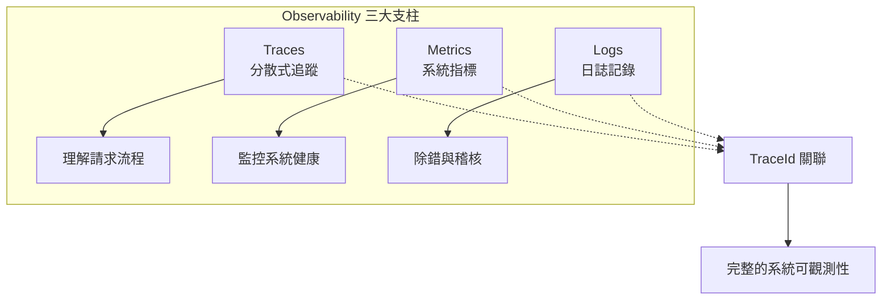

#### 1.3.1 Traces（分散式追蹤）

**用途**：追蹤單一請求在多個服務之間的完整路徑與耗時。

```text
┌─────────────────────────────────────────────────────────────────┐
│  Trace 結構範例                                                  │
├─────────────────────────────────────────────────────────────────┤
│  Trace ID: abc123                                               │
│  ├── Span: API Gateway (50ms)                                   │
│  │   └── Span: User Service (30ms)                              │
│  │       └── Span: Database Query (15ms)                        │
│  └── Span: Order Service (40ms)                                 │
│      └── Span: Payment Service (25ms)                           │
└─────────────────────────────────────────────────────────────────┘
```

**關鍵概念**：

- **Trace**：一個完整請求的追蹤記錄
- **Span**：Trace 中的單一操作單元
- **SpanContext**：跨服務傳遞的上下文資訊（TraceId、SpanId）

#### 1.3.2 Metrics（系統指標）

**用途**：量化系統行為，用於監控與告警。

| 指標類型 | 說明 | 範例 |
| --------- | ------ | ------ |
| **Counter** | 只增不減的計數器 | 請求總數、錯誤次數 |
| **Gauge** | 可增可減的瞬時值 | CPU 使用率、記憶體用量 |
| **Histogram** | 數值分佈統計 | 請求延遲分佈（P50/P90/P99） |

#### 1.3.3 Logs（日誌記錄）

**用途**：記錄離散事件，用於除錯與稽核。

**OTel Logs 特點**：

- 結構化日誌格式
- 自動關聯 TraceId/SpanId
- 統一收集管道

---

### 1.4 OpenTelemetry 在 CNCF 生態系中的角色

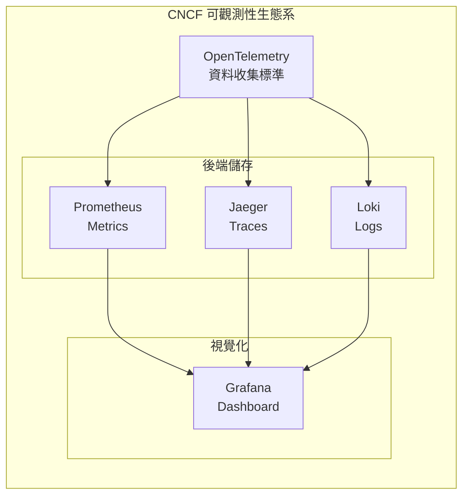

**CNCF 專案成熟度**：

- OpenTelemetry：**Incubating**（孵化階段，2024 年已接近畢業）
- Prometheus：**Graduated**（畢業）
- Jaeger：**Graduated**（畢業）

> 💡 **實務建議**：OTel 已成為 CNCF 可觀測性的事實標準，建議新專案優先採用。

---

## 2. OpenTelemetry 整體系統架構

### 2.1 架構總覽

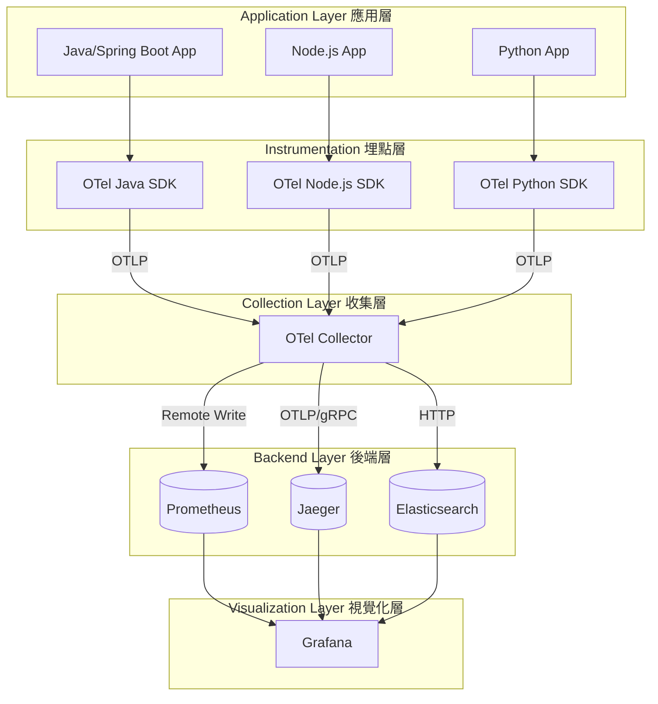

---

### 2.2 核心元件說明

#### 2.2.1 API

**定義**：OpenTelemetry 的介面規範，定義如何建立 Traces、Metrics、Logs。

**特點**：

- 僅定義介面，不含實作
- 應用程式碼僅依賴 API，不依賴 SDK
- 確保應用與實作解耦

```java
// Java API 範例：僅使用介面
import io.opentelemetry.api.trace.Tracer;
import io.opentelemetry.api.trace.Span;

Tracer tracer = GlobalOpenTelemetry.getTracer("my-service");
Span span = tracer.spanBuilder("my-operation").startSpan();
```

#### 2.2.2 SDK

**定義**：API 的實作，負責實際產生遙測資料。

**主要功能**：

- Span 的建立與管理
- 採樣策略（Sampling）
- 資源屬性設定（Resource Attributes）
- 批次處理與匯出

```java
// Java SDK 初始化範例
SdkTracerProvider tracerProvider = SdkTracerProvider.builder()
    .addSpanProcessor(BatchSpanProcessor.builder(otlpExporter).build())
    .setResource(Resource.create(Attributes.of(
        ResourceAttributes.SERVICE_NAME, "my-service"
    )))
    .build();
```

#### 2.2.3 Collector

**定義**：獨立部署的資料收集、處理與轉發元件。

```text
┌─────────────────────────────────────────────────────────────────┐
│                    OTel Collector 架構                          │
├─────────────────────────────────────────────────────────────────┤
│                                                                 │
│   ┌──────────┐    ┌──────────┐    ┌──────────┐                 │
│   │ Receivers│ -> │Processors│ -> │ Exporters│                 │
│   └──────────┘    └──────────┘    └──────────┘                 │
│                                                                 │
│   接收資料          處理/轉換         匯出至後端                  │
│   • OTLP           • Batch          • Prometheus               │
│   • Jaeger         • Memory Limit   • Jaeger                   │
│   • Prometheus     • Attributes     • OTLP                     │
│   • Zipkin         • Filter         • Elasticsearch            │
│                                                                 │
└─────────────────────────────────────────────────────────────────┘
```

**部署模式**：

| 模式 | 說明 | 適用場景 |
| ------ | ------ | --------- |
| **Agent** | 與應用同機部署（Sidecar/DaemonSet） | 收集本機資料、初步處理 |
| **Gateway** | 集中式部署 | 統一收集、聚合、路由 |
| **Agent + Gateway** | 混合模式 | 大型企業推薦架構 |

#### 2.2.4 Exporters

**定義**：負責將遙測資料匯出至後端系統。

| Exporter 類型 | 支援後端 |
| -------------- | --------- |
| OTLP Exporter | 任何支援 OTLP 的後端 |
| Prometheus Exporter | Prometheus |
| Jaeger Exporter | Jaeger |
| Zipkin Exporter | Zipkin |
| Elasticsearch Exporter | Elasticsearch |
| Console Exporter | 標準輸出（除錯用） |

---

### 2.3 Agent-based vs SDK-based 收集模式比較

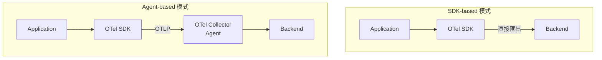

| 比較項目 | SDK-based | Agent-based |
| --------- | ----------- | ------------- |
| **架構複雜度** | 較低 | 較高 |
| **資源消耗** | 應用內處理 | 獨立程序處理 |
| **靈活性** | 較低 | 可集中管理設定 |
| **故障隔離** | 與應用耦合 | 獨立故障域 |
| **推薦場景** | 簡單環境、PoC | 生產環境、大型系統 |

> 💡 **企業建議**：生產環境建議採用 Agent-based 模式，透過 Collector 集中管理設定與處理邏輯。

---

### 2.4 與 Prometheus / Grafana / Jaeger / ELK 的整合架構

#### 企業級整合架構範例

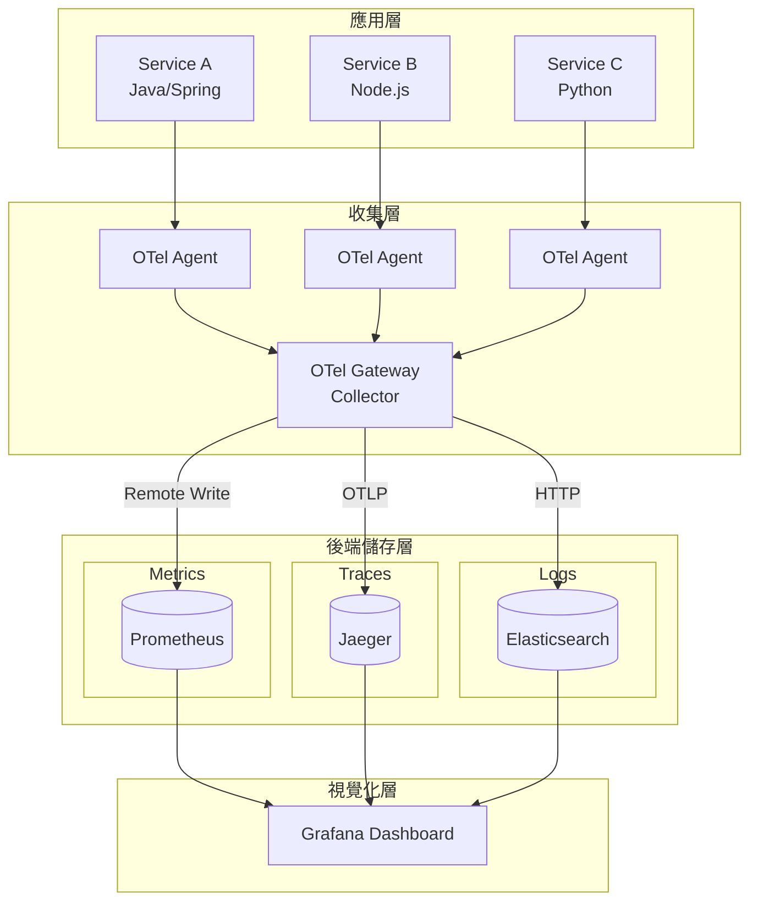

---

## 3. OpenTelemetry 安裝指南

### 3.1 本機環境（Local / VM）

#### 3.1.1 環境需求

| 項目 | 最低需求 | 建議配置 |
| ------ | --------- | --------- |
| CPU | 1 Core | 2+ Cores |
| Memory | 512 MB | 2+ GB |
| Disk | 1 GB | 10+ GB |
| OS | Linux / macOS / Windows | Linux（生產環境） |

#### 3.1.2 Binary 安裝方式

**步驟 1：下載 Collector**

```bash
# Linux amd64
curl -LO https://github.com/open-telemetry/opentelemetry-collector-releases/releases/download/v0.96.0/otelcol-contrib_0.96.0_linux_amd64.tar.gz

# 解壓縮
tar -xzf otelcol-contrib_0.96.0_linux_amd64.tar.gz

# 驗證安裝
./otelcol-contrib --version
```

**步驟 2：建立設定檔**

```bash
# 建立設定目錄
mkdir -p /etc/otelcol

# 建立基本設定檔
cat > /etc/otelcol/config.yaml << 'EOF'
receivers:
  otlp:
    protocols:
      grpc:
        endpoint: 0.0.0.0:4317
      http:
        endpoint: 0.0.0.0:4318

processors:
  batch:
    timeout: 1s
    send_batch_size: 1024

exporters:
  debug:
    verbosity: detailed

service:
  pipelines:
    traces:
      receivers: [otlp]
      processors: [batch]
      exporters: [debug]
    metrics:
      receivers: [otlp]
      processors: [batch]
      exporters: [debug]
    logs:
      receivers: [otlp]
      processors: [batch]
      exporters: [debug]
EOF
```

**步驟 3：啟動 Collector**

```bash
./otelcol-contrib --config=/etc/otelcol/config.yaml
```

#### 3.1.3 Systemd 服務設定（Linux）

```bash
# 建立 systemd service 檔案
cat > /etc/systemd/system/otelcol.service << 'EOF'
[Unit]
Description=OpenTelemetry Collector
After=network.target

[Service]
Type=simple
User=otel
Group=otel
ExecStart=/usr/local/bin/otelcol-contrib --config=/etc/otelcol/config.yaml
Restart=always
RestartSec=5

[Install]
WantedBy=multi-user.target
EOF

# 啟用並啟動服務
systemctl daemon-reload
systemctl enable otelcol
systemctl start otelcol

# 檢查狀態
systemctl status otelcol
```

---

### 3.2 Container / Docker

#### 3.2.1 Docker 執行 Collector

**基本執行指令**

```bash
docker run -d \
  --name otel-collector \
  -p 4317:4317 \
  -p 4318:4318 \
  -p 8888:8888 \
  -v $(pwd)/config.yaml:/etc/otelcol-contrib/config.yaml \
  otel/opentelemetry-collector-contrib:0.96.0
```

**Docker Compose 範例**

```yaml
# docker-compose.yaml
version: '3.8'

services:
  otel-collector:
    image: otel/opentelemetry-collector-contrib:0.96.0
    container_name: otel-collector
    command: ["--config=/etc/otelcol-contrib/config.yaml"]
    volumes:
      - ./config.yaml:/etc/otelcol-contrib/config.yaml:ro
    ports:
      - "4317:4317"   # OTLP gRPC
      - "4318:4318"   # OTLP HTTP
      - "8888:8888"   # Prometheus metrics (self)
      - "8889:8889"   # Prometheus exporter
      - "13133:13133" # Health check
    restart: unless-stopped
    
  jaeger:
    image: jaegertracing/all-in-one:1.54
    container_name: jaeger
    ports:
      - "16686:16686" # Jaeger UI
      - "14250:14250" # gRPC
    restart: unless-stopped

  prometheus:
    image: prom/prometheus:v2.50.0
    container_name: prometheus
    volumes:
      - ./prometheus.yaml:/etc/prometheus/prometheus.yml:ro
    ports:
      - "9090:9090"
    restart: unless-stopped

  grafana:
    image: grafana/grafana:10.3.0
    container_name: grafana
    ports:
      - "3000:3000"
    environment:
      - GF_SECURITY_ADMIN_PASSWORD=admin
    restart: unless-stopped
```

#### 3.2.2 Network 與 Port 說明

| Port | Protocol | 用途 |
| ------ | ---------- | ------ |
| 4317 | gRPC | OTLP gRPC Receiver |
| 4318 | HTTP | OTLP HTTP Receiver |
| 8888 | HTTP | Collector 自身 Metrics |
| 8889 | HTTP | Prometheus Exporter |
| 13133 | HTTP | Health Check |
| 55679 | HTTP | zPages（除錯用） |

> ⚠️ **安全提醒**：生產環境請勿將 4317/4318 暴露至公網，應透過內網或 VPN 存取。

---

### 3.3 Kubernetes

#### 3.3.1 使用官方 Helm Chart 安裝

**步驟 1：新增 Helm Repository**

```bash
helm repo add open-telemetry https://open-telemetry.github.io/opentelemetry-helm-charts
helm repo update
```

**步驟 2：建立 values.yaml**

```yaml
# otel-collector-values.yaml
mode: deployment  # 或 daemonset

config:
  receivers:
    otlp:
      protocols:
        grpc:
          endpoint: 0.0.0.0:4317
        http:
          endpoint: 0.0.0.0:4318
    
  processors:
    batch:
      timeout: 1s
      send_batch_size: 1024
    memory_limiter:
      check_interval: 1s
      limit_mib: 512
      spike_limit_mib: 128
    k8sattributes:
      extract:
        metadata:
          - k8s.namespace.name
          - k8s.deployment.name
          - k8s.pod.name
          - k8s.node.name
    
  exporters:
    otlp/jaeger:
      endpoint: jaeger-collector.observability:4317
      tls:
        insecure: true
    prometheusremotewrite:
      endpoint: http://prometheus.observability:9090/api/v1/write
    
  service:
    pipelines:
      traces:
        receivers: [otlp]
        processors: [memory_limiter, k8sattributes, batch]
        exporters: [otlp/jaeger]
      metrics:
        receivers: [otlp]
        processors: [memory_limiter, batch]
        exporters: [prometheusremotewrite]

resources:
  limits:
    cpu: 500m
    memory: 512Mi
  requests:
    cpu: 100m
    memory: 128Mi

serviceAccount:
  create: true

clusterRole:
  create: true
  rules:
    - apiGroups: [""]
      resources: ["pods", "namespaces"]
      verbs: ["get", "watch", "list"]
```

**步驟 3：安裝 Collector**

```bash
# 建立 namespace
kubectl create namespace observability

# 安裝 Collector
helm install otel-collector open-telemetry/opentelemetry-collector \
  -n observability \
  -f otel-collector-values.yaml

# 驗證安裝
kubectl get pods -n observability
```

#### 3.3.2 DaemonSet vs Deployment 模式差異

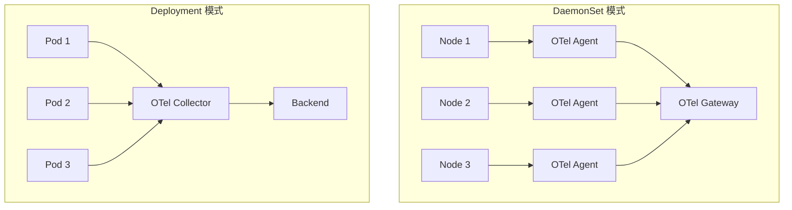

| 模式 | DaemonSet | Deployment |
| ------ | ----------- | ------------ |
| **部署方式** | 每個 Node 一個 Pod | 指定副本數 |
| **資源使用** | 與 Node 數成正比 | 固定資源 |
| **適用場景** | 收集節點層級資料 | 集中式收集 |
| **擴展性** | 自動隨 Node 擴展 | 手動 HPA |
| **推薦用途** | Agent 角色 | Gateway 角色 |

#### 3.3.3 與 K8s Metadata 整合

使用 `k8sattributes` Processor 自動擷取 Kubernetes 元資料：

```yaml
processors:
  k8sattributes:
    auth_type: "serviceAccount"
    passthrough: false
    extract:
      metadata:
        - k8s.namespace.name
        - k8s.deployment.name
        - k8s.statefulset.name
        - k8s.daemonset.name
        - k8s.cronjob.name
        - k8s.job.name
        - k8s.pod.name
        - k8s.pod.uid
        - k8s.node.name
        - container.id
        - container.image.name
        - container.image.tag
      labels:
        - tag_name: app
          key: app.kubernetes.io/name
        - tag_name: version
          key: app.kubernetes.io/version
    pod_association:
      - sources:
          - from: resource_attribute
            name: k8s.pod.ip
```

> 💡 **實務建議**：務必設定 `k8sattributes`，這對於 K8s 環境的問題排查至關重要。

---

## 4. OpenTelemetry Collector 設定

### 4.1 Collector 設定檔結構說明

```yaml
# config.yaml 基本結構
receivers:     # 接收資料的來源
  ...

processors:    # 資料處理與轉換
  ...

exporters:     # 匯出資料的目的地
  ...

extensions:    # 擴充功能（健康檢查、認證等）
  ...

service:       # 定義資料處理管線
  extensions: [...]
  pipelines:
    traces:
      receivers: [...]
      processors: [...]
      exporters: [...]
    metrics:
      receivers: [...]
      processors: [...]
      exporters: [...]
    logs:
      receivers: [...]
      processors: [...]
      exporters: [...]
```

---

### 4.2 Receivers / Processors / Exporters 概念

#### 4.2.1 Receivers（接收器）

**功能**：定義如何接收遙測資料。

| Receiver | 說明 |
| ---------- | ------ |
| `otlp` | 接收 OTLP 格式資料（推薦） |
| `jaeger` | 接收 Jaeger 格式資料 |
| `zipkin` | 接收 Zipkin 格式資料 |
| `prometheus` | 抓取 Prometheus 端點 |
| `hostmetrics` | 收集主機指標 |
| `filelog` | 讀取日誌檔案 |

#### 4.2.2 Processors（處理器）

**功能**：處理、轉換、過濾遙測資料。

| Processor | 說明 |
| ----------- | ------ |
| `batch` | 批次處理，提升效能 |
| `memory_limiter` | 記憶體使用限制 |
| `attributes` | 新增/修改/刪除屬性 |
| `filter` | 過濾資料 |
| `resource` | 設定 Resource 屬性 |
| `span` | 修改 Span 屬性 |
| `tail_sampling` | 尾端採樣 |

#### 4.2.3 Exporters（匯出器）

**功能**：將處理後的資料匯出至後端。

| Exporter | 說明 |
| ---------- | ------ |
| `otlp` | 匯出 OTLP 格式 |
| `otlphttp` | 匯出 OTLP over HTTP |
| `prometheus` | 暴露 Prometheus 端點 |
| `prometheusremotewrite` | Remote Write 至 Prometheus |
| `jaeger` | 匯出至 Jaeger |
| `elasticsearch` | 匯出至 Elasticsearch |
| `debug` | 輸出至控制台（除錯用） |

---

### 4.3 範例設定

#### 4.3.1 完整生產環境設定範例

```yaml
# /etc/otelcol/config.yaml
receivers:
  otlp:
    protocols:
      grpc:
        endpoint: 0.0.0.0:4317
        max_recv_msg_size_mib: 4
      http:
        endpoint: 0.0.0.0:4318
        cors:
          allowed_origins:
            - "http://*"
            - "https://*"

  # 收集主機指標
  hostmetrics:
    collection_interval: 30s
    scrapers:
      cpu:
      memory:
      disk:
      network:

processors:
  # 記憶體限制（必要）
  memory_limiter:
    check_interval: 1s
    limit_mib: 1024
    spike_limit_mib: 256

  # 批次處理
  batch:
    timeout: 5s
    send_batch_size: 2048
    send_batch_max_size: 4096

  # 資源屬性設定
  resource:
    attributes:
      - key: environment
        value: production
        action: upsert
      - key: service.namespace
        value: my-company
        action: upsert

  # 屬性處理
  attributes:
    actions:
      - key: db.password
        action: delete
      - key: http.request.header.authorization
        action: delete

  # 尾端採樣（Traces 專用）
  tail_sampling:
    decision_wait: 10s
    num_traces: 100000
    policies:
      - name: errors-policy
        type: status_code
        status_code:
          status_codes: [ERROR]
      - name: slow-traces-policy
        type: latency
        latency:
          threshold_ms: 1000
      - name: probabilistic-policy
        type: probabilistic
        probabilistic:
          sampling_percentage: 10

exporters:
  # 匯出至 Jaeger
  otlp/jaeger:
    endpoint: jaeger-collector:4317
    tls:
      insecure: true

  # 匯出至 Prometheus
  prometheusremotewrite:
    endpoint: http://prometheus:9090/api/v1/write
    tls:
      insecure: true
    resource_to_telemetry_conversion:
      enabled: true

  # 匯出至 Elasticsearch
  elasticsearch:
    endpoints: [http://elasticsearch:9200]
    logs_index: otel-logs
    traces_index: otel-traces

  # 除錯輸出
  debug:
    verbosity: basic

extensions:
  health_check:
    endpoint: 0.0.0.0:13133
  
  zpages:
    endpoint: 0.0.0.0:55679

  pprof:
    endpoint: 0.0.0.0:1777

service:
  extensions: [health_check, zpages, pprof]
  
  pipelines:
    traces:
      receivers: [otlp]
      processors: [memory_limiter, attributes, tail_sampling, batch]
      exporters: [otlp/jaeger, elasticsearch]
    
    metrics:
      receivers: [otlp, hostmetrics]
      processors: [memory_limiter, resource, batch]
      exporters: [prometheusremotewrite]
    
    logs:
      receivers: [otlp]
      processors: [memory_limiter, attributes, batch]
      exporters: [elasticsearch]

  telemetry:
    logs:
      level: info
    metrics:
      address: 0.0.0.0:8888
```

---

### 4.4 設定最佳實務（Best Practices）

#### 4.4.1 必要的 Processors

```yaml
processors:
  # 1. memory_limiter - 必須放在最前面
  memory_limiter:
    check_interval: 1s
    limit_mib: 1024
    spike_limit_mib: 256

  # 2. batch - 必須放在 exporter 之前
  batch:
    timeout: 5s
    send_batch_size: 2048
```

#### 4.4.2 敏感資料過濾

```yaml
processors:
  attributes:
    actions:
      # 刪除敏感資料
      - key: db.password
        action: delete
      - key: http.request.header.authorization
        action: delete
      - key: user.password
        action: delete
      
      # 遮罩處理
      - key: user.email
        pattern: ^(.{3}).*(@.*)$
        replacement: $1***$2
        action: update
```

#### 4.4.3 採樣策略建議

| 環境 | 建議採樣率 | 說明 |
| ------ | ----------- | ------ |
| 開發/測試 | 100% | 完整記錄便於除錯 |
| UAT | 50% | 平衡除錯與資源 |
| 生產 | 10-20% | 重點採樣錯誤與慢請求 |

```yaml
processors:
  # 生產環境採樣策略
  tail_sampling:
    decision_wait: 10s
    policies:
      # 所有錯誤都保留
      - name: errors
        type: status_code
        status_code:
          status_codes: [ERROR]
      # 慢請求都保留
      - name: slow
        type: latency
        latency:
          threshold_ms: 500
      # 其餘 10% 採樣
      - name: default
        type: probabilistic
        probabilistic:
          sampling_percentage: 10
```

> ⚠️ **實務提醒**：
>
> 1. `memory_limiter` 必須啟用，避免 OOM
> 2. `batch` 可大幅提升效能，建議啟用
> 3. 生產環境務必設定敏感資料過濾

---

## 5. 應用系統如何串接 OpenTelemetry

### 5.1 Java / Spring Boot

#### 5.1.1 SDK 導入方式

**方式一：自動 Instrumentation（推薦）**

使用 Java Agent，無需修改程式碼：

```bash
# 下載 Agent
curl -LO https://github.com/open-telemetry/opentelemetry-java-instrumentation/releases/download/v2.1.0/opentelemetry-javaagent.jar

# 啟動應用
java -javaagent:opentelemetry-javaagent.jar \
     -Dotel.service.name=my-service \
     -Dotel.exporter.otlp.endpoint=http://localhost:4317 \
     -jar my-application.jar
```

**方式二：手動 Instrumentation**

在 `pom.xml` 加入依賴：

```xml
<dependencyManagement>
    <dependencies>
        <dependency>
            <groupId>io.opentelemetry</groupId>
            <artifactId>opentelemetry-bom</artifactId>
            <version>1.35.0</version>
            <type>pom</type>
            <scope>import</scope>
        </dependency>
    </dependencies>
</dependencyManagement>

<dependencies>
    <!-- OpenTelemetry API -->
    <dependency>
        <groupId>io.opentelemetry</groupId>
        <artifactId>opentelemetry-api</artifactId>
    </dependency>
    
    <!-- OpenTelemetry SDK -->
    <dependency>
        <groupId>io.opentelemetry</groupId>
        <artifactId>opentelemetry-sdk</artifactId>
    </dependency>
    
    <!-- OTLP Exporter -->
    <dependency>
        <groupId>io.opentelemetry</groupId>
        <artifactId>opentelemetry-exporter-otlp</artifactId>
    </dependency>
    
    <!-- Spring Boot Starter（可選） -->
    <dependency>
        <groupId>io.opentelemetry.instrumentation</groupId>
        <artifactId>opentelemetry-spring-boot-starter</artifactId>
        <version>2.1.0-alpha</version>
    </dependency>
</dependencies>
```

#### 5.1.2 自動 Instrumentation vs 手動 Instrumentation

| 比較項目 | 自動 Instrumentation | 手動 Instrumentation |
| --------- | --------------------- | --------------------- |
| **導入難度** | 低（只需加 Agent） | 高（需修改程式碼） |
| **覆蓋範圍** | 常見框架自動埋點 | 完全自訂 |
| **效能影響** | 略高 | 可精確控制 |
| **維護成本** | 低 | 高 |
| **適用場景** | 快速導入、通用場景 | 客製化需求、精細控制 |

> 💡 **建議**：先用自動 Instrumentation 快速導入，再針對特定場景補充手動埋點。

#### 5.1.3 Trace / Span 使用範例

**自動 Instrumentation 環境變數設定**

```bash
# application.properties 或環境變數
OTEL_SERVICE_NAME=order-service
OTEL_EXPORTER_OTLP_ENDPOINT=http://otel-collector:4317
OTEL_EXPORTER_OTLP_PROTOCOL=grpc
OTEL_TRACES_SAMPLER=parentbased_traceidratio
OTEL_TRACES_SAMPLER_ARG=0.1
OTEL_RESOURCE_ATTRIBUTES=service.namespace=ecommerce,deployment.environment=production
```

**手動建立 Span 範例**

```java
import io.opentelemetry.api.GlobalOpenTelemetry;
import io.opentelemetry.api.trace.Span;
import io.opentelemetry.api.trace.SpanKind;
import io.opentelemetry.api.trace.StatusCode;
import io.opentelemetry.api.trace.Tracer;
import io.opentelemetry.context.Scope;

@Service
public class OrderService {
    
    private static final Tracer tracer = GlobalOpenTelemetry.getTracer("order-service");
    
    public Order createOrder(OrderRequest request) {
        // 建立 Span
        Span span = tracer.spanBuilder("createOrder")
                .setSpanKind(SpanKind.INTERNAL)
                .setAttribute("order.type", request.getType())
                .setAttribute("customer.id", request.getCustomerId())
                .startSpan();
        
        try (Scope scope = span.makeCurrent()) {
            // 業務邏輯
            validateOrder(request);
            Order order = processOrder(request);
            
            // 記錄成功資訊
            span.setAttribute("order.id", order.getId());
            span.setStatus(StatusCode.OK);
            
            return order;
            
        } catch (Exception e) {
            // 記錄錯誤
            span.recordException(e);
            span.setStatus(StatusCode.ERROR, e.getMessage());
            throw e;
            
        } finally {
            span.end();
        }
    }
    
    private void validateOrder(OrderRequest request) {
        Span span = tracer.spanBuilder("validateOrder")
                .startSpan();
        try (Scope scope = span.makeCurrent()) {
            // 驗證邏輯
        } finally {
            span.end();
        }
    }
}
```

#### 5.1.4 Spring Boot 整合範例

**使用 Spring Boot Starter 自動配置**

```yaml
# application.yaml
spring:
  application:
    name: order-service

otel:
  exporter:
    otlp:
      endpoint: http://otel-collector:4317
  resource:
    attributes:
      service.namespace: ecommerce
      deployment.environment: ${ENVIRONMENT:development}
  traces:
    sampler:
      probability: 0.1
```

**REST Controller 自動追蹤**

```java
@RestController
@RequestMapping("/api/orders")
public class OrderController {
    
    private final OrderService orderService;
    private final Tracer tracer;
    
    public OrderController(OrderService orderService, Tracer tracer) {
        this.orderService = orderService;
        this.tracer = tracer;
    }
    
    @PostMapping
    public ResponseEntity<Order> createOrder(@RequestBody OrderRequest request) {
        // Spring Web 會自動建立 Span
        // 可在此加入額外屬性
        Span currentSpan = Span.current();
        currentSpan.setAttribute("http.request.body.size", request.toString().length());
        
        Order order = orderService.createOrder(request);
        return ResponseEntity.ok(order);
    }
}
```

---

### 5.2 Node.js

#### 5.2.1 SDK 初始化

**安裝依賴**

```bash
npm install @opentelemetry/api \
            @opentelemetry/sdk-node \
            @opentelemetry/auto-instrumentations-node \
            @opentelemetry/exporter-trace-otlp-grpc \
            @opentelemetry/exporter-metrics-otlp-grpc
```

**初始化設定（tracing.js）**

```javascript
// tracing.js - 必須在應用啟動前載入
const { NodeSDK } = require('@opentelemetry/sdk-node');
const { getNodeAutoInstrumentations } = require('@opentelemetry/auto-instrumentations-node');
const { OTLPTraceExporter } = require('@opentelemetry/exporter-trace-otlp-grpc');
const { OTLPMetricExporter } = require('@opentelemetry/exporter-metrics-otlp-grpc');
const { PeriodicExportingMetricReader } = require('@opentelemetry/sdk-metrics');
const { Resource } = require('@opentelemetry/resources');
const { SemanticResourceAttributes } = require('@opentelemetry/semantic-conventions');

const resource = new Resource({
  [SemanticResourceAttributes.SERVICE_NAME]: 'user-service',
  [SemanticResourceAttributes.SERVICE_VERSION]: '1.0.0',
  [SemanticResourceAttributes.DEPLOYMENT_ENVIRONMENT]: process.env.NODE_ENV || 'development',
});

const traceExporter = new OTLPTraceExporter({
  url: process.env.OTEL_EXPORTER_OTLP_ENDPOINT || 'http://localhost:4317',
});

const metricExporter = new OTLPMetricExporter({
  url: process.env.OTEL_EXPORTER_OTLP_ENDPOINT || 'http://localhost:4317',
});

const sdk = new NodeSDK({
  resource,
  traceExporter,
  metricReader: new PeriodicExportingMetricReader({
    exporter: metricExporter,
    exportIntervalMillis: 60000,
  }),
  instrumentations: [getNodeAutoInstrumentations()],
});

sdk.start();

process.on('SIGTERM', () => {
  sdk.shutdown()
    .then(() => console.log('OTel SDK shut down'))
    .catch((error) => console.error('Error shutting down SDK', error))
    .finally(() => process.exit(0));
});
```

**應用程式入口**

```javascript
// app.js
require('./tracing'); // 必須在最前面

const express = require('express');
const { trace } = require('@opentelemetry/api');

const app = express();
const tracer = trace.getTracer('user-service');

app.get('/api/users/:id', async (req, res) => {
  const span = tracer.startSpan('getUserById');
  span.setAttribute('user.id', req.params.id);
  
  try {
    const user = await getUserFromDatabase(req.params.id);
    span.setStatus({ code: 1 }); // OK
    res.json(user);
  } catch (error) {
    span.recordException(error);
    span.setStatus({ code: 2, message: error.message }); // ERROR
    res.status(500).json({ error: error.message });
  } finally {
    span.end();
  }
});

app.listen(3000, () => {
  console.log('Server running on port 3000');
});
```

---

### 5.3 常見共通概念

#### 5.3.1 Resource / Attributes 設計

**Resource Attributes（資源屬性）**：描述產生遙測資料的實體。

```yaml
# 標準 Resource Attributes
service.name: order-service          # 服務名稱（必要）
service.version: 1.2.3               # 服務版本
service.namespace: ecommerce         # 服務命名空間
deployment.environment: production   # 部署環境
host.name: server-01                 # 主機名稱
container.id: abc123                 # 容器 ID
k8s.pod.name: order-service-xyz      # K8s Pod 名稱
k8s.namespace.name: production       # K8s Namespace
```

**Span Attributes（跨度屬性）**：描述特定操作的細節。

```yaml
# HTTP 相關
http.method: POST
http.url: https://api.example.com/orders
http.status_code: 200
http.request.body.size: 1024

# 資料庫相關
db.system: postgresql
db.name: orders
db.operation: SELECT
db.statement: SELECT * FROM orders WHERE id = ?

# 自訂業務屬性
order.id: ORD-12345
customer.tier: premium
```

#### 5.3.2 TraceId / SpanId 傳遞

**Context Propagation（上下文傳遞）**

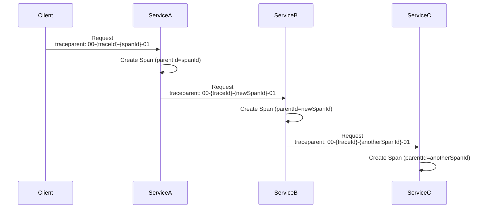

**W3C Trace Context Header 格式**

```text
traceparent: 00-{trace-id}-{parent-id}-{trace-flags}
             |  |          |          |
             |  |          |          └── 01 = sampled
             |  |          └── 16 hex chars (8 bytes)
             |  └── 32 hex chars (16 bytes)
             └── version

範例：
traceparent: 00-0af7651916cd43dd8448eb211c80319c-b7ad6b7169203331-01
```

#### 5.3.3 跨服務追蹤（Distributed Tracing）

**Java RestTemplate 自動傳遞**

```java
@Configuration
public class RestTemplateConfig {
    
    @Bean
    public RestTemplate restTemplate() {
        // 使用 OTel Agent 時會自動注入
        return new RestTemplate();
    }
}

@Service
public class PaymentClient {
    
    private final RestTemplate restTemplate;
    
    public PaymentResult processPayment(PaymentRequest request) {
        // TraceContext 會自動透過 Header 傳遞
        return restTemplate.postForObject(
            "http://payment-service/api/payments",
            request,
            PaymentResult.class
        );
    }
}
```

**手動傳遞 Context**

```java
import io.opentelemetry.context.Context;
import io.opentelemetry.context.propagation.TextMapSetter;

public class ContextPropagation {
    
    private static final TextMapSetter<HttpHeaders> setter = 
        (carrier, key, value) -> carrier.set(key, value);
    
    public void propagateContext(HttpHeaders headers) {
        GlobalOpenTelemetry.getPropagators()
            .getTextMapPropagator()
            .inject(Context.current(), headers, setter);
    }
}
```

> 💡 **實務建議**：
>
> 1. 使用自動 Instrumentation 時，Context 傳遞通常自動處理
> 2. 異步場景（如 Message Queue）需特別注意 Context 傳遞
> 3. 確保所有服務使用相同的 Propagation 格式（推薦 W3C Trace Context）

---

## 6. 系統使用情境

### 6.1 如何透過 Trace 分析效能瓶頸

#### 6.1.1 識別慢請求

**步驟 1：在 Jaeger UI 搜尋慢請求**

```text
Service: order-service
Operation: POST /api/orders
Min Duration: 500ms
```

**步驟 2：分析 Span 瀑布圖**

```text
┌─────────────────────────────────────────────────────────────────┐
│ Trace: POST /api/orders (總耗時: 850ms)                         │
├─────────────────────────────────────────────────────────────────┤
│ ├── order-service: createOrder (850ms)                         │
│ │   ├── order-service: validateOrder (50ms)                    │
│ │   ├── order-service: checkInventory (120ms)                  │
│ │   │   └── inventory-service: GET /api/inventory (110ms)      │
│ │   ├── order-service: processPayment (580ms) ⚠️ 瓶頸          │
│ │   │   └── payment-service: POST /api/payments (570ms)        │
│ │   │       └── payment-service: callExternalGateway (550ms)   │
│ │   └── order-service: saveOrder (80ms)                        │
│ │       └── database: INSERT orders (75ms)                     │
└─────────────────────────────────────────────────────────────────┘
```

**步驟 3：識別瓶頸並優化**

從上圖可見：

- `callExternalGateway` 佔用 550ms（64.7%）
- 建議：加入快取、考慮非同步處理、或聯繫外部供應商

#### 6.1.2 分析錯誤請求

```text
搜尋條件：
Service: order-service
Tags: error=true
        otel.status_code=ERROR
```

**錯誤 Span 詳細資訊**

```json
{
  "traceId": "abc123...",
  "spanId": "def456...",
  "operationName": "processPayment",
  "status": {
    "code": "ERROR",
    "message": "Connection timeout"
  },
  "events": [
    {
      "name": "exception",
      "attributes": {
        "exception.type": "java.net.SocketTimeoutException",
        "exception.message": "Connect timed out",
        "exception.stacktrace": "..."
      }
    }
  ]
}
```

---

### 6.2 如何搭配 Grafana / Jaeger 查詢資料

#### 6.2.1 Grafana + Jaeger 整合

**Grafana 資料來源設定**

```yaml
# grafana/provisioning/datasources/datasources.yaml
apiVersion: 1

datasources:
  - name: Jaeger
    type: jaeger
    access: proxy
    url: http://jaeger-query:16686
    isDefault: false
    
  - name: Prometheus
    type: prometheus
    access: proxy
    url: http://prometheus:9090
    isDefault: true
```

#### 6.2.2 建立 Trace 到 Metrics 的關聯

**Grafana Dashboard 設定：從 Metrics 跳轉到 Traces**

```json
{
  "links": [
    {
      "title": "View Traces",
      "url": "/explore?orgId=1&left={\"datasource\":\"Jaeger\",\"queries\":[{\"refId\":\"A\",\"service\":\"${service}\",\"tags\":\"http.status_code=${status_code}\"}]}",
      "targetBlank": true
    }
  ]
}
```

#### 6.2.3 常用查詢範例

**Prometheus 查詢：API 延遲 P99**

```promql
histogram_quantile(0.99, 
  sum(rate(http_server_duration_milliseconds_bucket{service_name="order-service"}[5m])) 
  by (le, http_route)
)
```

**Prometheus 查詢：錯誤率**

```promql
sum(rate(http_server_duration_milliseconds_count{service_name="order-service", http_status_code=~"5.."}[5m]))
/
sum(rate(http_server_duration_milliseconds_count{service_name="order-service"}[5m]))
```

---

### 6.3 常見使用情境案例

#### 案例 1：追蹤跨服務交易失敗

**情境**：客戶反映下單失敗，但沒有收到任何錯誤訊息。

**排查步驟**：

1. 取得客戶的 Order ID 或時間範圍
2. 在 Jaeger 搜尋對應的 Trace
3. 檢視完整的呼叫鏈，找出失敗的 Span
4. 查看 Span 的 Events 和 Attributes

```text
發現：payment-service 回傳 200，但內容為 {"status": "PENDING"}
根本原因：第三方支付閘道處理中，但 order-service 誤判為成功
解決方案：修正狀態判斷邏輯，加入 PENDING 狀態處理
```

#### 案例 2：效能劣化分析

**情境**：API 延遲從 100ms 上升到 500ms。

**排查步驟**：

1. 在 Grafana 確認延遲上升的時間點
2. 比較該時間前後的 Traces
3. 使用 Compare 功能對比正常與異常 Trace

```text
發現：database: SELECT 從 20ms 上升到 400ms
根本原因：資料表資料量增加，缺少索引
解決方案：新增適當的資料庫索引
```

#### 案例 3：微服務依賴分析

**情境**：需要了解服務之間的依賴關係。

**解決方案**：使用 Jaeger Service Dependencies

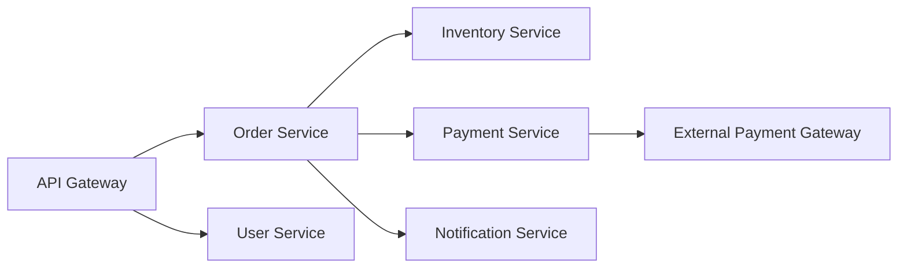

> 💡 **實務建議**：
>
> 1. 建立 SLO Dashboard，持續監控關鍵指標
> 2. 設定告警規則，及早發現異常
> 3. 定期進行 Trace 分析，找出潛在瓶頸

---

## 7. 系統維護與維運

### 7.1 Collector 高可用（HA）設計

#### 7.1.1 生產環境 HA 架構

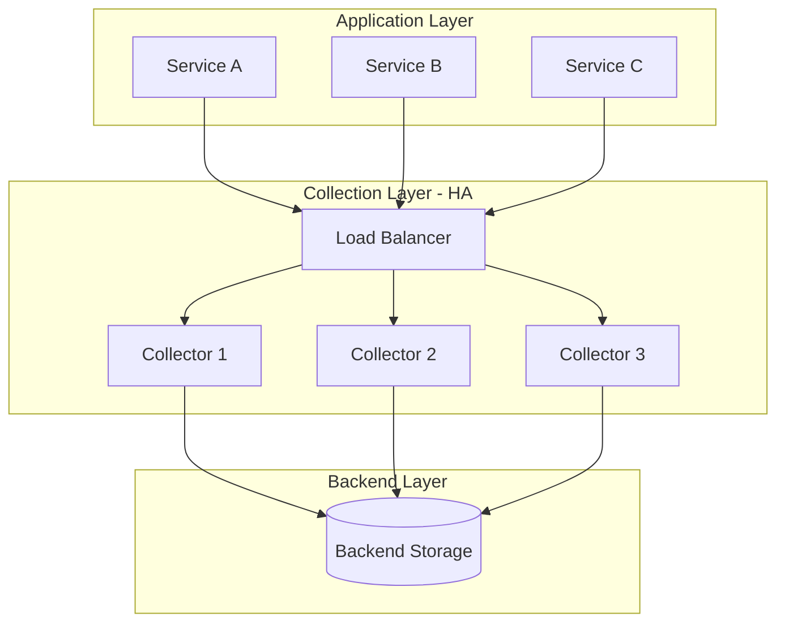

#### 7.1.2 Kubernetes HA 設定

```yaml
# otel-collector-ha-values.yaml
mode: deployment

replicaCount: 3

podDisruptionBudget:
  enabled: true
  minAvailable: 2

resources:
  limits:
    cpu: 1000m
    memory: 2Gi
  requests:
    cpu: 200m
    memory: 400Mi

autoscaling:
  enabled: true
  minReplicas: 3
  maxReplicas: 10
  targetCPUUtilizationPercentage: 70
  targetMemoryUtilizationPercentage: 80

affinity:
  podAntiAffinity:
    preferredDuringSchedulingIgnoredDuringExecution:
      - weight: 100
        podAffinityTerm:
          labelSelector:
            matchExpressions:
              - key: app.kubernetes.io/name
                operator: In
                values:
                  - opentelemetry-collector
          topologyKey: kubernetes.io/hostname

service:
  type: ClusterIP
```

---

### 7.2 效能與資源使用考量

#### 7.2.1 資源規劃建議

| 資料量（spans/sec） | CPU | Memory | 副本數 |
| --------------------- | ----- | -------- | -------- |
| < 1,000 | 0.5 Core | 512 MB | 2 |
| 1,000 - 5,000 | 1 Core | 1 GB | 3 |
| 5,000 - 20,000 | 2 Cores | 2 GB | 3-5 |
| > 20,000 | 4+ Cores | 4+ GB | 5+ |

#### 7.2.2 效能調校參數

```yaml
processors:
  batch:
    # 增加批次大小提升吞吐量
    send_batch_size: 4096
    send_batch_max_size: 8192
    timeout: 5s

  memory_limiter:
    # 設定合理的記憶體限制
    check_interval: 1s
    limit_mib: 1800      # 實際限制
    spike_limit_mib: 400  # 突發限制

exporters:
  otlp:
    # 連線池設定
    sending_queue:
      enabled: true
      num_consumers: 10
      queue_size: 5000
    retry_on_failure:
      enabled: true
      initial_interval: 5s
      max_interval: 30s
      max_elapsed_time: 300s
```

---

### 7.3 常見錯誤與排查方式

#### 7.3.1 常見錯誤與解決方案

| 錯誤訊息 | 可能原因 | 解決方案 |
| --------- | --------- | --------- |
| `memory limit exceeded` | 資料量過大或處理過慢 | 增加記憶體限制或減少採樣率 |
| `export failed` | 後端不可用或網路問題 | 檢查後端連線，啟用重試機制 |
| `queue full` | 資料產生速度超過處理速度 | 增加 queue_size 或 consumers |
| `context deadline exceeded` | Exporter timeout | 增加 timeout 設定 |
| `connection refused` | 目標服務未啟動 | 確認服務狀態與網路設定 |

#### 7.3.2 除錯工具

**zPages（內建除錯頁面）**

```yaml
extensions:
  zpages:
    endpoint: 0.0.0.0:55679

service:
  extensions: [zpages]
```

存取 `http://collector:55679/debug/tracez` 可查看：

- 活動中的 Spans
- 最近完成的 Spans
- 錯誤統計

**pprof（效能分析）**

```yaml
extensions:
  pprof:
    endpoint: 0.0.0.0:1777

service:
  extensions: [pprof]
```

```bash
# CPU profiling
go tool pprof http://collector:1777/debug/pprof/profile?seconds=30

# Memory profiling
go tool pprof http://collector:1777/debug/pprof/heap
```

---

### 7.4 Log / Metric 自我監控

#### 7.4.1 Collector 自身指標

```yaml
service:
  telemetry:
    logs:
      level: info
      encoding: json
    metrics:
      address: 0.0.0.0:8888
      level: detailed
```

**重要監控指標**

| 指標名稱 | 說明 | 告警閾值 |
| --------- | ------ | --------- |
| `otelcol_receiver_accepted_spans` | 接收的 Spans 數 | 趨勢異常 |
| `otelcol_receiver_refused_spans` | 拒絕的 Spans 數 | > 0 |
| `otelcol_exporter_sent_spans` | 成功匯出的 Spans | 趨勢異常 |
| `otelcol_exporter_send_failed_spans` | 匯出失敗的 Spans | > 0 |
| `otelcol_processor_batch_batch_send_size` | 批次大小 | 過小或過大 |
| `otelcol_process_memory_rss` | 記憶體使用 | > 80% limit |
| `otelcol_process_cpu_seconds_total` | CPU 使用 | 異常增長 |

#### 7.4.2 Prometheus 告警規則

```yaml
# prometheus-alerts.yaml
groups:
  - name: otel-collector-alerts
    rules:
      - alert: OTelCollectorExportFailure
        expr: rate(otelcol_exporter_send_failed_spans[5m]) > 0
        for: 5m
        labels:
          severity: warning
        annotations:
          summary: "OTel Collector export failure"
          description: "Collector {{ $labels.instance }} has export failures"

      - alert: OTelCollectorHighMemory
        expr: otelcol_process_memory_rss / 1024 / 1024 > 1500
        for: 5m
        labels:
          severity: warning
        annotations:
          summary: "OTel Collector high memory usage"
          description: "Collector {{ $labels.instance }} memory usage is above 1.5GB"

      - alert: OTelCollectorQueueFull
        expr: otelcol_exporter_queue_size / otelcol_exporter_queue_capacity > 0.8
        for: 5m
        labels:
          severity: critical
        annotations:
          summary: "OTel Collector queue near capacity"
          description: "Collector {{ $labels.instance }} queue is {{ $value | humanizePercentage }} full"
```

---

## 8. 系統升級與版本管理

### 8.1 OpenTelemetry 版本演進重點

#### 8.1.1 版本發布週期

- **Collector**：每月發布新版本
- **SDK**：每月發布新版本
- **Semantic Conventions**：穩定版（v1.x）

#### 8.1.2 重要版本里程碑

| 版本 | 時間 | 重點變更 |
| ------ | ------ | --------- |
| Collector v0.88+ | 2024 | Logs 穩定 |
| Collector v0.90+ | 2024 | 效能優化 |
| SDK v1.30+ | 2024 | Metrics 穩定 |
| Semantic Conventions v1.24+ | 2024 | HTTP/DB 語意穩定 |

---

### 8.2 SDK / Collector 升級注意事項

#### 8.2.1 升級前檢查清單

**相容性確認**

- [ ] 確認新版本與現有後端系統相容
- [ ] 確認新版本與現有 SDK 版本相容
- [ ] 檢查 Breaking Changes 說明
- [ ] 確認已棄用的設定項目

**環境準備**

- [ ] 備份現有設定檔
- [ ] 準備回滾計畫
- [ ] 測試環境驗證完成
- [ ] 監控告警設定完成

**升級執行**

- [ ] 選擇低流量時段
- [ ] 逐步升級（Rolling Update）
- [ ] 監控關鍵指標
- [ ] 準備緊急回滾

#### 8.2.2 升級步驟

**Kubernetes 環境升級範例**

```bash
# 1. 更新 Helm values（指定新版本）
# otel-collector-values.yaml
# image:
#   tag: 0.96.0  # 新版本

# 2. 預覽變更
helm diff upgrade otel-collector open-telemetry/opentelemetry-collector \
  -n observability \
  -f otel-collector-values.yaml

# 3. 執行升級（滾動更新）
helm upgrade otel-collector open-telemetry/opentelemetry-collector \
  -n observability \
  -f otel-collector-values.yaml

# 4. 監控升級狀態
kubectl rollout status deployment/otel-collector -n observability

# 5. 如需回滾
kubectl rollout undo deployment/otel-collector -n observability
```

---

### 8.3 與既有監控系統相容性評估

#### 8.3.1 相容性對照表

| 系統 | OTel 整合方式 | 注意事項 |
| ------ | -------------- | --------- |
| Prometheus | Remote Write / Exporter | 需確認 metric name 格式 |
| Jaeger | OTLP / Native | v1.35+ 原生支援 OTLP |
| Zipkin | Zipkin Exporter | 需轉換格式 |
| Elasticsearch | Elasticsearch Exporter | 需確認 index 結構 |
| Splunk | Splunk HEC Exporter | 需設定 HEC Token |

---

### 8.4 升級建議流程

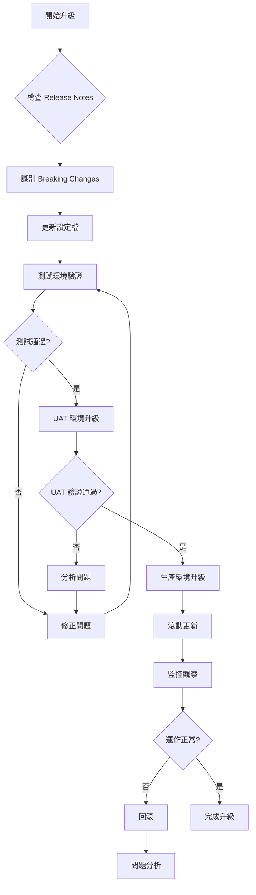

---

## 9. 企業導入建議與最佳實務

### 9.1 導入順序建議

#### 9.1.1 分階段導入策略

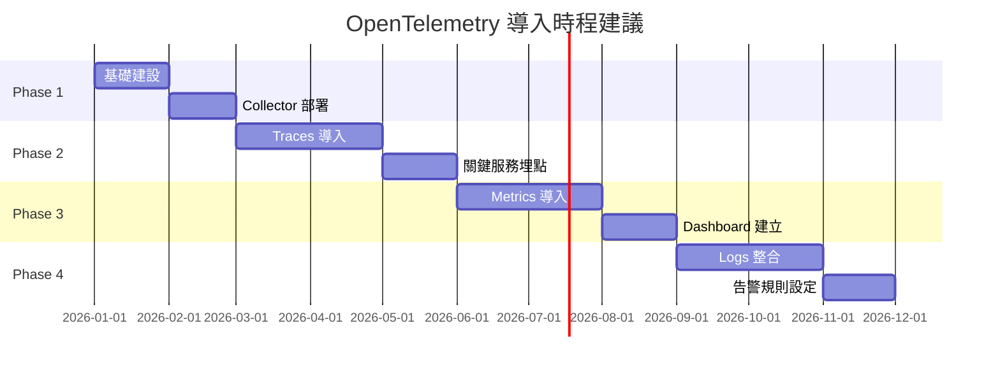

**Phase 1：基礎建設（1-2 個月）**

- 部署 OTel Collector
- 設定後端儲存（Jaeger、Prometheus）
- 建立 Grafana Dashboard 模板

**Phase 2：Traces 優先（2-3 個月）**

- 選擇 2-3 個關鍵服務開始
- 導入自動 Instrumentation
- 驗證跨服務追蹤功能

**Phase 3：Metrics 整合（2-3 個月）**

- 將 Prometheus Metrics 透過 OTel 收集
- 統一 Resource Attributes
- 建立 SLO Dashboard

**Phase 4：Logs 整合（2-3 個月）**

- 整合應用 Logs 與 TraceId
- 建立統一日誌查詢介面

---

### 9.2 命名規範與標準化建議

#### 9.2.1 服務命名規範

```yaml
# 推薦格式
service.name: {team}-{application}-{component}
service.namespace: {business-domain}

# 範例
service.name: payment-gateway-api
service.namespace: financial-services
```

#### 9.2.2 Span 命名規範

| 類型 | 格式 | 範例 |
| ------ | ------ | ------ |
| HTTP Server | `{HTTP_METHOD} {HTTP_ROUTE}` | `POST /api/orders` |
| HTTP Client | `HTTP {HTTP_METHOD}` | `HTTP POST` |
| Database | `{DB_OPERATION} {DB_NAME}.{TABLE}` | `SELECT orders.order_items` |
| Message Queue | `{OPERATION} {QUEUE_NAME}` | `PUBLISH order-events` |
| Internal | `{CLASS}.{METHOD}` | `OrderService.createOrder` |

#### 9.2.3 Attribute 命名規範

```yaml
# 遵循 OpenTelemetry Semantic Conventions
# https://opentelemetry.io/docs/concepts/semantic-conventions/

# 自訂業務屬性使用 namespace
app.order.id: ORD-12345
app.customer.tier: premium
app.transaction.type: purchase

# 避免
order_id: ...       # 缺少 namespace
orderId: ...        # 不一致的命名風格
```

---

### 9.3 與既有 Prometheus / ELK 共存策略

#### 9.3.1 雙軌並行架構

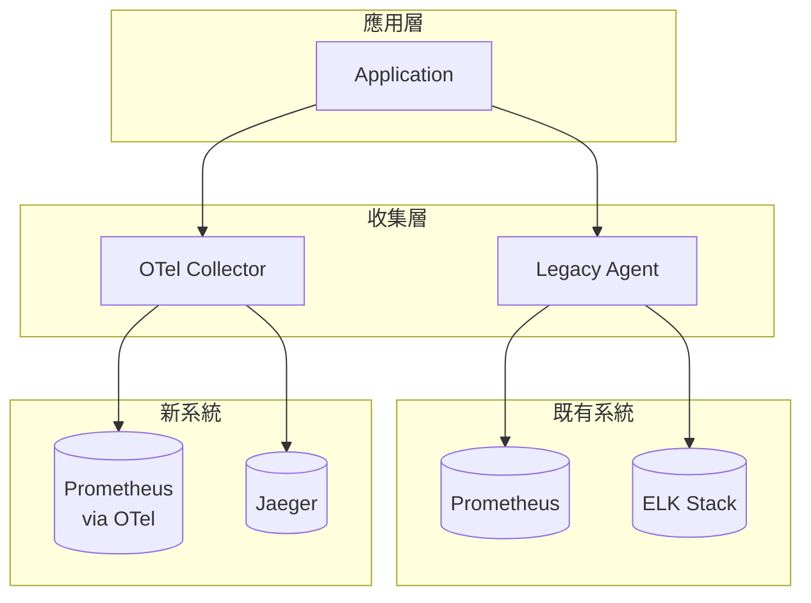

#### 9.3.2 遷移策略

1. **並行運作期**：新舊系統同時收集，比對資料一致性
2. **驗證期**：確認 OTel 資料完整性
3. **切換期**：逐步將查詢切換到新系統
4. **下線期**：關閉舊系統

---

### 9.4 適合銀行或大型企業的導入模式

#### 9.4.1 企業級架構建議

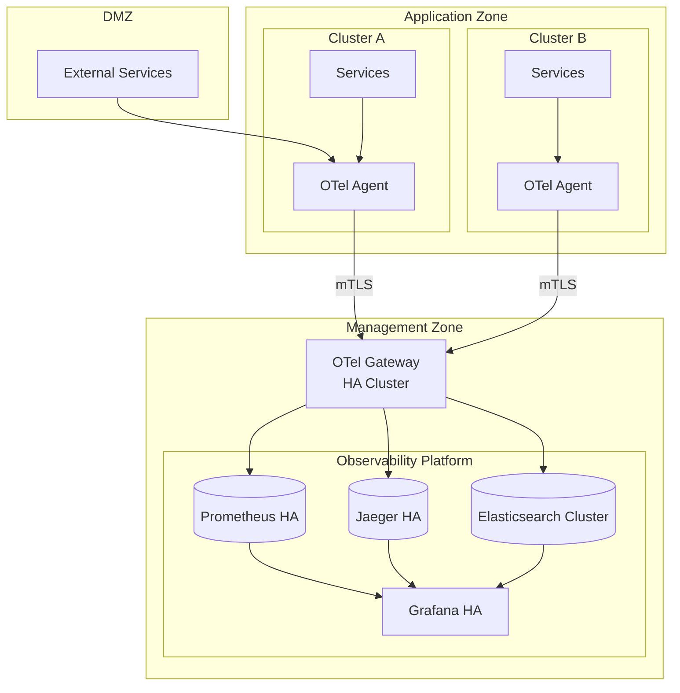

#### 9.4.2 安全性考量

```yaml
# 生產環境安全設定
receivers:
  otlp:
    protocols:
      grpc:
        endpoint: 0.0.0.0:4317
        tls:
          cert_file: /certs/server.crt
          key_file: /certs/server.key
          client_ca_file: /certs/ca.crt
        auth:
          authenticator: oidc

extensions:
  oidc:
    issuer_url: https://auth.company.com
    audience: otel-collector

processors:
  # 敏感資料過濾
  attributes:
    actions:
      - key: db.password
        action: delete
      - key: http.request.header.authorization
        action: delete
      - key: user.ssn
        pattern: "^\d{3}-\d{2}-\d{4}$"
        action: hash
```

#### 9.4.3 合規性要求

| 要求 | OTel 解決方案 |
| ------ | -------------- |
| 資料加密傳輸 | TLS/mTLS 設定 |
| 存取控制 | OIDC/OAuth2 認證 |
| 稽核日誌 | Collector 存取日誌 |
| 資料保留 | 後端系統設定 Retention |
| PII 保護 | Attributes Processor 過濾/遮罩 |
| 資料主權 | 自建後端系統 |

> 💡 **銀行導入建議**：
>
> 1. 優先導入內部核心系統，外部系統需額外評估
> 2. 所有傳輸使用 mTLS
> 3. 敏感資料必須在 Collector 層過濾
> 4. 保留完整的存取日誌供稽核

---

## 10. 檢查清單（Checklist）

### 10.1 環境準備檢查清單

**基礎環境**

- [ ] 確認 OS 版本符合需求
- [ ] 確認網路連通性（Application → Collector → Backend）
- [ ] 確認防火牆規則（Ports: 4317, 4318, 8888）
- [ ] 確認資源需求（CPU、Memory、Disk）

**Collector 安裝**

- [ ] 下載正確版本的 Collector
- [ ] 建立設定檔（config.yaml）
- [ ] 設定為系統服務或容器
- [ ] 驗證 Collector 正常啟動
- [ ] 驗證 Health Check 端點

**後端系統**

- [ ] Jaeger/Tempo 已部署並可存取
- [ ] Prometheus 已部署並設定 Remote Write
- [ ] Elasticsearch 已部署（如需 Logs）
- [ ] Grafana 已設定資料來源

### 10.2 應用整合檢查清單

**SDK 整合**

- [ ] 加入 OTel 依賴
- [ ] 設定 OTEL_* 環境變數
- [ ] 設定正確的 service.name
- [ ] 設定正確的 Resource Attributes
- [ ] 驗證 Traces 正確匯出
- [ ] 驗證 Metrics 正確匯出

**自動 Instrumentation**

- [ ] Java Agent 已正確載入
- [ ] 環境變數已正確設定
- [ ] 驗證自動產生的 Spans
- [ ] 確認 Context Propagation 正常

**手動 Instrumentation（如需）**

- [ ] 關鍵業務邏輯已埋點
- [ ] Span 命名符合規範
- [ ] 必要的 Attributes 已加入
- [ ] 錯誤處理已正確記錄

### 10.3 生產環境檢查清單

**高可用設定**

- [ ] Collector 副本數 >= 3
- [ ] PodDisruptionBudget 已設定
- [ ] 資源 Limits/Requests 已設定
- [ ] HPA 已設定（如需）
- [ ] 反親和性規則已設定

**安全性設定**

- [ ] TLS/mTLS 已啟用
- [ ] 認證機制已設定
- [ ] 敏感資料過濾已設定
- [ ] 網路隔離已設定

**監控告警**

- [ ] Collector 自身指標已收集
- [ ] 告警規則已設定
- [ ] Grafana Dashboard 已建立
- [ ] 值班通知管道已設定

**維運準備**

- [ ] 備份機制已設定
- [ ] 回滾計畫已準備
- [ ] 維運文件已完成
- [ ] 團隊已完成培訓

### 10.4 升級檢查清單

**升級前**

- [ ] 閱讀 Release Notes 與 Breaking Changes
- [ ] 備份現有設定
- [ ] 測試環境驗證完成
- [ ] 準備回滾計畫
- [ ] 通知相關團隊

**升級中**

- [ ] 選擇低流量時段
- [ ] 監控關鍵指標
- [ ] 逐步滾動更新
- [ ] 驗證資料正確性

**升級後**

- [ ] 確認所有 Pod 正常運作
- [ ] 確認資料持續流入
- [ ] 確認無錯誤日誌
- [ ] 更新維運文件
- [ ] 通知團隊升級完成

---

## 附錄

### A. 常用環境變數

| 環境變數 | 說明 | 預設值 |
| --------- | ------ | -------- |
| `OTEL_SERVICE_NAME` | 服務名稱 | unknown_service |
| `OTEL_EXPORTER_OTLP_ENDPOINT` | OTLP 端點 | http://localhost:4317 |
| `OTEL_EXPORTER_OTLP_PROTOCOL` | 傳輸協定 | grpc |
| `OTEL_TRACES_SAMPLER` | 採樣策略 | parentbased_always_on |
| `OTEL_TRACES_SAMPLER_ARG` | 採樣參數 | - |
| `OTEL_RESOURCE_ATTRIBUTES` | 資源屬性 | - |
| `OTEL_PROPAGATORS` | Context 傳播器 | tracecontext,baggage |
| `OTEL_LOGS_EXPORTER` | Logs Exporter | otlp |
| `OTEL_METRICS_EXPORTER` | Metrics Exporter | otlp |

### B. 常用指令

```bash
# 驗證 Collector 設定
otelcol-contrib validate --config=config.yaml

# 檢查 Collector 狀態
curl http://localhost:13133/

# 檢查 Collector Metrics
curl http://localhost:8888/metrics

# Kubernetes 檢查
kubectl get pods -n observability
kubectl logs -f deployment/otel-collector -n observability
kubectl describe pod otel-collector-xxx -n observability
```

### C. 參考資源

- [OpenTelemetry 官方文件](https://opentelemetry.io/docs/)
- [OpenTelemetry Collector Contrib](https://github.com/open-telemetry/opentelemetry-collector-contrib)
- [OpenTelemetry Java Instrumentation](https://github.com/open-telemetry/opentelemetry-java-instrumentation)
- [Semantic Conventions](https://opentelemetry.io/docs/concepts/semantic-conventions/)
- [CNCF Observability](https://landscape.cncf.io/card-mode?category=observability-and-analysis)


