+++
date = '2026-01-30T19:38:28+08:00'
draft = false
title = 'OpenTelemetry教學手冊'
tags = ['教學', '工具', 'OpenTelemetry', 'Metrics', 'Tracing', 'Observability', 'Collector']
categories = ['教學']
+++

# OpenTelemetry教學手冊

## 文件資訊

| 項目 | 內容 |
| --- | --- |
| **文件版本** | 2.0 |
| **最後更新** | 2026-10-01 |
| **前一版本** | 1.0（2026-01-27） |
| **版本基準** | OpenTelemetry Collector / Contrib **v0.162.0**（2026-09-29）、Helm Chart `opentelemetry-collector` **0.174.0**、Operator **v0.160.0**、Java Agent **2.31.1**、Java SDK **1.66.0**、JS SDK **2.11.0**、Semantic Conventions **1.44.0**、Specification **1.61.0**、OTLP **1.11.1**；完整矩陣見 [附錄 D.1](#d1-版本基準矩陣2026-10-01) |
| **適用對象** | 後端工程師、DevOps / SRE、平台工程團隊、系統架構師、資安與稽核人員 |
| **文件定位** | 企業標準技術白皮書：概念 → 架構 → 安裝 → 設定 → 應用串接 → 維運 → 升級 → 治理 |
| **驗證方式** | 文中 Collector 設定以 `otelcol-contrib 0.162.0 validate` 驗證；PromQL 與告警規則以 `promtool 3.15.0 check rules` 驗證；查證紀錄見 [附錄 E](#附錄-e查證紀錄) |
| **作者** | Eric Cheng |

> 📌 **v2.0 改版重點**
>
> 1. 版本基準由 Collector 0.96 / Java Agent 2.1 全面更新至 2026-09 最新版，並修正 v1.0 的 70 處錯誤或過時內容（見 [附錄 D.2](#d2-v10--v20-修正對照表)）。
> 2. Collector 自 v0.144.0（2026-01）起陸續將元件改為 snake_case 名稱（例如 `otlp` exporter → `otlp_grpc`、`k8sattributes` → `k8s_attributes`），舊名稱暫以「已棄用別名」保留並在啟動時輸出警告。本版所有範例改用新名稱，對照表見 [附錄 G](#附錄-gcollector-元件更名對照表)。
> 3. `service.telemetry.metrics.address` 已失效，改用 `readers`；Collector 自身指標名稱與告警規則同步修正。
> 4. 新增 OpenTelemetry Operator、OTTL 資料轉換、兩層式 Tail Sampling 高可用、持久化佇列、Python / .NET / Go 串接、eBPF 零程式碼埋點（OBI）、Semantic Conventions 遷移、成本與基數治理、臺灣金融業法規對應、Profiles 與 GenAI 可觀測性等章節。

## 目錄

<!-- TOC-AUTO-BEGIN -->

- [執行摘要（Executive Summary）](#執行摘要executive-summary)
- [1. OpenTelemetry 概述](#1-opentelemetry-概述)
  - [1.1 OpenTelemetry 是什麼？解決什麼問題？](#11-opentelemetry-是什麼解決什麼問題)
  - [1.2 與傳統 APM / Monitoring 工具的差異](#12-與傳統-apm--monitoring-工具的差異)
  - [1.3 Observability 三大支柱：Traces / Metrics / Logs](#13-observability-三大支柱traces--metrics--logs)
  - [1.4 OpenTelemetry 在 CNCF 生態系中的角色](#14-opentelemetry-在-cncf-生態系中的角色)
  - [1.5 專案組成與穩定度](#15-專案組成與穩定度)
  - [1.6 何時採用 OpenTelemetry：選型決策](#16-何時採用-opentelemetry選型決策)
- [2. OpenTelemetry 整體系統架構](#2-opentelemetry-整體系統架構)
  - [2.1 架構總覽](#21-架構總覽)
  - [2.2 核心元件說明](#22-核心元件說明)
  - [2.3 Agent-based vs SDK-based 收集模式比較](#23-agent-based-vs-sdk-based-收集模式比較)
  - [2.4 與 Prometheus / Grafana / Jaeger / ELK 的整合架構](#24-與-prometheus--grafana--jaeger--elk-的整合架構)
  - [2.5 Collector 發行版與自建發行版（OCB）](#25-collector-發行版與自建發行版ocb)
  - [2.6 Connectors 與多管線設計](#26-connectors-與多管線設計)
- [3. OpenTelemetry 安裝指南](#3-opentelemetry-安裝指南)
  - [3.1 本機環境（Local / VM）](#31-本機環境local--vm)
  - [3.2 Container / Docker](#32-container--docker)
  - [3.3 Kubernetes](#33-kubernetes)
  - [3.4 OpenTelemetry Operator](#34-opentelemetry-operator)
  - [3.5 安裝驗證與冒煙測試](#35-安裝驗證與冒煙測試)
- [4. OpenTelemetry Collector 設定](#4-opentelemetry-collector-設定)
  - [4.1 Collector 設定檔結構說明](#41-collector-設定檔結構說明)
  - [4.2 Receivers / Processors / Exporters 概念](#42-receivers--processors--exporters-概念)
  - [4.3 範例設定](#43-範例設定)
  - [4.4 設定最佳實務（Best Practices）](#44-設定最佳實務best-practices)
  - [4.5 OTTL 與資料轉換](#45-ottl-與資料轉換)
  - [4.6 元件更名、設定驗證與除錯工具](#46-元件更名設定驗證與除錯工具)
- [5. 應用系統如何串接 OpenTelemetry](#5-應用系統如何串接-opentelemetry)
  - [5.1 Java / Spring Boot](#51-java--spring-boot)
  - [5.2 Node.js](#52-nodejs)
  - [5.3 常見共通概念](#53-常見共通概念)
  - [5.4 Python](#54-python)
  - [5.5 .NET](#55-net)
  - [5.6 Go](#56-go)
  - [5.7 零程式碼 eBPF 埋點（OBI）](#57-零程式碼-ebpf-埋點obi)
  - [5.8 Logs 整合與關聯](#58-logs-整合與關聯)
- [6. 系統使用情境](#6-系統使用情境)
  - [6.1 如何透過 Trace 分析效能瓶頸](#61-如何透過-trace-分析效能瓶頸)
  - [6.2 如何搭配 Grafana / Jaeger 查詢資料](#62-如何搭配-grafana--jaeger-查詢資料)
  - [6.3 常見使用情境案例](#63-常見使用情境案例)
  - [6.4 Span Metrics、RED 指標與 SLO](#64-span-metricsred-指標與-slo)
- [7. 系統維護與維運](#7-系統維護與維運)
  - [7.1 Collector 高可用（HA）設計](#71-collector-高可用ha設計)
  - [7.2 效能與資源使用考量](#72-效能與資源使用考量)
  - [7.3 常見錯誤與排查方式](#73-常見錯誤與排查方式)
  - [7.4 Log / Metric 自我監控](#74-log--metric-自我監控)
  - [7.5 資料可靠性：持久化佇列與背壓](#75-資料可靠性持久化佇列與背壓)
  - [7.6 艦隊管理：OpAMP 與設定治理](#76-艦隊管理opamp-與設定治理)
- [8. 系統升級與版本管理](#8-系統升級與版本管理)
  - [8.1 OpenTelemetry 版本演進重點](#81-opentelemetry-版本演進重點)
  - [8.2 SDK / Collector 升級注意事項](#82-sdk--collector-升級注意事項)
  - [8.3 與既有監控系統相容性評估](#83-與既有監控系統相容性評估)
  - [8.4 升級建議流程](#84-升級建議流程)
  - [8.5 Semantic Conventions 遷移](#85-semantic-conventions-遷移)
- [9. 企業導入建議與最佳實務](#9-企業導入建議與最佳實務)
  - [9.1 導入順序建議](#91-導入順序建議)
  - [9.2 命名規範與標準化建議](#92-命名規範與標準化建議)
  - [9.3 與既有 Prometheus / ELK 共存策略](#93-與既有-prometheus--elk-共存策略)
  - [9.4 適合銀行或大型企業的導入模式](#94-適合銀行或大型企業的導入模式)
  - [9.5 成本與基數治理](#95-成本與基數治理)
  - [9.6 臺灣金融業法規與規範對應](#96-臺灣金融業法規與規範對應)
  - [9.7 導入成熟度模型與 KPI](#97-導入成熟度模型與-kpi)
- [10. 檢查清單（Checklist）](#10-檢查清單checklist)
  - [10.1 環境準備檢查清單](#101-環境準備檢查清單)
  - [10.2 應用整合檢查清單](#102-應用整合檢查清單)
  - [10.3 生產環境檢查清單](#103-生產環境檢查清單)
  - [10.4 升級檢查清單](#104-升級檢查清單)
  - [10.5 日常維運（Day-2）檢查清單](#105-日常維運day-2檢查清單)
- [11. 進階主題](#11-進階主題)
  - [11.1 Profiles 訊號](#111-profiles-訊號)
  - [11.2 GenAI / LLM 可觀測性](#112-genai--llm-可觀測性)
  - [11.3 Declarative Configuration（宣告式設定）](#113-declarative-configuration宣告式設定)
  - [11.4 Kubernetes 一站式部署：opentelemetry-kube-stack](#114-kubernetes-一站式部署opentelemetry-kube-stack)
  - [11.5 瀏覽器與前端可觀測性（RUM）](#115-瀏覽器與前端可觀測性rum)
- [附錄 A：常用環境變數](#附錄-a常用環境變數)
- [附錄 B：常用指令](#附錄-b常用指令)
- [附錄 C：參考資源](#附錄-c參考資源)
- [附錄 D：版本基準與修訂紀錄](#附錄-d版本基準與修訂紀錄)
  - [D.1 版本基準矩陣（2026-10-01）](#d1-版本基準矩陣2026-10-01)
  - [D.2 v1.0 → v2.0 修正對照表](#d2-v10--v20-修正對照表)
- [附錄 E：查證紀錄](#附錄-e查證紀錄)
  - [E.1 待追蹤事項](#e1-待追蹤事項)
- [附錄 F：名詞對照表](#附錄-f名詞對照表)
- [附錄 G：Collector 元件更名對照表](#附錄-gcollector-元件更名對照表)

<!-- TOC-AUTO-END -->

---

## 執行摘要（Executive Summary）

**OpenTelemetry（OTel）已是雲原生可觀測性的事實標準。** 它在 2026 年 5 月正式成為 CNCF 畢業（Graduated）專案，Traces、Metrics、Baggage 規格已穩定，Logs 資料模型與 OTLP 協定穩定，主流商業 APM（Datadog、Dynatrace、New Relic、Splunk、Elastic、Grafana Cloud 等）都能直接接收 OTLP。企業導入 OTel 的核心價值有三項：

| 價值 | 說明 | 對企業的意義 |
| --- | --- | --- |
| **標準化** | 一套 API / SDK / 協定 / 語意慣例涵蓋所有訊號與語言 | 跨團隊資料可關聯、可比較，降低整合成本 |
| **廠商中立** | 埋點與後端解耦，後端可隨時替換 | 降低供應商鎖定風險，保有議價與替換能力 |
| **集中治理** | 以 Collector 統一做過濾、遮罩、採樣、路由 | 個資遮罩、資料主權、成本控管可在一處落實 |

### 建議的企業採用路徑（摘要）

1. **先建平台，再接應用**：以「Agent（DaemonSet / 主機代理）＋ Gateway（集中式叢集）」兩層 Collector 為骨幹，部署方式見 [3.3 節](#33-kubernetes) 與 [3.4 節](#34-opentelemetry-operator)，高可用設計見 [7.1 節](#71-collector-高可用ha設計)。
2. **零程式碼優先**：Java Agent、.NET、Python、Node.js 自動埋點，或以 Operator 注入（[3.4 節](#34-opentelemetry-operator)）；無法改程式的系統用 eBPF（[5.7 節](#57-零程式碼-ebpf-埋點obi)）。
3. **先治理，再擴量**：在擴大導入前先定好命名規範、Semantic Conventions 版本、敏感資料遮罩與採樣策略（[9.2 節](#92-命名規範與標準化建議)、[4.4 節](#44-設定最佳實務best-practices)、[9.5 節](#95-成本與基數治理)）。
4. **把 Collector 當成正式生產系統維運**：自我監控、告警、持久化佇列、版本升級節奏（[7.4 節](#74-log--metric-自我監控)、[7.5 節](#75-資料可靠性持久化佇列與背壓)、[8.2 節](#82-sdk--collector-升級注意事項)）。

### 閱讀路徑建議

| 角色 | 建議章節 |
| --- | --- |
| 架構師 / 技術主管 | 第 1、2 章 → 第 9 章 → 第 11 章 |
| 平台 / SRE | 第 3、4、7、8 章 → 第 10 章檢查清單 |
| 應用開發者 | 第 5 章 → 第 6 章 → [9.2 節](#92-命名規範與標準化建議) 命名規範 |
| 資安 / 稽核 | [4.4 節](#44-設定最佳實務best-practices)、[9.4 節](#94-適合銀行或大型企業的導入模式)、[9.6 節](#96-臺灣金融業法規與規範對應) |

---

## 1. OpenTelemetry 概述

> **本章重點**：理解 OpenTelemetry 的定位與邊界、四種訊號（Traces / Metrics / Logs / Profiles）與 Baggage 的用途、專案組成與各部分的穩定度，以及何時應該（或不應該）採用 OTel。

### 1.1 OpenTelemetry 是什麼？解決什麼問題？

**OpenTelemetry（簡稱 OTel）** 是 CNCF 旗下的開源可觀測性框架，由 OpenTracing 與 OpenCensus 兩個專案於 2019 年合併而成。它提供一套**與廠商無關**的 API、SDK、資料協定（OTLP）、語意慣例（Semantic Conventions）與收集器（Collector），用來**產生、收集、處理與匯出**遙測資料（Telemetry Data）。

#### 核心定位

```text
┌──────────────────────────────────────────────────────────────────┐
│                    OpenTelemetry 解決的問題                        │
├────────────────────────────────┬─────────────────────────────────┤
│  ❌ 傳統痛點                     │  ✅ OTel 解決方案                │
├────────────────────────────────┼─────────────────────────────────┤
│  • 各家 APM 的 SDK / Agent 不相容 │  • 統一的 API / SDK / 自動埋點    │
│  • 廠商鎖定（Vendor Lock-in）     │  • 廠商中立，後端可自由替換        │
│  • Traces/Metrics/Logs 各自為政   │  • 共用 Resource 與 Context 關聯  │
│  • 欄位命名各自定義，難以比較      │  • Semantic Conventions 統一命名  │
│  • 每換一次工具就重新埋點          │  • 埋點一次，透過 Collector 轉送   │
└────────────────────────────────┴─────────────────────────────────┘
```

#### OpenTelemetry 專注於什麼？

| 負責範圍 | 不負責範圍 |
| --- | --- |
| 遙測資料的產生（Instrumentation：手動、自動、eBPF） | 長期資料儲存（Storage） |
| 遙測資料的收集與處理（Collector：過濾、遮罩、採樣、轉換） | 資料視覺化（Dashboard） |
| 遙測資料的傳輸與匯出（OTLP 與各種 Exporter） | 告警通知與事件管理（Alerting / On-call） |
| 資料命名與語意標準（Semantic Conventions） | 查詢語言與分析引擎（PromQL、TraceQL、ES\|QL 等） |

> 💡 **實務提醒**：OTel 是「資料產生與運輸層」。儲存、查詢、視覺化與告警需要搭配後端，例如 Prometheus / Mimir、Jaeger / Tempo、Loki / Elasticsearch、Grafana，或支援 OTLP 的商業平台。

---

### 1.2 與傳統 APM / Monitoring 工具的差異

| 比較項目 | 傳統 APM（專有 Agent） | OpenTelemetry |
| --- | --- | --- |
| **授權模式** | 商業授權，通常按主機、資料量或使用者計費 | Apache 2.0 開源；成本主要在後端儲存與維運人力 |
| **廠商綁定** | Agent、資料格式、後端綁定同一廠商 | 埋點與後端解耦；主流商業 APM 皆可直接接收 OTLP |
| **資料格式** | 專有格式 | 開放標準 OTLP（gRPC / HTTP + Protobuf / JSON） |
| **語意一致性** | 各廠商自定欄位 | Semantic Conventions（HTTP、DB 等已 Stable） |
| **導入門檻** | 低（一站式） | 中（需規劃 Collector 與後端；可用 Operator / Helm 降低門檻） |
| **進階分析** | 內建 AI 根因分析、程式碼層級剖析 | 取決於後端；OTel 本身提供原始資料 |
| **適用場景** | 預算充足、需要快速上線的單一團隊 | 多團隊、多雲、長期治理與避免鎖定的企業 |

> ⚠️ **企業選型建議**：OTel 與商業 APM 並非二選一。常見做法是**埋點一律用 OTel**，後端依需求選擇自建（Grafana / Elastic 生態）或商業平台；日後更換後端時只需調整 Collector 的 exporter，不必重新埋點。

---

### 1.3 Observability 三大支柱：Traces / Metrics / Logs

傳統上以 Traces、Metrics、Logs 為「三大支柱」。OTel 目前定義的訊號還包含 **Profiles**（第四訊號，Alpha）與 **Baggage**（上下文傳遞機制，不是觀測資料）。所有訊號共用同一份 **Resource**（描述「誰」產生資料）與 **Context**（TraceId / SpanId），因此能互相關聯。

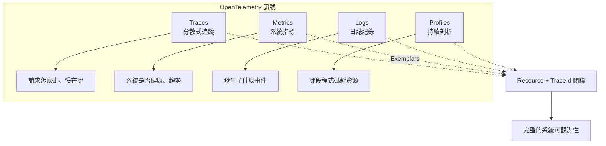
```mermaid
graph TB
    subgraph "OpenTelemetry 訊號"
        A[Traces<br/>分散式追蹤] --> D[請求怎麼走、慢在哪]
        B[Metrics<br/>系統指標] --> E[系統是否健康、趨勢]
        C[Logs<br/>日誌記錄] --> F[發生了什麼事件]
        P[Profiles<br/>持續剖析] --> Q[哪段程式碼耗資源]
    end

    A -.-> G[Resource + TraceId 關聯]
    B -.->|Exemplars| G
    C -.-> G
    P -.-> G

    G --> H[完整的系統可觀測性]
```

#### 1.3.1 Traces（分散式追蹤）

**用途**：追蹤單一請求在多個服務之間的完整路徑、耗時與錯誤點。

```text
┌──────────────────────────────────────────────────────────────────┐
│  Trace 結構範例                                                    │
├──────────────────────────────────────────────────────────────────┤
│  Trace ID: 4bf92f3577b34da6a3ce929d0e0e4736                       │
│  └── Span: GET /api/orders/{id}  (SERVER, 120ms)  ← Root Span     │
│      ├── Span: SELECT orders     (CLIENT, 35ms)                   │
│      └── Span: POST /payments    (CLIENT, 70ms)                   │
│          └── Span: POST /payments (SERVER, 65ms) ← 另一個服務       │
└──────────────────────────────────────────────────────────────────┘
```

**關鍵概念**：

| 概念 | 說明 |
| --- | --- |
| **Trace** | 一個請求在系統中留下的完整軌跡，由多個 Span 組成的樹 |
| **Span** | 一個操作單元，含名稱、開始/結束時間、屬性、事件、狀態、連結 |
| **SpanKind** | `SERVER`、`CLIENT`、`PRODUCER`、`CONSUMER`、`INTERNAL`，影響後端如何繪製服務關係 |
| **SpanContext** | 跨服務傳遞的 TraceId、SpanId、TraceFlags、TraceState |
| **Span Status** | `Unset`（預設）、`Ok`、`Error`；依慣例只有錯誤才設定 `Error` |
| **Span Link** | 關聯不同 Trace 的 Span，常用於批次處理與訊息佇列 |

#### 1.3.2 Metrics（系統指標）

**用途**：以低成本量化系統行為，用於儀表板、SLO 與告警。

| OTel 儀表（Instrument） | 說明 | 典型範例 |
| --- | --- | --- |
| **Counter** | 只增不減的累計值 | 請求總數、錯誤次數 |
| **UpDownCounter** | 可增可減的累計值 | 佇列長度、進行中的請求數 |
| **Gauge** | 量測當下的瞬時值 | 溫度、設定值 |
| **Histogram** | 數值分佈 | 請求延遲（計算 P50 / P95 / P99） |
| **Asynchronous（Observable）系列** | 由回呼函式定期回報 | CPU 使用率、連線池使用量 |

> 💡 **實務提醒**：OTel 支援 **Exponential Histogram**（對應 Prometheus Native Histogram），在不預先設定 bucket 的情況下仍能維持精準度，適合延遲類指標。另外 **Exemplars** 可在指標資料點上附帶 TraceId，從儀表板一鍵跳到對應的 Trace（見 [6.2 節](#62-如何搭配-grafana--jaeger-查詢資料)）。

#### 1.3.3 Logs（日誌記錄）

**用途**：記錄離散事件，用於除錯、稽核與事後分析。

OTel 對 Logs 的策略與 Traces / Metrics 不同：**不另外發明一套給開發者呼叫的 Logging API**，而是用 **Logs Bridge API** 把既有的日誌框架（Log4j、Logback、SLF4J、`logging`、Serilog、`ILogger`、Winston、Pino 等）接到 OTel SDK。

**OTel Logs 特點**：

- 統一的 Log Data Model（Timestamp、SeverityNumber、Body、Attributes、TraceId、SpanId）
- 在有作用中 Span 的情況下自動帶入 TraceId / SpanId，可直接跳轉到對應的 Trace
- 可經由 OTLP 送出，也可由 Collector 的 `file_log` receiver 讀取既有日誌檔
- **Events**：Semantic Conventions 正以「具名的 Log Record」取代 Span Event（例如例外事件，見 [8.5 節](#85-semantic-conventions-遷移)）

#### 1.3.4 Profiles 與 Baggage

| 訊號 | 狀態 | 說明 |
| --- | --- | --- |
| **Profiles** | Alpha（OTLP Profiles 資料模型） | 持續剖析（Continuous Profiling），回答「哪段程式碼耗用 CPU / 記憶體」。可與 Trace 雙向關聯。詳見 [11.1 節](#111-profiles-訊號) |
| **Baggage** | Stable | 在服務之間傳遞的鍵值對（例如租戶代碼），**不是**觀測資料，也不會自動寫入 Span；需要時需明確複製到屬性中。詳見 [5.3 節](#53-常見共通概念) |

---

### 1.4 OpenTelemetry 在 CNCF 生態系中的角色

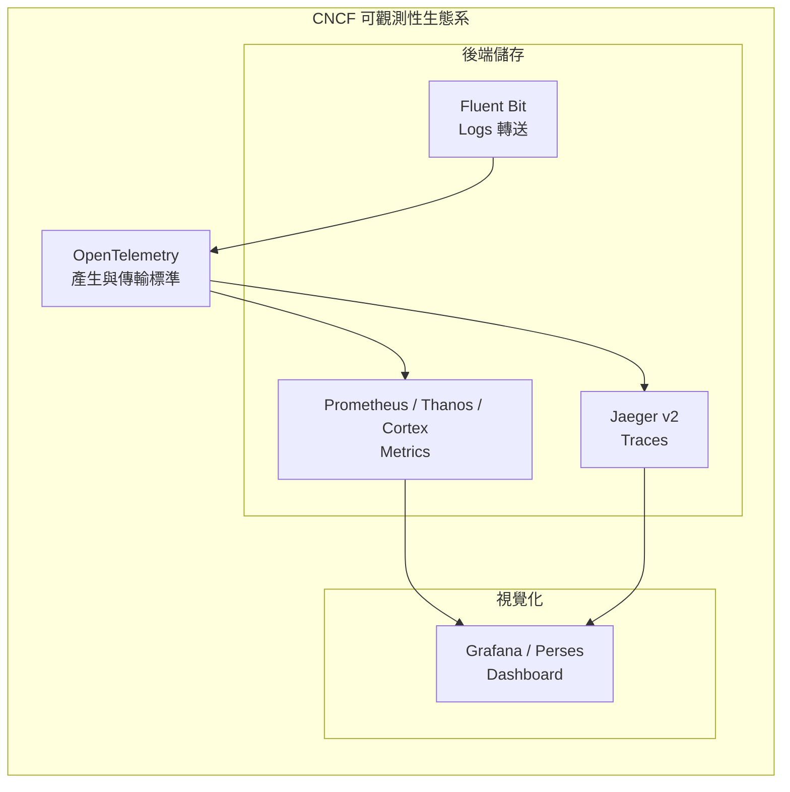
```mermaid
graph LR
    subgraph "CNCF 可觀測性生態系"
        OTel[OpenTelemetry<br/>產生與傳輸標準]

        subgraph "後端儲存"
            Prometheus[Prometheus / Thanos / Cortex<br/>Metrics]
            Jaeger[Jaeger v2<br/>Traces]
            Fluent[Fluent Bit<br/>Logs 轉送]
        end

        subgraph "視覺化"
            Grafana[Grafana / Perses<br/>Dashboard]
        end

        OTel --> Prometheus
        OTel --> Jaeger
        Fluent --> OTel
        Prometheus --> Grafana
        Jaeger --> Grafana
    end
```

**CNCF 專案成熟度（2026-10）**：

| 專案 | 成熟度 | 備註 |
| --- | --- | --- |
| OpenTelemetry | **Graduated** | 2026-05 經 CNCF TOC 投票通過畢業（cncf/toc PR #2134） |
| Prometheus | Graduated | 3.x 起原生支援接收 OTLP 指標 |
| Jaeger | Graduated | v2 以 OTel Collector 為核心重寫；v1 已於 2025-12-31 終止支援 |
| Fluentd / Fluent Bit | Graduated | Fluent Bit 可輸出 OTLP |
| Thanos / Cortex | Incubating | Prometheus 長期儲存 |
| Perses | Sandbox | 開放規格的儀表板（Dashboard as Code） |

> 💡 **實務建議**：OTel 是 CNCF 中貢獻者數量名列前茅的專案，各大雲端與 APM 廠商都已投入。新系統建議**直接以 OTel 為埋點標準**，既有 Prometheus 或 ELK 系統則採共存與漸進遷移（見 [9.3 節](#93-與既有-prometheus--elk-共存策略)）。

---

### 1.5 專案組成與穩定度

OTel 由多個子專案組成，**各部分成熟度不同**。企業制定標準時要分清哪些已可放心依賴、哪些仍會變動。

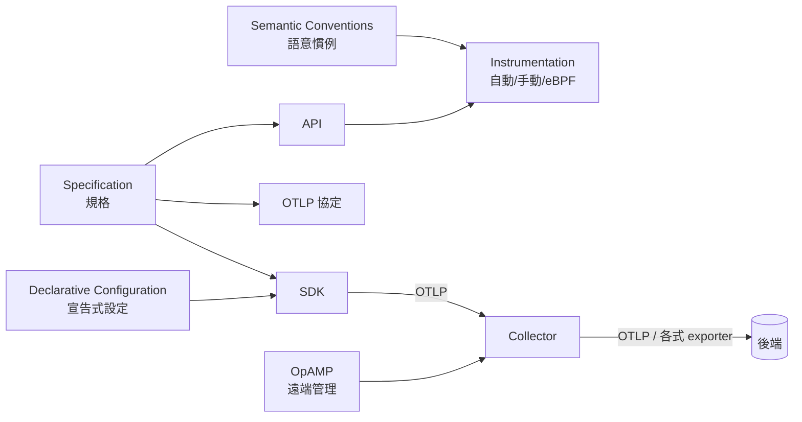
```mermaid
flowchart LR
    Spec[Specification<br/>規格] --> API[API]
    Spec --> SDK[SDK]
    Spec --> OTLP[OTLP 協定]
    SemConv[Semantic Conventions<br/>語意慣例] --> Inst[Instrumentation<br/>自動/手動/eBPF]
    API --> Inst
    SDK -->|OTLP| Col[Collector]
    Col -->|OTLP / 各式 exporter| Backend[(後端)]
    Config[Declarative Configuration<br/>宣告式設定] --> SDK
    OpAMP[OpAMP<br/>遠端管理] --> Col
```

| 組成 | 說明 | 狀態（2026-10） |
| --- | --- | --- |
| **Specification** | 跨語言的規格，定義 API / SDK 行為 | v1.61.0；Traces、Metrics、Baggage 規格 Stable；Logs SDK Stable；Profiles Development |
| **OTLP** | 傳輸協定（gRPC 預設埠 4317，HTTP 預設埠 4318） | v1.11.1；Traces / Metrics / Logs Stable，Profiles Alpha |
| **API / SDK** | 各語言實作 | Java、.NET、Go、Python、JS、C++、PHP 等 Traces / Metrics 多為 Stable；Logs 依語言而異（見下表） |
| **Semantic Conventions** | 屬性與指標命名標準 | v1.44.0；HTTP、Database（Spans）、`service.*`、`deployment.environment.name` 等為 Stable；RPC 為 Release Candidate；Messaging、GenAI 仍為 Development |
| **Collector** | 收集、處理、轉送 | 核心模組雙軌版本（`v1.68.0` / `v0.162.0`）；元件穩定度各自標示（Stable / Beta / Alpha / Development / Unmaintained） |
| **Declarative Configuration** | 以 YAML 設定 SDK（`OTEL_CONFIG_FILE`） | 設定檔 Schema 1.0 已於 2026-02 發布；各語言 SDK 支援程度不一，Java Agent 支援仍屬實驗性 |
| **OpAMP** | Agent 遠端管理協定 | Collector 的 `opamp` extension 為 Alpha；opamp-go v0.25.0 |
| **OBI（eBPF Instrumentation）** | 零程式碼 eBPF 埋點 | v0.13.0（0.x，仍在快速演進） |

#### 主要語言 SDK 訊號穩定度摘要

| 語言 | Traces | Metrics | Logs | 零程式碼方案 |
| --- | --- | --- | --- | --- |
| Java | Stable | Stable | Stable | Java Agent、Spring Boot Starter |
| .NET | Stable | Stable | Stable | .NET Automatic Instrumentation |
| Go | Stable | Stable | Release Candidate | OBI（eBPF）、Go Auto-Instrumentation（實驗） |
| Python | Stable | Stable | Development | `opentelemetry-instrument` |
| JavaScript / Node.js | Stable | Stable | Development | `@opentelemetry/auto-instrumentations-node` |

> ⚠️ **注意**：上表為撰寫時的摘要，各語言版本演進快速，正式採用前請以 [OpenTelemetry Status](https://opentelemetry.io/status/) 與各語言 Repository 的 README 為準。「Development / Beta」代表仍可能有 Breaking Change，企業標準宜註明「實驗性，限非關鍵系統」。

#### Collector 元件穩定度等級

| 等級 | 意義 | 企業使用建議 |
| --- | --- | --- |
| **Stable** | 設定與行為向下相容 | 可用於生產 |
| **Beta** | 功能完整，仍可能小幅變動 | 可用於生產，升級時需閱讀 Release Notes |
| **Alpha** | 可能有 Breaking Change | 僅用於非關鍵管線或 PoC |
| **Development** | 開發中 | 不建議用於生產 |
| **Unmaintained / Deprecated** | 無人維護或即將移除 | 規劃替代方案 |

可用 `otelcol-contrib components` 指令列出目前發行版每個元件的穩定度（見 [4.6 節](#46-元件更名設定驗證與除錯工具)）。

---

### 1.6 何時採用 OpenTelemetry：選型決策

| 情境 | 建議 | 理由 |
| --- | --- | --- |
| 新建微服務、雲原生系統 | ✅ 直接採用 OTel | 埋點一次，後端可替換 |
| 多語言、多團隊、多雲 | ✅ 採用 OTel + Collector Gateway | 統一資料模型與治理點 |
| 已全面使用某商業 APM 且滿意 | 🔄 新服務改用 OTel 埋點，送往同一 APM | 保留現有投資，降低未來遷移成本 |
| 只需要基礎主機與容器指標 | 🔄 Prometheus Exporter 已足夠；可用 Collector 的 `prometheus` receiver 統一收集 | 不必為了指標而改寫應用 |
| 老舊系統無法改程式、無法加 Agent | 🔄 評估 eBPF（OBI）或在閘道 / 負載平衡器層收集 | 參見 [5.7 節](#57-零程式碼-ebpf-埋點obi) |
| 嵌入式、極低資源環境 | ⚠️ 審慎評估 | SDK 與 Collector 有基本資源需求 |

> 💡 **白皮書建議**：企業層級應把「OTel 為唯一的埋點標準」寫入技術標準，並把「後端選型」與「埋點標準」分開管理。後端可以多元，埋點不應多元。

---

## 2. OpenTelemetry 整體系統架構

> **本章重點**：建立「應用埋點 → Collector（Agent / Gateway）→ 後端 → 視覺化」的分層架構觀念，理解 API、SDK、Collector、OTLP 的分工，並學會選擇部署模式、發行版與 Connector。

### 2.1 架構總覽

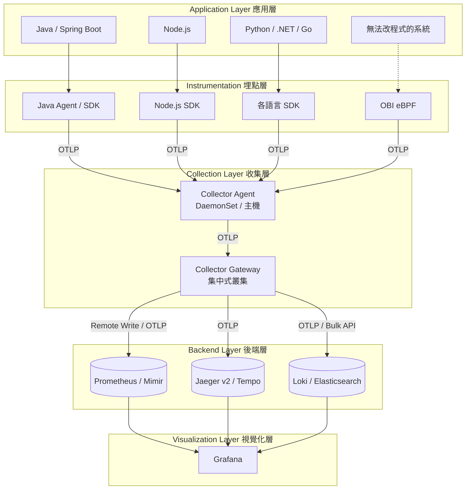
```mermaid
flowchart TB
    subgraph "Application Layer 應用層"
        App1[Java / Spring Boot]
        App2[Node.js]
        App3[Python / .NET / Go]
        Legacy[無法改程式的系統]
    end

    subgraph "Instrumentation 埋點層"
        SDK1[Java Agent / SDK]
        SDK2[Node.js SDK]
        SDK3[各語言 SDK]
        EBPF[OBI eBPF]
    end

    subgraph "Collection Layer 收集層"
        Agent[Collector Agent<br/>DaemonSet / 主機]
        Gateway[Collector Gateway<br/>集中式叢集]
    end

    subgraph "Backend Layer 後端層"
        Metrics[(Prometheus / Mimir)]
        Traces[(Jaeger v2 / Tempo)]
        Logs[(Loki / Elasticsearch)]
    end

    subgraph "Visualization Layer 視覺化層"
        Grafana[Grafana]
    end

    App1 --> SDK1
    App2 --> SDK2
    App3 --> SDK3
    Legacy -.-> EBPF

    SDK1 -->|OTLP| Agent
    SDK2 -->|OTLP| Agent
    SDK3 -->|OTLP| Agent
    EBPF -->|OTLP| Agent

    Agent -->|OTLP| Gateway

    Gateway -->|Remote Write / OTLP| Metrics
    Gateway -->|OTLP| Traces
    Gateway -->|OTLP / Bulk API| Logs

    Metrics --> Grafana
    Traces --> Grafana
    Logs --> Grafana
```

#### 分層責任

| 層級 | 責任 | 典型元件 |
| --- | --- | --- |
| 應用層 | 業務邏輯；必要時加入業務屬性與手動 Span | 應用程式本身 |
| 埋點層 | 產生遙測資料、傳遞 Context、批次匯出 | Java Agent、各語言 SDK、OBI |
| 收集層（Agent） | 就近接收、補上主機 / K8s 資訊、初步過濾 | Collector（DaemonSet / Sidecar / 主機服務） |
| 收集層（Gateway） | 集中處理：遮罩、採樣、路由、認證、多後端分流 | Collector（Deployment / StatefulSet） |
| 後端層 | 儲存、索引、查詢 | Prometheus、Mimir、Jaeger、Tempo、Loki、Elasticsearch |
| 視覺化層 | 儀表板、探索、告警 | Grafana、Kibana、商業 APM |

---

### 2.2 核心元件說明

#### 2.2.1 API

**定義**：OpenTelemetry 的介面規範，定義如何建立 Traces、Metrics、Logs（Bridge）與傳遞 Context。

**特點**：

- 只定義介面；未安裝 SDK 時為 **No-op** 實作，不影響應用運作
- **函式庫作者只應依賴 API**，由最終應用決定是否安裝 SDK
- API 有嚴格的向下相容承諾，可放心寫進共用函式庫

```java
// Java API 範例：只依賴 opentelemetry-api
import io.opentelemetry.api.GlobalOpenTelemetry;
import io.opentelemetry.api.trace.Span;
import io.opentelemetry.api.trace.Tracer;

Tracer tracer = GlobalOpenTelemetry.getTracer("com.example.order", "1.4.0");
Span span = tracer.spanBuilder("reserveInventory").startSpan();
```

> 💡 **實務提醒**：`getTracer()` 的第一個參數是 **Instrumentation Scope 名稱**（建議用套件或模組名稱），不是服務名稱。服務名稱應放在 Resource 的 `service.name`。

#### 2.2.2 SDK

**定義**：API 的官方實作，負責取樣、處理與匯出。

**主要功能**：

- Span / Metric / LogRecord 的建立與生命週期管理
- 採樣策略（Sampler）
- 資源屬性（Resource）與資源偵測（Resource Detector）
- 批次處理（BatchSpanProcessor、PeriodicMetricReader、BatchLogRecordProcessor）與匯出（Exporter）
- 透過環境變數 `OTEL_*` 或宣告式設定檔 `OTEL_CONFIG_FILE` 設定（見 [11.3 節](#113-declarative-configuration宣告式設定)）

```java
// Java SDK 程式化初始化範例（使用 Java Agent 或 Spring Boot Starter 時不需要）
import io.opentelemetry.exporter.otlp.http.trace.OtlpHttpSpanExporter;
import io.opentelemetry.sdk.OpenTelemetrySdk;
import io.opentelemetry.sdk.resources.Resource;
import io.opentelemetry.sdk.trace.SdkTracerProvider;
import io.opentelemetry.sdk.trace.export.BatchSpanProcessor;
import io.opentelemetry.semconv.ServiceAttributes;

Resource resource = Resource.getDefault().merge(
    Resource.builder().put(ServiceAttributes.SERVICE_NAME, "order-service").build());

SdkTracerProvider tracerProvider = SdkTracerProvider.builder()
    .setResource(resource)
    .addSpanProcessor(BatchSpanProcessor.builder(
        OtlpHttpSpanExporter.builder()
            .setEndpoint("http://otel-agent:4318/v1/traces")
            .build()).build())
    .build();

OpenTelemetrySdk sdk = OpenTelemetrySdk.builder()
    .setTracerProvider(tracerProvider)
    .buildAndRegisterGlobal();
```

> ⚠️ **v1.0 修正**：舊版範例使用的 `ResourceAttributes.SERVICE_NAME`（`opentelemetry-semconv` 早期套件）已移除，請改用 `io.opentelemetry.semconv.ServiceAttributes`（artifact：`io.opentelemetry.semconv:opentelemetry-semconv`）。

#### 2.2.3 Collector

**定義**：獨立部署、與語言無關的遙測資料收集、處理與轉送程式。

```text
┌─────────────────────────────────────────────────────────────────────────┐
│                         OTel Collector 內部架構                          │
├─────────────────────────────────────────────────────────────────────────┤
│                                                                         │
│  ┌──────────┐   ┌────────────┐   ┌──────────┐                           │
│  │ Receivers│ → │ Processors │ → │ Exporters│ → 後端                     │
│  └──────────┘   └────────────┘   └──────────┘                           │
│        ↑               ↑               │                                │
│        │         ┌───────────┐         ↓                                │
│        └──────── │ Connectors│ ←───────┘   （串接兩條 pipeline）         │
│                  └───────────┘                                          │
│  Extensions：health_check、pprof、zpages、file_storage、oidc、opamp …    │
│                                                                         │
│  接收資料            處理 / 轉換               匯出至後端                  │
│  • otlp             • memory_limiter          • otlp_grpc / otlp_http   │
│  • prometheus       • k8s_attributes          • prometheus_remote_write │
│  • file_log         • transform（OTTL）        • elasticsearch           │
│  • host_metrics     • tail_sampling           • load_balancing          │
│  • kafka / zipkin   • batch                   • kafka / debug           │
└─────────────────────────────────────────────────────────────────────────┘
```

**部署角色**：

| 角色 | 說明 | 適用場景 |
| --- | --- | --- |
| **Agent** | 與應用同機（DaemonSet、Sidecar、主機服務） | 就近接收、補 K8s / 主機屬性、收集節點指標與日誌 |
| **Gateway** | 集中式、可水平擴展的叢集 | 統一遮罩、採樣、認證、路由、多後端分流 |
| **Agent + Gateway** | 兩層架構 | 大型企業建議架構；Tail Sampling 需兩層（見 [7.1 節](#71-collector-高可用ha設計)） |

#### 2.2.4 Exporters

**定義**：負責將遙測資料送往後端。可在 SDK 端（直接送後端）或 Collector 端設定。

| Exporter（Collector 名稱） | 支援後端 | 穩定度（0.162.0） |
| --- | --- | --- |
| `otlp_grpc`（舊名 `otlp`） | 任何支援 OTLP/gRPC 的後端：Jaeger v2、Tempo、商業 APM | Stable |
| `otlp_http`（舊名 `otlphttp`） | 任何支援 OTLP/HTTP 的後端：Prometheus 3.x、Loki 3.x、Elastic | Stable |
| `prometheus_remote_write`（舊名 `prometheusremotewrite`） | Prometheus、Mimir、Thanos Receive、VictoriaMetrics | Beta |
| `prometheus` | 暴露 `/metrics` 端點供 Prometheus 抓取 | Beta |
| `elasticsearch` | Elasticsearch / Elastic Observability（Logs、Traces） | Beta（Metrics 為 Development） |
| `kafka` | Kafka（作為緩衝層） | Beta |
| `load_balancing`（舊名 `loadbalancing`） | 依 TraceID / Service 分流至下游 Collector | Beta（Traces、Logs） |
| `debug` | 標準輸出（除錯用；取代已移除的 `logging`） | Alpha |

> ⚠️ **v1.0 修正**：Collector 的 `jaeger` exporter 早在 2023 年（contrib v0.86.0）即已移除。Jaeger 1.35 起原生支援 OTLP，Jaeger v2 本身就是以 Collector 打造，請一律用 `otlp_grpc` / `otlp_http` 送往 Jaeger。

#### 2.2.5 OTLP 協定

OTLP（OpenTelemetry Protocol）是 OTel 的原生傳輸協定，所有訊號共用同一套資料模型。

| 傳輸方式 | 預設埠 | 路徑 | 說明 |
| --- | --- | --- | --- |
| OTLP/gRPC | 4317 | — | 效能佳，需 HTTP/2；經過 L7 負載平衡器時需支援 gRPC |
| OTLP/HTTP（Protobuf） | 4318 | `/v1/traces`、`/v1/metrics`、`/v1/logs` | 防火牆與 Proxy 友善；**Java Agent 2.x 與多數 SDK 的預設值** |
| OTLP/HTTP（JSON） | 4318 | 同上 | 瀏覽器端與除錯使用 |

> ⚠️ **常見錯誤**：Java Agent 2.x 預設協定為 `http/protobuf`，若把 `OTEL_EXPORTER_OTLP_ENDPOINT` 指到 `:4317`（gRPC 埠）會連線失敗。要嘛改用 `:4318`，要嘛同時設定 `OTEL_EXPORTER_OTLP_PROTOCOL=grpc`。

---

### 2.3 Agent-based vs SDK-based 收集模式比較

官方將部署模式分為三種：**不經 Collector（No Collector）**、**Agent**、**Gateway**。

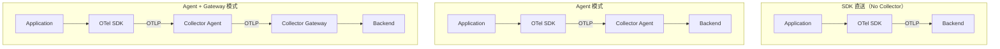
```mermaid
graph TB
    subgraph "SDK 直送（No Collector）"
        A1[Application] --> A2[OTel SDK]
        A2 -->|OTLP| A3[Backend]
    end

    subgraph "Agent 模式"
        B1[Application] --> B2[OTel SDK]
        B2 -->|OTLP| B3[Collector Agent]
        B3 --> B4[Backend]
    end

    subgraph "Agent + Gateway 模式"
        C1[Application] --> C2[OTel SDK]
        C2 -->|OTLP| C3[Collector Agent]
        C3 -->|OTLP| C4[Collector Gateway]
        C4 --> C5[Backend]
    end
```

| 比較項目 | SDK 直送 | Agent | Agent + Gateway |
| --- | --- | --- | --- |
| **架構複雜度** | 最低 | 中 | 較高 |
| **應用端資源** | 匯出與重試佔用應用資源 | 卸載到本機 Collector | 同 Agent |
| **設定集中度** | 分散在每個應用 | 每台主機一份 | 政策集中在 Gateway |
| **故障隔離** | 後端異常可能拖慢應用 | 本機緩衝 | 多層緩衝＋持久化佇列 |
| **憑證管理** | 每個應用都要持有後端憑證 | 每台主機持有 | 只有 Gateway 持有（最安全） |
| **Tail Sampling** | 不可行 | 不可行（看不到完整 Trace） | 可行（搭配 `load_balancing`） |
| **推薦場景** | PoC、開發環境、Serverless | 中小型環境 | 生產環境、大型企業、金融業 |

> 💡 **企業建議**：生產環境採 **Agent + Gateway**。後端憑證、遮罩規則、採樣政策只放在 Gateway，降低外洩面並集中稽核。

---

### 2.4 與 Prometheus / Grafana / Jaeger / ELK 的整合架構

#### 企業級整合架構範例

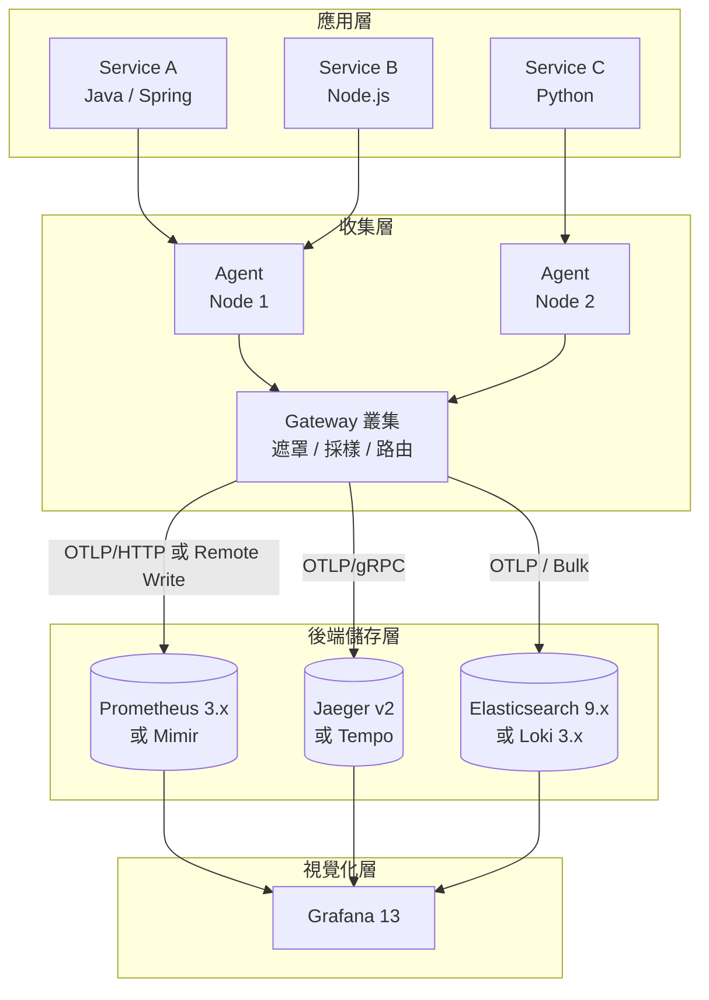
```mermaid
flowchart TB
    subgraph "應用層"
        App1[Service A<br/>Java / Spring]
        App2[Service B<br/>Node.js]
        App3[Service C<br/>Python]
    end

    subgraph "收集層"
        Agent1[Agent<br/>Node 1]
        Agent2[Agent<br/>Node 2]
        Gateway[Gateway 叢集<br/>遮罩 / 採樣 / 路由]
    end

    subgraph "後端儲存層"
        Prom[(Prometheus 3.x<br/>或 Mimir)]
        Jaeger[(Jaeger v2<br/>或 Tempo)]
        ES[(Elasticsearch 9.x<br/>或 Loki 3.x)]
    end

    subgraph "視覺化層"
        Grafana[Grafana 13]
    end

    App1 --> Agent1
    App2 --> Agent1
    App3 --> Agent2

    Agent1 --> Gateway
    Agent2 --> Gateway

    Gateway -->|OTLP/HTTP 或 Remote Write| Prom
    Gateway -->|OTLP/gRPC| Jaeger
    Gateway -->|OTLP / Bulk| ES

    Prom --> Grafana
    Jaeger --> Grafana
    ES --> Grafana
```

##### 後端選項對照（2026-10）

| 訊號 | 開源選項 | 接收方式 | 備註 |
| --- | --- | --- | --- |
| Metrics | Prometheus 3.15 | OTLP/HTTP（`/api/v1/otlp/v1/metrics`，需 `--web.enable-otlp-receiver`）或 Remote Write | 3.x 支援 UTF-8 指標名稱與 Native Histogram |
| Metrics | Grafana Mimir、Thanos、VictoriaMetrics | OTLP 或 Remote Write | 長期儲存、多租戶 |
| Traces | Jaeger v2.21 | OTLP/gRPC、OTLP/HTTP | v2 以 Collector 為核心；v1 已 EOL |
| Traces | Grafana Tempo 3.1 | OTLP | 3.0 起改為新寫入架構，TraceQL Metrics GA |
| Logs | Loki 3.7 | OTLP/HTTP（原生） | Resource 屬性對應為 Index Label 需規劃 |
| Logs / Traces | Elasticsearch / Elastic Observability 9.5 | `elasticsearch` exporter 或 OTLP（經 Elastic 的 EDOT / APM） | 參見《ELK Stack教學手冊》 |
| 全訊號 | ClickHouse | `clickhouse` exporter | 高壓縮、SQL 查詢；需自建 Schema 治理 |

> 💡 **實務提醒**：後端的安裝、容量與儀表板設計請參考姊妹手冊《Prometheus與Grafana教學手冊》、《Metrics Visualization 教學手冊》、《Logs Visualization教學手冊》、《ELK Stack教學手冊》。本手冊聚焦於 OTel 本身。

---

### 2.5 Collector 發行版與自建發行版（OCB）

官方提供多個預先建置的發行版（Distribution），差別在於**內含的元件**。

| 發行版 | 映像 / 執行檔 | 內容 | 建議用途 |
| --- | --- | --- | --- |
| **otelcol**（core） | `otel/opentelemetry-collector` | 核心元件（OTLP、batch、memory_limiter、debug 等） | 最小化環境、學習 |
| **otelcol-contrib** | `otel/opentelemetry-collector-contrib` | 幾乎所有社群元件（數百個） | PoC、功能探索；**不建議直接上生產** |
| **otelcol-k8s** | `otel/opentelemetry-collector-k8s` | 針對 Kubernetes 精選的元件 | K8s 生產環境（Helm Chart 官方範例即使用此映像） |
| **otelcol-otlp** | `otel/opentelemetry-collector-otlp` | 只含 OTLP 收送 | 純轉送節點 |
| **otelcol-prometheus** | `otel/opentelemetry-collector-prometheus` | Prometheus 相關元件 | 以 Collector 取代 Prometheus Agent |
| **otelcol-ebpf-profiler** | `otel/opentelemetry-collector-ebpf-profiler` | eBPF 持續剖析 | Profiles 收集（需特權，見 [11.1 節](#111-profiles-訊號)） |

> ⚠️ **資安建議**：contrib 發行版包含大量用不到的元件，等於擴大攻擊面與 CVE 曝險。企業生產環境建議使用 **otelcol-k8s**，或用 **OCB（OpenTelemetry Collector Builder）** 自建只含必要元件的發行版。

#### OCB 自建範例（`builder-config.yaml`）

```yaml
dist:
  name: otelcol-acme
  description: ACME Bank 企業標準 OpenTelemetry Collector
  output_path: ./otelcol-acme
  version: 2026.10.0

receivers:
  - gomod: go.opentelemetry.io/collector/receiver/otlpreceiver v0.162.0
  - gomod: github.com/open-telemetry/opentelemetry-collector-contrib/receiver/filelogreceiver v0.162.0
  - gomod: github.com/open-telemetry/opentelemetry-collector-contrib/receiver/hostmetricsreceiver v0.162.0

processors:
  - gomod: go.opentelemetry.io/collector/processor/memorylimiterprocessor v0.162.0
  - gomod: go.opentelemetry.io/collector/processor/batchprocessor v0.162.0
  - gomod: github.com/open-telemetry/opentelemetry-collector-contrib/processor/k8sattributesprocessor v1.1.0
  - gomod: github.com/open-telemetry/opentelemetry-collector-contrib/processor/transformprocessor v0.162.0
  - gomod: github.com/open-telemetry/opentelemetry-collector-contrib/processor/redactionprocessor v0.162.0
  - gomod: github.com/open-telemetry/opentelemetry-collector-contrib/processor/tailsamplingprocessor v0.162.0

exporters:
  - gomod: go.opentelemetry.io/collector/exporter/otlpexporter v0.162.0
  - gomod: go.opentelemetry.io/collector/exporter/otlphttpexporter v0.162.0
  - gomod: go.opentelemetry.io/collector/exporter/debugexporter v0.162.0
  - gomod: github.com/open-telemetry/opentelemetry-collector-contrib/exporter/loadbalancingexporter v0.162.0
  - gomod: github.com/open-telemetry/opentelemetry-collector-contrib/exporter/prometheusremotewriteexporter v0.162.0

extensions:
  - gomod: github.com/open-telemetry/opentelemetry-collector-contrib/extension/healthcheckextension v0.162.0
  - gomod: github.com/open-telemetry/opentelemetry-collector-contrib/extension/storage/filestorage v0.162.0

providers:
  - gomod: go.opentelemetry.io/collector/confmap/provider/envprovider v1.68.0
  - gomod: go.opentelemetry.io/collector/confmap/provider/fileprovider v1.68.0
```

```bash
# 下載與 Collector 同版本的 ocb（Linux amd64）
curl -L -o ocb \
  "https://github.com/open-telemetry/opentelemetry-collector-releases/releases/download/cmd%2Fbuilder%2Fv0.162.0/ocb_0.162.0_linux_amd64"
chmod +x ocb

# 產生原始碼並編譯
./ocb --config builder-config.yaml

# 驗證
./otelcol-acme/otelcol-acme components
```

> 💡 **實務提醒**：
>
> 1. 核心模組採雙軌版本：穩定模組為 `v1.x`（例如 providers `v1.68.0`），其餘為 `v0.x`；部分 contrib 元件已進入 `v1.x`（例如 `k8sattributesprocessor v1.1.0`）。版本號請以 `otelcol-contrib components` 輸出的 `module` 欄位為準。
> 2. 自建發行版應納入企業 CI/CD：固定版本、產生 SBOM、簽章並掃描 CVE。官方發行物本身也附有 SBOM 與 Sigstore 簽章（`*.sbom.json`、`*.sigstore.json`）。

---

### 2.6 Connectors 與多管線設計

**Connector** 同時扮演一條 pipeline 的 exporter 與另一條 pipeline 的 receiver，用來**在管線之間轉換或路由資料**。

| Connector | 方向 | 用途 | 穩定度 |
| --- | --- | --- | --- |
| `span_metrics`（舊名 `spanmetrics`） | traces → metrics | 由 Span 產生 RED 指標（呼叫數、錯誤數、延遲分佈） | Alpha |
| `service_graph`（舊名 `servicegraph`） | traces → metrics | 由 Client / Server Span 配對產生服務相依指標 | Alpha |
| `routing` | 同訊號 | 依屬性（例如租戶、環境）路由到不同 pipeline | Alpha |
| `failover` | 同訊號 | 主要後端故障時切換到備援 pipeline | Alpha |
| `count` / `sum` | 任意 → metrics | 計數或加總特定條件的資料 | Alpha |
| `signal_to_metrics` | 任意 → metrics | 以 OTTL 條件把任意訊號轉為指標 | Alpha |
| `forward` | 同訊號 | 合併或分流 pipeline | Beta |

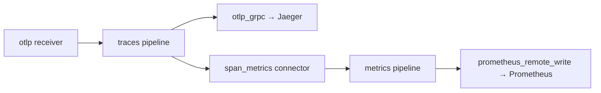
```mermaid
flowchart LR
    R[otlp receiver] --> T1[traces pipeline]
    T1 --> E1[otlp_grpc → Jaeger]
    T1 --> SM[span_metrics connector]
    SM --> M1[metrics pipeline]
    M1 --> E2[prometheus_remote_write → Prometheus]
```

```yaml
connectors:
  span_metrics:
    histogram:
      explicit:
        buckets: [5ms, 10ms, 25ms, 50ms, 100ms, 250ms, 500ms, 1s, 2.5s, 5s]
    dimensions:
      - name: http.request.method
      - name: http.response.status_code
    metrics_flush_interval: 15s

service:
  pipelines:
    traces:
      receivers: [otlp]
      processors: [memory_limiter, batch]
      exporters: [otlp_grpc/jaeger, span_metrics]
    metrics/spanmetrics:
      receivers: [span_metrics]
      processors: [batch]
      exporters: [prometheus_remote_write]
```

> ⚠️ **注意**：`span_metrics` 必須看到**採樣前**的全部 Span 才能產生正確的 RED 指標。若在 Gateway 做 Tail Sampling，應把 `span_metrics` 放在採樣之前的 pipeline，並以 `load_balancing` 的 `routing_key: service` 確保同一服務的 Span 落在同一台 Collector（見 [7.1 節](#71-collector-高可用ha設計)）。

---

## 3. OpenTelemetry 安裝指南

> **本章重點**：以 Collector v0.162.0 為基準，說明 Linux / Windows 主機、Docker Compose、Kubernetes（Helm Chart 0.174.0）與 OpenTelemetry Operator 四種安裝方式，以及安裝後的冒煙測試。

### 3.1 本機環境（Local / VM）

#### 3.1.1 環境需求

| 項目 | 最低需求 | 建議配置（生產 Gateway） |
| --- | --- | --- |
| CPU | 1 Core | 2–4 Cores 起，依流量水平擴展 |
| Memory | 512 MB | 2–4 GB，搭配 `memory_limiter` |
| Disk | 1 GB | 啟用持久化佇列時，依「斷線可容忍時間 × 流量」估算（見 [7.5 節](#75-資料可靠性持久化佇列與背壓)） |
| OS | Linux / Windows / macOS | Linux（amd64 / arm64；另提供 ppc64le、s390x 等） |
| 網路 | 4317 / 4318 對內開放 | 只對應用網段開放；Gateway 前置 L4 / L7 負載平衡 |

#### 3.1.2 Binary 安裝方式

##### 方式一：DEB / RPM 套件（建議，會自動建立 systemd 服務）

```bash
# 版本變數
OTELCOL_VERSION=0.162.0

# Debian / Ubuntu（contrib 發行版）
curl --proto '=https' --tlsv1.2 -fOL \
  "https://github.com/open-telemetry/opentelemetry-collector-releases/releases/download/v${OTELCOL_VERSION}/otelcol-contrib_${OTELCOL_VERSION}_linux_amd64.deb"
sudo dpkg -i "otelcol-contrib_${OTELCOL_VERSION}_linux_amd64.deb"

# RHEL / Rocky / Alma
curl --proto '=https' --tlsv1.2 -fOL \
  "https://github.com/open-telemetry/opentelemetry-collector-releases/releases/download/v${OTELCOL_VERSION}/otelcol-contrib_${OTELCOL_VERSION}_linux_amd64.rpm"
sudo rpm -ivh "otelcol-contrib_${OTELCOL_VERSION}_linux_amd64.rpm"

# 驗證
otelcol-contrib --version
```

套件安裝後的檔案配置：

| 項目 | core 發行版（`otelcol`） | contrib 發行版（`otelcol-contrib`） |
| --- | --- | --- |
| 執行檔 | `/usr/bin/otelcol` | `/usr/bin/otelcol-contrib` |
| 設定檔 | `/etc/otelcol/config.yaml` | `/etc/otelcol-contrib/config.yaml` |
| 環境檔（啟動參數） | `/etc/otelcol/otelcol.conf` | `/etc/otelcol-contrib/otelcol-contrib.conf` |
| systemd 服務 | `otelcol` | `otelcol-contrib` |
| 執行身分 | 系統使用者 `otelcol` | 系統使用者 `otelcol-contrib` |

##### 方式二：手動解壓縮 tar.gz（離線或客製路徑）

```bash
OTELCOL_VERSION=0.162.0
curl --proto '=https' --tlsv1.2 -fOL \
  "https://github.com/open-telemetry/opentelemetry-collector-releases/releases/download/v${OTELCOL_VERSION}/otelcol-contrib_${OTELCOL_VERSION}_linux_amd64.tar.gz"

# 驗證檔案完整性（官方提供 .sha256 與 Sigstore 簽章）
curl --proto '=https' --tlsv1.2 -fOL \
  "https://github.com/open-telemetry/opentelemetry-collector-releases/releases/download/v${OTELCOL_VERSION}/otelcol-contrib_${OTELCOL_VERSION}_linux_amd64.tar.gz.sha256"
sha256sum -c "otelcol-contrib_${OTELCOL_VERSION}_linux_amd64.tar.gz.sha256"

tar -xzf "otelcol-contrib_${OTELCOL_VERSION}_linux_amd64.tar.gz"
sudo install -m 0755 otelcol-contrib /usr/local/bin/
```

##### 步驟 2：建立設定檔

```bash
sudo mkdir -p /etc/otelcol-contrib
sudo tee /etc/otelcol-contrib/config.yaml > /dev/null << 'EOF'
receivers:
  otlp:
    protocols:
      grpc:
        endpoint: 0.0.0.0:4317
      http:
        endpoint: 0.0.0.0:4318

processors:
  memory_limiter:
    check_interval: 1s
    limit_percentage: 80
    spike_limit_percentage: 20
  batch: {}

exporters:
  debug:
    verbosity: basic

extensions:
  health_check:
    endpoint: 0.0.0.0:13133

service:
  extensions: [health_check]
  pipelines:
    traces:
      receivers: [otlp]
      processors: [memory_limiter, batch]
      exporters: [debug]
    metrics:
      receivers: [otlp]
      processors: [memory_limiter, batch]
      exporters: [debug]
    logs:
      receivers: [otlp]
      processors: [memory_limiter, batch]
      exporters: [debug]
EOF

# 啟動前先驗證設定
otelcol-contrib validate --config=/etc/otelcol-contrib/config.yaml
```

##### 步驟 3：啟動 Collector（前景測試）

```bash
otelcol-contrib --config=/etc/otelcol-contrib/config.yaml
```

> 💡 **實務提醒**：`memory_limiter` 的 `limit_percentage` 以「可用總記憶體」為基準；在容器中執行時建議改用 `limit_mib`，或搭配 Go 的 `GOMEMLIMIT`（Helm Chart 預設 `useGOMEMLIMIT: true`）。

#### 3.1.3 Systemd 服務設定（Linux）

使用 DEB / RPM 安裝時服務已自動建立，只需調整設定並重啟：

```bash
# 修改啟動參數（例如合併多個設定檔）
sudo vi /etc/otelcol-contrib/otelcol-contrib.conf
# OTELCOL_OPTIONS="--config=/etc/otelcol-contrib/config.yaml --config=/etc/otelcol-contrib/secrets.yaml"

sudo systemctl daemon-reload
sudo systemctl enable --now otelcol-contrib
sudo systemctl status otelcol-contrib
sudo journalctl -u otelcol-contrib -f
```

若為手動安裝，可參考官方套件的 unit 檔自行建立：

```ini
# /etc/systemd/system/otelcol-contrib.service
[Unit]
Description=OpenTelemetry Collector Contrib
After=network.target

[Service]
EnvironmentFile=/etc/otelcol-contrib/otelcol-contrib.conf
ExecStart=/usr/local/bin/otelcol-contrib $OTELCOL_OPTIONS
ExecReload=/bin/kill -HUP $MAINPID
KillMode=mixed
Restart=on-failure
Type=simple
User=otelcol-contrib
Group=otelcol-contrib
# 強化（選用）
NoNewPrivileges=true
ProtectSystem=strict
ReadWritePaths=/var/lib/otelcol

[Install]
WantedBy=multi-user.target
```

```bash
sudo useradd --system --user-group --no-create-home --shell /sbin/nologin otelcol-contrib
sudo mkdir -p /var/lib/otelcol && sudo chown otelcol-contrib: /var/lib/otelcol
sudo systemctl daemon-reload && sudo systemctl enable --now otelcol-contrib
```

> ⚠️ **注意**：若要用 `file_log` 讀取 `/var/log` 下的日誌，需把服務帳號加入可讀取該目錄的群組（例如 `adm`、`systemd-journal`），**不要**直接改用 root 執行。

#### 3.1.4 Windows 安裝

```powershell
# MSI：安裝為 Windows 服務，並註冊同名的 Application Event Log 來源
msiexec /i "https://github.com/open-telemetry/opentelemetry-collector-releases/releases/download/v0.162.0/otelcol-contrib_0.162.0_windows_x64.msi"

# 或手動解壓縮
Invoke-WebRequest -Uri "https://github.com/open-telemetry/opentelemetry-collector-releases/releases/download/v0.162.0/otelcol-contrib_0.162.0_windows_amd64.tar.gz" -OutFile "otelcol-contrib.tar.gz"
tar -xvzf otelcol-contrib.tar.gz
.\otelcol-contrib.exe --config=config.yaml
```

> 💡 Windows 主機可搭配 `windows_event_log`、`windows_perf_counters`、`iis` 等 receiver 收集系統資訊。

---

### 3.2 Container / Docker

#### 3.2.1 Docker 執行 Collector

##### 基本執行指令

```bash
docker run -d --name otel-collector \
  -p 4317:4317 -p 4318:4318 -p 13133:13133 \
  -v "$(pwd)/config.yaml:/etc/otelcol-contrib/config.yaml:ro" \
  otel/opentelemetry-collector-contrib:0.162.0
```

> 💡 映像同時發布在 Docker Hub（`otel/…`）與 GHCR（`ghcr.io/open-telemetry/opentelemetry-collector-releases/…`）。企業內網建議先同步到內部 Registry，並以 digest 固定版本。

##### Docker Compose 範例（本機實驗環境：Collector + Jaeger v2 + Prometheus 3 + Grafana 13）

```yaml
# compose.yaml（Compose Specification 已不需要 version 欄位）
services:
  otel-collector:
    image: otel/opentelemetry-collector-contrib:0.162.0
    container_name: otel-collector
    command: ["--config=/etc/otelcol-contrib/config.yaml"]
    volumes:
      - ./otel-collector.yaml:/etc/otelcol-contrib/config.yaml:ro
    ports:
      - "4317:4317"   # OTLP gRPC
      - "4318:4318"   # OTLP HTTP
      - "13133:13133" # health_check
    depends_on: [jaeger, prometheus]
    restart: unless-stopped

  jaeger:
    image: cr.jaegertracing.io/jaegertracing/jaeger:2.21.0
    container_name: jaeger
    ports:
      - "16686:16686" # Jaeger UI
    restart: unless-stopped

  prometheus:
    image: prom/prometheus:v3.15.0
    container_name: prometheus
    command:
      - --config.file=/etc/prometheus/prometheus.yml
      - --web.enable-otlp-receiver
    volumes:
      - ./prometheus.yml:/etc/prometheus/prometheus.yml:ro
    ports:
      - "9090:9090"
    restart: unless-stopped

  grafana:
    image: grafana/grafana:13.2.3
    container_name: grafana
    ports:
      - "3000:3000"
    environment:
      - GF_SECURITY_ADMIN_PASSWORD__FILE=/run/secrets/grafana_admin_password
    secrets:
      - grafana_admin_password
    volumes:
      - ./grafana/provisioning:/etc/grafana/provisioning:ro
    restart: unless-stopped

secrets:
  grafana_admin_password:
    file: ./secrets/grafana_admin_password.txt
```

##### 對應的 Collector 設定（`otel-collector.yaml`）

```yaml
receivers:
  otlp:
    protocols:
      grpc:
        endpoint: 0.0.0.0:4317
      http:
        endpoint: 0.0.0.0:4318

processors:
  memory_limiter:
    check_interval: 1s
    limit_mib: 400
    spike_limit_mib: 100
  batch: {}

exporters:
  otlp_grpc/jaeger:
    endpoint: jaeger:4317
    tls:
      insecure: true
  otlp_http/prometheus:
    endpoint: http://prometheus:9090/api/v1/otlp
    tls:
      insecure: true
  debug:
    verbosity: basic

extensions:
  health_check:
    endpoint: 0.0.0.0:13133

service:
  extensions: [health_check]
  pipelines:
    traces:
      receivers: [otlp]
      processors: [memory_limiter, batch]
      exporters: [otlp_grpc/jaeger]
    metrics:
      receivers: [otlp]
      processors: [memory_limiter, batch]
      exporters: [otlp_http/prometheus]
    logs:
      receivers: [otlp]
      processors: [memory_limiter, batch]
      exporters: [debug]
```

##### 對應的 Prometheus 設定（`prometheus.yml`）

```yaml
global:
  scrape_interval: 15s

otlp:
  # 把常用的 Resource 屬性提升為指標標籤，方便以服務維度查詢
  promote_resource_attributes:
    - service.instance.id
    - service.name
    - service.namespace
    - deployment.environment.name
    - k8s.namespace.name
    - k8s.pod.name

storage:
  tsdb:
    out_of_order_time_window: 30m

scrape_configs:
  - job_name: otel-collector
    static_configs:
      - targets: ["otel-collector:8888"]
```

> ⚠️ **注意**：
>
> 1. `otlp_http` exporter 會在 `endpoint` 後自動補上 `/v1/metrics`，所以這裡填 `http://prometheus:9090/api/v1/otlp`。
> 2. Collector 自身指標預設只監聽 `127.0.0.1:8888`；要讓 Prometheus 從其他容器抓取，需依 [7.4 節](#74-log--metric-自我監控) 設定 `service.telemetry.metrics.readers`。
> 3. OTLP 推送的指標可能晚到或亂序，建議設定 `out_of_order_time_window`。

#### 3.2.2 Network 與 Port 說明

| Port | Protocol | 用途 | 生產建議 |
| --- | --- | --- | --- |
| 4317 | gRPC | OTLP gRPC Receiver | 只對應用網段開放，啟用 TLS |
| 4318 | HTTP | OTLP HTTP Receiver | 同上；瀏覽器 RUM 需另設 CORS 與認證 |
| 8888 | HTTP | Collector 自身 Metrics（Prometheus 格式） | 僅對監控網段開放 |
| 8889 | HTTP | `prometheus` exporter（自訂埠） | 視需要 |
| 13133 | HTTP | `health_check` extension | K8s Liveness / Readiness Probe |
| 55679 | HTTP | `zpages` extension | 除錯時暫時開啟，綁定 localhost |
| 1777 | HTTP | `pprof` extension | 除錯時暫時開啟，綁定 localhost |

> ⚠️ **安全提醒**：
>
> 1. 生產環境請勿將 4317 / 4318 暴露至公網。
> 2. Collector 從 v0.104.0 起，receiver 未指定 `endpoint` 時預設綁定 `localhost`。在容器內執行時要明確寫 `0.0.0.0:4317` 或 `${env:MY_POD_IP}:4317`，否則其他容器連不進來。
> 3. `zpages`、`pprof` 會暴露內部資訊，生產環境只在需要時暫時開啟。

---

### 3.3 Kubernetes

#### 3.3.1 使用官方 Helm Chart 安裝

##### 步驟 1：新增 Helm Repository

```bash
helm repo add open-telemetry https://open-telemetry.github.io/opentelemetry-helm-charts
helm repo update
helm search repo open-telemetry/opentelemetry-collector --versions | head -3
```

##### 步驟 2：建立 values.yaml（Gateway 角色範例，Chart 0.174.0）

> ⚠️ Chart 要求**必須**設定 `mode`（`deployment` / `daemonset` / `statefulset`）與 `image.repository`，未設定會安裝失敗。

```yaml
# otel-gateway-values.yaml
mode: deployment

image:
  repository: otel/opentelemetry-collector-k8s
  tag: "0.162.0"

replicaCount: 3

presets:
  kubernetesAttributes:
    enabled: true   # 自動加入 k8s_attributes processor 與必要 RBAC

resources:
  requests:
    cpu: 500m
    memory: 1Gi
  limits:
    memory: 2Gi     # memory_limiter 預設取 limits 的 80% / 25%

config:
  receivers:
    jaeger: null    # 移除 Chart 預設的 jaeger / zipkin / prometheus receiver
    zipkin: null
    prometheus: null
    otlp:
      protocols:
        grpc:
          endpoint: ${env:MY_POD_IP}:4317
        http:
          endpoint: ${env:MY_POD_IP}:4318

  processors:
    resource/env:
      attributes:
        - key: deployment.environment.name
          value: production
          action: upsert

  exporters:
    otlp_grpc/tempo:
      endpoint: tempo-distributor.observability.svc:4317
      tls:
        ca_file: /etc/otel/certs/ca.crt
    prometheus_remote_write:
      endpoint: http://mimir-nginx.observability.svc/api/v1/push

  service:
    pipelines:
      traces:
        receivers: [otlp]
        processors: [memory_limiter, resource/env, batch]
        exporters: [otlp_grpc/tempo]
      metrics:
        receivers: [otlp]
        processors: [memory_limiter, resource/env, batch]
        exporters: [prometheus_remote_write]
      logs: null

ports:
  jaeger-compact:
    enabled: false
  jaeger-thrift:
    enabled: false
  jaeger-grpc:
    enabled: false
  zipkin:
    enabled: false

podDisruptionBudget:
  enabled: true
  minAvailable: 2

extraVolumes:
  - name: otel-certs
    secret:
      secretName: otel-gateway-certs
extraVolumeMounts:
  - name: otel-certs
    mountPath: /etc/otel/certs
    readOnly: true
```

##### 步驟 3：安裝 Collector

```bash
kubectl create namespace observability

# 先渲染檢查（建議納入 CI）
helm template otel-gateway open-telemetry/opentelemetry-collector \
  --version 0.174.0 -n observability -f otel-gateway-values.yaml > /tmp/otel-gateway.yaml

helm install otel-gateway open-telemetry/opentelemetry-collector \
  --version 0.174.0 -n observability -f otel-gateway-values.yaml

kubectl get pods -n observability -l app.kubernetes.io/instance=otel-gateway
```

> 💡 **實務提醒**：
>
> 1. 修改 pipeline 時，必須**完整列出**該 pipeline 的所有元件（包含 Chart 預設的 `memory_limiter`、`batch`），Helm 不會幫你合併陣列。
> 2. Chart 0.162.0 起的 `rewriteDeprecatedComponentNames: true`（預設）會把舊元件名稱改寫為新名稱；若使用舊版 Collector 映像，需設為 `false`。
> 3. 用 `null` 刪除預設元件；作為 subchart 使用時因 Helm 的已知問題無法用 `null` 刪除，改用 `alternateConfig`。

#### 3.3.2 DaemonSet vs Deployment 模式差異

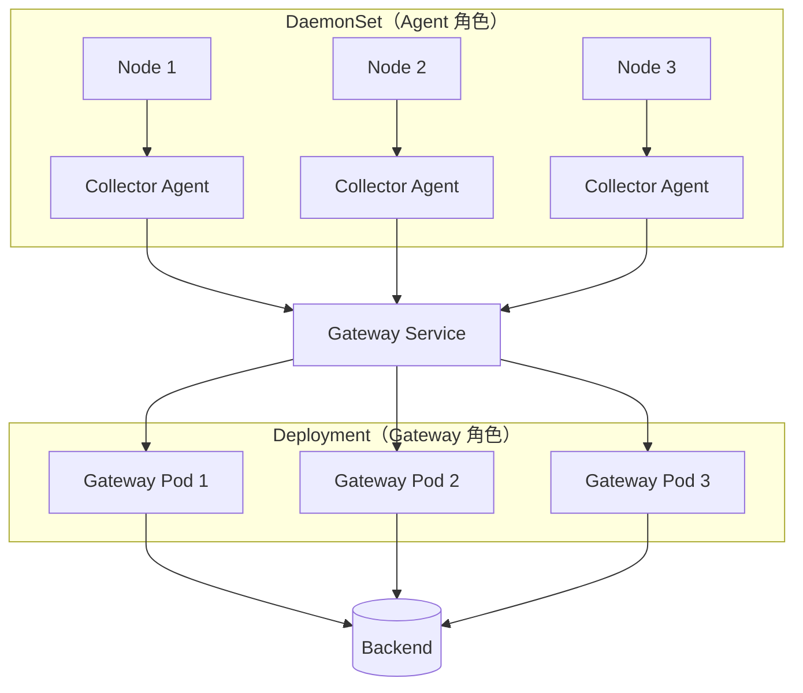
```mermaid
graph TB
    subgraph "DaemonSet（Agent 角色）"
        Node1[Node 1] --> Agent1[Collector Agent]
        Node2[Node 2] --> Agent2[Collector Agent]
        Node3[Node 3] --> Agent3[Collector Agent]
    end

    subgraph "Deployment（Gateway 角色）"
        GW1[Gateway Pod 1]
        GW2[Gateway Pod 2]
        GW3[Gateway Pod 3]
    end

    Agent1 --> SVC[Gateway Service]
    Agent2 --> SVC
    Agent3 --> SVC
    SVC --> GW1
    SVC --> GW2
    SVC --> GW3
    GW1 --> Backend[(Backend)]
    GW2 --> Backend
    GW3 --> Backend
```

| 模式 | DaemonSet | Deployment | StatefulSet |
| --- | --- | --- | --- |
| **部署方式** | 每個 Node 一個 Pod | 指定副本數 | 固定名稱與 PVC |
| **資源使用** | 與 Node 數成正比 | 依流量調整 | 依流量調整 |
| **適用場景** | 節點日誌、kubelet / 主機指標、就近接收 | 集中處理、Tail Sampling 第二層 | 需持久化佇列、Target Allocator 分片抓取 |
| **擴展性** | 自動隨 Node 擴展 | HPA | HPA（需注意 PVC） |
| **常用 presets** | `logsCollection`、`hostMetrics`、`kubeletMetrics`、`kubernetesAttributes` | `kubernetesAttributes`、`clusterMetrics`、`kubernetesEvents` | 同 Deployment |

##### Agent（DaemonSet）values 範例

```yaml
# otel-agent-values.yaml
mode: daemonset

image:
  repository: otel/opentelemetry-collector-k8s
  tag: "0.162.0"

presets:
  logsCollection:
    enabled: true
    storeCheckpoints: true   # 重啟後從中斷點續讀（會以 root 寫入 /var/lib/otelcol）
  hostMetrics:
    enabled: true
  kubeletMetrics:
    enabled: true
  kubernetesAttributes:
    enabled: true

config:
  receivers:
    jaeger: null
    zipkin: null
    prometheus: null
  exporters:
    otlp_grpc/gateway:
      endpoint: otel-gateway-opentelemetry-collector.observability.svc:4317
      tls:
        insecure: true   # 叢集內建議改用 mTLS 或 Service Mesh
  service:
    pipelines:
      traces:
        receivers: [otlp]
        processors: [memory_limiter, batch]
        exporters: [otlp_grpc/gateway]
      metrics:
        receivers: [otlp]
        processors: [memory_limiter, batch]
        exporters: [otlp_grpc/gateway]
      logs:
        receivers: [otlp]
        processors: [memory_limiter, batch]
        exporters: [otlp_grpc/gateway]

ports:
  jaeger-compact:
    enabled: false
  jaeger-thrift:
    enabled: false
  jaeger-grpc:
    enabled: false
  zipkin:
    enabled: false
```

> 💡 **presets 注意事項**（以 Chart 0.174.0 實際 `helm template` 渲染確認）：
>
> 1. presets 會自動把對應元件注入 pipeline（`file_log` 加到 logs；`hostmetrics`、`kubeletstats` 加到 metrics），不需要在 `service.pipelines` 中重複列出。
> 2. `hostMetrics`、`kubeletMetrics` preset 目前仍產生**舊名稱** `hostmetrics`、`kubeletstats`，Collector 啟動時會出現棄用警告，屬 Chart 尚未更新的已知現象。
> 3. `kubernetesAttributes` preset 會把 `k8s_attributes` 插在 pipeline **最前面**（在 `memory_limiter` 之前）。若要嚴格遵守 [4.4 節](#44-設定最佳實務best-practices) 的處理器順序，請關閉該 preset，改在 `config` 中手動定義 `k8s_attributes` 與 RBAC（`clusterRole.rules`）。

#### 3.3.3 與 K8s Metadata 整合

使用 `k8s_attributes` processor（舊名 `k8sattributes`，0.162.0 已為 **Stable**）自動擷取 Kubernetes 元資料：

```yaml
processors:
  k8s_attributes:
    auth_type: serviceAccount
    passthrough: false
    extract:
      metadata:
        - k8s.namespace.name
        - k8s.deployment.name
        - k8s.statefulset.name
        - k8s.daemonset.name
        - k8s.cronjob.name
        - k8s.job.name
        - k8s.pod.name
        - k8s.pod.uid
        - k8s.node.name
        - container.image.name
        - container.image.tag
      labels:
        - tag_name: app.kubernetes.io/name
          key: app.kubernetes.io/name
          from: pod
        - tag_name: app.kubernetes.io/version
          key: app.kubernetes.io/version
          from: pod
    pod_association:
      - sources:
          - from: resource_attribute
            name: k8s.pod.ip
      - sources:
          - from: resource_attribute
            name: k8s.pod.uid
      - sources:
          - from: connection
```

> 💡 **實務建議**：
>
> 1. `k8s_attributes` 需要 RBAC（pods、namespaces、replicasets 等的 get / watch / list），使用 Helm preset 或 Operator 時會自動建立。
> 2. **Agent 模式**用 `from: connection`（來源 IP）最準確；**Gateway 模式**收到的連線來自 Agent，必須依賴 Agent 先填好的 `k8s.pod.ip` / `k8s.pod.uid`。
> 3. 若應用已透過 Operator 或 `OTEL_RESOURCE_ATTRIBUTES` 帶上 `k8s.pod.uid`，關聯會更可靠。

---

### 3.4 OpenTelemetry Operator

**OpenTelemetry Operator** 是 Kubernetes Operator，提供兩項核心能力：

1. 以 CRD `OpenTelemetryCollector` 宣告式管理 Collector（Deployment / DaemonSet / StatefulSet / Sidecar）。
2. 以 CRD `Instrumentation` 搭配 Pod Annotation，**自動注入**各語言的零程式碼埋點（Java、Node.js、Python、.NET、Go、Apache HTTPD、Nginx）。

#### 3.4.1 安裝 Operator

```bash
# 前置：cert-manager（Admission Webhook 憑證）
kubectl apply -f https://github.com/cert-manager/cert-manager/releases/latest/download/cert-manager.yaml

# 方式一：官方 manifest
kubectl apply -f https://github.com/open-telemetry/opentelemetry-operator/releases/download/v0.160.0/opentelemetry-operator.yaml

# 方式二：Helm（Chart 0.124.0 / Operator 0.160.0）
helm install opentelemetry-operator open-telemetry/opentelemetry-operator \
  --version 0.124.0 -n opentelemetry-operator-system --create-namespace \
  --set "manager.collectorImage.repository=ghcr.io/open-telemetry/opentelemetry-collector-releases/opentelemetry-collector-k8s" \
  --set admissionWebhooks.certManager.enabled=true
```

> 💡 不想安裝 cert-manager 時，Helm 可改用 `admissionWebhooks.certManager.enabled=false` 與 `admissionWebhooks.autoGenerateCert.enabled=true` 產生自簽憑證。

#### 3.4.2 以 CRD 部署 Collector

```yaml
apiVersion: opentelemetry.io/v1beta1
kind: OpenTelemetryCollector
metadata:
  name: gateway
  namespace: observability
spec:
  mode: deployment
  replicas: 3
  config:
    receivers:
      otlp:
        protocols:
          grpc:
            endpoint: 0.0.0.0:4317
          http:
            endpoint: 0.0.0.0:4318
    processors:
      memory_limiter:
        check_interval: 1s
        limit_percentage: 75
        spike_limit_percentage: 15
      batch: {}
    exporters:
      otlp_grpc:
        endpoint: tempo-distributor.observability.svc:4317
        tls:
          insecure: true
    service:
      pipelines:
        traces:
          receivers: [otlp]
          processors: [memory_limiter, batch]
          exporters: [otlp_grpc]
```

#### 3.4.3 自動注入埋點（Instrumentation CR）

```yaml
apiVersion: opentelemetry.io/v1alpha1
kind: Instrumentation
metadata:
  name: default
  namespace: payments
spec:
  exporter:
    endpoint: http://gateway-collector.observability.svc:4318
  propagators:
    - tracecontext
    - baggage
  sampler:
    type: parentbased_traceidratio
    argument: "0.2"
  resource:
    addK8sUIDAttributes: true
  env:
    - name: OTEL_RESOURCE_ATTRIBUTES
      value: deployment.environment.name=production
```

在工作負載的 **Pod Template** 加上 Annotation 即可注入：

```yaml
spec:
  template:
    metadata:
      annotations:
        instrumentation.opentelemetry.io/inject-java: "true"
        # 其他語言：inject-nodejs / inject-python / inject-dotnet / inject-go
```

| Annotation 值 | 意義 |
| --- | --- |
| `"true"` | 使用同 Namespace 中的 Instrumentation 資源 |
| `"my-instrumentation"` | 使用同 Namespace 指定名稱的資源 |
| `"other-ns/my-instrumentation"` | 使用其他 Namespace 的資源 |
| `"false"` | 不注入 |

> ⚠️ **注意**：
>
> 1. 注入發生在 **Pod 建立時**，修改 Instrumentation 後需重啟工作負載。
> 2. Go 注入使用 eBPF，需要特權容器與 `instrumentation.opentelemetry.io/otel-go-auto-target-exe` 指定執行檔路徑，生產環境請審慎評估，或改用 OBI（見 [5.7 節](#57-零程式碼-ebpf-埋點obi)）。
> 3. Operator 注入的 Java、.NET、Python、Go 埋點預設使用 **OTLP/HTTP（4318）**（Python 不支援 gRPC），**Node.js 則預設使用 gRPC（4317）**。同一個 Instrumentation 要服務多種語言時，可在 `spec.nodejs.env` 覆寫 `OTEL_EXPORTER_OTLP_ENDPOINT`，或另建一個 Node.js 專用的 Instrumentation。
> 4. 未指定 `service.name` 時，Operator 依序取 Pod Annotation `resource.opentelemetry.io/service.name`、（啟用 `useLabelsForResourceAttributes` 時的）`app.kubernetes.io/name` Label、Deployment / StatefulSet 等工作負載名稱。建議在 Pod Template 明確標註 `app.kubernetes.io/name` 與 `app.kubernetes.io/version`。

#### 3.4.4 Target Allocator（Prometheus 抓取分片）

在 StatefulSet 模式下啟用 **Target Allocator**，可把 Prometheus `scrape_configs` 與 `ServiceMonitor` / `PodMonitor` 的抓取目標**平均分配**給多個 Collector，避免重複抓取，也讓抓取工作可水平擴展。

```yaml
apiVersion: opentelemetry.io/v1beta1
kind: OpenTelemetryCollector
metadata:
  name: scraper
  namespace: observability
spec:
  mode: statefulset
  replicas: 3
  targetAllocator:
    enabled: true
    allocationStrategy: consistent-hashing
    prometheusCR:
      enabled: true          # 讀取 ServiceMonitor / PodMonitor
      serviceMonitorSelector: {}
      podMonitorSelector: {}
  config:
    receivers:
      prometheus:
        config:
          scrape_configs: []   # 由 Target Allocator 下發
    exporters:
      prometheus_remote_write:
        endpoint: http://mimir-nginx.observability.svc/api/v1/push
    service:
      pipelines:
        metrics:
          receivers: [prometheus]
          exporters: [prometheus_remote_write]
```

> 💡 **選型建議**：叢集內需要「一次安裝就收齊 K8s 指標、日誌與自動埋點」時，可評估 `opentelemetry-kube-stack` Helm Chart（目前 0.23.x），它把 Operator、Agent、Cluster Collector 與預設 Instrumentation 打包在一起，見 [11.4 節](#114-kubernetes-一站式部署opentelemetry-kube-stack)。

---

### 3.5 安裝驗證與冒煙測試

| 檢查項目 | 指令 | 預期結果 |
| --- | --- | --- |
| 設定語法 | `otelcol-contrib validate --config=config.yaml` | 無輸出、結束碼 0 |
| 健康檢查 | `curl -s http://localhost:13133/` | 回傳 `Server available` 狀態 JSON |
| 自身指標 | `curl -s http://localhost:8888/metrics \| grep otelcol_receiver_accepted` | 有指標輸出 |
| 送測試資料 | `telemetrygen traces --otlp-insecure --otlp-endpoint localhost:4317 --traces 10` | Collector / 後端看得到 10 筆 Trace |
| 元件清單 | `otelcol-contrib components` | 列出元件與穩定度 |

```bash
# 以容器執行 telemetrygen（Docker Compose 網路內）
docker run --rm --network <compose 網路名稱> \
  ghcr.io/open-telemetry/opentelemetry-collector-contrib/telemetrygen:latest \
  traces --otlp-insecure --otlp-endpoint otel-collector:4317 --traces 10 --service smoke-test
```

> 💡 **實務建議**：把「validate + telemetrygen 送測 + 後端查得到資料」寫成 CI/CD 的部署後驗證步驟（Post-deploy Smoke Test），每次調整 Collector 設定都自動跑一次。

---

## 4. OpenTelemetry Collector 設定

> **本章重點**：掌握 Collector 設定檔的結構與變數展開、各類元件的新名稱與穩定度、一份可直接驗證的生產級 Gateway 設定、處理器順序與敏感資料過濾，以及 OTTL 資料轉換與設定驗證工具。

### 4.1 Collector 設定檔結構說明

```yaml
# config.yaml 基本結構（元件只「定義」不會生效，必須在 service.pipelines 中「引用」）
receivers:     # 接收資料的來源
  otlp:
    protocols:
      grpc: {}

processors:    # 資料處理與轉換（依 pipeline 中列出的順序執行）
  batch: {}

exporters:     # 匯出資料的目的地
  debug: {}

connectors: {} # 串接兩條 pipeline（例如 traces → metrics）

extensions:    # 擴充功能（健康檢查、認證、儲存、遠端管理）
  health_check: {}

service:
  extensions: [health_check]
  pipelines:               # 名稱格式：<signal>[/<自訂名稱>]
    traces:
      receivers: [otlp]
      processors: [batch]
      exporters: [debug]
    traces/audit:          # 同一訊號可有多條 pipeline
      receivers: [otlp]
      exporters: [debug]
  telemetry:               # Collector 自身的 logs / metrics / traces
    logs:
      level: info
    metrics:
      level: normal
```

**元件命名規則**：`<type>[/<name>]`，例如 `otlp_grpc/jaeger`、`otlp_grpc/tempo` 可同時定義兩個相同類型、不同設定的 exporter。

#### 4.1.1 變數展開與設定來源

| 語法 | 說明 | 範例 |
| --- | --- | --- |
| `${env:VAR}` | 讀取環境變數 | `endpoint: ${env:MY_POD_IP}:4317` |
| `${env:VAR:-default}` | 環境變數未設定時使用預設值 | `level: ${env:LOG_LEVEL:-info}` |
| `${file:/path}` | 讀取檔案內容（例如憑證、密碼） | `password: ${file:/run/secrets/es_password}` |
| `$$` | 跳脫成字面的 `$` | `replacement: "$$1***"` |
| `--config` 多次指定 | 依序合併多個設定來源，後者覆蓋前者 | `--config=base.yaml --config=prod.yaml` |
| `--set` | 以命令列覆寫單一設定 | `--set=processors.batch.timeout=2s` |
| `yaml:` / `http(s):` 來源 | 以 URI 提供設定 | `--config="yaml:exporters::debug::verbosity: basic"` |

> ⚠️ **注意**：
>
> 1. 舊寫法 `$VAR` / `${VAR}`（沒有 `env:` 前綴）已不建議使用，請一律寫成 `${env:VAR}`。
> 2. 多個 `--config` 合併時，**陣列是整個覆蓋**而非串接（`confmap.enableMergeAppendOption` feature gate 仍為 Alpha）。
> 3. 不要把密碼、Token 明文寫在設定檔中；用 `${env:…}` 或 `${file:…}` 從 Kubernetes Secret / Vault 注入。

---

### 4.2 Receivers / Processors / Exporters 概念

下表名稱以 **Collector 0.162.0 的新名稱**為準，括號內為已棄用的舊別名；穩定度取自 `otelcol-contrib components` 輸出。

#### 4.2.1 Receivers（接收器）

| Receiver | 說明 | 穩定度 |
| --- | --- | --- |
| `otlp` | 接收 OTLP（gRPC / HTTP），**首選** | Stable |
| `prometheus` | 以 Prometheus 設定抓取 `/metrics` 端點 | Beta |
| `prometheus_remote_write` | 接收 Prometheus Remote Write | Alpha |
| `host_metrics`（`hostmetrics`） | 主機 CPU、記憶體、磁碟、網路、行程指標 | Beta（metrics） |
| `file_log`（`filelog`） | 讀取並解析日誌檔（含 Kubernetes 容器日誌） | Beta |
| `kubelet_stats`（`kubeletstats`） | 從 kubelet 取得 Node / Pod / Container 指標 | Beta |
| `k8s_cluster` | 叢集層級物件狀態指標 | Beta |
| `k8s_objects`（`k8sobjects`）/ `k8s_events` | 收集 K8s 物件與事件為 Logs | Beta / Alpha |
| `jaeger` / `zipkin` | 相容舊系統的追蹤格式 | Beta |
| `kafka` | 從 Kafka 消費 OTLP 或其他格式 | Beta |
| `syslog` / `journald` / `windows_event_log` | 系統日誌 | Beta / Alpha / Alpha |
| `sql_query`（`sqlquery`）、`mysql`、`postgresql`、`oracledb`、`redis` 等 | 資料庫與中介軟體指標 | 依元件而異 |

#### 4.2.2 Processors（處理器）

| Processor | 說明 | 穩定度 |
| --- | --- | --- |
| `memory_limiter` | 記憶體保護，超過門檻時拒收資料，**必備** | Beta |
| `batch` | 批次處理（亦可改用 exporter 內建的 `sending_queue.batch`，見 [4.4 節](#44-設定最佳實務best-practices)） | Beta |
| `k8s_attributes`（`k8sattributes`） | 補上 K8s 中繼資料 | **Stable** |
| `resource_detection`（`resourcedetection`） | 偵測主機、雲端、K8s 資源屬性 | Beta |
| `resource` | 新增 / 修改 / 刪除 Resource 屬性 | Beta |
| `attributes` | 新增 / 修改 / 刪除 / 雜湊屬性 | Beta |
| `transform` | 以 **OTTL** 進行任意轉換（取代多數 `attributes` / `span` 用法） | Beta |
| `filter` | 以 OTTL 條件丟棄資料（例如健康檢查 Span） | Alpha |
| `redaction` | 以允許清單 / 封鎖樣式遮罩敏感值 | Beta（traces）/ Alpha（logs、metrics） |
| `tail_sampling` | 尾端採樣（看完整 Trace 再決定保留） | Beta |
| `probabilistic_sampler` | 依比例的頭端採樣 | Beta（traces） |
| `cumulative_to_delta` / `delta_to_cumulative` | 指標時間性（Temporality）轉換 | Beta / Alpha |
| `span` | 修改 Span 名稱、由名稱擷取屬性 | Alpha |

#### 4.2.3 Exporters（匯出器）

| Exporter | 說明 | 穩定度 |
| --- | --- | --- |
| `otlp_grpc`（`otlp`） | 匯出 OTLP/gRPC | Stable |
| `otlp_http`（`otlphttp`） | 匯出 OTLP/HTTP | Stable |
| `prometheus` | 暴露 Prometheus 抓取端點 | Beta |
| `prometheus_remote_write`（`prometheusremotewrite`） | Remote Write 至 Prometheus / Mimir / Thanos | Beta |
| `load_balancing`（`loadbalancing`） | 依 TraceID / Service 分流至下游 Collector | Beta（traces、logs） |
| `elasticsearch` | 匯出至 Elasticsearch | Beta（metrics 為 Development） |
| `kafka` | 匯出至 Kafka | Beta |
| `file` | 寫入本機檔案（稽核、備援） | Alpha |
| `debug` | 輸出至 Collector 日誌（除錯用） | Alpha |

#### 4.2.4 Extensions（擴充功能）

| Extension | 說明 | 穩定度 |
| --- | --- | --- |
| `health_check` | 健康檢查端點（預設 13133） | Alpha |
| `file_storage` | 持久化佇列與 receiver checkpoint 的儲存 | Beta |
| `oidc` | 以 OIDC JWT 驗證進來的請求（server 端） | Beta |
| `bearertokenauth` | Bearer Token 驗證（server / client） | Beta |
| `basicauth` | Basic 驗證（server / client） | Beta |
| `oauth2client` | 匯出時以 OAuth2 Client Credentials 取得 Token | — |
| `headers_setter` | 依請求 Context 設定外送 Header（多租戶） | Alpha |
| `pprof` / `zpages` | 效能剖析 / 內部狀態頁面 | Beta |
| `opamp` | 以 OpAMP 回報狀態並接受遠端管理 | Alpha |

---

### 4.3 範例設定

#### 4.3.1 完整生產環境設定範例

以下為 **Gateway** 角色的完整設定，已用 `otelcol-contrib 0.162.0 validate` 驗證。重點：mTLS + OIDC 驗證、記憶體保護、敏感資料遮罩、尾端採樣、持久化佇列、多後端、自身指標。

```yaml
# /etc/otelcol-contrib/config.yaml（Gateway）
extensions:
  health_check:
    endpoint: ${env:MY_POD_IP:-0.0.0.0}:13133
  oidc:
    issuer_url: https://sso.example.com/realms/observability
    audience: otel-gateway
  file_storage/queue:
    directory: /var/lib/otelcol/queue
    create_directory: true
    timeout: 10s

receivers:
  otlp:
    protocols:
      grpc:
        endpoint: ${env:MY_POD_IP:-0.0.0.0}:4317
        max_recv_msg_size_mib: 16
        tls:
          cert_file: /etc/otel/certs/tls.crt
          key_file: /etc/otel/certs/tls.key
          client_ca_file: /etc/otel/certs/ca.crt
        auth:
          authenticator: oidc
      http:
        endpoint: ${env:MY_POD_IP:-0.0.0.0}:4318
        tls:
          cert_file: /etc/otel/certs/tls.crt
          key_file: /etc/otel/certs/tls.key
        auth:
          authenticator: oidc

processors:
  memory_limiter:
    check_interval: 1s
    limit_percentage: 80
    spike_limit_percentage: 20

  resource/env:
    attributes:
      - key: deployment.environment.name
        value: ${env:DEPLOY_ENV:-production}
        action: upsert

  # 刪除不應外流的屬性
  attributes/scrub:
    actions:
      - key: http.request.header.authorization
        action: delete
      - key: http.request.header.cookie
        action: delete
      - key: enduser.id
        action: hash

  # 以 OTTL 遮罩值中的敏感內容（身分證字號、卡號、Email）
  transform/mask:
    error_mode: ignore
    trace_statements:
      - replace_all_patterns(span.attributes, "value", "[A-Z][12]\\d{8}", "**********")
      - replace_all_patterns(span.attributes, "value", "\\b\\d{4}[- ]?\\d{4}[- ]?\\d{4}[- ]?\\d{4}\\b", "****-****-****-****")
      - replace_pattern(span.attributes["url.full"], "([?&](token|password|apikey)=)[^&]*", "$$1***")
    log_statements:
      - replace_pattern(log.body, "[A-Z][12]\\d{8}", "**********")
      - replace_all_patterns(log.attributes, "value", "[\\w.+-]+@[\\w-]+\\.[\\w.]+", "***@***")

  # 丟棄健康檢查等雜訊
  filter/noise:
    error_mode: ignore
    trace_conditions:
      - span.attributes["url.path"] == "/actuator/health"
      - span.attributes["url.path"] == "/healthz"
    log_conditions:
      - log.severity_number < SEVERITY_NUMBER_INFO

  tail_sampling:
    decision_wait: 10s
    num_traces: 100000
    expected_new_traces_per_sec: 1000
    policies:
      - name: keep-errors
        type: status_code
        status_code:
          status_codes: [ERROR]
      - name: keep-slow
        type: latency
        latency:
          threshold_ms: 1000
      - name: sample-rest
        type: probabilistic
        probabilistic:
          sampling_percentage: 10

  batch:
    send_batch_size: 8192
    timeout: 1s

exporters:
  otlp_grpc/tempo:
    endpoint: tempo-distributor.observability.svc:4317
    tls:
      ca_file: /etc/otel/certs/ca.crt
    sending_queue:
      enabled: true
      storage: file_storage/queue
      queue_size: 5000
    retry_on_failure:
      enabled: true
      max_elapsed_time: 10m

  prometheus_remote_write:
    endpoint: https://mimir.observability.svc/api/v1/push
    tls:
      ca_file: /etc/otel/certs/ca.crt
    resource_to_telemetry_conversion:
      enabled: false
    target_info:
      enabled: true

  otlp_http/loki:
    endpoint: https://loki-gateway.observability.svc/otlp
    tls:
      ca_file: /etc/otel/certs/ca.crt
    sending_queue:
      enabled: true
      storage: file_storage/queue

  debug:
    verbosity: basic
    sampling_initial: 5
    sampling_thereafter: 1000

service:
  extensions: [health_check, oidc, file_storage/queue]
  pipelines:
    traces:
      receivers: [otlp]
      processors: [memory_limiter, resource/env, attributes/scrub, transform/mask, filter/noise, tail_sampling, batch]
      exporters: [otlp_grpc/tempo]
    metrics:
      receivers: [otlp]
      processors: [memory_limiter, resource/env, batch]
      exporters: [prometheus_remote_write]
    logs:
      receivers: [otlp]
      processors: [memory_limiter, resource/env, attributes/scrub, transform/mask, filter/noise, batch]
      exporters: [otlp_http/loki]
  telemetry:
    logs:
      level: info
      encoding: json
    metrics:
      level: normal
      readers:
        - pull:
            exporter:
              prometheus:
                host: ${env:MY_POD_IP:-0.0.0.0}
                port: 8888
```

> ⚠️ **v1.0 修正**：
>
> 1. `service.telemetry.metrics.address` 自 v0.123.0 起被忽略，在 0.162.0 已成為**無效欄位**（`validate` 直接報錯 `has invalid keys: address`），必須改用 `readers`。
> 2. 這份設定的 `tail_sampling` 只有在**同一個 Trace 的所有 Span 都送到同一台 Collector** 時才正確；多副本 Gateway 必須在前面加一層 `load_balancing`（見 [7.1 節](#71-collector-高可用ha設計)）。
> 3. `prometheus_remote_write` 建議關閉 `resource_to_telemetry_conversion`（避免把所有 Resource 屬性變成標籤造成基數爆炸），改用 `target_info` 指標以 Join 方式查詢。

---

### 4.4 設定最佳實務（Best Practices）

#### 4.4.1 必要的 Processors

##### 建議的處理器順序

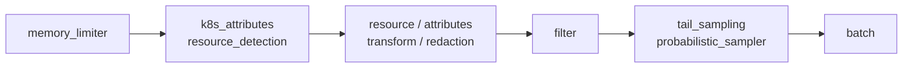
```mermaid
flowchart LR
    A[memory_limiter] --> B[k8s_attributes<br/>resource_detection]
    B --> C[resource / attributes<br/>transform / redaction]
    C --> D[filter]
    D --> E[tail_sampling<br/>probabilistic_sampler]
    E --> F[batch]
```

| 順序 | Processor | 原因 |
| --- | --- | --- |
| 1 | `memory_limiter` | 最先檢查記憶體，超限時立即拒收，讓上游重試 |
| 2 | `k8s_attributes`、`resource_detection` | 先補齊身分資訊，後續規則才能依 Namespace / 服務判斷 |
| 3 | `resource`、`attributes`、`transform`、`redaction` | 正規化與遮罩；**遮罩要在任何匯出或分流之前** |
| 4 | `filter` | 丟棄雜訊，減少後續處理量 |
| 5 | `tail_sampling` 等採樣 | 在批次前做資料量決策 |
| 6 | `batch` | 最後打包；放在採樣之後，避免打包後又被丟棄 |

```yaml
processors:
  memory_limiter:
    check_interval: 1s
    limit_mib: 1600        # 約為容器記憶體上限的 80%
    spike_limit_mib: 400   # 約為上限的 20–25%
  batch:
    send_batch_size: 8192  # 預設 8192；只是觸發門檻，不是批次上限
    send_batch_max_size: 10000
    timeout: 1s            # 預設 200ms
```

##### `batch` processor 與 exporter 內建批次的選擇

| 方式 | 設定位置 | 優點 | 注意事項 |
| --- | --- | --- | --- |
| `batch` processor | `processors.batch` | 成熟、社群範例多、所有 exporter 通用 | 資料在記憶體中，Collector 重啟會遺失尚未送出的批次 |
| exporter 批次 | `exporters.<name>.sending_queue.batch` | 與（持久化）佇列整合，重啟後可續送 | 預設關閉，以 `batch: {}` 啟用；`flush_timeout` 預設 200ms、`min_size` 預設 8192 |

```yaml
exporters:
  otlp_grpc/tempo:
    endpoint: tempo-distributor.observability.svc:4317
    sending_queue:
      enabled: true
      sizer: items          # 以 span / data point / log record 數量計算
      queue_size: 100000
      batch:
        flush_timeout: 1s
        min_size: 8192
        max_size: 10000
```

> 💡 **建議**：需要「重啟不掉資料」的管線（例如稽核日誌、交易追蹤）採用 **exporter 批次 + `file_storage` 持久化佇列**；一般管線使用 `batch` processor 即可。兩者不要重複疊加。

#### 4.4.2 敏感資料過濾

敏感資料應在**最靠近來源**的地方處理：能在 SDK / 應用端避免就不要送出；送出後在 **Agent 或 Gateway 的第一層**遮罩，且**一定要在匯出或分流之前**。

| 工具 | 適用情境 | 範例 |
| --- | --- | --- |
| `attributes` | 刪除或雜湊**已知名稱**的屬性 | 刪除 `http.request.header.authorization` |
| `transform`（OTTL） | 依**值的樣式**遮罩（正則表達式），可處理 Log Body | 遮罩身分證字號、卡號、Email |
| `redaction` | **允許清單**模式（fail-closed）：未列出的屬性全部移除 | 對外部 SaaS 後端送出前的最後防線 |

```yaml
processors:
  attributes/scrub:
    actions:
      # 依「屬性名稱」刪除
      - key: db.password
        action: delete
      - key: http.request.header.authorization
        action: delete
      # 以正則比對「屬性名稱」後刪除（pattern 比對的是 key，不是 value）
      - pattern: ^http\.request\.header\.x-api-.*
        action: delete
      # 雜湊（SHA-256）保留可關聯性但不可還原
      - key: enduser.id
        action: hash

  transform/mask-values:
    error_mode: ignore
    trace_statements:
      # 依「屬性值」遮罩：台灣身分證字號
      - replace_all_patterns(span.attributes, "value", "[A-Z][12]\\d{8}", "**********")
      # 移除 SQL 中的字面值（若應用端尚未參數化）
      - replace_pattern(span.attributes["db.query.text"], "'[^']*'", "'?'")

  redaction/external:
    allow_all_keys: false
    allowed_keys:
      - http.request.method
      - http.response.status_code
      - http.route
      - url.path
      - server.address
      - db.system.name
      - db.operation.name
      - error.type
    blocked_values:
      - "4[0-9]{12}(?:[0-9]{3})?"          # Visa
      - "(5[1-5][0-9]{14})"                # MasterCard
    summary: info
```

> ⚠️ **v1.0 修正**：v1.0 用 `attributes` processor 的 `pattern` + `action: update` 搭配 `replacement` 遮罩 Email，這種寫法**不存在**。`attributes` 的 `pattern` 是用來比對**屬性名稱**；要依**值**遮罩，請用 `transform` 的 `replace_pattern` / `replace_all_patterns`，或 `redaction` 的 `blocked_values`。

> 💡 **實務提醒**：
>
> 1. 在 OTTL 字串中，正則的反斜線需寫成 `\\`；要輸出字面的 `$` 需寫成 `$$`（Collector 設定檔的跳脫規則）。
> 2. 遮罩規則請建立**單元測試**：以 `telemetrygen` 或固定的 OTLP JSON 樣本送入測試 Collector，檢查 `debug` exporter 輸出。
> 3. 個資法遵的完整對應見 [9.6 節](#96-臺灣金融業法規與規範對應)。

#### 4.4.3 採樣策略建議

| 採樣方式 | 位置 | 優點 | 缺點 |
| --- | --- | --- | --- |
| **Head Sampling**（`parentbased_traceidratio`） | SDK | 成本最低，未採樣的 Span 根本不產生 | 決策時不知道結果，可能漏掉錯誤或慢請求 |
| **Collector 機率採樣**（`probabilistic_sampler`） | Agent / Gateway | 集中調整比例 | 同 Head Sampling，無法依結果判斷 |
| **Tail Sampling**（`tail_sampling`） | Gateway（兩層架構） | 依錯誤、延遲、屬性保留重要 Trace | 需暫存完整 Trace，記憶體與架構成本較高 |

| 環境 | 建議 | 說明 |
| --- | --- | --- |
| 開發 / 測試 | SDK 100%，不做 Tail Sampling | 完整記錄便於除錯 |
| UAT / 效能測試 | SDK 100% + Tail Sampling 保留錯誤與慢請求，其餘 20–50% | 驗證採樣政策本身 |
| 生產 | SDK 100%（或高比例）+ Gateway Tail Sampling：錯誤 100%、慢請求 100%、其餘 5–10% | 兼顧成本與問題可追溯性 |
| 生產（超大流量） | SDK `parentbased_traceidratio` 10–20% + Tail Sampling | 先在源頭降量再精選 |

```yaml
processors:
  tail_sampling:
    decision_wait: 10s
    num_traces: 200000
    expected_new_traces_per_sec: 2000
    policies:
      # 錯誤全部保留
      - name: errors
        type: status_code
        status_code:
          status_codes: [ERROR]
      # 慢請求全部保留
      - name: slow
        type: latency
        latency:
          threshold_ms: 500
      # 關鍵交易全部保留
      - name: critical-routes
        type: string_attribute
        string_attribute:
          key: http.route
          values: ["/api/payments", "/api/transfers"]
      # 其餘依比例
      - name: default
        type: probabilistic
        probabilistic:
          sampling_percentage: 10
```

> ⚠️ **實務提醒**：
>
> 1. `memory_limiter` 必須啟用，避免 OOM。
> 2. Tail Sampling 會讓**由 Span 計算的指標**失真；RED 指標請在採樣**之前**以 `span_metrics` connector 產生，或直接使用 SDK 產生的 HTTP 指標（`http.server.request.duration`）。
> 3. 多條 policy 之間是 **OR** 關係（任一命中即保留）；需要 AND 條件時使用 `and` policy。
> 4. `num_traces` 與 `decision_wait` 決定記憶體用量，約為「每秒新 Trace 數 × decision_wait × 每 Trace 大小」的倍數，上線前務必壓測。

---

### 4.5 OTTL 與資料轉換

**OTTL（OpenTelemetry Transformation Language）** 是 Collector 的資料轉換語言，用於 `transform`、`filter`、`routing` connector、`tail_sampling` 的 `ottl_condition` policy 等元件。

#### 4.5.1 語法基礎

```text
<函式>(<參數>...) where <條件>

路徑（Path）前綴：resource、scope、span、spanevent、metric、datapoint、exemplar、log、profile
```

| 類型 | 常用函式 | 說明 |
| --- | --- | --- |
| 編輯 | `set`、`delete_key`、`delete_matching_keys`、`keep_keys`、`keep_matching_keys`、`limit`、`truncate_all`、`merge_maps`、`flatten` | 新增、刪除、保留、截斷屬性 |
| 字串 | `replace_pattern`、`replace_all_patterns`、`replace_match`、`replace_all_matches` | 依正則或萬用字元取代 |
| 轉換 | `Concat`、`Split`、`ToLowerCase`、`ParseJSON`、`ExtractPatterns`、`SHA256`、`Int`、`Double` | 運算與型別轉換（大寫開頭為回傳值的轉換函式） |
| 指標 | `convert_sum_to_gauge`、`convert_gauge_to_sum`、`extract_count_metric`、`extract_sum_metric` | 指標型別轉換 |
| 條件 | `IsMatch`、`==`、`!=`、`<`、`and`、`or`、`not` | 布林運算 |

#### 4.5.2 常用範例

```yaml
processors:
  transform/normalize:
    error_mode: ignore
    trace_statements:
      # 統一環境名稱
      - set(resource.attributes["deployment.environment.name"], "production") where resource.attributes["deployment.environment.name"] == "prod"
      # 舊版 semconv 屬性遷移（舊 SDK 尚未升級時的過渡處理）
      - set(span.attributes["http.request.method"], span.attributes["http.method"]) where span.attributes["http.request.method"] == nil and span.attributes["http.method"] != nil
      - delete_key(span.attributes, "http.method")
      # 限制屬性數量與長度，避免超大 Span
      - limit(span.attributes, 64, ["http.route", "http.request.method"])
      - truncate_all(span.attributes, 2048)
    log_statements:
      # 解析 JSON 格式的 log body，合併到屬性中
      - merge_maps(log.attributes, ParseJSON(log.body), "upsert") where IsMatch(log.body, "^\\{")
      # 依 level 欄位設定嚴重度
      - set(log.severity_text, "ERROR") where log.attributes["level"] == "error"
      - set(log.severity_number, SEVERITY_NUMBER_ERROR) where log.attributes["level"] == "error"
    metric_statements:
      # 刪除高基數的資料點屬性
      - delete_key(datapoint.attributes, "user.id")
      - delete_key(datapoint.attributes, "session.id")

  filter/drop-debug:
    error_mode: ignore
    log_conditions:
      - log.severity_number < SEVERITY_NUMBER_INFO and resource.attributes["deployment.environment.name"] == "production"
    metric_conditions:
      - metric.name == "jvm.buffer.count"
```

#### 4.5.3 以 routing connector 依租戶分流

```yaml
receivers:
  otlp:
    protocols:
      grpc:
        endpoint: 0.0.0.0:4317

exporters:
  otlp_grpc/secure-backend:
    endpoint: secure-tempo.payments.svc:4317
  otlp_grpc/tempo:
    endpoint: tempo-distributor.observability.svc:4317

connectors:
  routing:
    default_pipelines: [traces/default]
    error_mode: ignore
    table:
      - statement: route() where resource.attributes["service.namespace"] == "payments"
        pipelines: [traces/payments]

service:
  pipelines:
    traces/in:
      receivers: [otlp]
      exporters: [routing]
    traces/payments:
      receivers: [routing]
      exporters: [otlp_grpc/secure-backend]
    traces/default:
      receivers: [routing]
      exporters: [otlp_grpc/tempo]
```

> 💡 **實務提醒**：
>
> 1. 建議一律設定 `error_mode: ignore`（目前預設值），避免單筆資料格式異常就讓整批資料被丟棄。
> 2. OTTL 正則使用 Go RE2 語法，不支援回溯參考與環視（lookaround）。
> 3. 大量正則比對會耗用 CPU，請在壓測中觀察 `otelcol_processor_*` 指標與 CPU 使用率。

---

### 4.6 元件更名、設定驗證與除錯工具

#### 4.6.1 元件 snake_case 更名

Collector 自 v0.144.0（core，2026-01-20）起陸續將元件類型名稱改為 snake_case，舊名稱以「已棄用別名」保留，啟動時會輸出警告：

```text
warn  builders/builders.go:40  "otlp" alias is deprecated; use "otlp_grpc" instead
warn  builders/builders.go:40  "prometheusremotewrite" alias is deprecated; use "prometheus_remote_write" instead
```

常用元件對照（完整對照表見 [附錄 G](#附錄-gcollector-元件更名對照表)）：

| 類別 | 舊名稱 | 新名稱 | 更名版本 |
| --- | --- | --- | --- |
| exporter | `otlp` | `otlp_grpc` | v0.144.0 |
| exporter | `otlphttp` | `otlp_http` | v0.144.0 |
| processor | `k8sattributes` | `k8s_attributes` | v0.146.0 |
| receiver | `filelog` | `file_log` | v0.149.0 |
| receiver | `hostmetrics` | `host_metrics` | v0.151.0 |
| connector | `spanmetrics` / `servicegraph` | `span_metrics` / `service_graph` | v0.151.0 |
| exporter | `loadbalancing` | `load_balancing` | v0.153.0 |
| processor | `resourcedetection` | `resource_detection` | v0.153.0 |
| exporter | `prometheusremotewrite` | `prometheus_remote_write` | v0.154.0 |

> ⚠️ **注意**：`otlp` **receiver** 名稱不變；只有 `otlp` **exporter** 改名為 `otlp_grpc`。升級時建議用 CI 腳本掃描設定檔中的舊名稱，並在 `validate` 之外加上「啟動 5 秒、檢查無 `alias is deprecated` 警告」的檢查。

#### 4.6.2 命令列工具

| 指令 | 用途 |
| --- | --- |
| `otelcol-contrib validate --config=config.yaml` | 驗證設定（語法、欄位、元件是否存在、pipeline 是否完整） |
| `otelcol-contrib components` | 列出發行版內所有元件、模組版本與各訊號穩定度 |
| `otelcol-contrib featuregate` | 列出 Feature Gate、目前是否啟用與階段 |
| `otelcol-contrib print-config --config=config.yaml` | 輸出合併、展開後的最終設定（便於檢查多檔合併結果） |
| `otelcol-contrib --feature-gates=+gate.id,-other.gate` | 啟用 / 停用 Feature Gate |

#### 4.6.3 以 debug exporter 檢查資料

```yaml
exporters:
  debug/detailed:
    verbosity: detailed     # basic | normal | detailed
    sampling_initial: 5     # 前 5 筆全部輸出
    sampling_thereafter: 200 # 之後每 200 筆輸出 1 筆
```

> 💡 **實務提醒**：`debug` exporter 會把資料寫入 Collector 日誌，**生產環境不要長期開啟 `detailed`**，以免敏感資料進入日誌系統、或日誌量暴增。

---

## 5. 應用系統如何串接 OpenTelemetry

> **本章重點**：以「零程式碼優先、手動補強」為原則，說明 Java / Spring Boot、Node.js、Python、.NET、Go 的串接方式，eBPF 零程式碼埋點（OBI），以及 Resource、Semantic Conventions、Context Propagation、Baggage 與 Logs 關聯等共通概念。

### 5.1 Java / Spring Boot

#### 5.1.1 SDK 導入方式

Java 有三種導入方式，可依團隊習慣與部署限制選擇：

| 方式 | 原理 | 優點 | 限制 | 建議場景 |
| --- | --- | --- | --- | --- |
| **Java Agent**（`opentelemetry-javaagent.jar` 2.31.1） | JVM 啟動時以 `-javaagent` 做 Bytecode 注入 | 零程式碼、支援函式庫最廣（數百個） | 啟動時間略增；與其他 Agent 並用需測試 | **企業首選**，容器與 VM 皆適用 |
| **OTel Spring Boot Starter**（`opentelemetry-spring-boot-starter`） | Spring Boot 自動組態 | 不需要 Agent、支援 GraalVM Native Image；Spring Boot 2.6+ / 3.1+ / 4.x | 涵蓋範圍少於 Agent | 無法使用 `-javaagent`、Native Image |
| **Spring Boot 4 原生 `spring-boot-starter-opentelemetry`** | Micrometer Observation + OTLP 匯出 | Spring 官方維護、與 Actuator 整合 | 以 Micrometer 為核心，自動埋點範圍以 Spring 生態為主 | 純 Spring Boot 4 應用、偏好 Spring 原生方案 |

> ⚠️ **選型提醒**：同一個應用**只選一種**主要方式。Java Agent 與 OTel Starter 同時使用會產生重複的 Span。

##### 方式一：Java Agent（推薦）

```bash
# 下載固定版本的 Agent（勿在生產環境使用 latest）
curl -L -o /opt/otel/opentelemetry-javaagent.jar \
  https://github.com/open-telemetry/opentelemetry-java-instrumentation/releases/download/v2.31.1/opentelemetry-javaagent.jar

# 啟動應用（Agent 2.x 預設 OTLP/HTTP，連 4318）
java -javaagent:/opt/otel/opentelemetry-javaagent.jar \
     -Dotel.service.name=order-service \
     -Dotel.exporter.otlp.endpoint=http://otel-agent:4318 \
     -jar order-service.jar

# 或以環境變數設定（容器環境建議）
export JAVA_TOOL_OPTIONS="-javaagent:/opt/otel/opentelemetry-javaagent.jar"
export OTEL_SERVICE_NAME=order-service
export OTEL_EXPORTER_OTLP_ENDPOINT=http://otel-agent:4318
java -jar order-service.jar
```

##### 方式二：手動 Instrumentation 依賴（`pom.xml`）

```xml
<dependencyManagement>
    <dependencies>
        <!-- OTel SDK BOM -->
        <dependency>
            <groupId>io.opentelemetry</groupId>
            <artifactId>opentelemetry-bom</artifactId>
            <version>1.66.0</version>
            <type>pom</type>
            <scope>import</scope>
        </dependency>
        <!-- Instrumentation BOM（使用 Spring Boot Starter 時必須匯入，且放在 spring-boot-dependencies 之前） -->
        <dependency>
            <groupId>io.opentelemetry.instrumentation</groupId>
            <artifactId>opentelemetry-instrumentation-bom</artifactId>
            <version>2.31.1</version>
            <type>pom</type>
            <scope>import</scope>
        </dependency>
    </dependencies>
</dependencyManagement>

<dependencies>
    <!-- 只寫手動埋點程式碼時，只需要 API -->
    <dependency>
        <groupId>io.opentelemetry</groupId>
        <artifactId>opentelemetry-api</artifactId>
    </dependency>

    <!-- 語意慣例常數（ServiceAttributes、HttpAttributes 等） -->
    <dependency>
        <groupId>io.opentelemetry.semconv</groupId>
        <artifactId>opentelemetry-semconv</artifactId>
    </dependency>

    <!-- 不使用 Java Agent 時：OTel Spring Boot Starter（已 Stable，版本由 BOM 管理） -->
    <dependency>
        <groupId>io.opentelemetry.instrumentation</groupId>
        <artifactId>opentelemetry-spring-boot-starter</artifactId>
    </dependency>
</dependencies>
```

> ⚠️ **v1.0 修正**：v1.0 範例使用 BOM 1.35.0 與 `opentelemetry-spring-boot-starter:2.1.0-alpha`。Starter 早已脫離 alpha，版本請交由 `opentelemetry-instrumentation-bom` 管理，不要個別指定。

#### 5.1.2 自動 Instrumentation vs 手動 Instrumentation

| 比較項目 | 自動 Instrumentation | 手動 Instrumentation |
| --- | --- | --- |
| **導入難度** | 低（加 Agent 或 Starter） | 高（修改程式碼） |
| **覆蓋範圍** | HTTP Server / Client、JDBC、Kafka、gRPC、Redis 等框架層 | 業務邏輯、關鍵交易步驟、業務屬性 |
| **效能影響** | 依啟用的 Instrumentation 而定，可個別關閉 | 可精確控制 |
| **維護成本** | 低（隨 Agent 升級） | 中（需遵守命名規範與 Code Review） |
| **適用場景** | 全面導入的基線 | 關鍵業務流程、補強自動埋點看不到的部分 |

> 💡 **建議**：先以自動 Instrumentation 建立基線，再針對**關鍵交易**以 `@WithSpan` 註解或手動 Span 補強；業務屬性一律加上命名空間前綴（例如 `app.order.id`，見 [9.2 節](#92-命名規範與標準化建議)）。

##### 常用的 Java Agent 調校設定

| 設定（系統屬性 / 環境變數） | 說明 |
| --- | --- |
| `otel.instrumentation.common.default-enabled=false` + `otel.instrumentation.<name>.enabled=true` | 預設全關，只開需要的 Instrumentation（降低開銷與攻擊面） |
| `otel.instrumentation.<name>.enabled=false` | 關閉特定 Instrumentation，例如 `jdbc-datasource` |
| `otel.javaagent.extensions=/opt/otel/ext.jar` | 載入自訂 Extension（自訂 Sampler、SpanProcessor） |
| `otel.instrumentation.http.server.capture-request-headers=x-request-id` | 擷取指定的請求 Header 為屬性（勿擷取 Authorization） |
| `otel.javaagent.debug=true` | 除錯輸出（非常冗長，僅限排查時使用） |
| `otel.config.file=/opt/otel/otel-config.yaml` | 使用宣告式設定檔（Agent 2.26.0+，仍為實驗性，見 [11.3 節](#113-declarative-configuration宣告式設定)） |

#### 5.1.3 Trace / Span 使用範例

##### 自動 Instrumentation 環境變數設定

```bash
OTEL_SERVICE_NAME=order-service
OTEL_RESOURCE_ATTRIBUTES=service.namespace=ecommerce,service.version=1.4.2,deployment.environment.name=production
OTEL_EXPORTER_OTLP_ENDPOINT=http://otel-agent:4318
OTEL_EXPORTER_OTLP_PROTOCOL=http/protobuf
OTEL_TRACES_SAMPLER=parentbased_traceidratio
OTEL_TRACES_SAMPLER_ARG=1.0
OTEL_METRIC_EXPORT_INTERVAL=30000
OTEL_LOGS_EXPORTER=otlp
```

> 💡 生產環境若在 Gateway 做 Tail Sampling，SDK 端通常維持 `1.0`（100%），讓 Gateway 看到完整 Trace 再決定。

##### 以註解建立 Span（需要 `opentelemetry-instrumentation-annotations`，Agent 已內建支援）

```java
import io.opentelemetry.instrumentation.annotations.SpanAttribute;
import io.opentelemetry.instrumentation.annotations.WithSpan;

@Service
public class InventoryService {

    @WithSpan("reserveInventory")
    public boolean reserve(@SpanAttribute("app.sku") String sku, int qty) {
        // 業務邏輯；例外會自動記錄並將 Span 狀態設為 Error
        return repository.reserve(sku, qty);
    }
}
```

##### 手動建立 Span 範例

```java
import io.opentelemetry.api.GlobalOpenTelemetry;
import io.opentelemetry.api.common.AttributeKey;
import io.opentelemetry.api.trace.Span;
import io.opentelemetry.api.trace.SpanKind;
import io.opentelemetry.api.trace.StatusCode;
import io.opentelemetry.api.trace.Tracer;
import io.opentelemetry.context.Scope;

@Service
public class OrderService {

    private static final Tracer tracer =
        GlobalOpenTelemetry.getTracer("com.example.order", "1.4.2");

    private static final AttributeKey<String> ORDER_TYPE = AttributeKey.stringKey("app.order.type");
    private static final AttributeKey<String> ORDER_ID = AttributeKey.stringKey("app.order.id");

    public Order createOrder(OrderRequest request) {
        Span span = tracer.spanBuilder("createOrder")
                .setSpanKind(SpanKind.INTERNAL)
                .setAttribute(ORDER_TYPE, request.getType())
                .startSpan();

        try (Scope scope = span.makeCurrent()) {
            validateOrder(request);           // 子 Span 自動成為 createOrder 的子節點
            Order order = processOrder(request);
            span.setAttribute(ORDER_ID, order.getId());
            return order;
        } catch (Exception e) {
            span.recordException(e);
            span.setStatus(StatusCode.ERROR, e.getClass().getSimpleName());
            throw e;
        } finally {
            span.end();
        }
    }

    private void validateOrder(OrderRequest request) {
        Span span = tracer.spanBuilder("validateOrder").startSpan();
        try (Scope scope = span.makeCurrent()) {
            // 驗證邏輯
        } finally {
            span.end();
        }
    }
}
```

> ⚠️ **v1.0 修正**：
>
> 1. **不要**把客戶編號、身分證字號等個資放進屬性（v1.0 的 `customer.id` 範例有個資風險）；需要關聯時用雜湊或內部流水號。
> 2. 依 Semantic Conventions，成功時**保持 `Unset`**，不需要呼叫 `setStatus(StatusCode.OK)`；只有錯誤時才設 `ERROR`。
> 3. `setStatus` 的描述不要放例外訊息全文（可能含個資），放例外類別即可，詳細內容由 `recordException` 記錄並在 Collector 遮罩。
> 4. Semantic Conventions 1.44 已將「例外記錄為 Span Event」標為 Deprecated，未來將改以 Log 記錄例外（見 [8.5 節](#85-semantic-conventions-遷移)）；目前 `recordException` 仍可使用。

#### 5.1.4 Spring Boot 整合範例

##### 使用 OTel Spring Boot Starter 自動組態（`application.yaml`）

```yaml
spring:
  application:
    name: order-service       # 未設定 otel.service.name 時作為 service.name

otel:
  exporter:
    otlp:
      endpoint: http://otel-agent:4318
      protocol: http/protobuf
  resource:
    attributes:
      service.namespace: ecommerce
      deployment.environment.name: ${ENVIRONMENT:development}
  traces:
    sampler: parentbased_traceidratio
    sampler.arg: ${OTEL_SAMPLER_RATIO:1.0}
  instrumentation:
    http:
      server:
        capture-request-headers: x-request-id
```

##### REST Controller 自動追蹤 + 加入業務屬性

```java
import io.opentelemetry.api.trace.Span;

@RestController
@RequestMapping("/api/orders")
public class OrderController {

    private final OrderService orderService;

    public OrderController(OrderService orderService) {
        this.orderService = orderService;
    }

    @PostMapping
    public ResponseEntity<Order> createOrder(@RequestBody OrderRequest request) {
        // Spring Web MVC 會自動建立 SERVER Span（名稱為 "POST /api/orders"）
        Span.current().setAttribute("app.order.channel", request.getChannel());
        return ResponseEntity.ok(orderService.createOrder(request));
    }
}
```

> 💡 **Spring Boot 4 原生方案**：加入 `spring-boot-starter-opentelemetry` 後，可用 `management.opentelemetry.*`、`management.otlp.metrics.export.url` 等屬性設定 OTLP 匯出。它以 Micrometer 為核心，適合已大量使用 Micrometer Observation 的團隊；需要最廣泛的自動埋點時仍建議 Java Agent。

---

### 5.2 Node.js

#### 5.2.1 SDK 初始化

##### 安裝依賴（JS SDK 2.x）

```bash
npm install @opentelemetry/api \
            @opentelemetry/sdk-node \
            @opentelemetry/auto-instrumentations-node \
            @opentelemetry/exporter-trace-otlp-proto \
            @opentelemetry/exporter-metrics-otlp-proto \
            @opentelemetry/sdk-metrics \
            @opentelemetry/resources \
            @opentelemetry/semantic-conventions
```

##### 最簡方式：不寫程式碼，只用環境變數

```bash
export OTEL_SERVICE_NAME=user-service
export OTEL_EXPORTER_OTLP_ENDPOINT=http://otel-agent:4318
export OTEL_NODE_RESOURCE_DETECTORS=env,host,os,process,container
node --require @opentelemetry/auto-instrumentations-node/register app.js
```

##### 程式化初始化（`instrumentation.mjs`，ESM）

```javascript
// instrumentation.mjs — 以 node --import ./instrumentation.mjs app.js 載入，必須早於應用程式碼
import { NodeSDK } from '@opentelemetry/sdk-node';
import { getNodeAutoInstrumentations } from '@opentelemetry/auto-instrumentations-node';
import { OTLPTraceExporter } from '@opentelemetry/exporter-trace-otlp-proto';
import { OTLPMetricExporter } from '@opentelemetry/exporter-metrics-otlp-proto';
import { PeriodicExportingMetricReader } from '@opentelemetry/sdk-metrics';
import { resourceFromAttributes } from '@opentelemetry/resources';
import { ATTR_SERVICE_NAME, ATTR_SERVICE_VERSION } from '@opentelemetry/semantic-conventions';

const sdk = new NodeSDK({
  resource: resourceFromAttributes({
    [ATTR_SERVICE_NAME]: 'user-service',
    [ATTR_SERVICE_VERSION]: '1.0.0',
    'deployment.environment.name': process.env.DEPLOY_ENV ?? 'development',
  }),
  // 未指定 url 時讀取 OTEL_EXPORTER_OTLP_ENDPOINT，並自動補上 /v1/traces、/v1/metrics
  traceExporter: new OTLPTraceExporter(),
  metricReader: new PeriodicExportingMetricReader({
    exporter: new OTLPMetricExporter(),
    exportIntervalMillis: 30000,
  }),
  instrumentations: [
    getNodeAutoInstrumentations({
      '@opentelemetry/instrumentation-fs': { enabled: false }, // fs 埋點量大，通常關閉
    }),
  ],
});

sdk.start();

process.on('SIGTERM', async () => {
  try {
    await sdk.shutdown();
  } finally {
    process.exit(0);
  }
});
```

##### 應用程式入口（`app.mjs`）

```javascript
import express from 'express';
import { trace, SpanStatusCode } from '@opentelemetry/api';

const app = express();
const tracer = trace.getTracer('com.example.user', '1.0.0');

app.get('/api/users/:id', async (req, res) => {
  // express 的 SERVER Span 由自動埋點建立；這裡建立業務子 Span
  await tracer.startActiveSpan('loadUserProfile', async (span) => {
    try {
      const user = await getUserFromDatabase(req.params.id);
      res.json(user);
    } catch (error) {
      span.recordException(error);
      span.setStatus({ code: SpanStatusCode.ERROR, message: error.name });
      res.status(500).json({ error: 'internal error' });
    } finally {
      span.end();
    }
  });
});

app.listen(3000);
```

```bash
node --import ./instrumentation.mjs app.mjs
```

> ⚠️ **v1.0 修正**：
>
> 1. JS SDK 2.x 已移除 `new Resource(...)`，改用 `resourceFromAttributes()`；`SemanticResourceAttributes` 也已移除，改用 `ATTR_SERVICE_NAME` 等常數。
> 2. v1.0 把 gRPC exporter 的 URL 寫成 `OTEL_EXPORTER_OTLP_ENDPOINT` 的值並同時供 traces、metrics 使用；改用 HTTP/Protobuf exporter 並讓 SDK 自動補路徑較不易出錯。
> 3. 不要用魔術數字 `code: 1` / `code: 2`，請用 `SpanStatusCode` 列舉；回應給客戶端的錯誤訊息不要直接透出 `error.message`。
> 4. ESM 應用必須用 `--import`；CommonJS 可用 `--require`。不要同時在 `NODE_OPTIONS` 與命令列各載入一次。

---

### 5.3 常見共通概念

#### 5.3.1 Resource / Attributes 設計

**Resource Attributes（資源屬性）**：描述**誰**產生了遙測資料，同一程序內所有訊號共用。

```yaml
# 標準 Resource Attributes（Semantic Conventions 1.44）
service.name: order-service                 # 服務名稱（必要；未設定時為 unknown_service）
service.namespace: ecommerce                # 服務群組 / 業務領域
service.version: 1.4.2                      # 版本（建議與映像標籤一致）
service.instance.id: 7f0e2c5a-...           # 實例 ID（建議每次啟動產生 UUID）
deployment.environment.name: production    # 部署環境（取代已棄用的 deployment.environment）
host.name: server-01                        # 主機名稱（resource_detection 自動偵測）
container.id: abc123                        # 容器 ID
k8s.namespace.name: payments                # K8s Namespace（k8s_attributes 自動補上）
k8s.pod.name: order-service-7d9f-xyz        # K8s Pod 名稱
```

**Span Attributes（跨度屬性）**：描述**特定操作**的細節。下表為 v1.0 使用的舊屬性與目前穩定版的對照：

| 領域 | 舊屬性（已棄用） | 新屬性（Stable） | 範例 |
| --- | --- | --- | --- |
| HTTP | `http.method` | `http.request.method` | `POST` |
| HTTP | `http.url` | `url.full`（Client）/ `url.path` + `url.query`（Server） | `https://api.example.com/orders?id=1` |
| HTTP | `http.status_code` | `http.response.status_code` | `200` |
| HTTP | `http.target` | `url.path`、`url.query` | `/orders` |
| HTTP | `http.request_content_length` | `http.request.body.size` | `1024` |
| HTTP | `net.peer.name` / `net.peer.port` | `server.address` / `server.port` | `api.example.com` / `443` |
| DB | `db.system` | `db.system.name` | `postgresql` |
| DB | `db.name` | `db.namespace` | `orders` |
| DB | `db.statement` | `db.query.text` | `SELECT * FROM orders WHERE id = ?` |
| DB | `db.operation` | `db.operation.name` | `SELECT` |
| DB | `db.sql.table` | `db.collection.name` | `orders` |
| 通用 | — | `error.type` | `java.net.SocketTimeoutException`、`500` |

```yaml
# 自訂業務屬性：一律加上公司或應用命名空間
app.order.id: ORD-12345
app.customer.tier: premium
app.transaction.channel: mobile
```

> 💡 **實務提醒**：自動 Instrumentation 會依其版本輸出對應的 Semantic Conventions；同一企業內各語言 Agent 版本差距過大時，HTTP / DB 屬性名稱可能不一致。升級策略與 `OTEL_SEMCONV_STABILITY_OPT_IN` 見 [8.5 節](#85-semantic-conventions-遷移)。

#### 5.3.2 TraceId / SpanId 傳遞

**Context Propagation（上下文傳遞）**：OTel 預設使用 **W3C Trace Context**（`traceparent`、`tracestate`）與 **W3C Baggage**（`baggage`）。

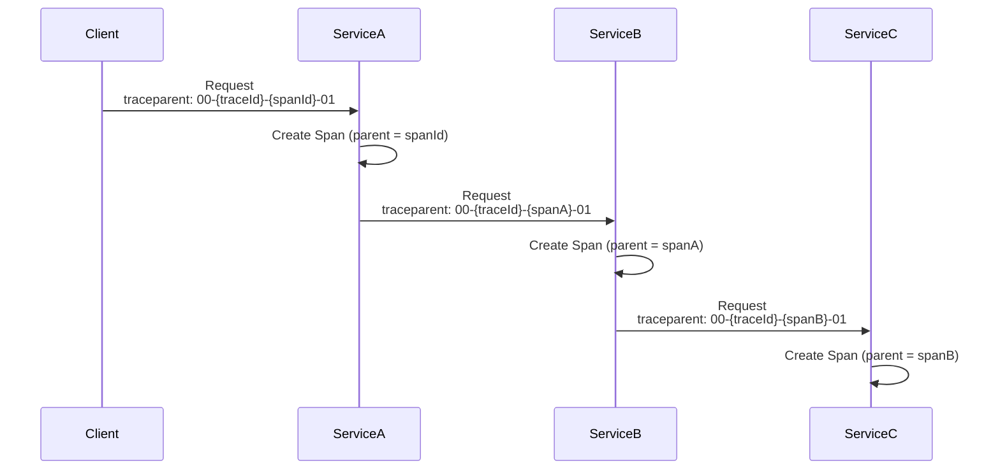
```mermaid
sequenceDiagram
    participant Client
    participant ServiceA
    participant ServiceB
    participant ServiceC

    Client->>ServiceA: Request<br/>traceparent: 00-{traceId}-{spanId}-01
    ServiceA->>ServiceA: Create Span (parent = spanId)
    ServiceA->>ServiceB: Request<br/>traceparent: 00-{traceId}-{spanA}-01
    ServiceB->>ServiceB: Create Span (parent = spanA)
    ServiceB->>ServiceC: Request<br/>traceparent: 00-{traceId}-{spanB}-01
    ServiceC->>ServiceC: Create Span (parent = spanB)
```

##### W3C Trace Context Header 格式

```text
traceparent: 00-{trace-id}-{parent-id}-{trace-flags}
             |  |          |           |
             |  |          |           └── 01 = sampled（取樣旗標）
             |  |          └── 16 hex chars（8 bytes，上游 Span ID）
             |  └── 32 hex chars（16 bytes）
             └── version（目前為 00）

範例：
traceparent: 00-0af7651916cd43dd8448eb211c80319c-b7ad6b7169203331-01
```

| Propagator | 設定值（`OTEL_PROPAGATORS`） | 使用時機 |
| --- | --- | --- |
| W3C Trace Context | `tracecontext` | 預設，建議全企業統一 |
| W3C Baggage | `baggage` | 預設 |
| B3（單 / 多 Header） | `b3` / `b3multi` | 與 Zipkin / 舊版 Spring Cloud Sleuth 系統互通 |
| Jaeger | `jaeger` | 與 Jaeger 客戶端舊系統互通 |
| AWS X-Ray | `xray` | AWS 環境 |

> ⚠️ **注意**：跨越**信任邊界**（例如對外 API、合作夥伴系統）時，應在 API Gateway 決定是否信任外部傳入的 `traceparent`，並在送出時移除 `baggage`，避免內部資訊外流。

#### 5.3.3 跨服務追蹤（Distributed Tracing）

##### Java RestTemplate / RestClient / WebClient 自動傳遞

```java
@Configuration
public class HttpClientConfig {

    // 使用 Java Agent 時，RestTemplate、RestClient、WebClient、OkHttp、Apache HttpClient
    // 都會自動注入 traceparent，不需要額外設定
    @Bean
    public RestClient restClient(RestClient.Builder builder) {
        return builder.baseUrl("http://payment-service").build();
    }
}
```

##### 手動傳遞 Context（自建通訊協定或未支援的函式庫）

```java
import io.opentelemetry.api.GlobalOpenTelemetry;
import io.opentelemetry.context.Context;
import io.opentelemetry.context.propagation.TextMapGetter;
import io.opentelemetry.context.propagation.TextMapSetter;
import java.util.Map;

public final class ContextPropagation {

    private static final TextMapSetter<Map<String, String>> SETTER = Map::put;

    private static final TextMapGetter<Map<String, String>> GETTER = new TextMapGetter<>() {
        @Override
        public Iterable<String> keys(Map<String, String> carrier) {
            return carrier.keySet();
        }

        @Override
        public String get(Map<String, String> carrier, String key) {
            return carrier == null ? null : carrier.get(key);
        }
    };

    /** 送出端：把目前 Context 注入到訊息 Header */
    public static void inject(Map<String, String> headers) {
        GlobalOpenTelemetry.getPropagators().getTextMapPropagator()
            .inject(Context.current(), headers, SETTER);
    }

    /** 接收端：從訊息 Header 還原上游 Context */
    public static Context extract(Map<String, String> headers) {
        return GlobalOpenTelemetry.getPropagators().getTextMapPropagator()
            .extract(Context.current(), headers, GETTER);
    }
}
```

##### 非同步與訊息佇列的處理原則

| 情境 | 建議做法 |
| --- | --- |
| Kafka、RabbitMQ、JMS | Java Agent 已自動注入 / 擷取 Header；Consumer 端產生 `CONSUMER` Span |
| 批次消費（一次處理多筆訊息） | 以 **Span Link** 關聯每筆訊息的上游 Context，而不是選其中一筆當 Parent |
| 執行緒池、`CompletableFuture` | Java Agent 自動傳遞；自建執行緒池時用 `Context.current().wrap(executor)` |
| 排程工作（Scheduler） | 每次執行建立新的 Root Span，並以屬性記錄工作名稱 |

#### 5.3.4 Baggage 使用規範

Baggage 用來在服務之間傳遞**業務上下文**（例如租戶代碼、通路），但**不會自動寫入任何訊號**。

```java
import io.opentelemetry.api.baggage.Baggage;
import io.opentelemetry.context.Scope;

try (Scope scope = Baggage.current().toBuilder()
        .put("app.tenant.id", "bank-a")
        .build()
        .makeCurrent()) {
    paymentClient.pay(request);   // 下游可讀取 Baggage.current().getEntryValue("app.tenant.id")
}
```

| 規範 | 原因 |
| --- | --- |
| 只放低敏感、低基數、短字串的值 | Baggage 以 HTTP Header 明文傳遞到所有下游，包括第三方 |
| **嚴禁**放個資、Token、密碼 | 會隨請求外流並可能被記錄在 Proxy 日誌 |
| 需要成為 Span 屬性時，明確複製 | 可用 Java contrib 的 `BaggageSpanProcessor` 或手動 `setAttribute` |
| 在對外邊界移除 | API Gateway / Egress 移除 `baggage` Header |

---

### 5.4 Python

```bash
pip install opentelemetry-distro opentelemetry-exporter-otlp
opentelemetry-bootstrap -a install   # 依已安裝的套件自動安裝對應的 Instrumentation

export OTEL_SERVICE_NAME=risk-service
export OTEL_EXPORTER_OTLP_ENDPOINT=http://otel-agent:4318
export OTEL_EXPORTER_OTLP_PROTOCOL=http/protobuf
export OTEL_PYTHON_LOGGING_AUTO_INSTRUMENTATION_ENABLED=true   # 將 logging 接到 OTel 並注入 trace_id

opentelemetry-instrument gunicorn -w 4 -b 0.0.0.0:8000 app:app
```

#### 手動建立 Span

```python
from opentelemetry import trace
from opentelemetry.trace import Status, StatusCode

tracer = trace.get_tracer("com.example.risk", "2.3.0")

def evaluate(application):
    with tracer.start_as_current_span("evaluateRisk") as span:
        span.set_attribute("app.risk.model", "v7")
        try:
            return model.score(application)
        except Exception as exc:
            span.record_exception(exc)
            span.set_status(Status(StatusCode.ERROR, type(exc).__name__))
            raise
```

> ⚠️ **注意**：
>
> 1. Python 的 Logs SDK 仍為 **Development** 狀態，正式環境的日誌收集可先以 `file_log` 讀檔，或評估後再啟用 OTLP Logs。
> 2. 使用 Gunicorn / uWSGI 等 pre-fork 伺服器時，SDK 需在 **worker fork 之後**初始化（`opentelemetry-instrument` 已處理常見情況；自行初始化時請放在 `post_fork` hook）。
> 3. 版本基準：`opentelemetry-sdk` 1.45.0 / contrib 0.66b0（contrib 套件版本號帶 `b`，代表 beta）。

---

### 5.5 .NET

.NET 有兩種方式：**NuGet 套件（程式化設定）**或 **.NET Automatic Instrumentation（零程式碼，v1.17.0）**。

```bash
dotnet add package OpenTelemetry.Extensions.Hosting
dotnet add package OpenTelemetry.Exporter.OpenTelemetryProtocol
dotnet add package OpenTelemetry.Instrumentation.AspNetCore
dotnet add package OpenTelemetry.Instrumentation.Http
dotnet add package OpenTelemetry.Instrumentation.Runtime
```

```csharp
// Program.cs（ASP.NET Core）
using OpenTelemetry.Logs;
using OpenTelemetry.Metrics;
using OpenTelemetry.Resources;
using OpenTelemetry.Trace;

var builder = WebApplication.CreateBuilder(args);

builder.Services.AddOpenTelemetry()
    .ConfigureResource(r => r
        .AddService(serviceName: "account-api", serviceVersion: "3.2.0")
        .AddAttributes(new Dictionary<string, object>
        {
            ["deployment.environment.name"] = builder.Environment.EnvironmentName,
        }))
    .WithTracing(t => t
        .AddAspNetCoreInstrumentation()
        .AddHttpClientInstrumentation()
        .AddSource("Bank.Account"))          // 自訂 ActivitySource 名稱
    .WithMetrics(m => m
        .AddAspNetCoreInstrumentation()
        .AddHttpClientInstrumentation()
        .AddRuntimeInstrumentation())
    .WithLogging()
    .UseOtlpExporter();   // 一次設定三種訊號的 OTLP 匯出，讀取 OTEL_EXPORTER_OTLP_* 環境變數

var app = builder.Build();
app.Run();
```

> 💡 **.NET 特性**：.NET 以內建的 `System.Diagnostics.ActivitySource` / `Activity` 作為 Tracing API，`Meter` 作為 Metrics API，`ILogger` 作為 Logs 來源。自訂 Span 時使用 `ActivitySource.StartActivity()`，並記得用 `AddSource()` 註冊名稱，否則不會被匯出。

---

### 5.6 Go

Go 沒有成熟的 Bytecode 注入機制，主要以**手動 SDK + `otelhttp` / `otelgrpc` 等 contrib 套件**導入；需要零程式碼時使用 OBI（[5.7 節](#57-零程式碼-ebpf-埋點obi)）。

```go
package main

import (
	"context"
	"errors"
	"net/http"

	"go.opentelemetry.io/contrib/instrumentation/net/http/otelhttp"
	"go.opentelemetry.io/otel"
	"go.opentelemetry.io/otel/exporters/otlp/otlptrace/otlptracehttp"
	"go.opentelemetry.io/otel/propagation"
	"go.opentelemetry.io/otel/sdk/resource"
	sdktrace "go.opentelemetry.io/otel/sdk/trace"
	semconv "go.opentelemetry.io/otel/semconv/v1.43.0"
)

func initTracer(ctx context.Context) (func(context.Context) error, error) {
	// 讀取 OTEL_EXPORTER_OTLP_ENDPOINT 等環境變數
	exp, err := otlptracehttp.New(ctx)
	if err != nil {
		return nil, err
	}
	res, err := resource.Merge(resource.Default(),
		resource.NewWithAttributes(semconv.SchemaURL,
			semconv.ServiceName("fx-rate-service"),
			semconv.ServiceVersion("1.8.0"),
		))
	if err != nil && !errors.Is(err, resource.ErrPartialResource) {
		return nil, err
	}
	tp := sdktrace.NewTracerProvider(
		sdktrace.WithBatcher(exp),
		sdktrace.WithResource(res),
	)
	otel.SetTracerProvider(tp)
	otel.SetTextMapPropagator(propagation.NewCompositeTextMapPropagator(
		propagation.TraceContext{}, propagation.Baggage{}))
	return tp.Shutdown, nil
}

func main() {
	ctx := context.Background()
	shutdown, err := initTracer(ctx)
	if err != nil {
		panic(err)
	}
	defer func() { _ = shutdown(ctx) }()

	mux := http.NewServeMux()
	mux.HandleFunc("/rates", ratesHandler)
	// otelhttp 自動為每個請求建立 SERVER Span 並擷取上游 Context
	_ = http.ListenAndServe(":8080", otelhttp.NewHandler(mux, "fx-rate"))
}
```

> 💡 **實務提醒**：Go SDK 1.46.0 的 Traces、Metrics 為 Stable，Logs 為 Release Candidate。`semconv` 套件以版本號為路徑（目前最新為 `v1.43.0`），升級時需一併調整 import。

---

### 5.7 零程式碼 eBPF 埋點（OBI）

**OpenTelemetry eBPF Instrumentation（OBI）** 由 Grafana Beyla 捐贈給 OTel 社群，利用 Linux eBPF 在**不修改程式、不重啟應用**的情況下擷取 HTTP/S、gRPC、SQL、Redis、Kafka 等協定的 Span 與 RED 指標。

| 項目 | 內容 |
| --- | --- |
| 版本 | v0.13.0（0.x，仍在快速演進） |
| 支援語言 | Java（JDK 8+）、.NET、Go、Python、Ruby、Node.js、C / C++、Rust |
| 系統需求 | Linux kernel 5.8+（或具 eBPF backport 的 RHEL 系 4.18+）、需啟用 BTF；amd64 / arm64 |
| 權限 | root 或必要的 Linux capabilities；容器內需 `privileged` 或 `SYS_ADMIN` 與 `--pid=host` |
| 輸出 | OTLP Traces / Metrics、Prometheus 指標；可與 Collector 的 `obi` receiver 整合（Alpha） |
| 特色 | 可看到 TLS 加密流量的交易（無需解密）、自動傳遞 Trace Context、為 JSON / 純文字日誌加上 TraceId |

```bash
# 以 Docker 執行 OBI，監控同主機上監聽 8443 埠的程序
docker run --rm --privileged --pid=host \
  -e OTEL_EBPF_OPEN_PORT=8443 \
  -e OTEL_EXPORTER_OTLP_ENDPOINT=http://otel-agent:4318 \
  -e OTEL_SERVICE_NAME=legacy-portal \
  otel/ebpf-instrument:v0.13.0
```

| 適合 | 不適合 |
| --- | --- |
| 無法修改程式或加 Agent 的既有系統 | 需要業務屬性、業務 Span 的關鍵交易 |
| 快速建立全叢集的服務拓撲與 RED 指標 | 不允許特權容器的環境（需資安評估） |
| Go、Rust、C++ 等沒有自動埋點的語言 | Windows、非 Linux 平台 |

> ⚠️ **資安提醒**：OBI 需要高權限並可觀察主機上所有程序的網路流量，屬於高風險元件。導入前應經資安審查、以 Cosign 驗證映像簽章、限定部署節點，並以 Linux capabilities 取代完整特權（見官方 Security 文件）。

---

### 5.8 Logs 整合與關聯

讓日誌帶上 TraceId / SpanId，是「從 Trace 跳到 Log、從 Log 跳到 Trace」的關鍵。

| 方式 | 做法 | 適用 |
| --- | --- | --- |
| **OTLP Logs（建議）** | Java Agent 自動把 Logback / Log4j2 / JUL 的日誌橋接為 OTLP Logs（`otel.logs.exporter=otlp` 為預設） | 新系統、容器環境 |
| **MDC 注入 + 讀檔** | Java Agent 自動在 MDC 放入 `trace_id`、`span_id`、`trace_flags`；應用照常寫檔，由 `file_log` receiver 讀取 | 既有日誌平台、需保留本機檔案的稽核需求 |
| **stdout + 容器日誌** | 應用以 JSON 輸出到 stdout，由 DaemonSet Agent 的 `file_log`（presets.logsCollection）收集 | Kubernetes |

#### Logback 輸出 TraceId 的 Pattern（MDC 方式）

```xml
<appender name="CONSOLE" class="ch.qos.logback.core.ConsoleAppender">
  <encoder>
    <pattern>%d{ISO8601} %-5level [%thread] %logger{36} trace_id=%X{trace_id} span_id=%X{span_id} - %msg%n</pattern>
  </encoder>
</appender>
```

#### Collector 讀取 JSON 日誌並解析 TraceId（Agent 端）

```yaml
receivers:
  file_log/app:
    include: [/var/log/app/*.json]
    start_at: end
    storage: file_storage/checkpoints
    operators:
      - type: json_parser
        timestamp:
          parse_from: attributes.timestamp
          layout_type: strptime
          layout: "%Y-%m-%dT%H:%M:%S.%LZ"
        severity:
          parse_from: attributes.level
      - type: trace_parser
        trace_id:
          parse_from: attributes.trace_id
        span_id:
          parse_from: attributes.span_id

extensions:
  file_storage/checkpoints:
    directory: /var/lib/otelcol/checkpoints
    create_directory: true
```

> ⚠️ **注意**：同一份日誌**不要**同時以 OTLP 匯出又以 `file_log` 讀檔，否則會重複。企業應明訂每類應用採用哪一種收集方式。

---

## 6. 系統使用情境

> **本章重點**：示範如何用 Trace 找出效能瓶頸與錯誤根因、如何在 Grafana 串起 Metrics → Traces → Logs、以新版 Semantic Conventions 撰寫 PromQL 與 TraceQL，以及如何由 Span 產生 RED 指標與 SLO。

### 6.1 如何透過 Trace 分析效能瓶頸

#### 6.1.1 識別慢請求

##### 步驟 1：從指標發現異常，再到 Trace 後端搜尋

| 後端 | 搜尋方式 |
| --- | --- |
| Jaeger v2 UI | Service：`order-service`；Operation：`POST /api/orders`；Min Duration：`500ms` |
| Grafana Tempo（TraceQL） | `{ resource.service.name = "order-service" && span.http.route = "/api/orders" && duration > 500ms }` |

##### 步驟 2：分析 Span 瀑布圖（Waterfall）

```text
┌──────────────────────────────────────────────────────────────────┐
│ Trace: POST /api/orders（總耗時：850ms）                           │
├──────────────────────────────────────────────────────────────────┤
│ ├── order-service: POST /api/orders (850ms)                      │
│ │   ├── order-service: validateOrder (50ms)                      │
│ │   ├── order-service: GET (120ms)        → inventory-service    │
│ │   │   └── inventory-service: GET /api/inventory/{sku} (110ms)  │
│ │   ├── order-service: POST (580ms) ⚠️ 瓶頸 → payment-service     │
│ │   │   └── payment-service: POST /api/payments (570ms)          │
│ │   │       └── payment-service: POST (550ms) → 外部金流閘道      │
│ │   └── order-service: INSERT orders (80ms)                      │
└──────────────────────────────────────────────────────────────────┘
```

> 💡 依 Semantic Conventions，HTTP Client Span 的名稱是 `{method}`（例如 `POST`），HTTP Server Span 是 `{method} {http.route}`；資料庫 Span 是 `{db.operation.name} {db.collection.name}`。要看目標服務，請看 `server.address` 屬性。

##### 步驟 3：識別瓶頸並優化

從上圖可見：

- 呼叫外部金流閘道佔用 550ms（約 65%）
- 建議：檢查連線池與 TLS 交握是否重複建立、設定合理逾時與重試、評估非同步化或結果快取
- 以 **Span 的 `server.address` 與 `error.type`** 判斷是網路、對方服務還是自身逾時設定問題

#### 6.1.2 分析錯誤請求

| 後端 | 搜尋條件 |
| --- | --- |
| Jaeger v2 UI | Tags：`error=true` 或 `otel.status_code=ERROR` |
| TraceQL | `{ resource.service.name = "order-service" && status = error }` |
| TraceQL（結構查詢：上游正常、下游出錯） | `{ resource.service.name = "order-service" } >> { status = error }` |

##### 錯誤 Span 詳細資訊（OTLP JSON 摘錄）

```json
{
  "traceId": "4bf92f3577b34da6a3ce929d0e0e4736",
  "spanId": "00f067aa0ba902b7",
  "name": "POST",
  "kind": "SPAN_KIND_CLIENT",
  "status": {
    "code": "STATUS_CODE_ERROR"
  },
  "attributes": {
    "http.request.method": "POST",
    "server.address": "payment-gateway.example.com",
    "error.type": "java.net.SocketTimeoutException"
  },
  "events": [
    {
      "name": "exception",
      "attributes": {
        "exception.type": "java.net.SocketTimeoutException",
        "exception.message": "Connect timed out",
        "exception.stacktrace": "..."
      }
    }
  ]
}
```

---

### 6.2 如何搭配 Grafana / Jaeger 查詢資料

#### 6.2.1 Grafana + Jaeger 整合

**Grafana 資料來源設定（Provisioning，Grafana 13）**：以下設定串起 **Metrics ⇄ Traces ⇄ Logs** 的跳轉。

```yaml
# grafana/provisioning/datasources/datasources.yaml
apiVersion: 1

datasources:
  - name: Prometheus
    type: prometheus
    uid: prometheus
    access: proxy
    url: http://prometheus:9090
    isDefault: true
    jsonData:
      # 指標上的 Exemplar（trace_id）可一鍵跳到 Trace
      exemplarTraceIdDestinations:
        - name: trace_id
          datasourceUid: jaeger

  - name: Jaeger
    type: jaeger
    uid: jaeger
    access: proxy
    url: http://jaeger:16686
    jsonData:
      tracesToLogsV2:
        datasourceUid: loki
        spanStartTimeShift: "-5m"
        spanEndTimeShift: "5m"
        filterByTraceID: true
      tracesToMetrics:
        datasourceUid: prometheus
        tags:
          - key: service.name
            value: service_name
        queries:
          - name: 請求延遲 P95
            query: histogram_quantile(0.95, sum by (le) (rate(http_server_request_duration_seconds_bucket{$$__tags}[5m])))

  - name: Loki
    type: loki
    uid: loki
    access: proxy
    url: http://loki:3100
    jsonData:
      derivedFields:
        - name: TraceID
          matcherType: label
          matcherRegex: trace_id
          datasourceUid: jaeger
          url: "$${__value.raw}"
```

> 💡 **實務提醒**：
>
> 1. Grafana 的 Provisioning 檔會展開 `$VAR` 環境變數，因此查詢中的 `$__tags`、`${__value.raw}` 需寫成 `$$__tags`、`$${__value.raw}` 跳脫。
> 2. 使用 Tempo 時將 `type` 改為 `tempo`，並可另外設定 `serviceMap.datasourceUid`（服務拓撲圖）與 `nodeGraph.enabled: true`。
> 3. Exemplars 需要 Prometheus 啟用 `--enable-feature=exemplar-storage`，且 SDK 端在有取樣 Span 的情況下才會附帶（Java SDK 預設 `trace_based` 篩選）。

#### 6.2.2 建立 Trace 到 Metrics 的關聯

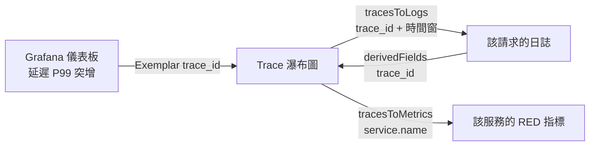
```mermaid
flowchart LR
    M[Grafana 儀表板<br/>延遲 P99 突增] -->|Exemplar trace_id| T[Trace 瀑布圖]
    T -->|tracesToLogs<br/>trace_id + 時間窗| L[該請求的日誌]
    T -->|tracesToMetrics<br/>service.name| M2[該服務的 RED 指標]
    L -->|derivedFields<br/>trace_id| T
```

| 關聯方式 | 設定位置 | 前提 |
| --- | --- | --- |
| Metrics → Traces | Prometheus 資料來源 `exemplarTraceIdDestinations` | SDK 輸出 Exemplars；Prometheus 啟用 exemplar storage |
| Traces → Logs | Jaeger / Tempo 資料來源 `tracesToLogsV2` | 日誌帶有 `trace_id`（見 [5.8 節](#58-logs-整合與關聯)） |
| Traces → Metrics | Jaeger / Tempo 資料來源 `tracesToMetrics` | 指標標籤與 Span 屬性可對應（如 `service_name`） |
| Logs → Traces | Loki 資料來源 `derivedFields` | 日誌的 `trace_id` 為 Label 或可由正則擷取 |
| 跨訊號一致性 | Resource（`service.name`、`k8s.*`） | 所有訊號共用同一份 Resource |

> 💡 Grafana 13 的 **Traces Drilldown**（原 Explore Traces）可在不寫 TraceQL 的情況下，依 RED 指標、屬性分佈快速篩選異常 Span，適合值班人員使用（需 Tempo 後端）。

#### 6.2.3 常用查詢範例

以下 PromQL 使用 **HTTP 穩定版語意慣例**的指標 `http.server.request.duration`（單位：秒）。經 Prometheus OTLP 接收或 Remote Write 後名稱為 `http_server_request_duration_seconds_*`，屬性轉為 `http_route`、`http_request_method`、`http_response_status_code` 等標籤；`service_name` 標籤來自 [3.2 節](#32-container--docker) 的 `promote_resource_attributes` 設定。

##### Prometheus 查詢：API 延遲 P99

```promql
histogram_quantile(0.99,
  sum by (le, http_route) (
    rate(http_server_request_duration_seconds_bucket{service_name="order-service"}[5m])
  )
)
```

##### Prometheus 查詢：錯誤率（5xx）

```promql
sum(rate(http_server_request_duration_seconds_count{service_name="order-service", http_response_status_code=~"5.."}[5m]))
/
sum(rate(http_server_request_duration_seconds_count{service_name="order-service"}[5m]))
```

##### Prometheus 查詢：每秒請求數（依路由）

```promql
sum by (http_route) (rate(http_server_request_duration_seconds_count{service_name="order-service"}[5m]))
```

##### Prometheus 查詢：以 `target_info` 補上 Resource 屬性（未提升為標籤時）

```promql
sum by (http_route, k8s_namespace_name) (
  rate(http_server_request_duration_seconds_count[5m])
  * on (job, instance) group_left (k8s_namespace_name)
  target_info
)
```

##### TraceQL 範例（Tempo）

```text
# 某服務的慢請求
{ resource.service.name = "order-service" && duration > 1s }

# 呼叫特定資料庫且失敗的 Span
{ span.db.system.name = "postgresql" && status = error }

# TraceQL Metrics：各路由的 P99 延遲（Tempo 3.0 起 GA）
{ resource.service.name = "order-service" && kind = server } | quantile_over_time(duration, .99) by (span.http.route)
```

> ⚠️ **v1.0 修正**：v1.0 使用的 `http_server_duration_milliseconds_*` 與 `http_status_code` 是舊版語意慣例（毫秒、舊屬性名稱）。Java Agent 2.x、.NET 8+、Node.js 新版 Instrumentation 都已輸出穩定版 `http.server.request.duration`（秒）。若同時存在新舊服務，請依 [8.5 節](#85-semantic-conventions-遷移) 規劃遷移期間的儀表板。

---

### 6.3 常見使用情境案例

#### 案例 1：追蹤跨服務交易失敗

**情境**：客戶反映下單失敗，但前端沒有收到任何錯誤訊息。

**排查步驟**：

1. 取得事件時間範圍與訂單流水號（或前端回傳的 `x-request-id`）
2. 以 TraceQL `{ span.app.order.id = "ORD-12345" }` 或時間 + 路由找出對應 Trace
3. 檢視完整的呼叫鏈，找出狀態異常或耗時異常的 Span
4. 從 Trace 跳到對應的日誌，查看 Span Events 與 Attributes

```text
發現：payment-service 回傳 HTTP 200，但內容為 {"status": "PENDING"}
根本原因：第三方支付閘道處理中，order-service 將 PENDING 誤判為成功
解決方案：修正狀態判斷邏輯，加入 PENDING 狀態處理與補償查詢；
         並在 Span 加入 app.payment.status 屬性，日後可直接以 TraceQL 篩選
```

#### 案例 2：效能劣化分析

**情境**：API P95 延遲從 100ms 上升到 500ms。

**排查步驟**：

1. 在 Grafana 確認延遲上升的時間點與受影響路由
2. 點選延遲圖上的 Exemplar，跳到具代表性的慢 Trace
3. 用 Jaeger 的 **Trace Compare** 或 Tempo Traces Drilldown 的比較功能，對照正常與異常 Trace
4. 檢查同時段的部署紀錄（`service.version` 是否改變）

```text
發現：database SELECT orders 從 20ms 上升到 400ms，且只發生在 service.version=1.5.0
根本原因：新版查詢條件改變，未命中既有索引
解決方案：新增複合索引；並將「部署版本」加入儀表板的註記（Annotation）
```

#### 案例 3：微服務依賴分析

**情境**：需要了解服務之間的依賴關係，評估某服務停機的影響範圍。

**解決方案**：Jaeger 的 **System Architecture / Deep Dependency Graph**、或 Tempo 搭配 `service_graph` 產生的 Service Graph。

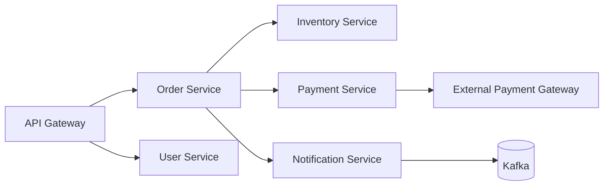
```mermaid
graph LR
    A[API Gateway] --> B[Order Service]
    A --> C[User Service]
    B --> D[Inventory Service]
    B --> E[Payment Service]
    E --> F[External Payment Gateway]
    B --> G[Notification Service]
    G --> H[(Kafka)]
```

#### 案例 4：非同步訊息延遲

**情境**：通知服務偶爾延遲數分鐘才發送簡訊。

**排查步驟**：

1. 找出 `PRODUCER`（訂單服務發送到 Kafka）與 `CONSUMER`（通知服務消費）兩段 Span
2. 比較兩者的開始時間差，即為訊息在佇列中等待的時間
3. 查看 Consumer 端的 `messaging.kafka.consumer.group`、`messaging.destination.partition.id` 屬性，對照 Kafka Lag 指標

```text
發現：特定 partition 的消費延遲高達 3 分鐘
根本原因：Consumer 數量少於 partition 數，且某個 partition 的訊息量集中
解決方案：調整 Consumer 數量與分區鍵（Partition Key）設計
```

> 💡 **實務建議**：
>
> 1. 建立 SLO Dashboard，持續監控關鍵指標（見 [6.4 節](#64-span-metricsred-指標與-slo)）
> 2. 設定告警規則，及早發現異常
> 3. 定期（例如每月）進行 Trace 分析，找出潛在瓶頸與 N+1 查詢

---

### 6.4 Span Metrics、RED 指標與 SLO

**RED 方法**：Rate（請求率）、Errors（錯誤率）、Duration（延遲）。RED 指標可由兩種來源取得：

| 來源 | 指標 | 優點 | 注意事項 |
| --- | --- | --- | --- |
| **SDK 產生的 HTTP / RPC 指標** | `http.server.request.duration` 等 | 不受採樣影響、精準 | 只涵蓋已埋點的協定 |
| **`span_metrics` connector** | `traces.span.metrics.calls`、`traces.span.metrics.duration` | 任何 Span（含自訂業務 Span）都能產生 | 必須放在 Tail Sampling 之前；注意基數 |

#### `span_metrics` 產生的 Prometheus 指標（預設設定）

| 指標名稱 | 說明 | 主要標籤 |
| --- | --- | --- |
| `traces_span_metrics_calls_total` | Span 數量 | `service_name`、`span_name`、`span_kind`、`status_code` |
| `traces_span_metrics_duration_milliseconds_bucket` | Span 延遲分佈（預設單位 ms） | 同上 + `le` |

> 💡 Jaeger v2 的 **SPM（Service Performance Monitoring）** 頁面即是讀取這組指標。若要改用秒為單位，可設定 `histogram.unit: s`（指標名稱隨之改為 `_seconds_`）。

#### SLO 範例：訂單 API 的可用性與延遲

| SLI | 定義 | SLO 目標 |
| --- | --- | --- |
| 可用性 | 非 5xx 回應數 / 總請求數 | 99.9%（30 天） |
| 延遲 | 250ms 內完成的請求數 / 總請求數 | 99%（30 天） |

```promql
# 可用性 SLI（30 天）
1 - (
  sum(increase(http_server_request_duration_seconds_count{service_name="order-service", http_response_status_code=~"5.."}[30d]))
  /
  sum(increase(http_server_request_duration_seconds_count{service_name="order-service"}[30d]))
)
```

```promql
# 延遲 SLI：250ms 內完成的比例（le 必須是既有的 bucket 邊界）
sum(rate(http_server_request_duration_seconds_bucket{service_name="order-service", le="0.25"}[5m]))
/
sum(rate(http_server_request_duration_seconds_count{service_name="order-service"}[5m]))
```

> ⚠️ **注意**：OTel SDK 的 HTTP 延遲 Histogram 預設 bucket 為 `[0.005, 0.01, 0.025, 0.05, 0.075, 0.1, 0.25, 0.5, 0.75, 1, 2.5, 5, 7.5, 10]` 秒，**沒有 0.3**。SLO 門檻要選既有的 bucket 邊界（本例用 0.25），或以 View 調整 bucket、或改用 Exponential Histogram。另外 Prometheus 3.x 會將 `le` 正規化為浮點格式（例如 `le="1"` 變成 `le="1.0"`），撰寫 `le` 等值比對時請注意。完整的 SLO 與 Burn Rate 告警設計請參考《Metrics Visualization 教學手冊》。

---

## 7. 系統維護與維運

> **本章重點**：設計可水平擴展且支援 Tail Sampling 的兩層高可用架構，掌握資源規劃與調校參數、常見錯誤排查、Collector 自我監控與告警，並以持久化佇列與 OpAMP 提升資料可靠性與艦隊（Fleet）管理能力。

### 7.1 Collector 高可用（HA）設計

#### 7.1.1 生產環境 HA 架構

**無狀態處理**（遮罩、轉換、批次）可直接在 L4 / L7 負載平衡器後方水平擴展；但 **Tail Sampling、`span_metrics`、`service_graph`** 等「需要看到同一 Trace 或同一服務所有 Span」的處理是**有狀態**的，必須採兩層架構：

```mermaid
flowchart TB
    subgraph "應用層"
        App1[Service A]
        App2[Service B]
        App3[Service C]
    end

    subgraph "第一層：Load Balancing Collector（無狀態）"
        LB1[Collector LB-1]
        LB2[Collector LB-2]
    end

    subgraph "第二層：Sampling Collector（有狀態，Headless Service）"
        S1[Collector S-1<br/>tail_sampling]
        S2[Collector S-2<br/>tail_sampling]
        S3[Collector S-3<br/>tail_sampling]
    end

    subgraph "Backend"
        Backend[(Tempo / Jaeger)]
    end

    App1 --> LB1
    App2 --> LB1
    App3 --> LB2

    LB1 -->|load_balancing<br/>routing_key: traceID| S1
    LB1 --> S2
    LB1 --> S3
    LB2 --> S1
    LB2 --> S2
    LB2 --> S3

    S1 --> Backend
    S2 --> Backend
    S3 --> Backend
```

##### 第一層：依 TraceID 分流

```yaml
# lb-collector.yaml
receivers:
  otlp:
    protocols:
      grpc:
        endpoint: 0.0.0.0:4317
      http:
        endpoint: 0.0.0.0:4318

processors:
  memory_limiter:
    check_interval: 1s
    limit_percentage: 80
    spike_limit_percentage: 20

exporters:
  load_balancing:
    routing_key: traceID
    protocol:
      otlp:
        tls:
          insecure: true      # 叢集內建議改用 mTLS
        sending_queue:
          enabled: true
          queue_size: 10000
    resolver:
      k8s:
        service: otel-sampler-headless.observability
        ports: [4317]

service:
  pipelines:
    traces:
      receivers: [otlp]
      processors: [memory_limiter]
      exporters: [load_balancing]
```

##### 第二層：Tail Sampling 後送出

```yaml
# sampler-collector.yaml
receivers:
  otlp:
    protocols:
      grpc:
        endpoint: 0.0.0.0:4317

processors:
  memory_limiter:
    check_interval: 1s
    limit_percentage: 80
    spike_limit_percentage: 20
  tail_sampling:
    decision_wait: 10s
    num_traces: 200000
    expected_new_traces_per_sec: 2000
    policies:
      - name: errors
        type: status_code
        status_code:
          status_codes: [ERROR]
      - name: slow
        type: latency
        latency:
          threshold_ms: 1000
      - name: rest
        type: probabilistic
        probabilistic:
          sampling_percentage: 10
  batch: {}

connectors:
  forward/sample: {}     # 把資料轉交給「採樣後送出」的 pipeline
  span_metrics:          # 在採樣「之前」產生 RED 指標
    histogram:
      unit: s
    dimensions:
      - name: http.route
      - name: http.request.method

exporters:
  otlp_grpc/tempo:
    endpoint: tempo-distributor.observability.svc:4317
    tls:
      insecure: true
  prometheus_remote_write:
    endpoint: http://mimir-nginx.observability.svc/api/v1/push

service:
  pipelines:
    traces/in:
      receivers: [otlp]
      processors: [memory_limiter]
      exporters: [span_metrics, forward/sample]
    traces/sample:
      receivers: [forward/sample]
      processors: [tail_sampling, batch]
      exporters: [otlp_grpc/tempo]
    metrics/red:
      receivers: [span_metrics]
      processors: [batch]
      exporters: [prometheus_remote_write]
```

> 💡 第二層以 `forward` connector 把資料分成兩條 pipeline：`traces/in` 先讓 `span_metrics` 看到**全部** Span 產生 RED 指標，再交給 `traces/sample` 做 Tail Sampling 後送出。

| `load_balancing` resolver | 適用環境 | 說明 |
| --- | --- | --- |
| `static` | VM、固定主機 | 手動列出下游 Collector 位址 |
| `dns` | VM + DNS、K8s Headless Service | 定期解析 A 記錄；變動偵測較慢 |
| `k8s` | Kubernetes（建議） | 監看 EndpointSlice，擴縮容時即時更新；需 RBAC 讀取 endpoints |
| `aws_cloud_map` | AWS ECS / EC2 | 以 Cloud Map 探索服務 |

> 💡 **實務提醒**：
>
> 1. 第二層擴縮容時，一致性雜湊會重新分配部分 TraceID，正在等待決策的 Trace 可能被拆散；請避免頻繁自動擴縮，或把 HPA 的 `stabilizationWindowSeconds` 拉長。
> 2. `span_metrics` 需要的是「同一服務」而非「同一 Trace」的 Span，若獨立部署請用 `routing_key: service`。
> 3. 第一層也可放在 Agent（DaemonSet）上，省去一跳。

#### 7.1.2 Kubernetes HA 設定

```yaml
# otel-gateway-ha-values.yaml（Helm Chart 0.174.0）
# 只列出 HA 相關欄位；config、ports 等區段請沿用 3.3.1 的 Gateway values 合併使用
mode: deployment

image:
  repository: otel/opentelemetry-collector-k8s
  tag: "0.162.0"

replicaCount: 3

podDisruptionBudget:
  enabled: true
  minAvailable: 2

resources:
  requests:
    cpu: "1"
    memory: 2Gi
  limits:
    memory: 2Gi        # 記憶體 requests = limits，避免被 OOM 優先驅逐

autoscaling:
  enabled: true
  minReplicas: 3
  maxReplicas: 10
  targetCPUUtilizationPercentage: 70
  behavior:
    scaleDown:
      stabilizationWindowSeconds: 600

topologySpreadConstraints:
  - maxSkew: 1
    topologyKey: topology.kubernetes.io/zone
    whenUnsatisfiable: ScheduleAnyway
    labelSelector:
      matchLabels:
        app.kubernetes.io/name: opentelemetry-collector

affinity:
  podAntiAffinity:
    preferredDuringSchedulingIgnoredDuringExecution:
      - weight: 100
        podAffinityTerm:
          labelSelector:
            matchExpressions:
              - key: app.kubernetes.io/name
                operator: In
                values:
                  - opentelemetry-collector
          topologyKey: kubernetes.io/hostname

priorityClassName: system-cluster-critical   # 或自訂高優先序 PriorityClass

service:
  type: ClusterIP

serviceMonitor:
  enabled: true        # 需 Prometheus Operator CRD

prometheusRule:
  enabled: true
  defaultRules:
    enabled: true      # 套用 Chart 內建的 Collector 告警規則
```

> 💡 gRPC 為長連線，經 Kubernetes `ClusterIP`（L4）時容易集中在少數 Pod。可在 SDK / Agent 端設定 `keepalive` 與連線最長存活時間，或以 Headless Service + 用戶端負載平衡、Service Mesh（L7）解決。

---

### 7.2 效能與資源使用考量

#### 7.2.1 資源規劃建議

下表為**起始估算**，實際值與啟用的處理器（尤其是 OTTL 正則、Tail Sampling）高度相關，務必以壓測確認。

| 資料量（spans/sec，每 Pod） | CPU | Memory | 建議副本數 | 備註 |
| --- | --- | --- | --- | --- |
| < 5,000 | 0.5 Core | 1 GB | 2 | 小型環境 |
| 5,000 – 20,000 | 1–2 Cores | 2 GB | 3 | 一般企業 Gateway |
| 20,000 – 50,000 | 2–4 Cores | 4 GB | 3–6 | 開啟 Tail Sampling 時記憶體加倍 |
| > 50,000 | 4+ Cores | 8+ GB | 6+ | 建議兩層架構並加 Kafka 緩衝 |

##### 容量估算公式（Tail Sampling 記憶體）

```text
所需記憶體 ≈ 每秒新 Trace 數 × decision_wait（秒）× 平均每 Trace 大小 × 安全係數（1.5–2）

例：2,000 traces/s × 10s × 20 KB × 2 ≈ 800 MB（僅暫存 Trace 的部分）
```

#### 7.2.2 效能調校參數

```yaml
processors:
  memory_limiter:
    check_interval: 1s
    limit_mib: 3200        # 約為容器記憶體上限 4Gi 的 80%
    spike_limit_mib: 800

  batch:
    send_batch_size: 8192
    send_batch_max_size: 10000
    timeout: 1s

exporters:
  otlp_grpc/tempo:
    endpoint: tempo-distributor.observability.svc:4317
    compression: zstd      # 預設 gzip；zstd 壓縮率與 CPU 較佳（需後端支援）
    timeout: 10s
    sending_queue:
      enabled: true
      num_consumers: 20    # 預設 10，後端延遲高時調大
      queue_size: 10000    # 單位依 sizer（預設 requests）
      block_on_overflow: false
    retry_on_failure:
      enabled: true
      initial_interval: 5s
      max_interval: 30s
      max_elapsed_time: 300s
```

| 參數 | 預設值 | 調整方向 |
| --- | --- | --- |
| `batch.send_batch_size` | 8192 | 增大可提升吞吐，但延遲與記憶體上升 |
| `batch.timeout` | 200ms | 低流量環境可拉長到 1–5s 以提升壓縮率 |
| `sending_queue.num_consumers` | 10 | 後端回應慢時增加並行度 |
| `sending_queue.queue_size` | 1000（requests） | 依「可容忍的後端中斷時間 × 每秒批次數」估算 |
| `retry_on_failure.max_elapsed_time` | 300s | 0 代表永不放棄（需搭配持久化佇列，否則可能 OOM） |
| `compression` | gzip | `zstd` / `snappy` 依後端支援選擇 |

---

### 7.3 常見錯誤與排查方式

#### 7.3.1 常見錯誤與解決方案

| 錯誤訊息 / 現象 | 可能原因 | 解決方案 |
| --- | --- | --- |
| `data refused due to high memory usage` | 觸發 `memory_limiter` | 擴充副本或記憶體；檢查下游是否變慢導致積壓 |
| `Exporting failed. Will retry the request after interval.` | 後端暫時不可用、網路問題 | 檢查後端；確認 `retry_on_failure` 與佇列容量 |
| `Dropping data because sending_queue is full` | 產生速度超過送出速度 | 增加 `num_consumers` / `queue_size`、擴充副本、啟用持久化佇列 |
| `context deadline exceeded` | Exporter 逾時 | 檢查後端延遲；調整 `timeout`；確認沒有 L7 Proxy 截斷 gRPC |
| `connection refused` | 目標未啟動、或 receiver 綁定 localhost | 確認 `endpoint` 寫 `0.0.0.0` 或 Pod IP（見 [3.2 節](#32-container--docker)） |
| `has invalid keys: address` | 使用已移除的 `telemetry.metrics.address` | 改用 `readers`（見 [7.4 節](#74-log--metric-自我監控)） |
| `"xxx" alias is deprecated` 警告 | 使用舊元件名稱 | 依 [附錄 G](#附錄-gcollector-元件更名對照表) 改名 |
| SDK 端 `Failed to export spans. Server responded with HTTP 404/415` | HTTP 送到 gRPC 埠、或 URL 路徑錯誤 | 4318 為 HTTP、4317 為 gRPC；HTTP 路徑為 `/v1/traces` |
| Trace 斷裂（下游沒有接上上游） | Propagator 不一致、Proxy 移除 Header、非同步未傳遞 Context | 統一 `OTEL_PROPAGATORS`；檢查 API Gateway 是否放行 `traceparent` |
| 指標在 Prometheus 中看不到 `service_name` | 未提升 Resource 屬性 | 設定 Prometheus `otlp.promote_resource_attributes` 或使用 `target_info` Join |

#### 7.3.2 除錯工具

##### zPages（內建除錯頁面）

```yaml
extensions:
  zpages:
    endpoint: localhost:55679   # 只綁定本機，透過 kubectl port-forward 存取
```

存取 `http://localhost:55679/debug/tracez` 可查看活動中與最近完成的 Span、錯誤統計；`/debug/pipelinez` 可查看 pipeline 組成。

##### pprof（效能分析）

```yaml
extensions:
  pprof:
    endpoint: localhost:1777
```

```bash
kubectl port-forward -n observability pod/otel-gateway-xxx 1777:1777

# CPU profiling（30 秒）
go tool pprof "http://localhost:1777/debug/pprof/profile?seconds=30"

# Memory profiling
go tool pprof http://localhost:1777/debug/pprof/heap
```

**以 debug exporter 檢查實際資料**（見 [4.6 節](#46-元件更名設定驗證與除錯工具)）。

> ⚠️ 記得把 zpages、pprof 加到 `service.extensions` 才會啟用；除錯完成後移除。

---

### 7.4 Log / Metric 自我監控

#### 7.4.1 Collector 自身指標

```yaml
service:
  telemetry:
    resource:
      deployment.environment.name: production
    logs:
      level: info
      encoding: json
    metrics:
      level: normal          # none | basic | normal（預設）| detailed
      readers:
        - pull:
            exporter:
              prometheus:
                host: 0.0.0.0
                port: 8888
```

> ⚠️ **v1.0 修正**：`metrics.address` 已失效，必須改用 `readers`。未設定 `readers` 時，Collector 預設只在 `127.0.0.1:8888` 暴露指標，Prometheus 從其他主機或 Pod 抓不到。

也可以把自身指標以 OTLP **推送**到監控後端（適合沒有 Prometheus 抓取能力的環境）：

```yaml
service:
  telemetry:
    metrics:
      readers:
        - periodic:
            interval: 30000
            exporter:
              otlp:
                protocol: http/protobuf
                endpoint: https://otel-monitoring.example.com:4318
```

##### 重要監控指標（Collector 0.162.0 實測名稱）

| 指標名稱 | 類型 | 說明 | 告警建議 |
| --- | --- | --- | --- |
| `otelcol_receiver_accepted_spans` / `_metric_points` / `_log_records` | Counter | 成功接收的資料量 | 趨勢驟降（上游斷線） |
| `otelcol_receiver_refused_spans` 等 | Counter | 被拒收的資料（通常是 `memory_limiter`） | 持續 > 0 |
| `otelcol_receiver_failed_spans` 等 | Counter | 接收時發生錯誤 | 持續 > 0 |
| `otelcol_exporter_sent_spans` 等 | Counter | 成功送出的資料量 | 與 accepted 差距擴大 |
| `otelcol_exporter_send_failed_spans` 等 | Counter | 送出失敗（重試後仍失敗） | 持續 > 0 |
| `otelcol_exporter_enqueue_failed_spans` 等 | Counter | 佇列已滿而無法排入（**資料遺失**） | > 0 即告警 |
| `otelcol_exporter_queue_size` / `otelcol_exporter_queue_capacity` | Gauge | 佇列目前大小與容量 | 使用率 > 80% |
| `otelcol_process_memory_rss` | Gauge | 記憶體（bytes） | > `memory_limiter` 門檻的 90% |
| `otelcol_process_cpu_seconds` | Counter | CPU 時間 | 持續接近 limits |
| `otelcol_processor_incoming_items` / `otelcol_processor_outgoing_items` | Counter | 處理器輸入 / 輸出量 | 差距代表被過濾或採樣的比例 |

> 💡 **指標名稱注意事項**：官方文件說明 Prometheus exporter 在某些設定下會為 Counter 加上 `_total`、為有單位的指標加上 `_seconds` 等後綴；本手冊以 Collector 0.162.0 實際抓取 `/metrics` 的結果為準（預設與自訂 `readers` 皆**不帶**後綴）。不同版本或自訂 `without_type_suffix` / `without_units` 設定可能不同，建立告警前請先以 `curl http://<collector>:8888/metrics` 確認。

#### 7.4.2 Prometheus 告警規則

```yaml
# prometheus-alerts.yaml（已以 promtool 3.15.0 check rules 驗證）
groups:
  - name: otel-collector-alerts
    rules:
      - alert: OTelCollectorDown
        expr: up{job="otel-collector"} == 0
        for: 2m
        labels:
          severity: critical
        annotations:
          summary: "OTel Collector 無法抓取"
          description: "{{ $labels.instance }} 已超過 2 分鐘無法抓取自身指標"

      - alert: OTelCollectorExportFailure
        expr: sum by (instance, exporter) (rate(otelcol_exporter_send_failed_spans[5m])) > 0
        for: 5m
        labels:
          severity: warning
        annotations:
          summary: "OTel Collector 匯出失敗"
          description: "{{ $labels.instance }} 的 {{ $labels.exporter }} 持續匯出失敗"

      - alert: OTelCollectorDataLoss
        expr: sum by (instance, exporter) (rate(otelcol_exporter_enqueue_failed_spans[5m])) > 0
        for: 1m
        labels:
          severity: critical
        annotations:
          summary: "OTel Collector 佇列已滿，資料遺失中"
          description: "{{ $labels.instance }} 的 {{ $labels.exporter }} 無法排入佇列"

      - alert: OTelCollectorRefusingData
        expr: sum by (instance, receiver) (rate(otelcol_receiver_refused_spans[5m])) > 0
        for: 5m
        labels:
          severity: warning
        annotations:
          summary: "OTel Collector 拒收資料"
          description: "{{ $labels.instance }} 的 {{ $labels.receiver }} 正在拒收資料，可能觸發 memory_limiter"

      - alert: OTelCollectorQueueNearFull
        expr: max by (instance, exporter) (otelcol_exporter_queue_size / otelcol_exporter_queue_capacity) > 0.8
        for: 5m
        labels:
          severity: warning
        annotations:
          summary: "OTel Collector 佇列接近滿載"
          description: "{{ $labels.instance }} 的 {{ $labels.exporter }} 佇列使用率 {{ $value | humanizePercentage }}"

      - alert: OTelCollectorHighMemory
        expr: otelcol_process_memory_rss / 1024 / 1024 > 1500
        for: 5m
        labels:
          severity: warning
        annotations:
          summary: "OTel Collector 記憶體偏高"
          description: "{{ $labels.instance }} 記憶體使用 {{ $value | humanize }} MiB"
```

> 💡 **實務提醒**：
>
> 1. 上述規則以 Traces 為例，Metrics / Logs 請複製並將 `spans` 換成 `metric_points`、`log_records`。
> 2. 使用 Helm Chart 時可直接啟用 `prometheusRule.defaultRules.enabled: true` 取得官方預設規則，再依企業門檻調整。
> 3. 「Collector 監控 Collector」會形成循環依賴；建議由**獨立**的 Prometheus 或另一組 Collector 抓取 Gateway 的自身指標。

---

### 7.5 資料可靠性：持久化佇列與背壓

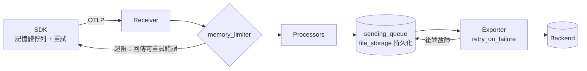
```mermaid
flowchart LR
    SDK[SDK<br/>記憶體佇列 + 重試] -->|OTLP| R[Receiver]
    R --> ML{memory_limiter}
    ML -->|超限：回傳可重試錯誤| SDK
    ML --> P[Processors]
    P --> Q[(sending_queue<br/>file_storage 持久化)]
    Q --> E[Exporter<br/>retry_on_failure]
    E -->|後端故障| Q
    E --> B[(Backend)]
```

| 層級 | 機制 | 設定重點 |
| --- | --- | --- |
| SDK | 批次處理器佇列（Java 預設 2048 Span）＋ 重試 | 佇列滿時 SDK 會丟棄並計數，可由 SDK 自身指標觀察 |
| Receiver | `memory_limiter` 拒收並回傳可重試錯誤 | 讓 SDK / 上游 Collector 稍後重送，形成**背壓** |
| Exporter | `sending_queue` + `retry_on_failure` | 記憶體佇列：重啟即遺失 |
| Exporter（持久化） | `sending_queue.storage: file_storage/...` | Collector 重啟後續送；Kubernetes 需搭配 StatefulSet + PVC |
| 架構 | Kafka 作為緩衝層（`kafka` exporter / receiver） | 後端長時間維護、跨機房傳輸、需要重播資料時 |

#### 持久化佇列設定

```yaml
extensions:
  file_storage/queue:
    directory: /var/lib/otelcol/queue
    create_directory: true
    timeout: 10s
    compaction:
      on_start: true
      directory: /var/lib/otelcol/queue
      max_transaction_size: 65536

exporters:
  otlp_grpc/tempo:
    endpoint: tempo-distributor.observability.svc:4317
    sending_queue:
      enabled: true
      storage: file_storage/queue
      queue_size: 50000
    retry_on_failure:
      enabled: true
      max_elapsed_time: 0    # 持久化佇列下可設定為不放棄
```

> ⚠️ **注意**：
>
> 1. 持久化佇列存的是**已處理過**的資料，請確保遮罩在佇列之前完成，磁碟也需加密。
> 2. Auth extension 產生的請求 Context **不會**跨持久化佇列保留，多租戶以 Header 區分時需改用 `headers_setter` 搭配資源屬性。
> 3. 磁碟容量估算：`每秒資料量（壓縮前）× 可容忍中斷秒數 × 1.2`；並監控磁碟使用率。

---

### 7.6 艦隊管理：OpAMP 與設定治理

大型企業可能有數百到數千個 Collector。**OpAMP（Open Agent Management Protocol）** 讓管理伺服器可以遠端：

- 取得每個 Collector 的版本、健康狀態、生效設定與元件清單
- 下發新設定、更新套件、輪換憑證
- 統一呈現艦隊狀態

| 方式 | 元件 | 狀態 | 說明 |
| --- | --- | --- | --- |
| **OpAMP Extension** | Collector 內的 `opamp` extension | Alpha | 唯讀回報狀態（實驗性支援遠端重啟） |
| **OpAMP Supervisor** | 獨立程序 `opampsupervisor`（v0.162.0） | Alpha | 管理 Collector 生命週期，可接收並套用遠端設定 |
| **管理伺服器** | 商業產品或自建（`opamp-go` v0.25.0） | — | 需自行評估權限控管與稽核 |

```yaml
# 只回報狀態的最小設定
extensions:
  opamp:
    server:
      ws:
        endpoint: wss://opamp.example.com/v1/opamp
        tls:
          ca_file: /etc/otel/certs/ca.crt
    instance_uid: 01JABCDEF0123456789ABCDEFG

service:
  extensions: [opamp]
```

> 💡 **白皮書建議**：在 OpAMP 仍為 Alpha 的階段，企業宜採 **GitOps** 管理 Collector 設定（設定檔納入版本控制、Pull Request 審核、CI 執行 `validate` 與遮罩測試、Argo CD / Flux 部署），OpAMP 先用於**狀態盤點**，待穩定後再評估遠端下發設定。

---

## 8. 系統升級與版本管理

> **本章重點**：了解 OTel 各元件的發布節奏與版本語意，建立升級前檢查、分階段升級與回滾流程，評估與既有監控系統的相容性，並規劃 Semantic Conventions 的遷移。

### 8.1 OpenTelemetry 版本演進重點

#### 8.1.1 版本發布週期

| 元件 | 發布節奏（2026 實際觀察） | 版本語意 |
| --- | --- | --- |
| **Collector core / contrib / releases** | 約**每兩週**一版（例：0.160.0 → 0.161.0 → 0.162.0 於 2026-09-02 / 09-15 / 09-29） | 穩定模組 `v1.x`、其餘 `v0.x`；0.x 的次版本號**可能含 Breaking Change** |
| **Helm Chart** | 隨 Collector 發布，另有修正版 | Chart 版本與 Collector 版本不同（Chart 0.174.0 → appVersion 0.161.0，可用 `image.tag` 覆寫） |
| **Operator** | 約每 2–4 週 | `v0.x`；CRD 版本 `v1beta1`（Collector）、`v1alpha1`（Instrumentation） |
| **Java Instrumentation** | 約每月 | `2.x`；部分模組帶 `-alpha` 後綴 |
| **Java SDK** | 約每月 | `1.x`，API 穩定 |
| **JS SDK** | 約每月 | 穩定套件 `2.x`、實驗套件 `0.2xx` |
| **Semantic Conventions** | 約每 1–2 個月 | `1.x`；各屬性 / 指標有獨立的穩定度標示 |
| **Specification** | 約每月 | `1.x` |

> 💡 **企業節奏建議**：不必追每一個版本。建議 **Collector 每季升級一次**（跳 4–6 個小版本，逐版閱讀 Release Notes 的 Breaking Changes），**SDK / Agent 每半年**與應用的例行版本一起升級，遇到 CVE 時另行緊急修補。

#### 8.1.2 重要版本里程碑

| 時間 | 里程碑 | 對企業的意義 |
| --- | --- | --- |
| 2019-05 | OpenTracing 與 OpenCensus 宣布合併為 OpenTelemetry，進入 CNCF Sandbox | 結束雙標準 |
| 2021-02 | Tracing 規格 1.0 | Traces API / SDK 可安心採用 |
| 2021-08 | CNCF Incubating | — |
| 2022 | Metrics API / SDK 規格穩定 | 指標可改用 OTel |
| 2023 | Logs Bridge API / SDK 與 Log Data Model 穩定 | 日誌可接入 OTel |
| 2023-11 | HTTP 語意慣例穩定（semconv v1.23.0）；Collector 首批 `v1.0.0` 模組（v1.0.0 / v0.90.0） | 開始 HTTP 屬性遷移 |
| 2023-09 | Collector 移除 `jaeger` exporter（contrib v0.86.0） | 改以 OTLP 送 Jaeger |
| 2024-11 | Jaeger v2 發布（以 Collector 為核心） | Jaeger 架構轉換 |
| 2025-05 | 資料庫語意慣例穩定（semconv v1.33.0，MySQL / PostgreSQL / SQL Server / MariaDB） | 開始 DB 屬性遷移 |
| 2025-12-31 | Jaeger v1 終止支援 | 必須遷移到 Jaeger v2 |
| 2026-01 ~ 09 | Collector 陸續將元件更名為 snake_case（v0.144.0 起，舊名稱保留為棄用別名） | 設定檔需更新 |
| 2026-02 | 宣告式設定 Schema 1.0 | SDK 可改用 YAML 設定 |
| 2026-02 | semconv v1.40.0：例外不再建議記錄為 Span Event，改以 Log 記錄（漸進） | 規劃例外記錄方式 |
| 2026-04 | `deployment.environment.name` 穩定（semconv v1.41.0） | 取代 `deployment.environment` |
| 2026-05 | **OpenTelemetry 自 CNCF 畢業** | 成熟度背書 |
| 2026-09 | Collector 0.162.0、Java Agent 2.31.1、semconv 1.44.0（本手冊基準） | — |

---

### 8.2 SDK / Collector 升級注意事項

#### 8.2.1 升級前檢查清單

##### 相容性確認

- [ ] 逐版閱讀 Collector core 與 contrib 的 CHANGELOG 中 **🛑 Breaking changes** 與 **🚩 Deprecations**
- [ ] 以新版 `otelcol-contrib validate` 驗證**所有**環境的設定檔
- [ ] 啟動新版 Collector，檢查日誌中是否有 `alias is deprecated`、`deprecated` 警告
- [ ] 確認 Helm Chart 的 values 欄位是否更名（例如 `rewriteDeprecatedProcessorNames` → `rewriteDeprecatedComponentNames`）
- [ ] 確認 Feature Gate 的階段變化（Alpha → Beta 會改變預設行為；Stable 後無法關閉）
- [ ] 確認 Collector 自身指標名稱是否改變（影響告警規則）
- [ ] SDK / Agent：確認 Semantic Conventions 版本變化對儀表板與告警的影響

##### 環境準備

- [ ] 備份現有設定檔與 Helm values（納入 Git）
- [ ] 準備回滾計畫（前一版映像已在內部 Registry）
- [ ] 測試環境以**實際流量樣本**（或 `telemetrygen`）驗證
- [ ] 確認監控告警已涵蓋新版指標

##### 升級執行

- [ ] 選擇低流量時段，並通知相關團隊
- [ ] 逐步升級（Agent 與 Gateway 分開；先 Gateway 一個副本做 Canary）
- [ ] 監控 `accepted` / `sent` / `refused` / `send_failed` 指標
- [ ] 準備緊急回滾

#### 8.2.2 升級步驟

##### Kubernetes（Helm）環境升級範例

```bash
# 1. 在 values 中固定新版本
#    image:
#      tag: "0.162.0"

# 2. 渲染並比對差異（helm-diff 外掛）
helm diff upgrade otel-gateway open-telemetry/opentelemetry-collector \
  --version 0.174.0 -n observability -f otel-gateway-values.yaml

# 3. 以新版二進位檔驗證渲染出的設定
helm template otel-gateway open-telemetry/opentelemetry-collector \
  --version 0.174.0 -n observability -f otel-gateway-values.yaml \
  | yq 'select(.kind == "ConfigMap") | .data.relay' > relay.yaml
docker run --rm -e MY_POD_IP=0.0.0.0 -v "$(pwd)/relay.yaml:/relay.yaml:ro" \
  otel/opentelemetry-collector-k8s:0.162.0 validate --config=/relay.yaml

# 4. 執行升級（滾動更新）
helm upgrade otel-gateway open-telemetry/opentelemetry-collector \
  --version 0.174.0 -n observability -f otel-gateway-values.yaml

# 5. 監控升級狀態
kubectl rollout status deployment/otel-gateway-opentelemetry-collector -n observability

# 6. 如需回滾
helm rollback otel-gateway -n observability
```

**Operator 環境：** Operator 升級後，預設（`spec.upgradeStrategy: automatic`）會一併升級受管的 `OpenTelemetryCollector` 資源。建議：

- 生產環境在 CR 中設定 `spec.upgradeStrategy: none` 並**明確固定** `spec.image`，由變更流程控制 Collector 版本
- 先在測試叢集升級 Operator，確認 CRD 轉換與 Webhook 正常

##### Java Agent 升級

| 步驟 | 說明 |
| --- | --- |
| 1 | 閱讀 Release Notes 的「Breaking changes」與「Deprecations」（`-alpha` 模組變動較多） |
| 2 | 在測試環境比較升級前後的 Span 名稱、屬性與指標名稱 |
| 3 | 檢查自訂 Extension 是否需要重新編譯 |
| 4 | 以容器映像的 Base Layer 方式統一分發 Agent，避免各應用自行下載不同版本 |

---

### 8.3 與既有監控系統相容性評估

#### 8.3.1 相容性對照表

| 系統 | OTel 整合方式 | 注意事項 |
| --- | --- | --- |
| Prometheus 3.x | OTLP/HTTP 接收（`--web.enable-otlp-receiver`）、Remote Write、或 Collector `prometheus` receiver 抓取 | 指標名稱轉換（`.` → `_`、加單位與 `_total` 後綴）；Resource 屬性以 `target_info` 或 `promote_resource_attributes` 處理 |
| Grafana Mimir / Thanos / VictoriaMetrics | OTLP 或 Remote Write | 多租戶 Header（`X-Scope-OrgID`）以 `headers` 設定 |
| Jaeger v2 | OTLP（原生） | v1 已 EOL；`jaeger` exporter 已移除 |
| Grafana Tempo 3.x | OTLP（原生） | 3.0 移除舊版 ingester，升級需依官方遷移指南 |
| Zipkin | `zipkin` exporter / receiver | 需格式轉換，部分屬性會遺失 |
| Elasticsearch 9.x / Elastic Observability | `elasticsearch` exporter 或 OTLP | 注意 Index / Data Stream 對應與 Mapping 模式（`otel` / `ecs`） |
| Loki 3.x | OTLP/HTTP（原生） | 規劃哪些 Resource 屬性成為 Index Label，避免高基數 |
| Splunk | `splunk_hec` exporter | 需設定 HEC Token（以 Secret 注入） |
| 商業 APM（Datadog、Dynatrace、New Relic 等） | OTLP 或廠商 exporter | 優先使用 OTLP，保留替換彈性 |
| Micrometer（Spring） | Java Agent 的 Micrometer Bridge、或 `micrometer-registry-otlp` | 避免指標重複（Agent 與 Micrometer 各送一份） |
| Prometheus Client 函式庫 | Collector `prometheus` receiver 抓取 | 可漸進遷移，不必立刻改寫程式 |

---

### 8.4 升級建議流程

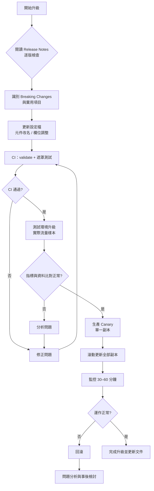
```mermaid
flowchart TB
    A[開始升級] --> B{閱讀 Release Notes<br/>逐版檢查}
    B --> C[識別 Breaking Changes<br/>與棄用項目]
    C --> D[更新設定檔<br/>元件改名 / 欄位調整]
    D --> E[CI：validate + 遮罩測試]
    E --> F{CI 通過?}
    F -->|否| G[修正問題]
    G --> E
    F -->|是| H[測試環境升級<br/>實際流量樣本]
    H --> I{指標與資料比對正常?}
    I -->|否| J[分析問題]
    J --> G
    I -->|是| K[生產 Canary<br/>單一副本]
    K --> L[滾動更新全部副本]
    L --> M[監控 30–60 分鐘]
    M --> N{運作正常?}
    N -->|否| O[回滾]
    O --> P[問題分析與事後檢討]
    N -->|是| Q[完成升級並更新文件]
```

---

### 8.5 Semantic Conventions 遷移

Semantic Conventions 的屬性與指標名稱改變，會直接影響**儀表板、告警、查詢與資料保留政策**，是 OTel 升級中最容易被低估的風險。

#### 8.5.1 穩定性選擇環境變數

已穩定的領域在過渡期間，Instrumentation 應支援 `OTEL_SEMCONV_STABILITY_OPT_IN`：

| 值 | 行為 |
| --- | --- |
| （未設定） | 依 Instrumentation 版本的預設（新版多已預設輸出穩定版） |
| `http` | 只輸出穩定版 HTTP 慣例 |
| `http/dup` | **同時輸出新舊兩版**（遷移期間使用） |
| `database` / `database/dup` | 資料庫慣例（同上） |
| `rpc` / `rpc/dup` | RPC 慣例（RPC 目前為 Release Candidate） |

##### 例外記錄方式的過渡（semconv v1.40.0 起）

| 值（`OTEL_SEMCONV_EXCEPTION_SIGNAL_OPT_IN`） | 行為 |
| --- | --- |
| （未設定） | 維持以 Span Event 記錄例外（現行行為） |
| `logs/dup` | 同時以 Span Event 與 Log 記錄 |
| `logs` | 只以 Log 記錄 |

> 💡 各語言 Instrumentation 對上述環境變數的支援程度不同（例如 Java Agent 2.x 已預設輸出穩定版 HTTP 慣例），請以各 Instrumentation 的文件為準。

#### 8.5.2 遷移步驟

1. **盤點**：列出所有儀表板、告警、Recording Rules、TraceQL / Kibana 查詢中使用的舊屬性與舊指標名稱（可用 `grep` 掃描 Dashboard JSON 與規則檔）。
2. **雙寫期**：Instrumentation 設定 `http/dup`、`database/dup`，或在 Collector 以 OTTL 補上新屬性（見 [4.5 節](#45-ottl-與資料轉換) 的 `transform/normalize`）。
3. **更新查詢**：儀表板改用新名稱，必要時以 `or` 同時查詢新舊指標，確保跨越資料保留期間的連續性。
4. **切換**：移除 `/dup`，只保留穩定版。
5. **清理**：在資料保留期滿後移除相容查詢。

| 舊指標（PromQL 名稱） | 新指標（PromQL 名稱） | 差異 |
| --- | --- | --- |
| `http_server_duration_milliseconds_*` | `http_server_request_duration_seconds_*` | 單位由毫秒改為秒，bucket 邊界不同 |
| `http_client_duration_milliseconds_*` | `http_client_request_duration_seconds_*` | 同上 |
| 標籤 `http_method` / `http_status_code` | `http_request_method` / `http_response_status_code` | 標籤名稱改變 |
| `db_client_connections_usage` | `db_client_connection_count` | 名稱改變 |

> ⚠️ **注意**：舊版延遲指標以毫秒為單位、新版以秒為單位，兩者的 Histogram bucket 不同，**不能**直接 `sum` 合併計算百分位數；遷移期間請分別計算後再比較。

#### 8.5.3 以 Weaver 治理自訂語意慣例

**OpenTelemetry Weaver**（v0.26.1）是官方的語意慣例工具，可用 YAML 定義企業自有的屬性與指標（例如 `app.order.id`），並：

- 產生各語言的常數程式碼與文件
- 在 CI 中檢查遙測資料是否符合定義（`weaver registry check`、`weaver registry live-check`）
- 比對不同版本之間的 Breaking Change

> 💡 **白皮書建議**：企業可建立「**內部語意慣例 Registry**」（以 Weaver 管理並納入版本控制），作為 [9.2 節](#92-命名規範與標準化建議) 命名規範的可執行版本。

---

## 9. 企業導入建議與最佳實務

> **本章重點**：提供分階段導入路線、可執行的命名與語意規範、與既有 Prometheus / ELK 的共存與遷移策略、適合銀行與大型企業的安全架構、成本與基數治理、臺灣金融業法規對應，以及衡量導入成效的成熟度模型。

### 9.1 導入順序建議

#### 9.1.1 分階段導入策略

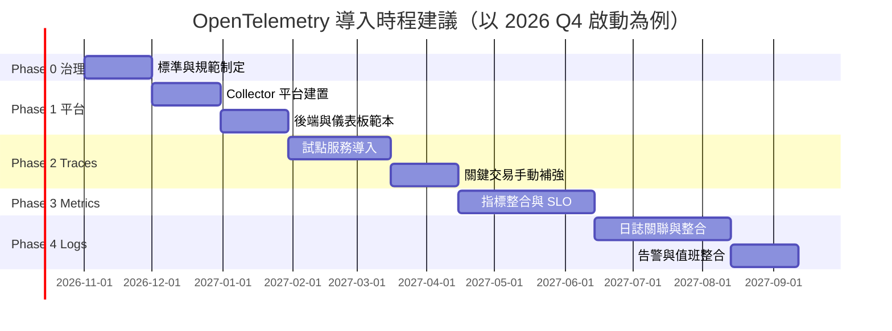
```mermaid
gantt
    title OpenTelemetry 導入時程建議（以 2026 Q4 啟動為例）
    dateFormat  YYYY-MM-DD
    section Phase 0 治理
    標準與規範制定        :p0, 2026-11-01, 30d
    section Phase 1 平台
    Collector 平台建置    :a1, after p0, 30d
    後端與儀表板範本      :a2, after a1, 30d
    section Phase 2 Traces
    試點服務導入          :b1, after a2, 45d
    關鍵交易手動補強      :b2, after b1, 30d
    section Phase 3 Metrics
    指標整合與 SLO        :c1, after b2, 60d
    section Phase 4 Logs
    日誌關聯與整合        :d1, after c1, 60d
    告警與值班整合        :d2, after d1, 30d
```

##### Phase 0：治理先行（約 1 個月）

- 發布企業 OTel 技術標準：版本基準、命名規範（[9.2 節](#92-命名規範與標準化建議)）、敏感資料清單與遮罩規則（[4.4 節](#44-設定最佳實務best-practices)）、採樣政策
- 決定後端架構與資料保留期限（依法規與成本）
- 成立平台小組（Platform Team）與各業務團隊的窗口（Observability Champion）

##### Phase 1：平台建置（1–2 個月）

- 部署 Agent + Gateway 兩層 Collector（[3.3 節](#33-kubernetes)、[7.1 節](#71-collector-高可用ha設計)），建立 GitOps 與 CI 驗證流程
- 設定後端儲存（Prometheus / Mimir、Jaeger / Tempo、Loki / Elasticsearch）
- 建立 Grafana 儀表板範本與 Collector 自我監控（[7.4 節](#74-log--metric-自我監控)）

##### Phase 2：Traces 優先（2–3 個月）

- 選擇 2–3 個**跨服務的關鍵交易**作為試點
- 以 Java Agent / Operator 注入導入自動埋點
- 驗證跨服務追蹤、Context 傳遞與遮罩規則

##### Phase 3：Metrics 整合（2–3 個月）

- 以 OTel SDK 指標或 Collector `prometheus` receiver 統一收集
- 統一 Resource Attributes，建立 RED / SLO Dashboard（[6.4 節](#64-span-metricsred-指標與-slo)）

##### Phase 4：Logs 整合（2–3 個月）

- 應用日誌帶入 TraceId（[5.8 節](#58-logs-整合與關聯)），建立 Trace ⇄ Log 跳轉
- 將告警與值班系統（On-call）整合，建立 Runbook

> 💡 **為什麼 Traces 優先？** Metrics 與 Logs 通常已有既有系統；Traces 是最大的能力缺口，也最能展現 OTel 價值（跨服務根因分析）。若組織尚無指標系統，可改為 Metrics 優先。

---

### 9.2 命名規範與標準化建議

#### 9.2.1 服務命名規範

| 屬性 | 規範 | 範例 | 反例 |
| --- | --- | --- | --- |
| `service.name` | 邏輯服務名稱，小寫、以 `-` 分隔，**不含環境與版本** | `payment-gateway-api` | `PaymentAPI-prod-v2` |
| `service.namespace` | 業務領域或系統代碼 | `financial-services` | （留空） |
| `service.version` | 與建置產物一致（SemVer 或 Git SHA） | `3.2.1`、`3.2.1+a1b2c3d` | `latest` |
| `deployment.environment.name` | 限定值：`production`、`staging`、`uat`、`development` | `production` | `PRD`、`prod-1` |
| `service.instance.id` | 每個實例唯一，建議 UUID（K8s 由 Operator 自動產生） | `7f0e2c5a-...` | 主機名稱重複使用 |

```yaml
# 推薦組合
service.namespace: financial-services   # 業務領域
service.name: payment-gateway-api       # 應用-元件
service.version: 3.2.1
deployment.environment.name: production
```

#### 9.2.2 Span 命名規範

Span 名稱必須是**低基數**的（不可包含 ID、使用者輸入），依 Semantic Conventions：

| 類型 | 格式 | 範例 |
| --- | --- | --- |
| HTTP Server | `{http.request.method} {http.route}` | `POST /api/orders/{orderId}` |
| HTTP Client | `{http.request.method}`（可加 `{url.template}`） | `POST` |
| Database | `{db.operation.name} {db.collection.name}`（或 `db.query.summary`） | `SELECT orders` |
| Messaging | `{messaging.operation.name} {destination}` | `send order-events`、`process order-events` |
| RPC / gRPC | `{rpc.service}/{rpc.method}` | `bank.Payment/Transfer` |
| Internal（業務） | `{動詞}{名詞}` 或 `{Class}.{method}` | `reserveInventory`、`OrderService.createOrder` |

> ⚠️ **v1.0 修正**：v1.0 的 HTTP Client 格式 `HTTP {METHOD}` 與 DB 格式 `{DB_OPERATION} {DB_NAME}.{TABLE}` 不符合現行語意慣例，已依上表更正。

#### 9.2.3 Attribute 命名規範

```yaml
# 1. 優先使用 Semantic Conventions 已定義的屬性
#    https://opentelemetry.io/docs/specs/semconv/
http.request.method: POST
error.type: java.net.SocketTimeoutException

# 2. 自訂業務屬性一律使用企業命名空間，小寫、以 . 分層、以 _ 連接單字
app.order.id: ORD-12345
app.customer.tier: premium
app.transaction.type: purchase

# 3. 避免
order_id: ...          # 缺少命名空間
orderId: ...           # 大小寫不一致
http.my_header: ...    # 佔用 OTel 保留的命名空間（http、db、k8s 等）
```

| 規則 | 說明 |
| --- | --- |
| 不使用 OTel 保留命名空間 | `http.*`、`db.*`、`k8s.*`、`service.*`、`otel.*` 等只用於官方定義 |
| 屬性值低基數優先 | 會成為指標標籤的屬性（如 `span_metrics` dimensions）必須是有限集合 |
| 型別一致 | 同一屬性在所有服務中的型別相同（不要有的送 int、有的送 string） |
| 個資不入屬性 | 身分證字號、姓名、電話、帳號等不得放入屬性（見 [9.6 節](#96-臺灣金融業法規與規範對應)） |
| 以 Registry 管理 | 用 Weaver 定義內部屬性並在 CI 檢查（見 [8.5 節](#85-semantic-conventions-遷移)） |

---

### 9.3 與既有 Prometheus / ELK 共存策略

#### 9.3.1 雙軌並行架構

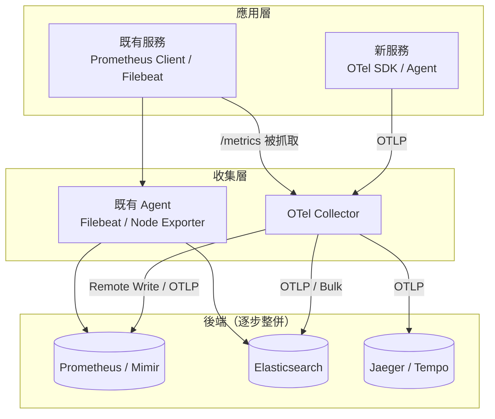
```mermaid
flowchart TB
    subgraph "應用層"
        App[新服務<br/>OTel SDK / Agent]
        Legacy[既有服務<br/>Prometheus Client / Filebeat]
    end

    subgraph "收集層"
        OTel[OTel Collector]
        Beats[既有 Agent<br/>Filebeat / Node Exporter]
    end

    subgraph "後端（逐步整併）"
        Prom[(Prometheus / Mimir)]
        ELK[(Elasticsearch)]
        Traces[(Jaeger / Tempo)]
    end

    App -->|OTLP| OTel
    Legacy -->|/metrics 被抓取| OTel
    Legacy --> Beats

    OTel -->|Remote Write / OTLP| Prom
    OTel -->|OTLP / Bulk| ELK
    OTel -->|OTLP| Traces
    Beats --> ELK
    Beats --> Prom
```

| 共存方式 | 做法 | 適用 |
| --- | --- | --- |
| Collector 抓取既有 `/metrics` | `prometheus` receiver 沿用既有 `scrape_configs`，統一經 Collector 送出 | 想先統一收集管道、不改應用 |
| Prometheus 直接收 OTLP | 啟用 `--web.enable-otlp-receiver`，新服務推送、舊服務照常被抓取 | 已有 Prometheus，想最少變動 |
| Collector 讀既有日誌 | `file_log` 讀取既有日誌檔，補 Resource 後送往 ELK | 逐步取代 Filebeat |
| Elastic EDOT | 使用 Elastic 的 OTel 發行版（EDOT）接入 Elastic Observability | 以 Elastic 為主要平台 |

#### 9.3.2 遷移策略

1. **並行運作期**：新舊系統同時收集，比對資料一致性（筆數、延遲、指標數值）
2. **驗證期**：確認 OTel 資料完整、儀表板與告警等效
3. **切換期**：逐步將查詢、告警與值班流程切換到新系統
4. **下線期**：停止舊 Agent；舊資料依保留期限自然到期

> ⚠️ **注意**：並行期間同一指標可能被收集兩次（例如 Agent 抓 `/metrics` 又由 SDK 推送），請以不同的 `job` 或 Resource 屬性區分，避免儀表板數值加倍。

---

### 9.4 適合銀行或大型企業的導入模式

#### 9.4.1 企業級架構建議

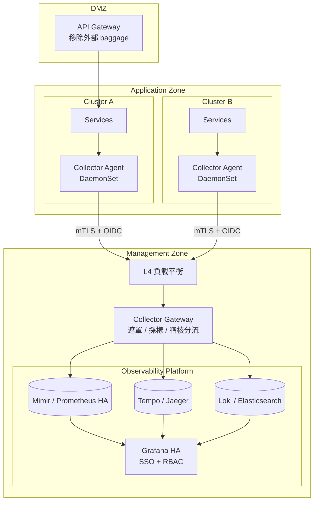
```mermaid
flowchart TB
    subgraph "DMZ"
        ExtGW[API Gateway<br/>移除外部 baggage]
    end

    subgraph "Application Zone"
        subgraph "Cluster A"
            App1[Services]
            Agent1[Collector Agent<br/>DaemonSet]
        end
        subgraph "Cluster B"
            App2[Services]
            Agent2[Collector Agent<br/>DaemonSet]
        end
    end

    subgraph "Management Zone"
        LB[L4 負載平衡]
        Gateway[Collector Gateway<br/>遮罩 / 採樣 / 稽核分流]

        subgraph "Observability Platform"
            Prom[(Mimir / Prometheus HA)]
            Traces[(Tempo / Jaeger)]
            Logs[(Loki / Elasticsearch)]
            Grafana[Grafana HA<br/>SSO + RBAC]
        end
    end

    ExtGW --> App1
    App1 --> Agent1
    App2 --> Agent2

    Agent1 -->|mTLS + OIDC| LB
    Agent2 -->|mTLS + OIDC| LB
    LB --> Gateway

    Gateway --> Prom
    Gateway --> Traces
    Gateway --> Logs

    Prom --> Grafana
    Traces --> Grafana
    Logs --> Grafana
```

##### 架構原則

| 原則 | 說明 |
| --- | --- |
| 網段分離 | 應用區只能連到 Gateway 的 4317 / 4318；後端只接受 Gateway 連線 |
| 最小權限 | Agent 不持有後端憑證；Gateway 以 Secret / Vault 取得憑證並定期輪換 |
| 單一出口 | 送往外部（雲端、SaaS）的資料只能經過專用 Gateway，並套用 `redaction` 允許清單 |
| 稽核分流 | 稽核類日誌以獨立 pipeline 送往不可竄改儲存（WORM / Object Lock），不採樣 |
| 多租戶 | 依 `service.namespace` 或租戶屬性以 `routing` connector 分流至不同後端租戶 |

#### 9.4.2 安全性考量

```yaml
# Gateway 生產環境安全設定（已以 otelcol-contrib 0.162.0 validate 驗證）
extensions:
  oidc:
    issuer_url: https://sso.example.com/realms/observability
    audience: otel-gateway
  bearertokenauth/backend:
    filename: /var/run/secrets/backend/token   # 檔案變更時自動重新載入

receivers:
  otlp:
    protocols:
      grpc:
        endpoint: 0.0.0.0:4317
        tls:
          cert_file: /etc/otel/certs/tls.crt
          key_file: /etc/otel/certs/tls.key
          client_ca_file: /etc/otel/certs/ca.crt   # 啟用 mTLS：要求用戶端憑證
          min_version: "1.3"
          reload_interval: 1h                        # 憑證輪換後自動載入
        auth:
          authenticator: oidc

processors:
  memory_limiter:
    check_interval: 1s
    limit_percentage: 80
    spike_limit_percentage: 20
  attributes/scrub:
    actions:
      - key: http.request.header.authorization
        action: delete
      - key: db.password
        action: delete
      - key: enduser.id
        action: hash
  transform/mask:
    error_mode: ignore
    trace_statements:
      - replace_all_patterns(span.attributes, "value", "[A-Z][12]\\d{8}", "**********")
  batch: {}

exporters:
  otlp_grpc/backend:
    endpoint: tempo-distributor.observability.svc:4317
    tls:
      ca_file: /etc/otel/certs/ca.crt
      min_version: "1.3"
    auth:
      authenticator: bearertokenauth/backend

service:
  extensions: [oidc, bearertokenauth/backend]
  pipelines:
    traces:
      receivers: [otlp]
      processors: [memory_limiter, attributes/scrub, transform/mask, batch]
      exporters: [otlp_grpc/backend]
```

> ⚠️ **v1.0 修正**：
>
> 1. v1.0 宣告了 `oidc` extension 卻沒有加入 `service.extensions`，Collector 會因找不到 authenticator 而啟動失敗。
> 2. v1.0 以 `attributes` processor 的 `pattern` 比對身分證格式後 `hash`，但 `pattern` 比對的是**屬性名稱**而非值，該規則永遠不會生效；已改用 `transform` 的 `replace_all_patterns`。

##### Collector 主機與容器強化

| 項目 | 建議 |
| --- | --- |
| 發行版 | 使用 otelcol-k8s 或 OCB 自建最小發行版（[2.5 節](#25-collector-發行版與自建發行版ocb)），定期掃描 CVE |
| 執行身分 | 非 root、唯讀根檔案系統、移除不必要的 Linux capabilities |
| 網路 | 以 NetworkPolicy 限制來源；`zpages`、`pprof` 綁定 localhost 或不啟用 |
| 機密 | 憑證與 Token 以 Secret / Vault 注入，使用 `${file:…}`、`filename` 讀取 |
| 供應鏈 | 驗證官方發行物的 SHA-256 與 Sigstore 簽章，映像以 digest 固定 |
| 設定變更 | GitOps + Pull Request 審核 + CI `validate` + 遮罩規則測試 |

#### 9.4.3 合規性要求

| 要求 | OTel 解決方案 |
| --- | --- |
| 資料加密傳輸 | 全鏈路 TLS 1.2+（建議 1.3）；Agent → Gateway 採 mTLS |
| 存取控制 | Receiver 端 `oidc` / `bearertokenauth`；後端與 Grafana 以 SSO + RBAC |
| 稽核軌跡 | Collector 設定變更走 Git；平台存取紀錄保存；稽核日誌獨立 pipeline 不採樣 |
| 資料保留 | 依資料類別在後端設定 Retention（例如 Traces 14–30 天、指標 13 個月、稽核日誌依法規） |
| PII 保護 | SDK 端避免收集 → Collector 第一層遮罩（`attributes`、`transform`、`redaction`） |
| 資料主權 / 境外傳輸 | 自建後端，或送往境外 SaaS 前經專用 Gateway 以允許清單過濾 |
| 可用性 | 兩層 HA、持久化佇列、跨可用區部署（[7.1 節](#71-collector-高可用ha設計)、[7.5 節](#75-資料可靠性持久化佇列與背壓)） |

> 💡 **銀行導入建議**：
>
> 1. 優先導入內部核心系統，外部系統（合作夥伴、第三方 SDK）需額外評估信任邊界
> 2. 所有傳輸使用 TLS，Agent 至 Gateway 採 mTLS
> 3. 敏感資料必須在 Collector **第一層**過濾，並以自動化測試驗證遮罩規則
> 4. 保留完整的平台存取日誌與設定變更紀錄供稽核

---

### 9.5 成本與基數治理

遙測資料量會隨服務數與流量線性甚至指數成長。成本控制要從**源頭、管道、後端**三層同時進行。

| 層級 | 手段 | 預期效果 |
| --- | --- | --- |
| 源頭（SDK） | 關閉不需要的 Instrumentation（如 `fs`、`jdbc-datasource`）；調整 Head Sampling；減少高基數指標屬性（以 View 刪除） | 最有效，資料根本不產生 |
| 管道（Collector） | `filter` 丟棄健康檢查、Debug 日誌；Tail Sampling；`transform` 刪除高基數屬性；`limit` / `truncate_all` 限制大小 | 集中治理、可快速調整 |
| 後端 | 依資料類別設定保留期；冷熱分層；降採樣（Downsampling） | 降低儲存成本 |

#### 常見基數地雷

| 地雷 | 後果 | 對策 |
| --- | --- | --- |
| 把 `url.full`、`user.id`、`session.id` 作為指標標籤 | 時間序列爆炸，Prometheus OOM | 只用 `http.route` 等模板化屬性 |
| `span_metrics` 的 `dimensions` 加入高基數屬性 | 同上 | 限制 dimensions，並設定 `aggregation_cardinality_limit` |
| Prometheus Remote Write 開啟 `resource_to_telemetry_conversion` | 每個 Resource 屬性都變成標籤 | 關閉，改用 `target_info` Join |
| Span 名稱包含 ID | 後端索引膨脹、無法聚合 | 依 [9.2 節](#92-命名規範與標準化建議) 規範命名 |
| Loki 將高基數 Resource 屬性設為 Index Label | Loki 效能急遽下降 | 只把服務、環境、Namespace 等低基數屬性設為 Label |

#### 治理指標（建議每月檢視）

- 各 `service.namespace` 的 Span / 指標時間序列 / 日誌量與成本分攤
- 前 20 大基數指標與其標籤組合
- 採樣後保留率、被 `filter` 丟棄的比例
- Collector `refused` / `enqueue_failed` 次數（資料遺失風險）

---

### 9.6 臺灣金融業法規與規範對應

> ⚠️ **聲明**：本節為**技術控制措施的對應參考**，協助技術團隊與法遵、資安單位溝通，**不構成法律意見**；實際適用條文與要求請以主管機關最新公告及法遵單位判斷為準。

| 法規 / 規範（摘要） | 與可觀測性相關的要求重點 | OTel 對應做法 |
| --- | --- | --- |
| **個人資料保護法**及其施行細則（安全維護措施） | 個資的蒐集、處理、利用須符合特定目的；應採取適當安全措施，包含存取控管、使用紀錄與軌跡資料保存 | SDK 端不蒐集個資；Collector 第一層遮罩；後端存取以 RBAC 控管並保留存取紀錄；保留期限與特定目的一致 |
| **資通安全管理法**及相關子法 | 資安事件通報與應變、資通系統防護、紀錄保存 | 以 Traces / Logs 縮短事件調查時間；Collector 與後端納入資通系統盤點；日誌保存符合規定 |
| 金管會「**金融資安行動方案 2.0**」 | 強化資安治理、韌性、監控與偵測能力 | 統一可觀測性平台作為監控偵測基礎，並可將安全相關日誌分流至 SOC / SIEM |
| 「**金融機構作業委託他人處理內部作業制度及程序辦法**」與雲端委外相關規範 | 使用雲端或委外服務需評估風險、確保資料安全與監理檢查權 | 使用 SaaS 可觀測性平台前完成委外評估；送出前以專用 Gateway 及 `redaction` 允許清單過濾；保留可替換後端的能力（OTel 廠商中立） |
| 金管會「**金融業運用人工智慧（AI）指引**」 | AI 系統的可解釋性、透明度、監控與風險管理 | 以 GenAI 語意慣例記錄模型呼叫、Token 用量、延遲與錯誤（[11.2 節](#112-genai--llm-可觀測性)）；提示詞與回應內容預設不記錄或先遮罩 |
| 銀行公會等自律規範（資訊安全、電子銀行安全控管） | 系統監控、異常偵測、紀錄保存 | 建立 SLO 與告警；稽核日誌獨立保存、不採樣 |

#### 落實建議

1. 由法遵、資安、平台團隊共同訂定「**遙測資料分類表**」：哪些屬於個資、機敏資料、稽核資料，各自的收集原則、遮罩方式與保留期限。
2. 把分類表轉為 Collector 的 `attributes` / `transform` / `redaction` 規則與 CI 測試案例，做到「**規則即程式碼**」。
3. 每年至少一次檢視遮罩規則與實際資料（抽樣比對），並保存檢視紀錄供內外部稽核。

---

### 9.7 導入成熟度模型與 KPI

| 等級 | 名稱 | 特徵 |
| --- | --- | --- |
| **L1** | 初始 | 各團隊各自使用不同工具；沒有跨服務追蹤 |
| **L2** | 基礎 | 部署 Collector；部分服務導入自動埋點；有基本儀表板 |
| **L3** | 標準化 | 企業 OTel 標準與命名規範；兩層 Collector；Traces / Metrics / Logs 可互相跳轉 |
| **L4** | 治理 | SLO 驅動告警；遮罩規則即程式碼；成本與基數定期治理；GitOps 管理 Collector |
| **L5** | 最佳化 | 以遙測資料驅動容量規劃與架構決策；Profiles、GenAI 可觀測性；自動化根因分析 |

#### 建議 KPI

| KPI | 定義 | 目標範例 |
| --- | --- | --- |
| 埋點覆蓋率 | 已導入 OTel 的服務數 / 總服務數 | 關鍵系統 100%、全體 80% |
| Trace 完整率 | 沒有斷鏈的跨服務 Trace 比例 | > 95% |
| 平均偵測時間（MTTD） | 異常發生到告警的時間 | 較導入前下降 50% |
| 平均修復時間（MTTR） | 告警到恢復的時間 | 較導入前下降 30% |
| 資料遺失率 | `enqueue_failed` + `send_failed` / `accepted` | < 0.1% |
| 單位成本 | 每百萬 Span / 每 GB 日誌的後端成本 | 逐季下降 |
| 遮罩規則覆蓋 | 已有自動化測試的敏感資料類別比例 | 100% |

---

## 10. 檢查清單（Checklist）

> **本章重點**：將前述各章的要求整理為可勾選的檢查清單，涵蓋環境準備、應用整合、生產上線、升級與日常維運（Day-2）。

### 10.1 環境準備檢查清單

#### 基礎環境

- [ ] 確認 OS 與核心版本符合需求（使用 OBI 時需 Linux 5.8+ 與 BTF）
- [ ] 確認網路連通性（Application → Agent → Gateway → Backend）
- [ ] 確認防火牆規則（4317、4318 僅對應用網段開放；8888 僅對監控網段開放）
- [ ] 確認資源需求（CPU、Memory、持久化佇列磁碟）
- [ ] 內部 Registry 已同步所需映像，並以 digest 固定

#### Collector 安裝

- [ ] 選定發行版（otelcol-k8s 或 OCB 自建），版本固定為 0.162.0（或企業核定版本）
- [ ] 驗證發行物 SHA-256 / Sigstore 簽章
- [ ] 設定檔納入 Git，CI 執行 `otelcol-contrib validate`
- [ ] Receiver 明確綁定 `0.0.0.0` 或 Pod IP（v0.104.0 起預設為 localhost）
- [ ] 設定為系統服務（systemd / Windows 服務）或 Kubernetes 工作負載
- [ ] 驗證 `health_check` 端點與 `telemetrygen` 冒煙測試

#### 後端系統

- [ ] Traces 後端（Jaeger v2 / Tempo）已部署並可接收 OTLP
- [ ] Metrics 後端（Prometheus 3.x 啟用 OTLP receiver，或 Mimir / Remote Write）已就緒
- [ ] Logs 後端（Loki / Elasticsearch）已部署（如需 Logs）
- [ ] Grafana 已設定資料來源與 Metrics ⇄ Traces ⇄ Logs 跳轉

### 10.2 應用整合檢查清單

#### SDK / Agent 整合

- [ ] 選定導入方式（Java Agent / Spring Boot Starter / 各語言零程式碼 / Operator 注入）
- [ ] 設定 `OTEL_SERVICE_NAME`、`OTEL_RESOURCE_ATTRIBUTES`（含 `service.namespace`、`service.version`、`deployment.environment.name`）
- [ ] 確認 `OTEL_EXPORTER_OTLP_ENDPOINT` 埠號與協定一致（HTTP → 4318、gRPC → 4317）
- [ ] 驗證 Traces、Metrics、Logs 皆正確匯出
- [ ] 確認 Context Propagation（`OTEL_PROPAGATORS`）與上下游一致

#### 自動 Instrumentation

- [ ] Agent 版本固定（例如 Java Agent 2.31.1），由 Base Image 統一分發
- [ ] 關閉不需要的 Instrumentation，降低開銷
- [ ] 驗證自動產生的 Span 名稱符合語意慣例
- [ ] 驗證日誌帶有 `trace_id` / `span_id`

#### 手動 Instrumentation（如需）

- [ ] 關鍵業務流程已埋點，Span 命名符合 [9.2 節](#92-命名規範與標準化建議) 規範
- [ ] 自訂屬性使用企業命名空間（`app.*`），且不含個資
- [ ] 錯誤時設定 `ERROR` 狀態並記錄例外；成功時保持 `Unset`
- [ ] Baggage 只放低敏感資訊，並在對外邊界移除

### 10.3 生產環境檢查清單

#### 高可用設定

- [ ] Gateway 副本數 ≥ 3，跨可用區分佈
- [ ] PodDisruptionBudget 已設定
- [ ] 資源 requests / limits 已設定，`memory_limiter` 與 limits 對齊
- [ ] HPA 已設定且縮容穩定視窗足夠長
- [ ] 使用 Tail Sampling 時已採兩層 `load_balancing` 架構

#### 安全性設定

- [ ] TLS 已啟用（建議 1.3），Agent → Gateway 採 mTLS
- [ ] Receiver 端認證（`oidc` / `bearertokenauth`）已設定並加入 `service.extensions`
- [ ] 敏感資料遮罩（`attributes`、`transform`、`redaction`）已設定且有自動化測試
- [ ] NetworkPolicy / 防火牆已限制來源
- [ ] `zpages`、`pprof`、`debug`（detailed）未在生產環境常駐

#### 資料可靠性

- [ ] 重要 pipeline 已啟用 `file_storage` 持久化佇列
- [ ] `retry_on_failure` 與佇列容量已依中斷容忍時間估算
- [ ] 已確認處理器順序（memory_limiter → 補屬性 → 遮罩 → 過濾 → 採樣 → batch）

#### 監控告警

- [ ] Collector 自身指標以 `readers` 對外暴露並被**獨立**監控系統抓取
- [ ] 告警規則（Down、匯出失敗、資料遺失、拒收、佇列、記憶體）已設定
- [ ] Grafana Collector 儀表板已建立
- [ ] 值班通知管道與 Runbook 已設定

#### 維運準備

- [ ] 設定與 Helm values 已備份於 Git
- [ ] 回滾計畫已演練
- [ ] 維運文件已完成
- [ ] 團隊已完成培訓

### 10.4 升級檢查清單

#### 升級前

- [ ] 逐版閱讀 Release Notes 的 Breaking Changes 與 Deprecations
- [ ] 以新版 `validate` 驗證所有環境的設定，並檢查 `alias is deprecated` 警告
- [ ] 檢查 Helm Chart values 欄位與 Feature Gate 變化
- [ ] 評估 Semantic Conventions 變化對儀表板與告警的影響
- [ ] 備份現有設定、準備回滾計畫、通知相關團隊

#### 升級中

- [ ] 選擇低流量時段
- [ ] 先 Canary（單一副本），再滾動更新
- [ ] 監控 `accepted` / `sent` / `refused` / `send_failed` 指標
- [ ] 驗證資料正確性（筆數、屬性、遮罩效果）

#### 升級後

- [ ] 確認所有 Pod 正常運作、無錯誤日誌
- [ ] 確認資料持續流入各後端
- [ ] 確認告警規則仍有效（指標名稱未改變）
- [ ] 更新維運文件與版本基準紀錄
- [ ] 通知團隊升級完成

### 10.5 日常維運（Day-2）檢查清單

#### 每日

- [ ] 檢查 Collector 告警與資料遺失指標（`enqueue_failed`、`send_failed`）
- [ ] 檢查後端寫入延遲與錯誤

#### 每週

- [ ] 檢視資料量趨勢與前 20 大基數指標
- [ ] 檢視被 `filter`、採樣丟棄的比例是否符合預期
- [ ] 檢查憑證到期日（建議到期前 30 天告警）

#### 每月

- [ ] 依 `service.namespace` 產出用量與成本分攤報表
- [ ] 檢視遮罩規則有效性（抽樣比對實際資料）
- [ ] 檢查 Collector、Agent、SDK 是否有 CVE 公告

#### 每季

- [ ] 依版本策略升級 Collector 與 Helm Chart
- [ ] 檢視語意慣例與命名規範遵循度
- [ ] 進行一次故障演練（後端中斷、Gateway 節點失效、佇列滿載）

---

## 11. 進階主題

> **本章重點**：介紹仍在快速演進、但企業應提早規劃的主題：Profiles 持續剖析、GenAI / LLM 可觀測性、宣告式設定（Declarative Configuration）、Kubernetes 一站式部署（kube-stack），以及瀏覽器端（RUM）可觀測性。

### 11.1 Profiles 訊號

**Profiles** 是 OTel 的第四種訊號（OTLP Profiles 資料模型目前為 **Alpha**），回答「**哪段程式碼**消耗了 CPU / 記憶體」，並可與 Trace 雙向關聯（從慢 Span 跳到對應時段的火焰圖）。

| 元件 | 狀態（2026-10） | 說明 |
| --- | --- | --- |
| OTLP Profiles | Alpha | 資料模型仍可能變動 |
| `otelcol-ebpf-profiler` 發行版 | 0.162.0 | 以 eBPF 對整台主機做全語言剖析（需特權） |
| Collector profiles pipeline | 需啟用 Feature Gate `service.profilesSupport` | 預設關閉 |
| Java SDK Profiles | Development | 語言層級剖析 |
| 後端 | Grafana Pyroscope 等 | 支援接收 OTLP Profiles |

```bash
# 以 Feature Gate 啟用 profiles pipeline
otelcol-ebpf-profiler --config=config.yaml --feature-gates=+service.profilesSupport
```

> ⚠️ **建議**：Profiles 仍為 Alpha，且 eBPF Profiler 需要 `hostPID` 與高權限。Helm Chart 的 `presets.profiling` 也特別提醒：應使用**專用**的 `otelcol-ebpf-profiler` 發行版，不要把高權限授予處理 Traces / Metrics / Logs 的同一組 Collector。企業可先在非生產環境 PoC，追蹤規格穩定後再擴大。

---

### 11.2 GenAI / LLM 可觀測性

隨著企業導入大型語言模型（LLM）與 AI Agent，OTel 定義了 **GenAI 語意慣例**（2026-05 起移至獨立的 `semantic-conventions-genai` Repository，目前為 **Development**）。

#### 主要屬性

| 屬性 | 說明 | 範例 |
| --- | --- | --- |
| `gen_ai.operation.name` | 操作類型 | `chat`、`embeddings`、`execute_tool`、`invoke_agent` |
| `gen_ai.provider.name` | 模型供應者 | `openai`、`anthropic`、`aws.bedrock`、`azure.ai.inference` |
| `gen_ai.request.model` / `gen_ai.response.model` | 請求 / 實際回應的模型 | `gpt-4.1`、`claude-sonnet-5-5` |
| `gen_ai.usage.input_tokens` / `gen_ai.usage.output_tokens` | Token 用量 | `1200` / `350` |
| `gen_ai.response.finish_reasons` | 結束原因 | `["stop"]` |
| `gen_ai.conversation.id` | 對話識別 | 內部流水號 |
| `gen_ai.input.messages` / `gen_ai.output.messages` / `gen_ai.system_instructions` | 提示詞與回應內容 | **預設不擷取（可能含個資）** |

**主要指標：** `gen_ai.client.operation.duration`、`gen_ai.client.operation.time_to_first_chunk`、`gen_ai.server.request.duration`、`gen_ai.server.time_to_first_token` 等。

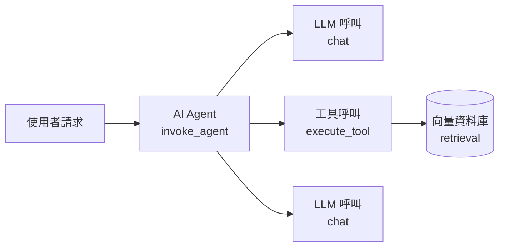
```mermaid
flowchart LR
    U[使用者請求] --> A[AI Agent<br/>invoke_agent]
    A --> L1[LLM 呼叫<br/>chat]
    A --> T[工具呼叫<br/>execute_tool]
    T --> DB[(向量資料庫<br/>retrieval)]
    A --> L2[LLM 呼叫<br/>chat]
```

| 治理重點 | 做法 |
| --- | --- |
| 個資與機敏資料 | 提示詞 / 回應內容預設**不擷取**；確需除錯時僅在非生產環境開啟（例如 Python 的 `OTEL_INSTRUMENTATION_GENAI_CAPTURE_MESSAGE_CONTENT`），並以 Collector 遮罩 |
| 成本 | 以 `gen_ai.usage.*` 依服務 / 部門彙總 Token 用量與費用 |
| 品質 | 記錄 `finish_reasons`、錯誤率、延遲、首字延遲（Time to First Token） |
| 稽核 | 依「金融業運用 AI 指引」保存模型版本、呼叫紀錄與決策軌跡（見 [9.6 節](#96-臺灣金融業法規與規範對應)） |
| 標準化 | Collector 的 `gen_ai_normalizer` processor（Alpha）可正規化不同 SDK 的 GenAI 屬性 |

> 💡 OBI（[5.7 節](#57-零程式碼-ebpf-埋點obi)）也能以 eBPF 擷取 OpenAI、Anthropic、Bedrock、Gemini 等 API 呼叫的 Span 與指標，適合快速盤點既有 AI 應用。

---

### 11.3 Declarative Configuration（宣告式設定）

傳統上 SDK 以數十個 `OTEL_*` 環境變數設定，難以表達複雜結構（例如多個 Exporter、View、每條規則的取樣器）。**宣告式設定**以一份跨語言共通的 YAML 檔設定 SDK：

| 項目 | 狀態 |
| --- | --- |
| 設定檔 Schema（`opentelemetry-configuration`） | **1.0.0 已於 2026-02 發布**（目前 1.2.0）；Schema 中仍標示 `/development` 的部分屬實驗性 |
| 規格環境變數 | `OTEL_CONFIG_FILE`（取代舊的 `OTEL_EXPERIMENTAL_CONFIG_FILE`） |
| Java Agent | 2.26.0 起支援（`-Dotel.config.file=...`），仍屬實驗性 |
| Spring Boot Starter | 可直接在 `application.yaml` 的 `otel:` 下以宣告式格式設定 |
| Collector 自身 telemetry | `service.telemetry` 即採用此 Schema |

```yaml
# otel-config.yaml
file_format: "1.0"
resource:
  attributes:
    - name: service.name
      value: ${OTEL_SERVICE_NAME:-order-service}
    - name: deployment.environment.name
      value: ${DEPLOY_ENV:-production}
propagator:
  composite:
    - tracecontext:
    - baggage:
tracer_provider:
  sampler:
    parent_based:
      root:
        trace_id_ratio_based:
          ratio: 1.0
  processors:
    - batch:
        exporter:
          otlp_http:
            endpoint: ${OTEL_EXPORTER_OTLP_TRACES_ENDPOINT:-http://otel-agent:4318/v1/traces}
meter_provider:
  readers:
    - periodic:
        interval: 30000
        exporter:
          otlp_http:
            endpoint: ${OTEL_EXPORTER_OTLP_METRICS_ENDPOINT:-http://otel-agent:4318/v1/metrics}
logger_provider:
  processors:
    - batch:
        exporter:
          otlp_http:
            endpoint: ${OTEL_EXPORTER_OTLP_LOGS_ENDPOINT:-http://otel-agent:4318/v1/logs}
```

```bash
export OTEL_CONFIG_FILE=/opt/otel/otel-config.yaml
java -javaagent:/opt/otel/opentelemetry-javaagent.jar -Dotel.config.file=$OTEL_CONFIG_FILE -jar app.jar
```

> ⚠️ **注意**：設定 `OTEL_CONFIG_FILE` 後，**其他 `OTEL_*` 環境變數會被忽略**（除非在設定檔中以 `${VAR}` 明確引用）。導入時請把既有環境變數全部搬入設定檔，並在測試環境比對行為。

---

### 11.4 Kubernetes 一站式部署：opentelemetry-kube-stack

`opentelemetry-kube-stack` Helm Chart（0.23.x）把以下元件打包，適合「新叢集一次到位」：

| 元件 | 角色 |
| --- | --- |
| OpenTelemetry Operator | 管理 Collector 與自動注入 |
| Daemon Collector（DaemonSet） | 節點日誌、kubelet 指標、主機指標、就近接收 OTLP |
| Cluster Collector（Deployment） | 叢集事件、`k8s_cluster` 指標 |
| Instrumentation CR | 預設的自動埋點設定 |
| （選用）Target Allocator | 讀取 ServiceMonitor / PodMonitor 分片抓取 |

```bash
helm install otel-stack open-telemetry/opentelemetry-kube-stack \
  -n observability --create-namespace \
  --set clusterName=prod-tpe-01 \
  -f kube-stack-values.yaml
```

> 💡 **選型建議**：kube-stack 適合標準化程度高的新叢集；已有成熟 Helm / GitOps 流程或需要細緻控制每個 Collector 的企業，可分別安裝 Operator 與 Collector Chart（[3.3 節](#33-kubernetes)、[3.4 節](#34-opentelemetry-operator)）。

---

### 11.5 瀏覽器與前端可觀測性（RUM）

| 方案 | 說明 |
| --- | --- |
| OTel JS Web SDK（`@opentelemetry/sdk-trace-web` 等） | 擷取頁面載入、`fetch` / XHR、使用者互動 Span，並以 `traceparent` 串到後端 |
| Grafana Faro | 前端 SDK；Collector 有 `faro` receiver 可接收 |
| 商業 RUM | 多數已支援 OTLP 或 W3C Trace Context 串接 |

#### Collector 端設定要點（對外接收瀏覽器資料）

```yaml
receivers:
  otlp/browser:
    protocols:
      http:
        endpoint: 0.0.0.0:4318
        cors:
          allowed_origins:
            - https://www.example.com
            - https://*.example.com
          max_age: 7200
        max_request_body_size: 1048576   # 限制請求大小，降低濫用風險
```

> ⚠️ **安全提醒**：
>
> 1. 瀏覽器端無法安全保存祕密，**不要**在前端放 Token；改用專用的公開端點，搭配 WAF、速率限制與請求大小限制。
> 2. v1.0 的 CORS 設定 `allowed_origins: ["http://*", "https://*"]` 等同允許任何網站送資料，生產環境必須改為明確的網域清單。
> 3. 前端資料可能含使用者輸入與 URL 參數，送入後端前一樣要經過遮罩。

---

## 附錄 A：常用環境變數

以下為規格定義的通用 SDK 環境變數；個別語言可能有差異（例如 Java Agent 另支援 `-Dotel.*` 系統屬性）。

| 環境變數 | 說明 | 預設值 |
| --- | --- | --- |
| `OTEL_SERVICE_NAME` | 服務名稱（優先於 `OTEL_RESOURCE_ATTRIBUTES` 中的 `service.name`） | `unknown_service`（部分 SDK 會附加程序名稱） |
| `OTEL_RESOURCE_ATTRIBUTES` | Resource 屬性，`key1=value1,key2=value2` | — |
| `OTEL_EXPORTER_OTLP_ENDPOINT` | OTLP 端點（HTTP 時 SDK 會自動補 `/v1/traces` 等路徑） | `http://localhost:4318`（http/protobuf）；`http://localhost:4317`（grpc） |
| `OTEL_EXPORTER_OTLP_{TRACES,METRICS,LOGS}_ENDPOINT` | 個別訊號端點（HTTP 時需寫完整路徑） | — |
| `OTEL_EXPORTER_OTLP_PROTOCOL` | `grpc`、`http/protobuf`、`http/json` | 規格建議 `http/protobuf`（Java Agent 2.x、多數 SDK 皆是；部分 SDK 為相容舊版預設 `grpc`） |
| `OTEL_EXPORTER_OTLP_HEADERS` | 附加 Header，例如 `authorization=Bearer xxx` | — |
| `OTEL_EXPORTER_OTLP_TIMEOUT` | 匯出逾時（毫秒） | `10000` |
| `OTEL_EXPORTER_OTLP_COMPRESSION` | `gzip` 或 `none` | `none` |
| `OTEL_EXPORTER_OTLP_CERTIFICATE` | 驗證伺服器的 CA 憑證路徑 | — |
| `OTEL_TRACES_SAMPLER` | 取樣器 | `parentbased_always_on` |
| `OTEL_TRACES_SAMPLER_ARG` | 取樣參數（如比例 `0.1`） | — |
| `OTEL_PROPAGATORS` | Context 傳播器 | `tracecontext,baggage` |
| `OTEL_TRACES_EXPORTER` / `OTEL_METRICS_EXPORTER` / `OTEL_LOGS_EXPORTER` | `otlp`、`console`、`none`（Metrics 另有 `prometheus`） | `otlp` |
| `OTEL_METRIC_EXPORT_INTERVAL` | 指標匯出間隔（毫秒） | `60000` |
| `OTEL_METRICS_EXEMPLAR_FILTER` | `trace_based`、`always_on`、`always_off` | `trace_based` |
| `OTEL_BSP_SCHEDULE_DELAY` | Span 批次匯出間隔（毫秒） | `5000` |
| `OTEL_BSP_MAX_QUEUE_SIZE` | Span 批次佇列上限 | `2048` |
| `OTEL_BSP_MAX_EXPORT_BATCH_SIZE` | 單批最大 Span 數 | `512` |
| `OTEL_ATTRIBUTE_VALUE_LENGTH_LIMIT` | 屬性值長度上限 | 無限制 |
| `OTEL_SPAN_ATTRIBUTE_COUNT_LIMIT` | 每個 Span 屬性數上限 | `128` |
| `OTEL_SDK_DISABLED` | 停用 SDK | `false` |
| `OTEL_CONFIG_FILE` | 宣告式設定檔路徑（設定後其他 `OTEL_*` 被忽略，見 [11.3 節](#113-declarative-configuration宣告式設定)） | — |
| `OTEL_SEMCONV_STABILITY_OPT_IN` | 語意慣例遷移選項（`http`、`http/dup`、`database`、`database/dup` 等） | — |
| `OTEL_SEMCONV_EXCEPTION_SIGNAL_OPT_IN` | 例外記錄方式（`logs`、`logs/dup`） | —（以 Span Event 記錄） |

> ⚠️ **v1.0 修正**：v1.0 將 `OTEL_EXPORTER_OTLP_PROTOCOL` 預設值寫為 `grpc`、端點預設寫為 `:4317`，與 Java Agent 2.x 及規格建議的 `http/protobuf`（`:4318`）不符。

---

## 附錄 B：常用指令

```bash
# ===== Collector =====
# 驗證設定
otelcol-contrib validate --config=config.yaml

# 列出元件與穩定度
otelcol-contrib components

# 輸出合併、展開後的最終設定
otelcol-contrib print-config --config=base.yaml --config=prod.yaml

# 列出 Feature Gate
otelcol-contrib featuregate

# 健康檢查
curl -s http://localhost:13133/

# 自身指標（需依 7.4 設定 readers 才能從其他主機存取）
curl -s http://localhost:8888/metrics | grep -E 'otelcol_(receiver|exporter)_'

# 送測試資料
telemetrygen traces --otlp-insecure --otlp-endpoint localhost:4317 --traces 10

# ===== Kubernetes =====
kubectl get pods -n observability -l app.kubernetes.io/name=opentelemetry-collector
kubectl logs -n observability -l app.kubernetes.io/name=opentelemetry-collector --tail=200
kubectl get opentelemetrycollectors,instrumentations -A
kubectl describe pod <pod> -n <ns> | grep -i opentelemetry   # 檢查是否已注入

# 暫時存取除錯端點
kubectl port-forward -n observability deploy/otel-gateway-opentelemetry-collector 13133:13133 8888:8888

# ===== Helm =====
helm template otel-gateway open-telemetry/opentelemetry-collector --version 0.174.0 -f values.yaml
helm upgrade --install otel-gateway open-telemetry/opentelemetry-collector --version 0.174.0 -n observability -f values.yaml
helm rollback otel-gateway -n observability
```

---

## 附錄 C：參考資源

### 官方文件

- [OpenTelemetry 官方文件](https://opentelemetry.io/docs/)
- [OpenTelemetry Status（各語言 / 元件穩定度）](https://opentelemetry.io/status/)
- [Specification Status Summary](https://opentelemetry.io/docs/specs/status/)
- [Semantic Conventions（概念）](https://opentelemetry.io/docs/concepts/semantic-conventions/)
- [Semantic Conventions（規格）](https://opentelemetry.io/docs/specs/semconv/)
- [Collector 文件](https://opentelemetry.io/docs/collector/)
- [Collector Internal Telemetry](https://opentelemetry.io/docs/collector/internal-telemetry/)
- [Collector Gateway 部署模式](https://opentelemetry.io/docs/collector/deploy/gateway/)
- [Collector Scaling](https://opentelemetry.io/docs/collector/scaling/)
- [Collector Resiliency](https://opentelemetry.io/docs/collector/resiliency/)
- [Transforming Telemetry](https://opentelemetry.io/docs/collector/transforming-telemetry/)
- [Collector Distributions](https://opentelemetry.io/docs/collector/distributions/)
- [OpenTelemetry Collector Builder（OCB）](https://opentelemetry.io/docs/collector/extend/ocb/)
- [Collector Management（OpAMP）](https://opentelemetry.io/docs/collector/management/)
- [Security：設定最佳實務](https://opentelemetry.io/docs/security/config-best-practices/)
- [Security：處理敏感資料](https://opentelemetry.io/docs/security/handling-sensitive-data/)
- [Kubernetes 平台（Helm Chart / Operator）](https://opentelemetry.io/docs/platforms/kubernetes/)
- [Java Agent](https://opentelemetry.io/docs/zero-code/java/agent/)
- [Spring Boot Starter](https://opentelemetry.io/docs/zero-code/java/spring-boot-starter/)
- [OBI（eBPF Instrumentation）](https://opentelemetry.io/docs/zero-code/obi/)
- [各語言 SDK](https://opentelemetry.io/docs/languages/)
- [Declarative Configuration](https://opentelemetry.io/docs/languages/sdk-configuration/declarative-configuration/)
- [OTLP Metrics Export to Prometheus](https://opentelemetry.io/docs/compatibility/prometheus/otlp-metrics-export/)
- [Profiles 訊號](https://opentelemetry.io/docs/concepts/signals/profiles/)

### GitHub Repository

- [OpenTelemetry Collector](https://github.com/open-telemetry/opentelemetry-collector)
- [OpenTelemetry Collector Contrib](https://github.com/open-telemetry/opentelemetry-collector-contrib)
- [OpenTelemetry Collector Releases](https://github.com/open-telemetry/opentelemetry-collector-releases)
- [OTTL 說明](https://github.com/open-telemetry/opentelemetry-collector-contrib/blob/main/pkg/ottl/README.md)
- [OpenTelemetry Java Instrumentation](https://github.com/open-telemetry/opentelemetry-java-instrumentation)
- [OpenTelemetry Helm Charts](https://github.com/open-telemetry/opentelemetry-helm-charts)
- [OpenTelemetry Operator](https://github.com/open-telemetry/opentelemetry-operator)
- [Semantic Conventions](https://github.com/open-telemetry/semantic-conventions)
- [GenAI Semantic Conventions](https://github.com/open-telemetry/semantic-conventions-genai)
- [OpenTelemetry Configuration（宣告式設定 Schema）](https://github.com/open-telemetry/opentelemetry-configuration)
- [OpenTelemetry Weaver](https://github.com/open-telemetry/weaver)
- [OpenTelemetry eBPF Instrumentation](https://github.com/open-telemetry/opentelemetry-ebpf-instrumentation)
- [OpenTelemetry Demo](https://github.com/open-telemetry/opentelemetry-demo)

### 生態系

- [CNCF Observability Landscape](https://landscape.cncf.io/card-mode?category=observability-and-analysis)
- [CNCF TOC：OpenTelemetry 畢業審查（cncf/toc #1739）](https://github.com/cncf/toc/issues/1739)
- [Jaeger 文件](https://www.jaegertracing.io/docs/latest/)
- [Prometheus：Using Prometheus as your OpenTelemetry backend](https://prometheus.io/docs/guides/opentelemetry/)
- [Grafana Tempo 文件](https://grafana.com/docs/tempo/latest/)

### 姊妹手冊

- 《Prometheus與Grafana教學手冊》、《Metrics Visualization 教學手冊》、《Logs Visualization教學手冊》、《ELK Stack教學手冊》、《Kubernetes教學手冊》

---

## 附錄 D：版本基準與修訂紀錄

### D.1 版本基準矩陣（2026-10-01）

| 元件 | 版本 | 發布日期 | 備註 |
| --- | --- | --- | --- |
| Collector core / contrib / releases | v0.162.0（core 穩定模組 v1.68.0） | 2026-09-28 / 09-29 | 約每兩週一版 |
| Helm Chart `opentelemetry-collector` | 0.174.0（appVersion 0.161.0） | 2026-09 | 以 `image.tag` 固定 0.162.0 |
| Helm Chart `opentelemetry-operator` | 0.124.0（appVersion 0.160.0） | 2026-09-29 | — |
| Helm Chart `opentelemetry-kube-stack` | 0.23.1 | 2026-09-30 | — |
| OpenTelemetry Operator | v0.160.0 | 2026-09-28 | — |
| OCB / OpAMP Supervisor | v0.162.0 | 2026-09-29 | — |
| Java Instrumentation（Agent / Starter） | 2.31.1 | 2026-08-23 | 對應 Java SDK 1.65.0 |
| Java SDK | 1.66.0 | 2026-09-11 | — |
| JS SDK | 2.11.0 / experimental 0.222.0 | 2026-08-31 | — |
| Python SDK / contrib | 1.45.0 / 0.66b0 | 2026-09-25 | — |
| .NET SDK / Auto-Instrumentation | 1.19.1 / 1.17.0 | 2026-09-21 / 09-22 | — |
| Go SDK / contrib | 1.46.0 / 1.46.0 | 2026-08-25 / 08-26 | semconv 套件最新 v1.43.0 |
| OBI | v0.13.0 | 2026-09-04 | — |
| Semantic Conventions | 1.44.0 | 2026-08-04 | GenAI 已移至獨立 Repository |
| Specification / OTLP | 1.61.0 / 1.11.1 | 2026-09-14 / 09-29 | — |
| Configuration Schema | 1.2.0 | 2026-09-11 | 1.0.0 於 2026-02-27 發布 |
| Weaver | v0.26.1 | 2026-09-03 | — |
| Jaeger | v2.21.0 | 2026-09-14 | v1 已於 2025-12-31 EOL |
| Prometheus | v3.15.0 | 2026-09 | — |
| Grafana | v13.2.3 | 2026-09-29 | — |
| Grafana Tempo / Loki | v3.1.0 / v3.7.8 | 2026 | Tempo 3.0 於 2026-05-28 發布 |
| Elasticsearch | 9.5.4 | 2026 | — |

### D.2 v1.0 → v2.0 修正對照表

| # | 位置（v1.0） | v1.0 內容 | 問題 | v2.0 修正 |
| --- | --- | --- | --- | --- |
| 1 | 文件資訊 | 「最後更新」出現兩次且日期不同；版本寫「v1.x（2025/2026 最新穩定版）」 | 資訊重複且不具體 | 改為單一文件資訊表與完整版本矩陣（D.1） |
| 2 | §1.4 | OpenTelemetry 為 Incubating、「接近畢業」 | 已過時 | 2026-05 已畢業（Graduated） |
| 3 | §1.4 圖 | 將 Loki 列為 CNCF 生態系後端 | Loki 非 CNCF 專案 | 改列 CNCF 專案並註明 |
| 4 | §1.3.2 | 指標類型只列 Counter / Gauge / Histogram | 不完整 | 補 UpDownCounter、Observable、Exponential Histogram、Exemplars |
| 5 | §1.3 | 只談三大支柱 | 不完整 | 補 Profiles（Alpha）與 Baggage |
| 6 | §2.2.1 | Java 範例未匯入 `GlobalOpenTelemetry` | 無法編譯 | 補齊 import 與 Scope 說明 |
| 7 | §2.2.2 | `ResourceAttributes.SERVICE_NAME` | 類別已移除 | 改用 `io.opentelemetry.semconv.ServiceAttributes` |
| 8 | §2.2.4、§4.2.3 | 列出 `jaeger` exporter | contrib v0.86.0 已移除 | 改用 `otlp_grpc` / `otlp_http` |
| 9 | §2.2.4 | 「Console Exporter」 | Collector 中名稱為 `debug` | 更正並說明 `logging` 已移除 |
| 10 | §2.3 | 只比較 SDK-based / Agent-based | 未涵蓋 Gateway 與 Tail Sampling 需求 | 改為三種模式比較 |
| 11 | §3.1.2 | Collector 0.96.0 | 過時 | 0.162.0，並提供 DEB / RPM / Windows MSI |
| 12 | §3.1.2 | 未驗證下載檔 | 供應鏈風險 | 加入 SHA-256 驗證與 Sigstore 說明 |
| 13 | §3.1.2 | 基本設定未含 `memory_limiter` | 有 OOM 風險 | 加入 `memory_limiter` 與 `health_check` |
| 14 | §3.1.3 | systemd `User=otel` 但未建立帳號；路徑與官方套件不同 | 服務無法啟動 | 改以官方套件為主，手動安裝附帳號建立步驟 |
| 15 | §3.2.1 | Compose `version: '3.8'` | 欄位已廢棄 | 移除 |
| 16 | §3.2.1 | `jaegertracing/all-in-one:1.54` 與 14250 埠 | Jaeger v1 已 EOL | 改 `cr.jaegertracing.io/jaegertracing/jaeger:2.21.0` |
| 17 | §3.2.1 | Prometheus v2.50.0、Grafana 10.3.0 | 過時 | Prometheus v3.15.0（啟用 OTLP receiver）、Grafana 13.2.3 |
| 18 | §3.2.1 | `GF_SECURITY_ADMIN_PASSWORD=admin` | 明文弱密碼 | 改用 Docker secrets |
| 19 | §3.2.2 | 未說明 receiver 預設綁定 | v0.104.0 起預設 localhost，容器內連不到 | 補充說明 |
| 20 | §3.3.1 | Helm values 未設定 `image.repository` | Chart 必填，安裝失敗 | 補上並使用 otelcol-k8s 映像 |
| 21 | §3.3.1 | 未移除 Chart 預設 jaeger / zipkin / prometheus receiver | 多開不必要的埠 | 以 `null` 移除並關閉對應 ports |
| 22 | §3.3.1、§3.3.3 | `k8sattributes` | v0.146.0 起更名 | `k8s_attributes`（已 Stable） |
| 23 | §3.3.1 | 自訂 clusterRole 只含 pods、namespaces | 無法解析 Deployment 名稱（需 replicasets） | 改用 `presets.kubernetesAttributes` |
| 24 | §3.3.2 | Deployment「手動 HPA」 | 用詞矛盾 | 更正並補 StatefulSet 與 presets |
| 25 | §3.3.3 | `pod_association` 只用 `k8s.pod.ip` | Agent 模式下不夠可靠 | 補 `k8s.pod.uid` 與 `connection` |
| 26 | §4.1 | 結構未含 connectors、telemetry、變數展開 | 不完整 | 補 4.1.1 變數展開與設定來源 |
| 27 | §4.2 | 元件表無穩定度、使用舊名稱 | 過時 | 以 0.162.0 新名稱與穩定度重寫 |
| 28 | §4.3.1、§7.4.1 | `service.telemetry.metrics.address` | v0.123.0 起忽略，0.162.0 驗證失敗 | 改用 `readers` |
| 29 | §4.3.1 | CORS `allowed_origins: ["http://*", "https://*"]` | 等同允許任意來源 | 移除；RUM 情境見 11.5 |
| 30 | §4.3.1 | `prometheusremotewrite` 開啟 `resource_to_telemetry_conversion` | 基數爆炸風險 | 關閉並改用 `target_info` |
| 31 | §4.3.1 | 多副本 Gateway 直接做 `tail_sampling` | 同一 Trace 分散在不同副本，決策錯誤 | 補兩層 `load_balancing` 架構（7.1） |
| 32 | §4.3.1、§7.3.2 | zpages、pprof 綁定 `0.0.0.0` | 暴露內部資訊 | 改綁 localhost，僅除錯時啟用 |
| 33 | §4.4.1 | 只說明 memory_limiter 與 batch | 處理器順序不完整 | 補完整順序與 exporter 批次比較 |
| 34 | §4.4.2 | `attributes` 以 `pattern` + `replacement` + `update` 遮罩 Email | 欄位語意錯誤（pattern 比對 key），規則無效 | 改用 `transform` / `redaction` |
| 35 | §5.1.1 | Java Agent 2.1.0 | 過時 | 2.31.1 |
| 36 | §5.1.1 | Agent 端點指向 `:4317` | Agent 2.x 預設 http/protobuf，應為 `:4318` | 更正 |
| 37 | §5.1.1 | BOM 1.35.0、Starter `2.1.0-alpha` | 過時 | SDK BOM 1.66.0 + Instrumentation BOM 2.31.1 |
| 38 | §5.1.3 | 屬性 `customer.id` | 個資風險、缺命名空間 | 改 `app.*` 並加個資提醒 |
| 39 | §5.1.3 | 成功時 `setStatus(StatusCode.OK)`；狀態描述放例外訊息 | 不符語意慣例、可能外洩個資 | 成功保持 Unset；描述放例外類別 |
| 40 | §5.1.4 | `otel.traces.sampler.probability` | 屬性不存在 | `otel.traces.sampler` + `otel.traces.sampler.arg` |
| 41 | §5.1.4 | Controller 注入未定義的 `Tracer` Bean | Starter 不提供 Tracer Bean，啟動失敗 | 改用 `Span.current()` |
| 42 | §5.1.4 | `http.request.body.size` 設為 `request.toString().length()` | 語意錯誤 | 移除，改示範業務屬性 |
| 43 | §5.2.1 | `new Resource(...)`、`SemanticResourceAttributes` | JS SDK 2.x 已移除 | `resourceFromAttributes()`、`ATTR_*` |
| 44 | §5.2.1 | gRPC exporter 共用 `OTEL_EXPORTER_OTLP_ENDPOINT` | 端點語意混淆 | 改 HTTP/Protobuf exporter，自動補路徑 |
| 45 | §5.2.1 | `tracer.startSpan()` 未設為作用中 | 子 Span 無法掛在其下 | 改 `startActiveSpan()` |
| 46 | §5.2.1 | `setStatus({ code: 2 })`、回傳 `error.message` | 魔術數字、資訊外洩 | `SpanStatusCode.ERROR`、回傳通用訊息 |
| 47 | §5.3.1 | `deployment.environment` | 已棄用 | `deployment.environment.name`（v1.41.0 Stable） |
| 48 | §5.3.1 | `http.method`、`http.url`、`http.status_code` | 舊版 HTTP 慣例 | `http.request.method`、`url.full`、`http.response.status_code` |
| 49 | §5.3.1 | `db.system`、`db.name`、`db.statement`、`db.operation` | 舊版 DB 慣例 | `db.system.name`、`db.namespace`、`db.query.text`、`db.operation.name` |
| 50 | §5.3.3 | 手動傳遞範例只有 inject、缺 import | 不完整 | 補 extract 與完整 import |
| 51 | §6.2.2 | Dashboard link 手寫 Explore URL（`left=` 格式） | Grafana 新版 URL 格式已改，易失效 | 改用資料來源關聯（exemplars、tracesToLogs、derivedFields） |
| 52 | §6.2.3 | `http_server_duration_milliseconds_*`、`http_status_code` | 舊版指標與單位 | `http_server_request_duration_seconds_*`、`http_response_status_code` |
| 53 | §7.1 | HA 架構僅 LB + 多副本 | 未處理有狀態處理（Tail Sampling） | 兩層 `load_balancing` 架構 |
| 54 | §7.1.2 | HA values 缺 `image.repository`；requests 400Mi / limits 2Gi | 安裝失敗；記憶體不對齊易被驅逐 | 補必填欄位、requests = limits、拓撲分散 |
| 55 | §7.2.2 | 將 `sending_queue` 註解為「連線池設定」 | 概念錯誤 | 更正並補預設值表 |
| 56 | §7.3.1 | 錯誤訊息非 Collector 實際字串 | 不利搜尋日誌 | 改為實際訊息並擴充 |
| 57 | §7.4.2 | 告警未依 exporter 分組、缺資料遺失告警 | 告警不精確 | 新增 Down、DataLoss、Refusing 規則（promtool 驗證） |
| 58 | §8.1.1 | Collector「每月發布」 | 實際約每兩週 | 更正 |
| 59 | §8.1.2 | 「Collector v0.88+ 2024 Logs 穩定」「SDK v1.30+ 2024 Metrics 穩定」「Semconv v1.24+ 2024 HTTP/DB 穩定」 | 年份與版本皆錯誤 | 重寫里程碑（HTTP 2023-11 v1.23.0、DB 2025-05 v1.33.0） |
| 60 | §8.2.2 | 以 `kubectl rollout undo` 回滾 Helm 部署 | 與 Helm 狀態不一致 | 改 `helm rollback` |
| 61 | §8.3.1 | Prometheus 整合只列 Remote Write / Exporter | 漏列原生 OTLP | 補 OTLP receiver 與屬性提升 |
| 62 | §9.1 | Gantt 自 2026-01 起算 | 已過期 | 改為 2026 Q4 起算，並加 Phase 0 治理 |
| 63 | §9.2.1 | 格式 `{team}-{application}-{component}`，範例卻不含 team | 自相矛盾；組織調整會改名 | 改為不含團隊與環境的命名規範表 |
| 64 | §9.2.2 | HTTP Client `HTTP {METHOD}`、DB `{DB_OPERATION} {DB_NAME}.{TABLE}` | 不符語意慣例 | 依現行慣例更正 |
| 65 | §9.4.2 | 宣告 `oidc` 但未加入 `service.extensions` | Collector 啟動失敗 | 補上並以 validate 驗證 |
| 66 | §9.4.2 | `attributes` 以 `pattern` 比對身分證格式後 `hash` | pattern 比對 key，永遠不生效 | 改 `transform` 依值遮罩 |
| 67 | §9.4.3 | 稽核日誌：「Collector 存取日誌」 | Collector 無此功能 | 改為設定變更走 Git、平台存取紀錄、稽核日誌獨立 pipeline |
| 68 | 附錄 A | `OTEL_EXPORTER_OTLP_PROTOCOL` 預設 `grpc`、端點預設 `:4317` | 與規格及 Java Agent 2.x 不符 | 更正並補充多項環境變數 |
| 69 | 全文 | 元件使用舊名稱（`otlp` exporter、`prometheusremotewrite` 等） | 0.162.0 輸出棄用警告 | 全面改用 snake_case 新名稱（附錄 G） |
| 70 | 全文 | 單行粗體當標題、目錄手動維護、檔尾多餘空行 | Markdown 格式問題（MD036 等） | 粗體標題改為正式標題、目錄自動產生 |

---

## 附錄 E：查證紀錄

| # | 查證項目 | 結論 | 查證方式 / 來源 |
| --- | --- | --- | --- |
| 1 | Collector / Contrib 最新版本 | v0.162.0（2026-09-28 / 29） | `gh api` releases |
| 2 | Collector 發行版種類 | otelcol、contrib、k8s、otlp、prometheus、ebpf-profiler | collector-releases `distributions/` |
| 3 | 元件 snake_case 更名與棄用別名 | v0.144.0 起陸續更名；舊名啟動時輸出 `alias is deprecated` | contrib / core CHANGELOG；本機實測 0.162.0 |
| 4 | `metrics.address` | 0.162.0 驗證失敗（`has invalid keys: address`） | 本機 `validate` 實測 |
| 5 | Collector 自身指標名稱 | 預設與自訂 `readers` 均不帶 `_total` / 單位後綴 | 本機啟動 0.162.0 並 `curl :8888/metrics` 實測 |
| 6 | 元件穩定度 | `k8s_attributes` Stable；`span_metrics` Alpha；`batch` Beta 等 | `otelcol-contrib components` |
| 7 | batch processor 狀態 | 仍為 Beta；exporter `sending_queue.batch` 預設關閉 | core `batchprocessor` / `exporterhelper` README（v0.162.0） |
| 8 | receiver 預設綁定 localhost | v0.104.0 起；v0.110.0 Feature Gate 轉 Stable | core CHANGELOG |
| 9 | `jaeger` exporter 移除 | contrib v0.86.0 | contrib CHANGELOG |
| 10 | Helm Chart 必填欄位 | `mode`、`image.repository`；`rewriteDeprecatedComponentNames` 預設 true | chart 0.174.0 `values.yaml` |
| 11 | Operator 各語言預設協定 | Java / .NET / Python / Go 用 http/protobuf；Node.js 用 gRPC | opentelemetry.io Operator automatic 文件 |
| 12 | Operator `upgradeStrategy` | v1beta1 CR 有此欄位 | operator v0.160.0 原始碼 |
| 13 | OpenTelemetry CNCF 畢業 | TOC 投票通過，PR #2134 於 2026-05-11 合併 | cncf/toc #1739、#2152、PR #2134 |
| 14 | 各語言訊號穩定度 | Java / .NET Logs Stable；Go Logs RC；Python / JS Logs Development | opentelemetry.io `data/instrumentation.yaml` |
| 15 | Profiles 狀態 | Alpha；Collector 需 `service.profilesSupport` | Profiles 概念文件、`featuregate` 輸出 |
| 16 | Java Agent 預設協定 | 2.x 預設 http/protobuf | Java configuration 文件 |
| 17 | Java Agent 宣告式設定 | 2.26.0+ 支援，仍實驗性 | Java Agent declarative configuration 文件 |
| 18 | Spring Boot Starter 相容性 | Spring Boot 2.6+ / 3.1+ / 4.x | Starter getting-started 文件、2.2x release notes |
| 19 | Spring Boot 4 原生 starter | `spring-boot-starter-opentelemetry` | spring.io blog（2025-11-18） |
| 20 | JS SDK 2.x Resource API | `resourceFromAttributes`、`ATTR_*` | JS resources 文件 |
| 21 | HTTP 語意慣例穩定 | v1.23.0（2023-11-03） | semconv CHANGELOG |
| 22 | DB 語意慣例穩定 | v1.33.0（2025-05-02） | semconv CHANGELOG |
| 23 | `deployment.environment.name` 穩定 | v1.41.0（2026-04-28） | semconv CHANGELOG |
| 24 | 例外不再以 Span Event 記錄 | v1.40.0（2026-02-19）起，`OTEL_SEMCONV_EXCEPTION_SIGNAL_OPT_IN` | semconv CHANGELOG、exceptions-spans.md |
| 25 | GenAI 語意慣例位置 | 已移至 `semantic-conventions-genai`（2026-05 建立），Development | 兩個 Repository 內容 |
| 26 | 宣告式設定 Schema | 1.0.0（2026-02-27）、1.2.0（2026-09-11）；`OTEL_CONFIG_FILE` | opentelemetry-configuration releases、Spec 1.61.0 |
| 27 | Jaeger v1 EOL | 2025-12-31；v2.21.0 映像 `cr.jaegertracing.io/jaegertracing/jaeger` | endoflife.date、Jaeger 文件 |
| 28 | Tempo 3.0 | 2026-05-28 發布，TraceQL Metrics GA | grafana/tempo release notes |
| 29 | OBI 需求 | Linux 5.8+（RHEL 4.18+ 例外）、BTF、amd64 / arm64 | opentelemetry.io OBI 文件 |
| 30 | Prometheus OTLP 接收 | `--web.enable-otlp-receiver`、`/api/v1/otlp` | Prometheus / OTel 相容性文件 |
| 31 | 文中 Collector 設定 | 全部通過 `otelcol-contrib 0.162.0 validate`（Target Allocator 範例除外，見下方） | 本機 `validate.py` 批次驗證 |
| 32 | 文中 PromQL 與告警規則 | 通過 `promtool 3.15.0 check rules` | 本機實測 |
| 33 | Prometheus 設定範例 | 通過 `promtool check config` | 本機實測 |
| 38 | Helm values 範例 | `helm template`（Helm v4.3.0、Chart 0.174.0）渲染成功，ConfigMap 交由 `validate` 檢查 | 本機實測 |
| 39 | 頁內連結 | Hugo 渲染後約 430 個頁內連結全部對應到標題 ID（僅佈景主題的 `#top` 除外） | `hugo` 渲染比對 |
| 34 | Collector 套件路徑與服務名稱 | `/etc/otelcol-contrib/config.yaml`、服務 `otelcol-contrib` | collector-releases 套件檔 |
| 35 | OCB 下載檔名 | `ocb_0.162.0_linux_amd64` | `cmd/builder/v0.162.0` release assets |
| 36 | span_metrics 預設單位 | `ms`（Feature Gate 尚未切換為 `s`） | spanmetricsconnector README |
| 37 | `filter` processor 新語法 | v0.146.0 起 `trace_conditions` 等 | filterprocessor README |

> 💡 **驗證說明**：[3.4 節](#34-opentelemetry-operator) 的 Target Allocator 範例中 `scrape_configs: []` 由 Operator 在部署時注入 `target_allocator` 設定，單獨以 `validate` 檢查會出現 `no Prometheus scrape_configs or target_allocator set`，屬預期行為。三份 Helm values 範例皆以 Helm v4.3.0 對 Chart 0.174.0 執行 `helm template` 成功，並將渲染出的 ConfigMap（`relay`）交給 `validate`：Gateway 與 HA 範例通過；DaemonSet（Agent）範例僅因驗證主機為 Windows（`host_metrics` 的 `root_path` 僅支援 Linux、`/var/lib/otelcol` 不存在）而未通過，屬平台差異，非設定錯誤。

### E.1 待追蹤事項

| # | 項目 | 說明 | 建議追蹤時間 |
| --- | --- | --- | --- |
| 1 | 棄用別名移除時間 | 舊元件名稱何時從 Collector 移除尚未公告 | 每次升級 |
| 2 | `span_metrics` 單位改為秒 | Feature Gate `connector.spanmetrics.useSecondAsDefaultMetricsUnit` 切換後，指標名稱將改為 `_seconds_` | 下一季 |
| 3 | Collector 自身指標名稱 | 官方文件與 0.162.0 實測（無 `_total`）不一致，需持續觀察 | 每次升級 |
| 4 | Profiles 穩定 | OTLP Profiles 由 Alpha 升級的時程 | 2027 |
| 5 | GenAI 語意慣例 | 新 Repository 尚無正式 Release；`gen_ai.client.token.usage` 指標在現行文件中未列出，需確認是否更名或移除 | 每季 |
| 6 | 宣告式設定 | Java Agent 支援由實驗性轉為穩定的時間 | 每季 |
| 7 | OpAMP | extension / supervisor 由 Alpha 升級 | 每季 |
| 8 | Messaging 語意慣例 | 仍為 Development，Kafka 相關屬性可能變動 | 每季 |
| 9 | 臺灣法規條號 | 個資法、資通安全管理法近年修正後的施行細則與子法條號，需法遵單位確認後補入 9.6 | 法遵確認後 |
| 10 | Helm presets 元件名稱 | Chart 0.174.0 的 `hostMetrics` preset 渲染出的仍是舊名稱 `hostmetrics`（會出現棄用警告），待 Chart 更新 | 每次升級 Chart |

---

## 附錄 F：名詞對照表

| 名詞 | 英文 | 說明 |
| --- | --- | --- |
| 可觀測性 | Observability | 由外部輸出推斷系統內部狀態的能力 |
| 遙測資料 | Telemetry | Traces、Metrics、Logs、Profiles 的統稱 |
| 追蹤 / 跨度 | Trace / Span | 一次請求的完整路徑 / 其中一個操作 |
| 資源 | Resource | 產生遙測資料的實體描述（服務、主機、Pod） |
| 儀表 | Instrument | 指標的記錄工具（Counter、Histogram 等） |
| 埋點 | Instrumentation | 在程式中產生遙測資料的程式碼或機制 |
| 零程式碼埋點 | Zero-code Instrumentation | 不修改程式即可埋點（Agent、eBPF） |
| 上下文傳遞 | Context Propagation | 跨服務傳遞 TraceId 等資訊 |
| 語意慣例 | Semantic Conventions | 屬性、指標、Span 名稱的命名標準 |
| 頭端 / 尾端採樣 | Head / Tail Sampling | 請求開始時 / Trace 完成後決定是否保留 |
| 範例值 | Exemplar | 指標資料點上附帶的 TraceId |
| 基數 | Cardinality | 指標標籤組合的數量 |
| 背壓 | Backpressure | 下游處理不及時，向上游回推的流量控制 |
| 發行版 | Distribution | 包含特定元件組合的 Collector 建置 |
| 連接器 | Connector | 串接兩條 pipeline 的 Collector 元件 |
| 轉換語言 | OTTL | OpenTelemetry Transformation Language |
| 艦隊管理 | Fleet Management | 集中管理大量 Agent / Collector（OpAMP） |
| 持續剖析 | Continuous Profiling | 持續收集程式資源使用剖面（Profiles） |
| 宣告式設定 | Declarative Configuration | 以 YAML 檔設定 SDK |

---

## 附錄 G：Collector 元件更名對照表

下表整理 Collector 0.162.0 已更名、舊名稱仍以**棄用別名**運作的常用元件（版本為更名發生的版本）。

| 類別 | 舊名稱（棄用別名） | 新名稱 | 更名版本 |
| --- | --- | --- | --- |
| exporter | `otlp` | `otlp_grpc` | core v0.144.0 |
| exporter | `otlphttp` | `otlp_http` | core v0.144.0 |
| exporter | `loadbalancing` | `load_balancing` | v0.153.0 |
| exporter | `prometheusremotewrite` | `prometheus_remote_write` | v0.154.0 |
| exporter | `azuremonitor` | `azure_monitor` | v0.159.0 |
| processor | `k8sattributes` | `k8s_attributes` | v0.146.0 |
| processor | `metricstransform` | `metrics_transform` | v0.152.0 |
| processor | `resourcedetection` | `resource_detection` | v0.153.0 |
| processor | `cumulativetodelta` | `cumulative_to_delta` | v0.157.0 |
| processor | `deltatocumulative` | `delta_to_cumulative` | v0.158.0 |
| processor | `deltatorate` | `delta_to_rate` | v0.158.0 |
| receiver | `azureeventhub` | `azure_event_hub` | v0.145.0 |
| receiver | `mongodbatlas` | `mongodb_atlas` | v0.145.0 |
| receiver | `filelog` | `file_log` | v0.149.0 |
| receiver | `httpcheck` | `http_check` | v0.150.0 |
| receiver | `namedpipe` | `named_pipe` | v0.150.0 |
| receiver | `tcplog` / `udplog` | `tcp_log` / `udp_log` | v0.150.0 |
| receiver | `tlscheck` | `tls_check` | v0.150.0 |
| receiver | `windowseventlog` | `windows_event_log` | v0.150.0 |
| receiver | `filestats` | `file_stats` | v0.151.0 |
| receiver | `hostmetrics` | `host_metrics` | v0.151.0 |
| receiver | `k8sobjects` | `k8s_objects` | v0.151.0 |
| receiver | `sshcheck` | `ssh_check` | v0.151.0 |
| receiver | `kafkametrics` | `kafka_metrics` | v0.152.0 |
| receiver | `kubeletstats` | `kubelet_stats` | v0.152.0 |
| receiver | `tcpcheck` | `tcp_check` | v0.152.0 |
| receiver | `googlecloudspanner` | `google_cloud_spanner` | v0.152.0 |
| receiver | `apachespark` | `apache_spark` | v0.154.0 |
| receiver | `envoyals` | `envoy_als` | v0.154.0 |
| receiver | `otlpjsonfile` | `otlp_json_file` | v0.154.0 |
| receiver | `webhookevent` | `webhook_event` | v0.154.0 |
| receiver | `awscloudwatch` | `aws_cloudwatch` | v0.156.0 |
| receiver | `sqlquery` | `sql_query` | v0.159.0 |
| receiver | `windowsperfcounters` | `windows_perf_counters` | v0.160.0 |
| connector | `signaltometrics` | `signal_to_metrics` | v0.146.0 |
| connector | `servicegraph` | `service_graph` | v0.151.0 |
| connector | `spanmetrics` | `span_metrics` | v0.151.0 |
| connector | `otlpjson` / `roundrobin` / `slowsql` | `otlp_json` / `round_robin` / `slow_sql` | v0.152.0 |
| connector | `metricsaslogs` | `metrics_as_logs` | v0.153.0 |

> ⚠️ **不需要改名**：`otlp` **receiver**、`k8s_cluster`、`k8s_events`、`health_check`、`file_storage`、`tail_sampling`、`memory_limiter`、`batch` 等原本即為正確名稱。另外，開發中的 `dynamic_sampling` processor 於 v0.160.0 更名為 `adaptive_tail_sampling` 時**未保留別名**。

> 💡 **自動化建議**：在 CI 中以腳本比對設定檔與上表，或直接啟動新版 Collector 數秒並檢查日誌是否出現 `alias is deprecated`。Helm Chart 使用者可依賴 `rewriteDeprecatedComponentNames: true` 自動改寫，但仍建議直接修正 values。
