+++
date = '2025-10-31T00:00:00+08:00'
draft = false
title = 'Podman Desktop使用教學'
tags = ['教學', '工具', 'Podman', '容器']
categories = ['教學']
+++

# Podman Desktop 使用教學手冊

| 項目 | 內容 |
| --- | --- |
| **文件版本** | 2.0 |
| **最後更新** | 2026 年 9 月 29 日 |
| **適用版本** | Podman Desktop 1.29.x（主要基準，穩定版 1.29.3）；兼述 1.30 預覽版 |
| **內建引擎** | Podman 6.0.2（Windows、Apple Silicon Mac）、Podman 5.8.5（Intel Mac）；1.30 預覽版升為 6.1.2／5.8.7 |
| **企業版** | Red Hat build of Podman Desktop 1.2（2026 年 2 月 GA） |
| **適用對象** | 後端與前端工程師、系統架構師、平台工程、DevOps、桌面管理（IT）與資安人員 |
| **文件定位** | 企業標準技術白皮書／內部標準教材 |
| **使用情境** | 大型企業、金融業（銀行、證券、保險）的開發者桌面容器環境 |
| **文件維護** | 內部技術團隊 |
| **Created by** | Eric Cheng |

> ⚠️ **v2.0 重大改版說明**：v1.0 以 Podman 4.x 時代為基準，許多畫面描述已經和實際介面不符，安裝流程也還停留在 Windows 10 與手動 `dism` 指令。另外，v1.0 的檔案結構有損壞：總結之後接著斷掉的程式碼片段、重複的第 3～5 章精簡版，以及放錯位置的 2.5.3～2.5.5 節。本版以 Podman Desktop 1.29 與 Podman 6 為基準全面改寫，新增企業集中管理（Managed configuration）、受限環境安裝、擴充功能生態、Kubernetes 整合、Podman AI Lab、疑難排解等章節。Podman 引擎本身的 CLI、Quadlet、網路與供應鏈細節，請搭配本站《Podman 使用教學手冊》v2.0 閱讀。完整更正清單請見[附錄 D：版本紀錄](#附錄-d版本紀錄)，查證來源請見[附錄 E：查證紀錄](#附錄-e查證紀錄)。

<!-- TOC-AUTO-BEGIN -->

## 目錄

- [執行摘要](#執行摘要)
- [1. Podman Desktop 概觀與架構](#1-podman-desktop-概觀與架構)
  - [1.1 什麼是 Podman Desktop](#11-什麼是-podman-desktop)
  - [1.2 架構與元件](#12-架構與元件)
    - [1.2.1 整體架構](#121-整體架構)
    - [1.2.2 平台與 machine provider](#122-平台與-machine-provider)
  - [1.3 版本節奏與版本對照](#13-版本節奏與版本對照)
  - [1.4 與 Docker Desktop 的比較](#14-與-docker-desktop-的比較)
  - [1.5 社群版與 Red Hat build of Podman Desktop](#15-社群版與-red-hat-build-of-podman-desktop)
  - [1.6 專案治理與社群](#16-專案治理與社群)
  - [1.7 💡 本章實務建議](#17--本章實務建議)
- [2. 安裝與初始設定](#2-安裝與初始設定)
  - [2.1 系統需求與平台支援](#21-系統需求與平台支援)
  - [2.2 Windows 安裝](#22-windows-安裝)
    - [2.2.1 安裝 Podman Desktop](#221-安裝-podman-desktop)
    - [2.2.2 選擇 machine provider：WSL 2 或 Hyper-V](#222-選擇-machine-providerwsl-2-或-hyper-v)
    - [2.2.3 安裝 Podman 引擎](#223-安裝-podman-引擎)
  - [2.3 macOS 安裝](#23-macos-安裝)
  - [2.4 Linux 安裝](#24-linux-安裝)
  - [2.5 首次啟動與 Onboarding](#25-首次啟動與-onboarding)
  - [2.6 從 Podman 5 升級到 Podman 6](#26-從-podman-5-升級到-podman-6)
  - [2.7 受限環境與離線安裝](#27-受限環境與離線安裝)
  - [2.8 更新與解除安裝](#28-更新與解除安裝)
  - [2.9 💡 本章實務建議](#29--本章實務建議)
- [3. 介面導覽](#3-介面導覽)
  - [3.1 版面配置](#31-版面配置)
  - [3.2 導覽列與各資源頁](#32-導覽列與各資源頁)
  - [3.3 常用操作與效率功能](#33-常用操作與效率功能)
  - [3.4 狀態列、Task Manager 與 Troubleshooting](#34-狀態列task-manager-與-troubleshooting)
  - [3.5 外觀與協助工具](#35-外觀與協助工具)
  - [3.6 📝 實務練習：第一個容器](#36--實務練習第一個容器)
  - [3.7 💡 本章實務建議](#37--本章實務建議)
- [4. Podman machine 管理](#4-podman-machine-管理)
  - [4.1 為什麼需要 Podman machine](#41-為什麼需要-podman-machine)
  - [4.2 Provider 選擇](#42-provider-選擇)
  - [4.3 建立與設定 machine](#43-建立與設定-machine)
  - [4.4 Rootless 與 Rootful 切換](#44-rootless-與-rootful-切換)
  - [4.5 企業網路：VPN、Proxy 與憑證](#45-企業網路vpnproxy-與憑證)
    - [4.5.1 VPN：User mode networking](#451-vpnuser-mode-networking)
    - [4.5.2 Proxy](#452-proxy)
    - [4.5.3 CA 憑證（SSL 攔截環境）](#453-ca-憑證ssl-攔截環境)
  - [4.6 GPU 存取](#46-gpu-存取)
  - [4.7 多個 machine、遠端 Podman 與 WSL 互通](#47-多個-machine遠端-podman-與-wsl-互通)
  - [4.8 💡 本章實務建議](#48--本章實務建議)
- [5. 容器、Pod 與映像檔操作](#5-容器pod-與映像檔操作)
  - [5.1 容器](#51-容器)
    - [5.1.1 建立與啟動](#511-建立與啟動)
    - [5.1.2 監控、日誌與終端機](#512-監控日誌與終端機)
    - [5.1.3 生命週期與清理](#513-生命週期與清理)
  - [5.2 Pod](#52-pod)
  - [5.3 映像檔](#53-映像檔)
    - [5.3.1 拉取](#531-拉取)
    - [5.3.2 建置](#532-建置)
    - [5.3.3 推送、儲存與匯入](#533-推送儲存與匯入)
    - [5.3.4 映像檔最佳化](#534-映像檔最佳化)
    - [5.3.5 清理與空間管理](#535-清理與空間管理)
  - [5.4 Registry 與 Mirror](#54-registry-與-mirror)
  - [5.5 Volume](#55-volume)
  - [5.6 Network](#56-network)
  - [5.7 Secret](#57-secret)
  - [5.8 實務案例：Java 微服務本機開發環境](#58-實務案例java-微服務本機開發環境)
  - [5.9 💡 本章實務建議](#59--本章實務建議)
- [6. Compose 與 Docker 相容](#6-compose-與-docker-相容)
  - [6.1 設定 Compose](#61-設定-compose)
  - [6.2 執行 Compose 應用](#62-執行-compose-應用)
  - [6.3 Docker 相容模式](#63-docker-相容模式)
    - [6.3.1 Settings > Docker Compatibility](#631-settings--docker-compatibility)
    - [6.3.2 使用 DOCKER_HOST](#632-使用-docker_host)
    - [6.3.3 同時顯示 Docker 引擎](#633-同時顯示-docker-引擎)
  - [6.4 從 Docker Desktop 遷移](#64-從-docker-desktop-遷移)
    - [6.4.1 遷移評估清單](#641-遷移評估清單)
    - [6.4.2 遷移步驟](#642-遷移步驟)
    - [6.4.3 Docker 使用者要知道的差異](#643-docker-使用者要知道的差異)
  - [6.5 💡 本章實務建議](#65--本章實務建議)
- [7. Kubernetes 與 OpenShift 整合](#7-kubernetes-與-openshift-整合)
  - [7.1 本機叢集選項](#71-本機叢集選項)
  - [7.2 建立 Kind 叢集](#72-建立-kind-叢集)
  - [7.3 Minikube、Lima 與 MicroShift](#73-minikubelima-與-microshift)
  - [7.4 OpenShift Local 與 Developer Sandbox](#74-openshift-local-與-developer-sandbox)
  - [7.5 管理 Kubernetes context](#75-管理-kubernetes-context)
  - [7.6 部署與操作 Kubernetes 資源](#76-部署與操作-kubernetes-資源)
    - [7.6.1 Apply YAML](#761-apply-yaml)
    - [7.6.2 Deploy to Kubernetes](#762-deploy-to-kubernetes)
    - [7.6.3 Port forwarding](#763-port-forwarding)
  - [7.7 Podman 與 Kubernetes YAML 的往返](#77-podman-與-kubernetes-yaml-的往返)
  - [7.8 💡 本章實務建議](#78--本章實務建議)
- [8. 擴充功能生態](#8-擴充功能生態)
  - [8.1 內建擴充功能](#81-內建擴充功能)
  - [8.2 擴充功能目錄](#82-擴充功能目錄)
  - [8.3 安裝與管理](#83-安裝與管理)
  - [8.4 企業管控](#84-企業管控)
  - [8.5 重點擴充功能](#85-重點擴充功能)
    - [8.5.1 Podman Quadlet](#851-podman-quadlet)
    - [8.5.2 Bootable Containers（bootc）](#852-bootable-containersbootc)
    - [8.5.3 Grype 與 Image Layers Explorer](#853-grype-與-image-layers-explorer)
  - [8.6 開發擴充功能入門](#86-開發擴充功能入門)
  - [8.7 💡 本章實務建議](#87--本章實務建議)
- [9. Podman AI Lab](#9-podman-ai-lab)
  - [9.1 功能概觀](#91-功能概觀)
  - [9.2 資源需求](#92-資源需求)
  - [9.3 操作流程](#93-操作流程)
  - [9.4 應用程式整合範例](#94-應用程式整合範例)
  - [9.5 企業使用注意事項](#95-企業使用注意事項)
  - [9.6 💡 本章實務建議](#96--本章實務建議)
- [10. 企業導入與集中管理](#10-企業導入與集中管理)
  - [10.1 Managed configuration 原理](#101-managed-configuration-原理)
  - [10.2 檔案位置](#102-檔案位置)
  - [10.3 部署流程](#103-部署流程)
  - [10.4 常見管理用例](#104-常見管理用例)
    - [10.4.1 強制公司 proxy 與關閉遙測](#1041-強制公司-proxy-與關閉遙測)
    - [10.4.2 預設 registry 與 mirror（1.24）](#1042-預設-registry-與-mirror124)
    - [10.4.3 控制引擎更新](#1043-控制引擎更新)
    - [10.4.4 管控擴充功能與應用程式更新](#1044-管控擴充功能與應用程式更新)
  - [10.5 Proxy、CA 與網路整合](#105-proxyca-與網路整合)
  - [10.6 遙測與隱私](#106-遙測與隱私)
  - [10.7 settings.json 重點鍵值](#107-settingsjson-重點鍵值)
  - [10.8 疑難排解](#108-疑難排解)
  - [10.9 💡 本章實務建議](#109--本章實務建議)
- [11. 安全性與合規](#11-安全性與合規)
  - [11.1 威脅模型與控制對照](#111-威脅模型與控制對照)
  - [11.2 執行期安全](#112-執行期安全)
  - [11.3 映像檔安全](#113-映像檔安全)
  - [11.4 更新與弱點管理](#114-更新與弱點管理)
  - [11.5 稽核與合規檢查點](#115-稽核與合規檢查點)
  - [11.6 💡 本章實務建議](#116--本章實務建議)
- [12. 開發工作流程與 IDE 整合](#12-開發工作流程與-ide-整合)
  - [12.1 內循環（Inner Loop）開發流程](#121-內循環inner-loop開發流程)
  - [12.2 VS Code](#122-vs-code)
    - [12.2.1 Dev Containers 搭配 Podman](#1221-dev-containers-搭配-podman)
  - [12.3 IntelliJ IDEA](#123-intellij-idea)
  - [12.4 Testcontainers](#124-testcontainers)
  - [12.5 開發環境設定管理](#125-開發環境設定管理)
  - [12.6 Windows 開發環境自動化腳本](#126-windows-開發環境自動化腳本)
  - [12.7 與 CI 對齊](#127-與-ci-對齊)
  - [12.8 💡 本章實務建議](#128--本章實務建議)
- [13. 疑難排解](#13-疑難排解)
  - [13.1 診斷流程](#131-診斷流程)
  - [13.2 Podman Desktop 日誌與 Troubleshooting 頁](#132-podman-desktop-日誌與-troubleshooting-頁)
  - [13.3 Windows 常見問題](#133-windows-常見問題)
  - [13.4 macOS 常見問題](#134-macos-常見問題)
  - [13.5 Linux 常見問題](#135-linux-常見問題)
  - [13.6 引擎、網路與效能問題](#136-引擎網路與效能問題)
  - [13.7 回報問題](#137-回報問題)
  - [13.8 💡 本章實務建議](#138--本章實務建議)
- [14. 實務練習與認證準備](#14-實務練習與認證準備)
  - [14.1 分階段學習計畫](#141-分階段學習計畫)
  - [14.2 📝 基礎實務練習](#142--基礎實務練習)
  - [14.3 📝 企業實務練習](#143--企業實務練習)
  - [14.4 認證概述](#144-認證概述)
  - [14.5 EX188 考試目標與本手冊對照](#145-ex188-考試目標與本手冊對照)
  - [14.6 學習資源](#146-學習資源)
  - [14.7 💡 本章實務建議](#147--本章實務建議)
- [附錄 A：GUI ↔ CLI 對照](#附錄-agui--cli-對照)
- [附錄 B：設定檔範本](#附錄-b設定檔範本)
  - [B.1 個人 settings.json 建議值](#b1-個人-settingsjson-建議值)
  - [B.2 Managed configuration 範本](#b2-managed-configuration-範本)
  - [B.3 devcontainer.json（Java＋Podman）](#b3-devcontainerjsonjavapodman)
  - [B.4 開發用 compose.yaml 骨架](#b4-開發用-composeyaml-骨架)
  - [B.5 .wslconfig（Windows）](#b5-wslconfigwindows)
- [附錄 C：檢查清單](#附錄-c檢查清單)
  - [C.1 安裝驗證](#c1-安裝驗證)
  - [C.2 開發環境設定](#c2-開發環境設定)
  - [C.3 專案部署前（本機驗證）](#c3-專案部署前本機驗證)
  - [C.4 安全與合規](#c4-安全與合規)
  - [C.5 效能與資源](#c5-效能與資源)
  - [C.6 故障排除](#c6-故障排除)
  - [C.7 認證準備](#c7-認證準備)
  - [C.8 日常維護與 IT 管理](#c8-日常維護與-it-管理)
- [附錄 D：版本紀錄](#附錄-d版本紀錄)
  - [D.1 版本歷程](#d1-版本歷程)
  - [D.2 v1.0 → v2.0 更正表](#d2-v10--v20-更正表)
  - [D.3 v2.0 新增章節](#d3-v20-新增章節)
- [附錄 E：查證紀錄](#附錄-e查證紀錄)
  - [E.1 待確認事項](#e1-待確認事項)
- [附錄 F：參考資料](#附錄-f參考資料)
  - [F.1 官方文件](#f1-官方文件)
  - [F.2 社群與原始碼](#f2-社群與原始碼)
  - [F.3 Red Hat 資源](#f3-red-hat-資源)
  - [F.4 生態系工具](#f4-生態系工具)
- [📚 總結](#-總結)

<!-- TOC-AUTO-END -->

---

## 執行摘要

**一句話結論**：Podman Desktop 是開源（Apache-2.0）、跨平台的容器與 Kubernetes 桌面工具，屬於 CNCF Sandbox 專案。它用圖形介面管理 Podman 引擎、`podman machine`、Kind／Minikube／OpenShift 等本機叢集，並提供可以由 IT 集中鎖定的企業設定。對於想要替換 Docker Desktop、又需要集中管理開發者桌面的企業，它是目前最完整的開源選項。

**本手冊回答的六個問題**

| # | 決策問題 | 建議 | 章節 |
| --- | --- | --- | --- |
| 1 | 可以用 Podman Desktop 取代 Docker Desktop 嗎？ | 一般的建置、執行、Compose、Testcontainers 都可以。先盤點依賴 Docker 專屬擴充功能或 Docker Hub 付費功能的團隊，再分批遷移 | [第 6 章](#6-compose-與-docker-相容) |
| 2 | 要用社群版還是 Red Hat build？ | 需要 SLA、弱點修補承諾、集中授權的單位選 Red Hat build；其他情況用社群版加上 Managed configuration 即可 | [1.5](#15-社群版與-red-hat-build-of-podman-desktop) |
| 3 | IT 要怎麼統一管理 proxy、registry、遙測？ | 用 **Managed configuration**（`default-settings.json`＋`locked.json`），搭配 Intune、Jamf、GPO 或 Ansible 派送 | [第 10 章](#10-企業導入與集中管理) |
| 4 | 舊筆電（Windows 10、Intel Mac）還能用嗎？ | Podman Desktop 本身可以執行，但 Intel Mac 的引擎固定在 Podman 5.8.x；Windows 10 不在 Podman 6 的支援範圍內。要列入設備汰換計畫 | [2.1](#21-系統需求與平台支援) |
| 5 | 在 VPN、proxy、SSL 攔截的網路下能用嗎？ | 可以。使用 airgap 安裝檔、設定 proxy、建立 machine 時匯入主機 CA（`--import-native-ca`），VPN 環境再啟用 User mode networking | [2.7](#27-受限環境與離線安裝)、[4.5](#45-企業網路vpnproxy-與憑證) |
| 6 | 本機開發怎麼銜接 Kubernetes／OpenShift？ | 在本機用 Kind 或 MicroShift（MINC）驗證 YAML，用 Developer Sandbox 或 OpenShift Local 驗證 OpenShift 特性，正式環境交給 CI／CD | [第 7 章](#7-kubernetes-與-openshift-整合) |

**企業導入路線圖**

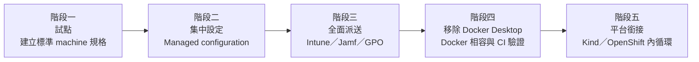
```mermaid
flowchart LR
    P1["階段一<br/>試點<br/>建立標準 machine 規格"] --> P2["階段二<br/>集中設定<br/>Managed configuration"]
    P2 --> P3["階段三<br/>全面派送<br/>Intune／Jamf／GPO"]
    P3 --> P4["階段四<br/>移除 Docker Desktop<br/>Docker 相容與 CI 驗證"]
    P4 --> P5["階段五<br/>平台銜接<br/>Kind／OpenShift 內循環"]
```

**v2.0 的主要變化**

- 🆕 新增 Podman machine 管理、Kubernetes 與 OpenShift 整合、擴充功能生態、Podman AI Lab、企業導入與集中管理、安全性與合規、疑難排解等章節。
- ⚠️ 更正安裝流程（WSL 改用 `wsl --install --no-distribution`、Windows Podman 安裝檔改為 MSI、macOS 以 `.dmg` 為主）、介面描述（依 1.29 實際畫面改寫）、Docker 相容做法（改用 Settings > Docker Compatibility 與 `DOCKER_HOST`）。
- ⚠️ 移除不存在的 VS Code 擴充功能（`redhat.vscode-podman`）、已停止發布的 `openjdk:*` 映像檔，以及已失效的 Katacoda 練習連結。
- 🧹 移除 v1.0 重複與損壞的段落，目錄改為自動產生，並涵蓋到第三層標題。

---

## 1. Podman Desktop 概觀與架構

### 1.1 什麼是 Podman Desktop

Podman Desktop 是一套開源、跨平台（Windows、macOS、Linux）的桌面應用程式，用圖形介面管理容器、Pod、映像檔與 Kubernetes 資源。它本身**不是容器引擎**，而是透過 Podman（也可以同時接上 Docker 引擎）的 API 操作工作負載。在 Windows 與 macOS 上，容器實際跑在由 `podman machine` 建立的 Linux 虛擬機裡。

官方把它定位成「把容器與 Kubernetes 的能力帶到你電腦上」的開發者工具，重點功能如下：

| 功能面向 | 說明 |
| --- | --- |
| 容器與 Pod 管理 | 建立、啟動、停止、刪除容器與 Pod；檢視日誌、進入終端機、檢視 Kubernetes YAML |
| 映像檔管理 | 建置（Containerfile／Dockerfile）、拉取、推送、儲存與匯入映像檔；檢視映像檔歷史與分層 |
| Volume、Network、Secret | 1.23 起 Network 有獨立頁面；1.25 起可以用 UI 建立 macvlan、ipvlan、IPv6 網路；1.29 起新增 Secrets 頁 |
| Podman machine | 建立、設定、啟停 VM；切換 rootless／rootful；支援 WSL 2、Hyper-V、Apple Hypervisor、libkrun／krunkit |
| Docker 相容 | 讓 Docker CLI、Compose 與第三方工具（Testcontainers 等）直接使用 Podman 引擎 |
| Kubernetes | 建立 Kind、Minikube、MicroShift 叢集；管理 kubeconfig context；套用 YAML、Port forwarding、把 Pod 部署到叢集 |
| 擴充功能 | 從目錄安裝 AI Lab、bootc、OpenShift Local、Quadlet、Grype 等擴充功能，也可以自行開發 |
| 企業功能 | VPN／proxy 支援、registry 與 mirror 管理、離線（airgap）安裝、Managed configuration 集中鎖定設定 |

> 📌 **專有名詞**：本手冊中的「引擎」指 Podman（或 Docker）容器引擎；「machine」指 `podman machine` 建立的 Linux VM；「provider」指 Podman Desktop 用來接入某種資源的擴充點，例如 Podman、Kind、Minikube、OpenShift Local。

### 1.2 架構與元件

#### 1.2.1 整體架構

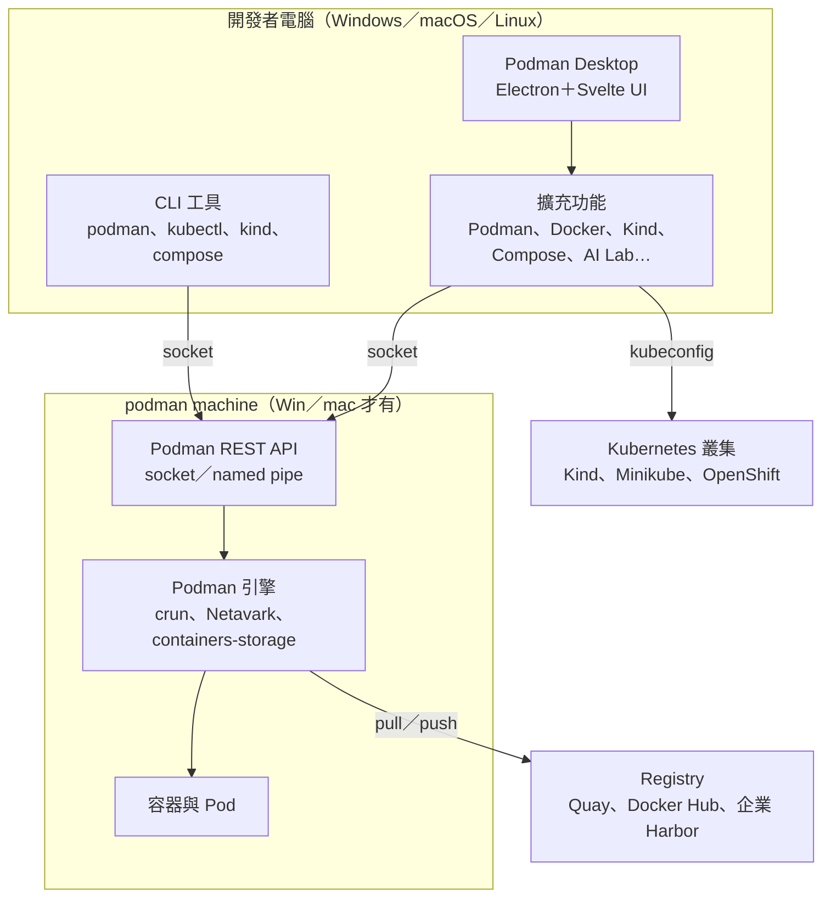
```mermaid
flowchart TB
    subgraph Host["開發者電腦（Windows／macOS／Linux）"]
        UI["Podman Desktop<br/>Electron＋Svelte UI"]
        EXT["擴充功能<br/>Podman、Docker、Kind、Compose、AI Lab…"]
        CLI["CLI 工具<br/>podman、kubectl、kind、compose"]
        UI --> EXT
    end
    subgraph VM["podman machine（Win／mac 才有）"]
        API["Podman REST API<br/>socket／named pipe"]
        ENG["Podman 引擎<br/>crun、Netavark、containers-storage"]
        CT["容器與 Pod"]
        API --> ENG --> CT
    end
    K8S["Kubernetes 叢集<br/>Kind、Minikube、OpenShift"]
    REG["Registry<br/>Quay、Docker Hub、企業 Harbor"]
    EXT -- socket --> API
    CLI -- socket --> API
    EXT -- kubeconfig --> K8S
    ENG -- pull／push --> REG
```

- **UI 層**：以 Electron 打包，前端使用 Svelte。應用程式本身不含容器執行環境，所有動作都透過 provider 呼叫引擎 API。
- **擴充功能層**：Podman、Docker、Compose、Kind、Kubectl CLI、Registries 等都是**內建擴充功能**；AI Lab、bootc、OpenShift Local 等則從目錄安裝。
- **引擎層**：Linux 上直接連本機的 Podman socket；Windows 與 macOS 則連到 `podman machine` 暴露出來的 socket 或 named pipe。
- **設定層**：使用者設定存在 `settings.json`；IT 可以用 `default-settings.json` 與 `locked.json` 覆寫（見[第 10 章](#10-企業導入與集中管理)）。

#### 1.2.2 平台與 machine provider

| 平台 | machine provider | 預設 | 備註 |
| --- | --- | --- | --- |
| Windows x64／ARM64 | WSL 2、Hyper-V | WSL 2 | Hyper-V 需要專業版或企業版，並以系統管理員身分執行 Podman Desktop 才看得到 Hyper-V machine |
| macOS Apple Silicon | libkrun（GPU enabled）、Apple Hypervisor | libkrun（1.21 起） | Podman 6 CLI 預設也改用 krunkit，與 Desktop 一致 |
| macOS Intel | Apple Hypervisor | Apple Hypervisor | 不能用 libkrun；內建引擎固定在 Podman 5.8.x |
| Linux | 不需要 machine | — | 直接使用本機 Podman；也可以建立 machine 做隔離測試 |

### 1.3 版本節奏與版本對照

Podman Desktop 大約**每月發布一個次要版本**，先出 prerelease，再發布穩定版與修補版。2026 年的版本歷程如下（依 GitHub Releases）：

| 版本 | 穩定版日期 | 重點 |
| --- | --- | --- |
| 1.25.1 | 2026-01-22 | 上一頁／下一頁導覽；進階網路建立（macvlan、ipvlan、IPv6）；新版 Kubernetes 功能預設啟用；Kube play 可以取消；Windows Podman 安裝檔改為 MSI |
| 1.26.1／1.26.2 | 2026-03 | 同步主機憑證到 machine；擴充功能須經使用者授權才能取得登入資訊；依環境篩選；可以停用自訂擴充功能與隱藏擴充功能目錄 |
| 1.27.1／1.27.2 | 2026-04／05 | 高對比主題與強調色；導覽歷史下拉；擴充功能 `package.json` JSON Schema |
| 1.28.2／1.28.3 | 2026-06／07 | Dashboard 系統總覽（CPU、記憶體、磁碟）；容器埠號可點擊；重新整理後回到原頁面；Podman 5.8.3 |
| 1.29.0～1.29.3 | 2026-07-27～09-01 | **支援 Podman 6**；Secrets 頁；自動加上 `--import-native-ca`；Podman 5 → 6 升級引導；可以關閉應用程式自動更新 |
| 1.30.0／1.30.1 | 2026-09（prerelease） | 內建引擎升為 Podman 6.1.2／5.8.7；以內部重構（Svelte 5 移轉）為主 |

**內建 Podman 引擎對照**（取自原始碼 `extensions/podman/packages/extension/src/podman.json`）：

| Podman Desktop | Windows x64／ARM64 | macOS Apple Silicon | macOS Intel |
| --- | --- | --- | --- |
| 1.29.3 | Podman 6.0.2（MSI） | Podman 6.0.2 | Podman 5.8.5 |
| 1.30.1（預覽） | Podman 6.1.2 | Podman 6.1.2 | Podman 5.8.7 |

> 💡 **企業建議**：以「次要版本」為單位制定基準（例如全公司統一 1.29.x），修補版可以自動更新；次要版本升級先在試點群組跑兩週。Linux 發行版與 RHEL 隨附的 Podman 版本不一定和 Desktop 內建的一致，請以 `podman version` 為準。

### 1.4 與 Docker Desktop 的比較

| 比較項目 | Podman Desktop | Docker Desktop |
| --- | --- | --- |
| 授權 | Apache-2.0，企業使用免費 | 員工 250 人以上**或**年營收 1,000 萬美元以上的企業，必須購買付費訂閱 |
| 引擎架構 | Podman：daemonless、預設 rootless | dockerd 常駐 daemon |
| Pod 與 Kubernetes YAML | 原生支援 Pod，可以產生與套用 Kubernetes YAML | 沒有 Pod 概念；內建單節點 Kubernetes |
| 多引擎 | 可以同時顯示 Podman 與 Docker 引擎的資源 | 只管理自己的引擎 |
| 本機叢集 | Kind、Minikube、MicroShift（MINC）、Lima、OpenShift Local | 內建 Kubernetes |
| 企業集中設定 | Managed configuration（JSON 檔＋鎖定清單） | Settings Management（需要 Business 訂閱） |
| 離線安裝 | 提供 airgap 安裝檔 | 需要另外準備 |
| 擴充功能 | 開放目錄，以 OCI 映像檔發布 | Docker Extensions Marketplace |
| 商業支援 | Red Hat build of Podman Desktop | Docker 付費方案 |

**選擇建議**

- **選 Podman Desktop**：需要避免 Docker Desktop 授權費用、要求 rootless 與最小權限、使用 RHEL／OpenShift 生態系、需要離線安裝或集中鎖定設定。
- **暫時保留 Docker Desktop**：團隊深度依賴 Docker 專屬擴充功能、Docker Build Cloud、Docker Scout 等付費服務，或第三方工具明確不支援 Podman。
- **混合期**：Podman Desktop 可以同時顯示 Docker 引擎的容器，適合作為遷移過渡。

### 1.5 社群版與 Red Hat build of Podman Desktop

| 項目 | 社群版（podman-desktop.io） | Red Hat build of Podman Desktop |
| --- | --- | --- |
| 取得方式 | 官網、WinGet、Flathub 等免費下載 | Red Hat Developer 下載；另有付費支援方案 |
| 支援 | 社群（GitHub、Discord） | SLA、弱點修補、可以直接聯繫產品工程師 |
| 版本 | 每月發布 | 獨立版號（2026-02-17 GA，目前文件版本為 1.2） |
| 文件 | podman-desktop.io/docs | docs.redhat.com（含 air-gapped 安裝、標準政策設定、Red Hat 內容存取） |
| 適合對象 | 一般開發團隊、試點 | 受法規或內控要求「軟體必須有廠商支援」的單位，例如金融業 |

> 📌 Red Hat build 的底層仍是同一套開源程式碼，Managed configuration、擴充功能機制與本手冊介紹的操作方式相同。

### 1.6 專案治理與社群

- **治理**：Podman Desktop 於 2024 年 11 月成為 **CNCF Sandbox 專案**，採中立的開放治理。Podman 引擎也在 2025 年成為 CNCF Sandbox 專案，原始碼於 2026 年 8 月移到 GitHub 組織 `podman-container-tools`。
- **規模**：官網公布下載量已突破 500 萬次，GitHub 約 8,000 顆星。
- **社群管道**：
  - Discord 與 GitHub Discussions：日常問答。
  - 社群會議：**每月第 4 個星期四，美東時間 9:00–10:00**（台灣時間當晚 21:00–22:00 或 22:00–23:00，依夏令時間而定）；議程公布在 GitHub，錄影放在 YouTube 播放清單。
  - 社群媒體：Bluesky、X、LinkedIn、Mastodon（@podmandesktop）。
- **參與方式**：程式碼、文件、錯誤回報、功能建議、教學與簡報分享都歡迎；GitHub Projects 上可以看到目前的 sprint。

### 1.7 💡 本章實務建議

1. **把 Podman Desktop 當成「管理面」，Podman 當成「執行面」**：排錯時先確認問題出在 UI、machine 還是引擎。
2. **先決定平台基準**：Windows 11＋WSL 2、Apple Silicon＋libkrun 是官方主推組合，其他組合要另外驗證。
3. **授權盤點**：Docker Desktop 的付費門檻是「員工 250 人以上或營收 1,000 萬美元以上」，金融業幾乎都在範圍內，可以把授權費用列入替換效益評估。
4. **受監理單位評估 Red Hat build**：有「開源軟體須有廠商支援」內控規定時，優先評估 Red Hat build。
5. **指定窗口追蹤社群會議與發布說明**：每月的版本變化不小（例如 1.29 的 Podman 6 升級），要有專人評估影響。

---

## 2. 安裝與初始設定

### 2.1 系統需求與平台支援

| 項目 | Windows | macOS | Linux |
| --- | --- | --- | --- |
| 作業系統 | Windows 11（x64 或 ARM64）；Windows 10 19043 以上可以安裝 Desktop，但不在 Podman 6 支援範圍內 | Apple Silicon（M1 以上）建議；Intel Mac 只能使用 Podman 5.8.x | 支援 Flatpak 的發行版；RHEL 10 可以用 `dnf` 安裝 |
| 記憶體 | Podman machine 至少 6 GB（官方需求），建議主機 16 GB 以上 | 同左 | 不需要 machine 時沒有額外需求 |
| 虛擬化 | BIOS 啟用 VT-x／AMD-V；在 VM 裡執行 Windows 時要開啟巢狀虛擬化 | 內建 Hypervisor.framework | — |
| 權限 | 啟用 WSL 或 Hyper-V 功能、建立 Hyper-V machine 需要系統管理員權限 | 安裝 Podman 時需要輸入系統密碼 | 安裝 Flatpak 與 Podman 需要 sudo |
| 其他 | WSL 2（`wsl --update`）或 Hyper-V | — | Podman 穩定版（由發行版套件庫提供） |

> ⚠️ **v2.0 更正**：v1.0 寫「Windows 10 Build 19041 以上、8 GB RAM、50 GB 磁碟」。官方文件目前列的是「Windows 10 Build 19043 以上或 Windows 11、machine 需要 6 GB RAM」；但 Podman 6.0 起已經不再支援 Windows 10，而 Podman Desktop 1.29 在 Windows 上內建的正是 Podman 6。**企業基準請以 Windows 11 為準**，Windows 10 設備要列入汰換或維持在 Podman 5.8.x（見[附錄 E.1](#e1-待確認事項)）。

**檢查 Windows 環境（PowerShell）**

```powershell
# Windows 版本與組建
Get-ComputerInfo | Select-Object OsName, OsVersion, OsBuildNumber

# 韌體虛擬化是否啟用
Get-ComputerInfo | Select-Object HyperVRequirementVirtualizationFirmwareEnabled

# 實體記憶體（GB）
[math]::Round((Get-CimInstance Win32_ComputerSystem).TotalPhysicalMemory / 1GB, 1)

# WSL 狀態
wsl --status
```

### 2.2 Windows 安裝

#### 2.2.1 安裝 Podman Desktop

| 方式 | 指令或做法 | 適用情境 |
| --- | --- | --- |
| 安裝程式 | 從官網下載 `podman-desktop-<版本>-setup-x64.exe`（ARM64 為 `-setup-arm64.exe`） | 個人安裝 |
| WinGet | `winget install RedHat.Podman-Desktop` | 開發者自助安裝、腳本 |
| 靜默安裝 | `podman-desktop-<版本>-setup-x64.exe /S` | Intune、SCCM 等派送工具 |
| Chocolatey | `choco install podman-desktop` | 已使用 Chocolatey 的環境 |
| Scoop | `scoop bucket add extras`，再 `scoop install podman-desktop` | 使用者層級安裝 |

安裝程式提供兩種**安裝範圍**：

- **Anyone who uses this computer（所有使用者）**：需要系統管理員權限，適合由 IT 派送的共用設備。
- **Only for me（僅目前使用者）**：不需要系統管理員權限，適合開發者自助安裝。

```powershell
# WinGet 安裝與升級
winget install RedHat.Podman-Desktop
winget upgrade RedHat.Podman-Desktop

# 查詢已安裝版本
winget list --id RedHat.Podman-Desktop
```

#### 2.2.2 選擇 machine provider：WSL 2 或 Hyper-V

| 比較 | WSL 2（預設） | Hyper-V |
| --- | --- | --- |
| Windows 版本 | 所有版本 | 專業版、企業版 |
| 效能 | WSL 2 原生虛擬化，檔案共享方便 | 隔離較完整 |
| 建立 machine | 一般使用者即可（啟用功能時需要系統管理員） | 需要系統管理員 |
| GPU（NVIDIA） | 支援 | 不支援 |
| 在 Desktop 中看到 machine | 一般權限即可 | 要以系統管理員身分執行 Podman Desktop |
| 適合情境 | 一般開發者（建議） | 資安要求與 WSL 隔離、或公司政策禁用 WSL |

**啟用 WSL 2（不安裝預設的 Ubuntu）**

```powershell
# 以系統管理員身分執行
wsl --update
wsl --install --no-distribution
# 重新開機後確認
wsl --status
```

> ⚠️ **v2.0 更正**：v1.0 使用 `dism.exe` 分別啟用 WSL 與 VirtualMachinePlatform，再 `wsl --install -d Ubuntu-22.04`。Podman machine 會自己建立 WSL 發行版，**不需要**另外安裝 Ubuntu；`wsl --install --no-distribution` 會一次啟用所需功能。Windows 10 LTSC 例外，見[13.3](#133-windows-常見問題)。

**啟用 Hyper-V**

```powershell
# PowerShell（系統管理員）
Enable-WindowsOptionalFeature -Online -FeatureName Microsoft-Hyper-V -All
# 重新開機後確認
Get-Service vmcompute
```

#### 2.2.3 安裝 Podman 引擎

Podman Desktop 首次啟動時會出現 **Get started with Podman Desktop** 畫面，按 **Start Onboarding** 後：

1. 按 **Next** → **Yes**，進入 **Podman Setup**，預設 provider 為 WSLv2，可以改選 Windows Hyper-V。
2. 按 **Install** 安裝 Podman。1.25 起 Windows 版 Podman 改用 **MSI 安裝檔**，不再需要系統管理員權限。
3. 按 **Next** → **Create** 建立 Podman machine。
4. 依畫面安裝 `kubectl` 與 `compose` CLI，最後回到 Dashboard。

也可以略過 Onboarding，之後再從 Dashboard 通知的 **Set up** 按鈕，或 **Settings > Resources** 的 Podman 卡片上的 **Setup Podman** 完成。1.29 起略過時會跳出確認視窗，提醒容器環境還沒設定完成。

### 2.3 macOS 安裝

| 方式 | 說明 | 建議 |
| --- | --- | --- |
| `.dmg`（官方建議） | 下載 universal 版（或 arm64、x64 版），拖曳到 Applications | ✅ 建議。會一起處理 Podman 與 CLI，避免路徑衝突 |
| Homebrew | `brew install --cask podman-desktop` | ⚠️ 官方**不建議**，不保證穩定 |
| airgap `.dmg` | `podman-desktop-airgap-<版本>-arm64.dmg` 等 | 受限網路環境，見[2.7](#27-受限環境與離線安裝) |

> ⚠️ **注意**：如果已經用 Homebrew 裝了 Podman，請二選一：先 `brew uninstall podman` 再用 `.dmg`；或全部都用 Homebrew。兩種來源混用會造成 Podman Desktop 找錯執行檔。

**安裝流程**：開啟 Podman Desktop → **Start Onboarding** → 安裝 Podman（輸入系統密碼，按 **Install Software**）→ 建立 Podman machine → 安裝 `kubectl` 與 `compose`。完成後到 **Settings > Resources** 確認 machine 為 Running。

**Intel Mac 的限制**：Podman 6 只支援 Apple Silicon。Podman Desktop 1.29 在 Intel Mac 上仍然可以使用全部功能，但內建引擎固定在 Podman 5.8.x，介面上也會提示目前使用的引擎版本。

### 2.4 Linux 安裝

**方式一：Flathub（官方建議）**

```bash
# 啟用 Flathub（使用者層級）
flatpak remote-add --if-not-exists --user flathub https://flathub.org/repo/flathub.flatpakrepo

# 安裝與啟動
flatpak install --user flathub io.podman_desktop.PodmanDesktop
flatpak run io.podman_desktop.PodmanDesktop

# 更新
flatpak update --user io.podman_desktop.PodmanDesktop
```

**方式二：RHEL 10（訂閱套件庫）**

```bash
sudo subscription-manager repos --enable rhel-10-for-$(arch)-extensions-rpms
sudo dnf install podman-desktop
```

RHEL 訂閱已包含 Podman，Podman Desktop 會自動偵測並使用它。

**方式三：Flatpak bundle 或 tar.gz**：從 GitHub Releases 下載 `podman-desktop-<版本>.flatpak` 或 `podman-desktop-<版本>-x64.tar.gz`，適合無法連線 Flathub 的環境。

> 📌 Linux 上 Podman Desktop **不會**幫你安裝 Podman，請先用發行版的套件管理員安裝 Podman。rootless 設定（`/etc/subuid`、`/etc/subgid`）請參考《Podman 使用教學手冊》第 2 章。

### 2.5 首次啟動與 Onboarding

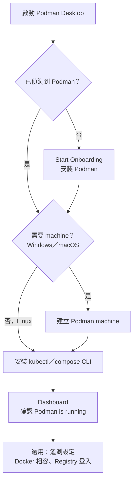
```mermaid
flowchart TD
    A[啟動 Podman Desktop] --> B{已偵測到 Podman？}
    B -- 否 --> C[Start Onboarding<br/>安裝 Podman]
    B -- 是 --> D{需要 machine？<br/>Windows／macOS}
    C --> D
    D -- 是 --> E[建立 Podman machine]
    D -- 否，Linux --> F[安裝 kubectl／compose CLI]
    E --> F
    F --> G[Dashboard<br/>確認 Podman is running]
    G --> H[選用：遙測設定<br/>Docker 相容、Registry 登入]
```

完成 Onboarding 後建議立即確認：

```bash
podman version            # 用戶端與伺服器端版本
podman machine list       # machine 狀態（Windows／macOS）
podman info --format '{{.Host.RemoteSocket.Path}}'
podman run --rm quay.io/podman/hello
```

### 2.6 從 Podman 5 升級到 Podman 6

Podman Desktop 1.29 偵測到引擎要從 5.x 升到 6.x 時，會啟動自動化流程，**提示刪除所有資料**（容器、Volume、網路與 Podman machine）後重建。

| 步驟 | 動作 | 說明 |
| --- | --- | --- |
| 1 | 盤點要保留的資料 | 需要保留的 Volume 先匯出（`podman volume export`），映像檔推到 registry 或 `podman save` |
| 2 | 停止所有 machine | `podman machine stop` |
| 3 | Hyper-V 使用者 | 先執行 `podman machine reset`，自動清理可能無法完整重設 Hyper-V 狀態 |
| 4 | 升級 | 在 Desktop 依提示升級，或重新執行 Onboarding |
| 5 | 重建 machine | 1.29 會自動加上 `--import-native-ca`；用腳本建立時要自己加 |
| 6 | 還原資料 | 匯入 Volume、重新拉取映像檔 |

> ⚠️ **注意**：官方建議 5 → 6 時**從頭重建環境**。沿用 5.x 的設定可能導致 Podman 6 無法拉取映像檔。

### 2.7 受限環境與離線安裝

受限網路環境常見三個問題與對策：

| 問題 | 對策 |
| --- | --- |
| 安裝時要從網路下載元件 | 使用 **airgap 安裝檔**（`podman-desktop-airgap-<版本>-setup-x64.exe`、`podman-desktop-airgap-<版本>-arm64.dmg` 等），內含 Podman Desktop 與 Podman，但**不含** Compose、Kind 等工具 |
| machine 的網段與 VPN 衝突，主機連不到 machine 內的服務 | 建立 machine 時啟用 **User mode networking（traffic relayed by a user process）** |
| 防火牆只允許經 proxy 出站 | 在 **Settings > Proxy** 設定 proxy，並匯入 proxy 的 CA 憑證 |

**Windows 離線安裝步驟**

1. 在有網路的電腦下載 airgap 安裝檔，確認雜湊值後複製到目標電腦。
2. 以系統管理員執行 `wsl --install --no-distribution` 並重新開機。
3. 執行安裝檔，開啟 Dashboard 按 **Set up** 建立 machine。
4. 使用 VPN 時，在 **Create Podman machine** 畫面勾選 User mode networking。

**Linux 離線安裝**：使用 `podman-desktop-<版本>-x64.tar.gz`，解壓後執行 `podman-desktop`。這個壓縮檔**不含 Podman CLI**，Podman 要另外從內部套件庫安裝。

> 💡 Compose、kubectl、Kind 等 CLI 在離線環境要由 IT 預先放到 `PATH`，或放在內部檔案伺服器讓開發者自行下載。

### 2.8 更新與解除安裝

**更新**：Podman Desktop 啟動時檢查更新（`preferences.update.reminder`）。1.29 起可以用 `preferences.update.appUpdate` 完全關閉應用程式更新，企業可以鎖定這個設定，改由派送工具統一升級。

**解除安裝**：

| 平台 | 解除 Podman Desktop | 清除設定 |
| --- | --- | --- |
| Windows | 控制台或 `winget uninstall -e --id RedHat.Podman-Desktop`；Chocolatey／Scoop 用各自的 uninstall | `~/.local/share/containers/podman-desktop/`、`~/AppData/Roaming/Podman Desktop` |
| macOS | `brew uninstall podman-desktop` 或刪除 App | `~/.local/share/containers/podman-desktop` |
| Linux | `flatpak uninstall io.podman_desktop.PodmanDesktop` | `~/.local/share/containers/podman-desktop` |

要一併移除 Podman 與所有 machine 時，先執行 `podman machine reset -f`，再依平台移除 Podman（macOS `.pkg` 安裝的 Podman 位於 `/opt/podman`）。

### 2.9 💡 本章實務建議

1. **標準化安裝來源**：Windows 用 WinGet 或 IT 派送的 MSI／EXE，macOS 用 `.dmg`，Linux 用 Flathub 或 RHEL 套件庫；不要混用 Homebrew 與官方安裝檔。
2. **Windows 預設 WSL 2**：只有公司政策禁用 WSL 時才改用 Hyper-V。
3. **離線環境一律使用 airgap 安裝檔**，並把 Compose、kubectl 等 CLI 納入內部軟體庫。
4. **升級到 Podman 6 前先備份資料**，並安排在非上線期間進行；Hyper-V 使用者先 `podman machine reset`。
5. **關閉自動更新、改由 IT 控管版本**，可以避免開發者各自升級造成環境不一致。

---

## 3. 介面導覽

> ⚠️ **v2.0 更正**：v1.0 描述的「All Containers／Running／Stopped 子選單」「Pull Images／Local Images 選單」「在 Preferences 調整 CPU 與記憶體」等畫面並不存在。本章依 Podman Desktop 1.29 的實際介面改寫。machine 的 CPU、記憶體、磁碟是在 **Settings > Resources** 的 Podman 卡片上調整。

### 3.1 版面配置

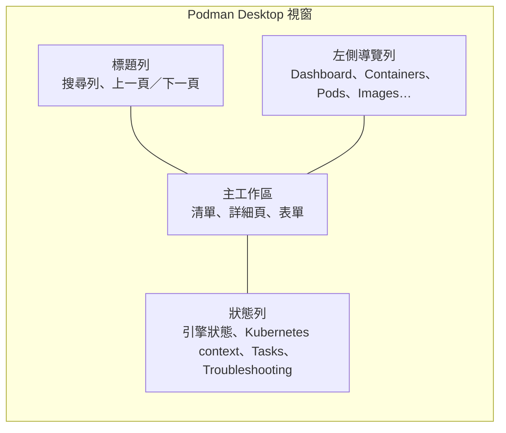
```mermaid
flowchart LR
    subgraph Window["Podman Desktop 視窗"]
        T["標題列<br/>搜尋列、上一頁／下一頁"]
        N["左側導覽列<br/>Dashboard、Containers、Pods、Images…"]
        M["主工作區<br/>清單、詳細頁、表單"]
        S["狀態列<br/>引擎狀態、Kubernetes context、Tasks、Troubleshooting"]
    end
    T --- M
    N --- M
    M --- S
```

| 區域 | 功能 |
| --- | --- |
| 標題列 | 全域搜尋（容器、映像檔、文件）；上一頁／下一頁（長按可以看歷史清單） |
| 左側導覽列 | 各資源頁與擴充功能頁面；1.29 起可以拖曳邊緣調整寬度（48～240 px），寬度窄時只顯示圖示 |
| 主工作區 | 資源清單、詳細資訊分頁（Summary、Logs、Inspect、Kube、Terminal 等） |
| 狀態列 | 引擎與 provider 狀態、目前 Kubernetes context、Task Manager、Troubleshooting 入口 |

### 3.2 導覽列與各資源頁

| 頁面 | 主要功能 | 對應 CLI |
| --- | --- | --- |
| **Dashboard** | 引擎狀態、系統總覽（CPU、記憶體、磁碟，1.28 起）、Explore Features、Learning Center | `podman info`、`podman system df` |
| **Containers** | 建立、啟停、批次啟動／刪除、Logs、Terminal、Inspect、Kube YAML、Deploy to Kubernetes、Export | `podman ps/run/logs/exec` |
| **Pods** | 由容器或 Kubernetes YAML 建立 Pod；檢視成員容器狀態；Deploy to Kubernetes | `podman pod`、`podman kube play` |
| **Images** | Pull（可取消）、Build、Push、Save、Import、編輯名稱與標籤、檢視歷史；推送到 Kind／Minikube | `podman pull/build/push/save/load` |
| **Networks** | 1.23 起的獨立頁面；1.25 起可以建立 bridge、macvlan、ipvlan、IPv6、internal 網路 | `podman network` |
| **Volumes** | 建立、刪除、檢視使用中的容器；清除未使用的 Volume | `podman volume` |
| **Secrets** | 1.29 起新增；建立、檢視、刪除 secret（僅 Podman 引擎） | `podman secret` |
| **Kubernetes** | Nodes、Deployments、Services、Ingresses、Routes、ConfigMaps、Secrets、PVC、Jobs、CronJobs、Port Forwarding 等 | `kubectl` |
| **Extensions** | Installed、Catalog、Local Extensions 三個分頁 | — |
| **Settings** | Resources、Proxy、Registries、Authentication、CLI Tools、Kubernetes、Docker Compatibility、Preferences、Troubleshooting | — |

> 📌 1.26 起 Containers、Pods、Images、Volumes、Networks 頁面都可以**依環境篩選**（例如只看某個 machine 或遠端連線的資源）；1.24 起清單會顯示資源所屬的連線名稱。

### 3.3 常用操作與效率功能

- **指令面板（Command Palette）**：按 `F1` 叫出，可以執行不在選單中的指令，例如 1.26 新增的 `Podman: Synchronize certificates to all VMs`（Podman 6 已改用 `--import-native-ca`，1.29 在偵測到 Podman 6 時會停用這個手動同步）。
- **全域搜尋列**：從標題列快速找到容器、映像檔、Pod、Volume 或文件頁面（1.23 起強化）。
- **上一頁／下一頁**：工具列按鈕、指令面板或快速鍵（Windows／Linux 為 `Alt + ←／→`，macOS 為 `Cmd + ←／→` 或 `Cmd + [／]`）；長按按鈕顯示歷史清單（1.27）。
- **欄位自訂**：清單欄位與 Dashboard 區塊可以自訂顯示與排序（1.23），表格展開狀態會在切換頁面後保留（1.29）。
- **批次操作**：多選容器後可以一次啟動或刪除，預設會跳出確認（`userConfirmation.bulk`）。
- **容器埠號連結**：容器詳細頁中對應的埠號可以直接點擊，用瀏覽器開啟（1.28）。

### 3.4 狀態列、Task Manager 與 Troubleshooting

| 元件 | 用途 |
| --- | --- |
| 引擎狀態 | 顯示 Podman（與 Docker）是否連線；可以固定常用項目（`statusBar.pinnedItems`） |
| Kubernetes context | 點擊可以切換目前的 context |
| Task Manager | 顯示拉取映像檔、建立 machine、安裝擴充功能（含下載進度，1.28）等背景工作 |
| Troubleshooting | Logs、Gather logs（打包成 zip）、Ping 引擎、Reconnect Providers、Stores、Cleanup／Purge data |

1.26 起 **Settings** 也新增 Troubleshooting 入口；1.28 起 Troubleshooting 日誌帶有時間戳記，方便和引擎日誌對照。

### 3.5 外觀與協助工具

- **主題**：System、Light、Dark（`preferences.appearance`）；1.27 起新增**高對比**淺色與深色主題，以及強調色。
- **縮放**：`preferences.zoomLevel`（-3～3）。
- **編輯器與終端機字型**：`editor.integrated.fontSize`、`terminal.integrated.fontSize`、`terminal.integrated.lineHeight`。
- **開機啟動**：`preferences.login.start`（預設開啟）、`preferences.login.minimize`。

### 3.6 📝 實務練習：第一個容器

1. 到 **Images**，按 **Pull**，輸入 `docker.io/library/nginx:alpine`，觀察 Task Manager 的進度（1.26 起可以取消）。
2. 拉取完成後按映像檔右側的 ▶（Run Image），**Container name** 填 `my-web`，**Port mapping** 設定主機 `8080` 對應容器 `80`，按 **Start Container**。
3. 在容器的 **Summary** 分頁點擊 `8080` 埠號連結，確認出現 nginx 歡迎頁。
4. 切換到 **Logs** 分頁觀察存取紀錄，再到 **Terminal** 分頁執行 `nginx -v`。
5. 用 **Inspect** 分頁檢視完整設定（`Ctrl+F`／`⌘+F` 可以搜尋），再用 **Kube** 分頁檢視 Podman 產生的 Kubernetes YAML。
6. 停止並刪除容器。

對應的 CLI：

```bash
podman pull docker.io/library/nginx:alpine
podman run -d --name my-web -p 8080:80 docker.io/library/nginx:alpine
podman logs -f my-web
podman exec -it my-web nginx -v
podman kube generate my-web
podman rm -f my-web
```

### 3.7 💡 本章實務建議

1. **教育訓練以 Dashboard → Containers → Images → Settings > Resources 的順序介紹**，先讓新人能自行排除「引擎沒啟動」這類問題。
2. **熟悉 Troubleshooting 的 Gather logs**：提報問題時一律附上 zip，能大幅縮短支援時間。
3. **善用指令面板與搜尋列**，許多進階功能（例如同步憑證）只能從指令面板執行。
4. **每個 GUI 操作都對照一次 CLI**，方便日後寫成腳本或放進 CI。

---

## 4. Podman machine 管理

> 🆕 **v2.0 新增**：v1.0 只在安裝步驟提到 `podman machine init`。本章說明 machine 的 provider、建立參數、rootless／rootful 切換、企業網路與 GPU 設定。

### 4.1 為什麼需要 Podman machine

容器需要 Linux 核心。Windows 與 macOS 沒有 Linux 核心，所以 Podman 會建立一台輕量的 Linux VM（**Podman machine**，作業系統映像檔以 Fedora 為基礎），Podman Desktop 與 `podman` CLI 都透過這台 VM 的 socket 或 named pipe 操作容器。Linux 主機則直接使用本機的 Podman，不需要 machine。

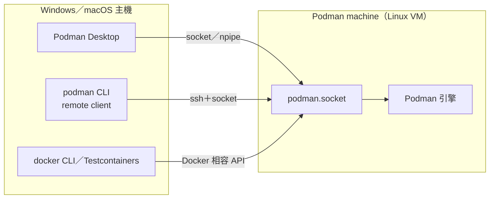
```mermaid
flowchart LR
    subgraph Host["Windows／macOS 主機"]
        PD[Podman Desktop]
        CLI[podman CLI<br/>remote client]
        DOCKER[docker CLI／Testcontainers]
    end
    subgraph M["Podman machine（Linux VM）"]
        SVC[podman.socket]
        ENG[Podman 引擎]
    end
    PD -- "socket／npipe" --> SVC
    CLI -- "ssh＋socket" --> SVC
    DOCKER -- "Docker 相容 API" --> SVC
    SVC --> ENG
```

### 4.2 Provider 選擇

| Provider | 平台 | 特點 | 建議 |
| --- | --- | --- | --- |
| WSL 2 | Windows | 預設；效能好；支援 NVIDIA GPU | ✅ 一般開發者 |
| Hyper-V | Windows 專業版、企業版 | 隔離較完整；需要系統管理員；不支援 GPU | 公司禁用 WSL 時 |
| libkrun／krunkit（GPU enabled） | macOS Apple Silicon | 預設（Desktop 1.21 起、Podman 6 CLI 也是）；支援虛擬 GPU（Vulkan） | ✅ Apple Silicon |
| Apple Hypervisor（applehv） | macOS | Apple 原生虛擬化；Intel Mac 唯一選項 | Intel Mac、或 libkrun 有相容性問題時 |

> 📌 Podman 6 起，`podman machine list` 會把**所有 provider** 的 machine 一起列出，Podman Desktop 1.29 也改用單一 API 呼叫取得清單，速度更快。provider 只決定「新建 machine 的預設值」，也可以用 `podman machine init --provider hyperv` 覆寫。

### 4.3 建立與設定 machine

**GUI**：**Settings > Resources** → Podman 卡片 → **Create new**，可以設定：

| 欄位 | 說明 | 建議值（一般 Java／Node 開發） |
| --- | --- | --- |
| Name | machine 名稱 | `podman-machine-default` |
| CPU(s) | vCPU 數量 | 4 |
| Memory | 記憶體 | 8 GB（跑 Kind 或 AI Lab 時 12～16 GB） |
| Disk size | 磁碟大小 | 100 GB |
| Image Path／Image URL | 自訂開機映像檔（本機檔案、URL 或 registry 參照） | 通常留空；企業可以指向內部 registry 的映像檔 |
| Machine with root privileges | 預設使用 rootful 連線 | Windows 上使用 Kind 時**必須**開啟 |
| User mode networking（Windows） | 經由使用者行程轉送流量 | 使用 VPN 時開啟 |
| Provider Type | 選擇 provider | Windows 只有系統管理員看得到；macOS Apple Silicon 預設 GPU enabled（LibKrun） |

**CLI 對照**

```bash
# 建立並啟動（Podman 6：建議一律加 --import-native-ca）
podman machine init --cpus 4 --memory 8192 --disk-size 100 --import-native-ca --now

# 建立 rootful、使用 user-mode networking 的 machine（Windows＋VPN＋Kind）
podman machine init --rootful --user-mode-networking --import-native-ca kind-vm

# 調整既有 machine（需先停止）
podman machine stop
podman machine set --cpus 6 --memory 12288
podman machine start

# 檢視
podman machine list
podman machine inspect podman-machine-default
```

> ⚠️ **注意**：`--memory` 的單位是 MiB。調整 CPU、記憶體前 machine 必須處於停止狀態；磁碟只能加大、不能縮小。

**Podman 6 對 machine 的重要變化**

- 在 macOS 與 Windows 上修改主機的 `containers.conf`，會一致地套用到 machine 內（1.29 發布說明所稱的 VM configuration parity）。
- 新增 `podman machine os update` 更新 VM 作業系統（WSL 不支援）。
- 詳細內容請見《Podman 使用教學手冊》第 2 章。

### 4.4 Rootless 與 Rootful 切換

Podman machine 預設為 **rootless** 連線。1.22 起，macOS 與 Windows 可以直接在 Podman Desktop 切換 rootless／rootful；1.23 起 **Settings > Resources** 會標示每台 machine 目前的模式。

| 情境 | 模式 |
| --- | --- |
| 一般開發、建置映像檔 | rootless（預設，最小權限） |
| Windows 上跑 Kind、MicroShift（MINC） | rootful |
| 需要綁定 1024 以下的埠號、特殊裝置 | rootful（列入例外清單） |

```bash
podman machine stop
podman machine set --rootful          # 切換為 rootful
podman machine set --rootful=false    # 切回 rootless
podman machine start

# 切換預設連線（每台 machine 都有 rootless 與 -root 兩個連線）
podman system connection ls
podman system connection default podman-machine-default-root
```

### 4.5 企業網路：VPN、Proxy 與憑證

#### 4.5.1 VPN：User mode networking

machine 會取得與主機不同的網段。使用 VPN 時，主機可能連不到 machine 內的服務，machine 也可能無法解析 VPN 內的 DNS（錯誤訊息如 `Temporary failure in name resolution`）。Windows 上建立 machine 時勾選 **User mode networking**，流量會經由主機的使用者行程轉送，跟著走 VPN。

#### 4.5.2 Proxy

1. **Settings > Proxy**：選擇 System（沿用系統設定）、Manual（手動輸入 HTTP、HTTPS、No proxy）或 Disabled，對應設定鍵為 `proxy.enabled`（0／1／2）、`proxy.http`、`proxy.https`、`proxy.no`。
2. Podman Desktop 會把 proxy 設定帶進 machine；1.22 起支援 **Transparent proxy**，會替所有 HTTP／HTTPS 請求設定 CA 憑證，避免自簽憑證錯誤。
3. 企業環境建議用 Managed configuration 鎖定 proxy（見[10.4](#104-常見管理用例)）。

#### 4.5.3 CA 憑證（SSL 攔截環境）

| 版本 | 做法 |
| --- | --- |
| Podman 6＋Desktop 1.29 | 建立 machine 時自動加上 `--import-native-ca`，每次開機匯入主機信任的 CA。**用 CLI 或腳本建立時要自己加上** |
| Podman 5＋Desktop 1.26～1.28 | 指令面板（`F1`）執行 `Podman: Synchronize certificates to all VMs` |
| 手動（任何版本） | 把 CA 放進 machine 的 `/etc/pki/ca-trust/source/anchors/`，執行 `update-ca-trust` 後重啟 machine |

```bash
# 手動加入憑證（Podman 5 或特殊情況）
podman machine ssh podman-machine-default
sudo cp /mnt/c/certs/corp-root-ca.crt /etc/pki/ca-trust/source/anchors/   # Windows 路徑範例
sudo update-ca-trust
exit
podman machine stop && podman machine start
```

> ⚠️ **注意**：沒有匯入公司 CA 時，常見的錯誤是 `x509: certificate signed by unknown authority`，拉取映像檔或登入 registry 都會失敗。

### 4.6 GPU 存取

| 平台 | 條件 | 做法 |
| --- | --- | --- |
| Windows | NVIDIA Pascal 以上顯示卡；**只支援 WSL 2** | 主機安裝最新 NVIDIA 驅動 → 在 machine 內安裝 NVIDIA Container Toolkit 並產生 CDI 規格 |
| macOS Apple Silicon | M1 以上；machine 使用 libkrun | 容器內使用修補過的 Mesa 驅動，以 Vulkan 存取虛擬 GPU（只支援 compute shader，不支援繪圖） |
| Linux | NVIDIA 或 AMD 驅動 | 直接在主機安裝 Container Toolkit；Podman 6 新增 AMD GPU 支援 |

**Windows＋NVIDIA 設定**

```bash
# 進入 machine（以下指令在 machine 內執行）
podman machine ssh
curl -s -L https://nvidia.github.io/libnvidia-container/stable/rpm/nvidia-container-toolkit.repo | \
  sudo tee /etc/yum.repos.d/nvidia-container-toolkit.repo
sudo yum install -y nvidia-container-toolkit
sudo nvidia-ctk cdi generate --output=/etc/cdi/nvidia.yaml
nvidia-ctk cdi list
exit

# 回到主機驗證
podman run --rm --device nvidia.com/gpu=all nvidia/cuda:12.4.1-base-ubi9 nvidia-smi
```

> 📌 更新 CUDA 驅動或變更 MIG 設定後，如果容器內出現 `Failed to initialize NVML`，請在 machine 內重新執行 `nvidia-ctk cdi generate`，必要時重啟 machine。

### 4.7 多個 machine、遠端 Podman 與 WSL 互通

- **多個 machine**：可以分別建立「日常開發（rootless）」與「Kind 專用（rootful）」兩台，但同一時間通常只啟動一台，避免記憶體不足。
- **遠端 Podman**：Podman Desktop 可以管理遠端 Linux 主機上的 Podman。

```bash
# 遠端主機（rootless 使用者）
systemctl --user enable --now podman.socket

# 本機：用 SSH 金鑰新增連線
ssh-keygen -t ed25519 -f ~/.ssh/id_ed25519
podman system connection add build-server \
  --identity ~/.ssh/id_ed25519 \
  ssh://dev@build-server.corp.example/run/user/1000/podman/podman.sock
podman system connection default build-server
podman ps
```

- **從其他 WSL 發行版使用 machine**：可以讓 Ubuntu 等 WSL 發行版裡的 `podman`／`docker` CLI 連到 Podman machine 的 socket，詳細步驟見官方文件〈Accessing Podman from another WSL instance〉。

### 4.8 💡 本章實務建議

1. **制定 machine 標準規格**：例如 4 vCPU、8 GB、100 GB，並寫進新人上手文件；AI Lab 或 Kind 使用者另訂較高規格。
2. **rootless 是預設**：只有 Kind、MINC 或特殊需求才開 rootful，並另建一台專用 machine。
3. **SSL 攔截環境一定要處理 CA**：Podman 6 用 `--import-native-ca`；自動化腳本也要加上。
4. **VPN 使用者預設開啟 User mode networking**，可以減少大部分「machine 連不到內網」的問題。
5. **GPU 工作負載在 Windows 上一律使用 WSL 2**，並把 NVIDIA Container Toolkit 的安裝寫成腳本。

---

## 5. 容器、Pod 與映像檔操作

本章以「GUI 操作步驟＋CLI 對照」的方式說明日常操作。CLI 的完整選項請見《Podman 使用教學手冊》第 3～6 章。

### 5.1 容器

#### 5.1.1 建立與啟動

**GUI**：**Images** → 映像檔右側 ▶（Run Image）→ 檢視或修改設定 → **Start Container**。常用設定分頁：

| 分頁 | 可以設定的項目 |
| --- | --- |
| Basic | 容器名稱、指令、Entrypoint、Volume 掛載、埠號對應、環境變數與 env 檔 |
| Advanced | 使用者、重啟策略、自動移除、TTY／互動模式 |
| Networking | 網路、主機名稱、DNS、額外 hosts |
| Security | 唯讀根檔案系統、Capabilities 增減、Privileged、SELinux 選項 |
| Secrets（1.29） | 以檔案或環境變數掛載 secret |

**CLI 對照**

```bash
podman run -d --name api \
  -p 8080:8080 \
  -e SPRING_PROFILES_ACTIVE=dev \
  --restart=on-failure:3 \
  --read-only --tmpfs /tmp \
  --cap-drop=ALL \
  --label app=api --label team=payments \
  registry.corp.example/payments/api:1.4.2
```

#### 5.1.2 監控、日誌與終端機

| 需求 | GUI | CLI |
| --- | --- | --- |
| 即時日誌 | 容器詳細頁 **Logs**（1.20 起可以停止串流，不必關閉視窗） | `podman logs -f --tail 100 api` |
| 進入終端機 | **Terminal** 分頁 | `podman exec -it api sh` |
| 檢視設定 | **Inspect** 分頁（可以搜尋） | `podman inspect api` |
| 資源使用 | Dashboard 系統總覽、容器清單欄位 | `podman stats --no-stream` |
| Kubernetes YAML | **Kube** 分頁 | `podman kube generate api` |

#### 5.1.3 生命週期與清理

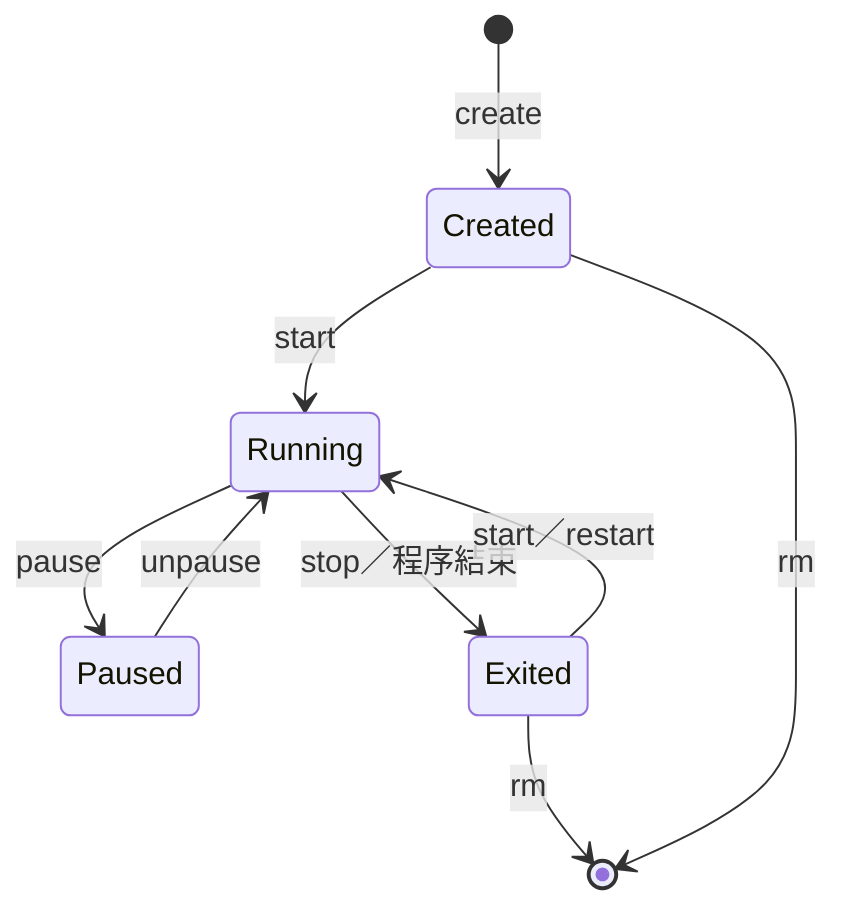
```mermaid
stateDiagram-v2
    [*] --> Created: create
    Created --> Running: start
    Running --> Paused: pause
    Paused --> Running: unpause
    Running --> Exited: stop／程序結束
    Exited --> Running: start／restart
    Exited --> [*]: rm
    Created --> [*]: rm
```

- **批次操作**：多選後按 **Start**（1.20 起支援批次啟動）或 **Delete**。
- **清理**：Containers 頁的 **Prune** 會刪除所有已停止的容器；對應 `podman container prune`。
- **匯出**：容器選單的 **Export** 可以把容器檔案系統存成 tar；對應 `podman export`。

### 5.2 Pod

Pod 是 Podman 相對於 Docker 的主要特色：同一個 Pod 內的容器共用網路命名空間（彼此用 `localhost` 通訊），行為和 Kubernetes Pod 一致。

| 建立方式 | GUI | CLI |
| --- | --- | --- |
| 由既有容器組成 | Containers 頁多選容器 → **Create Pod** → 確認 Pod 名稱與對外埠號 → **Create Pod** | `podman pod create` 後以 `--pod` 建立容器 |
| 由 Kubernetes YAML 建立 | Containers 或 Pods 頁的 **Play Kubernetes YAML**；1.22 起可以選 **Create File from Scratch** 直接在畫面上撰寫 YAML | `podman kube play app.yaml` |

> 📌 1.25 起 **Kube play 可以隨時取消**，適合處理下載時間很長或設定錯誤的部署。Podman Desktop 團隊建議 Pod 內的映像檔一律以**非 root 使用者**執行，這樣同一份 YAML 也能通過 Kubernetes restricted Pod Security Standard 與 OpenShift 的 restricted-v2 SCC。

### 5.3 映像檔

#### 5.3.1 拉取

**Images** → **Pull** → 輸入完整名稱（例如 `registry.access.redhat.com/ubi10/ubi-minimal:latest`）。1.26 起拉取過程可以取消，完成後有快速動作按鈕（例如直接 Run）。

> ⚠️ **注意**：請使用**完整名稱**（含 registry 主機）。短名稱（例如 `nginx`）會依 `registries.conf` 的搜尋清單解析，在企業環境中可能拉到非預期的來源。

#### 5.3.2 建置

**Images** → **Build** → 選擇 Containerfile／Dockerfile、建置情境目錄、映像檔名稱與目標平台。1.24 起可以為多階段建置**選擇 target stage**。

```dockerfile
# Containerfile：Spring Boot 多階段建置（非 root 執行）
FROM registry.access.redhat.com/ubi9/openjdk-21:latest AS build
WORKDIR /workspace
COPY --chown=185 mvnw pom.xml ./
COPY --chown=185 .mvn .mvn
RUN ./mvnw -B -q dependency:go-offline
COPY --chown=185 src src
RUN ./mvnw -B -q package -DskipTests

FROM registry.access.redhat.com/ubi9/openjdk-21-runtime:latest
WORKDIR /deployments
COPY --from=build /workspace/target/*.jar app.jar
USER 185
EXPOSE 8080
ENTRYPOINT ["java", "-jar", "/deployments/app.jar"]
```

```bash
# CLI 對照：建置與只建置到 build stage
podman build -t localhost/payments-api:dev .
podman build --target build -t localhost/payments-api:build-cache .

# 多架構建置（例如同時產出 amd64 與 arm64）
podman build --platform linux/amd64,linux/arm64 --manifest localhost/payments-api:1.0 .
```

> ⚠️ **v2.0 更正**：v1.0 的範例使用 `openjdk:17-jdk`。Docker Hub 上的 `openjdk` 官方映像檔已經停止維護。本版改用 Red Hat UBI 的 OpenJDK 映像檔（`ubi9/openjdk-21`，預設以 UID 185 執行），社群映像檔可以選擇 `eclipse-temurin`。

#### 5.3.3 推送、儲存與匯入

| 動作 | GUI | CLI |
| --- | --- | --- |
| 修改名稱與標籤 | 映像檔選單 **Edit image** | `podman tag` |
| 推送到 registry | **Push Image**（需要先在 Settings > Registries 登入） | `podman push` |
| 推送到本機叢集 | **Push image to Kind cluster**／Minikube | `kind load image-archive` 等 |
| 存成檔案 | **Save**（可以多選） | `podman save -o images.tar img1 img2` |
| 從檔案匯入 | Images 頁 **Import** | `podman load -i images.tar` |
| 檢視歷史與分層 | **History** 分頁；安裝 Image Layers Explorer 擴充功能可以逐層檢視 | `podman history` |

#### 5.3.4 映像檔最佳化

| 原則 | 做法 | 效果 |
| --- | --- | --- |
| 多階段建置 | 建置工具只留在 build stage，執行階段用 runtime 映像檔 | 映像檔縮小，攻擊面減少 |
| 善用層快取 | 先複製 `pom.xml`／`package.json` 並下載相依套件，再複製原始碼 | 修改程式碼時不必重新下載相依套件 |
| 精簡基底映像檔 | `ubi-minimal`、`*-runtime`、Hummingbird、distroless | 減少套件與弱點數量 |
| 合併與清理 | 同一個 `RUN` 內安裝與清除快取（`microdnf clean all`） | 避免快取留在映像檔層中 |
| 排除不需要的檔案 | `.containerignore`（見[11.3](#113-映像檔安全)） | 建置情境變小，也避免機敏檔案外洩 |
| 固定版本 | 基底映像檔使用明確標籤或 digest | 建置結果可以重現 |

```dockerfile
# ❌ 不建議：每次改程式碼都重新下載相依套件，且以 root 執行
FROM docker.io/library/maven:3-eclipse-temurin-21
COPY . /app
WORKDIR /app
RUN mvn package
CMD ["java", "-jar", "target/app.jar"]

# ✅ 建議：見 5.3.2 的多階段建置範例
```

#### 5.3.5 清理與空間管理

| 動作 | GUI | CLI |
| --- | --- | --- |
| 檢視空間使用 | Dashboard 系統總覽 | `podman system df -v` |
| 刪除無標籤映像檔 | Images 頁 **Prune**（可選 dangling 或全部未使用） | `podman image prune` |
| 刪除所有未使用映像檔 | 同上 | `podman image prune -a` |
| 刪除 24 小時前建立的未使用映像檔 | — | `podman image prune -a --filter until=24h` |
| 全面清理 | Troubleshooting → Purge（高風險） | `podman system prune -a` |

> ⚠️ **注意**：`podman system prune --volumes` 會刪除未被容器使用的 Volume，包含資料庫資料。執行前請先確認或備份。

### 5.4 Registry 與 Mirror

**Settings > Registries** 內建 Docker Hub、Red Hat Quay、GitHub、Google Container Registry 的設定，按 **Configure** 輸入帳號與密碼（或 OAuth token）即可登入。私有 registry 則按 **Add registry**，輸入位址與帳密。

**自簽憑證的 registry**：Podman Desktop 會出現 Invalid Certificate 警告，按 **Yes** 仍可加入；接著要在 machine 內的 `registries.conf` 把它標記為 insecure，或者（建議）把 CA 匯入 machine（見[4.5.3](#453-ca-憑證ssl-攔截環境)）。

```bash
# 在 machine 內編輯 registries.conf（Windows／macOS）
podman machine ssh --username root
vi /etc/containers/registries.conf.d/50-corp.conf
```

```toml
# /etc/containers/registries.conf.d/50-corp.conf
[[registry]]
prefix = "docker.io"
location = "docker.io"

[[registry.mirror]]
location = "harbor.corp.example/dockerhub-proxy"

[[registry]]
prefix = "untrusted.example.com"
location = "untrusted.example.com"
blocked = true
```

> 💡 **企業做法**：1.24 起可以用 Managed configuration 的 `registries.defaults` 統一派送 registry 與 mirror，不必請每位開發者手動修改（見[10.4](#104-常見管理用例)）。

### 5.5 Volume

| 類型 | 說明 | 適用情境 |
| --- | --- | --- |
| Named volume | 由 Podman 管理，存在 machine 的 storage 內 | 資料庫資料、快取 |
| Bind mount | 掛載主機目錄 | 原始碼熱重載 |
| tmpfs | 記憶體內暫存 | 唯讀根檔案系統下的暫存目錄 |

```bash
podman volume create pgdata
podman run -d --name pg -v pgdata:/var/lib/postgresql/data \
  -e POSTGRES_PASSWORD=devpass docker.io/library/postgres:17

# 備份與還原
podman volume export pgdata --output pgdata.tar
podman volume import pgdata pgdata.tar
```

**Windows bind mount 注意事項**

- WSL machine 會把 Windows 磁碟掛在 `/mnt/c` 等路徑，`-v C:\src\app:/app` 可以直接使用，但跨檔案系統的 I/O 較慢。大量檔案（例如 `node_modules`、Maven repository）建議改用 named volume。
- 權限問題常見於 rootless 容器寫入 bind mount，可以加上 `:U`（自動調整擁有者）或 `--userns=keep-id`。

### 5.6 Network

1.23 起 Network 有獨立頁面；1.25 起可以直接在 UI 建立進階網路：

| 選項 | 說明 |
| --- | --- |
| Driver | bridge（預設）、macvlan、ipvlan |
| IPv6 | 啟用雙堆疊 |
| Internal | 不連外部的隔離網路 |
| Subnet／IP range／Gateway | 自訂位址範圍，避開公司內網網段 |
| DNS | 自訂 DNS 伺服器 |

```bash
podman network create --subnet 10.89.10.0/24 --gateway 10.89.10.1 app-net
podman network create --internal backend-net
podman run -d --name db --network backend-net docker.io/library/postgres:17
podman network connect app-net db
```

> ⚠️ **注意**：預設網路 `podman` 使用 `10.88.0.0/16`。如果和公司 VPN 或內網衝突，請調整 `containers.conf` 的 `default_subnet`，或為專案建立自訂網段的網路。

### 5.7 Secret

1.29 新增 **Secrets** 頁，可以建立、檢視與刪除 secret（只支援 Podman 引擎）。執行容器時，在 Run Image 對話框把 secret 掛成**檔案**或**環境變數**。

```bash
# 建立 secret（從標準輸入，避免留在 shell history）
printf '%s' 'S3cr3t!' | podman secret create db-password -

# 以檔案掛載（預設 /run/secrets/db-password）
podman run -d --name api --secret db-password registry.corp.example/payments/api:1.4.2

# 以環境變數掛載
podman run -d --name api --secret db-password,type=env,target=DB_PASSWORD \
  registry.corp.example/payments/api:1.4.2
```

> ⚠️ **注意**：不要把密碼寫在 Containerfile、Compose 檔或映像檔的環境變數裡。`podman inspect` 看得到一般環境變數，但看不到 secret 的內容。

### 5.8 實務案例：Java 微服務本機開發環境

**需求**：Spring Boot API、PostgreSQL 17、Redis 8，全部在同一個 Pod 內，方便日後轉成 Kubernetes YAML。

```bash
# 1. 建立 Pod（對外開放 API 8080；資料庫只在 Pod 內使用）
podman pod create --name payments-dev -p 8080:8080

# 2. 資料庫與快取
printf '%s' 'devpass' | podman secret create pg-password -
podman volume create payments-pgdata
podman run -d --pod payments-dev --name pg \
  --secret pg-password,type=env,target=POSTGRES_PASSWORD \
  -e POSTGRES_DB=payments -e POSTGRES_USER=app \
  -v payments-pgdata:/var/lib/postgresql/data \
  docker.io/library/postgres:17
podman run -d --pod payments-dev --name redis docker.io/library/redis:8

# 3. 應用程式（Pod 內以 localhost 連線）
podman run -d --pod payments-dev --name api \
  --secret pg-password,type=env,target=SPRING_DATASOURCE_PASSWORD \
  -e SPRING_DATASOURCE_URL=jdbc:postgresql://localhost:5432/payments \
  -e SPRING_DATASOURCE_USERNAME=app \
  -e SPRING_DATA_REDIS_HOST=localhost \
  localhost/payments-api:dev

# 4. 產生 Kubernetes YAML，交給平台團隊或放進 Git
podman kube generate payments-dev -f payments-dev.yaml
```

在 Podman Desktop 中，**Pods** 頁會顯示 `payments-dev` 與三個成員容器；Pod 選單的 **Deploy to Kubernetes** 可以直接部署到 Kind 等叢集（見[第 7 章](#7-kubernetes-與-openshift-整合)）。

> ⚠️ **v2.0 更正**：v1.0 的範例把 PostgreSQL 密碼以 `-e POSTGRES_PASSWORD=password` 明文傳入，並使用 `postgres:14`、`redis:7-alpine`。本版改用 secret 與較新的主要版本。PostgreSQL 14 將於 2026 年 11 月結束社群支援。

### 5.9 💡 本章實務建議

1. **映像檔一律寫完整名稱並固定版本**（或 digest），不要依賴短名稱與 `latest`。
2. **開發環境優先用 Pod**：Pod 的網路模型和 Kubernetes 一致，之後可以直接轉成 YAML。
3. **密碼走 Secret**：1.29 的 Secrets 頁讓非 CLI 使用者也能正確使用 secret。
4. **Windows 上的大量小檔案放在 named volume**，只有原始碼用 bind mount。
5. **網段規劃要和網路團隊確認**，避免容器網路與 VPN、內網衝突。

---

## 6. Compose 與 Docker 相容

### 6.1 設定 Compose

Podman Desktop 可以幫你安裝 Compose 的參考實作（Docker Compose v2 執行檔）：

1. **Settings > Resources** → Compose 卡片 → **Setup**，依提示完成。
2. 驗證：

```bash
docker-compose version    # Compose 執行檔已在 PATH
podman compose version    # podman compose 會呼叫同一個 provider
```

`podman compose` 是一個**包裝指令**：它會依 `containers.conf` 的 `compose_providers` 設定，呼叫 `docker-compose` 或 Python 版的 `podman-compose`。企業建議統一使用其中一種，並在內部文件寫明。

| 實作 | 優點 | 注意事項 |
| --- | --- | --- |
| Docker Compose v2（Podman Desktop 安裝） | 與 Docker 使用者習慣一致，支援完整的 Compose 規格 | 透過 Docker 相容 API 操作 Podman |
| podman-compose（Python） | 原生呼叫 Podman，可以把服務放進 Pod | 部分進階 Compose 語法的支援較慢 |

### 6.2 執行 Compose 應用

```yaml
# compose.yaml：本機開發用
services:
  db:
    image: docker.io/library/postgres:17
    environment:
      POSTGRES_DB: payments
      POSTGRES_USER: app
      POSTGRES_PASSWORD_FILE: /run/secrets/pg_password
    secrets:
      - pg_password
    volumes:
      - pgdata:/var/lib/postgresql/data
    healthcheck:
      test: ["CMD-SHELL", "pg_isready -U app -d payments"]
      interval: 10s
      retries: 5
  cache:
    image: docker.io/library/redis:8
  api:
    build: .
    image: localhost/payments-api:dev
    ports:
      - "8080:8080"
    environment:
      SPRING_DATASOURCE_URL: jdbc:postgresql://db:5432/payments
      SPRING_DATA_REDIS_HOST: cache
    depends_on:
      db:
        condition: service_healthy
secrets:
  pg_password:
    file: ./secrets/pg_password.txt
volumes:
  pgdata:
```

```bash
podman compose -f compose.yaml up -d
podman compose ps
podman compose logs -f api
podman compose down            # 保留 volume
podman compose down -v         # 連同 volume 一起刪除
```

Compose 會在資源上加上 `com.docker.compose.project` 與 `com.docker.compose.service` 標籤。Podman Desktop 偵測到這些標籤後，會在 **Containers** 頁把同一個專案的容器收成一組，名稱後面加上 `(compose)`，例如 `payments (compose)`，可以整組啟停或檢視日誌。

> ⚠️ **注意**：`secrets/pg_password.txt` 要加進 `.gitignore`。Compose 檔只適合本機開發；正式環境請改用 Kubernetes 或 Quadlet。

### 6.3 Docker 相容模式

#### 6.3.1 Settings > Docker Compatibility

先到 **Settings > Preferences > Docker Compatibility** 打開開關（`dockerCompatibility.enabled`），**Settings** 清單會多出 **Docker Compatibility** 頁面。macOS 上 Podman Desktop 透過 `podman-mac-helper` 把 `/var/run/docker.sock` 連結到 machine 的 `podman.sock`，啟用時要輸入系統密碼並重啟 machine。

驗證方式：`docker info --format=json | jq -r .ServerVersion` 應該回傳 **Podman** 的版本，而不是 Docker 的版本。

Docker Compatibility 頁面的設定：

| 設定 | 說明 | 平台 |
| --- | --- | --- |
| System socket status | 檢查預設 Docker socket 是否可以連線 | 全部 |
| Docker CLI Context | 從下拉清單選擇 Docker CLI 使用的 context（1.23 起會自動為 Podman machine 建立 Docker context） | 全部 |
| Podman Compose CLI Support | 檢查 Compose 是否可用，不可用時按 **Setup...** 安裝 | 全部 |
| Third-Party Docker Tool Compatibility | 讓第三方 Docker 工具透過 `/var/run/docker.sock` 使用 Podman | **只有 macOS**，且預設開啟 |

預設 socket 路徑：

- macOS、Linux：`/var/run/docker.sock`
- Windows：`npipe:////./pipe/docker_engine`（Podman machine 預設也會監聽這個 pipe）

#### 6.3.2 使用 DOCKER_HOST

在 Windows 與 Linux 上沒有 Third-Party Docker Tool Compatibility 設定，建議用 `DOCKER_HOST` 讓工具直接連 Podman：

```powershell
# Windows：查詢 Podman pipe
podman machine inspect --format '{{.ConnectionInfo.PodmanPipe.Path}}'
# 輸出如 \\.\pipe\podman-machine-default；反斜線改成斜線並加上 npipe:// 前綴
$env:DOCKER_HOST = "npipe:////./pipe/podman-machine-default"
# 永久設定（使用者層級）
[Environment]::SetEnvironmentVariable("DOCKER_HOST", "npipe:////./pipe/podman-machine-default", "User")
```

```bash
# macOS
export DOCKER_HOST="unix://$(podman machine inspect --format '{{.ConnectionInfo.PodmanSocket.Path}}')"

# Linux（rootless）
export DOCKER_HOST="unix://$(podman info --format '{{.Host.RemoteSocket.Path}}')"
```

也可以改用 Docker context，不必設定環境變數：

```bash
docker context create podman \
  --docker "host=unix://${HOME}/.local/share/containers/podman/machine/podman.sock"
docker context use podman
docker ps    # 實際查詢的是 Podman
```

> ⚠️ **v2.0 更正**：v1.0 用 `podman system service --time=0 unix:///var/run/docker.sock` 來「啟用 Docker 相容」。在 Windows 與 macOS 上，Podman API 服務是由 machine 提供的，這個指令在主機上沒有作用；請改用本節的 Docker Compatibility 設定頁或 `DOCKER_HOST`。

#### 6.3.3 同時顯示 Docker 引擎

如果主機上還有 Docker Desktop 在執行，Podman Desktop 內建的 Docker 擴充功能會自動註冊它的 socket，讓你在同一個畫面看到兩個引擎的容器。遷移期間可以用來對照；正式切換後建議停用 Docker 擴充功能，避免誤用。

### 6.4 從 Docker Desktop 遷移

#### 6.4.1 遷移評估清單

| 檢查項目 | 風險 | 對策 |
| --- | --- | --- |
| 使用 Docker 專屬擴充功能 | 無法沿用 | 找 Podman Desktop 擴充功能替代，或保留少數 Docker Desktop 授權 |
| Compose 檔使用 `network_mode: host`、特權容器 | rootless 行為不同 | 改用 Pod 或 rootful machine |
| 映像檔使用短名稱 | 可能被要求選擇來源或拉錯映像檔 | 改為完整名稱 |
| Testcontainers、Gradle、IDE 外掛 | 預設找 Docker socket | 設定 `DOCKER_HOST`，Testcontainers 另外設定 Ryuk（見[12.4](#124-testcontainers)） |
| CI 使用 Docker-in-Docker | 行為不同 | CI 改用 Buildah 或 Podman rootless 建置 |
| 綁定 1024 以下埠號 | rootless 無法綁定 | 改用高埠號，或 rootful machine |

#### 6.4.2 遷移步驟

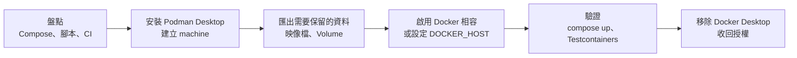
```mermaid
flowchart LR
    A["盤點<br/>Compose、腳本、CI"] --> B["安裝 Podman Desktop<br/>建立 machine"]
    B --> C["匯出需要保留的資料<br/>映像檔、Volume"]
    C --> D["啟用 Docker 相容<br/>或設定 DOCKER_HOST"]
    D --> E["驗證<br/>compose up、Testcontainers"]
    E --> F["移除 Docker Desktop<br/>收回授權"]
```

**保留舊容器與映像檔**

```bash
# 在 Docker 端匯出
docker save -o myimage.tar myimage:1.0
docker export mycontainer -o mycontainer.tar

# 在 Podman 端匯入
podman load -i myimage.tar
podman import mycontainer.tar mycontainer:imported
```

匯入完成後，映像檔會出現在 Podman Desktop 的 **Images** 頁。

#### 6.4.3 Docker 使用者要知道的差異

| 主題 | Docker | Podman |
| --- | --- | --- |
| 架構 | 常駐 daemon | daemonless；需要 API 時由 socket 啟動 |
| 預設權限 | 以 root 執行（另有 rootless 模式） | 預設 rootless |
| 短名稱 | 預設補上 `docker.io` | 依 `registries.conf` 的搜尋清單解析 |
| Pod | 沒有 | 原生支援 |
| Kubernetes YAML | 沒有 | `kube generate`／`kube play` |
| systemd | 沒有 | Quadlet |
| 指令 | `docker ...` | `podman ...`（大多數子指令相同） |

### 6.5 💡 本章實務建議

1. **統一 Compose 實作**：建議使用 Podman Desktop 安裝的 Docker Compose v2，並在 `containers.conf` 固定 `compose_providers`。
2. **Windows 開發者一律設定使用者層級的 `DOCKER_HOST`**，減少 IDE 與建置工具的相容性問題。
3. **分批遷移**：先遷移只用 CLI 與 Compose 的團隊，再處理依賴 Docker 擴充功能或 Docker-in-Docker 的團隊。
4. **遷移完成後停用 Docker 擴充功能並移除 Docker Desktop**，確實收回授權。
5. **Compose 只用於本機**：正式環境轉成 Kubernetes YAML 或 Quadlet。

---

## 7. Kubernetes 與 OpenShift 整合

> 🆕 **v2.0 新增**：v1.0 只介紹了 `podman kube generate/play` 與一段 OpenShift YAML。本章補上 Podman Desktop 內建的本機叢集、context 管理、Apply YAML、部署與 Port forwarding 功能。

### 7.1 本機叢集選項

| 選項 | 擴充功能 | 前置條件 | 適合情境 |
| --- | --- | --- | --- |
| **Kind** | 內建 Kind | kind CLI（可以由 Desktop 安裝）；Windows 上 machine 要 rootful | 一般 Kubernetes 開發、CI 對齊 |
| **Minikube** | minikube | minikube CLI | 需要 minikube addons 的團隊 |
| **MicroShift（MINC）** | MINC | rootful machine；Windows 要在 WSL 啟用 cgroup v2 | 輕量 OpenShift API、邊緣情境 |
| **Lima** | 內建 Lima | lima CLI（macOS、Linux） | 以 k3s／k8s 範本建立 VM 叢集 |
| **OpenShift Local** | Red Hat OpenShift Local | Red Hat 帳號、pull secret；資源需求較高 | 完整 OpenShift（含 Web Console）或 MicroShift preset |
| **Developer Sandbox** | Developer Sandbox | Red Hat 帳號 | 免費雲端 OpenShift（1 個專案、14 GB RAM、40 GB 儲存，30 天） |
| **既有叢集** | — | kubeconfig | 公司的開發或測試叢集 |

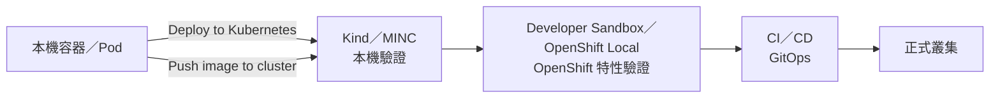
```mermaid
flowchart LR
    DEV["本機容器／Pod"] -->|"Deploy to Kubernetes"| KIND["Kind／MINC<br/>本機驗證"]
    DEV -->|"Push image to cluster"| KIND
    KIND --> SB["Developer Sandbox／OpenShift Local<br/>OpenShift 特性驗證"]
    SB --> CI["CI／CD<br/>GitOps"]
    CI --> PROD["正式叢集"]
```

### 7.2 建立 Kind 叢集

1. **安裝 kind CLI**：**Settings > CLI tools** → Kind 卡片 **Install**；或在建立叢集時依提示安裝。
2. **Windows 前置作業**：Kind 需要 rootful machine。

   ```bash
   podman machine stop
   podman machine set --rootful
   podman machine start
   ```

3. **Settings > Resources** → Kind 卡片 → **Create new ...**，可以使用預設設定（可修改埠號等），或指定 Kind 設定檔（設定檔的值優先）。
4. 建立完成後，從系統匣的 **Kubernetes** 選單或狀態列把 context 切到 `kind-<叢集名稱>`。

```bash
kind get clusters
kubectl cluster-info --context kind-dev
```

**把本機映像檔推到 Kind**：Images 頁 → 映像檔選單 → **Push image to Kind cluster**。Kind 無法列出已載入的映像檔，請用 `imagePullPolicy: Never` 的 Pod 驗證：

```yaml
apiVersion: v1
kind: Pod
metadata:
  name: verify-payments-api
spec:
  containers:
    - name: api
      image: localhost/payments-api:dev
      imagePullPolicy: Never
```

### 7.3 Minikube、Lima 與 MicroShift

**Minikube**：安裝 minikube 擴充功能與 CLI 後，**Settings > Resources** → Minikube 卡片 → **Create new ...**；context 名稱為 `minikube`。

**Lima**（macOS、Linux）：目前要先用 CLI 建立執行個體，再讓擴充功能接手。

```bash
limactl start template://k3s      # 單節點 k3s
limactl start template://k8s      # 單節點 kubeadm k8s
# 自訂資源
limactl start --cpus=4 --memory=4 --disk=100 template://k8s
```

接著到 **Settings > Preferences > Extension: Lima** 設定執行個體名稱與類型（kubernetes），並在 **Settings > Preferences > Kubernetes** 指定 Lima 產生的 kubeconfig 路徑。

**MicroShift（MINC）**：MINC（MicroShift in a Container）以容器方式執行輕量 OpenShift。

1. 準備 rootful machine；Windows 在 `%UserProfile%\.wslconfig` 的 `[wsl2]` 區段，於 `kernelCommandLine` 加上 `cgroup_no_v1=all`。
2. 安裝 MINC 擴充功能。
3. **Settings > Resources** → MicroShift 卡片 → **Create new ...**。
4. context 切到 `microshift`。

```ini
# %UserProfile%\.wslconfig
[wsl2]
kernelCommandLine = cgroup_no_v1=all
```

### 7.4 OpenShift Local 與 Developer Sandbox

**OpenShift Local**

1. 安裝 Red Hat OpenShift Local 擴充功能，在 Dashboard 依提示安裝 `crc` 並重新開機。
2. 選擇 preset：**OpenShift**（單節點完整 OpenShift，含 Web Console，資源需求高）或 **MicroShift**（實驗性、輕量）。
3. 從 Red Hat OpenShift Local 下載頁複製 **pull secret** 貼上，按 **Initialize and start**。

**Developer Sandbox**

1. 安裝 Developer Sandbox 擴充功能，**Settings > Resources** → **Create new**。
2. 登入 Developer Sandbox 網站，從 Console 選 **Copy login command** → **Display Token**，複製 `oc login --token=... --server=...`。
3. 回到 Podman Desktop 貼上登入指令並命名 context。

> ⚠️ **注意**：Developer Sandbox 是 Red Hat 管理的公有雲環境。**不可以**部署含有公司原始碼、客戶資料或內部憑證的映像檔，只適合用公開範例驗證 OpenShift 特性。

### 7.5 管理 Kubernetes context

**Settings > Kubernetes** 可以：

- **切換** context（也可以從狀態列或系統匣選單切換）。
- **編輯** context 的名稱、cluster、user、namespace。
- **複製** context，例如為同一叢集建立不同 namespace 的 context。
- **匯入** kubeconfig：拖放檔案或按 **Choose file**，勾選要匯入的 context。
- 1.20 起可以在介面中切換 cluster 與 user。

kubeconfig 預設為 `~/.kube/config`，可以在 **Settings > Preferences > Kubernetes** 修改（`kubernetes.Kubeconfig`）。1.25 起**新版 Kubernetes 功能預設啟用**，改用完整的 Kubernetes API 監控 context，穩定性較好。

### 7.6 部署與操作 Kubernetes 資源

#### 7.6.1 Apply YAML

**Kubernetes** 頁的 **Apply YAML** 可以選擇本機 YAML 檔套用到目前的 context；1.22 起也可以直接貼上 YAML 內容，不必先存成檔案。**Kubernetes** 頁可以瀏覽 Nodes、Deployments、Services、Ingresses／Routes、ConfigMaps／Secrets、PVC、Jobs、CronJobs 等資源，檢視 Summary 與 YAML，並直接在介面上編輯後套用。

#### 7.6.2 Deploy to Kubernetes

從 **Pods** 或 **Containers** 頁的選單選 **Deploy to Kubernetes**：

1. 確認目前的 context 與 namespace（namespace 必須已經存在，預設為 `default`）。
2. 可以勾選「使用預設 Ingress controller 對外公開服務」；若執行映像檔時設定了自訂埠號，還可以選擇 Ingress 主機埠。
3. 按 **Deploy** → **Done**，在 **Kubernetes > Pods** 確認狀態為 Running。

> 📌 容器必須正確暴露埠號，Podman Desktop 才能產生對應的 Service。映像檔建議以非 root 使用者執行，才能通過 OpenShift 的 restricted-v2 SCC。

#### 7.6.3 Port forwarding

在 **Kubernetes > Pods** 或 **Services** 的詳細頁 **Summary** 分頁，按埠號旁的 **Forward...**，再按 **Open** 用瀏覽器開啟。所有轉送規則集中在 **Kubernetes > Port Forwarding** 頁，可以從這裡刪除。對應 CLI 為 `kubectl port-forward`。

### 7.7 Podman 與 Kubernetes YAML 的往返

```bash
# 從既有 Pod 產生 YAML（含 Service）
podman kube generate payments-dev --service -f payments-dev.yaml

# 在 Podman 上重播 YAML（開發者本機驗證）
podman kube play payments-dev.yaml
podman kube play --down payments-dev.yaml

# 套用到 Kind（正式工作負載建議改寫為 Deployment）
kubectl apply -f payments-dev.yaml --context kind-dev
```

**轉到正式環境前的檢查**

- 以 `Deployment`（必要時加上 `HorizontalPodAutoscaler`）取代裸 Pod。
- 補上 `resources.requests／limits`、`readinessProbe`、`livenessProbe`。
- 設定 `securityContext`：`runAsNonRoot: true`、`allowPrivilegeEscalation: false`、`capabilities.drop: ["ALL"]`、`seccompProfile.type: RuntimeDefault`。
- Secret 改由 External Secrets 或 Sealed Secrets 管理，不要把 `podman kube generate` 產生的 Secret 放進 Git。

**整理後的 Deployment 範例**（可以同時部署到 Kind 與 OpenShift）：

```yaml
apiVersion: apps/v1
kind: Deployment
metadata:
  name: payments-api
  labels:
    app: payments-api
spec:
  replicas: 2
  selector:
    matchLabels:
      app: payments-api
  template:
    metadata:
      labels:
        app: payments-api
    spec:
      securityContext:
        runAsNonRoot: true
        seccompProfile:
          type: RuntimeDefault
      containers:
        - name: api
          image: registry.corp.example/payments/api:1.4.2
          ports:
            - containerPort: 8080
          env:
            - name: SPRING_DATASOURCE_URL
              value: jdbc:postgresql://payments-db:5432/payments
            - name: SPRING_DATASOURCE_PASSWORD
              valueFrom:
                secretKeyRef:
                  name: payments-db
                  key: password
          resources:
            requests:
              cpu: 250m
              memory: 512Mi
            limits:
              memory: 1Gi
          readinessProbe:
            httpGet:
              path: /actuator/health/readiness
              port: 8080
          livenessProbe:
            httpGet:
              path: /actuator/health/liveness
              port: 8080
          securityContext:
            allowPrivilegeEscalation: false
            readOnlyRootFilesystem: true
            capabilities:
              drop: ["ALL"]
          volumeMounts:
            - name: tmp
              mountPath: /tmp
      volumes:
        - name: tmp
          emptyDir: {}
---
apiVersion: v1
kind: Service
metadata:
  name: payments-api
spec:
  selector:
    app: payments-api
  ports:
    - port: 8080
      targetPort: 8080
```

> 📌 這份 YAML 沒有指定 `runAsUser`，OpenShift 會自動配置專案範圍內的 UID；在 Kind 上則使用映像檔的 `USER`（例如 UBI OpenJDK 的 185）。OpenShift 要對外公開時再加上 Route，Kind 則使用 Ingress 或 Port forwarding。

### 7.8 💡 本章實務建議

1. **Kind 是預設的本機叢集**，並在 Windows 上另外準備一台 rootful machine 專門給 Kind 使用。
2. **需要 OpenShift API（Route、SCC）時用 MINC 或 OpenShift Local**；Developer Sandbox 只放公開範例。
3. **統一 kubeconfig 管理**：公司叢集的 context 由平台團隊提供，並用 namespace 區隔。
4. **Deploy to Kubernetes 只用於開發驗證**；正式部署一律走 CI／CD 與 GitOps。
5. **映像檔從開發階段就以非 root 執行**，避免到了 OpenShift 才發現被 SCC 擋下。

---

## 8. 擴充功能生態

> 🆕 **v2.0 新增**：擴充功能是 Podman Desktop 與一般容器 GUI 最大的差異。本章整理目錄中的擴充功能、安裝方式、企業管控與開發入門。

### 8.1 內建擴充功能

以下擴充功能隨 Podman Desktop 一起安裝，可以在 **Extensions > Installed** 停用或啟用：

| 分類 | 擴充功能 | 功能 |
| --- | --- | --- |
| 引擎 | Podman | 建立與監控 Podman machine，連接 Podman socket |
| 引擎 | Docker | 偵測並註冊正在執行的 Docker 引擎 socket |
| Kubernetes | Kind、Lima、Kube Context | 建立 Kind 叢集、接入 Lima 執行個體、檢視與切換 context |
| CLI | Compose、Kubectl CLI | 安裝與更新 `docker-compose`、`kubectl` |
| 其他 | Registries | 提供常見 registry 的預設設定 |

### 8.2 擴充功能目錄

下表為 2026-09-29 查詢 `registry.podman-desktop.io` 目錄的結果（共 23 個）：

| 擴充功能 | 發行者 | 版本 | 分類 | 用途 |
| --- | --- | --- | --- | --- |
| Podman AI Lab | Red Hat | 1.9.3 | AI | 本機執行 LLM、Playground、Inference Server、Recipes（見[第 9 章](#9-podman-ai-lab)） |
| Bootable Containers | Red Hat | 1.14.1 | Containers | 把容器映像檔轉成可開機的磁碟映像檔（bootc） |
| Red Hat OpenShift Local | Red Hat | 2.4.0 | Kubernetes | 管理本機 OpenShift／MicroShift 叢集 |
| Developer Sandbox | Red Hat | 0.1.0 | Kubernetes | 申請並連線到免費的雲端 OpenShift |
| Red Hat Authentication | Red Hat | 1.2.1 | Authentication | 登入 Red Hat Developers（SSO），可以免費使用 RHEL 映像檔與 RPM |
| RHEL VMs | Red Hat | 0.13.0 | RHEL、VMs | 快速建立 RHEL 虛擬機 |
| RHEL Lightspeed | Red Hat | 0.2.0 | AI | RHEL 的 AI 助理 |
| Red Hat OpenShift Checker | Red Hat | 0.1.5 | Containers | 分析 Containerfile 中在 OpenShift 上可能出問題的指令 |
| Red Hat Extension Pack | Red Hat | 1.0.1 | Extension Packs | 一次安裝 Red Hat 系列擴充功能 |
| Hummingbird | Red Hat | 0.1.1 | Containers | 整合 Project Hummingbird（精簡、非 root 的基底映像檔） |
| Podman Quadlet | Podman Desktop | 0.12.1 | Containers | 在 Podman Desktop 中整合 Quadlet（systemd 單元） |
| Image Layers Explorer | Podman Desktop | 0.3.0 | Containers | 逐層分析映像檔內容 |
| Grype | Podman Desktop | 0.1.0 | Vulnerability Scanner | 整合 Grype（弱點掃描）與 Syft（SBOM） |
| PostgreSQL | Podman Desktop | 0.5.0 | Database | 管理本機開發用的 PostgreSQL 服務 |
| Kubernetes Dashboard | Podman Desktop | 0.5.0 | Kubernetes | 監控 Kubernetes 叢集資源 |
| Kubernetes Contexts | Podman Desktop | 0.2.0 | Kubernetes | 進階 context 管理 |
| Kubernetes Extension Pack | Podman Desktop | 0.1.0 | Extension Packs | Kubernetes 相關擴充功能組合 |
| Kreate | Podman Desktop | 0.3.0 | Kubernetes | 提供建立 Kubernetes 資源的範本與說明 |
| GitHub Account Authentication | Podman Desktop | 0.2.0 | Authentication | GitHub 帳號登入 |
| Apple container extension | Podman Desktop | 0.1.0 | Containers | 在 macOS 上列出與管理 Apple container |
| minikube | Podman Desktop | 0.4.0 | Kubernetes | 建立 Minikube 叢集 |
| MINC | minc-org | 0.4.0 | Kubernetes | MicroShift in a Container |
| Headlamp | Headlamp | 0.24.0 | Kubernetes | 可擴充的 Kubernetes Web UI |

> 📌 目錄內容會持續變動，版本號請以 **Extensions > Catalog** 當下顯示為準。部分擴充功能（例如 minikube、Headlamp、OpenShift Checker）更新頻率較低，導入前要評估維護狀況。

### 8.3 安裝與管理

| 方式 | 做法 |
| --- | --- |
| 從目錄安裝 | **Extensions > Catalog** → 選擇擴充功能 → **Install**；1.28 起 Task Manager 會顯示下載進度 |
| 從 Dashboard 推薦 | Dashboard 的推薦橫幅或 Explore Features 區塊 |
| 自訂擴充功能 | **Extensions** → **Install custom...** → 輸入 OCI 映像檔參照（例如 `quay.io/<組織>/<擴充功能>:<版本>`） |
| 本機開發模式 | 1.20 起正式版也可以開啟 Development Mode，在 **Local Extensions** 分頁載入本機資料夾，即時測試 |

**更新**：預設會自動檢查並安裝擴充功能更新（`extensions.autoCheckUpdates`、`extensions.autoUpdate`）。

**授權控管**：1.26 起，擴充功能要使用既有帳號或要求新登入時，Podman Desktop 會跳出允許／拒絕提示，擴充功能不能再悄悄取得登入資訊。

### 8.4 企業管控

| 設定鍵 | 預設 | 用途 |
| --- | --- | --- |
| `extensions.catalog.enabled` | `true` | 設為 `false` 時隱藏擴充功能目錄 |
| `extensions.customExtensions.enabled` | `true` | 設為 `false` 時隱藏 **Install custom...** 按鈕 |
| `extensions.localExtensions.enabled` | `true` | 是否顯示 Local Extensions 分頁 |
| `extensions.autoUpdate` | `true` | 是否自動安裝更新 |
| `extensions.ignoreRecommendations` | `false` | 關閉擴充功能推薦 |
| `extensions.registryUrl`（內部設定） | `https://registry.podman-desktop.io/api/extensions.json` | 目錄來源 URL |

搭配 Managed configuration 鎖定這些設定（見[10.4](#104-常見管理用例)），就能做到「只允許 IT 核准的擴充功能」。

> 💡 **企業白名單做法**：隱藏目錄與自訂安裝後，由 IT 以 OCI 映像檔形式把核准的擴充功能鏡像到內部 registry，再用派送腳本安裝；或評估把 `extensions.registryUrl` 指向內部維護的目錄檔（屬於內部設定，要先在試點環境驗證，見[附錄 E.1](#e1-待確認事項)）。

### 8.5 重點擴充功能

#### 8.5.1 Podman Quadlet

Quadlet 讓 systemd 以宣告式單元檔（`.container`、`.pod`、`.kube`、`.network`、`.volume` 等）管理容器。Podman Quadlet 擴充功能把 Quadlet 整合進 Podman Desktop，可以在 GUI 中檢視與管理 machine 內或 Linux 主機上的 Quadlet 單元（實際支援的操作依擴充功能版本而定）。1.29 發布說明也建議搭配這個擴充功能使用 Podman 6 改良後的 Quadlet。

適合想在本機驗證「正式環境以 systemd 執行」設定的團隊。Quadlet 的語法與正式部署做法見《Podman 使用教學手冊》第 8 章。

#### 8.5.2 Bootable Containers（bootc）

bootc 讓你用 Containerfile 定義作業系統，建置成可開機的磁碟映像檔（qcow2、raw、ISO、AMI 等）。擴充功能提供建置精靈，可以把映像檔轉成磁碟映像檔並在 VM 中測試，適合邊緣裝置或標準化 RHEL 主機映像檔。

#### 8.5.3 Grype 與 Image Layers Explorer

- **Grype**：整合 Grype 弱點掃描與 Syft SBOM 產生，適合開發者在推送前自我檢查。
- **Image Layers Explorer**：逐層查看檔案變化，找出意外加入的大型檔案或機敏檔案。

### 8.6 開發擴充功能入門

擴充功能以 TypeScript（或 JavaScript）撰寫，透過 `@podman-desktop/api` 與 Podman Desktop 互動，可以貢獻：

- 指令（出現在指令面板）、選單（容器、映像檔、Pod、Volume 的右鍵選單；1.28 起支援 Volume）
- 狀態列項目、系統匣選單、設定項目
- Webview 頁面（1.29 起可以接入全域上一頁／下一頁）
- Onboarding 流程、CLI 工具安裝、進度工作

**官方範本**

| 範本 | 用途 |
| --- | --- |
| minimal template | 最小範例，啟用時顯示 Hello World 對話框 |
| webview template | 含前端頁面的範例 |
| full template | 前端、後端、共用三個套件，使用 Svelte、TailwindCSS 與 `@podman-desktop/ui-svelte` |

**發布方式**：擴充功能以 OCI 映像檔發布。

```dockerfile
# Containerfile：擴充功能不需要執行環境
FROM scratch
LABEL org.opencontainers.image.title="Corp Registry Helper" \
      org.opencontainers.image.description="Internal registry helper" \
      org.opencontainers.image.vendor="corp" \
      io.podman-desktop.api.version=">= 1.29.0"
COPY package.json /extension/
COPY icon.png /extension/
COPY dist /extension/dist
```

```bash
podman build -t registry.corp.example/pd-ext/registry-helper:1.0.0 .
podman push registry.corp.example/pd-ext/registry-helper:1.0.0
```

- `io.podman-desktop.api.version` 指定需要的最低 Podman Desktop 版本。
- 含原生執行檔時，要為各平台建置映像檔並用 manifest 合併。
- 要公開上架時，向 `podman-desktop-catalog` 倉庫送 PR；1.27 起提供擴充功能 `package.json` 的 JSON Schema。

### 8.7 💡 本章實務建議

1. **建立擴充功能核准清單**：優先核准 Red Hat 與 Podman Desktop 官方維護、近半年內有更新的擴充功能。
2. **金融業建議鎖定 `extensions.customExtensions.enabled=false`**，避免開發者安裝來源不明的擴充功能。
3. **Grype 與 Image Layers Explorer 列為開發者標準配備**，把資安檢查往左移。
4. **內部工具可以做成擴充功能**：例如一鍵登入內部 registry、套用公司 machine 規格。
5. **擴充功能也要納入弱點與版本管理**，跟 Podman Desktop 本體一起評估升級。

---

## 9. Podman AI Lab

> 🆕 **v2.0 新增**：Podman AI Lab 是 Red Hat 維護的擴充功能（目前 1.9.3），讓開發者在本機以容器方式執行開源 LLM，不必把資料送到外部服務。

### 9.1 功能概觀

| 功能 | 說明 |
| --- | --- |
| **Catalog（模型目錄）** | 精選的開源模型清單，可以一鍵下載；也可以匯入本機模型檔 |
| **Services（模型服務）** | 在容器中啟動 Inference Server，以多數 LLM 服務通用的 chat API（OpenAI 相容格式）提供模型 |
| **Playgrounds** | 在畫面上測試模型、調整參數（溫度、最大 token 數等）、設定 system prompt |
| **Recipes Catalog** | 聊天機器人、程式碼產生、文字摘要等範例應用，一鍵啟動完整的 AI 應用（模型服務＋前端） |
| **推論執行環境** | 預設 llama.cpp；Intel 硬體可以選 OpenVINO |

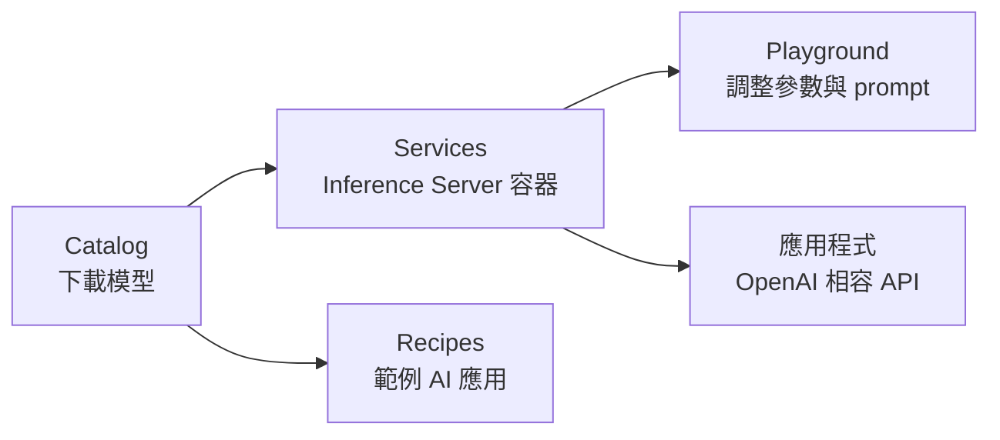
```mermaid
flowchart LR
    CAT["Catalog<br/>下載模型"] --> SVC["Services<br/>Inference Server 容器"]
    SVC --> PG["Playground<br/>調整參數與 prompt"]
    SVC --> APP["應用程式<br/>OpenAI 相容 API"]
    CAT --> REC["Recipes<br/>範例 AI 應用"]
```

### 9.2 資源需求

- 每個模型約需要 **4 GiB 記憶體**與至少 **4 顆 CPU**。
- 官方建議 Podman machine 至少 **12 GB 記憶體、4 顆 CPU**。
- Windows 上的 WSL machine 會和其他 WSL 發行版共用記憶體與 CPU，必要時調整 `%UserProfile%\.wslconfig` 的 `memory` 與 `processors`。
- GPU 加速：Windows 用 WSL 2＋NVIDIA（見[4.6](#46-gpu-存取)）；macOS Apple Silicon 啟動模型服務時會提示建立 GPU enabled（libkrun）machine。

```ini
# %UserProfile%\.wslconfig：讓 WSL 可以使用 16 GB 記憶體與 8 顆 CPU
[wsl2]
memory=16GB
processors=8
```

### 9.3 操作流程

1. **安裝**：**Extensions > Catalog** → Podman AI Lab → **Install**，左側導覽列會出現 AI Lab 圖示。
2. **下載模型**：AI Lab → **Catalog** → 點擊模型的下載圖示。
3. **啟動模型服務**：AI Lab → **Services** → **New Model Service** → 選擇模型、確認埠號 → **Create service** → **Open service details**。詳細頁會提供各語言的用戶端範例程式碼（例如 Java＋Quarkus LangChain4j）。
4. **建立 Playground**：AI Lab → **Playgrounds** → **New Playground** → 選擇推論執行環境與模型 → **Create playground**，在畫面上調整參數並提問。
5. **啟動 Recipe**：AI Lab → **Recipe Catalog** → 選擇範例 → **Start** → 選擇模型，AI Lab 會拉取範例程式、把模型複製到 machine、啟動模型服務並建立應用程式。

### 9.4 應用程式整合範例

模型服務啟動後，應用程式可以用 OpenAI 相容的 chat API 呼叫（埠號以服務詳細頁顯示為準）：

```bash
curl -s http://localhost:35000/v1/chat/completions \
  -H "Content-Type: application/json" \
  -d '{
        "messages": [
          {"role": "system", "content": "你是銀行客服助理，只回答與帳戶操作有關的問題。"},
          {"role": "user", "content": "如何變更網路銀行密碼？"}
        ],
        "temperature": 0.2
      }'
```

```yaml
# Spring AI：application.yaml（連到本機 AI Lab 模型服務）
spring:
  ai:
    openai:
      base-url: http://localhost:35000
      api-key: not-used
      chat:
        options:
          temperature: 0.2
```

> 📌 同一套程式碼只要改 `base-url`，就能在本機 AI Lab、內部 GPU 叢集（例如 OpenShift AI）與其他 OpenAI 相容服務之間切換。

### 9.5 企業使用注意事項

| 面向 | 建議 |
| --- | --- |
| 資料 | 模型在本機容器中執行，prompt 不會送到外部；但下載模型需要連線 Hugging Face 等來源，受限環境要預先下載並以本機檔案匯入 |
| 授權 | 每個模型的授權不同（Apache-2.0、Llama 社群授權等），導入前由法遵確認可以商業使用 |
| 安全 | 模型服務預設只監聽本機；不要把埠號對外開放；Recipe 的範例程式只作為原型參考 |
| 資源 | 開發筆電同時跑模型、IDE 與 Kind 很容易記憶體不足，建議 32 GB 以上的設備才開放使用 |
| 治理 | 核准可用的模型清單，並記錄用途；正式服務轉由平台團隊的推論平台提供 |

### 9.6 💡 本章實務建議

1. **把 AI Lab 定位成「原型與開發測試工具」**，正式推論服務交給平台團隊。
2. **先由法遵核准模型清單**，再開放開發者下載。
3. **程式一律透過 OpenAI 相容 API 呼叫**，保留日後切換推論平台的彈性。
4. **給 AI 開發者較高的 machine 規格**（12～16 GB 記憶體），並優先配發有 GPU 的設備。
5. **受限網路環境預先準備模型檔**，放在內部檔案伺服器供匯入。

---

## 10. 企業導入與集中管理

> 🆕 **v2.0 新增**：v1.0 完全沒有涵蓋企業集中管理。Podman Desktop 1.23 推出 **Managed configuration**，1.24、1.26 陸續增加 registry、擴充功能相關的管理設定。這是大規模導入時最重要的一章。

### 10.1 Managed configuration 原理

Podman Desktop 把設定分成三個 JSON 檔：

| 檔案 | 擁有者 | 用途 |
| --- | --- | --- |
| `settings.json` | 使用者（可讀寫） | 使用者在 UI 中修改的一般設定 |
| `default-settings.json` | 系統管理員（使用者唯讀） | 管理員提供的**預設值** |
| `locked.json` | 系統管理員（使用者唯讀） | **鎖定**的設定鍵清單，這些鍵一律使用 `default-settings.json` 的值 |

**兩種管理強度**

- **預設值（只寫在 `default-settings.json`）**：啟動時，若使用者的 `settings.json` 還沒有這個鍵，就把值複製過去（每個鍵只複製一次）。使用者之後可以自行修改。和內建預設值相同的值不會被複製。
- **鎖定（同時列在 `locked.json`）**：每次讀取都強制使用管理值，使用者的修改會被忽略，UI 上顯示鎖頭圖示或 **Managed** 標籤。

**讀取優先順序**

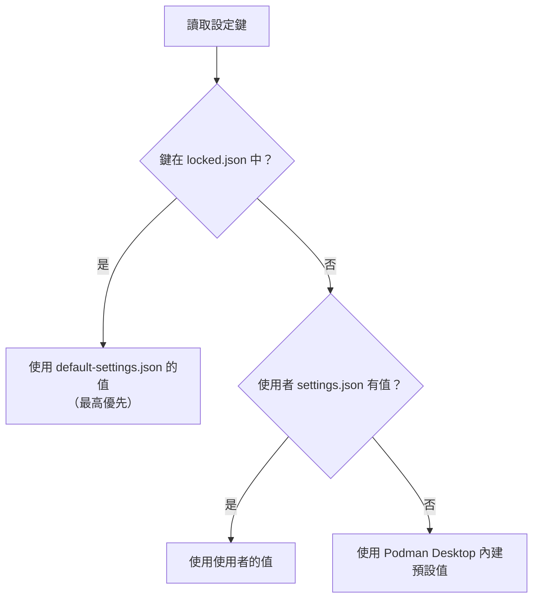
```mermaid
flowchart TD
    Q["讀取設定鍵"] --> L{"鍵在 locked.json 中？"}
    L -- 是 --> M["使用 default-settings.json 的值<br/>（最高優先）"]
    L -- 否 --> U{"使用者 settings.json 有值？"}
    U -- 是 --> V["使用使用者的值"]
    U -- 否 --> D["使用 Podman Desktop 內建預設值"]
```

### 10.2 檔案位置

| 平台 | 使用者設定 | 管理預設值與鎖定清單 |
| --- | --- | --- |
| Windows | `%USERPROFILE%\.local\share\containers\podman-desktop\configuration\settings.json` | `%PROGRAMDATA%\Podman Desktop\default-settings.json`、`locked.json` |
| macOS | `~/.local/share/containers/podman-desktop/configuration/settings.json` | `/Library/Application Support/io.podman_desktop.PodmanDesktop/default-settings.json`、`locked.json` |
| Linux | `~/.local/share/containers/podman-desktop/configuration/settings.json` | `/usr/share/podman-desktop/default-settings.json`、`locked.json` |

> ⚠️ **注意**：管理檔必須由 root／Administrator 擁有，所有使用者可讀、只有管理員可寫（Linux／macOS 建議 `chmod 644`）。設定鍵要用**點號格式**（`proxy.http`），不能寫成巢狀物件。

### 10.3 部署流程

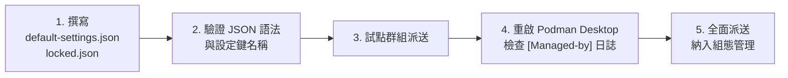
```mermaid
flowchart LR
    A["1. 撰寫<br/>default-settings.json<br/>locked.json"] --> B["2. 驗證 JSON 語法<br/>與設定鍵名稱"]
    B --> C["3. 試點群組派送"]
    C --> D["4. 重啟 Podman Desktop<br/>檢查 [Managed-by] 日誌"]
    D --> E["5. 全面派送<br/>納入組態管理"]
```

| 平台 | 建議派送工具 |
| --- | --- |
| Windows | Group Policy、Microsoft Intune、SCCM、Ansible、PowerShell 腳本 |
| macOS | Jamf Pro、Microsoft Intune、Kandji、SimpleMDM、Ansible、PKG 安裝檔 |
| Linux | Ansible、Puppet、Chef、Salt、RPM／DEB 套件、Shell 腳本 |

**Windows 派送腳本範例（PowerShell，以系統身分執行）**

```powershell
$dir = Join-Path $env:ProgramData 'Podman Desktop'
New-Item -ItemType Directory -Force -Path $dir | Out-Null
# 以 UTF-8（無 BOM）寫入，避免 JSON 解析失敗
$utf8 = New-Object System.Text.UTF8Encoding($false)

$defaults = @'
{
  "proxy.enabled": 1,
  "proxy.http": "http://proxy.corp.example:8080",
  "proxy.https": "http://proxy.corp.example:8080",
  "proxy.no": "localhost,127.0.0.1,.corp.example",
  "telemetry.enabled": false,
  "preferences.update.appUpdate": false,
  "extensions.customExtensions.enabled": false
}
'@
[IO.File]::WriteAllText((Join-Path $dir 'default-settings.json'), $defaults, $utf8)

$locked = @'
{
  "locked": [
    "proxy.enabled", "proxy.http", "proxy.https", "proxy.no",
    "telemetry.enabled", "preferences.update.appUpdate",
    "extensions.customExtensions.enabled"
  ]
}
'@
[IO.File]::WriteAllText((Join-Path $dir 'locked.json'), $locked, $utf8)
```

**Linux 派送（Ansible 片段）**

```yaml
- name: 部署 Podman Desktop 管理設定
  hosts: dev_workstations
  become: true
  tasks:
    - name: 建立目錄
      ansible.builtin.file:
        path: /usr/share/podman-desktop
        state: directory
        owner: root
        group: root
        mode: "0755"
    - name: 複製管理設定檔
      ansible.builtin.copy:
        src: "files/{{ item }}"
        dest: "/usr/share/podman-desktop/{{ item }}"
        owner: root
        group: root
        mode: "0644"
      loop:
        - default-settings.json
        - locked.json
```

**驗證**

1. 重新啟動 Podman Desktop。
2. **Help > Troubleshooting** → **Logs** 分頁，確認有類似下列訊息：

   ```text
   [Managed-by]: Loaded managed ...
   [Managed-by]: Applied default settings for: proxy.http, telemetry.enabled
   ```

3. **Settings > Preferences** 中，被鎖定的設定顯示 **Managed** 標籤且無法修改。1.28 起 **Resources** 頁也會顯示 managed-by 標示。

> 📌 `Applied default settings` 只會在「把預設值複製到使用者設定」時出現，每個鍵一次；已經複製過的鍵，之後重啟就不會再出現這一行。

### 10.4 常見管理用例

#### 10.4.1 強制公司 proxy 與關閉遙測

```json
{
  "proxy.enabled": 1,
  "proxy.http": "http://proxy.corp.example:8080",
  "proxy.https": "http://proxy.corp.example:8080",
  "proxy.no": "localhost,127.0.0.1,.corp.example",
  "telemetry.enabled": false
}
```

`proxy.enabled`：0＝使用系統設定、1＝手動、2＝停用。

#### 10.4.2 預設 registry 與 mirror（1.24）

`registries.defaults` 對應 Podman 的 `registries.conf` 格式。每個元素是 `registry` 或 `registry.mirror`，**mirror 必須緊接在它所屬的 registry 後面**。

```json
{
  "registries.defaults": [
    { "registry": { "prefix": "docker.io", "location": "docker.io" } },
    { "registry.mirror": { "location": "harbor.corp.example/dockerhub-proxy" } },
    { "registry": { "prefix": "quay.io", "location": "quay.io" } },
    { "registry.mirror": { "location": "harbor.corp.example/quay-proxy" } },
    { "registry": { "prefix": "untrusted.example.com", "location": "untrusted.example.com", "blocked": true } }
  ]
}
```

| 屬性 | 適用 | 必填 | 說明 |
| --- | --- | --- | --- |
| `prefix` | registry | 是 | 要比對的前綴，例如 `quay.io` |
| `location` | registry、mirror | 是 | registry 或 mirror 的位址 |
| `insecure` | registry、mirror | 否 | 允許不安全連線（預設 `false`） |
| `blocked` | registry | 否 | 封鎖拉取（預設 `false`） |

#### 10.4.3 控制引擎更新

`providers.allowUpdate`（隱藏設定，專供管理使用）決定哪些擴充功能可以在 **Resources** 頁提供引擎更新按鈕：

```json
{ "providers.allowUpdate": [] }
```

- `["*"]`：預設，全部允許。
- `[]`：全部封鎖，引擎版本由 IT 統一升級。
- `["podman-desktop.podman"]`：只允許 Podman 擴充功能。

#### 10.4.4 管控擴充功能與應用程式更新

```json
{
  "extensions.catalog.enabled": false,
  "extensions.customExtensions.enabled": false,
  "preferences.update.appUpdate": false
}
```

搭配 `locked.json` 鎖定後，開發者看不到擴充功能目錄與 **Install custom...** 按鈕，也不會自行升級 Podman Desktop。

### 10.5 Proxy、CA 與網路整合

| 需求 | 做法 | 章節 |
| --- | --- | --- |
| Podman Desktop 本身走 proxy | Managed configuration 鎖定 `proxy.*` | [10.4.1](#1041-強制公司-proxy-與關閉遙測) |
| machine 內的 Podman 走 proxy | Desktop 會把 proxy 帶進 machine；也可以在 `containers.conf` 設定 | [4.5.2](#452-proxy) |
| SSL 攔截 | Podman 6：`--import-native-ca`；並把公司根憑證派送到作業系統信任庫 | [4.5.3](#453-ca-憑證ssl-攔截環境) |
| VPN | User mode networking | [4.5.1](#451-vpnuser-mode-networking) |
| 內部 mirror | `registries.defaults` | [10.4.2](#1042-預設-registry-與-mirror124) |

### 10.6 遙測與隱私

- `telemetry.enabled`（預設 `true`）會把匿名使用資料傳給 Red Hat。首次啟動會詢問使用者。
- **CI 環境自動停用**：偵測到 `CI`、`CONTINUOUS_INTEGRATION`、`BUILD_NUMBER`、`GITHUB_ACTIONS`、`GITLAB_CI`、`JENKINS_URL`、`TF_BUILD` 等環境變數（值不為空、`false` 或 `0`）時，這次執行不會送出遙測，並記錄 `CI environment detected: telemetry is disabled for this run.`；設定檔本身不會被修改。
- 金融業建議直接以 Managed configuration 鎖定 `telemetry.enabled=false`，並寫進資訊資產清冊。

### 10.7 settings.json 重點鍵值

| 設定鍵 | 預設值 | 說明 | 建議管理方式 |
| --- | --- | --- | --- |
| `proxy.enabled` | `0` | 0 系統、1 手動、2 停用 | 鎖定 |
| `proxy.http`／`proxy.https`／`proxy.no` | `""` | Proxy 位址與例外清單 | 鎖定 |
| `telemetry.enabled` | `true` | 匿名遙測 | 鎖定為 `false` |
| `registries.defaults` | `[]` | 預設 registry 與 mirror | 預設值或鎖定 |
| `providers.allowUpdate` | `["*"]` | 允許提供引擎更新的擴充功能 | 鎖定 |
| `preferences.update.appUpdate` | `true` | 應用程式更新（1.29） | 鎖定為 `false`（由 IT 升級時） |
| `preferences.update.reminder` | `"startup"` | 更新提醒：`startup` 或 `never` | 預設值 |
| `extensions.catalog.enabled` | `true` | 顯示擴充功能目錄 | 依政策鎖定 |
| `extensions.customExtensions.enabled` | `true` | 顯示自訂安裝按鈕 | 鎖定為 `false` |
| `extensions.autoUpdate` | `true` | 自動更新擴充功能 | 預設值 |
| `dockerCompatibility.enabled` | `false` | 顯示 Docker 相容設定頁 | 預設值 `true`（遷移期間） |
| `kubernetes.Kubeconfig` | `"~/.kube/config"` | kubeconfig 路徑 | 使用者自訂 |
| `preferences.{extensionId}.engine.autostart` | `true` | 啟動時自動啟動引擎，例如 `preferences.podman.engine.autostart` | 預設值 |
| `preferences.login.start` | `true` | 開機自動啟動 | 預設值 |
| `preferences.appearance` | `"system"` | 主題 | 使用者自訂 |
| `userConfirmation.bulk` | `true` | 批次操作前確認 | 預設值 |
| `preferences.navigationBarLayout` | `"icon + title"` | **1.29 起棄用**，改用 `preferences.navigationBarWidth` | 不再使用 |

完整清單見官方〈Settings Reference〉；範本見[附錄 B.2](#b2-managed-configuration-範本)。

### 10.8 疑難排解

| 症狀 | 檢查項目 |
| --- | --- |
| 鎖定沒有生效 | 檔案路徑是否正確；檔案擁有者是否為 root／Administrator；JSON 語法；是否重啟 Podman Desktop |
| 顯示鎖定但值不對 | `locked.json` 的鍵名是否和 `default-settings.json` **完全一致**；是否使用點號格式 |
| 日誌沒有 `[Managed-by]` 訊息 | 檔案不在正確位置或 JSON 有語法錯誤 |
| 預設值沒有套用到使用者 | 使用者 `settings.json` 已經有這個鍵（預設值不會覆寫）；需要強制時改用鎖定 |

### 10.9 💡 本章實務建議

1. **最少要鎖定四類設定**：proxy、遙測、自訂擴充功能、應用程式更新。
2. **registry 與 mirror 用預設值派送**，讓開發者在必要時可以另外新增專案用的 registry。
3. **設定檔納入版本控管**（Git），派送前經過 PR 審查與 JSON 驗證。
4. **每次升級 Podman Desktop 都檢查 Settings Reference 的變動**，例如 1.29 棄用 `preferences.navigationBarLayout`。
5. **需要廠商支援時搭配 Red Hat build**，它的文件另有標準政策設定與離線環境的完整指引。

---

## 11. 安全性與合規

本章聚焦「開發者桌面」這一層的安全控制。映像檔簽章、SBOM、正式主機強化等主題請見《Podman 使用教學手冊》第 10、11 章。

### 11.1 威脅模型與控制對照

| 威脅 | 情境 | 控制措施 | 章節 |
| --- | --- | --- | --- |
| 容器逃逸取得主機權限 | 惡意映像檔或弱點 | rootless machine、`--cap-drop=ALL`、非 root 使用者 | [11.2](#112-執行期安全) |
| 拉到惡意或被竄改的映像檔 | 短名稱、公開 registry | 完整名稱、內部 mirror、封鎖未核准 registry | [10.4.2](#1042-預設-registry-與-mirror124) |
| 機密外洩 | 密碼寫在 Compose、環境變數、映像檔 | Podman Secret、`.gitignore`、推送前掃描 | [5.7](#57-secret) |
| 不受控的擴充功能 | 開發者自行安裝來源不明的擴充功能 | 鎖定 `extensions.customExtensions.enabled=false`；1.26 起的授權提示 | [8.4](#84-企業管控) |
| 已知弱點未修補 | 桌面軟體、引擎、映像檔版本老舊 | 版本基準、集中升級、弱點掃描 | [11.4](#114-更新與弱點管理) |
| 資料外傳 | 遙測、雲端沙箱、AI 服務 | 鎖定遙測；禁止把內部程式碼部署到 Developer Sandbox；AI 使用本機模型 | [10.6](#106-遙測與隱私) |

### 11.2 執行期安全

**預設採用 rootless**：Podman machine 預設為 rootless 連線。即使容器被攻破，攻擊者在 machine 內也只有一般使用者權限。

**容器執行的最低要求**（GUI 的 **Security** 分頁或 CLI）：

```bash
podman run -d --name api \
  --user 185 \
  --read-only --tmpfs /tmp \
  --cap-drop=ALL \
  --security-opt=no-new-privileges \
  --pids-limit=512 --memory=1g --cpus=2 \
  -p 127.0.0.1:8080:8080 \
  registry.corp.example/payments/api:1.4.2
```

- `-p 127.0.0.1:8080:8080` 只綁定本機介面，避免同網段的其他人連進開發中的服務。
- 映像檔的 `USER` 設為非 root，才能在 OpenShift 的 restricted-v2 SCC 下執行。
- 避免使用 `--privileged` 與 `--network host`；確實需要時列入例外清單並說明理由。

### 11.3 映像檔安全

| 控制 | 工具或做法 |
| --- | --- |
| 可信任的基底映像檔 | Red Hat UBI、Project Hummingbird、公司核准的基底映像檔清單 |
| 固定版本 | 使用明確的版本標籤或 digest（`@sha256:...`），不要用 `latest` |
| 弱點掃描 | Grype 擴充功能（Grype＋Syft）；CI 再用 Trivy、Clair 或企業掃描平台複查 |
| 分層檢查 | Image Layers Explorer，找出意外放進映像檔的憑證、`.env`、大型檔案 |
| OpenShift 相容性 | Red Hat OpenShift Checker 擴充功能 |
| 來源限制 | `registries.defaults` 設定 mirror 與 `blocked`（見[10.4.2](#1042-預設-registry-與-mirror124)） |

```dockerfile
# .containerignore：避免把機敏檔案送進建置情境
.git
.env
*.pem
*.key
secrets/
target/
node_modules/
```

### 11.4 更新與弱點管理

Podman Desktop 幾乎每個版本都修補相依套件的 CVE（1.27、1.28 的發布說明都特別提到）。建議的版本管理流程：

1. **訂閱發布資訊**：GitHub Releases、官方部落格、Red Hat build 的發布說明。
2. **分級處理**：修補版（例如 1.29.2 → 1.29.3）在一週內派送；次要版本（1.29 → 1.30）先在試點群組驗證兩週。
3. **引擎與桌面分開管理**：用 `providers.allowUpdate` 與 `preferences.update.appUpdate` 關閉使用者自行升級，由 IT 統一派送。
4. **擴充功能**：`extensions.autoUpdate` 可以保持開啟，但只允許核准清單內的擴充功能。
5. **紀錄**：把各設備的 Podman Desktop 版本、Podman 版本、machine 版本納入資產管理系統。

### 11.5 稽核與合規檢查點

| 檢查點 | 證據 |
| --- | --- |
| 軟體授權合規 | Podman Desktop 為 Apache-2.0；Docker Desktop 移除紀錄 |
| 集中設定 | `default-settings.json`、`locked.json` 的版本控管紀錄與派送紀錄 |
| 遙測 | `telemetry.enabled` 已鎖定為 `false` |
| 擴充功能 | 核准清單與 `extensions.customExtensions.enabled=false` |
| 版本 | 設備清冊中的 Podman Desktop／Podman 版本符合基準 |
| 網路 | 只允許經由公司 proxy 與內部 mirror 取得映像檔 |
| 資料 | Developer Sandbox 與 AI 服務的使用規範 |

### 11.6 💡 本章實務建議

1. **rootless＋非 root 映像檔＋`--cap-drop=ALL`** 是開發環境的最低要求。
2. **開發服務只綁定 `127.0.0.1`**，避免在公司網段曝露未完成的服務。
3. **推送前自我掃描**：Grype 擴充功能＋`.containerignore`。
4. **Podman Desktop 也是需要修補的軟體**，納入弱點管理流程。
5. **把本章的檢查點做成年度稽核清單**（見[附錄 C.4](#c4-安全與合規)）。

---

## 12. 開發工作流程與 IDE 整合

### 12.1 內循環（Inner Loop）開發流程

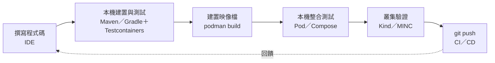
```mermaid
flowchart LR
    A["撰寫程式碼<br/>IDE"] --> B["本機建置與測試<br/>Maven／Gradle＋Testcontainers"]
    B --> C["建置映像檔<br/>podman build"]
    C --> D["本機整合測試<br/>Pod／Compose"]
    D --> E["叢集驗證<br/>Kind／MINC"]
    E --> F["git push<br/>CI／CD"]
    F -.->|"回饋"| A
```

| 階段 | 工具 | Podman Desktop 的角色 |
| --- | --- | --- |
| 撰寫與除錯 | VS Code、IntelliJ IDEA | 提供容器引擎、Dev Container 執行環境 |
| 單元與整合測試 | Testcontainers | 透過 Docker 相容 API 提供容器 |
| 本機整合 | Pod、Compose | 圖形化檢視日誌與狀態 |
| 叢集驗證 | Kind、MINC | 推送映像檔、Deploy to Kubernetes、Port forwarding |

### 12.2 VS Code

> ⚠️ **v2.0 更正**：v1.0 列出的 `redhat.vscode-podman`「Podman Desktop Extension」在 VS Code Marketplace 上**查無此擴充功能**。Podman Desktop 官方部落格推薦的是下列兩個擴充功能。

| 擴充功能 | ID | 用途 |
| --- | --- | --- |
| Container Tools（Microsoft） | `ms-azuretools.vscode-containers` | Containerfile／Dockerfile 語法支援、建置映像檔、管理容器；Docker 沒有執行時會透過 `DOCKER_HOST` 使用 Podman |
| Pod Manager（社群） | `dreamcatcher45.podmanager` | 直接管理 Podman 的容器、映像檔、Volume、網路 |
| Dev Containers（Microsoft） | `ms-vscode-remote.remote-containers` | 在容器中開發 |

```bash
code --install-extension ms-azuretools.vscode-containers
code --install-extension ms-vscode-remote.remote-containers
```

**讓 Container Tools 使用 Podman**：在 macOS 上開啟 Podman Desktop 的 **Settings > Docker Compatibility > Third-Party Docker Tool Compatibility**；Windows 與 Linux 則設定 `DOCKER_HOST`（見[6.3.2](#632-使用-docker_host)）。

#### 12.2.1 Dev Containers 搭配 Podman

VS Code 使用者設定（`settings.json`）：

```json
{
  "dev.containers.dockerPath": "podman"
}
```

專案的 `.devcontainer/devcontainer.json`：

```json
{
  "name": "payments-api",
  "image": "mcr.microsoft.com/devcontainers/java:21",
  "features": {
    "ghcr.io/devcontainers/features/java:1": {
      "installMaven": "true"
    }
  },
  "runArgs": ["--userns=keep-id"],
  "containerUser": "vscode",
  "updateRemoteUserUID": true,
  "forwardPorts": [8080, 5005],
  "mounts": [
    "source=payments-m2,target=/home/vscode/.m2,type=volume"
  ],
  "postCreateCommand": "mvn -B -q dependency:go-offline",
  "customizations": {
    "vscode": {
      "extensions": ["vscjava.vscode-java-pack", "vmware.vscode-spring-boot"]
    }
  }
}
```

- `--userns=keep-id` 讓容器內的使用者對應到主機使用者，避免 rootless 下的原始碼檔案權限問題。
- Maven 本機倉庫放在 named volume（`payments-m2`），重建容器時不必重新下載相依套件，在 Windows 上也比 bind mount 快。
- 使用 **Dev Containers: Reopen in Container** 開啟。

> ⚠️ **v2.0 更正**：v1.0 的 devcontainer 使用 `openjdk:17-jdk` 並以 `apt-get` 安裝工具；該映像檔已停止維護，而且以 Oracle Linux 為基礎、沒有 `apt-get`。本版改用 Dev Containers 官方的 Java 映像檔與 Features。

### 12.3 IntelliJ IDEA

1. **Settings > Build, Execution, Deployment > Docker** → **+** 新增連線。
2. 選擇 **Podman**（新版 IntelliJ 會自動偵測 Podman machine）；若沒有這個選項，改選 **TCP socket／Docker API URL** 並輸入：
   - Windows：`npipe:////./pipe/podman-machine-default`
   - macOS：`unix:///Users/<使用者>/.local/share/containers/podman/machine/podman.sock`（或開啟 Third-Party Docker Tool Compatibility 後使用 `/var/run/docker.sock`）
   - Linux：`unix:///run/user/<UID>/podman/podman.sock`
3. 在 **Services** 工具視窗可以檢視容器、映像檔、日誌，並從 Containerfile 直接建置與執行。

**遠端除錯 Spring Boot 容器**

```bash
podman run -d --name api-debug -p 8080:8080 -p 5005:5005 \
  -e JAVA_TOOL_OPTIONS="-agentlib:jdwp=transport=dt_socket,server=y,suspend=n,address=*:5005" \
  localhost/payments-api:dev
```

IntelliJ：**Run > Edit Configurations** → **+** → **Remote JVM Debug**，Host 填 `localhost`、Port 填 `5005`。VS Code 則在 `launch.json` 使用 `"request": "attach"`：

```json
{
  "version": "0.2.0",
  "configurations": [
    {
      "type": "java",
      "name": "Attach to api-debug",
      "request": "attach",
      "hostName": "localhost",
      "port": 5005
    }
  ]
}
```

### 12.4 Testcontainers

Testcontainers 透過 Docker API 建立測試用容器。搭配 Podman 時：

```bash
# macOS（未開啟 Third-Party Docker Tool Compatibility 時）
export DOCKER_HOST="unix://$(podman machine inspect --format '{{.ConnectionInfo.PodmanSocket.Path}}')"
export TESTCONTAINERS_DOCKER_SOCKET_OVERRIDE=/var/run/docker.sock

# Linux（rootless）
systemctl --user enable --now podman.socket
export DOCKER_HOST="unix://${XDG_RUNTIME_DIR}/podman/podman.sock"
```

```powershell
# Windows
$env:DOCKER_HOST = "npipe:////./pipe/podman-machine-default"
```

也可以寫在家目錄的 `~/.testcontainers.properties`，讓所有專案共用（官方教學的做法）：

```properties
docker.host=unix:///Users/<使用者>/.local/share/containers/podman/machine/podman.sock
```

**Ryuk（資源清理容器）**：官方教學指出，Podman 以 **rootless** 模式執行時必須停用 Ryuk：

```bash
export TESTCONTAINERS_RYUK_DISABLED=true
```

停用 Ryuk 後，測試異常中斷時容器不會自動清除。請在 CI 的測試步驟結束後執行 `podman container prune -f`（或用 label 過濾刪除），本機則定期從 Containers 頁清理。第一次設定時可以開啟 Testcontainers 的 DEBUG 日誌，確認它讀到了 Podman 的 socket。

```java
// Spring Boot 3.1+：以 Testcontainers 啟動 PostgreSQL 17
@Testcontainers
@SpringBootTest
class PaymentRepositoryIT {

    @Container
    @ServiceConnection
    static PostgreSQLContainer<?> postgres =
        new PostgreSQLContainer<>(DockerImageName.parse("docker.io/library/postgres:17"));

    @Autowired
    PaymentRepository repository;

    @Test
    void savesPayment() {
        var saved = repository.save(new Payment("TWD", new BigDecimal("1000")));
        assertThat(saved.getId()).isNotNull();
    }
}
```

### 12.5 開發環境設定管理

```text
payments-api/
├── .devcontainer/
│   └── devcontainer.json
├── .containerignore
├── Containerfile
├── compose.yaml            # 本機依賴服務
├── compose.override.yaml   # 個人覆寫（不進版控）
├── k8s/
│   └── payments-dev.yaml   # podman kube generate 產出後整理
├── secrets/                # 不進版控
└── src/
```

- 環境差異用 Spring Profile 與環境變數處理，**不要**為不同環境建置不同映像檔。
- 個人設定放在 `compose.override.yaml` 或 `.env`，並列入 `.gitignore`。
- 團隊共用的 machine 規格、`DOCKER_HOST` 設定寫在 README 或新人上手腳本中。

### 12.6 Windows 開發環境自動化腳本

新人上手或每日開工時，可以用 PowerShell 腳本檢查並啟動環境：

```powershell
# dev-env.ps1：啟動 Podman machine 與專案依賴服務
param(
    [ValidateSet('up', 'down', 'status')]
    [string]$Action = 'up',
    [string]$Machine = 'podman-machine-default',
    [string]$ComposeFile = 'compose.yaml'
)
$ErrorActionPreference = 'Stop'

function Start-PodmanMachine {
    $state = podman machine inspect $Machine --format '{{.State}}'
    if ($state -ne 'running') {
        Write-Host "啟動 machine：$Machine"
        podman machine start $Machine
    }
    $env:DOCKER_HOST = "npipe:////./pipe/$Machine"
}

switch ($Action) {
    'up' {
        Start-PodmanMachine
        podman compose -f $ComposeFile up -d
        podman compose -f $ComposeFile ps
    }
    'down' {
        podman compose -f $ComposeFile down
    }
    'status' {
        podman machine list
        podman ps --format 'table {{.Names}}\t{{.Status}}\t{{.Ports}}'
    }
}
```

```powershell
.\dev-env.ps1 -Action up
.\dev-env.ps1 -Action status
```

### 12.7 與 CI 對齊

本機用 Podman 建置的映像檔，CI 也應該用相同的工具鏈（Buildah／Podman）建置，避免「本機可以、CI 不行」。以 GitHub Actions 為例：

```yaml
# .github/workflows/image.yml
name: build-image
on:
  push:
    branches: [main]
jobs:
  build:
    runs-on: ubuntu-latest
    permissions:
      contents: read
      packages: write
    steps:
      - uses: actions/checkout@v4
      - name: 建置映像檔（Buildah）
        id: build
        uses: redhat-actions/buildah-build@v2
        with:
          image: payments-api
          tags: ${{ github.sha }}
          containerfiles: ./Containerfile
      - name: 推送到 registry
        uses: redhat-actions/push-to-registry@v2
        with:
          image: ${{ steps.build.outputs.image }}
          tags: ${{ steps.build.outputs.tags }}
          registry: ghcr.io/${{ github.repository_owner }}
          username: ${{ github.actor }}
          password: ${{ secrets.GITHUB_TOKEN }}
```

> 📌 GitLab CI、Jenkins、Azure Pipelines 也可以用 `quay.io/podman/stable` 或 `quay.io/buildah/stable` 映像檔執行 rootless 建置。CI 端的簽章、SBOM 與掃描流程請見《Podman 使用教學手冊》第 11 章。

### 12.8 💡 本章實務建議

1. **統一 IDE 擴充功能清單**：VS Code 用 Container Tools＋Dev Containers；IntelliJ 用內建 Docker／Podman 整合。
2. **Dev Container 一律加 `--userns=keep-id`**，並把相依套件快取放在 named volume。
3. **Testcontainers 的 Podman 設定寫進專案文件與 CI**，避免每個人各自摸索 Ryuk 問題。
4. **除錯埠號只在開發映像檔或執行參數中開啟**，不要寫死在正式 Containerfile。
5. **本機 Pod 產生的 YAML 要整理後才進版控**（改成 Deployment、移除 Secret）。

---

## 13. 疑難排解

### 13.1 診斷流程

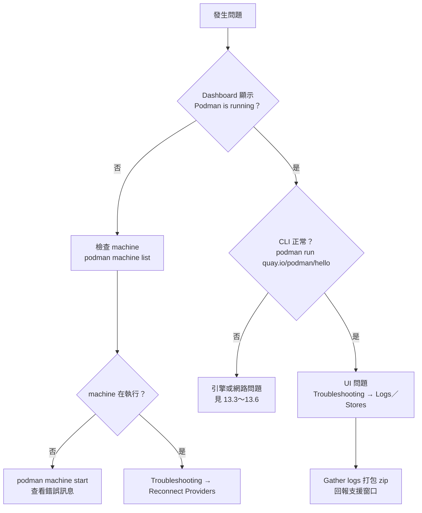
```mermaid
flowchart TD
    S["發生問題"] --> A{"Dashboard 顯示<br/>Podman is running？"}
    A -- 否 --> B["檢查 machine<br/>podman machine list"]
    B --> B1{"machine 在執行？"}
    B1 -- 否 --> B2["podman machine start<br/>查看錯誤訊息"]
    B1 -- 是 --> B3["Troubleshooting → Reconnect Providers"]
    A -- 是 --> C{"CLI 正常？<br/>podman run quay.io/podman/hello"}
    C -- 否 --> D["引擎或網路問題<br/>見 13.3～13.6"]
    C -- 是 --> E["UI 問題<br/>Troubleshooting → Logs／Stores"]
    E --> F["Gather logs 打包 zip<br/>回報支援窗口"]
```

**第一步永遠是分辨問題在哪一層**：UI（Podman Desktop）、machine（VM）、引擎（Podman）、網路（proxy、VPN、DNS）。

### 13.2 Podman Desktop 日誌與 Troubleshooting 頁

點擊狀態列的 **Troubleshooting** 圖示（或 **Help > Troubleshooting**、**Settings > Troubleshooting**）：

| 分頁或功能 | 用途 |
| --- | --- |
| Logs | 檢視 Podman Desktop 日誌（1.28 起含時間戳記） |
| Gather logs | 一鍵把所有日誌打包成 `.zip` |
| Ping | 檢查引擎回應時間 |
| Check containers | 檢查容器清單的回應時間 |
| Reconnect Providers | 重新連線引擎 socket |
| Stores | 檢視前端資料 store 的事件，例如容器沒有出現在清單時，看 containers store 的事件 |
| Cleanup／Purge data | 刪除引擎中**所有**資源（高風險，操作前先備份） |

### 13.3 Windows 常見問題

| 症狀 | 原因 | 處理方式 |
| --- | --- | --- |
| `podman machine stop` 失敗，日誌出現 `Error stopping sysd: exit status 1` | machine 損壞 | `wsl --list` 找到 machine 名稱，`wsl --unregister podman-machine-default` 後重建 |
| Podman Desktop 看不到 machine | 權限不同：Hyper-V machine 只有以系統管理員執行時看得到 | 用 `wsl --list`、`podman system connection list`、`podman machine ls` 確認；卡住時 `podman machine reset`；重啟 Podman Desktop；再不行就 `taskkill.exe /F /im wslservice.exe` 重啟 WSL |
| 從命令列啟動 Podman Desktop 後，關閉終端機也把它關掉 | 終端機附加到 Electron 行程 | 啟動前設定 `ELECTRON_NO_ATTACH_CONSOLE=true` |
| VPN 下出現 `Temporary failure in name resolution` | machine 網路沒有經過 VPN | 重建 machine 並啟用 User mode networking |
| `Get-NetTCPConnection` 相關錯誤、埠號轉送失效 | WSL 版本過舊 | `wsl --update`，必要時重建 machine |
| Windows 10 Enterprise LTSC 21H2 偵測不到 WSL2 machine | LTSC 上 `wsl --install --no-distribution` 無效 | 依官方文件先安裝一個 WSL 發行版完成設定，之後可以再移除 |
| 建立 Hyper-V machine 失敗 | 權限不足 | 以系統管理員執行 Podman Desktop；Podman 6 可以先由管理員執行 `podman system hyperv-prep` |
| 升級到 Podman 6 後拉取映像檔失敗 | 沿用了 5.x 的設定 | 依[2.6](#26-從-podman-5-升級到-podman-6)清除資料並重建 |

```powershell
# 常用診斷指令
wsl --status
wsl --list --verbose
podman machine list
podman system connection list
podman machine inspect podman-machine-default
```

### 13.4 macOS 常見問題

| 症狀 | 原因 | 處理方式 |
| --- | --- | --- |
| 找不到 Podman 引擎 | 同時有 Homebrew 與 `.pkg` 安裝的 Podman，路徑衝突 | 只保留一種安裝來源；必要時在 Preferences 指定 Podman 執行檔路徑 |
| Create Podman machine 頁面警告找不到 krunkit | Apple Silicon 缺少 krunkit | 手動安裝 krunkit，或改用 GitHub 發布的 Podman 安裝檔 |
| Apple Silicon 上 machine 無法啟動 | 舊版 machine 映像檔或 provider 不相容 | `podman machine rm` 後重新 `podman machine init`；也可以暫時改用 Apple Hypervisor |
| Intel Mac 無法升級到 Podman 6 | Podman 6 只支援 Apple Silicon | 維持 5.8.x，排入設備汰換 |
| Docker 工具連不到 Podman | Third-Party Docker Tool Compatibility 未啟用 | 在 Docker Compatibility 頁啟用並重啟 machine |

### 13.5 Linux 常見問題

| 症狀 | 處理方式 |
| --- | --- |
| Flatpak 版找不到 Podman | 確認主機已安裝 Podman，且使用者層級的 `podman.socket` 已啟用（`systemctl --user enable --now podman.socket`） |
| Wayland 下主視窗無法顯示 | 1.22 起有對應的處理；仍有問題時以 X11 工作階段或 XWayland 執行 |
| 需要測試特定版本的 Flatpak | 先移除 Flathub 版與 `~/.var/app/io.podman_desktop.PodmanDesktop`，再 `flatpak install --user <檔名>.flatpak`；測完再裝回 Flathub 版 |
| rootless 容器無法啟動 | 檢查 `/etc/subuid`、`/etc/subgid`，詳見《Podman 使用教學手冊》第 14 章 |

### 13.6 引擎、網路與效能問題

| 症狀 | 檢查 | 處理方式 |
| --- | --- | --- |
| `x509: certificate signed by unknown authority` | 公司 SSL 攔截 | `--import-native-ca` 或手動匯入 CA（見[4.5.3](#453-ca-憑證ssl-攔截環境)） |
| 拉取映像檔逾時 | proxy 設定 | 檢查 **Settings > Proxy** 與 `proxy.no` 是否包含內部 registry |
| `address already in use` | 埠號衝突 | Windows：`Get-NetTCPConnection -LocalPort 8080`；macOS／Linux：`lsof -i :8080`；改用其他主機埠 |
| 容器清單空白、映像檔不見 | 連到錯誤的 connection（rootless／rootful） | `podman system connection ls` 檢查預設連線，rootful machine 要切到 `-root` 連線 |
| bind mount 很慢 | Windows 跨檔案系統 I/O | 大量檔案改放 named volume |
| machine 記憶體不足、容器被 OOM 終止 | `podman stats`、Dashboard 系統總覽 | 停止 machine 後 `podman machine set --memory` 加大 |
| 磁碟空間不足 | `podman system df` | `podman system prune`（加 `-a --volumes` 前先確認）；`podman machine set --disk-size` 加大 |

**最後手段：重設**

```bash
# ⚠️ 會刪除所有 machine、容器、映像檔與 Volume
podman machine reset -f
```

Podman Desktop 本身的設定損壞時，可以先備份再刪除 `~/.local/share/containers/podman-desktop/`（Windows 為 `%USERPROFILE%\.local\share\containers\podman-desktop\`）。

### 13.7 回報問題

1. 用 **Gather logs** 打包日誌。
2. 附上 `podman version`、`podman info`、`podman machine inspect` 的輸出（先移除內部主機名稱與帳號）。
3. 說明作業系統版本、Podman Desktop 版本、machine provider、是否使用 VPN／proxy。
4. 內部先由支援窗口判斷；確認是產品問題後，再到 GitHub Issues 或 Red Hat 支援（Red Hat build 使用者）回報。

### 13.8 💡 本章實務建議

1. **建立內部 FAQ**：把本章的表格加上公司特有的 proxy、VPN、CA 問題。
2. **提報問題一律附 Gather logs 的 zip**。
3. **先確認 connection**：很多「資源不見」的問題其實是連到 rootless／rootful 的另一個連線。
4. **重設前先備份**：`podman machine reset -f` 會刪除所有資料。
5. **定期清理**：每月執行一次 `podman system df` 與 `prune`，避免磁碟用盡。

---

## 14. 實務練習與認證準備

### 14.1 分階段學習計畫

| 階段 | 時間 | 目標 | 對應章節 | 驗收方式 |
| --- | --- | --- | --- | --- |
| 入門 | 第 1 週 | 安裝、建立 machine、執行第一個容器、看懂各頁面 | 第 2、3 章 | 完成 [3.6](#36--實務練習第一個容器) 練習 |
| 基礎 | 第 2～3 週 | 建置映像檔、Pod、Volume、Network、Secret、Compose | 第 5、6 章 | 完成 [14.2](#142--基礎實務練習) 練習 1～3 |
| 進階 | 第 4～6 週 | machine 調校、Kind、Deploy to Kubernetes、Testcontainers | 第 4、7、12 章 | 完成練習 4～5 |
| 企業 | 第 7～8 週 | Managed configuration、安全基準、疑難排解 | 第 10、11、13 章 | 完成 [14.3](#143--企業實務練習) |
| 認證 | 第 9～12 週 | EX188 考試目標（以 CLI 為主） | [14.4](#144-認證概述) | 完成模擬題並在限時內作答 |

### 14.2 📝 基礎實務練習

**練習 1：映像檔建置與推送**

1. 用 [5.3.2](#532-建置) 的 Containerfile 建置 `localhost/payments-api:dev`。
2. 在 Images 頁檢視 History，並用 Image Layers Explorer 找出最大的一層。
3. 用 Grype 擴充功能掃描，記錄 Critical 與 High 弱點數量。
4. 改名為 `registry.corp.example/<你的帳號>/payments-api:0.1.0` 並推送。

**練習 2：Pod 與 Kubernetes YAML**

1. 依 [5.8](#58-實務案例java-微服務本機開發環境) 建立 `payments-dev` Pod。
2. 在 **Kube** 分頁或用 `podman kube generate` 產生 YAML。
3. 刪除 Pod 後，用 **Play Kubernetes YAML** 重新建立，確認服務恢復。

**練習 3：Compose 與 Docker 相容**

1. 用 [6.2](#62-執行-compose-應用) 的 `compose.yaml` 啟動服務，確認 Containers 頁出現 `(compose)` 群組。
2. 設定 `DOCKER_HOST` 或啟用 Docker 相容，以 `docker ps` 查看相同的容器。
3. 執行 `docker info --format=json | jq -r .ServerVersion`，確認回傳的是 Podman 版本。

**練習 4：Kind 內循環**

1. 建立 rootful machine 與 Kind 叢集。
2. 把 `payments-api:dev` 推送到 Kind，套用 `imagePullPolicy: Never` 的 Pod。
3. 用 **Deploy to Kubernetes** 部署 `payments-dev` Pod，再用 Port forwarding 從瀏覽器存取。

**練習 5：Testcontainers**

1. 依 [12.4](#124-testcontainers) 設定 `DOCKER_HOST`。
2. 執行含 PostgreSQL Testcontainer 的整合測試，觀察 Containers 頁中測試容器的建立與刪除。

### 14.3 📝 企業實務練習

**情境**：你是平台團隊成員，要替 200 位開發者導入 Podman Desktop。

1. 撰寫 `default-settings.json` 與 `locked.json`：鎖定 proxy、遙測、自訂擴充功能、應用程式更新；以預設值派送 Docker Hub 與 Quay 的內部 mirror。
2. 在測試機部署，從 Troubleshooting 日誌確認 `[Managed-by]` 訊息，並確認 Preferences 顯示 **Managed** 標籤。
3. 撰寫一頁新人上手指引：安裝方式、machine 標準規格、`DOCKER_HOST` 設定、常見問題。
4. 設計版本升級流程：修補版與次要版本的驗證與派送時程。
5. 列出擴充功能核准清單，並說明每個擴充功能的核准理由。

### 14.4 認證概述

> ⚠️ **v2.0 更正**：v1.0 的第 4 章以 Red Hat 容器認證為題，但沒有明確的考試代號與官方目標，還附上沒有出處的「題型比例」。本版改依 Red Hat 官方考試頁面整理（查證日 2026-09-29），並沿用本站《Podman 使用教學手冊》v2.0 的查證結果。

| 認證 | 考試 | 與 Podman／Podman Desktop 的關聯 |
| --- | --- | --- |
| **Red Hat Certified Developer in Cloud-native Applications** | **EX188**（實機操作，2.5 小時） | 以 RHEL 10、Podman v5、OpenShift 4.22 為基準；主要的 Podman 認證 |
| Red Hat Certified System Administrator（RHCSA） | EX200 | 考試目標包含以 Podman 管理容器，並用 systemd 讓 rootless 容器開機自動啟動 |
| Certified Kubernetes Application Developer（CKAD） | CNCF／Linux Foundation | Pod、YAML、Port forwarding 等概念可以直接延伸 |

官方建議課程為 **DO188**（Red Hat OpenShift Developer I: Introduction to Containers with Podman）。EX180 已於 2023 年退役，由 EX188 取代。

> ⚠️ **注意**：考試環境是 **Linux 命令列**，**沒有** Podman Desktop。請把 Podman Desktop 當成學習時觀察結果的工具，每個 GUI 操作都要能用 CLI 完成（見[附錄 A](#附錄-agui--cli-對照)）。

### 14.5 EX188 考試目標與本手冊對照

| # | 考試目標（中文整理） | GUI 練習 | CLI 重點 | 本手冊章節 |
| --- | --- | --- | --- | --- |
| 1 | 以 Podman 與 Containerfile 建置映像檔（基底、內容、使用者、工作目錄、埠號、環境變數、建置參數、volume、權限） | Images → Build | `podman build`、`--build-arg` | [5.3](#53-映像檔) |
| 2 | 管理映像檔（私有 registry、tag、推拉、備份映像檔與容器狀態的差異） | Settings > Registries、Push、Save | `podman login/tag/push/save/load/commit` | [5.3.3](#533-推送儲存與匯入)、[5.4](#54-registry-與-mirror) |
| 3 | 在本機執行容器（logs、events、inspect、環境參數、對外公開） | Containers → Logs／Inspect | `podman run/logs/events/inspect` | [5.1](#51-容器) |
| 4 | 執行多容器應用（相依性、環境變數、secret、volume、設定） | Pods、Secrets、Compose | `podman pod`、`podman secret`、`podman compose` | [5.2](#52-pod)、[5.7](#57-secret)、[第 6 章](#6-compose-與-docker-相容) |
| 5 | 疑難排解容器化應用（資源描述、日誌、連線到執行中的容器） | Terminal、Troubleshooting | `podman exec`、`podman logs` | [第 13 章](#13-疑難排解) |

完整的考試目標拆解、模擬題與考試策略，請見《Podman 使用教學手冊》第 16 章。

### 14.6 學習資源

| 類型 | 資源 |
| --- | --- |
| 官方文件 | podman-desktop.io/docs（安裝、Podman、Docker 遷移、Kubernetes、AI Lab、擴充功能、疑難排解） |
| 官方教學 | podman-desktop.io/tutorial（Compose、Kind、AI 應用等逐步教學） |
| 發布資訊 | podman-desktop.io/blog（每月發布說明）、GitHub Releases |
| 社群 | Discord、GitHub Discussions、每月社群會議與 YouTube 錄影 |
| Red Hat | Red Hat Developer 的 Podman Desktop 頁面、Red Hat build of Podman Desktop 文件、DO188 課程、Developer Sandbox |
| 引擎 | docs.podman.io、本站《Podman 使用教學手冊》 |

> ⚠️ **v2.0 更正**：v1.0 列出的 Katacoda 練習連結已隨 Katacoda 停止服務而失效；GitHub 連結也從 `containers/podman` 改為 `podman-container-tools/podman`。

### 14.7 💡 本章實務建議

1. **以「能交付」為驗收標準**：每個階段都要完成練習並展示結果。
2. **企業練習由平台團隊負責**，一般開發者完成基礎與進階即可。
3. **考照一定要練 CLI**：GUI 熟練不代表能通過實機考試。
4. **每月的社群會議與發布說明列為平台團隊的固定追蹤事項**。
5. **把練習成果（YAML、設定檔、上手指引）收進內部知識庫**，作為下一批新人的教材。

---

## 附錄 A：GUI ↔ CLI 對照

| 工作 | Podman Desktop 操作 | CLI |
| --- | --- | --- |
| 查看引擎資訊 | Dashboard | `podman info`、`podman version` |
| 建立 machine | Settings > Resources > Podman > Create new | `podman machine init --now` |
| 調整 machine 資源 | Podman 卡片 → 編輯（machine 停止時） | `podman machine set --cpus 4 --memory 8192` |
| 切換 rootful | Podman 卡片 | `podman machine set --rootful` |
| 拉取映像檔 | Images > Pull | `podman pull <完整名稱>` |
| 建置映像檔 | Images > Build | `podman build -t <名稱> .` |
| 推送映像檔 | Images > ⋮ > Push Image | `podman push <名稱>` |
| 存成檔案／匯入 | Images > Save／Import | `podman save -o x.tar`／`podman load -i x.tar` |
| 執行容器 | Images > ▶ Run Image | `podman run -d --name <名稱> -p 8080:80 <映像檔>` |
| 查看日誌 | Containers > 容器 > Logs | `podman logs -f <名稱>` |
| 進入容器 | Containers > 容器 > Terminal | `podman exec -it <名稱> sh` |
| 檢視設定 | Containers > 容器 > Inspect | `podman inspect <名稱>` |
| 產生 Kubernetes YAML | Containers／Pods > Kube | `podman kube generate <名稱>` |
| 由 YAML 建立 Pod | Play Kubernetes YAML | `podman kube play app.yaml` |
| 由容器建立 Pod | Containers > 多選 > Create Pod | `podman pod create` ＋ `--pod` |
| 建立網路 | Networks > Create | `podman network create` |
| 建立 Volume | Volumes > Create | `podman volume create` |
| 建立 Secret | Secrets > Create | `podman secret create <名稱> -` |
| 登入 registry | Settings > Registries | `podman login <registry>` |
| Compose 啟動 | 終端機（Desktop 顯示群組） | `podman compose up -d` |
| 部署到 Kubernetes | Pods > ⋮ > Deploy to Kubernetes | `kubectl apply -f` |
| Port forwarding | Kubernetes > Pod > Summary > Forward... | `kubectl port-forward` |
| 切換 Kubernetes context | 狀態列／Settings > Kubernetes | `kubectl config use-context` |
| 清理資源 | 各頁 Prune | `podman system prune` |

## 附錄 B：設定檔範本

### B.1 個人 settings.json 建議值

```json
{
  "preferences.appearance": "system",
  "preferences.login.start": true,
  "preferences.podman.engine.autostart": true,
  "dockerCompatibility.enabled": true,
  "kubernetes.Kubeconfig": "~/.kube/config",
  "terminal.integrated.fontSize": 12,
  "editor.integrated.fontSize": 13,
  "userConfirmation.bulk": true
}
```

### B.2 Managed configuration 範本

`default-settings.json`：

```json
{
  "proxy.enabled": 1,
  "proxy.http": "http://proxy.corp.example:8080",
  "proxy.https": "http://proxy.corp.example:8080",
  "proxy.no": "localhost,127.0.0.1,.corp.example",
  "telemetry.enabled": false,
  "preferences.update.appUpdate": false,
  "providers.allowUpdate": [],
  "extensions.customExtensions.enabled": false,
  "extensions.ignoreRecommendations": true,
  "dockerCompatibility.enabled": true,
  "registries.defaults": [
    { "registry": { "prefix": "docker.io", "location": "docker.io" } },
    { "registry.mirror": { "location": "harbor.corp.example/dockerhub-proxy" } },
    { "registry": { "prefix": "quay.io", "location": "quay.io" } },
    { "registry.mirror": { "location": "harbor.corp.example/quay-proxy" } }
  ]
}
```

`locked.json`：

```json
{
  "locked": [
    "proxy.enabled",
    "proxy.http",
    "proxy.https",
    "proxy.no",
    "telemetry.enabled",
    "preferences.update.appUpdate",
    "providers.allowUpdate",
    "extensions.customExtensions.enabled"
  ]
}
```

> 📌 `registries.defaults`、`dockerCompatibility.enabled` 以「預設值」派送、不鎖定，讓專案團隊仍可以自行新增 registry。

### B.3 devcontainer.json（Java＋Podman）

```json
{
  "name": "java-podman",
  "image": "mcr.microsoft.com/devcontainers/java:21",
  "features": {
    "ghcr.io/devcontainers/features/java:1": { "installMaven": "true" }
  },
  "runArgs": ["--userns=keep-id"],
  "containerUser": "vscode",
  "updateRemoteUserUID": true,
  "forwardPorts": [8080, 5005],
  "mounts": ["source=m2-cache,target=/home/vscode/.m2,type=volume"],
  "postCreateCommand": "mvn -B -q dependency:go-offline"
}
```

### B.4 開發用 compose.yaml 骨架

```yaml
services:
  db:
    image: docker.io/library/postgres:17
    environment:
      POSTGRES_DB: app
      POSTGRES_USER: app
      POSTGRES_PASSWORD_FILE: /run/secrets/db_password
    secrets: [db_password]
    volumes: [dbdata:/var/lib/postgresql/data]
    ports: ["127.0.0.1:5432:5432"]
    healthcheck:
      test: ["CMD-SHELL", "pg_isready -U app -d app"]
      interval: 10s
      retries: 5
  cache:
    image: docker.io/library/redis:8
    ports: ["127.0.0.1:6379:6379"]
secrets:
  db_password:
    file: ./secrets/db_password.txt
volumes:
  dbdata:
```

### B.5 .wslconfig（Windows）

```ini
# %UserProfile%\.wslconfig
[wsl2]
memory=16GB
processors=8
# 使用 MINC（MicroShift）時才需要
# kernelCommandLine = cgroup_no_v1=all
```

修改後執行 `wsl --shutdown`，再重新啟動 Podman machine 才會生效。

## 附錄 C：檢查清單

### C.1 安裝驗證

- [ ] 作業系統符合基準（Windows 11 或 Apple Silicon；例外設備已登記）
- [ ] Podman Desktop 版本符合公司基準（例如 1.29.x）
- [ ] `podman version` 用戶端與伺服器端版本一致
- [ ] machine 規格符合標準（CPU、記憶體、磁碟），狀態為 Running
- [ ] `podman run --rm quay.io/podman/hello` 成功
- [ ] Compose、kubectl CLI 已安裝（**Settings > CLI tools**）
- [ ] 公司 CA 已匯入（`--import-native-ca`），可以拉取內部 registry 映像檔
- [ ] Managed configuration 已生效（Preferences 顯示 **Managed**）

### C.2 開發環境設定

- [ ] `DOCKER_HOST` 或 Docker Compatibility 已設定，`docker info` 回傳 Podman 版本
- [ ] IDE 已安裝核准的擴充功能（Container Tools、Dev Containers）
- [ ] Dev Container 使用 `--userns=keep-id`，相依套件快取放在 named volume
- [ ] Testcontainers 可以在 Podman 上執行（rootless 時已停用 Ryuk，並有清理機制）
- [ ] 已登入需要的 registry（**Settings > Registries**）
- [ ] 專案的 `.containerignore`、`.gitignore` 已排除機敏檔案

### C.3 專案部署前（本機驗證）

- [ ] 映像檔使用完整名稱與固定版本
- [ ] 映像檔以非 root 使用者執行，並設定 `EXPOSE`
- [ ] 多容器應用已用 Pod 或 Compose 驗證，健康檢查通過
- [ ] 已用 `podman kube generate` 產生 YAML，並整理為 Deployment
- [ ] 已在 Kind（或 MINC）驗證部署、Service 與 Port forwarding
- [ ] Secret 沒有寫進 YAML、Compose 或映像檔

### C.4 安全與合規

- [ ] machine 為 rootless（rootful 例外已登記）
- [ ] 容器使用 `--cap-drop=ALL`、`no-new-privileges`，避免 `--privileged`
- [ ] 開發服務只綁定 `127.0.0.1`
- [ ] 推送前已用 Grype 掃描，無未處理的 Critical 弱點
- [ ] 遙測已依政策鎖定
- [ ] 只安裝核准清單內的擴充功能
- [ ] Developer Sandbox、AI Lab 的使用符合公司規範

### C.5 效能與資源

- [ ] machine 記憶體足以同時執行 IDE、容器與叢集（Kind／AI Lab 使用者 12 GB 以上）
- [ ] Windows 上的大量小檔案放在 named volume
- [ ] 容器設定 `--memory`、`--cpus` 上限
- [ ] 每月執行 `podman system df` 與 `prune`
- [ ] 同一時間只啟動需要的 machine 與叢集

### C.6 故障排除

- [ ] 已確認問題層級（UI、machine、引擎、網路）
- [ ] 已檢查預設 connection（rootless／rootful）
- [ ] 已檢查 proxy、CA、VPN（User mode networking）
- [ ] 已用 Gather logs 打包日誌
- [ ] 已記錄版本資訊（Podman Desktop、Podman、作業系統、provider）

### C.7 認證準備

- [ ] 能不依賴 GUI，用 CLI 完成附錄 A 的所有工作
- [ ] 熟悉 Containerfile 指令、`podman build` 參數
- [ ] 熟悉 registry 登入、tag、push、save／load 與 commit 的差異
- [ ] 熟悉 Pod、Secret、Volume、網路的建立與排錯
- [ ] 完成《Podman 使用教學手冊》第 16 章的模擬題

### C.8 日常維護與 IT 管理

- [ ] 每月檢視 Podman Desktop 發布說明與 Settings Reference 變更
- [ ] 修補版一週內派送，次要版本完成試點後派送
- [ ] Managed configuration 檔案有版本控管與派送紀錄
- [ ] 擴充功能核准清單每季檢視一次
- [ ] 需要保留的 Volume 已定期備份（`podman volume export`）
- [ ] 設備清冊中的 Podman Desktop／Podman 版本符合基準

## 附錄 D：版本紀錄

### D.1 版本歷程

| 版本 | 日期 | 說明 |
| --- | --- | --- |
| 1.0 | 2025-10-31 | 初版：基礎入門、專案實務、進階操作、認證準備、檢查清單 |
| 2.0 | 2026-09-29 | 以 Podman Desktop 1.29／Podman 6 為基準全面改寫；新增 9 個章節；修正檔案結構損壞與重複段落；目錄改為自動產生 |

### D.2 v1.0 → v2.0 更正表

| # | v1.0 內容 | 問題 | v2.0 處理 | 章節 |
| --- | --- | --- | --- | --- |
| 1 | 總結之後接著斷掉的程式碼片段、錯置的 2.5.3～2.5.5、第 3～5 章重複的精簡版、游離的「第二部分總結」 | 檔案結構損壞，內容重複 | 全文重新組織，移除重複段落 | 全文 |
| 2 | 目錄只到第二層，且與內容不一致 | 目錄無法連到錯置段落 | 依標題自動產生三層目錄 | 目錄 |
| 3 | Windows 10 19041、8 GB RAM、50 GB 磁碟 | 與官方需求不符；Podman 6 不支援 Windows 10 | 改為官方需求並以 Windows 11 為企業基準 | [2.1](#21-系統需求與平台支援) |
| 4 | 以 `dism` 啟用 WSL、`wsl --install -d Ubuntu-22.04` | 不必另外安裝 Ubuntu | 改用 `wsl --install --no-distribution` | [2.2.2](#222-選擇-machine-providerwsl-2-或-hyper-v) |
| 5 | 安裝後手動 `podman machine init` | 由 Onboarding 完成；Windows Podman 安裝檔已改為 MSI | 改寫為 Onboarding 流程 | [2.2.3](#223-安裝-podman-引擎) |
| 6 | 「Podman Desktop 需要管理員權限進行初始設定」 | 使用者範圍安裝與 MSI 版 Podman 不需要管理員權限 | 區分需要與不需要管理員權限的步驟 | [2.2](#22-windows-安裝) |
| 7 | 側邊欄有 All Containers／Running／Stopped、Pull Images／Local Images 等子選單 | 與實際介面不符 | 依 1.29 實際介面改寫 | [第 3 章](#3-介面導覽) |
| 8 | 在 Preferences 調整 CPU、記憶體、磁碟 | 實際在 Settings > Resources 的 Podman 卡片 | 更正位置 | [4.3](#43-建立與設定-machine) |
| 9 | `podman system service --time=0 unix:///var/run/docker.sock` 作為 Docker 相容做法 | 在 Windows／macOS 主機上無效 | 改用 Docker Compatibility 設定頁與 `DOCKER_HOST` | [6.3](#63-docker-相容模式) |
| 10 | VS Code 擴充功能 `redhat.vscode-podman` | Marketplace 查無此擴充功能 | 改為 Container Tools、Pod Manager、Dev Containers | [12.2](#122-vs-code) |
| 11 | devcontainer 與範例使用 `openjdk:17-jdk`，並用 `apt-get` | 映像檔已停止維護，且以 Oracle Linux 為基礎沒有 `apt-get` | 改用 UBI OpenJDK 21 與 Dev Containers 官方映像檔 | [5.3.2](#532-建置)、[12.2.1](#1221-dev-containers-搭配-podman) |
| 12 | `postgres:14`、`redis:7-alpine`，密碼以 `-e` 明文傳入 | 版本老舊（PostgreSQL 14 將於 2026-11 結束支援）；密碼外露 | 改用 `postgres:17`、`redis:8` 與 Podman Secret | [5.8](#58-實務案例java-微服務本機開發環境) |
| 13 | IntelliJ 設定 `unix:///run/user/1000/podman/podman.sock` | 只適用 Linux | 分平台列出 socket／pipe 路徑 | [12.3](#123-intellij-idea) |
| 14 | 認證章節沒有明確考試代號，附無出處的題型比例 | 無法查證 | 改依 EX188 官方目標整理，並註明考試環境沒有 GUI | [14.4](#144-認證概述) |
| 15 | Katacoda 練習連結、`github.com/containers/podman/discussions` | Katacoda 已停止服務；專案已搬遷 | 改列官方教學、社群與新的 GitHub 組織 | [14.6](#146-學習資源) |
| 16 | 「建議關閉防毒軟體的即時掃描（安裝期間）」 | 不符合企業資安政策 | 刪除；改為使用 IT 派送的安裝檔 | [2.9](#29--本章實務建議) |
| 17 | 「使用 Podman 內建掃描」卻執行 `podman build --security-opt label=disable`；「安全掃描」用 `skopeo inspect` | Podman 沒有內建弱點掃描；`label=disable` 是**停用** SELinux 標籤，反而降低安全性；`skopeo inspect` 只讀取 metadata | 改為 Grype 擴充功能與 CI 掃描平台 | [11.3](#113-映像檔安全) |

### D.3 v2.0 新增章節

| 章節 | 內容 |
| --- | --- |
| [執行摘要](#執行摘要) | 六個決策問題、企業導入路線圖 |
| [1.3](#13-版本節奏與版本對照)、[1.5](#15-社群版與-red-hat-build-of-podman-desktop)、[1.6](#16-專案治理與社群) | 版本對照、Red Hat build、CNCF 治理與社群 |
| [2.6](#26-從-podman-5-升級到-podman-6)、[2.7](#27-受限環境與離線安裝) | Podman 5 → 6 升級、airgap 離線安裝 |
| [第 4 章](#4-podman-machine-管理) | Podman machine：provider、rootful 切換、VPN、proxy、CA、GPU、遠端連線 |
| [5.6](#56-network)、[5.7](#57-secret) | Networks 頁、Secrets 頁 |
| [第 7 章](#7-kubernetes-與-openshift-整合) | Kind、Minikube、Lima、MINC、OpenShift Local、Developer Sandbox、context、Port forwarding |
| [第 8 章](#8-擴充功能生態) | 擴充功能目錄、企業管控、開發與發布 |
| [第 9 章](#9-podman-ai-lab) | Podman AI Lab |
| [第 10 章](#10-企業導入與集中管理) | Managed configuration、派送、遙測、settings.json 鍵值 |
| [第 11 章](#11-安全性與合規) | 威脅模型、執行期與映像檔安全、稽核檢查點 |
| [第 13 章](#13-疑難排解) | 分平台疑難排解 |
| [附錄 A](#附錄-agui--cli-對照)、[附錄 B](#附錄-b設定檔範本) | GUI ↔ CLI 對照、設定檔範本 |

## 附錄 E：查證紀錄

查證日期：2026-09-29。

| # | 查證事項 | 來源 |
| --- | --- | --- |
| 1 | 最新穩定版 1.29.3（2026-09-01）；1.30.0／1.30.1 為 prerelease（2026-09-21／09-28） | GitHub Releases API（podman-desktop/podman-desktop） |
| 2 | 1.29.3 內建 Podman 6.0.2（Windows、macOS arm64）與 5.8.5（macOS x64）；1.30.1 為 6.1.2／5.8.7 | 原始碼 `extensions/podman/packages/extension/src/podman.json`（各版本 tag） |
| 3 | 1.29：Podman 6 支援、Secrets 頁、`--import-native-ca`、5 → 6 升級引導、Hyper-V 需 `podman machine reset`、Intel Mac 固定 5.x、可以關閉自動更新 | 官方部落格〈Podman Desktop 1.29 Release〉 |
| 4 | 1.20～1.28 各版本新功能（見 1.3 節表格） | 官方部落格各版本發布說明 |
| 5 | Managed configuration 三個檔案、各平台路徑、優先順序、`[Managed-by]` 日誌、檔案權限 | 官方文件 Configuration > Managed configuration、Troubleshooting managed configuration |
| 6 | `registries.defaults`、`providers.allowUpdate` 用例 | 官方文件 Managed configuration use cases |
| 7 | settings.json 鍵值與預設值、`preferences.navigationBarLayout` 1.29 起棄用、CI 環境遙測停用 | 官方文件 Settings reference |
| 8 | Windows 安裝方式、安裝範圍、WSL 2／Hyper-V 前置條件（6 GB RAM、19043） | 官方文件 Installation > Windows |
| 9 | macOS 建議 `.dmg`、Homebrew 不建議 | 官方文件 Installation > macOS |
| 10 | Linux Flathub 指令、RHEL 10 `dnf install podman-desktop` | 官方文件 Installation > Linux、Installing on RHEL 10 |
| 11 | airgap 安裝檔內容（不含 Compose、Kind；Linux 版不含 Podman） | 官方文件 Restricted environments；GitHub Releases 資產清單 |
| 12 | Docker Compatibility 設定項目、socket 路徑、Third-Party 相容只在 macOS | 官方文件 Managing Docker compatibility、Customizing Docker compatibility |
| 13 | `DOCKER_HOST` 取得方式（Windows pipe、macOS socket、Linux socket） | 官方文件 Using the DOCKER_HOST environment variable |
| 14 | machine 建立欄位、macOS provider 預設、Kind 需要 rootful | 官方文件 Creating a Podman machine、Configuring Podman for Kind on WSL |
| 15 | GPU：Windows 只支援 WSL 2＋NVIDIA；Apple Silicon 使用 libkrun 與 Vulkan | 官方文件 GPU container access |
| 16 | 擴充功能目錄 23 個、版本與分類 | `registry.podman-desktop.io/api/extensions.json` |
| 17 | 擴充功能以 OCI 映像檔發布、`io.podman-desktop.api.version` 標籤、三種範本 | 官方文件 Publishing、Templates |
| 18 | AI Lab 1.9.3；每個模型約 4 GiB、machine 建議 12 GB／4 CPU；OpenVINO 僅限 Intel | AI Lab GitHub README 與 Releases；官方部落格 OpenVINO 文章 |
| 19 | Developer Sandbox：14 GB RAM、40 GB 儲存、30 天 | 官方文件 Configuring access to a Developer Sandbox |
| 20 | MINC 前置條件（rootful、WSL `cgroup_no_v1=all`） | 官方文件 Creating a MicroShift cluster |
| 21 | Windows 疑難排解（sysd 錯誤、Hyper-V 可見性、`ELECTRON_NO_ATTACH_CONSOLE`、LTSC） | 官方文件 Troubleshooting Podman on Windows |
| 22 | Troubleshooting 頁功能（Logs、Gather logs、Ping、Reconnect Providers、Stores、Purge） | 官方文件 Access Podman Desktop logs |
| 23 | 指令面板快速鍵 F1；上一頁／下一頁快速鍵 | 官方文件 Command Palette；1.25 發布說明 |
| 24 | VS Code 擴充功能 `ms-azuretools.vscode-containers`、`dreamcatcher45.podmanager`、`ms-vscode-remote.remote-containers` 存在；`redhat.vscode-podman` 不存在 | VS Code Marketplace 查詢 API；官方部落格〈VS Code with Podman Desktop〉 |
| 25 | Testcontainers：rootless 時停用 Ryuk、`TESTCONTAINERS_DOCKER_SOCKET_OVERRIDE` | 官方教學〈Testcontainers with Podman〉 |
| 26 | Red Hat build of Podman Desktop 於 2026-02-17 GA，文件最新版本 1.2 | Red Hat 部落格；docs.redhat.com |
| 27 | CNCF Sandbox（2024-11）、下載量 500 萬、社群會議時間 | 官網首頁、Community 頁、官方部落格 |
| 28 | Docker Desktop 付費門檻：員工 250 人以上或年營收 1,000 萬美元以上 | Docker 官方定價 FAQ |
| 29 | EX188 名稱、時長、基準版本；EX180 已退役 | 沿用《Podman 使用教學手冊》v2.0 附錄 E（redhat.com EX188 頁面） |
| 30 | Podman 6 不支援 Windows 10、Intel Mac | 沿用《Podman 使用教學手冊》v2.0 附錄 E（Podman 6.0 RELEASE_NOTES） |

### E.1 待確認事項

| # | 事項 | 現況 | 追蹤方式 |
| --- | --- | --- | --- |
| 1 | 官方安裝文件仍寫「Windows 10 Build 19043 以上」，與 Podman 6 不支援 Windows 10 的說法不一致 | Windows 版 Desktop 1.29 內建 Podman 6；Windows 10 設備的實際行為待驗證 | 追蹤官方文件更新；在 Windows 10 測試機驗證 |
| 2 | Podman Desktop 1.30 何時發布穩定版 | 2026-09 時仍為 prerelease | GitHub Releases、官方部落格 |
| 3 | `extensions.registryUrl` 能否作為企業內部擴充功能目錄 | 屬於內部設定，官方未說明是否支援覆寫 | 試點環境驗證；追蹤 GitHub Discussions |
| 4 | Red Hat build of Podman Desktop 1.2 對應的社群版版本與支援週期 | 公開頁面未載明 | Red Hat 文件與客戶入口網站 |
| 5 | Run Image 對話框各分頁名稱（Basic、Advanced、Networking、Security）在後續版本是否調整 | 依 1.29 介面整理 | 每次升級次要版本時複核畫面 |
| 6 | 部分擴充功能（minikube 0.4.0、Headlamp 0.24.0、OpenShift Checker 0.1.5）長期未更新 | 可能已不再維護 | 每季檢視擴充功能目錄 |

## 附錄 F：參考資料

### F.1 官方文件

- [Podman Desktop 官網](https://podman-desktop.io/)
- [Introduction](https://podman-desktop.io/docs/intro)
- [Installation](https://podman-desktop.io/docs/installation)
- [Restricted environments](https://podman-desktop.io/docs/proxy)
- [Configuring a managed user environment](https://podman-desktop.io/docs/configuration/managed-configuration)
- [Managed configuration use cases](https://podman-desktop.io/docs/configuration/managed-configuration-use-cases)
- [Settings reference](https://podman-desktop.io/docs/configuration/settings-reference)
- [Creating a Podman machine](https://podman-desktop.io/docs/podman/creating-a-podman-machine)
- [GPU container access](https://podman-desktop.io/docs/podman/gpu)
- [Migrating from Docker](https://podman-desktop.io/docs/migrating-from-docker)
- [Compose](https://podman-desktop.io/docs/compose)
- [Kubernetes](https://podman-desktop.io/docs/kubernetes)
- [Podman AI Lab](https://podman-desktop.io/docs/ai-lab)
- [Extensions](https://podman-desktop.io/docs/extensions)
- [Troubleshooting](https://podman-desktop.io/docs/troubleshooting)
- [Tutorials](https://podman-desktop.io/tutorial)
- [Blog（發布說明）](https://podman-desktop.io/blog)

### F.2 社群與原始碼

- [Community](https://podman-desktop.io/community)
- [GitHub：podman-desktop/podman-desktop](https://github.com/podman-desktop/podman-desktop)
- [GitHub Releases](https://github.com/podman-desktop/podman-desktop/releases)
- [擴充功能目錄 JSON](https://registry.podman-desktop.io/api/extensions.json)
- [Podman AI Lab 擴充功能](https://github.com/containers/podman-desktop-extension-ai-lab)
- [Flathub：io.podman_desktop.PodmanDesktop](https://flathub.org/apps/io.podman_desktop.PodmanDesktop)

### F.3 Red Hat 資源

- [Red Hat build of Podman Desktop（Red Hat Developer）](https://developers.redhat.com/products/red-hat-build-podman-desktop)
- [Red Hat build of Podman Desktop 文件](https://docs.redhat.com/en/documentation/red_hat_build_of_podman_desktop/)
- [Introducing Red Hat build of Podman Desktop](https://www.redhat.com/en/blog/introducing-red-hat-build-podman-desktop-enterprise-ready-local-container-development-environments)
- [EX188 考試頁面](https://www.redhat.com/en/services/training/ex188-red-hat-certified-specialist-containers-exam)
- [Developer Sandbox](https://developers.redhat.com/developer-sandbox)

### F.4 生態系工具

- [Podman 文件](https://docs.podman.io/)
- [Podman（podman-container-tools）](https://github.com/podman-container-tools/podman)
- [Kind](https://kind.sigs.k8s.io/)
- [Minikube](https://minikube.sigs.k8s.io/)
- [Testcontainers](https://testcontainers.com/)
- [Dev Containers 規格](https://containers.dev/)
- [Docker 定價 FAQ](https://www.docker.com/pricing/faq/)

## 📚 總結

Podman Desktop 已經從「Podman 的圖形介面」成長為完整的開發者桌面平台：它管理 Podman machine、提供 Docker 相容層、整合 Kind 與 OpenShift、透過擴充功能延伸到 AI 與 bootc，並以 Managed configuration 滿足企業集中管理的需求。

**給不同角色的重點**

| 角色 | 優先閱讀 | 關鍵行動 |
| --- | --- | --- |
| 開發者 | 第 2～7、12 章 | 完成安裝與 machine 設定、學會 Pod 與 Compose、設定 IDE 與 Testcontainers |
| 平台／DevOps | 第 4、7、10、13 章 | 制定 machine 規格、Kind 內循環、Managed configuration、內部 FAQ |
| IT 桌面管理 | 第 2、10 章、附錄 B | 派送安裝檔與管理設定、控管版本與擴充功能 |
| 資安與稽核 | 第 10、11 章、附錄 C.4 | 鎖定遙測與擴充功能、映像檔來源管理、年度稽核 |
| 主管與架構師 | 執行摘要、第 1 章 | 評估 Docker Desktop 替換效益與 Red Hat build 採購 |

**建議導入順序**：試點（標準 machine 規格）→ 集中設定（Managed configuration）→ 全面派送 → 移除 Docker Desktop → Kubernetes 內循環。

Podman Desktop 每月都會發布新版本，請依[附錄 C.8](#c8-日常維護與-it-管理)定期追蹤發布說明，並從[附錄 E.1](#e1-待確認事項)開始下一次改版。
