+++
date = '2025-10-31T00:00:00+08:00'
draft = false
title = 'Podman Desktop使用教學'
tags = ['教學', '工具']
categories = ['教學']
+++
# Podman Desktop 使用教學手冊

## 📋 目錄

- [1. 基礎入門](#1-基礎入門)
  - [1.1 Podman 與 Podman Desktop 介紹](#11-podman-與-podman-desktop-介紹)
  - [1.2 與 Docker 的比較](#12-與-docker-的比較)
  - [1.3 安裝 Podman Desktop](#13-安裝-podman-desktop)
  - [1.4 基本操作介面導覽](#14-基本操作介面導覽)
- [2. 專案實務應用](#2-專案實務應用)
  - [2.1 在專案中使用 Podman Desktop](#21-在專案中使用-podman-desktop)
  - [2.2 容器管理實務](#22-容器管理實務)
  - [2.3 映像檔管理](#23-映像檔管理)
  - [2.4 Volume 與 Network 管理](#24-volume-與-network-管理)
  - [2.5 IDE 整合](#25-ide-整合)
- [3. 進階操作與最佳實務](#3-進階操作與最佳實務)
  - [3.1 Podman CLI 與 Desktop 搭配使用](#31-podman-cli-與-desktop-搭配使用)
  - [3.2 Compose 支援與多容器應用管理](#32-compose-支援與多容器應用管理)
  - [3.3 安全性與資源管理最佳實踐](#33-安全性與資源管理最佳實踐)
  - [3.4 與 Kubernetes/OpenShift 對接基礎](#34-與-kubernetesopenshift-對接基礎)
- [4. 認證考試準備](#4-認證考試準備)
  - [4.1 Podman 認證知識範圍](#41-podman-認證知識範圍)
  - [4.2 常見考題型態與解題練習](#42-常見考題型態與解題練習)
  - [4.3 學習地圖與練習資源](#43-學習地圖與練習資源)
- [5. 檢查清單](#5-檢查清單)
  - [5.1 安裝驗證清單](#51-安裝驗證清單)
  - [5.2 開發環境設定清單](#52-開發環境設定清單)
  - [5.3 專案部署清單](#53-專案部署清單)
  - [5.4 安全性檢查清單](#54-安全性檢查清單)
  - [5.5 效能優化清單](#55-效能優化清單)
  - [5.6 故障排除清單](#56-故障排除清單)
  - [5.7 認證考試準備清單](#57-認證考試準備清單)
  - [5.8 日常維護清單](#58-日常維護清單)

---

## 1. 基礎入門

### 1.1 Podman 與 Podman Desktop 介紹

#### 🎯 學習目標
- 理解 Podman 的核心概念與背景
- 了解 Podman Desktop 的功能與特色
- 掌握容器化技術的基本原理

#### 什麼是 Podman？

**Podman（Pod Manager）** 是由 Red Hat 開發的開源容器引擎，提供無守護程序（daemonless）的容器管理解決方案。

##### 核心特色：
- **無根容器（Rootless containers）**：增強安全性
- **無守護程序架構**：降低系統資源消耗
- **OCI 相容性**：支援 Open Container Initiative 標準
- **Pod 概念**：支援多容器組合管理

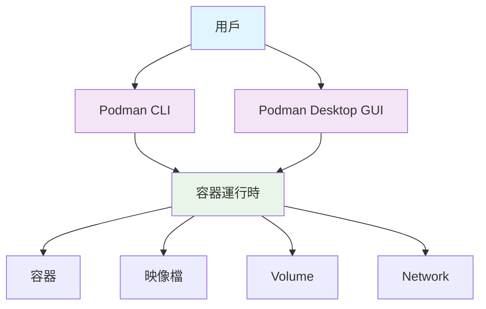

#### 什麼是 Podman Desktop？

**Podman Desktop** 是 Podman 的圖形化使用者介面，提供直觀的容器管理體驗。

##### 主要功能：
- 📱 **視覺化管理**：圖形化操作介面
- 🔧 **整合開發**：與開發工具無縫整合
- 📊 **監控面板**：即時監控容器狀態
- 🚀 **一鍵部署**：簡化部署流程

#### 實務案例：開發環境隔離

假設您正在開發一個 Java 專案，需要：
- Java 17 運行環境
- PostgreSQL 14 資料庫
- Redis 快取服務

使用 Podman Desktop 可以輕鬆建立隔離的開發環境：

```bash
# 建立開發環境 Pod
podman pod create --name dev-env --publish 8080:8080 --publish 5432:5432

# 啟動 PostgreSQL 容器
podman run -d --pod dev-env \
  --name postgres \
  -e POSTGRES_PASSWORD=password \
  postgres:14

# 啟動 Redis 容器
podman run -d --pod dev-env \
  --name redis \
  redis:7-alpine
```

#### ⚠️ 注意事項
- Podman Desktop 需要管理員權限進行初始設定
- Windows 環境需要 WSL2 支援
- 建議定期更新以獲得最新功能與安全修復

---

### 1.2 與 Docker 的比較

#### 🎯 學習目標
- 了解 Podman 與 Docker 的差異
- 選擇適合的容器化解決方案
- 理解遷移考量因素

#### 架構比較

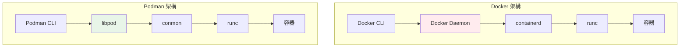

#### 詳細對比表

| 特性 | Docker | Podman | 說明 |
|------|--------|--------|------|
| **架構** | 守護程序架構 | 無守護程序 | Podman 直接與容器運行時通信 |
| **安全性** | 需要 root 權限 | 支援無根執行 | Podman 可在一般用戶權限下運行 |
| **指令相容性** | Docker CLI | 相容 Docker CLI | 大部分 Docker 指令可直接使用 |
| **Pod 支援** | ❌ | ✅ | Podman 原生支援 Kubernetes Pod 概念 |
| **系統整合** | systemd 整合有限 | 原生 systemd 支援 | 更好的 Linux 系統整合 |
| **企業支援** | Docker Inc. | Red Hat | 不同的商業支援模式 |

#### 指令對照範例

```bash
# Docker 指令
docker run -d --name web nginx
docker ps
docker stop web
docker rm web

# Podman 指令（完全相同）
podman run -d --name web nginx
podman ps
podman stop web
podman rm web
```

#### 選擇建議

**選擇 Podman 的情境：**
- 🔒 重視安全性（無根容器）
- 🏢 企業環境（Red Hat 支援）
- 🐧 Linux 原生整合需求
- ☸️ Kubernetes 部署準備

**選擇 Docker 的情境：**
- 🌐 社群生態系豐富
- 📚 學習資源充足
- 🔄 現有 Docker 工作流程
- 👥 團隊已熟悉 Docker

#### 🔄 遷移建議

從 Docker 遷移到 Podman 的步驟：

1. **評估現況**
   ```bash
   # 列出現有 Docker 容器
   docker ps -a
   
   # 檢查映像檔
   docker images
   ```

2. **建立 alias（過渡期）**
   ```bash
   # 在 ~/.bashrc 或 ~/.zshrc 中加入
   alias docker=podman
   ```

3. **逐步遷移**
   - 先在開發環境測試
   - 驗證 Dockerfile 相容性
   - 更新 CI/CD 腳本

#### ⚠️ 注意事項
- Docker Compose 在 Podman 4.0+ 版本才完全支援
- 某些 Docker 特定功能可能需要調整
- 建議在非關鍵環境先行測試

---

### 1.3 安裝 Podman Desktop

#### 🎯 學習目標
- 完成 Windows 10/11 環境的 Podman Desktop 安裝
- 配置必要的系統設定
- 驗證安裝是否成功

#### 系統需求

**最低需求：**
- Windows 10 Build 19041 以上 或 Windows 11
- 8GB RAM（建議 16GB）
- 50GB 可用磁碟空間
- 啟用 WSL 2
- 啟用虛擬化技術

**檢查系統需求：**

```powershell
# 檢查 Windows 版本
Get-ComputerInfo | Select-Object WindowsProductName, WindowsVersion

# 檢查虛擬化支援
Get-ComputerInfo | Select-Object HyperVRequirementVirtualizationFirmwareEnabled

# 檢查記憶體
Get-ComputerInfo | Select-Object TotalPhysicalMemory
```

#### 安裝步驟

##### 步驟 1：啟用 WSL 2

```powershell
# 以管理員身份執行 PowerShell

# 啟用 WSL 功能
dism.exe /online /enable-feature /featurename:Microsoft-Windows-Subsystem-Linux /all /norestart

# 啟用虛擬機器平台
dism.exe /online /enable-feature /featurename:VirtualMachinePlatform /all /norestart

# 重新啟動電腦
Restart-Computer
```

重啟後繼續：

```powershell
# 設定 WSL 2 為預設版本
wsl --set-default-version 2

# 安裝 Ubuntu（可選，但建議）
wsl --install -d Ubuntu-22.04
```

##### 步驟 2：下載並安裝 Podman Desktop

1. **官方下載**
   - 前往：https://podman-desktop.io/downloads
   - 選擇 Windows 版本下載

2. **使用 Winget 安裝（推薦）**
   ```powershell
   # 使用 Windows Package Manager
   winget install RedHat.Podman-Desktop
   ```

3. **使用 Chocolatey 安裝**
   ```powershell
   # 如果已安裝 Chocolatey
   choco install podman-desktop
   ```

##### 步驟 3：初始設定

1. **啟動 Podman Desktop**
   - 從開始選單啟動
   - 首次啟動會進行初始化設定

2. **設定 Podman 引擎**
   ```powershell
   # 檢查 Podman 是否正確安裝
   podman --version
   
   # 初始化 Podman 機器（Windows 必要）
   podman machine init
   
   # 啟動 Podman 機器
   podman machine start
   ```

3. **驗證安裝**
   ```powershell
   # 測試容器執行
   podman run hello-world
   
   # 檢查系統資訊
   podman system info
   ```

#### 設定流程圖

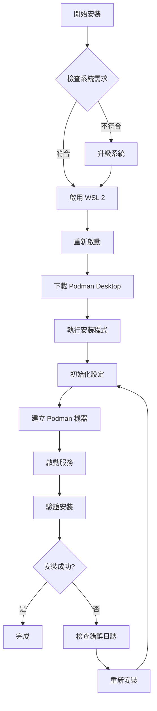

#### 常見問題排除

**問題 1：WSL 2 安裝失敗**
```powershell
# 檢查 Windows 版本
winver

# 手動下載 WSL 2 核心更新
# https://aka.ms/wsl2kernel
```

**問題 2：虛擬化未啟用**
- 進入 BIOS 設定
- 啟用 Intel VT-x 或 AMD-V
- 啟用 Hyper-V（在 Windows 功能中）

**問題 3：權限問題**
```powershell
# 確保以管理員身份執行
Start-Process powershell -Verb runAs
```

#### 驗證清單

- [ ] Windows 版本符合需求
- [ ] WSL 2 正常運作
- [ ] Podman Desktop 安裝完成
- [ ] Podman 機器啟動成功
- [ ] 可以執行基本容器
- [ ] GUI 介面正常顯示

#### ⚠️ 注意事項
- 安裝過程中需要重新啟動電腦
- 確保網路連線穩定，下載過程可能較長
- 企業環境可能需要設定代理伺服器
- 建議關閉防毒軟體的即時掃描（安裝期間）

---

### 1.4 基本操作介面導覽

#### 🎯 學習目標
- 熟悉 Podman Desktop 的使用者介面
- 掌握各功能區域的用途
- 學會基本的 GUI 操作

#### 主介面概覽

Podman Desktop 的主介面分為幾個主要區域：

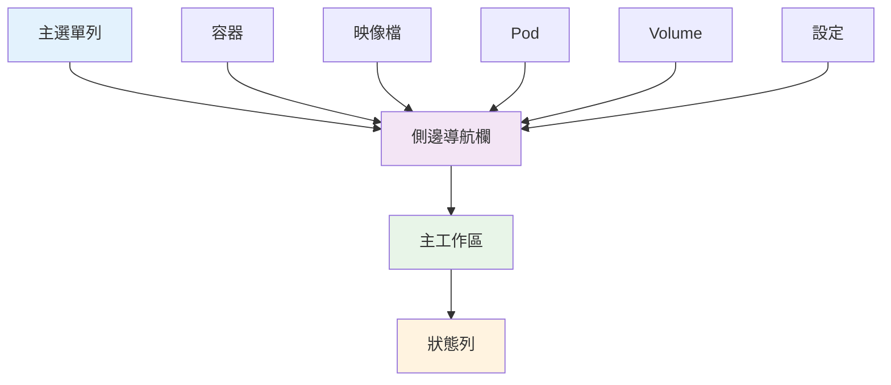

#### 1.4.1 側邊導航欄功能

##### 🐳 容器管理
- **All Containers**：檢視所有容器
- **Running**：執行中的容器
- **Stopped**：已停止的容器
- **Created**：已建立但未啟動的容器

##### 📦 映像檔管理
- **Local Images**：本地映像檔列表
- **Pull Images**：下載新映像檔
- **Build Images**：建置自訂映像檔

##### ☸️ Pod 管理
- **All Pods**：Pod 列表與狀態
- **Create Pod**：建立新的 Pod

##### 💾 儲存管理
- **Volumes**：持久化儲存管理
- **Networks**：網路設定管理

#### 1.4.2 容器檢視詳解

當點擊「容器」頁面時，您會看到：

**容器列表欄位：**
- **Name**：容器名稱
- **Image**：使用的映像檔
- **Status**：運行狀態
- **Created**：建立時間
- **Actions**：操作按鈕

**狀態指示器：**
- 🟢 **Running**：容器正在執行
- 🔴 **Stopped**：容器已停止
- 🟡 **Paused**：容器已暫停
- ⚪ **Created**：容器已建立但未啟動

#### 1.4.3 基本操作示範

##### 建立第一個容器

1. **透過 GUI 建立**
   - 點擊「Images」→「Pull Images」
   - 搜尋：`nginx`
   - 點擊「Pull」下載
   - 下載完成後，點擊映像檔旁的「Run」
   - 設定容器名稱：`my-web-server`
   - 設定埠號對應：`8080:80`
   - 點擊「Start Container」

2. **檢視容器狀態**
   ```bash
   # CLI 對照指令
   podman ps
   ```

3. **存取服務**
   - 開啟瀏覽器
   - 前往：http://localhost:8080
   - 應該看到 Nginx 歡迎頁面

##### 容器生命週期管理

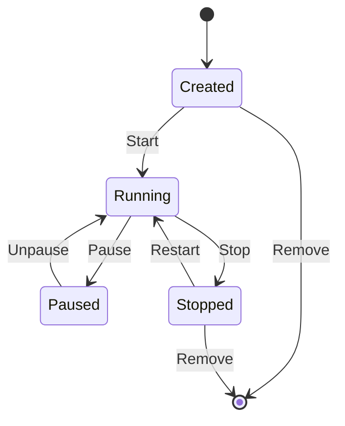

**透過 GUI 操作：**
- **▶️ Start**：啟動容器
- **⏸️ Pause**：暫停容器
- **⏹️ Stop**：停止容器
- **🔄 Restart**：重新啟動
- **🗑️ Delete**：刪除容器

#### 1.4.4 映像檔管理介面

##### 映像檔操作

1. **搜尋與下載映像檔**
   - 點擊「Images」→「Pull Images」
   - 在搜尋框輸入映像檔名稱
   - 選擇標籤（Tag）
   - 點擊「Pull」開始下載

2. **檢視映像檔詳細資訊**
   - 點擊映像檔名稱
   - 查看：
     - Size（大小）
     - Layers（層級結構）
     - Created（建立時間）
     - Tags（標籤）

3. **建置自訂映像檔**
   - 點擊「Build Image」
   - 選擇 Dockerfile 位置
   - 設定建置標籤
   - 監控建置進度

#### 1.4.5 設定與偏好

##### 一般設定

前往「Settings」→「Preferences」：

**Resources（資源設定）**
- CPU 核心數量
- 記憶體分配
- 磁碟空間限制

**Docker Compatibility（Docker 相容性）**
```bash
# 啟用 Docker Socket 相容性
podman system service --time=0 unix:///var/run/docker.sock
```

**Experimental Features（實驗性功能）**
- Kubernetes YAML 支援
- 進階網路功能
- 監控與日誌增強

#### 1.4.6 監控與日誌

##### 即時監控

1. **容器資源使用**
   - 選擇執行中的容器
   - 點擊「Stats」標籤
   - 查看 CPU、記憶體、網路使用情況

2. **容器日誌**
   - 選擇容器
   - 點擊「Logs」標籤
   - 即時查看應用程式輸出

```bash
# CLI 對照指令
podman logs -f container-name
podman stats container-name
```

#### 實務練習

**練習 1：建立 Web 服務容器**
1. 下載 `httpd` 映像檔
2. 建立名為 `apache-web` 的容器
3. 對應埠號 `8081:80`
4. 測試存取服務

**練習 2：管理容器生命週期**
1. 啟動容器
2. 暫停容器
3. 恢復執行
4. 停止並移除容器

#### ⚠️ 介面使用注意事項

- 🔄 某些操作可能需要幾秒鐘完成，請耐心等待
- 📊 資源監控數據每 2-3 秒更新一次
- 🔍 使用搜尋功能快速找到特定容器或映像檔
- 💡 右鍵點擊項目可能有額外的操作選項
- ⚙️ 定期檢查設定，確保資源配置適當

---

## 2. 專案實務應用

### 2.1 在專案中使用 Podman Desktop

#### 🎯 學習目標
- 學會在實際專案中整合 Podman Desktop
- 掌握開發環境容器化最佳實務
- 建立可重複使用的開發環境

#### 2.1.1 Java 開發環境容器化

在本 Java 教學專案中，我們可以使用 Podman Desktop 建立一致的開發環境。

##### 建立 Java 開發容器

**方式一：使用 GUI 建立**

1. **搜尋 Java 映像檔**
   - 開啟 Podman Desktop
   - 點擊「Images」→「Pull Images」
   - 搜尋：`openjdk:17-jdk`
   - 點擊「Pull」下載

2. **建立開發容器**
   ```bash
   # CLI 對照指令
   podman run -it --name java-dev \
     -v /d/developer/repos/java_tutorial:/workspace \
     -w /workspace \
     openjdk:17-jdk bash
   ```

**方式二：使用 Dockerfile**

建立 `Dockerfile.dev`：

```dockerfile
FROM openjdk:17-jdk

# 安裝開發工具
RUN apt-get update && apt-get install -y \
    git \
    maven \
    curl \
    vim \
    && rm -rf /var/lib/apt/lists/*

# 設定工作目錄
WORKDIR /workspace

# 複製專案設定檔
COPY pom.xml .
RUN mvn dependency:go-offline

# 設定環境變數
ENV JAVA_HOME=/usr/local/openjdk-17
ENV MAVEN_HOME=/usr/share/maven

CMD ["bash"]
```

透過 Podman Desktop 建置：
- 點擊「Images」→「Build Image」
- 選擇 Dockerfile.dev
- 標籤：`java-tutorial:dev`
- 點擊「Build」

##### 專案結構整合

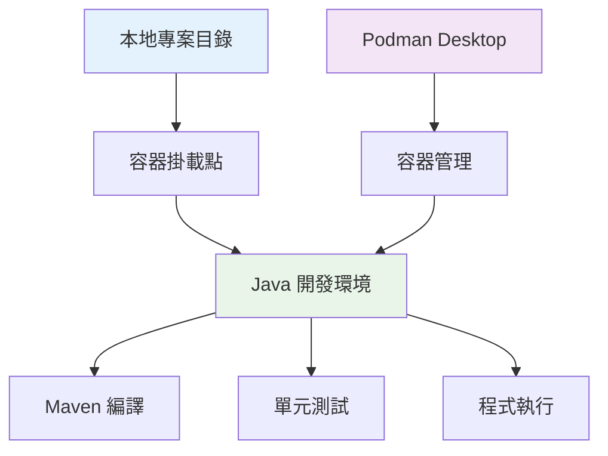

#### 2.1.2 多容器開發環境

實際專案通常需要多個服務，我們可以使用 Pod 來組織：

##### 建立完整開發環境 Pod

```bash
# 建立開發環境 Pod
podman pod create --name dev-env \
  --publish 8080:8080 \
  --publish 5432:5432 \
  --publish 6379:6379

# Java 應用容器
podman run -d --pod dev-env \
  --name java-app \
  -v /d/developer/repos/java_tutorial:/workspace \
  -w /workspace \
  java-tutorial:dev \
  mvn spring-boot:run

# PostgreSQL 資料庫
podman run -d --pod dev-env \
  --name postgres \
  -e POSTGRES_DB=tutorial \
  -e POSTGRES_USER=dev \
  -e POSTGRES_PASSWORD=devpass \
  -v postgres-data:/var/lib/postgresql/data \
  postgres:14

# Redis 快取
podman run -d --pod dev-env \
  --name redis \
  redis:7-alpine
```

**透過 Podman Desktop 操作：**

1. **建立 Pod**
   - 點擊「Pods」→「Create Pod」
   - 名稱：`dev-env`
   - 埠號對應：`8080:8080,5432:5432,6379:6379`

2. **加入容器到 Pod**
   - 在建立容器時選擇「Add to Pod」
   - 選擇 `dev-env` Pod

#### 2.1.3 開發工作流程

##### 日常開發流程

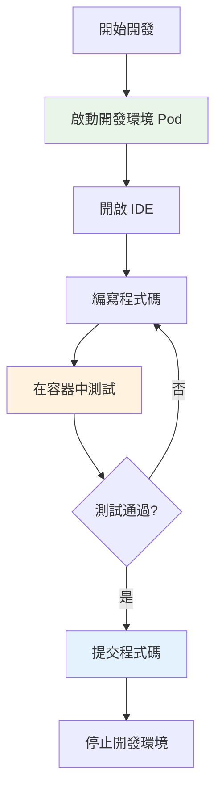

**具體操作步驟：**

1. **啟動開發環境**
   ```bash
   # 一鍵啟動所有服務
   podman pod start dev-env
   ```

2. **連接服務進行開發**
   - 資料庫連線：`localhost:5432`
   - Redis 連線：`localhost:6379`
   - 應用程式：`http://localhost:8080`

3. **即時測試與除錯**
   ```bash
   # 在容器中執行測試
   podman exec -it java-app mvn test
   
   # 檢視應用程式日誌
   podman logs -f java-app
   ```

4. **結束開發**
   ```bash
   # 停止整個 Pod
   podman pod stop dev-env
   ```

#### 2.1.4 環境配置管理

##### 使用 Podman Compose

建立 `docker-compose.yml`（Podman 4.0+ 支援）：

```yaml
version: '3.8'

services:
  java-app:
    build:
      context: .
      dockerfile: Dockerfile.dev
    ports:
      - "8080:8080"
    volumes:
      - .:/workspace
    working_dir: /workspace
    depends_on:
      - postgres
      - redis
    environment:
      - SPRING_PROFILES_ACTIVE=dev
      - DB_HOST=postgres
      - REDIS_HOST=redis

  postgres:
    image: postgres:14
    environment:
      POSTGRES_DB: tutorial
      POSTGRES_USER: dev
      POSTGRES_PASSWORD: devpass
    volumes:
      - postgres-data:/var/lib/postgresql/data
    ports:
      - "5432:5432"

  redis:
    image: redis:7-alpine
    ports:
      - "6379:6379"

volumes:
  postgres-data:
```

**透過 Podman Desktop 使用：**
- 點擊「Compose」→「Start Compose」
- 選擇 `docker-compose.yml` 文件
- 監控所有服務狀態

##### 環境變數管理

建立 `.env` 檔案：

```bash
# 資料庫設定
DB_HOST=postgres
DB_PORT=5432
DB_NAME=tutorial
DB_USER=dev
DB_PASSWORD=devpass

# Redis 設定
REDIS_HOST=redis
REDIS_PORT=6379

# 應用程式設定
APP_PORT=8080
LOG_LEVEL=DEBUG
```

#### ⚠️ 專案整合注意事項

- 📂 確保專案檔案權限正確設定
- 🔄 定期更新基礎映像檔以獲得安全修復
- 💾 重要資料使用 Volume 持久化儲存
- 🌐 網路設定要考慮安全性
- 🔧 環境變數不要包含敏感資訊

---

### 2.2 容器管理實務

#### 🎯 學習目標
- 掌握容器生命週期管理
- 學會容器監控與除錯
- 了解容器資源優化技巧

#### 2.2.1 容器生命週期管理

##### 建立與啟動容器

**最佳實務範例：**

```bash
# 建立具名容器並設定標籤
podman run -d \
  --name web-server \
  --label "environment=development" \
  --label "project=java-tutorial" \
  --publish 8080:80 \
  --restart unless-stopped \
  nginx:alpine
```

**透過 Podman Desktop：**
1. 選擇映像檔點擊「Run」
2. 設定容器名稱與標籤
3. 配置埠號對應
4. 選擇重啟策略
5. 點擊「Start Container」

##### 容器狀態管理

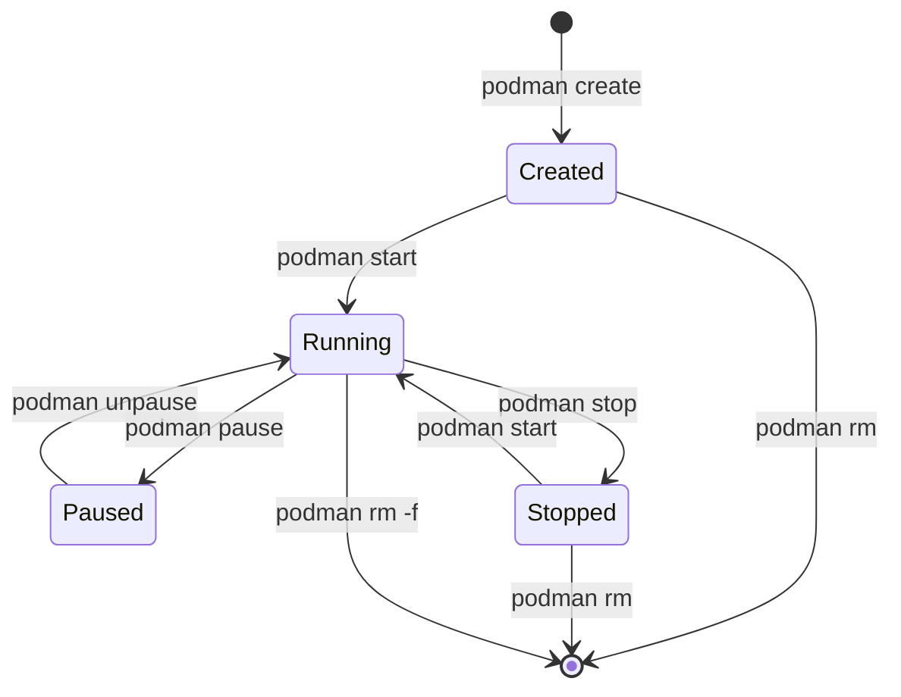

**GUI 操作對照：**
- **建立**：Images → Run → 設定參數
- **啟動**：Containers → 選擇容器 → Start
- **暫停**：Containers → 選擇容器 → Pause
- **停止**：Containers → 選擇容器 → Stop
- **刪除**：Containers → 選擇容器 → Delete

#### 2.2.2 容器監控與除錯

##### 即時監控

**資源使用監控：**

```bash
# 監控容器資源使用
podman stats web-server

# 監控所有容器
podman stats --all
```

**透過 Podman Desktop：**
- 選擇容器 → 點擊「Stats」標籤
- 查看 CPU、記憶體、網路、I/O 使用情況
- 設定監控警告閾值

##### 日誌管理

**檢視容器日誌：**

```bash
# 即時查看日誌
podman logs -f web-server

# 查看最近 100 行日誌
podman logs --tail 100 web-server

# 查看特定時間範圍的日誌
podman logs --since "2025-01-01T00:00:00Z" web-server
```

**GUI 日誌檢視：**
- 選擇容器 → 點擊「Logs」標籤
- 使用過濾器搜尋特定內容
- 設定日誌自動重新整理

##### 容器除錯

**進入容器進行除錯：**

```bash
# 進入執行中的容器
podman exec -it web-server /bin/bash

# 以 root 使用者進入
podman exec -it --user root web-server /bin/bash

# 執行特定指令
podman exec web-server cat /etc/nginx/nginx.conf
```

**透過 Podman Desktop：**
- 選擇容器 → 點擊「Terminal」標籤
- 在容器內執行除錯指令

#### 2.2.3 容器資源優化

##### 記憶體與 CPU 限制

```bash
# 設定資源限制
podman run -d \
  --name limited-app \
  --memory="512m" \
  --cpus="1.5" \
  --memory-swap="1g" \
  java-tutorial:dev
```

**透過 GUI 設定：**
- 建立容器時 → 點擊「Advanced」
- 設定 Memory Limit、CPU Limit
- 配置 Swap 使用限制

##### 健康檢查

**定義健康檢查：**

```dockerfile
# 在 Dockerfile 中定義
HEALTHCHECK --interval=30s --timeout=3s --start-period=5s --retries=3 \
  CMD curl -f http://localhost:8080/health || exit 1
```

```bash
# 執行時定義健康檢查
podman run -d \
  --name web-app \
  --health-cmd="curl -f http://localhost:8080/health || exit 1" \
  --health-interval=30s \
  --health-timeout=3s \
  --health-retries=3 \
  java-tutorial:dev
```

##### 自動重啟策略

```bash
# 設定重啟策略
podman run -d \
  --name resilient-app \
  --restart=unless-stopped \
  java-tutorial:dev
```

**重啟策略說明：**
- `no`：不自動重啟（預設）
- `always`：總是重啟
- `unless-stopped`：除非手動停止否則重啟
- `on-failure`：失敗時重啟

#### 2.2.4 容器安全管理

##### 使用者權限控制

```bash
# 以非 root 使用者執行
podman run -d \
  --name secure-app \
  --user 1000:1000 \
  --read-only \
  --tmpfs /tmp \
  java-tutorial:dev
```

##### 網路安全

```bash
# 建立自訂網路
podman network create --driver bridge secure-network

# 在隔離網路中執行容器
podman run -d \
  --name isolated-app \
  --network secure-network \
  java-tutorial:dev
```

##### Secrets 管理

```bash
# 建立 secret
echo "super-secret-password" | podman secret create db-password -

# 在容器中使用 secret
podman run -d \
  --name app-with-secret \
  --secret db-password \
  java-tutorial:dev
```

#### 2.2.5 容器備份與還原

##### 備份容器

```bash
# 建立容器快照
podman commit web-server web-server-backup:$(date +%Y%m%d)

# 匯出容器為 tar 檔
podman export web-server > web-server-backup.tar

# 匯出映像檔
podman save web-server-backup:20250831 > web-server-image.tar
```

##### 還原容器

```bash
# 從 tar 檔匯入
podman import web-server-backup.tar web-server:restored

# 載入映像檔
podman load < web-server-image.tar
```

#### ⚠️ 容器管理注意事項

- 🔒 定期更新容器映像檔以獲得安全修復
- 📊 監控容器資源使用，避免影響主機效能
- 🗑️ 定期清理無用的容器和映像檔
- 💾 重要資料使用 Volume 或 Bind Mount 保存
- 🌐 適當配置網路安全策略

---

### 2.3 映像檔管理

#### 🎯 學習目標
- 掌握映像檔的建置與管理
- 學會優化映像檔大小與安全性
- 建立映像檔版本控制策略

#### 2.3.1 映像檔基礎操作

##### 搜尋與下載映像檔

**透過 CLI：**

```bash
# 搜尋映像檔
podman search java

# 下載特定版本
podman pull openjdk:17-jdk-alpine

# 下載所有標籤
podman pull --all-tags nginx
```

**透過 Podman Desktop：**
1. 點擊「Images」→「Pull Images」
2. 搜尋：`openjdk`
3. 選擇版本：`17-jdk-alpine`
4. 點擊「Pull」開始下載

##### 檢視映像檔資訊

```bash
# 列出本地映像檔
podman images

# 檢視映像檔詳細資訊
podman inspect openjdk:17-jdk-alpine

# 檢視映像檔歷史
podman history openjdk:17-jdk-alpine

# 檢視映像檔層級
podman image tree openjdk:17-jdk-alpine
```

#### 2.3.2 建置自訂映像檔

##### Dockerfile 最佳實務

**Java 應用程式 Dockerfile 範例：**

```dockerfile
# 多階段建置 - 編譯階段
FROM maven:3.8.6-openjdk-17 AS builder

WORKDIR /app
COPY pom.xml .
RUN mvn dependency:go-offline

COPY src ./src
RUN mvn clean package -DskipTests

# 多階段建置 - 運行階段
FROM openjdk:17-jre-alpine

# 安全性：建立非 root 使用者
RUN addgroup -g 1001 -S appgroup && \
    adduser -u 1001 -S appuser -G appgroup

# 安裝必要工具
RUN apk add --no-cache curl

WORKDIR /app

# 複製編譯後的 JAR 檔
COPY --from=builder /app/target/*.jar app.jar

# 設定檔案權限
RUN chown -R appuser:appgroup /app

# 切換到非 root 使用者
USER appuser

# 健康檢查
HEALTHCHECK --interval=30s --timeout=3s --start-period=10s --retries=3 \
    CMD curl -f http://localhost:8080/actuator/health || exit 1

# 暴露埠號
EXPOSE 8080

# 啟動指令
ENTRYPOINT ["java", "-jar", "/app/app.jar"]
```

##### 透過 Podman Desktop 建置

1. **準備建置環境**
   - 點擊「Images」→「Build Image」
   - 選擇包含 Dockerfile 的目錄

2. **設定建置參數**
   - Image Name：`java-tutorial`
   - Tag：`v1.0.0`
   - Build Args（如需要）

3. **監控建置過程**
   - 查看建置日誌
   - 監控建置進度
   - 檢查錯誤訊息

#### 2.3.3 映像檔優化

##### 減少映像檔大小

**優化策略對比：**

```dockerfile
# ❌ 不良實務
FROM openjdk:17-jdk
RUN apt-get update
RUN apt-get install -y curl
RUN apt-get install -y vim
COPY app.jar /app.jar

# ✅ 最佳實務
FROM openjdk:17-jre-alpine
RUN apk add --no-cache curl && \
    rm -rf /var/cache/apk/*
COPY app.jar /app.jar
```

**大小比較：**

| 映像檔類型 | 大小 | 說明 |
|-----------|------|------|
| openjdk:17-jdk | ~680MB | 完整 JDK |
| openjdk:17-jre | ~470MB | 僅 JRE |
| openjdk:17-jre-alpine | ~180MB | Alpine Linux |
| 自訂最小化 | ~150MB | 移除非必要元件 |

##### .dockerignore 設定

建立 `.dockerignore` 檔案：

```gitignore
# Git 檔案
.git
.gitignore

# IDE 檔案
.vscode
.idea
*.iml

# 建置產物
target/
*.log

# 測試檔案
src/test/

# 文件檔案
docs/
README.md
```

#### 2.3.4 映像檔安全性

##### 安全掃描

```bash
# 使用 Podman 內建掃描
podman build --security-opt label=disable -t secure-app .

# 檢查映像檔弱點
podman run --rm -v /var/run/docker.sock:/var/run/docker.sock \
  aquasec/trivy image java-tutorial:v1.0.0
```

##### 安全最佳實務

```dockerfile
# 1. 使用官方基礎映像檔
FROM openjdk:17-jre-alpine

# 2. 定期更新套件
RUN apk update && apk upgrade && \
    apk add --no-cache curl && \
    rm -rf /var/cache/apk/*

# 3. 建立非 root 使用者
RUN addgroup -g 1001 -S appgroup && \
    adduser -u 1001 -S appuser -G appgroup

# 4. 設定適當的檔案權限
COPY --chown=appuser:appgroup app.jar /app/app.jar

# 5. 切換到非 root 使用者
USER appuser

# 6. 使用特定版本而非 latest
# 在 CI/CD 中使用具體版本標籤
```

#### 2.3.5 映像檔版本控制

##### 標籤策略

```bash
# 版本標籤策略
podman tag java-tutorial:latest java-tutorial:v1.0.0
podman tag java-tutorial:latest java-tutorial:1.0
podman tag java-tutorial:latest java-tutorial:1
podman tag java-tutorial:latest java-tutorial:stable

# 環境標籤
podman tag java-tutorial:latest java-tutorial:dev
podman tag java-tutorial:latest java-tutorial:staging
podman tag java-tutorial:latest java-tutorial:prod
```

##### 映像檔推送與分享

```bash
# 推送到 Registry
podman push java-tutorial:v1.0.0 registry.example.com/java-tutorial:v1.0.0

# 匯出映像檔
podman save java-tutorial:v1.0.0 > java-tutorial-v1.0.0.tar

# 分享映像檔
scp java-tutorial-v1.0.0.tar user@server:/tmp/
```

#### 2.3.6 映像檔清理與維護

##### 自動清理

```bash
# 清理無標籤映像檔
podman image prune

# 清理所有無用映像檔
podman image prune -a

# 清理特定時間前的映像檔
podman image prune --filter "until=72h"
```

**透過 Podman Desktop：**
- 點擊「Images」→「Prune Images」
- 選擇清理選項
- 確認清理操作

##### 映像檔分析

```bash
# 分析映像檔層級
podman image tree java-tutorial:v1.0.0

# 檢視映像檔佔用空間
podman system df

# 詳細空間分析
podman system df -v
```

#### ⚠️ 映像檔管理注意事項

- 🏷️ 使用有意義的標籤命名策略
- 🔒 定期掃描映像檔安全弱點
- 📦 優化映像檔大小以提升部署速度
- 🗑️ 定期清理無用的映像檔
- 📋 記錄映像檔建置過程與相依性

---

## 第二部分總結

在專案實務應用章節中，我們已經涵蓋了：

1. **專案整合實務**：Java 開發環境容器化
2. **容器管理**：生命週期管理、監控除錯、資源優化
3. **映像檔管理**：建置、優化、安全性、版本控制

---

### 2.4 Volume 與 Network 管理

#### 🎯 學習目標
- 掌握 Volume 的建立與管理
- 理解 Network 的配置與最佳實務
- 學會資料持久化與網路隔離策略

#### 2.4.1 Volume 管理

##### Volume 類型與用途

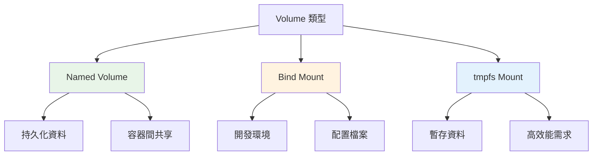

##### 建立與管理 Named Volume

**透過 CLI 操作：**

```bash
# 建立 Named Volume
podman volume create postgres-data

# 檢視 Volume 詳細資訊
podman volume inspect postgres-data

# 列出所有 Volume
podman volume ls

# 使用 Volume
podman run -d --name postgres \
  -v postgres-data:/var/lib/postgresql/data \
  -e POSTGRES_PASSWORD=password \
  postgres:14
```

**透過 Podman Desktop：**

1. **建立 Volume**
   - 點擊「Volumes」→「Create Volume」
   - 名稱：`postgres-data`
   - 標籤：`project=java-tutorial`

2. **使用 Volume**
   - 建立容器時選擇「Volumes」
   - 選擇 `postgres-data`
   - 掛載點：`/var/lib/postgresql/data`

##### Bind Mount 實務應用

**開發環境範例：**

```bash
# Windows 路徑 Bind Mount
podman run -it --name dev-env \
  -v "D:\developer\repos\java_tutorial:/workspace:Z" \
  -w /workspace \
  openjdk:17-jdk bash
```

**注意事項：**
- Windows 使用絕對路徑
- `:Z` 選項用於 SELinux 標籤
- 開發時使用 Bind Mount，生產環境使用 Named Volume

##### Volume 備份與還原

```bash
# 備份 Volume 資料
podman run --rm \
  -v postgres-data:/data \
  -v "D:\backups:/backup" \
  alpine tar czf /backup/postgres-backup-$(date +%Y%m%d).tar.gz -C /data .

# 還原 Volume 資料
podman run --rm \
  -v postgres-data:/data \
  -v "D:\backups:/backup" \
  alpine tar xzf /backup/postgres-backup-20250831.tar.gz -C /data
```

#### 2.4.2 Network 管理

##### 網路架構概覽

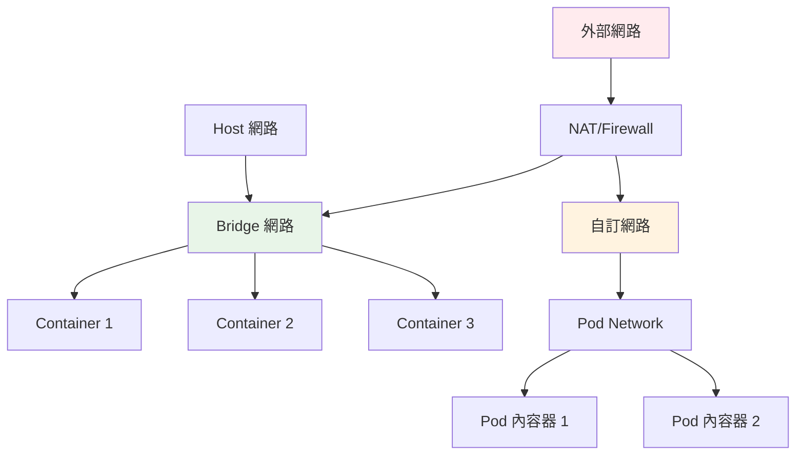

##### 建立自訂網路

**基本網路建立：**

```bash
# 建立 Bridge 網路
podman network create --driver bridge webapp-network

# 建立具有特定子網的網路
podman network create \
  --driver bridge \
  --subnet 172.20.0.0/16 \
  --gateway 172.20.0.1 \
  isolated-network

# 檢視網路詳細資訊
podman network inspect webapp-network
```

**透過 Podman Desktop：**

1. **建立網路**
   - 點擊「Networks」→「Create Network」
   - 名稱：`webapp-network`
   - Driver：`bridge`
   - 子網：`172.20.0.0/16`

2. **網路設定**
   - Gateway：`172.20.0.1`
   - IPAM 配置
   - DNS 設定

##### 容器網路連接

```bash
# 在建立容器時指定網路
podman run -d --name web-app \
  --network webapp-network \
  nginx:alpine

# 將現有容器連接到網路
podman network connect webapp-network existing-container

# 從網路中斷開容器
podman network disconnect webapp-network existing-container
```

##### 多容器網路通信

**實務範例：Web 應用程式 + 資料庫**

```bash
# 建立應用網路
podman network create app-network

# 啟動資料庫容器
podman run -d --name database \
  --network app-network \
  -e POSTGRES_DB=appdb \
  -e POSTGRES_USER=appuser \
  -e POSTGRES_PASSWORD=apppass \
  postgres:14

# 啟動應用程式容器
podman run -d --name webapp \
  --network app-network \
  -p 8080:8080 \
  -e DB_HOST=database \
  -e DB_PORT=5432 \
  java-tutorial:latest
```

**容器間通信：**
- 使用容器名稱作為主機名稱
- 在同一網路內可直接通信
- 無需暴露不必要的埠號

#### 2.4.3 網路安全策略

##### 網路隔離

```bash
# 建立隔離的網路環境
podman network create --internal secure-network

# 在隔離網路中運行敏感服務
podman run -d --name secure-service \
  --network secure-network \
  sensitive-app:latest
```

##### 防火牆規則

```bash
# 限制容器網路存取
podman run -d --name restricted-app \
  --network none \
  --add-host=api.example.com:192.168.1.100 \
  app:latest

# 使用 Slirp4netns 進行使用者網路
podman run -d --name user-network-app \
  --network slirp4netns \
  app:latest
```

#### 2.4.4 儲存與網路監控

##### 監控 Volume 使用

```bash
# 檢視 Volume 使用情況
podman system df -v

# 檢視特定 Volume 的掛載點
podman volume inspect postgres-data --format "{{.Mountpoint}}"

# 監控 Volume 空間使用
du -sh $(podman volume inspect postgres-data --format "{{.Mountpoint}}")
```

##### 網路流量監控

```bash
# 檢視容器網路統計
podman stats --format "table {{.Container}}\t{{.NetIO}}"

# 檢視網路介面
podman exec container-name ip addr show
```

#### 2.4.5 故障排除

##### Volume 相關問題

**問題：權限錯誤**

```bash
# 檢查檔案權限
podman exec -it container-name ls -la /mount/point

# 修正權限問題
podman exec -it --user root container-name chown -R user:group /mount/point
```

**問題：Volume 無法掛載**

```bash
# 檢查 Volume 狀態
podman volume inspect volume-name

# 重新建立 Volume
podman volume rm volume-name
podman volume create volume-name
```

##### 網路相關問題

**問題：容器無法通信**

```bash
# 檢查網路連接
podman network ls
podman network inspect network-name

# 測試網路連通性
podman exec container1 ping container2
podman exec container1 nslookup container2
```

**問題：埠號衝突**

```bash
# 檢查埠號使用
netstat -tulpn | grep 8080

# 變更埠號對應
podman run -p 8081:8080 app:latest
```

#### ⚠️ Volume 與 Network 注意事項

- 💾 定期備份重要的 Volume 資料
- 🔒 適當設定網路隔離策略
- 📊 監控儲存空間使用情況
- 🌐 避免不必要的埠號暴露
- 🔧 使用有意義的命名規則

---

### 2.5 IDE 整合

#### 🎯 學習目標
- 整合 Podman Desktop 與 VS Code
- 配置 IntelliJ IDEA 容器開發環境
- 建立高效的容器化開發工作流程

#### 2.5.1 VS Code 整合

##### 安裝必要擴充功能

**必要擴充功能：**

1. **Dev Containers**
   - 提供容器內開發環境
   - 支援遠端容器連接

2. **Podman Desktop Extension**
   - 直接在 VS Code 中管理容器
   - 整合式容器操作

3. **Docker** (可選)
   - 語法高亮與 IntelliSense
   - Dockerfile 支援

```bash
# 透過 CLI 安裝擴充功能
code --install-extension ms-vscode-remote.remote-containers
code --install-extension redhat.vscode-podman
```

##### 設定開發容器

**建立 `.devcontainer/devcontainer.json`：**

```json
{
    "name": "Java Development",
    "image": "openjdk:17-jdk",
    
    "customizations": {
        "vscode": {
            "extensions": [
                "vscjava.vscode-java-pack",
                "redhat.java",
                "vscjava.vscode-maven"
            ],
            "settings": {
                "java.home": "/usr/local/openjdk-17",
                "maven.terminal.useJavaHome": true
            }
        }
    },
    
    "forwardPorts": [8080],
    "mounts": [
        "source=${localWorkspaceFolder},target=/workspace,type=bind,consistency=cached"
    ],
    "workspaceFolder": "/workspace",
    
    "postCreateCommand": "mvn dependency:go-offline",
    
    "remoteUser": "vscode"
}
```

**建立開發容器 Dockerfile：**

```dockerfile
# .devcontainer/Dockerfile
FROM openjdk:17-jdk

# 安裝必要工具
RUN apt-get update && apt-get install -y \
    git \
    curl \
    wget \
    vim \
    && rm -rf /var/lib/apt/lists/*

# 建立 vscode 使用者
RUN groupadd --gid 1000 vscode \
    && useradd --uid 1000 --gid vscode --shell /bin/bash --create-home vscode

# 安裝 Maven
ENV MAVEN_VERSION=3.9.4
RUN curl -fsSL https://archive.apache.org/dist/maven/maven-3/${MAVEN_VERSION}/binaries/apache-maven-${MAVEN_VERSION}-bin.tar.gz \
    | tar xzf - -C /opt \
    && ln -s /opt/apache-maven-${MAVEN_VERSION} /opt/maven

ENV PATH=/opt/maven/bin:$PATH

USER vscode
```

##### 使用開發容器

1. **啟動開發容器**
   - 開啟 VS Code
   - `Ctrl+Shift+P` → "Dev Containers: Reopen in Container"
   - 等待容器建置完成

2. **開發工作流程**
   ```bash
   # 在容器內編譯專案
   mvn compile
   
   # 執行測試
   mvn test
   
   # 啟動應用程式
   mvn spring-boot:run
   ```

3. **除錯設定**

**launch.json 設定：**

```json
{
    "version": "0.2.0",
    "configurations": [
        {
            "type": "java",
            "name": "Debug Java App",
            "request": "launch",
            "mainClass": "com.tutorial.Application",
            "projectName": "java-tutorial",
            "args": "",
            "vmArgs": "-Dspring.profiles.active=dev"
        }
    ]
}
```

#### 2.5.2 IntelliJ IDEA 整合

##### 配置 Podman 支援

1. **啟用 Docker 外掛程式**
   - File → Settings → Plugins
   - 搜尋並啟用 "Docker" 外掛程式

2. **設定 Podman 連接**
   - File → Settings → Build, Execution, Deployment → Docker
   - 點擊 "+" 新增連接
   - 選擇 "Unix socket"
   - Socket path: `unix:///run/user/1000/podman/podman.sock`

##### 容器內開發設定

**建立 Run Configuration：**

1. **Docker 容器設定**
   - Run → Edit Configurations
   - 點擊 "+" → Docker → Docker Image
   - Image ID: `openjdk:17-jdk`
   - Bind mounts: 專案目錄掛載

2. **遠端開發設定**
   ```bash
   # 啟動開發容器
   podman run -d --name idea-dev \
     -v "D:\developer\repos\java_tutorial:/workspace" \
     -w /workspace \
     -p 8080:8080 \
     -p 5005:5005 \
     openjdk:17-jdk tail -f /dev/null
   
   # 進入容器進行開發
   podman exec -it idea-dev bash
   ```

---

## 3. 進階操作與最佳實務

### 3.1 Podman CLI 與 Desktop 搭配使用

#### 🎯 學習目標

- 掌握 CLI 與圖形介面的協同作業
- 學習進階命令列操作技巧
- 了解自動化腳本撰寫

#### 3.1.1 CLI 進階命令操作

##### 系統資訊與診斷

```bash
# 系統資訊檢查
podman system info

# 連接資訊
podman system connection list

# 磁碟使用量分析
podman system df

# 事件監控
podman events --filter type=container

# 系統重置（注意：會清除所有資料）
podman system reset
```

##### 進階容器管理

```bash
# 容器資源使用統計
podman stats --all --no-stream

# 容器程序檢視
podman top container_name

# 容器檔案系統檢查
podman diff container_name

# 執行中容器的檔案複製
podman cp container_name:/app/logs ./logs
podman cp ./config.properties container_name:/app/config/

# 容器匯出與匯入
podman export container_name > container_backup.tar
podman import container_backup.tar new_image:tag
```

##### 映像檔進階操作

```bash
# 映像檔歷史記錄
podman history image_name

# 映像檔圖層分析
podman inspect image_name | jq '.[]Layers'

# 映像檔安全掃描（需要安裝 skopeo）
skopeo inspect docker://registry.access.redhat.com/ubi8/ubi

# 映像檔簽名驗證
podman image trust show
```

#### 3.1.2 PowerShell 腳本自動化

##### 自動部署腳本

```powershell
# deploy-java-app.ps1
param(
    [string]$ImageTag = "latest",
    [string]$ContainerName = "java-tutorial",
    [int]$Port = 8080
)

# 停止並移除舊容器
Write-Host "清理舊容器..." -ForegroundColor Yellow
podman stop $ContainerName -ErrorAction SilentlyContinue
podman rm $ContainerName -ErrorAction SilentlyContinue

# 拉取最新映像檔
Write-Host "拉取映像檔 $ImageTag..." -ForegroundColor Green
podman pull "java-tutorial:$ImageTag"

# 啟動新容器
Write-Host "啟動容器 $ContainerName..." -ForegroundColor Green
podman run -d `
    --name $ContainerName `
    -p "${Port}:8080" `
    -e SPRING_PROFILES_ACTIVE=prod `
    -v "java-tutorial-logs:/app/logs" `
    "java-tutorial:$ImageTag"

# 檢查健康狀態
Start-Sleep -Seconds 10
$status = podman inspect $ContainerName --format "{{.State.Status}}"
if ($status -eq "running") {
    Write-Host "容器啟動成功！" -ForegroundColor Green
    Write-Host "應用程式網址：http://localhost:$Port" -ForegroundColor Cyan
} else {
    Write-Host "容器啟動失敗！" -ForegroundColor Red
    podman logs $ContainerName
}
```

##### 環境管理腳本

```powershell
# manage-environment.ps1
param(
    [ValidateSet("dev", "test", "prod")]
    [string]$Environment = "dev",
    
    [ValidateSet("start", "stop", "restart", "status")]
    [string]$Action = "status"
)

$containers = @{
    "dev" = @("java-tutorial-dev", "postgres-dev", "redis-dev")
    "test" = @("java-tutorial-test", "postgres-test")
    "prod" = @("java-tutorial-prod", "postgres-prod", "redis-prod")
}

function Start-Environment {
    param([string[]]$ContainerList)
    
    foreach ($container in $ContainerList) {
        Write-Host "啟動 $container..." -ForegroundColor Green
        podman start $container
    }
}

function Stop-Environment {
    param([string[]]$ContainerList)
    
    foreach ($container in $ContainerList) {
        Write-Host "停止 $container..." -ForegroundColor Yellow
        podman stop $container
    }
}

function Get-EnvironmentStatus {
    param([string[]]$ContainerList)
    
    Write-Host "=== $Environment 環境狀態 ===" -ForegroundColor Cyan
    foreach ($container in $ContainerList) {
        $status = podman inspect $container --format "{{.State.Status}}" 2>$null
        if ($status) {
            Write-Host "$container : $status" -ForegroundColor Green
        } else {
            Write-Host "$container : 不存在" -ForegroundColor Red
        }
    }
}

# 執行動作
$targetContainers = $containers[$Environment]
switch ($Action) {
    "start" { Start-Environment $targetContainers }
    "stop" { Stop-Environment $targetContainers }
    "restart" { 
        Stop-Environment $targetContainers
        Start-Sleep -Seconds 5
        Start-Environment $targetContainers
    }
    "status" { Get-EnvironmentStatus $targetContainers }
}
```

### 3.2 Compose 支援與多容器應用管理

#### 🎯 學習目標

- 掌握 Docker Compose 在 Podman 中的使用
- 學習多容器應用架構設計
- 了解服務編排與依賴管理

#### 3.2.1 Podman Compose 基礎

##### 安裝與設定

```bash
# 安裝 podman-compose
pip install podman-compose

# 或使用 Docker Compose（需要額外設定）
# 設定環境變數指向 Podman
export DOCKER_HOST=unix:///run/user/$UID/podman/podman.sock
```

##### 基本 Compose 檔案結構

```yaml
# docker-compose.yml
version: '3.8'

services:
  app:
    build: 
      context: .
      dockerfile: Dockerfile
    ports:
      - "8080:8080"
    environment:
      - SPRING_PROFILES_ACTIVE=dev
      - DB_HOST=database
    depends_on:
      - database
      - redis
    volumes:
      - ./logs:/app/logs
    networks:
      - app-network

  database:
    image: postgres:14
    environment:
      POSTGRES_DB: java_tutorial
      POSTGRES_USER: tutorial_user
      POSTGRES_PASSWORD: tutorial_pass
    volumes:
      - postgres_data:/var/lib/postgresql/data
      - ./db/init:/docker-entrypoint-initdb.d
    networks:
      - app-network
    healthcheck:
      test: ["CMD-SHELL", "pg_isready -U tutorial_user"]
      interval: 30s
      timeout: 10s
      retries: 3

  redis:
    image: redis:7-alpine
    command: redis-server --appendonly yes
    volumes:
      - redis_data:/data
    networks:
      - app-network

volumes:
  postgres_data:
  redis_data:

networks:
  app-network:
    driver: bridge
```

#### 3.2.2 實務應用範例

##### 完整的微服務架構

```yaml
# microservices-compose.yml
version: '3.8'

services:
  # API Gateway
  gateway:
    image: nginx:alpine
    ports:
      - "80:80"
      - "443:443"
    volumes:
      - ./nginx/nginx.conf:/etc/nginx/nginx.conf:ro
      - ./nginx/ssl:/etc/nginx/ssl:ro
    depends_on:
      - user-service
      - order-service
    networks:
      - frontend
      - backend

  # 用戶服務
  user-service:
    build:
      context: ./user-service
      dockerfile: Dockerfile
    environment:
      - SPRING_PROFILES_ACTIVE=docker
      - DATABASE_URL=jdbc:postgresql://user-db:5432/userdb
    depends_on:
      user-db:
        condition: service_healthy
    networks:
      - backend
    deploy:
      replicas: 2

  # 訂單服務
  order-service:
    build:
      context: ./order-service  
      dockerfile: Dockerfile
    environment:
      - SPRING_PROFILES_ACTIVE=docker
      - DATABASE_URL=jdbc:postgresql://order-db:5432/orderdb
      - REDIS_URL=redis://redis:6379
    depends_on:
      order-db:
        condition: service_healthy
      redis:
        condition: service_started
    networks:
      - backend

  # 用戶資料庫
  user-db:
    image: postgres:14
    environment:
      POSTGRES_DB: userdb
      POSTGRES_USER: user_svc
      POSTGRES_PASSWORD: user_pass
    volumes:
      - user_db_data:/var/lib/postgresql/data
    networks:
      - backend
    healthcheck:
      test: ["CMD-SHELL", "pg_isready -U user_svc"]
      interval: 30s
      timeout: 10s
      retries: 3

  # 訂單資料庫
  order-db:
    image: postgres:14
    environment:
      POSTGRES_DB: orderdb
      POSTGRES_USER: order_svc
      POSTGRES_PASSWORD: order_pass
    volumes:
      - order_db_data:/var/lib/postgresql/data
    networks:
      - backend
    healthcheck:
      test: ["CMD-SHELL", "pg_isready -U order_svc"]
      interval: 30s
      timeout: 10s
      retries: 3

  # 快取服務
  redis:
    image: redis:7-alpine
    command: redis-server --appendonly yes
    volumes:
      - redis_data:/data
    networks:
      - backend

  # 監控服務
  prometheus:
    image: prom/prometheus:latest
    ports:
      - "9090:9090"
    volumes:
      - ./prometheus/prometheus.yml:/etc/prometheus/prometheus.yml:ro
      - prometheus_data:/prometheus
    networks:
      - monitoring

  grafana:
    image: grafana/grafana:latest
    ports:
      - "3000:3000"
    environment:
      - GF_SECURITY_ADMIN_PASSWORD=admin
    volumes:
      - grafana_data:/var/lib/grafana
      - ./grafana/dashboards:/etc/grafana/provisioning/dashboards:ro
    networks:
      - monitoring

volumes:
  user_db_data:
  order_db_data:
  redis_data:
  prometheus_data:
  grafana_data:

networks:
  frontend:
    driver: bridge
  backend:
    driver: bridge
    internal: true
  monitoring:
    driver: bridge
```

##### Compose 操作命令

```bash
# 啟動所有服務
podman-compose up -d

# 查看服務狀態
podman-compose ps

# 查看日誌
podman-compose logs -f app

# 擴展服務實例
podman-compose up --scale app=3

# 停止並移除所有容器
podman-compose down

# 重建服務
podman-compose up --build

# 執行單次命令
podman-compose run app mvn test
```

### 3.3 安全性與資源管理最佳實踐

#### 🎯 學習目標

- 建立安全的容器化環境
- 掌握資源限制與監控技巧
- 了解安全性稽核與合規要求

#### 3.3.1 安全性最佳實踐

##### 映像檔安全

```bash
# 使用官方基礎映像檔
FROM openjdk:17-jdk-slim

# 建立非特權使用者
RUN groupadd --gid 1001 appuser && \
    useradd --uid 1001 --gid appuser --shell /bin/bash --create-home appuser

# 設定適當的檔案權限
COPY --chown=appuser:appuser . /app
WORKDIR /app

# 切換到非特權使用者
USER appuser

# 移除不必要的套件
RUN apt-get autoremove -y && \
    apt-get clean && \
    rm -rf /var/lib/apt/lists/*
```

##### 執行時安全選項

```bash
# 使用非特權容器
podman run --user 1001:1001 \
  --security-opt no-new-privileges \
  --cap-drop=ALL \
  --cap-add=NET_BIND_SERVICE \
  app:latest

# 限制系統調用
podman run --security-opt seccomp:default.json \
  app:latest

# 使用 read-only 根檔案系統
podman run --read-only \
  --tmpfs /tmp \
  --tmpfs /var/run \
  app:latest
```

##### 網路安全

```bash
# 建立隔離網路
podman network create --internal secure-backend

# 使用主機網路時的安全考量
podman run --network host \
  --security-opt label=level:s0:c100,c200 \
  app:latest
```

#### 3.3.2 資源管理

##### 記憶體與 CPU 限制

```bash
# 設定資源限制
podman run -d \
  --memory=512m \
  --memory-swap=1g \
  --cpus=1.5 \
  --cpu-shares=1024 \
  app:latest

# 設定更細緻的 CPU 控制
podman run -d \
  --cpuset-cpus=0,1 \
  --cpu-period=100000 \
  --cpu-quota=50000 \
  app:latest
```

##### 儲存限制

```bash
# 限制容器檔案系統大小
podman run -d \
  --storage-opt size=10G \
  app:latest

# 設定磁碟 I/O 限制
podman run -d \
  --device-read-bps /dev/sda:1mb \
  --device-write-bps /dev/sda:1mb \
  app:latest
```

##### 監控與警報

```yaml
# monitoring-compose.yml
version: '3.8'

services:
  cadvisor:
    image: gcr.io/cadvisor/cadvisor:latest
    ports:
      - "8081:8080"
    volumes:
      - /:/rootfs:ro
      - /var/run:/var/run:ro
      - /sys:/sys:ro
      - /var/lib/containers:/var/lib/containers:ro
    privileged: true

  node-exporter:
    image: prom/node-exporter:latest
    ports:
      - "9100:9100"
    volumes:
      - /proc:/host/proc:ro
      - /sys:/host/sys:ro
      - /:/rootfs:ro
    command:
      - '--path.procfs=/host/proc'
      - '--path.sysfs=/host/sys'
      - '--collector.filesystem.mount-points-exclude=^/(sys|proc|dev|host|etc)($$|/)'
```

### 3.4 與 Kubernetes/OpenShift 對接基礎

#### 🎯 學習目標

- 了解 Podman 與 Kubernetes 的整合
- 掌握 Pod 與 Container 的轉換技巧
- 學習 OpenShift 開發工作流程

#### 3.4.1 Podman Play Kubernetes

##### 生成 Kubernetes YAML

```bash
# 從現有容器生成 Pod YAML
podman generate kube java-tutorial-pod > java-tutorial.yaml

# 從現有容器生成 Deployment YAML
podman generate kube --service java-tutorial-pod > java-tutorial-deployment.yaml
```

##### Kubernetes 部署檔案範例

```yaml
# java-tutorial-k8s.yaml
apiVersion: v1
kind: Pod
metadata:
  name: java-tutorial-pod
  labels:
    app: java-tutorial
spec:
  containers:
  - name: app
    image: java-tutorial:latest
    ports:
    - containerPort: 8080
    env:
    - name: SPRING_PROFILES_ACTIVE
      value: "k8s"
    resources:
      requests:
        memory: "256Mi"
        cpu: "250m"
      limits:
        memory: "512Mi"
        cpu: "500m"
    volumeMounts:
    - name: app-logs
      mountPath: /app/logs
  volumes:
  - name: app-logs
    emptyDir: {}
---
apiVersion: v1
kind: Service
metadata:
  name: java-tutorial-service
spec:
  selector:
    app: java-tutorial
  ports:
  - port: 80
    targetPort: 8080
  type: LoadBalancer
```

##### 使用 Podman Play

```bash
# 部署到 Podman
podman play kube java-tutorial-k8s.yaml

# 查看部署狀態
podman pod ps

# 停止並移除 Pod
podman play kube --down java-tutorial-k8s.yaml
```

#### 3.4.2 OpenShift 整合

##### 使用 Source-to-Image (S2I)

```bash
# 建立 S2I 建置
oc new-app java:11~https://github.com/your-org/java-tutorial.git

# 建立 BuildConfig
oc create -f - <<EOF
apiVersion: build.openshift.io/v1
kind: BuildConfig
metadata:
  name: java-tutorial
spec:
  source:
    git:
      uri: https://github.com/your-org/java-tutorial.git
    type: Git
  strategy:
    sourceStrategy:
      from:
        kind: ImageStreamTag
        name: java:11
    type: Source
  output:
    to:
      kind: ImageStreamTag
      name: java-tutorial:latest
EOF
```

##### 部署配置

```yaml
# openshift-deployment.yaml
apiVersion: apps/v1
kind: Deployment
metadata:
  name: java-tutorial
  labels:
    app: java-tutorial
spec:
  replicas: 3
  selector:
    matchLabels:
      app: java-tutorial
  template:
    metadata:
      labels:
        app: java-tutorial
    spec:
      containers:
      - name: java-tutorial
        image: java-tutorial:latest
        ports:
        - containerPort: 8080
        env:
        - name: SPRING_PROFILES_ACTIVE
          value: "openshift"
        resources:
          requests:
            memory: "256Mi"
            cpu: "250m"
          limits:
            memory: "512Mi"  
            cpu: "500m"
        readinessProbe:
          httpGet:
            path: /actuator/health/readiness
            port: 8080
          initialDelaySeconds: 30
          periodSeconds: 10
        livenessProbe:
          httpGet:
            path: /actuator/health/liveness
            port: 8080
          initialDelaySeconds: 60
          periodSeconds: 30
---
apiVersion: v1
kind: Service
metadata:
  name: java-tutorial-service
spec:
  selector:
    app: java-tutorial
  ports:
  - port: 8080
    targetPort: 8080
---
apiVersion: route.openshift.io/v1
kind: Route
metadata:
  name: java-tutorial-route
spec:
  to:
    kind: Service
    name: java-tutorial-service
  port:
    targetPort: 8080
```

---

## 4. 認證考試準備

### 4.1 Podman 認證知識範圍

#### 🎯 學習目標

- 掌握 Red Hat 容器認證考試要點
- 了解考試格式與評分標準
- 建立系統性學習計畫

#### 4.1.1 認證類型與適用對象

##### Red Hat Certified Specialist in Containers and Kubernetes (EX180)

**適用對象：**
- 系統管理員
- 雲端架構師
- DevOps 工程師
- 容器平台管理員

**先備條件：**
- Red Hat Certified System Administrator (RHCSA) 或同等經驗
- Linux 系統管理基礎
- 容器化概念理解

#### 4.1.2 考試範圍對照

##### 核心技能領域

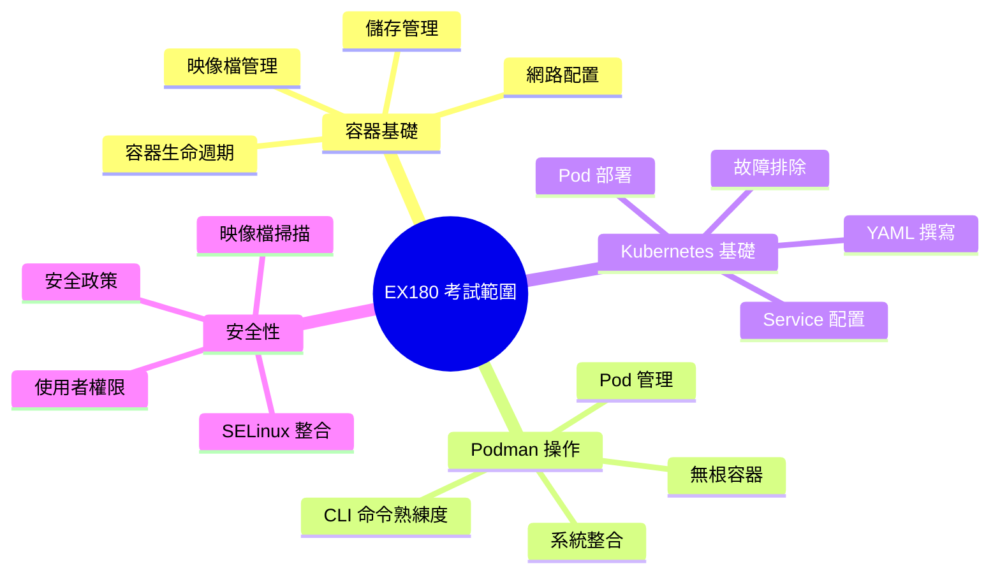

##### 具體考試主題

**1. 容器基礎知識 (25%)**
- 容器與映像檔概念
- 容器生命週期管理
- 映像檔建置與管理
- Registry 操作

**2. Podman 操作 (35%)**
- Podman CLI 熟練使用
- 無根容器執行
- Pod 建立與管理
- 儲存與網路配置

**3. Kubernetes 整合 (25%)**
- YAML 檔案撰寫
- Pod 部署與管理
- Service 與 Route 配置
- Kubernetes 對接

**4. 安全性與故障排除 (15%)**
- SELinux 容器政策
- 安全性最佳實踐
- 問題診斷與解決
- 日誌分析

#### 4.1.3 實務考試準備

##### 環境準備

```bash
# 建立練習環境
podman machine init --cpus 2 --memory 4096 --disk-size 20
podman machine start

# 安裝必要工具
sudo dnf install -y podman skopeo buildah
pip install podman-compose

# 設定練習專案
git clone https://github.com/containers/podman-bootcamp.git
cd podman-bootcamp
```

##### 核心命令練習清單

```bash
# 映像檔管理
podman search <term>
podman pull <image>
podman images
podman rmi <image>
podman build -t <tag> .
podman push <image>

# 容器管理
podman run <options> <image>
podman ps -a
podman start/stop/restart <container>
podman rm <container>
podman exec -it <container> <command>
podman logs <container>

# Pod 管理
podman pod create --name <name>
podman pod start/stop <pod>
podman pod ps
podman pod rm <pod>

# 系統管理
podman info
podman system df
podman system prune
podman volume ls/create/rm
podman network ls/create/rm
```

### 4.2 常見考題型態與解題練習

#### 🎯 學習目標

- 熟悉考試題型與解題策略
- 透過實務練習提升應試能力
- 掌握時間管理技巧

#### 4.2.1 實作題型分析

##### 題型一：容器部署與配置

**範例題目：**
使用 nginx:alpine 映像檔建立一個名為 `web-server` 的容器，要求：
1. 將主機的 8080 埠對應到容器的 80 埠
2. 掛載主機目錄 `/home/user/html` 到容器的 `/usr/share/nginx/html`
3. 設定環境變數 `NGINX_PORT=80`
4. 容器必須在背景執行

**標準解答：**

```bash
# 建立主機目錄
mkdir -p /home/user/html
echo "<h1>Test Page</h1>" > /home/user/html/index.html

# 啟動容器
podman run -d \
  --name web-server \
  -p 8080:80 \
  -v /home/user/html:/usr/share/nginx/html:Z \
  -e NGINX_PORT=80 \
  nginx:alpine

# 驗證容器狀態
podman ps
curl http://localhost:8080
```

##### 題型二：映像檔建置

**範例題目：**
建立一個自訂 Java 應用程式映像檔，要求：
1. 基於 `openjdk:17-jdk-alpine`
2. 複製應用程式 JAR 檔到 `/app/app.jar`
3. 建立使用者 `appuser` (UID: 1001)
4. 以非特權使用者執行
5. 暴露 8080 埠

**標準解答：**

```dockerfile
FROM openjdk:17-jdk-alpine

# 建立應用程式使用者
RUN addgroup -g 1001 appgroup && \
    adduser -D -u 1001 -G appgroup appuser

# 建立應用程式目錄
RUN mkdir -p /app && chown appuser:appgroup /app

# 複製應用程式檔案
COPY --chown=appuser:appgroup app.jar /app/app.jar

# 切換使用者
USER appuser

# 設定工作目錄
WORKDIR /app

# 暴露埠號
EXPOSE 8080

# 啟動命令
CMD ["java", "-jar", "app.jar"]
```

```bash
# 建置映像檔
podman build -t java-app:v1.0 .

# 執行驗證
podman run -d --name test-app -p 8080:8080 java-app:v1.0
```

##### 題型三：Pod 管理

**範例題目：**
建立一個名為 `webapp-pod` 的 Pod，包含兩個容器：
1. `nginx` 容器使用 `nginx:alpine` 映像檔
2. `app` 容器使用 `python:3.9-alpine` 映像檔
3. 兩個容器共享網路和儲存空間
4. 將主機的 8080 埠對應到 nginx 的 80 埠

**標準解答：**

```bash
# 建立 Pod
podman pod create --name webapp-pod -p 8080:80

# 啟動 nginx 容器
podman run -d \
  --pod webapp-pod \
  --name nginx \
  nginx:alpine

# 啟動 Python 應用容器
podman run -d \
  --pod webapp-pod \
  --name app \
  python:3.9-alpine \
  python -m http.server 8000

# 驗證 Pod 狀態
podman pod ps
podman ps --pod
```

#### 4.2.2 進階實作練習

##### 練習一：多容器應用部署

**目標：** 部署一個包含 Web 前端、API 後端和資料庫的完整應用

```bash
# 1. 建立自訂網路
podman network create app-network

# 2. 啟動資料庫
podman run -d \
  --name postgres-db \
  --network app-network \
  -e POSTGRES_DB=appdb \
  -e POSTGRES_USER=appuser \
  -e POSTGRES_PASSWORD=apppass \
  -v postgres_data:/var/lib/postgresql/data \
  postgres:13

# 3. 啟動 API 後端
podman run -d \
  --name api-backend \
  --network app-network \
  -e DB_HOST=postgres-db \
  -e DB_PORT=5432 \
  -e DB_NAME=appdb \
  api-backend:latest

# 4. 啟動 Web 前端
podman run -d \
  --name web-frontend \
  --network app-network \
  -p 8080:80 \
  -e API_URL=http://api-backend:8080 \
  web-frontend:latest

# 5. 驗證應用運行
curl http://localhost:8080
```

##### 練習二：安全性強化

**目標：** 實作容器安全性最佳實踐

```bash
# 1. 建立安全容器
podman run -d \
  --name secure-app \
  --user 1001:1001 \
  --security-opt no-new-privileges \
  --cap-drop=ALL \
  --cap-add=NET_BIND_SERVICE \
  --read-only \
  --tmpfs /tmp \
  --tmpfs /var/run \
  secure-app:latest

# 2. 檢查安全設定
podman inspect secure-app | jq '.[]SecurityOpt'
podman inspect secure-app | jq '.[]HostConfig.ReadonlyRootfs'
```

### 4.3 學習地圖與練習資源

#### 🎯 學習目標

- 建立系統性學習路徑
- 掌握有效的練習方法
- 了解持續學習資源

#### 4.3.1 階段性學習計畫

##### 第一階段：基礎建立（2-3週）

**第1週：容器基礎概念**
- [ ] 容器vs虛擬機器差異
- [ ] 映像檔與容器關係
- [ ] Podman vs Docker 比較
- [ ] 安裝與環境設定

**第2週：基本操作**
- [ ] 映像檔搜尋與下載
- [ ] 容器建立與管理
- [ ] 基本網路與儲存
- [ ] 日誌查看與除錯

**第3週：進階操作**
- [ ] Dockerfile 撰寫
- [ ] 映像檔建置
- [ ] Volume 管理
- [ ] 網路配置

##### 第二階段：實務應用（3-4週）

**第4週：Pod 與編排**
- [ ] Pod 概念與操作
- [ ] 多容器應用管理
- [ ] 服務發現與通信
- [ ] Compose 使用

**第5週：安全性實務**
- [ ] 無根容器
- [ ] SELinux 整合
- [ ] 安全掃描
- [ ] 權限管理

**第6週：CI/CD 整合**
- [ ] 自動化建置
- [ ] 部署流程
- [ ] 監控與日誌
- [ ] 故障排除

**第7週：Kubernetes 對接**
- [ ] YAML 撰寫
- [ ] Pod 部署
- [ ] Service 配置
- [ ] 疑難排解

##### 第三階段：認證準備（1-2週）

**第8週：考試準備**
- [ ] 模擬考試練習
- [ ] 弱點強化
- [ ] 時間管理練習
- [ ] 最終複習

#### 4.3.2 實務練習專案

##### 專案一：微服務應用

**目標：** 建立完整的微服務架構

```bash
# 專案結構
microservices-demo/
├── api-gateway/
│   ├── Dockerfile
│   ├── nginx.conf
│   └── src/
├── user-service/
│   ├── Dockerfile
│   ├── pom.xml
│   └── src/
├── order-service/
│   ├── Dockerfile
│   ├── pom.xml
│   └── src/
├── database/
│   ├── init-scripts/
│   └── docker-compose.yml
└── monitoring/
    ├── prometheus/
    ├── grafana/
    └── docker-compose.yml
```

**實作步驟：**

1. **建立基礎設施**
   ```bash
   # 建立網路
   podman network create frontend
   podman network create backend
   
   # 啟動資料庫
   podman run -d --name postgres \
     --network backend \
     -e POSTGRES_MULTIPLE_DATABASES=userdb,orderdb \
     -v ./database/init-scripts:/docker-entrypoint-initdb.d \
     postgres:13
   ```

2. **部署微服務**
   ```bash
   # 建置服務映像檔
   podman build -t user-service:v1 ./user-service
   podman build -t order-service:v1 ./order-service
   
   # 啟動服務
   podman run -d --name user-service \
     --network backend \
     user-service:v1
     
   podman run -d --name order-service \
     --network backend \
     order-service:v1
   ```

3. **配置 API Gateway**
   ```bash
   # 啟動 API Gateway
   podman run -d --name api-gateway \
     --network frontend \
     --network backend \
     -p 8080:80 \
     -v ./api-gateway/nginx.conf:/etc/nginx/nginx.conf:ro \
     nginx:alpine
   ```

##### 專案二：CI/CD 管道

**目標：** 建立自動化建置與部署流程

```yaml
# .github/workflows/ci-cd.yml
name: CI/CD Pipeline

on:
  push:
    branches: [ main ]
  pull_request:
    branches: [ main ]

jobs:
  test:
    runs-on: ubuntu-latest
    steps:
    - uses: actions/checkout@v2
    
    - name: Set up JDK 17
      uses: actions/setup-java@v2
      with:
        java-version: '17'
        distribution: 'adopt'
    
    - name: Run tests
      run: mvn test

  build-and-deploy:
    needs: test
    runs-on: ubuntu-latest
    if: github.ref == 'refs/heads/main'
    
    steps:
    - uses: actions/checkout@v2
    
    - name: Build with Maven
      run: mvn clean package
    
    - name: Build container image
      run: |
        podman build -t java-tutorial:${{ github.sha }} .
        podman tag java-tutorial:${{ github.sha }} java-tutorial:latest
    
    - name: Deploy to staging
      run: |
        podman stop java-tutorial-staging || true
        podman rm java-tutorial-staging || true
        podman run -d --name java-tutorial-staging \
          -p 8081:8080 \
          java-tutorial:latest
```

#### 4.3.3 學習資源與社群

##### 官方資源

1. **Red Hat 訓練課程**
   - DO180: Introduction to Containers, Kubernetes, and Red Hat OpenShift
   - DO188: Red Hat OpenShift Development I: Introduction to Containers
   - 線上實驗室：https://lab.redhat.com/

2. **官方文件**
   - Podman 官方文件：https://docs.podman.io/
   - Red Hat 產品文件：https://access.redhat.com/documentation/

##### 實務練習平台

1. **線上實驗室**
   - Katacoda：https://katacoda.com/courses/container-platform
   - Play with Docker：https://labs.play-with-docker.com/
   - Red Hat Developer Sandbox：https://developers.redhat.com/developer-sandbox

2. **開源專案貢獻**
   - Podman GitHub：https://github.com/containers/podman
   - Buildah GitHub：https://github.com/containers/buildah
   - 參與社群討論與 Bug 回報

##### 認證準備資源

1. **模擬考試**
   - Red Hat Learning Subscription
   - 第三方練習平台
   - 社群分享的練習題

2. **學習群組**
   - Red Hat 學習社群
   - LinkedIn 專業群組
   - Discord/Slack 技術頻道

---

## 5. 檢查清單

### 5.1 安裝驗證清單

#### Podman Desktop 安裝檢查

- [ ] **系統需求確認**
  - [ ] Windows 10/11 版本檢查
  - [ ] WSL2 已啟用並更新
  - [ ] 虛擬化功能已啟用
  - [ ] 至少 4GB RAM 可用空間
  - [ ] 至少 20GB 磁碟空間

- [ ] **Podman Desktop 安裝**
  - [ ] 從官方網站下載最新版本
  - [ ] 安裝程式執行無錯誤
  - [ ] 首次啟動成功
  - [ ] Podman Machine 初始化完成
  - [ ] 虛擬機器狀態為 "Running"

- [ ] **基本功能測試**
  - [ ] 拉取測試映像檔：`podman pull hello-world`
  - [ ] 執行測試容器：`podman run hello-world`
  - [ ] 檢視容器列表：`podman ps -a`
  - [ ] 清理測試容器：`podman rm -a`

- [ ] **CLI 整合測試**
  - [ ] PowerShell 中執行 `podman version`
  - [ ] 檢查 Podman Machine 狀態：`podman machine list`
  - [ ] 測試基本容器操作

### 5.2 開發環境設定清單

#### Java 開發環境

- [ ] **JDK 環境**
  - [ ] JDK 17 或更高版本已安裝
  - [ ] JAVA_HOME 環境變數設定正確
  - [ ] Maven 或 Gradle 建置工具可用

- [ ] **IDE 整合**
  - [ ] VS Code 安裝 Podman 擴充功能
  - [ ] IntelliJ IDEA Docker 外掛程式啟用
  - [ ] Eclipse Docker Tooling 可用

- [ ] **專案設定**
  - [ ] Dockerfile 已建立
  - [ ] .dockerignore 檔案已配置
  - [ ] Maven/Gradle 建置配置完成
  - [ ] 容器化測試通過

#### 容器開發工作流程

- [ ] **映像檔建置**
  - [ ] 基礎映像檔選擇適當
  - [ ] 多階段建置優化完成
  - [ ] 映像檔大小合理（< 500MB）
  - [ ] 安全性掃描通過

- [ ] **本地開發**
  - [ ] 開發容器設定完成
  - [ ] Volume 掛載正確
  - [ ] 熱重載功能正常
  - [ ] 除錯配置完成

### 5.3 專案部署清單

#### 單容器應用部署

- [ ] **預部署檢查**
  - [ ] 映像檔建置成功
  - [ ] 環境變數清單確認
  - [ ] 埠號衝突檢查
  - [ ] 依賴服務確認

- [ ] **部署執行**
  - [ ] 容器啟動成功
  - [ ] 健康檢查通過
  - [ ] 日誌輸出正常
  - [ ] 外部存取測試

- [ ] **部署後驗證**
  - [ ] 功能測試完整
  - [ ] 效能指標正常
  - [ ] 資源使用合理
  - [ ] 監控指標可見

#### 多容器應用部署

- [ ] **Compose 檔案準備**
  - [ ] services 定義完整
  - [ ] networks 配置正確
  - [ ] volumes 設定適當
  - [ ] 依賴關係明確

- [ ] **編排部署**
  - [ ] `podman-compose up` 成功
  - [ ] 所有服務正常啟動
  - [ ] 服務間通信正常
  - [ ] 負載平衡功能正常

### 5.4 安全性檢查清單

#### 映像檔安全

- [ ] **基礎映像檔**
  - [ ] 使用官方或認證映像檔
  - [ ] 基礎映像檔已更新到最新版本
  - [ ] 已知漏洞掃描通過
  - [ ] 不必要的套件已移除

- [ ] **映像檔建置**
  - [ ] 非特權使用者執行
  - [ ] 敏感資訊未寫入映像檔
  - [ ] 檔案權限設定正確
  - [ ] 建置過程可重現

#### 執行時安全

- [ ] **容器配置**
  - [ ] 使用非特權使用者
  - [ ] 只讀根檔案系統
  - [ ] 不必要的 capabilities 已移除
  - [ ] 安全性選項已設定

- [ ] **網路安全**
  - [ ] 網路隔離配置
  - [ ] 不必要的埠號未暴露
  - [ ] TLS 加密已啟用
  - [ ] 防火牆規則已設定

### 5.5 效能優化清單

#### 資源管理

- [ ] **記憶體優化**
  - [ ] 記憶體限制已設定
  - [ ] JVM 堆疊大小已調整
  - [ ] 記憶體洩漏檢查通過
  - [ ] OOM Killer 保護已啟用

- [ ] **CPU 優化**
  - [ ] CPU 限制已設定
  - [ ] CPU 親和性已優化
  - [ ] 多執行緒配置合理
  - [ ] CPU 使用率監控

#### 儲存與網路

- [ ] **儲存優化**
  - [ ] Volume 類型選擇適當
  - [ ] 磁碟 I/O 效能正常
  - [ ] 備份策略已制定
  - [ ] 清理政策已實施

- [ ] **網路優化**
  - [ ] 網路延遲最小化
  - [ ] 頻寬使用合理
  - [ ] 連接池配置優化
  - [ ] DNS 解析快速

### 5.6 故障排除清單

#### 常見問題診斷

- [ ] **容器啟動問題**
  - [ ] 檢查映像檔是否存在
  - [ ] 驗證啟動命令正確性
  - [ ] 確認環境變數設定
  - [ ] 檢查資源限制

- [ ] **網路連接問題**
  - [ ] 檢查埠號映射
  - [ ] 驗證網路配置
  - [ ] 確認防火牆設定
  - [ ] 測試 DNS 解析

#### 效能問題排查

- [ ] **資源瓶頸**
  - [ ] 監控 CPU 使用率
  - [ ] 檢查記憶體使用量
  - [ ] 分析磁碟 I/O
  - [ ] 評估網路流量

- [ ] **應用程式問題**
  - [ ] 檢查應用程式日誌
  - [ ] 分析錯誤訊息
  - [ ] 驗證配置設定
  - [ ] 執行健康檢查

### 5.7 認證考試準備清單

#### 知識準備

- [ ] **核心概念**
  - [ ] 容器 vs 虛擬機器差異
  - [ ] 映像檔與容器關係
  - [ ] Podman 架構理解
  - [ ] 無根容器概念

- [ ] **操作技能**
  - [ ] CLI 命令熟練度
  - [ ] Dockerfile 撰寫能力
  - [ ] Pod 管理技巧
  - [ ] 故障排除技能

#### 實務練習

- [ ] **實作練習**
  - [ ] 完成所有教學範例
  - [ ] 獨立完成專案練習
  - [ ] 模擬考試通過
  - [ ] 時間管理練習

- [ ] **準備工作**
  - [ ] 考試環境熟悉
  - [ ] 參考資料整理
  - [ ] 弱點強化完成
  - [ ] 心理狀態調整

### 5.8 日常維護清單

#### 定期檢查

- [ ] **系統維護**
  - [ ] Podman Desktop 版本更新
  - [ ] 系統資源使用檢查
  - [ ] 日誌輪替設定
  - [ ] 磁碟空間清理

- [ ] **安全性更新**
  - [ ] 基礎映像檔更新
  - [ ] 安全性掃描執行
  - [ ] 漏洞修補應用
  - [ ] 存取權限檢查

#### 備份與災難復原

- [ ] **資料備份**
  - [ ] Volume 資料備份
  - [ ] 配置檔案備份
  - [ ] 映像檔匯出
  - [ ] 備份測試驗證

- [ ] **災難復原**
  - [ ] 復原程序文件化
  - [ ] 復原測試執行
  - [ ] RTO/RPO 目標達成
  - [ ] 備援環境準備

---

## 🎯 總結

這份 Podman Desktop 使用教學手冊提供了從基礎入門到進階應用的完整學習路徑。透過系統性的學習和實務練習，新進開發同仁可以：

1. **快速上手** Podman Desktop 的安裝與基本操作
2. **掌握實務技能** 包含專案整合、容器管理、映像檔建置
3. **學習進階技巧** 涵蓋安全性管理、CI/CD 整合、Kubernetes 對接
4. **準備認證考試** 具備 Red Hat 容器認證所需知識
5. **建立最佳實務** 養成良好的容器化開發習慣

**建議學習順序：**
1. 先閱讀基礎入門章節，完成安裝設定
2. 透過專案實務應用章節，建立實際開發經驗
3. 學習進階操作與最佳實務，提升專業技能
4. 使用檢查清單驗證學習成果
5. 持續練習並參與社群討論

**持續學習資源：**
- 官方文件：https://docs.podman.io/
- 社群論壇：https://github.com/containers/podman/discussions
- Red Hat 訓練：https://www.redhat.com/en/services/training
- 實務練習：https://katacoda.com/courses/container-platform

記住，容器技術發展快速，建議定期關注最新發展並持續學習。祝您在容器化開發的路上順利前進！
     -p 8080:8080 \
     -p 5005:5005 \
     openjdk:17-jdk \
     sleep infinity
   ```

3. **遠端除錯配置**
   - Run → Edit Configurations
   - 點擊 "+" → Remote JVM Debug
   - Host: localhost
   - Port: 5005

##### 專案設定整合

**build.gradle.kts 或 pom.xml 整合：**

```xml
<!-- pom.xml 中的容器化支援 -->
<plugin>
    <groupId>org.springframework.boot</groupId>
    <artifactId>spring-boot-maven-plugin</artifactId>
    <configuration>
        <jvmArguments>
            -agentlib:jdwp=transport=dt_socket,server=y,suspend=n,address=*:5005
        </jvmArguments>
    </configuration>
</plugin>
```

#### 2.5.3 開發工作流程最佳實務

##### 容器化開發生命週期

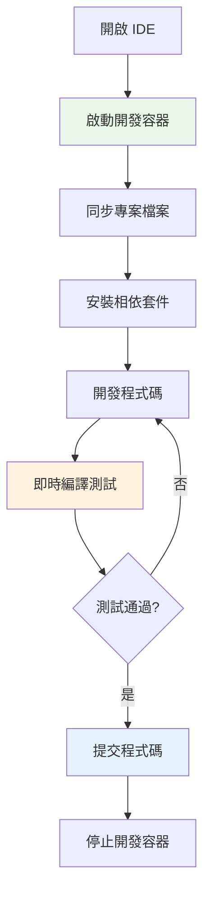

##### 多環境開發設定

**開發環境配置：**

```yaml
# docker-compose.dev.yml
version: '3.8'
services:
  app:
    build:
      context: .
      dockerfile: Dockerfile.dev
    volumes:
      - .:/workspace
      - maven-cache:/root/.m2
    environment:
      - SPRING_PROFILES_ACTIVE=dev
      - DEBUG=true
    ports:
      - "8080:8080"
      - "5005:5005"  # Debug port

  database:
    image: postgres:14
    environment:
      POSTGRES_DB: tutorial_dev
      POSTGRES_USER: dev
      POSTGRES_PASSWORD: devpass
    ports:
      - "5432:5432"

volumes:
  maven-cache:
```

##### 除錯與測試策略

**容器內除錯：**

```bash
# 啟動除錯模式
podman run -it --name debug-session \
  -v "$(pwd):/workspace" \
  -w /workspace \
  -p 8080:8080 \
  -p 5005:5005 \
  openjdk:17-jdk \
  java -agentlib:jdwp=transport=dt_socket,server=y,suspend=n,address=*:5005 \
  -jar target/app.jar
```

**測試環境隔離：**

```bash
# 執行整合測試
podman run --rm \
  -v "$(pwd):/workspace" \
  -w /workspace \
  --network test-network \
  maven:3.8.6-openjdk-17 \
  mvn test -Dspring.profiles.active=test
```

#### 2.5.4 生產力工具整合

##### Git 整合

**在容器內使用 Git：**

```bash
# 設定 Git 配置
podman exec -it dev-container git config --global user.name "Your Name"
podman exec -it dev-container git config --global user.email "your@email.com"

# 掛載 SSH 金鑰
podman run -it \
  -v ~/.ssh:/home/user/.ssh:ro \
  -v "$(pwd):/workspace" \
  dev-image
```

##### 效能監控

**開發環境效能監控：**

```bash
# 監控容器資源使用
podman stats dev-container

# 監控建置時間
time mvn clean package
```

#### 2.5.5 故障排除

##### 常見 IDE 整合問題

**問題：VS Code 無法連接到容器**

```bash
# 檢查容器狀態
podman ps -a

# 重新啟動容器
podman restart dev-container

# 檢查容器日誌
podman logs dev-container
```

**問題：IntelliJ 無法除錯**

```bash
# 確認除錯埠號開放
podman port debug-container

# 測試除錯連接
telnet localhost 5005
```

**問題：檔案同步問題**

```bash
# 檢查掛載點
podman inspect dev-container | grep -A 5 "Mounts"

# 重新掛載
podman run --rm -v "$(pwd):/workspace" alpine ls -la /workspace
```

#### ⚠️ IDE 整合注意事項

- 🔄 定期更新 IDE 擴充功能
- 📁 確保專案路徑對應正確
- 🚀 使用快取優化建置速度
- 🔍 設定適當的除錯斷點
- 💡 利用 IDE 的容器管理功能

---

## 第二部分完整總結

專案實務應用章節包含了完整的開發工作流程：

1. **專案整合**：Java 開發環境容器化與多容器架構
2. **容器管理**：完整的生命週期管理與監控
3. **映像檔管理**：建置、優化、安全性最佳實務
4. **儲存與網路**：Volume 持久化與網路隔離策略
5. **IDE 整合**：VS Code 與 IntelliJ IDEA 的完整整合

接下來我將撰寫第三部分「進階操作與最佳實務」，包含 Podman CLI 進階操作、Compose 支援、安全性管理等內容。您希望我繼續嗎？

---

## 3. 進階操作與最佳實務

### 3.1 Podman CLI 與 Desktop 搭配使用

#### 🎯 學習目標
- 掌握 Podman CLI 進階指令
- 學會 CLI 與 GUI 的最佳搭配方式
- 了解自動化腳本開發

#### 建議使用場景

| 任務類型 | 建議工具 | 理由 |
|---------|---------|------|
| 日常開發 | GUI + CLI | GUI 監控，CLI 快速操作 |
| 批次操作 | CLI | 腳本化，可重複執行 |
| 學習階段 | GUI | 視覺化，容易理解 |
| 生產環境 | CLI | 自動化，記錄化 |
| 除錯分析 | CLI | 詳細輸出，管道處理 |

---

### 3.2 Compose 支援與多容器應用管理

#### 🎯 學習目標
- 掌握 Podman Compose 的使用
- 學會複雜多容器應用的編排
- 了解服務發現與負載平衡

#### 基本 Compose 檔案結構

```yaml
version: '3.8'

services:
  webapp:
    build: .
    ports:
      - "8080:8080"
    depends_on:
      - database
    environment:
      - SPRING_PROFILES_ACTIVE=prod

  database:
    image: postgres:14
    environment:
      POSTGRES_DB: tutorial
      POSTGRES_USER: admin
      POSTGRES_PASSWORD: password
    volumes:
      - postgres-data:/var/lib/postgresql/data

volumes:
  postgres-data:
```

---

### 3.3 安全性與資源管理最佳實踐

#### 🎯 學習目標
- 掌握容器安全性最佳實務
- 學會資源限制與監控
- 了解合規性要求與稽核

#### 安全最佳實務清單

- 🔒 使用官方基礎映像檔
- 👤 始終使用非 root 使用者
- 🔐 妥善管理機密資訊
- 🌐 最小化網路暴露
- 📋 定期進行安全掃描

---

### 3.4 與 Kubernetes/OpenShift 對接基礎

#### 🎯 學習目標
- 了解 Podman 與 Kubernetes 的整合
- 學會生成 Kubernetes YAML
- 掌握 OpenShift 部署流程

#### 生成 Kubernetes YAML

```bash
# 從 Pod 生成 Kubernetes 部署檔案
podman generate kube web-pod > deployment.yaml
```

---

## 4. 認證考試準備

### 4.1 認證知識範圍

#### 🎯 學習目標
- 了解 Red Hat 容器認證要求
- 掌握考試重點知識領域
- 制定有效的學習計畫

#### Red Hat EX188 考試範圍

1. **容器和映像檔管理 (25%)**
2. **容器映像檔建置 (20%)**
3. **Pod 管理 (15%)**
4. **持久儲存 (15%)**
5. **網路配置 (10%)**
6. **安全性 (10%)**
7. **systemd 整合 (5%)**

---

### 4.2 常見考題型態與解題練習

#### 範例題目：容器基本操作

**任務：** 建立一個名為 "webapp" 的容器
- 使用 nginx:alpine 映像檔
- 對應埠號 8080:80
- 背景執行
- 開機自動啟動

**解答：**
```bash
podman run -d --name webapp -p 8080:80 nginx:alpine
podman generate systemd --new --files --name webapp
sudo systemctl enable container-webapp.service
```

---

### 4.3 學習地圖與練習資源

#### 學習計畫建議

**第1-2週：** 基礎概念與安裝
**第3-4週：** 容器與映像檔管理
**第5-6週：** Pod 與網路配置
**第7週：** 認證考試準備

---

## 5. 檢查清單

### 5.1 安裝驗證清單

#### Podman Desktop 安裝檢查

- [ ] **系統需求確認**
  - [ ] Windows 10/11 版本符合需求
  - [ ] 8GB+ RAM 可用
  - [ ] 50GB+ 磁碟空間
  - [ ] 虛擬化技術已啟用

- [ ] **WSL 2 設定**
  - [ ] WSL 功能已啟用
  - [ ] 虛擬機器平台已啟用
  - [ ] WSL 2 設為預設版本
  - [ ] Linux 發行版正常運作

- [ ] **Podman Desktop 安裝**
  - [ ] 應用程式安裝完成
  - [ ] Podman 機器初始化成功
  - [ ] Podman 機器啟動正常
  - [ ] GUI 介面正常顯示

- [ ] **功能驗證**
  - [ ] 可以執行基本容器 (`podman run hello-world`)
  - [ ] 可以下載映像檔
  - [ ] 容器狀態監控正常
  - [ ] 日誌查看功能正常

### 5.2 開發環境設定清單

#### Java 開發環境檢查

- [ ] **映像檔準備**
  - [ ] OpenJDK 17 映像檔已下載
  - [ ] Maven 工具映像檔已下載
  - [ ] 自訂開發映像檔建置成功

- [ ] **容器配置**
  - [ ] 專案目錄正確掛載
  - [ ] 埠號對應設定正確
  - [ ] 環境變數配置完成
  - [ ] 網路連接正常

- [ ] **IDE 整合**
  - [ ] VS Code 擴充功能已安裝
  - [ ] 開發容器配置完成
  - [ ] 除錯設定正常
  - [ ] IntelliJ IDEA Docker 外掛程式啟用

### 5.3 專案部署清單

#### 多容器應用部署檢查

- [ ] **應用架構**
  - [ ] Web 應用程式容器
  - [ ] 資料庫容器
  - [ ] 快取服務容器
  - [ ] 反向代理容器（如需要）

- [ ] **網路配置**
  - [ ] 自訂網路建立
  - [ ] 容器間網路連通
  - [ ] 外部存取設定
  - [ ] 安全性配置

- [ ] **資料管理**
  - [ ] Volume 建立與掛載
  - [ ] 資料持久化設定
  - [ ] 備份策略制定
  - [ ] 權限設定正確

- [ ] **服務監控**
  - [ ] 健康檢查設定
  - [ ] 日誌監控配置
  - [ ] 資源使用監控
  - [ ] 自動重啟策略

### 5.4 安全性檢查清單

#### 容器安全配置檢查

- [ ] **映像檔安全**
  - [ ] 使用官方或可信任的基礎映像檔
  - [ ] 定期更新映像檔
  - [ ] 安全掃描已執行
  - [ ] 弱點評估完成

- [ ] **運行時安全**
  - [ ] 非 root 使用者執行
  - [ ] 最小權限原則
  - [ ] 唯讀檔案系統（適用時）
  - [ ] 網路隔離設定

- [ ] **資料安全**
  - [ ] 機密資訊使用 secrets
  - [ ] 敏感資料加密
  - [ ] 存取控制設定
  - [ ] 稽核日誌啟用

### 5.5 效能優化清單

#### 資源管理檢查

- [ ] **容器資源限制**
  - [ ] CPU 限制設定
  - [ ] 記憶體限制設定
  - [ ] I/O 限制設定（如需要）
  - [ ] 資源監控啟用

- [ ] **映像檔優化**
  - [ ] 多階段建置使用
  - [ ] 層級數量最小化
  - [ ] .dockerignore 設定
  - [ ] 映像檔大小優化

- [ ] **儲存優化**
  - [ ] Volume 使用策略
  - [ ] 暫存檔案管理
  - [ ] 日誌輪替設定
  - [ ] 清理策略制定

### 5.6 故障排除清單

#### 常見問題檢查

- [ ] **安裝問題**
  - [ ] 檢查系統需求
  - [ ] 驗證權限設定
  - [ ] 確認網路連線
  - [ ] 查看錯誤日誌

- [ ] **容器問題**
  - [ ] 檢查容器狀態
  - [ ] 驗證映像檔完整性
  - [ ] 確認網路配置
  - [ ] 檢視容器日誌

- [ ] **效能問題**
  - [ ] 監控資源使用
  - [ ] 檢查磁碟空間
  - [ ] 網路連通性測試
  - [ ] 應用程式效能分析

### 5.7 認證考試準備清單

#### 考試技能檢查

- [ ] **基礎技能**
  - [ ] 容器建立、啟動、停止
  - [ ] 映像檔搜尋、下載、管理
  - [ ] 基本 Dockerfile 撰寫
  - [ ] CLI 指令熟練度

- [ ] **進階技能**
  - [ ] Pod 建立與管理
  - [ ] 網路配置
  - [ ] Volume 管理
  - [ ] systemd 整合

- [ ] **實務技能**
  - [ ] 故障排除能力
  - [ ] 安全性配置
  - [ ] 效能調優
  - [ ] 自動化腳本撰寫

### 5.8 日常維護清單

#### 定期維護工作

- [ ] **每日檢查**
  - [ ] 容器狀態監控
  - [ ] 日誌檢查
  - [ ] 資源使用監控
  - [ ] 備份狀態確認

- [ ] **每週檢查**
  - [ ] 映像檔更新檢查
  - [ ] 安全掃描執行
  - [ ] 清理無用資源
  - [ ] 效能報告檢視

- [ ] **每月檢查**
  - [ ] 系統更新檢查
  - [ ] 備份策略檢討
  - [ ] 安全政策更新
  - [ ] 技能學習評估

---

## 🎯 總結

這份 Podman Desktop 使用教學手冊提供了從基礎入門到進階應用的完整學習路徑。透過系統性的學習和實務練習，新進開發同仁可以：

1. **快速上手** Podman Desktop 的安裝與基本操作
2. **掌握實務技能** 包含專案整合、容器管理、映像檔建置
3. **學習進階技巧** 涵蓋安全性管理、CI/CD 整合、Kubernetes 對接
4. **準備認證考試** 具備 Red Hat 容器認證所需知識
5. **建立最佳實務** 養成良好的容器化開發習慣

**建議學習順序：**
1. 先閱讀基礎入門章節，完成安裝設定
2. 透過專案實務應用章節，建立實際開發經驗
3. 學習進階操作與最佳實務，提升專業技能
4. 使用檢查清單驗證學習成果
5. 持續練習並參與社群討論

**持續學習資源：**
- 官方文件：https://docs.podman.io/
- 社群論壇：https://github.com/containers/podman/discussions
- Red Hat 訓練：https://www.redhat.com/en/services/training
- 實務練習：https://katacoda.com/courses/container-platform

記住，容器技術發展快速，建議定期關注最新發展並持續學習。祝您在容器化開發的路上順利前進！
